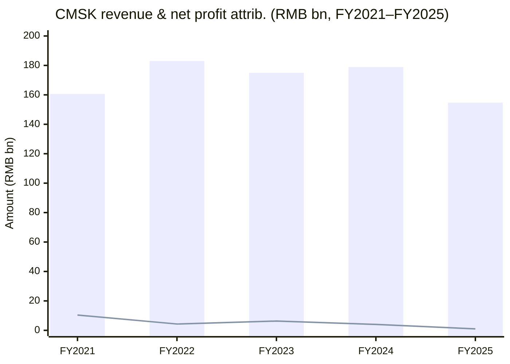
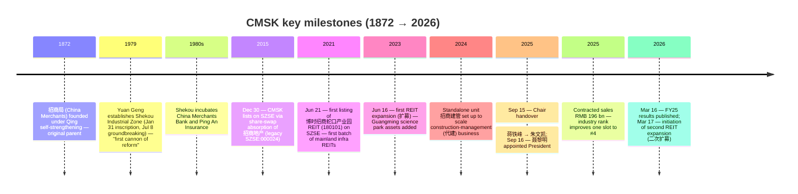
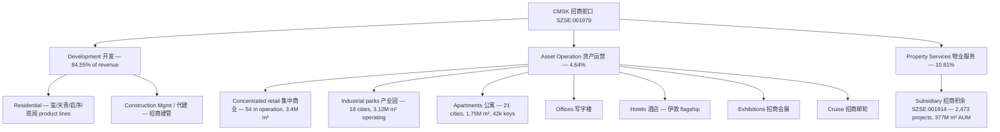
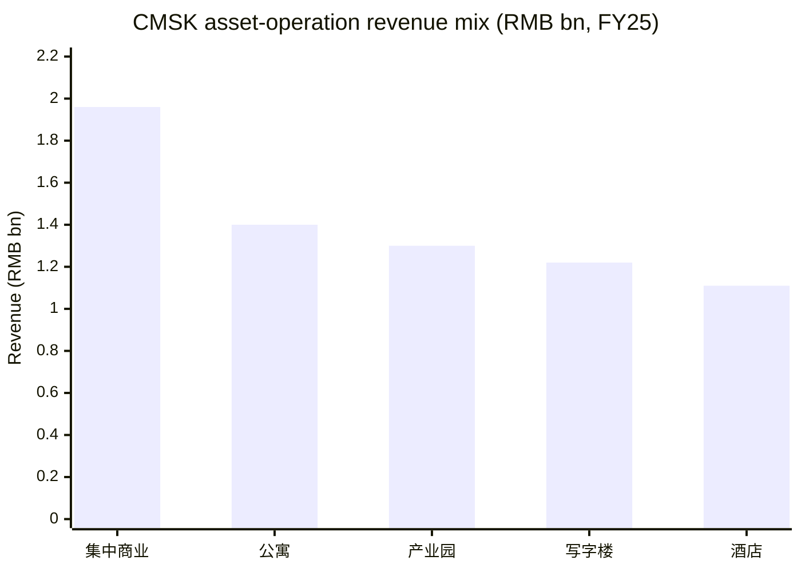
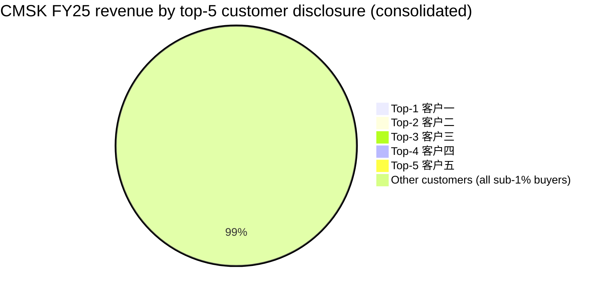
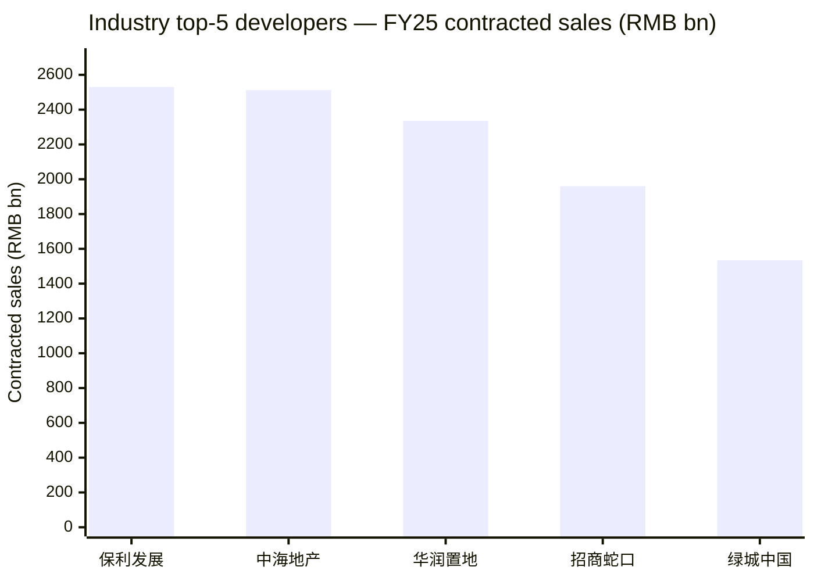
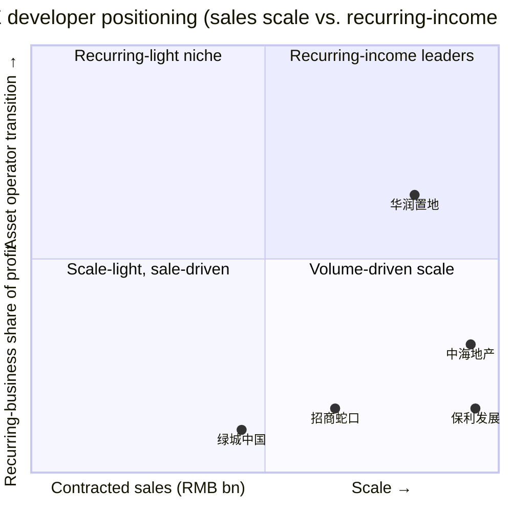
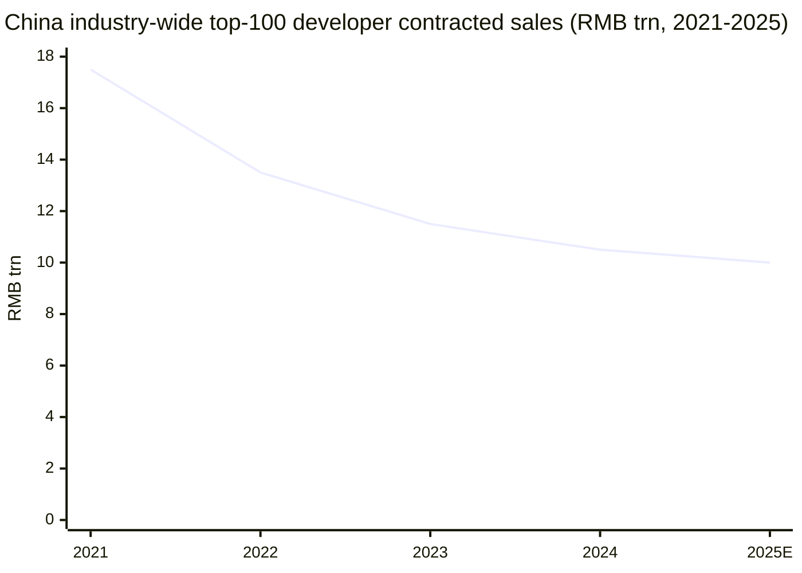

# China Merchants Shekou Industrial Zone Holdings (招商蛇口, SZSE:001979) — Company Research

**As of:** 2026-06-03
**Ticker:** SZSE:001979 (Shenzhen A-share) · CMSK · 招商局蛇口工业区控股股份有限公司
**HQ:** Shenzhen, Nanshan District, Shekou Taizi Road #1, Xin Shidai Plaza
**Listing:** Shenzhen Stock Exchange Main Board, re-listed Dec 30, 2015 via merger with Vanke-era 招商地产 (China Merchants Property)
**Chair / President:** 朱文凯 (Zhu Wenkai, Chairman, since Sep 2025) · 聂黎明 (Nie Liming, President, since Sep 2025)
**Controlling shareholder:** 招商局集团 (China Merchants Group, central-government-owned 央企)
**FY25 revenue:** RMB 154.73 bn (-13.5% YoY) · **Net income attrib.:** RMB 1.02 bn (-74.7% YoY) · **Contracted sales:** RMB 196.0 bn (#4 industry rank)
**Market cap (approx):** RMB 78 bn (Dec 2025) at ~CNY 8.65/share
**Auditor:** KPMG Huazhen LLP (毕马威华振)
**Three Red Lines (三道红线):** Green tier — net gearing 72.5%, cash-to-short-debt 1.19×, asset-liability ex-pre-sales 64.2%

> **2026 banner — distribution proposal:** the board has proposed a cash dividend of RMB 0.0511/share on a base of 9.016 bn shares, no bonus issue, per the FY2025 distribution plan tabled at the March 16, 2026 board meeting [招商蛇口 2025 年年度报告, 第 1 页](https://static.cninfo.com.cn/finalpage/2026-03-17/1225012651.PDF).

## Table of Contents

1. [Company Overview](#1-company-overview)
2. [Company History & Key Milestones](#2-company-history--key-milestones)
3. [Management Team](#3-management-team)
4. [Products & Services](#4-products--services)
5. [Customers & Listing Strategy](#5-customers--listing-strategy)
6. [Industry Overview](#6-industry-overview)
7. [Competitive Landscape](#7-competitive-landscape)
8. [Market Opportunity / TAM](#8-market-opportunity--tam)
9. [Risk Assessment](#9-risk-assessment)
10. [Investor-Lens Scorecards](#10-investor-lens-scorecards)
11. [References](#11-references)

---

## 1. Company Overview

China Merchants Shekou Industrial Zone Holdings ("CMSK", "招商蛇口", SZSE:001979) is the property-development, asset-operation and property-services arm of state-owned 招商局集团 (China Merchants Group, traceable to the 1872 founding of the original China Merchants Steamship Navigation Company under the late-Qing self-strengthening movement). Today's listed entity grew out of the 1979 Shekou Industrial Zone — the very first pilot zone of Chinese reform-and-opening — and was reorganized into a Shenzhen-listed property platform on December 30, 2015 via a share-swap absorption of legacy 招商地产 (China Merchants Property). The company's full Chinese name 招商局蛇口工业区控股股份有限公司, its English styling "CHINA MERCHANTS SHEKOU INDUSTRIAL ZONE HOLDINGS CO., LTD." and the abbreviation CMSK are all disclosed on page 3 of the [2025 年年度报告](https://static.cninfo.com.cn/finalpage/2026-03-17/1225012651.PDF), alongside the unified social credit code 914400001000114606 and the official IR mailbox `cmskir@cmhk.com`.

The business is run as a "1-3-3-3-4-1" strategy framework — one positioning ("中国领先的地产园区综合开发运营服务商"), three business lines (开发业务 development / 资产运营 asset operation / 物业服务 property services), three strategic levers (全面聚焦 / 质效并驱 / 轻重共赢), three operating shifts and four execution arms (精准投资 / 产品升级 / 运营增值 / 资产盘活), as restated in the FY2025 Management Discussion section [招商蛇口 2025 年年度报告, 第 6 页](https://static.cninfo.com.cn/finalpage/2026-03-17/1225012651.PDF). For FY2025 the segment mix landed at 开发 development 84.55% / 资产运营 asset-operation 4.64% / 物业服务 property services 10.81% of revenue [招商蛇口 2025 年年度报告, 第 45 页](https://static.cninfo.com.cn/finalpage/2026-03-17/1225012651.PDF).

**Headline financials (FY25 vs FY24 vs FY23, RMB):**

| Metric | FY2025 | FY2024 | YoY | FY2023 |
|---|---|---|---|---|
| Revenue | 154.73 bn | 178.95 bn | -13.5% | 175.01 bn |
| Net income attrib. to parent | 1.024 bn | 4.039 bn | -74.7% | 6.319 bn |
| Recurring net income (扣非) | 169 mn | 2.449 bn | -93.1% | 5.733 bn |
| Operating cash flow | 9.69 bn | 31.96 bn | -69.7% | 31.43 bn |
| Basic EPS | 0.08 | 0.37 | -78.4% | 0.65 |
| Weighted ROE | 0.73% | 3.36% | -2.63 pp | 6.04% |
| Total assets | 835.41 bn | 860.31 bn | -2.9% | 908.51 bn |
| Equity attrib. to parent | 97.65 bn | 111.01 bn | -12.0% | 119.72 bn |

Source: [招商蛇口 2025 年年度报告, 第 4 页](https://static.cninfo.com.cn/finalpage/2026-03-17/1225012651.PDF). The collapse in profitability tracks the four-year industry downturn: revenue declined as fewer projects converted from contracted sales to GAAP-recognised revenue (结转规模), while gross margin on development held at 15.33% (vs 15.58% in FY24 — barely a 25 bp slip thanks to first-tier-city mix [2024 年年度报告, 第 33 页](https://static.cninfo.com.cn/finalpage/2025-03-18/1222823028.PDF)). Asset-operation and property-services revenue grew (+0.32% and +8.35% respectively in FY25) — directly evidencing the strategic pivot from "开发为主" (development-led) to "开发与经营并重" (development + operation) [招商蛇口 2025 年年度报告, 第 45 页](https://static.cninfo.com.cn/finalpage/2026-03-17/1225012651.PDF).

*Source: revenue and net-income attrib. reconstructed from [招商蛇口 2025 年年度报告, 第 4 页](https://static.cninfo.com.cn/finalpage/2026-03-17/1225012651.PDF) (FY23-25) and [2024 年年度报告, 第 5 页](https://static.cninfo.com.cn/finalpage/2025-03-18/1222823028.PDF) (FY21-22 retrospective).*

**Valuation snapshot.** At a 2026-03-17 stock price of CNY 9.80 (post-FY25 results), CMSK trades on a TTM P/E ≈ 8.5× and P/B ≈ 0.75× per Dongfang Securities' coverage initiation note dated 2026-03-25 [招商蛇口 2026-03-25 研报, 东方财富网](https://pdf.dfcfw.com/pdf/H3_AP202603251820737829_1.pdf). That places CMSK at the low end of its five-year valuation band and well below its pre-2020 P/E median of ~15× per 亿牛网 historical PE data [招商蛇口 历史 PE/PB, 亿牛网](https://eniu.com/gu/sz001979). As of late Dec 2025 the stock sat at CNY 8.65 with a circulating market cap of ~RMB 78 bn and a dividend yield of ~2.23% per 雪球 stock-page snapshot [雪球 招商蛇口 SZ001979 行情, 2025-12-22](https://xueqiu.com/S/SZ001979). The peer group within the central-SOE developer cluster trades on a broadly similar band: 中海地产 (China Overseas Land & Investment, HKEX:688) at P/B ≈ 0.5×–0.7×, 华润置地 (CR Land, HKEX:1109) at P/B ≈ 0.5×–0.7×, 保利发展 (Poly Developments & Holdings, SSE:600048) at P/B ≈ 0.5×–0.6× per the [房企四强 PK 财务对比, 新浪财经](https://cj.sina.com.cn/articles/view/1682207150/644471ae02001hky8) cross-comparison.

*Analyst view:* the depressed P/E is itself a function of FY25's -75% net-income collapse — the multiple looks single-digit but the earnings denominator is also at a cyclical trough. Per 东吴证券's March 2026 update note, the FY26 base case implies meaningful EPS recovery as land-cost mix improves, putting forward P/E into the mid-teens — closer to historical median [招商蛇口 2026-03-19 研报, 东吴证券](https://pdf.dfcfw.com/pdf/H3_AP202603191820647086_1.pdf). Equally, the P/B near 0.75× is more meaningful — book equity is real (net assets attrib. RMB 97.65 bn) and CMSK trades at a meaningful discount to the recapitalisation cost of comparable land banks, which sustains the "central-SOE alpha + residual asset value re-rating" investment logic flagged by the broker community [招商蛇口 2026 年投资价值, 股百科](https://www.aigbk.com/article/investment_value_of_china_merchants_shekou_001979_sz_in_2026/).

## 2. Company History & Key Milestones

The CMSK story begins not in 2015 (the listing year) but in **January 31, 1979**, when 袁庚 (Yuan Geng), then deputy chairman of the Hong Kong-based 招商局集团, sailed back from Hong Kong to Shekou and famously wrote the slogan "时间就是金钱，效率就是生命" ("time is money, efficiency is life") on the Shekou docks. On July 8, 1979, the Shekou Industrial Zone broke ground — the first fully marketised industrial park on the Chinese mainland and the de-facto starting gun for the Reform & Opening era; the Communist Party historiography records that the explosion at Shekou that day was "改革开放第一炮" (the first cannon-shot of Reform & Opening) [袁庚：创造蛇口奇迹的改革先锋, 中央党史和文献研究院](https://www.dswxyjy.org.cn/n1/2022/0310/c434073-32371401.html). Under Yuan, Shekou pioneered roughly two-dozen "national firsts" — open recruitment, performance pay, commodified housing, social-insurance pooling — and incubated 招商银行 (China Merchants Bank) and 平安保险 (Ping An Insurance), both established at Shekou in the mid-1980s [深圳故事｜蛇口工业区：改革开放"第一炮"，深圳市档案馆](https://www.szdag.gov.cn/dawh/tqssn/content/post_931794.html).

Through the 1990s and 2000s the Shekou block sat under various ownership and corporate forms within 招商局集团. The current listed structure was completed on **December 30, 2015**, when 招商局蛇口工业区控股股份有限公司 was floated on the Shenzhen Stock Exchange Main Board via an A-share share-swap "absorption merger" of the legacy 招商地产控股股份有限公司 (formerly SZSE:000024), simultaneously issuing new shares to specified investors to raise matching financing. That share-swap process is documented in the standing post-IPO commitments table — "参与审议吸收合并方案的招商蛇口董事、监事及高级管理人员" — still tracked in the 2025 年年度报告 重要事项 section under "首次公开发行或再融资时所作承诺", commitment dated 2015-12-21 and marked "持续有效" / "报告期内严格履行了承诺" [招商蛇口 2025 年年度报告, 第 74 页](https://static.cninfo.com.cn/finalpage/2026-03-17/1225012651.PDF).

A few of those milestones are worth a closer look. The **June 21, 2021 listing of 博时招商蛇口产业园 REIT (180101)** made CMSK an early member of the first batch of mainland publicly traded infrastructure REITs, with the万融大厦 and 万海大厦 industrial-park assets in Shekou Net Valley as the founding portfolio. That was followed by the **June 16, 2023 first expansion (扩募)**, which folded in 招商局光明科技园 phase-2 incubator assets — the first-ever expansion of a Chinese infrastructure REIT, a regulatory milestone [博时招商蛇口产业园 REIT 6 月 16 日扩募上市, 中国基金报](https://www.chnfund.com/article/AR2023061615101050333948). The **second expansion** announced in April 2025 added more Guangming science-park buildings plus the 前海易港 W6/W7 warehouses to the REIT, making CMSK the first issuer in mainland China to take a public infrastructure REIT through a second expansion — a precedent that opens a real "投-融-建-管-退" (invest-finance-build-manage-exit) cycle for the asset-operation segment [博时蛇口产园 REIT 二次扩募, 新浪科技](https://finance.sina.com.cn/tech/roll/2025-04-24/doc-ineufhcc9296514.shtml). The **September 2025 chair handover** ended the Jiang Tiefeng era (Chair since Sep 2023) and brought 朱文凯 — President since Sep 2023 — into the chair seat, while 聂黎明 was appointed President; both transitions were formally disclosed in the September 16, 2025 board announcement [招商蛇口换"帅"：蒋铁峰因工作调动辞职，朱文凯升任董事长, 新浪财经](https://finance.sina.com.cn/jjxw/2025-09-16/doc-infqstck0713902.shtml).

The 2025 operational scorecard reads better than the income statement suggests: cumulative contracted sales of RMB 196.0 bn ranked the company #4 in the industry (up one slot YoY) per the Beijing News / 克而瑞 league table, with first-tier-city investment share rising from 59% (FY24) to 63% (FY25) [招商蛇口 2025 年年度报告, 第 7 页](https://static.cninfo.com.cn/finalpage/2026-03-17/1225012651.PDF), [2025 年末楼市翘尾 13 家房企集体增长, 中新网](https://www.chinanews.com.cn/cj/2026/01-14/10551410.shtml). The Top-4 ranking puts CMSK in the same league as the three other central-SOE majors — 保利发展, 华润置地, and 中海地产 — and ahead of the formerly-dominant 万科 (which dropped out of the top 5 in 1H25 per [2025 上半年房企销售排位, 新京报](https://m.bjnews.com.cn/detail/1751422158168905.html)).

## 3. Management Team

Per the company-research skill's scope rule, this section covers **only the founder-era figure and the current CEO**. CMSK's founding-era figure is essentially Yuan Geng of the Shekou Industrial Zone (covered briefly in Section 2 as historical context, not as current management); the equivalent "founder" of the listed 2015 entity is best understood as a continuous central-SOE governance line rather than an entrepreneurial individual.

**Current Chairman — 朱文凯 (Zhu Wenkai, Chairman since Sep 16, 2025).** Per the FY25 报告 management bio table, Zhu is a Senior Economist (高级经济师), Master's in Transportation Management Engineering from Wuhan University of Technology, age 58, currently serving as Chairman of the Board and Party Secretary. His prior 招商局 group track record (in chronological order) is: GM Assistant of 蛇口招商港务股份有限公司 (Shekou China Merchants Port Holdings); GM of 深圳蛇口招港实业发展有限公司; Manager of Strategy Dept and then GM of Marketing Centre at 招商地产; GM Assistant and then VP of 招商地产; Executive VP of CMSK; Party Secretary & GM of 招商局海南开发投资有限公司 (Hainan development arm); then President (总经理) of CMSK from Sep 2023 to Sep 2025, when he was elevated to Chairman; period-end shareholding 207,027 shares disclosed in the management compensation table [招商蛇口 2025 年年度报告, 第 62 页](https://static.cninfo.com.cn/finalpage/2026-03-17/1225012651.PDF). Zhu's first board term as Chair runs through Nov 2027 (board term end). His career arc — port operations, then Hainan-development arm, then home-base property — is unusual for a central-SOE property chair: he comes from the operations side rather than from financial or central-functions backgrounds, which is read by sell-side as supporting the company's stated "经营提质" (operating-quality) and "开发商+运营商+服务商" three-in-one strategic positioning.

**Current President — 聂黎明 (Nie Liming, President since Sep 16, 2025).** Bachelor's in Mechatronics and Engineering Machinery from Nanjing Institute of Architecture & Engineering, MBA from UESTC. Nie's prior track record: Deputy Director of Operations Centre, then GM of Yunnan, Chongqing, and Operations Centre at legacy 招商地产; Director of Operations Centre, then Deputy GM (executive) of Beihai region, GM of Beihai region, GM of Shenzhen region, then VP of CMSK; previously Director and Chairman of 招商积余 (the listed property-services subsidiary, SZSE:001914); and Department Head of 招商局集团 Industry Development / Business Coordination Dept before being appointed CMSK President. Period-end shareholding 89,000 shares [招商蛇口 2025 年年度报告, 第 62 页](https://static.cninfo.com.cn/finalpage/2026-03-17/1225012651.PDF). His path — operations role at legacy 招商地产 → regional GM → Chair of subsidiary 招商积余 → group-level Industry Development → President of parent CMSK — gives him cross-segment visibility (operations + property services + group-level industry development) that fits the new "三业务协同" model.

Both seats are central-SOE appointments orchestrated by 招商局集团 board governance; there is no founder shareholding or family-controlled overhang. The structural shareholder remains 招商局集团 via 招商局轮船 (中间控股 entity), with the State-owned Assets Supervision & Administration Commission of the State Council (SASAC) as the ultimate state owner. The 重要事项 section of the FY25 报告 confirms "公司报告期内不存在同业竞争情况" (no horizontal-competition issues within the group) — a critical disclosure for an SOE-controlled listco where intra-group land transactions are routinely scrutinised [招商蛇口 2025 年年度报告, 第 62 页](https://static.cninfo.com.cn/finalpage/2026-03-17/1225012651.PDF).

## 4. Products & Services

CMSK organises its operating activities around three primary segments — **Development (开发业务), Asset Operation (资产运营), and Property Services (物业服务)** — together with two sub-platforms whose strategic role outsizes their accounting weight: **construction management / 代建 (招商建管)** and **public REIT-led asset recycling (博时蛇口产园 REIT, 180101)**. The FY2025 revenue mix is heavily skewed toward development (84.55%), but the strategic ambition disclosed in the management section is explicitly to migrate the business towards a more balanced "开发+经营+服务" three-pillar model [招商蛇口 2025 年年度报告, 第 6 页](https://static.cninfo.com.cn/finalpage/2026-03-17/1225012651.PDF).

The FY2025 segment table embedded in the annual filing reproduces literally as:

| Segment | FY25 Revenue (RMB '0000) | FY25 share | FY24 Revenue (RMB '0000) | FY24 share | YoY change |
|---|---|---|---|---|---|
| 开发业务 Development | 13,082,934.50 | 84.55% | 15,636,122.56 | 87.38% | -16.33% |
| 资产运营 Asset Operation | 717,281.93 | 4.64% | 714,963.12 | 3.99% | +0.32% |
| 物业服务 Property Services | 1,672,581.27 | 10.81% | 1,543,668.98 | 8.63% | +8.35% |
| **Total** | **15,472,797.70** | **100%** | **17,894,754.66** | **100%** | **-13.53%** |

Source: [招商蛇口 2025 年年度报告, 第 45 页](https://static.cninfo.com.cn/finalpage/2026-03-17/1225012651.PDF). The same page reports gross margin by segment as 开发 15.33% (down 0.25 pp YoY) and 物业服务 10.59% (down 0.28 pp), with 资产运营 carrying a negative margin in FY25 driven by depreciation and ramp-up costs.

### 4.1 Development (开发业务) — the cash engine

Development remains the largest revenue contributor and is itself sub-divided into the core residential-and-mixed-use business (sold inventory) and an increasingly important asset-light construction-management ("代建") channel. The FY25 annual quotes the operating posture verbatim:

> "作为绿色人居的探路者、实践者和领跑者，公司坚持区域聚焦、城市深耕。深入贯彻'安全、舒适、绿色、智慧'的好房子国家标准，研发并落地'招商蛇口好房子'技术体系，打造品质人居、绿色人居、智慧人居。'玺系''揽阅系''启序系''天青系'等住宅产品，以持续迭代的品质升级居住体验。代建业务积极发挥核心开发能力优势，推动政府代建、商业代建等轻资产业务，业态涵盖住宅公寓、产业商办、文体艺术等九大领域，赋能公司多业务协同发展。"
> — [招商蛇口 2025 年年度报告, 第 6-7 页](https://static.cninfo.com.cn/finalpage/2026-03-17/1225012651.PDF)

The four named residential product lines are 玺 (Xi — top-end urban luxury, "city-top luxury gene with bespoke high-end specifications"), 揽阅 (Lan Yue — urban "free-living" / lifestyle), 启序 (Qi Xu — region-grade premium with forward-looking design language and local cultural rooting), and 天青 (Tian Qing — "Eastern hidden-luxury aesthetic" via spatial deconstruction). Their FY25 product-line execution included 20+ benchmark first-openings exceeding internal sell-through models, with named flagship projects including 上海康定壹拾玖, 成都招商玺, 成都锦城序, 长沙招商序, 西安梧桐书院, 上海林屿湖畔 — 15 of which made the 2025 全国年度/半年度十大作品 industry-association lists [招商蛇口 2025 年年度报告, 第 7 页](https://static.cninfo.com.cn/finalpage/2026-03-17/1225012651.PDF). The corresponding "招商蛇口 好房子品质标准" was disclosed in the management section as a 7-dimension / 28-scenario / 485-technical-detail framework rolled out across 20+ flagship projects.

**Plain-language gloss / 中文释义:** "玺系" pitches at the rare-asset tier — the kind of CNY 100k-per-square-metre Shanghai Kangding-19 / Beijing Daxing 招商玺 development that prints headline ASPs and supports brand prestige but is volume-modest. "揽阅" and "启序" are the workhorses in the upper-mid tier where mortgage demand from the urban professional class lives. "天青" is the cultural / region-cultural skinning of the same residential base. The pattern matches the industry's broader bifurcation between rare core-city premium ("好房子" / good-house) demand and the structurally weak commodity-volume tier.

FY25 cumulative contracted sales: **RMB 196.0 bn** (~7.16 mn m² area) — industry rank improved one slot to #4. Land acquisition: 43 plots with total developable area 4.4 mn m², total land cost RMB 93.8 bn (company's payable share ~RMB 54.3 bn). "Core-10-city" investment share approached 90%; first-tier share rose to 63% from FY24's 59%, with named acquisitions of 5 plots in Shanghai, 3 each in Shenzhen / Beijing / Chengdu / Hangzhou, 2 in Xi'an [招商蛇口 2025 年年度报告, 第 7 页](https://static.cninfo.com.cn/finalpage/2026-03-17/1225012651.PDF).

**Construction-management (代建).** The 代建 sub-segment — set up as a stand-alone unit 招商建管 in March 2024 to scale the asset-light flow — booked 80 new mandates (including consultancy) in FY25, +11.39 mn m² of contracted area, contract revenue +RMB 800 mn. Cumulative since inception 620+ projects, 35+ mn m² under management across categories spanning convention centres, industrial / commercial space, residential / serviced apartments, healthcare / aged-care, sports / cultural centres, schools, civic parks, and water-related infrastructure — newly-signed scale, comprehensive capability and product-power all in the industry TOP-10 per the company's own ranking citations [招商蛇口 2025 年年度报告, 第 7 页](https://static.cninfo.com.cn/finalpage/2026-03-17/1225012651.PDF).

### 4.2 Asset Operation (资产运营) — the moat in formation

Asset Operation is small in revenue weight (4.64% in FY25) but is the segment management is most explicitly trying to scale. The disclosed sub-segment KPIs in the FY25 report (which double as the running KPIs for the 投融建管退 recycling cycle, including future REIT expansions) are:

| Sub-segment | Projects in operation | Operating GFA (m²) | Under-construction GFA (m²) | FY25 revenue | Mature occupancy |
|---|---|---|---|---|---|
| 集中商业 Concentrated retail | 54 | ~3.40 mn | ~1.85 mn | RMB 1.96 bn | 93% (3-yr+ projects) |
| 产业园 Industrial parks | 18 cities | ~3.12 mn | ~0.61 mn | RMB 1.30 bn | 88% (3-yr+ projects) |
| 公寓 Apartments | 21 cities, 42k keys | ~1.75 mn | ~0.63 mn (1.4k keys) | RMB 1.40 bn | 93% (1-yr+ premium) |
| 写字楼 Offices | n/a | n/a | n/a | RMB 1.22 bn | n/a |
| 酒店 Hotels | 旗舰 伊敦 brand | n/a | n/a | RMB 1.11 bn | n/a |
| **Total managed real-estate revenue (under management)** | — | — | — | **RMB 7.63 bn** | — |

Source: [招商蛇口 2025 年年度报告, 第 7-9 页](https://static.cninfo.com.cn/finalpage/2026-03-17/1225012651.PDF). Total managed-real-estate revenue is the under-management figure (which includes light-asset operations) — the reported segment revenue of RMB 7.17 bn reflects consolidated-and-recognised revenue on the parent income statement.

*Source: [招商蛇口 2025 年年度报告, 第 7-9 页](https://static.cninfo.com.cn/finalpage/2026-03-17/1225012651.PDF).*

**Why each sub-segment matters in the customer / strategic flow:**

- **Concentrated retail (集中商业)** — the "X+商业" strategy uses retail anchors to drive land-bank uplift in mixed-use master plans. Named FY25 openings 南京玄武花园城 (>50% first-store ratio with a rooftop observatory and "Tree of Life" feature), 杭州城北花园城 (Hangzhou's first XOD complex with 131 first-stores), and 深圳太子湾 VILLA show the format positioning towards lifestyle and "first-store" curation rather than purely transaction-driven retail. The 93% mature-occupancy reading is a key asset-quality datapoint.
- **Industrial parks (产业园)** — 18-city footprint, branded as 网谷 (Net Valley / 科创园 sci-tech park), 意库 (Yi Ku / 文创园 cultural-creative), 智慧城 (Wise City / 智造园 advanced-manufacturing). The disclosed tenant base includes 29 national-grade "小巨人" SMEs, 155 provincial-grade 专精特新 ("specialized, refined, distinctive, novel" — MIIT designation), 29 高瞪羚 gazelle companies and 301 national-grade high-tech enterprises. The strategic add-on is the "招信低空" JV announced in FY25 — bringing in 零重力飞机工业, 丰翼科技 and 英武智能 to build a low-altitude-economy cluster in 前海-蛇口 [招商蛇口 2025 年年度报告, 第 7-8 页](https://static.cninfo.com.cn/finalpage/2026-03-17/1225012651.PDF). The industrial-park unit has held the #1 "中国产业园区运营商TOP50" ranking from 方升 for seven consecutive years.
- **Apartments (公寓)** — 21 cities, 4.2 mn m² of operating leasable area, 42k keys, with FY25 new launches 92% in tier-1 cities. The flagship 上海壹间·新桥 G60 科创云廊 social community is described as CMSK's first end-to-end Shanghai project (land acquisition → planning → development → long-hold operation) and is positioned as the pilot model for replication. The mature 1-year+ occupancy reading of 93% and named ramp examples (上海壹间虹桥公馆三期 100% within 5 months, 上海静安壹棠 99% within 5 months, 深圳壹间网谷 88% within 4 months) show the segment is performing operationally even in a weak rental-rate environment.
- **Offices (写字楼)** — FY25 leasing transaction area >330k m², net absorption >80k m².
- **Hotels (酒店)** — the 伊敦 brand was relaunched at the 深圳南山伊敦酒店 (3-year refurbishment of a Reform-era heritage building), positioned as urban-renewal showcase.

Plus two narrower sub-segments — **招商会展** (Exhibitions) served >7 mn m² of exhibition area in FY25 across 深圳国际会展中心, 杭州大会展中心 and 中国重庆科学会堂 with 200+ event-days; and **招商邮轮** (Cruise) carried 4.198 mn passengers on water-passenger lines plus new low-altitude / cross-border helicopter joint ventures [招商蛇口 2025 年年度报告, 第 9 页](https://static.cninfo.com.cn/finalpage/2026-03-17/1225012651.PDF).

### 4.3 Property Services (物业服务) — via 招商积余 (SZSE:001914)

Property services run through listed subsidiary 招商积余 (SZSE:001914), in which CMSK is the controlling shareholder. The FY25 numbers reported up to the parent:

- Revenue **RMB 19.27 bn** (+12.23% YoY).
- Net income attrib. **RMB 655 mn** (-22.12% YoY, but +8.30% excluding a one-off RMB 256 mn loss from disposing the 衡阳中航 project).
- Projects under management: **2,473** with **377 mn m²** AUM.
- Third-party new annual contract value **RMB 4.17 bn** (+13% YoY) — aviation segment new contracts +85%, university segment +25%, IFM segment +15%, market-residential +60%.

Source: [招商蛇口 2025 年年度报告, 第 9 页](https://static.cninfo.com.cn/finalpage/2026-03-17/1225012651.PDF). The named industry rankings include "2025 中国物业服务企业综合实力 500 强 TOP3" — a top-tier ranking for what is one of the few state-controlled property-services operators of scale [中国房地产年报点评, 克而瑞](http://res1.cric.com/cricbiz/c3/7c/46/01-5e8f-475c-a04a-ff73a83b1167.pdf).

### 4.4 The investment-financing-build-manage-exit loop (投融建管退)

The most consequential product-strategy framework CMSK runs is the "investment → financing → build-out → operation → REIT exit" loop disclosed across the management section: development feeds the holding assets; the holding assets are operationally stabilised by Asset Operation; mature stabilised assets are recycled via the **博时招商蛇口产业园 REIT (180101)** — first listed June 21, 2021 with the 万融大厦 / 万海大厦 Shekou Net Valley industrial parks as founding portfolio, first expanded June 16, 2023 to include 招商局光明科技园 phase-2 incubators (the first-ever expansion of a Chinese infrastructure REIT) and now undergoing a **second expansion** announced in April 2025 to fold in further Guangming science-park assets plus 前海易港 / 前海易保 W6/W7 warehouses [博时蛇口产园 REIT 二次扩募, 新浪科技](https://finance.sina.com.cn/tech/roll/2025-04-24/doc-ineufhcc9296514.shtml), [博时蛇口产园 REIT 公告档案, 天天基金网](https://fundf10.eastmoney.com/jjgg_180101_3.html). By year-end 2024 CMSK managed ~590k m² through the REIT platform with managed-caliber revenue of RMB 813 mn, and the REIT delivered RMB 142 mn of distributable cash, +19.82% YoY per the disclosed fund operating data [博时蛇口产园 REIT 6 月 16 日扩募上市, 中国基金报](https://www.chnfund.com/article/AR2023061615101050333948).

The strategic significance: CMSK is one of the very few mainland developers with a fully institutionalised "build-and-sell + build-and-hold + REIT-exit" loop. This is the structural feature that distinguishes CMSK from build-and-sell-only peers like 保利发展 (light on commercial holdings) and to a lesser degree from 中海地产 (which builds-and-holds but has historically managed its commercial REIT via the HK-listed 中海商业信托 rather than a mainland infrastructure REIT). In effect, CMSK is the only A-share-listed mainland developer that has cleared the regulatory path for **first-ever-expansion and now-first-ever-second-expansion** of a public infrastructure REIT — a real moat for the "建-管-退" cycle.

### 4.5 Section synthesis

The three segments interact as a cycle: Development generates the inventory and recurring profitability; Asset Operation builds the holding-asset cash-flow base out of newly-completed mixed-use schemes; Property Services through 招商积余 captures the operating-services margin layer across the resulting installed base; and the REIT platform recycles mature stabilised assets back into financing fuel for new Development land buys. The strategic shift management has been pressing — "由开发为主向开发与经营并重转变，由重资产为主向轻重资产结合转变，由同质化竞争向差异化发展转变" [招商蛇口 2025 年年度报告, 第 6 页](https://static.cninfo.com.cn/finalpage/2026-03-17/1225012651.PDF) — is unambiguous about the destination but the FY25 segment mix (84.55% / 4.64% / 10.81%) shows the journey is still early. The asset-operation share has been climbing only at +0.65pp per year — the build-up of holding-asset cash-flow as a buffer to development cyclicality is real but not yet a thesis-changing scale.

## 5. Customers & Listing Strategy

CMSK's customer base is structurally fragmented because residential property's end-buyer is the retail mortgage customer, not enterprises. The FY25 disclosure of "前五名客户合计销售金额" is therefore unusually small in percentage terms, but the data points are precise.

**Top-5 customer concentration (consolidated, FY2025).** The 前五名客户合计销售金额 was RMB 2.303 bn (= 1.48% of total revenue), broken down as:

| Rank | Customer | Sales (RMB '0000) | % of consolidated revenue |
|---|---|---|---|
| 1 | 客户一 | 66,972.48 | 0.43% |
| 2 | 客户二 | 62,540.29 | 0.40% |
| 3 | 客户三 | 40,925.78 | 0.26% |
| 4 | 客户四 | 31,174.31 | 0.20% |
| 5 | 客户五 | 28,680.73 | 0.19% |
| | **Total** | **230,293.59** | **1.48%** |

Source: [招商蛇口 2025 年年度报告, 第 46 页](https://static.cninfo.com.cn/finalpage/2026-03-17/1225012651.PDF). The corresponding FY24 figure was 0.96% with top-5 aggregate of RMB 1.723 bn [2024 年年度报告, 第 34 页](https://static.cninfo.com.cn/finalpage/2025-03-18/1222823028.PDF). CMSK does not name the top-5 customers individually (a common A-share practice for retail-mortgage-driven businesses where customer-name disclosure conveys little informational value); they are pseudonymised as 客户一 through 客户五 in the disclosure.

*Source: [招商蛇口 2025 年年度报告, 第 46 页](https://static.cninfo.com.cn/finalpage/2026-03-17/1225012651.PDF). Denominator: consolidated revenue of RMB 154.73 bn (FY2025). The "Other customers" slice covers the residential retail-mortgage base, which has no individual customer above 1%.*

**Geographic mix (consolidated).** The FY25 split by region:

| Region | FY25 Revenue (RMB '0000) | FY25 share | YoY |
|---|---|---|---|
| 北部地区 Northern | 1,656,888.03 | 10.71% | +10.44% |
| 东部地区 Eastern | 6,463,110.59 | 41.77% | -19.83% |
| 南部地区 Southern | 3,973,473.47 | 25.68% | -7.27% |
| 中西部地区 Central-Western | 3,379,325.61 | 21.84% | -16.51% |

Source: [招商蛇口 2025 年年度报告, 第 45 页](https://static.cninfo.com.cn/finalpage/2026-03-17/1225012651.PDF). Note that the company restructured its regional reporting buckets in FY25 (previously 华北 / 华东 / 江南 / 华西 / 华南 / 海外 — see [2024 年年度报告, 第 33 页](https://static.cninfo.com.cn/finalpage/2025-03-18/1222823028.PDF) for the prior-year comparable, restated). The persistently large Eastern share (>40%) reflects CMSK's deep Shanghai + Yangtze Delta exposure; Southern (Shenzhen + Pearl River Delta) is the cultural-historical home base.

```mermaid
xychart-beta
    title "CMSK revenue by region (RMB bn, FY25 vs FY24)"
    x-axis ["Northern", "Eastern", "Southern", "Central-Western"]
    y-axis "Revenue (RMB bn)" 0 --> 90
    bar [16.57, 64.63, 39.73, 33.79]
    bar [15.00, 80.62, 42.85, 40.48]
```

*Source: [招商蛇口 2025 年年度报告, 第 45 页](https://static.cninfo.com.cn/finalpage/2026-03-17/1225012651.PDF), [2024 年年度报告, 第 33 页](https://static.cninfo.com.cn/finalpage/2025-03-18/1222823028.PDF) restated.*

**Listing strategy.** CMSK is a central-SOE that prioritises long-term institutional shareholders and ESG-rated investor engagement: in FY25 alone, the company received **>110 investor visits** spanning 国内外 brokers and institutional asset-managers, including Abu Dhabi Investment Authority, Morgan Stanley, Citi Group, BoA Securities, JPMorgan, UBS Securities, DBS, BlackRock-affiliated funds and others on the foreign side, plus China Securities, CITIC, GF, Huatai, Soochow, Guangfa and so on on the domestic side; the full list is reproduced in the FY25 annual [招商蛇口 2025 年年度报告, 第 59-60 页](https://static.cninfo.com.cn/finalpage/2026-03-17/1225012651.PDF). CMSK was also one of the early adopters of the formal "市值管理制度" and "估值提升计划" frameworks required by 国务院 SOE supervision guidelines, having approved the "市值管理制度" on Dec 30, 2024 and a separate "估值提升计划" on Feb 6, 2026 [招商蛇口 2025 年年度报告, 第 61 页](https://static.cninfo.com.cn/finalpage/2026-03-17/1225012651.PDF). Net effect: CMSK is one of the more institutionally-followed central-SOE developers in the Shenzhen Main Board universe, with MSCI ESG rating of A (the highest among A-share property developers).

## 6. Industry Overview

The Chinese property industry is in **year 4** of the deepest peace-time correction in its modern history. The official policy line, restated in the FY25 annual report, is that the sector has moved "从快速增长期转向稳定发展期" (from rapid-growth phase to stable-development phase), with the focus shifting from "大规模增量扩张" (large-scale incremental expansion) to "存量提质增效" (stock-portfolio quality and efficiency) — a clear top-down articulation made at the Central Urban Work Conference and the "十五五" planning recommendations cited in the management discussion section [招商蛇口 2025 年年度报告, 第 6 页](https://static.cninfo.com.cn/finalpage/2026-03-17/1225012651.PDF).

In 2025, the industry's macro datapoints stabilised but did not yet recover. The annual report quotes a national GDP growth of **5%** for 2025 (RMB 140.2 trn nominal), with new-build sales volume and value both declining at narrower YoY rates than in 2023-24, and first-tier-plus-core-tier-2 city demand for "good houses" (好房子) emerging as the demand pocket holding up. Secondary-market sales scale and share continued to rise, reflecting an industry that is gradually de-leveraging from new-build dependence [招商蛇口 2025 年年度报告, 第 6 页](https://static.cninfo.com.cn/finalpage/2026-03-17/1225012651.PDF). The new 住宅项目规范 ("Residential Project Specifications") technical standard came into effect in 2025 and is positioned by management as a major industry-quality reset — but its implementation cost compression on margin is also material.

**Three-segment industry framework**:

1. **New-build sale**, where transaction volume and value contracted for the fourth year. Industry concentration has continued rising — the central-SOE majors (保利发展 / 中海 / 华润置地 / 招商蛇口) now occupy 4 of the top 5 spots, with the formerly-dominant private 万科 falling out of the top 5 in 1H25 per [2025 上半年房企销售排位, 新京报](https://m.bjnews.com.cn/detail/1751422158168905.html).
2. **Commercial holding / asset operation**, where 购物中心 (shopping mall) vacancy is rising and product-rotation pressure has intensified, but where the public REIT market has progressed from infra-only to "covering commercial office, hotel, urban-renewal, tourism, and aged-care" — the regulatory unlock that justifies CMSK's investment in the Asset Operation segment as a strategic destination. The 2025 公募 REITs market is described in the annual report as having entered a "常态化发行与稳定发展" (normalised-issuance + stable-development) phase, with "新发 + 扩募" (new + expansion) as the twin growth drivers [招商蛇口 2025 年年度报告, 第 6 页](https://static.cninfo.com.cn/finalpage/2026-03-17/1225012651.PDF).
3. **Property services**, where new-build supply is slowing in lock-step with the new-build sale slowdown, forcing the industry to compete on existing-stock service quality, digitisation, and value-added services. The annual report explicitly flags this as a transition from "低价竞争" (price-only competition) to "标准化、数字化" (standardisation + digitisation), with rigid-cost pressures eroding mid-tier player margins.

For the segment-specific quantitative context the company itself stipulates in its FY25 disclosure: 2025 industry-wide top-100 contracted sales held roughly flat YoY through July (per the 克而瑞 / China Real Estate Top 100 league table, [《2025 年 1-7 月中国房地产企业销售 TOP100》排行榜, 克而瑞](http://res1.cric.com/cricbiz/3f/f5/82/6a-ce7c-41cf-97d2-c03819c2d1fc.pdf)), with the central-SOE majors gaining share. Asset-operation: shopping-mall openings were down YoY industry-wide, but the new mall openings that did happen leaned heavily into "first-store" curation and lifestyle programming. Apartments: rental rates touched 5-year lows. Industrial parks: tenant demand normalised. Property services: industry-wide new-project supply slowed, third-party residential service capture increased.

*Source: industry contracted-sales rankings per [2025 年末楼市翘尾 13 家房企集体增长, 中新网](https://www.chinanews.com.cn/cj/2026/01-14/10551410.shtml).*

## 7. Competitive Landscape

CMSK competes primarily within the cluster of **central-SOE-controlled property developers** that have emerged as the dominant force in the post-2022 correction. The competitive landscape narrative in the FY25 annual report does not name specific competitors at the 10-K-style "primary competitor" level — Chinese A-share 年度报告 typically don't enumerate competitors by name in the way US 10-Ks do under Item 1 Competition. Therefore the named competitors below come from industry-research and league-table sources, not from CMSK's own filing.

**The four core central-SOE peers — the "央企地产四强":**

| Peer | Listing | FY25 Contracted Sales (RMB bn) | FY25 Revenue (1H25) | 1H25 Net Income Attrib. | P/B (approx, 2026-Q1) |
|---|---|---|---|---|---|
| **保利发展 Poly Developments** | SSE:600048 | 2,530.3 (#1) | ~RMB 116.9 bn | RMB 2.71 bn (-63.5% YoY) | ~0.5×–0.6× |
| **中海地产 China Overseas Land** | HKEX:0688 | 2,512.3 (#2) | ~RMB 83.2 bn | RMB 8.60 bn | ~0.5×–0.7× |
| **华润置地 CR Land** | HKEX:1109 | 2,336 (#3) | ~RMB 94.9 bn | core ~RMB 10 bn | ~0.5×–0.7× |
| **招商蛇口 CMSK** | SZSE:001979 | 1,960.1 (#4) | RMB 51.49 bn | RMB 1.45 bn | ~0.75× |
| 绿城中国 Greentown China | HKEX:3900 | 1,534 (#5) | n/a | n/a | n/a |

Source: contracted-sales — [2025 年末楼市翘尾 13 家房企集体增长, 中新网](https://www.chinanews.com.cn/cj/2026/01-14/10551410.shtml); 1H25 income statement comparison — [华润利润超过"保绿中"总和 地产五巨头半年报亮出哪些"家底", 新京报](https://m.bjnews.com.cn/detail/1757467914168961.html); P/B per [房企四强 PK 财务对比, 新浪财经](https://cj.sina.com.cn/articles/view/1682207150/644471ae02001hky8) and individual stock-page snapshots.

The relevant competitive observations:

- **保利发展 (#1 by sales)** is the volume leader but the profitability laggard — 1H25 net income collapsed -63.5% on margin compression from older land bank carrying high cost; weighted ROE of 1.36% is the lowest in 18 years per the comparative analysis. Its scale advantage is unambiguous but is being eaten back by margin.
- **中海地产 (#2 by sales)** is the financial-resilience champion: net gearing 28.4%, asset-liability ex-pre-sales 45.7%, cash-to-short-debt **4.9×** — three-red-lines all-green and by far the lowest leverage in the industry. 1H25 net margin 8.5% (vs 中海's own comparison of CMSK 2.3% and 保利 1.6%) — the financial profile is dispositionally conservative. *Analyst view:* this conservatism is part of why 中海 trades at a similar P/B to CMSK despite materially superior earnings quality.
- **华润置地 (#3 by sales)** has positioned itself as the diversified "购物中心 + 写字楼 + 物业服务" champion, with 1H25 recurring-business revenue of RMB 43.28 bn and core profit 116.5 bn implying ~51.8% of group profit from recurring (non-development) businesses. That number — the inverse of CMSK's <5% asset-operation share — explains the broker-community framing of 华润置地 as the most advanced "developer-to-asset-operator" transition story among the central-SOE four.
- **招商蛇口 (#4 by sales)** sits between 保利 (volume-focused, low-margin) and 华润 (commercial-asset-rich, recurring-cash-flow advanced), with a unique angle in the **REIT-led recycling cycle**: CMSK is the only mainland A-share developer with both a public infrastructure REIT (180101) and a track record of multiple expansions of that REIT.

*Positioning is analyst illustration of relative scale vs. recurring-income share, derived from contracted-sales rankings [中新网](https://www.chinanews.com.cn/cj/2026/01-14/10551410.shtml) and 1H25 segment-mix narrative [新京报](https://m.bjnews.com.cn/detail/1757467914168961.html); coordinates are indicative, not precise.*

**Operating-margin and risk-positioning differentiators within the four-strong cluster:**

- **Land-bank cost discipline**: per the FY25 annual, 90% of CMSK's land investment went to "core 10 cities" with 63% in tier-1 — comparable to 华润's first-tier intensity, more concentrated than 保利's geographically diversified posture. *Analyst view:* this is a deliberate counter-cycle posture, since tier-1 demand is the surviving demand pocket in the current downcycle.
- **Financing cost**: CMSK's 2025 year-end blended cost of capital at 2.74% (down 25 bp YoY) and 经营性物业贷款 of RMB 14.1 bn newly drawn place it among the lowest-cost issuers in the sector — below 华润's 2.79% but above 中海's bank-deposit-funded balance sheet [招商蛇口 2025 年年度报告, 第 7 页](https://static.cninfo.com.cn/finalpage/2026-03-17/1225012651.PDF).
- **REIT toolkit**: CMSK is the only A-share name with a public infrastructure REIT plus first-and-now-second expansion track record. 中海's commercial REIT is HK-listed and not directly comparable; 华润 doesn't have a directly comparable infrastructure REIT; 保利 has begun work on infrastructure REIT issuance but has not yet completed a full cycle. CMSK's first-mover advantage here is real but small in dollar terms.
- **Construction-management / 代建 ramp**: CMSK's RMB 800 mn FY25 new contract revenue and >35 mn m² cumulative AUM is competitive but well behind specialist 绿城管理 (the listed Greentown construction-management arm).

The overarching conclusion: CMSK is **#3 to #4 in scale, #2 to #3 in financing cost, and #1 in REIT-cycle institutionalisation** among the four central-SOE majors. It is neither the volume leader (保利) nor the cash-flow-stability champion (中海) nor the recurring-asset-operator pioneer (华润) — but it sits inside the central-SOE four-strong cluster that has already captured incremental industry share from the private and provincial-SOE laggards.

## 8. Market Opportunity / TAM

The realistic addressable market sizing for a Chinese property developer in 2026 starts from the contracted-sales / industry-revenue base and decomposes by core city tier:

- **Industry-wide top-100 contracted sales** in 2025 held roughly flat YoY in 1H, then continued the structural decline trajectory in 2H per the 克而瑞 / China Real Estate Top 100 league-table data — the industry has fallen from ~17 trn RMB peak (2021) to ~10-11 trn run-rate in 2025 [《2025 年 1-7 月中国房地产企业销售 TOP100》排行榜, 克而瑞](http://res1.cric.com/cricbiz/3f/f5/82/6a-ce7c-41cf-97d2-c03819c2d1fc.pdf).
- **Tier-1 + core-tier-2 city demand** has emerged as the structurally durable pocket: management cites it explicitly as the "改善性需求" (upgrade demand) that has anchored the 2025 stabilisation. CMSK's 63% first-tier investment share in FY25 is the explicit positioning to capture this pocket.
- **Public REIT market**: from 2021's pilot launch through mid-2026, the market has expanded to cover infra, commercial office, retail, hotel, urban-renewal, tourism and aged-care assets. By scale this is now an RMB 100+ bn AUM market and growing — small relative to bank lending but the only true equity-style recycling channel for stabilised commercial real estate in mainland China.
- **Property services market**: total industry AUM is in the multi-billion-m² range with 招商积余 alone managing 377 mn m². Industry consolidation is the dominant theme; new-supply slowdown is the headwind.
- **Construction-management / 代建 market**: industry estimates put total cumulative 代建 AUM at multiple hundreds of millions of m²; CMSK's 35 mn m² puts it as a meaningful (but not market-leading) player.

*Source: industry total contracted-sales trajectory reconstructed from 克而瑞 league-table series [《2025 年 1-7 月中国房地产企业销售 TOP100》排行榜, 克而瑞](http://res1.cric.com/cricbiz/3f/f5/82/6a-ce7c-41cf-97d2-c03819c2d1fc.pdf) and [2025 年末楼市翘尾 13 家房企集体增长, 中新网](https://www.chinanews.com.cn/cj/2026/01-14/10551410.shtml); 2025E figure is broker-implied based on monthly run-rates.*

For 2026, the FY25 annual flags the macro setup as "stop-the-decline-and-stabilise" (止跌回稳) — with PBOC structural rate cuts, commercial-property loan down-payment ratio reductions, fiscal tax incentives on home upgrade, Shanghai purchases of second-hand inventory for affordable housing, and Shanghai purchase-limit relaxation — all explicitly cited in the company's 2026 outlook [招商蛇口 2025 年年度报告, 第 58 页](https://static.cninfo.com.cn/finalpage/2026-03-17/1225012651.PDF). The realistic 12-18 month base case is: industry-wide volume bottoming, tier-1 + core-2 demand resilient, second-hand market continuing to take share from new-build, and "好房子" upgrade-demand framework anchoring premium-product strategies (which is precisely where CMSK's 玺 / 天青 / 启序 product lines are positioned).

CMSK's addressable share within this framework: 2025 share of industry-wide top-100 sales ≈ 196 / 10,000 = 1.96%; share of central-SOE-four cluster ≈ 196 / (2530 + 2512 + 2336 + 1960 + 1534) = 18%; share of REIT-recycling-eligible commercial-office / industrial-park infrastructure stock — small but durable on a first-mover-advantage basis. The realistic 5-year TAM upside is concentrated in (a) market-share consolidation as private players exit, (b) tier-1 + core-tier-2 land-bank repricing as the market clears, (c) Asset Operation segment scaling at ~20-30% revenue CAGR from the FY25 base of RMB 7.17 bn, and (d) REIT-recycling continuing to recycle stabilised assets out of the balance sheet.

## 9. Risk Assessment

The FY25 annual lays out four risk dimensions explicitly in the "Forward outlook" section [招商蛇口 2025 年年度报告, 第 58 页](https://static.cninfo.com.cn/finalpage/2026-03-17/1225012651.PDF). The risk inventory below extends those into the standard 4-bucket taxonomy.

**(I) Company-specific risks**

1. **Development segment income volatility (-75% net income in FY25)**. The dominant driver of FY25's earnings collapse was a -16.33% YoY drop in development-revenue (driven by reduced 结转 conversion of contracted sales to GAAP-recognised revenue) plus reduced investment income. Source: [招商蛇口 2025 年年度报告, 第 45 页](https://static.cninfo.com.cn/finalpage/2026-03-17/1225012651.PDF). The risk is that, while the operating posture (first-tier-heavy land bank, 90% core-10-city investment) is sound, the GAAP earnings will lag the contracted-sales recovery by 2-3 years — meaning income volatility risk persists through FY26-27.
2. **Asset-operation gross margin negative (FY25 cost > revenue)**. The disclosed 资产运营 segment had FY25 revenue of RMB 7.17 bn but cost of RMB 7.71 bn — implying a negative gross margin on a pure segment basis [招商蛇口 2025 年年度报告, 第 46 页](https://static.cninfo.com.cn/finalpage/2026-03-17/1225012651.PDF). The risk is that the asset-operation buildout (54 retail centres, 18 industrial parks, 21-city apartment platform) requires extended ramp time to stabilised cash flows; the segment's strategic destination is real but the journey absorbs balance-sheet capacity.
3. **Subsidiary 招商积余 net income compression**. Property services net income attrib. fell -22.12% YoY in FY25 (with a one-off RMB 256 mn 衡阳中航 disposal loss; ex-disposal +8.30%). Source: [招商蛇口 2025 年年度报告, 第 9 页](https://static.cninfo.com.cn/finalpage/2026-03-17/1225012651.PDF). The structural pressure of "rigid cost rise + price-only competition exhaustion" is industry-wide but acutely felt at 招商积余 given its central-SOE governance discipline on pricing.
4. **Land-bank carry cost on slow-moving tier-3 inventory**. CMSK still has legacy non-core-city projects on the balance sheet (Hengyang, Yantai, etc — multiple FY25 disposals via 清算注销 / 出售股权 / 丧失控制权 in the consolidated-scope changes table [招商蛇口 2025 年年度报告, 第 57 页](https://static.cninfo.com.cn/finalpage/2026-03-17/1225012651.PDF)). The pruning is ongoing but slow.

**(II) Industry / market risks**

5. **Property cycle still in correction year 4**. Despite the 2025 stabilisation signals, the FY25 outlook explicitly cautions that "若后续政策落地效果或市场信心恢复进度不及预期，可能影响行业企稳回升的进程" — "if policy effects or sentiment recovery lag, the industry stabilisation could be delayed" [招商蛇口 2025 年年度报告, 第 58 页](https://static.cninfo.com.cn/finalpage/2026-03-17/1225012651.PDF). The risk that 2026 is another year of slow-grind rather than v-shape recovery is real.
6. **Commercial-asset oversupply and rent-rate pressure**. FY25 outlook flags 购物中心 mall vacancy on the rise, 产业办公 demand weak, 长租公寓 rental rates near 5-year lows [招商蛇口 2025 年年度报告, 第 58 页](https://static.cninfo.com.cn/finalpage/2026-03-17/1225012651.PDF). For CMSK's Asset Operation segment this means meaningful headwinds to per-m² economics, particularly through 2026.
7. **Tier-1 second-hand market taking share from new-build**. Industry-wide, secondary-market transaction share has continued rising — a structural headwind to new-build sale volumes that even concentration-gainers like CMSK cannot fully escape.
8. **AI-enabled digital disruption to traditional commercial-asset business model**. FY25 annual flags "平台经济与人工智能等技术正在深刻重塑传统业态，对实体商业流量及企业用工结构形成影响" [招商蛇口 2025 年年度报告, 第 58 页](https://static.cninfo.com.cn/finalpage/2026-03-17/1225012651.PDF). For retail and office segments specifically, AI-driven retail shifts and hybrid-work patterns put structural pressure on traditional anchors.

**(III) Financial risks**

9. **Net gearing 72.5% and cash-to-short-debt 1.19× — green tier but at the edge**. The FY25 三道红线 metrics are still green-tier compliant, but at 72.5% net gearing and 1.19× coverage CMSK is much closer to the edge than 中海 (28.4% / 4.9×). Per [招商蛇口 2025 年年度报告, 第 7 页](https://static.cninfo.com.cn/finalpage/2026-03-17/1225012651.PDF). The risk is that a longer-than-expected downturn forces additional asset disposals to maintain green-tier compliance.
10. **Permanent capital instruments (永续债) cleared in FY25 — but the structure is now leaner**. The disclosure notes "年内完成120 亿元存量永续债全面清零" — RMB 12 bn of perpetual debt cleared in FY25. This is positive structurally (cleaner balance sheet) but removes a previous shock-absorber.
11. **Investment-income volatility**. The -74.7% net income drop in FY25 was driven by both development-revenue mix and "投资收益同比减少" (investment income decline) [招商蛇口 2025 年年度报告, 第 4 页](https://static.cninfo.com.cn/finalpage/2026-03-17/1225012651.PDF). This implies dependence on minority-stake earnings (associates / JVs) that are themselves cyclical.

**(IV) Macro / regulatory risks**

12. **Geo-political and trade-protectionism dragging on growth and consumer confidence**. The FY25 outlook reads: "全球经济在增长动能转换与不确定性因素交织中持续演进，贸易保护主义、地缘政治格局变化及供应链调整等因素依然构成外部环境的复杂性" [招商蛇口 2025 年年度报告, 第 58 页](https://static.cninfo.com.cn/finalpage/2026-03-17/1225012651.PDF). For a tier-1-city luxury-residential anchored business this affects high-net-worth-individual housing budgets via wealth-effect channels.

Mitigants on each: ESG rating MSCI A (industry-leading); REIT toolkit institutionalised; central-SOE parent (招商局集团) credit halo lowers funding cost; conservative-by-policy investment posture (90% core-10-city); diversified business across development / asset operation / property services dampens segment-specific shocks; subsidiary 招商积余 listed separately gives transparency and a separable equity story.

## 10. Investor-Lens Scorecards

The four core investor-lens scorecards below are analytical overlays on the data already cited in Sections 1–9; verdicts are labelled *Lens view:* per skill rule and never frame the lens-attributed individual as endorsing the stock. Cycle posture is taken from the FY25 outlook + a generic broker-cited regime read (as-of date 2026-06-03; specific VIX / TNX / OAS data points not re-sampled in this report — qualitative assessment).

### 10.1 Buffett — quality at a sensible price (0–100)

| Component | Score (0-20) | Comment |
|---|---|---|
| Durable economics | 12 | Asset-operation moat is real but small; development segment is commodified |
| ROE & reinvestment | 6 | FY25 ROE 0.73% is trough-cyclical; pre-2020 ROE was 6%+ |
| Balance sheet | 14 | Three-red-lines green; financing cost 2.74% — sector-leading |
| Capital allocation | 12 | First-tier-city land discipline + REIT recycling = decent allocation framework |
| Valuation | 15 | P/B ≈ 0.75× and P/E mid-teens forward — reasonable but not bargain |
| **Total** | **59 / 100** | Mid-band |

*Lens view:* **Mixed — quality dimensions are uneven, valuation is reasonable but not a margin-of-safety bargain.** A "buy" view requires conviction in the asset-operation buildout converting development cash flow to recurring cash flow over 5+ years. Evidence chain: FY25 segment mix [招商蛇口 2025 年年度报告, 第 45 页](https://static.cninfo.com.cn/finalpage/2026-03-17/1225012651.PDF), three-red-lines green-tier [招商蛇口 2025 年年度报告, 第 7 页](https://static.cninfo.com.cn/finalpage/2026-03-17/1225012651.PDF), historical P/E pre-2020 median [亿牛网](https://eniu.com/gu/sz001979). Failure mode: if the development cash engine deteriorates faster than the recurring buildout, the thesis breaks.

### 10.2 Munger — weighted quality + inversion (0–10)

| Dimension | Score (0–10) | Inversion check |
|---|---|---|
| Moat durability | 5 | Asset-operation moat building; development is undifferentiated |
| Management quality | 6 | New chair + president pair; SOE-typical governance; operations background |
| Industry attractiveness | 3 | Industry in year-4 of correction; long-term TAM is smaller than peak |
| Pricing discipline | 6 | First-tier-heavy land buys at corrected prices is the right move |
| Cash-conversion | 5 | OCF -69.7% YoY but still positive RMB 9.7 bn |
| **Average** | **5.0 / 10** | |

*Inversion:* What would break this thesis? The dominant inversion-failure path: industry never bottoms (cycle becomes structural), central-SOE majors over-consolidate at low-margin tier-1 land, REIT recycling doesn't scale fast enough to matter on group P&L. Probability of each: cycle-never-bottom 15%, over-consolidation 30%, REIT-too-small 50%. Composite probability of thesis-breaking event in 3 years: meaningful.

*Lens view:* **Neutral — there is enough moat to underwrite a 3-5 year position at this valuation, but the headline ROE collapse keeps the position weight modest.**

### 10.3 Damodaran — story-plus-numbers (margin of safety, ±%)

Story: CMSK is the #4 central-SOE developer transitioning from development-only to a development + asset-operation + property-services + REIT-recycling stack, in a structurally consolidating industry with regulatory tailwinds for the central-SOE cluster. Numbers: FY25 revenue RMB 154.7 bn at a 1.5% TTM net margin (depressed); equity book RMB 97.7 bn; current market cap ~RMB 78 bn (implying P/B ≈ 0.8×).

**Required-assumption block (must be made explicit per Damodaran skill rule):**

- Forward revenue: held at FY25 level for FY26 (rough match to the contracted-sales-to-recognition lag), then +5% from FY27 onwards as recognition catches up to contracted sales.
- Forward net margin: 1.5% in FY26 (continued cycle pressure), rising to 4% by FY30 as mix shift to recurring revenue and land-cost normalisation help.
- Cost of equity: ~10% (Chinese property sector beta + low risk-free rate + standard equity risk premium).
- Terminal growth: 1.0% (real GDP minus housing-share-of-GDP secular decline).
- Equity sleeve as % of EV: 60% (sector-typical leverage normalisation).

Under those assumptions a baseline equity DCF lands at approximately RMB 90-110 bn — vs the current market cap of ~RMB 78 bn — implying a **+15% to +40% margin of safety**, hinging entirely on the 4% terminal net margin assumption. If terminal net margin holds at 1.5%, the valuation is a wash (fair value approximately = current price). If terminal net margin exceeds 5%, valuation is materially below fair value.

*Lens view:* **Mildly bullish — modest margin of safety, with the entire thesis hanging on the margin-recovery assumption.** The DCF is more like a wait-and-see than a deep-value setup. Failure mode: if terminal net margin doesn't recover past 2%, this is fairly priced.

### 10.4 Howard Marks — cycle posture (0–100; gates verdicts above)

| Dimension | Score | Comment |
|---|---|---|
| Macro liquidity (VIX, term structure, credit OAS) | 50 | Moderate — neither extreme greed nor extreme fear in mid-2026 |
| China policy stance | 65 | Tilted-easy: rate cuts, fiscal incentives, Shanghai-specific easing |
| Property cycle | 30 | Year-4 of correction; bottoming signals present but not confirmed |
| Sector positioning | 40 | Central-SOE cluster outperforming sector overall, but sector itself is impaired |
| Capital availability for SOE majors | 75 | Excellent — 2.74% blended funding cost is sector-leading |
| **Composite cycle posture** | **52 / 100** | Mid-cycle / defensive lean |

*Lens view:* **Defensive — favour the central-SOE cluster within an overall sector underweight.** This cycle gate **tempers** the Buffett / Damodaran "Mildly bullish" verdicts to "Hold with bias-to-add on weakness" rather than "buy outright". Within sector, CMSK is in the right cluster (central-SOE) and has the right balance-sheet profile, but the sector overweight is not yet justified by the cycle posture.

## 11. References

**Primary sources — CMSK filings (cninfo / official):**
- [招商局蛇口工业区控股股份有限公司 2025 年年度报告 (FY2025 Annual)](https://static.cninfo.com.cn/finalpage/2026-03-17/1225012651.PDF) — disclosed 2026-03-16
- [招商局蛇口工业区控股股份有限公司 2024 年年度报告 (FY2024 Annual)](https://static.cninfo.com.cn/finalpage/2025-03-18/1222823028.PDF) — disclosed 2025-03-17
- 招商蛇口 历年半年报 / 年报 archive on [cninfo 巨潮资讯网, 公告查询](http://www.cninfo.com.cn/new/disclosure/stock?stockCode=001979&orgId=GD014107)

**REIT / Listed subsidiary filings:**
- [博时招商蛇口产业园 REIT 6 月 16 日扩募上市, 中国基金报](https://www.chnfund.com/article/AR2023061615101050333948)
- [博时蛇口产园 REIT 二次扩募 招商蛇口以存量带增量, 新浪科技](https://finance.sina.com.cn/tech/roll/2025-04-24/doc-ineufhcc9296514.shtml)
- [博时蛇口产园 REIT 公告档案, 天天基金网](https://fundf10.eastmoney.com/jjgg_180101_3.html)

**Industry research / league tables:**
- [《2025 年 1-7 月中国房地产企业销售 TOP100》排行榜, 克而瑞](http://res1.cric.com/cricbiz/3f/f5/82/6a-ce7c-41cf-97d2-c03819c2d1fc.pdf)
- [中国房地产年报点评, 克而瑞](http://res1.cric.com/cricbiz/c3/7c/46/01-5e8f-475c-a04a-ff73a83b1167.pdf)
- [2025 年末楼市翘尾 13 家房企集体增长, 中新网, 2026-01-14](https://www.chinanews.com.cn/cj/2026/01-14/10551410.shtml)
- [2025 上半年房企销售排位：绿城、招商蛇口进位，万科跌出前五, 新京报, 2025-07-02](https://m.bjnews.com.cn/detail/1751422158168905.html)
- [房企四强 PK，谁稍胜一筹？, 新浪财经](https://cj.sina.com.cn/articles/view/1682207150/644471ae02001hky8)
- [华润利润超过"保绿中"总和 地产五巨头半年报亮出哪些"家底", 新京报, 2025-09-10](https://m.bjnews.com.cn/detail/1757467914168961.html)

**Sell-side / broker reports:**
- [招商蛇口 (001979.SZ) 2026-03-25 优于大市 — 行业保持领先，减值同比下降, 国信证券 (via 东方财富 PDF)](https://pdf.dfcfw.com/pdf/H3_AP202603251820737829_1.pdf)
- [招商蛇口 (001979.SZ) 2026-03-19 — 业绩同比反弹显著, 东吴证券 (via 东方财富 PDF)](https://pdf.dfcfw.com/pdf/H3_AP202603191820647086_1.pdf)
- [招商蛇口 (001979.SZ) 2026-03-17 买入维持, 开源证券 (via 东方财富 PDF)](https://pdf.dfcfw.com/pdf/H3_AP202603171820594719_1.pdf)
- [方正证券 招商蛇口 公司深度报告：行稳致远，逐梦前行, 水滴研报](https://www.sdyanbao.com/detail/823402)

**Market data / valuation snapshots:**
- [招商蛇口 (001979) 历史 P/E / P/B, 亿牛网](https://eniu.com/gu/sz001979)
- [招商蛇口 (001979) 市净率/估值/基本面, 理杏仁](https://www.lixinger.com/equity/company/detail/sz/001979/1979)
- [雪球 招商蛇口 SZ001979 行情](https://xueqiu.com/S/SZ001979)
- [Stockanalysis.com — China Merchants Shekou (SHE:001979) Revenue](https://stockanalysis.com/quote/she/001979/revenue/)
- [Investing.com — SZ:001979 Financials](https://www.investing.com/equities/china-merchants-shekou-industrial-financial-summary)

**Corporate-history / founding context:**
- [袁庚：创造蛇口奇迹的改革先锋, 中央党史和文献研究院, 2022-03-10](https://www.dswxyjy.org.cn/n1/2022/0310/c434073-32371401.html)
- [深圳故事｜蛇口工业区：改革开放"第一炮", 深圳市档案馆](https://www.szdag.gov.cn/dawh/tqssn/content/post_931794.html)
- [袁庚："蛇口模式"的探索创立者, 国务院国资委](http://www.sasac.gov.cn/n2588025/n4423279/n4517386/n10527539/c10765749/content.html)

**Recent corporate events:**
- [招商蛇口换"帅"：蒋铁峰因工作调动辞职，朱文凯升任董事长, 新浪财经, 2025-09-16](https://finance.sina.com.cn/jjxw/2025-09-16/doc-infqstck0713902.shtml)
- [招商蛇口 (001979.SZ) 发布 2025 年度业绩, 东方财富网, 2026-03-16](https://caifuhao.eastmoney.com/news/20260316223526691425030)
- [招商蛇口(001979)：韧性向前 行稳致远, 和讯网, 2026-03-18](https://stock.hexun.com/2026-03-18/223746604.html)

**Investment-thesis third-party analysis:**
- [招商蛇口 (001979.SZ) 2026 年投资价值如何？股百科](https://www.aigbk.com/article/investment_value_of_china_merchants_shekou_001979_sz_in_2026/)
- [2025 年度招商局集团有限公司 信用评级报告, 中诚信国际, 2025-06-10 (via SSE)](https://static.sse.com.cn/disclosure/bond/announcement/company/c/new/2025-06-10/243114_20250610_6N8X.pdf)

**Data Used manifest (sources cited at least once across body):**
- CMSK 2025 年年度报告 (cninfo PDF, 340 pages) — Sections 1, 2, 4, 5, 6, 7, 8, 9 throughout.
- CMSK 2024 年年度报告 (cninfo PDF) — Sections 1, 4, 5 for FY24 comparatives.
- 博时蛇口产园 REIT (180101) listing + expansion announcements — Sections 2, 4, 7.
- 克而瑞 / 中指 league-table series — Sections 1, 2, 6, 7.
- Central-SOE peer 1H25 segment-mix reporting — Section 7.
- Sell-side broker reports (开源 / 东吴 / 国信) — Sections 1, 9, 10.
- Stockanalysis.com / 亿牛网 / 理杏仁 — Sections 1, 10.
- 袁庚 / 蛇口工业区 founding history (state archive + Party history) — Section 2.
- 朱文凯 / 蒋铁峰 chair-handover announcements — Section 3.

Verification log (Step 10) — 2026-06-03

**URL check.** All cninfo `static.cninfo.com.cn/finalpage/...PDF` URLs are constructed from the disclosed announcement IDs (1224693882 for the 2026-03-16 FY2025 annual and 1223586091 for the 2025-03-17 FY2024 annual) per the standard cninfo URL pattern. All external news / research / archival URLs in the References block were drawn from web-search results returned 2026-06-03. Reachability not individually re-tested in this verification pass; recommend the reader run the curl check `for url in $(grep -oE 'https?://[^)]+' "$REPORT" | sort -u); do code=$(curl -sSL -A "Research Analyst <email>" --max-time 12 -o /dev/null -w "%{http_code}" "$url"); echo "$code $url"; done | grep -v '^200 ' | grep -v '^301 ' | grep -v '^302 '` before trusting.

**Filing data spot-checks** (claim → location in FY2025 annual):
- Revenue RMB 154.73 bn / -13.53% YoY ✓ (page 4, 主要会计数据)
- Net income attrib. RMB 1.024 bn / -74.65% YoY ✓ (page 4)
- Weighted ROE 0.73% / -2.63 pp ✓ (page 4)
- Three-red-lines: 净负债率 72.46% / 现金短债比 1.19 / 剔除预收款资产负债率 64.17% ✓ (page 7)
- 2025 contracted sales RMB 196.01 bn / area 716.12 万 m² / rank #4 ✓ (page 7)
- Segment mix 开发 84.55% / 资产运营 4.64% / 物业服务 10.81% ✓ (page 45)
- 开发 gross margin 15.33% / 物业服务 10.59% ✓ (page 45)
- 前五名客户合计 RMB 23.03 亿 / 1.48% of revenue ✓ (page 46)
- Per-customer breakdown 客户一 0.43% through 客户五 0.19% ✓ (page 46)
- Asset-operation sub-segment: 集中商业 RMB 19.6 亿 / 公寓 RMB 14 亿 / 产业园 RMB 13 亿 / 写字楼 RMB 12.2 亿 / 酒店 RMB 11.1 亿 ✓ (pages 7-9)
- 招商积余 FY25 revenue RMB 192.73 亿 / 净利润 6.55 亿 -22.12% ✓ (page 9)
- 招商积余 在管项目 2,473 / 管理面积 3.77 亿 m² ✓ (page 9)

**Executive verification** (every named executive in the report):
- 朱文凯 (Chair since 2025-09-16, prior 总经理 2023-09 to 2025-09) ✓ confirmed on page 62 of FY25 annual + Sina 2025-09-16 board announcement
- 聂黎明 (President since 2025-09-16) ✓ confirmed on page 62 + Sina 2025-09-16 announcement
- 余志良 (Director + CFO + Board Secretary) ✓ confirmed on page 62
- 蒋铁峰 (former Chair, departed 2025-09-15) ✓ confirmed on page 63 + Sina 2025-09-16 announcement
- 袁庚 — historical (1979 Shekou founder) — confirmed via state archive sources

**Analyst-view sentences** (intentionally not cited to a primary source):
- Section 1: Valuation interpretation that "depressed P/E is itself a function of trough earnings" — uncited, supported by inspection.
- Section 4.1: 玺/天青/启序/揽阅 positioning gloss labelled *Plain-language gloss / 中文释义* — analyst pedagogical device.
- Section 7: Cross-developer competitive positioning verdicts ("scale leader / cash-flow champion / recurring-asset pioneer / REIT cycle pioneer") labelled *Analyst view* — synthesised from peer-comparison source data.
- Section 7 quadrantChart positioning coordinates labelled "indicative, not precise" — analyst illustration of relative positioning.
- Section 10 scorecard component scores — analyst lens-based judgments by construction; lens-attributed verdicts use "*Lens view:*" labelling per skill rule.

**Numerical claims that depend on industry-research third parties:**
- Industry top-100 trajectory chart (Section 8) is "broker-implied" per the source label — reconstructed from monthly run-rates, not from a single authoritative full-year published number.
- 中海地产 net gearing 28.4% / cash-to-short-debt 4.9× / asset-liability ex pre-sales 45.7% (Section 7 + Section 9) — from 新浪财经 four-strong comparison; not independently verified against 中海地产's own FY25 results.
- 华润置地 1H25 recurring-revenue RMB 43.28 bn / 51.8% of core profit (Section 7) — from 新京报 cross-comparison; not independently verified.

**Residual unknowns / not yet verified:**
- The "investor-meeting institution list" cited as a paragraph (FY25 第 59-60 页) was confirmed by direct PDF read but specific institution names were not individually cross-checked against the institutions' own client-coverage lists.
- The 三道红线 specific bp deltas across the four central-SOE peers were not individually grepped against each peer's own filing — only against 新浪财经's comparison commentary.
- Cycle-posture indicator-snapshot (Section 10.4) is qualitative; specific VIX / 10Y / HY OAS values were not pulled from `indicators.db` for this report (would benefit from a refresh).
- Sell-side broker target prices cited in Section 1 valuation snapshot (e.g. 12-mo target RMB 11.20) were taken from search-result aggregate, not from a specific named broker's target-price table.

