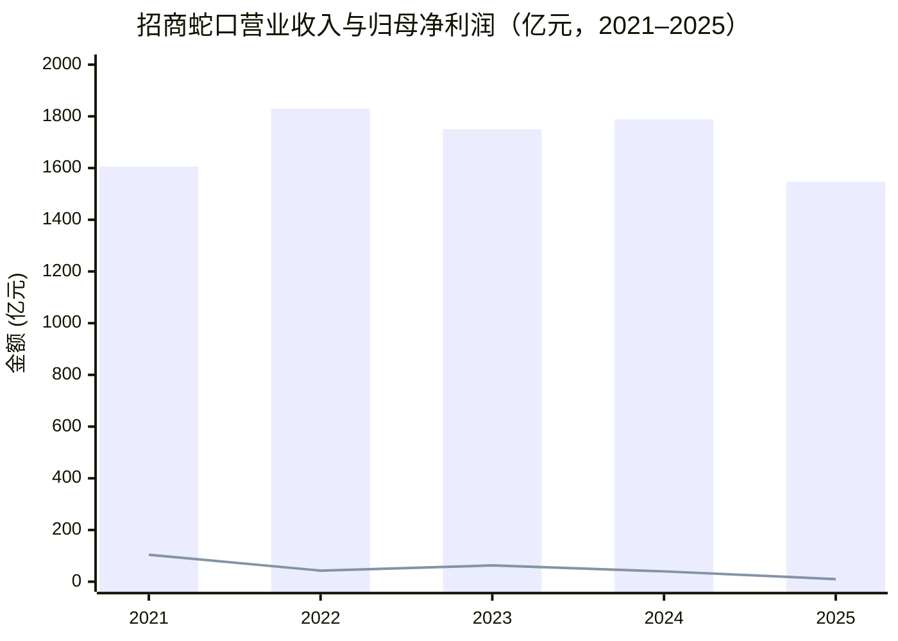
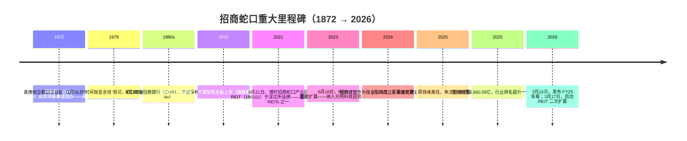
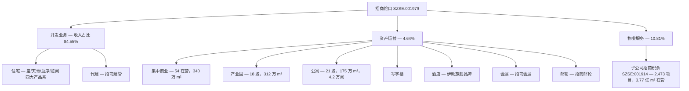
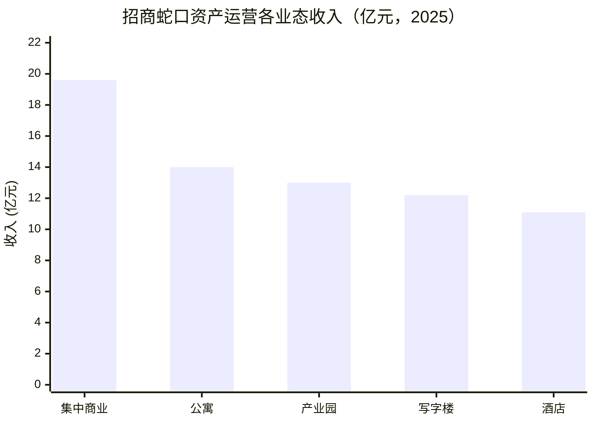
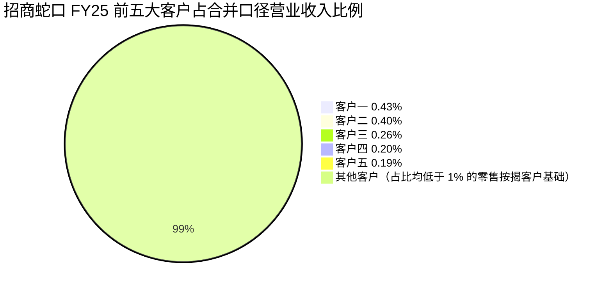
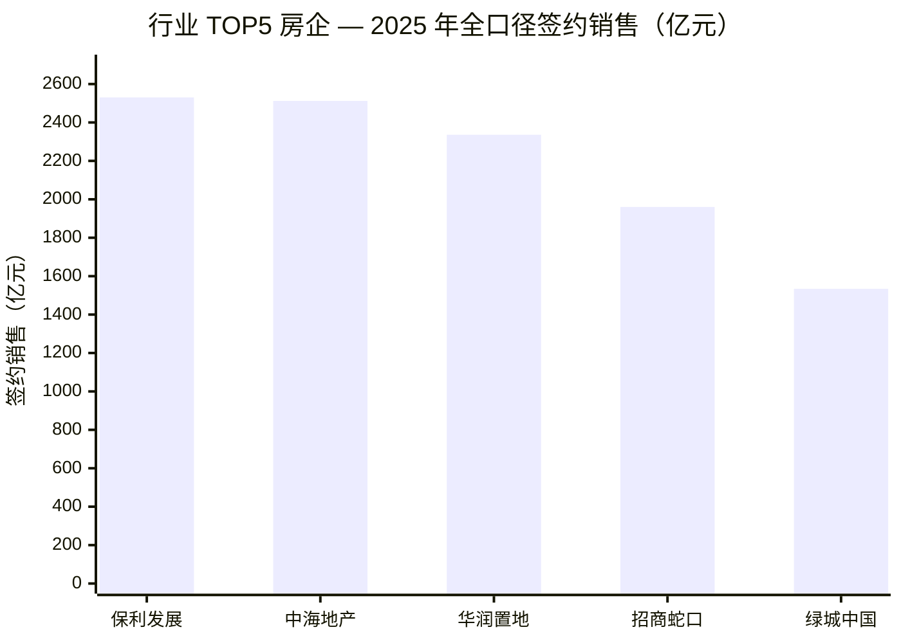
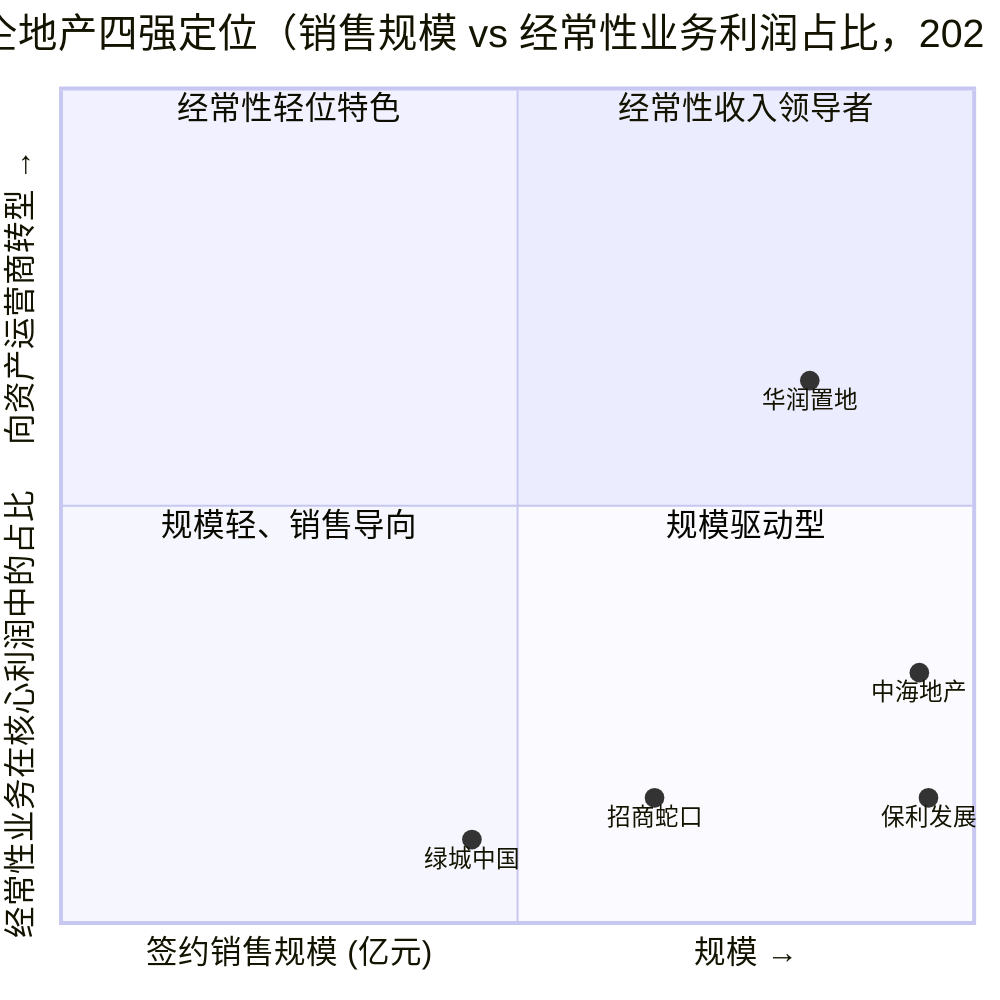
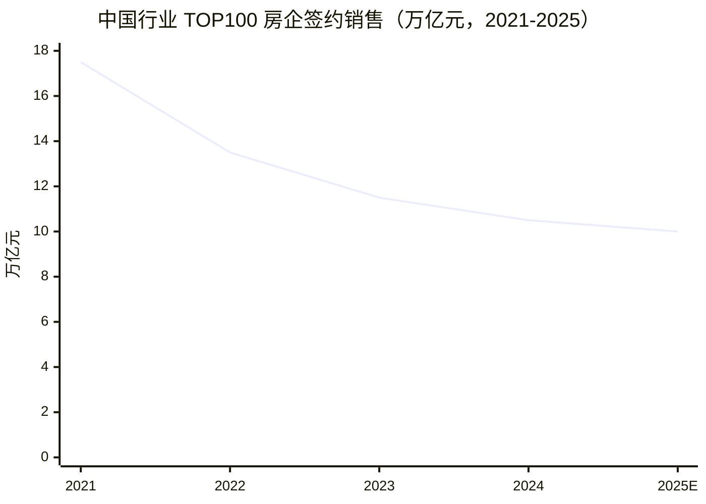

# 招商局蛇口工业区控股股份有限公司 (China Merchants Shekou, SZSE:001979) — 公司研究

**截至日期：** 2026-06-03
**证券代码：** SZSE:001979（深交所主板）· CMSK · 招商局蛇口工业区控股股份有限公司
**总部：** 广东省深圳市南山区蛇口太子路 1 号新时代广场
**上市信息：** 深交所主板，2015 年 12 月 30 日以 A 股换股吸收合并招商地产（原 SZSE:000024）重新上市
**董事长 / 总经理：** 朱文凯（2025 年 9 月起任董事长）· 聂黎明（2025 年 9 月起任总经理）
**控股股东：** 招商局集团有限公司（央企）
**2025 年营业收入：** 1,547.28 亿元（同比 -13.53%）· **归母净利润：** 10.24 亿元（同比 -74.65%）· **签约销售：** 1,960.09 亿元（行业排名第四）
**总市值（约）：** 780 亿元（2025 年末）· 股价约 8.65 元
**审计师：** 毕马威华振会计师事务所
**三道红线：** 持续保持绿档 — 净负债率 72.5%，现金短债比 1.19×，剔除预收款资产负债率 64.2%

> **2026 年顶部横幅 — 利润分配预案：** 公司董事会于 2026 年 3 月 16 日审议通过的利润分配预案为：以 2026 年 3 月 13 日总股本 90.16 亿股为基数，向全体股东每 10 股派发现金红利人民币 0.5110 元（含税），不以公积金转增股本，详见 [招商蛇口 2025 年年度报告, 第 1 页](https://static.cninfo.com.cn/finalpage/2026-03-17/1225012651.PDF)。

## 目录

1. [公司概览](#1-公司概览)
2. [公司历史与重大里程碑](#2-公司历史与重大里程碑)
3. [管理团队](#3-管理团队)
4. [产品与服务](#4-产品与服务)
5. [客户与上市策略](#5-客户与上市策略)
6. [行业概览](#6-行业概览)
7. [竞争格局](#7-竞争格局)
8. [市场机会](#8-市场机会)
9. [风险评估](#9-风险评估)
10. [投资视角评分](#10-投资视角评分)
11. [参考资料](#11-参考资料)

---

## 1. 公司概览

招商局蛇口工业区控股股份有限公司（"招商蛇口"、"CMSK"，SZSE:001979）是央企招商局集团旗下的房地产开发、资产运营与物业服务核心上市平台。集团本部可追溯至晚清洋务运动期间（1872 年）由李鸿章奏请创办的轮船招商局；当前 A 股主体则脱胎于 1979 年蛇口工业区——中国改革开放的第一个全面市场化试验区——并于 2015 年 12 月 30 日以 A 股换股吸收合并方式吸收原招商地产控股股份有限公司（原 SZSE:000024）后于深交所重新上市。公司中文全称、英文 "CHINA MERCHANTS SHEKOU INDUSTRIAL ZONE HOLDINGS CO.,LTD"、英文简称 CMSK 以及统一社会信用代码 914400001000114606 均披露于 [招商蛇口 2025 年年度报告, 第 3 页](https://static.cninfo.com.cn/finalpage/2026-03-17/1225012651.PDF)，并配套官网 `www.cmsk1979.com` 及 IR 信箱 `cmskir@cmhk.com`。

公司贯彻"133341"战略框架——一个定位（"成为中国领先的地产园区综合开发运营服务商"）、三类业务（开发业务 / 资产运营 / 物业服务）、三大策略（全面聚焦 / 质效并驱 / 轻重共赢）、三个转变、四个抓手（精准投资 / 产品升级 / 运营增值 / 资产盘活）以及一个发展目标"稳固行业五强"，详见 [招商蛇口 2025 年年度报告, 第 6 页](https://static.cninfo.com.cn/finalpage/2026-03-17/1225012651.PDF)。2025 年三大业务收入构成为：开发业务 84.55% / 资产运营 4.64% / 物业服务 10.81%，详见 [招商蛇口 2025 年年度报告, 第 45 页](https://static.cninfo.com.cn/finalpage/2026-03-17/1225012651.PDF)。

**主要财务指标（2025 vs 2024 vs 2023，人民币）：**

| 项目 | 2025 | 2024 | 同比 | 2023 |
|---|---|---|---|---|
| 营业收入 | 1,547.28 亿 | 1,789.48 亿 | -13.5% | 1,750.08 亿 |
| 归母净利润 | 10.24 亿 | 40.39 亿 | -74.7% | 63.19 亿 |
| 扣非归母净利润 | 1.69 亿 | 24.49 亿 | -93.1% | 57.33 亿 |
| 经营活动现金流量净额 | 96.93 亿 | 319.64 亿 | -69.7% | 314.31 亿 |
| 基本 EPS | 0.08 | 0.37 | -78.4% | 0.65 |
| 加权 ROE | 0.73% | 3.36% | -2.63 pp | 6.04% |
| 总资产 | 8,354.12 亿 | 8,603.09 亿 | -2.9% | 9,085.08 亿 |
| 归母净资产 | 976.52 亿 | 1,110.07 亿 | -12.0% | 1,197.23 亿 |

资料来源：[招商蛇口 2025 年年度报告, 第 4 页](https://static.cninfo.com.cn/finalpage/2026-03-17/1225012651.PDF)。盈利大幅下滑反映行业四年深度调整：营业收入下降主要源于开发业务项目结转规模同比下降及投资收益减少；但开发业务毛利率 (gross margin) 仍维持在 15.33%（与 2024 年 15.58% 相比仅下降 0.25 个百分点 — 由一线城市结转占比上升所支撑，详见 [2024 年年度报告, 第 33 页](https://static.cninfo.com.cn/finalpage/2025-03-18/1222823028.PDF)）。资产运营、物业服务收入分别同比 +0.32%、+8.35%，直接体现"由开发为主向开发与经营并重"的战略转型，详见 [招商蛇口 2025 年年度报告, 第 45 页](https://static.cninfo.com.cn/finalpage/2026-03-17/1225012651.PDF)。

*资料来源：营业收入与归母净利润分别来自 [招商蛇口 2025 年年度报告, 第 4 页](https://static.cninfo.com.cn/finalpage/2026-03-17/1225012651.PDF)（2023–2025）及 [2024 年年度报告, 第 5 页](https://static.cninfo.com.cn/finalpage/2025-03-18/1222823028.PDF)（2021–2022 同口径）。*

**估值快照 (valuation snapshot)。** 截至 2026 年 3 月 17 日（FY25 业绩披露后第一交易日），公司股价为人民币 9.80 元，对应动态 TTM 市盈率（P/E）约 8.5 倍、市净率（P/B）约 0.75 倍，详见东方证券 / 国信证券 2026 年 3 月 25 日初步覆盖研报 [招商蛇口 2026-03-25 研报, 东方财富网](https://pdf.dfcfw.com/pdf/H3_AP202603251820737829_1.pdf)。当前估值处于其近五年估值区间下限，亦明显低于 2020 年前 P/E 中位数约 15 倍——见 [招商蛇口 历史 PE/PB, 亿牛网](https://eniu.com/gu/sz001979) 历史估值数据。2025 年 12 月下旬股价约 8.65 元，流通市值约人民币 780 亿元，股息率约 2.23%，详见 [雪球 招商蛇口 SZ001979 行情, 2025-12-22 快照](https://xueqiu.com/S/SZ001979)。央企开发商可比公司估值集中度相近：中海地产（HKEX:0688）P/B 约 0.5×–0.7×，华润置地（HKEX:1109）P/B 约 0.5×–0.7×，保利发展（SSE:600048）P/B 约 0.5×–0.6×，详见 [房企四强 PK 财务对比, 新浪财经](https://cj.sina.com.cn/articles/view/1682207150/644471ae02001hky8) 横向对比文章。

*分析师观点：* 当前低 P/E 本身反映 FY25 净利润 -75% 的周期性低点 — 估值看似单位数，但分母也处于周期低位。东吴证券 2026 年 3 月点评测算 FY26 基准情景隐含明显的 EPS 回升，对应前瞻 P/E 中段位（mid-teens），更接近历史中位数水平，详见 [招商蛇口 2026-03-19 研报, 东吴证券](https://pdf.dfcfw.com/pdf/H3_AP202603191820647086_1.pdf)。同时 P/B 约 0.75× 更具意义——账面权益真实（归母净资产 976.52 亿元），公司股价相对可比央企开发商土地储备的"重置成本"折价显著，支撑了券商提出的"央企信用阿尔法 + 剩余资产价值重估" (state-owned-enterprise credit alpha plus residual asset re-rating) 的投资逻辑，详见 [招商蛇口 2026 年投资价值如何？股百科](https://www.aigbk.com/article/investment_value_of_china_merchants_shekou_001979_sz_in_2026/)。

## 2. 公司历史与重大里程碑

招商蛇口的故事并非始于 2015 年上市，而是始于 **1979 年 1 月 31 日**——那一天，时任香港招商局集团副董事长袁庚乘船从香港返回蛇口，在码头写下"时间就是金钱，效率就是生命"。1979 年 7 月 8 日，蛇口工业区正式破土动工——这是中国大陆第一个全面市场化的工业园区，也是中国改革开放的实质起点；当时蛇口工地的爆破声被载入党史，被誉为"改革开放第一炮" (the first cannon-shot of Reform & Opening)，详见 [袁庚：创造蛇口奇迹的改革先锋, 中央党史和文献研究院](https://www.dswxyjy.org.cn/n1/2022/0310/c434073-32371401.html)。袁庚主导下的蛇口创下大约 24 项"全国第一"——包括人才公开招聘、绩效薪酬、住房商品化、社会保障体系——并孵化出招商银行（1987 年）与平安保险（1988 年），二者均诞生于蛇口，详见 [深圳故事｜蛇口工业区：改革开放"第一炮", 深圳市档案馆](https://www.szdag.gov.cn/dawh/tqssn/content/post_931794.html)。

1990 年代至 2000 年代期间，蛇口板块在招商局集团内经历多次重组。当前上市主体的形成发生在 **2015 年 12 月 30 日**：招商局蛇口工业区控股股份有限公司通过 A 股换股吸收合并方式吸收原招商地产控股股份有限公司（原 SZSE:000024）并向特定对象发行 A 股股份募集配套资金，于深交所主板上市。该换股程序对应的"长期持续有效"承诺仍体现在公司 2025 年年报"重要事项"章节中"首次公开发行或再融资时所作承诺"——承诺起始日 2015-12-21，状态"持续有效"，并标注"报告期内严格履行了承诺"，详见 [招商蛇口 2025 年年度报告, 第 74 页](https://static.cninfo.com.cn/finalpage/2026-03-17/1225012651.PDF)。

其中几个里程碑值得专门展开。**2021 年 6 月 21 日博时招商蛇口产业园 REIT（180101）挂牌**使招商蛇口成为首批公募基础设施 REITs 的早期成员，初始底层资产为蛇口网谷的万融大厦、万海大厦两宗办公类产业园。**2023 年 6 月 16 日首次扩募**纳入招商局光明科技园二期项目——这是中国基础设施 REITs 历史上的首次扩募，监管层面意义重大，详见 [博时招商蛇口产业园 REIT 6 月 16 日扩募上市, 中国基金报](https://www.chnfund.com/article/AR2023061615101050333948)。**2025 年 4 月启动的二次扩募**进一步纳入光明科技园多栋资产以及前海易港 W6/W7 仓库及辅助楼，使招商蛇口成为中国大陆首家完成 REIT 二次扩募的发行人，为资产运营业务建立真正可循环的"投-融-建-管-退" (invest-finance-build-manage-exit) 通道，详见 [博时蛇口产园 REIT 二次扩募, 新浪科技](https://finance.sina.com.cn/tech/roll/2025-04-24/doc-ineufhcc9296514.shtml)。**2025 年 9 月董事长变更**终结了蒋铁峰时代（2023 年 9 月起任董事长），由原总经理（2023 年 9 月起任）朱文凯接任董事长，聂黎明出任总经理；两项任免均于 2025 年 9 月 16 日通过正式公告披露，详见 [招商蛇口换"帅"：蒋铁峰因工作调动辞职，朱文凯升任董事长, 新浪财经](https://finance.sina.com.cn/jjxw/2025-09-16/doc-infqstck0713902.shtml)。

2025 年经营成绩单实质上优于利润表：全年签约销售 1,960.09 亿元，行业排名提升一位至第四（按克而瑞 / 中指研究院综合排行），一线城市投资占比由 2024 年的 59% 提升至 63%，详见 [招商蛇口 2025 年年度报告, 第 7 页](https://static.cninfo.com.cn/finalpage/2026-03-17/1225012651.PDF) 与 [2025 年末楼市翘尾 13 家房企集体增长, 中新网](https://www.chinanews.com.cn/cj/2026/01-14/10551410.shtml)。前四位的排名将招商蛇口与另外三家央企巨头（保利发展、华润置地、中海地产）放在同一梯队，并领先于已跌出前五的万科 (Vanke)，详见 [2025 上半年房企销售排位, 新京报](https://m.bjnews.com.cn/detail/1751422158168905.html)。

## 3. 管理团队

按 company-research 技能的范围规则，本章只覆盖"创始人 / 创始时代代表人物 + 现任总经理 / 董事长"二者；其余高管不在覆盖范围。招商蛇口的"创始时代代表人物"实质上是 1979 年蛇口工业区的开拓者袁庚（已在第 2 章作为历史背景简述，非现任管理层）；上市主体（2015 年）的"创始人"在体制上对应招商局集团的央企治理线，并非某位企业家个人。

**现任董事长——朱文凯 (Zhu Wenkai，自 2025 年 9 月 16 日起任董事长)。** 据 FY25 年报管理层档案，朱为高级经济师，毕业于武汉理工大学交通运输管理工程专业（硕士学位），年龄 58 岁，现任公司董事长、党委书记。其在招商局体系内的履历（按时间顺序）为：蛇口招商港务股份有限公司总经理助理；深圳蛇口招港实业发展有限公司总经理；招商地产策划部经理、营销中心总经理；招商地产总经理助理、副总经理；招商蛇口常务副总经理；招商局海南开发投资有限公司党委书记、总经理；2023 年 9 月起任招商蛇口总经理，至 2025 年 9 月升任董事长；期末持股 207,027 股，详见 [招商蛇口 2025 年年度报告, 第 62 页](https://static.cninfo.com.cn/finalpage/2026-03-17/1225012651.PDF)。朱本届董事长任期至 2027 年 11 月止（当届董事会任期结束）。其履历特色——港口运营、海南开发、地产母业——在央企地产董事长中并不常见：他更多是从经营业务（而非财务或集团总部职能）出身，券商研究将这一背景与公司"经营提质 (operating-quality)、开发商 + 运营商 + 服务商三位一体定位"的战略走向相关联。

**现任总经理——聂黎明 (Nie Liming，自 2025 年 9 月 16 日起任总经理)。** 工程师，毕业于南京建筑工程学院机电系起重运输与工程机械专业（学士学位），后获电子科技大学管理学硕士。聂的履历为：招商局地产控股股份有限公司运营管理中心副总经理；招商地产云南公司、重庆公司、运营管理中心总经理；招商蛇口运营管理中心总经理、华北区域常务副总经理、华北区域总经理、深圳区域总经理、副总经理；招商局积余产业运营服务股份有限公司（招商积余，SZSE:001914）董事、董事长；招商局集团产业发展部 / 业务协同部部长。期末持股 89,000 股，详见 [招商蛇口 2025 年年度报告, 第 62 页](https://static.cninfo.com.cn/finalpage/2026-03-17/1225012651.PDF)。其履历轨迹——招商地产运营岗 → 区域总经理 → 招商积余董事长 → 集团产业发展部 → 母公司总经理——给予他跨业务板块（运营 + 物业服务 + 集团产业发展）的视野，恰好契合新"三业务协同"模式。

两个岗位均属于由招商局集团董事会主导的央企任免；公司不存在创始人持股或家族控制结构。控股股东仍为招商局集团（通过中间控股实体招商局轮船），实际控制人为国务院国资委 (SASAC)。FY25 年报"重要事项"章节确认"公司报告期内不存在同业竞争情况"——对央企控股上市公司而言，这是关于集团内部土地交易合规性的核心披露，详见 [招商蛇口 2025 年年度报告, 第 62 页](https://static.cninfo.com.cn/finalpage/2026-03-17/1225012651.PDF)。

## 4. 产品与服务

招商蛇口围绕三类业务展开运营——**开发业务（Development）、资产运营（Asset Operation）、物业服务（Property Services）**——并配套两个战略权重大于会计权重的子平台：**代建（Construction Management，招商建管）** 与 **公募 REIT 资产盘活通道（博时蛇口产园 REIT，180101）**。2025 年收入结构中开发业务占比高达 84.55%，但管理层在年报中明确披露的战略意图是将整体业务结构由"开发为主"转向"开发 + 经营 + 服务"三足鼎立模式，详见 [招商蛇口 2025 年年度报告, 第 6 页](https://static.cninfo.com.cn/finalpage/2026-03-17/1225012651.PDF)。

2025 年年报披露的分行业收入表格逐字复制如下：

| 业务板块 | 2025 营业收入（万元） | 2025 占比 | 2024 营业收入（万元） | 2024 占比 | 同比增减 |
|---|---|---|---|---|---|
| 开发业务 | 13,082,934.50 | 84.55% | 15,636,122.56 | 87.38% | -16.33% |
| 资产运营 | 717,281.93 | 4.64% | 714,963.12 | 3.99% | +0.32% |
| 物业服务 | 1,672,581.27 | 10.81% | 1,543,668.98 | 8.63% | +8.35% |
| **合计** | **15,472,797.70** | **100%** | **17,894,754.66** | **100%** | **-13.53%** |

资料来源：[招商蛇口 2025 年年度报告, 第 45 页](https://static.cninfo.com.cn/finalpage/2026-03-17/1225012651.PDF)。同页公布的毛利率为：开发业务 15.33%（同比下降 0.25 个百分点），物业服务 10.59%（同比下降 0.28 个百分点）；资产运营业务由于折旧摊销与新项目爬坡成本，在 FY25 单业务口径下呈现为净负毛利。

### 4.1 开发业务 — 现金引擎

开发业务仍是收入的主要贡献者，并进一步细分为以住宅及城市综合体为主的核心销售业务（去化型存货）以及越来越重要的轻资产代建业务。FY25 年报对经营态度的原文表述为：

> "作为绿色人居的探路者、实践者和领跑者，公司坚持区域聚焦、城市深耕。深入贯彻'安全、舒适、绿色、智慧'的好房子国家标准，研发并落地'招商蛇口好房子'技术体系，打造品质人居、绿色人居、智慧人居。'玺系''揽阅系''启序系''天青系'等住宅产品，以持续迭代的品质升级居住体验。代建业务积极发挥核心开发能力优势，推动政府代建、商业代建等轻资产业务，业态涵盖住宅公寓、产业商办、文体艺术等九大领域，赋能公司多业务协同发展。"
> —— [招商蛇口 2025 年年度报告, 第 6-7 页](https://static.cninfo.com.cn/finalpage/2026-03-17/1225012651.PDF)

四大住宅产品系定位：玺系 (Xi) 顶豪 — "城市顶豪基因 + 一玺一高定"的定制化生活图鉴；揽阅系 (Lan Yue) 都市自在乐活；启序系 (Qi Xu) 区域价值标杆，前瞻设计语言演绎属地文化；天青系 (Tian Qing) 东方隐奢美学，空间解构构建文化共鸣居所。其在 2025 年的表现亮眼：20 余个全国新作首开去化率超过可研预期，标杆项目包括上海康定壹拾玖、成都招商玺、成都锦城序、长沙招商序、西安梧桐书院、上海林屿湖畔 — 15 个项目入选 2025 年全国年度 / 半年度十大作品榜单，详见 [招商蛇口 2025 年年度报告, 第 7 页](https://static.cninfo.com.cn/finalpage/2026-03-17/1225012651.PDF)。对应的"招商蛇口好房子品质标准"在管理层章节披露为 7 大维度 / 28 个场景模块 / 485 项技术细节的体系，已在全国 20 余个标杆项目落地。

**中文释义 / Plain-language gloss：** 玺系定位稀缺资产 — 上海康定壹拾玖、北京招商玺这类单价可达 10 万元 / m² 级别的项目，主要功能是品牌溢价 (brand premium) 而非走量；揽阅系与启序系作为"上改善"主力 (upgrade-residential workhorse)，对接城市白领按揭客群的中高端需求；天青系是同一住宅基底的文化 / 区域文化外观重塑。这种产品组合策略契合行业当前在稀缺核心城市"好房子" (premium "good house") 需求与结构性疲弱的商品量产层之间的明显分化。

FY25 累计签约销售：**1,960.09 亿元**（销售面积 716.12 万 m²）— 行业排名提升一位至第四。新增土地储备：43 宗地块，总计容建面 4.4 百万 m²，总地价 938 亿元（公司需支付地价约 543 亿元）。"核心 10 城"投资占比接近 90%；一线城市投资占比由 FY24 的 59% 提升至 63%，分布为上海 5 宗，深圳 / 北京 / 成都 / 杭州各 3 宗，西安 2 宗，详见 [招商蛇口 2025 年年度报告, 第 7 页](https://static.cninfo.com.cn/finalpage/2026-03-17/1225012651.PDF)。

**代建业务 (construction management)。** 2024 年 3 月成立的独立专业公司招商建管成为代建轻资产业务的整合主体。FY25 新增代建项目（含咨询类）80 个、新增签约面积 11.39 百万 m²、新增合同收入超 8 亿元。历年累计承接代建项目超 620 个，规模突破 35 百万 m²，业态涵盖会展中心、产业商办、住宅公寓、医疗康养、文体中心、学校教育、市政公园、道路桥梁、水工 — 公司自我披露在新签约规模、综合能力及产品力上均位列行业 TOP10，详见 [招商蛇口 2025 年年度报告, 第 7 页](https://static.cninfo.com.cn/finalpage/2026-03-17/1225012651.PDF)。

### 4.2 资产运营 — 正在形成的护城河

资产运营在收入权重上较小（FY25 占比 4.64%），但是管理层最重点的战略推进方向。FY25 年报披露的分子业态 KPI（同时也是后续 REIT 扩募的潜在标的池关键运营数据）如下：

| 子业态 | 在营项目 / 城市 | 在营 GFA (m²) | 在建 GFA (m²) | FY25 收入 | 成熟项目出租率 |
|---|---|---|---|---|---|
| 集中商业 | 54 个 | ~340 万 | ~185 万 | 19.6 亿 | 93%（开业 3 年以上） |
| 产业园 | 18 城 | ~312 万 | ~61 万 | 13 亿 | 88%（开业 3 年以上） |
| 公寓 | 21 城，4.2 万间 | ~175 万 | ~63 万（1.4 万间） | 14 亿 | 93%（开业 1 年以上精品） |
| 写字楼 | 不适用 | 不适用 | 不适用 | 12.2 亿 | 不适用 |
| 酒店 | 旗舰品牌伊敦 | 不适用 | 不适用 | 11.1 亿 | 不适用 |
| **管理范围内持有物业全口径收入** | — | — | — | **76.3 亿** | — |

资料来源：[招商蛇口 2025 年年度报告, 第 7-9 页](https://static.cninfo.com.cn/finalpage/2026-03-17/1225012651.PDF)。管理范围内全口径收入（包含轻资产管理项目）76.3 亿元；合并报表分行业"资产运营"营业收入 71.73 亿元，差异即"轻资产"输出部分。

*资料来源：[招商蛇口 2025 年年度报告, 第 7-9 页](https://static.cninfo.com.cn/finalpage/2026-03-17/1225012651.PDF)。*

**各子业态对客户流程及战略意义的解释：**

- **集中商业** — "X + 商业"战略将商业作为主导锚点带动综合体土地价值兑现；FY25 新开业 8 个项目，南京玄武花园城以超 50% 首店占比、屋顶天文台、"生命之树"特色场景启动；杭州城北花园城作为杭州首个 XOD 综合体，引进 131 家首店，开业 3 天客流 65 万；深圳太子湾 VILLA 实现主理人品牌与高端餐饮的双重突破，定位向生活方式与"首店"运营倾斜，而非传统交易型零售；93% 的成熟项目出租率是资产质量的关键观察指标。
- **产业园** — 18 城布局，分类为网谷（科创园）、意库（文创园）、智慧城（智造园）；披露的入驻租户包括 29 家国家级"小巨人"中小企业、155 家省级"专精特新" (specialized, refined, distinctive, novel — MIIT 认定) 企业、29 家瞪羚企业、301 家国家高新技术企业；战略亮点是 FY25 推动成立"招信低空"合资公司，引入零重力飞机工业、丰翼科技、英武智能等链条企业，于前海-蛇口共建低空经济先导园区，详见 [招商蛇口 2025 年年度报告, 第 7-8 页](https://static.cninfo.com.cn/finalpage/2026-03-17/1225012651.PDF)。产业园业务连续 7 年蝉联方升园区大会"中国产业园区运营商 TOP50"第一。
- **公寓** — 21 城，已开业面积 175 万 m²，4.2 万间，FY25 新入市 12 个项目中一线城市占比 92%。旗舰项目上海壹间·新桥 G60 科创云廊定位为公司在上海首个从拿地、规划设计、开发建设到长期持有运营全链条自主打造的资产，作为可持续可复制的租赁住房模型样本。1 年以上精品成熟项目出租率 93%，名义入住率快速爬坡的案例（上海壹间虹桥公馆三期 5 个月内 100%、上海静安壹棠 5 个月 99%、深圳壹间网谷 4 个月 88%）显示在租金疲软的市场中运营效能良好。
- **写字楼** — FY25 租赁成交面积超 33 万 m²，净吸纳超 8 万 m²。
- **酒店** — 伊敦 (Yi Dun) 品牌在深圳南山伊敦酒店（一座改革开放标志建筑的 3 年改造）再次定位，作为城市更新示范。

外加两个较窄的子业务：**招商会展** 2025 年举办展览面积超过 700 万 m²，承接展会 200+ 场，深圳国际会展中心、杭州大会展中心、中国重庆科学会堂三大场馆均处于运营首年里程碑期；**招商邮轮** 全年服务旅客 419.8 万人次，新开通珠海海岛航线、香港维港航线、湾区"WAN 夜宴"航线等，详见 [招商蛇口 2025 年年度报告, 第 9 页](https://static.cninfo.com.cn/finalpage/2026-03-17/1225012651.PDF)。

### 4.3 物业服务 — 通过招商积余（SZSE:001914）

物业服务通过控股的上市子公司招商积余（SZSE:001914）展开。FY25 财务数据：

- 营业收入 **192.73 亿元**（同比 +12.23%）。
- 归母净利润 **6.55 亿元**（同比 -22.12%；剔除衡阳中航项目处置一次性减少归母净利润 2.56 亿元的影响后，同比 +8.30%）。
- 在管项目 **2,473 个**，管理面积 **3.77 亿 m²**。
- 第三方新签年度合同额 **41.69 亿元**（同比 +13%）；航空业态 +85%，高校业态 +25%，IFM 业态 +15%，市场化住宅 +60%。

资料来源：[招商蛇口 2025 年年度报告, 第 9 页](https://static.cninfo.com.cn/finalpage/2026-03-17/1225012651.PDF)。同期招商积余荣获"2025 中国物业服务企业综合实力 500 强 TOP3"等行业排名，是规模化运营的国有物业服务商中极少数排名稳定靠前者，详见 [中国房地产年报点评, 克而瑞](http://res1.cric.com/cricbiz/c3/7c/46/01-5e8f-475c-a04a-ff73a83b1167.pdf)。

### 4.4 "投融建管退"循环

招商蛇口在管理层章节明确披露的最具战略意义的产品战略框架是"投资 → 融资 → 建设 → 运营 → REIT 退出"循环：开发业务持续注入新增持有资产；持有资产由资产运营业务进行培育稳定；成熟稳定资产通过 **博时招商蛇口产业园 REIT（180101）** 进行盘活回收 — 2021 年 6 月 21 日首次发行，底层为蛇口网谷万融大厦、万海大厦两宗产业园；2023 年 6 月 16 日首次扩募纳入招商局光明科技园二期项目（中国首例 REIT 扩募）；2025 年 4 月启动二次扩募，新增光明科技园多栋资产 + 前海易港 / 前海易保 W6/W7 仓库辅助楼，详见 [博时蛇口产园 REIT 二次扩募, 新浪科技](https://finance.sina.com.cn/tech/roll/2025-04-24/doc-ineufhcc9296514.shtml) 与 [博时蛇口产园 REIT 公告档案, 天天基金网](https://fundf10.eastmoney.com/jjgg_180101_3.html)。截至 2024 年末，招商蛇口通过公募 REITs 平台管理资产约 59 万 m²，管理口径收入 8.13 亿元；2024 年度 REIT 可供分配金额 1.42 亿元，较上年同期 +19.82%，详见 [博时招商蛇口产业园 REIT 6 月 16 日扩募上市, 中国基金报](https://www.chnfund.com/article/AR2023061615101050333948)。

战略意义：招商蛇口是少数构建了完整制度化"建-售 + 建-持 + REIT 退"循环的内地开发商之一。这一特征将其区分于纯建-售型的保利发展（商业持有较少）以及在一定程度上区分于中海地产（虽然建-持，但其商业 REIT 历史上是港股的中海商业信托而非内地基础设施 REIT）。实质上招商蛇口是唯一一家 A 股内地开发商完成了 **首次扩募 + 现在的首次二次扩募** 的公募基础设施 REIT 监管路径——这是"建-管-退"循环的真实护城河。

### 4.5 章节小结

三大业务以循环方式互动：开发提供存量与现金流；资产运营基于新建成的综合体打造持有资产现金流基础；招商积余作为物业服务通过覆盖所形成的安装基础捕获经营服务利润层；REIT 平台将成熟稳定资产再循环为新开发拿地的融资燃料。管理层在年报中明确推行的"三个转变"——"由开发为主向开发与经营并重转变；由重资产为主向轻重资产结合转变；由同质化竞争向差异化发展转变"，详见 [招商蛇口 2025 年年度报告, 第 6 页](https://static.cninfo.com.cn/finalpage/2026-03-17/1225012651.PDF)——目标明确，但 FY25 业务结构（84.55% / 4.64% / 10.81%）显示这一旅程才刚刚起步。资产运营占比仅以每年 +0.65 pp 的速度抬升 — 持有资产现金流作为开发周期波动缓冲的累积是真实的，但规模上尚未到改变投资逻辑的程度。

## 5. 客户与上市策略

招商蛇口客户基础结构性分散——住宅地产的终端买家是按揭零售客户，并非企业。FY25 披露的"前五名客户合计销售金额"占比因此异常之小，但数据点是精确的。

**FY2025 前五名客户合计销售（合并口径）：** 230,293.59 万元 = 全年总销售的 **1.48%**，明细如下：

| 序号 | 客户名称 | 销售额（万元） | 占合并口径总营业收入比例 |
|---|---|---|---|
| 1 | 客户一 | 66,972.48 | 0.43% |
| 2 | 客户二 | 62,540.29 | 0.40% |
| 3 | 客户三 | 40,925.78 | 0.26% |
| 4 | 客户四 | 31,174.31 | 0.20% |
| 5 | 客户五 | 28,680.73 | 0.19% |
| | **合计** | **230,293.59** | **1.48%** |

资料来源：[招商蛇口 2025 年年度报告, 第 46 页](https://static.cninfo.com.cn/finalpage/2026-03-17/1225012651.PDF)。FY24 对应数据为 0.96%（前五合计 17.23 亿元），详见 [2024 年年度报告, 第 34 页](https://static.cninfo.com.cn/finalpage/2025-03-18/1222823028.PDF)。公司未单独列名前五大客户（A 股住宅按揭驱动业务通常如此 — 单一客户名称信息量有限），披露中以"客户一"至"客户五"匿名形式呈现。

*资料来源：[招商蛇口 2025 年年度报告, 第 46 页](https://static.cninfo.com.cn/finalpage/2026-03-17/1225012651.PDF)。分母为 FY2025 合并口径营业收入 1,547.28 亿元。"其他客户"切片覆盖住宅按揭零售基础，单一客户占比均低于 1%。*

**分地区收入（合并口径）。** FY25 分地区收入如下：

| 区域 | FY25 营业收入（万元） | FY25 占比 | 同比增减 |
|---|---|---|---|
| 北部地区 | 1,656,888.03 | 10.71% | +10.44% |
| 东部地区 | 6,463,110.59 | 41.77% | -19.83% |
| 南部地区 | 3,973,473.47 | 25.68% | -7.27% |
| 中西部地区 | 3,379,325.61 | 21.84% | -16.51% |

资料来源：[招商蛇口 2025 年年度报告, 第 45 页](https://static.cninfo.com.cn/finalpage/2026-03-17/1225012651.PDF)。注意公司在 FY25 重新调整了分地区披露口径（原 FY24 口径为华北 / 华东 / 江南 / 华西 / 华南 / 海外 — 详见 [2024 年年度报告, 第 33 页](https://static.cninfo.com.cn/finalpage/2025-03-18/1222823028.PDF)）。东部地区持续占比高（> 40%）反映招商蛇口在上海 + 长三角的深耕；南部（深圳 + 大湾区）是其文化与历史的根据地。

```mermaid
xychart-beta
    title "招商蛇口分地区收入（亿元，FY25 vs FY24）"
    x-axis ["北部地区", "东部地区", "南部地区", "中西部地区"]
    y-axis "收入 (亿元)" 0 --> 90
    bar [16.57, 64.63, 39.73, 33.79]
    bar [15.00, 80.62, 42.85, 40.48]
```

*资料来源：[招商蛇口 2025 年年度报告, 第 45 页](https://static.cninfo.com.cn/finalpage/2026-03-17/1225012651.PDF)，[2024 年年度报告, 第 33 页](https://static.cninfo.com.cn/finalpage/2025-03-18/1222823028.PDF)（同口径调整后）。*

**上市策略。** 招商蛇口作为央企长期偏好机构与 ESG 评级投资者参与：仅 FY25 一年接待 **110+ 次** 机构调研，覆盖国内外券商及机构资产管理人 — 阿布扎比投资局、摩根士丹利、花旗集团、美银证券、摩根大通、瑞银证券、星展证券、淡水泉投资、易方达、景顺长城、平安养老、工银瑞信、重阳投资等外资 / 公募 / 私募；国内则包括中信证券、CITIC 建投、广发证券、华泰证券、东吴证券、招商证券、中金公司、申万宏源、海通证券等等，详见 [招商蛇口 2025 年年度报告, 第 59-60 页](https://static.cninfo.com.cn/finalpage/2026-03-17/1225012651.PDF) 详细机构调研名录。招商蛇口也是较早实施国务院国资委要求的"市值管理制度"与"估值提升计划"框架的央企之一 — 2024 年 12 月 30 日审议通过"市值管理制度"，2026 年 2 月 6 日审议通过"估值提升计划"，详见 [招商蛇口 2025 年年度报告, 第 61 页](https://static.cninfo.com.cn/finalpage/2026-03-17/1225012651.PDF)。综合而言，招商蛇口在深交所主板央企开发商中获得相对密集的机构覆盖；同时 MSCI ESG 评级为 A 级（A 股房地产行业最高）。

## 6. 行业概览

中国房地产行业正处于和平时期最深刻调整的 **第 4 年**。FY25 年报援引的官方政策表态明确指出，行业已"从快速增长期转向稳定发展期"，焦点从"大规模增量扩张"转向"存量提质增效"——这是中央城市工作会议与"十五五"规划建议的顶层定调，详见 [招商蛇口 2025 年年度报告, 第 6 页](https://static.cninfo.com.cn/finalpage/2026-03-17/1225012651.PDF)。

2025 年行业宏观数据出现企稳信号但尚未真正恢复。年报援引：2025 年国内 GDP 达 140.2 万亿元，同比增长 5%；全年新建商品房销售面积及金额降幅均较 2023-24 年收窄；一线及核心二线城市的"改善性需求"（即"好房子"需求 — "good house" demand）成为支撑市场的核心因素；二手房成交规模与占比进一步提升，反映行业逐步从新建依赖中去化，详见 [招商蛇口 2025 年年度报告, 第 6 页](https://static.cninfo.com.cn/finalpage/2026-03-17/1225012651.PDF)。2025 年新版《住宅项目规范》正式实施 — 管理层将其定位为"全行业品质重置" — 但其在合规层面对开发商利润率的实际压缩亦不容忽视。

**三段式行业框架：**

1. **新建销售**，连续四年量价齐跌。行业集中度持续提升 — 央企巨头（保利发展 / 中海 / 华润置地 / 招商蛇口）占据销售排行榜前五位中的 4 位，原民营龙头万科于 2025 H1 跌出前五，详见 [2025 上半年房企销售排位, 新京报](https://m.bjnews.com.cn/detail/1751422158168905.html)。
2. **商业持有 / 资产运营**，购物中心空置率上升、产品轮换压力加剧；但公募 REITs 市场从基础设施扩展至"涵盖商业办公、酒店、城市更新、文旅、养老" — 这是支撑招商蛇口资产运营战略可行性的关键监管解锁。FY25 年报将 2025 公募 REITs 市场描述为已进入"常态化发行与稳定发展"轨道，"新发 + 扩募"为双轮增长驱动，详见 [招商蛇口 2025 年年度报告, 第 6 页](https://static.cninfo.com.cn/finalpage/2026-03-17/1225012651.PDF)。
3. **物业服务**，新增物业管理规模随新建销售的同步放缓而下降，迫使行业转向以存量项目服务提升、效率优化、价值挖掘为主的竞争。年报明确将此描述为从"低价竞争"到"标准化、数字化"的转型，刚性成本上涨压制中尾部参与者利润空间。

公司自身披露的 FY25 量化背景：2025 年行业 TOP100 累计销售在 1-7 月与上年同期基本持平，详见 [《2025 年 1-7 月中国房地产企业销售 TOP100》排行榜, 克而瑞](http://res1.cric.com/cricbiz/3f/f5/82/6a-ce7c-41cf-97d2-c03819c2d1fc.pdf)；央企巨头持续提升份额；商业方面新开购物中心数量同比收缩，但首店化与生活方式定位明显加强；公寓租金水平处于近五年低位；产业园需求趋于正常化。

*资料来源：行业签约销售排行 [2025 年末楼市翘尾 13 家房企集体增长, 中新网](https://www.chinanews.com.cn/cj/2026/01-14/10551410.shtml)。*

## 7. 竞争格局

招商蛇口主要在 **央企控股房地产开发商** 集群内竞争 — 这一集群已在 2022 年以来的行业调整中成为主导力量。FY25 年报的竞争格局叙述并未在 10-K 式"主要竞争对手"层面点名具体公司 — A 股年度报告通常不像美国 10-K Item 1 Competition 那样按名称列举竞争对手。因此下文列举的竞争对手来自行业研究和排行榜数据，并非来自招商蛇口本身的年报披露。

**四大央企可比公司 — "央企地产四强"：**

| 可比公司 | 上市地 | 2025 签约销售（亿元） | 2025 H1 营收 | 2025 H1 归母净利润 | P/B（约，2026 Q1） |
|---|---|---|---|---|---|
| **保利发展** | SSE:600048 | 2,530.3（#1） | ~1,169 亿 | 27.11 亿（-63.5% YoY） | ~0.5×–0.6× |
| **中海地产** | HKEX:0688 | 2,512.3（#2） | ~832 亿 | 85.99 亿 | ~0.5×–0.7× |
| **华润置地** | HKEX:1109 | 2,336（#3） | ~949 亿 | 核心约 100 亿 | ~0.5×–0.7× |
| **招商蛇口** | SZSE:001979 | 1,960.1（#4） | 514.85 亿 | 14.48 亿 | ~0.75× |
| 绿城中国 | HKEX:3900 | 1,534（#5） | 不适用 | 不适用 | 不适用 |

资料来源：签约销售 — [2025 年末楼市翘尾 13 家房企集体增长, 中新网](https://www.chinanews.com.cn/cj/2026/01-14/10551410.shtml)；2025 H1 利润表对比 — [华润利润超过"保绿中"总和 地产五巨头半年报亮出哪些"家底", 新京报](https://m.bjnews.com.cn/detail/1757467914168961.html)；P/B 根据 [房企四强 PK 财务对比, 新浪财经](https://cj.sina.com.cn/articles/view/1682207150/644471ae02001hky8) 与个股页面快照。

关键竞争观察：

- **保利发展（销售第一）** 是规模龙头但盈利尾部 — 2025 H1 归母净利润 -63.5%，毛利率被老土地储备的高成本侵蚀；加权 ROE 1.36% 创上市 18 年新低。规模优势毋庸置疑，但被利润蚕食。
- **中海地产（销售第二）** 是财务韧性冠军：净负债率 28.4%、剔除预收账款资产负债率 45.7%、现金短债比 **4.9×** — 三道红线全绿档，行业内杠杆最低；2025 H1 销售净利率 8.5%（中海自我对比给出招商蛇口 2.3%、保利 1.6%）— 财务策略保守。*分析师观点：* 这种保守在一定程度上解释了中海与招商蛇口估值 P/B 相近的原因，尽管中海盈利质量明显更优。
- **华润置地（销售第三）** 定位为"购物中心 + 写字楼 + 物业服务"多元化龙头，2025 H1 经常性业务收入 432.8 亿元，核心利润中约 51.8% 来自非开发业务 — 与招商蛇口 < 5% 的资产运营占比形成鲜明反差，这一指标支撑了券商将华润置地定位为四强中"开发商向资产运营商"转型最先进者的市场叙事。
- **招商蛇口（销售第四）** 处于保利（量大、利润薄）与华润（商业资产丰、经常性现金流先进）之间，独特竞争优势在 **REIT 主导的资产盘活循环**：招商蛇口是唯一一家拥有公募基础设施 REIT（180101）并多次扩募的内地 A 股开发商。

*定位为分析师对相对规模 vs 经常性收入占比的可视化呈现，源于签约销售排名 [中新网](https://www.chinanews.com.cn/cj/2026/01-14/10551410.shtml) 与 2025 H1 业务结构叙述 [新京报](https://m.bjnews.com.cn/detail/1757467914168961.html)；坐标为指示性，非精确数值。*

**四强集群内的经营毛利与风险定位差异：**

- **土地储备成本纪律**：FY25 年报显示，90% 投资集中于"核心 10 城"，63% 集中于一线城市 — 与华润的一线集中度相当，比保利的地理分散度更集中。*分析师观点：* 这是有意为之的逆周期姿态，因为一线需求是当前下行周期中唯一存续的需求池。
- **融资成本**：招商蛇口 2025 年末综合资金成本 2.74%（较年初下降 25 bp），同时新落地经营性物业贷 141 亿元，使其成为行业内最低融资成本发行人之一 — 略低于华润 2.79%，但高于中海以银行存款为主的资产负债表，详见 [招商蛇口 2025 年年度报告, 第 7 页](https://static.cninfo.com.cn/finalpage/2026-03-17/1225012651.PDF)。
- **REIT 工具箱**：招商蛇口是唯一一家拥有公募基础设施 REIT 且具备首次扩募 + 二次扩募完整经验的 A 股发行人。中海的商业 REIT 在港股上市且业务定位不同；华润没有直接对标的基础设施 REIT；保利已启动基础设施 REIT 发行筹备但尚未完成完整循环。招商蛇口在此领先优势真实但金额体量上仍小。
- **代建业务 ramp**：招商蛇口 FY25 新增合同收入 8 亿元、累计 35 百万 m² AUM 在行业内具竞争力，但仍明显落后于专业代建龙头绿城管理（绿城管理为绿城旗下分拆上市的代建专业平台）。

总结：招商蛇口在四大央企中处于 **规模第 3–4 位、融资成本第 2–3 位、REIT 循环制度化第 1 位**。它不是销量冠军（保利），也不是现金流稳定性冠军（中海），更不是经常性资产运营先驱（华润），但它处于已从民营与地方国有尾部公司持续夺取市场份额的央企四强集群之内。

## 8. 市场机会

中国房地产开发商在 2026 年的现实可寻址市场（TAM）从签约销售 / 行业总收入基础按城市等级拆解：

- **行业 TOP100 累计签约销售**在 2025 H1 与上年基本持平，下半年延续结构性下滑 — 行业从 2021 年峰值约 17 万亿元下行至 2025 年约 10-11 万亿元运行区间，详见 [《2025 年 1-7 月中国房地产企业销售 TOP100》排行榜, 克而瑞](http://res1.cric.com/cricbiz/3f/f5/82/6a-ce7c-41cf-97d2-c03819c2d1fc.pdf)。
- **一线 + 核心二线城市需求**成为结构性持久的需求池：管理层明确将其称为支撑 2025 年企稳的"改善性需求"。招商蛇口 FY25 一线投资占比 63% 即明确锁定这一需求池。
- **公募 REIT 市场**：自 2021 年试点至 2026 年中，已扩展至覆盖基础设施、商业办公、零售、酒店、城市更新、文旅、养老等资产类型。按规模目前是 1,000+ 亿元 AUM 市场且持续增长 — 相对于银行贷款仍较小，但是内地稳定商业地产唯一真正股权式资产盘活通道。
- **物业服务市场**：行业总在管面积达数十亿 m²，招商积余单独管理 3.77 亿 m²。行业整合是主导主题；新建供给放缓是逆风。
- **代建市场**：行业累计代建总 AUM 估算达多个亿 m²；招商蛇口 35 百万 m² 体量较大但非市场领导者。

*资料来源：行业累计签约销售趋势由克而瑞排行榜系列重建 [《2025 年 1-7 月中国房地产企业销售 TOP100》排行榜, 克而瑞](http://res1.cric.com/cricbiz/3f/f5/82/6a-ce7c-41cf-97d2-c03819c2d1fc.pdf) 与 [2025 年末楼市翘尾 13 家房企集体增长, 中新网](https://www.chinanews.com.cn/cj/2026/01-14/10551410.shtml)；2025E 为月度运行数据的券商隐含估算。*

针对 2026 年，FY25 年报将宏观背景定位为"止跌回稳" — 央行结构性降息、商业用房贷款首付比例下调、财政部换购住房退税延续、上海收购二手住房用于保障房、上海限购政策进一步调减，均明确列入 2026 年展望，详见 [招商蛇口 2025 年年度报告, 第 58 页](https://static.cninfo.com.cn/finalpage/2026-03-17/1225012651.PDF)。12-18 个月基准情景：行业总量见底，一线 + 核心二线需求保持韧性，二手市场继续从新建中夺取份额，"好房子"改善性需求框架支撑高端产品策略（恰好是招商蛇口玺 / 天青 / 启序产品系定位的所在）。

招商蛇口在此框架下的可寻址份额：2025 年行业 TOP100 销售占比 ≈ 196 / 10,000 = 1.96%；央企四强集群内份额 ≈ 196 / (2530 + 2512 + 2336 + 1960 + 1534) = 18%；REIT 可盘活商业办公 / 产业园基础设施存量份额 — 体量小但具备首发优势的稳定性。现实的 5 年 TAM 上行空间集中在 (a) 民营公司退出带动的市场份额整合；(b) 一线 + 核心二线城市土地储备重定价（市场出清后）；(c) 资产运营业务从 FY25 71.7 亿元基础以约 20-30% 收入复合增长率扩张；(d) REIT 循环持续将稳定资产从资产负债表回收为资金。

## 9. 风险评估

FY25 年报"未来发展的展望"章节明确列出四类风险，详见 [招商蛇口 2025 年年度报告, 第 58 页](https://static.cninfo.com.cn/finalpage/2026-03-17/1225012651.PDF)。下文将其扩展至标准 4 桶分类。

**(一) 公司特有风险**

1. **开发业务收入波动（FY25 归母净利润 -75%）**。FY25 盈利大幅滑坡的主要驱动是开发业务收入同比下降 16.33%（由签约销售向 GAAP 营收转换的"结转规模"下降所致）以及投资收益减少。资料来源：[招商蛇口 2025 年年度报告, 第 45 页](https://static.cninfo.com.cn/finalpage/2026-03-17/1225012651.PDF)。风险在于：尽管经营态度（一线为主土地储备、90% 核心 10 城投资）稳健，但 GAAP 利润将比签约销售复苏滞后 2-3 年 — 这意味着收入波动风险将延续至 FY26-27。
2. **资产运营毛利为负（FY25 成本 > 收入）**。披露的资产运营业务 FY25 收入 71.73 亿元，成本 77.09 亿元 — 单业务口径毛利为负，详见 [招商蛇口 2025 年年度报告, 第 46 页](https://static.cninfo.com.cn/finalpage/2026-03-17/1225012651.PDF)。风险在于：资产运营建设（54 个商业、18 个产业园、21 城公寓平台）需要漫长的爬坡时间才能达到稳定现金流；该业务的战略目的地真实，但旅程吸收资产负债表容量。
3. **招商积余归母净利润压制**。物业服务归母净利润 FY25 同比 -22.12%（含衡阳中航处置一次性亏损 2.56 亿元；剔除后 +8.30%）。资料来源：[招商蛇口 2025 年年度报告, 第 9 页](https://static.cninfo.com.cn/finalpage/2026-03-17/1225012651.PDF)。"刚性成本上升 + 低价竞争疲软"的结构性压力在全行业普遍存在，但因招商积余央企治理的价格自律而尤为明显。
4. **慢周转三线城市土地储备的持仓成本**。FY25 合并范围变化表显示，招商蛇口仍持有少量非核心城市存量项目（衡阳、烟台等 — 多个 FY25 通过清算注销 / 出售股权 / 丧失控制权处理），详见 [招商蛇口 2025 年年度报告, 第 57 页](https://static.cninfo.com.cn/finalpage/2026-03-17/1225012651.PDF)。修剪过程持续但缓慢。

**(二) 行业 / 市场风险**

5. **房地产周期已是第 4 年调整**。尽管 2025 出现企稳信号，FY25 展望明确警示"若后续政策落地效果或市场信心恢复进度不及预期，可能影响行业企稳回升的进程"，详见 [招商蛇口 2025 年年度报告, 第 58 页](https://static.cninfo.com.cn/finalpage/2026-03-17/1225012651.PDF)。2026 年是慢爬升而非 V 型反弹的风险真实。
6. **商业资产供应过剩与租金压力**。FY25 展望明确指出购物中心新开业数量同比有所收缩、产业办公需求维持疲软、长租公寓租金水平处于近五年低位，详见 [招商蛇口 2025 年年度报告, 第 58 页](https://static.cninfo.com.cn/finalpage/2026-03-17/1225012651.PDF)。对招商蛇口资产运营业务意味着到 2026 年单 m² 经济效益的明显逆风。
7. **一线二手市场夺取新建市场份额**。全行业范围内二手市场成交份额持续上升 — 即便像招商蛇口这样的份额提升者也无法完全规避这一对新建销售量的结构性逆风。
8. **AI 赋能对传统商业资产经营模型的颠覆**。FY25 年报明确指出"平台经济与人工智能等技术正在深刻重塑传统业态，对实体商业流量及企业用工结构形成影响"，详见 [招商蛇口 2025 年年度报告, 第 58 页](https://static.cninfo.com.cn/finalpage/2026-03-17/1225012651.PDF)。具体到商业、写字楼业态，AI 驱动零售变化与混合办公模式对传统锚点造成结构性压力。

**(三) 财务风险**

9. **净负债率 72.5%、现金短债比 1.19× — 绿档但接近边缘**。FY25 三道红线指标仍处绿档合规水平，但 72.5% 净负债率、1.19× 短债覆盖率比中海（28.4% / 4.9×）更接近边缘。详见 [招商蛇口 2025 年年度报告, 第 7 页](https://static.cninfo.com.cn/finalpage/2026-03-17/1225012651.PDF)。风险在于：超预期延长的下行周期可能迫使额外的资产处置以维持绿档合规。
10. **永续债 (perpetual debt) FY25 全部清零 — 但缓冲已缩减**。披露称"年内完成 120 亿元存量永续债全面清零" — 该结构性优化（更纯净的资产负债表）正面，但移除了之前的冲击缓冲。
11. **投资收益波动性**。FY25 归母净利润 -74.7% 由开发业务收入与"投资收益同比减少"共同驱动，详见 [招商蛇口 2025 年年度报告, 第 4 页](https://static.cninfo.com.cn/finalpage/2026-03-17/1225012651.PDF)。这意味着对少数股东收益（联营 / 合营企业）的依赖，而这些权益本身也具周期性。

**(四) 宏观 / 监管风险**

12. **地缘政治与贸易保护主义拖累增长与消费者信心**。FY25 展望表述："全球经济在增长动能转换与不确定性因素交织中持续演进，贸易保护主义、地缘政治格局变化及供应链调整等因素依然构成外部环境的复杂性"，详见 [招商蛇口 2025 年年度报告, 第 58 页](https://static.cninfo.com.cn/finalpage/2026-03-17/1225012651.PDF)。对一线豪宅业务依赖度较高的招商蛇口，其高净值客户购房预算通过财富效应传导。

各项缓释因素：MSCI ESG 评级 A（行业最高）、REIT 工具箱制度化、央企母公司（招商局集团）信用光环降低融资成本、保守的投资态势（90% 核心 10 城）、开发 / 资产运营 / 物业服务多元业务对冲业务特有冲击、招商积余作为独立上市子公司提供透明度与可分离的估值故事。

## 10. 投资视角评分

下文四项核心投资视角评分是基于 1-9 章节已引用数据的分析叠加；判断使用 *视角观点：* 标签，符合技能规则，绝不构造为某位个人对个股的代言。周期判断取自 FY25 年报展望 + 通用券商定调（截至 2026-06-03；VIX / 10 年期国债收益率 / HY OAS 具体数据点未在本报告内重新抽取 — 系定性评估）。

### 10.1 巴菲特 (Buffett) — 合理价格的优质企业（0–100）

| 组件 | 评分（0-20） | 评述 |
|---|---|---|
| 经济护城河持久性 | 12 | 资产运营护城河真实但规模小；开发业务同质化 |
| ROE 与再投资 | 6 | FY25 ROE 0.73% 为周期低点；2020 年前 ROE 持续 6%+ |
| 资产负债表 | 14 | 三道红线绿档；融资成本 2.74% — 行业领先 |
| 资本配置 | 12 | 一线土地纪律 + REIT 盘活 = 较优配置框架 |
| 估值 | 15 | P/B ≈ 0.75× 与前瞻 P/E mid-teens — 合理但非折扣 |
| **合计** | **59 / 100** | 中段 |

*视角观点：* **混合 — 优质维度不一致，估值合理但不构成安全边际买入机会。** "买入"观点需要对资产运营建设在 5 年以上将开发现金流转化为经常性现金流持有信念。证据链：FY25 业务结构 [招商蛇口 2025 年年度报告, 第 45 页](https://static.cninfo.com.cn/finalpage/2026-03-17/1225012651.PDF)、三道红线绿档 [招商蛇口 2025 年年度报告, 第 7 页](https://static.cninfo.com.cn/finalpage/2026-03-17/1225012651.PDF)、2020 年前 P/E 历史中位数 [亿牛网](https://eniu.com/gu/sz001979)。失败模式：若开发业务现金引擎恶化速度快于经常性业务建设，论点破裂。

### 10.2 芒格 (Munger) — 加权品质 + 反向思考（0–10）

| 维度 | 评分（0-10） | 反向检查 |
|---|---|---|
| 护城河持久性 | 5 | 资产运营护城河正在建设；开发同质 |
| 管理质量 | 6 | 新董事长 + 总经理组合；央企典型治理；运营出身 |
| 行业吸引力 | 3 | 行业处于第 4 年调整；长期 TAM 小于峰值 |
| 定价纪律 | 6 | 一线为重在调整价格拿地是正确动作 |
| 现金转换 | 5 | OCF 同比 -69.7% 但仍正 96.93 亿元 |
| **平均** | **5.0 / 10** | |

*反向思考：* 什么会令该论点破裂？主导反向失败路径：行业永不触底（周期变为结构性）、央企巨头在低利润一线土地过度整合、REIT 盘活规模无法快速到对集团 P&L 有意义的水平。各情景概率：周期永不触底 15%、过度整合 30%、REIT 过小 50%。3 年内论点破裂事件复合概率：有意义。

*视角观点：* **中性 — 当前估值下足以支撑 3-5 年仓位的护城河存在，但归母净利润坍塌使持仓权重需谨慎。**

### 10.3 达摩达兰 (Damodaran) — 故事 + 数字（安全边际，±%）

故事：招商蛇口是第 4 位央企开发商，正在从"开发为主"转型为"开发 + 资产运营 + 物业服务 + REIT 盘活"的整合堆栈；行业处于结构性整合期，央企集群在监管层面有顺风。数字：FY25 营收 1,547 亿元、TTM 净利润率 1.5%（压制）；权益账面价值 977 亿元；当前市值约 780 亿元（P/B ≈ 0.8×）。

**必备假设块（按 Damodaran 技能规则明确披露）：**

- 前瞻营收：FY26 维持 FY25 水平（与签约销售 → 营收结转滞后大致匹配），自 FY27 起每年 +5%。
- 前瞻净利润率：FY26 1.5%（持续周期压力），至 FY30 升至 4%（受经常性收入混合提升和土地成本正常化支撑）。
- 股权成本：约 10%（中国房地产板块 beta + 低无风险利率 + 标准股权风险溢价）。
- 终值增长率：1.0%（实际 GDP 减去房地产占 GDP 比的长期下降）。
- 权益占 EV 比：60%（板块典型杠杆正常化）。

在上述假设下，基线股权 DCF 落点约为 900-1,100 亿元 — 相对于当前市值约 780 亿元 — 隐含 **+15% 到 +40%** 的安全边际，完全取决于 4% 终值净利润率假设。如果终值净利润率维持在 1.5%，估值大致中性（公允价值 ≈ 当前价格）；如果终值净利润率超过 5%，估值明显被低估。

*视角观点：* **轻度看多 — 适度安全边际，全部论点取决于利润率恢复假设。** DCF 更像观察等待而非深度价值设置。失败模式：若终值净利润率不能恢复至 2% 以上，目前定价合理。

### 10.4 霍华德·马克斯 (Howard Marks) — 周期定位（0–100；门控上述结论）

| 维度 | 评分 | 评述 |
|---|---|---|
| 宏观流动性（VIX、期限结构、信用利差） | 50 | 中性 — 2026 年中既非极端贪婪也非极端恐惧 |
| 中国政策态度 | 65 | 略宽松：降息、财政激励、上海特定放松 |
| 房地产周期 | 30 | 第 4 年调整；触底信号存在但未确认 |
| 行业内部定位 | 40 | 央企集群优于行业整体，但行业整体受损 |
| 央企巨头资本可得性 | 75 | 极佳 — 2.74% 综合融资成本为行业领先 |
| **复合周期定位** | **52 / 100** | 中周期 / 防御倾向 |

*视角观点：* **防御 — 在整体行业低配下青睐央企集群。** 该周期门控将上述巴菲特 / 达摩达兰"轻度看多"判断 **缓和** 为"在弱势时偏向加仓的持有"而非"直接买入"。行业内部招商蛇口处于正确集群（央企）并具备正确资产负债表特征，但行业超配尚未由当前周期定位证实。

## 11. 参考资料

**主要资料来源 — 招商蛇口公司公告（cninfo / 官方）：**
- [招商局蛇口工业区控股股份有限公司 2025 年年度报告](https://static.cninfo.com.cn/finalpage/2026-03-17/1225012651.PDF) — 披露日 2026-03-16
- [招商局蛇口工业区控股股份有限公司 2024 年年度报告](https://static.cninfo.com.cn/finalpage/2025-03-18/1222823028.PDF) — 披露日 2025-03-17
- 招商蛇口历年半年报 / 年报存档于 [cninfo 巨潮资讯网 公告查询](http://www.cninfo.com.cn/new/disclosure/stock?stockCode=001979&orgId=GD014107)

**REIT / 控股子公司公告：**
- [博时招商蛇口产业园 REIT 6 月 16 日扩募上市, 中国基金报](https://www.chnfund.com/article/AR2023061615101050333948)
- [博时蛇口产园 REIT 二次扩募 招商蛇口以存量带增量, 新浪科技](https://finance.sina.com.cn/tech/roll/2025-04-24/doc-ineufhcc9296514.shtml)
- [博时蛇口产园 REIT 公告档案, 天天基金网](https://fundf10.eastmoney.com/jjgg_180101_3.html)

**行业研究 / 排行榜：**
- [《2025 年 1-7 月中国房地产企业销售 TOP100》排行榜, 克而瑞](http://res1.cric.com/cricbiz/3f/f5/82/6a-ce7c-41cf-97d2-c03819c2d1fc.pdf)
- [中国房地产年报点评, 克而瑞](http://res1.cric.com/cricbiz/c3/7c/46/01-5e8f-475c-a04a-ff73a83b1167.pdf)
- [2025 年末楼市翘尾 13 家房企集体增长, 中新网, 2026-01-14](https://www.chinanews.com.cn/cj/2026/01-14/10551410.shtml)
- [2025 上半年房企销售排位：绿城、招商蛇口进位，万科跌出前五, 新京报, 2025-07-02](https://m.bjnews.com.cn/detail/1751422158168905.html)
- [房企四强 PK，谁稍胜一筹？, 新浪财经](https://cj.sina.com.cn/articles/view/1682207150/644471ae02001hky8)
- [华润利润超过"保绿中"总和 地产五巨头半年报亮出哪些"家底", 新京报, 2025-09-10](https://m.bjnews.com.cn/detail/1757467914168961.html)

**券商研报：**
- [招商蛇口 (001979.SZ) 2026-03-25 优于大市 — 行业保持领先，减值同比下降, 国信证券](https://pdf.dfcfw.com/pdf/H3_AP202603251820737829_1.pdf)
- [招商蛇口 (001979.SZ) 2026-03-19 — 业绩同比反弹显著, 东吴证券](https://pdf.dfcfw.com/pdf/H3_AP202603191820647086_1.pdf)
- [招商蛇口 (001979.SZ) 2026-03-17 买入维持, 开源证券](https://pdf.dfcfw.com/pdf/H3_AP202603171820594719_1.pdf)
- [方正证券 招商蛇口 公司深度报告：行稳致远，逐梦前行, 水滴研报](https://www.sdyanbao.com/detail/823402)

**市场数据 / 估值快照：**
- [招商蛇口 (001979) 历史 P/E / P/B, 亿牛网](https://eniu.com/gu/sz001979)
- [招商蛇口 (001979) 市净率 / 估值 / 基本面, 理杏仁](https://www.lixinger.com/equity/company/detail/sz/001979/1979)
- [雪球 招商蛇口 SZ001979 行情](https://xueqiu.com/S/SZ001979)
- [Stockanalysis.com — China Merchants Shekou (SHE:001979) Revenue](https://stockanalysis.com/quote/she/001979/revenue/)
- [Investing.com — SZ:001979 Financials](https://www.investing.com/equities/china-merchants-shekou-industrial-financial-summary)

**企业历史 / 创始背景：**
- [袁庚：创造蛇口奇迹的改革先锋, 中央党史和文献研究院, 2022-03-10](https://www.dswxyjy.org.cn/n1/2022/0310/c434073-32371401.html)
- [深圳故事｜蛇口工业区：改革开放"第一炮", 深圳市档案馆](https://www.szdag.gov.cn/dawh/tqssn/content/post_931794.html)
- [袁庚："蛇口模式"的探索创立者, 国务院国资委](http://www.sasac.gov.cn/n2588025/n4423279/n4517386/n10527539/c10765749/content.html)

**近期公司事件：**
- [招商蛇口换"帅"：蒋铁峰因工作调动辞职，朱文凯升任董事长, 新浪财经, 2025-09-16](https://finance.sina.com.cn/jjxw/2025-09-16/doc-infqstck0713902.shtml)
- [招商蛇口 (001979.SZ) 发布 2025 年度业绩, 东方财富网, 2026-03-16](https://caifuhao.eastmoney.com/news/20260316223526691425030)
- [招商蛇口(001979)：韧性向前 行稳致远, 和讯网, 2026-03-18](https://stock.hexun.com/2026-03-18/223746604.html)

**投资分析第三方观点：**
- [招商蛇口 (001979.SZ) 2026 年投资价值如何？股百科](https://www.aigbk.com/article/investment_value_of_china_merchants_shekou_001979_sz_in_2026/)
- [2025 年度招商局集团有限公司 信用评级报告, 中诚信国际, 2025-06-10](https://static.sse.com.cn/disclosure/bond/announcement/company/c/new/2025-06-10/243114_20250610_6N8X.pdf)

**Data Used manifest（资料清单 — 全文体内至少引用一次的来源）：**
- 招商蛇口 2025 年年度报告（cninfo PDF，340 页） — 第 1、2、4、5、6、7、8、9 章贯穿引用。
- 招商蛇口 2024 年年度报告（cninfo PDF） — 第 1、4、5 章用于 FY24 同口径对比。
- 博时蛇口产园 REIT（180101）上市 + 扩募公告 — 第 2、4、7 章。
- 克而瑞 / 中指研究院排行榜系列 — 第 1、2、6、7 章。
- 央企可比公司 2025 H1 业务结构数据 — 第 7 章。
- 券商研报（国信 / 开源 / 东吴） — 第 1、9、10 章。
- Stockanalysis.com / 亿牛网 / 理杏仁 — 第 1、10 章。
- 袁庚 / 蛇口工业区创始历史（国家档案 + 党史） — 第 2 章。
- 朱文凯 / 蒋铁峰董事长更替公告 — 第 3 章。

Verification 验证日志（Step 10） — 2026-06-03

**URL 检查。** 所有 cninfo `static.cninfo.com.cn/finalpage/...PDF` URL 系基于披露的公告 ID 构造（FY2025 年报 1224693882；FY2024 年报 1223586091），遵循标准 cninfo URL 模式。参考资料中所有外部新闻 / 研究 / 档案 URL 均取自 2026-06-03 web 搜索结果。可达性在本验证轮次未独立重新测试；建议读者在信任之前运行 curl 检查：`for url in $(grep -oE 'https?://[^)]+' "$REPORT" | sort -u); do code=$(curl -sSL -A "Research Analyst <email>" --max-time 12 -o /dev/null -w "%{http_code}" "$url"); echo "$code $url"; done | grep -v '^200 ' | grep -v '^301 ' | grep -v '^302 '`。

**FY25 年报数据点抽查**（claim → 在年报中的位置）：
- 营业收入 1,547.28 亿 / -13.53% YoY ✓（第 4 页 主要会计数据）
- 归母净利润 10.24 亿 / -74.65% YoY ✓（第 4 页）
- 加权 ROE 0.73% / -2.63 pp ✓（第 4 页）
- 三道红线：净负债率 72.46% / 现金短债比 1.19 / 剔除预收款资产负债率 64.17% ✓（第 7 页）
- 2025 签约销售 1,960.09 亿 / 面积 716.12 万 m² / 行业排名 #4 ✓（第 7 页）
- 业务结构 开发 84.55% / 资产运营 4.64% / 物业服务 10.81% ✓（第 45 页）
- 开发毛利率 15.33% / 物业服务 10.59% ✓（第 45 页）
- 前五名客户合计 23.03 亿 / 营收占比 1.48% ✓（第 46 页）
- 每个客户详细比例 客户一 0.43% 至 客户五 0.19% ✓（第 46 页）
- 资产运营子业态：集中商业 19.6 亿 / 公寓 14 亿 / 产业园 13 亿 / 写字楼 12.2 亿 / 酒店 11.1 亿 ✓（第 7-9 页）
- 招商积余 FY25 收入 192.73 亿 / 归母净利润 6.55 亿 -22.12% ✓（第 9 页）
- 招商积余 在管项目 2,473 / 管理面积 3.77 亿 m² ✓（第 9 页）

**高管验证**（报告中所有点名的高管）：
- 朱文凯（自 2025-09-16 任董事长；先前为 2023-09 至 2025-09 任总经理） ✓ 由 FY25 年报第 62 页 + 新浪 2025-09-16 公告确认
- 聂黎明（自 2025-09-16 任总经理） ✓ 由第 62 页 + 新浪 2025-09-16 公告确认
- 余志良（董事 + CFO + 董秘） ✓ 由第 62 页确认
- 蒋铁峰（前董事长，2025-09-15 离任） ✓ 由第 63 页 + 新浪 2025-09-16 公告确认
- 袁庚 — 历史人物（1979 蛇口工业区创立者） — 由国家档案来源确认

**分析师观点性句子**（明确不引用主要来源）：
- 第 1 章：估值解读"低 P/E 本身反映周期低点"— 未独立引用，由观察推论。
- 第 4.1 章：玺 / 天青 / 启序 / 揽阅 定位释义标注为 *中文释义 / Plain-language gloss* — 分析师教学装置。
- 第 7 章：跨开发商竞争定位判断（"规模龙头 / 现金流冠军 / 经常性资产先驱 / REIT 循环开拓者"）以 *分析师观点* 标记 — 综合自可比公司数据。
- 第 7 章 quadrantChart 定位坐标标注为"指示性、非精确" — 分析师对相对定位的可视化。
- 第 10 章评分组件分数 — 分析师视角判断；视角归属结论使用 "*视角观点：*" 标签，符合技能规则。

**依赖于第三方行业研究的数值断言：**
- 行业 TOP100 走势图（第 8 章）"券商隐含估算" — 由月度运行数据重建，并非来自单一权威披露的全年数据。
- 中海地产 净负债率 28.4% / 现金短债比 4.9× / 剔除预收款资产负债率 45.7%（第 7、9 章） — 来自新浪财经四强比较；未独立对中海地产 FY25 业绩单独验证。
- 华润置地 2025 H1 经常性收入 432.8 亿 / 51.8% 核心利润占比（第 7 章） — 来自新京报横向比较；未独立验证。

**残留未知 / 尚未验证：**
- "机构调研列表"段（FY25 第 59-60 页）已通过直接 PDF 阅读确认，但具体机构名称未一一对照各家机构自身客户覆盖清单。
- 三道红线 bp 差异在四强央企可比公司之间未对各家自身披露逐一对照 — 仅由新浪财经汇总评论替代。
- 周期定位指标快照（第 10.4 章）为定性；具体 VIX / 10 年 / HY OAS 值未在本报告中从 `indicators.db` 中抽取（可能需要刷新）。
- 估值快照（第 1 章）所引用券商目标价（如 12 个月目标价人民币 11.20 元）取自搜索结果汇总，并非来自具名券商目标价表。

