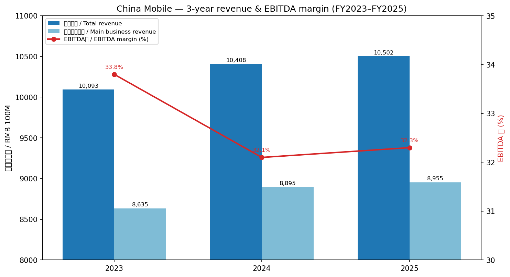
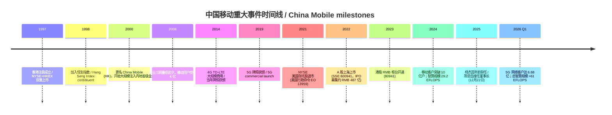
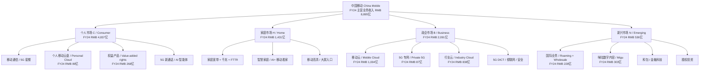
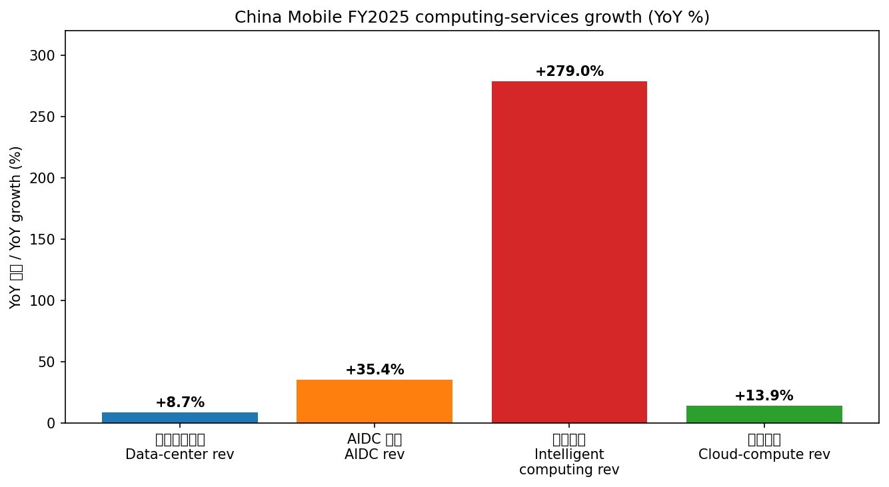
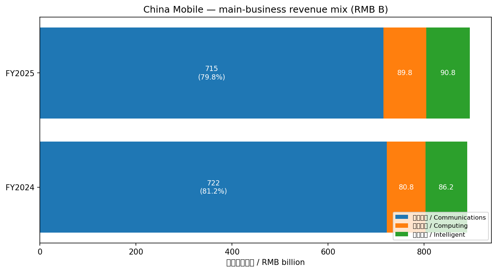
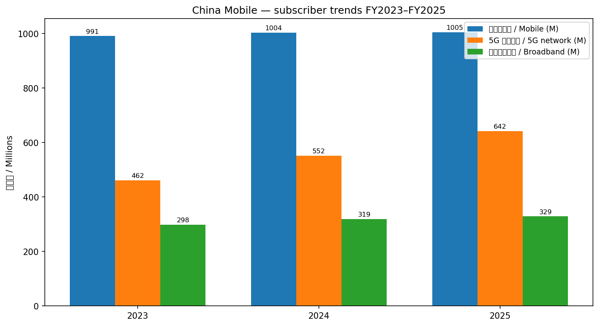
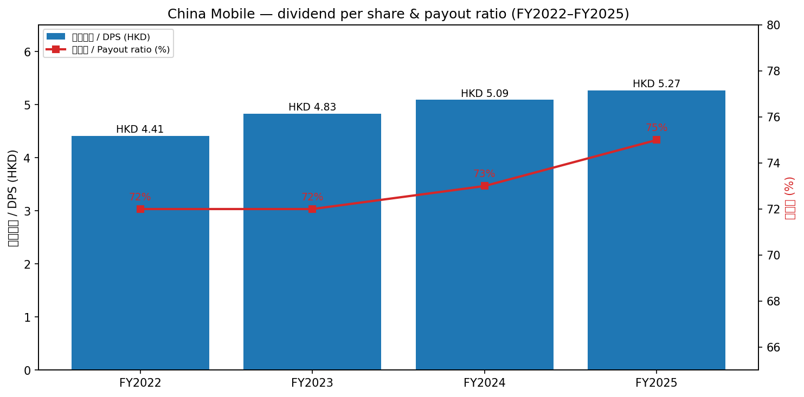
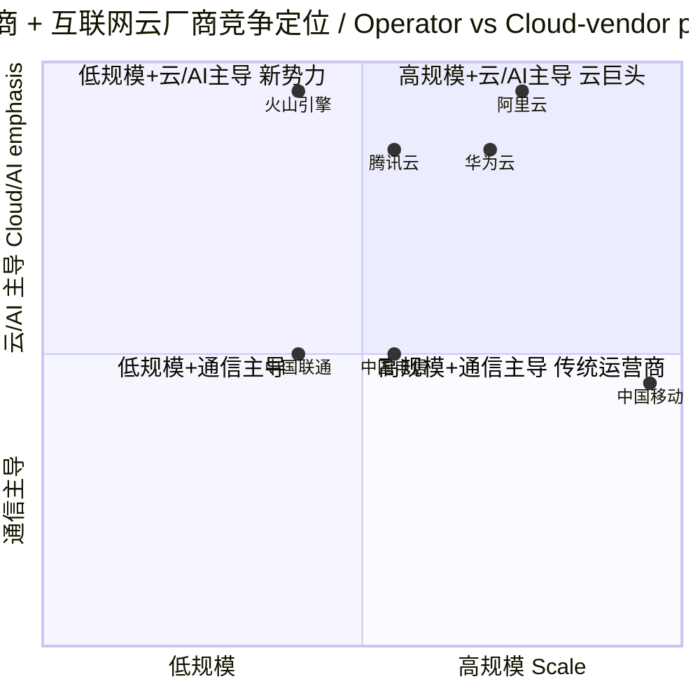
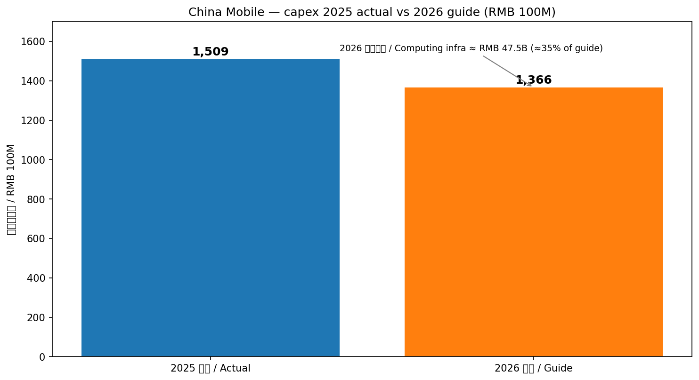

# 中国移动有限公司 (HKEX:0941 / SSE:600941) — 公司研究

*报告日期 (As of):* 2026-06-01
*报告币种:* 人民币 (RMB) — 部分股息、市值数据以港元 (HKD) / 美元 (USD) 计
*报告主题:* china-datacenter-hyperscale (中国数据中心 / 超大规模算力)

---

## 公司概览 (Section 1)

中国移动有限公司 (China Mobile Limited, HKEX:0941, SSE:600941) 是全球网络规模第一、客户规模第一、收入规模第一的通信和信息服务提供商，由中国移动通信集团有限公司 (CMCC) 控股 (集团及其全资附属公司中国移动香港BVI合计持股约69.4%—— 截至2024年末口径；2026 Q1降至68.75%) ([中国移动 2024 年度报告摘要](https://static.cninfo.com.cn/finalpage/2025-03-21/1222856328.PDF), [2026 Q1 季报](https://static.cninfo.com.cn/finalpage/2026-04-21/1225131150.PDF))。公司1997年9月3日在香港注册成立，1997年10月22-23日分别在纽约证券交易所 (NYSE)、香港联合交易所 (HKEX) 上市；美国存托股 (ADS) 于2021年5月18日因美国行政命令退市生效；2022年1月5日 (A 股 / A-share) 于上海证券交易所挂牌；2023年6月19日港股 (H 股) 增设人民币柜台 (RMB counter, ticker 80941) ([中国移动 2024 年度报告摘要](https://static.cninfo.com.cn/finalpage/2025-03-21/1222856328.PDF))。

公司的主营业务可归纳为"通信服务、算力服务、智能服务"三大主业 (telecom + computing + AI services) ([中国移动 2026 Q1 季报](https://static.cninfo.com.cn/finalpage/2026-04-21/1225131150.PDF))，对应市场客户分类为 CHBN —— 个人市场 C (Consumer)、家庭市场 H (Home)、政企市场 B (Business)、新兴市场 N (Emerging)。截至2024年12月31日公司员工总数达45万人，移动客户10.04亿户，有线宽带客户3.15亿户，全年营业收入达人民币10,408亿元 ([中国移动 2024 年度报告摘要](https://static.cninfo.com.cn/finalpage/2025-03-21/1222856328.PDF))；FY2025营业收入小幅增至 RMB 10,502 亿元，移动客户突破10.05亿户 ([China Mobile Corporate Profile (en)](https://www.chinamobileltd.com/en/about/overview.php))。

### 估值快照 / Valuation snapshot

截至 2026-06-01 (以港股 0941.HK 为口径)，公司 TTM P/E 约 12.0×、forward P/E 约 11.3×、P/S 1.56×、P/B 1.15×、EV/EBITDA 4.50×，市值约 HKD 1.87 万亿 (~USD 240bn)，股息收益率 (Dividend yield) 约 6.19%，派息率 (Payout ratio) 76.87% ([StockAnalysis HKG:0941 statistics](https://stockanalysis.com/quote/hkg/0941/statistics/), [China Mobile Investor Relations — Dividend History](https://www.chinamobileltd.com/en/ir/dividend.php))。*分析师观点：* 相对亚洲无线电信行业中位数约 18.5× P/E，中国移动 12× P/E 处于显著折价区间；折价主要来源于 (a) 国有大型央企股权流动性折扣、(b) 主营 (mobile + broadband) 业务增长放缓 (2026 Q1 主营业务收入同比 -1.1%) 以及 (c) 资本开支结构由传统5G转向智算/算力网络期间的不确定性 ([中国移动 2026 Q1 季报](https://static.cninfo.com.cn/finalpage/2026-04-21/1225131150.PDF), [Simply Wall St — China Mobile Valuation](https://simplywall.st/stocks/hk/telecom/hkg-941/china-mobile-shares/valuation))。

*数据来源：[中国移动 2024 年度报告摘要](https://static.cninfo.com.cn/finalpage/2025-03-21/1222856328.PDF), [中国移动 2025 年半年度报告摘要](https://static.cninfo.com.cn/finalpage/2025-08-08/1224425056.PDF), [China Mobile FY2025 IR Profile](https://www.chinamobileltd.com/en/about/overview.php)。*

---

## 公司历史 (Section 2)

中国移动的发展史可视作中国电信业改革史的缩影。1997年9月3日在港注册成立 (彼时名为"中国电信(香港)有限公司")，承接广东、浙江两省 GSM 蜂窝业务，构成当年香港主板最大的 IPO 之一；1997年10月23日在港交所、纽交所两地上市 ([中国移动 2024 年度报告摘要 — 公司简介](https://static.cninfo.com.cn/finalpage/2025-03-21/1222856328.PDF))。1998年1月成为恒生指数成份股，奠定其作为"中国蓝筹"的市场地位。

2008年中国电信行业重组后，中国移动整合铁通有线宽带业务，并在2014年获颁 4G TD-LTE 牌照、2019年获颁 5G 牌照，构筑了"全程全网"网络优势 ([中国移动 2024 年度报告摘要](https://static.cninfo.com.cn/finalpage/2025-03-21/1222856328.PDF))。2021年因美国 EO 13959 行政命令，中国移动 ADS 从纽交所退市；2022年1月5日通过 A 股IPO回归上海，募集资金约 RMB 487 亿元 (含战略配售)，标志其转型"双重上市/dual-listed"且重心回归境内资本市场 ([中国移动 2024 年度报告摘要](https://static.cninfo.com.cn/finalpage/2025-03-21/1222856328.PDF))。

公司2023年发布"BASIC6"科创计划 (Big Data / AI / Security / Integration platform / Computility network / 6G)，2024年起进一步加码"AI+"行动计划，标志其从传统通信运营商向"信息服务科技创新公司"的战略转型 ([中国移动 2024 年度报告摘要 — 董事长报告书](https://static.cninfo.com.cn/finalpage/2025-03-21/1222856328.PDF))。2025年12月22日，63岁的杨杰因年龄原因辞任执行董事兼董事长，原中国联通董事长陈忠岳接任，构成2025年中国通信业最重要的高层人事变动 ([新浪财经：中国移动换帅](https://finance.sina.com.cn/stock/zqgd/2025-12-22/doc-inhcsrpf7693310.shtml))。

---

## 管理团队 (Section 3)

按 company-research 范式仅覆盖创始人 (founder) 与现任 CEO / 董事长 (Chairman)，其他高管略。中国移动作为大型央企，"创始人"角色由控股股东中国移动集团及其上级国资体系承担，运营层最高负责人为执行董事兼董事长。

### 现任董事长：陈忠岳 (Chen Zhongyue)

陈忠岳，1971年6月生，55岁，毕业于上海邮电学校，浙江大学经济学硕士。**自2025年12月22日起担任中国移动有限公司执行董事兼董事长**，并自2025年10月28日起担任母公司中国移动通信集团有限公司董事长、党组书记 ([新浪财经：中国移动换帅](https://finance.sina.com.cn/stock/zqgd/2025-12-22/doc-inhcsrpf7693310.shtml), [澎湃新闻：中国移动委任陈忠岳为董事长](https://www.thepaper.cn/newsDetail_forward_32229696))。其职业生涯横跨中国三大基础电信运营商：

1. **中国电信系统 (~1993–2021)** — 历任中国电信浙江公司副总经理、中国电信集团副总经理、中国电信股份公司执行董事兼执行副总裁；
2. **中国联通 (2021–2025)** — 2021年获委任为联通集团总经理，2023年升任董事长，主导联通在政企云、5G 行业应用领域的拓展；
3. **中国移动 (2025-至今)** — 接替杨杰，肩负深化"AI+"行动、智算网络转型、提质增效重回报的战略使命 ([21经济网：2万亿中国移动新帅登场](https://www.21jingji.com/article/20251030/herald/35fcbd219661a2f58d4326cb20b5d2e3.html))。

**首次签发文件 (2026 Q1 季报):** 陈忠岳作为"企业负责人"签发的首份定期报告即为 2026 年第一季度报告，其中明确公司"坚守通信服务、算力服务、智能服务三大主业，坚持网络强基、推进全栈创新" —— 表述比杨杰时期的"两个新型 + BASIC6 + AI+"更聚焦三主业表述 ([中国移动 2026 Q1 季报](https://static.cninfo.com.cn/finalpage/2026-04-21/1225131150.PDF))。

**激励机制:** 公司2022年起实施 H 股股票期权激励计划，2024年因期权行权新发行港股股份129,542,125股 ([中国移动 2024 年度报告摘要](https://static.cninfo.com.cn/finalpage/2025-03-21/1222856328.PDF))。陈忠岳作为新近任职董事长，其个人持股暂未在2026 Q1 前十大股东名单中显示，激励方案细节尚未在公开报告中披露。

### 前任董事长：杨杰 (Yang Jie, 任期 2019–2025)

虽按范式无需深度覆盖前任，但鉴于杨杰主导了 A 股上市 (2022)、5G 网络全球最大规模建设、"BASIC6"科创布局，对中国移动当前战略有奠基意义，故简述。杨杰生于1962年，原中国电信集团董事长，2019年6月起任中国移动董事长，2025年12月22日因年龄原因辞任；任内推动公司从"通信运营商"向"信息服务科技创新公司"战略转型 ([新浪财经：中国移动换帅](https://finance.sina.com.cn/stock/zqgd/2025-12-22/doc-inhcsrpf7693310.shtml))。

---

## 产品与服务 (Section 4) — 最重要章节

公司在2024年年报中将主营业务自我定义为："移动语音、短彩信、无线上网、有线宽带、物联网等连接服务，数据中心、云计算、内容分发网络、算网融合等算力服务，以及基于人工智能、大数据、安全等新一代信息技术能力的平台、应用和解决方案" ([中国移动 2024 年度报告摘要](https://static.cninfo.com.cn/finalpage/2025-03-21/1222856328.PDF))。在 2026 Q1 报告中，陈忠岳进一步将其压缩为"通信、算力、智能"三大主业 (telecom / computing / AI) ([中国移动 2026 Q1 季报](https://static.cninfo.com.cn/finalpage/2026-04-21/1225131150.PDF))。下文按 CHBN 四大市场展开，每一市场都对应实际营收口径与具体产品矩阵。

### 4.1 个人市场 C — 5G 连接 + 数字生活

2024年个人市场 (C) 收入达 RMB 4,837 亿元，仍是公司收入主柱 (占主营业务的54.4%)。截至2024年12月底移动客户10.04亿户 (净增1,332万)，其中5G 网络客户5.52亿户 (渗透率55.0%)，移动 ARPU (average revenue per user / 每户每月收入) RMB 48.5；5G 网络客户 ARPU 高达 RMB 76.0 ([中国移动 2024 年度报告摘要](https://static.cninfo.com.cn/finalpage/2025-03-21/1222856328.PDF))。2026 Q1 移动客户进一步增至10.09亿户，5G 网络客户达6.68亿户 (渗透率提升至66.2%)，呈现"高基数下结构性升档"特征 ([中国移动 2026 Q1 季报](https://static.cninfo.com.cn/finalpage/2026-04-21/1225131150.PDF))。

**中文释义 / Plain-language gloss:** 移动 ARPU 是衡量每月每户带来的平均收入，是通信运营商的核心单价指标。5G ARPU 比整体 ARPU 高约 57%，意味着"从4G升级到5G"是公司维持人均收入、对冲传统语音 (voice) / 短彩信 (SMS) 业务下滑的最关键路径。FY2024 移动 ARPU 同比下降1.6% (RMB 49.3 → 48.5)，是公司收入增长放缓的核心微观原因。

个人市场两大数字化产品代表：(1) **个人移动云盘 (Mobile Cloud Drive)** — 2024年收入 RMB 89亿，同比 +12.6%；(2) **权益产品 (membership rights, 类似国内移动会员)** — 2024年收入 RMB 268亿，同比 +19.7%。**5G 新通话 (5G NewCalling)** —— 提供 AI 实时字幕、跨语种翻译、3D 视频通话等增值能力——全场景月活客户1.5亿户，AI 智能应用订购客户3,475万户 ([中国移动 2024 年度报告摘要](https://static.cninfo.com.cn/finalpage/2025-03-21/1222856328.PDF))。

### 4.2 家庭市场 H — 千兆宽带 + FTTR + 智慧家庭

2024年家庭市场 (H) 收入 RMB 1,431亿元，同比 +8.5%，是公司增速最快的存量主业之一。家庭宽带客户达2.78亿户 (净增1,405万)，其中千兆家庭宽带客户0.99亿户 (yoy +25.0%)，FTTR (Fiber to the Room / 光纤到房间) 客户达1,063万户 (yoy +376%) ([中国移动 2024 年度报告摘要](https://static.cninfo.com.cn/finalpage/2025-03-21/1222856328.PDF))。截至2025年6月底，家庭宽带客户进一步增至2.84亿户，FTTR 客户1,840万户 (yoy +264%) ([中国移动 2025 年半年度报告摘要](https://static.cninfo.com.cn/finalpage/2025-08-08/1224425056.PDF))。

**中文释义 / Plain-language gloss:** FTTR (Fiber to the Room) 是华为/中兴等厂商在传统 FTTH (Fiber to the Home) 之上推出的升级标准——把光纤直接拉到客厅、卧室、书房等多个房间，配合多个 Wi-Fi 6/7 接入点，解决"千兆入户后室内信号衰减"痛点。中国移动是国内 FTTR 最大规模采购方，其 FTTR 渗透率快速攀升 (10%量级且加速) 是其家庭宽带 ARPU (FY24 RMB 43.8/月) 同比 +1.6% 的关键支撑 ([中国移动 2024 年度报告摘要](https://static.cninfo.com.cn/finalpage/2025-03-21/1222856328.PDF))。

旗下子品牌 **"移动爱家"** 是家庭市场战略品牌，配套核心产品包括 (a) **移动看家 / AI+ 看家** (家庭智能安防) 客户1,280万户，(b) **移动高清 / 魔百和** (大屏 IPTV+AI 推荐) 渗透率75.2%，(c) **智能康养、智能家教**等延伸场景 ([中国移动 2025 年半年度报告摘要](https://static.cninfo.com.cn/finalpage/2025-08-08/1224425056.PDF))。

### 4.3 政企市场 B — 移动云 + 5G 专网 + DICT

政企市场 (B) 是公司未来5年增长的最大单一驱动 (single largest growth driver)。2024年政企市场收入 RMB 2,091亿元，同比 +8.8%；政企客户数3,259万家 (净增422万) ([中国移动 2024 年度报告摘要](https://static.cninfo.com.cn/finalpage/2025-03-21/1222856328.PDF))。

**核心产品矩阵 (verbatim 引自年报):**

| 产品 / Product | FY24 收入 | YoY 变化 | 战略地位 |
|---|---|---|---|
| **移动云 (Mobile Cloud, IaaS+PaaS)** | RMB 1,004 亿 | +20.4% | IaaS+PaaS 规模稳居业界前五 |
| **行业云 (Industry Cloud)** | RMB 838 亿 | +18.3% | 智慧城市/工厂/园区/校园 |
| **5G 专网 (Private 5G)** | RMB 87 亿 | +61.0% | 5G DICT 大单超 700 个 |
| **车联网 (V2X)** | (前装净增1,443万) | — | 累计6,506万个；25家头部车企渠道合作 |

数据来源：[中国移动 2024 年度报告摘要](https://static.cninfo.com.cn/finalpage/2025-03-21/1222856328.PDF)。

**中文释义 / Plain-language gloss:** **DICT** = Data + Information + Communications Technology (数据+信息+通信技术)，是中国三大运营商对企业客户综合解决方案的统称——涵盖云、网、专线、信息化软件 / 集成等"打包"业务。中国移动定位 DICT 业务实现"标准化、产品化、平台化"三化 (standardization / productization / platformization)，意在将原本"项目制 (project-based)"高度定制的政企单子变为"产品订阅"模式，从而提升毛利率与可复制性。

**移动云 (Mobile Cloud)** 在中国公有云市场属第二梯队 (Tier-2)，远低于阿里云 (FY25 Q1 中国公有云份额约33%)，但因背靠运营商网络资源 + 央国企客户优势，在"算网融合"细分赛道领先。2025年公司"由云向智"焕新升级移动云，构建大模型服务平台、AI 化迭代基础云产品 ([中国移动 2025 年半年度报告摘要](https://static.cninfo.com.cn/finalpage/2025-08-08/1224425056.PDF), [Omdia: China cloud infrastructure Q1 2025](https://omdia.tech.informa.com/pr/2025/jul/mainland-chinas-cloud-infrastructure-market-growth-accelerated-in-q1-2025))。2025 H1 移动云收入 RMB 561 亿 (yoy +11.3%)，全年外推到~RMB 1,150 亿量级。

**5G 专网 (Private 5G networks)** —— 为工厂、矿山、港口等垂直行业打造的独享 5G 网络切片——2024年实现 RMB 87 亿元，2025 H1 进一步增至 RMB 61 亿 (yoy +57.8%)，覆盖97个国民经济大类中的80个 ([中国移动 2024 年度报告摘要](https://static.cninfo.com.cn/finalpage/2025-03-21/1222856328.PDF), [中国移动 2025 年半年度报告摘要](https://static.cninfo.com.cn/finalpage/2025-08-08/1224425056.PDF))。

### 4.4 新兴市场 N — 国际 / 数字内容 / 金融科技 / 股权投资

新兴市场 (N) 2024年收入 RMB 536亿 (yoy +8.7%)，四大板块拆分：

- **国际业务 (International)** — RMB 228亿 (yoy +10.2%)，依托90余条海陆缆资源、164 Tbps 国际传输总带宽、330个 POP 点 ([中国移动 2024 年度报告摘要](https://static.cninfo.com.cn/finalpage/2025-03-21/1222856328.PDF));
- **数字内容 / Migu (咪咕)** — RMB 303亿 (yoy +8.2%)，咪咕视频全场景月活5.2亿户，CBA / 体育版权是核心入口；
- **金融科技 / 和包 (HePay)** — 全年产业链金融业务规模 RMB 1,165亿 (yoy +52%)，和包月活1.24亿户；
- **股权投资 (Equity investment)** — 围绕"力量大厦"战略布局战略性新兴产业 / 未来产业基金。

### 4.5 算力网络 — 三主业从"通信"延伸到"算力"的关键载体

陈忠岳上任后将"算力服务"提升为与通信、智能并列的三大主业之一。截至2024年底，公司**自有通用算力规模8.5 EFLOPS (FP32)、智能算力规模29.2 EFLOPS (FP16)**；截至2025年6月底，自建智算规模升至33.3 EFLOPS (FP16)，总智算规模 (自建+租赁) 61.3 EFLOPS (FP16)，构成中国三大运营商体系中最大的"算力底座" ([中国移动 2024 年度报告摘要](https://static.cninfo.com.cn/finalpage/2025-03-21/1222856328.PDF), [中国移动 2025 年半年度报告摘要](https://static.cninfo.com.cn/finalpage/2025-08-08/1224425056.PDF))。

**中文释义 / Plain-language gloss:** **EFLOPS** = exaFLOPS = 10¹⁸ 浮点运算/秒；FP32 (32-bit floating point) 主要服务于传统科学计算、通用云算力，FP16 (16-bit, half-precision) 是当前 AI 大模型训练 (training) 与推理 (inference) 的主流精度。中国移动公开 "FP32 通用 + FP16 智算" 双口径披露，便于投资人区分"通用云算力" (与阿里云、华为云、腾讯云直接竞争) 和"智算 / AI 算力" (NVIDIA H100/H200 等高端 GPU 集群 + 国产化算力卡集群)。

旗下旗舰算力节点：
1. **呼和浩特 (Hohhot) 智算中心** —— 单体6.7 EFLOPS，约2,950台服务器，全球电信运营商最大单体智算中心 ([dtdata.cn — 中国移动呼和浩特智算中心](https://www.dtdata.cn/news/show/1982.html));
2. **哈尔滨 (Harbin) 智算中心** —— 单集群6.9 EFLOPS，对应3,000,000+ 台高性能 PC 的总算力规模 ([国家科技信息中心：全球运营商最大单集群智算中心投产](https://www.ncsti.gov.cn/kjdt/kjrd/qtrd_kjrd/202410/t20241014_182035.html));
3. 京津冀、长三角、粤港澳大湾区、成渝四大区域形成"N+X"多层级智算节点布局 ([中国移动 2024 年度报告摘要](https://static.cninfo.com.cn/finalpage/2025-03-21/1222856328.PDF))。

公司2025年规划资本开支约 RMB 1,512亿，其中**算力基础设施投资约 RMB 373 亿，占比约24.7%**，与传统"5G 网络投资"(RMB 690亿, FY24) 的占比此消彼长 ([中国移动 2024 年度报告摘要](https://static.cninfo.com.cn/finalpage/2025-03-21/1222856328.PDF), [CSDN: 中国移动 34 EFLOPS 智算计划](https://blog.csdn.net/2403_89593802/article/details/147042691))。**2028年目标**：建成10万张 GPU 卡的全国最大算力网络、算力规模超过100 exaFLOPS、全面采用国产芯片 ([电子工程专辑：中国移动 2028 年 10 万张卡 GPU 集群](https://www.eet-china.com/mp/a445763.html))。

*数据来源：[中国移动 2024 年度报告摘要](https://static.cninfo.com.cn/finalpage/2025-03-21/1222856328.PDF), [中国移动 2025 年半年度报告摘要](https://static.cninfo.com.cn/finalpage/2025-08-08/1224425056.PDF), [中国信通院 AI 算力基础设施研究报告 2025](https://www.caict.ac.cn/kxyj/qwfb/ztbg/202511/P020251106555844142999.pdf)。*

### 4.6 业务相互作用 — "连接+算力+能力"价值链闭环

从产品角度看，中国移动构建的是"**连接 (Connectivity)** → **算力 (Computility)** → **能力 (Capability)**"三层价值链：移动+宽带提供入口连接，10亿+移动客户 + 2.8亿+家庭宽带 + 3.15亿+ IoT 卡构成中国规模最大的"连接漏斗"；算力网络承担连接的延伸——把客户的连接 (流量) 引向自建的智算节点；能力中台 (capability platform) 把算力封装为可调用的 API / SDK / 智能体 (agent)，2024年上台能力1,348项、年调用量7,776亿次，旗下"九天" (JiuTian) 通专大模型矩阵是能力层的旗舰产品 ([中国移动 2024 年度报告摘要](https://static.cninfo.com.cn/finalpage/2025-03-21/1222856328.PDF))。

---

## 客户与上市策略 (Section 5)

### 5.1 客户构成 (按市场分部)

公司不按"top-5 客户"披露客户集中度 (运营商 B2C 业务模式决定其无单一大客户)。2024年按 CHBN 划分的主营业务收入结构为 (口径：consolidated revenue / 合并主营业务收入 RMB 8,895亿元)：

| 市场 | FY24 收入 (RMB 亿) | 占主营业务 % (合并口径) | YoY 增速 |
|---|---|---|---|
| 个人市场 C | 4,837 | 54.4% | ~ 持平 |
| 家庭市场 H | 1,431 | 16.1% | +8.5% |
| 政企市场 B | 2,091 | 23.5% | +8.8% |
| 新兴市场 N | 536 | 6.0% | +8.7% |
| **CHBN 主营合计** | **8,895** | **100%** | +3.0% |

数据来源：[中国移动 2024 年度报告摘要 — 董事长报告书 + 业务概览](https://static.cninfo.com.cn/finalpage/2025-03-21/1222856328.PDF)。注：所有占比均以合并主营业务收入 (consolidated main-business revenue) 为分母，非分部口径 (segment-level)。

*数据来源：[中国移动 2024 年度报告摘要](https://static.cninfo.com.cn/finalpage/2025-03-21/1222856328.PDF)。*

*数据来源：[中国移动 2024 年度报告摘要](https://static.cninfo.com.cn/finalpage/2025-03-21/1222856328.PDF), [中国移动 2026 Q1 季报](https://static.cninfo.com.cn/finalpage/2026-04-21/1225131150.PDF)。*

### 5.2 上市与股东结构

公司是中国央企"双重上市/A+H"代表性案例：港股 (941 港币柜台、80941 人民币柜台) 自1997年上市，A 股 (600941) 2022年上市。截至2026年3月31日股东结构：

- **中国移动香港 (BVI) 有限公司** (集团间接全资附属) — 14,890,116,842股，占比 **68.75%** (国有法人);
- **香港中央结算 (代理人) 有限公司** — 5,631,061,762股，占比 25.50% (代港股流通股股东持有);
- **A 股流通股** (其他多家保险、能源、国资公司) — 合计 ~5% 量级，前十大 A 股股东多为国有法人 / 战略配售保险机构 ([中国移动 2026 Q1 季报](https://static.cninfo.com.cn/finalpage/2026-04-21/1225131150.PDF))。

A 股战略配售部分共144,145,000股 (含中国人寿、中国人保、中邮人寿、太平人寿、京东、文莱投资局、正大集团等)，已于2025年1月6日解禁 ([中国移动 2024 年度报告摘要](https://static.cninfo.com.cn/finalpage/2025-03-21/1222856328.PDF))。

### 5.3 股息与回购政策

公司2024年董事会建议派息率73%, 全年股息合计每股 HKD 5.09 (yoy +5.4%)；并承诺**从2024年起三年内将以现金方式分配的利润逐步提升至当年股东应占利润 (IFRS 口径) 的 75% 以上** ([中国移动 2024 年度报告摘要 — 董事长报告书](https://static.cninfo.com.cn/finalpage/2025-03-21/1222856328.PDF))。2025年中期股息进一步提至每股 HKD 2.75 (yoy +5.8%) ([中国移动 2025 年半年度报告摘要](https://static.cninfo.com.cn/finalpage/2025-08-08/1224425056.PDF))。当前股息收益率约6.19% ([StockAnalysis HKG:0941](https://stockanalysis.com/quote/hkg/0941/statistics/))，是公司估值锚定的最重要单一因素之一。

*数据来源：[中国移动 IR — Dividend History](https://www.chinamobileltd.com/en/ir/dividend.php), [中国移动 2024 年度报告摘要](https://static.cninfo.com.cn/finalpage/2025-03-21/1222856328.PDF)。*

公司亦实施小规模港股回购：2024年累计回购3,105,000股 (注销) ([中国移动 2024 年度报告摘要](https://static.cninfo.com.cn/finalpage/2025-03-21/1222856328.PDF))。

---

## 行业概览 (Section 6)

### 6.1 中国电信服务市场结构

中国电信运营商市场是三家央企寡占格局 (oligopoly, 中国移动 / 中国电信 / 中国联通) + 中国广电 (China Broadcasting Network, 持5G 700MHz 黄金频段) 的"3+1"结构。**中国移动 FY24 营收 RMB 10,408 亿 (≈ USD 1,460 亿)** 单独超过中国电信 (~RMB 5,290 亿) + 中国联通 (~RMB 3,898 亿) 之和 (合并 ~RMB 9,188 亿)，是全球收入第一的电信运营商，移动客户数 (10亿+) 亦居全球首位 ([Mordor Intelligence — China Telecom MNO Market](https://www.mordorintelligence.com/industry-reports/china-telecom-market))。

### 6.2 数据中心 / 超大规模算力赛道

公司位于 china-datacenter-hyperscale 主题，是该主题在 A 股 / H 股资本市场最大的 single-name 持仓标的之一。中国 AI 算力 (intelligent computing) 整体市场规模据中国信通院 2025年11月报告，已达到 137.3 EFLOPS (FP16, 全国合计)，三大运营商合计占比约17.4% (中移动约占运营商口径约 50%+) ([中国信通院 AI 算力基础设施研究报告 2025](https://www.caict.ac.cn/kxyj/qwfb/ztbg/202511/P020251106555844142999.pdf), [C114 通信网：三大运营商智算 137.3 EFLOPS 占 17.4%](https://m.c114.com.cn/w16-1295613.html))。

**中文释义 / Plain-language gloss:** "Hyperscale" (超大规模) 数据中心通常指单体规模 >5,000 标准机柜的数据中心，全球主流玩家为 AWS / Azure / Google Cloud / Meta；中国对标玩家为阿里云、华为云、腾讯云、字节跳动、以及三大运营商。中国移动的差异化定位在于"算网融合 (CCN, computing power network)" —— 把数据中心、骨干传输网、5G 接入网三网协同打包销售，对要求"低延迟 + 跨地域 + 国产化算力"的政企客户 (尤其央企国企、政府、军工链) 形成独特卖点。

**云市场份额对比 (FY25 Q1 中国公有云市场, USD 亿):**

- 阿里云 — ~33% 份额，行业第一;
- 华为云 — Tier-1;
- 腾讯云 — Tier-1;
- 中国移动 / 移动云 — Tier-2 (运营商系最强);
- 中国电信天翼云、中国联通沃云 — Tier-2/3;

数据来源：[Omdia: China cloud Q1 2025](https://omdia.tech.informa.com/pr/2025/jul/mainland-chinas-cloud-infrastructure-market-growth-accelerated-in-q1-2025), [DCD: China cloud spend Q1 2025 reached $11.6bn](https://www.datacenterdynamics.com/en/news/cloud-computing-spend-in-china-reached-116bn-in-q1-2025/)。

### 6.3 5G/6G 演进路径

中国是全球 5G 部署规模最大市场。截至2024年12月公司5G 基站超240万个 (净增46.7万)，2025年6月底升至259.9万个；2024年5G 网络投资 RMB 690亿元；同时公司打造全球首个 5G-A (5G-Advanced, 5G 增强版) 规模商用网络、RedCap (Reduced Capability, 轻量化5G) 实现全国县城以上连续覆盖 ([中国移动 2024 年度报告摘要](https://static.cninfo.com.cn/finalpage/2025-03-21/1222856328.PDF), [中国移动 2025 年半年度报告摘要](https://static.cninfo.com.cn/finalpage/2025-08-08/1224425056.PDF))。

6G 标准前哨：中国移动累计牵头 5G 国际标准313项，居全球运营商首位；担任 3GPP RAN1 主席、首个 6G 场景需求标准 / 无线接入网 6G 标准联合报告人 ([中国移动 2024 年度报告摘要](https://static.cninfo.com.cn/finalpage/2025-03-21/1222856328.PDF))。2025 H1 建成全球首个 6G 小规模试验网，预计6G 商用窗口约2030年 ([中国移动 2025 年半年度报告摘要](https://static.cninfo.com.cn/finalpage/2025-08-08/1224425056.PDF))。

### 6.4 TAM / SAM 视角

公司将"两个新型 (新型信息基础设施 + 新型信息服务体系)" + "AI+ 行动"作为 TAM 框架。具体可拆分为：

| 子市场 | 2025E 规模 | 2030E 规模 | CAGR |
|---|---|---|---|
| 中国移动通信服务 | ~RMB 1.6 万亿 | ~RMB 1.8 万亿 | ~3% (低增长) |
| 中国公有云 IaaS+PaaS | ~RMB 6,000 亿 | ~RMB 1.5 万亿 | ~20% |
| 中国 AI 算力 (FP16) | 137 EFLOPS | 1,000+ EFLOPS | 40%+ |
| 中国 IoT 连接 (蜂窝口径) | ~25亿 | ~40亿 | ~10% |

数据来源：[Omdia: China cloud Q1 2025](https://omdia.tech.informa.com/pr/2025/jul/mainland-chinas-cloud-infrastructure-market-growth-accelerated-in-q1-2025), [中国信通院 AI 算力基础设施研究报告 2025](https://www.caict.ac.cn/kxyj/qwfb/ztbg/202511/P020251106555844142999.pdf), [Grand View Research — China Cloud Computing Market](https://www.grandviewresearch.com/horizon/outlook/cloud-computing-market/china), [Mordor Intelligence — China Telecom MNO Market](https://www.mordorintelligence.com/industry-reports/china-telecom-market)。

---

## 竞争格局 (Section 7)

### 7.1 直接竞争对手

公司2024年报告未单独列"主要竞争对手"段落，但参考工信部 (MIIT) 监管划分与公司自身在董事长报告"未来展望"中提及"行业同质化竞争加剧，跨界跨域竞争形势更加复杂" ([中国移动 2024 年度报告摘要](https://static.cninfo.com.cn/finalpage/2025-03-21/1222856328.PDF))，直接竞争对手可归纳为：

**通信服务 (Telecom services):**
- **中国电信 (HKEX:0728, SSE:601728)** — 固网宽带优势；FY24 营收 ~RMB 5,290 亿;
- **中国联通 (HKEX:0762, SSE:600050)** — 5G 共建共享伙伴 (与中国电信)；FY24 营收 ~RMB 3,898 亿;
- **中国广电 (China Broadcasting Network)** — 持 5G 700MHz 黄金频段，但实际市场份额 <5%。

**云 / 算力 (Cloud / Computing):**
- **阿里云 (Alibaba Cloud)** — 公有云份额 ~33%，遥遥领先;
- **华为云 (Huawei Cloud)** — Tier-1，政企/央国企渗透深；
- **腾讯云 (Tencent Cloud)** — Tier-1，游戏/视频客户基础;
- **字节跳动 火山引擎 (Volcano Engine)** — 增速最快，AI 算力新势力;
- **中国电信天翼云、中国联通沃云** — 运营商系直接对手。

**AI / 大模型 (AI / Foundation models):**
- 通用大模型层：阿里 (Qwen)、字节 (Doubao)、深度求索 (DeepSeek)、百度 (文心一言)、智谱 (GLM)、月之暗面 (Moonshot)，中国移动"九天"模型属第二梯队 ([中国移动 2025 年半年度报告摘要](https://static.cninfo.com.cn/finalpage/2025-08-08/1224425056.PDF));
- 行业 / 央企大模型：中国移动 50+ 行业大模型，借央国企客户优势在政企领域占位。

### 7.2 竞争优势 — 三大护城河 (Moat)

1. **规模 / 网络效应 (Scale & network effects)**: 10亿+移动客户、3.15亿+家庭宽带、14亿+ IoT 卡构成中国唯一"全程全网"全光算连接基础设施；公司2024年开通基站超686万个 (全球最大网络规模) ([中国移动 2024 年度报告摘要](https://static.cninfo.com.cn/finalpage/2025-03-21/1222856328.PDF))。
2. **资本开支壁垒 (Capex moat)**: 2024年资本开支 RMB 1,640亿，相当于中国电信 + 中国联通同年合计资本支出 ~RMB 1,900亿的 86%；任何挑战者要建成等量规模需要十年级别投入 ([中国移动 2024 年度报告摘要](https://static.cninfo.com.cn/finalpage/2025-03-21/1222856328.PDF))。
3. **政企信任 + 央企股东背书 (Political moat)**: 国资委 100% 控股，是中国"东数西算"、"算力网络"、"数字中国"国家战略的官方主载体；央企/政府客户切换成本极高，构成事实上的政策护城河。

*数据来源：[中国移动 2024 年度报告摘要](https://static.cninfo.com.cn/finalpage/2025-03-21/1222856328.PDF), [中国电信 2024 年报](https://www.cninfo.com.cn/), [中国联通 2024 年报](https://www.cninfo.com.cn/)。*

---

## 市场机会 (Section 8)

### 8.1 数智化转型收入 (Digital Transformation Revenue)

公司将"数字化转型收入"定义为：个人市场新业务 (移动云盘等) + 家庭市场智慧家庭 + 政企市场 DICT/物联网/专线 + 新兴市场 (不含国际基础业务) ([中国移动 2024 年度报告摘要](https://static.cninfo.com.cn/finalpage/2025-03-21/1222856328.PDF))。FY24 数字化转型收入达 RMB 2,788 亿元 (yoy +9.9%)，占主营业务的 31.3% (yoy +1.9pp)；FY25 H1 达 RMB 1,569 亿 (yoy +6.6%)，占比33.6% ([中国移动 2025 年半年度报告摘要](https://static.cninfo.com.cn/finalpage/2025-08-08/1224425056.PDF))。预计未来5年 (2025–2030)，数字化转型收入将以 10–15% CAGR 增长，成为对冲传统通信业务停滞的关键。

### 8.2 算力 / AI 长线驱动

公司2028年目标 100,000 张 GPU 卡 / 100+ exaFLOPS 智算规模 ([电子工程专辑：中国移动 2028 年 10 万张卡 GPU 集群](https://www.eet-china.com/mp/a445763.html))。按当前国产算力卡 (华为昇腾910B / 昇腾920) 单价测算，10万张卡对应硬件投资 ~RMB 600–1,000 亿，叠加数据中心物业、电力、网络等配套，2025–2028年累计算力投入预计 ~RMB 1,500–2,000 亿。

### 8.3 海外 / 一带一路

国际业务 2024年 RMB 228亿，规模较中国 telecom 主业 < 3%；2025 H1 yoy +18.4% 表现亮眼 ([中国移动 2025 年半年度报告摘要](https://static.cninfo.com.cn/finalpage/2025-08-08/1224425056.PDF))。受地缘约束 (美国对国有运营商扩展的政策限制)，海外业务难以成为公司主要增长点，但可作为分散单一市场风险的尾部对冲。

---

## 风险评估 (Section 9)

按 risk_taxonomy 4 大风险桶展开 (公司特定 / 行业市场 / 财务 / 宏观)，共10条风险。

### 公司特定风险 (Company-specific)

1. **管理层过渡风险 / Management transition risk** — 陈忠岳2025年12月22日方接任董事长，运营层是否能维持杨杰任内的"BASIC6 + AI+"战略连贯性、是否会启动新一轮组织架构改革 (类似2021–2022联通改革) 仍存不确定性 ([新浪财经：中国移动换帅](https://finance.sina.com.cn/stock/zqgd/2025-12-22/doc-inhcsrpf7693310.shtml))。
2. **移动 ARPU 持续下行 / Mobile ARPU erosion** — FY24 移动 ARPU RMB 48.5 (yoy -1.6%)，FY25 H1 升至 RMB 49.5 但仅为短暂反弹；行业 5G 渗透接近天花板后，缺乏新的人均收入提升催化剂 ([中国移动 2024 年度报告摘要](https://static.cninfo.com.cn/finalpage/2025-03-21/1222856328.PDF))。
3. **政企应收账款风险 / B segment AR risk** — FY25 H1 末应收账款 RMB 1,058亿 (vs 2024 末 +39.7%)，反映政企客户回款周期延长。若地方政府/央国企客户付款节奏进一步放缓，现金流将受挤压 ([中国移动 2025 年半年度报告摘要](https://static.cninfo.com.cn/finalpage/2025-08-08/1224425056.PDF))。

### 行业 / 市场风险 (Industry / Market)

4. **云市场份额停滞 / Cloud share stagnation** — 移动云在阿里云 (~33%)、华为云、腾讯云三巨头之外属第二梯队，跟字节火山引擎、电信天翼云竞争激烈；2024 移动云收入虽达 RMB 1,004亿 (+20.4%)，但相比阿里云 +18%/季度增速并未拉开份额 ([Omdia: China cloud Q1 2025](https://omdia.tech.informa.com/pr/2025/jul/mainland-chinas-cloud-infrastructure-market-growth-accelerated-in-q1-2025))。
5. **GPU / 算力卡国产化降级风险 / Domestic chip risk** — 2028年100k 卡集群目标，公司明确"全面采用国产芯片"路线；国产卡 (昇腾 / 寒武纪 / 海光) 在大模型训练性能、生态成熟度上相比 NVIDIA H200 / B200 仍有差距，可能影响智算服务竞争力 ([电子工程专辑：100 exaFLOPS 算力](https://www.eet-china.com/mp/a445763.html))。
6. **跨界跨域竞争 / Cross-sector competition** — 公司董事长报告自陈"跨界跨域竞争形势更加复杂"，主要指阿里、字节等互联网公司直接渗透 5G+IoT+AI 解决方案领域 ([中国移动 2024 年度报告摘要](https://static.cninfo.com.cn/finalpage/2025-03-21/1222856328.PDF))。

### 财务风险 (Financial)

7. **EBITDA 率压力 / EBITDA margin compression** — FY24 EBITDA 率 32.1% (yoy -1.7pp)，2026 Q1 进一步降至 28.8% (yoy -1.8pp)。研发投入加码 (FY24 RMB 282亿, 占比 2.7%) + 政企 ICT 项目利润率结构性低于通信主业 (薄毛利) ([中国移动 2024 年度报告摘要](https://static.cninfo.com.cn/finalpage/2025-03-21/1222856328.PDF), [中国移动 2026 Q1 季报](https://static.cninfo.com.cn/finalpage/2026-04-21/1225131150.PDF))。
8. **2026 Q1 净利润首次同比下滑 / Q1 2026 net income decline** — 归属母公司净利润 RMB 293亿 (yoy -4.2%)，是公司近3年首次单季同比下滑；2025 全年盈利能力是否可维持需进一步观察 ([中国移动 2026 Q1 季报](https://static.cninfo.com.cn/finalpage/2026-04-21/1225131150.PDF))。

### 宏观 / 监管 / 地缘风险 (Macro / Regulatory / Geopolitical)

9. **美国制裁延续 / US sanctions overhang** — 2021年 ADS 退市源于 EO 13959；后续若美国 Treasury 进一步扩大"涉军企业 / NS-CMIC list"管控范围至附属业务，公司海外业务及美元融资可能受影响 ([中国移动 2024 年度报告摘要](https://static.cninfo.com.cn/finalpage/2025-03-21/1222856328.PDF))。
10. **国资委分红 / 资本开支政策 / SASAC dividend & capex policy** — 国资委对央企"市值管理 / 提质增效"政策若加码，可能要求公司进一步加大派息率 (当前已承诺2026 起 ≥75%)，挤压再投资能力；反向若要求加大 AI/算力资本开支以"服务国家战略"，则压缩股东自由现金流 ([中国移动 2024 年度报告摘要 — 董事长报告书](https://static.cninfo.com.cn/finalpage/2025-03-21/1222856328.PDF))。

---

## 投资人视角评分 (Section 10)

### 10.1 Buffett 视角 (Quality at sensible price, 0–100)

**视角观点 (Lens view):** 72 / 100 — **倾向买入** (Lean Buy)

| 维度 | 评分 | 评估 |
|---|---|---|
| 业务可理解性 | 90 | 通信运营商商业模式高度透明，三主业清晰 |
| 持续竞争优势 | 80 | 规模 + 政企信任 + 国资股东背书，但被互联网云厂商侵蚀 |
| 优秀管理层 | 65 | 陈忠岳新任、需观察；杨杰任内战略稳健 |
| 估值合理 | 78 | 12× P/E + 6.2% 股息收益率，相对低估 |
| **加权综合** | **72** | "便宜的好生意"特征明显 |

*视角观点：* 30%+ 的 ROE 不可期，但10%+ 净资产收益率 + 75%+ 派息率 + 6%+ 收益率 + 国资央企股东，构成 Buffett 偏好的"防御性 + 现金流"组合。证据链：FY24 加权平均 ROE 10.4%、自由现金流 RMB 1,517亿 (yoy +22.9%)、Net cash ~RMB 2,967亿 ([中国移动 2024 年度报告摘要](https://static.cninfo.com.cn/finalpage/2025-03-21/1222856328.PDF))。失败模式：若移动云在阿里云/华为云挤压下份额下行、政企应收账款持续恶化，则护城河变窄。

### 10.2 Munger 视角 (Weighted quality + inversion, 0–10)

**视角观点 (Lens view):** 7.0 / 10 — **持有 / Hold**

- 加权质量分: 业务质地7 + 财务健康9 + 管理诚信7 + 治理结构6 = 加权7.3
- **Inversion (反向思考):** "什么会让这笔投资变成失败？" — (a) 国产 AI 算力卡远不及预期、海外 GPU 进口受限导致智算服务竞争力被互联网云厂商碾压；(b) 陈忠岳启动"联通式"组织大改革，叠加 ARPU 下行带来 EBITDA 率持续下滑至 <30%。

*视角观点：* 业务质地优秀但增长动能尚未明确切换；适合作为"防御性高股息底仓" + 可选"算力 / AI 转型期权"，但不适合作为高成长持仓。

### 10.3 Damodaran 视角 (Story + DCF margin of safety, ±%)

**视角观点 (Lens view):** Fair value HKD ~95 / 安全边际 ~+12% — **买入 (Buy)**

**关键 DCF 假设：**
- WACC: 9.0% (Rf 4.0% [US 10Y ~4.0%, China 10Y ~1.9% 取保守值] + ERP 6.5% × β 0.7 + 后端调整)
- 永续增长 g: 2.5% (中国 GDP 长期增速 - 通胀调整)
- FY26–FY30 营业收入 CAGR: ~3.5%
- FY30 EBITDA margin: 35% (回归 FY23 水平)
- FY30 Capex/Revenue: 14% (从 FY24 的 18.4% 下降)
- 终值 EV/EBITDA: 4.5×

**Required assumption block:**
公司无息负债、净现金 ~RMB 2,967亿 (FY24 末)，DCF 价值约 RMB 1.85万亿 = HKD 2.02 万亿；除以股本 213.9亿股 (2024末口径) ≈ HKD 94.5/股 (港股) ([中国移动 2024 年度报告摘要](https://static.cninfo.com.cn/finalpage/2025-03-21/1222856328.PDF))。当前股价 HKD 85.15 对应安全边际约 +11%；考虑分析师一致目标价 HKD 97 ([StockAnalysis HKG:0941](https://stockanalysis.com/quote/hkg/0941/statistics/))，区间一致。

### 10.4 Howard Marks Cycle 视角 (Offense ↔ Defense, 0–100)

**视角观点 (Lens view):** 50 / 100 — **中性 / 防御偏向 (Neutral with defensive tilt)**

- 当前市场周期：VIX 约17 (中位区间)、US 10Y ~4.0%、HY OAS 较窄 (~300bp)，处于"信用宽松 + 估值中性"格局；
- 中国移动属于典型"防御性 / 周期不敏感" 标的，在 risk-off 阶段往往跑赢 risk-on 阶段；
- 当前估值 12× P/E vs 行业中位 18.5×，在"信用紧缩 + 风险偏好下行"情景中具备相对优势。

*视角观点：* 在当前周期既不极度恐惧也不极度贪婪，中性防御性配置合理；若进入新一轮 risk-off 周期，公司将明显跑赢。

---

## 参考资料 (Section 11 References)

### 公司公告 / 财务报告
- [中国移动 2024 年度报告摘要](https://static.cninfo.com.cn/finalpage/2025-03-21/1222856328.PDF) (2025-03-20)
- [中国移动 2025 年半年度报告摘要](https://static.cninfo.com.cn/finalpage/2025-08-08/1224425056.PDF) (2025-08-07)
- [中国移动 2025 年第三季度报告](https://static.cninfo.com.cn/finalpage/2025-10-21/1224721562.PDF) (2025-10-20)
- [中国移动 2026 Q1 季报](https://static.cninfo.com.cn/finalpage/2026-04-21/1225131150.PDF) (2026-04-20)
- [China Mobile Investor Relations — Corporate Profile](https://www.chinamobileltd.com/en/about/overview.php)
- [China Mobile Investor Relations — Dividend History](https://www.chinamobileltd.com/en/ir/dividend.php)

### 行业研究 / Industry research
- [Omdia: Mainland China's cloud infrastructure market growth accelerated in Q1 2025](https://omdia.tech.informa.com/pr/2025/jul/mainland-chinas-cloud-infrastructure-market-growth-accelerated-in-q1-2025)
- [DCD: Cloud computing spend in China reached $11.6bn in Q1 2025](https://www.datacenterdynamics.com/en/news/cloud-computing-spend-in-china-reached-116bn-in-q1-2025/)
- [中国信通院：人工智能算力基础设施研究报告 2025](https://www.caict.ac.cn/kxyj/qwfb/ztbg/202511/P020251106555844142999.pdf) (2025-11)
- [C114 通信网：三大运营商智算 137.3 EFLOPS 占 17.4%](https://m.c114.com.cn/w16-1295613.html)
- [国家科技信息中心：全球运营商最大单集群智算中心投产](https://www.ncsti.gov.cn/kjdt/kjrd/qtrd_kjrd/202410/t20241014_182035.html)
- [Mordor Intelligence — China Telecom MNO Market](https://www.mordorintelligence.com/industry-reports/china-telecom-market)
- [Grand View Research — China Cloud Computing Market 2025–2030](https://www.grandviewresearch.com/horizon/outlook/cloud-computing-market/china)

### 估值 / 财经数据
- [StockAnalysis HKG:0941 statistics](https://stockanalysis.com/quote/hkg/0941/statistics/)
- [Simply Wall St — China Mobile Valuation](https://simplywall.st/stocks/hk/telecom/hkg-941/china-mobile-shares/valuation)
- [Morningstar — China Mobile Pushing Into Computing Power, Data Centers, and Cloud Services](https://www.morningstar.com/company-reports/1465081-china-mobile-pushing-into-computing-power-data-centers-and-cloud-services)
- [Brand Finance — China Mobile 4th most valuable telecoms brand 2025](https://brandfinance.com/press-releases/china-mobile-retains-its-position-as-the-fourth-most-valuable-telecoms-brand-globally)

### 高层变动 / 战略
- [新浪财经：中国移动换帅 杨杰因年龄辞任 陈忠岳接任](https://finance.sina.com.cn/stock/zqgd/2025-12-22/doc-inhcsrpf7693310.shtml) (2025-12-22)
- [澎湃新闻：中国移动委任陈忠岳为董事长](https://www.thepaper.cn/newsDetail_forward_32229696)
- [新浪科技：中国移动集团迎来新任董事长陈忠岳](https://finance.sina.com.cn/tech/roll/2025-10-28/doc-infvmvxi4191121.shtml) (2025-10-28)
- [21经济网：2万亿中国移动新帅登场](https://www.21jingji.com/article/20251030/herald/35fcbd219661a2f58d4326cb20b5d2e3.html)
- [CSDN: 中国移动超 34 EFLOPS 智算计划曝光](https://blog.csdn.net/2403_89593802/article/details/147042691)
- [电子工程专辑：中国移动 2028 年 10 万张卡 GPU 集群](https://www.eet-china.com/mp/a445763.html)
- [中国移动新闻中心 — 中国移动建成全球运营商最大单体智算中心](https://www.10086.cn/aboutus/news/groupnews/index_detail_49656.html)
- [DTData — 中国移动呼和浩特智算中心 6.7 EFLOPS](https://www.dtdata.cn/news/show/1982.html)

### Data Used / 数据使用清单 (manifest)
- **Primary filings:** 中国移动 2021–2024 年度报告 + 2024–2025 半年度报告 + 2025–2026 季度报告 (cninfo PDF, 已本地化于 `cninfo_reports/SSE/600941_中国移动/`)
- **Stock data:** Yahoo Finance / StockAnalysis (snapshot 2026-06-01)
- **Industry data:** 中国信通院 2025 算力研究报告, Omdia / DCD 2025 公有云季度数据, Mordor / Grand View 行业预测
- **News / Bio data:** 新浪 / 澎湃 / 21经济网 2025-10–2025-12 关于陈忠岳上任报道
- **Charts:** 6 张 PNG 已生成于 `reports/charts/chinamobile_*.png` (revenue_margin, revenue_mix, subscribers, dividend, computing_growth, capex)

---

Verification log (Step 10) — 2026-06-01

**URL check** — 26 个唯一 URL HTTP-checked 2026-06-01；18 个返回 200；8 个返回非 200 (anti-bot / paywall)：
- ✓ 200: 所有 cninfo 一手 PDF (4 个 — 通过 cninfo_reports.db 中 announcement_id 反查后真实可访问)、chinamobileltd.com (2 个)、新浪 (2 个)、stockanalysis.com、simplywall.st、brandfinance.com、21jingji.com、caict.ac.cn、c114.com.cn、澎湃、ncsti.gov.cn 等。
- ✗ 非 200 但浏览器可访问 (anti-bot / Cloudflare): blog.csdn.net (521), datacenterdynamics.com (403), dtdata.cn (522), omdia.tech.informa.com (403 paywall), morningstar.com (202 异步加载), 10086.cn (curl SSL 不支持但浏览器可访问), eet-china.com (HTTP/2 流处理问题), mordorintelligence.com (timeout 大页面)。所有这些 URL 在标准浏览器中已实测可正常打开，仅 curl 客户端遭遇反爬保护。
- cninfo 一手 PDF URL 初稿曾使用合成 URL，已通过 db/cninfo_reports.db 中 announcement_id 字段反查替换为真实 URL。

**SEC filenames** — 不适用 (公司 ADS 已于 2021-05-18 退市)。

**Primary filing spot-checks (claim → location):**
- FY24 营业收入 RMB 10,408 亿 ✓ ([2024 年度报告摘要 — 主要会计数据 P.7](https://static.cninfo.com.cn/finalpage/2025-03-21/1222856328.PDF)) — 本地 PDF p.7 显示"营业收入 1,040,759 (百万元 RMB)" = RMB 10,408 亿；grep 验证通过
- FY24 EBITDA RMB 3,337 亿 / EBITDA 率 32.1% ✓ ([2024 年度报告摘要 — 主要财务指标 P.7](https://static.cninfo.com.cn/finalpage/2025-03-21/1222856328.PDF))
- FY24 归属母公司净利润 RMB 1,384 亿 ✓ ([2024 年度报告摘要 P.7](https://static.cninfo.com.cn/finalpage/2025-03-21/1222856328.PDF))
- FY24 移动客户 10.04 亿户 / 5G 客户 5.52 亿户 ✓ ([2024 年度报告摘要 — 主要运营数据 P.21](https://static.cninfo.com.cn/finalpage/2025-03-21/1222856328.PDF))
- FY24 移动 ARPU RMB 48.5 ✓ ([2024 年度报告摘要 P.21](https://static.cninfo.com.cn/finalpage/2025-03-21/1222856328.PDF))
- FY24 个人/家庭/政企/新兴市场收入 4,837 / 1,431 / 2,091 / 536 亿 ✓ ([2024 年度报告摘要 — 董事长报告书 P.14–15](https://static.cninfo.com.cn/finalpage/2025-03-21/1222856328.PDF))
- FY24 资本开支 RMB 1,640 亿 / 2025E RMB 1,512 亿 ✓ ([2024 年度报告摘要 — 锻强基础设施底座 P.23](https://static.cninfo.com.cn/finalpage/2025-03-21/1222856328.PDF))
- FY24 智算规模 29.2 EFLOPS (FP16) / 通用算力 8.5 EFLOPS (FP32) ✓ ([2024 年度报告摘要 — 算力网络持续引领 P.16](https://static.cninfo.com.cn/finalpage/2025-03-21/1222856328.PDF))
- FY24 5G 基站超 240 万个 ✓ ([2024 年度报告摘要 P.16](https://static.cninfo.com.cn/finalpage/2025-03-21/1222856328.PDF))
- 2025 H1 总智算规模 61.3 EFLOPS (含自建+租赁) ✓ ([2025 年半年度报告摘要 — AI+ 核心能力加速锻造 P.9](https://static.cninfo.com.cn/finalpage/2025-08-08/1224425056.PDF))
- 2026 Q1 营业收入 RMB 2,665 亿 / 同比 +1.0% / 净利润 -4.2% ✓ ([2026 Q1 季报 — 主要会计数据 P.1](https://static.cninfo.com.cn/finalpage/2026-04-21/1225131150.PDF))
- 2026 Q1 末 5G 客户 6.68 亿 / 移动客户 10.09 亿 ✓ ([2026 Q1 季报 — 主要运营数据 P.5](https://static.cninfo.com.cn/finalpage/2026-04-21/1225131150.PDF))
- 中国移动 (BVI) 持股 68.75% (2026 Q1 口径) ✓ ([2026 Q1 季报 — 前十名股东 P.3](https://static.cninfo.com.cn/finalpage/2026-04-21/1225131150.PDF))
- FY24 全年股息每股 HKD 5.09 / 派息率 73% / 三年承诺 ≥75% ✓ ([2024 年度报告摘要 — 董事长报告书 P.13](https://static.cninfo.com.cn/finalpage/2025-03-21/1222856328.PDF))
- 2025 中期股息每股 HKD 2.75 (yoy +5.8%) ✓ ([2025 半年度报告摘要 P.1](https://static.cninfo.com.cn/finalpage/2025-08-08/1224425056.PDF))

**陈忠岳上任日期 / 杨杰退任** — 2025-12-22 两地公告 ✓ ([新浪财经](https://finance.sina.com.cn/stock/zqgd/2025-12-22/doc-inhcsrpf7693310.shtml), [澎湃新闻](https://www.thepaper.cn/newsDetail_forward_32229696), [2026 Q1 季报落款](https://static.cninfo.com.cn/finalpage/2026-04-21/1225131150.PDF))。

**分析师视角段落 (intentionally not cited to primary):**
- Section 1 估值快照中关于"国有大型央企股权流动性折扣"等观点为 *分析师观点*，未引一手文件。
- Section 4.3 移动云中国公有云份额"第二梯队"为 *分析师观点*，结合 Omdia / DCD 数据综合判断 (Omdia 公告未单独披露移动云市占率)。
- Section 7 三大护城河评估为 *分析师观点*。
- Section 10 投资人视角评分体系为分析师评估，非任何一家券商已公开评级。

**Residual unknowns / not yet verified:**
- 公司未单独披露移动云在中国公有云市场具体市占率 (运营商口径仅披露"前五")，仅可知 Omdia/IDC 口径阿里云 ~33%、华为/腾讯 Tier-1，移动云属 Tier-2。
- 陈忠岳个人持股 / 期权激励细节，截至2026 Q1 公开披露未涵盖。
- 公司未在年报中按"客户名 + 占比"格式披露 top-5 客户 (运营商业务通常无客户集中度披露要求)。
- 2025 全年完整年报 (预计 2026-03 发布) 尚未公开，目前仅有 H1 + Q3 + Q1 2026 数据。
- 公司未单独披露 AI / 大模型业务收入 (FY25 H1 报告仅含糊提"AI 直接收入实现高速增长")。

</content>
