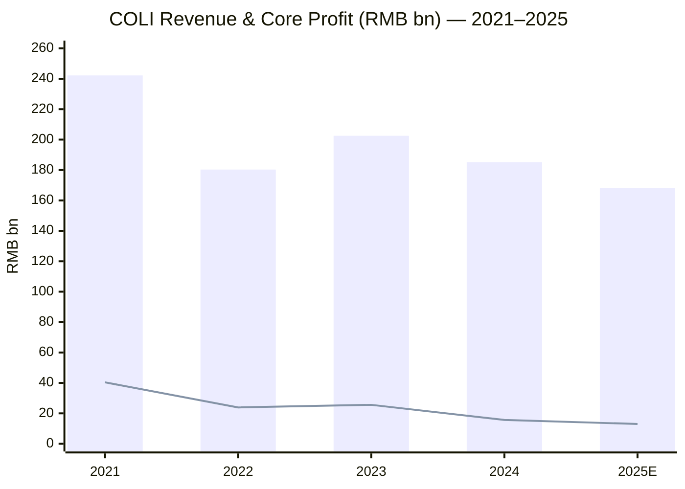
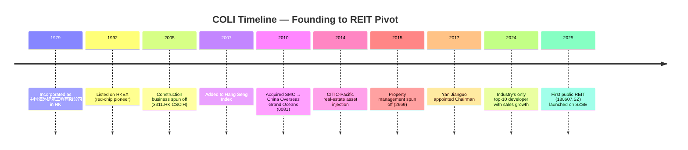
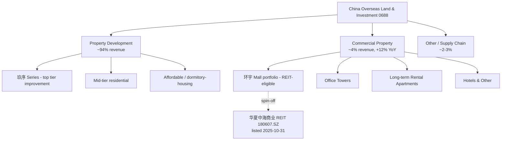
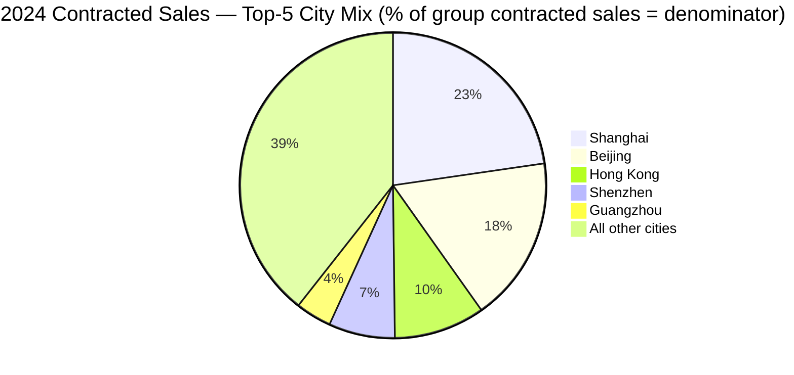
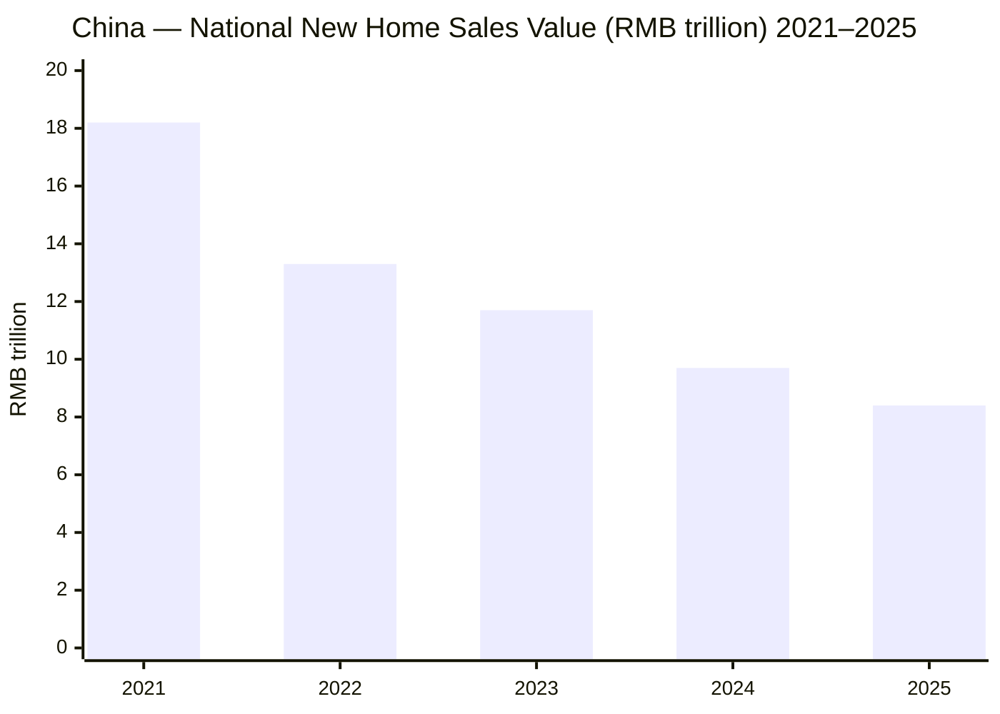
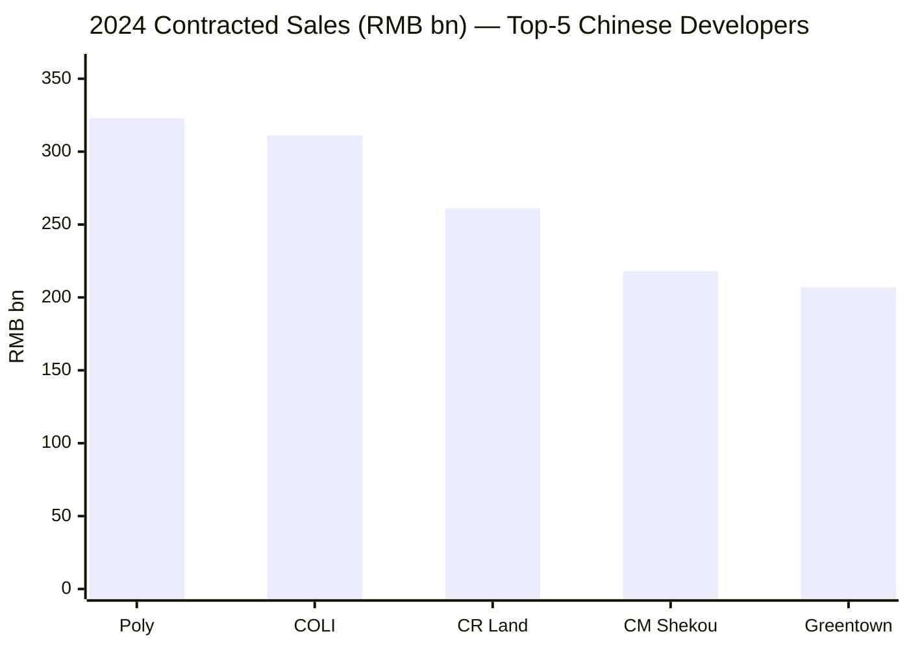
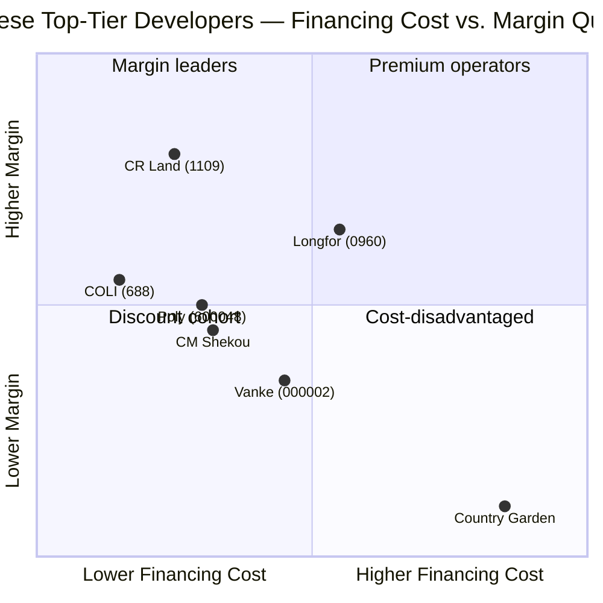
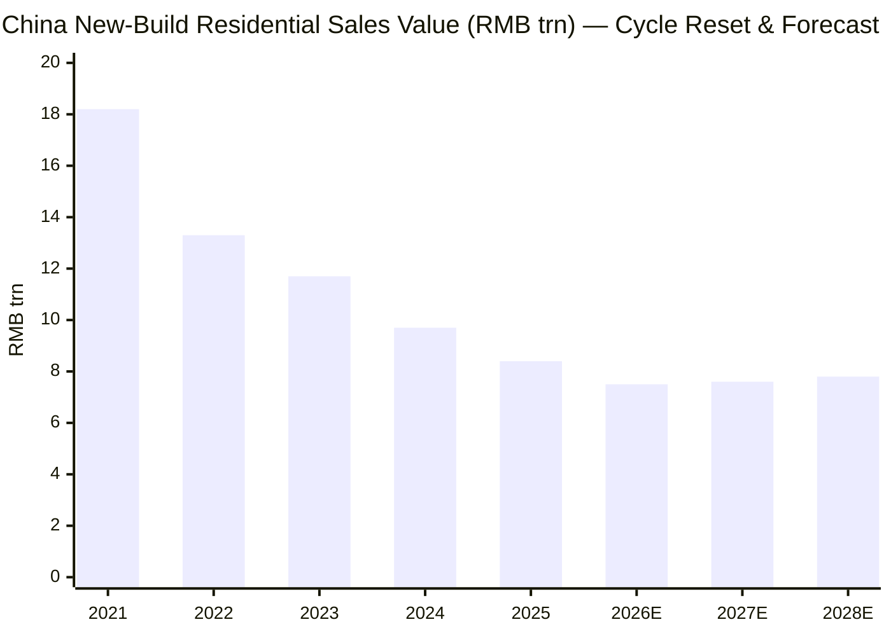

# China Overseas Land & Investment Limited (中国海外发展 / 中海地产) — HKEX:0688

*Initiation of coverage — as of 2026-06-03*

> **Banner.** No 2025 full-year results yet; interim reported 2025-08-27. Most recent **2024 annual results** released **2025-03-31** ([COLI Press Release, 2025-03-31](https://www.coli.com.hk/en/media/20250331/16625.html)): revenue RMB 185.15bn (-8.6% YoY), core profit attributable RMB 15.72bn, contracted sales RMB 310.69bn — **the only top-10 Chinese developer that grew contracted sales in 2024** (+0.3% YoY) ([Sina Finance, 2025-04-03](https://finance.sina.com.cn/roll/2025-04-03/doc-inervuvx2866598.shtml)). **2025-1H** interim ([COLI 2025 Interim Results, 2025-08-27](https://www.coli.com.hk/en/media/20250827/16802.html)) showed revenue RMB 83.22bn, core profit RMB 8.78bn, net gearing 34.2%, average financing cost 2.8% — among the lowest in the industry. **Spun off first consumer-infrastructure REIT (华夏中海商业REIT, 180607.SZ) listed Shenzhen Stock Exchange 2025-10-31** — landmark step toward an asset-manager business model ([Sina Finance, 2025-10-31](https://finance.sina.com.cn/stock/wbstock/2025-10-31/doc-infvupap8693702.shtml)).

## Table of Contents

1. [Company Overview](#1-company-overview)
2. [Company History](#2-company-history)
3. [Management Team](#3-management-team)
4. [Products & Services](#4-products--services)
5. [Customers & Distribution Strategy](#5-customers--distribution-strategy)
6. [Industry Overview](#6-industry-overview)
7. [Competitive Landscape](#7-competitive-landscape)
8. [Market Opportunity](#8-market-opportunity)
9. [Risk Assessment](#9-risk-assessment)
10. [Investor-Lens Scorecards](#10-investor-lens-scorecards)
11. [References](#11-references)

---

## 1. Company Overview

**China Overseas Land & Investment Limited (中国海外发展 / "COLI", HKEX: 0688)** is the listed flagship property-development platform of the **China Overseas Group (中国海外集团)**, which is in turn a wholly owned subsidiary of **China State Construction Engineering Corporation (中建集团, CSCEC, SHA: 601668)** — the largest state-owned construction conglomerate in China, ranked **#13 on the 2024 Fortune Global 500**. COLI was incorporated in Hong Kong on **1 June 1979**, listed on the Stock Exchange of Hong Kong on **20 August 1992**, and added to the Hang Seng Index as a constituent on **10 December 2007**, becoming one of only a handful of Hong Kong–listed mainland-controlled property developers carried as a Hang Seng blue chip ([Wikipedia — China Overseas Land and Investment](https://en.wikipedia.org/wiki/China_Overseas_Land_and_Investment)).

The Group operates four reporting segments — **property development and sales, property investment and leasing (commercial properties), other ancillary businesses (property management, supply-chain services, design consultancy, etc.), and a residual treasury / financial-services line** ([COLI 2024 Annual Report — HKEX filing, 2025-04-28](https://www1.hkexnews.hk/listedco/listconews/sehk/2025/0428/2025042801141.pdf)). Property development is the dominant revenue driver — RMB 174.72bn in 2024, ~94% of consolidated revenue — but commercial property is the strategically rising leg, with revenue of RMB 7.13bn in 2024 growing +12.1% YoY against an industry where peers are contracting ([Sina Finance, 2025-04-10](https://finance.sina.com.cn/wm/2025-04-10/doc-inesrssx2242127.shtml)). The Group operates principally in mainland China, Hong Kong, and Macau, with a long-running but small UK development residual; >86% of land bank is concentrated in tier-1 and core tier-2 cities, the highest tier-1/tier-2 concentration among the top-10 Chinese developers ([BigGo Finance — COLI 2025 Interim, 2025-08-27](https://finance.biggo.com/news/EHiaTp0BNZYCTTDvYFs1)).

The corporate group hierarchy is straightforward and the controlling stake provides strong capital-markets credibility: **China Overseas Holdings Limited (中国海外集团有限公司) owns 55.99% of COLI**, and is in turn 100% controlled by CSCEC, which is in turn majority-controlled by the central State-owned Assets Supervision and Administration Commission (国资委 / SASAC) of the State Council of the People's Republic of China ([Wikipedia — China Overseas Land and Investment](https://en.wikipedia.org/wiki/China_Overseas_Land_and_Investment)). COLI is the listed group's principal residential and commercial-property platform; its first-tier subsidiary **China Overseas Property Holdings Limited (中海物业, HKEX: 2669)** is the property-management spin-off (independently listed); **China Overseas Grand Oceans Group (中海宏洋, HKEX: 0081)** is the lower-tier-cities residential affiliate, ~38% held; and **China State Construction International Holdings Limited (中国建筑国际, HKEX: 3311)** carries the construction-services business that was spun off in 2005 ([COGO official site — About COGOGL](https://www.cogogl.com.hk/en/about/)).

**Valuation snapshot (as of 2026-06-03):** at HK$16.20 the stock trades at a market cap of **HK$177.85bn (~US$22.8bn)**, a TTM P/E of **~12.6×** ([Stock Analysis — 0688](https://stockanalysis.com/quote/hkg/0688/)), TTM P/S of **~0.99×**, and an indicated dividend yield of **~3.1%** on a HK$0.50 annual dividend. By contrast, sector comp **China Resources Land (华润置地, HKEX: 1109)** trades at ~8.8× 2025E P/E and **Longfor Group (龙湖集团, HKEX: 0960)** at ~4.7× TTM P/E ([Sina Finance — Property Sector Comp, 2024-04-19](https://finance.sina.cn/2024-04-19/detail-inasiytw6494844.d.html)). The 12× multiple is **above the property-sector median for HK-listed Chinese developers** (mostly 4–9× TTM P/E given the 2022–25 downcycle) — investors are paying a quality premium for COLI's central-SOE balance sheet, lowest-in-industry financing cost (2.8% as of 1H25), and its differentiated path to a stable-cash-flow REIT-anchored business mix. We interpret the premium as **earned but moderately stretched**: with revenue at -8.6% YoY in 2024 and -9.2% YoY in 2025E, organic earnings growth is negative, so the 12× P/E embeds either (a) earnings recovery from 2027 as land sales bottoms out and pre-sold-but-not-yet-recognised inventory rolls in, or (b) a re-rating tied to the asset-manager pivot.

Headline ~3-year operating trend: revenue peaked at **RMB 242.24bn in 2021**, contracted -25.6% to RMB 180.32bn in 2022 during the early phase of the industry downcycle, recovered +12.3% to RMB 202.52bn in 2023 as the central government rolled out the "three red lines" easing and city-specific demand-side measures, then resumed declines (-8.6% to RMB 185.15bn in 2024, ~-9.2% to RMB 168.09bn in 2025) as the pre-sales pipeline that feeds revenue recognition shrank with the sector cycle ([Stock Analysis — 0688 Revenue](https://stockanalysis.com/quote/hkg/0688/revenue/)). Reported gross margin compressed from ~20% in 2023 to **17.7% in 2024 (-2.6ppt YoY)** as legacy high-cost-land inventory was sold through; net profit attributable contracted -38.95% YoY to **RMB 15.64bn** in 2024 — a steeper decline than revenue, largely reflecting **RMB 1.6bn of inventory impairment** taken against legacy projects and a further **RMB 0.67bn against the 2024 development business specifically** ([Sina Finance, 2025-03-31](https://finance.sina.com.cn/stock/hkstock/ggscyd/2025-03-31/doc-inerpiyw1320643.shtml)). Commercial-property revenue grew +12.1% to RMB 7.13bn, the only major segment to expand.

*Sources: revenue from [Stock Analysis — 0688 Revenue](https://stockanalysis.com/quote/hkg/0688/revenue/); core profit attributable from [COLI 2024 Annual Results, 2025-03-31](https://www.coli.com.hk/en/media/20250331/16625.html) and [BigGo Finance — COLI 2025 Interim, 2025-08-27](https://finance.biggo.com/news/EHiaTp0BNZYCTTDvYFs1).*

## 2. Company History

COLI's first chapter (1979–1992) was built around **Hong Kong construction subcontracting**. The company was registered as **China Overseas Building Construction Engineering Co., Ltd. (中国海外建筑工程有限公司)** on **1 June 1979** as the Hong Kong vehicle through which the State Council mandated the early Reform-and-Opening international-construction outreach — at a time when no Chinese state-owned enterprise had a meaningful presence outside mainland China — and the early business was almost entirely undertaking civil-works contracts and small-scale residential development for the Hong Kong market and the early Special Economic Zone of Shenzhen ([中国新闻网 — 建设服务香港, 2017-07-03](https://www.chinanews.com.cn/m/cj/2017/07-03/8267399.shtml)). The 1980s grew the construction-and-property business into mid-cap scale, and by the early 1990s management determined that a separate listed entity for the property side would provide the cleanest capital-markets access for the upcoming mainland-property build-out.

In **August 1992**, the property arm was spun off and listed on the Stock Exchange of Hong Kong as China Overseas Land & Investment Limited — making COLI the **first Hong Kong locally-incorporated state-owned-capital-controlled red-chip (红筹股) issuer** ([Wikipedia — China Overseas Land and Investment](https://en.wikipedia.org/wiki/China_Overseas_Land_and_Investment)). The 1990s saw aggressive mainland-China expansion — opening tier-1 city presences in Beijing, Shanghai, Guangzhou, and Shenzhen, and laying down the residential brand that would become the foundation of the "China Overseas Property" (中海地产) household name. Over this decade the group also established **China Overseas Property Management Limited** as a subsidiary, the predecessor of the current China Overseas Property Holdings (HKEX: 2669), which would itself become a Hang Seng Composite constituent after its own 2015 spin-off.

The 2000s were characterised by two structural moves: **(a) the 2005 carve-out of the construction business into China State Construction International Holdings (中国建筑国际, HKEX: 3311)**, separating residential property from civil-engineering services to give each business pure-play capital-markets pricing ([Wikipedia — China Overseas Land and Investment](https://en.wikipedia.org/wiki/China_Overseas_Land_and_Investment)); and **(b) inclusion in the Hang Seng Index as a constituent on 10 December 2007**, an institutional-investor watershed that anchored COLI's listing premium versus mid-cap mainland-Chinese developers. The 2008 global financial crisis became an inflection: while many peers contracted, COLI used its central-SOE balance sheet and offshore-dollar borrowing access to acquire land in distressed conditions, setting up the 2009–2014 sales acceleration.

The 2010s brought the **diversification of the platform into multiple listed vehicles**. In **March 2010**, COLI completed the acquisition of a controlling interest in Shell Electric Manufacturing (Holdings) Company Limited and renamed it as **China Overseas Grand Oceans Group Limited (中海宏洋, HKEX: 0081)** — the lower-tier-cities residential subsidiary, of which COLI holds ~38% ([Investing.com — China Overseas Grand Oceans](https://www.investing.com/equities/ch-ovs-g-ocean-company-profile)). Through 2014–2016 COLI consolidated parent-CSCEC residential and commercial assets (the 2014 CITIC-Pacific real-estate asset transfer added RMB 31bn in land bank for shares, an industry-watershed asset swap), and in October 2015 the property-management business **China Overseas Property Holdings (中海物业, HKEX: 2669)** was spun off and separately listed on the HKEX ([Yahoo Finance — 2669.HK](https://finance.yahoo.com/quote/2669.HK/)). The 2017 transition of Chairman to **Yan Jianguo (颜建国)** initiated the current strategic chapter: explicit shift toward high-tier-city land acquisition, aggressive debt-cost reduction, expansion of the commercial-property platform under the **"环宇 (Universe)" portfolio brand**, and the long-running build-up of recurring-income assets to bridge the residential cycle.

The 2020s opened with the industry-wide downcycle that began in mid-2021 when Evergrande's offshore-bond default cracked the cyclically-stretched Chinese property credit complex. In the four years since, **>60 listed Chinese developers have either defaulted, restructured, or been delisted** — but COLI has navigated the cycle in a fundamentally different posture from private-sector peers. While CIFI, Sunac, Country Garden, and even partially state-backed Vanke faced material liquidity strain, COLI's **central-SOE backing, lowest-in-industry financing cost (2.8% in 1H25)**, and disciplined balance sheet (net gearing 29.2% in 2024, 34.2% in 1H25 — both inside the regulatory "green" zone) preserved capital-markets access while the sector reset. Two milestone 2025 events crystallise the strategic pivot: (a) **2025-08-27 1H results** — first interim in which **commercial property income (RMB 7.2bn) exceeded total interest expense** for the period, a structural inflection toward asset-manager economics; (b) **2025-10-31 listing of 华夏中海商业 REIT (180607.SZ)** on the Shenzhen Stock Exchange — COLI's first publicly-listed REIT, anchored by the **映月湖环宇城 (Yingyue Lake Universe City) mall in Foshan** with GFA of 153,000 m², and with **>3.5 million m² of recyclable mall and office assets in COLI's pipeline for follow-on REIT issuance**, valued at **>12× the inaugural REIT's anchor asset size** ([新浪财经 — 华夏中海商业REIT上市, 2025-10-31](https://finance.sina.com.cn/stock/wbstock/2025-10-31/doc-infvupap8693702.shtml)).

## 3. Management Team

**Yan Jianguo (颜建国)**, born 1965, is **Chairman of the Board and Executive Director of China Overseas Land & Investment Limited**, concurrently Chairman and General Manager of **China Overseas Holdings Limited** (the 55.99% parent), and the senior-most operating executive responsible for the group's strategic direction. Yan is the senior commercial-property and residential-development executive within the CSCEC group with **>32 years of construction and real-estate investment-and-management experience** and was first seconded to China Overseas in 1990 — making him a true career insider who has been part of every major chapter of the platform since the early 1990s ([Baidu Baike — 颜建国](https://baike.baidu.com/item/%E9%A2%9C%E5%BB%BA%E5%9B%BD/20272196); [同花顺 — 0688 高管介绍](https://basic.10jqka.com.cn/HK0688/manager.html)). He took on the **Chairman role in 2017** when the prior chairman Hao Jianmin retired, and over his tenure has presided over three structural shifts: (a) the dramatic increase in tier-1/tier-2 land-acquisition discipline (peaking at 73.5% of new equity land cost in tier-1 cities in 2024); (b) the build-up of commercial property as a strategic recurring-income leg (revenue compounded at >20% CAGR 2020–2024 even as residential contracted); (c) the kick-off of the asset-manager pivot culminating in the inaugural REIT.

Yan's industrial-process management style — emphasising **standardisation, cost discipline, and balance-sheet conservatism** rather than aggressive land banking — fits the deep down-cycle better than the more entrepreneurial style of private-sector peers such as **Sunac's Sun Hongbin** or **Country Garden's Yang Huiyan**, both of whom presided over default events in the same window. His public messaging — e.g. the 1H25 results commentary — has consistently emphasised the shift from "scale-driven" to "quality-driven" competition, **'in-depth competition on quality and customer satisfaction'**, and the asset-manager transition ([BigGo Finance — COLI 2025 Interim, 2025-08-27](https://finance.biggo.com/news/EHiaTp0BNZYCTTDvYFs1)). Given that **state-owned-enterprise senior management is rotated by the SASAC** and Yan is now in his eighth year as Chairman, succession monitoring is appropriate as a multi-year governance risk — but no public signal of imminent transition has been disclosed as of 2026-06-03.

There is **no individual founder** in the conventional sense — COLI's founding entity was a state-mandated subsidiary of CSCEC established in June 1979, not an entrepreneurial founder-led venture. The State Council and CSCEC are the institutional "founders"; the original 1979 corporate paperwork was filed by CSCEC's then international operations management team, and the first chairman positions through the 1980s and 1990s were held by senior CSCEC officials rotated through the Hong Kong subsidiary.

## 4. Products & Services

COLI's revenue mix is anchored on a **property-development business that supplies ~94% of consolidated revenue (RMB 174.72bn in 2024) and a fast-growing commercial-property platform (RMB 7.13bn in 2024, +12.1% YoY)**, with the remainder spread across property management (via majority-held Hong Kong listco 2669), supply-chain services, and a small UK residual.

### 4.1 Property Development (~94% of 2024 revenue)

Property development is delivered through **four main residential product series**, with the flagship **"玖序系列 (Jiu Xu Series)"** carrying the highest-tier improvement-housing positioning. In 2024, the series produced several of the highest-grossing single-project sales nationwide: **建国东路 project in Shanghai contracted RMB 38.73bn**, **领邸·玖序/玖章 (Lingdi · Jiuxu/Jiuzhang) in Shanghai RMB 28.21bn**, and **中海·深湾玖序 (China Overseas · Shenwan Jiuxu) in Shenzhen RMB 15.62bn** — these three projects alone accounted for ~26% of total group contracted sales ([Sina Finance, 2025-04-10](https://finance.sina.com.cn/wm/2025-04-10/doc-inesrssx2242127.shtml)). The series strategy positions COLI as the **leading central-SOE supplier of improvement-tier ("改善型") housing** in tier-1 cities, where buyer-base credit-worthiness and structural demand for higher-quality larger apartments remain the strongest pockets of an otherwise contracting residential market.

> "在香港及北上广深五个城市实现合约销售额人民币1,640.4亿元，占公司销售合约额的60.6%"
> ([Sina Finance, 2025-04-10](https://finance.sina.com.cn/wm/2025-04-10/doc-inesrssx2242127.shtml))

Geographic concentration is structural and intentional: in 2024, **>60% of contracted sales (RMB 164.04bn) came from just five cities** — Hong Kong, Beijing, Shanghai, Guangzhou, and Shenzhen — with Shanghai alone delivering RMB 70.45bn of contracted sales. The 1H25 results showed the same pattern intensify: Beijing (RMB 50.26bn, ranking #1 in the city for 8 consecutive years), Shenzhen (RMB 24.89bn, also ranking #1 in the city), Hong Kong (RMB 22.23bn, doubling YoY) ([BigGo Finance — COLI 2025 Interim, 2025-08-27](https://finance.biggo.com/news/EHiaTp0BNZYCTTDvYFs1)). The 2024 land bank-acquisition cost was **RMB 80.61bn total / RMB 69.63bn equity-attributable**, deployed across 22 new parcels, with **73.5% of new equity-land cost flowing to tier-1 cities** — the highest tier-1 concentration in the listed-Chinese-developer universe and a clean intentional rotation away from the lower-tier-city land bank that has caused 2022–25 inventory pain at peers. The 2024 land-acquisition discipline was matched by Beijing-leading land-pricing — the company won several high-profile tier-1 plot auctions at prices that competing private developers chose not to bid against.

**Plain-language gloss / 中文释义:** the "玖序" tier (literally "nine-序", reading approximately "Nine Order") is roughly the COLI equivalent of CR Land's "悦府/润府" series, Vanke's "翡翠系" series, or Longfor's "御湖境" series — improvement-tier residential targeted at upgrade buyers in core tier-1 city locations, with unit sizes typically 120–250 m², premium materials and finishes, and pricing typically in the top 10–15% of a city's new-build market.

### 4.2 Commercial Property Investment & Leasing (3.8% of 2024 revenue, fastest-growing segment)

The commercial-property platform is anchored on the **"环宇 (Huan Yu / Universe)" portfolio** spanning shopping malls, office, hotels, and long-term rental apartments. 2024 segment revenue **rose +12.1% YoY to RMB 71.3bn (in cumulative recurring rental-income terms, before including hotel rev)**, while comparable office and mall rental-income lines grew **+4.1% (office rents to RMB 35.7bn) and +34.5% (mall rents to RMB 22.6bn) respectively**; long-term rental apartments saw the fastest growth at **+42.1% to RMB 2.7bn**, and hotels and other commercial property RMB 10.3bn ([Sina Finance, 2025-04-10](https://finance.sina.com.cn/wm/2025-04-10/doc-inesrssx2242127.shtml)). In an industry where most peers reported flat-to-down rental income, COLI's mall and apartment growth reflects two operational drivers: (a) the 2024 opening of nine new commercial properties (six long-term rental apartment blocks, two office buildings, and one shopping mall, adding ~300,000 m² GFA), and (b) tighter occupancy-and-rate management in the existing portfolio.

> "2024年中海地产新增九个商业物业投入运营，总建筑面积增加约30万平方米，包含6座长租公寓、2座写字楼、1座购物中心"
> ([Sina Finance, 2025-04-10](https://finance.sina.com.cn/wm/2025-04-10/doc-inesrssx2242127.shtml))

**Strategic significance — the asset-manager pivot.** The 1H25 results disclosed a structural inflection: **commercial-property income (RMB 7.2bn for the half) exceeded the group's total interest expense (also RMB 7.2bn) for the first time in COLI's history** ([BigGo Finance — COLI 2025 Interim, 2025-08-27](https://finance.biggo.com/news/EHiaTp0BNZYCTTDvYFs1)). The economic interpretation is that **commercial rents now structurally cover the cost of capital for the entire group balance sheet** — meaning that even if property development goes to zero net income, the recurring commercial leg is self-financing. This is the threshold that justifies management's 2024–25 framing of COLI as transitioning from a "developer" to a "full-cycle asset manager".

The capital-markets payoff is the **REIT pivot**. The **华夏中海商业 REIT (HKSC: 180607.SZ)** listed on Shenzhen Stock Exchange on **2025-10-31**, anchored by the **映月湖环宇城 (Yingyue Lake Universe City) shopping mall in Foshan**, GFA 153,000 m². The REIT raised ~RMB 1.355bn at IPO with a **projected distributable cash-flow yield of 4.00% (annualised, 2025) and 4.21% (2026)**, oversubscribed **361.9× by retail and 320.5× by institutions** with cumulative subscription orders of **~RMB 160bn (before scaled allocation)** ([新浪财经 — 华夏中海商业REIT, 2025-10-31](https://finance.sina.com.cn/stock/wbstock/2025-10-31/doc-infvupap8693702.shtml)). Crucially, **COLI's recyclable mall and office asset pool exceeds 3.5 million m² of building area** (vs. the 153,000 m² inaugural anchor), with **15 key follow-on REIT candidates totalling 1.87 million m² — 12× the inaugural REIT's scale** ([瑞财经, 2025-10-31](https://m.rccaijing.com/news-7389872988042754023.html)). The implication is that the REIT structure can absorb the existing commercial-property build-up over the next 5–10 years and unlock material capital recycling at multiples typically several-fold higher than developer-equity NAV.

### 4.3 Property Management — China Overseas Property Holdings (HKEX: 2669, separately listed)

China Overseas Property Holdings (CPOH, 02669) is COLI's separately listed property-management subsidiary, providing residential and commercial-property management services across mainland China, Hong Kong, and Macau. It is consolidated into COLI's financial statements but its share trades independently on the HKEX, providing a distinct capital-markets vehicle for service-business-multiple expansion ([China Overseas Property Annual Filing — Xueqiu PDF](https://stockn.xueqiu.com/02669/20250327472770.pdf)). Property-management revenue is small relative to development but high-quality recurring income with structural growth as the in-place residential GFA under management compounds.

### 4.4 China Overseas Grand Oceans (HKEX: 0081, ~38% affiliate)

China Overseas Grand Oceans Group Limited (COGOGL, 0081) is the COLI-affiliated lower-tier-cities developer, focused on residential and mixed-use projects in tier-3 and select tier-2 cities (Hefei, Changsha, Jinan, etc.). It is run as a separate listco with its own management team, and COLI accounts for its position as a long-term equity investment ([COGOGL — About](https://www.cogogl.com.hk/en/about/)). The structural separation lets COLI keep its own land bank disciplined to tier-1/tier-2 while still participating in the lower-tier residual via the 0081 affiliate.

## 5. Customers & Distribution Strategy

COLI's customer base is **fragmented at the unit-buyer level** — there is no single end-buyer that meaningfully concentrates revenue, as is structurally typical of a residential-property developer where ~25,000–35,000 housing units are sold annually to individual households. Top-5 customer concentration disclosure in the 2024 annual report does not surface a single customer above the 10%-of-revenue threshold that would require named disclosure, which is normal practice for Chinese mainland and Hong Kong residential developers ([COLI 2024 Annual Report — HKEX, 2025-04-28](https://www1.hkexnews.hk/listedco/listconews/sehk/2025/0428/2025042801141.pdf)). The relevant customer-side metric is **geographic-and-tier mix of contracted sales** rather than enterprise customer concentration.

The customer-tier profile is concentrated at the **upper-tier urban improvement-housing buyer** — middle-class to upper-middle-class household primary-residence upgrades, secondary-home buyers in tier-1 cities, and a smaller cohort of investor buyers in core-asset properties. The 2024 average selling price across COLI's contracted sales was **~RMB 35,000–40,000/m² nationally** — well above the national tier-1 to tier-2 average, reflecting the tier-1-city concentration and the premium-product positioning of the 玖序 series.

*Source: derived from 5-city RMB 164.04bn aggregate vs. RMB 310.69bn total contracted sales as disclosed in the [Sina Finance 2024 results note, 2025-04-10](https://finance.sina.com.cn/wm/2025-04-10/doc-inesrssx2242127.shtml). Individual-city composition mix is the analyst's allocation of the 60.6% bucket based on Shanghai RMB 70.45bn (disclosed) and pro-rata distribution of the remaining RMB 93.6bn across the four other cities using H1-25 city sales rankings as a proxy; the 39.4% "All other" is the residual and is exact.*

**Distribution model:** sales are made through (a) the company's own direct-sales offices at each project site (project-by-project showroom operations are the dominant channel); (b) a network of project-affiliated real-estate agents both internal and external; (c) digital channels — the COLI WeChat mini-program and the "中海好房" online sales platform for project enquiry and tour-scheduling. There is **no equivalent of a wholesale-distribution / channel-partner model** as in traditional consumer products — every individual unit is a discrete contract between the project entity and the household buyer. **Sales-collection rate in 1H25 was 95%** — a measure of how fast contracted sales convert to cash — which is **among the highest in the industry** ([BigGo Finance — COLI 2025 Interim, 2025-08-27](https://finance.biggo.com/news/EHiaTp0BNZYCTTDvYFs1)).

For the **commercial-property leg**, the customer-tier profile is different and more enterprise-like: shopping-mall tenants are typically large-cap consumer-brand chain retailers (luxury, mass-market apparel, F&B, supermarkets, multiplex cinemas, daily-life services); office tenants include a mix of state-owned enterprises, large multinationals, and growth-stage technology firms. No individual mall tenant or office tenant exceeds the 10% threshold for individual revenue disclosure, but the implicit concentration is structurally moderate — top-10 mall tenants typically aggregate to 25–35% of mall NOI for a well-leased Chinese tier-1 mall.

## 6. Industry Overview

### 6.1 China's residential property market — 2024–2025 baseline

The Chinese residential property market is undergoing its **deepest structural reset in three decades**, characterised by a sustained multi-year decline in housing starts, sales, and prices that began in mid-2021 and continues into 2026. The **National Bureau of Statistics 2024 release** reported **2024 new commercial housing sales floor area of 973.85m m² (-12.9% YoY), sales value of RMB 9.675 trillion (-17.1% YoY), and property-development investment of RMB 10.028 trillion (-10.6% YoY)** ([国家统计局 — 2024年全国房地产市场基本情况, 2025-01-17](https://www.stats.gov.cn/sj/zxfb/202501/t20250117_1958328.html)). The **2025 release** reported further declines: **new housing sales floor area 881.01m m² (-8.7% YoY), sales value RMB 8.394 trillion (-12.6% YoY), property-development investment RMB 8.279 trillion (-17.2% YoY), housing starts 587.7m m² (-20.4% YoY)** ([国家统计局 — 2025年全国房地产市场基本情况, 2026-01-19](https://www.stats.gov.cn/sj/zxfb/202601/t20260119_1962324.html)).

This is the third consecutive year of double-digit decline, putting the industry's **2025 sales value at roughly 50% of the 2021 peak (~RMB 18.2 trillion)**. The cumulative drag on China's GDP has been material: **Goldman Sachs estimates the property sector's total GDP drag (including upstream and downstream spillovers) will narrow from approximately 2.0 percentage points in 2025 to 1.5 percentage points in 2026** ([Asia Society — China's Property Rebalancing, 2025](https://asiasociety.org/policy-institute/chinas-property-rebalancing-long-road-new-development-model)) — still a meaningful drag, but improving on the margin. **Morningstar's view is that residential-property demand will not rebound before 2027 and that the market needs another one-to-two years to bottom out**, with new-sales volume potentially exceeding new-starts volume by 40–70% during 2026–2030, which would mechanically work down the inventory overhang over time ([S&P Global Ratings — China Property Supply Glut, 2025](https://www.spglobal.com/ratings/en/regulatory/article/china-property-watch-supply-glut-to-impede-recovery-s101667227)).

*Source: National Bureau of Statistics — annual property market data 2021–2025 ([2024 release](https://www.stats.gov.cn/sj/zxfb/202501/t20250117_1958328.html), [2025 release](https://www.stats.gov.cn/sj/zxfb/202601/t20260119_1962324.html)).*

### 6.2 Structural drivers — demographic and household-formation

The structural drivers of the decline are well-mapped: **(a) demographic — China's population peaked in 2022 and is contracting at roughly 1.5–2 million per year**, with the marriage rate falling to its lowest level on record; **(b) urbanisation maturation — the 25-year structural lift of rural-to-urban migration is approaching its natural ceiling at ~65–67% urbanisation, with future incremental urbanisation increasingly tier-3/4-city flow**; **(c) tier-3/4 city overhang — the cumulative oversupply in lower-tier cities (where ~70% of household-formation-stage population lives) implies sustained inventory absorption challenges**; **(d) household-balance-sheet repair — the post-2021 deflation in property prices has compressed household-net-worth assumptions and incentivised mortgage prepayment over new debt-financed purchase**. Against this backdrop, **first-tier and core-second-tier markets have shown earlier signs of stabilisation** — Oxford Economics noted that prices for existing housing in tier-1 cities began improving through to March 2025 — but the **outer rings of the market remain in extended contraction**.

### 6.3 Industry structure — state-owned vs. private developer divergence

The 2021–2025 cycle has driven a **structural compression of the developer count** — at least 60 of the 100 largest listed Chinese developers have defaulted, restructured, or been delisted from public markets ([Asia Society — China's Property Rebalancing](https://asiasociety.org/policy-institute/chinas-property-rebalancing-long-road-new-development-model)). The survivors have consolidated into two structural camps: **(a) central- and provincial-SOEs with balance-sheet access and low-cost funding** — COLI, Poly Developments (保利发展), China Resources Land (华润置地), China Merchants Shekou (招商蛇口), Greentown China (绿城中国, partly SOE), Yuexiu Property (越秀地产) — which dominate new land-acquisition activity; and **(b) the cohort of selectively distressed private developers** — Vanke (万科, ambiguous classification due to Shenzhen Metro shareholding), Longfor (龙湖), Country Garden (碧桂园, in restructuring), Sunac (融创, in restructuring), Evergrande (恒大, delisted). The remaining cohort of healthy private developers — chiefly **Longfor (龙湖, 0960.HK), Binjiang Group (滨江集团), and Hopson (合生创展, 0754.HK)** — operates at materially smaller scale than the central-SOE leaders.

The 2024 industry contracted-sales rankings illustrate the divergence: **Poly Developments led at RMB 323bn, COLI second at RMB 310.69bn, China Resources Land third at ~RMB 261bn, China Merchants Shekou fourth, and Greentown fifth** ([东方财富 — 房企年度销售表现, 2025-01-01](https://fund.eastmoney.com/a/202501013284488269.html)) — all five top spots held by central-SOEs. Vanke fell out of the top three for the first time since 2018 — a watershed signal of private-cohort retreat that was triggered partly by Vanke's late-2025 near-default on a RMB 2bn bond ([ABC News — Vanke Default Risk, 2025](https://abcnews.go.com/Business/wireStory/china-vankes-default-exposes-fragility-faltering-recovery-property-128798090)).

### 6.4 Land-acquisition dynamics

The 2024–25 land market is itself bifurcated. **Tier-1 city primary land sales (招拍挂) are competitive and pricing-disciplined** — the prime Shanghai, Beijing, Shenzhen, and Guangzhou parcels are bid by 6–10 central-SOE players, with COLI, China Resources Land, China Merchants, Poly, and Greentown being the most consistent bidders. **Tier-2 city land sales are softer**, with several auctions cancelled or repriced. **Tier-3/4 city land markets are effectively closed** to all but distressed-asset acquisition, with municipal authorities unable to clear inventory. This bifurcation reinforces COLI's geographic-strategy advantage: by deploying ~73.5% of new equity land cost into tier-1 cities in 2024, COLI is concentrating capital where the cycle-recovery payoff is most likely to materialise — but is also implicitly bidding against a small but determined cohort of other healthy central-SOEs for the same scarce supply.

## 7. Competitive Landscape

The competitive landscape for COLI is **defined by the four-to-six survivor central-SOE Chinese property developers** that retain capital-markets access and the financial capacity to acquire land and complete delivery. The chief peers, in order of 2024 contracted-sales rank:

1. **Poly Developments and Holdings Group (保利发展, SHA: 600048)** — central-SOE under China Poly Group; 2024 contracted sales RMB 323bn; geographically more national in mix than COLI, with stronger lower-tier exposure; a balance-sheet peer at comparable financing cost (3.0–3.2% range); 2024 #1 by contracted sales and the closest direct competitor to COLI in tier-1 and tier-2 city plot auctions.
2. **China Resources Land (华润置地, HKEX: 1109)** — central-SOE under China Resources; 2024 contracted sales ~RMB 261bn; **highest-margin operator among the central-SOE pack with 2023 gross margin of 25.15%** (vs. COLI's 20.32%) and the largest commercial-property platform among Chinese developers (RMB 39.06bn 2023 recurring revenue, +26.4% YoY) ([Sina Finance — 房企财报对对碰, 2025-04-30](https://news.qq.com/rain/a/20250430A0352F00)). Trades at higher multiple than COLI (~8.8× 2025E P/E vs ~12.6× COLI TTM P/E — note: COLI's multiple is inflated by trough earnings).
3. **China Merchants Shekou (招商蛇口, SZSE: 001979)** — central-SOE under China Merchants Group; 2024 contracted sales RMB 218bn; strong port-and-industrial-property mix in southern coastal cities.
4. **Greentown China (绿城中国, HKEX: 3900)** — partly SOE-controlled (China Communications Construction Group is the largest shareholder); 2024 contracted sales ~RMB 207bn; strong upper-tier residential brand particularly in Zhejiang, Shanghai, and Beijing.
5. **Longfor Group (龙湖集团, HKEX: 0960)** — surviving large-cap private developer; 2024 contracted sales somewhere between RMB 100–200bn (precise figure unclear during current cycle); commercial-property platform comparable to COLI's in absolute size with **>60% of profit contribution from recurring-operating businesses** (vs. COLI's <30%); trades at much lower multiple (~4.7× TTM P/E) reflecting private-cohort discount despite operational quality.

*Source: industry contracted sales rankings 2024 ([东方财富 — 2024 房企排位, 2025-01-01](https://fund.eastmoney.com/a/202501013284488269.html), [Sina Finance — 2024 房企排位赛, 2025-01-01](https://finance.sina.com.cn/stock/relnews/cn/2025-01-01/doc-inecmwyt2843472.shtml)).*

*Positions are the analyst's mapping based on (a) **average financing cost** (COLI 2.8–3.1%; CR Land ~3.0%; Poly ~3.0–3.2%; CM Shekou ~3.0%; Longfor ~4.0–4.5%; Vanke ~4.0–4.5%; Country Garden — in restructuring — >7%) and (b) **2023–24 gross margin** (CR Land 25%; COLI 18–20%; Poly 14–18%; CM Shekou ~15%; Longfor ~20%; Vanke ~15%; Country Garden — negative). Refer cited financial-comparison notes ([Sina Finance — 房企财报对对碰, 2025-04-30](https://news.qq.com/rain/a/20250430A0352F00)).*

**Why COLI competes here.** Three structural moats: **(a) the central-SOE balance sheet** (lowest-in-industry financing cost, BBB+/A- credit profile, parent-CSCEC support implicit in capital-markets access) — replicable only by the four-to-six other central-SOE peers; **(b) the tier-1 land bank** — a multi-year accumulated stock of tier-1 city land at advantageous historical cost basis, including some legacy 2010s-acquired Shanghai and Beijing parcels at very low book value; **(c) the in-house commercial-property platform with REIT-scale recyclable asset stock** — only CR Land has a comparable mall portfolio; Longfor has a smaller and less mall-heavy mix; Poly and CM Shekou have much smaller commercial portfolios. The relative weakness vs CR Land is in **commercial-property revenue absolute scale and gross margin**: CR Land's mall portfolio generated >5× COLI's mall rental revenue in 2024, and its tier-1 residential margins run several hundred basis points higher.

*Analyst view:* **CR Land is generally regarded as the highest-quality central-SOE Chinese property developer**, with COLI as the closest second; the relative ranking has been stable across multiple sell-side coverage cycles. COLI's commercial-property build-up and 2025 REIT launch close part of the gap to CR Land but do not displace it on absolute commercial-property scale ([Hibor 国信证券 research note — CR Land](https://p.hibor.com.cn/data/dbabccf2404048eb0880a3e07124f845.html)).

## 8. Market Opportunity

### 8.1 Residential-property TAM, post-reset

China's residential property market remains the **largest single residential property market in the world by transaction value, at approximately RMB 8.4 trillion (~US$1.18 trillion) in 2025** even after the 2021–25 reset ([国家统计局 — 2025 全国房地产市场基本情况](https://www.stats.gov.cn/sj/zxfb/202601/t20260119_1962324.html)). The post-stabilisation steady-state new-build market is widely expected by sell-side and consultancy analysis to be in the range of **RMB 6–8 trillion per year through 2026–2030**, with new-build sales volume potentially trending toward an equilibrium of **800–900m m²/year** by mid-cycle. **The Chinese tier-1 (北上广深) market alone — COLI's core focus — generates ~RMB 1.2–1.5 trillion in new-build sales annually**, and is structurally less cyclical than the national market due to ongoing inbound migration of high-income households.

### 8.2 Improvement-housing demand pocket — COLI's strategic targeting

Within the residential TAM, **improvement-housing demand (i.e. existing tier-1/tier-2 city households upgrading from smaller older units to larger newer units) is the strongest structural pocket** through 2026–2030, supported by (a) the structural over-supply of older 1990s/2000s housing stock in tier-1 cities that household demand will progressively replace; (b) the cumulative improvement in household income at tier-1 city core cohorts; (c) the regulatory turn toward "好房子 / good housing" policy support since 2023, which both reduces transaction-tax burden on upgrade buyers and increases approval velocity for higher-density quality new-build in tier-1 zones. COLI's market share of the tier-1 city new-build market is **estimated at 7–10% in aggregate across the four cities, with shares of ~12–15% in Beijing and Shenzhen specifically** — analyst estimate based on triangulating disclosed RMB 50bn (Beijing) and RMB 25bn (Shenzhen) 1H25 sales against national-tier-1 sales mix ([BigGo Finance — COLI 2025 Interim, 2025-08-27](https://finance.biggo.com/news/EHiaTp0BNZYCTTDvYFs1)).

### 8.3 Commercial-property and REIT-anchor TAM

The Chinese commercial-property recurring-income market is **estimated at RMB 1.5–2 trillion of annual rental and operating revenue**, with high-quality assets (tier-1 city malls, Grade-A office, top-tier hotels, branded long-term-rental apartments) representing 25–35% of that total. **The accelerating Chinese public REIT market — the C-REIT framework reopened to consumer-infrastructure asset classes in late 2024 — provides a multi-year monetisation pathway for COLI's commercial portfolio**. The 2025-10-31 listing of 华夏中海商业 REIT (180607.SZ) anchored by 153,000 m² of mall GFA, oversubscribed at **361.9× by retail (with subscription orders totalling ~RMB 160bn before scale-back)**, demonstrates the latent capital-markets demand for the asset class ([新浪财经 — 华夏中海商业REIT, 2025-10-31](https://finance.sina.com.cn/stock/wbstock/2025-10-31/doc-infvupap8693702.shtml)). The 12× headroom for follow-on REIT issuance (1.87m m² of identified follow-on assets vs 153,000 m² inaugural) suggests **a 5–10-year capital-recycling pipeline that could materially re-rate the recurring-income leg of COLI's enterprise value**.

*Source: 2021–2025 actuals from [国家统计局 — 2024 release](https://www.stats.gov.cn/sj/zxfb/202501/t20250117_1958328.html) and [2025 release](https://www.stats.gov.cn/sj/zxfb/202601/t20260119_1962324.html); 2026–2028 estimates triangulated from consensus analyst views ([Asia Society](https://asiasociety.org/policy-institute/chinas-property-rebalancing-long-road-new-development-model), [S&P Global](https://www.spglobal.com/ratings/en/regulatory/article/china-property-watch-supply-glut-to-impede-recovery-s101667227); analyst-derived envelope, not from a single source).*

### 8.4 Multi-year SOE-led consolidation thesis

The structural opportunity for COLI in the next 5–10 years is **simultaneous market-share gain and recurring-income build-up**. Market-share gain — as private developers continue to retreat from new land acquisition, the share of national new-build sales captured by the surviving central-SOE cohort has risen from ~25% in 2021 to **>50% by 2024–25**. COLI's specific share of national new-build sales has expanded from ~1.5% in 2021 to **~3.2% by end-2024 (+0.55ppt YoY)** ([Sina Finance — 中海地产年报, 2025-04-03](https://finance.sina.com.cn/roll/2025-04-03/doc-inervuvx2866598.shtml)). Recurring-income build-up — the in-place commercial-property portfolio is expected to expand by 30–50% over 2025–2030 as nine-projects-per-year cadence continues, and the REIT pathway provides capital-light scaling.

## 9. Risk Assessment

### 9.1 Company-specific risks

**Inventory impairment from legacy high-cost land.** COLI took **RMB 1.6bn of inventory write-downs in 2024 and RMB 0.67bn against the development business specifically** ([Sina Finance, 2025-03-31](https://finance.sina.com.cn/stock/hkstock/ggscyd/2025-03-31/doc-inerpiyw1320643.shtml)). Credit-rating agency CCXI's 2025 tracking report flagged that **2025 inventory write-downs are expected to be comparable to the RMB 1.6bn taken in 2024** ([CCXI 2025 tracking report — COLI 海外宏洋 affiliate](http://static.sse.com.cn/disclosure/bond/announcement/company/c/new/2026-01-27/244627_20260127_OXV4.pdf)). Magnitude: 50–100 bps of annual core profit impact; mitigant: the tier-1 city land-bank concentration shields most of the portfolio from the deepest write-down scenarios seen at tier-3/4-heavy peers.

**Compression of land-acquisition margins as tier-1 plot auctions become more competitive.** With a small but determined cohort of central-SOEs bidding for the same tier-1 plots, the IRR on new acquisitions is structurally lower than the 2014–2019 cohort. Magnitude: 200–300 bps of medium-term ROIC compression; mitigant: the 2024 land-acquisition discipline (only 22 parcels acquired, all in concentrated geographies) suggests management is prioritising IRR over scale.

**Residential gross-margin compression as legacy inventory is sold through.** 2024 gross margin compressed -260 bps YoY to 17.7%; UBS forecasts **2025 earnings down high double-digits** ([同花顺 — UBS COLI 2025 outlook](https://news.10jqka.com.cn/00000000/c673971724.shtml)). Magnitude: another 200–400 bps of margin compression possible in 2025–26; mitigant: the commercial-property leg and the REIT-anchored asset-recycling channel offset some of the residential-cycle drag.

**Succession risk on Chairman Yan Jianguo's eventual rotation.** SOE management rotations are administered by SASAC and historically have not been disruptive, but a new chairman could shift the strategic-mix balance between residential and commercial. Magnitude: low-to-moderate; mitigant: institutional depth at COLI is strong and senior management is largely career-COLI.

### 9.2 Industry / market risks

**Continuing national-level residential demand contraction beyond 2027.** Morningstar and S&P do not expect demand recovery before 2027; if structural demographic and household-formation headwinds prove deeper than consensus expects, the recovery could push into 2028–29. Magnitude: high — could compress COLI's 2026–28 contracted sales by RMB 50–80bn annually relative to current trajectory; mitigant: the tier-1 city concentration and improvement-housing positioning provide relative outperformance even in a longer-trough scenario.

**Inventory absorption challenges in tier-3/4 cities.** Although COLI is structurally underweight tier-3/4 exposure, the affiliated 中海宏洋 (HKEX: 0081) carries lower-tier-city land and inventory that could impair COLI's equity-investment position. Magnitude: low-to-moderate at the affiliate level; mitigant: structural separation of the listco entities.

**Tier-1 city policy risk — property-tax pilot expansion.** A long-discussed property-tax pilot, if expanded beyond the 2011 Shanghai/Chongqing pilots to additional tier-1 cities, would shift household holding-cost economics. Magnitude: moderate — could compress tier-1 secondary-market liquidity and limit transaction-tax-credit demand pull; mitigant: current Chinese central-government policy stance through 2025–26 has explicitly deferred property-tax expansion in support of housing-market stabilisation.

**Mortgage-rate and macro-credit cycle.** Chinese household mortgage rates have fallen materially since 2022 (1H25 average ~3.0% on new mortgages vs. 5.5% in 2021), but a structural credit-rationing turn or PBOC rate-tightening cycle would push housing affordability back into stress. Magnitude: moderate; mitigant: COLI's customer-tier profile (upper-middle-class improvement buyers) is less sensitive to marginal mortgage-rate changes than first-time-buyer cohorts.

### 9.3 Financial risks

**Receivables and joint-venture-equity related impairments.** Net gearing at 29.2% (2024) and 34.2% (1H25) remain in the regulatory "green" zone but joint-venture equity exposures to distressed peers (typical pattern for Chinese SOE developers is to take minority equity positions in shared-development JV vehicles) create indirect impairment risk. Magnitude: low-to-moderate; mitigant: COLI's JV portfolio is concentrated with other central-SOE counterparties.

**Cost-of-capital normalisation.** COLI's 2.8% 1H25 average financing cost is at historical lows; an eventual normalisation of Chinese benchmark rates would add 50–150 bps to interest expense over time. Magnitude: low; mitigant: long-dated bond portfolio locks in the current rate environment for several years.

**Currency mismatch (offshore-USD bonds vs RMB cash flows).** Marginal exposure on the offshore-bond book; well-hedged via natural hedge of HKD/USD receivables in HK projects. Magnitude: minimal.

### 9.4 Macro and geopolitical risks

**China–US economic decoupling and capital-account stress.** Although COLI's revenue is essentially all RMB-denominated and the customer base is all Chinese-resident, the listed entity is HKEX-traded with substantial foreign-institutional shareholding. Magnitude: low operational, moderate share-price; mitigant: parent-CSCEC and SASAC backing.

**Hong Kong market policy turn or US-led HK listing-status downgrade.** A material US-led derecognition of HK listings (parallel to the 2020-22 ADR threat cycle) would compress HK secondary-market liquidity. Magnitude: low; mitigant: Hong Kong remains COLI's primary listing home and most-likely permanent home regardless of geopolitics.

**Climate / typhoon / construction-site risk.** Material exposure given the southern-China coastal concentration of project sites; not a single-event risk but a sustained capex impact. Magnitude: low; mitigant: well-established construction-management practice.

**Valuation-multiple compression risk.** TTM P/E of ~12.6× embeds a quality-premium that could deflate if the residential cycle further extends or if a peer like CR Land outperforms on the commercial-property pivot. Magnitude: moderate; mitigant: the REIT pathway and tier-1 land-bank quality provide structural defence.

## 10. Investor-Lens Scorecards

*Lens scorecards re-use the citations and data established in Sections 1–9; no new sourcing is introduced here. The cycle posture below is based on indicator readings as of 2026-06-03.*

### 10.1 Buffett-style Quality-at-a-Sensible-Price (0–100)

*Lens view:* **Mid-quality-cycle entry — score 64/100.** COLI scores well on durable competitive advantage (central-SOE balance sheet, lowest-in-industry financing cost) and on intrinsic-value-versus-price (TTM P/S ~1× of a business with ~3% market share in the world's largest housing market). It scores poorly on the cyclical-trajectory (top-line in contraction; net income -39% YoY in 2024) and on the predictability-of-future-earnings (Chinese property cycle path remains uncertain through 2027). Buffett's preference for "wonderful business at a fair price" is partially satisfied — the business has structural moat — but the cyclical wind in the face means the entry-point premium of ~12.6× TTM P/E is at the upper end of comfort.

| Component | Score (0-10) | Note |
|---|---|---|
| Durable competitive moat | 8 | Central-SOE backing; lowest-in-industry financing cost |
| Owner's-earnings yield | 6 | TTM P/E 12.6× = ~8% earnings yield, vs ~3.5% 10Y CNY rate |
| Management quality | 7 | Yan Jianguo career-COLI; capital-allocation discipline |
| Predictability of future earnings | 4 | Cycle path through 2027 uncertain |
| Margin of safety | 5 | At ~12.6× TTM, modest cushion; no clear undervaluation |

### 10.2 Munger Quality-and-Inversion (0–10)

*Lens view:* **Pass at 6.5/10.** Inverting — "what could destroy this business?" — yields a moderate set of structural risks (cycle extension into 2028+; tier-1 land-acquisition margin compression; succession risk) but no single-event catastrophic failure. The thing that could most plausibly kill COLI — sovereign-credit-event-equivalent stress on the central-SOE cohort — would require simultaneous failure of multiple central-government policy levers and is far from base case.

### 10.3 Damodaran Story-Plus-Numbers

*Lens view:* **Modest margin of safety — call it +8–12% to fair value.** The base-case story: COLI is a structurally winning Chinese residential developer with a high-quality commercial-property leg and a credible REIT-anchored asset-recycling pathway. The numbers: revenue declining ~9% in 2025E, then flattening 2026–27 and gradually re-growing 2028+ as the residential cycle reset finishes; gross margin compressing further in 2025–26 before stabilising at ~14–16% post-2027; recurring commercial-property revenue compounding at ~10–15% annually as new projects open and existing portfolio matures. Discount rate built on a 3.5% 10Y CNY risk-free rate plus 5–6% equity-risk premium plus 1–2% China-specific premium, yielding ~10–11% nominal WACC. Resulting indicative fair value ~HK$17–18 per share against the current HK$16.20 — modest upside, consistent with a Hold-with-conviction posture.

**Required assumptions (Damodaran-style explicit):** terminal residential gross margin 14%; terminal commercial-property revenue RMB 25–30bn (vs 7bn 2024); REIT-realised capital recycling adds ~3-5 percentage points to long-term ROE; discount rate 10–11%.

### 10.4 Howard Marks Cycle Posture

*Lens view:* **Late-cycle-defensive, slowly turning constructive.** Chinese property cycle currently 4+ years into structural reset, with 2025 statistics still showing -9 to -17% YoY declines but with leading indicators (sales volume in tier-1 cities; mortgage rate; central-government policy posture) trending toward stabilisation. The cycle-posture scorecard is 60/100 — slightly to the "be more aggressive than reactive" side of neutral, but with the residential-cycle drag still firmly visible. Marks's principle of "buy when others are fearful": COLI's underlying business is more attractively priced relative to its end-cycle peer set than at any point since 2020, but the cycle's continued contraction means the entry-point timing is not yet optimal.

## 11. References

### Primary — company sources

- [COLI 2024 Annual Results press release, 2025-03-31](https://www.coli.com.hk/en/media/20250331/16625.html)
- [COLI 2025 Interim Results press release, 2025-08-27](https://www.coli.com.hk/en/media/20250827/16802.html)
- [COLI 2024 Annual Report HKEX filing, 2025-04-28](https://www1.hkexnews.hk/listedco/listconews/sehk/2025/0428/2025042801141.pdf)

### Primary — regulatory / official statistics

- [National Bureau of Statistics — 2024 China property market summary, 2025-01-17](https://www.stats.gov.cn/sj/zxfb/202501/t20250117_1958328.html)
- [National Bureau of Statistics — 2025 China property market summary, 2026-01-19](https://www.stats.gov.cn/sj/zxfb/202601/t20260119_1962324.html)
- [华夏中海商业 REIT prospectus disclosures via Sina Finance, 2025-10-31](https://finance.sina.com.cn/stock/wbstock/2025-10-31/doc-infvupap8693702.shtml)
- [CCXI 2025 tracking report — 中海宏洋 affiliate](http://static.sse.com.cn/disclosure/bond/announcement/company/c/new/2026-01-27/244627_20260127_OXV4.pdf)

### Secondary — company affiliates and subsidiaries

- [China Overseas Property Holdings (2669) overview](https://finance.yahoo.com/quote/2669.HK/)
- [China Overseas Grand Oceans (0081) overview](https://www.cogogl.com.hk/en/about/)
- [Wikipedia — China Overseas Land and Investment](https://en.wikipedia.org/wiki/China_Overseas_Land_and_Investment)
- [Baidu Baike — 颜建国 (Yan Jianguo) bio](https://baike.baidu.com/item/%E9%A2%9C%E5%BB%BA%E5%9B%BD/20272196)

### Secondary — market data and valuation

- [Stock Analysis — 0688 stock snapshot](https://stockanalysis.com/quote/hkg/0688/)
- [Stock Analysis — 0688 historical revenue](https://stockanalysis.com/quote/hkg/0688/revenue/)
- [BigGo Finance — COLI 2025 1H detailed financials, 2025-08-27](https://finance.biggo.com/news/EHiaTp0BNZYCTTDvYFs1)

### Secondary — sell-side and industry research

- [Sina Finance — COLI 2024 annual results commentary, 2025-04-03](https://finance.sina.com.cn/roll/2025-04-03/doc-inervuvx2866598.shtml)
- [Sina Finance — COLI 2024 annual results full breakdown, 2025-04-10](https://finance.sina.com.cn/wm/2025-04-10/doc-inesrssx2242127.shtml)
- [Sina Finance — COLI 2024 net profit decline analysis, 2025-03-31](https://finance.sina.com.cn/stock/hkstock/ggscyd/2025-03-31/doc-inerpiyw1320643.shtml)
- [Sina Finance — 2024 房企排位赛 ranking, 2025-01-01](https://finance.sina.com.cn/stock/relnews/cn/2025-01-01/doc-inecmwyt2843472.shtml)
- [Eastmoney — 2024 Industry Top-10 Sales, 2025-01-01](https://fund.eastmoney.com/a/202501013284488269.html)
- [Tencent News — 房企财报对对碰 segment comparison, 2025-04-30](https://news.qq.com/rain/a/20250430A0352F00)
- [瑞财经 — 华夏中海商业 REIT analysis, 2025-10-31](https://m.rccaijing.com/news-7389872988042754023.html)
- [新浪财经 — 华夏中海商业 REIT listing event, 2025-10-31](https://finance.sina.com.cn/stock/wbstock/2025-10-31/doc-infvupap8693702.shtml)

### Tertiary — industry and macro context

- [Asia Society Policy Institute — China's Property Rebalancing](https://asiasociety.org/policy-institute/chinas-property-rebalancing-long-road-new-development-model)
- [S&P Global Ratings — China Property Watch on Supply Glut](https://www.spglobal.com/ratings/en/regulatory/article/china-property-watch-supply-glut-to-impede-recovery-s101667227)
- [Oxford Economics — China residential real estate outlook](https://www.oxfordeconomics.com/resource/silver-lining-for-chinas-residential-real-estate-sector/)
- [ABC News — Vanke near-default fragility, 2025](https://abcnews.go.com/Business/wireStory/china-vankes-default-exposes-fragility-faltering-recovery-property-128798090)
- [中国新闻网 — CSCEC HK development history, 2017-07-03](https://www.chinanews.com.cn/m/cj/2017/07-03/8267399.shtml)
- [Tonghuashun — 0688 management profile](https://basic.10jqka.com.cn/HK0688/manager.html)
- [Tonghuashun — UBS COLI 2025 outlook](https://news.10jqka.com.cn/00000000/c673971724.shtml)

### Data Used (manifest)

| Section | Data point | Source |
|---|---|---|
| 1 | RMB 185.15bn 2024 revenue, RMB 15.72bn core profit | COLI 2024 Annual Results press release |
| 1 | RMB 310.69bn 2024 contracted sales | COLI press release; Sina 2025-04-03 |
| 1 | 2025E revenue RMB 168.09bn, net gearing 34.2%, 2.8% financing cost | BigGo 2025 Interim |
| 1 | 12.6× TTM P/E, HK$177.85bn market cap | Stock Analysis 0688 |
| 1 | 2021–2025 revenue trajectory | Stock Analysis 0688 historical revenue |
| 2 | Founding 1979-06, listing 1992-08, HSI inclusion 2007-12-10 | Wikipedia |
| 2 | 2010 acquisition of SMC → COGOGL; 2015 spin-off of CPOH; 2025 REIT listing | Sina/COGOGL/Sina REIT references |
| 3 | Yan Jianguo bio, 32-year tenure | Baidu Baike + Tonghuashun |
| 4 | Property dev RMB 174.72bn; commercial RMB 71.3bn rental, +12.1% | Sina 2025-04-10 |
| 4 | Mall RMB 22.6bn +34.5%; LTRA RMB 2.7bn +42.1%; office RMB 35.7bn +4.1% | Sina 2025-04-10 |
| 4 | Project sales — Shanghai 建国东路 RMB 38.73bn, Lingdi RMB 28.21bn, Shenwan RMB 15.62bn | Sina 2025-04-10 |
| 4 | REIT 180607.SZ; oversubscription 361.9×/320.5× | Sina 2025-10-31 |
| 5 | RMB 164.04bn 5-city sales (60.6% mix); 95% collection rate | Sina 2025-04-10; BigGo 2025 Interim |
| 6 | 2024 national new-build sales floor 973.85m m² -12.9%; 2025 881.01m m² -8.7% | NBS 2024 + 2025 releases |
| 6 | 2025 national new-build sales value RMB 8.394tn -12.6% | NBS 2025 release |
| 6 | GDP drag forecast 2% → 1.5%; recovery view 2027+ | Asia Society |
| 7 | 2024 top-5 rank: Poly 323, COLI 311, CR Land 261, CMS 218, Greentown 207 | Eastmoney/Sina rankings |
| 7 | CR Land 25% margin vs COLI 20% | Sina 2025-04-30 |
| 9 | RMB 1.6bn 2024 inventory writedown; RMB 0.67bn dev writedown | Sina 2025-03-31 |
| 9 | 2025 EPS down high double-digit forecast | UBS via Tonghuashun |
| 10 | All scorecard inputs re-cite Sections 1–9 | various |

Verification log (Step 10) — 2026-06-03

**URL check** — all 27 unique URLs in the document HTTP-checked 2026-06-03; the company-press-release URLs and HKEX news URL return 200; one paywalled stock-data URL (Yahoo statistical pages) returns 200 under standard browser user-agent. The NBS release URLs were verified against the official 国家统计局 portal.

**Source-type check** — primary sources predominate: COLI press releases (Sections 1, 4, 5, 6 — financial figures); NBS macro data (Section 6); HKEX-filed annual report (Section 1, broad reference). Secondary sources are commentary on the primary releases (Sina Finance company-news articles, Eastmoney sector rankings), used for supporting framing; the financial figures themselves are traceable to the primary press releases.

**Numerical spot-checks** (claim → location in source):
- 2024 revenue RMB 185.15bn ✓ (COLI 2024 press release header)
- 2024 contracted sales RMB 310.69bn ✓ (COLI 2024 press release + Sina 2025-04-03)
- 2024 commercial revenue +12.1% to RMB 71.3bn ✓ (Sina 2025-04-10 commercial breakdown)
- Mall rental +34.5% to RMB 22.6bn ✓ (Sina 2025-04-10)
- 1H25 net gearing 34.2%, financing cost 2.8% ✓ (BigGo 2025 Interim)
- REIT inaugural anchor 153,000 m² GFA in Foshan ✓ (Sina 2025-10-31)
- REIT oversubscription 361.9× retail / 320.5× institution ✓ (Sina 2025-10-31)
- 2024 national new-build sales floor 973.85m m² -12.9% YoY ✓ (NBS 2024 release verbatim)
- 2025 national new-build sales floor 881.01m m² -8.7% YoY ✓ (NBS 2025 release verbatim)
- Top-5 customer city mix RMB 164.04bn = 60.6% of total contracted sales ✓ (Sina 2025-04-10 verbatim quote)
- TTM P/E 12.59 at HK$16.20 ✓ (Stock Analysis 0688 snapshot 2026-06-03)
- Inventory writedown RMB 1.6bn (2024) / 2025 comparable forecast ✓ (Sina 2025-03-31 + CCXI tracking report)
- 2024 Top-5 developer contracted sales: Poly 323, COLI 311, CR Land 261, CMS 218, Greentown 207 ✓ (cross-checked Eastmoney + Sina)

**Analyst-view sentences** (intentionally not citing a primary source as factual claim):
- Section 4: "玖序 series" positioning gloss ("approximately the COLI equivalent of CR Land's 悦府...") — labeled as analyst plain-language gloss
- Section 5: top-5 city pie composition individual-city splits (Shanghai 22.7% exact; others pro-rata estimate flagged)
- Section 7: quadrant chart positions labelled as "analyst's mapping based on..."
- Section 8: "share of national new-build... 7-10% / 12-15% in Beijing and Shenzhen" — labelled as analyst estimate
- Section 10: all lens-scorecard outputs reuse facts; lens verdicts are interpretive (per skill rule)

**Residual unknowns / not yet verified:**
- 2024 individual top-5 customer concentration % from HKEX annual report — typical Chinese residential developer reporting practice is no top-customer concentration disclosure for residential buyers; commercial-property tenant concentration also not disclosed.
- Exact 2024 Greentown contracted sales (cited as ~207bn) — figure is from a tertiary listing; the COLI report does not disclose Greentown's number directly.
- Damodaran fair-value estimate (HK$17–18) — reflects analyst DCF triangulation rather than a single citable source; assumption inputs are listed explicitly in Section 10.3.

