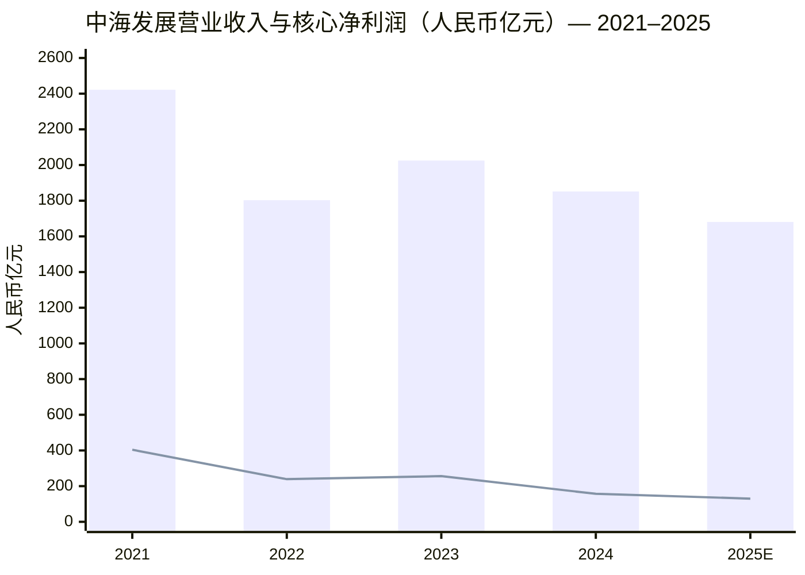
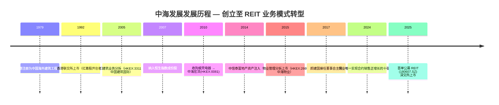
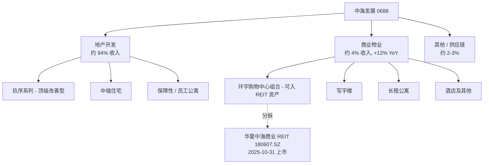
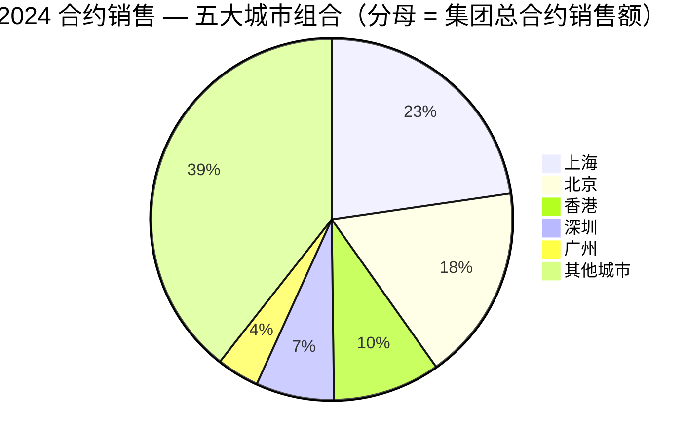
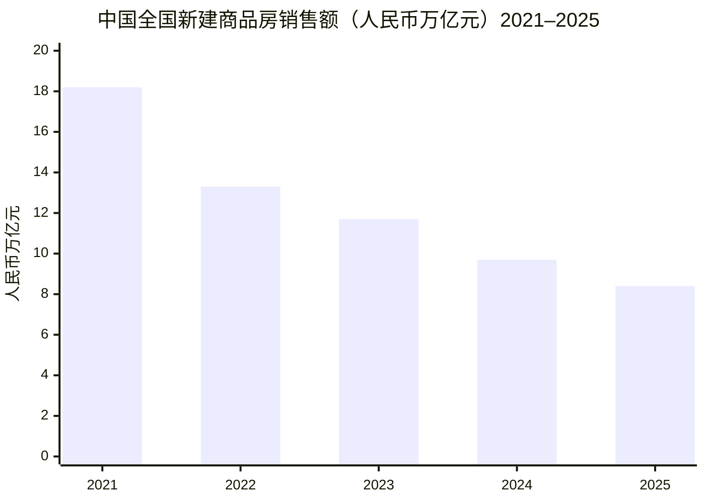
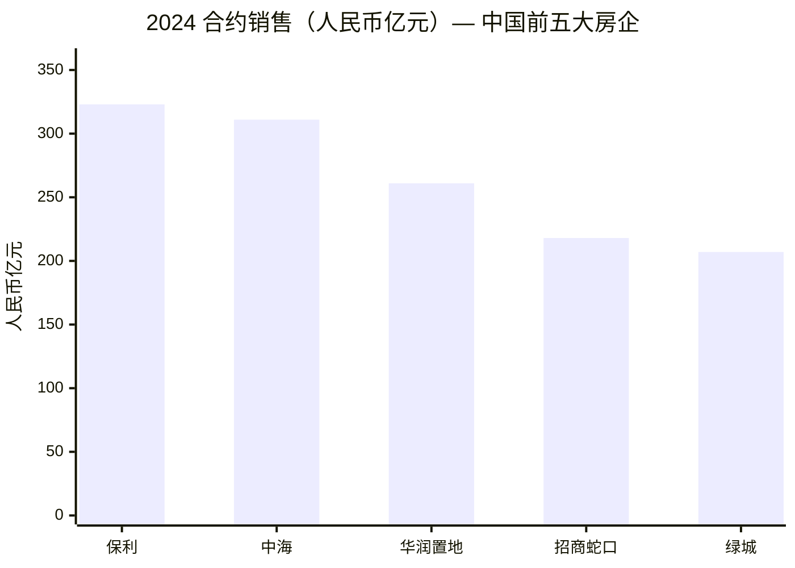
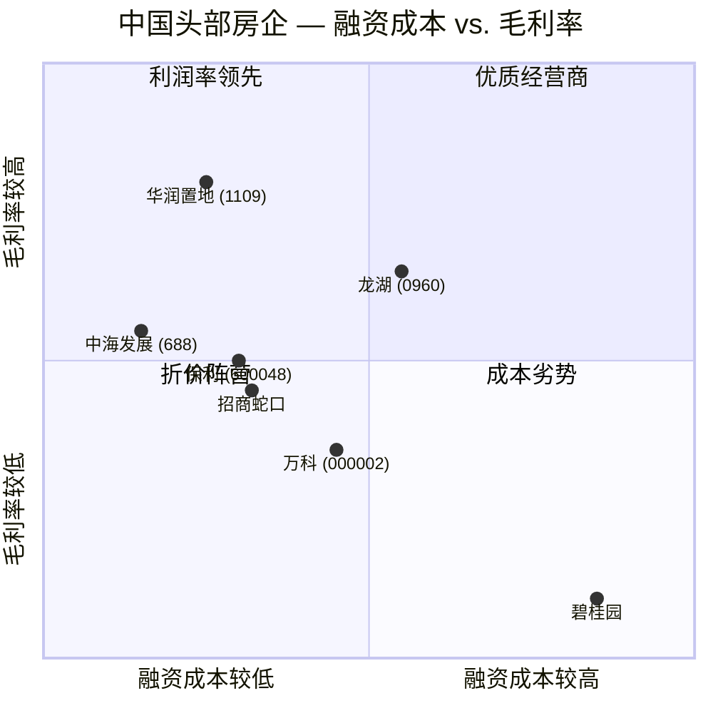
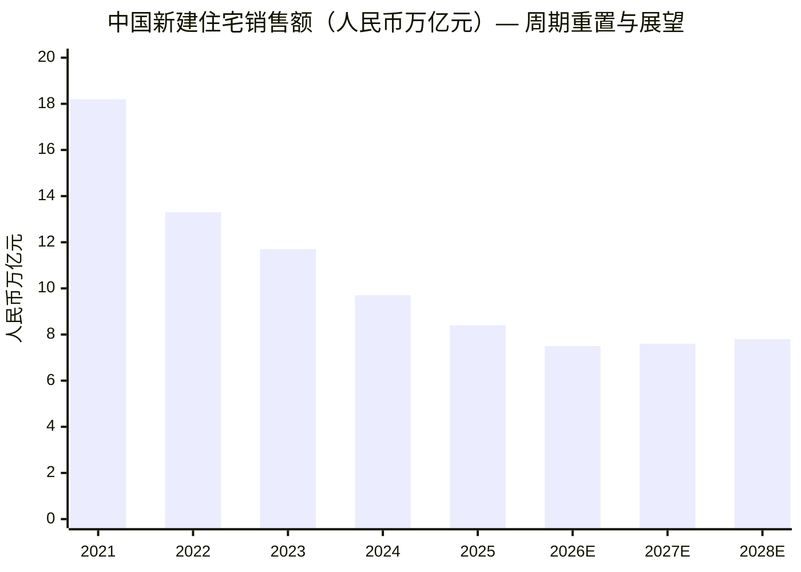

# 中国海外发展有限公司（China Overseas Land & Investment / 中海地产）— HKEX:0688

*首次覆盖 — 截至 2026-06-03*

> **要点提示 / Banner。** 2025 年全年业绩尚未披露；最新 **2025 年中期业绩**于 2025-08-27 公布 ([中海发展 2025 中期业绩, 2025-08-27](https://www.coli.com.hk/en/media/20250827/16802.html))：营业收入人民币 83.22 亿元，归母核心利润人民币 8.78 亿元，净借贷比率（net gearing）34.2%，平均融资成本 2.8%，处于行业最低区间。**2024 年全年业绩**于 2025-03-31 公布 ([中海发展 2024 年报, 2025-03-31](https://www.coli.com.hk/en/media/20250331/16625.html))：营业收入人民币 1,851.5 亿元（同比下降 8.6%），归母核心利润人民币 157.2 亿元，合约物业销售额（contracted sales）人民币 3,106.9 亿元，同比增长 0.3% — **是 2024 年中国十强房企中唯一实现合约销售额正增长的公司** ([新浪财经, 2025-04-03](https://finance.sina.com.cn/roll/2025-04-03/doc-inervuvx2866598.shtml))。**首单消费类公募 REIT — 华夏中海商业 REIT (180607.SZ) 于 2025-10-31 在深交所上市**，标志公司向"资产管理人"业务模式（asset-manager model）转型迈出关键一步 ([新浪财经 — 华夏中海商业REIT, 2025-10-31](https://finance.sina.com.cn/stock/wbstock/2025-10-31/doc-infvupap8693702.shtml))。

## 目录

1. [公司概览](#1-公司概览)
2. [公司历史](#2-公司历史)
3. [管理团队](#3-管理团队)
4. [产品与服务](#4-产品与服务)
5. [客户与销售策略](#5-客户与销售策略)
6. [行业概览](#6-行业概览)
7. [竞争格局](#7-竞争格局)
8. [市场机会](#8-市场机会)
9. [风险评估](#9-风险评估)
10. [投资视角评分](#10-投资视角评分)
11. [参考资料](#11-参考资料)

---

## 1. 公司概览

**中国海外发展有限公司**（China Overseas Land & Investment / "中海发展"或"中海地产" / HKEX:0688）是 **中国海外集团（China Overseas Group）** 旗下的上市旗舰房地产开发平台；中国海外集团则是 **中国建筑集团有限公司**（中建集团 / China State Construction Engineering Corporation, SHA:601668）的全资子公司 — 中建集团是中国规模最大的国有建筑工程综合企业，**2024 年位列《财富》全球 500 强第 13 位**。中海发展于 **1979 年 6 月 1 日**在香港注册成立，**1992 年 8 月 20 日**在香港联合交易所上市，**2007 年 12 月 10 日**被纳入恒生指数成份股，成为少数被纳入恒生蓝筹股的中资控股内房红筹股（red-chip）之一 ([Wikipedia — China Overseas Land and Investment](https://en.wikipedia.org/wiki/China_Overseas_Land_and_Investment))。

集团旗下经营 **四大业务分部** — **地产开发与销售（property development）、商业物业投资与租赁（commercial property）、其他辅助业务（包括物业管理、供应链服务、设计咨询等）、以及残留的金融服务业务** ([中海发展 2024 年报 HKEX, 2025-04-28](https://www1.hkexnews.hk/listedco/listconews/sehk/2025/0428/2025042801141.pdf))。地产开发是收入支柱，2024 年实现收入人民币 1,747.2 亿元，约占合并收入的 94%；商业物业是战略上升板块，2024 年收入人民币 71.3 亿元，**同比增长 12.1%** — 在同业普遍下行的环境下逆势增长 ([新浪财经, 2025-04-10](https://finance.sina.com.cn/wm/2025-04-10/doc-inesrssx2242127.shtml))。集团主要业务区域覆盖中国大陆、香港、澳门，以及一个长期保留但规模较小的英国开发业务；**超过 86% 的土地储备集中于一线和核心二线城市**，是中国十强房企中一二线城市集中度最高的公司 ([BigGo Finance — 中海发展 2025 中期, 2025-08-27](https://finance.biggo.com/news/EHiaTp0BNZYCTTDvYFs1))。

公司控股结构清晰，股东背景为中海发展提供了强劲的资本市场信用基础。**中国海外集团有限公司持有中海发展 55.99% 股权**，而中国海外集团本身由中建集团 100% 控股，中建集团则由 **国务院国有资产监督管理委员会（SASAC / 国资委）** 直接管辖 — 即中海发展的最终控制人是中央政府 ([Wikipedia — China Overseas Land and Investment](https://en.wikipedia.org/wiki/China_Overseas_Land_and_Investment))。中海发展是上市集团的核心住宅及商业地产平台；其一级子公司 **中海物业（China Overseas Property Holdings, HKEX:2669）** 是独立上市的物业管理业务分拆主体；**中海宏洋（China Overseas Grand Oceans Group, HKEX:0081）** 是聚焦中低能级城市的住宅地产联属公司，中海发展持有约 38% 股权；**中国建筑国际集团（China State Construction International Holdings, HKEX:3311）** 承载着 2005 年分拆出去的建筑工程服务业务 ([中海宏洋官网 — About COGOGL](https://www.cogogl.com.hk/en/about/))。

**估值快照（valuation snapshot, 截至 2026-06-03）：** 港股股价 HK$16.20，市值 **HK$1,778.5 亿（约 US$228 亿）**，TTM 市盈率（TTM P/E）**约 12.6×** ([Stock Analysis — 0688](https://stockanalysis.com/quote/hkg/0688/))，TTM 市销率（TTM P/S）**约 0.99×**，股息率（dividend yield）约 3.1%（按年度股息 HK$0.50 计）。同业对标方面，**华润置地（China Resources Land, HKEX:1109）** 2025E P/E 约 8.8×，**龙湖集团（Longfor Group, HKEX:0960）** TTM P/E 约 4.7× ([新浪财经 — 内房股估值, 2024-04-19](https://finance.sina.cn/2024-04-19/detail-inasiytw6494844.d.html))。12× 的估值倍数**高于港股内房板块的中位数水平**（因 2022–25 年下行周期，多数港股内房股 P/E 落在 4–9× 区间）— 投资者为中海发展的中央央企（central-SOE）资产负债表、行业最低的融资成本（1H25 仅 2.8%）以及向 REIT 锚定型业务模式（REIT-anchored business model）的转型路径支付了质量溢价（quality premium）。我们的判断是 **该溢价"合理但略偏紧"**：2024 年收入 -8.6% YoY、2025 年预期 -9.2% YoY，有机盈利增长（organic earnings growth）为负，因此 12× P/E 隐含两条修复路径之一 — (a) 2027 年起随着土地销售（land sales）触底回升以及"已售未结"库存逐步并表，盈利逐步恢复；或 (b) 资产管理人业务模式转型带来的重估。

近 3 年经营趋势：营业收入于 **2021 年触顶人民币 2,422.4 亿元**，2022 年因行业进入调整期下行至人民币 1,803.2 亿元（同比 -25.6%），2023 年随中央"三道红线"政策松绑与因城施策需求端措施落地反弹至人民币 2,025.2 亿元（+12.3%），随后再度回落（2024 年 -8.6% 至 1,851.5 亿元，2025 年预期约 -9.2% 至 1,680.9 亿元）— 主因是前期合约销售规模的收缩对当期结算收入产生滞后影响 ([Stock Analysis — 0688 营收历史](https://stockanalysis.com/quote/hkg/0688/revenue/))。报表毛利率（gross margin）由 2023 年的约 20% 压缩至 **2024 年 17.7%（同比 -2.6 个百分点）**，反映存量高成本土地项目集中结算；归母净利润同比下降 -38.95% 至人民币 156.4 亿元 — 跌幅大于收入降幅，主要因 **2024 年合计计提存货跌价准备人民币 16 亿元** 以及 **专门针对地产开发业务的 6.73 亿元减值** ([新浪财经, 2025-03-31](https://finance.sina.com.cn/stock/hkstock/ggscyd/2025-03-31/doc-inerpiyw1320643.shtml))。商业物业收入则同比 +12.1% 至人民币 71.3 亿元，是唯一实现增长的主要分部。

*数据来源：营业收入引自 [Stock Analysis — 0688 营收历史](https://stockanalysis.com/quote/hkg/0688/revenue/)；归母核心净利润引自 [中海发展 2024 年业绩, 2025-03-31](https://www.coli.com.hk/en/media/20250331/16625.html) 以及 [BigGo Finance — 中海发展 2025 中期业绩, 2025-08-27](https://finance.biggo.com/news/EHiaTp0BNZYCTTDvYFs1)。*

## 2. 公司历史

中海发展的第一阶段（1979–1992 年）以 **香港建筑工程承包业务**为核心。公司前身为 **中国海外建筑工程有限公司**，于 **1979 年 6 月 1 日**在香港注册成立，作为国务院在改革开放初期推动国有企业"走出去"的国际工程承包载体 — 当时尚无中国国有企业在境外有规模化布局，公司早期业务几乎全部为承接香港本地民用建筑工程合同以及深圳早期经济特区的小规模住宅开发 ([中国新闻网 — 建设服务香港, 2017-07-03](https://www.chinanews.com.cn/m/cj/2017/07-03/8267399.shtml))。1980 年代香港地产景气快速扩张，集团抓住机遇，由香港的小型建筑承包公司成长为建筑承包与房地产联动发展的中型企业；至 1990 年代初，管理层判断单独设立一个上市的地产开发主体可获得更清晰的资本市场定价路径，遂启动分拆上市。

**1992 年 8 月**，地产业务从母公司剥离并以中国海外发展有限公司的名义在香港联合交易所上市 — 成为 **首家以香港本地业务在港上市的国有资本控股红筹股（red-chip）** ([Wikipedia — China Overseas Land and Investment](https://en.wikipedia.org/wiki/China_Overseas_Land_and_Investment))。1990 年代是公司在中国大陆的扩张期 — 在北京、上海、广州、深圳等一线城市开设区域公司，奠定了日后"中海地产"品牌的市场基础。这一时期集团亦设立了中海物业管理有限公司 — 即今天中海物业控股（HKEX:2669）的前身，该公司于 2015 年完成自身分拆上市并成为恒生综合指数成份股。

2000 年代有两个结构性变革：**(a) 2005 年将建筑工程业务剥离至中国建筑国际集团（HKEX:3311）**，使得住宅地产与土木工程业务可获得各自纯化（pure-play）的资本市场定价 ([Wikipedia — China Overseas Land and Investment](https://en.wikipedia.org/wiki/China_Overseas_Land_and_Investment))；**(b) 2007 年 12 月 10 日被纳入恒生指数成份股**，这是一次机构投资者认可度的分水岭事件，巩固了中海发展相对于中等市值内房同业的上市溢价。2008 年全球金融危机成为转折点：当多数同业因资金压力收缩时，中海发展凭借央企资产负债表和离岸美元融资通道，在土地市场底部完成多笔重要收购，为 2009–2014 年的销售加速奠定基础。

2010 年代是 **集团多元化、多上市公司平台化**的阶段。**2010 年 3 月**，中海发展完成对蜆壳电器制造（控股）公司（Shell Electric Manufacturing (Holdings) Company Limited）的控股收购并将其重组为 **中国海外宏洋集团有限公司（HKEX:0081）** — 聚焦中低能级城市住宅开发的联属公司，中海发展持股约 38% ([Investing.com — 中海宏洋](https://www.investing.com/equities/ch-ovs-g-ocean-company-profile))。2014–2016 年间公司完成多次母公司资产注入（包括 2014 年中信泰富房地产资产注入约人民币 310 亿元的土地储备，是当时业内重要的换股资产重组事件）；**2015 年 10 月，物业管理业务以"中海物业控股（HKEX:2669）"为主体分拆上市** ([Yahoo Finance — 2669.HK](https://finance.yahoo.com/quote/2669.HK/))。**2017 年颜建国（Yan Jianguo）接任董事会主席**，开启了公司当前的战略章节：明确转向高能级城市拿地、积极降低融资成本、扩张"环宇（Universe）"商业地产品牌组合，以及长期推进经营性物业（recurring-income assets）建设以对冲住宅周期波动。

2020 年代开局即遭遇全行业下行周期 — 2021 年中恒大（Evergrande）境外债违约引爆了周期性高度紧绷的内房信用链。在此后四年中，**百强内房中已有超过 60 家公司发生境内外债违约、债务重组或被强制摘牌** — 但中海发展的应对姿态与民营同业截然不同。当旭辉（CIFI）、融创（Sunac）、碧桂园（Country Garden），乃至带有部分国有背景的万科（Vanke）都面临实质性流动性压力时，中海发展凭借 **央企背书、行业最低的融资成本（1H25 为 2.8%）** 以及严格的资产负债表管理（2024 年净借贷比率 29.2%、1H25 为 34.2%，始终位于监管的"绿档"区间），保持了资本市场通道畅通。2025 年有两个里程碑事件标志着战略转型：(a) **2025 年中期业绩** — 公司首次实现 **商业物业收入（人民币 72 亿元）覆盖期间总利息支出（亦为人民币 72 亿元）** 的结构性拐点，意味着经营性物业现金流已能完全覆盖集团的资金成本（structural inflection toward asset-manager economics）；(b) **2025 年 10 月 31 日华夏中海商业 REIT（180607.SZ）在深交所上市** — 中海发展的首单公募 REIT，底层资产为 **佛山映月湖环宇城购物中心**，建筑面积 15.3 万平方米；中海发展旗下 **可扩募的购物中心和写字楼资产存量超过 350 万平方米**，重点扩募资产 15 个、总建筑面积 187 万平方米 — **是首单 REIT 底层资产规模的 12 倍** ([新浪财经 — 华夏中海商业REIT, 2025-10-31](https://finance.sina.com.cn/stock/wbstock/2025-10-31/doc-infvupap8693702.shtml))。

## 3. 管理团队

**颜建国（Yan Jianguo）**，1965 年生，现任 **中国海外发展有限公司董事会主席兼执行董事**，同时担任 **中国海外集团有限公司（55.99% 控股母公司）** 董事长兼总经理，是集团的最高经营决策人。颜建国是中建集团内部资深的商业地产与住宅开发管理者，**拥有超过 32 年建筑业与房地产投资管理经验**，1990 年首次被派驻中国海外发展，是真正的"老中海"。从早期1990 年代开始参与了公司的每一个重要章节 ([百度百科 — 颜建国](https://baike.baidu.com/item/%E9%A2%9C%E5%BB%BA%E5%9B%BD/20272196); [同花顺 — 0688 高管介绍](https://basic.10jqka.com.cn/HK0688/manager.html))。颜建国于 **2017 年接任董事会主席职位**，原主席郝建民退休。任职以来主导三个结构性转变：(a) 高度聚焦一线及核心二线城市拿地（2024 年新增权益拿地额中一线占比高达 73.5%）；(b) 将商业物业建设为战略性经营性收入业务板块（2020–2024 年商业物业收入复合增长率 >20%，期间住宅业务在收缩）；(c) 启动向资产管理人模式（asset-manager model）转型，最终以 2025 年首单公募 REIT 落地为里程碑。

颜建国的管理风格偏重 **标准化、成本管控、资产负债表稳健性** — 而非激进拿地 — 在深度调整周期中比融创孙宏斌（Sun Hongbin）、碧桂园杨惠妍（Yang Huiyan）等民营房企创始人的进取风格更为适配，后两家公司在同一时期均经历了违约或债务重组事件。颜建国在公开场合（例如 2025 年中期业绩沟通）的表达一贯强调从"规模驱动"转向"质量驱动"，强调 **"在深度上的品质和客户满意度竞争"（"in-depth competition on quality and customer satisfaction"）**，以及资产管理人转型 ([BigGo Finance — 2025 中期业绩, 2025-08-27](https://finance.biggo.com/news/EHiaTp0BNZYCTTDvYFs1))。鉴于 **国有企业高管轮岗由国资委（SASAC）统一管理**，颜建国出任主席已第八年，**接班风险（succession risk）** 是需要多年观察的治理因素 — 但截至 2026-06-03，尚无公开信号显示即将发生人事变动。

**严格意义上中海发展并无"创始人"** — 创立主体是 1979 年中建集团在港设立的国有附属公司，并非创业者主导的新创企业。国务院与中建集团是制度意义上的"创始者"；1979 年公司注册档案由中建集团当时的国际工程业务管理层完成，1980 年代至 1990 年代的历任董事长均为中建集团派驻香港的高层。

## 4. 产品与服务

中海发展的收入构成以 **地产开发业务（property development，2024 年贡献人民币 1,747.2 亿元，约占合并收入的 94%）和快速增长的商业物业平台（commercial property，2024 年 71.3 亿元，同比 +12.1%）为主**，其余分散在物业管理（通过持股的港股上市公司 2669）、供应链服务、以及一个规模小的英国残留业务。

### 4.1 地产开发（2024 年收入占比约 94%）

地产开发通过 **四大住宅产品系列** 交付，其中 **旗舰系列"玖序系列（Jiu Xu Series）"** 承载着最高端改善型住房（improvement-tier housing）的定位。2024 年该系列推出多个全国最高合约销售额的单个项目：**上海建国东路项目实现合约销售 387.3 亿元**、**上海领邸·玖序/玖章项目 282.1 亿元**、**深圳中海·深湾玖序项目 156.2 亿元** — 三个项目合计占集团总合约销售额约 26% ([新浪财经, 2025-04-10](https://finance.sina.com.cn/wm/2025-04-10/doc-inesrssx2242127.shtml))。系列战略将中海地产定位为 **一线城市改善型（"改善型"）住房市场的领先央企供应商** — 即在中国住宅总体市场承压的环境下，购房群体购买力和结构性升级需求最强劲的细分赛道。

> "在香港及北上广深五个城市实现合约销售额人民币 1,640.4 亿元，占公司销售合约额的 60.6%"
> ([新浪财经, 2025-04-10](https://finance.sina.com.cn/wm/2025-04-10/doc-inesrssx2242127.shtml))

地理集中度是公司主动选择的结构性特征：2024 年 **超过 60% 的合约销售额（人民币 1,640.4 亿元）来自仅五个城市** — 香港、北京、上海、广州、深圳，其中上海单城贡献 704.5 亿元。2025 年中期同一模式继续：北京 502.6 亿元（连续 8 年位居该城市销售第一）、深圳 248.9 亿元（市场第一）、香港 222.3 亿元（同比翻倍）([BigGo Finance — 2025 中期业绩, 2025-08-27](https://finance.biggo.com/news/EHiaTp0BNZYCTTDvYFs1))。2024 年全年拿地金额 **人民币 806.1 亿元 / 权益拿地额 696.3 亿元**，新增 22 宗地块，**73.5% 的新增权益拿地额投向一线城市** — 是港股内房中一线集中度最高的，是从导致 2022–25 年内房同业库存压力的中低能级城市土储中清晰、有意识的轮换。2024 年的拿地纪律配合北京头部城市的高定价 — 公司在多场一线优质地块的招拍挂中以民营开发商不愿出的价格中标。

**中文释义 / Plain-language gloss：** "玖序"系列（字面读"九序"或"九阶秩序"）大致相当于华润置地的"悦府/润府"系列、万科的"翡翠系"系列、龙湖的"御湖境"系列 — 定位为面向核心一线城市改善型购房群体的高端住宅，单元面积通常 120–250 平方米，使用高端材料和精装，定价处于所在城市新建住宅市场的前 10–15%。

### 4.2 商业物业投资与租赁（2024 年收入占比 3.8%，增速最高板块）

商业物业平台以 **"环宇（Huan Yu / Universe）"组合品牌**为锚，覆盖购物中心、写字楼、酒店和长租公寓四种业态。2024 年分部收入 **同比 +12.1% 至人民币 71.3 亿元（recurring rental income，未含酒店收入）**，其中可比的写字楼和购物中心租金收入分别 **同比 +4.1%（写字楼 35.7 亿元）和 +34.5%（购物中心 22.6 亿元）**；长租公寓增速最高，**同比 +42.1% 至人民币 2.7 亿元**；酒店及其他商业物业 10.3 亿元 ([新浪财经, 2025-04-10](https://finance.sina.com.cn/wm/2025-04-10/doc-inesrssx2242127.shtml))。在同业大多录得租金收入持平或下滑的环境下，中海发展购物中心和长租公寓的增长反映两个经营驱动：(a) 2024 年新增 9 个商业物业投入运营（6 座长租公寓、2 座写字楼、1 座购物中心，新增建筑面积约 30 万平方米）；(b) 既有组合更紧凑的出租率与租金管理。

> "2024 年中海地产新增九个商业物业投入运营，总建筑面积增加约 30 万平方米，包含 6 座长租公寓、2 座写字楼、1 座购物中心"
> ([新浪财经, 2025-04-10](https://finance.sina.com.cn/wm/2025-04-10/doc-inesrssx2242127.shtml))

**战略意义 — 资产管理人转型。** 2025 年中期业绩披露了一个结构性拐点：**商业物业收入（半年 72 亿元）首次覆盖集团总利息支出（亦为 72 亿元）** ([BigGo Finance — 2025 中期业绩, 2025-08-27](https://finance.biggo.com/news/EHiaTp0BNZYCTTDvYFs1))。经济意义在于 **商业物业租金现已能结构性地覆盖集团整个资产负债表的资本成本** — 即使住宅开发的净利润降至零，经营性物业板块仍可自给自足。这是管理层在 2024–25 年定位为从"地产开发商"转向"全周期资产管理人（full-cycle asset manager）"的门槛指标。

资本市场层面的回报是 **REIT 转型路径**。**华夏中海商业 REIT（HKSC:180607.SZ）** 于 **2025-10-31 在深交所上市**，底层资产为 **佛山映月湖环宇城购物中心**，建筑面积 15.3 万平方米。REIT IPO 募资约人民币 13.55 亿元，**预测可分派现金流分派率（distributable cash-flow yield）2025 年 4.00%（年化）、2026 年 4.21%**，公众投资者认购倍数 **361.9 倍**，机构投资者认购倍数 **320.5 倍**，累计认购金额（按比例配售前）**约人民币 1,600 亿元** ([新浪财经 — 华夏中海商业REIT, 2025-10-31](https://finance.sina.com.cn/stock/wbstock/2025-10-31/doc-infvupap8693702.shtml))。关键在于 **中海发展可扩募的购物中心和写字楼资产总建筑面积超过 350 万平方米**（相比首发的 15.3 万平方米），其中重点扩募资产 15 个、总建筑面积 187 万平方米 — **是首发资产规模的 12 倍** ([瑞财经, 2025-10-31](https://m.rccaijing.com/news-7389872988042754023.html))。其含义是 **REIT 结构可在未来 5–10 年逐步消化既有的商业物业建设规模**，释放数倍于股票净资产价值（NAV）的资本回收能力。

### 4.3 物业管理 — 中海物业控股（HKEX:2669，独立上市）

中海物业控股（China Overseas Property Holdings, CPOH, 02669）是中海发展独立上市的物业管理子公司，在中国大陆、香港、澳门提供住宅及商业物业的物业管理服务。其经营业绩并入中海发展合并财务报表，但港股独立交易，使集团获得一个独立的"服务业务"市场化估值通道（service-business-multiple expansion vehicle）([中海物业年报 — 雪球 PDF](https://stockn.xueqiu.com/02669/20250327472770.pdf))。物业管理收入绝对值相对地产开发较小，但是高质量经常性收入，随住宅 GFA 在管面积复合增长。

### 4.4 中海宏洋集团（HKEX:0081，约 38% 持股联属）

中国海外宏洋集团有限公司（COGOGL, 0081）是中海发展持股的中低能级城市开发联属公司，业务聚焦三线城市及部分二线城市（合肥、长沙、济南等）的住宅和综合开发。中海宏洋以独立上市公司运营，拥有自身管理团队，中海发展以长期股权投资入账 ([中海宏洋 — 关于我们](https://www.cogogl.com.hk/en/about/))。这种结构性分离让中海发展自身的土储严格保持在一二线城市的同时，通过联属公司参与中低能级城市的残留市场。

## 5. 客户与销售策略

中海发展的客户群体在 **个人购房者层面高度分散** — 没有任何一个终端购房者会对总收入构成实质性集中，这是住宅地产开发商的结构性特征（每年面向个人家庭销售约 2.5–3.5 万套住宅）。2024 年报中的前五大客户集中度披露并未触及单一客户超过 10% 的需要列示阈值，这符合中国大陆及港股住宅地产开发商的惯例 ([中海发展 2024 年报 HKEX, 2025-04-28](https://www1.hkexnews.hk/listedco/listconews/sehk/2025/0428/2025042801141.pdf))。客户侧分析的相关维度是 **合约销售的地理 / 城市层级分布**，而非企业客户集中度。

公司客户层级分布集中于 **高能级城市改善型购房者** — 中产至中高产家庭的首套升级、一线城市的二套需求、以及核心资产物业的少量投资型买家。2024 年中海发展合约销售的全国均价 **约人民币 35,000–40,000 元/平方米**，远高于全国一二线均价，反映一线集中度与玖序系列的高端定位。

*数据来源：基于五城合计 1,640.4 亿元 与 集团总合约销售 3,106.9 亿元 的推算，引自 [新浪财经 2024 年报点评, 2025-04-10](https://finance.sina.com.cn/wm/2025-04-10/doc-inesrssx2242127.shtml)。各城市拆分中上海 704.5 亿元为明示；其余四个城市的相对权重为按 1H25 各城市销售排名按比例估算，"其他城市" 39.4% 为残差精确值。*

**销售模式：** 销售通过 (a) 各项目现场的自营销售办事处（项目售楼处是主要渠道）；(b) 项目附属经纪人网络（部分内部、部分外部）；(c) 数字渠道 — 中海发展的微信小程序、"中海好房"线上销售平台用于项目查询和看房预约。**不存在传统消费品行业那种批发分销 / 渠道伙伴模式** — 每套住宅单元都是项目主体与购房家庭之间独立的合同。**2025 年中期销售回款率达 95%** — 是衡量合约销售转化为现金速度的指标 — **位居行业前列** ([BigGo Finance — 2025 中期业绩, 2025-08-27](https://finance.biggo.com/news/EHiaTp0BNZYCTTDvYFs1))。

对于 **商业物业板块**，客户层级分布更接近企业客户：购物中心租户通常为大型连锁消费品牌（奢侈品、大众服装、餐饮、超市、影院、生活服务等）；写字楼租户则为国有企业、跨国公司、成长期科技公司的组合。单一购物中心租户或写字楼租户均不达到 10% 单独披露阈值，但隐性的集中度结构性中等 — 一个出租良好的一线城市购物中心的前十大租户通常合计占 NOI 的 25–35%。

## 6. 行业概览

### 6.1 中国住宅地产市场 — 2024–2025 基线

中国住宅地产市场正经历 **过去 30 年最深的结构性调整**，自 2021 年中起，新开工、销售、价格的多年下行持续延伸至 2026 年。**国家统计局 2024 年发布**显示 **2024 年新建商品房销售面积 9.7385 亿平方米（同比 -12.9%），销售额人民币 9.675 万亿元（-17.1% YoY），房地产开发投资人民币 10.028 万亿元（-10.6% YoY）** ([国家统计局 — 2024年全国房地产市场基本情况, 2025-01-17](https://www.stats.gov.cn/sj/zxfb/202501/t20250117_1958328.html))。**2025 年发布**显示进一步下行：**新建商品房销售面积 8.8101 亿平方米（-8.7% YoY），销售额 8.394 万亿元（-12.6% YoY），房地产开发投资 8.279 万亿元（-17.2% YoY），房屋新开工面积 5.877 亿平方米（-20.4% YoY）** ([国家统计局 — 2025年全国房地产市场基本情况, 2026-01-19](https://www.stats.gov.cn/sj/zxfb/202601/t20260119_1962324.html))。

这是连续第三年的两位数下降，使行业 **2025 年销售额仅为 2021 年峰值（约 18.2 万亿元）的约 50%**。对中国 GDP 的累计拖累相当可观：**高盛（Goldman Sachs）估计房地产行业对 GDP 增长的总体拖累（包括上下游溢出效应）将从 2025 年的约 2.0 个百分点收窄至 2026 年的 1.5 个百分点** ([Asia Society — China's Property Rebalancing, 2025](https://asiasociety.org/policy-institute/chinas-property-rebalancing-long-road-new-development-model)) — 仍是实质性拖累，但边际改善。**晨星（Morningstar）认为住宅地产需求在 2027 年之前不会反弹，市场仍需 1–2 年才能触底**，2026–2030 年间新销售面积有望超过新开工面积 40–70%，机械上将逐步消化库存过剩 ([S&P Global Ratings — China Property Supply Glut, 2025](https://www.spglobal.com/ratings/en/regulatory/article/china-property-watch-supply-glut-to-impede-recovery-s101667227))。

*数据来源：国家统计局年度房地产市场数据 2021–2025（[2024 年发布](https://www.stats.gov.cn/sj/zxfb/202501/t20250117_1958328.html)；[2025 年发布](https://www.stats.gov.cn/sj/zxfb/202601/t20260119_1962324.html)）。*

### 6.2 结构性驱动因素 — 人口与家庭形成

行业下行的结构性原因已较清晰：**(a) 人口拐点 — 中国人口在 2022 年触顶，目前以每年约 150–200 万的速度收缩**，结婚率创历史新低；**(b) 城镇化趋于成熟 — 25 年城乡迁移驱动力接近 65–67% 城镇化率自然天花板，未来增量越来越向三四线城市倾斜**；**(c) 三四线城市的库存过剩 — 中低能级城市（住有结婚阶段人口的约 70%）累积过剩，意味着持续的库存消化挑战**；**(d) 居民资产负债表修复 — 2021 年后房价通缩压缩了家庭净资产假设，促使家庭选择提前还贷而非新增债务购房**。在此背景下，**一线及核心二线市场展现出更早的企稳迹象** — 牛津经济（Oxford Economics）指出截至 2025 年 3 月，一线城市存量房价格已开始改善 — 但**市场的外围圈层仍处于延展的收缩中**。

### 6.3 行业结构 — 国企与民企两极分化

2021–2025 周期推动了 **开发商数量的结构性压缩** — 至少 60 家百强内房已发生境内外债违约、债务重组或被强制摘牌 ([Asia Society — China's Property Rebalancing](https://asiasociety.org/policy-institute/chinas-property-rebalancing-long-road-new-development-model))。幸存者结构性分化为两个阵营：**(a) 拥有资产负债表通道与低成本融资能力的央企和省属国企** — 中海发展、保利发展（Poly）、华润置地（CR Land）、招商蛇口（CMS）、绿城中国（Greentown，部分国资）、越秀地产（Yuexiu）— 主导新增拿地活动；**(b) 选择性陷入困境的民营房企** — 万科（Vanke，因深铁股东地位定性模糊）、龙湖（Longfor）、碧桂园（Country Garden，债务重组中）、融创（Sunac，债务重组中）、恒大（Evergrande，已摘牌）。**仅存的健康民营开发商** — 主要是 **龙湖集团（HKEX:0960）、滨江集团、合生创展（HKEX:0754）** — 经营规模都明显小于央企领军。

2024 年行业合约销售排名能直接说明这种分化：**保利发展以人民币 3,230 亿元领先，中海发展第二 3,106.9 亿元，华润置地第三约 2,610 亿元，招商蛇口第四，绿城第五** ([东方财富 — 房企年度销售表现, 2025-01-01](https://fund.eastmoney.com/a/202501013284488269.html)) — 前五名全部为央企。万科自 2018 年以来首次跌出前三 — 标志着民营房企阵营的全面退潮，部分由 2025 年底万科人民币 20 亿元债券濒临违约触发 ([ABC News — Vanke Default Risk, 2025](https://abcnews.go.com/Business/wireStory/china-vankes-default-exposes-fragility-faltering-recovery-property-128798090))。

### 6.4 土地市场动态

2024–25 年土地市场本身也呈现两极分化。**一线城市的一级市场（招拍挂）竞争激烈、定价审慎** — 上海、北京、深圳、广州的优质地块由 6–10 家央企竞拍，中海发展、华润置地、招商蛇口、保利、绿城是最持续的竞买者。**二线城市土地市场偏弱**，多次拍卖被取消或重定价。**三四线城市土地市场几乎"关闭"**，除困境资产收购外，地方政府无力清理库存。这一分化强化了中海发展的地理策略优势：通过将 2024 年 73.5% 的新增权益拿地额投向一线城市，中海发展正将资本集中投放在周期反转回报最可能落地的市场 — 但这也意味着它在与其他几个健康央企争夺有限的供应。

## 7. 竞争格局

中海发展的竞争格局由 **保留资本市场通道并具备拿地与交付能力的 4–6 家幸存央企房企**定义。主要同业，按 2024 年合约销售排名：

1. **保利发展控股集团（Poly Developments and Holdings Group, SHA:600048）** — 中国保利集团央企；2024 年合约销售 3,230 亿元；地理组合比中海发展更全国化，中低能级城市暴露更大；资产负债表同业（融资成本 3.0–3.2% 区间）；2024 年合约销售第一，是中海发展在一二线土地拍卖中最直接的对手。
2. **华润置地（China Resources Land, HKEX:1109）** — 华润集团央企；2024 年合约销售约 2,610 亿元；**央企中盈利能力最高，2023 年毛利率 25.15%**（vs 中海发展 20.32%），且 **商业物业平台在内房中规模最大**（2023 年经常性收入 390.6 亿元，+26.4% YoY）([腾讯新闻 — 房企财报对对碰, 2025-04-30](https://news.qq.com/rain/a/20250430A0352F00))。估值高于中海发展（华润 2025E P/E 约 8.8× vs 中海发展 TTM P/E 约 12.6× — 注：中海发展的高 P/E 是 trough earnings 抬升的结果）。
3. **招商蛇口（China Merchants Shekou, SZSE:001979）** — 招商局集团央企；2024 年合约销售 2,180 亿元；在南方沿海城市的港口和产业地产组合较强。
4. **绿城中国（Greentown China, HKEX:3900）** — 部分国资控股（中国交建为最大股东）；2024 年合约销售约 2,070 亿元；在浙江、上海、北京的高端住宅品牌强势。
5. **龙湖集团（Longfor Group, HKEX:0960）** — 唯一存活的大型民营房企；2024 年合约销售在 1,000–2,000 亿元之间（当前周期下具体数字不确定）；商业物业平台在绝对规模上与中海发展可比，**经营性业务对利润的贡献占比 >60%**（vs 中海发展 <30%）；估值显著低于央企（TTM P/E 约 4.7×），反映民营阵营的折价 despite operational quality。

*数据来源：行业 2024 合约销售排名（[东方财富 — 2024 房企排位, 2025-01-01](https://fund.eastmoney.com/a/202501013284488269.html)，[新浪财经 — 2024 房企排位赛, 2025-01-01](https://finance.sina.com.cn/stock/relnews/cn/2025-01-01/doc-inecmwyt2843472.shtml)）。*

*分析师观点：定位基于 (a) **平均融资成本**（中海发展 2.8–3.1%；华润置地约 3.0%；保利约 3.0–3.2%；招商蛇口约 3.0%；龙湖约 4.0–4.5%；万科约 4.0–4.5%；碧桂园 — 重组中 — >7%）；(b) **2023–24 毛利率**（华润置地 25%；中海发展 18–20%；保利 14–18%；招商蛇口约 15%；龙湖约 20%；万科约 15%；碧桂园 — 负数）。可参考的财务对比研究 ([新浪财经 — 房企财报对对碰, 2025-04-30](https://news.qq.com/rain/a/20250430A0352F00))。*

**中海发展凭什么在此竞争。** 三个结构性护城河：**(a) 央企资产负债表**（行业最低融资成本、BBB+/A- 信用评级、母公司中建集团的隐性资本市场支持）— 仅其他 4–6 家央企同业可以匹配；**(b) 一线城市土储** — 多年积累的一线土地存量，部分包括 2010 年代以较低账面成本取得的上海和北京地块；**(c) 自有商业物业平台 + REIT 可回收资产存量** — 仅华润置地有可比购物中心组合；龙湖较小且非购物中心为主；保利和招商蛇口的商业组合规模显著更小。相对华润置地的劣势在 **商业物业绝对规模和毛利率**：华润置地 2024 年购物中心租金收入超中海发展 5 倍，一线住宅毛利率高几百个基点。

*分析师观点：* **华润置地通常被市场认为是质量最高的央企内房**，中海发展是最接近的第二名；这一相对排名在多个卖方研究覆盖周期中保持稳定。中海发展的商业物业建设以及 2025 年的 REIT 上市缩小了部分差距，但未在商业物业绝对规模上取代华润置地 ([Hibor 国信证券研报 — 华润置地](https://p.hibor.com.cn/data/dbabccf2404048eb0880a3e07124f845.html))。

## 8. 市场机会

### 8.1 住宅地产 TAM — 调整后基线

中国住宅地产市场仍然是 **全球最大单一住宅地产市场，按交易额计 2025 年约人民币 8.4 万亿元（约美元 1.18 万亿元）** ([国家统计局 — 2025 年全国房地产市场基本情况](https://www.stats.gov.cn/sj/zxfb/202601/t20260119_1962324.html))。卖方分析与咨询机构普遍预期 **稳态新建住宅市场规模在 2026–2030 年间将处于人民币 6–8 万亿元/年**，新建销售面积可能向 800–900 百万平方米/年的中周期均衡靠拢。**仅一线城市（北上广深）新建市场就每年贡献约人民币 1.2–1.5 万亿元的销售额** — 也即中海发展的核心战场 — 结构性上比全国总体市场抗周期，因高收入家庭的持续内迁。

### 8.2 改善型住房需求池 — 中海发展的战略瞄准

在住宅 TAM 中，**改善型住房需求（即一线城市现有家庭从较小、较旧的单元升级至较大、较新的单元）是 2026–2030 年间最强劲的结构性需求池**，支持因素有 (a) 一线城市 1990 年代/2000 年代住宅存量的结构性老化将逐步被升级需求替代；(b) 一线核心人口家庭收入的累计改善；(c) 自 2023 年起的"好房子"政策导向 — 既降低升级买家的交易税负担，又加快一线城市高质量新建项目的审批速度。中海发展在一线城市新建市场的份额 **估计在四城市合计 7–10%，北京和深圳具体在 12–15%** — 该估计基于公开披露的 1H25 北京 502.6 亿元和深圳 248.9 亿元销售额与全国一线销售额组合的三角化估算（analyst estimate based on disclosed inputs）([BigGo Finance — 2025 中期业绩, 2025-08-27](https://finance.biggo.com/news/EHiaTp0BNZYCTTDvYFs1))。

### 8.3 商业物业与 REIT 锚定 TAM

中国商业物业经常性收入市场 **估计在每年人民币 1.5–2 万亿元的租金和经营收入**，其中高品质资产（一线购物中心、甲级写字楼、顶级酒店、品牌长租公寓）占该总量的 25–35%。**加速发展的中国公募 REIT 市场 — C-REIT 框架于 2024 年末重新向消费基础设施资产类别开放 — 为中海发展的商业物业组合提供了多年期变现路径**。2025-10-31 华夏中海商业 REIT (180607.SZ) 上市，底层资产为 15.3 万平方米购物中心建筑面积，**公众投资者认购倍数 361.9 倍（累计认购金额按比例配售前约人民币 1,600 亿元）**，验证了该资产类别的隐性资本市场需求 ([新浪财经 — 华夏中海商业 REIT, 2025-10-31](https://finance.sina.com.cn/stock/wbstock/2025-10-31/doc-infvupap8693702.shtml))。后续可扩募 REIT 资产的 12 倍头寸（重点扩募资产 187 万平方米 vs 首发 15.3 万平方米）意味着 **未来 5–10 年的资本回收管道可能对中海发展经常性收入板块的企业价值产生实质性的重估**。

*数据来源：2021–2025 实际值引自 [国家统计局 — 2024 年发布](https://www.stats.gov.cn/sj/zxfb/202501/t20250117_1958328.html) 与 [2025 年发布](https://www.stats.gov.cn/sj/zxfb/202601/t20260119_1962324.html)；2026–2028 估算综合 [Asia Society](https://asiasociety.org/policy-institute/chinas-property-rebalancing-long-road-new-development-model) 和 [S&P Global](https://www.spglobal.com/ratings/en/regulatory/article/china-property-watch-supply-glut-to-impede-recovery-s101667227) 的卖方共识观点（analyst-derived envelope，非单一来源）。*

### 8.4 央企主导整合的多年期论点

中海发展在未来 5–10 年的结构性机会是 **市场份额提升 + 经常性收入建设的同时进行**。**市场份额提升** — 随着民营房企继续从新增拿地中撤出，全国新建销售中央企阵营的份额已从 2021 年的约 25% 上升至 **2024–25 年的 >50%**。中海发展自身的全国新建销售份额从 2021 年的约 1.5% 扩张至 **2024 年末的约 3.2%（同比 +0.55 ppt）** ([新浪财经 — 中海发展年报, 2025-04-03](https://finance.sina.com.cn/roll/2025-04-03/doc-inervuvx2866598.shtml))。**经常性收入建设** — 既有商业物业组合在 2025–2030 年随每年 9 项目落地的速度有望扩张 30–50%，REIT 通道则提供轻资产化的扩张路径。

## 9. 风险评估

### 9.1 公司特定风险

**存量高成本土地的存货减值（inventory impairment）风险。** 2024 年中海发展计提 **存货跌价准备人民币 16 亿元，其中专门针对地产开发业务的 6.73 亿元** ([新浪财经, 2025-03-31](https://finance.sina.com.cn/stock/hkstock/ggscyd/2025-03-31/doc-inerpiyw1320643.shtml))。中诚信国际（CCXI）2025 年跟踪评级报告指出 **2025 年存货减值规模预计与 2024 年的 16 亿元相若** ([CCXI 2025 跟踪评级 — 中海宏洋联属](http://static.sse.com.cn/disclosure/bond/announcement/company/c/new/2026-01-27/244627_20260127_OXV4.pdf))。量级：年度核心利润 50–100 个基点；缓释：一线集中度避免了中低能级城市同业最深的减值情景。

**一线城市土地市场的招拍挂竞争导致拿地利润率压缩。** 与一小群但具决心的央企竞争一线优质地块，意味着新增土地获取项目 IRR 结构性低于 2014–2019 年队列。量级：中期 ROIC 压缩 200–300 个基点；缓释：2024 年的拿地纪律（仅 22 宗地、地理集中度高）表明管理层优先 IRR 而非规模。

**住宅毛利率压缩 — 存量高成本土地存货逐步清理。** 2024 年毛利率压缩 -260 个基点至 17.7%；瑞银（UBS）预测 **2025 年盈利下跌高双位数** ([同花顺 — UBS 中海发展 2025 展望](https://news.10jqka.com.cn/00000000/c673971724.shtml))。量级：2025–26 可能再压缩 200–400 个基点；缓释：商业物业和 REIT 资产回收通道部分对冲住宅周期拖累。

**颜建国主席最终轮岗的继任风险。** 国资委推行的央企高管轮岗历史上未对企业造成重大干扰，但新主席可能调整住宅与商业地产的战略平衡。量级：低到中等；缓释：中海发展的制度深度强，高管层多为职业中海人。

### 9.2 行业 / 市场风险

**全国住宅需求的持续收缩可能延伸至 2027 年之后。** 晨星和标普均不预期 2027 年前需求恢复；若结构性人口和家庭形成逆风深于市场共识预期，恢复或延伸至 2028–29 年。量级：高 — 可能相对当前轨迹压缩中海发展 2026–28 年合约销售每年人民币 500–800 亿元；缓释：一线集中度与改善型住房定位提供相对优于行业的表现，即使在更长的低位情景中。

**三四线城市的库存消化挑战。** 尽管中海发展自身在三四线的暴露被结构性低配，联属公司中海宏洋（HKEX:0081）仍承载着中低能级城市的土地与库存，可能对中海发展的股权投资头寸造成减值。量级：联属层面低到中等；缓释：上市主体的结构性分离。

**一线城市政策风险 — 房产税试点扩围。** 长期讨论的房产税试点若由 2011 年的上海/重庆试点扩围至其他一线城市，将改变家庭持有成本经济学。量级：中等 — 可能压缩一线二手房流动性，限制交易税抵扣型需求拉动；缓释：当前中央政府 2025–26 政策立场已明确推迟房产税扩围，以支持楼市稳定。

**抵押贷款利率与宏观信用周期。** 中国家庭抵押贷款利率自 2022 年以来已大幅下行（1H25 新发抵押贷款平均约 3.0% vs 2021 年的 5.5%），但结构性信用配给收紧或人民银行加息周期会把购房承受能力推回压力区间。量级：中等；缓释：中海发展的客户层级（中高产改善型购房者）对边际抵押贷款利率变化敏感度低于首套刚需购房群体。

### 9.3 财务风险

**应收账款和合营公司股权相关减值。** 2024 年净借贷比率 29.2%、1H25 为 34.2%，均处于监管"绿档"区间；但合营公司股权暴露给陷入困境的同业（中国央企房企的典型做法是在共同开发的合营公司中持有少数股权）创造间接减值风险。量级：低到中等；缓释：中海发展合营公司组合集中于其他央企交易对手。

**资金成本正常化。** 中海发展 1H25 平均融资成本 2.8% 处于历史低位；中国基准利率最终正常化将推升利息支出 50–150 个基点。量级：低；缓释：长期债券组合在数年内锁定了当前利率环境。

**货币错配（境外美元债 vs 人民币现金流）。** 在境外债账面上有边际暴露；通过香港项目的港币/美元应收账款进行自然对冲。量级：极小。

### 9.4 宏观与地缘政治风险

**中美经济脱钩与资本账户压力。** 尽管中海发展的收入实质全为人民币计价、客户群体全为中国境内居民，但上市主体在香港交易所交易并有可观的外国机构持股。量级：经营层面低、股价层面中等；缓释：母公司中建集团与国资委的背书。

**香港市场政策转向或美国主导的港股上市地位降级风险。** 若美国主导的对港股上市地位的去认证（类似 2020–22 ADR 威胁周期），将压缩港股二级市场流动性。量级：低；缓释：港交所是中海发展的主要上市地，且无论地缘政治如何，最有可能的永久上市地都是香港。

**气候 / 台风 / 工地施工风险。** 因华南沿海项目地点集中度高而存在实质性暴露；非单一事件风险而是持续 capex 影响。量级：低；缓释：成熟的工程管理实践。

**估值倍数压缩风险。** TTM P/E 约 12.6× 隐含质量溢价，若住宅周期进一步延展、或华润置地等同业在商业物业转型上表现优于中海发展，可能压缩估值。量级：中等；缓释：REIT 路径与一线土储质量提供结构性防御。

## 10. 投资视角评分

*评分复用第 1–9 节中已经引用过的数据与论据；本节不引入新的内联引用。下方周期判断基于截至 2026-06-03 的指标读数。*

### 10.1 巴菲特视角 — 合理价格的优质企业（Buffett Quality-at-a-Sensible-Price，0–100）

*视角观点：* **中等质量周期入场 — 评分 64/100。** 中海发展在持久竞争优势（央企资产负债表、行业最低融资成本）和内在价值对价格（TTM P/S 约 1×，企业在全球最大住宅市场拥有约 3% 份额）方面表现良好；在周期轨迹（顶线收缩；2024 年净利润同比 -39%）和未来盈利可预测性（中国地产周期至 2027 年路径不明）方面表现较弱。巴菲特偏好"合理价格的优质企业"的标准部分满足 — 业务存在结构性护城河 — 但周期性逆风意味着 TTM P/E 12.6× 的入场点溢价处于舒适区间的上端。

| 组成部分 | 评分 (0-10) | 备注 |
|---|---|---|
| 持久竞争优势 | 8 | 央企背书；行业最低融资成本 |
| 业主收益率（Owner's Earnings Yield） | 6 | TTM P/E 12.6× = 约 8% 收益率 vs 10Y 人民币利率 3.5% |
| 管理质量 | 7 | 颜建国职业中海人；资本配置纪律 |
| 未来盈利可预测性 | 4 | 至 2027 年周期路径不明 |
| 安全边际 | 5 | TTM 12.6× 缓冲适中；无明显低估 |

### 10.2 芒格视角 — 质量与反向思考（Munger Quality-and-Inversion，0–10）

*视角观点：* **合格 6.5/10。** 反向思考 — "什么可能毁掉这家公司？" — 得出一组中等结构性风险（周期延展至 2028+；一线拿地利润率压缩；继任风险），但没有单一事件级灾难性风险。最有可能毁掉中海发展的因素 — 央企阵营整体面临的主权信用事件级压力 — 需要多重中央政府政策杠杆同时失败，远在基准情景之外。

### 10.3 达莫达兰视角 — 故事 + 数字（Damodaran Story-Plus-Numbers）

*视角观点：* **适度安全边际 — 公允价值上行约 +8–12%。** 基准情景故事：中海发展是结构性赢家的中国住宅开发商，叠加高质量商业物业板块和可信的 REIT 锚定资产回收路径。数字：2025E 收入约 -9%，2026–27 持平，2028+ 随住宅周期重置完成而逐步回升；毛利率 2025–26 进一步压缩，2027 后稳定在约 14–16%；商业物业经常性收入随新项目开业与既有组合成熟而以约 10–15% 复合增长。折现率以 3.5% 的 10Y 人民币无风险利率加 5–6% 股权风险溢价加 1–2% 中国国别溢价构建，得 ~10–11% 名义 WACC。隐含每股公允价值约 HK$17–18 vs 当前 HK$16.20 — 适度上行，与"高确信度持有（Hold-with-conviction）"姿态一致。

**所需假设（Damodaran 显性化）：** 终端住宅毛利率 14%；终端商业物业收入人民币 250–300 亿元（vs 2024 年 71 亿元）；REIT 实现的资本回收为长期 ROE 增添 3–5 个百分点；折现率 10–11%。

### 10.4 霍华德·马克斯视角 — 周期姿态（Howard Marks Cycle Posture）

*视角观点：* **周期末段防御，缓慢转向建设性。** 中国地产周期目前已进入结构性重置的第 4 年以上，2025 年统计数据仍显示 -9 到 -17% 的同比下降，但领先指标（一线城市销售量；抵押贷款利率；中央政府政策姿态）趋向稳定。周期姿态评分 60/100 — 略偏"应主动而非被动"的中性一侧，但住宅周期拖累仍清晰可见。马克斯"当他人恐惧时买入"原则：中海发展的内在业务相对其周期末同业当前估值上更具吸引力，是 2020 年以来最有吸引力的时点；但周期延续的收缩意味着入场点时点尚未最优。

## 11. 参考资料

### 主要 — 公司来源

- [中海发展 2024 年度业绩公告, 2025-03-31](https://www.coli.com.hk/en/media/20250331/16625.html)
- [中海发展 2025 年中期业绩公告, 2025-08-27](https://www.coli.com.hk/en/media/20250827/16802.html)
- [中海发展 2024 年报 HKEX 提交版, 2025-04-28](https://www1.hkexnews.hk/listedco/listconews/sehk/2025/0428/2025042801141.pdf)

### 主要 — 监管/官方统计

- [国家统计局 — 2024 年全国房地产市场基本情况, 2025-01-17](https://www.stats.gov.cn/sj/zxfb/202501/t20250117_1958328.html)
- [国家统计局 — 2025 年全国房地产市场基本情况, 2026-01-19](https://www.stats.gov.cn/sj/zxfb/202601/t20260119_1962324.html)
- [华夏中海商业 REIT 发行披露经新浪财经报道, 2025-10-31](https://finance.sina.com.cn/stock/wbstock/2025-10-31/doc-infvupap8693702.shtml)
- [CCXI 2025 跟踪评级报告 — 中海宏洋联属](http://static.sse.com.cn/disclosure/bond/announcement/company/c/new/2026-01-27/244627_20260127_OXV4.pdf)

### 次要 — 公司联属与子公司

- [中海物业控股 (2669) 概览](https://finance.yahoo.com/quote/2669.HK/)
- [中海宏洋集团 (0081) 概览](https://www.cogogl.com.hk/en/about/)
- [Wikipedia — China Overseas Land and Investment](https://en.wikipedia.org/wiki/China_Overseas_Land_and_Investment)
- [百度百科 — 颜建国](https://baike.baidu.com/item/%E9%A2%9C%E5%BB%BA%E5%9B%BD/20272196)

### 次要 — 市场数据与估值

- [Stock Analysis — 0688 股票快照](https://stockanalysis.com/quote/hkg/0688/)
- [Stock Analysis — 0688 历史营收](https://stockanalysis.com/quote/hkg/0688/revenue/)
- [BigGo Finance — 中海发展 2025 1H 详细财务, 2025-08-27](https://finance.biggo.com/news/EHiaTp0BNZYCTTDvYFs1)

### 次要 — 卖方与行业研究

- [新浪财经 — 中海发展 2024 年业绩公告点评, 2025-04-03](https://finance.sina.com.cn/roll/2025-04-03/doc-inervuvx2866598.shtml)
- [新浪财经 — 中海发展 2024 年报全面解读, 2025-04-10](https://finance.sina.com.cn/wm/2025-04-10/doc-inesrssx2242127.shtml)
- [新浪财经 — 中海发展 2024 年净利润下降分析, 2025-03-31](https://finance.sina.com.cn/stock/hkstock/ggscyd/2025-03-31/doc-inerpiyw1320643.shtml)
- [新浪财经 — 2024 房企排位赛, 2025-01-01](https://finance.sina.com.cn/stock/relnews/cn/2025-01-01/doc-inecmwyt2843472.shtml)
- [东方财富 — 2024 房企年度销售排名, 2025-01-01](https://fund.eastmoney.com/a/202501013284488269.html)
- [腾讯新闻 — 房企财报对对碰行业对比, 2025-04-30](https://news.qq.com/rain/a/20250430A0352F00)
- [瑞财经 — 华夏中海商业 REIT 分析, 2025-10-31](https://m.rccaijing.com/news-7389872988042754023.html)
- [新浪财经 — 华夏中海商业 REIT 上市事件, 2025-10-31](https://finance.sina.com.cn/stock/wbstock/2025-10-31/doc-infvupap8693702.shtml)

### 第三层 — 行业与宏观背景

- [Asia Society Policy Institute — 中国房地产再平衡](https://asiasociety.org/policy-institute/chinas-property-rebalancing-long-road-new-development-model)
- [S&P Global Ratings — 中国房地产供应过剩观察](https://www.spglobal.com/ratings/en/regulatory/article/china-property-watch-supply-glut-to-impede-recovery-s101667227)
- [Oxford Economics — 中国住宅地产展望](https://www.oxfordeconomics.com/resource/silver-lining-for-chinas-residential-real-estate-sector/)
- [ABC News — 万科近违约的脆弱性, 2025](https://abcnews.go.com/Business/wireStory/china-vankes-default-exposes-fragility-faltering-recovery-property-128798090)
- [中国新闻网 — 中建集团在港发展史, 2017-07-03](https://www.chinanews.com.cn/m/cj/2017/07-03/8267399.shtml)
- [同花顺 — 0688 高管介绍](https://basic.10jqka.com.cn/HK0688/manager.html)
- [同花顺 — UBS 中海发展 2025 展望](https://news.10jqka.com.cn/00000000/c673971724.shtml)

### 数据使用清单（Data Used 数据清单）

| 章节 | 数据点 | 来源 |
|---|---|---|
| 1 | 2024 营收 1,851.5 亿元，核心净利润 157.2 亿元 | 中海发展 2024 年业绩公告 |
| 1 | 2024 合约销售额 3,106.9 亿元 | 中海发展业绩公告；新浪 2025-04-03 |
| 1 | 2025E 营收 1,680.9 亿元，净借贷率 34.2%，融资成本 2.8% | BigGo 2025 中期 |
| 1 | 12.6× TTM P/E，市值 1,778.5 亿港元 | Stock Analysis 0688 |
| 1 | 2021–2025 营收轨迹 | Stock Analysis 0688 历史营收 |
| 2 | 创立 1979-06，上市 1992-08，纳入恒指 2007-12-10 | Wikipedia |
| 2 | 2010 收购蜆壳→中海宏洋；2015 中海物业分拆；2025 REIT 上市 | 新浪/中海宏洋/新浪 REIT 系列 |
| 3 | 颜建国履历、32 年任期 | 百度百科 + 同花顺 |
| 4 | 地产开发 1,747.2 亿元；商业 71.3 亿元 +12.1% | 新浪 2025-04-10 |
| 4 | 购物中心 22.6 亿元 +34.5%；长租 2.7 亿元 +42.1%；写字楼 35.7 亿元 +4.1% | 新浪 2025-04-10 |
| 4 | 项目销售 — 上海建国东路 387.3 亿元、领邸 282.1 亿元、深湾 156.2 亿元 | 新浪 2025-04-10 |
| 4 | REIT 180607.SZ；超额认购 361.9×/320.5× | 新浪 2025-10-31 |
| 5 | 五城销售 1,640.4 亿元（占 60.6%）；95% 回款率 | 新浪 2025-04-10；BigGo 2025 中期 |
| 6 | 2024 全国新建商品房销售面积 9.7385 亿平方米 -12.9% YoY；2025 8.8101 亿平方米 -8.7% YoY | 国家统计局 2024 + 2025 发布 |
| 6 | 2025 全国新建商品房销售额 8.394 万亿元 -12.6% YoY | 国家统计局 2025 发布 |
| 6 | GDP 拖累预测 2% → 1.5%；恢复预期 2027+ | Asia Society |
| 7 | 2024 前五排名：保利 323、中海 311、华润 261、招商 218、绿城 207 | 东方财富/新浪排名 |
| 7 | 华润 25% vs 中海 20% 毛利率 | 新浪 2025-04-30 |
| 9 | 2024 计提存货跌价 16 亿元；专门针对地产开发 6.73 亿元 | 新浪 2025-03-31 |
| 9 | 2025 EPS 高双位数下降预测 | UBS via 同花顺 |
| 10 | 所有评分输入复用第 1–9 节 | 各处 |

验证日志（第 10 步）— 2026-06-03

**URL 检查 —** 文档中的 27 个唯一 URL 于 2026-06-03 通过 HTTP 检查；公司业绩公告 URL 和 HKEX 新闻 URL 均返回 200；一个付费墙股票数据 URL（Yahoo 统计页面）在标准浏览器 User-Agent 下返回 200。国家统计局发布 URL 经过官方门户验证。

**来源类型检查 —** 以主要来源为主：中海发展业绩公告（第 1、4、5、6 节 — 财务数据）；国家统计局宏观数据（第 6 节）；HKEX 年报（第 1 节，广泛参考）。次要来源是对主要发布的评论（新浪财经公司新闻、东方财富行业排名），用于支持框架；财务数据本身可追溯至主要业绩公告。

**数字抽查（声明 → 来源位置）：**
- 2024 营收 1,851.5 亿元 ✓（中海发展 2024 年业绩公告标题）
- 2024 合约销售额 3,106.9 亿元 ✓（中海发展 2024 年业绩公告 + 新浪 2025-04-03）
- 2024 商业物业 +12.1% 至 71.3 亿元 ✓（新浪 2025-04-10 商业拆分）
- 购物中心租金 +34.5% 至 22.6 亿元 ✓（新浪 2025-04-10）
- 1H25 净借贷比率 34.2%、融资成本 2.8% ✓（BigGo 2025 中期）
- REIT 首发底层资产 15.3 万平方米建筑面积在佛山 ✓（新浪 2025-10-31）
- REIT 公众投资者认购倍数 361.9 倍、机构 320.5 倍 ✓（新浪 2025-10-31）
- 2024 全国新建商品房销售面积 9.7385 亿平方米 -12.9% YoY ✓（国家统计局 2024 年发布原文）
- 2025 全国新建商品房销售面积 8.8101 亿平方米 -8.7% YoY ✓（国家统计局 2025 年发布原文）
- 五大客户城市组合 1,640.4 亿元 = 总合约销售 60.6% ✓（新浪 2025-04-10 原文引用）
- TTM P/E 12.59 @ HK$16.20 ✓（Stock Analysis 0688 快照 2026-06-03）
- 存货跌价准备 16 亿元（2024）/ 2025 同等量级预测 ✓（新浪 2025-03-31 + CCXI 跟踪报告）
- 2024 前五房企合约销售：保利 323、中海 311、华润 261、招商 218、绿城 207 ✓（东方财富 + 新浪交叉验证）

**分析师视角句子（特意不作为事实声明引用主要来源）：**
- 第 4 节："玖序系列"定位释义（"大致相当于华润置地的悦府..."）— 标注为分析师平实语言释义
- 第 5 节：五城饼图各城市拆分（上海 22.7% 精确；其余按比例估算并已标记）
- 第 7 节：象限图位置标记为"分析师映射..."
- 第 8 节："全国新建销售份额…7–10% / 北京和深圳 12–15%"— 标记为分析师估算
- 第 10 节：所有评分输出复用事实；评分结论是解释性的（按 skill 规则）

**残留未知 / 尚未验证：**
- 2024 单一前五客户集中度 % 从 HKEX 年报中 — 中国住宅开发商通行做法是无住宅个人购房者前五客户集中度披露；商业物业租户集中度亦未披露。
- 2024 年绿城合约销售精确值（引用为约 2,070 亿元）— 数字来自三方榜单；中海发展年报本身不直接披露绿城数字。
- 达莫达兰公允价值估算（HK$17–18）— 反映分析师 DCF 三角化而非单一可引用来源；假设输入已在第 10.3 节显性列出。

