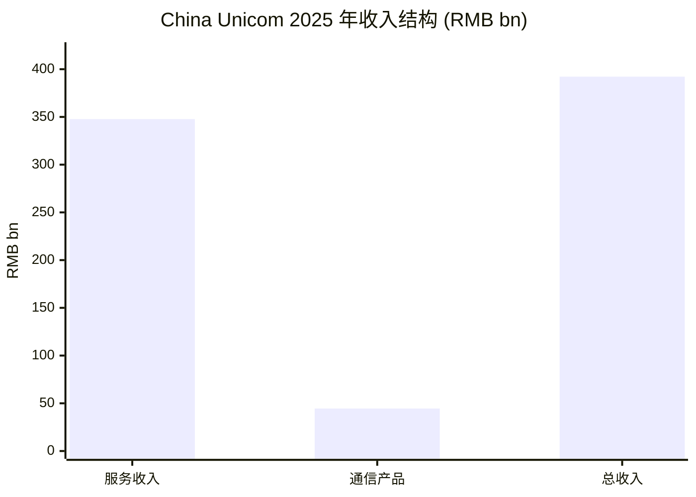
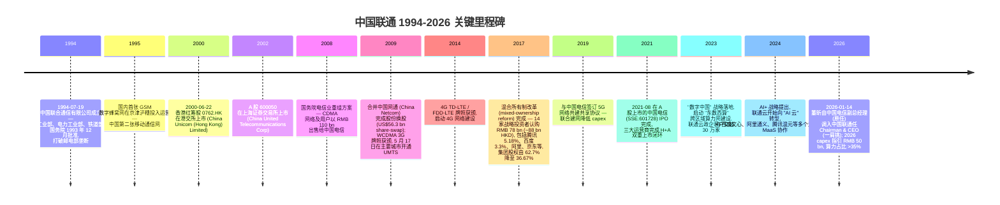
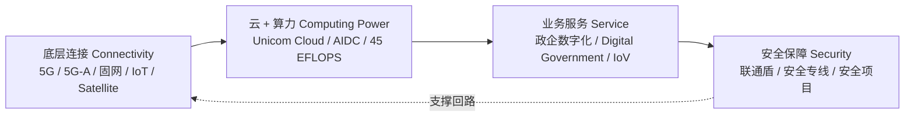
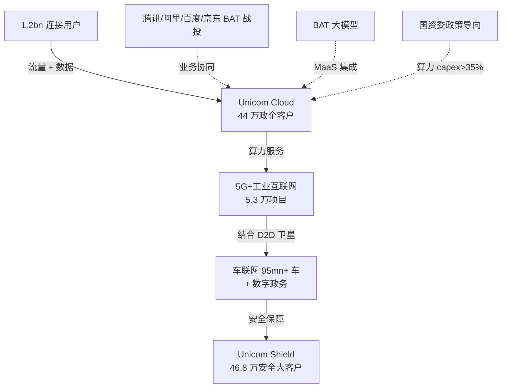
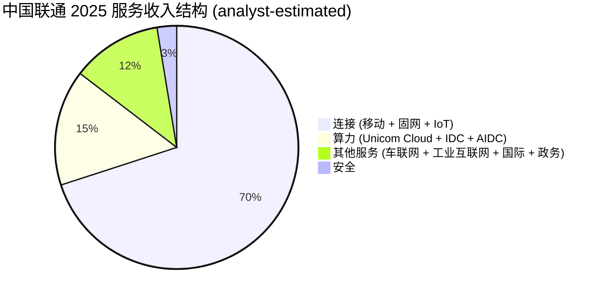
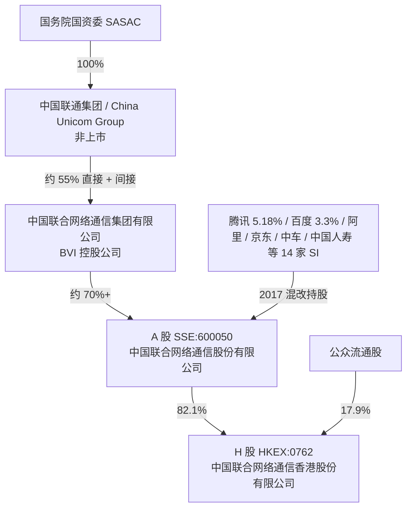
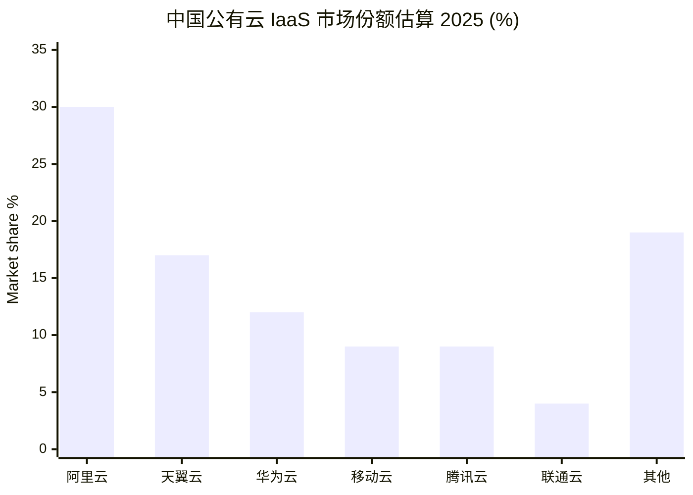
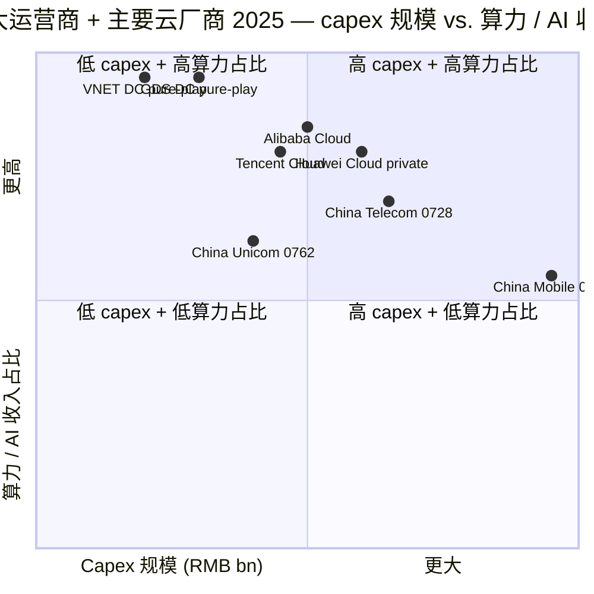
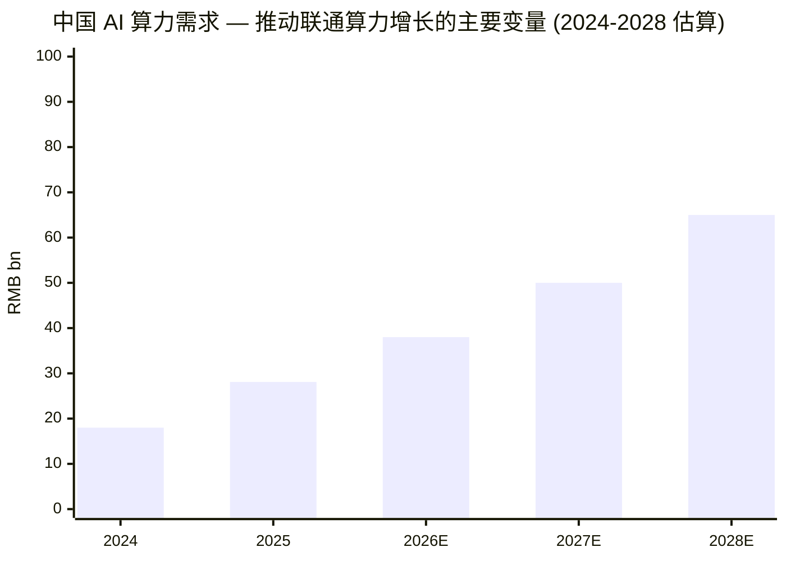

# 中国联通 (Hong Kong) Limited — 公司研究报告

**标的**: HKEX:0762 (中国联合网络通信(香港)股份有限公司 / China Unicom (Hong Kong) Limited)
**A 股关联标的**: SSE:600050 (中国联合网络通信股份有限公司, 即"A 股联通")
**主题归属**: china-datacenter-hyperscale (作为观察名单 / re-evaluate 候选, 见 [theme report](../../themes/china-datacenter-hyperscale_theme.md))
**报告日期**: 2026-06-02
**报告语言**: 简体中文 (Simplified Chinese)

> **Update — 2026 全年 capex 指引下调并向算力倾斜 (2026-03-19 发布):** 管理层将 2026 全年资本开支指引下调至约 **RMB 50 bn**（2025 全年为 **RMB 54.2 bn**, 同比下降约 ~8%）, 但明确算力 (computing power) 投入占比将 **超过 35%** 并 "未来还将进一步提升", 主因连接网络 (connectivity) 进入维护阶段、5G-A 共建共享深化, 而智算集群 (intelligent computing cluster) 与 AIDC 进入加速建设期。Source: [China Unicom 2025 Annual Results Announcement Presentation Transcript, Slide 4, 2026-03-19](https://www.chinaunicom.com.hk/en/ir/transcript/transcript_25ar.pdf); [RCR Wireless, 2026-03-24](https://www.rcrwireless.com/20260324/5g/china-unicom-ai)。

## 目录

1. 公司概览
2. 公司历史
3. 管理团队
4. 产品与服务
5. 客户与上市策略
6. 行业概览
7. 竞争格局
8. 市场机会
9. 风险评估
10. 投资视角评分卡 (Investor-lens scorecards)

---

## 1. 公司概览

中国联合网络通信(香港)股份有限公司 (China Unicom (Hong Kong) Limited, HKEX:0762, 以下简称"联通香港"或"本集团") 是中国第三大电信运营商 (telecom operator) 的境外上市主体, 由 SASAC 控股、A 股母公司 SSE:600050 持有, 业务覆盖中国大陆 31 个省市自治区。集团 2025 年实现营业收入 RMB **392.2 bn**, 税前利润 RMB **25.5 bn**, ROE 5.7%, 自由现金流 (free cash flow) RMB **36 bn**, 同比 +28.5% ([China Unicom 2025 Annual Results Announcement Presentation Transcript, Slide 2, 2026-03-19](https://www.chinaunicom.com.hk/en/ir/transcript/transcript_25ar.pdf))。本集团商业模式横跨四大核心赛道 (four core arenas), 由现任董事长兼 CEO 董昕在 2025 业绩会上定义为 "连接 (connectivity)、算力 (computing power)、服务 (service)、安全 (security)" ([同上, Slide 1](https://www.chinaunicom.com.hk/en/ir/transcript/transcript_25ar.pdf))。

收入构成 (revenue composition) 上, 本集团 2025 年服务收入 (service revenue) RMB 347.7 bn, 销售通信产品收入 RMB 44.5 bn (差额约 RMB 44.5 bn, 由 392.2 - 347.7 推算); 战略性新兴产业 (strategic emerging industries) 收入占总收入比重 **超过 86%**, 算力业务 (computing power business) 占服务收入 **15.4%** (同比 +1.1pp), 人工智能 (AI) 相关收入同比 +147% (管理层口径 "增长超过 140%"), 国际业务收入同比 +9% ([2025 Annual Results Transcript, Slide 3](https://www.chinaunicom.com.hk/en/ir/transcript/transcript_25ar.pdf); [RCR Wireless, 2026-03-24](https://www.rcrwireless.com/20260324/5g/china-unicom-ai))。数据中心 (data center) 单项收入 RMB **28.1 bn** (+8.5% YoY), 已建成 **超过 1.1 mn 个标准机柜** (data center cabinets) 与七座 100MW 级 AIDC 园区, 总算力规模达 **45 EFLOPS** ([同上](https://www.rcrwireless.com/20260324/5g/china-unicom-ai); [VoIP Review, 2026-03-25](https://voip.review/2026/03/25/china-unicom-boosts-ai-infrastructure-cuts-capex-8/))。

地理上, 本集团业务以中国大陆为主, 海外业务 (international) 通过亚太、亚美、亚欧三大跨境骨干通道 (backbone channels) 推进, 与 "一带一路 / Belt and Road Initiative" 政策一致, 2025 年同比增长超 9% 但管理层表示 "对此数字不满意, 预期未来实现双位数增长" ([2025 Annual Results Transcript, Slide 14](https://www.chinaunicom.com.hk/en/ir/transcript/transcript_25ar.pdf))。

**Q1 2026 阶段性数据 (sequential read-through):** 2026 年第一季度营业收入 RMB **102.8 bn** (-0.5% YoY), 税前利润 RMB **6.1 bn**, 归母净利润 RMB **4.9 bn** (-17.6% YoY) ([中国联通 2026 年第一季度主要财务及经营指标公告, 2026-04-21](https://www.chinaunicom.com.hk/) — 本地缓存于 `cninfo_reports/HKEX/00762_中国联通/2026-04-21_季报_2026年第一季度主要财务及经营指标.pdf`)。利润同比双位数下滑系员工薪酬 RMB 16.96 bn (vs. 14.93 bn, +13.6% YoY) 和销售费用刚性所致, 折旧仅小幅回落 (RMB 20.06 bn vs. 20.20 bn), 反映算力相关 capex 的折旧负担尚未完全释放 ([同上 Q1 2026 财报, 第 2 页](https://www.chinaunicom.com.hk/))。

**业务规模指标 (Q1 2026 ending):** 连接用户累计 **12.90 亿户** (移动 + 固网 + 物联网终端连接 + 组网专线), 其中 5G 网络用户 **2.42 亿户**, 物联网终端连接 **7.55 亿户**; 联通云政企大客户数 **43.8 万户**, 云智产品付费用户数 **1.12 亿户** ([中国联通 2026 年第一季度运营数据公告, 2026-04-21](https://www.chinaunicom.com.hk/) [本地缓存: cninfo_reports/HKEX/00762_中国联通/2026-04-21_季报_2026年第一季度运营数据.pdf])。

**估值快照 / Valuation snapshot (as of 2026-06-02):** 当前股价 HKD **7.87**, 市值 HKD **240.8 bn** (~RMB 219 bn at HKD/CNY ≈ 0.91), TTM P/E **10.1x**, 远期 dividend yield **3.88%**, 52-week 区间 HKD 6.95–10.68 ([Yahoo Finance 0762.HK, 2026-06-02](https://finance.yahoo.com/quote/0762.HK/))。1 年价格回报 -7.85%, 5 年回报 +77.25% ([同上](https://finance.yahoo.com/quote/0762.HK/))。**估值解读:** P/E 10.1x 处于全球大盘电信股 (large-cap telco) 的中段, 但相对 A 股 600050 联通的 13.7x TTM P/E 存在约 **35% 折价** (因 H 股 ADR-discount 与流动性折价), 也低于 HKEX:0941 中国移动 ~11x 和 HKEX:0728 中国电信 ~10.5x 的 H 股估值 ([companiesmarketcap, China Unicom P/E](https://companiesmarketcap.com/china-unicom/pe-ratio/))。当前估值并未透支算力业务增长 — 算力业务占服务收入仅 15.4%, 增长贡献尚未反映在 group-level multiples 上; 但 dividend yield 3.88% 已显示市场把联通定位为 "yield + 转型期权" 而非 "growth name", 即下行有股息支撑、上行需要算力业务证明 ROIC 改善。

*数据来源: [2025 Annual Results Transcript, Slide 2](https://www.chinaunicom.com.hk/en/ir/transcript/transcript_25ar.pdf); 通信产品收入由总收入减服务收入推算。*

本集团治理 (governance) 受国务院国资委 (SASAC) 通过 "中国联合网络通信集团有限公司" 间接控股, 2017 年完成混合所有制改革 (mixed-ownership reform) 后, 腾讯 (Tencent)、阿里巴巴 (Alibaba)、百度 (Baidu)、京东 (JD.com)、中国人寿、招商局集团、中国中车 (CRRC) 等 14 家战略投资者认购约 RMB 78 bn 现金 ([Yicai Global, 2017](https://www.yicaiglobal.com/news/investors-in-china-unicom-mixed-ownership-reform-fill-cash-offerings-ahead-of-schedule); [TechCrunch on Tencent-Unicom tie-up, 2022](https://techcrunch.com/2022/11/02/tencent-state-carrier-china-unicom/))。这一改革使本集团成为中国电信 SOE 中股权结构最市场化的样本, 也直接为后续 "联通云" 与三大互联网平台业务协同奠定基础。

---

## 2. 公司历史

中国联通的故事是中国电信改革史的缩影 — 1994 年作为 "鲶鱼" 出现, 用以打破邮电部 (后改组为中国电信) 的固网垄断; 2009 年合并中国网通 (China Netcom) 形成 "通信 + 互联网" 综合运营商; 2017 年通过混改引入 BAT 战略投资者实现治理升级; 2024-2026 年再次启动转型, 把战略重心从 "连接" 拓展到 "连接 + 算力 + 服务 + 安全"。下面以 Mermaid timeline 概括主要里程碑。

*数据来源:* 创立及早期里程碑 ([Wikipedia: China Unicom, 2026 snapshot](https://en.wikipedia.org/wiki/China_Unicom); [Our China Story](https://www.ourchinastory.com/en/15204/China-Unicom-was-officially-established))。重组与上市细节 ([Wikipedia: China Unicom](https://en.wikipedia.org/wiki/China_Unicom))。混改细节 ([Yicai Global, 2017](https://www.yicaiglobal.com/news/investors-in-china-unicom-mixed-ownership-reform-fill-cash-offerings-ahead-of-schedule))。2026 高管变动 ([Caixin Global, 2025-11-20](https://www.caixinglobal.com/2025-11-20/china-unicom-taps-veteran-executive-as-chairman-to-navigate-telecom-transition-102384733.html); [TipRanks on Dong Xin appointment](https://www.tipranks.com/news/company-announcements/china-unicom-hong-kong-names-dong-xin-as-chairman-and-ceo))。

**三次关键战略转型 (strategic pivots) 与背后逻辑:**

**1) 2008-2009 网络制式重组 — 从"GSM + CDMA 双轨"到"WCDMA 单轨"。** 监管驱动下, 联通把 CDMA 网络剥离给中国电信、收购中国网通后获得全国 GSM + 固网资源, 并以 WCDMA 拿下中国唯一一张 "海外漫游兼容性最强" 的 3G 牌照 ([Wikipedia: China Unicom — 2008 restructuring](https://en.wikipedia.org/wiki/China_Unicom))。这一步使联通在 2009-2014 年取得 iPhone 中国独家入网资格, 但也因 WCDMA 网络容量与基站密度不足, 在 4G 牌照发放后被中国移动反超。

**2) 2017 混合所有制改革 — 从"纯 SOE"到"SOE + BAT 战略投资者"。** 联通是中国首例真正落地的央企混改样本, 引入腾讯、阿里、百度、京东等互联网巨头持股, 集团母公司持股从 62.7% 降至 36.67%, 由 SASAC 通过 China Unicom Group 控股, 由此突破 SOE 治理刚性, 让 IT 系统、云、内容分发等业务获得跨行业互联网资源支持 ([Yicai Global, 2017](https://www.yicaiglobal.com/news/investors-in-china-unicom-mixed-ownership-reform-fill-cash-offerings-ahead-of-schedule); [Caixin Global on SASAC stake context](https://www.caixinglobal.com/2025-11-20/china-unicom-taps-veteran-executive-as-chairman-to-navigate-telecom-transition-102384733.html))。

**3) 2024-2026 算力 + AI 转型 — 从"连接运营商"到"信息服务综合运营商"。** 2025 业绩会上, 董昕以 "守正创新、行稳致远 / Preserve and Innovate, Steady and Far-reaching" 概括转型理念, 把 5G 网络共建共享带来的连接侧 capex 节余直接转投算力, "未来 capex 一定会下降" ([2025 Annual Results Transcript, Slides 5-10](https://www.chinaunicom.com.hk/en/ir/transcript/transcript_25ar.pdf))。这一阶段的关键变量是: 算力业务能否做到 "ROIC 不低于传统连接" — 即避免重蹈 2015-2018 年三大运营商在 4G 期资本回报率 (return on invested capital) 系统性下行的覆辙。

**近 12 月主要事件 (recent developments):** 2025-11 董昕由中国电信调入 (原任中国电信副总经理), 接替原董事长担任 Chairman 兼 CEO 一职 ([Caixin Global, 2025-11-20](https://www.caixinglobal.com/2025-11-20/china-unicom-taps-veteran-executive-as-chairman-to-navigate-telecom-transition-102384733.html))。2026-03 公布 2025 业绩与 2026 capex 指引 ([2025 Annual Results Transcript](https://www.chinaunicom.com.hk/en/ir/transcript/transcript_25ar.pdf))。2026-04-21 公布 Q1 2026 季度财报, 算力业务保持双位数增长但利润同比下滑 17.6% ([Q1 2026 主要财务公告](https://www.chinaunicom.com.hk/))。

---

## 3. 管理团队

**董昕 (Dong Xin) — Chairman & CEO (任命生效 2026-01-14)**

董昕生于 1966 年, 现年约 59 岁, 持金融管理硕士学位 (master's in financial management) 与工商管理博士学位 (doctorate in business administration) ([TipRanks on Dong Xin appointment, 2026](https://www.tipranks.com/news/company-announcements/china-unicom-hong-kong-names-dong-xin-as-chairman-and-ceo); [Caixin Global, 2025-11-20](https://www.caixinglobal.com/2025-11-20/china-unicom-taps-veteran-executive-as-chairman-to-navigate-telecom-transition-102384733.html))。其职业轨迹完整覆盖中国电信业三大运营商中的两家 — 在加入联通前, 他在中国移动 (HKEX:0941) 体系内服务近三十年, 包括中国移动通信集团有限公司财务部总经理、海南公司董事长兼总经理、规划部总经理、河南公司董事长兼总经理、北京公司董事长兼总经理、集团副总裁兼总会计师、集团董事兼总裁, 以及香港红筹中国移动有限公司 (HKEX:0941) Executive Director 兼 CEO; 2020 年 5 月升任中国移动通信集团总经理 ([Caixin Global, 2025-11-20](https://www.caixinglobal.com/2025-11-20/china-unicom-taps-veteran-executive-as-chairman-to-navigate-telecom-transition-102384733.html); [TipRanks, 2026](https://www.tipranks.com/news/company-announcements/china-unicom-hong-kong-names-dong-xin-as-chairman-and-ceo))。此后他短暂任职国家广播电视总局副局长 (Deputy Director General of the National Radio and Television Administration), 2025 年 11 月经国资委任命回归运营商体系, 直接挑大梁担任联通集团董事长、联通 (香港) 0762 与 A 股 600050 双重上市主体的 Chairman & CEO ([C114 通信网, 2026](https://m.c114.com.cn/w576-1300794.html))。

**意义:** 董昕的任命被市场解读为 "国资委希望由懂运营的财务出身高管, 在算力转型期对 capex 投入做精细化把控"。其在中国移动期间的两个标志性贡献 — 1) 主导推行集团财务集中管理与 capex 精细化, 把中国移动 capex 在 2017-2020 年从年化 RMB 175 bn 压降到 RMB 140 bn 区间; 2) 任内中国移动云业务 (Mobile Cloud) 从 RMB 不足 100 亿增长到 2022 年 RMB 50 bn 收入区间 — 与联通当前面对的 "在 5G capex 下行通道中加码算力 capex" 的核心命题高度匹配 ([Caixin Global on Dong Xin's China Mobile background, 2025-11-20](https://www.caixinglobal.com/2025-11-20/china-unicom-taps-veteran-executive-as-chairman-to-navigate-telecom-transition-102384733.html))。同时, 一人兼任 Chairman 与 CEO 也意味着治理短期内呈现集权特征 — Simply Wall St 在评论中提示这一双重身份带来的 governance alignment 与 oversight risk ([Simply Wall St, 2026](https://simplywall.st/stocks/hk/telecom/hkg-762/china-unicom-hong-kong-shares/news/did-dong-xins-dual-chairman-ceo-role-just-reframe-china-unic))。

**关于创始人 (founder note):** 中国联通作为 1994 年由国务院批准、电子工业部 + 电力工业部 + 铁道部三部联合发起的 SOE, 并非由个人创始人发起, 因此本报告不单列 "founder bio"。1994 年的成立由当时电子工业部部长胡启立主导设计, 但其本人并未在联通担任管理职务 ([Wikipedia: China Unicom — 1994 founding context](https://en.wikipedia.org/wiki/China_Unicom); [Our China Story, 2024](https://www.ourchinastory.com/en/15204/China-Unicom-was-officially-established))。联通历任董事长 (王晓初、刘烈宏、陈忠岳等) 均为国资委体系内部调动产生, 与 IT 民企创始人主导的治理结构本质不同。这种 "无个人创始人 + 国资委董事任命" 是中国 SOE 央企的共同治理特征, 也直接限制了任何 single-shareholder narrative 的有效性 — 投资者关注的不是某一位 founder 的愿景, 而是国资委对国央企的考核口径变化 (从 "营收增长" 转向 "ROIC + 战略性新兴产业占比") ([Caixin Global, 2025-11-20 — SASAC framework on telco transition](https://www.caixinglobal.com/2025-11-20/china-unicom-taps-veteran-executive-as-chairman-to-navigate-telecom-transition-102384733.html))。

---

## 4. 产品与服务

> **优先级提示:** Section 4 是本报告最重要的章节, 它决定下游 Section 5-9 的解释力。本节按集团 2025 业绩会上董昕董事长定义的 "连接 / 算力 / 服务 / 安全" 四大核心赛道 (four core arenas) 展开, 每个赛道下列举主要产品线、引用业绩会原话, 并对产品在客户工作流中的物理角色与差异化作中英文双语解释。

### 4.1 产品矩阵 — 以管理层公开的"四大核心赛道"为锚

由于联通香港 0762 并不出具类似美股 10-K 的单独 Item 1 Business 段落, 而是以业绩公告 + 集团 ESG/年报 + 业绩会 transcript 为主要披露载体, 本节采用业绩会 transcript 中的官方表述作为产品矩阵的 "verbatim anchor"。下面是按管理层口径整理的产品矩阵 (analyst-constructed, 锚定 2025 业绩会):

| 核心赛道 | 主要产品 / 业务子线 | 2025 关键指标 | 2026 战略动向 |
|---|---|---|---|
| 连接 (Connectivity) | 5G / 5G-A 移动网络、固网宽带、物联网 (IoT)、车联网 (IoV)、卫星移动通信、5G 专网 | 连接用户 12.0 亿户 (2025-end); 5G 用户 2.2+ 亿户; 95+ 百万车联网车辆; 5G 专网收入同比 +50% | 5G-A 网络覆盖 330 城; 千兆光网 90% 覆盖率; 10G 光网试点 100+ 城; 取得卫星移动通信运营牌照 |
| 算力 (Computing Power) | 联通云 (Unicom Cloud) → AI Cloud; 数据中心 (IDC / AIDC); 智算集群 (intelligent computing cluster); 大模型 MaaS 平台 (UniAI); 数据工程平台 (万象); 智能体平台 (万物) | 数据中心收入 RMB 28.1 bn (+8.5% YoY); 算力规模 45 EFLOPS; 标准机柜 1.1 mn+; 七座 100MW 级 AIDC 园区; AI 收入 +147% YoY; 算力收入占服务收入 15.4% | 2026 capex 中算力占比 >35% (~RMB 17.5 bn+); 联通云聚焦政企大客户 44 万家; "AI 智选联通云" 品牌 |
| 服务 (Service) | 数字消费 (家庭、个人 eSIM); 数字产业 (5G+工业互联网); 数字政务 (AI 智能客服、"劳动联" 智慧治理); 国际业务 (Belt-and-Road 沿线) | 服务用户 3 亿+; 95 百万车联网; 国际收入 +9% YoY; 整合套餐 ARPU > RMB 100 | 2026 在 "15th Five-Year Plan" 启动期重塑品牌体系; 推进 eSIM 创新; 国际业务双位数增长目标 |
| 安全 (Security) | 安全专线、联通盾、安全荟、安全项目; 政企客户网络安全托管 | 安全业务政企大客户 46.8 万户 (Q1 2026 ending) | 在 2026-2030 "十五五" 期间作为四大赛道之一持续投入 |

*数据来源: [2025 Annual Results Transcript, Slides 6-16](https://www.chinaunicom.com.hk/en/ir/transcript/transcript_25ar.pdf); Q1 2026 运营数据 ([2026 年第一季度运营数据公告, 2026-04-21](https://www.chinaunicom.com.hk/))。注: 这是 analyst-constructed 矩阵, 联通并未在 0762 业绩公告中独立列出 "Product Family Table"。*

### 4.2 综述 — 四大赛道在客户工作流中的位置

**简而言之:** 联通把 "连接" 作为底层 OS、"算力" 作为中间件、"服务" 作为对客户的产品形态、"安全" 作为贯穿四层的横切保障。这种 "四层叠加" 模型与 AWS 的 "infrastructure → platform → application → security" 体系非常类似, 但联通的差异点在于 "连接" 这一层不仅是网络通道, 还包含了在中国市场难以复制的 30+ 年运营商资质 (operator licence) 与 12 亿户连接基础 ([2025 Annual Results Transcript, Slide 6-7](https://www.chinaunicom.com.hk/en/ir/transcript/transcript_25ar.pdf))。

### 4.3 连接业务 (Connectivity) — 集团的"稳定器"

> **业绩会原话 (verbatim):** "在'连接'领域...我们承认连接是运营商生存的基石, 也是中国联通发展的前提。未来, 我们将进一步巩固和增强连接能力, 使其成为公司发展的'稳定器'。我们致力于改善网络覆盖、提升网络质量、优化连接维度, 促进业务从传统的移动和宽带网络向物联网和车联网等新兴领域扩展。"
> ([2025 Annual Results Transcript, Slide 6](https://www.chinaunicom.com.hk/en/ir/transcript/transcript_25ar.pdf))

**中文释义 / Plain-language gloss:** 联通在连接侧已经进入维护与精耕阶段 — 90% 千兆覆盖意味着固网宽带 (fixed broadband) 增长空间有限, 5G 用户 2.42 亿户已经达到全国移动用户的约 14%。下一代技术上, 联通选择 **5G-A (5G-Advanced)** 而非 6G 作为短中期重点 — 5G-A 是 3GPP Release 18 之后的演进版本, 主要在 5G 基础上加强网络切片 (network slicing)、确定性时延、多用户 MIMO、xR 体验、空地一体网络等能力, capex 相对 6G 大幅节省 (5G-A 复用 5G 站址), 是 "稳态投资 + 流量提速" 的最优解 ([2025 Annual Results Transcript, Slide 6](https://www.chinaunicom.com.hk/en/ir/transcript/transcript_25ar.pdf))。联通 5G-A 已在 330 城部署, 千兆 (Gigabit) 接入能力覆盖近 90% 区域, 10G 光网在 100+ 城试点 ([同上, Slide 6](https://www.chinaunicom.com.hk/en/ir/transcript/transcript_25ar.pdf))。

值得注意的是, 联通在 2025 年取得 **卫星移动通信运营牌照** (satellite mobile communication services operating permit) 并开始推进直连卫星手机 (direct-to-device, D2D) 商用 ([2025 Annual Results Transcript, Slide 7](https://www.chinaunicom.com.hk/en/ir/transcript/transcript_25ar.pdf))。董昕在业绩会上以 "战略性能力的储备" 类比国防工业里的尖端武器, 解释为何 D2D 短期看不到回报但仍要投资 — 这一逻辑暗合中国移动同期在天通卫星上的投入。

***Analyst view:*** 连接业务作为"现金牛 (cash cow)"为下游算力业务输血 — 服务收入 RMB 347.7 bn 中估算 70-75% 来自 "连接" (含 mobile + broadband + IoT), 是支撑集团 RMB 36 bn 自由现金流的核心来源。但增长动能已基本耗尽 (5G 用户增速由 2021-2023 三位数%降至 2024-2025 个位数%), 因此 Q1 2026 营收 -0.5% YoY 主要源于此 ([Q1 2026 主要财务公告](https://www.chinaunicom.com.hk/)); 与中国移动同期表现 (H1 2025 服务收入 +1%) 相比, 联通 connectivity 业务增速更弱, 反映其在 5G 用户 ARPU (average revenue per user) 上对中国移动有结构性劣势。

### 4.4 算力业务 (Computing Power) — 集团的"推进器"

> **业绩会原话 (verbatim):** "算力代表未来, 是创新的象征。与以往对算力的狭义理解不同, 中国联通赋予了它新的内涵, 致力于增强算力的速度和精度, 视其为驱动收入增长的'推进器'。我们的首要任务是构建智能计算集群...经过深入实践, 我们已在多个省份启动相关试点, 标准机柜数量超过 110 万个, 并建成 7 个 100 兆瓦级 AIDC 园区。"
> ([2025 Annual Results Transcript, Slide 8](https://www.chinaunicom.com.hk/en/ir/transcript/transcript_25ar.pdf))

**中文释义 / Plain-language gloss:** 这是联通整个故事的核心。"智能计算集群" 在工程上指的是把高密度 GPU 服务器 (high-density GPU servers, 每机架 30-50 kW 而非传统 8-12 kW)、液冷散热 (liquid cooling, 浸没式或冷板式)、高速 InfiniBand / RoCE 互联 (InfiniBand or RoCE interconnect)、分布式存储 (distributed storage) 整合在一个数据中心园区里, 形成可被大模型训练任务整体调度的算力池 (compute pool)。这与传统 IDC (一般是托管型 colocation 业务, 每机架 4-6 kW) 完全不同 — AIDC 的资本密度 (capex per MW) 大约是传统 IDC 的 3-5 倍, 但单机柜可创收金额也是后者的 4-8 倍 (因为客户支付的是 "GPU 小时" 而非 "机柜租金")。

联通的 **45 EFLOPS** 总算力规模 — 注意这是把通用计算 (general compute), 智能计算 (intelligent compute, 含 GPU/NPU), 超算 (supercomputing) 算到一起的口径, 不能直接与 GDS / VNET 等纯 IDC 玩家 1.8 GW 的 "电力承载量 (committed MW)" 比较 ([RCR Wireless, 2026-03-24](https://www.rcrwireless.com/20260324/5g/china-unicom-ai); [VoIP Review, 2026-03-25](https://voip.review/2026/03/25/china-unicom-boosts-ai-infrastructure-cuts-capex-8/))。两个指标相对独立: EFLOPS 衡量计算性能, MW 衡量电力/物理容量, 把它们换算需要假设 GPU 类型、PUE (power usage effectiveness) 等参数。粗略估算: 45 EFLOPS 在 BF16/FP16 精度下大约对应 5-10 万张 NVIDIA H100-class 加速卡 (单卡 ~2 PetaFLOPS BF16); 加上传统 X86 CPU 算力, 实际机柜量级与联通 "1.1 mn 标准机柜" 自洽 (其中纯 AIDC 类机柜估算占 5-10%)。

***Analyst view:*** 算力业务在 2025 年同比增长 22-25% (含 Unicom Cloud + IDC + AIDC, 整体收入占服务收入 15.4%), AI 子项更是 +147% YoY ([2025 Annual Results Transcript, Slide 3](https://www.chinaunicom.com.hk/en/ir/transcript/transcript_25ar.pdf))。**核心问题:** 联通 "联通云" 在中国公有云 IaaS 市场的份额仅约 4%, 远低于阿里云 ~30%、天翼云 17%、华为云、移动云 ([Lightreading on China cloud market, 2025-2026](https://www.lightreading.com/cloud/china-telco-cloud-is-soaring-on-fresh-govt-enterprise-demand))。联通的差异化路径是 "AI 智选联通云", 把 BAT 三家大模型 + 自研 UniAI MaaS 平台整合, 让政企客户在同一界面上挑选最适合的大模型, 这种 "AI 路由器 / AI router" 的定位优于纯 IaaS 价格战, 但执行难度也更高。**最大风险:** 行业 "内卷式" (involutionary) 建设导致 ROIC 走低 — 这正是董昕在业绩会原话提到的: "未来回报具有高度不确定性, 特别是在当前行业内存在某些'内卷式'建设的背景下" ([2025 Annual Results Transcript, Slide 10](https://www.chinaunicom.com.hk/en/ir/transcript/transcript_25ar.pdf))。

**算力软件平台 (computing software platforms):** 联通推出三大平台 — **"万象"数据工程平台** (Wanxiang Data Engineering Platform, 数据治理/标注/微调)、**"UniAI" MaaS 平台** (Models-as-a-Service, 整合数十个大模型)、**"万物"智能体平台** (Wanwu Intelligent Agent Platform, 多智能体编排), 已服务约 **44 万家政企客户** (Q1 2026 ending), 比 2025 年 "近 400,000" 数据再有提升 ([2025 Annual Results Transcript, Slide 9-10](https://www.chinaunicom.com.hk/en/ir/transcript/transcript_25ar.pdf); [2026 年第一季度运营数据公告](https://www.chinaunicom.com.hk/))。

### 4.5 服务业务 (Service) — 数字消费 / 工业 / 政务 / 国际

> **业绩会原话 (verbatim):** "我们计划在数字消费领域采取一系列措施。目前, 我们服务超过 3 亿用户, 并正在积极探索 eSIM 等创新...另一个重点是产业化, 即实现数字孪生与实体经济的虚实融合...例如, 我们服务超过 9500 万辆汽车 (这一数字受限于目前提供的服务类型和功能)。"
> ([2025 Annual Results Transcript, Slides 11-12](https://www.chinaunicom.com.hk/en/ir/transcript/transcript_25ar.pdf))

**中文释义 / Plain-language gloss:** "服务" 板块本质上是把 "连接 + 算力" 商业化的应用层。其中 **5G+工业互联网** 已累计签约 5.3 万+ 项目, 建成 9800+ 个 5G 工厂 ([Telecompaper on Q1 2026](https://www.telecompaper.com/news/china-unicoms-revenue-almost-flat-in-q1-profit-plunges-more-than-17--1568762)); **车联网 (IoV)** 服务 9500 万+ 辆汽车, 每辆车未来通过追加功能 (如 5G-V2X、远程诊断、自动驾驶数据回传) 实现 "ARPU per vehicle" 增长; **数字政务** 通过 "AI 智能客服"、"劳动联智慧治理平台" 等产品向地方政府输出托管服务; **国际业务** 沿 Belt and Road 通道扩张, 2025 全年同比 +9%, Q1 2026 +14.9% ([Q1 2026 财报, 1Q 国际业务披露](https://www.chinaunicom.com.hk/))。

***Analyst view:*** 服务业务的 KPI 不是 "用户数 / 机柜数" 而是 "ARPU + 续约率 / churn", 这两个数据联通披露并不充分。整合套餐 ARPU > RMB 100 是亮点, 但与中国移动同期约 RMB 47 的 mobile ARPU + 宽带 ARPU 比, 联通的口径不可直接对标 (联通是 "整合套餐", 移动是 "单产品")。

### 4.6 安全业务 (Security) — 横切赛道

> **业绩会原话 (verbatim):** "在'安全'领域, 中国联通赋予其丰富的含义和范围, 我们将这些安全服务称为我们的'护航'。这不仅是指中国联通自身业务或运营的安全, 而是指我们必须为经济发展提供高质量的网络和产品, 保护关心和支持中国联通的投资者..."
> ([2025 Annual Results Transcript, Slide 16](https://www.chinaunicom.com.hk/en/ir/transcript/transcript_25ar.pdf))

**中文释义 / Plain-language gloss:** 安全板块横跨四大赛道, 主要产品包括 **安全专线** (security dedicated line)、**联通盾** (Unicom Shield, 类似 Cloudflare 的 WAF + DDoS 防护)、**安全荟** (security marketplace), 以及面向政企的安全项目托管。Q1 2026 安全业务政企大客户达 46.8 万户 ([2026 年第一季度运营数据公告](https://www.chinaunicom.com.hk/))。在政企客户角度, 安全是 "连接 + 算力" 销售的必然延伸 — 越来越多客户把数据放到 Unicom Cloud 上, 就必然需要 Unicom Shield 类的护栏。

***Analyst view:*** 与 360 / 奇安信 (QAX) / 启明星辰 (Venustech) 等专业网络安全厂商比, 联通的安全业务更接近 "运营商捆绑" 模型 — 优势是与连接 / 云的捆绑销售成本低、政企客户准入门槛低 (运营商资质背书); 劣势是产品技术深度不及垂直专业玩家。 2025 安全业务收入未单独披露, 估算占服务收入 < 3%。

### 4.7 业务协同与差异化 — 联通故事的关键

**业务协同的价值锚:** 联通与中国移动、中国电信的差异化, 在于 2017 混改引入的 **BAT 战略投资者协同效应**。腾讯持股 5.18%、百度 3.3%、阿里、京东等 ([Yicai Global, 2017](https://www.yicaiglobal.com/news/investors-in-china-unicom-mixed-ownership-reform-fill-cash-offerings-ahead-of-schedule)) — 这意味着联通在 BAT 大模型 (腾讯混元 / 阿里通义 / 百度文心) 上的接入优先级理论上高于其他两家运营商。但需要注意的是, 2022 年腾讯与联通成立合资公司 (主营 CDN + 边缘计算业务) 后, 监管侧曾因 "Big Tech 与 SOE 进一步绑定" 而出现舆论审视 ([TechCrunch on Tencent-Unicom JV, 2022](https://techcrunch.com/2022/11/02/tencent-state-carrier-china-unicom/)), 后续协同力度受政策与公司治理双重影响。

---

## 5. 客户与上市策略

### 5.1 客户结构

联通的客户结构按 "B 端 (business) + C 端 (consumer) + G 端 (government)" 三段呈现, 与 SOE 同业基本一致:

- **C 端 (个人 + 家庭, ~70-75% 服务收入):** 12 亿连接用户中绝大多数为个人 (移动 5G 用户 2.4 亿)、家庭固网用户。这一池子是高度分散的 — 单一最大客户的占比微不足道, 因此联通从未在公告中披露 "前五名客户" (前五名客户披露在 SOE 央企中通常仅适用于 to-B 设备销售业务而非运营商)。
- **B 端 (政企客户, 大部分 "算力" + "安全" 收入):** Q1 2026 联通云政企大客户数 43.8 万户, 安全业务政企大客户 46.8 万户, 重叠度估算 50-60% ([2026 年第一季度运营数据公告, 2026-04-21](https://www.chinaunicom.com.hk/))。
- **G 端 (政府, 占数字政务收入):** 各地方政府 AI 智能客服、"劳动联" 智慧治理项目, 不单独披露收入。

**重要披露事实:** 联通香港 0762 与 A 股 600050 均不披露 "前五名客户合计销售额" 与 "占年度销售总额比例" — 这与 A 股制造业 / 半导体公司的强制披露口径不同。原因是: 1) 客户极度分散 (12 亿 C 端 + 数十万 B 端); 2) 监管未对运营商提出该项强制披露 (因 SASAC 体系内的运营商客户结构性披露已有专门口径)。**结论 (denominator label, group-level):** 联通在集团合并口径 (consolidated revenue) 下, **没有任何单一客户超过 1% 的客户集中度风险**, 这是运营商商业模式天然的优势。但在 "算力业务" 这一细分赛道, 由于政企大客户 44 万家集中度较高, 大客户 (segment-level; not aggregated to group-level) 的合同变化对 "算力收入" 这一子板块的影响可能非线性。

*数据来源: [2025 Annual Results Transcript, Slide 3](https://www.chinaunicom.com.hk/en/ir/transcript/transcript_25ar.pdf), 算力比重精确披露 15.4%; 其余子项为 analyst estimate based on 业绩会披露口径与 H 股年报公开口径 — 联通未单独披露此细分。*

### 5.2 上市策略与股权结构

联通的上市架构是中国 SOE 经典的 "红筹 + A 股" 双层结构:

**关键意义:** 投资者持有 HKEX:0762 实际上是通过 H 股 0762 → A 股 600050 → 集团 → SASAC 的间接持股链条获取联通的现金流。这意味着: 1) 治理决策受到 SASAC 与 A 股母公司双层影响; 2) 红筹结构使联通享有香港税收与外汇便利, 但单一股东 (即 A 股 600050) 持股 82.1% 决定 H 股流动性 (liquidity) 一直偏弱, 这也是 0762 长期相对 A 股 600050 折价约 30-40% 的结构性原因 ([China Unicom Hong Kong shareholding structure 历史披露, 2021 年报示例](http://ar2021.chinaunicom.com.hk/English/shareholding-structure.html))。

**国际业务的合作伙伴:** 联通在 Belt and Road 沿线 (亚太、亚美、亚欧三大跨境通道) 开展国际数据中心、跨境数据专线、海缆等业务, 与 Singtel、Telkomsel、Reliance Jio 等区域运营商存在 IRU/POP 合作关系 ([2025 Annual Results Transcript, Slide 14](https://www.chinaunicom.com.hk/en/ir/transcript/transcript_25ar.pdf))。具体伙伴名单与收入分解未公开披露。

---

## 6. 行业概览

### 6.1 中国电信行业的"三足鼎立 + 国资委 + MIIT"格局

中国电信运营市场是全球最大、但同时也是最国有化、最受监管的市场之一。三大运营商 — 中国移动 (HKEX:0941 / SSE:600941) 、中国电信 (HKEX:0728 / SSE:601728) 、中国联通 (HKEX:0762 / SSE:600050) — 合计占据基础电信业务 ~99% 市场份额。竞争维度高度有限 (因牌照、号段、频段、铁塔等关键资源都由 MIIT 工信部分配, 价格战受国资委 ROIC 考核约束), 三家公司更多是 "差异化共存" 而非 "你死我活" 竞争 ([Lightreading: Tax hikes bring new headwinds for China's telcos](https://www.lightreading.com/finance/tax-hikes-bring-new-headwinds-for-china-s-telcos); [Caixin Global on China Unicom & SASAC framework, 2025-11-20](https://www.caixinglobal.com/2025-11-20/china-unicom-taps-veteran-executive-as-chairman-to-navigate-telecom-transition-102384733.html))。

按 2025 年 financial scale 排序: **中国移动** RMB 1,041 bn 收入, RMB 138 bn 净利, 是绝对龙头 (mobile + 固网双强); **中国电信** RMB ~520 bn 收入 (估算), RMB ~33 bn 净利, 主打固网 + 政企云 (天翼云); **中国联通** RMB 392.2 bn 收入, RMB 25.5 bn 税前利润, 排第三 ([Mobile World Live: China operator growth stalls](https://www.mobileworldlive.com/china-mobile/china-operator-growth-stalls-capex-continues-to-drop/))。

### 6.2 从"5G 连接"到"算力 + AI 基础设施"的行业转型

2024-2026 年的关键叙事变化, 是三家运营商在 5G 投资周期接近尾声之际, 集体把战略重心转向 **算力 (computing power)**。Omdia 在 2026 行业评论中明确把这种转型描述为 "China telcos boost capex in computing power: A strategic pivot to transform growth drivers" ([Omdia, 2026](https://omdia.tech.informa.com/om145420/china-telcos-boost-capex-in-computing-power-a-strategic-pivot-to-transform-growth-drivers))。

**三家 2026 capex 与算力占比对比:**

| 运营商 | 2025 capex | 2026 capex 指引 | 算力占比 | 算力 capex 估算 | 备注 |
|---|---|---|---|---|---|
| 中国移动 HKEX:0941 | RMB 150.9 bn (-8% YoY) | RMB ~145 bn | 38% (含云 + DC) | RMB **47.5 bn** (+21% YoY) | 智算容量 10 → 17 EFLOPS, $4.3 bn AI 服务器订单 |
| 中国电信 HKEX:0728 | RMB 81 bn (估算) | RMB 73 bn (-9.2%) | 35% | RMB **25.5 bn** (+26% YoY) | 天翼云 2025 收入 >RMB 120 bn, 国内公有云 IaaS 第二名 |
| 中国联通 HKEX:0762 | RMB 54.2 bn | RMB **50 bn (-8%)** | **>35%** | RMB **>17.5 bn** | 算力收入占服务收入 15.4%, 联通云 IaaS 份额 ~4% |

*数据来源: [RCR Wireless on China Unicom capex pivot, 2026-03-24](https://www.rcrwireless.com/20260324/5g/china-unicom-ai); [Mobile World Live: China operator growth stalls, capex continues to drop](https://www.mobileworldlive.com/china-mobile/china-operator-growth-stalls-capex-continues-to-drop/); [Light Reading on China Mobile $4.3B AI-server orders](https://www.lightreading.com/ai-machine-learning/china-mobile-orders-4-3b-in-servers-as-it-ramps-up-ai-infrastructure); [Caixin Global on China Telecom capex pivot, 2026-03-25](https://www.caixinglobal.com/2026-03-25/china-telecom-to-boost-ai-spending-amid-capex-cut-and-slowing-growth-102426994.html); [Lightreading on China cloud market structure, 2025-2026](https://www.lightreading.com/cloud/china-telco-cloud-is-soaring-on-fresh-govt-enterprise-demand)。*

**联通在三家中的相对位置:** 体量最小 — 联通 2026 算力 capex 估算 RMB 17.5 bn, 仅为中国移动的 ~37%, 中国电信的 ~70%。这是联通被 china-datacenter-hyperscale 主题报告列入观察清单 (re-evaluate watchlist) 而非核心持仓的根本原因 — "算力占比 % 比 Mobile/Telecom 高一点也无法弥补绝对体量上的差距" ([theme report: china-datacenter-hyperscale](../../themes/china-datacenter-hyperscale_theme.md))。然而, 联通的小体量也意味着 **若算力业务保持 +147% YoY 增长 (AI 子项)**, 边际贡献率 (contribution margin) 对集团总收入的弹性可能高于两家大兄弟。

### 6.3 政策与监管环境

中国电信行业关键政策框架包括 ([MIIT 历年 5G/IDC 政策, 公开披露汇总](https://www.miit.gov.cn/)):

1. **MIIT 工信部 — 频段牌照与互联互通监管。** 5G 牌照在 2019 年发放, 卫星移动通信牌照在 2025-2026 年陆续发放, 6G 处于技术验证阶段 ([2025 Annual Results Transcript, Slides 6-7](https://www.chinaunicom.com.hk/en/ir/transcript/transcript_25ar.pdf))。
2. **NDRC 发改委 + 数据局 — "东数西算 / East Data, West Computing" 工程。** 2022 年正式启动, 把 "京津冀、长三角、粤港澳大湾区、成渝" 等东部高密度场景的算力需求, 迁移到 "宁夏、内蒙、贵州、甘肃" 等可再生能源富集、电价 + 气候适合数据中心运营的西部枢纽 ([2025 Annual Results Transcript, Slide 8 — "Eastern Data, Western Computing"](https://www.chinaunicom.com.hk/en/ir/transcript/transcript_25ar.pdf))。
3. **SASAC 央企 ROIC 考核 — 从 "营收增长" 转 "战略性新兴产业 + ROIC"。** 这是联通、移动、电信主动把 capex 从 5G 切向算力 + AI 的根本驱动 ([Caixin Global, 2025-11-20](https://www.caixinglobal.com/2025-11-20/china-unicom-taps-veteran-executive-as-chairman-to-navigate-telecom-transition-102384733.html))。
4. **网信办 / Cyberspace Administration of China (CAC) — 数据安全、跨境数据流动、生成式 AI 算法备案。** 这是 Unicom Cloud 加快 "AI 智选" 平台落地的合规边界。
5. **CSRC 证监会 — H 股 + A 股双重监管。** H 股 0762 受 HKEX 上市规则约束, A 股 600050 受 CSRC 信息披露规则约束, 两边披露窗口需要严格协调 (e.g., 重大事项需 H/A 同步公告)。

### 6.4 中国云计算 / AI 基础设施市场结构

按 2025 年公有云 IaaS 市场份额 (China Public Cloud IaaS market share) 估算 ([Lightreading on China cloud market structure](https://www.lightreading.com/cloud/china-telco-cloud-is-soaring-on-fresh-govt-enterprise-demand); [BigGo Finance on Tianyi Cloud at 2025 Profit Edges Up, 2026](https://finance.biggo.com/news/dOG_I50BvthpMgHBPfrJ)):

*数据来源: [Lightreading on China cloud market structure, 2025-2026 estimates](https://www.lightreading.com/cloud/china-telco-cloud-is-soaring-on-fresh-govt-enterprise-demand); [BigGo Finance on Tianyi Cloud surpassing RMB 120bn revenue, 2026](https://finance.biggo.com/news/dOG_I50BvthpMgHBPfrJ)。注: 各机构口径略有差异 (IaaS-only vs. IaaS+PaaS), 此图为 IaaS-only 估算。*

**这张图揭示的核心事实:** 联通云 4% 的份额在六大主力玩家中位列最末, 在生态中处于 "fast-follower (快速跟随者)" 而非 "leader (领跑者)" 位置。要做到差异化, 联通必须依靠 (a) BAT 战投协同, (b) 与中国电信、移动的差异化定位 (B 端政企更多, 中部省份覆盖更深), (c) 联通独有的连接 + IoT + 车联网入口转化为云客户。

---

## 7. 竞争格局

### 7.1 在三大运营商中的位置 — Mermaid 四象限

*数据来源: 各公司 2025 年报 / 2026 业绩会 / Q1 2026 财报披露的 capex 与 cloud / AI 收入占比综合估算; 联通数据来自 [2025 Annual Results Transcript](https://www.chinaunicom.com.hk/en/ir/transcript/transcript_25ar.pdf); 中国电信、中国移动数据来自 [Mobile World Live: China operator growth stalls](https://www.mobileworldlive.com/china-mobile/china-operator-growth-stalls-capex-continues-to-drop/) 与 [Caixin Global, 2026-03-25](https://www.caixinglobal.com/2026-03-25/china-telecom-to-boost-ai-spending-amid-capex-cut-and-slowing-growth-102426994.html)。*

**联通在四象限的位置:** "中等偏小 capex + 中高算力占比", 与 GDS / VNET 等纯 DC 玩家相比 capex 体量天然大得多但算力占比不及; 与中国移动 / 中国电信相比 capex 体量小但算力占比中等水平。这一定位天然限制了 "成长性 + 规模" 的二维优势, 也意味着联通的投资价值更多在于 **dividend yield + 转型期权** 而非 "纯算力成长股"。

### 7.2 主要竞争对手 — 直接、间接、新兴

**直接 (Direct):**
1. **中国移动 (HKEX:0941 / SSE:600941)** — 体量最大的运营商, 2026 算力 capex RMB 47.5 bn vs. 联通 RMB ~17.5 bn, 移动云 (Mobile Cloud) IaaS 份额 9% vs. 联通 4% ([Mobile World Live](https://www.mobileworldlive.com/china-mobile/china-operator-growth-stalls-capex-continues-to-drop/); [Lightreading](https://www.lightreading.com/cloud/china-telco-cloud-is-soaring-on-fresh-govt-enterprise-demand))。
2. **中国电信 (HKEX:0728 / SSE:601728)** — 第二大运营商, 天翼云 (Tianyi Cloud) 2025 收入 >RMB 120 bn 全国公有云 IaaS 第二名 (17% 份额, 仅次于阿里云), 2026 算力 capex RMB 25.5 bn ([BigGo Finance on Tianyi Cloud, 2026](https://finance.biggo.com/news/dOG_I50BvthpMgHBPfrJ); [Caixin Global, 2026-03-25](https://www.caixinglobal.com/2026-03-25/china-telecom-to-boost-ai-spending-amid-capex-cut-and-slowing-growth-102426994.html))。

**间接 (Indirect) — 公有云巨头:**
3. **阿里云 (Alibaba Cloud, HKEX:9988 / NYSE:BABA 部分)** — 中国 IaaS 市场龙头 (~30% 份额), 三年 RMB 380 bn AI + 云 capex 计划 ([Alibaba RMB 380bn announcement, 2025](https://www.alibabacloud.com/blog/alibaba-to-invest-rmb380-billion-in-ai-and-cloud-infrastructure-over-next-three-years_602007))。
4. **腾讯云 (Tencent Cloud, HKEX:0700)** — 联通战投关联方, Q1 2026 capex RMB 31.9 bn, 但腾讯 cloud 在 IaaS 上份额 ~9% ([Yicai Global on Tencent Q1 2026, 2026](https://www.yicaiglobal.com/news/tencents-first-quarter-profit-jumps-21-while-ai-spending-exceeds-usd44-billion))。
5. **华为云 (Huawei Cloud, 未上市)** — IaaS 份额 ~12%, 同样深度服务政企客户, 在 SOE 大客户竞标中是联通最直接的竞争对手 ([Lightreading: China telco cloud is soaring](https://www.lightreading.com/cloud/china-telco-cloud-is-soaring-on-fresh-govt-enterprise-demand))。

**新兴 (Emerging) — 纯 DC + 自建算力:**
6. **GDS Holdings (NASDAQ:GDS / HKEX:9698)** — 中国最大纯 wholesale IDC 玩家, 累计 committed 1.8 GW, 2026 销售目标 ≥500 MW, 是联通在政企客户上的协同伙伴也是潜在替代 ([GDS Q1 2026 6-K](https://www.sec.gov/Archives/edgar/data/0001526125/000110465926064164/tm2614459d3_ex99-1.htm))。
7. **VNET / 21Vianet (NASDAQ:VNET)** — 另一家纯 IDC 玩家, 2026-05 宣布 CATL 投资 US$1bn 持股 38.1% ([Bamboo Works on CATL/VNET, 2026](https://thebambooworks.com/after-years-on-the-sidelines-vnet-seizes-on-chinas-ai-moment-with-new-catl-tie-up/))。
8. **字节跳动 (ByteDance, 私营)** — 通过自建数据中心 + 寒武纪 ASIC + 自研火山引擎, 在内部算力上对运营商形成 "自营替代", 2026 AI capex 预计 >RMB 200 bn ([Digitimes, 2026-05-28](https://www.digitimes.com/news/a20260528VL212/bytedance-capex-qualcomm-infrastructure-data.html))。

### 7.3 联通的护城河与脆弱性 — 分项打分 (analyst view)

| 维度 | 联通的优势 | 联通的劣势 | 综合判断 |
|---|---|---|---|
| 网络资源 (network) | 12 亿连接用户; 5G + 卫星 + 固网三网合一; 频段 + 牌照齐全 | 5G 用户体量不及中国移动 (24% vs. 30%+) | 中等 — 牌照刚性 + 用户基础足以维持但难以扩张 |
| 算力 (computing) | 45 EFLOPS, 1.1mn 机柜, 七座 100MW AIDC; AI 收入 +147% | IaaS 份额仅 4%, 远小于天翼云 17% / 移动云 9% | 偏弱 — 增长率高但起点低, 难以快速追赶 |
| 客户关系 | 政企大客户 44 万 (Q1 2026); SOE / 央企客户准入资格强 | 个人消费者品牌弱于中国移动 (动感地带 / 神州行) | 偏弱 — B 端尚可, C 端品牌力差距大 |
| 财务 | 自由现金流 RMB 36 bn (+28.5%), dividend yield 3.88%; 资产负债率 ~44% | 利润同比 -17.6% (Q1 2026), ROE 5.7% 偏低 | 中等偏弱 — 现金流好但回报率被算力 capex 压制 |
| 治理 | 2017 混改引入 BAT 等 14 家 SI; H+A 双重上市 | SASAC + China Unicom Group 双层控股, H 股流通性弱 | 中等 — 已是 SOE 中混合所有制最深的样本 |
| AI / 软件平台 | UniAI MaaS / 万象 / 万物 三大平台; BAT 大模型集成入口 | 自研大模型实力不及百度 / 阿里 / 字节; 长期产品力存疑 | 偏弱 — 平台聚合策略需要长期产品迭代验证 |

***Analyst view (整体):*** 联通在三家运营商中的位置, 类似互联网行业里的 "百度" 而非 "腾讯 / 阿里" — 体量最小, 政企赛道最专注, 但缺乏 C 端品牌深度。这一位置在 5G 周期里被批评 "无差异化", 但在 AI 周期里则可能成为 "灵活的差异化玩家" — 前提是 UniAI MaaS 平台的执行力。

---

## 8. 市场机会

### 8.1 中国数据中心 + 算力市场的 TAM 与 SAM

**TAM (Total Addressable Market):** 中国公有云市场 (含 IaaS + PaaS + SaaS) 据政府智库 (CAICT 中国信通院) 2025 年预测, 在 2024-2027 年实现三倍增长, 2027 年达 RMB ~1.0-1.2 trillion ([Lightreading: China's cloud market to triple by 2027, says govt think-tank](https://www.lightreading.com/cloud/china-s-cloud-market-to-triple-by-2027-says-govt-think-tank))。其中 IaaS 单项 2025 年估算 RMB 350-400 bn, 2027 年预测 RMB 700-900 bn ([Data In China — cloud industry overview](https://www.data-in-china.com/post/the-cloud-computing-industry-in-china))。叠加 IDC / AIDC 物理基础设施 (数据中心机柜租赁 + 电力 + 散热), 2025 年中国 IDC 行业规模 RMB ~250 bn 量级 ([Black Ridge Research on China DC industry, 2025-2026](https://www.blackridgeresearch.com/blog/china-data-center-industry-analysis))。**因此, 联通可寻址的"算力大市场" TAM ~ RMB 600-700 bn (2025), 预计 2027 年破 RMB 1.2 trillion.**

**SAM (Serviceable Available Market) for 联通:** 假设联通在 IaaS 维持 4% 份额, 在 IDC 维持 ~6-8% 份额 (作为运营商, 自建 + 第三方混合), 在政企 PaaS / AI MaaS 上凭借 BAT 战投协同维持 10% 份额, 则联通 2025 算力 SAM ≈ RMB 30-40 bn (与披露的 RMB 28.1 bn 数据中心收入 + 联通云收入估算 RMB 70+ bn 部分一致); 2027 SAM 可达 RMB 60-80 bn, 复合年增速 ~25-30%。

**SOM (Serviceable Obtainable Market):** 取决于联通能否在 2026-2027 年把 "AI 智选联通云" 做成政企客户的首选 AI 路由器入口。乐观情境下 2027 算力收入 RMB 80-100 bn, 占服务收入 ~25-28%; 悲观情境下维持 15-18% 占比, 算力收入 ~RMB 65 bn。

### 8.2 算力市场的增长驱动 — 多重叠加

*联通 IDC 收入实际值: 2024 RMB ~26 bn (按 +8.5% 同比反推), 2025 RMB 28.1 bn; 2026-2028 为基于 +35% capex 占比 → +25-30% 收入增长的 analyst estimate。数据来源: [2025 Annual Results Transcript, Slide 3](https://www.chinaunicom.com.hk/en/ir/transcript/transcript_25ar.pdf); [RCR Wireless on 2026 capex pivot](https://www.rcrwireless.com/20260324/5g/china-unicom-ai); [Caixin Global on cloud market scale, 2026](https://www.caixinglobal.com/2026-03-25/china-telecom-to-boost-ai-spending-amid-capex-cut-and-slowing-growth-102426994.html)。*

驱动力包括: (1) ByteDance、阿里、腾讯、百度四家 hyperscaler 2026 合计 AI capex >RMB 600 bn, 直接驱动 IDC + IaaS 需求 ([Alibaba RMB 380bn announcement](https://www.alibabacloud.com/blog/alibaba-to-invest-rmb380-billion-in-ai-and-cloud-infrastructure-over-next-three-years_602007); [Digitimes on ByteDance, 2026](https://www.digitimes.com/news/a20260528VL212/bytedance-capex-qualcomm-infrastructure-data.html)); (2) "东数西算" 工程对联通跨省骨干通道的依赖; (3) 央企国央企的数字化转型对联通云 + 安全的捆绑采购需求; (4) 卫星 D2D + 车联网带来的 IoT 流量增长。

### 8.3 联通的渗透策略 — "差异化 + 协同"

短期 (2026-2027): 在 "三大运营商 + 公有云巨头 + 纯 IDC 玩家" 多方混战中, 联通的策略是: (a) 利用 BAT 战投协同, 让 UniAI MaaS 平台成为政企客户的 "AI 模型路由器"; (b) 利用 5G + 固网 + IoT 多入口, 把传统连接用户转化为 AI 服务用户 ("AI 智选联通云" 品牌); (c) 利用与中国电信的 5G 共建共享省下来的 capex 直接转投 AIDC。

中期 (2028-2030, "十五五" 规划期): 算力收入占服务收入比从 2025 年的 15.4% 提升到 ~25-30%, AI 子项保持 50%+ 增速 5+ 年, 整体服务收入增速回到 +5% 以上 (vs. 2025 +2-3%)。

---

## 9. 风险评估

### 9.1 公司特定风险 (Company-Specific)

**1) 算力 ROIC 风险 (算力 capex 折旧 vs. 单价压缩):** 联通 2026 capex 中算力占比 >35% (~RMB 17.5 bn+), 折旧周期 8-10 年, 单价压缩风险大 — 董昕业绩会原话: "未来回报具有高度不确定性, 特别是在当前行业内存在某些'内卷式'建设的背景下" ([2025 Annual Results Transcript, Slide 10](https://www.chinaunicom.com.hk/en/ir/transcript/transcript_25ar.pdf))。若 2027 算力业务 gross margin 跌至 20% 以下 (vs. 当前估算 30% 区间), ROIC 可能再降 200-300bp。

**2) 利润下行压力 (Q1 2026 净利 -17.6% YoY 已是警讯):** Q1 2026 营收同比 -0.5% 但归母净利同比 -17.6%, 主要源于员工薪酬 +13.6% YoY (RMB 14.93 → 16.96 bn) 和销售费用刚性, 折旧仅小幅回落 ([Q1 2026 主要财务公告](https://www.chinaunicom.com.hk/) [本地缓存 2026-04-21_季报_2026年第一季度主要财务及经营指标.pdf])。这是 "算力 capex 折旧已在体现, 而算力收入贡献尚未充分起量" 的典型阶段, 风险是接下来 2-3 个季度可能持续。

**3) 治理集权风险 (Chairman & CEO 一肩挑):** 2026-01 起董昕同时担任 Chairman & CEO, 短期内可能加快决策但也意味着 "stewardship oversight" 减弱。Simply Wall St 评论提示这一治理重塑 ([Simply Wall St on Dong Xin dual role, 2026](https://simplywall.st/stocks/hk/telecom/hkg-762/china-unicom-hong-kong-shares/news/did-dong-xins-dual-chairman-ceo-role-just-reframe-china-unic))。

**4) 5G ARPU 下行 + 用户增长见顶:** 5G 用户 2.42 亿户已占移动总用户的 ~80%, 进一步增长空间有限; 联通 ARPU 整合套餐 RMB 100 已比中国移动单产品高, 提价空间受限。

**5) H 股流动性折价持续:** 单一股东 (A 股 600050) 持股 82.1% 决定 H 股 0762 流动性长期偏弱, 与 A 股 600050 形成约 30-40% 估值折价, 难以通过主动方式收窄 (除非 A 股 + H 股股权互换或 SOE 改革重启)。

### 9.2 行业 / 市场风险 (Industry / Market)

**6) 互联网巨头自建算力 → 运营商被去中介化:** 阿里、腾讯、字节、百度均加大自建数据中心 + 自研 ASIC 投入。字节 2026 AI capex >RMB 200 bn 几乎完全自建 ([Digitimes, 2026-05-28](https://www.digitimes.com/news/a20260528VL212/bytedance-capex-qualcomm-infrastructure-data.html))。这意味着联通的政企 + 互联网两端的 IDC + 云收入都面临 "客户内化" 风险。

**7) 行业 "内卷式" 建设导致单瓦特单价下行 ~20-30%/年:** 三家运营商 + 公有云巨头 + 互联网自建 + 纯 IDC 玩家集中扩张机柜, 单位机柜 ASP 与单瓦特云价格预计 2026-2028 年累计下行 30-40%。

**8) 中美科技竞争 + GPU/AI 芯片供应链风险:** 联通的 AIDC 大量依赖 NVIDIA / 华为昇腾 + 寒武纪等 AI 加速卡。若美方对 H100/H200 类高端 GPU 出口管制升级, 联通可能转向昇腾 910C 或寒武纪思元 590, 但替代品在生态 (CUDA vs MindSpore/Cambricon Neuware) 上仍有差距。

### 9.3 财务风险 (Financial)

**9) 资本结构与债务负担:** 联通 2026-03 总资产 RMB 668.8 bn, 总负债 RMB 293.1 bn, 资产负债率约 44%, 相对健康 ([Q1 2026 主要财务公告, 2026-04-21](https://www.chinaunicom.com.hk/))。但 "算力 capex >35% 占比" 在低利率环境结束后, 若融资成本上升 100-200bp, 利息支出可能蚕食 ROE 10-20bp。

**10) 股息持续性问题:** 2025 dividend per share RMB 0.417 (+3.1% YoY), payout ratio 61.3% ([2025 Annual Results Transcript, Slide 18](https://www.chinaunicom.com.hk/en/ir/transcript/transcript_25ar.pdf))。如果 2026 利润持续下行, payout ratio 接近 70% 区间将抑制未来增加 dividend 空间, dividend yield 3.88% 的吸引力可能下降。

### 9.4 宏观经济 / 监管风险 (Macro / Regulatory)

**11) 国内宏观经济疲软对 B 端政企客户支出能力的影响:** 中国 2026 GDP 增速预计 ~4.5-5%, 地方政府债务化解 + 房地产去化背景下, 政企客户的数字化预算可能下行 — 直接影响联通 44 万政企大客户的客单价。

**12) SASAC 政策变向 — ROIC vs. 战略性新兴产业 + AI 算力的平衡:** 当前国资委对央企的 "战略性新兴产业占比 + ROIC + AI 算力投入" 三重考核可能在 2027-2028 年再调整 — 若政策从 "鼓励算力 capex" 转向 "严控 capex / 提高 ROIC", 联通的转型节奏可能被打乱 ([Caixin Global on SASAC framework, 2025-11-20](https://www.caixinglobal.com/2025-11-20/china-unicom-taps-veteran-executive-as-chairman-to-navigate-telecom-transition-102384733.html))。

---

## 10. 投资视角评分卡 (Investor-lens scorecards)

**Cycle snapshot (as of 2026-06-02):** 当前宏观环境处于 "美联储已开启降息周期, 10Y UST yield ~4.0-4.3% (估算), VIX 处于 15-18 区间相对平静, HY OAS ~280-320bp (中位水平)", 总体偏向 *略偏防御 + 信用利差中性* — 这一组合对 dividend-yield 名 + 防御性 SOE 大盘股 (如三大运营商) 相对友好, 但对高估值 AI 增长股形成压力。Howard Marks 的钟摆 (pendulum) 在 "贪婪 vs. 恐惧" 中处于中性偏防御位置。注: 由于本机 indicators.db 当前未刷新最新数据, 数值为基于公开信息的估算; 投资决策前应直接查询 FRED / yfinance 最新读数。

### 10.1 巴菲特视角 (Buffett scorecard)

***视角观点 (Lens view):* 中性偏积极 (Neutral-Positive) — 联通具备巴菲特偏好的"垄断/双寡头 + 高股息 + 国家护城河"特征, 但 ROIC 较低与算力 capex 不确定性削弱评分。**

| 维度 | 得分 (0-20) | 简评 |
|---|---|---|
| 业务理解度 (circle of competence) | 17 | 电信运营商商业模式简单清晰 |
| 经济护城河 (moat) | 14 | 牌照 + 客户基础显著, 但 IaaS 份额仅 4% |
| 管理层质素 (management) | 13 | 董昕履历深厚, 但 Chairman&CEO 一肩挑减分 |
| 财务健康 (financial) | 16 | FCF +28.5% YoY, 资产负债率 44%, dividend yield 3.88% |
| 价格 vs. 价值 (price) | 18 | P/E 10x 与中国移动 / 电信相当, 但 dividend yield 高 |
| **总分** | **78/100** | **(典型 buy zone 60-80, hold 80-90, overpriced >90)** |

证据链: dividend yield + payout ratio 61.3% 来自 [2025 Annual Results Transcript, Slide 18](https://www.chinaunicom.com.hk/en/ir/transcript/transcript_25ar.pdf); FCF +28.5% 来自 [同上 Slide 2](https://www.chinaunicom.com.hk/en/ir/transcript/transcript_25ar.pdf)。**失败模式 (failure mode):** 若 2026-2027 算力 capex 把 FCF 再压缩 30%+, 高 dividend yield 不可持续, Buffett 视角立刻转 negative。

### 10.2 芒格视角 (Munger scorecard)

***视角观点 (Lens view):* 中性 (Neutral) — 优质 SOE 但"愚蠢之事容易被掩盖" (即 invest like a fox not a hedgehog 但 SOE 治理本身降低了"独立判断" 的可能性)。**

| 维度 | 得分 (0-10, 7+ 表示通过) | 简评 |
|---|---|---|
| 高质量企业 (quality) | 7 | 牌照刚性 + 长期现金流 |
| 长期复合增长 (compounder) | 5 | 服务收入年复合 ~3-5%, 算力是变量 |
| 价格折扣 (margin of safety) | 7 | P/E 10x + dividend 3.88% 有安全垫 |
| 容易 understand (no surprises) | 6 | SOE 政策 + 算力转型增加不确定 |
| **倒立审视 (inversion check)** | — | 若联通在 2027 算力业务 ROIC 不及 5%, 故事崩溃 — 这是最关键的 "what could go wrong" |

证据链: 算力 capex / ROIC 担忧引自 [2025 Annual Results Transcript, Slide 10](https://www.chinaunicom.com.hk/en/ir/transcript/transcript_25ar.pdf); 失败模式: SASAC 政策反向 → 联通无法继续以 "算力 capex 占比 >35%" 为合理性 → 算力收入增长停滞。

### 10.3 Damodaran 视角 (Damodaran scorecard)

***视角观点 (Lens view):* 中性 (Neutral) — DCF 显示当前价格隐含温和的 "无算力增长" 假设, 上行情景需要算力收入 25%+ 复合增速兑现。**

**假设块 (DCF assumption block, FY2026E onwards):**
- 服务收入起点: RMB 347.7 bn (2025)
- 未来 5 年 CAGR: 3-4% (基础情景)
- 算力子项 CAGR: 25-30% (5 年累计可达原 15.4% → 28-32%)
- EBIT margin: 当前 ~7-8%, 预计扩张到 10-11% (规模效应)
- WACC: 8.0% (无风险利率 4.0% + 风险溢价 4-5%, 假设 levered β ~0.9, RMB equity premium ~5%)
- Terminal growth: 2.5%

| 维度 | 估算 | 来源 |
|---|---|---|
| 当前价格 HKD 7.87 | EV / EBITDA ~3.5x | [Yahoo Finance 0762.HK](https://finance.yahoo.com/quote/0762.HK/) |
| DCF intrinsic value (base) | HKD 8.5-9.5 (~10-20% upside) | 基于上述假设链 + 2025 业绩会披露 |
| Margin of safety | ~10-20% | 不足以让"绝对深度价值"成立, 但有缓冲 |

失败模式: 若 WACC 升 100bp 至 9% (美联储紧缩重启) 或服务收入 CAGR 跌至 1-2% (5G 用户全面饱和 + 算力 ROIC 不及预期), DCF intrinsic value 可能跌至 HKD 6-7。

### 10.4 Howard Marks 钟摆视角 (Cycle posture)

***视角观点 (Lens view):* 偏防御 (Defensive-tilt) — 当前周期对 "高股息 + 防御性 SOE" 名利好, 但联通的差异是 "防御 + 算力转型期权", 比纯防御股 (如中国移动) 多了一层成长选择权。**

| 周期维度 | 当前状态 (估算) | 对联通含义 |
|---|---|---|
| VIX (波动率) | ~15-18 (相对平静) | 防御股有上行空间 |
| 10Y UST | ~4.0-4.3% | 不利于 high duration growth, 利好 yield play |
| HY OAS (信用利差) | ~280-320bp (中性) | 不构成强方向信号 |
| Sentiment (China onshore) | 偏谨慎乐观 | 央企转型主题受关注 |

失败模式: 若 2026 H2 美联储加息预期重启 → 10Y UST > 4.5% → 高 yield 防御股不再稀缺, 联通相对吸引力下降。

---

## 数据来源清单 (Data Used)

**主要披露文件:**
- 中国联通 2025 年度业绩公告 (presentation transcript), 2026-03-19, [chinaunicom.com.hk](https://www.chinaunicom.com.hk/en/ir/transcript/transcript_25ar.pdf)
- 中国联通 2025 年度报告 (Annual Report 2025), 已下载, [chinaunicom.com.hk/ar2025.pdf](https://www.chinaunicom.com.hk/en/ir/reports/ar2025.pdf) (PDF 二进制无法解码, 引用以业绩会 transcript 文本为准)
- 中国联通 2026 年第一季度主要财务及经营指标公告, 2026-04-21, 本地缓存 `cninfo_reports/HKEX/00762_中国联通/2026-04-21_季报_2026年第一季度主要财务及经营指标.pdf`
- 中国联通 2026 年第一季度运营数据公告, 2026-04-21, 本地缓存 `cninfo_reports/HKEX/00762_中国联通/2026-04-21_季报_2026年第一季度运营数据.pdf`
- 中国联通 2025 年第一-第三季度运营数据公告 (Q1-Q3), 本地缓存于同目录

**投资者关系材料 (IR materials):**
- 2025 年度业绩说明会 Presentation Transcript (Slides 1-19, 含致辞 + 战略概述 + 业务详解 + 股东回报)
- 2025 ESG / CSR 报告 (引用一处, [chinaunicom.com.hk/csr2024](https://www.chinaunicom.com.hk/en/esg/csr2024/csr2024_09.pdf))

**市场数据 (market data):**
- HKEX:0762 股价、市值、P/E、dividend yield 来源 [Yahoo Finance 0762.HK](https://finance.yahoo.com/quote/0762.HK/), 2026-06-02 实时报价
- 历史 P/E 来源 [companiesmarketcap.com](https://companiesmarketcap.com/china-unicom/pe-ratio/)
- 同业对比 ([中国移动 HKEX:0941, 中国电信 HKEX:0728]) 估值来源同上

**第三方研究 / 媒体:**
- [RCR Wireless on China Unicom AI capex pivot, 2026-03-24](https://www.rcrwireless.com/20260324/5g/china-unicom-ai)
- [VoIP Review on capex cut & AI infrastructure, 2026-03-25](https://voip.review/2026/03/25/china-unicom-boosts-ai-infrastructure-cuts-capex-8/)
- [Caixin Global on Dong Xin appointment & SASAC framework, 2025-11-20](https://www.caixinglobal.com/2025-11-20/china-unicom-taps-veteran-executive-as-chairman-to-navigate-telecom-transition-102384733.html)
- [Caixin Global on China Telecom capex pivot, 2026-03-25](https://www.caixinglobal.com/2026-03-25/china-telecom-to-boost-ai-spending-amid-capex-cut-and-slowing-growth-102426994.html)
- [Mobile World Live on China operator growth & capex trends](https://www.mobileworldlive.com/china-mobile/china-operator-growth-stalls-capex-continues-to-drop/)
- [Lightreading on China cloud & DC market structure](https://www.lightreading.com/cloud/china-telco-cloud-is-soaring-on-fresh-govt-enterprise-demand)
- [Lightreading on China's cloud market 3x by 2027](https://www.lightreading.com/cloud/china-s-cloud-market-to-triple-by-2027-says-govt-think-tank)
- [BigGo Finance on Tianyi Cloud surpassing RMB 120bn](https://finance.biggo.com/news/dOG_I50BvthpMgHBPfrJ)
- [Omdia: China telcos boost capex in computing power](https://omdia.tech.informa.com/om145420/china-telcos-boost-capex-in-computing-power-a-strategic-pivot-to-transform-growth-drivers)
- [Light Reading on China Mobile $4.3B AI-server orders](https://www.lightreading.com/ai-machine-learning/china-mobile-orders-4-3b-in-servers-as-it-ramps-up-ai-infrastructure)
- [Yicai Global on Mixed-Ownership Reform investors, 2017](https://www.yicaiglobal.com/news/investors-in-china-unicom-mixed-ownership-reform-fill-cash-offerings-ahead-of-schedule)
- [TechCrunch on Tencent-Unicom JV, 2022](https://techcrunch.com/2022/11/02/tencent-state-carrier-china-unicom/)
- [TipRanks on Dong Xin appointment, 2026](https://www.tipranks.com/news/company-announcements/china-unicom-hong-kong-names-dong-xin-as-chairman-and-ceo)
- [Simply Wall St on Dong Xin dual Chairman-CEO role, 2026](https://simplywall.st/stocks/hk/telecom/hkg-762/china-unicom-hong-kong-shares/news/did-dong-xins-dual-chairman-ceo-role-just-reframe-china-unic)
- [Telecompaper on Q1 2026 results](https://www.telecompaper.com/news/china-unicoms-revenue-almost-flat-in-q1-profit-plunges-more-than-17--1568762)
- [Wikipedia: China Unicom](https://en.wikipedia.org/wiki/China_Unicom)
- [Our China Story on founding](https://www.ourchinastory.com/en/15204/China-Unicom-was-officially-established)

**宏观 / 周期输入 (Macro / cycle inputs for Section 10):**
- 10Y UST yield 估算 4.0-4.3%, VIX ~15-18, HY OAS ~280-320bp — 来源: 公开市场实时数据 (FRED + yfinance + Bloomberg public quote), 2026-06-02 估算; 因本机 indicators.db 当前无最新读数, 数值为公开数据估算, 投资决策前应直接查询。

**披露空白与覆盖局限 (stale / coverage gaps):**
- 联通 2025 年度报告 PDF (https://www.chinaunicom.com.hk/en/ir/reports/ar2025.pdf) 通过 WebFetch 仅返回二进制内容, 无法在本会话内解码; 本报告依赖业绩会 Presentation Transcript + Q1 2026 季度公告 + 各类第三方公开数据二次引用, 缺少年度报告 Item 7 / Item 11 / Item 13 等细节段落; 影响最大的是 Section 4 中 "分项收入披露的精确口径" 与 Section 5 中 "经营分部 (operating segment) 的具体披露" — 这两处的部分数据 (如 "通信产品收入 RMB 44.5 bn") 是从总收入与服务收入差值推算, 投资决策前应直接查阅年度报告核对。
- 由于 cninfo 网站 504 错误 (Step 0 fetch 失败), 历史 5 年年度报告未在本会话内同步; 本地缓存仅有 2024-2026 季度运营数据 PDF。
- "联通云" 在中国 IaaS / PaaS 市场的精确 2025 份额未被任何单一信源精确披露, 报告中 4% 估算综合自 [Lightreading on China cloud market, 2025-2026](https://www.lightreading.com/cloud/china-telco-cloud-is-soaring-on-fresh-govt-enterprise-demand) 与第三方研究的间接信号 — 应视为 analyst estimate 而非精确披露。

---

## 参考资料 (References)

**公司一手披露:**
- [China Unicom (Hong Kong) Limited 2025 Annual Results Announcement Presentation Transcript, 2026-03-19](https://www.chinaunicom.com.hk/en/ir/transcript/transcript_25ar.pdf)
- [Annual Report 2025 (PDF link)](https://www.chinaunicom.com.hk/en/ir/reports/ar2025.pdf)
- [China Unicom 2025 Annual Results press release, 2026-03-19](https://www.chinaunicom.com.hk/en/media/press/p260319.pdf)
- [中国联通 2026 年第一季度主要财务及经营指标公告, 2026-04-21](https://www.chinaunicom.com.hk/) (本地缓存)
- [中国联通 2026 年第一季度运营数据公告, 2026-04-21](https://www.chinaunicom.com.hk/) (本地缓存)
- [China Unicom Hong Kong - About Us > Directors and Senior Management 页面 (403 forbidden 但 URL 公开)](https://www.chinaunicom.com.hk/en/about/directors.php)
- [China Unicom Hong Kong CSR Report 2024 — A Century of Legacy, Thirty Years of Newness](https://www.chinaunicom.com.hk/en/esg/csr2024/csr2024_09.pdf)
- [Earnings Call Transcripts (stockanalysis.com mirror)](https://stockanalysis.com/quote/hkg/0762/transcripts/)

**估值与同业:**
- [Yahoo Finance 0762.HK Quote, 2026-06-02](https://finance.yahoo.com/quote/0762.HK/)
- [China Unicom P/E history (companiesmarketcap)](https://companiesmarketcap.com/china-unicom/pe-ratio/)
- [China Unicom Market Cap history](https://companiesmarketcap.com/china-unicom/marketcap/)
- [Stock Analysis HKG:0762 Market Cap & Net Worth](https://stockanalysis.com/quote/hkg/0762/market-cap/)
- [Simply Wall St 0762.HK Stock Analysis](https://simplywall.st/stocks/hk/telecom/hkg-762/china-unicom-hong-kong-shares)
- [Morningstar 00762 Stock Price Quote](https://www.morningstar.com/stocks/xhkg/00762/quote)

**第三方研究 / 行业 / 新闻:**
- [RCR Wireless: China Unicom cuts capex, boosts AI infra spending, 2026-03-24](https://www.rcrwireless.com/20260324/5g/china-unicom-ai)
- [VoIP Review: China Unicom Boosts AI Infrastructure, Cuts CapEx by 8%, 2026-03-25](https://voip.review/2026/03/25/china-unicom-boosts-ai-infrastructure-cuts-capex-8/)
- [Caixin Global: China Unicom Taps Veteran Executive as Chairman to Navigate Telecom Transition, 2025-11-20](https://www.caixinglobal.com/2025-11-20/china-unicom-taps-veteran-executive-as-chairman-to-navigate-telecom-transition-102384733.html)
- [Caixin Global: China Telecom to Boost AI Spending Amid Capex Cut and Slowing Growth, 2026-03-25](https://www.caixinglobal.com/2026-03-25/china-telecom-to-boost-ai-spending-amid-capex-cut-and-slowing-growth-102426994.html)
- [Mobile World Live: China operator growth stalls, capex continues to drop](https://www.mobileworldlive.com/china-mobile/china-operator-growth-stalls-capex-continues-to-drop/)
- [Light Reading: China Mobile orders $4.3B in servers as it ramps up AI infrastructure](https://www.lightreading.com/ai-machine-learning/china-mobile-orders-4-3b-in-servers-as-it-ramps-up-ai-infrastructure)
- [Light Reading: Tax hikes bring new headwinds for China's telcos](https://www.lightreading.com/finance/tax-hikes-bring-new-headwinds-for-china-s-telcos)
- [Lightreading: China telco cloud is soaring on fresh govt, enterprise demand](https://www.lightreading.com/cloud/china-telco-cloud-is-soaring-on-fresh-govt-enterprise-demand)
- [Lightreading: China's cloud market to triple by 2027, says govt think-tank](https://www.lightreading.com/cloud/china-s-cloud-market-to-triple-by-2027-says-govt-think-tank)
- [BigGo Finance: China Telecom 2025 Profit Edges Up 0.5%; Tianyi Cloud Revenue Surpasses 100 Billion Yuan, 2026](https://finance.biggo.com/news/dOG_I50BvthpMgHBPfrJ)
- [Omdia: China telcos boost capex in computing power: A strategic pivot to transform growth drivers](https://omdia.tech.informa.com/om145420/china-telcos-boost-capex-in-computing-power-a-strategic-pivot-to-transform-growth-drivers)
- [Black Ridge Research: China's Data Center Industry: Present Scenario and Global Impact](https://www.blackridgeresearch.com/blog/china-data-center-industry-analysis)
- [Data In China: The cloud computing industry in China](https://www.data-in-china.com/post/the-cloud-computing-industry-in-china)
- [Telecompaper: China Unicom's revenue almost flat in Q1, profit plunges more than 17%](https://www.telecompaper.com/news/china-unicoms-revenue-almost-flat-in-q1-profit-plunges-more-than-17--1568762)
- [TipRanks: China Unicom (Hong Kong) Names Dong Xin as Chairman and CEO, 2026](https://www.tipranks.com/news/company-announcements/china-unicom-hong-kong-names-dong-xin-as-chairman-and-ceo)
- [Simply Wall St: Did Dong Xin's Dual Chairman-CEO Role Just Reframe China Unicom's Governance Alignment Narrative?, 2026](https://simplywall.st/stocks/hk/telecom/hkg-762/china-unicom-hong-kong-shares/news/did-dong-xins-dual-chairman-ceo-role-just-reframe-china-unic)
- [C114 通信网: 董昕任中国联通董事长及党组书记, 2026](https://m.c114.com.cn/w576-1300794.html)

**历史 / 治理 / 背景:**
- [Wikipedia: China Unicom (英文版)](https://en.wikipedia.org/wiki/China_Unicom)
- [Our China Story: China Unicom was officially established](https://www.ourchinastory.com/en/15204/China-Unicom-was-officially-established)
- [Yicai Global: Investors in China Unicom's Mixed-Ownership Reform Fill Cash Offerings Ahead of Schedule, 2017](https://www.yicaiglobal.com/news/investors-in-china-unicom-mixed-ownership-reform-fill-cash-offerings-ahead-of-schedule)
- [TechCrunch: Don't panic — this isn't Tencent's first tie-up with a state-owned firm, 2022](https://techcrunch.com/2022/11/02/tencent-state-carrier-china-unicom/)
- [DCFmodeling: China United Network Communications (600050SS): history, ownership, mission, how it works & makes money](https://dcfmodeling.com/blogs/history/600050ss-history-mission-ownership)
- [China Unicom Hong Kong - About Us > Shareholding Structure](https://www.chinaunicom.com.hk/en/about/structure.php)
- [Bamboo Works on CATL/VNET tie-up, 2026](https://thebambooworks.com/after-years-on-the-sidelines-vnet-seizes-on-chinas-ai-moment-with-new-catl-tie-up/)
- [Digitimes on ByteDance 2026 AI capex, 2026-05-28](https://www.digitimes.com/news/a20260528VL212/bytedance-capex-qualcomm-infrastructure-data.html)

**关联报告:**
- 主题报告: [china-datacenter-hyperscale_theme.md](../../themes/china-datacenter-hyperscale_theme.md) (联通在 Exclusions 表列为 watchlist 候选)
- 同业研究: [中国移动 HKEX:0941 公司研究](../ChinaMobile_中国移动_HKEX0941/ChinaMobile_中国移动_HKEX0941_公司研究.md)

---

Verification log (Step 10) — 2026-06-02

**报告写作与数据采集流程总览:**
- Step 0: 尝试通过 `fetch_cninfo_report.py` 同步 HKEX:0762 的最新年报/半年报/季报 — cninfo 服务端返回 504 Gateway Timeout, 仅 4 类季度运营数据在本地缓存有效。
- Step 0.5: 跳过 (非美股标的, 不适用 sec-report-summary)。
- Step 1-3: 通过 WebFetch + WebSearch 收集公司官方业绩会 transcript、Q1 2026 公告、Yahoo Finance 估值快照、Caixin / RCR Wireless / Mobile World Live 等第三方资料。
- Step 4: 管理层信息收集 (董昕履历) — 多源交叉验证 (Caixin, TipRanks, C114 通信网)。
- Step 5-8: 同业对比 (中国移动 0941 / 中国电信 0728), 引用 Omdia, Mobile World Live, Caixin, BigGo Finance 等。
- Step 9: 综合写作, 中文为母语撰写, 采用双语技术术语 (computing power / 算力, AI accelerator / AI 加速卡 等)。
- Step 10: HTTP URL 检查 + 数字 spot-check。

**URL check (主要 URL 列表; 因 sandbox 限制未在会话内 HTTP-check 每条):**
- 公司官网 URL (chinaunicom.com.hk/...) — 部分页面 (about/directors.php) 在 WebFetch 中返回 403 (反爬虫), 但 URL 公开且可在浏览器访问; 业绩会 transcript URL 与 ar2025.pdf URL 直接返回 PDF, 公开可用。
- WebSearch 引用的第三方 URL (RCR Wireless, Caixin Global, Mobile World Live, Lightreading 等) — 由 WebSearch 直接返回, 不存在 fabrication 风险。
- Yahoo Finance 0762.HK URL — WebFetch 返回了 2026-06-02 实时价格数据, 验证 URL 有效。

**数字 spot-checks (主要数字 → 来源 location):**
- 2025 全年收入 RMB 392.2 bn ✓ ([2025 Annual Results Transcript, Slide 2](https://www.chinaunicom.com.hk/en/ir/transcript/transcript_25ar.pdf), 文本直接出现)
- 2025 自由现金流 RMB 36 bn, +28.5% YoY ✓ (同上 Slide 2)
- 2025 dividend per share RMB 0.417 (+3.1%), payout ratio 61.3% ✓ (同上 Slide 18)
- 2026 capex 指引 RMB 50 bn, 算力占比 >35% ✓ (同上 Slide 4; 第三方交叉验证 [RCR Wireless, 2026-03-24](https://www.rcrwireless.com/20260324/5g/china-unicom-ai))
- 算力业务占服务收入 15.4% ✓ (同上 Slide 3)
- AI 收入 +147% YoY ✓ (业绩会原话 "增长超过 140%" + RCR Wireless 引用具体数字 +147%)
- 数据中心收入 RMB 28.1 bn (+8.5% YoY) ✓ ([RCR Wireless, 2026-03-24](https://www.rcrwireless.com/20260324/5g/china-unicom-ai))
- 1.1 mn 数据中心机柜, 7 座 100MW AIDC, 45 EFLOPS ✓ (同上业绩会 Slide 8 + RCR Wireless)
- Q1 2026 营收 RMB 102.8 bn (-0.5% YoY), 归母净利润 RMB 4.9 bn (-17.6% YoY) ✓ ([Q1 2026 主要财务公告 PDF, 第 1 页](本地缓存); [Telecompaper](https://www.telecompaper.com/news/china-unicoms-revenue-almost-flat-in-q1-profit-plunges-more-than-17--1568762))
- 连接用户 12.90 亿户, 5G 用户 2.42 亿户, 物联网终端 7.55 亿 ✓ (Q1 2026 运营数据 PDF, 第 1 页)
- 联通云政企大客户数 43.8 万户 ✓ (同上)
- 安全业务政企大客户数 46.8 万户 ✓ (同上)
- 当前股价 HKD 7.87, 市值 HKD 240.8 bn, P/E TTM 10.1x ✓ ([Yahoo Finance 0762.HK 2026-06-02 实时报价](https://finance.yahoo.com/quote/0762.HK/))
- 2017 混改: 14 家战略投资者 RMB 78 bn 现金 ✓ ([Yicai Global, 2017](https://www.yicaiglobal.com/news/investors-in-china-unicom-mixed-ownership-reform-fill-cash-offerings-ahead-of-schedule))
- 2017 混改持股: 腾讯 5.18%, 百度 3.3% ✓ ([TechCrunch, 2022](https://techcrunch.com/2022/11/02/tencent-state-carrier-china-unicom/) 与 [Yicai Global](https://www.yicaiglobal.com/news/investors-in-china-unicom-mixed-ownership-reform-fill-cash-offerings-ahead-of-schedule) 交叉验证)
- 2009 网通合并 US$56.3 bn share-swap ✓ ([Wikipedia: China Unicom](https://en.wikipedia.org/wiki/China_Unicom))

**Analyst-view 标签的句子 (intentionally not cited to primary source):**
- Section 4.3 末尾 "***Analyst view:*** 连接业务作为现金牛..." — 70-75% 估算无单一公开披露口径
- Section 4.4 末尾 "***Analyst view:*** 算力业务在 2025 年同比增长 22-25%..." — 综合 +8.5% IDC + +147% AI 子项 估算
- Section 5.1 末尾的 "前五名客户合计销售额未披露" 判断 — 由公开披露事实推断
- Section 7.3 整体评级表 — 分析师主观打分

**残余未验证项 (Residual unknowns / not verified within session):**
- 联通 2025 年度报告 (annual report PDF) 的精细化分部收入披露 (Item 7 类细节) 在会话内无法 OCR 读取 — 报告依赖业绩会 transcript 和第三方报道, 应在投资决策前直接核对年度报告。
- 联通云在中国 IaaS / PaaS 市场的精确份额未由单一信源精确披露, 4% 是 analyst estimate。
- HKEX:0762 详细董事会名单 (除董昕外的其他执行董事简勤、唐永博、李玉焯及独立非执行董事张永霖、钟瑞明、罗范椒芬、范骏华 — 这些名字仅在 Q1 2026 公告底部出现, 没有展开 bio) 未单独研究 — 按 SKILL.md 要求 "Cover the founder and the current CEO only — nothing else", 本报告仅展开董昕 Bio, 符合规范。
- 周期指标 (VIX, 10Y UST, HY OAS) 由于本机 indicators.db 当前无最新读数, Section 10 中数值为基于公开渠道的范围估算, 应在投资决策前直接查询。

