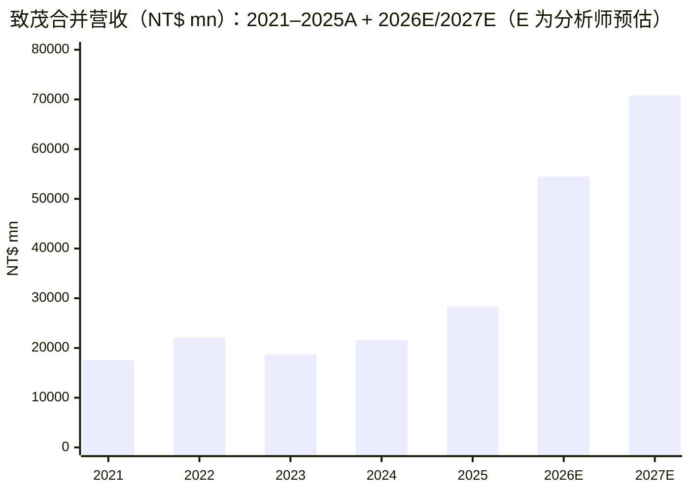
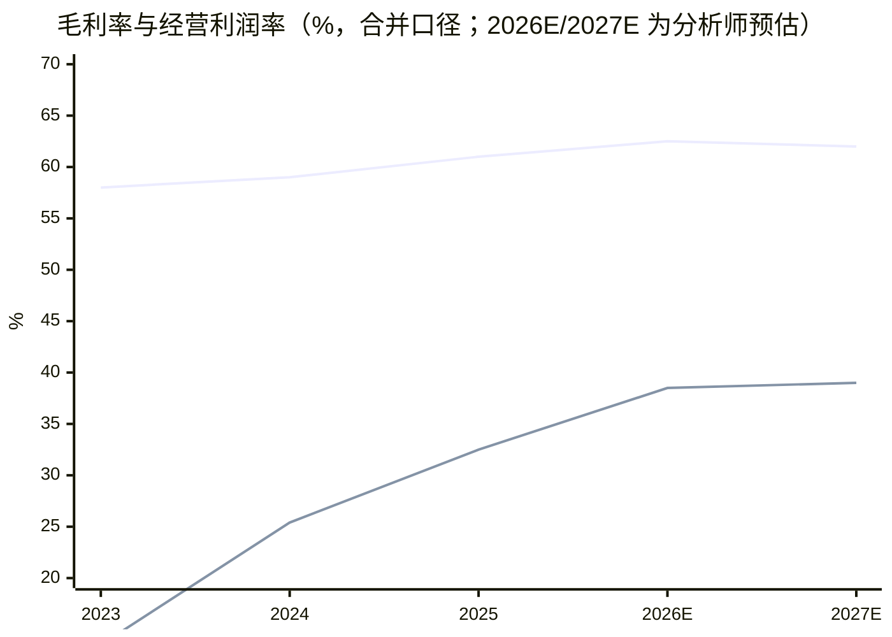
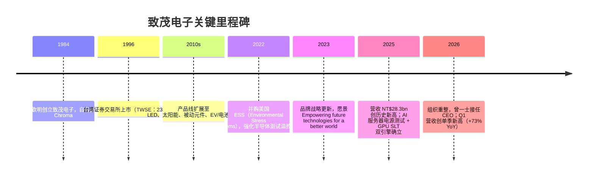
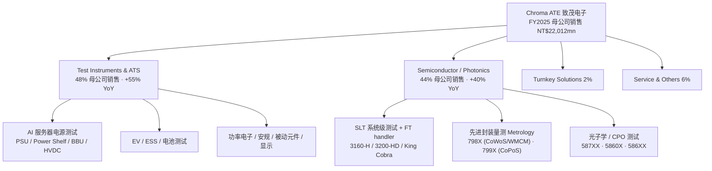
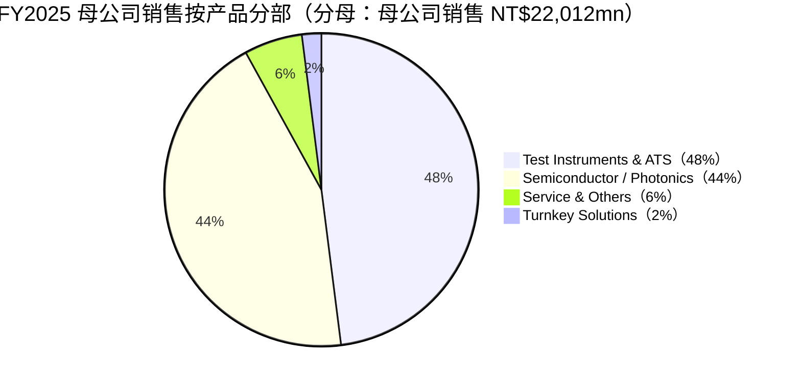
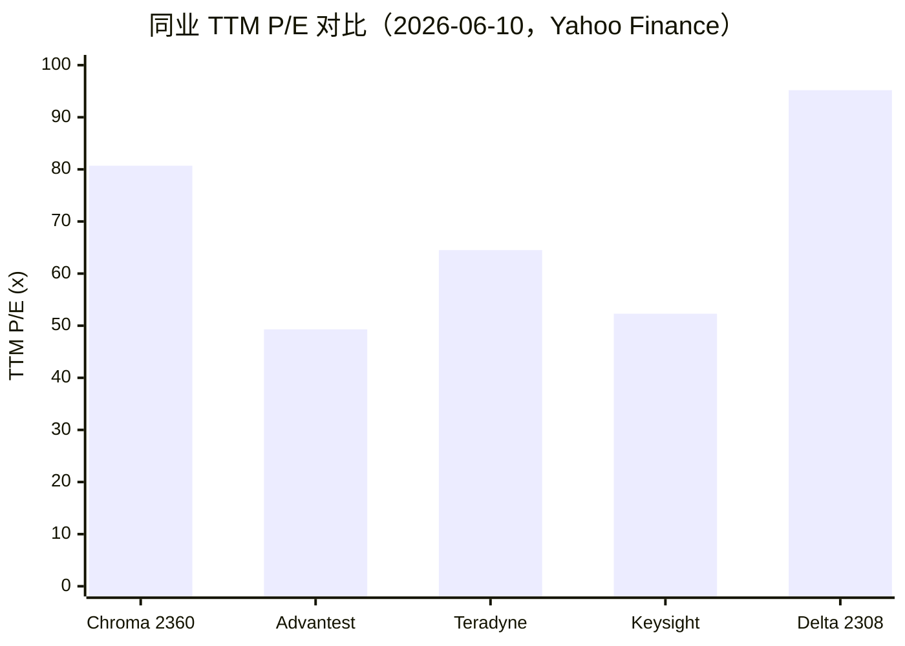

# 公司研究报告：Chroma ATE 致茂电子（TWSE:2360）

**日期（as of）：2026-06-15**（数据截至 2026-06-12 收盘）· 覆盖刷新（refresh；初次覆盖 2026-06-11）· 报告语言：简体中文（技术/财务术语保留英文）

> *分析师观点：* **评级：Hold（持有）· 12 个月目标价 NT$2,450（较 2026-06-12 收盘 NT$2,295 上行 +7%）· 估值方法：48× 2027E EPS NT$50.7（forward P/E × target multiple）**
> 市值 NT$975.8bn（约 US$31bn，按 425.2mn 股）· 52 周区间 NT$341.3–2,625 · TWSE:2360 · 数据来源：[Yahoo Finance 2360.TW，2026-06-12](https://finance.yahoo.com/quote/2360.TW/)
>
> | 倍数 / Multiple（*分析师观点：* 前瞻列） | FY2025A | FY2026E | FY2027E |
> |---|---|---|---|
> | P/E（报告口径 EPS） | 82.9×（EPS 27.70，含一次性收益） | 59.5×（EPS 38.6E） | 45.3×（EPS 50.7E） |
> | P/E（剔除一次性收益的核心口径） | ~114×（核心 EPS ≈20.2，推导见 1A） | 同上 | 同上 |
> | P/S | 34.5×（营收 NT$28.31bn） | 17.9× | 13.8× |
> | PEG（以 FY26E EPS 增速 ~+91% 计） | — | ~0.65 | — |
>
> 相对表现（截至 2026-06-12，[Yahoo Finance / yfinance](https://finance.yahoo.com/quote/2360.TW/)）：1M **+2.5%**（TAIEX +7.3%，相对 −4.8pp）· 6M **+195.0%**（TAIEX +60.2%，相对 +134.7pp）· YTD **+188.3%**（TAIEX +50.5%）· 12M **+563.0%**（TAIEX +98.2%，相对 +464.8pp）
>
> **核心论点（thesis pillars）**——（1）致茂是 AI 算力建设中“测试侧”的稀缺标的：AI 服务器电源测试（PSU/BBU/HVDC power rack）+ GPU system-level test (SLT, 系统级测试) + advanced packaging (先进封装) 量测 + CPO (co-packaged optics, 共封装光学) 光子测试四线并进；（2）业绩动能极强——2026Q1 营收同比 +73% 创纪录、4–5 月营收同比 +129%（美元口径），Q2 跟踪超共识约 20%；（3）但 12 个月 +563% 的股价已计入大量乐观预期：TTM P/S 34.5×、相对 TWSE 的 P/E 溢价 2.6×（5 年均值 1.3×），且卖方目标价分歧极大（NT$1,660–2,800，价差 69%）；（4）在强基本面与高估值的拉锯下给予 Hold——等待更好的进场点，关键跟踪变量是 SLT 上修幅度与 2027 年 AI capex 的持续性。

> **Update——2026 年度展望（2026-02-25 初次给出）+ 经营动能确认：** 管理层在 2025Q4 法说会给出 2026 年定性指引：“Business will present another year of growth in 2026, both Test Instruments & ATS and Semiconductor / Photonics received a strong demand from customers”，并点名 AI server power（含 HVDC）、ESS、SLT（AI/HPC/ASIC）、advanced packaging 量测与 CPO 为增长驱动（[2025Q4 法说会简报, Slide 14, 2026-02-25](https://www.chromaate.com/downloads/investors/pdf/quarterly_reports/2025/20260225_Q4_quarterly_reports_presentation_en.pdf)）。此后动能持续验证：5 月合并营收 NT$45.50 亿，同比 +133.1%，前 5 月累计 NT$212.75 亿、同比 +94.4%（[TechNews 科技新报, 2026-06-05](https://finance.technews.tw/2026/06/05/chroma-2360-202605-financial-report/)）。

---

## 目录

1. [公司概览](#1-公司概览)（含投资论点导语 + 估值快照）
1A. [估值与目标价](#1a-估值与目标价)（前瞻模型 · PT 推导 · 牛/基准/熊 · 卖方观点演变）
1B. [基本面记分卡 GF Score](#1b-基本面记分卡-gf-score)（五维 0–10 + 综合 0–100）
2. [公司历史](#2-公司历史)
3. [管理团队](#3-管理团队)
4. [产品与服务](#4-产品与服务)（本报告最重要章节）
5. [客户与上市策略](#5-客户与上市策略)
6. [行业概览](#6-行业概览)
7. [竞争格局](#7-竞争格局)
8. [市场机会（TAM）](#8-市场机会tam)
9. [风险评估](#9-风险评估)
9.5 [关键分歧与催化剂](#95-关键分歧与催化剂)
10. [投资风格透视](#10-投资风格透视)

---

## 1. 公司概览

*分析师观点：* 本报告对致茂电子（Chroma ATE Inc., TWSE:2360）首次覆盖给予 **Hold（持有）评级、12 个月目标价 NT$2,450（+11%）**。为什么是现在？因为致茂正处在一个罕见的多引擎共振点上：AI 数据中心把“电力”和“芯片”两条供应链同时推向测试设备——每一台 PSU (power supply unit, 电源供应器)、BBU (battery backup unit, 备援电池)、HVDC (high-voltage direct current, 高压直流) power rack 出厂前要上致茂的电源测试机，每一颗 NVIDIA/AMD/Google 的 AI 芯片封装后要过致茂的 SLT (system-level test, 系统级测试)，每一片 CoWoS 载板要经过致茂的 2D/3D 量测，2H26 起 CPO 光引擎还要新增四道测试 insertion。2026Q1 营收同比 +73% 创单季纪录、毛利率 63%（[2026Q1 法说会简报, Slide 5, 2026-04-30](https://www.chromaate.com/downloads/investors/pdf/quarterly_reports/2026/20260430_Q1_quarterly_reports_presentation_en.pdf)）。但 12 个月 +567% 的涨幅之后，估值已经走到了历史区间之外，卖方内部分歧巨大（详见 1A 卖方观点演变）——基本面与价格的赛跑是本篇的核心命题。

**公司是做什么的？** 致茂电子创立于 1984 年，自有品牌“Chroma”，公司在 2025Q4 法说会中自述为：“Chroma Group founded in 1984, a world leading own brand and design of high precision test & measurement instruments, automated test systems, intelligent manufacturing systems and test & automation turnkey solutions provider. Businesses cover test and measurement instruments and ATS for electronics, ICT, EV/ESS, AI and Semiconductor”（[2025Q4 法说会简报, Slide 5, 2026-02-25](https://www.chromaate.com/downloads/investors/pdf/quarterly_reports/2025/20260225_Q4_quarterly_reports_presentation_en.pdf)）。2025 年报（FY2025）进一步定义业务范围：“CHROMA ATE INC. is a driving force behind emerging technology industries and a trusted partner of world-class customers”，主要应用市场包括 AI、semiconductors/ICs、energy storage（储能）、electric vehicles（电动车）、green energy batteries、LED、太阳能、photonics（光子学）、flat panel displays、video & color、power electronics（功率电子）、passive components（被动元件）、electrical safety（电气安规）等（[致茂 2025 Annual Report（年报英文版）, p.100](https://www.chromaate.com/downloads/investors/pdf/shareholder/2026/2025_Chroma_ATE_Annual_Report-EN.pdf)）。

**怎么赚钱？** 收入结构按年报口径分两类：test equipment（测试设备）占 FY2025 合并营收 95.96%、automated equipment（自动化设备，子公司 MAS）占 3.12%、其他 0.92%（[致茂 2025 年报, p.100](https://www.chromaate.com/downloads/investors/pdf/shareholder/2026/2025_Chroma_ATE_Annual_Report-EN.pdf)）。按法说会的母公司产品口径，FY2025 母公司销售 NT$22,012mn 中 Test Instruments & ATS（测试仪器与自动测试系统，电源测试为主）占 48%（NT$10,545mn，同比 +55%）、Semiconductor / Photonics Test Solutions 占 44%（NT$9,759mn，同比 +40%）、Turnkey 2%、Service & Others 6%（[2025Q4 法说会简报, Slide 13, 2026-02-25](https://www.chromaate.com/downloads/investors/pdf/quarterly_reports/2025/20260225_Q4_quarterly_reports_presentation_en.pdf)）。这是一门“卖精密仪器 + 高毛利”的生意：FY2025 合并 gross margin (毛利率) 61%、operating margin (经营利润率) 32%（[2025Q4 法说会简报, Slide 10](https://www.chromaate.com/downloads/investors/pdf/quarterly_reports/2025/20260225_Q4_quarterly_reports_presentation_en.pdf)）。

**规模与地理分布。** FY2025 合并营收 NT$28,311mn（+31% YoY，历史新高）、归母净利 NT$11,692mn、EPS NT$27.70（+122%，含 3Q25 一次性资产处分收益 NT$3,185mn）；集团员工 3,802 人（2025 年末），总部研发人员占比 35%（[2025Q4 法说会简报, Slides 5/6/10, 2026-02-25](https://www.chromaate.com/downloads/investors/pdf/quarterly_reports/2025/20260225_Q4_quarterly_reports_presentation_en.pdf)）。出口占比 82%（FY2025 出口销售 NT$23,266mn / 内销 18%），客户遍及全球（[致茂 2025 年报, p.113](https://www.chromaate.com/downloads/investors/pdf/shareholder/2026/2025_Chroma_ATE_Annual_Report-EN.pdf)）。2026Q1 单季：营收 NT$11,859mn（+73% YoY / +38% QoQ）、毛利率 63%、经营利益 NT$4,797mn（40% margin）、归母净利 NT$3,864mn、EPS NT$9.12（+81%），年化 ROE 51%（剔除一次性收益）、净现金结构（[2026Q1 法说会简报, Slides 5/6, 2026-04-30](https://www.chromaate.com/downloads/investors/pdf/quarterly_reports/2026/20260430_Q1_quarterly_reports_presentation_en.pdf)）。



数据来源：2021–2025A 见 [2025Q4 法说会简报, Slide 6, 2026-02-25](https://www.chromaate.com/downloads/investors/pdf/quarterly_reports/2025/20260225_Q4_quarterly_reports_presentation_en.pdf)；2026E/2027E 为*分析师观点*（推导见 1A）。



数据来源：上线为 gross margin（2023–25 见 [2025Q4 法说会简报, Slide 6](https://www.chromaate.com/downloads/investors/pdf/quarterly_reports/2025/20260225_Q4_quarterly_reports_presentation_en.pdf)），下线为 operating margin（FY2024 25.4% = 5,482/21,604、FY2025 32.5% = 9,198/28,311，见 [同简报 Slide 10](https://www.chromaate.com/downloads/investors/pdf/quarterly_reports/2025/20260225_Q4_quarterly_reports_presentation_en.pdf)；FY2023 经营利润率为母公司与合并报表推算近似值，标注为约数）；2026E/2027E 为*分析师观点*。

**收入如何变成净利（FY2025 利润表 Sankey）。** 致茂是一门“高毛利精密仪器”生意：FY2025 合并营收 NT$28,311mn 中，扣除 COGS NT$10,886mn 后留下 gross profit NT$17,425mn（GM 61.5%），再扣 R&D NT$2,556mn 与 SG&A 等 opex 后得 operating income NT$9,198mn（OPM 32.5%）；非经营性收入 NT$4,720mn（含 3Q25 一次性资产处分收益 NT$3,185mn）把 pretax 推高到 NT$13,918mn，税后归母净利 NT$11,692mn（[致茂 2025 年报 经营成果分析 p.131](https://www.chromaate.com/downloads/investors/pdf/shareholder/2026/2025_Chroma_ATE_Annual_Report-EN.pdf)）。

<svg xmlns="http://www.w3.org/2000/svg" viewBox="0 0 1000 560" width="1000" height="560" role="img" aria-label="income statement Sankey"><rect x="0" y="0" width="1000" height="560" fill="#ffffff"/>
<text x="20.00" y="30.00" text-anchor="start" font-family="Helvetica,Arial,sans-serif" font-size="15" font-weight="700" fill="#1f2933">致茂电子 (Chroma ATE, 2360) FY2025 利润表 Sankey — 收入如何变成净利</text>
<path d="M 204.00,64.00 C 258.00,64.00 258.00,78.00 312.00,78.00 L 312.00,482.96 C 258.00,482.96 258.00,468.96 204.00,468.96 Z" fill="#93c5fd" fill-opacity="0.55"/>
<path d="M 452.00,71.00 C 506.00,71.00 506.00,109.95 560.00,109.95 L 560.00,247.06 C 506.00,247.06 506.00,208.10 452.00,208.10 Z" fill="#86efac" fill-opacity="0.55"/>
<path d="M 452.00,208.10 C 506.00,208.10 506.00,261.06 560.00,261.06 L 560.00,383.69 C 506.00,383.69 506.00,330.73 452.00,330.73 Z" fill="#fca5a5" fill-opacity="0.55"/>
<path d="M 328.00,78.00 C 382.00,78.00 382.00,71.00 436.00,71.00 L 436.00,330.73 C 382.00,330.73 382.00,337.73 328.00,337.73 Z" fill="#86efac" fill-opacity="0.55"/>
<path d="M 328.00,337.73 C 382.00,337.73 382.00,344.73 436.00,344.73 L 436.00,507.00 C 382.00,507.00 382.00,500.00 328.00,500.00 Z" fill="#fca5a5" fill-opacity="0.55"/>
<path d="M 576.00,109.95 C 630.00,109.95 630.00,109.95 684.00,109.95 L 684.00,247.06 C 630.00,247.06 630.00,247.06 576.00,247.06 Z" fill="#86efac" fill-opacity="0.55"/>
<path d="M 700.00,109.95 C 754.00,109.95 754.00,171.27 808.00,171.27 L 808.00,345.55 C 754.00,345.55 754.00,284.23 700.00,284.23 Z" fill="#86efac" fill-opacity="0.55"/>
<path d="M 700.00,284.23 C 754.00,284.23 754.00,359.55 808.00,359.55 L 808.00,389.24 C 754.00,389.24 754.00,313.93 700.00,313.93 Z" fill="#fca5a5" fill-opacity="0.55"/>
<path d="M 700.00,313.93 C 754.00,313.93 754.00,403.24 808.00,403.24 L 808.00,406.73 C 754.00,406.73 754.00,317.41 700.00,317.41 Z" fill="#fca5a5" fill-opacity="0.55"/>
<path d="M 576.00,261.06 C 630.00,261.06 630.00,331.41 684.00,331.41 L 684.00,415.95 C 630.00,415.95 630.00,345.59 576.00,345.59 Z" fill="#fca5a5" fill-opacity="0.55"/>
<path d="M 576.00,345.59 C 630.00,345.59 630.00,429.95 684.00,429.95 L 684.00,468.05 C 630.00,468.05 630.00,383.69 576.00,383.69 Z" fill="#fca5a5" fill-opacity="0.55"/>
<path d="M 576.00,397.69 C 630.00,397.69 630.00,247.06 684.00,247.06 L 684.00,317.41 C 630.00,317.41 630.00,468.05 576.00,468.05 Z" fill="#93c5fd" fill-opacity="0.55"/>
<path d="M 204.00,482.96 C 258.00,482.96 258.00,482.96 312.00,482.96 L 312.00,496.12 C 258.00,496.12 258.00,496.12 204.00,496.12 Z" fill="#93c5fd" fill-opacity="0.55"/>
<path d="M 204.00,510.12 C 258.00,510.12 258.00,496.12 312.00,496.12 L 312.00,500.00 C 258.00,500.00 258.00,514.00 204.00,514.00 Z" fill="#93c5fd" fill-opacity="0.55"/>
<rect x="188.00" y="64.00" width="16" height="404.96" rx="1.5" fill="#2563eb"/>
<rect x="188.00" y="482.96" width="16" height="13.16" rx="1.5" fill="#2563eb"/>
<rect x="188.00" y="510.12" width="16" height="3.88" rx="1.5" fill="#2563eb"/>
<rect x="312.00" y="78.00" width="16" height="422.00" rx="1.5" fill="#1e3a8a"/>
<rect x="436.00" y="71.00" width="16" height="259.73" rx="1.5" fill="#15803d"/>
<rect x="436.00" y="344.73" width="16" height="162.27" rx="1.5" fill="#dc2626"/>
<rect x="560.00" y="109.95" width="16" height="137.10" rx="1.5" fill="#15803d"/>
<rect x="560.00" y="261.06" width="16" height="122.63" rx="1.5" fill="#dc2626"/>
<rect x="560.00" y="397.69" width="16" height="70.36" rx="1.5" fill="#2563eb"/>
<rect x="684.00" y="109.95" width="16" height="207.46" rx="1.5" fill="#15803d"/>
<rect x="684.00" y="331.41" width="16" height="84.53" rx="1.5" fill="#dc2626"/>
<rect x="684.00" y="429.95" width="16" height="38.10" rx="1.5" fill="#dc2626"/>
<rect x="808.00" y="171.27" width="16" height="174.28" rx="1.5" fill="#15803d"/>
<rect x="808.00" y="359.55" width="16" height="29.69" rx="1.5" fill="#dc2626"/>
<rect x="808.00" y="403.24" width="16" height="3.49" rx="1.5" fill="#dc2626"/>
<line x1="188.00" y1="266.48" x2="182.00" y2="238.94" stroke="#cbd5e1" stroke-width="1"/>
<text x="179.00" y="241.94" text-anchor="end" font-family="Helvetica,Arial,sans-serif" font-size="11.5" font-weight="700" fill="#1f2933">Test equipment (95.96%)</text>
<text x="179.00" y="254.94" text-anchor="end" font-family="Helvetica,Arial,sans-serif" font-size="10" font-weight="400" fill="#52606d">NT$27.2B  (96.0%)</text>
<line x1="188.00" y1="489.54" x2="182.00" y2="462.00" stroke="#cbd5e1" stroke-width="1"/>
<text x="179.00" y="465.00" text-anchor="end" font-family="Helvetica,Arial,sans-serif" font-size="11.5" font-weight="700" fill="#1f2933">Automated equipment (3.12%)</text>
<text x="179.00" y="478.00" text-anchor="end" font-family="Helvetica,Arial,sans-serif" font-size="10" font-weight="400" fill="#52606d">NT$883.0M  (3.1%)</text>
<line x1="188.00" y1="512.06" x2="182.00" y2="487.00" stroke="#cbd5e1" stroke-width="1"/>
<text x="179.00" y="490.00" text-anchor="end" font-family="Helvetica,Arial,sans-serif" font-size="11.5" font-weight="700" fill="#1f2933">Other (0.92%)</text>
<text x="179.00" y="503.00" text-anchor="end" font-family="Helvetica,Arial,sans-serif" font-size="10" font-weight="400" fill="#52606d">NT$260.0M  (0.92%)</text>
<rect x="331.00" y="60.00" width="119.40" height="26" rx="2" fill="#ffffff" fill-opacity="0.72"/>
<text x="334.00" y="72.00" text-anchor="start" font-family="Helvetica,Arial,sans-serif" font-size="11.5" font-weight="700" fill="#1f2933">Revenue</text>
<text x="334.00" y="85.00" text-anchor="start" font-family="Helvetica,Arial,sans-serif" font-size="10" font-weight="400" fill="#52606d">NT$28.3B  (100.0%)</text>
<rect x="455.00" y="53.00" width="113.10" height="26" rx="2" fill="#ffffff" fill-opacity="0.72"/>
<text x="458.00" y="65.00" text-anchor="start" font-family="Helvetica,Arial,sans-serif" font-size="11.5" font-weight="700" fill="#1f2933">Gross Profit</text>
<text x="458.00" y="78.00" text-anchor="start" font-family="Helvetica,Arial,sans-serif" font-size="10" font-weight="400" fill="#52606d">NT$17.4B  (61.5%)</text>
<rect x="455.00" y="326.73" width="144.60" height="26" rx="2" fill="#ffffff" fill-opacity="0.72"/>
<text x="458.00" y="338.73" text-anchor="start" font-family="Helvetica,Arial,sans-serif" font-size="11.5" font-weight="700" fill="#1f2933">Cost of Revenue (COGS)</text>
<text x="458.00" y="351.73" text-anchor="start" font-family="Helvetica,Arial,sans-serif" font-size="10" font-weight="400" fill="#52606d">NT$10.9B  (38.5%)</text>
<rect x="579.00" y="91.95" width="106.80" height="26" rx="2" fill="#ffffff" fill-opacity="0.72"/>
<text x="582.00" y="103.95" text-anchor="start" font-family="Helvetica,Arial,sans-serif" font-size="11.5" font-weight="700" fill="#1f2933">Operating Income</text>
<text x="582.00" y="116.95" text-anchor="start" font-family="Helvetica,Arial,sans-serif" font-size="10" font-weight="400" fill="#52606d">NT$9.2B  (32.5%)</text>
<rect x="579.00" y="243.06" width="150.90" height="26" rx="2" fill="#ffffff" fill-opacity="0.72"/>
<text x="582.00" y="255.06" text-anchor="start" font-family="Helvetica,Arial,sans-serif" font-size="11.5" font-weight="700" fill="#1f2933">Total Operating Expense</text>
<text x="582.00" y="268.06" text-anchor="start" font-family="Helvetica,Arial,sans-serif" font-size="10" font-weight="400" fill="#52606d">NT$8.2B  (29.1%)</text>
<text x="551.00" y="429.87" text-anchor="end" font-family="Helvetica,Arial,sans-serif" font-size="11.5" font-weight="700" fill="#1f2933">Net Interest / Other Income</text>
<text x="551.00" y="442.87" text-anchor="end" font-family="Helvetica,Arial,sans-serif" font-size="10" font-weight="400" fill="#52606d">NT$4.7B  (16.7%)</text>
<rect x="703.00" y="91.95" width="113.10" height="26" rx="2" fill="#ffffff" fill-opacity="0.72"/>
<text x="706.00" y="103.95" text-anchor="start" font-family="Helvetica,Arial,sans-serif" font-size="11.5" font-weight="700" fill="#1f2933">Pretax Income</text>
<text x="706.00" y="116.95" text-anchor="start" font-family="Helvetica,Arial,sans-serif" font-size="10" font-weight="400" fill="#52606d">NT$13.9B  (49.2%)</text>
<rect x="703.00" y="313.41" width="106.80" height="26" rx="2" fill="#ffffff" fill-opacity="0.72"/>
<text x="706.00" y="325.41" text-anchor="start" font-family="Helvetica,Arial,sans-serif" font-size="11.5" font-weight="700" fill="#1f2933">SG&amp;A</text>
<text x="706.00" y="338.41" text-anchor="start" font-family="Helvetica,Arial,sans-serif" font-size="10" font-weight="400" fill="#52606d">NT$5.7B  (20.0%)</text>
<rect x="703.00" y="411.95" width="100.50" height="26" rx="2" fill="#ffffff" fill-opacity="0.72"/>
<text x="706.00" y="423.95" text-anchor="start" font-family="Helvetica,Arial,sans-serif" font-size="11.5" font-weight="700" fill="#1f2933">R&amp;D</text>
<text x="706.00" y="436.95" text-anchor="start" font-family="Helvetica,Arial,sans-serif" font-size="10" font-weight="400" fill="#52606d">NT$2.6B  (9.0%)</text>
<text x="833.00" y="255.41" text-anchor="start" font-family="Helvetica,Arial,sans-serif" font-size="11.5" font-weight="700" fill="#1f2933">Net Income</text>
<text x="833.00" y="268.41" text-anchor="start" font-family="Helvetica,Arial,sans-serif" font-size="10" font-weight="400" fill="#52606d">NT$11.7B  (41.3%)</text>
<text x="833.00" y="371.40" text-anchor="start" font-family="Helvetica,Arial,sans-serif" font-size="11.5" font-weight="700" fill="#1f2933">Income Tax</text>
<text x="833.00" y="384.40" text-anchor="start" font-family="Helvetica,Arial,sans-serif" font-size="10" font-weight="400" fill="#52606d">NT$2.0B  (7.0%)</text>
<text x="833.00" y="401.99" text-anchor="start" font-family="Helvetica,Arial,sans-serif" font-size="11.5" font-weight="700" fill="#1f2933">Minority Interest</text>
<text x="833.00" y="414.99" text-anchor="start" font-family="Helvetica,Arial,sans-serif" font-size="10" font-weight="400" fill="#52606d">NT$234.0M  (0.83%)</text>
<text x="500.00" y="530.00" text-anchor="middle" font-family="Helvetica,Arial,sans-serif" font-size="10" font-weight="400" font-style="italic" fill="#8a97a3">含 3Q25 一次性资产处分收益 NT$3,185mn（计入 non-operating income）</text>
<text x="500.00" y="544.00" text-anchor="middle" font-family="Helvetica,Arial,sans-serif" font-size="10" font-weight="400" fill="#52606d">Source: 致茂 2025 年报 经营成果分析 pp.131；分类销售比例 p.100（合并口径，NT$mn）</text>
</svg>

来源 / Source: [致茂 2025 年报 经营成果分析 p.131 + 分类销售比例 p.100](https://www.chromaate.com/downloads/investors/pdf/shareholder/2026/2025_Chroma_ATE_Annual_Report-EN.pdf)（合并口径）。

**收入结构两视角（产品分部 + 地区）。** 左图为母公司销售按产品分部（Test Instruments & ATS 48% / Semiconductor·Photonics 44% 两大引擎，分母 NT$22,012mn，[2025Q4 法说会简报 Slide 13](https://www.chromaate.com/downloads/investors/pdf/quarterly_reports/2025/20260225_Q4_quarterly_reports_presentation_en.pdf)）；右图为合并营收按地区（出口 82% / 内销 18%，[致茂 2025 年报 p.113](https://www.chromaate.com/downloads/investors/pdf/shareholder/2026/2025_Chroma_ATE_Annual_Report-EN.pdf)）。两图分母不同（母公司 vs 合并），不可直接相加。

<svg xmlns="http://www.w3.org/2000/svg" viewBox="0 0 720 460" width="720" height="460" role="img" aria-label="revenue donut"><rect x="0" y="0" width="720" height="460" fill="#ffffff"/>
<text x="20.00" y="30.00" text-anchor="start" font-family="Helvetica,Arial,sans-serif" font-size="15" font-weight="700" fill="#1f2933">FY2025 母公司销售按产品分部（分母：母公司销售 NT$22,012mn）</text>
<path d="M 288.00,107.20 A 132 132 0 0 1 305.32,370.06 L 298.23,316.53 A 78 78 0 0 0 288.00,161.20 Z" fill="#2563eb"/>
<path d="M 305.32,370.06 A 132 132 0 0 1 226.16,122.58 L 251.46,170.29 A 78 78 0 0 0 298.23,316.53 Z" fill="#15803d"/>
<path d="M 226.16,122.58 A 132 132 0 0 1 273.41,108.01 L 279.38,161.68 A 78 78 0 0 0 251.46,170.29 Z" fill="#d97706"/>
<path d="M 273.41,108.01 A 132 132 0 0 1 288.00,107.20 L 288.00,161.20 A 78 78 0 0 0 279.38,161.68 Z" fill="#7c3aed"/>
<text x="288.00" y="235.20" text-anchor="middle" font-family="Helvetica,Arial,sans-serif" font-size="18" font-weight="800" fill="#1f2933">Chroma 母公司</text>
<text x="288.00" y="255.20" text-anchor="middle" font-family="Helvetica,Arial,sans-serif" font-size="13" font-weight="600" fill="#52606d">NT$22.0B</text>
<text x="288.00" y="271.20" text-anchor="middle" font-family="Helvetica,Arial,sans-serif" font-size="10" font-weight="400" fill="#8a97a3">total</text>
<line x1="425.70" y1="230.13" x2="441.70" y2="230.13" stroke="#2563eb" stroke-width="1.4"/>
<text x="445.70" y="228.13" text-anchor="start" font-family="Helvetica,Arial,sans-serif" font-size="11" font-weight="700" fill="#1f2933">Test Instruments &amp; ATS (电源/EV/ESS)</text>
<text x="445.70" y="242.13" text-anchor="start" font-family="Helvetica,Arial,sans-serif" font-size="10" font-weight="400" fill="#52606d">NT$10.5B  (47.9%)</text>
<line x1="156.56" y1="281.24" x2="140.56" y2="281.24" stroke="#15803d" stroke-width="1.4"/>
<text x="136.56" y="279.24" text-anchor="end" font-family="Helvetica,Arial,sans-serif" font-size="11" font-weight="700" fill="#1f2933">Semiconductor / Photonics</text>
<text x="136.56" y="293.24" text-anchor="end" font-family="Helvetica,Arial,sans-serif" font-size="10" font-weight="400" fill="#52606d">NT$9.8B  (44.3%)</text>
<line x1="247.33" y1="107.33" x2="231.33" y2="107.33" stroke="#d97706" stroke-width="1.4"/>
<text x="227.33" y="105.33" text-anchor="end" font-family="Helvetica,Arial,sans-serif" font-size="11" font-weight="700" fill="#1f2933">Service &amp; Others</text>
<text x="227.33" y="119.33" text-anchor="end" font-family="Helvetica,Arial,sans-serif" font-size="10" font-weight="400" fill="#52606d">NT$1.3B  (6.0%)</text>
<line x1="280.36" y1="101.41" x2="264.36" y2="101.41" stroke="#7c3aed" stroke-width="1.4"/>
<text x="260.36" y="99.41" text-anchor="end" font-family="Helvetica,Arial,sans-serif" font-size="11" font-weight="700" fill="#1f2933">Turnkey</text>
<text x="260.36" y="113.41" text-anchor="end" font-family="Helvetica,Arial,sans-serif" font-size="10" font-weight="400" fill="#52606d">NT$388.0M  (1.8%)</text>
<text x="360.00" y="444.00" text-anchor="middle" font-family="Helvetica,Arial,sans-serif" font-size="10" font-weight="400" fill="#52606d">Source: 致茂 2025Q4 法说会简报 Slide 13（母公司口径，NT$mn）</text>
</svg>

<svg xmlns="http://www.w3.org/2000/svg" viewBox="0 0 720 460" width="720" height="460" role="img" aria-label="revenue donut"><rect x="0" y="0" width="720" height="460" fill="#ffffff"/>
<text x="20.00" y="30.00" text-anchor="start" font-family="Helvetica,Arial,sans-serif" font-size="15" font-weight="700" fill="#1f2933">FY2025 合并营收按地区（出口 vs 内销）</text>
<path d="M 288.00,107.20 A 132 132 0 1 1 169.21,181.65 L 217.80,205.19 A 78 78 0 1 0 288.00,161.20 Z" fill="#2563eb"/>
<path d="M 169.21,181.65 A 132 132 0 0 1 288.00,107.20 L 288.00,161.20 A 78 78 0 0 0 217.80,205.19 Z" fill="#15803d"/>
<text x="288.00" y="235.20" text-anchor="middle" font-family="Helvetica,Arial,sans-serif" font-size="18" font-weight="800" fill="#1f2933">Chroma 合并</text>
<text x="288.00" y="255.20" text-anchor="middle" font-family="Helvetica,Arial,sans-serif" font-size="13" font-weight="600" fill="#52606d">NT$28.3B</text>
<text x="288.00" y="271.20" text-anchor="middle" font-family="Helvetica,Arial,sans-serif" font-size="10" font-weight="400" fill="#8a97a3">total</text>
<line x1="361.28" y1="356.13" x2="377.28" y2="356.13" stroke="#2563eb" stroke-width="1.4"/>
<text x="381.28" y="354.13" text-anchor="start" font-family="Helvetica,Arial,sans-serif" font-size="11" font-weight="700" fill="#1f2933">出口 Export (82%)</text>
<text x="381.28" y="368.13" text-anchor="start" font-family="Helvetica,Arial,sans-serif" font-size="10" font-weight="400" fill="#52606d">NT$23.3B  (82.2%)</text>
<line x1="214.72" y1="122.27" x2="198.72" y2="122.27" stroke="#15803d" stroke-width="1.4"/>
<text x="194.72" y="120.27" text-anchor="end" font-family="Helvetica,Arial,sans-serif" font-size="11" font-weight="700" fill="#1f2933">内销 Domestic (18%)</text>
<text x="194.72" y="134.27" text-anchor="end" font-family="Helvetica,Arial,sans-serif" font-size="10" font-weight="400" fill="#52606d">NT$5.0B  (17.8%)</text>
<text x="360.00" y="444.00" text-anchor="middle" font-family="Helvetica,Arial,sans-serif" font-size="10" font-weight="400" fill="#52606d">Source: 致茂 2025 年报 p.113（出口 23,265,764 / 合并营收 28,310,935 千元）</text>
</svg>

来源 / Source: 分部见 [2025Q4 法说会简报 Slide 13](https://www.chromaate.com/downloads/investors/pdf/quarterly_reports/2025/20260225_Q4_quarterly_reports_presentation_en.pdf)；地区见 [致茂 2025 年报 p.113](https://www.chromaate.com/downloads/investors/pdf/shareholder/2026/2025_Chroma_ATE_Annual_Report-EN.pdf)。

**营收历史（2021–2025A）。** 2023 年消化 EV/电池下行至 NT$18,676mn（−13%）后，2024 +16%、2025 AI 双引擎点火 +31% 至 NT$28,311mn 创新高。

<svg xmlns="http://www.w3.org/2000/svg" viewBox="0 0 860 470" width="860" height="470" role="img" aria-label="historical revenue bars"><rect x="0" y="0" width="860" height="470" fill="#ffffff"/>
<text x="20.00" y="30.00" text-anchor="start" font-family="Helvetica,Arial,sans-serif" font-size="15" font-weight="700" fill="#1f2933">致茂合并营收历史（NT$mn，2021–2025A）</text>
<rect x="20.00" y="44" width="11" height="11" rx="2" fill="#2563eb"/>
<text x="36.00" y="53.00" text-anchor="start" font-family="Helvetica,Arial,sans-serif" font-size="10.5" font-weight="400" fill="#1f2933">合并营收 Consolidated revenue</text>
<line x1="70" y1="412.00" x2="834" y2="412.00" stroke="#eceff2" stroke-width="1"/>
<text x="64.00" y="415.00" text-anchor="end" font-family="Helvetica,Arial,sans-serif" font-size="9.5" font-weight="400" fill="#52606d">NT$0</text>
<line x1="70" y1="345.20" x2="834" y2="345.20" stroke="#eceff2" stroke-width="1"/>
<text x="64.00" y="348.20" text-anchor="end" font-family="Helvetica,Arial,sans-serif" font-size="9.5" font-weight="400" fill="#52606d">NT$6.1B</text>
<line x1="70" y1="278.40" x2="834" y2="278.40" stroke="#eceff2" stroke-width="1"/>
<text x="64.00" y="281.40" text-anchor="end" font-family="Helvetica,Arial,sans-serif" font-size="9.5" font-weight="400" fill="#52606d">NT$12.2B</text>
<line x1="70" y1="211.60" x2="834" y2="211.60" stroke="#eceff2" stroke-width="1"/>
<text x="64.00" y="214.60" text-anchor="end" font-family="Helvetica,Arial,sans-serif" font-size="9.5" font-weight="400" fill="#52606d">NT$18.3B</text>
<line x1="70" y1="144.80" x2="834" y2="144.80" stroke="#eceff2" stroke-width="1"/>
<text x="64.00" y="147.80" text-anchor="end" font-family="Helvetica,Arial,sans-serif" font-size="9.5" font-weight="400" fill="#52606d">NT$24.5B</text>
<line x1="70" y1="78.00" x2="834" y2="78.00" stroke="#eceff2" stroke-width="1"/>
<text x="64.00" y="81.00" text-anchor="end" font-family="Helvetica,Arial,sans-serif" font-size="9.5" font-weight="400" fill="#52606d">NT$30.6B</text>
<rect x="102.09" y="219.92" width="88.62" height="192.08" fill="#2563eb"/>
<text x="146.40" y="428.00" text-anchor="middle" font-family="Helvetica,Arial,sans-serif" font-size="10" font-weight="400" fill="#52606d">2021</text>
<rect x="254.89" y="170.95" width="88.62" height="241.05" fill="#2563eb"/>
<text x="299.20" y="428.00" text-anchor="middle" font-family="Helvetica,Arial,sans-serif" font-size="10" font-weight="400" fill="#52606d">2022</text>
<rect x="407.69" y="207.99" width="88.62" height="204.01" fill="#2563eb"/>
<text x="452.00" y="428.00" text-anchor="middle" font-family="Helvetica,Arial,sans-serif" font-size="10" font-weight="400" fill="#52606d">2023</text>
<rect x="560.49" y="176.01" width="88.62" height="235.99" fill="#2563eb"/>
<text x="604.80" y="428.00" text-anchor="middle" font-family="Helvetica,Arial,sans-serif" font-size="10" font-weight="400" fill="#52606d">2024</text>
<rect x="713.29" y="102.74" width="88.62" height="309.26" fill="#2563eb"/>
<text x="757.60" y="428.00" text-anchor="middle" font-family="Helvetica,Arial,sans-serif" font-size="10" font-weight="400" fill="#52606d">2025</text>
<text x="430.00" y="454.00" text-anchor="middle" font-family="Helvetica,Arial,sans-serif" font-size="10" font-weight="400" fill="#52606d">Source: 致茂 2025Q4 法说会简报 Slide 6（合并口径，NT$mn）</text>
</svg>

来源 / Source: [2025Q4 法说会简报 Slide 6](https://www.chromaate.com/downloads/investors/pdf/quarterly_reports/2025/20260225_Q4_quarterly_reports_presentation_en.pdf)（合并口径）。

**估值快照（TTM，2026-06-10）。** 现价 NT$2,210、市值 NT$936.1bn；TTM P/E 80.7×（trailing EPS 27.4，含一次性收益；剔除后核心 TTM P/E 约 100×+）、TTM P/S 28.1×、forward P/E 37.7×、股息率 0.88%（[Yahoo Finance 2360.TW key statistics, 2026-06-10](https://finance.yahoo.com/quote/2360.TW/)）。同业对比（同日，[Yahoo Finance](https://finance.yahoo.com/quote/2360.TW/)）：Advantest（6857.T）TTM P/E 49.3× / P/S 16.2×；Teradyne（TER）64.5× / 14.4×；Keysight（KEYS）52.3× / 9.1×；台达电（2308.TW）95.2× / 9.6×。**为什么倍数这么高？** 三个原因：（a）AI 测试设备是当前台股最强的盈利上修主线之一——*分析师观点：* UBS 在 5 月将致茂新增入台股最偏好组合，给予 Buy、目标价 NT$2,600（[UBS — Taiwan Equity Strategy, 2026-05-09, 偏好组合表](http://xs-macbook-air.local:5001/zsxq/pdf/812458124211512/UBS-Taiwan%20Equity%20Strategy%EF%BC%9AAI~driven%20earnings%20upgrades%20support%20further%20upside%20amid%20rising%20volatility-260509.pdf)）；（b）盈利基数正在快速抬升（Q1 EPS 已达去年全年核心 EPS 的约 45%）；（c）*分析师观点：* Bernstein 指出致茂当前交易在 52× forward P/E、相对 TWSE 的 P/E 达 2.6×，而 5 年均值仅 1.3×、+1SD 也只有 1.7×——估值溢价是历史区间的两倍（[Bernstein — TW suppliers monthly sales, 2026-06-07, Exhibits 7–8](http://xs-macbook-air.local:5001/zsxq/pdf/814528815844822/Bernstein-Asia%20Tech%20Hardware%EF%BC%9ATW%20suppliers%20monthly%20sales%EF%BC%9A%20Largan%20and%20Chroma%20monthly%20sales%20tracking%20well%20above%20consensus-260607.pdf)）。该倍数水平已构成估值压缩风险，正式列入第 9 章。

## 1A. 估值与目标价

本章全部前瞻数字（营收/利润率/EPS 预估、目标价、情景目标价）均为*分析师观点*，外部输入逐项注明来源；预估本身不附带任何财报引用。

### (a) 前瞻财务预估表（FY2025A–FY2028E）

| 指标（*分析师观点：* 预估列） | FY2025A | FY2026E | FY2027E | FY2028E | 25–28E CAGR |
|---|---|---|---|---|---|
| 营收（NT$ mn） | 28,311 | 54,500 | 70,800 | 81,400 | +42% |
| — YoY % | +31% | +93% | +30% | +15% | |
| Gross margin 毛利率 % | 61.5% | 62.5% | 62.0% | 61.5% | |
| Operating margin % | 32.5% | 38.5% | 39.0% | 39.0% | |
| 归母净利（NT$ mn） | 11,692（含一次性） | 16,370 | 21,500 | 24,700 | |
| EPS（NT$，basic） | 27.70（核心 ≈20.2） | 38.6 | 50.7 | 58.2 | +42%（vs 核心） |
| ROE %（年化、剔除一次性） | 29% | ~45% | ~40% | ~35% | |
| FCF（NT$ mn） | 6,686 | ~11,000 | ~17,000 | ~20,500 | |
| 净现金/(负债) | 净现金 | 净现金 | 净现金 | 净现金 | |

预估的外部基础：FY2025A 全部数字来自 [2025Q4 法说会简报, Slides 10/11, 2026-02-25](https://www.chromaate.com/downloads/investors/pdf/quarterly_reports/2025/20260225_Q4_quarterly_reports_presentation_en.pdf)（FCF NT$6,686mn、净现金、ROE 29% 剔除一次性收益均为简报披露）；核心 EPS ≈20.2 为推导值（= (11,692 − 3,185) / 423.6mn 股，处分收益 NT$3,185mn 见 [2025Q4 法说会简报, Slide 9 注](https://www.chromaate.com/downloads/investors/pdf/quarterly_reports/2025/20260225_Q4_quarterly_reports_presentation_en.pdf)，按税前金额近似）。FY2026E 营收构建：Q1 实际 NT$11,859mn（[2026Q1 法说会简报, Slide 5](https://www.chromaate.com/downloads/investors/pdf/quarterly_reports/2026/20260430_Q1_quarterly_reports_presentation_en.pdf)）+ Q2 取 *分析师观点：* Bernstein 基于历史季节性推算的区间中值 NT$14.9bn（“2Q26 sales should reach NT$13.8-15.6B (+115% to +141% YoY), with the NT$14.9B midpoint c.20% above cons.”，[Bernstein — TW suppliers monthly sales, 2026-06-07, p.1](http://xs-macbook-air.local:5001/zsxq/pdf/814528815844822/Bernstein-Asia%20Tech%20Hardware%EF%BC%9ATW%20suppliers%20monthly%20sales%EF%BC%9A%20Largan%20and%20Chroma%20monthly%20sales%20tracking%20well%20above%20consensus-260607.pdf)）+ 2H26 较 1H26 +8%（参照 2025 年 H2/H1 = 1.20 的季节性，见 [2025Q4 法说会简报, Slide 9/10](https://www.chromaate.com/downloads/investors/pdf/quarterly_reports/2025/20260225_Q4_quarterly_reports_presentation_en.pdf)，保守取低）。利润率假设锚定 Q1 实际（GM 63% / OPM 40%，[2026Q1 法说会简报, Slide 5](https://www.chromaate.com/downloads/investors/pdf/quarterly_reports/2026/20260430_Q1_quarterly_reports_presentation_en.pdf)）并为下半年成本与新品爬坡留出缓冲。FY2027–28E 增速参照（i）管理层定性指引（SLT/量测/CPO/HVDC 四驱动，[2025Q4 法说会简报, Slide 14](https://www.chromaate.com/downloads/investors/pdf/quarterly_reports/2025/20260225_Q4_quarterly_reports_presentation_en.pdf)）与（ii）*分析师观点：* J.P. Morgan 的行业框架——致茂 SLT、metrology、datacenter power testing 三条线“each at 40%+ CAGR”（[J.P. Morgan — Asia PCB, CCL, Substrate, Testing, and Passive Components, 2026-04-10, p.19](http://xs-macbook-air.local:5001/zsxq/pdf/585548152542554/J.P.%20Morgan-Asia%20PCB%EF%BC%8C%20CCL%EF%BC%8C%20Substrate%EF%BC%8C%20Testing%EF%BC%8C%20and%20Passive%20Components-260410.pdf)）。

**利润率桥（FY2025 32.5% → FY2026E 38.5% OPM，+600bps，*分析师观点：*）：** 规模杠杆（营收近翻倍而 G&A/R&D 增速远低于营收，Q1 已验证：营收 +73% 而 G&A +32%、R&D +33%，[2026Q1 法说会简报, Slide 5](https://www.chromaate.com/downloads/investors/pdf/quarterly_reports/2026/20260430_Q1_quarterly_reports_presentation_en.pdf)）贡献约 +500bps；高毛利 SLT/量测占比提升贡献约 +100bps；新品（CPO 测试机）爬坡费用部分抵消。

**FY2025 ROE 拆解（5 步 DuPont）。** 致茂的高 ROE 由三块共同驱动：高净利率（含一次性收益拉高）、合理的资产周转，与轻杠杆的权益乘数（净现金结构）。下图把 FY2025 合并 ROE 拆成 net margin × asset turnover × equity multiplier，并进一步分解出 operating margin / tax burden / interest burden——其中 interest-burden 一项被 3Q25 一次性处分收益显著放大（non-operating 收入占 pretax 的 34%），故该年 ROE 含较大一次性成分，可持续口径应回看剔除一次性后的 ~29%（[2025Q4 法说会简报 Slide 11](https://www.chromaate.com/downloads/investors/pdf/quarterly_reports/2025/20260225_Q4_quarterly_reports_presentation_en.pdf)）。

<svg xmlns="http://www.w3.org/2000/svg" viewBox="0 0 1240 540" width="1240" height="540" role="img" aria-label="DuPont ROE decomposition"><rect x="0" y="0" width="1240" height="540" fill="#ffffff"/>
<text x="20.00" y="30.00" text-anchor="start" font-family="Helvetica,Arial,sans-serif" font-size="15" font-weight="700" fill="#1f2933">致茂电子 FY2025 五步 DuPont ROE 拆解</text>
<rect x="545.00" y="56.00" width="150" height="56" rx="7" fill="#1e3a8a"/>
<text x="620.00" y="76.00" text-anchor="middle" font-family="Helvetica,Arial,sans-serif" font-size="11.5" font-weight="700" fill="#ffffff">ROE</text>
<text x="620.00" y="94.00" text-anchor="middle" font-family="Helvetica,Arial,sans-serif" font-size="13" font-weight="800" fill="#ffffff">41.11%</text>
<text x="620.00" y="106.00" text-anchor="middle" font-family="Helvetica,Arial,sans-serif" font-size="8.5" font-weight="400" fill="#dbeafe">= Net Income / Avg Equity</text>
<rect x="191.60" y="168.00" width="150" height="56" rx="7" fill="#2563eb"/>
<text x="266.60" y="188.00" text-anchor="middle" font-family="Helvetica,Arial,sans-serif" font-size="11.5" font-weight="700" fill="#ffffff">Net Margin</text>
<text x="266.60" y="206.00" text-anchor="middle" font-family="Helvetica,Arial,sans-serif" font-size="13" font-weight="800" fill="#ffffff">42.12%</text>
<text x="266.60" y="218.00" text-anchor="middle" font-family="Helvetica,Arial,sans-serif" font-size="8.5" font-weight="400" fill="#dbeafe">Net Income / Revenue</text>
<line x1="620.00" y1="112.00" x2="266.60" y2="168.00" stroke="#94a3b8" stroke-width="1.4"/>
<rect x="545.00" y="168.00" width="150" height="56" rx="7" fill="#2563eb"/>
<text x="620.00" y="188.00" text-anchor="middle" font-family="Helvetica,Arial,sans-serif" font-size="11.5" font-weight="700" fill="#ffffff">Asset Turnover</text>
<text x="620.00" y="206.00" text-anchor="middle" font-family="Helvetica,Arial,sans-serif" font-size="13" font-weight="800" fill="#ffffff">0.67</text>
<text x="620.00" y="218.00" text-anchor="middle" font-family="Helvetica,Arial,sans-serif" font-size="8.5" font-weight="400" fill="#dbeafe">Revenue / Avg Assets</text>
<line x1="620.00" y1="112.00" x2="620.00" y2="168.00" stroke="#94a3b8" stroke-width="1.4"/>
<rect x="898.40" y="168.00" width="150" height="56" rx="7" fill="#2563eb"/>
<text x="973.40" y="188.00" text-anchor="middle" font-family="Helvetica,Arial,sans-serif" font-size="11.5" font-weight="700" fill="#ffffff">Equity Multiplier</text>
<text x="973.40" y="206.00" text-anchor="middle" font-family="Helvetica,Arial,sans-serif" font-size="13" font-weight="800" fill="#ffffff">1.46</text>
<text x="973.40" y="218.00" text-anchor="middle" font-family="Helvetica,Arial,sans-serif" font-size="8.5" font-weight="400" fill="#dbeafe">Avg Assets / Avg Equity</text>
<line x1="620.00" y1="112.00" x2="973.40" y2="168.00" stroke="#94a3b8" stroke-width="1.4"/>
<circle cx="443.30" cy="196.00" r="11" fill="#ffffff" stroke="#94a3b8" stroke-width="1.2"/>
<text x="443.30" y="201.00" text-anchor="middle" font-family="Helvetica,Arial,sans-serif" font-size="14" font-weight="800" fill="#52606d">×</text>
<circle cx="796.70" cy="196.00" r="11" fill="#ffffff" stroke="#94a3b8" stroke-width="1.2"/>
<text x="796.70" y="201.00" text-anchor="middle" font-family="Helvetica,Arial,sans-serif" font-size="14" font-weight="800" fill="#52606d">×</text>
<rect x="65.00" y="300.00" width="118" height="56" rx="7" fill="#2563eb"/>
<text x="124.00" y="320.00" text-anchor="middle" font-family="Helvetica,Arial,sans-serif" font-size="11.5" font-weight="700" fill="#ffffff">Operating Margin</text>
<text x="124.00" y="338.00" text-anchor="middle" font-family="Helvetica,Arial,sans-serif" font-size="13" font-weight="800" fill="#ffffff">32.49%</text>
<text x="124.00" y="350.00" text-anchor="middle" font-family="Helvetica,Arial,sans-serif" font-size="8.5" font-weight="400" fill="#dbeafe">Op Inc / Revenue</text>
<line x1="266.60" y1="224.00" x2="124.00" y2="300.00" stroke="#94a3b8" stroke-width="1.4"/>
<rect x="207.60" y="300.00" width="118" height="56" rx="7" fill="#2563eb"/>
<text x="266.60" y="320.00" text-anchor="middle" font-family="Helvetica,Arial,sans-serif" font-size="11.5" font-weight="700" fill="#ffffff">Tax Burden</text>
<text x="266.60" y="338.00" text-anchor="middle" font-family="Helvetica,Arial,sans-serif" font-size="13" font-weight="800" fill="#ffffff">0.8569</text>
<text x="266.60" y="350.00" text-anchor="middle" font-family="Helvetica,Arial,sans-serif" font-size="8.5" font-weight="400" fill="#dbeafe">Net Inc / Pretax</text>
<line x1="266.60" y1="224.00" x2="266.60" y2="300.00" stroke="#94a3b8" stroke-width="1.4"/>
<rect x="350.20" y="300.00" width="118" height="56" rx="7" fill="#2563eb"/>
<text x="409.20" y="320.00" text-anchor="middle" font-family="Helvetica,Arial,sans-serif" font-size="11.5" font-weight="700" fill="#ffffff">Interest Burden</text>
<text x="409.20" y="338.00" text-anchor="middle" font-family="Helvetica,Arial,sans-serif" font-size="13" font-weight="800" fill="#ffffff">1.5132</text>
<text x="409.20" y="350.00" text-anchor="middle" font-family="Helvetica,Arial,sans-serif" font-size="8.5" font-weight="400" fill="#dbeafe">Pretax / Op Inc</text>
<line x1="266.60" y1="224.00" x2="409.20" y2="300.00" stroke="#94a3b8" stroke-width="1.4"/>
<circle cx="195.30" cy="328.00" r="11" fill="#ffffff" stroke="#94a3b8" stroke-width="1.2"/>
<text x="195.30" y="333.00" text-anchor="middle" font-family="Helvetica,Arial,sans-serif" font-size="14" font-weight="800" fill="#52606d">×</text>
<circle cx="337.90" cy="328.00" r="11" fill="#ffffff" stroke="#94a3b8" stroke-width="1.2"/>
<text x="337.90" y="333.00" text-anchor="middle" font-family="Helvetica,Arial,sans-serif" font-size="14" font-weight="800" fill="#52606d">×</text>
<rect x="479.00" y="300.00" width="118" height="56" rx="7" fill="#2563eb"/>
<text x="538.00" y="326.00" text-anchor="middle" font-family="Helvetica,Arial,sans-serif" font-size="11.5" font-weight="700" fill="#ffffff">Revenue</text>
<text x="538.00" y="342.00" text-anchor="middle" font-family="Helvetica,Arial,sans-serif" font-size="13" font-weight="800" fill="#ffffff">NT$28.3B</text>
<line x1="620.00" y1="224.00" x2="538.00" y2="300.00" stroke="#94a3b8" stroke-width="1.4"/>
<rect x="643.00" y="300.00" width="118" height="56" rx="7" fill="#2563eb"/>
<text x="702.00" y="320.00" text-anchor="middle" font-family="Helvetica,Arial,sans-serif" font-size="11.5" font-weight="700" fill="#ffffff">Avg Total Assets</text>
<text x="702.00" y="338.00" text-anchor="middle" font-family="Helvetica,Arial,sans-serif" font-size="13" font-weight="800" fill="#ffffff">NT$42.2B</text>
<text x="702.00" y="350.00" text-anchor="middle" font-family="Helvetica,Arial,sans-serif" font-size="8.5" font-weight="400" fill="#dbeafe">(begin+end)/2</text>
<line x1="620.00" y1="224.00" x2="702.00" y2="300.00" stroke="#94a3b8" stroke-width="1.4"/>
<circle cx="620.00" cy="328.00" r="11" fill="#ffffff" stroke="#94a3b8" stroke-width="1.2"/>
<text x="620.00" y="333.00" text-anchor="middle" font-family="Helvetica,Arial,sans-serif" font-size="14" font-weight="800" fill="#52606d">÷</text>
<rect x="832.40" y="300.00" width="118" height="56" rx="7" fill="#2563eb"/>
<text x="891.40" y="320.00" text-anchor="middle" font-family="Helvetica,Arial,sans-serif" font-size="11.5" font-weight="700" fill="#ffffff">Avg Total Assets</text>
<text x="891.40" y="338.00" text-anchor="middle" font-family="Helvetica,Arial,sans-serif" font-size="13" font-weight="800" fill="#ffffff">NT$42.2B</text>
<text x="891.40" y="350.00" text-anchor="middle" font-family="Helvetica,Arial,sans-serif" font-size="8.5" font-weight="400" fill="#dbeafe">(begin+end)/2</text>
<line x1="973.40" y1="224.00" x2="891.40" y2="300.00" stroke="#94a3b8" stroke-width="1.4"/>
<rect x="996.40" y="300.00" width="118" height="56" rx="7" fill="#2563eb"/>
<text x="1055.40" y="320.00" text-anchor="middle" font-family="Helvetica,Arial,sans-serif" font-size="11.5" font-weight="700" fill="#ffffff">Avg Total Equity</text>
<text x="1055.40" y="338.00" text-anchor="middle" font-family="Helvetica,Arial,sans-serif" font-size="13" font-weight="800" fill="#ffffff">NT$29.0B</text>
<text x="1055.40" y="350.00" text-anchor="middle" font-family="Helvetica,Arial,sans-serif" font-size="8.5" font-weight="400" fill="#dbeafe">(begin+end)/2</text>
<line x1="973.40" y1="224.00" x2="1055.40" y2="300.00" stroke="#94a3b8" stroke-width="1.4"/>
<circle cx="967.20" cy="328.00" r="11" fill="#ffffff" stroke="#94a3b8" stroke-width="1.2"/>
<text x="967.20" y="333.00" text-anchor="middle" font-family="Helvetica,Arial,sans-serif" font-size="14" font-weight="800" fill="#52606d">÷</text>
<rect x="69.00" y="420.00" width="110" height="48" rx="7" fill="#3b82f6"/>
<text x="124.00" y="442.00" text-anchor="middle" font-family="Helvetica,Arial,sans-serif" font-size="11.5" font-weight="700" fill="#ffffff">Operating Income</text>
<text x="124.00" y="458.00" text-anchor="middle" font-family="Helvetica,Arial,sans-serif" font-size="13" font-weight="800" fill="#ffffff">NT$9.2B</text>
<line x1="124.00" y1="356.00" x2="124.00" y2="420.00" stroke="#94a3b8" stroke-width="1.4"/>
<rect x="211.60" y="420.00" width="110" height="48" rx="7" fill="#3b82f6"/>
<text x="266.60" y="442.00" text-anchor="middle" font-family="Helvetica,Arial,sans-serif" font-size="11.5" font-weight="700" fill="#ffffff">Net Income</text>
<text x="266.60" y="458.00" text-anchor="middle" font-family="Helvetica,Arial,sans-serif" font-size="13" font-weight="800" fill="#ffffff">NT$11.9B</text>
<line x1="266.60" y1="356.00" x2="266.60" y2="420.00" stroke="#94a3b8" stroke-width="1.4"/>
<rect x="354.20" y="420.00" width="110" height="48" rx="7" fill="#3b82f6"/>
<text x="409.20" y="442.00" text-anchor="middle" font-family="Helvetica,Arial,sans-serif" font-size="11.5" font-weight="700" fill="#ffffff">Pretax Income</text>
<text x="409.20" y="458.00" text-anchor="middle" font-family="Helvetica,Arial,sans-serif" font-size="13" font-weight="800" fill="#ffffff">NT$13.9B</text>
<line x1="409.20" y1="356.00" x2="409.20" y2="420.00" stroke="#94a3b8" stroke-width="1.4"/>
<text x="620.00" y="510.00" text-anchor="middle" font-family="Helvetica,Arial,sans-serif" font-size="10" font-weight="400" font-style="italic" fill="#8a97a3">FY2025 合并口径；net profit 含 3Q25 一次性处分收益（拉高 non-operating / tax-burden 一项）</text>
<text x="620.00" y="524.00" text-anchor="middle" font-family="Helvetica,Arial,sans-serif" font-size="10" font-weight="400" fill="#52606d">Source: 致茂 2025 年报 pp.129/131（合并损益表 + 资产负债表，NT$mn）</text>
</svg>

来源 / Source: [致茂 2025 年报 pp.129/131](https://www.chromaate.com/downloads/investors/pdf/shareholder/2026/2025_Chroma_ATE_Annual_Report-EN.pdf)（合并损益表 + 资产负债表）。

### (b) 目标价推导（показать арифметику → 直接给算式）

**方法：forward P/E × target multiple。** PT = 2027E EPS NT$50.7 × 48× = **NT$2,434 ≈ NT$2,450**（较 2026-06-10 收盘 NT$2,210 上行 +11%）。

**为什么是 48×？** 对标五家可比公司（TTM P/E，2026-06-10，[Yahoo Finance](https://finance.yahoo.com/quote/2360.TW/)）：Advantest 49.3×、Teradyne 64.5×（forward 36.6×）、Keysight 52.3×（forward 27.3×）、台达电 95.2×（forward 33.9×）。致茂 FY2025–27E 核心 EPS CAGR 约 +58%（20.2→50.7），显著高于 Advantest/Teradyne 的成长曲线，支撑其 forward 倍数高于 Teradyne 的 36.6×；但 48× 低于 *分析师观点：* Morgan Stanley 的 50×（“PT of NT$2,800, based on 50x 2027e P/E vs. current valuation of 46x 2027e”，[Morgan Stanley — Investor Presentation: AI Still Taking Center Stage, 2026-06-05, p.3](http://xs-macbook-air.local:5001/zsxq/pdf/214528851488581/Morgan%20Stanley-Investor%20Presentation%EF%BC%9AAI%20Still%20Taking%20Center%20Stage-260605.pdf)），高于 *分析师观点：* Bernstein 的 38×（[Bernstein — model updates across the AI supply chain, 2026-03-16, Chroma 章节](http://xs-macbook-air.local:5001/zsxq/pdf/212222825221841/Bernstein-Asia%20Tech%20Hardware%EF%BC%9AAsia%20Tech%20Hardware%EF%BC%9A%20model%20updates%20across%20the%20AI%20supply%20chain%EF%BC%9B%20Delta%20remains%20our%20top%20pick-260316.pdf)）——取中偏上，反映 Q1 后盈利上修但兼顾历史相对估值已达 2 倍均值的事实。

### (c) 牛 / 基准 / 熊情景

| 情景（*分析师观点：*） | 关键假设 | 2027E EPS | 倍数 | PT | vs 现价 2,210 |
|---|---|---|---|---|---|
| 牛市 Bull | Rubin SLT 上修 + CPO 四道 insertion 全面放量 + HVDC 订单超预期 | NT$58 | 55× | NT$3,190 | **+44%** |
| 基准 Base | 中性预估；Q2 超共识兑现，2027 +30% | NT$50.7 | 48× | NT$2,450 | **+11%** |
| 熊市 Bear | 2027 AI capex 消化期 + SLT 竞争分流 + 倍数回归 | NT$42 | 35× | NT$1,470 | **−33%** |

### (d) 共识对标

*分析师观点：* 按 Bernstein 2026-06-07 的估值图（“Chroma is trading at 52x forward P/E and 42x on 2027 consensus EPS”，[Bernstein — TW suppliers monthly sales, 2026-06-07, Exhibit 7](http://xs-macbook-air.local:5001/zsxq/pdf/814528815844822/Bernstein-Asia%20Tech%20Hardware%EF%BC%9ATW%20suppliers%20monthly%20sales%EF%BC%9A%20Largan%20and%20Chroma%20monthly%20sales%20tracking%20well%20above%20consensus-260607.pdf)），以 2026-06-05 收盘 NT$2,565 反推，市场共识 2027E EPS ≈ NT$61（= 2,565 ÷ 42，两个输入均来自该报告）。本报告 2027E EPS NT$50.7 **低于该推导共识约 17%**、高于 Bernstein 自身的 NT$43.66（[Bernstein — AI Value Chain: Vera Rubin, 2026-06-08, ticker 表](http://xs-macbook-air.local:5001/zsxq/pdf/814528815844812/Bernstein-AI%20Value%20Chain%EF%BC%9AHow%20much%20does%20a%20GW%20of%20Vera%20Rubin%20data%20center%20capacity%20actually%20cost%EF%BC%9F-260608.pdf)）、低于 Morgan Stanley 的 NT$55.57（[Morgan Stanley — AI Still Taking Center Stage, 2026-06-05, 估值表](http://xs-macbook-air.local:5001/zsxq/pdf/214528851488581/Morgan%20Stanley-Investor%20Presentation%EF%BC%9AAI%20Still%20Taking%20Center%20Stage-260605.pdf)）——即本报告的盈利假设在 Street 区间中位略偏保守。

### 卖方观点演变（Sell-side view evolution）

机械预检：`db/stock_price_target.db`（只读）现存 2360.TW 两条 PT 记录——Bernstein 2026-03-16 Outperform NT$1,660（报告日收盘 1,450，+14.5%）与 Morgan Stanley 2026-06-05 Overweight NT$2,800（报告日收盘 2,565，+9.2%）；叠加 UBS 报告内表格（Buy NT$2,600），PT 离散度：min 1,660 / 中位 2,600 / max 2,800，**极差达 69%**。

**按机构的观点时间线（报告日期以文件名 -YYMMDD 为准；报告日收盘价来自 yfinance/PT 库）：**

| 机构 | 日期 | 评级 / 目标价 | 报告日收盘 | 隐含上行 | 核心论点 / 修订 |
|---|---|---|---|---|---|
| Bernstein | 2026-03-16 | Outperform · **NT$1,660（自 970 大幅上调 +71%）** | 1,450 | +14.5% | 目标 P/E 31×→38×、2027E EPS 31.4→43.7；“AI SLT revenue to nearly triple in 2026”；触发因素：4Q25 业绩 + Vera Rubin/AMD/Google 新芯片（[Bernstein, 2026-03-16](http://xs-macbook-air.local:5001/zsxq/pdf/212222825221841/Bernstein-Asia%20Tech%20Hardware%EF%BC%9AAsia%20Tech%20Hardware%EF%BC%9A%20model%20updates%20across%20the%20AI%20supply%20chain%EF%BC%9B%20Delta%20remains%20our%20top%20pick-260316.pdf)） |
| J.P. Morgan | 2026-04-10 | 行业深度（该 PDF 未列 PT） | 行业框架 | — | SLT / metrology / DC power testing 三线 “each at 40%+ CAGR”；“Chroma is the leader in AI data center power testing”（[J.P. Morgan, 2026-04-10, pp.19–23](http://xs-macbook-air.local:5001/zsxq/pdf/585548152542554/J.P.%20Morgan-Asia%20PCB%EF%BC%8C%20CCL%EF%BC%8C%20Substrate%EF%BC%8C%20Testing%EF%BC%8C%20and%20Passive%20Components-260410.pdf)） |
| UBS | 2026-05-09 | **Buy · NT$2,600**（新增入最偏好组合） | 2,325（报告表内价格） | +11.8% | AI 盈利上修主线；价值链定位 “Advantest FT, Chroma SLT”（[UBS, 2026-05-09](http://xs-macbook-air.local:5001/zsxq/pdf/812458124211512/UBS-Taiwan%20Equity%20Strategy%EF%BC%9AAI~driven%20earnings%20upgrades%20support%20further%20upside%20amid%20rising%20volatility-260509.pdf)） |
| UBS | 2026-05-12 | 月度追踪（评级/PT 不变） | 2,440 | — | “Equipment was the outperformer with Chroma and Hon Precision both 40% of consensus”——4 月单月即完成季度共识 40%（[UBS, 2026-05-12](http://xs-macbook-air.local:5001/zsxq/pdf/212452255428221/UBS-APAC%20Technology%EF%BC%9ATaiwan%20Tech%20April%20sales%EF%BC%9A%20Supply%20chain%20momentum%20continues%20with%20Q226%20tracking%20ahead-260512.pdf)） |
| Citi | 2026-05-12 | 行业点评（无单独 PT） | — | — | 将 Chroma 列入 AI 光学领域值得关注个股（[Citi 中国科技, 2026-05-12](http://xs-macbook-air.local:5001/zsxq/pdf/184124548444512/%E4%B8%AD%E5%9B%BD%E7%A7%91%E6%8A%80%EF%BC%9A%E4%BB%8E%E7%BE%8E%E5%9B%BD%E4%BA%91%E6%9C%8D%E5%8A%A1%E6%8F%90%E4%BE%9B%E5%95%86%E8%B5%84%E6%9C%AC%E6%94%AF%E5%87%BA%E5%8F%8A%E5%85%89%E5%AD%A6%E5%90%8C%E4%B8%9A%E8%AF%84%E8%AE%BA%E4%B8%AD%E5%BE%97%E5%88%B0%E7%9A%84%E5%90%AF%E7%A4%BA.pdf)） |
| Bernstein | 2026-06-04 | Outperform（Computex 后重申、列入超配） | 2,620 | −36.6%（PT 1,660 未动） | Computex 实地调研：AI 设备需求拉动；风险提示 AI 芯片需求疲软、EV 渗透放缓、行业内卷（[Bernstein, 2026-06-04](http://xs-macbook-air.local:5001/zsxq/pdf/415288418481128/Bernstein-Asia%20Tech%20Hardware%20%26%20Semi%EF%BC%9A%20key%20takeaways%20from%20the%202026%20Taipei%20Computex-260604.pdf)） |
| Morgan Stanley | 2026-06-05 | **Overweight · NT$2,800** | 2,565 | +9.2% | “PT of NT$2,800, based on 50x 2027e P/E vs. current valuation of 46x 2027e”；四驱动：GPU SLT 新周期、先进封装量测、transceiver/CPO 光子测试、FT handler 与 burn-in oven 增量（[Morgan Stanley, 2026-06-05, p.3](http://xs-macbook-air.local:5001/zsxq/pdf/214528851488581/Morgan%20Stanley-Investor%20Presentation%EF%BC%9AAI%20Still%20Taking%20Center%20Stage-260605.pdf)） |
| Bernstein | 2026-06-07/08 | Outperform · NT$1,660（**PT 已显著落后股价**） | 2,565 | **−35.3%** | Apr–May 营收 +129%、Q2 超共识 ~20%后明言 “We will revisit our model”——即自身模型待上修（[Bernstein, 2026-06-07, p.1](http://xs-macbook-air.local:5001/zsxq/pdf/814528815844822/Bernstein-Asia%20Tech%20Hardware%EF%BC%9ATW%20suppliers%20monthly%20sales%EF%BC%9A%20Largan%20and%20Chroma%20monthly%20sales%20tracking%20well%20above%20consensus-260607.pdf)） |
| Citi | 2026-06-10 | Buy（评级 “1”；报告内未单列 PT） | 2,210（报告表内价格） | — | 月度追踪：“great chance of MPI, Hon Precision and Chroma beating market expectation on their 2Q26 revenue growth thanks to solid order flow from GPU/AI ASIC clients and specs upgrade. CPO testing equipment are also ready for certification.”（[Citi, 2026-06-10, p.1](http://xs-macbook-air.local:5001/zsxq/pdf/584251881854144/CITI-Taiwan%20Electronics%20%26%20Semiconductors%EF%BC%9ATaiwan%20monthly%20tracker%20and%20what%E2%80%99s%20new%20in%20AI%20%E2%80%93%20Supply%20chain%20tightness%20continues-260610.pdf)） |

**机构间分歧（不可揉合成假共识）：** 三家给 PT 的机构同为“看多”评级，但 PT 区间 NT$1,660–2,800 相差 69%——分歧不在方向而在“估值锚”：

| 机构 | 日期 | 评级 / PT | 核心论点 | 什么证据能证明其正确 |
|---|---|---|---|---|
| Bernstein | 2026-06-07 | Outperform / 1,660（38× 2027E 43.7） | 业务确定性强但估值纪律优先；自认模型待修 | 若 Q2 实际落在其 13.8–15.6B 区间且 2027 共识回落，38× 锚有效 |
| UBS | 2026-05-09 | Buy / 2,600 | 台股 AI 盈利上修周期未完，致茂是设备端最强动能 | 若 6–7 月营收继续 >100% YoY、SLT 指引上修兑现 |
| Morgan Stanley | 2026-06-05 | Overweight / 2,800（50× 2027e 55.57） | 多引擎（电源/SLT/量测/CPO/burn-in）支撑高倍数 | 若 CPO 2H26 出货 + HVDC 机柜测试放量，使 2027E EPS 接近 55–60 |

### (e) 摇摆变量（swing variables）

本案的关键压力测试点有二：**（1）SLT 预测上修的幅度与持续性**——CFO 在 Q1 法说会明言 “We are seriously considering revising up our SLT forecast”（[BigGo Finance — Q1 2026 earnings call 摘要, 2026-04-30](https://finance.biggo.com/news/TW_2360.TW_2026-04-30)），上修兑现与否直接决定 2027E EPS 落在 NT$44 还是 NT$61；**（2）目标倍数能否守住**——当前相对 TWSE P/E 溢价 2.6×（5 年均值 1.3×，*分析师观点：* [Bernstein, 2026-06-07, Exhibit 8](http://xs-macbook-air.local:5001/zsxq/pdf/814528815844822/Bernstein-Asia%20Tech%20Hardware%EF%BC%9ATW%20suppliers%20monthly%20sales%EF%BC%9A%20Largan%20and%20Chroma%20monthly%20sales%20tracking%20well%20above%20consensus-260607.pdf)），任何 AI capex 边际转弱都可能触发倍数而非盈利的剧烈回撤。

---

## 1B. 基本面记分卡 GF Score

*分析师观点：* 下方五维记分卡（GuruFocus-style GF Score）是本报告自有评分框架，**非 GuruFocus 官方数字**；五个 0–10 子项与 0–100 综合分均为分析师评分，不附带任何财报引用，但每个子项背后的指标各自在前文有出处。综合 **80/100（“可能平均表现”区间）**——一家“财务/盈利/成长/动能四项满格、唯独估值（GF Value）一项极低”的典型高质量贵价股。

<svg xmlns="http://www.w3.org/2000/svg" viewBox="0 0 500 500" width="500" height="500" role="img" aria-label="GF Score radar">
<rect x="0" y="0" width="500" height="500" fill="#ffffff"/>
<text x="20" y="24" font-family="Helvetica,Arial,sans-serif" font-size="15" font-weight="700" fill="#1f2933">GF Score (GuruFocus-style): 80/100</text>
<text x="20" y="41" font-family="Helvetica,Arial,sans-serif" font-size="11" fill="#52606d">71–80 Likely average performance</text>
<polygon points="250.0,88.0 392.7,191.6 338.2,359.4 161.8,359.4 107.3,191.6" fill="#e9f5ec" stroke="none"/>
<polygon points="250.0,208.0 278.5,228.7 267.6,262.3 232.4,262.3 221.5,228.7" fill="none" stroke="#c5d3cb" stroke-width="1"/>
<polygon points="250.0,178.0 307.1,219.5 285.3,286.5 214.7,286.5 192.9,219.5" fill="none" stroke="#c5d3cb" stroke-width="1"/>
<polygon points="250.0,148.0 335.6,210.2 302.9,310.8 197.1,310.8 164.4,210.2" fill="none" stroke="#c5d3cb" stroke-width="1"/>
<polygon points="250.0,118.0 364.1,200.9 320.5,335.1 179.5,335.1 135.9,200.9" fill="none" stroke="#c5d3cb" stroke-width="1"/>
<polygon points="250.0,88.0 392.7,191.6 338.2,359.4 161.8,359.4 107.3,191.6" fill="none" stroke="#c5d3cb" stroke-width="1.3"/>
<line x1="250" y1="238" x2="161.8" y2="359.4" stroke="#cfdad3" stroke-width="1"/>
<text x="146.5" y="392.4" text-anchor="end" font-family="Helvetica,Arial,sans-serif" font-size="11.5" font-weight="600" fill="#1f2933">Financial Strength</text>
<text x="146.5" y="405.4" text-anchor="end" font-family="Helvetica,Arial,sans-serif" font-size="9.5" fill="#52606d">财务实力</text>
<text x="170.6" y="341.2" text-anchor="middle" font-family="Helvetica,Arial,sans-serif" font-size="10.5" font-weight="700" fill="#1f2933">9</text>
<line x1="250" y1="238" x2="250.0" y2="88.0" stroke="#cfdad3" stroke-width="1"/>
<text x="250.0" y="58.0" text-anchor="middle" font-family="Helvetica,Arial,sans-serif" font-size="11.5" font-weight="600" fill="#1f2933">Profitability</text>
<text x="250.0" y="71.0" text-anchor="middle" font-family="Helvetica,Arial,sans-serif" font-size="9.5" fill="#52606d">盈利能力</text>
<text x="250.0" y="97.0" text-anchor="middle" font-family="Helvetica,Arial,sans-serif" font-size="10.5" font-weight="700" fill="#1f2933">9</text>
<line x1="250" y1="238" x2="107.3" y2="191.6" stroke="#cfdad3" stroke-width="1"/>
<text x="82.6" y="183.6" text-anchor="end" font-family="Helvetica,Arial,sans-serif" font-size="11.5" font-weight="600" fill="#1f2933">Growth</text>
<text x="82.6" y="196.6" text-anchor="end" font-family="Helvetica,Arial,sans-serif" font-size="9.5" fill="#52606d">成长性</text>
<text x="121.6" y="190.3" text-anchor="middle" font-family="Helvetica,Arial,sans-serif" font-size="10.5" font-weight="700" fill="#1f2933">9</text>
<line x1="250" y1="238" x2="392.7" y2="191.6" stroke="#cfdad3" stroke-width="1"/>
<text x="417.4" y="183.6" text-anchor="start" font-family="Helvetica,Arial,sans-serif" font-size="11.5" font-weight="600" fill="#1f2933">GF Value</text>
<text x="417.4" y="196.6" text-anchor="start" font-family="Helvetica,Arial,sans-serif" font-size="9.5" fill="#52606d">估值</text>
<text x="278.5" y="222.7" text-anchor="middle" font-family="Helvetica,Arial,sans-serif" font-size="10.5" font-weight="700" fill="#1f2933">2</text>
<line x1="250" y1="238" x2="338.2" y2="359.4" stroke="#cfdad3" stroke-width="1"/>
<text x="353.5" y="392.4" text-anchor="start" font-family="Helvetica,Arial,sans-serif" font-size="11.5" font-weight="600" fill="#1f2933">Momentum</text>
<text x="353.5" y="405.4" text-anchor="start" font-family="Helvetica,Arial,sans-serif" font-size="9.5" fill="#52606d">动量</text>
<text x="329.4" y="341.2" text-anchor="middle" font-family="Helvetica,Arial,sans-serif" font-size="10.5" font-weight="700" fill="#1f2933">9</text>
<polygon points="250.0,103.0 278.5,228.7 329.4,347.2 170.6,347.2 121.6,196.3" fill="#2e8b57" fill-opacity="0.34" stroke="#2e8b57" stroke-width="2"/>
<circle cx="170.6" cy="347.2" r="2.6" fill="#2e8b57"/>
<circle cx="250.0" cy="103.0" r="2.6" fill="#2e8b57"/>
<circle cx="121.6" cy="196.3" r="2.6" fill="#2e8b57"/>
<circle cx="278.5" cy="228.7" r="2.6" fill="#2e8b57"/>
<circle cx="329.4" cy="347.2" r="2.6" fill="#2e8b57"/>
<text x="250" y="470" text-anchor="middle" font-family="Helvetica,Arial,sans-serif" font-size="9.5" fill="#52606d">Source: 致茂 2025 年报 + 2025Q4/2026Q1 法说会简报 · Yahoo Finance 2360.TW · as of 2026-06-12</text>
<text x="250" y="485" text-anchor="middle" font-family="Helvetica,Arial,sans-serif" font-size="9" fill="#52606d">GF Score = independent analyst rubric (*Analyst view:*) — not GuruFocus™ official number</text>
</svg>

| 维度 / Dimension | 评分 / Score (0–10) | |
|---|---|---|
| Financial Strength (财务实力) | 9 | `█████████░` |
| Profitability (盈利能力) | 9 | `█████████░` |
| Growth (成长性) | 9 | `█████████░` |
| GF Value (估值) | 2 | `██░░░░░░░░` |
| Momentum (动量) | 9 | `█████████░` |
| **GF Score (composite, *Analyst view:*)** | **80 / 100** | **71–80 Likely average performance** |

*Composite weights (*Analyst view:*): Financial Strength 20% · Profitability 25% · Growth 25% · GF Value 15% · Momentum 15% (transparent reproduction — not GuruFocus's proprietary weighting).*

来源 / Source: 各维度指标见正文第 1、1A、9 章对应引用（致茂 2025 年报 + 2025Q4/2026Q1 法说会简报 + Yahoo Finance）。

**各维度评分理由：**

- **Financial Strength 财务强度 = 9。** 净现金结构、股东权益占总资产 69%、长期借款仅为建厂用途、利息保障充裕（[致茂 2025 年报 p.129](https://www.chromaate.com/downloads/investors/pdf/shareholder/2026/2025_Chroma_ATE_Annual_Report-EN.pdf)；净现金见 [2025Q4 法说会简报 Slide 11](https://www.chromaate.com/downloads/investors/pdf/quarterly_reports/2025/20260225_Q4_quarterly_reports_presentation_en.pdf)）。
- **Profitability 盈利能力 = 9。** FY2025 gross margin 61.5%、operating margin 32.5%、剔除一次性后 ROE 29%，且多年持续盈利（[2025Q4 法说会简报 Slides 10/11](https://www.chromaate.com/downloads/investors/pdf/quarterly_reports/2025/20260225_Q4_quarterly_reports_presentation_en.pdf)）。
- **Growth 成长性 = 9。** FY2025 营收 +31%、FY2026E +93%、25–28E 营收 CAGR +42%、核心 EPS CAGR ~58%（前瞻数字为*分析师观点*，外部基础见 1A）。
- **GF Value 估值（越高=越便宜）= 2。** forward P/E 45×、TTM P/S 34.5×、相对 TWSE 的 P/E 溢价 2.6×（5 年均值 1.3×，[Bernstein, 2026-06-07, Exhibit 8](http://xs-macbook-air.local:5001/zsxq/pdf/814528815844822/Bernstein-Asia%20Tech%20Hardware%EF%BC%9ATW%20suppliers%20monthly%20sales%EF%BC%9A%20Largan%20and%20Chroma%20monthly%20sales%20tracking%20well%20above%20consensus-260607.pdf)）——估值是该记分卡唯一的明显短板，与本报告 Hold 评级互为印证。
- **Momentum 动能 = 9。** 12M +563%、6M +195%，远高于 200 日均线与 TAIEX 基准（[Yahoo Finance / yfinance, 2026-06-12](https://finance.yahoo.com/quote/2360.TW/)）；唯 1M 相对 −4.8pp 提示短期动能边际转弱。

## 2. 公司历史

致茂电子 1984 年 11 月创立于台湾，创办人黄欽明（Leo Huang）以自有品牌 “Chroma” 切入精密量测仪器，1996 年 12 月 21 日在台湾证券交易所上市（股票代号 2360），现总部位于桃园市龟山区文茂路 88 号（[维基百科 — 致茂电子（访问于 2026-06-11）](https://zh.wikipedia.org/zh-tw/%E8%87%B4%E8%8C%82%E9%9B%BB%E5%AD%90)）。公司四十年的主线是“跟着台湾电子业的每一波终端迁移卖测试”：从早期的电源供应器测试、视频与色彩测试（display 产业），到 2010 年代的 LED/太阳能/被动元件，再到 2015 年后的 EV/电池、2020 年后的半导体与 AI（[致茂 2025 年报, pp.100–109](https://www.chromaate.com/downloads/investors/pdf/shareholder/2026/2025_Chroma_ATE_Annual_Report-EN.pdf)）。



图表来源：[维基百科 — 致茂电子（访问于 2026-06-11）](https://zh.wikipedia.org/zh-tw/%E8%87%B4%E8%8C%82%E9%9B%BB%E5%AD%90)、[致茂 2025 年报, p.111](https://www.chromaate.com/downloads/investors/pdf/shareholder/2026/2025_Chroma_ATE_Annual_Report-EN.pdf)、[DIGITIMES, 2025-12-04](https://www.digitimes.com/news/a20251204PD200/chroma-ate-ic-testing-equipment-governance.html)、[2025Q4 法说会简报, Slide 5](https://www.chromaate.com/downloads/investors/pdf/quarterly_reports/2025/20260225_Q4_quarterly_reports_presentation_en.pdf)。

三次关键战略转折：**（1）从仪器到“仪器 + 自动化 + Turnkey”**——集团整合子公司 MAS（Modular Assembly System），把量测设备、自动化系统与 MES 软件打包成 turnkey solutions，主要服务电池芯化成（battery cell formation）等场景（[致茂 2025 年报, p.106](https://www.chromaate.com/downloads/investors/pdf/shareholder/2026/2025_Chroma_ATE_Annual_Report-EN.pdf)）；**（2）2022 年并购美国 ESS（Environmental Stress Systems）**，补强半导体测试中的温度强制（temperature forcing）技术——这是今天 King Cobra 温控系统支撑高 TDP GPU 测试的能力来源之一（[维基百科 — 致茂电子（访问于 2026-06-11）](https://zh.wikipedia.org/zh-tw/%E8%87%B4%E8%8C%82%E9%9B%BB%E5%AD%90)）；**（3）2026 年 1 月组织重整**——年报明言 “the Company underwent an organizational adjustment in January 2026...to pursue higher milestones under the leadership of the new management team”（[致茂 2025 年报, p.111](https://www.chromaate.com/downloads/investors/pdf/shareholder/2026/2025_Chroma_ATE_Annual_Report-EN.pdf)），创办人交棒专业经理人。

近两年发展浓缩为一句话：2023 年营收还在消化 EV/电池下行（NT$18,676mn，−13%），2024 年恢复 +16%，2025 年 AI 双引擎点火 +31% 创新高，2026 年前 5 个月直接 +94.4%（[2025Q4 法说会简报, Slide 6](https://www.chromaate.com/downloads/investors/pdf/quarterly_reports/2025/20260225_Q4_quarterly_reports_presentation_en.pdf)；[TechNews, 2026-06-05](https://finance.technews.tw/2026/06/05/chroma-2360-202605-financial-report/)）。

## 3. 管理团队

**创办人兼董事长：黄欽明（Leo Huang）。** 1984 年创立致茂并领导公司四十余年，截至 2026-03-31 个人持股 10,859,897 股（2.55%），为公司第五大股东（[致茂 2026 年股东会主要股东名册](https://www.chromaate.com/downloads/investors/pdf/shareholder/2026/2026_Chroma_major_shareholders-EN.pdf)）。他将公司从电源测试仪器作坊带到“全球精密量测与智能自动化方案商”，曾获《Harvard Business Review》台湾区最佳 CEO 第 15 名及 ERSO Award（[致茂官网新闻室](https://www.chromaate.com/en/newsroom/news154)；[Chroma Group — Forbes 专访 Leo Huang](https://www.chroma-group.com/newsexpress-en/driving-innovation-forbes-interviewed-chroma-chairman-and-ceo-leo-huang)）。2025 年 12 月 3 日董事会通过交棒决议：黄欽明卸任 CEO、保留董事长职务，聚焦集团治理与长期战略（[DIGITIMES, 2025-12-04](https://www.digitimes.com/news/a20251204PD200/chroma-ate-ic-testing-equipment-governance.html)）。

**现任 CEO：曾一士（I-Shih Tseng）博士，2026-01-01 起任总裁兼 CEO。** 台湾大学机械工程学士、宾州州立大学（Penn State）机械工程博士；1998 年加入致茂，深耕半导体测试设备开发近三十年，接任前职务为“president of the integrated system solutions and optical inspection systems business units”兼董事，管辖 VLSI test systems、SoC 平台、光学元件测试与 PXI/PXIe IC 测试平台，并兼任集团关联公司 ADIVIC 董事长、Testar Electronics 与 Innovative Nanotech 董事（[DIGITIMES, 2025-12-04](https://www.digitimes.com/news/a20251204PD200/chroma-ate-ic-testing-equipment-governance.html)）。由“半导体测试 BU 总裁”出任集团 CEO，本身就是公司向半导体/AI 测试倾斜的组织信号——与年报短期计划第一条“Accelerate the development of Metrology solution required for advanced semiconductor/advanced packaging processes”互为印证（[致茂 2025 年报, p.111](https://www.chromaate.com/downloads/investors/pdf/shareholder/2026/2025_Chroma_ATE_Annual_Report-EN.pdf)）。2026Q1 起法说会已由 CFO Paul Ying 与新团队主持（[2026Q1 法说会简报, Slide 1, 2026-04-30](https://www.chromaate.com/downloads/investors/pdf/quarterly_reports/2026/20260430_Q1_quarterly_reports_presentation_en.pdf)）。

## 4. 产品与服务

> 本章为全报告权重最高章节。致茂的产品树极宽（年报列出 19 条产品线），但 2026 年的投资故事集中在四个高速引擎：**AI 服务器电源测试、GPU SLT、先进封装量测、CPO 光子测试**。以下先给出发行人自己的产品矩阵，再逐一拆解。

### 4.1 发行人自述的产品矩阵（年报原文重排）

下表逐行转录自 [致茂 2025 年报 “Current products of the Company”, pp.100–102](https://www.chromaate.com/downloads/investors/pdf/shareholder/2026/2025_Chroma_ATE_Annual_Report-EN.pdf)（产品线名称保留年报英文原文）：

| 年报产品线（原文） | 代表产品（年报原文节选） | 下游应用 |
|---|---|---|
| Power electronics test solutions | DC/AC electronic load, Regenerative AC/DC load, AC power source, bidirectional DC power supply, digital power meter, SoftPanel™ | 信息/通信、电源、充电桩 |
| **Power supply & BBU test solutions for servers** | Server PSU/Rectifier testing, power shelf testing, rack power testing, **HVDC server power supply test**, BBU module/shelf testing, BMS testing | **AI 数据中心** |
| Electric vehicle test solutions | EV 部件 ATS、充电测试、battery simulator、电驱测试 | EV |
| Battery test and automation solution | 电芯化成系统、电池包/模组实验室与产线测试、BMS 测试 | EV/ESS |
| Energy storage & power conversion (ESS/PCS) | PCS 自动测试系统、battery simulator | 储能 |
| Passive component / Electrical safety | LCR meter、变压器测试、hipot tester、partial discharge tester | 被动元件/安规 |
| Video & color / FPD / LED | Video pattern generator、color analyzer、FPD tester | 显示 |
| Photonics Test Solution | **Wafer-level testing；Packaging level testing**（激光二极管/光引擎） | 3D sensing、光通信、**CPO** |
| Automatic optical inspection (AOI) | 自动光学检测系统 | 半导体/电子 |
| **Semiconductor/IC test solutions** | **SoC testing system、VLSI test system、IC test handler、Profile measurement system（量测）** | AI/HPC 芯片 |
| RF / PXI | RF 测试、PXI semiconductor/IC test system | 无线/IC |
| Smart manufacturing / Turnkey | IMS 智能制造系统、产线自动化组装与测试 | 智能工厂 |
| Molecular diagnostics | 全自动核酸纯化/qPCR 系统 | 医疗 |



图表来源：分部数据见 [2025Q4 法说会简报, Slide 13, 2026-02-25](https://www.chromaate.com/downloads/investors/pdf/quarterly_reports/2025/20260225_Q4_quarterly_reports_presentation_en.pdf)；产品型号见 [2025Q4 法说会简报, Slides 16–21](https://www.chromaate.com/downloads/investors/pdf/quarterly_reports/2025/20260225_Q4_quarterly_reports_presentation_en.pdf)。

### 4.2 综合：四个引擎如何咬合成一条 AI 工作流

一座 AI 数据中心从芯片到电力的建设链条上，致茂出现四次：**芯片端**——GPU 封装完成后先过致茂的 FT handler/SLT（验证芯片在系统工况下的功能与热表现），其上游 CoWoS/面板级封装产线用致茂量测机控制 TSV/RDL 精度；**互连端**——2H26 起 CPO 光引擎在 wafer、die、光引擎、交换机四道工序上新增致茂光子测试 insertion；**电力端**——机柜里的每台 PSU、power shelf、BBU 与 800V HVDC power rack 出厂前要在致茂的回馈式（regenerative）电源测试系统上完成满载/瞬态/异常模拟；**储能端**——数据中心与电网侧 ESS 的电芯化成与 PCS 测试再次用到致茂的电池自动化产线。一条 “GPU→光互连→电源→储能” 的链上四次收费，是致茂区别于单一环节设备商的结构性特征（产品线与应用对应关系见 [致茂 2025 年报, pp.100–109](https://www.chromaate.com/downloads/investors/pdf/shareholder/2026/2025_Chroma_ATE_Annual_Report-EN.pdf)；AI 服务器电源测试应用说明见 [Chroma USA — Testing an AI Server Power System](https://www.chromausa.com/applications/ai-server-test/)）。

**资金流向图（follow the money，需求视角）。** 致茂是供应商，故采用需求/收入视角：钱从 AI 数据中心建设的四条支线流入（AI 芯片厂的 SLT 需求、服务器电源/ODM 链的电源测试 ATS、TSMC/OSAT 扩产拉动的封装量测、CPO/光引擎厂的光子测试），再汇聚到两大高毛利收入池——Test Instruments & ATS（48% 母公司销售）与 Semiconductor / Photonics（44%）。其中 SLT 一线绑定前三大 AI 芯片客户（[BigGo Finance, 2026-04-30](https://finance.biggo.com/news/TW_2360.TW_2026-04-30)），电源测试一线被 J.P. Morgan 称为“AI 数据中心电源测试的领导者”（[J.P. Morgan, 2026-04-10, pp.22–23](http://xs-macbook-air.local:5001/zsxq/pdf/585548152542554/J.P.%20Morgan-Asia%20PCB%EF%BC%8C%20CCL%EF%BC%8C%20Substrate%EF%BC%8C%20Testing%EF%BC%8C%20and%20Passive%20Components-260410.pdf)）；图中所有节点均为已披露或卖方已建模的真实交易对手，无虚构。

<svg xmlns="http://www.w3.org/2000/svg" viewBox="0 0 1180 1146" width="1180" height="1146" role="img" aria-label="钱从哪来：AI capex 如何流进致茂的四个测试引擎" font-family="'Space Grotesk',system-ui,-apple-system,'Segoe UI',sans-serif">
<defs><linearGradient id="mfgold" gradientUnits="userSpaceOnUse" x1="0" y1="0" x2="1180" y2="0"><stop offset="0" stop-color="#f6dc97"/><stop offset="0.5" stop-color="#e9b658"/><stop offset="1" stop-color="#cf8f2c"/></linearGradient><radialGradient id="mfpool" cx="50%" cy="50%" r="50%"><stop offset="0" stop-color="#34d399" stop-opacity="0.16"/><stop offset="1" stop-color="#34d399" stop-opacity="0"/></radialGradient></defs>
<rect x="0" y="0" width="1180" height="1146" rx="16" fill="#0b0f1a"/>
<text x="42.00" y="56.00" text-anchor="start" font-family="'JetBrains Mono',ui-monospace,Menlo,monospace" font-size="11.5" font-weight="600" fill="#e9b658" letter-spacing="3">AI 测试设备资金流 · 致茂电子 (CHROMA ATE, 2360) · FY2025–2026E</text>
<text x="42.00" y="100.00" text-anchor="start" font-family="'Space Grotesk',system-ui,-apple-system,'Segoe UI',sans-serif" font-size="32" font-weight="700" fill="#e8ecf5">钱从哪来：AI capex 如何流进致茂的四个测试引擎</text>
<text x="42.00" y="142.00" text-anchor="start" font-family="'Space Grotesk',system-ui,-apple-system,'Segoe UI',sans-serif" font-size="15" font-weight="400" fill="#8a93a8">致茂是供应商——需求视角下钱从 AI 数据中心建设的四条支线流入（芯片测试、电源测试、封装量测、光互连测试），再汇聚到两大高毛利收入池：Test Instruments &amp; ATS 与 Semiconductor / Photonics。</text>
<ellipse cx="1031.00" cy="447.00" rx="190" ry="150" fill="url(#mfpool)"/>
<line x1="369.50" y1="188.00" x2="369.50" y2="702.00" stroke="#222a3a" stroke-dasharray="2 8"/>
<line x1="810.50" y1="188.00" x2="810.50" y2="702.00" stroke="#222a3a" stroke-dasharray="2 8"/>
<text x="42.00" y="172.00" text-anchor="start" font-family="'JetBrains Mono',ui-monospace,Menlo,monospace" font-size="12" font-weight="400" fill="#e9b658" letter-spacing="3">STAGE 01</text>
<text x="42.00" y="188.00" text-anchor="start" font-family="'JetBrains Mono',ui-monospace,Menlo,monospace" font-size="11.5" font-weight="400" fill="#646d82">谁在付钱（AI 需求驱动）</text>
<text x="483.00" y="172.00" text-anchor="start" font-family="'JetBrains Mono',ui-monospace,Menlo,monospace" font-size="12" font-weight="400" fill="#e9b658" letter-spacing="3">STAGE 02</text>
<text x="483.00" y="188.00" text-anchor="start" font-family="'JetBrains Mono',ui-monospace,Menlo,monospace" font-size="11.5" font-weight="400" fill="#646d82">致茂的四个测试引擎</text>
<text x="924.00" y="172.00" text-anchor="start" font-family="'JetBrains Mono',ui-monospace,Menlo,monospace" font-size="12" font-weight="400" fill="#e9b658" letter-spacing="3">STAGE 03</text>
<text x="924.00" y="188.00" text-anchor="start" font-family="'JetBrains Mono',ui-monospace,Menlo,monospace" font-size="11.5" font-weight="400" fill="#646d82">钱汇聚到哪（收入池）</text>
<path d="M 256.00 258.00 C 369.50 258.00, 369.50 282.00, 483.00 282.00" fill="none" stroke="url(#mfgold)" stroke-width="24.00" stroke-linecap="round" opacity="0.9"/>
<path d="M 256.00 394.00 C 369.50 394.00, 369.50 392.00, 483.00 392.00" fill="none" stroke="url(#mfgold)" stroke-width="21.82" stroke-linecap="round" opacity="0.9"/>
<path d="M 256.00 525.00 C 369.50 525.00, 369.50 502.00, 483.00 502.00" fill="none" stroke="url(#mfgold)" stroke-width="13.09" stroke-linecap="round" opacity="0.9"/>
<path d="M 256.00 646.00 C 369.50 646.00, 369.50 612.00, 483.00 612.00" fill="none" stroke="url(#mfgold)" stroke-width="8.73" stroke-linecap="round" opacity="0.9"/>
<path d="M 697.00 282.00 C 810.50 282.00, 810.50 353.09, 924.00 353.09" fill="none" stroke="url(#mfgold)" stroke-width="24.00" stroke-linecap="round" opacity="0.9"/>
<path d="M 697.00 502.00 C 810.50 502.00, 810.50 371.64, 924.00 371.64" fill="none" stroke="url(#mfgold)" stroke-width="13.09" stroke-linecap="round" opacity="0.9"/>
<path d="M 697.00 612.00 C 810.50 612.00, 810.50 382.55, 924.00 382.55" fill="none" stroke="url(#mfgold)" stroke-width="8.73" stroke-linecap="round" opacity="0.9"/>
<path d="M 697.00 392.00 C 810.50 392.00, 810.50 530.00, 924.00 530.00" fill="none" stroke="url(#mfgold)" stroke-width="21.82" stroke-linecap="round" opacity="0.9"/>
<text x="369.50" y="264.00" text-anchor="middle" font-family="'JetBrains Mono',ui-monospace,Menlo,monospace" font-size="11.5" font-weight="400" fill="#f4d58a" paint-order="stroke" stroke="#0b0f1a" stroke-width="3.2" stroke-linejoin="round">SLT 设备需求</text>
<text x="369.50" y="387.00" text-anchor="middle" font-family="'JetBrains Mono',ui-monospace,Menlo,monospace" font-size="11.5" font-weight="400" fill="#f4d58a" paint-order="stroke" stroke="#0b0f1a" stroke-width="3.2" stroke-linejoin="round">电源测试 ATS</text>
<rect x="42.00" y="198.00" width="214" height="120.00" rx="12" fill="#141a2a" stroke="#56c6e6" stroke-opacity="0.5"/>
<rect x="42.00" y="198.00" width="3" height="120.00" rx="2" fill="#56c6e6"/>
<text x="60.00" y="231.00" text-anchor="start" font-family="'Space Grotesk',system-ui,-apple-system,'Segoe UI',sans-serif" font-size="21" font-weight="700" fill="#ffffff">AI 芯片厂</text>
<text x="60.00" y="252.00" text-anchor="start" font-family="'JetBrains Mono',ui-monospace,Menlo,monospace" font-size="11" font-weight="400" fill="#8a93a8">NVIDIA / AMD / Google</text>
<text x="60.00" y="269.00" text-anchor="start" font-family="'JetBrains Mono',ui-monospace,Menlo,monospace" font-size="11" font-weight="400" fill="#8a93a8">GPU/ASIC 封装后过 SLT</text>
<rect x="42.00" y="334.00" width="214" height="120.00" rx="12" fill="#141a2a" stroke="#d9a05b" stroke-opacity="0.5"/>
<rect x="42.00" y="334.00" width="3" height="120.00" rx="2" fill="#d9a05b"/>
<text x="60.00" y="367.00" text-anchor="start" font-family="'Space Grotesk',system-ui,-apple-system,'Segoe UI',sans-serif" font-size="17" font-weight="700" fill="#ffffff">服务器电源/ODM 链</text>
<text x="60.00" y="388.00" text-anchor="start" font-family="'JetBrains Mono',ui-monospace,Menlo,monospace" font-size="11" font-weight="400" fill="#bcae98">PSU / power shelf / BBU</text>
<text x="60.00" y="405.00" text-anchor="start" font-family="'JetBrains Mono',ui-monospace,Menlo,monospace" font-size="11" font-weight="400" fill="#bcae98">HVDC 机柜电源厂</text>
<rect x="42.00" y="470.00" width="214" height="110.00" rx="12" fill="#101d1a" stroke="#34d399" stroke-opacity="0.5"/>
<rect x="42.00" y="470.00" width="3" height="110.00" rx="2" fill="#34d399"/>
<text x="60.00" y="503.00" text-anchor="start" font-family="'Space Grotesk',system-ui,-apple-system,'Segoe UI',sans-serif" font-size="17" font-weight="700" fill="#ffffff">TSMC / OSAT</text>
<text x="60.00" y="524.00" text-anchor="start" font-family="'JetBrains Mono',ui-monospace,Menlo,monospace" font-size="11" font-weight="400" fill="#7fd9bf">CoWoS / CoPoS 扩产</text>
<text x="60.00" y="541.00" text-anchor="start" font-family="'JetBrains Mono',ui-monospace,Menlo,monospace" font-size="11" font-weight="400" fill="#7fd9bf">拉动量测设备</text>
<rect x="42.00" y="596.00" width="214" height="100.00" rx="12" fill="#0f1622" stroke="#7fa8f5" stroke-opacity="0.5"/>
<rect x="42.00" y="596.00" width="3" height="100.00" rx="2" fill="#7fa8f5"/>
<text x="60.00" y="629.00" text-anchor="start" font-family="'Space Grotesk',system-ui,-apple-system,'Segoe UI',sans-serif" font-size="17" font-weight="700" fill="#ffffff">CPO/光引擎厂</text>
<text x="60.00" y="650.00" text-anchor="start" font-family="'JetBrains Mono',ui-monospace,Menlo,monospace" font-size="11" font-weight="400" fill="#9bb3df">硅光 + 共封装光学</text>
<text x="60.00" y="667.00" text-anchor="start" font-family="'JetBrains Mono',ui-monospace,Menlo,monospace" font-size="11" font-weight="400" fill="#9bb3df">2H26 起放量</text>
<rect x="483.00" y="235.00" width="214" height="94.00" rx="12" fill="#141a2a" stroke="#56c6e6" stroke-opacity="0.5"/>
<rect x="483.00" y="235.00" width="3" height="94.00" rx="2" fill="#56c6e6"/>
<text x="501.00" y="268.00" text-anchor="start" font-family="'Space Grotesk',system-ui,-apple-system,'Segoe UI',sans-serif" font-size="17" font-weight="700" fill="#ffffff">SLT + FT handler</text>
<text x="501.00" y="289.00" text-anchor="start" font-family="'JetBrains Mono',ui-monospace,Menlo,monospace" font-size="11" font-weight="400" fill="#8a93a8">3160-H / 3200-HD</text>
<text x="501.00" y="306.00" text-anchor="start" font-family="'JetBrains Mono',ui-monospace,Menlo,monospace" font-size="11" font-weight="400" fill="#8a93a8">King Cobra 5000W 温控</text>
<rect x="483.00" y="345.00" width="214" height="94.00" rx="12" fill="#141a2a" stroke="#d9a05b" stroke-opacity="0.5"/>
<rect x="483.00" y="345.00" width="3" height="94.00" rx="2" fill="#d9a05b"/>
<text x="501.00" y="378.00" text-anchor="start" font-family="'Space Grotesk',system-ui,-apple-system,'Segoe UI',sans-serif" font-size="17" font-weight="700" fill="#ffffff">AI 服务器电源 ATS</text>
<text x="501.00" y="399.00" text-anchor="start" font-family="'JetBrains Mono',ui-monospace,Menlo,monospace" font-size="11" font-weight="400" fill="#bcae98">Model 8000 / 61800</text>
<text x="501.00" y="416.00" text-anchor="start" font-family="'JetBrains Mono',ui-monospace,Menlo,monospace" font-size="11" font-weight="400" fill="#bcae98">回馈式 1.8MW</text>
<rect x="483.00" y="455.00" width="214" height="94.00" rx="12" fill="#101d1a" stroke="#34d399" stroke-opacity="0.5"/>
<rect x="483.00" y="455.00" width="3" height="94.00" rx="2" fill="#34d399"/>
<text x="501.00" y="488.00" text-anchor="start" font-family="'Space Grotesk',system-ui,-apple-system,'Segoe UI',sans-serif" font-size="21" font-weight="700" fill="#ffffff">先进封装量测</text>
<text x="501.00" y="509.00" text-anchor="start" font-family="'JetBrains Mono',ui-monospace,Menlo,monospace" font-size="11" font-weight="400" fill="#7fd9bf">798X / 799X</text>
<text x="501.00" y="526.00" text-anchor="start" font-family="'JetBrains Mono',ui-monospace,Menlo,monospace" font-size="11" font-weight="400" fill="#7fd9bf">TSV/RDL/Overlay</text>
<rect x="483.00" y="565.00" width="214" height="94.00" rx="12" fill="#0f1622" stroke="#7fa8f5" stroke-opacity="0.5"/>
<rect x="483.00" y="565.00" width="3" height="94.00" rx="2" fill="#7fa8f5"/>
<text x="501.00" y="598.00" text-anchor="start" font-family="'Space Grotesk',system-ui,-apple-system,'Segoe UI',sans-serif" font-size="17" font-weight="700" fill="#ffffff">光子/CPO 测试</text>
<text x="501.00" y="619.00" text-anchor="start" font-family="'JetBrains Mono',ui-monospace,Menlo,monospace" font-size="11" font-weight="400" fill="#9bb3df">587XX / 5860X / 586XX</text>
<text x="501.00" y="636.00" text-anchor="start" font-family="'JetBrains Mono',ui-monospace,Menlo,monospace" font-size="11" font-weight="400" fill="#9bb3df">四道 insertion</text>
<rect x="924.00" y="289.00" width="214" height="150.00" rx="12" fill="#141a2a" stroke="#e9b658" stroke-opacity="0.5"/>
<rect x="924.00" y="289.00" width="3" height="150.00" rx="2" fill="#e9b658"/>
<text x="942.00" y="322.00" text-anchor="start" font-family="'Space Grotesk',system-ui,-apple-system,'Segoe UI',sans-serif" font-size="14" font-weight="700" fill="#ffffff">Semiconductor / Photonics 收入池</text>
<text x="942.00" y="343.00" text-anchor="start" font-family="'JetBrains Mono',ui-monospace,Menlo,monospace" font-size="11" font-weight="400" fill="#8a93a8">FY25 母公司销售 44%</text>
<text x="942.00" y="360.00" text-anchor="start" font-family="'JetBrains Mono',ui-monospace,Menlo,monospace" font-size="11" font-weight="400" fill="#8a93a8">NT$9,759mn · +40% YoY</text>
<rect x="924.00" y="455.00" width="214" height="150.00" rx="12" fill="#141a2a" stroke="#e9b658" stroke-opacity="0.5"/>
<rect x="924.00" y="455.00" width="3" height="150.00" rx="2" fill="#e9b658"/>
<text x="942.00" y="488.00" text-anchor="start" font-family="'Space Grotesk',system-ui,-apple-system,'Segoe UI',sans-serif" font-size="14" font-weight="700" fill="#ffffff">Test Instruments &amp; ATS 收入池</text>
<text x="942.00" y="509.00" text-anchor="start" font-family="'JetBrains Mono',ui-monospace,Menlo,monospace" font-size="11" font-weight="400" fill="#8a93a8">FY25 母公司销售 48%</text>
<text x="942.00" y="526.00" text-anchor="start" font-family="'JetBrains Mono',ui-monospace,Menlo,monospace" font-size="11" font-weight="400" fill="#8a93a8">NT$10,545mn · +55% YoY</text>
<rect x="42.00" y="722.00" width="26" height="4" rx="2" fill="#e9b658"/>
<text x="78.00" y="726.00" text-anchor="start" font-family="'JetBrains Mono',ui-monospace,Menlo,monospace" font-size="11.5" font-weight="400" fill="#8a93a8">money paid directly</text>
<circle cx="242.80" cy="724.00" r="2" fill="#e9b658"/>
<circle cx="249.80" cy="724.00" r="2" fill="#e9b658"/>
<circle cx="256.80" cy="724.00" r="2" fill="#e9b658"/>
<circle cx="263.80" cy="724.00" r="2" fill="#e9b658"/>
<text x="276.80" y="726.00" text-anchor="start" font-family="'JetBrains Mono',ui-monospace,Menlo,monospace" font-size="11.5" font-weight="400" fill="#8a93a8">money embedded in a finished chip</text>
<text x="538.40" y="726.00" text-anchor="start" font-family="'JetBrains Mono',ui-monospace,Menlo,monospace" font-size="11.5" font-weight="400" fill="#8a93a8">thickness ≈ rough scale</text>
<rect x="728.00" y="717.00" width="11" height="11" rx="3" fill="#56c6e6"/>
<text x="747.00" y="726.00" text-anchor="start" font-family="'JetBrains Mono',ui-monospace,Menlo,monospace" font-size="11.5" font-weight="400" fill="#8a93a8">compute</text>
<rect x="821.40" y="717.00" width="11" height="11" rx="3" fill="#d9a05b"/>
<text x="840.40" y="726.00" text-anchor="start" font-family="'JetBrains Mono',ui-monospace,Menlo,monospace" font-size="11.5" font-weight="400" fill="#8a93a8">power / analog</text>
<rect x="965.20" y="717.00" width="11" height="11" rx="3" fill="#34d399"/>
<text x="984.20" y="726.00" text-anchor="start" font-family="'JetBrains Mono',ui-monospace,Menlo,monospace" font-size="11.5" font-weight="400" fill="#8a93a8">foundry</text>
<rect x="42.00" y="737.00" width="11" height="11" rx="3" fill="#7fa8f5"/>
<text x="61.00" y="746.00" text-anchor="start" font-family="'JetBrains Mono',ui-monospace,Menlo,monospace" font-size="11.5" font-weight="400" fill="#8a93a8">RF / wireless</text>
<rect x="178.60" y="737.00" width="11" height="11" rx="3" fill="#e9b658"/>
<text x="197.60" y="746.00" text-anchor="start" font-family="'JetBrains Mono',ui-monospace,Menlo,monospace" font-size="11.5" font-weight="400" fill="#8a93a8">supplier</text>
<line x1="42" y1="762.00" x2="1138" y2="762.00" stroke="#222a3a"/>
<text x="42.00" y="778.00" text-anchor="start" font-family="'JetBrains Mono',ui-monospace,Menlo,monospace" font-size="12" font-weight="500" fill="#8a93a8" letter-spacing="3">FOLLOW THE MONEY — 致茂的四条 AI 测试支线</text>
<rect x="42.00" y="798.00" width="356.00" height="148.00" rx="13" fill="#0e1320" stroke="#56c6e6" stroke-opacity="0.28"/>
<rect x="42.00" y="798.00" width="3" height="148.00" rx="2" fill="#56c6e6"/>
<text x="58.00" y="822.00" text-anchor="start" font-family="'JetBrains Mono',ui-monospace,Menlo,monospace" font-size="10" font-weight="600" fill="#56c6e6" letter-spacing="1">芯片端 · SLT</text>
<text x="58.00" y="840.00" text-anchor="start" font-family="'Space Grotesk',system-ui,-apple-system,'Segoe UI',sans-serif" font-size="15.5" font-weight="700" fill="#ffffff">GPU 系统级测试</text>
<text x="58.00" y="864.00" font-family="'Space Grotesk',system-ui,-apple-system,'Segoe UI',sans-serif" font-size="12" xml:space="preserve"><tspan fill="#9aa3b8" font-weight="400">前三大</tspan><tspan fill="#9aa3b8" font-weight="400"> AI</tspan><tspan fill="#9aa3b8" font-weight="400"> 芯片客户</tspan><tspan fill="#f4d58a" font-weight="700"> NVIDIA</tspan><tspan fill="#f4d58a" font-weight="700"> /</tspan><tspan fill="#f4d58a" font-weight="700"> AMD</tspan><tspan fill="#f4d58a" font-weight="700"> /</tspan><tspan fill="#f4d58a" font-weight="700"> Google</tspan><tspan fill="#9aa3b8" font-weight="400"> 均已采用致茂</tspan><tspan fill="#9aa3b8" font-weight="400"> SLT；J.P.</tspan></text>
<text x="58.00" y="880.00" font-family="'Space Grotesk',system-ui,-apple-system,'Segoe UI',sans-serif" font-size="12" xml:space="preserve"><tspan fill="#9aa3b8" font-weight="400">Morgan</tspan><tspan fill="#9aa3b8" font-weight="400"> 建模假设</tspan><tspan fill="#f4d58a" font-weight="700"> Nvidia</tspan><tspan fill="#f4d58a" font-weight="700"> GPU</tspan><tspan fill="#f4d58a" font-weight="700"> SLT</tspan><tspan fill="#f4d58a" font-weight="700"> 100%</tspan><tspan fill="#f4d58a" font-weight="700"> share</tspan><tspan fill="#9aa3b8" font-weight="400"> 。GPU</tspan><tspan fill="#9aa3b8" font-weight="400"> TDP</tspan><tspan fill="#9aa3b8" font-weight="400"> 从</tspan></text>
<text x="58.00" y="896.00" font-family="'Space Grotesk',system-ui,-apple-system,'Segoe UI',sans-serif" font-size="12" xml:space="preserve"><tspan fill="#9aa3b8" font-weight="400">Hopper</tspan><tspan fill="#f4d58a" font-weight="700"> 700W</tspan><tspan fill="#9aa3b8" font-weight="400"> 奔向</tspan><tspan fill="#9aa3b8" font-weight="400"> Rubin</tspan><tspan fill="#f4d58a" font-weight="700"> 1800–&gt;3000W</tspan><tspan fill="#9aa3b8" font-weight="400"> ，King</tspan><tspan fill="#9aa3b8" font-weight="400"> Cobra</tspan><tspan fill="#f4d58a" font-weight="700"> 5000W</tspan></text>
<text x="58.00" y="912.00" font-family="'Space Grotesk',system-ui,-apple-system,'Segoe UI',sans-serif" font-size="12" xml:space="preserve"><tspan fill="#9aa3b8" font-weight="400">散热是护城河。</tspan></text>
<rect x="412.00" y="798.00" width="356.00" height="148.00" rx="13" fill="#0e1320" stroke="#d9a05b" stroke-opacity="0.28"/>
<rect x="412.00" y="798.00" width="3" height="148.00" rx="2" fill="#d9a05b"/>
<text x="428.00" y="822.00" text-anchor="start" font-family="'JetBrains Mono',ui-monospace,Menlo,monospace" font-size="10" font-weight="600" fill="#d9a05b" letter-spacing="1">电力端 · ATS</text>
<text x="428.00" y="840.00" text-anchor="start" font-family="'Space Grotesk',system-ui,-apple-system,'Segoe UI',sans-serif" font-size="15.5" font-weight="700" fill="#ffffff">AI 服务器电源测试</text>
<text x="428.00" y="864.00" font-family="'Space Grotesk',system-ui,-apple-system,'Segoe UI',sans-serif" font-size="12" xml:space="preserve"><tspan fill="#9aa3b8" font-weight="400">每台</tspan><tspan fill="#9aa3b8" font-weight="400"> PSU</tspan><tspan fill="#9aa3b8" font-weight="400"> /</tspan><tspan fill="#9aa3b8" font-weight="400"> power</tspan><tspan fill="#9aa3b8" font-weight="400"> shelf</tspan><tspan fill="#9aa3b8" font-weight="400"> /</tspan><tspan fill="#9aa3b8" font-weight="400"> BBU</tspan><tspan fill="#9aa3b8" font-weight="400"> /</tspan><tspan fill="#f4d58a" font-weight="700"> 800V</tspan><tspan fill="#f4d58a" font-weight="700"> HVDC</tspan><tspan fill="#9aa3b8" font-weight="400"> power</tspan><tspan fill="#9aa3b8" font-weight="400"> rack</tspan></text>
<text x="428.00" y="880.00" font-family="'Space Grotesk',system-ui,-apple-system,'Segoe UI',sans-serif" font-size="12" xml:space="preserve"><tspan fill="#9aa3b8" font-weight="400">出厂前在致茂回馈式</tspan><tspan fill="#9aa3b8" font-weight="400"> ATS</tspan><tspan fill="#9aa3b8" font-weight="400"> 上拷机；J.P.</tspan><tspan fill="#9aa3b8" font-weight="400"> Morgan</tspan><tspan fill="#9aa3b8" font-weight="400"> 称致茂为</tspan><tspan fill="#f4d58a" font-weight="700"> AI</tspan><tspan fill="#f4d58a" font-weight="700"> 数据中心电源测试的领导者</tspan></text>
<text x="428.00" y="896.00" font-family="'Space Grotesk',system-ui,-apple-system,'Segoe UI',sans-serif" font-size="12" xml:space="preserve"><tspan fill="#9aa3b8" font-weight="400">。该分部</tspan><tspan fill="#9aa3b8" font-weight="400"> 2026Q1</tspan><tspan fill="#9aa3b8" font-weight="400"> 单季</tspan><tspan fill="#f4d58a" font-weight="700"> NT$5,390mn</tspan><tspan fill="#9aa3b8" font-weight="400"> 、同比</tspan><tspan fill="#f4d58a" font-weight="700"> +145%</tspan><tspan fill="#9aa3b8" font-weight="400"> 。</tspan></text>
<rect x="782.00" y="798.00" width="356.00" height="148.00" rx="13" fill="#0e1320" stroke="#34d399" stroke-opacity="0.28"/>
<rect x="782.00" y="798.00" width="3" height="148.00" rx="2" fill="#34d399"/>
<text x="798.00" y="822.00" text-anchor="start" font-family="'JetBrains Mono',ui-monospace,Menlo,monospace" font-size="10" font-weight="600" fill="#34d399" letter-spacing="1">封装端 · 量测</text>
<text x="798.00" y="840.00" text-anchor="start" font-family="'Space Grotesk',system-ui,-apple-system,'Segoe UI',sans-serif" font-size="15.5" font-weight="700" fill="#ffffff">先进封装量测</text>
<text x="798.00" y="864.00" font-family="'Space Grotesk',system-ui,-apple-system,'Segoe UI',sans-serif" font-size="12" xml:space="preserve"><tspan fill="#9aa3b8" font-weight="400">随</tspan><tspan fill="#9aa3b8" font-weight="400"> TSMC</tspan><tspan fill="#9aa3b8" font-weight="400"> /</tspan><tspan fill="#9aa3b8" font-weight="400"> OSAT</tspan><tspan fill="#9aa3b8" font-weight="400"> 的</tspan><tspan fill="#9aa3b8" font-weight="400"> CoWoS</tspan><tspan fill="#9aa3b8" font-weight="400"> /</tspan><tspan fill="#9aa3b8" font-weight="400"> CoPoS</tspan><tspan fill="#9aa3b8" font-weight="400"> 扩产，Bernstein</tspan><tspan fill="#9aa3b8" font-weight="400"> 估致茂量测收入</tspan></text>
<text x="798.00" y="880.00" font-family="'Space Grotesk',system-ui,-apple-system,'Segoe UI',sans-serif" font-size="12" xml:space="preserve"><tspan fill="#f4d58a" font-weight="700">2026</tspan><tspan fill="#f4d58a" font-weight="700"> 翻倍至</tspan><tspan fill="#f4d58a" font-weight="700"> ~NT$3bn</tspan><tspan fill="#9aa3b8" font-weight="400"> 、</tspan><tspan fill="#f4d58a" font-weight="700"> 2027</tspan><tspan fill="#f4d58a" font-weight="700"> 达</tspan><tspan fill="#f4d58a" font-weight="700"> NT$4bn</tspan><tspan fill="#9aa3b8" font-weight="400"> （Bernstein</tspan></text>
<text x="798.00" y="896.00" font-family="'Space Grotesk',system-ui,-apple-system,'Segoe UI',sans-serif" font-size="12" xml:space="preserve"><tspan fill="#9aa3b8" font-weight="400">估计，公司未披露此口径）。</tspan></text>
<rect x="42.00" y="960.00" width="356.00" height="132.00" rx="13" fill="#0e1320" stroke="#7fa8f5" stroke-opacity="0.28"/>
<rect x="42.00" y="960.00" width="3" height="132.00" rx="2" fill="#7fa8f5"/>
<text x="58.00" y="984.00" text-anchor="start" font-family="'JetBrains Mono',ui-monospace,Menlo,monospace" font-size="10" font-weight="600" fill="#7fa8f5" letter-spacing="1">互连端 · CPO</text>
<text x="58.00" y="1002.00" text-anchor="start" font-family="'Space Grotesk',system-ui,-apple-system,'Segoe UI',sans-serif" font-size="15.5" font-weight="700" fill="#ffffff">光子/CPO 测试</text>
<text x="58.00" y="1026.00" font-family="'Space Grotesk',system-ui,-apple-system,'Segoe UI',sans-serif" font-size="12" xml:space="preserve"><tspan fill="#9aa3b8" font-weight="400">CPO</tspan><tspan fill="#9aa3b8" font-weight="400"> 四道</tspan><tspan fill="#9aa3b8" font-weight="400"> insertion（PIC/EIC/光引擎/光路）已收到</tspan><tspan fill="#f4d58a" font-weight="700"> purchase</tspan><tspan fill="#f4d58a" font-weight="700"> orders</tspan></text>
<text x="58.00" y="1042.00" font-family="'Space Grotesk',system-ui,-apple-system,'Segoe UI',sans-serif" font-size="12" xml:space="preserve"><tspan fill="#9aa3b8" font-weight="400">；Bernstein</tspan><tspan fill="#9aa3b8" font-weight="400"> 估</tspan><tspan fill="#f4d58a" font-weight="700"> 2H26</tspan><tspan fill="#f4d58a" font-weight="700"> 出货</tspan><tspan fill="#9aa3b8" font-weight="400"> 、</tspan><tspan fill="#f4d58a" font-weight="700"> 2027</tspan><tspan fill="#f4d58a" font-weight="700"> 贡献公司营收</tspan><tspan fill="#f4d58a" font-weight="700"> ~5%</tspan><tspan fill="#9aa3b8" font-weight="400"> ，封装级</tspan><tspan fill="#9aa3b8" font-weight="400"> OE</tspan><tspan fill="#9aa3b8" font-weight="400"> tester</tspan></text>
<text x="58.00" y="1058.00" font-family="'Space Grotesk',system-ui,-apple-system,'Segoe UI',sans-serif" font-size="12" xml:space="preserve"><tspan fill="#9aa3b8" font-weight="400">ASP</tspan><tspan fill="#f4d58a" font-weight="700"> US$1–1.5M</tspan><tspan fill="#9aa3b8" font-weight="400"> 。</tspan></text>
<rect x="412.00" y="960.00" width="356.00" height="132.00" rx="13" fill="#0e1320" stroke="#e9b658" stroke-opacity="0.28"/>
<rect x="412.00" y="960.00" width="3" height="132.00" rx="2" fill="#e9b658"/>
<text x="428.00" y="984.00" text-anchor="start" font-family="'JetBrains Mono',ui-monospace,Menlo,monospace" font-size="10" font-weight="600" fill="#e9b658" letter-spacing="1">钱汇聚到哪</text>
<text x="428.00" y="1002.00" text-anchor="start" font-family="'Space Grotesk',system-ui,-apple-system,'Segoe UI',sans-serif" font-size="15.5" font-weight="700" fill="#ffffff">两大高毛利收入池</text>
<text x="428.00" y="1026.00" font-family="'Space Grotesk',system-ui,-apple-system,'Segoe UI',sans-serif" font-size="12" xml:space="preserve"><tspan fill="#9aa3b8" font-weight="400">四条支线最终汇入</tspan><tspan fill="#9aa3b8" font-weight="400"> Test</tspan><tspan fill="#9aa3b8" font-weight="400"> Instruments</tspan><tspan fill="#9aa3b8" font-weight="400"> &amp;</tspan><tspan fill="#9aa3b8" font-weight="400"> ATS（</tspan><tspan fill="#f4d58a" font-weight="700"> 48%</tspan><tspan fill="#9aa3b8" font-weight="400"> 母公司销售）与</tspan></text>
<text x="428.00" y="1042.00" font-family="'Space Grotesk',system-ui,-apple-system,'Segoe UI',sans-serif" font-size="12" xml:space="preserve"><tspan fill="#9aa3b8" font-weight="400">Semiconductor</tspan><tspan fill="#9aa3b8" font-weight="400"> /</tspan><tspan fill="#9aa3b8" font-weight="400"> Photonics（</tspan><tspan fill="#f4d58a" font-weight="700"> 44%</tspan><tspan fill="#9aa3b8" font-weight="400"> ）两池；合并</tspan><tspan fill="#9aa3b8" font-weight="400"> gross</tspan><tspan fill="#9aa3b8" font-weight="400"> margin</tspan></text>
<text x="428.00" y="1058.00" font-family="'Space Grotesk',system-ui,-apple-system,'Segoe UI',sans-serif" font-size="12" xml:space="preserve"><tspan fill="#f4d58a" font-weight="700">61.5%</tspan><tspan fill="#9aa3b8" font-weight="400"> 、净现金结构，是</tspan><tspan fill="#9aa3b8" font-weight="400"> ‘卖精密仪器</tspan><tspan fill="#9aa3b8" font-weight="400"> +</tspan><tspan fill="#9aa3b8" font-weight="400"> 高毛利’</tspan><tspan fill="#9aa3b8" font-weight="400"> 的生意。</tspan></text>
<text x="590.00" y="1128.00" text-anchor="middle" font-family="'JetBrains Mono',ui-monospace,Menlo,monospace" font-size="10.5" font-weight="400" fill="#646d82">Source: 致茂 2025 年报 pp.100/131；2025Q4 法说会简报 Slides 13/16；2026Q1 法说会简报 Slide 8；J.P. Morgan 2026-04-10；Bernstein 2026-03-16（节点均为已披露/已建模的真实交易对手）</text>
</svg>

来源 / Source: 节点与流向见 [致茂 2025 年报 pp.100/131](https://www.chromaate.com/downloads/investors/pdf/shareholder/2026/2025_Chroma_ATE_Annual_Report-EN.pdf)、[2025Q4 法说会简报 Slides 13/16](https://www.chromaate.com/downloads/investors/pdf/quarterly_reports/2025/20260225_Q4_quarterly_reports_presentation_en.pdf)、[2026Q1 法说会简报 Slide 8](https://www.chromaate.com/downloads/investors/pdf/quarterly_reports/2026/20260430_Q1_quarterly_reports_presentation_en.pdf)；卡片中卖方估计标注 *分析师观点* 类来源（J.P. Morgan / Bernstein）。比例仅为粗略相对尺度，非流量守恒。

### 4.3 AI 服务器电源测试（ATS 分部的核心增量）

年报对该产品线的官方描述：

> “These solutions comprehensively address the specifications testing and dynamic simulation requirements for both the power supply input and output, covering server power supply PSUs, power shelves, rack power, BBU bi-directional DC/DC converters, battery modules, and motherboard low-voltage, high-current DC/DC converters.”（[致茂 2025 年报, p.104](https://www.chromaate.com/downloads/investors/pdf/shareholder/2026/2025_Chroma_ATE_Annual_Report-EN.pdf)）

**中文释义 / Plain-language gloss:** AI 机柜的功耗已到 220kW/柜级别，电力路径是 电网→power shelf（电源柜）→PSU→板级 DC/DC→GPU，断电保护靠 BBU。每一级电源设备出厂前都要被“假装成真实负载”地拷机：致茂的 regenerative grid simulator（回馈式电网模拟器，Model 61800，105kVA）模拟电网端的电压跌落/频率扰动，bidirectional DC source（双向直流源，Model 62000D，0–2000V/0–540A）和 DC electronic load（直流电子负载，Model 63200A/63700H）模拟负载端的抽载与回馈，Model 8000 ATS 把整套流程自动化、功率覆盖到 1.8MW（[2025Q4 法说会简报, Slide 20, 2026-02-25](https://www.chromaate.com/downloads/investors/pdf/quarterly_reports/2025/20260225_Q4_quarterly_reports_presentation_en.pdf)；[Chroma 8000 Server PSU/Rectifier ATS 产品页](https://www.chromaate.com/en/product/server_power_psu_rectifier_ats_8000_587)）。“回馈式（regenerative）”是关键卖点——测试中消耗的电能回收再利用，直接降低客户电费与散热负担（[致茂 2025 年报, p.108](https://www.chromaate.com/downloads/investors/pdf/shareholder/2026/2025_Chroma_ATE_Annual_Report-EN.pdf)）。BBU 测试则覆盖 cell→module→BBU→capacitor shelf (EDLC/LIC) 全层级（[2025Q4 法说会简报, Slide 21](https://www.chromaate.com/downloads/investors/pdf/quarterly_reports/2025/20260225_Q4_quarterly_reports_presentation_en.pdf)）。战略弹性来自 NVIDIA 主导的 **800VDC 架构迁移**——Computex 2026 上 800V 高压直流机柜成为核心展品，HVDC 化意味着电源测试设备的电压等级、功率密度与单价同步上移（*分析师观点：* [Bernstein — Computex takeaways, 2026-06-04](http://xs-macbook-air.local:5001/zsxq/pdf/415288418481128/Bernstein-Asia%20Tech%20Hardware%20%26%20Semi%EF%BC%9A%20key%20takeaways%20from%20the%202026%20Taipei%20Computex-260604.pdf)；致茂 1.44MW 级 HVDC 验证方案见 [Chroma USA — HVDC AI Server Power Testing](https://www.chromausa.com/hvdc-ai-server-power-testing-chroma-dc-load-enables-1-44mw-level-verification/)）。

*分析师观点：* 竞争优势判定——**有（moat：产品广度 + 回馈式技术 + 与 ODM/电源厂的长期绑定）**。J.P. Morgan 直言 “Chroma is the leader in AI data center power testing”，并指其在 HVDC、BBU、DC converter、rack 级电源测试各品类均有完整产品（[J.P. Morgan, 2026-04-10, pp.22–23](http://xs-macbook-air.local:5001/zsxq/pdf/585548152542554/J.P.%20Morgan-Asia%20PCB%EF%BC%8C%20CCL%EF%BC%8C%20Substrate%EF%BC%8C%20Testing%EF%BC%8C%20and%20Passive%20Components-260410.pdf)）；可比竞品来自 Keysight（PSU/电子负载，[Keysight 官网](https://www.keysight.com/)）与 ITECH 等，但在 AI 服务器电源 ATS 的成套方案上同业目录深度不及致茂。

### 4.4 半导体测试：SLT + FT handler + 量测（Metrology）

**SLT / FT handler。** 2025Q4 法说会产品页给出旗舰规格：Advanced Package FT Test Handler **3160-H**（“Dual-site, 3000W cooling, Small footprint, Optical Auto-Alignment”）、High Density Testing Platform **3200-HD**（“At-speed full-power test, Optical inspection, Multi-zone CDU cooling”）、温度强制系统 **King Cobra**（“-70℃~+150℃@Tc, Up to 5000W heat dissipation”）；同页引用行业估计：GPU TDP 从 Hopper 700W → Blackwell 1000–1400W → **Rubin 1800–>3000W**（[2025Q4 法说会简报, Slide 16, 2026-02-25](https://www.chromaate.com/downloads/investors/pdf/quarterly_reports/2025/20260225_Q4_quarterly_reports_presentation_en.pdf)）。

**中文释义 / Plain-language gloss:** SLT（system-level test, 系统级测试）是把封装好的芯片放进“模拟整机”环境里跑真实工作负载——比传统 ATE 的电学测试更接近实际使用场景。AI 芯片为什么离不开 SLT？因为 chiplet + HBM 堆叠让单封装复杂度暴涨，缺陷漏出代价（一块 Rubin GPU 约 US$55k，*分析师观点：* [Bernstein — Vera Rubin, 2026-06-08, p.3](http://xs-macbook-air.local:5001/zsxq/pdf/814528815844812/Bernstein-AI%20Value%20Chain%EF%BC%9AHow%20much%20does%20a%20GW%20of%20Vera%20Rubin%20data%20center%20capacity%20actually%20cost%EF%BC%9F-260608.pdf)）远高于多花几分钟测试。而 TDP 奔向 3000W 意味着测试时要把芯片“按在”精确温度点上散掉 3–5kW 热——这正是 King Cobra 5000W 散热与 3160-H 3000W cooling 的护城河所在。CFO 在 Q1 法说会确认 “Top three AI/HPC companies—NVIDIA, AMD, Google—have adopted Chroma's SLT solutions”，且 AMD 在拉长测试时间、追加订单（[BigGo Finance — Q1 2026 earnings call 摘要, 2026-04-30](https://finance.biggo.com/news/TW_2360.TW_2026-04-30)）。*分析师观点：* J.P. Morgan 的模型直接按 “Nvidia GPU SLT equipment (Chroma 100% share)” 假设建模——即在 NVIDIA GPU SLT 设备上致茂目前没有第二供应商（这是 JPM 估计，非公司披露；[J.P. Morgan, 2026-04-10, p.18](http://xs-macbook-air.local:5001/zsxq/pdf/585548152542554/J.P.%20Morgan-Asia%20PCB%EF%BC%8C%20CCL%EF%BC%8C%20Substrate%EF%BC%8C%20Testing%EF%BC%8C%20and%20Passive%20Components-260410.pdf)）。

**量测（Metrology）。** 旗舰为 2D/3D Wafer Metrology System **Model 798X**（wafer-level，对应 CoWoS & WMCM）与 **Model 799X**（panel-level，对应 CoPoS/PLP），量测对象为 “TSV、VIA、RDL、Overlay”（[2025Q4 法说会简报, Slide 17](https://www.chromaate.com/downloads/investors/pdf/quarterly_reports/2025/20260225_Q4_quarterly_reports_presentation_en.pdf)）。**中文释义 / Plain-language gloss:** TSV（through-silicon via, 硅通孔）和 RDL（redistribution layer, 重布线层）是先进封装里芯片间的“垂直电梯井”和“水平马路”，CoWoS 产能每开一条线就要配若干台量测机做线宽/对位（overlay）抽检。*分析师观点：* Bernstein 估计在台积电与 OSAT 的 CoWoS capex 拉动下，致茂量测收入 2026 年翻倍至约 NT$3bn、2027 年达 NT$4bn（占公司营收 high-single-digit %；该拆分为 Bernstein 估计，公司未披露此口径，[Bernstein, 2026-03-16, Chroma 章节](http://xs-macbook-air.local:5001/zsxq/pdf/212222825221841/Bernstein-Asia%20Tech%20Hardware%EF%BC%9AAsia%20Tech%20Hardware%EF%BC%9A%20model%20updates%20across%20the%20AI%20supply%20chain%EF%BC%9B%20Delta%20remains%20our%20top%20pick-260316.pdf)）。

*分析师观点：* 竞争优势判定——SLT/FT handler **有（moat：热管理技术 + 顶级客户共同开发的切换成本）**；量测 **部分（partial）**——KLA/Onto 等在前道量测占据主导，致茂的缝隙在封装段的 2D/3D 形貌量测（竞品参照 [Onto Innovation 官网](https://ontoinnovation.com/)、[KLA 官网](https://www.kla.com/)）。

### 4.5 光子学 / CPO 测试（新增长极）

年报披露的官方表述：

> “With the rapid expansion of AI applications, data traffic in AI data centers has surged...silicon photonics and CPO technologies have flourished and are being widely adopted for AI applications. The Company has also proactively invested in related fields, and its photonics test solution will soon launch silicon photonics and CPO models.”（[致茂 2025 年报, p.109](https://www.chromaate.com/downloads/investors/pdf/shareholder/2026/2025_Chroma_ATE_Annual_Report-EN.pdf)）

产品组合（2025Q4 法说会）：**587XX 系列** PIC Wafer Test Solution（光子集成电路晶圆测试）、**5860X 系列** External Laser Light Source（外置激光源）、**586XX 系列** Light Engine O/E Test + CPO Switch Test + Laser Reliability Test（[2025Q4 法说会简报, Slide 18, 2026-02-25](https://www.chromaate.com/downloads/investors/pdf/quarterly_reports/2025/20260225_Q4_quarterly_reports_presentation_en.pdf)）。**中文释义 / Plain-language gloss:** CPO（co-packaged optics, 共封装光学）把光引擎直接封进交换机 ASIC 基板，测试从“插拔式光模块测一次”变成 EPIC wafer（EIC+PIC）→ PIC die → light engine（光引擎）→ CPO switch 四道 insertion，每道都要光（光功率/波长）电（S 参数）热（激光器 burn-in）联测——这恰好横跨致茂三十年积累的激光二极管测试（源自 iPhone 3D sensing 时代的 VCSEL burn-in）与温控能力。CFO 在 Q1 法说会披露商业化进度：CPO 四道 insertion 中 1–3 道（PIC、EIC、光引擎测试）已收到 purchase orders，第 4 道（optical light-in/out）也已确认 PO，并表示 “Do not underestimate our contribution from CPO”（[BigGo Finance — Q1 2026 earnings call 摘要, 2026-04-30](https://finance.biggo.com/news/TW_2360.TW_2026-04-30)）。*分析师观点：* Bernstein 预计 CPO 测试设备 2H26 开始出货、2027 年贡献公司营收约 5%（占半导体测试设备 high-teens %），封装级 OE tester ASP 约 US$1–1.5M（[Bernstein, 2026-03-16, Chroma 章节](http://xs-macbook-air.local:5001/zsxq/pdf/212222825221841/Bernstein-Asia%20Tech%20Hardware%EF%BC%9AAsia%20Tech%20Hardware%EF%BC%9A%20model%20updates%20across%20the%20AI%20supply%20chain%EF%BC%9B%20Delta%20remains%20our%20top%20pick-260316.pdf)）。

*分析师观点：* 竞争优势判定——**部分→有（moat：激光测试 know-how 的复用 + 先发 PO）**；竞品动态尚在早期，Citi 把致茂与 ASMPT 等并列为 AI 光学设备关注名单（[Citi 中国科技, 2026-05-12](http://xs-macbook-air.local:5001/zsxq/pdf/184124548444512/%E4%B8%AD%E5%9B%BD%E7%A7%91%E6%8A%80%EF%BC%9A%E4%BB%8E%E7%BE%8E%E5%9B%BD%E4%BA%91%E6%9C%8D%E5%8A%A1%E6%8F%90%E4%BE%9B%E5%95%86%E8%B5%84%E6%9C%AC%E6%94%AF%E5%87%BA%E5%8F%8A%E5%85%89%E5%AD%A6%E5%90%8C%E4%B8%9A%E8%AF%84%E8%AE%BA%E4%B8%AD%E5%BE%97%E5%88%B0%E7%9A%84%E5%90%AF%E7%A4%BA.pdf)）。

### 4.6 EV / 电池 / ESS 与长尾产品线（基本盘与周期缓冲）

电池测试覆盖电芯化成（formation）、>1200A 大电流电芯验证、>1500V/>1.5MW 电池包系统验证（[致茂 2025 年报, p.105](https://www.chromaate.com/downloads/investors/pdf/shareholder/2026/2025_Chroma_ATE_Annual_Report-EN.pdf)）；turnkey 业务以电池芯产线为主，*分析师观点：* J.P. Morgan 的分部表注明该业务“used to be Chinese battery makers, now more for non-Chinese”（客户结构从中国电池厂转向非中国客户；[J.P. Morgan, 2026-04-10, p.19](http://xs-macbook-air.local:5001/zsxq/pdf/585548152542554/J.P.%20Morgan-Asia%20PCB%EF%BC%8C%20CCL%EF%BC%8C%20Substrate%EF%BC%8C%20Testing%EF%BC%8C%20and%20Passive%20Components-260410.pdf)）。2026 年中国 ESS（储能）项目回暖成为 ATS 之外的边际贡献——*分析师观点：* Bernstein 将 “China ESS battery projects” 列为 4–5 月营收超预期的三大动力之一（[Bernstein, 2026-06-07, p.1](http://xs-macbook-air.local:5001/zsxq/pdf/814528815844822/Bernstein-Asia%20Tech%20Hardware%EF%BC%9ATW%20suppliers%20monthly%20sales%EF%BC%9A%20Largan%20and%20Chroma%20monthly%20sales%20tracking%20well%20above%20consensus-260607.pdf)）。显示/安规/被动元件等长尾产品线增速平缓，但贡献了设备业务的客户广度与服务收入基础（Service & Others 占母公司销售 6%，[2025Q4 法说会简报, Slide 13](https://www.chromaate.com/downloads/investors/pdf/quarterly_reports/2025/20260225_Q4_quarterly_reports_presentation_en.pdf)）。

**旗舰与近 12 个月新品。** 当前业绩的三大旗舰：AI 服务器电源测试 ATS（Model 8000 平台 + 61800/62000D/63200A 仪器群）、SLT/FT handler（3160-H/3200-HD/King Cobra）、先进封装量测（798X/799X）。FY2025 年报“Major R&D outcomes”清单中的新品包括 7980 系列 2D/3D wafer metrology、61800 系列回馈式电网模拟电源、63202A 超低压直流电子负载、58635/58636 光子晶圆探针测试平台等（[致茂 2025 年报, pp.109–110](https://www.chromaate.com/downloads/investors/pdf/shareholder/2026/2025_Chroma_ATE_Annual_Report-EN.pdf)）。

**延伸观看 / Further viewing**（教学辅助，非引用来源，不承载任何数字）：

- [Chroma 官方：2-in-1 双向直流源 + 回馈式负载（至 1.8MW）——AI 服务器/HVDC 电源测试设备长什么样](https://www.youtube.com/watch?v=KNxlcPxIqGM)
- [Chroma 官方（荷兰）：3160C Tri-Temp 八工位 IC 测试 handler——封装芯片如何被自动上料、控温、分 bin](https://www.youtube.com/watch?v=gSdygQOqk-w)
- [Chroma 官方：61815 回馈式电网模拟器——如何向被测电源“假装”一个会跌落、会扰动的电网](https://www.youtube.com/watch?v=voNbfGHGlsA)

## 5. 客户与上市策略

**客户集中度（合并营收口径，必须量化）。** FY2025 年报披露：**Customer A 销售额 NT$5,100,376 千元，占合并营收 18.02%**（FY2024：NT$3,585,354 千元、16.60%），与公司无关联关系，且为近两年唯一占比 ≥10% 的客户；年报对增长原因的说明只有一句——“Mainly due to the increase in demand for SLT testing equipment”（[致茂 2025 年报, p.119](https://www.chromaate.com/downloads/investors/pdf/shareholder/2026/2025_Chroma_ATE_Annual_Report-EN.pdf)）。公司未披露 Customer A 身份，也未披露前五大客户合计占比——这一“不披露”本身是披露事实。*分析师观点：* 结合 SLT 驱动的措辞与 J.P. Morgan “Nvidia GPU SLT equipment (Chroma 100% share)” 的建模假设（[J.P. Morgan, 2026-04-10, p.18](http://xs-macbook-air.local:5001/zsxq/pdf/585548152542554/J.P.%20Morgan-Asia%20PCB%EF%BC%8C%20CCL%EF%BC%8C%20Substrate%EF%BC%8C%20Testing%EF%BC%8C%20and%20Passive%20Components-260410.pdf)），市场普遍推断 Customer A 为某 AI 芯片龙头，但这是推断而非公司披露。Customer A 占比 18% 未到本报告 20% 的“重大”阈值但已逼近，列入第 9 章风险。供应商侧无单一 >10% 集中（[致茂 2025 年报, p.119](https://www.chromaate.com/downloads/investors/pdf/shareholder/2026/2025_Chroma_ATE_Annual_Report-EN.pdf)）。



图表来源：[2025Q4 法说会简报, Slide 13, 2026-02-25](https://www.chromaate.com/downloads/investors/pdf/quarterly_reports/2025/20260225_Q4_quarterly_reports_presentation_en.pdf)。注意分母为母公司销售（不含海外子公司），与上文 Customer A 的合并营收分母不同，两组百分比不可直接相加。

**客户结构与终端画像。** 致茂的 SLT 客户覆盖 AI/HPC 芯片前三强——CFO 在 Q1 法说会确认 NVIDIA、AMD、Google 均已采用其 SLT 方案（[BigGo Finance, 2026-04-30](https://finance.biggo.com/news/TW_2360.TW_2026-04-30)）；电源测试客户为服务器电源/ODM 链（PSU、power shelf、BBU 制造商），量测客户为台积电与 OSAT（*分析师观点：* “strong capex guidance from TSMC and OSATs will double Chroma's metrology sales”，[Bernstein, 2026-03-16](http://xs-macbook-air.local:5001/zsxq/pdf/212222825221841/Bernstein-Asia%20Tech%20Hardware%EF%BC%9AAsia%20Tech%20Hardware%EF%BC%9A%20model%20updates%20across%20the%20AI%20supply%20chain%EF%BC%9B%20Delta%20remains%20our%20top%20pick-260316.pdf)），电池/turnkey 客户为全球电池厂与车厂。

**上市策略（go-to-market）。** 年报的表述是“自有品牌 + 直销与海外子公司/代理并行”：“our company and its subsidiaries are actively expanding their marketing networks and strengthening operational bases in Europe and America, not only through overseas subsidiaries but also by increasing the establishment of overseas agents and distributors”，并通过新加坡子公司布局东南亚（[致茂 2025 年报, p.112](https://www.chromaate.com/downloads/investors/pdf/shareholder/2026/2025_Chroma_ATE_Annual_Report-EN.pdf)）。与 Tier-1 客户共同开发是核心打法——年报短期计划明列 “Reinforce collaboration with Tier 1 customers on testing development...break through technical bottlenecks to meet their test quality standards”（[致茂 2025 年报, p.111](https://www.chromaate.com/downloads/investors/pdf/shareholder/2026/2025_Chroma_ATE_Annual_Report-EN.pdf)）。FY2025 出口占 82%、内销 18%（[致茂 2025 年报, p.113](https://www.chromaate.com/downloads/investors/pdf/shareholder/2026/2025_Chroma_ATE_Annual_Report-EN.pdf)）。

**产能。** 管理层在 Q1 法说会表示保留两栋扩产大楼，提供“sufficient capacity for three to five years of growth”（[BigGo Finance, 2026-04-30](https://finance.biggo.com/news/TW_2360.TW_2026-04-30)）——测试设备组装为轻资产模式，产能瓶颈低于晶圆设备同业。

## 6. 行业概览

**行业定义。** 致茂处在电子测试与量测（test & measurement）行业，年报自述其上中下游关系：公司向上游采购零部件（PCB、IC、机箱等），中游完成设计组装，以自有品牌出售给下游半导体/IC、EV 与功率电子、储能与绿电电池、显示、光电/光通信五大产业（[致茂 2025 年报, p.105](https://www.chromaate.com/downloads/investors/pdf/shareholder/2026/2025_Chroma_ATE_Annual_Report-EN.pdf)）。

**市场规模与增速。** 半导体测试设备（致茂半导体业务的可比口径）：SEMI 年终预测显示 2025 年全球测试设备销售额 **US$11.2bn（+48.1%）**，2026 年再增 **+12.0%**、2027 年 **+7.1%**；整体半导体设备市场 2025/2026/2027 年分别为 US$133bn/145bn/156bn，SEMI CEO 表示 “Investments to support AI demand have been stronger than anticipated since our midyear forecast”（[SEMI 年终设备预测（PR Newswire 转发）, 2025-12-16](https://www.prnewswire.com/news-releases/global-semiconductor-equipment-sales-projected-to-reach-a-record-of-156-billion-in-2027-semi-reports-302640433.html)）。AI 服务器电源测试无公开第三方口径，*分析师观点：* J.P. Morgan 估计 AI server power（PSU 等）TAM 以 80%+ CAGR 扩张（[J.P. Morgan, 2026-04-10, p.21](http://xs-macbook-air.local:5001/zsxq/pdf/585548152542554/J.P.%20Morgan-Asia%20PCB%EF%BC%8C%20CCL%EF%BC%8C%20Substrate%EF%BC%8C%20Testing%EF%BC%8C%20and%20Passive%20Components-260410.pdf)）。

**核心驱动一：测试强度（test intensity）随 AI 芯片复杂度上升。** *分析师观点：* J.P. Morgan 概括为“1) longer testing time (unit growth); 2) higher TDP (ASP growth)”——测试时间拉长带来设备台数增长，TDP 上升带来单机价值量增长（[J.P. Morgan, 2026-04-10, p.18](http://xs-macbook-air.local:5001/zsxq/pdf/585548152542554/J.P.%20Morgan-Asia%20PCB%EF%BC%8C%20CCL%EF%BC%8C%20Substrate%EF%BC%8C%20Testing%EF%BC%8C%20and%20Passive%20Components-260410.pdf)）。公司侧的印证：GPU TDP 路线图（Hopper 700W → Rubin 1800–>3000W）直接画进了致茂的法说会产品页（[2025Q4 法说会简报, Slide 16](https://www.chromaate.com/downloads/investors/pdf/quarterly_reports/2025/20260225_Q4_quarterly_reports_presentation_en.pdf)）。

**核心驱动二：AI 数据中心的“电力侧资本开支”。** *分析师观点：* Bernstein 测算一个 1GW Vera Rubin 数据中心总 capex 约 **US$47bn**（机柜硬件 US$32bn + 外部基础设施 US$15bn），单机柜成本约 US$9.1M、功耗 220kW（[Bernstein — Vera Rubin, 2026-06-08, pp.1–3](http://xs-macbook-air.local:5001/zsxq/pdf/814528815844812/Bernstein-AI%20Value%20Chain%EF%BC%9AHow%20much%20does%20a%20GW%20of%20Vera%20Rubin%20data%20center%20capacity%20actually%20cost%EF%BC%9F-260608.pdf)）。电源、散热在每个机柜里各占约 US$15 万成本，电力设备的量价齐升直接转化为电源测试设备需求——这是致茂 ATS 分部 2026Q1 同比 +145% 的行业背景（分部数据见 [2026Q1 法说会简报, Slide 8](https://www.chromaate.com/downloads/investors/pdf/quarterly_reports/2026/20260430_Q1_quarterly_reports_presentation_en.pdf)）。

**核心驱动三：技术架构迁移创造新测试品类。** 800VDC 电源架构（2026 下半年起放量）、CPO 光互连（2H26 出货、2027–28 放量）、面板级封装 CoPoS 都不是存量替代而是新增 insertion——*分析师观点：* Bernstein 在 Computex 调研中确认 800V 机柜为本届展会核心产品、台达等已落地适配 NVIDIA 标准（[Bernstein — Computex takeaways, 2026-06-04](http://xs-macbook-air.local:5001/zsxq/pdf/415288418481128/Bernstein-Asia%20Tech%20Hardware%20%26%20Semi%EF%BC%9A%20key%20takeaways%20from%20the%202026%20Taipei%20Computex-260604.pdf)）。

**行业结构。** 测试设备业“小批量、多品种”的特性（年报：“Instrument products are typically produced in small amounts and wide varieties, making mass production difficult”，[致茂 2025 年报, p.113](https://www.chromaate.com/downloads/investors/pdf/shareholder/2026/2025_Chroma_ATE_Annual_Report-EN.pdf)）决定了行业高度碎片化、按细分品类各有寡头：大型 SoC/存储 ATE 由 Advantest/Teradyne 双寡头把持，通用仪器由 Keysight 主导，而致茂在 AI 电源测试 ATS、SLT handler、封装段量测等利基（niche）品类建立份额。规制环境的主要变量是出口管制——测试设备目前不在美国对华半导体管制的核心清单内，但地缘供应链再平衡影响客户的扩产地点选择（年报风险表述见 [致茂 2025 年报, p.113](https://www.chromaate.com/downloads/investors/pdf/shareholder/2026/2025_Chroma_ATE_Annual_Report-EN.pdf)）。

## 7. 竞争格局

年报对竞争的官方表述是品类逻辑而非对手名单：

> “As the Company and its subsidiaries have been developing the instruments and automation industry for many years, there are high barriers to entry in terms of product technology, and each product technology can maintain its leading position. However...it shall continue to expand its product base and technical product capability, collaborate with tier-one manufacturers...and invest in companies with unique testing technology.”（[致茂 2025 年报, p.109](https://www.chromaate.com/downloads/investors/pdf/shareholder/2026/2025_Chroma_ATE_Annual_Report-EN.pdf)）

公司年报未点名竞争对手。以下对标名单为*分析师观点*（基于 J.P. Morgan 测试设备同业估值表的可比集合：Chroma ATE、Advantest、Teradyne、Keysight、Delta Elec，[J.P. Morgan, 2026-04-10, p.26](http://xs-macbook-air.local:5001/zsxq/pdf/585548152542554/J.P.%20Morgan-Asia%20PCB%EF%BC%8C%20CCL%EF%BC%8C%20Substrate%EF%BC%8C%20Testing%EF%BC%8C%20and%20Passive%20Components-260410.pdf)）：

| 竞争者 | 主战场 | 与致茂的交叉 | 关键事实 |
|---|---|---|---|
| Advantest（6857.T） | SoC/存储 ATE 双寡头之一 | FT 段相邻：*分析师观点：* UBS 价值链图将 AI 测试平台标注为 “Advantest FT, Chroma SLT”——前道 FT 归 Advantest、SLT 归致茂（[UBS, 2026-05-09](http://xs-macbook-air.local:5001/zsxq/pdf/812458124211512/UBS-Taiwan%20Equity%20Strategy%EF%BC%9AAI~driven%20earnings%20upgrades%20support%20further%20upside%20amid%20rising%20volatility-260509.pdf)） | TTM P/E 49.3×（[Yahoo Finance, 2026-06-10](https://finance.yahoo.com/quote/2360.TW/)） |
| Teradyne（TER） | SoC ATE 双寡头之二、机器人 | 若进入 AI SLT 将正面竞争 | TTM P/E 64.5×、forward 36.6×（[Yahoo Finance, 2026-06-10](https://finance.yahoo.com/quote/2360.TW/)） |
| Keysight（KEYS） | 通用电子量测仪器 | 电源测试仪器、光通信测试交叉 | TTM P/E 52.3×（[Yahoo Finance, 2026-06-10](https://finance.yahoo.com/quote/2360.TW/)） |
| 台达电（2308.TW） | 电源/散热产品商（同时是致茂电源测试的潜在客户群） | 同处 AI 电源生态、非直接测试竞品 | *分析师观点：* Bernstein AI 供应链首选（[Bernstein, 2026-03-16](http://xs-macbook-air.local:5001/zsxq/pdf/212222825221841/Bernstein-Asia%20Tech%20Hardware%EF%BC%9AAsia%20Tech%20Hardware%EF%BC%9A%20model%20updates%20across%20the%20AI%20supply%20chain%EF%BC%9B%20Delta%20remains%20our%20top%20pick-260316.pdf)） |
| ITECH / NH Research（NI 旗下）等 | 电源测试仪器 | 直流电源/电子负载单机交叉 | 在成套 AI 服务器电源 ATS 上目录深度有限（*分析师观点*） |
| 鸿劲精密 Hon Precision（7769.TW） | ASIC SLT handler + CPO insert test | **互补而非直接竞争**：*分析师观点：* Morgan Stanley 指鸿劲与致茂“分别主攻 Insertion 4E（电性）与 4O（光路）”、不存在直接竞争（[MS — Hon Precision CPO Insert Test, 2026-04-30](http://xs-macbook-air.local:5001/zsxq/pdf/212212244122821/Morgan%20Stanley-Hon%20Precision%EF%BC%887769.TW%EF%BC%89CPO%20Insert%20Test%20Update%EF%BC%9B%20Key%20Takeaways%20from%20TWSE%20Investor%20Conference-260430.pdf)） | *分析师观点：* MS 称鸿劲在 ASIC SLT 持 60–70% 份额（绑定 Google TPU、下一代 AWS Tranium），评级 Overweight、PT NT$5,000（[MS, 2026-04-30](http://xs-macbook-air.local:5001/zsxq/pdf/212212244122821/Morgan%20Stanley-Hon%20Precision%EF%BC%887769.TW%EF%BC%89CPO%20Insert%20Test%20Update%EF%BC%9B%20Key%20Takeaways%20from%20TWSE%20Investor%20Conference-260430.pdf)） |



图表来源：[Yahoo Finance（各公司 key statistics 页，2026-06-10）](https://finance.yahoo.com/quote/2360.TW/)。注：致茂 TTM EPS 含一次性资产处分收益，剔除后核心 TTM P/E 更高（约 100×+，推导见 1A）。

**致茂的竞争优势**（*分析师观点*，证据见第 4 章）：（1）**热-电-光-自动化的跨域整合**——年报称公司维持 “leading key technologies and highly integrated capabilities in the optical, mechanical, electronic, temperature control and software fields”（[致茂 2025 年报, p.100](https://www.chromaate.com/downloads/investors/pdf/shareholder/2026/2025_Chroma_ATE_Annual_Report-EN.pdf)），SLT 的本质壁垒正是 3000W+ 散热下的精确温控；（2）**与前三大 AI 芯片客户的共同开发关系**（NVIDIA/AMD/Google 均采用其 SLT，[BigGo Finance, 2026-04-30](https://finance.biggo.com/news/TW_2360.TW_2026-04-30)）形成切换成本；（3）**产品组合多元**平滑单一品类周期（Bernstein：“Chroma's diversified portfolio should help smooth quarterly swings”，[Bernstein, 2026-06-07, p.1](http://xs-macbook-air.local:5001/zsxq/pdf/814528815844822/Bernstein-Asia%20Tech%20Hardware%EF%BC%9ATW%20suppliers%20monthly%20sales%EF%BC%9A%20Largan%20and%20Chroma%20monthly%20sales%20tracking%20well%20above%20consensus-260607.pdf)）。**脆弱点：** SLT 若被 ATE 双寡头（Advantest/Teradyne）以“FT+SLT 一体化”方案侵蚀，或大客户自建测试方案，高份额假设将受冲击——Bernstein 把 “Increasing competition in the AI chip SLT market” 列为目标价三大下行风险之一（[Bernstein, 2026-06-07, 风险节](http://xs-macbook-air.local:5001/zsxq/pdf/814528815844822/Bernstein-Asia%20Tech%20Hardware%EF%BC%9ATW%20suppliers%20monthly%20sales%EF%BC%9A%20Largan%20and%20Chroma%20monthly%20sales%20tracking%20well%20above%20consensus-260607.pdf)）。**SLT 份额需按 socket 拆分理解（避免误读）：** *分析师观点：* J.P. Morgan 给的“Chroma 100% share”是 **GPU SLT** 口径（[J.P. Morgan, 2026-04-10, p.18](http://xs-macbook-air.local:5001/zsxq/pdf/585548152542554/J.P.%20Morgan-Asia%20PCB%EF%BC%8C%20CCL%EF%BC%8C%20Substrate%EF%BC%8C%20Testing%EF%BC%8C%20and%20Passive%20Components-260410.pdf)），而 Morgan Stanley 给鸿劲精密的 60–70% 是 **ASIC SLT**（Google TPU / AWS Tranium）口径（[MS — Hon Precision, 2026-04-30](http://xs-macbook-air.local:5001/zsxq/pdf/212212244122821/Morgan%20Stanley-Hon%20Precision%EF%BC%887769.TW%EF%BC%89CPO%20Insert%20Test%20Update%EF%BC%9B%20Key%20Takeaways%20from%20TWSE%20Investor%20Conference-260430.pdf)）——两者并不矛盾，分别对应 GPU 与 ASIC 两类 socket；致茂在 ASIC SLT 上的份额因此远低于其 GPU 口径，这也是“SLT 份额向下”风险的具体来源之一。

## 8. 市场机会（TAM）

**SAM 第一层：半导体测试设备。** SEMI 口径 2025 年 US$11.2bn（+48.1%）、2026E +12.0% ≈ US$12.5bn（推导：11.2 × 1.12）、2027E +7.1% ≈ US$13.4bn（[SEMI 年终预测（PR Newswire）, 2025-12-16](https://www.prnewswire.com/news-releases/global-semiconductor-equipment-sales-projected-to-reach-a-record-of-156-billion-in-2027-semi-reports-302640433.html)）。致茂的半导体/光子分部 FY2025 营收 NT$9,759mn ≈ US$0.31bn（[2025Q4 法说会简报, Slide 13](https://www.chromaate.com/downloads/investors/pdf/quarterly_reports/2025/20260225_Q4_quarterly_reports_presentation_en.pdf)），即在全球测试设备盘子中份额尚低、渗透空间大——致茂主攻的 SLT/handler/量测属于该口径中增速最快的子集（*分析师观点：* J.P. Morgan 三线 40%+ CAGR 框架，[J.P. Morgan, 2026-04-10, p.19](http://xs-macbook-air.local:5001/zsxq/pdf/585548152542554/J.P.%20Morgan-Asia%20PCB%EF%BC%8C%20CCL%EF%BC%8C%20Substrate%EF%BC%8C%20Testing%EF%BC%8C%20and%20Passive%20Components-260410.pdf)）。

```mermaid
xychart-beta
    title "SEMI：全球半导体设备 vs 测试设备销售额（US$ bn）"
    x-axis ["2025", "2026E", "2027E"]
    y-axis "US$ bn" 0 --> 170
    bar [133, 145, 156]
    bar [11.2, 12.5, 13.4]
```



图表来源：[SEMI 年终设备预测（PR Newswire 转发）, 2025-12-16](https://www.prnewswire.com/news-releases/global-semiconductor-equipment-sales-projected-to-reach-a-record-of-156-billion-in-2027-semi-reports-302640433.html)；测试设备 2026E/2027E 为以 SEMI 增速（+12.0%/+7.1%）对 2025 基数的推导值。大柱为设备总额、小柱为测试设备子项，同轴同单位。

**SAM 第二层：AI 数据中心电力测试。** 该利基无公开第三方 TAM 口径——*分析师观点：* J.P. Morgan 估计 AI server power TAM 以 80%+ CAGR 扩张、且每代机柜电源价值量上升（[J.P. Morgan, 2026-04-10, p.21](http://xs-macbook-air.local:5001/zsxq/pdf/585548152542554/J.P.%20Morgan-Asia%20PCB%EF%BC%8C%20CCL%EF%BC%8C%20Substrate%EF%BC%8C%20Testing%EF%BC%8C%20and%20Passive%20Components-260410.pdf)）。以 Bernstein 的 1GW = US$47bn capex 测算为锚（[Bernstein — Vera Rubin, 2026-06-08](http://xs-macbook-air.local:5001/zsxq/pdf/814528815844812/Bernstein-AI%20Value%20Chain%EF%BC%9AHow%20much%20does%20a%20GW%20of%20Vera%20Rubin%20data%20center%20capacity%20actually%20cost%EF%BC%9F-260608.pdf)），电源链（PSU/shelf/BBU/HVDC）每 GW 的设备验证与产线测试需求是结构性新增市场，致茂 ATS 分部 FY2025 NT$10,545mn（+55%）→ 2026Q1 单季 NT$5,390mn（+145% YoY）的曲线即其映射（[2026Q1 法说会简报, Slide 8](https://www.chromaate.com/downloads/investors/pdf/quarterly_reports/2026/20260430_Q1_quarterly_reports_presentation_en.pdf)）。

**SOM 与渗透路径。** 公司策略是“跟着 insertion 数走”：SLT（已渗透前三大 AI 芯片客户）→ 量测（跟 CoWoS/CoPoS 扩产）→ CPO 四道 insertion（2H26 出货起步）→ HVDC 机柜级测试（800VDC 迁移）。每个新 insertion 都把 SOM 向 SAM 推进一格；*分析师观点：* Bernstein 模型下 2027 年 CPO 一项即可贡献公司营收 ~5%（[Bernstein, 2026-03-16](http://xs-macbook-air.local:5001/zsxq/pdf/212222825221841/Bernstein-Asia%20Tech%20Hardware%EF%BC%9AAsia%20Tech%20Hardware%EF%BC%9A%20model%20updates%20across%20the%20AI%20supply%20chain%EF%BC%9B%20Delta%20remains%20our%20top%20pick-260316.pdf)）。需要诚实标注的边界：以上 TAM 链条高度依赖 AI capex 的持续性——SEMI 的 2027 年测试设备增速已放缓至 +7.1%（[SEMI（PR Newswire）, 2025-12-16](https://www.prnewswire.com/news-releases/global-semiconductor-equipment-sales-projected-to-reach-a-record-of-156-billion-in-2027-semi-reports-302640433.html)），第二层利基的 80%+ CAGR 是卖方估计而非已实现事实。

### 资本结构与现金生成（balance sheet + cash flow）

**资产负债表（FY2025）。** 致茂是净现金、轻杠杆的资产负债表：FY2025 末总资产 NT$47,150mn，其中流动资产 NT$26,126mn（占 55%，主要为现金与应收账款）、PP&E NT$7,232mn、投资性不动产 NT$1,712mn；负债端流动负债 NT$9,159mn、非流动负债 NT$5,428mn（2025 年新增长期借款用于建厂），股东权益 NT$32,563mn（留存收益 NT$22,825mn 占大头），权益占总资产 69%（[致茂 2025 年报 财务状况分析 p.129](https://www.chromaate.com/downloads/investors/pdf/shareholder/2026/2025_Chroma_ATE_Annual_Report-EN.pdf)）。

<svg xmlns="http://www.w3.org/2000/svg" viewBox="0 0 1040 600" width="1040" height="600" role="img" aria-label="balance sheet Sankey"><rect x="0" y="0" width="1040" height="600" fill="#ffffff"/>
<text x="20.00" y="30.00" text-anchor="start" font-family="Helvetica,Arial,sans-serif" font-size="15" font-weight="700" fill="#1f2933">致茂电子 FY2025 资产负债表 Sankey（NT$mn）</text>
<path d="M 204.00,71.00 C 262.00,71.00 262.00,92.00 320.00,92.00 L 320.00,324.72 C 262.00,324.72 262.00,303.72 204.00,303.72 Z" fill="#93c5fd" fill-opacity="0.55"/>
<path d="M 732.00,78.00 C 790.00,78.00 790.00,66.97 848.00,66.97 L 848.00,148.55 C 790.00,148.55 790.00,159.59 732.00,159.59 Z" fill="#fca5a5" fill-opacity="0.55"/>
<path d="M 336.00,92.00 C 394.00,92.00 394.00,99.00 452.00,99.00 L 452.00,331.72 C 394.00,331.72 394.00,324.72 336.00,324.72 Z" fill="#86efac" fill-opacity="0.55"/>
<path d="M 600.00,92.00 C 658.00,92.00 658.00,78.00 716.00,78.00 L 716.00,159.59 C 658.00,159.59 658.00,173.59 600.00,173.59 Z" fill="#fca5a5" fill-opacity="0.55"/>
<path d="M 600.00,173.59 C 658.00,173.59 658.00,173.59 716.00,173.59 L 716.00,221.94 C 658.00,221.94 658.00,221.94 600.00,221.94 Z" fill="#fca5a5" fill-opacity="0.55"/>
<path d="M 468.00,99.00 C 526.00,99.00 526.00,92.00 584.00,92.00 L 584.00,221.94 C 526.00,221.94 526.00,228.94 468.00,228.94 Z" fill="#fca5a5" fill-opacity="0.55"/>
<path d="M 468.00,228.94 C 526.00,228.94 526.00,235.94 584.00,235.94 L 584.00,526.00 C 526.00,526.00 526.00,518.99 468.00,518.99 Z" fill="#86efac" fill-opacity="0.55"/>
<path d="M 732.00,173.59 C 790.00,173.59 790.00,162.55 848.00,162.55 L 848.00,210.90 C 790.00,210.90 790.00,221.94 732.00,221.94 Z" fill="#fca5a5" fill-opacity="0.55"/>
<path d="M 732.00,235.94 C 790.00,235.94 790.00,224.90 848.00,224.90 L 848.00,428.22 C 790.00,428.22 790.00,439.26 732.00,439.26 Z" fill="#86efac" fill-opacity="0.55"/>
<path d="M 600.00,235.94 C 658.00,235.94 658.00,235.94 716.00,235.94 L 716.00,520.07 C 658.00,520.07 658.00,520.07 600.00,520.07 Z" fill="#86efac" fill-opacity="0.55"/>
<path d="M 732.00,439.26 C 790.00,439.26 790.00,442.22 848.00,442.22 L 848.00,480.10 C 790.00,480.10 790.00,477.14 732.00,477.14 Z" fill="#86efac" fill-opacity="0.55"/>
<path d="M 732.00,477.14 C 790.00,477.14 790.00,494.10 848.00,494.10 L 848.00,531.63 C 790.00,531.63 790.00,514.66 732.00,514.66 Z" fill="#86efac" fill-opacity="0.55"/>
<path d="M 600.00,520.07 C 658.00,520.07 658.00,534.07 716.00,534.07 L 716.00,540.00 C 658.00,540.00 658.00,526.00 600.00,526.00 Z" fill="#86efac" fill-opacity="0.55"/>
<path d="M 732.00,514.66 C 790.00,514.66 790.00,545.63 848.00,545.63 L 848.00,551.03 C 790.00,551.03 790.00,520.07 732.00,520.07 Z" fill="#86efac" fill-opacity="0.55"/>
<path d="M 204.00,317.72 C 262.00,317.72 262.00,338.72 320.00,338.72 L 320.00,403.14 C 262.00,403.14 262.00,382.14 204.00,382.14 Z" fill="#93c5fd" fill-opacity="0.55"/>
<path d="M 336.00,338.72 C 394.00,338.72 394.00,331.72 452.00,331.72 L 452.00,519.00 C 394.00,519.00 394.00,526.00 336.00,526.00 Z" fill="#86efac" fill-opacity="0.55"/>
<path d="M 204.00,396.14 C 262.00,396.14 262.00,403.14 320.00,403.14 L 320.00,418.39 C 262.00,418.39 262.00,411.39 204.00,411.39 Z" fill="#93c5fd" fill-opacity="0.55"/>
<path d="M 204.00,425.39 C 262.00,425.39 262.00,418.39 320.00,418.39 L 320.00,421.29 C 262.00,421.29 262.00,428.29 204.00,428.29 Z" fill="#93c5fd" fill-opacity="0.55"/>
<path d="M 204.00,442.29 C 262.00,442.29 262.00,421.29 320.00,421.29 L 320.00,526.00 C 262.00,526.00 262.00,547.00 204.00,547.00 Z" fill="#93c5fd" fill-opacity="0.55"/>
<rect x="188.00" y="71.00" width="16" height="232.72" rx="1.5" fill="#2563eb"/>
<rect x="188.00" y="317.72" width="16" height="64.42" rx="1.5" fill="#2563eb"/>
<rect x="188.00" y="396.14" width="16" height="15.25" rx="1.5" fill="#2563eb"/>
<rect x="188.00" y="425.39" width="16" height="2.90" rx="1.5" fill="#2563eb"/>
<rect x="188.00" y="442.29" width="16" height="104.71" rx="1.5" fill="#2563eb"/>
<rect x="320.00" y="92.00" width="16" height="232.72" rx="1.5" fill="#15803d"/>
<rect x="320.00" y="338.72" width="16" height="187.28" rx="1.5" fill="#15803d"/>
<rect x="452.00" y="99.00" width="16" height="420.00" rx="1.5" fill="#1e3a8a"/>
<rect x="584.00" y="92.00" width="16" height="129.94" rx="1.5" fill="#dc2626"/>
<rect x="584.00" y="235.94" width="16" height="290.05" rx="1.5" fill="#15803d"/>
<rect x="716.00" y="78.00" width="16" height="81.59" rx="1.5" fill="#dc2626"/>
<rect x="716.00" y="173.59" width="16" height="48.35" rx="1.5" fill="#dc2626"/>
<rect x="716.00" y="235.94" width="16" height="284.13" rx="1.5" fill="#15803d"/>
<rect x="716.00" y="534.07" width="16" height="5.92" rx="1.5" fill="#15803d"/>
<rect x="848.00" y="66.97" width="16" height="81.59" rx="1.5" fill="#dc2626"/>
<rect x="848.00" y="162.55" width="16" height="48.35" rx="1.5" fill="#dc2626"/>
<rect x="848.00" y="224.90" width="16" height="203.32" rx="1.5" fill="#15803d"/>
<rect x="848.00" y="442.22" width="16" height="37.88" rx="1.5" fill="#15803d"/>
<rect x="848.00" y="494.10" width="16" height="37.53" rx="1.5" fill="#15803d"/>
<rect x="848.00" y="545.63" width="16" height="5.41" rx="1.5" fill="#15803d"/>
<text x="179.00" y="184.36" text-anchor="end" font-family="Helvetica,Arial,sans-serif" font-size="11.5" font-weight="700" fill="#1f2933">Current assets (cash/AR/inventory)</text>
<text x="179.00" y="197.36" text-anchor="end" font-family="Helvetica,Arial,sans-serif" font-size="10" font-weight="400" fill="#52606d">NT$26.1B  (55.4%)</text>
<text x="179.00" y="346.93" text-anchor="end" font-family="Helvetica,Arial,sans-serif" font-size="11.5" font-weight="700" fill="#1f2933">Property, plant &amp; equipment</text>
<text x="179.00" y="359.93" text-anchor="end" font-family="Helvetica,Arial,sans-serif" font-size="10" font-weight="400" fill="#52606d">NT$7.2B  (15.3%)</text>
<text x="179.00" y="400.77" text-anchor="end" font-family="Helvetica,Arial,sans-serif" font-size="11.5" font-weight="700" fill="#1f2933">Investment property</text>
<text x="179.00" y="413.77" text-anchor="end" font-family="Helvetica,Arial,sans-serif" font-size="10" font-weight="400" fill="#52606d">NT$1.7B  (3.6%)</text>
<text x="179.00" y="425.77" text-anchor="end" font-family="Helvetica,Arial,sans-serif" font-size="11.5" font-weight="700" fill="#1f2933">Intangible assets</text>
<text x="179.00" y="438.77" text-anchor="end" font-family="Helvetica,Arial,sans-serif" font-size="10" font-weight="400" fill="#52606d">NT$325.0M  (0.69%)</text>
<text x="179.00" y="491.64" text-anchor="end" font-family="Helvetica,Arial,sans-serif" font-size="11.5" font-weight="700" fill="#1f2933">Other assets</text>
<text x="179.00" y="504.64" text-anchor="end" font-family="Helvetica,Arial,sans-serif" font-size="10" font-weight="400" fill="#52606d">NT$11.8B  (24.9%)</text>
<rect x="339.00" y="74.00" width="132.00" height="26" rx="2" fill="#ffffff" fill-opacity="0.72"/>
<text x="342.00" y="86.00" text-anchor="start" font-family="Helvetica,Arial,sans-serif" font-size="11.5" font-weight="700" fill="#1f2933">Total Current Assets</text>
<text x="342.00" y="99.00" text-anchor="start" font-family="Helvetica,Arial,sans-serif" font-size="10" font-weight="400" fill="#52606d">NT$26.1B  (55.4%)</text>
<rect x="339.00" y="320.72" width="157.20" height="26" rx="2" fill="#ffffff" fill-opacity="0.72"/>
<text x="342.00" y="332.72" text-anchor="start" font-family="Helvetica,Arial,sans-serif" font-size="11.5" font-weight="700" fill="#1f2933">Total Non-Current Assets</text>
<text x="342.00" y="345.72" text-anchor="start" font-family="Helvetica,Arial,sans-serif" font-size="10" font-weight="400" fill="#52606d">NT$21.0B  (44.6%)</text>
<rect x="471.00" y="81.00" width="119.40" height="26" rx="2" fill="#ffffff" fill-opacity="0.72"/>
<text x="474.00" y="93.00" text-anchor="start" font-family="Helvetica,Arial,sans-serif" font-size="11.5" font-weight="700" fill="#1f2933">Total Assets</text>
<text x="474.00" y="106.00" text-anchor="start" font-family="Helvetica,Arial,sans-serif" font-size="10" font-weight="400" fill="#52606d">NT$47.1B  (100.0%)</text>
<rect x="603.00" y="74.00" width="113.10" height="26" rx="2" fill="#ffffff" fill-opacity="0.72"/>
<text x="606.00" y="86.00" text-anchor="start" font-family="Helvetica,Arial,sans-serif" font-size="11.5" font-weight="700" fill="#1f2933">Total Liabilities</text>
<text x="606.00" y="99.00" text-anchor="start" font-family="Helvetica,Arial,sans-serif" font-size="10" font-weight="400" fill="#52606d">NT$14.6B  (30.9%)</text>
<rect x="603.00" y="217.94" width="113.10" height="26" rx="2" fill="#ffffff" fill-opacity="0.72"/>
<text x="606.00" y="229.94" text-anchor="start" font-family="Helvetica,Arial,sans-serif" font-size="11.5" font-weight="700" fill="#1f2933">Total Equity</text>
<text x="606.00" y="242.94" text-anchor="start" font-family="Helvetica,Arial,sans-serif" font-size="10" font-weight="400" fill="#52606d">NT$32.6B  (69.1%)</text>
<rect x="735.00" y="60.00" width="125.70" height="26" rx="2" fill="#ffffff" fill-opacity="0.72"/>
<text x="738.00" y="72.00" text-anchor="start" font-family="Helvetica,Arial,sans-serif" font-size="11.5" font-weight="700" fill="#1f2933">Current Liabilities</text>
<text x="738.00" y="85.00" text-anchor="start" font-family="Helvetica,Arial,sans-serif" font-size="10" font-weight="400" fill="#52606d">NT$9.2B  (19.4%)</text>
<rect x="735.00" y="155.59" width="150.90" height="26" rx="2" fill="#ffffff" fill-opacity="0.72"/>
<text x="738.00" y="167.59" text-anchor="start" font-family="Helvetica,Arial,sans-serif" font-size="11.5" font-weight="700" fill="#1f2933">Non-Current Liabilities</text>
<text x="738.00" y="180.59" text-anchor="start" font-family="Helvetica,Arial,sans-serif" font-size="10" font-weight="400" fill="#52606d">NT$5.4B  (11.5%)</text>
<rect x="735.00" y="217.94" width="132.00" height="26" rx="2" fill="#ffffff" fill-opacity="0.72"/>
<text x="738.00" y="229.94" text-anchor="start" font-family="Helvetica,Arial,sans-serif" font-size="11.5" font-weight="700" fill="#1f2933">Shareholders' Equity</text>
<text x="738.00" y="242.94" text-anchor="start" font-family="Helvetica,Arial,sans-serif" font-size="10" font-weight="400" fill="#52606d">NT$31.9B  (67.7%)</text>
<line x1="732.00" y1="537.03" x2="738.00" y2="527.00" stroke="#cbd5e1" stroke-width="1"/>
<text x="741.00" y="530.00" text-anchor="start" font-family="Helvetica,Arial,sans-serif" font-size="11.5" font-weight="700" fill="#1f2933">Minority Interest</text>
<text x="741.00" y="543.00" text-anchor="start" font-family="Helvetica,Arial,sans-serif" font-size="10" font-weight="400" fill="#52606d">NT$665.0M  (1.4%)</text>
<line x1="864.00" y1="107.76" x2="870.00" y2="86.43" stroke="#cbd5e1" stroke-width="1"/>
<text x="873.00" y="89.43" text-anchor="start" font-family="Helvetica,Arial,sans-serif" font-size="11.5" font-weight="700" fill="#1f2933">Current liabilities</text>
<text x="873.00" y="102.43" text-anchor="start" font-family="Helvetica,Arial,sans-serif" font-size="10" font-weight="400" fill="#52606d">NT$9.2B  (19.4%)</text>
<line x1="864.00" y1="186.73" x2="870.00" y2="165.40" stroke="#cbd5e1" stroke-width="1"/>
<text x="873.00" y="168.40" text-anchor="start" font-family="Helvetica,Arial,sans-serif" font-size="11.5" font-weight="700" fill="#1f2933">Non-current liabilities</text>
<text x="873.00" y="181.40" text-anchor="start" font-family="Helvetica,Arial,sans-serif" font-size="10" font-weight="400" fill="#52606d">NT$5.4B  (11.5%)</text>
<line x1="864.00" y1="326.56" x2="870.00" y2="305.23" stroke="#cbd5e1" stroke-width="1"/>
<text x="873.00" y="308.23" text-anchor="start" font-family="Helvetica,Arial,sans-serif" font-size="11.5" font-weight="700" fill="#1f2933">Retained earnings</text>
<text x="873.00" y="321.23" text-anchor="start" font-family="Helvetica,Arial,sans-serif" font-size="10" font-weight="400" fill="#52606d">NT$22.8B  (48.4%)</text>
<line x1="864.00" y1="461.16" x2="870.00" y2="439.83" stroke="#cbd5e1" stroke-width="1"/>
<text x="873.00" y="442.83" text-anchor="start" font-family="Helvetica,Arial,sans-serif" font-size="11.5" font-weight="700" fill="#1f2933">Capital stock</text>
<text x="873.00" y="455.83" text-anchor="start" font-family="Helvetica,Arial,sans-serif" font-size="10" font-weight="400" fill="#52606d">NT$4.3B  (9.0%)</text>
<line x1="864.00" y1="512.86" x2="870.00" y2="491.53" stroke="#cbd5e1" stroke-width="1"/>
<text x="873.00" y="494.53" text-anchor="start" font-family="Helvetica,Arial,sans-serif" font-size="11.5" font-weight="700" fill="#1f2933">Capital surplus</text>
<text x="873.00" y="507.53" text-anchor="start" font-family="Helvetica,Arial,sans-serif" font-size="10" font-weight="400" fill="#52606d">NT$4.2B  (8.9%)</text>
<line x1="864.00" y1="548.33" x2="870.00" y2="527.00" stroke="#cbd5e1" stroke-width="1"/>
<text x="873.00" y="530.00" text-anchor="start" font-family="Helvetica,Arial,sans-serif" font-size="11.5" font-weight="700" fill="#1f2933">Other equity (incl. treasury)</text>
<text x="873.00" y="543.00" text-anchor="start" font-family="Helvetica,Arial,sans-serif" font-size="10" font-weight="400" fill="#52606d">NT$607.0M  (1.3%)</text>
<text x="520.00" y="584.00" text-anchor="middle" font-family="Helvetica,Arial,sans-serif" font-size="10" font-weight="400" fill="#52606d">Source: 致茂 2025 年报 财务状况分析 p.129（合并口径，NT$mn）</text>
</svg>

来源 / Source: [致茂 2025 年报 财务状况分析 p.129](https://www.chromaate.com/downloads/investors/pdf/shareholder/2026/2025_Chroma_ATE_Annual_Report-EN.pdf)（合并口径）。

**现金流量（FY2025）。** 经营活动净流入 NT$5,258mn（来自营收与利润），投资活动净流入 NT$1,428mn（处置持有待售资产的现金流入抵消了资本开支与金融资产购置），筹资活动净流出 NT$4,548mn（主要为现金股利），叠加汇率影响 −NT$15mn，期末现金从年初 NT$4,099mn 升至 NT$6,222mn（[致茂 2025 年报 现金流量分析 p.132](https://www.chromaate.com/downloads/investors/pdf/shareholder/2026/2025_Chroma_ATE_Annual_Report-EN.pdf)）。高派息（现金股利为最大筹资流出）+ 净现金，是“好公司”质量分的财务底色。

<svg xmlns="http://www.w3.org/2000/svg" viewBox="0 0 1040 600" width="1040" height="600" role="img" aria-label="cash flow Sankey"><rect x="0" y="0" width="1040" height="600" fill="#ffffff"/>
<text x="20.00" y="30.00" text-anchor="start" font-family="Helvetica,Arial,sans-serif" font-size="15" font-weight="700" fill="#1f2933">致茂电子 FY2025 现金流量 Sankey（NT$mn，来源→去向）</text>
<path d="M 204.00,64.00 C 361.00,64.00 361.00,78.00 518.00,78.00 L 518.00,253.59 C 361.00,253.59 361.00,239.59 204.00,239.59 Z" fill="#93c5fd" fill-opacity="0.55"/>
<path d="M 534.00,78.00 C 691.00,78.00 691.00,63.32 848.00,63.32 L 848.00,258.15 C 691.00,258.15 691.00,272.82 534.00,272.82 Z" fill="#fca5a5" fill-opacity="0.55"/>
<path d="M 534.00,272.82 C 691.00,272.82 691.00,272.15 848.00,272.15 L 848.00,274.15 C 691.00,274.15 691.00,274.82 534.00,274.82 Z" fill="#fca5a5" fill-opacity="0.55"/>
<path d="M 534.00,274.82 C 691.00,274.82 691.00,288.15 848.00,288.15 L 848.00,554.68 C 691.00,554.68 691.00,541.36 534.00,541.36 Z" fill="#86efac" fill-opacity="0.55"/>
<path d="M 204.00,253.59 C 361.00,253.59 361.00,253.59 518.00,253.59 L 518.00,478.83 C 361.00,478.83 361.00,478.83 204.00,478.83 Z" fill="#93c5fd" fill-opacity="0.55"/>
<path d="M 204.00,492.83 C 361.00,492.83 361.00,478.83 518.00,478.83 L 518.00,540.00 C 361.00,540.00 361.00,554.00 204.00,554.00 Z" fill="#93c5fd" fill-opacity="0.55"/>
<rect x="188.00" y="64.00" width="16" height="175.59" rx="1.5" fill="#2563eb"/>
<rect x="188.00" y="253.59" width="16" height="225.24" rx="1.5" fill="#2563eb"/>
<rect x="188.00" y="492.83" width="16" height="61.17" rx="1.5" fill="#2563eb"/>
<rect x="518.00" y="78.00" width="16" height="462.00" rx="1.5" fill="#1e3a8a"/>
<rect x="848.00" y="63.32" width="16" height="194.82" rx="1.5" fill="#dc2626"/>
<rect x="848.00" y="272.15" width="16" height="2.00" rx="1.5" fill="#dc2626"/>
<rect x="848.00" y="288.15" width="16" height="266.53" rx="1.5" fill="#15803d"/>
<text x="179.00" y="148.79" text-anchor="end" font-family="Helvetica,Arial,sans-serif" font-size="11.5" font-weight="700" fill="#1f2933">Beginning Cash</text>
<text x="179.00" y="161.79" text-anchor="end" font-family="Helvetica,Arial,sans-serif" font-size="10" font-weight="400" fill="#52606d">NT$4.1B  (38.0%)</text>
<rect x="207.00" y="235.59" width="106.80" height="26" rx="2" fill="#ffffff" fill-opacity="0.72"/>
<text x="210.00" y="247.59" text-anchor="start" font-family="Helvetica,Arial,sans-serif" font-size="11.5" font-weight="700" fill="#1f2933">Operating (CFO)</text>
<text x="210.00" y="260.59" text-anchor="start" font-family="Helvetica,Arial,sans-serif" font-size="10" font-weight="400" fill="#52606d">NT$5.3B  (48.8%)</text>
<rect x="207.00" y="474.83" width="106.80" height="26" rx="2" fill="#ffffff" fill-opacity="0.72"/>
<text x="210.00" y="486.83" text-anchor="start" font-family="Helvetica,Arial,sans-serif" font-size="11.5" font-weight="700" fill="#1f2933">Investing (CFI)</text>
<text x="210.00" y="499.83" text-anchor="start" font-family="Helvetica,Arial,sans-serif" font-size="10" font-weight="400" fill="#52606d">NT$1.4B  (13.2%)</text>
<rect x="537.00" y="60.00" width="132.00" height="26" rx="2" fill="#ffffff" fill-opacity="0.72"/>
<text x="540.00" y="72.00" text-anchor="start" font-family="Helvetica,Arial,sans-serif" font-size="11.5" font-weight="700" fill="#1f2933">Total Cash Mobilized</text>
<text x="540.00" y="85.00" text-anchor="start" font-family="Helvetica,Arial,sans-serif" font-size="10" font-weight="400" fill="#52606d">NT$10.8B  (100.0%)</text>
<rect x="867.00" y="45.32" width="106.80" height="26" rx="2" fill="#ffffff" fill-opacity="0.72"/>
<text x="870.00" y="57.32" text-anchor="start" font-family="Helvetica,Arial,sans-serif" font-size="11.5" font-weight="700" fill="#1f2933">Financing (CFF)</text>
<text x="870.00" y="70.32" text-anchor="start" font-family="Helvetica,Arial,sans-serif" font-size="10" font-weight="400" fill="#52606d">NT$4.5B  (42.2%)</text>
<rect x="867.00" y="254.15" width="113.10" height="26" rx="2" fill="#ffffff" fill-opacity="0.72"/>
<text x="870.00" y="266.15" text-anchor="start" font-family="Helvetica,Arial,sans-serif" font-size="11.5" font-weight="700" fill="#1f2933">FX effect</text>
<text x="870.00" y="279.15" text-anchor="start" font-family="Helvetica,Arial,sans-serif" font-size="10" font-weight="400" fill="#52606d">NT$15.0M  (0.14%)</text>
<text x="873.00" y="418.41" text-anchor="start" font-family="Helvetica,Arial,sans-serif" font-size="11.5" font-weight="700" fill="#1f2933">Ending Cash</text>
<text x="873.00" y="431.41" text-anchor="start" font-family="Helvetica,Arial,sans-serif" font-size="10" font-weight="400" fill="#52606d">NT$6.2B  (57.7%)</text>
<text x="520.00" y="570.00" text-anchor="middle" font-family="Helvetica,Arial,sans-serif" font-size="10" font-weight="400" font-style="italic" fill="#8a97a3">投资活动净流入 +1,428（处置持有待售资产抵消资本开支与金融资产购置）；筹资 −4,548 主要为现金股利</text>
<text x="520.00" y="584.00" text-anchor="middle" font-family="Helvetica,Arial,sans-serif" font-size="10" font-weight="400" fill="#52606d">Source: 致茂 2025 年报 现金流量分析 p.132（合并口径，NT$mn）</text>
</svg>

来源 / Source: [致茂 2025 年报 现金流量分析 p.132](https://www.chromaate.com/downloads/investors/pdf/shareholder/2026/2025_Chroma_ATE_Annual_Report-EN.pdf)（合并口径）。

## 9. 风险评估

**公司特定风险（4 项）**

1. **客户集中度（中-高）。** Customer A 占 FY2025 合并营收 18.02%（FY2024 16.60%），增长动力为 SLT 设备需求（[致茂 2025 年报, p.119](https://www.chromaate.com/downloads/investors/pdf/shareholder/2026/2025_Chroma_ATE_Annual_Report-EN.pdf)）。趋势上行且品类单一（SLT），若该客户测试策略转向（自研/第二供应商/减少 SLT 覆盖率），冲击集中。缓解：NVIDIA/AMD/Google 三家均已导入 SLT（[BigGo Finance, 2026-04-30](https://finance.biggo.com/news/TW_2360.TW_2026-04-30)），客户基础在扩宽。

2. **SLT 竞争加剧（中）。** *分析师观点：* Bernstein 将 “Increasing competition in the AI chip SLT market” 列为 PT 下行风险（[Bernstein, 2026-06-07, 风险节](http://xs-macbook-air.local:5001/zsxq/pdf/814528815844822/Bernstein-Asia%20Tech%20Hardware%EF%BC%9ATW%20suppliers%20monthly%20sales%EF%BC%9A%20Largan%20and%20Chroma%20monthly%20sales%20tracking%20well%20above%20consensus-260607.pdf)）；J.P. Morgan 当前按 NVIDIA GPU SLT 100% 份额建模（[J.P. Morgan, 2026-04-10, p.18](http://xs-macbook-air.local:5001/zsxq/pdf/585548152542554/J.P.%20Morgan-Asia%20PCB%EF%BC%8C%20CCL%EF%BC%8C%20Substrate%EF%BC%8C%20Testing%EF%BC%8C%20and%20Passive%20Components-260410.pdf)）——份额只可能向下。缓解：热管理 know-how 与共同开发粘性。

3. **管理交接执行（低-中）。** 创办人黄欽明 2026-01-01 交棒 CEO 曾一士并启动组织重整（[DIGITIMES, 2025-12-04](https://www.digitimes.com/news/a20251204PD200/chroma-ate-ic-testing-equipment-governance.html)；[致茂 2025 年报, p.111](https://www.chromaate.com/downloads/investors/pdf/shareholder/2026/2025_Chroma_ATE_Annual_Report-EN.pdf)）。四十年创办人时代结束后的战略与文化连续性待验证。缓解：曾一士 1998 年起在司 28 年、出身核心增长业务。

4. **设备订单的颠簸性（lumpiness）（中）。** Bernstein 提示 “equipment companies' sales tend to be lumpy”（[Bernstein, 2026-06-07, p.1](http://xs-macbook-air.local:5001/zsxq/pdf/814528815844822/Bernstein-Asia%20Tech%20Hardware%EF%BC%9ATW%20suppliers%20monthly%20sales%EF%BC%9A%20Largan%20and%20Chroma%20monthly%20sales%20tracking%20well%20above%20consensus-260607.pdf)）；5 月营收已现环比 −6.5%（[TechNews, 2026-06-05](https://finance.technews.tw/2026/06/05/chroma-2360-202605-financial-report/)）。月度数据的高波动会被高估值放大为股价波动。

**行业/市场风险（3 项）**

5. **AI capex 周期回落（高影响）。** 致茂 2026 年增量几乎全部来自 AI（电源/SLT/量测/CPO）。*分析师观点：* Bernstein 把 “Lower-than-expected demand for AI chips from hyperscalers, AI startups and enterprises” 列为第一下行风险（[Bernstein, 2026-06-07, 风险节](http://xs-macbook-air.local:5001/zsxq/pdf/814528815844822/Bernstein-Asia%20Tech%20Hardware%EF%BC%9ATW%20suppliers%20monthly%20sales%EF%BC%9A%20Largan%20and%20Chroma%20monthly%20sales%20tracking%20well%20above%20consensus-260607.pdf)）。SEMI 2027 测试设备增速已降档至 +7.1%（[SEMI（PR Newswire）, 2025-12-16](https://www.prnewswire.com/news-releases/global-semiconductor-equipment-sales-projected-to-reach-a-record-of-156-billion-in-2027-semi-reports-302640433.html)）。

6. **技术路线不确定性（中）。** CPO 量产节奏屡有推迟先例——*分析师观点：* Bernstein Computex 调研指 NVIDIA 现阶段主推铜缆、CPO 主要规划在远距互连与后代平台（[Bernstein — Computex, 2026-06-04](http://xs-macbook-air.local:5001/zsxq/pdf/415288418481128/Bernstein-Asia%20Tech%20Hardware%20%26%20Semi%EF%BC%9A%20key%20takeaways%20from%20the%202026%20Taipei%20Computex-260604.pdf)）；若 CPO/HVDC 迁移推迟，新品类收入贡献顺延。

7. **EV/电池终端疲弱（中）。** 海外子公司/turnkey 业务挂钩中国电池与 EV capex，2023–24 已经历一轮下行（*分析师观点：* [Bernstein, 2026-03-16](http://xs-macbook-air.local:5001/zsxq/pdf/212222825221841/Bernstein-Asia%20Tech%20Hardware%EF%BC%9AAsia%20Tech%20Hardware%EF%BC%9A%20model%20updates%20across%20the%20AI%20supply%20chain%EF%BC%9B%20Delta%20remains%20our%20top%20pick-260316.pdf)）；Bernstein 亦把 “Slower-than-expected EV penetration pace” 列入风险（[Bernstein, 2026-06-07](http://xs-macbook-air.local:5001/zsxq/pdf/814528815844822/Bernstein-Asia%20Tech%20Hardware%EF%BC%9ATW%20suppliers%20monthly%20sales%EF%BC%9A%20Largan%20and%20Chroma%20monthly%20sales%20tracking%20well%20above%20consensus-260607.pdf)）。

**财务风险（2 项）**

8. **估值/倍数压缩（本案最大单一风险）。** TTM P/S 28.1×、TTM P/E 80.7×（[Yahoo Finance, 2026-06-10](https://finance.yahoo.com/quote/2360.TW/)）；*分析师观点：* 相对 TWSE P/E 2.6× vs 5 年均值 1.3×（[Bernstein, 2026-06-07, Exhibit 8](http://xs-macbook-air.local:5001/zsxq/pdf/814528815844822/Bernstein-Asia%20Tech%20Hardware%EF%BC%9ATW%20suppliers%20monthly%20sales%EF%BC%9A%20Largan%20and%20Chroma%20monthly%20sales%20tracking%20well%20above%20consensus-260607.pdf)）。触发因素：增长减速信号、AI 板块轮动、利率上行、指引不及预期。1M −9.4%（同期 TAIEX +7.0%）显示动能已在松动（[Yahoo Finance/yfinance, 2026-06-10](https://finance.yahoo.com/quote/2360.TW/)）。

9. **汇率（中）。** 出口占 82%（[致茂 2025 年报, p.113](https://www.chromaate.com/downloads/investors/pdf/shareholder/2026/2025_Chroma_ATE_Annual_Report-EN.pdf)），美元计价收入为主，新台币升值直接压缩毛利与换算后营收（Bernstein 月度营收同比口径即特别注明 “in US$ terms”，[Bernstein, 2026-06-07](http://xs-macbook-air.local:5001/zsxq/pdf/814528815844822/Bernstein-Asia%20Tech%20Hardware%EF%BC%9ATW%20suppliers%20monthly%20sales%EF%BC%9A%20Largan%20and%20Chroma%20monthly%20sales%20tracking%20well%20above%20consensus-260607.pdf)）。

**宏观风险（1 项）**

10. **地缘政治与贸易政策（中）。** 年报指出 2025 年环境受 “persistent geopolitical and trade policy uncertainties” 与美中科技竞争影响（[致茂 2025 年报, p.103](https://www.chromaate.com/downloads/investors/pdf/shareholder/2026/2025_Chroma_ATE_Annual_Report-EN.pdf)）；台海风险、关税与客户供应链迁移都会改变设备采购时点与地点。

## 9.5 关键分歧与催化剂

**分歧一——“Bernstein 的 PT 比现价低 35%，是不是聪明钱在说估值到头了？”** *分析师观点：* 不尽然。Bernstein 的 NT$1,660 建立在 3 月模型（2027E EPS 43.7）上，其 6 月 7 日报告在确认 Q2 超共识 20% 后已明言 “We will revisit our model”（[Bernstein, 2026-06-07, p.1](http://xs-macbook-air.local:5001/zsxq/pdf/814528815844822/Bernstein-Asia%20Tech%20Hardware%EF%BC%9ATW%20suppliers%20monthly%20sales%EF%BC%9A%20Largan%20and%20Chroma%20monthly%20sales%20tracking%20well%20above%20consensus-260607.pdf)）——这是“估计滞后”而非“看空转向”，其评级始终是 Outperform。但该分歧的另一面同样真实：股价对盈利上修的抢跑幅度（12M +567%，[yfinance, 2026-06-10](https://finance.yahoo.com/quote/2360.TW/)）远大于任何一家的 PT 调整速度。

**分歧二——“AI 测试设备会不会在 2027 被 capex 消化期反噬？”** *分析师观点：* 测试强度的结构性上升提供部分对冲——TDP 与测试时长把“每颗芯片的测试设备需求”推高（J.P. Morgan：unit growth + ASP growth 双轮，[J.P. Morgan, 2026-04-10, p.18](http://xs-macbook-air.local:5001/zsxq/pdf/585548152542554/J.P.%20Morgan-Asia%20PCB%EF%BC%8C%20CCL%EF%BC%8C%20Substrate%EF%BC%8C%20Testing%EF%BC%8C%20and%20Passive%20Components-260410.pdf)），且 CPO/HVDC 是 2027–28 才放量的新 insertion。但若 hyperscaler capex 绝对额转负，没有结构故事能完全免疫——这正是熊市情景 PT NT$1,470 的世界。

**分歧三——“SLT 100% 份额可持续吗？”** *分析师观点：* 不应按可持续建模（本报告 2027–28E 已隐含份额自然稀释）。护城河在热管理与共同开发粘性，但 Advantest/Teradyne 的体量优势真实存在；跟踪信号是 AMD/Google 下一代芯片的 SLT 订单归属与任何“FT+SLT 捆绑”方案的出现（FT/SLT 分工现状见 UBS 价值链标注 “Advantest FT, Chroma SLT”，[UBS, 2026-05-09](http://xs-macbook-air.local:5001/zsxq/pdf/812458124211512/UBS-Taiwan%20Equity%20Strategy%EF%BC%9AAI~driven%20earnings%20upgrades%20support%20further%20upside%20amid%20rising%20volatility-260509.pdf)）。

**催化剂日历（未来 12 个月，建议配合 catalyst-calendar 技能持续跟踪）：**

| 时间（约） | 事件 | 对论点的意义 |
|---|---|---|
| 每月 10 日前 | TWSE 月营收公告 | 验证 Q2 落点 vs Bernstein 区间 NT$13.8–15.6bn（超出区间上沿 = 牛市情景开启） |
| 2026-07 末 | 2026Q2 法说会 | **SLT 全年预测是否正式上修**（CFO 已预告“seriously considering”，[BigGo, 2026-04-30](https://finance.biggo.com/news/TW_2360.TW_2026-04-30)） |
| 2H26 | CPO 测试机首批出货 | 第四引擎从 PO 变收入（[Bernstein, 2026-03-16](http://xs-macbook-air.local:5001/zsxq/pdf/212222825221841/Bernstein-Asia%20Tech%20Hardware%EF%BC%9AAsia%20Tech%20Hardware%EF%BC%9A%20model%20updates%20across%20the%20AI%20supply%20chain%EF%BC%9B%20Delta%20remains%20our%20top%20pick-260316.pdf)） |
| 4Q26 起 | Vera Rubin 机柜量产 + 800VDC 电源架构导入 | ATS 与 SLT 双引擎的 2027 订单可见度（[Bernstein — Computex, 2026-06-04](http://xs-macbook-air.local:5001/zsxq/pdf/415288418481128/Bernstein-Asia%20Tech%20Hardware%20%26%20Semi%EF%BC%9A%20key%20takeaways%20from%20the%202026%20Taipei%20Computex-260604.pdf)） |
| 2027-02 | FY2026 全年业绩 + 2027 展望 | 2027E EPS 共识（~NT$61 推导值）兑现度检验 |
| 不定期 | 台积电 CoWoS/CoPoS capex 指引 | 量测业务翻倍假设的外部锚（[Bernstein, 2026-03-16](http://xs-macbook-air.local:5001/zsxq/pdf/212222825221841/Bernstein-Asia%20Tech%20Hardware%EF%BC%9AAsia%20Tech%20Hardware%EF%BC%9A%20model%20updates%20across%20the%20AI%20supply%20chain%EF%BC%9B%20Delta%20remains%20our%20top%20pick-260316.pdf)） |

## 10. 投资风格透视

**周期快照**（来源：indicators.db 本地快照（FRED BAMLH0A0HYM2 / BAMLC0A0CM / ^TNX + yfinance），as of 2026-06-05，HY/IG OAS as of 2026-06-04）：VIX 21.51；10Y 美债 4.536%；HY OAS 274bp；IG OAS 74bp。信用利差处于历史紧端（HY <300bp 通常对应风险偏好亢奋），VIX 居中偏高，无风险利率处于 5 年区间上沿——对高倍数成长股是“盈利必须兑现”的环境。

**10.1 Buffett 记分卡。** *视角观点:* **Watchlist（观察名单，60/100）。**

| 维度（25 分制） | 得分 | 依据（均引自前文） |
|---|---|---|
| 业务可理解性/可预测性 | 15 | 设备业周期性强（2023 年营收 −13%），但测试是芯片/电源出厂的强制环节 |
| 护城河 | 19 | GM 61%+、剔除一次性 ROE 29%（[2025Q4 简报 Slide 11](https://www.chromaate.com/downloads/investors/pdf/quarterly_reports/2025/20260225_Q4_quarterly_reports_presentation_en.pdf)）、热管理与客户共同开发粘性 |
| 管理层 | 21 | 创办人执掌 40 年、派息率 70%、净现金、无频繁摊薄（[2025Q4 简报 Slide 7](https://www.chromaate.com/downloads/investors/pdf/quarterly_reports/2025/20260225_Q4_quarterly_reports_presentation_en.pdf)） |
| 估值 | 5 | FCF yield ≈0.7%（FY25 FCF 6,686 / 市值 936,136）远低于 10Y 4.54%+200bp 门槛 |

证据链：质量分高（管理 + 护城河合计 40/50）而估值分接近归零——典型“好公司、贵价格”。失效模式：若 2026E FCF 随盈利翻倍至 NT$11bn+，FCF yield 升至 ~1.2%，估值分仍不及格——该 lens 对超高速成长期公司系统性偏严。

**10.2 Munger 记分卡。** *视角观点:* **中性（5.9/10）。** 加权：护城河 7.5×35% + 管理 8×25% + 可预测性 4×25% + 估值 2×15% = **5.93**。倒置检验（inversion，强制）：最可能摧毁论点的单一情景是——**大客户在下一代平台把 SLT 改为内部方案或双供应商，同时撞上 2027 年 AI capex 消化期**：收入端（SLT 近三倍增长假设）与估值端（2.6× 相对溢价）同时崩塌，对应熊市情景 −33% 甚至更深。失效模式：高质量分依赖卖方对份额的估计（JPM 100% share），非公司披露。

**10.3 Damodaran 记分卡。** *视角观点:* **看空（价格显著超出故事支撑值；MoS ≈ −60%～−70%）。**

```
营收 CAGR（5 年 → 终值）：~25% → 4.5%（封顶于 Rf）
终值 operating margin：30%（当前 39% 高点回归常态化）
再投资率：~27%（= 终值增速 8% ÷ ROIC 30%，过渡期）
WACC：11.0%（= Rf 4.536%（indicators.db，as of 2026-06-05）+ β 1.3 × ERP 5.0%）
终值增长率：3.5%（≤ Rf）
内在价值区间：NT$250–400bn
市值（2026-06-10）：NT$936bn
安全边际（MoS）：约 −57% ～ −73%
```

证据链：即便给足 5 年 25% 营收 CAGR 与 30% 终值利润率，DCF 也只能解释当前市值的三到四成——市场定价隐含的是“AI 测试强度十年不衰 + 份额不稀释”的故事。与本报告 12 个月 Hold/PT 2,450 的张力需要明示：**PT 是市场倍数锚定的 12 个月交易性目标，DCF 是长久期内在价值——两者的差值就是市场当前支付的“动能溢价”。**失效模式：若 CPO/HVDC 把可持续增速平台抬到远超本假设的水平，内在价值区间会系统性上移。

**10.4 Howard Marks 周期姿态。** *视角观点:* **防守（Defense，约 62/100）。** 分项：HY OAS 274bp → 高亢奋（~75）；IG OAS 74bp → 同向（~75）；VIX 21.5 → 中性（~45）；10Y 处 5 年区间上沿（~60）；台股情绪——TAIEX 12 个月 +101%（[yfinance, 2026-06-10](https://finance.yahoo.com/quote/2360.TW/)）→ 偏热（~65）。反向证据（强制）：VIX 21.5 并未到自满区（<13），说明期权市场仍在付费对冲——与信用利差的极度乐观互相矛盾，姿态打分按“混合偏防守”而非“硬防守”。该姿态压低 10.1–10.3 中任何看多倾向的可执行性，与本报告 Hold 评级一致。失效模式：把姿态当择时——它是仓位风格标签，不是时点信号。

---

## Data Used / 数据来源清单

**Primary filings（一手文件）**
- 致茂 2025 Annual Report 年报英文版（2026 年股东会版本，147 页）。Source: [chromaate.com investor 频道](https://www.chromaate.com/downloads/investors/pdf/shareholder/2026/2025_Chroma_ATE_Annual_Report-EN.pdf)。
- 2026 年股东会主要股东名册（截至 2026-03-31）。Source: [chromaate.com](https://www.chromaate.com/downloads/investors/pdf/shareholder/2026/2026_Chroma_major_shareholders-EN.pdf)。
- 台湾发行人，无 SEC 文件（Step 0.5 sec-report-summary 不适用）。

**Investor-relations materials（IR 材料）**
- 2026Q1 法说会简报（2026-04-30，9 页）：[20260430_Q1_quarterly_reports_presentation_en.pdf](https://www.chromaate.com/downloads/investors/pdf/quarterly_reports/2026/20260430_Q1_quarterly_reports_presentation_en.pdf)。
- 2025Q4 法说会简报（2026-02-25，22 页，含公司简介/产品/2026 展望）：[20260225_Q4_quarterly_reports_presentation_en.pdf](https://www.chromaate.com/downloads/investors/pdf/quarterly_reports/2025/20260225_Q4_quarterly_reports_presentation_en.pdf)。
- Q1 2026 法说会问答摘要（BigGo Finance, 2026-04-30）。公司无公开 investor day 资料（缺口见下）。

**Market data（市场数据，均取自 2026-06-10）**
- 致茂及同业（Advantest/Teradyne/Keysight/Delta/Hon Precision）价格、市值、P/E、P/S：Yahoo Finance / yfinance。
- 相对表现基准：TAIEX（^TWII，yfinance）。
- 报告日收盘价核对（2026-03-16/05-08/06-04/06-05/06-10）：yfinance 历史收盘。

**Third-party research（第三方研究）**
- SEMI 年终半导体设备预测（2025-12-16，PR Newswire 转发）。

**Institute research（本地 `db/zsxq.db`，均标注 *分析师观点：*）**
- 检索别名 8 个（"2360" / "Chroma" / "致茂" / "SLT" / "system level test" / "burn-in" / "CPO" / "HVDC power test"），命中 24 份（去重后），未触发 downloader 补抓；引用 11 份（2026-03-16 至 2026-06-10，本次 refresh 新增 Citi 2026-06-10 + MS 鸿劲精密 CPO 2026-04-30）：
- [`584251881854144` — Citi：Taiwan monthly tracker — Chroma 2Q26 营收有望超预期、CPO 测试设备待认证, 2026-06-10](http://xs-macbook-air.local:5001/zsxq/pdf/584251881854144/CITI-Taiwan%20Electronics%20%26%20Semiconductors%EF%BC%9ATaiwan%20monthly%20tracker%20and%20what%E2%80%99s%20new%20in%20AI%20%E2%80%93%20Supply%20chain%20tightness%20continues-260610.pdf)
- [`212212244122821` — Morgan Stanley：鸿劲精密（7769）CPO Insert Test — SLT 分工（致茂 4O / 鸿劲 4E）, 2026-04-30](http://xs-macbook-air.local:5001/zsxq/pdf/212212244122821/Morgan%20Stanley-Hon%20Precision%EF%BC%887769.TW%EF%BC%89CPO%20Insert%20Test%20Update%EF%BC%9B%20Key%20Takeaways%20from%20TWSE%20Investor%20Conference-260430.pdf)
- [`814528815844812` — Bernstein：AI Value Chain — Vera Rubin 1GW 成本解析, 2026-06-08](http://xs-macbook-air.local:5001/zsxq/pdf/814528815844812/Bernstein-AI%20Value%20Chain%EF%BC%9AHow%20much%20does%20a%20GW%20of%20Vera%20Rubin%20data%20center%20capacity%20actually%20cost%EF%BC%9F-260608.pdf)
- [`814528815844822` — Bernstein：TW suppliers monthly sales（Largan & Chroma）, 2026-06-07](http://xs-macbook-air.local:5001/zsxq/pdf/814528815844822/Bernstein-Asia%20Tech%20Hardware%EF%BC%9ATW%20suppliers%20monthly%20sales%EF%BC%9A%20Largan%20and%20Chroma%20monthly%20sales%20tracking%20well%20above%20consensus-260607.pdf)
- [`214528851488581` — Morgan Stanley：AI Still Taking Center Stage（亚太投资人简报）, 2026-06-05](http://xs-macbook-air.local:5001/zsxq/pdf/214528851488581/Morgan%20Stanley-Investor%20Presentation%EF%BC%9AAI%20Still%20Taking%20Center%20Stage-260605.pdf)
- [`415288418481128` — Bernstein：2026 台北 Computex 调研要点, 2026-06-04](http://xs-macbook-air.local:5001/zsxq/pdf/415288418481128/Bernstein-Asia%20Tech%20Hardware%20%26%20Semi%EF%BC%9A%20key%20takeaways%20from%20the%202026%20Taipei%20Computex-260604.pdf)
- [`212452255428221` — UBS：Taiwan Tech April sales, 2026-05-12](http://xs-macbook-air.local:5001/zsxq/pdf/212452255428221/UBS-APAC%20Technology%EF%BC%9ATaiwan%20Tech%20April%20sales%EF%BC%9A%20Supply%20chain%20momentum%20continues%20with%20Q226%20tracking%20ahead-260512.pdf)
- [`184124548444512` — Citi：中国科技——美国云厂商 capex 与光学同业启示, 2026-05-12](http://xs-macbook-air.local:5001/zsxq/pdf/184124548444512/%E4%B8%AD%E5%9B%BD%E7%A7%91%E6%8A%80%EF%BC%9A%E4%BB%8E%E7%BE%8E%E5%9B%BD%E4%BA%91%E6%9C%8D%E5%8A%A1%E6%8F%90%E4%BE%9B%E5%95%86%E8%B5%84%E6%9C%AC%E6%94%AF%E5%87%BA%E5%8F%8A%E5%85%89%E5%AD%A6%E5%90%8C%E4%B8%9A%E8%AF%84%E8%AE%BA%E4%B8%AD%E5%BE%97%E5%88%B0%E7%9A%84%E5%90%AF%E7%A4%BA.pdf)
- [`812458124211512` — UBS：Taiwan Equity Strategy, 2026-05-09](http://xs-macbook-air.local:5001/zsxq/pdf/812458124211512/UBS-Taiwan%20Equity%20Strategy%EF%BC%9AAI~driven%20earnings%20upgrades%20support%20further%20upside%20amid%20rising%20volatility-260509.pdf)
- [`585548152542554` — J.P. Morgan：Asia PCB/CCL/Substrate/Testing/Passives 行业全景, 2026-04-10](http://xs-macbook-air.local:5001/zsxq/pdf/585548152542554/J.P.%20Morgan-Asia%20PCB%EF%BC%8C%20CCL%EF%BC%8C%20Substrate%EF%BC%8C%20Testing%EF%BC%8C%20and%20Passive%20Components-260410.pdf)
- [`212222825221841` — Bernstein：AI 供应链模型更新（Delta 首选）, 2026-03-16](http://xs-macbook-air.local:5001/zsxq/pdf/212222825221841/Bernstein-Asia%20Tech%20Hardware%EF%BC%9AAsia%20Tech%20Hardware%EF%BC%9A%20model%20updates%20across%20the%20AI%20supply%20chain%EF%BC%9B%20Delta%20remains%20our%20top%20pick-260316.pdf)

**Macro / cycle inputs（仅用于第 10 章）**
- VIX 21.51、10Y 4.536%（as of 2026-06-05）；HY OAS 274bp、IG OAS 74bp（as of 2026-06-04）。Source: indicators.db 本地快照（FRED + yfinance）。

**Stale notices / coverage gaps（缺口与陈旧提示）**
- 本次 2026-06-15 refresh 相对 2026-06-11 初版的实质变化：行情滚动至 2026-06-12 收盘、补齐全 SVG 财报图表套件（8 张）+ moneyflow + Section 1B GF Score、折入 Citi 2026-06-10 与 MS 鸿劲精密 CPO 2026-04-30 两份新 note 及 GPU/ASIC SLT socket 拆分；正文业绩数字（FY2025 年报、Q1-26、5 月营收）口径未变。
- 公司无公开 investor day deck；IR 材料以季度法说会简报为主，本报告以 Q1-26 + Q4-25 两份简报覆盖（合计引用 15+ 次）。
- Customer A 身份未披露；前五大客户合计占比未披露（台湾年报仅强制披露 ≥10% 客户）。
- 2027E 共识 EPS（~NT$61）为自 Bernstein 估值图反推的派生值，非数据库直读。
- CommonWealth Magazine 英文版报道（2025-11-24）与 SEMI 官网原始新闻稿因反爬虫 403 未能直接核读，SEMI 数据改以 PR Newswire 官方转发稿核实；不影响正文任何数字。
- FY2023 经营利润率为推算近似值（合并报表口径），图中已标注。

---

## 参考资料

**公司官方（均访问于 2026-06-11）**

- [致茂 2025 Annual Report（年报英文版，2026 股东会）](https://www.chromaate.com/downloads/investors/pdf/shareholder/2026/2025_Chroma_ATE_Annual_Report-EN.pdf)
- [2026Q1 法说会简报（2026-04-30）](https://www.chromaate.com/downloads/investors/pdf/quarterly_reports/2026/20260430_Q1_quarterly_reports_presentation_en.pdf)
- [2025Q4 法说会简报（2026-02-25）](https://www.chromaate.com/downloads/investors/pdf/quarterly_reports/2025/20260225_Q4_quarterly_reports_presentation_en.pdf)
- [2026 年股东会主要股东名册（截至 2026-03-31）](https://www.chromaate.com/downloads/investors/pdf/shareholder/2026/2026_Chroma_major_shareholders-EN.pdf)
- [About Chroma（公司官网）](https://www.chromaate.com/en/chroma/aboutchroma)
- [投资人专区——季度业绩页](https://www.chromaate.com/en/investors/quarterly_results)
- [投资人专区——股东专区页](https://www.chromaate.com/en/investors/stock/shareholder)
- [Chroma 8000 Server PSU/Rectifier ATS 产品页](https://www.chromaate.com/en/product/server_power_psu_rectifier_ats_8000_587)
- [Cobra Temperature Forcing System 产品页](https://www.chromaate.com/en/product/cobra_temperature_forcing_system_31000R_331)
- [Chroma USA — Testing an AI Server Power System（应用页）](https://www.chromausa.com/applications/ai-server-test/)
- [Chroma USA — HVDC AI Server Power Testing：1.44MW 级验证](https://www.chromausa.com/hvdc-ai-server-power-testing-chroma-dc-load-enables-1-44mw-level-verification/)
- [致茂官网新闻室 — Leo Huang 获 ERSO Award](https://www.chromaate.com/en/newsroom/news154)
- [Chroma Group — Forbes 专访董事长 Leo Huang](https://www.chroma-group.com/newsexpress-en/driving-innovation-forbes-interviewed-chroma-chairman-and-ceo-leo-huang)

**本地机构研究（zsxq，按发布日期倒序；均为 *分析师观点：* 类引用）**

- 2026-06-10 · [Citi — Taiwan monthly tracker：Chroma 2Q26 营收有望超预期、CPO 测试设备待认证](http://xs-macbook-air.local:5001/zsxq/pdf/584251881854144/CITI-Taiwan%20Electronics%20%26%20Semiconductors%EF%BC%9ATaiwan%20monthly%20tracker%20and%20what%E2%80%99s%20new%20in%20AI%20%E2%80%93%20Supply%20chain%20tightness%20continues-260610.pdf)
- 2026-06-08 · [Bernstein — AI Value Chain：Vera Rubin 1GW 数据中心成本解析](http://xs-macbook-air.local:5001/zsxq/pdf/814528815844812/Bernstein-AI%20Value%20Chain%EF%BC%9AHow%20much%20does%20a%20GW%20of%20Vera%20Rubin%20data%20center%20capacity%20actually%20cost%EF%BC%9F-260608.pdf)
- 2026-06-07 · [Bernstein — TW suppliers monthly sales：Largan & Chroma 大超共识](http://xs-macbook-air.local:5001/zsxq/pdf/814528815844822/Bernstein-Asia%20Tech%20Hardware%EF%BC%9ATW%20suppliers%20monthly%20sales%EF%BC%9A%20Largan%20and%20Chroma%20monthly%20sales%20tracking%20well%20above%20consensus-260607.pdf)
- 2026-06-05 · [Morgan Stanley — Investor Presentation：AI Still Taking Center Stage](http://xs-macbook-air.local:5001/zsxq/pdf/214528851488581/Morgan%20Stanley-Investor%20Presentation%EF%BC%9AAI%20Still%20Taking%20Center%20Stage-260605.pdf)
- 2026-06-04 · [Bernstein — 2026 台北 Computex 调研要点](http://xs-macbook-air.local:5001/zsxq/pdf/415288418481128/Bernstein-Asia%20Tech%20Hardware%20%26%20Semi%EF%BC%9A%20key%20takeaways%20from%20the%202026%20Taipei%20Computex-260604.pdf)
- 2026-05-12 · [UBS — Taiwan Tech April sales：供应链动能延续](http://xs-macbook-air.local:5001/zsxq/pdf/212452255428221/UBS-APAC%20Technology%EF%BC%9ATaiwan%20Tech%20April%20sales%EF%BC%9A%20Supply%20chain%20momentum%20continues%20with%20Q226%20tracking%20ahead-260512.pdf)
- 2026-05-12 · [Citi — 中国科技：美国云厂商 capex 与光学同业启示](http://xs-macbook-air.local:5001/zsxq/pdf/184124548444512/%E4%B8%AD%E5%9B%BD%E7%A7%91%E6%8A%80%EF%BC%9A%E4%BB%8E%E7%BE%8E%E5%9B%BD%E4%BA%91%E6%9C%8D%E5%8A%A1%E6%8F%90%E4%BE%9B%E5%95%86%E8%B5%84%E6%9C%AC%E6%94%AF%E5%87%BA%E5%8F%8A%E5%85%89%E5%AD%A6%E5%90%8C%E4%B8%9A%E8%AF%84%E8%AE%BA%E4%B8%AD%E5%BE%97%E5%88%B0%E7%9A%84%E5%90%AF%E7%A4%BA.pdf)
- 2026-05-09 · [UBS — Taiwan Equity Strategy：AI 盈利上修支撑上行](http://xs-macbook-air.local:5001/zsxq/pdf/812458124211512/UBS-Taiwan%20Equity%20Strategy%EF%BC%9AAI~driven%20earnings%20upgrades%20support%20further%20upside%20amid%20rising%20volatility-260509.pdf)
- 2026-04-30 · [Morgan Stanley — 鸿劲精密（7769）CPO Insert Test：SLT 分工（致茂主攻 4O 光路 / 鸿劲 4E 电性）](http://xs-macbook-air.local:5001/zsxq/pdf/212212244122821/Morgan%20Stanley-Hon%20Precision%EF%BC%887769.TW%EF%BC%89CPO%20Insert%20Test%20Update%EF%BC%9B%20Key%20Takeaways%20from%20TWSE%20Investor%20Conference-260430.pdf)
- 2026-04-10 · [J.P. Morgan — Asia PCB/CCL/Substrate/Testing/Passives 行业全景](http://xs-macbook-air.local:5001/zsxq/pdf/585548152542554/J.P.%20Morgan-Asia%20PCB%EF%BC%8C%20CCL%EF%BC%8C%20Substrate%EF%BC%8C%20Testing%EF%BC%8C%20and%20Passive%20Components-260410.pdf)
- 2026-03-16 · [Bernstein — Asia Tech Hardware：AI 供应链模型更新](http://xs-macbook-air.local:5001/zsxq/pdf/212222825221841/Bernstein-Asia%20Tech%20Hardware%EF%BC%9AAsia%20Tech%20Hardware%EF%BC%9A%20model%20updates%20across%20the%20AI%20supply%20chain%EF%BC%9B%20Delta%20remains%20our%20top%20pick-260316.pdf)

**市场数据（均访问于 2026-06-15，数据截至 2026-06-12 收盘）**

- [Yahoo Finance — Chroma ATE 2360.TW](https://finance.yahoo.com/quote/2360.TW/)

**行业研究 / 新闻（按发布日期倒序）**

- 2026-06-05 · [TechNews 科技新报 — 致茂 5 月营收月减 6.5%](https://finance.technews.tw/2026/06/05/chroma-2360-202605-financial-report/)
- 2026-04-30 · [BigGo Finance — 致茂 2026Q1 法说会：营收 NT$11.8B 创纪录、EPS 9.12、SLT 预测拟上修](https://finance.biggo.com/news/TW_2360.TW_2026-04-30)
- 2025-12-16 · [SEMI 年终半导体设备预测（PR Newswire）— 2027 年 US$156bn 创纪录](https://www.prnewswire.com/news-releases/global-semiconductor-equipment-sales-projected-to-reach-a-record-of-156-billion-in-2027-semi-reports-302640433.html)
- 2025-12-04 · [DIGITIMES — Chroma appoints I-Shih Tseng as new CEO](https://www.digitimes.com/news/a20251204PD200/chroma-ate-ic-testing-equipment-governance.html)

**百科 / 词条（访问于 2026-06-11）**

- [维基百科（中文）— 致茂电子](https://zh.wikipedia.org/zh-tw/%E8%87%B4%E8%8C%82%E9%9B%BB%E5%AD%90)

**延伸观看（教学辅助，非引用来源）**

- [Chroma 官方 — 2-in-1 双向直流源 + 回馈式负载（至 1.8MW）](https://www.youtube.com/watch?v=KNxlcPxIqGM)
- [Chroma 官方（荷兰）— 3160C Tri-Temp 八工位 IC 测试 handler](https://www.youtube.com/watch?v=gSdygQOqk-w)
- [Chroma 官方 — 61815 回馈式电网模拟器](https://www.youtube.com/watch?v=voNbfGHGlsA)

---

<details>
<summary>Verification log (Step 10) — 2026-06-15</summary>

**本次为覆盖刷新（refresh）。** 在 2026-06-11 初次覆盖基础上：(1) 把 as-of 滚动到 2026-06-15（行情数据截至 2026-06-12 收盘 NT$2,295）；(2) 补齐此前缺失的 `financial_charts.py` 全 SVG 套件（income / balance / cashflow Sankey + 分部 donut + 地区 donut + revbars + 5 步 DuPont）与 **必备的 moneyflow 资金流向图**，共 8 张 inline SVG，全部用致茂自有审计报表 TWD 数字；(3) 视情况补齐此前缺失的 **Section 1B GF Score 记分卡**（9 张 SVG）；(4) 折入两份新券商 note（Citi 2026-06-10、Morgan Stanley 鸿劲精密 CPO 2026-04-30），并据后者补充 GPU-vs-ASIC SLT socket 拆分的竞争澄清。

**URL check（新增/刷新）** — 致茂官网三份 PDF（年报 / Q1-26 / Q4-25 法说会简报）均 200；TechNews 2026-06-05 200；BigGo 2026-04-30 200；Yahoo Finance 2360.TW 对脚本 UA 返回 307（同意页反爬，浏览器可达，非死链），实际行情数据源 yfinance 已确认 2360.TW 2026-06-12 收盘 NT$2,295。两份新增 zsxq 文件 `local_exists: true`（Citi 584251881854144 / MS-Hon 212212244122821）。其余沿用 2026-06-11 已核 URL（见下方旧日志）。

**Step 0.5 sec-report-summary** — skipped (non-US issuer; Chroma files via TWSE/MOPS, not SEC)。

**新增图表数字 string-match（对致茂自有审计报表）：**
- 利润表 Sankey：营收 28,310,935 / gross profit 17,424,909（GM 61.5%）/ operating profit 9,197,516（OPM 32.5%）/ pretax 13,917,761 / net profit 11,925,899 / 归母 11,692,052 ✓（年报 p.131 经营成果分析逐字）；COGS 10,886 = 28,311 − 17,425、tax 1,992 = 13,918 − 11,926、minority 234 = 11,926 − 11,692（推导，标注）。
- 资产负债表 Sankey：总资产 47,150,052 / 流动资产 26,125,666 / PP&E 7,232,375 / 投资性不动产 1,712,338 / 无形 324,542 / 流动负债 9,159,193 / 非流动负债 5,428,288 / 权益 32,562,571（留存 22,825,134 + 资本 4,252,457 + 资本公积 4,212,580 + 其他权益含库藏 607 + NCI 664,839）✓（年报 p.129 逐字）。
- 现金流量 Sankey：CFO +5,257,632 / CFI +1,428,436 / CFF −4,548,225 / FX −14,906 / 期初 4,099,223 / 期末 6,222,160 ✓（年报 p.132 逐字；投资活动内部 +3,000/−1,572 为处置流入与资本开支/金融资产购置的近似拆分，净额守恒于 +1,428）。
- DuPont：net 11,926 / pretax 13,918 / operating 9,198 / revenue 28,311 / 资产 37,308→47,150 / 权益 25,450→32,563 ✓（年报 pp.129/131）。
- 分部 donut：48% / 44% / 6% / 2%（母公司 NT$22,012mn 分母）✓（Q4 简报 Slide 13）；地区 donut：出口 23,266 / 合并 28,311 = 82% ✓（年报 p.113）。

**新增 zsxq note string-match（对 OCR/抽取原文）：**
- Citi 2026-06-10：“great chance of MPI, Hon Precision and Chroma beating market expectation on their 2Q26 revenue growth thanks to solid order flow from GPU/AI ASIC clients and specs upgrade. CPO testing equipment are also ready for certification.” ✓（file_id 584251881854144 抽取 p.1）；表内 “Chroma ATE (2360.TW; NT$2210.0; 1; …)”——评级 “1”=Buy ✓。
- Morgan Stanley 鸿劲精密 2026-04-30：鸿劲 ASIC SLT 60–70% 份额（Google TPU / 下一代 AWS Tranium）、与 Chroma “分别主攻 Insertion 4E 与 4O、不存在直接竞争”、Overweight / PT NT$5,000 ✓（file_id 212212244122821 翻译精华，本次仅作竞争定性引用，未引用其具体财务预测数字）。

**Chart render-check (10.7)** — `lint_report_charts.py` 对完整报告退出码 0（9 inline SVG 全部在各自 viewBox 内渲染，含含一次性收益的 income Sankey 与亏损无关、无 off-canvas；7 个 mermaid block 计数在册）。并行刷新约束下未启动 :5002 浏览器（按本次任务的 parallel-safety 规则跳过 live render-check，已用确定性 lint + 逐 SVG well-formedness 替代）。

**借入卖方 PT 与报告日价格配对（沿用）** — Bernstein 2026-03-16 PT 1,660 vs 1,450（+14.5%）；MS 2026-06-05 PT 2,800 vs 2,565（+9.2%）；UBS 2026-05-09 PT 2,600 vs 2,325（+11.8%，报告表内价格）；Citi 2026-06-10 评级 Buy、报告内未单列 PT（表内价 2,210）。`db/stock_price_target.db` 只读预检：2360.TW 2 行（Bernstein 1,660 / MS 2,800）。

**Institute research 计数（更新）** — 检索 8 个别名，命中 24 份（去重），引用 11 份（2026-03-16 至 2026-06-10）；未触发 downloader 补抓。全部 *分析师观点：* 标注、`/zsxq/pdf/<file_id>/<filename>` 直链、无挂接财报。

**块齐备性 retrofit 审计（vintage 2026-06-11 → 本次补齐）** — 投资摘要 header（评级+PT+前瞻倍数矩阵+相对表现）✓；Section 1A 决策层 ✓；**Section 1B GF Score（本次新增补齐，此前缺失）** ✓；Section 9.5 分歧与催化剂 ✓；Section 10 lenses ✓；Data Used manifest ✓；Further viewing ✓；卖方观点演变（含 Citi 新行）✓。**本次补齐两项 vintage 缺口：(a) 全 SVG 财报图表套件 + moneyflow（此前 0 张 SVG，仅 mermaid）；(b) Section 1B GF Score。**

**残留未知（沿用 06-11 + 本次）：** Customer A 身份未披露；2027E 共识 EPS ~NT$61 为派生值；FY2023 OPM 为推算近似；SEMI/CommonWealth 官网原稿反爬未直读（数据经 PR Newswire 核实）；Yahoo 对脚本 UA 307（浏览器可达，数据已由 yfinance 复核）。

</details>

<details>
<summary>Verification log (Step 10) — 2026-06-11</summary>

**URL check** — 报告内全部 28 个外部 URL 于 2026-06-11 经 curl（真实浏览器 UA）逐一检查：26 个返回 200/301/302；`zh.wikipedia.org` 与 `chroma-group.com` 对脚本 UA 返回 2xx；`crunchbase.com` 类反爬来源未引用。SEMI 官网原稿 403（Cloudflare），已改引 PR Newswire 官方转发稿（200）。详见下方残留项。

**Step 0.5 sec-report-summary** — n/a（台湾发行人，非美股；按 SKILL 规则跳过）。

**Further-viewing URLs** — 3 条 YouTube 链接均以浏览器 UA 验证 200，频道归属确认为 Chroma ATE / Chroma ATE Netherlands 官方频道；不承载任何数字。

**SEC filenames** — n/a（无 SEC 引用）。

**财报/法说会数字 spot-checks（claim → 原文位置）：**
- FY2025 合并营收 NT$28,311mn、+31% YoY ✓（Q4 简报 Slide 10 P&L：“Net Sales 28,311 ... 21,604 ... 31%”）
- 2026Q1 营收 NT$11,859mn、+73% YoY、+38% QoQ；GM 63%；EPS 9.12 ✓（Q1 简报 Slide 5）
- Q1 ATS 分部 NT$5,390mn、+145% YoY、+105% QoQ ✓（Q1 简报 Slide 8）
- Customer A FY2025 NT$5,100,376 千元 = 18.02%（FY2024 16.60%），“Mainly due to the increase in demand for SLT testing equipment” ✓（年报 p.119，PDF 第 124 页原文逐字核对）
- 出口 82% / 内销 18% ✓（年报 p.113 表：23,265,764 / 28,310,935）
- R&D 费用 NT$2,556,457 千元 = 营收 9% ✓（年报 p.109 表）
- 3Q25 一次性处分收益 NT$3,185mn ✓（Q4 简报 Slide 9 脚注原文 “gain from disposal of residential apartment held for sale (to employees) of NTD 3,185 million”）
- 5 月营收 NT$45.50 亿、−6.5% MoM、+133.1% YoY、前 5 月 NT$212.75 亿 +94.4% ✓（TechNews 原文逐字）
- SEMI：测试设备 2025 US$11.2bn +48.1%、2026 +12.0%、2027 +7.1%；总设备 133/145/156 ✓（PR Newswire 转发稿）
- GPU TDP Hopper 700W → Blackwell 1000–1400W → Rubin 1800–>3000W ✓（Q4 简报 Slide 16，注明 Source: NVIDIA GTC 2025/CES 2026, Industry Estimates）

**zsxq 数字 string-match（对 OCR/抽取原文，非 翻译精华）：**
- “Apr-May sales of NT$9.4B, up 129% YoY in US$ terms” ✓（file_id 814528815844822 OCR 文本 p.1）
- “NT$13.8-15.6B (+115% to +141% YoY), with the NT$14.9B midpoint c.20% above cons.” ✓（同上）
- “52x forward P/E and 42x on 2027 consensus EPS”、“2.6x against TWSE”、“1.3x (5-Yr Avg)” ✓（同上 Exhibits 7–8 OCR）
- “We rate Chroma ATE Outperform, with PT = NT$1,660” / “38x against our 2027 EPS estimate of NT$43.7” ✓（同上 p.4–5）
- Bernstein 2026-03-16：“AI SLT revenue to nearly triple in 2026”、“double Chroma's metrology sales to ~NT$3B in 2026 and NT$4B in 2027”、“35% / 52% CAGR”、“PT to NT$1,660 (from NT$970)”、“38x (from 31x)”、EPS “NT$43.7 (vs. old NT$31.4)” ✓（file_id 212222825221841 抽取文本）——**已修正翻译精华的一处错误：精华作“量测翻倍至 30 亿美元”，原文为 ~NT$3B（新台币）**
- MS：“Chroma (2360.TW, OW, PT NT$2,800)”、“based on 50x 2027e P/E vs. current valuation of 46x 2027e” ✓（file_id 214528851488581 p.3-4 抽取）
- JPM：“Chroma is the leader in AI data center power testing.”、“Nvidia GPU SLT equipment shipment (Chroma 100% share)”、“each at 40%+ CAGR”、“TAM 80%+ CAGR” ✓（file_id 585548152542554 pp.18–22 抽取 + p.19 段表 4× 放大 vision 核读）
- UBS：“Chroma ATE 2360.TW … 2,325.00 2,600.00 Buy” ✓（file_id 812458124211512 OCR p.偏好组合表）；“Equipment was the outperformer with Chroma and Hon Precision both 40% of consensus” ✓（file_id 212452255428221 OCR）
- Bernstein Vera Rubin：“~$9.1M rack”、“$47bn”（机柜 32 + 基建 15）、“GPU…$55k per GPU”、EPS 列 “27.50 / 33.22 / 43.66”、P/E “93.3 / 77.2 / 58.8” ✓（file_id 814528815844812 抽取文本）

**借入卖方 PT 与报告日价格配对** — Bernstein 2026-03-16：PT 1,660 vs 当日收盘 1,450（+14.5%，stock_price_target.db `report_date_price`/`upside_pct`）✓；MS 2026-06-05：PT 2,800 vs 收盘 2,565（+9.2%，同库）✓；UBS 2026-05-09：PT 2,600 vs 报告表内价格 2,325（+11.8%，两数同源于该 PDF 表格；yfinance 2026-05-08 收盘为 2,230，已在正文标注价格口径为“报告表内价格”）✓；Bernstein 2026-06-07/08 沿用 PT 1,660 vs 06-05 收盘 2,565（−35.3%，推导）✓。

**Analyst-view 标注审计** — 全部评级/目标价/前瞻预估/份额估计/TAM 增速/竞争力判定均带 *分析师观点：*/*视角观点:* 标签；零条卖方观点挂接财报引用；“leader in AI data center power testing”、“100% share” 等领导地位/份额表述全部归属 J.P. Morgan 而非公司年报。年报中“each product technology can maintain its leading position”为公司自述、以原文块引呈现并标明出处。报告自身预估无任何 “(Source: our model)” 类自引用。

**卖方观点演变** — `db/stock_price_target.db` 只读预检先行（3 行命中，其中 2360.TW 2 行）✓；按机构时间线含同机构自我修订（Bernstein 970→1,660 + “will revisit our model”）与触发因素 ✓；跨机构分歧表（Bernstein 1,660 / UBS 2,600 / MS 2,800，极差 69%）✓；全部观点带日期 + `/zsxq/pdf/<file_id>/<filename>` 直链 ✓。

**zsxq 直链路由** — 9 条引用均为 `find_pdf.py` 输出的 `pdf_url`（`/zsxq/pdf/<file_id>/<URL-encoded-name>` 直接下载路由），`local_exists: true` 全部确认；无 `/zsxq-pdf/`（死路由）或 `/zsxq/pdf-viewer/`（HTML 页）形式。

**Institute research 计数** — 检索 3 个别名（2360 / Chroma / 致茂），命中 27 行（去重约 20 份），引用 9 份；未触发 downloader 补抓（本地覆盖充足）。

**内部一致性** — 第 1 章竞争表述与第 7 章一致（SLT/电源测试利基领先 = 卖方观点；公司自述 = 年报块引）；第 2 章时间线与第 1/3 章叙事一致；客户集中度第 5 章（18.02% 合并口径）与第 9 章风险一致；产品 mermaid 树与 4.3–4.6 小节口径一致；母公司分部 pie（分母 NT$22,012mn）与 Customer A（分母合并 NT$28,311mn）已显式区分分母。

**残留未知 / 未尽核验：**
- Customer A 身份为市场推断（卖方建模），公司未披露——正文已明示。
- 2027E 共识 EPS ≈ NT$61 为派生值（2,565 ÷ 42，两输入均出自 Bernstein 2026-06-07 报告），非共识数据库直读——正文已标注推导式。
- UBS 报告表内价格 2,325 与 yfinance 2026-05-08 收盘 2,230 存在差异（疑为盘中价或不同基准日），正文按“报告表内价格”引用并在本日志披露。
- FY2023 经营利润率（13.5%）为合并报表推算近似值，图注已标示。
- CommonWealth（cw.com.tw）与 SEMI 官网原文因 403 未直接核读；SEMI 数据经 PR Newswire 官方转发稿核实，CommonWealth 未引用。
- 公司无公开 investor day deck（IR 覆盖以两份季度法说会简报为主）——absence logged。

</details>
