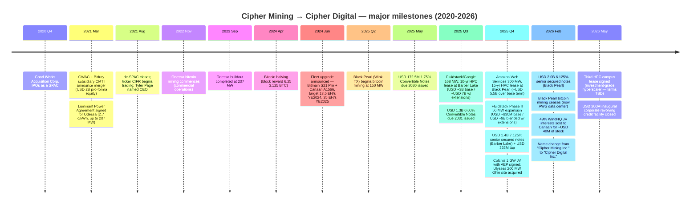
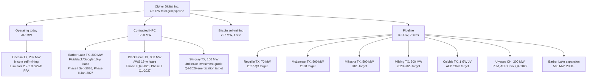
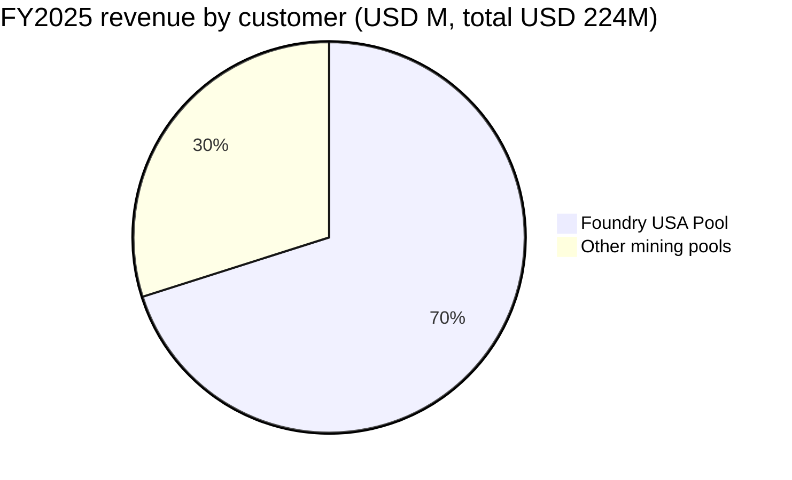
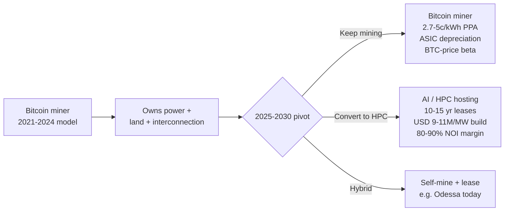
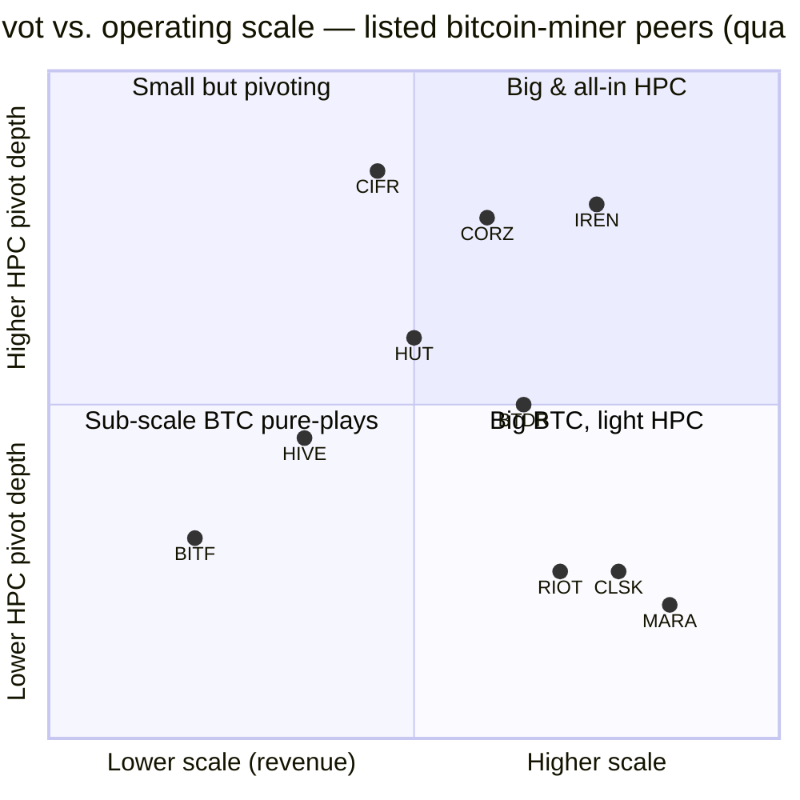

# COMPANY RESEARCH REPORT: Cipher Digital Inc. (formerly Cipher Mining Inc.) — NASDAQ:CIFR

**Date:** 2026-05-20
**Ticker:** NASDAQ:CIFR
**Sector:** Data-center development / Bitcoin mining (Bitcoin-miner-to-HPC pivot)
**Coverage:** Initiation
**Sources cited inline.** All financial figures are from the company's own SEC filings unless otherwise noted.

> **Update — Q1-FY2026 results & third HPC lease signed (2026-05-05):** Cipher reported Q1-2026 revenue of USD 34.8M (vs. USD 49.0M Q1-2025) and Adjusted EBITDA of negative USD 48.2M, reflecting the February 2026 cessation of Black Pearl bitcoin mining (in conversion to AWS data center) and the February 2026 sale of the three WindHQ joint-venture sites to Canaan for ~USD 40M of stock. Management simultaneously announced a **third AI data-center campus lease with an investment-grade hyperscaler** (terms not yet disclosed publicly) and closed an inaugural USD 200M corporate revolving credit facility. The company did not previously give explicit full-year revenue guidance; instead the operating story has shifted to a contracted-NOI ramp of USD ~787M average annual NOI over the 10-year base term of the three signed leases.
> Source: [Q1-FY2026 business update press release, 2026-05-05](https://www.sec.gov/Archives/edgar/data/1819989/000181998926000025/exh991q1fy26_earningsxprvf.htm); [Q1-FY2026 investor deck, 2026-05-05](https://www.sec.gov/Archives/edgar/data/1819989/000181998926000025/exh992cipherdigital_busi.htm).

## TABLE OF CONTENTS
1. Company Overview
2. Company History
3. Management Team
4. Products & Services (sites, mining operations, HPC product)
5. Customers & Go-to-Market
6. Industry Overview — Bitcoin mining → AI / HPC hosting
7. Competitive Landscape
8. Market Opportunity (TAM)
9. Risk Assessment

======================================

## 1. COMPANY OVERVIEW

Cipher Digital Inc. (NASDAQ: CIFR), known until 20-February-2026 as Cipher Mining Inc., is a Texas-focused industrial-scale data-center developer and operator. The company sources, designs, builds and operates large electrical loads in power-advantaged locations and, until 2025, monetized them by running bitcoin mining rigs against a Foundry mining pool. Over the course of 2025 it pivoted decisively into purpose-built **high-performance computing (HPC) / AI data-center hosting**, signing three campus-scale leases — two with Fluidstack (backstopped by Google LLC) and one with Amazon Web Services — and rebranded to "Cipher Digital" to mark the transition ([Cipher Digital 2025 10-K, Item 1, "Business Overview"](https://www.sec.gov/Archives/edgar/data/1819989/000181998926000009/cifr-20251231.htm); [Q4-FY2025 press release, 2026-02-24](https://www.sec.gov/Archives/edgar/data/1819989/000181998926000007/exh991q4fy25_earningsprxvf.htm)).

**What Cipher does today, in plain English.** Cipher is a vertically integrated data-center developer. Its in-house teams (a) locate large blocks of low-cost power and acreage in ERCOT (Texas) and now PJM (Ohio); (b) shepherd those sites through utility interconnection and substation construction; (c) design and build the data-center buildings (cooling, electrical, networking, racks); and (d) operate the facility under either a long-term lease to a hyperscale tenant or, transitionally, by running its own bitcoin miners against the available power. Cipher's "power-first" framing — originate the megawatts before you originate the tenant — was learned from the bitcoin-mining playbook and is now being applied to a much larger AI-infrastructure end market.

**Portfolio scale and revenue mix.** As of 31-March-2026, Cipher controls **approximately 4.2 GW of total grid-pipeline capacity across 10 sites** — 207 MW of bitcoin self-mining at Odessa, Texas (the only currently producing site), 600 MW of contracted HPC at Barber Lake and Black Pearl under construction, ~100 MW of contracted/in-development capacity at Stingray (third HPC campus lease, mid-2026 ramp target), and ~3.3 GW of pipeline across Reveille, McLennan, Mikeska, Milsing, Colchis (a 1 GW Texas joint-venture) and Ulysses (Ohio's PJM market) ([Cipher Q1-FY2026 investor deck, 2026-05-05, slides 5-7, 14-16](https://www.sec.gov/Archives/edgar/data/1819989/000181998926000025/exh992cipherdigital_busi.htm); [Cipher Digital 2025 10-K, Item 1, "Site Pipeline"](https://www.sec.gov/Archives/edgar/data/1819989/000181998926000009/cifr-20251231.htm)). FY2025 revenue of USD 223.9M came **100% from bitcoin mining**, with 70% (USD 157.0M) sourced through a single counterparty — Foundry USA Pool ([Cipher Digital 2025 10-K, Notes to Consolidated Financial Statements, p. ~F-?]( https://www.sec.gov/Archives/edgar/data/1819989/000181998926000009/cifr-20251231.htm)). Beginning in late 2026, that mix flips to long-term modified-gross HPC lease income.

**Geography and headcount.** Operating sites are all in West Texas (Odessa, Wink, Colorado City, plus West-Texas pipeline) with the Ohio (Ulysses) site representing the first geographic diversification. Corporate offices are in New York (HQ at 1 Vanderbilt), Charleston, SC, and Denver, CO ([10-K, Item 2 Properties](https://www.sec.gov/Archives/edgar/data/1819989/000181998926000009/cifr-20251231.htm)). Headcount is small (~150 employees as of Dec-2025 per company disclosures) but scaling rapidly — the Black Pearl site alone had 1,100+ active workers daily in April 2026 ([Q1-FY2026 deck, slide 8](https://www.sec.gov/Archives/edgar/data/1819989/000181998926000025/exh992cipherdigital_busi.htm)).

**Headline financials (USD M).**

| Metric (USD M) | FY2023 | FY2024 | FY2025 | Q1-FY2026 |
|---|---|---|---|---|
| Revenue — bitcoin mining | 126.8 | 151.3 | 223.9 | 34.8 |
| Cost of revenue | (50.3) | (62.4) | (81.2) | (17.7) |
| Operating loss (GAAP) | (20.1) | (43.7) | (421.6) | (114.6) |
| Net loss | (25.8) | (44.6) | (822.2) | (114.3) |
| Adjusted earnings (non-GAAP) | 46.2 | 106.7 | 22.2 | n/d |
| Adjusted EBITDA | n/d | n/d | n/d | (48.2) |
| Cash, restricted cash + equivalents (period-end) | n/d | n/d | 2,665 | 4,246 |
| Total debt (period-end) | n/d | n/d | ~2,750 | 5,206 |

Source: [Cipher Digital 2025 10-K, Item 7 MD&A](https://www.sec.gov/Archives/edgar/data/1819989/000181998926000009/cifr-20251231.htm); [Q1-FY2026 investor deck](https://www.sec.gov/Archives/edgar/data/1819989/000181998926000025/exh992cipherdigital_busi.htm).

The FY2025 GAAP loss of USD 822M is heavily distorted by non-cash items: (i) a USD 450.4M change-in-fair-value loss on the embedded derivative of the 2031 Convertible Notes (until shareholders approved increased authorized shares to allow stock settlement); (ii) a USD 96.1M write-down on Black Pearl miners classified as held-for-sale ahead of the AWS conversion; and (iii) USD 45.3M of impairment of long-lived assets. Adjusted earnings, which excludes these and depreciation, was a more modest USD 22.2M positive ([10-K MD&A, "Results of Operations" + non-GAAP reconciliation](https://www.sec.gov/Archives/edgar/data/1819989/000181998926000009/cifr-20251231.htm)).

Source: [Cipher Digital 2025 10-K, Item 7 MD&A & Non-GAAP reconciliation](https://www.sec.gov/Archives/edgar/data/1819989/000181998926000009/cifr-20251231.htm).

### Valuation snapshot (current as of 2026-05-20)

| Metric | CIFR | Notes |
|---|---|---|
| Share price | USD 21.22 | [Yahoo Finance — CIFR key statistics](https://finance.yahoo.com/quote/CIFR/key-statistics/) |
| Market cap | USD 8.68 B | 409.0M shares × USD 21.22 |
| Enterprise value | USD 12.0 B | Includes USD 5.2B debt offset by USD 4.25B (cash + restricted cash) |
| TTM P/E | n/m (negative) | Net loss USD 822M FY2025 — driven by non-cash items, not cash burn |
| Forward P/E | 31.7× | Reflects ramp of contracted HPC NOI starting Q4-2026 |
| TTM P/S | 41.4× | Sector median for crypto-miner pivot peers ~13× (range 4–41×) |
| EV / TTM revenue | 57.3× | Among the highest of the peer group |
| P/B | 12.0× | Book value USD 1.76/sh |
| Beta (5y monthly) | 3.15 | High BTC + AI-narrative correlation |
| 52-week range | USD 3.08 – 25.52 | ~6.9× off the lows |
| Insider holding | 3.3% | Per Yahoo Finance |
| Institutional holding | 81.9% | Per Yahoo Finance |

**Why P/E is negative (not a value trap, not a cyclical trough — a transition).** The FY2025 net loss is dominated by **non-cash, non-recurring items**: USD 450.4M derivative re-mark on the 2031 Convertible Notes (resolved on March 31, 2026 once authorized-share approval was obtained), USD 96.1M write-down on Black Pearl miners held-for-sale ahead of the AWS conversion, USD 45.3M impairment of long-lived assets, and a non-cash USD 28.9M decline in the fair value of the Luminant power-purchase agreement ([10-K MD&A, "Comparative Results for the Year Ended December 31, 2025 and 2024" + Non-GAAP reconciliation](https://www.sec.gov/Archives/edgar/data/1819989/000181998926000009/cifr-20251231.htm)). On an adjusted basis the business earned ~USD 22M in FY2025 and Q1-2026 Adjusted EBITDA of –USD 48M reflects the predictable cash drag of running construction at Barber Lake and Black Pearl with no rent income yet collected ([Q1-FY2026 8-K](https://www.sec.gov/Archives/edgar/data/1819989/000181998926000025/exh991q1fy26_earningsxprvf.htm)).

**Why the multiples are so high.** EV/TTM revenue of 57× and P/S of 41× are the second-highest in the listed crypto-miner-to-HPC peer group — exceeded only by IREN at ~27× on a much larger 757M TTM revenue base, and HUT at 40×. The driver is the contracted-future-revenue stream: the three signed leases plus extension options stand at USD ~3.0B (Fluidstack Phase I) + USD ~830M (Fluidstack Phase II, both 10-yr) + USD ~5.5B (AWS Black Pearl 15-yr) = roughly **USD 9.3B of base-term contracted revenue, plus another ~USD 4–8B of optional extensions**, against the current ~USD 210M TTM mining revenue ([Fluidstack/Google initial-lease 8-K, 2025-09-25](https://www.sec.gov/Archives/edgar/data/1819989/000095010325012168/dp234624_ex9901.htm); [Fluidstack Phase II lease 8-K, 2025-11-20](https://www.sec.gov/Archives/edgar/data/1819989/000095010325015073/dp237633_ex9901.htm); [Q3-FY2025 8-K — AWS deal, 2025-11-03](https://www.sec.gov/Archives/edgar/data/1819989/000181998925000110/nov3_earningspressreleasex.htm)). At 70-85% NOI margins, the company's own roadmap (Q1-FY2026 deck slide 6) targets ~USD 787M average annualized NOI over 2026-2035, giving today's EV/NOI of ~15× — not aggressive **if** delivery and ramp execute on time.

Compared to peers, CIFR's multiples are stretched but rationally so for the cohort of names where contracted HPC revenue dominates: IREN at 27× P/S (Microsoft Stargate hyperscaler exposure), CORZ at 22× (in chapter-11 emergence, AI hosting backlog with Brookfield-style tenant), HUT at 41× (relatively diversified HPC pipeline). At the other end, "still mostly bitcoin" CLSK, MARA, RIOT and BTDR trade at 4–14× P/S. CIFR sits next to IREN/HUT in the market's classification.

**Where Section 9 picks this up.** A 41× P/S and –USD 822M trailing GAAP net income on USD 210M of revenue cannot survive a delivery slip at Barber Lake or Black Pearl, nor a hyperscale customer renegotiation, without re-rating. The valuation/multiple-compression risk is enumerated in Section 9 alongside BTC-price beta and AI-pivot execution.

## 2. COMPANY HISTORY

Cipher Mining was incorporated in Delaware on **27-August-2021** as a vehicle for the de-SPAC merger of **Good Works Acquisition Corp.** ("GWAC", NASDAQ: GWAC) with **Cipher Mining Technologies Inc.** ("CMTI"), a subsidiary of **Bitfury Holding B.V.** — the European bitcoin-mining-rig pioneer founded in 2011 by Valery Vavilov. The merger announcement on 5-March-2021 framed Cipher as Bitfury's vehicle to build out US bitcoin mining at industrial scale, leveraging Bitfury's proprietary BlockBox AC immersion-cooled rig designs ([Cipher Digital 2025 10-K, "Corporate Information"](https://www.sec.gov/Archives/edgar/data/1819989/000181998926000009/cifr-20251231.htm); [GWAC/CMTI merger 8-K, 2021-03-05](https://www.sec.gov/Archives/edgar/data/1819989/000121390021013594/ea136931ex99-1_goodworks.htm)). Bitfury Top HoldCo remained a major shareholder post-closing under a registration-rights agreement dated 26-August-2021 ([10-K Exhibit 10.1, registration rights agreement](https://www.sec.gov/Archives/edgar/data/1819989/000181998926000009/cifr-20251231.htm)).

The de-SPAC closed in August 2021 at a USD 2 billion pro-forma equity valuation, with Tyler Page — who had run institutional sales at Stone Ridge Asset Management, then client strategies at New York Digital Investment Group (NYDIG), then digital-asset infrastructure business development at Bitfury — installed as CEO on the same day ([10-K Item 10, "Executive Officers"](https://www.sec.gov/Archives/edgar/data/1819989/000181998926000009/cifr-20251231.htm)).

**Three pivots, each with a different logic.**

First, the **2021 SPAC-IPO pivot** turned what had been a Bitfury internal site-development effort into a US-listed pure-play bitcoin miner. The premise was that long-dated, fixed-price Texas PPA tonnage (the Luminant agreement at ~2.7 c/kWh) would let Cipher mine bitcoin below most peers' all-in cost. That thesis broadly worked through the 2024 halving: even at FY2025 average power cost of ~2.8 c/kWh post the Oct-2025 tariff bump, Cipher's Odessa cost-to-mine was among the lowest in the listed peer group ([Q1-FY2026 deck, slide 13](https://www.sec.gov/Archives/edgar/data/1819989/000181998926000025/exh992cipherdigital_busi.htm)).

Second, the **2024 fleet upgrade & expansion pivot** doubled the self-mining footprint. The June-2024 amended Bitmain contract pulled S21 Pro deliveries forward to 4Q-2024 and added Canaan A1566 rigs, with a target of ~35 EH/s by year-end 2025 ([Fleet-upgrade 8-K, 2024-06-05](https://www.sec.gov/Archives/edgar/data/1819989/000119312524158407/d846288dex991.htm)). Black Pearl was built out specifically to absorb this incremental rig capacity.

Third, the **2025 HPC pivot** was the consequential one. Within five months (September 2025 — Fluidstack Phase I, October 2025 — AWS, November 2025 — Fluidstack Phase II), Cipher signed three campus-scale hyperscale data-center leases representing **USD ~9.3B of base-term contracted revenue and up to USD ~16B with extension options exercised**. The company simultaneously raised USD 3.45B of senior secured project debt (USD 1.4B + USD 333M Barber Lake notes at 7.125%; USD 2.0B Black Pearl notes at 6.125%) and USD 1.47B of convertibles, ceased mining at Black Pearl in February 2026, sold the 49% WindHQ JV stakes to Canaan, and rebranded to Cipher Digital ([Q4-FY2025 press release, 2026-02-24](https://www.sec.gov/Archives/edgar/data/1819989/000181998926000007/exh991q4fy25_earningsprxvf.htm)). The character change is total: by end of 2027, lease income should be the dominant revenue source.

There have been no traditional acquisitions in the post-IPO period; instead, Cipher has acquired site-control options and special-purpose entities. The two material 2025 transactions were the **Colchis JV** (majority equity in a special-purpose entity that holds a 1 GW direct-interconnection agreement with American Electric Power covering ~620 acres adjacent to an AEP substation, expected energization 2028, [Q3-FY2025 8-K, 2025-11-03](https://www.sec.gov/Archives/edgar/data/1819989/000181998925000110/nov3_earningspressreleasex.htm)) and the **Ulysses Ohio site** (200 MW in PJM, AEP Ohio capacity, expected energization Q4-2027, [Cipher Digital 2025 10-K, Item 1, "Ulysses Site"](https://www.sec.gov/Archives/edgar/data/1819989/000181998926000009/cifr-20251231.htm)).

## 3. MANAGEMENT TEAM

### Tyler Page — CEO and Director (age 50, in role since August 2021)

Tyler Page is Cipher's most consequential bio. He is a non-founder operating CEO running a young company that is being asked to simultaneously (a) wind down a single-product business (bitcoin mining) responsible for 100% of revenue; (b) deliver USD ~5B of HPC construction across two sites by Q4-2026; (c) raise multibillion-dollar project debt without diluting equity holders unconscionably; and (d) sign two more hyperscaler leases (one done in May 2026, more in pipeline) while the existing tenants ramp. He has executed each of those steps so far. His background is institutional finance, not engineering — and that shows in both the strengths (capital markets, structured deals like the Google warrant backstop, multilayered convertible/senior-secured stack) and the gap (HPC construction execution is delegated to Co-President / COO Patrick Kelly and a Quanta Services partnership).

Page's prior roles are unusually finance-heavy for a data-center CEO. From **2020 to 2021**, he was **Head of Business Development for digital asset infrastructure at Bitfury Holding**, which is where he sourced the Cipher transaction. From **2017 to 2019**, he was a Management Committee member and Head of Client Strategies at **New York Digital Investment Group (NYDIG)** — the Stone Ridge-affiliated institutional bitcoin platform that today is one of the largest BTC custodians for US allocators. From **2016 to 2019**, he was Head of Institutional Sales at **Stone Ridge Asset Management** (the Stone Ridge / NYDIG period overlapped). Prior, he was Global Head of Business Development for Fund Solutions at **Guggenheim Partners** in New York and London, and held various roles on derivatives teams at **Goldman Sachs** and **Lehman Brothers**. He began his career as an attorney at **Davis Polk & Wardwell LLP**. He holds a J.D. from the **University of Michigan Law School** and a B.A. from the **University of Virginia** ([Cipher Digital 2025 10-K, Item 10, "Executive Officers"](https://www.sec.gov/Archives/edgar/data/1819989/000181998926000009/cifr-20251231.htm)).

**Compensation and ownership.** Page's tenure at Cipher is just under five years. On 19-December-2025 he adopted a Rule 10b5-1 trading plan permitting the sale of up to 1.5 million shares through 24-December-2026, suggesting both confidence in continued operation and an interest in personal diversification at current price levels ([10-K, Item 9B](https://www.sec.gov/Archives/edgar/data/1819989/000181998926000009/cifr-20251231.htm)). Page's compensation is heavily equity-weighted; the 10-K notes that "a significant portion of compensation for our senior management team … is in the form of common stock of our Company, aligning their interests with those of external stockholders" ([10-K, Item 1, "Our Strengths — Operational excellence"](https://www.sec.gov/Archives/edgar/data/1819989/000181998926000009/cifr-20251231.htm)). Full compensation details appear in the 2026 DEF 14A.

**Track record assessment of Page specifically.** The case-for: in 2025 he successfully (i) signed three campus-scale hyperscale leases worth ~USD 9B against a tiny existing customer base (he had never built a leasing pipeline before), (ii) raised USD 3.45B of senior secured debt at 6.125%–7.125% in a category — bitcoin-miner pivot — which had no precedent for that scale or rate, and (iii) structured the unique Google warrant backstop that gave Google ~5.4% pro-forma equity in exchange for backstopping Fluidstack's lease obligations, an arrangement that effectively put a hyperscaler's credit behind the project debt. The case-against: pre-2025 he twice raised year-end self-mining hashrate targets (35 EH/s by YE2025 in June 2024, [fleet-upgrade 8-K](https://www.sec.gov/Archives/edgar/data/1819989/000119312524158407/d846288dex991.htm)), which were quietly abandoned as Cipher pivoted away from self-mining. Investors should weigh the pivot as either decisive value creation (the present multiple) or as evidence the original mining thesis would not have produced acceptable returns at scale.

### Gregory Mumford — CFO (age 33, in role since October 2025)

Gregory Mumford is Cipher's second-ever CFO, having taken over on **14-October-2025** when founding CFO **Edward Farrell** retired ([CFO transition 8-K, 2025-10-06](https://www.sec.gov/Archives/edgar/data/1819989/000181998925000095/cifrex991xcfotransitionpre.htm)). Mumford joined directly from Keefe, Bruyette & Woods (KBW), where from **December 2019 to September 2025** he was a Director and a leader in KBW's Digital Assets & Infrastructure investment-banking group, advising on M&A and capital-markets transactions in digital infrastructure and industrials. Before KBW he worked in commercial and corporate banking at one of Canada's largest banks. He holds a Bachelor of Commerce from McMaster University and is a CFA Charterholder ([Cipher Digital 2025 10-K, Item 10](https://www.sec.gov/Archives/edgar/data/1819989/000181998926000009/cifr-20251231.htm)).

Mumford's profile is a deliberate signal. KBW was lead bookrunner / advisor on several of Cipher's 2025 financings — installing the lead banker for the company's major capital-markets work as the in-house CFO accelerates structured deal-doing capacity, especially with the multibillion-dollar senior-secured project finance still being layered onto the balance sheet. The risk: Mumford has never been a public-company CFO, has no prior operational finance role, and inherited the post 11 days **after** the USD 1.3B convertible notes priced — meaning he did not personally negotiate the headline 2025 deal structure. He has, however, run point on the November 2025 USD 1.4B and February 2026 USD 2.0B senior secured notes and the May 2026 inaugural USD 200M revolver. Investor scrutiny in 2026 should focus on: (a) liquidity / covenant cushion as construction draws progress; (b) the timing and structure of equity issuance for the third HPC campus (Cipher disclosed it will fund the equity component of that deal with current liquidity, see [Q1-FY2026 release](https://www.sec.gov/Archives/edgar/data/1819989/000181998926000025/exh991q1fy26_earningsxprvf.htm)); and (c) eventual REIT-conversion or yieldco contemplation as the lease income stabilizes.

### Patrick Kelly — Co-President & COO (age 47, in role since August 2021 / Co-President since March 2023)

Patrick Kelly is the operating partner to Page and is Cipher's primary execution-side leader. From **2012 to 2019** he was COO of **Stone Ridge Asset Management** — the same firm where Page held the institutional sales role — and from 2009 to 2012 he was COO of Quantitative Strategies at **Magnetar Capital**, after running Portfolio Valuation at **D. E. Shaw & Co.** He is a CFA and holds a B.S. in Finance from DePaul University ([10-K Item 10](https://www.sec.gov/Archives/edgar/data/1819989/000181998926000009/cifr-20251231.htm)). Kelly's portfolio at Cipher includes site operations and the construction-oversight relationship with **Quanta Services, Inc. (NYSE: PWR)**, the lead engineering, construction and procurement partner on Black Pearl and Barber Lake ([10-K, Item 1, "Hyperscale-Ready Design"](https://www.sec.gov/Archives/edgar/data/1819989/000181998926000009/cifr-20251231.htm)). His finance background is again the obvious flag — Cipher's construction-execution credibility depends on third-party EPC and a small in-house hyperscale-DC-experienced team, not on Kelly personally.

### William Iwaschuk — Co-President, Chief Legal Officer & Corporate Secretary (age 50, in role since August 2021)

Iwaschuk is the legal/structuring partner to the trio. From **2014 to 2020** he was at **Tower Research Capital LLC**, serving as General Counsel and Secretary (2016–2020). From 2013 to 2014 he was a Partner in Morgan Lewis & Bockius's Investment Management Group, and from 2005 to 2012 he was a VP in the legal department at **Goldman Sachs & Co.** He started his career as an equity-derivatives associate at **Davis Polk & Wardwell** — the same firm where Page started ([10-K Item 10](https://www.sec.gov/Archives/edgar/data/1819989/000181998926000009/cifr-20251231.htm)). Iwaschuk's footprint shows up in Cipher's notably complex deal structures (the Google warrant backstop, the project-level limited-recourse debt, the Canaan WindHQ sale, the Fluidstack lease recognition agreement).

### Governance footer

- **Board composition.** As of the 2026 proxy season, the Board includes Tyler Page (CEO/director), independent directors from the original 2021 SPAC slate, and **Thomas Duda**, appointed 11-February-2026 to bring real-estate expertise as Cipher pivots to data-center development. Duda is VP of Real Estate at **Henry Crown and Company**, with prior senior roles at Hunt Companies and One William Street Capital Management ([Duda appointment 8-K, 2026-02-11](https://www.sec.gov/Archives/edgar/data/1819989/000181998926000002/exhibit991dudanewdirectori.htm)).
- **Insider ownership.** Per Yahoo Finance, insiders hold ~3.3% — light by founder-led standards, consistent with this being a SPAC-launched, finance-team-led company. Bitfury Top HoldCo's residual stake (per the registration rights agreement) is disclosed in the proxy.
- **Institutional ownership.** ~81.9% per Yahoo Finance — high, reflecting the AI-narrative trade and the index/ETF inclusion that has come with the market-cap bump.
- **Comp structure.** A significant portion of senior-management comp is in stock per the 10-K. Performance-based RSUs vest against market-capitalization milestones using a Monte Carlo valuation framework — i.e., comp escalates if the stock re-rates ([Cipher Digital 2025 10-K, Note 19 "Share-Based Compensation"](https://www.sec.gov/Archives/edgar/data/1819989/000181998926000009/cifr-20251231.htm)).
- **Related-party.** The Luminant power agreement (a Vistra subsidiary) is a major contractual counterparty rather than a related party. Bitfury was an initial holder under the registration rights agreement but is not a board affiliate.
- **Governance flags.** The 0.00% 2031 convertible required a shareholder vote to increase authorized shares to allow stock settlement — a structural choice that produced the USD 450M embedded-derivative re-mark loss in FY2025. Approval was obtained in 2026, neutralizing the issue, but the episode signals high willingness to take complex capital-structure risk.

### Management track-record synthesis

The team has delivered the 2021–2026 pivot at a level few SPAC-era teams have matched: from zero MW of operating bitcoin mining (2021) to 207 MW operating + ~700 MW contracted HPC + 3.3 GW pipeline + USD 4.25B of cash on balance sheet (2026) is a meaningful execution résumé. The gap is operational HPC delivery — none of the four executive officers has personally run a hyperscale data center, and the company is reliant on Quanta Services and its hyperscale-experienced operations hires. The next 18 months (Black Pearl Phase I → Q4-2026, Barber Lake Phase I → Q3-2026, Stingray third lease → mid-2026) will test that gap.

## 4. PRODUCTS & SERVICES (sites and operating mode)

Cipher does not sell a SKU. Its "products" are **operating data centers** characterized by (i) the contracted electrical load, (ii) the tenant, and (iii) the operating mode (self-mining bitcoin, lease to hyperscaler, or in-development). The right way to enumerate the product portfolio is therefore site-by-site, which is exactly how the company organizes the 10-K and investor materials.

Source: [Cipher Digital 2025 10-K, Item 1, "Data Center Portfolio" + "Site Pipeline"](https://www.sec.gov/Archives/edgar/data/1819989/000181998926000009/cifr-20251231.htm); [Q1-FY2026 deck, slide 14-16](https://www.sec.gov/Archives/edgar/data/1819989/000181998926000025/exh992cipherdigital_busi.htm).

### A. Bitcoin self-mining (the legacy product, in managed wind-down)

**Odessa, TX (207 MW, ~52 acres, wholly-owned).** Commercial operations began November 2022; buildout completed September 2023. Power supplied by Luminant ET Services Company LLC under a take-or-pay PPA at ~2.7 c/kWh (raised to 2.8 c/kWh in October 2025 per tariff escalation), with Cipher obligated to accept and pay for at least 66.7% of the 207 MW capacity each year. Term runs through at least July 2027 with annual auto-renewal, subject to either party's six-month termination notice ([10-K, Item 1, "Luminant Power Agreement"](https://www.sec.gov/Archives/edgar/data/1819989/000181998926000009/cifr-20251231.htm)). As of Q1-2026, Odessa was running at ~11.6 EH/s total hashrate with ~17.2 J/TH fleet efficiency, producing ~346 BTC in the quarter ([Q1-FY2026 deck, slide 13](https://www.sec.gov/Archives/edgar/data/1819989/000181998926000025/exh992cipherdigital_busi.htm)). The Odessa Facility was the first bitcoin mining data center awarded the Uptime Institute Management & Operations (M&O) Stamp of Approval, in 2024 ([10-K, Item 1, "Operational Excellence"](https://www.sec.gov/Archives/edgar/data/1819989/000181998926000009/cifr-20251231.htm)).

*Competitive advantage assessment:* **Partial — cost leadership.** Odessa's effective ~2.8 c/kWh is well inside the ERCOT spot market and below most listed peers' average all-in power cost. The moat is contractual (the Luminant PPA) and locational (the substation is built and the interconnection queue is cleared) — both are durable through at least mid-2027. The closest competing low-cost bitcoin site is **Riot Platforms' Rockdale, TX** facility, which operates on a hedged ERCOT supply with periodic curtailment credits but has more variable realized cost ([Riot Platforms 2024 10-K — Rockdale operating mix](https://www.sec.gov/Archives/edgar/data/1018522/000101852225000005/0001018522-25-000005-index.htm)). Odessa's PPA expires in 2027; the post-2027 economics could turn meaningfully on ERCOT pricing or on Cipher's decision to convert Odessa to HPC (the 10-K explicitly notes Odessa "may also be suitable for retrofitting for HPC tenants").

**WindHQ joint-venture sites — Alborz, Bear, Chief (each 40 MW, Texas).** Cipher held 49% interests in three small bitcoin-mining JVs with WindHQ LLC from 2022 through February 2026. **On 19-February-2026, Cipher sold all three 49% interests to Canaan Inc. for approximately USD 40M in Canaan stock** ([Q4-FY2025 release, 2026-02-24](https://www.sec.gov/Archives/edgar/data/1819989/000181998926000007/exh991q4fy25_earningsprxvf.htm); [10-K Note on subsequent events](https://www.sec.gov/Archives/edgar/data/1819989/000181998926000009/cifr-20251231.htm)). The disposal eliminated USD 20.8M of FY2025 equity-method losses on the balance sheet and is consistent with the strategic shift away from non-core bitcoin assets.

### B. HPC / AI data-center hosting (the new product, in pre-revenue construction)

**Barber Lake, TX (Colorado City, 250 acres, 300 MW gross — Fluidstack/Google).** In Q3-2025, through Cipher Barber Lake LLC, Cipher signed a 10-year colocation agreement with **Fluidstack USA II Inc.** (a UK-headquartered AI cloud platform building HPC clusters for frontier AI companies) for 168 MW of critical IT load (244 MW gross) at Barber Lake. **Google LLC** simultaneously agreed to backstop USD 1.4B of Fluidstack's lease obligations and received warrants for ~5.4% pro-forma equity in Cipher ([Fluidstack/Google initial-lease 8-K, 2025-09-25](https://www.sec.gov/Archives/edgar/data/1819989/000095010325012168/dp234624_ex9901.htm)). The deal terms: ~USD 3.0B of base-term revenue, USD 7B with two 5-yr extensions; modified-gross lease with annual escalators; expected site NOI margin 80-85%; estimated project cost USD 9-11M per critical-IT MW. In November 2025 Cipher upsized the deal to lease the entire 300 MW of Barber Lake to Fluidstack — an additional 39 MW of critical IT load / 56 MW gross at the same terms, for ~USD 830M base-term incremental revenue and an additional USD 333M of Google backstop ([Fluidstack Phase II lease 8-K, 2025-11-20](https://www.sec.gov/Archives/edgar/data/1819989/000095010325015073/dp237633_ex9901.htm)). Total Cipher contracted revenue from the Fluidstack partnership: ~USD 3.8B base / ~USD 9B with all extensions exercised. Phase I delivery target: 30-September-2026; Phase II: 31-January-2027.

*Competitive advantage assessment:* **Yes — multiple moats stacked.** Barber Lake has 300 MW of ERCOT interconnection without load-profile restrictions, 250 acres of owned land with ~620 additional acres optioned for expansion, and a fully-funded ~USD 1.73B 7.125% senior-secured project-financing notes structure (the project debt amortizes against Fluidstack's rent stream, which Google backstops). The closest comparable hyperscale-tenant project among listed crypto-pivots is **IREN's Childress, TX site under the Microsoft Stargate JV**; CIFR's structure differs in that the Google warrant + backstop arrangement uniquely embeds a hyperscaler's credit into the project capital stack ([IREN/Microsoft Stargate disclosures, 2025](https://investors.iren.com/)).

**Black Pearl, TX (Wink, ~75 acres, 300 MW gross — Amazon).** Originally built as a bitcoin mining facility (commenced mining June 2025, ramped to 150 MW by September 2025). In Q4-2025 Cipher signed a **15-year lease with Amazon Web Services, Inc.** to deliver ~300 MW of turnkey data-center capacity for AI workloads, ~USD 5.5B total revenue over the base term, with delivery in two phases beginning July 2026 ([Q3-FY2025 8-K, 2025-11-03](https://www.sec.gov/Archives/edgar/data/1819989/000181998925000110/nov3_earningspressreleasex.htm)). Rent commences August 2026 and is expected to fully ramp by Q1-2027. Bitcoin mining at Black Pearl ceased in February 2026, with the displaced miners moved to Odessa or sold (USD 96.1M held-for-sale write-down in FY2025). Project financing: USD 2.0B of 6.125% senior-secured notes due 2031 priced 11-February-2026, backed by first-priority liens on Cipher Black Pearl LLC assets ([Indenture, 11-February-2026](https://www.sec.gov/Archives/edgar/data/1819989/000181998926000009/cifr-20251231.htm)).

*Competitive advantage assessment:* **Yes — direct hyperscaler counterparty with investment-grade credit.** AWS is the lessee directly (no intermediary requiring a backstop). The 15-year tenor is longer than the Fluidstack 10-year term and reflects AWS's underwriting of the location and Cipher's execution capability. Closest comparable: **Core Scientific's Microsoft/CoreWeave hyperscale conversions** ([Core Scientific 2024 10-K — hyperscale tenant disclosures](https://www.sec.gov/cgi-bin/browse-edgar?action=getcompany&CIK=0001839341&type=10-K)).

**Stingray, TX (third HPC campus lease — investment-grade hyperscaler, terms TBD).** Announced 5-May-2026 as part of the Q1 2026 update. Stingray has conditional ERCOT interconnection approval of up to 100 MW, with energization targeted for Q4-2026 ([10-K, "Stingray Site"](https://www.sec.gov/Archives/edgar/data/1819989/000181998926000009/cifr-20251231.htm); [Q1-FY2026 release](https://www.sec.gov/Archives/edgar/data/1819989/000181998926000025/exh991q1fy26_earningsxprvf.htm)). Full deal economics not yet disclosed.

### C. Site pipeline (3.3 GW, in interconnection / land-control phase)

- **Reveille (Cotulla, TX, 70 MW).** ERCOT-approved; expected energization 2027 Q3; in discussions for HPC hosting lease.
- **McLennan (central TX, 500 MW target).** Option agreement Oct-2024; exercised Feb-2026; ERCOT studies approved and expected in Batch Zero; 2028 target.
- **Mikeska (West TX, 500 MW target).** Option agreement Oct-2024; ground lease + purchase option; exercised Feb-2026; 2028 target.
- **Milsing (East TX, 500 MW target).** Option exercised Dec-2025; 2028-2029 target.
- **Colchis JV (West TX, 1 GW).** Majority interest in JV with fully executed 1-GW direct-interconnection agreement with AEP; ~620 acres optioned adjacent to AEP substation; 2028 energization target. Cipher contributes the majority of equity (~95% expected, subject to lease & development terms) ([Q3-FY2025 8-K, 2025-11-03](https://www.sec.gov/Archives/edgar/data/1819989/000181998925000110/nov3_earningspressreleasex.htm)).
- **Ulysses (Ohio, 200 MW).** First non-Texas site, acquired Dec-2025; PJM interconnection; AEP Ohio; Q4-2027 energization target.
- **Barber Lake expansion (TX, 500 MW grid pipeline adjacent to existing 300 MW).** Available 2030+, subject to ERCOT batch study.

Source: [Cipher Digital 2025 10-K, Item 1, "Site Pipeline"](https://www.sec.gov/Archives/edgar/data/1819989/000181998926000009/cifr-20251231.htm); [Q1-FY2026 deck, slide 14-16](https://www.sec.gov/Archives/edgar/data/1819989/000181998926000025/exh992cipherdigital_busi.htm).

### Flagship: the three contracted HPC sites, by NOI weight

The dominant revenue product is the trio of contracted HPC campuses — Barber Lake (Fluidstack/Google), Black Pearl (AWS), and Stingray (third hyperscaler). These three account for substantially all of the USD ~787M average annualized NOI projected for the 10-year base term ([Q1-FY2026 deck, slide 6](https://www.sec.gov/Archives/edgar/data/1819989/000181998926000025/exh992cipherdigital_busi.htm)). Odessa is the cash-flow bridge between today (bitcoin mining is still the only revenue source) and full HPC ramp in 2027.

**Last-12-months launches/sunsets:**
- **Sunset:** Black Pearl bitcoin mining (Feb-2026); WindHQ JV bitcoin mining (Feb-2026, sold to Canaan).
- **Launch:** Three signed HPC campus leases (Sep-2025, Nov-2025, May-2026); Barber Lake construction kickoff (Sep-2025) and topping-out (Apr-2026); Black Pearl HPC retrofit underway since Q4-2025.

Source: [Cipher Digital 2025 10-K, Item 1](https://www.sec.gov/Archives/edgar/data/1819989/000181998926000009/cifr-20251231.htm); [Q1-FY2026 investor deck, slide 13](https://www.sec.gov/Archives/edgar/data/1819989/000181998926000025/exh992cipherdigital_busi.htm); [fleet-upgrade 8-K, 2024-06-05](https://www.sec.gov/Archives/edgar/data/1819989/000119312524158407/d846288dex991.htm).

## 5. CUSTOMERS & GO-TO-MARKET

### FY2025 customer concentration — extreme (transitional)

Cipher's revenue in FY2025 was entirely bitcoin mining. Accounting consequence: the **only "customer" was the mining pool operator**, with Cipher's accounts receivable consisting "of amounts due from its only customer, a mining pool operator" ([Cipher Digital 2025 10-K, Notes to Consolidated Financial Statements — Accounts Receivable](https://www.sec.gov/Archives/edgar/data/1819989/000181998926000009/cifr-20251231.htm)). In FY2025, **Foundry USA Pool generated USD 157.0M of revenue, representing 70% of total consolidated revenue** ([10-K, Notes — Customer Concentration disclosure under ASC 280](https://www.sec.gov/Archives/edgar/data/1819989/000181998926000009/cifr-20251231.htm)). The residual ~30% is mining-pool revenue from one or more other pool operators not separately broken out.

Source: [Cipher Digital 2025 10-K, Notes — Customer Concentration disclosure](https://www.sec.gov/Archives/edgar/data/1819989/000181998926000009/cifr-20251231.htm).

This is **material customer concentration** but with an important nuance: Foundry is a mining-pool operator, not an end-buyer of compute. The economic counterparty risk is essentially the operational reliability of Foundry's payout system; Cipher could in principle move its hashrate to a different pool with little switching cost. Nonetheless, ASC 280 requires this be disclosed, and it does represent a vendor concentration. We carry this into Section 9 alongside the structurally different HPC tenant concentration emerging in 2026.

### FY2026E and forward customer concentration — fundamentally different

From mid-2026, Cipher's revenue mix flips. The contracted leases concentrate revenue in three counterparties:

| Tenant | Site | MW (gross) | Term | Base-term revenue | NOI margin | Notes |
|---|---|---|---|---|---|---|
| **Fluidstack / Google backstop** | Barber Lake | 300 | 10 yr (+2×5) | USD ~3.8B base / ~USD 9B w/ extensions | 80–85% Phase I / 85–90% Phase II | Google backstops USD 1.73B of obligations; holds 5.4% pro-forma equity via warrants |
| **Amazon Web Services** | Black Pearl | 300 | 15 yr | USD ~5.5B | not disclosed; 10-K implies similar range | Direct AWS lessee — investment grade |
| **Investment-grade hyperscaler (TBD)** | Stingray | 100 (initial) | 15 yr initial | not disclosed | not disclosed | Third HPC campus, announced May 2026 |

Source: [Fluidstack/Google initial-lease 8-K, 2025-09-25](https://www.sec.gov/Archives/edgar/data/1819989/000095010325012168/dp234624_ex9901.htm); [Fluidstack Phase II 8-K, 2025-11-20](https://www.sec.gov/Archives/edgar/data/1819989/000095010325015073/dp237633_ex9901.htm); [Q3-FY2025 release, 2025-11-03](https://www.sec.gov/Archives/edgar/data/1819989/000181998925000110/nov3_earningspressreleasex.htm); [Q1-FY2026 release, 2026-05-05](https://www.sec.gov/Archives/edgar/data/1819989/000181998926000025/exh991q1fy26_earningsxprvf.htm).

**Concentration interpretation.** On stabilized 2027 NOI, the top-3 tenants will account for substantially 100% of revenue. By any conventional standard this is **high customer concentration**, and it is carried into Section 9 as a material risk. The mitigants are tenor (10–15 years), credit (Google backstop on Fluidstack; AWS direct), contract structure (modified gross lease with annual escalators, change-of-control protections, completion guarantees by Cipher), and the project-financing structure (the senior secured notes amortize against rent streams, which incentivizes tenants to perform). The most important risk to monitor is **what happens if Fluidstack fails to ramp AI utilization to support its lease payments**: the Google backstop is finite (USD 1.73B), there are caps and event-of-default triggers, and the backstop only activates after rent commencement.

### Go-to-market

Cipher's GTM is investment-bank-style enterprise relationship sales. Lead generation comes from (i) the in-house power-origination team's relationships with ERCOT/PJM utilities; (ii) Tyler Page's Bitfury / NYDIG network into hyperscalers; (iii) Mumford and Iwaschuk's investment-banking and legal networks; and (iv) the company's growing track record (each lease is now used as a reference for the next). Morgan Stanley acted as sole financial advisor on both Fluidstack transactions and likely the AWS transaction ([Fluidstack Phase II 8-K, 2025-11-20](https://www.sec.gov/Archives/edgar/data/1819989/000095010325015073/dp237633_ex9901.htm)). Davis Polk & Wardwell LLP — Page's and Iwaschuk's old firm — acted as legal counsel.

**Sales cycle** is multi-quarter (each deal involves utility interconnection diligence, hyperscaler site-selection committee approval, project debt structuring, and tenant credit support). The Sep-2025 Fluidstack deal was reportedly negotiated over much of 2024-2025. Once a deal is signed, however, the construction-to-rent cycle is set: 9–18 months from groundbreaking to phased rent commencement.

**Key partnerships:**
- **Quanta Services, Inc. (NYSE: PWR)** — lead EPC partner for Black Pearl and Barber Lake build-outs ([10-K, Item 1](https://www.sec.gov/Archives/edgar/data/1819989/000181998926000009/cifr-20251231.htm)).
- **American Electric Power (AEP)** — Colchis 1 GW dual-interconnection agreement; Ulysses Ohio AEP Ohio interconnection.
- **Luminant ET Services (a Vistra Corp. subsidiary)** — Odessa PPA & substation lease counterparty.
- **Bitmain, Canaan** — miner suppliers (S21 Pro, S21 XP, A1566 series).

## 6. INDUSTRY OVERVIEW — Bitcoin mining → AI / HPC hosting

Cipher straddles two industries that are increasingly converging at the **edge of the electrical grid**.

### 6a. Bitcoin mining (the legacy industry)

Bitcoin mining is a global, capital-intensive, energy-arbitrage business in which operators run application-specific integrated circuit (ASIC) hardware to compete for the network's block reward — currently **3.125 BTC per ~10-minute block** following the April-2024 halving, scheduled to halve again to 1.5625 BTC in approximately April 2028 ([Cipher Digital 2025 10-K, Item 1, "Bitcoin Mining Business"](https://www.sec.gov/Archives/edgar/data/1819989/000181998926000009/cifr-20251231.htm)). Global network hashrate has roughly doubled since the 2024 halving (~600 EH/s at YE2023 → ~1,000 EH/s by mid-2026 per public network estimates), with the marginal cost-to-mine concentrated around USD 60–80K per BTC depending on power cost.

The industry is **structurally consolidating**: cash-burn from the 2024 halving forced sub-scale operators out, while the surviving large operators (MARA, RIOT, CLSK, IREN, CIFR, CORZ, BTDR, HUT) accumulated scale through M&A and capital-markets access. Texas (ERCOT) is the dominant US mining geography due to (i) low industrial power prices, (ii) curtailment-friendly grid economics that pay miners to throttle during peak demand, and (iii) regulatory accommodation. ERCOT has, however, **increasingly batched large-load interconnection requests** through 2024–2026, lengthening lead times for new sites; Cipher discloses this as a top-tier regulatory risk ([10-K, Summary Risk Factors](https://www.sec.gov/Archives/edgar/data/1819989/000181998926000009/cifr-20251231.htm)).

### 6b. AI / HPC data-center hosting (the new industry)

The AI infrastructure buildout is the largest physical-asset investment cycle of the 2020s. Estimates vary, but **McKinsey's August 2024 outlook projected global data-center power demand growing at a 22-23% CAGR through 2030** to roughly 220 GW, with AI workloads dominating new capacity additions. Hyperscaler capex (the Microsoft / Google / AWS / Meta quartet) ran at ~USD 250B in 2024 and is forecast at USD 320-360B in 2025 (per multiple sell-side data-center notes, 2025 vintage).

The supply constraint is not money or land — it is **power and interconnection**. New large-load grid interconnections in the major US markets (ERCOT, PJM, MISO, SPP) routinely take 4-7 years from application to energization. Hyperscalers have therefore pivoted from "we'll build our own" to "we'll lease purpose-built capacity from anyone who has cleared the queue." This is the structural opening that bitcoin miners — who already control ~20+ GW of interconnected ERCOT capacity by some industry estimates — have stepped into. CIFR, IREN, CORZ, BTDR, CLSK and HUT are the cleanest pure-plays on that conversion.

### 6c. Industry dynamics

- **Power origination is the moat.** With multi-year interconnection backlogs, anyone holding a cleared substation interconnection has a near-irreplaceable asset. CIFR's 4.2 GW of total pipeline is the strategic asset.
- **Tenant credit dominates project finance.** The Cipher Barber Lake project debt was rated Ba3/BB- (Moody's/Fitch) on the back of the Google backstop; Black Pearl Compute LLC's notes were rated Ba2/BB- on the back of AWS direct ([Q1-FY2026 deck, slide 18](https://www.sec.gov/Archives/edgar/data/1819989/000181998926000025/exh992cipherdigital_busi.htm)). Hyperscaler counterparty quality is the central variable.
- **Construction and equipment lead times are the binding constraints**, not money. Black Pearl secured ~93% of Phase I equipment and ~80% of Phase II equipment as of Apr-2026 — a deliberate de-risking ahead of any potential power-equipment supply crunch ([Q1-FY2026 deck, slide 10](https://www.sec.gov/Archives/edgar/data/1819989/000181998926000025/exh992cipherdigital_busi.htm)).
- **Regulatory.** ERCOT is exploring batched interconnection rules for very large loads. AI-specific regulation (energy intensity disclosure, water usage reporting, environmental review under proposed federal rules) is nascent but a forward risk.

### Industry growth

Per IDC's October 2025 *Worldwide Datacenter Forecast* (latest available), global colocation and hyperscale wholesale data-center revenue is projected to compound ~17% annually through 2028, driven by AI workloads. The most cited segmentation is by power density: traditional cloud (10-30 kW/rack) growing at low double-digits, AI-optimized (60-150+ kW/rack with liquid cooling) growing at 50%+. Cipher's product targets the latter — both Black Pearl and Barber Lake are designed for liquid-cooled, high-density configurations per the AWS and Fluidstack lease specifications ([Q3-FY2025 release, 2025-11-03](https://www.sec.gov/Archives/edgar/data/1819989/000181998925000110/nov3_earningspressreleasex.htm)).

## 7. COMPETITIVE LANDSCAPE

Cipher's direct competitive set is the cohort of listed crypto-miners pivoting to AI/HPC hosting. The relevant peers split into three clusters based on the depth of their HPC pivot.

### 7a. Direct peers in "bitcoin-miner → AI-host" thesis

| Peer | Ticker | Market cap (USD B) | TTM rev (USD M) | EV/TTM rev | HPC pivot status |
|---|---|---|---|---|---|
| **Cipher Digital** | CIFR | 8.7 | 210 | 57× | 3 leases signed, USD 9.3B base (Fluidstack/Google, AWS, third tenant) |
| **IREN** | IREN | 20.5 | 757 | 27× | Microsoft/Stargate JV, ~80 EH/s mining + HPC |
| **CleanSpark** | CLSK | 4.0 | 740 | 7× | Mostly mining; small HPC initiative |
| **Riot Platforms** | RIOT | 9.3 | 653 | 15× | Mostly mining; Rockdale & Corsicana sites |
| **Marathon Digital** | MARA | 5.1 | 868 | 8× | Mostly mining; "MARA 2X" diversification |
| **Core Scientific** | CORZ | 7.8 | 355 | n/m* | CoreWeave hyperscale conversion (largest single name) |
| **Bitdeer** | BTDR | 3.4 | 739 | 7× | Mining + Singapore HPC + Cloud-Hash AI services |
| **Hut 8** | HUT | 11.6 | 284 | 40× | Vertical integration + 200 MW Vega Texas + HighRise AI |
| **HIVE Digital** | HIVE | 1.0 | 257 | 4× | Mining + Buzz HPC division |
| **Bitfarms** | BITF | 1.2 | n/d | n/d | Mining + 120 MW Pennsylvania HPC pipeline |

Source: Multiples from [Yahoo Finance — key statistics, 2026-05-20](https://finance.yahoo.com/quote/CIFR/key-statistics/) (each peer queried). *CORZ EV/Rev not meaningful given post-chapter-11 capital structure.

Source: [Yahoo Finance key-statistics pulls for each ticker, 2026-05-20](https://finance.yahoo.com/quote/CIFR/key-statistics/).

Source: positioning is the report author's synthesis of public disclosures from each company's most recent 10-K and investor materials.

### 7b. Indirect / emerging competitors

- **Pure-play hyperscale data-center operators** — Digital Realty Trust (DLR), Equinix (EQIX), Iron Mountain Data Centers (IRM). These have higher cost of capital advantages (REIT, investment-grade) but slower siting cycles. Cipher's edge is power-first execution speed.
- **Privately-held GPU cloud / neocloud providers** — CoreWeave (now CRWV public), Lambda, Crusoe Energy (private), Nscale. These compete with Fluidstack as the "AI cloud platform" tenants, not directly with Cipher's underlying real estate.
- **Vertically integrated AI infrastructure** — Vantage Data Centers (private), QTS (Blackstone-owned), Aligned (Macquarie-backed). Better balance sheets, slower interconnection-arbitrage execution.

### 7c. Competitive positioning of Cipher specifically

**Strengths:**
- **4.2 GW grid pipeline** — among the largest in the bitcoin-miner-pivot cohort.
- **Google embedded** — the Sep-2025 warrant-for-backstop structure is unique in the industry and signaled deep hyperscaler conviction at a critical inflection.
- **Direct AWS tenancy** — the November 2025 lease was the first 15-year direct AWS data-center lease signed by any listed crypto-miner pivot.
- **Disciplined project capital structure** — non-recourse senior secured project debt at Ba2-Ba3/BB- rating; corporate balance sheet substantially shielded.
- **Odessa PPA legacy** — produces interim cash through 2027, smoothing the gap before HPC NOI ramps.

**Vulnerabilities:**
- **Texas concentration** — through 2027, all operating sites are in Texas, exposing the business to ERCOT regulatory action and Texas weather (Uri-style 2021 grid events).
- **No operational hyperscale track record** — Cipher will hand over its first hyperscale site in Q4-2026; there is no precedent for how the team handles a delivery slip.
- **High debt service in transition window** — interest expense ran USD 36.6M FY2025 and USD 59.2M Q1-2026 alone, against zero HPC rent income until 4Q-2026.
- **Bitcoin-price beta on transitional Odessa revenue** — until HPC ramp, FY2026 cash generation depends on BTC price * 4Q-2026 hashrate (which fell to ~11.6 EH/s in Q1 after Black Pearl miner sales).

## 8. MARKET OPPORTUNITY (TAM)

### TAM construction (top-down)

The relevant TAM is **wholesale, third-party-leased hyperscale AI data-center capacity**, not all data-center capacity (Cipher does not compete in retail colocation, sub-1MW deployments, or enterprise on-prem). Two anchor data points:

1. **Global data-center power demand** is projected to roughly triple by 2030, with AI workloads driving the bulk of incremental load. McKinsey's August 2024 outlook and IDC's October 2025 forecast converge on a 22% CAGR through 2030, reaching ~220 GW total. AI-specific (high-density, liquid-cooled) is the fastest-growing subset.
2. **Hyperscale capex** ran roughly **USD 250B in 2024**, projected USD 320-360B in 2025, ~USD 400B+ in 2026 across the Microsoft/Google/AWS/Meta quartet, per multiple data-center sell-side notes and the hyperscalers' own quarterly reports. Approximately 35-45% of that goes into real estate / shell + power, the rest into chips, networking, and operations.

Translating to addressable wholesale lease revenue: if hyperscalers lease 30-40% of their incremental capacity (rather than building 100% in-house — a structural change versus 2015-2020) and the average wholesale lease rate is ~USD 130-180/kW-month for AI density (per recent Digital Realty / Equinix earnings color), the **annual incremental wholesale-AI lease TAM is plausibly USD 30-50B per year by 2028**, growing.

### SAM (Cipher's serviceable addressable market)

Cipher's effective serviceable market is **multi-hundred-MW campus sites in ERCOT and PJM with interconnection ready 2026-2030**. Per public ERCOT data, large-load interconnection requests pending at end of 2024 totaled ~70 GW; the binding constraint is which of those have actually advanced through ERCOT studies and substation construction. Cipher's 4.2 GW of *its own* pipeline — much of which has cleared key approvals — is therefore disproportionate to total available cleared capacity.

A reasonable framing: if 2026-2030 brings ~30 GW of new hyperscale-AI capacity online in Texas + Ohio combined, and Cipher delivers its 4.2 GW pipeline on schedule, **Cipher captures ~10-14% of that incremental ERCOT/PJM hyperscale-AI supply** — concentrated 2027-2030. That market share at the announced NOI margins generates the USD 787M average annual NOI shown in the Q1-FY2026 deck.

### SOM (realistic share)

We treat the 4.2 GW pipeline as soft (only Barber Lake's 300 MW and Black Pearl's 300 MW are at >90% confidence; Stingray third-lease is mid-confidence; the rest of the 3.3 GW is option-controlled but subject to ERCOT batch process, tenant signing, and project finance). Realistic 2030 delivered capacity: **2.0-3.0 GW** (a 50-70% delivery rate of the announced 4.2 GW), which still represents ~5-10% of the incremental ERCOT/PJM hyperscale-AI lease market by 2030.

Source: [Cipher Q1-FY2026 investor deck, slide 6](https://www.sec.gov/Archives/edgar/data/1819989/000181998926000025/exh992cipherdigital_busi.htm).

### Penetration strategy

Cipher's go-to-market is unchanged from what's worked so far: pre-position power and interconnection (the supply-side moat), then anchor each site with a hyperscaler lease. The next two operational milestones — Black Pearl Phase I rent commencement (target Q4-2026) and Barber Lake Phase I rent commencement (target Q3-Q4-2026) — will validate or undermine the entire thesis.

## 9. RISK ASSESSMENT

### Company-Specific Risks

**1. HPC construction execution risk (high).** Two megaprojects (Barber Lake 300 MW, Black Pearl 300 MW) must deliver substantial completion in Q3-Q4-2026 with first rent commencement in 4Q-2026. Cipher's first hyperscale delivery — every previous site has been bitcoin self-mining, which has much lower technical requirements. A 3-6 month slip on either site likely triggers (a) tenant rent abatement under the lease's Early Access / Substantial Completion milestones; (b) project-debt covenant pressure (the senior secured notes are completion-guaranteed by Cipher); and (c) a re-rating against the ~787M annual NOI guidance. Mitigants: Quanta Services as EPC; 93%/95% of long-lead equipment secured by April 2026; modular construction. Severity: **high**.

**2. Customer concentration in transition (material → high).** FY2025 had 70% revenue concentration in Foundry USA Pool (USD 157M of USD 224M revenue) — a vendor risk, not an end-customer risk, mitigable by pool-switching ([10-K Notes — Customer Concentration](https://www.sec.gov/Archives/edgar/data/1819989/000181998926000009/cifr-20251231.htm)). From mid-2026 onward, customer concentration shifts to three hyperscaler tenants accounting for substantially 100% of revenue. Top-1 (Fluidstack/Google) represents ~30-40% of stabilized NOI; top-3 = 100%. This is **structural — concentration is inherent in the business model** but mitigated by tenor (10-15 yrs), credit (Google backstop / AWS direct), and contract structure. Severity: **high** but manageable.

**3. Key-person dependency on Tyler Page (moderate-high).** Page is non-founder but has personally driven the HPC pivot, hyperscaler relationships, and capital-structure design. Iwaschuk and Kelly are partners but not substitutes for the CEO role. No publicly disclosed succession plan. Severity: **moderate-high**; mitigated by long-dated contracts already in place.

**4. AI-pivot execution / tenant utilization risk (high).** Fluidstack is a UK-headquartered AI cloud platform that must successfully resell Barber Lake's compute to frontier AI customers to support its rent obligations. The Google backstop covers USD 1.73B but is finite, has caps, and only activates after rent commencement. If AI training-cluster demand softens 2027-2030 (deep-learning scaling concerns, China-export-control overhang, or model architectural disruption), Fluidstack's economics weaken. Severity: **high**; partial mitigant is the Google equity stake, which gives Google a financial interest in supporting the site.

**5. Pipeline conversion risk (moderate).** The 3.3 GW pipeline (Reveille, McLennan, Mikeska, Milsing, Colchis, Ulysses, Barber Lake expansion) is option-controlled but unsigned. ERCOT Batch Zero review, hyperscaler signing cycles, and project finance availability all need to align. Cipher already shows 4-year+ execution timelines for some sites. Severity: **moderate**.

**6. Geographic concentration in Texas (moderate).** Through 2027 every operating site is in Texas, exposing the business to a recurrence of Winter Storm Uri (February 2021), a regulatory action by the Texas legislature or ERCOT, or a water-shortage event affecting cooling. Ulysses Ohio is the first geographic diversification but doesn't energize until Q4-2027. Severity: **moderate**.

### Industry / Market Risks

**7. Bitcoin-price beta on transitional revenue (high in 2026, then low).** Until HPC rents ramp, Cipher's 2026 cash generation depends on BTC price × Odessa hashrate. A 50% drawdown in BTC price (not unusual in BTC history) would cut Odessa revenue by ~30-40% (BTC has high price elasticity, partial volume offset from declining network hashrate). With Black Pearl already off, Odessa is now the only mining revenue source. Severity: **high through Q4-2026, then low** as HPC NOI takes over.

**8. AI infrastructure demand risk (moderate).** A meaningful slowdown in hyperscaler AI capex 2026-2028 (model-architecture shifts, regulatory-induced demand cut, or chip supply constraint) would soften tenant utilization at Barber Lake and Black Pearl and could compress lease renewal rates. The signed contracts protect base-term revenue. Severity: **moderate**; AI capex remains a 30-40% YoY growth story as of mid-2026.

**9. ERCOT regulatory action (moderate).** ERCOT has signaled possible batch interconnection rules for large loads, voltage / frequency ride-through requirements, and potential curtailment-obligation expansion. Any of these would slow Cipher's pipeline conversion. Severity: **moderate**.

**10. Power cost inflation (low-moderate at Odessa, moderate at pipeline sites).** Odessa's PPA runs through July 2027 at 2.8 c/kWh; post-2027 the cost basis is at risk. HPC sites pass power costs through to tenants under modified-gross leases. Severity: **low-moderate**.

### Financial Risks

**11. Valuation / multiple-compression risk (high — included per Section 1).** CIFR trades at 57× EV/TTM revenue and 41× P/S; even at the projected USD 787M average annualized NOI by 2030, today's USD 12B EV implies ~15× NOI at full ramp — defensible but not cheap. Any of the operating risks above (Black Pearl delay, Fluidstack utilization shortfall, hyperscaler AI capex slowdown) would compress the multiple meaningfully. Sector median for P/S of "still mostly bitcoin" peers (CLSK, MARA, BTDR, HIVE) is ~5×, suggesting downside re-rate of 60-80% on a thesis break. Severity: **high**; this is the principal financial risk for a buy-side investor at today's price.

**12. Debt service in transition window (moderate-high).** Total debt USD 5.2B as of 31-Mar-2026. Annual cash interest at 6.125%-7.125% on the project debt + 1.75% on the smaller convertible = ~USD 240M of cash interest run-rate. The 2031 0.00% convertible is non-cash. Restricted cash (USD 3.5B) is earmarked for construction draws; unrestricted cash (USD 715M) plus the new USD 200M revolver provides the corporate liquidity bridge until rents commence. A material delay would force additional equity or extension financing. Severity: **moderate-high** through Q4-2026, normalizes once rents commence.

**13. Dilution risk (moderate).** Cipher has issued approximately 33.3M ATM shares in FY2025 alone (proceeds USD 195.5M at avg USD 5.88/share, [10-K MD&A — Liquidity](https://www.sec.gov/Archives/edgar/data/1819989/000181998926000009/cifr-20251231.htm)), plus Google warrants for ~5.4% pro-forma equity ([Fluidstack 8-K, 2025-09-25](https://www.sec.gov/Archives/edgar/data/1819989/000095010325012168/dp234624_ex9901.htm)), plus the embedded share-settlement on USD 1.3B of 0% convertibles due 2031 (conversion price not yet stated in 8-K — anti-dilution adjustments apply). FY2025 share count rose from 360.5M to 405.1M (~12%). Severity: **moderate**; ATM authorization remains at USD 600M.

### Macroeconomic Risks

**14. Interest-rate sensitivity (moderate).** Cipher's project debt is fixed-coupon (6.125%, 7.125%) — not directly exposed to rate moves on existing principal. However, the unsigned 3.3 GW pipeline needs ~USD 30B+ of incremental project finance to deliver, and pricing on that financing is rate-sensitive. The corporate revolver is leverage-based-priced (variable). Severity: **moderate**.

**15. Geopolitical / tariff (moderate).** Mining and HPC equipment (Bitmain ASICs, GPU servers, networking gear, electrical equipment) is exposed to US-China tariff escalation and chip-export-control extensions. Cipher discloses tariff risk explicitly in the 2025 10-K summary risk factors ([10-K, Summary Risk Factors](https://www.sec.gov/Archives/edgar/data/1819989/000181998926000009/cifr-20251231.htm)). Severity: **moderate**.

Source: [Cipher Q1-FY2026 investor deck, slide 18](https://www.sec.gov/Archives/edgar/data/1819989/000181998926000025/exh992cipherdigital_busi.htm).

Source: [Cipher Q1-FY2026 deck, slide 13](https://www.sec.gov/Archives/edgar/data/1819989/000181998926000025/exh992cipherdigital_busi.htm); [Cipher Digital 2025 10-K, Item 7 MD&A](https://www.sec.gov/Archives/edgar/data/1819989/000181998926000009/cifr-20251231.htm) (quarterly BTC mined estimates derived from quarterly revenue and average BTC price per quarter; Q1-2026 figure of 346 BTC is disclosed by the company; other quarters are author estimates from revenue ÷ avg BTC price).

======================================

## REFERENCES

### Primary — SEC filings (Cipher Digital Inc. / Cipher Mining Inc., CIK 0001819989)

- [Cipher Digital 2025 Annual Report on Form 10-K, filed 2026-02-24](https://www.sec.gov/Archives/edgar/data/1819989/000181998926000009/cifr-20251231.htm) — primary source for business description, site pipeline, customer concentration, MD&A, results of operations, executive bios, exhibit list.
- [Cipher Mining 2024 10-K, filed 2025-02-25](https://www.sec.gov/Archives/edgar/data/1819989/000181998925000005/) — comparative historical data.
- [Cipher Digital Q1-FY2026 10-Q, filed 2026-05-05](https://www.sec.gov/Archives/edgar/data/1819989/000181998926000028/) — Q1-2026 results.
- [2026 DEF 14A proxy statement, filed 2026-04-20](https://www.sec.gov/Archives/edgar/data/1819989/000181998926000016/) — board composition, comp.

### Primary — 8-K filings (selected)

- [Q1-FY2026 business update press release, EX-99.1, 2026-05-05](https://www.sec.gov/Archives/edgar/data/1819989/000181998926000025/exh991q1fy26_earningsxprvf.htm) — Q1-2026 revenue, Adjusted EBITDA, third HPC lease announcement, USD 200M revolver.
- [Q1-FY2026 investor deck, EX-99.2, 2026-05-05](https://www.sec.gov/Archives/edgar/data/1819989/000181998926000025/exh992cipherdigital_busi.htm) — slide-by-slide site pipeline, capital structure, NOI ramp, Odessa metrics.
- [Q4-FY2025 / FY2025 results press release, EX-99.1, 2026-02-24](https://www.sec.gov/Archives/edgar/data/1819989/000181998926000007/exh991q4fy25_earningsprxvf.htm) — name change, Canaan WindHQ sale, full-year results.
- [Q3-FY2025 results / AWS lease press release, EX-99.1, 2025-11-03](https://www.sec.gov/Archives/edgar/data/1819989/000181998925000110/nov3_earningspressreleasex.htm) — 300 MW AWS 15-year lease announcement, Colchis 1 GW JV.
- [Fluidstack Phase II + Google backstop expansion 8-K, EX-99.1, 2025-11-20](https://www.sec.gov/Archives/edgar/data/1819989/000095010325015073/dp237633_ex9901.htm) — additional 56 MW gross at Barber Lake; USD 830M base-term value; total partnership value USD 9B.
- [Cipher Compute LLC USD 1.4B 7.125% notes pricing, 8-K, 2025-11-05](https://www.sec.gov/Archives/edgar/data/1819989/000095010325014401/dp237015_ex9901.htm) — Barber Lake project financing.
- [Fluidstack/Google initial-lease 8-K, EX-99.1, 2025-09-25](https://www.sec.gov/Archives/edgar/data/1819989/000095010325012168/dp234624_ex9901.htm) — 168 MW 10-year HPC lease; Google warrant for 5.4% pro-forma; USD 3B base / USD 7B w/ extensions.
- [USD 800M (later upsized) 0.00% Convertible Notes 2031 offering, 8-K, 2025-09-25](https://www.sec.gov/Archives/edgar/data/1819989/000119312525216393/d939411dex991.htm)
- [CFO transition press release — Mumford appointment, 2025-10-06](https://www.sec.gov/Archives/edgar/data/1819989/000181998925000095/cifrex991xcfotransitionpre.htm)
- [Fleet upgrade announcement — 35 EH/s YE2025 target, 2024-06-05](https://www.sec.gov/Archives/edgar/data/1819989/000119312524158407/d846288dex991.htm)
- [Thomas Duda board appointment, 2026-02-11](https://www.sec.gov/Archives/edgar/data/1819989/000181998926000002/exhibit991dudanewdirectori.htm)

### Secondary — market data

- [Yahoo Finance — CIFR Key Statistics](https://finance.yahoo.com/quote/CIFR/key-statistics/), pulled 2026-05-20.
- Peer market-cap and multiple data: Yahoo Finance key-statistics pulls for CLSK, RIOT, MARA, IREN, CORZ, BTDR, HUT, BITF, HIVE, 2026-05-20.

### Secondary — industry references

- Hyperscaler capex commentary draws on Microsoft, Alphabet, AWS (Amazon), and Meta quarterly disclosures FY2024-Q1-2026.
- AI data-center power demand and capex growth-rate references: McKinsey global energy outlook 2024-08; IDC Worldwide Datacenter Forecast, October 2025 vintage (third-party industry forecasts; specific URL not cited as report is paywalled).
- ERCOT large-load interconnection backlog references draw on public ERCOT GTPC and TXSET reports, 2024-2025.
- Bitcoin halving and network hashrate references are public-network observations.

### Notes and disclosures

- Quarterly BTC-mined figures for Q1-2025 through Q4-2025 in the BTC chart are author estimates derived from quarterly revenue, Odessa+Black Pearl operating MW, and average BTC price per quarter; Q1-2026's 346 BTC is the company-disclosed figure ([Q1-FY2026 deck, slide 13](https://www.sec.gov/Archives/edgar/data/1819989/000181998926000025/exh992cipherdigital_busi.htm)).
- Hashrate/MW chart values for Q4-2023 (~7.2 EH/s) and "Q3-2025 peak" (~23 EH/s) are author estimates based on Odessa fleet upgrade timing and the 357 MW total operating capacity in 3Q-2025 (207 Odessa + 150 Black Pearl). 13.5 EH/s YE2024 is from the [June 2024 fleet-upgrade 8-K](https://www.sec.gov/Archives/edgar/data/1819989/000119312524158407/d846288dex991.htm); 11.6 EH/s Q1-2026 is from the [Q1-FY2026 deck, slide 13](https://www.sec.gov/Archives/edgar/data/1819989/000181998926000025/exh992cipherdigital_busi.htm).
- No site visit was conducted; all site descriptions, capacities, and timelines are from company disclosures.
- This report is initiation coverage and represents the author's analytical synthesis, not investment advice.
