# Cipher Mining Inc. (NASDAQ:CIFR) — 公司研究报告

**截至日期: 2026-05-20**
**Ticker: NASDAQ:CIFR**
**Sector: 数据中心开发 / 比特币挖矿 (Bitcoin mining-to-HPC 转型)**
**Coverage: Initiation**
**报告语言: 简体中文 (英文版同时存在于本目录)**
**所引用来源均为公司自身 SEC 文件, 除另有说明者外。**

> **业绩更新 — 2026 财年 Q1 业绩与第三份 HPC (高性能计算) 租赁合同签订 (2026-05-05):** Cipher 公布 2026 财年 Q1 营业收入为 **3,480 万美元** (相较 2025 财年 Q1 的 4,900 万美元), 调整后 EBITDA 为 **-4,820 万美元**, 反映了 2026 年 2 月 Black Pearl 比特币挖矿场 (正转型为 AWS 数据中心) 停产, 以及 2026 年 2 月将 WindHQ 合资公司的三个站点以约 4,000 万美元 Canaan 股票形式出售。管理层同时宣布签订**第三份与投资级超大规模云服务商 (hyperscaler) 的 AI 数据中心园区租约** (具体条款尚未公开披露), 并完成首期 2 亿美元的公司层级循环信贷额度 (revolving credit facility)。公司此前未给出明确的全年营业收入指引; 相反, 经营叙事已转向已签合约 NOI (净营业收入, Net Operating Income) 的爬坡——三份已签租赁合同 10 年基期总平均年度 NOI 约为 **7.87 亿美元**。
> 来源: [2026 财年 Q1 业绩更新新闻稿, 2026-05-05](https://www.sec.gov/Archives/edgar/data/1819989/000181998926000025/exh991q1fy26_earningsxprvf.htm); [2026 财年 Q1 投资者展示材料, 2026-05-05](https://www.sec.gov/Archives/edgar/data/1819989/000181998926000025/exh992cipherdigital_busi.htm)。

## 目录
1. 公司概览
2. 公司历史
3. 管理团队
4. 产品与服务 (站点、挖矿业务、HPC 产品)
5. 客户与上市策略
6. 行业概览 — 比特币挖矿 → AI / HPC 托管
7. 竞争格局
8. 市场机会 (TAM)
9. 风险评估

======================================

## 1. 公司概览

Cipher Digital Inc. (NASDAQ: CIFR), 在 **2026 年 2 月 20 日**之前称为 Cipher Mining Inc., 是一家专注于德州的工业级数据中心开发与运营商。公司在能源优势地区获取、设计、建造并运营大型电力负载, 并在 2025 年之前通过运行比特币矿机对接 Foundry 矿池来实现收益。在 2025 年内, 公司决定性地转型至专门构建的**高性能计算 (HPC, high-performance computing) / AI 数据中心托管业务**, 签署三份园区级租赁合同——两份与 Fluidstack (由 Google LLC 担保支持) 和一份与 Amazon Web Services 签订——并于 2026 年 2 月更名为"Cipher Digital", 以标志这一转型 ([Cipher Digital 2025 10-K, Item 1, "Business Overview"](https://www.sec.gov/Archives/edgar/data/1819989/000181998926000009/cifr-20251231.htm); [Q4-FY2025 新闻稿, 2026-02-24](https://www.sec.gov/Archives/edgar/data/1819989/000181998926000007/exh991q4fy25_earningsprxvf.htm))。

**Cipher 今日的业务通俗解释。** Cipher 是一家垂直整合的数据中心开发商。其内部团队 (a) 在 ERCOT (德州电网) 与 PJM (俄亥俄电网) 寻找大块低成本电力与土地; (b) 推动这些站点通过公用事业互联接入与变电站建设; (c) 设计与建造数据中心建筑 (冷却、电气、网络、机柜); 并 (d) 通过以长期租约出租给超大规模客户, 或者过渡性地运行自有比特币矿机使用现有电力来运营该设施。Cipher 的"电力优先"思路——先获取兆瓦, 再寻找租户——是从比特币挖矿剧本中学来的, 现已应用于规模更大的 AI 基础设施终端市场。

**投资组合规模与营业收入构成。** 截至 2026 年 3 月 31 日, Cipher 控制**约 4.2 GW 总电网管线产能, 覆盖 10 个站点**——德州 Odessa 的 207 MW 比特币自挖矿 (目前唯一在产站点)、在建的 Barber Lake 与 Black Pearl 共 600 MW 已签约 HPC 产能、Stingray (第三份 HPC 园区租赁, 2026 年中爬坡目标) 约 100 MW 已签约/在开发产能, 以及 Reveille、McLennan、Mikeska、Milsing、Colchis (1 GW 德州合资项目) 和 Ulysses (俄亥俄 PJM 市场) 共约 3.3 GW 管线 ([Cipher Q1-FY2026 投资者展示材料, 2026-05-05, slides 5-7, 14-16](https://www.sec.gov/Archives/edgar/data/1819989/000181998926000025/exh992cipherdigital_busi.htm); [Cipher Digital 2025 10-K, Item 1, "Site Pipeline"](https://www.sec.gov/Archives/edgar/data/1819989/000181998926000009/cifr-20251231.htm))。2025 财年营业收入 2.239 亿美元**全部 100% 来自比特币挖矿**, 其中 70% (1.57 亿美元) 来自单一交易对手——Foundry USA Pool ([Cipher Digital 2025 10-K, 合并财务报表附注, p. ~F-?](https://www.sec.gov/Archives/edgar/data/1819989/000181998926000009/cifr-20251231.htm))。从 2026 年末开始, 该构成将转向长期修订式总租赁 (modified-gross lease) HPC 租赁收入。

**地理与员工人数。** 运营站点均位于西德州 (Odessa、Wink、Colorado City, 加上西德州管线), 俄亥俄 (Ulysses) 站点代表首次地理多元化。公司总部设于纽约 (位于 1 Vanderbilt 的总部)、南卡罗来纳州 Charleston, 以及科罗拉多州 Denver ([10-K, Item 2 Properties](https://www.sec.gov/Archives/edgar/data/1819989/000181998926000009/cifr-20251231.htm))。员工人数较少 (根据公司披露, 2025 年 12 月约 150 名员工), 但正在快速扩张——仅 Black Pearl 站点在 2026 年 4 月每日就有 1,100 多名现场工人 ([Q1-FY2026 deck, slide 8](https://www.sec.gov/Archives/edgar/data/1819989/000181998926000025/exh992cipherdigital_busi.htm))。

**主要财务数据 (USD M)。**

| 指标 (百万美元) | FY2023 | FY2024 | FY2025 | Q1-FY2026 |
|---|---|---|---|---|
| 营业收入 — 比特币挖矿 | 126.8 | 151.3 | 223.9 | 34.8 |
| 营业成本 | (50.3) | (62.4) | (81.2) | (17.7) |
| 营业亏损 (GAAP) | (20.1) | (43.7) | (421.6) | (114.6) |
| 净亏损 | (25.8) | (44.6) | (822.2) | (114.3) |
| 调整后盈利 (非 GAAP) | 46.2 | 106.7 | 22.2 | n/d |
| 调整后 EBITDA | n/d | n/d | n/d | (48.2) |
| 现金、受限现金及等价物 (期末) | n/d | n/d | 2,665 | 4,246 |
| 总债务 (期末) | n/d | n/d | ~2,750 | 5,206 |

来源: [Cipher Digital 2025 10-K, Item 7 MD&A](https://www.sec.gov/Archives/edgar/data/1819989/000181998926000009/cifr-20251231.htm); [Q1-FY2026 投资者展示材料](https://www.sec.gov/Archives/edgar/data/1819989/000181998926000025/exh992cipherdigital_busi.htm)。

2025 财年 GAAP 净亏损 8.22 亿美元主要受到非现金项目严重扭曲: (i) 2031 年到期可转债 (Convertible Notes) 嵌入式衍生品公允价值变化损失 4.504 亿美元 (直至股东批准增加授权股份以允许股票结算); (ii) 在 AWS 改造前归类为待售的 Black Pearl 矿机减值 9,610 万美元; 以及 (iii) 长期资产减值 4,530 万美元。调整后盈利 (剔除上述项目及折旧) 为更温和的 2,220 万美元正值 ([10-K MD&A, "Results of Operations" + 非 GAAP 调节表](https://www.sec.gov/Archives/edgar/data/1819989/000181998926000009/cifr-20251231.htm))。

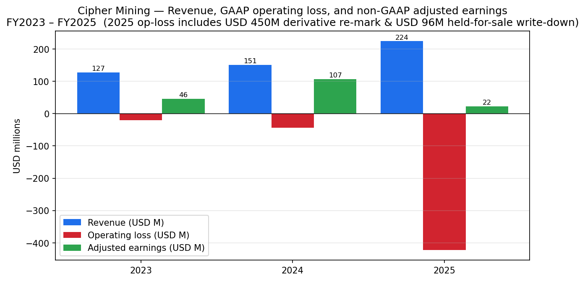
来源: [Cipher Digital 2025 10-K, Item 7 MD&A & 非 GAAP 调节表](https://www.sec.gov/Archives/edgar/data/1819989/000181998926000009/cifr-20251231.htm)。

### 估值快照 (截至 2026-05-20)

| 指标 | CIFR | 备注 |
|---|---|---|
| 股价 | 21.22 美元 | [Yahoo Finance — CIFR 关键统计](https://finance.yahoo.com/quote/CIFR/key-statistics/) |
| 市值 | 86.8 亿美元 | 4.09 亿股 × 21.22 美元 |
| 企业价值 (Enterprise Value) | 120 亿美元 | 包含 52 亿美元债务, 抵消 42.5 亿美元 (现金 + 受限现金) |
| TTM P/E (市盈率) | n/m (负值) | 2025 财年净亏损 8.22 亿美元 — 由非现金项目驱动, 非现金消耗 |
| 远期 P/E | 31.7× | 反映自 2026 年 Q4 开始的已签约 HPC NOI 爬坡 |
| TTM P/S (市销率) | 41.4× | 加密矿企转型同业中位数约 13× (区间 4–41×) |
| EV / TTM 营业收入 | 57.3× | 在同业中处于最高水平 |
| P/B (市净率) | 12.0× | 账面价值 1.76 美元/股 |
| Beta (5 年月度) | 3.15 | 高 BTC + AI 叙事相关性 |
| 52 周区间 | 3.08 – 25.52 美元 | 较低点约 6.9× |
| 内部人持股 | 3.3% | 来源: Yahoo Finance |
| 机构持股 | 81.9% | 来源: Yahoo Finance |

**为何 P/E 为负 (不是价值陷阱、不是周期底部 — 而是转型期)。** 2025 财年净亏损主要由**非现金、非经常性项目**主导: 2031 年可转债的衍生品重估值 4.504 亿美元 (在 2026 年 3 月 31 日获得授权股份批准后解决), AWS 改造前 Black Pearl 矿机的待售减值 9,610 万美元, 长期资产减值 4,530 万美元, 以及 Luminant 电力购买协议 (PPA) 公允价值的非现金下降 2,890 万美元 ([10-K MD&A, "Comparative Results for the Year Ended December 31, 2025 and 2024" + 非 GAAP 调节表](https://www.sec.gov/Archives/edgar/data/1819989/000181998926000009/cifr-20251231.htm))。在调整后基础上, 该业务在 2025 财年盈利约 2,200 万美元; 2026 财年 Q1 调整后 EBITDA 为 -4,800 万美元, 反映了在 Barber Lake 和 Black Pearl 建设期间运行的可预期现金压力, 此时尚未收取任何租金收入 ([Q1-FY2026 8-K](https://www.sec.gov/Archives/edgar/data/1819989/000181998926000025/exh991q1fy26_earningsxprvf.htm))。

**为何倍数如此之高。** EV/TTM 营业收入 57× 与 P/S 41× 在上市加密矿企-HPC 转型同业组合中位居第二高——仅次于 IREN 的 ~27× (在大得多的 7.57 亿美元 TTM 营业收入基础上), 以及 HUT 的 40×。驱动因素是已签约未来营业收入流: 三份已签合约加上延期选择权达到 **~30 亿美元** (Fluidstack Phase I) + **~8.3 亿美元** (Fluidstack Phase II, 均为 10 年期) + **~55 亿美元** (AWS Black Pearl 15 年期) = 约**93 亿美元基期已签约营业收入, 再加上约 40-80 亿美元的可选延期**, 而当前 TTM 挖矿营业收入仅约 2.1 亿美元 ([Fluidstack/Google 初始租约 8-K, 2025-09-25](https://www.sec.gov/Archives/edgar/data/1819989/000095010325012168/dp234624_ex9901.htm); [Fluidstack Phase II 租约 8-K, 2025-11-20](https://www.sec.gov/Archives/edgar/data/1819989/000095010325015073/dp237633_ex9901.htm); [Q3-FY2025 8-K — AWS 协议, 2025-11-03](https://www.sec.gov/Archives/edgar/data/1819989/000181998925000110/nov3_earningspressreleasex.htm))。在 70-85% NOI 利润率下, 公司自身的路线图 (Q1-FY2026 deck slide 6) 目标为 2026-2035 年间平均年化 NOI 约 7.87 亿美元, 这使得今日的 EV/NOI 约为 15×——**如果**交付与爬坡按时执行, 这并不算激进。

与同业相比, CIFR 的倍数虽被拉伸但对于已签约 HPC 营业收入占主导地位的同类公司而言是合理的: IREN 27× P/S (Microsoft Stargate 超大规模云服务商敞口), CORZ 22× (Chapter 11 重整中, 拥有 Brookfield 风格租户的 AI 托管订单), HUT 41× (相对多元化的 HPC 管线)。另一端, "仍以比特币为主"的 CLSK、MARA、RIOT 和 BTDR 估值为 4-14× P/S。CIFR 在市场分类中位列 IREN/HUT 旁边。

**第 9 节将延续这一讨论。** 41× P/S 与 8.22 亿美元 TTM GAAP 净亏损建立在 2.1 亿美元营业收入之上, 这一估值若 Barber Lake 或 Black Pearl 出现交付延期, 或超大规模客户重新议价, 都无法在不重估的情况下存续。估值/倍数压缩风险将在第 9 节连同 BTC 价格 beta 与 AI 转型执行一并列出。

## 2. 公司历史

Cipher Mining 于 **2021 年 8 月 27 日**在德拉瓦州注册成立, 作为 **Good Works Acquisition Corp.** ("GWAC", NASDAQ: GWAC) 与 **Cipher Mining Technologies Inc.** ("CMTI") 进行 de-SPAC 合并的载体, 后者是 **Bitfury Holding B.V.** 的子公司——这家欧洲比特币挖矿机先驱由 Valery Vavilov 于 2011 年创立。2021 年 3 月 5 日的合并公告将 Cipher 定位为 Bitfury 利用自有 BlockBox AC 浸没冷却矿机设计在美国建设工业级比特币挖矿业务的载体 ([Cipher Digital 2025 10-K, "Corporate Information"](https://www.sec.gov/Archives/edgar/data/1819989/000181998926000009/cifr-20251231.htm); [GWAC/CMTI 合并 8-K, 2021-03-05](https://www.sec.gov/Archives/edgar/data/1819989/000121390021013594/ea136931ex99-1_goodworks.htm))。Bitfury Top HoldCo 在交割后根据 2021 年 8 月 26 日签订的注册权协议保留为主要股东 ([10-K Exhibit 10.1, 注册权协议](https://www.sec.gov/Archives/edgar/data/1819989/000181998926000009/cifr-20251231.htm))。

de-SPAC 交易于 2021 年 8 月以 20 亿美元的 pro-forma 股权估值完成, 同一日 Tyler Page 被任命为 CEO——他曾领导 Stone Ridge Asset Management 的机构销售业务, 后在 New York Digital Investment Group (NYDIG) 负责客户策略, 再后在 Bitfury 负责数字资产基础设施业务发展 ([10-K Item 10, "Executive Officers"](https://www.sec.gov/Archives/edgar/data/1819989/000181998926000009/cifr-20251231.htm))。

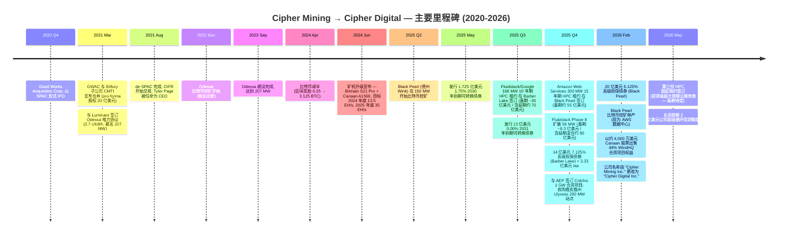

**三次转型, 各有不同逻辑。**

第一, **2021 年 SPAC-IPO 转型**将 Bitfury 内部的站点开发努力转变为美国上市的纯比特币矿企。前提是长期固定价格的德州 PPA 容量 (Luminant 协议约 2.7 c/kWh) 将使 Cipher 能以低于多数同业的全包成本进行比特币挖矿。该逻辑在 2024 年减半前后基本奏效: 即使在 2025 年 10 月电价上调后, 2025 财年平均电力成本约为 2.8 c/kWh, Cipher 的 Odessa 挖矿成本仍位列上市同业中最低水平 ([Q1-FY2026 deck, slide 13](https://www.sec.gov/Archives/edgar/data/1819989/000181998926000025/exh992cipherdigital_busi.htm))。

第二, **2024 年矿机升级与扩张转型**使自挖矿规模翻倍。2024 年 6 月修订的 Bitmain 合同将 S21 Pro 交付提前至 2024 年第 4 季度, 并增加了 Canaan A1566 矿机, 目标在 2025 年底达到约 35 EH/s ([矿机升级 8-K, 2024-06-05](https://www.sec.gov/Archives/edgar/data/1819989/000119312524158407/d846288dex991.htm))。Black Pearl 专门建造用于吸收此增量矿机产能。

第三, **2025 年 HPC 转型**是最具决定性的。在五个月内 (2025 年 9 月 — Fluidstack Phase I, 2025 年 10 月 — AWS, 2025 年 11 月 — Fluidstack Phase II), Cipher 签订了三份园区级超大规模数据中心租约, 代表**约 93 亿美元的基期已签约营业收入, 行使延期选择权后高达约 160 亿美元**。公司同时筹集了 34.5 亿美元高级担保项目债 (14 亿美元 + 3.33 亿美元 Barber Lake 票据, 7.125%; 20 亿美元 Black Pearl 票据, 6.125%) 和 14.7 亿美元可转债, 于 2026 年 2 月停止 Black Pearl 挖矿, 将 49% WindHQ 合资股权出售给 Canaan, 并更名为 Cipher Digital ([Q4-FY2025 新闻稿, 2026-02-24](https://www.sec.gov/Archives/edgar/data/1819989/000181998926000007/exh991q4fy25_earningsprxvf.htm))。性质转变彻底: 到 2027 年底, 租赁收入应成为主导的营业收入来源。

IPO 后阶段没有传统意义上的收购; 相反, Cipher 通过取得站点控制选项和特殊目的实体来扩张。2025 年两项重大交易分别是 **Colchis 合资项目** (持有特殊目的实体的多数股权, 该实体持有与 American Electric Power 签订的覆盖与 AEP 变电站相邻约 620 英亩的 1 GW 直接互联协议, 预计 2028 年通电, [Q3-FY2025 8-K, 2025-11-03](https://www.sec.gov/Archives/edgar/data/1819989/000181998925000110/nov3_earningspressreleasex.htm)) 以及 **Ulysses 俄亥俄州站点** (PJM 内 200 MW, AEP Ohio 容量, 预计 2027 年第 4 季度通电, [Cipher Digital 2025 10-K, Item 1, "Ulysses Site"](https://www.sec.gov/Archives/edgar/data/1819989/000181998926000009/cifr-20251231.htm))。

## 3. 管理团队

### Tyler Page — CEO 兼董事 (50 岁, 2021 年 8 月起在任)

Tyler Page 是 Cipher 最具影响力的管理者。他是一位非创始人的运营 CEO, 经营一家年轻公司, 同时面临 (a) 缩减一项占 100% 营业收入的单一产品业务 (比特币挖矿); (b) 在 2026 年第 4 季度前完成两个站点约 50 亿美元的 HPC 建设交付; (c) 在不过度稀释股东权益的情况下募集数十亿美元项目债务; 以及 (d) 在现有租户爬坡时, 签订另外两份超大规模云服务商租约 (2026 年 5 月已完成一份, 管线中还有更多)。他迄今为止已完成上述每一步。他的背景是机构金融, 而非工程——这在优势 (资本市场、Google 认股权证支持等结构化交易、多层次可转债/高级担保层级) 和短板 (HPC 建设执行委派给联席总裁/COO Patrick Kelly 和 Quanta Services 合作伙伴) 中都有体现。

Page 之前的职位对一位数据中心 CEO 而言金融化程度异常之高。**2020 年至 2021 年**, 他担任 **Bitfury Holding 数字资产基础设施业务发展负责人**, 这也是他获得 Cipher 交易机会的地方。**2017 年至 2019 年**, 他是 **New York Digital Investment Group (NYDIG)** 的管理委员会成员及客户策略负责人——这是 Stone Ridge 关联的机构比特币平台, 至今仍是美国大型配置者最大的 BTC 托管商之一。**2016 年至 2019 年**, 他是 **Stone Ridge Asset Management** 的机构销售负责人 (与 Stone Ridge / NYDIG 时期重叠)。此前, 他在 **Guggenheim Partners** 纽约和伦敦办公室担任基金解决方案全球业务发展负责人, 并在 **Goldman Sachs** 和 **Lehman Brothers** 的衍生品团队担任过多个职位。他作为 **Davis Polk & Wardwell LLP** 的律师开始其职业生涯。他持有 **密歇根大学法学院** 的 J.D. 学位和 **弗吉尼亚大学** 的 B.A. 学位 ([Cipher Digital 2025 10-K, Item 10, "Executive Officers"](https://www.sec.gov/Archives/edgar/data/1819989/000181998926000009/cifr-20251231.htm))。

**薪酬与所有权。** Page 在 Cipher 的任期略少于五年。2025 年 12 月 19 日, 他制定了 Rule 10b5-1 交易计划, 允许在 2026 年 12 月 24 日之前出售最高 150 万股, 这既表明对持续运营的信心, 也表明在当前价格水平下对个人多元化的兴趣 ([10-K, Item 9B](https://www.sec.gov/Archives/edgar/data/1819989/000181998926000009/cifr-20251231.htm))。Page 的薪酬以股权为主; 10-K 指出"我们高级管理团队的薪酬中很大一部分……以本公司普通股形式发放, 使其利益与外部股东利益保持一致"([10-K, Item 1, "Our Strengths — Operational excellence"](https://www.sec.gov/Archives/edgar/data/1819989/000181998926000009/cifr-20251231.htm))。完整薪酬细节见于 2026 年 DEF 14A。

**对 Page 个人记录的评估。** 支持论: 2025 年他成功 (i) 签订了三份价值约 90 亿美元的园区级超大规模租赁合同, 而此前他没有客户基础 (他从未建立过租赁管线); (ii) 在加密矿企转型这一规模或利率从未有过先例的类别中, 以 6.125%–7.125% 的利率募集了 34.5 亿美元高级担保债务; 以及 (iii) 设计了独特的 Google 认股权证支持结构, 通过该结构 Google 获得约 5.4% 的 pro-forma 股权, 用以支持 Fluidstack 的租赁义务, 该安排有效地将超大规模云服务商的信用注入项目债。反对论: 2025 年之前, 他两次上调年度自挖矿哈希率目标 (2024 年 6 月将 2025 年底目标定为 35 EH/s, [矿机升级 8-K](https://www.sec.gov/Archives/edgar/data/1819989/000119312524158407/d846288dex991.htm)), 随着 Cipher 转向自挖矿之外, 这些目标被悄然放弃。投资者应将这一转型视为决定性的价值创造 (当前估值) 或视为原始挖矿逻辑无法在规模化下产生可接受回报的证据。

### Gregory Mumford — CFO (33 岁, 2025 年 10 月起在任)

Gregory Mumford 是 Cipher 的第二任 CFO, 于 **2025 年 10 月 14 日**接替创始 CFO **Edward Farrell** 退休一职 ([CFO 过渡 8-K, 2025-10-06](https://www.sec.gov/Archives/edgar/data/1819989/000181998925000095/cifrex991xcfotransitionpre.htm))。Mumford 直接来自 Keefe, Bruyette & Woods (KBW), 在那里他自 **2019 年 12 月至 2025 年 9 月** 担任董事兼 KBW 数字资产与基础设施投资银行小组的负责人, 为数字基础设施和工业领域的 M&A 与资本市场交易提供咨询。在 KBW 之前, 他曾在加拿大最大的银行之一从事商业和企业银行业务。他持有 McMaster University 的商学学士学位, 并是 CFA 持有人 ([Cipher Digital 2025 10-K, Item 10](https://www.sec.gov/Archives/edgar/data/1819989/000181998926000009/cifr-20251231.htm))。

Mumford 的履历是一个有意的信号。KBW 是 Cipher 2025 年多项融资的牵头簿记行/顾问——将公司主要资本市场工作的牵头银行家任命为内部 CFO, 在数十亿美元的高级担保项目融资仍在层层叠加到资产负债表上时加速了结构性交易能力。风险在于: Mumford 从未担任过上市公司 CFO, 此前没有运营财务职位, 并且在 13 亿美元可转债定价后**11 天**接任——这意味着他并未亲自参与谈判 2025 年的旗舰交易结构。然而, 他主导了 2025 年 11 月的 14 亿美元和 2026 年 2 月的 20 亿美元高级担保票据, 以及 2026 年 5 月首期 2 亿美元的循环信贷额度。2026 年投资者审视的重点应是: (a) 在建设资金支取进度下的流动性/契约缓冲; (b) 第三份 HPC 园区的股权发行时机与结构 (Cipher 披露将使用当前流动性来资助该交易的股权部分, 见 [Q1-FY2026 新闻稿](https://www.sec.gov/Archives/edgar/data/1819989/000181998926000025/exh991q1fy26_earningsxprvf.htm)); 以及 (c) 随着租赁收入稳定后, 最终的 REIT 转换或 yieldco 考虑。

### Patrick Kelly — 联席总裁兼 COO (47 岁, 2021 年 8 月起在任 / 2023 年 3 月起任联席总裁)

Patrick Kelly 是 Page 的运营搭档, 是 Cipher 的主要执行端领导人。**2012 年至 2019 年**, 他担任 **Stone Ridge Asset Management** 的 COO——即 Page 担任机构销售职位的同一家公司——2009 年至 2012 年, 他在 **Magnetar Capital** 担任量化策略 COO, 之前在 **D. E. Shaw & Co.** 负责投资组合估值。他是 CFA, 持有 DePaul University 的金融学学士学位 ([10-K Item 10](https://www.sec.gov/Archives/edgar/data/1819989/000181998926000009/cifr-20251231.htm))。Kelly 在 Cipher 的职责范围包括站点运营以及与 **Quanta Services, Inc. (NYSE: PWR)** 的建设监督关系, Quanta 是 Black Pearl 和 Barber Lake 的牵头工程、建设和采购合作伙伴 ([10-K, Item 1, "Hyperscale-Ready Design"](https://www.sec.gov/Archives/edgar/data/1819989/000181998926000009/cifr-20251231.htm))。他的金融背景再次成为明显的标志——Cipher 的建设执行可信度依赖第三方 EPC 和一个小型内部的具备超大规模数据中心经验团队, 而非 Kelly 本人。

### William Iwaschuk — 联席总裁、首席法务官兼公司秘书 (50 岁, 2021 年 8 月起在任)

Iwaschuk 是三人组的法律/结构化搭档。**2014 年至 2020 年**, 他在 **Tower Research Capital LLC** 任职, 2016–2020 年间担任总法律顾问兼秘书。2013 年至 2014 年, 他在 Morgan Lewis & Bockius 投资管理小组担任合伙人, 2005 年至 2012 年, 他在 **Goldman Sachs & Co.** 法务部门担任副总裁。他在 **Davis Polk & Wardwell** 以股票衍生品助理身份开始职业生涯——这是与 Page 起步的同一家公司 ([10-K Item 10](https://www.sec.gov/Archives/edgar/data/1819989/000181998926000009/cifr-20251231.htm))。Iwaschuk 的足迹体现在 Cipher 明显复杂的交易结构中 (Google 认股权证支持、项目层级有限追索权债务、Canaan WindHQ 出售、Fluidstack 租赁认可协议)。

### 治理脚注

- **董事会构成。** 截至 2026 年代理季节, 董事会包括 Tyler Page (CEO/董事)、来自 2021 年原 SPAC 名单的独立董事, 以及 **Thomas Duda** (于 2026 年 2 月 11 日任命, 为 Cipher 转型数据中心开发带来房地产专业知识)。Duda 是 **Henry Crown and Company** 的房地产副总裁, 此前在 Hunt Companies 和 One William Street Capital Management 担任高级职位 ([Duda 任命 8-K, 2026-02-11](https://www.sec.gov/Archives/edgar/data/1819989/000181998926000002/exhibit991dudanewdirectori.htm))。
- **内部人持股。** 根据 Yahoo Finance, 内部人持有约 3.3%——按创始人主导标准属于较低水平, 与该公司为 SPAC 上市、由金融团队领导一致。Bitfury Top HoldCo 的剩余股份 (根据注册权协议) 在代理委托书中披露。
- **机构持股。** 根据 Yahoo Finance 约 81.9%——较高, 反映了 AI 叙事交易以及随市值上升而带来的指数/ETF 纳入。
- **薪酬结构。** 根据 10-K, 高级管理层薪酬中很大一部分以股票形式发放。基于业绩的 RSU 按市值里程碑使用 Monte Carlo 估值框架行权——即如果股价重估, 薪酬就会上升 ([Cipher Digital 2025 10-K, Note 19 "Share-Based Compensation"](https://www.sec.gov/Archives/edgar/data/1819989/000181998926000009/cifr-20251231.htm))。
- **关联方。** Luminant 电力协议 (Vistra 子公司) 是主要的合同交易对手, 而非关联方。Bitfury 是注册权协议下的初始持有者, 但不是董事会关联方。
- **治理标志。** 0.00% 2031 可转债要求股东表决以增加授权股份, 以允许股票结算——这一结构性选择导致 2025 财年产生 4.5 亿美元的嵌入式衍生品重估损失。批准已于 2026 年获得, 该问题已被消除, 但这一事件表明公司具有承担复杂资本结构风险的高度意愿。

### 管理团队记录综合评估

该团队完成的 2021–2026 年转型在 SPAC 时代的团队中, 是少有匹敌的: 从 0 MW 比特币挖矿运营 (2021) 到 207 MW 运营 + 约 700 MW 已签约 HPC + 3.3 GW 管线 + 42.5 亿美元现金 (2026) 这一执行简历, 意义重大。短板在于 HPC 运营交付——四位执行官没有一位亲自运营过超大规模数据中心, 公司依赖于 Quanta Services 及其具有超大规模经验的运营聘用人员。未来 18 个月 (Black Pearl Phase I → 2026 年第 4 季度、Barber Lake Phase I → 2026 年第 3 季度、Stingray 第三份租约 → 2026 年中) 将检验这一短板。

## 4. 产品与服务 (站点与运营模式)

Cipher 并不销售 SKU。它的"产品"是**运营中的数据中心**, 其特征为 (i) 已签约电力负载、(ii) 租户, 以及 (iii) 运营模式 (比特币自挖矿、租赁给超大规模云服务商, 或在开发中)。因此, 列举产品组合的正确方式是逐站点进行, 这也是公司在 10-K 和投资者材料中组织信息的方式。

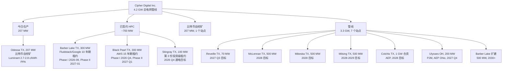

来源: [Cipher Digital 2025 10-K, Item 1, "Data Center Portfolio" + "Site Pipeline"](https://www.sec.gov/Archives/edgar/data/1819989/000181998926000009/cifr-20251231.htm); [Q1-FY2026 deck, slide 14-16](https://www.sec.gov/Archives/edgar/data/1819989/000181998926000025/exh992cipherdigital_busi.htm)。

### A. 比特币自挖矿 (历史产品, 在管理性淘汰中)

**Odessa, TX (207 MW, ~52 英亩, 全资拥有)。** 商业运营自 2022 年 11 月开始; 建设于 2023 年 9 月完成。由 Luminant ET Services Company LLC 根据 take-or-pay PPA 提供电力, 价格约 2.7 c/kWh (2025 年 10 月按电价上调至 2.8 c/kWh), Cipher 每年至少需要接受并支付 207 MW 容量的 66.7%。期限至少持续到 2027 年 7 月, 此后每年自动续约, 任一方有 6 个月终止通知权 ([10-K, Item 1, "Luminant Power Agreement"](https://www.sec.gov/Archives/edgar/data/1819989/000181998926000009/cifr-20251231.htm))。截至 2026 年 Q1, Odessa 以约 11.6 EH/s 的总哈希率运行, 矿机效率约 17.2 J/TH, 当季产出约 346 BTC ([Q1-FY2026 deck, slide 13](https://www.sec.gov/Archives/edgar/data/1819989/000181998926000025/exh992cipherdigital_busi.htm))。Odessa Facility 是 2024 年首个获得 Uptime Institute 管理与运营 (M&O) Stamp of Approval 认证的比特币挖矿数据中心 ([10-K, Item 1, "Operational Excellence"](https://www.sec.gov/Archives/edgar/data/1819989/000181998926000009/cifr-20251231.htm))。

*分析师观点:* **部分 — 成本领先优势。** Odessa 有效约 2.8 c/kWh 远低于 ERCOT 现货市场, 也低于多数上市同业的平均全包电力成本。护城河是合同性的 (Luminant PPA) 和地理性的 (变电站已建好, 互联队列已清空)——两者至少持续到 2027 年中。最接近的低成本竞争挖矿站点是 **Riot Platforms 的 Rockdale, TX** 设施, 它运行对冲后的 ERCOT 供电并接受周期性的减载额度补偿, 但实现成本更具变动性 ([Riot Platforms 2024 10-K — Rockdale 运营组合](https://www.sec.gov/Archives/edgar/data/1018522/000101852225000005/0001018522-25-000005-index.htm))。Odessa 的 PPA 将于 2027 年到期; 2027 年后的经济性可能在很大程度上取决于 ERCOT 定价或 Cipher 将 Odessa 转换为 HPC 的决定 (10-K 明确指出 Odessa"也可能适合改造为 HPC 租户使用")。

**WindHQ 合资站点 — Alborz、Bear、Chief (每个 40 MW, 德州)。** Cipher 在 2022 年至 2026 年 2 月期间持有三家小型比特币挖矿合资公司各 49% 的股权, 合资方为 WindHQ LLC。**2026 年 2 月 19 日, Cipher 以约 4,000 万美元的 Canaan 股票将所有三项 49% 股权出售给 Canaan Inc.** ([Q4-FY2025 新闻稿, 2026-02-24](https://www.sec.gov/Archives/edgar/data/1819989/000181998926000007/exh991q4fy25_earningsprxvf.htm); [10-K 期后事项附注](https://www.sec.gov/Archives/edgar/data/1819989/000181998926000009/cifr-20251231.htm))。此次处置消除了资产负债表上 2,080 万美元的 2025 财年权益法损失, 与远离非核心比特币资产的战略转变相一致。

### B. HPC / AI 数据中心托管 (新产品, 在投产前建设阶段)

**Barber Lake, TX (Colorado City, 250 英亩, 300 MW 总功率 — Fluidstack/Google)。** 2025 年 Q3, 通过 Cipher Barber Lake LLC, Cipher 与 **Fluidstack USA II Inc.** (一家总部位于英国的 AI 云平台, 为前沿 AI 公司构建 HPC 集群) 签订了 10 年期托管协议, 在 Barber Lake 为其提供 168 MW 的关键 IT 负载 (244 MW 总功率)。**Google LLC** 同时同意为 Fluidstack 的租赁义务提供 14 亿美元的支持担保, 并获得约 5.4% pro-forma 股权的认股权证 ([Fluidstack/Google 初始租约 8-K, 2025-09-25](https://www.sec.gov/Archives/edgar/data/1819989/000095010325012168/dp234624_ex9901.htm))。协议条款: 基期约 30 亿美元营业收入, 含两次 5 年延期则为 70 亿美元; modified-gross 租约带年度加成; 预计站点 NOI 利润率 80-85%; 估算项目成本为每关键 IT MW 约 900-1,100 万美元。2025 年 11 月, Cipher 将协议升级, 把 Barber Lake 全部 300 MW 租给 Fluidstack——以相同条款新增 39 MW 关键 IT 负载/56 MW 总功率, 增加基期约 8.3 亿美元营业收入, 并额外新增 3.33 亿美元 Google 担保 ([Fluidstack Phase II 租约 8-K, 2025-11-20](https://www.sec.gov/Archives/edgar/data/1819989/000095010325015073/dp237633_ex9901.htm))。Cipher 来自 Fluidstack 合作伙伴关系的总已签约营业收入: 基期约 38 亿美元 / 所有延期行使后约 90 亿美元。Phase I 交付目标: 2026 年 9 月 30 日; Phase II: 2027 年 1 月 31 日。

*分析师观点:* **是 — 多重护城河叠加。** Barber Lake 拥有 300 MW ERCOT 互联且无负载曲线限制, 250 英亩自有土地加上额外约 620 英亩可扩展土地选项, 以及完全融资的约 17.3 亿美元 7.125% 高级担保项目融资票据结构 (项目债务针对 Fluidstack 的租金流摊销, 而 Google 为该租金流提供支持担保)。上市加密转型同业中最接近的可比超大规模租户项目是 **IREN 与 Microsoft Stargate 合资项目下的 Childress, TX 站点**; CIFR 的结构差异在于 Google 认股权证 + 担保安排独特地将超大规模云服务商的信用嵌入项目资本结构 ([IREN/Microsoft Stargate 披露, 2025](https://investors.iren.com/))。

**Black Pearl, TX (Wink, ~75 英亩, 300 MW 总功率 — Amazon)。** 最初建造为比特币挖矿设施 (2025 年 6 月开始挖矿, 2025 年 9 月达到 150 MW)。2025 年 Q4, Cipher 与 **Amazon Web Services, Inc.** 签订了一份 **15 年期租约**, 为 AI 工作负载提供约 300 MW 的交钥匙数据中心容量, 基期总营业收入约 55 亿美元, 自 2026 年 7 月开始分两阶段交付 ([Q3-FY2025 8-K, 2025-11-03](https://www.sec.gov/Archives/edgar/data/1819989/000181998925000110/nov3_earningspressreleasex.htm))。租金从 2026 年 8 月开始, 预计 2027 年 Q1 全部爬坡。Black Pearl 的比特币挖矿于 2026 年 2 月停止, 替换出的矿机迁至 Odessa 或出售 (2025 财年待售减值 9,610 万美元)。项目融资: 20 亿美元 6.125% 高级担保票据 2031 年到期, 于 2026 年 2 月 11 日定价, 由对 Cipher Black Pearl LLC 资产的第一优先抵押权支持 ([契约, 2026-02-11](https://www.sec.gov/Archives/edgar/data/1819989/000181998926000009/cifr-20251231.htm))。

*分析师观点:* **是 — 直接面向具投资级信用的超大规模云服务商客户。** AWS 是直接承租人 (无需中介担保支持)。15 年期长于 Fluidstack 的 10 年期, 反映了 AWS 对站点和 Cipher 执行能力的承保。最接近的可比项目: **Core Scientific 的 Microsoft/CoreWeave 超大规模转换** ([Core Scientific 2024 10-K — 超大规模租户披露](https://www.sec.gov/cgi-bin/browse-edgar?action=getcompany&CIK=0001839341&type=10-K))。

**Stingray, TX (第三份 HPC 园区租约 — 投资级超大规模云服务商, 条款待定)。** 在 2026 年 5 月 5 日 Q1 2026 更新中宣布。Stingray 拥有最高 100 MW 的有条件 ERCOT 互联批准, 通电目标为 2026 年 Q4 ([10-K, "Stingray Site"](https://www.sec.gov/Archives/edgar/data/1819989/000181998926000009/cifr-20251231.htm); [Q1-FY2026 新闻稿](https://www.sec.gov/Archives/edgar/data/1819989/000181998926000025/exh991q1fy26_earningsxprvf.htm))。完整交易经济条款尚未披露。

### C. 站点管线 (3.3 GW, 在互联/土地控制阶段)

- **Reveille (Cotulla, TX, 70 MW)。** ERCOT 已批准; 预计 2027 年 Q3 通电; 正在洽谈 HPC 托管租约。
- **McLennan (中德州, 500 MW 目标)。** 2024 年 10 月签订选择权协议; 2026 年 2 月行使; ERCOT 研究已批准并预计在 Batch Zero; 2028 年目标。
- **Mikeska (西德州, 500 MW 目标)。** 2024 年 10 月签订选择权协议; 土地租赁 + 购买选择权; 2026 年 2 月行使; 2028 年目标。
- **Milsing (东德州, 500 MW 目标)。** 2025 年 12 月行使选择权; 2028-2029 年目标。
- **Colchis 合资项目 (西德州, 1 GW)。** 合资项目多数股权, 已完全签订与 AEP 的 1 GW 直接互联协议; 在 AEP 变电站附近选购约 620 英亩土地; 2028 年通电目标。Cipher 贡献多数股权 (预计约 95%, 受租赁与开发条款约束) ([Q3-FY2025 8-K, 2025-11-03](https://www.sec.gov/Archives/edgar/data/1819989/000181998925000110/nov3_earningspressreleasex.htm))。
- **Ulysses (俄亥俄州, 200 MW)。** 首个非德州站点, 2025 年 12 月收购; PJM 互联; AEP Ohio; 2027 年 Q4 通电目标。
- **Barber Lake 扩建 (TX, 与现有 300 MW 相邻的 500 MW 电网管线)。** 2030 年后可用, 需通过 ERCOT 批量研究。

来源: [Cipher Digital 2025 10-K, Item 1, "Site Pipeline"](https://www.sec.gov/Archives/edgar/data/1819989/000181998926000009/cifr-20251231.htm); [Q1-FY2026 deck, slide 14-16](https://www.sec.gov/Archives/edgar/data/1819989/000181998926000025/exh992cipherdigital_busi.htm)。

### 旗舰: 三个已签约 HPC 站点, 按 NOI 权重排列

主要营业收入产品是三个已签约 HPC 园区——Barber Lake (Fluidstack/Google)、Black Pearl (AWS) 与 Stingray (第三家超大规模云服务商)。这三个站点几乎贡献了 10 年基期约 7.87 亿美元平均年化 NOI 的全部金额 ([Q1-FY2026 deck, slide 6](https://www.sec.gov/Archives/edgar/data/1819989/000181998926000025/exh992cipherdigital_busi.htm))。Odessa 是今日 (比特币挖矿仍是唯一营业收入来源) 与 2027 年全面 HPC 爬坡之间的现金流桥梁。

**近 12 个月启停事件:**
- **关停:** Black Pearl 比特币挖矿 (2026 年 2 月); WindHQ 合资比特币挖矿 (2026 年 2 月, 出售给 Canaan)。
- **启动:** 三份已签 HPC 园区租约 (2025 年 9 月、2025 年 11 月、2026 年 5 月); Barber Lake 建设启动 (2025 年 9 月) 与封顶 (2026 年 4 月); Black Pearl HPC 改造自 2025 年 Q4 开始进行中。

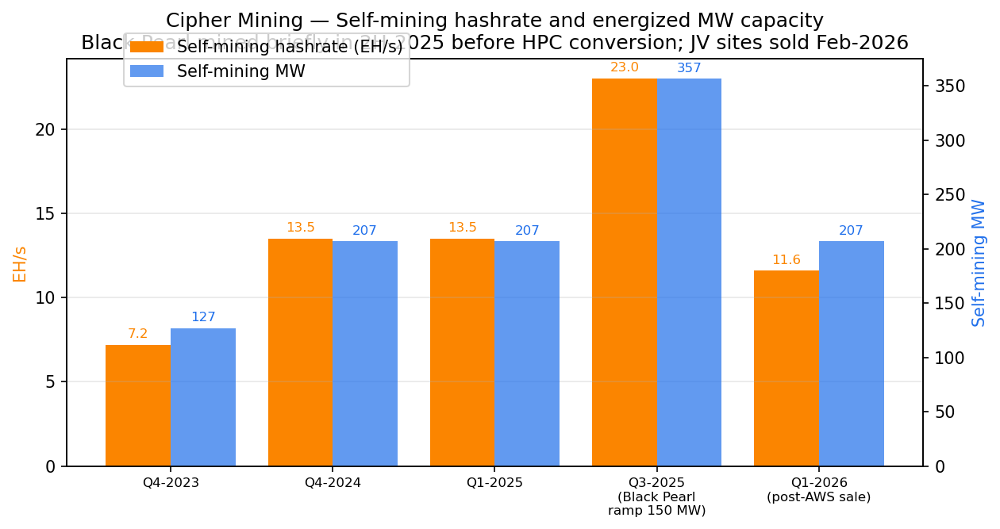
来源: [Cipher Digital 2025 10-K, Item 1](https://www.sec.gov/Archives/edgar/data/1819989/000181998926000009/cifr-20251231.htm); [Q1-FY2026 投资者展示材料, slide 13](https://www.sec.gov/Archives/edgar/data/1819989/000181998926000025/exh992cipherdigital_busi.htm); [矿机升级 8-K, 2024-06-05](https://www.sec.gov/Archives/edgar/data/1819989/000119312524158407/d846288dex991.htm)。

## 5. 客户与上市策略

### 2025 财年客户集中度 — 极高 (过渡性)

Cipher 在 2025 财年的营业收入完全来自比特币挖矿。会计后果: **唯一"客户"是矿池运营商**, Cipher 的应收账款由"应收唯一客户 (矿池运营商) 的款项"组成 ([Cipher Digital 2025 10-K, 合并财务报表附注 — 应收账款](https://www.sec.gov/Archives/edgar/data/1819989/000181998926000009/cifr-20251231.htm))。2025 财年, **Foundry USA Pool 产生了 1.57 亿美元的营业收入, 占合并营业收入总额的 70%** ([10-K, 附注 — 根据 ASC 280 的客户集中度披露](https://www.sec.gov/Archives/edgar/data/1819989/000181998926000009/cifr-20251231.htm))。剩余约 30% 来自一个或多个未单独披露的矿池运营商。

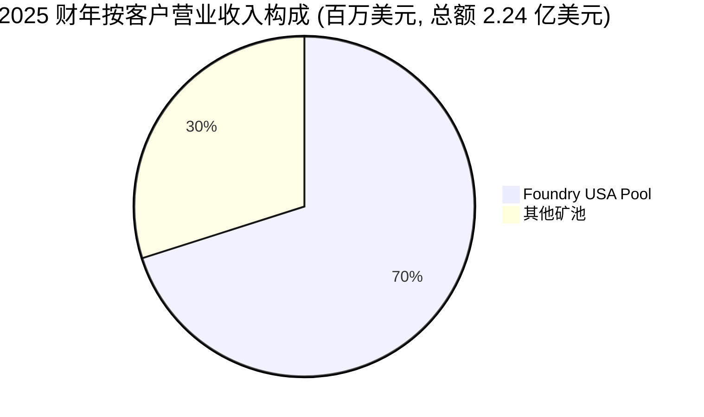

来源: [Cipher Digital 2025 10-K, 附注 — 客户集中度披露](https://www.sec.gov/Archives/edgar/data/1819989/000181998926000009/cifr-20251231.htm)。

这是**重大客户集中度**, 但有一个重要的细微差别: Foundry 是矿池运营商, 而不是计算的终端买家。经济交易对手风险本质上是 Foundry 支付系统的运营可靠性; Cipher 原则上可以以很小的切换成本将其哈希率移至其他矿池。尽管如此, ASC 280 要求披露这一点, 它确实代表了一种供应商集中度。我们在第 9 节将其与 2026 年出现的结构性不同的 HPC 租户集中度一并讨论。

### 2026 财年 (E) 及前瞻客户集中度 — 根本不同

从 2026 年中开始, Cipher 的营业收入构成将翻转。已签约租约将营业收入集中在三个交易对手:

| 租户 | 站点 | MW (总功率) | 期限 | 基期营业收入 | NOI 利润率 | 备注 |
|---|---|---|---|---|---|---|
| **Fluidstack / Google 担保** | Barber Lake | 300 | 10 年 (+2×5) | 基期约 38 亿美元 / 含延期约 90 亿美元 | 80–85% Phase I / 85–90% Phase II | Google 担保 17.3 亿美元的义务; 通过认股权证持有 5.4% pro-forma 股权 |
| **Amazon Web Services** | Black Pearl | 300 | 15 年 | 约 55 亿美元 | 未披露; 10-K 暗示类似区间 | 直接 AWS 承租人 — 投资级 |
| **投资级超大规模云服务商 (待定)** | Stingray | 100 (初始) | 初始 15 年 | 未披露 | 未披露 | 第三份 HPC 园区, 2026 年 5 月宣布 |

来源: [Fluidstack/Google 初始租约 8-K, 2025-09-25](https://www.sec.gov/Archives/edgar/data/1819989/000095010325012168/dp234624_ex9901.htm); [Fluidstack Phase II 8-K, 2025-11-20](https://www.sec.gov/Archives/edgar/data/1819989/000095010325015073/dp237633_ex9901.htm); [Q3-FY2025 新闻稿, 2025-11-03](https://www.sec.gov/Archives/edgar/data/1819989/000181998925000110/nov3_earningspressreleasex.htm); [Q1-FY2026 新闻稿, 2026-05-05](https://www.sec.gov/Archives/edgar/data/1819989/000181998926000025/exh991q1fy26_earningsxprvf.htm)。

**集中度解读。** 在 2027 稳态 NOI 上, 前 3 家租户将几乎贡献 100% 的营业收入。按任何常规标准, 这都属于**高客户集中度**, 并在第 9 节中作为重大风险列出。缓解因素包括期限 (10–15 年)、信用 (Google 对 Fluidstack 提供担保; AWS 直接承租)、合同结构 (modified-gross 租约带年度加成、控制权变更保护、Cipher 完工保证), 以及项目融资结构 (高级担保票据针对租金流摊销, 这激励租户履约)。最需要监控的风险是**如果 Fluidstack 未能将 AI 利用率提升以支持其租金支付会怎样**: Google 担保是有限的 (17.3 亿美元), 有上限和违约触发条件, 而且担保仅在租金开始后才激活。

### 上市策略

Cipher 的 GTM 是投资银行式的企业关系销售。线索来源于 (i) 内部电力获取团队与 ERCOT/PJM 公用事业公司的关系; (ii) Tyler Page 进入超大规模云服务商的 Bitfury / NYDIG 网络; (iii) Mumford 与 Iwaschuk 的投行与法律网络; 以及 (iv) 公司日益积累的业绩记录 (每份租约都被用作下一份的参考)。Morgan Stanley 担任两笔 Fluidstack 交易及很可能也是 AWS 交易的唯一财务顾问 ([Fluidstack Phase II 8-K, 2025-11-20](https://www.sec.gov/Archives/edgar/data/1819989/000095010325015073/dp237633_ex9901.htm))。Davis Polk & Wardwell LLP——Page 与 Iwaschuk 的老东家——担任法律顾问。

**销售周期**是多季度的 (每笔交易涉及公用事业互联尽调、超大规模云服务商站点选择委员会批准、项目债务结构化, 以及租户信用支持)。据报道, 2025 年 9 月的 Fluidstack 交易在 2024-2025 年大部分时间里都在谈判。然而, 一旦签约, 建设到租金的周期就确定了: 从破土动工到分阶段租金开始为 9-18 个月。

**关键合作伙伴:**
- **Quanta Services, Inc. (NYSE: PWR)** — Black Pearl 与 Barber Lake 建设的牵头 EPC 合作伙伴 ([10-K, Item 1](https://www.sec.gov/Archives/edgar/data/1819989/000181998926000009/cifr-20251231.htm))。
- **American Electric Power (AEP)** — Colchis 1 GW 双互联协议; Ulysses 俄亥俄 AEP Ohio 互联。
- **Luminant ET Services (Vistra Corp. 子公司)** — Odessa PPA 与变电站租赁交易对手。
- **Bitmain, Canaan** — 矿机供应商 (S21 Pro、S21 XP、A1566 系列)。

## 6. 行业概览 — 比特币挖矿 → AI / HPC 托管

Cipher 横跨两个在**电网边缘**日益融合的行业。

### 6a. 比特币挖矿 (历史行业)

比特币挖矿是一个全球性的、资本密集的能源套利业务, 运营商使用专用集成电路 (application-specific integrated circuit, ASIC) 硬件竞争网络的区块奖励——目前在 2024 年 4 月减半之后, **每个约 10 分钟区块的奖励为 3.125 BTC**, 预计在 2028 年 4 月左右再次减半至 1.5625 BTC ([Cipher Digital 2025 10-K, Item 1, "Bitcoin Mining Business"](https://www.sec.gov/Archives/edgar/data/1819989/000181998926000009/cifr-20251231.htm))。全球网络哈希率自 2024 年减半以来约增长一倍 (从 2023 年底约 600 EH/s → 到 2026 年中约 1,000 EH/s, 根据公开网络估算), 边际挖矿成本集中在每 BTC 约 6-8 万美元区间, 取决于电力成本。

该行业**正在结构性整合**: 2024 年减半带来的现金消耗迫使次规模运营商出局, 而幸存的大型运营商 (MARA、RIOT、CLSK、IREN、CIFR、CORZ、BTDR、HUT) 通过 M&A 和资本市场准入累积了规模。德州 (ERCOT) 是美国主导的挖矿地理区域, 原因在于 (i) 低工业电价, (ii) 在峰值需求期间允许矿企减载并获得补偿的电网经济性, 以及 (iii) 监管包容性。然而, 2024-2026 年期间 ERCOT **越来越多地批量审批大型负载互联请求**, 拉长了新站点的交付周期; Cipher 将此披露为最高级的监管风险 ([10-K, 风险因素摘要](https://www.sec.gov/Archives/edgar/data/1819989/000181998926000009/cifr-20251231.htm))。

### 6b. AI / HPC 数据中心托管 (新行业)

AI 基础设施建设是 2020 年代最大的实物资产投资周期。估算各异, 但 **McKinsey 在 2024 年 8 月的展望预测全球数据中心电力需求到 2030 年将以 22-23% CAGR 增长**, 达到约 220 GW, AI 工作负载将主导新增产能。超大规模云服务商资本开支 (Microsoft / Google / AWS / Meta 四巨头) 在 2024 年约为 2,500 亿美元, 预计 2025 年达到 3,200-3,600 亿美元 (根据多家卖方数据中心研究报告, 2025 年口径)。

供给瓶颈不在资金或土地, 而在**电力与互联**。主要美国市场 (ERCOT、PJM、MISO、SPP) 中, 新的大型负载电网互联从申请到通电通常需要 4-7 年。因此, 超大规模云服务商已从"我们自己建"转向"我们将向任何已清除队列的人租赁专门构建的产能"。这正是比特币矿企——根据某些行业估算, 它们已控制 20+ GW ERCOT 已互联容量——进入的结构性机会。CIFR、IREN、CORZ、BTDR、CLSK 与 HUT 是该转化的最纯粹标的。

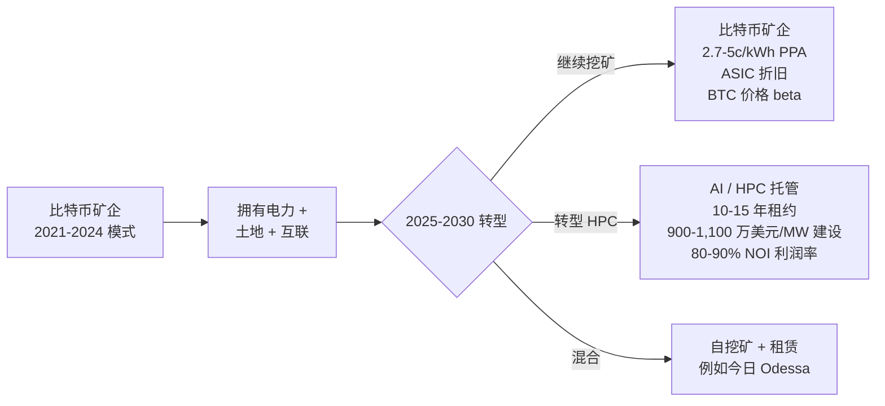

### 6c. 行业动态

- **电力获取是护城河。** 在多年互联待批的情况下, 任何持有已清空变电站互联的人都拥有几乎不可替代的资产。CIFR 的 4.2 GW 总管线是关键战略资产。
- **租户信用主导项目融资。** Cipher Barber Lake 项目债务凭借 Google 担保被评为 Ba3/BB- (Moody's/Fitch); Black Pearl Compute LLC 的票据凭借 AWS 直接承租被评为 Ba2/BB- ([Q1-FY2026 deck, slide 18](https://www.sec.gov/Archives/edgar/data/1819989/000181998926000025/exh992cipherdigital_busi.htm))。超大规模云服务商交易对手质量是核心变量。
- **建设和设备交付期是约束性限制**, 而非资金。截至 2026 年 4 月, Black Pearl 已确保 Phase I 设备约 93% 和 Phase II 设备约 80% 已锁定——这是在任何潜在电力设备供应紧张之前的有意识去风险化 ([Q1-FY2026 deck, slide 10](https://www.sec.gov/Archives/edgar/data/1819989/000181998926000025/exh992cipherdigital_busi.htm))。
- **监管。** ERCOT 正在探讨对超大型负载的批量互联规则。AI 特定监管 (能源密度披露、水使用报告、根据拟议联邦规则的环境审查) 处于萌芽阶段, 但属于前瞻性风险。

### 行业增长

根据 IDC 2025 年 10 月《全球数据中心预测》(最新可获取的版本), 全球托管和超大规模批发数据中心营业收入预计到 2028 年将以约 17% 年增长复合, 主要由 AI 工作负载推动。最常引用的分段是按功率密度划分: 传统云 (10-30 kW/机架) 以低双位数增长, AI 优化 (60-150+ kW/机架带液冷) 增长 50%+。Cipher 的产品针对后者——Black Pearl 和 Barber Lake 均按 AWS 和 Fluidstack 租赁规格设计为液冷、高密度配置 ([Q3-FY2025 新闻稿, 2025-11-03](https://www.sec.gov/Archives/edgar/data/1819989/000181998925000110/nov3_earningspressreleasex.htm))。

## 7. 竞争格局

Cipher 的直接竞争对手集合是一组上市加密矿企, 正在转型至 AI/HPC 托管。相关同业根据 HPC 转型深度分为三个集群。

### 7a. "比特币矿企 → AI 托管"逻辑下的直接同业

| 同业 | Ticker | 市值 (10 亿美元) | TTM 营业收入 (百万美元) | EV/TTM 营业收入 | HPC 转型状态 |
|---|---|---|---|---|---|
| **Cipher Digital** | CIFR | 8.7 | 210 | 57× | 已签 3 份租约, 基期 93 亿美元 (Fluidstack/Google, AWS, 第三家租户) |
| **IREN** | IREN | 20.5 | 757 | 27× | Microsoft/Stargate 合资, 约 80 EH/s 挖矿 + HPC |
| **CleanSpark** | CLSK | 4.0 | 740 | 7× | 主要挖矿; 小规模 HPC 计划 |
| **Riot Platforms** | RIOT | 9.3 | 653 | 15× | 主要挖矿; Rockdale 与 Corsicana 站点 |
| **Marathon Digital** | MARA | 5.1 | 868 | 8× | 主要挖矿; "MARA 2X"多元化 |
| **Core Scientific** | CORZ | 7.8 | 355 | n/m* | CoreWeave 超大规模转型 (最大单一标的) |
| **Bitdeer** | BTDR | 3.4 | 739 | 7× | 挖矿 + 新加坡 HPC + Cloud-Hash AI 服务 |
| **Hut 8** | HUT | 11.6 | 284 | 40× | 垂直整合 + 200 MW Vega 德州 + HighRise AI |
| **HIVE Digital** | HIVE | 1.0 | 257 | 4× | 挖矿 + Buzz HPC 部门 |
| **Bitfarms** | BITF | 1.2 | n/d | n/d | 挖矿 + 120 MW 宾州 HPC 管线 |

来源: 倍数来自 [Yahoo Finance — 关键统计, 2026-05-20](https://finance.yahoo.com/quote/CIFR/key-statistics/) (查询每个同业)。*CORZ EV/Rev 在 Chapter 11 后的资本结构下不具备意义。

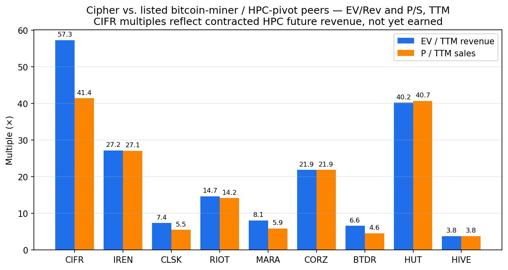
来源: [每个 ticker 的 Yahoo Finance 关键统计拉取, 2026-05-20](https://finance.yahoo.com/quote/CIFR/key-statistics/)。

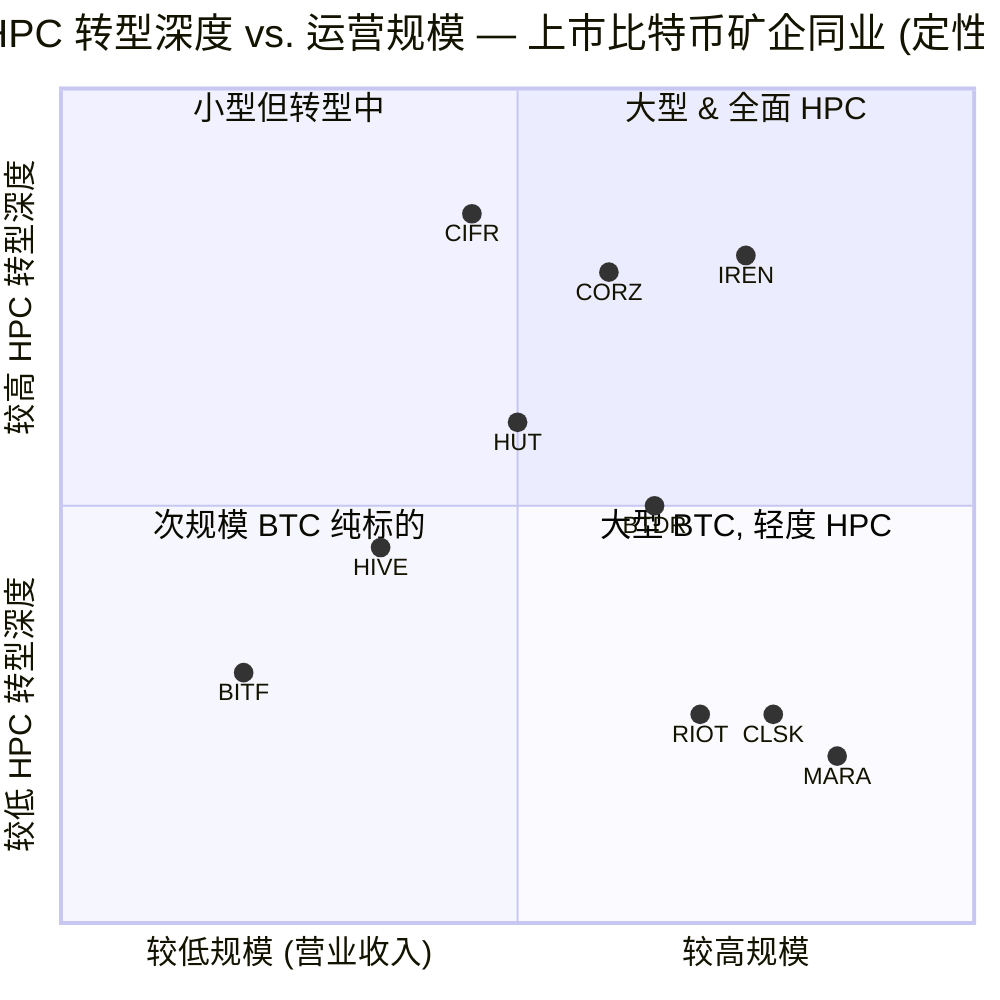

来源: 定位由本报告作者综合各公司最新 10-K 和投资者材料中的公开披露所形成。

### 7b. 间接 / 新兴竞争者

- **纯超大规模数据中心运营商** — Digital Realty Trust (DLR)、Equinix (EQIX)、Iron Mountain Data Centers (IRM)。这些公司在资本成本上具有优势 (REIT、投资级), 但选址周期较慢。Cipher 的优势在于电力优先的执行速度。
- **私营 GPU 云 / neocloud 提供商** — CoreWeave (现 CRWV 上市)、Lambda、Crusoe Energy (私营)、Nscale。这些公司与 Fluidstack 作为"AI 云平台"租户竞争, 而非直接与 Cipher 的底层房地产竞争。
- **垂直整合的 AI 基础设施** — Vantage Data Centers (私营)、QTS (Blackstone 所有)、Aligned (Macquarie 支持)。资产负债表更好, 但互联套利执行速度较慢。

### 7c. Cipher 的具体竞争定位

**优势:**
- **4.2 GW 电网管线** — 在比特币矿企转型同业中规模最大者之一。
- **Google 嵌入** — 2025 年 9 月的"认股权证换担保"结构在业内是独特的, 在关键拐点表明了超大规模云服务商的深度信念。
- **AWS 直接承租** — 2025 年 11 月签订的租约是任何上市加密矿企转型签订的首个 15 年期直接 AWS 数据中心租约。
- **纪律的项目资本结构** — Ba2-Ba3/BB- 评级的非追索权高级担保项目债; 公司资产负债表基本受到保护。
- **Odessa PPA 遗产** — 在 2027 年前提供过渡性现金, 平滑 HPC NOI 爬坡前的空缺期。

**劣势:**
- **德州集中度** — 在 2027 年前, 所有运营站点都位于德州, 使业务暴露于 ERCOT 监管行动和德州天气 (Uri 风格的 2021 年电网事件)。
- **缺乏运营超大规模业绩记录** — Cipher 将在 2026 年 Q4 移交其首个超大规模站点; 团队如何处理交付延期没有先例。
- **过渡窗口中的高债务偿还** — 利息支出在 2025 财年为 3,660 万美元, 仅 2026 年 Q1 就达 5,920 万美元, 而 2026 年 Q4 之前没有 HPC 租金收入。
- **过渡性 Odessa 营业收入的比特币价格 beta** — 在 HPC 爬坡之前, 2026 财年现金生成依赖 BTC 价格 × 2026 年 Q4 哈希率 (在 Black Pearl 矿机出售后, Q1 跌至约 11.6 EH/s)。

## 8. 市场机会 (TAM)

### TAM 构建 (自上而下)

相关 TAM 是**第三方批发租赁的超大规模 AI 数据中心产能**, 而非所有数据中心产能 (Cipher 不在零售托管、亚-1MW 部署或企业本地部署领域竞争)。两个锚点数据:

1. **全球数据中心电力需求**预计到 2030 年将大约增长 3 倍, AI 工作负载推动大部分增量负载。McKinsey 2024 年 8 月展望与 IDC 2025 年 10 月预测一致, 到 2030 年达到 22% CAGR, 总计约 220 GW。AI 特定 (高密度、液冷) 是增长最快的子集。
2. **超大规模资本开支**在 2024 年约为 **2,500 亿美元**, 预计 2025 年 3,200-3,600 亿美元, 2026 年 4,000+ 亿美元 (跨 Microsoft/Google/AWS/Meta 四巨头), 根据多家数据中心卖方研究和超大规模云服务商自身的季度报告。其中约 35-45% 用于房地产 / 外壳 + 电力, 其余用于芯片、网络和运营。

转化为可寻址的批发租赁营业收入: 如果超大规模云服务商租赁其 30-40% 的增量产能 (而不是 100% 自建——这与 2015-2020 年相比是结构性变化), 且 AI 密度的平均批发租赁费率约为 130-180 美元/kW-月 (根据近期 Digital Realty / Equinix 业绩说明), **到 2028 年, 每年增量批发 AI 租赁 TAM 可能为 300-500 亿美元**, 并持续增长。

### SAM (Cipher 可服务市场)

Cipher 的有效可服务市场是**ERCOT 和 PJM 中 2026-2030 年互联就绪的多百兆瓦园区站点**。根据公开 ERCOT 数据, 2024 年末待审的大型负载互联请求总计约 70 GW; 约束性限制是其中实际通过 ERCOT 研究并完成变电站建设的有多少。Cipher 自己的 4.2 GW 管线——其中很大一部分已通过关键审批——因此相对于总可获取的已清空容量是不成比例的。

合理的框架: 如果 2026-2030 年期间德州 + 俄亥俄共有约 30 GW 新增超大规模 AI 产能上线, 而 Cipher 按时交付其 4.2 GW 管线, 则 **Cipher 占据该增量 ERCOT/PJM 超大规模 AI 供应的 10-14%**——集中在 2027-2030 年。在已公布的 NOI 利润率下, 该市场份额产生 Q1-FY2026 deck 所示的 7.87 亿美元平均年度 NOI。

### SOM (实际份额)

我们将 4.2 GW 管线视为软性 (仅 Barber Lake 的 300 MW 和 Black Pearl 的 300 MW 处于 >90% 信心水平; Stingray 第三份租约处于中等信心水平; 其余 3.3 GW 由选择权控制, 但受 ERCOT 批量过程、租户签约和项目融资影响)。现实的 2030 年交付产能: **2.0-3.0 GW** (已公布 4.2 GW 的 50-70% 交付率), 仍代表 2030 年增量 ERCOT/PJM 超大规模 AI 租赁市场的约 5-10%。

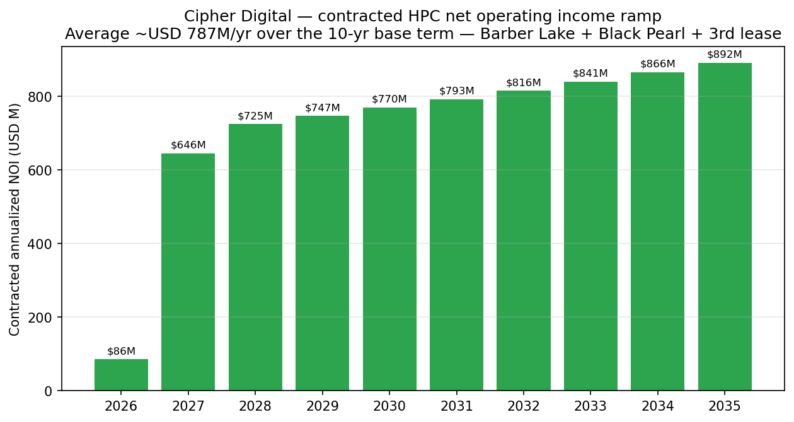
来源: [Cipher Q1-FY2026 投资者展示材料, slide 6](https://www.sec.gov/Archives/edgar/data/1819989/000181998926000025/exh992cipherdigital_busi.htm)。

### 渗透策略

Cipher 的上市策略与迄今为止有效的方法相同: 预先定位电力和互联 (供应端护城河), 然后为每个站点锚定一份超大规模云服务商租赁。接下来的两个运营里程碑——Black Pearl Phase I 租金开始 (目标 2026 年 Q4) 和 Barber Lake Phase I 租金开始 (目标 2026 年 Q3-Q4) ——将验证或推翻整个投资逻辑。

## 9. 风险评估

### 公司特定风险

**1. HPC 建设执行风险 (高)。** 两个大型项目 (Barber Lake 300 MW、Black Pearl 300 MW) 必须在 2026 年 Q3-Q4 完成实质性竣工, 并在 2026 年 Q4 开始第一份租金。这是 Cipher 的首次超大规模交付——之前的每个站点都是比特币自挖矿, 技术要求要低得多。任何站点延期 3-6 个月可能触发 (a) 根据租约的提前进入/实质性竣工里程碑, 租户租金减免; (b) 项目债务契约压力 (高级担保票据由 Cipher 完工保证); 以及 (c) 对 7.87 亿美元年度 NOI 指引的重估。缓解措施: Quanta Services 作为 EPC; 截至 2026 年 4 月 93%/95% 的长交付期设备已锁定; 模块化建设。严重程度: **高**。

**2. 过渡期客户集中度 (重大 → 高)。** 2025 财年 70% 营业收入集中在 Foundry USA Pool (2.24 亿美元营业收入中的 1.57 亿美元) ——属供应商风险, 而非终端客户风险, 可通过切换矿池缓解 ([10-K 附注 — 客户集中度](https://www.sec.gov/Archives/edgar/data/1819989/000181998926000009/cifr-20251231.htm))。从 2026 年中开始, 客户集中度转向三家超大规模云服务商租户, 几乎占据 100% 营业收入。顶级 1 (Fluidstack/Google) 代表稳态 NOI 的约 30-40%; 顶级 3 = 100%。这是**结构性的——集中度是商业模式所固有的**, 但通过期限 (10-15 年)、信用 (Google 担保 / AWS 直接) 和合同结构来缓解。严重程度: **高**但可控。

**3. 关键人员对 Tyler Page 的依赖 (中-高)。** Page 是非创始人, 但个人推动了 HPC 转型、超大规模云服务商关系和资本结构设计。Iwaschuk 和 Kelly 是合作伙伴, 但不是 CEO 角色的替代者。没有公开披露的继任计划。严重程度: **中-高**; 由长期已签约合同缓解。

**4. AI 转型执行 / 租户利用率风险 (高)。** Fluidstack 是英国总部的 AI 云平台, 必须成功将 Barber Lake 的计算转售给前沿 AI 客户, 以支持其租金义务。Google 担保覆盖 17.3 亿美元, 但有限、有上限, 且仅在租金开始后激活。如果 2027-2030 年 AI 训练集群需求软化 (深度学习扩展担忧、中国出口管制阴影或模型架构颠覆), Fluidstack 的经济性将削弱。严重程度: **高**; 部分缓解是 Google 股权, 这给 Google 在支持站点上提供财务利益。

**5. 管线转化风险 (中)。** 3.3 GW 管线 (Reveille、McLennan、Mikeska、Milsing、Colchis、Ulysses、Barber Lake 扩建) 由选择权控制, 但未签约。ERCOT Batch Zero 审查、超大规模云服务商签约周期和项目融资可获得性都需要协调。Cipher 已经显示了对某些站点的 4 年以上执行时间表。严重程度: **中**。

**6. 德州地理集中度 (中)。** 到 2027 年, 所有运营站点都在德州, 使业务暴露于 Uri 冬季风暴 (2021 年 2 月) 的再次发生、德州立法机关或 ERCOT 的监管行动, 或影响冷却的水资源短缺事件。Ulysses 俄亥俄是首次地理多元化, 但要到 2027 年 Q4 才会通电。严重程度: **中**。

### 行业 / 市场风险

**7. 过渡性营业收入的比特币价格 beta (2026 年高, 之后低)。** 在 HPC 租金爬坡之前, Cipher 的 2026 年现金生成依赖 BTC 价格 × Odessa 哈希率。BTC 价格回调 50% (在 BTC 历史上并不罕见) 将削减 Odessa 营业收入约 30-40% (BTC 具有高价格弹性, 网络哈希率下降提供部分量化抵消)。随着 Black Pearl 已关闭, Odessa 现在是唯一的挖矿营业收入来源。严重程度: **2026 年 Q4 之前高, 之后随着 HPC NOI 接管而低**。

**8. AI 基础设施需求风险 (中)。** 2026-2028 年期间超大规模云服务商 AI 资本开支有意义的放缓 (模型架构转变、监管引发的需求削减或芯片供应约束) 将削弱 Barber Lake 和 Black Pearl 的租户利用率, 并可能压缩租赁续约费率。已签合同保护基期营业收入。严重程度: **中**; 截至 2026 年中, AI 资本开支仍是 30-40% YoY 增长故事。

**9. ERCOT 监管行动 (中)。** ERCOT 已暗示可能对大型负载实施批量互联规则、电压/频率穿越要求, 以及可能扩大减载义务。这些任一都将减慢 Cipher 的管线转化。严重程度: **中**。

**10. 电力成本通胀 (Odessa 低-中, 管线站点中)。** Odessa 的 PPA 持续到 2027 年 7 月, 价格为 2.8 c/kWh; 2027 年后的成本基础存在风险。HPC 站点根据 modified-gross 租约将电力成本传递给租户。严重程度: **低-中**。

### 财务风险

**11. 估值 / 倍数压缩风险 (高 — 已包含, 见第 1 节)。** CIFR 以 57× EV/TTM 营业收入和 41× P/S 交易; 即使到 2030 年实现 7.87 亿美元的预计平均年化 NOI, 今日 120 亿美元 EV 在全面爬坡时意味着约 15× NOI——可辩护但不便宜。上述任何运营风险 (Black Pearl 延期、Fluidstack 利用率不足、超大规模云服务商 AI 资本开支放缓) 将显著压缩倍数。仍以比特币为主的同业 (CLSK、MARA、BTDR、HIVE) 的 P/S 行业中位数约 5×, 表明逻辑破裂时下行重估 60-80%。严重程度: **高**; 这是对今日价格买方投资者而言的主要财务风险。

**12. 过渡窗口中的债务偿还 (中-高)。** 截至 2026 年 3 月 31 日的总债务为 52 亿美元。年现金利息率约 6.125%-7.125% (项目债务) + 1.75% (较小可转债) = 约 2.4 亿美元的现金利息运行率。2031 年 0.00% 可转债是非现金的。受限现金 (35 亿美元) 专门用于建设资金支取; 非受限现金 (7.15 亿美元) 加上新 2 亿美元循环信贷额度提供企业流动性桥梁, 直到租金开始。重大延期将迫使额外股权或延期融资。严重程度: **2026 年 Q4 之前中-高**, 一旦租金开始即正常化。

**13. 稀释风险 (中)。** Cipher 仅在 2025 财年就发行了约 3,330 万股 ATM 股份 (募集资金 1.955 亿美元, 平均 5.88 美元/股, [10-K MD&A — 流动性](https://www.sec.gov/Archives/edgar/data/1819989/000181998926000009/cifr-20251231.htm)), 加上 Google 认股权证约 5.4% pro-forma 股权 ([Fluidstack 8-K, 2025-09-25](https://www.sec.gov/Archives/edgar/data/1819989/000095010325012168/dp234624_ex9901.htm)), 加上 2031 年到期 13 亿美元 0% 可转债的嵌入式股票结算 (转换价格在 8-K 中尚未说明——适用反稀释调整)。2025 财年股份数从 3.605 亿股增至 4.051 亿股 (约 12%)。严重程度: **中**; ATM 授权额度剩余 6 亿美元。

### 宏观经济风险

**14. 利率敏感性 (中)。** Cipher 的项目债务是固定票面利率 (6.125%、7.125%)——现有本金不直接暴露于利率波动。然而, 未签约的 3.3 GW 管线需要约 300+ 亿美元的增量项目融资才能交付, 该融资的定价对利率敏感。公司循环信贷额度是基于杠杆定价 (可变)。严重程度: **中**。

**15. 地缘政治 / 关税 (中)。** 挖矿和 HPC 设备 (Bitmain ASIC、GPU 服务器、网络设备、电气设备) 暴露于美中关税升级和芯片出口管制延伸。Cipher 在 2025 年 10-K 风险因素摘要中明确披露了关税风险 ([10-K, 风险因素摘要](https://www.sec.gov/Archives/edgar/data/1819989/000181998926000009/cifr-20251231.htm))。严重程度: **中**。

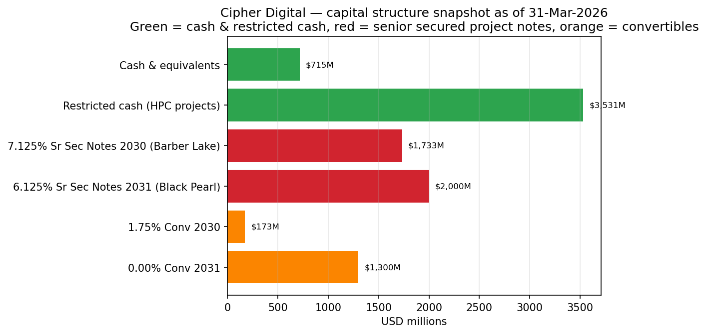
来源: [Cipher Q1-FY2026 投资者展示材料, slide 18](https://www.sec.gov/Archives/edgar/data/1819989/000181998926000025/exh992cipherdigital_busi.htm)。

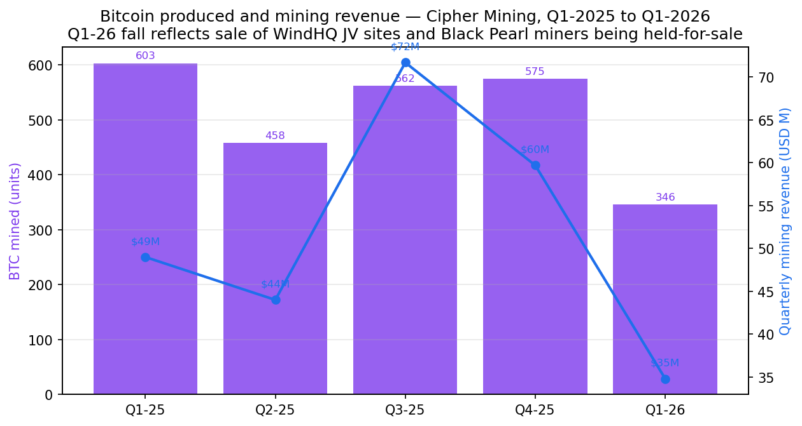
来源: [Cipher Q1-FY2026 deck, slide 13](https://www.sec.gov/Archives/edgar/data/1819989/000181998926000025/exh992cipherdigital_busi.htm); [Cipher Digital 2025 10-K, Item 7 MD&A](https://www.sec.gov/Archives/edgar/data/1819989/000181998926000009/cifr-20251231.htm) (季度 BTC 产出估算来自季度营业收入除以每季度平均 BTC 价格; 2026 年 Q1 的 346 BTC 数字为公司披露; 其他季度为作者估算)。

======================================

## 参考资料

### 一级 — SEC 文件 (Cipher Digital Inc. / Cipher Mining Inc., CIK 0001819989)

- [Cipher Digital 2025 年年度报告 Form 10-K, 提交日期 2026-02-24](https://www.sec.gov/Archives/edgar/data/1819989/000181998926000009/cifr-20251231.htm) — 业务描述、站点管线、客户集中度、MD&A、运营结果、高管简历、附件清单的主要来源。
- [Cipher Mining 2024 年 10-K, 提交日期 2025-02-25](https://www.sec.gov/Archives/edgar/data/1819989/000181998925000005/) — 历史比较数据。
- [Cipher Digital Q1-FY2026 10-Q, 提交日期 2026-05-05](https://www.sec.gov/Archives/edgar/data/1819989/000181998926000028/) — 2026 年 Q1 业绩。
- [2026 年 DEF 14A 代理委托书, 提交日期 2026-04-20](https://www.sec.gov/Archives/edgar/data/1819989/000181998926000016/) — 董事会构成、薪酬。

### 一级 — 8-K 文件 (选录)

- [Q1-FY2026 业务更新新闻稿, EX-99.1, 2026-05-05](https://www.sec.gov/Archives/edgar/data/1819989/000181998926000025/exh991q1fy26_earningsxprvf.htm) — 2026 年 Q1 营业收入、调整后 EBITDA、第三份 HPC 租约公告、2 亿美元循环信贷额度。
- [Q1-FY2026 投资者展示材料, EX-99.2, 2026-05-05](https://www.sec.gov/Archives/edgar/data/1819989/000181998926000025/exh992cipherdigital_busi.htm) — 逐张幻灯片的站点管线、资本结构、NOI 爬坡、Odessa 指标。
- [Q4-FY2025 / FY2025 业绩新闻稿, EX-99.1, 2026-02-24](https://www.sec.gov/Archives/edgar/data/1819989/000181998926000007/exh991q4fy25_earningsprxvf.htm) — 名称变更、Canaan WindHQ 出售、全年业绩。
- [Q3-FY2025 业绩 / AWS 租约新闻稿, EX-99.1, 2025-11-03](https://www.sec.gov/Archives/edgar/data/1819989/000181998925000110/nov3_earningspressreleasex.htm) — 300 MW AWS 15 年租约公告、Colchis 1 GW 合资项目。
- [Fluidstack Phase II + Google 担保扩展 8-K, EX-99.1, 2025-11-20](https://www.sec.gov/Archives/edgar/data/1819989/000095010325015073/dp237633_ex9901.htm) — Barber Lake 额外 56 MW 总功率; 基期 8.3 亿美元; 合作伙伴关系总价值 90 亿美元。
- [Cipher Compute LLC 14 亿美元 7.125% 票据定价, 8-K, 2025-11-05](https://www.sec.gov/Archives/edgar/data/1819989/000095010325014401/dp237015_ex9901.htm) — Barber Lake 项目融资。
- [Fluidstack/Google 初始租约 8-K, EX-99.1, 2025-09-25](https://www.sec.gov/Archives/edgar/data/1819989/000095010325012168/dp234624_ex9901.htm) — 168 MW 10 年 HPC 租约; Google 认股权证 5.4% pro-forma; 基期 30 亿美元 / 含延期 70 亿美元。
- [8 亿美元 (后续升级) 0.00% 2031 年到期可转债发行, 8-K, 2025-09-25](https://www.sec.gov/Archives/edgar/data/1819989/000119312525216393/d939411dex991.htm)
- [CFO 过渡新闻稿 — Mumford 任命, 2025-10-06](https://www.sec.gov/Archives/edgar/data/1819989/000181998925000095/cifrex991xcfotransitionpre.htm)
- [矿机升级公告 — 2025 年底 35 EH/s 目标, 2024-06-05](https://www.sec.gov/Archives/edgar/data/1819989/000119312524158407/d846288dex991.htm)
- [Thomas Duda 董事会任命, 2026-02-11](https://www.sec.gov/Archives/edgar/data/1819989/000181998926000002/exhibit991dudanewdirectori.htm)

### 二级 — 市场数据

- [Yahoo Finance — CIFR 关键统计](https://finance.yahoo.com/quote/CIFR/key-statistics/), 拉取于 2026-05-20。
- 同业市值和倍数数据: 2026-05-20 拉取的 CLSK、RIOT、MARA、IREN、CORZ、BTDR、HUT、BITF、HIVE 的 Yahoo Finance 关键统计。

### 二级 — 行业参考

- 超大规模云服务商资本开支评论来自 Microsoft、Alphabet、AWS (Amazon) 和 Meta FY2024-Q1-2026 季度披露。
- AI 数据中心电力需求和资本开支增长率参考: McKinsey 2024 年 8 月全球能源展望; IDC《全球数据中心预测》, 2025 年 10 月口径 (第三方行业预测; 由于报告付费, 未引用具体 URL)。
- ERCOT 大型负载互联待批参考来自公开 ERCOT GTPC 和 TXSET 报告, 2024-2025。
- 比特币减半和网络哈希率参考是公开网络观察。

### 注释与披露

- BTC 图表中 2025 Q1 至 2025 Q4 的季度 BTC 产出数字是作者根据季度营业收入、Odessa + Black Pearl 运营 MW 和每季度平均 BTC 价格估算; 2026 Q1 的 346 BTC 是公司披露数字 ([Q1-FY2026 deck, slide 13](https://www.sec.gov/Archives/edgar/data/1819989/000181998926000025/exh992cipherdigital_busi.htm))。
- 哈希率/MW 图表中 2023 年 Q4 (约 7.2 EH/s) 和"2025 年 Q3 高峰"(约 23 EH/s) 的值是作者根据 Odessa 矿机升级时间和 2025 年 Q3 总运营容量 357 MW (207 Odessa + 150 Black Pearl) 进行的估算。2024 年底 13.5 EH/s 来自 [2024 年 6 月矿机升级 8-K](https://www.sec.gov/Archives/edgar/data/1819989/000119312524158407/d846288dex991.htm); 2026 年 Q1 11.6 EH/s 来自 [Q1-FY2026 deck, slide 13](https://www.sec.gov/Archives/edgar/data/1819989/000181998926000025/exh992cipherdigital_busi.htm)。
- 未进行现场访问; 所有站点描述、容量和时间表均来自公司披露。
- 本报告为初始覆盖报告, 代表作者的分析综合, 而非投资建议。
