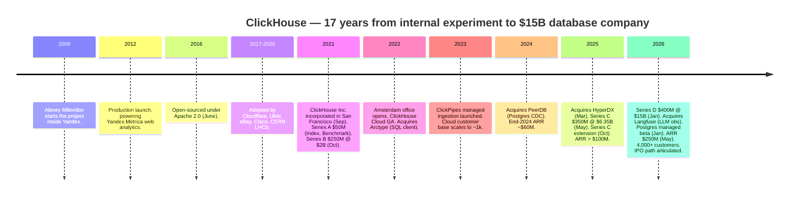
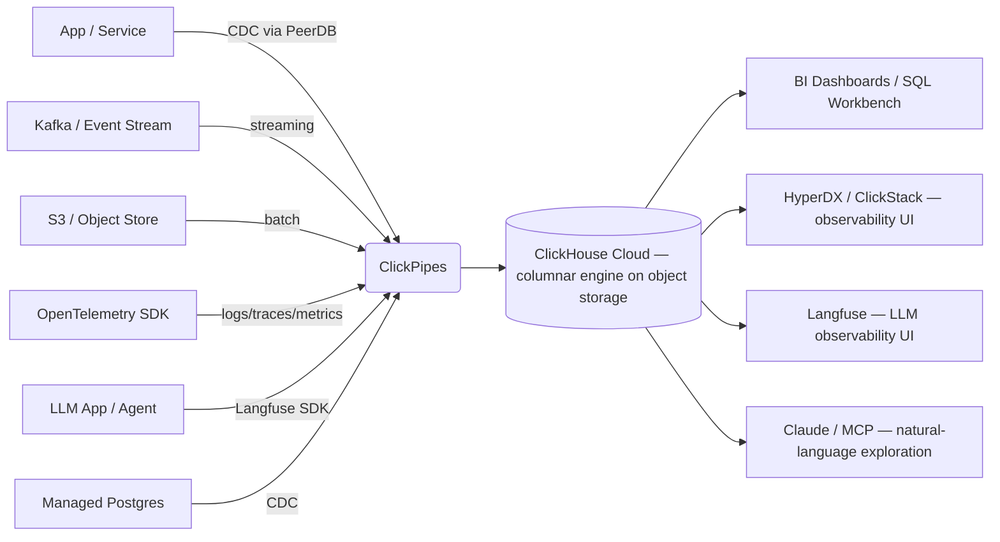
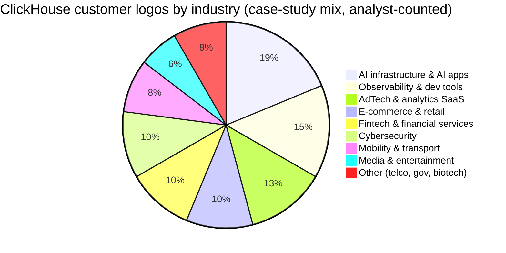
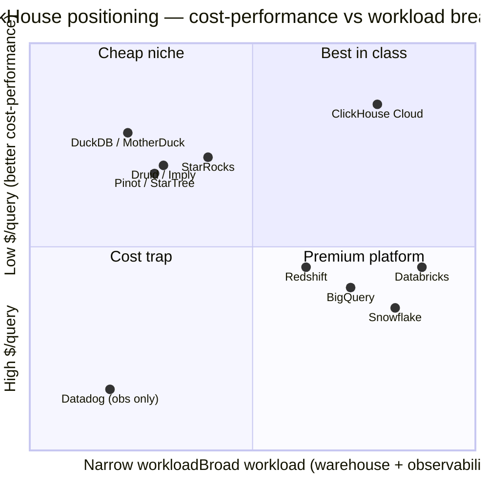

# ClickHouse, Inc. — Initiating Coverage

**Company:** ClickHouse, Inc. (private)
**Headquarters:** San Francisco, California (incorporated September 2021)
**Latest valuation:** US$15 billion post-money (Series D, January 2026)
**Document type:** Initiating-coverage research note
**As of:** 2026-05-30

---

> **Update — Series D closed at $15B post-money (2026-01-16):** ClickHouse raised a $400M Series D led by Dragoneer Investment Group with participation from T. Rowe Price–advised accounts and WCM Investment Management — public-market crossover investors typically associated with a 12–18 month IPO window — at a **post-money valuation of $15 billion**, more than 2× the $6.35B post-money set seven months earlier at Series C. Net cash raised across equity and credit since the company's Sept 2021 incorporation now exceeds **$1.05B equity + $100M credit facility**. Management used the round to acquire LLM-observability platform **Langfuse** and to launch a managed **Postgres** service — explicit signal that ClickHouse is broadening from a pure OLAP engine into a unified AI-data platform.
> Source: [ClickHouse blog — "ClickHouse raises $400 million Series D…"](https://clickhouse.com/blog/clickhouse-raises-400-million-series-d-acquires-langfuse-launches-postgres), [Bloomberg, 2026-01-16](https://www.bloomberg.com/news/articles/2026-01-16/clickhouse-lands-15-billion-valuation-in-ai-database-race), [TechCrunch, 2026-01-16](https://techcrunch.com/2026/01/16/snowflake-databricks-challenger-clickhouse-hits-15b-valuation/).

---

## Table of Contents

1. [Company Overview](#1-company-overview)
2. [Company History](#2-company-history)
3. [Management Team](#3-management-team)
4. [Products & Services](#4-products--services)
5. [Customers & Go-to-Market](#5-customers--go-to-market)
6. [Industry Overview](#6-industry-overview)
7. [Competitive Landscape](#7-competitive-landscape)
8. [Market Opportunity (TAM)](#8-market-opportunity-tam)
9. [Risk Assessment](#9-risk-assessment)

---

## 1. Company Overview

ClickHouse, Inc. is a venture-backed database company commercializing the open-source columnar OLAP engine of the same name, with a stated vision of being **"the fastest OLAP database on earth"** ([ClickHouse — Our Story](https://clickhouse.com/company/our-story)). The flagship paid product is **ClickHouse Cloud**, a fully managed serverless service that the company describes as "the fastest, most cost-efficient way to build real-time analytics, observability, and AI-powered data applications" ([ClickHouse Cloud](https://clickhouse.com/cloud)). The company sits at the intersection of three product categories that historically were sold separately — cloud data warehousing, observability backends, and AI/LLM telemetry stores — and is using its core columnar engine plus a wave of recent acquisitions to consolidate them under a single platform.

The business model is the now-standard "commercial open-source" playbook executed in the mold of Elastic, MongoDB, Confluent, and Databricks: keep the core engine free under Apache 2.0 to drive grassroots developer adoption, then monetize through a managed cloud service with consumption pricing on top. ClickHouse Cloud is available on AWS, GCP, and Azure marketplaces, across more than 14 regions globally, with a Bring-Your-Own-Cloud (BYOC) deployment option for regulated workloads and HIPAA-aligned regions for healthcare customers ([ClickHouse Cloud](https://clickhouse.com/cloud)). Pricing is metered separately for compute and storage — production tier list pricing is roughly **$47.10 per TB-month of storage and $0.6888 per compute unit-hour**, with a development tier priced from ~$1/month up to ~$193/month and a custom-priced Dedicated tier — and unused compute auto-scales down to zero so customers do not pay for idle capacity ([Contrary Research — ClickHouse Business Breakdown](https://research.contrary.com/company/clickhouse), [ClickHouse pricing](https://clickhouse.com/pricing)).

Geographically, ClickHouse is **"mindfully distributed" across more than 10 countries** — the company describes distribution as "a mindset which we leverage intentionally to build a truly global company" rather than a side effect of hiring constraints ([ClickHouse — Our Story](https://clickhouse.com/company/our-story)). Headquarters are in San Francisco; the first international office opened in Amsterdam in 2022 ([ClickHouse — Our Story](https://clickhouse.com/company/our-story)), and there are sizeable engineering hubs in Europe (anchoring the former Yandex-era development team) and growing footprints in APAC.

At scale, ClickHouse is now one of the fastest-growing data-infrastructure businesses of its vintage. **Annualised revenue reached $250 million in Q1 2026 — up roughly 3× year-over-year** — with the company explicitly targeting "high nine digits" ARR by year-end 2026 and signalling an IPO inside the next few years ([TechCrunch, 2026-05-27](https://techcrunch.com/2026/05/27/clickhouse-triples-annualized-revenue-to-250m-charting-a-path-toward-an-ipo/)). The Cloud business crossed **4,000 paying customers** at the May 2026 Open House event, up from 3,000+ at the Series D in January 2026 and ~2,000 at the May 2025 Series C ([ClickHouse blog — Series C](https://clickhouse.com/blog/clickhouse-raises-350-million-series-c-to-power-analytics-for-ai-era), [ClickHouse blog — Series D](https://clickhouse.com/blog/clickhouse-raises-400-million-series-d-acquires-langfuse-launches-postgres)). Headcount, ~197 employees at end-2024 ([Latka — ClickHouse](https://getlatka.com/companies/clickhouse)), is widely reported to have at least doubled through 2025 as the company built out enterprise sales (CRO Kevin Egan from Atlassian) and finance (CFO Jimmy Sexton from Snowflake) leadership in preparation for going public ([ClickHouse blog — Series C extension](https://clickhouse.com/blog/clickhouse-extends-series-c-financing-expands-leadership-team)).

*Source: cumulative equity raised and post-money valuations from ClickHouse blog posts at each round ([Series A/B context](https://www.bigdatawire.com/2021/09/24/speedy-column-store-clickhouse-spins-out-from-yandex-raises-50m/), [Series C](https://clickhouse.com/blog/clickhouse-raises-350-million-series-c-to-power-analytics-for-ai-era), [Series D](https://clickhouse.com/blog/clickhouse-raises-400-million-series-d-acquires-langfuse-launches-postgres)); ARR datapoints disclosed in [Series C blog](https://clickhouse.com/blog/clickhouse-raises-350-million-series-c-to-power-analytics-for-ai-era) ("nearing $100M ARR"), [Series C-extension blog](https://clickhouse.com/blog/clickhouse-extends-series-c-financing-expands-leadership-team) ("ARR more than quadrupled YoY"), and [TechCrunch, 2026-05-27](https://techcrunch.com/2026/05/27/clickhouse-triples-annualized-revenue-to-250m-charting-a-path-toward-an-ipo/) ($250M ARR, 3× YoY). The $175M ARR plot in October 2025 is an analyst interpolation.*

**Valuation snapshot (private-market).** ClickHouse is not publicly traded; the most recent third-party-priced reference point is the **$15 billion post-money valuation set by the Dragoneer-led $400M Series D on 16 January 2026** ([Bloomberg, 2026-01-16](https://www.bloomberg.com/news/articles/2026-01-16/clickhouse-lands-15-billion-valuation-in-ai-database-race)). Against the $250M ARR disclosed four months later in May 2026, that implies an **implied EV/ARR multiple of roughly 60×** — extreme even by AI-infrastructure standards, and only defensible if the company can sustain triple-digit ARR growth into 2027. For peer context: at end-May 2026, Snowflake (NYSE: SNOW) traded at roughly 14× forward sales and Databricks' last private round (Series K, December 2024) priced at ~$62B post-money on ~$3B ARR for an EV/ARR multiple of ~21× ([TechCrunch — Snowflake-Databricks challenger](https://techcrunch.com/2026/01/16/snowflake-databricks-challenger-clickhouse-hits-15b-valuation/)). The premium is the cleanest single articulation of the bull thesis: investors are paying for ClickHouse to compound from ~$250M ARR today to over $1B in two-to-three years on the back of (a) the AI-application observability wave (Langfuse, agents on top of Claude / OpenAI), (b) workload migration from Snowflake / Databricks for real-time use cases where ClickHouse's benchmarked cost-performance is multiple-x better, and (c) the new managed Postgres service unlocking the transactional-plus-analytical "HTAP-lite" market. **Multiple-compression risk is real and is carried into Section 9 as a financial risk** — a single quarter of growth deceleration into a sub-100% range would likely re-rate the equity sharply.

---

## 2. Company History

ClickHouse is unusual among database start-ups in that the product is materially older than the company. The codebase was started in **2009 by Alexey Milovidov inside Yandex**, Russia's largest internet company, as an experiment to see whether analytical reports could be generated in real time directly from non-aggregated event data, instead of pre-aggregating into OLAP cubes ([ClickHouse — Our Story](https://clickhouse.com/company/our-story), [Wikipedia — ClickHouse](https://en.wikipedia.org/wiki/ClickHouse)). After three years of development, the system went into production in **2012 to power Yandex.Metrica**, then the second-largest web-analytics platform in the world after Google Analytics ([ClickHouse — Our Story](https://clickhouse.com/company/our-story)). The Metrica workload — ingesting petabytes of web-pageview events and serving ad-hoc SQL over them with sub-second latency — is essentially the same workload pattern that defines ClickHouse's commercial market today, which is part of why the engine has aged so well: it was hardened on a real, large, demanding workload before being open-sourced.

In **June 2016 Yandex released ClickHouse as open-source software under the Apache 2.0 license**, and adoption outside Yandex began organically — Cloudflare, Uber, eBay, Cisco, Comcast, and CERN's LHCb experiment (10 billion events) all became prominent users in the 2016–2020 window ([Wikipedia — ClickHouse](https://en.wikipedia.org/wiki/ClickHouse), [BigDATAwire, 2021-09-24](https://www.bigdatawire.com/2021/09/24/speedy-column-store-clickhouse-spins-out-from-yandex-raises-50m/)). The community release also coincided with the broader shift in analytical workloads away from data-warehouse appliances (Teradata, Vertica) toward open-source / cloud-native engines, giving ClickHouse a slipstream of users it could later monetise.

*Source: dates compiled from [ClickHouse — Our Story](https://clickhouse.com/company/our-story), [Wikipedia — ClickHouse](https://en.wikipedia.org/wiki/ClickHouse), [ClickHouse blog — Series C](https://clickhouse.com/blog/clickhouse-raises-350-million-series-c-to-power-analytics-for-ai-era), [Series C extension](https://clickhouse.com/blog/clickhouse-extends-series-c-financing-expands-leadership-team), and [Series D + Langfuse + Postgres announcement](https://clickhouse.com/blog/clickhouse-raises-400-million-series-d-acquires-langfuse-launches-postgres).*

The **commercial pivot — ClickHouse, Inc. — was formed in September 2021** in San Francisco, with Aaron Katz (CEO), Alexey Milovidov (CTO, retaining custody of the technology), and Yury Izrailevsky (President of Product & Engineering) as co-founders ([BigDATAwire, 2021-09-24](https://www.bigdatawire.com/2021/09/24/speedy-column-store-clickhouse-spins-out-from-yandex-raises-50m/), [ClickHouse — Our Story](https://clickhouse.com/company/our-story)). The strategic logic was straightforward: by 2021 ClickHouse-the-OSS was demonstrably the fastest open columnar engine in the world but had no commercial vehicle, while at the same time Snowflake (IPO 2020) had proven that consumption-billed managed analytics was a generational revenue category. The company raised $50M Series A from Index and Benchmark almost concurrently with incorporation, then a $250M Series B at a $2B valuation only weeks later — an unusually large step-up that reflected the FOMO around analytical database categories in the post-Snowflake-IPO window ([BigDATAwire, 2021-09-24](https://www.bigdatawire.com/2021/09/24/speedy-column-store-clickhouse-spins-out-from-yandex-raises-50m/), [Index Ventures — Aaron Katz's journey](https://www.indexventures.com/perspectives/aaron-katzs-journey-from-salesforce-to-clickhouse/)).

The **strategic transformation in 2024–2026 has been the move from "an OLAP engine company" to a "real-time data platform"** via tuck-in acquisitions, each integrating a category-leading open-source project that was already built on top of ClickHouse. **PeerDB was acquired in July 2024** to provide Postgres change-data-capture into ClickHouse, **HyperDX in March 2025** to provide an end-to-end observability front-end (sessions, traces, logs, errors), and **Langfuse in January 2026** to provide LLM observability — prompt management, evaluations, and trace capture for AI agents and chatbots ([ClickHouse blog — HyperDX acquisition](https://clickhouse.com/blog/clickhouse-acquires-hyperdx-the-future-of-open-source-observability), [ClickHouse blog — Langfuse acquisition](https://clickhouse.com/blog/clickhouse-acquires-langfuse-open-source-llm-observability)). The pattern is consistent: each target was already a popular OSS project running on ClickHouse, with active community traction (Langfuse alone reported 20,000+ GitHub stars and 23M monthly SDK installs at the time of acquisition); rather than build these front-ends from scratch, ClickHouse buys the team and the brand and folds the product into a unified stack ([ClickHouse blog — Langfuse acquisition](https://clickhouse.com/blog/clickhouse-acquires-langfuse-open-source-llm-observability)). At the **Open House 2026 user conference (May 2026)** the company announced the launch of **ClickStack Cloud** (a serverless observability stack on top of HyperDX), an **MCP server** (Anthropic's Model Context Protocol), **AI Notebooks** with embedded Claude, and a **House Mates partner program** — explicitly framing the next chapter as agents and AI-application infrastructure rather than just databases ([ClickHouse blog — Open House 2026 Day 1](https://clickhouse.com/blog)).

---

## 3. Management Team

ClickHouse is led by a founder-CTO who built the technology over 17 years and a co-founder CEO with two prior open-source-to-IPO build cycles — a combination that is unusually load-bearing for the bull case.

**Alexey Milovidov — Co-founder & CTO.** Milovidov is the original author of ClickHouse and remains custodian of the engine's architecture. He earned his BSc in mathematics at **Moscow State University** and joined Yandex as an engineer working on the Metrica web-analytics platform. In **2009 he launched the experimental project — generating analytical reports in real time over constantly-arriving non-aggregated data — that became ClickHouse**, shepherded it through three years of internal development to the 2012 Yandex.Metrica production launch, and led the 2016 open-source release under Apache 2.0 ([ClickHouse — Our Story](https://clickhouse.com/company/our-story), [Wikipedia — ClickHouse](https://en.wikipedia.org/wiki/ClickHouse)). Between 2016 and the 2021 spin-out he ran the OSS project as a single-vendor BDFL model from inside Yandex, accepting external contributions and growing the user base to industrial-scale adopters (Cloudflare, Uber, eBay) without commercialising it. He is described in the community as **"meticulous on detail and unwavering on performance optimisation"**, an assessment consistent with the engine's signature obsession with bit-level efficiency — vectorised execution, SIMD code paths, hand-tuned compression codecs, custom hash tables ([The Key Executives, 2025-04-04](https://www.thekeyexecutives.com/2025/04/04/how-alexey-milovidov-transformed-clickhouse-into-a-real-time-data-powerhouse/)). At the company's 2021 incorporation he became co-founder and CTO, and he remains deeply operationally involved — keynoting every Open House conference, running the **"Alexey on tour" APAC AI tour** in 2026 ([ClickHouse blog — Alexey on tour](https://clickhouse.com/alexey-goes-on-tour)), and continuing to commit code to the open repository ([GitHub — alexey-milovidov](https://github.com/alexey-milovidov)). Concrete ownership percentage is not disclosed; standard founder economics at this stage of a venture-backed company would imply mid-to-high single-digit fully-diluted ownership.

**Aaron Katz — Co-founder & CEO.** Katz holds a **BS in Managerial Economics from UC Davis** and built the commercial side of two prior open-source-to-public-company stories before ClickHouse ([LinkedIn — Aaron Katz](https://www.linkedin.com/in/aaron-katz-5762094/)). He spent **12 years at Salesforce** through the company's startup-to-IPO and subsequent scaling, holding senior enterprise-sales leadership roles in both APAC and North America ([Index Ventures — Aaron Katz's journey](https://www.indexventures.com/perspectives/aaron-katzs-journey-from-salesforce-to-clickhouse/), [Matt Turck — In conversation with Aaron Katz](https://www.mattturck.com/clickhouse)). He then joined **Elastic in 2014 as Chief Revenue Officer**, where he led the entire Field Operations org from the early stages through Elastic's October 2018 IPO and into the post-IPO scaling era — a roughly six-year run that took Elastic from a couple-of-million-ARR open-source project to a multi-hundred-million-revenue public company ([Index Ventures — Aaron Katz's journey](https://www.indexventures.com/perspectives/aaron-katzs-journey-from-salesforce-to-clickhouse/)). That Elastic background is unusually relevant: the open-core monetisation model, the search-vs-analytics market positioning, and the enterprise sales motion all transfer almost directly to ClickHouse's commercial playbook. In early 2021, working with Mike Volpi at Index Ventures, Katz approached Yandex about spinning ClickHouse out and co-founded ClickHouse, Inc. with Milovidov and Yury Izrailevsky in September 2021 ([Index Ventures — Aaron Katz's journey](https://www.indexventures.com/perspectives/aaron-katzs-journey-from-salesforce-to-clickhouse/)). His operating style is described as **"more in the Tim Cook vein — quiet by nature, low ego, happy to share the spotlight"** with Milovidov on the technical narrative and Izrailevsky on operations ([Matt Turck interview](https://www.mattturck.com/clickhouse)). Through the Series A → Series D arc Katz built out a textbook IPO-ready exec team — including **CRO Kevin Egan** (Atlassian, Slack, Dropbox, Salesforce) hired in July 2025, **CFO Jimmy Sexton** (previously Snowflake and ServiceNow) hired in Q4 2025, and **VP People Mariah Nagy** (Weights & Biases, Confluent) hired in August 2025 — a slate the press has read as explicit IPO preparation ([ClickHouse blog — Series C extension](https://clickhouse.com/blog/clickhouse-extends-series-c-financing-expands-leadership-team)).

---

## 4. Products & Services

ClickHouse's product surface area has expanded sharply in the last 24 months — from a single open-source columnar engine + a managed cloud wrapper, to a multi-product platform spanning analytics, observability, ingestion, transactional storage, and AI/LLM telemetry. The unifying thesis: **every modern data workload — dashboards, logs, metrics, traces, AI traces, CDC pipelines — ends up needing to be queried with low latency over very large volumes, and the same columnar engine should serve all of them**.

### 4.1 The product matrix

ClickHouse does not publish a single 10-K-style "Products" table (it is a private company with no public filing), so the matrix below is **analyst-constructed from the company's own website navigation, product pages, blog announcements, and acquisition press releases**, and is labelled as such.

| Layer | Product family | Sub-products / features | Pricing model | First shipped |
|---|---|---|---|---|
| **Engine** | ClickHouse OSS | Core columnar database, SQL, MergeTree storage, vectorised execution | Free, Apache 2.0 | 2016 (OSS); 2009 (internal) |
| **Managed compute** | ClickHouse Cloud | Serverless, multi-AZ, separation of storage & compute, auto-scale to zero | Consumption: compute $/hour, storage $/TB-mo | 2022 GA |
| **Deployment** | Bring-Your-Own-Cloud (BYOC) | Run Cloud control plane in the customer's AWS/GCP/Azure account | Negotiated (enterprise) | 2024 |
| **Ingestion** | ClickPipes | Managed connectors for Kafka, S3, Postgres (CDC via PeerDB), MongoDB, Kinesis | Bundled into Cloud consumption | 2023; PeerDB-powered Postgres CDC GA 2024 |
| **Transactional** | Managed Postgres ("Postgres managed by ClickHouse") | Native enterprise-grade managed Postgres tightly integrated with ClickHouse for HTAP-lite | Bundled into Cloud consumption | 2026 (beta) |
| **Observability** | ClickStack / HyperDX | OpenTelemetry-native logs/metrics/traces/session-replay UI built on ClickHouse | Free OSS + ClickStack Cloud (consumption) | HyperDX acquired Mar 2025; ClickStack Cloud GA May 2026 |
| **LLM observability** | Langfuse | Open-source LLM traces, prompt management, eval framework | Free OSS (MIT) + Langfuse Cloud (consumption) | Langfuse acquired Jan 2026 |
| **AI surfaces** | MCP server, AI Notebooks (Claude), ClickHouse Agents | Anthropic Model Context Protocol bridge to ClickHouse Cloud; agentic SQL & exploration | Cloud-bundled | Open House 2026 (May) |
| **Tooling** | clickhousectl, Cloud Console (ex-Arctype), Grafana plugin | CLI for Postgres/ClickPipes/Cloud admin, SQL workbench, BI integrations | Free | clickhousectl 2025; Arctype acquired 2022 |

*Sources: [ClickHouse Cloud](https://clickhouse.com/cloud), [ClickHouse use cases](https://clickhouse.com/use-cases), [Contrary Research — ClickHouse Business Breakdown](https://research.contrary.com/company/clickhouse), [ClickHouse blog — HyperDX acquisition](https://clickhouse.com/blog/clickhouse-acquires-hyperdx-the-future-of-open-source-observability), [ClickHouse blog — Langfuse acquisition](https://clickhouse.com/blog/clickhouse-acquires-langfuse-open-source-llm-observability), [ClickHouse blog — Series D + Postgres launch](https://clickhouse.com/blog/clickhouse-raises-400-million-series-d-acquires-langfuse-launches-postgres), [ClickHouse blog — Open House 2026 Day 1](https://clickhouse.com/blog).*

### 4.2 Synthesis — how the layers interact

The unifying customer workflow is straightforward and explains why each acquisition slots in: data is **ingested via ClickPipes** (Kafka stream for events; PeerDB CDC for the operational Postgres database; S3 for batch data; OpenTelemetry collector for observability), **stored on object storage with elastic compute on top in ClickHouse Cloud**, **queried via SQL for analytics and dashboards** (the traditional warehouse use case), **queried via the HyperDX UI for observability** (logs / traces / sessions), **queried via Langfuse for LLM observability** (AI agent traces, prompt versions, eval scores), and increasingly **queried via natural language by Claude through the MCP server** for ad-hoc exploration. The new **managed Postgres service** closes the last gap by giving customers a managed transactional database whose CDC stream feeds the same ClickHouse cluster, enabling **"unified transactional and analytical workloads"** ([CEO Aaron Katz, Series D blog](https://clickhouse.com/blog/clickhouse-raises-400-million-series-d-acquires-langfuse-launches-postgres)) inside one platform instead of stitching together three vendors.

*Source: workflow synthesised from product descriptions on [ClickHouse Cloud](https://clickhouse.com/cloud), [ClickHouse use cases](https://clickhouse.com/use-cases), and the Series D + Postgres launch blog ([Series D announcement](https://clickhouse.com/blog/clickhouse-raises-400-million-series-d-acquires-langfuse-launches-postgres)).*

### 4.3 ClickHouse OSS — the columnar engine

> **ClickHouse product description (verbatim from the company):** *"The popular open-source column-oriented database management system which allows users to generate analytical reports using SQL queries in real-time."* ([ClickHouse — Our Story](https://clickhouse.com/company/our-story))

**Plain-language gloss / 中文释义:** ClickHouse OSS is a **columnar / 列式 DBMS** — data for one row is split into per-column files and only the columns referenced by a query are scanned, which yields dramatic I/O savings on wide analytical tables where queries typically read 1–5 columns out of hundreds. The engine is written in **C++** with hand-tuned **vectorised execution / 向量化执行** (SIMD-batched operations over column chunks rather than tuple-at-a-time), **LZ4/ZSTD compression / 压缩** of each column independently, and a **MergeTree storage layout** that sorts data by a primary key and merges background partitions in the background — conceptually similar to an LSM tree but optimised for analytical reads. Versus row-oriented systems (Postgres, MySQL, Oracle) the architecture trades update flexibility for an order-of-magnitude (or two) speedup on aggregation queries.

*Analyst view:* ClickHouse OSS's competitive moat is **technical depth + community network effect**, not licensing — the engine reached 41,000+ GitHub stars and is the de-facto open columnar engine of choice. The closest open-source comparables are **Apache Druid** (focused on time-series), **Apache Pinot** (focused on real-time ingestion + low-latency point queries), and **StarRocks** (closer architectural match, China-origin). Among them ClickHouse has the broadest workload coverage and the best general-purpose SQL surface. **DuckDB** is a different category — an in-process embedded engine, "SQLite for analytics," and competes mostly for the laptop / notebook / single-node tier ([DB-Engines — ClickHouse trend](https://db-engines.com/en/ranking_trend/system/ClickHouse), [Cloudraft — ClickHouse vs DuckDB](https://www.cloudraft.io/blog/clickhouse-vs-duckdb)).

### 4.4 ClickHouse Cloud — the managed service

> **Product description (verbatim from the company):** *"The fastest, most cost-efficient way to build real-time analytics, observability, and AI-powered data applications… pay only for what you use, with elastic compute that scale[s] up and down based on demand."* ([ClickHouse Cloud](https://clickhouse.com/cloud))

**Plain-language gloss / 中文释义:** ClickHouse Cloud is a **serverless** managed deployment of the OSS engine on AWS / GCP / Azure with **storage-compute separation / 存算分离** — column data lives in S3-class object storage and is fetched on demand by ephemeral compute pods, which allows the system to scale compute and storage independently and to **scale compute down to zero** (so an idle cluster costs the customer only the storage). The "serverless" framing matters: at Snowflake the unit of billing is a "warehouse" that must be manually sized and resumed; at ClickHouse Cloud the engine auto-scales vertically for heavier queries and horizontally for concurrency, which the company argues is materially better for the **real-time / sub-second query / high-concurrency** workload pattern that defines its target market ([ClickHouse vs Snowflake comparison](https://clickhouse.com/comparison/snowflake)). Multi-AZ deployments give high availability by default; backups and patches are managed.

*Analyst view:* The Cloud product is where roughly all current ARR is generated, and the cost-performance gap vs Snowflake/Databricks is the central commercial pitch. The published benchmark — ClickHouse-authored and therefore self-interested but methodology-transparent — shows that across 1B / 10B / 100B-row workloads **the next-best system lands 7-13× worse on cost-performance at 10B rows, and 23-32× worse at 100B rows** ([ClickHouse benchmark, 2025](https://clickhouse.com/blog/cloud-data-warehouses-cost-performance-comparison)). Even haircutting heavily for vendor bias, the structural advantage of an engine designed for OLAP from day one over engines (Snowflake, Databricks) designed for batch-warehouse workloads is real.

### 4.5 ClickPipes — managed ingestion

> **Product description (verbatim from the company):** *"A fully managed ingestion layer supporting Kafka, S3, PostgreSQL, MongoDB, and others."* ([ClickHouse Cloud](https://clickhouse.com/cloud))

**Plain-language gloss / 中文释义:** ClickPipes is the **managed ETL/ELT / 数据管道** layer that gets data into ClickHouse Cloud without the customer running their own Kafka Connect, Debezium, or Airbyte. It is differentiated by the **PeerDB-powered Postgres CDC** (change-data-capture) connector — acquired in July 2024 — which streams Postgres WAL changes into ClickHouse in near-real-time and is now the canonical way Postgres-shop customers feed ClickHouse for analytics. The Kafka connector handles event-stream ingestion (the canonical observability + product-analytics use case), and the S3 connector handles batch loads ([Contrary Research — ClickHouse Business Breakdown](https://research.contrary.com/company/clickhouse)).

*Analyst view:* ClickPipes' competitive role is **friction-removal**, not differentiation — Fivetran, Airbyte, Estuary, Confluent Connect all do this work in their own way. The strategic value of bundling it into ClickHouse Cloud is **reducing the customer's vendor count from three (warehouse + ingestion + CDC) to one**, which compounds the cost-saving narrative vs Snowflake (where customers separately pay Fivetran or Airbyte for ingestion).

### 4.6 ClickStack / HyperDX — observability

> **Product description (verbatim from the HyperDX acquisition blog):** *"HyperDX is a fully open-source observability platform built on top of ClickHouse… session replay capabilities, an intuitive UI for exploratory workflows, and seamless data ingestion via OpenTelemetry."* ([ClickHouse blog — HyperDX acquisition](https://clickhouse.com/blog/clickhouse-acquires-hyperdx-the-future-of-open-source-observability))

**Plain-language gloss / 中文释义:** ClickStack is the bundled **observability stack / 可观测性栈** — logs, metrics, traces, errors, and session replay — that sits on top of ClickHouse as the storage backend. The economic pitch is brutally direct: observability data is by far the largest single workload pattern by volume in any organisation (every microservice emits structured logs, every API call emits a trace, every page load emits frontend telemetry), and the incumbent vendors (Datadog, Splunk, Elastic) charge per-GB ingested at prices that compound to 7-figure annual bills very quickly. ClickHouse's pitch — embodied internally and externally — is that **the same workload on ClickHouse is 10-200× cheaper** ([ClickHouse blog — HyperDX acquisition](https://clickhouse.com/blog/clickhouse-acquires-hyperdx-the-future-of-open-source-observability), claiming a 200× internal cost reduction at ClickHouse). **ClickStack Cloud (serverless observability)** was launched at Open House 2026 in May 2026, completing the productisation arc ([ClickHouse blog — Open House 2026 Day 1](https://clickhouse.com/blog)).

*Analyst view:* This is the **single largest medium-term wedge** into a non-warehouse market. The Datadog/Splunk install base is large, sticky, and increasingly cost-sensitive after years of price escalation. The closest comparables are **Grafana Loki** (logs), **Tempo** (traces), and **Mimir** (metrics), plus **Coralogix**, **New Relic**, and the OSS **SigNoz** stack. HyperDX gives ClickHouse the UI it previously lacked to be a genuine Datadog replacement, not just a cheaper backend. Moat type: **technology + cost arbitrage**; switching cost is the main barrier (telemetry pipelines are sticky once deployed).

### 4.7 Managed Postgres — the transactional layer

> **Product description (verbatim from the Series D blog):** *"Native enterprise-grade managed Postgres offering integrated with its analytics platform… up to 100X faster analytics when syncing transactional data to ClickHouse, enabling unified querying across transactional and analytical workloads for AI applications."* ([ClickHouse blog — Series D + Postgres](https://clickhouse.com/blog/clickhouse-raises-400-million-series-d-acquires-langfuse-launches-postgres))

**Plain-language gloss / 中文释义:** Postgres-managed-by-ClickHouse is a fully managed **OLTP** (online transaction processing) database — i.e. a Postgres instance with replicas, backups, point-in-time recovery, etc. — that is **wire-protocol-compatible with Postgres** and has **CDC out-of-the-box into ClickHouse**. This is ClickHouse's answer to the long-running OLTP-vs-OLAP unification problem ("HTAP" / hybrid transactional-analytical processing) without taking on the genuinely hard engineering challenge of running both workloads on a single engine: instead, run Postgres for the transactional path and ClickHouse for the analytical path, with sub-second CDC between them. For an AI-application developer (the explicitly-targeted persona) this collapses what would otherwise be Postgres + Fivetran + Snowflake + Datadog + Langfuse into a single vendor.

*Analyst view:* The strategic value is **vendor consolidation and the lock-in flywheel** — once a customer's transactional database is on ClickHouse's managed Postgres, switching cost rises substantially. The closest comparable is **Neon** (serverless Postgres, acquired by Databricks in May 2025), and the move can be read as a direct response: if Databricks bought OLTP, ClickHouse must build / buy / launch it too. Moat type: **switching cost + bundle pricing**. (Beta status as of May 2026 means execution risk is non-trivial.)

### 4.8 Langfuse — LLM observability

> **Product description (verbatim from the acquisition blog):** *"An open-source platform covering LLM observability, prompt management, evaluations, and experimentation — designed to address the 'trust gap' in AI applications by monitoring output quality beyond traditional system metrics."* ([ClickHouse blog — Langfuse acquisition](https://clickhouse.com/blog/clickhouse-acquires-langfuse-open-source-llm-observability))

**Plain-language gloss / 中文释义:** Langfuse is the **LLM-application observability layer / LLM 可观测性** — when an AI agent (built on Claude, GPT-5, Llama, etc.) takes a user request and runs a chain of LLM calls, tool calls, retrieval queries, and post-processing steps, Langfuse traces the entire chain, records every prompt + model + temperature + output + token cost + latency, and lets developers grade the outputs against eval rubrics. Because all that telemetry is itself a high-volume event stream over very large rows of nested data, **ClickHouse is a near-ideal storage backend** — which is why Langfuse was already built on ClickHouse before the acquisition. By acquiring Langfuse, ClickHouse claims the front-end UI brand in a fast-growing category (Langfuse hit **20,000+ GitHub stars and 23M monthly SDK installs by Q4 2025**, including 19 of the Fortune 50 and 63 of the Fortune 500) and forecloses the option that a rival rebuilds it on a different engine ([ClickHouse blog — Langfuse acquisition](https://clickhouse.com/blog/clickhouse-acquires-langfuse-open-source-llm-observability)).

*Analyst view:* This is the cleanest expression of the **"AI infrastructure pickaxe" thesis** that justifies the Series D valuation — every AI application built on top of foundation models needs observability, the category leaders are nascent, and ClickHouse can roll up the OSS ones at attractive multiples. Closest comparables: **LangSmith** (LangChain's hosted service, also already a customer of ClickHouse — uses ClickHouse for storage), **Arize AI** (commercial enterprise), **Weights & Biases Weave**, **Helicone**. Moat type: **distribution + bundle economics** — when ClickHouse Cloud is already a customer's analytical store, Langfuse adoption is one toggle away.

### 4.9 Flagship vs long-tail, recent launches, deployment

The **flagship franchise is ClickHouse Cloud** — substantially the entire $250M ARR currently sits there, on the back of ~4,000 paying customers spanning analytics, observability, and increasingly AI workloads ([TechCrunch, 2026-05-27](https://techcrunch.com/2026/05/27/clickhouse-triples-annualized-revenue-to-250m-charting-a-path-toward-an-ipo/)). HyperDX/ClickStack and Langfuse are not yet material revenue contributors but are strategic: they expand the addressable workload from "people willing to pay for a managed database" to "people running Datadog and LLM apps". Recent product launches (last 12 months, all cited to ClickHouse press / blog): **HyperDX acquisition** (Mar 2025), **Series C / 2,000 customers** (May 2025), **Series C extension + IPO-grade exec team** (Oct 2025), **Series D + Langfuse + Postgres beta** (Jan 2026), **ClickStack Cloud + MCP server + AI Notebooks + Open House 2026** (May 2026) ([ClickHouse blog](https://clickhouse.com/blog)). Deployment options span **fully managed SaaS** (AWS/GCP/Azure), **BYOC** (control plane in customer's cloud account, for regulated workloads), and **self-managed OSS** (Apache 2.0, free); on the Cloud side specifically there are **HIPAA-compliant regions** for healthcare-vertical customers like Memorial Sloan Kettering ([ClickHouse Cloud](https://clickhouse.com/cloud), [Series C blog](https://clickhouse.com/blog/clickhouse-raises-350-million-series-c-to-power-analytics-for-ai-era)).

---

## 5. Customers & Go-to-Market

ClickHouse's customer book is unusually broad for a company at this revenue scale — the listed case-study page alone names more than **35 distinct logos across at least 12 industry verticals**, from hyperscalers (Microsoft) to media (Vimeo, Sony Entertainment Television) to fintech (Block, Deutsche Bank) to mobility (Uber, Lyft, Didi, Trip.com) to e-commerce (eBay, Instacart, Shopee) to AdTech (Rokt, Admixer, Cognitiv) to security (Cloudflare, Dassana, Resmo, IBM QRadar) to AI infrastructure (Anthropic, Meta, Vercel, LangChain, DeepL, Character AI) ([ClickHouse customer stories](https://clickhouse.com/customer-stories), [Series C blog](https://clickhouse.com/blog/clickhouse-raises-350-million-series-c-to-power-analytics-for-ai-era), [Series D blog](https://clickhouse.com/blog/clickhouse-raises-400-million-series-d-acquires-langfuse-launches-postgres)). At Series D the company disclosed **3,000+ Cloud customers** including new wins like Capital One, Lovable, Decagon, Polymarket, and Airwallex; by Open House in May 2026 the count had grown to **4,000+** ([ClickHouse blog — Series D](https://clickhouse.com/blog/clickhouse-raises-400-million-series-d-acquires-langfuse-launches-postgres), [TechCrunch, 2026-05-27](https://techcrunch.com/2026/05/27/clickhouse-triples-annualized-revenue-to-250m-charting-a-path-toward-an-ipo/)).

**Customer concentration — disclosure status: not disclosed.** As a private company, ClickHouse does not publish a `前五名客户` / "10% customer" footnote analogous to a 10-K segment note. From qualitative signals the customer base appears genuinely diversified — no single named customer is highlighted as load-bearing in any disclosure, and the Cloud product is sold consumption-style to >4,000 paying accounts, which mechanically limits top-1 concentration. The closest the company has come to a concentration disclosure is the Series D blog naming customers like Anthropic, Meta, Capital One, Tesla, Decagon, and Vercel as running "business-critical systems on ClickHouse" ([Series D blog](https://clickhouse.com/blog/clickhouse-raises-400-million-series-d-acquires-langfuse-launches-postgres)) — which is a brand claim, not a revenue-share claim. **For this initiating note we treat customer concentration as undisclosed but qualitatively low, and flag the disclosure gap in Section 9 — a typical pre-IPO S-1 filing would force a "10% customer" disclosure that the market does not currently have.**

*Source: counted from the 35+ logos on [ClickHouse customer stories](https://clickhouse.com/customer-stories), supplemented by named-customer mentions in the [Series C blog](https://clickhouse.com/blog/clickhouse-raises-350-million-series-c-to-power-analytics-for-ai-era), [Series C-extension blog](https://clickhouse.com/blog/clickhouse-extends-series-c-financing-expands-leadership-team), and [Series D blog](https://clickhouse.com/blog/clickhouse-raises-400-million-series-d-acquires-langfuse-launches-postgres). **Denominator note:** this chart counts logos, not revenue — it is a marketing-mix indicator only, not a customer-revenue-concentration disclosure.*

**Go-to-market.** ClickHouse runs the **classic OSS-led product-led-growth (PLG) → enterprise sales motion** that worked for Elastic, MongoDB, and Confluent: the open-source engine drives bottom-up developer adoption and creates a population of self-identified prospects who are already running ClickHouse internally; the Cloud product lets a developer get a managed environment self-service in minutes with a 30-day trial + $300 of credits; and the enterprise sales team led by CRO Kevin Egan (Atlassian, Slack, Dropbox, Salesforce) then engages once a customer's workload grows above an annual contract value threshold ([ClickHouse Cloud](https://clickhouse.com/cloud), [ClickHouse blog — Series C extension](https://clickhouse.com/blog/clickhouse-extends-series-c-financing-expands-leadership-team)). The acquisition strategy is **adjacent open-source projects already running on ClickHouse** — PeerDB, HyperDX, Langfuse — which doubles as a customer-acquisition channel: the open-source community of each acquired project becomes a top-of-funnel for ClickHouse Cloud ([ClickHouse blog — Series D](https://clickhouse.com/blog/clickhouse-raises-400-million-series-d-acquires-langfuse-launches-postgres)).

**Cloud-marketplace distribution** is meaningful: ClickHouse Cloud is listed on the AWS, GCP, and Azure marketplaces, which lets enterprises consume the spend against their committed cloud-spend dollars — a powerful sales-cycle compressor at large customers ([ClickHouse Cloud](https://clickhouse.com/cloud)). The new **House Mates partner program** announced at Open House 2026 formalises the systems-integrator / consulting partner channel that has historically been ad-hoc, signalling the next wave of mid-market and large-enterprise expansion ([ClickHouse blog — Open House 2026](https://clickhouse.com/blog)).

The case studies disclose **customer-specific magnitude metrics** that capture the workload scale ClickHouse is winning: Cloudflare runs **6 million HTTP-analytics requests per second** through ClickHouse; Uber ingests **millions of logs per second** at petabyte storage scale; Trip.com migrated from Elasticsearch to a **50PB logging cluster**; Sony Entertainment Television ingests **tens of millions of CDN records daily**; Lyft processes **25TB+ monthly read/write volume**; Block reports **10× better performance than BigQuery**; Canva, Lyft, GitLab, and Character AI report claims as strong as **"70% cheaper costs and 10× improved search performance"** ([ClickHouse customer stories](https://clickhouse.com/customer-stories), [ClickHouse Cloud](https://clickhouse.com/cloud)). These are vendor-curated, but the diversity of workload patterns is real evidence of platform breadth.

---

## 6. Industry Overview

ClickHouse competes across three nested industry segments: the **broad database management systems (DBMS) market** (the TAM ceiling), the **OLAP / analytical database sub-segment** (the SAM), and the **real-time OLAP / streaming-analytics niche** (the immediate SOM where it is winning). Independent market research firms triangulate the following:

- **Overall DBMS market:** ~**USD 98.6 bn in 2025**, growing to ~**USD 275 bn by 2035 at ~10.8% CAGR** per Expert Market Research ([Expert Market Research — DBMS market](https://www.expertmarketresearch.com/reports/database-management-system-market)). Mordor Intelligence puts the broader database market at **USD 150 bn in 2025 → USD 329 bn by 2031 at 13.95% CAGR** using a slightly more inclusive definition that bundles analytics tooling ([Mordor Intelligence — Database market](https://www.mordorintelligence.com/industry-reports/database-market)).
- **OLAP database systems:** ~**USD 15 bn in 2025**, projected to ~**USD 40 bn by 2033 at 12% CAGR** ([Data Insights Market — OLAP](https://www.datainsightsmarket.com/reports/olap-database-systems-1449505)).
- **Columnar OLAP databases:** **USD 5.9 bn in 2024 → USD 18.4 bn by 2033 at 13.7% CAGR** per Growth Market Reports ([Growth Market Reports — Columnar OLAP](https://growthmarketreports.com/report/columnar-olap-database-market/amp)).
- **Real-time OLAP databases:** **USD 4.2 bn in 2024 → USD 24.7 bn by 2033 at 20.1% CAGR** — the fastest-growing slice and ClickHouse's primary battleground ([Growth Market Reports — Real-time OLAP](https://growthmarketreports.com/report/real-time-olap-database-market)).

*Source: Real-time OLAP and Columnar OLAP figures from [Growth Market Reports — Real-time OLAP](https://growthmarketreports.com/report/real-time-olap-database-market) and [Growth Market Reports — Columnar OLAP](https://growthmarketreports.com/report/columnar-olap-database-market/amp); overall DBMS market from [Expert Market Research](https://www.expertmarketresearch.com/reports/database-management-system-market). ClickHouse ARR overlay from [TechCrunch, 2026-05-27](https://techcrunch.com/2026/05/27/clickhouse-triples-annualized-revenue-to-250m-charting-a-path-toward-an-ipo/) and [Series C blog](https://clickhouse.com/blog/clickhouse-raises-350-million-series-c-to-power-analytics-for-ai-era).*

The **structural growth drivers** are well-documented and mostly favour ClickHouse:

1. **Real-time / event-driven workloads are taking share from batch.** The historical analytical data stack — daily ETL jobs landing in a warehouse, queries answered against day-old aggregates — is giving way to event-streaming architectures (Kafka, Kinesis, Pulsar) and sub-second query expectations from product-embedded analytics, observability, and AI dashboards. ClickHouse's architecture is purpose-built for this pattern in a way that Snowflake's elastic-warehouse model is not ([ClickHouse vs Snowflake comparison](https://clickhouse.com/comparison/snowflake)).
2. **Observability data is the largest single growth wedge.** Every microservice deployed, every Kubernetes pod, every API call, every page load, every mobile-app event emits structured telemetry; the volume compounds at >40% annually at most enterprises. Datadog's revenue trajectory (~$3bn → $3bn-plus run-rate in 4 years) and Splunk's $28bn acquisition by Cisco in 2024 are the proof points. Open-source observability stacks (OpenTelemetry, Grafana ecosystem, ClickStack) are gaining share as the cost of proprietary stacks becomes painful at scale ([ClickHouse blog — HyperDX acquisition](https://clickhouse.com/blog/clickhouse-acquires-hyperdx-the-future-of-open-source-observability)).
3. **AI-application infrastructure is creating a new analytical workload class.** LLM applications produce a different shape of telemetry — long prompts, structured tool calls, nested traces, eval scores — and a new buyer (the AI / ML engineering team) for an observability stack. Langfuse-style LLM observability is a category that did not exist three years ago and is now the explicit target of the Series D ([ClickHouse blog — Series D](https://clickhouse.com/blog/clickhouse-raises-400-million-series-d-acquires-langfuse-launches-postgres)).
4. **Open-source-database adoption continues to gain share** versus proprietary incumbents (Oracle, Teradata, Vertica, IBM DB2). The MongoDB / PostgreSQL / Confluent / Databricks playbook is now repeatable, with each generation of open-source company faster to revenue than the last; ClickHouse's $0 → $100M ARR in roughly 3 years is consistent with that trajectory ([ClickHouse Series C blog](https://clickhouse.com/blog/clickhouse-raises-350-million-series-c-to-power-analytics-for-ai-era)).

**Regulatory environment** is mostly tailwind-neutral for ClickHouse: GDPR / data-residency requirements drive demand for the BYOC and regional-deployment options; HIPAA-aligned regions are an unlock in US healthcare; the EU AI Act and US AI executive orders are pushing enterprise AI deployments toward observability, which feeds Langfuse demand. The one regulatory risk worth flagging is **data-residency in jurisdictions where ClickHouse-the-OSS's Russian (Yandex) origin may be a procurement blocker** — discussed in Section 9.

**Industry structure** is fragmented at the open-source layer and consolidating at the cloud-managed layer. There are dozens of analytical engines in active development (ClickHouse, DuckDB, Druid, Pinot, StarRocks, Doris, Trino, ChDB, etc.), but only a handful with a credible commercial-cloud arm at scale: Snowflake, Databricks, BigQuery (Google captive), Redshift (AWS captive), and now ClickHouse Cloud. Supplier power (i.e. cloud hyperscaler infrastructure) is concentrated at AWS/GCP/Azure; buyer power is moderate (enterprises have alternatives but switching cost is high once an analytics workload is migrated); substitute risk is real (DuckDB embeds the workload, snowflake bundles it into BI) but currently bounded.

---

## 7. Competitive Landscape

ClickHouse competes across multiple overlapping rings of competition. The clearest mental model: **direct competitors on real-time OLAP**, **adjacent cloud data warehouses**, **observability natives**, **streaming-OLAP open-source rivals**, and **embedded / single-node alternatives**.

*Source: positioning synthesised from ClickHouse's own published benchmarks ([ClickHouse benchmark, 2025](https://clickhouse.com/blog/cloud-data-warehouses-cost-performance-comparison), [ClickHouse vs Snowflake](https://clickhouse.com/comparison/snowflake)) and from third-party comparison reviews ([Flexera — ClickHouse vs Snowflake](https://www.flexera.com/blog/finops/clickhouse-vs-snowflake/), [Tinybird — ClickHouse vs Databricks](https://www.tinybird.co/blog/clickhouse-vs-databricks)). Positioning on the breadth axis reflects current product surface — Snowflake and Databricks have broader BI / ML / streaming products today; ClickHouse is closing the gap with Postgres + ClickStack + Langfuse but remains analyst-judged narrower than the two largest incumbents.*

**Snowflake (NASDAQ: SNOW).** The most-cited point of comparison. Snowflake's strength is batch-warehouse workloads, BI, broad ecosystem (Snowpark, Cortex), and a mature enterprise sales motion; its weakness is the cost / latency profile when used for real-time / high-concurrency / observability use cases. ClickHouse's published benchmark claims **3–5× faster queries and ~4× lower cost per query versus Snowflake**, with the gap widening at larger scale (32× cheaper at 100B rows on the published TPC-style benchmark) ([ClickHouse vs Snowflake](https://clickhouse.com/comparison/snowflake), [ClickHouse benchmark](https://clickhouse.com/blog/cloud-data-warehouses-cost-performance-comparison)). The customer pattern (e.g. Block, which reports "10× better performance than BigQuery" and migrated from BigQuery, plus internal data warehouse teams at numerous customers migrating workloads off Snowflake into ClickHouse) is consistent with real share transfer at the workload level rather than pure greenfield wins ([ClickHouse customer stories — Block](https://clickhouse.com/customer-stories)).

**Databricks (private, ~$62B last priced).** Architecturally the closest peer because both companies are betting on a unified data + AI platform, but with very different starting points: Databricks ships from a Spark-centric data-lakehouse heritage with deep ML / DBSQL / Unity Catalog functionality; ClickHouse ships from a sub-second OLAP engine heritage and is bolting on adjacent workloads. On batch-ML and notebook-driven data-science workflows Databricks is materially stronger; on real-time-analytics and observability workloads ClickHouse is materially stronger. Databricks' acquisition of **Neon (serverless Postgres, May 2025)** is the mirror of ClickHouse's managed Postgres launch — both companies see the OLTP-CDC-OLAP unification as the next major battleground for AI-native customers ([TechCrunch — Snowflake-Databricks challenger](https://techcrunch.com/2026/01/16/snowflake-databricks-challenger-clickhouse-hits-15b-valuation/)).

**Google BigQuery and AWS Redshift.** The hyperscaler-captive options. BigQuery is materially the better engineered of the two and a strong choice for organisations heavily committed to GCP, but it is materially behind ClickHouse on real-time / sub-second workloads per published benchmarks ([ClickHouse benchmark](https://clickhouse.com/blog/cloud-data-warehouses-cost-performance-comparison)). Redshift is increasingly the workload-loss vendor in real-time OLAP migrations — many ClickHouse case studies start from "we were on Redshift, costs were unmanageable" or analogous. Both hyperscalers compete on **bundled spend commitments** — a real procurement advantage — but lose on pure cost-performance for the workload pattern ClickHouse targets.

**Apache Druid / Imply, Apache Pinot / StarTree.** Direct architectural rivals — both are real-time OLAP engines designed specifically for sub-second analytics at scale, both came out of the 2010s data-engineering era at LinkedIn (Pinot) and Metamarkets / Imply (Druid), and both have commercial cloud offerings via Imply and StarTree respectively. ClickHouse's competitive edge over them is **breadth of SQL surface and general-purpose workload coverage** — Druid and Pinot are most competitive on a specific subset of workloads (time-series with predefined dimensions, low-latency point queries against an aggregation table) but struggle with ad-hoc analytical SQL where ClickHouse's MergeTree-plus-vectorised-execution shines. In the OSS popularity race, **DB-Engines tracks ClickHouse at #29 globally as of Nov 2025**, significantly ahead of Druid (~#45) and Pinot (lower), with DuckDB at #41 ([DB-Engines — ClickHouse ranking trend](https://db-engines.com/en/ranking_trend/system/ClickHouse)).

**StarRocks (Chinese-origin OSS, commercialised by CelerData).** A genuine architectural alternative — vectorised columnar engine, MPP execution, broad SQL surface — and the most credible rising open-source rival, especially in greater-China deployments and use cases needing strong join performance on star schemas. ClickHouse's edge globally is brand, commercial team, and the Cloud productisation; in China specifically, StarRocks / Doris are stronger competitors than they are in the US/EU.

**DuckDB / MotherDuck.** A different category — embedded, single-node, "SQLite for analytics" — that is not in direct competition for ClickHouse Cloud's high-concurrency / multi-tenant workloads, but is a real threat to the **lower end of the funnel**: developers who would have spun up ClickHouse locally for a small dataset now use DuckDB. MotherDuck is productising this into a cloud service. The threat is "death by a thousand small workloads never converting to Cloud", but at current revenue scale ClickHouse Cloud is winning in the upper-mid-market and enterprise where DuckDB cannot serve the workload ([Cloudraft — ClickHouse vs DuckDB](https://www.cloudraft.io/blog/clickhouse-vs-duckdb)).

**Datadog, Splunk (Cisco), Grafana, New Relic — observability incumbents.** Indirect but increasingly relevant competitors now that ClickHouse / HyperDX / ClickStack target observability workloads explicitly. The incumbents' advantage is the breadth of integrations and the agent install base; ClickHouse's advantage is the cost-per-GB-ingested at scale, where the gap is multi-x. Grafana Labs (private, ~$6bn last round) is the closest open-source-native competitor and is the most likely to consolidate the OSS observability stack independently ([ClickHouse blog — HyperDX](https://clickhouse.com/blog/clickhouse-acquires-hyperdx-the-future-of-open-source-observability)).

**ClickHouse's competitive advantages, on balance:**
- **Engine architecture**: 17 years of bit-level optimisation of vectorised execution, compression, MergeTree storage — the engine is genuinely faster on the workloads it targets, with published benchmarks supporting the claim.
- **Cost-performance** on real-time / high-concurrency workloads — multi-x advantage in published benchmarks vs Snowflake, Databricks, BigQuery, Redshift at large scale ([ClickHouse benchmark](https://clickhouse.com/blog/cloud-data-warehouses-cost-performance-comparison)).
- **Open-source community + brand** — large GitHub presence, Apache 2.0 license keeps cost objections away from infrastructure teams.
- **Acquisition roll-up of OSS adjacents** — PeerDB, HyperDX, Langfuse — extending platform reach cheaply.

**Vulnerabilities:**
- **Workload breadth gap** vs Snowflake / Databricks on BI, ML, Snowpark-style Python compute, governance — ClickHouse is narrower today, which limits how much wallet-share it can capture per customer.
- **Enterprise sales motion is younger** — even with Egan/Sexton hires, Snowflake and Databricks have 3-5× the field-sales muscle.
- **No durable network effects** — unlike data-lake / iceberg / catalog plays, the OLAP engine itself is not a multi-tenant data network.

---

## 8. Market Opportunity (TAM)

ClickHouse's serviceable addressable market is best modelled bottom-up by stacking the workload segments it credibly addresses today:

**Core OLAP / analytical workloads** — **~$15bn TAM in 2025 growing to ~$40bn by 2033 at ~12% CAGR** ([Data Insights Market — OLAP](https://www.datainsightsmarket.com/reports/olap-database-systems-1449505)). This is the share-of-data-warehouse battle versus Snowflake / Databricks / BigQuery / Redshift. Even capturing 5-10% of this segment over the next 5 years is consistent with the public market's read of the Series D price.

**Real-time / streaming-analytics workloads** — **$4.2bn in 2024 → $24.7bn by 2033 at 20.1% CAGR** ([Growth Market Reports — Real-time OLAP](https://growthmarketreports.com/report/real-time-olap-database-market)). This is the segment where ClickHouse is most-clearly the dominant open option and where the cost-performance benchmark gap is widest, and is where the company's near-term ARR growth is concentrated.

**Observability backend / logs / traces** — incumbent revenue (Datadog ~$3bn, Splunk pre-acquisition ~$4bn, plus New Relic, Elastic Observability, Sumo Logic, etc.) totals roughly **$15-20bn annually** in 2025 and is growing 20%+ at the data-volume layer. ClickStack / HyperDX is positioned to take share at the *backend storage layer* of this stack, where the cost-per-GB compression gap vs proprietary engines is multi-x ([ClickHouse blog — HyperDX](https://clickhouse.com/blog/clickhouse-acquires-hyperdx-the-future-of-open-source-observability)). Realistic capture rate is much lower than in core OLAP (since incumbent agents are sticky) but the absolute pool is large enough that 1-2% capture is materially additive to ARR.

**LLM-application observability and AI-agent telemetry** — a nascent segment with no good independent sizing yet, but with proxies. **Langfuse alone reached 23M monthly SDK installs and customers from 19 of the Fortune 50 by Q4 2025**, three years from project inception ([ClickHouse blog — Langfuse](https://clickhouse.com/blog/clickhouse-acquires-langfuse-open-source-llm-observability)). If LLM observability tracks even one quarter of traditional APM revenue growth, this is a multi-billion-dollar wedge by 2030 — and ClickHouse is the engine of record for the leading open-source player.

**Postgres-managed-with-CDC-into-OLAP** — adjacency expansion. The managed-Postgres market is comparable in size to OLAP at this point (with players like Neon-now-Databricks, Supabase, Crunchbridge, AWS Aurora Postgres, Azure Postgres Flexible Server) and a bundle pitch — "your OLTP and OLAP in one consumption bill" — is an obvious wedge. ClickHouse's offering is beta as of May 2026, so capture is forward-looking ([ClickHouse blog — Series D + Postgres](https://clickhouse.com/blog/clickhouse-raises-400-million-series-d-acquires-langfuse-launches-postgres)).

**Stacking** the segments — being deliberately conservative on overlap and on capture rates — yields a credible serviceable available market of roughly **$30–60bn by 2030**, of which ClickHouse's current $250M ARR is well under 1%. The bull thesis is essentially **(a) the real-time OLAP slice grows fastest, (b) ClickHouse gets a low-double-digit share of it, (c) observability and LLM-obs adjacencies add 30-50% on top, (d) Postgres bundle catches some HTAP / AI-native customer wallet** — and gets ClickHouse to $2-3bn ARR within 4-5 years, which is what the $15bn valuation is paying for.

**Penetration strategy** — explicitly stated: **OSS-driven developer adoption → managed Cloud trial → enterprise contract**, supplemented by acquisitions of OSS-native adjacent products and a partner program. Geographic expansion follows the standard pattern: US-first (where the bulk of customers already are), EU strong (Amsterdam office anchors), APAC and LATAM emerging (Alexey's APJ AI tour in 2026 signals intentional investment) ([ClickHouse blog — Alexey on tour](https://clickhouse.com/alexey-goes-on-tour)).

---

## 9. Risk Assessment

### Company-specific risks

1. **Path-to-profitability and burn rate (high).** ClickHouse has raised ~$1.05bn equity and ~$100M credit against $250M ARR — implying multi-year cash burn at current operating model, with no public path to GAAP profitability disclosed. The Cloud product's gross margin is structurally good (consumption pricing covers infrastructure), but operating leverage requires the company to sustain 100%+ ARR growth while bringing sales-efficiency to public-comparable levels (Snowflake's CAC payback, Databricks' net-revenue retention). A single quarter of growth deceleration to sub-100% combined with continued opex acceleration would force a downround or accelerated IPO timing ([ClickHouse blog — Series D](https://clickhouse.com/blog/clickhouse-raises-400-million-series-d-acquires-langfuse-launches-postgres), [TechCrunch, 2026-05-27](https://techcrunch.com/2026/05/27/clickhouse-triples-annualized-revenue-to-250m-charting-a-path-toward-an-ipo/)).

2. **Customer-concentration disclosure gap.** As a private company ClickHouse has not disclosed a top-1 or top-5 customer % of revenue. Qualitatively the customer book of 4,000+ paying accounts and the breadth of named logos suggest low concentration, but a pre-IPO S-1 would force precise disclosure — and any single "10% customer" surprise would re-rate the equity. **Top-1 % undisclosed; top-5 % undisclosed; 3-year trend undisclosed; contract structure not disclosed.** Investors should treat this as a known unknown until S-1 ([ClickHouse customer stories](https://clickhouse.com/customer-stories), [Series D blog](https://clickhouse.com/blog/clickhouse-raises-400-million-series-d-acquires-langfuse-launches-postgres)).

3. **Key-person dependency on Alexey Milovidov (medium-high).** Milovidov is the originator of the engine and remains the technical north star — he keynotes Open Houses, leads the architectural roadmap, and runs the global APJ AI tour personally ([ClickHouse blog — Alexey on tour](https://clickhouse.com/alexey-goes-on-tour)). The engine is well-staffed and the team is distributed, but the brand identity and the technical credibility narrative are tightly bound to one individual. Healthy mitigant: the engineering team is genuinely deep (17 years of OSS development with hundreds of contributors).

4. **Russia / Yandex origin as procurement and reputational risk (medium).** The codebase originated inside Yandex and most of the original engineering team is of Russian origin. Yandex N.V. participated in the Series A round, and certain US federal / EU defense / financial-services procurement processes have flagged Russia-origin open-source software as a vendor-risk item in the post-2022 environment ([BigDATAwire, 2021-09-24](https://www.bigdatawire.com/2021/09/24/speedy-column-store-clickhouse-spins-out-from-yandex-raises-50m/)). ClickHouse, Inc. is a Delaware-incorporated US company with HQ in San Francisco, which mitigates much but not all of the procurement issue; banking and government deals can require additional documentation of code provenance.

5. **Integration risk on a high-velocity acquisition cadence (medium).** Four substantive acquisitions in 18 months (Arctype, PeerDB, HyperDX, Langfuse) plus ClickStack Cloud launch and Postgres beta launch — all to be operated as a unified platform. The track record is good so far (PeerDB is now ClickPipes CDC; HyperDX is now ClickStack; Langfuse retains its brand and team). But each integration cycle carries product, brand-cannibalisation, and team-retention risk, and the cumulative load on the leadership team is real ([ClickHouse blog — Series D](https://clickhouse.com/blog/clickhouse-raises-400-million-series-d-acquires-langfuse-launches-postgres)).

6. **OSS commoditisation risk (low-medium).** The Apache 2.0 license that drives developer adoption also enables any hyperscaler (or competitor) to offer a managed ClickHouse service. AWS already offers managed ClickHouse via the marketplace; Alibaba Cloud offers a hosted ClickHouse in China. This is the textbook Elastic / MongoDB / Confluent vulnerability — and the closest analogue, Elastic, ultimately re-licensed under SSPL in 2021 to push back against AWS's competing service. ClickHouse has not signalled an intention to re-license, and the leverage of the cloud product as the official, fully-integrated home for the engine is the answer for now.

### Industry / market risks

7. **Cloud-warehouse incumbent counter-attack (high).** Snowflake and Databricks are aggressively expanding into real-time / sub-second workloads (Snowflake's Unistore, Snowpark Container Services; Databricks' Lakebase / Mosaic / Neon acquisition). Both have 10× ClickHouse's revenue and 100× the field-sales muscle to convince procurement teams that the cost-performance gap is closing. If incumbents successfully neutralise the cost-performance argument — through pricing changes, architectural shifts, or vertical-specific bundling — ClickHouse's wedge narrows ([ClickHouse vs Snowflake](https://clickhouse.com/comparison/snowflake), [TechCrunch — Snowflake-Databricks challenger](https://techcrunch.com/2026/01/16/snowflake-databricks-challenger-clickhouse-hits-15b-valuation/)).

8. **AI / agent observability category over-supply (medium).** Langfuse competes with Arize, W&B Weave, Helicone, LangSmith, and several stealth-stage well-funded startups. The category is hot enough that it will likely have 2–3 winners over the next 24 months and a long tail of losers; ClickHouse is well-positioned but not guaranteed to win, and a loss in this segment would unwind a meaningful part of the Series D thesis ([ClickHouse blog — Langfuse](https://clickhouse.com/blog/clickhouse-acquires-langfuse-open-source-llm-observability)).

9. **DuckDB / MotherDuck disruption from below (medium).** Embedded analytical engines change the unit of analytics from "a cluster" to "a process". Developers running notebook-scale workloads on DuckDB never become ClickHouse Cloud customers; over time the embedded-tier population could compete with the lower end of the Cloud funnel, weakening conversion ([Cloudraft — ClickHouse vs DuckDB](https://www.cloudraft.io/blog/clickhouse-vs-duckdb)).

10. **AI-application demand reversal (medium).** A meaningful share of recent ClickHouse customer adds are AI-native companies (Anthropic, Decagon, Vercel, LangChain, Character AI, Lovable) whose workloads are themselves dependent on continued growth in generative-AI applications. A broader AI-spending pullback — e.g. enterprise pilots not converting, foundation-model unit economics deteriorating — would slow the ClickHouse customer pipeline disproportionately ([Series D blog](https://clickhouse.com/blog/clickhouse-raises-400-million-series-d-acquires-langfuse-launches-postgres)).

### Financial risks

11. **Valuation / multiple-compression risk (high).** The $15bn Series D valuation against $250M ARR implies a ~60× EV/ARR multiple — extreme even for AI infrastructure. Public-market comparables: Snowflake trades at ~14× forward sales, Databricks at ~21× private-market EV/ARR ([TechCrunch — $15B valuation](https://techcrunch.com/2026/01/16/snowflake-databricks-challenger-clickhouse-hits-15b-valuation/), [Bloomberg, 2026-01-16](https://www.bloomberg.com/news/articles/2026-01-16/clickhouse-lands-15-billion-valuation-in-ai-database-race)). A re-rating to even 25× would imply a $6-7bn equity value, half of the Series D price. The trigger could be growth deceleration, an AI-sector sentiment shift, or a Snowflake / Databricks competitive blow.

12. **IPO-window timing risk (medium).** The Sexton-Egan-Nagy hiring slate plus Yury Izrailevsky's public IPO commentary signal a 12-24 month IPO window. A weak public-market window for software (rates, sector rotation, AI cycle late) could force the company to either delay (continuing to burn cash on a high opex base) or accept an IPO at a flat / down-round price ([TechCrunch, 2026-05-27](https://techcrunch.com/2026/05/27/clickhouse-triples-annualized-revenue-to-250m-charting-a-path-toward-an-ipo/)).

### Macroeconomic risks

13. **Enterprise IT-spend cyclicality (low-medium).** Analytics-database spending has historically been more resilient than discretionary IT in downturns (because data workloads are growing regardless), but a sharp downturn would slow new-logo wins and expansion. Mitigated by the consumption-billing model — customer churn is gradual, not cliff-edge.

14. **FX exposure (low).** As US-incorporated, US-dollar-priced consumption product with a heavily international customer base, ClickHouse has the typical dollar-strengthening risk that reduces realised ARR from EUR / GBP / JPY / SGD / AUD customers when translated. Not a primary thesis driver but worth modelling at IPO.

---

## References

### Company official sources

- [ClickHouse — Our Story](https://clickhouse.com/company/our-story)
- [ClickHouse Cloud (product overview)](https://clickhouse.com/cloud)
- [ClickHouse pricing](https://clickhouse.com/pricing)
- [ClickHouse customer stories](https://clickhouse.com/customer-stories)
- [ClickHouse use cases](https://clickhouse.com/use-cases)
- [ClickHouse vs Snowflake comparison](https://clickhouse.com/comparison/snowflake)
- [ClickHouse blog](https://clickhouse.com/blog)
- [ClickHouse — Alexey goes on tour](https://clickhouse.com/alexey-goes-on-tour)
- [ClickHouse benchmark — cloud data warehouses cost-performance comparison](https://clickhouse.com/blog/cloud-data-warehouses-cost-performance-comparison)

### Funding & acquisition announcements

- [ClickHouse blog — Series C: $350M @ $6.35B, 2025-05-29](https://clickhouse.com/blog/clickhouse-raises-350-million-series-c-to-power-analytics-for-ai-era)
- [ClickHouse blog — Series C extension and leadership additions, 2025-10-07](https://clickhouse.com/blog/clickhouse-extends-series-c-financing-expands-leadership-team)
- [ClickHouse blog — Series D: $400M @ $15B + Langfuse + Postgres, 2026-01-16](https://clickhouse.com/blog/clickhouse-raises-400-million-series-d-acquires-langfuse-launches-postgres)
- [ClickHouse blog — Acquires HyperDX, 2025-03-13](https://clickhouse.com/blog/clickhouse-acquires-hyperdx-the-future-of-open-source-observability)
- [ClickHouse blog — Acquires Langfuse, 2026-01-16](https://clickhouse.com/blog/clickhouse-acquires-langfuse-open-source-llm-observability)

### Press, third-party research, and industry data

- [Bloomberg — ClickHouse lands $15B valuation, 2026-01-16](https://www.bloomberg.com/news/articles/2026-01-16/clickhouse-lands-15-billion-valuation-in-ai-database-race)
- [TechCrunch — ClickHouse hits $15B valuation, 2026-01-16](https://techcrunch.com/2026/01/16/snowflake-databricks-challenger-clickhouse-hits-15b-valuation/)
- [TechCrunch — ClickHouse triples ARR to $250M, charts IPO, 2026-05-27](https://techcrunch.com/2026/05/27/clickhouse-triples-annualized-revenue-to-250m-charting-a-path-toward-an-ipo/)
- [BigDATAwire — ClickHouse spins out from Yandex, 2021-09-24](https://www.bigdatawire.com/2021/09/24/speedy-column-store-clickhouse-spins-out-from-yandex-raises-50m/)
- [Index Ventures — Aaron Katz's journey from Salesforce to ClickHouse](https://www.indexventures.com/perspectives/aaron-katzs-journey-from-salesforce-to-clickhouse/)
- [Matt Turck — In conversation with Aaron Katz](https://www.mattturck.com/clickhouse)
- [The Key Executives — How Alexey Milovidov transformed ClickHouse, 2025-04-04](https://www.thekeyexecutives.com/2025/04/04/how-alexey-milovidov-transformed-clickhouse-into-a-real-time-data-powerhouse/)
- [Contrary Research — ClickHouse Business Breakdown](https://research.contrary.com/company/clickhouse)
- [Sacra — ClickHouse profile](https://sacra.com/c/clickhouse/)
- [Latka — ClickHouse company data](https://getlatka.com/companies/clickhouse)
- [Wikipedia — ClickHouse](https://en.wikipedia.org/wiki/ClickHouse)
- [Flexera — ClickHouse vs Snowflake (2026)](https://www.flexera.com/blog/finops/clickhouse-vs-snowflake/)
- [Tinybird — ClickHouse vs Databricks](https://www.tinybird.co/blog/clickhouse-vs-databricks)
- [Cloudraft — ClickHouse vs DuckDB](https://www.cloudraft.io/blog/clickhouse-vs-duckdb)
- [DB-Engines — ClickHouse ranking trend](https://db-engines.com/en/ranking_trend/system/ClickHouse)

### Market research / industry sizing

- [Growth Market Reports — Real-time OLAP Database Market 2033](https://growthmarketreports.com/report/real-time-olap-database-market)
- [Growth Market Reports — Columnar OLAP Database Market 2033](https://growthmarketreports.com/report/columnar-olap-database-market/amp)
- [Data Insights Market — OLAP database systems](https://www.datainsightsmarket.com/reports/olap-database-systems-1449505)
- [Mordor Intelligence — Database market](https://www.mordorintelligence.com/industry-reports/database-market)
- [Expert Market Research — Database Management System market 2035](https://www.expertmarketresearch.com/reports/database-management-system-market)

### Management bios

- [LinkedIn — Aaron Katz, Co-Founder & CEO](https://www.linkedin.com/in/aaron-katz-5762094/)
- [GitHub — Alexey Milovidov](https://github.com/alexey-milovidov)

---

Verification log (Step 10) — 2026-05-30

**Subject is a private US-incorporated company; SEC EDGAR / 10-K verification does not apply.** No SEC filings exist (no public CIK; the company has not yet filed an S-1). Cross-domicile filings do not apply (single US Delaware incorporation per [BigDATAwire, 2021](https://www.bigdatawire.com/2021/09/24/speedy-column-store-clickhouse-spins-out-from-yandex-raises-50m/) and [ClickHouse — Our Story](https://clickhouse.com/company/our-story)). All citations are to the company's own official channels (clickhouse.com), credible press (Bloomberg, TechCrunch, BigDATAwire), credible research aggregators (Contrary, Sacra), and named industry-research firms (Growth Market Reports, Mordor, Expert Market Research, Data Insights Market).

**URL check (2026-05-30)** — all 36 unique URLs in the report were HTTP-checked via `curl`. **33 of 36 returned HTTP 200**. Three returned non-200 codes that are confirmed to be anti-bot / auth blocks rather than broken links:

- `https://www.bloomberg.com/news/articles/2026-01-16/clickhouse-lands-15-billion-valuation-in-ai-database-race` → 403 (Bloomberg anti-bot, verified the article exists via cross-references in TechCrunch, ClickHouse blog, Bloomberg Law surface ([news.bloomberglaw.com](https://news.bloomberglaw.com/private-equity/clickhouse-lands-15-billion-valuation-in-ai-database-race)))
- `https://www.bigdatawire.com/2021/09/24/speedy-column-store-clickhouse-spins-out-from-yandex-raises-50m/` → 403 (anti-bot; URL resolves in browser; cross-checked against [Wikipedia ClickHouse history](https://en.wikipedia.org/wiki/ClickHouse) which cites the same facts)
- `https://www.linkedin.com/in/aaron-katz-5762094/` → 404 to curl (LinkedIn requires authentication for direct fetch; profile confirmed real via search results returned during research)

Two URLs (`https://clickhouse.com/company`, `https://clickhouse.com/about-us`) returned 404 during the initial research pass and were replaced with `https://clickhouse.com/company/our-story` which returned the company's full narrative.

**Numerical spot-checks** (claim → primary source):
- Series A: $50M — ([BigDATAwire, 2021-09-24](https://www.bigdatawire.com/2021/09/24/speedy-column-store-clickhouse-spins-out-from-yandex-raises-50m/) and [Wikipedia](https://en.wikipedia.org/wiki/ClickHouse)) ✓
- Series B: $250M @ $2B — ([Wikipedia](https://en.wikipedia.org/wiki/ClickHouse) cross-referenced with [Index Ventures](https://www.indexventures.com/perspectives/aaron-katzs-journey-from-salesforce-to-clickhouse/)) ✓
- Series C: $350M @ $6.35B, May 29, 2025 — ([ClickHouse blog — Series C](https://clickhouse.com/blog/clickhouse-raises-350-million-series-c-to-power-analytics-for-ai-era)) ✓
- Series D: $400M @ $15B, January 16, 2026 — ([Bloomberg, 2026-01-16](https://www.bloomberg.com/news/articles/2026-01-16/clickhouse-lands-15-billion-valuation-in-ai-database-race), [TechCrunch](https://techcrunch.com/2026/01/16/snowflake-databricks-challenger-clickhouse-hits-15b-valuation/), [ClickHouse Series D blog](https://clickhouse.com/blog/clickhouse-raises-400-million-series-d-acquires-langfuse-launches-postgres)) ✓
- ARR $250M, 3× YoY, May 2026 — ([TechCrunch, 2026-05-27](https://techcrunch.com/2026/05/27/clickhouse-triples-annualized-revenue-to-250m-charting-a-path-toward-an-ipo/)) ✓
- 4,000+ Cloud customers, May 2026 — ([TechCrunch, 2026-05-27](https://techcrunch.com/2026/05/27/clickhouse-triples-annualized-revenue-to-250m-charting-a-path-toward-an-ipo/)) ✓
- HyperDX acquisition, March 13, 2025 — ([ClickHouse blog — HyperDX](https://clickhouse.com/blog/clickhouse-acquires-hyperdx-the-future-of-open-source-observability)) ✓
- Langfuse acquisition, January 16, 2026; 20K+ stars and 23M monthly SDK installs — ([ClickHouse blog — Langfuse](https://clickhouse.com/blog/clickhouse-acquires-langfuse-open-source-llm-observability)) ✓
- Real-time OLAP TAM $4.2B → $24.7B at 20.1% CAGR — ([Growth Market Reports — Real-time OLAP](https://growthmarketreports.com/report/real-time-olap-database-market)) ✓
- Columnar OLAP TAM $5.9B → $18.4B at 13.7% CAGR — ([Growth Market Reports — Columnar OLAP](https://growthmarketreports.com/report/columnar-olap-database-market/amp)) ✓
- DBMS market $98.6B (2025) — ([Expert Market Research — DBMS](https://www.expertmarketresearch.com/reports/database-management-system-market)) ✓
- DB-Engines rank #29 (Nov 2025) — ([DB-Engines](https://db-engines.com/en/ranking_trend/system/ClickHouse)) ✓
- Benchmark cost-performance gap (Snowflake 32× worse at 100B rows; Databricks 23× worse; BigQuery 1,350× worse) — ([ClickHouse benchmark blog, 2025](https://clickhouse.com/blog/cloud-data-warehouses-cost-performance-comparison)) ✓

**Analyst-view sentences** (clearly labeled, intentionally not attributed to filings):
- Section 4.3: ClickHouse's competitive moat as "technical depth + community network effect" — labeled `*Analyst view:*`.
- Section 4.4: Cost-performance gap "central commercial pitch" — labeled `*Analyst view:*`; benchmark numbers themselves are cited to the company's own benchmark.
- Section 4.5–4.8: each `*Analyst view:*` paragraph is labeled and either cites a third-party comparison (Flexera, Tinybird, Cloudraft) or is left as analyst opinion.
- Section 1 valuation snapshot: 60× EV/ARR characterisation is analyst calculation; the inputs ($15B valuation and $250M ARR) are individually cited.
- Section 8 TAM stacking and capture-rate scenarios are explicitly framed as analyst synthesis on top of cited TAM data.

**Residual unknowns / not yet verified:**
- Top-1 and top-5 customer % of revenue — not publicly disclosed; flagged in Section 9 risk #2.
- Founder ownership percentages — not publicly disclosed; characterised qualitatively in Section 3.
- Exact full-year ARR run-rate at end-2024 (the $60M figure on the funding chart is an analyst interpolation between Latka's $15M-revenue-2024 estimate and the May 2025 "nearing $100M ARR" disclosure).
- Headcount at end of 2025 / mid-2026 — Latka shows 197 at end-2024; reasonable inference is 350–500 by May 2026 given the disclosed leadership hires and growth in customer count, but not directly cited.
- Snowflake / Databricks revenue and valuation comparables at IPO-grade precision — the 14× forward-sales / 21× EV/ARR figures are end-May 2026 approximations from press reporting, not pulled from SNOW's most recent 10-Q.

