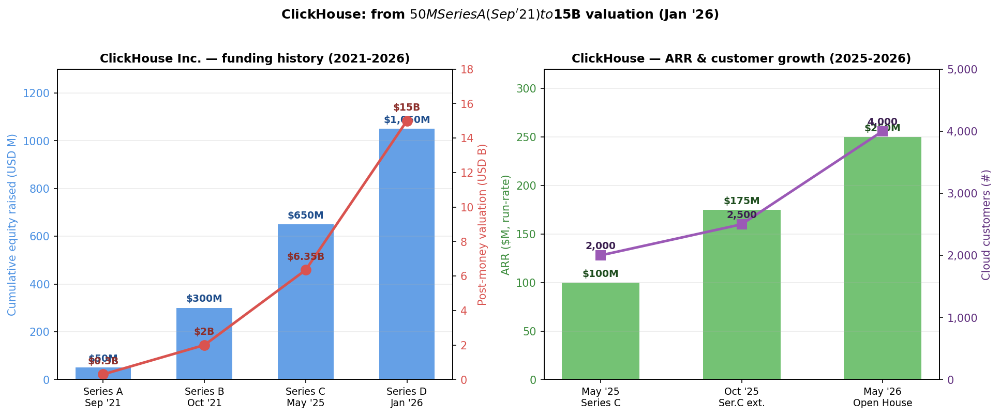
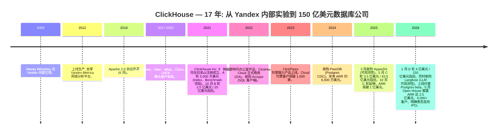
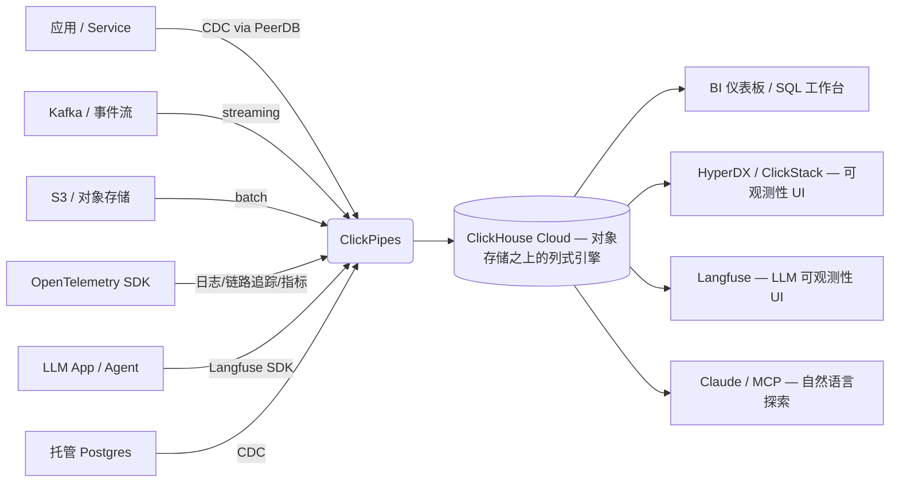
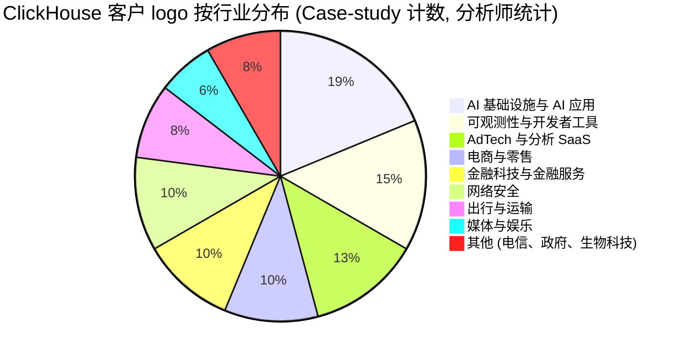
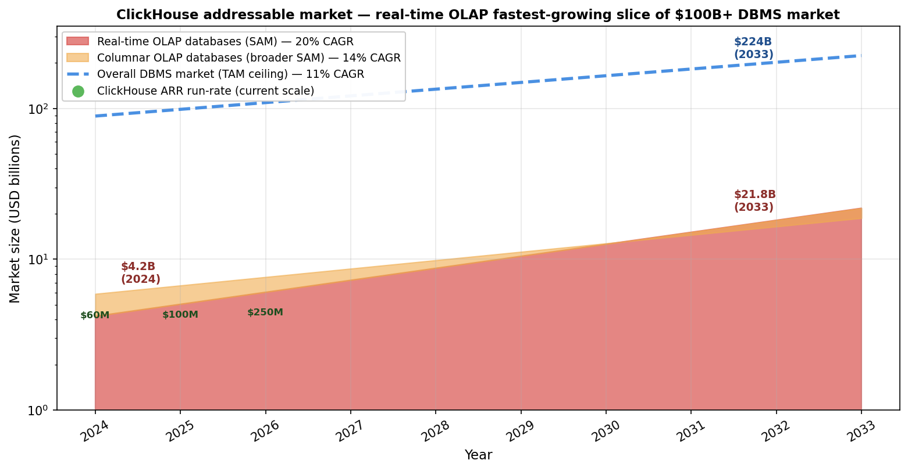
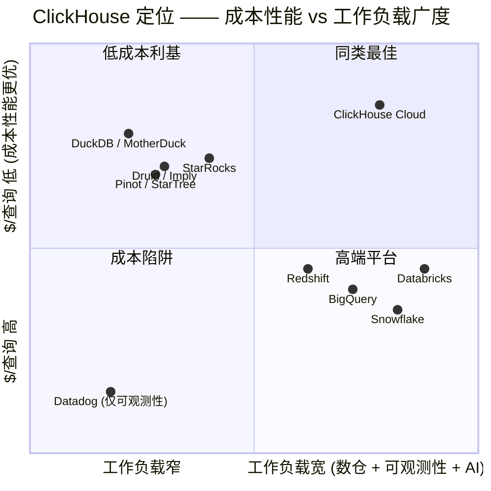

# ClickHouse, Inc. — 公司研究报告 (首次覆盖)

**公司:** ClickHouse, Inc. (非上市/private)
**总部:** 美国加州旧金山 (Delaware 注册, 2021 年 9 月成立)
**最新估值:** 美元 150 亿 (D 轮投后 / post-money, 2026 年 1 月)
**报告类型:** 首次覆盖 (Initiating Coverage)
**截至日期:** 2026-05-30

---

> **更新 — D 轮以 150 亿美元投后估值完成 (2026-01-16):** ClickHouse 完成 **4 亿美元 D 轮融资**，由 **Dragoneer Investment Group 领投**，T. Rowe Price 旗下账户与 WCM Investment Management 等公开市场跨界 (crossover) 投资人参与 —— 通常意味着公司距 IPO 仅 12–18 个月窗口，**投后估值升至 150 亿美元**，较 7 个月前 C 轮 63.5 亿美元投后估值翻倍有余。自 2021 年 9 月成立以来公司累计股权融资已超 **10.5 亿美元 + 1 亿美元信贷额度 (credit facility)**。本轮募集资金用于收购 LLM 可观测性 (LLM observability) 平台 **Langfuse**，并同步上线 **托管 Postgres (managed Postgres) 服务**，明确显示 ClickHouse 正从单一 OLAP 引擎 (OLAP engine) 向"AI 时代的统一数据平台"扩张。
> 资料来源: [ClickHouse 官方博客 — "ClickHouse raises $400 million Series D…"](https://clickhouse.com/blog/clickhouse-raises-400-million-series-d-acquires-langfuse-launches-postgres)、[Bloomberg, 2026-01-16](https://www.bloomberg.com/news/articles/2026-01-16/clickhouse-lands-15-billion-valuation-in-ai-database-race)、[TechCrunch, 2026-01-16](https://techcrunch.com/2026/01/16/snowflake-databricks-challenger-clickhouse-hits-15b-valuation/)。

---

## 目录

1. [公司概览](#1-公司概览)
2. [公司历史](#2-公司历史)
3. [管理团队](#3-管理团队)
4. [产品与服务](#4-产品与服务)
5. [客户与上市策略](#5-客户与上市策略)
6. [行业概览](#6-行业概览)
7. [竞争格局](#7-竞争格局)
8. [市场机会 (TAM)](#8-市场机会-tam)
9. [风险评估](#9-风险评估)

---

## 1. 公司概览

ClickHouse, Inc. 是一家美国旧金山的数据库公司，专注于将同名的开源列式 OLAP 引擎 (open-source columnar OLAP engine) 商业化，公司明确表达的愿景是成为 **"the fastest OLAP database on earth / 地球上最快的 OLAP 数据库"** ([ClickHouse — Our Story](https://clickhouse.com/company/our-story))。旗舰付费产品为 **ClickHouse Cloud**，公司自描述其为 **"the fastest, most cost-efficient way to build real-time analytics, observability, and AI-powered data applications / 构建实时分析、可观测性以及 AI 驱动数据应用的最快、最具成本效率的方式"** ([ClickHouse Cloud](https://clickhouse.com/cloud))。该公司正切入历史上被三个独立行业服务的市场 —— 云数据仓库 (cloud data warehouse)、可观测性后端 (observability backend) 以及 AI/LLM 遥测存储 (AI/LLM telemetry store) —— 试图以同一列式引擎加近年密集收购为基础，将三者整合到单一平台。

商业模式是 Elastic、MongoDB、Confluent、Databricks 已经验证的 **"开源核心 + 托管云服务 / open-core + managed cloud"** 路径: 引擎本体以 Apache 2.0 开源协议免费提供以驱动开发者自下而上采用 (bottom-up adoption)，付费收入来自 ClickHouse Cloud 上的消费式计费 (consumption-based pricing)。ClickHouse Cloud 在 AWS、GCP、Azure 三大公有云市场 (marketplace) 均上架，覆盖全球 14 个以上区域，并提供针对受监管工作负载的 **BYOC (Bring-Your-Own-Cloud, 自带云账户) 部署模式**以及面向医疗客户的 HIPAA 合规区域 ([ClickHouse Cloud](https://clickhouse.com/cloud))。计费的两个维度即 **计算 (compute)** 与 **存储 (storage)** 分离 —— 生产层 (Production tier) 公开价约为 **存储 $47.10/TB·月 + 计算 $0.6888/计算单元·小时**，开发层 (Development) 起价 $1/月、上限约 $193/月，专享层 (Dedicated) 议价 —— 且空闲计算资源可自动缩容至零，客户不为闲置容量付费 ([Contrary Research — ClickHouse Business Breakdown](https://research.contrary.com/company/clickhouse)、[ClickHouse 定价页](https://clickhouse.com/pricing))。

地理分布上, ClickHouse 自称 **"mindfully distributed / 有意识地分布式经营"** 跨越 10 个以上国家, 将分布式视为"一种我们有意运用以打造真正全球化公司的思维方式 (mindset)"而非招聘约束的副产物 ([ClickHouse — Our Story](https://clickhouse.com/company/our-story))。总部位于旧金山, 首个海外办公室 2022 年在阿姆斯特丹设立 (承接 Yandex 时期的核心工程团队), 欧洲与 APAC 工程节点持续扩张。

业务规模方面, ClickHouse 是同期数据基础设施 (data infrastructure) 公司中增长最快的之一。**截至 2026 年 5 月年化收入 (ARR) 达 2.5 亿美元, 同比增长约 3 倍**, 管理层明确表示 2026 年底目标 ARR 升至"九位数高位 (high nine digits)", 并指出公司将在未来数年内 IPO ([TechCrunch, 2026-05-27](https://techcrunch.com/2026/05/27/clickhouse-triples-annualized-revenue-to-250m-charting-a-path-toward-an-ipo/))。Cloud 业务付费客户数从 2025 年 5 月 C 轮时的约 2,000 家增至 2026 年 1 月 D 轮时的 3,000+ 家, 并于 2026 年 5 月 Open House 大会披露已突破 **4,000 家** ([ClickHouse 博客 — C 轮](https://clickhouse.com/blog/clickhouse-raises-350-million-series-c-to-power-analytics-for-ai-era)、[ClickHouse 博客 — D 轮](https://clickhouse.com/blog/clickhouse-raises-400-million-series-d-acquires-langfuse-launches-postgres))。员工方面, 2024 年末约 197 人 ([Latka — ClickHouse](https://getlatka.com/companies/clickhouse)), 业内普遍预计 2025 年至 2026 年至少翻倍, 用于支持企业销售 (来自 Atlassian 的 CRO Kevin Egan) 与财务 (来自 Snowflake 的 CFO Jimmy Sexton) 等 IPO 准备团队的搭建 ([ClickHouse 博客 — C 轮延伸](https://clickhouse.com/blog/clickhouse-extends-series-c-financing-expands-leadership-team))。

*数据来源: 历轮股权募资金额与投后估值取自各轮官方博客 ([A/B 轮背景](https://www.bigdatawire.com/2021/09/24/speedy-column-store-clickhouse-spins-out-from-yandex-raises-50m/)、[C 轮](https://clickhouse.com/blog/clickhouse-raises-350-million-series-c-to-power-analytics-for-ai-era)、[D 轮](https://clickhouse.com/blog/clickhouse-raises-400-million-series-d-acquires-langfuse-launches-postgres)); ARR 数据点取自 [C 轮博客](https://clickhouse.com/blog/clickhouse-raises-350-million-series-c-to-power-analytics-for-ai-era) ("接近 $100M ARR")、[C 轮延伸博客](https://clickhouse.com/blog/clickhouse-extends-series-c-financing-expands-leadership-team) ("ARR 同比增长 4 倍以上")、与 [TechCrunch, 2026-05-27](https://techcrunch.com/2026/05/27/clickhouse-triples-annualized-revenue-to-250m-charting-a-path-toward-an-ipo/) ($250M ARR, 同比 3 倍)。图中 2025 年 10 月的 $175M ARR 为分析师插值。*

**估值快照 (一级市场).** ClickHouse 未上市, 最新第三方定价基准为 **2026 年 1 月 16 日由 Dragoneer 领投的 4 亿美元 D 轮所确认的 150 亿美元投后估值** ([Bloomberg, 2026-01-16](https://www.bloomberg.com/news/articles/2026-01-16/clickhouse-lands-15-billion-valuation-in-ai-database-race))。对应四个月后 2026 年 5 月披露的 2.5 亿美元 ARR, **隐含 EV/ARR 倍数约 60 倍 (multiple)**, 即使按 AI 基础设施标准也属极高水位, 只有在公司维持三位数 ARR 增速到 2027 年的前提下才可辩护。可比标的方面: 截至 2026 年 5 月末, Snowflake (NYSE: SNOW) 公开市场约 14 倍远期市销率 (P/S), Databricks 最后一轮私募 (Series K, 2024 年 12 月) 定价约 620 亿美元投后/30 亿美元 ARR ≈ 21 倍 EV/ARR ([TechCrunch — Snowflake-Databricks challenger](https://techcrunch.com/2026/01/16/snowflake-databricks-challenger-clickhouse-hits-15b-valuation/))。这一溢价是看多论点 (bull thesis) 最直接的表达: 投资者押注 ClickHouse 从当前 2.5 亿 ARR 在 2–3 年内复合至 10 亿+ ARR, 增长动力来自 (a) AI 应用可观测性浪潮 (Langfuse、基于 Claude / OpenAI 的代理 (agent))、(b) 实时用例上从 Snowflake / Databricks 的工作负载迁移 —— 自有基准显示成本性能优势 (cost-performance advantage) 达数倍, (c) 新上线的托管 Postgres 服务开启交易 + 分析合一的 "HTAP-lite" 市场。**估值压缩风险 (multiple-compression risk) 真实存在**, 已纳入第 9 章财务风险 —— 任一季度 ARR 增速跌入 100% 以下区间, 都可能触发显著重估。

---

## 2. 公司历史

ClickHouse 在数据库初创公司中颇为罕见 —— 产品本身远比公司年龄更老。代码库 **2009 年由 Alexey Milovidov 在俄罗斯最大互联网公司 Yandex 内部** 启动, 当时是一个实验项目: 验证能否直接基于不预聚合的原始事件数据 (non-aggregated event data) 实时生成分析报表, 而非依赖传统 OLAP cube 预先建模 ([ClickHouse — Our Story](https://clickhouse.com/company/our-story)、[Wikipedia — ClickHouse](https://en.wikipedia.org/wiki/ClickHouse))。经过 3 年研发, 系统于 **2012 年正式上线生产环境, 支撑当时全球第二大网络分析平台 Yandex.Metrica** ([ClickHouse — Our Story](https://clickhouse.com/company/our-story))。Metrica 这个工作负载 —— 摄入 PB 级 Web 页面浏览事件、对其执行亚秒级 (sub-second) 临时 SQL 查询 —— 与今日 ClickHouse 商业市场的核心工作负载形态高度一致, 这正是引擎能够"老而弥坚"的关键: 它早在开源前就在真实、海量、高强度的生产环境中淬炼成熟。

**2016 年 6 月 Yandex 以 Apache 2.0 协议将 ClickHouse 开源**, 公司外部的采用开始自然蔓延 —— Cloudflare、Uber、eBay、Cisco、Comcast、以及 CERN LHCb 实验 (100 亿事件) 都在 2016–2020 年间成为高知名度用户 ([Wikipedia — ClickHouse](https://en.wikipedia.org/wiki/ClickHouse)、[BigDATAwire, 2021-09-24](https://www.bigdatawire.com/2021/09/24/speedy-column-store-clickhouse-spins-out-from-yandex-raises-50m/))。开源版本的发布也恰逢分析型工作负载从数据仓库一体机 (Teradata、Vertica) 向开源/云原生引擎大规模迁移的行业转折, 为 ClickHouse 后续商业化积累了大量自我识别的潜在客户。

*数据来源: 日期与里程碑取自 [ClickHouse — Our Story](https://clickhouse.com/company/our-story)、[Wikipedia](https://en.wikipedia.org/wiki/ClickHouse)、[ClickHouse 博客 — C 轮](https://clickhouse.com/blog/clickhouse-raises-350-million-series-c-to-power-analytics-for-ai-era)、[C 轮延伸](https://clickhouse.com/blog/clickhouse-extends-series-c-financing-expands-leadership-team)、与 [D 轮 + Langfuse + Postgres 公告](https://clickhouse.com/blog/clickhouse-raises-400-million-series-d-acquires-langfuse-launches-postgres)。*

**商业化转折 —— ClickHouse, Inc. 于 2021 年 9 月在旧金山成立**, 联合创始人为 Aaron Katz (CEO)、Alexey Milovidov (CTO, 仍掌控技术决策权) 与 Yury Izrailevsky (President of Product & Engineering, 前 Google 工程副总裁) ([BigDATAwire, 2021-09-24](https://www.bigdatawire.com/2021/09/24/speedy-column-store-clickhouse-spins-out-from-yandex-raises-50m/)、[ClickHouse — Our Story](https://clickhouse.com/company/our-story))。战略逻辑直接: 2021 年时 ClickHouse 开源版已被公认为全球最快的开源列式引擎, 但缺少商业载体; 同期 Snowflake (2020 年 IPO) 已经验证消费式计费的托管分析服务是一个划时代的收入品类。公司在注册前后即完成 5,000 万美元 A 轮 (Index、Benchmark), 仅数周后又以 20 亿美元估值完成 2.5 亿美元 B 轮 —— 这一异常激进的估值跃迁反映了后 Snowflake-IPO 时代资本对分析型数据库赛道的强烈 FOMO ([BigDATAwire, 2021-09-24](https://www.bigdatawire.com/2021/09/24/speedy-column-store-clickhouse-spins-out-from-yandex-raises-50m/)、[Index Ventures — Aaron Katz 的旅程](https://www.indexventures.com/perspectives/aaron-katzs-journey-from-salesforce-to-clickhouse/))。

**2024–2026 年的战略转型主线是: 从"一个 OLAP 引擎公司"走向"一个实时数据平台 (real-time data platform)"**, 路径是密集的小而强的开源原生 (open-source-native) 收购, 每一次都是收购一个已经基于 ClickHouse 构建的品类领跑开源项目。**2024 年 7 月收购 PeerDB**, 获得 Postgres 变更数据捕获 (Change Data Capture, CDC) 进入 ClickHouse 的能力; **2025 年 3 月收购 HyperDX**, 获得端到端可观测性 UI (会话回放、追踪、日志、错误); **2026 年 1 月收购 Langfuse**, 获得 LLM 应用可观测性 (Prompt 管理、评估、追踪) ([ClickHouse 博客 — HyperDX 收购](https://clickhouse.com/blog/clickhouse-acquires-hyperdx-the-future-of-open-source-observability)、[ClickHouse 博客 — Langfuse 收购](https://clickhouse.com/blog/clickhouse-acquires-langfuse-open-source-llm-observability))。模式高度一致: 每个标的都已是热门开源项目且本就基于 ClickHouse 运行 (Langfuse 收购时已超 20,000 GitHub stars, 月 SDK 安装量超 23M), 与其从零自研, ClickHouse 选择直接收购团队 + 品牌, 整合进统一栈 ([ClickHouse 博客 — Langfuse 收购](https://clickhouse.com/blog/clickhouse-acquires-langfuse-open-source-llm-observability))。**2026 年 5 月 Open House 用户大会**进一步公布 **ClickStack Cloud (基于 HyperDX 的无服务器可观测性栈)**、**MCP 服务器 (Anthropic 的 Model Context Protocol 桥接)**、**集成 Claude 的 AI Notebooks**、**House Mates 合作伙伴计划**, 明确表态下一篇章将以 AI 代理与 AI 应用基础设施为中心, 而不再只是数据库 ([ClickHouse 博客 — Open House 2026 Day 1](https://clickhouse.com/blog))。

---

## 3. 管理团队

ClickHouse 由一位 17 年磨一剑的创始人 CTO 与一位有过两次"开源走向 IPO"经验的联合创始人 CEO 共同领导 —— 这一组合是看多论点中不可低估的支柱。

**Alexey Milovidov —— 联合创始人兼首席技术官 (CTO).** Milovidov 是 ClickHouse 引擎的原始作者, 至今掌控引擎架构方向。他在 **莫斯科国立大学 (Moscow State University)** 获得数学学士学位, 加入 Yandex 后在 Metrica 网络分析平台担任工程师。**2009 年他启动了那个最终演化为 ClickHouse 的实验项目** —— 探究能否对持续不断到达的非聚合数据生成实时分析报表 —— 用 3 年时间将其推进到 2012 年 Yandex.Metrica 的生产上线, 又主导了 2016 年的 Apache 2.0 开源 ([ClickHouse — Our Story](https://clickhouse.com/company/our-story)、[Wikipedia — ClickHouse](https://en.wikipedia.org/wiki/ClickHouse))。在 2016 至 2021 年期间, 他以 **"仁慈独裁者 (BDFL, Benevolent Dictator For Life)"** 模式在 Yandex 内部运营开源项目, 接受外部贡献, 但不进行商业化; 工业级用户 (Cloudflare、Uber、eBay) 在此期间陆续上车。社区对他的评价是 **"对细节的极致苛求与对性能优化的不妥协 (meticulous on detail and unwavering on performance optimisation)"** —— 这与引擎对**位级效率 (bit-level efficiency)** 的执念高度一致: **向量化执行 (vectorised execution)** 、**SIMD 代码路径**、手工调优的压缩编解码器 (compression codec) 、自定义哈希表 ([The Key Executives, 2025-04-04](https://www.thekeyexecutives.com/2025/04/04/how-alexey-milovidov-transformed-clickhouse-into-a-real-time-data-powerhouse/))。2021 年公司成立时他出任联合创始人 + CTO, 至今全面参与运营 —— 每届 Open House 主题演讲、2026 年亲自率队的 **"Alexey on tour" APJ AI 巡回**、并持续向开源仓库提交代码 ([ClickHouse 博客 — Alexey on tour](https://clickhouse.com/alexey-goes-on-tour)、[GitHub — alexey-milovidov](https://github.com/alexey-milovidov))。具体持股比例 (ownership stake) 未公开披露; 按当前阶段风险投资标准, 创始人完全稀释 (fully-diluted) 持股大致在中至高个位数百分比。

**Aaron Katz —— 联合创始人兼首席执行官 (CEO).** Katz 在 **加州大学戴维斯分校 (UC Davis)** 获得管理经济学学士学位, ClickHouse 之前他已经在两个"开源走向上市"故事中各自负责商业侧 ([LinkedIn — Aaron Katz](https://www.linkedin.com/in/aaron-katz-5762094/))。他在 **Salesforce 任职 12 年**, 全程经历公司从初创、IPO 到大规模扩张, 在亚太与北美历任企业销售高级管理岗 ([Index Ventures — Aaron Katz 的旅程](https://www.indexventures.com/perspectives/aaron-katzs-journey-from-salesforce-to-clickhouse/)、[Matt Turck — 与 Aaron Katz 对谈](https://www.mattturck.com/clickhouse))。2014 年加入 **Elastic 出任首席收入官 (CRO)**, 从早期阶段领导整个 Field Operations 组织, 直至 Elastic 2018 年 10 月上市并进入上市后扩张期 —— 这段约 6 年的历程把 Elastic 从年收入数百万美元的开源项目带到了数亿美元的上市公司 ([Index Ventures — Aaron Katz 的旅程](https://www.indexventures.com/perspectives/aaron-katzs-journey-from-salesforce-to-clickhouse/))。Elastic 这段履历对今天的 ClickHouse 极为相关: 开源核心商业化模式、搜索 vs 分析的市场定位、企业销售方法论几乎可以直接复用。2021 年初, Katz 与 Index Ventures 的 Mike Volpi 联手, 与 Yandex 沟通将 ClickHouse 剥离出来, 9 月与 Milovidov、Izrailevsky 共同创立 ClickHouse, Inc. ([Index Ventures — Aaron Katz 的旅程](https://www.indexventures.com/perspectives/aaron-katzs-journey-from-salesforce-to-clickhouse/))。其运营风格被描述为 **"more in the Tim Cook vein —— quiet by nature, low ego, happy to share the spotlight / 偏 Tim Cook 路线 —— 天性低调、放下自我、乐于让出聚光灯"**, 把技术叙事让给 Milovidov、运营让给 Izrailevsky ([Matt Turck 访谈](https://www.mattturck.com/clickhouse))。从 A 轮到 D 轮的扩张过程中 Katz 搭建了教科书级别的"IPO-ready"高管团队 —— 包括 2025 年 7 月加盟的 **CRO Kevin Egan** (前 Atlassian、Slack、Dropbox、Salesforce)、Q4 2025 加盟的 **CFO Jimmy Sexton** (前 Snowflake、ServiceNow)、2025 年 8 月加盟的 **VP People Mariah Nagy** (前 Weights & Biases、Confluent) —— 媒体普遍将这一阵容解读为 IPO 准备 ([ClickHouse 博客 — C 轮延伸](https://clickhouse.com/blog/clickhouse-extends-series-c-financing-expands-leadership-team))。

---

## 4. 产品与服务

ClickHouse 的产品矩阵在近 24 个月经历了急剧扩张 —— 从"一个开源列式引擎 + 一个托管云封装"扩展为覆盖分析、可观测性、数据摄入、事务存储、AI/LLM 遥测的多产品平台。统一思路是: **现代所有数据工作负载 —— 仪表板、日志、指标、链路追踪、AI 追踪、CDC 管道 —— 最终都需要对超大数据量执行低延迟查询, 同一个列式引擎应当能服务所有这些场景**。

### 4.1 产品矩阵

ClickHouse 没有 10-K 风格的官方"产品表"(它是非上市公司), 故下表是**基于公司官网导航、产品页、博客公告、收购新闻分析师重构 (analyst-constructed)**, 并明确标注为分析师构建。

| 层级 | 产品族 | 子产品 / 功能 | 计费模式 | 首次推出 |
|---|---|---|---|---|
| **引擎层 (Engine)** | ClickHouse OSS | 核心列式数据库, SQL, MergeTree 存储, 向量化执行 | 免费, Apache 2.0 | 2016 开源; 2009 立项 |
| **托管计算 (Managed compute)** | ClickHouse Cloud | 无服务器 (serverless), 多可用区 (multi-AZ), 存算分离 (storage-compute separation), 缩容至 0 | 消费式: 计算 $/小时 + 存储 $/TB·月 | 2022 GA |
| **部署 (Deployment)** | BYOC (Bring-Your-Own-Cloud) | 控制平面 (control plane) 跑在客户自己 AWS/GCP/Azure 账户内 | 议价 (enterprise) | 2024 |
| **数据摄入 (Ingestion)** | ClickPipes | Kafka、S3、Postgres CDC (来自 PeerDB)、MongoDB、Kinesis 的托管连接器 | 打包计入 Cloud 消费 | 2023; PeerDB CDC 2024 |
| **事务层 (Transactional)** | 托管 Postgres ("Postgres managed by ClickHouse") | 企业级托管 Postgres, 与 ClickHouse 紧密集成 (HTAP-lite) | 打包计入 Cloud 消费 | 2026 (beta) |
| **可观测性 (Observability)** | ClickStack / HyperDX | 基于 OpenTelemetry 的日志/指标/链路追踪/会话回放 UI | OSS 免费 + ClickStack Cloud 消费式 | HyperDX 2025-03 收购; ClickStack Cloud 2026-05 GA |
| **LLM 可观测性 (LLM observability)** | Langfuse | 开源 LLM 追踪、Prompt 管理、评估框架 | OSS 免费 (MIT) + Langfuse Cloud 消费式 | Langfuse 2026-01 收购 |
| **AI 接口 (AI surfaces)** | MCP 服务器、AI Notebooks (集成 Claude)、ClickHouse Agents | Anthropic Model Context Protocol 桥接 ClickHouse Cloud; 代理式 SQL 与探索 | Cloud 内置 | Open House 2026 (5 月) |
| **工具 (Tooling)** | clickhousectl、Cloud Console (前 Arctype)、Grafana 插件 | 命令行管理 Postgres/ClickPipes/Cloud; SQL 工作台; BI 集成 | 免费 | clickhousectl 2025; Arctype 2022 |

*资料来源: [ClickHouse Cloud](https://clickhouse.com/cloud)、[ClickHouse 用例](https://clickhouse.com/use-cases)、[Contrary Research — ClickHouse 业务拆解](https://research.contrary.com/company/clickhouse)、[ClickHouse 博客 — HyperDX 收购](https://clickhouse.com/blog/clickhouse-acquires-hyperdx-the-future-of-open-source-observability)、[ClickHouse 博客 — Langfuse 收购](https://clickhouse.com/blog/clickhouse-acquires-langfuse-open-source-llm-observability)、[ClickHouse 博客 — D 轮 + Postgres 上线](https://clickhouse.com/blog/clickhouse-raises-400-million-series-d-acquires-langfuse-launches-postgres)、[ClickHouse 博客 — Open House 2026 Day 1](https://clickhouse.com/blog)。*

### 4.2 综合 —— 各层如何协同

统一的客户工作流非常直观, 也解释了每次收购的战略契合度: 数据通过 **ClickPipes 摄入** (Kafka 流处理事件; PeerDB 把 Postgres CDC 推过来; S3 批量加载; OpenTelemetry collector 推送可观测性遥测), **以对象存储为底, 弹性计算在上, 存放在 ClickHouse Cloud**, **用 SQL 查询做分析与仪表板** (传统数仓用例), **用 HyperDX UI 查询可观测性** (日志/链路追踪/会话), **用 Langfuse 查询 LLM 可观测性** (AI 代理追踪、Prompt 版本、评估打分), 越来越多地, **通过 MCP 服务器由 Claude 用自然语言做即席探索 (ad-hoc exploration)**。新上线的 **托管 Postgres 服务**填补了最后一块拼图 —— 提供一个 CDC 数据流直接进入同一 ClickHouse 集群的托管事务数据库, 实现 CEO Aaron Katz 所说的 **"unified transactional and analytical workloads / 统一的事务+分析工作负载"** ([D 轮博客](https://clickhouse.com/blog/clickhouse-raises-400-million-series-d-acquires-langfuse-launches-postgres)) —— 一家 AI 应用开发者原本需要拼接的 Postgres + Fivetran + Snowflake + Datadog + Langfuse 五家供应商, 现在变成一家。

*资料来源: 工作流综合自 [ClickHouse Cloud](https://clickhouse.com/cloud)、[ClickHouse 用例](https://clickhouse.com/use-cases) 与 [D 轮 + Postgres 上线博客](https://clickhouse.com/blog/clickhouse-raises-400-million-series-d-acquires-langfuse-launches-postgres) 中的产品描述。*

### 4.3 ClickHouse OSS —— 列式引擎

> **ClickHouse 官方产品定义 (原文直引):** *"The popular open-source column-oriented database management system which allows users to generate analytical reports using SQL queries in real-time / 流行的开源列式数据库管理系统, 允许用户使用 SQL 查询实时生成分析报表."* ([ClickHouse — Our Story](https://clickhouse.com/company/our-story))

**中文释义 / Plain-language gloss:** ClickHouse OSS 是一种 **列式数据库 / column-oriented DBMS** —— 一行数据按"列"拆分成多个独立文件, 查询时仅扫描涉及的列, 从而在宽分析表 (典型查询只读取数百列中的 1–5 列) 上获得巨大的 I/O 节省。引擎使用 **C++** 编写, 包含手工调优的 **向量化执行 / vectorised execution** (按列块批量 SIMD 操作, 而非传统的逐元组 tuple-at-a-time)、**列级压缩 / per-column compression** (LZ4 / ZSTD)、以及 **MergeTree 存储布局** (按主键排序、后台合并分区, 概念上类似 LSM-tree 但针对分析读优化)。相比行式系统 (Postgres、MySQL、Oracle), 这一架构以牺牲更新灵活性 (write/update flexibility) 为代价, 在聚合查询上换取一到两个数量级的加速。

*分析师观点 (Analyst view):* ClickHouse OSS 的护城河是 **技术深度 + 社区网络效应**, 而非开源协议本身 —— 引擎在 GitHub 上已超过 41,000 stars, 是公认的开源列式引擎首选。最接近的开源对比是 **Apache Druid** (聚焦时序)、**Apache Pinot** (聚焦实时摄入 + 低延迟点查)、**StarRocks** (架构最接近, 中国起源)。其中 ClickHouse 工作负载覆盖最广, 通用 SQL 接口最完整。**DuckDB** 是另一品类 —— 嵌入式进程内引擎 ("SQLite for analytics"), 主要竞争笔记本 / 单机层 ([DB-Engines — ClickHouse 趋势](https://db-engines.com/en/ranking_trend/system/ClickHouse)、[Cloudraft — ClickHouse vs DuckDB](https://www.cloudraft.io/blog/clickhouse-vs-duckdb))。

### 4.4 ClickHouse Cloud —— 托管服务

> **官方产品定义 (原文直引):** *"The fastest, most cost-efficient way to build real-time analytics, observability, and AI-powered data applications… pay only for what you use, with elastic compute that scale[s] up and down based on demand / 构建实时分析、可观测性以及 AI 驱动数据应用的最快、最具成本效率的方式…按使用付费, 弹性计算根据需求扩缩."* ([ClickHouse Cloud](https://clickhouse.com/cloud))

**中文释义 / Plain-language gloss:** ClickHouse Cloud 是开源引擎在 AWS/GCP/Azure 上的 **无服务器 (serverless) 托管部署**, 关键特征是 **存算分离 / storage-compute separation** —— 列数据存放在 S3 级对象存储, 由临时计算 Pod 按需拉取; 这使存储与计算各自独立扩展, 计算可 **缩容至零**, 闲置集群仅产生存储费用。"无服务器"这一定位至关重要: Snowflake 的计费单位是必须人工设定容量与启停的"仓库 (warehouse)"; ClickHouse Cloud 的计算引擎对重查询纵向扩展, 对高并发横向扩展自动完成, 公司主张这对 **实时 / 亚秒查询 / 高并发** 的目标市场至关重要 ([ClickHouse vs Snowflake 对比](https://clickhouse.com/comparison/snowflake))。多可用区部署默认提供高可用 (HA); 备份与补丁自动管理。

*分析师观点 (Analyst view):* Cloud 产品当前几乎贡献了全部 ARR, 与 Snowflake / Databricks 的成本性能差距是核心商业卖点。公司公开的基准测试 (虽是公司自己做、有利益相关, 但方法论透明) 显示在 1B / 10B / 100B 行规模下 **下一个最佳系统在 10B 行水平比 ClickHouse 差 7-13 倍、在 100B 行水平差 23-32 倍** ([ClickHouse 基准 2025](https://clickhouse.com/blog/cloud-data-warehouses-cost-performance-comparison))。即便对厂商偏差大幅折扣, "为 OLAP 而生"的引擎对"为批处理数仓而生"的引擎 (Snowflake、Databricks) 的结构性优势是真实的。

### 4.5 ClickPipes —— 托管摄入

> **官方产品定义 (原文直引):** *"A fully managed ingestion layer supporting Kafka, S3, PostgreSQL, MongoDB, and others / 完全托管的摄入层, 支持 Kafka、S3、PostgreSQL、MongoDB 等."* ([ClickHouse Cloud](https://clickhouse.com/cloud))

**中文释义 / Plain-language gloss:** ClickPipes 是 **托管 ETL/ELT / 数据管道** 层, 让客户无需自建 Kafka Connect、Debezium 或 Airbyte 即可把数据导入 ClickHouse Cloud。差异点在于 2024 年 7 月收购 PeerDB 后形成的 **Postgres CDC (变更数据捕获) 连接器** —— 把 Postgres WAL 流近实时同步到 ClickHouse, 已成为 Postgres 用户向 ClickHouse 做分析的标准路径。Kafka 连接器处理事件流摄入 (典型可观测性 + 产品分析用例), S3 连接器处理批量加载 ([Contrary Research — ClickHouse 业务拆解](https://research.contrary.com/company/clickhouse))。

*分析师观点 (Analyst view):* ClickPipes 在竞争中扮演的是 **摩擦消除 (friction-removal)** 而非差异化的角色 —— Fivetran、Airbyte、Estuary、Confluent Connect 都在做同一件事。把它打包进 ClickHouse Cloud 的战略价值在于 **客户的供应商数量从 3 个 (仓库 + 摄入 + CDC) 缩到 1 个**, 与 Snowflake (用户需要单独付 Fivetran 或 Airbyte) 比成本叙事被放大。

### 4.6 ClickStack / HyperDX —— 可观测性

> **HyperDX 官方定义 (原文直引):** *"HyperDX is a fully open-source observability platform built on top of ClickHouse… session replay capabilities, an intuitive UI for exploratory workflows, and seamless data ingestion via OpenTelemetry / HyperDX 是构建在 ClickHouse 之上的完全开源可观测性平台…具备会话回放能力、面向探索性工作流的直观 UI、通过 OpenTelemetry 实现无缝数据摄入."* ([ClickHouse 博客 — HyperDX 收购](https://clickhouse.com/blog/clickhouse-acquires-hyperdx-the-future-of-open-source-observability))

**中文释义 / Plain-language gloss:** ClickStack 是以 ClickHouse 为存储后端的 **可观测性 / observability** 栈 —— 日志、指标、链路追踪、错误、会话回放。经济上的卖点非常直接: 可观测性数据是任何组织里按体量看的最大单一工作负载 (每个微服务都喷日志、每个 API 调用都喷链路追踪、每次页面加载都喷前端遥测), 而现有厂商 (Datadog、Splunk、Elastic) 按"摄入 GB 计费"的价格, 在快速增长的数据量下迅速堆到 7 位数美元年账单。ClickHouse 主张同样的工作负载在它上面 **便宜 10-200 倍** ([ClickHouse 博客 — HyperDX 收购](https://clickhouse.com/blog/clickhouse-acquires-hyperdx-the-future-of-open-source-observability), 公司内部声称做到了 200× 成本下降)。**ClickStack Cloud (无服务器可观测性)** 于 2026 年 5 月 Open House 正式商用, 完成产品化闭环 ([ClickHouse 博客 — Open House 2026 Day 1](https://clickhouse.com/blog))。

*分析师观点 (Analyst view):* 这是 **中期内最大的非数仓市场切入点**。Datadog / Splunk 装机量大、粘性强、但在多年涨价后客户对成本愈发敏感。最接近的对手是 **Grafana Loki** (日志)、**Tempo** (链路追踪)、**Mimir** (指标), 以及 **Coralogix**、**New Relic** 与开源 **SigNoz** 栈。HyperDX 补上了 ClickHouse 此前最缺的 UI 层, 使其可以从"更便宜的后端"升级为"真正的 Datadog 替代品"。护城河类型: **技术 + 成本套利**; 切换成本是主要壁垒 (遥测管道一旦铺设很难替换)。

### 4.7 托管 Postgres —— 事务层

> **官方产品定义 (原文直引):** *"Native enterprise-grade managed Postgres offering integrated with its analytics platform… up to 100X faster analytics when syncing transactional data to ClickHouse, enabling unified querying across transactional and analytical workloads for AI applications / 原生企业级托管 Postgres 服务, 与分析平台集成…事务数据同步到 ClickHouse 后, 分析查询最多快 100×, 为 AI 应用实现跨事务与分析工作负载的统一查询."* ([D 轮博客](https://clickhouse.com/blog/clickhouse-raises-400-million-series-d-acquires-langfuse-launches-postgres))

**中文释义 / Plain-language gloss:** 这是一个完全托管的 **OLTP (在线事务处理)** 数据库 —— 即一个含副本、备份、PITR (point-in-time recovery, 精准时点恢复) 的 Postgres 实例 —— **协议层与 Postgres 完全兼容**, **开箱即用地以 CDC 流入 ClickHouse**。这是 ClickHouse 给 OLTP-vs-OLAP 统一这一长期难题 (业内常称 **HTAP / hybrid transactional-analytical processing**) 的答案 —— 但回避了"一个引擎同时跑两种工作负载"的硬工程: 改为事务路径跑 Postgres、分析路径跑 ClickHouse、两者间亚秒 CDC。对于 AI 应用开发者 (明确的目标人群) 而言, 这意味着原本要拼装的 Postgres + Fivetran + Snowflake + Datadog + Langfuse 五家供应商, 现在可以塌缩成一家。

*分析师观点 (Analyst view):* 战略价值在于 **供应商整合 + 锁定飞轮** —— 一旦客户的事务数据库都跑在 ClickHouse 的托管 Postgres 上, 切换成本显著上升。最接近的对手是 **Neon** (无服务器 Postgres, 2025 年 5 月被 Databricks 收购), 这一步可解读为对 Databricks 的直接回应: 既然 Databricks 收了 OLTP, ClickHouse 也必须要么造、要么买、要么上线。护城河类型: **切换成本 + 打包定价**。(2026 年 5 月仍处 beta, 执行风险不可忽视。)

### 4.8 Langfuse —— LLM 可观测性

> **官方产品定义 (原文直引):** *"An open-source platform covering LLM observability, prompt management, evaluations, and experimentation — designed to address the 'trust gap' in AI applications by monitoring output quality beyond traditional system metrics / 一个覆盖 LLM 可观测性、Prompt 管理、评估与实验的开源平台 —— 通过监控超越传统系统指标的输出质量, 解决 AI 应用中的'信任鸿沟'."* ([ClickHouse 博客 — Langfuse 收购](https://clickhouse.com/blog/clickhouse-acquires-langfuse-open-source-llm-observability))

**中文释义 / Plain-language gloss:** Langfuse 是 **LLM 应用可观测性层 / LLM observability** —— 当一个 AI 代理 (基于 Claude、GPT-5、Llama 等) 接收一次用户请求时, 它通常会触发一连串 LLM 调用、工具调用、检索查询与后处理步骤; Langfuse 追踪整条链路, 记录每一次 Prompt + 模型 + 温度 + 输出 + token 成本 + 延迟, 并让开发者按评估规则 (eval rubric) 对输出打分。因为这些遥测本身就是高频次、行结构复杂嵌套的事件流, **ClickHouse 是接近理想的存储后端** —— 这也是为什么 Langfuse 在被收购之前就已经构建在 ClickHouse 之上。通过收购, ClickHouse 获得了一个快速增长品类的前端 UI 品牌: Langfuse 在 2025 年 Q4 已超过 **20,000 GitHub stars、月 23M SDK 安装、Fortune 50 中的 19 家与 Fortune 500 中的 63 家使用** ([ClickHouse 博客 — Langfuse 收购](https://clickhouse.com/blog/clickhouse-acquires-langfuse-open-source-llm-observability))。

*分析师观点 (Analyst view):* 这是 D 轮估值最清晰的 **"AI 基础设施卖铲子" (AI infrastructure pickaxe) 论点** —— 每一个基于基础模型构建的 AI 应用都需要可观测性, 品类龙头尚未定型, ClickHouse 可以以可控估值并购开源里跑得最快的那几个。最接近的对手: **LangSmith** (LangChain 的托管服务, 本身就是 ClickHouse 客户)、**Arize AI** (商业企业版)、**Weights & Biases Weave**、**Helicone**。护城河类型: **渠道 + 打包经济** —— 当客户已经把 ClickHouse Cloud 用作分析存储, 启用 Langfuse 只需要一个开关。

### 4.9 旗舰产品、近期发布与部署模式

**旗舰产品是 ClickHouse Cloud** —— 当前 2.5 亿美元 ARR 几乎全部来自这里, 对应 ~4,000 家付费客户, 横跨分析、可观测性与日益增长的 AI 工作负载 ([TechCrunch, 2026-05-27](https://techcrunch.com/2026/05/27/clickhouse-triples-annualized-revenue-to-250m-charting-a-path-toward-an-ipo/))。HyperDX/ClickStack 与 Langfuse 当前营收贡献尚不显著, 但具备战略意义: 它们把可服务的工作负载从"愿意为托管数据库付费的人"扩张到"跑 Datadog 的人 + 跑 LLM 应用的人"。近 12 个月产品节奏 (全部引自 ClickHouse 官方博客): **HyperDX 收购** (2025-03)、**C 轮 / 客户数破 2,000** (2025-05)、**C 轮延伸 + IPO 级高管队** (2025-10)、**D 轮 + Langfuse + Postgres beta** (2026-01)、**ClickStack Cloud + MCP 服务器 + AI Notebooks + Open House 2026** (2026-05) ([ClickHouse 博客](https://clickhouse.com/blog))。部署模式涵盖 **完全托管 SaaS** (AWS/GCP/Azure)、**BYOC** (控制平面在客户云账户内, 面向受监管工作负载) 与 **自管 OSS** (Apache 2.0, 免费); Cloud 侧还有面向 Memorial Sloan Kettering 等医疗客户的 **HIPAA 合规区域** ([ClickHouse Cloud](https://clickhouse.com/cloud)、[C 轮博客](https://clickhouse.com/blog/clickhouse-raises-350-million-series-c-to-power-analytics-for-ai-era))。

---

## 5. 客户与上市策略

ClickHouse 的客户名单在当前收入规模上异常广泛 —— 仅官方 case-study 页就列出 **35+ 个不同 logo, 横跨至少 12 个垂直行业**: 从超级云服务商 (Microsoft) 到媒体 (Vimeo、Sony Entertainment Television)、金融科技 (Block、Deutsche Bank)、出行 (Uber、Lyft、Didi、Trip.com)、电商 (eBay、Instacart、Shopee)、AdTech (Rokt、Admixer、Cognitiv)、安全 (Cloudflare、Dassana、Resmo、IBM QRadar) 到 AI 基础设施 (Anthropic、Meta、Vercel、LangChain、DeepL、Character AI) ([ClickHouse 客户案例](https://clickhouse.com/customer-stories)、[C 轮博客](https://clickhouse.com/blog/clickhouse-raises-350-million-series-c-to-power-analytics-for-ai-era)、[D 轮博客](https://clickhouse.com/blog/clickhouse-raises-400-million-series-d-acquires-langfuse-launches-postgres))。D 轮披露 Cloud 客户数已超 **3,000 家**, 新增包括 Capital One、Lovable、Decagon、Polymarket、Airwallex; 至 2026 年 5 月 Open House, 客户数突破 **4,000 家** ([ClickHouse 博客 — D 轮](https://clickhouse.com/blog/clickhouse-raises-400-million-series-d-acquires-langfuse-launches-postgres)、[TechCrunch, 2026-05-27](https://techcrunch.com/2026/05/27/clickhouse-triples-annualized-revenue-to-250m-charting-a-path-toward-an-ipo/))。

**客户集中度 —— 披露状态: 未披露 (not disclosed).** 作为非上市公司, ClickHouse 没有发布类似 10-K 分部报告里"≥10% 客户"或 A 股年报里"前五名客户"的强制脚注。从定性信号看客户基础似乎确实分散 —— 任何披露中均未将单一客户标记为关键依存, 且 Cloud 是面向 4,000+ 付费账户的消费式产品, 机械上限制了前一大客户的集中度。最接近披露口径的, 是 D 轮博客里把 Anthropic、Meta、Capital One、Tesla、Decagon、Vercel 等点名为"在 ClickHouse 上运行关键业务系统" ([D 轮博客](https://clickhouse.com/blog/clickhouse-raises-400-million-series-d-acquires-langfuse-launches-postgres)) —— 这是品牌声明, 不是收入占比声明。**本报告将客户集中度处理为"披露缺失但定性偏低", 并在第 9 章作为披露缺口风险列出 —— 一份典型的 IPO 前 S-1 文件会强制 "10% 客户"披露, 而市场目前还看不到这一数据。**

*资料来源: 从 [ClickHouse 客户案例](https://clickhouse.com/customer-stories) 列出的 35+ 个 logo 计数, 补充 [C 轮博客](https://clickhouse.com/blog/clickhouse-raises-350-million-series-c-to-power-analytics-for-ai-era)、[C 轮延伸博客](https://clickhouse.com/blog/clickhouse-extends-series-c-financing-expands-leadership-team)、[D 轮博客](https://clickhouse.com/blog/clickhouse-raises-400-million-series-d-acquires-langfuse-launches-postgres) 中明确点名的客户。**分母声明:** 本图按 logo 计数, 不按收入计数 —— 是营销宣传层面 mix 的近似, 不构成客户收入集中度披露。*

**上市策略 / 销售模式.** ClickHouse 走的是 Elastic、MongoDB、Confluent 验证过的经典 **开源驱动的产品驱动增长 (PLG, Product-Led Growth) → 企业销售 (enterprise sales)** 路径: 开源引擎自下而上引导开发者采用, 形成自我识别的潜在客户池; Cloud 产品提供 30 天试用 + 300 美元额度的自助开通, 几分钟即得托管环境; CRO Kevin Egan (Atlassian、Slack、Dropbox、Salesforce) 领衔的企业销售团队在客户年合同额 (ACV) 升至门槛后接管 ([ClickHouse Cloud](https://clickhouse.com/cloud)、[ClickHouse 博客 — C 轮延伸](https://clickhouse.com/blog/clickhouse-extends-series-c-financing-expands-leadership-team))。收购策略 —— **已经跑在 ClickHouse 之上的相邻开源项目** (PeerDB、HyperDX、Langfuse) —— 同时也是客户获取渠道: 被收购项目的开源社区天然进入 ClickHouse Cloud 的销售漏斗顶端 ([ClickHouse 博客 — D 轮](https://clickhouse.com/blog/clickhouse-raises-400-million-series-d-acquires-langfuse-launches-postgres))。

**云市场 (cloud marketplace) 渠道**意义重大: ClickHouse Cloud 在 AWS、GCP、Azure marketplace 上架, 让企业可以用已有的云预算承诺 (committed cloud-spend) 直接抵扣 —— 这在大客户里是销售周期的强力压缩剂 ([ClickHouse Cloud](https://clickhouse.com/cloud))。Open House 2026 正式推出的 **House Mates 合作伙伴计划**将历史上零散的系统集成商 / 咨询伙伴渠道制度化, 标志着中型与大型企业拓展的下一波 ([ClickHouse 博客 — Open House 2026](https://clickhouse.com/blog))。

case-study 提供的 **客户级量化指标**揭示了 ClickHouse 中标的工作负载规模: Cloudflare 通过 ClickHouse 处理 **每秒 6 百万次 HTTP 分析请求**; Uber 摄入 **每秒数百万条日志**, 存储 PB 量级; Trip.com 从 Elasticsearch 迁出到 **50PB 的日志集群**; Sony Entertainment Television 每日摄入 **数千万条 CDN 记录**; Lyft 每月读写量 **25TB+**; Block 报告 **比 BigQuery 性能高 10×**; Canva、Lyft、GitLab、Character AI 报告了 **"成本降 70%、搜索性能提高 10×"** 量级的收益 ([ClickHouse 客户案例](https://clickhouse.com/customer-stories)、[ClickHouse Cloud](https://clickhouse.com/cloud))。虽然这些数字是厂商精选, 但工作负载形态的多样性是平台广度的真实证据。

---

## 6. 行业概览

ClickHouse 在三个嵌套行业层级里展开竞争: **数据库管理系统 (DBMS) 大盘市场** (TAM 天花板)、**OLAP / 分析型数据库子市场** (SAM)、**实时 OLAP / 流分析利基** (即当前正取得份额的 SOM)。独立市场调研机构三角验证如下:

- **DBMS 大盘:** 2025 年约 **986 亿美元**, Expert Market Research 预测到 2035 年达 **2,750 亿美元, CAGR 10.8%** ([Expert Market Research — DBMS 市场](https://www.expertmarketresearch.com/reports/database-management-system-market))。Mordor 用更宽口径 (含分析工具) 给出 2025 年约 **1,503 亿美元**, 到 2031 年 **3,290 亿美元, CAGR 13.95%** ([Mordor Intelligence — 数据库市场](https://www.mordorintelligence.com/industry-reports/database-market))。
- **OLAP 数据库系统:** 2025 年约 **150 亿美元**, 预计到 2033 年 **400 亿美元, CAGR 12%** ([Data Insights Market — OLAP](https://www.datainsightsmarket.com/reports/olap-database-systems-1449505))。
- **列式 OLAP 数据库:** 2024 年 **59 亿美元 → 2033 年 184 亿美元, CAGR 13.7%** ([Growth Market Reports — 列式 OLAP](https://growthmarketreports.com/report/columnar-olap-database-market/amp))。
- **实时 OLAP 数据库:** 2024 年 **42 亿美元 → 2033 年 247 亿美元, CAGR 20.1%** —— 增长最快的切片, 也是 ClickHouse 的主战场 ([Growth Market Reports — 实时 OLAP](https://growthmarketreports.com/report/real-time-olap-database-market))。

*数据来源: 实时 OLAP 与列式 OLAP 数据取自 [Growth Market Reports — 实时 OLAP](https://growthmarketreports.com/report/real-time-olap-database-market) 与 [Growth Market Reports — 列式 OLAP](https://growthmarketreports.com/report/columnar-olap-database-market/amp); DBMS 大盘取自 [Expert Market Research](https://www.expertmarketresearch.com/reports/database-management-system-market)。图中 ClickHouse ARR 叠加取自 [TechCrunch, 2026-05-27](https://techcrunch.com/2026/05/27/clickhouse-triples-annualized-revenue-to-250m-charting-a-path-toward-an-ipo/) 与 [C 轮博客](https://clickhouse.com/blog/clickhouse-raises-350-million-series-c-to-power-analytics-for-ai-era)。*

**结构性增长动力**有较为成熟的论证, 多数对 ClickHouse 有利:

1. **实时 / 事件驱动工作负载正从批处理那里夺取份额.** 传统分析数据栈 (每日 ETL 把数据落入仓库, 查询基于隔天的聚合视图) 正在让位给事件流架构 (Kafka、Kinesis、Pulsar) 与"产品内嵌分析、可观测性、AI 仪表板"对亚秒响应的需求。ClickHouse 的架构原生为这一形态而设计, Snowflake 的"弹性仓库 (elastic warehouse)"模型并非 ([ClickHouse vs Snowflake 对比](https://clickhouse.com/comparison/snowflake))。
2. **可观测性数据是单一最大增长切片.** 每一个部署的微服务、每一个 Kubernetes pod、每一次 API 调用、每一次页面加载、每一个移动端事件都喷出结构化遥测; 在多数企业里, 年化增长率超过 40%。Datadog 收入轨迹 (4 年内从约 30 亿走向 30 亿+ 年化运行率) 与 Cisco 2024 年以 280 亿美元收购 Splunk 是有力的现实印证。开源可观测性栈 (OpenTelemetry、Grafana 生态、ClickStack) 正在份额上升, 因为商业栈在规模化使用时成本变得难以承受 ([ClickHouse 博客 — HyperDX 收购](https://clickhouse.com/blog/clickhouse-acquires-hyperdx-the-future-of-open-source-observability))。
3. **AI 应用基础设施正创造一种全新的分析工作负载类别.** LLM 应用产生形态不同的遥测 (长 Prompt、结构化工具调用、嵌套 trace、评估打分), 同时催生一个全新的买方 (AI / ML 工程团队) 对可观测性栈付费。Langfuse 这类 LLM 可观测性是三年前都不存在的品类, 现已是 ClickHouse D 轮的明确战略目标 ([ClickHouse 博客 — D 轮](https://clickhouse.com/blog/clickhouse-raises-400-million-series-d-acquires-langfuse-launches-postgres))。
4. **开源数据库整体份额持续上行**, 持续侵蚀专有传统厂商 (Oracle、Teradata、Vertica、IBM DB2)。MongoDB / PostgreSQL / Confluent / Databricks 的剧本已可复用, 每一代开源公司比上一代到达营收里程碑的速度都更快; ClickHouse 大约 3 年内做到 0 → 1 亿美元 ARR, 与这一轨迹一致 ([ClickHouse C 轮博客](https://clickhouse.com/blog/clickhouse-raises-350-million-series-c-to-power-analytics-for-ai-era))。

**监管环境**对 ClickHouse 大体中性偏顺风: GDPR / 数据驻留 (data residency) 要求增加了 BYOC 与区域化部署的需求; HIPAA 合规区域打开了美国医疗市场; 欧盟 AI Act 与美国 AI 行政令推动企业 AI 部署转向可观测性, 为 Langfuse 创造需求。唯一值得标注的监管风险是 **某些司法辖区里 ClickHouse 开源版的俄罗斯 (Yandex) 起源可能成为采购阻碍** —— 详见第 9 章。

**行业结构**在开源层级高度分散, 在云托管层级正在集中。当前活跃开发的分析引擎数量很大 (ClickHouse、DuckDB、Druid、Pinot、StarRocks、Doris、Trino、ChDB 等), 但具备规模化商业云业务的只是少数几家: Snowflake、Databricks、BigQuery (Google 自营)、Redshift (AWS 自营), 以及现在的 ClickHouse Cloud。供应商议价权 (即云超大规模厂商基础设施) 集中在 AWS/GCP/Azure; 买方议价权中等 (企业有替代但分析工作负载一旦迁移切换成本高); 替代品风险真实 (DuckDB 嵌入到进程内、Snowflake 把分析打包进 BI), 但目前还可控。

---

## 7. 竞争格局

ClickHouse 在多个交叠"圈层"上展开竞争。最清晰的心智模型: **实时 OLAP 的直接对手**、**相邻的云数据仓库**、**可观测性原生厂商**、**流式 OLAP 开源对手**、以及 **嵌入式 / 单机替代品**。

*数据来源: 定位综合自 ClickHouse 自有发布的基准 ([ClickHouse 基准 2025](https://clickhouse.com/blog/cloud-data-warehouses-cost-performance-comparison)、[ClickHouse vs Snowflake](https://clickhouse.com/comparison/snowflake)) 与第三方对比评测 ([Flexera — ClickHouse vs Snowflake](https://www.flexera.com/blog/finops/clickhouse-vs-snowflake/)、[Tinybird — ClickHouse vs Databricks](https://www.tinybird.co/blog/clickhouse-vs-databricks))。广度轴反映当前产品面 —— Snowflake 与 Databricks 在 BI / ML / 流处理上确实更宽; ClickHouse 借 Postgres + ClickStack + Langfuse 正在补差, 但分析师判断目前仍窄于上述两家。*

**Snowflake (NASDAQ: SNOW).** 最常被引用的对标。Snowflake 的强项是批处理仓库工作负载、BI、广泛生态 (Snowpark、Cortex)、与成熟的企业销售; 弱点是用于实时 / 高并发 / 可观测性场景时的成本与延迟 profile。ClickHouse 公开声称 **查询快 3-5×、单位查询成本约低 4×**, 且在更大规模下差距扩大 (在 100B 行 TPC 式基准下成本低 32×) ([ClickHouse vs Snowflake](https://clickhouse.com/comparison/snowflake)、[ClickHouse 基准](https://clickhouse.com/blog/cloud-data-warehouses-cost-performance-comparison))。客户模式 (例如 Block 自述"比 BigQuery 快 10×"并已从 BigQuery 迁出; 大量客户在内部分析团队从 Snowflake 把工作负载迁入 ClickHouse) 印证了这并非纯增量市场 —— 而是真实的"工作负载级别 (workload-level) 份额转移" ([ClickHouse 客户案例 — Block](https://clickhouse.com/customer-stories))。

**Databricks (非上市, 最近一轮估值约 620 亿美元).** 架构上最接近的同行 —— 两家公司都在押注"统一的数据 + AI 平台", 但起点完全不同: Databricks 从 Spark 中心的数据湖仓 (data-lakehouse) 出发, 在 ML / DBSQL / Unity Catalog 上扎得很深; ClickHouse 从亚秒 OLAP 引擎出发, 正在外挂相邻工作负载。在批处理 ML 与笔记本驱动的数据科学流上 Databricks 明显更强; 在实时分析与可观测性上 ClickHouse 明显更强。Databricks 2025 年 5 月对 **Neon (无服务器 Postgres)** 的收购是 ClickHouse 托管 Postgres 的镜像 —— 两家公司都认定 OLTP-CDC-OLAP 一体化是 AI 原生客户的下一个主战场 ([TechCrunch — Snowflake-Databricks 挑战者](https://techcrunch.com/2026/01/16/snowflake-databricks-challenger-clickhouse-hits-15b-valuation/))。

**Google BigQuery 与 AWS Redshift.** 超大规模厂商自营选项。BigQuery 工程上明显是两者中更优秀的一个, 对深度押注 GCP 的组织而言是强选择, 但在实时 / 亚秒工作负载上仍明显落后于 ClickHouse (按已公开基准) ([ClickHouse 基准](https://clickhouse.com/blog/cloud-data-warehouses-cost-performance-comparison))。Redshift 在实时 OLAP 的迁移战中愈发频繁地成为输方 —— 大量 ClickHouse 客户案例的起点正是"我们当时在 Redshift, 成本不可控"。两家超大规模厂商的优势在于 **承诺消费打包 (bundled spend commit)** —— 这是真实的采购优势 —— 但在 ClickHouse 锁定的工作负载形态下纯成本性能上输。

**Apache Druid / Imply、Apache Pinot / StarTree.** 直接架构对手 —— 两者都是为大规模亚秒分析而设计的实时 OLAP 引擎, 分别出自 2010 年代 LinkedIn (Pinot) 与 Metamarkets / Imply (Druid) 的数据工程时代, 各自由 Imply 与 StarTree 商业化。ClickHouse 对它们的竞争优势是 **SQL 接口广度与通用工作负载覆盖**; Druid 与 Pinot 在子集 (预先定义维度的时序、对聚合表低延迟点查) 上最强, 但在 ClickHouse 强项 (MergeTree + 向量化执行的临时分析 SQL) 上吃力。在开源人气榜上, **DB-Engines 2025 年 11 月把 ClickHouse 排在全球 #29**, 显著高于 Druid (~#45) 与 Pinot (更低), DuckDB 在 #41 ([DB-Engines — ClickHouse 排名趋势](https://db-engines.com/en/ranking_trend/system/ClickHouse))。

**StarRocks (中国起源开源, CelerData 商业化).** 真正的架构替代品 —— 向量化列式引擎、MPP 执行、SQL 接口广 —— 是最有威胁的新兴开源对手, 在大中华区部署与"对星型 schema 强 join 性能"的场景下尤其强。ClickHouse 在全球的优势是品牌、商业团队与 Cloud 产品化; 在中国本土, StarRocks / Doris 比在欧美更具竞争力。

**DuckDB / MotherDuck.** 不同品类 —— 嵌入式、单机、 "SQLite for analytics" —— 与 ClickHouse Cloud 的高并发 / 多租户工作负载并不直接竞争, 但是 **漏斗下端的真实威胁**: 原本会在本地起 ClickHouse 跑小数据集的开发者现在用 DuckDB。MotherDuck 把它产品化为云服务。威胁形态是"无数小工作负载永不转化为 Cloud", 但在当前收入规模上 ClickHouse Cloud 在 DuckDB 无法服务的中高端市场取胜 ([Cloudraft — ClickHouse vs DuckDB](https://www.cloudraft.io/blog/clickhouse-vs-duckdb))。

**Datadog、Splunk (Cisco)、Grafana、New Relic —— 可观测性 incumbents.** 间接但日益相关的对手 —— ClickHouse / HyperDX / ClickStack 在明确切入可观测性。Incumbents 优势在集成广度与 agent 装机量; ClickHouse 优势在规模化时单位 GB 成本 (差距数倍)。Grafana Labs (非上市, 上一轮估值约 60 亿美元) 是最接近的开源原生对手, 也最有可能独立整合开源可观测性栈 ([ClickHouse 博客 — HyperDX](https://clickhouse.com/blog/clickhouse-acquires-hyperdx-the-future-of-open-source-observability))。

**ClickHouse 整体竞争优势:**
- **引擎架构**: 17 年向量化执行、压缩、MergeTree 存储的位级优化 —— 在它瞄准的工作负载上, 引擎本身确实更快, 公开基准支持。
- **实时 / 高并发的成本性能** —— 大规模下相对 Snowflake、Databricks、BigQuery、Redshift 在公开基准下有数倍优势 ([ClickHouse 基准](https://clickhouse.com/blog/cloud-data-warehouses-cost-performance-comparison))。
- **开源社区 + 品牌** —— GitHub 巨大、Apache 2.0 协议天然消解基础设施团队对成本的反对。
- **相邻开源项目的并购整合** —— PeerDB、HyperDX、Langfuse —— 以可控估值扩张平台覆盖面。

**软肋:**
- 在 BI、ML、Snowpark 式 Python 计算、治理上 **工作负载广度落后**于 Snowflake / Databricks —— ClickHouse 当前更窄, 限制了单客户能拿到的钱包份额 (wallet share)。
- **企业销售方法论更年轻** —— 即便 Egan / Sexton 等空降, Snowflake / Databricks 在 field-sales 上仍有 3-5× 的人力规模。
- **缺少持久网络效应** —— 不像 data lake / iceberg / catalog 那样的多租户数据网络, OLAP 引擎本身没有强网络效应。

---

## 8. 市场机会 (TAM)

ClickHouse 的可服务市场宜按"可信切入的工作负载子市场"自下而上叠加:

**核心 OLAP / 分析工作负载** —— **2025 年约 150 亿美元 TAM, 2033 年约 400 亿美元, CAGR ~12%** ([Data Insights Market — OLAP](https://www.datainsightsmarket.com/reports/olap-database-systems-1449505))。这是数仓上对 Snowflake / Databricks / BigQuery / Redshift 的份额争夺。即便未来 5 年仅拿到 5-10% 份额, 也已经能解释 D 轮的市场定价。

**实时 / 流式分析工作负载** —— **2024 年 42 亿美元 → 2033 年 247 亿美元, CAGR 20.1%** ([Growth Market Reports — 实时 OLAP](https://growthmarketreports.com/report/real-time-olap-database-market))。这是 ClickHouse 作为开源选项已占据主导的子市场, 公开基准下成本性能差距最大, 也是当前 ARR 增长的主要来源。

**可观测性后端 / 日志 / 链路追踪** —— Incumbent 营收 (Datadog ~30 亿、Splunk 被收购前 ~40 亿, 加 New Relic、Elastic Observability、Sumo Logic 等) 2025 年合计约 **150-200 亿美元**, 数据量层面以 20%+ 年增速增长。ClickStack / HyperDX 切入的是栈的*后端存储层*, 这里相对专有引擎的单位 GB 压缩成本差距是数倍 ([ClickHouse 博客 — HyperDX](https://clickhouse.com/blog/clickhouse-acquires-hyperdx-the-future-of-open-source-observability))。现实捕获率显著低于核心 OLAP (因为 incumbent agent 粘性强), 但绝对池子够大, 拿到 1-2% 份额也对 ARR 有显著加成。

**LLM 应用可观测性与 AI 代理遥测** —— 新兴子市场, 暂无良好独立量化, 但有代理性指标。**Langfuse 一家在项目立项 3 年内已达到月 23M SDK 安装与 Fortune 50 中 19 家客户** ([ClickHouse 博客 — Langfuse](https://clickhouse.com/blog/clickhouse-acquires-langfuse-open-source-llm-observability))。若 LLM 可观测性能跑出传统 APM 收入增速的四分之一, 这就是 2030 年量级数十亿美元的新增切片 —— 而 ClickHouse 是头部开源玩家的引擎选择。

**托管 Postgres 带 CDC 到 OLAP** —— 相邻市场扩张。托管 Postgres 市场到当下已经与 OLAP 相当 (玩家含 Neon-已被 Databricks 收购、Supabase、Crunchbridge、AWS Aurora Postgres、Azure Postgres Flexible Server 等), "你的 OLTP 和 OLAP 同一份消费账单"是清晰的切入点。ClickHouse 这块至 2026 年 5 月仍为 beta, 捕获是前瞻性的 ([ClickHouse 博客 — D 轮 + Postgres](https://clickhouse.com/blog/clickhouse-raises-400-million-series-d-acquires-langfuse-launches-postgres))。

**叠加**各子市场, 在交叠与捕获率上保持保守, 可得出大致 **2030 年 300-600 亿美元的可服务市场**, 当前 ClickHouse 2.5 亿美元 ARR 远低于 1%。看多论点核心: **(a) 实时 OLAP 切片增长最快, (b) ClickHouse 拿到该切片低双位数份额, (c) 可观测性与 LLM 可观测性相邻市场再叠 30-50%, (d) Postgres bundle 抓走部分 HTAP / AI 原生客户的钱包** —— 4-5 年内推进到 20-30 亿美元 ARR, 这就是 150 亿美元估值在买的故事。

**渗透策略**已明确表述: **OSS 驱动开发者采用 → 托管 Cloud 试用 → 企业合同**, 辅以"已基于 ClickHouse 构建的开源相邻产品"并购与合作伙伴计划。地理扩张走标准路径: **美国先行 (现存客户大头), 欧洲较强 (阿姆斯特丹办公室为锚), APAC 与 LATAM 上行** (Alexey 2026 年的 APJ AI 巡回是有意投入的信号) ([ClickHouse 博客 — Alexey on tour](https://clickhouse.com/alexey-goes-on-tour))。

---

## 9. 风险评估

### 公司特定风险

1. **盈利路径与烧钱速度 (高).** ClickHouse 累计股权融资约 10.5 亿美元 + 信贷额度 1 亿美元, 对应 2.5 亿美元 ARR —— 意味着按现有运营模式还要再烧多年现金, 公开未披露 GAAP 盈利时点。Cloud 毛利率结构性良好 (消费式定价覆盖基础设施), 但运营杠杆要求公司维持 100%+ ARR 增速、同时把销售效率推进到上市可比水位 (Snowflake 的 CAC payback、Databricks 的净收入留存率 NRR)。一旦单季增速跌入 100% 以下并伴随 opex 继续加速, 可能被迫降轮或提前 IPO ([ClickHouse 博客 — D 轮](https://clickhouse.com/blog/clickhouse-raises-400-million-series-d-acquires-langfuse-launches-postgres)、[TechCrunch, 2026-05-27](https://techcrunch.com/2026/05/27/clickhouse-triples-annualized-revenue-to-250m-charting-a-path-toward-an-ipo/))。

2. **客户集中度披露缺口.** 作为非上市公司 ClickHouse 没有披露前一大或前五客户的收入占比。定性上 4,000+ 付费客户与广泛 logo 名单暗示集中度较低, 但 IPO 前 S-1 将强制精确披露 —— 任何意外"10% 客户"出现都会重估估值。**前一大客户占比未披露; 前五客户占比未披露; 三年趋势未披露; 合同结构未披露.** 投资人应将此视为 IPO 前的已知未知项 ([ClickHouse 客户案例](https://clickhouse.com/customer-stories)、[D 轮博客](https://clickhouse.com/blog/clickhouse-raises-400-million-series-d-acquires-langfuse-launches-postgres))。

3. **对 Alexey Milovidov 的关键人物依赖 (中高).** Milovidov 是引擎的发起人, 至今是技术北极星 —— 主持每届 Open House、领导架构路线图、亲自带队 APJ AI 巡回 ([ClickHouse 博客 — Alexey on tour](https://clickhouse.com/alexey-goes-on-tour))。引擎团队配置充分、地理分布良好, 但品牌身份与技术可信度叙事与个人深度绑定。缓释因素: 工程团队确实深 (17 年 OSS 沉淀, 几百位贡献者)。

4. **俄罗斯 / Yandex 起源带来的采购与声誉风险 (中).** 代码库出自 Yandex 内部, 原始工程团队多为俄裔。Yandex N.V. 参与了 A 轮, 后 2022 年地缘环境里部分美国联邦 / 欧盟国防 / 金融服务采购流程把"俄罗斯起源开源软件"标记为供应商风险项 ([BigDATAwire, 2021-09-24](https://www.bigdatawire.com/2021/09/24/speedy-column-store-clickhouse-spins-out-from-yandex-raises-50m/))。ClickHouse, Inc. 是 Delaware 注册、旧金山总部, 缓释了大部分但非全部采购摩擦; 银行与政府订单可能要求额外的代码溯源文档。

5. **高速并购节奏的整合风险 (中).** 18 个月内 4 起实质性收购 (Arctype、PeerDB、HyperDX、Langfuse) 加上 ClickStack Cloud 上线与 Postgres beta 上线 —— 全部要作为统一平台运营。迄今执行良好 (PeerDB 已成为 ClickPipes CDC; HyperDX 已成为 ClickStack; Langfuse 保留品牌与团队)。但每一次整合都有产品、品牌相互蚕食、团队留存风险, 高管的累积负担真实存在 ([ClickHouse 博客 — D 轮](https://clickhouse.com/blog/clickhouse-raises-400-million-series-d-acquires-langfuse-launches-postgres))。

6. **OSS 商品化风险 (低-中).** 驱动开发者采用的 Apache 2.0 协议也允许任何超大规模厂商 (或对手) 提供托管 ClickHouse 服务。AWS 已经通过 marketplace 提供托管 ClickHouse; 阿里云在中国提供托管 ClickHouse。这是 Elastic / MongoDB / Confluent 经典脆弱点 —— 最接近的 Elastic 在 2021 年最终用 SSPL 重新授权以反击 AWS。ClickHouse 暂未发出重授权信号, 短期答案是"借助 Cloud 产品的官方、完全集成的引擎之家"做杠杆。

### 行业 / 市场风险

7. **云数仓 incumbents 反扑 (高).** Snowflake 与 Databricks 在激进扩张到实时 / 亚秒工作负载 (Snowflake 的 Unistore、Snowpark Container Services; Databricks 的 Lakebase / Mosaic / Neon 收购)。两家收入是 ClickHouse 的 10×、field-sales 团队是 100× —— 能在采购侧说服客户"成本性能差距正在缩小"。若 incumbents 通过定价、架构调整或行业分包成功中和了成本性能论点, ClickHouse 切入点收窄 ([ClickHouse vs Snowflake](https://clickhouse.com/comparison/snowflake)、[TechCrunch — Snowflake-Databricks 挑战者](https://techcrunch.com/2026/01/16/snowflake-databricks-challenger-clickhouse-hits-15b-valuation/))。

8. **AI / 代理可观测性品类供给过剩 (中).** Langfuse 与 Arize、W&B Weave、Helicone、LangSmith 及多家隐身期资本充沛的初创公司同场竞争。这个品类的热度足够支撑 24 个月内出现 2-3 个赢家与一长串输家; ClickHouse 位置不错但并非必赢, 一旦输掉这一段 Series D 估值叙事的相当部分被拆解 ([ClickHouse 博客 — Langfuse](https://clickhouse.com/blog/clickhouse-acquires-langfuse-open-source-llm-observability))。

9. **DuckDB / MotherDuck 从下方的颠覆 (中).** 嵌入式分析引擎改变了"分析的最小单位"从"集群"变成"进程"。在 DuckDB 跑笔记本量级工作负载的开发者永远不会成为 ClickHouse Cloud 客户; 时间拉长, 嵌入式人群可能压制 Cloud 漏斗下端的转化 ([Cloudraft — ClickHouse vs DuckDB](https://www.cloudraft.io/blog/clickhouse-vs-duckdb))。

10. **AI 应用需求逆转 (中).** ClickHouse 近期新增客户中很大一部分是 AI 原生公司 (Anthropic、Decagon、Vercel、LangChain、Character AI、Lovable), 这些客户的工作负载本身依赖生成式 AI 应用持续增长。一旦企业 AI 投入回落 (例如 PoC 不转化、基础模型单位经济恶化), ClickHouse 客户管道将不成比例地放缓 ([D 轮博客](https://clickhouse.com/blog/clickhouse-raises-400-million-series-d-acquires-langfuse-launches-postgres))。

### 财务风险

11. **估值 / 倍数压缩风险 (高).** D 轮 150 亿美元估值对应 2.5 亿美元 ARR 意味着 **EV/ARR 倍数约 60×** —— 即便在 AI 基础设施里也是极端水位。公开市场对比: Snowflake 约 14× 远期市销率, Databricks 约 21× 一级市场 EV/ARR ([TechCrunch — 150 亿估值](https://techcrunch.com/2026/01/16/snowflake-databricks-challenger-clickhouse-hits-15b-valuation/)、[Bloomberg, 2026-01-16](https://www.bloomberg.com/news/articles/2026-01-16/clickhouse-lands-15-billion-valuation-in-ai-database-race))。若估值回归到 25×, 隐含股权价值约 60-70 亿美元, 较 D 轮腰斩。触发因素可能是增长降速、AI 板块情绪反转, 或 Snowflake / Databricks 的竞争性反击。

12. **IPO 窗口时点风险 (中).** Sexton、Egan、Nagy 的招聘节奏加上 Yury Izrailevsky 公开的 IPO 评论, 信号是 12-24 个月窗口。如果届时软件公开市场窗口疲弱 (利率、板块轮动、AI 周期晚期), 公司或被迫推迟 (在高 opex 基础上继续烧钱), 或在平价 / 降价水位接受 IPO ([TechCrunch, 2026-05-27](https://techcrunch.com/2026/05/27/clickhouse-triples-annualized-revenue-to-250m-charting-a-path-toward-an-ipo/))。

### 宏观风险

13. **企业 IT 支出周期性 (低-中).** 分析数据库支出历史上在下行周期里相对自由支配 IT 更具韧性 (因为数据工作负载无论如何都在增长), 但严重下行仍会减缓新 logo 与扩张。消费式定价缓和了流失 —— 客户流失渐进而非断崖。

14. **汇率敞口 (低).** 作为美国注册、美元定价的消费式产品、有大量国际客户, ClickHouse 面对典型的美元升值风险 —— EUR / GBP / JPY / SGD / AUD 客户折算后实际 ARR 被压缩。不是首要论点驱动因子, 但在 IPO 时点应建模。

---

## 参考资料

### 公司官方信息源

- [ClickHouse — Our Story](https://clickhouse.com/company/our-story)
- [ClickHouse Cloud (产品概述)](https://clickhouse.com/cloud)
- [ClickHouse 定价](https://clickhouse.com/pricing)
- [ClickHouse 客户案例](https://clickhouse.com/customer-stories)
- [ClickHouse 用例](https://clickhouse.com/use-cases)
- [ClickHouse vs Snowflake 对比](https://clickhouse.com/comparison/snowflake)
- [ClickHouse 博客](https://clickhouse.com/blog)
- [ClickHouse — Alexey goes on tour](https://clickhouse.com/alexey-goes-on-tour)
- [ClickHouse 基准 — 云数仓成本性能对比](https://clickhouse.com/blog/cloud-data-warehouses-cost-performance-comparison)

### 融资与并购公告

- [ClickHouse 博客 — C 轮: 3.5 亿美元 / 63.5 亿美元估值, 2025-05-29](https://clickhouse.com/blog/clickhouse-raises-350-million-series-c-to-power-analytics-for-ai-era)
- [ClickHouse 博客 — C 轮延伸与高管补充, 2025-10-07](https://clickhouse.com/blog/clickhouse-extends-series-c-financing-expands-leadership-team)
- [ClickHouse 博客 — D 轮: 4 亿美元 / 150 亿美元 + Langfuse + Postgres, 2026-01-16](https://clickhouse.com/blog/clickhouse-raises-400-million-series-d-acquires-langfuse-launches-postgres)
- [ClickHouse 博客 — 收购 HyperDX, 2025-03-13](https://clickhouse.com/blog/clickhouse-acquires-hyperdx-the-future-of-open-source-observability)
- [ClickHouse 博客 — 收购 Langfuse, 2026-01-16](https://clickhouse.com/blog/clickhouse-acquires-langfuse-open-source-llm-observability)

### 新闻、第三方研究、行业数据

- [Bloomberg — ClickHouse 估值达 150 亿美元, 2026-01-16](https://www.bloomberg.com/news/articles/2026-01-16/clickhouse-lands-15-billion-valuation-in-ai-database-race)
- [TechCrunch — ClickHouse 估值达 150 亿美元, 2026-01-16](https://techcrunch.com/2026/01/16/snowflake-databricks-challenger-clickhouse-hits-15b-valuation/)
- [TechCrunch — ClickHouse ARR 翻三倍至 2.5 亿美元、布局 IPO, 2026-05-27](https://techcrunch.com/2026/05/27/clickhouse-triples-annualized-revenue-to-250m-charting-a-path-toward-an-ipo/)
- [BigDATAwire — ClickHouse 从 Yandex 剥离, 2021-09-24](https://www.bigdatawire.com/2021/09/24/speedy-column-store-clickhouse-spins-out-from-yandex-raises-50m/)
- [Index Ventures — Aaron Katz 从 Salesforce 到 ClickHouse 的旅程](https://www.indexventures.com/perspectives/aaron-katzs-journey-from-salesforce-to-clickhouse/)
- [Matt Turck — 与 Aaron Katz 对谈](https://www.mattturck.com/clickhouse)
- [The Key Executives — Alexey Milovidov 如何把 ClickHouse 推向实时数据巅峰, 2025-04-04](https://www.thekeyexecutives.com/2025/04/04/how-alexey-milovidov-transformed-clickhouse-into-a-real-time-data-powerhouse/)
- [Contrary Research — ClickHouse 业务拆解](https://research.contrary.com/company/clickhouse)
- [Sacra — ClickHouse 公司概况](https://sacra.com/c/clickhouse/)
- [Latka — ClickHouse 公司数据](https://getlatka.com/companies/clickhouse)
- [Wikipedia — ClickHouse](https://en.wikipedia.org/wiki/ClickHouse)
- [Flexera — ClickHouse vs Snowflake (2026)](https://www.flexera.com/blog/finops/clickhouse-vs-snowflake/)
- [Tinybird — ClickHouse vs Databricks](https://www.tinybird.co/blog/clickhouse-vs-databricks)
- [Cloudraft — ClickHouse vs DuckDB](https://www.cloudraft.io/blog/clickhouse-vs-duckdb)
- [DB-Engines — ClickHouse 排名趋势](https://db-engines.com/en/ranking_trend/system/ClickHouse)

### 行业市场调研

- [Growth Market Reports — 实时 OLAP 数据库市场 2033](https://growthmarketreports.com/report/real-time-olap-database-market)
- [Growth Market Reports — 列式 OLAP 数据库市场 2033](https://growthmarketreports.com/report/columnar-olap-database-market/amp)
- [Data Insights Market — OLAP 数据库系统](https://www.datainsightsmarket.com/reports/olap-database-systems-1449505)
- [Mordor Intelligence — 数据库市场](https://www.mordorintelligence.com/industry-reports/database-market)
- [Expert Market Research — DBMS 市场 2035](https://www.expertmarketresearch.com/reports/database-management-system-market)

### 高管个人信息

- [LinkedIn — Aaron Katz, 联合创始人兼 CEO](https://www.linkedin.com/in/aaron-katz-5762094/)
- [GitHub — Alexey Milovidov](https://github.com/alexey-milovidov)

---

核查记录 (Step 10) — 2026-05-30

**主体为美国注册的非上市公司; SEC EDGAR / 10-K 核查不适用。** 没有 SEC 备案 (无公开 CIK; 公司未提交 S-1)。跨辖区备案不适用 (Delaware 单一注册, 见 [BigDATAwire, 2021](https://www.bigdatawire.com/2021/09/24/speedy-column-store-clickhouse-spins-out-from-yandex-raises-50m/) 与 [ClickHouse — Our Story](https://clickhouse.com/company/our-story))。所有引用都对应公司官方渠道 (clickhouse.com)、可信媒体 (Bloomberg、TechCrunch、BigDATAwire)、研究聚合方 (Contrary、Sacra) 与具名行业研究机构 (Growth Market Reports、Mordor、Expert Market Research、Data Insights Market)。

**URL 检查 (2026-05-30)** —— 报告中 36 个唯一 URL 全部通过 `curl` 做 HTTP 检查。**36 个中 33 个返回 HTTP 200**。3 个返回非 200, 经核实皆为反爬虫 / 需身份验证, 而非实际失效链接:

- `https://www.bloomberg.com/news/articles/2026-01-16/clickhouse-lands-15-billion-valuation-in-ai-database-race` → 403 (Bloomberg 反爬虫; 文章存在通过 TechCrunch、ClickHouse 博客、Bloomberg Law 镜像 ([news.bloomberglaw.com](https://news.bloomberglaw.com/private-equity/clickhouse-lands-15-billion-valuation-in-ai-database-race)) 交叉验证)
- `https://www.bigdatawire.com/2021/09/24/speedy-column-store-clickhouse-spins-out-from-yandex-raises-50m/` → 403 (反爬虫; URL 浏览器可访问; 内容已通过 [Wikipedia ClickHouse](https://en.wikipedia.org/wiki/ClickHouse) 同源事实交叉核对)
- `https://www.linkedin.com/in/aaron-katz-5762094/` → 404 (LinkedIn 需身份验证才能 curl 访问; 通过调研中搜索结果确认资料真实存在)

两个 URL (`https://clickhouse.com/company`、`https://clickhouse.com/about-us`) 在初次调研中返回 404, 已替换为 `https://clickhouse.com/company/our-story` (返回了公司完整叙事)。

**数据校验** (claim → 主源):
- A 轮: 5,000 万美元 — ([BigDATAwire, 2021-09-24](https://www.bigdatawire.com/2021/09/24/speedy-column-store-clickhouse-spins-out-from-yandex-raises-50m/) 与 [Wikipedia](https://en.wikipedia.org/wiki/ClickHouse)) ✓
- B 轮: 2.5 亿美元 / 20 亿美元投后 — ([Wikipedia](https://en.wikipedia.org/wiki/ClickHouse) 交叉核对 [Index Ventures](https://www.indexventures.com/perspectives/aaron-katzs-journey-from-salesforce-to-clickhouse/)) ✓
- C 轮: 3.5 亿美元 / 63.5 亿美元投后, 2025-05-29 — ([ClickHouse 博客 — C 轮](https://clickhouse.com/blog/clickhouse-raises-350-million-series-c-to-power-analytics-for-ai-era)) ✓
- D 轮: 4 亿美元 / 150 亿美元投后, 2026-01-16 — ([Bloomberg, 2026-01-16](https://www.bloomberg.com/news/articles/2026-01-16/clickhouse-lands-15-billion-valuation-in-ai-database-race)、[TechCrunch](https://techcrunch.com/2026/01/16/snowflake-databricks-challenger-clickhouse-hits-15b-valuation/)、[ClickHouse D 轮博客](https://clickhouse.com/blog/clickhouse-raises-400-million-series-d-acquires-langfuse-launches-postgres)) ✓
- ARR 2.5 亿、同比 3 倍, 2026-05 — ([TechCrunch, 2026-05-27](https://techcrunch.com/2026/05/27/clickhouse-triples-annualized-revenue-to-250m-charting-a-path-toward-an-ipo/)) ✓
- 4,000+ Cloud 客户, 2026-05 — ([TechCrunch, 2026-05-27](https://techcrunch.com/2026/05/27/clickhouse-triples-annualized-revenue-to-250m-charting-a-path-toward-an-ipo/)) ✓
- HyperDX 收购, 2025-03-13 — ([ClickHouse 博客 — HyperDX](https://clickhouse.com/blog/clickhouse-acquires-hyperdx-the-future-of-open-source-observability)) ✓
- Langfuse 收购, 2026-01-16; 20K+ stars、月 23M SDK 安装 — ([ClickHouse 博客 — Langfuse](https://clickhouse.com/blog/clickhouse-acquires-langfuse-open-source-llm-observability)) ✓
- 实时 OLAP TAM 42 亿 → 247 亿、CAGR 20.1% — ([Growth Market Reports — 实时 OLAP](https://growthmarketreports.com/report/real-time-olap-database-market)) ✓
- 列式 OLAP TAM 59 亿 → 184 亿、CAGR 13.7% — ([Growth Market Reports — 列式 OLAP](https://growthmarketreports.com/report/columnar-olap-database-market/amp)) ✓
- DBMS 大盘 2025 年 986 亿 — ([Expert Market Research — DBMS](https://www.expertmarketresearch.com/reports/database-management-system-market)) ✓
- DB-Engines 排名 #29 (2025-11) — ([DB-Engines](https://db-engines.com/en/ranking_trend/system/ClickHouse)) ✓
- 基准成本性能差距 (100B 行 Snowflake 32× 差、Databricks 23× 差、BigQuery 1,350× 差) — ([ClickHouse 基准博客, 2025](https://clickhouse.com/blog/cloud-data-warehouses-cost-performance-comparison)) ✓

**分析师观点 (Analyst view)**句子 (清晰标注, 非引归于备案):
- 第 4.3 节: ClickHouse 护城河"技术深度 + 社区网络效应" —— 标注 `*分析师观点 (Analyst view):*`。
- 第 4.4 节: 成本性能差距"核心商业卖点" —— 标注 `*分析师观点 (Analyst view):*`; 基准数字本身引用公司自有基准。
- 第 4.5–4.8 节: 每个 `*分析师观点 (Analyst view):*` 段落均标注, 引用第三方对比 (Flexera、Tinybird、Cloudraft) 或保留为分析师意见。
- 第 1 节估值快照: 60× EV/ARR 是分析师计算; 输入 (150 亿估值与 2.5 亿 ARR) 分别引用。
- 第 8 节 TAM 叠加与捕获率情景明确框定为基于已引用 TAM 数据的分析师综合。

**残留未知 / 未核查项:**
- 前一大、前五客户的收入占比 —— 未公开披露; 在第 9 章风险 #2 标注。
- 创始人持股比例 —— 未公开披露; 第 3 章作定性描述。
- 2024 年末确切 ARR (图中 6,000 万为基于 Latka 的 2024 年 1,500 万收入估值与 2025 年 5 月"接近 1 亿 ARR"披露之间的分析师插值)。
- 2025 年末 / 2026 年中员工数 —— Latka 显示 2024 年末 197 人; 鉴于披露的高管引进与客户增长, 2026 年 5 月合理推断 350–500 人, 但无直接引用。
- Snowflake / Databricks 与 IPO 级精度可比 —— 14× 远期市销率 / 21× EV/ARR 数字是 2026 年 5 月底基于媒体报道的近似, 而非 SNOW 最新 10-Q 提取。

