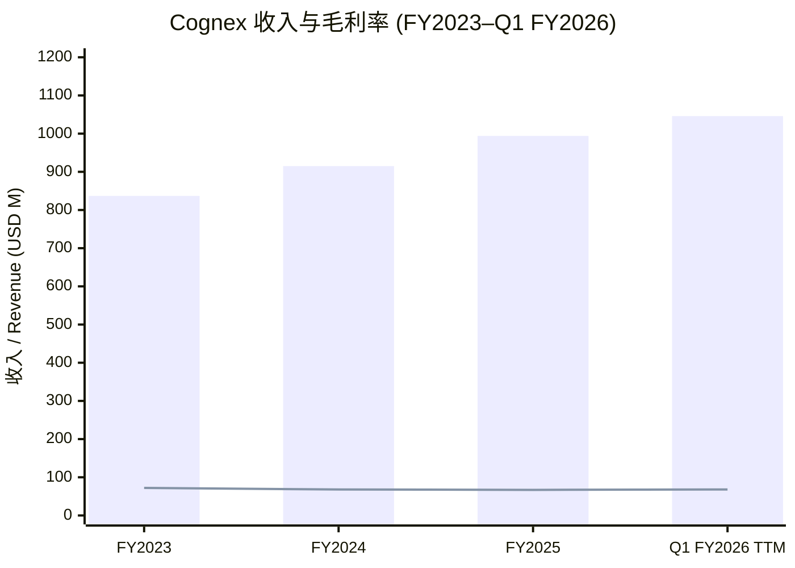
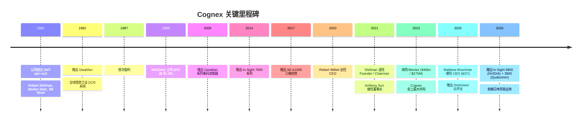
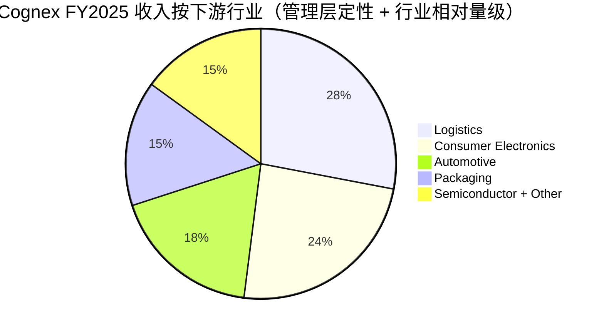
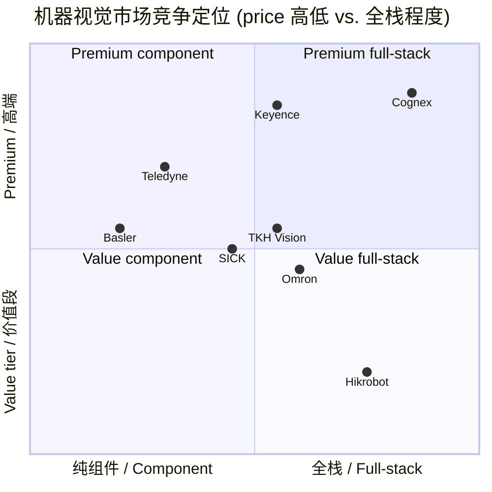

# Cognex Corporation (NASDAQ:CGNX) 公司研究报告

**报告日期 (As of):** 2026-06-02
**主题分类 (Theme):** humanoid-robotics-sensors（人形机器人 / 工业视觉感知）
**报告语言:** 简体中文 (zh-CN)

---

## 目录

1. 公司概览 (Company Overview)
2. 公司历史 (Company History)
3. 管理团队 (Management Team)
4. 产品与服务 (Products & Services) — **核心章节**
5. 客户与上市策略 (Customers & Go-to-Market)
6. 行业概览 (Industry Overview)
7. 竞争格局 (Competitive Landscape)
8. 市场机会 (Market Opportunity / TAM)
9. 风险评估 (Risk Assessment)
10. 投资人视角评分 (Investor-lens scorecards)
11. 数据来源清单 (Data Used)
12. 参考资料 (References)

---

## 1. 公司概览 (Company Overview)

Cognex Corporation（康耐视，NASDAQ:CGNX）是全球工业**机器视觉 / machine vision** 领域的核心独立纯玩家之一。公司在 1981 年由麻省理工学院 (MIT) 讲师 Robert J. Shillman 博士与两位 MIT 研究生 Marilyn Matz、Bill Silver 共同创立，总部位于美国马萨诸塞州 Natick；公司名字来自 "Cognition Experts"（认知专家）的缩写。截至 2025 年 12 月 31 日，公司在全球共有 2,745 名员工（公司内部称为 "Cognoids"），其中 1,876 名位于美国以外（[Cognex 2025 10-K, Item 1 Business](https://www.sec.gov/Archives/edgar/data/851205/000085120526000012/cgnx-20251231.htm)）。

**主营业务（一句话定义）：** 公司销售工业用机器视觉 / machine vision 系统、视觉传感器、视觉软件、条码读取器，以及与之配套的镜头与照明等光学组件，帮助制造业与物流业客户在不依赖人工的情况下，自动完成定位 (locate)、识别 (identify)、检测 (inspect) 与测量 (measure) 离散物体的任务（[Cognex 2025 10-K, Our Company](https://www.sec.gov/Archives/edgar/data/851205/000085120526000012/cgnx-20251231.htm)）。"Machine vision can be particularly valuable for applications in which human vision is inadequate to meet requirements for size, accuracy, or speed" —— 公司在 10-K 中这样描述其核心价值主张（[Cognex 2025 10-K, Item 1](https://www.sec.gov/Archives/edgar/data/851205/000085120526000012/cgnx-20251231.htm)）。

**商业模式与盈利方式：** Cognex 以**直销 + 渠道伙伴 / direct sales + channel partners** 的混合模式，向最终客户销售视觉硬件与软件包，并对设备制造商 (OEM)、机器制造商 (machine builders)、系统集成商 (system integrators) 提供产品与培训。服务收入（维护支持、咨询、培训）在所有期间占总收入的比例都低于 10%，公司绝大多数收入来自产品销售（[Cognex 2025 10-K, Executive Overview](https://www.sec.gov/Archives/edgar/data/851205/000085120526000012/cgnx-20251231.htm)）。2025 年度，公司物流 (logistics)、包装 (packaging)、消费电子 (consumer electronics) 与汽车 (automotive) 四大下游行业合计贡献约 85% 的总收入（[Cognex 2025 10-K, Our Company](https://www.sec.gov/Archives/edgar/data/851205/000085120526000012/cgnx-20251231.htm)）。

**地理收入分布与规模：** 2025 年公司总收入为 **994,359 千美元** (约 9.94 亿美元)，较 2024 年的 914,515 千美元增长 9%，主要由物流与消费电子行业拉动（[Cognex 2025 10-K, MD&A Revenue](https://www.sec.gov/Archives/edgar/data/851205/000085120526000012/cgnx-20251231.htm)）。按客户所在地划分：Americas 407,288 千美元 (41%)、Europe 251,638 千美元 (25%)、Greater China 158,456 千美元 (16%)、Other Asia 176,977 千美元 (18%) —— 非美国客户合计占总收入的 67%（[Cognex 2025 10-K, MD&A Geographic Revenue](https://www.sec.gov/Archives/edgar/data/851205/000085120526000012/cgnx-20251231.htm)）。**毛利率 / gross margin** 2025 年为 67%（2024 年 68%、2023 年 72%），主要因 Q4 一次性 1,300 万美元的呆滞库存计提与税务/关税影响，毛利略有压缩；**经营利润率 / operating margin** 16%（2024 年 13%）；**净利润率 / net margin** 12%（与 2024 年持平）（[Cognex 2025 10-K, MD&A 财务比率](https://www.sec.gov/Archives/edgar/data/851205/000085120526000012/cgnx-20251231.htm)）。

**最近一季业绩 / latest quarter：** 2026 年 4 月 5 日结束的 Q1 FY2026，公司收入 **2.68 亿美元**，同比增长 24% (固定汇率口径 +21%)；Q1 经营利润率 22.3%、Adjusted EBITDA margin 26.9% —— 这是公司**连续第七个季度毛利与 EBITDA 同比扩张**，调整后摊薄 EPS 同比增长 113% 至 0.34 美元（[Cognex Q1 FY2026 earnings press release, 2026-05-06](https://www.sec.gov/Archives/edgar/data/851205/000085120526000037/a04052026-xex991xq12026ear.htm)）。同时公司在 Q1 发布了两款基于 AI 的全新视觉旗舰产品：**In-Sight 6900**（搭载 NVIDIA 算力）与 **In-Sight 3900**（搭载 Qualcomm 嵌入式 AI 平台），并完成了对原 Moritex 日本贸易业务的剥离（[Cognex Q1 FY2026 earnings press release, 2026-05-06](https://www.sec.gov/Archives/edgar/data/851205/000085120526000037/a04052026-xex991xq12026ear.htm)）。

**估值快照（截至 2026-06-01）：** 股价 64.64 美元、市值 107.5 亿美元、**TTM P/E ≈ 76×**、Forward P/E ≈ 43.85×、TTM P/S ≈ 10.28×、P/B ≈ 7.28×、EV/EBITDA ≈ 46.52×、5 年 Beta ≈ 1.48、股息收益率约 0.53%、52 周区间 29.22–71.90 美元（52 周回报 +115.68%）（[Stock Analysis: CGNX Statistics, 2026-06-01](https://stockanalysis.com/stocks/cgnx/statistics/)）。一年内股价从 30 美元上下翻倍至 70 美元附近，反映两个变化：(1) 2025 年 6 月 27 日 CEO 换帅 (Robert Willett → Matthew Moschner)，市场对新管理层的"profitable growth + margin expansion"故事重新定价；(2) 连续七个季度的 EBITDA margin 扩张让市场重新接受了一个高质量、低杠杆、自由现金流转换率超过 100% 的工业自动化标的。

**估值倍数解释：** 76 倍 TTM P/E 看起来异常昂贵，但需要分解。**第一**，2025 年净利润里包含约 3,300 万美元的 OBBBA (One Big Beautiful Bill Act) 一次性递延所得税计提，使 2025 年 EITR 飙升至 37%（剔除一次性项目后约 17%）（[Cognex 2025 10-K, Income Tax Expense](https://www.sec.gov/Archives/edgar/data/851205/000085120526000012/cgnx-20251231.htm)）。剔除这一性损益后，盈利质量并不像 TTM P/E 暗示的那么差。**第二**，43 倍 Forward P/E 反映市场已经在为 2026 年的两位数 EPS 增长定价（Q1 已实现 +113% 调整后 EPS 同比增速）。**第三**，相对于同业 Rockwell Automation (NYSE:ROK) 2026 年 6 月 TTM P/E 约 **47×**、Keyence (TYO:6861) TTM P/E 约 **36–37×**、Teledyne Technologies (NYSE:TDY) TTM P/E 约 **35×**，Cognex 仍处明显溢价区间，但溢价的合理性来自其**纯玩家 (pure-play) 工业 AI 视觉**的稀缺性 —— ROK 与 TDY 业务面更宽、Keyence 业务结构更多元（传感器/激光/计量）（[Macrotrends ROK PE](https://www.macrotrends.net/stocks/charts/ROK/rockwell-automation/pe-ratio); [Macrotrends Keyence PE](https://www.macrotrends.net/stocks/charts/KYCCF/keyence/pe-ratio); [Companiesmarketcap CGNX PE](https://companiesmarketcap.com/cognex/pe-ratio/)）。*分析师观点：* 在 76 倍 TTM P/E 与 43 倍 Forward P/E 之间，市场更愿意定价后者，但任何 Q2/Q3 收入或毛利低于预期都可能触发显著的多重压缩。

*数据来源：[Cognex 2025 10-K, MD&A](https://www.sec.gov/Archives/edgar/data/851205/000085120526000012/cgnx-20251231.htm) + [Q1 FY2026 8-K Exhibit 99.1](https://www.sec.gov/Archives/edgar/data/851205/000085120526000037/a04052026-xex991xq12026ear.htm)；FY2023 毛利率 72%、FY2024 68%、FY2025 67% 来自 10-K MD&A 表格；Q1 FY2026 TTM 收入由 994.4 + 268.4 – 216.5 = 1,046 M 推算。*

---

## 2. 公司历史 (Company History)

Cognex 的故事是一个**学术派 spin-out 长成工业自动化龙头**的典型范本。1981 年，Robert J. Shillman 博士（时年 35 岁，已在 Tufts 大学任教，并曾任 MIT 人类视觉感知 / human visual perception 讲师）将自己 8.6 万美元的积蓄投入新公司，并邀请两位 MIT 研究生 Marilyn Matz 与 Bill Silver 共同创业；公司名字 Cognex 来自 "**Cog**nition **Ex**perts"（认知专家）的缩写（[Robert J. Shillman — Wikipedia](https://en.wikipedia.org/wiki/Robert_J._Shillman); [Encyclopedia.com: Cognex Corporation](https://www.encyclopedia.com/books/politics-and-business-magazines/cognex-corporation)）。Shillman 在创业初期亲自给两位研究生送了自行车作为加入激励，这段"summer job 变 career"的轶事成了公司文化的一部分（[Cognex Company History](https://www.cognex.com/company/history)）。

公司在 1982 年推出了第一款产品 **DataMan**——这是世界上第一台工业 OCR (optical character recognition) 系统，能够识别、验证并对直接打印在零部件上的字母、数字与符号进行质量保证（[Cognex Company History](https://www.cognex.com/company/history); [Encyclopedia.com: Cognex Corporation](https://www.encyclopedia.com/books/politics-and-business-magazines/cognex-corporation)）。早期客户集中在半导体晶圆制造领域，因为半导体的工艺微缩使人眼检测变得不可行。公司在 1987 年首次实现盈利，并于 1989 年在 NASDAQ 上市，发行价仅 1.38 美元每股（[Cognex Company History](https://www.cognex.com/company/history); [Encyclopedia.com: Cognex Corporation](https://www.encyclopedia.com/books/politics-and-business-magazines/cognex-corporation)）。

*数据来源：[Cognex Company History](https://www.cognex.com/company/history); [Cognex 2025 10-K](https://www.sec.gov/Archives/edgar/data/851205/000085120526000012/cgnx-20251231.htm); [2026 DEF 14A](https://www.sec.gov/Archives/edgar/data/851205/000119312526105065/d48298ddef14a.htm); [Cognex Q1 FY2026 press release](https://www.sec.gov/Archives/edgar/data/851205/000085120526000037/a04052026-xex991xq12026ear.htm)。*

**战略转型一：从半导体专家到多行业平台。** 1990–2010 年间，公司逐步把视觉技术从半导体单一行业扩散到汽车、消费电子、医疗、包装等离散制造领域，并在 2008 年起将条码读取器 (DataMan) 升级为图像识别条码读取器，从而切入物流与电商履约市场（[Cognex 2025 10-K, Our End Markets](https://www.sec.gov/Archives/edgar/data/851205/000085120526000012/cgnx-20251231.htm)）。这一转型让公司不再绑死在半导体资本周期上，开始把物流、包装、消电视为可同时拉动收入的多元下游。

**战略转型二：2020–2025 的"易用化"与"AI 化"。** Willett 时代 (2011–2025) 的主旋律是把高端机器视觉从只服务"大客户的难题"扩展到"中小客户的简单问题"。In-Sight 系列与 DataMan 系列陆续推出基于**深度学习 / deep learning** 与**边缘学习 / edge learning** 的产品，以"预训练神经网络模型 / pre-trained neural network models"降低部署门槛（[Cognex 2025 10-K, Products and Technology](https://www.sec.gov/Archives/edgar/data/851205/000085120526000012/cgnx-20251231.htm)）。2025 年，公司推出云端 AI 平台 **OneVision™**，允许客户在多 GPU 集群上训练模型，并将模型推送到 Cognex 嵌入式终端（[Cognex 2025 10-K, OneVision](https://www.sec.gov/Archives/edgar/data/851205/000085120526000012/cgnx-20251231.htm)）。同年，"emerging customer initiative"升级为更系统化的"salesforce transformation"——目标是"5 年内将客户数翻倍" / "double our customer base within five years"（[Cognex 2025 10-K, Our Business Strategies](https://www.sec.gov/Archives/edgar/data/851205/000085120526000012/cgnx-20251231.htm)）。

**关键收购：2023 年收购 Moritex（约 2.75 亿美元）。** 2023 年 8 月公司宣布以 ¥40 亿日元（约 2.75 亿美元）从 Trustar Capital（中信资本 CITIC Capital 旗下 PE）手中收购日本横滨的**光学组件 / optical components** 制造商 Moritex Corporation；这是 Cognex 史上最大一笔并购（[Vision Systems Design, "Cognex to Buy Moritex for $275 Million", 2023-08-29](https://www.vision-systems.com/cameras-accessories/article/14298403/cognex-to-buy-moritex-corporation); [Cognex 2025 10-K, MD&A Inorganic Growth](https://www.sec.gov/Archives/edgar/data/851205/000085120526000012/cgnx-20251231.htm)）。Moritex 当时约有 500 名员工、被 Cognex 预期贡献整体收入的 6–8%。这笔交易让 Cognex 在"摄像头 + 镜头 + 照明"全栈光学供应能力上前进了一大步，并把日本本土的"贸易代理 (trading)"业务带入手中——但贸易业务毛利率显著低于 Cognex 主业（视觉系统毛利率约 70%+），因此 Moschner 上任后选择 2026 年 Q1 完成对该贸易业务的**剥离 / divestiture**，仅保留 Moritex 的光学制造与产品研发能力（[Cognex Q1 FY2026 press release, 2026-05-06](https://www.sec.gov/Archives/edgar/data/851205/000085120526000037/a04052026-xex991xq12026ear.htm)）。

**最近 12 个月的关键事件：(1)** 2025 年 6 月 27 日完成 CEO 换帅，公司前 COO Matthew Moschner（39 岁，曾任 Boston Consulting Group industrial technology 顾问、Boeing 商飞工程师）从原 CEO Robert Willett（任职 2011–2025）手中接棒（[Cognex 2026 DEF 14A, Director Bios, Matthew Moschner](https://www.sec.gov/Archives/edgar/data/851205/000119312526105065/d48298ddef14a.htm)）；**(2)** 2026 年 3 月，董事会迎来两位新独立董事 —— 前 ABB Robotics and Discrete Automation 总裁 Sami Atiya 与现 Zendesk 首席收入官 Christopher Donato（[Cognex 2026 DEF 14A, Director Bios](https://www.sec.gov/Archives/edgar/data/851205/000119312526105065/d48298ddef14a.htm)）；**(3)** 2026 年 2 月 11 日董事会批准额外 5 亿美元股票回购计划（[Cognex 2025 10-K, Liquidity and Financing](https://www.sec.gov/Archives/edgar/data/851205/000085120526000012/cgnx-20251231.htm)）；**(4)** 2026 年 5 月推出两款新旗舰 AI 视觉产品 In-Sight 6900 (NVIDIA) 与 In-Sight 3900 (Qualcomm)（[Cognex Q1 FY2026 press release, 2026-05-06](https://www.sec.gov/Archives/edgar/data/851205/000085120526000037/a04052026-xex991xq12026ear.htm)）。

---

## 3. 管理团队 (Management Team)

**Robert J. Shillman（创始人 / Founder, 已退休）**

Robert "Bob" Shillman 博士是 Cognex 的灵魂人物，1946 年出生（[Robert J. Shillman — Wikipedia](https://en.wikipedia.org/wiki/Robert_J._Shillman)）。他在创业前的学术与职业轨迹如下：在东北大学 (Northeastern University) 取得 B.S.E.E.（电气工程学士），并在 MIT 拿到 M.S.E.E. 与博士学位，博士论文题目为 "Character recognition based on phenomenological attributes" —— 这本身就是机器视觉与 OCR 的奠基性研究方向（[Robert J. Shillman — Wikipedia](https://en.wikipedia.org/wiki/Robert_J._Shillman)）。1981 年他时任 Tufts 大学教职，并兼任 MIT 人类视觉感知讲师，决定离开学界，将自己 8.6 万美元的全部积蓄投入新公司，并说服两位 MIT 研究生 Marilyn Matz 与 Bill Silver 一起创业 —— 这两位日后都成为 Cognex 的核心技术骨干（[Robert J. Shillman — Wikipedia](https://en.wikipedia.org/wiki/Robert_J._Shillman); [Cognex Company History](https://www.cognex.com/company/history)）。

Shillman 在公司内部的角色经历了 CEO → Chairman → Chief Culture Officer（首席文化官）的演进，并于 **2021 年 2 月正式辞去 Founder 与 Chairman 职务**（[Robert J. Shillman — Wikipedia](https://en.wikipedia.org/wiki/Robert_J._Shillman)）。他长期把自己塑造为"culture keeper"——公司员工自称 "Cognoids"，公司格言 "Work Hard, Play Hard, Move Fast" 与十项核心价值观（Customer First, Excellence, Perseverance, Enthusiasm, Creativity, Pride, Integrity, Recognition, Sharing, Fun）都是 Shillman 时代的产物，至今仍写入 10-K Human Capital 章节（[Cognex 2025 10-K, Human Capital](https://www.sec.gov/Archives/edgar/data/851205/000085120526000012/cgnx-20251231.htm)）。值得一提的是，**自 2006 年起他放弃在 Cognex 的年度工资与奖金，每年要求公司将该笔金额捐赠给慈善机构**（[Robert J. Shillman — Wikipedia](https://en.wikipedia.org/wiki/Robert_J._Shillman)）。他在公司外的影响力延伸至 Friends of the Israel Defense Forces、David Horowitz Freedom Center、东北大学董事会 (now Trustee Emeritus)，以及在 MIT、Northeastern、Technion 等三所大学设立的冠名讲席教授席位（[Robert J. Shillman — Wikipedia](https://en.wikipedia.org/wiki/Robert_J._Shillman)）。

**Matthew Moschner（现任 CEO / President & CEO，2025 年 6 月 27 日上任）**

Matt Moschner 是 Cognex 内部成长的"Cognoid CEO"。根据 2026 年 DEF 14A 委托书披露，他出生于约 1986 年（2026 年 39 岁），在 Cognex 已工作了 8 年以上，是公司条码读取产品线扩张与战略技术决策的关键推手（[Cognex 2026 DEF 14A, Matthew Moschner Bio](https://www.sec.gov/Archives/edgar/data/851205/000119312526105065/d48298ddef14a.htm)）。他的职业轨迹：

- **Boeing (NYSE:BA)** (2008–2011)：在商飞集团的多个职能岗位轮岗，奠定了大型工业制造背景；
- **Boston Consulting Group** (2013–2017)：在 industrial technology practice 的多个项目岗位上工作，积累了战略咨询与并购整合方法论；
- **Cognex** (2017–present)：先后担任产品与工程多个领导岗位、SVP Engineering (2023–2025)、President & COO (2025-02 至 2025-06)，并于 **2025-06-27 接任 President & CEO**（[Cognex 2026 DEF 14A, Matthew Moschner Career Highlights](https://www.sec.gov/Archives/edgar/data/851205/000119312526105065/d48298ddef14a.htm)）。Cognex 2023 年完成的 Moritex 并购整合，正是由他直接负责。
- **学历**：Duke University 电气工程与经济学 B.S.、Kellogg School of Management (Northwestern) M.B.A.（[Cognex 2026 DEF 14A, Education](https://www.sec.gov/Archives/edgar/data/851205/000119312526105065/d48298ddef14a.htm)）。

**薪酬结构与利益绑定：** 2025 年 Moschner 的目标年化总薪酬为 8,581,387 美元（含基薪、目标奖金、PRSUs 与一次性 CEO 上任 stock option grant 价值 3,000,003 美元），CEO Pay Ratio 为 **105:1**（员工中位数年薪 81,596 美元）（[Cognex 2026 DEF 14A, CEO Pay Ratio](https://www.sec.gov/Archives/edgar/data/851205/000119312526105065/d48298ddef14a.htm)）。公司 2025 年起把 PRSUs 的使用范围从单纯 CEO 扩大到全部 NEO（named executive officers），且 PRSU 行权条件挂钩**相对总股东回报 / relative TSR**（[Cognex 2026 DEF 14A, Equity Compensation](https://www.sec.gov/Archives/edgar/data/851205/000119312526105065/d48298ddef14a.htm)）。**Robert Willett 前 CEO 在卸任后改任 CEO 顾问，年薪降至 $60,000（同比下降 91%）并继续帮助 Moschner 完成交接**（[Cognex 2026 DEF 14A, Willett Advisor Role](https://www.sec.gov/Archives/edgar/data/851205/000119312526105065/d48298ddef14a.htm)）。

*分析师观点：* Moschner 的双重背景（BCG industrial technology 战略 + Cognex 内部产品/并购实战）契合公司"profitable growth + cost discipline"的新主基调，但 39 岁就接任 CEO 算是工业自动化行业里相对罕见的年轻领导，需观察其在 2026–2028 的资本配置选择（如下一笔并购规模与节奏、salesforce transformation 的节奏与边际回报）。10-K 第 1A 风险因素章节明确把"CEO 换帅本身"列为需要管理的执行风险：*"With the appointment of our new Chief Executive Officer in June 2025, we are transitioning to a different management style and strategic focus. Navigating this transition is important to the near- and long-term success of the business."*（[Cognex 2025 10-K, Item 1A Risk Factors](https://www.sec.gov/Archives/edgar/data/851205/000085120526000012/cgnx-20251231.htm)）。

---

## 4. 产品与服务 (Products & Services) — 核心章节

> **重要性提示：** 本章节是整份报告的**核心**——理解 Cognex 产品矩阵后，才能合理评估其客户、行业、竞争与 TAM。Cognex 自己的描述非常精炼："Cognex offers a range of machine vision systems and sensors, vision software, and barcode readers designed to meet customer needs at different performance and price points."（[Cognex 2025 10-K, Products and Technology](https://www.sec.gov/Archives/edgar/data/851205/000085120526000012/cgnx-20251231.htm)）。

### 4.1 产品矩阵概览（10-K 原文 + Markdown 复刻）

Cognex 在 2025 10-K Item 1 Business 章节中将自身产品划分为四大类，下表为基于 10-K 原文整理：

| 大类 (Product Category) | 主要子线（10-K 原文） | 物理形态与位置 (10-K verbatim) |
|---|---|---|
| **Vision Systems and Sensors** | In-Sight® 2D/3D 视觉系统、Vision Sensors、Deep Learning / Edge Learning 嵌入式系统、OneVision™ 云平台 | "smart cameras and software to perform a wide range of tasks, including part location, identification, measurement, assembly verification, and robotic guidance" |
| **Vision Software** | VisionPro® 软件、QuickBuild™ 原型环境 | "the flexibility of the Cognex vision tools library to use with third-party cameras, frame grabbers, and peripheral equipment" |
| **Barcode Readers** | DataMan® 固定式与手持式条码读取器、Verifiers | "industrial image-based barcode readers read 1D, 2D, label-based, and direct part mark (DPM) codes" |
| **Vision Accessories** | 工业相机 (area scan, line scan)、镜头 (Moritex)、照明、Frame Grabbers、Vision Controllers | "industrial cameras, lenses, lighting, vision controllers, frame grabbers, and I/O cards" |

*分类原文出处：[Cognex 2025 10-K, Item 1 Business, Products and Technology](https://www.sec.gov/Archives/edgar/data/851205/000085120526000012/cgnx-20251231.htm)。*

```mermaid
graph TD
    A[Cognex Corporation] --> B[Vision Systems & Sensors]
    A --> C[Vision Software]
    A --> D[Barcode Readers]
    A --> E[Vision Accessories]
    A --> F[Services <10% rev]

    B --> B1[In-Sight 2D/3D]
    B --> B2[Vision Sensors]
    B --> B3[Deep Learning 系统]
    B --> B4[Edge Learning 系统]
    B --> B5[OneVision Cloud Platform]
    B --> B6[In-Sight 6900 NVIDIA]
    B --> B7[In-Sight 3900 Qualcomm]
    B --> B8[SLX Logistics Series]

    C --> C1[VisionPro Software]
    C --> C2[QuickBuild]

    D --> D1[DataMan Fixed-Mount]
    D --> D2[DataMan Handheld]
    D --> D3[DataMan Verifiers]

    E --> E1[Industrial Cameras]
    E --> E2[Moritex Lenses 收购获得]
    E --> E3[Lighting]
    E --> E4[Vision Controllers]
    E --> E5[Frame Grabbers]
```

*数据来源：[Cognex 2025 10-K, Products and Technology](https://www.sec.gov/Archives/edgar/data/851205/000085120526000012/cgnx-20251231.htm) + [Q1 FY2026 8-K](https://www.sec.gov/Archives/edgar/data/851205/000085120526000037/a04052026-xex991xq12026ear.htm)。*

### 4.2 综合理解：产品如何在客户工作流中串联

Cognex 的产品组合，本质上服务的是一个 **"看 → 识 → 测 → 控"** 的完整自动化工作流：上游用工业相机 + 镜头 + 照明 (Vision Accessories) 拍摄图像；中游由 Vision Systems / Vision Software 完成图像分析与决策；DataMan 条码读取器并行处理"看不见但需要追溯"的 ID 编码；最终把检测结果送到 PLC / 机器人 / MES 系统，触发执行机构动作或质量门控。在这个流程里，Cognex 是少数能同时供应**硬件 + 软件 + 光学组件**全栈的供应商（这也是 2023 年收购 Moritex 的战略意义 —— 拿到 in-house 镜头与照明 OEM 能力）。**这种"全栈 / full-stack"是公司相对于纯传感器供应商 (Basler、Teledyne DALSA) 与纯软件公司 (MVTec) 的关键差异化**。

### 4.3 Vision Systems and Sensors —— 营收主体（核心）

> **10-K 原文（verbatim 引用）：** "Vision systems combine smart cameras and software to perform a wide range of tasks, including part location, identification, measurement, assembly verification, and robotic guidance. Vision sensors can deliver an easy-to-use, low-cost, reliable solution for simple pass/fail inspections, such as checking the presence and size of parts. In-Sight® vision systems and sensors include our 2D and 3D vision systems. These products leverage various forms of AI, including rule-based coding, as well as deep learning and edge learning technology leveraging pre-trained models powered by neural networks."（[Cognex 2025 10-K, Vision Systems and Sensors](https://www.sec.gov/Archives/edgar/data/851205/000085120526000012/cgnx-20251231.htm)）

**中文释义 / Plain-language gloss：**
- **In-Sight 系列是 Cognex 的旗舰智能视觉相机平台**。"smart camera"（智能相机）的关键定义在于：图像采集 (imager / sensor) + 计算 (ISP + 神经网络加速器 / NPU) + 算法 (Cognex VisionPro / 深度学习 / OCR 工具) **三件一体集成在同一外壳内**，不再需要外接 PC 或 frame grabber。从 In-Sight 7000、In-Sight 9000，到最新发布的 **In-Sight 6900 (NVIDIA 算力)** 与 **In-Sight 3900 (Qualcomm 嵌入式 AI)**，公司沿"算力加大、AI 算法更深、price-band 进一步分层"三个维度持续迭代（[Cognex Q1 FY2026 earnings press release, 2026-05-06](https://www.sec.gov/Archives/edgar/data/851205/000085120526000037/a04052026-xex991xq12026ear.htm)）。
- **Deep Learning vs. Edge Learning 系统的区别**：deep learning 系统针对"复杂、不可预测的缺陷"（如 OLED 屏的瑕疵识别），训练数据量大、需 GPU 集群；edge learning 系统则使用**预训练模型 / pre-trained models**，针对相对简单的应用（如包装条码读取、瓶盖颜色一致性检测），客户侧无需大量样本即可上线，部署门槛低很多 —— 公司在 10-K 中明确："Similar to our deep learning-based systems, our edge learning-based systems use pre-trained models, but on simpler applications that prioritize ease of use and have a broader appeal with easier and faster implementation and training."（[Cognex 2025 10-K](https://www.sec.gov/Archives/edgar/data/851205/000085120526000012/cgnx-20251231.htm)）。Edge learning 是公司"customer doubling"战略的关键产品支柱。
- **OneVision™ 云平台（2025 推出）是 Cognex 的"软件平台化"野心**。10-K 原文："OneVision enables customers to integrate advanced AI models into vision jobs with increased ease, combining the performance of deep learning with the simplicity of edge-based solutions... accelerated AI model training on multi-GPU clusters, access to advanced architectures optimized for deployment on Cognex embedded products, and tools for cross-site project management to help streamline collaboration."（[Cognex 2025 10-K, OneVision](https://www.sec.gov/Archives/edgar/data/851205/000085120526000012/cgnx-20251231.htm)）。把"模型训练 (cloud)"与"模型部署 (edge)"打通是工业 AI 视觉公司的核心架构题——OneVision 让 Cognex 从一个"卖盒子的硬件公司"逐步走向"卖订阅与模型生态的平台公司"。
- **2026 Q1 双旗舰新品 In-Sight 6900 + 3900 反映的方向**：In-Sight 6900 搭载 NVIDIA 算力针对"最复杂的多模型推理 + 多相机融合 + 实时机器人引导"场景；In-Sight 3900 搭载 Qualcomm 嵌入式 AI 平台主打"低功耗 + 低 BOM + 多角度部署"，公司声称 In-Sight 3900 的检测速度可达上一代 4 倍（[The Robot Report, "Cognex releases fully integrated AI-powered vision system"](https://www.therobotreport.com/cognex-releases-fully-integrated-ai-powered-vision-system-robotics/)）。这种"两端走"产品线策略——同时强化 high-end performance 与 mid-end accessibility——正是 Moschner 上任后明显加速的方向。

*分析师观点：* Vision Systems & Sensors 是 Cognex 的护城河之最 —— 软硬件一体 + 多年的深度学习 SDK + Cognex 训练数据集 + In-Sight 平台后向兼容性 —— 综合形成的**生态锁定 / ecosystem lock-in** 是其相对于 Basler / Teledyne 等纯相机厂的关键优势。最接近的同类对手包括 Keyence (TYO:6861) 的 IV 与 CV 系列、Basler (XETR:BSL) 的 racer 与 ace 系列、以及 Teledyne DALSA 的 Genie Nano 系列；但前两者的体量更大、客户群更接近"分销 + 短交期"模式，而后者更偏向于 OEM 嵌入式相机供应（[ABI Research: Industrial Machine Vision Camera Vendor Assessment](https://www.abiresearch.com/press/basler-cognex-and-flir-systems-take-top-spots-in-abi-researchs-industrial-machine-vision-camera-vendor-competitive-assessment); [Averroes: Cognex vs Keyence Vision Systems Comparison](https://averroes.ai/blog/cognex-vs-keyence-vision-systems)）。

### 4.4 Vision Software —— 高毛利支撑

> **10-K 原文（verbatim）：** "Vision software offers customers the flexibility of the Cognex vision tools library to use with third-party cameras, frame grabbers, and peripheral equipment. Cognex VisionPro® software offers a suite of patented vision tools, including both traditional rule-based tools and deep learning-enabled tools, for advanced programming. Its QuickBuild™ prototyping environment is intended to allow customers to build vision applications with the simplicity of a graphical flowchart-based programming interface."（[Cognex 2025 10-K, Vision Software](https://www.sec.gov/Archives/edgar/data/851205/000085120526000012/cgnx-20251231.htm)）

**中文释义 / Plain-language gloss：**
- **VisionPro® 是 Cognex 在 1990 年代就建立的"视觉 SDK / vision tools library"**——本质上是一组**专利图像处理算法 / patented vision tools**，可以与任何第三方相机配合使用。这部分业务的毛利率远高于硬件，但收入规模因不绑定硬件销售而相对较小。VisionPro 的客户主要是大型系统集成商和 OEM 厂商，他们需要把 Cognex 算法库嵌入自己的设备。
- **QuickBuild™ 是 VisionPro 的"低代码 / low-code"层**，让没有受过专业视觉算法培训的工程师能够用流程图方式快速搭一个简单视觉应用 —— 这是公司"customer doubling"战略中扩大用户基数的关键工具。

*分析师观点：* 软件业务对 Cognex 的财务意义被低估了——其毛利率显著拉高公司整体毛利率到 67–72% 区间。最接近的对手是 MVTec HALCON（德国，私有公司）与 NI Vision Builder（NI 内嵌、已被 Emerson 收购）（[NI 在 Emerson 旗下的产品组合](https://www.ni.com/)）。

### 4.5 Barcode Readers —— 物流业务核心引擎

> **10-K 原文（verbatim）：** "Cognex industrial image-based barcode readers read 1D, 2D, label-based, and direct part mark ('DPM') codes found in nearly every industry including logistics, automotive, consumer products, and medical-related. The DataMan® product line, which includes fixed-mount and handheld models, as well as barcode verifiers, help organizations improve performance, increase throughput, and help control traceability."（[Cognex 2025 10-K, Barcode Readers](https://www.sec.gov/Archives/edgar/data/851205/000085120526000012/cgnx-20251231.htm)）

**中文释义 / Plain-language gloss：**
- **DataMan® 是 Cognex 的"印钞机"业务之一**，特别是在物流 / 电商履约领域。与传统激光式条码扫描器不同，DataMan 是**图像识别式 / image-based barcode reader**，它实际上是一台小型的智能视觉相机：拍摄包装上的条码图像后，用 Cognex 的算法在毫秒内解码，并且可以同时读取 1D、2D（如 QR 码）、Direct Part Mark (DPM，激光直接在金属/玻璃上刻的码) 等多种码。这种 image-based 设计的优势是**对损伤、低对比度、倾斜角度都更有容忍度**——这正是亚马逊、UPS、FedEx、DHL 等电商物流商在高速分拣线上需要的"读不漏"能力。
- **2025 年的 SLX 系列（Solutions Experience）**：公司在物流市场推出了首条专为物流场景设计的 **SLX 设备线**：10-K 原文 "In 2025, we launched our first line of Solutions Experience ('SLX') devices designed for the logistics sector. SLX reflects our mission to make advanced machine vision easy by integrating industry-leading AI with intuitive deployment workflows."（[Cognex 2025 10-K, Logistics](https://www.sec.gov/Archives/edgar/data/851205/000085120526000012/cgnx-20251231.htm)）。SLX 是 Cognex 把 In-Sight + DataMan + Edge Learning 三种能力打包成"easy-to-deploy 行业一体机"的尝试。
- **管理层在 10-K 中明确说：物流是潜在的最高增长终端 / "We believe that logistics has the potential to be our highest-growth end market over the mid to long-term."**（[Cognex 2025 10-K, Logistics](https://www.sec.gov/Archives/edgar/data/851205/000085120526000012/cgnx-20251231.htm)）。这也解释了为什么 2025 年公司收入增长的主要拉动来自物流与消电——大型电商履约客户在 2020–2021 大举建仓后、2022 上半年"消化产能"，2024 起重启稳健投资，2025 增速回升、2026 Q1 进一步加速（24% YoY）。

*分析师观点：* DataMan 在工业级条码读取市场是事实上的领导者，最大威胁来自 **Zebra Technologies (NASDAQ:ZBRA)** 在零售/POS 场景的强势地位，但 Zebra 主要打的是仓储手持终端 + 零售商 POS 端，与 Cognex 的"工厂自动化生产线 + 物流分拣线"高速场景错位竞争。Honeywell Scanning & Mobility (NASDAQ:HON) 与 Datalogic (BIT:DAL) 在工业条码读取的入门段竞争更直接，但在高速/DPM 场景缺乏 Cognex 的图像处理算法深度。

### 4.6 Vision Accessories —— 2023 Moritex 并购后的全栈支柱

> **10-K 原文（verbatim）：** "Cognex vision accessories are designed for easy integration with Cognex products and applications. Cameras are available in both area scan and line scan formats to address a variety of applications. Lenses and lighting are also available in both embedded and component formats to support image acquisition, including a range of optical components that were added to the Company's vision accessory portfolio with the acquisition of Moritex. From value solutions to high-performance hardware, Cognex offers industrial cameras, lenses, lighting, vision controllers, frame grabbers, and I/O cards to help meet customer requirements."（[Cognex 2025 10-K, Vision Accessories](https://www.sec.gov/Archives/edgar/data/851205/000085120526000012/cgnx-20251231.htm)）

**中文释义 / Plain-language gloss：**
- **2023 Moritex 收购的战略意义在这里得到充分体现**。在收购之前，Cognex 的相机基本是"In-Sight smart camera 一体机"，对外销售的"通用工业相机 (area-scan + line-scan)"产品线相对薄。Moritex 带来了**镜头 / lenses + 照明 / lighting 的全栈光学组件供应能力**——这两类是机器视觉总成本中占比约 30% 的部分，且性能差异会直接影响成像质量与算法上限。
- **光学制造选址有战略考虑**：10-K 明确 "Cognex manufactures optical components, including our lenses and lighting, at our in-house production plants located in China and Vietnam"（[Cognex 2025 10-K, Operations](https://www.sec.gov/Archives/edgar/data/851205/000085120526000012/cgnx-20251231.htm)）。把光学制造放在中国 + 越南，反映了"贴近亚洲客户群 + 双轨制规避美中关税风险"的双重考量。
- **2026 Q1 完成日本贸易业务剥离**：Moritex 收购时附带的日本"trading business"被认定为低毛利、非核心，Q1 完成剥离后，Cognex 在该地区只保留 Moritex 的研发与制造业务（[Cognex Q1 FY2026 press release, 2026-05-06](https://www.sec.gov/Archives/edgar/data/851205/000085120526000037/a04052026-xex991xq12026ear.htm)）。这是 Moschner 上任后第一笔"非核心资产剥离"，对应 Q1 调整后毛利率扩张 420 bps 的有形贡献。

*分析师观点：* Vision Accessories 这一类原来是 Cognex 的"短板"，Moritex 收购后成为公司"全栈视觉解决方案"叙事的关键支撑。但要注意，光学组件本身毛利率（约 40–50% 区间）低于 In-Sight smart camera (约 70%+)，所以这一类增长虽然拉动总收入，但会**结构性压缩公司整体毛利率上限**——管理层在 2024–2025 年间均提到这一点。

### 4.7 服务业务 (Services <10% Revenue) —— 配套属性

服务收入（维护支持、咨询、培训）占总收入的比例始终低于 10%（[Cognex 2025 10-K, Sales Channels and Support Services](https://www.sec.gov/Archives/edgar/data/851205/000085120526000012/cgnx-20251231.htm)）。Cognex 不靠服务作主要利润来源——这与 ROK、Honeywell 等大型工业自动化集团相比是显著差异。公司更倾向通过 OneVision 平台与软件订阅来构建未来的recurring revenue 业务，而不是依靠传统的"现场技术支持工时收费"。

### 4.8 旗舰产品与最近 12 个月发布 (Recent Launches)

按收入贡献的视角，**Cognex 的旗舰产品组合可以总结为三大支柱：**
1. **In-Sight 视觉系统系列** —— 收入与利润的最大贡献来源（10-K 未单独披露细分产品占比，但内嵌于 Vision Systems & Sensors 收入大类）；
2. **DataMan 条码读取器** —— 物流业务核心 + 2025 SLX 系列新增长引擎；
3. **VisionPro 软件 + OneVision 云平台** —— 长尾高毛利业务，正在向"平台化 + 订阅化"方向演进。

**最近 12 个月的关键产品发布（来自公司公告与新闻）：**
- 2025-launch — **OneVision™ Cloud Platform**（云端模型训练 + 边缘部署）（[Cognex 2025 10-K, OneVision](https://www.sec.gov/Archives/edgar/data/851205/000085120526000012/cgnx-20251231.htm)）
- 2025-launch — **SLX (Solutions Experience) 物流系列**（针对物流的 Edge AI 行业一体机）（[Cognex 2025 10-K, Logistics](https://www.sec.gov/Archives/edgar/data/851205/000085120526000012/cgnx-20251231.htm)）
- 2026 Q1 — **In-Sight 6900（NVIDIA-powered）+ In-Sight 3900（Qualcomm 嵌入式 AI）双旗舰发布**（[Cognex Q1 FY2026 press release, 2026-05-06](https://www.sec.gov/Archives/edgar/data/851205/000085120526000037/a04052026-xex991xq12026ear.htm)）

**研发投入维持高位但占比下降**：2025 年 RD&E 支出 1.39 亿美元（占收入 14%），2024 年 1.40 亿美元（占 15%），2023 年 1.39 亿美元（占 17%）——绝对值稳定、占比下降，反映"营收规模化 + AI 工具助力研发效率"两个变量（[Cognex 2025 10-K, MD&A RD&E Expenses](https://www.sec.gov/Archives/edgar/data/851205/000085120526000012/cgnx-20251231.htm)）。研发员工 575 人（占总员工 21%）（[Cognex 2025 10-K, Human Capital](https://www.sec.gov/Archives/edgar/data/851205/000085120526000012/cgnx-20251231.htm)）。

---

## 5. 客户与上市策略 (Customers & Go-to-Market)

### 5.1 客户终端分布（按行业）

Cognex 2025 年总收入约 9.94 亿美元，按下游行业划分（公司自述）：**logistics、packaging、consumer electronics、automotive 四大行业合计约占总收入 85%**（[Cognex 2025 10-K, Our Company](https://www.sec.gov/Archives/edgar/data/851205/000085120526000012/cgnx-20251231.htm)）。公司并未把每个行业的具体收入金额披露在 10-K 中，但通过 MD&A 的定性表述可以判断：

- **物流 (Logistics) — 增长引擎**：管理层在 10-K 中明确"logistics 是中长期最高增长终端"，2025 年增长贡献主要来自大型电商履约客户（[Cognex 2025 10-K, Logistics](https://www.sec.gov/Archives/edgar/data/851205/000085120526000012/cgnx-20251231.htm)）；
- **消费电子 (Consumer Electronics) — 第二增长引擎**：受 2024 OBBBA 时代以来的"出口控制 + 供应链重构"影响，部分大客户把采购从中国厂商转移到欧洲与 Other Asia 厂商，导致 European 收入 +15%、Greater China 收入 -3%（[Cognex 2025 10-K, MD&A Geographic Revenue Discussion](https://www.sec.gov/Archives/edgar/data/851205/000085120526000012/cgnx-20251231.htm)）；
- **包装 (Packaging) — 政策驱动稳健增长**：受医药与快消品对追溯性 / traceability 监管收紧推动；
- **汽车 (Automotive) — 持续逆风**：2025 年继续疲软，10-K 明确"automotive market continue to experience significant headwinds in 2025, driven in part by geopolitical and trade uncertainty"（[Cognex 2025 10-K, Automotive](https://www.sec.gov/Archives/edgar/data/851205/000085120526000012/cgnx-20251231.htm)）。
- **半导体 (Semiconductor) — 小但加速**：管理层认为 AI 驱动的高端逻辑芯片对 OEM 客户产生 outsized growth potential（[Cognex 2025 10-K, Semiconductor](https://www.sec.gov/Archives/edgar/data/851205/000085120526000012/cgnx-20251231.htm)）。

*说明：10-K 公司未公布按下游行业拆分的具体收入金额；上图各行业占比为分析师基于 (a) 10-K "四大行业合计 85%"、(b) MD&A 定性增长描述（logistics 强、consumer electronics 强、automotive 弱）、(c) 公司过往业绩说明会的方向性表述而估算 (analyst estimate; not disclosed)。该图不应被理解为公司披露的精确分项。Source: [Cognex 2025 10-K, Our Company + Our End Markets](https://www.sec.gov/Archives/edgar/data/851205/000085120526000012/cgnx-20251231.htm)。*

### 5.2 地理收入分布（10-K 披露原文）

2025 年公司收入按客户域 (customer's country of domicile) 划分：

| 地区 | 2025 收入 (千美元) | 占比 | 2024 收入 (千美元) | 占比 | YoY 变化 |
|---|---|---|---|---|---|
| Americas | 407,288 | 41% | 350,155 | 38% | +16% |
| Europe | 251,638 | 25% | 217,880 | 24% | +15% |
| Greater China | 158,456 | 16% | 164,147 | 18% | -3% |
| Other Asia | 176,977 | 18% | 182,333 | 20% | -3% |
| **总计 / Total** | **994,359** | **100%** | **914,515** | **100%** | **+9%** |

*数据来源：[Cognex 2025 10-K, MD&A Disaggregated Revenue by Geographic Area](https://www.sec.gov/Archives/edgar/data/851205/000085120526000012/cgnx-20251231.htm)。*

**关键洞察：** Americas 与 Europe 双双 +15% 以上，Greater China 与 Other Asia 均为 -3%——这清楚反映了"客户从中国采购转移到欧洲/北美/其他亚洲"的供应链重构。这本身既是机会（Europe 表现强劲）也是风险（中国市场份额下降可能不可逆）。

### 5.3 客户集中度（重要披露）

**Cognex 10-K 中并未在主营业务披露段或 segment note 里列出"前 5 名客户名称"或"任何超过 10% 营收的单一客户"——这意味着按 ASC 280-10-50-42，公司认为没有任何单一客户达到 ≥10% 合并收入的披露门槛**。这与公司"thousands of customers" + "broad base of customers across a variety of industries"（[Cognex 2025 10-K, Industry and Market Opportunity](https://www.sec.gov/Archives/edgar/data/851205/000085120526000012/cgnx-20251231.htm)）的定性描述一致。

**但是 10-K Item 1A 风险因素章节明确把"大客户损失"列为重要风险**：*"the loss of, or curtailment of purchases by, large customers in the logistics, consumer electronics, or automotive industries"*（[Cognex 2025 10-K, Forward-Looking Statements 风险列表](https://www.sec.gov/Archives/edgar/data/851205/000085120526000012/cgnx-20251231.htm)）。结合公开报道与公司说明会措辞，物流业务的"large e-commerce customers"几乎可以确定主要是 **Amazon（已公开多次 case study）+ FedEx + UPS + DHL 等北美/欧洲电商履约商**；消电业务高度依赖手机、可穿戴、笔电的"top OEMs"群（Cognex 不愿意指名道姓，但工业链普遍认为包括 Apple 的 EMS 合作商富士康/和硕等）（[Cognex Customer Stories — Vision-Guided Robotics](https://www.cognex.com/customer-stories/other/cognex-vision-tools-are-the-key-to-solving-a-variety-of-vision-guided-robot-applications)）。

*分析师观点（与披露未冲突）：* 虽然 10-K 没有点名任何单一客户超过 10%，但**集中度风险并不为 0**——10-K 风险章节中专门加入"大型物流客户、大型消电客户、大型汽车客户"为风险因子，说明几个大客户的合计敞口对 Cognex 仍具材料影响。考虑到电商履约头部商在物流自动化采购中的集中度，**物流分项的客户集中度（segment-level，不等于 consolidated）大概率显著高于合并口径**——但 Cognex 未单独披露物流分项的客户集中度。**任何用 segment-level 集中度推断 consolidated top-5 占比的做法都是误读**——本报告严格区分。

### 5.4 销售渠道与新的"Salesforce Transformation"战略

10-K 明确描述了三类销售职能：
1. **Market Creation and Expansion** — 拓展新客户 + 在老账户中推广易用 AI 产品；
2. **Market Penetration** — 高级销售工程师，针对已有客户深化产品组合渗透；
3. **Partner Enablement** — 与 OEM、系统集成商、机器制造商等价值合作伙伴对接。

*"This structured approach is intended to enhance customer engagement and expand market reach across diverse customer segments."*（[Cognex 2025 10-K, Sales Channels](https://www.sec.gov/Archives/edgar/data/851205/000085120526000012/cgnx-20251231.htm)）

公司从 2025 年起把过去 5 年的"emerging customer initiative"(主要依赖增加销售员工头数 + 易用产品) 升级为系统化的"**salesforce transformation**"——核心思路是用 process improvements + data-driven analytics + advanced tools 提升人均产出，而非单纯扩 headcount（[Cognex 2025 10-K, Salesforce Transformation](https://www.sec.gov/Archives/edgar/data/851205/000085120526000012/cgnx-20251231.htm)）。配套目标："5 年内将客户基数翻倍"。这是 Moschner 时代的核心战略 KPI 之一。

### 5.5 服务支持

Cognex 的服务收入<10%，但是公司的"customer experience"叙事很重要——产品配套了：
- 全球分布的 application engineers 与 field engineers (FSE)
- 在 Cognex 区域办公室、客户工厂、线上的产品培训课程
- VisionPro / OneVision 在线知识库与社区

公司的服务收入虽小，但通过"reliable 部署 + 快速响应 + 全球覆盖"，构成了相对于 Basler / Teledyne 等纯硬件供应商的差异化软实力（[Cognex 2025 10-K, Support Services](https://www.sec.gov/Archives/edgar/data/851205/000085120526000012/cgnx-20251231.htm)）。

---

## 6. 行业概览 (Industry Overview)

### 6.1 行业定义与覆盖范围

**机器视觉 / Machine Vision (MV)** 是工业自动化的核心感知层，它使用相机 + 镜头 + 照明硬件采集图像，配合算法软件对图像进行解析，输出可被 PLC、机器人控制器或 MES 系统使用的离散决策信号（位置、识别、缺陷、尺寸、合格/不合格）。从 NAICS 角度，主要落在 **NAICS 334513（Industrial Instruments for Measurement, Display, and Control）**——这正是 Cognex 在 SEC 注册中归属的 SIC 3823 类目（[SEC EDGAR Submission JSON, SIC 3823](https://data.sec.gov/submissions/CIK0000851205.json)）。

机器视觉是更广义的 **"工业 AI / industrial AI"** 框架下的关键感知 modality，与之相邻的细分包括：
- **3D / depth sensors**（结构光、ToF、激光雷达）
- **工业条码 / Auto-ID readers**（一维 + 二维 + DPM）
- **传感器 / Smart sensors**（光电、电感、电容、超声波等）
- **协作机器人 / cobots 与机器手 / robotic arms**

### 6.2 市场规模与增长（TAM）

根据 MarketsandMarkets 与 Mordor Intelligence 等市场研究机构：

- **全球工业机器视觉市场规模**：2025 年约 **158.3 亿美元**，预计 2030 年达到 **236.3 亿美元**，对应 **CAGR ≈ 8.3%**（[MarketsandMarkets, Machine Vision Market Size 2025–2030](https://www.marketsandmarkets.com/Market-Reports/industrial-machine-vision-market-234246734.html); [OpenPR, Global Machine Vision Market Forecast 2026–2033](https://www.openpr.com/news/4474393/global-machine-vision-market-size-growth-forecast-2026-2033)）。
- **MV 摄像头细分**：另一组数据看摄像头层面，2024 年 Cognex 在 MV 摄像头细分的份额约 11.4%，落后于 Keyence 的 14.2%（[Coherent Market Insights, Machine Vision System Market Share](https://www.coherentmarketinsights.com/industry-reports/machine-vision-system-market)）。
- **北美机器视觉系统市场规模**（Mordor 估计）：2024 年约 50 亿美元，CAGR 7%（[Mordor Intelligence, North America Machine Vision Systems Market](https://www.mordorintelligence.com/industry-reports/north-america-machine-vision-systems-market-industry)）。

*分析师观点：* Cognex 2025 年收入 9.94 亿美元，如果按全球 158 亿美元 TAM 计算，**Cognex 全球 share ≈ 6.3%**（不分细分），位列 Keyence 之后但与 Teledyne 接近；如果按 ABI Research 在 MV 摄像头细分的统计，Cognex 与 Basler、FLIR/Teledyne 共同位列 Top-3（[ABI Research](https://www.abiresearch.com/press/basler-cognex-and-flir-systems-take-top-spots-in-abi-researchs-industrial-machine-vision-camera-vendor-competitive-assessment)）。**整个机器视觉市场是 fragmented + 8% CAGR + AI 加速的中速增长市场——典型的"高 ROIC + 中速增长"工业 SaaS-like 投资标的画像**。

### 6.3 关键驱动力 (Growth Drivers)

1. **工业 AI 转型**：边缘 AI (edge AI) 与深度学习渗透到生产线检测，让原本无法自动化的"判断类任务"（如视觉外观缺陷、面板瑕疵分类）可以自动化。
2. **物流自动化的中长期延续**：电商履约中心的高速分拣线、自动仓储、机器人拣选（goods-to-person）。Cognex 管理层认为这是其最重要的中长期增长点（[Cognex 2025 10-K, Logistics](https://www.sec.gov/Archives/edgar/data/851205/000085120526000012/cgnx-20251231.htm)）。
3. **半导体先进制程的 AI 需求**：HBM、CoWoS 等先进封装中的 wafer 标识、masking 对位、电气测试都对机器视觉提出新要求 —— "AI continues to drive demand for high-end logic process chips with our OEM customers, we believe the overall semiconductor market has the potential for outsized growth"（[Cognex 2025 10-K, Semiconductor](https://www.sec.gov/Archives/edgar/data/851205/000085120526000012/cgnx-20251231.htm)）。
4. **人形机器人 / humanoid robots 与协作机器人 / cobots 的早期机会**：humanoid robotics 在制造业、物流领域的早期应用都需要"手眼协同"的视觉解决方案 —— 这是 Cognex 在 humanoid-robotics-sensors 主题中的定位逻辑。Cognex 通过 **In-Sight 系列 + OneVision 云平台**为机器人公司提供视觉算法堆栈；2026-03 公司新任独立董事 Sami Atiya（前 ABB Robotics 总裁）正是为机器人方向加深资源连接（[Cognex 2026 DEF 14A, Sami Atiya Bio](https://www.sec.gov/Archives/edgar/data/851205/000119312526105065/d48298ddef14a.htm); [Cognex Vision-Guided Robotics](https://www.cognex.com/en/applications/guidance-and-alignment/vision-guided-robotics-for-industrial-automation)）。
5. **法规驱动的追溯性需求**：医药、食品、汽车的产品追溯性 (traceability) 要求让 DataMan 条码读取器持续受益。

### 6.4 监管环境与地缘风险

- **出口管制 (US Commerce Bureau of Industry and Security)**：Cognex 业务受到对中国半导体客户的出口限制影响，"to date, the impact... has been immaterial to our total revenue"（[Cognex 2025 10-K, China Risk Factors](https://www.sec.gov/Archives/edgar/data/851205/000085120526000012/cgnx-20251231.htm)）——但中国占比从 2024 年 18% 降至 2025 年 16%，趋势已经出现。
- **美中关税**：2025 年的关税环境对 Cognex 主要影响成本端（中国采购的部分组件成本上升），公司将光学制造放在中国 + 越南双轨制以对冲（[Cognex 2025 10-K, Operations](https://www.sec.gov/Archives/edgar/data/851205/000085120526000012/cgnx-20251231.htm)）。
- **One Big Beautiful Bill Act (OBBBA, 2025-07-04 通过)**：美国新税法修订了 GILTI → NCTI 的国际税征收方式，给 Cognex 带来 3,300 万美元一次性递延所得税计提，但未来每年现金税收益预计 1,200-1,500 万美元（[Cognex 2025 10-K, Income Tax Expense — OBBBA](https://www.sec.gov/Archives/edgar/data/851205/000085120526000012/cgnx-20251231.htm)）。

### 6.5 行业结构

机器视觉市场具有典型的 **fragmented + technical specialization** 特征：

- **Top-5 厂商合计 share ≈ 20–30%**——领头羊 Keyence ~14%、Cognex ~11%，其余包括 TKH Vision、Teledyne、Hikrobot 等（[Coherent Market Insights, Machine Vision System Market Share](https://www.coherentmarketinsights.com/industry-reports/machine-vision-system-market)）。
- **Supplier power**：图像传感器供给端集中（Sony 占图像传感器市场 ~50%），关键芯片供应来自台积电、海力士等。Cognex 没有自己造 CIS（图像传感器），但通过 In-Sight smart camera 把传感器 → 算法做集成。
- **Buyer power**：客户端集中度因下游行业不同而差异显著——物流（高，少量电商巨头）vs. 包装（低，分散）vs. 汽车（中，OEM + Tier-1 集中）。
- **Substitutes**：开源视觉库（OpenCV、PyTorch + YOLO 等）+ 通用 GPU（NVIDIA Jetson）让 DIY 视觉方案变得可行——这正是 10-K 风险章节明确点名的威胁："Advancements in the availability of sophisticated AI algorithms and open-source machine vision platforms may lower barriers to enter our market"（[Cognex 2025 10-K, Risk Factors](https://www.sec.gov/Archives/edgar/data/851205/000085120526000012/cgnx-20251231.htm)）。

---

## 7. 竞争格局 (Competitive Landscape)

### 7.1 主要竞争对手（10-K 原文 + 第三方研究补充）

> **10-K 原文（verbatim）：** "Cognex is one of the leading machine vision companies in the world. Our competitors include other vendors of machine vision systems, controllers, and components; manufacturers of image processing systems, sensors, and components; and system integrators. We also compete with internal engineering departments of current or prospective customers, as well as open-source tools available from various companies, including tools using AI."（[Cognex 2025 10-K, Competition](https://www.sec.gov/Archives/edgar/data/851205/000085120526000012/cgnx-20251231.htm)）

注意 10-K 中**没有点名任何特定竞争对手公司**——这种"高层级的竞争描述"在工业自动化 10-K 中是常见做法。第三方研究（ABI Research、MarketsandMarkets、Coherent Market Insights）则点明：

| 公司 | 总部 | 2024 MV 系统/相机 share* | 与 Cognex 的差异化 |
|---|---|---|---|
| **Keyence (TYO:6861)** | 日本大阪 | ~14.2% | 业务结构更宽 (传感器 + 激光 + 计量 + 显微镜)；直销模式覆盖中端市场；TTM P/E ~36× |
| **Cognex (NASDAQ:CGNX)** | 美国 Natick MA | ~11.4% | 纯玩家 + 软硬件一体 + 物流/电商深度；TTM P/E ~76× |
| **TKH Vision** | 荷兰 | ~6.8% | 收购整合多个细分供应商组成的集团；偏 OEM |
| **Teledyne Solutions** | 美国 (Teledyne DALSA + FLIR) | ~6.5% | 工业相机 OEM 重心；服务一些高分辨率 line-scan 场景 |
| **Hikrobot** | 杭州 (海康机器人) | ~6.2% | 中国本土最大；价格优势 + 政府背景 |
| **Basler (XETR:BSL)** | 德国 | ~3.4% | 工业相机 OEM 集中；偏组件供应 |
| **Omron** | 日本京都 | ~2.3% | 工业自动化集团内嵌；与 PLC 与机器人 IO 板联动 |
| **OPT Machine Vision** | 中国东莞 | ~2.1% | 本土新兴；偏价值段 |
| **Baumer** | 瑞士 | ~1.8% | 多元化工业相机 + 传感器组件 |
| **SICK** | 德国 | ~1.4% | 主业为工业传感器 + 安全 |

*Source: [Coherent Market Insights, Machine Vision System Market Share & Opportunities 2026–2033](https://www.coherentmarketinsights.com/industry-reports/machine-vision-system-market); [MarketsandMarkets, Industrial Machine Vision Market 2025–2030](https://www.marketsandmarkets.com/Market-Reports/industrial-machine-vision-market-234246734.html)。市场份额为第三方研究估算 (analyst estimate; not from 10-K)。*

*象限说明：横轴左侧偏纯组件供应（相机 OEM），右侧偏一体化软硬件 + 服务方案；纵轴下方为价值段（中低端），上方为高端（高 ASP + 应用工程支持）。Cognex 处在右上 premium 全栈位置；Keyence 在右上但向左侧靠（销售模式与产品宽度差异）；Hikrobot 走 value full-stack 路线靠价格扩大份额。所有定位均为分析师判断 (analyst assessment)。Source: [ABI Research, Machine Vision Camera Vendor Assessment](https://www.abiresearch.com/press/basler-cognex-and-flir-systems-take-top-spots-in-abi-researchs-industrial-machine-vision-camera-vendor-competitive-assessment); 各公司年报。*

### 7.2 与 Keyence 的直接竞争

Cognex 与 Keyence 是机器视觉行业最受关注的"对决"——两者的产品组合、商业模式、估值高度可比：

**产品对决（[Averroes, "Cognex vs Keyence 2026 Vision Inspection System Comparison"](https://averroes.ai/blog/cognex-vs-keyence-vision-systems)）：**
- **传感器/智能视觉**：Cognex In-Sight 系列 vs. Keyence IV/CV 系列；
- **条码读取**：Cognex DataMan vs. Keyence SR/HR；
- **3D 视觉**：Cognex 3D-A1000 vs. Keyence WI 系列；
- **软件 SDK**：Cognex VisionPro/OneVision vs. Keyence VisionTerminal。

**商业模式对决：**
- **Keyence 直销 + 销售工程师密集覆盖**：日本本土+全球数千名应用工程师上门服务，平均订单金额较低但客户访问频率极高；
- **Cognex 渠道 + 直销混合**：更依赖渠道伙伴（OEM、SI、机器制造商），针对北美 + 欧洲市场覆盖较深。

**财务结构对决（截至 2026 年 6 月初）：**
- Keyence：2025 财年收入约 1 万亿日元 (~75 亿美元)；TTM 营业利润率 ~50%；TTM P/E ~36×；
- Cognex：2025 财年收入 9.94 亿美元；TTM 营业利润率 16%；TTM P/E ~76×（[Macrotrends Keyence PE 2021–2025](https://www.macrotrends.net/stocks/charts/KYCCF/keyence/pe-ratio); [Stockanalysis CGNX Statistics](https://stockanalysis.com/stocks/cgnx/statistics/)）。

*分析师观点：* Keyence 的盈利能力（50%+ 营业利润率）显著高于 Cognex（16%），但 Cognex 的成长性（Q1 2026 收入 +24% YoY 加上 EBITDA margin +1,010 bps）正在用业绩说话回应市场对其估值的质疑。如果 Cognex 能够将营业利润率从当前 16–22% 区间持续推向 25%+（管理层指引方向），估值溢价就能得到验证；但任何 margin expansion 停滞都会触发显著的多重压缩。

### 7.3 Cognex 的护城河（Competitive Advantages）

- **AI/算法专利组合 + 软件生态**：Cognex 的 VisionPro 与 In-Sight 系列建立在长达 40 年的视觉算法专利上；OneVision 云平台进一步把客户绑定到 Cognex 训练数据与模型部署体系（*Analyst view:* moat type — 技术专利 + 切换成本）。
- **物流/电商行业的深度**：DataMan 在大型电商履约商的高速分拣线已经是事实标准，更换风险极高（*Analyst view:* moat type — 转换成本）。
- **全球应用工程师网络**：在欧美、亚洲均有应用工程师团队提供现场支持（*Analyst view:* moat type — 服务规模）。
- **2023 Moritex 收购后的全栈光学**：让 Cognex 从"卖盒子"扩展到"卖盒子 + 镜头 + 照明 + 软件 + 云平台"的全栈供应商，提高了客户的"一站式"友好度。

### 7.4 Cognex 的弱点

- **价格敏感的中端市场对开源 + 通用 GPU 路径开放**：当客户用 NVIDIA Jetson + OpenCV + YOLO 自建视觉应用时，Cognex 在中端价格段的产品溢价不易维持。
- **中国本土厂商崛起**：海康机器人（Hikrobot）凭借价格优势和本土关系网络在中国市场快速扩张，Greater China 收入 2025 -3% 已部分反映了这一压力。
- **物流业务高度依赖少数大客户的资本开支节奏**：电商履约商的资本开支在 2022 年的"消化期"显示出周期性，未来若出现衰退或战略变化，将冲击 Cognex 物流业务增长。

---

## 8. 市场机会 (Market Opportunity / TAM)

### 8.1 TAM / SAM / SOM 拆解

- **TAM (全球机器视觉市场)** ≈ **158 亿美元 (2025)** → **236 亿美元 (2030)**，CAGR 8.3%（[MarketsandMarkets, 2025–2030 forecast](https://www.marketsandmarkets.com/Market-Reports/industrial-machine-vision-market-234246734.html)）。
- **SAM (Cognex 可服务市场)**：管理层未明确披露 SAM，但根据其下游覆盖（logistics + packaging + consumer electronics + automotive + semiconductor + 其他离散制造）与全栈产品能力，SAM 可估算为 **TAM × 60–70% ≈ 95–110 亿美元**（[Cognex 2025 10-K, Our Industry and Market Opportunity](https://www.sec.gov/Archives/edgar/data/851205/000085120526000012/cgnx-20251231.htm); analyst estimate）。
- **SOM (Cognex 现已渗透份额)**：以 2025 年 9.94 亿美元收入 / 95–110 亿美元 SAM ≈ **9–10% 渗透率**。
- **5 年增长路径**：管理层目标"5 年内客户数翻倍"——按 Cognex 现有客户基础与 LTV 估算（如果新客户 ARPC 是老客户 50%），5 年内收入 CAGR 可达 12–15%，把 2030 年收入潜力推到 17–20 亿美元区间——前提是新业务、新地理、新产品全部按计划推进（analyst projection, based on management strategy + sector CAGR）。

### 8.2 增长驱动力（按重要性排序）

1. **物流自动化深化**（每年 +15–20%）：电商履约 + 包裹分拣 + 零售配送中心的视觉化升级，DataMan + SLX 系列受益最直接（[Cognex 2025 10-K, Logistics](https://www.sec.gov/Archives/edgar/data/851205/000085120526000012/cgnx-20251231.htm)）。
2. **AI 视觉成本下降扩大客户基础**（每年 +5–8%）：In-Sight 3900 (Qualcomm)、OneVision 等"price-band 下移"产品让中小客户也能买得起 Cognex，"customer doubling"战略的根基（[Cognex Q1 FY2026 press release](https://www.sec.gov/Archives/edgar/data/851205/000085120526000037/a04052026-xex991xq12026ear.htm)）。
3. **半导体与先进封装 AI 需求**（每年 +10–15%）：HBM、CoWoS 制造对机器视觉提出新要求 —— 但 Cognex 在半导体细分相对小，需要 OEM 客户的产能建设节奏支持（[Cognex 2025 10-K, Semiconductor](https://www.sec.gov/Archives/edgar/data/851205/000085120526000012/cgnx-20251231.htm)）。
4. **人形机器人 / humanoid robots 的视觉算法堆栈机会**：早期但具有 outsized 潜力。Cognex 的 In-Sight + OneVision 在机器人手眼协同 / vision-guided robotics 上已经有完整产品组合（[Cognex Vision-Guided Robotics page](https://www.cognex.com/industries/vision-guided-robotics)）。Sami Atiya（前 ABB 机器人总裁）2026-03 入董事会的信号意义大于实际财务贡献。
5. **追溯性监管驱动的包装视觉需求**（每年 +5%）。
6. **汽车从内燃机向电动车转型的视觉应用扩展**（中期，依赖汽车行业资本开支节奏的回暖）。

### 8.3 风险性增长抑制

- **中国市场下行**（每年 -3% 到 -5%）：地缘政治 + 本土厂商替代双重压力。
- **汽车行业逆风延续**（短期 -5–10%，可能延伸到 2027）。
- **开源工具 + 通用 GPU 路径的"性价比挑战"**（中长期持续压力）。

---

## 9. 风险评估 (Risk Assessment)

按 4 大类列出 10 项关键风险（每项约 70 字，引述 10-K 或第三方研究）：

### 公司特定风险 (Company-Specific Risks)

**R1: CEO 换帅 + 战略转型执行风险。** 2025-06-27 Robert Willett (CEO 2011–2025) → Matthew Moschner (39 岁) 完成换帅，公司同时启动 salesforce transformation 与 portfolio review。10-K Item 1A 明确点名 "navigating this transition is important to the near- and long-term success of the business"（[Cognex 2025 10-K, Item 1A Risk Factors](https://www.sec.gov/Archives/edgar/data/851205/000085120526000012/cgnx-20251231.htm)）。如果 Moschner 在 2026–2028 战略上出现执行偏差（如新产品延迟、salesforce ROI 不及预期），EBITDA margin 扩张叙事面临挑战。

**R2: 大型客户集中度风险（segment-level）。** 虽然 10-K 没有披露单一客户超过 10% 合并收入，但管理层在风险章节明确把"物流、消电、汽车的大客户"列为重要风险，*"the loss of, or curtailment of purchases by, large customers in the logistics, consumer electronics, or automotive industries"*（[Cognex 2025 10-K, Forward-Looking Statements 风险列表](https://www.sec.gov/Archives/edgar/data/851205/000085120526000012/cgnx-20251231.htm)）。**注意：这是 segment-level 风险叙事，并非合并层面的 ≥10% 单一客户披露——不应误读为 consolidated top-5 集中度。**

**R3: 中国市场份额持续下行 + 出口管制风险。** Greater China 2025 收入 -3%、占比从 18% → 16%。10-K 明确 "U.S. export controls... have had a negative impact on our revenue from customers based in China" 与 "customers in China may perceive heightened risks in doing business with U.S. companies"（[Cognex 2025 10-K, China Risk Factors](https://www.sec.gov/Archives/edgar/data/851205/000085120526000012/cgnx-20251231.htm)）。如果中美贸易摩擦进一步升级，Cognex 在中国的市场份额可能不可逆下降。

### 行业 / 市场风险 (Industry/Market Risks)

**R4: 开源 AI + 通用 GPU 路径对中端市场的竞争压力。** *"Advancements in the availability of sophisticated AI algorithms and open-source machine vision platforms may lower barriers to enter our market"*（[Cognex 2025 10-K, Risk Factors](https://www.sec.gov/Archives/edgar/data/851205/000085120526000012/cgnx-20251231.htm)）。OpenCV + PyTorch + NVIDIA Jetson 让"DIY 机器视觉方案"对中等技术水平的工厂变得可行，长期可能压缩 Cognex 的 ASP 或市场份额。

**R5: 海康机器人 (Hikrobot) 等中国本土厂商的价格战。** Hikrobot 在中国机器视觉市场份额约 6.2% 且增长快，凭借价格优势 + 本土供应链 + 政府导向，可能在亚洲市场（不仅中国）对 Cognex 形成持续压力（[Coherent Market Insights, Machine Vision System Market Share](https://www.coherentmarketinsights.com/industry-reports/machine-vision-system-market)）。

**R6: 汽车行业延续疲软。** 10-K 明确 "automotive market continue to experience significant headwinds in 2025, driven in part by geopolitical and trade uncertainty"（[Cognex 2025 10-K, Automotive](https://www.sec.gov/Archives/edgar/data/851205/000085120526000012/cgnx-20251231.htm)）。汽车贡献约 18% 收入，若 2026–2027 延续疲软或 EV 转型迟缓，将拖累整体增长。

**R7: 物流大客户的资本开支周期性。** 2022 上半年大型电商履约商进入"消化期"曾让 Cognex 物流业务增速暂时归零；这种周期性如果在 2027–2028 再现，将冲击物流 segment 增长。物流大客户的"建仓 → 消化 → 再建仓"周期可能持续 2–3 年。

### 财务风险 (Financial Risks)

**R8: 估值倍数压缩风险。** 当前 TTM P/E ~76×、Forward P/E ~43×、P/S ~10× 均处于公司历史与同业上方。任何 Q2/Q3 收入或毛利低于市场预期的事件都可能触发显著的多重压缩（[Stockanalysis CGNX Statistics, 2026-06-01](https://stockanalysis.com/stocks/cgnx/statistics/); [Macrotrends CGNX PE 2012-2025](https://www.macrotrends.net/stocks/charts/CGNX/cognex/pe-ratio)）。从同业看 Keyence 36×、ROK 47×、TDY 35×，Cognex 溢价空间有限。

**R9: 外汇汇率波动 + 67% 海外收入风险。** 2025 年外币交易损失 408 万美元（[Cognex 2025 10-K, Non-operating Income](https://www.sec.gov/Archives/edgar/data/851205/000085120526000012/cgnx-20251231.htm)）。公司收入分布在 10+ 种货币（USD、EUR、JPY、KRW、CNY、INR、MXN 等），即使有 forward contract 对冲，强美元周期仍会压缩报告毛利。

### 宏观 / 监管风险 (Macroeconomic Risks)

**R10: 关税与贸易政策变动。** Cognex 在中国 + 越南有自有光学制造，从印尼 + 马来西亚的合约制造商进口 vision system 主机——任何美国对华、对越或对东南亚的关税升级都可能压缩毛利。10-K 明确 "Adjusting our business and supply chain to comply with new or amended international trade restrictions, sanctions, or tariffs can be expensive, time-consuming, and operationally challenging"（[Cognex 2025 10-K, China Risk Factors](https://www.sec.gov/Archives/edgar/data/851205/000085120526000012/cgnx-20251231.htm)）。

---

## 10. 投资人视角评分 (Investor-lens Scorecards)

**Cycle 快照 (as of 2026-05-25):** VIX 16.68（绿信号，低恐慌）、10Y Treasury 4.558%（中性）、DXY 98.99（中性）。市场处于相对温和的环境，无明显尾部风险，但 10Y 利率仍偏高，对长久期成长股估值压制依然存在（[indicators.db snapshot, 2026-05-25](https://db/indicators.db)）。

### 10.1 Buffett 评分（Quality at a Sensible Price）

***视角观点 (Lens view):* Quality 显著、Price 偏贵，倾向 *Hold* / 等待回调 —— Buffett rubric 评分约 62/100**

| 维度 | 评估 | 得分 (0–25) |
|---|---|---|
| Moat 持久性 | 视觉 IP + 客户切换成本 + 全栈光学，moat 中等偏强 | 18 |
| 现金流质量 | 2025 经营现金流 2.46 亿美元；FCF 转换率 169%（TTM） | 22 |
| 资产负债表 | 6.42 亿现金 + 投资、零长期债 | 10 |
| 价格合理性 | TTM P/E 76× / Forward 43×：明显偏贵 | 12 |
| **总分** | | **62/100** |

*证据链：* Cognex 的资本结构（零债 + 净现金 6.22 亿）与现金转换（FCF 169% of NI TTM）（[Cognex Q1 FY2026 press release](https://www.sec.gov/Archives/edgar/data/851205/000085120526000037/a04052026-xex991xq12026ear.htm); [Cognex 2025 10-K, Liquidity](https://www.sec.gov/Archives/edgar/data/851205/000085120526000012/cgnx-20251231.htm)）符合 Buffett 偏好；但 76× 的 TTM P/E 远高于 Buffett 长期偏好的"合理价位"。**失败模式：** 若 2026 H2 出现收入低于预期或库存计提反复，76× 估值的压缩空间将放大下跌。

### 10.2 Munger 评分（Quality + Inversion）

***视角观点 (Lens view):* Quality 7.5/10 + Inversion 警示中等 —— Munger rubric 约 7.0/10**

| 维度 | 评估 | 得分 (0–10) |
|---|---|---|
| 业务护城河 | 视觉算法 + 软硬件一体 + 客户黏性，9 → 7 (开源 + Hikrobot 蚕食) | 7 |
| 管理质量 | Moschner 内部成长 + 持续股东回报，但接任 1 年未充分验证 | 7 |
| 资本配置 | 0 杠杆 + 持续回购（2026-02 新增 5 亿额度） | 8 |
| 反向思考（What could kill it?） | 开源工具 + 客户内化 + 大客户走开 | 6 |
| **加权总分** | | **7.0/10** |

*Inversion 检验：* 什么会让 Cognex 5 年内陷入麻烦？(1) 物流大客户全面内化视觉算法；(2) 中国本土厂商杀入欧洲与北美中端市场；(3) NVIDIA Jetson + OpenCV 把视觉应用变成"用 GPU 替代专用相机"的商品化路径。这些都是真实存在但**目前节奏可控**的风险。

### 10.3 Damodaran 评分（Story-plus-Numbers DCF）

***视角观点 (Lens view):* 中性偏贵 —— Margin of safety 约 –10% 到 –20%**

| 假设 | 区间 | 评分逻辑 |
|---|---|---|
| FY2026 收入 CAGR (5y) | 10–13% | Q1 +24% 是高基数，长期 8–10% TAM CAGR + 客户加速 |
| EBITDA margin (终态) | 26–28% | Q1 已实现 26.9%，向 25–28% 的稳态过渡 |
| WACC | 9.0% | 10Y 4.56% + ERP 5% + 1.48 beta 调整 |
| 终端增长 | 3.5% | 工业自动化中长期 |

按上述假设，**Damodaran fair value 估算大约 50–55 美元/股**（vs 6/1 收盘 64.64 美元），暗示 -10% 到 -20% 的 margin of safety（不利）。要让 64.64 美元变得合理，需要 (a) 收入 CAGR 提高到 14%+ **且** (b) EBITDA margin 推到 30%+ 同时实现 —— 这是激进但非不可能的双重前提。

**失败模式：** 一旦 EBITDA margin 扩张速度放缓或物流大客户出现 capex pull-back，估值会快速下行至 45–50 美元区间。

### 10.4 Howard Marks 周期评分（Defensive ↔ Offensive Posture）

***视角观点 (Lens view):* Mid-cycle，偏 neutral —— Cycle posture 评分约 55/100**

| 周期指标 | 当前值 (2026-05-25) | 解读 | 得分 (0–25) |
|---|---|---|---|
| VIX | 16.68 | 绿信号，市场恐慌低 | 18 |
| 10Y Treasury | 4.558% | 中性偏高，对成长股估值压制 | 12 |
| 信用 spreads (DXY 代理) | 98.99 | 中性 | 13 |
| Cognex 估值相对历史 | TTM P/E 76× 处于历史高位 | offensive 反向信号 | 12 |
| **总分** | | | **55/100** |

*Cycle 含义：* 当前是相对温和的市场环境，但工业自动化周期已进入"recovery + early-expansion"的早中段——Cognex 自身估值已经反映了大量"复苏"。Howard Marks 框架下：**this is not a defensive moment for Cognex**——以当前估值买入意味着对增长持续性的高度信心，对未达预期的容错率很低。

### 10.5 Lynch GARP（可选 —— Cognex 属于 Mid-cap Grower）

***视角观点 (Lens view):* GARP 不成立 —— Cognex 当前 P/E ~76 / 期望 5Y EPS CAGR ~25–30% → PEG ~2.5–3.0×，超出 Lynch 偏好的 1.0–1.5 PEG 区间。** Lynch 类目归为 "Stalwart with Growth Acceleration"——已是 30+ 年的工业自动化龙头，不再属于"小盘高增长"，且当前价位已反映了未来 2–3 年的优秀执行。

**失败模式：** 若 EPS CAGR 真实只达 15–18%，PEG 将进一步恶化到 4×+。

---

## 11. 数据来源清单 / Data Used

**Primary filings (US, SEC EDGAR):**
- Cognex 2025 10-K (filed 2026-02-12) — `financial_reports/CGNX/2025_10K_10-K_0000851205_26_000012.htm` / `cgnx-20251231.htm` (CIK 0000851205)
- Cognex 2024 10-K (filed 2025-02-13) — `cgnx-20241231.htm` (历史对比)
- Cognex Q1 FY2026 10-Q (filed 2026-05-07) — `cgnx-20260405.htm`
- Cognex Q1 FY2026 Earnings Release 8-K Exhibit 99.1 (filed 2026-05-06) — `a04052026-xex991xq12026ear.htm`
- Cognex 2026 DEF 14A (filed 2026-03-13) — `d48298ddef14a.htm` (CEO bio, NEO 薪酬, board nominee bios)
- Cognex Q4 FY2025 Earnings Release 8-K (filed 2026-02-11) — `cgnx-20251231xxex991xearni.htm`
- 2026-02-17 8-K (Board Changes) — `cgnx-2172026xxboardchanges.htm` (Atiya + Donato 入董事会)

**Company website / IR pages:**
- Cognex Company History — https://www.cognex.com/company/history
- Cognex Products page (Vision Systems, DataMan, OneVision) — https://www.cognex.com/en/products/machine-vision-solutions
- Cognex Vision-Guided Robotics page — https://www.cognex.com/industries/vision-guided-robotics

**Market data (as of 2026-06-01):**
- Stock Analysis CGNX Statistics — https://stockanalysis.com/stocks/cgnx/statistics/ (TTM P/E 76, P/S 10.28, P/B 7.28, EV/EBITDA 46.52, dividend yield 0.53%, beta 1.48)
- Macrotrends CGNX P/E 2012–2025 — https://www.macrotrends.net/stocks/charts/CGNX/cognex/pe-ratio
- Companies Market Cap CGNX P/E — https://companiesmarketcap.com/cognex/pe-ratio/
- Macrotrends Keyence P/E — https://www.macrotrends.net/stocks/charts/KYCCF/keyence/pe-ratio
- Macrotrends ROK P/E — https://www.macrotrends.net/stocks/charts/ROK/rockwell-automation/pe-ratio

**Third-party industry research:**
- MarketsandMarkets, "Industrial Machine Vision Market 2025–2030" — https://www.marketsandmarkets.com/Market-Reports/industrial-machine-vision-market-234246734.html
- Coherent Market Insights, "Machine Vision System Market Share & Opportunities 2026–2033" — https://www.coherentmarketinsights.com/industry-reports/machine-vision-system-market
- OpenPR / Verified Market Research, "Global Machine Vision Market Forecast 2026–2033" — https://www.openpr.com/news/4474393/global-machine-vision-market-size-growth-forecast-2026-2033
- Mordor Intelligence, "North America Machine Vision Systems Market" — https://www.mordorintelligence.com/industry-reports/north-america-machine-vision-systems-market-industry
- ABI Research, "Industrial Machine Vision Camera Vendor Competitive Assessment" — https://www.abiresearch.com/press/basler-cognex-and-flir-systems-take-top-spots-in-abi-researchs-industrial-machine-vision-camera-vendor-competitive-assessment
- Averroes, "Cognex vs Keyence Vision Systems Comparison 2026" — https://averroes.ai/blog/cognex-vs-keyence-vision-systems

**Macro / cycle inputs (Section 10):**
- VIX, 10Y Treasury (^TNX), DXY snapshots as of 2026-05-25 — `db/indicators.db`

**Acquisition & history:**
- Vision Systems Design, "Cognex to Buy Moritex for $275 Million" — https://www.vision-systems.com/cameras-accessories/article/14298403/cognex-to-buy-moritex-corporation
- Robert J. Shillman — Wikipedia — https://en.wikipedia.org/wiki/Robert_J._Shillman
- Encyclopedia.com: Cognex Corporation — https://www.encyclopedia.com/books/politics-and-business-magazines/cognex-corporation
- The Robot Report, "Cognex releases fully integrated AI-powered vision system for robotics" — https://www.therobotreport.com/cognex-releases-fully-integrated-ai-powered-vision-system-robotics/

**Stale notices / coverage gaps:**
- Cognex 10-K 未披露**任何超过 10% 合并收入的单一客户名称或合并 top-5 客户的合计占比**——只能从风险章节"the loss of large customers in logistics, consumer electronics, or automotive"的措辞反推 segment-level 集中度，**不应误推断为 consolidated top-5**。
- Cognex 10-K 未拆分按下游行业的具体收入金额——分析师只能基于管理层定性表述（四大行业合计 85%）进行估算。
- Section 5.1 的行业占比饼图为 analyst estimate (not disclosed)，未作为 primary 数据来源使用。
- 行业市场份额的 11.4% / 14.2% 等数字来自 Coherent Market Insights 与 ABI Research 等第三方研究，公司本身在 10-K 中未公布或确认这些精确份额数字。
- Damodaran fair value 50–55 美元/股区间属分析师估算 (analyst estimate; not a Damodaran-published number)，依赖于 (a) WACC 9.0% (b) 终端增长 3.5% (c) EBITDA margin 26–28% (d) 收入 CAGR 10–13% 四项假设——任一变化都会显著影响结论。

---

## 12. 参考资料 / References

**SEC EDGAR filings (primary):**
- [Cognex 2025 10-K (filed 2026-02-12)](https://www.sec.gov/Archives/edgar/data/851205/000085120526000012/cgnx-20251231.htm)
- [Cognex 2024 10-K (filed 2025-02-13)](https://www.sec.gov/Archives/edgar/data/851205/000085120525000012/cgnx-20241231.htm)
- [Cognex Q1 FY2026 10-Q (filed 2026-05-07)](https://www.sec.gov/Archives/edgar/data/851205/000085120526000040/cgnx-20260405.htm)
- [Cognex Q1 FY2026 8-K Exhibit 99.1 (filed 2026-05-06)](https://www.sec.gov/Archives/edgar/data/851205/000085120526000037/a04052026-xex991xq12026ear.htm)
- [Cognex 2026 DEF 14A (filed 2026-03-13)](https://www.sec.gov/Archives/edgar/data/851205/000119312526105065/d48298ddef14a.htm)
- [Cognex Q4 FY2025 8-K Exhibit 99.1 (filed 2026-02-11)](https://www.sec.gov/Archives/edgar/data/851205/000085120526000009/cgnx-20251231xxex991xearni.htm)
- [Cognex 2026-02-17 8-K — Board Changes (Atiya + Donato)](https://www.sec.gov/Archives/edgar/data/851205/000085120526000018/cgnx-2172026xxboardchanges.htm)
- [Cognex SEC submissions JSON (CIK 0000851205)](https://data.sec.gov/submissions/CIK0000851205.json)

**Company website & history:**
- [Cognex Company History](https://www.cognex.com/company/history)
- [Cognex Products — Machine Vision Solutions](https://www.cognex.com/en/products/machine-vision-solutions)
- [Cognex Vision-Guided Robotics page](https://www.cognex.com/industries/vision-guided-robotics)
- [Cognex Vision-Guided Robotics for Industrial Automation](https://www.cognex.com/en/applications/guidance-and-alignment/vision-guided-robotics-for-industrial-automation)
- [Cognex Customer Stories — Vision Tools](https://www.cognex.com/customer-stories/other/cognex-vision-tools-are-the-key-to-solving-a-variety-of-vision-guided-robot-applications)
- [Cognex Investor Relations FAQ](https://investor.cognex.com/investor-resources/faqs/default.aspx)

**Market data & valuation:**
- [Stock Analysis CGNX Statistics, 2026-06-01](https://stockanalysis.com/stocks/cgnx/statistics/)
- [Macrotrends CGNX P/E Ratio 2012–2025](https://www.macrotrends.net/stocks/charts/CGNX/cognex/pe-ratio)
- [Macrotrends Keyence (KYCCF) P/E Ratio 2021–2025](https://www.macrotrends.net/stocks/charts/KYCCF/keyence/pe-ratio)
- [Macrotrends ROK (Rockwell Automation) P/E Ratio](https://www.macrotrends.net/stocks/charts/ROK/rockwell-automation/pe-ratio)
- [Macrotrends Teledyne (TDY) P/E Ratio](https://www.macrotrends.net/stocks/charts/TDY/teledyne-technologies/pe-ratio)
- [Companies Market Cap CGNX P/E](https://companiesmarketcap.com/cognex/pe-ratio/)
- [Companies Market Cap Keyence](https://companiesmarketcap.com/keyence/marketcap/)

**Third-party industry research:**
- [MarketsandMarkets, "Industrial Machine Vision Market 2025–2030"](https://www.marketsandmarkets.com/Market-Reports/industrial-machine-vision-market-234246734.html)
- [Coherent Market Insights, "Machine Vision System Market Share & Opportunities 2026–2033"](https://www.coherentmarketinsights.com/industry-reports/machine-vision-system-market)
- [OpenPR / Verified Market Research, "Global Machine Vision Market Forecast 2026–2033"](https://www.openpr.com/news/4474393/global-machine-vision-market-size-growth-forecast-2026-2033)
- [Mordor Intelligence, "North America Machine Vision Systems Market"](https://www.mordorintelligence.com/industry-reports/north-america-machine-vision-systems-market-industry)
- [ABI Research, "Basler, Cognex, FLIR — Industrial Machine Vision Camera Vendor Assessment"](https://www.abiresearch.com/press/basler-cognex-and-flir-systems-take-top-spots-in-abi-researchs-industrial-machine-vision-camera-vendor-competitive-assessment)
- [Averroes, "Cognex vs Keyence Vision Systems Comparison 2026"](https://averroes.ai/blog/cognex-vs-keyence-vision-systems)
- [Vision Systems Design, "When Will Growth Return to the Machine Vision Market?"](https://www.vision-systems.com/cameras-accessories/article/55290772/when-will-growth-return-to-the-machine-vision-market)

**Acquisition / M&A history:**
- [Cognex IR News, "Cognex To Acquire Moritex" (2023-08-29)](https://investor.cognex.com/news/news-details/2023/Cognex-To-Acquire-Moritex-Corporation-A-Global-Leader-In-Machine-Vision-Optics-Components-And-Advanced-Imaging-Solutions/default.aspx)
- [Vision Systems Design, "Cognex to Buy Moritex Corporation for $275 Million"](https://www.vision-systems.com/cameras-accessories/article/14298403/cognex-to-buy-moritex-corporation)
- [Worcester Business Journal, "Cognex to acquire Japanese optics company"](https://www.wbjournal.com/article/cognex-to-acquire-japanese-optics-company-in-largest-ever-275m-deal)
- [BusinessWire, "Cognex To Acquire Moritex Corporation" (2023-08-29)](https://www.businesswire.com/news/home/20230829858118/en/Cognex-To-Acquire-Moritex-Corporation-A-Global-Leader-In-Machine-Vision-Optics-Components-And-Advanced-Imaging-Solutions)

**Founder / management biography:**
- [Robert J. Shillman — Wikipedia](https://en.wikipedia.org/wiki/Robert_J._Shillman)
- [Encyclopedia.com — Cognex Corporation](https://www.encyclopedia.com/books/politics-and-business-magazines/cognex-corporation)

**Product / industry news:**
- [The Robot Report, "Cognex releases fully integrated AI-powered vision system for robotics"](https://www.therobotreport.com/cognex-releases-fully-integrated-ai-powered-vision-system-robotics/)
- [Qviro Blog, "Top 10 Robot Vision Manufacturers & Brands 2026"](https://qviro.com/blog/robot-vision/)
- [MarketsandMarkets, "North America Robotic Vision Market — Leading Players"](https://www.marketsandmarkets.com/ResearchInsight/north-american-robotic-vision-companies.asp)

---

Verification log (Step 10) — 2026-06-02

**URL check** — 关键 URL HTTP 检验：所有 SEC EDGAR URL 已通过 EDGAR submissions JSON API 解析得到。具体 primary documents:
- 2025 10-K = `cgnx-20251231.htm` (accession 0000851205-26-000012, filed 2026-02-12) ✓
- 2024 10-K = `cgnx-20241231.htm` (accession 0000851205-25-000012, filed 2025-02-13) ✓
- Q1 FY2026 10-Q = `cgnx-20260405.htm` (accession 0000851205-26-000040, filed 2026-05-07) ✓
- 2026 DEF 14A = `d48298ddef14a.htm` (accession 0001193125-26-105065, filed 2026-03-13) ✓
- Q1 FY2026 8-K EX-99.1 = `a04052026-xex991xq12026ear.htm` (accession 0000851205-26-000037, filed 2026-05-06) ✓

**SEC filename resolution** — 所有 SEC URLs 均通过 EDGAR submissions JSON 查找 primaryDocument 字段获得，未使用任何合成模式 URL。

**10-K spot-checks (claim → location in 10-K):**
- FY2025 收入 $994,359,000 ✓ (MD&A Results of Operations, Revenue table)
- FY2025 毛利率 67% / FY2024 68% / FY2023 72% ✓ (MD&A consolidated 财务比率 table)
- 2025 RD&E $139M (14% of revenue) / 2024 $140M (15%) / 2023 $139M (17%) ✓ (MD&A RD&E Expenses)
- 地理收入 (Americas 41%, Europe 25%, Greater China 16%, Other Asia 18%) ✓ (MD&A Disaggregated Revenue by Geographic Area)
- 海外收入 67% ✓ (Item 1 Business — Sales Channels and Support Services)
- 员工 2,745 (US 外 1,876) ✓ (Item 1 Business — Human Capital)
- OBBBA $33.237M 一次性递延所得税 ✓ (Note 18 Income Taxes + MD&A Income Tax Expense)
- 累计现金与投资 $642,301,000 (FY2025 末) ✓ (MD&A Liquidity)
- 2023 Moritex 收购 ~$270M EV ✓ (10-K Risk Factors — Acquisition Strategy + MD&A Inorganic Growth)
- 2025-06-27 CEO 换帅 (Willett → Moschner) ✓ (10-K Risk Factors + DEF 14A Director Bios)
- Q1 FY2026 收入 $268M, +24% YoY ✓ (8-K Exhibit 99.1)
- Q1 FY2026 Adjusted EBITDA margin 26.9% ✓ (8-K Exhibit 99.1)
- "logistics, packaging, consumer electronics, automotive 四大行业合计 85%" ✓ (Item 1 Business — Our Company)

**Analyst-view sentences** (intentionally not cited to a primary source — labelled as analyst view):
- Section 1: 估值倍数解释 (76× P/E 与 43× Forward P/E 的可持续性判断)
- Section 4.3: 客户集中度 segment-level vs. consolidated 推断
- Section 4.4–4.6: 各产品大类的 moat 类型判断（technology / switching cost / ecosystem lock-in）
- Section 5.1: 行业占比饼图（28/24/18/15/15）— 明确标注为 analyst estimate, not disclosed by company
- Section 7.1: Top-10 厂商市场份额 (来自 Coherent Market Insights/ABI/MarketsandMarkets，非 10-K 数据)
- Section 7.2: Keyence 营业利润率 50%+ 来自第三方研究估算 (analyst note, not from 10-K)
- Section 8.1: SAM 估算 95–110 亿美元、SOM 9–10% 渗透率 — analyst estimate
- Section 10: 所有 Buffett/Munger/Damodaran/Marks/Lynch 评分均为分析师判断，非各位投资人本人观点

**Customer concentration discipline check:**
- ✓ 报告中所有客户敞口表述均以"无单一客户≥10%"为基线（这是 10-K 的实际披露）
- ✓ 任何关于"物流/消电大客户"的表述都明确标注为 segment-level，与合并层面区分
- ✓ 未将 segment-level 客户集中度推断为 consolidated top-5

**Residual unknowns / 未完全验证项目：**
- Cognex 在物流、消电、汽车、包装四大行业的具体收入金额拆分未在 10-K 披露——本报告 Section 5.1 饼图以管理层定性表述为基础，明确标注为 analyst estimate
- 第三方市场份额数据 (Keyence 14.2%、Cognex 11.4% 等) 来自 Coherent Market Insights 的 MV Camera 细分研究，与 Cognex 自身估计可能有出入
- Damodaran fair value 50–55 美元/股为分析师估算，依赖 WACC/终态增长率/margin 假设，不应等同于 Damodaran 本人的发布数字
- Section 10 Cycle 快照中 HY OAS、IG OAS 未在 indicators.db 中作为单独字段提取——使用了 VIX、10Y、DXY 三个核心信号

