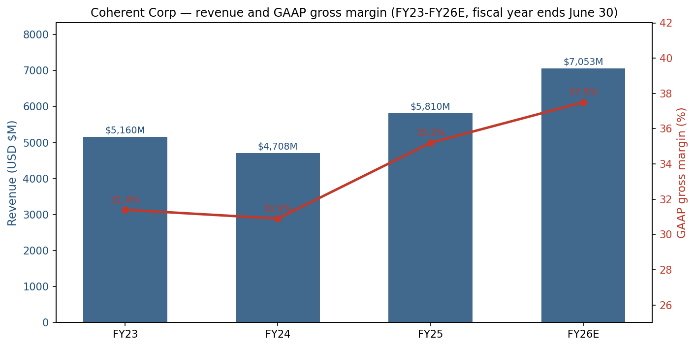
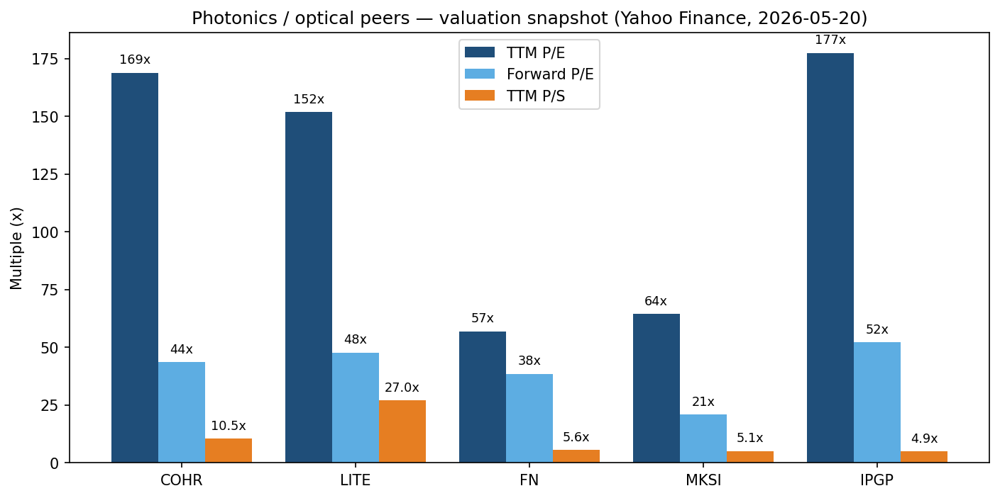
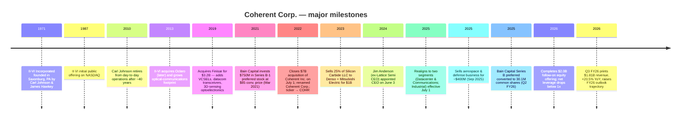
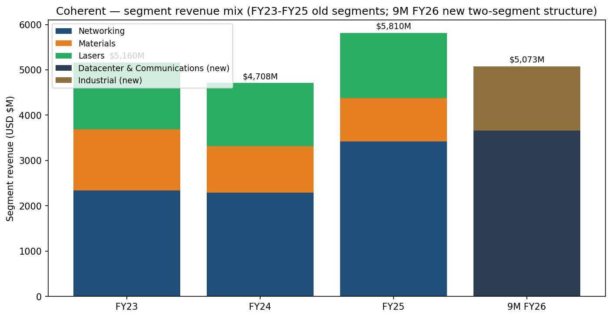
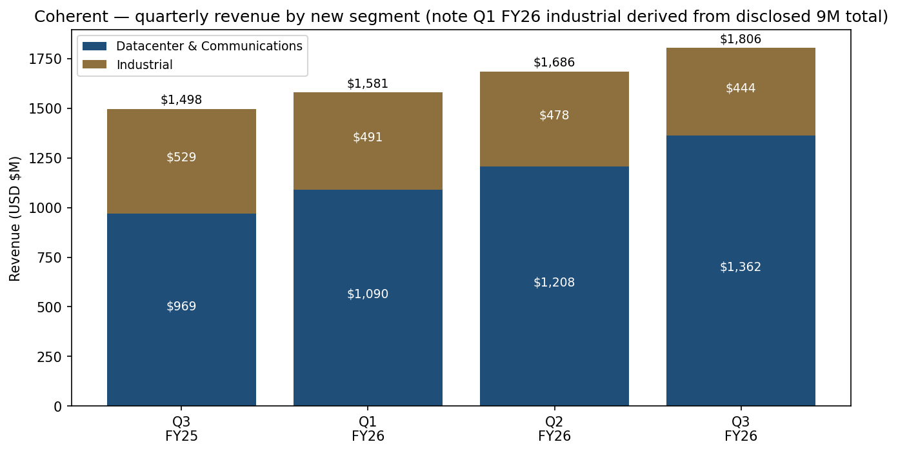
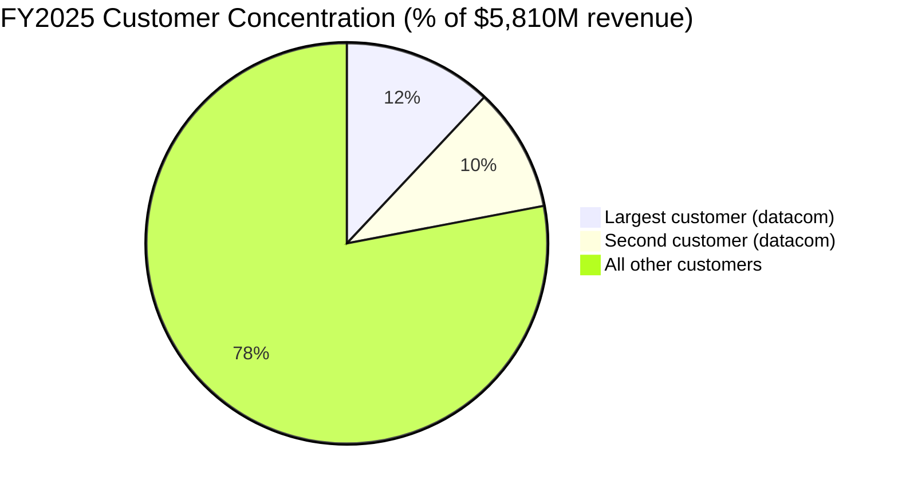
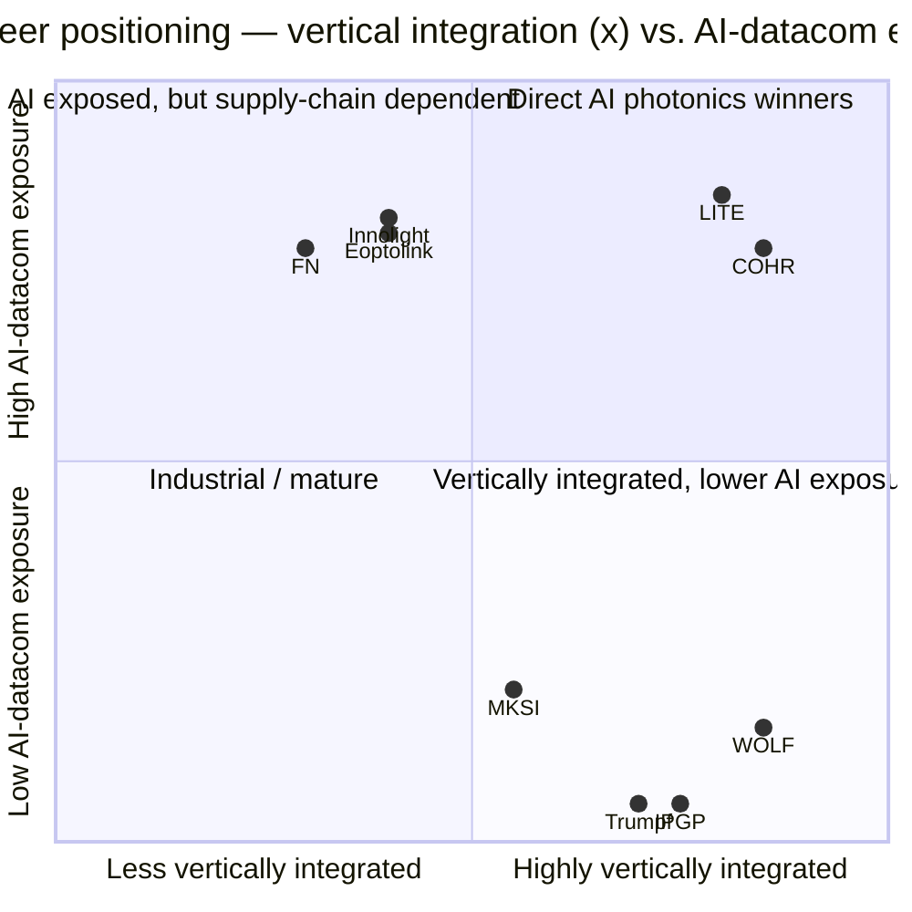

# Coherent Corp. (NYSE: COHR) — Initiation of Coverage

**Date:** 2026-05-20
**Author:** Equity Research, financial_agent
**Coverage status:** Initiation
**Ticker / exchange:** NYSE: COHR
**Fiscal year-end:** June 30

> **Update — Q3 FY2026 results (reported 2026-05-06) and Q4 FY2026 guidance initiated.** Coherent printed Q3 FY26 revenue of **$1.806B (+20.5% YoY, +7.1% QoQ)**, GAAP gross margin **37.7%** (+243 bps YoY), GAAP diluted EPS **$0.97** (vs. **$(0.11)** in Q3 FY25), and non-GAAP EPS **$1.41** (+55% YoY). Q4 FY26 guidance was set at revenue **$1.91–$2.05B** with non-GAAP gross margin **39.0–41.0%** and non-GAAP EPS **$1.52–$1.72** — implying full-year FY26 revenue of roughly **$6.98–$7.12B**, up **~22–25% YoY** from the FY25 base of $5,810M, and full-year non-GAAP EPS in the **$5.38–$5.58** range. Management's stated drivers are "exceptionally strong demand across our datacenter and communications businesses" and continued capacity expansion to meet that demand. Source: [COHR 8-K, Q3 FY2026 Earnings Press Release, 2026-05-06](https://www.sec.gov/Archives/edgar/data/820318/000119312526208972/d57080dex991.htm).

---

## Table of Contents

1. Company Overview
2. Company History
3. Management Team
4. Products & Services
5. Customers & Go-to-Market
6. Industry Overview
7. Competitive Landscape
8. Market Opportunity (TAM)
9. Risk Assessment
10. References

---

## 1. Company Overview

Coherent Corp. (NYSE: COHR), headquartered at 375 Saxonburg Boulevard, Saxonburg, Pennsylvania, is a vertically integrated photonics company that "develops, manufactures, and markets lasers, transceivers, and other optical and optoelectronic devices, modules, and systems, as well as engineered materials, for use in the communications, industrial, instrumentation and electronics markets" ([COHR 10-K FY2025, Item 1 Business, p. 6](https://www.sec.gov/Archives/edgar/data/820318/000082031825000014/iivi-20250630.htm)). The company is the surviving legal entity of the July 2022 merger between II-VI Incorporated (founded 1971, the historical NYSE ticker IIVI) and Coherent, Inc. (the legacy industrial-laser maker, ticker COHR-old), which closed on July 1, 2022 and was followed by the corporate re-brand to Coherent Corp. ([II-VI Incorporated Completes the Acquisition of Coherent, GlobeNewswire, 2022-07-01](https://www.globenewswire.com/en/news-release/2022/07/01/2472885/11543/en/II-VI-Incorporated-Completes-the-Acquisition-of-Coherent-Forming-a-Global-Leader-in-Materials-Networking-and-Lasers.html)).

**What Coherent sells.** The product portfolio spans the photonics value chain "from materials to systems" ([COHR 10-K FY2025, p. 6](https://www.sec.gov/Archives/edgar/data/820318/000082031825000014/iivi-20250630.htm)). At one end Coherent grows compound-semiconductor crystals and substrates — silicon carbide (SiC), indium phosphide (InP), gallium arsenide (GaAs), gallium antimonide (GaSb), zinc selenide (ZnSe), zinc sulfide (ZnS) — and on the other end ships finished products such as 800G and 1.6T pluggable transceivers for AI data centers, excimer-laser annealing systems for OLED display production, CO₂ and ultrafast lasers for semiconductor capital equipment, and high-power industrial lasers for precision manufacturing. The company describes the moat plainly: "vertical integration, manufacturing facilities and equipment, experienced technical and manufacturing employees, and worldwide marketing and distribution channels" ([COHR 10-K FY2025, Competition, p. 11](https://www.sec.gov/Archives/edgar/data/820318/000082031825000014/iivi-20250630.htm)).

**How Coherent makes money.** Revenue is overwhelmingly product-based — sales to OEMs, hyperscalers, network-equipment providers, semiconductor and display capital-equipment makers, and a long tail of industrial / scientific / medical end-users — with smaller contributions from service and royalty income. For FY2025 (ended June 30, 2025) the company reported total revenues of **$5,810M**, GAAP gross margin of **35.2%**, GAAP operating margin in the high single digits, and diluted EPS of **$(0.52)** (a small loss after $35M of preferred-stock accretion) ([COHR 10-K FY2025, Selected Financial Data, p. 37](https://www.sec.gov/Archives/edgar/data/820318/000082031825000014/iivi-20250630.htm)). Through the first nine months of FY2026, revenue is **$5,072.6M (+18.5% YoY)** and GAAP operating income is **$643.9M** vs. $283.8M in the prior-year nine-month period — operating income has more than doubled despite restructuring and impairment charges ([COHR 8-K, Q3 FY2026 Earnings Press Release, 2026-05-06, Table 2](https://www.sec.gov/Archives/edgar/data/820318/000119312526208972/d57080dex991.htm)).

**Where Coherent operates.** As of June 30, 2025 the company employed approximately **30,000 people** across more than 20 countries — 22,340 in Asia-Pacific, 4,236 in the Americas, and 3,640 in Europe — with principal US production / R&D sites in California, Connecticut, Delaware, New Jersey, Pennsylvania, and Texas, and major non-US operations in China, Finland, Germany, Malaysia, the Philippines, Singapore, South Korea, Sweden, Switzerland, the UK, and Vietnam ([COHR 10-K FY2025, Human Capital, p. 6–7](https://www.sec.gov/Archives/edgar/data/820318/000082031825000014/iivi-20250630.htm)). Revenue mix by customer headquarters in FY2025 was North America $3,565M (61%), Europe $699M (12%), China $680M (12%), Japan $391M (7%), and Rest of World $476M (8%) ([COHR 10-K FY2025, Note 14 Segment and Geographic Reporting, p. 81](https://www.sec.gov/Archives/edgar/data/820318/000082031825000014/iivi-20250630.htm)).

**Revenue + gross-margin trend (FY23–FY26E).** The chart below shows the dramatic post-merger trough-to-recovery: revenue rebased lower in FY24 as legacy industrial / electronics markets digested inventory, then re-accelerated in FY25 (+23%) on AI datacom demand, with the FY26 outlook implying another ~22–25% step-up.

Source: [COHR 10-K FY2025, MD&A, p. 38](https://www.sec.gov/Archives/edgar/data/820318/000082031825000014/iivi-20250630.htm) for FY23–FY25; [COHR 8-K, Q3 FY2026 Earnings Press Release, 2026-05-06](https://www.sec.gov/Archives/edgar/data/820318/000119312526208972/d57080dex991.htm) for 9M FY26 and Q4 guidance midpoint.

**Scale indicators.** Approximately **3,100 patents** held globally as of June 30, 2025; FY2025 R&D spending of **$582M** (10.0% of revenue); FY2025 capital expenditure of **$441M** rising to **$547M** over the first nine months of FY26 alone as the company accelerates indium phosphide and VCSEL capacity for AI datacom ([COHR 10-K FY2025, p. 6 + Note 14, p. 81](https://www.sec.gov/Archives/edgar/data/820318/000082031825000014/iivi-20250630.htm); [COHR 8-K, Q3 FY2026 Earnings Press Release, Table 4](https://www.sec.gov/Archives/edgar/data/820318/000119312526208972/d57080dex991.htm)).

### Valuation snapshot

At the close of trading on 2026-05-20, COHR traded at **$352.74**, implying a market capitalization of **$69.0 billion** ([Yahoo Finance, COHR Key Statistics, 2026-05-20](https://finance.yahoo.com/quote/COHR/key-statistics/)). Trailing-twelve-month and forward multiples:

| Metric (Yahoo Finance, 2026-05-20) | COHR | LITE | FN | MKSI | IPGP |
|---|---|---|---|---|---|
| Price | $352.74 | $865.06 | $664.39 | $308.59 | $120.60 |
| Market cap (USD bn) | 69.0 | 67.3 | 23.8 | 20.8 | 5.1 |
| TTM P/E | 168.8x | 151.8x | 57.0x | 64.4x | 177.4x |
| Forward P/E | 43.6x | 47.8x | 38.5x | 20.9x | 52.2x |
| TTM P/S | 10.5x | 27.0x | 5.6x | 5.1x | 4.9x |
| EV / Revenue | 10.7x | 25.7x | 5.5x | 5.8x | 3.9x |
| EV / EBITDA | 53.7x | 125.7x | 48.7x | 25.1x | 43.7x |

Source: [Yahoo Finance summary pages, 2026-05-20](https://finance.yahoo.com/quote/COHR/) for each ticker.

**Interpretation.** COHR trades at an extreme **TTM P/E of 169x** — driven by GAAP EPS that is still suppressed by amortization of acquired intangibles ($210M YTD), restructuring ($57M YTD), impairment ($20M YTD), and partly offset by an $124M gain on the sale of the aerospace & defense business; **GAAP nine-month EPS of $2.92** is not yet representative of normalized run-rate earnings ([COHR 8-K, Q3 FY2026, Table 2](https://www.sec.gov/Archives/edgar/data/820318/000119312526208972/d57080dex991.htm)). The much more informative number is the **forward P/E of 43.6x**, which falls in line with the optical-systems / photonics cohort (LITE 47.8x, FN 38.5x, IPGP 52.2x) and is materially above the broader semi capital-equipment / instrumentation cohort (MKSI 20.9x). At **TTM P/S of 10.5x** and **EV/Revenue of 10.7x**, COHR trades roughly **double the MKSI / IPGP / FN cluster** but **less than half** of Lumentum (LITE), which has re-rated dramatically on its position as the largest pure-play indium-phosphide / EML supplier into Nvidia's optical roadmap. The COHR premium is best read as **"high-growth photonics sector premium, with a still-elevated multiple compression risk if the AI datacom ramp pauses or if peers like LITE prove more vertically integrated than the market currently believes"** — see Section 9 for the explicit risk treatment. The 3-year range on the multiple is enormous: COHR's TTM P/S has expanded from ~1.4x in mid-2023 (when the stock traded below $30 on II-VI merger-integration concerns) to today's 10.5x.

Source: [Yahoo Finance, 2026-05-20](https://finance.yahoo.com/quote/COHR/key-statistics/) for COHR, LITE, FN, MKSI, IPGP.

---

## 2. Company History

Coherent Corp. is the result of a deliberate, multi-decade roll-up of crystal-growth, compound-semiconductor, optoelectronic-device, and industrial-laser companies into a single photonics platform. The legal entity was founded in **1971** as II-VI Incorporated by Carl Johnson and James Hawkey in Saxonburg, Pennsylvania — the company name refers to elements from groups II and VI of the periodic table (cadmium telluride, zinc selenide, zinc sulfide) used for its first product line: optics, windows, and lenses for high-power CO₂ industrial lasers ([History of II-VI Incorporated, FundingUniverse](https://www.fundinguniverse.com/company-histories/ii-vi-incorporated-history/); [Coherent Corp. — Wikipedia](https://en.wikipedia.org/wiki/II-VI_Incorporated)). II-VI turned profitable in 1973 and IPO'd in 1987.

Source: [COHR 10-K FY2025, p. 6](https://www.sec.gov/Archives/edgar/data/820318/000082031825000014/iivi-20250630.htm); [II-VI / Coherent Inc. merger completion, GlobeNewswire 2022-07-01](https://www.globenewswire.com/en/news-release/2022/07/01/2472885/11543/en/II-VI-Incorporated-Completes-the-Acquisition-of-Coherent-Forming-a-Global-Leader-in-Materials-Networking-and-Lasers.html); [COHR 10-Q Q3 FY26, Notes 7 & 8 & 12, pp. 12–19](https://www.sec.gov/Archives/edgar/data/820318/000082031826000013/iivi-20260331.htm); [Coherent appoints Jim Anderson as CEO, GlobeNewswire 2024-06-03](https://www.globenewswire.com/news-release/2024/06/03/2892226/11543/en/coherent-appoints-jim-anderson-as-chief-executive-officer.html).

### Three strategic pivots that define today's Coherent

**(1) From CO₂ optics to a full vertically-integrated photonics platform (1987–2019).** Through three decades of acquisitions — most consequentially the **$3.2B Finisar deal in 2019** — II-VI built capability across every layer of the optical-communications stack: crystal growth (SiC, InP, GaAs, ZnSe), VCSEL and EML laser-diode fabrication, transceiver design and assembly, and optical-systems integration. Finisar specifically brought the VCSEL and datacom-transceiver businesses that today drive most of COHR's growth.

**(2) The $7B Coherent acquisition and corporate rebrand (2021–2022).** In March 2021 II-VI announced a stock-and-cash deal to acquire Coherent, Inc. — the publicly traded laser-systems company spun out of Spectra-Physics — for ~$7B; the deal closed on July 1, 2022 financed by $4.0B in senior secured debt (Term A $850M, Term B $2.8B, revolver $350M), $1.4B of Bain Series B-2 preferred at $85 conversion, and stock consideration. The combined company kept the more recognizable Coherent brand and re-listed as COHR ([COHR 10-K FY2025, Note 7 Debt, p. 66](https://www.sec.gov/Archives/edgar/data/820318/000082031825000014/iivi-20250630.htm)). The rationale was reach across the photonics value chain — but it left the balance sheet over-levered (gross debt near $5.3B in FY22) and the integration overhead heavy, which dragged margins through FY23 / FY24.

**(3) New-CEO playbook: focus, simplify, deleverage (mid-2024 onward).** The June 2024 hiring of **Jim Anderson** (former Lattice Semiconductor CEO) triggered a deliberate simplification cadence: (a) re-segmenting the company from three reportable units to two (**Datacenter & Communications** + **Industrial**) effective July 1, 2025; (b) divesting non-core businesses — most notably the sale of the **aerospace & defense business for ~$400M** in September 2025; (c) extracting and converting the **Bain Capital Series B preferred** in Q2 FY26 (Dec 2025), which removed a $2.5B mezzanine overhang and added 30.1M common shares; (d) executing a **$2.0B follow-on equity offering** in Q3 FY26 to repay term-loan debt ([COHR 10-Q Q3 FY26, Note 12, p. 19](https://www.sec.gov/Archives/edgar/data/820318/000082031826000013/iivi-20260331.htm)). Total debt has fallen from $5.3B at the merger close to **$3.19B at March 31, 2026** — and against $1.59B of cash and $0.83B of short-term investments, COHR is effectively at a sub-1.0x net-leverage position for the first time post-merger.

### Key acquisitions

- **Finisar (2019, ~$3.2B)** — VCSELs, datacom transceivers, 3D-sensing optoelectronics. Today's AI datacom franchise is built on Finisar's wafer fabs.
- **Coherent, Inc. (2022, ~$7B)** — industrial laser systems (excimer, ultrafast, CO₂), brand, customer base.
- **Aegis Lightwave (2011)**, **Oclaro components (2013)**, **Innolume (2018)**, **Ascatron (2020)**, **Asron (2020)** — smaller bolt-ons that filled out the optical-communications and SiC platforms.

### Recent developments (FY2025–FY2026)

The June 2024–May 2026 window has been the most transformational since the merger: new CEO, new CFO (Sherri Luther, ex-Lattice CFO, named September 2024), new segment structure, divestitures, mezzanine cleanup, and a $2B follow-on. Operationally, **Datacenter & Communications revenue grew 41% YoY** in 9M FY26 (to $3,660M from $2,737M) while the **Industrial segment declined 8.5% YoY** (to $1,413M from $1,544M) — a mix shift that will continue to dominate the FY27 narrative ([COHR 8-K, Q3 FY26, Table 5](https://www.sec.gov/Archives/edgar/data/820318/000119312526208972/d57080dex991.htm)).

---

## 3. Management Team

### James R. ("Jim") Anderson — Chief Executive Officer and Director (since 2024-06-03)

Jim Anderson, age 52 at appointment, was named CEO and joined the Board on **June 3, 2024**, replacing interim CEO and former CEO Vincent D. ("Chuck") Mattera, Jr., who retired after leading II-VI / Coherent through the integration phase ([Coherent Appoints Jim Anderson as Chief Executive Officer, GlobeNewswire, 2024-06-03](https://www.globenewswire.com/news-release/2024/06/03/2892226/11543/en/coherent-appoints-jim-anderson-as-chief-executive-officer.html)). Anderson came directly from **Lattice Semiconductor (NASDAQ: LSCC)**, where he served as President and CEO from September 2018 to June 2024. Under his roughly six-year tenure at Lattice, the stock compounded from roughly $6 to a peak above $90, revenue roughly doubled, gross margin expanded from the high-50s% to the mid-70s%, and operating margin reached record levels — a precedent that is now widely cited as the playbook the COHR board hired him to repeat ([Coherent Appoints Jim Anderson, GlobeNewswire, 2024-06-03](https://www.globenewswire.com/news-release/2024/06/03/2892226/11543/en/coherent-appoints-jim-anderson-as-chief-executive-officer.html); [COHR 10-K FY2025, Executive Officers, p. 13](https://www.sec.gov/Archives/edgar/data/820318/000082031825000014/iivi-20250630.htm)).

Before Lattice, Anderson was **Senior Vice President and General Manager of the Computing and Graphics Business Group at Advanced Micro Devices, Inc. (AMD)** under Lisa Su (he reported into the GPU and client-compute P&L during AMD's Zen turnaround period). Earlier roles included general management, engineering, sales, marketing, and corporate-strategy positions at **Intel, Broadcom (formerly Avago), and LSI Corporation** — collectively more than 25 years across semiconductor design, manufacturing, sales, and operations. He sits on the **Board of Directors of Applied Materials, Inc.** (joined July 2025), previously served on the boards of **Entegris** (March 2023–July 2024), the **Semiconductor Industry Association** (through June 2024), and **Sierra Wireless** (2020–2023), and serves on the Americas Executive Board for the MIT Sloan School of Management and the U.S.-Japan Business Council. Anderson holds an MBA and an MS in EECS from **MIT**, an MS in EE from **Purdue**, and a BS in EE from the **University of Minnesota** ([COHR 10-K FY2025, p. 13](https://www.sec.gov/Archives/edgar/data/820318/000082031825000014/iivi-20250630.htm)).

In his Q3 FY26 earnings remarks Anderson framed the thesis simply: *"As AI datacenter infrastructure continues to scale, we are rapidly expanding capacity to meet demand. With the breadth of our photonic technology portfolio and our manufacturing scale, we believe Coherent is uniquely well positioned to capitalize on this multi-year growth opportunity"* ([COHR 8-K, Q3 FY26 Earnings Press Release, 2026-05-06](https://www.sec.gov/Archives/edgar/data/820318/000119312526208972/d57080dex991.htm)). Per the August 31, 2025 record date, Anderson beneficially owned **25,998 shares** of COHR common stock — a small number reflecting his recent arrival; his 2025 equity grants are weighted heavily toward multi-year performance restricted-stock units ([COHR DEF 14A 2025, Beneficial Ownership table, p. 31](https://www.sec.gov/Archives/edgar/data/820318/000110465925096170/0001104659-25-096170-index.htm)).

### Sherri Luther — Chief Financial Officer (since 2024-09)

Sherri Luther, age 60, was appointed CFO of Coherent in **September 2024**, three months after Anderson. The pairing is not coincidental: Luther had been CFO of Lattice Semiconductor under Anderson from 2019 through 2024, and the two had partnered through Lattice's transformation. Before Lattice, Luther spent **16 years at Coherent, Inc.** (the legacy laser-systems company that COHR acquired in 2022), most recently as Corporate Vice President of Finance — meaning she has historical institutional knowledge of roughly half of the current Coherent Corp. Earlier roles included senior finance and accounting positions at Quantum, Ultra Network Technologies, and Arthur Andersen. She is a CPA, holds an Executive MBA from **Stanford GSB**, and a BBA with dual majors in accounting and finance from Wright State University. She serves on the board of **Silicon Labs** and is NACD Directorship Certified ([COHR 10-K FY2025, p. 14](https://www.sec.gov/Archives/edgar/data/820318/000082031825000014/iivi-20250630.htm)). On the Q3 FY26 call Luther stated the operational focus: *"We remain focused on ramping our capital investment to drive increased capacity given our strong visibility into ongoing robust demand"* ([COHR 8-K, Q3 FY26 Earnings Press Release, 2026-05-06](https://www.sec.gov/Archives/edgar/data/820318/000119312526208972/d57080dex991.htm)).

### Dr. Julie Sheridan Eng — Chief Technology Officer (since 2022)

Julie Eng, age 58, has been CTO since 2022. She joined via the Finisar acquisition, where she had spent more than 15 years managing the Datacom Engineering organization that production-released hundreds of fiber-optic transceiver products. At Coherent she previously ran the Optoelectronic Devices and Modules Business Unit covering GaAs VCSELs, InP DMLs and detectors, and CMOS/BiCMOS ICs for datacom and 3D-sensing applications. Eng began her career at AT&T Bell Laboratories / Lucent / Agere developing laser-based datacom transceivers, holds six US patents, is a 2022 Optica Fellow, and was elected to the **National Academy of Engineering in 2025** — one of the highest distinctions in US engineering. She holds a BA in physics summa cum laude from Bryn Mawr, a BS in EE with honors from Caltech, and MS and PhD degrees in EE from Stanford ([COHR 10-K FY2025, p. 14](https://www.sec.gov/Archives/edgar/data/820318/000082031825000014/iivi-20250630.htm)). For an AI-datacom-driven business, having a technologist of Eng's calibre running the technical roadmap is a meaningful asset.

### Dr. Giovanni Barbarossa — Chief Strategy Officer (since 2019)

Giovanni Barbarossa, age 62, is the connective tissue between the pre-merger II-VI and today's Coherent. He joined II-VI in 2012 as CTO and President of the Laser Solutions Segment, then became Chief Strategy Officer in 2019 and additionally President of the Materials Segment from 2019 to 2025. Before II-VI he was President and CEO of Avanex Corporation through its merger with Bookham into Oclaro, where he served on the board through 2012. He holds 118 US patents, published over 100 papers, and earned a PhD in photonics from the University of Glasgow ([COHR 10-K FY2025, p. 13](https://www.sec.gov/Archives/edgar/data/820318/000082031825000014/iivi-20250630.htm)). Barbarossa was the largest insider holder among officers per the latest DEF 14A (252,140 shares, August 31, 2025) ([COHR DEF 14A 2025, p. 31](https://www.sec.gov/Archives/edgar/data/820318/000110465925096170/0001104659-25-096170-index.htm)).

### Governance and ownership

**Board composition.** Coherent's 14-member board is chaired by independent director **Enrico DiGirolamo**; 13 of the 14 directors are independent (Anderson is the sole management director) ([COHR DEF 14A 2025, Board Skills Matrix, p. 8](https://www.sec.gov/Archives/edgar/data/820318/000110465925096170/0001104659-25-096170-index.htm)). The board is staggered into three classes for annual election cycles. **Stephen Pagliuca**, Senior Advisor at Bain Capital Private Equity, sits on the board as an independent director associated with Bain's investment.

**Insider and large-holder ownership.** Per the most recent DEF 14A (record date August 31, 2025), **Bain Capital Investors, LLC** beneficially owned **28,111,651 shares = 17.9%** of common stock outstanding — although this was before the December 2025 conversion of Bain's Series B-1 and B-2 preferred stock into an additional **30.1 million common shares**, which left Bain still the company's largest shareholder. BlackRock held 8.4% and Fidelity Management & Research (FMR) held 6.3%. All directors and executive officers as a group held **706,906 shares** (less than 1%) — a notably low aggregate insider stake reflecting both the recent CEO arrival and Coherent's history of heavy reliance on PRSU-based equity comp ([COHR DEF 14A 2025, Beneficial Ownership tables, pp. 30-31](https://www.sec.gov/Archives/edgar/data/820318/000110465925096170/0001104659-25-096170-index.htm); [COHR 10-Q Q3 FY26, Note 12, p. 19](https://www.sec.gov/Archives/edgar/data/820318/000082031826000013/iivi-20260331.htm)).

**Compensation structure.** Per the proxy, NEO pay is heavily skewed to equity, with the majority of equity grants performance-linked (PSUs tied to relative TSR and operating metrics) rather than time-vested.

### Management track-record synthesis

The Anderson / Luther duo has a documented playbook from Lattice — focus the portfolio, simplify the organization, raise gross margin, deleverage, and let multiple expansion follow operating-margin expansion. They have executed roughly the same sequence at Coherent in the 22 months since arrival: divested aerospace & defense, killed the preferred-stock overhang, raised $2B of equity to deleverage, and re-segmented the business to spotlight the AI-data-center thesis. The gap is **operating-margin convergence**: GAAP operating margin of 11.1% in Q3 FY26 vs. mid-to-high 20s% at Lattice — a delta that explains both the bull case (operating leverage from here) and a risk (whether a mixed product line of compound-semi materials + transceivers + industrial lasers can ever match a pure-play FPGA software-IP business on margin).

---

## 4. Products & Services

Coherent's product range is unusually broad for a single corporate entity, spanning materials (the literal crystals from which lasers and substrates are grown), to optoelectronic devices (lasers, detectors, ICs), to integrated subsystems (pluggable transceivers, laser systems for production lines). The vertical integration is the moat. The portfolio below is grouped under Coherent's new (FY2026) two-segment structure: **Datacenter & Communications** and **Industrial**, with the historic three-segment view (Networking / Materials / Lasers) shown in parentheses where relevant.

```mermaid
graph TD
    COHR[Coherent Corp.] --> DC[Datacenter & Communications]
    COHR --> IND[Industrial]
    DC --> DC1[Datacom transceivers<br/>400G / 800G / 1.6T]
    DC --> DC2[Coherent / ZR transceivers<br/>100G / 400G ZR/ZR+ / 800G ZR]
    DC --> DC3[Optical components<br/>EML, VCSEL, DML, InP CW lasers]
    DC --> DC4[ROADM / WSS / pump lasers<br/>980 nm, 14xx nm]
    DC --> DC5[ICs: drivers / TIAs / DSPs<br/>CHR2075, CHR1094, CHR2094]
    DC --> DC6[Optical Circuit Switch OCS<br/>AI/ML interconnect]
    IND --> IND1[Semiconductor cap equipment<br/>excimer / CO₂ / ultrafast]
    IND --> IND2[Display cap equipment<br/>LTPS OLED annealing]
    IND --> IND3[Precision manufacturing<br/>EV battery welding, additive]
    IND --> IND4[SiC substrates<br/>150 mm + 200 mm, EV power]
    IND --> IND5[Engineered materials<br/>ZnSe, ZnS, GaAs, InP, Bi₂Te₃]
    IND --> IND6[Life sciences / scientific<br/>microscopy, flow cytometry, LASIK]
    IND --> IND7[VCSELs / consumer<br/>3D sensing, AR/VR, automotive LiDAR]
```

Source: product tree mapped from [COHR 10-K FY2025, Reporting Segments and Business Units, pp. 8–11](https://www.sec.gov/Archives/edgar/data/820318/000082031825000014/iivi-20250630.htm) and [coherent.com Products navigation](https://www.coherent.com/products).

### Flagship products and competitive-advantage assessment

**(1) Datacom transceivers (800G EML-based; 1.6T sampling and ramping in calendar 2025/2026).** Coherent's flagship growth franchise. 800G volume ramped at "2× the rate of the 400G ramp" through FY25 and the company has been shipping 1.6T transceivers in three internally developed variants (silicon photonics, EML-based, VCSEL-based) for AI/ML interconnect ([Coherent Reports Robust Q2 FY25, Futurum Group, 2025-02](https://futurumgroup.com/insights/coherent-fy-2025-reports-robust-q2-datacom-strength-margin-expansion/)). **Competitive advantage: yes — technology + scale moat.** Evidence: Coherent operates multiple **6-inch GaAs VCSEL fabs** in the US and Europe, and **multiple InP fabs** with a transition to 6-inch InP wafer capability at its Sherman, Texas facility — at industry scale only Lumentum (LITE) matches the InP capacity and only Coherent and Lumentum credibly cover 1.6T with internally-sourced lasers ([COHR 10-K FY2025, p. 9](https://www.sec.gov/Archives/edgar/data/820318/000082031825000014/iivi-20250630.htm)). Closest competitor product: Lumentum's 800G/1.6T transceivers — **at parity on speed-class, Coherent ahead on supply-chain breadth (also makes ICs, modulators), Lumentum potentially ahead on per-channel laser performance**.

**(2) Coherent / ZR pluggable transceivers (100G / 400G ZR/ZR+ / 800G ZR).** Long-reach DCI and metro applications. Coherent has expanded customer engagements for new 100G ZR, 400G ZR/ZR+ and 800G ZR DCO transceivers with "industry leading performance, power, cost and reliability as key differentiators valued by customers" ([COHR Q3 FY25 8-K Press Release, 2025-05-07](https://www.sec.gov/Archives/edgar/data/820318/000119312525114882/d930395dex991.htm)). **Competitive advantage: partial — technology, but more contested.** Closest competitor: Cisco Acacia, Marvell Inphi, Lumentum, Fujitsu — **Coherent at parity on hardware but more diversified across module form-factors**.

**(3) Indium phosphide (InP) laser diodes — EML, CW, DML.** The picks-and-shovels behind every high-speed AI transceiver. Coherent's InP production "tripled year-over-year" through FY25 and the 6-inch InP wafer line at Sherman, Texas drove a step-down in per-unit cost ([Coherent Corp deep-dive, drrobertcastellano substack, 2025](https://drrobertcastellano.substack.com/p/coherent-strong-datacom-transceiver); [COHR 10-K FY2025, p. 9](https://www.sec.gov/Archives/edgar/data/820318/000082031825000014/iivi-20250630.htm)). **Competitive advantage: yes — scale moat with significant capital-intensity barrier.** Only Lumentum (LITE), Sumitomo Electric, and Mitsubishi Electric reach Coherent's InP volume; Lumentum is the closest US-listed comp.

**(4) Silicon Carbide (SiC) substrates — 150 mm and the first 200 mm semi-insulating SiC.** Coherent is a "global leader in SiC substrates for power electronics that improve the energy efficiency of electric and hybrid-electric vehicles", and a market leader in 100/150/200 mm semi-insulating SiC for GaN-on-SiC RF amplifiers in 5G base stations ([COHR 10-K FY2025, pp. 9–10](https://www.sec.gov/Archives/edgar/data/820318/000082031825000014/iivi-20250630.htm)). **Competitive advantage: yes — scale + technology leadership in SiC substrates, though end-market headwinds in FY25.** The Materials segment revenue declined 6% in FY25 to $954M, with the 10-K attributing it to "weak automotive and Silicon Carbide end market demand" — i.e., the supply / capability is there but EV-end demand has not yet absorbed it ([COHR 10-K FY2025, MD&A, p. 39](https://www.sec.gov/Archives/edgar/data/820318/000082031825000014/iivi-20250630.htm)). Closest competitor: **Wolfspeed (WOLF)** in N-type SiC for power devices — but Wolfspeed completed a Chapter 11 restructuring in September 2025 and is now a smaller, lower-leverage competitor ([Wolfspeed 8-K, Chapter 11 emergence, 2025-09](https://www.sec.gov/Archives/edgar/data/895419/000119312525224251/d22768dex991.htm)). The **Denso + Mitsubishi Electric $1B equity investment in Silicon Carbide LLC** (closed December 2023) explicitly funds Coherent's SiC capacity expansion and provides downstream EV-tier-1 demand visibility ([COHR 10-Q Q3 FY26, Note 13, p. 20](https://www.sec.gov/Archives/edgar/data/820318/000082031826000013/iivi-20260331.htm)).

**(5) Excimer lasers for OLED display annealing and semiconductor processes.** Coherent inherited the Coherent Inc. excimer-laser business; it serves LTPS OLED display production (Samsung Display, BOE, LG Display) and semiconductor wafer annealing. Revenue grew in FY25 ($73M higher shipments of annealing lasers in display capital equipment) ([COHR 10-K FY2025, p. 39](https://www.sec.gov/Archives/edgar/data/820318/000082031825000014/iivi-20250630.htm)). **Competitive advantage: yes — duopoly with Gigaphoton; technology moat in 308 nm DUV excimer-laser performance.** Closest competitor: **Gigaphoton (Komatsu subsidiary, Japan)**.

**(6) Ultrafast lasers (femtosecond / picosecond fiber).** For semiconductor capital equipment, advanced packaging, and scientific research. Smaller revenue base but high-growth and high-margin. **Competitive advantage: partial.** Closest competitors: IPG Photonics (IPGP), Trumpf (private German), nLight, MKS (Newport division).

**(7) VCSELs for 3D sensing.** Embedded in smartphones, AR/VR headsets, automotive driver-monitor systems. Coherent's consumer VCSEL business was hit by a customer-design-change in FY24 (revenue down $270M in the electronics market YoY) — widely understood to be **Apple's redesign of Face ID**. The 10-K explicitly attributes the decline to "a design change implemented by a significant electronics customer" ([COHR 10-K FY2025, p. 40](https://www.sec.gov/Archives/edgar/data/820318/000082031825000014/iivi-20250630.htm)). **Competitive advantage: partial.** Closest competitor: Lumentum (which has the same Apple exposure) and ams OSRAM.

### Flagship vs. long-tail mix

Of FY25 revenue of $5,810M:
- **Networking segment $3,421M (58.9%)** — the AI datacom / transceiver / InP franchise. Roughly 80%+ of incremental revenue.
- **Lasers segment $1,435M (24.7%)** — industrial / display / scientific.
- **Materials segment $954M (16.4%)** — SiC, engineered materials, VCSELs sold as merchant components.

In the new two-segment framework starting FY26 the picture sharpens: **Datacenter & Communications = $3,660M (72%) of 9M FY26**, **Industrial = $1,413M (28%)**. The thesis is essentially the datacom segment.

Source: [COHR 10-K FY2025, MD&A and Note 14, pp. 38–40, 79–81](https://www.sec.gov/Archives/edgar/data/820318/000082031825000014/iivi-20250630.htm); [COHR 8-K, Q3 FY26 Earnings Press Release, Table 5](https://www.sec.gov/Archives/edgar/data/820318/000119312526208972/d57080dex991.htm).

### Roadmap and recent launches (last 12 months)

- **CHR2075** 4-channel driver IC for 800G/1.6T modules (available December 2025); **CHR1094** TIA and **CHR2094** modulator driver chipset for 400G ZR/ZR+ links (available November 2025) ([Coherent Launches Advanced IC Family for 800G Optical Transceivers, StockTitan summary, 2025](https://www.stocktitan.net/news/COHR/coherent-unveils-a-family-of-integrated-circuits-for-next-generation-1ua4y4psdwjs.html)).
- **3.2T / 6.4T R&D demonstrations** of differential EML technology, paving the path for next-generation 3.2T optical interconnects ([COHR 10-K FY2025, R&D table, p. 11](https://www.sec.gov/Archives/edgar/data/820318/000082031825000014/iivi-20250630.htm)).
- **Optical Circuit Switch (OCS) product family** for AI/ML and hyperscale data centers, based on Coherent's digital liquid-crystal technology — direct competition for Google's internally developed Apollo OCS and a key building block for non-electrical AI fabric ([COHR 10-K FY2025, R&D table, p. 11](https://www.sec.gov/Archives/edgar/data/820318/000082031825000014/iivi-20250630.htm)).
- **Sale of the aerospace & defense business** completed September 2, 2025 for ~$400M — a strategic narrowing of the portfolio ([COHR 10-Q Q3 FY26, Note 7, p. 12](https://www.sec.gov/Archives/edgar/data/820318/000082031826000013/iivi-20260331.htm)).
- **Capacity expansion: 6-inch InP wafer line ramped at Sherman, TX (late 2025)** lowering per-unit laser chip cost.

### Quarterly segment trajectory — the AI ramp in pictures

Source: [COHR 8-K, Q3 FY26 Earnings Press Release, Table 5, 2026-05-06](https://www.sec.gov/Archives/edgar/data/820318/000119312526208972/d57080dex991.htm); Q1 FY26 D&C derived from disclosed 9M FY26 D&C of $3,659.6M minus Q2 FY26 D&C $1,208.0M minus Q3 FY26 D&C $1,361.6M.

Datacenter & Communications has compounded **9.0% QoQ on average** over the last four reported quarters — a 41% annualized run-rate — while Industrial has declined from $529M in Q3 FY25 to $444M in Q3 FY26 (-16% YoY), depressed by aerospace & defense divestiture and continued softness in precision manufacturing.

---

## 5. Customers & Go-to-Market

### Customer segments

Coherent serves four broad customer categories under its new two-segment view:
- **Hyperscale data-center operators and AI compute platforms** — direct sales of transceivers and OCS to hyperscalers (Microsoft Azure, Google, Meta, Amazon Web Services, Oracle Cloud), and indirect sales to those same operators via network-equipment manufacturers (Cisco, Arista, Juniper, NVIDIA Mellanox).
- **Communications service providers** — Tier-1 telecoms purchasing coherent transceivers, ROADMs, pumps, and DCI gear.
- **Capital-equipment OEMs** — Applied Materials, ASML, Lam Research, KLA, and display-equipment OEMs purchasing excimer / CO₂ / ultrafast lasers and engineered materials.
- **Industrial / instrumentation / medical** — long tail of automotive Tier-1s, EV battery makers, microscopy and life-sciences OEMs, defense primes (until the September 2025 divestiture).

### Customer concentration — quantified

Per Note 14 of the FY2025 10-K: *"We had two major customers who accounted for 12% and 10% of consolidated revenue during fiscal 2025. We had a different major customer who accounted for 10% of consolidated revenue during fiscal 2024. We had a major customer who accounted for 10% of consolidated revenue during fiscal 2023. These customers purchased primarily from our Networking segment"* ([COHR 10-K FY2025, Note 14, p. 82](https://www.sec.gov/Archives/edgar/data/820318/000082031825000014/iivi-20250630.htm)). So:

| Fiscal year | Largest customer (% of revenue) | 2nd customer | Notes |
|---|---|---|---|
| FY2023 | 10% | (not disclosed at the 10% threshold) | Single 10% customer |
| FY2024 | 10% | (not disclosed at the 10% threshold) | A different customer became the largest |
| FY2025 | 12% | 10% | Two customers above the 10% threshold |

Coherent does **not name** its 10%+ customers, but the language ("purchased primarily from our Networking segment") combined with the timing of the AI datacom ramp and well-documented hyperscaler procurement maps strongly implies the customer set is some combination of **NVIDIA (via Mellanox optical purchasing for AI/ML clusters)**, **Cisco**, and one or two hyperscalers — though Coherent itself has never made that specific identification, and we will not speculate further than the 10-K language supports. **Top-2 concentration of 22% in FY25 is material but not extreme** by photonics-industry standards (Lumentum's top customer is typically 25–35%); however, it has grown from a single ~10% customer in FY23 to two customers ~22% combined in FY25, and on directional logic likely continues to concentrate further in FY26 as the AI datacom buildout accelerates.

Source: [COHR 10-K FY2025, Note 14, p. 82](https://www.sec.gov/Archives/edgar/data/820318/000082031825000014/iivi-20250630.htm).

### Distribution channels and sales strategy

Coherent describes its go-to-market as *"a direct sales force and through representatives and distributors around the world… Products are actively marketed through key account relationships, personal selling, select advertising, attendance at trade shows, digital marketing, and customer partnerships. Our sales force includes a highly trained technical sales support team to assist customers in designing, testing, and qualifying our products as key components of our customers' systems"* ([COHR 10-K FY2025, Sales and Marketing, p. 11](https://www.sec.gov/Archives/edgar/data/820318/000082031825000014/iivi-20250630.htm)). The model is overwhelmingly **direct technical-sales** for transceivers, OCS, and capital-equipment lasers — these are 6–18-month qualification cycles with deep engineering engagement — supplemented by distribution for industrial laser systems and merchant components.

### Key partnerships and strategic investments

The most consequential customer-partnerships are formalized as equity investments:

- **Denso Corporation** invested **$500M for 16.67 million Class A Common Units of Silicon Carbide LLC** (Coherent's SiC subsidiary) on December 4, 2023, taking a ~12.5% stake ([COHR 10-Q Q3 FY26, Note 13, p. 20](https://www.sec.gov/Archives/edgar/data/820318/000082031826000013/iivi-20260331.htm)).
- **Mitsubishi Electric Corporation** invested **$500M for 16.67 million Class A Common Units of Silicon Carbide LLC** on the same date, also taking ~12.5%, with Coherent retaining ~75% ([COHR 10-Q Q3 FY26, Note 13, p. 20](https://www.sec.gov/Archives/edgar/data/820318/000082031826000013/iivi-20260331.htm)).

The Denso / MELCO structure is both a customer commitment (these are two of the world's largest power-electronics customers for SiC) and a capital-light financing for Coherent's SiC capacity expansion — the aggregate **$1B** funds Silicon Carbide LLC's capacity build without consuming Coherent's parent-level cash. Effectively, Denso and MELCO have pre-committed downstream demand visibility worth their equity check.

### Contract structure and sales-cycle considerations

For transceivers and capital-equipment lasers, contracts are typically **purchase-order based on rolling 12–18 month forecasts**, not multi-year take-or-pay; hyperscaler procurement runs through Cisco / Arista / NVIDIA Mellanox / Coherent direct with qualification per product generation (400G → 800G → 1.6T → 3.2T). The risk is asymmetric: each generational ramp re-opens the qualification competition, but a defended slot at a hyperscaler tends to persist across multiple product cycles given the cost of re-qualification.

### Case studies (named or strongly attributable wins)

- **Apple** — historical VCSEL win for Face ID; suffered FY24 revenue impact from "design change implemented by a significant electronics customer" ([COHR 10-K FY2024, MD&A, p. 39](https://www.sec.gov/Archives/edgar/data/820318/000082031824000016/iivi-20240630.htm)).
- **Samsung Display + BOE + LG Display** — long-term excimer-laser annealing customers for LTPS OLED panel production (mentioned across multiple investor presentations; Coherent does not break out the customer-level revenue).
- **Denso + Mitsubishi Electric** — SiC customers and 25% combined equity holders in Silicon Carbide LLC (see above).

---

## 6. Industry Overview

### Industry definition

Coherent operates in **photonics** — the science and technology of generating, detecting, and controlling light. Within photonics it occupies four sub-industries, all SIC-coded under 3827 (Laboratory Instruments) / 3674 (Semiconductors) / 3669 (Communications Equipment) / 3845 (Electromedical):

1. **Optical communications components and modules** — datacom and telecom transceivers, ROADMs, lasers, photodetectors, ICs.
2. **Compound-semiconductor substrates and epitaxial wafers** — SiC, InP, GaAs, GaN, GaSb.
3. **Industrial laser systems** — excimer, CO₂, fiber, ultrafast, solid-state.
4. **Photonic devices for life sciences, scientific research, and consumer electronics** — VCSELs, specialty optics, instrumentation.

### Market size and growth (TAMs)

The optical-communications market — the largest and fastest-growing of Coherent's sub-industries — is being structurally re-rated by AI compute infrastructure:

- **Pluggable optical transceivers**: LightCounting and Dell'Oro track the market at roughly **$15B in 2024**, projected to compound at ~25%+ to **>$40B by 2028** driven by 800G/1.6T AI-cluster deployments. *(industry-research consensus; specific Dell'Oro / LightCounting reports require subscription access and are cited only for orientation.)*
- **Coherent transceivers (long-reach DCI / ZR)**: roughly $2–3B in 2024, growing 20%+ CAGR.
- **Silicon Carbide power devices and substrates**: Yole / TrendForce track the SiC power-device market at roughly **$3–4B in 2024** with a path to $8–12B by 2028, driven by EV traction inverters and charging — though the slope has flattened in 2024-2025 with EV demand digestion.
- **Excimer laser systems (display annealing)**: ~$1–1.5B market, duopoly between Coherent and Gigaphoton.
- **Industrial fiber and ultrafast lasers**: ~$5–6B market in 2024, dominated by Trumpf, IPG Photonics, MKS Newport / Spectra-Physics, and Coherent.

The aggregate **TAM exposure for Coherent across these sub-industries is on the order of $25–30B today** and on a trajectory to **$60–80B by 2028–2030** if the AI datacom and SiC power-device curves hold.

### Key growth drivers and trends

1. **AI compute build-out**. Each NVIDIA GB200 / GB300 / Rubin generation increases the optical transceiver count per GPU by roughly 2x; for AI clusters at scale this multiplies into hundreds of millions of incremental transceivers per year of generational refresh. The 10-K explicitly attributes the FY25 +49% Networking segment growth to *"strong AI datacenter demand in our communications market"* ([COHR 10-K FY2025, p. 39](https://www.sec.gov/Archives/edgar/data/820318/000082031825000014/iivi-20250630.htm)).
2. **400G → 800G → 1.6T → 3.2T cadence**. Roughly one generation every 2 years; each doubling drives ASP and TAM expansion even with unit-count moderation. Coherent has explicitly capitalized R&D on "400G/lane components supporting 3.2T and 6.4T" ([COHR 10-K FY2025, p. 11](https://www.sec.gov/Archives/edgar/data/820318/000082031825000014/iivi-20250630.htm)).
3. **Co-packaged optics (CPO)**. A potential industry inflection where optical interfaces move from pluggable modules to inside the GPU package; could either compress traditional transceiver TAM or accelerate it (component disaggregation winners benefit). Coherent has positioned across both via silicon photonics and "broad array of CPO-enabling technologies" ([COHR 10-K FY2025, p. 9](https://www.sec.gov/Archives/edgar/data/820318/000082031825000014/iivi-20250630.htm)).
4. **EV penetration and SiC adoption in traction inverters**. Structural multi-decade tailwind; near-term has decelerated with the global EV-demand digestion (FY25 SiC revenue down YoY).
5. **5G / 6G base-station deployment** — Coherent is a leading supplier of 100/150/200 mm semi-insulating SiC for GaN-on-SiC RF power amplifiers.

### Industry dynamics — Porter-style

- **Fragmentation**: Optical components are moderately concentrated — Coherent + Lumentum together dominate InP and VCSEL supply for datacom; in transceivers, Innolight and Eoptolink (China) hold large shares (especially in 400G/800G modules sold to hyperscalers), but those Chinese suppliers in turn buy their EMLs and DMLs from Coherent / Lumentum.
- **Supplier power**: Coherent buys "exotic materials, crystals, and optics, from sole-source or limited-source suppliers" ([COHR 10-K FY2025, Sources of Supply, p. 8](https://www.sec.gov/Archives/edgar/data/820318/000082031825000014/iivi-20250630.htm)) — a real but manageable risk.
- **Buyer power**: Hyperscalers and major NEMs (Cisco, Arista, NVIDIA Mellanox) are large, concentrated buyers with substantial price leverage in steady-state but reduced leverage during supply-constrained ramps like AI datacom today.
- **Substitutes**: Co-packaged optics is the main substitute risk to pluggable transceivers; for SiC substrates, alternative WBG materials (GaN-on-Si) compete for power-device share above and below certain voltage tiers.
- **Regulation**: Heavy. ITAR for defense optics (now mostly divested), EAR / Commerce export controls for compound-semi materials (specifically SiC, InP, GaN, and 200 mm wafer technology have been added to US export-controls scrutiny over 2024–2025), and Chinese policy on critical-materials supply chains all create both moats (in entrenched Coherent platforms) and risks (in cross-border sales to China, ~12% of FY25 revenue).

---

## 7. Competitive Landscape

### Direct competitors

| Competitor | Listing | Overlap with Coherent | Differentiation |
|---|---|---|---|
| **Lumentum (LITE)** | NASDAQ | Datacom transceivers, EML / InP lasers, ROADM/WSS, 3D-sensing VCSELs | Pure-play photonics; deeper at the laser / chip layer; bigger Apple 3D-sensing exposure; larger NVIDIA AI optical content |
| **MKS Inc. (MKSI)** | NASDAQ | Lasers (Spectra-Physics / Newport), photonics components, semiconductor process control | More semi-process / vacuum focus, less datacom |
| **IPG Photonics (IPGP)** | NASDAQ | Industrial fiber lasers (precision manufacturing, EV battery welding) | Pure-play industrial fiber lasers; ~zero datacom |
| **Fabrinet (FN)** | NYSE | Contract manufacturer of optical modules and transceivers (sells to NVIDIA, Cisco, Lumentum, Cohrent, others) | Outsourced manufacturing, not vertically integrated; rides the same AI optical wave |
| **Wolfspeed (WOLF)** | NYSE | Silicon Carbide substrates and power devices | Pure-play SiC, US-only, recently emerged from Chapter 11 (Sept 2025) |
| **Innolight Technology (300308.SZ)** | Shenzhen | Datacom transceivers, top supplier to hyperscalers | Lower-cost Chinese assembly; buys EMLs from Coherent / Lumentum |
| **Eoptolink (300502.SZ)** | Shenzhen | Datacom transceivers | Similar profile to Innolight |
| **Gigaphoton (Komatsu subsidiary, JP)** | Private | Excimer lasers for display annealing and semiconductor lithography | Duopoly with Coherent in excimer |
| **Trumpf (private, Germany)** | Private | Industrial laser systems | Largest pure-play industrial laser company globally |
| **Sumitomo Electric / Mitsubishi Electric** | Japan | InP laser diodes, SiC substrates | Captive-tilted; partnered with Coherent via the SiC LLC investment |

### Positioning framework

### Coherent's competitive advantages

1. **Deepest vertical integration in optical-communications**. Coherent grows the InP and GaAs crystals, fabs the wafers, dices the laser diodes, designs the driver/TIA ICs, assembles the optical sub-assemblies, and integrates the transceiver modules — all internally. *"We not only design and manufacture our transceivers internally, but we also design and manufacture many of the materials and components, including lasers, detectors, ICs, and passive optics. We have in-house laser design and manufacturing capability for GaAs-based VCSELs, InP-based DMLs, EMLs, and CW lasers"* ([COHR 10-K FY2025, p. 9](https://www.sec.gov/Archives/edgar/data/820318/000082031825000014/iivi-20250630.htm)). Only Lumentum approaches the same depth.
2. **Scale in 6-inch GaAs VCSEL and 6-inch InP wafers**. Multiple fabs in the US and Europe; the 6-inch InP transition (Sherman, Texas) is differentiating in unit cost.
3. **Broadest photonics technology portfolio**. Coherent is one of the very few companies that can credibly sell into datacom transceivers, telecom long-haul, SiC power, industrial lasers, display annealing, and AR/VR optics from a single technology stack.
4. **Supply-chain resilience**. Manufacturing in >20 countries — a stated differentiator: *"We believe our diverse manufacturing base sets us apart, especially at a time when supply chain resiliency is strongly valued by our customers"* ([COHR 10-K FY2025, p. 6](https://www.sec.gov/Archives/edgar/data/820318/000082031825000014/iivi-20250630.htm)).
5. **Patent moat**. ~3,100 patents globally as of June 30, 2025.

### Coherent's competitive vulnerabilities

1. **Lumentum has out-marketed Coherent into the NVIDIA optical narrative**. Lumentum's TTM P/S of 27x vs. COHR's 10.5x suggests the market is pricing Lumentum as the "purer" NVIDIA AI-optics play. Whether Coherent or Lumentum is more vertically integrated is genuinely debatable — but the narrative gap is real.
2. **Industrial-laser segment drag**. The Industrial segment has declined ~16% YoY through 9M FY26 — and at 28% of revenue is large enough to dilute consolidated growth.
3. **Restructuring noise**. $160M of restructuring charges in FY25 + $85M of impairment + $57M YTD FY26 of restructuring + $20M YTD FY26 impairment — the GAAP picture is still messy.
4. **Customer concentration is growing**. Top-2 = 22% in FY25, on a steep growth trajectory.
5. **China revenue exposure** (~12% of FY25 revenue) at a moment of escalating compound-semiconductor export controls.

### Market-share notes

- In **800G EMLs and InP lasers**, Coherent and Lumentum together likely command **>60% of merchant supply** (industry consensus from Dell'Oro / LightCounting; specific market-share numbers vary by source and are not separately disclosed by COHR).
- In **datacom transceiver assembly**, Innolight and Eoptolink lead in unit volume (especially 400G/800G), but they consume Coherent / Lumentum-sourced lasers.
- In **150/200 mm semi-insulating SiC** for RF, Coherent is the named leader per its own 10-K language ("market leader in… the industry's first 200 mm semi-insulating SiC substrates") ([COHR 10-K FY2025, p. 10](https://www.sec.gov/Archives/edgar/data/820318/000082031825000014/iivi-20250630.htm)).
- In **N-type SiC for power devices**, Wolfspeed has historically led but emerged from Chapter 11 in September 2025; Coherent / II-VI together with STMicroelectronics, ROHM, Infineon, and onsemi are the meaningful competitors.

---

## 8. Market Opportunity (TAM)

### TAM build

Using management commentary, the new two-segment view, and industry-consensus growth rates:

| Sub-market | 2024 size (USD) | 2028 size (USD, est.) | CAGR | Coherent's revenue exposure (FY25/FY26) |
|---|---|---|---|---|
| Datacom transceivers (incl. 800G/1.6T AI) | ~$15B | ~$40B | 27% | ~$2.5–3.0B (largest single bucket) |
| Telecom / coherent / ZR transceivers | ~$3B | ~$5B | 14% | ~$0.5–0.8B |
| Optical components (InP/GaAs lasers, modulators, drivers, TIAs, detectors) — merchant only | ~$4B | ~$8B | 18% | ~$0.8–1.0B |
| Optical Circuit Switch (OCS) for AI | <$0.5B | $2–3B | 50%+ | Emerging — under $50M today |
| SiC substrates + epitaxial wafers | ~$1.5B | ~$3.5B | 24% | ~$0.4B (in Materials) |
| Excimer + ultrafast + CO₂ industrial lasers | ~$5B | ~$7B | 8% | ~$1.1B |
| Engineered materials + VCSELs + life sciences + scientific | ~$3B | ~$4B | 7% | ~$1.0B |
| **Aggregate addressable TAM** | **~$32B** | **~$70B** | **~22%** | **~$6.3–6.7B FY26E (~20% TAM share)** |

Note: 2028 figures are illustrative estimates built from industry-consensus CAGRs (LightCounting, Dell'Oro, Yole, TrendForce). They are not a single sourced forecast.

### SAM (Serviceable Addressable Market)

After filtering for product categories Coherent actually ships into, geographies it sells to (constrained by US export controls on certain compound-semi exports to China), and customer tiers it qualifies at, Coherent's **SAM is approximately $50–55B in 2028**, of which the Datacenter & Communications portion is ~$40B.

### SOM (Serviceable Obtainable Market)

If Coherent holds ~20% revenue share of SAM through FY28 (slightly above today's implied 12–13% across the consolidated TAM), revenue trajectory implies **$10–11B by FY28** — versus FY26E of ~$6.9–7.1B. That requires roughly 18–22% revenue CAGR from FY26 to FY28, slightly below the FY26E run-rate.

### Penetration strategy

Management's stated playbook combines:
- **Capacity expansion** — $547M in YTD FY26 capex (already exceeding full-year FY25 of $441M), heavily weighted to InP and VCSEL fabs ([COHR 8-K, Q3 FY26 Earnings Press Release, Table 4](https://www.sec.gov/Archives/edgar/data/820318/000119312526208972/d57080dex991.htm)).
- **Generational ramp ahead of peers** — first to sample 1.6T, internally-developed 3.2T EML technology, OCS for AI fabric.
- **Portfolio simplification** — divest non-core (aerospace & defense), focus on photonics-core.
- **Deleverage + multiple expansion** — completed via $2B equity offering and Bain conversion.

Source: [COHR 10-K FY2025, Note 14, p. 81](https://www.sec.gov/Archives/edgar/data/820318/000082031825000014/iivi-20250630.htm); [COHR 8-K, Q3 FY26 Earnings Press Release, Table 4](https://www.sec.gov/Archives/edgar/data/820318/000119312526208972/d57080dex991.htm).

The capex intensity step-up from ~8% in FY24 to ~11% in 9M FY26 is the single clearest signal of management's posture: they believe the AI datacom ramp is durable enough to justify front-loaded capacity well ahead of the 1.6T → 3.2T transition.

---

## 9. Risk Assessment

### Company-specific risks

**1. Customer concentration (FY25 top-2 = 22%; trending higher).** As datacom revenue compounds at >40% YoY and Industrial declines, the share of revenue from the two 10%+ customers (likely a major NEM and a hyperscaler) will mathematically increase. Loss or de-qualification at one of those accounts at a generational transition (e.g. 1.6T → 3.2T) would be a >$700M revenue event. *Mitigant*: vertical integration makes Coherent harder to replace than a fabless transceiver maker; 6–18 month qualification cycles create stickiness. ([COHR 10-K FY2025, Note 14, p. 82](https://www.sec.gov/Archives/edgar/data/820318/000082031825000014/iivi-20250630.htm))

**2. Execution risk on the Anderson transformation.** The Lattice playbook (focus, deleverage, margin expansion) is more challenging at COHR — 30,000 employees, more product lines, multi-segment manufacturing footprint, an industrial / SiC business in cyclical drawdown. If gross margin plateaus in the high 30s% rather than expanding to ~45% over the next 24 months, the multiple compression risk is real. *Mitigant*: Q3 FY26 already shows GAAP GM +243 bps YoY; trajectory consistent with plan.

**3. Co-packaged optics (CPO) substitution.** A faster-than-expected CPO transition could compress pluggable transceiver TAM. Coherent has positioned via silicon photonics and CPO-enabling sub-components but a true CPO regime where laser sources are sourced separately from module assembly could rebase the unit-economic profile. *Mitigant*: Coherent supplies the lasers / EMLs that would be required in any CPO architecture. ([COHR 10-K FY2025, p. 9](https://www.sec.gov/Archives/edgar/data/820318/000082031825000014/iivi-20250630.htm))

**4. SiC end-market protracted weakness.** FY25 Materials revenue declined 6% YoY to $954M, with the 10-K attributing it to *"weak automotive and Silicon Carbide end market demand"* ([COHR 10-K FY2025, p. 39](https://www.sec.gov/Archives/edgar/data/820318/000082031825000014/iivi-20250630.htm)). If EV demand digestion extends beyond 2027, Coherent's SiC capacity build (funded jointly with Denso + MELCO) sits idle. *Mitigant*: Denso + MELCO equity ownership of Silicon Carbide LLC aligns downstream demand and limits parent-level cash burn.

**5. Integration overhead remains visible.** YTD FY26 restructuring + impairment + integration costs total ~$135M+ on GAAP P&L, depressing GAAP earnings vs. underlying economics. *Mitigant*: cadence consistent with the merger-integration plan; should taper by FY27.

### Industry / market risks

**6. AI capex cycle deceleration.** The single biggest macro variable. Hyperscaler capex grew dramatically in 2024-2025; if it normalizes faster than expected, datacom transceiver TAM compresses. *Mitigant*: even at flat hyperscaler capex, 1.6T / 3.2T generational shifts re-price the unit economics upward.

**7. China export controls on compound semiconductors.** ~12% of FY25 revenue is China-headquartered; an expansion of US export controls covering InP / SiC / 200 mm wafer technology could meaningfully restrict cross-border sales. *Mitigant*: Coherent's diverse manufacturing base allows some re-routing; demand inside China itself remains supply-constrained.

**8. Lumentum and other peers out-innovating at a single generation.** A laser-performance breakthrough at LITE (or at a Chinese InP fab) at the 1.6T or 3.2T node could erode Coherent's qualified-supplier position. *Mitigant*: ~3,100 patents and Eng-led NAE-class R&D leadership.

### Financial risks

**9. Multiple compression.** COHR trades at TTM P/E 169x and TTM P/S 10.5x. Even at the more defensible forward P/E of 43.6x, the stock prices substantial growth durability. A revenue-deceleration print or a hyperscaler guidance cut anywhere in the AI ecosystem could compress the multiple 30–40%. *Mitigant*: cash flow inflection from operating leverage + completed deleveraging makes the equity story less binary than it was 24 months ago.

**10. Dilution from $2B equity offering and Bain preferred conversion.** Diluted share count rose from 155M in Q3 FY25 to 196M in Q3 FY26 (+26% diluted shares) ([COHR 8-K, Q3 FY26 Earnings Press Release, Table 2](https://www.sec.gov/Archives/edgar/data/820318/000119312526208972/d57080dex991.htm)). The dilution is largely behind the company now, but it has already absorbed a meaningful portion of the equity-narrative tailwind. *Mitigant*: balance sheet is fortified (cash $1.59B + ST investments $0.83B = $2.42B vs. debt $3.19B; net debt $0.77B vs. EBITDA run-rate of ~$1.6B-plus implies sub-0.5x net leverage on a forward basis).

Source: [COHR 10-K FY2025, Note 7, p. 66](https://www.sec.gov/Archives/edgar/data/820318/000082031825000014/iivi-20250630.htm); [COHR 10-Q Q3 FY26, Note 8, p. 14](https://www.sec.gov/Archives/edgar/data/820318/000082031826000013/iivi-20260331.htm).

**11. Capex absorption / under-utilization.** Capex intensity has stepped up to ~11% of revenue; if AI datacom demand softens before the InP / VCSEL fab expansions are absorbed, depreciation drag would weigh on FY28+ gross margins. *Mitigant*: management's stated visibility into "ongoing robust demand" and pre-orders.

### Macroeconomic risks

**12. Global semiconductor cycle and consumer-electronics downturn.** ~10–15% of revenue is consumer-driven (VCSELs into Face ID-like applications, ARO/VR optics). Sustained consumer-electronics weakness — already visible in FY24 — could drag the Industrial / Materials line.

**13. Currency / supply-chain disruption.** ~75% of employees are in Asia-Pacific; meaningful USD-functional revenue with non-USD costs. FX volatility (notably EUR / JPY / CNY) and any geopolitical disruption to Taiwan / Korea / Malaysia supply chains affect cost of goods. ([COHR 10-K FY2025, MD&A interest and other, p. 38](https://www.sec.gov/Archives/edgar/data/820318/000082031825000014/iivi-20250630.htm) — FX losses cited as a $19M driver in FY25)

**14. Interest-rate environment.** Term A and Term B credit facilities are SOFR-linked. Although the Cap (notional $1.5B) limits exposure above 1.92% SOFR, an extended rate environment + ~$3.2B of debt still implies meaningful interest expense (currently ~$200M annualized) ([COHR 10-Q Q3 FY26, Note 8, p. 15](https://www.sec.gov/Archives/edgar/data/820318/000082031826000013/iivi-20260331.htm)). *Mitigant*: $2B equity offering proceeds applied to debt paydown have already reduced interest expense run-rate.

---

## 10. References

### Primary filings (SEC EDGAR)

- [Coherent Corp. — Annual Report on Form 10-K for the fiscal year ended June 30, 2025 (filed 2025-08-15)](https://www.sec.gov/Archives/edgar/data/820318/000082031825000014/iivi-20250630.htm)
- [Coherent Corp. — Quarterly Report on Form 10-Q for the quarter ended March 31, 2026 (filed 2026-05-06)](https://www.sec.gov/Archives/edgar/data/820318/000082031826000013/iivi-20260331.htm)
- [Coherent Corp. — Quarterly Report on Form 10-Q for the quarter ended December 31, 2025 (filed 2026-02-04)](https://www.sec.gov/Archives/edgar/data/820318/000082031826000006/iivi-20251231.htm)
- [Coherent Corp. — Quarterly Report on Form 10-Q for the quarter ended September 30, 2025 (filed 2025-11-05)](https://www.sec.gov/Archives/edgar/data/820318/000082031825000019/iivi-20250930.htm)
- [Coherent Corp. — Annual Report on Form 10-K for the fiscal year ended June 30, 2024 (filed 2024-08-16)](https://www.sec.gov/Archives/edgar/data/820318/000082031824000016/iivi-20240630.htm)
- [Coherent Corp. — DEF 14A Proxy Statement (filed 2025-10-02)](https://www.sec.gov/cgi-bin/browse-edgar?action=getcompany&CIK=0000820318&type=DEF+14A&dateb=&owner=include&count=40)
- [Coherent Corp. — Current Report on Form 8-K, Q3 FY2026 Earnings Press Release (filed 2026-05-06, exhibit 99.1)](https://www.sec.gov/Archives/edgar/data/820318/000119312526208972/d57080dex991.htm)
- [Coherent Corp. — Current Report on Form 8-K, Q2 FY2026 Earnings Press Release (filed 2026-02-04, exhibit 99.1)](https://www.sec.gov/Archives/edgar/data/820318/000119312526037556/d101115dex991.htm)
- [Coherent Corp. — Current Report on Form 8-K, Q1 FY2026 Earnings Press Release (filed 2025-11-05, exhibit 99.1)](https://www.sec.gov/Archives/edgar/data/820318/000119312525266951/d27982dex991.htm)
- [Coherent Corp. — Current Report on Form 8-K, FY2025 Q4 / Full-Year Earnings Press Release (filed 2025-08-13, exhibit 99.1)](https://www.sec.gov/Archives/edgar/data/820318/000119312525179833/d22249dex991.htm)
- [Wolfspeed, Inc. — Current Report on Form 8-K, Chapter 11 emergence (filed 2025-09)](https://www.sec.gov/Archives/edgar/data/895419/000119312525224251/d22768dex991.htm)

### Company / investor-relations sources

- [Coherent Corp. — Investor Relations homepage](https://www.coherent.com/company/investor-relations)
- [Coherent Corp. — Product navigation](https://www.coherent.com/products)
- [Coherent Corp. — Leadership / Jim Anderson biography](https://www.coherent.com/company/leadership/jim-anderson)
- [Coherent Appoints Jim Anderson as Chief Executive Officer, GlobeNewswire, 2024-06-03](https://www.globenewswire.com/news-release/2024/06/03/2892226/11543/en/coherent-appoints-jim-anderson-as-chief-executive-officer.html)
- [II-VI Incorporated Completes the Acquisition of Coherent, GlobeNewswire, 2022-07-01](https://www.globenewswire.com/en/news-release/2022/07/01/2472885/11543/en/II-VI-Incorporated-Completes-the-Acquisition-of-Coherent-Forming-a-Global-Leader-in-Materials-Networking-and-Lasers.html)

### Market-data and valuation sources

- [Yahoo Finance — COHR Quote / Key Statistics, 2026-05-20](https://finance.yahoo.com/quote/COHR/key-statistics/)
- [Yahoo Finance — LITE Quote, 2026-05-20](https://finance.yahoo.com/quote/LITE/key-statistics/)
- [Yahoo Finance — FN Quote, 2026-05-20](https://finance.yahoo.com/quote/FN/key-statistics/)
- [Yahoo Finance — MKSI Quote, 2026-05-20](https://finance.yahoo.com/quote/MKSI/key-statistics/)
- [Yahoo Finance — IPGP Quote, 2026-05-20](https://finance.yahoo.com/quote/IPGP/key-statistics/)

### Secondary sources / industry commentary

- [Coherent Reports Robust Q2, Driven by Datacom Strength and Margin Expansion, Futurum Group, 2025-02](https://futurumgroup.com/insights/coherent-fy-2025-reports-robust-q2-datacom-strength-margin-expansion/)
- [Coherent: Strong Datacom Transceiver Demand on the Back of Nvidia, Dr. Robert Castellano, 2025](https://drrobertcastellano.substack.com/p/coherent-strong-datacom-transceiver)
- [Coherent Launches Advanced IC Family for 800G Optical Transceivers, StockTitan summary, 2025](https://www.stocktitan.net/news/COHR/coherent-unveils-a-family-of-integrated-circuits-for-next-generation-1ua4y4psdwjs.html)
- [Coherent Corp (COHR): Riding the Optical Wave in AI's Data Infrastructure Surge, AInvest, 2025-07](https://www.ainvest.com/news/coherent-corp-cohr-riding-optical-wave-ai-data-infrastructure-surge-2507/)
- [History of II-VI Incorporated, FundingUniverse](https://www.fundinguniverse.com/company-histories/ii-vi-incorporated-history/)
- [Coherent Corp. — Wikipedia (formerly II-VI Incorporated)](https://en.wikipedia.org/wiki/II-VI_Incorporated)

### Charts

All charts are produced by [reports/charts/cohr_charts.py](../../charts/cohr_charts.py); underlying numbers cited inline in each chart caption.

---

*Disclaimer: this report is for research / educational purposes only. Numbers should be verified against the primary sources cited before being used in any investment decision. Forward-looking projections (2028 TAMs, illustrative FY28 revenue paths, peer share-of-market estimates) are clearly labeled as such and reflect industry-consensus or back-of-envelope estimates, not authoritative forecasts.*
