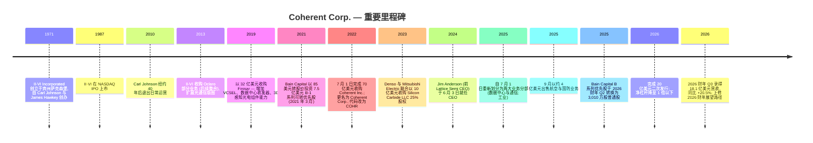
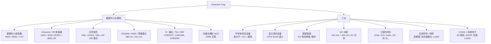
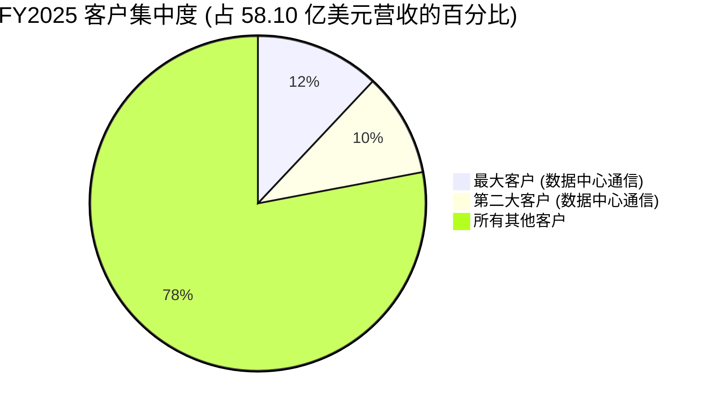
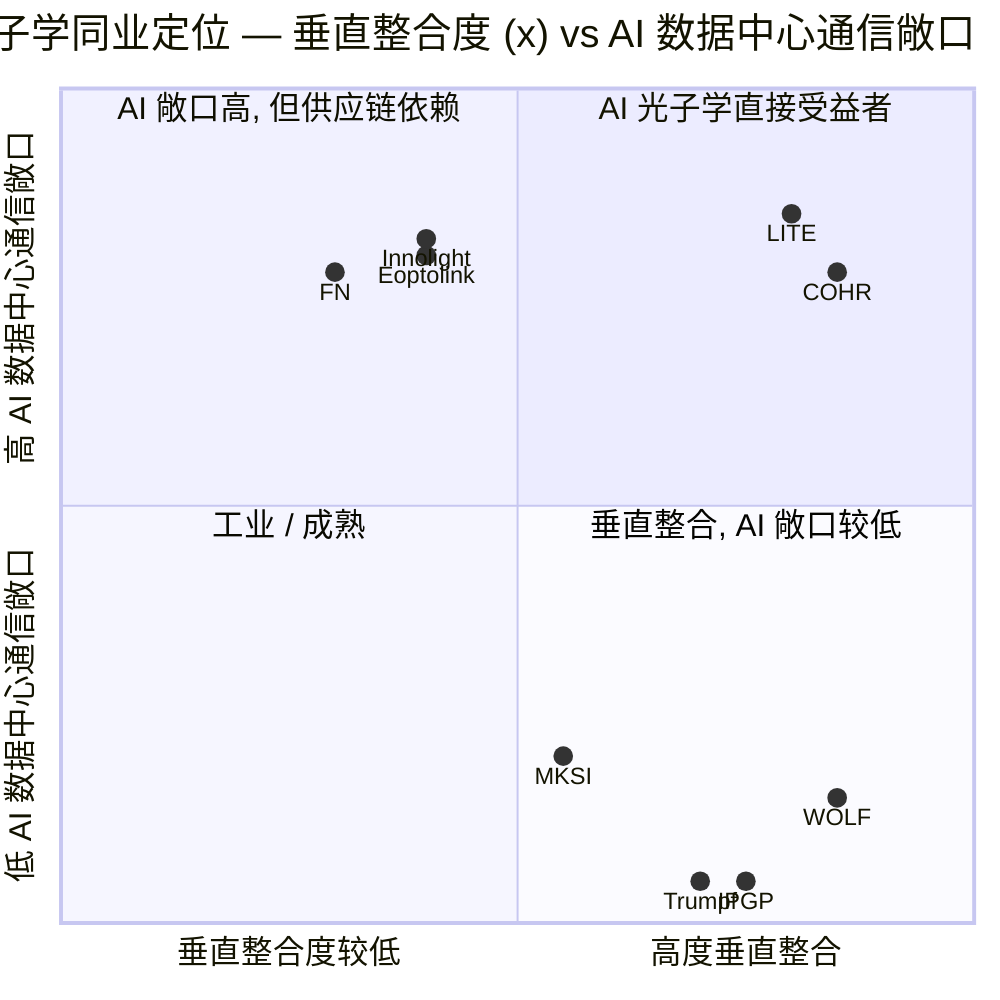
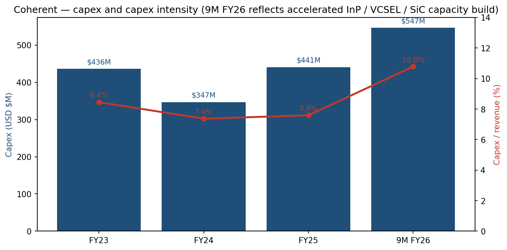
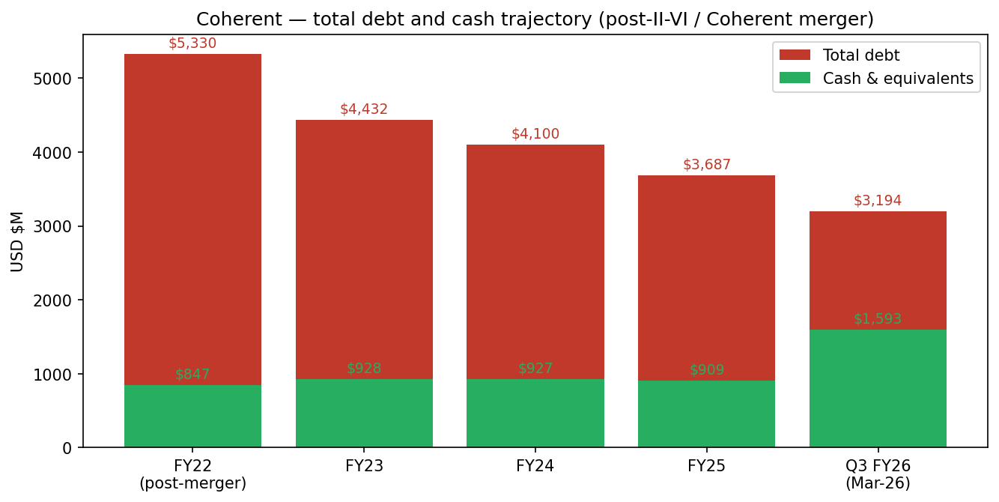

# Coherent Corp. (NYSE:COHR) — 公司研究报告

**日期:** 2026-05-20
**作者:** Equity Research, financial_agent
**覆盖状态:** 首次覆盖 (Initiation)
**代码 / 交易所:** NYSE: COHR
**财年截止日:** 6 月 30 日
**报告语言: 简体中文 (英文版同时存在于本目录)**

> **业绩更新 — 2026 财年 Q3 业绩 (2026-05-06 披露) 及 2026 财年 Q4 指引发布。** Coherent 2026 财年 Q3 营业收入 **18.06 亿美元 (同比 +20.5%, 环比 +7.1%)**, GAAP 毛利率 **37.7%** (同比 +243 个基点), GAAP 摊薄每股收益 (EPS) **0.97 美元** (上年同期为 **-0.11 美元**), 非 GAAP 摊薄 EPS **1.41 美元** (同比 +55%)。2026 财年 Q4 指引营业收入 **19.1 亿 - 20.5 亿美元**, 非 GAAP 毛利率 **39.0–41.0%**, 非 GAAP EPS **1.52–1.72 美元** — 意味着全年 2026 财年营业收入约 **69.8 亿 - 71.2 亿美元**, 较 2025 财年 58.10 亿美元基数同比 **+22~25%**, 全年非 GAAP EPS 区间 **5.38–5.58 美元**。管理层称增长驱动来自"数据中心与通信业务异常强劲的需求", 并将通过持续扩产以满足该需求。来源: [COHR 8-K, 2026 财年 Q3 业绩公告, 2026-05-06](https://www.sec.gov/Archives/edgar/data/820318/000119312526208972/d57080dex991.htm)。

---

## 目录

1. 公司概览
2. 公司历史
3. 管理团队
4. 产品与服务
5. 客户与上市策略
6. 行业概览
7. 竞争格局
8. 市场机会 (TAM)
9. 风险评估
10. 参考资料

---

## 1. 公司概览

Coherent Corp. (NYSE: COHR), 总部位于美国宾夕法尼亚州萨克森堡 (Saxonburg) 萨克森堡大道 375 号, 是一家垂直整合的光子学 (photonics) 公司, "开发、制造并销售用于通信、工业、仪表与电子市场的激光器 (laser)、收发器 (transceiver) 及其他光学与光电器件、模块和系统, 以及工程化材料 (engineered materials)" ([COHR 10-K FY2025, Item 1 Business, p. 6](https://www.sec.gov/Archives/edgar/data/820318/000082031825000014/iivi-20250630.htm))。公司是 2022 年 7 月 II-VI Incorporated (创立于 1971 年, 历史 NYSE 代码 IIVI) 与 Coherent, Inc. (老牌工业激光制造商, 旧代码 COHR-old) 合并交易的存续法人, 交易于 2022 年 7 月 1 日完成交割, 并随即更名为 Coherent Corp. ([II-VI Incorporated Completes the Acquisition of Coherent, GlobeNewswire, 2022-07-01](https://www.globenewswire.com/en/news-release/2022/07/01/2472885/11543/en/II-VI-Incorporated-Completes-the-Acquisition-of-Coherent-Forming-a-Global-Leader-in-Materials-Networking-and-Lasers.html))。

**Coherent 销售什么。** 其产品组合贯穿"从材料到系统 (from materials to systems)"的光子学价值链 ([COHR 10-K FY2025, p. 6](https://www.sec.gov/Archives/edgar/data/820318/000082031825000014/iivi-20250630.htm))。在一端, Coherent 培育化合物半导体晶体与衬底 — 碳化硅 (SiC)、磷化铟 (InP)、砷化镓 (GaAs)、锑化镓 (GaSb)、硒化锌 (ZnSe)、硫化锌 (ZnS); 另一端则出货成品, 包括用于 AI 数据中心的 800G 与 1.6T 可插拔光收发器 (pluggable optical transceiver)、用于 OLED 显示器生产的准分子激光退火 (excimer-laser annealing) 系统、用于半导体资本设备的 CO₂ 与超快激光器, 以及精密制造用的大功率工业激光器。公司将其护城河描述得直白: "垂直整合, 制造设施和装备, 经验丰富的技术与制造员工, 以及覆盖全球的营销和分销渠道" ([COHR 10-K FY2025, Competition, p. 11](https://www.sec.gov/Archives/edgar/data/820318/000082031825000014/iivi-20250630.htm))。

**Coherent 如何盈利。** 营收绝大多数来源于产品销售 — 销往 OEM、超大规模云厂 (hyperscaler)、网络设备厂商、半导体与显示资本设备制造商以及一长串工业 / 科研 / 医疗终端用户 — 服务费及版税贡献较少。2025 财年 (截至 2025 年 6 月 30 日) 公司公布总营业收入 **58.10 亿美元**, GAAP 毛利率 **35.2%**, GAAP 经营利润率位于高个位数, 摊薄 EPS **-0.52 美元** (扣除 3,500 万美元优先股增值后形成小幅净亏损) ([COHR 10-K FY2025, Selected Financial Data, p. 37](https://www.sec.gov/Archives/edgar/data/820318/000082031825000014/iivi-20250630.htm))。截至 2026 财年前九个月, 营业收入 **50.726 亿美元 (同比 +18.5%)**, GAAP 经营利润 **6.439 亿美元**, 上年同期九个月为 2.838 亿美元 — 经营利润在重组与减值费用并存的情况下依然实现翻倍以上增长 ([COHR 8-K, 2026 财年 Q3 业绩公告, 2026-05-06, Table 2](https://www.sec.gov/Archives/edgar/data/820318/000119312526208972/d57080dex991.htm))。

**Coherent 的运营布局。** 截至 2025 年 6 月 30 日, 公司在 20 多个国家共有员工约 **30,000 人** — 亚太 22,340 人、美洲 4,236 人、欧洲 3,640 人 — 在美国本土的主要生产 / 研发基地分布于加州、康州、德州、特拉华州、新泽西州、宾州; 美国境外主要在中国、芬兰、德国、马来西亚、菲律宾、新加坡、韩国、瑞典、瑞士、英国、越南运营 ([COHR 10-K FY2025, Human Capital, p. 6–7](https://www.sec.gov/Archives/edgar/data/820318/000082031825000014/iivi-20250630.htm))。2025 财年按客户总部所在地的营收结构为: 北美 35.65 亿美元 (61%), 欧洲 6.99 亿美元 (12%), 中国 6.80 亿美元 (12%), 日本 3.91 亿美元 (7%), 其他地区 4.76 亿美元 (8%) ([COHR 10-K FY2025, Note 14 Segment and Geographic Reporting, p. 81](https://www.sec.gov/Archives/edgar/data/820318/000082031825000014/iivi-20250630.htm))。

**营收 + 毛利率走势 (FY23–FY26E)。** 下图展示了合并后从谷底到复苏的剧烈轨迹: 2024 财年因传统工业 / 电子市场库存消化导致营收下滑, 2025 财年在 AI 数据中心需求驱动下回升 (+23%), 2026 财年展望意味着再次跃升约 22–25%。

来源: [COHR 10-K FY2025, MD&A, p. 38](https://www.sec.gov/Archives/edgar/data/820318/000082031825000014/iivi-20250630.htm) 对应 FY23–FY25; [COHR 8-K, 2026 财年 Q3 业绩公告, 2026-05-06](https://www.sec.gov/Archives/edgar/data/820318/000119312526208972/d57080dex991.htm) 对应 9M FY26 及 Q4 指引中点。

**规模指标。** 截至 2025 年 6 月 30 日, 全球持有专利约 **3,100 项**; 2025 财年研发投入 **5.82 亿美元** (占营收 10.0%); 2025 财年资本开支 **4.41 亿美元**, 2026 财年前九个月单季已上升至 **5.47 亿美元** — 公司在加速磷化铟 (InP) 与垂直腔面发射激光器 (VCSEL) 的 AI 数据中心通信产能扩张 ([COHR 10-K FY2025, p. 6 + Note 14, p. 81](https://www.sec.gov/Archives/edgar/data/820318/000082031825000014/iivi-20250630.htm); [COHR 8-K, 2026 财年 Q3 业绩公告, Table 4](https://www.sec.gov/Archives/edgar/data/820318/000119312526208972/d57080dex991.htm))。

### 估值快照

截至 2026-05-20 收盘, COHR 报价 **352.74 美元**, 对应市值 **690 亿美元** ([Yahoo Finance, COHR Key Statistics, 2026-05-20](https://finance.yahoo.com/quote/COHR/key-statistics/))。过去十二个月与前瞻倍数如下:

| 指标 (Yahoo Finance, 2026-05-20) | COHR | LITE | FN | MKSI | IPGP |
|---|---|---|---|---|---|
| 股价 | 352.74 美元 | 865.06 美元 | 664.39 美元 | 308.59 美元 | 120.60 美元 |
| 市值 (十亿美元) | 69.0 | 67.3 | 23.8 | 20.8 | 5.1 |
| TTM 市盈率 (P/E) | 168.8x | 151.8x | 57.0x | 64.4x | 177.4x |
| 前瞻市盈率 | 43.6x | 47.8x | 38.5x | 20.9x | 52.2x |
| TTM 市销率 (P/S) | 10.5x | 27.0x | 5.6x | 5.1x | 4.9x |
| EV / 营业收入 | 10.7x | 25.7x | 5.5x | 5.8x | 3.9x |
| EV / EBITDA | 53.7x | 125.7x | 48.7x | 25.1x | 43.7x |

来源: [Yahoo Finance 个股汇总页, 2026-05-20](https://finance.yahoo.com/quote/COHR/) (每个代码各自查询)。

**解读。** COHR 的 **TTM 市盈率高达 169 倍**, 主要由 GAAP EPS 仍被收购无形资产摊销 (年初至今 2.10 亿美元)、重组 (年初至今 5,700 万美元)、减值 (年初至今 2,000 万美元) 压低, 部分由航空与国防业务出售形成 1.24 亿美元收益所对冲; **GAAP 九个月 EPS 2.92 美元尚不能代表正常化运行率盈利** ([COHR 8-K, 2026 财年 Q3, Table 2](https://www.sec.gov/Archives/edgar/data/820318/000119312526208972/d57080dex991.htm))。更具参考意义的是 **前瞻市盈率 43.6 倍**, 与光学系统 / 光子学同业群体一致 (LITE 47.8x, FN 38.5x, IPGP 52.2x), 显著高于更广泛的半导体资本设备 / 仪器仪表群体 (MKSI 20.9x)。**TTM 市销率 10.5 倍**和 **EV/Revenue 10.7 倍** 大致是 MKSI / IPGP / FN 群体的 **两倍**, 但**不及** Lumentum (LITE) 的一半 — 后者凭借作为磷化铟 (InP) / EML (电吸收调制激光器) 第一大纯供应商身份切入英伟达光通信路线图, 估值显著上修。COHR 的估值溢价最好理解为"**高增长光子学行业溢价, 但若 AI 光通信攀升节奏停顿, 或 LITE 等同业被市场认定为更深度垂直整合, 仍存在显著倍数压缩风险**" — 详见第 9 章的明确风险拆解。三年期倍数区间惊人: COHR 的 TTM 市销率从 2023 年年中的约 1.4 倍 (彼时股价跌破 30 美元, 因 II-VI 合并整合疑虑) 扩张至今天的 10.5 倍。

来源: [Yahoo Finance, 2026-05-20](https://finance.yahoo.com/quote/COHR/key-statistics/) — COHR, LITE, FN, MKSI, IPGP 各自查询。

---

## 2. 公司历史

Coherent Corp. 是数十年间将晶体生长、化合物半导体、光电器件以及工业激光多家公司刻意整合为统一光子学平台的产物。法人主体 **1971 年** 由 Carl Johnson 与 James Hawkey 在宾夕法尼亚州萨克森堡以 II-VI Incorporated 的名义创立 — 公司名"II-VI"指元素周期表 II 族和 VI 族 (碲化镉、硒化锌、硫化锌), 是其首条产品线 — 用于大功率 CO₂ 工业激光器的光学元件、窗口与透镜的原材料 ([History of II-VI Incorporated, FundingUniverse](https://www.fundinguniverse.com/company-histories/ii-vi-incorporated-history/); [Coherent Corp. — Wikipedia](https://en.wikipedia.org/wiki/II-VI_Incorporated))。II-VI 在 1973 年扭亏为盈, 1987 年在 NASDAQ 完成 IPO。

来源: [COHR 10-K FY2025, p. 6](https://www.sec.gov/Archives/edgar/data/820318/000082031825000014/iivi-20250630.htm); [II-VI / Coherent Inc. 合并完成, GlobeNewswire 2022-07-01](https://www.globenewswire.com/en/news-release/2022/07/01/2472885/11543/en/II-VI-Incorporated-Completes-the-Acquisition-of-Coherent-Forming-a-Global-Leader-in-Materials-Networking-and-Lasers.html); [COHR 10-Q Q3 FY26, Notes 7 & 8 & 12, pp. 12–19](https://www.sec.gov/Archives/edgar/data/820318/000082031826000013/iivi-20260331.htm); [Coherent appoints Jim Anderson as CEO, GlobeNewswire 2024-06-03](https://www.globenewswire.com/news-release/2024/06/03/2892226/11543/en/coherent-appoints-jim-anderson-as-chief-executive-officer.html)。

### 三大战略转折定义了今日 Coherent

**(1) 从 CO₂ 光学到垂直整合的全栈光子学平台 (1987–2019)。** 三十年间多次并购 — 其中分量最重的是 **2019 年 32 亿美元的 Finisar 交易** — II-VI 沿光通信栈的每一层都建立起能力: 晶体生长 (SiC、InP、GaAs、ZnSe)、VCSEL 与 EML 激光二极管制造、收发器设计与组装、光学系统集成。Finisar 特别带来了 VCSEL 和数据中心收发器业务, 这些业务今天驱动 COHR 大部分增长。

**(2) 70 亿美元收购 Coherent 与企业更名 (2021–2022)。** 2021 年 3 月, II-VI 宣布以股票加现金方式收购 Coherent, Inc. — 这是一家由 Spectra-Physics 分拆而来的公开上市激光系统公司 — 总对价约 70 亿美元; 交易于 2022 年 7 月 1 日完成, 融资结构包括 40 亿美元高级担保贷款 (A 类 8.5 亿美元、B 类 28 亿美元、循环授信 3.5 亿美元)、14 亿美元 Bain 系列 B-2 优先股 (转股价 85 美元), 以及股票对价。合并后公司保留了更具辨识度的 Coherent 品牌, 重新挂牌代码 COHR ([COHR 10-K FY2025, Note 7 Debt, p. 66](https://www.sec.gov/Archives/edgar/data/820318/000082031825000014/iivi-20250630.htm))。这次交易理由是覆盖光子学价值链全域 — 但同时也使资产负债表过度杠杆化 (2022 财年总债务接近 53 亿美元), 整合负担沉重, 拖累了 FY23 / FY24 利润率。

**(3) 新 CEO 路线: 聚焦、简化、降杠杆 (2024 年中起)。** 2024 年 6 月聘任前 Lattice Semiconductor CEO **Jim Anderson** 开启了刻意的简化节奏: (a) 自 2025 年 7 月 1 日起, 从三个报告业务分部重组为两个 (**数据中心与通信** + **工业**); (b) 剥离非核心业务 — 最重要的是 2025 年 9 月以约 **4 亿美元出售航空与国防业务**; (c) 在 2026 财年 Q2 (2025 年 12 月) 提取并转换了 **Bain Capital B 系列优先股**, 消除了 25 亿美元夹层股权悬挂, 同时新增 3,010 万股普通股; (d) 在 2026 财年 Q3 执行 **20 亿美元二次股权发行**, 用于偿还期限贷款 ([COHR 10-Q Q3 FY26, Note 12, p. 19](https://www.sec.gov/Archives/edgar/data/820318/000082031826000013/iivi-20260331.htm))。总债务从合并完成时的 53 亿美元降至 **2026 年 3 月 31 日的 31.9 亿美元** — 对照 15.9 亿美元现金 + 8.3 亿美元短期投资, COHR 自合并以来首次实质性进入净杠杆低于 1.0 倍区间。

### 关键并购

- **Finisar (2019, 约 32 亿美元)** — VCSEL、数据中心收发器、3D 感知光电组件。今日 AI 光通信特许经营建基于 Finisar 的晶圆厂。
- **Coherent, Inc. (2022, 约 70 亿美元)** — 工业激光系统 (准分子、超快、CO₂)、品牌、客户基础。
- **Aegis Lightwave (2011)**, **Oclaro 元件业务 (2013)**, **Innolume (2018)**, **Ascatron (2020)**, **Asron (2020)** — 用于补全光通信和 SiC 平台的小型补强收购。

### 近期动态 (FY2025–FY2026)

2024 年 6 月至 2026 年 5 月期间是合并以来最具转型意义的窗口: 新 CEO、新 CFO (Sherri Luther, 前 Lattice CFO, 2024 年 9 月任命)、新分部结构、剥离、夹层股权清理, 以及 20 亿美元二次发行。运营层面, **数据中心与通信营业收入同比 +41%** — 在 9M FY26 内由 27.37 亿美元增至 36.60 亿美元, 而 **工业分部同比 -8.5%** (由 15.44 亿美元降至 14.13 亿美元) — 这种结构转移将继续主导 FY27 主线 ([COHR 8-K, Q3 FY26, Table 5](https://www.sec.gov/Archives/edgar/data/820318/000119312526208972/d57080dex991.htm))。

---

## 3. 管理团队

### James R. ("Jim") Anderson — 首席执行官兼董事 (自 2024-06-03 起)

Jim Anderson, 任命时 52 岁, 于 **2024 年 6 月 3 日** 出任 CEO 并加入董事会, 接替临时 CEO 兼前 CEO Vincent D. ("Chuck") Mattera, Jr. — 后者在带领 II-VI / Coherent 走过整合阶段后退休 ([Coherent Appoints Jim Anderson as Chief Executive Officer, GlobeNewswire, 2024-06-03](https://www.globenewswire.com/news-release/2024/06/03/2892226/11543/en/coherent-appoints-jim-anderson-as-chief-executive-officer.html))。Anderson 直接来自 **Lattice Semiconductor (NASDAQ: LSCC)**, 自 2018 年 9 月至 2024 年 6 月任总裁兼 CEO。在他大约六年的 Lattice 任期内, 股价从约 6 美元复合上涨至峰值超过 90 美元, 营收大致翻倍, 毛利率从 50% 后段扩张至 70% 中段, 经营利润率创历史纪录 — 这一先例如今被广泛引用为 COHR 董事会聘任他来复制的策略剧本 ([Coherent Appoints Jim Anderson, GlobeNewswire, 2024-06-03](https://www.globenewswire.com/news-release/2024/06/03/2892226/11543/en/coherent-appoints-jim-anderson-as-chief-executive-officer.html); [COHR 10-K FY2025, Executive Officers, p. 13](https://www.sec.gov/Archives/edgar/data/820318/000082031825000014/iivi-20250630.htm))。

加入 Lattice 之前, Anderson 在 **Advanced Micro Devices (AMD)** Lisa Su 团队下任 **计算与图形业务集团高级副总裁兼总经理** (期间他在 AMD Zen 翻身阶段直接负责 GPU 与客户端计算 P&L)。更早的职位包括在 **Intel、Broadcom (前 Avago)、LSI Corporation** 任管理、工程、销售、市场及企业战略相关岗位 — 累计超过 25 年的半导体设计、制造、销售与运营经验。他目前任 **Applied Materials 公司董事** (2025 年 7 月加入), 曾任 **Entegris** 董事 (2023 年 3 月–2024 年 7 月)、**半导体行业协会** 董事 (至 2024 年 6 月)、**Sierra Wireless** 董事 (2020–2023), 并担任 MIT 斯隆管理学院 (MIT Sloan School of Management) 美洲执行委员会成员及美日商业理事会成员。Anderson 拥有 **MIT** MBA 及 EECS 硕士学位、**Purdue** EE 硕士学位、**University of Minnesota** EE 学士学位 ([COHR 10-K FY2025, p. 13](https://www.sec.gov/Archives/edgar/data/820318/000082031825000014/iivi-20250630.htm))。

在其 2026 财年 Q3 业绩讲话中, Anderson 简明定调: *"随着 AI 数据中心基础设施持续规模化, 我们正在快速扩张产能以满足需求。凭借我们光子学技术组合的广度与制造规模, 我们相信 Coherent 处于独特优势位置, 以把握这一多年增长机遇"* ([COHR 8-K, Q3 FY26 Earnings Press Release, 2026-05-06](https://www.sec.gov/Archives/edgar/data/820318/000119312526208972/d57080dex991.htm))。截至 2025 年 8 月 31 日的登记日, Anderson 实益持有 COHR 普通股 **25,998 股** — 该数字较小, 反映其新近到任; 其 2025 年股权奖励主要为多年期绩效限制性股票单位 ([COHR DEF 14A 2025, Beneficial Ownership table, p. 31](https://www.sec.gov/Archives/edgar/data/820318/000110465925096170/0001104659-25-096170-index.htm))。

### Sherri Luther — 首席财务官 (自 2024-09 起)

Sherri Luther, 现 60 岁, 于 **2024 年 9 月** 出任 Coherent CFO, 比 Anderson 晚三个月。这一配对并非巧合: Luther 自 2019 至 2024 年在 Anderson 麾下担任 Lattice Semiconductor CFO, 两人在 Lattice 的转型中共同合作过。Lattice 之前, Luther 在 **Coherent, Inc.** (COHR 2022 年收购的老牌激光系统公司) 工作了 **16 年**, 最近期任公司财务副总裁 — 这意味着她对当前 Coherent Corp. 大约一半业务具备制度化历史认知。更早的职位涵盖 Quantum、Ultra Network Technologies 及 Arthur Andersen 的高级财务与会计岗。她是注册会计师 (CPA), 拥有 **斯坦福商学院 (Stanford GSB)** 高管 MBA 学位和 Wright State University 会计与金融双专业 BBA 学位。她目前任 **Silicon Labs** 董事, 持有 NACD 董事认证 ([COHR 10-K FY2025, p. 14](https://www.sec.gov/Archives/edgar/data/820318/000082031825000014/iivi-20250630.htm))。在 Q3 FY26 业绩电话会上, Luther 阐明了运营聚焦: *"鉴于我们对持续旺盛需求的强劲可见度, 我们正集中精力提升资本投入以扩产"* ([COHR 8-K, Q3 FY26 Earnings Press Release, 2026-05-06](https://www.sec.gov/Archives/edgar/data/820318/000119312526208972/d57080dex991.htm))。

### Dr. Julie Sheridan Eng — 首席技术官 (自 2022 起)

Julie Eng, 现 58 岁, 自 2022 年起任 CTO。她通过 Finisar 并购加入公司, 此前在 Finisar 担任数据中心通信工程组负责人超过 15 年, 主导生产发布数百款光纤收发器产品。在 Coherent 期间她曾负责光电器件与模块业务部, 覆盖 GaAs VCSEL、InP DML 与探测器、CMOS/BiCMOS 集成电路 (用于数据中心通信与 3D 感知)。Eng 的职业生涯始于 AT&T Bell Laboratories / Lucent / Agere, 开发基于激光的数据中心通信收发器, 持有 6 项美国专利, 2022 年获评 Optica Fellow, 并于 **2025 年当选美国国家工程院 (National Academy of Engineering) 院士** — 这是美国工程界最高荣誉之一。她在 Bryn Mawr 获物理学最高荣誉 BA、在 Caltech 获 EE 荣誉学士学位、在 Stanford 获 EE 硕士与博士学位 ([COHR 10-K FY2025, p. 14](https://www.sec.gov/Archives/edgar/data/820318/000082031825000014/iivi-20250630.htm))。对于以 AI 数据中心通信为主驱动的业务而言, 由 Eng 这样级别的技术家执掌技术路线图是一项实质性的资产。

### Dr. Giovanni Barbarossa — 首席战略官 (自 2019 起)

Giovanni Barbarossa, 现 62 岁, 是连接合并前 II-VI 与今日 Coherent 的关键纽带。他于 2012 年加入 II-VI 任 CTO 兼激光解决方案分部总裁, 2019 年起任首席战略官并兼任材料分部总裁直至 2025 年。加入 II-VI 之前, 他曾任 Avanex Corporation 总裁兼 CEO, 主持其与 Bookham 合并成 Oclaro, 并继续担任董事直至 2012 年。他持有 118 项美国专利, 发表过 100 余篇论文, 在 University of Glasgow 取得光子学博士学位 ([COHR 10-K FY2025, p. 13](https://www.sec.gov/Archives/edgar/data/820318/000082031825000014/iivi-20250630.htm))。根据最新 DEF 14A, Barbarossa 是高管中持股最多者 (截至 2025 年 8 月 31 日持有 252,140 股) ([COHR DEF 14A 2025, p. 31](https://www.sec.gov/Archives/edgar/data/820318/000110465925096170/0001104659-25-096170-index.htm))。

### 公司治理与股权

**董事会构成。** Coherent 14 名董事会成员由独立董事 **Enrico DiGirolamo** 担任主席; 14 名董事中有 13 名独立 (Anderson 是唯一管理层董事) ([COHR DEF 14A 2025, Board Skills Matrix, p. 8](https://www.sec.gov/Archives/edgar/data/820318/000110465925096170/0001104659-25-096170-index.htm))。董事会按三组分级实行年度选举。**Stephen Pagliuca** — Bain Capital Private Equity 高级顾问 — 作为与 Bain 投资关联的独立董事任职。

**内部人与大股东持股。** 根据最新 DEF 14A (记录日为 2025 年 8 月 31 日), **Bain Capital Investors, LLC** 实益持有 **28,111,651 股 = 17.9%** — 不过该时点尚在 Bain B-1 与 B-2 系列优先股 (2025 年 12 月转换) 之前, 转换后新增 **3,010 万股** 普通股, 仍使 Bain 保持公司最大股东。BlackRock 持股 8.4%, Fidelity Management & Research (FMR) 持股 6.3%。全体董事与执行管理团队作为一个群体合计持股 **706,906 股** (不足 1%) — 这一较低的内部人持股反映了 CEO 新到任以及 Coherent 历史上重度依赖 PRSU 股权激励 ([COHR DEF 14A 2025, Beneficial Ownership tables, pp. 30-31](https://www.sec.gov/Archives/edgar/data/820318/000110465925096170/0001104659-25-096170-index.htm); [COHR 10-Q Q3 FY26, Note 12, p. 19](https://www.sec.gov/Archives/edgar/data/820318/000082031826000013/iivi-20260331.htm))。

**薪酬结构。** 根据股东大会代理声明 (proxy), NEO (Named Executive Officer, 列名执行官) 薪酬高度向股权倾斜, 且股权奖励中绝大多数为绩效挂钩 (PSU 与相对 TSR 及经营指标挂钩), 而非时间归属。

### 管理层履历综合判断

Anderson / Luther 二人组在 Lattice 留下了清晰可见的路线图 — 聚焦组合、简化组织、提升毛利率、降杠杆, 让运营利润率扩张带动估值倍数扩张。他们在到任 Coherent 后的 22 个月内已大致复制了同一序列: 剥离航空与国防, 消化优先股悬挂, 募集 20 亿美元股权降杠杆, 并重组业务分部以突出 AI 数据中心主题。差距在于 **经营利润率的收敛**: Q3 FY26 GAAP 经营利润率 11.1% 对比 Lattice 鼎盛时的 20% 中后段 — 这一差距既解释了多头看好 (从这里有运营杠杆) 也解释了风险 (化合物半导体材料 + 收发器 + 工业激光的混合业务组合是否能匹敌纯粹 FPGA + 软件 IP 业务的利润率水平)。

---

## 4. 产品与服务

Coherent 的产品范围对单一公司而言异常之广, 涵盖材料 (用于生长激光与衬底的实质晶体), 光电器件 (激光、探测器、IC), 一直到集成子系统 (可插拔收发器、生产线激光系统)。垂直整合即护城河。下方产品组合按 Coherent 新 (FY2026) 两大分部结构分组: **数据中心与通信** 和 **工业**, 历史三分部视图 (网络 / 材料 / 激光) 在相关处以括号注明。

来源: 产品树映射自 [COHR 10-K FY2025, Reporting Segments and Business Units, pp. 8–11](https://www.sec.gov/Archives/edgar/data/820318/000082031825000014/iivi-20250630.htm) 与 [coherent.com 产品导航](https://www.coherent.com/products)。

### 旗舰产品及竞争优势评估

**(1) 数据中心收发器 (800G EML 基; 1.6T 于 2025/2026 日历年送样并爬产)。** Coherent 的旗舰增长特许经营。800G 的出货量在 FY25 内以 "400G 时代爬升速率的 2 倍" 的节奏放量, 公司已开始内部开发出货 1.6T 收发器, 涵盖三种自主变体 (硅光、EML 基、VCSEL 基) 用于 AI/ML 互联 ([Coherent Reports Robust Q2 FY25, Futurum Group, 2025-02](https://futurumgroup.com/insights/coherent-fy-2025-reports-robust-q2-datacom-strength-margin-expansion/))。**竞争优势: 是 — 技术 + 规模护城河。** 证据: Coherent 在美国与欧洲运营多座 **6 英寸 GaAs VCSEL 晶圆厂**, 以及 **多座 InP 晶圆厂**, 其中德州 Sherman 厂正在向 6 英寸 InP 晶圆产能过渡 — 在行业规模上, 只有 Lumentum (LITE) 能匹敌 InP 产能, 也只有 Coherent 和 Lumentum 能凭借内部激光来源, 在 1.6T 上实现可信的覆盖 ([COHR 10-K FY2025, p. 9](https://www.sec.gov/Archives/edgar/data/820318/000082031825000014/iivi-20250630.htm))。最接近竞品: Lumentum 的 800G/1.6T 收发器 — **速度级别相当, Coherent 在供应链广度 (亦自产 IC、调制器) 领先, Lumentum 可能在单通道激光性能上略有优势**。

**(2) Coherent / ZR 可插拔收发器 (100G / 400G ZR/ZR+ / 800G ZR)。** 用于长距离 DCI (数据中心互联) 与城域应用。Coherent 已扩大客户协作覆盖新的 100G ZR、400G ZR/ZR+ 与 800G ZR DCO 收发器, "客户高度看重的差异化因素是行业领先的性能、功耗、成本与可靠性" ([COHR Q3 FY25 8-K Press Release, 2025-05-07](https://www.sec.gov/Archives/edgar/data/820318/000119312525114882/d930395dex991.htm))。**竞争优势: 部分 — 有技术优势但竞争更激烈。** 最接近竞品: Cisco Acacia、Marvell Inphi、Lumentum、Fujitsu — **Coherent 硬件上与同业相当但在模块形态覆盖上更多样**。

**(3) 磷化铟 (InP) 激光二极管 — EML、CW、DML。** 这是支撑每一款高速 AI 收发器的"铲子与镐子"。Coherent 的 InP 产能在 FY25 内"同比翻三倍", 德州 Sherman 厂的 6 英寸 InP 晶圆线驱动了单位成本下降 ([Coherent Corp 深度研究, drrobertcastellano substack, 2025](https://drrobertcastellano.substack.com/p/coherent-strong-datacom-transceiver); [COHR 10-K FY2025, p. 9](https://www.sec.gov/Archives/edgar/data/820318/000082031825000014/iivi-20250630.htm))。**竞争优势: 是 — 规模护城河, 资本密集度构成显著进入壁垒。** 只有 Lumentum (LITE)、住友电工 (Sumitomo Electric)、三菱电机 (Mitsubishi Electric) 接近 Coherent 的 InP 量产规模; Lumentum 是最接近的美股可比对象。

**(4) 碳化硅 (SiC) 衬底 — 150 mm 与业内首批 200 mm 半绝缘 SiC。** Coherent 是 "用于功率电子的 SiC 衬底的全球领导者, 这些产品提升电动与混合动力车的能效", 同时也是 100/150/200 mm 半绝缘 SiC (用于 5G 基站的 GaN-on-SiC 射频放大器) 的市场领导者 ([COHR 10-K FY2025, pp. 9–10](https://www.sec.gov/Archives/edgar/data/820318/000082031825000014/iivi-20250630.htm))。**竞争优势: 是 — SiC 衬底的规模 + 技术领导, 但 FY25 终端市场逆风。** Materials 分部 FY25 营业收入下滑 6% 至 9.54 亿美元, 10-K 将其归因于"汽车与碳化硅终端市场需求疲软" — 即供给 / 能力到位但 EV 终端需求尚未消化 ([COHR 10-K FY2025, MD&A, p. 39](https://www.sec.gov/Archives/edgar/data/820318/000082031825000014/iivi-20250630.htm))。最接近竞品: **Wolfspeed (WOLF)** 在 N 型 SiC (功率器件) 领域 — 但 Wolfspeed 已于 2025 年 9 月完成 Chapter 11 重组, 现已是规模更小、杠杆较低的竞争者 ([Wolfspeed 8-K, Chapter 11 emergence, 2025-09](https://www.sec.gov/Archives/edgar/data/895419/000119312525224251/d22768dex991.htm))。**Denso + Mitsubishi Electric 10 亿美元股权投资 Silicon Carbide LLC** (2023 年 12 月交割) 明确为 Coherent 的 SiC 产能扩张提供资金, 并赋予下游 EV 一级供应商需求可见度 ([COHR 10-Q Q3 FY26, Note 13, p. 20](https://www.sec.gov/Archives/edgar/data/820318/000082031826000013/iivi-20260331.htm))。

**(5) OLED 显示退火与半导体工艺用准分子激光。** Coherent 继承了 Coherent Inc. 的准分子激光业务; 服务 LTPS OLED 显示生产 (Samsung Display、BOE、LG Display) 及半导体晶圆退火。FY25 营业收入增长 (显示资本设备的退火激光出货增加 7,300 万美元) ([COHR 10-K FY2025, p. 39](https://www.sec.gov/Archives/edgar/data/820318/000082031825000014/iivi-20250630.htm))。**竞争优势: 是 — 与 Gigaphoton 形成双寡头; 在 308 nm DUV 准分子激光性能方面具有技术护城河。** 最接近竞品: **Gigaphoton (日本 Komatsu 子公司)**。

**(6) 超快激光器 (飞秒 / 皮秒光纤)。** 用于半导体资本设备、先进封装与科研。营收基数较小但高增长、高毛利。**竞争优势: 部分。** 最接近竞品: IPG Photonics (IPGP)、Trumpf (德国私企)、nLight、MKS (Newport 分部)。

**(7) 3D 感知用 VCSEL。** 嵌入智能手机、AR/VR 头显、车载驾驶员监控系统。Coherent 消费类 VCSEL 业务在 FY24 因客户设计变更受冲击 (电子市场营业收入同比下滑 2.70 亿美元) — 业内普遍理解这是 **Apple 重新设计了 Face ID**。10-K 明确将下滑归因于"一家重要电子客户实施的设计变更" ([COHR 10-K FY2025, p. 40](https://www.sec.gov/Archives/edgar/data/820318/000082031825000014/iivi-20250630.htm))。**竞争优势: 部分。** 最接近竞品: Lumentum (同样有 Apple 暴露) 与 ams OSRAM。

### 旗舰产品 vs 长尾业务组合

FY25 营业收入 58.10 亿美元中:
- **网络分部 (Networking) 34.21 亿美元 (58.9%)** — AI 数据中心通信 / 收发器 / InP 特许经营。约占增量营收的 80%+。
- **激光分部 (Lasers) 14.35 亿美元 (24.7%)** — 工业 / 显示 / 科研。
- **材料分部 (Materials) 9.54 亿美元 (16.4%)** — SiC、工程化材料、作为商用元件销售的 VCSEL。

在 FY26 开始的新两分部框架下, 图景更加聚焦: **数据中心与通信 = 9M FY26 的 36.60 亿美元 (72%)**, **工业 = 14.13 亿美元 (28%)**。投资逻辑本质上就是数据中心通信分部。

来源: [COHR 10-K FY2025, MD&A and Note 14, pp. 38–40, 79–81](https://www.sec.gov/Archives/edgar/data/820318/000082031825000014/iivi-20250630.htm); [COHR 8-K, Q3 FY26 Earnings Press Release, Table 5](https://www.sec.gov/Archives/edgar/data/820318/000119312526208972/d57080dex991.htm)。

### 路线图与近期发布 (过去 12 个月)

- **CHR2075** 用于 800G/1.6T 模块的 4 通道驱动 IC (2025 年 12 月上市); **CHR1094** TIA 与 **CHR2094** 调制器驱动芯片组用于 400G ZR/ZR+ 链路 (2025 年 11 月上市) ([Coherent Launches Advanced IC Family for 800G Optical Transceivers, StockTitan summary, 2025](https://www.stocktitan.net/news/COHR/coherent-unveils-a-family-of-integrated-circuits-for-next-generation-1ua4y4psdwjs.html))。
- **3.2T / 6.4T 研发示范** 差分 EML 技术, 为下一代 3.2T 光互联铺路 ([COHR 10-K FY2025, R&D table, p. 11](https://www.sec.gov/Archives/edgar/data/820318/000082031825000014/iivi-20250630.htm))。
- **光路交换机 (OCS) 产品族** 用于 AI/ML 与超大规模数据中心, 基于 Coherent 的数字液晶技术 — 直接对位 Google 内部开发的 Apollo OCS, 也是非电气化 AI 网络结构的关键构件 ([COHR 10-K FY2025, R&D table, p. 11](https://www.sec.gov/Archives/edgar/data/820318/000082031825000014/iivi-20250630.htm))。
- **航空与国防业务出售** 于 2025 年 9 月 2 日完成, 总对价约 4 亿美元 — 战略性收窄组合 ([COHR 10-Q Q3 FY26, Note 7, p. 12](https://www.sec.gov/Archives/edgar/data/820318/000082031826000013/iivi-20260331.htm))。
- **产能扩张: 6 英寸 InP 晶圆线于德州 Sherman 在 2025 年底爬产**, 降低单位激光芯片成本。

### 季度分部走势 — AI 攀升过程的图谱

来源: [COHR 8-K, Q3 FY26 Earnings Press Release, Table 5, 2026-05-06](https://www.sec.gov/Archives/edgar/data/820318/000119312526208972/d57080dex991.htm); Q1 FY26 D&C 推导自 9M FY26 D&C 36.596 亿美元减去 Q2 FY26 D&C 12.080 亿美元再减去 Q3 FY26 D&C 13.616 亿美元。

数据中心与通信分部在过去四个已披露季度内复合 **平均环比 +9.0%** — 年化 +41% 的运行率 — 而工业分部从 Q3 FY25 的 5.29 亿美元降至 Q3 FY26 的 4.44 亿美元 (同比 -16%), 受航空与国防业务剥离和精密制造持续疲软共同压制。

---

## 5. 客户与上市策略

### 客户分群

在新两分部框架下, Coherent 服务四大客户类别:
- **超大规模数据中心运营商与 AI 计算平台** — 直接销售收发器与 OCS 给超大规模厂 (Microsoft Azure、Google、Meta、Amazon Web Services、Oracle Cloud), 同时通过网络设备制造商 (Cisco、Arista、Juniper、NVIDIA Mellanox) 间接销售给同一组运营商。
- **通信服务提供商** — Tier-1 电信运营商采购 coherent 收发器、ROADM、泵浦激光与 DCI 设备。
- **资本设备 OEM** — Applied Materials、ASML、Lam Research、KLA, 以及采购准分子 / CO₂ / 超快激光与工程化材料的显示设备 OEM。
- **工业 / 仪表 / 医疗** — 长尾包括汽车 Tier-1、EV 电池厂、显微镜与生命科学 OEM、国防主承包商 (直至 2025 年 9 月剥离)。

### 客户集中度 — 量化

根据 FY2025 10-K 第 14 注释: *"2025 财年内, 我们有两位主要客户分别贡献了合并营业收入的 12% 和 10%。2024 财年, 另一位主要客户贡献了合并营业收入的 10%。2023 财年, 一位主要客户贡献了合并营业收入的 10%。这些客户主要采购我们网络分部的产品"* ([COHR 10-K FY2025, Note 14, p. 82](https://www.sec.gov/Archives/edgar/data/820318/000082031825000014/iivi-20250630.htm))。即:

| 财年 | 最大客户 (占营收) | 第二大客户 | 备注 |
|---|---|---|---|
| FY2023 | 10% | (未在 10% 门槛披露) | 单一 10% 客户 |
| FY2024 | 10% | (未在 10% 门槛披露) | 不同客户成为最大客户 |
| FY2025 | 12% | 10% | 两位客户超过 10% 门槛 |

Coherent **未公开命名**其 10%+ 客户, 但鉴于披露语言 ("主要采购我们网络分部") 结合 AI 数据中心通信的爬升时点和广为人知的超大规模厂采购流向, 强烈暗示客户群是 **NVIDIA (经 Mellanox 为 AI/ML 集群采购光学组件)**、**Cisco**, 以及一两家超大规模厂的某种组合 — 但 Coherent 自身从未做出过该具体识别, 我们也不会超出 10-K 语言所支撑的范围去推测。**FY25 前两大客户合计集中度 22% 属于实质但并非极端** (Lumentum 的最大客户通常在 25–35%); 然而该数字已从 FY23 的单一 10% 客户增长至 FY25 的合计约 22% 两个客户, 按方向性逻辑, FY26 在 AI 数据中心建设加速时大概率将进一步集中。

来源: [COHR 10-K FY2025, Note 14, p. 82](https://www.sec.gov/Archives/edgar/data/820318/000082031825000014/iivi-20250630.htm)。

### 分销渠道与销售策略

Coherent 将其上市策略描述为 *"通过直销队伍和遍布全球的代表及经销商... 通过关键客户关系、个人销售、定向广告、参加展会、数字营销和客户协作积极推广产品。我们的销售队伍中包含高度训练的技术销售支持团队, 协助客户设计、测试并将我们的产品作为其系统的关键组件进行资格认证"* ([COHR 10-K FY2025, Sales and Marketing, p. 11](https://www.sec.gov/Archives/edgar/data/820318/000082031825000014/iivi-20250630.htm))。其模式主要是 **直接技术销售** — 用于收发器、OCS 与资本设备激光器, 这些是 6–18 个月资格认证周期, 工程介入深度极高 — 同时辅以经销商覆盖工业激光系统和商用元件。

### 关键合作伙伴与战略投资

最具影响力的客户合作以股权投资形式正式化:

- **Denso Corporation** 于 2023 年 12 月 4 日以 **5 亿美元收购 Silicon Carbide LLC (Coherent SiC 子公司) 16,670,000 股 A 类普通单位**, 取得约 12.5% 股权 ([COHR 10-Q Q3 FY26, Note 13, p. 20](https://www.sec.gov/Archives/edgar/data/820318/000082031826000013/iivi-20260331.htm))。
- **Mitsubishi Electric Corporation** 在同一日以 **5 亿美元收购 Silicon Carbide LLC 16,670,000 股 A 类普通单位**, 同样取得约 12.5% 股权, Coherent 保留约 75% ([COHR 10-Q Q3 FY26, Note 13, p. 20](https://www.sec.gov/Archives/edgar/data/820318/000082031826000013/iivi-20260331.htm))。

Denso / MELCO 这一架构既是客户承诺 (两家都是世界最大的 SiC 功率电子客户), 也是 Coherent SiC 产能扩张的轻资本融资 — 合计 **10 亿美元** 为 Silicon Carbide LLC 的产能建设提供资金, 而不消耗 Coherent 母公司层面的现金。实际上 Denso 与 MELCO 已用股权支票预先锁定了相当于其下游需求可见度。

### 合同结构与销售周期考量

对于收发器与资本设备激光, 合同通常基于 **采购订单, 配合滚动 12–18 个月预测**, 而不是多年期"照付不议"承诺; 超大规模厂采购流向通过 Cisco / Arista / NVIDIA Mellanox 与 Coherent 直销, 每代产品 (400G → 800G → 1.6T → 3.2T) 分别需通过资格认证。风险是不对称的: 每一代攀升都重新开启资格认证竞争, 但一旦在超大规模厂内部锁定了供应槽位, 鉴于重新认证的成本, 这一槽位往往跨越多代产品周期保持稳定。

### 案例研究 (已命名或强归属性的胜出)

- **Apple** — 历史上获得 VCSEL 在 Face ID 应用胜出; FY24 因 "一家重要电子客户实施的设计变更" 出现营收冲击 ([COHR 10-K FY2024, MD&A, p. 39](https://www.sec.gov/Archives/edgar/data/820318/000082031824000016/iivi-20240630.htm))。
- **Samsung Display + BOE + LG Display** — LTPS OLED 面板生产用准分子激光退火客户长期合作 (在多份投资者材料中提及; Coherent 不单独披露客户级营业收入)。
- **Denso + Mitsubishi Electric** — SiC 客户兼 Silicon Carbide LLC 合计 25% 股权持有者 (见上)。

---

## 6. 行业概览

### 行业定义

Coherent 经营于 **光子学 (photonics)** — 关于光的产生、检测与调控的科学与技术。在光子学内, 它占据四大子行业, 均归类于 SIC 编码 3827 (实验室仪器) / 3674 (半导体) / 3669 (通信设备) / 3845 (电医疗):

1. **光通信组件与模块** — 数据中心与电信收发器、ROADM、激光器、光电探测器、IC。
2. **化合物半导体衬底与外延晶圆** — SiC、InP、GaAs、GaN、GaSb。
3. **工业激光系统** — 准分子、CO₂、光纤、超快、固态。
4. **生命科学、科研与消费电子用光子器件** — VCSEL、特种光学、仪器仪表。

### 市场规模与增长 (TAM)

光通信市场 — Coherent 子行业中最大、最快增长的板块 — 正被 AI 计算基础设施结构性重新定价:

- **可插拔光收发器**: LightCounting 与 Dell'Oro 跟踪市场规模 2024 年约 **150 亿美元**, 预计以 25%+ 复合增长至 2028 年的 **400 亿美元以上**, 由 800G/1.6T AI 集群部署驱动。*(行业研究共识; 具体的 Dell'Oro / LightCounting 报告需付费订阅, 此处仅作方向性引用。)*
- **Coherent / 长距离 DCI / ZR 收发器**: 2024 年约 20–30 亿美元, 年复合 +20%+ 增长。
- **碳化硅功率器件与衬底**: Yole / TrendForce 跟踪 SiC 功率器件市场 2024 年约 **30–40 亿美元**, 预计到 2028 年可达 80–120 亿美元, 由 EV 牵引逆变器和充电驱动 — 但 2024-2025 年间斜率因 EV 需求消化已趋于平缓。
- **准分子激光系统 (显示退火)**: 约 10–15 亿美元市场, Coherent 与 Gigaphoton 双寡头。
- **工业光纤与超快激光**: 2024 年约 50–60 亿美元市场, 主导者为 Trumpf、IPG Photonics、MKS Newport / Spectra-Physics 与 Coherent。

Coherent 在这些子行业的总计 **TAM 敞口当前约 250–300 亿美元**, 若 AI 数据中心通信和 SiC 功率器件曲线保持, 到 **2028–2030 年的轨迹为 600–800 亿美元**。

### 关键增长驱动与趋势

1. **AI 计算建设潮**。每一代 NVIDIA GB200 / GB300 / Rubin 都将每 GPU 的光收发器数量大约提升 2 倍; 对于规模化的 AI 集群, 这意味着每代换代周期内新增数亿件收发器。10-K 明确将 FY25 网络分部 +49% 增长归因于 *"通信市场 AI 数据中心需求强劲"* ([COHR 10-K FY2025, p. 39](https://www.sec.gov/Archives/edgar/data/820318/000082031825000014/iivi-20250630.htm))。
2. **400G → 800G → 1.6T → 3.2T 节奏**。大约每 2 年一代; 每次翻倍即便单位数量增长放缓, 也驱动 ASP 与 TAM 扩张。Coherent 明确将研发资本化用于"支持 3.2T 与 6.4T 的 400G/通道组件" ([COHR 10-K FY2025, p. 11](https://www.sec.gov/Archives/edgar/data/820318/000082031825000014/iivi-20250630.htm))。
3. **共封装光学 (Co-Packaged Optics, CPO)**。这是行业潜在转折点, 光接口从可插拔模块移至 GPU 封装内部; 可能压缩传统收发器 TAM, 也可能加速其增长 (组件解构的胜出者将受益)。Coherent 已通过硅光与"广泛的 CPO 使能技术阵列"在两端布局 ([COHR 10-K FY2025, p. 9](https://www.sec.gov/Archives/edgar/data/820318/000082031825000014/iivi-20250630.htm))。
4. **EV 渗透率与 SiC 在牵引逆变器中的应用**。结构性多十年顺风; 短期因全球 EV 需求消化而放缓 (FY25 SiC 营业收入同比下降)。
5. **5G / 6G 基站部署** — Coherent 是 100/150/200 mm 半绝缘 SiC (用于 GaN-on-SiC RF 功率放大器) 的领先供应商。

### 行业动态 — 波特五力风格

- **市场分散度**: 光学组件中度集中 — Coherent + Lumentum 合计主导数据中心通信用的 InP 与 VCSEL 供应; 收发器领域, Innolight (中际旭创) 与 Eoptolink (新易盛, 中国) 占据较大份额 (尤其在售予超大规模厂的 400G/800G 模块), 但这些中国供应商反过来又从 Coherent / Lumentum 处采购其 EML 与 DML。
- **供应商议价能力**: Coherent 从"独家或有限来源供应商"采购"特种材料、晶体和光学元件" ([COHR 10-K FY2025, Sources of Supply, p. 8](https://www.sec.gov/Archives/edgar/data/820318/000082031825000014/iivi-20250630.htm)) — 是真实但可管理的风险。
- **买方议价能力**: 超大规模厂和主要 NEM (Cisco、Arista、NVIDIA Mellanox) 是规模庞大、高度集中的买方, 稳态下具有显著价格杠杆, 但在像当前 AI 数据中心通信这类供给受限的爬升阶段, 议价能力被削弱。
- **替代品**: 共封装光学是对可插拔收发器的主要替代风险; 对于 SiC 衬底, 替代的宽禁带 (WBG) 材料 (GaN-on-Si) 在某些电压档以上和以下与之争夺功率器件份额。
- **监管**: 沉重。ITAR 对国防光学 (现已大部分剥离), EAR / 商务部出口管制对化合物半导体材料 (尤其 SiC、InP、GaN 及 200 mm 晶圆技术在 2024-2025 年已被纳入美国出口管制审查), 以及中国对关键材料供应链政策 — 均同时形成护城河 (对 Coherent 已建立的平台) 与风险 (对中国跨境销售, 约 FY25 营业收入的 12%)。

---

## 7. 竞争格局

### 直接竞争对手

| 竞争对手 | 上市地 | 与 Coherent 重叠领域 | 差异化 |
|---|---|---|---|
| **Lumentum (LITE)** | NASDAQ | 数据中心通信收发器、EML / InP 激光、ROADM/WSS、3D 感知 VCSEL | 纯光子学; 在激光 / 芯片层更深; Apple 3D 感知敞口更大; NVIDIA AI 光学内容更高 |
| **MKS Inc. (MKSI)** | NASDAQ | 激光 (Spectra-Physics / Newport)、光子学组件、半导体过程控制 | 偏半导体工艺 / 真空, 数据中心通信较少 |
| **IPG Photonics (IPGP)** | NASDAQ | 工业光纤激光 (精密制造、EV 电池焊接) | 纯工业光纤激光; 几乎零数据中心通信 |
| **Fabrinet (FN)** | NYSE | 光模块与收发器的代工制造 (售予 NVIDIA、Cisco、Lumentum、Coherent 等) | 外包制造, 非垂直整合; 同样搭乘 AI 光学热潮 |
| **Wolfspeed (WOLF)** | NYSE | 碳化硅衬底与功率器件 | 纯 SiC, 仅美国市场, 近期 (2025 年 9 月) 完成 Chapter 11 重组 |
| **Innolight Technology (中际旭创, 300308.SZ)** | 深圳 | 数据中心通信收发器, 超大规模厂的顶级供应商 | 中国低成本组装; 从 Coherent / Lumentum 采购 EML |
| **Eoptolink (新易盛, 300502.SZ)** | 深圳 | 数据中心通信收发器 | 与 Innolight 相似 |
| **Gigaphoton (Komatsu 子公司, 日本)** | 非上市 | 显示退火与半导体光刻用准分子激光 | 与 Coherent 在准分子激光形成双寡头 |
| **Trumpf (德国非上市)** | 非上市 | 工业激光系统 | 全球最大的纯工业激光公司 |
| **住友电工 / 三菱电机** | 日本 | InP 激光二极管、SiC 衬底 | 偏向母公司内部消化; 通过 SiC LLC 投资与 Coherent 合作 |

### 定位框架

### Coherent 的竞争优势

1. **光通信领域最深的垂直整合**。Coherent 自主生长 InP 与 GaAs 晶体、晶圆制造、激光二极管切片、设计驱动 / TIA IC、组装光学子组件、整合收发器模块 — 全部内部完成。*"我们不仅自主设计与制造收发器, 还设计与制造许多材料和组件, 包括激光器、探测器、IC 和无源光学元件。我们具备 GaAs 基 VCSEL、InP 基 DML、EML 与 CW 激光的内部激光设计与制造能力"* ([COHR 10-K FY2025, p. 9](https://www.sec.gov/Archives/edgar/data/820318/000082031825000014/iivi-20250630.htm))。只有 Lumentum 接近同等深度。
2. **6 英寸 GaAs VCSEL 与 6 英寸 InP 晶圆的规模**。美国和欧洲多座晶圆厂; 6 英寸 InP 过渡 (德州 Sherman 厂) 在单位成本上构成差异化。
3. **最广的光子学技术组合**。Coherent 是极少数能够从单一技术栈可信切入数据中心通信收发器、电信长途、SiC 功率、工业激光、显示退火、AR/VR 光学的公司之一。
4. **供应链韧性**。在 20 多个国家有制造基地 — 这是公司明确表述的差异化: *"我们相信我们多样化的制造基地使我们与众不同, 尤其在客户高度看重供应链韧性的当下"* ([COHR 10-K FY2025, p. 6](https://www.sec.gov/Archives/edgar/data/820318/000082031825000014/iivi-20250630.htm))。
5. **专利护城河**。截至 2025 年 6 月 30 日全球约 3,100 项专利。

### Coherent 的竞争脆弱性

1. **Lumentum 在 NVIDIA 光学叙事上抢占了 Coherent 的市场认知**。Lumentum TTM 市销率 27 倍 vs COHR 的 10.5 倍, 显示市场将 Lumentum 定价为更"纯粹"的 NVIDIA AI 光学标的。Coherent 和 Lumentum 谁更深度垂直整合实属可辩 — 但叙事差距是真实存在的。
2. **工业激光分部拖累**。工业分部在 9M FY26 内同比下滑约 16% — 占营收 28%, 足以摊薄合并增长。
3. **重组噪声**。FY25 重组费用 1.60 亿美元 + 减值 8,500 万美元 + 9M FY26 重组 5,700 万美元 + 减值 2,000 万美元 — GAAP 图景仍然杂乱。
4. **客户集中度上升**。FY25 前 2 名 = 22%, 走势陡峭。
5. **中国营收敞口** (约 FY25 营业收入 12%) 处于化合物半导体出口管制升级的时点。

### 市场份额注解

- **800G EML 与 InP 激光** 领域, Coherent 与 Lumentum 合计可能占据 **超过 60% 的商用市场供应** (Dell'Oro / LightCounting 的行业共识; 具体的市场份额数据因来源不同而异, COHR 未单独披露)。
- **数据中心通信收发器组装** 领域, Innolight 与 Eoptolink 在单位数量上领先 (尤其 400G/800G), 但它们消化的是 Coherent / Lumentum 提供的激光。
- **用于射频的 150/200 mm 半绝缘 SiC** 领域, Coherent 是 10-K 自身定名的领导者 ("业内首批 200 mm 半绝缘 SiC 衬底的市场领导者") ([COHR 10-K FY2025, p. 10](https://www.sec.gov/Archives/edgar/data/820318/000082031825000014/iivi-20250630.htm))。
- **功率器件用 N 型 SiC**, Wolfspeed 历史上领先, 但已于 2025 年 9 月从 Chapter 11 重组中走出; Coherent / II-VI 与 STMicroelectronics、ROHM、Infineon、onsemi 为有意义的竞争者。

---

## 8. 市场机会 (TAM)

### TAM 构建

结合管理层评论、新两分部视图和行业共识增长率:

| 子市场 | 2024 规模 (美元) | 2028 规模 (美元, 估计) | CAGR | Coherent 营收敞口 (FY25/FY26) |
|---|---|---|---|---|
| 数据中心通信收发器 (含 800G/1.6T AI) | 约 150 亿 | 约 400 亿 | 27% | 约 25–30 亿 (最大单一桶) |
| 电信 / coherent / ZR 收发器 | 约 30 亿 | 约 50 亿 | 14% | 约 5–8 亿 |
| 光学组件 (InP/GaAs 激光、调制器、驱动器、TIA、探测器) — 仅商用 | 约 40 亿 | 约 80 亿 | 18% | 约 8–10 亿 |
| 用于 AI 的光路交换机 (OCS) | 小于 5 亿 | 20–30 亿 | 50%+ | 新兴 — 目前不足 5,000 万 |
| SiC 衬底 + 外延晶圆 | 约 15 亿 | 约 35 亿 | 24% | 约 4 亿 (材料分部内) |
| 准分子 + 超快 + CO₂ 工业激光 | 约 50 亿 | 约 70 亿 | 8% | 约 11 亿 |
| 工程化材料 + VCSEL + 生命科学 + 科研 | 约 30 亿 | 约 40 亿 | 7% | 约 10 亿 |
| **可寻址 TAM 合计** | **约 320 亿** | **约 700 亿** | **约 22%** | **约 63–67 亿 (FY26E, 约 20% TAM 份额)** |

注: 2028 数字为基于行业共识 CAGR (LightCounting、Dell'Oro、Yole、TrendForce) 的示意性估计。这并非单一已发布预测。

### SAM (可服务的可寻址市场)

考虑产品类别 (Coherent 实际出货的)、地理 (受 US 对中国出口管制限制) 与客户层级 (Coherent 资格认证覆盖的) 之后, Coherent 的 **2028 年 SAM 约 500–550 亿美元**, 其中数据中心与通信部分约 400 亿美元。

### SOM (可服务的可获得市场)

若 Coherent 在 FY28 之前保持 SAM 中约 20% 营收份额 (略高于当前隐含的 12–13% 合并 TAM 份额), 营收轨迹意味着 **FY28 可达 100–110 亿美元** — 对照 FY26E 约 69–71 亿美元。这需要从 FY26 到 FY28 实现约 18–22% 营收 CAGR, 略低于 FY26E 运行率。

### 渗透策略

管理层明确路线包括:
- **产能扩张** — 9M FY26 资本开支 5.47 亿美元 (已超过全年 FY25 的 4.41 亿美元), 重点投向 InP 与 VCSEL 晶圆厂 ([COHR 8-K, Q3 FY26 Earnings Press Release, Table 4](https://www.sec.gov/Archives/edgar/data/820318/000119312526208972/d57080dex991.htm))。
- **代际爬升领先同业** — 率先送样 1.6T、自研 3.2T EML 技术、用于 AI 网络结构的 OCS。
- **组合简化** — 剥离非核心 (航空与国防), 聚焦光子学核心。
- **降杠杆 + 估值倍数扩张** — 通过 20 亿美元股权发行与 Bain 优先股转换完成。

来源: [COHR 10-K FY2025, Note 14, p. 81](https://www.sec.gov/Archives/edgar/data/820318/000082031825000014/iivi-20250630.htm); [COHR 8-K, Q3 FY26 Earnings Press Release, Table 4](https://www.sec.gov/Archives/edgar/data/820318/000119312526208972/d57080dex991.htm)。

资本开支密集度从 FY24 的约 8% 上调至 9M FY26 的约 11%, 是管理层立场最清晰的信号: 他们相信 AI 数据中心通信的爬升足够持久, 足以支持在 1.6T → 3.2T 过渡之前前置的产能。

---

## 9. 风险评估

### 公司特定风险

**1. 客户集中度 (FY25 前 2 = 22%; 趋势上升)。** 随着数据中心通信营收以同比 +40%+ 复合增长, 且工业业务下滑, 来自两位 10%+ 客户 (可能是一家主要 NEM 与一家超大规模厂) 的营收份额将在数学上继续上升。在代际过渡 (如 1.6T → 3.2T) 上失去或被一家账户取消资格, 将是超过 7 亿美元的营收事件。*缓解*: 垂直整合使 Coherent 比无晶圆收发器厂商更难被替代; 6–18 个月资格认证周期产生粘性。([COHR 10-K FY2025, Note 14, p. 82](https://www.sec.gov/Archives/edgar/data/820318/000082031825000014/iivi-20250630.htm))

**2. Anderson 转型的执行风险。** Lattice 路线图 (聚焦、降杠杆、利润率扩张) 在 COHR 更具挑战 — 30,000 名员工、更多产品线、多分部制造布局、工业 / SiC 业务处于周期性下滑。如果毛利率停滞在 30% 后段而不是在未来 24 个月内扩张至约 45%, 估值倍数压缩风险是真实的。*缓解*: Q3 FY26 已显示 GAAP 毛利率同比 +243 个基点; 轨迹与计划一致。

**3. 共封装光学 (CPO) 替代。** 比预期更快的 CPO 转换可能压缩可插拔收发器 TAM。Coherent 已通过硅光与 CPO 使能子组件布局, 但激光源与模块组装分别采购的真正 CPO 体制可能重置单位经济模型。*缓解*: Coherent 提供任何 CPO 架构中都将需要的激光器 / EML。([COHR 10-K FY2025, p. 9](https://www.sec.gov/Archives/edgar/data/820318/000082031825000014/iivi-20250630.htm))

**4. SiC 终端市场长期疲软。** FY25 Materials 营收同比下滑 6% 至 9.54 亿美元, 10-K 将其归因于 *"汽车和碳化硅终端市场需求疲软"* ([COHR 10-K FY2025, p. 39](https://www.sec.gov/Archives/edgar/data/820318/000082031825000014/iivi-20250630.htm))。如果 EV 需求消化期延伸至 2027 年之后, Coherent 与 Denso + MELCO 联合资助的 SiC 产能建设将闲置。*缓解*: Denso + MELCO 对 Silicon Carbide LLC 的股权所有权对齐下游需求, 并限制了母公司层面的现金消耗。

**5. 整合负担依然可见。** 9M FY26 重组 + 减值 + 整合成本合计约 1.35 亿美元以上 (GAAP P&L), 压低 GAAP 盈利相对底层经济情况。*缓解*: 节奏与合并整合计划一致; 应在 FY27 内显著减少。

### 行业 / 市场风险

**6. AI 资本开支周期减速。** 这是最大的宏观变量。超大规模厂资本开支在 2024-2025 年大幅增长; 如果它比预期更快回归正常化, 数据中心通信收发器 TAM 将压缩。*缓解*: 即便超大规模厂资本开支持平, 1.6T / 3.2T 代际转移仍将向上重新定价单位经济。

**7. 中国对化合物半导体的出口管制。** FY25 营业收入约 12% 来自中国总部客户; 美国出口管制扩大覆盖 InP / SiC / 200 mm 晶圆技术, 可能显著限制跨境销售。*缓解*: Coherent 多样化的制造基地允许部分重路由; 中国境内需求仍受供给约束。

**8. Lumentum 和其他同业在某一代上实现单点超越。** LITE (或中国 InP 晶圆厂) 在 1.6T 或 3.2T 节点上的激光性能突破可能侵蚀 Coherent 的资格认证供应商地位。*缓解*: 约 3,100 项专利和 Eng 领导的 NAE 级研发能力。

### 财务风险

**9. 估值倍数压缩。** COHR 交易于 TTM 市盈率 169 倍与 TTM 市销率 10.5 倍。即便是更可辩护的前瞻市盈率 43.6 倍, 也定价了大量的增长可持续性。AI 生态系统任何环节的营收减速读数或超大规模厂指引下调都可能压缩估值倍数 30–40%。*缓解*: 运营杠杆带来现金流拐点 + 完成降杠杆, 使股票故事比 24 个月前更具非二元性质。

**10. 20 亿美元股权发行与 Bain 优先股转换的稀释。** 摊薄股本从 Q3 FY25 的 1.55 亿股升至 Q3 FY26 的 1.96 亿股 (摊薄股 +26%) ([COHR 8-K, Q3 FY26 Earnings Press Release, Table 2](https://www.sec.gov/Archives/edgar/data/820318/000119312526208972/d57080dex991.htm))。稀释主要已落幕, 但已经吸收了股权叙事顺风的相当一部分。*缓解*: 资产负债表得到加强 (现金 15.9 亿美元 + 短期投资 8.3 亿美元 = 24.2 亿美元 vs 债务 31.9 亿美元; 净债务 7.7 亿美元 vs EBITDA 运行率约 16+ 亿美元, 隐含前瞻净杠杆低于 0.5 倍)。

来源: [COHR 10-K FY2025, Note 7, p. 66](https://www.sec.gov/Archives/edgar/data/820318/000082031825000014/iivi-20250630.htm); [COHR 10-Q Q3 FY26, Note 8, p. 14](https://www.sec.gov/Archives/edgar/data/820318/000082031826000013/iivi-20260331.htm)。

**11. 资本开支吸收 / 产能利用率不足。** 资本开支密集度已上调至营收约 11%; 如果 AI 数据中心通信需求在 InP / VCSEL 晶圆厂扩张被吸收之前转弱, 折旧拖累将压制 FY28+ 毛利率。*缓解*: 管理层声明的"持续强劲需求"可见度与预购订单。

### 宏观经济风险

**12. 全球半导体周期与消费电子衰退。** 约 10–15% 营收受消费驱动 (VCSEL 进入 Face ID 类应用、ARO/VR 光学)。持续的消费电子疲软 — 已在 FY24 内显现 — 可能拖累工业 / 材料业务线。

**13. 货币 / 供应链中断。** 约 75% 员工位于亚太; 营收主要以美元计算, 而成本结构有非美元成分。汇率波动 (尤其欧元 / 日元 / 人民币) 和台湾 / 韩国 / 马来西亚供应链的任何地缘政治中断都会影响销货成本。([COHR 10-K FY2025, MD&A interest and other, p. 38](https://www.sec.gov/Archives/edgar/data/820318/000082031825000014/iivi-20250630.htm) — FY25 提及汇兑损失为 1,900 万美元的驱动因素)

**14. 利率环境。** A 类和 B 类授信均与 SOFR 挂钩。虽然利率上限 (名义 15 亿美元) 限制了 SOFR 超过 1.92% 后的敞口, 但延长的利率环境 + 约 32 亿美元债务仍意味着实质利息支出 (当前年化约 2 亿美元) ([COHR 10-Q Q3 FY26, Note 8, p. 15](https://www.sec.gov/Archives/edgar/data/820318/000082031826000013/iivi-20260331.htm))。*缓解*: 20 亿美元股权发行所得款项用于偿债, 已降低利息支出运行率。

---

## 10. 参考资料

本报告的所有数字均可溯源至下列原始资料。重大主张均通过段内嵌入超链接引用; 此处汇总以方便核对。

### 主要 SEC 备案文件 (EDGAR)

- [Coherent Corp. — 截至 2025 年 6 月 30 日的财年 10-K 年度报告 (2025-08-15 备案)](https://www.sec.gov/Archives/edgar/data/820318/000082031825000014/iivi-20250630.htm)
- [Coherent Corp. — 截至 2026 年 3 月 31 日的季度 10-Q 季度报告 (2026-05-06 备案)](https://www.sec.gov/Archives/edgar/data/820318/000082031826000013/iivi-20260331.htm)
- [Coherent Corp. — 截至 2025 年 12 月 31 日的季度 10-Q 季度报告 (2026-02-04 备案)](https://www.sec.gov/Archives/edgar/data/820318/000082031826000006/iivi-20251231.htm)
- [Coherent Corp. — 截至 2025 年 9 月 30 日的季度 10-Q 季度报告 (2025-11-05 备案)](https://www.sec.gov/Archives/edgar/data/820318/000082031825000019/iivi-20250930.htm)
- [Coherent Corp. — 截至 2024 年 6 月 30 日的财年 10-K 年度报告 (2024-08-16 备案)](https://www.sec.gov/Archives/edgar/data/820318/000082031824000016/iivi-20240630.htm)
- [Coherent Corp. — DEF 14A 股东大会代理声明 (2025-10-02 备案)](https://www.sec.gov/cgi-bin/browse-edgar?action=getcompany&CIK=0000820318&type=DEF+14A&dateb=&owner=include&count=40)
- [Coherent Corp. — 8-K 当期报告, 2026 财年 Q3 业绩公告 (2026-05-06 备案, 附件 99.1)](https://www.sec.gov/Archives/edgar/data/820318/000119312526208972/d57080dex991.htm)
- [Coherent Corp. — 8-K 当期报告, 2026 财年 Q2 业绩公告 (2026-02-04 备案, 附件 99.1)](https://www.sec.gov/Archives/edgar/data/820318/000119312526037556/d101115dex991.htm)
- [Coherent Corp. — 8-K 当期报告, 2026 财年 Q1 业绩公告 (2025-11-05 备案, 附件 99.1)](https://www.sec.gov/Archives/edgar/data/820318/000119312525266951/d27982dex991.htm)
- [Coherent Corp. — 8-K 当期报告, FY2025 Q4 / 全年业绩公告 (2025-08-13 备案, 附件 99.1)](https://www.sec.gov/Archives/edgar/data/820318/000119312525179833/d22249dex991.htm)
- [Wolfspeed, Inc. — 8-K 当期报告, Chapter 11 重整完成 (2025-09 备案)](https://www.sec.gov/Archives/edgar/data/895419/000119312525224251/d22768dex991.htm)

### 公司 / 投资者关系来源

- [Coherent Corp. — 投资者关系主页](https://www.coherent.com/company/investor-relations)
- [Coherent Corp. — 产品导航](https://www.coherent.com/products)
- [Coherent Corp. — 领导团队 / Jim Anderson 简介](https://www.coherent.com/company/leadership/jim-anderson)
- [Coherent Appoints Jim Anderson as Chief Executive Officer, GlobeNewswire, 2024-06-03](https://www.globenewswire.com/news-release/2024/06/03/2892226/11543/en/coherent-appoints-jim-anderson-as-chief-executive-officer.html)
- [II-VI Incorporated Completes the Acquisition of Coherent, GlobeNewswire, 2022-07-01](https://www.globenewswire.com/en/news-release/2022/07/01/2472885/11543/en/II-VI-Incorporated-Completes-the-Acquisition-of-Coherent-Forming-a-Global-Leader-in-Materials-Networking-and-Lasers.html)

### 市场数据与估值来源

- [Yahoo Finance — COHR 报价 / 关键统计, 2026-05-20](https://finance.yahoo.com/quote/COHR/key-statistics/)
- [Yahoo Finance — LITE 报价, 2026-05-20](https://finance.yahoo.com/quote/LITE/key-statistics/)
- [Yahoo Finance — FN 报价, 2026-05-20](https://finance.yahoo.com/quote/FN/key-statistics/)
- [Yahoo Finance — MKSI 报价, 2026-05-20](https://finance.yahoo.com/quote/MKSI/key-statistics/)
- [Yahoo Finance — IPGP 报价, 2026-05-20](https://finance.yahoo.com/quote/IPGP/key-statistics/)

### 次要来源 / 行业评论

- [Coherent Reports Robust Q2, Driven by Datacom Strength and Margin Expansion, Futurum Group, 2025-02](https://futurumgroup.com/insights/coherent-fy-2025-reports-robust-q2-datacom-strength-margin-expansion/)
- [Coherent: Strong Datacom Transceiver Demand on the Back of Nvidia, Dr. Robert Castellano, 2025](https://drrobertcastellano.substack.com/p/coherent-strong-datacom-transceiver)
- [Coherent Launches Advanced IC Family for 800G Optical Transceivers, StockTitan summary, 2025](https://www.stocktitan.net/news/COHR/coherent-unveils-a-family-of-integrated-circuits-for-next-generation-1ua4y4psdwjs.html)
- [Coherent Corp (COHR): Riding the Optical Wave in AI's Data Infrastructure Surge, AInvest, 2025-07](https://www.ainvest.com/news/coherent-corp-cohr-riding-optical-wave-ai-data-infrastructure-surge-2507/)
- [History of II-VI Incorporated, FundingUniverse](https://www.fundinguniverse.com/company-histories/ii-vi-incorporated-history/)
- [Coherent Corp. — Wikipedia (formerly II-VI Incorporated)](https://en.wikipedia.org/wiki/II-VI_Incorporated)

### 图表

所有图表由 [reports/charts/cohr_charts.py](charts/cohr_charts.py) 生成; 各图标题旁内联引用底层数据。

---

*免责声明: 本报告仅用于研究 / 教育目的。所有数字在用于投资决策之前应与所引用的原始资料核对。前瞻性预测 (2028 TAM、示意性 FY28 营收路径、同业市场份额估计) 已明确标注, 反映行业共识或粗略估计, 而非权威预测。*
