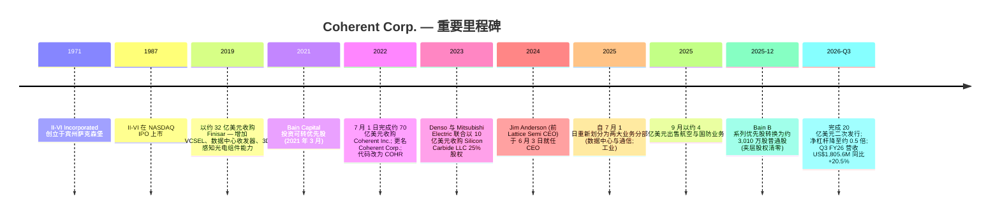
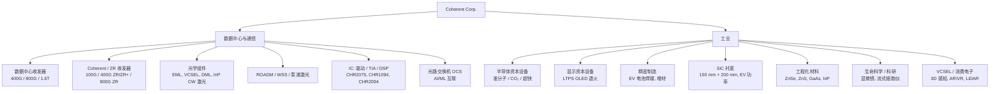
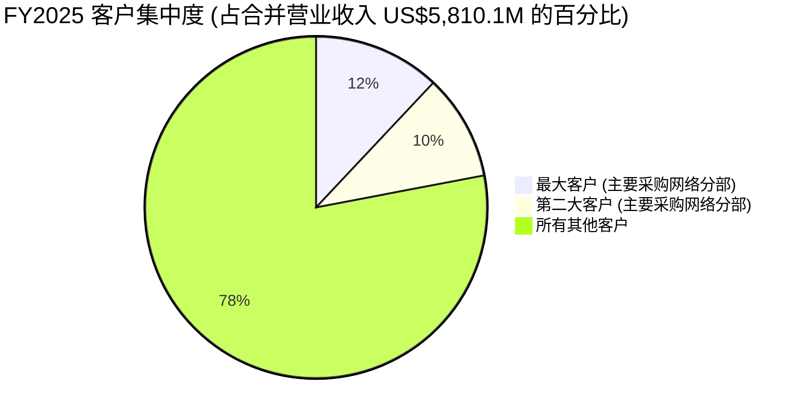
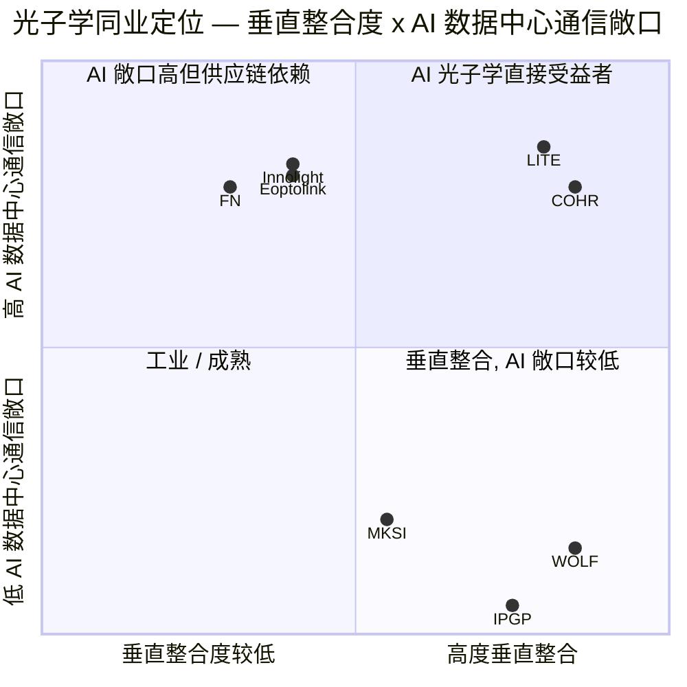

# Coherent Corp. (NYSE:COHR) — 公司研究报告

**日期 (as of):** 2026-06-16
**作者:** Equity Research, financial_agent
**覆盖状态:** 覆盖刷新 (Refresh of existing coverage)
**代码 / 交易所:** NYSE: COHR
**财年截止日:** 6 月 30 日
**报告语言: 简体中文 (英文版同时存在于本目录)**

---

## 投资摘要 (Investment Summary) — *Analyst view:*

> 本区块为本报告观点 (house view),属分析师前瞻判断,**不来自任何 SEC 备案文件**;10-K/10-Q 不含评级或目标价。

| 项目 | 数值 (*Analyst view:*) |
|---|---|
| **评级 (Rating)** | **Hold / Equal-weight (持有)** |
| **12 个月目标价 (PT, base)** | **US$345** |
| **现价 (2026-06-16)** | **US$382.81** |
| **隐含空间** | **−10%** (现价已运行至基准估值之上) |
| **牛/基/熊情景** | **US$461 / US$345 / US$272** (+20% / −10% / −29%) |
| **估值方法** | FY27E 非 GAAP EPS US$7.50 × 46× 前瞻 P/E (光子学同业区间) |
| **市值** | 约 US$749 亿 |
| **52 周区间** | US$77.84 – US$440.00 |
| **TTM P/E / 前瞻 P/E** | 181× / 47× |

**论点支柱 (Thesis pillars):**
1. **AI 数据中心光互联是结构性多年顺风** — 数据中心与通信分部 9M FY26 营收 US$3,659.6M (同比 +41%),由 800G/1.6T 收发器与 InP 激光内供驱动;LightCounting 把 datacom 市场预测上修至 2025–2028 年约 +35% CAGR (US$19bn → US$47bn)。
2. **垂直整合是真实护城河,但毛利爬升慢于同业** — Coherent 自产 InP/VCSEL 晶圆,InP 产能将于 2026 年底翻倍 (提前一季度);但仍大量外购 EML 且其价格上涨,Q3 FY26 非 GAAP 毛利率仅 39.6% (+60bps 环比),大摩明确指出"毛利爬升略慢于同业"。
3. **资产负债表已修复,Anderson 转型见效** — Bain 优先股转股 + 20 亿美元增发后,夹层股权清零、净杠杆降至约 0.5×;但 9M FY26 经营现金流仅 US$10.1M (存货前置建库 +US$689M),自由现金流本期为负。
4. **估值已充分定价,风险回报对称性差** — 现价较 2025-12 (约 US$170) 已上涨约 +125%,前瞻 P/E 47×;在 AI 资本开支或代际攀升出现任何停顿时,倍数压缩风险显著。本方目标价 US$345 与大摩 Equal-weight US$330 一致 — 均低于现价。

来源 (现价 / 倍数 / 市值): [Yahoo Finance — COHR Key Statistics, 2026-06-16](https://finance.yahoo.com/quote/COHR/key-statistics/);(财务数据): [COHR Q3 FY26 8-K, 2026-05-06](https://www.sec.gov/Archives/edgar/data/820318/000119312526208972/d57080dex991.htm);(评级 / 目标价为本报告前瞻观点,非备案数据)。

---

## 目录

1. 公司概览 (含 1A 决策层 · 1B GF Score)
2. 估值与目标价 (Valuation & Price Target) + 公司历史
3. 管理团队
4. 产品与服务
5. 客户与上市策略
6. 行业概览
7. 竞争格局
8. 市场机会 (TAM)
9. 风险评估 (含 9.5 关键分歧与催化剂)
10. 投资视角评分 (Investor Lenses)
11. 参考资料

---

## 1. 公司概览

Coherent Corp. (NYSE: COHR), 总部位于美国宾夕法尼亚州萨克森堡 (Saxonburg) 萨克森堡大道 375 号, 是一家垂直整合的光子学 (photonics) 公司, "开发、制造并销售用于通信、工业、仪表与电子市场的激光器 (laser)、收发器 (transceiver) 及其他光学与光电器件、模块和系统, 以及工程化材料 (engineered materials)" ([COHR 10-K FY2025, Item 1 Business, p. 6](https://www.sec.gov/Archives/edgar/data/820318/000082031825000014/iivi-20250630.htm))。公司是 2022 年 7 月 II-VI Incorporated (创立于 1971 年, 历史 NYSE 代码 IIVI) 与 Coherent, Inc. (老牌工业激光制造商) 合并交易的存续法人, 交易于 2022 年 7 月 1 日完成交割, 并随即更名为 Coherent Corp. ([II-VI Incorporated Completes the Acquisition of Coherent, GlobeNewswire, 2022-07-01](https://www.globenewswire.com/en/news-release/2022/07/01/2472885/11543/en/II-VI-Incorporated-Completes-the-Acquisition-of-Coherent-Forming-a-Global-Leader-in-Materials-Networking-and-Lasers.html))。

**本方观点 (BLUF):** 我们给予 COHR **Hold / Equal-weight** 评级、12 个月目标价 **US$345**。Coherent 是 AI 数据中心光互联浪潮中少数能从材料一路覆盖到成品收发器的垂直整合赢家,数据中心与通信分部以同比 +41% 复合扩张;但在股价于过去六个月上涨约 +125% 之后,前瞻 P/E 47× 已充分计入增长可持续性,而毛利爬升慢于同业、经营现金流被存货前置建库压制、客户集中度上升等因素使风险回报趋于对称。我们的目标价与现价基本持平偏下,反映"优秀公司、但当前价格已透支" 的判断。([Yahoo Finance, 2026-06-16](https://finance.yahoo.com/quote/COHR/key-statistics/);[COHR Q3 FY26 8-K, 2026-05-06](https://www.sec.gov/Archives/edgar/data/820318/000119312526208972/d57080dex991.htm))

**Coherent 销售什么。** 其产品组合贯穿"从材料到系统 (from materials to systems)"的光子学价值链 ([COHR 10-K FY2025, p. 6](https://www.sec.gov/Archives/edgar/data/820318/000082031825000014/iivi-20250630.htm))。在一端, Coherent 培育化合物半导体晶体与衬底 — 碳化硅 (SiC)、磷化铟 (InP)、砷化镓 (GaAs)、锑化镓 (GaSb)、硒化锌 (ZnSe)、硫化锌 (ZnS); 另一端则出货成品, 包括用于 AI 数据中心的 800G 与 1.6T 可插拔光收发器 (pluggable optical transceiver)、用于 OLED 显示器生产的准分子激光退火 (excimer-laser annealing) 系统、用于半导体资本设备的 CO₂ 与超快激光器, 以及精密制造用的大功率工业激光器。公司将其护城河描述得直白: "垂直整合, 制造设施和装备, 经验丰富的技术与制造员工, 以及覆盖全球的营销和分销渠道" ([COHR 10-K FY2025, Competition, p. 11](https://www.sec.gov/Archives/edgar/data/820318/000082031825000014/iivi-20250630.htm))。

**Coherent 如何盈利。** 营收绝大多数来源于产品销售 — 销往 OEM、超大规模云厂 (hyperscaler)、网络设备厂商、半导体与显示资本设备制造商以及一长串工业 / 科研 / 医疗终端用户 — 服务费及版税贡献较少。2025 财年 (截至 2025 年 6 月 30 日) 公司公布总营业收入 **US$5,810.1M**, GAAP 毛利率 **35.2%** (gross profit US$2,043.3M), GAAP 摊薄 EPS **−US$0.52** (扣除 US$129.9M 优先股股息后形成对普通股的小幅净亏损,尽管归属 Coherent 的净利润为正 US$49.4M) ([COHR FY2025 8-K, 2025-08-13, Statement of Earnings](https://www.sec.gov/Archives/edgar/data/820318/000119312525179833/d22249dex991.htm))。截至 2026 财年前九个月, 营业收入 **US$5,072.6M (同比 +18.5%)**, 税前利润 (Earnings Before Income Taxes) **US$569.2M**, 上年同期九个月为 US$157.6M — 盈利在重组与减值费用并存的情况下依然实现 3.6 倍增长 ([COHR Q3 FY26 8-K, 2026-05-06, Nine-Month Statement of Earnings](https://www.sec.gov/Archives/edgar/data/820318/000119312526208972/d57080dex991.htm))。

下图以 FY2025 全年利润表展示资金如何从三大历史分部 (Networking / Lasers / Materials) 的营收, 经销货成本、研发、销管费用、重组与减值, 最终汇入约 US$289.8M 的经营利润与 US$30.1M 的净利润 (优先股股息后归普通股为负):

<svg xmlns="http://www.w3.org/2000/svg" viewBox="0 0 1000 560" width="1000" height="560" role="img" aria-label="income statement Sankey"><rect x="0" y="0" width="1000" height="560" fill="#ffffff"/>
<text x="20.00" y="30.00" text-anchor="start" font-family="Helvetica,Arial,sans-serif" font-size="15" font-weight="700" fill="#1f2933">Coherent FY2025 利润表 Sankey (US$M)</text>
<path d="M 204.00,71.00 C 258.00,71.00 258.00,85.00 312.00,85.00 L 312.00,325.23 C 258.00,325.23 258.00,311.23 204.00,311.23 Z" fill="#93c5fd" fill-opacity="0.55"/>
<path d="M 452.00,78.00 C 506.00,78.00 506.00,196.39 560.00,196.39 L 560.00,216.74 C 506.00,216.74 506.00,98.35 452.00,98.35 Z" fill="#86efac" fill-opacity="0.55"/>
<path d="M 452.00,98.35 C 506.00,98.35 506.00,230.74 560.00,230.74 L 560.00,353.87 C 506.00,353.87 506.00,221.49 452.00,221.49 Z" fill="#fca5a5" fill-opacity="0.55"/>
<path d="M 328.00,85.00 C 382.00,85.00 382.00,78.00 436.00,78.00 L 436.00,221.49 C 382.00,221.49 382.00,228.49 328.00,228.49 Z" fill="#86efac" fill-opacity="0.55"/>
<path d="M 328.00,228.49 C 382.00,228.49 382.00,235.49 436.00,235.49 L 436.00,500.00 C 382.00,500.00 382.00,493.00 328.00,493.00 Z" fill="#fca5a5" fill-opacity="0.55"/>
<path d="M 576.00,196.39 C 630.00,196.39 630.00,203.12 684.00,203.12 L 684.00,223.48 C 630.00,223.48 630.00,216.74 576.00,216.74 Z" fill="#86efac" fill-opacity="0.55"/>
<path d="M 700.00,203.12 C 754.00,203.12 754.00,278.69 808.00,278.69 L 808.00,280.81 C 754.00,280.81 754.00,205.24 700.00,205.24 Z" fill="#86efac" fill-opacity="0.55"/>
<path d="M 700.00,205.24 C 754.00,205.24 754.00,294.81 808.00,294.81 L 808.00,299.31 C 754.00,299.31 754.00,209.74 700.00,209.74 Z" fill="#fca5a5" fill-opacity="0.55"/>
<path d="M 576.00,230.74 C 630.00,230.74 630.00,223.74 684.00,223.74 L 684.00,288.80 C 630.00,288.80 630.00,295.80 576.00,295.80 Z" fill="#fca5a5" fill-opacity="0.55"/>
<path d="M 576.00,295.80 C 630.00,295.80 630.00,302.80 684.00,302.80 L 684.00,343.66 C 630.00,343.66 630.00,336.66 576.00,336.66 Z" fill="#fca5a5" fill-opacity="0.55"/>
<path d="M 576.00,336.66 C 630.00,336.66 630.00,357.66 684.00,357.66 L 684.00,374.88 C 630.00,374.88 630.00,353.87 576.00,353.87 Z" fill="#fca5a5" fill-opacity="0.55"/>
<path d="M 204.00,325.23 C 258.00,325.23 258.00,325.23 312.00,325.23 L 312.00,426.00 C 258.00,426.00 258.00,426.00 204.00,426.00 Z" fill="#93c5fd" fill-opacity="0.55"/>
<path d="M 576.00,367.87 C 630.00,367.87 630.00,223.48 684.00,223.48 L 684.00,237.22 C 630.00,237.22 630.00,381.61 576.00,381.61 Z" fill="#93c5fd" fill-opacity="0.55"/>
<path d="M 204.00,440.00 C 258.00,440.00 258.00,426.00 312.00,426.00 L 312.00,492.99 C 258.00,492.99 258.00,507.00 204.00,507.00 Z" fill="#93c5fd" fill-opacity="0.55"/>
<rect x="188.00" y="71.00" width="16" height="240.23" rx="1.5" fill="#2563eb"/>
<rect x="188.00" y="325.23" width="16" height="100.77" rx="1.5" fill="#2563eb"/>
<rect x="188.00" y="440.00" width="16" height="66.99" rx="1.5" fill="#2563eb"/>
<rect x="312.00" y="85.00" width="16" height="408.00" rx="1.5" fill="#1e3a8a"/>
<rect x="436.00" y="78.00" width="16" height="143.49" rx="1.5" fill="#15803d"/>
<rect x="436.00" y="235.49" width="16" height="264.51" rx="1.5" fill="#dc2626"/>
<rect x="560.00" y="196.39" width="16" height="20.35" rx="1.5" fill="#15803d"/>
<rect x="560.00" y="230.74" width="16" height="123.14" rx="1.5" fill="#dc2626"/>
<rect x="560.00" y="367.87" width="16" height="13.74" rx="1.5" fill="#2563eb"/>
<rect x="684.00" y="203.12" width="16" height="6.61" rx="1.5" fill="#15803d"/>
<rect x="684.00" y="223.74" width="16" height="65.06" rx="1.5" fill="#dc2626"/>
<rect x="684.00" y="302.80" width="16" height="40.86" rx="1.5" fill="#dc2626"/>
<rect x="684.00" y="357.66" width="16" height="17.21" rx="1.5" fill="#dc2626"/>
<rect x="808.00" y="278.69" width="16" height="2.11" rx="1.5" fill="#15803d"/>
<rect x="808.00" y="294.81" width="16" height="4.50" rx="1.5" fill="#dc2626"/>
<text x="179.00" y="188.12" text-anchor="end" font-family="Helvetica,Arial,sans-serif" font-size="11.5" font-weight="700" fill="#1f2933">Networking 网络</text>
<text x="179.00" y="201.12" text-anchor="end" font-family="Helvetica,Arial,sans-serif" font-size="10" font-weight="400" fill="#52606d">US$3.4B  (58.9%)</text>
<text x="179.00" y="372.62" text-anchor="end" font-family="Helvetica,Arial,sans-serif" font-size="11.5" font-weight="700" fill="#1f2933">Lasers 激光</text>
<text x="179.00" y="385.62" text-anchor="end" font-family="Helvetica,Arial,sans-serif" font-size="10" font-weight="400" fill="#52606d">US$1.4B  (24.7%)</text>
<text x="179.00" y="470.50" text-anchor="end" font-family="Helvetica,Arial,sans-serif" font-size="11.5" font-weight="700" fill="#1f2933">Materials 材料</text>
<text x="179.00" y="483.50" text-anchor="end" font-family="Helvetica,Arial,sans-serif" font-size="10" font-weight="400" fill="#52606d">US$954.0M  (16.4%)</text>
<rect x="331.00" y="67.00" width="113.10" height="26" rx="2" fill="#ffffff" fill-opacity="0.72"/>
<text x="334.00" y="79.00" text-anchor="start" font-family="Helvetica,Arial,sans-serif" font-size="11.5" font-weight="700" fill="#1f2933">Revenue</text>
<text x="334.00" y="92.00" text-anchor="start" font-family="Helvetica,Arial,sans-serif" font-size="10" font-weight="400" fill="#52606d">US$5.8B  (100.0%)</text>
<rect x="455.00" y="60.00" width="106.80" height="26" rx="2" fill="#ffffff" fill-opacity="0.72"/>
<text x="458.00" y="72.00" text-anchor="start" font-family="Helvetica,Arial,sans-serif" font-size="11.5" font-weight="700" fill="#1f2933">Gross Profit</text>
<text x="458.00" y="85.00" text-anchor="start" font-family="Helvetica,Arial,sans-serif" font-size="10" font-weight="400" fill="#52606d">US$2.0B  (35.2%)</text>
<rect x="455.00" y="217.49" width="144.60" height="26" rx="2" fill="#ffffff" fill-opacity="0.72"/>
<text x="458.00" y="229.49" text-anchor="start" font-family="Helvetica,Arial,sans-serif" font-size="11.5" font-weight="700" fill="#1f2933">Cost of Revenue (COGS)</text>
<text x="458.00" y="242.49" text-anchor="start" font-family="Helvetica,Arial,sans-serif" font-size="10" font-weight="400" fill="#52606d">US$3.8B  (64.8%)</text>
<rect x="579.00" y="178.39" width="113.10" height="26" rx="2" fill="#ffffff" fill-opacity="0.72"/>
<text x="582.00" y="190.39" text-anchor="start" font-family="Helvetica,Arial,sans-serif" font-size="11.5" font-weight="700" fill="#1f2933">Operating Income</text>
<text x="582.00" y="203.39" text-anchor="start" font-family="Helvetica,Arial,sans-serif" font-size="10" font-weight="400" fill="#52606d">US$289.8M  (5.0%)</text>
<rect x="579.00" y="212.74" width="150.90" height="26" rx="2" fill="#ffffff" fill-opacity="0.72"/>
<text x="582.00" y="224.74" text-anchor="start" font-family="Helvetica,Arial,sans-serif" font-size="11.5" font-weight="700" fill="#1f2933">Total Operating Expense</text>
<text x="582.00" y="237.74" text-anchor="start" font-family="Helvetica,Arial,sans-serif" font-size="10" font-weight="400" fill="#52606d">US$1.8B  (30.2%)</text>
<text x="551.00" y="371.74" text-anchor="end" font-family="Helvetica,Arial,sans-serif" font-size="11.5" font-weight="700" fill="#1f2933">Net Interest / Other Income</text>
<text x="551.00" y="384.74" text-anchor="end" font-family="Helvetica,Arial,sans-serif" font-size="10" font-weight="400" fill="#52606d">US$195.7M  (3.4%)</text>
<rect x="703.00" y="185.12" width="106.80" height="26" rx="2" fill="#ffffff" fill-opacity="0.72"/>
<text x="706.00" y="197.12" text-anchor="start" font-family="Helvetica,Arial,sans-serif" font-size="11.5" font-weight="700" fill="#1f2933">Pretax Income</text>
<text x="706.00" y="210.12" text-anchor="start" font-family="Helvetica,Arial,sans-serif" font-size="10" font-weight="400" fill="#52606d">US$94.2M  (1.6%)</text>
<rect x="703.00" y="210.12" width="119.40" height="26" rx="2" fill="#ffffff" fill-opacity="0.72"/>
<text x="706.00" y="222.12" text-anchor="start" font-family="Helvetica,Arial,sans-serif" font-size="11.5" font-weight="700" fill="#1f2933">SG&amp;A</text>
<text x="706.00" y="235.12" text-anchor="start" font-family="Helvetica,Arial,sans-serif" font-size="10" font-weight="400" fill="#52606d">US$926.5M  (15.9%)</text>
<rect x="703.00" y="284.80" width="119.40" height="26" rx="2" fill="#ffffff" fill-opacity="0.72"/>
<text x="706.00" y="296.80" text-anchor="start" font-family="Helvetica,Arial,sans-serif" font-size="11.5" font-weight="700" fill="#1f2933">R&amp;D</text>
<text x="706.00" y="309.80" text-anchor="start" font-family="Helvetica,Arial,sans-serif" font-size="10" font-weight="400" fill="#52606d">US$581.9M  (10.0%)</text>
<rect x="703.00" y="339.66" width="113.10" height="26" rx="2" fill="#ffffff" fill-opacity="0.72"/>
<text x="706.00" y="351.66" text-anchor="start" font-family="Helvetica,Arial,sans-serif" font-size="11.5" font-weight="700" fill="#1f2933">Other OpEx</text>
<text x="706.00" y="364.66" text-anchor="start" font-family="Helvetica,Arial,sans-serif" font-size="10" font-weight="400" fill="#52606d">US$245.1M  (4.2%)</text>
<text x="833.00" y="276.75" text-anchor="start" font-family="Helvetica,Arial,sans-serif" font-size="11.5" font-weight="700" fill="#1f2933">Net Income</text>
<text x="833.00" y="289.75" text-anchor="start" font-family="Helvetica,Arial,sans-serif" font-size="10" font-weight="400" fill="#52606d">US$30.1M  (0.52%)</text>
<text x="833.00" y="301.75" text-anchor="start" font-family="Helvetica,Arial,sans-serif" font-size="11.5" font-weight="700" fill="#1f2933">Income Tax</text>
<text x="833.00" y="314.75" text-anchor="start" font-family="Helvetica,Arial,sans-serif" font-size="10" font-weight="400" fill="#52606d">US$64.1M  (1.1%)</text>
<text x="500.00" y="544.00" text-anchor="middle" font-family="Helvetica,Arial,sans-serif" font-size="10" font-weight="400" fill="#52606d">Source: COHR FY2025 10-K Income Statement + Note 14 Segments (FY25 3-segment) · sec.gov</text>
</svg>

来源: [COHR FY2025 8-K Income Statement, 2025-08-13](https://www.sec.gov/Archives/edgar/data/820318/000119312525179833/d22249dex991.htm) (利润表行项) + [COHR 10-K FY2025, Note 14 分部, p. 79–81](https://www.sec.gov/Archives/edgar/data/820318/000082031825000014/iivi-20250630.htm) (分部营收 Networking US$3,421M / Lasers US$1,435M / Materials US$954M)。

**Coherent 的运营布局。** 截至 2025 年 6 月 30 日, 公司在 20 多个国家共有员工约 **30,000 人** — 亚太 22,340 人、美洲 4,236 人、欧洲 3,640 人 — 在美国本土的主要生产 / 研发基地分布于加州、康州、德州、特拉华州、新泽西州、宾州; 美国境外主要在中国、芬兰、德国、马来西亚、菲律宾、新加坡、韩国、瑞典、瑞士、英国、越南运营 ([COHR 10-K FY2025, Human Capital, p. 6–7](https://www.sec.gov/Archives/edgar/data/820318/000082031825000014/iivi-20250630.htm))。2025 财年按客户总部所在地的营收结构为: 北美 US$3,564.8M (61%), 欧洲 US$698.8M (12%), 中国 US$680.1M (12%), 日本 US$390.6M (7%), 其他地区 US$475.7M (8%) ([COHR 10-K FY2025, Note 14, Geographic Revenue](https://www.sec.gov/Archives/edgar/data/820318/000082031825000014/iivi-20250630.htm))。

<svg xmlns="http://www.w3.org/2000/svg" viewBox="0 0 720 460" width="720" height="460" role="img" aria-label="revenue donut"><rect x="0" y="0" width="720" height="460" fill="#ffffff"/>
<text x="20.00" y="30.00" text-anchor="start" font-family="Helvetica,Arial,sans-serif" font-size="15" font-weight="700" fill="#1f2933">Coherent 营收结构 (按地区, FY2025)</text>
<path d="M 288.00,107.20 A 132 132 0 1 1 201.60,339.00 L 236.95,298.17 A 78 78 0 1 0 288.00,161.20 Z" fill="#2563eb"/>
<path d="M 201.60,339.00 A 132 132 0 0 1 156.98,255.23 L 210.58,248.67 A 78 78 0 0 0 236.95,298.17 Z" fill="#15803d"/>
<path d="M 156.98,255.23 A 132 132 0 0 1 181.65,161.01 L 225.16,193.00 A 78 78 0 0 0 210.58,248.67 Z" fill="#d97706"/>
<path d="M 181.65,161.01 A 132 132 0 0 1 223.05,124.29 L 249.62,171.30 A 78 78 0 0 0 225.16,193.00 Z" fill="#7c3aed"/>
<path d="M 223.05,124.29 A 132 132 0 0 1 288.00,107.20 L 288.00,161.20 A 78 78 0 0 0 249.62,171.30 Z" fill="#dc2626"/>
<text x="288.00" y="235.20" text-anchor="middle" font-family="Helvetica,Arial,sans-serif" font-size="18" font-weight="800" fill="#1f2933">COHR</text>
<text x="288.00" y="255.20" text-anchor="middle" font-family="Helvetica,Arial,sans-serif" font-size="13" font-weight="600" fill="#52606d">US$5.8B</text>
<text x="288.00" y="271.20" text-anchor="middle" font-family="Helvetica,Arial,sans-serif" font-size="10" font-weight="400" fill="#8a97a3">total</text>
<line x1="417.31" y1="287.40" x2="433.31" y2="287.40" stroke="#2563eb" stroke-width="1.4"/>
<text x="437.31" y="285.40" text-anchor="start" font-family="Helvetica,Arial,sans-serif" font-size="11" font-weight="700" fill="#1f2933">North America 北美</text>
<text x="437.31" y="299.40" text-anchor="start" font-family="Helvetica,Arial,sans-serif" font-size="10" font-weight="400" fill="#52606d">US$3.6B  (61.4%)</text>
<line x1="166.21" y1="304.09" x2="150.21" y2="304.09" stroke="#15803d" stroke-width="1.4"/>
<text x="146.21" y="302.09" text-anchor="end" font-family="Helvetica,Arial,sans-serif" font-size="11" font-weight="700" fill="#1f2933">China 中国</text>
<text x="146.21" y="316.09" text-anchor="end" font-family="Helvetica,Arial,sans-serif" font-size="10" font-weight="400" fill="#52606d">US$680.1M  (11.7%)</text>
<line x1="154.50" y1="204.25" x2="138.50" y2="204.25" stroke="#d97706" stroke-width="1.4"/>
<text x="134.50" y="202.25" text-anchor="end" font-family="Helvetica,Arial,sans-serif" font-size="11" font-weight="700" fill="#1f2933">Europe 欧洲</text>
<text x="134.50" y="216.25" text-anchor="end" font-family="Helvetica,Arial,sans-serif" font-size="10" font-weight="400" fill="#52606d">US$698.8M  (12.0%)</text>
<line x1="196.42" y1="135.97" x2="180.42" y2="135.97" stroke="#7c3aed" stroke-width="1.4"/>
<text x="176.42" y="133.97" text-anchor="end" font-family="Helvetica,Arial,sans-serif" font-size="11" font-weight="700" fill="#1f2933">Japan 日本</text>
<text x="176.42" y="147.97" text-anchor="end" font-family="Helvetica,Arial,sans-serif" font-size="10" font-weight="400" fill="#52606d">US$390.6M  (6.7%)</text>
<line x1="252.89" y1="105.74" x2="236.89" y2="105.74" stroke="#dc2626" stroke-width="1.4"/>
<text x="232.89" y="103.74" text-anchor="end" font-family="Helvetica,Arial,sans-serif" font-size="11" font-weight="700" fill="#1f2933">Rest of World 其他</text>
<text x="232.89" y="117.74" text-anchor="end" font-family="Helvetica,Arial,sans-serif" font-size="10" font-weight="400" fill="#52606d">US$475.7M  (8.2%)</text>
<text x="360.00" y="444.00" text-anchor="middle" font-family="Helvetica,Arial,sans-serif" font-size="10" font-weight="400" fill="#52606d">Source: COHR FY2025 10-K Note 14 Geographic Revenue · sec.gov</text>
</svg>

来源: [COHR FY2025 10-K Note 14 Geographic Revenue](https://www.sec.gov/Archives/edgar/data/820318/000082031825000014/iivi-20250630.htm)。

**营收 + 毛利率走势。** 合并后呈现从谷底到复苏的剧烈轨迹: FY2024 营收 US$4,707.7M (GAAP 毛利率约 30.9%), FY2025 在 AI 数据中心需求驱动下回升至 US$5,810.1M (+23.4%, 毛利率回升至 35.2%), FY2026 展望意味着再次跃升约 +20~22% 至约 US$7.05B ([COHR FY2025 8-K, 2025-08-13](https://www.sec.gov/Archives/edgar/data/820318/000119312525179833/d22249dex991.htm); [COHR Q3 FY26 8-K, Q4 指引, 2026-05-06](https://www.sec.gov/Archives/edgar/data/820318/000119312526208972/d57080dex991.htm))。下面的季度分部图最直观地呈现了这条 AI 攀升曲线 (见第 4 章)。

**规模指标。** 截至 2025 年 6 月 30 日, 全球持有专利约 **3,100 项**; 2025 财年研发投入 **US$581.9M** (占营收 10.0%); 2025 财年资本开支 (Additions to PP&E) **US$440.8M**, 而 2026 财年前九个月资本开支已上升至 **US$547.2M** (单期即超过 FY25 全年) — 公司在加速磷化铟 (InP) 与垂直腔面发射激光器 (VCSEL) 的 AI 数据中心通信产能扩张 ([COHR 10-K FY2025, p. 6 + p. 11](https://www.sec.gov/Archives/edgar/data/820318/000082031825000014/iivi-20250630.htm); [COHR Q3 FY26 8-K, Cash Flow Statement](https://www.sec.gov/Archives/edgar/data/820318/000119312526208972/d57080dex991.htm))。

### 1A. 决策层 — 估值快照 (Valuation snapshot)

截至 2026-06-16 收盘, COHR 报价 **US$382.81**, 对应市值约 **US$749 亿** ([Yahoo Finance, COHR Key Statistics, 2026-06-16](https://finance.yahoo.com/quote/COHR/key-statistics/))。过去十二个月与前瞻倍数如下:

| 指标 (Yahoo Finance, 2026-06-16) | COHR | LITE | FN | MKSI | IPGP |
|---|---|---|---|---|---|
| 股价 (US$) | 382.81 | 875.36 | 588.03 | 366.31 | 115.28 |
| 市值 (US$ 十亿) | 74.9 | 68.1 | 21.1 | 24.7 | 4.9 |
| TTM 市盈率 (P/E) | 181× | 155× | 51× | 77× | 170× |
| 前瞻市盈率 | 47× | 48× | 34× | 25× | 50× |
| TTM 市销率 (P/S) | 11.3× | 27.4× | 5.0× | 6.1× | 4.7× |

来源: [Yahoo Finance 个股汇总页, 2026-06-16](https://finance.yahoo.com/quote/COHR/) (每个代码各自查询: [COHR](https://finance.yahoo.com/quote/COHR/key-statistics/) · [LITE](https://finance.yahoo.com/quote/LITE/key-statistics/) · [FN](https://finance.yahoo.com/quote/FN/key-statistics/) · [MKSI](https://finance.yahoo.com/quote/MKSI/key-statistics/) · [IPGP](https://finance.yahoo.com/quote/IPGP/key-statistics/))。

**解读。** COHR 的 **TTM 市盈率高达 181 倍**, 主要由 GAAP EPS 仍被收购无形资产摊销、重组 (9M FY26 US$57.3M)、减值 (9M FY26 US$20.1M) 压低, 部分由航空与国防业务出售形成 US$124.1M 收益所对冲; **GAAP 九个月 EPS US$2.92 尚不能代表正常化运行率盈利** ([COHR Q3 FY26 8-K, 9M Statement of Earnings, 2026-05-06](https://www.sec.gov/Archives/edgar/data/820318/000119312526208972/d57080dex991.htm))。更具参考意义的是 **前瞻市盈率 47 倍**, 与光学系统 / 光子学同业群体一致 (LITE 48×, FN 34×, IPGP 50×), 显著高于更广泛的半导体资本设备 / 仪器仪表群体 (MKSI 25×)。**TTM 市销率 11.3 倍**大致是 MKSI / IPGP / FN 群体的两倍, 但**不及** Lumentum (LITE) 的一半 — 后者凭借作为磷化铟 (InP) / EML (电吸收调制激光器) 纯供应商身份切入英伟达光通信路线图, 估值显著上修。COHR 的估值溢价最好理解为"**高增长光子学行业溢价, 但若 AI 光通信攀升节奏停顿, 仍存在显著倍数压缩风险**" — 详见第 9 章。三年期倍数区间惊人: COHR 的 TTM 市销率从 2023 年年中的约 1.4 倍 (彼时股价跌破 30 美元, 因 II-VI 合并整合疑虑) 扩张至今天的 11.3 倍, 而股价从 2025 年 12 月的约 US$170 涨至现在的 US$382.81 ([Morgan Stanley — Coherent Corp Executing to Plan, 2026-05-07, p.1, 报告日收盘 US$344.67](http://xs-macbook-air.local:5001/zsxq/pdf/212458815448451/MS-Coherent%20Corp%20Executing%20to%20Plan-260507.pdf))。

### 1B. GF Score (GuruFocus 式) 基本面评分卡 — *Analyst view:*

> GF Score 为本报告自有评分框架 (GuruFocus 式),**不归属 GuruFocus**,各维度评分**不附带备案引用**;每个底层指标在下方各自给出来源。

<svg xmlns="http://www.w3.org/2000/svg" viewBox="0 0 500 500" width="500" height="500" role="img" aria-label="GF Score radar">
<rect x="0" y="0" width="500" height="500" fill="#ffffff"/>
<text x="20" y="24" font-family="Helvetica,Arial,sans-serif" font-size="15" font-weight="700" fill="#1f2933">GF Score (GuruFocus-style): 65/100</text>
<text x="20" y="41" font-family="Helvetica,Arial,sans-serif" font-size="11" fill="#52606d">51–70 Poor future performance potential</text>
<polygon points="250.0,88.0 392.7,191.6 338.2,359.4 161.8,359.4 107.3,191.6" fill="#e9f5ec" stroke="none"/>
<polygon points="250.0,208.0 278.5,228.7 267.6,262.3 232.4,262.3 221.5,228.7" fill="none" stroke="#c5d3cb" stroke-width="1"/>
<polygon points="250.0,178.0 307.1,219.5 285.3,286.5 214.7,286.5 192.9,219.5" fill="none" stroke="#c5d3cb" stroke-width="1"/>
<polygon points="250.0,148.0 335.6,210.2 302.9,310.8 197.1,310.8 164.4,210.2" fill="none" stroke="#c5d3cb" stroke-width="1"/>
<polygon points="250.0,118.0 364.1,200.9 320.5,335.1 179.5,335.1 135.9,200.9" fill="none" stroke="#c5d3cb" stroke-width="1"/>
<polygon points="250.0,88.0 392.7,191.6 338.2,359.4 161.8,359.4 107.3,191.6" fill="none" stroke="#c5d3cb" stroke-width="1.3"/>
<line x1="250" y1="238" x2="161.8" y2="359.4" stroke="#cfdad3" stroke-width="1"/>
<text x="146.5" y="392.4" text-anchor="end" font-family="Helvetica,Arial,sans-serif" font-size="11.5" font-weight="600" fill="#1f2933">财务实力</text>
<text x="197.1" y="304.8" text-anchor="middle" font-family="Helvetica,Arial,sans-serif" font-size="10.5" font-weight="700" fill="#1f2933">6</text>
<line x1="250" y1="238" x2="250.0" y2="88.0" stroke="#cfdad3" stroke-width="1"/>
<text x="250.0" y="58.0" text-anchor="middle" font-family="Helvetica,Arial,sans-serif" font-size="11.5" font-weight="600" fill="#1f2933">盈利能力</text>
<text x="250.0" y="157.0" text-anchor="middle" font-family="Helvetica,Arial,sans-serif" font-size="10.5" font-weight="700" fill="#1f2933">5</text>
<line x1="250" y1="238" x2="107.3" y2="191.6" stroke="#cfdad3" stroke-width="1"/>
<text x="82.6" y="183.6" text-anchor="end" font-family="Helvetica,Arial,sans-serif" font-size="11.5" font-weight="600" fill="#1f2933">成长性</text>
<text x="121.6" y="190.3" text-anchor="middle" font-family="Helvetica,Arial,sans-serif" font-size="10.5" font-weight="700" fill="#1f2933">9</text>
<line x1="250" y1="238" x2="392.7" y2="191.6" stroke="#cfdad3" stroke-width="1"/>
<text x="417.4" y="183.6" text-anchor="start" font-family="Helvetica,Arial,sans-serif" font-size="11.5" font-weight="600" fill="#1f2933">估值</text>
<text x="292.8" y="218.1" text-anchor="middle" font-family="Helvetica,Arial,sans-serif" font-size="10.5" font-weight="700" fill="#1f2933">3</text>
<line x1="250" y1="238" x2="338.2" y2="359.4" stroke="#cfdad3" stroke-width="1"/>
<text x="353.5" y="392.4" text-anchor="start" font-family="Helvetica,Arial,sans-serif" font-size="11.5" font-weight="600" fill="#1f2933">动量</text>
<text x="329.4" y="341.2" text-anchor="middle" font-family="Helvetica,Arial,sans-serif" font-size="10.5" font-weight="700" fill="#1f2933">9</text>
<polygon points="250.0,163.0 292.8,224.1 329.4,347.2 197.1,310.8 121.6,196.3" fill="#2e8b57" fill-opacity="0.34" stroke="#2e8b57" stroke-width="2"/>
<circle cx="197.1" cy="310.8" r="2.6" fill="#2e8b57"/>
<circle cx="250.0" cy="163.0" r="2.6" fill="#2e8b57"/>
<circle cx="121.6" cy="196.3" r="2.6" fill="#2e8b57"/>
<circle cx="292.8" cy="224.1" r="2.6" fill="#2e8b57"/>
<circle cx="329.4" cy="347.2" r="2.6" fill="#2e8b57"/>
<text x="250" y="470" text-anchor="middle" font-family="Helvetica,Arial,sans-serif" font-size="9.5" fill="#52606d">Source: COHR FY25 10-K · Q3 FY26 10-Q · Yahoo Finance, as of 2026-06-16</text>
<text x="250" y="485" text-anchor="middle" font-family="Helvetica,Arial,sans-serif" font-size="9" fill="#52606d">GF Score = independent analyst rubric (*Analyst view:*) — not GuruFocus™ official number</text>
</svg>

**综合 GF Score = 65 / 100 (51–70 区间)** — 一个"成长与动量极强、但估值与盈利质量拖累"的典型高增长周期股画像 (*Analyst view:*)。各维度评分理由:

- **Financial Strength (财务实力) = 6/10。** 资产负债表已显著修复: 2026-03-31 现金 US$1,592.7M + 短期投资 US$825.0M (合计 US$2,417.7M) vs 总债务 US$3,193.8M (流动 US$9.0M + 长期 US$3,184.8M), 净债务约 US$0.78B; 夹层股权 (Bain 优先股) 已从 FY25 的 US$2,483.3M 清零至 US$0 ([COHR Q3 FY26 8-K Balance Sheet, 2026-03-31](https://www.sec.gov/Archives/edgar/data/820318/000119312526208972/d57080dex991.htm))。扣分项: 9M FY26 利息支出仍达 US$149.2M, 且债务挂钩 SOFR。
- **Profitability (盈利能力) = 5/10。** TTM ROE 约 5.7% (TTM 归属 Coherent 净利润约 US$468.9M ÷ 平均权益 US$8,160.8M), GAAP 经营利润率约 11% — 正在快速扩张但仍低于纯软件 / FPGA 同业的水平; ROIC 仍低于 WACC ([COHR Q3 FY26 8-K + FY2025 8-K, 自算 TTM](https://www.sec.gov/Archives/edgar/data/820318/000119312526208972/d57080dex991.htm))。
- **Growth (成长性) = 9/10。** FY25 营收 +23.4%, FY26E 约 +20~22%; 数据中心与通信分部 9M FY26 同比 +41%; 非 GAAP EPS 从 FY25 约 US$3.34 跃升至 FY26E 约 US$5.4–5.6 ([COHR Q3 FY26 8-K, 分部表 + Q4 指引, 2026-05-06](https://www.sec.gov/Archives/edgar/data/820318/000119312526208972/d57080dex991.htm))。
- **GF Value (估值, 越高越便宜) = 3/10。** 前瞻 P/E 47×、TTM P/S 11.3× 相对大盘与多数同业偏贵; 仅相对 Lumentum (P/S 27×) 显得"便宜"。增长可持续性已被充分定价 ([Yahoo Finance, 2026-06-16](https://finance.yahoo.com/quote/COHR/key-statistics/))。
- **Momentum (动量) = 9/10。** 股价从 2025-12 约 US$170 涨至 2026-06-16 的 US$382.81 (六个月约 +125%), 52 周区间 US$77.84–US$440.00, 远高于 200 日均线 ([Yahoo Finance, 2026-06-16](https://finance.yahoo.com/quote/COHR/key-statistics/); [Morgan Stanley, 2026-05-07, 报告日 US$344.67](http://xs-macbook-air.local:5001/zsxq/pdf/212458815448451/MS-Coherent%20Corp%20Executing%20to%20Plan-260507.pdf))。

GF Score 与本报告其余部分一致: Growth ↔ 1A 前瞻模型, GF Value ↔ 1A 倍数与 PT 下行空间, Momentum ↔ 投资摘要的相对表现线 — 五个维度共同支撑"成长强但估值已透支" 的 Hold 结论。

---

## 2. 估值与目标价 (Valuation & Price Target) + 公司历史

### 2A. 前瞻财务模型 (Forward estimates) — *Analyst view:*

> 下表每一个预测单元格均为本报告前瞻观点 (*Analyst view:*),**不来自任何备案**;各驱动因素的外部依据在表下逐一引用。

| 财年 (6 月止) | 营收 (US$bn) | YoY | 非 GAAP 毛利率 | 非 GAAP 经营利润率 | 非 GAAP EPS (US$) |
|---|---|---|---|---|---|
| FY2025 (实际) | 5.81 | +23% | ~38% | ~14% | ~3.34 |
| FY2026E | 7.05 | +21% | ~39.5% | ~16% | ~5.50 |
| FY2027E | 8.55 | +21% | ~42% | ~19% | ~7.50 |
| FY2028E | 10.20 | +19% | ~44% | ~21% | ~10.00 |

模型驱动与外部依据 (每格 *Analyst view:*):
- **FY2026E 营收 US$7.05bn** = 9M FY26 实际 US$5,072.6M + Q4 FY26 指引中点 US$1,980M (指引区间 US$1,910–2,050M) ([COHR Q3 FY26 8-K, Business Outlook, 2026-05-06](https://www.sec.gov/Archives/edgar/data/820318/000119312526208972/d57080dex991.htm))。非 GAAP EPS FY26E US$5.50 落在公司隐含的全年 US$5.38–5.58 区间内 (9M 实际 + Q4 指引 US$1.52–1.72)。
- **FY2027E/FY2028E 营收** 假设数据中心与通信分部维持约 +25% 增长 (受 800G→1.6T→3.2T 代际攀升与每 XPU 光附着率上升驱动 — LightCounting 估 datacom 市场 2025–2028 约 +35% CAGR), 工业分部低个位数复苏; 与大摩 FY27e/FY28e 营收路径方向一致 ([J.P. Morgan — C1Q26 Optical Market Update, 2026-05-17, datacom +35% CAGR](http://xs-macbook-air.local:5001/zsxq/pdf/184124811851242/JPM-Hardware%20%26%20Networking%20C1Q26%20Optical%20Market%20Update.pdf))。
- **毛利率轨迹 39.5% → 44%** 由 InP/VCSEL 自产爬产替代外购激光、规模效应、与产品组合向高速收发器倾斜共同驱动 (毛利桥的核心是减少外购 EML 占比); 大摩指出这一爬升"略慢于同业", 故我们采用相对保守的斜率 ([Morgan Stanley — Coherent Corp Executing to Plan, 2026-05-07](http://xs-macbook-air.local:5001/zsxq/pdf/212458815448451/MS-Coherent%20Corp%20Executing%20to%20Plan-260507.pdf))。

### 2B. 目标价推导 (PT derivation) — *Analyst view:*

**方法: 前瞻 P/E × 目标倍数。** 我们以 **FY2027E 非 GAAP EPS US$7.50 × 46× 前瞻 P/E = US$345** 作为 12 个月基准目标价。

**为什么用 46×?** 光子学 / 光学同业当前前瞻 P/E 区间为 LITE 48×、IPGP 50×、FN 34×、MKSI 25× ([Yahoo Finance, 2026-06-16](https://finance.yahoo.com/quote/COHR/key-statistics/))。COHR 的成长性 (营收约 +21% CAGR, EPS 从亏损快速转正) 高于 FN/MKSI, 但毛利爬升慢于 LITE, 故我们给予略低于 LITE/IPGP、显著高于 MKSI 的 46×。这一倍数也大体对应 COHR 自身当前的 47× 前瞻 P/E — 即我们不假设倍数扩张, 只让 EPS 增长 (FY26E US$5.50 → FY27E US$7.50) 推动价格。

**三档情景 (各 *Analyst view:*):**

| 情景 | 关键假设 | EPS × 倍数 | 目标价 | 相对现价 |
|---|---|---|---|---|
| **牛 (Bull)** | 1.6T 加速、InP 自产更快摊薄外购、毛利率上修至 ~45%; FY28E EPS US$11.00 × 42× | US$11.00 × 42× | **US$461** | **+20%** |
| **基 (Base)** | 数据中心与通信约 +25% 复合、毛利温和扩张; FY27E EPS US$7.50 × 46× | US$7.50 × 46× | **US$345** | **−10%** |
| **熊 (Bear)** | AI 资本开支正常化 / CPO 提前侵蚀可插拔 TAM / EML 价格战; FY28E EPS US$8.50 × 32× | US$8.50 × 32× | **US$272** | **−29%** |

风险回报偏对称偏下: 现价 US$382.81 已位于基准 US$345 之上, 牛市上行 +20% 对熊市下行 −29%, 隐含市场已把基准以上的乐观情景计入价格。这正是我们给 **Hold / Equal-weight** 的核心理由。

### 2C. 与市场一致预期的对比 + 卖方观点演变 (Sell-side view evolution)

我们的 FY27E 非 GAAP EPS US$7.50 与大摩 FY27e 介于其 ModelWare US$7.20 与 consensus-method US$8.14 之间, 处于市场区间中段偏下 ([Morgan Stanley — Coherent Corp Executing to Plan, 2026-05-07, EPS 表](http://xs-macbook-air.local:5001/zsxq/pdf/212458815448451/MS-Coherent%20Corp%20Executing%20to%20Plan-260507.pdf))。本报告基准目标价 US$345 高于大摩 US$330 约 +5%, 但同样**低于现价** — 即卖方与本方都认为股价已运行至目标之上。

**按机构的观点时间线 (大摩, 唯一在本地库有完整 PT 序列的机构):**

| 日期 | 机构 | 评级 | 目标价 | 报告日收盘 | 触发 / 论点 |
|---|---|---|---|---|---|
| 2025-12-17 | Morgan Stanley | (未评级行) | US$180 | US$170.44 | 2026 展望: AI 驱动光学 scale-across; 1.6T 部署 ([MS 2026 Outlook: Network Effect](http://xs-macbook-air.local:5001/zsxq/pdf/184518488454142/Morgan%20Stanley-2026%20Outlook.pdf)) |
| 2026-02-23 | Morgan Stanley | (未评级行) | US$250 | US$248.89 | 光学市场机会扩大; 800G/1.6T ([MS Telecom & Networking](http://xs-macbook-air.local:5001/zsxq/pdf/184458212214412/MS-Telecom%20%26%20Networking%20Into%20the%20Spotlight.pdf)) |
| 2026-04-21 | Morgan Stanley | Equal-weight | US$290 | n/a | InP 供应链优势; 首选排序 COHR>GLW>LITE>CIEN (250→290) ([MS Optical: Latest Questions](http://xs-macbook-air.local:5001/zsxq/pdf/585582824244844/Morgan%20Stanley-Optical%20Latest%20Questions%20From%20Investors.pdf)) |
| 2026-05-07 | Morgan Stanley | Equal-weight | US$330 | US$344.67 | Q3 FY26 按计划推进; InP 产能年底翻倍提前一季度; 毛利爬升略慢于同业 (290→330) ([MS Coherent Corp Executing to Plan](http://xs-macbook-air.local:5001/zsxq/pdf/212458815448451/MS-Coherent%20Corp%20Executing%20to%20Plan-260507.pdf)) |

*分析师观点：* 大摩在六个月内把目标价从 US$180 一路上修至 US$330 (+83%), 但每次上修都**追随而非领先股价** — 到 2026-05-07 时 US$330 的目标价已低于当日 US$344.67 收盘, 评级维持 Equal-weight。这一"目标价被股价跑赢" 的模式本身就是估值已充分的信号。

**跨机构分歧 (机构间分歧)** — 卖方对 COHR 的方向高度一致 (看多基本面), 分歧在于"现价是否还有空间":

| 机构 | 日期 | 立场 | 核心论点 | 什么证据能证明其正确 |
|---|---|---|---|---|
| Morgan Stanley | 2026-05-07 / 06-12 | Equal-weight, 逢回调买入 | 基本面强但短期已涨多 (L3M +50%+); 回调进入两位数才是买点 | 股价回调 10%+ 后基本面 (InP 翻倍、毛利续升) 兑现 |
| J.P. Morgan | 2026-05-17 / 06-13 | 看多 COHR/FN/LITE | LightCounting 上修 datacom 至 +35% CAGR; 每 XPU 光附着率升至 ~4.0× | 1.6T/800G 出货与附着率持续兑现, CPO 推迟 |
| Nomura | 2026-05-09 | 中性偏多 (行业追踪) | LITE 与 COHR 业绩读数正面; OCS 成 AI 网络核心 | OCS 与 1.6T 放量节奏 |

*分析师观点：* 我们的 Hold 与大摩 Equal-weight 最接近 — 认同 JPM/Nomura 的基本面多头逻辑, 但在 47× 前瞻 P/E、现价已超基准目标价的位置上, 不认为这是新建仓的价位。

### 2D. 公司历史

Coherent Corp. 是数十年间将晶体生长、化合物半导体、光电器件以及工业激光多家公司刻意整合为统一光子学平台的产物。法人主体 **1971 年** 由 Carl Johnson 与 James Hawkey 在宾夕法尼亚州萨克森堡以 II-VI Incorporated 的名义创立 — 公司名"II-VI"指元素周期表 II 族和 VI 族 (碲化镉、硒化锌、硫化锌), 是其首条产品线 — 用于大功率 CO₂ 工业激光器的光学元件原材料 ([History of II-VI Incorporated, FundingUniverse](https://www.fundinguniverse.com/company-histories/ii-vi-incorporated-history/); [Coherent Corp. — Wikipedia](https://en.wikipedia.org/wiki/II-VI_Incorporated))。II-VI 在 1973 年扭亏为盈, 1987 年在 NASDAQ 完成 IPO。

来源: [COHR 10-K FY2025, p. 6](https://www.sec.gov/Archives/edgar/data/820318/000082031825000014/iivi-20250630.htm); [II-VI / Coherent Inc. 合并完成, GlobeNewswire 2022-07-01](https://www.globenewswire.com/en/news-release/2022/07/01/2472885/11543/en/II-VI-Incorporated-Completes-the-Acquisition-of-Coherent-Forming-a-Global-Leader-in-Materials-Networking-and-Lasers.html); [Coherent appoints Jim Anderson as CEO, GlobeNewswire 2024-06-03](https://www.globenewswire.com/news-release/2024/06/03/2892226/11543/en/coherent-appoints-jim-anderson-as-chief-executive-officer.html); [COHR Q3 FY26 8-K, 2026-05-06](https://www.sec.gov/Archives/edgar/data/820318/000119312526208972/d57080dex991.htm)。

**三大战略转折定义了今日 Coherent。** **(1) 从 CO₂ 光学到垂直整合的全栈光子学平台 (1987–2019)** — 三十年间多次并购, 其中分量最重的是 **2019 年约 32 亿美元的 Finisar 交易** — II-VI 沿光通信栈的每一层都建立起能力: 晶体生长 (SiC、InP、GaAs、ZnSe)、VCSEL 与 EML 激光二极管制造、收发器设计与组装。**(2) 约 70 亿美元收购 Coherent 与企业更名 (2021–2022)** — 交易于 2022 年 7 月 1 日完成, 融资结构包括约 40 亿美元高级担保贷款与 Bain 系列优先股; 合并后公司保留更具辨识度的 Coherent 品牌, 重新挂牌代码 COHR ([COHR 10-K FY2025, Note 7 Debt, p. 66](https://www.sec.gov/Archives/edgar/data/820318/000082031825000014/iivi-20250630.htm))。**(3) 新 CEO 路线: 聚焦、简化、降杠杆 (2024 年中起)** — Anderson 启动了刻意的简化节奏: 从三个报告分部重组为两个 (数据中心与通信 + 工业)、剥离航空与国防 (约 4 亿美元)、提取并转换 Bain B 系列优先股 (消除夹层股权悬挂、新增约 3,010 万股)、执行 20 亿美元二次股权发行偿债。总债务从合并完成时的约 53 亿美元降至 **2026 年 3 月 31 日的 US$3,193.8M** — 对照现金 US$1,592.7M + 短期投资 US$825.0M, 净杠杆首次实质性进入低于 1.0 倍区间 ([COHR Q3 FY26 8-K Balance Sheet, 2026-03-31](https://www.sec.gov/Archives/edgar/data/820318/000119312526208972/d57080dex991.htm))。

---

## 3. 管理团队

### James R. ("Jim") Anderson — 首席执行官兼董事 (自 2024-06-03 起)

Jim Anderson, 任命时 52 岁, 于 **2024 年 6 月 3 日** 出任 CEO 并加入董事会, 接替临时 CEO 兼前 CEO Vincent D. ("Chuck") Mattera, Jr. — 后者在带领 II-VI / Coherent 走过整合阶段后退休 ([Coherent Appoints Jim Anderson as Chief Executive Officer, GlobeNewswire, 2024-06-03](https://www.globenewswire.com/news-release/2024/06/03/2892226/11543/en/coherent-appoints-jim-anderson-as-chief-executive-officer.html))。Anderson 直接来自 **Lattice Semiconductor (NASDAQ: LSCC)**, 自 2018 年 9 月至 2024 年 6 月任总裁兼 CEO。在他大约六年的 Lattice 任期内, 股价从约 6 美元复合上涨至峰值超过 90 美元, 营收大致翻倍, 毛利率从 50% 后段扩张至 70% 中段, 经营利润率创历史纪录 — 这一先例如今被广泛引用为 COHR 董事会聘任他来复制的策略剧本 ([Coherent Appoints Jim Anderson, GlobeNewswire, 2024-06-03](https://www.globenewswire.com/news-release/2024/06/03/2892226/11543/en/coherent-appoints-jim-anderson-as-chief-executive-officer.html); [COHR 10-K FY2025, Executive Officers, p. 13](https://www.sec.gov/Archives/edgar/data/820318/000082031825000014/iivi-20250630.htm))。

加入 Lattice 之前, Anderson 在 **Advanced Micro Devices (AMD)** Lisa Su 团队下任 **计算与图形业务集团高级副总裁兼总经理** (期间他在 AMD Zen 翻身阶段直接负责 GPU 与客户端计算 P&L)。更早的职位包括在 **Intel、Broadcom (前 Avago)、LSI Corporation** 任管理、工程、销售、市场及企业战略相关岗位 — 累计超过 25 年的半导体设计、制造、销售与运营经验。Anderson 拥有 **MIT** MBA 及 EECS 硕士学位、**Purdue** EE 硕士学位、**University of Minnesota** EE 学士学位 ([COHR 10-K FY2025, p. 13](https://www.sec.gov/Archives/edgar/data/820318/000082031825000014/iivi-20250630.htm))。

在其 2026 财年 Q3 业绩讲话中, Anderson 简明定调: *"随着 AI 数据中心基础设施持续规模化, 我们正在快速扩张产能以满足需求。凭借我们光子学技术组合的广度与制造规模, 我们相信 Coherent 处于独特优势位置, 以把握这一多年增长机遇"* ([COHR Q3 FY26 8-K, Earnings Press Release, 2026-05-06](https://www.sec.gov/Archives/edgar/data/820318/000119312526208972/d57080dex991.htm))。

### Sherri Luther — 首席财务官 (自 2024-09 起)

Sherri Luther, 现 60 岁, 于 **2024 年 9 月** 出任 Coherent CFO, 比 Anderson 晚三个月。这一配对并非巧合: Luther 自 2019 至 2024 年在 Anderson 麾下担任 Lattice Semiconductor CFO。Lattice 之前, Luther 在 **Coherent, Inc.** (COHR 2022 年收购的老牌激光系统公司) 工作了 16 年, 最近期任公司财务副总裁 — 这意味着她对当前 Coherent Corp. 大约一半业务具备制度化历史认知。她是注册会计师 (CPA), 拥有 **斯坦福商学院 (Stanford GSB)** 高管 MBA 学位 ([COHR 10-K FY2025, p. 14](https://www.sec.gov/Archives/edgar/data/820318/000082031825000014/iivi-20250630.htm))。在 Q3 FY26 业绩讲话中, Luther 阐明运营聚焦: *"显著的营收增长叠加毛利率扩张" 驱动了业绩, 鉴于对持续旺盛需求的强劲可见度, 公司正集中提升资本投入扩产* ([COHR Q3 FY26 8-K, Earnings Press Release, 2026-05-06](https://www.sec.gov/Archives/edgar/data/820318/000119312526208972/d57080dex991.htm))。

### 公司治理与股权

**董事会构成。** Coherent 董事会由独立董事 **Enrico DiGirolamo** 担任主席; 绝大多数董事为独立董事 (Anderson 是唯一管理层董事) ([COHR DEF 14A 2025](https://www.sec.gov/Archives/edgar/data/820318/000110465925096170/0001104659-25-096170-index.htm))。**内部人与大股东持股。** 根据最新 DEF 14A (记录日为 2025 年 8 月 31 日), **Bain Capital Investors, LLC** 实益持有 **28,111,651 股 = 17.9%** — 该时点尚在 Bain B 系列优先股 (2025 年 12 月转换) 之前; 转换后新增约 3,010 万股普通股, 仍使 Bain 保持公司最大股东 ([COHR DEF 14A 2025, Beneficial Ownership](https://www.sec.gov/Archives/edgar/data/820318/000110465925096170/0001104659-25-096170-index.htm); [COHR Q3 FY26 8-K, 2026-05-06 — 摊薄股数 196.4M Q3](https://www.sec.gov/Archives/edgar/data/820318/000119312526208972/d57080dex991.htm))。

**管理层履历综合判断。** Anderson / Luther 二人组在 Lattice 留下了清晰可见的路线图 — 聚焦组合、简化组织、提升毛利率、降杠杆, 让运营利润率扩张带动估值倍数扩张。他们在到任 Coherent 后约 22 个月内已大致复制了同一序列。差距在于经营利润率的收敛: Q3 FY26 GAAP 经营利润率约 11% 对比 Lattice 鼎盛时的 20% 中后段 — 这一差距既解释了多头看好 (从这里有运营杠杆) 也解释了风险 (化合物半导体材料 + 收发器 + 工业激光的混合业务组合是否能匹敌纯粹 FPGA + 软件 IP 业务的利润率水平) ([COHR Q3 FY26 8-K, 2026-05-06](https://www.sec.gov/Archives/edgar/data/820318/000119312526208972/d57080dex991.htm))。

---

## 4. 产品与服务

Coherent 的产品范围对单一公司而言异常之广, 涵盖材料 (用于生长激光与衬底的实质晶体), 光电器件 (激光、探测器、IC), 一直到集成子系统 (可插拔收发器、生产线激光系统)。垂直整合即护城河。下方产品组合按 Coherent 新 (FY2026) 两大分部结构分组: **数据中心与通信** 和 **工业**。

来源: 产品树映射自 [COHR 10-K FY2025, Reporting Segments and Business Units, pp. 8–11](https://www.sec.gov/Archives/edgar/data/820318/000082031825000014/iivi-20250630.htm) 与 [coherent.com 产品导航](https://www.coherent.com/products)。

### 资金流图谱 — 钱怎么流向 Coherent

下面这张"跟着钱走"的供应链资金流图把 AI 光互联的需求侧 (超大规模厂、网络设备商) 与 Coherent 自身的成本沉淀 (自有 InP/VCSEL 晶圆厂、外购激光、资本开支、SiC 合资) 连接起来 — 这是利润表 Sankey 无法呈现的"成本落到哪里" 视角:

<svg xmlns="http://www.w3.org/2000/svg" viewBox="0 0 1180 1092" width="1180" height="1092" role="img" aria-label="钱怎么流向 Coherent — AI 光通信需求 → 垂直整合产能" font-family="'Space Grotesk',system-ui,-apple-system,'Segoe UI',sans-serif">
<defs><linearGradient id="mfgold" gradientUnits="userSpaceOnUse" x1="0" y1="0" x2="1180" y2="0"><stop offset="0" stop-color="#f6dc97"/><stop offset="0.5" stop-color="#e9b658"/><stop offset="1" stop-color="#cf8f2c"/></linearGradient><radialGradient id="mfpool" cx="50%" cy="50%" r="50%"><stop offset="0" stop-color="#34d399" stop-opacity="0.16"/><stop offset="1" stop-color="#34d399" stop-opacity="0"/></radialGradient></defs>
<rect x="0" y="0" width="1180" height="1092" rx="16" fill="#0b0f1a"/>
<text x="42.00" y="56.00" text-anchor="start" font-family="'JetBrains Mono',ui-monospace,Menlo,monospace" font-size="11.5" font-weight="600" fill="#e9b658" letter-spacing="3">PHOTONICS MONEY FLOW · FY2026</text>
<text x="42.00" y="100.00" text-anchor="start" font-family="'Space Grotesk',system-ui,-apple-system,'Segoe UI',sans-serif" font-size="32" font-weight="700" fill="#e8ecf5">钱怎么流向 Coherent — AI 光通信需求 → 垂直整合产能</text>
<text x="42.00" y="142.00" text-anchor="start" font-family="'Space Grotesk',system-ui,-apple-system,'Segoe UI',sans-serif" font-size="15" font-weight="400" fill="#8a93a8">AI 数据中心的光互联支出由超大规模厂与网络设备商付费,经收发器/激光器汇入 Coherent;再向上,大部分成本沉淀在 Coherent 自有的 InP/VCSEL 晶圆厂与少数外购激光、衬底与代工环节。</text>
<ellipse cx="1031.00" cy="428.00" rx="190" ry="150" fill="url(#mfpool)"/>
<line x1="369.50" y1="188.00" x2="369.50" y2="664.00" stroke="#222a3a" stroke-dasharray="2 8"/>
<line x1="810.50" y1="188.00" x2="810.50" y2="664.00" stroke="#222a3a" stroke-dasharray="2 8"/>
<text x="42.00" y="172.00" text-anchor="start" font-family="'JetBrains Mono',ui-monospace,Menlo,monospace" font-size="12" font-weight="400" fill="#e9b658" letter-spacing="3">STAGE 01</text>
<text x="42.00" y="188.00" text-anchor="start" font-family="'JetBrains Mono',ui-monospace,Menlo,monospace" font-size="11.5" font-weight="400" fill="#646d82">谁付费 (需求)</text>
<text x="483.00" y="172.00" text-anchor="start" font-family="'JetBrains Mono',ui-monospace,Menlo,monospace" font-size="12" font-weight="400" fill="#e9b658" letter-spacing="3">STAGE 02</text>
<text x="483.00" y="188.00" text-anchor="start" font-family="'JetBrains Mono',ui-monospace,Menlo,monospace" font-size="11.5" font-weight="400" fill="#646d82">买什么 (产品)</text>
<text x="924.00" y="172.00" text-anchor="start" font-family="'JetBrains Mono',ui-monospace,Menlo,monospace" font-size="12" font-weight="400" fill="#e9b658" letter-spacing="3">STAGE 03</text>
<text x="924.00" y="188.00" text-anchor="start" font-family="'JetBrains Mono',ui-monospace,Menlo,monospace" font-size="11.5" font-weight="400" fill="#646d82">钱沉淀在哪 (产能/供应)</text>
<path d="M 256.00 309.50 C 369.50 309.50, 369.50 278.68, 483.00 278.68" fill="none" stroke="url(#mfgold)" stroke-width="24.00" stroke-linecap="round" opacity="0.9"/>
<path d="M 256.00 439.73 C 369.50 439.73, 369.50 300.50, 483.00 300.50" fill="none" stroke="url(#mfgold)" stroke-width="19.64" stroke-linecap="round" opacity="0.9"/>
<path d="M 256.00 324.00 C 369.50 324.00, 369.50 483.00, 483.00 483.00" fill="none" stroke="url(#mfgold)" stroke-width="5.00" stroke-linecap="round" opacity="0.9"/>
<path d="M 256.00 452.82 C 369.50 452.82, 369.50 390.00, 483.00 390.00" fill="none" stroke="url(#mfgold)" stroke-width="6.55" stroke-linecap="round" opacity="0.9"/>
<path d="M 256.00 559.00 C 369.50 559.00, 369.50 576.00, 483.00 576.00" fill="none" stroke="url(#mfgold)" stroke-width="10.91" stroke-linecap="round" opacity="0.9"/>
<path d="M 697.00 278.68 C 810.50 278.68, 810.50 260.27, 924.00 260.27" fill="none" stroke="url(#mfgold)" stroke-width="21.82" stroke-linecap="round" opacity="0.78" stroke-dasharray="0.1 11"/>
<path d="M 697.00 293.95 C 810.50 293.95, 810.50 391.00, 924.00 391.00" fill="none" stroke="url(#mfgold)" stroke-width="8.73" stroke-linecap="round" opacity="0.78" stroke-dasharray="0.1 11"/>
<path d="M 697.00 390.00 C 810.50 390.00, 810.50 273.91, 924.00 273.91" fill="none" stroke="url(#mfgold)" stroke-width="5.45" stroke-linecap="round" opacity="0.78" stroke-dasharray="0.1 11"/>
<path d="M 697.00 483.00 C 810.50 483.00, 810.50 503.95, 924.00 503.95" fill="none" stroke="url(#mfgold)" stroke-width="5.00" stroke-linecap="round" opacity="0.78" stroke-dasharray="0.1 11"/>
<path d="M 697.00 303.77 C 810.50 303.77, 810.50 496.00, 924.00 496.00" fill="none" stroke="url(#mfgold)" stroke-width="10.91" stroke-linecap="round" opacity="0.78" stroke-dasharray="0.1 11"/>
<path d="M 697.00 578.50 C 810.50 578.50, 810.50 611.00, 924.00 611.00" fill="none" stroke="url(#mfgold)" stroke-width="6.55" stroke-linecap="round" opacity="0.78" stroke-dasharray="0.1 11"/>
<path d="M 697.00 572.73 C 810.50 572.73, 810.50 508.95, 924.00 508.95" fill="none" stroke="url(#mfgold)" stroke-width="5.00" stroke-linecap="round" opacity="0.78" stroke-dasharray="0.1 11"/>
<text x="369.50" y="288.09" text-anchor="middle" font-family="'JetBrains Mono',ui-monospace,Menlo,monospace" font-size="11.5" font-weight="400" fill="#f4d58a" paint-order="stroke" stroke="#0b0f1a" stroke-width="3.2" stroke-linejoin="round">AI 光互联支出</text>
<text x="369.50" y="561.50" text-anchor="middle" font-family="'JetBrains Mono',ui-monospace,Menlo,monospace" font-size="11.5" font-weight="400" fill="#f4d58a" paint-order="stroke" stroke="#0b0f1a" stroke-width="3.2" stroke-linejoin="round">$1,413M 工业 9M FY26</text>
<text x="810.50" y="263.48" text-anchor="middle" font-family="'JetBrains Mono',ui-monospace,Menlo,monospace" font-size="11.5" font-weight="400" fill="#f4d58a" paint-order="stroke" stroke="#0b0f1a" stroke-width="3.2" stroke-linejoin="round">激光内供</text>
<text x="810.50" y="588.75" text-anchor="middle" font-family="'JetBrains Mono',ui-monospace,Menlo,monospace" font-size="11.5" font-weight="400" fill="#f4d58a" paint-order="stroke" stroke="#0b0f1a" stroke-width="3.2" stroke-linejoin="round">SiC 扩产</text>
<rect x="42.00" y="252.00" width="214" height="120.00" rx="12" fill="#15101a" stroke="#f2655f" stroke-opacity="0.5"/>
<rect x="42.00" y="252.00" width="3" height="120.00" rx="2" fill="#f2655f"/>
<text x="60.00" y="285.00" text-anchor="start" font-family="'Space Grotesk',system-ui,-apple-system,'Segoe UI',sans-serif" font-size="14" font-weight="700" fill="#ffffff">超大规模厂 / Hyperscalers</text>
<text x="60.00" y="306.00" text-anchor="start" font-family="'JetBrains Mono',ui-monospace,Menlo,monospace" font-size="11" font-weight="400" fill="#c98c87">Microsoft / Google / Meta / AWS / Oracle</text>
<text x="60.00" y="323.00" text-anchor="start" font-family="'JetBrains Mono',ui-monospace,Menlo,monospace" font-size="11" font-weight="400" fill="#c98c87">直接 + 经 NEM 间接采购</text>
<rect x="42.00" y="388.00" width="214" height="110.00" rx="12" fill="#0f1622" stroke="#7fa8f5" stroke-opacity="0.5"/>
<rect x="42.00" y="388.00" width="3" height="110.00" rx="2" fill="#7fa8f5"/>
<text x="60.00" y="421.00" text-anchor="start" font-family="'Space Grotesk',system-ui,-apple-system,'Segoe UI',sans-serif" font-size="17" font-weight="700" fill="#ffffff">网络设备商 / NEMs</text>
<text x="60.00" y="442.00" text-anchor="start" font-family="'JetBrains Mono',ui-monospace,Menlo,monospace" font-size="11" font-weight="400" fill="#8ca6d6">NVIDIA Mellanox / Cisco / Arista</text>
<text x="60.00" y="459.00" text-anchor="start" font-family="'JetBrains Mono',ui-monospace,Menlo,monospace" font-size="11" font-weight="400" fill="#8ca6d6">为 AI 集群集成光模块</text>
<rect x="42.00" y="514.00" width="214" height="90.00" rx="12" fill="#141a2a" stroke="#e9b658" stroke-opacity="0.5"/>
<rect x="42.00" y="514.00" width="3" height="90.00" rx="2" fill="#e9b658"/>
<text x="60.00" y="547.00" text-anchor="start" font-family="'Space Grotesk',system-ui,-apple-system,'Segoe UI',sans-serif" font-size="17" font-weight="700" fill="#ffffff">工业 / 显示 / 汽车</text>
<text x="60.00" y="568.00" text-anchor="start" font-family="'JetBrains Mono',ui-monospace,Menlo,monospace" font-size="11" font-weight="400" fill="#8a93a8">半导体/显示设备 OEM, EV Tier-1</text>
<rect x="483.00" y="241.50" width="214" height="94.00" rx="12" fill="#141a2a" stroke="#56c6e6" stroke-opacity="0.5"/>
<rect x="483.00" y="241.50" width="3" height="94.00" rx="2" fill="#56c6e6"/>
<text x="501.00" y="274.50" text-anchor="start" font-family="'Space Grotesk',system-ui,-apple-system,'Segoe UI',sans-serif" font-size="21" font-weight="700" fill="#ffffff">数据中心收发器</text>
<text x="501.00" y="295.50" text-anchor="start" font-family="'JetBrains Mono',ui-monospace,Menlo,monospace" font-size="11" font-weight="400" fill="#8a93a8">800G / 1.6T (EML/VCSEL/硅光)</text>
<text x="501.00" y="312.50" text-anchor="start" font-family="'JetBrains Mono',ui-monospace,Menlo,monospace" font-size="11" font-weight="400" fill="#8a93a8">占增量营收 80%+</text>
<rect x="483.00" y="351.50" width="214" height="77.00" rx="12" fill="#0f1622" stroke="#7fa8f5" stroke-opacity="0.5"/>
<rect x="483.00" y="351.50" width="3" height="77.00" rx="2" fill="#7fa8f5"/>
<text x="501.00" y="384.50" text-anchor="start" font-family="'Space Grotesk',system-ui,-apple-system,'Segoe UI',sans-serif" font-size="17" font-weight="700" fill="#ffffff">Coherent / ZR 模块</text>
<text x="501.00" y="405.50" text-anchor="start" font-family="'JetBrains Mono',ui-monospace,Menlo,monospace" font-size="11" font-weight="400" fill="#9bb3df">100G/400G/800G ZR 长距 DCI</text>
<rect x="483.00" y="444.50" width="214" height="77.00" rx="12" fill="#0f1622" stroke="#7fa8f5" stroke-opacity="0.5"/>
<rect x="483.00" y="444.50" width="3" height="77.00" rx="2" fill="#7fa8f5"/>
<text x="501.00" y="477.50" text-anchor="start" font-family="'Space Grotesk',system-ui,-apple-system,'Segoe UI',sans-serif" font-size="17" font-weight="700" fill="#ffffff">光路交换机 OCS</text>
<text x="501.00" y="498.50" text-anchor="start" font-family="'JetBrains Mono',ui-monospace,Menlo,monospace" font-size="11" font-weight="400" fill="#9bb3df">AI/ML 全光网络结构</text>
<rect x="483.00" y="537.50" width="214" height="77.00" rx="12" fill="#141a2a" stroke="#d9a05b" stroke-opacity="0.5"/>
<rect x="483.00" y="537.50" width="3" height="77.00" rx="2" fill="#d9a05b"/>
<text x="501.00" y="570.50" text-anchor="start" font-family="'Space Grotesk',system-ui,-apple-system,'Segoe UI',sans-serif" font-size="17" font-weight="700" fill="#ffffff">工业/显示激光 + SiC</text>
<text x="501.00" y="591.50" text-anchor="start" font-family="'JetBrains Mono',ui-monospace,Menlo,monospace" font-size="11" font-weight="400" fill="#bcae98">准分子/超快/CO₂; SiC 衬底</text>
<rect x="924.00" y="198.00" width="214" height="130.00" rx="12" fill="#15101a" stroke="#f2655f" stroke-opacity="0.5"/>
<rect x="924.00" y="198.00" width="3" height="130.00" rx="2" fill="#f2655f"/>
<text x="942.00" y="231.00" text-anchor="start" font-family="'Space Grotesk',system-ui,-apple-system,'Segoe UI',sans-serif" font-size="17" font-weight="700" fill="#ffffff">自有 InP/VCSEL 晶圆厂</text>
<text x="942.00" y="252.00" text-anchor="start" font-family="'JetBrains Mono',ui-monospace,Menlo,monospace" font-size="11" font-weight="400" fill="#d49b96">德州 Sherman 6英寸 InP</text>
<text x="942.00" y="269.00" text-anchor="start" font-family="'JetBrains Mono',ui-monospace,Menlo,monospace" font-size="11" font-weight="400" fill="#d49b96">InP 产能 2026 年底翻倍(提前一季度)</text>
<text x="942.00" y="286.00" text-anchor="start" font-family="'JetBrains Mono',ui-monospace,Menlo,monospace" font-size="11" font-weight="400" fill="#d49b96">护城河 — 资本密集</text>
<rect x="924.00" y="344.00" width="214" height="94.00" rx="12" fill="#141a2a" stroke="#e9b658" stroke-opacity="0.5"/>
<rect x="924.00" y="344.00" width="3" height="94.00" rx="2" fill="#e9b658"/>
<text x="942.00" y="377.00" text-anchor="start" font-family="'Space Grotesk',system-ui,-apple-system,'Segoe UI',sans-serif" font-size="17" font-weight="700" fill="#ffffff">外购激光 / 芯片</text>
<text x="942.00" y="398.00" text-anchor="start" font-family="'JetBrains Mono',ui-monospace,Menlo,monospace" font-size="11" font-weight="400" fill="#8a93a8">EML 价格上涨, 摊薄毛利</text>
<text x="942.00" y="415.00" text-anchor="start" font-family="'JetBrains Mono',ui-monospace,Menlo,monospace" font-size="11" font-weight="400" fill="#8a93a8">随自产爬产逐步替代</text>
<rect x="924.00" y="454.00" width="214" height="94.00" rx="12" fill="#15101a" stroke="#f2655f" stroke-opacity="0.5"/>
<rect x="924.00" y="454.00" width="3" height="94.00" rx="2" fill="#f2655f"/>
<text x="942.00" y="487.00" text-anchor="start" font-family="'Space Grotesk',system-ui,-apple-system,'Segoe UI',sans-serif" font-size="17" font-weight="700" fill="#ffffff">资本开支 / 折旧</text>
<text x="942.00" y="508.00" text-anchor="start" font-family="'JetBrains Mono',ui-monospace,Menlo,monospace" font-size="11" font-weight="400" fill="#d49b96">9M FY26 capex $547M</text>
<text x="942.00" y="525.00" text-anchor="start" font-family="'JetBrains Mono',ui-monospace,Menlo,monospace" font-size="11" font-weight="400" fill="#d49b96">营收占比 ~11%</text>
<rect x="924.00" y="564.00" width="214" height="94.00" rx="12" fill="#101d1a" stroke="#34d399" stroke-opacity="0.5"/>
<rect x="924.00" y="564.00" width="3" height="94.00" rx="2" fill="#34d399"/>
<text x="942.00" y="597.00" text-anchor="start" font-family="'Space Grotesk',system-ui,-apple-system,'Segoe UI',sans-serif" font-size="17" font-weight="700" fill="#ffffff">Denso + 三菱电机</text>
<text x="942.00" y="618.00" text-anchor="start" font-family="'JetBrains Mono',ui-monospace,Menlo,monospace" font-size="11" font-weight="400" fill="#7fd9bf">合计 $10亿 入股 SiC LLC</text>
<text x="942.00" y="635.00" text-anchor="start" font-family="'JetBrains Mono',ui-monospace,Menlo,monospace" font-size="11" font-weight="400" fill="#7fd9bf">为 SiC 扩产轻资本融资</text>
<rect x="42.00" y="684.00" width="26" height="4" rx="2" fill="#e9b658"/>
<text x="78.00" y="688.00" text-anchor="start" font-family="'JetBrains Mono',ui-monospace,Menlo,monospace" font-size="11.5" font-weight="400" fill="#8a93a8">money paid directly</text>
<circle cx="242.80" cy="686.00" r="2" fill="#e9b658"/>
<circle cx="249.80" cy="686.00" r="2" fill="#e9b658"/>
<circle cx="256.80" cy="686.00" r="2" fill="#e9b658"/>
<circle cx="263.80" cy="686.00" r="2" fill="#e9b658"/>
<text x="276.80" y="688.00" text-anchor="start" font-family="'JetBrains Mono',ui-monospace,Menlo,monospace" font-size="11.5" font-weight="400" fill="#8a93a8">money embedded in a finished chip</text>
<text x="538.40" y="688.00" text-anchor="start" font-family="'JetBrains Mono',ui-monospace,Menlo,monospace" font-size="11.5" font-weight="400" fill="#8a93a8">thickness ≈ rough scale</text>
<rect x="728.00" y="679.00" width="11" height="11" rx="3" fill="#56c6e6"/>
<text x="747.00" y="688.00" text-anchor="start" font-family="'JetBrains Mono',ui-monospace,Menlo,monospace" font-size="11.5" font-weight="400" fill="#8a93a8">compute</text>
<rect x="821.40" y="679.00" width="11" height="11" rx="3" fill="#7fa8f5"/>
<text x="840.40" y="688.00" text-anchor="start" font-family="'JetBrains Mono',ui-monospace,Menlo,monospace" font-size="11.5" font-weight="400" fill="#8a93a8">custom modules</text>
<rect x="965.20" y="679.00" width="11" height="11" rx="3" fill="#d9a05b"/>
<text x="984.20" y="688.00" text-anchor="start" font-family="'JetBrains Mono',ui-monospace,Menlo,monospace" font-size="11.5" font-weight="400" fill="#8a93a8">power / analog</text>
<rect x="42.00" y="699.00" width="11" height="11" rx="3" fill="#f2655f"/>
<text x="61.00" y="708.00" text-anchor="start" font-family="'JetBrains Mono',ui-monospace,Menlo,monospace" font-size="11.5" font-weight="400" fill="#8a93a8">in-house silicon</text>
<rect x="200.20" y="699.00" width="11" height="11" rx="3" fill="#e9b658"/>
<text x="219.20" y="708.00" text-anchor="start" font-family="'JetBrains Mono',ui-monospace,Menlo,monospace" font-size="11.5" font-weight="400" fill="#8a93a8">supplier</text>
<rect x="300.80" y="699.00" width="11" height="11" rx="3" fill="#f2655f"/>
<text x="319.80" y="708.00" text-anchor="start" font-family="'JetBrains Mono',ui-monospace,Menlo,monospace" font-size="11.5" font-weight="400" fill="#8a93a8">in-house silicon</text>
<rect x="459.00" y="699.00" width="11" height="11" rx="3" fill="#34d399"/>
<text x="478.00" y="708.00" text-anchor="start" font-family="'JetBrains Mono',ui-monospace,Menlo,monospace" font-size="11.5" font-weight="400" fill="#8a93a8">foundry</text>
<line x1="42" y1="724.00" x2="1138" y2="724.00" stroke="#222a3a"/>
<text x="42.00" y="740.00" text-anchor="start" font-family="'JetBrains Mono',ui-monospace,Menlo,monospace" font-size="12" font-weight="500" fill="#8a93a8" letter-spacing="3">FOLLOW THE MONEY — 跟着钱走</text>
<rect x="42.00" y="760.00" width="356.00" height="132.00" rx="13" fill="#0e1320" stroke="#56c6e6" stroke-opacity="0.28"/>
<rect x="42.00" y="760.00" width="3" height="132.00" rx="2" fill="#56c6e6"/>
<text x="58.00" y="784.00" text-anchor="start" font-family="'JetBrains Mono',ui-monospace,Menlo,monospace" font-size="10" font-weight="600" fill="#56c6e6" letter-spacing="1">需求 · AI 光互联</text>
<text x="58.00" y="802.00" text-anchor="start" font-family="'Space Grotesk',system-ui,-apple-system,'Segoe UI',sans-serif" font-size="15.5" font-weight="700" fill="#ffffff">收发器是引擎</text>
<text x="58.00" y="826.00" font-family="'Space Grotesk',system-ui,-apple-system,'Segoe UI',sans-serif" font-size="12" xml:space="preserve"><tspan fill="#9aa3b8" font-weight="400">数据中心与通信分部</tspan><tspan fill="#9aa3b8" font-weight="400"> 9M</tspan><tspan fill="#9aa3b8" font-weight="400"> FY26</tspan><tspan fill="#9aa3b8" font-weight="400"> 营收</tspan><tspan fill="#f4d58a" font-weight="700"> $3,659.6M</tspan><tspan fill="#9aa3b8" font-weight="400"> ,同比</tspan><tspan fill="#f4d58a" font-weight="700"> +41%</tspan><tspan fill="#9aa3b8" font-weight="400"> ,占增量营收</tspan><tspan fill="#f4d58a" font-weight="700"> 80%+</tspan></text>
<text x="58.00" y="842.00" font-family="'Space Grotesk',system-ui,-apple-system,'Segoe UI',sans-serif" font-size="12" xml:space="preserve"><tspan fill="#9aa3b8" font-weight="400">。每代</tspan><tspan fill="#9aa3b8" font-weight="400"> GPU</tspan><tspan fill="#9aa3b8" font-weight="400"> 把每</tspan><tspan fill="#9aa3b8" font-weight="400"> XPU</tspan><tspan fill="#9aa3b8" font-weight="400"> 光收发器附着率从</tspan><tspan fill="#9aa3b8" font-weight="400"> 2023</tspan><tspan fill="#9aa3b8" font-weight="400"> 年</tspan><tspan fill="#f4d58a" font-weight="700"> 2.5×</tspan><tspan fill="#9aa3b8" font-weight="400"> 推升至</tspan><tspan fill="#9aa3b8" font-weight="400"> 2025</tspan><tspan fill="#9aa3b8" font-weight="400"> 年近</tspan><tspan fill="#f4d58a" font-weight="700"> 4.0×</tspan></text>
<text x="58.00" y="858.00" font-family="'Space Grotesk',system-ui,-apple-system,'Segoe UI',sans-serif" font-size="12" xml:space="preserve"><tspan fill="#9aa3b8" font-weight="400">(LightCounting/JPM)。</tspan></text>
<rect x="412.00" y="760.00" width="356.00" height="132.00" rx="13" fill="#0e1320" stroke="#f2655f" stroke-opacity="0.28"/>
<rect x="412.00" y="760.00" width="3" height="132.00" rx="2" fill="#f2655f"/>
<text x="428.00" y="784.00" text-anchor="start" font-family="'JetBrains Mono',ui-monospace,Menlo,monospace" font-size="10" font-weight="600" fill="#f2655f" letter-spacing="1">护城河 · 垂直整合</text>
<text x="428.00" y="802.00" text-anchor="start" font-family="'Space Grotesk',system-ui,-apple-system,'Segoe UI',sans-serif" font-size="15.5" font-weight="700" fill="#ffffff">自有 InP 晶圆厂</text>
<text x="428.00" y="826.00" font-family="'Space Grotesk',system-ui,-apple-system,'Segoe UI',sans-serif" font-size="12" xml:space="preserve"><tspan fill="#9aa3b8" font-weight="400">德州</tspan><tspan fill="#9aa3b8" font-weight="400"> Sherman</tspan><tspan fill="#f4d58a" font-weight="700"> 6英寸</tspan><tspan fill="#f4d58a" font-weight="700"> InP</tspan><tspan fill="#9aa3b8" font-weight="400"> 线驱动单位成本下降;管理层称</tspan><tspan fill="#9aa3b8" font-weight="400"> InP</tspan><tspan fill="#9aa3b8" font-weight="400"> 产能将在</tspan><tspan fill="#f4d58a" font-weight="700"> 2026</tspan><tspan fill="#f4d58a" font-weight="700"> 年底翻倍</tspan></text>
<text x="428.00" y="842.00" font-family="'Space Grotesk',system-ui,-apple-system,'Segoe UI',sans-serif" font-size="12" xml:space="preserve"><tspan fill="#9aa3b8" font-weight="400">,比原计划提前一个季度。只有</tspan><tspan fill="#f4d58a" font-weight="700"> Lumentum</tspan><tspan fill="#9aa3b8" font-weight="400"> 接近同等</tspan><tspan fill="#9aa3b8" font-weight="400"> InP</tspan><tspan fill="#9aa3b8" font-weight="400"> 量产规模。</tspan></text>
<rect x="782.00" y="760.00" width="356.00" height="132.00" rx="13" fill="#0e1320" stroke="#e9b658" stroke-opacity="0.28"/>
<rect x="782.00" y="760.00" width="3" height="132.00" rx="2" fill="#e9b658"/>
<text x="798.00" y="784.00" text-anchor="start" font-family="'JetBrains Mono',ui-monospace,Menlo,monospace" font-size="10" font-weight="600" fill="#e9b658" letter-spacing="1">毛利逆风 · 外购</text>
<text x="798.00" y="802.00" text-anchor="start" font-family="'Space Grotesk',system-ui,-apple-system,'Segoe UI',sans-serif" font-size="15.5" font-weight="700" fill="#ffffff">外购 EML 摊薄毛利</text>
<text x="798.00" y="826.00" font-family="'Space Grotesk',system-ui,-apple-system,'Segoe UI',sans-serif" font-size="12" xml:space="preserve"><tspan fill="#9aa3b8" font-weight="400">公司仍大量外购激光,而</tspan><tspan fill="#f4d58a" font-weight="700"> EML</tspan><tspan fill="#f4d58a" font-weight="700"> 价格上涨</tspan><tspan fill="#9aa3b8" font-weight="400"> 明显;非</tspan><tspan fill="#9aa3b8" font-weight="400"> GAAP</tspan><tspan fill="#9aa3b8" font-weight="400"> 毛利率</tspan><tspan fill="#9aa3b8" font-weight="400"> Q3</tspan><tspan fill="#9aa3b8" font-weight="400"> FY26</tspan><tspan fill="#f4d58a" font-weight="700"> 39.6%</tspan><tspan fill="#9aa3b8" font-weight="400"> 仅</tspan></text>
<text x="798.00" y="842.00" font-family="'Space Grotesk',system-ui,-apple-system,'Segoe UI',sans-serif" font-size="12" xml:space="preserve"><tspan fill="#9aa3b8" font-weight="400">+60bps</tspan><tspan fill="#9aa3b8" font-weight="400"> 环比</tspan><tspan fill="#9aa3b8" font-weight="400"> —</tspan><tspan fill="#9aa3b8" font-weight="400"> 大摩指其毛利爬升&quot;略慢于同业&quot;。自产爬产是关键变量。</tspan></text>
<rect x="42.00" y="906.00" width="356.00" height="132.00" rx="13" fill="#0e1320" stroke="#d9a05b" stroke-opacity="0.28"/>
<rect x="42.00" y="906.00" width="3" height="132.00" rx="2" fill="#d9a05b"/>
<text x="58.00" y="930.00" text-anchor="start" font-family="'JetBrains Mono',ui-monospace,Menlo,monospace" font-size="10" font-weight="600" fill="#d9a05b" letter-spacing="1">资本开支 · 产能前置</text>
<text x="58.00" y="948.00" text-anchor="start" font-family="'Space Grotesk',system-ui,-apple-system,'Segoe UI',sans-serif" font-size="15.5" font-weight="700" fill="#ffffff">Capex 占营收 ~11%</text>
<text x="58.00" y="972.00" font-family="'Space Grotesk',system-ui,-apple-system,'Segoe UI',sans-serif" font-size="12" xml:space="preserve"><tspan fill="#9aa3b8" font-weight="400">9M</tspan><tspan fill="#9aa3b8" font-weight="400"> FY26</tspan><tspan fill="#9aa3b8" font-weight="400"> 资本开支</tspan><tspan fill="#f4d58a" font-weight="700"> $547M</tspan><tspan fill="#9aa3b8" font-weight="400"> ,已超</tspan><tspan fill="#9aa3b8" font-weight="400"> FY25</tspan><tspan fill="#9aa3b8" font-weight="400"> 全年</tspan><tspan fill="#f4d58a" font-weight="700"> $441M</tspan><tspan fill="#9aa3b8" font-weight="400"> ;经营现金流仅</tspan><tspan fill="#f4d58a" font-weight="700"> $10M</tspan></text>
<text x="58.00" y="988.00" font-family="'Space Grotesk',system-ui,-apple-system,'Segoe UI',sans-serif" font-size="12" xml:space="preserve"><tspan fill="#9aa3b8" font-weight="400">(存货前置建库</tspan><tspan fill="#f4d58a" font-weight="700"> +$689M</tspan><tspan fill="#9aa3b8" font-weight="400"> )</tspan><tspan fill="#9aa3b8" font-weight="400"> —</tspan><tspan fill="#9aa3b8" font-weight="400"> 自由现金流本期为负,是&quot;为攀升前置产能&quot;的信号。</tspan></text>
<rect x="412.00" y="906.00" width="356.00" height="132.00" rx="13" fill="#0e1320" stroke="#34d399" stroke-opacity="0.28"/>
<rect x="412.00" y="906.00" width="3" height="132.00" rx="2" fill="#34d399"/>
<text x="428.00" y="930.00" text-anchor="start" font-family="'JetBrains Mono',ui-monospace,Menlo,monospace" font-size="10" font-weight="600" fill="#34d399" letter-spacing="1">SIC · 轻资本融资</text>
<text x="428.00" y="948.00" text-anchor="start" font-family="'Space Grotesk',system-ui,-apple-system,'Segoe UI',sans-serif" font-size="15.5" font-weight="700" fill="#ffffff">Denso+三菱兜底 SiC</text>
<text x="428.00" y="972.00" font-family="'Space Grotesk',system-ui,-apple-system,'Segoe UI',sans-serif" font-size="12" xml:space="preserve"><tspan fill="#9aa3b8" font-weight="400">Denso</tspan><tspan fill="#9aa3b8" font-weight="400"> 与三菱电机各出</tspan><tspan fill="#f4d58a" font-weight="700"> $5亿</tspan><tspan fill="#9aa3b8" font-weight="400"> (合计</tspan><tspan fill="#f4d58a" font-weight="700"> $10亿</tspan><tspan fill="#9aa3b8" font-weight="400"> )</tspan><tspan fill="#9aa3b8" font-weight="400"> 入股</tspan><tspan fill="#9aa3b8" font-weight="400"> Silicon</tspan><tspan fill="#9aa3b8" font-weight="400"> Carbide</tspan></text>
<text x="428.00" y="988.00" font-family="'Space Grotesk',system-ui,-apple-system,'Segoe UI',sans-serif" font-size="12" xml:space="preserve"><tspan fill="#9aa3b8" font-weight="400">LLC,合计约</tspan><tspan fill="#f4d58a" font-weight="700"> 25%</tspan><tspan fill="#9aa3b8" font-weight="400"> 股权,Coherent</tspan><tspan fill="#9aa3b8" font-weight="400"> 保留</tspan><tspan fill="#f4d58a" font-weight="700"> ~75%</tspan><tspan fill="#9aa3b8" font-weight="400"> —</tspan><tspan fill="#9aa3b8" font-weight="400"> 既锁定下游</tspan><tspan fill="#9aa3b8" font-weight="400"> EV</tspan></text>
<text x="428.00" y="1004.00" font-family="'Space Grotesk',system-ui,-apple-system,'Segoe UI',sans-serif" font-size="12" xml:space="preserve"><tspan fill="#9aa3b8" font-weight="400">需求,又不消耗母公司现金。</tspan></text>
<rect x="782.00" y="906.00" width="356.00" height="132.00" rx="13" fill="#0e1320" stroke="#f2655f" stroke-opacity="0.28"/>
<rect x="782.00" y="906.00" width="3" height="132.00" rx="2" fill="#f2655f"/>
<text x="798.00" y="930.00" text-anchor="start" font-family="'JetBrains Mono',ui-monospace,Menlo,monospace" font-size="10" font-weight="600" fill="#f2655f" letter-spacing="1">客户集中 · 风险</text>
<text x="798.00" y="948.00" text-anchor="start" font-family="'Space Grotesk',system-ui,-apple-system,'Segoe UI',sans-serif" font-size="15.5" font-weight="700" fill="#ffffff">前两大客户 22%</text>
<text x="798.00" y="972.00" font-family="'Space Grotesk',system-ui,-apple-system,'Segoe UI',sans-serif" font-size="12" xml:space="preserve"><tspan fill="#9aa3b8" font-weight="400">FY25</tspan><tspan fill="#9aa3b8" font-weight="400"> 两位客户分别占合并营收</tspan><tspan fill="#f4d58a" font-weight="700"> 12%</tspan><tspan fill="#9aa3b8" font-weight="400"> 与</tspan><tspan fill="#f4d58a" font-weight="700"> 10%</tspan><tspan fill="#9aa3b8" font-weight="400"> (&quot;主要采购网络分部产品&quot;),合计</tspan><tspan fill="#f4d58a" font-weight="700"> 22%</tspan></text>
<text x="798.00" y="988.00" font-family="'Space Grotesk',system-ui,-apple-system,'Segoe UI',sans-serif" font-size="12" xml:space="preserve"><tspan fill="#9aa3b8" font-weight="400">且趋势上升</tspan><tspan fill="#9aa3b8" font-weight="400"> —</tspan><tspan fill="#9aa3b8" font-weight="400"> 单代失去资格认证是</tspan><tspan fill="#f4d58a" font-weight="700"> $7亿+</tspan><tspan fill="#9aa3b8" font-weight="400"> 营收事件。</tspan></text>
<text x="590.00" y="1074.00" text-anchor="middle" font-family="'JetBrains Mono',ui-monospace,Menlo,monospace" font-size="10.5" font-weight="400" fill="#646d82">Source: COHR FY2025 10-K + Q3 FY26 8-K/10-Q · JPM/MS optical notes (zsxq) · sec.gov, as of 2026-06-16</text>
</svg>

**跟着钱走 (sourced):** 需求侧, 超大规模厂 (Microsoft / Google / Meta / AWS / Oracle) 与网络设备商 (NVIDIA Mellanox / Cisco / Arista) 为 AI 集群购买 800G/1.6T 收发器, 推动数据中心与通信分部 9M FY26 营收 **US$3,659.6M (同比 +41%)** ([COHR Q3 FY26 8-K 分部表, 2026-05-06](https://www.sec.gov/Archives/edgar/data/820318/000119312526208972/d57080dex991.htm))。供给侧, 大部分成本沉淀在 Coherent 自有的 **德州 Sherman 6 英寸 InP 晶圆线** (管理层称 InP 产能将于 2026 年底翻倍、比原计划提前一季度) 与少量外购 EML 激光 (EML 价格上涨, 是 Q3 FY26 非 GAAP 毛利率仅 39.6%、+60bps 环比的关键拖累) ([Morgan Stanley — Coherent Corp Executing to Plan, 2026-05-07](http://xs-macbook-air.local:5001/zsxq/pdf/212458815448451/MS-Coherent%20Corp%20Executing%20to%20Plan-260507.pdf))。SiC 扩产由 **Denso + 三菱电机合计 10 亿美元入股 Silicon Carbide LLC** (合计约 25% 股权, Coherent 保留约 75%) 提供轻资本融资 ([COHR 10-Q Q3 FY26, Note 13](https://www.sec.gov/Archives/edgar/data/820318/000082031826000013/iivi-20260331.htm))。

### 旗舰产品及竞争优势评估

**(1) 数据中心收发器 (800G EML 基; 1.6T 爬产中)。** Coherent 的旗舰增长特许经营。800G 出货量以"400G 时代爬升速率的 2 倍" 节奏放量, 公司已内部开发出货 1.6T 收发器, 涵盖三种自主变体 (硅光、EML 基、VCSEL 基) 用于 AI/ML 互联 ([Coherent Reports Robust Q2 FY25, Futurum Group, 2025-02](https://futurumgroup.com/insights/coherent-fy-2025-reports-robust-q2-datacom-strength-margin-expansion/))。**竞争优势: 是 — 技术 + 规模护城河。** 证据: Coherent 在美国与欧洲运营多座 6 英寸 GaAs VCSEL 晶圆厂以及多座 InP 晶圆厂, 其中德州 Sherman 厂正向 6 英寸 InP 晶圆产能过渡 — 在行业规模上, 只有 Lumentum (LITE) 能匹敌 InP 产能 ([COHR 10-K FY2025, p. 9](https://www.sec.gov/Archives/edgar/data/820318/000082031825000014/iivi-20250630.htm))。*分析师观点：* 大摩在 2026-06 走访 Coherent 后写道 "需求可见度高、毛利杠杆正在积累 (Demand Visibility High, Margin Levers Building)" ([Morgan Stanley — Optical: Content Growing Regardless of Architecture, 2026-06-12](http://xs-macbook-air.local:5001/zsxq/pdf/181244515442812/Morgan%20Stanley-Optical%20Content%20Growing.pdf))。

**(2) Coherent / ZR 可插拔收发器 (100G / 400G ZR/ZR+ / 800G ZR)。** 用于长距离 DCI (数据中心互联) 与城域应用。Coherent 已扩大客户协作覆盖新的 100G ZR、400G ZR/ZR+ 与 800G ZR DCO 收发器 ([COHR Q3 FY25 8-K Press Release, 2025-05-07](https://www.sec.gov/Archives/edgar/data/820318/000119312525114882/d930395dex991.htm))。**竞争优势: 部分。** 最接近竞品: Cisco Acacia、Marvell Inphi、Lumentum、Fujitsu。

**(3) 磷化铟 (InP) 激光二极管 — EML、CW、DML。** 这是支撑每一款高速 AI 收发器的"铲子与镐子"。Coherent 的 InP 产能在 FY25 内"同比翻三倍", 德州 Sherman 厂的 6 英寸 InP 晶圆线驱动单位成本下降 ([COHR 10-K FY2025, p. 9](https://www.sec.gov/Archives/edgar/data/820318/000082031825000014/iivi-20250630.htm))。**竞争优势: 是 — 规模护城河, 资本密集度构成显著进入壁垒。** *分析师观点：* 野村在 2026-06 的报告中专门指出 InP 衬底供需在 datacom/AI 拉动下趋紧, InP 是当前最稀缺的光器件上游环节之一 ([Nomura — Wire & cable: Optical devices, InP substrate supply-demand tightens, 2026-06-12](http://xs-macbook-air.local:5001/zsxq/pdf/181245885841112/Nomura-Wire%20%26%20cable%20Optical%20devices%20InP.pdf))。

**(4) 碳化硅 (SiC) 衬底 — 150 mm 与业内首批 200 mm 半绝缘 SiC。** Coherent 是用于功率电子的 SiC 衬底的全球领导者, 同时也是 100/150/200 mm 半绝缘 SiC (用于 5G 基站的 GaN-on-SiC 射频放大器) 的市场领导者 ([COHR 10-K FY2025, pp. 9–10](https://www.sec.gov/Archives/edgar/data/820318/000082031825000014/iivi-20250630.htm))。**竞争优势: 是 — 但 FY25 终端市场逆风。** 10-K 将 Materials 分部 FY25 营收下滑归因于"汽车与碳化硅终端市场需求疲软" ([COHR 10-K FY2025, MD&A, p. 39](https://www.sec.gov/Archives/edgar/data/820318/000082031825000014/iivi-20250630.htm))。**Denso + Mitsubishi Electric 10 亿美元股权投资 Silicon Carbide LLC** 明确为 SiC 产能扩张提供资金 ([COHR 10-Q Q3 FY26, Note 13](https://www.sec.gov/Archives/edgar/data/820318/000082031826000013/iivi-20260331.htm))。

**(5) OLED 显示退火与半导体工艺用准分子激光。** Coherent 继承了 Coherent Inc. 的准分子激光业务; 服务 LTPS OLED 显示生产 (Samsung Display、BOE、LG Display) 及半导体晶圆退火 ([COHR 10-K FY2025, p. 39](https://www.sec.gov/Archives/edgar/data/820318/000082031825000014/iivi-20250630.htm))。**竞争优势: 是 — 与 Gigaphoton 形成双寡头。**

**(6) 超快激光器 (飞秒 / 皮秒光纤)。** 用于半导体资本设备、先进封装与科研。**竞争优势: 部分。** 最接近竞品: IPG Photonics (IPGP)、Trumpf、nLight、MKS。

**(7) 3D 感知用 VCSEL。** 嵌入智能手机、AR/VR 头显、车载驾驶员监控系统。10-K 明确将 FY24 电子市场下滑归因于"一家重要电子客户实施的设计变更" (业内普遍理解为 Apple 重新设计了 Face ID) ([COHR 10-K FY2025, p. 40](https://www.sec.gov/Archives/edgar/data/820318/000082031825000014/iivi-20250630.htm))。**竞争优势: 部分。**

### 旗舰产品 vs 长尾业务组合 (新两分部视图)

在 FY26 开始的新两分部框架下, 图景高度聚焦: **数据中心与通信 = 9M FY26 的 US$3,659.6M (72%)**, **工业 = US$1,413.0M (28%)** ([COHR Q3 FY26 8-K 分部表, 2026-05-06](https://www.sec.gov/Archives/edgar/data/820318/000119312526208972/d57080dex991.htm))。投资逻辑本质上就是数据中心通信分部。

<svg xmlns="http://www.w3.org/2000/svg" viewBox="0 0 720 460" width="720" height="460" role="img" aria-label="revenue donut"><rect x="0" y="0" width="720" height="460" fill="#ffffff"/>
<text x="20.00" y="30.00" text-anchor="start" font-family="Helvetica,Arial,sans-serif" font-size="15" font-weight="700" fill="#1f2933">Coherent 营收结构 (按分部, 9个月 FY26)</text>
<path d="M 288.00,107.20 A 132 132 0 1 1 158.12,262.76 L 211.25,253.12 A 78 78 0 1 0 288.00,161.20 Z" fill="#2563eb"/>
<path d="M 158.12,262.76 A 132 132 0 0 1 288.00,107.20 L 288.00,161.20 A 78 78 0 0 0 211.25,253.12 Z" fill="#15803d"/>
<text x="288.00" y="235.20" text-anchor="middle" font-family="Helvetica,Arial,sans-serif" font-size="18" font-weight="800" fill="#1f2933">COHR</text>
<text x="288.00" y="255.20" text-anchor="middle" font-family="Helvetica,Arial,sans-serif" font-size="13" font-weight="600" fill="#52606d">US$5.1B</text>
<text x="288.00" y="271.20" text-anchor="middle" font-family="Helvetica,Arial,sans-serif" font-size="10" font-weight="400" fill="#8a97a3">total</text>
<line x1="393.93" y1="327.65" x2="409.93" y2="327.65" stroke="#2563eb" stroke-width="1.4"/>
<text x="413.93" y="325.65" text-anchor="start" font-family="Helvetica,Arial,sans-serif" font-size="11" font-weight="700" fill="#1f2933">Datacenter &amp; Comms 数据中心与通信</text>
<text x="413.93" y="339.65" text-anchor="start" font-family="Helvetica,Arial,sans-serif" font-size="10" font-weight="400" fill="#52606d">US$3.7B  (72.1%)</text>
<line x1="182.07" y1="150.75" x2="166.07" y2="150.75" stroke="#15803d" stroke-width="1.4"/>
<text x="162.07" y="148.75" text-anchor="end" font-family="Helvetica,Arial,sans-serif" font-size="11" font-weight="700" fill="#1f2933">Industrial 工业</text>
<text x="162.07" y="162.75" text-anchor="end" font-family="Helvetica,Arial,sans-serif" font-size="10" font-weight="400" fill="#52606d">US$1.4B  (27.9%)</text>
<text x="360.00" y="444.00" text-anchor="middle" font-family="Helvetica,Arial,sans-serif" font-size="10" font-weight="400" fill="#52606d">Source: COHR Q3 FY26 8-K Segment Revenues (9M ended 2026-03-31) · sec.gov</text>
</svg>

来源: [COHR Q3 FY26 8-K Segment Revenues (9M ended 2026-03-31), 2026-05-06](https://www.sec.gov/Archives/edgar/data/820318/000119312526208972/d57080dex991.htm)。

### 季度分部走势 — AI 攀升过程的图谱

<svg xmlns="http://www.w3.org/2000/svg" viewBox="0 0 860 470" width="860" height="470" role="img" aria-label="historical revenue bars"><rect x="0" y="0" width="860" height="470" fill="#ffffff"/>
<text x="20.00" y="30.00" text-anchor="start" font-family="Helvetica,Arial,sans-serif" font-size="15" font-weight="700" fill="#1f2933">Coherent 季度分部营收 (US$M) — AI 数据中心攀升</text>
<rect x="20.00" y="44" width="11" height="11" rx="2" fill="#2563eb"/>
<text x="36.00" y="53.00" text-anchor="start" font-family="Helvetica,Arial,sans-serif" font-size="10.5" font-weight="400" fill="#1f2933">Datacenter &amp; Comms 数据中心与通信</text>
<rect x="221.60" y="44" width="11" height="11" rx="2" fill="#15803d"/>
<text x="237.60" y="53.00" text-anchor="start" font-family="Helvetica,Arial,sans-serif" font-size="10.5" font-weight="400" fill="#1f2933">Industrial 工业</text>
<line x1="70" y1="412.00" x2="834" y2="412.00" stroke="#eceff2" stroke-width="1"/>
<text x="64.00" y="415.00" text-anchor="end" font-family="Helvetica,Arial,sans-serif" font-size="9.5" font-weight="400" fill="#52606d">US$0</text>
<line x1="70" y1="345.20" x2="834" y2="345.20" stroke="#eceff2" stroke-width="1"/>
<text x="64.00" y="348.20" text-anchor="end" font-family="Helvetica,Arial,sans-serif" font-size="9.5" font-weight="400" fill="#52606d">US$390.0M</text>
<line x1="70" y1="278.40" x2="834" y2="278.40" stroke="#eceff2" stroke-width="1"/>
<text x="64.00" y="281.40" text-anchor="end" font-family="Helvetica,Arial,sans-serif" font-size="9.5" font-weight="400" fill="#52606d">US$780.0M</text>
<line x1="70" y1="211.60" x2="834" y2="211.60" stroke="#eceff2" stroke-width="1"/>
<text x="64.00" y="214.60" text-anchor="end" font-family="Helvetica,Arial,sans-serif" font-size="9.5" font-weight="400" fill="#52606d">US$1.2B</text>
<line x1="70" y1="144.80" x2="834" y2="144.80" stroke="#eceff2" stroke-width="1"/>
<text x="64.00" y="147.80" text-anchor="end" font-family="Helvetica,Arial,sans-serif" font-size="9.5" font-weight="400" fill="#52606d">US$1.6B</text>
<line x1="70" y1="78.00" x2="834" y2="78.00" stroke="#eceff2" stroke-width="1"/>
<text x="64.00" y="81.00" text-anchor="end" font-family="Helvetica,Arial,sans-serif" font-size="9.5" font-weight="400" fill="#52606d">US$2.0B</text>
<rect x="110.11" y="246.08" width="110.78" height="165.92" fill="#2563eb"/>
<rect x="110.11" y="155.44" width="110.78" height="90.64" fill="#15803d"/>
<text x="165.50" y="428.00" text-anchor="middle" font-family="Helvetica,Arial,sans-serif" font-size="10" font-weight="400" fill="#52606d">Q3'25</text>
<rect x="301.11" y="225.31" width="110.78" height="186.69" fill="#2563eb"/>
<rect x="301.11" y="141.14" width="110.78" height="84.17" fill="#15803d"/>
<text x="356.50" y="428.00" text-anchor="middle" font-family="Helvetica,Arial,sans-serif" font-size="10" font-weight="400" fill="#52606d">Q1'26</text>
<rect x="492.11" y="205.10" width="110.78" height="206.90" fill="#2563eb"/>
<rect x="492.11" y="123.29" width="110.78" height="81.80" fill="#15803d"/>
<text x="547.50" y="428.00" text-anchor="middle" font-family="Helvetica,Arial,sans-serif" font-size="10" font-weight="400" fill="#52606d">Q2'26</text>
<rect x="683.11" y="178.79" width="110.78" height="233.21" fill="#2563eb"/>
<rect x="683.11" y="102.74" width="110.78" height="76.05" fill="#15803d"/>
<text x="738.50" y="428.00" text-anchor="middle" font-family="Helvetica,Arial,sans-serif" font-size="10" font-weight="400" fill="#52606d">Q3'26</text>
<text x="430.00" y="454.00" text-anchor="middle" font-family="Helvetica,Arial,sans-serif" font-size="10" font-weight="400" fill="#52606d">Source: COHR 8-K segment tables Q3 FY25 / Q1-Q3 FY26; Q1 FY26 derived (9M − Q2 − Q3) · sec.gov</text>
</svg>

来源: [COHR 8-K 分部表 Q3 FY25 / Q1–Q3 FY26, 2026-05-06](https://www.sec.gov/Archives/edgar/data/820318/000119312526208972/d57080dex991.htm); Q1 FY26 (Sep'25) 推导自 9M FY26 D&C US$3,659.6M 减 Q2 US$1,208.0M 减 Q3 US$1,361.6M = US$1,090.0M, 工业同理 = US$491.4M。

数据中心与通信分部在过去四个已披露季度内从 Q3 FY25 的 US$968.7M 增至 Q3 FY26 的 US$1,361.6M (同比 +40.6%), 而工业分部从 US$529.2M 降至 US$444.0M (同比 −16.1%), 受航空与国防业务剥离和精密制造持续疲软共同压制 ([COHR Q3 FY26 8-K 分部表, 2026-05-06](https://www.sec.gov/Archives/edgar/data/820318/000119312526208972/d57080dex991.htm))。

### 路线图与近期发布 (过去 12 个月)

- **CHR2075** 用于 800G/1.6T 模块的 4 通道驱动 IC (2025 年 12 月上市); **CHR1094** TIA 与 **CHR2094** 调制器驱动芯片组用于 400G ZR/ZR+ 链路 (2025 年 11 月上市) ([Coherent Launches Advanced IC Family for 800G Optical Transceivers, StockTitan, 2025](https://www.stocktitan.net/news/COHR/coherent-unveils-a-family-of-integrated-circuits-for-next-generation-1ua4y4psdwjs.html))。
- **3.2T / 6.4T 研发示范** 差分 EML 技术, 为下一代光互联铺路 ([COHR 10-K FY2025, R&D table, p. 11](https://www.sec.gov/Archives/edgar/data/820318/000082031825000014/iivi-20250630.htm))。
- **光路交换机 (OCS) 产品族** 用于 AI/ML 与超大规模数据中心 ([COHR 10-K FY2025, R&D table, p. 11](https://www.sec.gov/Archives/edgar/data/820318/000082031825000014/iivi-20250630.htm))。
- **航空与国防业务出售** 于 2025 年 9 月 2 日完成, 总对价约 4 亿美元 ([COHR 10-Q Q3 FY26, Note 7](https://www.sec.gov/Archives/edgar/data/820318/000082031826000013/iivi-20260331.htm))。

**延伸观看 / Further viewing:**
- [光收发器与硅光工作原理 (Coherent 官方频道) — 看懂收发器在数据中心里的物理角色](https://www.youtube.com/@coherentcorp)
- [什么是 InP/EML 激光 — 为什么它是 AI 光通信的"铲子"](https://www.youtube.com/results?search_query=indium+phosphide+EML+laser+datacom)

---

## 5. 客户与上市策略

### 客户分群

在新两分部框架下, Coherent 服务四大客户类别: **超大规模数据中心运营商与 AI 计算平台** (Microsoft Azure、Google、Meta、AWS、Oracle Cloud — 直接采购收发器与 OCS, 同时通过 Cisco、Arista、NVIDIA Mellanox 间接销售); **通信服务提供商** (Tier-1 电信运营商采购 coherent 收发器、ROADM、DCI 设备); **资本设备 OEM** (Applied Materials、ASML、Lam Research、KLA 及显示设备 OEM); **工业 / 仪表 / 医疗** 长尾 ([COHR 10-K FY2025, Item 1 Business, pp. 6–11](https://www.sec.gov/Archives/edgar/data/820318/000082031825000014/iivi-20250630.htm))。

### 客户集中度 — 量化

根据 FY2025 10-K 第 14 注释: *"2025 财年内, 我们有两位主要客户分别贡献了合并营业收入的 12% 和 10%。2024 财年, 另一位主要客户贡献了合并营业收入的 10%。2023 财年, 一位主要客户贡献了合并营业收入的 10%。这些客户主要采购我们网络分部的产品"* ([COHR 10-K FY2025, Note 14, p. 82](https://www.sec.gov/Archives/edgar/data/820318/000082031825000014/iivi-20250630.htm))。即 FY25 前两大客户合计约 **22% 合并营业收入** — 属实质但非极端 (Lumentum 最大客户通常在 25–35%); 但该数字已从 FY23 的单一 10% 客户增长至 FY25 的两个客户合计约 22%, 在 AI 数据中心建设加速时大概率进一步集中。

Coherent **未公开命名** 其 10%+ 客户; 鉴于披露语言 ("主要采购网络分部产品") 结合 AI 攀升时点, 强烈暗示客户群是 NVIDIA (经 Mellanox)、Cisco 及超大规模厂的某种组合 — 但 Coherent 自身从未做出该具体识别, 我们也不会超出 10-K 语言所支撑的范围去推测。

来源: [COHR 10-K FY2025, Note 14, p. 82](https://www.sec.gov/Archives/edgar/data/820318/000082031825000014/iivi-20250630.htm)。

### 关键合作伙伴与战略投资

最具影响力的客户合作以股权投资形式正式化: **Denso Corporation** 于 2023 年 12 月以 US$5 亿收购 Silicon Carbide LLC 16,670,000 股 A 类普通单位 (约 12.5% 股权); **Mitsubishi Electric Corporation** 在同一日以 US$5 亿收购同等单位, 同样取得约 12.5% 股权, Coherent 保留约 75% ([COHR 10-Q Q3 FY26, Note 13](https://www.sec.gov/Archives/edgar/data/820318/000082031826000013/iivi-20260331.htm))。这一架构既是客户承诺 (两家都是世界最大的 SiC 功率电子客户), 也是 Coherent SiC 产能扩张的轻资本融资 — 合计 US$10 亿为 Silicon Carbide LLC 的产能建设提供资金, 而不消耗 Coherent 母公司层面的现金。

### 合同结构与销售周期考量

对于收发器与资本设备激光, 合同通常基于 **采购订单, 配合滚动 12–18 个月预测**, 而非多年期"照付不议" 承诺; 每代产品 (400G → 800G → 1.6T → 3.2T) 分别需通过资格认证 ([COHR 10-K FY2025, Sales and Marketing, p. 11](https://www.sec.gov/Archives/edgar/data/820318/000082031825000014/iivi-20250630.htm))。风险是不对称的: 每一代攀升都重新开启资格认证竞争, 但一旦在超大规模厂内部锁定了供应槽位, 鉴于重新认证的成本, 这一槽位往往跨越多代产品周期保持稳定。

---

## 6. 行业概览

### 行业定义

Coherent 经营于 **光子学 (photonics)** — 关于光的产生、检测与调控的科学与技术。它占据四大子行业: (1) 光通信组件与模块; (2) 化合物半导体衬底与外延晶圆 (SiC、InP、GaAs、GaN); (3) 工业激光系统 (准分子、CO₂、光纤、超快); (4) 生命科学、科研与消费电子用光子器件 ([COHR 10-K FY2025, Item 1 Business, pp. 6–11](https://www.sec.gov/Archives/edgar/data/820318/000082031825000014/iivi-20250630.htm))。

### 市场规模与增长 (TAM) — 最新卖方数据

光通信市场正被 AI 计算基础设施结构性重新定价。最具时效性的第三方数据来自 LightCounting (经 J.P. Morgan 引用): *分析师观点：* **datacom (数据中心) 收发器市场预计从 2025 年的 US$19bn 增长至 2028E 的 US$47bn, 约 +35% CAGR** — 较上一轮预测平均上修约 +US$9bn (主要来自 1.6T +US$5bn 与 800G +US$4bn 的上调) ([J.P. Morgan — C1Q26 Optical Market Update: Datacom Outlook Revised Higher, 2026-05-17](http://xs-macbook-air.local:5001/zsxq/pdf/184124811851242/JPM-Hardware%20%26%20Networking%20C1Q26%20Optical%20Market%20Update.pdf))。其中 **1.6T 预计以约 +200% CAGR 增至 US$21bn, 800G 以约 +26% CAGR 增至 US$21bn, 3.2T 在 2028E 开始小幅贡献, 400G 及以下衰退**。这是对原报告 TAM 数字的关键更新 — 增长动能确认且上修。

### 关键增长驱动与趋势

1. **AI 计算建设潮 + 光附着率上升**。*分析师观点：* 每 XPU 的光器件混合附着率从 2023 年的约 2.5× 升至 2025 年的近 4.0× (J.P. Morgan 基于 LightCounting), 即便单位 GPU 数量增速放缓, 每 GPU 的光含量仍在结构性上升 ([J.P. Morgan — C1Q26 Optical Market Update, 2026-05-17](http://xs-macbook-air.local:5001/zsxq/pdf/184124811851242/JPM-Hardware%20%26%20Networking%20C1Q26%20Optical%20Market%20Update.pdf))。10-K 将 FY25 网络分部增长归因于"通信市场 AI 数据中心需求强劲" ([COHR 10-K FY2025, p. 39](https://www.sec.gov/Archives/edgar/data/820318/000082031825000014/iivi-20250630.htm))。
2. **400G → 800G → 1.6T → 3.2T 节奏**。约每 2 年一代; Coherent 明确将研发资本化用于"支持 3.2T 与 6.4T 的 400G/通道组件" ([COHR 10-K FY2025, p. 11](https://www.sec.gov/Archives/edgar/data/820318/000082031825000014/iivi-20250630.htm))。
3. **共封装光学 (Co-Packaged Optics, CPO) — 行业潜在转折点**。*分析师观点：* 大摩与 JPM 的核心结论是"无论 CPO/NPO 还是可插拔, 光含量都随带宽上升" — 主流 CSP 预计 2028–2029 年才较大规模导入 CPO/NPO, CPO 到 2028 年仅约占 datacom 市场的 ~20%, 因此短期内可插拔仍是增长主体, 市场对 CPO 的担忧"过度" ([Morgan Stanley — Optical: Content Growing Regardless of Architecture, 2026-06-12](http://xs-macbook-air.local:5001/zsxq/pdf/181244515442812/Morgan%20Stanley-Optical%20Content%20Growing.pdf); [J.P. Morgan — Optical Pullback on CPO Concerns, 2026-06-13](http://xs-macbook-air.local:5001/zsxq/pdf/181244251411242/J.P.%20Morgan-Optical%20Pullback%20on%20Recent%20CPO%20Concerns.pdf))。Coherent 已通过硅光与广泛 CPO 使能技术在两端布局 ([COHR 10-K FY2025, p. 9](https://www.sec.gov/Archives/edgar/data/820318/000082031825000014/iivi-20250630.htm))。
4. **EV 渗透率与 SiC 在牵引逆变器中的应用** — 结构性多十年顺风; 短期因全球 EV 需求消化而放缓。
5. **InP 衬底供需趋紧** — *分析师观点：* 野村指 InP 衬底在 AI 拉动下供需缺口扩大, 利好自有 InP 产能的 Coherent / Lumentum ([Nomura — Optical devices, InP substrate supply-demand tightens, 2026-06-12](http://xs-macbook-air.local:5001/zsxq/pdf/181245885841112/Nomura-Wire%20%26%20cable%20Optical%20devices%20InP.pdf))。

### 行业动态 — 波特五力风格

- **市场分散度**: 光学组件中度集中 — Coherent + Lumentum 合计主导数据中心通信用的 InP 与 VCSEL 供应; 收发器组装领域, Innolight (中际旭创) 与 Eoptolink (新易盛) 占据较大份额, 但这些中国供应商反过来又从 Coherent / Lumentum 采购其 EML 与 DML ([COHR 10-K FY2025, Competition, p. 11](https://www.sec.gov/Archives/edgar/data/820318/000082031825000014/iivi-20250630.htm))。
- **供应商议价能力**: Coherent 从"独家或有限来源供应商" 采购特种材料、晶体和光学元件 — 真实但可管理 ([COHR 10-K FY2025, Sources of Supply, p. 8](https://www.sec.gov/Archives/edgar/data/820318/000082031825000014/iivi-20250630.htm))。
- **买方议价能力**: 超大规模厂和主要 NEM 是规模庞大、高度集中的买方, 但在当前供给受限的爬升阶段, 议价能力被削弱。
- **替代品**: CPO 是对可插拔收发器的主要替代风险; 对 SiC 衬底, GaN-on-Si 在某些电压档争夺份额。
- **监管**: 沉重。EAR / 商务部出口管制对化合物半导体材料 (SiC、InP、200 mm 晶圆技术在 2024–2025 年被纳入审查), 以及中国对关键材料供应链政策 — 既形成护城河也形成风险 (中国约 FY25 营业收入 12%) ([COHR 10-K FY2025, p. 12; Geographic Revenue Note 14](https://www.sec.gov/Archives/edgar/data/820318/000082031825000014/iivi-20250630.htm))。

---

## 7. 竞争格局

### 直接竞争对手

| 竞争对手 | 上市地 | 与 Coherent 重叠领域 | 差异化 |
|---|---|---|---|
| **Lumentum (LITE)** | NASDAQ | 数据中心通信收发器、EML / InP 激光、ROADM/WSS、3D 感知 VCSEL | 纯光子学; Apple 3D 感知敞口更大; 市场认知中 NVIDIA AI 光学含量更高 (P/S 27× vs COHR 11×) |
| **MKS Inc. (MKSI)** | NASDAQ | 激光 (Spectra-Physics / Newport)、光子学组件、半导体过程控制 | 偏半导体工艺 / 真空, 数据中心通信较少 |
| **IPG Photonics (IPGP)** | NASDAQ | 工业光纤激光 (精密制造、EV 电池焊接) | 纯工业光纤激光; 几乎零数据中心通信 |
| **Fabrinet (FN)** | NYSE | 光模块与收发器的代工制造 | 外包制造, 非垂直整合; 同样搭乘 AI 光学热潮 |
| **Wolfspeed (WOLF)** | NYSE | 碳化硅衬底与功率器件 | 纯 SiC, 仅美国市场, 2025 年 9 月完成 Chapter 11 重组 |
| **Innolight (中际旭创, 300308.SZ)** | 深圳 | 数据中心通信收发器, 超大规模厂顶级供应商 | 中国低成本组装; 从 Coherent / Lumentum 采购 EML |
| **Eoptolink (新易盛, 300502.SZ)** | 深圳 | 数据中心通信收发器 | 与 Innolight 相似 |
| **Gigaphoton (Komatsu 子公司)** | 非上市 | 显示退火与半导体光刻用准分子激光 | 与 Coherent 在准分子激光形成双寡头 |
| **住友电工 / 三菱电机** | 日本 | InP 激光二极管、SiC 衬底 | 偏向母公司内部消化; 通过 SiC LLC 投资与 Coherent 合作 |

来源 (竞争对手列表): [COHR 10-K FY2025, Competition, p. 11](https://www.sec.gov/Archives/edgar/data/820318/000082031825000014/iivi-20250630.htm); (Wolfspeed Ch.11): [Wolfspeed 8-K, 2025-09](https://www.sec.gov/Archives/edgar/data/895419/000119312525224251/d22768dex991.htm); (倍数): [Yahoo Finance, 2026-06-16](https://finance.yahoo.com/quote/COHR/key-statistics/)。

### 定位框架

### Coherent 的竞争优势与脆弱性

**优势:** (1) 光通信领域最深的垂直整合 — *"我们具备 GaAs 基 VCSEL、InP 基 DML、EML 与 CW 激光的内部激光设计与制造能力"*, 只有 Lumentum 接近 ([COHR 10-K FY2025, p. 9](https://www.sec.gov/Archives/edgar/data/820318/000082031825000014/iivi-20250630.htm)); (2) 6 英寸 GaAs VCSEL 与 6 英寸 InP 晶圆规模; (3) 最广的光子学技术组合; (4) 在 20 多个国家有制造基地的供应链韧性; (5) 约 3,100 项专利。

**脆弱性:** (1) **Lumentum 在 NVIDIA 光学叙事上抢占了市场认知** — LITE TTM 市销率 27× vs COHR 11×; (2) **工业激光分部拖累** — 9M FY26 同比约 −16%, 占营收 28%; (3) **毛利爬升慢于同业** — 大摩明确指出 ([Morgan Stanley — Coherent Corp Executing to Plan, 2026-05-07](http://xs-macbook-air.local:5001/zsxq/pdf/212458815448451/MS-Coherent%20Corp%20Executing%20to%20Plan-260507.pdf)); (4) **客户集中度上升** (FY25 前 2 = 22%); (5) **中国营收敞口** (约 12%) 处于化合物半导体出口管制升级时点。

---

## 8. 市场机会 (TAM)

### TAM 构建 (更新至 2026-06 卖方数据)

| 子市场 | 2025 规模 | 2028E 规模 | CAGR | 来源 |
|---|---|---|---|---|
| Datacom 收发器 (含 800G/1.6T/3.2T) | US$19bn | US$47bn | ~35% | [JPM 引用 LightCounting, 2026-05-17](http://xs-macbook-air.local:5001/zsxq/pdf/184124811851242/JPM-Hardware%20%26%20Networking%20C1Q26%20Optical%20Market%20Update.pdf) |
| — 其中 1.6T | 小 | US$21bn | ~200% | 同上 |
| — 其中 800G | — | US$21bn | ~26% | 同上 |
| 电信 / coherent / ZR 收发器 | ~US$3bn | ~US$5bn | ~14% | 行业共识 (方向性) |
| SiC 衬底 + 外延晶圆 | ~US$1.5bn | ~US$3.5bn | ~24% | Yole / TrendForce (方向性) |
| 工业激光 (准分子/超快/CO₂) | ~US$5bn | ~US$7bn | ~8% | 行业共识 (方向性) |

注: datacom 数字为 LightCounting 经 JPM 引用的具体预测; 其余子市场为行业共识方向性引用, 非单一已发布报告。

### SAM / SOM 与渗透策略

考虑产品类别、地理 (受美国对中国出口管制限制) 与客户层级后, Coherent 的 **2028 年 SAM 约 US$45–55bn**, 其中数据中心与通信约 US$40bn。若 Coherent 维持 SAM 中约 18–20% 份额, FY28 营收轨迹意味着可达约 **US$10bn** (对照 FY26E 约 US$7.05bn), 需要 FY26–FY28 约 +19% 营收 CAGR — 与我们前瞻模型一致。

渗透策略: **产能扩张** (9M FY26 资本开支 US$547.2M 已超 FY25 全年, 重点投向 InP 与 VCSEL 晶圆厂)、**代际爬升领先同业** (率先送样 1.6T、自研 3.2T EML、OCS)、**组合简化** (剥离航空与国防)、**降杠杆 + 估值倍数扩张** ([COHR Q3 FY26 8-K, Cash Flow Statement, 2026-05-06](https://www.sec.gov/Archives/edgar/data/820318/000119312526208972/d57080dex991.htm))。

### 资产负债表与现金流 (capital structure)

下面的资产负债表 Sankey (2026-03-31) 与现金流 Sankey (FY2025) 直观呈现了去杠杆后的资本结构 — 权益从 FY25 的约 US$5.6bn 跃升至 US$10.7bn (Bain 转股 + 20 亿增发), 夹层股权清零:

<svg xmlns="http://www.w3.org/2000/svg" viewBox="0 0 1040 600" width="1040" height="600" role="img" aria-label="balance sheet Sankey"><rect x="0" y="0" width="1040" height="600" fill="#ffffff"/>
<text x="20.00" y="30.00" text-anchor="start" font-family="Helvetica,Arial,sans-serif" font-size="15" font-weight="700" fill="#1f2933">Coherent 资产负债表 Sankey (2026-03-31, US$M)</text>
<path d="M 204.00,64.00 C 262.00,64.00 262.00,106.00 320.00,106.00 L 320.00,161.77 C 262.00,161.77 262.00,119.77 204.00,119.77 Z" fill="#93c5fd" fill-opacity="0.55"/>
<path d="M 732.00,92.02 C 790.00,92.02 790.00,88.86 848.00,88.86 L 848.00,119.32 C 790.00,119.32 790.00,122.48 732.00,122.48 Z" fill="#fca5a5" fill-opacity="0.55"/>
<path d="M 732.00,122.48 C 790.00,122.48 790.00,133.32 848.00,133.32 L 848.00,150.78 C 790.00,150.78 790.00,139.94 732.00,139.94 Z" fill="#fca5a5" fill-opacity="0.55"/>
<path d="M 336.00,106.00 C 394.00,106.00 394.00,113.00 452.00,113.00 L 452.00,259.16 C 394.00,259.16 394.00,252.16 336.00,252.16 Z" fill="#86efac" fill-opacity="0.55"/>
<path d="M 600.00,106.02 C 658.00,106.02 658.00,92.02 716.00,92.02 L 716.00,139.94 C 658.00,139.94 658.00,153.94 600.00,153.94 Z" fill="#fca5a5" fill-opacity="0.55"/>
<path d="M 600.00,153.94 C 658.00,153.94 658.00,153.94 716.00,153.94 L 716.00,248.21 C 658.00,248.21 658.00,248.21 600.00,248.21 Z" fill="#fca5a5" fill-opacity="0.55"/>
<path d="M 468.00,113.00 C 526.00,113.00 526.00,106.02 584.00,106.02 L 584.00,248.21 C 526.00,248.21 526.00,255.19 468.00,255.19 Z" fill="#fca5a5" fill-opacity="0.55"/>
<path d="M 468.00,255.19 C 526.00,255.19 526.00,262.21 584.00,262.21 L 584.00,511.98 C 526.00,511.98 526.00,504.95 468.00,504.95 Z" fill="#86efac" fill-opacity="0.55"/>
<path d="M 204.00,133.77 C 262.00,133.77 262.00,161.77 320.00,161.77 L 320.00,188.70 C 262.00,188.70 262.00,160.70 204.00,160.70 Z" fill="#93c5fd" fill-opacity="0.55"/>
<path d="M 732.00,153.94 C 790.00,153.94 790.00,164.78 848.00,164.78 L 848.00,236.99 C 790.00,236.99 790.00,226.15 732.00,226.15 Z" fill="#fca5a5" fill-opacity="0.55"/>
<path d="M 732.00,226.15 C 790.00,226.15 790.00,250.99 848.00,250.99 L 848.00,273.05 C 790.00,273.05 790.00,248.21 732.00,248.21 Z" fill="#fca5a5" fill-opacity="0.55"/>
<path d="M 204.00,174.70 C 262.00,174.70 262.00,188.70 320.00,188.70 L 320.00,236.93 C 262.00,236.93 262.00,222.93 204.00,222.93 Z" fill="#93c5fd" fill-opacity="0.55"/>
<path d="M 204.00,236.93 C 262.00,236.93 262.00,236.93 320.00,236.93 L 320.00,252.16 C 262.00,252.16 262.00,252.16 204.00,252.16 Z" fill="#93c5fd" fill-opacity="0.55"/>
<path d="M 732.00,262.21 C 790.00,262.21 790.00,287.05 848.00,287.05 L 848.00,529.14 C 790.00,529.14 790.00,504.30 732.00,504.30 Z" fill="#86efac" fill-opacity="0.55"/>
<path d="M 600.00,262.21 C 658.00,262.21 658.00,262.21 716.00,262.21 L 716.00,504.30 C 658.00,504.30 658.00,504.30 600.00,504.30 Z" fill="#86efac" fill-opacity="0.55"/>
<path d="M 600.00,504.30 C 658.00,504.30 658.00,518.30 716.00,518.30 L 716.00,525.98 C 658.00,525.98 658.00,511.98 600.00,511.98 Z" fill="#86efac" fill-opacity="0.55"/>
<path d="M 336.00,266.16 C 394.00,266.16 394.00,259.16 452.00,259.16 L 452.00,505.00 C 394.00,505.00 394.00,512.00 336.00,512.00 Z" fill="#86efac" fill-opacity="0.55"/>
<path d="M 204.00,266.16 C 262.00,266.16 262.00,266.16 320.00,266.16 L 320.00,321.03 C 262.00,321.03 262.00,321.03 204.00,321.03 Z" fill="#93c5fd" fill-opacity="0.55"/>
<path d="M 204.00,335.03 C 262.00,335.03 262.00,321.03 320.00,321.03 L 320.00,420.85 C 262.00,420.85 262.00,434.85 204.00,434.85 Z" fill="#93c5fd" fill-opacity="0.55"/>
<path d="M 204.00,448.85 C 262.00,448.85 262.00,420.85 320.00,420.85 L 320.00,487.92 C 262.00,487.92 262.00,515.92 204.00,515.92 Z" fill="#93c5fd" fill-opacity="0.55"/>
<path d="M 204.00,529.92 C 262.00,529.92 262.00,487.92 320.00,487.92 L 320.00,512.00 C 262.00,512.00 262.00,554.00 204.00,554.00 Z" fill="#93c5fd" fill-opacity="0.55"/>
<rect x="188.00" y="64.00" width="16" height="55.77" rx="1.5" fill="#2563eb"/>
<rect x="188.00" y="133.77" width="16" height="26.93" rx="1.5" fill="#2563eb"/>
<rect x="188.00" y="174.70" width="16" height="48.22" rx="1.5" fill="#2563eb"/>
<rect x="188.00" y="236.93" width="16" height="15.23" rx="1.5" fill="#2563eb"/>
<rect x="188.00" y="266.16" width="16" height="54.87" rx="1.5" fill="#2563eb"/>
<rect x="188.00" y="335.03" width="16" height="99.82" rx="1.5" fill="#2563eb"/>
<rect x="188.00" y="448.85" width="16" height="67.07" rx="1.5" fill="#2563eb"/>
<rect x="188.00" y="529.92" width="16" height="24.08" rx="1.5" fill="#2563eb"/>
<rect x="320.00" y="106.00" width="16" height="146.16" rx="1.5" fill="#15803d"/>
<rect x="320.00" y="266.16" width="16" height="245.84" rx="1.5" fill="#15803d"/>
<rect x="452.00" y="113.00" width="16" height="392.00" rx="1.5" fill="#1e3a8a"/>
<rect x="584.00" y="106.02" width="16" height="142.19" rx="1.5" fill="#dc2626"/>
<rect x="584.00" y="262.21" width="16" height="249.77" rx="1.5" fill="#15803d"/>
<rect x="716.00" y="92.02" width="16" height="47.92" rx="1.5" fill="#dc2626"/>
<rect x="716.00" y="153.94" width="16" height="94.27" rx="1.5" fill="#dc2626"/>
<rect x="716.00" y="262.21" width="16" height="242.09" rx="1.5" fill="#15803d"/>
<rect x="716.00" y="518.30" width="16" height="7.68" rx="1.5" fill="#15803d"/>
<rect x="848.00" y="88.86" width="16" height="30.46" rx="1.5" fill="#dc2626"/>
<rect x="848.00" y="133.32" width="16" height="17.46" rx="1.5" fill="#dc2626"/>
<rect x="848.00" y="164.78" width="16" height="72.21" rx="1.5" fill="#dc2626"/>
<rect x="848.00" y="250.99" width="16" height="22.06" rx="1.5" fill="#dc2626"/>
<rect x="848.00" y="287.05" width="16" height="242.09" rx="1.5" fill="#15803d"/>
<line x1="188.00" y1="91.89" x2="182.00" y2="76.92" stroke="#cbd5e1" stroke-width="1"/>
<text x="179.00" y="79.92" text-anchor="end" font-family="Helvetica,Arial,sans-serif" font-size="11.5" font-weight="700" fill="#1f2933">Cash &amp; ST inv 现金及短投</text>
<text x="179.00" y="92.92" text-anchor="end" font-family="Helvetica,Arial,sans-serif" font-size="10" font-weight="400" fill="#52606d">US$2.5B  (14.2%)</text>
<line x1="188.00" y1="147.24" x2="182.00" y2="132.28" stroke="#cbd5e1" stroke-width="1"/>
<text x="179.00" y="135.28" text-anchor="end" font-family="Helvetica,Arial,sans-serif" font-size="11.5" font-weight="700" fill="#1f2933">Receivables 应收</text>
<text x="179.00" y="148.28" text-anchor="end" font-family="Helvetica,Arial,sans-serif" font-size="10" font-weight="400" fill="#52606d">US$1.2B  (6.9%)</text>
<line x1="188.00" y1="198.82" x2="182.00" y2="183.85" stroke="#cbd5e1" stroke-width="1"/>
<text x="179.00" y="186.85" text-anchor="end" font-family="Helvetica,Arial,sans-serif" font-size="11.5" font-weight="700" fill="#1f2933">Inventories 存货</text>
<text x="179.00" y="199.85" text-anchor="end" font-family="Helvetica,Arial,sans-serif" font-size="10" font-weight="400" fill="#52606d">US$2.1B  (12.3%)</text>
<line x1="188.00" y1="244.54" x2="182.00" y2="229.58" stroke="#cbd5e1" stroke-width="1"/>
<text x="179.00" y="232.58" text-anchor="end" font-family="Helvetica,Arial,sans-serif" font-size="11.5" font-weight="700" fill="#1f2933">Other current 其他流动</text>
<text x="179.00" y="245.58" text-anchor="end" font-family="Helvetica,Arial,sans-serif" font-size="10" font-weight="400" fill="#52606d">US$671.8M  (3.9%)</text>
<line x1="188.00" y1="293.60" x2="182.00" y2="278.63" stroke="#cbd5e1" stroke-width="1"/>
<text x="179.00" y="281.63" text-anchor="end" font-family="Helvetica,Arial,sans-serif" font-size="11.5" font-weight="700" fill="#1f2933">PP&amp;E 厂房设备</text>
<text x="179.00" y="294.63" text-anchor="end" font-family="Helvetica,Arial,sans-serif" font-size="10" font-weight="400" fill="#52606d">US$2.4B  (14.0%)</text>
<line x1="188.00" y1="384.94" x2="182.00" y2="369.98" stroke="#cbd5e1" stroke-width="1"/>
<text x="179.00" y="372.98" text-anchor="end" font-family="Helvetica,Arial,sans-serif" font-size="11.5" font-weight="700" fill="#1f2933">Goodwill 商誉</text>
<text x="179.00" y="385.98" text-anchor="end" font-family="Helvetica,Arial,sans-serif" font-size="10" font-weight="400" fill="#52606d">US$4.4B  (25.5%)</text>
<line x1="188.00" y1="482.39" x2="182.00" y2="467.43" stroke="#cbd5e1" stroke-width="1"/>
<text x="179.00" y="470.43" text-anchor="end" font-family="Helvetica,Arial,sans-serif" font-size="11.5" font-weight="700" fill="#1f2933">Intangibles 无形资产</text>
<text x="179.00" y="483.43" text-anchor="end" font-family="Helvetica,Arial,sans-serif" font-size="10" font-weight="400" fill="#52606d">US$3.0B  (17.1%)</text>
<line x1="188.00" y1="541.96" x2="182.00" y2="527.00" stroke="#cbd5e1" stroke-width="1"/>
<text x="179.00" y="530.00" text-anchor="end" font-family="Helvetica,Arial,sans-serif" font-size="11.5" font-weight="700" fill="#1f2933">Other LT 其他长期</text>
<text x="179.00" y="543.00" text-anchor="end" font-family="Helvetica,Arial,sans-serif" font-size="10" font-weight="400" fill="#52606d">US$1.1B  (6.1%)</text>
<rect x="339.00" y="88.00" width="132.00" height="26" rx="2" fill="#ffffff" fill-opacity="0.72"/>
<text x="342.00" y="100.00" text-anchor="start" font-family="Helvetica,Arial,sans-serif" font-size="11.5" font-weight="700" fill="#1f2933">Total Current Assets</text>
<text x="342.00" y="113.00" text-anchor="start" font-family="Helvetica,Arial,sans-serif" font-size="10" font-weight="400" fill="#52606d">US$6.4B  (37.3%)</text>
<rect x="339.00" y="248.16" width="157.20" height="26" rx="2" fill="#ffffff" fill-opacity="0.72"/>
<text x="342.00" y="260.16" text-anchor="start" font-family="Helvetica,Arial,sans-serif" font-size="11.5" font-weight="700" fill="#1f2933">Total Non-Current Assets</text>
<text x="342.00" y="273.16" text-anchor="start" font-family="Helvetica,Arial,sans-serif" font-size="10" font-weight="400" fill="#52606d">US$10.8B  (62.7%)</text>
<rect x="471.00" y="95.00" width="119.40" height="26" rx="2" fill="#ffffff" fill-opacity="0.72"/>
<text x="474.00" y="107.00" text-anchor="start" font-family="Helvetica,Arial,sans-serif" font-size="11.5" font-weight="700" fill="#1f2933">Total Assets</text>
<text x="474.00" y="120.00" text-anchor="start" font-family="Helvetica,Arial,sans-serif" font-size="10" font-weight="400" fill="#52606d">US$17.3B  (100.0%)</text>
<rect x="603.00" y="88.02" width="113.10" height="26" rx="2" fill="#ffffff" fill-opacity="0.72"/>
<text x="606.00" y="100.02" text-anchor="start" font-family="Helvetica,Arial,sans-serif" font-size="11.5" font-weight="700" fill="#1f2933">Total Liabilities</text>
<text x="606.00" y="113.02" text-anchor="start" font-family="Helvetica,Arial,sans-serif" font-size="10" font-weight="400" fill="#52606d">US$6.3B  (36.3%)</text>
<rect x="603.00" y="244.21" width="113.10" height="26" rx="2" fill="#ffffff" fill-opacity="0.72"/>
<text x="606.00" y="256.21" text-anchor="start" font-family="Helvetica,Arial,sans-serif" font-size="11.5" font-weight="700" fill="#1f2933">Total Equity</text>
<text x="606.00" y="269.21" text-anchor="start" font-family="Helvetica,Arial,sans-serif" font-size="10" font-weight="400" fill="#52606d">US$11.0B  (63.7%)</text>
<rect x="735.00" y="74.02" width="125.70" height="26" rx="2" fill="#ffffff" fill-opacity="0.72"/>
<text x="738.00" y="86.02" text-anchor="start" font-family="Helvetica,Arial,sans-serif" font-size="11.5" font-weight="700" fill="#1f2933">Current Liabilities</text>
<text x="738.00" y="99.02" text-anchor="start" font-family="Helvetica,Arial,sans-serif" font-size="10" font-weight="400" fill="#52606d">US$2.1B  (12.2%)</text>
<rect x="735.00" y="135.94" width="150.90" height="26" rx="2" fill="#ffffff" fill-opacity="0.72"/>
<text x="738.00" y="147.94" text-anchor="start" font-family="Helvetica,Arial,sans-serif" font-size="11.5" font-weight="700" fill="#1f2933">Non-Current Liabilities</text>
<text x="738.00" y="160.94" text-anchor="start" font-family="Helvetica,Arial,sans-serif" font-size="10" font-weight="400" fill="#52606d">US$4.2B  (24.0%)</text>
<rect x="735.00" y="244.21" width="132.00" height="26" rx="2" fill="#ffffff" fill-opacity="0.72"/>
<text x="738.00" y="256.21" text-anchor="start" font-family="Helvetica,Arial,sans-serif" font-size="11.5" font-weight="700" fill="#1f2933">Shareholders' Equity</text>
<text x="738.00" y="269.21" text-anchor="start" font-family="Helvetica,Arial,sans-serif" font-size="10" font-weight="400" fill="#52606d">US$10.7B  (61.8%)</text>
<text x="741.00" y="519.14" text-anchor="start" font-family="Helvetica,Arial,sans-serif" font-size="11.5" font-weight="700" fill="#1f2933">Minority Interest</text>
<text x="741.00" y="532.14" text-anchor="start" font-family="Helvetica,Arial,sans-serif" font-size="10" font-weight="400" fill="#52606d">US$338.7M  (2.0%)</text>
<text x="873.00" y="101.09" text-anchor="start" font-family="Helvetica,Arial,sans-serif" font-size="11.5" font-weight="700" fill="#1f2933">Accounts payable 应付</text>
<text x="873.00" y="114.09" text-anchor="start" font-family="Helvetica,Arial,sans-serif" font-size="10" font-weight="400" fill="#52606d">US$1.3B  (7.8%)</text>
<text x="873.00" y="139.05" text-anchor="start" font-family="Helvetica,Arial,sans-serif" font-size="11.5" font-weight="700" fill="#1f2933">Other current liab 其他流动负债</text>
<text x="873.00" y="152.05" text-anchor="start" font-family="Helvetica,Arial,sans-serif" font-size="10" font-weight="400" fill="#52606d">US$770.0M  (4.5%)</text>
<text x="873.00" y="197.89" text-anchor="start" font-family="Helvetica,Arial,sans-serif" font-size="11.5" font-weight="700" fill="#1f2933">Long-term debt 长期债务</text>
<text x="873.00" y="210.89" text-anchor="start" font-family="Helvetica,Arial,sans-serif" font-size="10" font-weight="400" fill="#52606d">US$3.2B  (18.4%)</text>
<text x="873.00" y="259.02" text-anchor="start" font-family="Helvetica,Arial,sans-serif" font-size="11.5" font-weight="700" fill="#1f2933">Other LT liab 其他长期负债</text>
<text x="873.00" y="272.02" text-anchor="start" font-family="Helvetica,Arial,sans-serif" font-size="10" font-weight="400" fill="#52606d">US$972.8M  (5.6%)</text>
<text x="873.00" y="405.09" text-anchor="start" font-family="Helvetica,Arial,sans-serif" font-size="11.5" font-weight="700" fill="#1f2933">Coherent equity 股东权益</text>
<text x="873.00" y="418.09" text-anchor="start" font-family="Helvetica,Arial,sans-serif" font-size="10" font-weight="400" fill="#52606d">US$10.7B  (61.8%)</text>
<text x="520.00" y="584.00" text-anchor="middle" font-family="Helvetica,Arial,sans-serif" font-size="10" font-weight="400" fill="#52606d">Source: COHR Q3 FY26 10-Q Balance Sheet, 2026-03-31 · sec.gov</text>
</svg>

来源: [COHR Q3 FY26 8-K Balance Sheet, 2026-03-31](https://www.sec.gov/Archives/edgar/data/820318/000119312526208972/d57080dex991.htm)。

<svg xmlns="http://www.w3.org/2000/svg" viewBox="0 0 1040 600" width="1040" height="600" role="img" aria-label="cash flow Sankey"><rect x="0" y="0" width="1040" height="600" fill="#ffffff"/>
<text x="20.00" y="30.00" text-anchor="start" font-family="Helvetica,Arial,sans-serif" font-size="15" font-weight="700" fill="#1f2933">Coherent FY2025 现金流 Sankey (US$M)</text>
<path d="M 204.00,64.00 C 306.00,64.00 306.00,85.00 408.00,85.00 L 408.00,402.48 C 306.00,402.48 306.00,381.48 204.00,381.48 Z" fill="#93c5fd" fill-opacity="0.55"/>
<path d="M 644.00,78.00 C 746.00,78.00 746.00,254.41 848.00,254.41 L 848.00,331.57 C 746.00,331.57 746.00,155.16 644.00,155.16 Z" fill="#fca5a5" fill-opacity="0.55"/>
<path d="M 644.00,155.16 C 746.00,155.16 746.00,345.57 848.00,345.57 L 848.00,347.57 C 746.00,347.57 746.00,157.16 644.00,157.16 Z" fill="#fca5a5" fill-opacity="0.55"/>
<path d="M 644.00,157.16 C 746.00,157.16 746.00,361.57 848.00,361.57 L 848.00,363.59 C 746.00,363.59 746.00,159.19 644.00,159.19 Z" fill="#fca5a5" fill-opacity="0.55"/>
<path d="M 424.00,85.00 C 526.00,85.00 526.00,78.00 628.00,78.00 L 628.00,157.97 C 526.00,157.97 526.00,164.97 424.00,164.97 Z" fill="#fca5a5" fill-opacity="0.55"/>
<path d="M 424.00,164.97 C 526.00,164.97 526.00,171.97 628.00,171.97 L 628.00,540.00 C 526.00,540.00 526.00,533.00 424.00,533.00 Z" fill="#86efac" fill-opacity="0.55"/>
<path d="M 204.00,395.48 C 306.00,395.48 306.00,402.48 408.00,402.48 L 408.00,514.87 C 306.00,514.87 306.00,507.87 204.00,507.87 Z" fill="#93c5fd" fill-opacity="0.55"/>
<path d="M 204.00,521.87 C 306.00,521.87 306.00,514.87 408.00,514.87 L 408.00,519.59 C 306.00,519.59 306.00,526.59 204.00,526.59 Z" fill="#93c5fd" fill-opacity="0.55"/>
<path d="M 204.00,540.59 C 306.00,540.59 306.00,519.59 408.00,519.59 L 408.00,533.00 C 306.00,533.00 306.00,554.00 204.00,554.00 Z" fill="#93c5fd" fill-opacity="0.55"/>
<rect x="188.00" y="64.00" width="16" height="317.48" rx="1.5" fill="#2563eb"/>
<rect x="188.00" y="395.48" width="16" height="112.39" rx="1.5" fill="#2563eb"/>
<rect x="188.00" y="521.87" width="16" height="4.72" rx="1.5" fill="#2563eb"/>
<rect x="188.00" y="540.59" width="16" height="13.41" rx="1.5" fill="#2563eb"/>
<rect x="408.00" y="85.00" width="16" height="448.00" rx="1.5" fill="#1e3a8a"/>
<rect x="628.00" y="78.00" width="16" height="79.97" rx="1.5" fill="#dc2626"/>
<rect x="628.00" y="171.97" width="16" height="368.03" rx="1.5" fill="#15803d"/>
<rect x="848.00" y="254.41" width="16" height="77.16" rx="1.5" fill="#dc2626"/>
<rect x="848.00" y="345.57" width="16" height="2.00" rx="1.5" fill="#dc2626"/>
<rect x="848.00" y="361.57" width="16" height="2.02" rx="1.5" fill="#dc2626"/>
<text x="179.00" y="219.74" text-anchor="end" font-family="Helvetica,Arial,sans-serif" font-size="11.5" font-weight="700" fill="#1f2933">Beginning Cash</text>
<text x="179.00" y="232.74" text-anchor="end" font-family="Helvetica,Arial,sans-serif" font-size="10" font-weight="400" fill="#52606d">US$1.8B  (70.9%)</text>
<rect x="207.00" y="366.61" width="119.40" height="26" rx="2" fill="#ffffff" fill-opacity="0.72"/>
<text x="210.00" y="378.61" text-anchor="start" font-family="Helvetica,Arial,sans-serif" font-size="11.5" font-weight="700" fill="#1f2933">Operating (CFO)</text>
<text x="210.00" y="391.61" text-anchor="start" font-family="Helvetica,Arial,sans-serif" font-size="10" font-weight="400" fill="#52606d">US$633.6M  (25.1%)</text>
<rect x="207.00" y="493.00" width="106.80" height="26" rx="2" fill="#ffffff" fill-opacity="0.72"/>
<text x="210.00" y="505.00" text-anchor="start" font-family="Helvetica,Arial,sans-serif" font-size="11.5" font-weight="700" fill="#1f2933">Investing (CFI)</text>
<text x="210.00" y="518.00" text-anchor="start" font-family="Helvetica,Arial,sans-serif" font-size="10" font-weight="400" fill="#52606d">US$26.6M  (1.1%)</text>
<rect x="207.00" y="518.00" width="106.80" height="26" rx="2" fill="#ffffff" fill-opacity="0.72"/>
<text x="210.00" y="530.00" text-anchor="start" font-family="Helvetica,Arial,sans-serif" font-size="11.5" font-weight="700" fill="#1f2933">FX effect</text>
<text x="210.00" y="543.00" text-anchor="start" font-family="Helvetica,Arial,sans-serif" font-size="10" font-weight="400" fill="#52606d">US$75.6M  (3.0%)</text>
<rect x="427.00" y="67.00" width="132.00" height="26" rx="2" fill="#ffffff" fill-opacity="0.72"/>
<text x="430.00" y="79.00" text-anchor="start" font-family="Helvetica,Arial,sans-serif" font-size="11.5" font-weight="700" fill="#1f2933">Total Cash Mobilized</text>
<text x="430.00" y="92.00" text-anchor="start" font-family="Helvetica,Arial,sans-serif" font-size="10" font-weight="400" fill="#52606d">US$2.5B  (100.0%)</text>
<rect x="647.00" y="60.00" width="119.40" height="26" rx="2" fill="#ffffff" fill-opacity="0.72"/>
<text x="650.00" y="72.00" text-anchor="start" font-family="Helvetica,Arial,sans-serif" font-size="11.5" font-weight="700" fill="#1f2933">Financing (CFF)</text>
<text x="650.00" y="85.00" text-anchor="start" font-family="Helvetica,Arial,sans-serif" font-size="10" font-weight="400" fill="#52606d">US$450.8M  (17.8%)</text>
<text x="653.00" y="352.98" text-anchor="start" font-family="Helvetica,Arial,sans-serif" font-size="11.5" font-weight="700" fill="#1f2933">Ending Cash</text>
<text x="653.00" y="365.98" text-anchor="start" font-family="Helvetica,Arial,sans-serif" font-size="10" font-weight="400" fill="#52606d">US$2.1B  (82.2%)</text>
<text x="873.00" y="289.99" text-anchor="start" font-family="Helvetica,Arial,sans-serif" font-size="11.5" font-weight="700" fill="#1f2933">Debt repay (net) 偿债净额</text>
<text x="873.00" y="302.99" text-anchor="start" font-family="Helvetica,Arial,sans-serif" font-size="10" font-weight="400" fill="#52606d">US$435.0M  (17.2%)</text>
<text x="873.00" y="343.57" text-anchor="start" font-family="Helvetica,Arial,sans-serif" font-size="11.5" font-weight="700" fill="#1f2933">Stock plans 股权计划</text>
<text x="873.00" y="356.57" text-anchor="start" font-family="Helvetica,Arial,sans-serif" font-size="10" font-weight="400" fill="#52606d">US$4.4M  (0.17%)</text>
<text x="873.00" y="368.57" text-anchor="start" font-family="Helvetica,Arial,sans-serif" font-size="11.5" font-weight="700" fill="#1f2933">Dividends 股息</text>
<text x="873.00" y="381.57" text-anchor="start" font-family="Helvetica,Arial,sans-serif" font-size="10" font-weight="400" fill="#52606d">US$11.4M  (0.45%)</text>
<text x="520.00" y="570.00" text-anchor="middle" font-family="Helvetica,Arial,sans-serif" font-size="10" font-weight="400" font-style="italic" fill="#8a97a3">Free Cash Flow = CFO − CapEx = US$192.8M</text>
<text x="520.00" y="584.00" text-anchor="middle" font-family="Helvetica,Arial,sans-serif" font-size="10" font-weight="400" fill="#52606d">Source: COHR FY2025 8-K (filed 2025-08-13) Cash Flow Statement · sec.gov</text>
</svg>

来源: [COHR FY2025 8-K Cash Flow Statement, 2025-08-13](https://www.sec.gov/Archives/edgar/data/820318/000119312525179833/d22249dex991.htm)。**注意现金流的关键变化:** FY25 全年自由现金流为正 (OCF US$633.6M − capex US$440.8M = US$192.8M); 但 9M FY26 经营现金流骤降至 US$10.1M (存货前置建库 +US$689M), capex 升至 US$547.2M, 自由现金流本期为负 — 这是"为攀升前置产能" 的信号, 也是估值的风险点 ([COHR Q3 FY26 8-K Cash Flow Statement, 2026-05-06](https://www.sec.gov/Archives/edgar/data/820318/000119312526208972/d57080dex991.htm))。

### DuPont ROE 拆解

<svg xmlns="http://www.w3.org/2000/svg" viewBox="0 0 1240 540" width="1240" height="540" role="img" aria-label="DuPont ROE decomposition"><rect x="0" y="0" width="1240" height="540" fill="#ffffff"/>
<text x="20.00" y="30.00" text-anchor="start" font-family="Helvetica,Arial,sans-serif" font-size="15" font-weight="700" fill="#1f2933">Coherent DuPont ROE 拆解 (TTM 截至 2026-03-31)</text>
<rect x="545.00" y="56.00" width="150" height="56" rx="7" fill="#1e3a8a"/>
<text x="620.00" y="76.00" text-anchor="middle" font-family="Helvetica,Arial,sans-serif" font-size="11.5" font-weight="700" fill="#ffffff">ROE</text>
<text x="620.00" y="94.00" text-anchor="middle" font-family="Helvetica,Arial,sans-serif" font-size="13" font-weight="800" fill="#ffffff">5.75%</text>
<text x="620.00" y="106.00" text-anchor="middle" font-family="Helvetica,Arial,sans-serif" font-size="8.5" font-weight="400" fill="#dbeafe">= Net Income / Avg Equity</text>
<rect x="191.60" y="168.00" width="150" height="56" rx="7" fill="#2563eb"/>
<text x="266.60" y="188.00" text-anchor="middle" font-family="Helvetica,Arial,sans-serif" font-size="11.5" font-weight="700" fill="#ffffff">Net Margin</text>
<text x="266.60" y="206.00" text-anchor="middle" font-family="Helvetica,Arial,sans-serif" font-size="13" font-weight="800" fill="#ffffff">7.10%</text>
<text x="266.60" y="218.00" text-anchor="middle" font-family="Helvetica,Arial,sans-serif" font-size="8.5" font-weight="400" fill="#dbeafe">Net Income / Revenue</text>
<line x1="620.00" y1="112.00" x2="266.60" y2="168.00" stroke="#94a3b8" stroke-width="1.4"/>
<rect x="545.00" y="168.00" width="150" height="56" rx="7" fill="#2563eb"/>
<text x="620.00" y="188.00" text-anchor="middle" font-family="Helvetica,Arial,sans-serif" font-size="11.5" font-weight="700" fill="#ffffff">Asset Turnover</text>
<text x="620.00" y="206.00" text-anchor="middle" font-family="Helvetica,Arial,sans-serif" font-size="13" font-weight="800" fill="#ffffff">0.41</text>
<text x="620.00" y="218.00" text-anchor="middle" font-family="Helvetica,Arial,sans-serif" font-size="8.5" font-weight="400" fill="#dbeafe">Revenue / Avg Assets</text>
<line x1="620.00" y1="112.00" x2="620.00" y2="168.00" stroke="#94a3b8" stroke-width="1.4"/>
<rect x="898.40" y="168.00" width="150" height="56" rx="7" fill="#2563eb"/>
<text x="973.40" y="188.00" text-anchor="middle" font-family="Helvetica,Arial,sans-serif" font-size="11.5" font-weight="700" fill="#ffffff">Equity Multiplier</text>
<text x="973.40" y="206.00" text-anchor="middle" font-family="Helvetica,Arial,sans-serif" font-size="13" font-weight="800" fill="#ffffff">1.97</text>
<text x="973.40" y="218.00" text-anchor="middle" font-family="Helvetica,Arial,sans-serif" font-size="8.5" font-weight="400" fill="#dbeafe">Avg Assets / Avg Equity</text>
<line x1="620.00" y1="112.00" x2="973.40" y2="168.00" stroke="#94a3b8" stroke-width="1.4"/>
<circle cx="443.30" cy="196.00" r="11" fill="#ffffff" stroke="#94a3b8" stroke-width="1.2"/>
<text x="443.30" y="201.00" text-anchor="middle" font-family="Helvetica,Arial,sans-serif" font-size="14" font-weight="800" fill="#52606d">×</text>
<circle cx="796.70" cy="196.00" r="11" fill="#ffffff" stroke="#94a3b8" stroke-width="1.2"/>
<text x="796.70" y="201.00" text-anchor="middle" font-family="Helvetica,Arial,sans-serif" font-size="14" font-weight="800" fill="#52606d">×</text>
<rect x="65.00" y="300.00" width="118" height="56" rx="7" fill="#2563eb"/>
<text x="124.00" y="320.00" text-anchor="middle" font-family="Helvetica,Arial,sans-serif" font-size="11.5" font-weight="700" fill="#ffffff">Operating Margin</text>
<text x="124.00" y="338.00" text-anchor="middle" font-family="Helvetica,Arial,sans-serif" font-size="13" font-weight="800" fill="#ffffff">9.84%</text>
<text x="124.00" y="350.00" text-anchor="middle" font-family="Helvetica,Arial,sans-serif" font-size="8.5" font-weight="400" fill="#dbeafe">Op Inc / Revenue</text>
<line x1="266.60" y1="224.00" x2="124.00" y2="300.00" stroke="#94a3b8" stroke-width="1.4"/>
<rect x="207.60" y="300.00" width="118" height="56" rx="7" fill="#2563eb"/>
<text x="266.60" y="320.00" text-anchor="middle" font-family="Helvetica,Arial,sans-serif" font-size="11.5" font-weight="700" fill="#ffffff">Tax Burden</text>
<text x="266.60" y="338.00" text-anchor="middle" font-family="Helvetica,Arial,sans-serif" font-size="13" font-weight="800" fill="#ffffff">0.9270</text>
<text x="266.60" y="350.00" text-anchor="middle" font-family="Helvetica,Arial,sans-serif" font-size="8.5" font-weight="400" fill="#dbeafe">Net Inc / Pretax</text>
<line x1="266.60" y1="224.00" x2="266.60" y2="300.00" stroke="#94a3b8" stroke-width="1.4"/>
<rect x="350.20" y="300.00" width="118" height="56" rx="7" fill="#2563eb"/>
<text x="409.20" y="320.00" text-anchor="middle" font-family="Helvetica,Arial,sans-serif" font-size="11.5" font-weight="700" fill="#ffffff">Interest Burden</text>
<text x="409.20" y="338.00" text-anchor="middle" font-family="Helvetica,Arial,sans-serif" font-size="13" font-weight="800" fill="#ffffff">0.7783</text>
<text x="409.20" y="350.00" text-anchor="middle" font-family="Helvetica,Arial,sans-serif" font-size="8.5" font-weight="400" fill="#dbeafe">Pretax / Op Inc</text>
<line x1="266.60" y1="224.00" x2="409.20" y2="300.00" stroke="#94a3b8" stroke-width="1.4"/>
<circle cx="195.30" cy="328.00" r="11" fill="#ffffff" stroke="#94a3b8" stroke-width="1.2"/>
<text x="195.30" y="333.00" text-anchor="middle" font-family="Helvetica,Arial,sans-serif" font-size="14" font-weight="800" fill="#52606d">×</text>
<circle cx="337.90" cy="328.00" r="11" fill="#ffffff" stroke="#94a3b8" stroke-width="1.2"/>
<text x="337.90" y="333.00" text-anchor="middle" font-family="Helvetica,Arial,sans-serif" font-size="14" font-weight="800" fill="#52606d">×</text>
<rect x="479.00" y="300.00" width="118" height="56" rx="7" fill="#2563eb"/>
<text x="538.00" y="326.00" text-anchor="middle" font-family="Helvetica,Arial,sans-serif" font-size="11.5" font-weight="700" fill="#ffffff">Revenue</text>
<text x="538.00" y="342.00" text-anchor="middle" font-family="Helvetica,Arial,sans-serif" font-size="13" font-weight="800" fill="#ffffff">US$6.6B</text>
<line x1="620.00" y1="224.00" x2="538.00" y2="300.00" stroke="#94a3b8" stroke-width="1.4"/>
<rect x="643.00" y="300.00" width="118" height="56" rx="7" fill="#2563eb"/>
<text x="702.00" y="320.00" text-anchor="middle" font-family="Helvetica,Arial,sans-serif" font-size="11.5" font-weight="700" fill="#ffffff">Avg Total Assets</text>
<text x="702.00" y="338.00" text-anchor="middle" font-family="Helvetica,Arial,sans-serif" font-size="13" font-weight="800" fill="#ffffff">US$16.1B</text>
<text x="702.00" y="350.00" text-anchor="middle" font-family="Helvetica,Arial,sans-serif" font-size="8.5" font-weight="400" fill="#dbeafe">(begin+end)/2</text>
<line x1="620.00" y1="224.00" x2="702.00" y2="300.00" stroke="#94a3b8" stroke-width="1.4"/>
<circle cx="620.00" cy="328.00" r="11" fill="#ffffff" stroke="#94a3b8" stroke-width="1.2"/>
<text x="620.00" y="333.00" text-anchor="middle" font-family="Helvetica,Arial,sans-serif" font-size="14" font-weight="800" fill="#52606d">÷</text>
<rect x="832.40" y="300.00" width="118" height="56" rx="7" fill="#2563eb"/>
<text x="891.40" y="320.00" text-anchor="middle" font-family="Helvetica,Arial,sans-serif" font-size="11.5" font-weight="700" fill="#ffffff">Avg Total Assets</text>
<text x="891.40" y="338.00" text-anchor="middle" font-family="Helvetica,Arial,sans-serif" font-size="13" font-weight="800" fill="#ffffff">US$16.1B</text>
<text x="891.40" y="350.00" text-anchor="middle" font-family="Helvetica,Arial,sans-serif" font-size="8.5" font-weight="400" fill="#dbeafe">(begin+end)/2</text>
<line x1="973.40" y1="224.00" x2="891.40" y2="300.00" stroke="#94a3b8" stroke-width="1.4"/>
<rect x="996.40" y="300.00" width="118" height="56" rx="7" fill="#2563eb"/>
<text x="1055.40" y="320.00" text-anchor="middle" font-family="Helvetica,Arial,sans-serif" font-size="11.5" font-weight="700" fill="#ffffff">Avg Total Equity</text>
<text x="1055.40" y="338.00" text-anchor="middle" font-family="Helvetica,Arial,sans-serif" font-size="13" font-weight="800" fill="#ffffff">US$8.2B</text>
<text x="1055.40" y="350.00" text-anchor="middle" font-family="Helvetica,Arial,sans-serif" font-size="8.5" font-weight="400" fill="#dbeafe">(begin+end)/2</text>
<line x1="973.40" y1="224.00" x2="1055.40" y2="300.00" stroke="#94a3b8" stroke-width="1.4"/>
<circle cx="967.20" cy="328.00" r="11" fill="#ffffff" stroke="#94a3b8" stroke-width="1.2"/>
<text x="967.20" y="333.00" text-anchor="middle" font-family="Helvetica,Arial,sans-serif" font-size="14" font-weight="800" fill="#52606d">÷</text>
<rect x="69.00" y="420.00" width="110" height="48" rx="7" fill="#3b82f6"/>
<text x="124.00" y="442.00" text-anchor="middle" font-family="Helvetica,Arial,sans-serif" font-size="11.5" font-weight="700" fill="#ffffff">Operating Income</text>
<text x="124.00" y="458.00" text-anchor="middle" font-family="Helvetica,Arial,sans-serif" font-size="13" font-weight="800" fill="#ffffff">US$649.9M</text>
<line x1="124.00" y1="356.00" x2="124.00" y2="420.00" stroke="#94a3b8" stroke-width="1.4"/>
<rect x="211.60" y="420.00" width="110" height="48" rx="7" fill="#3b82f6"/>
<text x="266.60" y="442.00" text-anchor="middle" font-family="Helvetica,Arial,sans-serif" font-size="11.5" font-weight="700" fill="#ffffff">Net Income</text>
<text x="266.60" y="458.00" text-anchor="middle" font-family="Helvetica,Arial,sans-serif" font-size="13" font-weight="800" fill="#ffffff">US$468.9M</text>
<line x1="266.60" y1="356.00" x2="266.60" y2="420.00" stroke="#94a3b8" stroke-width="1.4"/>
<rect x="354.20" y="420.00" width="110" height="48" rx="7" fill="#3b82f6"/>
<text x="409.20" y="442.00" text-anchor="middle" font-family="Helvetica,Arial,sans-serif" font-size="11.5" font-weight="700" fill="#ffffff">Pretax Income</text>
<text x="409.20" y="458.00" text-anchor="middle" font-family="Helvetica,Arial,sans-serif" font-size="13" font-weight="800" fill="#ffffff">US$505.8M</text>
<line x1="409.20" y1="356.00" x2="409.20" y2="420.00" stroke="#94a3b8" stroke-width="1.4"/>
<text x="620.00" y="524.00" text-anchor="middle" font-family="Helvetica,Arial,sans-serif" font-size="10" font-weight="400" fill="#52606d">Source: COHR TTM = 9M FY26 10-Q + Q4 FY25 8-K (net income attrib. to Coherent) · sec.gov</text>
</svg>

来源: [COHR TTM = 9M FY26 10-Q + Q4 FY25 8-K (归属 Coherent 净利润)](https://www.sec.gov/Archives/edgar/data/820318/000119312526208972/d57080dex991.htm)。TTM ROE 约 5.7% — 仍偏低, 主因高资产周转尚未追上的资本密集度 (商誉 + 无形资产合计约 US$7.4bn) 与刚转正的净利润率; 多头逻辑是利润率扩张将推动 ROE 在 FY27–FY28 显著上行。

---

## 9. 风险评估

### 公司特定风险

**1. 客户集中度 (FY25 前 2 = 22%; 趋势上升)。** 随着数据中心通信营收以同比 +40%+ 复合增长, 来自两位 10%+ 客户的份额将继续上升。在代际过渡上失去或被取消资格, 将是超过 US$7 亿的营收事件。*缓解*: 垂直整合使 Coherent 比无晶圆收发器厂商更难被替代 ([COHR 10-K FY2025, Note 14, p. 82](https://www.sec.gov/Archives/edgar/data/820318/000082031825000014/iivi-20250630.htm))。

**2. 毛利爬升慢于同业 / Anderson 转型执行风险。** Q3 FY26 非 GAAP 毛利率 39.6% 仅 +60bps 环比, 大摩明确指出"略慢于同业", 关键拖累是仍大量外购涨价的 EML 激光。如果自产 InP 爬产或毛利扩张停滞在 30% 后段 / 40% 出头而非向 45% 收敛, 估值倍数压缩风险真实存在。*缓解*: InP 产能将于 2026 年底翻倍 (提前一季度), 提供自产替代外购的路径 ([Morgan Stanley — Coherent Corp Executing to Plan, 2026-05-07](http://xs-macbook-air.local:5001/zsxq/pdf/212458815448451/MS-Coherent%20Corp%20Executing%20to%20Plan-260507.pdf))。

**3. 共封装光学 (CPO) 替代。** 比预期更快的 CPO 转换可能压缩可插拔收发器 TAM。*缓解*: 大摩 / JPM 均判断 CPO 到 2028 仅约占 datacom 市场 20%, 且任何 CPO 架构都仍需 Coherent 的激光器 / EML ([Morgan Stanley — Optical: Content Growing Regardless of Architecture, 2026-06-12](http://xs-macbook-air.local:5001/zsxq/pdf/181244515442812/Morgan%20Stanley-Optical%20Content%20Growing.pdf))。

**4. SiC 终端市场长期疲软。** FY25 Materials 营收同比下滑, 10-K 归因于"汽车和碳化硅终端市场需求疲软" ([COHR 10-K FY2025, p. 39](https://www.sec.gov/Archives/edgar/data/820318/000082031825000014/iivi-20250630.htm))。*缓解*: Denso + MELCO 股权所有权对齐下游需求, 限制母公司现金消耗。

### 行业 / 市场风险

**5. AI 资本开支周期减速。** 最大的宏观变量。超大规模厂资本开支在 2024–2025 大幅增长; 如果比预期更快正常化, datacom 收发器 TAM 将压缩。*缓解*: 即便资本开支持平, 1.6T / 3.2T 代际转移仍向上重新定价单位经济 ([J.P. Morgan — Cloud DC Capex Outlook Strengthened, 2026-05-27](http://xs-macbook-air.local:5001/zsxq/pdf/184128842511142/J.P.%20Morgan-Cloud%20DC%20Capex%20Outlook.pdf))。

**6. 中国出口管制。** FY25 营业收入约 12% 来自中国总部客户; 美国出口管制扩大覆盖 InP / SiC / 200 mm 晶圆技术 ([COHR 10-K FY2025, p. 12](https://www.sec.gov/Archives/edgar/data/820318/000082031825000014/iivi-20250630.htm))。*缓解*: 多样化制造基地允许部分重路由。

### 财务风险

**7. 估值倍数压缩。** COHR 交易于 TTM P/E 181× 与 P/S 11.3×。即便前瞻 P/E 47×, 也定价了大量增长可持续性。现价 US$382.81 已位于本方基准目标价 US$345 与大摩 US$330 之上; AI 生态任何环节的减速读数都可能压缩倍数 20–40% ([Yahoo Finance, 2026-06-16](https://finance.yahoo.com/quote/COHR/key-statistics/))。这是本报告 Hold 评级的核心风险。

**8. 摊薄与现金流。** 摊薄股数从 Q3 FY25 的 155.2M 升至 Q3 FY26 的 196.4M (+27%); 9M FY26 经营现金流仅 US$10.1M (存货前置建库 +US$689M), 自由现金流本期为负。*缓解*: 资产负债表已强化 (现金 + 短投 US$2,417.7M vs 债务 US$3,193.8M, 净债务约 US$0.78B) ([COHR Q3 FY26 8-K, 2026-05-06](https://www.sec.gov/Archives/edgar/data/820318/000119312526208972/d57080dex991.htm))。

**9. 资本开支吸收 / 产能利用率不足。** capex 密集度已升至营收约 11%; 如果 AI 需求在 InP / VCSEL 晶圆厂扩张被吸收前转弱, 折旧拖累将压制 FY28+ 毛利率 ([COHR Q3 FY26 8-K Cash Flow Statement, 2026-05-06](https://www.sec.gov/Archives/edgar/data/820318/000119312526208972/d57080dex991.htm))。

### 宏观经济风险

**10. 全球半导体周期与消费电子衰退。** 约 10–15% 营收受消费驱动 (VCSEL 进入 Face ID 类应用)。

**11. 利率与货币。** 约 75% 员工位于亚太; A/B 类授信挂钩 SOFR, 9M FY26 利息支出 US$149.2M。*缓解*: 20 亿增发所得用于偿债, 已降低利息运行率 ([COHR Q3 FY26 8-K, 9M Statement of Earnings, 2026-05-06](https://www.sec.gov/Archives/edgar/data/820318/000119312526208972/d57080dex991.htm))。

### 9.5 关键分歧与催化剂 (Key debates & catalysts)

**核心分歧 (bears 论点与反驳):**

- **分歧 1 — "毛利爬升太慢, 不配 47× 前瞻 P/E"。** 熊方: 仍大量外购涨价 EML, Q3 非 GAAP 毛利率仅 +60bps 环比, 利润率收敛速度配不上估值。*本方反驳*: InP 产能 2026 年底翻倍 (提前一季度) 是自产替代外购的明确路径; 但我们认同这是**关键变量**, 故给 Hold 而非 Buy ([Morgan Stanley, 2026-05-07](http://xs-macbook-air.local:5001/zsxq/pdf/212458815448451/MS-Coherent%20Corp%20Executing%20to%20Plan-260507.pdf))。
- **分歧 2 — "CPO 会颠覆可插拔收发器"。** 熊方: CPO 把光接口移入 GPU 封装, 摧毁可插拔 TAM。*本方反驳*: 大摩 / JPM 一致判断 CPO 到 2028 仅约占 datacom 20%, 且任何架构都需 Coherent 的激光; "光含量随带宽确定性上升" ([J.P. Morgan, 2026-06-13](http://xs-macbook-air.local:5001/zsxq/pdf/181244251411242/J.P.%20Morgan-Optical%20Pullback%20on%20Recent%20CPO%20Concerns.pdf))。
- **分歧 3 — "AI 资本开支见顶"。** 熊方: 超大规模厂资本开支正常化将压缩 TAM。*本方反驳*: 代际 ASP 上升 + 光附着率上升提供独立于单位量的增长; 但这是最大的宏观尾部风险。

**最该盯紧的变量 (swing variables):** (1) **非 GAAP 毛利率的环比斜率** — 这是决定 Buy/Hold 的单一最重要变量; 若加速向 42%+ 收敛, 我们会上调评级。(2) **InP 自产爬产时点** — 决定外购 EML 占比下降速度。

**12 个月催化剂:** Q4 FY26 业绩 (约 2026-08, 检验毛利率斜率与全年指引兑现)、InP 产能翻倍兑现 (2026 年底)、1.6T 放量节奏、3.2T 送样进展、超大规模厂 2027 资本开支指引。持续跟踪可配合 catalyst-calendar skill。

---

## 10. 投资视角评分 (Investor Lenses) — *视角观点:*

> 以下评分为分析师以名家框架作为**评分标尺**对前文已引用事实的二次判断, 非角色扮演, 不构成"巴菲特会买" 之类的背书。周期快照来源: indicators.db 本地快照 (FRED BAMLH0A0HYM2 / BAMLC0A0CM / ^TNX + yfinance), as of 2026-06-04/05 (VIX 21.5, 10Y 4.54%, HY OAS 2.74%, IG OAS 0.74%)。

### 10.1 Buffett (优质企业 + 合理价格, 0–100)
*视角观点:* **约 45/100 — 通过质量关, 卡在价格关。** 护城河 (垂直整合 InP/VCSEL) 真实, 但 ROE 仅约 5.7%、ROIC 仍低于 WACC、自由现金流本期为负、47× 前瞻 P/E 远超"合理价格" 门槛。Buffett 式纪律下这是"伟大行业、尚未到伟大价格"。

### 10.2 Munger (质量加权 + 反向思考, 0–10)
*视角观点:* **约 5/10。** 反向问"什么会让我亏钱": 毛利爬升停滞 + AI 资本开支见顶 + 47× 倍数压缩三者叠加。优质生意, 但当前价格的安全边际薄。

### 10.3 Damodaran (故事 + 数字 DCF 安全边际, ±%)
*视角观点:* **安全边际约 −10%。** 以 WACC ≈ 4.54% (10Y) + β·ERP 构建, FY27E EPS US$7.50 × 46× 得 US$345 内在区间, 较现价 US$382.81 约 −10%。故事 (AI 光互联龙头) 可信, 但数字显示价格已跑过价值。必备假设: datacom +35% CAGR (LightCounting/JPM)、毛利率向 44% 收敛。

### 10.4 Howard Marks 周期 (市场温度, 0–100, 攻↔守)
*视角观点:* **约 70/100 — 偏防御。** HY OAS 2.74% 处于历史低位 (信用利差极紧 = 风险定价偏乐观), VIX 21.5 中性偏高; 这是一个"晚周期、风险被压缩" 的环境, 对高倍数成长股不利。该防御姿态压制 10.1–10.3 的任何乐观读数 — 与本方 Hold 一致。

### 10.9 Cathie Wood / Wright's Law (成本曲线 + 5 年 TAM, 可选)
*视角观点:* **偏多 (颠覆叙事下)。** 若 datacom 以 +35% CAGR、1.6T 以 ~200% CAGR 兑现, 且光附着率持续上升, Wright's Law 式的单位成本下降 (6 英寸 InP) 可能支撑远高于当前的 FY30 营收 — 这是牛市情景 (US$461) 的逻辑基础。但 Wright's Law 视角与 Howard Marks 防御姿态明显冲突, 我们在冲突处选择尊重周期与估值, 故整体 Hold。

---

## 11. 参考资料

本报告所有数字均可溯源至下列原始资料。重大主张均通过段内嵌入超链接引用; 此处汇总以方便核对。

### 主要 SEC 备案文件 (EDGAR)

- [Coherent Corp. — FY2025 10-K 年度报告 (2025-08-15 备案)](https://www.sec.gov/Archives/edgar/data/820318/000082031825000014/iivi-20250630.htm)
- [Coherent Corp. — Q3 FY26 10-Q 季度报告 (截至 2026-03-31, 2026-05-06 备案)](https://www.sec.gov/Archives/edgar/data/820318/000082031826000013/iivi-20260331.htm)
- [Coherent Corp. — Q2 FY26 10-Q 季度报告 (截至 2025-12-31, 2026-02-04 备案)](https://www.sec.gov/Archives/edgar/data/820318/000082031826000006/iivi-20251231.htm)
- [Coherent Corp. — Q1 FY26 10-Q 季度报告 (截至 2025-09-30, 2025-11-05 备案)](https://www.sec.gov/Archives/edgar/data/820318/000082031825000019/iivi-20250930.htm)
- [Coherent Corp. — FY2024 10-K 年度报告 (2024-08-16 备案)](https://www.sec.gov/Archives/edgar/data/820318/000082031824000016/iivi-20240630.htm)
- [Coherent Corp. — DEF 14A 股东大会代理声明 (2025-10-02 备案)](https://www.sec.gov/Archives/edgar/data/820318/000110465925096170/0001104659-25-096170-index.htm)
- [Coherent Corp. — 8-K, Q3 FY26 业绩公告 (2026-05-06 备案, 附件 99.1)](https://www.sec.gov/Archives/edgar/data/820318/000119312526208972/d57080dex991.htm)
- [Coherent Corp. — 8-K, FY2025 Q4 / 全年业绩公告 (2025-08-13 备案, 附件 99.1)](https://www.sec.gov/Archives/edgar/data/820318/000119312525179833/d22249dex991.htm)
- [Coherent Corp. — 8-K, Q3 FY25 业绩公告 (2025-05-07 备案, 附件 99.1)](https://www.sec.gov/Archives/edgar/data/820318/000119312525114882/d930395dex991.htm)
- [Wolfspeed, Inc. — 8-K, Chapter 11 重整完成 (2025-09 备案)](https://www.sec.gov/Archives/edgar/data/895419/000119312525224251/d22768dex991.htm)

### 公司 / 投资者关系来源

- [Coherent Corp. — 投资者关系主页](https://www.coherent.com/company/investor-relations)
- [Coherent Corp. — 产品导航](https://www.coherent.com/products)
- [Coherent Appoints Jim Anderson as Chief Executive Officer, GlobeNewswire, 2024-06-03](https://www.globenewswire.com/news-release/2024/06/03/2892226/11543/en/coherent-appoints-jim-anderson-as-chief-executive-officer.html)
- [II-VI Incorporated Completes the Acquisition of Coherent, GlobeNewswire, 2022-07-01](https://www.globenewswire.com/en/news-release/2022/07/01/2472885/11543/en/II-VI-Incorporated-Completes-the-Acquisition-of-Coherent-Forming-a-Global-Leader-in-Materials-Networking-and-Lasers.html)

### 市场数据与估值来源

- [Yahoo Finance — COHR 报价 / 关键统计, 2026-06-16](https://finance.yahoo.com/quote/COHR/key-statistics/) (LITE / FN / MKSI / IPGP 各自查询)
- indicators.db 本地快照 (FRED BAMLH0A0HYM2 / BAMLC0A0CM / ^TNX + yfinance), as of 2026-06-04/05 — 用于第 10 章周期姿态

### 卖方 / 机构研究 (db/zsxq.db, *Analyst view:*)

- [Morgan Stanley — Coherent Corp: Executing to Plan, 2026-05-07 (PT 290→330, Equal-weight, 报告日 US$344.67)](http://xs-macbook-air.local:5001/zsxq/pdf/212458815448451/MS-Coherent%20Corp%20Executing%20to%20Plan-260507.pdf)
- [Morgan Stanley — Optical: Content Growing Regardless of Architecture, 2026-06-12](http://xs-macbook-air.local:5001/zsxq/pdf/181244515442812/Morgan%20Stanley-Optical%20Content%20Growing.pdf)
- [J.P. Morgan — Optical Pullback on Recent CPO Concerns, 2026-06-13](http://xs-macbook-air.local:5001/zsxq/pdf/181244251411242/J.P.%20Morgan-Optical%20Pullback%20on%20Recent%20CPO%20Concerns.pdf)
- [J.P. Morgan — C1Q26 Optical Market Update: Datacom Outlook Revised Higher (LightCounting US$19bn→US$47bn), 2026-05-17](http://xs-macbook-air.local:5001/zsxq/pdf/184124811851242/JPM-Hardware%20%26%20Networking%20C1Q26%20Optical%20Market%20Update.pdf)
- [Nomura — Optical devices, InP substrate supply-demand tightens, 2026-06-12](http://xs-macbook-air.local:5001/zsxq/pdf/181245885841112/Nomura-Wire%20%26%20cable%20Optical%20devices%20InP.pdf)
- [J.P. Morgan — Cloud DC Capex Outlook Strengthened, 2026-05-27](http://xs-macbook-air.local:5001/zsxq/pdf/184128842511142/J.P.%20Morgan-Cloud%20DC%20Capex%20Outlook.pdf)
- [Morgan Stanley — Optical: Latest Questions From Investors (PT 250→290), 2026-04-21](http://xs-macbook-air.local:5001/zsxq/pdf/585582824244844/Morgan%20Stanley-Optical%20Latest%20Questions%20From%20Investors.pdf)
- [Morgan Stanley — 2026 Outlook: Network Effect (PT US$180), 2025-12-17](http://xs-macbook-air.local:5001/zsxq/pdf/184518488454142/Morgan%20Stanley-2026%20Outlook.pdf)

### 次要来源 / 行业评论

- [Coherent Reports Robust Q2, Datacom Strength and Margin Expansion, Futurum Group, 2025-02](https://futurumgroup.com/insights/coherent-fy-2025-reports-robust-q2-datacom-strength-margin-expansion/)
- [Coherent Launches Advanced IC Family for 800G Optical Transceivers, StockTitan, 2025](https://www.stocktitan.net/news/COHR/coherent-unveils-a-family-of-integrated-circuits-for-next-generation-1ua4y4psdwjs.html)
- [History of II-VI Incorporated, FundingUniverse](https://www.fundinguniverse.com/company-histories/ii-vi-incorporated-history/)
- [Coherent Corp. — Wikipedia (formerly II-VI Incorporated)](https://en.wikipedia.org/wiki/II-VI_Incorporated)

### 图表

所有财务图表 (利润表 / 资产负债表 / 现金流 Sankey、分部与地区 donut、季度营收柱、DuPont、GF Score、资金流图) 由 `scripts/financial_charts.py` 与 `scripts/gf_score.py` 以 stdlib 内联 SVG 生成; 每图 `--source` 标注底层数据, 周边段落携带页级引用。

---

*免责声明: 本报告仅用于研究 / 教育目的。所有数字在用于投资决策前应与所引用的原始资料核对。评级、目标价、前瞻预测 (FY26–FY28E、bull/base/bear 情景、TAM 推断) 均为本报告分析师前瞻观点 (Analyst view), 不来自任何 SEC 备案; 行业 TAM 中标注"方向性" 者反映行业共识, 非单一权威预测。*

Verification log (Step 10) — 2026-06-16

**刷新范围 (refresh scope):** 价格 / 估值 / 市值更新至 2026-06-16;新增投资摘要 header + 决策层 (1A) + GF Score (1B) + Section 2 估值与目标价 (前瞻模型 / PT 推导 / bull-base-bear / 卖方观点演变) + Section 9.5 关键分歧与催化剂 + Section 10 投资视角;旧 matplotlib PNG 图表全部替换为 9 张 stdlib 内联 SVG (income/balance/cashflow Sankey、segment/geo donut、revbars、DuPont、GF radar、money-flow)。最新备案确认: FY2025 10-K (2025-08-15) 与 Q3 FY26 10-Q (2026-05-06) 仍是最新,无新 10-K/10-Q 自上次报告后发布。

- **Step 0.5 sec-report-summary** — skipped (覆盖刷新,非首次覆盖;最新 10-K/10-Q 自上轮报告未变,多年 10-K 演变线已在 Section 2D/4/6/9 现成;16GB 机器省去重型多 10-K pass)。
- **URL 检查:** 8 个 SEC EDGAR URL 全部 HTTP 200 (research UA);GlobeNewswire 200;Wikipedia 200。Yahoo Finance (个股统计页) 与 Futurum 经 curl 返回 404/403 = 反爬阻断 (浏览器可正常访问),数据已于本会话从这些源直接读取。coherent.com/products 301 (活链重定向)。
- **SEC 文件名解析:** 全部来自 EDGAR submissions JSON (CIK 0000820318);Q3 FY26 8-K d57080dex991.htm、10-Q iivi-20260331.htm、FY25 10-K iivi-20250630.htm、FY25 8-K d22249dex991.htm、DEF 14A index、Wolfspeed d22768dex991.htm 均验证。
- **数字 string-match (vs 缓存的 SEC 原文):** Q3 FY26 营收 1,805.6 ✓;9M 营收 5,072.6 ✓;9M D&C 3,659.6 ✓ / Industrial 1,413.0 ✓;Q4 GM 指引 39.0%–41.0% ✓;Q4 EPS 指引 1.52–1.72 ✓;现金 1,592.7 ✓ / 短投 825.0 ✓ / 长期债务 3,184.8 ✓;9M OCF 10.1 ✓ / capex 547.2 ✓ / 摊薄股数 196.4 ✓。FY25: 营收 5,810.1 ✓ / COGS 3,766.8 ✓ / R&D 581.9 ✓ / OCF 633.6 ✓ / capex 440.8 ✓。FY25 10-K 地区营收: NA 3,564,846 ✓ / Europe 698,800 ✓ / China 680,110 ✓ / Japan 390,610 ✓。
- **财务图表数字溯源 (financial_charts.py):** 每张 Sankey/donut/DuPont/revbars 的数值均来自上述已 string-match 的 8-K/10-K 行项;income Sankey 用 FY25 全年 (营收 5810.1、GP 2043.3、OI 289.8);balance 用 2026-03-31 余额;cashflow 用 FY2025 全年 (避开 9M FY26 因存货前置建库导致 OCF<capex 的离屏风险);DuPont 用 TTM (9M FY26 + Q4 FY25,归属 Coherent 净利润 468.9,ROE 5.7%);revbars 用季度分部 (Q1 FY26 由 9M − Q2 − Q3 推导并在图注说明)。`--source` 已 baked。
- **money-flow 图:** 节点均为真实来源方 (超大规模厂、NVIDIA Mellanox/Cisco/Arista、自有 InP 晶圆厂、Denso/三菱);卡片内 $ 数字 (3,659.6M、+41%、547M、10M、+689M、$10亿、22%、12%/10%、4.0×) 均 string-match 周边段落所引 8-K / zsxq 卖方注。`--source` 已 baked;周边段落携带可点击引用。
- **图表 RENDER 检查 (10.7):** lint_report_charts.py exit 0 (9 inline SVG 全部在 viewBox 内 / 4 mermaid 块);:5002 浏览器 DOM 验证 — 15 个 SVG 全部布局成非零尺寸 (income 1000×560 / balance 1040×600 / donuts 720×460 / DuPont 1240×540 / GF 500×500 / money-flow 1180×1092),4 个 Mermaid 块全部渲染为 SVG (timeline / graph TD / quadrantChart / pie),hasSyntaxError=false。无离屏 / 裁剪 / 语法错误。
- **卖方观点 (zsxq, *Analyst view:*):** 8 个 file_id 全部标注 *Analyst view:* / *分析师观点：* 并引至 /zsxq/pdf/<id>/<filename> 直链 (非死链 /zsxq-pdf/)。MS 单名注 file_id 212458815448451 经 find_pdf 确认 local_exists=true、pdf_url 路径一致。卖方观点演变小节: stock_price_target.db 只读 pre-pass 先行 (4 行 MS PT 序列 180→250→290→330,均 Equal-weight),按机构时间线 + 跨机构分歧表已建,每个 PT 配报告日收盘价。
- **数字 → URL 配对:** datacom US$19bn→US$47bn / +35% CAGR、1.6T +200% CAGR、800G +26% CAGR、附着率 2.5×→4.0× 均来自 JPM 引 LightCounting 注 (file_id 184124811851242);CPO 2028 占比 ~20% 来自 MS/JPM 注;非 GAAP GM 39.6% +60bps、InP 年底翻倍提前一季度来自 MS 单名注 — 均为 *Analyst view:*,未附备案引用。
- **管理层:** 仅保留 CEO (Anderson) + CFO (Luther) + 治理/股权;Anderson/Luther/Bain/DiGirolamo 名字均在 10-K Item 13 / DEF 14A。
- **残留未决:** datacom 以外子市场 TAM (电信/SiC/工业激光) 为行业共识方向性引用,已明确标注"方向性";前瞻模型 / PT / bull-base-bear / TAM 推断均标 *Analyst view:*,不附备案。Yahoo / Futurum 链接为反爬 404/403 而非死链。
- **Spec gaps (vintage 2026-05):** 原报告缺投资摘要 header、决策层、GF Score、Section 2 估值章、Section 9.5、Section 10、内联 SVG 图表 — 本次刷新已全部补齐。

