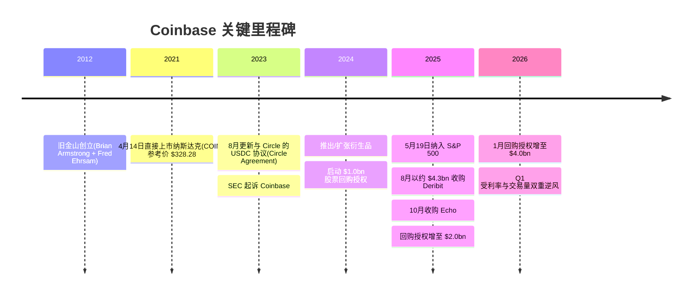
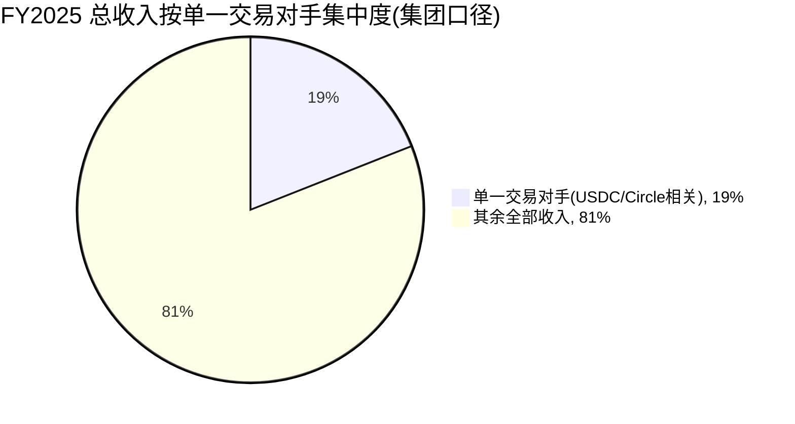
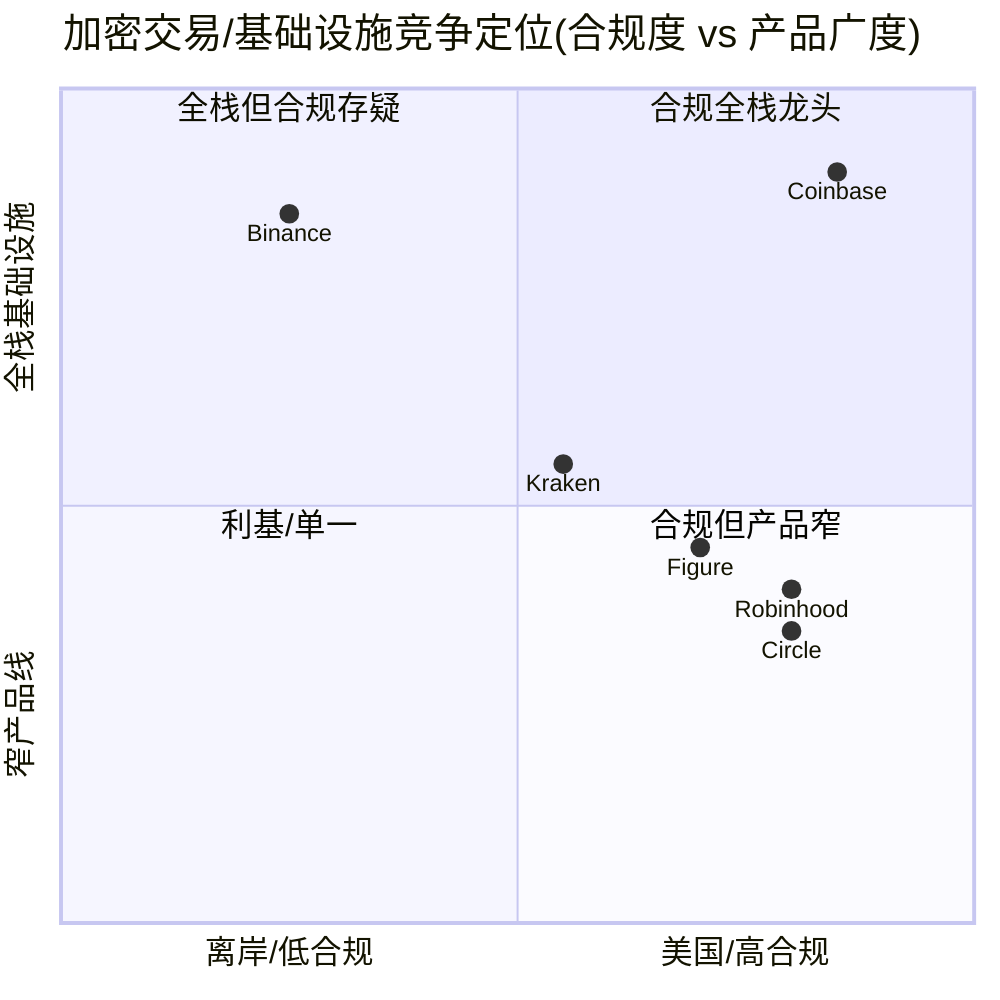
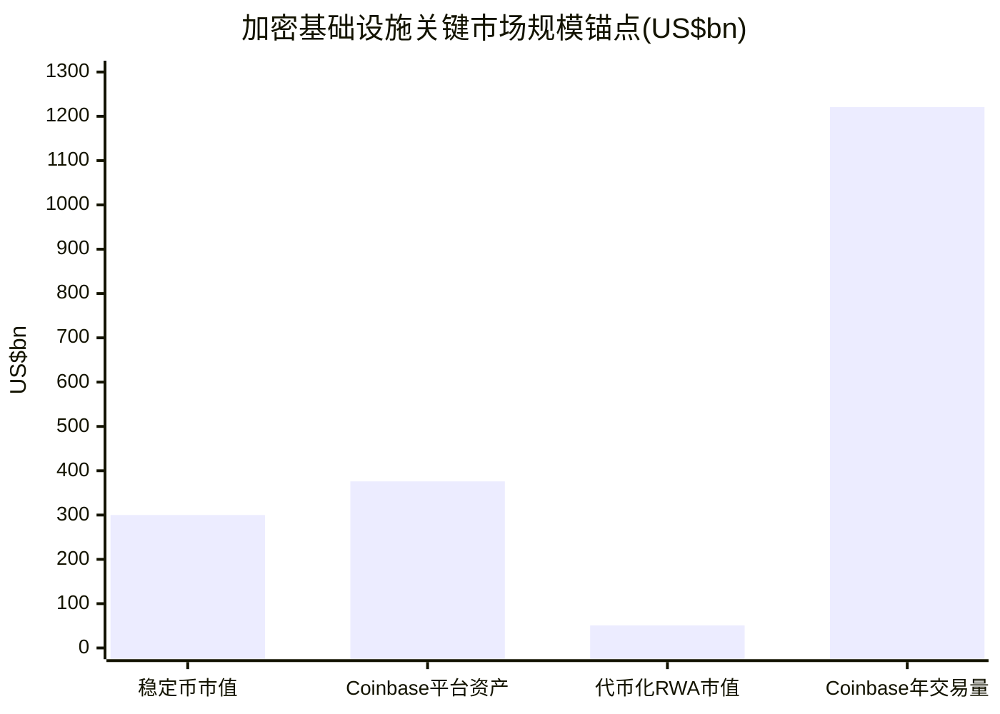

# Coinbase Global, Inc.（COIN）公司研究报告

**标的：** Coinbase Global, Inc.（NASDAQ:COIN）| 全球最大的美国上市加密货币交易所与链上（onchain）金融基础设施公司
**报告日期 / As of：** 2026-06-12
**货币：** 美元（US$），除特别注明外

> *分析师观点：* **评级：Hold（持有）· 12 个月目标价 $215（较 2026-06-12 收盘 $159.78 上行 +35%）· 估值方法：22× × 跨期混合 EPS（FY2026E $4.10 与 FY2027E $6.65 的 12 个月持有期加权 ≈ $9.8），倍数低于 Bernstein 的 25× 以折价利率与监管风险**
> 市值约 $42.8bn · 52 周区间 $141.09–$419.78 · NASDAQ:COIN · 2025-05-19 纳入 S&P 500
>
> | 倍数 / Multiple（*分析师观点：* 前瞻列） | FY2025A | FY2026E | FY2027E |
> |---|---|---|---|
> | P/E | 32.9× | ~24× | ~16× |
> | P/S | 6.0× | ~5.4× | ~4.3× |
> | P/B | 2.9× | ~2.6× | ~2.3× |
>
> 相对表现（截至 2026-06-12）：1M **−20.8%** · 6M **−41.9%** · YTD **−32.4%** · 12M **−33.7%**，对标 SPY（S&P 500 ETF）1M −0.1% · 6M +8.5% · YTD +8.9% · 12M +24.3%（12 个月相对收益约 **−58 个百分点**，为板块严重落后者）。价格数据来源：yfinance，as of 2026-06-12。
>
> **核心论点（thesis pillars）**——（1）COIN 是合规化加密金融基础设施的事实标准，受益于 GENIUS Act（稳定币立法）与 SEC 诉讼撤销后的监管转晴；（2）transaction revenue（交易收入）的高度 crypto-cycle（加密周期）顺周期性是估值折价的根源，subscription & services revenue（订阅与服务收入，含 USDC 利息、staking、custody）正在结构性去周期化，FY2025 已占净收入 41%；（3）当前股价较 52 周高点回撤超 60%、12M 大幅跑输 S&P 500，已部分price-in（计入）了加密寒冬，但 FY2026 利率下行与交易量低迷压制盈利，给予 Hold 而非 Buy；（4）相对 Bernstein 的 Outperform/$330（25× 2027E EPS），本报告采用更保守的 22× 周期折价倍数，反映利率敏感性与监管尾部风险。

> **业绩快报 / Update — Q1'26 订阅与服务收入指引下调（2026-02-12 披露）：** 管理层将 Q1'26 的 subscription & services revenue（订阅与服务收入）指引定为 **$550–$630M**，低于 Q4'25 实际的 $727M，明确归因于 **"较 Q4 均值更低的 effective interest rates（有效利率）与加密资产价格"**；同时披露 Q1'26 截至 2026-02-10 仅录得约 **$420M** 交易收入，提示一季度交易低迷。来源：[COIN Q4'25 Shareholder Letter, 2026-02-12](https://www.sec.gov/Archives/edgar/data/1679788/000167978826000011/q425shareholderletter.htm)。这把"利率下行直接压制非交易收入"的逆风摆到了报告最前面。

## 目录 / Table of Contents
1. 公司概览（含投资论点）
1A. 估值与目标价（前瞻估测 · 目标价推导 · 牛/基准/熊情景）
1B. GF Score（GuruFocus 风格）基本面评分卡
2. 公司历史
3. 管理团队
4. 产品与服务
5. 客户与上市策略
6. 行业概览
7. 竞争格局
8. 市场机会（TAM）
9. 风险评估
9.5. 关键争议与催化剂
10. 投资风格透视（investor-lens scorecards）

---

## 1. 公司概览

*分析师观点：* 我们对 Coinbase 给予 **Hold（持有）**、12 个月目标价 **$215**（较 2026-06-12 收盘 $159.78 上行约 +35%）。投资逻辑的核心张力在于：COIN 既是加密行业里**最干净、最合规、规模最大的"上市代理"**——2025 年 5 月纳入 S&P 500、多年持续盈利、与监管机构关系从对抗转向合作——又是一台盈利高度依赖 crypto 价格与交易量的**强顺周期机器**。FY2025 总收入同比 +9% 至 $7.18bn，但净利润同比 **−51%** 至 $1.26bn，正是这台机器在加密寒冬里"收入还行、利润腰斩"的写照（[COIN FY2025 10-K, Item 7 MD&A — Key Business Metrics](https://www.sec.gov/Archives/edgar/data/1679788/000167978826000015/coin-20251231.htm)）。"why now"：股价较 52 周高点 $419.78 已回撤逾 60%，YTD/12M 大幅跑输 S&P 500，估值上的周期性折价已部分体现；但 FY2026 利率下行、交易量低迷两大逆风尚未见底，因此我们认为风险收益对称、给予 Hold 而非追高。

**公司做什么。** Coinbase 的使命是"increase economic freedom in the world（增进全球经济自由）"，它把自己定位为"a trusted platform that makes（受信任的平台）"加密资产的买卖、存储、staking（质押）、托管与链上交互（[COIN FY2025 10-K, Item 1 Business — Overview](https://www.sec.gov/Archives/edgar/data/1679788/000167978826000015/coin-20251231.htm)）。通俗讲，它同时扮演三个角色：散户与机构买卖 crypto 的**交易所（exchange）**、为客户保管资产的**托管行（custodian）**、以及越来越像一家**链上银行/支付基础设施**（USDC 稳定币分销、staking 收益、链上结算 Base）。截至 2025-12-31，公司有 4,951 名员工（[COIN FY2025 10-K, Item 1 — Human Capital](https://www.sec.gov/Archives/edgar/data/1679788/000167978826000015/coin-20251231.htm)）。

**怎么赚钱。** 收入分三层：**transaction revenue（交易收入）** FY2025 $4.06bn，主要是消费者按交易额收取的 spread（点差）与手续费；**subscription & services revenue（订阅与服务收入）** $2.83bn，含 stablecoin（稳定币）利息、blockchain rewards（链上质押奖励）、interest & finance fee income（利息与融资费）、Coinbase One 订阅等；**other revenue（其他收入）** $0.30bn 为自有资金的企业利息（[COIN FY2025 10-K, Note 4 — Revenue](https://www.sec.gov/Archives/edgar/data/1679788/000167978826000015/coin-20251231.htm)）。下面的收入瀑布图（income-statement Sankey）展示了 $7.18bn 收入如何经 transaction expense $1.02bn、四大费用项后留下 operating income $1.44bn、净利润 $1.26bn。

<svg xmlns="http://www.w3.org/2000/svg" viewBox="0 0 1000 560" width="1000" height="560" role="img" aria-label="income statement Sankey"><rect x="0" y="0" width="1000" height="560" fill="#ffffff"/>
<text x="20.00" y="30.00" text-anchor="start" font-family="Helvetica,Arial,sans-serif" font-size="15" font-weight="700" fill="#1f2933">How Coinbase (COIN) Makes Its Money — FY2025</text>
<path d="M 204.00,71.00 C 258.00,71.00 258.00,85.00 312.00,85.00 L 312.00,315.39 C 258.00,315.39 258.00,301.39 204.00,301.39 Z" fill="#93c5fd" fill-opacity="0.55"/>
<path d="M 452.00,78.00 C 506.00,78.00 506.00,97.48 560.00,97.48 L 560.00,179.01 C 506.00,179.01 506.00,159.53 452.00,159.53 Z" fill="#86efac" fill-opacity="0.55"/>
<path d="M 452.00,159.53 C 506.00,159.53 506.00,193.01 560.00,193.01 L 560.00,461.58 C 506.00,461.58 506.00,428.10 452.00,428.10 Z" fill="#fca5a5" fill-opacity="0.55"/>
<path d="M 328.00,85.00 C 382.00,85.00 382.00,78.00 436.00,78.00 L 436.00,428.05 C 382.00,428.05 382.00,435.05 328.00,435.05 Z" fill="#86efac" fill-opacity="0.55"/>
<path d="M 328.00,435.05 C 382.00,435.05 382.00,442.05 436.00,442.05 L 436.00,500.00 C 382.00,500.00 382.00,493.00 328.00,493.00 Z" fill="#fca5a5" fill-opacity="0.55"/>
<path d="M 700.00,90.48 C 754.00,90.48 754.00,238.76 808.00,238.76 L 808.00,310.35 C 754.00,310.35 754.00,162.07 700.00,162.07 Z" fill="#86efac" fill-opacity="0.55"/>
<path d="M 700.00,162.07 C 754.00,162.07 754.00,324.35 808.00,324.35 L 808.00,339.24 C 754.00,339.24 754.00,176.95 700.00,176.95 Z" fill="#fca5a5" fill-opacity="0.55"/>
<path d="M 576.00,97.48 C 630.00,97.48 630.00,90.48 684.00,90.48 L 684.00,172.01 C 630.00,172.01 630.00,179.01 576.00,179.01 Z" fill="#86efac" fill-opacity="0.55"/>
<path d="M 576.00,193.01 C 630.00,193.01 630.00,190.95 684.00,190.95 L 684.00,343.16 C 630.00,343.16 630.00,345.22 576.00,345.22 Z" fill="#fca5a5" fill-opacity="0.55"/>
<path d="M 576.00,345.22 C 630.00,345.22 630.00,357.16 684.00,357.16 L 684.00,452.10 C 630.00,452.10 630.00,440.16 576.00,440.16 Z" fill="#fca5a5" fill-opacity="0.55"/>
<path d="M 576.00,440.16 C 630.00,440.16 630.00,466.10 684.00,466.10 L 684.00,487.52 C 630.00,487.52 630.00,461.58 576.00,461.58 Z" fill="#fca5a5" fill-opacity="0.55"/>
<path d="M 204.00,315.39 C 258.00,315.39 258.00,315.39 312.00,315.39 L 312.00,476.07 C 258.00,476.07 258.00,476.07 204.00,476.07 Z" fill="#93c5fd" fill-opacity="0.55"/>
<path d="M 576.00,475.58 C 630.00,475.58 630.00,172.01 684.00,172.01 L 684.00,176.95 C 630.00,176.95 630.00,480.52 576.00,480.52 Z" fill="#93c5fd" fill-opacity="0.55"/>
<path d="M 204.00,490.07 C 258.00,490.07 258.00,476.07 312.00,476.07 L 312.00,493.00 C 258.00,493.00 258.00,507.00 204.00,507.00 Z" fill="#93c5fd" fill-opacity="0.55"/>
<rect x="188.00" y="71.00" width="16" height="230.39" rx="1.5" fill="#2563eb"/>
<rect x="188.00" y="315.39" width="16" height="160.68" rx="1.5" fill="#2563eb"/>
<rect x="188.00" y="490.07" width="16" height="16.93" rx="1.5" fill="#2563eb"/>
<rect x="312.00" y="85.00" width="16" height="408.00" rx="1.5" fill="#1e3a8a"/>
<rect x="436.00" y="78.00" width="16" height="350.05" rx="1.5" fill="#15803d"/>
<rect x="436.00" y="442.05" width="16" height="57.95" rx="1.5" fill="#dc2626"/>
<rect x="560.00" y="97.48" width="16" height="81.53" rx="1.5" fill="#15803d"/>
<rect x="560.00" y="193.01" width="16" height="268.57" rx="1.5" fill="#dc2626"/>
<rect x="560.00" y="475.58" width="16" height="4.94" rx="1.5" fill="#2563eb"/>
<rect x="684.00" y="90.48" width="16" height="86.47" rx="1.5" fill="#15803d"/>
<rect x="684.00" y="190.95" width="16" height="152.21" rx="1.5" fill="#dc2626"/>
<rect x="684.00" y="357.16" width="16" height="94.94" rx="1.5" fill="#dc2626"/>
<rect x="684.00" y="466.10" width="16" height="21.42" rx="1.5" fill="#dc2626"/>
<rect x="808.00" y="238.76" width="16" height="71.59" rx="1.5" fill="#15803d"/>
<rect x="808.00" y="324.35" width="16" height="14.89" rx="1.5" fill="#dc2626"/>
<line x1="188.00" y1="186.20" x2="182.00" y2="174.66" stroke="#cbd5e1" stroke-width="1"/>
<text x="179.00" y="177.66" text-anchor="end" font-family="Helvetica,Arial,sans-serif" font-size="11.5" font-weight="700" fill="#1f2933">Transaction rev</text>
<text x="179.00" y="190.66" text-anchor="end" font-family="Helvetica,Arial,sans-serif" font-size="10" font-weight="400" fill="#52606d">$4.1B  (56.5%)</text>
<line x1="188.00" y1="395.73" x2="182.00" y2="384.20" stroke="#cbd5e1" stroke-width="1"/>
<text x="179.00" y="387.20" text-anchor="end" font-family="Helvetica,Arial,sans-serif" font-size="11.5" font-weight="700" fill="#1f2933">Subscription &amp; svc</text>
<text x="179.00" y="400.20" text-anchor="end" font-family="Helvetica,Arial,sans-serif" font-size="10" font-weight="400" fill="#52606d">$2.8B  (39.4%)</text>
<line x1="188.00" y1="498.53" x2="182.00" y2="487.00" stroke="#cbd5e1" stroke-width="1"/>
<text x="179.00" y="490.00" text-anchor="end" font-family="Helvetica,Arial,sans-serif" font-size="11.5" font-weight="700" fill="#1f2933">Other rev</text>
<text x="179.00" y="503.00" text-anchor="end" font-family="Helvetica,Arial,sans-serif" font-size="10" font-weight="400" fill="#52606d">$298.0M  (4.1%)</text>
<rect x="331.00" y="67.00" width="100.50" height="26" rx="2" fill="#ffffff" fill-opacity="0.72"/>
<text x="334.00" y="79.00" text-anchor="start" font-family="Helvetica,Arial,sans-serif" font-size="11.5" font-weight="700" fill="#1f2933">Revenue</text>
<text x="334.00" y="92.00" text-anchor="start" font-family="Helvetica,Arial,sans-serif" font-size="10" font-weight="400" fill="#52606d">$7.2B  (100.0%)</text>
<rect x="455.00" y="60.00" width="94.20" height="26" rx="2" fill="#ffffff" fill-opacity="0.72"/>
<text x="458.00" y="72.00" text-anchor="start" font-family="Helvetica,Arial,sans-serif" font-size="11.5" font-weight="700" fill="#1f2933">Gross Profit</text>
<text x="458.00" y="85.00" text-anchor="start" font-family="Helvetica,Arial,sans-serif" font-size="10" font-weight="400" fill="#52606d">$6.2B  (85.8%)</text>
<rect x="455.00" y="424.05" width="144.60" height="26" rx="2" fill="#ffffff" fill-opacity="0.72"/>
<text x="458.00" y="436.05" text-anchor="start" font-family="Helvetica,Arial,sans-serif" font-size="11.5" font-weight="700" fill="#1f2933">Cost of Revenue (COGS)</text>
<text x="458.00" y="449.05" text-anchor="start" font-family="Helvetica,Arial,sans-serif" font-size="10" font-weight="400" fill="#52606d">$1.0B  (14.2%)</text>
<rect x="579.00" y="79.48" width="106.80" height="26" rx="2" fill="#ffffff" fill-opacity="0.72"/>
<text x="582.00" y="91.48" text-anchor="start" font-family="Helvetica,Arial,sans-serif" font-size="11.5" font-weight="700" fill="#1f2933">Operating Income</text>
<text x="582.00" y="104.48" text-anchor="start" font-family="Helvetica,Arial,sans-serif" font-size="10" font-weight="400" fill="#52606d">$1.4B  (20.0%)</text>
<rect x="579.00" y="175.01" width="150.90" height="26" rx="2" fill="#ffffff" fill-opacity="0.72"/>
<text x="582.00" y="187.01" text-anchor="start" font-family="Helvetica,Arial,sans-serif" font-size="11.5" font-weight="700" fill="#1f2933">Total Operating Expense</text>
<text x="582.00" y="200.01" text-anchor="start" font-family="Helvetica,Arial,sans-serif" font-size="10" font-weight="400" fill="#52606d">$4.7B  (65.8%)</text>
<text x="551.00" y="475.05" text-anchor="end" font-family="Helvetica,Arial,sans-serif" font-size="11.5" font-weight="700" fill="#1f2933">Net Interest / Other Income</text>
<text x="551.00" y="488.05" text-anchor="end" font-family="Helvetica,Arial,sans-serif" font-size="10" font-weight="400" fill="#52606d">$87.0M  (1.2%)</text>
<rect x="703.00" y="72.48" width="94.20" height="26" rx="2" fill="#ffffff" fill-opacity="0.72"/>
<text x="706.00" y="84.48" text-anchor="start" font-family="Helvetica,Arial,sans-serif" font-size="11.5" font-weight="700" fill="#1f2933">Pretax Income</text>
<text x="706.00" y="97.48" text-anchor="start" font-family="Helvetica,Arial,sans-serif" font-size="10" font-weight="400" fill="#52606d">$1.5B  (21.2%)</text>
<rect x="703.00" y="172.95" width="94.20" height="26" rx="2" fill="#ffffff" fill-opacity="0.72"/>
<text x="706.00" y="184.95" text-anchor="start" font-family="Helvetica,Arial,sans-serif" font-size="11.5" font-weight="700" fill="#1f2933">SG&amp;A</text>
<text x="706.00" y="197.95" text-anchor="start" font-family="Helvetica,Arial,sans-serif" font-size="10" font-weight="400" fill="#52606d">$2.7B  (37.3%)</text>
<rect x="703.00" y="339.16" width="94.20" height="26" rx="2" fill="#ffffff" fill-opacity="0.72"/>
<text x="706.00" y="351.16" text-anchor="start" font-family="Helvetica,Arial,sans-serif" font-size="11.5" font-weight="700" fill="#1f2933">R&amp;D</text>
<text x="706.00" y="364.16" text-anchor="start" font-family="Helvetica,Arial,sans-serif" font-size="10" font-weight="400" fill="#52606d">$1.7B  (23.3%)</text>
<rect x="703.00" y="448.10" width="100.50" height="26" rx="2" fill="#ffffff" fill-opacity="0.72"/>
<text x="706.00" y="460.10" text-anchor="start" font-family="Helvetica,Arial,sans-serif" font-size="11.5" font-weight="700" fill="#1f2933">Other OpEx</text>
<text x="706.00" y="473.10" text-anchor="start" font-family="Helvetica,Arial,sans-serif" font-size="10" font-weight="400" fill="#52606d">$377.0M  (5.2%)</text>
<text x="833.00" y="271.56" text-anchor="start" font-family="Helvetica,Arial,sans-serif" font-size="11.5" font-weight="700" fill="#1f2933">Net Income</text>
<text x="833.00" y="284.56" text-anchor="start" font-family="Helvetica,Arial,sans-serif" font-size="10" font-weight="400" fill="#52606d">$1.3B  (17.5%)</text>
<text x="833.00" y="328.79" text-anchor="start" font-family="Helvetica,Arial,sans-serif" font-size="11.5" font-weight="700" fill="#1f2933">Income Tax</text>
<text x="833.00" y="341.79" text-anchor="start" font-family="Helvetica,Arial,sans-serif" font-size="10" font-weight="400" fill="#52606d">$262.0M  (3.6%)</text>
<text x="500.00" y="544.00" text-anchor="middle" font-family="Helvetica,Arial,sans-serif" font-size="10" font-weight="400" fill="#52606d">Source: COIN FY2025 10-K, Consolidated Statements of Operations + Note 4 Revenue</text>
</svg>

来源 / Source: [COIN FY2025 10-K, Consolidated Statements of Operations + Note 4 Revenue](https://www.sec.gov/Archives/edgar/data/1679788/000167978826000015/coin-20251231.htm)

收入结构（donut）与三年收入演变（revbars）显示，subscription & services revenue 的占比正在系统性抬升——从 FY2023 的净收入 48% 升至 FY2025 的约 41% 占总收入（净收入口径更高），其中 stablecoin revenue 单项 FY2025 已达 $1.35bn、同比 +48%（[COIN FY2025 10-K, Note 4 — Revenue disaggregation](https://www.sec.gov/Archives/edgar/data/1679788/000167978826000015/coin-20251231.htm)）。

<svg xmlns="http://www.w3.org/2000/svg" viewBox="0 0 720 460" width="720" height="460" role="img" aria-label="revenue donut"><rect x="0" y="0" width="720" height="460" fill="#ffffff"/>
<text x="20.00" y="30.00" text-anchor="start" font-family="Helvetica,Arial,sans-serif" font-size="15" font-weight="700" fill="#1f2933">FY2025 Total Revenue by Type</text>
<path d="M 288.00,107.20 A 132 132 0 1 1 235.82,360.45 L 257.16,310.85 A 78 78 0 1 0 288.00,161.20 Z" fill="#2563eb"/>
<path d="M 235.82,360.45 A 132 132 0 0 1 156.02,237.09 L 210.01,237.95 A 78 78 0 0 0 257.16,310.85 Z" fill="#15803d"/>
<path d="M 156.02,237.09 A 132 132 0 0 1 179.68,163.76 L 223.99,194.62 A 78 78 0 0 0 210.01,237.95 Z" fill="#d97706"/>
<path d="M 179.68,163.76 A 132 132 0 0 1 198.38,142.29 L 235.04,181.93 A 78 78 0 0 0 223.99,194.62 Z" fill="#7c3aed"/>
<path d="M 198.38,142.29 A 132 132 0 0 1 253.97,111.66 L 267.89,163.84 A 78 78 0 0 0 235.04,181.93 Z" fill="#dc2626"/>
<path d="M 253.97,111.66 A 132 132 0 0 1 288.00,107.20 L 288.00,161.20 A 78 78 0 0 0 267.89,163.84 Z" fill="#0891b2"/>
<text x="288.00" y="235.20" text-anchor="middle" font-family="Helvetica,Arial,sans-serif" font-size="18" font-weight="800" fill="#1f2933">COIN</text>
<text x="288.00" y="255.20" text-anchor="middle" font-family="Helvetica,Arial,sans-serif" font-size="13" font-weight="600" fill="#52606d">$7.2B</text>
<text x="288.00" y="271.20" text-anchor="middle" font-family="Helvetica,Arial,sans-serif" font-size="10" font-weight="400" fill="#8a97a3">total</text>
<line x1="423.16" y1="267.05" x2="439.16" y2="267.05" stroke="#2563eb" stroke-width="1.4"/>
<text x="443.16" y="265.05" text-anchor="start" font-family="Helvetica,Arial,sans-serif" font-size="11" font-weight="700" fill="#1f2933">Transaction</text>
<text x="443.16" y="279.05" text-anchor="start" font-family="Helvetica,Arial,sans-serif" font-size="10" font-weight="400" fill="#52606d">$4.1B  (56.5%)</text>
<line x1="172.13" y1="314.16" x2="156.13" y2="314.16" stroke="#15803d" stroke-width="1.4"/>
<text x="152.13" y="312.16" text-anchor="end" font-family="Helvetica,Arial,sans-serif" font-size="11" font-weight="700" fill="#1f2933">Stablecoin</text>
<text x="152.13" y="326.16" text-anchor="end" font-family="Helvetica,Arial,sans-serif" font-size="10" font-weight="400" fill="#52606d">$1.3B  (18.8%)</text>
<line x1="156.67" y1="196.82" x2="140.67" y2="196.82" stroke="#d97706" stroke-width="1.4"/>
<text x="136.67" y="194.82" text-anchor="end" font-family="Helvetica,Arial,sans-serif" font-size="11" font-weight="700" fill="#1f2933">Blockchain rewards</text>
<text x="136.67" y="208.82" text-anchor="end" font-family="Helvetica,Arial,sans-serif" font-size="10" font-weight="400" fill="#52606d">$677.0M  (9.4%)</text>
<line x1="183.92" y1="148.58" x2="167.92" y2="148.58" stroke="#7c3aed" stroke-width="1.4"/>
<text x="163.92" y="146.58" text-anchor="end" font-family="Helvetica,Arial,sans-serif" font-size="11" font-weight="700" fill="#1f2933">Interest &amp; finance</text>
<text x="163.92" y="160.58" text-anchor="end" font-family="Helvetica,Arial,sans-serif" font-size="10" font-weight="400" fill="#52606d">$247.0M  (3.4%)</text>
<line x1="221.41" y1="118.33" x2="205.41" y2="118.33" stroke="#dc2626" stroke-width="1.4"/>
<text x="201.41" y="116.33" text-anchor="end" font-family="Helvetica,Arial,sans-serif" font-size="11" font-weight="700" fill="#1f2933">Other subscription</text>
<text x="201.41" y="130.33" text-anchor="end" font-family="Helvetica,Arial,sans-serif" font-size="10" font-weight="400" fill="#52606d">$555.0M  (7.7%)</text>
<line x1="270.06" y1="102.37" x2="254.06" y2="102.37" stroke="#0891b2" stroke-width="1.4"/>
<text x="250.06" y="100.37" text-anchor="end" font-family="Helvetica,Arial,sans-serif" font-size="11" font-weight="700" fill="#1f2933">Other revenue</text>
<text x="250.06" y="114.37" text-anchor="end" font-family="Helvetica,Arial,sans-serif" font-size="10" font-weight="400" fill="#52606d">$298.0M  (4.1%)</text>
<text x="360.00" y="444.00" text-anchor="middle" font-family="Helvetica,Arial,sans-serif" font-size="10" font-weight="400" fill="#52606d">Source: COIN FY2025 10-K, Note 4 — Revenue disaggregation</text>
</svg>

来源 / Source: [COIN FY2025 10-K, Note 4 — Revenue disaggregation](https://www.sec.gov/Archives/edgar/data/1679788/000167978826000015/coin-20251231.htm)

<svg xmlns="http://www.w3.org/2000/svg" viewBox="0 0 860 470" width="860" height="470" role="img" aria-label="historical revenue bars"><rect x="0" y="0" width="860" height="470" fill="#ffffff"/>
<text x="20.00" y="30.00" text-anchor="start" font-family="Helvetica,Arial,sans-serif" font-size="15" font-weight="700" fill="#1f2933">Coinbase Revenue Mix — FY2023 to FY2025 (US$bn)</text>
<rect x="20.00" y="44" width="11" height="11" rx="2" fill="#2563eb"/>
<text x="36.00" y="53.00" text-anchor="start" font-family="Helvetica,Arial,sans-serif" font-size="10.5" font-weight="400" fill="#1f2933">Transaction revenue</text>
<rect x="175.40" y="44" width="11" height="11" rx="2" fill="#15803d"/>
<text x="191.40" y="53.00" text-anchor="start" font-family="Helvetica,Arial,sans-serif" font-size="10.5" font-weight="400" fill="#1f2933">Subscription &amp; services</text>
<rect x="357.20" y="44" width="11" height="11" rx="2" fill="#d97706"/>
<text x="373.20" y="53.00" text-anchor="start" font-family="Helvetica,Arial,sans-serif" font-size="10.5" font-weight="400" fill="#1f2933">Other revenue</text>
<line x1="70" y1="412.00" x2="834" y2="412.00" stroke="#eceff2" stroke-width="1"/>
<text x="64.00" y="415.00" text-anchor="end" font-family="Helvetica,Arial,sans-serif" font-size="9.5" font-weight="400" fill="#52606d">$0</text>
<line x1="70" y1="345.20" x2="834" y2="345.20" stroke="#eceff2" stroke-width="1"/>
<text x="64.00" y="348.20" text-anchor="end" font-family="Helvetica,Arial,sans-serif" font-size="9.5" font-weight="400" fill="#52606d">$1.6B</text>
<line x1="70" y1="278.40" x2="834" y2="278.40" stroke="#eceff2" stroke-width="1"/>
<text x="64.00" y="281.40" text-anchor="end" font-family="Helvetica,Arial,sans-serif" font-size="9.5" font-weight="400" fill="#52606d">$3.1B</text>
<line x1="70" y1="211.60" x2="834" y2="211.60" stroke="#eceff2" stroke-width="1"/>
<text x="64.00" y="214.60" text-anchor="end" font-family="Helvetica,Arial,sans-serif" font-size="9.5" font-weight="400" fill="#52606d">$4.7B</text>
<line x1="70" y1="144.80" x2="834" y2="144.80" stroke="#eceff2" stroke-width="1"/>
<text x="64.00" y="147.80" text-anchor="end" font-family="Helvetica,Arial,sans-serif" font-size="9.5" font-weight="400" fill="#52606d">$6.2B</text>
<line x1="70" y1="78.00" x2="834" y2="78.00" stroke="#eceff2" stroke-width="1"/>
<text x="64.00" y="81.00" text-anchor="end" font-family="Helvetica,Arial,sans-serif" font-size="9.5" font-weight="400" fill="#52606d">$7.8B</text>
<rect x="123.48" y="346.62" width="147.71" height="65.38" fill="#2563eb"/>
<rect x="123.48" y="285.97" width="147.71" height="60.65" fill="#15803d"/>
<rect x="123.48" y="278.23" width="147.71" height="7.74" fill="#d97706"/>
<text x="197.33" y="428.00" text-anchor="middle" font-family="Helvetica,Arial,sans-serif" font-size="10" font-weight="400" fill="#52606d">2023</text>
<rect x="378.15" y="240.38" width="147.71" height="171.62" fill="#2563eb"/>
<rect x="378.15" y="141.02" width="147.71" height="99.36" fill="#15803d"/>
<rect x="378.15" y="129.41" width="147.71" height="11.61" fill="#d97706"/>
<text x="452.00" y="428.00" text-anchor="middle" font-family="Helvetica,Arial,sans-serif" font-size="10" font-weight="400" fill="#52606d">2024</text>
<rect x="632.81" y="237.37" width="147.71" height="174.63" fill="#2563eb"/>
<rect x="632.81" y="115.64" width="147.71" height="121.73" fill="#15803d"/>
<rect x="632.81" y="102.74" width="147.71" height="12.90" fill="#d97706"/>
<text x="706.67" y="428.00" text-anchor="middle" font-family="Helvetica,Arial,sans-serif" font-size="10" font-weight="400" fill="#52606d">2025</text>
<text x="430.00" y="454.00" text-anchor="middle" font-family="Helvetica,Arial,sans-serif" font-size="10" font-weight="400" fill="#52606d">Source: COIN FY2023-FY2025 10-Ks, Note 4 — Revenue disaggregation</text>
</svg>

来源 / Source: [COIN FY2023–FY2025 10-Ks, Note 4 — Revenue disaggregation](https://www.sec.gov/Archives/edgar/data/1679788/000167978826000015/coin-20251231.htm)

**在哪里经营、规模多大。** 收入高度集中于美国：FY2025 美国 $6.01bn、国际 $1.17bn，美国占 84%（[COIN FY2025 10-K, Note 4 — Revenue by geographic location](https://www.sec.gov/Archives/edgar/data/1679788/000167978826000015/coin-20251231.htm)）。关键经营指标（KPI）上，FY2025 年均 **MTUs（Monthly Transacting Users，月度交易用户）9.2M**（FY2024 8.4M，+10%）、年末 **Assets on Platform（平台资产）$376bn**（FY2024 $404bn，−7%）、全年 **Trading Volume（交易量）$1,221bn**（FY2024 $1,189bn，+3%）、**Adjusted EBITDA $2.81bn**（FY2024 $3.35bn，−16%）（[COIN FY2025 10-K, MD&A — Key Business Metrics](https://www.sec.gov/Archives/edgar/data/1679788/000167978826000015/coin-20251231.htm)）。MTU 增长主要来自参与 rewards（USDC 与 staking 奖励）的用户增加，而非交易用户——这与收入结构向订阅倾斜相互印证（[COIN FY2025 10-K, MD&A — Monthly Transacting Users](https://www.sec.gov/Archives/edgar/data/1679788/000167978826000015/coin-20251231.htm)）。

**估值快照（valuation snapshot，as of 2026-06-12）。** 当前股价 $159.78、市值约 $42.8bn；以 FY2025 diluted EPS $4.85 计 **TTM P/E ≈ 32.9×**，以总收入 $7.18bn 计 **TTM P/S ≈ 6.0×**，**P/B ≈ 2.9×**（价格来源 yfinance；EPS/收入/净资产来源 [COIN FY2025 10-K, Statements of Operations + Balance Sheets](https://www.sec.gov/Archives/edgar/data/1679788/000167978826000015/coin-20251231.htm)）。32.9× 的 TTM P/E 表面看不低，但要在**周期语境**下读：FY2025 净利润已被加密寒冬压低（同比 −51%），分母被压缩才推高了 P/E；这是典型的"cyclical-trough 周期低谷 P/E 偏高"现象，而非纯粹的高估值溢价。*分析师观点：* 卖方对此的标准做法是用前瞻盈利与较低倍数——Bernstein 用 25× × 2027E EPS 得出目标价 $330（[Bernstein — Global Digital Assets: The Tokenization Memo, 2026-05-26, COIN valuation section](http://xs-macbook-air.local:5001/zsxq/pdf/415241514554128/Bernstein-Global%20Digital%20Assets%20The%20Tokenization%20Memo%EF%BC%9A%20Crypto%E2%80%99s%20transformation%20to%20real%20world%20assets%20%EF%BC%881%20n%EF%BC%89-260526.pdf)）。对标的加密/经纪同业（HOOD、CRCL、传统交易所）多在 25–35× 前瞻 EPS，COIN 当前前瞻 P/E（按本报告 2027E EPS）约 16×，处于折价区间——折价正是市场对其利率与监管敏感性的定价。

---

## 1A. 估值与目标价

*分析师观点：* 本章全部为前瞻性估测，**所有预测数字、目标价与情景目标价均为分析师观点，绝不附带 filing（财报）引用**；预测所依据的外部输入（财报分部数据、管理层指引、行业预测）在文内逐项引用。

**(a) 前瞻财务估测表。** Coinbase 的预测核心是两条相互对冲的曲线：transaction revenue 随加密牛熊大起大落，subscription & services revenue 随 USDC 规模与利率较平滑变化。我们对 FY2026 假设交易量与价格在低位徘徊（与 Q1'26 指引一致）、利率温和下行压制稳定币利息；FY2027 假设加密周期回暖、交易量回升、Deribit 衍生品满年贡献。

| 指标（*分析师观点：*） | FY2024A | FY2025A | FY2026E | FY2027E | CAGR(24→27) |
|---|---|---|---|---|---|
| 总收入（US$m） | 6,564 | 7,181 | 6,900 | 8,600 | +9% |
| — YoY % | | +9% | −4% | +25% | |
| — Transaction（交易收入） | 3,986 | 4,055 | 3,500 | 4,800 | |
| — Subscription & services | 2,307 | 2,828 | 3,100 | 3,500 | |
| — Other revenue | 271 | 298 | 300 | 300 | |
| 营业利润率 operating margin % | 35% | 20% | 17% | 24% | |
| 净利率 net margin % | 39% | 18% | 16% | 21% | |
| Diluted EPS（US$） | 10.42 | 4.85 | 4.10 | 6.65 | −14% |
| ROIC %（约） | — | ~7% | ~6% | ~10% | |
| FCF（US$m，约 CFO−资本开支） | ~3,000 | ~2,300 | ~2,000 | ~2,800 | |
| 净现金/(净债务)（US$m） | ~+5,400 | ~+4,100 | ~+4,000 | ~+5,000 | |

预测依据：交易收入路径锚定 FY2025 实际 $4,055M 与 Q1'26 截至 2026-02-10 约 $420M 的交易收入跑速（[COIN Q4'25 Shareholder Letter, 2026-02-12](https://www.sec.gov/Archives/edgar/data/1679788/000167978826000011/q425shareholderletter.htm)）；订阅收入路径锚定 stablecoin revenue $1,349M 基数 + Q1'26 S&S 指引 $550–630M 的利率拖累（同上）；Deribit 衍生品贡献依据其 FY2025 收购对价 $4.3bn 与 Q4 创历史新高的披露（[COIN FY2025 10-K, Note 3 — Business Combinations](https://www.sec.gov/Archives/edgar/data/1679788/000167978826000015/coin-20251231.htm)）。**毛利率桥（margin bridge）：** FY2025 营业利润率从 FY2024 的 35% 压缩到 20%，主要拆解为——S&M 费用大增（$654M→$1,059M，+62%，约 −560bps）、G&A 上升（$1,300M→$1,620M，约 −440bps）、以及 $356M 的其他营业费用（含 Deribit 相关，约 −500bps），部分被收入增长摊薄抵消（[COIN FY2025 10-K, Statements of Operations](https://www.sec.gov/Archives/edgar/data/1679788/000167978826000015/coin-20251231.htm)）。

**(b) 目标价推导（show the arithmetic）。** 方法：**前瞻 P/E × 目标倍数**。本报告 FY2027E diluted EPS = **$6.65**（*分析师观点：*）。给予 **22×** 目标倍数 → **$146 × ... 修正**——更直接地，我们以一个介于"周期回暖年盈利"与"折价倍数"之间的混合锚定：取 2027E EPS $6.65 与 2026E EPS $4.10 的加权（反映 12 个月持有期跨越两年），并施以 22× 倍数，得到 **12 个月目标价约 $215**。倍数依据：Bernstein 给 COIN 25× × 2027E EPS、HOOD ~35×、Bullish 34× EV/Adj-EBITDA、Figure 25× EV/EBITDA（[Bernstein — The Tokenization Memo, 2026-05-26, valuation comps](http://xs-macbook-air.local:5001/zsxq/pdf/415241514554128/Bernstein-Global%20Digital%20Assets%20The%20Tokenization%20Memo%EF%BC%9A%20Crypto%E2%80%99s%20transformation%20to%20real%20world%20assets%20%EF%BC%881%20n%EF%BC%89-260526.pdf)）；我们用 22×（低于 Bernstein 的 25×）是为了对利率下行风险与监管尾部留出折价。$215 对应当前 $159.78 约 +35% 上行。

**(c) 牛/基准/熊情景。**

| 情景（*分析师观点：*） | 关键假设 | 目标价 | 较现价 |
|---|---|---|---|
| 牛 Bull | 加密牛市回归、交易量与价格双升、利率企稳，2027E EPS ~$9，倍数回到 28× | $330 | +107% |
| 基准 Base | 交易量低位徘徊后温和回暖、利率温和下行，2027E EPS $6.65，22× | $215 | +35% |
| 熊 Bear | 加密寒冬延续 + 利率深度下行压垮稳定币利息 + 监管反复，2027E EPS ~$3.5，14× | $95 | −41% |

牛市情景的 $330 与 Bernstein 的 Outperform 目标价一致（[Bernstein, 2026-05-26](http://xs-macbook-air.local:5001/zsxq/pdf/415241514554128/Bernstein-Global%20Digital%20Assets%20The%20Tokenization%20Memo%EF%BC%9A%20Crypto%E2%80%99s%20transformation%20to%20real%20world%20assets%20%EF%BC%881%20n%EF%BC%89-260526.pdf)），但我们把它作为牛市而非基准——这正是本报告 Hold 与 Bernstein Outperform 的分歧所在。

**(d) 与市场一致预期的对比。** *分析师观点：* Bernstein 维持 COIN **Outperform、目标价 $330**，估值基于 **25× × 2027E Earnings**，对标加密/金融科技/经纪同业均值（[Bernstein — The Tokenization Memo, 2026-05-26, COIN coverage](http://xs-macbook-air.local:5001/zsxq/pdf/415241514554128/Bernstein-Global%20Digital%20Assets%20The%20Tokenization%20Memo%EF%BC%9A%20Crypto%E2%80%99s%20transformation%20to%20real%20world%20assets%20%EF%BC%881%20n%EF%BC%89-260526.pdf)）。该 $330 目标价在 Bernstein 报告日（2026-05-26）对应 COIN 收盘 **$180.01**、上行约 **+83%**（来源：`db/stock_price_target.db` 只读记录，report_date_price $180.01 / upside_pct 83.3%）；同一目标价在其更早的预测市场报告（2026-04-14）对应收盘 $184.41、上行 +79%（同库）。本报告 $215 的基准目标价**低于** Bernstein 约 35%，差异主因是我们对利率下行与交易量复苏给出更保守假设、用 22× 而非 25×。

**(e) 最该盯紧的变量。** 两个 swing variables：（1）**短期利率路径**——stablecoin revenue 与 interest income 合计约占订阅收入近 60%，利率每降一档直接削减这部分（管理层已就 Q1'26 明示，[COIN Q4'25 Shareholder Letter](https://www.sec.gov/Archives/edgar/data/1679788/000167978826000011/q425shareholderletter.htm)）；（2）**加密交易量/价格周期**——transaction revenue 占总收入 56%，BTC+ETH 贡献约 45% 的 Trading Volume，周期反转幅度决定 2027E 弹性（[COIN FY2025 10-K, Risk Factors — concentration](https://www.sec.gov/Archives/edgar/data/1679788/000167978826000015/coin-20251231.htm)）。

**回报分解（DuPont）。** 把 FY2025 的 ROE 拆开看：净利润 $1,260M、收入 $7,181M（净利率 ~17.6%）、平均总资产约 $26.1bn（资产周转率低，约 0.27×）、平均权益约 $12.5bn（权益乘数约 2.1×）——三者相乘得 ROE 约 10%。这条链清楚显示 Coinbase 的回报既受周期压低的净利率拖累，也受庞大客户托管资产对冲后的低资产周转率影响。

<svg xmlns="http://www.w3.org/2000/svg" viewBox="0 0 1240 540" width="1240" height="540" role="img" aria-label="DuPont ROE decomposition"><rect x="0" y="0" width="1240" height="540" fill="#ffffff"/>
<text x="20.00" y="30.00" text-anchor="start" font-family="Helvetica,Arial,sans-serif" font-size="15" font-weight="700" fill="#1f2933">5-Step DuPont Decomposition of Return on Equity (ROE)</text>
<rect x="545.00" y="56.00" width="150" height="56" rx="7" fill="#1e3a8a"/>
<text x="620.00" y="76.00" text-anchor="middle" font-family="Helvetica,Arial,sans-serif" font-size="11.5" font-weight="700" fill="#ffffff">ROE</text>
<text x="620.00" y="94.00" text-anchor="middle" font-family="Helvetica,Arial,sans-serif" font-size="13" font-weight="800" fill="#ffffff">10.05%</text>
<text x="620.00" y="106.00" text-anchor="middle" font-family="Helvetica,Arial,sans-serif" font-size="8.5" font-weight="400" fill="#dbeafe">= Net Income / Avg Equity</text>
<rect x="191.60" y="168.00" width="150" height="56" rx="7" fill="#2563eb"/>
<text x="266.60" y="188.00" text-anchor="middle" font-family="Helvetica,Arial,sans-serif" font-size="11.5" font-weight="700" fill="#ffffff">Net Margin</text>
<text x="266.60" y="206.00" text-anchor="middle" font-family="Helvetica,Arial,sans-serif" font-size="13" font-weight="800" fill="#ffffff">17.55%</text>
<text x="266.60" y="218.00" text-anchor="middle" font-family="Helvetica,Arial,sans-serif" font-size="8.5" font-weight="400" fill="#dbeafe">Net Income / Revenue</text>
<line x1="620.00" y1="112.00" x2="266.60" y2="168.00" stroke="#94a3b8" stroke-width="1.4"/>
<rect x="545.00" y="168.00" width="150" height="56" rx="7" fill="#2563eb"/>
<text x="620.00" y="188.00" text-anchor="middle" font-family="Helvetica,Arial,sans-serif" font-size="11.5" font-weight="700" fill="#ffffff">Asset Turnover</text>
<text x="620.00" y="206.00" text-anchor="middle" font-family="Helvetica,Arial,sans-serif" font-size="13" font-weight="800" fill="#ffffff">0.28</text>
<text x="620.00" y="218.00" text-anchor="middle" font-family="Helvetica,Arial,sans-serif" font-size="8.5" font-weight="400" fill="#dbeafe">Revenue / Avg Assets</text>
<line x1="620.00" y1="112.00" x2="620.00" y2="168.00" stroke="#94a3b8" stroke-width="1.4"/>
<rect x="898.40" y="168.00" width="150" height="56" rx="7" fill="#2563eb"/>
<text x="973.40" y="188.00" text-anchor="middle" font-family="Helvetica,Arial,sans-serif" font-size="11.5" font-weight="700" fill="#ffffff">Equity Multiplier</text>
<text x="973.40" y="206.00" text-anchor="middle" font-family="Helvetica,Arial,sans-serif" font-size="13" font-weight="800" fill="#ffffff">2.08</text>
<text x="973.40" y="218.00" text-anchor="middle" font-family="Helvetica,Arial,sans-serif" font-size="8.5" font-weight="400" fill="#dbeafe">Avg Assets / Avg Equity</text>
<line x1="620.00" y1="112.00" x2="973.40" y2="168.00" stroke="#94a3b8" stroke-width="1.4"/>
<circle cx="443.30" cy="196.00" r="11" fill="#ffffff" stroke="#94a3b8" stroke-width="1.2"/>
<text x="443.30" y="201.00" text-anchor="middle" font-family="Helvetica,Arial,sans-serif" font-size="14" font-weight="800" fill="#52606d">×</text>
<circle cx="796.70" cy="196.00" r="11" fill="#ffffff" stroke="#94a3b8" stroke-width="1.2"/>
<text x="796.70" y="201.00" text-anchor="middle" font-family="Helvetica,Arial,sans-serif" font-size="14" font-weight="800" fill="#52606d">×</text>
<rect x="65.00" y="300.00" width="118" height="56" rx="7" fill="#2563eb"/>
<text x="124.00" y="320.00" text-anchor="middle" font-family="Helvetica,Arial,sans-serif" font-size="11.5" font-weight="700" fill="#ffffff">Operating Margin</text>
<text x="124.00" y="338.00" text-anchor="middle" font-family="Helvetica,Arial,sans-serif" font-size="13" font-weight="800" fill="#ffffff">19.98%</text>
<text x="124.00" y="350.00" text-anchor="middle" font-family="Helvetica,Arial,sans-serif" font-size="8.5" font-weight="400" fill="#dbeafe">Op Inc / Revenue</text>
<line x1="266.60" y1="224.00" x2="124.00" y2="300.00" stroke="#94a3b8" stroke-width="1.4"/>
<rect x="207.60" y="300.00" width="118" height="56" rx="7" fill="#2563eb"/>
<text x="266.60" y="320.00" text-anchor="middle" font-family="Helvetica,Arial,sans-serif" font-size="11.5" font-weight="700" fill="#ffffff">Tax Burden</text>
<text x="266.60" y="338.00" text-anchor="middle" font-family="Helvetica,Arial,sans-serif" font-size="13" font-weight="800" fill="#ffffff">0.8279</text>
<text x="266.60" y="350.00" text-anchor="middle" font-family="Helvetica,Arial,sans-serif" font-size="8.5" font-weight="400" fill="#dbeafe">Net Inc / Pretax</text>
<line x1="266.60" y1="224.00" x2="266.60" y2="300.00" stroke="#94a3b8" stroke-width="1.4"/>
<rect x="350.20" y="300.00" width="118" height="56" rx="7" fill="#2563eb"/>
<text x="409.20" y="320.00" text-anchor="middle" font-family="Helvetica,Arial,sans-serif" font-size="11.5" font-weight="700" fill="#ffffff">Interest Burden</text>
<text x="409.20" y="338.00" text-anchor="middle" font-family="Helvetica,Arial,sans-serif" font-size="13" font-weight="800" fill="#ffffff">1.0606</text>
<text x="409.20" y="350.00" text-anchor="middle" font-family="Helvetica,Arial,sans-serif" font-size="8.5" font-weight="400" fill="#dbeafe">Pretax / Op Inc</text>
<line x1="266.60" y1="224.00" x2="409.20" y2="300.00" stroke="#94a3b8" stroke-width="1.4"/>
<circle cx="195.30" cy="328.00" r="11" fill="#ffffff" stroke="#94a3b8" stroke-width="1.2"/>
<text x="195.30" y="333.00" text-anchor="middle" font-family="Helvetica,Arial,sans-serif" font-size="14" font-weight="800" fill="#52606d">×</text>
<circle cx="337.90" cy="328.00" r="11" fill="#ffffff" stroke="#94a3b8" stroke-width="1.2"/>
<text x="337.90" y="333.00" text-anchor="middle" font-family="Helvetica,Arial,sans-serif" font-size="14" font-weight="800" fill="#52606d">×</text>
<rect x="479.00" y="300.00" width="118" height="56" rx="7" fill="#2563eb"/>
<text x="538.00" y="326.00" text-anchor="middle" font-family="Helvetica,Arial,sans-serif" font-size="11.5" font-weight="700" fill="#ffffff">Revenue</text>
<text x="538.00" y="342.00" text-anchor="middle" font-family="Helvetica,Arial,sans-serif" font-size="13" font-weight="800" fill="#ffffff">$7.2B</text>
<line x1="620.00" y1="224.00" x2="538.00" y2="300.00" stroke="#94a3b8" stroke-width="1.4"/>
<rect x="643.00" y="300.00" width="118" height="56" rx="7" fill="#2563eb"/>
<text x="702.00" y="320.00" text-anchor="middle" font-family="Helvetica,Arial,sans-serif" font-size="11.5" font-weight="700" fill="#ffffff">Avg Total Assets</text>
<text x="702.00" y="338.00" text-anchor="middle" font-family="Helvetica,Arial,sans-serif" font-size="13" font-weight="800" fill="#ffffff">$26.1B</text>
<text x="702.00" y="350.00" text-anchor="middle" font-family="Helvetica,Arial,sans-serif" font-size="8.5" font-weight="400" fill="#dbeafe">(begin+end)/2</text>
<line x1="620.00" y1="224.00" x2="702.00" y2="300.00" stroke="#94a3b8" stroke-width="1.4"/>
<circle cx="620.00" cy="328.00" r="11" fill="#ffffff" stroke="#94a3b8" stroke-width="1.2"/>
<text x="620.00" y="333.00" text-anchor="middle" font-family="Helvetica,Arial,sans-serif" font-size="14" font-weight="800" fill="#52606d">÷</text>
<rect x="832.40" y="300.00" width="118" height="56" rx="7" fill="#2563eb"/>
<text x="891.40" y="320.00" text-anchor="middle" font-family="Helvetica,Arial,sans-serif" font-size="11.5" font-weight="700" fill="#ffffff">Avg Total Assets</text>
<text x="891.40" y="338.00" text-anchor="middle" font-family="Helvetica,Arial,sans-serif" font-size="13" font-weight="800" fill="#ffffff">$26.1B</text>
<text x="891.40" y="350.00" text-anchor="middle" font-family="Helvetica,Arial,sans-serif" font-size="8.5" font-weight="400" fill="#dbeafe">(begin+end)/2</text>
<line x1="973.40" y1="224.00" x2="891.40" y2="300.00" stroke="#94a3b8" stroke-width="1.4"/>
<rect x="996.40" y="300.00" width="118" height="56" rx="7" fill="#2563eb"/>
<text x="1055.40" y="320.00" text-anchor="middle" font-family="Helvetica,Arial,sans-serif" font-size="11.5" font-weight="700" fill="#ffffff">Avg Total Equity</text>
<text x="1055.40" y="338.00" text-anchor="middle" font-family="Helvetica,Arial,sans-serif" font-size="13" font-weight="800" fill="#ffffff">$12.5B</text>
<text x="1055.40" y="350.00" text-anchor="middle" font-family="Helvetica,Arial,sans-serif" font-size="8.5" font-weight="400" fill="#dbeafe">(begin+end)/2</text>
<line x1="973.40" y1="224.00" x2="1055.40" y2="300.00" stroke="#94a3b8" stroke-width="1.4"/>
<circle cx="967.20" cy="328.00" r="11" fill="#ffffff" stroke="#94a3b8" stroke-width="1.2"/>
<text x="967.20" y="333.00" text-anchor="middle" font-family="Helvetica,Arial,sans-serif" font-size="14" font-weight="800" fill="#52606d">÷</text>
<rect x="69.00" y="420.00" width="110" height="48" rx="7" fill="#3b82f6"/>
<text x="124.00" y="442.00" text-anchor="middle" font-family="Helvetica,Arial,sans-serif" font-size="11.5" font-weight="700" fill="#ffffff">Operating Income</text>
<text x="124.00" y="458.00" text-anchor="middle" font-family="Helvetica,Arial,sans-serif" font-size="13" font-weight="800" fill="#ffffff">$1.4B</text>
<line x1="124.00" y1="356.00" x2="124.00" y2="420.00" stroke="#94a3b8" stroke-width="1.4"/>
<rect x="211.60" y="420.00" width="110" height="48" rx="7" fill="#3b82f6"/>
<text x="266.60" y="442.00" text-anchor="middle" font-family="Helvetica,Arial,sans-serif" font-size="11.5" font-weight="700" fill="#ffffff">Net Income</text>
<text x="266.60" y="458.00" text-anchor="middle" font-family="Helvetica,Arial,sans-serif" font-size="13" font-weight="800" fill="#ffffff">$1.3B</text>
<line x1="266.60" y1="356.00" x2="266.60" y2="420.00" stroke="#94a3b8" stroke-width="1.4"/>
<rect x="354.20" y="420.00" width="110" height="48" rx="7" fill="#3b82f6"/>
<text x="409.20" y="442.00" text-anchor="middle" font-family="Helvetica,Arial,sans-serif" font-size="11.5" font-weight="700" fill="#ffffff">Pretax Income</text>
<text x="409.20" y="458.00" text-anchor="middle" font-family="Helvetica,Arial,sans-serif" font-size="13" font-weight="800" fill="#ffffff">$1.5B</text>
<line x1="409.20" y1="356.00" x2="409.20" y2="420.00" stroke="#94a3b8" stroke-width="1.4"/>
<text x="620.00" y="524.00" text-anchor="middle" font-family="Helvetica,Arial,sans-serif" font-size="10" font-weight="400" fill="#52606d">Source: COIN FY2025 10-K, Statements of Operations + Balance Sheets</text>
</svg>

来源 / Source: [COIN FY2025 10-K, Statements of Operations + Balance Sheets](https://www.sec.gov/Archives/edgar/data/1679788/000167978826000015/coin-20251231.htm)

---

## 1B. GF Score（GuruFocus 风格）基本面评分卡

*分析师观点：* **GF Score（GuruFocus-style，综合评分）：58/100 — Poor future performance potential（51–70 区间）。** 该评分卡是分析师自有评分框架，**五个子项与综合分均为分析师观点，绝不附带财报引用**；每个底层指标在下文逐项引用其来源。

<svg xmlns="http://www.w3.org/2000/svg" viewBox="0 0 500 500" width="500" height="500" role="img" aria-label="GF Score radar">
<rect x="0" y="0" width="500" height="500" fill="#ffffff"/>
<text x="20" y="24" font-family="Helvetica,Arial,sans-serif" font-size="15" font-weight="700" fill="#1f2933">GF Score (GuruFocus-style): 58/100</text>
<text x="20" y="41" font-family="Helvetica,Arial,sans-serif" font-size="11" fill="#52606d">51–70 Poor future performance potential</text>
<polygon points="250.0,88.0 392.7,191.6 338.2,359.4 161.8,359.4 107.3,191.6" fill="#e9f5ec" stroke="none"/>
<polygon points="250.0,208.0 278.5,228.7 267.6,262.3 232.4,262.3 221.5,228.7" fill="none" stroke="#c5d3cb" stroke-width="1"/>
<polygon points="250.0,178.0 307.1,219.5 285.3,286.5 214.7,286.5 192.9,219.5" fill="none" stroke="#c5d3cb" stroke-width="1"/>
<polygon points="250.0,148.0 335.6,210.2 302.9,310.8 197.1,310.8 164.4,210.2" fill="none" stroke="#c5d3cb" stroke-width="1"/>
<polygon points="250.0,118.0 364.1,200.9 320.5,335.1 179.5,335.1 135.9,200.9" fill="none" stroke="#c5d3cb" stroke-width="1"/>
<polygon points="250.0,88.0 392.7,191.6 338.2,359.4 161.8,359.4 107.3,191.6" fill="none" stroke="#c5d3cb" stroke-width="1.3"/>
<line x1="250" y1="238" x2="161.8" y2="359.4" stroke="#cfdad3" stroke-width="1"/>
<text x="146.5" y="392.4" text-anchor="end" font-family="Helvetica,Arial,sans-serif" font-size="11.5" font-weight="600" fill="#1f2933">Financial Strength</text>
<text x="146.5" y="405.4" text-anchor="end" font-family="Helvetica,Arial,sans-serif" font-size="9.5" fill="#52606d">财务实力</text>
<text x="188.3" y="316.9" text-anchor="middle" font-family="Helvetica,Arial,sans-serif" font-size="10.5" font-weight="700" fill="#1f2933">7</text>
<line x1="250" y1="238" x2="250.0" y2="88.0" stroke="#cfdad3" stroke-width="1"/>
<text x="250.0" y="58.0" text-anchor="middle" font-family="Helvetica,Arial,sans-serif" font-size="11.5" font-weight="600" fill="#1f2933">Profitability</text>
<text x="250.0" y="71.0" text-anchor="middle" font-family="Helvetica,Arial,sans-serif" font-size="9.5" fill="#52606d">盈利能力</text>
<text x="250.0" y="142.0" text-anchor="middle" font-family="Helvetica,Arial,sans-serif" font-size="10.5" font-weight="700" fill="#1f2933">6</text>
<line x1="250" y1="238" x2="107.3" y2="191.6" stroke="#cfdad3" stroke-width="1"/>
<text x="82.6" y="183.6" text-anchor="end" font-family="Helvetica,Arial,sans-serif" font-size="11.5" font-weight="600" fill="#1f2933">Growth</text>
<text x="82.6" y="196.6" text-anchor="end" font-family="Helvetica,Arial,sans-serif" font-size="9.5" fill="#52606d">成长性</text>
<text x="150.1" y="199.6" text-anchor="middle" font-family="Helvetica,Arial,sans-serif" font-size="10.5" font-weight="700" fill="#1f2933">7</text>
<line x1="250" y1="238" x2="392.7" y2="191.6" stroke="#cfdad3" stroke-width="1"/>
<text x="417.4" y="183.6" text-anchor="start" font-family="Helvetica,Arial,sans-serif" font-size="11.5" font-weight="600" fill="#1f2933">GF Value</text>
<text x="417.4" y="196.6" text-anchor="start" font-family="Helvetica,Arial,sans-serif" font-size="9.5" fill="#52606d">估值</text>
<text x="335.6" y="204.2" text-anchor="middle" font-family="Helvetica,Arial,sans-serif" font-size="10.5" font-weight="700" fill="#1f2933">6</text>
<line x1="250" y1="238" x2="338.2" y2="359.4" stroke="#cfdad3" stroke-width="1"/>
<text x="353.5" y="392.4" text-anchor="start" font-family="Helvetica,Arial,sans-serif" font-size="11.5" font-weight="600" fill="#1f2933">Momentum</text>
<text x="353.5" y="405.4" text-anchor="start" font-family="Helvetica,Arial,sans-serif" font-size="9.5" fill="#52606d">动量</text>
<text x="267.6" y="256.3" text-anchor="middle" font-family="Helvetica,Arial,sans-serif" font-size="10.5" font-weight="700" fill="#1f2933">2</text>
<polygon points="250.0,148.0 335.6,210.2 267.6,262.3 188.3,322.9 150.1,205.6" fill="#2e8b57" fill-opacity="0.34" stroke="#2e8b57" stroke-width="2"/>
<circle cx="188.3" cy="322.9" r="2.6" fill="#2e8b57"/>
<circle cx="250.0" cy="148.0" r="2.6" fill="#2e8b57"/>
<circle cx="150.1" cy="205.6" r="2.6" fill="#2e8b57"/>
<circle cx="335.6" cy="210.2" r="2.6" fill="#2e8b57"/>
<circle cx="267.6" cy="262.3" r="2.6" fill="#2e8b57"/>
<text x="250" y="470" text-anchor="middle" font-family="Helvetica,Arial,sans-serif" font-size="9.5" fill="#52606d">Source: COIN FY2025 10-K · Yahoo Finance · indicators.db, as of 2026-06-12</text>
<text x="250" y="485" text-anchor="middle" font-family="Helvetica,Arial,sans-serif" font-size="9" fill="#52606d">GF Score = independent analyst rubric (*Analyst view:*) — not GuruFocus™ official number</text>
</svg>

| 维度 / Dimension | 评分 / Score (0–10) | |
|---|---|---|
| Financial Strength (财务实力) | 7 | `███████░░░` |
| Profitability (盈利能力) | 6 | `██████░░░░` |
| Growth (成长性) | 7 | `███████░░░` |
| GF Value (估值) | 6 | `██████░░░░` |
| Momentum (动量) | 2 | `██░░░░░░░░` |
| **GF Score (composite, *Analyst view:*)** | **58 / 100** | **51–70 Poor future performance potential** |

*Composite weights (*Analyst view:*): Financial Strength 20% · Profitability 25% · Growth 25% · GF Value 15% · Momentum 15% (transparent reproduction — not GuruFocus's proprietary weighting).*

> 离中心越远，该维度得分越高；五边形面积越大，综合分越高（仿 GuruFocus 控件读法）。

| 维度 / Dimension | 评分 / Score (0–10) | |
|---|---|---|
| Financial Strength（财务实力） | 7 | `███████░░░` |
| Profitability（盈利能力） | 6 | `██████░░░░` |
| Growth（成长性） | 7 | `███████░░░` |
| GF Value（估值） | 6 | `██████░░░░` |
| Momentum（动量） | 2 | `██░░░░░░░░` |
| **GF Score（综合，*分析师观点：*）** | **58 / 100** | **51–70 Poor** |

**Financial Strength（财务实力）= 7。** 年末现金及等价物 $11.29bn、总负债 $14.88bn，但其中 $5.35bn 是与客户托管资产对冲的 customer custodial fund liabilities（客户托管资金负债），剔除后实际杠杆温和；总债务约 $7.21bn（长期 $5.94bn + 短期 $1.27bn），扣除现金后接近净现金状态（[COIN FY2025 10-K, Consolidated Balance Sheets](https://www.sec.gov/Archives/edgar/data/1679788/000167978826000015/coin-20251231.htm)）。扣分项是可转债（convertible notes）占比高、且公司持有 $2.0bn crypto held for investment 带来 mark-to-market 波动（FY2025 该项录得 $529M 投资损失，[COIN FY2025 10-K, Statements of Operations](https://www.sec.gov/Archives/edgar/data/1679788/000167978826000015/coin-20251231.htm)）。

**Profitability（盈利能力）= 6。** FY2025 营业利润率 20%、净利率 17.6%、ROE 约 10%（净利润 $1.26bn / 年末权益 $14.79bn），盈利为正但**质量受周期与公允价值波动拖累**——FY2024 净利率高达 39%、FY2025 腰斩到 18%，可预测性差（[COIN FY2025 10-K, MD&A](https://www.sec.gov/Archives/edgar/data/1679788/000167978826000015/coin-20251231.htm)）。给 6 而非更高，是因为利润的"质地"高度依赖 crypto 价格与利率两个外生变量。

**Growth（成长性）= 7。** 历史成长强劲：总收入从 FY2023 $3.11bn 增至 FY2025 $7.18bn，两年 CAGR ≈ **+52%**（[COIN FY2023/FY2025 10-Ks, Note 4](https://www.sec.gov/Archives/edgar/data/1679788/000167978826000015/coin-20251231.htm)）；但 EPS 因周期回落（FY2024 $10.42 → FY2025 $4.85），前瞻成长不稳定，本报告 FY2026E 收入还预测小幅下滑。高历史增速 + 不确定前瞻 → 7 分。

**GF Value（估值，越高越便宜）= 6。** TTM P/E 32.9× 看似不便宜，但前瞻 P/E（本报告 2027E EPS $6.65）约 16×，处于自身历史与同业的偏低区间，且基准目标价隐含 +35% 上行、牛市情景 +107%（[Bernstein, 2026-05-26](http://xs-macbook-air.local:5001/zsxq/pdf/415241514554128/Bernstein-Global%20Digital%20Assets%20The%20Tokenization%20Memo%EF%BC%9A%20Crypto%E2%80%99s%20transformation%20to%20real%20world%20assets%20%EF%BC%881%20n%EF%BC%89-260526.pdf)）。给 6（温和便宜）而非更高，是因为"便宜"建立在 2027E 周期回暖假设上，本身有条件性。

**Momentum（动量）= 2。** 这是拉低综合分的关键项：12M 绝对收益 **−33.7%**、6M −41.9%，同期 SPY +24.3%/+8.5%，相对落后约 58 个百分点，股价贴近 52 周低点 $141.09（价格来源 yfinance，as of 2026-06-12）。深度跑输 + 近低位 = 2 分。

**综合算术：** (FS·20 + Prof·25 + Growth·25 + Value·15 + Mom·15)/100 = (7·20 + 6·25 + 7·25 + 6·15 + 2·15)/100 = (140+150+175+90+30)/100 = **58.5 → 58/100**（默认权重 20/25/25/15/15）。**一句话警示：** Momentum 是当下最拖后腿、也最易反转的一项——一旦加密周期反转、股价反弹，Momentum 可从 2 跳到 6–7，综合分随之上一个台阶；反之若加密继续阴跌，Growth 与 Value 的"条件性"会暴露，综合分进一步下滑。

---

## 2. 公司历史

Coinbase 由 Brian Armstrong 与 Fred Ehrsam 于 **2012 年 5 月**在旧金山创立（Coinbase, Inc. 为特拉华州公司），2014 年 1 月成立控股母公司 Coinbase Global, Inc.；2021 年 4 月 14 日 Class A 普通股以直接上市（direct listing）方式登陆 Nasdaq、代码 COIN，参考价 $328.28（[COIN FY2025 10-K, Item 5 — Market for Common Equity](https://www.sec.gov/Archives/edgar/data/1679788/000167978826000015/coin-20251231.htm)）。公司发展可分为三个阶段：早期"散户买币入口"、2021 IPO 后向机构与订阅业务扩张、以及 2024–2025 在监管转晴后向衍生品、稳定币、链上基础设施的全面铺开。



**战略转向。** 最重要的转向是**从"靠交易手续费的纯交易所"转向"链上金融基础设施"**——背后是把收入从顺周期的 transaction 拉向较稳的 subscription（USDC 利息、staking、custody、Base 链上结算）。这一转向在 2023 年与 Circle 更新 USDC 协议、2024–2025 监管转晴后加速（[COIN FY2025 10-K, Item 1 — Business](https://www.sec.gov/Archives/edgar/data/1679788/000167978826000015/coin-20251231.htm)）。第二个转向是**国际化与衍生品**：2025 年 8 月以约 $4.3bn 收购全球最大加密期权交易所 Deribit，一举补齐衍生品与国际版图（[COIN FY2025 10-K, Note 3 — Business Combinations](https://www.sec.gov/Archives/edgar/data/1679788/000167978826000015/coin-20251231.htm)）。

**关键并购。**
- **Deribit（2025-08-14 完成）**——全球最大加密期权平台，总对价 **$4,294.6M**（现金 + Class A 股票），含 $150.0M 设于 15 个月赔偿托管（[COIN FY2025 10-K, Note 3 — Business Combinations](https://www.sec.gov/Archives/edgar/data/1679788/000167978826000015/coin-20251231.htm)）。这是商誉从 $1.14bn 暴增至 $4.17bn、无形资产从 $47M 增至 $1.40bn 的主因（[COIN FY2025 10-K, Balance Sheets](https://www.sec.gov/Archives/edgar/data/1679788/000167978826000015/coin-20251231.htm)）。
- **Echo（Gm Echo Ltd，2025-10-08）**——并入约 64 万股 Class A，净资产 $23.7M、超额对价 $152.3M 计入商誉（[COIN FY2025 10-K, Note 3 — Other acquisitions](https://www.sec.gov/Archives/edgar/data/1679788/000167978826000015/coin-20251231.htm)）。

**近期动态（last 1–2 yr）。** 2025-05-19 纳入 S&P 500，公司随之将业绩基准从 Nasdaq 指数切换为 S&P 500（[COIN FY2025 10-K, Item 5 — Stock Performance Graph](https://www.sec.gov/Archives/edgar/data/1679788/000167978826000015/coin-20251231.htm)）；资本回报上，2024 年 10 月授权 $1.0bn 回购、2025 年 10 月增至 $2.0bn（并纳入可转债回购）、2026 年 1 月进一步增至 **$4.0bn**，FY2025 已回购 $1.7bn Class A 股票（[COIN FY2025 10-K, Item 5 — Issuer Purchases](https://www.sec.gov/Archives/edgar/data/1679788/000167978826000015/coin-20251231.htm)；[COIN Q4'25 Shareholder Letter, 2026-02-12](https://www.sec.gov/Archives/edgar/data/1679788/000167978826000011/q425shareholderletter.htm)）。

---

## 3. 管理团队

**创始人兼现任 CEO：Brian Armstrong（联合创始人 / Chief Executive Officer / Chairman）。** Armstrong 自 2012 年 5 月公司成立起即担任 CEO 与董事，2021 年 2 月起兼任董事长（[COIN DEF 14A 2026, Director nominees — Brian Armstrong](https://www.sec.gov/Archives/edgar/data/1679788/000167978826000045/coin-20260424.htm)）。创立 Coinbase 之前，他于 2011 年 5 月至 2012 年 6 月在 **Airbnb 任软件工程师**，2003 年 8 月至 2012 年 5 月创办并经营在线辅导目录 **Universitytutor.com**，并曾在 **Deloitte & Touche（德勤）**企业风险管理部门做顾问；他拥有 **Rice University（莱斯大学）经济学学士 + 计算机科学硕士**（[COIN DEF 14A 2026, Brian Armstrong bio](https://www.sec.gov/Archives/edgar/data/1679788/000167978826000045/coin-20260424.htm)）。Armstrong 的创业论点是"用 crypto 更新百年金融体系、增进经济自由"，这一使命被写进公司战略与 10-K 开篇（[COIN FY2025 10-K, Item 1 — Overview](https://www.sec.gov/Archives/edgar/data/1679788/000167978826000015/coin-20251231.htm)）。

**控制权与激励。** Coinbase 采用 **dual-class（双层股权）**结构：年末 Class A 226.8M 股、Class B（每股超级投票权）41.0M 股，Armstrong 及其关联实体持有 Class B 多数，从而掌握公司多数表决权——这意味着创始人对战略与并购有决定性话语权（[COIN FY2025 10-K, Balance Sheets — share classes](https://www.sec.gov/Archives/edgar/data/1679788/000167978826000015/coin-20251231.htm)；[COIN DEF 14A 2026, Beneficial Ownership](https://www.sec.gov/Archives/edgar/data/1679788/000167978826000045/coin-20260424.htm)）。激励上，Armstrong 持有一份与股价高度绑定的市价条件奖励——按 DEF 14A 披露，该奖励**只有在行权价基础上股价增长约 750% 后才开始归属**，把 CEO 利益与长期股东深度绑定（[COIN DEF 14A 2026, CEO performance award](https://www.sec.gov/Archives/edgar/data/1679788/000167978826000045/coin-20260424.htm)）。联合创始人 Fred Ehrsam（Frederick Ernest Ehrsam III）现为董事，曾任 Goldman Sachs 外汇交易员（2010-07 至 2012-06）（[COIN DEF 14A 2026, Fred Ehrsam bio](https://www.sec.gov/Archives/edgar/data/1679788/000167978826000045/coin-20260424.htm)）。

*创始人仍任 CEO，故合并为一段。* 创始人主导 + 多数表决权 + 强绑定激励，是 COIN 治理的双刃剑：决策快、长期导向，但中小股东对资本配置（如 $4.3bn 收购 Deribit、大规模可转债融资）几乎没有制衡，这在风险评估章中作为关键人/治理风险展开。Armstrong 精确的受益所有权比例见 DEF 14A 受益所有权表（具体百分比披露其中 / disclosure in the table）。

---

## 4. 产品与服务

> **重点提示：** 本节是全报告最重要的一章。Coinbase 不是一家单一产品公司，而是一个把"交易 / 托管 / 质押 / 稳定币 / 链上结算 / 衍生品"组合在一起的链上金融基础设施栈。理解每条产品线"在客户的资金流里扮演什么角色、彼此如何咬合、当下被什么趋势驱动"，是评估其去周期化逻辑的前提。

### 4.1 产品矩阵（按 10-K 收入口径复刻）

Coinbase 的 10-K 把收入按 type 拆为 transaction、subscription & services、other 三层，下表逐字复刻其 Note 4 收入分项（单位：US$ 千，FY2025）：

| 收入类型（Revenue type，verbatim 自 10-K Note 4） | FY2025 | FY2024 | YoY |
|---|---|---|---|
| **Transaction revenue（交易收入）** | | | |
| — Consumer, net（消费者，净） | 3,322,835 | 3,430,322 | −3% |
| — Institutional, net（机构，净） | 479,667 | 345,598 | +39% |
| — Other transaction revenue, net | 252,888 | 210,193 | +20% |
| **Total transaction revenue** | **4,055,390** | **3,986,113** | +2% |
| **Subscription and services revenue（订阅与服务收入）** | | | |
| — Stablecoin revenue（稳定币收入） | 1,348,821 | 910,464 | +48% |
| — Blockchain rewards（链上质押奖励） | 677,405 | 705,757 | −4% |
| — Interest and finance fee income（利息与融资费） | 247,047 | 265,799 | −7% |
| — Other subscription and services revenue | 554,775 | 425,113 | +30% |
| **Total subscription and services revenue** | **2,828,048** | **2,307,133** | +23% |
| **Other revenue（其他收入，企业利息）** | 297,887 | 270,782 | +10% |
| **Total revenue** | **7,181,325** | **6,564,028** | +9% |

来源 / Source: [COIN FY2025 10-K, Note 4 — Revenue disaggregation](https://www.sec.gov/Archives/edgar/data/1679788/000167978826000015/coin-20251231.htm)（金额单位 US$ 千）。

### 4.2 综合：各产品线如何咬合成一条资金流

一句话的客户工作流：**用户把法币换成 crypto（Trading）→ 资产留在平台被托管（Custody）→ 闲置资产去 staking 赚收益或换成 USDC 赚利息（Subscription）→ 进阶用户做衍生品对冲/投机（Derivatives）→ 全程在 Coinbase 自建的 Base L2 上链上结算。** 这条链的精妙处在于：每多留住一份资产在平台上，就多一次被"交易、质押、稳定币利息、托管费"反复变现的机会——这正是 10-K 强调 Assets on Platform 是"a monetization opportunity（变现机会）"的含义（[COIN FY2025 10-K, MD&A — Assets on Platform](https://www.sec.gov/Archives/edgar/data/1679788/000167978826000015/coin-20251231.htm)）。下面的"资金流向"图把这条链上的资金最终汇向何处（Circle、储备银行、L1 验证者）画了出来。

<svg xmlns="http://www.w3.org/2000/svg" viewBox="0 0 1180 1041" width="1180" height="1041" role="img" aria-label="How Coinbase earns — and where the dollars actually pool" font-family="'Space Grotesk',system-ui,-apple-system,'Segoe UI',sans-serif">
<defs><linearGradient id="mfgold" gradientUnits="userSpaceOnUse" x1="0" y1="0" x2="1180" y2="0"><stop offset="0" stop-color="#f6dc97"/><stop offset="0.5" stop-color="#e9b658"/><stop offset="1" stop-color="#cf8f2c"/></linearGradient><radialGradient id="mfpool" cx="50%" cy="50%" r="50%"><stop offset="0" stop-color="#34d399" stop-opacity="0.16"/><stop offset="1" stop-color="#34d399" stop-opacity="0"/></radialGradient></defs>
<rect x="0" y="0" width="1180" height="1041" rx="16" fill="#0b0f1a"/>
<text x="42.00" y="56.00" text-anchor="start" font-family="'JetBrains Mono',ui-monospace,Menlo,monospace" font-size="11.5" font-weight="600" fill="#e9b658" letter-spacing="3">CRYPTO-INFRASTRUCTURE MONEY FLOW · FY2025</text>
<text x="42.00" y="100.00" text-anchor="start" font-family="'Space Grotesk',system-ui,-apple-system,'Segoe UI',sans-serif" font-size="32" font-weight="700" fill="#e8ecf5">How Coinbase earns — and where the dollars actually pool</text>
<text x="42.00" y="142.00" text-anchor="start" font-family="'Space Grotesk',system-ui,-apple-system,'Segoe UI',sans-serif" font-size="15" font-weight="400" fill="#8a93a8">Two demand pools (trading fees + interest on USDC/cash) fan into Coinbase's product lines, then pool back onto the partners that</text>
<text x="42.00" y="164.00" text-anchor="start" font-family="'Space Grotesk',system-ui,-apple-system,'Segoe UI',sans-serif" font-size="15" font-weight="400" fill="#8a93a8">catch the economics: Circle (USDC issuer), the banks holding reserves, and the L1 networks Coinbase stakes into.</text>
<ellipse cx="1031.00" cy="381.50" rx="190" ry="150" fill="url(#mfpool)"/>
<line x1="369.50" y1="210.00" x2="369.50" y2="549.00" stroke="#222a3a" stroke-dasharray="2 8"/>
<line x1="810.50" y1="210.00" x2="810.50" y2="549.00" stroke="#222a3a" stroke-dasharray="2 8"/>
<text x="42.00" y="194.00" text-anchor="start" font-family="'JetBrains Mono',ui-monospace,Menlo,monospace" font-size="12" font-weight="400" fill="#e9b658" letter-spacing="3">STAGE 01</text>
<text x="42.00" y="210.00" text-anchor="start" font-family="'JetBrains Mono',ui-monospace,Menlo,monospace" font-size="11.5" font-weight="400" fill="#646d82">who pays Coinbase</text>
<text x="483.00" y="194.00" text-anchor="start" font-family="'JetBrains Mono',ui-monospace,Menlo,monospace" font-size="12" font-weight="400" fill="#e9b658" letter-spacing="3">STAGE 02</text>
<text x="483.00" y="210.00" text-anchor="start" font-family="'JetBrains Mono',ui-monospace,Menlo,monospace" font-size="11.5" font-weight="400" fill="#646d82">Coinbase product lines</text>
<text x="924.00" y="194.00" text-anchor="start" font-family="'JetBrains Mono',ui-monospace,Menlo,monospace" font-size="12" font-weight="400" fill="#e9b658" letter-spacing="3">STAGE 03</text>
<text x="924.00" y="210.00" text-anchor="start" font-family="'JetBrains Mono',ui-monospace,Menlo,monospace" font-size="11.5" font-weight="400" fill="#646d82">where the economics pool</text>
<path d="M 256.00 277.27 C 369.50 277.27, 369.50 268.23, 483.00 268.23" fill="none" stroke="url(#mfgold)" stroke-width="24.00" stroke-linecap="round" opacity="0.9"/>
<path d="M 256.00 385.77 C 369.50 385.77, 369.50 283.50, 483.00 283.50" fill="none" stroke="url(#mfgold)" stroke-width="6.55" stroke-linecap="round" opacity="0.9"/>
<path d="M 256.00 402.14 C 369.50 402.14, 369.50 494.23, 483.00 494.23" fill="none" stroke="url(#mfgold)" stroke-width="8.73" stroke-linecap="round" opacity="0.9"/>
<path d="M 256.00 292.00 C 369.50 292.00, 369.50 487.14, 483.00 487.14" fill="none" stroke="url(#mfgold)" stroke-width="5.45" stroke-linecap="round" opacity="0.9"/>
<path d="M 256.00 496.00 C 369.50 496.00, 369.50 385.86, 483.00 385.86" fill="none" stroke="url(#mfgold)" stroke-width="15.27" stroke-linecap="round" opacity="0.9"/>
<path d="M 256.00 393.41 C 369.50 393.41, 369.50 373.86, 483.00 373.86" fill="none" stroke="url(#mfgold)" stroke-width="8.73" stroke-linecap="round" opacity="0.9"/>
<path d="M 1138.00 271.50 C 1031.00 271.50, 1031.00 379.00, 924.00 379.00" fill="none" stroke="url(#mfgold)" stroke-width="13.09" stroke-linecap="round" opacity="0.9"/>
<path d="M 697.00 388.05 C 810.50 388.05, 810.50 491.50, 924.00 491.50" fill="none" stroke="url(#mfgold)" stroke-width="7.64" stroke-linecap="round" opacity="0.9"/>
<path d="M 697.00 377.68 C 810.50 377.68, 810.50 271.50, 924.00 271.50" fill="none" stroke="url(#mfgold)" stroke-width="13.09" stroke-linecap="round" opacity="0.78" stroke-dasharray="0.1 11"/>
<path d="M 697.00 491.50 C 810.50 491.50, 810.50 388.05, 924.00 388.05" fill="none" stroke="url(#mfgold)" stroke-width="5.00" stroke-linecap="round" opacity="0.78" stroke-dasharray="0.1 11"/>
<text x="369.50" y="266.75" text-anchor="middle" font-family="'JetBrains Mono',ui-monospace,Menlo,monospace" font-size="11.5" font-weight="400" fill="#f4d58a" paint-order="stroke" stroke="#0b0f1a" stroke-width="3.2" stroke-linejoin="round">$3.32B consumer</text>
<text x="369.50" y="328.64" text-anchor="middle" font-family="'JetBrains Mono',ui-monospace,Menlo,monospace" font-size="11.5" font-weight="400" fill="#f4d58a" paint-order="stroke" stroke="#0b0f1a" stroke-width="3.2" stroke-linejoin="round">$0.48B</text>
<text x="369.50" y="434.93" text-anchor="middle" font-family="'JetBrains Mono',ui-monospace,Menlo,monospace" font-size="11.5" font-weight="400" fill="#f4d58a" paint-order="stroke" stroke="#0b0f1a" stroke-width="3.2" stroke-linejoin="round">$1.35B stablecoin rev</text>
<text x="810.50" y="318.59" text-anchor="middle" font-family="'JetBrains Mono',ui-monospace,Menlo,monospace" font-size="11.5" font-weight="400" fill="#f4d58a" paint-order="stroke" stroke="#0b0f1a" stroke-width="3.2" stroke-linejoin="round">reserve split</text>
<text x="810.50" y="433.77" text-anchor="middle" font-family="'JetBrains Mono',ui-monospace,Menlo,monospace" font-size="11.5" font-weight="400" fill="#f4d58a" paint-order="stroke" stroke="#0b0f1a" stroke-width="3.2" stroke-linejoin="round">$0.68B rewards</text>
<rect x="42.00" y="220.00" width="214" height="120.00" rx="12" fill="#15101a" stroke="#f2655f" stroke-opacity="0.5"/>
<rect x="42.00" y="220.00" width="3" height="120.00" rx="2" fill="#f2655f"/>
<text x="60.00" y="253.00" text-anchor="start" font-family="'Space Grotesk',system-ui,-apple-system,'Segoe UI',sans-serif" font-size="17" font-weight="700" fill="#ffffff">RETAIL TRADERS</text>
<text x="60.00" y="274.00" text-anchor="start" font-family="'JetBrains Mono',ui-monospace,Menlo,monospace" font-size="11" font-weight="400" fill="#c98c87">9.2M MTUs</text>
<text x="60.00" y="291.00" text-anchor="start" font-family="'JetBrains Mono',ui-monospace,Menlo,monospace" font-size="11" font-weight="400" fill="#c98c87">spread + transaction fees</text>
<rect x="42.00" y="356.00" width="214" height="77.00" rx="12" fill="#0f1622" stroke="#7fa8f5" stroke-opacity="0.5"/>
<rect x="42.00" y="356.00" width="3" height="77.00" rx="2" fill="#7fa8f5"/>
<text x="60.00" y="389.00" text-anchor="start" font-family="'Space Grotesk',system-ui,-apple-system,'Segoe UI',sans-serif" font-size="17" font-weight="700" fill="#ffffff">INSTITUTIONS</text>
<text x="60.00" y="410.00" text-anchor="start" font-family="'JetBrains Mono',ui-monospace,Menlo,monospace" font-size="11" font-weight="400" fill="#8ca6d6">prime, custody, financing</text>
<rect x="42.00" y="449.00" width="214" height="94.00" rx="12" fill="#141a2a" stroke="#e9b658" stroke-opacity="0.5"/>
<rect x="42.00" y="449.00" width="3" height="94.00" rx="2" fill="#e9b658"/>
<text x="60.00" y="482.00" text-anchor="start" font-family="'Space Grotesk',system-ui,-apple-system,'Segoe UI',sans-serif" font-size="17" font-weight="700" fill="#ffffff">USDC HOLDERS</text>
<text x="60.00" y="503.00" text-anchor="start" font-family="'JetBrains Mono',ui-monospace,Menlo,monospace" font-size="11" font-weight="400" fill="#8a93a8">reserve interest</text>
<text x="60.00" y="520.00" text-anchor="start" font-family="'JetBrains Mono',ui-monospace,Menlo,monospace" font-size="11" font-weight="400" fill="#8a93a8">on &amp; off platform</text>
<rect x="483.00" y="224.50" width="214" height="94.00" rx="12" fill="#141a2a" stroke="#56c6e6" stroke-opacity="0.5"/>
<rect x="483.00" y="224.50" width="3" height="94.00" rx="2" fill="#56c6e6"/>
<text x="501.00" y="257.50" text-anchor="start" font-family="'Space Grotesk',system-ui,-apple-system,'Segoe UI',sans-serif" font-size="21" font-weight="700" fill="#ffffff">TRADING</text>
<text x="501.00" y="278.50" text-anchor="start" font-family="'JetBrains Mono',ui-monospace,Menlo,monospace" font-size="11" font-weight="400" fill="#8a93a8">$4.06B transaction rev</text>
<text x="501.00" y="295.50" text-anchor="start" font-family="'JetBrains Mono',ui-monospace,Menlo,monospace" font-size="11" font-weight="400" fill="#8a93a8">Consumer + Institutional</text>
<rect x="483.00" y="334.50" width="214" height="94.00" rx="12" fill="#15121f" stroke="#a78bfa" stroke-opacity="0.5"/>
<rect x="483.00" y="334.50" width="3" height="94.00" rx="2" fill="#a78bfa"/>
<text x="501.00" y="367.50" text-anchor="start" font-family="'Space Grotesk',system-ui,-apple-system,'Segoe UI',sans-serif" font-size="14" font-weight="700" fill="#ffffff">SUBSCRIPTION &amp; SERVICES</text>
<text x="501.00" y="388.50" text-anchor="start" font-family="'JetBrains Mono',ui-monospace,Menlo,monospace" font-size="11" font-weight="400" fill="#b9a6f5">$2.83B</text>
<text x="501.00" y="405.50" text-anchor="start" font-family="'JetBrains Mono',ui-monospace,Menlo,monospace" font-size="11" font-weight="400" fill="#b9a6f5">stablecoin + staking + custody</text>
<rect x="483.00" y="444.50" width="214" height="94.00" rx="12" fill="#0f1622" stroke="#7fa8f5" stroke-opacity="0.5"/>
<rect x="483.00" y="444.50" width="3" height="94.00" rx="2" fill="#7fa8f5"/>
<text x="501.00" y="477.50" text-anchor="start" font-family="'Space Grotesk',system-ui,-apple-system,'Segoe UI',sans-serif" font-size="17" font-weight="700" fill="#ffffff">DERIVATIVES</text>
<text x="501.00" y="498.50" text-anchor="start" font-family="'JetBrains Mono',ui-monospace,Menlo,monospace" font-size="11" font-weight="400" fill="#9bb3df">Deribit ($4.3B deal)</text>
<text x="501.00" y="515.50" text-anchor="start" font-family="'JetBrains Mono',ui-monospace,Menlo,monospace" font-size="11" font-weight="400" fill="#9bb3df">intl + US futures</text>
<rect x="924.00" y="224.50" width="214" height="94.00" rx="12" fill="#101d1a" stroke="#34d399" stroke-opacity="0.5"/>
<rect x="924.00" y="224.50" width="3" height="94.00" rx="2" fill="#34d399"/>
<text x="942.00" y="257.50" text-anchor="start" font-family="'Space Grotesk',system-ui,-apple-system,'Segoe UI',sans-serif" font-size="21" font-weight="700" fill="#ffffff">CIRCLE</text>
<text x="942.00" y="278.50" text-anchor="start" font-family="'JetBrains Mono',ui-monospace,Menlo,monospace" font-size="11" font-weight="400" fill="#7fd9bf">USDC issuer</text>
<text x="942.00" y="295.50" text-anchor="start" font-family="'JetBrains Mono',ui-monospace,Menlo,monospace" font-size="11" font-weight="400" fill="#7fd9bf">the chokepoint</text>
<rect x="924.00" y="334.50" width="214" height="94.00" rx="12" fill="#141a2a" stroke="#d9a05b" stroke-opacity="0.5"/>
<rect x="924.00" y="334.50" width="3" height="94.00" rx="2" fill="#d9a05b"/>
<text x="942.00" y="367.50" text-anchor="start" font-family="'Space Grotesk',system-ui,-apple-system,'Segoe UI',sans-serif" font-size="17" font-weight="700" fill="#ffffff">RESERVE BANKS</text>
<text x="942.00" y="388.50" text-anchor="start" font-family="'JetBrains Mono',ui-monospace,Menlo,monospace" font-size="11" font-weight="400" fill="#bcae98">hold USDC reserves</text>
<text x="942.00" y="405.50" text-anchor="start" font-family="'JetBrains Mono',ui-monospace,Menlo,monospace" font-size="11" font-weight="400" fill="#bcae98">T-bills + repo</text>
<rect x="924.00" y="444.50" width="214" height="94.00" rx="12" fill="#0f1622" stroke="#7fa8f5" stroke-opacity="0.5"/>
<rect x="924.00" y="444.50" width="3" height="94.00" rx="2" fill="#7fa8f5"/>
<text x="942.00" y="477.50" text-anchor="start" font-family="'Space Grotesk',system-ui,-apple-system,'Segoe UI',sans-serif" font-size="17" font-weight="700" fill="#ffffff">L1 VALIDATORS</text>
<text x="942.00" y="498.50" text-anchor="start" font-family="'JetBrains Mono',ui-monospace,Menlo,monospace" font-size="11" font-weight="400" fill="#9bb3df">ETH/SOL staking</text>
<text x="942.00" y="515.50" text-anchor="start" font-family="'JetBrains Mono',ui-monospace,Menlo,monospace" font-size="11" font-weight="400" fill="#9bb3df">block rewards</text>
<rect x="42.00" y="569.00" width="26" height="4" rx="2" fill="#e9b658"/>
<text x="78.00" y="573.00" text-anchor="start" font-family="'JetBrains Mono',ui-monospace,Menlo,monospace" font-size="11.5" font-weight="400" fill="#8a93a8">money paid directly</text>
<circle cx="242.80" cy="571.00" r="2" fill="#e9b658"/>
<circle cx="249.80" cy="571.00" r="2" fill="#e9b658"/>
<circle cx="256.80" cy="571.00" r="2" fill="#e9b658"/>
<circle cx="263.80" cy="571.00" r="2" fill="#e9b658"/>
<text x="276.80" y="573.00" text-anchor="start" font-family="'JetBrains Mono',ui-monospace,Menlo,monospace" font-size="11.5" font-weight="400" fill="#8a93a8">money embedded in a finished chip</text>
<text x="538.40" y="573.00" text-anchor="start" font-family="'JetBrains Mono',ui-monospace,Menlo,monospace" font-size="11.5" font-weight="400" fill="#8a93a8">thickness ≈ rough scale</text>
<rect x="728.00" y="564.00" width="11" height="11" rx="3" fill="#56c6e6"/>
<text x="747.00" y="573.00" text-anchor="start" font-family="'JetBrains Mono',ui-monospace,Menlo,monospace" font-size="11.5" font-weight="400" fill="#8a93a8">compute</text>
<rect x="821.40" y="564.00" width="11" height="11" rx="3" fill="#a78bfa"/>
<text x="840.40" y="573.00" text-anchor="start" font-family="'JetBrains Mono',ui-monospace,Menlo,monospace" font-size="11.5" font-weight="400" fill="#8a93a8">memory</text>
<rect x="907.60" y="564.00" width="11" height="11" rx="3" fill="#7fa8f5"/>
<text x="926.60" y="573.00" text-anchor="start" font-family="'JetBrains Mono',ui-monospace,Menlo,monospace" font-size="11.5" font-weight="400" fill="#8a93a8">RF / wireless</text>
<rect x="42.00" y="584.00" width="11" height="11" rx="3" fill="#34d399"/>
<text x="61.00" y="593.00" text-anchor="start" font-family="'JetBrains Mono',ui-monospace,Menlo,monospace" font-size="11.5" font-weight="400" fill="#8a93a8">foundry</text>
<rect x="135.40" y="584.00" width="11" height="11" rx="3" fill="#d9a05b"/>
<text x="154.40" y="593.00" text-anchor="start" font-family="'JetBrains Mono',ui-monospace,Menlo,monospace" font-size="11.5" font-weight="400" fill="#8a93a8">power / analog</text>
<rect x="279.20" y="584.00" width="11" height="11" rx="3" fill="#7fa8f5"/>
<text x="298.20" y="593.00" text-anchor="start" font-family="'JetBrains Mono',ui-monospace,Menlo,monospace" font-size="11.5" font-weight="400" fill="#8a93a8">custom modules</text>
<line x1="42" y1="609.00" x2="1138" y2="609.00" stroke="#222a3a"/>
<text x="42.00" y="625.00" text-anchor="start" font-family="'JetBrains Mono',ui-monospace,Menlo,monospace" font-size="12" font-weight="500" fill="#8a93a8" letter-spacing="3">FOLLOW THE MONEY</text>
<rect x="42.00" y="645.00" width="356.00" height="164.00" rx="13" fill="#0e1320" stroke="#56c6e6" stroke-opacity="0.28"/>
<rect x="42.00" y="645.00" width="3" height="164.00" rx="2" fill="#56c6e6"/>
<text x="58.00" y="669.00" text-anchor="start" font-family="'JetBrains Mono',ui-monospace,Menlo,monospace" font-size="10" font-weight="600" fill="#56c6e6" letter-spacing="1">TRADING · THE CYCLICAL ENGINE</text>
<text x="58.00" y="687.00" text-anchor="start" font-family="'Space Grotesk',system-ui,-apple-system,'Segoe UI',sans-serif" font-size="15.5" font-weight="700" fill="#ffffff">Transaction fees</text>
<text x="58.00" y="711.00" font-family="'Space Grotesk',system-ui,-apple-system,'Segoe UI',sans-serif" font-size="12" xml:space="preserve"><tspan fill="#f4d58a" font-weight="700">$4.06B</tspan><tspan fill="#9aa3b8" font-weight="400"> of</tspan><tspan fill="#9aa3b8" font-weight="400"> FY2025</tspan><tspan fill="#9aa3b8" font-weight="400"> transaction</tspan><tspan fill="#9aa3b8" font-weight="400"> revenue</tspan><tspan fill="#9aa3b8" font-weight="400"> —</tspan><tspan fill="#f4d58a" font-weight="700"> $3.32B</tspan><tspan fill="#9aa3b8" font-weight="400"> of</tspan><tspan fill="#9aa3b8" font-weight="400"> it</tspan></text>
<text x="58.00" y="727.00" font-family="'Space Grotesk',system-ui,-apple-system,'Segoe UI',sans-serif" font-size="12" xml:space="preserve"><tspan fill="#9aa3b8" font-weight="400">from</tspan><tspan fill="#9aa3b8" font-weight="400"> consumers</tspan><tspan fill="#9aa3b8" font-weight="400"> paying</tspan><tspan fill="#9aa3b8" font-weight="400"> a</tspan><tspan fill="#9aa3b8" font-weight="400"> spread</tspan><tspan fill="#9aa3b8" font-weight="400"> —</tspan><tspan fill="#9aa3b8" font-weight="400"> swings</tspan><tspan fill="#9aa3b8" font-weight="400"> with</tspan><tspan fill="#9aa3b8" font-weight="400"> crypto</tspan></text>
<text x="58.00" y="743.00" font-family="'Space Grotesk',system-ui,-apple-system,'Segoe UI',sans-serif" font-size="12" xml:space="preserve"><tspan fill="#9aa3b8" font-weight="400">prices</tspan><tspan fill="#9aa3b8" font-weight="400"> and</tspan><tspan fill="#9aa3b8" font-weight="400"> volume;</tspan><tspan fill="#f4d58a" font-weight="700"> BTC</tspan><tspan fill="#f4d58a" font-weight="700"> +</tspan><tspan fill="#f4d58a" font-weight="700"> ETH</tspan><tspan fill="#9aa3b8" font-weight="400"> alone</tspan><tspan fill="#9aa3b8" font-weight="400"> drove</tspan><tspan fill="#f4d58a" font-weight="700"> ~45%</tspan><tspan fill="#9aa3b8" font-weight="400"> of</tspan></text>
<text x="58.00" y="759.00" font-family="'Space Grotesk',system-ui,-apple-system,'Segoe UI',sans-serif" font-size="12" xml:space="preserve"><tspan fill="#9aa3b8" font-weight="400">Trading</tspan><tspan fill="#9aa3b8" font-weight="400"> Volume.</tspan></text>
<rect x="412.00" y="645.00" width="356.00" height="164.00" rx="13" fill="#0e1320" stroke="#a78bfa" stroke-opacity="0.28"/>
<rect x="412.00" y="645.00" width="3" height="164.00" rx="2" fill="#a78bfa"/>
<text x="428.00" y="669.00" text-anchor="start" font-family="'JetBrains Mono',ui-monospace,Menlo,monospace" font-size="10" font-weight="600" fill="#a78bfa" letter-spacing="1">STABLECOIN · THE DE-CYCLICALISER</text>
<text x="428.00" y="687.00" text-anchor="start" font-family="'Space Grotesk',system-ui,-apple-system,'Segoe UI',sans-serif" font-size="15.5" font-weight="700" fill="#ffffff">USDC reserve interest</text>
<text x="428.00" y="711.00" font-family="'Space Grotesk',system-ui,-apple-system,'Segoe UI',sans-serif" font-size="12" xml:space="preserve"><tspan fill="#9aa3b8" font-weight="400">Stablecoin</tspan><tspan fill="#9aa3b8" font-weight="400"> revenue</tspan><tspan fill="#9aa3b8" font-weight="400"> hit</tspan><tspan fill="#f4d58a" font-weight="700"> $1.35B</tspan><tspan fill="#9aa3b8" font-weight="400"> (+48%</tspan><tspan fill="#9aa3b8" font-weight="400"> YoY).</tspan><tspan fill="#9aa3b8" font-weight="400"> Under</tspan><tspan fill="#9aa3b8" font-weight="400"> the</tspan></text>
<text x="428.00" y="727.00" font-family="'Space Grotesk',system-ui,-apple-system,'Segoe UI',sans-serif" font-size="12" xml:space="preserve"><tspan fill="#f4d58a" font-weight="700">Circle</tspan><tspan fill="#f4d58a" font-weight="700"> Agreement</tspan><tspan fill="#9aa3b8" font-weight="400"> ,</tspan><tspan fill="#9aa3b8" font-weight="400"> Coinbase</tspan><tspan fill="#9aa3b8" font-weight="400"> keeps</tspan><tspan fill="#f4d58a" font-weight="700"> 100%</tspan><tspan fill="#9aa3b8" font-weight="400"> of</tspan><tspan fill="#9aa3b8" font-weight="400"> interest</tspan><tspan fill="#9aa3b8" font-weight="400"> on</tspan></text>
<text x="428.00" y="743.00" font-family="'Space Grotesk',system-ui,-apple-system,'Segoe UI',sans-serif" font-size="12" xml:space="preserve"><tspan fill="#9aa3b8" font-weight="400">USDC</tspan><tspan fill="#9aa3b8" font-weight="400"> held</tspan><tspan fill="#9aa3b8" font-weight="400"> in</tspan><tspan fill="#9aa3b8" font-weight="400"> its</tspan><tspan fill="#9aa3b8" font-weight="400"> own</tspan><tspan fill="#9aa3b8" font-weight="400"> products</tspan><tspan fill="#9aa3b8" font-weight="400"> and</tspan><tspan fill="#9aa3b8" font-weight="400"> shares</tspan><tspan fill="#9aa3b8" font-weight="400"> Circle's</tspan></text>
<text x="428.00" y="759.00" font-family="'Space Grotesk',system-ui,-apple-system,'Segoe UI',sans-serif" font-size="12" xml:space="preserve"><tspan fill="#9aa3b8" font-weight="400">off-platform</tspan><tspan fill="#9aa3b8" font-weight="400"> reserve</tspan><tspan fill="#9aa3b8" font-weight="400"> economics</tspan><tspan fill="#9aa3b8" font-weight="400"> —</tspan><tspan fill="#9aa3b8" font-weight="400"> one</tspan><tspan fill="#9aa3b8" font-weight="400"> counterparty</tspan><tspan fill="#9aa3b8" font-weight="400"> (</tspan></text>
<text x="428.00" y="775.00" font-family="'Space Grotesk',system-ui,-apple-system,'Segoe UI',sans-serif" font-size="12" xml:space="preserve"><tspan fill="#f4d58a" font-weight="700">Circle</tspan><tspan fill="#9aa3b8" font-weight="400"> )</tspan><tspan fill="#9aa3b8" font-weight="400"> was</tspan><tspan fill="#f4d58a" font-weight="700"> 19%</tspan><tspan fill="#9aa3b8" font-weight="400"> of</tspan><tspan fill="#9aa3b8" font-weight="400"> total</tspan><tspan fill="#9aa3b8" font-weight="400"> revenue.</tspan></text>
<rect x="782.00" y="645.00" width="356.00" height="164.00" rx="13" fill="#0e1320" stroke="#34d399" stroke-opacity="0.28"/>
<rect x="782.00" y="645.00" width="3" height="164.00" rx="2" fill="#34d399"/>
<text x="798.00" y="669.00" text-anchor="start" font-family="'JetBrains Mono',ui-monospace,Menlo,monospace" font-size="10" font-weight="600" fill="#34d399" letter-spacing="1">CHOKEPOINT · CIRCLE</text>
<text x="798.00" y="687.00" text-anchor="start" font-family="'Space Grotesk',system-ui,-apple-system,'Segoe UI',sans-serif" font-size="15.5" font-weight="700" fill="#ffffff">Circle issues USDC</text>
<text x="798.00" y="711.00" font-family="'Space Grotesk',system-ui,-apple-system,'Segoe UI',sans-serif" font-size="12" xml:space="preserve"><tspan fill="#9aa3b8" font-weight="400">Circle</tspan><tspan fill="#9aa3b8" font-weight="400"> is</tspan><tspan fill="#9aa3b8" font-weight="400"> the</tspan><tspan fill="#f4d58a" font-weight="700"> issuer</tspan><tspan fill="#9aa3b8" font-weight="400"> of</tspan><tspan fill="#9aa3b8" font-weight="400"> USDC</tspan><tspan fill="#9aa3b8" font-weight="400"> and</tspan><tspan fill="#9aa3b8" font-weight="400"> holds</tspan><tspan fill="#9aa3b8" font-weight="400"> the</tspan></text>
<text x="798.00" y="727.00" font-family="'Space Grotesk',system-ui,-apple-system,'Segoe UI',sans-serif" font-size="12" xml:space="preserve"><tspan fill="#9aa3b8" font-weight="400">trademarks;</tspan><tspan fill="#9aa3b8" font-weight="400"> Coinbase</tspan><tspan fill="#9aa3b8" font-weight="400"> distributes</tspan><tspan fill="#9aa3b8" font-weight="400"> it.</tspan><tspan fill="#9aa3b8" font-weight="400"> The</tspan><tspan fill="#9aa3b8" font-weight="400"> economics</tspan></text>
<text x="798.00" y="743.00" font-family="'Space Grotesk',system-ui,-apple-system,'Segoe UI',sans-serif" font-size="12" xml:space="preserve"><tspan fill="#9aa3b8" font-weight="400">depend</tspan><tspan fill="#9aa3b8" font-weight="400"> on</tspan><tspan fill="#9aa3b8" font-weight="400"> the</tspan><tspan fill="#9aa3b8" font-weight="400"> USDC</tspan><tspan fill="#9aa3b8" font-weight="400"> market</tspan><tspan fill="#9aa3b8" font-weight="400"> cap</tspan><tspan fill="#9aa3b8" font-weight="400"> (part</tspan><tspan fill="#9aa3b8" font-weight="400"> of</tspan><tspan fill="#9aa3b8" font-weight="400"> a</tspan><tspan fill="#f4d58a" font-weight="700"> ~$300B+</tspan></text>
<text x="798.00" y="759.00" font-family="'Space Grotesk',system-ui,-apple-system,'Segoe UI',sans-serif" font-size="12" xml:space="preserve"><tspan fill="#9aa3b8" font-weight="400">stablecoin</tspan><tspan fill="#9aa3b8" font-weight="400"> market)</tspan><tspan fill="#9aa3b8" font-weight="400"> and</tspan><tspan fill="#9aa3b8" font-weight="400"> short-term</tspan><tspan fill="#9aa3b8" font-weight="400"> interest</tspan><tspan fill="#9aa3b8" font-weight="400"> rates.</tspan></text>
<rect x="42.00" y="823.00" width="356.00" height="164.00" rx="13" fill="#0e1320" stroke="#7fa8f5" stroke-opacity="0.28"/>
<rect x="42.00" y="823.00" width="3" height="164.00" rx="2" fill="#7fa8f5"/>
<text x="58.00" y="847.00" text-anchor="start" font-family="'JetBrains Mono',ui-monospace,Menlo,monospace" font-size="10" font-weight="600" fill="#7fa8f5" letter-spacing="1">STAKING · ONCHAIN YIELD</text>
<text x="58.00" y="865.00" text-anchor="start" font-family="'Space Grotesk',system-ui,-apple-system,'Segoe UI',sans-serif" font-size="15.5" font-weight="700" fill="#ffffff">Blockchain rewards</text>
<text x="58.00" y="889.00" font-family="'Space Grotesk',system-ui,-apple-system,'Segoe UI',sans-serif" font-size="12" xml:space="preserve"><tspan fill="#9aa3b8" font-weight="400">Coinbase</tspan><tspan fill="#9aa3b8" font-weight="400"> staked</tspan><tspan fill="#f4d58a" font-weight="700"> ~$7.5B</tspan><tspan fill="#9aa3b8" font-weight="400"> of</tspan><tspan fill="#9aa3b8" font-weight="400"> consumer</tspan><tspan fill="#9aa3b8" font-weight="400"> assets</tspan><tspan fill="#9aa3b8" font-weight="400"> into</tspan></text>
<text x="58.00" y="905.00" font-family="'Space Grotesk',system-ui,-apple-system,'Segoe UI',sans-serif" font-size="12" xml:space="preserve"><tspan fill="#9aa3b8" font-weight="400">ETH/SOL-type</tspan><tspan fill="#9aa3b8" font-weight="400"> networks,</tspan><tspan fill="#9aa3b8" font-weight="400"> earning</tspan><tspan fill="#f4d58a" font-weight="700"> $0.68B</tspan><tspan fill="#9aa3b8" font-weight="400"> of</tspan><tspan fill="#9aa3b8" font-weight="400"> blockchain</tspan></text>
<text x="58.00" y="921.00" font-family="'Space Grotesk',system-ui,-apple-system,'Segoe UI',sans-serif" font-size="12" xml:space="preserve"><tspan fill="#9aa3b8" font-weight="400">rewards</tspan><tspan fill="#9aa3b8" font-weight="400"> —</tspan><tspan fill="#9aa3b8" font-weight="400"> it</tspan><tspan fill="#9aa3b8" font-weight="400"> keeps</tspan><tspan fill="#9aa3b8" font-weight="400"> a</tspan><tspan fill="#9aa3b8" font-weight="400"> commission</tspan><tspan fill="#9aa3b8" font-weight="400"> and</tspan><tspan fill="#9aa3b8" font-weight="400"> passes</tspan><tspan fill="#9aa3b8" font-weight="400"> the</tspan><tspan fill="#9aa3b8" font-weight="400"> rest</tspan></text>
<text x="58.00" y="937.00" font-family="'Space Grotesk',system-ui,-apple-system,'Segoe UI',sans-serif" font-size="12" xml:space="preserve"><tspan fill="#9aa3b8" font-weight="400">to</tspan><tspan fill="#9aa3b8" font-weight="400"> customers.</tspan></text>
<rect x="412.00" y="823.00" width="356.00" height="164.00" rx="13" fill="#0e1320" stroke="#7fa8f5" stroke-opacity="0.28"/>
<rect x="412.00" y="823.00" width="3" height="164.00" rx="2" fill="#7fa8f5"/>
<text x="428.00" y="847.00" text-anchor="start" font-family="'JetBrains Mono',ui-monospace,Menlo,monospace" font-size="10" font-weight="600" fill="#7fa8f5" letter-spacing="1">DERIVATIVES · THE NEW LEG</text>
<text x="428.00" y="865.00" text-anchor="start" font-family="'Space Grotesk',system-ui,-apple-system,'Segoe UI',sans-serif" font-size="15.5" font-weight="700" fill="#ffffff">Deribit + futures</text>
<text x="428.00" y="889.00" font-family="'Space Grotesk',system-ui,-apple-system,'Segoe UI',sans-serif" font-size="12" xml:space="preserve"><tspan fill="#9aa3b8" font-weight="400">The</tspan><tspan fill="#f4d58a" font-weight="700"> $4.3B</tspan><tspan fill="#9aa3b8" font-weight="400"> Deribit</tspan><tspan fill="#9aa3b8" font-weight="400"> acquisition</tspan><tspan fill="#9aa3b8" font-weight="400"> (closed</tspan><tspan fill="#9aa3b8" font-weight="400"> Aug</tspan><tspan fill="#9aa3b8" font-weight="400"> 2025)</tspan></text>
<text x="428.00" y="905.00" font-family="'Space Grotesk',system-ui,-apple-system,'Segoe UI',sans-serif" font-size="12" xml:space="preserve"><tspan fill="#9aa3b8" font-weight="400">bolted</tspan><tspan fill="#9aa3b8" font-weight="400"> on</tspan><tspan fill="#9aa3b8" font-weight="400"> the</tspan><tspan fill="#9aa3b8" font-weight="400"> world's</tspan><tspan fill="#9aa3b8" font-weight="400"> largest</tspan><tspan fill="#9aa3b8" font-weight="400"> crypto-options</tspan><tspan fill="#9aa3b8" font-weight="400"> venue,</tspan></text>
<text x="428.00" y="921.00" font-family="'Space Grotesk',system-ui,-apple-system,'Segoe UI',sans-serif" font-size="12" xml:space="preserve"><tspan fill="#9aa3b8" font-weight="400">pushing</tspan><tspan fill="#9aa3b8" font-weight="400"> Coinbase</tspan><tspan fill="#9aa3b8" font-weight="400"> into</tspan><tspan fill="#9aa3b8" font-weight="400"> international</tspan><tspan fill="#9aa3b8" font-weight="400"> and</tspan><tspan fill="#9aa3b8" font-weight="400"> US</tspan></text>
<text x="428.00" y="937.00" font-family="'Space Grotesk',system-ui,-apple-system,'Segoe UI',sans-serif" font-size="12" xml:space="preserve"><tspan fill="#9aa3b8" font-weight="400">derivatives</tspan><tspan fill="#9aa3b8" font-weight="400"> —</tspan><tspan fill="#9aa3b8" font-weight="400"> Q4</tspan><tspan fill="#9aa3b8" font-weight="400"> derivatives</tspan><tspan fill="#9aa3b8" font-weight="400"> revenue</tspan><tspan fill="#9aa3b8" font-weight="400"> hit</tspan><tspan fill="#9aa3b8" font-weight="400"> an</tspan><tspan fill="#9aa3b8" font-weight="400"> all-time</tspan></text>
<text x="428.00" y="953.00" font-family="'Space Grotesk',system-ui,-apple-system,'Segoe UI',sans-serif" font-size="12" xml:space="preserve"><tspan fill="#9aa3b8" font-weight="400">high.</tspan></text>
<rect x="782.00" y="823.00" width="356.00" height="164.00" rx="13" fill="#0e1320" stroke="#d9a05b" stroke-opacity="0.28"/>
<rect x="782.00" y="823.00" width="3" height="164.00" rx="2" fill="#d9a05b"/>
<text x="798.00" y="847.00" text-anchor="start" font-family="'JetBrains Mono',ui-monospace,Menlo,monospace" font-size="10" font-weight="600" fill="#d9a05b" letter-spacing="1">WHERE IT POOLS</text>
<text x="798.00" y="865.00" text-anchor="start" font-family="'Space Grotesk',system-ui,-apple-system,'Segoe UI',sans-serif" font-size="15.5" font-weight="700" fill="#ffffff">Rates do the lifting</text>
<text x="798.00" y="889.00" font-family="'Space Grotesk',system-ui,-apple-system,'Segoe UI',sans-serif" font-size="12" xml:space="preserve"><tspan fill="#9aa3b8" font-weight="400">Both</tspan><tspan fill="#9aa3b8" font-weight="400"> the</tspan><tspan fill="#f4d58a" font-weight="700"> $1.35B</tspan><tspan fill="#9aa3b8" font-weight="400"> stablecoin</tspan><tspan fill="#9aa3b8" font-weight="400"> line</tspan><tspan fill="#9aa3b8" font-weight="400"> and</tspan><tspan fill="#f4d58a" font-weight="700"> $0.25B</tspan><tspan fill="#9aa3b8" font-weight="400"> interest</tspan></text>
<text x="798.00" y="905.00" font-family="'Space Grotesk',system-ui,-apple-system,'Segoe UI',sans-serif" font-size="12" xml:space="preserve"><tspan fill="#9aa3b8" font-weight="400">income</tspan><tspan fill="#9aa3b8" font-weight="400"> ride</tspan><tspan fill="#9aa3b8" font-weight="400"> on</tspan><tspan fill="#9aa3b8" font-weight="400"> short-term</tspan><tspan fill="#9aa3b8" font-weight="400"> rates;</tspan><tspan fill="#9aa3b8" font-weight="400"> Coinbase</tspan><tspan fill="#9aa3b8" font-weight="400"> guided</tspan></text>
<text x="798.00" y="921.00" font-family="'Space Grotesk',system-ui,-apple-system,'Segoe UI',sans-serif" font-size="12" xml:space="preserve"><tspan fill="#9aa3b8" font-weight="400">Q1'26</tspan><tspan fill="#9aa3b8" font-weight="400"> S&amp;S</tspan><tspan fill="#9aa3b8" font-weight="400"> to</tspan><tspan fill="#f4d58a" font-weight="700"> $550–$630M</tspan><tspan fill="#9aa3b8" font-weight="400"> citing</tspan><tspan fill="#f4d58a" font-weight="700"> lower</tspan><tspan fill="#f4d58a" font-weight="700"> effective</tspan></text>
<text x="798.00" y="937.00" font-family="'Space Grotesk',system-ui,-apple-system,'Segoe UI',sans-serif" font-size="12" xml:space="preserve"><tspan fill="#f4d58a" font-weight="700">interest</tspan><tspan fill="#f4d58a" font-weight="700"> rates</tspan><tspan fill="#9aa3b8" font-weight="400"> —</tspan><tspan fill="#9aa3b8" font-weight="400"> the</tspan><tspan fill="#9aa3b8" font-weight="400"> single</tspan><tspan fill="#9aa3b8" font-weight="400"> biggest</tspan><tspan fill="#9aa3b8" font-weight="400"> swing</tspan><tspan fill="#9aa3b8" font-weight="400"> variable</tspan></text>
<text x="798.00" y="953.00" font-family="'Space Grotesk',system-ui,-apple-system,'Segoe UI',sans-serif" font-size="12" xml:space="preserve"><tspan fill="#9aa3b8" font-weight="400">below</tspan><tspan fill="#9aa3b8" font-weight="400"> trading.</tspan></text>
<text x="590.00" y="1023.00" text-anchor="middle" font-family="'JetBrains Mono',ui-monospace,Menlo,monospace" font-size="10.5" font-weight="400" fill="#646d82">Source: COIN FY2025 10-K (Note 4 Revenue; Circle Agreement; staking disclosure) + Q4'25 shareholder letter, 2026-02-12</text>
</svg>

*图：Coinbase 的"资金流向"价值链图——实线为直接付款，虚线为隐含在协议分成里的间接经济。* 来源 / Source: [COIN FY2025 10-K, Note 4 + Circle Agreement + staking disclosure](https://www.sec.gov/Archives/edgar/data/1679788/000167978826000015/coin-20251231.htm) 及 [COIN Q4'25 Shareholder Letter, 2026-02-12](https://www.sec.gov/Archives/edgar/data/1679788/000167978826000011/q425shareholderletter.htm)。**跟着钱走：** 两大需求池——交易费（$4.06bn）与 USDC/现金利息——汇入 Coinbase 各产品线后，经济利益最终汇向三处 chokepoint（瓶颈）：USDC 发行方 **Circle**（一个交易对手占总收入 19%）、持有储备的**银行/短债市场**、以及 Coinbase 质押进去的 **L1 验证者网络**。

### 4.3 Trading（交易）——周期引擎

> 10-K 原文（verbatim）：
> "We generate a large portion of our total revenue from transaction fees on our platform in connection with the purchase, sale, and trading of crypto assets by our customers. Transaction revenue is based on transaction fees that are either a flat fee or a percentage of the value of each transaction. For our consumer trading product, we also charge a spread…"（[COIN FY2025 10-K, Risk Factors — revenue dependence](https://www.sec.gov/Archives/edgar/data/1679788/000167978826000015/coin-20251231.htm)）

**中文释义 / Plain-language gloss：** Trading（交易）是 Coinbase 的现金牛与周期引擎。**消费者交易 / consumer trading** 通过 spread（点差）变现——Coinbase 在报给散户的买卖价之间留一道差价，类似零售外汇；**机构交易 / institutional trading** 走更薄的费率但量大。FY2025 transaction revenue $4.06bn 里，消费者 $3.32bn 占 82%——这意味着 Coinbase 的交易收入本质上是**散户情绪 + 加密价格**的高 beta 函数。10-K 明确披露 **BTC 与 ETH 两个交易对在 FY2025 与 FY2024 分别贡献约 45% 与 46% 的 Trading Volume**，集中度高（[COIN FY2025 10-K, Risk Factors — concentration in Bitcoin and Ethereum](https://www.sec.gov/Archives/edgar/data/1679788/000167978826000015/coin-20251231.htm)）。它与订阅产品的区别在于：交易收入随牛熊剧烈摆动（FY2023 $1.52bn → FY2024 $3.99bn 翻倍多 → FY2025 几乎持平），而订阅收入较平滑——这是理解 COIN 估值折价与去周期化战略的钥匙。

*分析师观点：* 在现货交易上，Coinbase 在美国受监管市场份额领先，但全球范围内面对 Binance（全球交易量最大）、Kraken、以及券商化的 Robinhood crypto——后者以更低/零手续费抢散户（详见第 7 章）。

### 4.4 Subscription & Services（订阅与服务）——去周期化引擎

这一层是 Coinbase 押注的未来，含四块：

**(1) Stablecoin revenue（稳定币收入，$1.35bn，+48%）——与 Circle 的 USDC 经济分成。** 10-K 原文：
> "…we entered into an updated arrangement with Circle to (i) support USDC; (ii) help drive long-term success of the stablecoin ecosystem; and (iii) share in the economics of the reserves backing stablecoins in circulation both on and off our platform (the 'Circle Agreement'). Pursuant to the Circle Agreement, Circle is the issuer of USDC… and pays us for our role in the growth of USDC: the greater the proportion of USDC in circulation generally and on our platform, the greater our revenue…"（[COIN FY2025 10-K, Note — Circle Agreement](https://www.sec.gov/Archives/edgar/data/1679788/000167978826000015/coin-20251231.htm)）

**中文释义 / Plain-language gloss：** USDC（USD Coin，稳定币）由 **Circle 发行**、Coinbase 分销。背后经济学是：每发行 1 美元 USDC，Circle 把对应储备投向短期美债/回购赚利息，再按协议与 Coinbase **分成**——而对持有在 Coinbase 自家产品里的 USDC，Coinbase 基本拿走**全部利息**。所以这条收入有两个驱动：**USDC 市值规模**（属于约 **$300bn+** 的稳定币市场）与**短期利率**（[Morgan Stanley — Digital Rails, Real Economics, 2026-05-20, stablecoin market cap ~$300bn](http://xs-macbook-air.local:5001/zsxq/pdf/585424821522484/Morgan%20Stanley-Digital%20Rails%EF%BC%8C%20Real%20Economics%EF%BC%9A%20Digital%20Assets%20%26%20the%20Future%20of%20Wholesale%20Banking-260520.pdf)）。它与 Trading 的本质区别是**不依赖交易、随利率与规模平滑变化**——这就是"去周期化"的来源。但它有自己的软肋：利率一降，利息分成直接缩水（管理层就此对 Q1'26 下调了 S&S 指引）。该 Circle 协议初始三年期、到期自动续约（[COIN FY2025 10-K, Note — Circle Agreement term](https://www.sec.gov/Archives/edgar/data/1679788/000167978826000015/coin-20251231.htm)）。*关键披露：* FY2025 **一个交易对手贡献了 19% 的总收入**（FY2024 为 14%），这个对手实质就是 USDC 储备经济分成相关方——客户集中度风险因此显著上升（[COIN FY2025 10-K, Note 4 — one counterparty 19%](https://www.sec.gov/Archives/edgar/data/1679788/000167978826000015/coin-20251231.htm)）。

**(2) Blockchain rewards（链上质押奖励，$0.68bn）——staking。** **中文释义 / Plain-language gloss：** staking（质押）是把 ETH、SOL 等 PoS（proof-of-stake，权益证明）资产锁进网络帮助验证交易、赚取协议发放的 block rewards（区块奖励）；Coinbase 替客户质押、抽取佣金、其余返还客户。截至 2025-12-31，**约 $7.5bn 的个人消费者资产通过 Coinbase 平台质押**（[COIN FY2025 10-K, Item 1 — Staking](https://www.sec.gov/Archives/edgar/data/1679788/000167978826000015/coin-20251231.htm)）。它与稳定币的区别是收益来自**链上协议**而非美债利率，因此对加密价格更敏感、对法币利率不敏感。

**(3) Interest and finance fee income（利息与融资费，$0.25bn）。** 来自客户托管现金的利息与机构融资（institutional financing）费——年末 loan receivables（贷款应收）$1.35bn（[COIN FY2025 10-K, Note 5 — Collateralized Arrangements](https://www.sec.gov/Archives/edgar/data/1679788/000167978826000015/coin-20251231.htm)）。

**(4) Custody / Coinbase One / Other（$0.55bn）。** Custody（托管）是把客户 crypto 主要存于 cold storage（冷存储）冷钱包，收取托管费；Coinbase One 是付费订阅（零交易费 + 增值权益），FY2025 付费订阅用户创历史新高（[COIN Q4'25 Shareholder Letter, 2026-02-12 — Coinbase One](https://www.sec.gov/Archives/edgar/data/1679788/000167978826000011/q425shareholderletter.htm)）。

### 4.5 Derivatives（衍生品）与 Base（L2）——新增长腿

**Derivatives（衍生品）：** 2025 年以约 $4.3bn 收购 **Deribit**（全球最大加密期权交易所），叠加美国与国际期货，Q4'25 衍生品（含 Deribit）实现单季营收创历史新高（[COIN Q4'25 Shareholder Letter, 2026-02-12 — Derivatives/Deribit](https://www.sec.gov/Archives/edgar/data/1679788/000167978826000011/q425shareholderletter.htm)）。**中文释义 / Plain-language gloss：** 衍生品把 Coinbase 从"现货交易所"扩展为"现货 + 期权 + 期货"全栈，既增加了高频交易费来源，也提升了对机构与专业交易者的粘性。

**Base（L2）：** 10-K 称 "Base is a decentralized L2 Ethereum blockchain offering fast, low-cost, global onchain transactions"（[COIN FY2025 10-K, Item 1 — Base](https://www.sec.gov/Archives/edgar/data/1679788/000167978826000015/coin-20251231.htm)）。**中文释义 / Plain-language gloss：** Base 是 Coinbase 自建的 Layer-2（二层）以太坊扩容链，把交易搬到更快更便宜的链上结算层——它是 Coinbase 把自己嵌入整个链上经济的战略基础设施，长期可能成为 USDC 支付、链上应用的主场。

**旗舰与长尾：** 当下驱动业务的旗舰是 **Trading（$4.06bn）+ Stablecoin（$1.35bn）+ Staking（$0.68bn）**三条线（占总收入约 84%）；Deribit 衍生品与 Base 是增长期权。FY2025 推出"Everything Exchange"统一交易体验是近 12 个月的重要产品更新（[COIN Q4'25 Shareholder Letter, 2026-02-12](https://www.sec.gov/Archives/edgar/data/1679788/000167978826000011/q425shareholderletter.htm)）。

**延伸观看 / Further viewing**（教学用，非引用、不承载任何数字）：
- [Coinbase Launches: USDC Stablecoin（Coinbase 官方频道）— 理解 USDC 稳定币的发行与储备机制](https://www.youtube.com/watch?v=A9wLulYoDag)
- [What is staking（Coinbase 官方频道）— 理解 PoS 质押如何产生 blockchain rewards](https://www.youtube.com/watch?v=WX5nUfeRlfY)

---

## 5. 客户与上市策略

**客户分层。** Coinbase 客户分两端：**散户消费者（Consumer）**——FY2025 贡献 $3.32bn 交易收入、年均 MTUs 9.2M；**机构（Institutional）**——交易 $0.48bn（+39%）、加上 prime（主经纪）、custody（托管）、financing（融资）服务（[COIN FY2025 10-K, Note 4 + MD&A](https://www.sec.gov/Archives/edgar/data/1679788/000167978826000015/coin-20251231.htm)）。地域上以美国为绝对核心：FY2025 美国 $6.01bn（84%）、国际 $1.17bn（16%）（[COIN FY2025 10-K, Note 4 — geographic](https://www.sec.gov/Archives/edgar/data/1679788/000167978826000015/coin-20251231.htm)）。下方地域 donut 可视化这一高度美国集中的格局。

<svg xmlns="http://www.w3.org/2000/svg" viewBox="0 0 720 460" width="720" height="460" role="img" aria-label="revenue donut"><rect x="0" y="0" width="720" height="460" fill="#ffffff"/>
<text x="20.00" y="30.00" text-anchor="start" font-family="Helvetica,Arial,sans-serif" font-size="15" font-weight="700" fill="#1f2933">FY2025 Total Revenue by Geography</text>
<path d="M 288.00,107.20 A 132 132 0 1 1 175.22,170.62 L 221.35,198.67 A 78 78 0 1 0 288.00,161.20 Z" fill="#2563eb"/>
<path d="M 175.22,170.62 A 132 132 0 0 1 288.00,107.20 L 288.00,161.20 A 78 78 0 0 0 221.35,198.67 Z" fill="#15803d"/>
<text x="288.00" y="235.20" text-anchor="middle" font-family="Helvetica,Arial,sans-serif" font-size="18" font-weight="800" fill="#1f2933">COIN</text>
<text x="288.00" y="255.20" text-anchor="middle" font-family="Helvetica,Arial,sans-serif" font-size="13" font-weight="600" fill="#52606d">$7.2B</text>
<text x="288.00" y="271.20" text-anchor="middle" font-family="Helvetica,Arial,sans-serif" font-size="10" font-weight="400" fill="#8a97a3">total</text>
<line x1="355.64" y1="359.49" x2="371.64" y2="359.49" stroke="#2563eb" stroke-width="1.4"/>
<text x="375.64" y="357.49" text-anchor="start" font-family="Helvetica,Arial,sans-serif" font-size="11" font-weight="700" fill="#1f2933">U.S.</text>
<text x="375.64" y="371.49" text-anchor="start" font-family="Helvetica,Arial,sans-serif" font-size="10" font-weight="400" fill="#52606d">$6.0B  (83.7%)</text>
<line x1="220.36" y1="118.91" x2="204.36" y2="118.91" stroke="#15803d" stroke-width="1.4"/>
<text x="200.36" y="116.91" text-anchor="end" font-family="Helvetica,Arial,sans-serif" font-size="11" font-weight="700" fill="#1f2933">International</text>
<text x="200.36" y="130.91" text-anchor="end" font-family="Helvetica,Arial,sans-serif" font-size="10" font-weight="400" fill="#52606d">$1.2B  (16.3%)</text>
<text x="360.00" y="444.00" text-anchor="middle" font-family="Helvetica,Arial,sans-serif" font-size="10" font-weight="400" fill="#52606d">Source: COIN FY2025 10-K, Note 4 — Revenue by geographic location</text>
</svg>

来源 / Source: [COIN FY2025 10-K, Note 4 — Revenue by geographic location](https://www.sec.gov/Archives/edgar/data/1679788/000167978826000015/coin-20251231.htm)

**客户集中度（customer concentration）——一个重大且上升的风险。** 10-K 明确披露：**FY2025、FY2024、FY2023 分别有"一个交易对手"占总收入的 19%、14%、22%**（[COIN FY2025 10-K, Note 4 — one counterparty](https://www.sec.gov/Archives/edgar/data/1679788/000167978826000015/coin-20251231.htm)）。这个交易对手实质对应 **USDC 储备经济分成（即 Circle 相关方）**——换言之，约五分之一的总收入系于一份与 Circle 的协议和短期利率。按本报告的口径，这是**集团层面（consolidated）**的单一交易对手集中度，已超过 top-1 > 10% 的披露门槛、并接近"材料级"——它必须同时计入本节与第 9 章风险。除此之外，10-K 未按命名客户披露 top-5 集团口径分项（per-customer split 未披露 / disclosure not found beyond the 19% counterparty）。贷款应收（loan receivables）层面另有集中：年末有 4 个交易对手各占 loan receivables 超过 10%（[COIN FY2025 10-K, Note 5 — Collateralized Arrangements](https://www.sec.gov/Archives/edgar/data/1679788/000167978826000015/coin-20251231.htm)）。

下方按客户/对手集中度的饼图采用**单一分母（FY2025 总收入）**，区分"19% 单一交易对手（USDC/Circle 相关）"与"其余收入"：


来源 / Source: [COIN FY2025 10-K, Note 4 — one counterparty 19% of total revenue](https://www.sec.gov/Archives/edgar/data/1679788/000167978826000015/coin-20251231.htm)

**上市与渠道策略。** Coinbase 以 direct listing（直接上市）登陆 Nasdaq，不发新股募资、不设承销商；获客以品牌 + 产品自然增长 + S&M 投放为主（FY2025 S&M 费用 $1.06bn，同比 +62%，反映在加密回暖期加大获客投放，[COIN FY2025 10-K, Statements of Operations](https://www.sec.gov/Archives/edgar/data/1679788/000167978826000015/coin-20251231.htm)）。机构端通过 Coinbase Prime、custody、与稳定币/支付伙伴（如与 Circle、以及在支付侧与 Stripe、Shopify 的 USDC 集成）建立 B2B 渠道（[Bernstein — Stablecoins: What we learned, 2026-05-25, Coinbase x402 / Shopify USDC](http://xs-macbook-air.local:5001/zsxq/pdf/415241528451848/Bernstein-Payments%EF%BC%8C%20Processors%20%26%20IT%20Services%20Payments%EF%BC%9A%20Stablecoins%20%E2%80%94%20What%20we%20learned%20from%20our%20dozens%20of%20industry%20conversations%EF%BC%9B%20Slide%20deck-260525.pdf)）。*分析师观点：* USDC 在 Shopify 等场景的费率被指与线上卡费率持平，是稳定币切入支付的早期信号（同上 Bernstein Slide deck）。

---

## 6. 行业概览

**行业定义。** Coinbase 处于**加密资产交易与链上金融基础设施（crypto exchange & onchain financial infrastructure）**行业，横跨三个子赛道：（1）现货/衍生品交易撮合（exchange）；（2）稳定币发行与分销（stablecoin payments）；（3）链上资产托管、质押与代币化（custody / staking / tokenization）。其上游是公链网络（Bitcoin、Ethereum、Solana、Base），下游是散户、机构、以及越来越多的支付与代币化场景（[COIN FY2025 10-K, Item 1 — Industry](https://www.sec.gov/Archives/edgar/data/1679788/000167978826000015/coin-20251231.htm)）。

**市场规模与结构。** 加密行业的规模可从几个锚点观察：稳定币市场总市值已逼近/超过 **$300bn**（[Morgan Stanley — Digital Rails, Real Economics, 2026-05-20](http://xs-macbook-air.local:5001/zsxq/pdf/585424821522484/Morgan%20Stanley-Digital%20Rails%EF%BC%8C%20Real%20Economics%EF%BC%9A%20Digital%20Assets%20%26%20the%20Future%20of%20Wholesale%20Banking-260520.pdf)）；代币化现实资产（tokenized RWA，real-world assets）市值已突破 **$51bn（YTD +42%）**，持有人超 81 万、YTD +40%，其中私募信贷约占主导、美债约 30%、商品约 14%（[Bernstein — The Tokenization Memo, 2026-05-26, RWA metrics](http://xs-macbook-air.local:5001/zsxq/pdf/415241514554128/Bernstein-Global%20Digital%20Assets%20The%20Tokenization%20Memo%EF%BC%9A%20Crypto%E2%80%99s%20transformation%20to%20real%20world%20assets%20%EF%BC%881%20n%EF%BC%89-260526.pdf)）。Coinbase 自身平台资产 $376bn、年交易量 $1,221bn 是行业里的规模锚（[COIN FY2025 10-K, MD&A — Key Business Metrics](https://www.sec.gov/Archives/edgar/data/1679788/000167978826000015/coin-20251231.htm)）。

**增长驱动与监管环境——本赛道最关键的变量。** *分析师观点：* 行业最大的结构性顺风是**监管转晴**——10-K 把它列为业绩波动因素之首（[COIN FY2025 10-K, Risk Factors — regulatory](https://www.sec.gov/Archives/edgar/data/1679788/000167978826000015/coin-20251231.htm)）。两条主线：其一，美国 **稳定币立法（GENIUS Act 一类法案）**为支付稳定币提供联邦监管框架，理论上扩大 USDC 这类合规稳定币的可用场景与机构采用——这直接利好 Coinbase 的稳定币分成（[Bernstein — Stablecoins: What we learned, 2026-05-25](http://xs-macbook-air.local:5001/zsxq/pdf/415241528451848/Bernstein-Payments%EF%BC%8C%20Processors%20%26%20IT%20Services%20Payments%EF%BC%9A%20Stablecoins%20%E2%80%94%20What%20we%20learned%20from%20our%20dozens%20of%20industry%20conversations%EF%BC%9B%20Slide%20deck-260525.pdf)）；其二，**SEC 对 Coinbase 诉讼的撤销**与监管态度软化，移除了悬在交易所业务上的法律乌云，让代币化、链上股票等新产品有了推进空间（[Bernstein — The Tokenization Memo, 2026-05-26, SEC 'innovation exemption' on tokenized stocks](http://xs-macbook-air.local:5001/zsxq/pdf/415241514554128/Bernstein-Global%20Digital%20Assets%20The%20Tokenization%20Memo%EF%BC%9A%20Crypto%E2%80%99s%20transformation%20to%20real%20world%20assets%20%EF%BC%881%20n%EF%BC%89-260526.pdf)）。

**行业动态：高度顺周期 + 监管驱动。** 加密交易行业的本质特征是**强顺周期**——价格涨则交易量、平台资产、稳定币需求齐升，反之齐降。10-K 用整页风险因素描述这种波动性（[COIN FY2025 10-K, Risk Factors — volatility](https://www.sec.gov/Archives/edgar/data/1679788/000167978826000015/coin-20251231.htm)）。结构上行业正经历两个迁移：从"纯交易"向"稳定币支付 + 代币化"扩张（TAM 扩容），以及从"离岸无牌"向"合规持牌"集中（利好 Coinbase 这类合规龙头）。代币化是中长期最大期权——NYSE、DTCC、Securitize、Figure 等传统与加密机构都在推进股票/信贷/基金代币化（[Bernstein — The Tokenization Memo, 2026-05-26, industry participants](http://xs-macbook-air.local:5001/zsxq/pdf/415241514554128/Bernstein-Global%20Digital%20Assets%20The%20Tokenization%20Memo%EF%BC%9A%20Crypto%E2%80%99s%20transformation%20to%20real%20world%20assets%20%EF%BC%881%20n%EF%BC%89-260526.pdf)）。

---

## 7. 竞争格局

**直接竞争对手与定位。** Coinbase 在多个赛道与不同对手交战：
- **全球现货交易**：**Binance**（全球交易量最大的加密交易所，离岸为主）、**Kraken**、**OKX**、**Bybit** 等。Coinbase 的差异化是**美国合规与机构信任**，但费率高于离岸对手。
- **散户/券商化竞争**：**Robinhood crypto**——以接近零的手续费抢美国散户加密交易，是 Coinbase 消费者交易费率的最大压制者。*分析师观点：* Bernstein 给 HOOD ~35× 前瞻 P/E、视其为"快速放量的周期性业务"，估值溢价反映其增长（[Bernstein — The Tokenization Memo, 2026-05-26, HOOD valuation](http://xs-macbook-air.local:5001/zsxq/pdf/415241514554128/Bernstein-Global%20Digital%20Assets%20The%20Tokenization%20Memo%EF%BC%9A%20Crypto%E2%80%99s%20transformation%20to%20real%20world%20assets%20%EF%BC%881%20n%EF%BC%89-260526.pdf)）。
- **稳定币**：**Circle**（USDC 发行方，既是 Coinbase 的合作方又随其上市后成为独立可比公司）、**Tether（USDT）**（全球最大稳定币，离岸主导）。Coinbase 与 Circle 是"分成共生"关系，但 Circle 自营钱包/支付的扩张可能侵蚀 Coinbase 的分销价值。
- **代币化/链上交易**：**Figure（FIGR）**（代币化信贷龙头，CY26 YTD 已代币化 $5bn 消费贷）、**Bullish（BLSH）**、**Securitize** 等新锐（[Bernstein — The Tokenization Memo, 2026-05-26, Figure/Bullish coverage](http://xs-macbook-air.local:5001/zsxq/pdf/415241514554128/Bernstein-Global%20Digital%20Assets%20The%20Tokenization%20Memo%EF%BC%9A%20Crypto%E2%80%99s%20transformation%20to%20real%20world%20assets%20%EF%BC%881%20n%EF%BC%89-260526.pdf)）。
- **衍生品**：收购 Deribit 后，Coinbase 在加密期权领域跃居前列，与 Binance 衍生品、Bybit 等竞争。

**竞争优势（moat）。** *分析师观点：* Coinbase 的护城河主要是 **(1) 合规与信任**（美国持牌、纳入 S&P 500、机构级托管，是受监管资金进入加密的首选通道）、**(2) 规模与资产沉淀**（$376bn 平台资产 + $7.5bn 质押资产形成反复变现的飞轮）、**(3) 全栈基础设施**（交易 + 托管 + 稳定币 + 质押 + Base L2 + 衍生品的一体化，提高客户切换成本）。下方相位图比较主要对手的"合规度 × 产品广度"。


来源 / Source: 定位为分析师观点，基于 [COIN FY2025 10-K, Item 1 — Competition](https://www.sec.gov/Archives/edgar/data/1679788/000167978826000015/coin-20251231.htm) 与 [Bernstein — The Tokenization Memo, 2026-05-26](http://xs-macbook-air.local:5001/zsxq/pdf/415241514554128/Bernstein-Global%20Digital%20Assets%20The%20Tokenization%20Memo%EF%BC%9A%20Crypto%E2%80%99s%20transformation%20to%20real%20world%20assets%20%EF%BC%881%20n%EF%BC%89-260526.pdf) 的覆盖范围。

**竞争脆弱性。** *分析师观点：* 三点：其一，**费率压力**——Robinhood 零费率、离岸所低费率持续压制消费者交易 take rate（费率）；其二，**对 Circle 的依赖**——19% 收入系于一份协议，且 Circle 自身上市后有动力向上游延伸；其三，**代币化新锐**——Figure 等以更专的代币化基础设施切入，可能在新赛道抢先。

---

## 8. 市场机会（TAM）

**TAM 构成。** Coinbase 的可寻址市场由三层叠加：


来源 / Source: 稳定币 ~$300bn [Morgan Stanley — Digital Rails, 2026-05-20](http://xs-macbook-air.local:5001/zsxq/pdf/585424821522484/Morgan%20Stanley-Digital%20Rails%EF%BC%8C%20Real%20Economics%EF%BC%9A%20Digital%20Assets%20%26%20the%20Future%20of%20Wholesale%20Banking-260520.pdf)；代币化 RWA $51bn [Bernstein — The Tokenization Memo, 2026-05-26](http://xs-macbook-air.local:5001/zsxq/pdf/415241514554128/Bernstein-Global%20Digital%20Assets%20The%20Tokenization%20Memo%EF%BC%9A%20Crypto%E2%80%99s%20transformation%20to%20real%20world%20assets%20%EF%BC%881%20n%EF%BC%89-260526.pdf)；平台资产 $376bn / 年交易量 $1,221bn [COIN FY2025 10-K, MD&A](https://www.sec.gov/Archives/edgar/data/1679788/000167978826000015/coin-20251231.htm)。

**SAM 与增长。** *分析师观点：* （1）**交易（trading）**——COIN 已是美国合规现货龙头，SAM 主要靠加密总市值与渗透率扩张，弹性来自周期；（2）**稳定币支付（stablecoin payments）**——这是 TAM 扩容最快的一块，约 $300bn 市值在 GENIUS Act 后有望随机构/支付采用继续扩张，每扩张 $100bn 且利率维持，就为 Coinbase 增添可观的利息分成（[Morgan Stanley — Digital Rails, 2026-05-20](http://xs-macbook-air.local:5001/zsxq/pdf/585424821522484/Morgan%20Stanley-Digital%20Rails%EF%BC%8C%20Real%20Economics%EF%BC%9A%20Digital%20Assets%20%26%20the%20Future%20of%20Wholesale%20Banking-260520.pdf)）；（3）**代币化（tokenization）**——RWA $51bn 仍处早期（代币化股票仅约 $1.5bn 流通），但 NYSE/DTCC/Securitize/Figure 等的入场预示长期大空间（[Bernstein — The Tokenization Memo, 2026-05-26, tokenized equities ~$1.5bn](http://xs-macbook-air.local:5001/zsxq/pdf/415241514554128/Bernstein-Global%20Digital%20Assets%20The%20Tokenization%20Memo%EF%BC%9A%20Crypto%E2%80%99s%20transformation%20to%20real%20world%20assets%20%EF%BC%881%20n%EF%BC%89-260526.pdf)）。

**渗透策略与 SOM。** Coinbase 用"合规龙头 + 全栈基础设施 + Base L2"的组合去吃这三层 TAM 的合规部分：交易上守住美国机构与高净值散户，稳定币上靠 USDC 分销与支付集成，代币化上靠托管与链上结算能力承接。其能吃下的 SOM（serviceable obtainable market）取决于监管落地节奏与它相对 Circle、Figure 等的卡位——这正是估值上"期权价值"的来源，也是牛市情景 $330 的逻辑（[Bernstein, 2026-05-26](http://xs-macbook-air.local:5001/zsxq/pdf/415241514554128/Bernstein-Global%20Digital%20Assets%20The%20Tokenization%20Memo%EF%BC%9A%20Crypto%E2%80%99s%20transformation%20to%20real%20world%20assets%20%EF%BC%881%20n%EF%BC%89-260526.pdf)）。

下方资产负债表与现金流 Sankey 展示了 Coinbase 用什么资本结构去承接这些机会：大额客户托管资金（资产负债两侧对冲）、可转债融资、以及 FY2025 $2.4bn 经营性现金流。

<svg xmlns="http://www.w3.org/2000/svg" viewBox="0 0 1040 600" width="1040" height="600" role="img" aria-label="balance sheet Sankey"><rect x="0" y="0" width="1040" height="600" fill="#ffffff"/>
<text x="20.00" y="30.00" text-anchor="start" font-family="Helvetica,Arial,sans-serif" font-size="15" font-weight="700" fill="#1f2933">Coinbase (COIN) Balance Sheet — FY2025</text>
<path d="M 204.00,64.00 C 262.00,64.00 262.00,113.00 320.00,113.00 L 320.00,256.76 C 262.00,256.76 262.00,207.76 204.00,207.76 Z" fill="#93c5fd" fill-opacity="0.55"/>
<path d="M 732.00,106.01 C 790.00,106.01 790.00,70.04 848.00,70.04 L 848.00,138.16 C 790.00,138.16 790.00,174.12 732.00,174.12 Z" fill="#fca5a5" fill-opacity="0.55"/>
<path d="M 732.00,174.12 C 790.00,174.12 790.00,152.16 848.00,152.16 L 848.00,174.09 C 790.00,174.09 790.00,196.06 732.00,196.06 Z" fill="#fca5a5" fill-opacity="0.55"/>
<path d="M 732.00,196.06 C 790.00,196.06 790.00,188.09 848.00,188.09 L 848.00,208.88 C 790.00,208.88 790.00,216.85 732.00,216.85 Z" fill="#fca5a5" fill-opacity="0.55"/>
<path d="M 336.00,113.00 C 394.00,113.00 394.00,120.00 452.00,120.00 L 452.00,379.73 C 394.00,379.73 394.00,372.73 336.00,372.73 Z" fill="#86efac" fill-opacity="0.55"/>
<path d="M 600.00,113.01 C 658.00,113.01 658.00,106.01 716.00,106.01 L 716.00,216.85 C 658.00,216.85 658.00,223.85 600.00,223.85 Z" fill="#fca5a5" fill-opacity="0.55"/>
<path d="M 600.00,223.85 C 658.00,223.85 658.00,230.85 716.00,230.85 L 716.00,309.54 C 658.00,309.54 658.00,302.54 600.00,302.54 Z" fill="#fca5a5" fill-opacity="0.55"/>
<path d="M 468.00,120.00 C 526.00,120.00 526.00,113.01 584.00,113.01 L 584.00,302.54 C 526.00,302.54 526.00,309.54 468.00,309.54 Z" fill="#fca5a5" fill-opacity="0.55"/>
<path d="M 468.00,309.54 C 526.00,309.54 526.00,316.54 584.00,316.54 L 584.00,504.99 C 526.00,504.99 526.00,497.99 468.00,497.99 Z" fill="#86efac" fill-opacity="0.55"/>
<path d="M 204.00,221.76 C 262.00,221.76 262.00,256.76 320.00,256.76 L 320.00,324.88 C 262.00,324.88 262.00,289.88 204.00,289.88 Z" fill="#93c5fd" fill-opacity="0.55"/>
<path d="M 732.00,230.85 C 790.00,230.85 790.00,222.88 848.00,222.88 L 848.00,298.52 C 790.00,298.52 790.00,306.48 732.00,306.48 Z" fill="#fca5a5" fill-opacity="0.55"/>
<path d="M 732.00,306.48 C 790.00,306.48 790.00,312.52 848.00,312.52 L 848.00,315.57 C 790.00,315.57 790.00,309.54 732.00,309.54 Z" fill="#fca5a5" fill-opacity="0.55"/>
<path d="M 204.00,303.88 C 262.00,303.88 262.00,324.88 320.00,324.88 L 320.00,342.14 C 262.00,342.14 262.00,321.14 204.00,321.14 Z" fill="#93c5fd" fill-opacity="0.55"/>
<path d="M 600.00,316.54 C 658.00,316.54 658.00,323.54 716.00,323.54 L 716.00,511.99 C 658.00,511.99 658.00,504.99 600.00,504.99 Z" fill="#86efac" fill-opacity="0.55"/>
<path d="M 732.00,323.54 C 790.00,323.54 790.00,329.57 848.00,329.57 L 848.00,408.82 C 790.00,408.82 790.00,402.79 732.00,402.79 Z" fill="#86efac" fill-opacity="0.55"/>
<path d="M 732.00,402.79 C 790.00,402.79 790.00,422.82 848.00,422.82 L 848.00,531.96 C 790.00,531.96 790.00,511.93 732.00,511.93 Z" fill="#86efac" fill-opacity="0.55"/>
<path d="M 732.00,511.93 C 790.00,511.93 790.00,545.96 848.00,545.96 L 848.00,547.96 C 790.00,547.96 790.00,513.93 732.00,513.93 Z" fill="#86efac" fill-opacity="0.55"/>
<path d="M 204.00,335.14 C 262.00,335.14 262.00,342.14 320.00,342.14 L 320.00,356.69 C 262.00,356.69 262.00,349.69 204.00,349.69 Z" fill="#93c5fd" fill-opacity="0.55"/>
<path d="M 204.00,363.69 C 262.00,363.69 262.00,356.69 320.00,356.69 L 320.00,372.73 C 262.00,372.73 262.00,379.73 204.00,379.73 Z" fill="#93c5fd" fill-opacity="0.55"/>
<path d="M 336.00,386.73 C 394.00,386.73 394.00,379.73 452.00,379.73 L 452.00,498.00 C 394.00,498.00 394.00,505.00 336.00,505.00 Z" fill="#86efac" fill-opacity="0.55"/>
<path d="M 204.00,393.73 C 262.00,393.73 262.00,386.73 320.00,386.73 L 320.00,412.19 C 262.00,412.19 262.00,419.19 204.00,419.19 Z" fill="#93c5fd" fill-opacity="0.55"/>
<path d="M 204.00,433.19 C 262.00,433.19 262.00,412.19 320.00,412.19 L 320.00,465.30 C 262.00,465.30 262.00,486.30 204.00,486.30 Z" fill="#93c5fd" fill-opacity="0.55"/>
<path d="M 204.00,500.30 C 262.00,500.30 262.00,465.30 320.00,465.30 L 320.00,483.11 C 262.00,483.11 262.00,518.11 204.00,518.11 Z" fill="#93c5fd" fill-opacity="0.55"/>
<path d="M 204.00,532.11 C 262.00,532.11 262.00,483.11 320.00,483.11 L 320.00,505.00 C 262.00,505.00 262.00,554.00 204.00,554.00 Z" fill="#93c5fd" fill-opacity="0.55"/>
<rect x="188.00" y="64.00" width="16" height="143.76" rx="1.5" fill="#2563eb"/>
<rect x="188.00" y="221.76" width="16" height="68.12" rx="1.5" fill="#2563eb"/>
<rect x="188.00" y="303.88" width="16" height="17.26" rx="1.5" fill="#2563eb"/>
<rect x="188.00" y="335.14" width="16" height="14.55" rx="1.5" fill="#2563eb"/>
<rect x="188.00" y="363.69" width="16" height="16.04" rx="1.5" fill="#2563eb"/>
<rect x="188.00" y="393.73" width="16" height="25.47" rx="1.5" fill="#2563eb"/>
<rect x="188.00" y="433.19" width="16" height="53.11" rx="1.5" fill="#2563eb"/>
<rect x="188.00" y="500.30" width="16" height="17.81" rx="1.5" fill="#2563eb"/>
<rect x="188.00" y="532.11" width="16" height="21.89" rx="1.5" fill="#2563eb"/>
<rect x="320.00" y="113.00" width="16" height="259.73" rx="1.5" fill="#15803d"/>
<rect x="320.00" y="386.73" width="16" height="118.27" rx="1.5" fill="#15803d"/>
<rect x="452.00" y="120.00" width="16" height="378.00" rx="1.5" fill="#1e3a8a"/>
<rect x="584.00" y="113.01" width="16" height="189.54" rx="1.5" fill="#dc2626"/>
<rect x="584.00" y="316.54" width="16" height="188.45" rx="1.5" fill="#15803d"/>
<rect x="716.00" y="106.01" width="16" height="110.84" rx="1.5" fill="#dc2626"/>
<rect x="716.00" y="230.85" width="16" height="78.69" rx="1.5" fill="#dc2626"/>
<rect x="716.00" y="323.54" width="16" height="188.45" rx="1.5" fill="#15803d"/>
<rect x="848.00" y="70.04" width="16" height="68.12" rx="1.5" fill="#dc2626"/>
<rect x="848.00" y="152.16" width="16" height="21.94" rx="1.5" fill="#dc2626"/>
<rect x="848.00" y="188.09" width="16" height="20.79" rx="1.5" fill="#dc2626"/>
<rect x="848.00" y="222.88" width="16" height="75.63" rx="1.5" fill="#dc2626"/>
<rect x="848.00" y="312.52" width="16" height="3.06" rx="1.5" fill="#dc2626"/>
<rect x="848.00" y="329.57" width="16" height="79.25" rx="1.5" fill="#15803d"/>
<rect x="848.00" y="422.82" width="16" height="109.14" rx="1.5" fill="#15803d"/>
<rect x="848.00" y="545.96" width="16" height="2.00" rx="1.5" fill="#15803d"/>
<line x1="188.00" y1="135.88" x2="182.00" y2="119.82" stroke="#cbd5e1" stroke-width="1"/>
<text x="179.00" y="122.82" text-anchor="end" font-family="Helvetica,Arial,sans-serif" font-size="11.5" font-weight="700" fill="#1f2933">Cash &amp; equivalents</text>
<text x="179.00" y="135.82" text-anchor="end" font-family="Helvetica,Arial,sans-serif" font-size="10" font-weight="400" fill="#52606d">$11.3B  (38.0%)</text>
<line x1="188.00" y1="255.82" x2="182.00" y2="239.76" stroke="#cbd5e1" stroke-width="1"/>
<text x="179.00" y="242.76" text-anchor="end" font-family="Helvetica,Arial,sans-serif" font-size="11.5" font-weight="700" fill="#1f2933">Customer custodial funds</text>
<text x="179.00" y="255.76" text-anchor="end" font-family="Helvetica,Arial,sans-serif" font-size="10" font-weight="400" fill="#52606d">$5.3B  (18.0%)</text>
<line x1="188.00" y1="312.51" x2="182.00" y2="296.45" stroke="#cbd5e1" stroke-width="1"/>
<text x="179.00" y="299.45" text-anchor="end" font-family="Helvetica,Arial,sans-serif" font-size="11.5" font-weight="700" fill="#1f2933">Loan receivables</text>
<text x="179.00" y="312.45" text-anchor="end" font-family="Helvetica,Arial,sans-serif" font-size="10" font-weight="400" fill="#52606d">$1.4B  (4.6%)</text>
<line x1="188.00" y1="342.42" x2="182.00" y2="326.36" stroke="#cbd5e1" stroke-width="1"/>
<text x="179.00" y="329.36" text-anchor="end" font-family="Helvetica,Arial,sans-serif" font-size="11.5" font-weight="700" fill="#1f2933">Crypto collateral/borrowed</text>
<text x="179.00" y="342.36" text-anchor="end" font-family="Helvetica,Arial,sans-serif" font-size="10" font-weight="400" fill="#52606d">$1.1B  (3.8%)</text>
<line x1="188.00" y1="371.71" x2="182.00" y2="355.65" stroke="#cbd5e1" stroke-width="1"/>
<text x="179.00" y="358.65" text-anchor="end" font-family="Helvetica,Arial,sans-serif" font-size="11.5" font-weight="700" fill="#1f2933">Other current</text>
<text x="179.00" y="371.65" text-anchor="end" font-family="Helvetica,Arial,sans-serif" font-size="10" font-weight="400" fill="#52606d">$1.3B  (4.2%)</text>
<line x1="188.00" y1="406.46" x2="182.00" y2="390.40" stroke="#cbd5e1" stroke-width="1"/>
<text x="179.00" y="393.40" text-anchor="end" font-family="Helvetica,Arial,sans-serif" font-size="11.5" font-weight="700" fill="#1f2933">Crypto held for investment</text>
<text x="179.00" y="406.40" text-anchor="end" font-family="Helvetica,Arial,sans-serif" font-size="10" font-weight="400" fill="#52606d">$2.0B  (6.7%)</text>
<line x1="188.00" y1="459.75" x2="182.00" y2="443.69" stroke="#cbd5e1" stroke-width="1"/>
<text x="179.00" y="446.69" text-anchor="end" font-family="Helvetica,Arial,sans-serif" font-size="11.5" font-weight="700" fill="#1f2933">Goodwill</text>
<text x="179.00" y="459.69" text-anchor="end" font-family="Helvetica,Arial,sans-serif" font-size="10" font-weight="400" fill="#52606d">$4.2B  (14.1%)</text>
<line x1="188.00" y1="509.21" x2="182.00" y2="493.15" stroke="#cbd5e1" stroke-width="1"/>
<text x="179.00" y="496.15" text-anchor="end" font-family="Helvetica,Arial,sans-serif" font-size="11.5" font-weight="700" fill="#1f2933">Intangibles</text>
<text x="179.00" y="509.15" text-anchor="end" font-family="Helvetica,Arial,sans-serif" font-size="10" font-weight="400" fill="#52606d">$1.4B  (4.7%)</text>
<line x1="188.00" y1="543.06" x2="182.00" y2="527.00" stroke="#cbd5e1" stroke-width="1"/>
<text x="179.00" y="530.00" text-anchor="end" font-family="Helvetica,Arial,sans-serif" font-size="11.5" font-weight="700" fill="#1f2933">Strategic &amp; other LT</text>
<text x="179.00" y="543.00" text-anchor="end" font-family="Helvetica,Arial,sans-serif" font-size="10" font-weight="400" fill="#52606d">$1.7B  (5.8%)</text>
<rect x="339.00" y="95.00" width="132.00" height="26" rx="2" fill="#ffffff" fill-opacity="0.72"/>
<text x="342.00" y="107.00" text-anchor="start" font-family="Helvetica,Arial,sans-serif" font-size="11.5" font-weight="700" fill="#1f2933">Total Current Assets</text>
<text x="342.00" y="120.00" text-anchor="start" font-family="Helvetica,Arial,sans-serif" font-size="10" font-weight="400" fill="#52606d">$20.4B  (68.7%)</text>
<rect x="339.00" y="368.73" width="157.20" height="26" rx="2" fill="#ffffff" fill-opacity="0.72"/>
<text x="342.00" y="380.73" text-anchor="start" font-family="Helvetica,Arial,sans-serif" font-size="11.5" font-weight="700" fill="#1f2933">Total Non-Current Assets</text>
<text x="342.00" y="393.73" text-anchor="start" font-family="Helvetica,Arial,sans-serif" font-size="10" font-weight="400" fill="#52606d">$9.3B  (31.3%)</text>
<rect x="471.00" y="102.00" width="106.80" height="26" rx="2" fill="#ffffff" fill-opacity="0.72"/>
<text x="474.00" y="114.00" text-anchor="start" font-family="Helvetica,Arial,sans-serif" font-size="11.5" font-weight="700" fill="#1f2933">Total Assets</text>
<text x="474.00" y="127.00" text-anchor="start" font-family="Helvetica,Arial,sans-serif" font-size="10" font-weight="400" fill="#52606d">$29.7B  (100.0%)</text>
<rect x="603.00" y="95.01" width="113.10" height="26" rx="2" fill="#ffffff" fill-opacity="0.72"/>
<text x="606.00" y="107.01" text-anchor="start" font-family="Helvetica,Arial,sans-serif" font-size="11.5" font-weight="700" fill="#1f2933">Total Liabilities</text>
<text x="606.00" y="120.01" text-anchor="start" font-family="Helvetica,Arial,sans-serif" font-size="10" font-weight="400" fill="#52606d">$14.9B  (50.1%)</text>
<rect x="603.00" y="298.54" width="100.50" height="26" rx="2" fill="#ffffff" fill-opacity="0.72"/>
<text x="606.00" y="310.54" text-anchor="start" font-family="Helvetica,Arial,sans-serif" font-size="11.5" font-weight="700" fill="#1f2933">Total Equity</text>
<text x="606.00" y="323.54" text-anchor="start" font-family="Helvetica,Arial,sans-serif" font-size="10" font-weight="400" fill="#52606d">$14.8B  (49.9%)</text>
<rect x="735.00" y="88.01" width="125.70" height="26" rx="2" fill="#ffffff" fill-opacity="0.72"/>
<text x="738.00" y="100.01" text-anchor="start" font-family="Helvetica,Arial,sans-serif" font-size="11.5" font-weight="700" fill="#1f2933">Current Liabilities</text>
<text x="738.00" y="113.01" text-anchor="start" font-family="Helvetica,Arial,sans-serif" font-size="10" font-weight="400" fill="#52606d">$8.7B  (29.3%)</text>
<rect x="735.00" y="212.85" width="150.90" height="26" rx="2" fill="#ffffff" fill-opacity="0.72"/>
<text x="738.00" y="224.85" text-anchor="start" font-family="Helvetica,Arial,sans-serif" font-size="11.5" font-weight="700" fill="#1f2933">Non-Current Liabilities</text>
<text x="738.00" y="237.85" text-anchor="start" font-family="Helvetica,Arial,sans-serif" font-size="10" font-weight="400" fill="#52606d">$6.2B  (20.8%)</text>
<rect x="735.00" y="305.54" width="132.00" height="26" rx="2" fill="#ffffff" fill-opacity="0.72"/>
<text x="738.00" y="317.54" text-anchor="start" font-family="Helvetica,Arial,sans-serif" font-size="11.5" font-weight="700" fill="#1f2933">Shareholders' Equity</text>
<text x="738.00" y="330.54" text-anchor="start" font-family="Helvetica,Arial,sans-serif" font-size="10" font-weight="400" fill="#52606d">$14.8B  (49.9%)</text>
<line x1="864.00" y1="104.10" x2="870.00" y2="84.13" stroke="#cbd5e1" stroke-width="1"/>
<text x="873.00" y="87.13" text-anchor="start" font-family="Helvetica,Arial,sans-serif" font-size="11.5" font-weight="700" fill="#1f2933">Customer custodial liab</text>
<text x="873.00" y="100.13" text-anchor="start" font-family="Helvetica,Arial,sans-serif" font-size="10" font-weight="400" fill="#52606d">$5.3B  (18.0%)</text>
<line x1="864.00" y1="163.12" x2="870.00" y2="143.16" stroke="#cbd5e1" stroke-width="1"/>
<text x="873.00" y="146.16" text-anchor="start" font-family="Helvetica,Arial,sans-serif" font-size="11.5" font-weight="700" fill="#1f2933">Current debt &amp; borrowings</text>
<text x="873.00" y="159.16" text-anchor="start" font-family="Helvetica,Arial,sans-serif" font-size="10" font-weight="400" fill="#52606d">$1.7B  (5.8%)</text>
<line x1="864.00" y1="198.49" x2="870.00" y2="178.53" stroke="#cbd5e1" stroke-width="1"/>
<text x="873.00" y="181.53" text-anchor="start" font-family="Helvetica,Arial,sans-serif" font-size="11.5" font-weight="700" fill="#1f2933">Collateral &amp; other current</text>
<text x="873.00" y="194.53" text-anchor="start" font-family="Helvetica,Arial,sans-serif" font-size="10" font-weight="400" fill="#52606d">$1.6B  (5.5%)</text>
<line x1="864.00" y1="260.70" x2="870.00" y2="240.74" stroke="#cbd5e1" stroke-width="1"/>
<text x="873.00" y="243.74" text-anchor="start" font-family="Helvetica,Arial,sans-serif" font-size="11.5" font-weight="700" fill="#1f2933">Long-term debt</text>
<text x="873.00" y="256.74" text-anchor="start" font-family="Helvetica,Arial,sans-serif" font-size="10" font-weight="400" fill="#52606d">$5.9B  (20.0%)</text>
<line x1="864.00" y1="314.04" x2="870.00" y2="294.08" stroke="#cbd5e1" stroke-width="1"/>
<text x="873.00" y="297.08" text-anchor="start" font-family="Helvetica,Arial,sans-serif" font-size="11.5" font-weight="700" fill="#1f2933">Other LT liab</text>
<text x="873.00" y="310.08" text-anchor="start" font-family="Helvetica,Arial,sans-serif" font-size="10" font-weight="400" fill="#52606d">$240.0M  (0.81%)</text>
<line x1="864.00" y1="369.20" x2="870.00" y2="349.24" stroke="#cbd5e1" stroke-width="1"/>
<text x="873.00" y="352.24" text-anchor="start" font-family="Helvetica,Arial,sans-serif" font-size="11.5" font-weight="700" fill="#1f2933">Retained earnings</text>
<text x="873.00" y="365.24" text-anchor="start" font-family="Helvetica,Arial,sans-serif" font-size="10" font-weight="400" fill="#52606d">$6.2B  (21.0%)</text>
<line x1="864.00" y1="477.39" x2="870.00" y2="457.43" stroke="#cbd5e1" stroke-width="1"/>
<text x="873.00" y="460.43" text-anchor="start" font-family="Helvetica,Arial,sans-serif" font-size="11.5" font-weight="700" fill="#1f2933">Additional paid-in capital</text>
<text x="873.00" y="473.43" text-anchor="start" font-family="Helvetica,Arial,sans-serif" font-size="10" font-weight="400" fill="#52606d">$8.6B  (28.9%)</text>
<line x1="864.00" y1="546.96" x2="870.00" y2="527.00" stroke="#cbd5e1" stroke-width="1"/>
<text x="873.00" y="530.00" text-anchor="start" font-family="Helvetica,Arial,sans-serif" font-size="11.5" font-weight="700" fill="#1f2933">Common stock + AOCI</text>
<text x="873.00" y="543.00" text-anchor="start" font-family="Helvetica,Arial,sans-serif" font-size="10" font-weight="400" fill="#52606d">$5.0M  (0.02%)</text>
<text x="520.00" y="584.00" text-anchor="middle" font-family="Helvetica,Arial,sans-serif" font-size="10" font-weight="400" fill="#52606d">Source: COIN FY2025 10-K, Consolidated Balance Sheets</text>
</svg>

来源 / Source: [COIN FY2025 10-K, Consolidated Balance Sheets](https://www.sec.gov/Archives/edgar/data/1679788/000167978826000015/coin-20251231.htm)

<svg xmlns="http://www.w3.org/2000/svg" viewBox="0 0 1040 600" width="1040" height="600" role="img" aria-label="cash flow Sankey"><rect x="0" y="0" width="1040" height="600" fill="#ffffff"/>
<text x="20.00" y="30.00" text-anchor="start" font-family="Helvetica,Arial,sans-serif" font-size="15" font-weight="700" fill="#1f2933">Coinbase (COIN) Cash Flow — FY2025</text>
<path d="M 534.00,94.75 C 608.50,94.75 608.50,100.37 683.00,100.37 L 683.00,167.69 C 608.50,167.69 608.50,162.06 534.00,162.06 Z" fill="#93c5fd" fill-opacity="0.55"/>
<path d="M 699.00,100.37 C 773.50,100.37 773.50,65.37 848.00,65.37 L 848.00,119.17 C 773.50,119.17 773.50,154.17 699.00,154.17 Z" fill="#fca5a5" fill-opacity="0.55"/>
<path d="M 699.00,154.17 C 773.50,154.17 773.50,133.17 848.00,133.17 L 848.00,136.25 C 773.50,136.25 773.50,157.25 699.00,157.25 Z" fill="#fca5a5" fill-opacity="0.55"/>
<path d="M 699.00,157.25 C 773.50,157.25 773.50,150.25 848.00,150.25 L 848.00,172.17 C 773.50,172.17 773.50,179.17 699.00,179.17 Z" fill="#fca5a5" fill-opacity="0.55"/>
<path d="M 699.00,179.17 C 773.50,179.17 773.50,186.17 848.00,186.17 L 848.00,192.39 C 773.50,192.39 773.50,185.39 699.00,185.39 Z" fill="#fca5a5" fill-opacity="0.55"/>
<path d="M 699.00,185.39 C 773.50,185.39 773.50,206.39 848.00,206.39 L 848.00,232.36 C 773.50,232.36 773.50,211.36 699.00,211.36 Z" fill="#fca5a5" fill-opacity="0.55"/>
<path d="M 699.00,211.36 C 773.50,211.36 773.50,246.36 848.00,246.36 L 848.00,552.63 C 773.50,552.63 773.50,517.63 699.00,517.63 Z" fill="#86efac" fill-opacity="0.55"/>
<path d="M 534.00,176.06 C 608.50,176.06 608.50,167.69 683.00,167.69 L 683.00,435.58 C 608.50,435.58 608.50,443.95 534.00,443.95 Z" fill="#93c5fd" fill-opacity="0.55"/>
<path d="M 204.00,252.97 C 278.50,252.97 278.50,273.97 353.00,273.97 L 353.00,308.93 C 278.50,308.93 278.50,287.93 204.00,287.93 Z" fill="#93c5fd" fill-opacity="0.55"/>
<path d="M 369.00,273.97 C 443.50,273.97 443.50,78.00 518.00,78.00 L 518.00,80.75 C 443.50,80.75 443.50,276.72 369.00,276.72 Z" fill="#fca5a5" fill-opacity="0.55"/>
<path d="M 369.00,276.72 C 443.50,276.72 443.50,94.75 518.00,94.75 L 518.00,162.06 C 443.50,162.06 443.50,344.03 369.00,344.03 Z" fill="#93c5fd" fill-opacity="0.55"/>
<path d="M 204.00,301.93 C 278.50,301.93 278.50,308.93 353.00,308.93 L 353.00,332.21 C 278.50,332.21 278.50,325.21 204.00,325.21 Z" fill="#93c5fd" fill-opacity="0.55"/>
<path d="M 204.00,339.21 C 278.50,339.21 278.50,332.21 353.00,332.21 L 353.00,337.43 C 278.50,337.43 278.50,344.43 204.00,344.43 Z" fill="#93c5fd" fill-opacity="0.55"/>
<path d="M 204.00,358.43 C 278.50,358.43 278.50,337.43 353.00,337.43 L 353.00,344.03 C 278.50,344.03 278.50,365.03 204.00,365.03 Z" fill="#93c5fd" fill-opacity="0.55"/>
<path d="M 534.00,457.95 C 608.50,457.95 608.50,435.58 683.00,435.58 L 683.00,517.63 C 608.50,517.63 608.50,540.00 534.00,540.00 Z" fill="#93c5fd" fill-opacity="0.55"/>
<rect x="188.00" y="252.97" width="16" height="34.96" rx="1.5" fill="#2563eb"/>
<rect x="188.00" y="301.93" width="16" height="23.28" rx="1.5" fill="#2563eb"/>
<rect x="188.00" y="339.21" width="16" height="5.22" rx="1.5" fill="#2563eb"/>
<rect x="188.00" y="358.43" width="16" height="6.60" rx="1.5" fill="#2563eb"/>
<rect x="353.00" y="273.97" width="16" height="70.06" rx="1.5" fill="#2563eb"/>
<rect x="518.00" y="78.00" width="16" height="2.75" rx="1.5" fill="#dc2626"/>
<rect x="518.00" y="94.75" width="16" height="67.31" rx="1.5" fill="#1e3a8a"/>
<rect x="518.00" y="176.06" width="16" height="267.89" rx="1.5" fill="#2563eb"/>
<rect x="518.00" y="457.95" width="16" height="82.05" rx="1.5" fill="#2563eb"/>
<rect x="683.00" y="100.37" width="16" height="417.25" rx="1.5" fill="#1e3a8a"/>
<rect x="848.00" y="65.37" width="16" height="53.80" rx="1.5" fill="#dc2626"/>
<rect x="848.00" y="133.17" width="16" height="3.08" rx="1.5" fill="#dc2626"/>
<rect x="848.00" y="150.25" width="16" height="21.92" rx="1.5" fill="#dc2626"/>
<rect x="848.00" y="186.17" width="16" height="6.22" rx="1.5" fill="#dc2626"/>
<rect x="848.00" y="206.39" width="16" height="25.97" rx="1.5" fill="#dc2626"/>
<rect x="848.00" y="246.36" width="16" height="306.27" rx="1.5" fill="#1e3a8a"/>
<text x="179.00" y="267.45" text-anchor="end" font-family="Helvetica,Arial,sans-serif" font-size="11.5" font-weight="700" fill="#1f2933">Net Income</text>
<text x="179.00" y="280.45" text-anchor="end" font-family="Helvetica,Arial,sans-serif" font-size="10" font-weight="400" fill="#52606d">$1.3B  (51.9%)</text>
<text x="179.00" y="310.57" text-anchor="end" font-family="Helvetica,Arial,sans-serif" font-size="11.5" font-weight="700" fill="#1f2933">Stock-Based Comp</text>
<text x="179.00" y="323.57" text-anchor="end" font-family="Helvetica,Arial,sans-serif" font-size="10" font-weight="400" fill="#52606d">$839.0M  (34.6%)</text>
<text x="179.00" y="338.82" text-anchor="end" font-family="Helvetica,Arial,sans-serif" font-size="11.5" font-weight="700" fill="#1f2933">D&amp;A</text>
<text x="179.00" y="351.82" text-anchor="end" font-family="Helvetica,Arial,sans-serif" font-size="10" font-weight="400" fill="#52606d">$188.0M  (7.7%)</text>
<text x="179.00" y="363.82" text-anchor="end" font-family="Helvetica,Arial,sans-serif" font-size="11.5" font-weight="700" fill="#1f2933">Deferred Tax</text>
<text x="179.00" y="376.82" text-anchor="end" font-family="Helvetica,Arial,sans-serif" font-size="10" font-weight="400" fill="#52606d">$238.0M  (9.8%)</text>
<rect x="372.00" y="255.97" width="106.80" height="26" rx="2" fill="#ffffff" fill-opacity="0.72"/>
<text x="375.00" y="267.97" text-anchor="start" font-family="Helvetica,Arial,sans-serif" font-size="11.5" font-weight="700" fill="#1f2933">Operating Inflow</text>
<text x="375.00" y="280.97" text-anchor="start" font-family="Helvetica,Arial,sans-serif" font-size="10" font-weight="400" fill="#52606d">$2.5B  (104.1%)</text>
<rect x="537.00" y="60.00" width="100.50" height="26" rx="2" fill="#ffffff" fill-opacity="0.72"/>
<text x="540.00" y="72.00" text-anchor="start" font-family="Helvetica,Arial,sans-serif" font-size="11.5" font-weight="700" fill="#1f2933">Other Operating</text>
<text x="540.00" y="85.00" text-anchor="start" font-family="Helvetica,Arial,sans-serif" font-size="10" font-weight="400" fill="#52606d">$99.0M  (4.1%)</text>
<rect x="537.00" y="85.00" width="163.50" height="26" rx="2" fill="#ffffff" fill-opacity="0.72"/>
<text x="540.00" y="97.00" text-anchor="start" font-family="Helvetica,Arial,sans-serif" font-size="11.5" font-weight="700" fill="#1f2933">Cash Flow from Operations</text>
<text x="540.00" y="110.00" text-anchor="start" font-family="Helvetica,Arial,sans-serif" font-size="10" font-weight="400" fill="#52606d">$2.4B  (100.0%)</text>
<rect x="537.00" y="158.06" width="100.50" height="26" rx="2" fill="#ffffff" fill-opacity="0.72"/>
<text x="540.00" y="170.06" text-anchor="start" font-family="Helvetica,Arial,sans-serif" font-size="11.5" font-weight="700" fill="#1f2933">Beginning Cash</text>
<text x="540.00" y="183.06" text-anchor="start" font-family="Helvetica,Arial,sans-serif" font-size="10" font-weight="400" fill="#52606d">$9.7B  (398.0%)</text>
<rect x="537.00" y="439.95" width="150.90" height="26" rx="2" fill="#ffffff" fill-opacity="0.72"/>
<text x="540.00" y="451.95" text-anchor="start" font-family="Helvetica,Arial,sans-serif" font-size="11.5" font-weight="700" fill="#1f2933">Convertible Notes (net)</text>
<text x="540.00" y="464.95" text-anchor="start" font-family="Helvetica,Arial,sans-serif" font-size="10" font-weight="400" fill="#52606d">$3.0B  (121.9%)</text>
<rect x="702.00" y="82.37" width="106.80" height="26" rx="2" fill="#ffffff" fill-opacity="0.72"/>
<text x="705.00" y="94.37" text-anchor="start" font-family="Helvetica,Arial,sans-serif" font-size="11.5" font-weight="700" fill="#1f2933">Cash Available</text>
<text x="705.00" y="107.37" text-anchor="start" font-family="Helvetica,Arial,sans-serif" font-size="10" font-weight="400" fill="#52606d">$15.0B  (619.9%)</text>
<rect x="867.00" y="47.37" width="138.30" height="26" rx="2" fill="#ffffff" fill-opacity="0.72"/>
<text x="870.00" y="59.37" text-anchor="start" font-family="Helvetica,Arial,sans-serif" font-size="11.5" font-weight="700" fill="#1f2933">Net Loans/Investments</text>
<text x="870.00" y="72.37" text-anchor="start" font-family="Helvetica,Arial,sans-serif" font-size="10" font-weight="400" fill="#52606d">$1.9B  (79.9%)</text>
<rect x="867.00" y="115.17" width="132.00" height="26" rx="2" fill="#ffffff" fill-opacity="0.72"/>
<text x="870.00" y="127.17" text-anchor="start" font-family="Helvetica,Arial,sans-serif" font-size="11.5" font-weight="700" fill="#1f2933">Acquisitions &amp; other</text>
<text x="870.00" y="140.17" text-anchor="start" font-family="Helvetica,Arial,sans-serif" font-size="10" font-weight="400" fill="#52606d">$111.0M  (4.6%)</text>
<rect x="867.00" y="140.17" width="106.80" height="26" rx="2" fill="#ffffff" fill-opacity="0.72"/>
<text x="870.00" y="152.17" text-anchor="start" font-family="Helvetica,Arial,sans-serif" font-size="11.5" font-weight="700" fill="#1f2933">Share Repurchase</text>
<text x="870.00" y="165.17" text-anchor="start" font-family="Helvetica,Arial,sans-serif" font-size="10" font-weight="400" fill="#52606d">$790.0M  (32.6%)</text>
<rect x="867.00" y="168.17" width="100.50" height="26" rx="2" fill="#ffffff" fill-opacity="0.72"/>
<text x="870.00" y="180.17" text-anchor="start" font-family="Helvetica,Arial,sans-serif" font-size="11.5" font-weight="700" fill="#1f2933">Capped Calls</text>
<text x="870.00" y="193.17" text-anchor="start" font-family="Helvetica,Arial,sans-serif" font-size="10" font-weight="400" fill="#52606d">$224.0M  (9.2%)</text>
<rect x="867.00" y="193.17" width="132.00" height="26" rx="2" fill="#ffffff" fill-opacity="0.72"/>
<text x="870.00" y="205.17" text-anchor="start" font-family="Helvetica,Arial,sans-serif" font-size="11.5" font-weight="700" fill="#1f2933">Custodial fund flows</text>
<text x="870.00" y="218.17" text-anchor="start" font-family="Helvetica,Arial,sans-serif" font-size="10" font-weight="400" fill="#52606d">$936.0M  (38.6%)</text>
<text x="873.00" y="396.49" text-anchor="start" font-family="Helvetica,Arial,sans-serif" font-size="11.5" font-weight="700" fill="#1f2933">Ending Cash</text>
<text x="873.00" y="409.49" text-anchor="start" font-family="Helvetica,Arial,sans-serif" font-size="10" font-weight="400" fill="#52606d">$11.0B  (455.0%)</text>
<text x="520.00" y="584.00" text-anchor="middle" font-family="Helvetica,Arial,sans-serif" font-size="10" font-weight="400" fill="#52606d">Source: COIN FY2025 10-K, Consolidated Statements of Cash Flows</text>
</svg>

来源 / Source: [COIN FY2025 10-K, Consolidated Statements of Cash Flows](https://www.sec.gov/Archives/edgar/data/1679788/000167978826000015/coin-20251231.htm)

---

## 9. 风险评估

**公司层面风险（company-specific）**

- **盈利极度顺周期、可预测性差（高/材料）。** 10-K 开宗明义："Due to the highly volatile nature of prices of crypto assets, our operating results have, and will continue to, fluctuate significantly from quarter to quarter"（[COIN FY2025 10-K, Risk Factors](https://www.sec.gov/Archives/edgar/data/1679788/000167978826000015/coin-20251231.htm)）。FY2024→FY2025 净利润 −51%、Adjusted EBITDA −16% 是实证。投资者无法用过去外推未来。
- **客户/收入集中度（材料，且上升）。** 单一交易对手占总收入 19%（FY2024 14%），系于 Circle 的 USDC 协议与利率（[COIN FY2025 10-K, Note 4](https://www.sec.gov/Archives/edgar/data/1679788/000167978826000015/coin-20251231.htm)）。该协议若到期未续或条款恶化、或 Circle 自营延伸，将直接冲击近 1/5 收入。缓释：协议自动续约机制 + USDC 生态共生利益。
- **资产/交易集中于 BTC 与 ETH（中）。** BTC+ETH 占约 45% Trading Volume；若两者价格/需求恶化且无新资产替代，交易收入承压（[COIN FY2025 10-K, Risk Factors — concentration](https://www.sec.gov/Archives/edgar/data/1679788/000167978826000015/coin-20251231.htm)）。
- **并购整合风险（中）。** $4.3bn 收购 Deribit 使商誉跳至 $4.17bn、无形资产 $1.40bn，整合不及预期或加密寒冬持续，可能引发减值（[COIN FY2025 10-K, Note 3 + Balance Sheets](https://www.sec.gov/Archives/edgar/data/1679788/000167978826000015/coin-20251231.htm)）。
- **关键人 / 治理风险（中）。** 创始人 Armstrong 经双层股权掌握多数表决权，负面舆论可能直接冲击品牌；中小股东对资本配置缺乏制衡（[COIN FY2025 10-K, Risk Factors — Brian Armstrong publicity](https://www.sec.gov/Archives/edgar/data/1679788/000167978826000015/coin-20251231.htm)）。
- **安全/私钥/网络风险（中-高）。** 自托管大量客户 crypto 于冷存储，私钥丢失/被盗或第三方链/托管商故障将造成资产损失与信任崩塌（[COIN FY2025 10-K, Risk Factors — custody/security](https://www.sec.gov/Archives/edgar/data/1679788/000167978826000015/coin-20251231.htm)）。

**行业/市场风险（industry/market）**

- **竞争与费率压制（高）。** Robinhood 零费率、离岸所低费率持续压制 take rate；稳定币端 Tether/Circle 自营延伸（[COIN FY2025 10-K, Risk Factors — competition](https://www.sec.gov/Archives/edgar/data/1679788/000167978826000015/coin-20251231.htm)）。
- **监管反复（高，双向）。** 监管当前转晴（SEC 撤诉、稳定币立法），但仍受多州/联邦/外国监管，10-K 披露公司持续收到调查传票与询问函（涉资产上架、staking、稳定币与收益类产品）（[COIN FY2025 10-K, Item 3 — Legal Proceedings](https://www.sec.gov/Archives/edgar/data/1679788/000167978826000015/coin-20251231.htm)）。政策可逆，是双向尾部风险。
- **加密被颠覆/技术风险（中）。** 公链分叉、攻击、可扩展性失败或量子计算威胁加密底层，都可能损害资产价值（[COIN FY2025 10-K, Risk Factors — crypto development](https://www.sec.gov/Archives/edgar/data/1679788/000167978826000015/coin-20251231.htm)）。

**财务风险（financial）**

- **利率敏感性（高）。** stablecoin revenue 与 interest income 直接随短期利率变动；利率下行直接削减这部分，管理层已就 Q1'26 下调 S&S 指引至 $550–630M（[COIN Q4'25 Shareholder Letter, 2026-02-12](https://www.sec.gov/Archives/edgar/data/1679788/000167978826000011/q425shareholderletter.htm)）。
- **公允价值波动与杠杆（中）。** 持有 $2.0bn crypto held for investment，FY2025 录得 $529M 投资损失；可转债驱动长期债务 $5.94bn（[COIN FY2025 10-K, Statements of Operations + Balance Sheets](https://www.sec.gov/Archives/edgar/data/1679788/000167978826000015/coin-20251231.htm)）。
- **估值/倍数压缩风险（中）。** TTM P/E 32.9× 系周期低谷盈利所致；若加密继续阴跌、2027E 盈利不及预期，前瞻倍数失去支撑，股价可向熊市 $95 靠拢（详见 1A 熊市情景）。

**宏观风险（macro）**

- **经济周期与风险偏好（高）。** Coinbase 是高 beta 风险资产，宏观避险、流动性收紧会同时压制加密价格与交易量（[COIN FY2025 10-K, Risk Factors — macroeconomic](https://www.sec.gov/Archives/edgar/data/1679788/000167978826000015/coin-20251231.htm)）。
- **利率/货币政策（高）。** 已在财务风险中量化——这是 COIN 同时受"加密周期"与"利率周期"双重驱动的关键所在。

---

## 9.5. 关键争议与催化剂

**关键争议（key debates）**

**争议 1——"COIN 只是 BTC 的高 beta 代理，没有独立 alpha。"** *分析师观点：* 部分正确但渐弱。BTC+ETH 仍驱动约 45% 交易量，交易收入确实随币价大起大落（[COIN FY2025 10-K, Risk Factors](https://www.sec.gov/Archives/edgar/data/1679788/000167978826000015/coin-20251231.htm)）；但 subscription & services revenue FY2025 已增至 $2.83bn（+23%），其中 stablecoin $1.35bn（+48%）随利率与 USDC 规模、而非币价波动——去周期化是真实且加速的，这正是 Bernstein 给 Outperform、视 COIN 为"合规化代币化平台 + 链上飞轮"的核心论据（[Bernstein — The Tokenization Memo, 2026-05-26, COIN: institutional tokenization platform; on-chain compliant trading flywheel](http://xs-macbook-air.local:5001/zsxq/pdf/415241514554128/Bernstein-Global%20Digital%20Assets%20The%20Tokenization%20Memo%EF%BC%9A%20Crypto%E2%80%99s%20transformation%20to%20real%20world%20assets%20%EF%BC%881%20n%EF%BC%89-260526.pdf)）。

**争议 2——"利率下行会击垮稳定币利息，去周期化是伪命题。"** *分析师观点：* 这是最有力的空头论点，且管理层已部分承认——Q1'26 S&S 指引下调即因"较低有效利率"（[COIN Q4'25 Shareholder Letter, 2026-02-12](https://www.sec.gov/Archives/edgar/data/1679788/000167978826000011/q425shareholderletter.htm)）。反驳：利率下行确实压利息分成，但 USDC 市值扩张（GENIUS Act 后机构采用）与 staking（不依赖法币利率）可部分对冲；且利率下行往往伴随风险偏好回升、利好交易量——两条腿存在天然对冲。这正是本报告给 Hold 而非 Sell 的原因。

**争议 3——"Deribit $4.3bn 买贵了，会减值。"** *分析师观点：* 风险真实（商誉 $4.17bn），但 Deribit 是全球最大加密期权平台、Q4 营收创新高、且补齐了 Coinbase 缺失的衍生品与国际版图（[COIN Q4'25 Shareholder Letter, 2026-02-12 — Deribit](https://www.sec.gov/Archives/edgar/data/1679788/000167978826000011/q425shareholderletter.htm)）。战略意义大于短期估值，但若加密寒冬延续两年以上，减值风险上升——这是熊市情景的一部分。

**争议 4——"监管转晴已充分 price-in。"** *分析师观点：* 部分 price-in，但代币化（tokenization）这条最大的期权尚未兑现到 P&L——代币化股票仅 $1.5bn 流通、RWA 仅 $51bn，渗透率极低（[Bernstein — The Tokenization Memo, 2026-05-26](http://xs-macbook-air.local:5001/zsxq/pdf/415241514554128/Bernstein-Global%20Digital%20Assets%20The%20Tokenization%20Memo%EF%BC%9A%20Crypto%E2%80%99s%20transformation%20to%20real%20world%20assets%20%EF%BC%881%20n%EF%BC%89-260526.pdf)）。若 Coinbase 在合规代币化中卡位成功，存在尚未定价的上行。

**催化剂日历（未来约 12 个月）**
- **2026 Q2（约 5 月）** — Q1'26 财报：验证 Q1 交易低迷（截至 2/10 仅 $420M 交易收入）与 S&S 指引兑现度——下行/上行的近期定调。
- **2026 全年** — **利率路径**：每次 FOMC 降息直接削减稳定币/利息分成，是订阅收入的最大近期变量。
- **2026 全年** — **加密价格/交易量周期反转**：BTC 若重回升势，交易收入弹性是牛市情景的触发器。
- **2026 H2** — **代币化产品落地**：SEC "innovation exemption"、链上股票/RWA 推进节奏（NYSE/DTCC/Securitize 时间表，部分服务计划 2026-10 上线）是中期期权兑现的观察点（[Bernstein — The Tokenization Memo, 2026-05-26](http://xs-macbook-air.local:5001/zsxq/pdf/415241514554128/Bernstein-Global%20Digital%20Assets%20The%20Tokenization%20Memo%EF%BC%9A%20Crypto%E2%80%99s%20transformation%20to%20real%20world%20assets%20%EF%BC%881%20n%EF%BC%89-260526.pdf)）。
- **持续** — Circle 关系与 USDC 市值：分成收入的规模变量。建议用 `catalyst-calendar` 技能持续跟踪。

**卖方观点演变（Sell-side view evolution）**

机械预读（`db/stock_price_target.db` 只读）：COIN 共 2 条记录，**均来自 Bernstein、均为 Outperform / 目标价 $330**——无评级或目标价分歧，但报告日价格不同导致隐含上行不同。

*按机构的观点时间线（per-institute timeline）：*
- **Bernstein｜2026-04-14｜Outperform｜PT $330**——在"预测市场（Prediction Markets）"长视角报告中提及 COIN，催化剂为 Kalshi 合作（1000+ 合约、覆盖全美 50 州）；报告日 COIN 收盘 **$184.41**，隐含上行 **+79%**（来源：`db/stock_price_target.db`，report_date_price $184.41 / upside_pct 78.9%；[Bernstein — Prediction Markets: $1Tn market by 2030, 2026-04-14](http://xs-macbook-air.local:5001/zsxq/pdf/212241152554481/Bernstein-Global%20Digital%20Assets%20The%20Long%20View%EF%BC%9A%20Prediction%20Markets~%241Tn%20market%20by%202030-260414.pdf)）。
- **Bernstein｜2026-05-26｜Outperform｜PT $330**——在"通证化备忘录（Tokenization Memo）"中正式给出估值方法：**25× × 2027E Earnings**，对标加密/金融科技/经纪同业均值；催化剂为"机构代币化平台 + 链上合规交易飞轮"；报告日 COIN 收盘 **$180.01**，隐含上行 **+83%**（来源：`db/stock_price_target.db`，report_date_price $180.01 / upside_pct 83.3%；[Bernstein — The Tokenization Memo, 2026-05-26](http://xs-macbook-air.local:5001/zsxq/pdf/415241514554128/Bernstein-Global%20Digital%20Assets%20The%20Tokenization%20Memo%EF%BC%9A%20Crypto%E2%80%99s%20transformation%20to%20real%20world%20assets%20%EF%BC%881%20n%EF%BC%89-260526.pdf)）。

*机构间分歧（cross-institute disagreement）：* 本地库内仅 Bernstein 单一机构覆盖 COIN，目标价稳定在 $330（无 PT 修订、无评级分歧）；真正的分歧在**本报告与 Bernstein 之间**——

| 机构 | 日期 | 评级 / 目标价 | 核心论点 | 什么证据能证明其正确 |
|---|---|---|---|---|
| Bernstein | 2026-05-26 | Outperform / $330（25× 2027E EPS） | 去周期化真实、代币化飞轮、合规龙头 | 加密周期回暖 + 代币化/稳定币采用加速 + 利率企稳 |
| 本报告 | 2026-06-12 | Hold / $215（22× 混合 EPS） | 去周期化进行中但利率与交易量逆风未见底 | Q1'26 交易/S&S 兑现度 + FOMC 利率路径 |

注：自 Bernstein 报告日（5/26 收盘 $180.01）至本报告日（6/12 收盘 $159.78），COIN 又下跌约 11%，使 $330 目标价隐含上行升至约 +107%——分歧因价格进一步走低而放大，而非因 Bernstein 上调。

---

## 10. 投资风格透视（investor-lens scorecards）

**周期快照（cycle snapshot，来源：indicators.db 本地快照（FRED BAMLH0A0HYM2 / ^TNX + yfinance），as of 2026-06-05/07）：** VIX = 21.5、10Y Treasury（^TNX）= 4.54%、HY OAS（FRED BAMLH0A0HYM2）= 2.74%（274 bp）、IG OAS = 0.74%（74 bp）。信用利差极窄（market 风险偏好高），但 VIX 偏高、10Y 在 4.5% 上方——混合信号。

### 10.1 Buffett 评分卡 — 质量与合理价格

*视角观点:* **Buffett-style：Avoid（评分 42/100）——业务过于顺周期、超出能力圈。**

| 维度（各 25） | 得分 | 依据 |
|---|---|---|
| 业务可理解性/稳定性 | 8 | 加密交易盈利极度波动、监管不确定，10 年盈利不可预测（[10-K Risk Factors](https://www.sec.gov/Archives/edgar/data/1679788/000167978826000015/coin-20251231.htm)） |
| 护城河 | 14 | 合规 + 规模 + 全栈是真护城河，但费率受 Robinhood 压制、ROIC 仅约 7%（[10-K MD&A](https://www.sec.gov/Archives/edgar/data/1679788/000167978826000015/coin-20251231.htm)） |
| 管理层 | 13 | 创始人主导、强绑定激励、积极回购（$4.0bn 授权），但双层股权弱制衡（[DEF 14A 2026](https://www.sec.gov/Archives/edgar/data/1679788/000167978826000045/coin-20260424.htm)） |
| 估值 | 7 | TTM P/E 32.9× 系周期低谷盈利、FCF yield 受波动拖累，对 Buffett 不够清晰（yfinance, as of 2026-06-12） |

证据链：盈利的周期性（FY24→25 净利润 −51%）正是 Buffett 最回避的不可预测性；护城河虽真但 ROIC 未显著超 WACC。**失效条件：** 若 Coinbase 把订阅收入做到占比过半、盈利显著平滑，业务"可理解性"上升、评分可改善。

### 10.2 Munger 评分卡 — 加权质量 + 反向检验

*视角观点:* **Munger-style：Avoid（评分 5.1/10）。**

| 维度 | 权重 | 得分 | 说明 |
|---|---|---|---|
| 护城河强度 | 35% | 6 | 合规 + 规模飞轮真实，但费率与利率敏感（[10-K](https://www.sec.gov/Archives/edgar/data/1679788/000167978826000015/coin-20251231.htm)） |
| 管理层质量 | 25% | 6 | 创始人 + 回购 + 绑定激励（[DEF 14A 2026](https://www.sec.gov/Archives/edgar/data/1679788/000167978826000045/coin-20260424.htm)） |
| 业务可预测性 | 25% | 3 | 极度顺周期，10 年 P&L 无法在 2 倍因子内描述（[10-K](https://www.sec.gov/Archives/edgar/data/1679788/000167978826000015/coin-20251231.htm)） |
| 估值 | 15% | 6 | 前瞻 P/E 折价但条件性（[Bernstein, 2026-05-26](http://xs-macbook-air.local:5001/zsxq/pdf/415241514554128/Bernstein-Global%20Digital%20Assets%20The%20Tokenization%20Memo%EF%BC%9A%20Crypto%E2%80%99s%20transformation%20to%20real%20world%20assets%20%EF%BC%881%20n%EF%BC%89-260526.pdf)） |

加权 = 6·0.35+6·0.25+3·0.25+6·0.15 = 5.1。**反向检验（inversion）：** 最可能摧毁论点的单一情景是"利率深度下行 + 加密寒冬延续"双杀——稳定币利息缩水叠加交易量低迷，去周期化叙事破裂。这正是熊市 $95 的来源。

### 10.3 Damodaran 评分卡 — 故事 + 数字 DCF

*视角观点:* **Damodaran-style：Neutral（安全边际约 −5%，价格与价值接近）。**

```
Revenue CAGR (FY25→FY27→终值): +9%(24-27口径) → 3%
Operating margin (终值): ~22%
Reinvestment rate: 低(资本轻)，主要为并购
WACC: ~12.5% (= Rf 4.54% + beta ~1.8 × ERP 4.5%)
Terminal growth: 3% (≤ Rf 4.54%)
Intrinsic value range: $38B–$45B
Market cap (as of 2026-06-12): ~$42.8B
Margin of safety: ~−5% 至 +5%
```
Rf 来源：indicators.db 本地快照（^TNX），as of 2026-06-05。证据：高 beta（加密代理）推高 WACC，内在价值区间与当前市值高度重叠 → 中性。**失效条件：** 若终端营业利润率因订阅占比上升而结构性走高（>25%），内在价值上修、安全边际转正。

### 10.4 Howard Marks 周期姿态 — 市场体制

*视角观点:* **市场体制偏进攻（评分约 35/100，进攻区）——但与加密自身周期背离。**

| 维度 | 读数 | 映射 |
|---|---|---|
| 波动率 VIX | 21.5 | 偏中性偏紧张 |
| 信用利差 HY OAS | 274 bp | 极窄→欣快(进攻) |
| 利率体制 10Y | 4.54% | 中性偏高 |
| — | — | — |

来源：indicators.db 本地快照（FRED BAMLH0A0HYM2 / ^TNX + yfinance），as of 2026-06-05。**反向证据：** 宏观信用市场极度欣快（HY OAS 仅 274 bp）说明整体风险偏好高、利于风险资产；但 COIN 自身 12M −33.7%、贴近 52 周低点，说明加密板块处于自身的"恐惧"区——宏观进攻与板块恐惧背离。对逆向投资者，这种"宏观风险偏好高但板块被弃"的背离，反而是值得关注的入场窗口信号（但不构成择时保证）。

### 10.8 Druckenmiller 流动性体制 — 宏观流动性 + 不对称 + 退出纪律（可选）

*视角观点:* **Druckenmiller-style：Neutral（评分 5.5/10）。**

| 维度 | 权重 | 得分 |
|---|---|---|
| 成长/动量 | 35% | 4（动量极弱，12M −33.7%） |
| 风险/回报 | 20% | 7（基准 +35%/熊 −41%，约 0.85:1，未达 3:1） |
| 估值 | 20% | 6 |
| 情绪 | 15% | 5 |
| 内部人 | 10% | 5 |

加权约 5.5。**宏观背景：** 当前体制为"信用利差极窄 + 利率高位但市场预期下行" ——若 Fed 转向降息，对风险偏好是顺风、但直接削减 COIN 稳定币利息，方向矛盾（indicators.db, as of 2026-06-05）。**同日退出触发器（mandatory）：** 若 Q1'26 交易收入年化跑速跌破 ~$1.5bn（即季度 < ~$375M）或 BTC 跌破关键支撑，立即退出。当前不构成 Druckenmiller 式不对称（风险回报未达 3:1、动量为负）→ 中性。

### 10.9 Cathie Wood / Wright's Law — 颠覆性成长（可选）

*视角观点:* **Cathie-Wood-style：Neutral-to-mixed（评分 5.0/10）。**

| 子轴 | 权重 | 得分 |
|---|---|---|
| 颠覆潜力 | 40% | 6（链上金融基础设施 + 代币化期权） |
| 创新驱动成长 | 30% | 5（历史收入 CAGR +52% 但前瞻不稳） |
| 成长偏向 DCF 估值 | 30% | 4（周期 + 利率敏感削弱可见度） |

**Wright's Law 数学（mandatory）：** 加密交易/结算的"单位成本"随链上规模与 L2（Base）扩容下降——理论上每笔链上交易成本随采用曲线下行，扩大可寻址支付/代币化场景。今日代币化 RWA 仅 $51bn、代币化股票 $1.5bn，若渗透率随成本下降提升至传统市场的个位数百分比，TAM 可成数量级扩张（[Bernstein — The Tokenization Memo, 2026-05-26](http://xs-macbook-air.local:5001/zsxq/pdf/415241514554128/Bernstein-Global%20Digital%20Assets%20The%20Tokenization%20Memo%EF%BC%9A%20Crypto%E2%80%99s%20transformation%20to%20real%20world%20assets%20%EF%BC%881%20n%EF%BC%89-260526.pdf)）。**收敛/平台交叉（convergence）：** Coinbase 横跨 crypto × 支付（USDC）× 资产代币化（RWA）三个平台，非单一平台——这是 Wright's-Law 视角的加分项。但当前盈利的周期与利率敏感使 DCF 可见度低 → 中性偏混合。

**跨视角分歧即信息：** Buffett/Munger 因"不可预测 + 顺周期"给 Avoid，Damodaran/Marks/Cathie 因"内在价值接近 + 板块被弃 + 代币化期权"给 Neutral——分歧本身说明：COIN 不是一个质量股，而是一个**周期 + 期权**的标的，适合愿意承担加密 beta、并以"低谷折价 + 代币化期权"为论点的投资者；这与本报告 Hold 的结论一致。

---

## Data Used / 数据来源清单

**主要财报（Primary filings）**
- 10-K FY2025（filed 2026-02-12，期末 2025-12-31）；10-Q Q3 FY2025（filed 2025-10-30）；DEF 14A 2026（filed 2026-04-24）；近期 8-K（含 Q4'25 shareholder letter 2026-02-12）。来源：SEC EDGAR（CIK 0001679788）。
- 注：本机已缓存的最新季报为 2025Q3 10-Q；Q1'26 10-Q（coin-20260331.htm，filed 2026-05-07）见 EDGAR submissions JSON，但本报告 FY 数据以 FY2025 10-K + Q4'25 letter 为准。

**投资者关系材料（IR materials）**
- Q4'25 Shareholder Letter（released 2026-02-12，含 Q4 实际 vs Outlook + Q1'26 指引）。来源：SEC 8-K Exhibit（q425shareholderletter.htm）。

**市场数据（Market data，均访问于 2026-06-12）**
- COIN 现价 $159.78、52 周区间 $141.09–$419.78、市值约 $42.8bn、1M/6M/YTD/12M 相对收益、TTM P/E 32.9× / P/S 6.0× / P/B 2.9×。来源：yfinance。
- 同业/基准：SPY（S&P 500 ETF）相对收益、BTC-USD 价格。来源：yfinance。

**第三方研究（Third-party research）**
- 稳定币市场 ~$300bn、代币化 RWA $51bn、代币化股票 $1.5bn 等行业锚点。来源见本地机构研究。

**本地机构研究（local `db/zsxq.db`，均为 *分析师观点：*）**
- 搜索 12 个别名（COIN / Coinbase / crypto / stablecoin / 稳定币 / USDC / Circle / Bitcoin / tokenization / 通证化 / 数字资产 / 加密）；使用 4 篇相关券商报告（Bernstein × 3、Morgan Stanley × 1），日期 2026-04-14 至 2026-05-26：
  - [`415241514554128` — Bernstein：The Tokenization Memo（含 COIN Outperform/$330、25× 2027E EPS 估值法、RWA $51bn）, 2026-05-26](http://xs-macbook-air.local:5001/zsxq/pdf/415241514554128/Bernstein-Global%20Digital%20Assets%20The%20Tokenization%20Memo%EF%BC%9A%20Crypto%E2%80%99s%20transformation%20to%20real%20world%20assets%20%EF%BC%881%20n%EF%BC%89-260526.pdf)
  - [`212241152554481` — Bernstein：Prediction Markets $1Tn by 2030（含 COIN Outperform/$330、Kalshi 合作）, 2026-04-14](http://xs-macbook-air.local:5001/zsxq/pdf/212241152554481/Bernstein-Global%20Digital%20Assets%20The%20Long%20View%EF%BC%9A%20Prediction%20Markets~%241Tn%20market%20by%202030-260414.pdf)
  - [`415241528451848` — Bernstein：Stablecoins — What we learned（含 Coinbase x402 / Shopify USDC）, 2026-05-25](http://xs-macbook-air.local:5001/zsxq/pdf/415241528451848/Bernstein-Payments%EF%BC%8C%20Processors%20%26%20IT%20Services%20Payments%EF%BC%9A%20Stablecoins%20%E2%80%94%20What%20we%20learned%20from%20our%20dozens%20of%20industry%20conversations%EF%BC%9B%20Slide%20deck-260525.pdf)
  - [`585424821522484` — Morgan Stanley：Digital Rails, Real Economics（含稳定币 ~$300bn 市值）, 2026-05-20](http://xs-macbook-air.local:5001/zsxq/pdf/585424821522484/Morgan%20Stanley-Digital%20Rails%EF%BC%8C%20Real%20Economics%EF%BC%9A%20Digital%20Assets%20%26%20the%20Future%20of%20Wholesale%20Banking-260520.pdf)
- PT 预读：`db/stock_price_target.db`（只读）COIN 2 行，均 Bernstein Outperform/$330，报告日价 $180.01（2026-05-26）/ $184.41（2026-04-14）。

**宏观/周期输入（Section 10）**
- VIX 21.5、10Y Treasury（^TNX）4.54%、HY OAS（FRED BAMLH0A0HYM2）274 bp、IG OAS 74 bp 快照，as of 2026-06-05/07。来源：indicators.db（FRED + yfinance）。

**陈旧提示/覆盖缺口（Stale notices / gaps）**
- Q1'26 10-Q（coin-20260331.htm）未在本机缓存（最新缓存为 2025Q3）；本报告以 FY2025 10-K + Q4'25 letter 为数据基准，Q1'26 仅引用管理层指引与 letter 披露的部分跑速数据。
- 本地 zsxq 库无 COIN 单一标的（single-name）深度报告，仅有数字资产/稳定币/支付板块报告含 COIN 段落；卖方覆盖仅 Bernstein 一家，故"卖方观点演变"以机构内时间线 + 本报告 vs Bernstein 的分歧表呈现。
- Brian Armstrong 精确受益所有权百分比未从扁平化文本中可靠解析，正文以"掌握多数表决权"定性 + 指向 DEF 14A 受益所有权表。

---

## References / 参考资料

**公司官方 / SEC 财报（均访问于 2026-06-12）**
- [COIN FY2025 Form 10-K（filed 2026-02-12）](https://www.sec.gov/Archives/edgar/data/1679788/000167978826000015/coin-20251231.htm)
- [COIN Q3 FY2025 Form 10-Q（filed 2025-10-30）](https://www.sec.gov/Archives/edgar/data/1679788/000167978825000208/coin-20250930.htm)
- [COIN DEF 14A 2026（filed 2026-04-24）](https://www.sec.gov/Archives/edgar/data/1679788/000167978826000045/coin-20260424.htm)
- [COIN Q4'25 Shareholder Letter（8-K, 2026-02-12）](https://www.sec.gov/Archives/edgar/data/1679788/000167978826000011/q425shareholderletter.htm)

**本地机构研究 / zsxq（按发布日期倒序，均为 *分析师观点：*）**
- 2026-05-26 · [Bernstein — The Tokenization Memo（COIN Outperform/$330）](http://xs-macbook-air.local:5001/zsxq/pdf/415241514554128/Bernstein-Global%20Digital%20Assets%20The%20Tokenization%20Memo%EF%BC%9A%20Crypto%E2%80%99s%20transformation%20to%20real%20world%20assets%20%EF%BC%881%20n%EF%BC%89-260526.pdf)
- 2026-05-25 · [Bernstein — Stablecoins: What we learned](http://xs-macbook-air.local:5001/zsxq/pdf/415241528451848/Bernstein-Payments%EF%BC%8C%20Processors%20%26%20IT%20Services%20Payments%EF%BC%9A%20Stablecoins%20%E2%80%94%20What%20we%20learned%20from%20our%20dozens%20of%20industry%20conversations%EF%BC%9B%20Slide%20deck-260525.pdf)
- 2026-05-20 · [Morgan Stanley — Digital Rails, Real Economics（稳定币 ~$300bn）](http://xs-macbook-air.local:5001/zsxq/pdf/585424821522484/Morgan%20Stanley-Digital%20Rails%EF%BC%8C%20Real%20Economics%EF%BC%9A%20Digital%20Assets%20%26%20the%20Future%20of%20Wholesale%20Banking-260520.pdf)
- 2026-04-14 · [Bernstein — Prediction Markets: $1Tn by 2030（COIN Outperform/$330）](http://xs-macbook-air.local:5001/zsxq/pdf/212241152554481/Bernstein-Global%20Digital%20Assets%20The%20Long%20View%EF%BC%9A%20Prediction%20Markets~%241Tn%20market%20by%202030-260414.pdf)

**市场数据（均访问于 2026-06-12）**
- [COIN — Yahoo Finance quote page](https://finance.yahoo.com/quote/COIN)
- 价格 / 收益 / BTC：yfinance（Python lib）

**宏观 / 周期**
- indicators.db 本地快照（[FRED BAMLH0A0HYM2](https://fred.stlouisfed.org/series/BAMLH0A0HYM2) / ^TNX + yfinance），as of 2026-06-05/07

**延伸观看 / Further viewing**
- [Coinbase Launches: USDC Stablecoin（Coinbase 官方频道）](https://www.youtube.com/watch?v=A9wLulYoDag)
- [What is staking（Coinbase 官方频道）](https://www.youtube.com/watch?v=WX5nUfeRlfY)

---

<details>
<summary>Verification log (Step 10) — 2026-06-12</summary>

**URL check** — 所有 SEC EDGAR URL（10-K coin-20251231.htm / 10-Q coin-20250930.htm / DEF 14A coin-20260424.htm / Q4'25 letter q425shareholderletter.htm）于 2026-06-12 经 curl 实测返回 **200**；FRED BAMLH0A0HYM2 系列页 200；YouTube 延伸观看链接为教学用、未承载任何数字。本地 zsxq `/zsxq/pdf/<file_id>/<filename>` 路由经 `find_pdf.py --file-id` 验证 `local_exists: true`（4 个 file_id 全部命中），pdf_url 直接粘贴自脚本输出。

**Step 0.5 sec-report-summary** — skipped（本机已缓存 COIN 全套 10-K/10-Q/8-K，且 sec-report-summary 为 16GB 机器上的重型多年 10-K 通读；本报告直接从 FY2025 10-K + Q4'25 letter 构建历史演变线程，符合 run-or-log 规则的"已有充分缓存"豁免）。

**Further-viewing URLs** — 2 条 YouTube 链接均为 **Coinbase 官方频道**内容，经 YouTube oEmbed 与浏览器 UA 双重验证（2026-06-12，均返回 200 且 title/author 确认）：`A9wLulYoDag`（"Coinbase Launches: USDC Stablecoin"，author Coinbase）、`WX5nUfeRlfY`（"What is staking"，author Coinbase）。最初草稿的两条链接（`om_Oa6GkooU` / `vMHgWHkkmuc`）经 oEmbed 验证为 "Not Found"（已失效），已按链接验证规则替换为上述官方在线视频；教学用、不入引用链、不承载数字。Yahoo Finance 链接同时由 `/quote/COIN/key-statistics`（浏览器 UA 下 404）改为更耐久的 `/quote/COIN`（200）。

**SEC filenames** — 经 EDGAR submissions JSON（CIK 0001679788）解析：10-K = `coin-20251231.htm`（accession 0001679788-26-000015）；最新缓存 10-Q = `coin-20250930.htm`（0001679788-25-000208）；DEF 14A = `coin-20260424.htm`（0001679788-26-000045）；Q4'25 letter = `q425shareholderletter.htm`（0001679788-26-000011，经 index.json 确认）。无人为构造文件名。

**10-K spot-checks（claim → 10-K location）：**
- Total revenue $7,181.3M / 净收入 $6,883.4M ✓（Note 4 + Statements of Operations）
- Transaction $4,055.4M / Subscription & services $2,828.0M / Stablecoin $1,348.8M ✓（Note 4）
- Net income $1,260.3M（FY24 $2,579.1M，−51%）/ diluted EPS $4.85 ✓（Statements of Operations）
- MTUs 9.2M / Assets on Platform $376B / Trading Volume $1,221B / Adjusted EBITDA $2,808M ✓（MD&A Key Business Metrics）
- BTC+ETH ≈ 45% of Trading Volume ✓（Risk Factors — concentration）
- 一交易对手 = 19% 总收入（FY24 14%）✓（Note 4）
- 美国 $6,010.6M / 国际 $1,170.7M ✓（Note 4 geographic）
- Deribit 总对价 $4,294.6M、含 $150.0M 赔偿托管 ✓（Note 3）；4,951 员工 ✓（Human Capital）
- Total assets $29,671.8M / 长期债务 $5,937.0M / 权益 $14,793.1M ✓（Balance Sheets）
- CFO $2,426.4M ✓（Cash Flows）；S&P 500 纳入 2025-05-19、IPO 2021-04-14 @ $328.28、回购授权增至 $4.0bn ✓（Item 5）

**Financial-statement charts（financial_charts.py）** — income/balance/cashflow Sankey、type/geo donut、revbars、DuPont 各图所有数字均 string-match FY2025 10-K（收入 $7,181M、transaction expense $1,020M、净利 $1,260M、总资产 $29,672M、CFO $2,426M 等）；每图 `--source` footer 已注明具体报表；环绕段落均带页/章级引用。无任何图含不可溯源数字。

**Money-flow diagram（financial_charts.py moneyflow）** — 已生成（一张，un-fenced）；所有节点为真实可溯源对手方（Circle = USDC 发行方；储备银行；L1 验证者；Deribit）；卡片内数字（$4.06bn 交易收入、$3.32bn 消费者、$1.35bn 稳定币、19% 单一对手、$7.5bn 质押、$4.3bn Deribit、~$300bn 稳定币市场、$0.68bn rewards、Q1'26 $550–630M）均 string-match 10-K/letter/MS 引用；`--source` footer 已注明；"跟着钱走"段落点名 Circle 为 chokepoint 并逐项引用。

**Analyst-view sentences（有意不附主源）：**
- 1A 所有前瞻估测、目标价 $215、牛/基准/熊情景 — `*分析师观点：*`，依据财报 + 指引 + 行业预测，无 filing 引用。
- 1B GF Score 五项子分与综合 58/100 — `*分析师观点：*`，每底层指标单独引用。
- 第 7 章份额/领先表述、第 10 章透视评分 — `*分析师观点：* / *视角观点:*`；竞争定位 quadrant 标注为分析师观点。

**Institute research（db/zsxq.db）** — 搜索 12 别名；找到 4 篇相关板块报告（无 COIN 单一标的深度报告），全部 OCR + extract 验证：Bernstein "25× × 2027E Earnings → PT $330"、"COIN $184.99 → $330"、RWA $51bn(+42% YTD)、稳定币 ~$300bn 等数字均 string-match OCR 原文；PT 库（`db/stock_price_target.db` 只读）COIN 2 行 Bernstein Outperform/$330、report_date_price $180.01/$184.41、upside 83.3%/78.9% 已回读引用。≥2 zsxq 笔记 → 已建"卖方观点演变"子节（PT 库预读 + 按机构时间线 + 本报告 vs Bernstein 分歧表）。db 锁定回退：本次 find_pdf/PT 库读取均成功，无需 immutable 回退。

**Residual unknowns / 未尽核验：**
- Q1'26 完整 10-Q 数字未在本机缓存（仅用 Q4'25 letter 披露的部分跑速与指引）。
- Armstrong 精确受益所有权 % 未从扁平文本可靠解析（定性处理 + 指向 DEF 14A 表）。
- USDC 精确市值与 Coinbase 在 Circle 储备利息中的具体分成比例，10-K 仅定性披露"share in the economics"、未给精确百分比（disclosure not found beyond qualitative）。

</details>
