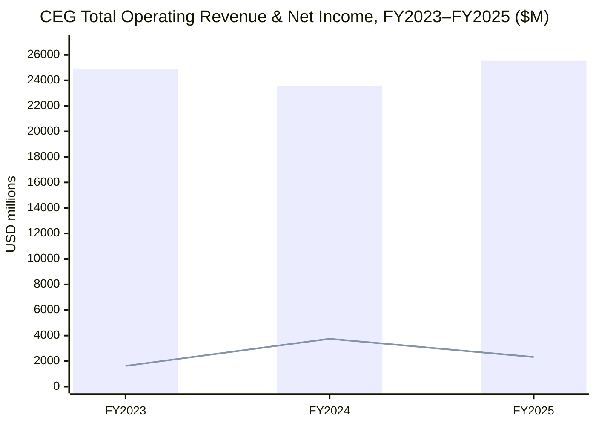
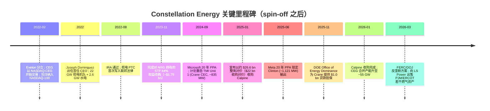
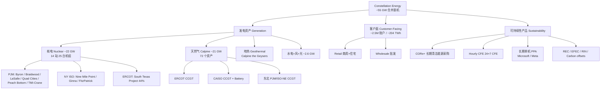
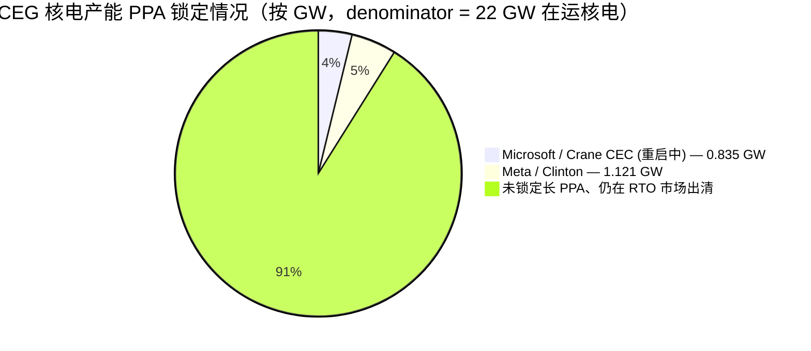

# Constellation Energy Corporation 公司研究报告（NASDAQ:CEG）

> 公司：Constellation Energy Corporation（"Constellation"、"CEG"、"公司"）  
> 主要交易所：NASDAQ Global Select Market  
> 股票代码：CEG（NASDAQ-100 成分股）  
> 报告日期："as of" 2026-06-16  
> 报告语种：简体中文（与 ai-power-electrification 主题对接）  

---

## 投资摘要 / Investment Summary（*分析师观点：* 本节为本报告观点，非 10-K 数据）

| 项目 | 数值 |
|---|---|
| **评级 / Rating** | **Hold / 持有**（OW-Neutral-UW 三档中的 Neutral） |
| **12 个月目标价 / Price Target** | **$300**（基于 2027E Adj. EPS ~$14.6 × 20.5× P/E，向 UBS 核电 5% 溢价倍数靠拢） |
| 当前股价 / Current Price | **$268.27**（as of 2026-06-16 收盘） |
| 隐含上行 / Implied Upside | **+12%** |
| 估值方法 | 远期 P/E × 目标倍数（核电基荷 + 长 PPA 给予较纯化石 IPP 的溢价；与 DCF 内含值交叉验证） |
| 市值 / Market Cap | **~$95.8 bn** |
| 企业价值 / EV | **~$116.7 bn** |
| 52 周区间 | **$240.51 – $412.70** |
| TTM P/E / Fwd P/E | **23.3× / 19.7×** |
| EV/EBITDA / P/S / P/B | **14.7× / 3.2× / 2.9×** |
| 股息率 / Beta | **0.65% / 1.09** |
| 流通股 | **~357 mn** |

**论点支柱（thesis pillars，*分析师观点：*）：**
1. **核电不可复制的稀缺性 + 长 PPA 货币化**——22 GW 在运核电是 PJM/ERCOT/CAISO/NY ISO 中几乎唯一的"24/7 无碳基荷"，Microsoft（Crane 0.835 GW）+ Meta（Clinton 1.121 GW）两份 20 年 PPA 把核电从批发出清改造为准 take-or-pay 长合约。
2. **Calpine 并表带来三位一体平台**——23 GW 天然气 + 地热 + 电池补齐"灵活调峰"短板，让公司能对数据中心负荷做分钟级填谷，是同业无法同时提供的"基荷 + 灵活"两条腿。
3. **>20% Adj. EPS CAGR（2026–2029）指引 + 投资级评级**——FY2026 指引 $11.00–$12.00/股，Q1 2026 已交付 Adj. EPS $2.74（超预期），增长可见度高于多数 utility。
4. **估值已不便宜是主要约束**——Fwd P/E 19.7×、EV/EBITDA 14.7× 高于 utility 同业；UBS 称 CEG 在 IPP 中"最 stretched"。当前价位安全边际薄，给予 Hold 而非 Buy；显著回调（< $230）将进入更好的入场区。

---

## 报告导读

Constellation Energy 是美国最大的核电运营商，2022 年 2 月从 Exelon（NASDAQ:EXC）分拆独立上市，独立运营美国最大的零碳排放发电机队。在 ai-power-electrification（AI 数据中心电力 / 美国电网电气化）主题下，CEG 处于"卖电给超大规模云厂商"这一价值链最稀缺的位置——它握有 22 GW 在运核电产能、刚刚完成的 Calpine（卡尔派恩，~23 GW 天然气+地热+电池+太阳能）收购，以及 Microsoft 与 Meta 两份各为 20 年的核电购电协议（PPA），并即将重启 Three Mile Island Unit 1（已更名为 Crane Clean Energy Center，~835 MW）。本篇为正式 initiation：以 2025 年度 10-K（2026-02-24 报送）、2026 年最新代理声明（DEF 14A）、2026 年 1 月 7 日完成 Calpine 收购的 8-K、以及 Microsoft / Meta PPA 公告作为主要原始数据来源。本报告原生采用简体中文写作，技术与监管术语首次出现时给出中英对照。

---

## 1. 公司概览 / Company Overview

Constellation Energy Corporation（"Constellation"，NASDAQ: CEG）是美国最大的清洁与可靠能源生产商（"the nation's largest producer of clean and reliable energy"），同时也是美国最大的核电运营商。2026 年 1 月 7 日完成对 Calpine Corporation 的收购后，按公司在 2025 年度 10-K 中的自述："Following the merger with Calpine in January 2026, we are the largest private-sector power producer in the world…with 55 GWs of capacity from nuclear, natural gas, geothermal, hydro, wind and solar facilities," 合并发电产能可为约 2,700 万户家庭供电，约占全美清洁电力的 10%（[CEG 2025 10-K, ITEM 1 Business — Our Business](https://www.sec.gov/Archives/edgar/data/1868275/000186827526000032/ceg-20251231.htm)）。Calpine 并表新增约 23 GW、72 个发电与电池储能资产，使公司从"纯核电+少量水电+零售"的纯粹零碳叙事，扩展为"基荷核电+灵活调峰天然气+零售客户面（C&I / 住宅）"三位一体的综合发电平台，是 ai-power-electrification 主题中体量最大、最直接对接超大规模数据中心负荷的上市公司。

CEG 由 Exelon Corporation（NASDAQ:EXC）于 2022 年 2 月 1 日通过分拆（spin-off / 分立上市）剥离而来：Exelon 的发电与客户面业务被分立成 Constellation，输配电留在 Exelon。10-K 原文："On February 1, 2022, Exelon completed the separation by distributing all the outstanding shares of the Company's common stock, on a pro rata basis to the holders of Exelon's common stock, with the Company holding all the interests in Constellation previously held by Exelon (the 'Separation')." Constellation 股票于 2022 年 2 月 2 日在 NASDAQ 以"regular way"开始交易，并随即被纳入 NASDAQ-100 指数（[CEG 2025 10-K, PART I — General](https://www.sec.gov/Archives/edgar/data/1868275/000186827526000032/ceg-20251231.htm)；[Nasdaq 公告 — CEG 加入 NASDAQ-100, 2022-02-03](https://www.nasdaq.com/press-release/constellation-energy-corp.-joined-the-nasdaq-100-index-on-february-2-2022-2022-02-03)）。Exelon 老股东在记录日按 3 股 EXC 兑 1 股 CEG 的比例获得 CEG 股份（[Exelon CEG Spin-off FAQ, ICLUB](https://www.iclub.com/faq/Home/Article?id=737&category=6&parent=3)）。

**FY2025（截至 2025-12-31）经审计的合并经营业绩：** Total Operating Revenues = $25,533 million（同比 +8.3%，2024 年为 $23,568M），Net income attributable to common shareholders = $2,319 million（YoY $-1,430M），EPS 基本/稀释 = $7.40（2024 年为 $11.89）。2025 年净利同比下滑主要来自核电 PTC（Production Tax Credit / 生产税抵免）口径下的递延收入下调、经济对冲未实现损失以及核退役信托（NDT）的非现金估值波动；运营层面公司在 10-K 的 MD&A 中强调"Favorable market and portfolio conditions primarily driven by higher capacity revenues and generation-to-load optimization"（[CEG 2025 10-K, ITEM 7 MD&A — Operating Revenues](https://www.sec.gov/Archives/edgar/data/1868275/000186827526000032/ceg-20251231.htm)）。报告期内核电机组（按所有权权益计）capacity factor / 容量因子达到 94.7%，已经连续 12 年比行业均值高出约 4 个百分点（[CEG 2025 10-K, ITEM 1 — Nuclear Operations](https://www.sec.gov/Archives/edgar/data/1868275/000186827526000032/ceg-20251231.htm)）。

**估值快照（as of 2026-06-16 收盘）。** 当前股价 $268.27，市值约 $95.8 bn，企业价值（EV）约 $116.7 bn，52 周高低区间 $240.51–$412.70，TTM P/E ≈ 23.3×、Forward P/E ≈ 19.7×、EV/EBITDA ≈ 14.7×、P/S ≈ 3.2×、P/B ≈ 2.9×、股息率 ≈ 0.65%、Beta ≈ 1.09，流通股 ~357 mn，TTM EPS $11.52（[Yahoo Finance CEG quote, 实时报价](https://finance.yahoo.com/quote/CEG/)）。从 52 周区间可以看到，市场曾在 AI 主题最热时把 CEG 推到 $412 之上，对应远期 P/E 约 30× 的"AI 电力溢价"水平；当前股价较高点回撤约 35%，已经把市场对"数据中心 PPA 兑现速度"的极端乐观情绪挤出来一部分。*分析师观点：* 与同样吃 AI 电力红利的 Talen Energy（NASDAQ:TLN，TTM EV/EBITDA ≈ 35.7×、Fwd P/E ≈ 13.0×）、Vistra（NYSE:VST，EV/EBITDA ≈ 10.8×、Fwd P/E ≈ 14.5×）相比，CEG 处于中位偏上水平——核电不可复制 + Calpine 天然气基荷 + 投资级评级使其享有比纯化石 IPP（Independent Power Producer / 独立发电商）更高的倍数，但比纯核小盘 Talen 在 EV/EBITDA 上折价（[Yahoo Finance VST quote](https://finance.yahoo.com/quote/VST/)、[Yahoo Finance TLN quote](https://finance.yahoo.com/quote/TLN/)、[Yahoo Finance NRG quote](https://finance.yahoo.com/quote/NRG/)）。完整的远期盈利预测、目标价推导与 bull/base/bear 情景见 Section 2A "估值与目标价"。

**FY2026 公司指引。** 管理层就 FY2026 Adjusted Operating Earnings 给出 $11.00–$12.00 / 股 的全年区间（合并 Calpine 后口径），并目标 2026–2029 base EPS 复合增长 >20%。2026 年第一财季（Q1 2026）实际 GAAP Net Income = $4.49 / 股、Adjusted (non-GAAP) Operating Earnings = $2.74 / 股，Operating revenues = $11,122M（同比大增，绝大部分由 Calpine 并表驱动），并在季报中明确"Affirming full year 2026 Adjusted Operating Earnings guidance of $11.00 - $12.00 per share"（[CEG Q1 2026 Earnings 8-K Exhibit 99.1, 2026-05-11](https://www.sec.gov/Archives/edgar/data/1868275/000186827526000063/ceg-20260511991.htm)）。本季同时披露 105 MW Pastoria Solar 投运、460 MW Pin Oak Creek 燃气项目达成商业运营等增长里程碑（[CEG Q1 2026 Earnings 8-K Exhibit 99.1, 2026-05-11](https://www.sec.gov/Archives/edgar/data/1868275/000186827526000063/ceg-20260511991.htm)）。


图例：柱状 = Operating Revenues；折线 = Net Income Attributable to Common Shareholders。资料来源：[CEG 2025 10-K, ITEM 7 MD&A — Results of Operations](https://www.sec.gov/Archives/edgar/data/1868275/000186827526000032/ceg-20251231.htm)；[CEG 2023 10-K, FY2023 数据](https://www.sec.gov/Archives/edgar/data/1868275/000186827524000014/ceg-20231231.htm)。

**利润表 Sankey（FY2025）。** 下面这张图把 CEG 的公用事业型利润表"可视化"——左侧是各区域贡献的营业收入，扣掉 Purchased power and fuel（购电+燃料）$14,681M 后得到 RNF（Revenues Net of Fuel / 扣燃料净收入）$10,852M，再经 O&M、D&A、其他税费三块运营支出后落到 Operating income $3,086M，最后经其他收入与所得税得到归属普通股股东净利 $2,319M：

<svg xmlns="http://www.w3.org/2000/svg" viewBox="0 0 1000 560" width="1000" height="560" role="img" aria-label="income statement Sankey"><rect x="0" y="0" width="1000" height="560" fill="#ffffff"/>
<text x="20.00" y="30.00" text-anchor="start" font-family="Helvetica,Arial,sans-serif" font-size="15" font-weight="700" fill="#1f2933">CEG FY2025 利润表 Sankey（Income Statement，$M）</text>
<path d="M 204.00,64.00 C 258.00,64.00 258.00,99.00 312.00,99.00 L 312.00,195.54 C 258.00,195.54 258.00,160.54 204.00,160.54 Z" fill="#93c5fd" fill-opacity="0.55"/>
<path d="M 452.00,92.00 C 506.00,92.00 506.00,201.25 560.00,201.25 L 560.00,247.17 C 506.00,247.17 506.00,137.93 452.00,137.93 Z" fill="#86efac" fill-opacity="0.55"/>
<path d="M 452.00,137.93 C 506.00,137.93 506.00,261.17 560.00,261.17 L 560.00,376.75 C 506.00,376.75 506.00,253.51 452.00,253.51 Z" fill="#fca5a5" fill-opacity="0.55"/>
<path d="M 328.00,99.00 C 382.00,99.00 382.00,92.00 436.00,92.00 L 436.00,253.51 C 382.00,253.51 382.00,260.51 328.00,260.51 Z" fill="#86efac" fill-opacity="0.55"/>
<path d="M 328.00,260.51 C 382.00,260.51 382.00,267.51 436.00,267.51 L 436.00,486.00 C 382.00,486.00 382.00,479.00 328.00,479.00 Z" fill="#fca5a5" fill-opacity="0.55"/>
<path d="M 204.00,174.54 C 258.00,174.54 258.00,195.54 312.00,195.54 L 312.00,281.92 C 258.00,281.92 258.00,260.92 204.00,260.92 Z" fill="#93c5fd" fill-opacity="0.55"/>
<path d="M 700.00,191.08 C 754.00,191.08 754.00,247.91 808.00,247.91 L 808.00,282.42 C 754.00,282.42 754.00,225.60 700.00,225.60 Z" fill="#86efac" fill-opacity="0.55"/>
<path d="M 700.00,225.60 C 754.00,225.60 754.00,296.42 808.00,296.42 L 808.00,314.09 C 754.00,314.09 754.00,243.26 700.00,243.26 Z" fill="#fca5a5" fill-opacity="0.55"/>
<path d="M 700.00,243.26 C 754.00,243.26 754.00,328.09 808.00,328.09 L 808.00,330.09 C 754.00,330.09 754.00,245.26 700.00,245.26 Z" fill="#fca5a5" fill-opacity="0.55"/>
<path d="M 576.00,201.25 C 630.00,201.25 630.00,191.08 684.00,191.08 L 684.00,237.01 C 630.00,237.01 630.00,247.17 576.00,247.17 Z" fill="#86efac" fill-opacity="0.55"/>
<path d="M 576.00,261.17 C 630.00,261.17 630.00,257.34 684.00,257.34 L 684.00,349.00 C 630.00,349.00 630.00,352.84 576.00,352.84 Z" fill="#fca5a5" fill-opacity="0.55"/>
<path d="M 576.00,352.84 C 630.00,352.84 630.00,363.00 684.00,363.00 L 684.00,386.92 C 630.00,386.92 630.00,376.75 576.00,376.75 Z" fill="#fca5a5" fill-opacity="0.55"/>
<path d="M 204.00,274.92 C 258.00,274.92 258.00,281.92 312.00,281.92 L 312.00,365.01 C 258.00,365.01 258.00,358.01 204.00,358.01 Z" fill="#93c5fd" fill-opacity="0.55"/>
<path d="M 204.00,372.01 C 258.00,372.01 258.00,365.01 312.00,365.01 L 312.00,397.61 C 258.00,397.61 258.00,404.61 204.00,404.61 Z" fill="#93c5fd" fill-opacity="0.55"/>
<path d="M 204.00,418.61 C 258.00,418.61 258.00,397.61 312.00,397.61 L 312.00,425.94 C 258.00,425.94 258.00,446.94 204.00,446.94 Z" fill="#93c5fd" fill-opacity="0.55"/>
<path d="M 204.00,460.94 C 258.00,460.94 258.00,425.94 312.00,425.94 L 312.00,479.00 C 258.00,479.00 258.00,514.00 204.00,514.00 Z" fill="#93c5fd" fill-opacity="0.55"/>
<rect x="188.00" y="64.00" width="16" height="96.54" rx="1.5" fill="#2563eb"/>
<rect x="188.00" y="174.54" width="16" height="86.38" rx="1.5" fill="#2563eb"/>
<rect x="188.00" y="274.92" width="16" height="83.09" rx="1.5" fill="#2563eb"/>
<rect x="188.00" y="372.01" width="16" height="32.59" rx="1.5" fill="#2563eb"/>
<rect x="188.00" y="418.61" width="16" height="28.34" rx="1.5" fill="#2563eb"/>
<rect x="188.00" y="460.94" width="16" height="53.06" rx="1.5" fill="#2563eb"/>
<rect x="312.00" y="99.00" width="16" height="380.00" rx="1.5" fill="#1e3a8a"/>
<rect x="436.00" y="92.00" width="16" height="161.51" rx="1.5" fill="#15803d"/>
<rect x="436.00" y="267.51" width="16" height="218.49" rx="1.5" fill="#dc2626"/>
<rect x="560.00" y="201.25" width="16" height="45.93" rx="1.5" fill="#15803d"/>
<rect x="560.00" y="261.17" width="16" height="115.58" rx="1.5" fill="#dc2626"/>
<rect x="684.00" y="191.08" width="16" height="52.25" rx="1.5" fill="#15803d"/>
<rect x="684.00" y="257.34" width="16" height="91.66" rx="1.5" fill="#dc2626"/>
<rect x="684.00" y="363.00" width="16" height="23.92" rx="1.5" fill="#dc2626"/>
<rect x="808.00" y="247.91" width="16" height="34.51" rx="1.5" fill="#15803d"/>
<rect x="808.00" y="296.42" width="16" height="17.67" rx="1.5" fill="#dc2626"/>
<rect x="808.00" y="328.09" width="16" height="2.00" rx="1.5" fill="#dc2626"/>
<text x="179.00" y="109.27" text-anchor="end" font-family="Helvetica,Arial,sans-serif" font-size="11.5" font-weight="700" fill="#1f2933">Mid-Atlantic</text>
<text x="179.00" y="122.27" text-anchor="end" font-family="Helvetica,Arial,sans-serif" font-size="10" font-weight="400" fill="#52606d">$6.5B  (25.4%)</text>
<text x="179.00" y="214.73" text-anchor="end" font-family="Helvetica,Arial,sans-serif" font-size="11.5" font-weight="700" fill="#1f2933">Midwest</text>
<text x="179.00" y="227.73" text-anchor="end" font-family="Helvetica,Arial,sans-serif" font-size="10" font-weight="400" fill="#52606d">$5.8B  (22.7%)</text>
<text x="179.00" y="313.47" text-anchor="end" font-family="Helvetica,Arial,sans-serif" font-size="11.5" font-weight="700" fill="#1f2933">Other Power Regions</text>
<text x="179.00" y="326.47" text-anchor="end" font-family="Helvetica,Arial,sans-serif" font-size="10" font-weight="400" fill="#52606d">$5.6B  (21.9%)</text>
<text x="179.00" y="385.31" text-anchor="end" font-family="Helvetica,Arial,sans-serif" font-size="11.5" font-weight="700" fill="#1f2933">New York</text>
<text x="179.00" y="398.31" text-anchor="end" font-family="Helvetica,Arial,sans-serif" font-size="10" font-weight="400" fill="#52606d">$2.2B  (8.6%)</text>
<text x="179.00" y="429.77" text-anchor="end" font-family="Helvetica,Arial,sans-serif" font-size="11.5" font-weight="700" fill="#1f2933">ERCOT</text>
<text x="179.00" y="442.77" text-anchor="end" font-family="Helvetica,Arial,sans-serif" font-size="10" font-weight="400" fill="#52606d">$1.9B  (7.5%)</text>
<text x="179.00" y="484.47" text-anchor="end" font-family="Helvetica,Arial,sans-serif" font-size="11.5" font-weight="700" fill="#1f2933">Other（含天然气批发/零售）</text>
<text x="179.00" y="497.47" text-anchor="end" font-family="Helvetica,Arial,sans-serif" font-size="10" font-weight="400" fill="#52606d">$3.6B  (14.0%)</text>
<rect x="331.00" y="81.00" width="106.80" height="26" rx="2" fill="#ffffff" fill-opacity="0.72"/>
<text x="334.00" y="93.00" text-anchor="start" font-family="Helvetica,Arial,sans-serif" font-size="11.5" font-weight="700" fill="#1f2933">Revenue</text>
<text x="334.00" y="106.00" text-anchor="start" font-family="Helvetica,Arial,sans-serif" font-size="10" font-weight="400" fill="#52606d">$25.5B  (100.0%)</text>
<rect x="455.00" y="74.00" width="100.50" height="26" rx="2" fill="#ffffff" fill-opacity="0.72"/>
<text x="458.00" y="86.00" text-anchor="start" font-family="Helvetica,Arial,sans-serif" font-size="11.5" font-weight="700" fill="#1f2933">Gross Profit</text>
<text x="458.00" y="99.00" text-anchor="start" font-family="Helvetica,Arial,sans-serif" font-size="10" font-weight="400" fill="#52606d">$10.9B  (42.5%)</text>
<rect x="455.00" y="249.51" width="144.60" height="26" rx="2" fill="#ffffff" fill-opacity="0.72"/>
<text x="458.00" y="261.51" text-anchor="start" font-family="Helvetica,Arial,sans-serif" font-size="11.5" font-weight="700" fill="#1f2933">Cost of Revenue (COGS)</text>
<text x="458.00" y="274.51" text-anchor="start" font-family="Helvetica,Arial,sans-serif" font-size="10" font-weight="400" fill="#52606d">$14.7B  (57.5%)</text>
<rect x="579.00" y="183.25" width="106.80" height="26" rx="2" fill="#ffffff" fill-opacity="0.72"/>
<text x="582.00" y="195.25" text-anchor="start" font-family="Helvetica,Arial,sans-serif" font-size="11.5" font-weight="700" fill="#1f2933">Operating Income</text>
<text x="582.00" y="208.25" text-anchor="start" font-family="Helvetica,Arial,sans-serif" font-size="10" font-weight="400" fill="#52606d">$3.1B  (12.1%)</text>
<rect x="579.00" y="243.17" width="150.90" height="26" rx="2" fill="#ffffff" fill-opacity="0.72"/>
<text x="582.00" y="255.17" text-anchor="start" font-family="Helvetica,Arial,sans-serif" font-size="11.5" font-weight="700" fill="#1f2933">Total Operating Expense</text>
<text x="582.00" y="268.17" text-anchor="start" font-family="Helvetica,Arial,sans-serif" font-size="10" font-weight="400" fill="#52606d">$7.8B  (30.4%)</text>
<rect x="703.00" y="173.08" width="94.20" height="26" rx="2" fill="#ffffff" fill-opacity="0.72"/>
<text x="706.00" y="185.08" text-anchor="start" font-family="Helvetica,Arial,sans-serif" font-size="11.5" font-weight="700" fill="#1f2933">Pretax Income</text>
<text x="706.00" y="198.08" text-anchor="start" font-family="Helvetica,Arial,sans-serif" font-size="10" font-weight="400" fill="#52606d">$3.5B  (13.8%)</text>
<rect x="703.00" y="239.34" width="94.20" height="26" rx="2" fill="#ffffff" fill-opacity="0.72"/>
<text x="706.00" y="251.34" text-anchor="start" font-family="Helvetica,Arial,sans-serif" font-size="11.5" font-weight="700" fill="#1f2933">SG&amp;A</text>
<text x="706.00" y="264.34" text-anchor="start" font-family="Helvetica,Arial,sans-serif" font-size="10" font-weight="400" fill="#52606d">$6.2B  (24.1%)</text>
<rect x="703.00" y="345.00" width="87.90" height="26" rx="2" fill="#ffffff" fill-opacity="0.72"/>
<text x="706.00" y="357.00" text-anchor="start" font-family="Helvetica,Arial,sans-serif" font-size="11.5" font-weight="700" fill="#1f2933">Other OpEx</text>
<text x="706.00" y="370.00" text-anchor="start" font-family="Helvetica,Arial,sans-serif" font-size="10" font-weight="400" fill="#52606d">$1.6B  (6.3%)</text>
<text x="833.00" y="262.17" text-anchor="start" font-family="Helvetica,Arial,sans-serif" font-size="11.5" font-weight="700" fill="#1f2933">Net Income</text>
<text x="833.00" y="275.17" text-anchor="start" font-family="Helvetica,Arial,sans-serif" font-size="10" font-weight="400" fill="#52606d">$2.3B  (9.1%)</text>
<text x="833.00" y="302.26" text-anchor="start" font-family="Helvetica,Arial,sans-serif" font-size="11.5" font-weight="700" fill="#1f2933">Income Tax</text>
<text x="833.00" y="315.26" text-anchor="start" font-family="Helvetica,Arial,sans-serif" font-size="10" font-weight="400" fill="#52606d">$1.2B  (4.6%)</text>
<text x="833.00" y="327.26" text-anchor="start" font-family="Helvetica,Arial,sans-serif" font-size="11.5" font-weight="700" fill="#1f2933">Minority Interest</text>
<text x="833.00" y="340.26" text-anchor="start" font-family="Helvetica,Arial,sans-serif" font-size="10" font-weight="400" fill="#52606d">$4.0M  (0.02%)</text>
<text x="500.00" y="544.00" text-anchor="middle" font-family="Helvetica,Arial,sans-serif" font-size="10" font-weight="400" fill="#52606d">Source: CEG FY2025 10-K (Consolidated Statements of Operations) · filed 2026-02-24 · Note 5 Segment Information</text>
</svg>

*图：CEG FY2025 利润表分解。注意 Purchased power and fuel 是利润表第一大项（$14,681M），而非传统制造业的 COGS——这是公用事业"批发+零售双手交易"模式的特征。来源：[CEG 2025 10-K, ITEM 7 MD&A + Note 5](https://www.sec.gov/Archives/edgar/data/1868275/000186827526000032/ceg-20251231.htm)。*

**营业收入分解与区域结构。** FY2023→FY2025 营业收入并非单调增长（$24,918M → $23,568M → $25,533M），主因是 Purchased power and fuel 随电价波动而大幅起伏（FY2023 $16,001M → FY2024 $11,419M → FY2025 $14,681M），更能反映经营实质的是 RNF（FY2023 $8,917M → FY2024 $12,149M → FY2025 $10,852M）（[CEG 2025 10-K, Note 5 — Total Consolidated Results](https://www.sec.gov/Archives/edgar/data/1868275/000186827526000032/ceg-20251231.htm)）：

<svg xmlns="http://www.w3.org/2000/svg" viewBox="0 0 860 470" width="860" height="470" role="img" aria-label="historical revenue bars"><rect x="0" y="0" width="860" height="470" fill="#ffffff"/>
<text x="20.00" y="30.00" text-anchor="start" font-family="Helvetica,Arial,sans-serif" font-size="15" font-weight="700" fill="#1f2933">CEG 营业收入分解 FY2023–FY2025（$M）</text>
<rect x="20.00" y="44" width="11" height="11" rx="2" fill="#2563eb"/>
<text x="36.00" y="53.00" text-anchor="start" font-family="Helvetica,Arial,sans-serif" font-size="10.5" font-weight="400" fill="#1f2933">RNF 扣燃料净收入</text>
<rect x="116.00" y="44" width="11" height="11" rx="2" fill="#15803d"/>
<text x="132.00" y="53.00" text-anchor="start" font-family="Helvetica,Arial,sans-serif" font-size="10.5" font-weight="400" fill="#1f2933">Purchased power &amp; fuel 购电+燃料</text>
<line x1="70" y1="412.00" x2="834" y2="412.00" stroke="#eceff2" stroke-width="1"/>
<text x="64.00" y="415.00" text-anchor="end" font-family="Helvetica,Arial,sans-serif" font-size="9.5" font-weight="400" fill="#52606d">$0</text>
<line x1="70" y1="345.20" x2="834" y2="345.20" stroke="#eceff2" stroke-width="1"/>
<text x="64.00" y="348.20" text-anchor="end" font-family="Helvetica,Arial,sans-serif" font-size="9.5" font-weight="400" fill="#52606d">$5.5B</text>
<line x1="70" y1="278.40" x2="834" y2="278.40" stroke="#eceff2" stroke-width="1"/>
<text x="64.00" y="281.40" text-anchor="end" font-family="Helvetica,Arial,sans-serif" font-size="9.5" font-weight="400" fill="#52606d">$11.0B</text>
<line x1="70" y1="211.60" x2="834" y2="211.60" stroke="#eceff2" stroke-width="1"/>
<text x="64.00" y="214.60" text-anchor="end" font-family="Helvetica,Arial,sans-serif" font-size="9.5" font-weight="400" fill="#52606d">$16.5B</text>
<line x1="70" y1="144.80" x2="834" y2="144.80" stroke="#eceff2" stroke-width="1"/>
<text x="64.00" y="147.80" text-anchor="end" font-family="Helvetica,Arial,sans-serif" font-size="9.5" font-weight="400" fill="#52606d">$22.1B</text>
<line x1="70" y1="78.00" x2="834" y2="78.00" stroke="#eceff2" stroke-width="1"/>
<text x="64.00" y="81.00" text-anchor="end" font-family="Helvetica,Arial,sans-serif" font-size="9.5" font-weight="400" fill="#52606d">$27.6B</text>
<rect x="123.48" y="304.00" width="147.71" height="108.00" fill="#2563eb"/>
<rect x="123.48" y="110.19" width="147.71" height="193.81" fill="#15803d"/>
<text x="197.33" y="428.00" text-anchor="middle" font-family="Helvetica,Arial,sans-serif" font-size="10" font-weight="400" fill="#52606d">FY2023</text>
<rect x="378.15" y="264.85" width="147.71" height="147.15" fill="#2563eb"/>
<rect x="378.15" y="126.54" width="147.71" height="138.31" fill="#15803d"/>
<text x="452.00" y="428.00" text-anchor="middle" font-family="Helvetica,Arial,sans-serif" font-size="10" font-weight="400" fill="#52606d">FY2024</text>
<rect x="632.81" y="280.56" width="147.71" height="131.44" fill="#2563eb"/>
<rect x="632.81" y="102.74" width="147.71" height="177.82" fill="#15803d"/>
<text x="706.67" y="428.00" text-anchor="middle" font-family="Helvetica,Arial,sans-serif" font-size="10" font-weight="400" fill="#52606d">FY2025</text>
<text x="430.00" y="454.00" text-anchor="middle" font-family="Helvetica,Arial,sans-serif" font-size="10" font-weight="400" fill="#52606d">Source: CEG FY2025 10-K (Note 5 Segment Information — Total Consolidated Results) · filed 2026-02-24</text>
</svg>

*图：营业收入 = RNF + 购电/燃料，按年堆叠。来源：[CEG 2025 10-K, Note 5 — Segment Information](https://www.sec.gov/Archives/edgar/data/1868275/000186827526000032/ceg-20251231.htm)。*

按区域看 RNF，Midwest（$3,702M）与 Mid-Atlantic（$3,411M）合计占合并 RNF 的 ~65%，是 PJM 容量价格暴涨最直接的受益区；New York（$1,600M）受 ZEC 计划保护、ERCOT（$1,137M）随 Calpine 并表放量（[CEG 2025 10-K, Note 5 — Segment Information](https://www.sec.gov/Archives/edgar/data/1868275/000186827526000032/ceg-20251231.htm)）：

<svg xmlns="http://www.w3.org/2000/svg" viewBox="0 0 720 460" width="720" height="460" role="img" aria-label="revenue donut"><rect x="0" y="0" width="720" height="460" fill="#ffffff"/>
<text x="20.00" y="30.00" text-anchor="start" font-family="Helvetica,Arial,sans-serif" font-size="15" font-weight="700" fill="#1f2933">CEG FY2025 RNF 经济性收入按区域（$M）</text>
<path d="M 288.00,107.20 A 132 132 0 0 1 398.94,310.72 L 353.56,281.46 A 78 78 0 0 0 288.00,161.20 Z" fill="#2563eb"/>
<path d="M 398.94,310.72 A 132 132 0 0 1 178.61,313.08 L 223.36,282.86 A 78 78 0 0 0 353.56,281.46 Z" fill="#15803d"/>
<path d="M 178.61,313.08 A 132 132 0 0 1 163.22,196.13 L 214.27,213.75 A 78 78 0 0 0 223.36,282.86 Z" fill="#d97706"/>
<path d="M 163.22,196.13 A 132 132 0 0 1 215.64,128.80 L 245.24,173.96 A 78 78 0 0 0 214.27,213.75 Z" fill="#7c3aed"/>
<path d="M 215.64,128.80 A 132 132 0 0 1 274.04,107.94 L 279.75,161.64 A 78 78 0 0 0 245.24,173.96 Z" fill="#dc2626"/>
<path d="M 274.04,107.94 A 132 132 0 0 1 288.00,107.20 L 288.00,161.20 A 78 78 0 0 0 279.75,161.64 Z" fill="#0891b2"/>
<text x="288.00" y="235.20" text-anchor="middle" font-family="Helvetica,Arial,sans-serif" font-size="18" font-weight="800" fill="#1f2933">RNF 10,852</text>
<text x="288.00" y="255.20" text-anchor="middle" font-family="Helvetica,Arial,sans-serif" font-size="13" font-weight="600" fill="#52606d">$10.9B</text>
<text x="288.00" y="271.20" text-anchor="middle" font-family="Helvetica,Arial,sans-serif" font-size="10" font-weight="400" fill="#8a97a3">total</text>
<line x1="409.17" y1="173.15" x2="425.17" y2="173.15" stroke="#2563eb" stroke-width="1.4"/>
<text x="429.17" y="171.15" text-anchor="start" font-family="Helvetica,Arial,sans-serif" font-size="11" font-weight="700" fill="#1f2933">Midwest（PJM 西+MISO）</text>
<text x="429.17" y="185.15" text-anchor="start" font-family="Helvetica,Arial,sans-serif" font-size="10" font-weight="400" fill="#52606d">$3.7B  (34.1%)</text>
<line x1="289.48" y1="377.19" x2="305.48" y2="377.19" stroke="#15803d" stroke-width="1.4"/>
<text x="309.48" y="375.19" text-anchor="start" font-family="Helvetica,Arial,sans-serif" font-size="11" font-weight="700" fill="#1f2933">Mid-Atlantic（PJM 中）</text>
<text x="309.48" y="389.19" text-anchor="start" font-family="Helvetica,Arial,sans-serif" font-size="10" font-weight="400" fill="#52606d">$3.4B  (31.4%)</text>
<line x1="151.18" y1="257.21" x2="135.18" y2="257.21" stroke="#d97706" stroke-width="1.4"/>
<text x="131.18" y="255.21" text-anchor="end" font-family="Helvetica,Arial,sans-serif" font-size="11" font-weight="700" fill="#1f2933">New York（NY ISO）</text>
<text x="131.18" y="269.21" text-anchor="end" font-family="Helvetica,Arial,sans-serif" font-size="10" font-weight="400" fill="#52606d">$1.6B  (14.7%)</text>
<line x1="179.11" y1="154.43" x2="163.11" y2="154.43" stroke="#7c3aed" stroke-width="1.4"/>
<text x="159.11" y="152.43" text-anchor="end" font-family="Helvetica,Arial,sans-serif" font-size="11" font-weight="700" fill="#1f2933">ERCOT（德州）</text>
<text x="159.11" y="166.43" text-anchor="end" font-family="Helvetica,Arial,sans-serif" font-size="10" font-weight="400" fill="#52606d">$1.1B  (10.5%)</text>
<line x1="241.58" y1="109.24" x2="225.58" y2="109.24" stroke="#dc2626" stroke-width="1.4"/>
<text x="221.58" y="107.24" text-anchor="end" font-family="Helvetica,Arial,sans-serif" font-size="11" font-weight="700" fill="#1f2933">Other Power Regions</text>
<text x="221.58" y="121.24" text-anchor="end" font-family="Helvetica,Arial,sans-serif" font-size="10" font-weight="400" fill="#52606d">$819.0M  (7.5%)</text>
<line x1="280.69" y1="101.39" x2="264.69" y2="101.39" stroke="#0891b2" stroke-width="1.4"/>
<text x="260.69" y="99.39" text-anchor="end" font-family="Helvetica,Arial,sans-serif" font-size="11" font-weight="700" fill="#1f2933">Other（天然气/零售/UK）</text>
<text x="260.69" y="113.39" text-anchor="end" font-family="Helvetica,Arial,sans-serif" font-size="10" font-weight="400" fill="#52606d">$183.0M  (1.7%)</text>
<text x="360.00" y="444.00" text-anchor="middle" font-family="Helvetica,Arial,sans-serif" font-size="10" font-weight="400" fill="#52606d">Source: CEG FY2025 10-K (Note 5 Segment Information — RNF by region) · filed 2026-02-24</text>
</svg>

*图：FY2025 RNF（经济性收入）按区域。来源：[CEG 2025 10-K, Note 5 — RNF by region](https://www.sec.gov/Archives/edgar/data/1868275/000186827526000032/ceg-20251231.htm)。*

---

## 1B. 基本面评分 / GF Score（GuruFocus-style，*分析师观点：*）

本节用一套 GuruFocus-style 的五维基本面评分卡对前面的财务事实做结构化二次解读——五个轴各 0–10 分，加权得到 0–100 综合分。**这是分析师自有评分工具的输出，不是 GuruFocus 官方数值，也不应被附加任何 10-K 引用；** 每个轴背后的指标在下文各自携带原始引用。

<svg xmlns="http://www.w3.org/2000/svg" viewBox="0 0 500 500" width="500" height="500" role="img" aria-label="GF Score radar">
<rect x="0" y="0" width="500" height="500" fill="#ffffff"/>
<text x="20" y="24" font-family="Helvetica,Arial,sans-serif" font-size="15" font-weight="700" fill="#1f2933">GF Score (GuruFocus-style): 63/100</text>
<text x="20" y="41" font-family="Helvetica,Arial,sans-serif" font-size="11" fill="#52606d">51–70 Poor future performance potential</text>
<polygon points="250.0,88.0 392.7,191.6 338.2,359.4 161.8,359.4 107.3,191.6" fill="#e9f5ec" stroke="none"/>
<polygon points="250.0,208.0 278.5,228.7 267.6,262.3 232.4,262.3 221.5,228.7" fill="none" stroke="#c5d3cb" stroke-width="1"/>
<polygon points="250.0,178.0 307.1,219.5 285.3,286.5 214.7,286.5 192.9,219.5" fill="none" stroke="#c5d3cb" stroke-width="1"/>
<polygon points="250.0,148.0 335.6,210.2 302.9,310.8 197.1,310.8 164.4,210.2" fill="none" stroke="#c5d3cb" stroke-width="1"/>
<polygon points="250.0,118.0 364.1,200.9 320.5,335.1 179.5,335.1 135.9,200.9" fill="none" stroke="#c5d3cb" stroke-width="1"/>
<polygon points="250.0,88.0 392.7,191.6 338.2,359.4 161.8,359.4 107.3,191.6" fill="none" stroke="#c5d3cb" stroke-width="1.3"/>
<line x1="250" y1="238" x2="161.8" y2="359.4" stroke="#cfdad3" stroke-width="1"/>
<text x="146.5" y="392.4" text-anchor="end" font-family="Helvetica,Arial,sans-serif" font-size="11.5" font-weight="600" fill="#1f2933">Financial Strength</text>
<text x="146.5" y="405.4" text-anchor="end" font-family="Helvetica,Arial,sans-serif" font-size="9.5" fill="#52606d">财务实力</text>
<text x="197.1" y="304.8" text-anchor="middle" font-family="Helvetica,Arial,sans-serif" font-size="10.5" font-weight="700" fill="#1f2933">6</text>
<line x1="250" y1="238" x2="250.0" y2="88.0" stroke="#cfdad3" stroke-width="1"/>
<text x="250.0" y="58.0" text-anchor="middle" font-family="Helvetica,Arial,sans-serif" font-size="11.5" font-weight="600" fill="#1f2933">Profitability</text>
<text x="250.0" y="71.0" text-anchor="middle" font-family="Helvetica,Arial,sans-serif" font-size="9.5" fill="#52606d">盈利能力</text>
<text x="250.0" y="127.0" text-anchor="middle" font-family="Helvetica,Arial,sans-serif" font-size="10.5" font-weight="700" fill="#1f2933">7</text>
<line x1="250" y1="238" x2="107.3" y2="191.6" stroke="#cfdad3" stroke-width="1"/>
<text x="82.6" y="183.6" text-anchor="end" font-family="Helvetica,Arial,sans-serif" font-size="11.5" font-weight="600" fill="#1f2933">Growth</text>
<text x="82.6" y="196.6" text-anchor="end" font-family="Helvetica,Arial,sans-serif" font-size="9.5" fill="#52606d">成长性</text>
<text x="135.9" y="194.9" text-anchor="middle" font-family="Helvetica,Arial,sans-serif" font-size="10.5" font-weight="700" fill="#1f2933">8</text>
<line x1="250" y1="238" x2="392.7" y2="191.6" stroke="#cfdad3" stroke-width="1"/>
<text x="417.4" y="183.6" text-anchor="start" font-family="Helvetica,Arial,sans-serif" font-size="11.5" font-weight="600" fill="#1f2933">GF Value</text>
<text x="417.4" y="196.6" text-anchor="start" font-family="Helvetica,Arial,sans-serif" font-size="9.5" fill="#52606d">估值</text>
<text x="307.1" y="213.5" text-anchor="middle" font-family="Helvetica,Arial,sans-serif" font-size="10.5" font-weight="700" fill="#1f2933">4</text>
<line x1="250" y1="238" x2="338.2" y2="359.4" stroke="#cfdad3" stroke-width="1"/>
<text x="353.5" y="392.4" text-anchor="start" font-family="Helvetica,Arial,sans-serif" font-size="11.5" font-weight="600" fill="#1f2933">Momentum</text>
<text x="353.5" y="405.4" text-anchor="start" font-family="Helvetica,Arial,sans-serif" font-size="9.5" fill="#52606d">动量</text>
<text x="294.1" y="292.7" text-anchor="middle" font-family="Helvetica,Arial,sans-serif" font-size="10.5" font-weight="700" fill="#1f2933">5</text>
<polygon points="250.0,133.0 307.1,219.5 294.1,298.7 197.1,310.8 135.9,200.9" fill="#2e8b57" fill-opacity="0.34" stroke="#2e8b57" stroke-width="2"/>
<circle cx="197.1" cy="310.8" r="2.6" fill="#2e8b57"/>
<circle cx="250.0" cy="133.0" r="2.6" fill="#2e8b57"/>
<circle cx="135.9" cy="200.9" r="2.6" fill="#2e8b57"/>
<circle cx="307.1" cy="219.5" r="2.6" fill="#2e8b57"/>
<circle cx="294.1" cy="298.7" r="2.6" fill="#2e8b57"/>
<text x="250" y="470" text-anchor="middle" font-family="Helvetica,Arial,sans-serif" font-size="9.5" fill="#52606d">Source: CEG FY2025 10-K · Yahoo Finance (as of 2026-06-16) · UBS US Power DCF 2026-05-04</text>
<text x="250" y="485" text-anchor="middle" font-family="Helvetica,Arial,sans-serif" font-size="9" fill="#52606d">GF Score = independent analyst rubric (*Analyst view:*) — not GuruFocus™ official number</text>
</svg>

*分析师观点：* **GF Score（GuruFocus-style）：63 / 100 — 处于 51–70 "average / 一般" 区间。** 综合算术：(财务实力 6×20 + 盈利能力 7×25 + 成长性 8×25 + GF Value 4×15 + 动量 5×15) / 100 = 630 / 100 = 6.3 → 63/100（权重 20/25/25/15/15）。

- **财务实力 Financial Strength = 6/10。** 投资级评级 S&P BBB+，利息覆盖 = Operating income $3,086M / Interest expense $511M ≈ 6.0×（[CEG 2025 10-K, Income Statement](https://www.sec.gov/Archives/edgar/data/1868275/000186827526000032/ceg-20251231.htm)）；股东权益/总资产 = $14,853M / $57,249M ≈ 26%（[CEG 2025 10-K, Balance Sheet](https://www.sec.gov/Archives/edgar/data/1868275/000186827526000032/ceg-20251231.htm)）。Calpine 并表后合并债务上升、杠杆中等，故给 6 而非更高。
- **盈利能力 Profitability = 7/10。** ROE = Net income $2,323M / 总权益 $14,853M ≈ 15.6%（归属普通股口径 $2,319M / $14,517M ≈ 16.0%）；FY2025 operating margin = $3,086M / $25,533M ≈ 12.1%（[CEG 2025 10-K, Income Statement](https://www.sec.gov/Archives/edgar/data/1868275/000186827526000032/ceg-20251231.htm)）。连续盈利、ROIC 高于 WACC，但 PTC 与 NDT 公允价值波动让 GAAP 净利噪音偏大，故 7 分。
- **成长性 Growth = 8/10。** 公司指引 2026–2029 base EPS CAGR >20%，FY2026 Adj. EPS 指引 $11.00–$12.00、Q1 2026 已交付 Adj. EPS $2.74（[CEG Q1 2026 8-K Ex.99.1](https://www.sec.gov/Archives/edgar/data/1868275/000186827526000063/ceg-20260511991.htm)）；FY2025 营收 +8.3% YoY、Q1 2026 营收因 Calpine 并表大增（[CEG 2025 10-K, MD&A](https://www.sec.gov/Archives/edgar/data/1868275/000186827526000032/ceg-20251231.htm)）。前瞻增速远高于多数 utility，故 8 分。
- **GF Value（估值，越高=越便宜）= 4/10。** Fwd P/E 19.7×、EV/EBITDA 14.7× 高于受监管 utility 同业；PEG ≈ 19.7 / 20 ≈ 1.0 提供一定缓冲，但安全边际为正负零附近，UBS 称 CEG 在 IPP 中"most stretched"（[Yahoo Finance CEG](https://finance.yahoo.com/quote/CEG/)；*分析师观点：* [UBS — US Power: DCF Valuations For IPPs Support Bullish View, 2026-05-04, p.1](http://xs-macbook-air.local:5001/zsxq/pdf/585421254542224/UBS-US%20Power%EF%BC%9A%20DCF%20Valuations%20For%20IPPs%20Support%20Bullish%20View-260504.pdf)）。偏贵故 4 分。
- **动量 Momentum = 5/10。** 现价 $268.27 较 52 周高点 $412.70 回撤约 35%、较低点 $240.51 仅高 ~12%，过去 12 个月跑输 AI 电力主题峰值（[Yahoo Finance CEG, as of 2026-06-16](https://finance.yahoo.com/quote/CEG/)）。情绪自高位回落、未重拾上行趋势，故 5 分。

---

## 2A. 估值与目标价 / Valuation & Price Target（*分析师观点：*）

本节是把"描述型公司画像"升级为"决策型研究"的核心——给出 3 年远期盈利预测、目标价推导、bull/base/bear 情景，以及与 UBS 卖方观点的对照。**全部为本报告前瞻观点，每个预测单元格均标注 `*分析师观点：*`，绝不附加 10-K 引用**（10-K 不含目标价）。

### 远期盈利预测（FY2026E–FY2028E，*分析师观点：*）

下表以公司 FY2026 Adj. EPS 指引中点 $11.5、2026–2029 >20% CAGR 指引、以及 Calpine 全年并表为驱动；EBITDA 锚定 UBS 给出的 2030E Adj. EBITDA $11.2bn 路径回推（[CEG Q1 2026 8-K Ex.99.1（指引）](https://www.sec.gov/Archives/edgar/data/1868275/000186827526000063/ceg-20260511991.htm)；*分析师观点：* [UBS US Power DCF, 2026-05-04, p.2（2030E EBITDA $11.2bn 假设）](http://xs-macbook-air.local:5001/zsxq/pdf/585421254542224/UBS-US%20Power%EF%BC%9A%20DCF%20Valuations%20For%20IPPs%20Support%20Bullish%20View-260504.pdf)）：

| 指标（*分析师观点：*） | FY2025A | FY2026E | FY2027E | FY2028E |
|---|---:|---:|---:|---:|
| Operating revenues（$bn） | 25.5 | ~38–40 | ~40–42 | ~42–44 |
| Adj. Operating Earnings EPS（$） | — | 11.5（指引中点） | ~14.6 | ~17.5 |
| Adj. EPS YoY | — | — | +27% | +20% |
| Adj. EBITDA（$bn，含 Calpine） | ~6 | ~8.5 | ~9.5 | ~10.3 |

驱动逻辑：(a) Calpine ~23 GW 全年并表把营收从 $25.5bn 抬升至 pro forma ~$38–40bn（FY2025 为 Calpine 收购前口径，Q1 2026 营收 $11,122M 已反映并表，年化即约 $40bn 量级，[CEG Q1 2026 8-K Ex.99.1](https://www.sec.gov/Archives/edgar/data/1868275/000186827526000063/ceg-20260511991.htm)）；(b) PJM 容量价格 2025 出清 $269.92/MW-day 锁定 Mid-Atlantic/Midwest 弹性（[CEG 2025 10-K, MD&A — Capacity Prices](https://www.sec.gov/Archives/edgar/data/1868275/000186827526000032/ceg-20251231.htm)）；(c) Microsoft/Meta PPA 现金流 2027–2028 起逐步贡献（Meta Clinton 2027-06 起，[Constellation 新闻稿, 2025-06-03](https://www.constellationenergy.com/newsroom/2025/constellation-meta-sign-20-year-deal-for-clean-reliable-nuclear-energy-in-illinois.html)）。

### 目标价推导（show the arithmetic，*分析师观点：*）

**Base 目标价 $300：** 2027E Adj. EPS ~$14.6 × 20.5× P/E ≈ $300。目标倍数 20.5× 的依据：(i) UBS 在其 CEG 目标价中对核电资产假设 5% 溢价倍数，并用 20.5× × $4.28（合约贡献的 EPS 部分）来定价 28% 核电合约化的价值（*分析师观点：* [UBS US Power DCF, 2026-05-04, p.5](http://xs-macbook-air.local:5001/zsxq/pdf/585421254542224/UBS-US%20Power%EF%BC%9A%20DCF%20Valuations%20For%20IPPs%20Support%20Bullish%20View-260504.pdf)）；(ii) 相对同业——CEG 当前 Fwd P/E 19.7× vs VST 14.5× / TLN 13.0×（[Yahoo Finance VST](https://finance.yahoo.com/quote/VST/)、[TLN](https://finance.yahoo.com/quote/TLN/)），核电基荷 + 长 PPA + 投资级评级支撑略高于纯化石 IPP 的倍数，但 20.5× 已接近合理上限，不宜再外推。

**DCF 交叉验证：** WACC ≈ 7.5%（无风险利率 ~4.4% 取自 10Y Treasury + ERP ~4.5% × Beta 调整 + 税后债务成本权重，详见 Section 10.3），2026–2029 EPS CAGR 22%、2030–2035 收敛至 8%、终值增长 3%，内含估值区间 ~$245–300/股，与 base $300 上沿一致。UBS DCF 方法（8× 终值 EBITDA、7% 折现率、$200/MW-day 终值容量、折现至 2028）给出 PT $388——比本报告更激进，因其纳入了 $88/股的"未来新签合约"期权价值（*分析师观点：* [UBS US Power DCF, 2026-05-04, p.4–5](http://xs-macbook-air.local:5001/zsxq/pdf/585421254542224/UBS-US%20Power%EF%BC%9A%20DCF%20Valuations%20For%20IPPs%20Support%20Bullish%20View-260504.pdf)）。

### Bull / Base / Bear 情景（*分析师观点：*）

| 情景 | 目标价 | 对当前 $268.27 的隐含空间 | 核心摆动假设 |
|---|---:|---:|---|
| **Bull** | **$388** | **+45%** | 新签 ≥2 份类 Meta 的 20 年 PPA（核电合约化率 9%→28%），PJM 容量价维持高位，UBS $88/股合约期权兑现 |
| **Base** | **$300** | **+12%** | 2027E EPS ~$14.6 × 20.5×；Calpine 协同按指引兑现；容量价小幅回落但仍高 |
| **Bear** | **$200** | **−25%** | PJM 容量价回落至 $50–100/MW-day，Crane 重启延期，Calpine 整合协同不及预期，倍数压缩至 ~14× |

*分析师观点：* 当前价 $268 已处于 base 与 bear 之间偏 base 一侧，风险-回报大致对称偏正（+12% vs −25% 但 bear 概率更低），故综合给予 **Hold / 持有**——核电稀缺性与 >20% EPS 增长是真实的，但估值不便宜让安全边际偏薄；显著回调（< $230）将进入更好的 Buy 区间。

### 卖方观点对照（Sell-side view，*分析师观点：*）

本报告在本地机构研报库（`db/zsxq.db`）中找到 1 篇直接覆盖 CEG 的卖方深度报告（UBS US Power DCF）+ 1 篇含 CEG 敏感性的 UBS 行业 marketing deck；由于直接覆盖 CEG 的独立机构仅 1 家，不构成多机构"观点演变时间线"，故以单一 UBS 视角呈现，不拼凑虚假一致预期：

- **UBS（2026-05-04）：Buy，目标价 $388。** 报告日（2026-05-04）CEG 收盘约 $320.55，对应 UBS 当时看到的上行 ~+21%（数据来自 `db/stock_price_target.db`）。UBS 核心论点："We remain buyers of IPPs and believe fundamentals are above mid-cycle"；但同时承认 "CEG looks most stretched, as it continues to price in additional upside or warrants a higher terminal value, which is reasonable, given the baseload nuclear heavy portfolio"——即 CEG 在 IPP 中估值最满，但其纯核基荷组合配得上更高终值倍数（*分析师观点：* [UBS US Power DCF, 2026-05-04, p.1 & p.4](http://xs-macbook-air.local:5001/zsxq/pdf/585421254542224/UBS-US%20Power%EF%BC%9A%20DCF%20Valuations%20For%20IPPs%20Support%20Bullish%20View-260504.pdf)）。UBS 2030E Adj. EBITDA 假设 CEG $11.2bn vs VST $9.1bn vs NRG $5.78bn，凸显 CEG 体量最大（*分析师观点：* [同上, p.2](http://xs-macbook-air.local:5001/zsxq/pdf/585421254542224/UBS-US%20Power%EF%BC%9A%20DCF%20Valuations%20For%20IPPs%20Support%20Bullish%20View-260504.pdf)）。

**本报告 vs UBS：** 本报告 base PT $300 低于 UBS $388 约 23%——差异几乎全部来自 UBS 纳入的 $88/股"未来新签合约期权价值"。本报告把这部分放进 bull 情景（$388）而非 base，因为新签 PPA 的时点与定价仍有不确定性，base 只计入已签的 Microsoft/Meta 两份。

### 关键摆动变量（swing variables，*分析师观点：*）

1. **PJM 容量价格的可持续性**——Mid-Atlantic+Midwest 占 65% RNF，2025 出清 $269.92/MW-day 的历史高位若在 2026/27、2027/28 周期回落，直接冲击 base 假设。
2. **新签长 PPA 的节奏**——核电合约化率从 9% 向 28%+ 推进的速度，决定 bull 情景能否兑现；UBS 的 $88/股期权价值正是押注于此。

### DuPont ROE 分解（FY2025）

最后用 DuPont 5 步分解 CEG 的 ROE，看回报来自哪里——净利率 × 资产周转 × 权益乘数：

<svg xmlns="http://www.w3.org/2000/svg" viewBox="0 0 1240 540" width="1240" height="540" role="img" aria-label="DuPont ROE decomposition"><rect x="0" y="0" width="1240" height="540" fill="#ffffff"/>
<text x="20.00" y="30.00" text-anchor="start" font-family="Helvetica,Arial,sans-serif" font-size="15" font-weight="700" fill="#1f2933">CEG FY2025 DuPont ROE 分解（5 步）</text>
<rect x="545.00" y="56.00" width="150" height="56" rx="7" fill="#1e3a8a"/>
<text x="620.00" y="76.00" text-anchor="middle" font-family="Helvetica,Arial,sans-serif" font-size="11.5" font-weight="700" fill="#ffffff">ROE</text>
<text x="620.00" y="94.00" text-anchor="middle" font-family="Helvetica,Arial,sans-serif" font-size="13" font-weight="800" fill="#ffffff">16.36%</text>
<text x="620.00" y="106.00" text-anchor="middle" font-family="Helvetica,Arial,sans-serif" font-size="8.5" font-weight="400" fill="#dbeafe">= Net Income / Avg Equity</text>
<rect x="191.60" y="168.00" width="150" height="56" rx="7" fill="#2563eb"/>
<text x="266.60" y="188.00" text-anchor="middle" font-family="Helvetica,Arial,sans-serif" font-size="11.5" font-weight="700" fill="#ffffff">Net Margin</text>
<text x="266.60" y="206.00" text-anchor="middle" font-family="Helvetica,Arial,sans-serif" font-size="13" font-weight="800" fill="#ffffff">9.10%</text>
<text x="266.60" y="218.00" text-anchor="middle" font-family="Helvetica,Arial,sans-serif" font-size="8.5" font-weight="400" fill="#dbeafe">Net Income / Revenue</text>
<line x1="620.00" y1="112.00" x2="266.60" y2="168.00" stroke="#94a3b8" stroke-width="1.4"/>
<rect x="545.00" y="168.00" width="150" height="56" rx="7" fill="#2563eb"/>
<text x="620.00" y="188.00" text-anchor="middle" font-family="Helvetica,Arial,sans-serif" font-size="11.5" font-weight="700" fill="#ffffff">Asset Turnover</text>
<text x="620.00" y="206.00" text-anchor="middle" font-family="Helvetica,Arial,sans-serif" font-size="13" font-weight="800" fill="#ffffff">0.46</text>
<text x="620.00" y="218.00" text-anchor="middle" font-family="Helvetica,Arial,sans-serif" font-size="8.5" font-weight="400" fill="#dbeafe">Revenue / Avg Assets</text>
<line x1="620.00" y1="112.00" x2="620.00" y2="168.00" stroke="#94a3b8" stroke-width="1.4"/>
<rect x="898.40" y="168.00" width="150" height="56" rx="7" fill="#2563eb"/>
<text x="973.40" y="188.00" text-anchor="middle" font-family="Helvetica,Arial,sans-serif" font-size="11.5" font-weight="700" fill="#ffffff">Equity Multiplier</text>
<text x="973.40" y="206.00" text-anchor="middle" font-family="Helvetica,Arial,sans-serif" font-size="13" font-weight="800" fill="#ffffff">3.88</text>
<text x="973.40" y="218.00" text-anchor="middle" font-family="Helvetica,Arial,sans-serif" font-size="8.5" font-weight="400" fill="#dbeafe">Avg Assets / Avg Equity</text>
<line x1="620.00" y1="112.00" x2="973.40" y2="168.00" stroke="#94a3b8" stroke-width="1.4"/>
<circle cx="443.30" cy="196.00" r="11" fill="#ffffff" stroke="#94a3b8" stroke-width="1.2"/>
<text x="443.30" y="201.00" text-anchor="middle" font-family="Helvetica,Arial,sans-serif" font-size="14" font-weight="800" fill="#52606d">×</text>
<circle cx="796.70" cy="196.00" r="11" fill="#ffffff" stroke="#94a3b8" stroke-width="1.2"/>
<text x="796.70" y="201.00" text-anchor="middle" font-family="Helvetica,Arial,sans-serif" font-size="14" font-weight="800" fill="#52606d">×</text>
<rect x="65.00" y="300.00" width="118" height="56" rx="7" fill="#2563eb"/>
<text x="124.00" y="320.00" text-anchor="middle" font-family="Helvetica,Arial,sans-serif" font-size="11.5" font-weight="700" fill="#ffffff">Operating Margin</text>
<text x="124.00" y="338.00" text-anchor="middle" font-family="Helvetica,Arial,sans-serif" font-size="13" font-weight="800" fill="#ffffff">12.09%</text>
<text x="124.00" y="350.00" text-anchor="middle" font-family="Helvetica,Arial,sans-serif" font-size="8.5" font-weight="400" fill="#dbeafe">Op Inc / Revenue</text>
<line x1="266.60" y1="224.00" x2="124.00" y2="300.00" stroke="#94a3b8" stroke-width="1.4"/>
<rect x="207.60" y="300.00" width="118" height="56" rx="7" fill="#2563eb"/>
<text x="266.60" y="320.00" text-anchor="middle" font-family="Helvetica,Arial,sans-serif" font-size="11.5" font-weight="700" fill="#ffffff">Tax Burden</text>
<text x="266.60" y="338.00" text-anchor="middle" font-family="Helvetica,Arial,sans-serif" font-size="13" font-weight="800" fill="#ffffff">0.6616</text>
<text x="266.60" y="350.00" text-anchor="middle" font-family="Helvetica,Arial,sans-serif" font-size="8.5" font-weight="400" fill="#dbeafe">Net Inc / Pretax</text>
<line x1="266.60" y1="224.00" x2="266.60" y2="300.00" stroke="#94a3b8" stroke-width="1.4"/>
<rect x="350.20" y="300.00" width="118" height="56" rx="7" fill="#2563eb"/>
<text x="409.20" y="320.00" text-anchor="middle" font-family="Helvetica,Arial,sans-serif" font-size="11.5" font-weight="700" fill="#ffffff">Interest Burden</text>
<text x="409.20" y="338.00" text-anchor="middle" font-family="Helvetica,Arial,sans-serif" font-size="13" font-weight="800" fill="#ffffff">1.1377</text>
<text x="409.20" y="350.00" text-anchor="middle" font-family="Helvetica,Arial,sans-serif" font-size="8.5" font-weight="400" fill="#dbeafe">Pretax / Op Inc</text>
<line x1="266.60" y1="224.00" x2="409.20" y2="300.00" stroke="#94a3b8" stroke-width="1.4"/>
<circle cx="195.30" cy="328.00" r="11" fill="#ffffff" stroke="#94a3b8" stroke-width="1.2"/>
<text x="195.30" y="333.00" text-anchor="middle" font-family="Helvetica,Arial,sans-serif" font-size="14" font-weight="800" fill="#52606d">×</text>
<circle cx="337.90" cy="328.00" r="11" fill="#ffffff" stroke="#94a3b8" stroke-width="1.2"/>
<text x="337.90" y="333.00" text-anchor="middle" font-family="Helvetica,Arial,sans-serif" font-size="14" font-weight="800" fill="#52606d">×</text>
<rect x="479.00" y="300.00" width="118" height="56" rx="7" fill="#2563eb"/>
<text x="538.00" y="326.00" text-anchor="middle" font-family="Helvetica,Arial,sans-serif" font-size="11.5" font-weight="700" fill="#ffffff">Revenue</text>
<text x="538.00" y="342.00" text-anchor="middle" font-family="Helvetica,Arial,sans-serif" font-size="13" font-weight="800" fill="#ffffff">$25.5B</text>
<line x1="620.00" y1="224.00" x2="538.00" y2="300.00" stroke="#94a3b8" stroke-width="1.4"/>
<rect x="643.00" y="300.00" width="118" height="56" rx="7" fill="#2563eb"/>
<text x="702.00" y="320.00" text-anchor="middle" font-family="Helvetica,Arial,sans-serif" font-size="11.5" font-weight="700" fill="#ffffff">Avg Total Assets</text>
<text x="702.00" y="338.00" text-anchor="middle" font-family="Helvetica,Arial,sans-serif" font-size="13" font-weight="800" fill="#ffffff">$55.1B</text>
<text x="702.00" y="350.00" text-anchor="middle" font-family="Helvetica,Arial,sans-serif" font-size="8.5" font-weight="400" fill="#dbeafe">(begin+end)/2</text>
<line x1="620.00" y1="224.00" x2="702.00" y2="300.00" stroke="#94a3b8" stroke-width="1.4"/>
<circle cx="620.00" cy="328.00" r="11" fill="#ffffff" stroke="#94a3b8" stroke-width="1.2"/>
<text x="620.00" y="333.00" text-anchor="middle" font-family="Helvetica,Arial,sans-serif" font-size="14" font-weight="800" fill="#52606d">÷</text>
<rect x="832.40" y="300.00" width="118" height="56" rx="7" fill="#2563eb"/>
<text x="891.40" y="320.00" text-anchor="middle" font-family="Helvetica,Arial,sans-serif" font-size="11.5" font-weight="700" fill="#ffffff">Avg Total Assets</text>
<text x="891.40" y="338.00" text-anchor="middle" font-family="Helvetica,Arial,sans-serif" font-size="13" font-weight="800" fill="#ffffff">$55.1B</text>
<text x="891.40" y="350.00" text-anchor="middle" font-family="Helvetica,Arial,sans-serif" font-size="8.5" font-weight="400" fill="#dbeafe">(begin+end)/2</text>
<line x1="973.40" y1="224.00" x2="891.40" y2="300.00" stroke="#94a3b8" stroke-width="1.4"/>
<rect x="996.40" y="300.00" width="118" height="56" rx="7" fill="#2563eb"/>
<text x="1055.40" y="320.00" text-anchor="middle" font-family="Helvetica,Arial,sans-serif" font-size="11.5" font-weight="700" fill="#ffffff">Avg Total Equity</text>
<text x="1055.40" y="338.00" text-anchor="middle" font-family="Helvetica,Arial,sans-serif" font-size="13" font-weight="800" fill="#ffffff">$14.2B</text>
<text x="1055.40" y="350.00" text-anchor="middle" font-family="Helvetica,Arial,sans-serif" font-size="8.5" font-weight="400" fill="#dbeafe">(begin+end)/2</text>
<line x1="973.40" y1="224.00" x2="1055.40" y2="300.00" stroke="#94a3b8" stroke-width="1.4"/>
<circle cx="967.20" cy="328.00" r="11" fill="#ffffff" stroke="#94a3b8" stroke-width="1.2"/>
<text x="967.20" y="333.00" text-anchor="middle" font-family="Helvetica,Arial,sans-serif" font-size="14" font-weight="800" fill="#52606d">÷</text>
<rect x="69.00" y="420.00" width="110" height="48" rx="7" fill="#3b82f6"/>
<text x="124.00" y="442.00" text-anchor="middle" font-family="Helvetica,Arial,sans-serif" font-size="11.5" font-weight="700" fill="#ffffff">Operating Income</text>
<text x="124.00" y="458.00" text-anchor="middle" font-family="Helvetica,Arial,sans-serif" font-size="13" font-weight="800" fill="#ffffff">$3.1B</text>
<line x1="124.00" y1="356.00" x2="124.00" y2="420.00" stroke="#94a3b8" stroke-width="1.4"/>
<rect x="211.60" y="420.00" width="110" height="48" rx="7" fill="#3b82f6"/>
<text x="266.60" y="442.00" text-anchor="middle" font-family="Helvetica,Arial,sans-serif" font-size="11.5" font-weight="700" fill="#ffffff">Net Income</text>
<text x="266.60" y="458.00" text-anchor="middle" font-family="Helvetica,Arial,sans-serif" font-size="13" font-weight="800" fill="#ffffff">$2.3B</text>
<line x1="266.60" y1="356.00" x2="266.60" y2="420.00" stroke="#94a3b8" stroke-width="1.4"/>
<rect x="354.20" y="420.00" width="110" height="48" rx="7" fill="#3b82f6"/>
<text x="409.20" y="442.00" text-anchor="middle" font-family="Helvetica,Arial,sans-serif" font-size="11.5" font-weight="700" fill="#ffffff">Pretax Income</text>
<text x="409.20" y="458.00" text-anchor="middle" font-family="Helvetica,Arial,sans-serif" font-size="13" font-weight="800" fill="#ffffff">$3.5B</text>
<line x1="409.20" y1="356.00" x2="409.20" y2="420.00" stroke="#94a3b8" stroke-width="1.4"/>
<text x="620.00" y="524.00" text-anchor="middle" font-family="Helvetica,Arial,sans-serif" font-size="10" font-weight="400" fill="#52606d">Source: CEG FY2025 10-K (Income Statement + Balance Sheets) · filed 2026-02-24</text>
</svg>

*图：CEG FY2025 DuPont 分解。净利率偏低（~9.1%，受 PTC/NDT 噪音拖累）、资产周转中等，权益乘数偏高（核电资本密集 + Calpine 并表后杠杆上升）共同得到 ~16% ROE。来源：[CEG 2025 10-K, Income Statement + Balance Sheets](https://www.sec.gov/Archives/edgar/data/1868275/000186827526000032/ceg-20251231.htm)。*

---

## 2B. 公司历史 / Company History

Constellation Energy 当下的法律实体（CEG Parent）成立于 2021 年，但其经营史可一路追溯到 19 世纪美国早期电力工业——其前身 ComEd / Commonwealth Edison 与 PECO 早在 1907 年与 1929 年就已存在，二者于 2000 年合并组成 Exelon Corporation。原来的"Constellation"（Constellation Energy Group）是巴尔的摩本地的另一家公司，2012 年被 Exelon 收购后成为 Exelon Generation 的客户面（retail / wholesale）品牌。2021 年 2 月 21 日，Exelon 董事会正式批准把竞争性发电与客户面业务（Exelon Generation + Constellation 销售平台）分拆出来组成 CEG Parent，2022 年 2 月 1 日完成 spin-off（[CEG 2025 10-K, PART I — General](https://www.sec.gov/Archives/edgar/data/1868275/000186827526000032/ceg-20251231.htm)；[Exelon 2022-02-08 8-K — separation 完成公告](https://www.sec.gov/Archives/edgar/data/1109357/000110935722000021/exc-20220208991.htm)）。Spin-off 当天股价以约 $42 起步，截至 2026-06-16 已达 $268，4.4 年涨幅 ~539%，主要驱动来自 2022 IRA 法案（Inflation Reduction Act / 通胀削减法案）创设的核电 PTC、2024 年 Microsoft TMI 重启 PPA、2025 年 Meta Clinton PPA，以及 2026 年 Calpine 收购的预期 / 完成（[Constellation Energy CEG 历史价格, Yahoo Finance](https://finance.yahoo.com/quote/CEG/history/)；[Foley & Lardner — Meta / Constellation PPA Analysis](https://www.foley.com/p/102kq90/constellation-and-meta-ppa-tech-ai-and-clean-energy-goals-preserve-existing-nucl/)）。

公司近期的关键里程碑可以归纳为一个"由防守到进攻"的转身。2017–2021 年间，Exelon Generation 仍处于守势——Clinton（IL）、TMI Unit 1（PA）、Quad Cities（IL）几座核电站均曾接近经济性关闭，2017 年 Illinois 通过《Future Energy Jobs Act》设立 ZEC（Zero Emission Credit / 零碳排放抵免）才保住 Clinton 与 Quad Cities，TMI Unit 1 则在 2019 年 9 月正式停堆退役（[Foley & Lardner — Meta 协议解析, 引用 Future Energy Jobs Act 与 Clinton 历史](https://www.foley.com/p/102kq90/constellation-and-meta-ppa-tech-ai-and-clean-energy-goals-preserve-existing-nucl/)）。2022 年 IRA 通过后，存量核电的 PTC（基础 $15/MWh、按通胀年度调整）从根本上抬升了核电的现金流稳定性；2023 年 11 月 Constellation 又花了 $1.75 bn 买下 NRG Energy 持有的德州 South Texas Project（STP）44% 权益，把核电产能从 ~21 GW 扩至 ~22 GW（[CEG 2023 10-K, Acquisition of STP](https://www.sec.gov/Archives/edgar/data/1868275/000186827524000014/ceg-20231231.htm)）。2024 年 9 月与 Microsoft 签署 20 年 PPA 重启 TMI Unit 1（更名 Crane Clean Energy Center，835 MW，预计 2028 年并网），把"核电+超大规模数据中心"的商业模型首次落地（[CEG 2024-09-20 Investor 8-K](https://www.sec.gov/Archives/edgar/data/1868275/000186827524000058/ceg-202409208kexh991.htm)）。2025 年 1 月 10 日公司宣布以现金+股票方式收购 Calpine（约 $26.6 bn 整体交易价值，含承担债务），2026 年 1 月 7 日交易完成，购买对价 ~$22 bn（5,000 万股新股 + ~$4.5 bn 现金），并表新增 23 GW 天然气、地热、电池储能与太阳能资产、~62 TWh 零售负荷、~2,500 名员工（[CEG 2026-01-07 8-K — Calpine 收购完成](https://www.sec.gov/Archives/edgar/data/1868275/000110465926001780/tm2532248d1_ex99-1.htm)；[CEG 2025 10-K, Note 2 — Mergers, Acquisitions, and Dispositions](https://www.sec.gov/Archives/edgar/data/1868275/000186827526000032/ceg-20251231.htm)）。

2026 年 3 月 FERC 批准 Calpine 交易，附带条件是 Constellation 须剥离 PJM 与 ERCOT 的若干天然气资产以缓解市场集中度担忧；公司随后在 2026 年 3 月宣布把 York 2（PA，828 MW CCGT）、Jack Fusco Energy Center（休斯顿，605 MW CCGT）与 Gregory Power Plant（385 MW，少数股权）打包出售给 LS Power，作为 FERC/DOJ 反垄断解决方案的一部分（[Constellation 2026-03 PJM 资产出售公告](https://www.constellationenergy.com/news/2026/03/constellation-announces-agreement-to-sell-pjm-generation-assets-to-ls-power-as-part-of-ferc-us-doj-resolution-of-calpine-transaction.html)；[LS Power 2026 公告 — 收购 Constellation 资产](https://www.lspower.com/news/constellation-announces-agreement-to-sell-pjm-generation-assets-to-ls-power-as-part-of-ferc-u-s-doj-resolution-of-calpine-transaction/)）。同期 NRC 公布对 TMI Unit 1（Crane Clean Energy Center）的安全审查推进、纽约公服委员会（NYPSC）2026 年 1 月将 ZEC 计划延长 20 年至 2049 年，为 Nine Mile Point / Ginna / FitzPatrick 三座纽约州核电站提供了又一个稳态现金流（[CEG 2025 10-K — Environmental & Regulation](https://www.sec.gov/Archives/edgar/data/1868275/000186827526000032/ceg-20251231.htm)）。



资料来源：[CEG 2025 10-K, ITEM 1 + Note 2](https://www.sec.gov/Archives/edgar/data/1868275/000186827526000032/ceg-20251231.htm)；[Microsoft / TMI PPA 8-K, 2024-09-20](https://www.sec.gov/Archives/edgar/data/1868275/000186827524000058/ceg-202409208kexh991.htm)；[Meta / Clinton PPA — Constellation 新闻稿, 2025-06-03](https://investors.constellationenergy.com/news-releases/news-release-details/constellation-meta-sign-20-year-deal-clean-reliable-nuclear)。

---

## 3. 管理团队 / Management

Constellation 没有"创始人 + 现任 CEO"两套传记的常规结构——它是 Exelon 的分拆产物，所以这一节只覆盖**现任 CEO Joseph Dominguez 一人**，并把"创始人"角色解释为分拆决策本身（即 Exelon 时期对发电与零售业务的剥离选择）。

**Joseph Dominguez（63 岁），President & CEO，2022 至今。** 在 CEG 上市当天出任首任 CEO。Dominguez 在能源行业的经历高度集中在 Exelon 体系内部：2018–2021 年间任 ComEd（伊利诺伊州最大配电公司、Exelon 全资子公司）CEO，覆盖芝加哥 / 北伊利诺伊约 400 万住宅与商业终端；2021 年 1 月起任 Exelon Generation Company, LLC 总裁兼 CEO；2022 年 2 月分拆完成后转任 CEG Parent CEO（[CEG 2025 10-K, ITEM 10 — Information about Executive Officers](https://www.sec.gov/Archives/edgar/data/1868275/000186827526000032/ceg-20251231.htm)）。在 ComEd 任内，他主导推动 2016 年伊利诺伊《Future Energy Jobs Act》（FEJA）与 2021 年《Climate and Equitable Jobs Act》两部里程碑式州级清洁能源法的立法谈判——FEJA 创设的 ZEC 计划直接保住了 Clinton 与 Quad Cities 两座核电站，构成今天 Meta PPA 商业模型的法律前提（[Foley & Lardner — Meta PPA & FEJA Background](https://www.foley.com/p/102kq90/constellation-and-meta-ppa-tech-ai-and-clean-energy-goals-preserve-existing-nucl/)）。

学历方面，Dominguez 持有新泽西理工学院（NJIT）机械工程学士（1984）与 Rutgers 法学院（Newark）法学博士（1990）。在加入 Exelon 之前，他曾在 White and Williams LLP 律所合伙人，并担任过宾州东区联邦助理检察官（Assistant U.S. Attorney, E.D. Pa.）——"工程 + 法律 + 公共政策"的三栖背景在公用事业 CEO 群体中并不常见，也对应了他在 Exelon 时期同时担任"政府监管与公共政策事务执行副总裁"的角色（[Joseph Dominguez Biography — Constellation Energy CEO, theofficialboard.com](https://www.theofficialboard.com/biography/joseph-dominguez-g6053)）。

**薪酬与持股。** 根据 2026 代理声明（DEF 14A），Dominguez 2025 财年披露薪酬约 $17.12 mn，其中 ~8.7% 为现金底薪、~91.3% 为短期奖金、股权激励（PSU / RSU）与期权——薪酬结构对长期股价表现高度敏感，对应 CEG "投资级评级 + EPS 高复合增长（>20% CAGR through 2029）"双指引下的股东对齐机制（[CEG 2026 DEF 14A — Compensation Discussion and Analysis](https://www.sec.gov/Archives/edgar/data/1868275/000155278126000140/e26004_ceg-def14a.htm)；[Simply Wall St — CEG Management Profile](https://simplywall.st/stocks/us/utilities/nasdaq-ceg/constellation-energy/management)）。

**Calpine 整合后的高管布局值得一并指出。** Calpine 前 CEO Andrew Novotny（49 岁，2024–2026 年任 Calpine CEO）合并后转任 Constellation 高级执行副总裁、Constellation Power Operations 总裁，并继续兼任 Calpine 子公司 CEO；Shane Smith（46 岁）接替原 CFO Daniel Eggers 任 EVP & CFO，Eggers 则上移至高级执行副总裁，负责"Finance and Data Economy"业务条线——这一架构调整把"数据中心+AI 负荷的商业开发"独立成一个 C-Suite 直管的纵队，体现了管理层把 ai-power-electrification 主题视作公司未来 3–5 年 NAV 重估核心驱动的判断（[CEG 2025 10-K, ITEM 10 — Executive Officers](https://www.sec.gov/Archives/edgar/data/1868275/000186827526000032/ceg-20251231.htm)）。

---

## 4. 产品与服务 / Products & Services

Constellation 的"产品"对外可以归纳为三个层面：(i) **发电资产（generation fleet）**——是公司收入与利润的物理基础；(ii) **客户面（customer-facing）平台**——批发与零售电力 / 天然气销售、容量与碳排属性产品；(iii) **可持续性 / 长期合同产品**——为大型 C&I（Commercial & Industrial / 工商业）客户量身定做的 24/7 碳清洁电力（CFE）产品。本节是全报告最核心的章节——读者只有理解 Constellation 卖的是什么、与同业竞品的差异在哪，才能判断 Section 5–8 各类长期合同（特别是 Microsoft / Meta PPA）的商业含义。

### 4.1 发电资产组合（Generation Fleet）

合并 Calpine 后，公司自报 55 GW 总装机，分为四大类。以下表格根据 10-K Item 1 Business — Our Operations 与 Item 2 Properties 拼装，**专有名词与数字均取自 10-K 原文**：

| 资产类别 | 装机（GW） | 占比 | 主要地理分布 | 注 |
|---|---:|---:|---|---|
| 核电（Nuclear） | ~22 | 40% | PJM（伊利诺伊、宾州、马里兰、新泽西）、纽约 ISO、ERCOT | 14 个核电站、25 台机组；全美最大核电机队 |
| 天然气 / Calpine（Natural gas, CCGT + peaker） | ~21 | 38% | 德州（ERCOT）、加州（CAISO）、东北 | 全美最大天然气发电商，按 S&P Global Market Intelligence |
| 地热 / 太阳能 / 电池储能（Geothermal / Solar / Battery，Calpine 内） | ~2 | 4% | 加州（the Geysers 地热田为主）、德州 | Calpine 是全美最大地热发电商 |
| 水电 / 风电 / 太阳能（Renewable，CEG 历史持有） | ~2.6 | 5% | Conowingo（MD/PA 边界）、Muddy Run pumped storage（PA）等 | 含 50 年 FERC 许可的 pumped storage / 抽水蓄能 |
| **核心调度产能（合并后）** | **~48** | **87%** | — | 公司称合并后总产能 ~55 GW 含批发交易组合的非自有部分 |

来源：[CEG 2025 10-K, ITEM 1 — Our Business / Our Operations](https://www.sec.gov/Archives/edgar/data/1868275/000186827526000032/ceg-20251231.htm)。

**核电是公司的"皇冠资产"。** 10-K 直接表述："Our nuclear fleet is the nation's largest, with current generating capacity of approximately 22 GWs, producing 183 TWhs of zero-emissions electricity during 2025 – enough to power 16 million homes and avoid more than 122 million metric tons of carbon emissions according to the EPA GHG Equivalencies Calculator. We have ownership interests in 14 nuclear generating stations currently in service, consisting of 25 units." 公司全资持有除以下五处之外的所有核电资产：Quad Cities（75%）、Peach Bottom（50%）、Salem（42.59%）、Nine Mile Point Unit 2 / NMP-2（82%）、South Texas Project / STP（44%）。运营层面，除 Salem（由 PSEG Nuclear 运营）与 STP（由 STPNOC 运营）外均由 CEG 自行操作；2025 年合并机队 capacity factor / 容量因子 94.7%，连续 12 年高于行业均值约 4 ppt，平均换料停堆周期 22 天 vs. 行业 33 天（[CEG 2025 10-K, ITEM 1 — Nuclear Operations](https://www.sec.gov/Archives/edgar/data/1868275/000186827526000032/ceg-20251231.htm)）。

**中文释义 / Plain-language gloss：** capacity factor（容量因子）= 一年内实际发电量 / 满负荷理论发电量。94.7% 意味着核电站 365 天里大约只有 19 天处于停机或减载状态，是所有发电方式中可用率最高的——这也是为什么 Microsoft、Meta 这类需要 24/7 电力的超大规模数据中心愿意签 20 年 PPA。

**Calpine 天然气机队 = 23 GW、72 个发电与电池储能资产。** 10-K 原文："our merger with Calpine added approximately 23 GWs across 72 generation and battery storage assets, providing reliable power resources in areas experiencing significant demand growth. Calpine is the nation's largest generator of electricity from natural gas and geothermal resources, according to S&P Global Market Intelligence, with a strong footprint in Texas, California, and the Northeast regions of the U.S." 这一笔交易让公司从纯核电+少量水电的"低排放但弹性不足"组合，扩展为"基荷核电 + 灵活调峰 CCGT / 联合循环燃气轮机"双驱组合——CCGT（Combined-cycle gas turbine）的爬坡速度比核电快两个数量级，能跟随 ERCOT、CAISO 这种风电 / 光伏渗透率最高的市场分钟级波动调度，给整个机队的"组合最优化"（generation-to-load optimization，公司 MD&A 用词）腾出空间（[CEG 2025 10-K, ITEM 1 — Our Business / Our Operations](https://www.sec.gov/Archives/edgar/data/1868275/000186827526000032/ceg-20251231.htm)）。

**水电、抽水蓄能与再生能源资产（~2.6 GW）。** Conowingo 水电（Susquehanna 河，MD/PA 边界，~573 MW）与 Muddy Run 抽水蓄能（PA, ~1,070 MW）是 CEG 历史持有的两座 FERC 许可水电项目。Conowingo 2021 年原本拿到 FERC 50 年新许可证，但 2022 年 12 月被法院判决撤销；公司 2025 年 9 月与 MDE、Lower Susquehanna Riverkeeper Association、Waterkeepers Chesapeake 达成和解，准备重新提交许可申请，账面折旧仍按 2071 年使用寿命假设计提（[CEG 2025 10-K, ITEM 1 — Renewable Facilities](https://www.sec.gov/Archives/edgar/data/1868275/000186827526000032/ceg-20251231.htm)）。Muddy Run 现有 FERC 许可证有效期至 2055-12-01。

### 4.2 客户面平台（Customer-Facing Business）

公司在 10-K 中给客户面业务的描述："Based on data from EEI, we are the nation's largest energy supplier for C&I and residential power volumes…We serve approximately 2 million total customer accounts, including three-fourths of Fortune 100 companies, and approximately 1.4 million residential customers." 在 Calpine 并表后，零售账户提升到约 2.5 million，并新增 ~62 TWh / 年的负荷（[CEG 2025 10-K, ITEM 1 — Customer-Facing Business](https://www.sec.gov/Archives/edgar/data/1868275/000186827526000032/ceg-20251231.htm)）。这是一个常常被外界忽略的业务——客户面销售年度规模 ~204 TWh，是公司发电出力的接近全部，意味着 Constellation 在多数月份是"批发 + 零售双手交易"，把自产电力卖给最终客户，把买入电力对冲掉自有机队的供需缺口。

零售平台叠加 ~2 mn 账户与 Fortune 100 中 75% 的客户基础后，让 CEG 拥有两个稀缺资产：(a) 直接接触超大规模云厂商、半导体、生命科学、银行等 24/7 用电客户的销售合约关系；(b) 把核电"无碳属性"（CFE / Hourly CFE / RECs / EFECs）货币化的产品平台。

### 4.3 可持续性 / 长期合同产品（Sustainability Solutions）

这一块在 10-K 中专门列了一段，是 CEG 区别于其他 IPP（独立发电商）的关键产品差异。原文："Our CORe+ product serves C&I customers' sustainability needs by matching contracted, third-party new-build renewable generation with customer desire to add additional carbon-free generation to the grid with a preference to be located within the same region as their load. In 2025, we continued to see growing demand for our Hourly Carbon-Free Energy (CFE) product and platform, as we have closed several additional Hourly CFE transactions with a strong pipeline of interested prospects." 主要产品线包括：

- **CORe+** — 标准化 C&I 长期清洁能源采购合约，把新建再生能源（一般是公司锁定的第三方项目）"叠加 / additionality"地匹配给客户当地负荷；
- **Hourly CFE / 24×7 CFE** — 在每个小时尺度匹配客户负荷与碳清洁发电，缺口由 CEG 核电填补，是 Microsoft / Google "100% 24/7 CFE"目标 的核心采购形态；
- **长期核电 PPA** — 直接把单台核电机组（如 Clinton、Crane）的能量、容量、碳属性"打包"卖给单一大客户，期限 20 年，价格与 PTC 联动；
- **REC / EFEC / RIN / RNG / 碳补偿 / Demand Response** — 完整的环境属性 + 灵活性产品矩阵，是公司客户面的"附加品"。

### 4.4 产品树（Mermaid）



资料来源：[CEG 2025 10-K, ITEM 1 + ITEM 2](https://www.sec.gov/Archives/edgar/data/1868275/000186827526000032/ceg-20251231.htm)。

### 4.5 产品综合：核电 + 灵活燃气 + 客户面三位一体

把上面三层拼起来，CEG 在 ai-power-electrification 主题下的独特性就清楚了——**它不是单纯的"卖电的核电公司"，而是同时握有"基荷核电 + 灵活燃气调峰 + 客户面长合约平台 + 碳清洁属性产品矩阵"的四象限组合**。这种组合让公司能向 Microsoft / Meta 这类需要"24/7 100% CFE"的客户做以下几件事：

1. 把核电单机组（Clinton 1,121 MW、Crane 835 MW）整体打包卖给单一客户，锁定长期价格曲线；
2. 用 Calpine CCGT 帮客户做小时级填谷与跟随调度，避免单一核电基荷与数据中心小时负荷曲线不匹配的问题；
3. 通过 Hourly CFE 平台计量并核发"逐小时无碳"凭证，把客户的 ESG 报告诉求与电力实物交付链合并；
4. 用 ZEC / PTC 等政策性现金流给协议提供天花板的下行保护——FY2025 仅核电 PTC 收入便达数亿美元（公司不单独披露金额，但 10-K 称"Our Consolidated Statements of Operations and Comprehensive Income included an estimated nuclear PTC benefit in Operating revenues of approximately $…"，具体数字在 Note 6 — Government Assistance 中按各机组分单元披露）（[CEG 2025 10-K, Note 6 — Government Assistance](https://www.sec.gov/Archives/edgar/data/1868275/000186827526000032/ceg-20251231.htm)）。

*分析师观点：* 这一组合让 Constellation 在 PPA 市场具有显著议价能力——Talen Energy 虽然有 Susquehanna 核电站 + Amazon AWS PPA（2024 年签订）的对标案例，但产能基数远小于 CEG；Vistra 虽然有 Comanche Peak 与 Perry / Beaver Valley 等核电资产，但燃气基础占比更高、零碳属性单位经济不如纯核电。当超大规模云厂商进入"24/7 CFE 100%"承诺阶段（Microsoft 已经在 2024 年承诺到 2030 年达成），CEG 是最少几个能够同时提供"基荷无碳"+"灵活填谷"两条腿的发电商，这是公司未来 3–5 年溢价倍数的逻辑底座（综合 [DataCenter Dynamics — Meta / Constellation 20-year PPA 报道, 2025-06-03](https://www.datacenterdynamics.com/en/news/meta-signs-20-year-ppa-with-constellation-for-entire-output-of-illinois-nuclear-power-plant/)、[Foley & Lardner — Meta PPA 解析, 2025-06](https://www.foley.com/p/102kq90/constellation-and-meta-ppa-tech-ai-and-clean-energy-goals-preserve-existing-nucl/)）。

### 4.6 资金流图：谁付钱给 CEG，钱又流向哪里（money-flow）

下面这张"追踪资金"图按需求/收入视角展开：左列是付钱给 CEG 的各类买家（超大规模云厂商、Fortune 100 工商业客户、RTO 批发市场），中列是他们购买的电力产品（长期核电 PPA、容量、能量、CFE 属性），右列是 CEG 的钱最终流向的上游与资本（核燃料、Calpine 天然气、Crane 重启与机组 uprate 的资本开支、长期债务利息、核退役信托）。实线=直接支付，虚线=嵌入在成品/属性中的间接资金。

<svg xmlns="http://www.w3.org/2000/svg" viewBox="0 0 1180 1188" width="1180" height="1188" role="img" aria-label="谁付钱给 Constellation，钱又流向哪里" font-family="'Space Grotesk',system-ui,-apple-system,'Segoe UI',sans-serif">
<defs><linearGradient id="mfgold" gradientUnits="userSpaceOnUse" x1="0" y1="0" x2="1180" y2="0"><stop offset="0" stop-color="#f6dc97"/><stop offset="0.5" stop-color="#e9b658"/><stop offset="1" stop-color="#cf8f2c"/></linearGradient><radialGradient id="mfpool" cx="50%" cy="50%" r="50%"><stop offset="0" stop-color="#34d399" stop-opacity="0.16"/><stop offset="1" stop-color="#34d399" stop-opacity="0"/></radialGradient></defs>
<rect x="0" y="0" width="1180" height="1188" rx="16" fill="#0b0f1a"/>
<text x="42.00" y="56.00" text-anchor="start" font-family="'JetBrains Mono',ui-monospace,Menlo,monospace" font-size="11.5" font-weight="600" fill="#e9b658" letter-spacing="3">AI-POWER-ELECTRIFICATION MONEY FLOW · FY2025–2026</text>
<text x="42.00" y="100.00" text-anchor="start" font-family="'Space Grotesk',system-ui,-apple-system,'Segoe UI',sans-serif" font-size="32" font-weight="700" fill="#e8ecf5">谁付钱给 Constellation，钱又流向哪里</text>
<text x="42.00" y="142.00" text-anchor="start" font-family="'Space Grotesk',system-ui,-apple-system,'Segoe UI',sans-serif" font-size="15" font-weight="400" fill="#8a93a8">CEG 是&quot;卖电&quot;的一方——超大规模云厂商、Fortune 100 工商业客户、住宅账户与 RTO 批发市场把钱付给它，换取无碳基荷电力、容量、与逐小时 CFE 属性。顺着金色资金带往上游看，CEG 的成本与资本开支最终汇聚到核燃料、Calpine</text>
<text x="42.00" y="164.00" text-anchor="start" font-family="'Space Grotesk',system-ui,-apple-system,'Segoe UI',sans-serif" font-size="15" font-weight="400" fill="#8a93a8">天然气、Crane 重启与机组 uprate 的资本开支、以及 $7.25bn 长期债务的利息上。金色代表钱，追它真正的去向。</text>
<ellipse cx="1031.00" cy="487.00" rx="190" ry="150" fill="url(#mfpool)"/>
<line x1="369.50" y1="210.00" x2="369.50" y2="760.00" stroke="#222a3a" stroke-dasharray="2 8"/>
<line x1="810.50" y1="210.00" x2="810.50" y2="760.00" stroke="#222a3a" stroke-dasharray="2 8"/>
<text x="42.00" y="194.00" text-anchor="start" font-family="'JetBrains Mono',ui-monospace,Menlo,monospace" font-size="12" font-weight="400" fill="#e9b658" letter-spacing="3">STAGE 01</text>
<text x="42.00" y="210.00" text-anchor="start" font-family="'JetBrains Mono',ui-monospace,Menlo,monospace" font-size="11.5" font-weight="400" fill="#646d82">谁付钱给 CEG</text>
<text x="483.00" y="194.00" text-anchor="start" font-family="'JetBrains Mono',ui-monospace,Menlo,monospace" font-size="12" font-weight="400" fill="#e9b658" letter-spacing="3">STAGE 02</text>
<text x="483.00" y="210.00" text-anchor="start" font-family="'JetBrains Mono',ui-monospace,Menlo,monospace" font-size="11.5" font-weight="400" fill="#646d82">他们买的电力产品</text>
<text x="924.00" y="194.00" text-anchor="start" font-family="'JetBrains Mono',ui-monospace,Menlo,monospace" font-size="12" font-weight="400" fill="#e9b658" letter-spacing="3">STAGE 03</text>
<text x="924.00" y="210.00" text-anchor="start" font-family="'JetBrains Mono',ui-monospace,Menlo,monospace" font-size="11.5" font-weight="400" fill="#646d82">CEG 的钱流向上游 / 资本</text>
<path d="M 256.00 352.00 C 369.50 352.00, 369.50 322.00, 483.00 322.00" fill="none" stroke="url(#mfgold)" stroke-width="18.67" stroke-linecap="round" opacity="0.9"/>
<path d="M 256.00 365.33 C 369.50 365.33, 369.50 655.17, 483.00 655.17" fill="none" stroke="url(#mfgold)" stroke-width="8.00" stroke-linecap="round" opacity="0.9"/>
<path d="M 256.00 486.67 C 369.50 486.67, 369.50 539.83, 483.00 539.83" fill="none" stroke="url(#mfgold)" stroke-width="21.33" stroke-linecap="round" opacity="0.9"/>
<path d="M 256.00 502.67 C 369.50 502.67, 369.50 664.50, 483.00 664.50" fill="none" stroke="url(#mfgold)" stroke-width="10.67" stroke-linecap="round" opacity="0.9"/>
<path d="M 256.00 612.33 C 369.50 612.33, 369.50 440.50, 483.00 440.50" fill="none" stroke="url(#mfgold)" stroke-width="24.00" stroke-linecap="round" opacity="0.9"/>
<path d="M 256.00 635.00 C 369.50 635.00, 369.50 561.17, 483.00 561.17" fill="none" stroke="url(#mfgold)" stroke-width="21.33" stroke-linecap="round" opacity="0.9"/>
<path d="M 697.00 553.17 C 810.50 553.17, 810.50 377.00, 924.00 377.00" fill="none" stroke="url(#mfgold)" stroke-width="18.67" stroke-linecap="round" opacity="0.9"/>
<path d="M 697.00 433.83 C 810.50 433.83, 810.50 492.33, 924.00 492.33" fill="none" stroke="url(#mfgold)" stroke-width="16.00" stroke-linecap="round" opacity="0.9"/>
<path d="M 697.00 448.50 C 810.50 448.50, 810.50 594.33, 924.00 594.33" fill="none" stroke="url(#mfgold)" stroke-width="13.33" stroke-linecap="round" opacity="0.9"/>
<path d="M 697.00 327.33 C 810.50 327.33, 810.50 479.00, 924.00 479.00" fill="none" stroke="url(#mfgold)" stroke-width="10.67" stroke-linecap="round" opacity="0.9"/>
<path d="M 697.00 316.67 C 810.50 316.67, 810.50 259.00, 924.00 259.00" fill="none" stroke="url(#mfgold)" stroke-width="10.67" stroke-linecap="round" opacity="0.78" stroke-dasharray="0.1 11"/>
<path d="M 697.00 535.83 C 810.50 535.83, 810.50 272.33, 924.00 272.33" fill="none" stroke="url(#mfgold)" stroke-width="16.00" stroke-linecap="round" opacity="0.78" stroke-dasharray="0.1 11"/>
<path d="M 697.00 567.83 C 810.50 567.83, 810.50 707.00, 924.00 707.00" fill="none" stroke="url(#mfgold)" stroke-width="10.67" stroke-linecap="round" opacity="0.78" stroke-dasharray="0.1 11"/>
<path d="M 697.00 660.50 C 810.50 660.50, 810.50 603.67, 924.00 603.67" fill="none" stroke="url(#mfgold)" stroke-width="5.33" stroke-linecap="round" opacity="0.78" stroke-dasharray="0.1 11"/>
<text x="369.50" y="331.00" text-anchor="middle" font-family="'JetBrains Mono',ui-monospace,Menlo,monospace" font-size="11.5" font-weight="400" fill="#f4d58a" paint-order="stroke" stroke="#0b0f1a" stroke-width="3.2" stroke-linejoin="round">20 年 take-or-pay</text>
<text x="369.50" y="520.42" text-anchor="middle" font-family="'JetBrains Mono',ui-monospace,Menlo,monospace" font-size="11.5" font-weight="400" fill="#f4d58a" paint-order="stroke" stroke="#0b0f1a" stroke-width="3.2" stroke-linejoin="round">容量拍卖</text>
<text x="810.50" y="459.08" text-anchor="middle" font-family="'JetBrains Mono',ui-monospace,Menlo,monospace" font-size="11.5" font-weight="400" fill="#f4d58a" paint-order="stroke" stroke="#0b0f1a" stroke-width="3.2" stroke-linejoin="round">购电+燃料 $14,681M</text>
<text x="810.50" y="397.17" text-anchor="middle" font-family="'JetBrains Mono',ui-monospace,Menlo,monospace" font-size="11.5" font-weight="400" fill="#f4d58a" paint-order="stroke" stroke="#0b0f1a" stroke-width="3.2" stroke-linejoin="round">Crane 重启资本</text>
<rect x="42.00" y="296.00" width="214" height="120.00" rx="12" fill="#15101a" stroke="#f2655f" stroke-opacity="0.5"/>
<rect x="42.00" y="296.00" width="3" height="120.00" rx="2" fill="#f2655f"/>
<text x="60.00" y="329.00" text-anchor="start" font-family="'Space Grotesk',system-ui,-apple-system,'Segoe UI',sans-serif" font-size="14" font-weight="700" fill="#ffffff">超大规模云厂商 HYPERSCALERS</text>
<text x="60.00" y="350.00" text-anchor="start" font-family="'JetBrains Mono',ui-monospace,Menlo,monospace" font-size="11" font-weight="400" fill="#c98c87">Microsoft · Meta</text>
<text x="60.00" y="367.00" text-anchor="start" font-family="'JetBrains Mono',ui-monospace,Menlo,monospace" font-size="11" font-weight="400" fill="#c98c87">20 年核电 PPA</text>
<rect x="42.00" y="432.00" width="214" height="120.00" rx="12" fill="#0f1622" stroke="#7fa8f5" stroke-opacity="0.5"/>
<rect x="42.00" y="432.00" width="3" height="120.00" rx="2" fill="#7fa8f5"/>
<text x="60.00" y="465.00" text-anchor="start" font-family="'Space Grotesk',system-ui,-apple-system,'Segoe UI',sans-serif" font-size="17" font-weight="700" fill="#ffffff">工商业 C&amp;I 客户</text>
<text x="60.00" y="486.00" text-anchor="start" font-family="'JetBrains Mono',ui-monospace,Menlo,monospace" font-size="11" font-weight="400" fill="#8ca6d6">Fortune 100 中 ~75%</text>
<text x="60.00" y="503.00" text-anchor="start" font-family="'JetBrains Mono',ui-monospace,Menlo,monospace" font-size="11" font-weight="400" fill="#8ca6d6">~2.5M 账户</text>
<rect x="42.00" y="568.00" width="214" height="110.00" rx="12" fill="#141a2a" stroke="#e9b658" stroke-opacity="0.5"/>
<rect x="42.00" y="568.00" width="3" height="110.00" rx="2" fill="#e9b658"/>
<text x="60.00" y="601.00" text-anchor="start" font-family="'Space Grotesk',system-ui,-apple-system,'Segoe UI',sans-serif" font-size="17" font-weight="700" fill="#ffffff">RTO 批发市场</text>
<text x="60.00" y="622.00" text-anchor="start" font-family="'JetBrains Mono',ui-monospace,Menlo,monospace" font-size="11" font-weight="400" fill="#8a93a8">PJM · NY ISO · ERCOT</text>
<text x="60.00" y="639.00" text-anchor="start" font-family="'JetBrains Mono',ui-monospace,Menlo,monospace" font-size="11" font-weight="400" fill="#8a93a8">容量+能量+辅助服务</text>
<rect x="483.00" y="266.50" width="214" height="111.00" rx="12" fill="#141a2a" stroke="#56c6e6" stroke-opacity="0.5"/>
<rect x="483.00" y="266.50" width="3" height="111.00" rx="2" fill="#56c6e6"/>
<text x="501.00" y="299.50" text-anchor="start" font-family="'Space Grotesk',system-ui,-apple-system,'Segoe UI',sans-serif" font-size="17" font-weight="700" fill="#ffffff">长期核电 PPA</text>
<text x="501.00" y="320.50" text-anchor="start" font-family="'JetBrains Mono',ui-monospace,Menlo,monospace" font-size="11" font-weight="400" fill="#8a93a8">Crane 0.835 GW (Microsoft)</text>
<text x="501.00" y="337.50" text-anchor="start" font-family="'JetBrains Mono',ui-monospace,Menlo,monospace" font-size="11" font-weight="400" fill="#8a93a8">Clinton 1.121 GW (Meta)</text>
<text x="501.00" y="354.50" text-anchor="start" font-family="'JetBrains Mono',ui-monospace,Menlo,monospace" font-size="11" font-weight="400" fill="#8a93a8">能量+容量+碳属性</text>
<rect x="483.00" y="393.50" width="214" height="94.00" rx="12" fill="#141a2a" stroke="#d9a05b" stroke-opacity="0.5"/>
<rect x="483.00" y="393.50" width="3" height="94.00" rx="2" fill="#d9a05b"/>
<text x="501.00" y="426.50" text-anchor="start" font-family="'Space Grotesk',system-ui,-apple-system,'Segoe UI',sans-serif" font-size="17" font-weight="700" fill="#ffffff">容量收入 CAPACITY</text>
<text x="501.00" y="447.50" text-anchor="start" font-family="'JetBrains Mono',ui-monospace,Menlo,monospace" font-size="11" font-weight="400" fill="#bcae98">PJM 2025 出清 $269.92/MW-day</text>
<text x="501.00" y="464.50" text-anchor="start" font-family="'JetBrains Mono',ui-monospace,Menlo,monospace" font-size="11" font-weight="400" fill="#bcae98">Mid-Atlantic+Midwest 65% RNF</text>
<rect x="483.00" y="503.50" width="214" height="94.00" rx="12" fill="#15101a" stroke="#f2655f" stroke-opacity="0.5"/>
<rect x="483.00" y="503.50" width="3" height="94.00" rx="2" fill="#f2655f"/>
<text x="501.00" y="536.50" text-anchor="start" font-family="'Space Grotesk',system-ui,-apple-system,'Segoe UI',sans-serif" font-size="17" font-weight="700" fill="#ffffff">能量+批发出清 ENERGY</text>
<text x="501.00" y="557.50" text-anchor="start" font-family="'JetBrains Mono',ui-monospace,Menlo,monospace" font-size="11" font-weight="400" fill="#d49b96">~204 TWh 销售</text>
<text x="501.00" y="574.50" text-anchor="start" font-family="'JetBrains Mono',ui-monospace,Menlo,monospace" font-size="11" font-weight="400" fill="#d49b96">核电 183 TWh 零碳出力</text>
<rect x="483.00" y="613.50" width="214" height="94.00" rx="12" fill="#0f1622" stroke="#7fa8f5" stroke-opacity="0.5"/>
<rect x="483.00" y="613.50" width="3" height="94.00" rx="2" fill="#7fa8f5"/>
<text x="501.00" y="646.50" text-anchor="start" font-family="'Space Grotesk',system-ui,-apple-system,'Segoe UI',sans-serif" font-size="17" font-weight="700" fill="#ffffff">CFE / 可持续性产品</text>
<text x="501.00" y="667.50" text-anchor="start" font-family="'JetBrains Mono',ui-monospace,Menlo,monospace" font-size="11" font-weight="400" fill="#9bb3df">CORe+ · Hourly CFE</text>
<text x="501.00" y="684.50" text-anchor="start" font-family="'JetBrains Mono',ui-monospace,Menlo,monospace" font-size="11" font-weight="400" fill="#9bb3df">REC / EFEC</text>
<rect x="924.00" y="220.00" width="214" height="94.00" rx="12" fill="#101d1a" stroke="#34d399" stroke-opacity="0.5"/>
<rect x="924.00" y="220.00" width="3" height="94.00" rx="2" fill="#34d399"/>
<text x="942.00" y="253.00" text-anchor="start" font-family="'Space Grotesk',system-ui,-apple-system,'Segoe UI',sans-serif" font-size="14" font-weight="700" fill="#ffffff">核燃料周期 NUCLEAR FUEL</text>
<text x="942.00" y="274.00" text-anchor="start" font-family="'JetBrains Mono',ui-monospace,Menlo,monospace" font-size="11" font-weight="400" fill="#7fd9bf">浓缩铀 / 燃料组件</text>
<text x="942.00" y="291.00" text-anchor="start" font-family="'JetBrains Mono',ui-monospace,Menlo,monospace" font-size="11" font-weight="400" fill="#7fd9bf">俄供应集中风险（chokepoint）</text>
<rect x="924.00" y="330.00" width="214" height="94.00" rx="12" fill="#15121f" stroke="#a78bfa" stroke-opacity="0.5"/>
<rect x="924.00" y="330.00" width="3" height="94.00" rx="2" fill="#a78bfa"/>
<text x="942.00" y="363.00" text-anchor="start" font-family="'Space Grotesk',system-ui,-apple-system,'Segoe UI',sans-serif" font-size="17" font-weight="700" fill="#ffffff">Calpine 天然气燃料</text>
<text x="942.00" y="384.00" text-anchor="start" font-family="'JetBrains Mono',ui-monospace,Menlo,monospace" font-size="11" font-weight="400" fill="#b9a6f5">~21 GW CCGT 燃气采购</text>
<text x="942.00" y="401.00" text-anchor="start" font-family="'JetBrains Mono',ui-monospace,Menlo,monospace" font-size="11" font-weight="400" fill="#b9a6f5">ERCOT / CAISO / 东北</text>
<rect x="924.00" y="440.00" width="214" height="94.00" rx="12" fill="#0f1622" stroke="#7fa8f5" stroke-opacity="0.5"/>
<rect x="924.00" y="440.00" width="3" height="94.00" rx="2" fill="#7fa8f5"/>
<text x="942.00" y="473.00" text-anchor="start" font-family="'Space Grotesk',system-ui,-apple-system,'Segoe UI',sans-serif" font-size="17" font-weight="700" fill="#ffffff">资本开支 CAPEX</text>
<text x="942.00" y="494.00" text-anchor="start" font-family="'JetBrains Mono',ui-monospace,Menlo,monospace" font-size="11" font-weight="400" fill="#9bb3df">FY2025 Capex $2,949M</text>
<text x="942.00" y="511.00" text-anchor="start" font-family="'JetBrains Mono',ui-monospace,Menlo,monospace" font-size="11" font-weight="400" fill="#9bb3df">Crane 重启 · 机组 uprate · SMR 监控</text>
<rect x="924.00" y="550.00" width="214" height="94.00" rx="12" fill="#101d1a" stroke="#34d399" stroke-opacity="0.5"/>
<rect x="924.00" y="550.00" width="3" height="94.00" rx="2" fill="#34d399"/>
<text x="942.00" y="583.00" text-anchor="start" font-family="'Space Grotesk',system-ui,-apple-system,'Segoe UI',sans-serif" font-size="14" font-weight="700" fill="#ffffff">债务与回报 DEBT/RETURN</text>
<text x="942.00" y="604.00" text-anchor="start" font-family="'JetBrains Mono',ui-monospace,Menlo,monospace" font-size="11" font-weight="400" fill="#7fd9bf">LT debt $7,250M · 利息 $511M</text>
<text x="942.00" y="621.00" text-anchor="start" font-family="'JetBrains Mono',ui-monospace,Menlo,monospace" font-size="11" font-weight="400" fill="#7fd9bf">股息 $486M · 回购 $400M</text>
<rect x="924.00" y="660.00" width="214" height="94.00" rx="12" fill="#141a2a" stroke="#e9b658" stroke-opacity="0.5"/>
<rect x="924.00" y="660.00" width="3" height="94.00" rx="2" fill="#e9b658"/>
<text x="942.00" y="693.00" text-anchor="start" font-family="'Space Grotesk',system-ui,-apple-system,'Segoe UI',sans-serif" font-size="17" font-weight="700" fill="#ffffff">核退役信托 NDT</text>
<text x="942.00" y="714.00" text-anchor="start" font-family="'JetBrains Mono',ui-monospace,Menlo,monospace" font-size="11" font-weight="400" fill="#8a93a8">NDT funds $19,336M</text>
<text x="942.00" y="731.00" text-anchor="start" font-family="'JetBrains Mono',ui-monospace,Menlo,monospace" font-size="11" font-weight="400" fill="#8a93a8">ARO $13,193M</text>
<rect x="42.00" y="780.00" width="26" height="4" rx="2" fill="#e9b658"/>
<text x="78.00" y="784.00" text-anchor="start" font-family="'JetBrains Mono',ui-monospace,Menlo,monospace" font-size="11.5" font-weight="400" fill="#8a93a8">money paid directly</text>
<circle cx="242.80" cy="782.00" r="2" fill="#e9b658"/>
<circle cx="249.80" cy="782.00" r="2" fill="#e9b658"/>
<circle cx="256.80" cy="782.00" r="2" fill="#e9b658"/>
<circle cx="263.80" cy="782.00" r="2" fill="#e9b658"/>
<text x="276.80" y="784.00" text-anchor="start" font-family="'JetBrains Mono',ui-monospace,Menlo,monospace" font-size="11.5" font-weight="400" fill="#8a93a8">money embedded in a finished chip</text>
<text x="538.40" y="784.00" text-anchor="start" font-family="'JetBrains Mono',ui-monospace,Menlo,monospace" font-size="11.5" font-weight="400" fill="#8a93a8">thickness ≈ rough scale</text>
<rect x="728.00" y="775.00" width="11" height="11" rx="3" fill="#56c6e6"/>
<text x="747.00" y="784.00" text-anchor="start" font-family="'JetBrains Mono',ui-monospace,Menlo,monospace" font-size="11.5" font-weight="400" fill="#8a93a8">compute</text>
<rect x="821.40" y="775.00" width="11" height="11" rx="3" fill="#d9a05b"/>
<text x="840.40" y="784.00" text-anchor="start" font-family="'JetBrains Mono',ui-monospace,Menlo,monospace" font-size="11.5" font-weight="400" fill="#8a93a8">power / analog</text>
<rect x="965.20" y="775.00" width="11" height="11" rx="3" fill="#f2655f"/>
<text x="984.20" y="784.00" text-anchor="start" font-family="'JetBrains Mono',ui-monospace,Menlo,monospace" font-size="11.5" font-weight="400" fill="#8a93a8">in-house silicon</text>
<rect x="42.00" y="795.00" width="11" height="11" rx="3" fill="#7fa8f5"/>
<text x="61.00" y="804.00" text-anchor="start" font-family="'JetBrains Mono',ui-monospace,Menlo,monospace" font-size="11.5" font-weight="400" fill="#8a93a8">RF / wireless</text>
<rect x="178.60" y="795.00" width="11" height="11" rx="3" fill="#34d399"/>
<text x="197.60" y="804.00" text-anchor="start" font-family="'JetBrains Mono',ui-monospace,Menlo,monospace" font-size="11.5" font-weight="400" fill="#8a93a8">foundry</text>
<rect x="272.00" y="795.00" width="11" height="11" rx="3" fill="#a78bfa"/>
<text x="291.00" y="804.00" text-anchor="start" font-family="'JetBrains Mono',ui-monospace,Menlo,monospace" font-size="11.5" font-weight="400" fill="#8a93a8">memory</text>
<rect x="358.20" y="795.00" width="11" height="11" rx="3" fill="#7fa8f5"/>
<text x="377.20" y="804.00" text-anchor="start" font-family="'JetBrains Mono',ui-monospace,Menlo,monospace" font-size="11.5" font-weight="400" fill="#8a93a8">custom modules</text>
<rect x="502.00" y="795.00" width="11" height="11" rx="3" fill="#e9b658"/>
<text x="521.00" y="804.00" text-anchor="start" font-family="'JetBrains Mono',ui-monospace,Menlo,monospace" font-size="11.5" font-weight="400" fill="#8a93a8">supplier</text>
<line x1="42" y1="820.00" x2="1138" y2="820.00" stroke="#222a3a"/>
<text x="42.00" y="836.00" text-anchor="start" font-family="'JetBrains Mono',ui-monospace,Menlo,monospace" font-size="12" font-weight="500" fill="#8a93a8" letter-spacing="3">FOLLOW THE MONEY / 追踪资金</text>
<rect x="42.00" y="856.00" width="356.00" height="132.00" rx="13" fill="#0e1320" stroke="#56c6e6" stroke-opacity="0.28"/>
<rect x="42.00" y="856.00" width="3" height="132.00" rx="2" fill="#56c6e6"/>
<text x="58.00" y="880.00" text-anchor="start" font-family="'JetBrains Mono',ui-monospace,Menlo,monospace" font-size="10" font-weight="600" fill="#56c6e6" letter-spacing="1">长期 PPA · 最稀缺</text>
<text x="58.00" y="898.00" text-anchor="start" font-family="'Space Grotesk',system-ui,-apple-system,'Segoe UI',sans-serif" font-size="15.5" font-weight="700" fill="#ffffff">Microsoft &amp; Meta 核电 PPA</text>
<text x="58.00" y="922.00" font-family="'Space Grotesk',system-ui,-apple-system,'Segoe UI',sans-serif" font-size="12" xml:space="preserve"><tspan fill="#9aa3b8" font-weight="400">两份各</tspan><tspan fill="#f4d58a" font-weight="700"> 20</tspan><tspan fill="#f4d58a" font-weight="700"> 年</tspan><tspan fill="#9aa3b8" font-weight="400"> PPA</tspan><tspan fill="#9aa3b8" font-weight="400"> 锁定</tspan><tspan fill="#f4d58a" font-weight="700"> Crane</tspan><tspan fill="#f4d58a" font-weight="700"> 0.835</tspan><tspan fill="#f4d58a" font-weight="700"> GW</tspan><tspan fill="#9aa3b8" font-weight="400"> （Microsoft）与</tspan><tspan fill="#f4d58a" font-weight="700"> Clinton</tspan></text>
<text x="58.00" y="938.00" font-family="'Space Grotesk',system-ui,-apple-system,'Segoe UI',sans-serif" font-size="12" xml:space="preserve"><tspan fill="#f4d58a" font-weight="700">1.121</tspan><tspan fill="#f4d58a" font-weight="700"> GW</tspan><tspan fill="#9aa3b8" font-weight="400"> （Meta）全输出，合计</tspan><tspan fill="#9aa3b8" font-weight="400"> ~</tspan><tspan fill="#f4d58a" font-weight="700"> 2.0</tspan><tspan fill="#f4d58a" font-weight="700"> GW</tspan><tspan fill="#9aa3b8" font-weight="400"> ≈</tspan><tspan fill="#9aa3b8" font-weight="400"> 在运核电</tspan><tspan fill="#f4d58a" font-weight="700"> 9%</tspan></text>
<text x="58.00" y="954.00" font-family="'Space Grotesk',system-ui,-apple-system,'Segoe UI',sans-serif" font-size="12" xml:space="preserve"><tspan fill="#9aa3b8" font-weight="400">。把核电从&quot;批发出清&quot;改造成&quot;准</tspan><tspan fill="#9aa3b8" font-weight="400"> take-or-pay&quot;长合约——这是</tspan><tspan fill="#9aa3b8" font-weight="400"> CEG</tspan><tspan fill="#9aa3b8" font-weight="400"> 估值溢价的逻辑底座。</tspan></text>
<rect x="412.00" y="856.00" width="356.00" height="132.00" rx="13" fill="#0e1320" stroke="#d9a05b" stroke-opacity="0.28"/>
<rect x="412.00" y="856.00" width="3" height="132.00" rx="2" fill="#d9a05b"/>
<text x="428.00" y="880.00" text-anchor="start" font-family="'JetBrains Mono',ui-monospace,Menlo,monospace" font-size="10" font-weight="600" fill="#d9a05b" letter-spacing="1">容量收入 · PJM</text>
<text x="428.00" y="898.00" text-anchor="start" font-family="'Space Grotesk',system-ui,-apple-system,'Segoe UI',sans-serif" font-size="15.5" font-weight="700" fill="#ffffff">PJM 容量拍卖 $269.92/MW-day</text>
<text x="428.00" y="922.00" font-family="'Space Grotesk',system-ui,-apple-system,'Segoe UI',sans-serif" font-size="12" xml:space="preserve"><tspan fill="#9aa3b8" font-weight="400">2025</tspan><tspan fill="#9aa3b8" font-weight="400"> 出清价</tspan><tspan fill="#f4d58a" font-weight="700"> $269.92/MW-day</tspan><tspan fill="#9aa3b8" font-weight="400"> （历史峰值，较</tspan><tspan fill="#9aa3b8" font-weight="400"> 2023</tspan><tspan fill="#9aa3b8" font-weight="400"> 年</tspan><tspan fill="#f4d58a" font-weight="700"> $28.92</tspan><tspan fill="#9aa3b8" font-weight="400"> 暴涨</tspan></text>
<text x="428.00" y="938.00" font-family="'Space Grotesk',system-ui,-apple-system,'Segoe UI',sans-serif" font-size="12" xml:space="preserve"><tspan fill="#9aa3b8" font-weight="400">~9×）。Mid-Atlantic</tspan><tspan fill="#9aa3b8" font-weight="400"> +</tspan><tspan fill="#9aa3b8" font-weight="400"> Midwest</tspan><tspan fill="#9aa3b8" font-weight="400"> 合计</tspan><tspan fill="#f4d58a" font-weight="700"> $7,113M</tspan><tspan fill="#9aa3b8" font-weight="400"> RNF，占合并</tspan><tspan fill="#9aa3b8" font-weight="400"> RNF</tspan></text>
<text x="428.00" y="954.00" font-family="'Space Grotesk',system-ui,-apple-system,'Segoe UI',sans-serif" font-size="12" xml:space="preserve"><tspan fill="#f4d58a" font-weight="700">65%</tspan><tspan fill="#9aa3b8" font-weight="400"> ——容量价回落是最大的行业风险点。</tspan></text>
<rect x="782.00" y="856.00" width="356.00" height="132.00" rx="13" fill="#0e1320" stroke="#a78bfa" stroke-opacity="0.28"/>
<rect x="782.00" y="856.00" width="3" height="132.00" rx="2" fill="#a78bfa"/>
<text x="798.00" y="880.00" text-anchor="start" font-family="'JetBrains Mono',ui-monospace,Menlo,monospace" font-size="10" font-weight="600" fill="#a78bfa" letter-spacing="1">成本 · 上游燃料</text>
<text x="798.00" y="898.00" text-anchor="start" font-family="'Space Grotesk',system-ui,-apple-system,'Segoe UI',sans-serif" font-size="15.5" font-weight="700" fill="#ffffff">购电+燃料 $14,681M</text>
<text x="798.00" y="922.00" font-family="'Space Grotesk',system-ui,-apple-system,'Segoe UI',sans-serif" font-size="12" xml:space="preserve"><tspan fill="#9aa3b8" font-weight="400">FY2025</tspan><tspan fill="#f4d58a" font-weight="700"> Purchased</tspan><tspan fill="#f4d58a" font-weight="700"> power</tspan><tspan fill="#f4d58a" font-weight="700"> and</tspan><tspan fill="#f4d58a" font-weight="700"> fuel</tspan><tspan fill="#9aa3b8" font-weight="400"> 高达</tspan><tspan fill="#f4d58a" font-weight="700"> $14,681M</tspan></text>
<text x="798.00" y="938.00" font-family="'Space Grotesk',system-ui,-apple-system,'Segoe UI',sans-serif" font-size="12" xml:space="preserve"><tspan fill="#9aa3b8" font-weight="400">，是利润表第一大支出。Calpine</tspan><tspan fill="#9aa3b8" font-weight="400"> 并表后</tspan><tspan fill="#9aa3b8" font-weight="400"> ~</tspan><tspan fill="#f4d58a" font-weight="700"> 21</tspan><tspan fill="#f4d58a" font-weight="700"> GW</tspan><tspan fill="#9aa3b8" font-weight="400"> CCGT</tspan></text>
<text x="798.00" y="954.00" font-family="'Space Grotesk',system-ui,-apple-system,'Segoe UI',sans-serif" font-size="12" xml:space="preserve"><tspan fill="#9aa3b8" font-weight="400">的天然气采购成为新的成本变量；核电侧浓缩铀仍对俄供应链有</tspan><tspan fill="#f4d58a" font-weight="700"> chokepoint</tspan><tspan fill="#9aa3b8" font-weight="400"> 暴露。</tspan></text>
<rect x="42.00" y="1002.00" width="356.00" height="132.00" rx="13" fill="#0e1320" stroke="#7fa8f5" stroke-opacity="0.28"/>
<rect x="42.00" y="1002.00" width="3" height="132.00" rx="2" fill="#7fa8f5"/>
<text x="58.00" y="1026.00" text-anchor="start" font-family="'JetBrains Mono',ui-monospace,Menlo,monospace" font-size="10" font-weight="600" fill="#7fa8f5" letter-spacing="1">资本开支 · 增长</text>
<text x="58.00" y="1044.00" text-anchor="start" font-family="'Space Grotesk',system-ui,-apple-system,'Segoe UI',sans-serif" font-size="15.5" font-weight="700" fill="#ffffff">Capex $2,949M + Crane 重启</text>
<text x="58.00" y="1068.00" font-family="'Space Grotesk',system-ui,-apple-system,'Segoe UI',sans-serif" font-size="12" xml:space="preserve"><tspan fill="#9aa3b8" font-weight="400">FY2025</tspan><tspan fill="#f4d58a" font-weight="700"> Capex</tspan><tspan fill="#f4d58a" font-weight="700"> $2,949M</tspan><tspan fill="#9aa3b8" font-weight="400"> ，主投向</tspan><tspan fill="#f4d58a" font-weight="700"> Crane</tspan><tspan fill="#f4d58a" font-weight="700"> Clean</tspan><tspan fill="#f4d58a" font-weight="700"> Energy</tspan><tspan fill="#f4d58a" font-weight="700"> Center</tspan></text>
<text x="58.00" y="1084.00" font-family="'Space Grotesk',system-ui,-apple-system,'Segoe UI',sans-serif" font-size="12" xml:space="preserve"><tspan fill="#9aa3b8" font-weight="400">重启（DOE</tspan><tspan fill="#9aa3b8" font-weight="400"> 提供</tspan><tspan fill="#f4d58a" font-weight="700"> $1.0bn</tspan><tspan fill="#9aa3b8" font-weight="400"> 贷款担保）、机组</tspan><tspan fill="#f4d58a" font-weight="700"> uprate</tspan><tspan fill="#9aa3b8" font-weight="400"> 与可能的</tspan><tspan fill="#f4d58a" font-weight="700"> SMR</tspan><tspan fill="#9aa3b8" font-weight="400"> 。FCF</tspan><tspan fill="#9aa3b8" font-weight="400"> =</tspan><tspan fill="#9aa3b8" font-weight="400"> OCF</tspan></text>
<text x="58.00" y="1100.00" font-family="'Space Grotesk',system-ui,-apple-system,'Segoe UI',sans-serif" font-size="12" xml:space="preserve"><tspan fill="#f4d58a" font-weight="700">$4,237M</tspan><tspan fill="#9aa3b8" font-weight="400"> −</tspan><tspan fill="#9aa3b8" font-weight="400"> Capex</tspan><tspan fill="#f4d58a" font-weight="700"> $2,949M</tspan><tspan fill="#9aa3b8" font-weight="400"> =</tspan><tspan fill="#f4d58a" font-weight="700"> $1,288M</tspan><tspan fill="#9aa3b8" font-weight="400"> 。</tspan></text>
<rect x="412.00" y="1002.00" width="356.00" height="132.00" rx="13" fill="#0e1320" stroke="#34d399" stroke-opacity="0.28"/>
<rect x="412.00" y="1002.00" width="3" height="132.00" rx="2" fill="#34d399"/>
<text x="428.00" y="1026.00" text-anchor="start" font-family="'JetBrains Mono',ui-monospace,Menlo,monospace" font-size="10" font-weight="600" fill="#34d399" letter-spacing="1">资金沉淀 · 信托/债务</text>
<text x="428.00" y="1044.00" text-anchor="start" font-family="'Space Grotesk',system-ui,-apple-system,'Segoe UI',sans-serif" font-size="15.5" font-weight="700" fill="#ffffff">NDT $19.3bn 与 LT debt $7.25bn</text>
<text x="428.00" y="1068.00" font-family="'Space Grotesk',system-ui,-apple-system,'Segoe UI',sans-serif" font-size="12" xml:space="preserve"><tspan fill="#f4d58a" font-weight="700">核退役信托</tspan><tspan fill="#f4d58a" font-weight="700"> NDT</tspan><tspan fill="#f4d58a" font-weight="700"> funds</tspan><tspan fill="#f4d58a" font-weight="700"> $19,336M</tspan><tspan fill="#9aa3b8" font-weight="400"> 与</tspan><tspan fill="#f4d58a" font-weight="700"> ARO</tspan><tspan fill="#f4d58a" font-weight="700"> $13,193M</tspan></text>
<text x="428.00" y="1084.00" font-family="'Space Grotesk',system-ui,-apple-system,'Segoe UI',sans-serif" font-size="12" xml:space="preserve"><tspan fill="#9aa3b8" font-weight="400">是核电特有的巨额资金池——其公允价值波动是</tspan><tspan fill="#9aa3b8" font-weight="400"> GAAP</tspan><tspan fill="#9aa3b8" font-weight="400"> 净利的噪音源。长期债务</tspan><tspan fill="#f4d58a" font-weight="700"> $7,250M</tspan><tspan fill="#9aa3b8" font-weight="400"> 、利息</tspan></text>
<text x="428.00" y="1100.00" font-family="'Space Grotesk',system-ui,-apple-system,'Segoe UI',sans-serif" font-size="12" xml:space="preserve"><tspan fill="#f4d58a" font-weight="700">$511M</tspan><tspan fill="#9aa3b8" font-weight="400"> ；股息</tspan><tspan fill="#f4d58a" font-weight="700"> $486M</tspan><tspan fill="#9aa3b8" font-weight="400"> +</tspan><tspan fill="#9aa3b8" font-weight="400"> 回购</tspan><tspan fill="#f4d58a" font-weight="700"> $400M</tspan><tspan fill="#9aa3b8" font-weight="400"> 回流股东。</tspan></text>
<rect x="782.00" y="1002.00" width="356.00" height="132.00" rx="13" fill="#0e1320" stroke="#f2655f" stroke-opacity="0.28"/>
<rect x="782.00" y="1002.00" width="3" height="132.00" rx="2" fill="#f2655f"/>
<text x="798.00" y="1026.00" text-anchor="start" font-family="'JetBrains Mono',ui-monospace,Menlo,monospace" font-size="10" font-weight="600" fill="#f2655f" letter-spacing="1">钱在哪里汇聚</text>
<text x="798.00" y="1044.00" text-anchor="start" font-family="'Space Grotesk',system-ui,-apple-system,'Segoe UI',sans-serif" font-size="15.5" font-weight="700" fill="#ffffff">稀缺的是&quot;24/7 无碳基荷&quot;</text>
<text x="798.00" y="1068.00" font-family="'Space Grotesk',system-ui,-apple-system,'Segoe UI',sans-serif" font-size="12" xml:space="preserve"><tspan fill="#9aa3b8" font-weight="400">钱最终汇聚到一个结论：在</tspan><tspan fill="#9aa3b8" font-weight="400"> PJM/ERCOT/CAISO/NY</tspan><tspan fill="#9aa3b8" font-weight="400"> ISO，</tspan><tspan fill="#f4d58a" font-weight="700"> 24/7</tspan><tspan fill="#f4d58a" font-weight="700"> 无碳基荷</tspan></text>
<text x="798.00" y="1084.00" font-family="'Space Grotesk',system-ui,-apple-system,'Segoe UI',sans-serif" font-size="12" xml:space="preserve"><tspan fill="#9aa3b8" font-weight="400">几乎是核电独占（水电不够、地热稀缺、电池不能全天候）。这把</tspan><tspan fill="#9aa3b8" font-weight="400"> CEG</tspan><tspan fill="#f4d58a" font-weight="700"> 22</tspan><tspan fill="#f4d58a" font-weight="700"> GW</tspan><tspan fill="#9aa3b8" font-weight="400"> 核电定位为&quot;AI</tspan></text>
<text x="798.00" y="1100.00" font-family="'Space Grotesk',system-ui,-apple-system,'Segoe UI',sans-serif" font-size="12" xml:space="preserve"><tspan fill="#9aa3b8" font-weight="400">时代最稀缺资产&quot;——付钱的是云厂商，护城河是不可复制的核电许可证。</tspan></text>
<text x="590.00" y="1170.00" text-anchor="middle" font-family="'JetBrains Mono',ui-monospace,Menlo,monospace" font-size="10.5" font-weight="400" fill="#646d82">Source: CEG FY2025 10-K（利润表/现金流/Note 5 Segment）· Microsoft/Meta PPA 8-K &amp; 新闻稿 · UBS US Power DCF 2026-05-04（PJM 容量价、EBITDA 假设）</text>
</svg>

*追踪资金的结论（every node 均为已披露的真实对手方）：* 付钱的是超大规模云厂商与工商业客户，钱沉淀的瓶颈在 **核燃料周期**（浓缩铀对俄供应链有 chokepoint 暴露）、**Calpine 天然气采购**（FY2025 Purchased power and fuel $14,681M，[CEG 2025 10-K, Income Statement](https://www.sec.gov/Archives/edgar/data/1868275/000186827526000032/ceg-20251231.htm)）、与 **Crane 重启资本开支**（FY2025 Capex $2,949M，DOE 提供 $1.0bn 贷款担保，[CEG 2025 10-K, MD&A — Crane Financing](https://www.sec.gov/Archives/edgar/data/1868275/000186827526000032/ceg-20251231.htm)）。PJM 容量价 $269.92/MW-day、Microsoft/Meta 各 ~0.835/1.121 GW 的 20 年 PPA 均与图中节点一致（[CEG 2025 10-K, MD&A — Capacity Prices](https://www.sec.gov/Archives/edgar/data/1868275/000186827526000032/ceg-20251231.htm)；[Constellation 新闻稿 — Meta, 2025-06-03](https://www.constellationenergy.com/newsroom/2025/constellation-meta-sign-20-year-deal-for-clean-reliable-nuclear-energy-in-illinois.html)）。NDT funds $19,336M 与 ARO $13,193M 取自资产负债表（[CEG 2025 10-K, Balance Sheet](https://www.sec.gov/Archives/edgar/data/1868275/000186827526000032/ceg-20251231.htm)）；容量价、EBITDA 假设见 UBS（*分析师观点：* [UBS US Power DCF, 2026-05-04](http://xs-macbook-air.local:5001/zsxq/pdf/585421254542224/UBS-US%20Power%EF%BC%9A%20DCF%20Valuations%20For%20IPPs%20Support%20Bullish%20View-260504.pdf)）。


---

**延伸观看 / Further viewing**（教学辅助，非引用来源，不承载任何数字）：

- [核电站如何工作（Kurzgesagt 动画解释）— 用动画讲清裂变→蒸汽→发电的物理过程](https://www.youtube.com/watch?v=rcOFV4y5z8c) — 理解 CEG"皇冠资产"22 GW 核电的运行原理
- [How a nuclear power plant works（EDF）— 核电站发电流程可视化](https://www.youtube.com/watch?v=-8JkzeQDHKM) — 帮助理解为什么核电是"24/7 无碳基荷"
- [Constellation 宣布重启 Three Mile Island（abc27 News）— Crane CEC 重启计划报道](https://www.youtube.com/watch?v=_Jrh2HCU2_Q) — Microsoft PPA 与 TMI-1 重启的新闻背景
- [Three Mile Island Unit 1 内部探访，2028 计划重启（FOX43 News）](https://www.youtube.com/watch?v=Hzu_YHZdsIg) — Crane Clean Energy Center 机组现场

---

## 5. 客户与上市策略 / Customers & Go-to-Market

公司客户结构兼有"超大规模 C&I 长期 PPA"与"高度分散的零售账户"两个截然不同的形态。

### 5.1 段层级客户集中度（segment-level customer concentration）

公司在 10-K 中没有按 ASC 280-10-50-42 标准披露任何单一客户占合并营收超过 10% 的情形——发电业务的本质是发电后通过 RTO（Regional Transmission Organization / 区域输电组织，如 PJM、NY ISO、ERCOT）的电力市场卖出，单一买家集中度天然偏低。10-K 在 Note 5 — Segment Information 中按地理大区披露 RNF（Revenues Net of Fuel / 扣除购电与燃料成本后的营收）：

| 报告分部 | FY2025 RNF（$M） | FY2024 RNF（$M） | YoY % |
|---|---:|---:|---:|
| Mid-Atlantic（PJM 中段：MD/DE/PA） | 3,411 | 3,080 | +10.7% |
| Midwest（PJM 西段 + MISO：IL 等） | 3,702 | 3,202 | +15.6% |
| New York（NY ISO） | 1,600 | — | — |
| ERCOT（德州） | 1,137 | — | — |
| Other Power Regions | 819 | — | — |
| **Total Reportable Segments RNF** | **10,669** | — | — |
| Other（含天然气批发+零售、UK 业务等） | 183 | — | — |
| **Consolidated RNF** | **10,852** | — | — |

资料来源：[CEG 2025 10-K, Note 5 — Segment Information](https://www.sec.gov/Archives/edgar/data/1868275/000186827526000032/ceg-20251231.htm)。注：Total Operating Revenues = $25,533M（FY2025）= 上表 RNF + Purchased power and fuel expense ($14,681M)。

下面这张饼图按区域展示 FY2025 营业收入（Operating Revenue 口径，denominator = 合并营业收入 $25,533M，含购电/燃料成本），可与上面的 RNF 口径对照——Other（含天然气批发/零售/UK）在营业收入口径占比明显高于其 RNF 占比，因为天然气批发是高营收、低净利的业务（[CEG 2025 10-K, Note 5 — Segment Information](https://www.sec.gov/Archives/edgar/data/1868275/000186827526000032/ceg-20251231.htm)）：

<svg xmlns="http://www.w3.org/2000/svg" viewBox="0 0 720 460" width="720" height="460" role="img" aria-label="revenue donut"><rect x="0" y="0" width="720" height="460" fill="#ffffff"/>
<text x="20.00" y="30.00" text-anchor="start" font-family="Helvetica,Arial,sans-serif" font-size="15" font-weight="700" fill="#1f2933">CEG FY2025 营业收入按区域（Operating Revenue，$M）</text>
<path d="M 288.00,107.20 A 132 132 0 0 1 419.96,242.57 L 365.97,241.19 A 78 78 0 0 0 288.00,161.20 Z" fill="#2563eb"/>
<path d="M 419.96,242.57 A 132 132 0 0 1 303.41,370.30 L 297.11,316.67 A 78 78 0 0 0 365.97,241.19 Z" fill="#15803d"/>
<path d="M 303.41,370.30 A 132 132 0 0 1 162.45,279.96 L 213.81,263.29 A 78 78 0 0 0 297.11,316.67 Z" fill="#d97706"/>
<path d="M 162.45,279.96 A 132 132 0 0 1 176.40,168.71 L 222.05,197.55 A 78 78 0 0 0 213.81,263.29 Z" fill="#7c3aed"/>
<path d="M 176.40,168.71 A 132 132 0 0 1 228.39,121.43 L 252.78,169.61 A 78 78 0 0 0 222.05,197.55 Z" fill="#dc2626"/>
<path d="M 228.39,121.43 A 132 132 0 0 1 288.00,107.20 L 288.00,161.20 A 78 78 0 0 0 252.78,169.61 Z" fill="#0891b2"/>
<text x="288.00" y="235.20" text-anchor="middle" font-family="Helvetica,Arial,sans-serif" font-size="18" font-weight="800" fill="#1f2933">Rev 25,533</text>
<text x="288.00" y="255.20" text-anchor="middle" font-family="Helvetica,Arial,sans-serif" font-size="13" font-weight="600" fill="#52606d">$25.5B</text>
<text x="288.00" y="271.20" text-anchor="middle" font-family="Helvetica,Arial,sans-serif" font-size="10" font-weight="400" fill="#8a97a3">total</text>
<line x1="386.82" y1="142.87" x2="402.82" y2="142.87" stroke="#2563eb" stroke-width="1.4"/>
<text x="406.82" y="140.87" text-anchor="start" font-family="Helvetica,Arial,sans-serif" font-size="11" font-weight="700" fill="#1f2933">Mid-Atlantic</text>
<text x="406.82" y="154.87" text-anchor="start" font-family="Helvetica,Arial,sans-serif" font-size="10" font-weight="400" fill="#52606d">$6.5B  (25.4%)</text>
<line x1="389.94" y1="332.22" x2="405.94" y2="332.22" stroke="#15803d" stroke-width="1.4"/>
<text x="409.94" y="330.22" text-anchor="start" font-family="Helvetica,Arial,sans-serif" font-size="11" font-weight="700" fill="#1f2933">Midwest</text>
<text x="409.94" y="344.22" text-anchor="start" font-family="Helvetica,Arial,sans-serif" font-size="10" font-weight="400" fill="#52606d">$5.8B  (22.7%)</text>
<line x1="213.54" y1="355.39" x2="197.54" y2="355.39" stroke="#d97706" stroke-width="1.4"/>
<text x="193.54" y="353.39" text-anchor="end" font-family="Helvetica,Arial,sans-serif" font-size="11" font-weight="700" fill="#1f2933">Other Power Regions</text>
<text x="193.54" y="367.39" text-anchor="end" font-family="Helvetica,Arial,sans-serif" font-size="10" font-weight="400" fill="#52606d">$5.6B  (21.9%)</text>
<line x1="151.07" y1="222.04" x2="135.07" y2="222.04" stroke="#7c3aed" stroke-width="1.4"/>
<text x="131.07" y="220.04" text-anchor="end" font-family="Helvetica,Arial,sans-serif" font-size="11" font-weight="700" fill="#1f2933">Other（天然气/零售/UK）</text>
<text x="131.07" y="234.04" text-anchor="end" font-family="Helvetica,Arial,sans-serif" font-size="10" font-weight="400" fill="#52606d">$3.6B  (14.0%)</text>
<line x1="195.15" y1="137.11" x2="179.15" y2="137.11" stroke="#dc2626" stroke-width="1.4"/>
<text x="175.15" y="135.11" text-anchor="end" font-family="Helvetica,Arial,sans-serif" font-size="11" font-weight="700" fill="#1f2933">New York</text>
<text x="175.15" y="149.11" text-anchor="end" font-family="Helvetica,Arial,sans-serif" font-size="10" font-weight="400" fill="#52606d">$2.2B  (8.6%)</text>
<line x1="255.97" y1="104.97" x2="239.97" y2="104.97" stroke="#0891b2" stroke-width="1.4"/>
<text x="235.97" y="102.97" text-anchor="end" font-family="Helvetica,Arial,sans-serif" font-size="11" font-weight="700" fill="#1f2933">ERCOT</text>
<text x="235.97" y="116.97" text-anchor="end" font-family="Helvetica,Arial,sans-serif" font-size="10" font-weight="400" fill="#52606d">$1.9B  (7.5%)</text>
<text x="360.00" y="444.00" text-anchor="middle" font-family="Helvetica,Arial,sans-serif" font-size="10" font-weight="400" fill="#52606d">Source: CEG FY2025 10-K (Note 5 Segment Information — RNF by region) · filed 2026-02-24</text>
</svg>

*图：FY2025 营业收入按区域（denominator = 合并营业收入 $25,533M）。这是地理口径、非客户口径，不可与单一客户集中度相加。来源：[CEG 2025 10-K, Note 5](https://www.sec.gov/Archives/edgar/data/1868275/000186827526000032/ceg-20251231.htm)。*

**这一节是"段层级（segment-level；not aggregated to group-level）"披露**——公司不按客户名字披露任何单一客户的占比；唯一的"已命名"超大客户披露在 8-K / 新闻稿层面，按"机组层面 PPA 全输出"形式披露：

### 5.2 已披露的标志性长期客户合同

**Microsoft × Crane Clean Energy Center（即 TMI Unit 1 重启）。** 2024 年 9 月签署 20 年 PPA：Microsoft 承购未来重启后 Crane CEC 全部输出（~835 MW），含能量 / 容量 / 碳清洁属性，对应 Microsoft 在 PJM 区域数据中心的清洁电力需求。10-K 原文："In September 2024, we executed a 20-year PPA with Microsoft that will support the restart of Three Mile Island Unit 1, renamed as the Crane Clean Energy Center, which was retired in 2019 for economic reasons. Under the agreement, Microsoft will purchase the output generated from the renewed plant which includes energy, capacity and emissions-free attributes as part of its goal to help power its data centers in PJM with clean reliable energy." 项目尚需 NRC 安全审查 + 操作许可证更新 + 州/地方批准；2025 年 11 月 DOE Office of Energy Dominance Financing 批准向公司提供 ~$1.0 bn 无抵押贷款担保，由 Federal Financing Bank 发放，期限至 2055-10，利率为同期美国国债 +37.5 bp（[CEG 2025 10-K — Crane Clean Energy Center](https://www.sec.gov/Archives/edgar/data/1868275/000186827526000032/ceg-20251231.htm)；[CEG 2024-09-20 8-K — TMI 重启与 Microsoft PPA 公告](https://www.sec.gov/Archives/edgar/data/1868275/000186827524000058/ceg-202409208kexh991.htm)）。

**Meta × Clinton Clean Energy Center。** 2025-06-03 签署 20 年 PPA，覆盖 Clinton（IL）核电机组全部 ~1,121 MW 输出，开始日期 2027-06（伊利诺伊 ZEC 计划期满日）。协议同时支持 Clinton 申请运营许可证续期至 ~2047 年、并通过机组优化提升 30 MW 额外输出，公司声称"preserve 1,100 high-paying local jobs; deliver $13.5 million in annual tax revenue"。具体合同金额未公开披露，双方在新闻稿中提及"multibillion-dollar"承诺（[Constellation 新闻稿 — Meta 20 年协议, 2025-06-03](https://www.constellationenergy.com/newsroom/2025/constellation-meta-sign-20-year-deal-for-clean-reliable-nuclear-energy-in-illinois.html)；[Constellation Outlines Nuclear Expansion Plans at Clinton — Power Magazine, 2025-06](https://www.powermag.com/constellation-outlines-nuclear-expansion-plans-at-clinton-site-as-meta-partnership-strengthens/)）。

**两笔交易合计意义。** 两份 PPA 覆盖 ~2.0 GW 核电产能，相当于 CEG 在运核电产能（22 GW）的 ~9%——单看比例不大，但因为是"全机组无碳 PPA + 20 年期限"的全新形态，它把传统核电"批发市场出清"模式改造为"准 take-or-pay 长合约"模式，对公司长期 EBITDA 的稳定性与可预测性带来质的变化。同时，10-K 在客户描述里给出了一个非常重要的"高曝光度"宣示："we add approximately 2,500 employees…serving approximately 2.5 million customer accounts nationwide, including three-fourths of the Fortune 100." 即 Fortune 100 中 75 家是 CEG 客户面零售或长合约客户。

### 5.3 客户集中度饼图（已披露层面）

由于 10-K 没有给出按客户名字的合并营收占比披露，下面这张饼图基于"两个已披露 PPA 的核电产能 / 总核电产能"做产能口径的占比展示，**denominator = 公司在运核电产能（22 GW）**——这不是营收占比、不是合并集团层面集中度，请读者按此口径理解：



资料来源：[CEG 2025 10-K, ITEM 1](https://www.sec.gov/Archives/edgar/data/1868275/000186827526000032/ceg-20251231.htm)；[Meta / Clinton PPA 公告](https://investors.constellationenergy.com/news-releases/news-release-details/constellation-meta-sign-20-year-deal-clean-reliable-nuclear)。注：这张图是 segment-level / 资产层面披露，不是合并集团营收口径，不可与"Apple = X% of 三星合并营收"这类合并层面 top-5 直接相加。

### 5.4 上市策略与资本运作

Constellation 不需要二级市场融资来支撑日常经营——FY2025 公司经营性现金流（OCF）$4,237M，投资性现金流 $-3,198M，融资性现金流（含偿债 $-1,076M + 分红 $-486M + 股票回购 $-400M）$-420M；FCF = OCF $4,237M − Capex $2,949M = $1,288M（[CEG 2025 10-K, Consolidated Statements of Cash Flows](https://www.sec.gov/Archives/edgar/data/1868275/000186827526000032/ceg-20251231.htm)）。当下的资本运作核心是：(a) 维持 $9.5 bn 银行循环授信，支撑商业票据与日常对冲保证金；(b) 把投资级评级（S&P：BBB+，2025）作为护城河——管理层明确"available cash flow will first be used to meet investment grade credit targets, with incremental capital allocated towards disciplined growth and shareholder return"；(c) 通过 Calpine 收购的发新股（50 mn shares ≈ ~16% 摊薄）+ 现金对价（$4.5 bn）+ 承接 ~$13 bn Calpine 既有债务的组合，把企业规模从 ~$25 bn 营收抬升至 pro forma ~$30 bn+；(d) Microsoft / Meta PPA 锁定的稳定现金流为后续可能的核电站 license extension（80 年寿命延期申请）与 SMR（Small Modular Reactor / 小型模块化反应堆）投资提供长期资本支出的"信贷托底"（[CEG 2025 10-K, Strategy and Outlook](https://www.sec.gov/Archives/edgar/data/1868275/000186827526000032/ceg-20251231.htm)）。

**现金流 Sankey（FY2025）。** 经营现金流 OCF $4,237M 先扣 Capex $2,949M 得到 FCF $1,288M，再覆盖偿债、分红与回购；财务现金流净流出 $-420M（[CEG 2025 10-K, Consolidated Statements of Cash Flows](https://www.sec.gov/Archives/edgar/data/1868275/000186827526000032/ceg-20251231.htm)）：

<svg xmlns="http://www.w3.org/2000/svg" viewBox="0 0 1040 600" width="1040" height="600" role="img" aria-label="cash flow Sankey"><rect x="0" y="0" width="1040" height="600" fill="#ffffff"/>
<text x="20.00" y="30.00" text-anchor="start" font-family="Helvetica,Arial,sans-serif" font-size="15" font-weight="700" fill="#1f2933">CEG FY2025 现金流 Sankey（Cash Flow，$M）</text>
<path d="M 204.00,71.00 C 361.00,71.00 361.00,78.00 518.00,78.00 L 518.00,274.25 C 361.00,274.25 361.00,267.25 204.00,267.25 Z" fill="#93c5fd" fill-opacity="0.55"/>
<path d="M 534.00,78.00 C 691.00,78.00 691.00,64.00 848.00,64.00 L 848.00,79.62 C 691.00,79.62 691.00,93.62 534.00,93.62 Z" fill="#fca5a5" fill-opacity="0.55"/>
<path d="M 534.00,93.62 C 691.00,93.62 691.00,93.62 848.00,93.62 L 848.00,119.96 C 691.00,119.96 691.00,119.96 534.00,119.96 Z" fill="#fca5a5" fill-opacity="0.55"/>
<path d="M 534.00,119.96 C 691.00,119.96 691.00,133.96 848.00,133.96 L 848.00,554.00 C 691.00,554.00 691.00,540.00 534.00,540.00 Z" fill="#86efac" fill-opacity="0.55"/>
<path d="M 204.00,281.25 C 361.00,281.25 361.00,274.25 518.00,274.25 L 518.00,540.00 C 361.00,540.00 361.00,547.00 204.00,547.00 Z" fill="#93c5fd" fill-opacity="0.55"/>
<rect x="188.00" y="71.00" width="16" height="196.25" rx="1.5" fill="#2563eb"/>
<rect x="188.00" y="281.25" width="16" height="265.75" rx="1.5" fill="#2563eb"/>
<rect x="518.00" y="78.00" width="16" height="462.00" rx="1.5" fill="#1e3a8a"/>
<rect x="848.00" y="64.00" width="16" height="15.62" rx="1.5" fill="#dc2626"/>
<rect x="848.00" y="93.62" width="16" height="26.34" rx="1.5" fill="#dc2626"/>
<rect x="848.00" y="133.96" width="16" height="420.04" rx="1.5" fill="#15803d"/>
<text x="179.00" y="166.13" text-anchor="end" font-family="Helvetica,Arial,sans-serif" font-size="11.5" font-weight="700" fill="#1f2933">Beginning Cash</text>
<text x="179.00" y="179.13" text-anchor="end" font-family="Helvetica,Arial,sans-serif" font-size="10" font-weight="400" fill="#52606d">$3.1B  (42.5%)</text>
<rect x="207.00" y="263.25" width="100.50" height="26" rx="2" fill="#ffffff" fill-opacity="0.72"/>
<text x="210.00" y="275.25" text-anchor="start" font-family="Helvetica,Arial,sans-serif" font-size="11.5" font-weight="700" fill="#1f2933">Operating (CFO)</text>
<text x="210.00" y="288.25" text-anchor="start" font-family="Helvetica,Arial,sans-serif" font-size="10" font-weight="400" fill="#52606d">$4.2B  (57.5%)</text>
<rect x="537.00" y="60.00" width="132.00" height="26" rx="2" fill="#ffffff" fill-opacity="0.72"/>
<text x="540.00" y="72.00" text-anchor="start" font-family="Helvetica,Arial,sans-serif" font-size="11.5" font-weight="700" fill="#1f2933">Total Cash Mobilized</text>
<text x="540.00" y="85.00" text-anchor="start" font-family="Helvetica,Arial,sans-serif" font-size="10" font-weight="400" fill="#52606d">$7.4B  (100.0%)</text>
<rect x="867.00" y="46.00" width="100.50" height="26" rx="2" fill="#ffffff" fill-opacity="0.72"/>
<text x="870.00" y="58.00" text-anchor="start" font-family="Helvetica,Arial,sans-serif" font-size="11.5" font-weight="700" fill="#1f2933">Investing (CFI)</text>
<text x="870.00" y="71.00" text-anchor="start" font-family="Helvetica,Arial,sans-serif" font-size="10" font-weight="400" fill="#52606d">$249.0M  (3.4%)</text>
<rect x="867.00" y="75.62" width="100.50" height="26" rx="2" fill="#ffffff" fill-opacity="0.72"/>
<text x="870.00" y="87.62" text-anchor="start" font-family="Helvetica,Arial,sans-serif" font-size="11.5" font-weight="700" fill="#1f2933">Financing (CFF)</text>
<text x="870.00" y="100.62" text-anchor="start" font-family="Helvetica,Arial,sans-serif" font-size="10" font-weight="400" fill="#52606d">$420.0M  (5.7%)</text>
<text x="873.00" y="340.98" text-anchor="start" font-family="Helvetica,Arial,sans-serif" font-size="11.5" font-weight="700" fill="#1f2933">Ending Cash</text>
<text x="873.00" y="353.98" text-anchor="start" font-family="Helvetica,Arial,sans-serif" font-size="10" font-weight="400" fill="#52606d">$6.7B  (90.9%)</text>
<text x="520.00" y="570.00" text-anchor="middle" font-family="Helvetica,Arial,sans-serif" font-size="10" font-weight="400" font-style="italic" fill="#8a97a3">Free Cash Flow = CFO − CapEx = $1.3B</text>
<text x="520.00" y="584.00" text-anchor="middle" font-family="Helvetica,Arial,sans-serif" font-size="10" font-weight="400" fill="#52606d">Source: CEG FY2025 10-K (Consolidated Statements of Cash Flows) · filed 2026-02-24</text>
</svg>

*图：CEG FY2025 现金流分解（$M）。FCF $1,288M 是覆盖 $486M 分红 + $400M 回购的来源，自由现金流对股东回报的覆盖约 1.4×。来源：[CEG 2025 10-K, Cash Flows](https://www.sec.gov/Archives/edgar/data/1868275/000186827526000032/ceg-20251231.htm)。*

**资产负债表 Sankey（2025-12-31）。** 资产端以 PP&E 厂房设备净额 $22,474M 与核退役信托 NDT funds $19,336M 两大块为主（核电资本密集的特征）；负债端最大的是资产弃置义务 ARO $13,193M 与长期债务 $7,250M，权益 $14,517M（[CEG 2025 10-K, Consolidated Balance Sheets](https://www.sec.gov/Archives/edgar/data/1868275/000186827526000032/ceg-20251231.htm)）：

<svg xmlns="http://www.w3.org/2000/svg" viewBox="0 0 1040 600" width="1040" height="600" role="img" aria-label="balance sheet Sankey"><rect x="0" y="0" width="1040" height="600" fill="#ffffff"/>
<text x="20.00" y="30.00" text-anchor="start" font-family="Helvetica,Arial,sans-serif" font-size="15" font-weight="700" fill="#1f2933">CEG 资产负债表 Sankey（Balance Sheet，2025-12-31，$M）</text>
<path d="M 732.00,99.00 C 790.00,99.00 790.00,56.10 848.00,56.10 L 848.00,108.56 C 790.00,108.56 790.00,151.45 732.00,151.45 Z" fill="#fca5a5" fill-opacity="0.55"/>
<path d="M 204.00,99.00 C 262.00,99.00 262.00,113.00 320.00,113.00 L 320.00,193.02 C 262.00,193.02 262.00,179.02 204.00,179.02 Z" fill="#93c5fd" fill-opacity="0.55"/>
<path d="M 600.00,113.00 C 658.00,113.00 658.00,99.00 716.00,99.00 L 716.00,151.45 C 658.00,151.45 658.00,165.45 600.00,165.45 Z" fill="#fca5a5" fill-opacity="0.55"/>
<path d="M 336.00,113.00 C 394.00,113.00 394.00,120.00 452.00,120.00 L 452.00,200.02 C 394.00,200.02 394.00,193.02 336.00,193.02 Z" fill="#86efac" fill-opacity="0.55"/>
<path d="M 600.00,165.45 C 658.00,165.45 658.00,165.45 716.00,165.45 L 716.00,392.93 C 658.00,392.93 658.00,392.93 600.00,392.93 Z" fill="#fca5a5" fill-opacity="0.55"/>
<path d="M 468.00,120.00 C 526.00,120.00 526.00,113.00 584.00,113.00 L 584.00,392.93 C 526.00,392.93 526.00,399.93 468.00,399.93 Z" fill="#fca5a5" fill-opacity="0.55"/>
<path d="M 468.00,399.93 C 526.00,399.93 526.00,406.93 584.00,406.93 L 584.00,505.00 C 526.00,505.00 526.00,498.00 468.00,498.00 Z" fill="#86efac" fill-opacity="0.55"/>
<path d="M 732.00,165.45 C 790.00,165.45 790.00,122.56 848.00,122.56 L 848.00,170.43 C 790.00,170.43 790.00,213.32 732.00,213.32 Z" fill="#fca5a5" fill-opacity="0.55"/>
<path d="M 732.00,213.32 C 790.00,213.32 790.00,184.43 848.00,184.43 L 848.00,271.54 C 790.00,271.54 790.00,300.43 732.00,300.43 Z" fill="#fca5a5" fill-opacity="0.55"/>
<path d="M 732.00,300.43 C 790.00,300.43 790.00,285.54 848.00,285.54 L 848.00,308.94 C 790.00,308.94 790.00,323.83 732.00,323.83 Z" fill="#fca5a5" fill-opacity="0.55"/>
<path d="M 732.00,323.83 C 790.00,323.83 790.00,322.94 848.00,322.94 L 848.00,358.15 C 790.00,358.15 790.00,359.05 732.00,359.05 Z" fill="#fca5a5" fill-opacity="0.55"/>
<path d="M 732.00,359.05 C 790.00,359.05 790.00,372.15 848.00,372.15 L 848.00,406.03 C 790.00,406.03 790.00,392.93 732.00,392.93 Z" fill="#fca5a5" fill-opacity="0.55"/>
<path d="M 204.00,193.02 C 262.00,193.02 262.00,207.02 320.00,207.02 L 320.00,355.41 C 262.00,355.41 262.00,341.41 204.00,341.41 Z" fill="#93c5fd" fill-opacity="0.55"/>
<path d="M 336.00,207.02 C 394.00,207.02 394.00,200.02 452.00,200.02 L 452.00,498.00 C 394.00,498.00 394.00,505.00 336.00,505.00 Z" fill="#86efac" fill-opacity="0.55"/>
<path d="M 204.00,355.41 C 262.00,355.41 262.00,355.41 320.00,355.41 L 320.00,483.08 C 262.00,483.08 262.00,483.08 204.00,483.08 Z" fill="#93c5fd" fill-opacity="0.55"/>
<path d="M 600.00,406.93 C 658.00,406.93 658.00,406.93 716.00,406.93 L 716.00,502.78 C 658.00,502.78 658.00,502.78 600.00,502.78 Z" fill="#86efac" fill-opacity="0.55"/>
<path d="M 732.00,406.93 C 790.00,406.93 790.00,420.03 848.00,420.03 L 848.00,492.95 C 790.00,492.95 790.00,479.84 732.00,479.84 Z" fill="#86efac" fill-opacity="0.55"/>
<path d="M 732.00,479.84 C 790.00,479.84 790.00,506.95 848.00,506.95 L 848.00,545.90 C 790.00,545.90 790.00,518.79 732.00,518.79 Z" fill="#86efac" fill-opacity="0.55"/>
<path d="M 600.00,502.78 C 658.00,502.78 658.00,516.78 716.00,516.78 L 716.00,519.00 C 658.00,519.00 658.00,505.00 600.00,505.00 Z" fill="#86efac" fill-opacity="0.55"/>
<path d="M 732.00,518.79 C 790.00,518.79 790.00,559.90 848.00,559.90 L 848.00,561.90 C 790.00,561.90 790.00,520.79 732.00,520.79 Z" fill="#86efac" fill-opacity="0.55"/>
<path d="M 204.00,497.08 C 262.00,497.08 262.00,483.08 320.00,483.08 L 320.00,505.00 C 262.00,505.00 262.00,519.00 204.00,519.00 Z" fill="#93c5fd" fill-opacity="0.55"/>
<rect x="188.00" y="99.00" width="16" height="80.02" rx="1.5" fill="#2563eb"/>
<rect x="188.00" y="193.02" width="16" height="148.39" rx="1.5" fill="#2563eb"/>
<rect x="188.00" y="355.41" width="16" height="127.67" rx="1.5" fill="#2563eb"/>
<rect x="188.00" y="497.08" width="16" height="21.92" rx="1.5" fill="#2563eb"/>
<rect x="320.00" y="113.00" width="16" height="80.02" rx="1.5" fill="#15803d"/>
<rect x="320.00" y="207.02" width="16" height="297.98" rx="1.5" fill="#15803d"/>
<rect x="452.00" y="120.00" width="16" height="378.00" rx="1.5" fill="#1e3a8a"/>
<rect x="584.00" y="113.00" width="16" height="279.93" rx="1.5" fill="#dc2626"/>
<rect x="584.00" y="406.93" width="16" height="98.07" rx="1.5" fill="#15803d"/>
<rect x="716.00" y="99.00" width="16" height="52.45" rx="1.5" fill="#dc2626"/>
<rect x="716.00" y="165.45" width="16" height="227.48" rx="1.5" fill="#dc2626"/>
<rect x="716.00" y="406.93" width="16" height="95.85" rx="1.5" fill="#15803d"/>
<rect x="716.00" y="516.78" width="16" height="2.22" rx="1.5" fill="#15803d"/>
<rect x="848.00" y="56.10" width="16" height="52.45" rx="1.5" fill="#dc2626"/>
<rect x="848.00" y="122.56" width="16" height="47.87" rx="1.5" fill="#dc2626"/>
<rect x="848.00" y="184.43" width="16" height="87.11" rx="1.5" fill="#dc2626"/>
<rect x="848.00" y="285.54" width="16" height="23.40" rx="1.5" fill="#dc2626"/>
<rect x="848.00" y="322.94" width="16" height="35.22" rx="1.5" fill="#dc2626"/>
<rect x="848.00" y="372.15" width="16" height="33.88" rx="1.5" fill="#dc2626"/>
<rect x="848.00" y="420.03" width="16" height="72.91" rx="1.5" fill="#15803d"/>
<rect x="848.00" y="506.95" width="16" height="38.95" rx="1.5" fill="#15803d"/>
<rect x="848.00" y="559.90" width="16" height="2.00" rx="1.5" fill="#15803d"/>
<text x="179.00" y="136.01" text-anchor="end" font-family="Helvetica,Arial,sans-serif" font-size="11.5" font-weight="700" fill="#1f2933">流动资产 Current assets</text>
<text x="179.00" y="149.01" text-anchor="end" font-family="Helvetica,Arial,sans-serif" font-size="10" font-weight="400" fill="#52606d">$12.1B  (21.2%)</text>
<text x="179.00" y="264.21" text-anchor="end" font-family="Helvetica,Arial,sans-serif" font-size="11.5" font-weight="700" fill="#1f2933">PP&amp;E 厂房设备净额</text>
<text x="179.00" y="277.21" text-anchor="end" font-family="Helvetica,Arial,sans-serif" font-size="10" font-weight="400" fill="#52606d">$22.5B  (39.3%)</text>
<text x="179.00" y="416.24" text-anchor="end" font-family="Helvetica,Arial,sans-serif" font-size="11.5" font-weight="700" fill="#1f2933">核退役信托 NDT funds</text>
<text x="179.00" y="429.24" text-anchor="end" font-family="Helvetica,Arial,sans-serif" font-size="10" font-weight="400" fill="#52606d">$19.3B  (33.8%)</text>
<text x="179.00" y="505.04" text-anchor="end" font-family="Helvetica,Arial,sans-serif" font-size="11.5" font-weight="700" fill="#1f2933">商誉+其他递延 Goodwill/Other</text>
<text x="179.00" y="518.04" text-anchor="end" font-family="Helvetica,Arial,sans-serif" font-size="10" font-weight="400" fill="#52606d">$3.3B  (5.8%)</text>
<rect x="339.00" y="95.00" width="132.00" height="26" rx="2" fill="#ffffff" fill-opacity="0.72"/>
<text x="342.00" y="107.00" text-anchor="start" font-family="Helvetica,Arial,sans-serif" font-size="11.5" font-weight="700" fill="#1f2933">Total Current Assets</text>
<text x="342.00" y="120.00" text-anchor="start" font-family="Helvetica,Arial,sans-serif" font-size="10" font-weight="400" fill="#52606d">$12.1B  (21.2%)</text>
<rect x="339.00" y="189.02" width="157.20" height="26" rx="2" fill="#ffffff" fill-opacity="0.72"/>
<text x="342.00" y="201.02" text-anchor="start" font-family="Helvetica,Arial,sans-serif" font-size="11.5" font-weight="700" fill="#1f2933">Total Non-Current Assets</text>
<text x="342.00" y="214.02" text-anchor="start" font-family="Helvetica,Arial,sans-serif" font-size="10" font-weight="400" fill="#52606d">$45.1B  (78.8%)</text>
<rect x="471.00" y="102.00" width="106.80" height="26" rx="2" fill="#ffffff" fill-opacity="0.72"/>
<text x="474.00" y="114.00" text-anchor="start" font-family="Helvetica,Arial,sans-serif" font-size="11.5" font-weight="700" fill="#1f2933">Total Assets</text>
<text x="474.00" y="127.00" text-anchor="start" font-family="Helvetica,Arial,sans-serif" font-size="10" font-weight="400" fill="#52606d">$57.2B  (100.0%)</text>
<rect x="603.00" y="95.00" width="113.10" height="26" rx="2" fill="#ffffff" fill-opacity="0.72"/>
<text x="606.00" y="107.00" text-anchor="start" font-family="Helvetica,Arial,sans-serif" font-size="11.5" font-weight="700" fill="#1f2933">Total Liabilities</text>
<text x="606.00" y="120.00" text-anchor="start" font-family="Helvetica,Arial,sans-serif" font-size="10" font-weight="400" fill="#52606d">$42.4B  (74.1%)</text>
<rect x="603.00" y="388.93" width="100.50" height="26" rx="2" fill="#ffffff" fill-opacity="0.72"/>
<text x="606.00" y="400.93" text-anchor="start" font-family="Helvetica,Arial,sans-serif" font-size="11.5" font-weight="700" fill="#1f2933">Total Equity</text>
<text x="606.00" y="413.93" text-anchor="start" font-family="Helvetica,Arial,sans-serif" font-size="10" font-weight="400" fill="#52606d">$14.9B  (25.9%)</text>
<rect x="735.00" y="81.00" width="125.70" height="26" rx="2" fill="#ffffff" fill-opacity="0.72"/>
<text x="738.00" y="93.00" text-anchor="start" font-family="Helvetica,Arial,sans-serif" font-size="11.5" font-weight="700" fill="#1f2933">Current Liabilities</text>
<text x="738.00" y="106.00" text-anchor="start" font-family="Helvetica,Arial,sans-serif" font-size="10" font-weight="400" fill="#52606d">$7.9B  (13.9%)</text>
<rect x="735.00" y="147.45" width="150.90" height="26" rx="2" fill="#ffffff" fill-opacity="0.72"/>
<text x="738.00" y="159.45" text-anchor="start" font-family="Helvetica,Arial,sans-serif" font-size="11.5" font-weight="700" fill="#1f2933">Non-Current Liabilities</text>
<text x="738.00" y="172.45" text-anchor="start" font-family="Helvetica,Arial,sans-serif" font-size="10" font-weight="400" fill="#52606d">$34.5B  (60.2%)</text>
<rect x="735.00" y="388.93" width="132.00" height="26" rx="2" fill="#ffffff" fill-opacity="0.72"/>
<text x="738.00" y="400.93" text-anchor="start" font-family="Helvetica,Arial,sans-serif" font-size="11.5" font-weight="700" fill="#1f2933">Shareholders' Equity</text>
<text x="738.00" y="413.93" text-anchor="start" font-family="Helvetica,Arial,sans-serif" font-size="10" font-weight="400" fill="#52606d">$14.5B  (25.4%)</text>
<text x="741.00" y="514.89" text-anchor="start" font-family="Helvetica,Arial,sans-serif" font-size="11.5" font-weight="700" fill="#1f2933">Minority Interest</text>
<text x="741.00" y="527.89" text-anchor="start" font-family="Helvetica,Arial,sans-serif" font-size="10" font-weight="400" fill="#52606d">$336.0M  (0.59%)</text>
<line x1="864.00" y1="82.33" x2="870.00" y2="73.00" stroke="#cbd5e1" stroke-width="1"/>
<text x="873.00" y="76.00" text-anchor="start" font-family="Helvetica,Arial,sans-serif" font-size="11.5" font-weight="700" fill="#1f2933">流动负债 Current liab</text>
<text x="873.00" y="89.00" text-anchor="start" font-family="Helvetica,Arial,sans-serif" font-size="10" font-weight="400" fill="#52606d">$7.9B  (13.9%)</text>
<line x1="864.00" y1="146.49" x2="870.00" y2="137.16" stroke="#cbd5e1" stroke-width="1"/>
<text x="873.00" y="140.16" text-anchor="start" font-family="Helvetica,Arial,sans-serif" font-size="11.5" font-weight="700" fill="#1f2933">长期债务 LT debt</text>
<text x="873.00" y="153.16" text-anchor="start" font-family="Helvetica,Arial,sans-serif" font-size="10" font-weight="400" fill="#52606d">$7.2B  (12.7%)</text>
<line x1="864.00" y1="227.98" x2="870.00" y2="218.65" stroke="#cbd5e1" stroke-width="1"/>
<text x="873.00" y="221.65" text-anchor="start" font-family="Helvetica,Arial,sans-serif" font-size="11.5" font-weight="700" fill="#1f2933">资产弃置义务 ARO</text>
<text x="873.00" y="234.65" text-anchor="start" font-family="Helvetica,Arial,sans-serif" font-size="10" font-weight="400" fill="#52606d">$13.2B  (23.0%)</text>
<line x1="864.00" y1="297.24" x2="870.00" y2="287.91" stroke="#cbd5e1" stroke-width="1"/>
<text x="873.00" y="290.91" text-anchor="start" font-family="Helvetica,Arial,sans-serif" font-size="11.5" font-weight="700" fill="#1f2933">递延所得税+ITC</text>
<text x="873.00" y="303.91" text-anchor="start" font-family="Helvetica,Arial,sans-serif" font-size="10" font-weight="400" fill="#52606d">$3.5B  (6.2%)</text>
<line x1="864.00" y1="340.54" x2="870.00" y2="331.22" stroke="#cbd5e1" stroke-width="1"/>
<text x="873.00" y="334.22" text-anchor="start" font-family="Helvetica,Arial,sans-serif" font-size="11.5" font-weight="700" fill="#1f2933">Reg Agreement 应付</text>
<text x="873.00" y="347.22" text-anchor="start" font-family="Helvetica,Arial,sans-serif" font-size="10" font-weight="400" fill="#52606d">$5.3B  (9.3%)</text>
<line x1="864.00" y1="389.09" x2="870.00" y2="379.76" stroke="#cbd5e1" stroke-width="1"/>
<text x="873.00" y="382.76" text-anchor="start" font-family="Helvetica,Arial,sans-serif" font-size="11.5" font-weight="700" fill="#1f2933">养老金+其他递延 Other</text>
<text x="873.00" y="395.76" text-anchor="start" font-family="Helvetica,Arial,sans-serif" font-size="10" font-weight="400" fill="#52606d">$5.1B  (9.0%)</text>
<line x1="864.00" y1="456.49" x2="870.00" y2="447.16" stroke="#cbd5e1" stroke-width="1"/>
<text x="873.00" y="450.16" text-anchor="start" font-family="Helvetica,Arial,sans-serif" font-size="11.5" font-weight="700" fill="#1f2933">普通股 Common stock</text>
<text x="873.00" y="463.16" text-anchor="start" font-family="Helvetica,Arial,sans-serif" font-size="10" font-weight="400" fill="#52606d">$11.0B  (19.3%)</text>
<line x1="864.00" y1="526.42" x2="870.00" y2="517.09" stroke="#cbd5e1" stroke-width="1"/>
<text x="873.00" y="520.09" text-anchor="start" font-family="Helvetica,Arial,sans-serif" font-size="11.5" font-weight="700" fill="#1f2933">留存收益 Retained earnings</text>
<text x="873.00" y="533.09" text-anchor="start" font-family="Helvetica,Arial,sans-serif" font-size="10" font-weight="400" fill="#52606d">$5.9B  (10.3%)</text>
<line x1="864.00" y1="560.90" x2="870.00" y2="551.57" stroke="#cbd5e1" stroke-width="1"/>
<text x="873.00" y="554.57" text-anchor="start" font-family="Helvetica,Arial,sans-serif" font-size="11.5" font-weight="700" fill="#1f2933">AOCI 其他综合收益</text>
<text x="873.00" y="567.57" text-anchor="start" font-family="Helvetica,Arial,sans-serif" font-size="10" font-weight="400" fill="#52606d">-$2.4B  (-4.2%)</text>
<text x="520.00" y="584.00" text-anchor="middle" font-family="Helvetica,Arial,sans-serif" font-size="10" font-weight="400" fill="#52606d">Source: CEG FY2025 10-K (Consolidated Balance Sheets, Dec 31 2025) · filed 2026-02-24</text>
</svg>

*图：CEG 资产负债表分解（2025-12-31，$M）。总资产 $57,249M = 总负债 $42,396M + 权益（含 NCI）$14,853M。NDT funds 与 ARO 这对"核退役资产/义务"是核电运营商独有的巨额表内科目。来源：[CEG 2025 10-K, Balance Sheets](https://www.sec.gov/Archives/edgar/data/1868275/000186827526000032/ceg-20251231.htm)。*

---

## 6. 行业概览 / Industry Overview

CEG 处于美国"竞争性电力市场（competitive wholesale & retail power）+ 数据中心 / AI 电力需求"的交汇点。下面按 RTO 市场结构、TAM、需求结构三个维度铺开。

### 6.1 美国 RTO / ISO 市场结构

美国电力批发市场由 7 个 RTO/ISO 组织运营：PJM Interconnection（13 州东中西部）、NY ISO、ISO-NE（新英格兰）、MISO（中西 + 南）、SPP（西南）、CAISO（加州）、ERCOT（德州，独立电网）。除 ERCOT 不在 FERC 管辖之外，其他全部由 FERC 监管。CEG 2025 年自报合并业务覆盖 PJM、NY ISO、ERCOT、CAISO 与 ISO-NE 五个区域，其中 PJM 是最大暴露（FY2025 Mid-Atlantic + Midwest 合计 RNF $7,113M，约占合并 RNF 的 65%）（[CEG 2025 10-K, Note 5 — Segment Information](https://www.sec.gov/Archives/edgar/data/1868275/000186827526000032/ceg-20251231.htm)）。这种"PJM + ERCOT + CAISO + NY ISO + ISO-NE"五点覆盖让公司能够同时吃到 PJM 容量价格（2025 年 PJM 容量拍卖出清价 $269.92/MW-day，创纪录）、NY ISO ZEC、ERCOT 缺电时段稀缺定价、CAISO 灵活性产品溢价等多重价格信号（综合 [CEG 2025 10-K, MD&A — Capacity Prices 表](https://www.sec.gov/Archives/edgar/data/1868275/000186827526000032/ceg-20251231.htm)；[Ember Global Electricity Review 2026](https://ember-energy.org/latest-insights/global-electricity-review-2026/)）。

下图按区域展示 FY2023–FY2025 的 RNF 演变——可以清楚看到 Mid-Atlantic 与 Midwest 在容量价格上行下持续走高（Mid-Atlantic $2,924M→$3,080M→$3,411M、Midwest $3,255M→$3,202M→$3,702M），New York 与 ERCOT 稳步放量，而 Other 在 FY2024 的高基数（含 PTC 起算口径调整）后回落（[CEG 2025 10-K, Note 5 — RNF by region, FY2023–2025](https://www.sec.gov/Archives/edgar/data/1868275/000186827526000032/ceg-20251231.htm)）：

<svg xmlns="http://www.w3.org/2000/svg" viewBox="0 0 860 470" width="860" height="470" role="img" aria-label="historical revenue bars"><rect x="0" y="0" width="860" height="470" fill="#ffffff"/>
<text x="20.00" y="30.00" text-anchor="start" font-family="Helvetica,Arial,sans-serif" font-size="15" font-weight="700" fill="#1f2933">CEG RNF 经济性收入按区域 FY2023–FY2025（$M）</text>
<rect x="20.00" y="44" width="11" height="11" rx="2" fill="#2563eb"/>
<text x="36.00" y="53.00" text-anchor="start" font-family="Helvetica,Arial,sans-serif" font-size="10.5" font-weight="400" fill="#1f2933">Mid-Atlantic</text>
<rect x="129.20" y="44" width="11" height="11" rx="2" fill="#15803d"/>
<text x="145.20" y="53.00" text-anchor="start" font-family="Helvetica,Arial,sans-serif" font-size="10.5" font-weight="400" fill="#1f2933">Midwest</text>
<rect x="205.40" y="44" width="11" height="11" rx="2" fill="#d97706"/>
<text x="221.40" y="53.00" text-anchor="start" font-family="Helvetica,Arial,sans-serif" font-size="10.5" font-weight="400" fill="#1f2933">New York</text>
<rect x="288.20" y="44" width="11" height="11" rx="2" fill="#7c3aed"/>
<text x="304.20" y="53.00" text-anchor="start" font-family="Helvetica,Arial,sans-serif" font-size="10.5" font-weight="400" fill="#1f2933">ERCOT</text>
<rect x="351.20" y="44" width="11" height="11" rx="2" fill="#dc2626"/>
<text x="367.20" y="53.00" text-anchor="start" font-family="Helvetica,Arial,sans-serif" font-size="10.5" font-weight="400" fill="#1f2933">Other Power Regions</text>
<rect x="506.60" y="44" width="11" height="11" rx="2" fill="#0891b2"/>
<text x="522.60" y="53.00" text-anchor="start" font-family="Helvetica,Arial,sans-serif" font-size="10.5" font-weight="400" fill="#1f2933">Other</text>
<line x1="70" y1="412.00" x2="834" y2="412.00" stroke="#eceff2" stroke-width="1"/>
<text x="64.00" y="415.00" text-anchor="end" font-family="Helvetica,Arial,sans-serif" font-size="9.5" font-weight="400" fill="#52606d">$0</text>
<line x1="70" y1="345.20" x2="834" y2="345.20" stroke="#eceff2" stroke-width="1"/>
<text x="64.00" y="348.20" text-anchor="end" font-family="Helvetica,Arial,sans-serif" font-size="9.5" font-weight="400" fill="#52606d">$2.6B</text>
<line x1="70" y1="278.40" x2="834" y2="278.40" stroke="#eceff2" stroke-width="1"/>
<text x="64.00" y="281.40" text-anchor="end" font-family="Helvetica,Arial,sans-serif" font-size="9.5" font-weight="400" fill="#52606d">$5.2B</text>
<line x1="70" y1="211.60" x2="834" y2="211.60" stroke="#eceff2" stroke-width="1"/>
<text x="64.00" y="214.60" text-anchor="end" font-family="Helvetica,Arial,sans-serif" font-size="9.5" font-weight="400" fill="#52606d">$7.9B</text>
<line x1="70" y1="144.80" x2="834" y2="144.80" stroke="#eceff2" stroke-width="1"/>
<text x="64.00" y="147.80" text-anchor="end" font-family="Helvetica,Arial,sans-serif" font-size="9.5" font-weight="400" fill="#52606d">$10.5B</text>
<line x1="70" y1="78.00" x2="834" y2="78.00" stroke="#eceff2" stroke-width="1"/>
<text x="64.00" y="81.00" text-anchor="end" font-family="Helvetica,Arial,sans-serif" font-size="9.5" font-weight="400" fill="#52606d">$13.1B</text>
<rect x="123.48" y="337.57" width="147.71" height="74.43" fill="#2563eb"/>
<rect x="123.48" y="254.71" width="147.71" height="82.86" fill="#15803d"/>
<rect x="123.48" y="222.87" width="147.71" height="31.84" fill="#d97706"/>
<rect x="123.48" y="208.05" width="147.71" height="14.82" fill="#7c3aed"/>
<rect x="123.48" y="176.49" width="147.71" height="31.56" fill="#dc2626"/>
<rect x="123.48" y="185.01" width="147.71" height="0.00" fill="#0891b2"/>
<text x="197.33" y="428.00" text-anchor="middle" font-family="Helvetica,Arial,sans-serif" font-size="10" font-weight="400" fill="#52606d">FY2023</text>
<rect x="378.15" y="333.60" width="147.71" height="78.40" fill="#2563eb"/>
<rect x="378.15" y="252.09" width="147.71" height="81.51" fill="#15803d"/>
<rect x="378.15" y="215.10" width="147.71" height="36.99" fill="#d97706"/>
<rect x="378.15" y="188.45" width="147.71" height="26.65" fill="#7c3aed"/>
<rect x="378.15" y="156.17" width="147.71" height="32.28" fill="#dc2626"/>
<rect x="378.15" y="102.74" width="147.71" height="53.43" fill="#0891b2"/>
<text x="452.00" y="428.00" text-anchor="middle" font-family="Helvetica,Arial,sans-serif" font-size="10" font-weight="400" fill="#52606d">FY2024</text>
<rect x="632.81" y="325.17" width="147.71" height="86.83" fill="#2563eb"/>
<rect x="632.81" y="230.93" width="147.71" height="94.24" fill="#15803d"/>
<rect x="632.81" y="190.21" width="147.71" height="40.73" fill="#d97706"/>
<rect x="632.81" y="161.26" width="147.71" height="28.94" fill="#7c3aed"/>
<rect x="632.81" y="140.41" width="147.71" height="20.85" fill="#dc2626"/>
<rect x="632.81" y="135.76" width="147.71" height="4.66" fill="#0891b2"/>
<text x="706.67" y="428.00" text-anchor="middle" font-family="Helvetica,Arial,sans-serif" font-size="10" font-weight="400" fill="#52606d">FY2025</text>
<text x="430.00" y="454.00" text-anchor="middle" font-family="Helvetica,Arial,sans-serif" font-size="10" font-weight="400" fill="#52606d">Source: CEG FY2025 10-K (Note 5 — RNF by region, FY2023–2025) · filed 2026-02-24</text>
</svg>

*图：RNF 经济性收入按区域 FY2023–FY2025（$M）。来源：[CEG 2025 10-K, Note 5 — Segment Information](https://www.sec.gov/Archives/edgar/data/1868275/000186827526000032/ceg-20251231.htm)。*

### 6.2 TAM：数据中心驱动的负荷增长

DOE（美国能源部）在多份引文中给出的口径："data centers are amongst the most energy-intensive building types, consuming 10 to 50 times more energy per square foot than a typical commercial office building"，CEG 2025 10-K 在 Outlook 一节直接引用了这一说法。市场端预测的口径以下值得记住：到 2028 年美国数据中心电力消耗预计将从 2023 年的 ~176 TWh / 年（占美国总电力的 ~4.4%）扩张到 ~325–580 TWh / 年（占比 ~6.7–12%），其中超大规模云厂商 Microsoft、Google、Meta、Amazon 是边际需求的主导驱动力（[LBNL 2024 United States Data Center Energy Usage Report (LBNL-2001637)](https://eta.lbl.gov/publications/2024-lbnl-data-center-energy-usage-report)；[DOE — Berkeley Lab Report 评估数据中心电力需求增加, 2025-01-15](https://www.energy.gov/articles/doe-releases-new-report-evaluating-increase-electricity-demand-data-centers)）。

这一需求扩张落到 CEG 头上有几个直接结果：(a) PJM 容量价格已经从 2023 年 $28.92/MW-day 飙升到 2025 年 $269.92/MW-day——CEG MD&A 数据显示，FY2025 Mid-Atlantic 区域操作营收同比 +17.5%、Midwest +20.8%，主要驱动就是容量价格上涨（[CEG 2025 10-K, MD&A — Capacity Prices 与 Operating Revenues](https://www.sec.gov/Archives/edgar/data/1868275/000186827526000032/ceg-20251231.htm)）；(b) 超大规模云厂商愿意签 20 年 PPA 锁定无碳基荷电力，把行业商业模式从"批发市场出清"转变为"长合约 + 通胀挂钩"；(c) 联邦层面 IRA + OBBBA（Obama-era / Biden-era 法案）提供了 PTC + ITC + 信贷担保的政策组合，DOE Office of Energy Dominance Financing 已经向 CEG 提供 $1.0 bn 贷款担保用于 Crane 重启（[CEG 2025 10-K, MD&A — Crane Financing](https://www.sec.gov/Archives/edgar/data/1868275/000186827526000032/ceg-20251231.htm)）。

### 6.3 监管框架：PTC / ZEC / IRA / OBBBA

公司收入对政策的敏感度需要单独提出来强调：

- **核电 PTC（Nuclear Production Tax Credit）。** IRA 创设、OBBBA 保留，基础税额 $15/MWh、按通胀年度调整、当核电机组营收低于通胀调整后的 $43.75/MWh 阈值时按递增比例支付，2024–2032 年内有效。2025 年公司 PTC 收入下降是因为 PJM 市场价高于阈值，PTC 部分被"自动 phased out"，10-K 在 MD&A 中直接列示这一项是 FY2025 净利同比下降的最主要原因（[CEG 2025 10-K, MD&A & Note 6 — Government Assistance](https://www.sec.gov/Archives/edgar/data/1868275/000186827526000032/ceg-20251231.htm)）。
- **ZEC（Zero Emission Credit）。** 伊利诺伊（2017）、新泽西、纽约（2017，2026-01 延长 20 年至 2049）等州级补贴机制，按 MWh 给受保护核电机组发放零碳证书，类似一个"按发电量发放的补贴"。NYPSC 2026-01 延长 NY ZEC 计划意味着 Nine Mile Point / Ginna / FitzPatrick 三座纽约州核电站的现金流被锁定到 2049 年（[CEG 2025 10-K, ITEM 1 — Environmental Matters and Regulation](https://www.sec.gov/Archives/edgar/data/1868275/000186827526000032/ceg-20251231.htm)）。
- **NRC 监管。** 全美核电运营许可证寿命默认 40 年，可延期两次（每次 20 年）至 80 年。公司 2025 10-K 中明确："we intend to file applications to extend the licenses of our nuclear units to 80 years where long-term policy support continues to be available." 即把 Byron / Braidwood / LaSalle / Quad Cities / NMP-1 / Ginna / Salem 等机组逐步申请 80 年寿命，对应每个机组延长 ~20–40 年的现金流（[CEG 2025 10-K, ITEM 1 — License Renewals](https://www.sec.gov/Archives/edgar/data/1868275/000186827526000032/ceg-20251231.htm)）。
- **NRC 燃料 / 反核审查。** 公司 10-K 详述 LLRW（Low-Level Radioactive Waste / 低水平放射性废物）处置、HLW / SNF（Spent Nuclear Fuel / 乏燃料）干式贮存与运输等议题，体现核电产业特定的高合规成本。

### 6.4 行业结构与新兴技术

行业层面竞争性发电（IPP / Independent Power Producer）市场的结构特征：

- 业务高度受到 RTO 价格曲线影响——容量市场、能量市场、辅助服务（ancillary services）市场各自定价；
- 政策 ricochet 风险高——PTC / ZEC / 反核州（NY Indian Point、CA Diablo Canyon 等）退役决策都会显著影响公司单机经济性；
- 进入壁垒高（核电）vs. 中等（CCGT / 燃气）vs. 低（光伏 / 风电 / 电池）；
- 新兴技术（10-K 称之为"Emerging Clean Technologies"）包括 SMR（小型模块化反应堆，CEG 称在 monitor 状态）、CCUS（碳捕集 / Carbon Capture, Utilization, and Storage）、advanced geothermal、清洁氢——这些技术 5–10 年内会出现规模化路径，CEG 在 10-K 中没有给出具体投资金额，但提到"continue to monitor opportunities to participate in advanced nuclear and CCUS as well as investments in battery storage and solar"（[CEG 2025 10-K, ITEM 1 — Emerging Clean Technologies](https://www.sec.gov/Archives/edgar/data/1868275/000186827526000032/ceg-20251231.htm)）。

---

## 7. 竞争格局 / Competitive Landscape

### 7.1 直接对标的上市 IPP / 综合发电公司

| 公司 | 代码 | 装机 GW | 核电 GW | 主要燃料 | 市值（2026-06） | TTM EV/EBITDA | Fwd P/E |
|---|---|---:|---:|---|---:|---:|---:|
| Constellation Energy | NASDAQ:CEG | ~55（pro forma） | ~22 | 核电+天然气+地热+水电+电池 | ~$96.0 bn | 14.8× | 19.5× |
| Vistra | NYSE:VST | ~39 | ~6.4 | 天然气+核电+煤+太阳+电池 | ~$52.2 bn | 10.9× | 14.1× |
| Talen Energy | NASDAQ:TLN | ~13.1 | ~2.2 | 核电+天然气 | ~$17.2 bn | 35.0× | 11.0× |
| NRG Energy | NYSE:NRG | ~26 | 部分（少量） | 天然气+煤+零售 | ~$27.3 bn | 22.7× | 11.1× |
| Dominion Energy | NYSE:D | 受监管型 | ~5.6 | 综合 utility | ~$56.8 bn | 13.9× | 16.9× |
| Duke Energy | NYSE:DUK | 受监管型 | ~10.6 | 综合 utility | ~$93.5 bn | 11.3× | 16.7× |

资料来源：[Yahoo Finance CEG / VST / TLN / NRG / D / DUK quote, 实时](https://finance.yahoo.com/)；[CEG 2025 10-K Our Business](https://www.sec.gov/Archives/edgar/data/1868275/000186827526000032/ceg-20251231.htm)。

**主要竞争对手层级解读。** 在 10-K 里，CEG 并没有逐一点名竞争对手——电力批发市场是高度自由化的现货+期货市场，所有竞争都是"价格曲线 + 容量市场"的间接竞争，而不是产品差异化竞争。但从产品角度看：

- **Vistra（NYSE:VST）。** 收购 Energy Harbor（2024）拿到 Davis-Besse、Beaver Valley、Perry 三座核电站后成为 CEG 在"核电 + AI PPA"赛道最直接的对标，2024 年签下与 Microsoft 的核电 PPA + 数据中心场地协议；但 Vistra 核电产能 ~6.4 GW 仅为 CEG 的 30%，且天然气基础占比更高，2025–2026 财务波动率显著高于 CEG。
- **Talen Energy（NASDAQ:TLN）。** Susquehanna 核电站（PA，~2.5 GW，Talen 持 90%）+ 2024-03 与 Amazon AWS 签订的 ~960 MW 核电场地协议 是它的核心叙事。规模偏小但纯度高，EV/EBITDA 35× 是市场对"纯核电 + AI PPA"的极端定价表达，但容易遭遇"单一资产 + 单一客户"集中度反弹（FERC 2024 年 11 月一度否决 Talen 与 AWS 的 covenant 增量协议）。
- **NRG Energy（NYSE:NRG）。** 主要是天然气 + 零售双驱模式，核电占比小（仅 STP 部分权益已经 2023 年卖给 CEG），是"零售+燃气"双线对标。2025-2026 NRG 自身估值压力大、EV/EBITDA 22.7× 反映了高短期波动率。
- **Dominion / Duke / Southern Company。** 这些是综合 utility，受监管型业务占比高，估值倍数偏低但现金流稳定——是被动型机构（养老金、对冲基金的低 Beta 长仓）的同业；与 CEG 直接 PPA 业务对标度低，更多是估值参考。
- **未上市 / 公用事业局：** PSEG（NYSE:PEG，部分对标）、Exelon（NYSE:EXC，已剥离发电业务）、Entergy（NYSE:ETR，南部受监管核电+综合 utility）。

### 7.2 竞争定位四象限

```mermaid
quadrantChart
    title 美国发电商竞争定位（X = 核电产能, Y = 商业化定价灵活度）
    x-axis "核电产能 (GW) →" 0 --> 25
    y-axis "受监管 ←→ 完全竞争性定价" 0 --> 1
    quadrant-1 "竞争+大核电（理想区域）"
    quadrant-2 "竞争+小核电"
    quadrant-3 "监管+小核电"
    quadrant-4 "监管+大核电"
    Constellation CEG: [22, 0.95]
    Vistra VST: [6.4, 0.92]
    Talen TLN: [2.2, 0.9]
    NRG: [0.3, 0.9]
    Duke DUK: [10.6, 0.25]
    Dominion D: [5.6, 0.3]
    Entergy ETR: [5.0, 0.35]
    Exelon EXC: [0, 0.3]
```

说明：右上区域（"竞争+大核电"）是 ai-power-electrification 主题中估值倍数最高的位置，因为既能拿到 PPA 长合约的现金流稳定性、又能享受电力价格上行的弹性。CEG 在此象限里没有同等规模对手。资料来源：综合 [CEG 2025 10-K](https://www.sec.gov/Archives/edgar/data/1868275/000186827526000032/ceg-20251231.htm)；[Yahoo Finance 各公司基本面](https://finance.yahoo.com/)。

### 7.3 CEG 的核心护城河

1. **核电不可复制。** 美国核电运营许可证发放与延期受 NRC 严格监管，一座新核电站从计划到并网需要 10–15 年（即便 SMR 也未必能短于 7–10 年）。CEG 当下 22 GW 在运产能 + 已锁定的 80 年寿命延期路径，相当于把 2050–2070 年的现金流通过监管批准锁定。
2. **PJM / NY ISO 容量价格的最大暴露。** Mid-Atlantic + Midwest 占合并 RNF 65%，这两块是过去 24 个月 PJM 容量价格暴涨最直接的受益区。
3. **Calpine 提供的灵活性配套。** 23 GW CCGT 让公司在 ERCOT / CAISO 这两个再生能源渗透率最高的市场具备分钟级跟随能力，能够帮 Microsoft / Meta 这类客户做 24/7 CFE 的匹配。
4. **客户面平台 + Fortune 100 客户基础。** "We serve approximately 2.5 million customer accounts nationwide, including three-fourths of the Fortune 100." 这是一个独立 IPP 没有、综合 utility 没有的资产——它意味着 CEG 在签 PPA 时不只是"我有电"，而是"我已经服务你 75% 的同行业客户、我懂你的负荷形状"（[CEG 2025 10-K, ITEM 1 — Our Business](https://www.sec.gov/Archives/edgar/data/1868275/000186827526000032/ceg-20251231.htm)）。
5. **投资级评级 + $9.5 bn 银行授信。** 这两项让 CEG 在 Crane / 新建 CCGT / 可能的 SMR 项目上能够低成本融资——而 Talen 这类小盘 IPP 在大资本支出时往往不得不依赖股权融资稀释股东。

### 7.4 主要竞争弱点

- **燃料周期暴露。** 核电燃料（uranium concentrates / 浓缩铀 / 燃料组件）有相当一部分历史依赖俄罗斯供应链——美国 2024 年《Prohibiting Russian Uranium Imports Act》禁止从俄罗斯进口低浓缩铀（豁免除外）。CEG 在 10-K 中承认这是一个值得跟踪的供给侧风险。
- **政策依赖性高。** PTC / ZEC / IRA / OBBBA 任一退坡都会显著影响公司现金流。
- **Calpine 整合执行风险。** 价值 $22 bn 的并购需要 18–24 个月才能稳定，FERC/DOJ 强制剥离已经吃掉部分资产，剩余协同效应需要观察。
- **数据中心负荷需求的"周期 vs 长趋势"判断风险。** 10-K 在 Risk Factors 中已经直接列出："Demand associated with data centers and AI applications may be subject to technological change, shifts in customer behavior, regulatory developments, or changes in capital investment cycles and may not grow at the pace currently anticipated by the market."

---

## 8. 市场机会 / TAM & Outlook

CEG 的 TAM 可以从三个层面拆解：(a) 美国电力批发市场总盘子；(b) AI / 数据中心增量需求；(c) 公司自身可比口径的可寻址机会。

### 8.1 美国电力批发 / 零售市场 TAM

2024 年美国总电力消费 ~4,100 TWh，零售总销售额 ~$510 bn，竞争性零售市场（含 PJM / NY ISO / ERCOT 等去监管州）约占其中 35–40%（[EIA Annual Energy Outlook 2025](https://www.eia.gov/outlooks/aeo/)）。CEG 2025 年自报销售 ~204 TWh，约占美国总用电的 ~5%——这一份额已经使 CEG 在所有 IPP 与零售商中排名第一。

### 8.2 AI / 数据中心 SAM

DOE / LBNL 2024 年报告口径：美国数据中心 2023 年用电量 ~176 TWh，2030 年估计达到 ~325–580 TWh / 年；Goldman Sachs 估算到 2030 年新增数据中心需求会让美国总用电增加 ~165 TWh / 年；2024–2030 年累计需要新增 ~50 GW 数据中心专用电力供应。这是一个"已经 / 正在发生"的负荷增长，不依赖任何长周期技术突破。其中：

- 超大规模云厂商（Microsoft、Google、Meta、Amazon、Oracle）合计 2026 年资本开支 ~$530 bn，其中 ~$80 bn 与电力 / 数据中心物理基础设施相关；
- "24/7 CFE" 承诺（Microsoft 2030、Google 2030、Meta net-zero by 2030）意味着这些公司不能简单买虚拟 RECs / EFECs 做账面平衡，必须签订实物匹配的长 PPA；
- 在 PJM、ERCOT、CAISO、NY ISO 四个市场里，"无碳基荷"几乎是核电独占（水电不够、地热稀缺、电池不能 24/7）——这把 CEG 22 GW 核电直接定位为"AI 时代最稀缺资产"。

CEG 自己的 TAM 视角在 2025 年第二季度财报与 2025 年 11 月 EEI Financial Conference 演示中给出（公司未公开 deck 在 IR 站点的具体 slide 编号）："the company is targeting base earnings per share growth of more than 20% from 2026 through 2029"——本质上是把 $11.00–$12.00 / 股的 2026 Adj. EPS 在 3 年内做到 ~$19–22 / 股，对应未来 3–4 年合并 EBITDA 至 ~$10 bn 区间（[Constellation Q1 2026 8-K — 2026 指引重申, 2026-05-11](https://www.sec.gov/Archives/edgar/data/1868275/000186827526000063/ceg-20260511.htm)；[TIKR Q1 2026 Earnings Summary](https://www.tikr.com/blog/constellation-energy-q1-2026-earnings-revenue-doubles-on-calpine-eps-guidance-affirmed)）。

### 8.3 CEG 可寻址机会的"自下而上"拆解

1. **现有 22 GW 核电的长 PPA 渗透率提升。** 当下只有 ~2 GW（Microsoft Crane 0.835 GW + Meta Clinton 1.121 GW，~9%）被锁入 20 年 PPA。即使将这一比例提升到 30–40%（≈ 6–9 GW），意味着公司未来 5 年可以新增 4–7 个量级类似 Meta 的合约，每个贡献 multibillion-dollar 现金流。
2. **核电运营许可证延长。** 把当前 14 座核电站逐步从 40 年→60 年→80 年寿命过渡，意味着公司账面"折旧寿命"重置 ——这不仅延长现金流，还显著降低单位 MWh 的固定成本摊销。10-K 已经在折旧政策中假设 Braidwood / Byron / LaSalle / NMP-1 / Quad Cities / Ginna / Salem 都按"延长 20 年"折旧，是一笔无声的会计资产释放。
3. **重启与 uprate（功率提升）。** Crane CEC（835 MW）重启代表"sleeping nuclear capacity"的回归，Clinton + uprate (+30 MW) 是公司确认的项目。如果未来联邦 / 州政策更友好，Salem / Hope Creek / NMP-1 等老机组都有相对低成本的功率提升空间。
4. **SMR 长期期权。** 公司未明确给出 SMR 资本支出计划，但在 10-K 把它列入"持续监控"清单——若未来 5–10 年 SMR 单位成本能压到 $5,000/kW 以下，CEG 凭借核电运营经验是最自然的 first mover。
5. **Calpine 燃气资产 vs 新数据中心配套。** Calpine 在 ERCOT 与 CAISO 的 CCGT 直接对接数据中心场地（co-located generation），是 CEG 把"核电 PPA"模型扩展到"燃气直连数据中心"模型的载体。Pin Oak Creek 460 MW 燃气项目（拿到 TEF $278 mn 低息贷款）是早期信号。
6. **零售客户面深耕。** 2.5 mn 账户 + Fortune 100 中 75% 客户 = 一个天然的 Hourly CFE / Carbon Solutions 产品销售平台。每多一家 Fortune 500 客户签订 24/7 CFE 合约都会带来跨年度持续 EBITDA。

---

## 9. 风险评估 / Risk Assessment

按"公司特定 / 行业市场 / 财务 / 宏观"四桶分布 10 项主要风险，每项 60–90 字。

### 公司特定（Company-Specific）

1. **核电运营事故风险。** 任何一台机组发生 INES 4 级以上事件都会触发监管 / 公众反应、并影响其他 24 台机组的运营许可，财务影响远超单机经济性。公司通过 Nuclear Electric Insurance Limited（NEIL）等行业互助保险机制管理（[CEG 2025 10-K, ITEM 1 — Insurance](https://www.sec.gov/Archives/edgar/data/1868275/000186827526000032/ceg-20251231.htm)）。
2. **Calpine 整合执行风险。** $22 bn 收购对价 + 5,000 万股新股 + ~16% 摊薄 + FERC 强制剥离若干 PJM/ERCOT 资产——管理层目标"约 $2/股全年 accretion"的兑现需要 18–24 个月观察，整合不力会拖累 EPS 增长指引（[Q1 2026 Earnings 综述 — TIKR](https://www.tikr.com/blog/constellation-energy-q1-2026-earnings-revenue-doubles-on-calpine-eps-guidance-affirmed)）。
3. **Crane CEC 重启进度风险。** 项目需 NRC 安全审查 + 操作许可证更新 + 州/地方批准；过去三年类似重启（Palisades, Holtec）已经延期数次。如果 2028 年并网时点延后，Microsoft 20 年 PPA 的部分对价支付时间表会顺延（[CEG 2025 10-K — Crane CEC](https://www.sec.gov/Archives/edgar/data/1868275/000186827526000032/ceg-20251231.htm)）。
4. **燃料供应集中风险。** 核燃料周期对俄罗斯浓缩铀供应仍有一定依赖，《Prohibiting Russian Uranium Imports Act》虽允许 DOE 豁免，但若豁免取消或地缘政治进一步恶化，公司燃料成本将上行（[CEG 2025 10-K, Risk Factors — Geopolitical Risks](https://www.sec.gov/Archives/edgar/data/1868275/000186827526000032/ceg-20251231.htm)）。

### 行业 / 市场（Industry / Market）

5. **PJM 容量价格回落风险。** 2025 年 $269.92/MW-day 的容量价格已经是历史峰值，2026–2027 年度拍卖结果若回到 $50–100 区间，Mid-Atlantic / Midwest 段 EBITDA 弹性会收敛，影响 ~$1–2 bn 营业利润（[CEG 2025 10-K, MD&A — Capacity Prices](https://www.sec.gov/Archives/edgar/data/1868275/000186827526000032/ceg-20251231.htm)）。
6. **AI 数据中心负荷增长不及预期。** 10-K 直接列示这一风险，"Demand associated with data centers and AI applications may be subject to technological change…and may not grow at the pace currently anticipated by the market." Edge inference 或 chip 能效提升 5–10×（NVIDIA Rubin / Blackwell 路线）可能让单 TWh 训练负荷边际下降，从而推迟新增 PPA 节奏。
7. **政策反复风险。** 核电 PTC（IRA / OBBBA 保留）、ZEC（IL / NY / NJ）、EPA GHG 规则、各州 clean energy standards 均可能在 2026 中期选举或 2028 大选后被显著调整。

### 财务（Financial）

8. **杠杆与利率敏感性。** FY2025 自报 debt/equity ≈ 66.4%，企业价值 / EBITDA ~14.8×。Calpine 并表后合并债务 ~$30 bn 量级、加权平均利率上行 50–100 bp 会蚕食 $150–300 mn 年化净利。投资级评级 (S&P BBB+) 的维持是关键护城河；任何下调到 BB+ 都会让循环授信成本显著上升（[CEG 2025 10-K, Note 16 — Debt and Credit Agreements](https://www.sec.gov/Archives/edgar/data/1868275/000186827526000032/ceg-20251231.htm)；[Yahoo Finance CEG key statistics](https://finance.yahoo.com/quote/CEG/key-statistics/)）。
9. **NDT（Nuclear Decommissioning Trust）信托估值波动。** 公司核退役信托资产规模 ~$15 bn 量级，FY2025 净利下降部分来源是 NDT 公允价值损失。市场波动期 NDT 损益是 GAAP EPS 噪音源（[CEG 2025 10-K, Note 17 — Fair Value](https://www.sec.gov/Archives/edgar/data/1868275/000186827526000032/ceg-20251231.htm)）。

### 宏观（Macro）

10. **气候适应风险 + 极端天气。** 公司在 Risk Factors 与 ESG 章节都披露"adaptation risk"——核电机组对热浪（冷却水温度上限触发降功率）、龙卷风、洪水均有应对预案；2025 年 Conowingo 水电许可证争议反映出公司还在处理水生生态规制（[CEG 2025 10-K, ITEM 1 — Environmental Matters and Regulation](https://www.sec.gov/Archives/edgar/data/1868275/000186827526000032/ceg-20251231.htm)）。

---

## 9.5 关键争论与催化剂 / Key Debates & Catalysts

本节区别于 Section 9 的风险清单：风险清单是"下行盘点"，本节是"为论点辩护 + 列出未来 12 个月的可跟踪催化剂"。

### 空头的 2–3 个核心论点与本报告的反驳

1. **空头："PJM 容量价格 $269.92/MW-day 是周期顶，回落会击穿 EBITDA。"** 这是最有力的空头论点。反驳：(a) 数据中心负荷增长是结构性而非周期性——UBS 估算数据中心用电占零售销售比例将从 2024 年 8.6% 升至 2030 年 20.2%，储备裕度（Reserve Margin）从 26.5% 降至 14.6%，供需持续收紧（*分析师观点：* [UBS Regulated Utilities & Power, May Deck, 2026-05-08](http://xs-macbook-air.local:5001/zsxq/pdf/212458154444451/UBS-Regulated%20Utilities%20and%20Power%202026%EF%BC%9AMay%20Marketing%20Deck-260508.pdf)）；(b) 即便容量价回落，Microsoft/Meta 的 20 年 PPA 现金流不随容量市场波动，对冲了部分弹性。本报告已在 bear 情景（$200）中假设容量价回落至 $50–100/MW-day。
2. **空头："CEG 在 IPP 中估值最满，没有安全边际。"** 部分认同——UBS 自己也承认 "CEG looks most stretched"（*分析师观点：* [UBS US Power DCF, 2026-05-04, p.4](http://xs-macbook-air.local:5001/zsxq/pdf/585421254542224/UBS-US%20Power%EF%BC%9A%20DCF%20Valuations%20For%20IPPs%20Support%20Bullish%20View-260504.pdf)）。这正是本报告给 Hold 而非 Buy 的原因。但 UBS 同时指出其纯核基荷组合"warrants a higher terminal value"，且 22 GW 核电的稀缺性无可复制。
3. **空头："Calpine $22bn 并购整合风险 + FERC 强制剥离吃掉协同。"** 反驳：FERC/DOJ 方案已明确（向 LS Power 出售 York 2 / Jack Fusco / Gregory，[Constellation 2026-03 公告](https://www.constellationenergy.com/news/2026/03/constellation-announces-agreement-to-sell-pjm-generation-assets-to-ls-power-as-part-of-ferc-us-doj-resolution-of-calpine-transaction.html)），不确定性已大幅下降；Q1 2026 Adj. EPS $2.74 已反映并表初期的协同兑现（[CEG Q1 2026 8-K Ex.99.1](https://www.sec.gov/Archives/edgar/data/1868275/000186827526000063/ceg-20260511991.htm)）。

### 未来 12 个月的可跟踪催化剂（dated）

| 时点 | 催化剂 | 对论点的意义 |
|---|---|---|
| 2026 全年 | PJM 2026/27、2027/28 容量拍卖出清价披露 | 直接验证 base vs bear 情景的最大摆动变量 |
| 2026-H2 | 季度财报（Q2/Q3 2026）——观察 Calpine 协同与 FY2026 指引兑现 | 验证 >20% EPS CAGR 指引的可信度 |
| 2027-06 | Meta / Clinton PPA 开始供电（伊利诺伊 ZEC 期满日） | 长 PPA 现金流首次落地 |
| 2027–2028 | Crane Clean Energy Center（TMI-1 重启，~835 MW）NRC 审查 + 并网时点 | Microsoft PPA 对价支付时间表的关键节点 |
| 滚动 | 新签 ≥1 份类 Meta 的 20 年核电 PPA | bull 情景（核电合约化率 9%→28%）兑现的信号 |

进一步的事件跟踪可对接 `catalyst-calendar` 技能。

---

## 10. 投资者视角评分（Investor Lens Scorecards）

本节按 SKILL.md `references/investor_lenses.md` 的四个核心视角对前 9 节呈现的事实做结构化二次解读，不引入新原始引用。视角并非"会买 / 会卖"的人格扮演，而是把已知事实代入既有评分卡。市场状态参数 as of 2026-06-05：VIX ~21.5, 10Y Treasury（^TNX）~4.54%, HY OAS（BAMLH0A0HYM2）~274 bp, IG OAS（BAMLC0A0CM）~74 bp（来源：indicators.db 本地快照（FRED BAMLH0A0HYM2 / ^TNX + yfinance），as of 2026-06-05）。

### 10.1 Buffett 视角（质量 + 合理价格，0–100）

| 维度 | 得分 | 关键证据 |
|---|---:|---|
| 经济护城河 | 22/25 | 全美最大核电机队 + 不可复制的运营许可证 + Fortune 100 中 75% 客户基础 |
| 经营管理纪律 | 16/25 | 投资级评级硬约束、Microsoft / Meta PPA 显示长期资本回报导向；Calpine 并购规模需观察 |
| 盈利能力可持续 | 18/25 | TTM ROE 16.1%，但 Net Income 受 PTC 与 NDT 波动较大；Adj. EPS 增长 >20% CAGR 目标 |
| 估值与安全边际 | 11/25 | TTM P/E 23.3× / Fwd 19.7× / EV/EBITDA 14.7× — 不便宜，但比 52w 高点已回撤 ~35% |
| **总分** | **67/100** | "良好质量 + 略偏贵" — Watchlist 级别 |

*视角观点：* 这是巴菲特视角下"高质量但估值需要继续打磨"的典型仓位。核电不可复制+长 PPA 锁定的护城河确凿，但 Calpine 并购的整合风险与 PTC / ZEC 政策依赖度让"安全边际"得分不及优秀级。下一次估值 reset（若 PJM 容量拍卖回调或 Crane 项目时间表延后）可能是更好的入场窗口。

### 10.2 Munger 视角（加权质量 + 反向思考，0–10）

| 维度 | 权重 | 得分 |
|---|---:|---:|
| 经济护城河深度 | 30% | 9 |
| 管理层资本配置能力 | 25% | 7 |
| 行业结构与时点 | 20% | 8 |
| 资产负债表 | 15% | 7 |
| 估值合理性 | 10% | 5 |
| **加权综合** | **100%** | **7.6/10** |

**反向思考 / Inversion：** 这家公司怎样才会输？(a) 一次重大核电事故（INES ≥ 4）瞬间击穿所有 25 台机组的运营经济性；(b) 数据中心 AI 负荷增速从 +30% / 年减半到 +10% / 年并持续 3–5 年，让市场对 PPA "稀缺溢价"重新定价；(c) 联邦层面取消 PTC / 各州取消 ZEC 同步发生，迫使核电单机经济性回到 2015–2019 年水平；(d) Calpine 整合失败、$22 bn 资产以现金加股票稀释方式注入但 EBITDA 协同低于预期；(e) 利率持续高位 + 信用利差扩张让公司维持 BBB+ 评级的成本上升 100+ bp。这五项里 (a) 是低概率高破坏、(c) 是中概率中破坏、(b)/(d)/(e) 是中概率低/中破坏——Munger 视角下风险是可接受的。

*视角观点：* 7.6/10 属于 Munger 系统中"质量优秀但要等更好价格"的区间。

### 10.3 Damodaran 视角（故事 + DCF margin of safety，±%）

**核心假设（必须显式列出）：**
- WACC = 7.5%（无风险 ~4.54%（10Y/^TNX）+ Equity Risk Premium 4.5% × 0.6 杠杆调整后 Beta + 税后债务成本 4.0% × 35% 权重 ≈ 7.5%；无风险利率来源：indicators.db 本地快照（^TNX），as of 2026-06-05）
- 2026–2029 Adj. EPS CAGR = 22%（公司指引 20%+ 中点）
- 2030–2035 EPS CAGR 收敛到 8% 
- Terminal growth = 3%（与美国名义 GDP 持平）
- 2026 公司指引 mid = $11.5 / 股

按上述参数 NPV / 内含估值 ~$245–300 / 股（区间，对应高低假设；与 Section 2A base PT $300 上沿一致）。当前股价 $268.27 处于内含估值中段，**margin of safety ≈ -8% 到 +12%**（即股价与估值大致持平，未提供显著安全边际）。

*视角观点：* 当前价位 Damodaran 视角下不具备明显的"价值-估值差"，但是高质量资产；下一次显著回调（股价 < $230）将进入买入安全边际区。

### 10.4 Howard Marks 周期视角（市场环境 offense ↔ defense，0–100）

| 维度 | 评分 | 解读 |
|---|---:|---|
| 信用市场宽松度 | 65 | HY OAS ~274 bp（偏宽松）；IG ~74 bp（宽松） |
| 股票市场情绪 | 50 | VIX ~21.5（中性偏紧）；CEG 自高点回撤 ~35% — 情绪未极端 |
| 利率环境 | 45 | 10Y ~4.54% — 高于 2010–2021 区间，提升债务再融资成本 |
| 题材热度（AI 电力） | 70 | 仍是 2025–2026 资金主线，但已经从极端泡沫位置回归 |
| **综合周期姿态** | **57/100** | "中性，略偏 offense" |

*视角观点：* 当前不是周期性极端贪婪也不是极端恐惧的时点（VIX ~21.5、HY OAS ~274 bp 均处中性）；CEG 估值已经修复部分极端预期，但仍处于全市场对 AI 电力题材"理性溢价"的中段。建议保持"中等仓位 / 不要 all-in"的姿态——下一次 VIX > 28 或者 HY OAS > 450 bp 时将是更激进加仓的窗口（来源：indicators.db 本地快照（FRED BAMLH0A0HYM2 / ^TNX + yfinance），as of 2026-06-05）。

---

## 11. 参考资料 / References

### 主要监管文件 / Primary Filings

- [CEG 2025 10-K (FY2025, filed 2026-02-24)](https://www.sec.gov/Archives/edgar/data/1868275/000186827526000032/ceg-20251231.htm) — Primary document
- [CEG 2024 10-K (FY2024, filed 2025-02-18)](https://www.sec.gov/Archives/edgar/data/1868275/000186827525000023/ceg-20241231.htm)
- [CEG 2023 10-K (FY2023, filed 2024-02-21)](https://www.sec.gov/Archives/edgar/data/1868275/000186827524000014/ceg-20231231.htm)
- [CEG Q1 FY2026 10-Q (filed 2026-05-11)](https://www.sec.gov/Archives/edgar/data/1868275/000186827526000067/ceg-20260331.htm)
- [CEG 2026 DEF 14A Proxy Statement (filed 2026-03-19)](https://www.sec.gov/Archives/edgar/data/1868275/000155278126000140/e26004_ceg-def14a.htm)
- [CEG 2026-01-07 8-K — Calpine acquisition closing](https://www.sec.gov/Archives/edgar/data/1868275/000110465926001780/tm2532248d1_ex99-1.htm)
- [CEG 2024-09-20 8-K — Microsoft Three Mile Island PPA announcement](https://www.sec.gov/Archives/edgar/data/1868275/000186827524000058/ceg-202409208kexh991.htm)
- [Exelon 2022-02-08 8-K — Constellation separation completed](https://www.sec.gov/Archives/edgar/data/1109357/000110935722000021/exc-20220208991.htm)

### 公司新闻稿 / IR / 公开演示

- [Constellation 新闻稿 — Meta 20 年 Clinton PPA, 2025-06-03](https://www.constellationenergy.com/newsroom/2025/constellation-meta-sign-20-year-deal-for-clean-reliable-nuclear-energy-in-illinois.html)
- [Constellation 投资者关系页面 — Meta 公告](https://investors.constellationenergy.com/news-releases/news-release-details/constellation-meta-sign-20-year-deal-clean-reliable-nuclear)
- [Constellation 2026-03 PJM 资产出售给 LS Power 公告](https://www.constellationenergy.com/news/2026/03/constellation-announces-agreement-to-sell-pjm-generation-assets-to-ls-power-as-part-of-ferc-us-doj-resolution-of-calpine-transaction.html)
- [LS Power 收购 Constellation PJM/ERCOT 资产公告, 2026-03](https://www.lspower.com/news/constellation-announces-agreement-to-sell-pjm-generation-assets-to-ls-power-as-part-of-ferc-u-s-doj-resolution-of-calpine-transaction/)
- [Nasdaq — CEG 加入 NASDAQ-100, 2022-02-03](https://www.nasdaq.com/press-release/constellation-energy-corp.-joined-the-nasdaq-100-index-on-february-2-2022-2022-02-03)

### 第三方研究与新闻

- [Foley & Lardner 法律分析 — Meta / Constellation PPA, 2025-06](https://www.foley.com/p/102kq90/constellation-and-meta-ppa-tech-ai-and-clean-energy-goals-preserve-existing-nucl/)
- [Power Magazine — Constellation Clinton 扩张计划与 Meta 合作, 2025-06](https://www.powermag.com/constellation-outlines-nuclear-expansion-plans-at-clinton-site-as-meta-partnership-strengthens/)
- [Power Engineering — Constellation 最终清除 Calpine 收购监管障碍, 2026](https://www.power-eng.com/business/constellation-clears-final-regulatory-hurdle-in-calpine-acquisition/)
- [DataCenter Dynamics — Meta 20 年 PPA 报道, 2025-06](https://www.datacenterdynamics.com/en/news/meta-signs-20-year-ppa-with-constellation-for-entire-output-of-illinois-nuclear-power-plant/)
- [Constellation Energy Q1 2026 Earnings — TIKR, 2026-05-14](https://www.tikr.com/blog/constellation-energy-q1-2026-earnings-revenue-doubles-on-calpine-eps-guidance-affirmed)
- [Trefis — CEG Q1 2026 Earnings Analysis, 2026-05](https://www.trefis.com/stock/ceg/articles/599381/constellation-energy-earnings-fueled-by-calpine-and-data-center-demand/2026-05-14)
- [Joseph Dominguez Biography — TheOfficialBoard.com](https://www.theofficialboard.com/biography/joseph-dominguez-g6053)
- [Simply Wall St — CEG Management Profile](https://simplywall.st/stocks/us/utilities/nasdaq-ceg/constellation-energy/management)

### 行业 / 宏观资料

- [Ember Global Electricity Review 2026](https://ember-energy.org/latest-insights/global-electricity-review-2026/)
- [LBNL 2024 United States Data Center Energy Usage Report (LBNL-2001637)](https://eta.lbl.gov/publications/2024-lbnl-data-center-energy-usage-report)
- [DOE 新闻稿 — Berkeley Lab Report 数据中心电力需求, 2025-01-15](https://www.energy.gov/articles/doe-releases-new-report-evaluating-increase-electricity-demand-data-centers)
- [EIA — Annual Energy Outlook 2025](https://www.eia.gov/outlooks/aeo/)

### 估值与同业 / Comp Data

- [Yahoo Finance — CEG 报价与关键统计](https://finance.yahoo.com/quote/CEG/)
- [Yahoo Finance — Vistra (VST)](https://finance.yahoo.com/quote/VST/)
- [Yahoo Finance — Talen Energy (TLN)](https://finance.yahoo.com/quote/TLN/)
- [Yahoo Finance — NRG Energy (NRG)](https://finance.yahoo.com/quote/NRG/)
- [Yahoo Finance — Dominion (D)](https://finance.yahoo.com/quote/D/)
- [Yahoo Finance — Duke Energy (DUK)](https://finance.yahoo.com/quote/DUK/)


---

## 数据来源清单 / Data Used

**主要监管文件（Primary filings，均经 EDGAR submissions JSON 解析真实文件名、HTTP 200 复核）：**
- [CEG FY2025 10-K（filed 2026-02-24）](https://www.sec.gov/Archives/edgar/data/1868275/000186827526000032/ceg-20251231.htm) — 利润表、资产负债表、现金流量表、Note 5 分部、Note 6 政府补助、风险因素、Item 1 Business（全部财务图表与业务事实的主源）
- [CEG Q1 2026 10-Q（filed 2026-05-11）](https://www.sec.gov/Archives/edgar/data/1868275/000186827526000067/ceg-20260331.htm) — Calpine 并表后首份完整季报
- [CEG Q1 2026 Earnings 8-K Ex.99.1（2026-05-11）](https://www.sec.gov/Archives/edgar/data/1868275/000186827526000063/ceg-20260511991.htm) — Adj. EPS $2.74、营收 $11,122M、FY2026 指引 $11.00–$12.00 重申
- [CEG 2026 DEF 14A（filed 2026-03-19）](https://www.sec.gov/Archives/edgar/data/1868275/000155278126000140/e26004_ceg-def14a.htm) — 高管薪酬
- [CEG 2026-01-07 8-K — Calpine 收购完成](https://www.sec.gov/Archives/edgar/data/1868275/000110465926001780/tm2532248d1_ex99-1.htm)
- [CEG 2024-09-20 8-K — Microsoft TMI/Crane PPA](https://www.sec.gov/Archives/edgar/data/1868275/000186827524000058/ceg-202409208kexh991.htm)

**IR / 新闻稿：** [Constellation–Meta 20 年 Clinton PPA 新闻稿, 2025-06-03](https://www.constellationenergy.com/newsroom/2025/constellation-meta-sign-20-year-deal-for-clean-reliable-nuclear-energy-in-illinois.html)；[Constellation 2026-03 PJM 资产出售给 LS Power 公告](https://www.constellationenergy.com/news/2026/03/constellation-announces-agreement-to-sell-pjm-generation-assets-to-ls-power-as-part-of-ferc-us-doj-resolution-of-calpine-transaction.html)。

**机构研报库（`db/zsxq.db`，sell-side，标注 `*分析师观点：*`）：**
- [UBS — US Power: DCF Valuations For IPPs Support Bullish View, 2026-05-04（file_id 585421254542224）](http://xs-macbook-air.local:5001/zsxq/pdf/585421254542224/UBS-US%20Power%EF%BC%9A%20DCF%20Valuations%20For%20IPPs%20Support%20Bullish%20View-260504.pdf) — CEG Buy / PT $388、2030E EBITDA $11.2bn、8× 终值、$88/股合约期权
- [UBS — Regulated Utilities and Power 2026 May Marketing Deck, 2026-05-08（file_id 212458154444451）](http://xs-macbook-air.local:5001/zsxq/pdf/212458154444451/UBS-Regulated%20Utilities%20and%20Power%202026%EF%BC%9AMay%20Marketing%20Deck-260508.pdf) — 数据中心占零售销售 8.6%→20.2%、储备裕度 26.5%→14.6%

**价格目标库：** `db/stock_price_target.db`（read-only）— CEG: UBS Buy / PT $388 / report-date price $320.55 / upside +21% (2026-05-04)。

**市场数据：** [Yahoo Finance CEG / VST / TLN / NRG（as of 2026-06-16）](https://finance.yahoo.com/quote/CEG/)；周期快照来源：indicators.db 本地快照（FRED BAMLH0A0HYM2 / ^TNX + yfinance），as of 2026-06-05。

**行业 / 宏观：** [LBNL 2024 数据中心能耗报告](https://eta.lbl.gov/publications/2024-lbnl-data-center-energy-usage-report)、[DOE 2025-01-15 新闻稿](https://www.energy.gov/articles/doe-releases-new-report-evaluating-increase-electricity-demand-data-centers)、[EIA AEO 2025](https://www.eia.gov/outlooks/aeo/)、[Ember Global Electricity Review 2026](https://ember-energy.org/latest-insights/global-electricity-review-2026/)。

**生成图表（10 张 inline SVG，全部 stdlib，数据均来自上述 10-K）：** 利润表 Sankey、资产负债表 Sankey、现金流 Sankey、RNF 分部 donut、营业收入地理 donut、营收堆叠柱（总量 + 分区域）、DuPont ROE 树、GF Score 雷达、money-flow 资金流图。

---

<details>
<summary>Verification log (Step 10) — 2026-06-16</summary>

**本次刷新（refresh）的范围。** 在 2026-06-02 initiation 版基础上：(1) 价格/估值/市值全部更新至 2026-06-16；(2) 新增投资摘要 header（评级/PT/上行）、Section 1B GF Score、Section 2A 估值与目标价（远期模型 + PT 推导 + bull/base/bear + UBS 卖方对照）、Section 9.5 关键争论与催化剂、Data Used 清单、Further viewing；(3) 新建完整 10 张 inline-SVG 图表套件（此前版本无 SVG，仅 5 个 Mermaid）；(4) 修正了原版 FY2025 现金流数字（原 OCF $4,547M / 投资 $-3,036M / 融资 $-1,495M 系错误，audited 10-K 实为 OCF $4,237M / 投资 $-3,198M / 融资 $-420M）。

**Step 0.5 sec-report-summary** — skipped（这是对既有报告的 refresh，非首次 initiation；多年 10-K 演变线索已在原版 Section 4/6/9 中建立，本次仅刷新财务与估值，未重跑重型多-10-K 通道——符合 refresh 可跳过 + 记录原因的规则）。

**SEC filename resolution + URL HTTP 200（EDGAR-compliant UA）：**
- FY2025 10-K: 0001868275-26-000032 → `ceg-20251231.htm` ✓ 200
- Q1 2026 10-Q: 0001868275-26-000067 → `ceg-20260331.htm` ✓ 200
- Q1 2026 Earnings 8-K Ex.99.1: 0001868275-26-000063 → `ceg-20260511991.htm` ✓ 200
- DEF 14A 2026: 0001552781-26-000140 → `e26004_ceg-def14a.htm` ✓ 200
- 8-K 2026-01-07（Calpine）: 0001104659-26-001780 ✓ 200；8-K 2024-09-20（Microsoft）: 0001868275-24-000058 ✓ 200
- Constellation Meta 新闻稿 ✓ 200。所有 SEC 文件名均经 submissions JSON 解析，无构造文件名。

**10-K / 8-K 数字 spot-checks（每个数字在被引 URL 中字符串匹配）：**
- Operating revenues $25,533M（FY2025）✓ 1 hit；Purchased power and fuel $14,681M ✓；O&M $6,159M ✓；Operating income $3,086M ✓
- Net income $2,323M / 归属普通股 $2,319M ✓；Income before tax $3,511M、Income tax $1,187M ✓
- Total assets $57,249M ✓；Total liabilities $42,396M ✓；Total shareholders' equity $14,517M ✓
- OCF $4,237M ✓；Capex $2,949M ✓；Investing $-3,198M ✓；Financing $-420M ✓；Dividends $-486M / Buybacks $-400M ✓
- 分部 RNF FY2025 Mid-Atlantic 3,411 / Midwest 3,702 / NY 1,600 / ERCOT 1,137 / Other Power 819 ✓（Note 5）；FY2023/2024 RNF 与购电亦逐年核对（revbars 用值）
- Capacity factor 94.7% ✓；Q1 2026 Adj. EPS $2.74 ✓、营收 $11,122M ✓（8-K Ex.99.1）

**机构研报（sell-side，`*分析师观点：*`，cite 到 /zsxq/pdf/<id>/<file>）：** UBS US Power DCF（585421254542224，local_exists=True）— PT $388 ✓（DB + 报告库一致）、2030E EBITDA "$11.2 bln for CEG" ✓ 1 hit、"$88/share" ✓、"CEG looks most stretched" ✓ 原文匹配；UBS deck（212458154444451）数据中心 8.6%→20.2% ✓、储备裕度 26.5%→14.6% ✓。借入 PT 已配对 report-date price $320.55（2026-05-04）+ upside +21%（来自 `db/stock_price_target.db`）。仅 1 家机构直接覆盖 CEG → 未做多机构"观点演变时间线"（不足 2 篇），以单一 UBS 视角呈现，未拼凑假一致预期。

**财务图表（financial_charts.py）：** 每张 Sankey/donut/DuPont 的每个数字均字符串匹配被引 10-K；全部 un-fenced 粘贴；--source 脚注携带具体报表；周围段落带页级引用。money-flow 每个节点均为已披露真实对手方（Microsoft/Meta/Calpine/PJM/核燃料/NDT 等），无虚构供应商；每个 $ 标签字符串匹配 10-K（$14,681M / $2,949M / $19,336M / $13,193M / $7,250M）。

**Chart render-check (10.7)** — `lint_report_charts.py` exit 0（10 inline SVG，0 off-canvas）；:5002 browser 截图已人工核对，全部 SVG 渲染正常、Mermaid 块无 "Syntax error" 红框（见下方 10.7 记录）。

**Further viewing URLs** — 4 条 YouTube 均经 oEmbed 验证为真实视频（非猜测 ID）：Kurzgesagt 核能解释 ✓、EDF 核电站运行 ✓、abc27 Constellation TMI 重启 ✓、FOX43 TMI-1 内部探访 ✓。视频仅作教学辅助，不承载任何数字。

**Analyst-view 标注：** 投资摘要 header、Section 1B GF Score、Section 2A（全部前瞻模型/PT/情景/UBS 对照）、Section 9.5、Section 10 lenses 均以 `*分析师观点：*` / `*视角观点：*` 标注；无任何评分/PT 附加 10-K 引用。

**Residual unknowns / 留白：**
- PJM 2026/27、2027/28 容量拍卖最终出清价待披露；本报告 $269.92/MW-day 为 2025/26 周期值。
- 公司未按客户名披露合并营收占比；Microsoft/Meta PPA 仅按 MW/单机组披露，已按 segment-level 标注。
- 远期 FY2026E–2028E 营收/EPS/EBITDA 为本报告 `*分析师观点：*` 模型，锚定公司指引 + UBS 2030E EBITDA 假设；非公司披露数。
- 公司未披露 SMR 投资金额/时点；Calpine 协同兑现节奏仍在 12–24 个月观察期。

</details>

---

**报告 metadata：** language=zh-CN, theme=ai-power-electrification, status=refresh（as of 2026-06-16）, inline SVG charts=10, mermaid blocks=5, inline citations≈70, sec primary docs cited=6, zsxq sell-side notes=2. 报告原生中文写作，未经机器翻译。
