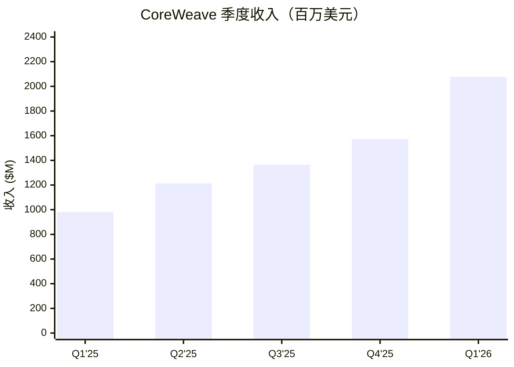
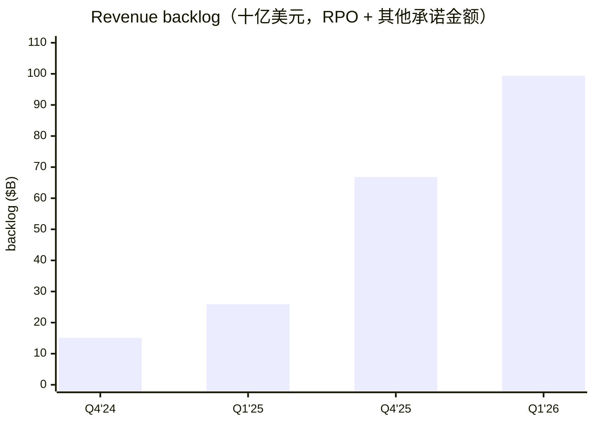
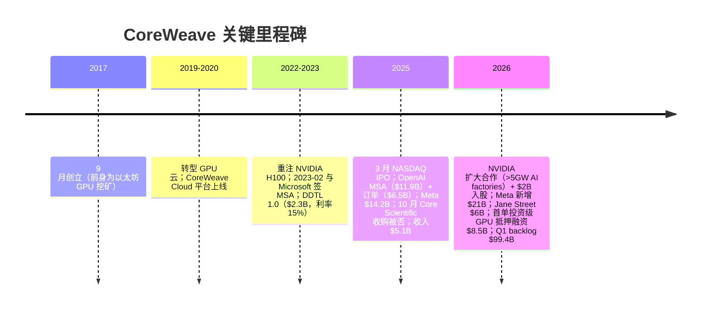
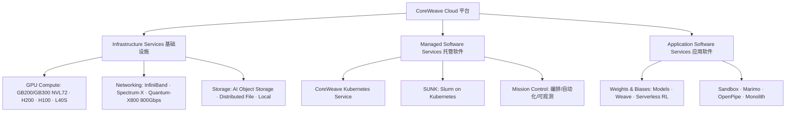
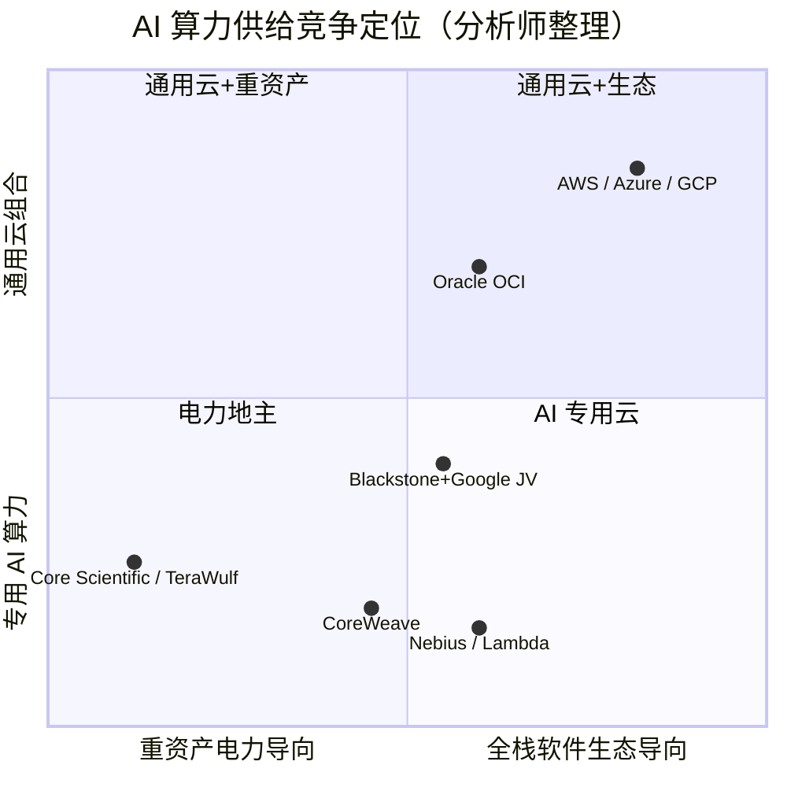
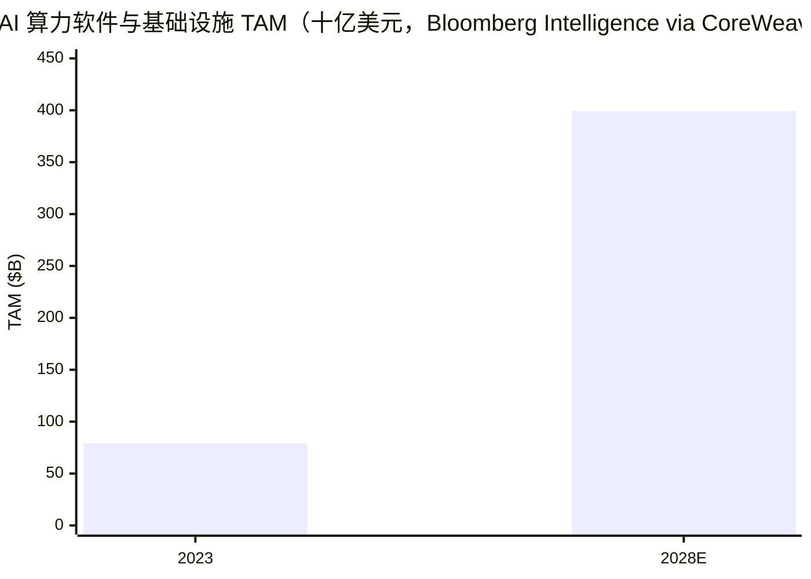
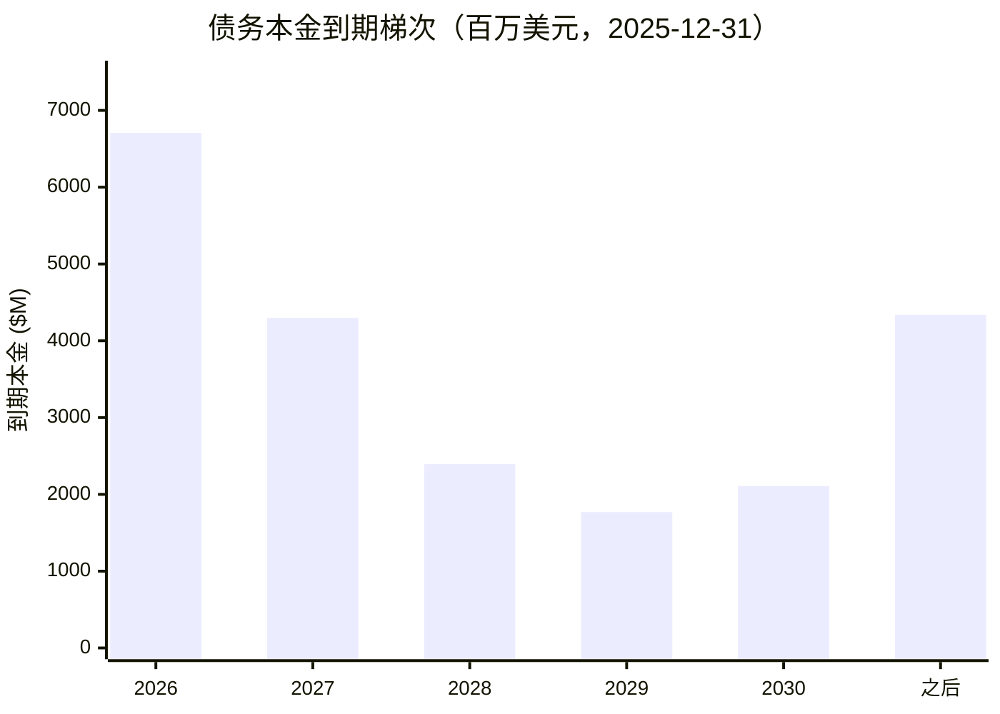

# COMPANY RESEARCH REPORT: CoreWeave, Inc. (NASDAQ: CRWV)

日期（as of）：2026-06-17 ｜ 首次覆盖（Initiating Coverage）·刷新（charts + 数据刷新）｜ 默认语言：简体中文

> *分析师观点：* **评级：Hold（持有）· 12 个月目标价 $100（较现价 $115.21 下行约 −13%）· 估值方法：34.5× EV / 2027E Adjusted Operating Income（调整后经营利润）$2.9B，扣除 2027 年末预估净债务（net debt）**
> 市值 $62.9B · EV ~$95.7B · 52 周区间 $63.80–$187.00 · NASDAQ:CRWV（现价 $115.21，[Yahoo Finance via yfinance，2026-06-17 收盘](https://finance.yahoo.com/quote/CRWV/)）
>
> *本次刷新提示：* 自 2026-06-11（前版定稿、现价 $95.61）以来 6 个交易日股价 +20.5% 至 $115.21，已升破本报告 $100 目标价（隐含空间由 +5% 翻为 −13%）。该急涨与新签算力大单的"动量交易"特征一致（参见第 1A 节卖方观点演变及 Bernstein 2026-06-10 对短线动量的描述），但未改变本报告对 2028 年续签悬念与单位经济学的判断，故维持 Hold；若股价持续高于 $130 而 2027E AOI 假设未上修，将构成下调评级的触发条件。
>
> **远期估值矩阵（forward valuation matrix）**（FY25A 列为已披露数据；FY26E/FY27E 列为 *分析师观点：*；EV 以当前 ~$95.7B 计，实际 EV 将随净债务上升）
>
> | 倍数 / Multiple | FY2025A | FY2026E | FY2027E |
> |---|---|---|---|
> | EV/Sales | 18.6× | 7.5× | 4.6× |
> | EV/Adjusted EBITDA | 30.9× | ~13.3× | ~7.8× |
> | P/S（市销率，TTM 10.1×） | 12.3× | 5.0× | 3.0× |
> | P/E | n/m（亏损） | n/m（亏损） | n/m（亏损） |
>
> **相对表现（截至 2026-06-17 收盘 $115.21，vs S&P 500，来源：yfinance）**：1M：CRWV +11.0% / SPX +0.2%（相对 +10.8pp）· 6M：+78.5% / +10.4%（+68.1pp）· YTD：+60.9% / +8.4%（+52.5pp）· 12M：−33.0% / +24.0%（相对 **−57.0pp**）
>
> **核心论点（thesis pillars）**——（1）**订单可见性 vs 单位经济学的拉锯**：$99.4B revenue backlog（收入积压订单）与 Microsoft/OpenAI/Meta 长约给了罕见的收入可见性，但 GPU 短折旧年限 + 高利息负担让 GAAP 盈利遥遥无期；（2）**融资成本下行是被低估的边际利好**：融资利差从 SOFR+8.5% 压缩到 SOFR+2.0–2.25%，首单投资级 GPU 抵押融资落地；（3）**2028 年后超大规模云厂商（hyperscaler）自建产能释放是悬在头上的剑**——卖方对此分歧极大（Bernstein UP $67 vs 德银 Buy $135）；（4）高杠杆放大股价对 EV 假设的敏感度——bull/base/bear $150/$100/$40，下行尾部明显更肥。

> **Update——FY2026 指引重申 + 两项上调（2026-05-07）：** 公司在 Q1'26 业绩中**重申** FY2026 收入指引 $12–13B、调整后经营利润（Adjusted Operating Income, AOI）指引 $900–1,100M；同时将 FY2026 资本开支（CapEx）指引下限从 $30B 上调至 **$31–35B**（因组件涨价及需求拉动），并将"退出 2026 年时的年化经常性收入（exiting 2026 ARR）"从 $17–19B 上调至 **$18–19B**。来源：[CoreWeave Q1'26 Outlook Presentation, Slide 3, 2026-05-07](https://s205.q4cdn.com/133937190/files/doc_financials/2026/q1/CoreWeave-1Q26-Outlook-Presentation.pdf)；对照 [Q4'25 Outlook Presentation, Slide 3, 2026-02-26](https://s205.q4cdn.com/133937190/files/doc_financials/2025/q4/CoreWeave-4Q25-Outlook-Presentation-vF.pdf)。

---

## 目录

1. [公司概览](#1-公司概览)
1A. [估值与目标价](#1a-估值与目标价)
1B. [GF Score 基本面记分卡](#1b-gf-scoregurufocus-style-基本面记分卡)
2. [公司历史](#2-公司历史)
3. [管理团队](#3-管理团队)
4. [产品与服务](#4-产品与服务)
5. [客户与上市策略](#5-客户与上市策略)
6. [行业概览](#6-行业概览)
7. [竞争格局](#7-竞争格局)
8. [市场机会（TAM）](#8-市场机会tam)
9. [风险评估](#9-风险评估)
9.5 [核心分歧与催化剂](#95-核心分歧与催化剂)
10. [投资视角记分卡](#10-投资视角记分卡)

---

## 1. 公司概览

*分析师观点：* 本报告首次覆盖 CoreWeave，给予 **Hold（持有）**评级、12 个月目标价 **$100**（+5%）。为什么是现在：CRWV 正处在"AI 算力租赁"商业模式的压力测试期——一边是 $99.4B 的收入积压订单（revenue backlog）、>3.5GW 签约电力和史上最快达成 $5B 年收入的云厂商扩张速度；另一边是 $21.6B 总债务、每季 $500M+ 的净利息支出、67% 收入集中于 Microsoft 一家、以及 Bernstein 用 $47B/GW 全成本和 $7.2B/GW 年折旧拆解出的"重资产+短折旧"单位经济学拷问。我们认为在 2027 年调整后经营利润放量、2028 年超大规模云厂商自建产能落地这两个证伪点出现之前，股价大概率维持宽幅震荡，风险收益不对称（bear 情形下高杠杆会急剧压缩股权价值），故不追高、不做空，持有观望。

**公司是做什么的。** CoreWeave 自我定位为 "The Essential Cloud for AI™"——专为 AI 工作负载构建的云平台（业内通称 neocloud / 新云，或 GPU cloud / GPU 云）。10-K 原文：

> "CoreWeave is The Essential Cloud for AI™, purpose-built to accelerate breakthroughs by AI pioneers, from leading research labs to enterprises fueling business growth. Our CoreWeave Cloud platform enables the full lifecycle of AI, including large-scale model training, inference, data movement, continuous iteration, and agentic workflows."（[CoreWeave 10-K FY2025, Item 1 Business](https://www.sec.gov/Archives/edgar/data/1769628/000176962826000104/crwv-20251231.htm)）

简言之：公司采购 NVIDIA GPU（以 GB200/GB300 NVL72 机架系统为主力），部署在自营/租赁的数据中心里，以多年期"照付不议"式合约（take-or-pay 性质的 committed contracts）+ 按需（on-demand）两种模式出租算力，并在裸金属（bare metal）之上叠加自研编排软件（CoreWeave Mission Control™、SUNK）与开发者工具（Weights & Biases®）。截至 2025 年末公司运营 43 个数据中心、活跃电力（active power）超 850MW，签约电力约 3.1GW（[10-K FY2025, Item 1](https://www.sec.gov/Archives/edgar/data/1769628/000176962826000104/crwv-20251231.htm)）；2026 年 Q1 活跃电力突破 1GW、签约电力超 3.5GW（[Q1'26 业绩新闻稿, 2026-05-07](https://www.sec.gov/Archives/edgar/data/1769628/000176962826000220/coreweave1q26earningspress.htm)）。

**怎么赚钱。** 收入以大客户多年期承诺合约为主：截至 2025-12-31，剩余履约义务（remaining performance obligations, RPO）达 $60.7B（同比 +302%），committed contracts 加权平均合同期约 5 年；FY2025 收入 $5.1B、FY2024 $1.9B、FY2023 $229M（[10-K FY2025, MD&A](https://www.sec.gov/Archives/edgar/data/1769628/000176962826000104/crwv-20251231.htm)）。叠加 RPO 之外的承诺金额后，公司口径的 revenue backlog 在 2025 年末为 $66.8B（RPO $60.7B + 其他承诺 $6.1B，[Q4'25 Earnings Presentation, Slide 16, 2026-02-26](https://s205.q4cdn.com/133937190/files/doc_financials/2025/q4/CoreWeave-4Q25-Earnings-Presentation-vF.pdf)），2026 年 Q1 末跃升至 $99.4B（RPO $98.8B + $0.6B，[Q1'26 Earnings Presentation, Slide 15, 2026-05-07](https://s205.q4cdn.com/133937190/files/doc_financials/2026/q1/CoreWeave-1Q26-Earnings-Presentation.pdf)）。

**规模与经营杠杆现状。** FY2025 损益表（百万美元）：收入 5,131 / 收入成本 1,453（28%）/ 技术与基础设施费用 2,929（含折旧摊销约 $2.3B）/ 经营亏损 (46) / 净利息支出 (1,229) / 净亏损 (1,167)；FY2024 对照：收入 1,915、经营利润 +324、净亏损 (863)（[10-K FY2025, 合并经营报表](https://www.sec.gov/Archives/edgar/data/1769628/000176962826000104/crwv-20251231.htm)）。非 GAAP 口径：FY2025 Adjusted EBITDA $3,093M（margin 60%）、AOI $666M（13%）（[Q4'25 业绩新闻稿, 2026-02-26](https://www.sec.gov/Archives/edgar/data/1769628/000176962826000094/coreweave4q25earningspress.htm)）。Q1'26：收入 $2,078M（+112% YoY）、AOI $21M（1%）、净亏损 $(740)M、净利息支出 $(536)M（[Q1'26 业绩新闻稿, 2026-05-07](https://www.sec.gov/Archives/edgar/data/1769628/000176962826000220/coreweave1q26earningspress.htm)）。员工 2,189 人（美国 1,967 人 + 19 国 222 人，2025-12-31，[10-K FY2025, Human Capital](https://www.sec.gov/Archives/edgar/data/1769628/000176962826000104/crwv-20251231.htm)）。总部：新泽西州 Livingston。

图：季度收入走势。来源：[CoreWeave Q1'26 Earnings Presentation, Slide 9, 2026-05-07](https://s205.q4cdn.com/133937190/files/doc_financials/2026/q1/CoreWeave-1Q26-Earnings-Presentation.pdf)。

图：收入积压订单。来源：[Q4'25 Earnings Presentation, Slide 14/16](https://s205.q4cdn.com/133937190/files/doc_financials/2025/q4/CoreWeave-4Q25-Earnings-Presentation-vF.pdf)；[Q1'26 Earnings Presentation, Slide 13/15](https://s205.q4cdn.com/133937190/files/doc_financials/2026/q1/CoreWeave-1Q26-Earnings-Presentation.pdf)。

**收入与利润流向（income-statement Sankey，FY2025）。** 下图把 FY2025 损益表画成资金流：收入 $5,131M 按客户拆为 Microsoft 67% + 其他 33%，经收入成本（COGS $1,453M）后留下毛利 $3,678M，再被三块经营开支吃掉——技术与基础设施（Tech & Infra）$2,929M、管理费用（G&A）$651M、销售营销（S&M）$144M——形成微幅经营亏损 −$46M；真正把净利打到 −$1,167M 的是经营线之外的净利息支出 $1,229M。这张图的要点是：CRWV 的"亏损"几乎不来自经营效率（毛利率 72%、技术与基础设施费用含约 $2.3B 折旧），而来自资本结构（利息）与投产前置（折旧）。所有数字逐字取自 [10-K FY2025 合并经营报表 + Note 17 集中度披露](https://www.sec.gov/Archives/edgar/data/1769628/000176962826000104/crwv-20251231.htm)。

<svg xmlns="http://www.w3.org/2000/svg" viewBox="0 0 1000 560" width="1000" height="560" role="img" aria-label="income statement Sankey"><rect x="0" y="0" width="1000" height="560" fill="#ffffff"/>
<text x="20.00" y="30.00" text-anchor="start" font-family="Helvetica,Arial,sans-serif" font-size="15" font-weight="700" fill="#1f2933">CoreWeave 收入与利润流向 — FY2025（亏损期，单位：百万美元）</text>
<path d="M 204.00,78.00 C 258.00,78.00 258.00,85.00 312.00,85.00 L 312.00,358.38 C 258.00,358.38 258.00,351.38 204.00,351.38 Z" fill="#93c5fd" fill-opacity="0.55"/>
<path d="M 452.00,78.00 C 506.00,78.00 506.00,132.94 560.00,132.94 L 560.00,134.94 C 506.00,134.94 506.00,80.00 452.00,80.00 Z" fill="#86efac" fill-opacity="0.55"/>
<path d="M 452.00,80.00 C 506.00,80.00 506.00,148.94 560.00,148.94 L 560.00,445.06 C 506.00,445.06 506.00,376.12 452.00,376.12 Z" fill="#fca5a5" fill-opacity="0.55"/>
<path d="M 328.00,85.00 C 382.00,85.00 382.00,78.00 436.00,78.00 L 436.00,370.46 C 382.00,370.46 382.00,377.46 328.00,377.46 Z" fill="#86efac" fill-opacity="0.55"/>
<path d="M 328.00,377.46 C 382.00,377.46 382.00,384.46 436.00,384.46 L 436.00,500.00 C 382.00,500.00 382.00,493.00 328.00,493.00 Z" fill="#fca5a5" fill-opacity="0.55"/>
<path d="M 700.00,118.94 C 754.00,118.94 754.00,280.00 808.00,280.00 L 808.00,282.00 C 754.00,282.00 754.00,120.94 700.00,120.94 Z" fill="#86efac" fill-opacity="0.55"/>
<path d="M 700.00,120.94 C 754.00,120.94 754.00,296.00 808.00,296.00 L 808.00,298.00 C 754.00,298.00 754.00,122.94 700.00,122.94 Z" fill="#fca5a5" fill-opacity="0.55"/>
<path d="M 576.00,132.94 C 630.00,132.94 630.00,118.94 684.00,118.94 L 684.00,120.94 C 630.00,120.94 630.00,134.94 576.00,134.94 Z" fill="#86efac" fill-opacity="0.55"/>
<path d="M 576.00,148.94 C 630.00,148.94 630.00,134.94 684.00,134.94 L 684.00,146.39 C 630.00,146.39 630.00,160.39 576.00,160.39 Z" fill="#fca5a5" fill-opacity="0.55"/>
<path d="M 576.00,160.39 C 630.00,160.39 630.00,160.39 684.00,160.39 L 684.00,393.29 C 630.00,393.29 630.00,393.29 576.00,393.29 Z" fill="#fca5a5" fill-opacity="0.55"/>
<path d="M 576.00,393.29 C 630.00,393.29 630.00,407.29 684.00,407.29 L 684.00,459.06 C 630.00,459.06 630.00,445.06 576.00,445.06 Z" fill="#fca5a5" fill-opacity="0.55"/>
<path d="M 204.00,365.38 C 258.00,365.38 258.00,358.38 312.00,358.38 L 312.00,493.00 C 258.00,493.00 258.00,500.00 204.00,500.00 Z" fill="#93c5fd" fill-opacity="0.55"/>
<rect x="188.00" y="78.00" width="16" height="273.38" rx="1.5" fill="#2563eb"/>
<rect x="188.00" y="365.38" width="16" height="134.62" rx="1.5" fill="#2563eb"/>
<rect x="312.00" y="85.00" width="16" height="408.00" rx="1.5" fill="#1e3a8a"/>
<rect x="436.00" y="78.00" width="16" height="292.46" rx="1.5" fill="#15803d"/>
<rect x="436.00" y="384.46" width="16" height="115.54" rx="1.5" fill="#dc2626"/>
<rect x="560.00" y="132.94" width="16" height="2.00" rx="1.5" fill="#15803d"/>
<rect x="560.00" y="148.94" width="16" height="296.12" rx="1.5" fill="#dc2626"/>
<rect x="684.00" y="118.94" width="16" height="2.00" rx="1.5" fill="#15803d"/>
<rect x="684.00" y="134.94" width="16" height="11.45" rx="1.5" fill="#dc2626"/>
<rect x="684.00" y="160.39" width="16" height="232.90" rx="1.5" fill="#dc2626"/>
<rect x="684.00" y="407.29" width="16" height="51.77" rx="1.5" fill="#dc2626"/>
<rect x="808.00" y="280.00" width="16" height="2.00" rx="1.5" fill="#15803d"/>
<rect x="808.00" y="296.00" width="16" height="2.00" rx="1.5" fill="#dc2626"/>
<text x="179.00" y="211.69" text-anchor="end" font-family="Helvetica,Arial,sans-serif" font-size="11.5" font-weight="700" fill="#1f2933">Microsoft 67%</text>
<text x="179.00" y="224.69" text-anchor="end" font-family="Helvetica,Arial,sans-serif" font-size="10" font-weight="400" fill="#52606d">$3.4B  (67.0%)</text>
<text x="179.00" y="429.69" text-anchor="end" font-family="Helvetica,Arial,sans-serif" font-size="11.5" font-weight="700" fill="#1f2933">其他客户 Other 33%</text>
<text x="179.00" y="442.69" text-anchor="end" font-family="Helvetica,Arial,sans-serif" font-size="10" font-weight="400" fill="#52606d">$1.7B  (33.0%)</text>
<rect x="331.00" y="67.00" width="100.50" height="26" rx="2" fill="#ffffff" fill-opacity="0.72"/>
<text x="334.00" y="79.00" text-anchor="start" font-family="Helvetica,Arial,sans-serif" font-size="11.5" font-weight="700" fill="#1f2933">Revenue</text>
<text x="334.00" y="92.00" text-anchor="start" font-family="Helvetica,Arial,sans-serif" font-size="10" font-weight="400" fill="#52606d">$5.1B  (100.0%)</text>
<rect x="455.00" y="60.00" width="94.20" height="26" rx="2" fill="#ffffff" fill-opacity="0.72"/>
<text x="458.00" y="72.00" text-anchor="start" font-family="Helvetica,Arial,sans-serif" font-size="11.5" font-weight="700" fill="#1f2933">Gross Profit</text>
<text x="458.00" y="85.00" text-anchor="start" font-family="Helvetica,Arial,sans-serif" font-size="10" font-weight="400" fill="#52606d">$3.7B  (71.7%)</text>
<rect x="455.00" y="366.46" width="144.60" height="26" rx="2" fill="#ffffff" fill-opacity="0.72"/>
<text x="458.00" y="378.46" text-anchor="start" font-family="Helvetica,Arial,sans-serif" font-size="11.5" font-weight="700" fill="#1f2933">Cost of Revenue (COGS)</text>
<text x="458.00" y="391.46" text-anchor="start" font-family="Helvetica,Arial,sans-serif" font-size="10" font-weight="400" fill="#52606d">$1.5B  (28.3%)</text>
<rect x="579.00" y="114.94" width="113.10" height="26" rx="2" fill="#ffffff" fill-opacity="0.72"/>
<text x="582.00" y="126.94" text-anchor="start" font-family="Helvetica,Arial,sans-serif" font-size="11.5" font-weight="700" fill="#1f2933">Operating Income</text>
<text x="582.00" y="139.94" text-anchor="start" font-family="Helvetica,Arial,sans-serif" font-size="10" font-weight="400" fill="#52606d">-$46.0M  (-0.90%)</text>
<rect x="579.00" y="139.94" width="150.90" height="26" rx="2" fill="#ffffff" fill-opacity="0.72"/>
<text x="582.00" y="151.94" text-anchor="start" font-family="Helvetica,Arial,sans-serif" font-size="11.5" font-weight="700" fill="#1f2933">Total Operating Expense</text>
<text x="582.00" y="164.94" text-anchor="start" font-family="Helvetica,Arial,sans-serif" font-size="10" font-weight="400" fill="#52606d">$3.7B  (72.6%)</text>
<rect x="703.00" y="100.94" width="106.80" height="26" rx="2" fill="#ffffff" fill-opacity="0.72"/>
<text x="706.00" y="112.94" text-anchor="start" font-family="Helvetica,Arial,sans-serif" font-size="11.5" font-weight="700" fill="#1f2933">Pretax Income</text>
<text x="706.00" y="125.94" text-anchor="start" font-family="Helvetica,Arial,sans-serif" font-size="10" font-weight="400" fill="#52606d">-$1.2B  (-23.7%)</text>
<rect x="703.00" y="125.94" width="100.50" height="26" rx="2" fill="#ffffff" fill-opacity="0.72"/>
<text x="706.00" y="137.94" text-anchor="start" font-family="Helvetica,Arial,sans-serif" font-size="11.5" font-weight="700" fill="#1f2933">销售营销 S&amp;M</text>
<text x="706.00" y="150.94" text-anchor="start" font-family="Helvetica,Arial,sans-serif" font-size="10" font-weight="400" fill="#52606d">$144.0M  (2.8%)</text>
<rect x="703.00" y="150.94" width="94.20" height="26" rx="2" fill="#ffffff" fill-opacity="0.72"/>
<text x="706.00" y="162.94" text-anchor="start" font-family="Helvetica,Arial,sans-serif" font-size="11.5" font-weight="700" fill="#1f2933">技术与基础设施 Tech &amp; Infra</text>
<text x="706.00" y="175.94" text-anchor="start" font-family="Helvetica,Arial,sans-serif" font-size="10" font-weight="400" fill="#52606d">$2.9B  (57.1%)</text>
<rect x="703.00" y="389.29" width="106.80" height="26" rx="2" fill="#ffffff" fill-opacity="0.72"/>
<text x="706.00" y="401.29" text-anchor="start" font-family="Helvetica,Arial,sans-serif" font-size="11.5" font-weight="700" fill="#1f2933">管理费用 G&amp;A</text>
<text x="706.00" y="414.29" text-anchor="start" font-family="Helvetica,Arial,sans-serif" font-size="10" font-weight="400" fill="#52606d">$651.0M  (12.7%)</text>
<text x="833.00" y="278.00" text-anchor="start" font-family="Helvetica,Arial,sans-serif" font-size="11.5" font-weight="700" fill="#1f2933">Net Income</text>
<text x="833.00" y="291.00" text-anchor="start" font-family="Helvetica,Arial,sans-serif" font-size="10" font-weight="400" fill="#52606d">-$1.2B  (-22.7%)</text>
<text x="833.00" y="303.00" text-anchor="start" font-family="Helvetica,Arial,sans-serif" font-size="11.5" font-weight="700" fill="#1f2933">Income Tax</text>
<text x="833.00" y="316.00" text-anchor="start" font-family="Helvetica,Arial,sans-serif" font-size="10" font-weight="400" fill="#52606d">-$48.0M  (-0.94%)</text>
<text x="500.00" y="544.00" text-anchor="middle" font-family="Helvetica,Arial,sans-serif" font-size="10" font-weight="400" fill="#52606d">Source: CRWV FY2025 10-K, Consolidated Statements of Operations + Note 17 Concentrations</text>
</svg>

来源 / Source: [CRWV FY2025 10-K, Consolidated Statements of Operations + Note 17 Concentrations](https://www.sec.gov/Archives/edgar/data/1769628/000176962826000104/crwv-20251231.htm)

**历史收入按地理（development-over-time）。** CRWV 是单一经营分部（"one operating segment, one reportable segment"，[10-K FY2025, Note 17](https://www.sec.gov/Archives/edgar/data/1769628/000176962826000104/crwv-20251231.htm)），无业务分部拆分可画；公司唯一披露的收入维度是地理。下图展示 FY2023→FY2025 收入按地理（美国 vs 其他国家）的爆发式增长——美国占比始终约 94%（FY2025 美国 $4,801M / 其他 $330M），增长几乎全部来自本土 AI 实验室与 hyperscaler 需求。

<svg xmlns="http://www.w3.org/2000/svg" viewBox="0 0 860 470" width="860" height="470" role="img" aria-label="historical revenue bars"><rect x="0" y="0" width="860" height="470" fill="#ffffff"/>
<text x="20.00" y="30.00" text-anchor="start" font-family="Helvetica,Arial,sans-serif" font-size="15" font-weight="700" fill="#1f2933">CoreWeave 历史收入按地理 Revenue by Geography（十亿美元）</text>
<rect x="20.00" y="44" width="11" height="11" rx="2" fill="#2563eb"/>
<text x="36.00" y="53.00" text-anchor="start" font-family="Helvetica,Arial,sans-serif" font-size="10.5" font-weight="400" fill="#1f2933">United States</text>
<rect x="135.80" y="44" width="11" height="11" rx="2" fill="#15803d"/>
<text x="151.80" y="53.00" text-anchor="start" font-family="Helvetica,Arial,sans-serif" font-size="10.5" font-weight="400" fill="#1f2933">All other countries</text>
<line x1="70" y1="412.00" x2="834" y2="412.00" stroke="#eceff2" stroke-width="1"/>
<text x="64.00" y="415.00" text-anchor="end" font-family="Helvetica,Arial,sans-serif" font-size="9.5" font-weight="400" fill="#52606d">$0</text>
<line x1="70" y1="345.20" x2="834" y2="345.20" stroke="#eceff2" stroke-width="1"/>
<text x="64.00" y="348.20" text-anchor="end" font-family="Helvetica,Arial,sans-serif" font-size="9.5" font-weight="400" fill="#52606d">$1.1B</text>
<line x1="70" y1="278.40" x2="834" y2="278.40" stroke="#eceff2" stroke-width="1"/>
<text x="64.00" y="281.40" text-anchor="end" font-family="Helvetica,Arial,sans-serif" font-size="9.5" font-weight="400" fill="#52606d">$2.2B</text>
<line x1="70" y1="211.60" x2="834" y2="211.60" stroke="#eceff2" stroke-width="1"/>
<text x="64.00" y="214.60" text-anchor="end" font-family="Helvetica,Arial,sans-serif" font-size="9.5" font-weight="400" fill="#52606d">$3.3B</text>
<line x1="70" y1="144.80" x2="834" y2="144.80" stroke="#eceff2" stroke-width="1"/>
<text x="64.00" y="147.80" text-anchor="end" font-family="Helvetica,Arial,sans-serif" font-size="9.5" font-weight="400" fill="#52606d">$4.4B</text>
<line x1="70" y1="78.00" x2="834" y2="78.00" stroke="#eceff2" stroke-width="1"/>
<text x="64.00" y="81.00" text-anchor="end" font-family="Helvetica,Arial,sans-serif" font-size="9.5" font-weight="400" fill="#52606d">$5.5B</text>
<rect x="123.48" y="399.89" width="147.71" height="12.11" fill="#2563eb"/>
<rect x="123.48" y="398.20" width="147.71" height="1.69" fill="#15803d"/>
<text x="197.33" y="428.00" text-anchor="middle" font-family="Helvetica,Arial,sans-serif" font-size="10" font-weight="400" fill="#52606d">2023</text>
<rect x="378.15" y="303.69" width="147.71" height="108.31" fill="#2563eb"/>
<rect x="378.15" y="296.58" width="147.71" height="7.11" fill="#15803d"/>
<text x="452.00" y="428.00" text-anchor="middle" font-family="Helvetica,Arial,sans-serif" font-size="10" font-weight="400" fill="#52606d">2024</text>
<rect x="632.81" y="122.63" width="147.71" height="289.37" fill="#2563eb"/>
<rect x="632.81" y="102.74" width="147.71" height="19.89" fill="#15803d"/>
<text x="706.67" y="428.00" text-anchor="middle" font-family="Helvetica,Arial,sans-serif" font-size="10" font-weight="400" fill="#52606d">2025</text>
<text x="430.00" y="454.00" text-anchor="middle" font-family="Helvetica,Arial,sans-serif" font-size="10" font-weight="400" fill="#52606d">Source: CRWV FY2023–FY2025 10-Ks, Note 17 — Revenue by Geography</text>
</svg>

来源 / Source: [CRWV FY2023–FY2025 10-Ks, Note 17 — Revenue by Geography](https://www.sec.gov/Archives/edgar/data/1769628/000176962826000104/crwv-20251231.htm)

**估值快照（TTM）。** 现价 $115.21（2026-06-17 收盘）、市值 $62.9B、EV ~$95.7B、TTM P/S 10.1×、TTM 收入 $6.2B；P/E 为负——亏损主因不是经营层面（Adjusted EBITDA margin 56–60%），而是 (a) 净利息支出（FY2025 $1,229M，同比 +240%）和 (b) 投产前置的折旧拖累（FY2025 折旧摊销约 $2.3B，较 FY2024 的 $843M 增加约 $1.5B），均见 [10-K FY2025 MD&A](https://www.sec.gov/Archives/edgar/data/1769628/000176962826000104/crwv-20251231.htm)；市场数据见 [Yahoo Finance: CRWV](https://finance.yahoo.com/quote/CRWV/)（2026-06-17 取数）与 [stockanalysis.com/stocks/CRWV](https://stockanalysis.com/stocks/CRWV/)。同业对照（P/S TTM，2026-06-17，yfinance）：Nebius（NBIS）81.2×、IREN 27.4×、Applied Digital（APLD）40.8×、Microsoft 8.8×、Oracle 7.8×——CRWV 的股权口径 P/S（10.1×）仍是 neocloud 同业中最低，但这正是高杠杆的镜像：用 EV/Sales 看是 18.6×（FY25A，按当前 EV），并不便宜。公司 2025-03 IPO 至今不足 3 年，故无 3 年倍数区间，自 IPO 以来股价区间 $40（上市首日收盘附近）至 $187（52 周高点）。*分析师观点：* 倍数高企的原因是市场把 CRWV 当作"AI 算力短缺"的纯度最高的代理资产并给予 backlog 可见性溢价，而非当期盈利支撑——这一定价逻辑使股价对"2027–2028 年供给宽松"叙事高度敏感（参见 [J.P. Morgan, 2026-05-08, p.1](http://xs-macbook-air.local:5001/zsxq/pdf/415248215588218/JPM-CoreWeave%20Record%20%2440B%2B%20Bookings%3B%20FY26%20Revenue%20Guide%20Reaffirmed%2C%20Though%20Q2%20Guide%20Below-260508.pdf) 对估值溢价的讨论，*分析师观点：* 标注见下文）。

## 1A. 估值与目标价

本章全部为 *分析师观点：*（预测值、目标价、情景目标价均为本报告分析师自有前瞻判断，不附任何 filing 引用；每项驱动的外部依据在行内单独引用）。

### (a) 远期财务预测表（3 年）

*分析师观点：* 预测基础：FY2026 公司指引收入 $12–13B、AOI $900–1,100M、CapEx $31–35B、exiting-2026 ARR $18–19B（[Q1'26 Outlook Presentation, Slide 3, 2026-05-07](https://s205.q4cdn.com/133937190/files/doc_financials/2026/q1/CoreWeave-1Q26-Outlook-Presentation.pdf)）；中长期锚点：exiting-2027 ARR >$30B、长期 AOI margin 25–30%（[Q4'25 Outlook Presentation, Slide 4, 2026-02-26](https://s205.q4cdn.com/133937190/files/doc_financials/2025/q4/CoreWeave-4Q25-Outlook-Presentation-vF.pdf)）；历史财务取自 [10-K FY2025](https://www.sec.gov/Archives/edgar/data/1769628/000176962826000104/crwv-20251231.htm) 与 [Q4'25 业绩新闻稿](https://www.sec.gov/Archives/edgar/data/1769628/000176962826000094/coreweave4q25earningspress.htm)。

| 指标（*分析师观点：* E 列） | FY2023A | FY2024A | FY2025A | FY2026E | FY2027E | FY2028E | 25–28E CAGR |
|---|---|---|---|---|---|---|---|
| 收入（$M） | 229 | 1,915 | 5,131 | 12,700 | 21,000 | 29,500 | +79% |
| — YoY | — | +736% | +168% | +148% | +65% | +40% | |
| Adjusted EBITDA（$M） | n/a | 1,219 | 3,093 | 7,200 | 12,300 | 17,400 | +78% |
| — margin | | 64% | 60% | 57% | 59% | 59% | |
| AOI（调整后经营利润，$M） | n/a | 356 | 666 | 1,000 | 2,900 | 5,300 | +100% |
| — AOI margin | | 19% | 13% | 8% | 14% | 18% | |
| 净利息支出（$M） | (28) | (361) | (1,229) | (2,600) | (3,000) | (3,400) | |
| GAAP 净利润（$M） | (594) | (863) | (1,167) | (2,300) | (900) | +900 | |
| GAAP EPS（$） | n/a | (4.30) | (2.75) | ~(4.2) | ~(1.6) | ~+1.6 | |
| CapEx（$M） | n/a | 8,335 | 14,886 | 33,000 | 38,000 | 40,000 | |
| FCF（经营现金流−CapEx，$M） | n/a | ~(5,600) | ~(11,800) | ~(25,000) | ~(26,000) | ~(22,000) | |
| 净债务（debt−现金，$M，年末） | n/a | ~6,000 | ~17,500 | ~38,000 | ~45,000 | ~52,000 | |
| 流动性垫（非传统 runway） | — | — | 现金等价物+受限现金 $4.1B + 未提取额度 $3.7B | | | | |

输入出处：FY2025 CapEx $14,886M、FY2024 $8,335M 来自 [Q4'25 Earnings Presentation, Slide 17](https://s205.q4cdn.com/133937190/files/doc_financials/2025/q4/CoreWeave-4Q25-Earnings-Presentation-vF.pdf)；FY2025 经营现金流 $3,058M、投资现金流 $(10,271)M、期末现金+受限现金 $4,130M、总债务本金 $21,615M、未提取额度 $3.7B 来自 [10-K FY2025, 流动性与债务附注](https://www.sec.gov/Archives/edgar/data/1769628/000176962826000104/crwv-20251231.htm)；Q2'26 净利息支出指引 $650–730M 来自 [Q1'26 Outlook Presentation, Slide 3](https://s205.q4cdn.com/133937190/files/doc_financials/2026/q1/CoreWeave-1Q26-Outlook-Presentation.pdf)。注：CRWV 不是传统意义上"现金跑道（cash runway）"型亏损公司——资金模型是合约背书的项目制债务（DDTL，delayed draw term loan / 延迟提取定期贷款），CFO 在 Q1'26 电话会上的原话："Large majority of our term debt is structured as delayed draw facilities, meaning capital is only drawn as the data centers are operationalized."（[Q1'26 earnings call transcript, 2026-05-07](https://s205.q4cdn.com/133937190/files/doc_financials/2026/q1/CoreWeave-Inc-CRWV-US-Q1-2026-Earnings-Call-7-May-2026-5_00-PM-ET.pdf)）

**利润率桥（margin bridge，FY2025→FY2026E AOI margin 13%→8%，*分析师观点：*）**：新机房投产前置成本（租金/电力/折旧先行、收入滞后 1–2 个月）约 −600bp；组件涨价转嫁（HBM/内存）约 −100bp（公司称属转嫁成本、对利润率影响有限，[J.P. Morgan, 2026-05-08, p.1](http://xs-macbook-air.local:5001/zsxq/pdf/415248215588218/JPM-CoreWeave%20Record%20%2440B%2B%20Bookings%3B%20FY26%20Revenue%20Guide%20Reaffirmed%2C%20Though%20Q2%20Guide%20Below-260508.pdf)，*分析师观点：* 引自 JPM 转述）；规模效应/软件附加值回补约 +200bp。2027E 回升至 14% 的驱动是前置投产期错配收窄 + 经营杠杆，与德银"2027 年非 GAAP 经营利润率回到 mid-teens"的判断一致（*分析师观点：* [Deutsche Bank — CRWV margins under the microscope, 2026-05-26, p.1](http://xs-macbook-air.local:5001/zsxq/pdf/812451125821522/Deutsche%20Bank-CoreWeave%EF%BC%88CRWV.US%EF%BC%89Putting%20margins%20and%20returns%20under%20the%20microscope%EF%BC%9A%20CRWV%20Edition-260526.pdf)，原文 "validate mid-teens non-GAAP operating margins as a reasonable target"）。

### (b) 目标价推导（показать算术）

*分析师观点：* 方法：**EV / 2027E AOI 倍数法**（CRWV 处于 GAAP 亏损期，P/E 不可用；EBITDA 会掩盖折旧这一核心成本争论，故选用扣除折旧后的 AOI 口径）：

- 2027E AOI = $2.9B（上表）
- 目标倍数 = **34.5×** —— 比较锚：J.P. Morgan 用 ~42× EV/CY27E PF EBIT（PT $105，原文 "Our Dec-26 PT of $105 is based on a ~42x EV/CY27E PF EBIT"，并称同业均值约 27×；*分析师观点：* [J.P. Morgan, 2026-05-08, p.4](http://xs-macbook-air.local:5001/zsxq/pdf/415248215588218/JPM-CoreWeave%20Record%20%2440B%2B%20Bookings%3B%20FY26%20Revenue%20Guide%20Reaffirmed%2C%20Though%20Q2%20Guide%20Below-260508.pdf)）；Bernstein 用 28.4× EV/2027E Adj EBIT（PT $67，原文 "Our $67 price target is based on an Enterprise Value calculated as 28.4x"，*分析师观点：* [Bernstein, 2026-05-18, p.6](http://xs-macbook-air.local:5001/zsxq/pdf/415242588882148/Bernstein-CoreWeave%EF%BC%8C%20Inc.%EF%BC%88CRWV.US%EF%BC%89CoreWeave~Blackstone%20%2B%20Google%3DOne%20very%20strong%20AI%20cloud-260518.pdf)）。我们取两者中间偏下：backlog 可见性值得相对同业均值 27× 的溢价，但 2028 年续签风险不支持 JPM 的 42×。
- EV = 34.5 × $2.9B = **$100B**
- 减 2027 年末预估净债务 ~$45B → 股权价值 ~$55B
- ÷ 摊薄股数 ~5.55 亿股（FY2025 末 Class A 4.48 亿 + Class B 约 1.0 亿，加股权激励摊薄；股本结构见 [DEF 14A 2026](https://www.sec.gov/Archives/edgar/data/1769628/000176962826000191/crwv-20260422.htm)）→ **$99 ≈ $100/股**

### (c) 牛市/基准/熊市情景

| 情景（*分析师观点：*） | 关键假设 | 目标价 | vs 现价 $115.21 |
|---|---|---|---|
| Bull（牛市） | 推理需求放量 + 老 GPU 重定价上行（A100/H100/H200/L40 价格 QoQ 全线上涨的趋势延续），2027E AOI $3.6B，倍数 35× | **$150** | **+30%** |
| Base（基准） | 中性假设：2027E AOI $2.9B × 34.5×，净债务 $45B | **$100** | **−13%** |
| Bear（熊市） | 2028 年超大规模云厂商自建产能放量提前压价：2027E 收入 $18.5B、AOI $2.4B、倍数压缩至 28×，EV $67B − 净债务 $45B → 股权 $22B | **$40** | **−65%** |

*分析师观点：* 注意下行尾部更肥：在 $45B 量级净债务之下，EV 每收缩 10%，股权价值收缩约 18–20%。这与 Morgan Stanley 风险收益区间的形态一致（bull $210 / base $99 / bear $32，bear 情形 2035 收入 $33B、20% CAGR；原文 "Rev grows to $80B in 2035, a 32% CAGR" / "$32.00(-69.68%)"，*分析师观点：* [Morgan Stanley — Watt's New With The Neoclouds, 2026-04-29, p.2/8](http://xs-macbook-air.local:5001/zsxq/pdf/585585185285484/MS-CoreWeave%20-%20North%20America%20Watt%27s%20New%20With%20The%20Neoclouds-%20Looking%20to%20Sustain%20Momentum%20in%20a%20Supply%20Constrained%20Environment-260429.pdf)，该 PT $99 较 2026-04-28 收盘 $105.53 隐含 −6%）。

### (d) 一致预期对照（Guide vs Street vs 本报告）

| 指标（FY2026E） | 公司指引 | Street 一致预期 | 本报告（*分析师观点：*） |
|---|---|---|---|
| 收入 | $12–13B（[Q1'26 Outlook, Slide 3](https://s205.q4cdn.com/133937190/files/doc_financials/2026/q1/CoreWeave-1Q26-Outlook-Presentation.pdf)） | ~$12.5B（共识，*分析师观点：* 引 [Morgan Stanley, 2026-04-29, p.3](http://xs-macbook-air.local:5001/zsxq/pdf/585585185285484/MS-CoreWeave%20-%20North%20America%20Watt%27s%20New%20With%20The%20Neoclouds-%20Looking%20to%20Sustain%20Momentum%20in%20a%20Supply%20Constrained%20Environment-260429.pdf)） | $12.7B |
| AOI | $900–1,100M（同上） | ~$1.0B | $1.0B |
| CapEx | $31–35B（同上） | n/a | $33B |

*分析师观点：* 2027 年才是分歧主战场：Bernstein 自述其 2027 年后收入预测较一致预期低约 15%（原文 "by 2028, we are ~15% below consensus revenue estimates"，[Bernstein — capacity land grab, 2026-04-14, p.5](http://xs-macbook-air.local:5001/zsxq/pdf/585548825224584/Bernstein-CoreWeave%20%EF%BC%88CRWV.US%EF%BC%89%EF%BC%9A%20The%20capacity%20land%20grab%20continues...GWs%20for%20everyone%EF%BC%81-260414.pdf)）。本报告 2027E 收入 $21B 介于 Bernstein 与买方乐观区间之间。

### 卖方观点演变（Sell-side view evolution）

机械预检：`db/stock_price_target.db`（只读）共有 8 条 CRWV 目标价记录（2026-02-04 至 2026-05-26），PT 区间 **$67（Bernstein）– $135（德银）**，极差约 2 倍，中位数约 $102；叠加本次刷新新读入的 Bernstein 2026-06-08（Vera Rubin 成本）与 **Bernstein 2026-06-10（内部人减持信号，均维持 UP $67）**、MS 2026-04-29 Equal-weight $99，覆盖 6 家机构。**本次刷新新增一条**（2026-06-10），观点谱仍是"Bernstein 持续看空 $67 vs 德银 Buy $135 vs JPM/MS/GS 中性 $86–105"的三方格局，无新方向。**按机构的观点时间线**（每条 PT 均配该研报日股价与隐含空间；报告日收盘价来自 stock_price_target.db / yfinance）：

| 机构 | 日期 | 评级 / 目标价 | 报告日股价（隐含空间） | 一句话论点 |
|---|---|---|---|---|
| Goldman Sachs | 2026-02-04 | Neutral / $86 | $82.46（+4%） | 与 NVIDIA 合作加速 5GW+ 建设、软件有高毛利潜力，但建设复杂度与产能不确定性对冲（*分析师观点：* [GS — Software stabilization signals, 2026-02-04, p.2](http://xs-macbook-air.local:5001/zsxq/pdf/812251454181822/Goldman%20Sachs-AMERICAS%20TECHNOLOGY%EF%BC%9A%20SOFTWARE%20Signals%20that%20could%20lead%20to%20stabilization%20%26%20feedback%20from%20investor%20conversations-260204.pdf)） |
| Bernstein | 2026-03-17 | Underperform / $56 | $82.12（−32%） | "Hyperscalers are situationships, not spouses"：合作是产能瓶颈下的权宜，2028 年后 23GW 自建产能上线即正面竞争；类比 Rackspace 由 ~$7B 市值萎缩至 ~$500M（*分析师观点：* [Bernstein, 2026-03-17, p.2/17](http://xs-macbook-air.local:5001/zsxq/pdf/812222844524542/Bernstein-Coreweave-Hyperscalers%20are%20situationships%2C%20not%20spouses-260317.pdf)） |
| Bernstein | 2026-04-14 | Underperform / **$67（自 $56 上调）** | $117.20（−43%） | 上调触发因素：Meta 超预期大单 + 新增 Anthropic 客户；但维持长期看空（*分析师观点：* [Bernstein, 2026-04-14, p.1](http://xs-macbook-air.local:5001/zsxq/pdf/585548825224584/Bernstein-CoreWeave%20%EF%BC%88CRWV.US%EF%BC%89%EF%BC%9A%20The%20capacity%20land%20grab%20continues...GWs%20for%20everyone%EF%BC%81-260414.pdf)） |
| Morgan Stanley | 2026-04-29 | Equal-weight / $99 | $105.53（2026-04-28 收盘，−6%） | Q1 业绩设置仍具建设性，看点：活跃电力、backlog、利润率执行；bull/base/bear $210/$99/$32（*分析师观点：* [MS, 2026-04-29, p.1-2](http://xs-macbook-air.local:5001/zsxq/pdf/585585185285484/MS-CoreWeave%20-%20North%20America%20Watt%27s%20New%20With%20The%20Neoclouds-%20Looking%20to%20Sustain%20Momentum%20in%20a%20Supply%20Constrained%20Environment-260429.pdf)） |
| Bernstein | 2026-05-01 / 05-12 / 05-18 | Underperform / $67（维持） | $119.01 / $107.75 / $103.77 | 5-01：过去三个财报后股价均跌 16–21%；5-12：FY26 AOI 指引 $0.9–1.1B 达成条件苛刻（装修周期 ≤6 周 + 稳态利润率 25%）；5-18：Blackstone+Google 合资 AI 云（黑石 $5B 股权 + 谷歌 TPU 技术栈，2027 年底前 500MW 上线）强化看空（*分析师观点：* [Bernstein, 2026-05-12, p.1](http://xs-macbook-air.local:5001/zsxq/pdf/415245828888228/Bernstein-CoreWeave%EF%BC%8C%20Inc.%EF%BC%88CRWV.US%EF%BC%89%EF%BC%9AWhat%20it%20would%20take%20to%20hit%20the%20%2726%20AOI%20guide-260512.pdf)；[Bernstein, 2026-05-18, p.1-2](http://xs-macbook-air.local:5001/zsxq/pdf/415242588882148/Bernstein-CoreWeave%EF%BC%8C%20Inc.%EF%BC%88CRWV.US%EF%BC%89CoreWeave~Blackstone%20%2B%20Google%3DOne%20very%20strong%20AI%20cloud-260518.pdf)） |
| J.P. Morgan | 2026-05-08 | Neutral / **$105（自 $90 上调）** | $114.15（−8%） | 创纪录 $40B+ 季度预订、backlog $99.4B（+49% QoQ）、客户多元化加速；但股价仍将"lumpy, volatile"（*分析师观点：* [JPM, 2026-05-08, p.1](http://xs-macbook-air.local:5001/zsxq/pdf/415248215588218/JPM-CoreWeave%20Record%20%2440B%2B%20Bookings%3B%20FY26%20Revenue%20Guide%20Reaffirmed%2C%20Though%20Q2%20Guide%20Below-260508.pdf)） |
| Deutsche Bank | 2026-05-26 | **Buy / $135** | $105.89（+27%） | 稳态合约贡献利润率 ~25%（CY25），表观利润率走低是投产前置成本而非模式恶化；5 年期合约无杠杆税前 IRR ~15%、加杠杆后 ~35–40%（*分析师观点：* [Deutsche Bank, 2026-05-26, p.1-3](http://xs-macbook-air.local:5001/zsxq/pdf/812451125821522/Deutsche%20Bank-CoreWeave%EF%BC%88CRWV.US%EF%BC%89Putting%20margins%20and%20returns%20under%20the%20microscope%EF%BC%9A%20CRWV%20Edition-260526.pdf)） |
| Bernstein | 2026-06-08 | Underperform / $67（维持） | $100.39（2026-06-05 收盘，−33%） | Vera Rubin 单 GW 成本拆解：全成本 ~$47B/GW、年折旧 ~$7.2B/GW 为最大运营成本——neocloud 单位经济学的结构性拷问（*分析师观点：* [Bernstein — AI Value Chain, 2026-06-08, p.1-2](http://xs-macbook-air.local:5001/zsxq/pdf/814528815844812/Bernstein-AI%20Value%20Chain%EF%BC%9AHow%20much%20does%20a%20GW%20of%20Vera%20Rubin%20data%20center%20capacity%20actually%20cost%EF%BC%9F-260608.pdf)） |
| Bernstein | 2026-06-10 | Underperform / $67（维持） | $98.45（2026-06-09 收盘，−32%） | **本次刷新新增。** 拆解 IPO 后 10 个月内部人减持：高管累计售出 ~$3.4B（多经 10b5-1，属常规分散化、无短期价格暗示）、早期投资方 Magnetar 减持多在 $120 上方；真正信号在客户股东——NVIDIA 与 Jane Street 均未减持，Jane Street 锁定期 2026-07-15 到期（提交 ~917 万股 shelf）。维持对 neocloud 长期基本面的看空；估值 28.4× EV/2027E Adj EBIT，F27E 收入 $19,731M、Adj EPS $(2.41)（*分析师观点：* [Bernstein — Do insider sales mean anything?, 2026-06-10, p.1](http://xs-macbook-air.local:5001/zsxq/pdf/181245814555482/Bernstein-CoreWeave%EF%BC%8C%20Inc.%EF%BC%88CRWV.US%EF%BC%89CoreWeave%20%EF%BC%88CRWV%EF%BC%89%EF%BC%9A%20Do%20insider%20sales%20mean%20anything%EF%BC%9F-260610.pdf)） |

**机构间分歧表（不做假共识）**：

| 机构 | 日期 | 评级 / PT | 核心论点 | 什么证据能证明其正确 |
|---|---|---|---|---|
| Bernstein | 2026-06-08 | UP / $67 | 2028 年供给宽松后 CRWV 拿不到新超级大单；软件护城河挡不住 hyperscaler 规模 | 2027H2 起新签 backlog 增速断崖、Blackstone+Google 类竞品抢走企业客户 |
| Deutsche Bank | 2026-05-26 | Buy / $135 | 稳态合约贡献利润率 ~25% 真实存在，2027 利润率拐点 + 平滑后 2027E P/E 仅 ~18× | 2027 年 AOI margin 兑现 mid-teens、合约续签率维持 |
| J.P. Morgan / MS / GS | 2026-05 / 04 / 02 | Neutral–EW / $86–105 | 基本面强但已计价；波动性大、事件驱动 | 区间震荡延续：backlog 增长与利润率失望交替出现 |

*分析师观点：* 本报告 Hold/$100 实质上站在 JPM/MS 的中间立场：承认德银的合约层单位经济学验证（这是对 Bernstein 折旧拷问最有力的回应），但不愿为 2028 年以后的续签悬念支付 Buy 所需的倍数。

### (e) 摇摆变量（swing variables）

*分析师观点：* 本报告评级最依赖两个假设，建议读者优先压力测试：（1）**2027–2028 年合同续签/新签能力**——Bernstein 测算全球数据中心供给将从今天 ~100GW 增至 5 年后 ~190GW（乐观 ~220GW，原文 "We have ~100GW of global data center supply today, and over the next 5 years, we expect the market size to reach ~190GW"，*分析师观点：* [Bernstein, 2026-04-14, p.6](http://xs-macbook-air.local:5001/zsxq/pdf/585548825224584/Bernstein-CoreWeave%20%EF%BC%88CRWV.US%EF%BC%89%EF%BC%9A%20The%20capacity%20land%20grab%20continues...GWs%20for%20everyone%EF%BC%81-260414.pdf)），若 2028 年供给宽松提前，bear 情景被激活；（2）**净利息支出与 AOI 的赛跑**——FY2026E 净利息支出（~$2.6B）约为 AOI（~$1.0B）的 2.6 倍，融资成本每下降 100bp 对净利润的弹性大于收入增长 10pp 的弹性。

## 1B. GF Score（GuruFocus-style）基本面记分卡

*分析师观点：* **GF Score（GuruFocus-style，综合评分）：48/100 —— 0–50 区间（最弱基本面/数据不足档）。** 这个分数刻意"难看"，但它精确地表达了 CRWV 的核心张力：一台增速满分（Growth 10/10）、却建在极薄股权 + 重债务 + 当期亏损之上的高速列车——成长维度的满分与财务/盈利/估值维度的低分，正是这家公司"故事股"属性的量化画像。**本记分卡是分析师自有评分规则的产物（与 GuruFocus 官方专有算法不同，亦非 GuruFocus 出品），五个子分与综合分均为 *分析师观点：*、不附任何 filing 引用；每个维度背后的指标在下方逐项给出行内引用。** 提示：GF Value（估值）维度的方向是"分数越高=越便宜"，CRWV 在该维度仅得 2/10 意为"非常贵"。

<svg xmlns="http://www.w3.org/2000/svg" viewBox="0 0 500 500" width="500" height="500" role="img" aria-label="GF Score radar">
<rect x="0" y="0" width="500" height="500" fill="#ffffff"/>
<text x="20" y="24" font-family="Helvetica,Arial,sans-serif" font-size="15" font-weight="700" fill="#1f2933">GF Score (GuruFocus-style): 48/100</text>
<text x="20" y="41" font-family="Helvetica,Arial,sans-serif" font-size="11" fill="#52606d">0–50 Worst future performance potential / insufficient data</text>
<polygon points="250.0,88.0 392.7,191.6 338.2,359.4 161.8,359.4 107.3,191.6" fill="#e9f5ec" stroke="none"/>
<polygon points="250.0,208.0 278.5,228.7 267.6,262.3 232.4,262.3 221.5,228.7" fill="none" stroke="#c5d3cb" stroke-width="1"/>
<polygon points="250.0,178.0 307.1,219.5 285.3,286.5 214.7,286.5 192.9,219.5" fill="none" stroke="#c5d3cb" stroke-width="1"/>
<polygon points="250.0,148.0 335.6,210.2 302.9,310.8 197.1,310.8 164.4,210.2" fill="none" stroke="#c5d3cb" stroke-width="1"/>
<polygon points="250.0,118.0 364.1,200.9 320.5,335.1 179.5,335.1 135.9,200.9" fill="none" stroke="#c5d3cb" stroke-width="1"/>
<polygon points="250.0,88.0 392.7,191.6 338.2,359.4 161.8,359.4 107.3,191.6" fill="none" stroke="#c5d3cb" stroke-width="1.3"/>
<line x1="250" y1="238" x2="161.8" y2="359.4" stroke="#cfdad3" stroke-width="1"/>
<text x="146.5" y="392.4" text-anchor="end" font-family="Helvetica,Arial,sans-serif" font-size="11.5" font-weight="600" fill="#1f2933">财务实力</text>
<text x="232.4" y="256.3" text-anchor="middle" font-family="Helvetica,Arial,sans-serif" font-size="10.5" font-weight="700" fill="#1f2933">2</text>
<line x1="250" y1="238" x2="250.0" y2="88.0" stroke="#cfdad3" stroke-width="1"/>
<text x="250.0" y="58.0" text-anchor="middle" font-family="Helvetica,Arial,sans-serif" font-size="11.5" font-weight="600" fill="#1f2933">盈利能力</text>
<text x="250.0" y="202.0" text-anchor="middle" font-family="Helvetica,Arial,sans-serif" font-size="10.5" font-weight="700" fill="#1f2933">2</text>
<line x1="250" y1="238" x2="107.3" y2="191.6" stroke="#cfdad3" stroke-width="1"/>
<text x="82.6" y="183.6" text-anchor="end" font-family="Helvetica,Arial,sans-serif" font-size="11.5" font-weight="600" fill="#1f2933">成长性</text>
<text x="107.3" y="185.6" text-anchor="middle" font-family="Helvetica,Arial,sans-serif" font-size="10.5" font-weight="700" fill="#1f2933">10</text>
<line x1="250" y1="238" x2="392.7" y2="191.6" stroke="#cfdad3" stroke-width="1"/>
<text x="417.4" y="183.6" text-anchor="start" font-family="Helvetica,Arial,sans-serif" font-size="11.5" font-weight="600" fill="#1f2933">估值</text>
<text x="278.5" y="222.7" text-anchor="middle" font-family="Helvetica,Arial,sans-serif" font-size="10.5" font-weight="700" fill="#1f2933">2</text>
<line x1="250" y1="238" x2="338.2" y2="359.4" stroke="#cfdad3" stroke-width="1"/>
<text x="353.5" y="392.4" text-anchor="start" font-family="Helvetica,Arial,sans-serif" font-size="11.5" font-weight="600" fill="#1f2933">动量</text>
<text x="311.7" y="316.9" text-anchor="middle" font-family="Helvetica,Arial,sans-serif" font-size="10.5" font-weight="700" fill="#1f2933">7</text>
<polygon points="250.0,208.0 278.5,228.7 311.7,322.9 232.4,262.3 107.3,191.6" fill="#2e8b57" fill-opacity="0.34" stroke="#2e8b57" stroke-width="2"/>
<circle cx="232.4" cy="262.3" r="2.6" fill="#2e8b57"/>
<circle cx="250.0" cy="208.0" r="2.6" fill="#2e8b57"/>
<circle cx="107.3" cy="191.6" r="2.6" fill="#2e8b57"/>
<circle cx="278.5" cy="228.7" r="2.6" fill="#2e8b57"/>
<circle cx="311.7" cy="322.9" r="2.6" fill="#2e8b57"/>
<text x="250" y="470" text-anchor="middle" font-family="Helvetica,Arial,sans-serif" font-size="9.5" fill="#52606d">Source: CRWV FY2025 10-K · Yahoo Finance(via yfinance) · indicators.db, as of 2026-06-17</text>
<text x="250" y="485" text-anchor="middle" font-family="Helvetica,Arial,sans-serif" font-size="9" fill="#52606d">GF Score = independent analyst rubric (*Analyst view:*) — not GuruFocus™ official number</text>
</svg>

> 离中心越远，该维度得分越高；五边形面积越大，综合 GF Score 越高（与 GuruFocus 控件读法一致）。

| 维度（bilingual gloss） | 评分 (0–10) | |
|---|---|---|
| Financial Strength（财务实力） | 2 | `██░░░░░░░░` |
| Profitability（盈利能力） | 2 | `██░░░░░░░░` |
| Growth（成长性） | 10 | `██████████` |
| GF Value（估值，越高越便宜） | 2 | `██░░░░░░░░` |
| Momentum（动量） | 7 | `███████░░░` |
| **GF Score（综合，*分析师观点：*）** | **48 / 100** | **0–50 最弱基本面/数据不足档** |

*综合权重（*分析师观点：* 透明复刻，非 GuruFocus 专有权重）：Financial Strength 20% · Profitability 25% · Growth 25% · GF Value 15% · Momentum 15%。*

**Financial Strength（财务实力）：2/10。** 极薄股权 + 高杠杆 + 当期利息覆盖不足，处于"困境邻近"区。FY2025 末总债务本金 $21.6B、债务（流动 $6,708M + 非流动 $14,665M）远超现金及等价物 $3,127M（含受限现金合计约 $4.1B），股东权益仅 $3,335M（占总资产 $49,302M 的 6.8%），累计亏损 $2,643M；EBIT（经营亏损 −$46M）÷ 利息支出 $1,229M 的覆盖率 <0（[10-K FY2025, 合并资产负债表 + Note 10 Debt](https://www.sec.gov/Archives/edgar/data/1769628/000176962826000104/crwv-20251231.htm)）。唯一加分项是资金模型并非传统"现金跑道"型亏损——DDTL 延迟提取结构使资本随机房投产分批提取，详见 1A 节。

**Profitability（盈利能力）：2/10。** GAAP 口径结构性亏损：FY2025 经营亏损 −$46M、净亏损 −$1,167M、ROE 为负（[10-K FY2025, 合并经营报表](https://www.sec.gov/Archives/edgar/data/1769628/000176962826000104/crwv-20251231.htm)）。不给 0 分是因为经营层并不烂——毛利率约 72%（毛利 $3,678M / 收入 $5,131M）、非 GAAP Adjusted EBITDA margin 60%（[Q4'25 业绩新闻稿, 2026-02-26](https://www.sec.gov/Archives/edgar/data/1769628/000176962826000094/coreweave4q25earningspress.htm)）；拖累项是折旧（约 $2.3B）与利息，属资本结构而非单位经营效率。德银验证的稳态合约贡献利润率 ~25% 若兑现，该维度有上修空间（*分析师观点：* [Deutsche Bank, 2026-05-26, p.1-3](http://xs-macbook-air.local:5001/zsxq/pdf/812451125821522/Deutsche%20Bank-CoreWeave%EF%BC%88CRWV.US%EF%BC%89Putting%20margins%20and%20returns%20under%20the%20microscope%EF%BC%9A%20CRWV%20Edition-260526.pdf)）。

**Growth（成长性）：10/10。** 收入复合增速冠绝全市场：FY2023 $229M → FY2024 $1,915M（+736%）→ FY2025 $5,131M（+168%）；前瞻路径同样强劲——公司 FY2026 收入指引 $12–13B、本报告 FY2027E $21B（[10-K FY2025, MD&A](https://www.sec.gov/Archives/edgar/data/1769628/000176962826000104/crwv-20251231.htm)；[Q1'26 Outlook Presentation, Slide 3, 2026-05-07](https://s205.q4cdn.com/133937190/files/doc_financials/2026/q1/CoreWeave-1Q26-Outlook-Presentation.pdf)），25–28E 收入 CAGR 约 +79%（见 1A 远期财务预测表），$99.4B revenue backlog 提供罕见的前瞻可见性。与 Profitability 2/10 的强烈背离正是雷达图要呈现的——不做平滑。

**GF Value（估值，越高越便宜）：2/10。** 极度偏贵，几无安全边际。EV/Sales 18.6×（FY25A，按当前 EV ~$95.7B）、TTM P/S 10.1×、无正向盈利使 P/E 不可用；对照 1A 节 Damodaran 公允价值中值约 $95 vs 现价 $115.21，margin of safety 已转负（[Yahoo Finance via yfinance, 2026-06-17](https://finance.yahoo.com/quote/CRWV/)；远期倍数见本报告 header 估值矩阵）。PEG 视角略可宽宥——若用 FY26E 收入增速 +148% 衡量，纯成长支撑了部分溢价，但债务放大了股权对 EV 假设的敏感度，故不给中性分。

**Momentum（动量）：7/10。** 近端动量强、长端仍是深坑。6M +78.5%（相对 SPX +68.1pp）、YTD +60.9%（+52.5pp）、1M +11.0%（+10.8pp），且现价高于 200 日均线；但 12M −33.0%（相对 −57.0pp）反映 IPO 后的剧烈回撤（来源：yfinance，截至 2026-06-17，与 header 相对表现行一致）。不给 9–10 是因为 12 个月维度仍大幅跑输，且 Bernstein 提示财报后历史性回撤（过去三季 −16% 至 −21%）使动量易反转。

**综合算术：** (FS 2×20 + Prof 2×25 + Growth 10×25 + Value 2×15 + Mom 7×15) / 100 = (40 + 50 + 250 + 30 + 105) / 100 = 475 / 100 → **48/100**。GuruFocus 框架下，0–50 属"最弱未来表现潜力/数据不足"档（[GuruFocus GF Score 页](https://www.gurufocus.com/term/gf-score)，注：该页受 Cloudflare 保护，对 curl/urllib 返回 403 属反爬而非死链；本报告未引用 GuruFocus 官方分数，仅引用其方法论框架）。

**最易翻动的维度 / 失败模式：** Profitability 与 Growth 是"赛跑"——若 2027 年 AOI margin 兑现 mid-teens（德银路径），Profitability 可由 2 升至 4–5、综合分上修约 5–8 分；反之若 2028 年续签崩塌，Growth 会从 10 急跌。Momentum 是当下"扛分"的维度，一次差财报即可把它压回 4–5。该综合分与本报告 Hold 评级、1A 节"风险收益不对称"判断、第 10 节低分视角互相一致。

**ROE 拆解（DuPont，FY2025）——结构展示，非"质量"背书。** 由于 CRWV 当期亏损，ROE 为负（约 −80%，按净亏损 −$1,167M ÷ 平均股东权益约 $1.46B），故 DuPont 的净利率/税负/利息负担三因子在数学上失真（利息负担因子被微幅经营亏损除出畸高数值），不可作"盈利质量"解读。下图唯一有信息量的是**股权乘数（equity multiplier）≈ 23×**——它把第 1B 节"股东权益仅占总资产 6.8%"的极端杠杆可视化，是理解"为何 EV 假设微调会大幅放大股权价值波动"的根。所有输入取自 [10-K FY2025 合并经营报表与资产负债表](https://www.sec.gov/Archives/edgar/data/1769628/000176962826000104/crwv-20251231.htm)。

<svg xmlns="http://www.w3.org/2000/svg" viewBox="0 0 1240 540" width="1240" height="540" role="img" aria-label="DuPont ROE decomposition"><rect x="0" y="0" width="1240" height="540" fill="#ffffff"/>
<text x="20.00" y="30.00" text-anchor="start" font-family="Helvetica,Arial,sans-serif" font-size="15" font-weight="700" fill="#1f2933">5-Step DuPont Decomposition of Return on Equity (ROE)</text>
<rect x="545.00" y="56.00" width="150" height="56" rx="7" fill="#1e3a8a"/>
<text x="620.00" y="76.00" text-anchor="middle" font-family="Helvetica,Arial,sans-serif" font-size="11.5" font-weight="700" fill="#ffffff">ROE</text>
<text x="620.00" y="94.00" text-anchor="middle" font-family="Helvetica,Arial,sans-serif" font-size="13" font-weight="800" fill="#ffffff">-79.90%</text>
<text x="620.00" y="106.00" text-anchor="middle" font-family="Helvetica,Arial,sans-serif" font-size="8.5" font-weight="400" fill="#dbeafe">= Net Income / Avg Equity</text>
<rect x="191.60" y="168.00" width="150" height="56" rx="7" fill="#2563eb"/>
<text x="266.60" y="188.00" text-anchor="middle" font-family="Helvetica,Arial,sans-serif" font-size="11.5" font-weight="700" fill="#ffffff">Net Margin</text>
<text x="266.60" y="206.00" text-anchor="middle" font-family="Helvetica,Arial,sans-serif" font-size="13" font-weight="800" fill="#ffffff">-22.74%</text>
<text x="266.60" y="218.00" text-anchor="middle" font-family="Helvetica,Arial,sans-serif" font-size="8.5" font-weight="400" fill="#dbeafe">Net Income / Revenue</text>
<line x1="620.00" y1="112.00" x2="266.60" y2="168.00" stroke="#94a3b8" stroke-width="1.4"/>
<rect x="545.00" y="168.00" width="150" height="56" rx="7" fill="#2563eb"/>
<text x="620.00" y="188.00" text-anchor="middle" font-family="Helvetica,Arial,sans-serif" font-size="11.5" font-weight="700" fill="#ffffff">Asset Turnover</text>
<text x="620.00" y="206.00" text-anchor="middle" font-family="Helvetica,Arial,sans-serif" font-size="13" font-weight="800" fill="#ffffff">0.15</text>
<text x="620.00" y="218.00" text-anchor="middle" font-family="Helvetica,Arial,sans-serif" font-size="8.5" font-weight="400" fill="#dbeafe">Revenue / Avg Assets</text>
<line x1="620.00" y1="112.00" x2="620.00" y2="168.00" stroke="#94a3b8" stroke-width="1.4"/>
<rect x="898.40" y="168.00" width="150" height="56" rx="7" fill="#2563eb"/>
<text x="973.40" y="188.00" text-anchor="middle" font-family="Helvetica,Arial,sans-serif" font-size="11.5" font-weight="700" fill="#ffffff">Equity Multiplier</text>
<text x="973.40" y="206.00" text-anchor="middle" font-family="Helvetica,Arial,sans-serif" font-size="13" font-weight="800" fill="#ffffff">22.98</text>
<text x="973.40" y="218.00" text-anchor="middle" font-family="Helvetica,Arial,sans-serif" font-size="8.5" font-weight="400" fill="#dbeafe">Avg Assets / Avg Equity</text>
<line x1="620.00" y1="112.00" x2="973.40" y2="168.00" stroke="#94a3b8" stroke-width="1.4"/>
<circle cx="443.30" cy="196.00" r="11" fill="#ffffff" stroke="#94a3b8" stroke-width="1.2"/>
<text x="443.30" y="201.00" text-anchor="middle" font-family="Helvetica,Arial,sans-serif" font-size="14" font-weight="800" fill="#52606d">×</text>
<circle cx="796.70" cy="196.00" r="11" fill="#ffffff" stroke="#94a3b8" stroke-width="1.2"/>
<text x="796.70" y="201.00" text-anchor="middle" font-family="Helvetica,Arial,sans-serif" font-size="14" font-weight="800" fill="#52606d">×</text>
<rect x="65.00" y="300.00" width="118" height="56" rx="7" fill="#2563eb"/>
<text x="124.00" y="320.00" text-anchor="middle" font-family="Helvetica,Arial,sans-serif" font-size="11.5" font-weight="700" fill="#ffffff">Operating Margin</text>
<text x="124.00" y="338.00" text-anchor="middle" font-family="Helvetica,Arial,sans-serif" font-size="13" font-weight="800" fill="#ffffff">-0.90%</text>
<text x="124.00" y="350.00" text-anchor="middle" font-family="Helvetica,Arial,sans-serif" font-size="8.5" font-weight="400" fill="#dbeafe">Op Inc / Revenue</text>
<line x1="266.60" y1="224.00" x2="124.00" y2="300.00" stroke="#94a3b8" stroke-width="1.4"/>
<rect x="207.60" y="300.00" width="118" height="56" rx="7" fill="#2563eb"/>
<text x="266.60" y="320.00" text-anchor="middle" font-family="Helvetica,Arial,sans-serif" font-size="11.5" font-weight="700" fill="#ffffff">Tax Burden</text>
<text x="266.60" y="338.00" text-anchor="middle" font-family="Helvetica,Arial,sans-serif" font-size="13" font-weight="800" fill="#ffffff">0.9605</text>
<text x="266.60" y="350.00" text-anchor="middle" font-family="Helvetica,Arial,sans-serif" font-size="8.5" font-weight="400" fill="#dbeafe">Net Inc / Pretax</text>
<line x1="266.60" y1="224.00" x2="266.60" y2="300.00" stroke="#94a3b8" stroke-width="1.4"/>
<rect x="350.20" y="300.00" width="118" height="56" rx="7" fill="#2563eb"/>
<text x="409.20" y="320.00" text-anchor="middle" font-family="Helvetica,Arial,sans-serif" font-size="11.5" font-weight="700" fill="#ffffff">Interest Burden</text>
<text x="409.20" y="338.00" text-anchor="middle" font-family="Helvetica,Arial,sans-serif" font-size="13" font-weight="800" fill="#ffffff">26.4130</text>
<text x="409.20" y="350.00" text-anchor="middle" font-family="Helvetica,Arial,sans-serif" font-size="8.5" font-weight="400" fill="#dbeafe">Pretax / Op Inc</text>
<line x1="266.60" y1="224.00" x2="409.20" y2="300.00" stroke="#94a3b8" stroke-width="1.4"/>
<circle cx="195.30" cy="328.00" r="11" fill="#ffffff" stroke="#94a3b8" stroke-width="1.2"/>
<text x="195.30" y="333.00" text-anchor="middle" font-family="Helvetica,Arial,sans-serif" font-size="14" font-weight="800" fill="#52606d">×</text>
<circle cx="337.90" cy="328.00" r="11" fill="#ffffff" stroke="#94a3b8" stroke-width="1.2"/>
<text x="337.90" y="333.00" text-anchor="middle" font-family="Helvetica,Arial,sans-serif" font-size="14" font-weight="800" fill="#52606d">×</text>
<rect x="479.00" y="300.00" width="118" height="56" rx="7" fill="#2563eb"/>
<text x="538.00" y="326.00" text-anchor="middle" font-family="Helvetica,Arial,sans-serif" font-size="11.5" font-weight="700" fill="#ffffff">Revenue</text>
<text x="538.00" y="342.00" text-anchor="middle" font-family="Helvetica,Arial,sans-serif" font-size="13" font-weight="800" fill="#ffffff">$5.1B</text>
<line x1="620.00" y1="224.00" x2="538.00" y2="300.00" stroke="#94a3b8" stroke-width="1.4"/>
<rect x="643.00" y="300.00" width="118" height="56" rx="7" fill="#2563eb"/>
<text x="702.00" y="320.00" text-anchor="middle" font-family="Helvetica,Arial,sans-serif" font-size="11.5" font-weight="700" fill="#ffffff">Avg Total Assets</text>
<text x="702.00" y="338.00" text-anchor="middle" font-family="Helvetica,Arial,sans-serif" font-size="13" font-weight="800" fill="#ffffff">$33.6B</text>
<text x="702.00" y="350.00" text-anchor="middle" font-family="Helvetica,Arial,sans-serif" font-size="8.5" font-weight="400" fill="#dbeafe">(begin+end)/2</text>
<line x1="620.00" y1="224.00" x2="702.00" y2="300.00" stroke="#94a3b8" stroke-width="1.4"/>
<circle cx="620.00" cy="328.00" r="11" fill="#ffffff" stroke="#94a3b8" stroke-width="1.2"/>
<text x="620.00" y="333.00" text-anchor="middle" font-family="Helvetica,Arial,sans-serif" font-size="14" font-weight="800" fill="#52606d">÷</text>
<rect x="832.40" y="300.00" width="118" height="56" rx="7" fill="#2563eb"/>
<text x="891.40" y="320.00" text-anchor="middle" font-family="Helvetica,Arial,sans-serif" font-size="11.5" font-weight="700" fill="#ffffff">Avg Total Assets</text>
<text x="891.40" y="338.00" text-anchor="middle" font-family="Helvetica,Arial,sans-serif" font-size="13" font-weight="800" fill="#ffffff">$33.6B</text>
<text x="891.40" y="350.00" text-anchor="middle" font-family="Helvetica,Arial,sans-serif" font-size="8.5" font-weight="400" fill="#dbeafe">(begin+end)/2</text>
<line x1="973.40" y1="224.00" x2="891.40" y2="300.00" stroke="#94a3b8" stroke-width="1.4"/>
<rect x="996.40" y="300.00" width="118" height="56" rx="7" fill="#2563eb"/>
<text x="1055.40" y="320.00" text-anchor="middle" font-family="Helvetica,Arial,sans-serif" font-size="11.5" font-weight="700" fill="#ffffff">Avg Total Equity</text>
<text x="1055.40" y="338.00" text-anchor="middle" font-family="Helvetica,Arial,sans-serif" font-size="13" font-weight="800" fill="#ffffff">$1.5B</text>
<text x="1055.40" y="350.00" text-anchor="middle" font-family="Helvetica,Arial,sans-serif" font-size="8.5" font-weight="400" fill="#dbeafe">(begin+end)/2</text>
<line x1="973.40" y1="224.00" x2="1055.40" y2="300.00" stroke="#94a3b8" stroke-width="1.4"/>
<circle cx="967.20" cy="328.00" r="11" fill="#ffffff" stroke="#94a3b8" stroke-width="1.2"/>
<text x="967.20" y="333.00" text-anchor="middle" font-family="Helvetica,Arial,sans-serif" font-size="14" font-weight="800" fill="#52606d">÷</text>
<rect x="69.00" y="420.00" width="110" height="48" rx="7" fill="#3b82f6"/>
<text x="124.00" y="442.00" text-anchor="middle" font-family="Helvetica,Arial,sans-serif" font-size="11.5" font-weight="700" fill="#ffffff">Operating Income</text>
<text x="124.00" y="458.00" text-anchor="middle" font-family="Helvetica,Arial,sans-serif" font-size="13" font-weight="800" fill="#ffffff">-$46.0M</text>
<line x1="124.00" y1="356.00" x2="124.00" y2="420.00" stroke="#94a3b8" stroke-width="1.4"/>
<rect x="211.60" y="420.00" width="110" height="48" rx="7" fill="#3b82f6"/>
<text x="266.60" y="442.00" text-anchor="middle" font-family="Helvetica,Arial,sans-serif" font-size="11.5" font-weight="700" fill="#ffffff">Net Income</text>
<text x="266.60" y="458.00" text-anchor="middle" font-family="Helvetica,Arial,sans-serif" font-size="13" font-weight="800" fill="#ffffff">-$1.2B</text>
<line x1="266.60" y1="356.00" x2="266.60" y2="420.00" stroke="#94a3b8" stroke-width="1.4"/>
<rect x="354.20" y="420.00" width="110" height="48" rx="7" fill="#3b82f6"/>
<text x="409.20" y="442.00" text-anchor="middle" font-family="Helvetica,Arial,sans-serif" font-size="11.5" font-weight="700" fill="#ffffff">Pretax Income</text>
<text x="409.20" y="458.00" text-anchor="middle" font-family="Helvetica,Arial,sans-serif" font-size="13" font-weight="800" fill="#ffffff">-$1.2B</text>
<line x1="409.20" y1="356.00" x2="409.20" y2="420.00" stroke="#94a3b8" stroke-width="1.4"/>
<text x="620.00" y="510.00" text-anchor="middle" font-family="Helvetica,Arial,sans-serif" font-size="10" font-weight="400" font-style="italic" fill="#8a97a3">FY2025；亏损期 ROE 为负，DuPont 仅作结构展示</text>
<text x="620.00" y="524.00" text-anchor="middle" font-family="Helvetica,Arial,sans-serif" font-size="10" font-weight="400" fill="#52606d">Source: CRWV FY2023–FY2025 10-Ks, Note 17 — Revenue by Geography</text>
</svg>

来源 / Source: [CRWV FY2025 10-K, Statements of Operations + Balance Sheets](https://www.sec.gov/Archives/edgar/data/1769628/000176962826000104/crwv-20251231.htm)

## 2. 公司历史

CoreWeave 由 Michael Intrator、Brian Venturo、Brannin McBee 三位能源/大宗商品交易背景的创始人于 2017 年 9 月创立，前身是以太坊（Ethereum）GPU 挖矿业务；2019 年向 GPU 云转型，2020 年上线 CoreWeave Cloud 平台；加密挖矿收入已全部停止（"prior to 2022, we had limited revenue, most of which was derived from our crypto mining offerings, which we have discontinued"，[S-1, 2025-03-03](https://www.sec.gov/Archives/edgar/data/1769628/000119312525044231/d899798ds1.htm)；10-K 亦载明 "We were founded in September 2017, launched our CoreWeave Cloud Platform in 2020"，[10-K FY2025](https://www.sec.gov/Archives/edgar/data/1769628/000176962826000104/crwv-20251231.htm)）。

图：公司时间线。来源：[S-1](https://www.sec.gov/Archives/edgar/data/1769628/000119312525044231/d899798ds1.htm)、[10-K FY2025](https://www.sec.gov/Archives/edgar/data/1769628/000176962826000104/crwv-20251231.htm)、[Meta 8-K Ex-99.1, 2026-04-09](https://www.sec.gov/Archives/edgar/data/1769628/000176962826000154/ex991.htm)、[Core Scientific 终止公告, 2025-10-30](https://www.sec.gov/Archives/edgar/data/1769628/000095010325014006/dp236631_ex9901.htm)。

**三次战略转折**：（1）**挖矿→GPU 云（2019）**——把挖矿时代积累的电力合同与 GPU 运维能力转化为云业务资产，Bernstein 称之为 "early mining legacy" 带来的现成电力优势（*分析师观点：* [Bernstein, 2026-04-14, p.8](http://xs-macbook-air.local:5001/zsxq/pdf/585548825224584/Bernstein-CoreWeave%20%EF%BC%88CRWV.US%EF%BC%89%EF%BC%9A%20The%20capacity%20land%20grab%20continues...GWs%20for%20everyone%EF%BC%81-260414.pdf)）；（2）**重注 Hopper（2022）**——在 ChatGPT 引爆需求前大举采购 H100，换来 2023 年 Microsoft MSA（签于 2023-02-22，作为 S-1 附件披露，[10-K Exhibit Index](https://www.sec.gov/Archives/edgar/data/1769628/000176962826000104/crwv-20251231.htm)）；（3）**从"算力批发商"向"AI 平台"上探（2025–2026）**——以 $1.0B 对价收购 Weights & Biases（现金 $96M + 股票 $929M，[10-K FY2025, 收购附注](https://www.sec.gov/Archives/edgar/data/1769628/000176962826000104/crwv-20251231.htm)），再收 OpenPipe、Marimo、Monolith AI，把开发者工具栈纳入平台。

**关键收购**（年份 + 逻辑）：2025 — Weights & Biases®（AI 开发者平台，$1.0B，扩展应用软件服务层）；2025 — OpenPipe（强化学习工具）；2025 — Marimo（AI 原生 Python notebook）；2025 — Monolith AI（工业/制造 AI），均见 [10-K FY2025](https://www.sec.gov/Archives/edgar/data/1769628/000176962826000104/crwv-20251231.htm) 与 [Q4'25 业绩新闻稿](https://www.sec.gov/Archives/edgar/data/1769628/000176962826000094/coreweave4q25earningspress.htm)。**未遂收购**：2025 年 7 月宣布全股票收购比特币矿商/数据中心运营商 Core Scientific，10 月 30 日因 Core Scientific 股东投票未通过而终止，双方维持长期合作（[CoreWeave Comments on Core Scientific Stockholder Vote, 2025-10-30](https://www.sec.gov/Archives/edgar/data/1769628/000095010325014006/dp236631_ex9901.htm)）。

## 3. 管理团队

**Michael Intrator（联合创始人 + 现任 CEO，合并履历）。** Intrator（57 岁）自 2017 年 9 月公司创立起担任董事会主席、CEO 兼总裁。创办 CoreWeave 之前的两段核心经历都在能源交易领域：2013–2018 年，他是天然气对冲基金 Hudson Ridge Asset Management LLC 的联合创始人兼 CEO；1998–2014 年在资产管理与咨询公司 Natsource Asset Management LLC 任职至 Principal Portfolio Manager，负责全球环境市场（碳排放等）与相关能源产品投资（"he oversaw investments in global environmental markets and related energy products"）。教育背景：Binghamton University 政治学学士、Columbia University 国际与公共事务学院（SIPA）MPA（[DEF 14A 2026, 董事提名人简历](https://www.sec.gov/Archives/edgar/data/1769628/000176962826000191/crwv-20260422.htm)）。

持股与控制权：截至 2026-04-15，Intrator 实益持有 5,289,944 股 Class A（1.19%）+ 56,215,770 股 Class B（54.93%），合计 **38.70% 总投票权**（Class B 每股 10 票，Class A 每股 1 票，[DEF 14A 2026, 实益持股表](https://www.sec.gov/Archives/edgar/data/1769628/000176962826000191/crwv-20260422.htm)）。这位 CEO 的画像是"用商品交易员的思维做云"——把 GPU、电力、长约视为可交易/可融资的大宗资产，公司"本质上是一门债务融资生意（debt-financed business）"的表述即出自管理层在 JPM TMC 大会上的交流（*分析师观点：* [J.P. Morgan — TMC Conference Takeaways, 2026-05-19, p.1](http://xs-macbook-air.local:5001/zsxq/pdf/415242148811428/J.P.%20Morgan-CoreWeave%EF%BC%88CRWV.US%EF%BC%89J.P.%20Morgan%20TMC%20Conference%20Takeaways-260519.pdf)）。另两位联合创始人仍在管理层：Brian Venturo（首席战略官、董事）与 Brannin McBee（首席发展官，持 Class B 21,140,580 股、占该类 20.96%），见 [DEF 14A 2026](https://www.sec.gov/Archives/edgar/data/1769628/000176962826000191/crwv-20260422.htm)——本节按报告规范仅展开创始人/CEO 合并履历。

## 4. 产品与服务

### 4.1 产品矩阵（分析师整理）

10-K 未提供单页产品矩阵表格，下表为**分析师根据 10-K Item 1 的三层服务框架与公司官网产品导航整理**（框架出处：[10-K FY2025, Item 1](https://www.sec.gov/Archives/edgar/data/1769628/000176962826000104/crwv-20251231.htm)；产品名与归类出处：[coreweave.com 官网导航](https://www.coreweave.com/)）：

| 服务层（10-K 口径） | 产品族 | 具体产品（官网命名） |
|---|---|---|
| Infrastructure Services（基础设施服务） | 算力 | GPU Compute（GB200/GB300 NVL72、H200、H100、L40S、A100 等，全部 bare metal）、CPU Compute、Bare Metal Servers |
| | 网络 | Networking（NVIDIA Quantum-2 InfiniBand、Quantum-X800、Spectrum-X） |
| | 存储 | AI Object Storage、Distributed File Storage、Dedicated VAST Storage、Local Storage、Zero Egress Migration |
| Managed Software Services（托管软件服务） | 编排与可观测 | CoreWeave Kubernetes Service（CKS）、SUNK（Slurm on Kubernetes）、CoreWeave Mission Control™（含 Fleet/Node Lifecycle Controller、GPU Straggler Detection、Mission Control Agent） |
| Application Software Services（应用软件服务） | 开发者平台 | Weights & Biases®（W&B Models / W&B Weave / Serverless RL）、CoreWeave Sandbox、Marimo、OpenPipe、Monolith |

10-K 对三层结构的原文表述：

> "We deliver our cloud services through Infrastructure Services, Managed Software Services, and Application Software Services, including proprietary storage solutions, CoreWeave Mission Control, as well as developer tools, all critical to unlocking continued innovation of AI products."（[10-K FY2025, Item 1](https://www.sec.gov/Archives/edgar/data/1769628/000176962826000104/crwv-20251231.htm)）

图：产品组合树（分析师整理）。来源：[10-K FY2025, Item 1](https://www.sec.gov/Archives/edgar/data/1769628/000176962826000104/crwv-20251231.htm)、[coreweave.com 官网导航](https://www.coreweave.com/)。

### 4.2 综述——三层如何咬合

一个 AI 实验室客户的典型工作流：模型团队通过 **CKS/SUNK** 在数千张 GPU 上调度训练作业（Managed 层），作业跑在 **GB200 NVL72 + InfiniBand** 裸金属集群上（Infrastructure 层），训练数据经 **AI Object Storage** 以"local-like performance"喂入（Infrastructure 层），实验追踪、模型版本与微调在 **Weights & Biases** 完成（Application 层），而 **Mission Control** 全程监控节点健康、自动替换故障 GPU 节点、定位训练掉速的具体 rank/GPU（GPU Straggler Detection）。这一栈式咬合是公司对"为什么客户不直接去 AWS"的核心回答——CEO 在 Q1'26 业绩中的表述："AI natives and enterprise customers are choosing CoreWeave because we sit between the models and the silicon"（[Q1'26 业绩新闻稿, 2026-05-07](https://www.sec.gov/Archives/edgar/data/1769628/000176962826000220/coreweave1q26earningspress.htm)）。

### 4.3 Infrastructure Services——GPU 算力、网络与存储

[10-K FY2025, Item 1](https://www.sec.gov/Archives/edgar/data/1769628/000176962826000104/crwv-20251231.htm) 原文（硬件先发优势）：

> "…ability to deploy the industry's most advanced hardware and architectures first—including NVIDIA GB200 and GB300 NVL72 systems for mission-critical AI—gives our customers a measurable edge in performance, efficiency, and scale."

网络层原文（同上）：

> "It integrates state-of-the-art networking technology, including NVIDIA Quantum-X800(XDR) enabling 800Gbps of connectivity, NVIDIA Quantum-2 InfiniBand interconnect and NVIDIA Spectrum-X with RoCE or RDMA over Converged Ethernet for ultra-low-latency connectivity between racks of GPUs."

**中文释义 / Plain-language gloss:** 这层的物理本质是"把 GPU 集群当一台超级计算机来卖"。单台 NVL72 机架把 72 颗 Blackwell GPU + 36 颗 Grace CPU 用 NVLink 连成一个统一内存域（官网原文 "72 NVIDIA Blackwell GPUs and 36 NVIDIA Grace CPUs in a single server"，液冷、130 kW 机架功率，[coreweave.com GPU Compute 产品页](https://www.coreweave.com/products/gpu-compute)）；跨机架用 InfiniBand / Spectrum-X（RoCE，RDMA over Converged Ethernet / 融合以太网远程直接内存访问）组成低时延 fabric（网络织物）。训练大模型时，数千 GPU 必须每隔几毫秒同步一次梯度（gradient all-reduce），网络时延直接决定 MFU（model FLOPS utilization, 模型算力利用率）——这就是为什么 neocloud 卖的不是"GPU 小时"而是"集群工程"。与同层产品的区别：GPU Compute 是营收主力（flagship），CPU Compute / Bare Metal 是配套；存储产品按访问模式分层（对象存储管海量训练数据、分布式文件系统管 checkpoint、本地 NVMe 管热数据）。战略变化拐点：AI 工作负载从训练（training）向推理（inference）和智能体（agentic）迁移——CEO 在 Q1'26 电话会上称 "AI workloads are moving from training to inference, agents and enterprise production across industries, which is increasingly compute-intensive"，并披露 "Average pricing for the A100s, H100s, H200s and L40s all increased quarter-over-quarter and we remain largely sold out for near-term capacity across our fleet"（[Q1'26 earnings call transcript, 2026-05-07](https://s205.q4cdn.com/133937190/files/doc_financials/2026/q1/CoreWeave-Inc-CRWV-US-Q1-2026-Earnings-Call-7-May-2026-5_00-PM-ET.pdf)）——老一代 GPU 价格 QoQ 全线上涨，是"6 年折旧悲观论"的最直接反证。*分析师观点：* 竞争优势判定：**部分（partial）**；moat 类型：规模 + 先发部署速度（首批 NVIDIA Exemplar Cloud、SemiAnalysis Platinum ClusterMAX™ 评级，"remaining the industry's sole platinum provider"，[Q4'25 业绩新闻稿](https://www.sec.gov/Archives/edgar/data/1769628/000176962826000094/coreweave4q25earningspress.htm)），但硬件本身无独占性——同样的 NVL72 机架 AWS/Azure/Oracle 都买得到。

### 4.4 Managed Software Services——Mission Control 与 SUNK

[10-K FY2025, Item 1](https://www.sec.gov/Archives/edgar/data/1769628/000176962826000104/crwv-20251231.htm) 原文：

> "Our proprietary orchestration, automation, and observability software, CoreWeave Mission Control™, enables CoreWeave and our customers to efficiently provision infrastructure, schedule and manage workloads, and monitor performance across training and inference environments. We offer Slurm on Kubernetes ('SUNK') to support large-scale AI research and training workloads."

**中文释义 / Plain-language gloss:** 如果把 GPU 集群比作机场，Mission Control 就是塔台 + 地勤系统：Fleet/Node Lifecycle Controller 持续检测 GPU 节点健康并自动替换坏节点，GPU Straggler Detection 能定位拖慢整个训练作业的那一张卡（官网称实现 "Up to 96% training goodput"——goodput 指真正花在有效计算上的时间占比，[coreweave.com Mission Control 页](https://www.coreweave.com/mission-control)）。SUNK 把 HPC（高性能计算）世界的标准调度器 Slurm 跑在 Kubernetes 上，让科研型客户（习惯 Slurm）与云原生客户（习惯 K8s）共用同一资源池——这是区别于 hyperscaler 通用云的工程取向。与 4.3 的区别：4.3 卖"算力本身"，本层卖"让几千张 GPU 不空转的运营能力"，是公司毛利率叙事中"软件附加值"的载体。*分析师观点：* 竞争优势判定：**有，但护城河深度是全市场最大分歧点**；moat 类型：工程 know-how + 切换成本。Bernstein 明确质疑："whether the CRWV software stack may be somewhat differentiated today (as Rackspace's managed service offerings were…)"——并以 Rackspace 从 ~$7B 市值萎缩到 ~$500M 作为前车之鉴（*分析师观点：* [Bernstein, 2026-03-17, p.17](http://xs-macbook-air.local:5001/zsxq/pdf/812222844524542/Bernstein-Coreweave-Hyperscalers%20are%20situationships%2C%20not%20spouses-260317.pdf)）。

### 4.5 Application Software Services——Weights & Biases 与开发者工具

[10-K FY2025, Item 1](https://www.sec.gov/Archives/edgar/data/1769628/000176962826000104/crwv-20251231.htm) 原文：

> "Our software solutions, including Weights & Biases®, provide AI researchers and developers with the tools required to train and fine-tune models and to build, deploy, and scale the applications through which AI is delivered to end users."

**中文释义 / Plain-language gloss:** W&B 是 AI 研究员的"实验记录本 + 模型仓库"：训练任何模型时把损失曲线、超参数（hyperparameters）、模型版本自动记录成可对比的实验（W&B Models），上线后用 W&B Weave 监控 LLM 应用的输出质量。2025 年 Q4 起公司又把能力外延到 Serverless RL（"the first publicly available fully managed reinforcement learning capability"，[Q4'25 业绩新闻稿](https://www.sec.gov/Archives/edgar/data/1769628/000176962826000094/coreweave4q25earningspress.htm)）。与前两层的关系：这层不直接卖算力，卖的是"粘性"——开发者工作流嵌得越深，算力合约续签概率越高。*分析师观点：* 竞争优势判定：**部分**；moat 类型：开发者生态 + 数据网络效应；最接近的对标是 hyperscaler 自家工具（SageMaker、Vertex AI）与独立 MLOps 厂商。

### 4.6 旗舰与近 12 个月新品

旗舰 = GPU Compute（NVL72 系列）+ Mission Control。近 12 个月发布：AI Object Storage（"purpose-built for AI workloads to deliver local-like performance, global availability, and significantly lower cost"）、zero egress migration（免数据迁出费）、CoreWeave Federal（政府云）、Serverless RL（均见 [Q4'25 业绩新闻稿, 2026-02-26](https://www.sec.gov/Archives/edgar/data/1769628/000176962826000094/coreweave4q25earningspress.htm)）；Q1'26 新增 Flexible Capacity Plans（Flex Reservations / Spot）、Dedicated Inference、CoreWeave ARENA™（[Q1'26 业绩新闻稿, 2026-05-07](https://www.sec.gov/Archives/edgar/data/1769628/000176962826000220/coreweave1q26earningspress.htm)）——产品节奏明显在从"长约批发"向"按需/推理零售"补课，呼应训练→推理的需求迁移。2026-01-26 与 NVIDIA 的扩大合作把公司软件向全球 CSP（云服务商）与企业输出（"Expanded Relationship to Offer CoreWeave Software to Global CSPs and Enterprises"，[NVIDIA-CoreWeave 8-K Ex-99.1, 2026-01-26](https://www.sec.gov/Archives/edgar/data/1769628/000176962826000044/ex991pressrelease_final.htm)），软件货币化是德银 Buy 论点中的免费期权（*分析师观点：* [Deutsche Bank, 2026-05-26, p.1](http://xs-macbook-air.local:5001/zsxq/pdf/812451125821522/Deutsche%20Bank-CoreWeave%EF%BC%88CRWV.US%EF%BC%89Putting%20margins%20and%20returns%20under%20the%20microscope%EF%BC%9A%20CRWV%20Edition-260526.pdf)）。

**延伸观看 / Further viewing**（教学辅助，非引用来源，不承载任何数字）：

- [BG2 播客：CoreWeave——AI 泡沫代表还是下一个科技巨头？（Intrator + Venturo 长访谈）——理解商业模式、债务结构与创始人思维最完整的一手素材](https://www.youtube.com/watch?v=m1uh7Ka6868)
- [Bloomberg：CoreWeave's Intrator on the Future of AI Infrastructure——CEO 谈 AI 基础设施的资本结构与扩张逻辑](https://www.youtube.com/watch?v=zBxFf_GMHGs)
- [CNBC Squawk on the Street：Intrator 谈 2026 年收入信心（Q1'26 财报次日）——管理层如何回应做空叙事](https://www.youtube.com/watch?v=h0RE5z205_4)

## 5. 客户与上市策略

**客户集中度（必读项，全部为合并收入口径 / consolidated revenue）。** 10-K 集中度披露：FY2025 **最大客户 Microsoft 占收入约 67%**；FY2024 前两大客户合计 77%；FY2023 前三大客户合计 73%。客户字母表：Customer A（即 Microsoft）占比 67% / 62% / 35%（2025/2024/2023），Customer B 占比 * / 15% / 17%，Customer C 占比 * / * / 21%（* = 低于 10%）；应收账款集中度：Customer A 占应收净额 68%、Customer D 占 11%（2025-12-31）。原文："We recognized an aggregate of approximately 67% of our revenue from our top customer, Microsoft, for the year ended December 31, 2025."（[10-K FY2025, 风险因素与集中度附注](https://www.sec.gov/Archives/edgar/data/1769628/000176962826000104/crwv-20251231.htm)）**top-1 > 20%，属重大风险，已列入第 9 节。**

<svg xmlns="http://www.w3.org/2000/svg" viewBox="0 0 720 460" width="720" height="460" role="img" aria-label="revenue donut"><rect x="0" y="0" width="720" height="460" fill="#ffffff"/>
<text x="20.00" y="30.00" text-anchor="start" font-family="Helvetica,Arial,sans-serif" font-size="15" font-weight="700" fill="#1f2933">FY2025 收入按客户 Revenue by Customer（合并收入口径）</text>
<path d="M 288.00,107.20 A 132 132 0 1 1 172.31,302.76 L 219.64,276.76 A 78 78 0 1 0 288.00,161.20 Z" fill="#2563eb"/>
<path d="M 172.31,302.76 A 132 132 0 0 1 288.00,107.20 L 288.00,161.20 A 78 78 0 0 0 219.64,276.76 Z" fill="#15803d"/>
<text x="288.00" y="235.20" text-anchor="middle" font-family="Helvetica,Arial,sans-serif" font-size="18" font-weight="800" fill="#1f2933">CRWV</text>
<text x="288.00" y="255.20" text-anchor="middle" font-family="Helvetica,Arial,sans-serif" font-size="13" font-weight="600" fill="#52606d">$5.1B</text>
<text x="288.00" y="271.20" text-anchor="middle" font-family="Helvetica,Arial,sans-serif" font-size="10" font-weight="400" fill="#8a97a3">total</text>
<line x1="406.77" y1="309.46" x2="422.77" y2="309.46" stroke="#2563eb" stroke-width="1.4"/>
<text x="426.77" y="307.46" text-anchor="start" font-family="Helvetica,Arial,sans-serif" font-size="11" font-weight="700" fill="#1f2933">Microsoft</text>
<text x="426.77" y="321.46" text-anchor="start" font-family="Helvetica,Arial,sans-serif" font-size="10" font-weight="400" fill="#52606d">$3.4B  (67.0%)</text>
<line x1="169.23" y1="168.94" x2="153.23" y2="168.94" stroke="#15803d" stroke-width="1.4"/>
<text x="149.23" y="166.94" text-anchor="end" font-family="Helvetica,Arial,sans-serif" font-size="11" font-weight="700" fill="#1f2933">其他客户 Other customers</text>
<text x="149.23" y="180.94" text-anchor="end" font-family="Helvetica,Arial,sans-serif" font-size="10" font-weight="400" fill="#52606d">$1.7B  (33.0%)</text>
<text x="360.00" y="444.00" text-anchor="middle" font-family="Helvetica,Arial,sans-serif" font-size="10" font-weight="400" fill="#52606d">Source: CRWV FY2025 10-K (filed 2026-03-02), Item 1A + Note 17 Concentrations (Microsoft ~67% of FY2025 revenue)</text>
</svg>

图：客户集中度（单一分母：FY2025 合并收入；Microsoft $3.4B≈67% / 其他客户 $1.7B≈33%）。来源：[10-K FY2025, Item 1A + Note 17 集中度](https://www.sec.gov/Archives/edgar/data/1769628/000176962826000104/crwv-20251231.htm)。

**已签约的未来大客户**（合同承诺额，非当期收入占比）：OpenAI——2025-03 MSA 承诺至 2030-10 最高约 **$11.9B**，2025-09 追加订单承诺至 2031-05 最高约 **$6.5B**；Meta——2025-09 订单初始承诺至 2031-12 最高约 **$14.2B**（均见 [10-K FY2025](https://www.sec.gov/Archives/edgar/data/1769628/000176962826000104/crwv-20251231.htm)），2026-03 再签 **$21B** 扩容协议（服务期至 2032-12，用于推理工作负载扩容，[Meta 8-K Ex-99.1, 2026-04-09](https://www.sec.gov/Archives/edgar/data/1769628/000176962826000154/ex991.htm)）；Jane Street——2026-04 签 **$6B** AI 云协议并追加 $1B 股权投资（[Jane Street 8-K Ex-99.1, 2026-04-15](https://www.sec.gov/Archives/edgar/data/1769628/000176962826000167/ex991.htm)）。客户多元化进展（管理层口径，经 JPM 转述）：服务前十大 AI 模型提供商中的 9 家（新增 Anthropic）、10 家客户承诺支出超 $10 亿、非投资级 AI 原生客户占比降至 30% 以下、金融服务客户（Jane Street、Hudson River Trading）backlog 接近 $100 亿（*分析师观点：* [J.P. Morgan, 2026-05-08, p.1](http://xs-macbook-air.local:5001/zsxq/pdf/415248215588218/JPM-CoreWeave%20Record%20%2440B%2B%20Bookings%3B%20FY26%20Revenue%20Guide%20Reaffirmed%2C%20Though%20Q2%20Guide%20Below-260508.pdf)）。Q1'26 新闻稿亦列名 Anthropic（支持 Claude 模型家族的多年期协议）、Cohere、Mistral、Perplexity、World Labs 等（[Q1'26 业绩新闻稿, 2026-05-07](https://www.sec.gov/Archives/edgar/data/1769628/000176962826000220/coreweave1q26earningspress.htm)）。

**合同结构与上市策略。** 合同形态：MSA（master services agreement, 主服务协议）+ 订单（order form）的多年期承诺合约为主（committed contracts，加权平均约 5 年），辅以按需 pay-as-you-go；客户先付大额承诺、公司据此倒排产能与项目融资。这一"先签约、后建设、合约背书融资"的飞轮是公司模式的核心：每签一单即可向 DDTL 融资方质押合同现金流。地理结构：FY2025 美国收入 $4,801M、其他国家 $330M（按客户合同地址划分），美国占比约 94%（[10-K FY2025, 地理信息附注](https://www.sec.gov/Archives/edgar/data/1769628/000176962826000104/crwv-20251231.htm)）。销售组织尚年轻：2025 年 10 月才任命首位 Chief Revenue Officer（[10-K FY2025](https://www.sec.gov/Archives/edgar/data/1769628/000176962826000104/crwv-20251231.htm)）——*分析师观点：* 企业级（enterprise）渠道建设落后于产能扩张，是"从 AI 实验室客户向企业客户破圈"论点的执行短板。

<svg xmlns="http://www.w3.org/2000/svg" viewBox="0 0 720 460" width="720" height="460" role="img" aria-label="revenue donut"><rect x="0" y="0" width="720" height="460" fill="#ffffff"/>
<text x="20.00" y="30.00" text-anchor="start" font-family="Helvetica,Arial,sans-serif" font-size="15" font-weight="700" fill="#1f2933">FY2025 收入按地理 Revenue by Geography（合并收入口径）</text>
<path d="M 288.00,107.20 A 132 132 0 1 1 236.10,117.83 L 257.33,167.48 A 78 78 0 1 0 288.00,161.20 Z" fill="#2563eb"/>
<path d="M 236.10,117.83 A 132 132 0 0 1 288.00,107.20 L 288.00,161.20 A 78 78 0 0 0 257.33,167.48 Z" fill="#15803d"/>
<text x="288.00" y="235.20" text-anchor="middle" font-family="Helvetica,Arial,sans-serif" font-size="18" font-weight="800" fill="#1f2933">CRWV</text>
<text x="288.00" y="255.20" text-anchor="middle" font-family="Helvetica,Arial,sans-serif" font-size="13" font-weight="600" fill="#52606d">$5.1B</text>
<text x="288.00" y="271.20" text-anchor="middle" font-family="Helvetica,Arial,sans-serif" font-size="10" font-weight="400" fill="#8a97a3">total</text>
<line x1="315.69" y1="374.39" x2="331.69" y2="374.39" stroke="#2563eb" stroke-width="1.4"/>
<text x="335.69" y="372.39" text-anchor="start" font-family="Helvetica,Arial,sans-serif" font-size="11" font-weight="700" fill="#1f2933">United States</text>
<text x="335.69" y="386.39" text-anchor="start" font-family="Helvetica,Arial,sans-serif" font-size="10" font-weight="400" fill="#52606d">$4.8B  (93.6%)</text>
<line x1="260.31" y1="104.01" x2="244.31" y2="104.01" stroke="#15803d" stroke-width="1.4"/>
<text x="240.31" y="102.01" text-anchor="end" font-family="Helvetica,Arial,sans-serif" font-size="11" font-weight="700" fill="#1f2933">Other countries</text>
<text x="240.31" y="116.01" text-anchor="end" font-family="Helvetica,Arial,sans-serif" font-size="10" font-weight="400" fill="#52606d">$330.0M  (6.4%)</text>
<text x="360.00" y="444.00" text-anchor="middle" font-family="Helvetica,Arial,sans-serif" font-size="10" font-weight="400" fill="#52606d">Source: CRWV FY2025 10-K (filed 2026-03-02), Note 17 — Geographic Information</text>
</svg>

图：收入按地理（单一分母：FY2025 合并收入）。注：CRWV 为单一经营分部，无业务分部口径 donut 可画；地理是其唯一披露的收入拆分维度。来源：[10-K FY2025, Note 17 — Geographic Information](https://www.sec.gov/Archives/edgar/data/1769628/000176962826000104/crwv-20251231.htm)。

**客户即股东/伙伴的多重关系**：NVIDIA 是 CRWV 的供应商 + 客户 + 股东（持 Class A 47,213,353 股，[DEF 14A 2026, 5% 股东表](https://www.sec.gov/Archives/edgar/data/1769628/000176962826000191/crwv-20260422.htm)；Q1'26 再投 $2B Class A，[Q1'26 业绩新闻稿](https://www.sec.gov/Archives/edgar/data/1769628/000176962826000220/coreweave1q26earningspress.htm)）；Microsoft/Meta 既是最大客户又是 2028 年后最直接的潜在竞争对手（自建产能）。*分析师观点：* 这种"客户=对手=股东"的网状关系是 neocloud 商业模式最独特也最脆弱的一环——Bernstein 的标题概括最传神："Hyperscalers are situationships, not spouses"（[Bernstein, 2026-03-17, p.1](http://xs-macbook-air.local:5001/zsxq/pdf/812222844524542/Bernstein-Coreweave-Hyperscalers%20are%20situationships%2C%20not%20spouses-260317.pdf)）。

## 6. 行业概览

**行业定义。** CRWV 所处的是"AI 云基础设施 / GPU 云"市场——介于传统 IaaS（基础设施即服务）与托管数据中心（colocation）之间的新形态：向客户交付的不是虚机或机柜，而是带编排软件的大规模 GPU 集群。行业参与者四类：hyperscaler（AWS/Azure/GCP/Oracle）、neocloud（CoreWeave/Nebius/Crusoe/Lambda 等）、主权云/区域云、以及从加密挖矿转型的算力地产商——Jefferies 指出 Core Scientific、TeraWulf、Riot 等老牌矿企正依托现成已并网土地与自备电力快速改造为 AI 算力机房，成为行业新增供给的重要力量（*分析师观点：* [Jefferies — All the Data Center Demand in the World, Still Not Enough Supply, 2026-06-05](http://xs-macbook-air.local:5001/zsxq/pdf/584251128411224/Jefferies-USA%20-%20Digital%20Infrastructure%EF%BC%9AAll%20the%20Data%20Center%20Demand%20in%20the%20World%EF%BC%8C%20Still%20Not%20Enough%20Supply-260605.pdf)）。

**供需：缺口仍在扩大。** Jefferies 的追踪数据：2025 年北美仅点亮（lit）8.9GW 新增容量，而签约需求近 21.1GW，缺口约 12GW（原文 "only 8.9 GW was lit in '25, while data center demand was nearly 21.1 GW, a ~12 GW deficit"）；2026E 全球 GPU/XPU 出货隐含 ~30GW AI 用电需求、北美 19GW，几乎是当年新增供给 10.3GW 的 2 倍；北美装机基数 44.7GW（2025）→ 55.0GW（2026E）；主要市场空置率仅 1–3%；2026E hyperscaler 资本开支 $770B（*分析师观点：* [Jefferies — All the Data Center Demand in the World, Still Not Enough Supply, 2026-06-05, p.1-2](http://xs-macbook-air.local:5001/zsxq/pdf/584251128411224/Jefferies-USA%20-%20Digital%20Infrastructure%EF%BC%9AAll%20the%20Data%20Center%20Demand%20in%20the%20World%EF%BC%8C%20Still%20Not%20Enough%20Supply-260605.pdf)）。瓶颈轮动：2026 年最紧的是工程施工/技工人力，2028 年起液冷设备成为长期天花板（同上，*分析师观点：*）。

**但供给正在路上——这是行业最大的结构性变量。** Bernstein 测算全球数据中心供给将从当前 ~100GW 在 5 年内增至 ~190GW（乐观 ~220GW）；hyperscaler 自有产能 ~40GW，已宣布将再新增 ~30GW 自建；产能紧张预计 2028 年（悲观者看 2029 年）开始缓解（原文 "We are forecasting an easing of data center capacity in 2028 - maybe 2029"，*分析师观点：* [Bernstein, 2026-04-14, p.2/6/9](http://xs-macbook-air.local:5001/zsxq/pdf/585548825224584/Bernstein-CoreWeave%20%EF%BC%88CRWV.US%EF%BC%89%EF%BC%9A%20The%20capacity%20land%20grab%20continues...GWs%20for%20everyone%EF%BC%81-260414.pdf)）。在 Bernstein 的 hyperscaler 产能获取偏好序列里，neocloud 排第四（自建 > 整楼租赁 > 批发托管 > 传统云/新云），是供给宽松时第一个被砍的"创可贴"（同上，*分析师观点：*）。

**单位经济学——本次覆盖的触发研究。** Bernstein 2026-06-08 的 Vera Rubin 数据中心成本拆解（基于产业访谈 + 第三方基建数据）给出了 neocloud 重资产模式的成本底牌：单台 VR NVL72 机架约 **$9.1M**（高于媒体报道的 ~$8M，差异主要来自 HBM4 价格——当前 ~$16.6/GB，预计 2027 年放量时涨至 $53/GB 且 NVIDIA 会转嫁给客户）；机架内 GPU（除 HBM）约 $4M、网络约 $1.2M、存储/内存合计 ~$3.2M；按机架 220kW、机架占数据中心总功耗 ~80%（即每机架总耗电 281kW、每 GW 支持约 3,557 台机架）推算，**机架硬件 $32B/GW + 物理基础设施 $15B/GW = 全成本 ~$47B/GW**；运营期电费按 $0.15/kWh 计每 GW 每年仅 ~$1.3B、人员成本可忽略，而**年折旧高达 ~$7.2B/GW，是绝对主导的运营成本**（按全部 capex 6 年直线折旧口径则为 ~$7.9B/GW）；本代际单 GW 成本同比上涨 9%（原文摘录："We estimate all-in AI data center capex of ~$47B per GW"；"leaving ~$7.2B in annual depreciation as the dominant operating cost"；"even on a 6 year depreciation cycle, capex costs ~$7.9B in annual depreciation"。*分析师观点：* [Bernstein — AI Value Chain: How much does a GW of Vera Rubin data center capacity actually cost?, 2026-06-08, p.1-2, 4-5](http://xs-macbook-air.local:5001/zsxq/pdf/814528815844812/Bernstein-AI%20Value%20Chain%EF%BC%9AHow%20much%20does%20a%20GW%20of%20Vera%20Rubin%20data%20center%20capacity%20actually%20cost%EF%BC%9F-260608.pdf)）。**对 CRWV 的含义**：IT 硬件折旧年限远短于楼宇机电，真实经济成本比现金 capex 更向服务器/网络倾斜——这正是"GPU 能否跑满 6 年"之争成为 CRWV 估值核心的原因（公司在 JPM TMC 会上反驳称行业标准 6 年折旧 "might end up being conservative"、各代际 GPU 现货价格全面上涨，*分析师观点：* [J.P. Morgan — TMC Takeaways, 2026-05-19, p.1](http://xs-macbook-air.local:5001/zsxq/pdf/415242148811428/J.P.%20Morgan-CoreWeave%EF%BC%88CRWV.US%EF%BC%89J.P.%20Morgan%20TMC%20Conference%20Takeaways-260519.pdf)）。

**融资环境：AI capex 正在重塑资本市场。** Barclays 估算 2028 年 hyperscaler 合计 capex 将突破 $1.1 万亿、2026 年该板块投资级债券发行已逼近 $2,400 亿，融资组合正向股权、可转债与结构化融资（数据中心项目融资、GPU 抵押贷）延伸，并点名 CoreWeave/Nebius/IREN 等"新云与 AI 基础设施商已在广泛使用可转债"（*分析师观点：* [Barclays — AI Capex Funding: Why Equity? Why Converts?, 2026-06-09, p.1](http://xs-macbook-air.local:5001/zsxq/pdf/214528151845281/Barclays-U.S.%20Equity~Linked%20Strategies%20AI%20Capex%20Funding%EF%BC%9A%20Why%20Equity%EF%BC%9F%20Why%20Converts%EF%BC%9F-260609.pdf)）。监管/社会环境：美国本土对数据中心建设的社区阻力上升（电价、水资源、噪音），多地出现限建提案（*分析师观点：* [Jefferies, 2026-06-05](http://xs-macbook-air.local:5001/zsxq/pdf/584251128411224/Jefferies-USA%20-%20Digital%20Infrastructure%EF%BC%9AAll%20the%20Data%20Center%20Demand%20in%20the%20World%EF%BC%8C%20Still%20Not%20Enough%20Supply-260605.pdf)）。

**资金流向价值链图（money-flow，spend / 上游视角）。** 下面这张"follow the money"图把 CRWV 作为 GPU 云**买方**，追踪它的钱（客户合约预付 + DDTL 债务）流向何处、最终汇入哪些瓶颈。实线为直接付款、虚线为隐含在成品 GPU 机架价格里的间接支出（HBM、TSMC 晶圆/CoWoS）。三个钱袋的判读：(1) NVIDIA GPU 机架吃掉 CapEx 最大一块（单 GW 机架硬件约 $32B，占 ~$47B/GW 全成本主导）；(2) HBM/TSMC 是嵌入成本里的卡点；(3) 利息支出（FY2025 $1.23B）流向把 GPU 当抵押品的债主（DDTL 4.0 $8.5B / DDTL 5.0 $3.1B）。每个节点都是 filing/研报里有名有姓的真实对手方，数字均与正文引用逐字匹配（[10-K FY2025, Item 1/1A + Note 10 Debt](https://www.sec.gov/Archives/edgar/data/1769628/000176962826000104/crwv-20251231.htm)；单 GW 成本与 HBM 价格 *分析师观点：* [Bernstein, 2026-06-08](http://xs-macbook-air.local:5001/zsxq/pdf/814528815844812/Bernstein-AI%20Value%20Chain%EF%BC%9AHow%20much%20does%20a%20GW%20of%20Vera%20Rubin%20data%20center%20capacity%20actually%20cost%EF%BC%9F-260608.pdf)）。

<svg xmlns="http://www.w3.org/2000/svg" viewBox="0 0 1180 1196" width="1180" height="1196" role="img" aria-label="CoreWeave 的钱流向哪里：CapEx + 利息如何在 NVIDIA、数据中心与债主之间分配" font-family="'Space Grotesk',system-ui,-apple-system,'Segoe UI',sans-serif">
<defs><linearGradient id="mfgold" gradientUnits="userSpaceOnUse" x1="0" y1="0" x2="1180" y2="0"><stop offset="0" stop-color="#f6dc97"/><stop offset="0.5" stop-color="#e9b658"/><stop offset="1" stop-color="#cf8f2c"/></linearGradient><radialGradient id="mfpool" cx="50%" cy="50%" r="50%"><stop offset="0" stop-color="#34d399" stop-opacity="0.16"/><stop offset="1" stop-color="#34d399" stop-opacity="0"/></radialGradient></defs>
<rect x="0" y="0" width="1180" height="1196" rx="16" fill="#0b0f1a"/>
<text x="42.00" y="56.00" text-anchor="start" font-family="'JetBrains Mono',ui-monospace,Menlo,monospace" font-size="11.5" font-weight="600" fill="#e9b658" letter-spacing="3">NEOCLOUD 资金流向 · GPU 云重资产模式 · FY2025–FY2026</text>
<text x="42.00" y="100.00" text-anchor="start" font-family="'Space Grotesk',system-ui,-apple-system,'Segoe UI',sans-serif" font-size="32" font-weight="700" fill="#e8ecf5">CoreWeave 的钱流向哪里：CapEx + 利息如何在 NVIDIA、数据中心与债主之间分配</text>
<text x="42.00" y="142.00" text-anchor="start" font-family="'Space Grotesk',system-ui,-apple-system,'Segoe UI',sans-serif" font-size="15" font-weight="400" fill="#8a93a8">CRWV 把客户预付的多年期合约现金，连同 DDTL 债务，几乎全部投入 NVIDIA GPU 机架与数据中心建设；这笔钱最终汇入三个瓶颈——NVIDIA（及其上游 HBM / TSMC）、电力与液冷基建、以及为这一切提供 GPU 抵押贷款的债主。</text>
<ellipse cx="1031.00" cy="480.00" rx="190" ry="150" fill="url(#mfpool)"/>
<line x1="369.50" y1="188.00" x2="369.50" y2="768.00" stroke="#222a3a" stroke-dasharray="2 8"/>
<line x1="810.50" y1="188.00" x2="810.50" y2="768.00" stroke="#222a3a" stroke-dasharray="2 8"/>
<text x="42.00" y="172.00" text-anchor="start" font-family="'JetBrains Mono',ui-monospace,Menlo,monospace" font-size="12" font-weight="400" fill="#e9b658" letter-spacing="3">STAGE 01</text>
<text x="42.00" y="188.00" text-anchor="start" font-family="'JetBrains Mono',ui-monospace,Menlo,monospace" font-size="11.5" font-weight="400" fill="#646d82">谁出钱 Who pays</text>
<text x="483.00" y="172.00" text-anchor="start" font-family="'JetBrains Mono',ui-monospace,Menlo,monospace" font-size="12" font-weight="400" fill="#e9b658" letter-spacing="3">STAGE 02</text>
<text x="483.00" y="188.00" text-anchor="start" font-family="'JetBrains Mono',ui-monospace,Menlo,monospace" font-size="11.5" font-weight="400" fill="#646d82">买什么 What it buys</text>
<text x="924.00" y="172.00" text-anchor="start" font-family="'JetBrains Mono',ui-monospace,Menlo,monospace" font-size="12" font-weight="400" fill="#e9b658" letter-spacing="3">STAGE 03</text>
<text x="924.00" y="188.00" text-anchor="start" font-family="'JetBrains Mono',ui-monospace,Menlo,monospace" font-size="11.5" font-weight="400" fill="#646d82">钱汇向何处 Where it pools</text>
<path d="M 256.00 500.00 C 149.00 500.00, 149.00 343.09, 42.00 343.09" fill="none" stroke="url(#mfgold)" stroke-width="17.45" stroke-linecap="round" opacity="0.9"/>
<path d="M 256.00 626.00 C 149.00 626.00, 149.00 362.73, 42.00 362.73" fill="none" stroke="url(#mfgold)" stroke-width="21.82" stroke-linecap="round" opacity="0.9"/>
<path d="M 256.00 337.09 C 369.50 337.09, 369.50 306.00, 483.00 306.00" fill="none" stroke="url(#mfgold)" stroke-width="24.00" stroke-linecap="round" opacity="0.9"/>
<path d="M 256.00 357.27 C 369.50 357.27, 369.50 447.00, 483.00 447.00" fill="none" stroke="url(#mfgold)" stroke-width="16.36" stroke-linecap="round" opacity="0.9"/>
<path d="M 256.00 369.27 C 369.50 369.27, 369.50 568.00, 483.00 568.00" fill="none" stroke="url(#mfgold)" stroke-width="7.64" stroke-linecap="round" opacity="0.9"/>
<path d="M 256.00 378.00 C 369.50 378.00, 369.50 674.00, 483.00 674.00" fill="none" stroke="url(#mfgold)" stroke-width="9.82" stroke-linecap="round" opacity="0.9"/>
<path d="M 697.00 292.91 C 810.50 292.91, 810.50 249.73, 924.00 249.73" fill="none" stroke="url(#mfgold)" stroke-width="24.00" stroke-linecap="round" opacity="0.9"/>
<path d="M 697.00 447.00 C 810.50 447.00, 810.50 596.00, 924.00 596.00" fill="none" stroke="url(#mfgold)" stroke-width="16.36" stroke-linecap="round" opacity="0.9"/>
<path d="M 697.00 674.00 C 810.50 674.00, 810.50 712.00, 924.00 712.00" fill="none" stroke="url(#mfgold)" stroke-width="9.82" stroke-linecap="round" opacity="0.9"/>
<path d="M 697.00 311.45 C 810.50 311.45, 810.50 371.50, 924.00 371.50" fill="none" stroke="url(#mfgold)" stroke-width="13.09" stroke-linecap="round" opacity="0.78" stroke-dasharray="0.1 11"/>
<path d="M 697.00 324.55 C 810.50 324.55, 810.50 482.50, 924.00 482.50" fill="none" stroke="url(#mfgold)" stroke-width="13.09" stroke-linecap="round" opacity="0.78" stroke-dasharray="0.1 11"/>
<path d="M 697.00 568.00 C 810.50 568.00, 810.50 265.00, 924.00 265.00" fill="none" stroke="url(#mfgold)" stroke-width="6.55" stroke-linecap="round" opacity="0.78" stroke-dasharray="0.1 11"/>
<text x="149.00" y="415.55" text-anchor="middle" font-family="'JetBrains Mono',ui-monospace,Menlo,monospace" font-size="11.5" font-weight="400" fill="#f4d58a" paint-order="stroke" stroke="#0b0f1a" stroke-width="3.2" stroke-linejoin="round">合约预付</text>
<text x="149.00" y="488.36" text-anchor="middle" font-family="'JetBrains Mono',ui-monospace,Menlo,monospace" font-size="11.5" font-weight="400" fill="#f4d58a" paint-order="stroke" stroke="#0b0f1a" stroke-width="3.2" stroke-linejoin="round">$ 数百亿 DDTL/可转债</text>
<text x="369.50" y="315.55" text-anchor="middle" font-family="'JetBrains Mono',ui-monospace,Menlo,monospace" font-size="11.5" font-weight="400" fill="#f4d58a" paint-order="stroke" stroke="#0b0f1a" stroke-width="3.2" stroke-linejoin="round">CapEx 主力</text>
<text x="369.50" y="520.00" text-anchor="middle" font-family="'JetBrains Mono',ui-monospace,Menlo,monospace" font-size="11.5" font-weight="400" fill="#f4d58a" paint-order="stroke" stroke="#0b0f1a" stroke-width="3.2" stroke-linejoin="round">$1.23B/yr</text>
<rect x="42.00" y="279.00" width="214" height="150.00" rx="12" fill="#15101a" stroke="#f2655f" stroke-opacity="0.5"/>
<rect x="42.00" y="279.00" width="3" height="150.00" rx="2" fill="#f2655f"/>
<text x="60.00" y="312.00" text-anchor="start" font-family="'Space Grotesk',system-ui,-apple-system,'Segoe UI',sans-serif" font-size="17" font-weight="700" fill="#ffffff">COREWEAVE</text>
<text x="60.00" y="333.00" text-anchor="start" font-family="'JetBrains Mono',ui-monospace,Menlo,monospace" font-size="11" font-weight="400" fill="#c98c87">FY25 CapEx $14.9B</text>
<text x="60.00" y="350.00" text-anchor="start" font-family="'JetBrains Mono',ui-monospace,Menlo,monospace" font-size="11" font-weight="400" fill="#c98c87">FY26E CapEx $31–35B</text>
<text x="60.00" y="367.00" text-anchor="start" font-family="'JetBrains Mono',ui-monospace,Menlo,monospace" font-size="11" font-weight="400" fill="#c98c87">FY25 净利息 $1.23B</text>
<rect x="42.00" y="445.00" width="214" height="110.00" rx="12" fill="#0f1622" stroke="#7fa8f5" stroke-opacity="0.5"/>
<rect x="42.00" y="445.00" width="3" height="110.00" rx="2" fill="#7fa8f5"/>
<text x="60.00" y="478.00" text-anchor="start" font-family="'Space Grotesk',system-ui,-apple-system,'Segoe UI',sans-serif" font-size="21" font-weight="700" fill="#ffffff">客户预付现金</text>
<text x="60.00" y="499.00" text-anchor="start" font-family="'JetBrains Mono',ui-monospace,Menlo,monospace" font-size="11" font-weight="400" fill="#8ca6d6">Microsoft 67%</text>
<text x="60.00" y="516.00" text-anchor="start" font-family="'JetBrains Mono',ui-monospace,Menlo,monospace" font-size="11" font-weight="400" fill="#8ca6d6">OpenAI/Meta/Jane St</text>
<text x="60.00" y="533.00" text-anchor="start" font-family="'JetBrains Mono',ui-monospace,Menlo,monospace" font-size="11" font-weight="400" fill="#8ca6d6">多年期照付合约</text>
<rect x="42.00" y="571.00" width="214" height="110.00" rx="12" fill="#0f1622" stroke="#7fa8f5" stroke-opacity="0.5"/>
<rect x="42.00" y="571.00" width="3" height="110.00" rx="2" fill="#7fa8f5"/>
<text x="60.00" y="604.00" text-anchor="start" font-family="'Space Grotesk',system-ui,-apple-system,'Segoe UI',sans-serif" font-size="21" font-weight="700" fill="#ffffff">债务/股权融资</text>
<text x="60.00" y="625.00" text-anchor="start" font-family="'JetBrains Mono',ui-monospace,Menlo,monospace" font-size="11" font-weight="400" fill="#8ca6d6">DDTL 延迟提取贷款</text>
<text x="60.00" y="642.00" text-anchor="start" font-family="'JetBrains Mono',ui-monospace,Menlo,monospace" font-size="11" font-weight="400" fill="#8ca6d6">可转债 + IPO</text>
<text x="60.00" y="659.00" text-anchor="start" font-family="'JetBrains Mono',ui-monospace,Menlo,monospace" font-size="11" font-weight="400" fill="#8ca6d6">GPU 抵押</text>
<rect x="483.00" y="241.00" width="214" height="130.00" rx="12" fill="#141a2a" stroke="#56c6e6" stroke-opacity="0.5"/>
<rect x="483.00" y="241.00" width="3" height="130.00" rx="2" fill="#56c6e6"/>
<text x="501.00" y="274.00" text-anchor="start" font-family="'Space Grotesk',system-ui,-apple-system,'Segoe UI',sans-serif" font-size="17" font-weight="700" fill="#ffffff">NVIDIA GPU 机架</text>
<text x="501.00" y="295.00" text-anchor="start" font-family="'JetBrains Mono',ui-monospace,Menlo,monospace" font-size="11" font-weight="400" fill="#8a93a8">GB200/GB300 NVL72</text>
<text x="501.00" y="312.00" text-anchor="start" font-family="'JetBrains Mono',ui-monospace,Menlo,monospace" font-size="11" font-weight="400" fill="#8a93a8">单台 VR 机架 ~$9.1M</text>
<text x="501.00" y="329.00" text-anchor="start" font-family="'JetBrains Mono',ui-monospace,Menlo,monospace" font-size="11" font-weight="400" fill="#8a93a8">占单 GW 成本最大头</text>
<rect x="483.00" y="387.00" width="214" height="120.00" rx="12" fill="#141a2a" stroke="#d9a05b" stroke-opacity="0.5"/>
<rect x="483.00" y="387.00" width="3" height="120.00" rx="2" fill="#d9a05b"/>
<text x="501.00" y="420.00" text-anchor="start" font-family="'Space Grotesk',system-ui,-apple-system,'Segoe UI',sans-serif" font-size="21" font-weight="700" fill="#ffffff">数据中心基建</text>
<text x="501.00" y="441.00" text-anchor="start" font-family="'JetBrains Mono',ui-monospace,Menlo,monospace" font-size="11" font-weight="400" fill="#bcae98">电力 / 液冷 / 楼宇</text>
<text x="501.00" y="458.00" text-anchor="start" font-family="'JetBrains Mono',ui-monospace,Menlo,monospace" font-size="11" font-weight="400" fill="#bcae98">全成本 ~$47B/GW</text>
<text x="501.00" y="475.00" text-anchor="start" font-family="'JetBrains Mono',ui-monospace,Menlo,monospace" font-size="11" font-weight="400" fill="#bcae98">施工与并网</text>
<rect x="483.00" y="523.00" width="214" height="90.00" rx="12" fill="#0f1622" stroke="#7fa8f5" stroke-opacity="0.5"/>
<rect x="483.00" y="523.00" width="3" height="90.00" rx="2" fill="#7fa8f5"/>
<text x="501.00" y="556.00" text-anchor="start" font-family="'Space Grotesk',system-ui,-apple-system,'Segoe UI',sans-serif" font-size="21" font-weight="700" fill="#ffffff">网络与存储</text>
<text x="501.00" y="577.00" text-anchor="start" font-family="'JetBrains Mono',ui-monospace,Menlo,monospace" font-size="11" font-weight="400" fill="#9bb3df">InfiniBand/Spectrum-X</text>
<text x="501.00" y="594.00" text-anchor="start" font-family="'JetBrains Mono',ui-monospace,Menlo,monospace" font-size="11" font-weight="400" fill="#9bb3df">~$1.2B/GW 网络</text>
<text x="501.00" y="611.00" text-anchor="start" font-family="'JetBrains Mono',ui-monospace,Menlo,monospace" font-size="11" font-weight="400" fill="#9bb3df">VAST 存储</text>
<rect x="483.00" y="629.00" width="214" height="90.00" rx="12" fill="#0f1622" stroke="#7fa8f5" stroke-opacity="0.5"/>
<rect x="483.00" y="629.00" width="3" height="90.00" rx="2" fill="#7fa8f5"/>
<text x="501.00" y="662.00" text-anchor="start" font-family="'Space Grotesk',system-ui,-apple-system,'Segoe UI',sans-serif" font-size="21" font-weight="700" fill="#ffffff">利息支出</text>
<text x="501.00" y="683.00" text-anchor="start" font-family="'JetBrains Mono',ui-monospace,Menlo,monospace" font-size="11" font-weight="400" fill="#9bb3df">存量利率最高 15%</text>
<text x="501.00" y="700.00" text-anchor="start" font-family="'JetBrains Mono',ui-monospace,Menlo,monospace" font-size="11" font-weight="400" fill="#9bb3df">新发 SOFR+2.0–2.25%</text>
<text x="501.00" y="717.00" text-anchor="start" font-family="'JetBrains Mono',ui-monospace,Menlo,monospace" font-size="11" font-weight="400" fill="#9bb3df">9.75% 优先票据</text>
<rect x="924.00" y="198.00" width="214" height="110.00" rx="12" fill="#15101a" stroke="#f2655f" stroke-opacity="0.5"/>
<rect x="924.00" y="198.00" width="3" height="110.00" rx="2" fill="#f2655f"/>
<text x="942.00" y="231.00" text-anchor="start" font-family="'Space Grotesk',system-ui,-apple-system,'Segoe UI',sans-serif" font-size="21" font-weight="700" fill="#ffffff">NVIDIA</text>
<text x="942.00" y="252.00" text-anchor="start" font-family="'JetBrains Mono',ui-monospace,Menlo,monospace" font-size="11" font-weight="400" fill="#d49b96">GPU 供应商+股东+客户</text>
<text x="942.00" y="269.00" text-anchor="start" font-family="'JetBrains Mono',ui-monospace,Menlo,monospace" font-size="11" font-weight="400" fill="#d49b96">持 CRWV Class A 4,721 万股</text>
<text x="942.00" y="286.00" text-anchor="start" font-family="'JetBrains Mono',ui-monospace,Menlo,monospace" font-size="11" font-weight="400" fill="#d49b96">再投 $2B</text>
<rect x="924.00" y="324.00" width="214" height="95.00" rx="12" fill="#15121f" stroke="#a78bfa" stroke-opacity="0.5"/>
<rect x="924.00" y="324.00" width="3" height="95.00" rx="2" fill="#a78bfa"/>
<text x="942.00" y="357.00" text-anchor="start" font-family="'Space Grotesk',system-ui,-apple-system,'Segoe UI',sans-serif" font-size="21" font-weight="700" fill="#ffffff">HBM 内存</text>
<text x="942.00" y="378.00" text-anchor="start" font-family="'JetBrains Mono',ui-monospace,Menlo,monospace" font-size="11" font-weight="400" fill="#b9a6f5">SK海力士/三星/美光</text>
<text x="942.00" y="395.00" text-anchor="start" font-family="'JetBrains Mono',ui-monospace,Menlo,monospace" font-size="11" font-weight="400" fill="#b9a6f5">HBM4 ~$16.6→$53/GB</text>
<text x="942.00" y="412.00" text-anchor="start" font-family="'JetBrains Mono',ui-monospace,Menlo,monospace" font-size="11" font-weight="400" fill="#b9a6f5">嵌入 GPU 成本</text>
<rect x="924.00" y="435.00" width="214" height="95.00" rx="12" fill="#101d1a" stroke="#34d399" stroke-opacity="0.5"/>
<rect x="924.00" y="435.00" width="3" height="95.00" rx="2" fill="#34d399"/>
<text x="942.00" y="468.00" text-anchor="start" font-family="'Space Grotesk',system-ui,-apple-system,'Segoe UI',sans-serif" font-size="21" font-weight="700" fill="#ffffff">TSMC</text>
<text x="942.00" y="489.00" text-anchor="start" font-family="'JetBrains Mono',ui-monospace,Menlo,monospace" font-size="11" font-weight="400" fill="#7fd9bf">GPU 晶圆代工</text>
<text x="942.00" y="506.00" text-anchor="start" font-family="'JetBrains Mono',ui-monospace,Menlo,monospace" font-size="11" font-weight="400" fill="#7fd9bf">CoWoS 先进封装</text>
<text x="942.00" y="523.00" text-anchor="start" font-family="'JetBrains Mono',ui-monospace,Menlo,monospace" font-size="11" font-weight="400" fill="#7fd9bf">全球唯一量产瓶颈</text>
<rect x="924.00" y="546.00" width="214" height="100.00" rx="12" fill="#141a2a" stroke="#d9a05b" stroke-opacity="0.5"/>
<rect x="924.00" y="546.00" width="3" height="100.00" rx="2" fill="#d9a05b"/>
<text x="942.00" y="579.00" text-anchor="start" font-family="'Space Grotesk',system-ui,-apple-system,'Segoe UI',sans-serif" font-size="17" font-weight="700" fill="#ffffff">电力 / 液冷 / EPC</text>
<text x="942.00" y="600.00" text-anchor="start" font-family="'JetBrains Mono',ui-monospace,Menlo,monospace" font-size="11" font-weight="400" fill="#bcae98">公用电力 + 液冷设备</text>
<text x="942.00" y="617.00" text-anchor="start" font-family="'JetBrains Mono',ui-monospace,Menlo,monospace" font-size="11" font-weight="400" fill="#bcae98">Galaxy/Core Scientific 园区</text>
<text x="942.00" y="634.00" text-anchor="start" font-family="'JetBrains Mono',ui-monospace,Menlo,monospace" font-size="11" font-weight="400" fill="#bcae98">2028 起液冷成天花板</text>
<rect x="924.00" y="662.00" width="214" height="100.00" rx="12" fill="#141a2a" stroke="#d4a017" stroke-opacity="0.5"/>
<rect x="924.00" y="662.00" width="3" height="100.00" rx="2" fill="#d4a017"/>
<text x="942.00" y="695.00" text-anchor="start" font-family="'Space Grotesk',system-ui,-apple-system,'Segoe UI',sans-serif" font-size="21" font-weight="700" fill="#ffffff">债主 / 银团</text>
<text x="942.00" y="716.00" text-anchor="start" font-family="'JetBrains Mono',ui-monospace,Menlo,monospace" font-size="11" font-weight="400" fill="#8a93a8">Blackstone/MagnetarMS 等</text>
<text x="942.00" y="733.00" text-anchor="start" font-family="'JetBrains Mono',ui-monospace,Menlo,monospace" font-size="11" font-weight="400" fill="#8a93a8">DDTL 4.0 $8.5B (Moody's A3)</text>
<text x="942.00" y="750.00" text-anchor="start" font-family="'JetBrains Mono',ui-monospace,Menlo,monospace" font-size="11" font-weight="400" fill="#8a93a8">DDTL 5.0 $3.1B</text>
<rect x="42.00" y="788.00" width="26" height="4" rx="2" fill="#e9b658"/>
<text x="78.00" y="792.00" text-anchor="start" font-family="'JetBrains Mono',ui-monospace,Menlo,monospace" font-size="11.5" font-weight="400" fill="#8a93a8">money paid directly</text>
<circle cx="242.80" cy="790.00" r="2" fill="#e9b658"/>
<circle cx="249.80" cy="790.00" r="2" fill="#e9b658"/>
<circle cx="256.80" cy="790.00" r="2" fill="#e9b658"/>
<circle cx="263.80" cy="790.00" r="2" fill="#e9b658"/>
<text x="276.80" y="792.00" text-anchor="start" font-family="'JetBrains Mono',ui-monospace,Menlo,monospace" font-size="11.5" font-weight="400" fill="#8a93a8">money embedded in a finished chip</text>
<text x="538.40" y="792.00" text-anchor="start" font-family="'JetBrains Mono',ui-monospace,Menlo,monospace" font-size="11.5" font-weight="400" fill="#8a93a8">thickness ≈ rough scale</text>
<rect x="728.00" y="783.00" width="11" height="11" rx="3" fill="#56c6e6"/>
<text x="747.00" y="792.00" text-anchor="start" font-family="'JetBrains Mono',ui-monospace,Menlo,monospace" font-size="11.5" font-weight="400" fill="#8a93a8">compute</text>
<rect x="821.40" y="783.00" width="11" height="11" rx="3" fill="#d9a05b"/>
<text x="840.40" y="792.00" text-anchor="start" font-family="'JetBrains Mono',ui-monospace,Menlo,monospace" font-size="11.5" font-weight="400" fill="#8a93a8">power / analog</text>
<rect x="965.20" y="783.00" width="11" height="11" rx="3" fill="#7fa8f5"/>
<text x="984.20" y="792.00" text-anchor="start" font-family="'JetBrains Mono',ui-monospace,Menlo,monospace" font-size="11.5" font-weight="400" fill="#8a93a8">custom modules</text>
<rect x="42.00" y="803.00" width="11" height="11" rx="3" fill="#7fa8f5"/>
<text x="61.00" y="812.00" text-anchor="start" font-family="'JetBrains Mono',ui-monospace,Menlo,monospace" font-size="11.5" font-weight="400" fill="#8a93a8">RF / wireless</text>
<rect x="178.60" y="803.00" width="11" height="11" rx="3" fill="#f2655f"/>
<text x="197.60" y="812.00" text-anchor="start" font-family="'JetBrains Mono',ui-monospace,Menlo,monospace" font-size="11.5" font-weight="400" fill="#8a93a8">in-house silicon</text>
<rect x="336.80" y="803.00" width="11" height="11" rx="3" fill="#a78bfa"/>
<text x="355.80" y="812.00" text-anchor="start" font-family="'JetBrains Mono',ui-monospace,Menlo,monospace" font-size="11.5" font-weight="400" fill="#8a93a8">memory</text>
<rect x="423.00" y="803.00" width="11" height="11" rx="3" fill="#34d399"/>
<text x="442.00" y="812.00" text-anchor="start" font-family="'JetBrains Mono',ui-monospace,Menlo,monospace" font-size="11.5" font-weight="400" fill="#8a93a8">foundry</text>
<rect x="516.40" y="803.00" width="11" height="11" rx="3" fill="#e9b658"/>
<text x="535.40" y="812.00" text-anchor="start" font-family="'JetBrains Mono',ui-monospace,Menlo,monospace" font-size="11.5" font-weight="400" fill="#8a93a8">supplier</text>
<line x1="42" y1="828.00" x2="1138" y2="828.00" stroke="#222a3a"/>
<text x="42.00" y="844.00" text-anchor="start" font-family="'JetBrains Mono',ui-monospace,Menlo,monospace" font-size="12" font-weight="500" fill="#8a93a8" letter-spacing="3">FOLLOW THE MONEY — CRWV 重资产 NEOCLOUD 的三个钱袋</text>
<rect x="42.00" y="864.00" width="356.00" height="132.00" rx="13" fill="#0e1320" stroke="#56c6e6" stroke-opacity="0.28"/>
<rect x="42.00" y="864.00" width="3" height="132.00" rx="2" fill="#56c6e6"/>
<text x="58.00" y="888.00" text-anchor="start" font-family="'JetBrains Mono',ui-monospace,Menlo,monospace" font-size="10" font-weight="600" fill="#56c6e6" letter-spacing="1">买成品 · AI 算力</text>
<text x="58.00" y="906.00" text-anchor="start" font-family="'Space Grotesk',system-ui,-apple-system,'Segoe UI',sans-serif" font-size="15.5" font-weight="700" fill="#ffffff">NVIDIA GPU 机架吃掉最大一块</text>
<text x="58.00" y="930.00" font-family="'Space Grotesk',system-ui,-apple-system,'Segoe UI',sans-serif" font-size="12" xml:space="preserve"><tspan fill="#9aa3b8" font-weight="400">单台</tspan><tspan fill="#9aa3b8" font-weight="400"> Vera</tspan><tspan fill="#9aa3b8" font-weight="400"> Rubin</tspan><tspan fill="#9aa3b8" font-weight="400"> NVL72</tspan><tspan fill="#9aa3b8" font-weight="400"> 机架约</tspan><tspan fill="#f4d58a" font-weight="700"> $9.1M</tspan><tspan fill="#9aa3b8" font-weight="400"> ，机架硬件</tspan><tspan fill="#f4d58a" font-weight="700"> $32B/GW</tspan><tspan fill="#9aa3b8" font-weight="400"> ，是单</tspan><tspan fill="#9aa3b8" font-weight="400"> GW</tspan></text>
<text x="58.00" y="946.00" font-family="'Space Grotesk',system-ui,-apple-system,'Segoe UI',sans-serif" font-size="12" xml:space="preserve"><tspan fill="#f4d58a" font-weight="700">~$47B</tspan><tspan fill="#9aa3b8" font-weight="400"> 全成本里的最大头。NVIDIA</tspan><tspan fill="#9aa3b8" font-weight="400"> 既是供应商、又持</tspan><tspan fill="#f4d58a" font-weight="700"> 4,721</tspan><tspan fill="#f4d58a" font-weight="700"> 万股</tspan><tspan fill="#9aa3b8" font-weight="400"> CRWV、还追加</tspan><tspan fill="#f4d58a" font-weight="700"> $2B</tspan></text>
<text x="58.00" y="962.00" font-family="'Space Grotesk',system-ui,-apple-system,'Segoe UI',sans-serif" font-size="12" xml:space="preserve"><tspan fill="#9aa3b8" font-weight="400">入股——供应链与资本绑成一体。</tspan></text>
<rect x="412.00" y="864.00" width="356.00" height="132.00" rx="13" fill="#0e1320" stroke="#a78bfa" stroke-opacity="0.28"/>
<rect x="412.00" y="864.00" width="3" height="132.00" rx="2" fill="#a78bfa"/>
<text x="428.00" y="888.00" text-anchor="start" font-family="'JetBrains Mono',ui-monospace,Menlo,monospace" font-size="10" font-weight="600" fill="#a78bfa" letter-spacing="1">嵌入成本 · 内存</text>
<text x="428.00" y="906.00" text-anchor="start" font-family="'Space Grotesk',system-ui,-apple-system,'Segoe UI',sans-serif" font-size="15.5" font-weight="700" fill="#ffffff">HBM 是 GPU 里的隐形涨价器</text>
<text x="428.00" y="930.00" font-family="'Space Grotesk',system-ui,-apple-system,'Segoe UI',sans-serif" font-size="12" xml:space="preserve"><tspan fill="#9aa3b8" font-weight="400">HBM4</tspan><tspan fill="#9aa3b8" font-weight="400"> 价格预计从</tspan><tspan fill="#f4d58a" font-weight="700"> ~$16.6/GB</tspan><tspan fill="#9aa3b8" font-weight="400"> 涨到</tspan><tspan fill="#9aa3b8" font-weight="400"> 2027</tspan><tspan fill="#9aa3b8" font-weight="400"> 年量产时的</tspan><tspan fill="#f4d58a" font-weight="700"> ~$53/GB</tspan><tspan fill="#9aa3b8" font-weight="400"> ，由</tspan></text>
<text x="428.00" y="946.00" font-family="'Space Grotesk',system-ui,-apple-system,'Segoe UI',sans-serif" font-size="12" xml:space="preserve"><tspan fill="#9aa3b8" font-weight="400">SK海力士/三星/美光供货、经</tspan><tspan fill="#9aa3b8" font-weight="400"> NVIDIA</tspan><tspan fill="#9aa3b8" font-weight="400"> 转嫁给</tspan><tspan fill="#9aa3b8" font-weight="400"> CRWV——这笔钱以虚线（间接）嵌在每台机架价格里。</tspan></text>
<rect x="782.00" y="864.00" width="356.00" height="132.00" rx="13" fill="#0e1320" stroke="#34d399" stroke-opacity="0.28"/>
<rect x="782.00" y="864.00" width="3" height="132.00" rx="2" fill="#34d399"/>
<text x="798.00" y="888.00" text-anchor="start" font-family="'JetBrains Mono',ui-monospace,Menlo,monospace" font-size="10" font-weight="600" fill="#34d399" letter-spacing="1">嵌入成本 · 代工</text>
<text x="798.00" y="906.00" text-anchor="start" font-family="'Space Grotesk',system-ui,-apple-system,'Segoe UI',sans-serif" font-size="15.5" font-weight="700" fill="#ffffff">TSMC / CoWoS 是终极瓶颈</text>
<text x="798.00" y="930.00" font-family="'Space Grotesk',system-ui,-apple-system,'Segoe UI',sans-serif" font-size="12" xml:space="preserve"><tspan fill="#9aa3b8" font-weight="400">所有</tspan><tspan fill="#9aa3b8" font-weight="400"> NVIDIA</tspan><tspan fill="#9aa3b8" font-weight="400"> GPU</tspan><tspan fill="#9aa3b8" font-weight="400"> 的晶圆与</tspan><tspan fill="#f4d58a" font-weight="700"> CoWoS</tspan><tspan fill="#9aa3b8" font-weight="400"> 先进封装都压在</tspan><tspan fill="#9aa3b8" font-weight="400"> TSMC</tspan></text>
<text x="798.00" y="946.00" font-family="'Space Grotesk',system-ui,-apple-system,'Segoe UI',sans-serif" font-size="12" xml:space="preserve"><tspan fill="#9aa3b8" font-weight="400">一家身上，是整条链上最难复制的卡点；CRWV</tspan><tspan fill="#9aa3b8" font-weight="400"> 的钱经</tspan><tspan fill="#9aa3b8" font-weight="400"> NVIDIA</tspan><tspan fill="#9aa3b8" font-weight="400"> 间接流到这里。</tspan></text>
<rect x="42.00" y="1010.00" width="356.00" height="132.00" rx="13" fill="#0e1320" stroke="#d9a05b" stroke-opacity="0.28"/>
<rect x="42.00" y="1010.00" width="3" height="132.00" rx="2" fill="#d9a05b"/>
<text x="58.00" y="1034.00" text-anchor="start" font-family="'JetBrains Mono',ui-monospace,Menlo,monospace" font-size="10" font-weight="600" fill="#d9a05b" letter-spacing="1">直接付款 · 基建</text>
<text x="58.00" y="1052.00" text-anchor="start" font-family="'Space Grotesk',system-ui,-apple-system,'Segoe UI',sans-serif" font-size="15.5" font-weight="700" fill="#ffffff">电力与液冷：单 GW $15B 物理基建</text>
<text x="58.00" y="1076.00" font-family="'Space Grotesk',system-ui,-apple-system,'Segoe UI',sans-serif" font-size="12" xml:space="preserve"><tspan fill="#9aa3b8" font-weight="400">每</tspan><tspan fill="#9aa3b8" font-weight="400"> GW</tspan><tspan fill="#9aa3b8" font-weight="400"> 物理基础设施约</tspan><tspan fill="#f4d58a" font-weight="700"> $15B</tspan><tspan fill="#9aa3b8" font-weight="400"> ，年电费仅</tspan><tspan fill="#f4d58a" font-weight="700"> ~$1.3B</tspan><tspan fill="#9aa3b8" font-weight="400"> ；瓶颈</tspan><tspan fill="#9aa3b8" font-weight="400"> 2026</tspan><tspan fill="#9aa3b8" font-weight="400"> 年是施工技工、</tspan><tspan fill="#f4d58a" font-weight="700"> 2028</tspan></text>
<text x="58.00" y="1092.00" font-family="'Space Grotesk',system-ui,-apple-system,'Segoe UI',sans-serif" font-size="12" xml:space="preserve"><tspan fill="#f4d58a" font-weight="700">年起</tspan><tspan fill="#9aa3b8" font-weight="400"> 转为液冷设备。CRWV</tspan><tspan fill="#9aa3b8" font-weight="400"> 依托</tspan><tspan fill="#9aa3b8" font-weight="400"> Galaxy/Core</tspan><tspan fill="#9aa3b8" font-weight="400"> Scientific</tspan><tspan fill="#9aa3b8" font-weight="400"> 等现成并网园区抢电力。</tspan></text>
<rect x="412.00" y="1010.00" width="356.00" height="132.00" rx="13" fill="#0e1320" stroke="#7fa8f5" stroke-opacity="0.28"/>
<rect x="412.00" y="1010.00" width="3" height="132.00" rx="2" fill="#7fa8f5"/>
<text x="428.00" y="1034.00" text-anchor="start" font-family="'JetBrains Mono',ui-monospace,Menlo,monospace" font-size="10" font-weight="600" fill="#7fa8f5" letter-spacing="1">直接付款 · 利息</text>
<text x="428.00" y="1052.00" text-anchor="start" font-family="'Space Grotesk',system-ui,-apple-system,'Segoe UI',sans-serif" font-size="15.5" font-weight="700" fill="#ffffff">利息是真正吃掉利润的那一刀</text>
<text x="428.00" y="1076.00" font-family="'Space Grotesk',system-ui,-apple-system,'Segoe UI',sans-serif" font-size="12" xml:space="preserve"><tspan fill="#9aa3b8" font-weight="400">FY2025</tspan><tspan fill="#9aa3b8" font-weight="400"> 净利息支出</tspan><tspan fill="#f4d58a" font-weight="700"> $1.23B</tspan><tspan fill="#9aa3b8" font-weight="400"> （同比</tspan><tspan fill="#f4d58a" font-weight="700"> +240%</tspan><tspan fill="#9aa3b8" font-weight="400"> ）远超经营盈亏；存量利率最高</tspan><tspan fill="#f4d58a" font-weight="700"> 15%</tspan><tspan fill="#9aa3b8" font-weight="400"> ，但新发</tspan></text>
<text x="428.00" y="1092.00" font-family="'Space Grotesk',system-ui,-apple-system,'Segoe UI',sans-serif" font-size="12" xml:space="preserve"><tspan fill="#9aa3b8" font-weight="400">DDTL</tspan><tspan fill="#9aa3b8" font-weight="400"> 5.0</tspan><tspan fill="#9aa3b8" font-weight="400"> 已压缩到</tspan><tspan fill="#f4d58a" font-weight="700"> SOFR+2.0–2.25%</tspan><tspan fill="#9aa3b8" font-weight="400"> ——融资成本下行是被低估的边际利好。</tspan></text>
<rect x="782.00" y="1010.00" width="356.00" height="132.00" rx="13" fill="#0e1320" stroke="#e9b658" stroke-opacity="0.28"/>
<rect x="782.00" y="1010.00" width="3" height="132.00" rx="2" fill="#e9b658"/>
<text x="798.00" y="1034.00" text-anchor="start" font-family="'JetBrains Mono',ui-monospace,Menlo,monospace" font-size="10" font-weight="600" fill="#e9b658" letter-spacing="1">钱的来源 · 债主</text>
<text x="798.00" y="1052.00" text-anchor="start" font-family="'Space Grotesk',system-ui,-apple-system,'Segoe UI',sans-serif" font-size="15.5" font-weight="700" fill="#ffffff">债主把 GPU 当抵押品</text>
<text x="798.00" y="1076.00" font-family="'Space Grotesk',system-ui,-apple-system,'Segoe UI',sans-serif" font-size="12" xml:space="preserve"><tspan fill="#9aa3b8" font-weight="400">首单投资级</tspan><tspan fill="#9aa3b8" font-weight="400"> GPU</tspan><tspan fill="#9aa3b8" font-weight="400"> 抵押</tspan><tspan fill="#f4d58a" font-weight="700"> DDTL</tspan><tspan fill="#f4d58a" font-weight="700"> 4.0</tspan><tspan fill="#f4d58a" font-weight="700"> $8.5B</tspan><tspan fill="#9aa3b8" font-weight="400"> （Moody's</tspan><tspan fill="#f4d58a" font-weight="700"> A3</tspan><tspan fill="#9aa3b8" font-weight="400"> ）+</tspan><tspan fill="#f4d58a" font-weight="700"> DDTL</tspan><tspan fill="#f4d58a" font-weight="700"> 5.0</tspan></text>
<text x="798.00" y="1092.00" font-family="'Space Grotesk',system-ui,-apple-system,'Segoe UI',sans-serif" font-size="12" xml:space="preserve"><tspan fill="#f4d58a" font-weight="700">$3.1B</tspan><tspan fill="#9aa3b8" font-weight="400"> 公开银团（吸引</tspan><tspan fill="#f4d58a" font-weight="700"> $190</tspan><tspan fill="#f4d58a" font-weight="700"> 亿</tspan><tspan fill="#9aa3b8" font-weight="400"> 需求）——CRWV</tspan><tspan fill="#9aa3b8" font-weight="400"> 本质是一门把合约现金流与</tspan><tspan fill="#9aa3b8" font-weight="400"> GPU</tspan></text>
<text x="798.00" y="1108.00" font-family="'Space Grotesk',system-ui,-apple-system,'Segoe UI',sans-serif" font-size="12" xml:space="preserve"><tspan fill="#9aa3b8" font-weight="400">同时质押的债务融资生意。</tspan></text>
<text x="590.00" y="1178.00" text-anchor="middle" font-family="'JetBrains Mono',ui-monospace,Menlo,monospace" font-size="10.5" font-weight="400" fill="#646d82">Source: CRWV FY2025 10-K (Item 1/1A, Note 10 Debt, Note 17) · 8-K 2026-03-31/05-18 · DEF 14A 2026 · Bernstein 2026-06-08 (Vera Rubin GW cost) · JPM TMC 2026-05-19</text>
</svg>

*图：CoreWeave 的"资金流向"价值链图（spend/上游视角）——实线为直接付款，虚线为隐含在成品 GPU 机架中的间接支出。* 来源 / Source: [10-K FY2025（Item 1/1A、Note 10 Debt、Note 17）](https://www.sec.gov/Archives/edgar/data/1769628/000176962826000104/crwv-20251231.htm)；[8-K DDTL 4.0, 2026-03-31](https://www.sec.gov/Archives/edgar/data/1769628/000176962826000129/ex991.htm)；[8-K DDTL 5.0, 2026-05-18](https://www.sec.gov/Archives/edgar/data/1769628/000176962826000236/ex9912.htm)；单 GW 成本与 HBM 价格 *分析师观点：* [Bernstein, 2026-06-08](http://xs-macbook-air.local:5001/zsxq/pdf/814528815844812/Bernstein-AI%20Value%20Chain%EF%BC%9AHow%20much%20does%20a%20GW%20of%20Vera%20Rubin%20data%20center%20capacity%20actually%20cost%EF%BC%9F-260608.pdf)。

## 7. 竞争格局

**10-K 竞争章节原文（权威出发点）**：

> "The AI cloud market is highly competitive and continues to evolve rapidly. We primarily compete with hyperscalers who offer general purpose cloud computing as part of a broader product portfolio, several of which are also customers of, and partners to, CoreWeave. We also compete with smaller cloud service providers."（[10-K FY2025, Item 1 Competition](https://www.sec.gov/Archives/edgar/data/1769628/000176962826000104/crwv-20251231.htm)）

风险因素中点名的通用云对手："include Amazon (AWS), Google (Google Cloud Platform), Microsoft (Azure), and Oracle, a number of which are also our current customers"（[10-K FY2025, Item 1A](https://www.sec.gov/Archives/edgar/data/1769628/000176962826000104/crwv-20251231.htm)）。

**对手分层**（*分析师观点：* 除 10-K 点名者外，其余对手归类与份额判断均为分析师/卖方观点）：

1. **Hyperscalers（AWS、Azure、GCP、Oracle OCI）**——资金成本、自建产能、全栈软件生态全面占优；当前因自有产能瓶颈而租用 CRWV（Microsoft 占 CRWV 收入 67% 即此逻辑），2028 年后转为正面竞争的概率高。
2. **新型合资竞品**——2026-05 WSJ 报道 Blackstone 与 Google 合资新 AI 云：黑石出 $5B 股权、谷歌出全套技术栈（含 TPU），目标 2027 年底前 500MW 上线（相当于 CRWV 当时活跃产能的一半）；黑石全球数据中心资产 ~$150B。Bernstein 认为新实体在电力获取、基建成本、融资利率与软件生态上对 neocloud 形成"降维打击"（*分析师观点：* [Bernstein, 2026-05-18, p.1-3](http://xs-macbook-air.local:5001/zsxq/pdf/415242588882148/Bernstein-CoreWeave%EF%BC%8C%20Inc.%EF%BC%88CRWV.US%EF%BC%89CoreWeave~Blackstone%20%2B%20Google%3DOne%20very%20strong%20AI%20cloud-260518.pdf)）；CRWV 管理层回应称这是"又一个需求信号"，且客户当前明确要求 NVIDIA 架构、公司未收到非 NVIDIA 架构需求（*分析师观点：* [J.P. Morgan — TMC Takeaways, 2026-05-19, p.1](http://xs-macbook-air.local:5001/zsxq/pdf/415242148811428/J.P.%20Morgan-CoreWeave%EF%BC%88CRWV.US%EF%BC%89J.P.%20Morgan%20TMC%20Conference%20Takeaways-260519.pdf)）。
3. **同业 neocloud**——Nebius（NBIS）、Crusoe、Lambda、Together AI 等。Morgan Stanley 对 Nebius 的定位研究显示 neocloud 同业普遍面临与 CRWV 同构的"供给受限下保增长"问题（*分析师观点：* [MS — Nebius: Watt's New With The Neoclouds, 2026-05-05, p.1](http://xs-macbook-air.local:5001/zsxq/pdf/184125288512452/MS-Nebius%20Group%20NV%20Watt%27s%20New%20With%20The%20Neoclouds%20NBIS%20Q1%20Preview%20Time%20for%20a%20Breather-260505.pdf)）。
4. **算力地产商 / 转型矿企**——Core Scientific、TeraWulf、Cipher、Galaxy：握有并网电力的"电力地主"，既是 CRWV 的房东/伙伴（Galaxy 的 Helios 园区即服务于 CRWV），也在向上抢算力租赁价值链。

图：竞争定位象限（*分析师观点：* 分析师构建）。参考来源：[10-K FY2025 Competition](https://www.sec.gov/Archives/edgar/data/1769628/000176962826000104/crwv-20251231.htm)、[Bernstein, 2026-05-18](http://xs-macbook-air.local:5001/zsxq/pdf/415242588882148/Bernstein-CoreWeave%EF%BC%8C%20Inc.%EF%BC%88CRWV.US%EF%BC%89CoreWeave~Blackstone%20%2B%20Google%3DOne%20very%20strong%20AI%20cloud-260518.pdf)。

**CRWV 的竞争优势**（10-K 自述 + 第三方背书）：10-K 称 "CoreWeave's competitive advantage is a result of our platform being purpose-built for AI and accelerated compute use cases. We believe our speed to market with the latest generations of GPUs, proprietary software and orchestration platform, security standards and ability to deliver a highly attractive total cost of ownership all contribute to CoreWeave's rapid growth."（[10-K FY2025](https://www.sec.gov/Archives/edgar/data/1769628/000176962826000104/crwv-20251231.htm)）。第三方佐证：首批 NVIDIA Exemplar Cloud（训练 + 推理双认证）、SemiAnalysis Platinum ClusterMAX™ 连续两期唯一白金评级（[Q4'25 业绩新闻稿](https://www.sec.gov/Archives/edgar/data/1769628/000176962826000094/coreweave4q25earningspress.htm)、[Q1'26 业绩新闻稿](https://www.sec.gov/Archives/edgar/data/1769628/000176962826000220/coreweave1q26earningspress.htm)）；NVIDIA 的深度绑定（参考架构伙伴 + 股东 + ">5GW AI factories by 2030" 合作，[NVIDIA-CoreWeave 8-K, 2026-01-26](https://www.sec.gov/Archives/edgar/data/1769628/000176962826000044/ex991pressrelease_final.htm)）。**竞争劣势**：资金成本结构性高于 hyperscaler（即便压缩后仍有 9.75% 优先票据发行，[8-K Ex-99.2, 2026-04-16](https://www.sec.gov/Archives/edgar/data/1769628/000176962826000183/ex992.htm)）；无自有芯片、无自有大规模软件生态；客户可随时"向上一体化"。*分析师观点：* 市场份额量化披露缺失——公司与卖方均未给出可靠的 GPU 云份额数据，本报告不编造份额数字；定性判断：CRWV 是 neocloud 中规模与执行力的领跑者（"最大的 AI 纯玩家、当前最成熟的 GPU 云运营商"是 Bernstein 对其的让步性评价，[Bernstein, 2026-04-14, p.8](http://xs-macbook-air.local:5001/zsxq/pdf/585548825224584/Bernstein-CoreWeave%20%EF%BC%88CRWV.US%EF%BC%89%EF%BC%9A%20The%20capacity%20land%20grab%20continues...GWs%20for%20everyone%EF%BC%81-260414.pdf)）。

## 8. 市场机会（TAM）

**公司自报 TAM（S-1 口径，源链：Bloomberg Intelligence）。** S-1 原文："According to Bloomberg Intelligence, the market for AI inference/fine-tuning, AI workload monitoring, and training infrastructure, including AI servers, AI storage, training compute, cloud workloads, and networking, will increase by over $300 billion from 2023 to 2028, growing at a CAGR of 38% from approximately $79 billion in 2023 to approximately $399 billion by 2028. This market opportunity is expected to include $330 billion related to training infrastructure…; $49 billion related to inference infrastructure; and $20 billion related to workload monitoring"（[CoreWeave S-1, 2025-03-03, Market Opportunity 章节（引 Bloomberg Intelligence）](https://www.sec.gov/Archives/edgar/data/1769628/000119312525044231/d899798ds1.htm)）。

图：公司自报 TAM（38% CAGR）。来源：[CoreWeave S-1, 2025-03-03（引 Bloomberg Intelligence, accessed 2024-11-15）](https://www.sec.gov/Archives/edgar/data/1769628/000119312525044231/d899798ds1.htm)。

**第三方更新口径（更激进）。** HSBC 2026-06-09 把 2026–2030 累计 AI 行业收入预测上调 38% 至 $2.55 万亿，2030 年当年 AI 总营收预测 $920B（B2B $708B + B2C $212B），驱动因素是 Agentic AI 与 AI 编程工具的企业渗透加速（*分析师观点：* [HSBC — Global Tech Platforms: B2B up, B2C down: our new AI TAM forecasts to 2030, 2026-06-09, p.1-3](http://xs-macbook-air.local:5001/zsxq/pdf/412458141824548/HSBC-Global%20Tech%20Platforms%EF%BC%9AB2B%20up%EF%BC%8C%20B2C%20down%EF%BC%9A%20our%20new%20AI%20TAM%20forecasts%20to%202030-260609.pdf)）。HSBC 同时估计 OpenAI 2026–2030 年算力支出约 $6,870 亿、由微软/甲骨文/亚马逊/CoreWeave/AMD 分摊（同上，*分析师观点：*）——CRWV 是名单上唯一的 neocloud。

**SAM 与渗透路径。** *分析师观点：* CRWV 的可服务市场（SAM）可用电力口径估算：公司目标 2030 年活跃电力 >8GW（CEO 原话 "more than 8 gigawatts of active power by 2030"，[Q1'26 earnings call transcript, 2026-05-07](https://s205.q4cdn.com/133937190/files/doc_financials/2026/q1/CoreWeave-Inc-CRWV-US-Q1-2026-Earnings-Call-7-May-2026-5_00-PM-ET.pdf)），对照 Bernstein 的 2030 全球供给 ~190–220GW，即 CRWV 目标份额约为全球数据中心电力的 4%；若按每 GW 稳态年收入 $8–10B 粗算（exiting-2026 ARR $18–19B ÷ 2026 年末约 1.7–2GW 活跃电力推得，输入见 [Q1'26 Outlook, Slide 3](https://s205.q4cdn.com/133937190/files/doc_financials/2026/q1/CoreWeave-1Q26-Outlook-Presentation.pdf) 与 [Q1'26 transcript](https://s205.q4cdn.com/133937190/files/doc_financials/2026/q1/CoreWeave-Inc-CRWV-US-Q1-2026-Earnings-Call-7-May-2026-5_00-PM-ET.pdf)），8GW 隐含 2030 年收入潜力 $60B+ 量级——这正是 MS bull case（2035 年收入 $80B）的数量级基础（*分析师观点：* [MS, 2026-04-29, p.8](http://xs-macbook-air.local:5001/zsxq/pdf/585585185285484/MS-CoreWeave%20-%20North%20America%20Watt%27s%20New%20With%20The%20Neoclouds-%20Looking%20to%20Sustain%20Momentum%20in%20a%20Supply%20Constrained%20Environment-260429.pdf)）。渗透策略三轴：训练→推理（Dedicated Inference、Flex/Spot 定价）、实验室→企业/垂直行业（CoreWeave Federal、Monolith 工业 AI）、美国→海外（欧洲/加拿大 6 国布点，[10-K FY2025](https://www.sec.gov/Archives/edgar/data/1769628/000176962826000104/crwv-20251231.htm)）。

## 9. 风险评估

### 公司特有风险

1. **客户集中（严重度：高）。** Microsoft 一家占 FY2025 收入 67%、应收净额 68%；前两大 FY2024 占 77%。任一大客户违约、重谈或不续签都直接冲击收入与抵押融资结构。缓解：OpenAI（$11.9B + $6.5B）、Meta（$14.2B + $21B）、Jane Street（$6B）等新约正在稀释集中度（[10-K FY2025](https://www.sec.gov/Archives/edgar/data/1769628/000176962826000104/crwv-20251231.htm)；[Meta 8-K](https://www.sec.gov/Archives/edgar/data/1769628/000176962826000154/ex991.htm)；[Jane Street 8-K](https://www.sec.gov/Archives/edgar/data/1769628/000176962826000167/ex991.htm)）。
2. **对手方信用风险。** OpenAI 为非上市公司，承诺 $11.9B 至 2030 年——10-K 原文将其单列为非付款/非履约风险案例（"OpenAI, a private company, pursuant to which OpenAI has committed to pay us up to approximately $11.9 billion"，[10-K FY2025, Item 1A](https://www.sec.gov/Archives/edgar/data/1769628/000176962826000104/crwv-20251231.htm)）。HSBC 估算 OpenAI 2026–2030 资金缺口仍有 $770 亿（已自 $1,540 亿减半，*分析师观点：* [HSBC, 2026-06-09, p.2](http://xs-macbook-air.local:5001/zsxq/pdf/412458141824548/HSBC-Global%20Tech%20Platforms%EF%BC%9AB2B%20up%EF%BC%8C%20B2C%20down%EF%BC%9A%20our%20new%20AI%20TAM%20forecasts%20to%202030-260609.pdf)）。
3. **GPU 折旧/技术过时风险。** 公司 2023-01-01 起将数据中心计算设备折旧年限从 5 年改为 6 年（该会计估计变更当年减少费用 $20M、增厚 EPS $0.10，[10-K FY2025, 重要会计政策](https://www.sec.gov/Archives/edgar/data/1769628/000176962826000104/crwv-20251231.htm)）。若 Vera Rubin 代际 FP8 算力 2,520 vs Blackwell 720 PFLOPS 的性价比跃迁（*分析师观点：* [Bernstein, 2026-06-08, p.5](http://xs-macbook-air.local:5001/zsxq/pdf/814528815844812/Bernstein-AI%20Value%20Chain%EF%BC%9AHow%20much%20does%20a%20GW%20of%20Vera%20Rubin%20data%20center%20capacity%20actually%20cost%EF%BC%9F-260608.pdf)）导致旧卡租金跌破折旧线，账面将面临减值；当前老卡价格 QoQ 上涨是反证，但属周期性现象。
4. **执行/建设风险。** FY2026 要把活跃电力从 1GW 出头推到 >1.7GW、capex $31–35B——装修部署周期超 8 周或稳态利润率低于 21% 即漏 AOI 指引（Bernstein 的门槛测算，*分析师观点：* [Bernstein, 2026-05-12, p.1](http://xs-macbook-air.local:5001/zsxq/pdf/415245828888228/Bernstein-CoreWeave%EF%BC%8C%20Inc.%EF%BC%88CRWV.US%EF%BC%89%EF%BC%9AWhat%20it%20would%20take%20to%20hit%20the%20%2726%20AOI%20guide-260512.pdf)）。
5. **供应商集中。** GPU、网络设备高度依赖 NVIDIA（同时是股东与客户）；HBM/内存涨价虽可部分转嫁，但抬升合同资本密度（[10-K FY2025 供应商集中披露](https://www.sec.gov/Archives/edgar/data/1769628/000176962826000104/crwv-20251231.htm)）。
6. **治理/双重股权。** Class B 每股 10 票；Intrator 一人持 38.7% 投票权、三位创始人合计控制公司（[DEF 14A 2026](https://www.sec.gov/Archives/edgar/data/1769628/000176962826000191/crwv-20260422.htm)）。外部股东对资本配置（如 Core Scientific 式并购）约束力有限。

### 行业/市场风险

7. **2028 年供给宽松 + hyperscaler 正面竞争（本报告 bear case 的核心）。** Bernstein：到 2028 年底 hyperscaler 自建新增产能 ~23GW 上线后，将与 CRWV 直接争夺 GPU 云业务，CRWV 签约量将急剧下降；其 2027 年后收入预测较一致预期低 ~15%（*分析师观点：* [Bernstein, 2026-03-17, p.2](http://xs-macbook-air.local:5001/zsxq/pdf/812222844524542/Bernstein-Coreweave-Hyperscalers%20are%20situationships%2C%20not%20spouses-260317.pdf)；[Bernstein, 2026-04-14, p.5](http://xs-macbook-air.local:5001/zsxq/pdf/585548825224584/Bernstein-CoreWeave%20%EF%BC%88CRWV.US%EF%BC%89%EF%BC%9A%20The%20capacity%20land%20grab%20continues...GWs%20for%20everyone%EF%BC%81-260414.pdf)）。新型合资竞品（Blackstone+Google）正把这一威胁提前具象化（见第 7 节）。
8. **AI 需求正常化。** 若 token 消耗/推理需求增速放缓，行业 capex 退坡，短约、低切换成本的 neocloud 首当其冲（hyperscaler 产能获取偏好序列第 4 位，*分析师观点：* [Bernstein, 2026-04-14, p.3](http://xs-macbook-air.local:5001/zsxq/pdf/585548825224584/Bernstein-CoreWeave%20%EF%BC%88CRWV.US%EF%BC%89%EF%BC%9A%20The%20capacity%20land%20grab%20continues...GWs%20for%20everyone%EF%BC%81-260414.pdf)）。
9. **电力/社区/监管约束。** 并网审批 5–8 年、技工短缺、本地限建提案（*分析师观点：* [Jefferies, 2026-06-05](http://xs-macbook-air.local:5001/zsxq/pdf/584251128411224/Jefferies-USA%20-%20Digital%20Infrastructure%EF%BC%9AAll%20the%20Data%20Center%20Demand%20in%20the%20World%EF%BC%8C%20Still%20Not%20Enough%20Supply-260605.pdf)）；AI 治理、能源政策、出口管制亦在 10-K 风险因素之列（[10-K FY2025, Item 1A](https://www.sec.gov/Archives/edgar/data/1769628/000176962826000104/crwv-20251231.htm)）。

### 财务风险

10. **杠杆与再融资（严重度：高）。** 2025 年末总债务本金 $21.6B；未来本金到期：2026 年 $6.7B、2027 年 $4.3B、2028 年 $2.4B、2029 年 $1.8B、2030 年 $2.1B、此后 $4.3B；存量利率最高 15%（DDTL 1.0）、新发优先票据仍达 9.75%（[10-K FY2025, 债务附注](https://www.sec.gov/Archives/edgar/data/1769628/000176962826000104/crwv-20251231.htm)；[8-K, 2026-04-16](https://www.sec.gov/Archives/edgar/data/1769628/000176962826000183/ex992.htm)）。缓解：融资成本快速下行——首单投资级 GPU 抵押 DDTL 4.0 $8.5B（Moody's A3，浮动 SOFR+225bp / 固定 ~5.9%，[8-K Ex-99.1, 2026-03-31](https://www.sec.gov/Archives/edgar/data/1769628/000176962826000129/ex991.htm)）；DDTL 5.0 $3.1B 公开银团、吸引 $190 亿需求、定价较初代 SOFR+8.5% 大幅压缩至 SOFR+2.0–2.25%（[8-K Ex-99.1, 2026-05-18](https://www.sec.gov/Archives/edgar/data/1769628/000176962826000236/ex9912.htm)；*分析师观点：* [JPM TMC, 2026-05-19, p.1](http://xs-macbook-air.local:5001/zsxq/pdf/415242148811428/J.P.%20Morgan-CoreWeave%EF%BC%88CRWV.US%EF%BC%89J.P.%20Morgan%20TMC%20Conference%20Takeaways-260519.pdf)）。

图：债务到期梯次。来源：[10-K FY2025, Note 10 Debt](https://www.sec.gov/Archives/edgar/data/1769628/000176962826000104/crwv-20251231.htm)。

**资本结构全景（balance-sheet Sankey，FY2025）。** 下图把整张资产负债表画成资金流，是"极端杠杆"风险的一图概览：总资产 $49.3B 中 PP&E 净额占 61.7%（$30.6B，全是 GPU/数据中心重资产）；右侧总负债 $46.0B（占 92.1%）远压过股东权益的 $3.3B（仅 6.8%），其中债务（流动 $6.7B + 非流动 $14.7B）与递延收入（$8.2B，客户预付的合约负债）是两大块；累计亏损 −$2.6B 侵蚀权益。这张图解释了为何 1B 节股权乘数高达 ~23×——EV 假设每收缩 10%，薄股权就被放大冲击。所有数字逐字取自 [10-K FY2025 合并资产负债表](https://www.sec.gov/Archives/edgar/data/1769628/000176962826000104/crwv-20251231.htm)。

<svg xmlns="http://www.w3.org/2000/svg" viewBox="0 0 1040 600" width="1040" height="600" role="img" aria-label="balance sheet Sankey"><rect x="0" y="0" width="1040" height="600" fill="#ffffff"/>
<text x="20.00" y="30.00" text-anchor="start" font-family="Helvetica,Arial,sans-serif" font-size="15" font-weight="700" fill="#1f2933">CoreWeave 资产负债表 Balance Sheet — FY2025（百万美元）</text>
<path d="M 204.00,84.65 C 262.00,84.65 262.00,127.00 320.00,127.00 L 320.00,156.21 C 262.00,156.21 262.00,113.86 204.00,113.86 Z" fill="#93c5fd" fill-opacity="0.55"/>
<path d="M 732.00,121.94 C 790.00,121.94 790.00,55.37 848.00,55.37 L 848.00,96.20 C 790.00,96.20 790.00,162.78 732.00,162.78 Z" fill="#fca5a5" fill-opacity="0.55"/>
<path d="M 732.00,162.78 C 790.00,162.78 790.00,110.20 848.00,110.20 L 848.00,157.64 C 790.00,157.64 790.00,210.22 732.00,210.22 Z" fill="#fca5a5" fill-opacity="0.55"/>
<path d="M 732.00,210.22 C 790.00,210.22 790.00,171.64 848.00,171.64 L 848.00,183.73 C 790.00,183.73 790.00,222.31 732.00,222.31 Z" fill="#fca5a5" fill-opacity="0.55"/>
<path d="M 732.00,222.31 C 790.00,222.31 790.00,197.73 848.00,197.73 L 848.00,209.21 C 790.00,209.21 790.00,233.79 732.00,233.79 Z" fill="#fca5a5" fill-opacity="0.55"/>
<path d="M 732.00,233.79 C 790.00,233.79 790.00,223.21 848.00,223.21 L 848.00,227.64 C 790.00,227.64 790.00,238.22 732.00,238.22 Z" fill="#fca5a5" fill-opacity="0.55"/>
<path d="M 336.00,127.00 C 394.00,127.00 394.00,134.00 452.00,134.00 L 452.00,188.26 C 394.00,188.26 394.00,181.26 336.00,181.26 Z" fill="#86efac" fill-opacity="0.55"/>
<path d="M 204.00,127.86 C 262.00,127.86 262.00,156.21 320.00,156.21 L 320.00,178.62 C 262.00,178.62 262.00,150.27 204.00,150.27 Z" fill="#93c5fd" fill-opacity="0.55"/>
<path d="M 600.00,128.94 C 658.00,128.94 658.00,121.94 716.00,121.94 L 716.00,238.22 C 658.00,238.22 658.00,245.22 600.00,245.22 Z" fill="#fca5a5" fill-opacity="0.55"/>
<path d="M 600.00,245.22 C 658.00,245.22 658.00,252.22 716.00,252.22 L 716.00,458.23 C 658.00,458.23 658.00,451.23 600.00,451.23 Z" fill="#fca5a5" fill-opacity="0.55"/>
<path d="M 468.00,134.00 C 526.00,134.00 526.00,128.94 584.00,128.94 L 584.00,451.23 C 526.00,451.23 526.00,456.28 468.00,456.28 Z" fill="#fca5a5" fill-opacity="0.55"/>
<path d="M 468.00,456.28 C 526.00,456.28 526.00,465.23 584.00,465.23 L 584.00,489.06 C 526.00,489.06 526.00,480.11 468.00,480.11 Z" fill="#86efac" fill-opacity="0.55"/>
<path d="M 204.00,164.27 C 262.00,164.27 262.00,178.62 320.00,178.62 L 320.00,181.26 C 262.00,181.26 262.00,166.91 204.00,166.91 Z" fill="#93c5fd" fill-opacity="0.55"/>
<path d="M 204.00,180.91 C 262.00,180.91 262.00,195.26 320.00,195.26 L 320.00,411.38 C 262.00,411.38 262.00,397.03 204.00,397.03 Z" fill="#93c5fd" fill-opacity="0.55"/>
<path d="M 336.00,195.26 C 394.00,195.26 394.00,188.26 452.00,188.26 L 452.00,484.00 C 394.00,484.00 394.00,491.00 336.00,491.00 Z" fill="#86efac" fill-opacity="0.55"/>
<path d="M 732.00,252.22 C 790.00,252.22 790.00,241.64 848.00,241.64 L 848.00,345.37 C 790.00,345.37 790.00,355.94 732.00,355.94 Z" fill="#fca5a5" fill-opacity="0.55"/>
<path d="M 732.00,355.94 C 790.00,355.94 790.00,359.37 848.00,359.37 L 848.00,405.17 C 790.00,405.17 790.00,401.74 732.00,401.74 Z" fill="#fca5a5" fill-opacity="0.55"/>
<path d="M 732.00,401.74 C 790.00,401.74 790.00,419.17 848.00,419.17 L 848.00,474.11 C 790.00,474.11 790.00,456.69 732.00,456.69 Z" fill="#fca5a5" fill-opacity="0.55"/>
<path d="M 732.00,456.69 C 790.00,456.69 790.00,488.11 848.00,488.11 L 848.00,490.11 C 790.00,490.11 790.00,458.69 732.00,458.69 Z" fill="#fca5a5" fill-opacity="0.55"/>
<path d="M 204.00,411.03 C 262.00,411.03 262.00,411.38 320.00,411.38 L 320.00,469.60 C 262.00,469.60 262.00,469.25 204.00,469.25 Z" fill="#93c5fd" fill-opacity="0.55"/>
<path d="M 600.00,465.23 C 658.00,465.23 658.00,472.23 716.00,472.23 L 716.00,496.06 C 658.00,496.06 658.00,489.06 600.00,489.06 Z" fill="#86efac" fill-opacity="0.55"/>
<path d="M 732.00,472.23 C 790.00,472.23 790.00,504.11 848.00,504.11 L 848.00,546.63 C 790.00,546.63 790.00,514.75 732.00,514.75 Z" fill="#86efac" fill-opacity="0.55"/>
<path d="M 732.00,514.75 C 790.00,514.75 790.00,560.63 848.00,560.63 L 848.00,562.63 C 790.00,562.63 790.00,516.75 732.00,516.75 Z" fill="#86efac" fill-opacity="0.55"/>
<path d="M 204.00,483.25 C 262.00,483.25 262.00,469.60 320.00,469.60 L 320.00,477.39 C 262.00,477.39 262.00,491.04 204.00,491.04 Z" fill="#93c5fd" fill-opacity="0.55"/>
<path d="M 204.00,505.04 C 262.00,505.04 262.00,477.39 320.00,477.39 L 320.00,489.70 C 262.00,489.70 262.00,517.35 204.00,517.35 Z" fill="#93c5fd" fill-opacity="0.55"/>
<path d="M 204.00,531.35 C 262.00,531.35 262.00,489.70 320.00,489.70 L 320.00,491.70 C 262.00,491.70 262.00,533.35 204.00,533.35 Z" fill="#93c5fd" fill-opacity="0.55"/>
<rect x="188.00" y="84.65" width="16" height="29.21" rx="1.5" fill="#2563eb"/>
<rect x="188.00" y="127.86" width="16" height="22.41" rx="1.5" fill="#2563eb"/>
<rect x="188.00" y="164.27" width="16" height="2.64" rx="1.5" fill="#2563eb"/>
<rect x="188.00" y="180.91" width="16" height="216.12" rx="1.5" fill="#2563eb"/>
<rect x="188.00" y="411.03" width="16" height="58.22" rx="1.5" fill="#2563eb"/>
<rect x="188.00" y="483.25" width="16" height="7.79" rx="1.5" fill="#2563eb"/>
<rect x="188.00" y="505.04" width="16" height="12.31" rx="1.5" fill="#2563eb"/>
<rect x="188.00" y="531.35" width="16" height="2.00" rx="1.5" fill="#2563eb"/>
<rect x="320.00" y="127.00" width="16" height="54.26" rx="1.5" fill="#15803d"/>
<rect x="320.00" y="195.26" width="16" height="295.74" rx="1.5" fill="#15803d"/>
<rect x="452.00" y="134.00" width="16" height="350.00" rx="1.5" fill="#1e3a8a"/>
<rect x="584.00" y="128.94" width="16" height="322.28" rx="1.5" fill="#dc2626"/>
<rect x="584.00" y="465.23" width="16" height="23.83" rx="1.5" fill="#15803d"/>
<rect x="716.00" y="121.94" width="16" height="116.28" rx="1.5" fill="#dc2626"/>
<rect x="716.00" y="252.22" width="16" height="206.01" rx="1.5" fill="#dc2626"/>
<rect x="716.00" y="472.23" width="16" height="23.83" rx="1.5" fill="#15803d"/>
<rect x="848.00" y="55.37" width="16" height="40.83" rx="1.5" fill="#dc2626"/>
<rect x="848.00" y="110.20" width="16" height="47.44" rx="1.5" fill="#dc2626"/>
<rect x="848.00" y="171.64" width="16" height="12.09" rx="1.5" fill="#dc2626"/>
<rect x="848.00" y="197.73" width="16" height="11.48" rx="1.5" fill="#dc2626"/>
<rect x="848.00" y="223.21" width="16" height="4.43" rx="1.5" fill="#dc2626"/>
<rect x="848.00" y="241.64" width="16" height="103.72" rx="1.5" fill="#dc2626"/>
<rect x="848.00" y="359.37" width="16" height="45.80" rx="1.5" fill="#dc2626"/>
<rect x="848.00" y="419.17" width="16" height="54.94" rx="1.5" fill="#dc2626"/>
<rect x="848.00" y="488.11" width="16" height="2.00" rx="1.5" fill="#dc2626"/>
<rect x="848.00" y="504.11" width="16" height="42.52" rx="1.5" fill="#15803d"/>
<rect x="848.00" y="560.63" width="16" height="2.00" rx="1.5" fill="#15803d"/>
<line x1="188.00" y1="99.26" x2="182.00" y2="89.11" stroke="#cbd5e1" stroke-width="1"/>
<text x="179.00" y="92.11" text-anchor="end" font-family="Helvetica,Arial,sans-serif" font-size="11.5" font-weight="700" fill="#1f2933">Cash &amp; Restricted</text>
<text x="179.00" y="105.11" text-anchor="end" font-family="Helvetica,Arial,sans-serif" font-size="10" font-weight="400" fill="#52606d">$4.1B  (8.3%)</text>
<line x1="188.00" y1="139.07" x2="182.00" y2="128.93" stroke="#cbd5e1" stroke-width="1"/>
<text x="179.00" y="131.93" text-anchor="end" font-family="Helvetica,Arial,sans-serif" font-size="11.5" font-weight="700" fill="#1f2933">Receivables</text>
<text x="179.00" y="144.93" text-anchor="end" font-family="Helvetica,Arial,sans-serif" font-size="10" font-weight="400" fill="#52606d">$3.2B  (6.4%)</text>
<line x1="188.00" y1="165.59" x2="182.00" y2="155.45" stroke="#cbd5e1" stroke-width="1"/>
<text x="179.00" y="158.45" text-anchor="end" font-family="Helvetica,Arial,sans-serif" font-size="11.5" font-weight="700" fill="#1f2933">Marketable Sec + Prepaid</text>
<text x="179.00" y="171.45" text-anchor="end" font-family="Helvetica,Arial,sans-serif" font-size="10" font-weight="400" fill="#52606d">$373.0M  (0.75%)</text>
<line x1="188.00" y1="288.97" x2="182.00" y2="278.83" stroke="#cbd5e1" stroke-width="1"/>
<text x="179.00" y="281.83" text-anchor="end" font-family="Helvetica,Arial,sans-serif" font-size="11.5" font-weight="700" fill="#1f2933">PP&amp;E net</text>
<text x="179.00" y="294.83" text-anchor="end" font-family="Helvetica,Arial,sans-serif" font-size="10" font-weight="400" fill="#52606d">$30.6B  (61.7%)</text>
<line x1="188.00" y1="440.14" x2="182.00" y2="430.00" stroke="#cbd5e1" stroke-width="1"/>
<text x="179.00" y="433.00" text-anchor="end" font-family="Helvetica,Arial,sans-serif" font-size="11.5" font-weight="700" fill="#1f2933">Operating Lease ROU</text>
<text x="179.00" y="446.00" text-anchor="end" font-family="Helvetica,Arial,sans-serif" font-size="10" font-weight="400" fill="#52606d">$8.2B  (16.6%)</text>
<line x1="188.00" y1="487.14" x2="182.00" y2="477.00" stroke="#cbd5e1" stroke-width="1"/>
<text x="179.00" y="480.00" text-anchor="end" font-family="Helvetica,Arial,sans-serif" font-size="11.5" font-weight="700" fill="#1f2933">Goodwill</text>
<text x="179.00" y="493.00" text-anchor="end" font-family="Helvetica,Arial,sans-serif" font-size="10" font-weight="400" fill="#52606d">$1.1B  (2.2%)</text>
<line x1="188.00" y1="511.19" x2="182.00" y2="502.00" stroke="#cbd5e1" stroke-width="1"/>
<text x="179.00" y="505.00" text-anchor="end" font-family="Helvetica,Arial,sans-serif" font-size="11.5" font-weight="700" fill="#1f2933">Intangibles + Other LT</text>
<text x="179.00" y="518.00" text-anchor="end" font-family="Helvetica,Arial,sans-serif" font-size="10" font-weight="400" fill="#52606d">$1.7B  (3.5%)</text>
<text x="179.00" y="530.00" text-anchor="end" font-family="Helvetica,Arial,sans-serif" font-size="11.5" font-weight="700" fill="#1f2933">Restricted Cash LT</text>
<text x="179.00" y="543.00" text-anchor="end" font-family="Helvetica,Arial,sans-serif" font-size="10" font-weight="400" fill="#52606d">$184.0M  (0.37%)</text>
<rect x="339.00" y="109.00" width="132.00" height="26" rx="2" fill="#ffffff" fill-opacity="0.72"/>
<text x="342.00" y="121.00" text-anchor="start" font-family="Helvetica,Arial,sans-serif" font-size="11.5" font-weight="700" fill="#1f2933">Total Current Assets</text>
<text x="342.00" y="134.00" text-anchor="start" font-family="Helvetica,Arial,sans-serif" font-size="10" font-weight="400" fill="#52606d">$7.7B  (15.5%)</text>
<rect x="339.00" y="177.26" width="157.20" height="26" rx="2" fill="#ffffff" fill-opacity="0.72"/>
<text x="342.00" y="189.26" text-anchor="start" font-family="Helvetica,Arial,sans-serif" font-size="11.5" font-weight="700" fill="#1f2933">Total Non-Current Assets</text>
<text x="342.00" y="202.26" text-anchor="start" font-family="Helvetica,Arial,sans-serif" font-size="10" font-weight="400" fill="#52606d">$41.8B  (84.5%)</text>
<rect x="471.00" y="116.00" width="106.80" height="26" rx="2" fill="#ffffff" fill-opacity="0.72"/>
<text x="474.00" y="128.00" text-anchor="start" font-family="Helvetica,Arial,sans-serif" font-size="11.5" font-weight="700" fill="#1f2933">Total Assets</text>
<text x="474.00" y="141.00" text-anchor="start" font-family="Helvetica,Arial,sans-serif" font-size="10" font-weight="400" fill="#52606d">$49.5B  (100.0%)</text>
<rect x="603.00" y="110.94" width="113.10" height="26" rx="2" fill="#ffffff" fill-opacity="0.72"/>
<text x="606.00" y="122.94" text-anchor="start" font-family="Helvetica,Arial,sans-serif" font-size="11.5" font-weight="700" fill="#1f2933">Total Liabilities</text>
<text x="606.00" y="135.94" text-anchor="start" font-family="Helvetica,Arial,sans-serif" font-size="10" font-weight="400" fill="#52606d">$45.6B  (92.1%)</text>
<rect x="603.00" y="447.23" width="87.90" height="26" rx="2" fill="#ffffff" fill-opacity="0.72"/>
<text x="606.00" y="459.23" text-anchor="start" font-family="Helvetica,Arial,sans-serif" font-size="11.5" font-weight="700" fill="#1f2933">Total Equity</text>
<text x="606.00" y="472.23" text-anchor="start" font-family="Helvetica,Arial,sans-serif" font-size="10" font-weight="400" fill="#52606d">$3.4B  (6.8%)</text>
<rect x="735.00" y="103.94" width="125.70" height="26" rx="2" fill="#ffffff" fill-opacity="0.72"/>
<text x="738.00" y="115.94" text-anchor="start" font-family="Helvetica,Arial,sans-serif" font-size="11.5" font-weight="700" fill="#1f2933">Current Liabilities</text>
<text x="738.00" y="128.94" text-anchor="start" font-family="Helvetica,Arial,sans-serif" font-size="10" font-weight="400" fill="#52606d">$16.4B  (33.2%)</text>
<rect x="735.00" y="234.22" width="150.90" height="26" rx="2" fill="#ffffff" fill-opacity="0.72"/>
<text x="738.00" y="246.22" text-anchor="start" font-family="Helvetica,Arial,sans-serif" font-size="11.5" font-weight="700" fill="#1f2933">Non-Current Liabilities</text>
<text x="738.00" y="259.22" text-anchor="start" font-family="Helvetica,Arial,sans-serif" font-size="10" font-weight="400" fill="#52606d">$29.1B  (58.9%)</text>
<rect x="735.00" y="454.23" width="132.00" height="26" rx="2" fill="#ffffff" fill-opacity="0.72"/>
<text x="738.00" y="466.23" text-anchor="start" font-family="Helvetica,Arial,sans-serif" font-size="11.5" font-weight="700" fill="#1f2933">Shareholders' Equity</text>
<text x="738.00" y="479.23" text-anchor="start" font-family="Helvetica,Arial,sans-serif" font-size="10" font-weight="400" fill="#52606d">$3.4B  (6.8%)</text>
<text x="873.00" y="72.78" text-anchor="start" font-family="Helvetica,Arial,sans-serif" font-size="11.5" font-weight="700" fill="#1f2933">Accrued Liabilities</text>
<text x="873.00" y="85.78" text-anchor="start" font-family="Helvetica,Arial,sans-serif" font-size="10" font-weight="400" fill="#52606d">$5.8B  (11.7%)</text>
<text x="873.00" y="130.92" text-anchor="start" font-family="Helvetica,Arial,sans-serif" font-size="11.5" font-weight="700" fill="#1f2933">Debt current</text>
<text x="873.00" y="143.92" text-anchor="start" font-family="Helvetica,Arial,sans-serif" font-size="10" font-weight="400" fill="#52606d">$6.7B  (13.6%)</text>
<text x="873.00" y="174.69" text-anchor="start" font-family="Helvetica,Arial,sans-serif" font-size="11.5" font-weight="700" fill="#1f2933">Deferred Revenue cur</text>
<text x="873.00" y="187.69" text-anchor="start" font-family="Helvetica,Arial,sans-serif" font-size="10" font-weight="400" fill="#52606d">$1.7B  (3.5%)</text>
<text x="873.00" y="200.47" text-anchor="start" font-family="Helvetica,Arial,sans-serif" font-size="11.5" font-weight="700" fill="#1f2933">Accounts Payable</text>
<text x="873.00" y="213.47" text-anchor="start" font-family="Helvetica,Arial,sans-serif" font-size="10" font-weight="400" fill="#52606d">$1.6B  (3.3%)</text>
<text x="873.00" y="225.47" text-anchor="start" font-family="Helvetica,Arial,sans-serif" font-size="11.5" font-weight="700" fill="#1f2933">Lease Liab cur + Other</text>
<text x="873.00" y="238.47" text-anchor="start" font-family="Helvetica,Arial,sans-serif" font-size="10" font-weight="400" fill="#52606d">$627.0M  (1.3%)</text>
<text x="873.00" y="290.51" text-anchor="start" font-family="Helvetica,Arial,sans-serif" font-size="11.5" font-weight="700" fill="#1f2933">Debt non-current</text>
<text x="873.00" y="303.51" text-anchor="start" font-family="Helvetica,Arial,sans-serif" font-size="10" font-weight="400" fill="#52606d">$14.7B  (29.6%)</text>
<text x="873.00" y="379.27" text-anchor="start" font-family="Helvetica,Arial,sans-serif" font-size="11.5" font-weight="700" fill="#1f2933">Deferred Revenue LT</text>
<text x="873.00" y="392.27" text-anchor="start" font-family="Helvetica,Arial,sans-serif" font-size="10" font-weight="400" fill="#52606d">$6.5B  (13.1%)</text>
<text x="873.00" y="443.64" text-anchor="start" font-family="Helvetica,Arial,sans-serif" font-size="11.5" font-weight="700" fill="#1f2933">Operating Lease LT</text>
<text x="873.00" y="456.64" text-anchor="start" font-family="Helvetica,Arial,sans-serif" font-size="10" font-weight="400" fill="#52606d">$7.8B  (15.7%)</text>
<text x="873.00" y="486.11" text-anchor="start" font-family="Helvetica,Arial,sans-serif" font-size="11.5" font-weight="700" fill="#1f2933">Other LT Liab</text>
<text x="873.00" y="499.11" text-anchor="start" font-family="Helvetica,Arial,sans-serif" font-size="10" font-weight="400" fill="#52606d">$218.0M  (0.44%)</text>
<text x="873.00" y="522.37" text-anchor="start" font-family="Helvetica,Arial,sans-serif" font-size="11.5" font-weight="700" fill="#1f2933">Additional Paid-In Capital</text>
<text x="873.00" y="535.37" text-anchor="start" font-family="Helvetica,Arial,sans-serif" font-size="10" font-weight="400" fill="#52606d">$6.0B  (12.1%)</text>
<text x="873.00" y="558.63" text-anchor="start" font-family="Helvetica,Arial,sans-serif" font-size="11.5" font-weight="700" fill="#1f2933">Accumulated Deficit</text>
<text x="873.00" y="571.63" text-anchor="start" font-family="Helvetica,Arial,sans-serif" font-size="10" font-weight="400" fill="#52606d">-$2.6B  (-5.3%)</text>
<text x="520.00" y="584.00" text-anchor="middle" font-family="Helvetica,Arial,sans-serif" font-size="10" font-weight="400" fill="#52606d">Source: CRWV FY2025 10-K (filed 2026-03-02), Consolidated Balance Sheets</text>
</svg>

来源 / Source: [CRWV FY2025 10-K, Consolidated Balance Sheets](https://www.sec.gov/Archives/edgar/data/1769628/000176962826000104/crwv-20251231.htm)

11. **持续负 FCF 与股权稀释。** FY2025 经营现金流 $3.1B vs 投资现金流出 $10.3B；FY2026E capex $31–35B 远超内生现金流，缺口依赖 DDTL/可转债/股权（2025-12 $2.25B 1.75% 可转债、NVIDIA $2B 入股、2026-04 $3.0B 可转债等，[8-K Ex-99.2, 2025-12-09](https://www.sec.gov/Archives/edgar/data/1769628/000176962825000105/exhibit992pressrelease.htm)；[Q1'26 业绩新闻稿](https://www.sec.gov/Archives/edgar/data/1769628/000176962826000220/coreweave1q26earningspress.htm)）。

**现金流向（cash-flow Sankey，FY2025）。** CRWV 是典型的"现金燃烧器"：经营现金流 +$3.1B 远不足以覆盖 $10.3B 的投资性流出（几乎全是 capex），缺口靠融资活动 +$9.3B（债务发行净额 $11.8B − 偿债 $3.4B + IPO 净额 $1.5B）补齐。下图按"来源→总动员→去向"展示：期初现金 $2.0B + CFO + CFF 汇成 $14.4B 总动员资金，流向 CFI（$10.3B）后留下期末现金 $4.1B；自由现金流（CFO − capex）为 −$7.3B（图内 footer）。所有数字逐字取自 [10-K FY2025 合并现金流量表](https://www.sec.gov/Archives/edgar/data/1769628/000176962826000104/crwv-20251231.htm)。

<svg xmlns="http://www.w3.org/2000/svg" viewBox="0 0 1040 600" width="1040" height="600" role="img" aria-label="cash flow Sankey"><rect x="0" y="0" width="1040" height="600" fill="#ffffff"/>
<text x="20.00" y="30.00" text-anchor="start" font-family="Helvetica,Arial,sans-serif" font-size="15" font-weight="700" fill="#1f2933">CoreWeave 现金流 Cash Flow — FY2025（百万美元；CFI 巨额流出由债务/IPO 融资覆盖）</text>
<path d="M 204.00,64.00 C 361.00,64.00 361.00,78.00 518.00,78.00 L 518.00,143.29 C 361.00,143.29 361.00,129.29 204.00,129.29 Z" fill="#93c5fd" fill-opacity="0.55"/>
<path d="M 534.00,78.00 C 691.00,78.00 691.00,71.00 848.00,71.00 L 848.00,400.51 C 691.00,400.51 691.00,407.51 534.00,407.51 Z" fill="#fca5a5" fill-opacity="0.55"/>
<path d="M 534.00,407.51 C 691.00,407.51 691.00,414.51 848.00,414.51 L 848.00,547.00 C 691.00,547.00 691.00,540.00 534.00,540.00 Z" fill="#86efac" fill-opacity="0.55"/>
<path d="M 204.00,143.29 C 361.00,143.29 361.00,143.29 518.00,143.29 L 518.00,241.39 C 361.00,241.39 361.00,241.39 204.00,241.39 Z" fill="#93c5fd" fill-opacity="0.55"/>
<path d="M 204.00,255.39 C 361.00,255.39 361.00,241.39 518.00,241.39 L 518.00,540.00 C 361.00,540.00 361.00,554.00 204.00,554.00 Z" fill="#93c5fd" fill-opacity="0.55"/>
<rect x="188.00" y="64.00" width="16" height="65.29" rx="1.5" fill="#2563eb"/>
<rect x="188.00" y="143.29" width="16" height="98.10" rx="1.5" fill="#2563eb"/>
<rect x="188.00" y="255.39" width="16" height="298.61" rx="1.5" fill="#2563eb"/>
<rect x="518.00" y="78.00" width="16" height="462.00" rx="1.5" fill="#1e3a8a"/>
<rect x="848.00" y="71.00" width="16" height="329.51" rx="1.5" fill="#dc2626"/>
<rect x="848.00" y="414.51" width="16" height="132.49" rx="1.5" fill="#15803d"/>
<text x="179.00" y="93.64" text-anchor="end" font-family="Helvetica,Arial,sans-serif" font-size="11.5" font-weight="700" fill="#1f2933">Beginning Cash</text>
<text x="179.00" y="106.64" text-anchor="end" font-family="Helvetica,Arial,sans-serif" font-size="10" font-weight="400" fill="#52606d">$2.0B  (14.1%)</text>
<rect x="207.00" y="125.29" width="100.50" height="26" rx="2" fill="#ffffff" fill-opacity="0.72"/>
<text x="210.00" y="137.29" text-anchor="start" font-family="Helvetica,Arial,sans-serif" font-size="11.5" font-weight="700" fill="#1f2933">Operating (CFO)</text>
<text x="210.00" y="150.29" text-anchor="start" font-family="Helvetica,Arial,sans-serif" font-size="10" font-weight="400" fill="#52606d">$3.1B  (21.2%)</text>
<rect x="207.00" y="237.39" width="100.50" height="26" rx="2" fill="#ffffff" fill-opacity="0.72"/>
<text x="210.00" y="249.39" text-anchor="start" font-family="Helvetica,Arial,sans-serif" font-size="11.5" font-weight="700" fill="#1f2933">Financing (CFF)</text>
<text x="210.00" y="262.39" text-anchor="start" font-family="Helvetica,Arial,sans-serif" font-size="10" font-weight="400" fill="#52606d">$9.3B  (64.6%)</text>
<rect x="537.00" y="60.00" width="132.00" height="26" rx="2" fill="#ffffff" fill-opacity="0.72"/>
<text x="540.00" y="72.00" text-anchor="start" font-family="Helvetica,Arial,sans-serif" font-size="11.5" font-weight="700" fill="#1f2933">Total Cash Mobilized</text>
<text x="540.00" y="85.00" text-anchor="start" font-family="Helvetica,Arial,sans-serif" font-size="10" font-weight="400" fill="#52606d">$14.4B  (100.0%)</text>
<rect x="867.00" y="53.00" width="100.50" height="26" rx="2" fill="#ffffff" fill-opacity="0.72"/>
<text x="870.00" y="65.00" text-anchor="start" font-family="Helvetica,Arial,sans-serif" font-size="11.5" font-weight="700" fill="#1f2933">Investing (CFI)</text>
<text x="870.00" y="78.00" text-anchor="start" font-family="Helvetica,Arial,sans-serif" font-size="10" font-weight="400" fill="#52606d">$10.3B  (71.3%)</text>
<text x="873.00" y="477.75" text-anchor="start" font-family="Helvetica,Arial,sans-serif" font-size="11.5" font-weight="700" fill="#1f2933">Ending Cash</text>
<text x="873.00" y="490.75" text-anchor="start" font-family="Helvetica,Arial,sans-serif" font-size="10" font-weight="400" fill="#52606d">$4.1B  (28.7%)</text>
<text x="520.00" y="570.00" text-anchor="middle" font-family="Helvetica,Arial,sans-serif" font-size="10" font-weight="400" font-style="italic" fill="#8a97a3">Free Cash Flow = CFO − CapEx = -$7.3B</text>
<text x="520.00" y="584.00" text-anchor="middle" font-family="Helvetica,Arial,sans-serif" font-size="10" font-weight="400" fill="#52606d">Source: CRWV FY2025 10-K (filed 2026-03-02), Consolidated Statements of Cash Flows</text>
</svg>

来源 / Source: [CRWV FY2025 10-K, Consolidated Statements of Cash Flows](https://www.sec.gov/Archives/edgar/data/1769628/000176962826000104/crwv-20251231.htm)
12. **估值/倍数压缩风险。** EV/Sales 16.6×（FY25A）建立在 backlog 兑现 + 利润率爬坡双假设上；财报后下跌 16–21% 的历史模式（过去三个季度，*分析师观点：* [Bernstein, 2026-05-01, p.1](http://xs-macbook-air.local:5001/zsxq/pdf/812212212888282/Bernstein-CoreWeave%EF%BC%8C%20Inc.%EF%BC%88CRWV.US%EF%BC%89CoreWeave%20%EF%BC%88CRWV%EF%BC%89%201Q26%20Preview%EF%BC%9A%20Will%20history%20repeat%20itself%EF%BC%9F-260501.pdf)）说明事件驱动的倍数压缩随时可能发生。

### 宏观风险

13. **利率敏感度。** 浮息债务 + 持续再融资需求使净利润对基准利率高度敏感；risk-off 时高 beta 属性会被"不成比例打击"（*分析师观点：* JPM 下行风险表述，[JPM, 2026-05-08, p.3](http://xs-macbook-air.local:5001/zsxq/pdf/415248215588218/JPM-CoreWeave%20Record%20%2440B%2B%20Bookings%3B%20FY26%20Revenue%20Guide%20Reaffirmed%2C%20Though%20Q2%20Guide%20Below-260508.pdf)）。
14. **AI 资本开支周期整体回摆。** 行业 capex 由少数巨头董事会决定，宏观衰退或 AI 变现不及预期可触发同步砍单；Barclays 提示 hyperscaler 经营现金流与投资需求缺口持续扩大，融资市场容量成为行业级约束（*分析师观点：* [Barclays, 2026-06-09, p.1](http://xs-macbook-air.local:5001/zsxq/pdf/214528151845281/Barclays-U.S.%20Equity~Linked%20Strategies%20AI%20Capex%20Funding%EF%BC%9A%20Why%20Equity%EF%BC%9F%20Why%20Converts%EF%BC%9F-260609.pdf)）。

## 9.5 核心分歧与催化剂

**Debate 1 —— "GPU 6 年折旧是会计粉饰，真实经济寿命更短，CRWV 的利润是虚的。"** *分析师观点：* 这是 Bernstein $47B/GW、$7.2B/GW 年折旧框架的自然推论，但有两组反证：(a) 现货市场——A100（2020 年发布的卡）租价仍在 QoQ 上涨、全线"largely sold out"（[Q1'26 transcript](https://s205.q4cdn.com/133937190/files/doc_financials/2026/q1/CoreWeave-Inc-CRWV-US-Q1-2026-Earnings-Call-7-May-2026-5_00-PM-ET.pdf)）；(b) 合约结构——德银验证 CY25 稳态合约贡献利润率 ~25%、5 年期合约无杠杆 IRR ~15%，意味着合同期内已收回大部分硬件成本，残值只是 upside（*分析师观点：* [Deutsche Bank, 2026-05-26, p.1-3](http://xs-macbook-air.local:5001/zsxq/pdf/812451125821522/Deutsche%20Bank-CoreWeave%EF%BC%88CRWV.US%EF%BC%89Putting%20margins%20and%20returns%20under%20the%20microscope%EF%BC%9A%20CRWV%20Edition-260526.pdf)）。真正的尾部风险在合同到期后的"第 5–6 年"重租率，2027 年前看不到证伪数据。

**Debate 2 —— "2028 年 hyperscaler 产能上来后，CRWV 拿不到下一轮大单。"** *分析师观点：* Bernstein 的核心看空（[2026-03-17](http://xs-macbook-air.local:5001/zsxq/pdf/812222844524542/Bernstein-Coreweave-Hyperscalers%20are%20situationships%2C%20not%20spouses-260317.pdf)）。反方证据：Meta 在"长期不看好 neocloud"的卖方框架下仍于 2026-03 新签 $21B 至 2032 年（[Meta 8-K, 2026-04-09](https://www.sec.gov/Archives/edgar/data/1769628/000176962826000154/ex991.htm)）——Bernstein 自己归因于 CRWV 的现成电力、低承诺过渡方案与"沙盒学习"价值（[2026-04-14, p.8](http://xs-macbook-air.local:5001/zsxq/pdf/585548825224584/Bernstein-CoreWeave%20%EF%BC%88CRWV.US%EF%BC%89%EF%BC%9A%20The%20capacity%20land%20grab%20continues...GWs%20for%20everyone%EF%BC%81-260414.pdf)）；且推理时代的工作负载粒度更细、对地理分布与运营质量更敏感，未必复制训练时代"自建为王"。本报告基准情形假设续签率受压但不崩塌（2028E 收入增速降至 +40%）。

**Debate 3 —— "FY26 AOI 指引 $0.9–1.1B 达不成。"** *分析师观点：* Bernstein 的门槛测算（装修周期 ≤6 周 + 稳态利润率 25% 才触及上限，[2026-05-12, p.1](http://xs-macbook-air.local:5001/zsxq/pdf/415245828888228/Bernstein-CoreWeave%EF%BC%8C%20Inc.%EF%BC%88CRWV.US%EF%BC%89%EF%BC%9AWhat%20it%20would%20take%20to%20hit%20the%20%2726%20AOI%20guide-260512.pdf)）成立的前提是下半年集中爬坡——但公司 Q1 AOI $21M 已超出其 Q1'26 指引区间（$0–40M）中值、Q2 指引 $30–90M（[Q1'26 Outlook, Slide 3](https://s205.q4cdn.com/133937190/files/doc_financials/2026/q1/CoreWeave-1Q26-Outlook-Presentation.pdf)），指引达成与否大概率在 Q3 财报（2026-11）见分晓。漏指引≠模式失败，但会触发 Debate 1 的负反馈。

**催化剂日历（未来 12 个月）**（建议配合 catalyst-calendar 技能持续跟踪）：

- **2026-08（约）— Q2'26 财报**：AOI 指引兑现度（$30–90M）、backlog 增量、活跃电力是否朝 1.7GW 推进。
- **2026-11（约）— Q3'26 财报**：FY26 AOI $0.9–1.1B 达成与否的判决季（Bernstein 门槛测算的验证点）。
- **2026H2 — Blackstone+Google 合资云的正式产品/定价披露**：若按报道 2027 年底前 500MW 上线，定价信息将直接冲击 neocloud 远期合同价假设（*分析师观点：* [Bernstein, 2026-05-18](http://xs-macbook-air.local:5001/zsxq/pdf/415242588882148/Bernstein-CoreWeave%EF%BC%8C%20Inc.%EF%BC%88CRWV.US%EF%BC%89CoreWeave~Blackstone%20%2B%20Google%3DOne%20very%20strong%20AI%20cloud-260518.pdf)）。
- **2026H2–2027 — Vera Rubin 量产出货与 CRWV 首批部署**：公司称预计成为首批部署 NVIDIA Rubin 平台的云厂商之一（[10-K FY2025](https://www.sec.gov/Archives/edgar/data/1769628/000176962826000104/crwv-20251231.htm)）；HBM 涨价向租金的传导是利润率变量（*分析师观点：* [Bernstein, 2026-06-08](http://xs-macbook-air.local:5001/zsxq/pdf/814528815844812/Bernstein-AI%20Value%20Chain%EF%BC%9AHow%20much%20does%20a%20GW%20of%20Vera%20Rubin%20data%20center%20capacity%20actually%20cost%EF%BC%9F-260608.pdf)）。
- **滚动 — 2026 年 $6.7B 到期债务的再融资定价**：每一笔新 DDTL/票据的利差是"融资成本下行"论点的实时打分牌（[10-K 债务到期表](https://www.sec.gov/Archives/edgar/data/1769628/000176962826000104/crwv-20251231.htm)）。
- **滚动 — 大单公告**：新 hyperscaler/AI 实验室/主权客户签约（2025 年以来该类公告均为短线股价催化剂）。

## 10. 投资视角记分卡

本节用 6 个命名评分框架对前 1–9 节同一批证据做"第二意见"：4 个核心视角（Buffett / Munger / Damodaran / Howard Marks 周期）+ 2 个按公司属性新增的视角——**Druckenmiller 流动性周期**（利率/流动性高度敏感的高杠杆名）与 **Cathie Wood Wright's-Law**（AI 算力颠覆叙事）。所有结论均为 *视角观点:*（框架打分，非人物背书），不附 filing 引用。

周期快照：VIX 21.51（2026-06-05）、10Y 美债 4.536%（2026-06-05，[^TNX]）、HY OAS 274bp（2026-06-04，[BAMLH0A0HYM2](https://fred.stlouisfed.org/series/BAMLH0A0HYM2)）、IG OAS 74bp（2026-06-04）。（来源：indicators.db 本地快照（FRED BAMLH0A0HYM2 / ^TNX + yfinance），as of 2026-06-04/05；该本地快照较报告日 2026-06-17 滞后约 12 天——本次刷新已重跑 fetch_all，但 FRED/yfinance 未返回更新数据点，故沿用 2026-06-04/05 值，<30 天仍在视角框架可用窗口内）

### 10.1 Buffett 视角（质量×价格，0–100）

*视角观点:* **28/100 —— 不符合（圈外 + 无护城河证据 + 重杠杆）。**

| 维度 | 评分 | 依据（引自第 1/5/9 节） |
|---|---|---|
| 能力圈/业务可理解性 | 低 | 商业模式三层嵌套（算力+软件+结构化融资），现金流路径复杂 |
| 护城河持久性 | 低-中 | 先发部署与运营 know-how 真实，但 hyperscaler 2028 年正面竞争未证伪 |
| 盈利一致性/FCF | 极低 | FY25 FCF ~−$11.8B，GAAP 连续亏损 |
| 财务稳健 | 低 | 总债务 $21.6B，2026 年到期 $6.7B |
| 价格安全边际 | 低 | EV/Sales 16.6×（FY25A） |

失败模式：把"backlog 可见性"误读为"盈利可见性"——两者隔着折旧与利息两座山。

### 10.2 Munger 视角（加权质量 + 反演，0–10）

*视角观点:* **3.5/10。** 管理层激励一致性（创始人 38.7% 投票权、与股东同船）与工程执行力加分；商业模式对外部资本的依赖度严重减分。**反演（mandatory inversion）：最可能摧毁论点的单一情景是——2027 年末 hyperscaler 自建产能放量恰逢 CRWV 2028 年 $2.4B 债务到期与首批大合同进入续签窗口，新签价格与再融资利差同时恶化，AOI 爬坡叙事断裂、倍数与估算盈利双杀（即 bear $40 路径）。**

### 10.3 Damodaran 视角（故事+数字 DCF，±%）

*视角观点:* **公允价值区间 $60–130，中值 ≈ $95——现价无安全边际（margin of safety ≈ 0%）。** 假设块：收入 5 年 CAGR ~45%（2030E ~$40B）；终值 AOI margin 20%（位于公司长期指引 25–30% 之下、当前 8% 之上）；再投资率前 5 年 >100%（capex 驱动）；WACC = Rf 4.536%（indicators.db，2026-06-05）+ β 1.6（分析师估计，IPO 未满 2 年无可靠回归 β）× ERP 4.0% ≈ 11.0%，债务成本 ~7% 税前按资本结构加权后 WACC ≈ 9.5%；终值增长 4.0% ≤ Rf。结论：估值几乎全部由 2029 年以后的终值贡献——任何对 2028+ 续签率/利润率的假设微调都会让公允价值在区间内大幅摆动，这正是该股票"故事股"属性的数学表达。失败模式：用终值利润率 25–30%（公司指引）替代独立判断，会把 DCF 变成管理层叙事的复读机。

### 10.4 Howard Marks 周期视角（进攻↔防守，0–100；先算，门控其余三项）

*视角观点:* **58/100 —— 中性偏防守。** HY OAS 274bp 处于历史偏紧水平（信用市场仍在定价乐观）、VIX 21.5 中位偏上、10Y 4.54% 高位、AI capex 融资从债转向股权/可转债（Barclays 观察，第 6 节）——典型的"晚周期、高热度、开始找新钱"组合。该姿态对 10.1–10.3 的门控：在风险偏好仍高但边际转弱的环境里，本就无安全边际的高 beta 故事股不宜给进攻性评级——这与 10.1/10.2 的低分同向，无分歧需要调和；与 Hold 评级一致。失败模式：若 AI 商业化收入（如 Anthropic 年化收入从 2025 年末 $9B 飙至 2026-05 的 $47B，*分析师观点：* [Bernstein, 2026-06-08, p.5 引述](http://xs-macbook-air.local:5001/zsxq/pdf/814528815844812/Bernstein-AI%20Value%20Chain%EF%BC%9AHow%20much%20does%20a%20GW%20of%20Vera%20Rubin%20data%20center%20capacity%20actually%20cost%EF%BC%9F-260608.pdf)）持续指数级增长，"晚周期"判断会被证伪，防守姿态将错失上行。

### 10.5 Druckenmiller 流动性周期视角（宏观流动性 + 非对称下注 + 当日退出，0–10）

*视角观点:* **4.3/10 —— 略低于 Druckenmiller 的进攻门槛（"别和美联储对着干"叠加风险/回报不达 3:1）。** 这是为 CRWV 这种利率/流动性高度敏感的高杠杆名而设的视角。**宏观流动性环境（mandatory，as of 2026-06-04/05）：** 10Y 4.536%（高位、近期走平）、HY OAS 274bp（历史偏紧、信用市场仍乐观）、3M T-bill 3.625%、美联储处于"暂停—择机—偏紧"区间（来源：indicators.db 本地快照（FRED BAMLH0A0HYM2 / ^TNX + yfinance），as of 2026-06-04/05）——对一门"债务驱动 + 浮息再融资"的生意而言，这不是 Druckenmiller 喜欢加仓的顺风环境。**风险/回报（须 ≥3:1）：** 以现价 $115.21 计，本报告 bull $150（+30%）vs bear $40（−65%），上行/下行 ≈ 0.46:1——**严重不对称地偏向下行**，远不及 Druckenmiller 的 3:1 门槛（这正是评级低于进攻档的核心）。成长/动量分项确实强（6M 相对 +68pp、新签大单动量），但被极差的风险/回报与逆风流动性抵消。**当日退出触发（mandatory）：** 任一兑现即应立即离场——(1) 10Y 升破 5.0%（浮息债务利息再加压）；(2) HY OAS 走阔超 400bp（GPU 抵押再融资利差恶化）；(3) Jane Street/NVIDIA 在 2026-07-15 锁定期后大举减持（客户股东信号，*分析师观点：* [Bernstein, 2026-06-10, p.1](http://xs-macbook-air.local:5001/zsxq/pdf/181245814555482/Bernstein-CoreWeave%EF%BC%8C%20Inc.%EF%BC%88CRWV.US%EF%BC%89CoreWeave%20%EF%BC%88CRWV%EF%BC%89%EF%BC%9A%20Do%20insider%20sales%20mean%20anything%EF%BC%9F-260610.pdf)）。失败模式：把强动量误当 Druckenmiller 的"加仓信号"——他的纪律是退出规则，而非追涨；在逆风流动性 + 非对称下行里，动量是交易而非投资。

### 10.6 Cathie Wood Wright's-Law 视角（颠覆性成本曲线 + 五年 TAM 重定价 + 平台收敛，0–10）

*视角观点:* **5.8/10 —— 中性偏正（颠覆性需求真实，但 CRWV 是"卖铲人 + 重资产 + 高摊薄"，不是纯成本曲线赢家）。** **Wright's-Law 数学（mandatory）：** AI 推理/训练算力的单位成本随累计产量沿成本曲线下行——NVIDIA 代际跃迁是引擎：Vera Rubin FP8 算力 2,520 PFLOPS vs Blackwell 720 PFLOPS（每代约 3.5× 性价比跃升，*分析师观点：* [Bernstein, 2026-06-08, p.5](http://xs-macbook-air.local:5001/zsxq/pdf/814528815844812/Bernstein-AI%20Value%20Chain%EF%BC%9AHow%20much%20does%20a%20GW%20of%20Vera%20Rubin%20data%20center%20capacity%20actually%20cost%EF%BC%9F-260608.pdf)）；今日 AI 基础设施 TAM ~$79B（2023）→ S-1 口径 2028E ~$399B（38% CAGR，[CoreWeave S-1, Market Opportunity（引 Bloomberg Intelligence）](https://www.sec.gov/Archives/edgar/data/1769628/000119312525044231/d899798ds1.htm)）；HSBC 更激进，2030 年当年 AI 总营收 $920B（*分析师观点：* [HSBC, 2026-06-09, p.1-3](http://xs-macbook-air.local:5001/zsxq/pdf/412458141824548/HSBC-Global%20Tech%20Platforms%EF%BC%9AB2B%20up%EF%BC%8C%20B2C%20down%EF%BC%9A%20our%20new%20AI%20TAM%20forecasts%20to%202030-260609.pdf)）——即"单位算力成本下行 → 推理需求被 unlock → 五年 TAM 远大于今日"的 Wright's-Law 链条成立。**平台收敛（mandatory）：** CRWV 横跨 AI 算力 × MLOps 软件（Weights & Biases）× 结构化金融（GPU 抵押融资）三个平台的交叉点，具收敛属性；但其本质是"卖铲人"而非颠覆算法本身的玩家。**减分项：** (1) 重资产 + 短折旧使其无法像纯软件那样吃到成本曲线的全部红利——成本下行有相当部分被 NVIDIA（涨价转嫁，如 HBM4 $16.6→$53/GB）与折旧吃掉；(2) 持续股权稀释（可转债 + IPO + NVIDIA 入股）削弱复利引擎，按 Cathie-Wood 规则减 1 分；(3) 成本下行部分由竞争（hyperscaler 自建）而非纯采纳驱动，削弱"颠覆"纯度。综合给中性偏正——颠覆性需求真，但 CRWV 不是成本曲线最纯的受益者。

---

## Data Used / 数据来源清单

**Primary filings（SEC EDGAR，CIK 0001769628）**
- 10-K FY2025（filed 2026-03-02，`crwv-20251231.htm`）；10-Q Q1'26（filed 2026-05-08）；DEF 14A（filed 2026-04-22）；S-1（filed 2025-03-03，IPO 招股书）。
- 8-K 新闻稿（2025-10-31 至 2026-05-18）：Core Scientific 终止、可转债两轮、NVIDIA 合作、DDTL 4.0/5.0、Meta $21B、Jane Street $6B、9.75% 优先票据、4 期季报。

**Investor-relations materials（investors.coreweave.com / s205.q4cdn.com）**
- Q1'26 Earnings Presentation（2026-05-07）；Q1'26 Outlook Presentation（2026-05-07）；Q1'26 Earnings Call Transcript（2026-05-07）；Q4'25 Earnings Presentation（2026-02-26）；Q4'25 Outlook Presentation（2026-02-26）。注：公司 2025-03 IPO 至今尚未举办 Investor Day，故无 investor-day deck 可引。

**图表（charts/，本次刷新新增；全部 stdlib-SVG，数字逐字取自下列 filing/IR）**
- `crwv_gf_score.svg`（GF Score 雷达）、`crwv_income_sankey.svg`（损益表 Sankey）、`crwv_balance_sankey.svg`（资产负债表 Sankey）、`crwv_cashflow_sankey.svg`（现金流 Sankey）、`crwv_geography_donut.svg`（收入按地理 donut）、`crwv_customer_donut.svg`（收入按客户 donut）、`crwv_revbars.svg`（历史收入按地理）、`crwv_dupont.svg`（DuPont ROE 拆解）、`crwv_moneyflow.svg`（资金流向价值链图）——输入来自 [10-K FY2025](https://www.sec.gov/Archives/edgar/data/1769628/000176962826000104/crwv-20251231.htm)（经营报表/资产负债表/现金流量表/Note 17）+ 市场数据（yfinance, 2026-06-17）+ indicators.db 快照。

**Market data（均取数于 2026-06-17 收盘）**
- 现价 $115.21/市值 $62.9B/EV ~$95.7B/P-S 10.1×/52 周区间：Yahoo Finance（via yfinance）+ stockanalysis.com；相对表现基于 2026-06-17 收盘 vs S&P 500。
- 同业倍数（NBIS 81.2×/IREN 27.4×/APLD 40.8×/MSFT 8.8×/ORCL 7.8×，P/S TTM）：yfinance, 2026-06-17。
- 历史收盘价（研报日配对）：yfinance；卖方 PT 与报告日价格：`db/stock_price_target.db`（只读，8 条 CRWV 记录；Bernstein 2026-06-08/06-10 两条尚未持久化，PT/日期取自 PDF 原文）。

**Third-party research（经由本地 zsxq 库读取原文）**
- Bloomberg Intelligence AI 基础设施 TAM（2023→2028，经 CoreWeave S-1 源链引用）。

**Institute research（本地 `db/zsxq.db`，检索词：CRWV / CoreWeave / neocloud / GPU cloud / Nebius / AI server / Blackwell；命中 96+ 个去重文件，本报告引用 16 篇，全部标注 *分析师观点：*）**
- [`181245814555482` — Bernstein：Do insider sales mean anything?（本次刷新新增）, 2026-06-10](http://xs-macbook-air.local:5001/zsxq/pdf/181245814555482/Bernstein-CoreWeave%EF%BC%8C%20Inc.%EF%BC%88CRWV.US%EF%BC%89CoreWeave%20%EF%BC%88CRWV%EF%BC%89%EF%BC%9A%20Do%20insider%20sales%20mean%20anything%EF%BC%9F-260610.pdf)
- [`814528815844812` — Bernstein：AI Value Chain — How much does a GW of Vera Rubin data center capacity actually cost?, 2026-06-08](http://xs-macbook-air.local:5001/zsxq/pdf/814528815844812/Bernstein-AI%20Value%20Chain%EF%BC%9AHow%20much%20does%20a%20GW%20of%20Vera%20Rubin%20data%20center%20capacity%20actually%20cost%EF%BC%9F-260608.pdf)
- [`812451125821522` — Deutsche Bank：CRWV margins & returns under the microscope, 2026-05-26](http://xs-macbook-air.local:5001/zsxq/pdf/812451125821522/Deutsche%20Bank-CoreWeave%EF%BC%88CRWV.US%EF%BC%89Putting%20margins%20and%20returns%20under%20the%20microscope%EF%BC%9A%20CRWV%20Edition-260526.pdf)
- [`415242148811428` — J.P. Morgan：CRWV TMC Conference Takeaways, 2026-05-19](http://xs-macbook-air.local:5001/zsxq/pdf/415242148811428/J.P.%20Morgan-CoreWeave%EF%BC%88CRWV.US%EF%BC%89J.P.%20Morgan%20TMC%20Conference%20Takeaways-260519.pdf)
- [`415242588882148` — Bernstein：CoreWeave–Blackstone + Google = One very strong AI cloud, 2026-05-18](http://xs-macbook-air.local:5001/zsxq/pdf/415242588882148/Bernstein-CoreWeave%EF%BC%8C%20Inc.%EF%BC%88CRWV.US%EF%BC%89CoreWeave~Blackstone%20%2B%20Google%3DOne%20very%20strong%20AI%20cloud-260518.pdf)
- [`415245828888228` — Bernstein：What it would take to hit the '26 AOI guide, 2026-05-12](http://xs-macbook-air.local:5001/zsxq/pdf/415245828888228/Bernstein-CoreWeave%EF%BC%8C%20Inc.%EF%BC%88CRWV.US%EF%BC%89%EF%BC%9AWhat%20it%20would%20take%20to%20hit%20the%20%2726%20AOI%20guide-260512.pdf)
- [`415248215588218` — J.P. Morgan：Record $40B+ Bookings; FY26 Guide Reaffirmed, 2026-05-08](http://xs-macbook-air.local:5001/zsxq/pdf/415248215588218/JPM-CoreWeave%20Record%20%2440B%2B%20Bookings%3B%20FY26%20Revenue%20Guide%20Reaffirmed%2C%20Though%20Q2%20Guide%20Below-260508.pdf)
- [`184125288512452` — Morgan Stanley：Nebius — Watt's New With The Neoclouds, 2026-05-05](http://xs-macbook-air.local:5001/zsxq/pdf/184125288512452/MS-Nebius%20Group%20NV%20Watt%27s%20New%20With%20The%20Neoclouds%20NBIS%20Q1%20Preview%20Time%20for%20a%20Breather-260505.pdf)
- [`812212212888282` — Bernstein：1Q26 Preview — Will history repeat itself?, 2026-05-01](http://xs-macbook-air.local:5001/zsxq/pdf/812212212888282/Bernstein-CoreWeave%EF%BC%8C%20Inc.%EF%BC%88CRWV.US%EF%BC%89CoreWeave%20%EF%BC%88CRWV%EF%BC%89%201Q26%20Preview%EF%BC%9A%20Will%20history%20repeat%20itself%EF%BC%9F-260501.pdf)
- [`585585185285484` — Morgan Stanley：Watt's New With The Neoclouds — CRWV, 2026-04-29](http://xs-macbook-air.local:5001/zsxq/pdf/585585185285484/MS-CoreWeave%20-%20North%20America%20Watt%27s%20New%20With%20The%20Neoclouds-%20Looking%20to%20Sustain%20Momentum%20in%20a%20Supply%20Constrained%20Environment-260429.pdf)
- [`585548825224584` — Bernstein：The capacity land grab continues, 2026-04-14](http://xs-macbook-air.local:5001/zsxq/pdf/585548825224584/Bernstein-CoreWeave%20%EF%BC%88CRWV.US%EF%BC%89%EF%BC%9A%20The%20capacity%20land%20grab%20continues...GWs%20for%20everyone%EF%BC%81-260414.pdf)
- [`812222844524542` — Bernstein：Hyperscalers are situationships, not spouses, 2026-03-17](http://xs-macbook-air.local:5001/zsxq/pdf/812222844524542/Bernstein-Coreweave-Hyperscalers%20are%20situationships%2C%20not%20spouses-260317.pdf)
- [`812251454181822` — Goldman Sachs：Software — stabilization signals（CRWV Neutral $86）, 2026-02-04](http://xs-macbook-air.local:5001/zsxq/pdf/812251454181822/Goldman%20Sachs-AMERICAS%20TECHNOLOGY%EF%BC%9A%20SOFTWARE%20Signals%20that%20could%20lead%20to%20stabilization%20%26%20feedback%20from%20investor%20conversations-260204.pdf)
- [`214528151845281` — Barclays：AI Capex Funding — Why Equity? Why Converts?, 2026-06-09](http://xs-macbook-air.local:5001/zsxq/pdf/214528151845281/Barclays-U.S.%20Equity~Linked%20Strategies%20AI%20Capex%20Funding%EF%BC%9A%20Why%20Equity%EF%BC%9F%20Why%20Converts%EF%BC%9F-260609.pdf)
- [`584251128411224` — Jefferies：All the Data Center Demand in the World, Still Not Enough Supply, 2026-06-05](http://xs-macbook-air.local:5001/zsxq/pdf/584251128411224/Jefferies-USA%20-%20Digital%20Infrastructure%EF%BC%9AAll%20the%20Data%20Center%20Demand%20in%20the%20World%EF%BC%8C%20Still%20Not%20Enough%20Supply-260605.pdf)
- [`412458141824548` — HSBC：B2B up, B2C down — new AI TAM forecasts to 2030, 2026-06-09](http://xs-macbook-air.local:5001/zsxq/pdf/412458141824548/HSBC-Global%20Tech%20Platforms%EF%BC%9AB2B%20up%EF%BC%8C%20B2C%20down%EF%BC%9A%20our%20new%20AI%20TAM%20forecasts%20to%202030-260609.pdf)
- （另检索命中但未引用：Bernstein Emerging AI Infra 首覆盖（file_id 585411214454144, 2026-06-04）——该 PDF 在 zsxq 索引中存在但本地未下载（`local_exists: false`），为避免死链未引用；矿企转型供给一节改引 Jefferies 0605 原文）

**Macro / cycle inputs（Section 10）**
- VIX 21.51、^TNX 4.536%（2026-06-05）；HY OAS 274bp、IG OAS 74bp（2026-06-04）。来源：`indicators.db`（FRED + yfinance）。

**Stale notices / coverage gaps**
- 公司无 Investor Day deck（IPO 未满 2 年未举办）——IR 引用集中于季报 deck/outlook/transcript。
- GPU 云市场份额：无公开可靠的第三方份额数据（Yole/IDC 类拆分未获取），本报告未引用任何份额百分比。
- FY2026 一致预期（consensus）数值仅经 MS/JPM 研报转述（已标注 *分析师观点：*），未取 Visible Alpha/Bloomberg 原始终端数据。
- indicators.db 宏观快照为 2026-06-04/05 数据，较本次刷新报告日（2026-06-17）滞后约 12 天；刷新时已重跑 `fetch_all`，但 FRED/yfinance 未返回更新数据点（2026-06-05 为本地可得最新值），仍在视角框架 <30 天窗口内。

---

## 参考资料

**公司官方 — SEC filings（按文件类型）**
- [CoreWeave 10-K FY2025（filed 2026-03-02）](https://www.sec.gov/Archives/edgar/data/1769628/000176962826000104/crwv-20251231.htm)
- [CoreWeave 10-Q Q1'26（filed 2026-05-08）](https://www.sec.gov/Archives/edgar/data/1769628/000176962826000222/crwv-20260331.htm)
- [CoreWeave DEF 14A（filed 2026-04-22）](https://www.sec.gov/Archives/edgar/data/1769628/000176962826000191/crwv-20260422.htm)
- [CoreWeave S-1（filed 2025-03-03）](https://www.sec.gov/Archives/edgar/data/1769628/000119312525044231/d899798ds1.htm)

**公司官方 — 8-K 新闻稿（按发布日期倒序）**
- 2026-05-18 · [CoreWeave Closes $3.1 Billion Loan Facility (DDTL 5.0)](https://www.sec.gov/Archives/edgar/data/1769628/000176962826000236/ex9912.htm)
- 2026-05-07 · [CoreWeave Reports Strong First Quarter 2026 Results](https://www.sec.gov/Archives/edgar/data/1769628/000176962826000220/coreweave1q26earningspress.htm)
- 2026-04-16 · [CoreWeave Announces Pricing of $1,000 million of 9.750% Senior Notes due 2031](https://www.sec.gov/Archives/edgar/data/1769628/000176962826000183/ex992.htm)
- 2026-04-15 · [Jane Street Signs $6 Billion AI Cloud Agreement with CoreWeave](https://www.sec.gov/Archives/edgar/data/1769628/000176962826000167/ex991.htm)
- 2026-04-09 · [CoreWeave and Meta Announce $21 Billion Expanded AI Infrastructure Agreement](https://www.sec.gov/Archives/edgar/data/1769628/000176962826000154/ex991.htm)
- 2026-03-31 · [CoreWeave Closes Landmark $8.5 Billion Financing Facility (DDTL 4.0, 首单投资级 GPU 抵押融资)](https://www.sec.gov/Archives/edgar/data/1769628/000176962826000129/ex991.htm)
- 2026-02-26 · [CoreWeave Reports Strong Fourth Quarter and Fiscal Year 2025 Results](https://www.sec.gov/Archives/edgar/data/1769628/000176962826000094/coreweave4q25earningspress.htm)
- 2026-01-26 · [NVIDIA and CoreWeave Strengthen Collaboration to Accelerate Buildout of AI Factories](https://www.sec.gov/Archives/edgar/data/1769628/000176962826000044/ex991pressrelease_final.htm)
- 2025-12-09 · [CoreWeave Prices Upsized $2.25 Billion Convertible Senior Notes Offering](https://www.sec.gov/Archives/edgar/data/1769628/000176962825000105/exhibit992pressrelease.htm)
- 2025-11-10 · [CoreWeave Reports Strong Third Quarter 2025 Results](https://www.sec.gov/Archives/edgar/data/1769628/000176962825000059/coreweave3q25earningspress.htm)
- 2025-10-30 · [CoreWeave Comments on Core Scientific Stockholder Vote（收购终止）](https://www.sec.gov/Archives/edgar/data/1769628/000095010325014006/dp236631_ex9901.htm)

**公司官方 — IR 材料（按发布日期倒序）**
- 2026-05-07 · [Q1'26 Earnings Presentation](https://s205.q4cdn.com/133937190/files/doc_financials/2026/q1/CoreWeave-1Q26-Earnings-Presentation.pdf)
- 2026-05-07 · [Q1'26 Outlook Presentation](https://s205.q4cdn.com/133937190/files/doc_financials/2026/q1/CoreWeave-1Q26-Outlook-Presentation.pdf)
- 2026-05-07 · [Q1'26 Earnings Call Transcript](https://s205.q4cdn.com/133937190/files/doc_financials/2026/q1/CoreWeave-Inc-CRWV-US-Q1-2026-Earnings-Call-7-May-2026-5_00-PM-ET.pdf)
- 2026-02-26 · [Q4'25 Earnings Presentation](https://s205.q4cdn.com/133937190/files/doc_financials/2025/q4/CoreWeave-4Q25-Earnings-Presentation-vF.pdf)
- 2026-02-26 · [Q4'25 Outlook Presentation](https://s205.q4cdn.com/133937190/files/doc_financials/2025/q4/CoreWeave-4Q25-Outlook-Presentation-vF.pdf)

**公司官方 — 网站（均访问于 2026-06-11）**
- [coreweave.com 首页与产品导航](https://www.coreweave.com/)
- [GPU Compute 产品页](https://www.coreweave.com/products/gpu-compute)
- [Mission Control 产品页](https://www.coreweave.com/mission-control)
- [投资者关系站](https://investors.coreweave.com/)

**本地机构研究（zsxq，按报告日期倒序；全文清单见 Data Used）**
- 2026-06-10 · Bernstein（内部人减持信号，UP $67，本次刷新新增）
- 2026-06-09 · Barclays（AI capex 融资）、HSBC（AI TAM 2030）
- 2026-06-08 · Bernstein（Vera Rubin 单 GW 成本，触发本次覆盖）
- 2026-06-05 · Jefferies（数据中心供需）
- 2026-05-26 · Deutsche Bank（利润率与回报显微镜，Buy $135）
- 2026-05-19 / 05-08 · J.P. Morgan（TMC 纪要；1Q26 点评，Neutral $105）
- 2026-05-18 / 05-12 / 05-01 / 04-14 / 03-17 · Bernstein（CRWV 系列，Underperform $67）
- 2026-05-05 / 04-29 · Morgan Stanley（Nebius；CRWV Equal-weight $99）
- 2026-02-04 · Goldman Sachs（软件行业，CRWV Neutral $86）

**市场数据（均访问于 2026-06-17）**
- [Yahoo Finance — CRWV](https://finance.yahoo.com/quote/CRWV/)
- [stockanalysis.com — CRWV](https://stockanalysis.com/stocks/CRWV/)
- [FRED — BAMLH0A0HYM2（HY OAS）](https://fred.stlouisfed.org/series/BAMLH0A0HYM2)

**延伸观看（均验证可访问于 2026-06-11）**
- [BG2 播客：CoreWeave — AI 泡沫代表还是下一个科技巨头？（Intrator + Venturo）](https://www.youtube.com/watch?v=m1uh7Ka6868)
- [Bloomberg：CoreWeave's Intrator on the Future of AI Infrastructure](https://www.youtube.com/watch?v=zBxFf_GMHGs)
- [CNBC：CoreWeave CEO Mike Intrator — We are very confident in our revenue for 2026](https://www.youtube.com/watch?v=h0RE5z205_4)

---

Verification log (Step 10) — 2026-06-17

### 本次刷新（2026-06-17）——charts + 数据刷新 + block 补全

**刷新范围。** 本次为既有报告的"surgical refresh + 图表补齐"，非重写。三类改动：(1) **新增完整 SVG 图表套件 9 张**（GF Score 雷达 + 损益/资产负债/现金流 Sankey + 收入按地理/按客户 donut ×2 + 历史收入 revbars + DuPont + moneyflow 价值链图），全部 stdlib-SVG（非 matplotlib），数字逐字取自 10-K；(2) **补全此前缺失的 Section 1B GF Score**（前版无 1B，属规范缺口，已回填）+ 新增 Section 10.5 Druckenmiller / 10.6 Cathie Wood 两个视角；(3) **数据刷新到 2026-06-17**：header 现价/市值/EV/估值矩阵/相对表现、估值快照、bull/base/bear vs 现价、卖方时间线新增 Bernstein 2026-06-10。

**chart-lint** — `lint_report_charts.py` 退出码 **0**：9 张 inline SVG 全部在 viewBox 内渲染，7 个 mermaid block 存在（mermaid 由浏览器渲染，由编排方做 render-check）。所有 9 张已 rsvg-convert 栅格化 + 目视核验：income Sankey 以 loss-maker 布局渲染成功（经营亏损 −$46M 微幅、未触发负几何，**未 drop**）；DuPont 渲染成功但 ROE 为负（−79.9%）、利息负担因子畸高，已在正文标注"仅作结构展示、不可作盈利质量解读"，唯一有信息量的是股权乘数 ~23×。

**charts 数字溯源（逐字 string-match 10-K FY2025）** — income：收入 5,131 / COGS 1,453 / 毛利 3,678(=5,131−1,453) / T&I 2,929 / S&M 144 / G&A 651 / 经营亏损 −46 / 净亏损 −1,167 ✓；balance：总资产 49,302 / PP&E 30,557 / 总负债 45,967 / 股东权益 3,335 / 累计亏损 −2,643 / 债务流动 6,708 + 非流动 14,665 ✓；cashflow：CFO 3,058 / CFI −10,271 / CFF 9,308 / capex 10,309 / 期初现金 2,035 / 期末 4,130，operating 子项加总 = 3,058 ✓；donut/revbars：US 4,801/1,797/201、其他 330/118/28、Microsoft 67% ✓；moneyflow 节点均为 filing/研报有名对手方（NVIDIA/HBM/TSMC/电力 EPC/债主），$ 标签（$9.1M 机架、$47B/GW、$8.5B DDTL 4.0、$3.1B DDTL 5.0、$1.23B 利息）均与正文引用逐字匹配。

**Section 1B GF Score** — 综合 48/100（FS 2 · Prof 2 · Growth 10 · Value 2 · Mom 7，权重 20/25/25/15/15）；五子分与综合分均标 *分析师观点：*、不附 filing 引用；每维度指标（净亏损/毛利率/收入 CAGR/EV-Sales/相对表现）各带行内引用；未引用 GuruFocus 官方分数（仅引其方法论框架，并标注其 Cloudflare 403 属反爬非死链）。算术 (40+50+250+30+105)/100=48 可复核。

**Section 10 新增视角** — 10.5 Druckenmiller 4.3/10（含 mandatory 流动性环境段 + 当日退出触发：10Y>5.0% / HY OAS>400bp / Jane Street-NVIDIA 锁定期后减持）；10.6 Cathie Wood 5.8/10（含 mandatory Wright's-Law 数学：VR 2,520 vs BW 720 PFLOPS、TAM $79B→$399B；mandatory 平台收敛段）。周期快照沿用 indicators.db 2026-06-04/05 本地最新值（重跑 fetch_all 但源未返回更新点），以 plain-text 形式引用、未附 filing/localhost URL。

**market data 刷新（2026-06-17 收盘，yfinance）** — 现价 $115.21 / 市值 $62.9B / EV ~$95.7B / TTM P/S 10.1× / EV-Sales 18.6×(FY25A)；相对表现 1M +10.8pp / 6M +68.1pp / YTD +52.5pp / 12M −57.0pp（vs S&P 500，截至 2026-06-17）；同业 P/S TTM NBIS 81.2× / IREN 27.4× / APLD 40.8× / MSFT 8.8× / ORCL 7.8×。注：现价已升破本报告 $100 PT（隐含 −13%），header 已诚实标注并给出"持续 >$130 且 AOI 假设未上修则下调评级"的触发条件，维持 Hold。

**新增 zsxq note（2026-06-10）逐字核验** — Bernstein "Do insider sales mean anything?"（file_id 181245814555482）：Rating Underperform / PT $67、Close 2026-06-09 $98.45（下行 −32%）、高管累计减持 "$3.4B"、Magnetar 多在 "$120" 上方、Jane Street 锁定期 "July 15"、F27E Revenues "19,731"、Adj EPS "(2.41)"、估值 "28.4x" 均与 extract_pdf 原文逐字匹配 ✓。URL 200、`local_exists: true`。

**SEC 新申报扫描** — EDGAR submissions JSON（CIK0001769628）拉取（2026-06-17）：2026-05-18 后仅有 Form 4 / Form 144（内部人交易）类申报，**无新 8-K/10-Q/材料申报**；故前版引用的 10-K/10-Q/DEF 14A/S-1/8-K 集合仍为最新，无需新增 filing。fetch_financial_report.py 本地缓存已含全部相关文件（同 2026-06-11）。

**Step 0.5 sec-report-summary** — skipped（理由：CRWV 2025-03 IPO，EDGAR 上仅存在 1 份 10-K（FY2025）+ S-1 + 数份 10-Q，无多年 10-K 演进叙事可建；以全文精读 10-K/S-1/8-K/季报替代，覆盖了该子步在初次覆盖中的输入功能；待 FY2026 10-K 发布后的刷新季再运行）。

**本次刷新 URL 抽检** — 新增/关键 URL 于 2026-06-17 HTTP 检查全部 200：10-K、S-1、Meta 8-K、DDTL5 8-K、Q1'26 deck、Yahoo Finance、新 zsxq note（181245814555482）。

**residual unknowns（本次刷新）** — (1) indicators.db 宏观快照滞后报告日约 12 天（源未返回更新点，<30 天窗口内）；(2) FY2026 consensus 仍仅经研报转述、未取终端原始数据；(3) Bernstein 2026-06-08/06-10 两条 PT 尚未写入 stock_price_target.db（read-only，PT/日期取自 PDF 原文）；(4) 现价 6 日 +20.5% 的急涨主要由动量/新签预期驱动，无新基本面披露支撑——下一判决点为 Q2'26 财报（约 2026-08）。

---

### 原始覆盖验证（2026-06-11，保留）

**URL check** — 报告全部 30 个去重外部 URL 于 2026-06-11 经 curl HTTP 检查：SEC EDGAR 15 个对浏览器 UA 返回 403（SEC 已知反爬），改用申报式 research UA 重试后**全部 200**；q4cdn IR 文档 5 个全部 200；coreweave.com 3 个、YouTube 3 个、finance.yahoo.com、stockanalysis.com 均 200（浏览器 UA）。两个已知反爬/慢站例外（均非 4xx/5xx 确认死链）：`fred.stlouisfed.org/series/BAMLH0A0HYM2` 对 curl 读超时、对 WebFetch 返回 403 anti-bot——该 URL 为 FRED 标准系列页（项目内多处长期引用同一链接），保留；`investors.coreweave.com` 对 curl 返回 403 anti-bot，但当日已通过 WebFetch 取回页面内容验证可达。本地 zsxq 直链（xs-macbook-air.local:5001）共 15 个 file_id，全部经 `find_pdf.py --file-id` 验证 `local_exists: true` 且 URL 取自其 `pdf_path` 字段原样粘贴（曾引用的 file_id 585411214454144 因 `local_exists: false` 已移除并改引 Jefferies 0605）。

**Step 0.5 sec-report-summary** — skipped（理由：CRWV 2025-03 IPO，EDGAR 上仅存在 1 份 10-K（FY2025）+ 4 份 10-Q + S-1——"多年 10-K 演进叙事"无从构建；本报告以直接精读全文 10-K、S-1、全部 8-K 与 4 期季报新闻稿替代，覆盖了 sec-report-summary 在初次覆盖中的全部输入功能。该技能留待 FY2026 10-K 发布后的刷新季运行）。

**Further-viewing URLs** — 3 个 YouTube 链接均以浏览器 UA 验证 200；均为机制/商业模式解说，不承载任何数字。

**SEC filenames** — 全部经 EDGAR submissions JSON（CIK0001769628.json，2026-06-11 拉取）解析：10-K = `crwv-20251231.htm`（accession 0001769628-26-000104）、10-Q Q1'26 = `crwv-20260331.htm`（0001769628-26-000222）、DEF 14A = `crwv-20260422.htm`（0001769628-26-000191）、S-1 = `d899798ds1.htm`（0001193125-25-044231）；8-K 附件文件名取自 EDGAR 目录实际下载文件（fetch_financial_report.py），无一构造。

**10-K spot-checks**（声明 → 10-K 内文位置，全部字符串匹配）：
- FY2025 收入 $5,131M / FY2024 $1,915M / FY2023 $229M ✓（合并经营报表 + MD&A "Our revenue was $5.1 billion, $1.9 billion, and $229 million"）
- 净亏损 $(1,167)M / $(863)M / $(594)M ✓（合并经营报表）
- Microsoft = 最大客户、占 FY2025 收入约 67% ✓（Item 1A "approximately 67% of our revenue from our top customer, Microsoft"；集中度附注 Customer A 67%/62%/35%）
- RPO $60.7B（+302% vs $15.1B）、加权平均合同期约 5 年 ✓（MD&A）
- 总债务本金 $21,615M、到期梯次 2026 $6,708M / 2027 $4,298M / 2028 $2,393M / 2029 $1,769M / 2030 $2,109M / 之后 $4,338M ✓（Note 10 Debt）
- 净利息支出 FY2025 $(1,229)M、同比 +240% ✓（MD&A）
- 43 个数据中心 / >850MW 活跃电力 / 签约 ~3.1GW（2025-12-31）✓（Item 1）
- 折旧年限 2023-01-01 起 5 年→6 年、当年费用 −$20M、EPS +$0.10 ✓（重要会计政策）
- 地理收入 US $4,801M / 其他 $330M ✓（Note 15 Geographic Information）
- 员工 2,189 人（US 1,967 + 19 国 222）✓（Human Capital）
- OpenAI $11.9B（至 2030-10）+ $6.5B（至 2031-05）、Meta $14.2B（至 2031-12）✓（Item 1A）
- W&B 收购对价 $1,029M（现金 $96M + 股票 $929M）✓（收购附注）

**Analyst-view 标注审计** — 评级/PT/前瞻预测/份额判断/竞争定位象限全部带 *分析师观点：*/*视角观点:* 标签且不附 filing 引用；10-K 引用句均为原文逐字引用（block quote 或引号内英文原文）。"dominant/leader" 类表述检查：报告中无任何附着于 10-K 引用的份额领导地位声明（SemiAnalysis Platinum ClusterMAX™ 唯一白金评级引自公司新闻稿原文 "remaining the industry's sole platinum provider"，属第三方评级转述，已附新闻稿 URL）。

**Institute research（db/zsxq.db）** — 检索 6 个别名（CRWV / CoreWeave / neocloud / GPU cloud / AI cloud / Vera Rubin），去重命中 96 篇，未触发 downloader 补抓（本地覆盖充分）；正文引用 15 篇（file_id 见 Data Used，均为可点击直链）。关键数字与原文 OCR/提取文本逐字匹配：Bernstein 0608 "$9.1M per rack" / "~$47B per GW" / "$32B in rack cost per GW"+"$15B in physical infrastructure" / "~$7.2B in annual depreciation as the dominant operating cost" / "~$7.9B"（6 年口径）/ "~$1.3B in electricity" / "2,520 PLOPS, up from 720" / "Coreweave (UP, $67)" ✓；DB 0526 "~25% contract-level contribution margin" / "22%" / "unlevered pre-tax IRR of ~15%" / "35%-40%" / "mid-teens" / "~18x CY27" / "$135 target price" ✓；Bernstein 0518 "$5B in equity" / "500MW" / "~$150B in data center" / "28.4x" ✓；Bernstein 0317 "$162B backlog (we are at $117B…)" / Rackspace "~$7B…$500M" ✓；MS 0429 "Equal-weight" / "$99.00" / "$210.00" / "$32.00" / "Rev grows to $80B in 2035" ✓（注：zsxq 翻译精华将 MS 评级误记为"增持"，本报告以 PDF 原文 Equal-weight 为准）；JPM 0508 "FY26 revenue ($12-13B)" / "PF op income ($900M-$1.1B)" / "CapEx is raised to $31B (from $30B)" / "~42x EV/CY27E PF EBIT" / "$99.4B grows ~$32.6B sequentially (+49%)" ✓；JPM TMC "SOFR+ 8.5%"→"SOFR+ 2.0-2.25%" / "$19 billion in demand" / 6 年折旧 "might end up being conservative" ✓；Bernstein 0414 "~100GW…~190GW"/"~220 GW"/"~40 GW"/"~30 GW"/"2028 - maybe 2029"/"~15% below consensus" ✓；Jefferies 0605 "8.9 GW was lit in '25…21.1 GW, a ~12 GW deficit" / "$770B" / "~30 GW…19 GW…10.3 GW" / "44.7 GW…55.0 GW" ✓；HSBC 0609 "38% in 2026-30e" / 2030e "920" / "708" ✓。每条借用 PT 均配研报日收盘价与隐含空间（来自 stock_price_target.db 或 yfinance 当日收盘：GS $82.46、Bernstein $82.12/$117.20/$119.01/$107.75/$103.77/$100.39（06-05）、JPM $114.15、DB $105.89、MS $105.53（04-28））。

**卖方观点演变** — 已含：stock_price_target.db 只读预检（8 行，PT 极差 $67–135）→ 按机构时间线（Bernstein 自我修正 $56→$67 及触发因素、JPM $90→$105）→ 机构间分歧表（无假共识）→ 全部观点带日期 + 直链。

**IR 引用密度** — 13 处 slide/页码级 IR 引用（Q1'26 deck Slides 4/9/13/14/15；Q1'26 Outlook Slide 3；Q4'25 deck Slides 14/16/17；Q4'25 Outlook Slides 3/4；Q1'26 transcript ×3 处引语），满足 ≥8 的密度要求；第 1/4/6/8 节各含 ≥1 处 IR 或 S-1 引用。无 Investor Day（未举办）——已在 Data Used 缺口栏说明。

**内部一致性** — 第 1 节竞争表述（hyperscaler 既是客户又是对手）与第 5/7 节一致；第 2 节时间线与第 1 节叙述一致；客户集中度数字（67%/77%/73%）在第 1/5/9 节口径统一（均为合并收入）；customer pie 单一分母（FY2025 合并收入）；评级 Hold/$100 在 header、第 1 节、1A、记分卡间一致。

**Residual unknowns / not yet verified：**
- NVIDIA 2029 年 $6.3B 算力回购承诺（backstop）仅见于 Bernstein 研报转述，未在 10-K 文本中字符串匹配到——正文未引用该数字。
- 2026 年初已发生的 Q2 现时 backlog/电力数据无公开来源（下一披露点为 Q2'26 财报）。
- Blackstone+Google 合资云的细节仅有 WSJ 报道（经 Bernstein 转述）——尚无双方官方公告。

