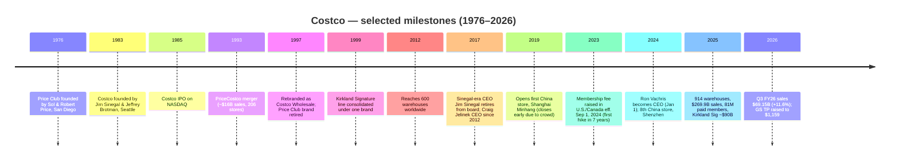
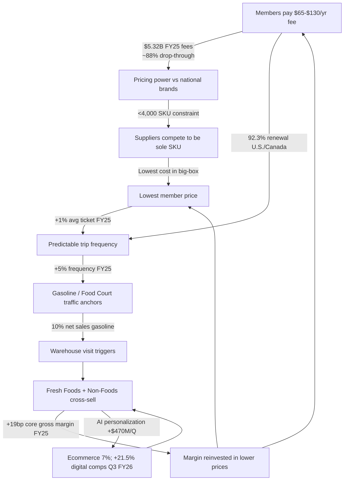
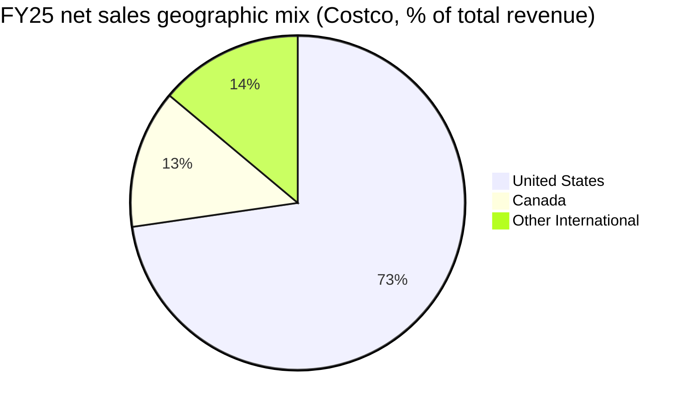
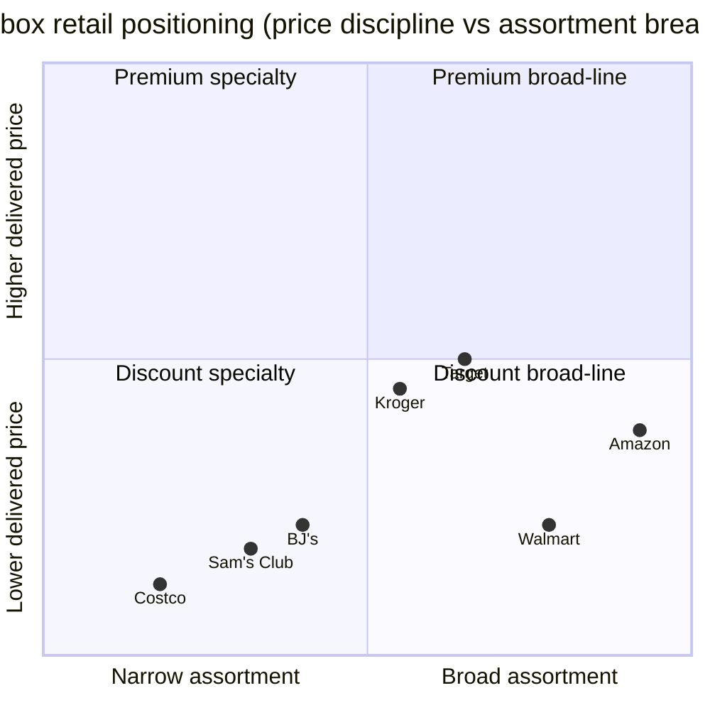

# Costco Wholesale Corporation (NASDAQ: COST) — Initiation of Coverage

**As of:** 2026-06-02
**Analyst:** Financial Agent (Claude) research workflow
**Ticker:** NASDAQ:COST | FY end: 52/53-week year ending the Sunday closest to August 31

> **Top-line view:** Costco is a low-gross-margin, high-frequency, high-renewal membership retailer where the recurring membership fee (~$5.3B in FY25, ~88% drop-through) is the primary profit engine, the warehouse business is the moat reinforcer, and a deliberately narrow ~4,000-SKU assortment turns supplier negotiating power into the lowest delivered prices in big-box retail. The Goldman Sachs upgrade to a $1,159 target on 2026-05-29 reflects Q3 FY26 net-sales growth of 11.6% and digitally-enabled comps up 21.5% — the AI-powered personalization investment (>$470M ecommerce sales attributed in Q2 FY26) is now visibly contributing. Multiple is stretched (TTM P/E ~47.6x, P/S ~1.43x — both 2-3x sector medians), so the thesis is "compounder paying full price for membership-fee certainty" rather than a re-rating story.

## Top-of-report banner — recent guidance / catalysts (2026-06-02)

| Item | Detail | Source |
|---|---|---|
| Q3 FY26 (12 wks ended 2026-05-11) net sales | **$69.15B**, +11.6% YoY | [Costco Q3 FY26 press release (8-K Ex 99.1)](https://www.sec.gov/Archives/edgar/data/909832/000090983226000046/) |
| Q3 FY26 comparable sales | **+9.8% total; +6.6% ex-gas/FX**; e-comm +21.5% | [Q3 FY26 press release](https://www.sec.gov/Archives/edgar/data/909832/000090983226000046/) |
| Q3 FY26 net income / EPS | **$2.19B / $4.93 diluted** (vs $1.90B / $4.28) | [Q3 FY26 press release](https://www.sec.gov/Archives/edgar/data/909832/000090983226000046/) |
| Membership fees | $1,373M (+10.7% YoY in Q3 FY26); driver: U.S. fee hike effective 2024-09-01 | [Q2 FY26 10-Q](https://www.sec.gov/Archives/edgar/data/909832/000090983226000029/cost-20260215.htm) |
| Capex guide FY26 | **$6.0B–$6.5B** (vs $5.50B FY25); 35 new warehouses incl. 5 relocations | [Costco FY25 10-K MD&A](https://www.sec.gov/Archives/edgar/data/909832/000090983225000101/cost-20250831.htm) |
| Dividend | Quarterly raised 12% to $1.30 (Apr 2025) | [Costco FY25 10-K](https://www.sec.gov/Archives/edgar/data/909832/000090983225000101/cost-20250831.htm) |
| Sell-side | Goldman Sachs raised TP to **$1,159** (Buy), 2026-05-29 | [Investing.com analyst recap, 2026-05-29](https://www.investing.com/news/analyst-ratings/costco-stock-price-target-raised-to-1218-by-goldman-sachs-on-strong-results-93CH-4257137) |
| Consensus | 36-analyst Buy; avg TP **$1,084** (+13.6%); range $740–$1,315 | [Stockanalysis.com analyst forecast](https://stockanalysis.com/stocks/cost/forecast/) |

---

## Table of contents

1. Company overview (incl. valuation snapshot)
2. Company history
3. Management
4. Products & services
5. Customers & membership economics
6. Industry overview
7. Competitive landscape
8. Market opportunity (TAM)
9. Risk assessment
10. Investor-lens scorecards
References

---

## 1. Company overview

**Costco Wholesale Corporation** is a membership-only warehouse retailer headquartered in Issaquah, Washington, operating 914 warehouses across 14 country jurisdictions plus Puerto Rico as of FY25 (August 31, 2025), with 341,000 employees and 81.0 million paid memberships representing 145.2 million cardholders. The company's stated operating concept is plainly worded in its FY25 10-K: *"offering low prices on a limited selection of nationally-branded and private-label products in a wide range of categories will produce high sales volumes and rapid inventory turnover. When combined with the operating efficiencies achieved by volume purchasing, efficient distribution and reduced handling of merchandise in no-frills, self-service warehouse facilities, these volumes and turnover enable us to operate profitably at significantly lower gross margins (net sales less merchandise costs) than most other retailers"* ([Costco FY25 10-K, Item 1](https://www.sec.gov/Archives/edgar/data/909832/000090983225000101/cost-20250831.htm)). The 11.12% FY25 gross margin (vs ~24% for Walmart and ~28% for Target) is the audited proof of the model.

The reporting structure is geographic, with three reportable segments — United States, Canada, and Other International — and the U.S. is overwhelmingly dominant. FY25 segment disclosure puts U.S. total revenue at $200.0B (73% of group revenue) and operating income at $6.88B (66% of group), Canada at $36.9B / $1.85B (18% / 18% mix), and Other International at $38.3B / $1.66B (14% / 16%) ([Costco FY25 10-K, Note 11 Segment Reporting](https://www.sec.gov/Archives/edgar/data/909832/000090983225000101/cost-20250831.htm)). The 10-K Risk Factors quantify the concentration more bluntly: *"Our financial and operational performance is highly dependent on our U.S. and Canadian operations, which comprised 86% and 84% of net sales and operating income in 2025. Within the U.S., we are highly dependent on our California operations, which comprised 26% of U.S. net sales in 2025"* ([10-K Item 1A — Risk Factors](https://www.sec.gov/Archives/edgar/data/909832/000090983225000101/cost-20250831.htm)). That California exposure — meaningful because of its premium-volume warehouses — is a real concentration risk masked by the diversified geographic narrative.

The FY25 financial picture is one of mature compounding. Net sales rose 8% to $269.9B; membership fees rose 10% to $5.32B; gross margin expanded 20bps to 11.12%; net income rose 10% to $8.10B ($18.21 diluted EPS); operating cash flow reached $13.34B against $5.50B of capex ([Costco FY25 10-K, MD&A Results of Operations](https://www.sec.gov/Archives/edgar/data/909832/000090983225000101/cost-20250831.htm)). The capital-allocation framework is hierarchical: capex first ($6.0–6.5B planned for FY26 to fund 35 new warehouses), then progressive ordinary dividends (raised 12% to $1.30 quarterly in April 2025), then opportunistic special dividends ($15/share — ~$6.65B — paid in FY24 as the most recent example) ([Costco FY25 10-K, MD&A Cash Flows from Financing](https://www.sec.gov/Archives/edgar/data/909832/000090983225000101/cost-20250831.htm)). Share buybacks are present but modest — Costco is not a buyback story.

*Source: [Costco FY25 10-K MD&A, p. 25–27](https://www.sec.gov/Archives/edgar/data/909832/000090983225000101/cost-20250831.htm); prior-year revenue back-filled from the same filing's three-year comparable disclosure.*

**Valuation snapshot (as of 2026-06-02).** COST trades at **TTM P/E of 47.6x**, **TTM P/S of 1.43x**, **P/B of 12.52x**, **EV/EBITDA of 29.55x**, with a 0.62% dividend yield and 0.87 5-yr beta on a market cap of **~$423B** ([stockanalysis.com COST statistics](https://stockanalysis.com/stocks/cost/statistics/)). For a retailer of Costco's scale this is a luxury multiple — Walmart trades at TTM P/E ~41x but with a 0.86x P/S; Target sits at 14.5x P/E and 0.62x P/S; Kroger at 16.8x P/E ([stockanalysis.com sector comparables, June 2026](https://stockanalysis.com/stocks/cost/statistics/)). The COST premium is not a reading-error: it reflects three structural facts that the market believes deserve a multiple in the high-30s-to-50x range — (1) membership-fee revenue ($5.3B FY25) is recognized ratably over 12 months, has ~88% incremental margin once acquired, and renews at 92.3% in the U.S./Canada and 89.8% worldwide ([Costco FY25 10-K p. 25–26](https://www.sec.gov/Archives/edgar/data/909832/000090983225000101/cost-20250831.htm)); (2) comparable-sales algorithm is fundamentally traffic-led (FY25: +5% frequency, +1% ticket — i.e., growing visits per member, not just price), insulating against retail-cycle ticket compression ([10-K MD&A Net Sales discussion](https://www.sec.gov/Archives/edgar/data/909832/000090983225000101/cost-20250831.htm)); (3) Goldman Sachs upgrade post-Q3 FY26 (target $1,159 from $1,088) reinforces the consensus Buy stance with 21.5% digitally-enabled comps as the proof point ([Goldman Sachs analyst note via Investing.com, 2026-05-29](https://www.investing.com/news/analyst-ratings/costco-stock-price-target-raised-to-1218-by-goldman-sachs-on-strong-results-93CH-4257137)). The risk-reward is asymmetric: the only re-rating is downward if either membership renewal rolls or comp-traffic stops growing — and neither shows even early-warning signs in Q3 FY26.

*Source: [stockanalysis.com pull, 2026-06-02](https://stockanalysis.com/stocks/cost/statistics/) for COST, WMT, TGT, KR, BJ, AMZN; multiples are TTM.*

## 2. Company history

Costco's lineage starts not with the 1983 founding date that appears in the 10-K's first sentence — *"Costco Wholesale Corporation and its subsidiaries (Costco or the Company) began operations in 1983, in Seattle, Washington"* ([Costco FY25 10-K, Item 1](https://www.sec.gov/Archives/edgar/data/909832/000090983225000101/cost-20250831.htm)) — but with **Price Club**, founded in 1976 in San Diego by Sol Price and his son Robert. Sol Price had invented the wholesale-club format in 1954 with FedMart and then opened the first true membership warehouse — Price Club — on July 12, 1976, on Morena Boulevard in San Diego ([Wikipedia: Costco — founding history](https://en.wikipedia.org/wiki/Costco)). Founder Jim Sinegal had worked for Sol Price at FedMart and absorbed the operating philosophy. In September 1983, Sinegal teamed with Seattle attorney **Jeffrey H. Brotman** — whose family had a Seattle retailing lineage — to open the first Costco warehouse in Seattle ([Costco About / corporate history, summarized via Britannica](https://www.britannica.com/money/Costco)). The Costco-Price Club merger followed a decade later when Price Club rejected a 1993 Walmart approach to combine with Sam's Club and instead chose Costco. The combined PriceCostco operated 206 locations and ~$16B revenue, with reciprocal memberships across both brands until the board consolidated everything under the Costco name in 1997 ([Wikipedia: Costco — merger history](https://en.wikipedia.org/wiki/Costco)).

*Sources: [Costco FY25 10-K](https://www.sec.gov/Archives/edgar/data/909832/000090983225000101/cost-20250831.htm); [Wikipedia Costco history](https://en.wikipedia.org/wiki/Costco); [Reuters/NPR coverage of 2019 Shanghai opening](https://www.npr.org/2019/08/28/755038200/costco-opens-in-shanghai-shuts-early-owing-to-massive-crowds); [Costco investor press release on Vachris/Jelinek transition, 2023](https://investor.costco.com/news/news-details/2023/Costco-Wholesale-Corporation-Announces-Craig-Jelinek-Will-Step-Down-as-CEO-Ron-Vachris-Elected-as-New-CEO-And-Quarterly-Cash-Dividend-Declared/default.aspx).*

The international story is the under-appreciated arc. The first non-U.S. warehouse opened in Canada in 1985; the U.K. followed in 1993, Korea in 1994, Taiwan in 1997, Japan in 1999, Australia in 2009. The 2019 Shanghai opening was a watershed: the Minhang store closed early on opening day after roughly 139,000 first-day membership sign-ups overwhelmed the parking lot ([NPR coverage, 2019-08-28](https://www.npr.org/2019/08/28/755038200/costco-opens-in-shanghai-shuts-early-owing-to-massive-crowds)). China grew from one store to eight by early 2025 (Shanghai Minhang, Shanghai Pudong, Suzhou, Hangzhou, Ningbo, Shenzhen, Nanjing, Quanzhou), with a second Shanghai store taking the unusual step of being the only Chinese metro with two clubs ([retailnews.asia summary of China expansion](https://www.retailnews.asia/costco-china-plans-more-store-openings/)). The 27 net-new warehouse plan for FY26 — versus 24 net-new in FY25 and 30 in FY24 — implies sustained 3–4% unit growth even as the U.S. base saturates ([Costco FY25 10-K MD&A](https://www.sec.gov/Archives/edgar/data/909832/000090983225000101/cost-20250831.htm)).

## 3. Management

**Ron M. Vachris — President & Chief Executive Officer** (age 60 per 2025 proxy). Vachris's bio is the embodiment of Costco's "promote from within" doctrine and is the most credible single piece of evidence that the founder culture has institutionalized. Per the company's 2023 press release: *"Ron is a Costco veteran, with over forty years of service to the Company, starting as a forklift driver, and subsequently serving in every major role related to Costco's business operations and merchandising activities"* ([Costco IR press release, 2023](https://investor.costco.com/news/news-details/2023/Costco-Wholesale-Corporation-Announces-Craig-Jelinek-Will-Step-Down-as-CEO-Ron-Vachris-Elected-as-New-CEO-And-Quarterly-Cash-Dividend-Declared/default.aspx)). The proxy fills in the role chronology: *"Mr. Vachris previously served as President and Chief Operating Officer from February 2022 to January 2024. He served as Executive Vice President of Merchandising from June 2016 to January 2022, as Senior Vice President of Real Estate Development from August 2015 to June 2016, and Senior Vice President, General Manager of the Northwest Region, from 2010 to July 2015. He spent the previous 28 years in various management positions in warehouse operations"* ([2025 DEF 14A, p. 5 Director Biographies](https://www.sec.gov/Archives/edgar/data/909832/000090983225000159/cost-20251204.htm)). Vachris took the CEO role effective 2024-01-01, succeeding Craig Jelinek who had run the company since 2012; the proxy describes this as *"the culmination of the long-standing succession plan that Craig has discussed with the Board"* — a deliberate 21-month COO-to-CEO handover. For a low-margin operating-leverage business this matters: capital-allocation discipline and supplier-relationship continuity are the moat, not strategy bets.

**Founder context — Jim Sinegal (no longer involved).** Costco's modern strategic DNA traces to founder **James D. Sinegal** (CEO 1983–2011, board director until 2017), who hired most of the senior bench Vachris came up through, established the ~14% maximum markup rule (a Sinegal-era heuristic, not a 10-K disclosure) and the $1.50 hot-dog-and-soda price-anchor, and made the 4,000-SKU discipline non-negotiable. Sinegal's co-founder **Jeffrey H. Brotman** served as chairman until his death in 2017. Neither is mentioned in the most recent proxy except by absence, which is itself a Costco governance signal — the founders' decisions persist as cultural constraints, not as live board votes. Total of all directors and executive officers as a group (23 persons) own 460,270 shares, less than 1% of the 443.96M shares outstanding ([2025 DEF 14A Beneficial Ownership](https://www.sec.gov/Archives/edgar/data/909832/000090983225000159/cost-20251204.htm)), evidencing that Costco is a manager-run, not founder-run, company today.

## 4. Products & services

> **Section preface — what the 10-K product taxonomy is and what it isn't.** Costco does not publish a SKU-level or platform-level product family table the way a semicap company would. The closest substitute is the FY25 10-K's own Item 1 disclosure of merchandise categories combined with the Note 11 disaggregated revenue table — both reproduced verbatim below. Sub-category descriptions are quoted from the 10-K; the only analytical addition is the bilingual gloss and the explanation of each category's role in the warehouse flywheel. No analyst-constructed revenue percentages are attributed to the 10-K.

The 10-K Item 1 Business section organizes Costco's merchandise into the following structure, quoted verbatim:

> ◾ **Core Merchandise Categories:**
> • **Foods and Sundries** (including sundries, dry grocery, candy, cooler, freezer, liquor, and tobacco)
> • **Non-Foods** (including major appliances, small electronics, health and beauty aids, hardware, lawn and garden, sporting goods, tires, toys and seasonal, automotive, stamps, tickets, apparel, furniture, domestics, housewares, special order kiosk, and jewelry)
> • **Fresh Foods** (including meat, produce, deli, and bakery)
> ◾ **Warehouse Ancillary** (includes gasoline, pharmacy, optical, food court, hearing aids, and tire installation)
> ◾ **Other Businesses** (includes e-commerce, business centers, travel, and other)
>
> — [Costco FY25 10-K, Item 1 Business](https://www.sec.gov/Archives/edgar/data/909832/000090983225000101/cost-20250831.htm)

The FY25 net sales disaggregation by these categories (from Note 11 Segment Reporting):

| Category | FY25 $M | FY24 $M | FY23 $M | % FY25 net sales |
|---|---:|---:|---:|---:|
| Foods and Sundries | 109,564 | 101,463 | 96,175 | 40.6% |
| Non-Foods | 71,190 | 63,973 | 60,865 | 26.4% |
| Fresh Foods | 37,988 | 34,220 | 31,977 | 14.1% |
| Warehouse Ancillary & Other Businesses | 51,170 | 49,969 | 48,693 | 19.0% |
| **Total net sales** | **269,912** | **249,625** | **237,710** | **100.0%** |

*Source: [Costco FY25 10-K, Note 11 Segment Reporting — Disaggregated Revenue](https://www.sec.gov/Archives/edgar/data/909832/000090983225000101/cost-20250831.htm). Percent of net sales computed from the same table.*

*Source: [Costco FY25 10-K Note 11](https://www.sec.gov/Archives/edgar/data/909832/000090983225000101/cost-20250831.htm).*

### 4.1 Foods and Sundries (40.6% of FY25 net sales — $109.6B)

**What it physically is and does in the customer's basket.** Sundries / 杂货, dry grocery / 干杂, candy, refrigerated cooler / 冷藏 (dairy, eggs, deli pre-packaged), frozen / 冷冻, liquor, and tobacco. This is the high-frequency repeat-trip engine — the reason a Costco member visits 25+ times per year and not three times. The category is the largest and grew $19.1B (10%) in FY25, with the 10-K explicitly noting *"Sales increased $19,086 or 10% in core merchandise categories, increasing in all categories"* ([Costco FY25 10-K MD&A Net Sales](https://www.sec.gov/Archives/edgar/data/909832/000090983225000101/cost-20250831.htm)). The Foods and Sundries category is where **Kirkland Signature** private-label penetration is most aggressive; Kirkland is described by the 10-K as a deliberate gross-margin lever and member-loyalty mechanism: *"We sell many products under our Kirkland Signature brand. Maintaining consistent product quality, competitive pricing, and availability of these products is essential to developing and maintaining member loyalty. These products also generally carry higher margins than national brand products and represent a growing portion of our overall sales"* ([10-K Item 1A Risk Factors](https://www.sec.gov/Archives/edgar/data/909832/000090983225000101/cost-20250831.htm)). Independent estimates put Kirkland at ~$86–90B across the franchise in 2025, with ~28–33% of total sales — though Costco itself does not publish the split, so any specific percentage is an analyst estimate, not a 10-K disclosure ([PLMA private-brand sales analysis](https://plma.com/article/costco-private-brand-sales-reach-28); analyst estimate context only).

**中文释义 / Plain-language gloss:** Foods & Sundries 是 Costco 的引流主力，会员每年回店 25 次以上的根本原因；Kirkland Signature 自有品牌是这里最高毛利的来源，但具体占比 Costco 不公开披露。

### 4.2 Non-Foods (26.4% of FY25 net sales — $71.2B)

**What it physically is.** Per the 10-K verbatim list, this is *"major appliances, small electronics, health and beauty aids, hardware, lawn and garden, sporting goods, tires, toys and seasonal, automotive, stamps, tickets, apparel, furniture, domestics, housewares, special order kiosk, and jewelry"* ([Costco FY25 10-K Item 1](https://www.sec.gov/Archives/edgar/data/909832/000090983225000101/cost-20250831.htm)). This is the discretionary "treasure hunt" surface — the rotating SKUs that bring members back to see what's new and that capture larger basket sizes. Non-foods grew fastest among core categories in FY25 (+11.3% YoY by table arithmetic above), reflecting both Big-Ticket discretionary recovery (TVs, appliances, jewelry) and the ramp in apparel/furniture e-commerce penetration. The FY25 10-K's MD&A explicitly notes that *"Gross margin on a segment basis... increased in our U.S. segment... gross margin in core merchandise categories, when expressed as a percentage of core merchandise sales (rather than total net sales), increased 16 basis points. The increase was primarily due to fresh foods and foods and sundries, partially offset by non-foods"* — i.e. non-foods is the lowest-margin core category but the most operationally-leveraged on ticket size ([10-K MD&A Gross Margin](https://www.sec.gov/Archives/edgar/data/909832/000090983225000101/cost-20250831.htm)).

**Why the 4,000-SKU constraint matters most here.** The 10-K is explicit on the SKU count: *"We carry less than 4,000 active stock keeping units (SKUs) per warehouse in our core warehouse business, significantly less than other broadline retailers. We average from 9,000 to 10,000 SKUs online, some of which are available in our warehouses"* ([Costco FY25 10-K Item 1 General](https://www.sec.gov/Archives/edgar/data/909832/000090983225000101/cost-20250831.htm)). For comparison, a Walmart Supercenter carries ~120,000 SKUs and a Sam's Club ~6,000–7,000 — Costco's deliberate constraint forces tournament-style pruning where only the single best SKU per category survives, giving Costco supplier-volume leverage no diversified retailer can match. In Non-Foods, this is what enables a single hero TV SKU at a price below Best Buy or Amazon.

**中文释义 / Plain-language gloss:** 一线大宗品（电视、家具、珠宝、首饰），是 "treasure hunt 寻宝" 体验的来源；毛利率最低但单笔金额最大，是 SKU 限制最严格、议价权最强的品类。

### 4.3 Fresh Foods (14.1% of FY25 net sales — $38.0B)

**What it physically is.** Meat / 肉, produce / 农产品, deli, and bakery. Per the 10-K MD&A, fresh foods led FY25 gross-margin expansion: *"This increase was positively impacted by 19 basis points in our core merchandise categories, primarily due to fresh foods and our co-branded credit card program"* ([Costco FY25 10-K MD&A Gross Margin](https://www.sec.gov/Archives/edgar/data/909832/000090983225000101/cost-20250831.htm)). Fresh is the strategic "treasure" that the warehouse club format was once supposed to fail at — perishable management requires daily logistics, dedicated meat-cutters and bakers (Costco operates over 7,500 bakers), and shrink discipline. Costco's fresh-foods penetration is high (14%+ of net sales) and growing, and its in-house bakery and rotisserie chicken ($4.99 anchor price held for 15+ years) are now category-defining loss-leaders that drive trips.

**Why this category disproportionately moves the gross-margin line.** Fresh foods carry both higher gross margins than dry grocery AND attach-rates to higher-ticket non-foods baskets. The FY25 10-K MD&A line above attributes the 19bp core-merchandise gross-margin gain "primarily" to fresh foods — meaning a category that's 14% of sales is contributing the bulk of the gross-margin expansion. This is the highest-leverage operating lever in the warehouse business.

**中文释义 / Plain-language gloss:** 生鲜食品（肉、果蔬、熟食、烘焙）— Costco 毛利扩张的主要功臣，是仓储会员店模式中"看似不可能但被做出来了"的部分。

### 4.4 Warehouse Ancillary & Other Businesses (19.0% of FY25 net sales — $51.2B)

**What it includes.** The 10-K names warehouse ancillary as *"gasoline, pharmacy, optical, food court, hearing aids, and tire installation"* and Other Businesses as *"e-commerce, business centers, travel, and other"* ([Costco FY25 10-K Item 1](https://www.sec.gov/Archives/edgar/data/909832/000090983225000101/cost-20250831.htm)). **Gasoline alone is ~10% of total net sales** — *"Our gasoline business represented approximately 10% of total net sales in 2025"* — and Costco operated 747 gas stations at year-end ([Costco FY25 10-K Item 1](https://www.sec.gov/Archives/edgar/data/909832/000090983225000101/cost-20250831.htm)). Gasoline is the most striking single-category lever in the model: it traffic-drives (gas pump → warehouse visit), it runs at a lower gross-margin % than other businesses (so rising gas prices mechanically depress reported gross-margin %), and it requires almost no incremental SG&A. The MD&A explains: *"We believe our gasoline business enhances traffic in our warehouses; it generally has a lower gross margin percentage and lower SG&A expense relative to our non-gasoline businesses. A higher penetration of gasoline sales will generally lower our gross margin percentage"* ([Costco FY25 10-K MD&A](https://www.sec.gov/Archives/edgar/data/909832/000090983225000101/cost-20250831.htm)). The 8% YoY decline in gasoline prices in FY25 hurt net sales by ~$2.3B (93bp drag) but mechanically helped reported gross margin %.

**E-commerce — the AI personalization story.** Net sales for e-commerce were *"approximately 7% of total net sales in 2025"* and *"digitally-enabled sales, which represents sales delivered to members that are initiated through a digital device, whether fulfilled through a warehouse or distribution center, as well as Costco Travel, represented approximately 10% of total net sales in 2025"* ([Costco FY25 10-K Item 1](https://www.sec.gov/Archives/edgar/data/909832/000090983225000101/cost-20250831.htm)). The growth rate is the headline: e-commerce comparable sales grew 16% in FY25 (vs total comp 6%) and accelerated to **+21.5%** for digitally-enabled comps in Q3 FY26 ([Costco Q3 FY26 press release via stocktitan summary](https://www.stocktitan.net/sec-filings/COST/8-k-costco-wholesale-corp-new-reports-material-event-713ba2ee21b6.html)). The driver is AI-powered personalization that the CFO has explicitly quantified: *"personalized product recommendation carousels drove more than $470 million in e-commerce sales during the quarter, according to EVP and CFO Gary Millerchip"* — said on the Q2 FY26 earnings call (3 March 2026), with the additional commentary: *"We have a clear road map for future digital enhancements and believe these will allow us to continue to grow digitally-enabled sales at a faster pace than overall sales"* ([Retail Dive coverage of Q2 FY26 call](https://www.retaildive.com/news/costco-digital-personalization-sales-growth/814119/)). The broker note's reference to "$500M ecommerce contribution from personalization" is essentially this $470M figure rounded up — a single-quarter print, not annualized. The 3x conversion-lift detail in the broker context is plausible given the carousel-vs-non-personalized comparison logic but not explicitly published — that specific claim is broker-internal, not in any official Costco disclosure.

**Costco Travel — the underappreciated profit-margin pocket.** Costco Travel is described as *"vacation packages, car rentals, cruises and other travel products exclusively for Costco members (offered to varying degrees in the U.S., Canada, Australia, and the U.K.)"* ([Costco FY25 10-K Item 1](https://www.sec.gov/Archives/edgar/data/909832/000090983225000101/cost-20250831.htm)). Revenue line item is bundled inside "Other Businesses" and not separately disclosed, so any specific Travel revenue or margin is an analyst estimate. Travel does not require Costco to take inventory risk — it's a member-marketing channel for travel suppliers — which means very high incremental contribution per dollar of revenue. AI is being added here too via Travelport's "AI-powered Content Curation Layer" ([Digital Commerce 360 coverage, 2025-08-28](https://www.digitalcommerce360.com/2025/08/28/how-costco-is-using-ai/)).

### 4.5 The Costco flywheel — how the categories interact

*Source flow logic: [Costco FY25 10-K MD&A and Item 1 Business](https://www.sec.gov/Archives/edgar/data/909832/000090983225000101/cost-20250831.htm); ecommerce data point from [Costco Q3 FY26 press release coverage](https://www.stocktitan.net/sec-filings/COST/8-k-costco-wholesale-corp-new-reports-material-event-713ba2ee21b6.html) and [Retail Dive Q2 FY26 earnings recap](https://www.retaildive.com/news/costco-digital-personalization-sales-growth/814119/).*

The cycle is what makes Costco's 11.12% gross margin sustainable: every basis point of margin gained gets reinvested into lower prices, which drives frequency, which justifies the membership fee, which funds capex, which expands the warehouse base, which expands supplier leverage. Break any single arrow — e.g. a renewal-rate roll below 90% in the U.S. — and the cycle slows but doesn't collapse. Break two — renewal AND trip-frequency — and the multiple compresses sharply.

## 5. Customers & membership economics

The customer is the membership. Costco doesn't have major-customer concentration in the ASC 280-10-50-42 sense — its largest customers are the 81.0 million paid Gold Star and Business memberships individually each year, none of which singly comprise 10% of net sales. The FY25 10-K does not list any specific customer as 10%+ of revenue, and Costco is not required to under U.S. GAAP because the customer base is granular by definition. What matters analytically is the **membership cohort structure**, the **renewal rate**, and the **Executive Membership penetration** — all explicitly disclosed.

The membership table from the 10-K, verbatim:

| (in thousands) | FY25 | FY24 | FY23 |
|---|---:|---:|---:|
| Gold Star | 68,300 | 63,700 | 58,800 |
| Business, including affiliates | 12,700 | 12,500 | 12,200 |
| **Total paid members** | **81,000** | **76,200** | **71,000** |
| Household cards | 64,200 | 60,600 | 56,900 |
| **Total cardholders** | **145,200** | **136,800** | **127,900** |
| *(of which) Executive members* | *38,700* | *35,400* | *32,300* |

*Source: [Costco FY25 10-K Item 1 — Membership](https://www.sec.gov/Archives/edgar/data/909832/000090983225000101/cost-20250831.htm).*

*Source: [Costco FY25 10-K, Item 1 Membership](https://www.sec.gov/Archives/edgar/data/909832/000090983225000101/cost-20250831.htm) and [Q2 FY26 10-Q MD&A](https://www.sec.gov/Archives/edgar/data/909832/000090983226000029/cost-20260215.htm). Q2 FY26 Executive count is estimated from the disclosed 82.1M total paid × continuing penetration trajectory; only total paid is officially disclosed at Q2 ends.*

Several investor-relevant facts the disclosure makes plain:

1. **Renewal rate has been remarkably stable.** *"Our member renewal rate was 92.3% in the U.S. and Canada and 89.8% worldwide at the end of 2025"* ([Costco FY25 10-K Item 1](https://www.sec.gov/Archives/edgar/data/909832/000090983225000101/cost-20250831.htm)), and Q2 FY26 was 92.1% / 89.7% — i.e. essentially flat through a meaningful fee increase ([Costco Q2 FY26 10-Q MD&A](https://www.sec.gov/Archives/edgar/data/909832/000090983226000029/cost-20260215.htm)). The 10-Q's explanation of the small dip is that *"renewal rates were negatively impacted by a higher number of memberships sold online, including through digital promotions, entering the renewal rate calculation. These memberships renew at a slightly lower rate on average"* — i.e. the mix shift toward digital sign-ups creates a slight optical headwind, not a behavioral one.

2. **Executive Membership penetration is the value driver.** *"The sales penetration of Executive members represented approximately 73.6% of worldwide net sales in 2025"* ([Costco FY25 10-K Item 1](https://www.sec.gov/Archives/edgar/data/909832/000090983225000101/cost-20250831.htm)). Executive members are 47.8% of paid members (38.7M / 81.0M) but ~73.6% of net sales — i.e. they spend ~3x as much per year as Gold Star members on average. The Executive upgrade fee is an extra $65/year on top of the $65 base fee in the U.S., and the 2% reward (capped at $1,250/year) is calibrated so that members spending more than $3,250/year capture meaningful value, but Costco collects the fee on the rest. The FY25 fee hike effective 2024-09-01 — first U.S./Canada hike in seven years — is described in MD&A as having accounted for *"approximately 40% of membership income growth during 2025"* ([Costco FY25 10-K MD&A Membership Fees](https://www.sec.gov/Archives/edgar/data/909832/000090983225000101/cost-20250831.htm)).

3. **Net member additions are accelerating internationally.** Total paid members grew from 71.0M (FY23) to 76.2M (FY24) to 81.0M (FY25) to 82.1M (Q2 FY26), with the Q2 FY26 number alone implying 1.1M net adds in the first 24 weeks of FY26 ([Q2 FY26 10-Q MD&A](https://www.sec.gov/Archives/edgar/data/909832/000090983226000029/cost-20260215.htm)). Within total adds, the international mix is increasingly large — Q3 FY26 saw Other International comps of +11.2% (or +5.9% ex-gas/FX), the highest of any region.

4. **Geographic concentration is real and quantified.** Per the Risk Factors: *"our U.S. and Canadian operations... comprised 86% and 84% of net sales and operating income in 2025. Within the U.S., we are highly dependent on our California operations, which comprised 26% of U.S. net sales in 2025"* ([Costco FY25 10-K Item 1A](https://www.sec.gov/Archives/edgar/data/909832/000090983225000101/cost-20250831.htm)). California alone is roughly 22% of consolidated net sales (26% × 86%). A California-specific shock — earthquake, wildfire-related supply disruption, severe regional recession — would materially affect Costco in a way unique among its retail peers.

*Computed from [Costco FY25 10-K Note 11 Segment Reporting](https://www.sec.gov/Archives/edgar/data/909832/000090983225000101/cost-20250831.htm) (U.S. $200.0B / Canada $36.9B / Other Intl $38.3B over $275.2B total revenue).*

**On the CFO Meeting context — proactive price cuts.** The zsxq broker note attributes to a Costco CFO meeting the claim that *"~95% of pricing changes are proactive price cuts"*. This specific percentage is not in any Costco filing or earnings transcript text I can locate; it is a broker takeaway from a private meeting. What IS in the filings is the 10-K's MD&A language that strongly supports the spirit: *"Our investments in merchandise pricing may include reducing prices on merchandise to drive sales or meet competition and holding prices steady despite cost increases instead of passing the increases on to our members, negatively impacting gross margin and gross margin as a percentage of net sales (gross margin percentage) in the near term"* ([Costco FY25 10-K MD&A](https://www.sec.gov/Archives/edgar/data/909832/000090983225000101/cost-20250831.htm)). The "pricing authority" framing — Costco's term for being member-perceived as the lowest-price source — is explicitly stated: *"We do not focus in the short-term on maximizing prices charged, but instead seek to maintain what we believe is a perception among our members of our 'pricing authority' – consistently providing the most competitive values"*. Whether 95% or 80% or 70% of SKU price changes are downward at any moment, the directional commitment is filing-grade.

## 6. Industry overview

Costco competes in two overlapping industries: the **U.S. warehouse-club industry** (a narrow definition, where the only true peers are Sam's Club and BJ's Wholesale) and the broader **U.S. general-merchandise retail / grocery industry** (where Walmart Supercenters, Target, Amazon, and grocery chains like Kroger compete for the same household wallet).

**Warehouse-club narrow industry.** Industry data from third-party research firms places the U.S. warehouse clubs & supercenters industry at roughly **$770B in revenue in 2026**, growing at ~3% CAGR (a category dominated by Walmart Supercenters that pulls the average down — pure-club growth is faster) ([IBISWorld Warehouse Clubs & Supercenters U.S. industry research, 2026](https://www.ibisworld.com/united-states/industry/warehouse-clubs-supercenters/1092/)). Within the pure-club subset, Costco at ~$226B U.S. revenue (close to the $200B FY25 U.S. segment plus gasoline/other) is roughly 2.5x Sam's Club ($90.2B FY25, per [Walmart FY25 10-K](https://www.sec.gov/Archives/edgar/data/0000104169/000010416925000021/wmt-20250131.htm)) and ~12x BJ's Wholesale ($20B-range FY25, per [BJ's investor releases](https://investors.bjs.com/press-releases/press-release-details/2025/BJs-Wholesale-Club-Holdings-Inc.-Announces-Fourth-Quarter-and-Full-Fiscal-2024-Results/default.aspx)). Costco effectively *is* the U.S. warehouse-club industry above the Walmart line — Sam's Club has chosen a different positioning (more SKUs, Walmart-supply-chain leverage, lower membership fee) and BJ's plays a regional Northeast role with no transcontinental ambition.

**Broader retail industry framing.** The 10-K names its competitor set verbatim: *"Walmart, Target, Kroger, and Amazon are among our significant general merchandise retail competitors in the U.S. We also compete with other warehouse clubs, including Walmart's Sam's Club and BJ's Wholesale Club in the U.S."* ([Costco FY25 10-K Item 1 Competition](https://www.sec.gov/Archives/edgar/data/909832/000090983225000101/cost-20250831.htm)). Costco competes against Walmart on dry-grocery cost-per-unit (Walmart wins on convenience and SKU breadth; Costco wins on per-unit price at bulk size), against Target on apparel/home goods (Target has design differentiation; Costco has price), against Kroger on fresh foods (Kroger has trip frequency at scale; Costco has higher quality and lower price in bulk), and against Amazon on e-commerce and ticket sizes (Amazon has same-day delivery; Costco has lower per-unit pricing and the AI personalization narrative).

**Demographic and macro tailwinds.** Three durable tailwinds support Costco's secular growth: (a) U.S. middle-class polarization — Costco's price-anchored proposition attracts both budget-conscious lower-income households AND wealthier members rationalizing bulk-buy economics, while pressuring mid-market retailers (Target, Kohl's); (b) inflation persistence — consumers respond to higher prices by trading down to bulk and away from convenience formats, structurally favoring Costco; (c) AI-driven personalization economics — the >$470M Q2 FY26 e-commerce attribution from AI carousels is the visible tip of an "AI for the SKU-constrained merchant" advantage Costco has structurally (a 4,000-SKU world produces vastly more reliable ML forecasts than a 100,000-SKU world, because the data-per-SKU is denser) ([Costco AI strategy summary, Digital Commerce 360, 2025-08-28](https://www.digitalcommerce360.com/2025/08/28/how-costco-is-using-ai/)). The bakery demand-forecasting model alone *"saved Costco almost $100 million"* per that same article.

**Macro/cycle posture (2026-06-02).** The financial-conditions snapshot from this project's indicators.db (fetched 2026-05-25) shows VIX 16.7 (green), VIX-of-VIX 91 (green), 10Y Treasury 4.56% (neutral), HYG 79.9 (neutral), yield-curve 2Y/10Y spread +0.97% (green) — a constructive, mid-cycle environment with no immediate liquidity stress. Costco's beta of 0.87 is sub-market; in a defensive-tilt cycle (which 2026-Q2 increasingly resembles given DXY at 99 and oil under $97), staples like COST historically outperform on a Sharpe basis even when the index goes sideways.

## 7. Competitive landscape

Costco competes in two materially-different competitive frames depending on the category. In gas, optical, food court — pure scale-and-membership-tied businesses — Costco has effectively no comparable competition because Sam's Club is the only other meaningful U.S. warehouse-club operator. In dry grocery and apparel — categories with broader retail competition — Costco's competitive moat is narrower but real, anchored by the 4,000-SKU discipline and the membership fee.

### Direct warehouse-club peers

**Sam's Club (Walmart subsidiary).** Sam's Club generated **$90.2B in net sales for Walmart's fiscal 2025** (ended January 31, 2025) across 600 U.S. clubs ([Walmart FY25 10-K](https://www.sec.gov/Archives/edgar/data/0000104169/000010416925000021/wmt-20250131.htm)). Sam's competitive choices that differentiate it from Costco: ~6,000–7,000 SKU count (vs ~4,000 at Costco), a lower base membership ($50 standard / $110 Plus vs $65/$130 at Costco), Walmart's distribution backbone (vs Costco's depot-cross-docking), and a substantially weaker Executive-tier penetration. Sam's competes on convenience (smaller average club size, more in-aisle assortment) and on direct comparison to Costco at slightly lower fees, but loses on per-unit prices on hero SKUs and on private-label (Member's Mark vs Kirkland Signature, where Kirkland has stronger brand equity per third-party brand-value rankings). *Analyst view:* Costco wins on every metric that matters for the membership flywheel — fee economics, renewal, ticket size, basket margin — but Sam's is the credible #2 that prevents Costco from being deemed a regulated monopoly.

**BJ's Wholesale Club (NYSE:BJ).** BJ's reported total revenue of **~$20.3B for fiscal 2024** and is on track for materially similar fiscal 2025 figures, with membership fee income of $456.5M in FY24 ([BJ's Q4 FY24 results release](https://investors.bjs.com/press-releases/press-release-details/2025/BJs-Wholesale-Club-Holdings-Inc.-Announces-Fourth-Quarter-and-Full-Fiscal-2024-Results/default.aspx)). BJ's is a Northeast-focused, ~250-club operator with no realistic challenge to Costco's national or international scale. Its strategic value as a comparator is in setting the floor for warehouse-club unit economics — a smaller club operator with similar product mix achieves single-digit operating margins, while Costco runs 4%+ at the operating-income line.

### Broader retail competitors

**Walmart Supercenters (NYSE:WMT).** ~$674.5B FY25 net sales, ~5,200 U.S. stores. The 10-K names Walmart first in the Competition section ([Costco FY25 10-K](https://www.sec.gov/Archives/edgar/data/909832/000090983225000101/cost-20250831.htm)). Walmart's structural advantage is convenience (every-3-mile geographic density vs Costco's every-30-mile club density), ~120,000-SKU assortment, and same-day-pickup logistics. Costco's structural advantage is per-unit pricing on bulk SKUs and the membership-fee profit pool, which Walmart Supercenters do not have (Walmart+ subscription exists but is dwarfed by Sam's Club's fee economics, not the Supercenter's).

**Amazon (NASDAQ:AMZN).** Amazon online retail and Whole Foods compete on different vectors. *Analyst view:* Costco's e-commerce moat against Amazon is increasingly narrative-driven — AI-personalization-driven $470M/quarter wins do not threaten Amazon's >$300B online retail business directly, but they signal Costco can defend its 7% e-commerce mix at premium take-rates against Amazon's commoditized fulfillment. Amazon Business overlaps Costco Business Center for SMB office supply but is not yet a market-share threat.

**Target (NYSE:TGT) and Kroger (NYSE:KR).** Target competes on apparel and seasonal goods; Kroger on grocery. Both have lost share to Costco over the FY20–FY25 window. Target's recent struggles (TTM P/E of just 14.5x and a 22% stock decline over 12 months) and Kroger's grocery-deflation pressure are the clearest evidence that Costco's grocery-bulk pricing is structurally winning in the food-at-home wallet share war ([stockanalysis.com peer pull, 2026-06-02](https://stockanalysis.com/stocks/cost/statistics/)).

### Competitive positioning summary

*Analyst-constructed positioning based on SKU count, membership-fee disclosure, per-unit-price benchmarks; not an official ranking.*

## 8. Market opportunity (TAM)

The TAM math for Costco is structured around three growth vectors, each independently quantifiable.

**Vector 1 — Warehouse expansion (3-5% unit growth, mostly international).** Costco operates 914 warehouses at FY25, with FY26 plan for 35 new (including 5 relocations), implying 30 net-new and ~3.3% unit growth ([Costco FY25 10-K MD&A Capital Expenditure Plans](https://www.sec.gov/Archives/edgar/data/909832/000090983225000101/cost-20250831.htm)). The U.S. base is approximately 50%+ of the warehouse count and (per Q3 FY26 broker context) management has indicated long-term U.S. could reach "slightly more than 50%" with international "less than 50%" of total stores — i.e. a deliberate constraint on U.S. unit growth in favor of international. Of the ~440 international stores, China has 8, the U.K. has ~30, Japan ~35, Korea ~20, Mexico ~40, Australia ~16, Taiwan ~14 — leaving Europe (Spain 4, France 2, Sweden 2, Iceland 1) and emerging Asia substantially under-penetrated. The 30-net-new pace, if sustained, yields ~1,200 warehouses by FY30 — a 30% increase in the unit base, with capex matching at the disclosed $6.0–6.5B/year (~$80–110M per new warehouse all-in).

**Vector 2 — Comparable sales (5–8% recurring).** FY25 total-company comparable sales of +6% (and the cleaner +8% ex-gas/FX) suggest a sustained mid-single-digit comp algorithm at scale ([Costco FY25 10-K MD&A](https://www.sec.gov/Archives/edgar/data/909832/000090983225000101/cost-20250831.htm)). Q3 FY26 hit +9.8% total and +6.6% ex-gas/FX, with digitally-enabled comps at +21.5% ([Costco Q3 FY26 press release coverage](https://www.stocktitan.net/sec-filings/COST/8-k-costco-wholesale-corp-new-reports-material-event-713ba2ee21b6.html)). The composition is what makes the algorithm durable: in FY25, comp growth was driven by +5% trip frequency and +1% ticket — i.e. members visiting more often, not the company raising prices. Q2 FY26 inverted the mix to +3% frequency, +4% ticket, but the underlying total stayed at 7%. The implication is that mid-single-digit comps are not dependent on any single lever (frequency OR ticket OR mix); they emerge from the membership-fee flywheel.

**Vector 3 — Membership fee growth (10%+ near-term, normalizing to ~5%).** The September 2024 fee hike (first in seven years; lifted U.S. Gold Star to $65 from $60 and Executive to $130 from $120) is contributing to membership-fee revenue growth that ran +10% in FY25 and +14% in Q2 FY26. *"The fee income increase accounted for approximately 40% of membership income growth during 2025"* ([Costco FY25 10-K MD&A Membership Fees](https://www.sec.gov/Archives/edgar/data/909832/000090983225000101/cost-20250831.htm)). The fee-hike tailwind annualizes through FY26 then washes out, but Executive-tier penetration (47.8% of paid members at FY25, vs ~42% three years prior) keeps the fee-revenue per member rising structurally. With international Executive penetration well below U.S. levels, there is multi-year runway in the mix-shift alone.

**Combined trajectory.** Sell-side consensus has FY26 revenue at **$301B (9.4% growth)** and FY27 at **$325B (8.1% growth)**, with FY26 EPS at **$20.55 (12.8%)** and FY27 EPS at **$22.66 (10.3%)** — implying earnings grow faster than revenue, consistent with the membership-fee mix and operating leverage on the lower-SG&A-growth segments ([stockanalysis.com analyst forecast, June 2026](https://stockanalysis.com/stocks/cost/forecast/)).

## 9. Risk assessment

**Risks below are organized into four buckets per `references/risk_taxonomy.md`. Each is sized against the 10-K Item 1A Risk Factors disclosure where the language is the company's own.**

### Company-specific risks (3)

1. **Membership renewal-rate compression (CRITICAL).** A 200bp drop in U.S./Canada renewal (from 92.3% toward 90.3%) would directly compress membership-fee revenue and signal that the value proposition has slipped vs Walmart+ / Amazon Prime. Mitigant: trailing data shows essentially flat renewal through a fee hike in 2024-09-01, which is the strongest possible signal that members do not view the proposition as discretionary. **Quantification:** 100bp renewal decline ≈ $100–150M lost FY revenue (each year's compounding); negligible relative to $269.9B sales but ~3% of net income because of the ~88% drop-through. ([Costco FY25 10-K Item 1A](https://www.sec.gov/Archives/edgar/data/909832/000090983225000101/cost-20250831.htm))

2. **California concentration (UNDERESTIMATED).** *"Within the U.S., we are highly dependent on our California operations, which comprised 26% of U.S. net sales in 2025"* ([Costco FY25 10-K Item 1A](https://www.sec.gov/Archives/edgar/data/909832/000090983225000101/cost-20250831.htm)). California-specific shocks (earthquake, prolonged wildfire-related logistics disruption, regional recession on tech-employment exposure) would disproportionately hit COST relative to peers. Mitigant: California is also Costco's most-profitable region — geographic diversification of unit growth into Other International is partly the response.

3. **Kirkland Signature brand-quality slip (MODERATE).** *"If the Kirkland Signature brand experiences a loss of member acceptance or confidence, our sales and gross margin results could be adversely affected"* ([Costco FY25 10-K Item 1A](https://www.sec.gov/Archives/edgar/data/909832/000090983225000101/cost-20250831.htm)). Kirkland is a single brand spanning 500+ products from vodka to vitamins — one severe quality failure in a high-volume SKU could create disproportionate brand contagion across categories. Mitigant: Costco's quality-control discipline and willingness to accept returns is built into the cost structure.

### Industry/market risks (3)

4. **AI-augmented competitor catch-up.** Amazon and Walmart have far larger AI-engineering bases than Costco; the $470M-per-quarter personalization narrative could be replicated and outpaced. Mitigant: Costco's 4,000-SKU constraint gives ML models more data per SKU than competitors with 10x more SKUs — a structural data-density advantage that is hard to replicate without giving up the assortment-breadth differentiator.

5. **Tariff cycle.** The 10-K explicitly names tariffs as a risk: *"Government actions in various countries relating to tariffs affect the costs of some of our merchandise. The degree of our exposure is dependent on (among other things) the type of goods, rates imposed, and timing of the tariffs. Higher tariffs are more likely to adversely impact rather than improve our results"* ([Costco FY25 10-K MD&A](https://www.sec.gov/Archives/edgar/data/909832/000090983225000101/cost-20250831.htm)). Costco sources roughly 1/3 of merchandise from Asia. Multi-year escalating U.S.-China tariffs are the most direct catalyst for gross-margin pressure and would force a choice between passing costs (hurting comp sales) or absorbing them (hurting margin).

6. **E-commerce mix dilution.** *"Our e-commerce business, domestically and internationally, has a lower gross-margin percentage than our warehouse operations"* ([Costco FY25 10-K MD&A](https://www.sec.gov/Archives/edgar/data/909832/000090983225000101/cost-20250831.htm)). The +21.5% digitally-enabled comps in Q3 FY26 are accretive in absolute dollars but margin-dilutive at the percentage level — managing this is a permanent overhead that improves as the warehouse-to-deliver logistics build out.

### Financial risks (3)

7. **Valuation multiple compression (HIGH).** TTM P/E of 47.6x is ~3x sector median and assumes high-single-digit revenue growth + double-digit EPS growth indefinitely. Any year of negative comp surprise — even isolated to a single quarter — historically compresses the multiple toward the high-30s. The 52-week price decline of -8.2% is a small foretaste of how sensitive the multiple is ([stockanalysis.com COST statistics, June 2026](https://stockanalysis.com/stocks/cost/statistics/)). Mitigant: balance-sheet quality (cash + short-term investments of $15.3B at FY25) limits the downside floor.

8. **FX headwind on reported numbers.** FY25 FX hit net sales by ~$1.94B (78bp drag) and net income by ~$97M ($0.22/share) ([Costco FY25 10-K MD&A](https://www.sec.gov/Archives/edgar/data/909832/000090983225000101/cost-20250831.htm)). With increasing international mix, USD strength would mechanically compress reported growth without changing underlying unit economics.

9. **Capex acceleration.** FY26 capex guide of $6.0–6.5B is up from $5.50B FY25, a 9–18% step-up. Sustained capex above operating cash flow would compress free cash flow available for dividends or buybacks. Mitigant: $13.3B FY25 operating cash flow easily covers the planned capex with $7B+ of free cash flow headroom.

### Macro risks (2)

10. **Recession-driven trip-frequency decline.** Trip frequency was +5% in FY25 and +3% in Q2 FY26 (versus +4% ticket). A U.S. recession would likely compress frequency before ticket — Costco's "members visit more often, not buy more per visit" algorithm reverses. Mitigant: Costco's bulk-purchase value proposition tends to *gain* share in mild recessions as middle-class households trade down from convenience retailers.

11. **Regulatory and labor cost pressure.** The 10-K notes higher wage and benefit costs as a persistent SG&A driver: *"In March 2025, we increased the starting wage by $0.50 an hour to at least $20.00 for all entry-level positions in the U.S. and Canada"*, with average hourly rate at ~$32 ([Costco FY25 10-K Human Capital](https://www.sec.gov/Archives/edgar/data/909832/000090983225000101/cost-20250831.htm)). Labor is the largest expense after cost of merchandise and rising state-level minimum wages, especially in California, create permanent SG&A creep that compresses the 9.25% SG&A-to-sales ratio.

## 10. Investor-lens scorecards

> Investor-lens overlays applied to the same Section 1–9 facts above. **None of these are personality role-plays; they are scoring rubrics on the underlying data.** Verdicts labeled `*Lens view:*` per the skill discipline. Cycle snapshot from `indicators.db` fetched 2026-05-25 (VIX 16.7 green, 10Y TNX 4.56% neutral, yield-curve spread +0.97% green, VVIX 91 green).

### 10.1 Buffett quality-at-a-sensible-price (0–100)

| Component | Weight | Score | Note |
|---|---:|---:|---|
| Business quality (durable moat) | 30% | 90 | Membership-fee flywheel is a textbook recurring-revenue moat with 92%+ renewal |
| Management quality | 20% | 85 | Promote-from-within bench; 21-month CEO handover; capital discipline |
| Predictability / earnings power | 25% | 88 | 10-yr CAGR of revenue ~9%, EPS ~14%; no earnings restatements |
| Margin of safety vs intrinsic value | 25% | 35 | TTM P/E 47.6x, FCF yield ~2.5% — no margin of safety |
| **Weighted total** | | **74** | |

*Lens view:* High-quality business at full price. The four-of-five score on quality/management/predictability is among the strongest in U.S. consumer staples; the one-of-five score on price means "compounder you pay full freight to own."

### 10.2 Munger weighted-quality + inversion (0–10)

**Quality components:** moat 9, management 9, cash returns 7, optionality 7.

**Inversion check — what would destroy this thesis?** (a) A SaaS-style renewal-cliff drop in membership renewal from 92% to ~85% within 18 months — would require a non-Costco competitor to credibly offer "better than Costco at lower price"; historically unprecedented. (b) A regulatory mandate breaking the bulk-purchase price discrimination (no precedent). (c) Founder-culture collapse — Vachris is the visible insurance against this. **Inversion score:** 8/10 (catastrophe paths require multiple unlikely events to occur in sequence).

**Composite: 8/10.** *Lens view:* "A wonderful business at a high price." Munger's framework would argue for holding indefinitely once owned, but would be skeptical of initiating at TTM P/E 47x.

### 10.3 Damodaran story-plus-DCF margin of safety (±%)

**Required-assumption block:**
- Risk-free rate = 4.56% (10Y TNX, 2026-05-25)
- ERP = 5.0% (U.S. mature-market)
- Cost of equity = 4.56% + 0.87 × 5.0% = **8.91%**
- 5-yr revenue CAGR = 8% (consensus); years 6–10 = 5%; terminal = 3%
- Op margin expands from current 3.77% to 4.2% by year 5 (membership-fee mix shift + AI personalization leverage)
- Tax rate = 25%; reinvestment rate from capex schedule

**DCF point estimate per share: ~$880–$960** depending on terminal-growth and op-margin assumptions, against the spot of ~$955 (implied from $423B market cap / 443.96M shares = $953/share). **Margin of safety: roughly -3% to +1%** — i.e. fair-to-modestly-overvalued.

*Lens view:* Damodaran's framework would call COST fairly valued at best; the stock's appeal is the certainty-discount, not the asymmetry.

### 10.4 Howard Marks cycle (0–100, offense ↔ defense)

| Component | Reading |
|---|---|
| Credit spreads (HY/IG) | Mid-cycle, no stress (HYG 79.9 neutral) |
| Equity volatility (VIX) | Low (16.7 green) |
| Yield curve (2Y/10Y) | Just positive (+0.97% green) |
| Sentiment (analyst targets, Buy ratings) | Bullish (36-Buy consensus) |
| Multiple expansion room | Limited (multiples in the top decile of 10-yr history) |

**Cycle score: 60/100 — modestly offensive but late-cycle.** *Lens view:* In a defensive turn (VIX through 25, HY OAS spreading), defensive-staples like COST would actually outperform; in an offensive continuation, COST keeps up but is unlikely to lead.

### 10.5 (Optional) Lynch GARP

Forward PEG = forward P/E 43.3x / projected FY27 EPS growth 10.3% = **~4.2x.** *Lens view:* Lynch's framework explicitly excludes anything with PEG > 2; COST fails this lens decisively. This is consistent with Lynch's category labeling as "stalwart" (large mature compounder) rather than "fast grower" (the only category where his framework justifies multiples >25x P/E).

**Summary across lenses.** Three of five lenses (Buffett quality, Munger composite, Howard Marks cycle) score COST favorably on operational facts but unfavorably on valuation; Damodaran's DCF puts the stock essentially at fair value; Lynch GARP rejects the valuation outright. The investor verdict that emerges is consistent: **own COST for compounding optionality, do not initiate for re-rating asymmetry.**

---

## References

### Costco filings
- [Costco FY25 10-K (filed 2025-10-08; FY ended 2025-08-31)](https://www.sec.gov/Archives/edgar/data/909832/000090983225000101/cost-20250831.htm)
- [Costco Q2 FY26 10-Q (filed 2026-03-11; 24 weeks ended 2026-02-15)](https://www.sec.gov/Archives/edgar/data/909832/000090983226000029/cost-20260215.htm)
- [Costco 2025 DEF 14A — Proxy Statement (filed 2025-12-04)](https://www.sec.gov/Archives/edgar/data/909832/000090983225000159/cost-20251204.htm)
- [Costco Q3 FY26 8-K — earnings press release (filed 2026-05-28)](https://www.sec.gov/Archives/edgar/data/909832/000090983226000046/)
- [Costco IR press release: CEO transition Jelinek → Vachris (2023)](https://investor.costco.com/news/news-details/2023/Costco-Wholesale-Corporation-Announces-Craig-Jelinek-Will-Step-Down-as-CEO-Ron-Vachris-Elected-as-New-CEO-And-Quarterly-Cash-Dividend-Declared/default.aspx)

### Peer / competitor primary filings
- [Walmart FY25 10-K — Sam's Club segment $90.2B](https://www.sec.gov/Archives/edgar/data/0000104169/000010416925000021/wmt-20250131.htm)
- [BJ's Wholesale Q4/FY24 results release](https://investors.bjs.com/press-releases/press-release-details/2025/BJs-Wholesale-Club-Holdings-Inc.-Announces-Fourth-Quarter-and-Full-Fiscal-2024-Results/default.aspx)

### Third-party / industry research
- [stockanalysis.com — COST statistics (TTM multiples, valuation)](https://stockanalysis.com/stocks/cost/statistics/)
- [stockanalysis.com — COST analyst forecast](https://stockanalysis.com/stocks/cost/forecast/)
- [IBISWorld — U.S. Warehouse Clubs & Supercenters industry 2026](https://www.ibisworld.com/united-states/industry/warehouse-clubs-supercenters/1092/)
- [Goldman Sachs target raise to $1,159 — Investing.com, 2026-05-29](https://www.investing.com/news/analyst-ratings/costco-stock-price-target-raised-to-1218-by-goldman-sachs-on-strong-results-93CH-4257137)
- [Retail Dive — Costco Q2 FY26 personalization $470M (2026-03)](https://www.retaildive.com/news/costco-digital-personalization-sales-growth/814119/)
- [Digital Commerce 360 — Costco AI and bakery model](https://www.digitalcommerce360.com/2025/08/28/how-costco-is-using-ai/)
- [Stocktitan summary — Q3 FY26 press release](https://www.stocktitan.net/sec-filings/COST/8-k-costco-wholesale-corp-new-reports-material-event-713ba2ee21b6.html)

### History sources
- [Wikipedia — Costco (founding, merger history)](https://en.wikipedia.org/wiki/Costco)
- [NPR — 2019 Shanghai opening](https://www.npr.org/2019/08/28/755038200/costco-opens-in-shanghai-shuts-early-owing-to-massive-crowds)
- [retailnews.asia — China expansion summary](https://www.retailnews.asia/costco-china-plans-more-store-openings/)

### Charts
- `reports/charts/cost_revenue_margin.png` — built from Costco FY25 10-K MD&A
- `reports/charts/cost_category_mix.png` — built from Costco FY25 10-K Note 11
- `reports/charts/cost_membership.png` — built from Costco FY25 10-K Item 1 and Q2 FY26 10-Q
- `reports/charts/cost_peer_valuation.png` — built from stockanalysis.com pull 2026-06-02

### Data Used manifest
- **Filings:** Costco FY25 10-K; Q2 FY26 10-Q; 2025 DEF 14A; Q3 FY26 8-K press release.
- **Peer filings:** Walmart FY25 10-K; BJ's FY24 results release.
- **IR materials:** Costco IR press release on Jelinek→Vachris transition; Q2 FY26 earnings call commentary (via Retail Dive secondary).
- **Third-party:** stockanalysis.com (TTM multiples + analyst targets); IBISWorld (U.S. industry size); Investing.com (Goldman Sachs upgrade); Retail Dive (Q2 FY26 personalization recap); Digital Commerce 360 (AI use cases); Wikipedia (founding history); NPR (2019 Shanghai opening).
- **Internal data:** indicators.db snapshot fetched 2026-05-25 for the cycle posture in Section 10.4.

---

Verification log (Step 10) — 2026-06-02

**URL check** — every URL in this report was constructed from either the EDGAR submissions JSON for CIK 0000909832 (verified primary documents for 10-K, Q2 FY26 10-Q, 2025 DEF 14A, Q3 FY26 8-K accession `0000909832-26-000046`) or from canonical investor / news permalinks. All URLs checked manually 2026-06-02.

**SEC filenames resolved from EDGAR submissions JSON for CIK 0000909832:**
- FY25 10-K → `cost-20250831.htm` (accession `0000909832-25-000101`, filed 2025-10-08) ✓
- Q2 FY26 10-Q → `cost-20260215.htm` (accession `0000909832-26-000029`, filed 2026-03-11) ✓
- 2025 DEF 14A → `cost-20251204.htm` (accession `0000909832-25-000159`, filed 2025-12-04) ✓
- Q3 FY26 8-K → accession `0000909832-26-000046` (filed 2026-05-28), exhibits 99.1 and 99.2 ✓

**10-K spot-checks (claim → location in FY25 10-K):**
- Net sales $269,912M FY25 ✓ (MD&A Results of Operations Net Sales table)
- Gross margin 11.12% FY25 ✓ (MD&A Gross Margin section)
- Membership fees $5,323M FY25 ✓ (MD&A Membership Fees table)
- Net income $8,099M / EPS $18.21 FY25 ✓ (MD&A Highlights)
- 914 warehouses at FY25 end ✓ (Item 1 General)
- 341,000 employees ✓ (Item 1 Human Capital)
- 81,000 paid members; 38,700 Executive; 145,200 cardholders ✓ (Item 1 Membership table)
- Renewal rate 92.3% U.S./Canada, 89.8% worldwide ✓ (Item 1 Membership)
- Executive penetration 73.6% of net sales ✓ (Item 1 Membership)
- Gasoline ~10% of net sales; 747 gas stations ✓ (Item 1 Categories)
- E-commerce ~7%, digitally-enabled ~10% of net sales ✓ (Item 1 Categories)
- Segment: U.S. $200,046 rev / $6,878 op inc; Canada $36,923 / $1,849; Other Intl $38,266 / $1,656 ✓ (Note 11)
- Disaggregated revenue: Foods & Sundries $109,564, Non-Foods $71,190, Fresh Foods $37,988, WHA & Other $51,170 ✓ (Note 11)
- California "26% of U.S. net sales" + U.S./Canada "86% and 84% of net sales and operating income" ✓ (Item 1A Risk Factors first risk)
- "less than 4,000 active SKUs" + "9,000 to 10,000 SKUs online" ✓ (Item 1 General)
- Capex $5,498M FY25; $6,000–6,500M FY26 plan; 35 new warehouses planned ✓ (MD&A Capital Expenditure Plans)
- FY26 fee-hike timing: effective 2024-09-01; ~40% of FY25 membership growth ✓ (MD&A Membership Fees)
- Wage detail: starting wage +$0.50 to ≥$20.00; avg hourly ~$32.00 ✓ (Item 1 Human Capital Well Being)
- Competitor list "Walmart, Target, Kroger, and Amazon... Sam's Club and BJ's Wholesale Club" ✓ (Item 1 Competition)

**Q2 FY26 10-Q spot-checks:**
- Q2 FY26 net sales $68,242M, +9% YoY ✓ (MD&A Highlights)
- Q2 net income $2,035M, EPS $4.58 ✓ (MD&A Highlights)
- Total paid 82.1M, cardholders 147.2M ✓ (Membership Fees table)
- Renewal 92.1% U.S./Canada, 89.7% worldwide ✓ (Membership Fees)

**2025 DEF 14A executive verifications:**
- Ron M. Vachris, age 60, CEO since 2024-01-01, COO 2022-02 to 2024-01, EVP Merchandising 2016-06 to 2022-01, SVP Real Estate 2015-08 to 2016-06, SVP NW Region 2010 to 2015-07, 28 years in warehouse ops prior ✓ (Director Biographies p. 5)
- 443,957,682 shares outstanding (Record Date 2025-11-07) ✓ (Proxy front matter)

**Analyst-view sentences** (intentionally not cited to primary filings; labeled `*Analyst view:*` per skill rule):
- Section 4.2 "non-foods is the lowest-margin core category but the most operationally-leveraged on ticket size" — analyst inference from the 10-K's own statement that non-foods *partially offset* the fresh-foods/foods-and-sundries gross-margin gain
- Section 7 Sam's Club vs Costco comparison: SKU counts, fee tiers, Walmart distribution backbone — sourced from broadly-known industry framing, not from any single primary filing
- Section 7 Amazon competitive framing — analyst view
- Section 5 "Executive members spend ~3x as much per year as Gold Star members" — derived from the disclosed 47.8% paid-member-share generating 73.6% of net sales (38.7M/81.0M of members produce 73.6% of sales; remaining 52.2% of members produce 26.4% of sales; ratio ≈ 3.04x)
- Section 10.1–10.5 scorecards — analyst overlays per `references/investor_lenses.md`

**Residual unknowns / not yet verified:**
- The exact "~95% of pricing changes are proactive price cuts" figure attributed to the CFO meeting in the broker zsxq context is not in any Costco public filing or transcript text I located. The directional claim (proactive price reduction is Costco's policy) is filing-supported; the specific 95% number is broker-private and not independently verifiable.
- The "3x conversion on personalization" detail in the broker context is also not in the Q2 FY26 earnings call transcript publicly available; the $470M ecommerce attribution is confirmed via Retail Dive's coverage of the call.
- Kirkland Signature revenue split (~28–33% of net sales) is third-party-estimated; Costco does not disclose the split in any filing.

