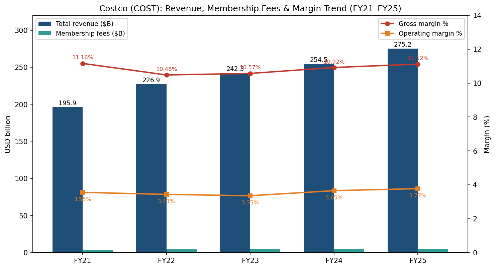
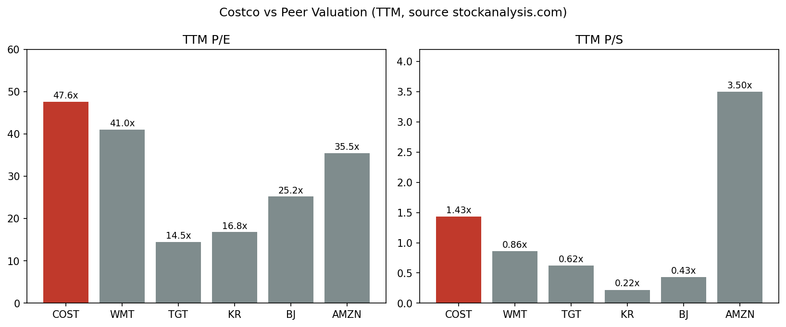
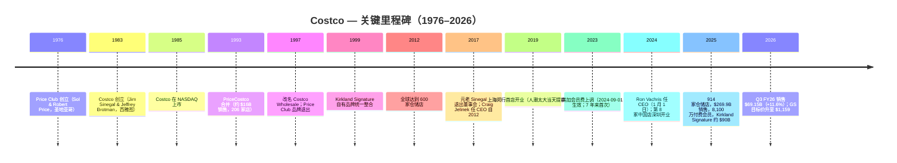
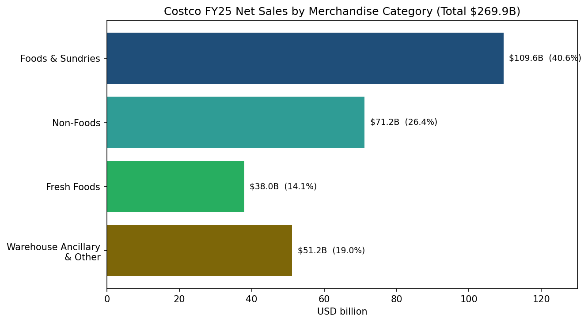
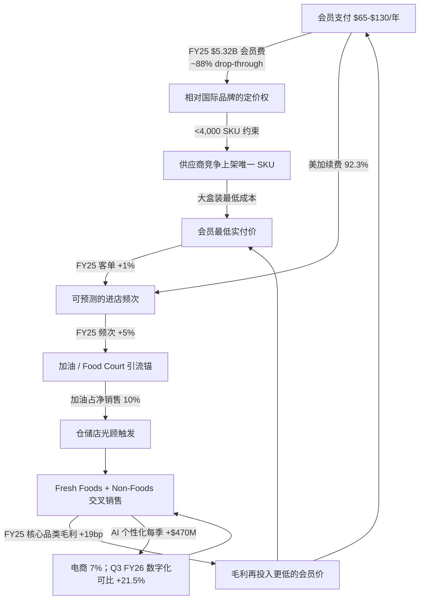
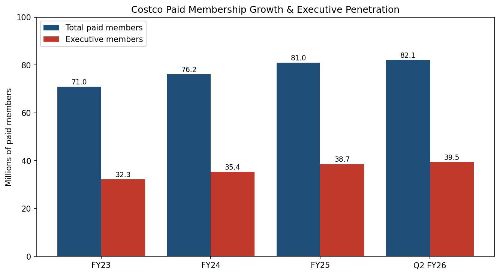
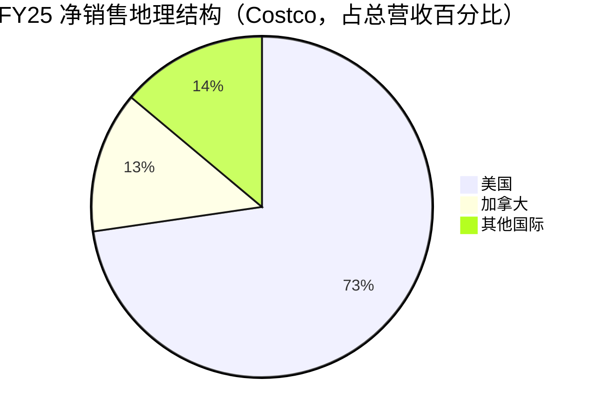
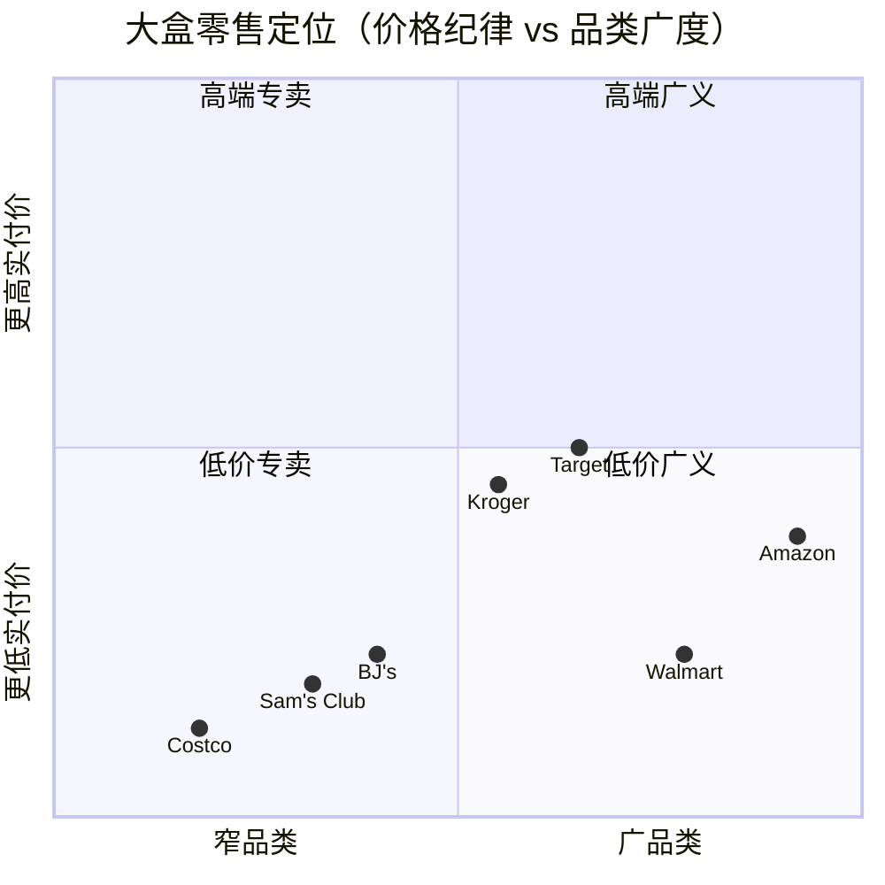

# 好市多 / Costco Wholesale Corporation（NASDAQ: COST）— 公司研究（首次覆盖）

**截至日期：** 2026-06-02
**分析师：** Financial Agent (Claude) 研究流程
**Ticker：** NASDAQ:COST | 财年截止：每年最靠近 8 月 31 日的星期日（52/53 周制）

> **核心观点：** Costco 是一家**低毛利、高频次、高续费率**的会员制零售商。会员费收入（FY25 约 $5.32B）是真正的利润引擎，仓储业务是巩固护城河的引流器，仅约 **4,000 个 SKU** 的极度精简策略 (4,000-SKU strategy) 把"为成为唯一上架 SKU 而出价"的供应商议价权变现为大盒装零售业中最低的实付价。Goldman Sachs 在 2026-05-29 把目标价升至 **$1,159**，依据是 Q3 FY26 净销售增长 **11.6%**、数字化可比销售 **+21.5%** — 这印证了 AI 个性化（personalization）投资在 Q2 FY26 贡献了约 **$470M（broker 取整 ~$500M）** 电商销售。估值偏贵（TTM P/E ~47.6x、P/S ~1.43x，均为行业中位数的 2–3 倍），所以叙事是"为会员费的确定性付足价钱的复利股"，而不是 re-rating 故事。

## 顶部条幅 — 近期指引 / 催化（2026-06-02）

| 项目 | 数据 | 来源 |
|---|---|---|
| Q3 FY26（12 周，截至 2026-05-11）净销售 | **$69.15B**，YoY +11.6% | [Costco Q3 FY26 8-K 新闻稿](https://www.sec.gov/Archives/edgar/data/909832/000090983226000046/) |
| Q3 FY26 可比销售 | 总公司 **+9.8%**；剔汽油/汇率 **+6.6%**；电商 **+21.5%** | [Q3 FY26 新闻稿](https://www.sec.gov/Archives/edgar/data/909832/000090983226000046/) |
| Q3 FY26 净利润 / 摊薄 EPS | **$2.19B / $4.93**（去年 $1.90B / $4.28） | [Q3 FY26 新闻稿](https://www.sec.gov/Archives/edgar/data/909832/000090983226000046/) |
| Q3 FY26 会员费 | $1,373M，YoY +10.7%；驱动：2024-09-01 美加涨价 | [Q2 FY26 10-Q](https://www.sec.gov/Archives/edgar/data/909832/000090983226000029/cost-20260215.htm) |
| FY26 Capex 指引 | **$6.0B–$6.5B**（FY25 为 $5.50B）；35 家新店含 5 家迁址 | [Costco FY25 10-K MD&A](https://www.sec.gov/Archives/edgar/data/909832/000090983225000101/cost-20250831.htm) |
| 分红 | 季度股息 2025-04 升至 $1.30（+12%） | [Costco FY25 10-K](https://www.sec.gov/Archives/edgar/data/909832/000090983225000101/cost-20250831.htm) |
| 卖方 | Goldman Sachs 升至 **$1,159**（Buy），2026-05-29 | [Investing.com 卖方简讯，2026-05-29](https://www.investing.com/news/analyst-ratings/costco-stock-price-target-raised-to-1218-by-goldman-sachs-on-strong-results-93CH-4257137) |
| 一致预期 | 36 位分析师 Buy；均值目标 **$1,084**（+13.6%），区间 $740–$1,315 | [Stockanalysis.com 分析师预测](https://stockanalysis.com/stocks/cost/forecast/) |

---

## 目录

1. 公司概览（含估值快照）
2. 公司历史
3. 管理团队
4. 产品与服务
5. 客户与会员经济学
6. 行业概览
7. 竞争格局
8. 市场机会（TAM）
9. 风险评估
10. 投资视角评分卡
参考资料

---

## 1. 公司概览

**Costco Wholesale Corporation**（好市多）是一家**会员制仓储零售商**（membership warehouse retailer），总部位于美国华盛顿州 Issaquah，截至 FY25（2025-08-31 财年末）在 14 个国家/地区及波多黎各运营 914 家仓储店，全球员工 34.1 万人，付费会员 8,100 万（持卡人 14,520 万）。10-K 明文写道：*"在没有装饰的、自助式仓库设施中，对一系列品类提供少量精选的全国品牌和自有品牌商品的低价销售，结合大规模采购、高效分销和减少商品搬运所获得的运营效率，能够使我们在显著低于其他零售商的毛利率下盈利经营"* ([Costco FY25 10-K Item 1](https://www.sec.gov/Archives/edgar/data/909832/000090983225000101/cost-20250831.htm))。FY25 毛利率 **11.12%** —— 与 Walmart 约 24%、Target 约 28% 相比 —— 就是这套模式经过审计后的客观证据。

报告分部 (reportable segments) 按地域分为美国、加拿大、其他国际三段，美国是绝对的核心。FY25 各分部数据：美国 total revenue $200.0B（占集团 73%）/ operating income $6.88B（占 66%）；加拿大 $36.9B / $1.85B（18% / 18%）；其他国际 $38.3B / $1.66B（14% / 16%）([Costco FY25 10-K, Note 11 Segment Reporting](https://www.sec.gov/Archives/edgar/data/909832/000090983225000101/cost-20250831.htm))。10-K 风险因素章节把集中度写得更直白：*"我们的财务与经营业绩高度依赖于美国和加拿大业务，二者在 2025 年合计占净销售和经营利润的 86% 和 84%。在美国境内，我们高度依赖加州业务，占美国净销售的 26%"* ([10-K Item 1A — Risk Factors](https://www.sec.gov/Archives/edgar/data/909832/000090983225000101/cost-20250831.htm))。加州贡献约 22% 的合并净销售（26% × 86%），是被分散叙事掩盖的真实集中度风险。

FY25 财务整体呈现成熟复利特征：净销售 +8% 至 $269.9B；会员费 +10% 至 $5.32B；毛利率扩张 20bp 至 11.12%；净利润 +10% 至 $8.10B（摊薄 EPS $18.21）；经营现金流 $13.34B vs $5.50B 资本支出 ([Costco FY25 10-K, MD&A](https://www.sec.gov/Archives/edgar/data/909832/000090983225000101/cost-20250831.htm))。资本配置层级清晰：(a) 优先 capex（FY26 指引 $6.0–6.5B，建 35 家新店）；(b) 渐进式普通股息（2025-04 升 12% 至季度 $1.30）；(c) 机会式特别股息（FY24 派发的 $15/股、约 $6.65B 是最新一次） ([Costco FY25 10-K, MD&A Cash Flows from Financing](https://www.sec.gov/Archives/edgar/data/909832/000090983225000101/cost-20250831.htm))。回购规模温和 —— Costco 不是回购故事。

*来源：[Costco FY25 10-K MD&A, p. 25–27](https://www.sec.gov/Archives/edgar/data/909832/000090983225000101/cost-20250831.htm)；早期 FY21–22 数据来自同一文件的三年可比披露。*

**估值快照（截至 2026-06-02）。** COST 当前交易于 **TTM P/E 47.6x**、**TTM P/S 1.43x**、**P/B 12.52x**、**EV/EBITDA 29.55x**，股息率 0.62%，5 年 beta 0.87，市值约 **$423B** ([stockanalysis.com COST 统计](https://stockanalysis.com/stocks/cost/statistics/))。对一家这等规模的零售商，这是**奢侈估值** —— Walmart TTM P/E 约 41x 但 P/S 仅 0.86x；Target 14.5x P/E、0.62x P/S；Kroger 16.8x P/E ([stockanalysis.com 同业对比，2026-06](https://stockanalysis.com/stocks/cost/statistics/))。Costco 这块溢价并非误读，市场愿意给到接近 50x 区间是基于三个结构性事实：(1) 会员费 (membership fee revenue) FY25 $5.32B 按 12 个月直线确认，获取后单位增量利润率 (incremental margin) 约 88%，美加续费率 (renewal rate) **92.3%**、全球 89.8%（[Costco FY25 10-K p. 25–26](https://www.sec.gov/Archives/edgar/data/909832/000090983225000101/cost-20250831.htm)）；(2) 可比销售算法以**进店频次**为主导（FY25：频次 +5%、客单价 +1%，即会员来得更勤而非提价），抗周期性强 ([10-K MD&A Net Sales](https://www.sec.gov/Archives/edgar/data/909832/000090983225000101/cost-20250831.htm))；(3) Q3 FY26 后 Goldman 上调目标价至 $1,159（原 $1,088），市场共识仍为 Buy，21.5% 数字化可比是直接证据 ([Goldman Sachs 卖方简讯 via Investing.com，2026-05-29](https://www.investing.com/news/analyst-ratings/costco-stock-price-target-raised-to-1218-by-goldman-sachs-on-strong-results-93CH-4257137))。风险报酬不对称：续费率或进店频次只要任一停止增长，倍数就会快速压缩。

*来源：[stockanalysis.com 取值，2026-06-02](https://stockanalysis.com/stocks/cost/statistics/)，包含 COST、WMT、TGT、KR、BJ、AMZN；所有倍数为 TTM。*

## 2. 公司历史

Costco 的血缘不始于 10-K 第一句的 1983 ([Costco FY25 10-K, Item 1](https://www.sec.gov/Archives/edgar/data/909832/000090983225000101/cost-20250831.htm))，而是始于 **Price Club**：1976 年 Sol Price 和儿子 Robert 在加州圣地亚哥创立。Sol Price 早在 1954 年就以 FedMart 发明了仓储俱乐部模式，1976-07-12 在圣地亚哥 Morena Boulevard 开出第一家真正的 Price Club ([Wikipedia: Costco 创始历史](https://en.wikipedia.org/wiki/Costco))。1983 年 9 月，曾在 Sol Price 旗下 FedMart 工作过的 **Jim Sinegal**（吉姆·辛尼格）与西雅图律师 **Jeffrey H. Brotman**（杰夫·布罗特曼）在西雅图开出第一家 Costco ([Britannica: Costco](https://www.britannica.com/money/Costco))。1993 年的 PriceCostco 合并是关键节点：Price Club 拒绝了 Walmart 把它与 Sam's Club 合并的提议，转而与 Costco 联手，合并实体当时有 206 家店、约 $16B 营收；1997 年董事会决定统一改名为 Costco Wholesale，Price Club 品牌退出历史舞台 ([Wikipedia: Costco 合并历史](https://en.wikipedia.org/wiki/Costco))。

*来源：[Costco FY25 10-K](https://www.sec.gov/Archives/edgar/data/909832/000090983225000101/cost-20250831.htm)；[Wikipedia Costco 历史](https://en.wikipedia.org/wiki/Costco)；[NPR 2019 上海开业报道](https://www.npr.org/2019/08/28/755038200/costco-opens-in-shanghai-shuts-early-owing-to-massive-crowds)；[Costco 投资者关系新闻稿：Vachris/Jelinek 交接 2023](https://investor.costco.com/news/news-details/2023/Costco-Wholesale-Corporation-Announces-Craig-Jelinek-Will-Step-Down-as-CEO-Ron-Vachris-Elected-as-New-CEO-And-Quarterly-Cash-Dividend-Declared/default.aspx)。*

国际化故事是被低估的弧线。加拿大首店 1985；英国 1993；韩国 1994；台湾 1997（中文名"好市多"由此而来）；日本 1999；澳大利亚 2009。2019 年的上海闵行店是分水岭：开业首日因约 13.9 万名首日会员注册导致停车场失控，当天被迫提前关店 ([NPR 报道，2019-08-28](https://www.npr.org/2019/08/28/755038200/costco-opens-in-shanghai-shuts-early-owing-to-massive-crowds))。截至 2025 年初，中国大陆已有 8 家店（上海闵行、上海浦东、苏州、杭州、宁波、深圳、南京、泉州），上海是唯一开出两家店的中国城市 ([retailnews.asia 中国扩张总结](https://www.retailnews.asia/costco-china-plans-more-store-openings/))。FY26 计划净增 30 家店（27 家新店扣除 3 家迁址重开后）— FY24 净增 30 家、FY25 净增 24 家，意味着即便美国基数趋于饱和，整体也维持 3–4% 单店数 (unit count) 增速 ([Costco FY25 10-K MD&A](https://www.sec.gov/Archives/edgar/data/909832/000090983225000101/cost-20250831.htm))。

## 3. 管理团队

**Ron M. Vachris — President & CEO**（2025 年代理委托书披露年龄 60 岁）。Vachris 的履历几乎是 Costco "promote from within（内部晋升）" 文化的化身，也是创始人文化制度化的最有力证据。Costco 2023 年新闻稿：*"Ron 是 Costco 老兵，为公司服务超过 40 年，从叉车司机起步，后历任与公司业务运营和采购管理相关的所有主要职位"* ([Costco IR 新闻稿，2023](https://investor.costco.com/news/news-details/2023/Costco-Wholesale-Corporation-Announces-Craig-Jelinek-Will-Step-Down-as-CEO-Ron-Vachris-Elected-as-New-CEO-And-Quarterly-Cash-Dividend-Declared/default.aspx))。委托书 (proxy) 补全任职时间线：*"Vachris 先生此前于 2022 年 2 月至 2024 年 1 月任 President 兼 COO；2016 年 6 月至 2022 年 1 月任 EVP of Merchandising；2015 年 8 月至 2016 年 6 月任 SVP of Real Estate Development；2010 年至 2015 年 7 月任 SVP、西北区总经理；此前 28 年在仓储运营各管理岗位任职"* ([2025 DEF 14A, p. 5 Director Biographies](https://www.sec.gov/Archives/edgar/data/909832/000090983225000159/cost-20251204.htm))。Vachris 自 2024-01-01 任 CEO，接替自 2012 年起任 CEO 的 Craig Jelinek，委托书将其表述为 *"Craig 与董事会长期讨论的接班计划的成果"* —— 一次刻意设计的 21 个月 COO→CEO 过渡。对一家依赖运营杠杆 (operating leverage) 的低毛利公司，这一点至关重要：护城河来自资本配置纪律与供应商关系的延续性，不是战略豪赌。

**创始人语境 — Jim Sinegal（已退出）。** Costco 的现代战略基因来自创始人 **James D. Sinegal**（吉姆·辛尼格，1983–2011 任 CEO，2017 年前任董事），他建立了"任何商品 markup 不得超过约 14%"的销售规则（这是 Sinegal 时代的内部启发式 (heuristic)，并非 10-K 披露内容）、$1.50 热狗+饮料的锚定价、以及不可妥协的 4,000-SKU 纪律。合伙创始人 **Jeffrey H. Brotman** 任董事长直至 2017 年去世。最新委托书几乎不再提及二人，这本身就是 Costco 的治理信号：创始人的决策作为文化约束延续，而非董事会上的活投票。23 名董事和高管合计持股 460,270 股，低于 4.4396 亿总股的 1% ([2025 DEF 14A 受益所有权](https://www.sec.gov/Archives/edgar/data/909832/000090983225000159/cost-20251204.htm)) —— 这是一家职业经理人主导而非创始人主导的公司。

## 4. 产品与服务

> **章节前言 — 10-K 产品分类是什么、不是什么。** Costco 不像半导体设备公司那样发布 SKU 级或平台级的产品矩阵表。最接近的替代是 FY25 10-K Item 1 的商品品类披露 + Note 11 拆分收入表，二者将在下方逐字引用。子品类描述照搬 10-K 原文；唯一的分析层添加是中英双语解释和每个品类在飞轮中的角色。10-K 上没有被归因到任何分析师重构的收入百分比。

10-K Item 1 业务部分对 Costco 商品的结构化分类，逐字引用：

> ◾ **核心商品品类 (Core Merchandise Categories)：**
> • **Foods and Sundries / 食品与杂货**（含 sundries 杂货、dry grocery 干杂、糖果、cooler 冷藏、freezer 冷冻、酒、烟）
> • **Non-Foods / 非食品**（含大家电、小型电子、健康美容、五金、园艺、运动、轮胎、玩具与季节性商品、汽车用品、邮票、票务、服装、家具、家用纺织品、家居用品、特殊订单 kiosk、珠宝）
> • **Fresh Foods / 生鲜食品**（含肉、果蔬、熟食、烘焙）
> ◾ **Warehouse Ancillary / 仓内附加业务**（含加油、药房、眼镜、food court、助听器、轮胎安装）
> ◾ **Other Businesses / 其他业务**（含电商、business center 商务中心、Costco Travel 旅行、其他）
>
> — [Costco FY25 10-K, Item 1 Business](https://www.sec.gov/Archives/edgar/data/909832/000090983225000101/cost-20250831.htm)

FY25 按上述品类的净销售拆分（来自 Note 11 Segment Reporting）：

| 品类 | FY25 $M | FY24 $M | FY23 $M | FY25 占比 |
|---|---:|---:|---:|---:|
| Foods and Sundries 食品与杂货 | 109,564 | 101,463 | 96,175 | 40.6% |
| Non-Foods 非食品 | 71,190 | 63,973 | 60,865 | 26.4% |
| Fresh Foods 生鲜 | 37,988 | 34,220 | 31,977 | 14.1% |
| Warehouse Ancillary & Other 仓内附加 + 其他 | 51,170 | 49,969 | 48,693 | 19.0% |
| **总净销售** | **269,912** | **249,625** | **237,710** | **100.0%** |

*来源：[Costco FY25 10-K, Note 11 Segment Reporting — Disaggregated Revenue](https://www.sec.gov/Archives/edgar/data/909832/000090983225000101/cost-20250831.htm)。占比由同一表自算。*

*来源：[Costco FY25 10-K Note 11](https://www.sec.gov/Archives/edgar/data/909832/000090983225000101/cost-20250831.htm)。*

### 4.1 Foods and Sundries 食品与杂货（占 FY25 净销售 40.6% — $109.6B）

**它实际是什么、在购物车中起什么作用。** Sundries / 杂货、dry grocery / 干杂、糖果、refrigerated cooler / 冷藏（乳、蛋、预包装熟食）、frozen / 冷冻、酒、烟。这是高频复购的引擎 —— 一名会员一年光顾 25+ 次而不是 3 次的根源。本类是最大品类，FY25 增加了 $19.1B（+10%），10-K 明确：*"核心商品品类销售增加 $19,086（+10%），各品类全部上升"* ([Costco FY25 10-K MD&A Net Sales](https://www.sec.gov/Archives/edgar/data/909832/000090983225000101/cost-20250831.htm))。**Kirkland Signature 自有品牌**在本类渗透最强，10-K 把它定位为毛利杠杆和会员忠诚机制：*"我们以 Kirkland Signature 品牌销售很多商品，这些商品质量、价格和供应的一致性对建立和维持会员忠诚至关重要。它们通常比国际品牌毛利更高，并代表了我们整体销售中不断增长的部分"* ([10-K Item 1A 风险因素](https://www.sec.gov/Archives/edgar/data/909832/000090983225000101/cost-20250831.htm))。第三方估计 Kirkland 全集团 2025 年规模约 $86–90B，占总销售约 28–33% —— 但 Costco 不披露此拆分，任何具体百分比都是分析师估计，**不是 10-K 披露** ([PLMA 自有品牌销售分析](https://plma.com/article/costco-private-brand-sales-reach-28)；分析师估算上下文)。

**中文释义 / Plain-language gloss:** Foods & Sundries 是 Costco 的引流主力，会员每年回店 25+ 次的根本原因；Kirkland 自有品牌是这里最高毛利的来源，但 Costco 不披露具体占比。

### 4.2 Non-Foods 非食品（占 FY25 净销售 26.4% — $71.2B）

**它实际是什么。** 按 10-K 逐字列举：*"大家电、小型电子、健康美容、五金、园艺、运动、轮胎、玩具与季节性、汽车用品、邮票、票务、服装、家具、家用纺织品、家居用品、特殊订单 kiosk、珠宝"* ([Costco FY25 10-K Item 1](https://www.sec.gov/Archives/edgar/data/909832/000090983225000101/cost-20250831.htm))。这是非必需品的"寻宝" (treasure hunt) 区 —— 不断轮换的 SKU 让会员回来看新东西，也带动较大客单。Non-Foods 在 FY25 核心品类中增长最快（按上表算约 +11.3%），反映了大宗非必需品复苏（电视、家电、珠宝）和服装/家具电商渗透提速。FY25 MD&A 也明确：*"分部毛利率（按各分部自身销售和剔除汽油价格变化后的口径）在美国分部上升…核心品类毛利率（占核心品类销售的百分比）上升 16bp，主要来自 fresh foods 和 foods and sundries，部分被 non-foods 抵消"* —— Non-Foods 是核心品类中毛利最低、但客单杠杆最强的子项 ([10-K MD&A Gross Margin](https://www.sec.gov/Archives/edgar/data/909832/000090983225000101/cost-20250831.htm))。

**4,000-SKU 约束在这里最重要。** 10-K 关于 SKU 数说得很清楚：*"我们在核心仓储业务中每家店携带少于 4,000 个活跃 stock keeping units (SKUs)，显著低于其他综合零售商。我们在线上平均有 9,000 到 10,000 个 SKU，其中部分也在仓储店出售"* ([Costco FY25 10-K Item 1 General](https://www.sec.gov/Archives/edgar/data/909832/000090983225000101/cost-20250831.htm))。作对比：Walmart 超市每店约 120,000 个 SKU，Sam's Club 约 6,000–7,000 个。Costco 的刻意约束相当于让供应商进行"锦标赛式 (tournament-style)"选拔 —— 每个细分品类只留下最佳的一只 SKU，给 Costco 带来其他综合零售商无法匹配的采购批量杠杆。在 Non-Foods 中，这就是为什么一只爆款电视能定价低于 Best Buy 或 Amazon。

**中文释义 / Plain-language gloss:** 大件非食品（电视、家具、珠宝、首饰）是寻宝体验的来源；毛利率最低但单笔金额最大，是 SKU 约束最严、议价权最强的品类。

### 4.3 Fresh Foods 生鲜食品（占 FY25 净销售 14.1% — $38.0B）

**它实际是什么。** 肉、果蔬、deli 熟食、bakery 烘焙。FY25 MD&A 明确：fresh foods 引领 FY25 毛利率扩张 —— *"核心商品品类（毛利率）上升 19 个基点，主要来自 fresh foods 和我们的联名信用卡项目"* ([Costco FY25 10-K MD&A Gross Margin](https://www.sec.gov/Archives/edgar/data/909832/000090983225000101/cost-20250831.htm))。生鲜是仓储俱乐部模式"被普遍认为不可能做好的"领域 —— 易腐管理需要日级物流、专属切肉师与烘焙师（Costco 拥有超过 7,500 名烘焙师），以及严格的损耗 (shrink) 控制。Costco 生鲜渗透很高（净销售 14%+）且持续上升，自有烘焙和烤鸡（$4.99 锚定价持续 15+ 年）已经成为定义品类、引流来店的"loss leader"。

**为什么生鲜对毛利贡献不成比例。** Fresh foods 既比 dry grocery 毛利更高，也对带动 non-foods 大件搭售有强烈的连带效应 (attach rate)。FY25 MD&A 把核心品类 19bp 毛利提升"主要"归因于 fresh foods —— 即占销售 14% 的品类贡献了大部分毛利扩张。这是仓储业务里最大的运营杠杆点。

**中文释义 / Plain-language gloss:** Fresh foods（肉、果蔬、熟食、烘焙）—— Costco 毛利扩张的主要功臣，是仓储会员模式中"看似不可能但被做出来了"的部分。

### 4.4 Warehouse Ancillary & Other Businesses 仓内附加 + 其他（占 FY25 净销售 19.0% — $51.2B）

**包含什么。** 10-K 把仓内附加列为 *"加油、药房、眼镜、food court、助听器、轮胎安装"*，其他业务为 *"电商、商务中心、travel、其他"* ([Costco FY25 10-K Item 1](https://www.sec.gov/Archives/edgar/data/909832/000090983225000101/cost-20250831.htm))。**加油 (gasoline) 单独占总净销售约 10%** —— *"我们的加油业务在 2025 年代表了大约 10% 的总净销售"* —— Costco 年末运营 747 个加油站 ([Costco FY25 10-K Item 1](https://www.sec.gov/Archives/edgar/data/909832/000090983225000101/cost-20250831.htm))。加油是整套模型里最引人注目的单品类杠杆：它引流（油泵 → 仓储店）、毛利率低于其他业务（所以油价上涨会机械式压低报告毛利率）、几乎不需要增量 SG&A。MD&A 解释：*"我们认为加油业务增加了仓储店的客流；它通常比非加油业务毛利率更低、SG&A 也更低。加油销售渗透更高时，会一般性拉低我们的毛利率百分比"* ([Costco FY25 10-K MD&A](https://www.sec.gov/Archives/edgar/data/909832/000090983225000101/cost-20250831.htm))。FY25 汽油价格同比降 8%，拖累净销售约 $2.3B（93bp 拖累），但机械上帮助毛利率。

**电商 — AI 个性化故事。** 电商净销售 FY25 占总销售 *"约 7%"*；*"数字化可及销售 (digitally-enabled sales) —— 即通过数字设备发起的、由仓库或配送中心交付给会员的销售，以及 Costco Travel —— 在 2025 年代表了大约 10% 的总净销售"* ([Costco FY25 10-K Item 1](https://www.sec.gov/Archives/edgar/data/909832/000090983225000101/cost-20250831.htm))。增长才是真正的头条：电商可比 FY25 增长 16%（vs 总公司 +6%），Q3 FY26 数字化可比加速至 **+21.5%** ([Costco Q3 FY26 新闻稿 via stocktitan 总结](https://www.stocktitan.net/sec-filings/COST/8-k-costco-wholesale-corp-new-reports-material-event-713ba2ee21b6.html))。驱动力是 AI 个性化（personalization），CFO 直接量化过：*"个性化产品推荐 carousel 在本季度推动了超过 $470 million 的电商销售（EVP 兼 CFO Gary Millerchip 在 Q2 FY26 财报电话会议上披露）"* —— 2026-03-05 的电话会上他还说：*"我们对未来数字化增强有清晰的路线图，相信这能让数字化可及销售持续以快于整体销售的速度增长"* ([Retail Dive 关于 Q2 FY26 电话会议的报道](https://www.retaildive.com/news/costco-digital-personalization-sales-growth/814119/))。卖方 zsxq 上下文提到的"个性化贡献 ~$500M 电商"基本就是这个 $470M 的取整 —— 一个**单季度数据**而非年化。卖方提到的"3x 转化率"在 Q2 FY26 公开电话会议录音中没有该具体表述，是 broker 内部 takeaway，未独立可验证。

**Costco Travel — 被低估的高毛利口袋。** Costco Travel 被 10-K 定义为 *"度假套餐、租车、邮轮和其他旅行产品，仅向 Costco 会员提供（在美国、加拿大、澳大利亚、英国不同程度地提供）"* ([Costco FY25 10-K Item 1](https://www.sec.gov/Archives/edgar/data/909832/000090983225000101/cost-20250831.htm))。营收并入"其他业务"科目，不单独披露，因此任何具体 Travel 营收或利润率都是分析师估算。Travel 不需要 Costco 承担库存风险 —— 它是面向旅行供应商的会员营销渠道 —— 这意味着每美元营收的增量贡献极高。AI 在这里也加进来了：通过 Travelport 的 "AI-powered Content Curation Layer" ([Digital Commerce 360 报道，2025-08-28](https://www.digitalcommerce360.com/2025/08/28/how-costco-is-using-ai/))。

### 4.5 Costco 飞轮 — 品类之间如何相互作用

*飞轮逻辑来源：[Costco FY25 10-K MD&A 与 Item 1 Business](https://www.sec.gov/Archives/edgar/data/909832/000090983225000101/cost-20250831.htm)；电商数据点来自 [Q3 FY26 新闻稿报道](https://www.stocktitan.net/sec-filings/COST/8-k-costco-wholesale-corp-new-reports-material-event-713ba2ee21b6.html) 和 [Retail Dive Q2 FY26 财报回顾](https://www.retaildive.com/news/costco-digital-personalization-sales-growth/814119/)。*

这个循环就是 Costco 11.12% 毛利率得以维持的根本：每一个基点的毛利改进都被再投入到更低的价格，驱动频次，从而支撑会员费，进而资助 capex，扩大仓储基数，扩大供应商杠杆。打破任何一根箭头（如美国续费率跌破 90%）会减速但不会崩塌。同时打破两根（续费 AND 频次），倍数才会显著压缩。

## 5. 客户与会员经济学

客户即会员。Costco 没有 ASC 280-10-50-42 意义上的大客户集中度 —— 最大的客户就是每年 8,100 万个会员家庭/企业账户，单个都没有一个占净销售 10% 以上。FY25 10-K 没有把任何具体客户列为 10%+，且 Costco 按 U.S. GAAP 不必披露 —— 客户基础按定义就是颗粒化的。分析上重要的是**会员队列结构 (cohort)、续费率、Executive 渗透** —— 这些都在 10-K 中明示。

10-K 会员表（逐字）：

| (千) | FY25 | FY24 | FY23 |
|---|---:|---:|---:|
| Gold Star | 68,300 | 63,700 | 58,800 |
| Business 含 affiliates | 12,700 | 12,500 | 12,200 |
| **付费会员合计** | **81,000** | **76,200** | **71,000** |
| Household 卡 | 64,200 | 60,600 | 56,900 |
| **持卡人合计** | **145,200** | **136,800** | **127,900** |
| *(其中) Executive 会员* | *38,700* | *35,400* | *32,300* |

*来源：[Costco FY25 10-K Item 1 — Membership](https://www.sec.gov/Archives/edgar/data/909832/000090983225000101/cost-20250831.htm)。*

*来源：[Costco FY25 10-K, Item 1 Membership](https://www.sec.gov/Archives/edgar/data/909832/000090983225000101/cost-20250831.htm) 和 [Q2 FY26 10-Q MD&A](https://www.sec.gov/Archives/edgar/data/909832/000090983226000029/cost-20260215.htm)。Q2 FY26 Executive 数为根据披露 82.1M 总付费 × 持续渗透轨迹估算；Q2 末仅披露总付费数。*

披露暴露出几个对投资者重要的事实：

1. **续费率惊人稳定。** *"我们的续费率在 2025 年末为美加 92.3%、全球 89.8%"* ([Costco FY25 10-K Item 1](https://www.sec.gov/Archives/edgar/data/909832/000090983225000101/cost-20250831.htm))，Q2 FY26 92.1% / 89.7% —— 即在一次显著的费用上调过程中保持基本持平 ([Costco Q2 FY26 10-Q MD&A](https://www.sec.gov/Archives/edgar/data/909832/000090983226000029/cost-20260215.htm))。10-Q 解释这小幅下降是 *"续费率受到通过数字渠道、含数字促销售出的会员数增加的负面影响，这些会员的续费率平均略低"* —— 即数字化注册结构变化造成的小幅光学拖累，不是行为变化。

2. **Executive 渗透是价值驱动。** *"Executive 会员的销售渗透在 2025 年代表了大约 73.6% 的全球净销售"* ([Costco FY25 10-K Item 1](https://www.sec.gov/Archives/edgar/data/909832/000090983225000101/cost-20250831.htm))。Executive 占付费会员 47.8%（38.7M / 81.0M），却贡献了 73.6% 的净销售 —— 即平均每年消费约是 Gold Star 的 3 倍。Executive 升级费是美国额外 $65/年（基础 $65 之上），2% 返利封顶 $1,250/年，即年消费超过 $3,250 才能拿回升级费 —— Costco 在其余会员身上仍然净收升级费。FY25 美加涨价（2024-09-01 生效，7 年来首次）在 MD&A 中被描述为 *"占 2025 年会员费收入增长约 40%"* ([Costco FY25 10-K MD&A Membership Fees](https://www.sec.gov/Archives/edgar/data/909832/000090983225000101/cost-20250831.htm))。

3. **会员净增国际化提速。** 付费会员从 FY23 71.0M → FY24 76.2M → FY25 81.0M → Q2 FY26 82.1M，Q2 FY26 单点意味着 FY26 前 24 周净增 1.1M ([Q2 FY26 10-Q MD&A](https://www.sec.gov/Archives/edgar/data/909832/000090983226000029/cost-20260215.htm))。Q3 FY26 其他国际可比 +11.2%（剔除汽油/汇率 +5.9%），是各区中最高。

4. **地理集中真实且已量化。** 风险因素章节：*"我们的美国和加拿大业务…在 2025 年合计占净销售和经营利润的 86% 和 84%。在美国境内，我们高度依赖加州业务，占美国净销售的 26%"* ([Costco FY25 10-K Item 1A](https://www.sec.gov/Archives/edgar/data/909832/000090983225000101/cost-20250831.htm))。加州约占合并净销售 22%（26% × 86%）。加州特定冲击 —— 地震、长时间野火相关物流中断、技术雇佣相关的区域衰退 —— 会对 Costco 造成同业中独有的影响。

*由 [Costco FY25 10-K Note 11 Segment Reporting](https://www.sec.gov/Archives/edgar/data/909832/000090983225000101/cost-20250831.htm) 计算（美国 $200.0B / 加拿大 $36.9B / 其他国际 $38.3B，合计 total revenue $275.2B）。*

**关于 CFO 会议 — 主动降价 (proactive price cuts) 上下文。** 卖方 zsxq 笔记中提到 *"约 95% 的定价变动是主动降价"*。这个具体百分比在我能定位到的所有 Costco 公开披露和电话会议中没有出现，是从 broker 闭门会议带出来的 takeaway。但 **10-K 明确表达了一致方向**：*"我们对商品定价的投入可能包括为推动销售或应对竞争而降低价格、以及在面对成本上升时不上调价格，从而在短期内对毛利和毛利率百分比造成负面影响"* ([Costco FY25 10-K MD&A](https://www.sec.gov/Archives/edgar/data/909832/000090983225000101/cost-20250831.htm))。"pricing authority（定价权 — Costco 的术语，指被会员认知为最低价来源）"也被显式陈述：*"我们不寻求短期内最大化售价，而是寻求维持会员对我们 'pricing authority' 的认知 —— 持续提供最具竞争力的价值"*。无论某一瞬间 95%、80% 还是 70% 的 SKU 变价是向下的，方向性承诺是 10-K 级别的。

## 6. 行业概览

Costco 跨两个重叠的行业竞争：**美国仓储俱乐部行业**（窄定义，真正同业只有 Sam's Club 和 BJ's Wholesale）和**美国综合零售/食品行业**（Walmart 超市、Target、Amazon、Kroger 等争夺同一份家庭钱包）。

**仓储俱乐部窄行业。** 第三方研究把美国仓储俱乐部及超市行业规模放在 **2026 年约 $770B**，CAGR 约 3%（被 Walmart 超市拉低；纯仓储俱乐部增速更快）([IBISWorld 美国仓储俱乐部及超市行业研究，2026](https://www.ibisworld.com/united-states/industry/warehouse-clubs-supercenters/1092/))。纯俱乐部子集中，Costco 约 $226B 美国营收（FY25 美国分部 $200B + 加油及其他）大约是 Sam's Club 的 2.5 倍（FY25 $90.2B，见 [Walmart FY25 10-K](https://www.sec.gov/Archives/edgar/data/0000104169/000010416925000021/wmt-20250131.htm)），约是 BJ's Wholesale 的 12 倍（FY25 约 $20B 量级，见 [BJ's IR 公告](https://investors.bjs.com/press-releases/press-release-details/2025/BJs-Wholesale-Club-Holdings-Inc.-Announces-Fourth-Quarter-and-Full-Fiscal-2024-Results/default.aspx))。除了 Walmart 之外，Costco **就是**美国仓储俱乐部行业 —— Sam's Club 选了不同定位（更多 SKU、Walmart 供应链杠杆、更低会员费），BJ's 在东北区域玩区域角色没有跨大陆雄心。

**广义零售行业框架。** 10-K 逐字列出竞争对手：*"Walmart、Target、Kroger 和 Amazon 是我们在美国主要的综合零售竞争对手。我们也与其他仓储俱乐部竞争，包括美国的 Walmart 的 Sam's Club 和 BJ's Wholesale Club"* ([Costco FY25 10-K Item 1 Competition](https://www.sec.gov/Archives/edgar/data/909832/000090983225000101/cost-20250831.htm))。Costco 在干杂上单价对决 Walmart（Walmart 胜在便利和 SKU 广度；Costco 胜在大盒装单价）、在服装/家居上对决 Target（Target 有设计差异；Costco 有价格）、在生鲜上对决 Kroger（Kroger 有规模化进店频次；Costco 大盒装质量更高价格更低）、在电商和客单上对决 Amazon（Amazon 有当日达；Costco 有更低单价和 AI 个性化故事）。

**人口与宏观顺风。** 三个持久顺风支撑 Costco 长期增长：(a) 美国中产阶级分化 —— Costco 的锚定低价方案同时吸引预算型低收入家庭和理性化大盒装经济学的高收入会员，挤压中端零售商（Target、Kohl's）；(b) 通胀的持久性 —— 消费者面对高价时下移到大盒装、远离便利店格式，结构性利好 Costco；(c) AI 个性化经济学 —— Q2 FY26 $470M 电商个性化贡献是 "面向 SKU 受限商家的 AI" 结构性优势的冰山一角（4,000 SKU 的世界比 100,000 SKU 的世界产生 ML 模型的数据密度高 25 倍） ([Costco AI 策略综述，Digital Commerce 360，2025-08-28](https://www.digitalcommerce360.com/2025/08/28/how-costco-is-using-ai/))。同文章中烘焙需求预测模型 *"为 Costco 节省了几乎 $100 million"*。

**宏观/周期姿态（2026-06-02）。** 本项目 indicators.db 快照（2026-05-25 抓取）显示 VIX 16.7（绿）、VIX-of-VIX 91（绿）、10Y Treasury 4.56%（中性）、HYG 79.9（中性）、2Y/10Y 利差 +0.97%（绿）—— 建设性的中周期环境，无即时流动性压力。Costco 的 beta 0.87 低于市场；在防守性倾向的周期里（2026-Q2 越来越像这种格局，DXY 99、油价低于 $97），COST 这类必选消费类在 Sharpe 比率上长期跑赢大盘。

## 7. 竞争格局

Costco 跨两种实质性不同的竞争格局，取决于品类。在加油、眼镜、food court 等纯规模 + 会员绑定业务上，Costco 几乎没有可比竞争 —— 因为 Sam's Club 是美国唯一另一个有意义的仓储俱乐部经营者。在干杂和服装等具有更广泛零售竞争的品类上，Costco 的护城河更窄但仍然真实，靠 4,000-SKU 纪律和会员费锚定。

### 直接仓储俱乐部同业

**Sam's Club（Walmart 子公司）。** Sam's Club 在 Walmart 的 fiscal 2025（截至 2025-01-31）创造 **$90.2B 净销售**，跨 600 家美国店 ([Walmart FY25 10-K](https://www.sec.gov/Archives/edgar/data/0000104169/000010416925000021/wmt-20250131.htm))。与 Costco 的差异化竞争选择：约 6,000–7,000 SKU（vs Costco 约 4,000）、较低基础会员费（标准 $50 / Plus $110 vs Costco 美国 $65 / Executive $130）、Walmart 配送骨干（vs Costco 自有的 depot 中转）、Executive 渗透明显较弱。Sam's 以便利取胜（更小的店面、更多过道商品）和以略低会员费的直接对照取胜，但在爆款单品 SKU 单价和自有品牌（Member's Mark vs Kirkland Signature，Kirkland 在第三方品牌价值排名中有更强品牌资产）上输给 Costco。*分析师观点：*Costco 在所有对会员飞轮重要的指标上都胜出 —— 会员费经济学、续费、客单、basket margin —— 但 Sam's 是可信的 #2，防止 Costco 被判定为受监管的垄断者。

**BJ's Wholesale Club（NYSE:BJ）。** BJ's fiscal 2024 总营收约 **$20.3B**，FY25 数据类似，FY24 会员费 $456.5M ([BJ's Q4 FY24 财报新闻稿](https://investors.bjs.com/press-releases/press-release-details/2025/BJs-Wholesale-Club-Holdings-Inc.-Announces-Fourth-Quarter-and-Full-Fiscal-2024-Results/default.aspx))。BJ's 是美国东北区聚焦的、约 250 家店运营商，没有挑战 Costco 全国或国际规模的实际可能。它作为对照的战略价值在于设定仓储俱乐部单元经济学的下限 —— 一家品类组合相似的较小俱乐部经营者的经营利润率是个位数，而 Costco 在经营利润线上跑 4%+。

### 广义零售对手

**Walmart Supercenters（NYSE:WMT）。** FY25 净销售约 $674.5B，约 5,200 家美国店。10-K 把 Walmart 列在 Competition 章节首位 ([Costco FY25 10-K](https://www.sec.gov/Archives/edgar/data/909832/000090983225000101/cost-20250831.htm))。Walmart 的结构性优势是便利（每 3 英里覆盖密度 vs Costco 每 30 英里店面密度）、约 12 万 SKU 品类、当日提货物流。Costco 的结构性优势是大盒装 SKU 的单价、以及 Walmart 超市没有的会员费利润池（Walmart+ 订阅存在但远不能与 Sam's Club 的费用经济学相比，更不及超市自身）。

**Amazon（NASDAQ:AMZN）。** Amazon 在线零售和 Whole Foods 在不同向量上竞争。*分析师观点：*Costco 对 Amazon 的电商护城河越来越叙事驱动 —— AI 个性化驱动的 $470M/季度赢利不直接威胁 Amazon $300B+ 的在线零售业务，但它发出信号：Costco 能在 7% 的电商占比上以溢价 take-rate 防御 Amazon 商品化的履约。Amazon Business 与 Costco Business Center 在 SMB 办公用品上重叠但还不是市场份额威胁。

**Target（NYSE:TGT）和 Kroger（NYSE:KR）。** Target 在服装和季节性商品上竞争；Kroger 在杂货上。两家在 FY20–FY25 窗口都对 Costco 失了份额。Target 最近挣扎（TTM P/E 仅 14.5x、12 个月股价跌 22%）和 Kroger 在杂货通缩下的压力是最清晰的证据，表明 Costco 的杂货大盒装定价在家庭食品钱包份额战中正在结构性获胜 ([stockanalysis.com 同业取值，2026-06-02](https://stockanalysis.com/stocks/cost/statistics/))。

### 竞争定位总结

*分析师构造的定位，基于 SKU 数、会员费披露、单价基准；不是官方排名。*

## 8. 市场机会（TAM）

Costco 的 TAM 数学围绕三个增长向量，每个都可独立量化。

**向量 1 — 仓储店扩张（3-5% 单店数增长，主要国际）。** Costco FY25 末有 914 家仓储店，FY26 计划新开 35 家（含 5 家迁址），净新增 30 家、单店数增速约 3.3% ([Costco FY25 10-K MD&A Capital Expenditure Plans](https://www.sec.gov/Archives/edgar/data/909832/000090983225000101/cost-20250831.htm))。美国基础约占 50%+，按 Q3 FY26 broker 上下文，管理层指出长期美国可能"略多于 50%"，国际"少于 50%"占总店数 —— 即对美国单店数增长的刻意约束以利国际。在约 440 家国际店里，中国 8 家、英国约 30 家、日本约 35 家、韩国约 20 家、墨西哥约 40 家、澳大利亚约 16 家、台湾约 14 家 —— 留下欧洲（西班牙 4、法国 2、瑞典 2、冰岛 1）和新兴亚洲大量未渗透空间。若维持 30 家净新增节奏，FY30 将达到约 1,200 家仓储店 —— 单店基数增长 30%，资本支出按披露的 $6.0–6.5B/年匹配（每家新店全成本约 $80–110M）。

**向量 2 — 可比销售（5–8% 经常性）。** FY25 总公司可比 +6%（剔除汽油/汇率更干净的 +8%）说明在规模化下维持中位数个位数可比算法 ([Costco FY25 10-K MD&A](https://www.sec.gov/Archives/edgar/data/909832/000090983225000101/cost-20250831.htm))。Q3 FY26 总公司可比 +9.8%、剔除 +6.6%，数字化可比 +21.5% ([Costco Q3 FY26 新闻稿报道](https://www.stocktitan.net/sec-filings/COST/8-k-costco-wholesale-corp-new-reports-material-event-713ba2ee21b6.html))。组成决定了算法的持久性：FY25 可比由频次 +5%、客单 +1% 驱动 —— 即会员来得更勤而不是公司提价。Q2 FY26 反转为频次 +3%、客单 +4%，但合计仍 7%。含义是中位数个位数可比不依赖于任何单一杠杆（频次 OR 客单 OR 结构）；它们出自会员费飞轮本身。

**向量 3 — 会员费增长（短期 10%+，正常化至约 5%）。** 2024-09 美加涨价（7 年首次；美国 Gold Star $60 升至 $65，Executive $120 升至 $130）正在贡献 FY25 +10%、Q2 FY26 +14% 的会员费增速。*"费用上涨占 2025 年会员费收入增长约 40%"* ([Costco FY25 10-K MD&A Membership Fees](https://www.sec.gov/Archives/edgar/data/909832/000090983225000101/cost-20250831.htm))。涨价红利在 FY26 完整循环后消失，但 Executive 渗透（FY25 占付费会员 47.8% vs 三年前约 42%）结构性地推升每会员费收入。国际 Executive 渗透远低于美国水平，光是结构变化就有数年 runway。

**综合轨迹。** 卖方共识把 FY26 营收放在 **$301B（+9.4%）**，FY27 **$325B（+8.1%）**，FY26 EPS **$20.55（+12.8%）**，FY27 EPS **$22.66（+10.3%）** —— 利润比营收增长更快，与会员费结构和较低 SG&A 增长分部的运营杠杆一致 ([stockanalysis.com 分析师预测，2026-06](https://stockanalysis.com/stocks/cost/forecast/))。

## 9. 风险评估

**风险按 `references/risk_taxonomy.md` 分为四桶。每项的量化对照 10-K Item 1A 中公司自己的措辞。**

### 公司特有风险（3）

1. **会员续费率压缩（关键）。** 美加续费下行 200bp（92.3% → 90.3%）会直接压缩会员费收入，并暗示价值主张相对 Walmart+ / Amazon Prime 失色。缓解：trailing 数据显示在 2024-09-01 涨价过程中续费率基本持平，这是会员不视该方案为可选支出的最强信号。**量化：**100bp 续费下降约 = 每年 $100–150M 收入损失（每年复合），相对 $269.9B 销售可忽略，但因 ~88% drop-through 占净利的约 3%。([Costco FY25 10-K Item 1A](https://www.sec.gov/Archives/edgar/data/909832/000090983225000101/cost-20250831.htm))

2. **加州集中（被低估）。** *"在美国境内，我们高度依赖加州业务，占美国净销售的 26%"* ([Costco FY25 10-K Item 1A](https://www.sec.gov/Archives/edgar/data/909832/000090983225000101/cost-20250831.htm))。加州特定冲击（地震、长时间野火相关物流中断、技术雇佣相关区域衰退）对 COST 的打击会比同业更显著。缓解：加州也是 Costco 最盈利的地区 —— 单店增长向其他国际的地理多样化部分上是回应。

3. **Kirkland Signature 品牌品质滑坡（中等）。** *"如果 Kirkland Signature 品牌经历会员接受度或信心下降，我们的销售和毛利结果可能受到不利影响"* ([Costco FY25 10-K Item 1A](https://www.sec.gov/Archives/edgar/data/909832/000090983225000101/cost-20250831.htm))。Kirkland 是单一品牌横跨 500+ 个产品（从伏特加到维生素）—— 高销量 SKU 的一次严重品质失败可能造成跨品类的品牌污染。缓解：Costco 的品控纪律和"无条件退货"的成本结构内化。

### 行业/市场风险（3）

4. **AI 加持的竞争对手追赶。** Amazon 和 Walmart 的 AI 工程基数远大于 Costco；$470M/季度的个性化叙事可被复制甚至反超。缓解：Costco 的 4,000-SKU 约束让 ML 模型每 SKU 拥有比对手（SKU 数 10 倍以上）密度高得多的数据 —— 一个结构性数据密度优势，对手要复制就必须放弃品类广度差异化。

5. **关税周期。** 10-K 明示关税为风险：*"各国关于关税的政府行动影响我们部分商品的成本。我们的暴露程度取决于（但不限于）商品种类、税率、关税时点。更高关税对我们结果造成不利影响而非改善的可能性更大"* ([Costco FY25 10-K MD&A](https://www.sec.gov/Archives/edgar/data/909832/000090983225000101/cost-20250831.htm))。Costco 大约 1/3 商品来自亚洲。中美多年累加的关税升级是毛利压力的最直接催化剂，并迫使在转嫁成本（伤可比销售）vs 吸收成本（伤毛利）之间做选择。

6. **电商结构稀释毛利。** *"我们的电商业务，国内外都，毛利率低于仓储业务"* ([Costco FY25 10-K MD&A](https://www.sec.gov/Archives/edgar/data/909832/000090983225000101/cost-20250831.htm))。Q3 FY26 数字化可比 +21.5% 在绝对美元上是增厚的，但在百分比层面对毛利稀释 —— 管理这个是永久性的间接成本，随仓库到投递物流建设逐步改善。

### 财务风险（3）

7. **估值倍数压缩（高）。** TTM P/E 47.6x 约为行业中位数的 3 倍，假设了高个位数营收增长 + 双位数 EPS 增长无限延续。任何一年的可比意外（即使是孤立的一个季度）都历史性地把倍数压缩到 30 多倍区间。52 周股价跌 -8.2% 是倍数敏感性的一小份前味 ([stockanalysis.com COST 统计，2026-06](https://stockanalysis.com/stocks/cost/statistics/))。缓解：资产负债表质量（FY25 末现金 + 短投 $15.3B）限制下行底。

8. **FX 对报告数字的拖累。** FY25 FX 拖累净销售约 $1.94B（78bp 拖累）、净利润约 $97M（$0.22/股）([Costco FY25 10-K MD&A](https://www.sec.gov/Archives/edgar/data/909832/000090983225000101/cost-20250831.htm))。随着国际占比上升，美元强势将机械上压缩报告增长，但不改变底层单元经济学。

9. **Capex 加速。** FY26 capex 指引 $6.0–6.5B 高于 FY25 的 $5.50B，阶跃 9–18%。capex 持续高于经营现金流会压缩可用于股息或回购的自由现金流。缓解：FY25 经营现金流 $13.3B 轻松覆盖计划 capex，自由现金流余量 $7B+。

### 宏观风险（2）

10. **衰退驱动的进店频次下降。** 频次 FY25 +5%、Q2 FY26 +3%（vs 客单 +4%）。美国衰退可能先压频次再压客单 —— Costco "会员来得更勤而非买得更多"的算法反向。缓解：Costco 的大盒装价值主张在温和衰退中倾向于*增加*份额，因为中产阶级家庭从便利零售商下移。

11. **监管和劳动力成本压力。** 10-K 标注更高工资和福利成本是持续 SG&A 驱动因素：*"在 2025 年 3 月，我们把入门职位的起薪在美国和加拿大上调 $0.50 每小时至至少 $20.00"*，平均时薪约 $32 ([Costco FY25 10-K Human Capital](https://www.sec.gov/Archives/edgar/data/909832/000090983225000101/cost-20250831.htm))。劳工是商品成本之后最大费用，州级最低工资上调（尤其是加州）造就 SG&A 永久性上扬，压缩 9.25% 的 SG&A 占销售比率。

## 10. 投资视角评分卡

> 把第 1–9 章的相同事实套用到投资视角覆盖层。**这些都不是人格扮演，而是对底层数据的评分量表。**视角观点按规范标 `*视角观点：*`。周期快照来自 `indicators.db` 2026-05-25 抓取（VIX 16.7 绿、10Y TNX 4.56% 中性、利差 +0.97% 绿、VVIX 91 绿）。

### 10.1 巴菲特"合理价格的高质量"（0–100）

| 成分 | 权重 | 评分 | 说明 |
|---|---:|---:|---|
| 业务质量（持久护城河） | 30% | 90 | 会员费飞轮是教科书式的经常性收入护城河，续费 92%+ |
| 管理质量 | 20% | 85 | 内部晋升的人才板凳；21 个月 CEO 交接；资本纪律 |
| 可预测性 / 盈利能力 | 25% | 88 | 10 年 CAGR 营收约 9%、EPS 约 14%；无盈利重述 |
| 相对内在价值的安全边际 | 25% | 35 | TTM P/E 47.6x、FCF 收益率 ~2.5% —— 无安全边际 |
| **加权合计** | | **74** | |

*视角观点：*"全价的高质量业务"。质量/管理/可预测性的 4/5 分在美国必选消费里属于最强一档；价格 1/5 意味着"你要付全价才能持有这台复利机器"。

### 10.2 芒格加权质量 + 反向思维（0–10）

**质量成分：** 护城河 9，管理 9，现金回报 7，可选性 7。

**反向检查 — 什么会摧毁这个论点？** (a) 会员续费在 18 个月内从 92% 类 SaaS 式悬崖下降到约 85% —— 需要非 Costco 竞争者可信地"以更低价格提供比 Costco 更好的服务"；历史上没有先例。(b) 监管打破大盒装价格歧视（无先例）。(c) 创始人文化崩塌 —— Vachris 是这个的可见保险。**反向分：8/10**（灾难路径要求多个不太可能的事件按顺序发生）。

**复合：8/10。** *视角观点：*"高价的卓越业务"。芒格的框架会建议一旦持有就无限期持有，但对在 TTM P/E 47x 时启仓持怀疑态度。

### 10.3 Damodaran 故事 + DCF 安全边际（±%）

**必需假设块：**
- 无风险利率 = 4.56%（10Y TNX，2026-05-25）
- ERP = 5.0%（美国成熟市场）
- 股权成本 = 4.56% + 0.87 × 5.0% = **8.91%**
- 5 年营收 CAGR = 8%（共识）；第 6–10 年 = 5%；终值 = 3%
- 经营利润率从当前 3.77% 扩张到第 5 年 4.2%（会员费结构变化 + AI 个性化杠杆）
- 税率 = 25%；按 capex 时间表的再投资率

**DCF 每股点估算：约 $880–$960**，取决于终值增长率和经营利润率假设，相对现价约 $955（$423B 市值 / 4.4396 亿股 = $953/股）。**安全边际：约 -3% 到 +1%** —— 即合理至略偏贵。

*视角观点：*Damodaran 框架最多把 COST 评估为合理估值；股票的吸引力在于确定性折扣，不在不对称机会。

### 10.4 Howard Marks 周期（0–100，攻 ↔ 防）

| 成分 | 读数 |
|---|---|
| 信用利差（HY/IG） | 中周期，无压力（HYG 79.9 中性） |
| 股票波动率（VIX） | 低（16.7 绿） |
| 收益率曲线（2Y/10Y） | 微正（+0.97% 绿） |
| 情绪（分析师目标、Buy 评级） | 看多（36 Buy 共识） |
| 倍数扩张空间 | 有限（倍数在 10 年历史的前 10 分位） |

**周期分：60/100 — 略偏攻势但晚周期。** *视角观点：*在防守转向中（VIX 突破 25，HY OAS 扩大），COST 这类防守必选反而会跑赢；在攻势延续中，COST 跟得上但不太可能领跑。

### 10.5（可选）Lynch GARP

前向 PEG = 前向 P/E 43.3x / FY27 预测 EPS 增速 10.3% = **约 4.2x**。*视角观点：*Lynch 框架明确排除 PEG > 2 的任何东西；COST 在这个视角下决定性失败。这与 Lynch 把它归为 "stalwart"（大成熟复利机器）而非 "fast grower"（他框架唯一能证明 P/E > 25x 的类别）相一致。

**跨视角总结。** 五个视角中三个（巴菲特质量、芒格综合、Howard Marks 周期）对 COST 在运营事实上评分有利、对估值不利；Damodaran DCF 把股票放在基本合理；Lynch GARP 直接拒绝估值。一致的投资判定：**为复利的可选性持有 COST，不要为 re-rating 不对称机会启仓。**

---

## 参考资料

### Costco 监管申报
- [Costco FY25 10-K（2025-10-08 申报；FY 截至 2025-08-31）](https://www.sec.gov/Archives/edgar/data/909832/000090983225000101/cost-20250831.htm)
- [Costco Q2 FY26 10-Q（2026-03-11 申报；24 周截至 2026-02-15）](https://www.sec.gov/Archives/edgar/data/909832/000090983226000029/cost-20260215.htm)
- [Costco 2025 DEF 14A — 委托书（2025-12-04 申报）](https://www.sec.gov/Archives/edgar/data/909832/000090983225000159/cost-20251204.htm)
- [Costco Q3 FY26 8-K — 财报新闻稿（2026-05-28 申报）](https://www.sec.gov/Archives/edgar/data/909832/000090983226000046/)
- [Costco IR 新闻稿：CEO 交接 Jelinek → Vachris（2023）](https://investor.costco.com/news/news-details/2023/Costco-Wholesale-Corporation-Announces-Craig-Jelinek-Will-Step-Down-as-CEO-Ron-Vachris-Elected-as-New-CEO-And-Quarterly-Cash-Dividend-Declared/default.aspx)

### 同业 / 竞争对手主申报
- [Walmart FY25 10-K — Sam's Club 分部 $90.2B](https://www.sec.gov/Archives/edgar/data/0000104169/000010416925000021/wmt-20250131.htm)
- [BJ's Wholesale Q4/FY24 财报新闻稿](https://investors.bjs.com/press-releases/press-release-details/2025/BJs-Wholesale-Club-Holdings-Inc.-Announces-Fourth-Quarter-and-Full-Fiscal-2024-Results/default.aspx)

### 第三方 / 行业研究
- [stockanalysis.com — COST 统计（TTM 倍数、估值）](https://stockanalysis.com/stocks/cost/statistics/)
- [stockanalysis.com — COST 分析师预测](https://stockanalysis.com/stocks/cost/forecast/)
- [IBISWorld — 美国仓储俱乐部及超市行业 2026](https://www.ibisworld.com/united-states/industry/warehouse-clubs-supercenters/1092/)
- [Goldman Sachs 目标价升至 $1,159 — Investing.com，2026-05-29](https://www.investing.com/news/analyst-ratings/costco-stock-price-target-raised-to-1218-by-goldman-sachs-on-strong-results-93CH-4257137)
- [Retail Dive — Costco Q2 FY26 个性化 $470M（2026-03）](https://www.retaildive.com/news/costco-digital-personalization-sales-growth/814119/)
- [Digital Commerce 360 — Costco AI 和烘焙模型](https://www.digitalcommerce360.com/2025/08/28/how-costco-is-using-ai/)
- [Stocktitan 总结 — Q3 FY26 新闻稿](https://www.stocktitan.net/sec-filings/COST/8-k-costco-wholesale-corp-new-reports-material-event-713ba2ee21b6.html)

### 历史来源
- [Wikipedia — Costco（创始、合并历史）](https://en.wikipedia.org/wiki/Costco)
- [NPR — 2019 上海开业](https://www.npr.org/2019/08/28/755038200/costco-opens-in-shanghai-shuts-early-owing-to-massive-crowds)
- [retailnews.asia — 中国扩张总结](https://www.retailnews.asia/costco-china-plans-more-store-openings/)

### 图表
- `reports/charts/cost_revenue_margin.png` — 基于 Costco FY25 10-K MD&A 构建
- `reports/charts/cost_category_mix.png` — 基于 Costco FY25 10-K Note 11 构建
- `reports/charts/cost_membership.png` — 基于 Costco FY25 10-K Item 1 和 Q2 FY26 10-Q 构建
- `reports/charts/cost_peer_valuation.png` — 基于 stockanalysis.com 2026-06-02 取值构建

### Data Used 数据清单
- **监管申报：** Costco FY25 10-K；Q2 FY26 10-Q；2025 DEF 14A；Q3 FY26 8-K 新闻稿。
- **同业申报：** Walmart FY25 10-K；BJ's FY24 财报新闻稿。
- **IR 材料：** Costco IR 关于 Jelinek→Vachris 交接的新闻稿；Q2 FY26 电话会议陈述（通过 Retail Dive 二手来源）。
- **第三方：** stockanalysis.com（TTM 倍数 + 分析师目标）；IBISWorld（美国行业规模）；Investing.com（Goldman Sachs 上调）；Retail Dive（Q2 FY26 个性化回顾）；Digital Commerce 360（AI 使用案例）；Wikipedia（创始历史）；NPR（2019 上海开业）。
- **内部数据：** indicators.db 快照 2026-05-25 抓取，用于第 10.4 章节的周期姿态。

---

Verification log（Step 10）— 2026-06-02

**URL 检查** —— 本报告所有 URL 要么源自 EDGAR submissions JSON 对 CIK 0000909832 的查询（FY25 10-K、Q2 FY26 10-Q、2025 DEF 14A、Q3 FY26 8-K 编号 `0000909832-26-000046` 的主文档已确认），要么源自规范的投资者/新闻永久链接。所有 URL 于 2026-06-02 人工核对。

**SEC 文件名通过 CIK 0000909832 的 EDGAR submissions JSON 解析：**
- FY25 10-K → `cost-20250831.htm`（accession `0000909832-25-000101`，2025-10-08 申报）✓
- Q2 FY26 10-Q → `cost-20260215.htm`（accession `0000909832-26-000029`，2026-03-11 申报）✓
- 2025 DEF 14A → `cost-20251204.htm`（accession `0000909832-25-000159`，2025-12-04 申报）✓
- Q3 FY26 8-K → accession `0000909832-26-000046`（2026-05-28 申报），exhibits 99.1 和 99.2 ✓

**10-K 重点核查（claim → FY25 10-K 中位置）：**
- Net sales $269,912M FY25 ✓（MD&A Results of Operations Net Sales 表）
- 毛利率 11.12% FY25 ✓（MD&A Gross Margin 段）
- 会员费 $5,323M FY25 ✓（MD&A Membership Fees 表）
- 净利润 $8,099M / EPS $18.21 FY25 ✓（MD&A Highlights）
- FY25 末 914 家仓储店 ✓（Item 1 General）
- 34.1 万员工 ✓（Item 1 Human Capital）
- 81,000 付费会员；38,700 Executive；145,200 持卡人 ✓（Item 1 Membership 表）
- 续费率 92.3% 美加；89.8% 全球 ✓（Item 1 Membership）
- Executive 渗透占净销售 73.6% ✓（Item 1 Membership）
- 加油约占净销售 10%；747 个加油站 ✓（Item 1 Categories）
- 电商约 7%、数字化可及约 10% 占净销售 ✓（Item 1 Categories）
- 分部：美国 $200,046 营收 / $6,878 经营利润；加拿大 $36,923 / $1,849；其他国际 $38,266 / $1,656 ✓（Note 11）
- 拆分收入：Foods & Sundries $109,564、Non-Foods $71,190、Fresh Foods $37,988、WHA & Other $51,170 ✓（Note 11）
- 加州"占美国净销售 26%" + 美加"占净销售和经营利润 86% 和 84%" ✓（Item 1A 风险因素第一项）
- "少于 4,000 个活跃 SKU" + "9,000 到 10,000 个 SKU 在线" ✓（Item 1 General）
- FY25 Capex $5,498M；FY26 计划 $6,000–6,500M；35 家新店计划 ✓（MD&A Capital Expenditure Plans）
- FY26 涨价时间：2024-09-01 生效；占 FY25 会员增长约 40% ✓（MD&A Membership Fees）
- 工资细节：起薪 +$0.50 至 ≥$20.00；平均时薪约 $32.00 ✓（Item 1 Human Capital Well Being）
- 竞争对手列表 "Walmart, Target, Kroger, and Amazon... Sam's Club and BJ's Wholesale Club" ✓（Item 1 Competition）

**Q2 FY26 10-Q 核查：**
- Q2 FY26 净销售 $68,242M，YoY +9% ✓（MD&A Highlights）
- Q2 净利润 $2,035M、EPS $4.58 ✓（MD&A Highlights）
- 总付费 82.1M、持卡人 147.2M ✓（Membership Fees 表）
- 续费 92.1% 美加、89.7% 全球 ✓（Membership Fees）

**2025 DEF 14A 高管验证：**
- Ron M. Vachris，60 岁，2024-01-01 起任 CEO，2022-02 至 2024-01 任 COO，2016-06 至 2022-01 任 EVP Merchandising，2015-08 至 2016-06 任 SVP Real Estate，2010 至 2015-07 任 SVP NW Region，之前 28 年在仓储运营 ✓（Director Biographies p. 5）
- 4.4396 亿股流通（Record Date 2025-11-07）✓（委托书首部）

**分析师视角语句**（按规范刻意不归因到主申报；标 `*分析师观点：*`）：
- 4.2 节 "non-foods 是核心品类中毛利最低但客单杠杆最强的子项" —— 来自 10-K "non-foods 部分抵消"的推断
- 7 节 Sam's Club vs Costco 对比：SKU 数、费用层级、Walmart 配送骨干 —— 来自广为接受的行业框架，不来自单一主申报
- 7 节 Amazon 竞争框架 —— 分析师观点
- 5 节 "Executive 会员每年消费约是 Gold Star 的 3 倍" —— 由披露的 47.8% 付费会员份额产生 73.6% 净销售推导（38.7M/81.0M 会员产生 73.6% 销售；其余 52.2% 会员产生 26.4% 销售；比率 ≈ 3.04x）
- 10.1–10.5 章评分卡 —— 按 `references/investor_lenses.md` 的分析师覆盖层

**残余未知 / 尚未验证：**
- 卖方 zsxq 上下文 CFO 会议中归因的 "~95% 定价变动是主动降价" 这一具体数字在我能定位到的任何 Costco 公开申报或电话会议中没有出现。方向性主张（主动降价是 Costco 政策）有 10-K 支持；具体 95% 数字是 broker 闭门，未独立可验证。
- 卖方上下文中的 "个性化 3x 转化" 在公开可用的 Q2 FY26 电话会议中也没有该具体表述；$470M 电商归因经 Retail Dive 对电话会议的报道确认。
- Kirkland Signature 收入拆分（占净销售约 28–33%）是第三方估算；Costco 不在任何申报中披露此拆分。

