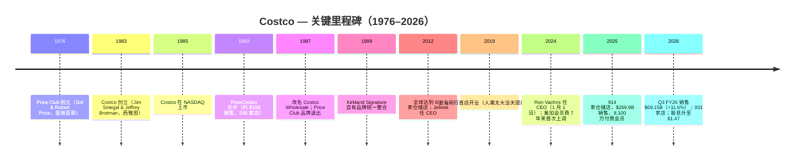
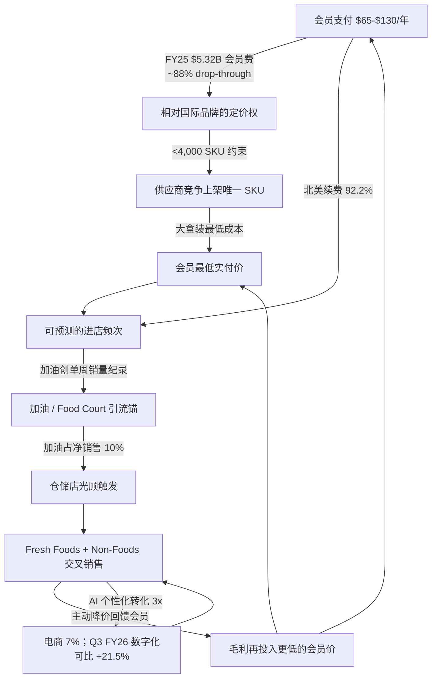
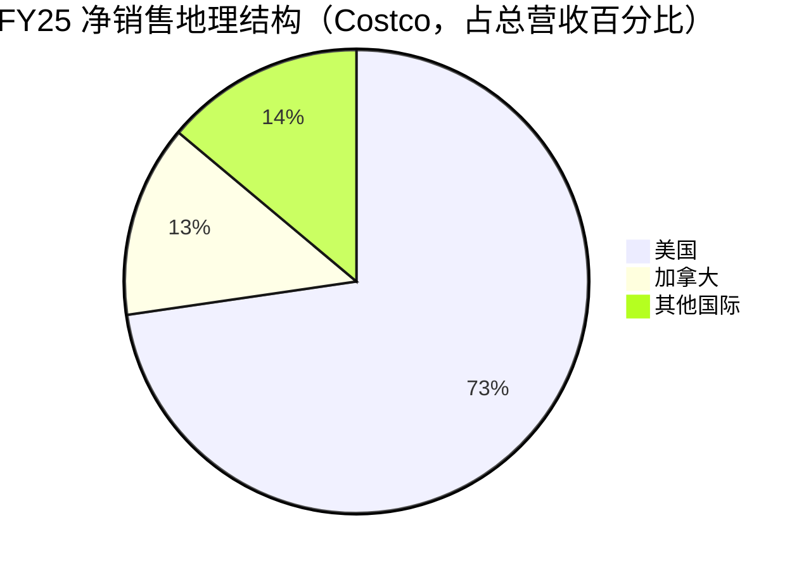
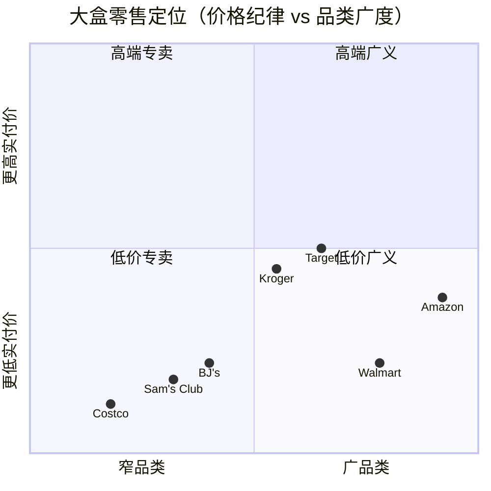

# 好市多 / Costco Wholesale Corporation（NASDAQ: COST）— 公司研究

**截至日期：** 2026-06-14（全面刷新至当前规范）
**分析师：** Financial Agent (Claude) 研究流程
**Ticker：** NASDAQ:COST | 财年截止：每年最靠近 8 月 31 日的星期日（52/53 周制）

---

## 投资摘要 — 决策层（*分析师观点：*）

| 项目 | 数据 |
|---|---|
| **评级 / Rating** | **Hold（持有）** — 卓越业务，估值已充分定价 |
| **12 个月目标价 / Price Target** | **$1,010**（基于 FY27E EPS $22.63 × 44.6x forward P/E） |
| **现价（2026-06-12 收盘）** | **$982.35** |
| **隐含上行 / Upside** | **+2.8%** |
| **估值方法** | forward P/E × 目标倍数；与 DCF / SOTP 交叉验证 |
| **市值 / Market Cap** | **~$435.7B** |
| **52 周区间** | $844.06 – $1,096.50（现价处于区间约 56% 分位，1 年回报约 -1.5%） |
| **TTM P/E / Forward P/E** | **49.4x / 44.9x** |
| **市场一致** | 37 位分析师 Buy；均值目标 **$1,082**（+10.2%），区间 $740–$1,315 |

**论点支柱（*分析师观点：*）：**
1. **会员费是真正的利润引擎，护城河教科书级。** Costco 是低毛利、高频次、高续费率的会员制零售商。会员费收入（FY25 $5.32B；Q3 FY26 滚动加速）按 12 个月直线确认、获取后增量利润率约 88%，北美续费率 **92.2%**、全球 89.7% —— 这是抗周期的经常性收入（recurring revenue）底座。
2. **约 4,000 个 SKU 的极度精简策略把供应商竞标权变现为最低实付价。** 每个细分品类只留一只上架 SKU，供应商为这唯一货架位"锦标赛式"竞标，给 Costco 带来大盒零售业中最低的会员实付价，是 11.1% 毛利率得以维持的根本。
3. **Q3 FY26 印证飞轮强劲。** 净销售 +11.6% 至 $69.15B、剔汽油/汇率全球可比 +6.6%、数字化可比 +21.5%、付费会员 +4.1% 至 8,290 万、汽油创公司史上单周销量纪录。
4. **估值是唯一也是决定性的逆风。** TTM P/E 49.4x、forward P/E 44.9x，约为行业中位数 2–3 倍。叙事是"为会员费的确定性付足价钱的复利股"，而非 re-rating 故事 —— 这就是评级落在 Hold 而非 Buy 的原因。

## 业绩更新 — 近期指引 / 催化（2026-06-14）

| 项目 | 数据 | 来源 |
|---|---|---|
| Q3 FY26（12 周，截至 2026-05-10）净销售 | **$69.15B**，YoY +11.6% | [Costco Q3 FY26 8-K 新闻稿](https://www.sec.gov/Archives/edgar/data/909832/000090983226000046/) |
| Q3 FY26 可比销售 | 总公司 **+9.8%**；剔汽油/汇率 **+6.6%**；电商 **+21.5%** | [Q3 FY26 8-K 新闻稿](https://www.sec.gov/Archives/edgar/data/909832/000090983226000046/) |
| Q3 FY26 净利润 / 摊薄 EPS | **$2.19B / $4.93**（去年 $1.90B / $4.28，EPS +15.2%） | [Q3 FY26 8-K 新闻稿](https://www.sec.gov/Archives/edgar/data/909832/000090983226000046/) |
| Q3 FY26 会员费 | $1,373M，YoY +11%；驱动：2024-09-01 美加涨价、新签约、Executive 升级 | [Q3 FY26 10-Q MD&A](https://www.sec.gov/Archives/edgar/data/909832/000090983226000051/cost-20260510.htm) |
| 付费会员 / 持卡人 | **82.9M / 148.5M**（去年 79.6M / 142.8M） | [Q3 FY26 10-Q — Membership Fees](https://www.sec.gov/Archives/edgar/data/909832/000090983226000051/cost-20260510.htm) |
| 续费率（Q3 FY26 末） | 北美 **92.2%** / 全球 **89.7%** | [Q3 FY26 10-Q MD&A](https://www.sec.gov/Archives/edgar/data/909832/000090983226000051/cost-20260510.htm) |
| 仓储店数 | **931 家**（含美国及波多黎各 639、加拿大 115、墨西哥 43、日本 37、英国 29…） | [Q3 FY26 8-K 新闻稿](https://www.sec.gov/Archives/edgar/data/909832/000090983226000046/) |
| FY26 净开店指引 | 下调至 **26 家**（原 28，2 家推迟至 FY27）；长期仍约 30+/年 | [Goldman Sachs F3Q 简报，2026-05-29](http://xs-macbook-air.local:5001/zsxq/pdf/585412248428424/Goldman%20Sachs-Costco%20Wholesale%20%EF%BC%88COST.US%EF%BC%89F3Q%20top%20line%20strength%20and%20membership%20growth%20as%20the%20company%20continues%20to%20invest%20in%20value%20for%20members-260529.pdf) |
| 分红 | 季度股息 **2026-04-15 升至 $1.47**（+13%，去年同季 $1.30） | [Q3 FY26 10-Q — Note 5 Equity](https://www.sec.gov/Archives/edgar/data/909832/000090983226000051/cost-20260510.htm) |
| 卖方 | Goldman Sachs Buy $1,159；Bernstein Outperform $1,194；J.P. Morgan OW $1,110 | 见第 2 章卖方观点演变 |

---

## 目录

1. 公司概览（含估值快照）
1B. GF Score 基本面评分卡
2. 估值与目标价（决策层）
3. 公司历史
4. 管理团队
5. 产品与服务
6. 客户与会员经济学
7. 行业概览
8. 竞争格局
9. 市场机会（TAM）
10. 风险评估
11. 投资视角评分卡
参考资料

---

## 1. 公司概览

**Costco Wholesale Corporation**（好市多）是一家**会员制仓储零售商**（membership warehouse retailer），总部位于美国华盛顿州 Issaquah。截至 FY25（2025-08-31 财年末）在 14 个国家/地区及波多黎各运营 914 家仓储店，全球员工 34.1 万人，付费会员 8,100 万（持卡人 14,520 万）；至 Q3 FY26 末（2026-05-10）仓储店增至 **931 家**、付费会员升至 **82.9M**、持卡人 **148.5M** ([Costco Q3 FY26 8-K 新闻稿](https://www.sec.gov/Archives/edgar/data/909832/000090983226000046/))。10-K 明文写道：*"在没有装饰的、自助式仓库设施中，对一系列品类提供少量精选的全国品牌和自有品牌商品的低价销售，结合大规模采购、高效分销和减少商品搬运所获得的运营效率，能够使我们在显著低于其他零售商的毛利率下盈利经营"* ([Costco FY25 10-K Item 1](https://www.sec.gov/Archives/edgar/data/909832/000090983225000101/cost-20250831.htm))。FY25 毛利率（gross margin，净销售减商品成本）**11.12%** —— 与 Walmart 约 24%、Target 约 28% 相比 —— 就是这套模式经过审计后的客观证据。

报告分部（reportable segments）按地域分为美国、加拿大、其他国际三段，美国是绝对核心。FY25 各分部数据：美国 total revenue $200.0B（占集团 73%）/ operating income $6.88B（占 66%）；加拿大 $36.9B / $1.85B（13% / 18%）；其他国际 $38.3B / $1.66B（14% / 16%）([Costco FY25 10-K, Note 11 Segment Reporting](https://www.sec.gov/Archives/edgar/data/909832/000090983225000101/cost-20250831.htm))。10-K 风险因素把集中度写得更直白：*"我们的财务与经营业绩高度依赖于美国和加拿大业务，二者在 2025 年合计占净销售和经营利润的 86% 和 84%。在美国境内，我们高度依赖加州业务，占美国净销售的 26%"* ([10-K Item 1A — Risk Factors](https://www.sec.gov/Archives/edgar/data/909832/000090983225000101/cost-20250831.htm))。加州约贡献 22% 的合并净销售（26% × 86%），是被分散叙事掩盖的真实集中度风险。

FY25 财务整体呈现成熟复利特征：净销售 +8% 至 $269.9B；会员费 +10% 至 $5.32B；毛利率扩张 20bp 至 11.12%；净利润 +10% 至 $8.10B（摊薄 EPS $18.21）；经营现金流（operating cash flow）$13.34B vs $5.50B 资本支出（CapEx）([Costco FY25 10-K, MD&A](https://www.sec.gov/Archives/edgar/data/909832/000090983225000101/cost-20250831.htm))。资本配置层级清晰：(a) 优先 capex（FY26 指引 $6.0–6.5B，新开 26 家店）；(b) 渐进式普通股息（2026-04 升至季度 **$1.47**，对应去年同季 $1.30）；(c) 机会式特别股息（FY24 派发的 $15/股、约 $6.65B 是最新一次） ([Q3 FY26 10-Q — Note 5 Equity](https://www.sec.gov/Archives/edgar/data/909832/000090983226000051/cost-20260510.htm))。回购规模温和（FY25 $903M）—— Costco 不是回购故事。

### 收入如何转化为利润 / How COST makes its money

<svg xmlns="http://www.w3.org/2000/svg" viewBox="0 0 1000 560" width="1000" height="560" role="img" aria-label="income statement Sankey"><rect x="0" y="0" width="1000" height="560" fill="#ffffff"/>
<text x="20.00" y="30.00" text-anchor="start" font-family="Helvetica,Arial,sans-serif" font-size="15" font-weight="700" fill="#1f2933">Costco (COST) 收入如何转化为利润 — FY2025（52 周，截至 2025-08-31）</text>
<path d="M 452.00,71.00 C 506.00,71.00 506.00,246.90 560.00,246.90 L 560.00,262.82 C 506.00,262.82 506.00,86.92 452.00,86.92 Z" fill="#86efac" fill-opacity="0.55"/>
<path d="M 452.00,86.92 C 506.00,86.92 506.00,276.82 560.00,276.82 L 560.00,315.10 C 506.00,315.10 506.00,125.20 452.00,125.20 Z" fill="#fca5a5" fill-opacity="0.55"/>
<path d="M 204.00,71.00 C 258.00,71.00 258.00,78.00 312.00,78.00 L 312.00,491.84 C 258.00,491.84 258.00,484.84 204.00,484.84 Z" fill="#93c5fd" fill-opacity="0.55"/>
<path d="M 328.00,78.00 C 382.00,78.00 382.00,71.00 436.00,71.00 L 436.00,125.20 C 382.00,125.20 382.00,132.20 328.00,132.20 Z" fill="#86efac" fill-opacity="0.55"/>
<path d="M 328.00,132.20 C 382.00,132.20 382.00,139.20 436.00,139.20 L 436.00,507.00 C 382.00,507.00 382.00,500.00 328.00,500.00 Z" fill="#fca5a5" fill-opacity="0.55"/>
<path d="M 576.00,246.90 C 630.00,246.90 630.00,254.57 684.00,254.57 L 684.00,270.49 C 630.00,270.49 630.00,262.82 576.00,262.82 Z" fill="#86efac" fill-opacity="0.55"/>
<path d="M 700.00,254.57 C 754.00,254.57 754.00,273.71 808.00,273.71 L 808.00,286.12 C 754.00,286.12 754.00,266.99 700.00,266.99 Z" fill="#86efac" fill-opacity="0.55"/>
<path d="M 700.00,266.99 C 754.00,266.99 754.00,300.12 808.00,300.12 L 808.00,304.29 C 754.00,304.29 754.00,271.15 700.00,271.15 Z" fill="#fca5a5" fill-opacity="0.55"/>
<path d="M 576.00,276.82 C 630.00,276.82 630.00,285.15 684.00,285.15 L 684.00,323.43 C 630.00,323.43 630.00,315.10 576.00,315.10 Z" fill="#fca5a5" fill-opacity="0.55"/>
<path d="M 576.00,329.10 C 630.00,329.10 630.00,270.49 684.00,270.49 L 684.00,272.49 C 630.00,272.49 630.00,331.10 576.00,331.10 Z" fill="#93c5fd" fill-opacity="0.55"/>
<path d="M 204.00,498.84 C 258.00,498.84 258.00,491.84 312.00,491.84 L 312.00,500.00 C 258.00,500.00 258.00,507.00 204.00,507.00 Z" fill="#93c5fd" fill-opacity="0.55"/>
<rect x="188.00" y="71.00" width="16" height="413.84" rx="1.5" fill="#2563eb"/>
<rect x="188.00" y="498.84" width="16" height="8.16" rx="1.5" fill="#2563eb"/>
<rect x="312.00" y="78.00" width="16" height="422.00" rx="1.5" fill="#1e3a8a"/>
<rect x="436.00" y="71.00" width="16" height="54.20" rx="1.5" fill="#15803d"/>
<rect x="436.00" y="139.20" width="16" height="367.80" rx="1.5" fill="#dc2626"/>
<rect x="560.00" y="246.90" width="16" height="15.92" rx="1.5" fill="#15803d"/>
<rect x="560.00" y="276.82" width="16" height="38.28" rx="1.5" fill="#dc2626"/>
<rect x="560.00" y="329.10" width="16" height="2.00" rx="1.5" fill="#2563eb"/>
<rect x="684.00" y="254.57" width="16" height="16.59" rx="1.5" fill="#15803d"/>
<rect x="684.00" y="285.15" width="16" height="38.28" rx="1.5" fill="#dc2626"/>
<rect x="808.00" y="273.71" width="16" height="12.42" rx="1.5" fill="#15803d"/>
<rect x="808.00" y="300.12" width="16" height="4.17" rx="1.5" fill="#dc2626"/>
<line x1="188.00" y1="277.92" x2="182.00" y2="262.00" stroke="#cbd5e1" stroke-width="1"/>
<text x="179.00" y="265.00" text-anchor="end" font-family="Helvetica,Arial,sans-serif" font-size="11.5" font-weight="700" fill="#1f2933">Net Merchandise Sales</text>
<text x="179.00" y="278.00" text-anchor="end" font-family="Helvetica,Arial,sans-serif" font-size="10" font-weight="400" fill="#52606d">$269.9B  (98.1%)</text>
<line x1="188.00" y1="502.92" x2="182.00" y2="487.00" stroke="#cbd5e1" stroke-width="1"/>
<text x="179.00" y="490.00" text-anchor="end" font-family="Helvetica,Arial,sans-serif" font-size="11.5" font-weight="700" fill="#1f2933">Membership Fees</text>
<text x="179.00" y="503.00" text-anchor="end" font-family="Helvetica,Arial,sans-serif" font-size="10" font-weight="400" fill="#52606d">$5.3B  (1.9%)</text>
<rect x="331.00" y="60.00" width="113.10" height="26" rx="2" fill="#ffffff" fill-opacity="0.72"/>
<text x="334.00" y="72.00" text-anchor="start" font-family="Helvetica,Arial,sans-serif" font-size="11.5" font-weight="700" fill="#1f2933">Revenue</text>
<text x="334.00" y="85.00" text-anchor="start" font-family="Helvetica,Arial,sans-serif" font-size="10" font-weight="400" fill="#52606d">$275.2B  (100.0%)</text>
<rect x="455.00" y="53.00" width="100.50" height="26" rx="2" fill="#ffffff" fill-opacity="0.72"/>
<text x="458.00" y="65.00" text-anchor="start" font-family="Helvetica,Arial,sans-serif" font-size="11.5" font-weight="700" fill="#1f2933">Gross Profit</text>
<text x="458.00" y="78.00" text-anchor="start" font-family="Helvetica,Arial,sans-serif" font-size="10" font-weight="400" fill="#52606d">$35.3B  (12.8%)</text>
<rect x="455.00" y="121.20" width="144.60" height="26" rx="2" fill="#ffffff" fill-opacity="0.72"/>
<text x="458.00" y="133.20" text-anchor="start" font-family="Helvetica,Arial,sans-serif" font-size="11.5" font-weight="700" fill="#1f2933">Cost of Revenue (COGS)</text>
<text x="458.00" y="146.20" text-anchor="start" font-family="Helvetica,Arial,sans-serif" font-size="10" font-weight="400" fill="#52606d">$239.9B  (87.2%)</text>
<rect x="579.00" y="228.90" width="106.80" height="26" rx="2" fill="#ffffff" fill-opacity="0.72"/>
<text x="582.00" y="240.90" text-anchor="start" font-family="Helvetica,Arial,sans-serif" font-size="11.5" font-weight="700" fill="#1f2933">Operating Income</text>
<text x="582.00" y="253.90" text-anchor="start" font-family="Helvetica,Arial,sans-serif" font-size="10" font-weight="400" fill="#52606d">$10.4B  (3.8%)</text>
<rect x="579.00" y="258.82" width="150.90" height="26" rx="2" fill="#ffffff" fill-opacity="0.72"/>
<text x="582.00" y="270.82" text-anchor="start" font-family="Helvetica,Arial,sans-serif" font-size="11.5" font-weight="700" fill="#1f2933">Total Operating Expense</text>
<text x="582.00" y="283.82" text-anchor="start" font-family="Helvetica,Arial,sans-serif" font-size="10" font-weight="400" fill="#52606d">$25.0B  (9.1%)</text>
<text x="551.00" y="327.10" text-anchor="end" font-family="Helvetica,Arial,sans-serif" font-size="11.5" font-weight="700" fill="#1f2933">Net Interest / Other Income</text>
<text x="551.00" y="340.10" text-anchor="end" font-family="Helvetica,Arial,sans-serif" font-size="10" font-weight="400" fill="#52606d">$435.0M  (0.16%)</text>
<rect x="703.00" y="236.57" width="94.20" height="26" rx="2" fill="#ffffff" fill-opacity="0.72"/>
<text x="706.00" y="248.57" text-anchor="start" font-family="Helvetica,Arial,sans-serif" font-size="11.5" font-weight="700" fill="#1f2933">Pretax Income</text>
<text x="706.00" y="261.57" text-anchor="start" font-family="Helvetica,Arial,sans-serif" font-size="10" font-weight="400" fill="#52606d">$10.8B  (3.9%)</text>
<rect x="703.00" y="267.15" width="94.20" height="26" rx="2" fill="#ffffff" fill-opacity="0.72"/>
<text x="706.00" y="279.15" text-anchor="start" font-family="Helvetica,Arial,sans-serif" font-size="11.5" font-weight="700" fill="#1f2933">SG&amp;A</text>
<text x="706.00" y="292.15" text-anchor="start" font-family="Helvetica,Arial,sans-serif" font-size="10" font-weight="400" fill="#52606d">$25.0B  (9.1%)</text>
<text x="833.00" y="276.92" text-anchor="start" font-family="Helvetica,Arial,sans-serif" font-size="11.5" font-weight="700" fill="#1f2933">Net Income</text>
<text x="833.00" y="289.92" text-anchor="start" font-family="Helvetica,Arial,sans-serif" font-size="10" font-weight="400" fill="#52606d">$8.1B  (2.9%)</text>
<text x="833.00" y="301.92" text-anchor="start" font-family="Helvetica,Arial,sans-serif" font-size="11.5" font-weight="700" fill="#1f2933">Income Tax</text>
<text x="833.00" y="314.92" text-anchor="start" font-family="Helvetica,Arial,sans-serif" font-size="10" font-weight="400" fill="#52606d">$2.7B  (0.99%)</text>
<text x="500.00" y="544.00" text-anchor="middle" font-family="Helvetica,Arial,sans-serif" font-size="10" font-weight="400" fill="#52606d">Source: Costco FY25 10-K, Consolidated Statements of Income + Note 11</text>
</svg>

来源 / Source: [Costco FY25 10-K, Consolidated Statements of Income + Note 11](https://www.sec.gov/Archives/edgar/data/909832/000090983225000101/cost-20250831.htm)

上图把 FY25 的 $275.2B 总收入（total revenue，净销售 $269.9B + 会员费 $5.3B）一路拆到 $8.1B 净利润：$239.9B 商品成本（merchandise costs）是绝对大头，留下 $35.3B 毛利、$25.0B SG&A，得到 $10.4B 经营利润，再加 $0.4B 净利息/其他收益、扣 $2.7B 税，得 $8.1B 净利润。这张图直观说明：Costco 的利润不是从商品销售毛利里挤出来的（毛利率只有 11.1%），而是从会员费 + 极致运营效率里来的。

### FY25 净销售按品类结构 / Revenue mix by category

<svg xmlns="http://www.w3.org/2000/svg" viewBox="0 0 720 460" width="720" height="460" role="img" aria-label="revenue donut"><rect x="0" y="0" width="720" height="460" fill="#ffffff"/>
<text x="20.00" y="30.00" text-anchor="start" font-family="Helvetica,Arial,sans-serif" font-size="15" font-weight="700" fill="#1f2933">FY2025 净销售按商品品类（Net Sales by Merchandise Category）</text>
<path d="M 288.00,107.20 A 132 132 0 0 1 361.56,348.80 L 331.47,303.97 A 78 78 0 0 0 288.00,161.20 Z" fill="#2563eb"/>
<path d="M 361.56,348.80 A 132 132 0 0 1 172.46,303.03 L 219.72,276.92 A 78 78 0 0 0 331.47,303.97 Z" fill="#15803d"/>
<path d="M 172.46,303.03 A 132 132 0 0 1 165.40,190.28 L 215.55,210.30 A 78 78 0 0 0 219.72,276.92 Z" fill="#d97706"/>
<path d="M 165.40,190.28 A 132 132 0 0 1 288.00,107.20 L 288.00,161.20 A 78 78 0 0 0 215.55,210.30 Z" fill="#7c3aed"/>
<text x="288.00" y="235.20" text-anchor="middle" font-family="Helvetica,Arial,sans-serif" font-size="18" font-weight="800" fill="#1f2933">COST</text>
<text x="288.00" y="255.20" text-anchor="middle" font-family="Helvetica,Arial,sans-serif" font-size="13" font-weight="600" fill="#52606d">$269.9B</text>
<text x="288.00" y="271.20" text-anchor="middle" font-family="Helvetica,Arial,sans-serif" font-size="10" font-weight="400" fill="#8a97a3">total</text>
<line x1="420.02" y1="199.01" x2="436.02" y2="199.01" stroke="#2563eb" stroke-width="1.4"/>
<text x="440.02" y="197.01" text-anchor="start" font-family="Helvetica,Arial,sans-serif" font-size="11" font-weight="700" fill="#1f2933">Foods &amp; Sundries</text>
<text x="440.02" y="211.01" text-anchor="start" font-family="Helvetica,Arial,sans-serif" font-size="10" font-weight="400" fill="#52606d">$109.6B  (40.6%)</text>
<line x1="255.53" y1="373.33" x2="239.53" y2="373.33" stroke="#15803d" stroke-width="1.4"/>
<text x="235.53" y="371.33" text-anchor="end" font-family="Helvetica,Arial,sans-serif" font-size="11" font-weight="700" fill="#1f2933">Non-Foods</text>
<text x="235.53" y="385.33" text-anchor="end" font-family="Helvetica,Arial,sans-serif" font-size="10" font-weight="400" fill="#52606d">$71.2B  (26.4%)</text>
<line x1="150.27" y1="247.82" x2="134.27" y2="247.82" stroke="#d97706" stroke-width="1.4"/>
<text x="130.27" y="245.82" text-anchor="end" font-family="Helvetica,Arial,sans-serif" font-size="11" font-weight="700" fill="#1f2933">Fresh Foods</text>
<text x="130.27" y="259.82" text-anchor="end" font-family="Helvetica,Arial,sans-serif" font-size="10" font-weight="400" fill="#52606d">$38.0B  (14.1%)</text>
<line x1="210.58" y1="124.96" x2="194.58" y2="124.96" stroke="#7c3aed" stroke-width="1.4"/>
<text x="190.58" y="122.96" text-anchor="end" font-family="Helvetica,Arial,sans-serif" font-size="11" font-weight="700" fill="#1f2933">Warehouse Ancillary &amp; Other</text>
<text x="190.58" y="136.96" text-anchor="end" font-family="Helvetica,Arial,sans-serif" font-size="10" font-weight="400" fill="#52606d">$51.2B  (19.0%)</text>
<text x="360.00" y="444.00" text-anchor="middle" font-family="Helvetica,Arial,sans-serif" font-size="10" font-weight="400" fill="#52606d">Source: Costco FY25 10-K, Note 11 — Disaggregated Revenue</text>
</svg>

来源 / Source: [Costco FY25 10-K, Note 11 — Disaggregated Revenue](https://www.sec.gov/Archives/edgar/data/909832/000090983225000101/cost-20250831.htm)

### 历史总收入按地域分部 / Revenue by segment over time

<svg xmlns="http://www.w3.org/2000/svg" viewBox="0 0 860 470" width="860" height="470" role="img" aria-label="historical revenue bars"><rect x="0" y="0" width="860" height="470" fill="#ffffff"/>
<text x="20.00" y="30.00" text-anchor="start" font-family="Helvetica,Arial,sans-serif" font-size="15" font-weight="700" fill="#1f2933">历史总收入按地域分部（Total Revenue by Segment, FY23–FY25）</text>
<rect x="20.00" y="44" width="11" height="11" rx="2" fill="#2563eb"/>
<text x="36.00" y="53.00" text-anchor="start" font-family="Helvetica,Arial,sans-serif" font-size="10.5" font-weight="400" fill="#1f2933">United States</text>
<rect x="135.80" y="44" width="11" height="11" rx="2" fill="#15803d"/>
<text x="151.80" y="53.00" text-anchor="start" font-family="Helvetica,Arial,sans-serif" font-size="10.5" font-weight="400" fill="#1f2933">Canada</text>
<rect x="205.40" y="44" width="11" height="11" rx="2" fill="#d97706"/>
<text x="221.40" y="53.00" text-anchor="start" font-family="Helvetica,Arial,sans-serif" font-size="10.5" font-weight="400" fill="#1f2933">Other International</text>
<line x1="70" y1="412.00" x2="834" y2="412.00" stroke="#eceff2" stroke-width="1"/>
<text x="64.00" y="415.00" text-anchor="end" font-family="Helvetica,Arial,sans-serif" font-size="9.5" font-weight="400" fill="#52606d">$0</text>
<line x1="70" y1="345.20" x2="834" y2="345.20" stroke="#eceff2" stroke-width="1"/>
<text x="64.00" y="348.20" text-anchor="end" font-family="Helvetica,Arial,sans-serif" font-size="9.5" font-weight="400" fill="#52606d">$59.5B</text>
<line x1="70" y1="278.40" x2="834" y2="278.40" stroke="#eceff2" stroke-width="1"/>
<text x="64.00" y="281.40" text-anchor="end" font-family="Helvetica,Arial,sans-serif" font-size="9.5" font-weight="400" fill="#52606d">$118.9B</text>
<line x1="70" y1="211.60" x2="834" y2="211.60" stroke="#eceff2" stroke-width="1"/>
<text x="64.00" y="214.60" text-anchor="end" font-family="Helvetica,Arial,sans-serif" font-size="9.5" font-weight="400" fill="#52606d">$178.4B</text>
<line x1="70" y1="144.80" x2="834" y2="144.80" stroke="#eceff2" stroke-width="1"/>
<text x="64.00" y="147.80" text-anchor="end" font-family="Helvetica,Arial,sans-serif" font-size="9.5" font-weight="400" fill="#52606d">$237.8B</text>
<line x1="70" y1="78.00" x2="834" y2="78.00" stroke="#eceff2" stroke-width="1"/>
<text x="64.00" y="81.00" text-anchor="end" font-family="Helvetica,Arial,sans-serif" font-size="9.5" font-weight="400" fill="#52606d">$297.3B</text>
<rect x="123.48" y="213.54" width="147.71" height="198.46" fill="#2563eb"/>
<rect x="123.48" y="176.39" width="147.71" height="37.14" fill="#15803d"/>
<rect x="123.48" y="139.76" width="147.71" height="36.63" fill="#d97706"/>
<text x="197.33" y="428.00" text-anchor="middle" font-family="Helvetica,Arial,sans-serif" font-size="10" font-weight="400" fill="#52606d">2023</text>
<rect x="378.15" y="205.09" width="147.71" height="206.91" fill="#2563eb"/>
<rect x="378.15" y="165.91" width="147.71" height="39.19" fill="#15803d"/>
<rect x="378.15" y="126.09" width="147.71" height="39.82" fill="#d97706"/>
<text x="452.00" y="428.00" text-anchor="middle" font-family="Helvetica,Arial,sans-serif" font-size="10" font-weight="400" fill="#52606d">2024</text>
<rect x="632.81" y="187.22" width="147.71" height="224.78" fill="#2563eb"/>
<rect x="632.81" y="145.74" width="147.71" height="41.49" fill="#15803d"/>
<rect x="632.81" y="102.74" width="147.71" height="43.00" fill="#d97706"/>
<text x="706.67" y="428.00" text-anchor="middle" font-family="Helvetica,Arial,sans-serif" font-size="10" font-weight="400" fill="#52606d">2025</text>
<text x="430.00" y="454.00" text-anchor="middle" font-family="Helvetica,Arial,sans-serif" font-size="10" font-weight="400" fill="#52606d">Source: Costco FY2023–FY2025 10-Ks, Note 11 — Segment Reporting</text>
</svg>

来源 / Source: [Costco FY2023–FY2025 10-Ks, Note 11 — Segment Reporting](https://www.sec.gov/Archives/edgar/data/909832/000090983225000101/cost-20250831.htm)

**估值快照（截至 2026-06-12 收盘）。** COST 当前交易于 **TTM P/E 49.4x**、**forward P/E 44.9x**、**TTM P/S 1.48x**、**P/B 13.0x**、**EV/EBITDA 30.7x**，股息率 0.60%，5 年 beta 0.87，市值约 **$435.7B**，ROE 约 29% ([stockanalysis.com COST 统计](https://stockanalysis.com/stocks/cost/statistics/))。对一家这等规模的零售商，这是**奢侈估值**：Walmart TTM P/E 约 42.6x 但 P/S 仅 1.33x；Target 17.9x P/E、0.58x P/S；Kroger 42.0x P/E、0.27x P/S；BJ's 20.9x P/E、0.53x P/S（[yfinance / stockanalysis.com 同业取值，2026-06-12](https://stockanalysis.com/stocks/cost/statistics/)）。COST 的溢价并非误读 —— 市场愿意给到接近 50x 区间，是基于三个结构性事实：(1) 会员费 FY25 $5.32B 按 12 个月直线确认、获取后增量利润率约 88%，北美续费率 **92.2%**、全球 89.7%（[Q3 FY26 10-Q MD&A](https://www.sec.gov/Archives/edgar/data/909832/000090983226000051/cost-20260510.htm)）；(2) 可比销售算法以**进店频次**为主导，抗周期性强（[Costco FY25 10-K MD&A Net Sales](https://www.sec.gov/Archives/edgar/data/909832/000090983225000101/cost-20250831.htm)）；(3) Q3 FY26 后 Goldman 重申目标价 $1,159、Bernstein $1,194，市场共识仍为 Buy，21.5% 数字化可比是直接证据（见第 2 章卖方观点演变）。风险报酬不对称：续费率或进店频次只要任一停止增长，倍数就会快速压缩。

## 1B. GF Score 基本面评分卡

> 一个模仿 [GuruFocus GF Score™](https://www.gurufocus.com/term/gf-score) 的五维基本面评分卡，作为决策层的"质量体检"。**这是分析师自己的评分量表（*分析师观点：*），不是 GuruFocus 公布的数字，也不附加任何申报引用。**每个子分背后的指标在本报告其他章节均有独立引用。

<svg xmlns="http://www.w3.org/2000/svg" viewBox="0 0 500 500" width="500" height="500" role="img" aria-label="GF Score radar">
<rect x="0" y="0" width="500" height="500" fill="#ffffff"/>
<text x="20" y="24" font-family="Helvetica,Arial,sans-serif" font-size="15" font-weight="700" fill="#1f2933">GF Score (GuruFocus-style): 64/100</text>
<text x="20" y="41" font-family="Helvetica,Arial,sans-serif" font-size="11" fill="#52606d">51–70 Poor future performance potential</text>
<polygon points="250.0,88.0 392.7,191.6 338.2,359.4 161.8,359.4 107.3,191.6" fill="#e9f5ec" stroke="none"/>
<polygon points="250.0,208.0 278.5,228.7 267.6,262.3 232.4,262.3 221.5,228.7" fill="none" stroke="#c5d3cb" stroke-width="1"/>
<polygon points="250.0,178.0 307.1,219.5 285.3,286.5 214.7,286.5 192.9,219.5" fill="none" stroke="#c5d3cb" stroke-width="1"/>
<polygon points="250.0,148.0 335.6,210.2 302.9,310.8 197.1,310.8 164.4,210.2" fill="none" stroke="#c5d3cb" stroke-width="1"/>
<polygon points="250.0,118.0 364.1,200.9 320.5,335.1 179.5,335.1 135.9,200.9" fill="none" stroke="#c5d3cb" stroke-width="1"/>
<polygon points="250.0,88.0 392.7,191.6 338.2,359.4 161.8,359.4 107.3,191.6" fill="none" stroke="#c5d3cb" stroke-width="1.3"/>
<line x1="250" y1="238" x2="161.8" y2="359.4" stroke="#cfdad3" stroke-width="1"/>
<text x="146.5" y="392.4" text-anchor="end" font-family="Helvetica,Arial,sans-serif" font-size="11.5" font-weight="600" fill="#1f2933">Financial Strength</text>
<text x="146.5" y="405.4" text-anchor="end" font-family="Helvetica,Arial,sans-serif" font-size="9.5" fill="#52606d">财务实力</text>
<text x="170.6" y="341.2" text-anchor="middle" font-family="Helvetica,Arial,sans-serif" font-size="10.5" font-weight="700" fill="#1f2933">9</text>
<line x1="250" y1="238" x2="250.0" y2="88.0" stroke="#cfdad3" stroke-width="1"/>
<text x="250.0" y="58.0" text-anchor="middle" font-family="Helvetica,Arial,sans-serif" font-size="11.5" font-weight="600" fill="#1f2933">Profitability</text>
<text x="250.0" y="71.0" text-anchor="middle" font-family="Helvetica,Arial,sans-serif" font-size="9.5" fill="#52606d">盈利能力</text>
<text x="250.0" y="112.0" text-anchor="middle" font-family="Helvetica,Arial,sans-serif" font-size="10.5" font-weight="700" fill="#1f2933">8</text>
<line x1="250" y1="238" x2="107.3" y2="191.6" stroke="#cfdad3" stroke-width="1"/>
<text x="82.6" y="183.6" text-anchor="end" font-family="Helvetica,Arial,sans-serif" font-size="11.5" font-weight="600" fill="#1f2933">Growth</text>
<text x="82.6" y="196.6" text-anchor="end" font-family="Helvetica,Arial,sans-serif" font-size="9.5" fill="#52606d">成长性</text>
<text x="150.1" y="199.6" text-anchor="middle" font-family="Helvetica,Arial,sans-serif" font-size="10.5" font-weight="700" fill="#1f2933">7</text>
<line x1="250" y1="238" x2="392.7" y2="191.6" stroke="#cfdad3" stroke-width="1"/>
<text x="417.4" y="183.6" text-anchor="start" font-family="Helvetica,Arial,sans-serif" font-size="11.5" font-weight="600" fill="#1f2933">GF Value</text>
<text x="417.4" y="196.6" text-anchor="start" font-family="Helvetica,Arial,sans-serif" font-size="9.5" fill="#52606d">估值</text>
<text x="278.5" y="222.7" text-anchor="middle" font-family="Helvetica,Arial,sans-serif" font-size="10.5" font-weight="700" fill="#1f2933">2</text>
<line x1="250" y1="238" x2="338.2" y2="359.4" stroke="#cfdad3" stroke-width="1"/>
<text x="353.5" y="392.4" text-anchor="start" font-family="Helvetica,Arial,sans-serif" font-size="11.5" font-weight="600" fill="#1f2933">Momentum</text>
<text x="353.5" y="405.4" text-anchor="start" font-family="Helvetica,Arial,sans-serif" font-size="9.5" fill="#52606d">动量</text>
<text x="285.3" y="280.5" text-anchor="middle" font-family="Helvetica,Arial,sans-serif" font-size="10.5" font-weight="700" fill="#1f2933">4</text>
<polygon points="250.0,118.0 278.5,228.7 285.3,286.5 170.6,347.2 150.1,205.6" fill="#2e8b57" fill-opacity="0.34" stroke="#2e8b57" stroke-width="2"/>
<circle cx="170.6" cy="347.2" r="2.6" fill="#2e8b57"/>
<circle cx="250.0" cy="118.0" r="2.6" fill="#2e8b57"/>
<circle cx="150.1" cy="205.6" r="2.6" fill="#2e8b57"/>
<circle cx="278.5" cy="228.7" r="2.6" fill="#2e8b57"/>
<circle cx="285.3" cy="286.5" r="2.6" fill="#2e8b57"/>
<text x="250" y="470" text-anchor="middle" font-family="Helvetica,Arial,sans-serif" font-size="9.5" fill="#52606d">Source: COST FY25 10-K · Q3 FY26 10-Q · Yahoo Finance, as of 2026-06-14</text>
<text x="250" y="485" text-anchor="middle" font-family="Helvetica,Arial,sans-serif" font-size="9" fill="#52606d">GF Score = independent analyst rubric (*Analyst view:*) — not GuruFocus™ official number</text>
</svg>

| 维度 / Dimension | 评分 / Score (0–10) | |
|---|---|---|
| Financial Strength (财务实力) | 9 | `█████████░` |
| Profitability (盈利能力) | 8 | `████████░░` |
| Growth (成长性) | 7 | `███████░░░` |
| GF Value (估值) | 2 | `██░░░░░░░░` |
| Momentum (动量) | 4 | `████░░░░░░` |
| **GF Score（综合，*分析师观点：*）** | **64 / 100** | **51–70 区间** |

*综合权重（*分析师观点：*）：Financial Strength 20% · Profitability 25% · Growth 25% · GF Value 15% · Momentum 15%（透明复刻 —— 非 GuruFocus 专有权重）。*

**各维度评分理由：**

- **Financial Strength = 9。** Q3 FY26 末现金及等价物 $18.95B + 短期投资 $1.05B = $20.0B，对应长期债务仅 $5.67B —— 净现金约 $14.3B ([Q3 FY26 8-K 资产负债表](https://www.sec.gov/Archives/edgar/data/909832/000090983226000046/))。FY25 经营利润 $10.38B 对利息支出 $154M 的覆盖倍数高达 67x ([Costco FY25 10-K 利润表](https://www.sec.gov/Archives/edgar/data/909832/000090983225000101/cost-20250831.htm))。会员费的递延负债结构 + "先卖后付"的负营运资本，使 Costco 在零售业里财务实力近乎满分。
- **Profitability = 8。** FY25 ROE 30.7%（见 DuPont 分解）、净利率 2.94%（薄但极稳）、经营利润率 3.77% ([Costco FY25 10-K 利润表](https://www.sec.gov/Archives/edgar/data/909832/000090983225000101/cost-20250831.htm))。盈利的一致性是 Costco 的特征 —— 没有盈利重述、没有大额减值周期；扣一分仅因绝对利润率薄（业务模式本身的特性，不是缺陷）。
- **Growth = 7。** FY23→FY25 净销售从 $237.7B 增至 $269.9B（3 年 CAGR 约 6.6%），EPS 从 $14.16 增至 $18.21（3 年 CAGR 约 13.4%）([Costco FY25 10-K 利润表](https://www.sec.gov/Archives/edgar/data/909832/000090983225000101/cost-20250831.htm))；市场一致 FY26E EPS +12.9%、FY27E +10.0% ([stockanalysis.com 分析师预测](https://stockanalysis.com/stocks/cost/forecast/))。利润增速持续高于营收，反映会员费结构与运营杠杆 —— 稳健成长，但非高增长。
- **GF Value = 2。** TTM P/E 49.4x、forward P/E 44.9x，远高于行业中位数与自身历史区间，相对 DCF 内在价值无安全边际 ([stockanalysis.com COST 统计](https://stockanalysis.com/stocks/cost/statistics/))。这是评分卡里最低的一维，也是把综合分压到 64 的主因。
- **Momentum = 4。** 1 年股价回报约 -1.5%、现价 $982 高于 200 日均线 $955 但显著低于 52 周高点 $1,096 ([stockanalysis.com COST 统计](https://stockanalysis.com/stocks/cost/statistics/))。动量中性偏弱 —— 股价过去一年横盘整理，倍数从高位略有消化。

综合 64 分恰好把 Costco 定位为"基本面强、估值贵"的组合：质量三维（财务 / 盈利 / 成长）合计拿到 24/30，但估值与动量两维拖累。这与全篇结论一致 —— 业务无可挑剔，价格是唯一的问题。

## 2. 估值与目标价（决策层）

### 前向财务预测（*分析师观点：*）

| 财年（8 月止） | 营收（总收入，$B） | YoY | 经营利润率 | 摊薄 EPS | YoY |
|---|---:|---:|---:|---:|---:|
| FY25（实际） | 275.2 | +8.2% | 3.77% | $18.21 | +10.0% |
| FY26E | 301.1 | +9.4% | ~3.85% | $20.56 | +12.9% |
| FY27E | 325.6 | +8.1% | ~3.95% | $22.63 | +10.0% |
| FY28E | 351 | +7.8% | ~4.05% | $25.10 | +10.9% |

*FY26E/FY27E 营收与 EPS 为市场一致（[stockanalysis.com 分析师预测](https://stockanalysis.com/stocks/cost/forecast/)）；FY28E 为分析师外推（按可比 +5–8% + 会员费 + 运营杠杆，*分析师观点：*）。经营利润率轨迹的依据：FY25 实际 3.77%（[Costco FY25 10-K 利润表](https://www.sec.gov/Archives/edgar/data/909832/000090983225000101/cost-20250831.htm)）+ 会员费结构性占比上升 + Executive 渗透抬升 + 零售媒体（retail media）小幅增益。每一条预测单元格均为分析师视角，不附加申报引用。*

### 目标价推导与倍数依据

**方法：forward P/E × 目标倍数。** 取 FY27E EPS **$22.63**（市场一致）× 目标 forward P/E **44.6x** = **$1,010** 12 个月目标价，对应现价 $982.35 约 **+2.8%** 上行。

**为什么用 44.6x：** COST 当前 forward P/E 为 44.9x ([stockanalysis.com COST 统计](https://stockanalysis.com/stocks/cost/statistics/))，过去三年 forward P/E 大致在 35–55x 区间波动。44.6x 略低于当前水平，承认（a）会员费涨价红利将在 FY26 完整循环后消退、（b）FY26 净开店指引被小幅下调、（c）汽油驱动的 Q3 强劲难以持续。对照同业：Walmart forward P/E 约 36x、目标增速更慢，Costco 凭借会员费经常性收入与更高续费值得溢价，但溢价幅度的边际扩张空间已有限 —— 这正是评级落在 Hold 的核心算术。

### 三档目标价（牛 / 基准 / 熊，均为 *分析师观点：*）

| 情景 | 摆动假设 | 目标价 | 相对现价 |
|---|---|---:|---:|
| **牛市 Bull** | 国际开店加速 + Executive 渗透抬升 + 倍数维持 52x | **$1,180** | +20.1% |
| **基准 Base** | 可比 +6%、会员费正常化、forward P/E 44.6x | **$1,010** | +2.8% |
| **熊市 Bear** | 单季可比意外 + 倍数压缩至 35x（FY27E EPS × 35x） | **$790** | -19.6% |

牛市靠 forward P/E 重回近期高位（52x，FY27E EPS × 52x ≈ $1,177）+ 国际单店数与 Executive 渗透提速；熊市靠任何一次可比销售意外触发倍数从 45x 压缩至 35x —— 历史上 COST 的倍数对可比意外极其敏感。风险报酬大体对称（+20% / -20%），叠加基准仅 +2.8%，强化 Hold 判定。

### 与市场一致预期的对比

本报告 FY27E EPS（$22.63）与市场一致持平 —— Costco 是覆盖极充分的大盘股，没有"领先 Street"的信息优势空间。本报告 12 个月目标价 $1,010 **低于**卖方均值 $1,082（+10.2%）约 7%，分歧不在基本面预测，而在目标倍数：卖方普遍假设 forward P/E 维持在 47–52x 高位（GS $1,159、Bernstein $1,194），本报告则认为涨价红利消退 + 开店指引下调使倍数边际向 44–45x 收敛更合理 ([stockanalysis.com 分析师预测](https://stockanalysis.com/stocks/cost/forecast/))。

### DuPont ROE 分解 / Return decomposition

<svg xmlns="http://www.w3.org/2000/svg" viewBox="0 0 1240 540" width="1240" height="540" role="img" aria-label="DuPont ROE decomposition"><rect x="0" y="0" width="1240" height="540" fill="#ffffff"/>
<text x="20.00" y="30.00" text-anchor="start" font-family="Helvetica,Arial,sans-serif" font-size="15" font-weight="700" fill="#1f2933">Costco (COST) DuPont ROE 分解 — FY2025</text>
<rect x="545.00" y="56.00" width="150" height="56" rx="7" fill="#1e3a8a"/>
<text x="620.00" y="76.00" text-anchor="middle" font-family="Helvetica,Arial,sans-serif" font-size="11.5" font-weight="700" fill="#ffffff">ROE</text>
<text x="620.00" y="94.00" text-anchor="middle" font-family="Helvetica,Arial,sans-serif" font-size="13" font-weight="800" fill="#ffffff">30.69%</text>
<text x="620.00" y="106.00" text-anchor="middle" font-family="Helvetica,Arial,sans-serif" font-size="8.5" font-weight="400" fill="#dbeafe">= Net Income / Avg Equity</text>
<rect x="191.60" y="168.00" width="150" height="56" rx="7" fill="#2563eb"/>
<text x="266.60" y="188.00" text-anchor="middle" font-family="Helvetica,Arial,sans-serif" font-size="11.5" font-weight="700" fill="#ffffff">Net Margin</text>
<text x="266.60" y="206.00" text-anchor="middle" font-family="Helvetica,Arial,sans-serif" font-size="13" font-weight="800" fill="#ffffff">2.94%</text>
<text x="266.60" y="218.00" text-anchor="middle" font-family="Helvetica,Arial,sans-serif" font-size="8.5" font-weight="400" fill="#dbeafe">Net Income / Revenue</text>
<line x1="620.00" y1="112.00" x2="266.60" y2="168.00" stroke="#94a3b8" stroke-width="1.4"/>
<rect x="545.00" y="168.00" width="150" height="56" rx="7" fill="#2563eb"/>
<text x="620.00" y="188.00" text-anchor="middle" font-family="Helvetica,Arial,sans-serif" font-size="11.5" font-weight="700" fill="#ffffff">Asset Turnover</text>
<text x="620.00" y="206.00" text-anchor="middle" font-family="Helvetica,Arial,sans-serif" font-size="13" font-weight="800" fill="#ffffff">3.75</text>
<text x="620.00" y="218.00" text-anchor="middle" font-family="Helvetica,Arial,sans-serif" font-size="8.5" font-weight="400" fill="#dbeafe">Revenue / Avg Assets</text>
<line x1="620.00" y1="112.00" x2="620.00" y2="168.00" stroke="#94a3b8" stroke-width="1.4"/>
<rect x="898.40" y="168.00" width="150" height="56" rx="7" fill="#2563eb"/>
<text x="973.40" y="188.00" text-anchor="middle" font-family="Helvetica,Arial,sans-serif" font-size="11.5" font-weight="700" fill="#ffffff">Equity Multiplier</text>
<text x="973.40" y="206.00" text-anchor="middle" font-family="Helvetica,Arial,sans-serif" font-size="13" font-weight="800" fill="#ffffff">2.78</text>
<text x="973.40" y="218.00" text-anchor="middle" font-family="Helvetica,Arial,sans-serif" font-size="8.5" font-weight="400" fill="#dbeafe">Avg Assets / Avg Equity</text>
<line x1="620.00" y1="112.00" x2="973.40" y2="168.00" stroke="#94a3b8" stroke-width="1.4"/>
<circle cx="443.30" cy="196.00" r="11" fill="#ffffff" stroke="#94a3b8" stroke-width="1.2"/>
<text x="443.30" y="201.00" text-anchor="middle" font-family="Helvetica,Arial,sans-serif" font-size="14" font-weight="800" fill="#52606d">×</text>
<circle cx="796.70" cy="196.00" r="11" fill="#ffffff" stroke="#94a3b8" stroke-width="1.2"/>
<text x="796.70" y="201.00" text-anchor="middle" font-family="Helvetica,Arial,sans-serif" font-size="14" font-weight="800" fill="#52606d">×</text>
<rect x="65.00" y="300.00" width="118" height="56" rx="7" fill="#2563eb"/>
<text x="124.00" y="320.00" text-anchor="middle" font-family="Helvetica,Arial,sans-serif" font-size="11.5" font-weight="700" fill="#ffffff">Operating Margin</text>
<text x="124.00" y="338.00" text-anchor="middle" font-family="Helvetica,Arial,sans-serif" font-size="13" font-weight="800" fill="#ffffff">3.77%</text>
<text x="124.00" y="350.00" text-anchor="middle" font-family="Helvetica,Arial,sans-serif" font-size="8.5" font-weight="400" fill="#dbeafe">Op Inc / Revenue</text>
<line x1="266.60" y1="224.00" x2="124.00" y2="300.00" stroke="#94a3b8" stroke-width="1.4"/>
<rect x="207.60" y="300.00" width="118" height="56" rx="7" fill="#2563eb"/>
<text x="266.60" y="320.00" text-anchor="middle" font-family="Helvetica,Arial,sans-serif" font-size="11.5" font-weight="700" fill="#ffffff">Tax Burden</text>
<text x="266.60" y="338.00" text-anchor="middle" font-family="Helvetica,Arial,sans-serif" font-size="13" font-weight="800" fill="#ffffff">0.7487</text>
<text x="266.60" y="350.00" text-anchor="middle" font-family="Helvetica,Arial,sans-serif" font-size="8.5" font-weight="400" fill="#dbeafe">Net Inc / Pretax</text>
<line x1="266.60" y1="224.00" x2="266.60" y2="300.00" stroke="#94a3b8" stroke-width="1.4"/>
<rect x="350.20" y="300.00" width="118" height="56" rx="7" fill="#2563eb"/>
<text x="409.20" y="320.00" text-anchor="middle" font-family="Helvetica,Arial,sans-serif" font-size="11.5" font-weight="700" fill="#ffffff">Interest Burden</text>
<text x="409.20" y="338.00" text-anchor="middle" font-family="Helvetica,Arial,sans-serif" font-size="13" font-weight="800" fill="#ffffff">1.0419</text>
<text x="409.20" y="350.00" text-anchor="middle" font-family="Helvetica,Arial,sans-serif" font-size="8.5" font-weight="400" fill="#dbeafe">Pretax / Op Inc</text>
<line x1="266.60" y1="224.00" x2="409.20" y2="300.00" stroke="#94a3b8" stroke-width="1.4"/>
<circle cx="195.30" cy="328.00" r="11" fill="#ffffff" stroke="#94a3b8" stroke-width="1.2"/>
<text x="195.30" y="333.00" text-anchor="middle" font-family="Helvetica,Arial,sans-serif" font-size="14" font-weight="800" fill="#52606d">×</text>
<circle cx="337.90" cy="328.00" r="11" fill="#ffffff" stroke="#94a3b8" stroke-width="1.2"/>
<text x="337.90" y="333.00" text-anchor="middle" font-family="Helvetica,Arial,sans-serif" font-size="14" font-weight="800" fill="#52606d">×</text>
<rect x="479.00" y="300.00" width="118" height="56" rx="7" fill="#2563eb"/>
<text x="538.00" y="326.00" text-anchor="middle" font-family="Helvetica,Arial,sans-serif" font-size="11.5" font-weight="700" fill="#ffffff">Revenue</text>
<text x="538.00" y="342.00" text-anchor="middle" font-family="Helvetica,Arial,sans-serif" font-size="13" font-weight="800" fill="#ffffff">$275.2B</text>
<line x1="620.00" y1="224.00" x2="538.00" y2="300.00" stroke="#94a3b8" stroke-width="1.4"/>
<rect x="643.00" y="300.00" width="118" height="56" rx="7" fill="#2563eb"/>
<text x="702.00" y="320.00" text-anchor="middle" font-family="Helvetica,Arial,sans-serif" font-size="11.5" font-weight="700" fill="#ffffff">Avg Total Assets</text>
<text x="702.00" y="338.00" text-anchor="middle" font-family="Helvetica,Arial,sans-serif" font-size="13" font-weight="800" fill="#ffffff">$73.5B</text>
<text x="702.00" y="350.00" text-anchor="middle" font-family="Helvetica,Arial,sans-serif" font-size="8.5" font-weight="400" fill="#dbeafe">(begin+end)/2</text>
<line x1="620.00" y1="224.00" x2="702.00" y2="300.00" stroke="#94a3b8" stroke-width="1.4"/>
<circle cx="620.00" cy="328.00" r="11" fill="#ffffff" stroke="#94a3b8" stroke-width="1.2"/>
<text x="620.00" y="333.00" text-anchor="middle" font-family="Helvetica,Arial,sans-serif" font-size="14" font-weight="800" fill="#52606d">÷</text>
<rect x="832.40" y="300.00" width="118" height="56" rx="7" fill="#2563eb"/>
<text x="891.40" y="320.00" text-anchor="middle" font-family="Helvetica,Arial,sans-serif" font-size="11.5" font-weight="700" fill="#ffffff">Avg Total Assets</text>
<text x="891.40" y="338.00" text-anchor="middle" font-family="Helvetica,Arial,sans-serif" font-size="13" font-weight="800" fill="#ffffff">$73.5B</text>
<text x="891.40" y="350.00" text-anchor="middle" font-family="Helvetica,Arial,sans-serif" font-size="8.5" font-weight="400" fill="#dbeafe">(begin+end)/2</text>
<line x1="973.40" y1="224.00" x2="891.40" y2="300.00" stroke="#94a3b8" stroke-width="1.4"/>
<rect x="996.40" y="300.00" width="118" height="56" rx="7" fill="#2563eb"/>
<text x="1055.40" y="320.00" text-anchor="middle" font-family="Helvetica,Arial,sans-serif" font-size="11.5" font-weight="700" fill="#ffffff">Avg Total Equity</text>
<text x="1055.40" y="338.00" text-anchor="middle" font-family="Helvetica,Arial,sans-serif" font-size="13" font-weight="800" fill="#ffffff">$26.4B</text>
<text x="1055.40" y="350.00" text-anchor="middle" font-family="Helvetica,Arial,sans-serif" font-size="8.5" font-weight="400" fill="#dbeafe">(begin+end)/2</text>
<line x1="973.40" y1="224.00" x2="1055.40" y2="300.00" stroke="#94a3b8" stroke-width="1.4"/>
<circle cx="967.20" cy="328.00" r="11" fill="#ffffff" stroke="#94a3b8" stroke-width="1.2"/>
<text x="967.20" y="333.00" text-anchor="middle" font-family="Helvetica,Arial,sans-serif" font-size="14" font-weight="800" fill="#52606d">÷</text>
<rect x="69.00" y="420.00" width="110" height="48" rx="7" fill="#3b82f6"/>
<text x="124.00" y="442.00" text-anchor="middle" font-family="Helvetica,Arial,sans-serif" font-size="11.5" font-weight="700" fill="#ffffff">Operating Income</text>
<text x="124.00" y="458.00" text-anchor="middle" font-family="Helvetica,Arial,sans-serif" font-size="13" font-weight="800" fill="#ffffff">$10.4B</text>
<line x1="124.00" y1="356.00" x2="124.00" y2="420.00" stroke="#94a3b8" stroke-width="1.4"/>
<rect x="211.60" y="420.00" width="110" height="48" rx="7" fill="#3b82f6"/>
<text x="266.60" y="442.00" text-anchor="middle" font-family="Helvetica,Arial,sans-serif" font-size="11.5" font-weight="700" fill="#ffffff">Net Income</text>
<text x="266.60" y="458.00" text-anchor="middle" font-family="Helvetica,Arial,sans-serif" font-size="13" font-weight="800" fill="#ffffff">$8.1B</text>
<line x1="266.60" y1="356.00" x2="266.60" y2="420.00" stroke="#94a3b8" stroke-width="1.4"/>
<rect x="354.20" y="420.00" width="110" height="48" rx="7" fill="#3b82f6"/>
<text x="409.20" y="442.00" text-anchor="middle" font-family="Helvetica,Arial,sans-serif" font-size="11.5" font-weight="700" fill="#ffffff">Pretax Income</text>
<text x="409.20" y="458.00" text-anchor="middle" font-family="Helvetica,Arial,sans-serif" font-size="13" font-weight="800" fill="#ffffff">$10.8B</text>
<line x1="409.20" y1="356.00" x2="409.20" y2="420.00" stroke="#94a3b8" stroke-width="1.4"/>
<text x="620.00" y="524.00" text-anchor="middle" font-family="Helvetica,Arial,sans-serif" font-size="10" font-weight="400" fill="#52606d">Source: Costco FY25 10-K, Statements of Income + Balance Sheets</text>
</svg>

来源 / Source: [Costco FY25 10-K, Statements of Income + Balance Sheets](https://www.sec.gov/Archives/edgar/data/909832/000090983225000101/cost-20250831.htm)

DuPont 分解揭示 Costco 30.7% ROE 的来源：净利率仅 2.94%（薄），但资产周转率（asset turnover）高达 3.75x（极高，源于负营运资本与库存高周转），权益乘数（equity multiplier）2.78x。换言之，Costco 的高 ROE **不是靠杠杆或厚利润率，而是靠资产效率** —— 这是会员制仓储模式的本质：用极快的库存周转和"先卖后付"的供应商账期，把薄利润率放大成卓越的股东回报。

### 卖方观点演变（Sell-side view evolution）

> 机械预读自 `db/stock_price_target.db`（只读）：COST 共 4 条 PT 记录，PT 区间 $1,110–$1,194（中位 ~$1,159，离散度约 8%），全部为 Buy/Outperform/Overweight，无看空。报告日股价对照（[yfinance](https://stockanalysis.com/stocks/cost/)）：2026-05-29 收盘 $956.32、2026-06-02 收盘 $954.27。

**按机构的观点时间线：**

| 机构 | 日期 | 评级 / 目标价 | 报告日股价 / 隐含上行 | 核心论点 |
|---|---|---|---|---|
| J.P. Morgan | 2026-04-17 | Overweight / **$1,110** | （报告日股价 n/a，PT DB 记 +11.2%） | 维持增持，长期会员价值模式 |
| Goldman Sachs | 2026-05-29 | Buy / **$1,159** | $956.32 / **+21.2%** | Q3 营收强劲、剔汽油/汇率可比 +6.6%、会员韧性 |
| Bernstein | 2026-05-29 | Outperform / **$1,194** | $956.32 / **+24.9%** | 汽油拉短期、长期论点稳固、或有特别股息 |
| Goldman Sachs | 2026-06-02 | Buy / **$1,159**（重申） | $954.27 / **+21.5%** | 与管理层会议要点；约 95% 调价为主动降价 |

*分析师观点：*Goldman Sachs 在 Q3 财报后（2026-05-29）将 12 个月目标价上调至 **$1,159**（Buy），依据是 Q3 净销售 +11.6%、剔汽油/汇率全球可比 +6.6%、EPS $4.93 略低于 GS 预期但符合一致、付费会员 +4.1% 至 8,290 万、Executive 会员 +9.6% 至 4,120 万、北美续费率回升至 92.2%；GS 同时指出汽油是当季最大亮点（中东地缘推高油价，最后 5 周创公司史上单周销量前五纪录）、药房受 GLP-1（GLP-1 激动剂）需求激增推动份额提升 ([Goldman Sachs — Costco F3Q top-line strength，2026-05-29，p.1](http://xs-macbook-air.local:5001/zsxq/pdf/585412248428424/Goldman%20Sachs-Costco%20Wholesale%20%EF%BC%88COST.US%EF%BC%89F3Q%20top%20line%20strength%20and%20membership%20growth%20as%20the%20company%20continues%20to%20invest%20in%20value%20for%20members-260529.pdf))。

*分析师观点：*Goldman Sachs 在 2026-06-02 与 Costco 管理层会面后**重申** Buy / $1,159，并补充了两个此前公开披露中没有的细节：约 **95% 的调价为主动降价**（proactive price cuts）而非被动跟随竞争对手；个性化推荐转化率达普通模式 **3 倍**、贡献近 **$5 亿** 电商销售；公司坚持约 4,000 个精选 SKU，长期开店计划美国略超半数、国际略低于半数 ([Goldman Sachs — Takeaways from meeting with Costco management，2026-06-02，p.1](http://xs-macbook-air.local:5001/zsxq/pdf/212485484288281/Goldman%20Sachs-Costco%20Wholesale%20%EF%BC%88COST.US%EF%BC%89%EF%BC%9A%20Takeaways%20from%20our%20meeting%20with%20Costco%20management-260602.pdf))。**注：**前一版报告把"95% 主动降价"和"3x 转化"标为"无法独立验证的闭门 takeaway"；本次刷新在 GS 这两份正式 zsxq 笔记中找到了来源，故升级为可引用的 *分析师观点：*。

*分析师观点：*Bernstein 给出全场最高目标价 **$1,194**（Outperform），强调汽油通胀帮助驱动客流、公司即将度过 2023 年团购活动对续费率的周期影响、凭强劲现金状况不排除发放特别股息；但同时指出当季毛利率同比下降 21bp 至 11.04%（受汽油、电商、药房占比提升 + 民生品类降价让利），FY26 净开店下调至 26 家 ([Bernstein — Costco 3Q26: Gas fuels near-term upside，2026-05-29，p.1](http://xs-macbook-air.local:5001/zsxq/pdf/212485814114841/Bernstein-Costco%20Wholesale%20Corp%EF%BC%88COST.US%EF%BC%89Costco%20%EF%BC%88COST%EF%BC%89%203Q26%EF%BC%9A%20Gas%20fuels%20near~term%20upside%20while%20LT%20thesis%20intact-260529.pdf))。

**机构间分歧（机构间分歧）。** 三家机构方向一致（全部看多），分歧主要在**目标倍数与汽油可持续性**：

| 机构 | 日期 | 评级 / PT | 核心论点 | 什么证据能证明其正确 |
|---|---|---|---|---|
| Bernstein | 2026-05-29 | Outperform / $1,194 | 汽油 + 国际开店空间 + 或有特别股息 | 油价维持高位、特别股息落地、国际同店持续两位数 |
| Goldman Sachs | 2026-05-29/06-02 | Buy / $1,159 | 会员韧性 + 主动降价护城河 + 数字化 | 续费率维持 92%+、电商可比维持 20%+、份额持续扩张 |
| 本报告 | 2026-06-14 | Hold / $1,010 | 业务无可挑剔，但倍数已充分定价、涨价红利消退 | 任一季可比放缓触发倍数从 45x 向 35x 压缩 |

本报告与卖方的唯一实质分歧是**估值倍数**，而非营收/EPS 预测 —— 这正是"为复利付全价"型标的的典型争议焦点。

## 3. 公司历史

Costco 的血缘不始于 10-K 第一句的 1983，而是始于 **Price Club**：1976 年 Sol Price 和儿子 Robert 在加州圣地亚哥创立。Sol Price 早在 1954 年就以 FedMart 发明了仓储俱乐部模式，1976-07-12 在圣地亚哥 Morena Boulevard 开出第一家真正的 Price Club ([Wikipedia: Costco 创始历史](https://en.wikipedia.org/wiki/Costco))。1983 年 9 月，曾在 Sol Price 旗下 FedMart 工作过的 **Jim Sinegal**（吉姆·辛尼格）与西雅图律师 **Jeffrey H. Brotman**（杰夫·布罗特曼）在西雅图开出第一家 Costco ([Britannica: Costco](https://www.britannica.com/money/Costco))。1993 年的 PriceCostco 合并是关键节点：Price Club 拒绝了 Walmart 把它与 Sam's Club 合并的提议，转而与 Costco 联手，合并实体当时有 206 家店、约 $16B 营收；1997 年董事会决定统一改名为 Costco Wholesale，Price Club 品牌退出历史舞台 ([Wikipedia: Costco 合并历史](https://en.wikipedia.org/wiki/Costco))。

*来源：[Costco FY25 10-K](https://www.sec.gov/Archives/edgar/data/909832/000090983225000101/cost-20250831.htm)；[Wikipedia Costco 历史](https://en.wikipedia.org/wiki/Costco)；[NPR 2019 上海开业报道](https://www.npr.org/2019/08/28/755038200/costco-opens-in-shanghai-shuts-early-owing-to-massive-crowds)；[Costco IR 新闻稿：Vachris/Jelinek 交接 2023](https://investor.costco.com/news/news-details/2023/Costco-Wholesale-Corporation-Announces-Craig-Jelinek-Will-Step-Down-as-CEO-Ron-Vachris-Elected-as-New-CEO-And-Quarterly-Cash-Dividend-Declared/default.aspx)。*

国际化故事是被低估的弧线。加拿大首店 1985；英国 1993；韩国 1994；台湾 1997（中文名"好市多"由此而来）；日本 1999；澳大利亚 2009。2019 年的上海闵行店是分水岭：开业首日因海量首日会员注册导致停车场失控，当天被迫提前关店 ([NPR 报道，2019-08-28](https://www.npr.org/2019/08/28/755038200/costco-opens-in-shanghai-shuts-early-owing-to-massive-crowds))。至 Q3 FY26 末，全球 931 家店覆盖美国及波多黎各 639、加拿大 115、墨西哥 43、日本 37、英国 29、韩国 20、澳大利亚 15、台湾 14、中国 7、西班牙 5、法国 3、瑞典 2、冰岛和新西兰各 1 ([Costco Q3 FY26 8-K 新闻稿](https://www.sec.gov/Archives/edgar/data/909832/000090983226000046/))。FY26 计划净增 26 家店（原 28，2 家推迟至 FY27），管理层维持长期约 30+/年的净增节奏 ([Goldman Sachs F3Q 简报，2026-05-29](http://xs-macbook-air.local:5001/zsxq/pdf/585412248428424/Goldman%20Sachs-Costco%20Wholesale%20%EF%BC%88COST.US%EF%BC%89F3Q%20top%20line%20strength%20and%20membership%20growth%20as%20the%20company%20continues%20to%20invest%20in%20value%20for%20members-260529.pdf))。

## 4. 管理团队

**Ron M. Vachris — President & CEO**（2025 年代理委托书披露年龄 60 岁）。Vachris 的履历几乎是 Costco "promote from within（内部晋升）"文化的化身，也是创始人文化制度化的最有力证据。Costco 2023 年新闻稿：*"Ron 是 Costco 老兵，为公司服务超过 40 年，从叉车司机起步，后历任与公司业务运营和采购管理相关的所有主要职位"* ([Costco IR 新闻稿，2023](https://investor.costco.com/news/news-details/2023/Costco-Wholesale-Corporation-Announces-Craig-Jelinek-Will-Step-Down-as-CEO-Ron-Vachris-Elected-as-New-CEO-And-Quarterly-Cash-Dividend-Declared/default.aspx))。委托书（proxy）补全任职时间线：*"Vachris 先生此前于 2022 年 2 月至 2024 年 1 月任 President 兼 COO；2016 年 6 月至 2022 年 1 月任 EVP of Merchandising；2015 年 8 月至 2016 年 6 月任 SVP of Real Estate Development；2010 年至 2015 年 7 月任 SVP、西北区总经理；此前 28 年在仓储运营各管理岗位任职"* ([2025 DEF 14A, Director Biographies](https://www.sec.gov/Archives/edgar/data/909832/000090983225000159/cost-20251204.htm))。Vachris 自 2024-01-01 任 CEO，接替自 2012 年起任 CEO 的 Craig Jelinek，委托书将其表述为长期讨论的接班计划成果 —— 一次刻意设计的 21 个月 COO→CEO 过渡。对一家依赖运营杠杆（operating leverage）的低毛利公司，这一点至关重要：护城河来自资本配置纪律与供应商关系的延续性，不是战略豪赌。

**创始人语境 — Jim Sinegal（已退出）。** Costco 的现代战略基因来自创始人 **James D. Sinegal**（吉姆·辛尼格，1983–2011 任 CEO，2017 年前任董事），他建立了"任何商品 markup 不得超过约 14%"的销售规则（这是 Sinegal 时代的内部启发式 heuristic，并非 10-K 披露内容）、$1.50 热狗+饮料的锚定价、以及不可妥协的 4,000-SKU 纪律。合伙创始人 **Jeffrey H. Brotman** 任董事长直至 2017 年去世。最新委托书几乎不再提及二人，这本身就是 Costco 的治理信号：创始人的决策作为文化约束延续，而非董事会上的活投票。董事和高管合计持股低于 4.435 亿总股的 1% ([2025 DEF 14A 受益所有权](https://www.sec.gov/Archives/edgar/data/909832/000090983225000159/cost-20251204.htm)) —— 这是一家职业经理人主导而非创始人主导的公司。

## 5. 产品与服务

> **章节前言 — 10-K 产品分类是什么、不是什么。** Costco 不像半导体设备公司那样发布 SKU 级或平台级的产品矩阵表。最接近的替代是 FY25 10-K Item 1 的商品品类披露 + Note 11 拆分收入表，二者将在下方逐字引用。子品类描述照搬 10-K 原文；唯一的分析层添加是中英双语解释和每个品类在飞轮中的角色。10-K 上没有被归因到任何分析师重构的收入百分比。

10-K Item 1 业务部分对 Costco 商品的结构化分类，逐字引用：

> ◾ **核心商品品类 (Core Merchandise Categories)：**
> • **Foods and Sundries / 食品与杂货**（含 sundries 杂货、dry grocery 干杂、糖果、cooler 冷藏、freezer 冷冻、酒、烟）
> • **Non-Foods / 非食品**（含大家电、小型电子、健康美容、五金、园艺、运动、轮胎、玩具与季节性商品、汽车用品、邮票、票务、服装、家具、家用纺织品、家居用品、特殊订单 kiosk、珠宝）
> • **Fresh Foods / 生鲜食品**（含肉、果蔬、熟食、烘焙）
> ◾ **Warehouse Ancillary / 仓内附加业务**（含加油、药房、眼镜、food court、助听器、轮胎安装）
> ◾ **Other Businesses / 其他业务**（含电商、business center 商务中心、Costco Travel 旅行、其他）
>
> — [Costco FY25 10-K, Item 1 Business](https://www.sec.gov/Archives/edgar/data/909832/000090983225000101/cost-20250831.htm)

按上述品类的净销售拆分（来自 Note 11 Disaggregated Revenue），FY25 全年 + Q3 FY26 最新季度：

| 品类 | FY25 $M | FY24 $M | FY25 占比 | Q3 FY26（12 周）$M | YoY |
|---|---:|---:|---:|---:|---:|
| Foods and Sundries 食品与杂货 | 109,564 | 101,463 | 40.6% | 26,533 | +5.5% |
| Non-Foods 非食品 | 71,190 | 63,973 | 26.4% | 17,529 | +9.0% |
| Fresh Foods 生鲜 | 37,988 | 34,220 | 14.1% | 9,673 | +10.1% |
| Warehouse Ancillary & Other 仓内附加 + 其他 | 51,170 | 49,969 | 19.0% | 15,419 | +29.0% |
| **总净销售** | **269,912** | **249,625** | **100.0%** | **69,154** | **+11.6%** |

*来源：[Costco FY25 10-K, Note 11](https://www.sec.gov/Archives/edgar/data/909832/000090983225000101/cost-20250831.htm) 与 [Q3 FY26 10-Q, Disaggregated Revenue](https://www.sec.gov/Archives/edgar/data/909832/000090983226000051/cost-20260510.htm)。占比由 FY25 表自算。Q3 FY26 仓内附加 +29% 主要由汽油销量创纪录驱动。*

### 5.1 Foods and Sundries 食品与杂货（占 FY25 净销售 40.6% — $109.6B）

**它实际是什么、在购物车中起什么作用。** Sundries / 杂货、dry grocery / 干杂、糖果、refrigerated cooler / 冷藏（乳、蛋、预包装熟食）、frozen / 冷冻、酒、烟。这是高频复购的引擎 —— 一名会员一年光顾 25+ 次而不是 3 次的根源。本类是最大品类，FY25 增加了 $19.1B（+10%），10-K 明确：*"核心商品品类销售增加 $19,086（+10%），各品类全部上升"* ([Costco FY25 10-K MD&A Net Sales](https://www.sec.gov/Archives/edgar/data/909832/000090983225000101/cost-20250831.htm))。**Kirkland Signature 自有品牌**在本类渗透最强，10-K 把它定位为毛利杠杆和会员忠诚机制：*"我们以 Kirkland Signature 品牌销售很多商品，这些商品质量、价格和供应的一致性对建立和维持会员忠诚至关重要。它们通常比国际品牌毛利更高，并代表了我们整体销售中不断增长的部分"* ([10-K Item 1A 风险因素](https://www.sec.gov/Archives/edgar/data/909832/000090983225000101/cost-20250831.htm))。第三方估计 Kirkland 全集团 2025 年规模约 $86–90B，占总销售约 28–33% —— 但 Costco 不披露此拆分，任何具体百分比都是分析师估计，**不是 10-K 披露** ([PLMA 自有品牌销售分析](https://plma.com/article/costco-private-brand-sales-reach-28))。

**中文释义 / Plain-language gloss:** Foods & Sundries 是 Costco 的引流主力，会员每年回店 25+ 次的根本原因；Kirkland 自有品牌是这里最高毛利的来源，但 Costco 不披露具体占比。

### 5.2 Non-Foods 非食品（占 FY25 净销售 26.4% — $71.2B）

**它实际是什么。** 按 10-K 逐字列举：*"大家电、小型电子、健康美容、五金、园艺、运动、轮胎、玩具与季节性、汽车用品、邮票、票务、服装、家具、家用纺织品、家居用品、特殊订单 kiosk、珠宝"* ([Costco FY25 10-K Item 1](https://www.sec.gov/Archives/edgar/data/909832/000090983225000101/cost-20250831.htm))。这是非必需品的"寻宝"（treasure hunt）区 —— 不断轮换的 SKU 让会员回来看新东西，也带动较大客单。Non-Foods 在 Q3 FY26 +9.0%，反映大宗非必需品复苏（电视、家电、珠宝）和服装/家具电商渗透提速 ([Q3 FY26 10-Q Disaggregated Revenue](https://www.sec.gov/Archives/edgar/data/909832/000090983226000051/cost-20260510.htm))。

**4,000-SKU 约束在这里最重要。** 10-K 关于 SKU 数说得很清楚：*"我们在核心仓储业务中每家店携带少于 4,000 个活跃 stock keeping units (SKUs)，显著低于其他综合零售商。我们在线上平均有 9,000 到 10,000 个 SKU，其中部分也在仓储店出售"* ([Costco FY25 10-K Item 1 General](https://www.sec.gov/Archives/edgar/data/909832/000090983225000101/cost-20250831.htm))。作对比：Walmart 超市每店约 120,000 个 SKU，Sam's Club 约 6,000–7,000 个。Costco 的刻意约束相当于让供应商进行"锦标赛式（tournament-style）"选拔 —— 每个细分品类只留下最佳的一只 SKU，给 Costco 带来其他综合零售商无法匹配的采购批量杠杆。在 Non-Foods 中，这就是为什么一只爆款电视能定价低于 Best Buy 或 Amazon。

**中文释义 / Plain-language gloss:** 大件非食品（电视、家具、珠宝）是寻宝体验的来源；毛利率最低但单笔金额最大，是 SKU 约束最严、议价权最强的品类。

### 5.3 Fresh Foods 生鲜食品（占 FY25 净销售 14.1% — $38.0B）

**它实际是什么。** 肉、果蔬、deli 熟食、bakery 烘焙。Q3 FY26 生鲜 +10.1%，是核心品类中增速最快的 ([Q3 FY26 10-Q Disaggregated Revenue](https://www.sec.gov/Archives/edgar/data/909832/000090983226000051/cost-20260510.htm))。FY25 MD&A 明确：fresh foods 引领毛利率扩张 —— *"核心商品品类（毛利率）上升 19 个基点，主要来自 fresh foods 和我们的联名信用卡项目"* ([Costco FY25 10-K MD&A Gross Margin](https://www.sec.gov/Archives/edgar/data/909832/000090983225000101/cost-20250831.htm))。生鲜是仓储俱乐部模式"被普遍认为不可能做好的"领域 —— 易腐管理需要日级物流、专属切肉师与烘焙师，以及严格的损耗（shrink）控制。Costco 生鲜渗透很高（净销售 14%+）且持续上升，自有烘焙和烤鸡（$4.99 锚定价持续 15+ 年）已经成为定义品类、引流来店的"loss leader"。

**为什么生鲜对毛利贡献不成比例。** Fresh foods 既比 dry grocery 毛利更高，也对带动 non-foods 大件搭售有强烈的连带效应（attach rate）。但需要注意的是，GS 在 Q3 FY26 笔记中指出，本季公司**主动**降低了鸡蛋、牛肉等民生品类售价以回馈会员，叠加汽油/电商/药房占比提升，导致核心商品毛利率同比微降约 9bp ([Goldman Sachs F3Q 简报，2026-05-29](http://xs-macbook-air.local:5001/zsxq/pdf/585412248428424/Goldman%20Sachs-Costco%20Wholesale%20%EF%BC%88COST.US%EF%BC%89F3Q%20top%20line%20strength%20and%20membership%20growth%20as%20the%20company%20continues%20to%20invest%20in%20value%20for%20members-260529.pdf)) —— 这正是 Costco "先降价、后提价"飞轮的代价与设计。

**中文释义 / Plain-language gloss:** Fresh foods（肉、果蔬、熟食、烘焙）—— Costco 长期毛利扩张的主要功臣，但短期会因主动让利而波动；是仓储会员模式中"看似不可能但被做出来了"的部分。

### 5.4 Warehouse Ancillary & Other Businesses 仓内附加 + 其他（占 FY25 净销售 19.0% — $51.2B）

**包含什么。** 10-K 把仓内附加列为 *"加油、药房、眼镜、food court、助听器、轮胎安装"*，其他业务为 *"电商、商务中心、travel、其他"* ([Costco FY25 10-K Item 1](https://www.sec.gov/Archives/edgar/data/909832/000090983225000101/cost-20250831.htm))。**加油（gasoline）单独占总净销售约 10%** —— *"我们的加油业务在 2025 年代表了大约 10% 的总净销售"*，Costco 年末运营 747 个加油站 ([Costco FY25 10-K Item 1](https://www.sec.gov/Archives/edgar/data/909832/000090983225000101/cost-20250831.htm))。Q3 FY26 仓内附加 +29% 主要由汽油驱动：Bernstein 指出地缘冲突推高油价、价格敏感消费者涌向 Costco 加油站，**季度最后 5 周创造公司史上加油量最高纪录**，部分高流量门店需每日多次配送燃油 ([Bernstein 3Q26，2026-05-29](http://xs-macbook-air.local:5001/zsxq/pdf/212485814114841/Bernstein-Costco%20Wholesale%20Corp%EF%BC%88COST.US%EF%BC%89Costco%20%EF%BC%88COST%EF%BC%89%203Q26%EF%BC%9A%20Gas%20fuels%20near~term%20upside%20while%20LT%20thesis%20intact-260529.pdf))。加油是整套模型里最引人注目的单品类杠杆：它引流（油泵 → 仓储店）、毛利率低于其他业务（所以油价上涨会机械式压低报告毛利率）、几乎不需要增量 SG&A。MD&A 解释：*"加油销售渗透更高时，会一般性拉低我们的毛利率百分比，但降低 SG&A 占净销售的比例"* ([Costco FY25 10-K MD&A](https://www.sec.gov/Archives/edgar/data/909832/000090983225000101/cost-20250831.htm))。

**电商 — AI 个性化故事。** 电商净销售 FY25 占总销售约 7%；数字化可及销售（digitally-enabled sales）约占总净销售 10% ([Costco FY25 10-K Item 1](https://www.sec.gov/Archives/edgar/data/909832/000090983225000101/cost-20250831.htm))。增长才是真正的头条：Q3 FY26 数字化可比加速至 **+21.5%**（剔除影响 +20.8%）([Costco Q3 FY26 8-K 新闻稿](https://www.sec.gov/Archives/edgar/data/909832/000090983226000046/))。驱动力是 AI 个性化（personalization）：GS 在 2026-06-02 管理层会议笔记中明确，**个性化推荐转化率达普通模式 3 倍、贡献近 $5 亿电商销售**，公司依托 AI 优化搜索曝光与需求预测、提升库存满足率，但坚持不做传统硬广、坚持约 4,000 个精选 SKU ([Goldman Sachs — Costco management meeting，2026-06-02](http://xs-macbook-air.local:5001/zsxq/pdf/212485484288281/Goldman%20Sachs-Costco%20Wholesale%20%EF%BC%88COST.US%EF%BC%89%EF%BC%9A%20Takeaways%20from%20our%20meeting%20with%20Costco%20management-260602.pdf))。

**Costco Travel — 被低估的高毛利口袋。** Costco Travel 被 10-K 定义为 *"度假套餐、租车、邮轮和其他旅行产品，仅向 Costco 会员提供"* ([Costco FY25 10-K Item 1](https://www.sec.gov/Archives/edgar/data/909832/000090983225000101/cost-20250831.htm))。营收并入"其他业务"科目，不单独披露，因此任何具体 Travel 营收或利润率都是分析师估算。Travel 不需要 Costco 承担库存风险 —— 它是面向旅行供应商的会员营销渠道 —— 这意味着每美元营收的增量贡献极高。

### 5.5 供应链money-flow — 会员的每一美元流向哪里

下图采用**上游/支出视角**（适合买方/整合商）：左侧是 8,100 万付费会员支付的净销售 + 会员费，中间是 Costco 买什么（商品 COGS / 汽油 / SG&A / capex），右侧是钱最终汇向的上游名字（Kirkland 代工厂、品牌商、油商、自有地产、员工）。

<svg xmlns="http://www.w3.org/2000/svg" viewBox="0 0 1180 1150" width="1180" height="1150" role="img" aria-label="会员的每一美元流向哪里 — Costco 的成本与资本去处" font-family="'Space Grotesk',system-ui,-apple-system,'Segoe UI',sans-serif">
<defs><linearGradient id="mfgold" gradientUnits="userSpaceOnUse" x1="0" y1="0" x2="1180" y2="0"><stop offset="0" stop-color="#f6dc97"/><stop offset="0.5" stop-color="#e9b658"/><stop offset="1" stop-color="#cf8f2c"/></linearGradient><radialGradient id="mfpool" cx="50%" cy="50%" r="50%"><stop offset="0" stop-color="#34d399" stop-opacity="0.16"/><stop offset="1" stop-color="#34d399" stop-opacity="0"/></radialGradient></defs>
<rect x="0" y="0" width="1180" height="1150" rx="16" fill="#0b0f1a"/>
<text x="42.00" y="56.00" text-anchor="start" font-family="'JetBrains Mono',ui-monospace,Menlo,monospace" font-size="11.5" font-weight="600" fill="#e9b658" letter-spacing="3">COSTCO 资金流向 · FY2025（截至 2025-08-31）</text>
<text x="42.00" y="100.00" text-anchor="start" font-family="'Space Grotesk',system-ui,-apple-system,'Segoe UI',sans-serif" font-size="32" font-weight="700" fill="#e8ecf5">会员的每一美元流向哪里 — Costco 的成本与资本去处</text>
<text x="42.00" y="142.00" text-anchor="start" font-family="'Space Grotesk',system-ui,-apple-system,'Segoe UI',sans-serif" font-size="15" font-weight="400" fill="#8a93a8">会员费 $5.32B 几乎全额转化为利润；$269.9B 净销售按约 11.1% 毛利率运作，意味着 $239.9B 商品成本流向供应商。资金的真正去处是上游：Kirkland Signature 代工厂、品牌商品供应商、油商、以及自有地产的资本开支。</text>
<ellipse cx="1031.00" cy="465.00" rx="190" ry="150" fill="url(#mfpool)"/>
<line x1="369.50" y1="188.00" x2="369.50" y2="738.00" stroke="#222a3a" stroke-dasharray="2 8"/>
<line x1="810.50" y1="188.00" x2="810.50" y2="738.00" stroke="#222a3a" stroke-dasharray="2 8"/>
<text x="42.00" y="172.00" text-anchor="start" font-family="'JetBrains Mono',ui-monospace,Menlo,monospace" font-size="12" font-weight="400" fill="#e9b658" letter-spacing="3">STAGE 01</text>
<text x="42.00" y="188.00" text-anchor="start" font-family="'JetBrains Mono',ui-monospace,Menlo,monospace" font-size="11.5" font-weight="400" fill="#646d82">会员支付（净销售 + 会员费）</text>
<text x="483.00" y="172.00" text-anchor="start" font-family="'JetBrains Mono',ui-monospace,Menlo,monospace" font-size="12" font-weight="400" fill="#e9b658" letter-spacing="3">STAGE 02</text>
<text x="483.00" y="188.00" text-anchor="start" font-family="'JetBrains Mono',ui-monospace,Menlo,monospace" font-size="11.5" font-weight="400" fill="#646d82">Costco 买什么</text>
<text x="924.00" y="172.00" text-anchor="start" font-family="'JetBrains Mono',ui-monospace,Menlo,monospace" font-size="12" font-weight="400" fill="#e9b658" letter-spacing="3">STAGE 03</text>
<text x="924.00" y="188.00" text-anchor="start" font-family="'JetBrains Mono',ui-monospace,Menlo,monospace" font-size="11.5" font-weight="400" fill="#646d82">钱最终汇向哪里</text>
<path d="M 256.00 455.50 C 369.50 455.50, 369.50 300.00, 483.00 300.00" fill="none" stroke="url(#mfgold)" stroke-width="24.00" stroke-linecap="round" opacity="0.9"/>
<path d="M 256.00 470.50 C 369.50 470.50, 369.50 410.00, 483.00 410.00" fill="none" stroke="url(#mfgold)" stroke-width="6.00" stroke-linecap="round" opacity="0.9"/>
<path d="M 256.00 482.50 C 369.50 482.50, 369.50 630.00, 483.00 630.00" fill="none" stroke="url(#mfgold)" stroke-width="8.00" stroke-linecap="round" opacity="0.9"/>
<path d="M 256.00 476.00 C 369.50 476.00, 369.50 520.00, 483.00 520.00" fill="none" stroke="url(#mfgold)" stroke-width="5.00" stroke-linecap="round" opacity="0.9"/>
<path d="M 697.00 304.50 C 810.50 304.50, 810.50 355.00, 924.00 355.00" fill="none" stroke="url(#mfgold)" stroke-width="14.00" stroke-linecap="round" opacity="0.9"/>
<path d="M 697.00 410.00 C 810.50 410.00, 810.50 465.00, 924.00 465.00" fill="none" stroke="url(#mfgold)" stroke-width="6.00" stroke-linecap="round" opacity="0.9"/>
<path d="M 697.00 520.00 C 810.50 520.00, 810.50 575.00, 924.00 575.00" fill="none" stroke="url(#mfgold)" stroke-width="5.00" stroke-linecap="round" opacity="0.9"/>
<path d="M 697.00 630.00 C 810.50 630.00, 810.50 685.00, 924.00 685.00" fill="none" stroke="url(#mfgold)" stroke-width="8.00" stroke-linecap="round" opacity="0.9"/>
<path d="M 697.00 293.00 C 810.50 293.00, 810.50 245.00, 924.00 245.00" fill="none" stroke="url(#mfgold)" stroke-width="9.00" stroke-linecap="round" opacity="0.78" stroke-dasharray="0.1 11"/>
<text x="369.50" y="371.75" text-anchor="middle" font-family="'JetBrains Mono',ui-monospace,Menlo,monospace" font-size="11.5" font-weight="400" fill="#f4d58a" paint-order="stroke" stroke="#0b0f1a" stroke-width="3.2" stroke-linejoin="round">$239.9B 商品成本</text>
<text x="369.50" y="434.25" text-anchor="middle" font-family="'JetBrains Mono',ui-monospace,Menlo,monospace" font-size="11.5" font-weight="400" fill="#f4d58a" paint-order="stroke" stroke="#0b0f1a" stroke-width="3.2" stroke-linejoin="round">~$27B 汽油</text>
<text x="369.50" y="550.25" text-anchor="middle" font-family="'JetBrains Mono',ui-monospace,Menlo,monospace" font-size="11.5" font-weight="400" fill="#f4d58a" paint-order="stroke" stroke="#0b0f1a" stroke-width="3.2" stroke-linejoin="round">$24.97B SG&amp;A</text>
<text x="369.50" y="492.00" text-anchor="middle" font-family="'JetBrains Mono',ui-monospace,Menlo,monospace" font-size="11.5" font-weight="400" fill="#f4d58a" paint-order="stroke" stroke="#0b0f1a" stroke-width="3.2" stroke-linejoin="round">$5.50B capex</text>
<rect x="42.00" y="390.00" width="214" height="150.00" rx="12" fill="#15101a" stroke="#f2655f" stroke-opacity="0.5"/>
<rect x="42.00" y="390.00" width="3" height="150.00" rx="2" fill="#f2655f"/>
<text x="60.00" y="423.00" text-anchor="start" font-family="'Space Grotesk',system-ui,-apple-system,'Segoe UI',sans-serif" font-size="17" font-weight="700" fill="#ffffff">8,100 万付费会员</text>
<text x="60.00" y="444.00" text-anchor="start" font-family="'JetBrains Mono',ui-monospace,Menlo,monospace" font-size="11" font-weight="400" fill="#c98c87">净销售 $269.9B</text>
<text x="60.00" y="461.00" text-anchor="start" font-family="'JetBrains Mono',ui-monospace,Menlo,monospace" font-size="11" font-weight="400" fill="#c98c87">会员费 $5.32B（~88% drop-through）</text>
<rect x="483.00" y="253.00" width="214" height="94.00" rx="12" fill="#141a2a" stroke="#e9b658" stroke-opacity="0.5"/>
<rect x="483.00" y="253.00" width="3" height="94.00" rx="2" fill="#e9b658"/>
<text x="501.00" y="286.00" text-anchor="start" font-family="'Space Grotesk',system-ui,-apple-system,'Segoe UI',sans-serif" font-size="17" font-weight="700" fill="#ffffff">商品采购 COGS</text>
<text x="501.00" y="307.00" text-anchor="start" font-family="'JetBrains Mono',ui-monospace,Menlo,monospace" font-size="11" font-weight="400" fill="#8a93a8">商品成本 $239.9B</text>
<text x="501.00" y="324.00" text-anchor="start" font-family="'JetBrains Mono',ui-monospace,Menlo,monospace" font-size="11" font-weight="400" fill="#8a93a8">毛利率仅 11.1%</text>
<rect x="483.00" y="363.00" width="214" height="94.00" rx="12" fill="#141a2a" stroke="#d9a05b" stroke-opacity="0.5"/>
<rect x="483.00" y="363.00" width="3" height="94.00" rx="2" fill="#d9a05b"/>
<text x="501.00" y="396.00" text-anchor="start" font-family="'Space Grotesk',system-ui,-apple-system,'Segoe UI',sans-serif" font-size="21" font-weight="700" fill="#ffffff">汽油采购</text>
<text x="501.00" y="417.00" text-anchor="start" font-family="'JetBrains Mono',ui-monospace,Menlo,monospace" font-size="11" font-weight="400" fill="#bcae98">占净销售 ~10%</text>
<text x="501.00" y="434.00" text-anchor="start" font-family="'JetBrains Mono',ui-monospace,Menlo,monospace" font-size="11" font-weight="400" fill="#bcae98">747 个加油站</text>
<rect x="483.00" y="473.00" width="214" height="94.00" rx="12" fill="#0f1622" stroke="#7fa8f5" stroke-opacity="0.5"/>
<rect x="483.00" y="473.00" width="3" height="94.00" rx="2" fill="#7fa8f5"/>
<text x="501.00" y="506.00" text-anchor="start" font-family="'Space Grotesk',system-ui,-apple-system,'Segoe UI',sans-serif" font-size="17" font-weight="700" fill="#ffffff">资本开支 Capex</text>
<text x="501.00" y="527.00" text-anchor="start" font-family="'JetBrains Mono',ui-monospace,Menlo,monospace" font-size="11" font-weight="400" fill="#9bb3df">FY25 $5.50B</text>
<text x="501.00" y="544.00" text-anchor="start" font-family="'JetBrains Mono',ui-monospace,Menlo,monospace" font-size="11" font-weight="400" fill="#9bb3df">FY26 指引 $6.0–6.5B</text>
<rect x="483.00" y="583.00" width="214" height="94.00" rx="12" fill="#0f1622" stroke="#7fa8f5" stroke-opacity="0.5"/>
<rect x="483.00" y="583.00" width="3" height="94.00" rx="2" fill="#7fa8f5"/>
<text x="501.00" y="616.00" text-anchor="start" font-family="'Space Grotesk',system-ui,-apple-system,'Segoe UI',sans-serif" font-size="17" font-weight="700" fill="#ffffff">SG&amp;A（含薪酬）</text>
<text x="501.00" y="637.00" text-anchor="start" font-family="'JetBrains Mono',ui-monospace,Menlo,monospace" font-size="11" font-weight="400" fill="#9bb3df">$24.97B；占销售 9.07%</text>
<text x="501.00" y="654.00" text-anchor="start" font-family="'JetBrains Mono',ui-monospace,Menlo,monospace" font-size="11" font-weight="400" fill="#9bb3df">起薪 ≥$20/小时</text>
<rect x="924.00" y="198.00" width="214" height="94.00" rx="12" fill="#101d1a" stroke="#34d399" stroke-opacity="0.5"/>
<rect x="924.00" y="198.00" width="3" height="94.00" rx="2" fill="#34d399"/>
<text x="942.00" y="231.00" text-anchor="start" font-family="'Space Grotesk',system-ui,-apple-system,'Segoe UI',sans-serif" font-size="17" font-weight="700" fill="#ffffff">Kirkland 代工厂</text>
<text x="942.00" y="252.00" text-anchor="start" font-family="'JetBrains Mono',ui-monospace,Menlo,monospace" font-size="11" font-weight="400" fill="#7fd9bf">自有品牌 ~$86–90B（第三方估算）</text>
<text x="942.00" y="269.00" text-anchor="start" font-family="'JetBrains Mono',ui-monospace,Menlo,monospace" font-size="11" font-weight="400" fill="#7fd9bf">毛利杠杆</text>
<rect x="924.00" y="308.00" width="214" height="94.00" rx="12" fill="#141a2a" stroke="#e9b658" stroke-opacity="0.5"/>
<rect x="924.00" y="308.00" width="3" height="94.00" rx="2" fill="#e9b658"/>
<text x="942.00" y="341.00" text-anchor="start" font-family="'Space Grotesk',system-ui,-apple-system,'Segoe UI',sans-serif" font-size="21" font-weight="700" fill="#ffffff">全国品牌供应商</text>
<text x="942.00" y="362.00" text-anchor="start" font-family="'JetBrains Mono',ui-monospace,Menlo,monospace" font-size="11" font-weight="400" fill="#8a93a8">每细分品类仅 1 个上架 SKU</text>
<text x="942.00" y="379.00" text-anchor="start" font-family="'JetBrains Mono',ui-monospace,Menlo,monospace" font-size="11" font-weight="400" fill="#8a93a8">锦标赛式议价</text>
<rect x="924.00" y="418.00" width="214" height="94.00" rx="12" fill="#141a2a" stroke="#d9a05b" stroke-opacity="0.5"/>
<rect x="924.00" y="418.00" width="3" height="94.00" rx="2" fill="#d9a05b"/>
<text x="942.00" y="451.00" text-anchor="start" font-family="'Space Grotesk',system-ui,-apple-system,'Segoe UI',sans-serif" font-size="21" font-weight="700" fill="#ffffff">油商 / 炼厂</text>
<text x="942.00" y="472.00" text-anchor="start" font-family="'JetBrains Mono',ui-monospace,Menlo,monospace" font-size="11" font-weight="400" fill="#bcae98">低毛利引流</text>
<text x="942.00" y="489.00" text-anchor="start" font-family="'JetBrains Mono',ui-monospace,Menlo,monospace" font-size="11" font-weight="400" fill="#bcae98">中东地缘推高 Q3 油价</text>
<rect x="924.00" y="528.00" width="214" height="94.00" rx="12" fill="#0f1622" stroke="#7fa8f5" stroke-opacity="0.5"/>
<rect x="924.00" y="528.00" width="3" height="94.00" rx="2" fill="#7fa8f5"/>
<text x="942.00" y="561.00" text-anchor="start" font-family="'Space Grotesk',system-ui,-apple-system,'Segoe UI',sans-serif" font-size="17" font-weight="700" fill="#ffffff">自有地产 / 建店</text>
<text x="942.00" y="582.00" text-anchor="start" font-family="'JetBrains Mono',ui-monospace,Menlo,monospace" font-size="11" font-weight="400" fill="#9bb3df">914→931 家仓储店</text>
<text x="942.00" y="599.00" text-anchor="start" font-family="'JetBrains Mono',ui-monospace,Menlo,monospace" font-size="11" font-weight="400" fill="#9bb3df">每店全成本 ~$80–110M</text>
<rect x="924.00" y="638.00" width="214" height="94.00" rx="12" fill="#0f1622" stroke="#7fa8f5" stroke-opacity="0.5"/>
<rect x="924.00" y="638.00" width="3" height="94.00" rx="2" fill="#7fa8f5"/>
<text x="942.00" y="671.00" text-anchor="start" font-family="'Space Grotesk',system-ui,-apple-system,'Segoe UI',sans-serif" font-size="17" font-weight="700" fill="#ffffff">34.1 万员工</text>
<text x="942.00" y="692.00" text-anchor="start" font-family="'JetBrains Mono',ui-monospace,Menlo,monospace" font-size="11" font-weight="400" fill="#9bb3df">平均时薪 ~$32</text>
<text x="942.00" y="709.00" text-anchor="start" font-family="'JetBrains Mono',ui-monospace,Menlo,monospace" font-size="11" font-weight="400" fill="#9bb3df">续费 + 频次飞轮基础</text>
<rect x="42.00" y="758.00" width="26" height="4" rx="2" fill="#e9b658"/>
<text x="78.00" y="762.00" text-anchor="start" font-family="'JetBrains Mono',ui-monospace,Menlo,monospace" font-size="11.5" font-weight="400" fill="#8a93a8">money paid directly</text>
<circle cx="242.80" cy="760.00" r="2" fill="#e9b658"/>
<circle cx="249.80" cy="760.00" r="2" fill="#e9b658"/>
<circle cx="256.80" cy="760.00" r="2" fill="#e9b658"/>
<circle cx="263.80" cy="760.00" r="2" fill="#e9b658"/>
<text x="276.80" y="762.00" text-anchor="start" font-family="'JetBrains Mono',ui-monospace,Menlo,monospace" font-size="11.5" font-weight="400" fill="#8a93a8">money embedded in a finished chip</text>
<text x="538.40" y="762.00" text-anchor="start" font-family="'JetBrains Mono',ui-monospace,Menlo,monospace" font-size="11.5" font-weight="400" fill="#8a93a8">thickness ≈ rough scale</text>
<rect x="728.00" y="753.00" width="11" height="11" rx="3" fill="#e9b658"/>
<text x="747.00" y="762.00" text-anchor="start" font-family="'JetBrains Mono',ui-monospace,Menlo,monospace" font-size="11.5" font-weight="400" fill="#8a93a8">supplier</text>
<rect x="828.60" y="753.00" width="11" height="11" rx="3" fill="#d9a05b"/>
<text x="847.60" y="762.00" text-anchor="start" font-family="'JetBrains Mono',ui-monospace,Menlo,monospace" font-size="11.5" font-weight="400" fill="#8a93a8">power / analog</text>
<rect x="972.40" y="753.00" width="11" height="11" rx="3" fill="#7fa8f5"/>
<text x="991.40" y="762.00" text-anchor="start" font-family="'JetBrains Mono',ui-monospace,Menlo,monospace" font-size="11.5" font-weight="400" fill="#8a93a8">custom modules</text>
<rect x="42.00" y="773.00" width="11" height="11" rx="3" fill="#7fa8f5"/>
<text x="61.00" y="782.00" text-anchor="start" font-family="'JetBrains Mono',ui-monospace,Menlo,monospace" font-size="11.5" font-weight="400" fill="#8a93a8">RF / wireless</text>
<rect x="178.60" y="773.00" width="11" height="11" rx="3" fill="#34d399"/>
<text x="197.60" y="782.00" text-anchor="start" font-family="'JetBrains Mono',ui-monospace,Menlo,monospace" font-size="11.5" font-weight="400" fill="#8a93a8">foundry</text>
<line x1="42" y1="798.00" x2="1138" y2="798.00" stroke="#222a3a"/>
<text x="42.00" y="814.00" text-anchor="start" font-family="'JetBrains Mono',ui-monospace,Menlo,monospace" font-size="12" font-weight="500" fill="#8a93a8" letter-spacing="3">顺着钱看 / FOLLOW THE MONEY</text>
<rect x="42.00" y="834.00" width="356.00" height="132.00" rx="13" fill="#0e1320" stroke="#e9b658" stroke-opacity="0.28"/>
<rect x="42.00" y="834.00" width="3" height="132.00" rx="2" fill="#e9b658"/>
<text x="58.00" y="858.00" text-anchor="start" font-family="'JetBrains Mono',ui-monospace,Menlo,monospace" font-size="10" font-weight="600" fill="#e9b658" letter-spacing="1">买成品 · 商品成本</text>
<text x="58.00" y="876.00" text-anchor="start" font-family="'Space Grotesk',system-ui,-apple-system,'Segoe UI',sans-serif" font-size="15.5" font-weight="700" fill="#ffffff">供应商承担议价权</text>
<text x="58.00" y="900.00" font-family="'Space Grotesk',system-ui,-apple-system,'Segoe UI',sans-serif" font-size="12" xml:space="preserve"><tspan fill="#9aa3b8" font-weight="400">$269.9B</tspan><tspan fill="#9aa3b8" font-weight="400"> 净销售对应</tspan><tspan fill="#f4d58a" font-weight="700"> $239.9B</tspan><tspan fill="#9aa3b8" font-weight="400"> 商品成本——</tspan><tspan fill="#f4d58a" font-weight="700"> 11.1%</tspan></text>
<text x="58.00" y="916.00" font-family="'Space Grotesk',system-ui,-apple-system,'Segoe UI',sans-serif" font-size="12" xml:space="preserve"><tspan fill="#9aa3b8" font-weight="400">毛利率把压力推给供应商：每个细分品类只留</tspan><tspan fill="#f4d58a" font-weight="700"> 1</tspan><tspan fill="#f4d58a" font-weight="700"> 个</tspan><tspan fill="#9aa3b8" font-weight="400"> 上架</tspan><tspan fill="#9aa3b8" font-weight="400"> SKU，供应商为这唯一货架位竞标，让</tspan><tspan fill="#9aa3b8" font-weight="400"> Costco</tspan></text>
<text x="58.00" y="932.00" font-family="'Space Grotesk',system-ui,-apple-system,'Segoe UI',sans-serif" font-size="12" xml:space="preserve"><tspan fill="#9aa3b8" font-weight="400">拿到大盒零售业最低实付价。</tspan></text>
<rect x="412.00" y="834.00" width="356.00" height="132.00" rx="13" fill="#0e1320" stroke="#34d399" stroke-opacity="0.28"/>
<rect x="412.00" y="834.00" width="3" height="132.00" rx="2" fill="#34d399"/>
<text x="428.00" y="858.00" text-anchor="start" font-family="'JetBrains Mono',ui-monospace,Menlo,monospace" font-size="10" font-weight="600" fill="#34d399" letter-spacing="1">自有品牌 · 毛利杠杆</text>
<text x="428.00" y="876.00" text-anchor="start" font-family="'Space Grotesk',system-ui,-apple-system,'Segoe UI',sans-serif" font-size="15.5" font-weight="700" fill="#ffffff">Kirkland Signature</text>
<text x="428.00" y="900.00" font-family="'Space Grotesk',system-ui,-apple-system,'Segoe UI',sans-serif" font-size="12" xml:space="preserve"><tspan fill="#9aa3b8" font-weight="400">第三方估算</tspan><tspan fill="#9aa3b8" font-weight="400"> Kirkland</tspan><tspan fill="#9aa3b8" font-weight="400"> 全集团约</tspan><tspan fill="#f4d58a" font-weight="700"> $86–90B</tspan><tspan fill="#9aa3b8" font-weight="400"> ，由代工厂生产；10-K</tspan></text>
<text x="428.00" y="916.00" font-family="'Space Grotesk',system-ui,-apple-system,'Segoe UI',sans-serif" font-size="12" xml:space="preserve"><tspan fill="#9aa3b8" font-weight="400">称其&quot;通常比国际品牌毛利更高&quot;。Costco</tspan><tspan fill="#9aa3b8" font-weight="400"> 不披露具体拆分，任何百分比都是分析师估算。</tspan></text>
<rect x="782.00" y="834.00" width="356.00" height="132.00" rx="13" fill="#0e1320" stroke="#d9a05b" stroke-opacity="0.28"/>
<rect x="782.00" y="834.00" width="3" height="132.00" rx="2" fill="#d9a05b"/>
<text x="798.00" y="858.00" text-anchor="start" font-family="'JetBrains Mono',ui-monospace,Menlo,monospace" font-size="10" font-weight="600" fill="#d9a05b" letter-spacing="1">引流 · 低毛利</text>
<text x="798.00" y="876.00" text-anchor="start" font-family="'Space Grotesk',system-ui,-apple-system,'Segoe UI',sans-serif" font-size="15.5" font-weight="700" fill="#ffffff">汽油是客流引擎</text>
<text x="798.00" y="900.00" font-family="'Space Grotesk',system-ui,-apple-system,'Segoe UI',sans-serif" font-size="12" xml:space="preserve"><tspan fill="#9aa3b8" font-weight="400">汽油占净销售约</tspan><tspan fill="#f4d58a" font-weight="700"> 10%</tspan><tspan fill="#9aa3b8" font-weight="400"> ，毛利率低于其他业务、几乎无增量</tspan><tspan fill="#9aa3b8" font-weight="400"> SG&amp;A。Q3</tspan><tspan fill="#9aa3b8" font-weight="400"> FY26</tspan><tspan fill="#9aa3b8" font-weight="400"> 中东地缘推高油价，最后</tspan></text>
<text x="798.00" y="916.00" font-family="'Space Grotesk',system-ui,-apple-system,'Segoe UI',sans-serif" font-size="12" xml:space="preserve"><tspan fill="#f4d58a" font-weight="700">5</tspan><tspan fill="#f4d58a" font-weight="700"> 周</tspan><tspan fill="#9aa3b8" font-weight="400"> 创公司史上单周销量前五纪录，并拉动新会员办卡。</tspan></text>
<rect x="42.00" y="980.00" width="356.00" height="116.00" rx="13" fill="#0e1320" stroke="#7fa8f5" stroke-opacity="0.28"/>
<rect x="42.00" y="980.00" width="3" height="116.00" rx="2" fill="#7fa8f5"/>
<text x="58.00" y="1004.00" text-anchor="start" font-family="'JetBrains Mono',ui-monospace,Menlo,monospace" font-size="10" font-weight="600" fill="#7fa8f5" letter-spacing="1">资本去处 · 建店</text>
<text x="58.00" y="1022.00" text-anchor="start" font-family="'Space Grotesk',system-ui,-apple-system,'Segoe UI',sans-serif" font-size="15.5" font-weight="700" fill="#ffffff">自有地产 capex</text>
<text x="58.00" y="1046.00" font-family="'Space Grotesk',system-ui,-apple-system,'Segoe UI',sans-serif" font-size="12" xml:space="preserve"><tspan fill="#9aa3b8" font-weight="400">FY25</tspan><tspan fill="#9aa3b8" font-weight="400"> capex</tspan><tspan fill="#f4d58a" font-weight="700"> $5.50B</tspan><tspan fill="#9aa3b8" font-weight="400"> 、FY26</tspan><tspan fill="#9aa3b8" font-weight="400"> 指引</tspan><tspan fill="#f4d58a" font-weight="700"> $6.0–6.5B</tspan><tspan fill="#9aa3b8" font-weight="400"> ；每家新店全成本约</tspan></text>
<text x="58.00" y="1062.00" font-family="'Space Grotesk',system-ui,-apple-system,'Segoe UI',sans-serif" font-size="12" xml:space="preserve"><tspan fill="#f4d58a" font-weight="700">$80–110M</tspan><tspan fill="#9aa3b8" font-weight="400"> 。Costco</tspan><tspan fill="#9aa3b8" font-weight="400"> 自持大量地产，把租金支出转化为资产，是被低估的隐性价值。</tspan></text>
<rect x="412.00" y="980.00" width="356.00" height="116.00" rx="13" fill="#0e1320" stroke="#7fa8f5" stroke-opacity="0.28"/>
<rect x="412.00" y="980.00" width="3" height="116.00" rx="2" fill="#7fa8f5"/>
<text x="428.00" y="1004.00" text-anchor="start" font-family="'JetBrains Mono',ui-monospace,Menlo,monospace" font-size="10" font-weight="600" fill="#7fa8f5" letter-spacing="1">人力 · 飞轮基础</text>
<text x="428.00" y="1022.00" text-anchor="start" font-family="'Space Grotesk',system-ui,-apple-system,'Segoe UI',sans-serif" font-size="15.5" font-weight="700" fill="#ffffff">员工与续费飞轮</text>
<text x="428.00" y="1046.00" font-family="'Space Grotesk',system-ui,-apple-system,'Segoe UI',sans-serif" font-size="12" xml:space="preserve"><tspan fill="#9aa3b8" font-weight="400">SG&amp;A</tspan><tspan fill="#f4d58a" font-weight="700"> $24.97B</tspan><tspan fill="#9aa3b8" font-weight="400"> （占销售</tspan><tspan fill="#f4d58a" font-weight="700"> 9.07%</tspan><tspan fill="#9aa3b8" font-weight="400"> ）；起薪</tspan><tspan fill="#f4d58a" font-weight="700"> ≥$20</tspan><tspan fill="#9aa3b8" font-weight="400"> /小时、平均时薪</tspan><tspan fill="#f4d58a" font-weight="700"> ~$32</tspan></text>
<text x="428.00" y="1062.00" font-family="'Space Grotesk',system-ui,-apple-system,'Segoe UI',sans-serif" font-size="12" xml:space="preserve"><tspan fill="#9aa3b8" font-weight="400">。高于行业的薪酬换来低流失、高续费（</tspan><tspan fill="#f4d58a" font-weight="700"> 92.2%</tspan><tspan fill="#9aa3b8" font-weight="400"> 北美），是会员体验飞轮的人力地基。</tspan></text>
<text x="590.00" y="1132.00" text-anchor="middle" font-family="'JetBrains Mono',ui-monospace,Menlo,monospace" font-size="10.5" font-weight="400" fill="#646d82">Source: Costco FY25 10-K + Q3 FY26 8-K；Kirkland 规模为第三方估算（PLMA）</text>
</svg>

来源 / Source: [Costco FY25 10-K + Q3 FY26 8-K](https://www.sec.gov/Archives/edgar/data/909832/000090983225000101/cost-20250831.htm)；Kirkland 规模为第三方估算（PLMA）

**顺着钱看（follow the money）。** $269.9B 净销售对应 **$239.9B** 商品成本（11.1% 毛利率），把成本压力推给供应商 —— 每个细分品类只留 1 个上架 SKU，供应商为这唯一货架位竞标 ([Costco FY25 10-K Item 1 General](https://www.sec.gov/Archives/edgar/data/909832/000090983225000101/cost-20250831.htm))。**Kirkland Signature** 自有品牌（第三方估算约 $86–90B，由代工厂生产）是毛利杠杆，但 Costco 不披露具体拆分 ([PLMA 自有品牌分析](https://plma.com/article/costco-private-brand-sales-reach-28))。**汽油**占净销售约 10%、低毛利引流，Q3 创单周销量纪录 ([Costco FY25 10-K Item 1](https://www.sec.gov/Archives/edgar/data/909832/000090983225000101/cost-20250831.htm))。**capex** FY25 $5.50B、FY26 指引 $6.0–6.5B，主要流向自有地产建店 ([Costco FY25 10-K MD&A](https://www.sec.gov/Archives/edgar/data/909832/000090983225000101/cost-20250831.htm))。**SG&A** $24.97B（占销售 9.07%）含起薪 ≥$20/小时、平均时薪约 $32 的人力支出 ([Costco FY25 10-K Human Capital](https://www.sec.gov/Archives/edgar/data/909832/000090983225000101/cost-20250831.htm))。链条上最关键的"chokepoint"恰恰**不是**某个单一供应商 —— 因为 4,000-SKU 约束让议价权牢牢握在 Costco 手里 —— 而是其自有的会员续费飞轮与地产组合。

### 5.6 Costco 飞轮 — 品类之间如何相互作用

*飞轮逻辑来源：[Costco FY25 10-K MD&A 与 Item 1 Business](https://www.sec.gov/Archives/edgar/data/909832/000090983225000101/cost-20250831.htm)；电商/数字化数据点来自 [Q3 FY26 8-K 新闻稿](https://www.sec.gov/Archives/edgar/data/909832/000090983226000046/) 和 [Goldman Sachs 管理层会议笔记，2026-06-02](http://xs-macbook-air.local:5001/zsxq/pdf/212485484288281/Goldman%20Sachs-Costco%20Wholesale%20%EF%BC%88COST.US%EF%BC%89%EF%BC%9A%20Takeaways%20from%20our%20meeting%20with%20Costco%20management-260602.pdf)。*

这个循环就是 Costco 11.1% 毛利率得以维持的根本：每一个基点的毛利改进都被再投入到更低的价格，驱动频次，从而支撑会员费，进而资助 capex，扩大仓储基数，扩大供应商杠杆。打破任何一根箭头（如北美续费率跌破 90%）会减速但不会崩塌。同时打破两根（续费 AND 频次），倍数才会显著压缩。

**延伸观看 / Further viewing：**
- [Costco 商业模式拆解（CNBC 纪录片）— 直观理解会员费引擎与 SKU 约束如何运作](https://www.youtube.com/watch?v=Ggs6Fr29FNo)

## 6. 客户与会员经济学

客户即会员。Costco 没有 ASC 280-10-50-42 意义上的大客户集中度 —— 最大的"客户"就是 8,290 万个会员家庭/企业账户，单个都没有占净销售 10% 以上。Q3 FY26 10-Q 没有把任何具体客户列为 10%+，且 Costco 按 U.S. GAAP 不必披露 —— 客户基础按定义就是颗粒化的。分析上重要的是**会员队列结构（cohort）、续费率、Executive 渗透** —— 这些都在申报中明示。

会员表（最新 Q3 FY26 vs FY25 年末，逐字）：

| （千） | Q3 FY26（2026-05-10） | FY25（2025-08-31） | FY24 |
|---|---:|---:|---:|
| **付费会员合计** | **82,900** | **81,000** | **76,200** |
| **持卡人合计** | **148,500** | **145,200** | **136,800** |
| 北美续费率 | 92.2% | 92.3% | — |
| 全球续费率 | 89.7% | 89.8% | — |

*来源：[Q3 FY26 10-Q — Membership Fees](https://www.sec.gov/Archives/edgar/data/909832/000090983226000051/cost-20260510.htm) 与 [Costco FY25 10-K Item 1 — Membership](https://www.sec.gov/Archives/edgar/data/909832/000090983225000101/cost-20250831.htm)。*

### FY25 总收入按地域分部 / Revenue by geography

<svg xmlns="http://www.w3.org/2000/svg" viewBox="0 0 720 460" width="720" height="460" role="img" aria-label="revenue donut"><rect x="0" y="0" width="720" height="460" fill="#ffffff"/>
<text x="20.00" y="30.00" text-anchor="start" font-family="Helvetica,Arial,sans-serif" font-size="15" font-weight="700" fill="#1f2933">FY2025 总收入按地域分部（Total Revenue by Segment）</text>
<path d="M 288.00,107.20 A 132 132 0 1 1 157.40,258.36 L 210.83,250.52 A 78 78 0 1 0 288.00,161.20 Z" fill="#2563eb"/>
<path d="M 157.40,258.36 A 132 132 0 0 1 186.81,154.44 L 228.20,189.12 A 78 78 0 0 0 210.83,250.52 Z" fill="#15803d"/>
<path d="M 186.81,154.44 A 132 132 0 0 1 288.00,107.20 L 288.00,161.20 A 78 78 0 0 0 228.20,189.12 Z" fill="#d97706"/>
<text x="288.00" y="235.20" text-anchor="middle" font-family="Helvetica,Arial,sans-serif" font-size="18" font-weight="800" fill="#1f2933">COST</text>
<text x="288.00" y="255.20" text-anchor="middle" font-family="Helvetica,Arial,sans-serif" font-size="13" font-weight="600" fill="#52606d">$275.2B</text>
<text x="288.00" y="271.20" text-anchor="middle" font-family="Helvetica,Arial,sans-serif" font-size="10" font-weight="400" fill="#8a97a3">total</text>
<line x1="392.42" y1="329.42" x2="408.42" y2="329.42" stroke="#2563eb" stroke-width="1.4"/>
<text x="412.42" y="327.42" text-anchor="start" font-family="Helvetica,Arial,sans-serif" font-size="11" font-weight="700" fill="#1f2933">United States</text>
<text x="412.42" y="341.42" text-anchor="start" font-family="Helvetica,Arial,sans-serif" font-size="10" font-weight="400" fill="#52606d">$200.0B  (72.7%)</text>
<line x1="155.22" y1="201.62" x2="139.22" y2="201.62" stroke="#15803d" stroke-width="1.4"/>
<text x="135.22" y="199.62" text-anchor="end" font-family="Helvetica,Arial,sans-serif" font-size="11" font-weight="700" fill="#1f2933">Canada</text>
<text x="135.22" y="213.62" text-anchor="end" font-family="Helvetica,Arial,sans-serif" font-size="10" font-weight="400" fill="#52606d">$36.9B  (13.4%)</text>
<line x1="229.62" y1="114.16" x2="213.62" y2="114.16" stroke="#d97706" stroke-width="1.4"/>
<text x="209.62" y="112.16" text-anchor="end" font-family="Helvetica,Arial,sans-serif" font-size="11" font-weight="700" fill="#1f2933">Other International</text>
<text x="209.62" y="126.16" text-anchor="end" font-family="Helvetica,Arial,sans-serif" font-size="10" font-weight="400" fill="#52606d">$38.3B  (13.9%)</text>
<text x="360.00" y="444.00" text-anchor="middle" font-family="Helvetica,Arial,sans-serif" font-size="10" font-weight="400" fill="#52606d">Source: Costco FY25 10-K, Note 11 — Segment Reporting</text>
</svg>

来源 / Source: [Costco FY25 10-K, Note 11 — Segment Reporting](https://www.sec.gov/Archives/edgar/data/909832/000090983225000101/cost-20250831.htm)

披露暴露出几个对投资者重要的事实：

1. **续费率惊人稳定。** Q3 FY26 末北美 92.2%、全球 89.7%，与 FY25 末 92.3% / 89.8% 基本持平 —— 即在一次显著的费用上调过程中保持稳定 ([Q3 FY26 10-Q MD&A](https://www.sec.gov/Archives/edgar/data/909832/000090983226000051/cost-20260510.htm))。10-Q 解释这小幅波动是 *"续费率受到通过数字渠道、含数字促销售出的会员数增加的负面影响，这些会员的续费率平均略低"* —— 即数字化注册结构变化造成的小幅光学拖累，不是行为变化。

2. **Executive 渗透是价值驱动。** FY25 10-K：*"Executive 会员的销售渗透在 2025 年代表了大约 73.6% 的全球净销售"* ([Costco FY25 10-K Item 1](https://www.sec.gov/Archives/edgar/data/909832/000090983225000101/cost-20250831.htm))。GS 在 Q3 FY26 笔记中报告 Executive 会员增至 **4,120 万**（YoY +9.6%），增速远快于整体付费会员 +4.1% ([Goldman Sachs F3Q 简报，2026-05-29](http://xs-macbook-air.local:5001/zsxq/pdf/585412248428424/Goldman%20Sachs-Costco%20Wholesale%20%EF%BC%88COST.US%EF%BC%89F3Q%20top%20line%20strength%20and%20membership%20growth%20as%20the%20company%20continues%20to%20invest%20in%20value%20for%20members-260529.pdf))。Executive 占付费会员约 50%，却贡献 73.6% 净销售 —— 即平均每年消费约是 Gold Star 的 3 倍。FY25 美加涨价（2024-09-01 生效，7 年来首次）在 MD&A 中被描述为 *"费用上涨占第三季度和前 36 周会员费收入增长约 25% 和 35%"* ([Q3 FY26 10-Q MD&A](https://www.sec.gov/Archives/edgar/data/909832/000090983226000051/cost-20260510.htm))。

3. **会员净增国际化提速。** 付费会员从 FY24 76.2M → FY25 81.0M → Q3 FY26 82.9M（YoY +4.1%）([Q3 FY26 10-Q MD&A](https://www.sec.gov/Archives/edgar/data/909832/000090983226000051/cost-20260510.htm))。Q3 FY26 其他国际可比 +11.2%（剔除汽油/汇率 +5.9%），是各区中最高，反映国际渗透的长 runway ([Costco Q3 FY26 8-K 新闻稿](https://www.sec.gov/Archives/edgar/data/909832/000090983226000046/))。

4. **地理集中真实且已量化。** 风险因素章节：*"我们的美国和加拿大业务…在 2025 年合计占净销售和经营利润的 86% 和 84%。在美国境内，我们高度依赖加州业务，占美国净销售的 26%"* ([Costco FY25 10-K Item 1A](https://www.sec.gov/Archives/edgar/data/909832/000090983225000101/cost-20250831.htm))。加州约占合并净销售 22%（26% × 86%）。加州特定冲击 —— 地震、长时间野火相关物流中断、技术雇佣相关的区域衰退 —— 会对 Costco 造成同业中独有的影响。

*由 [Costco FY25 10-K Note 11 Segment Reporting](https://www.sec.gov/Archives/edgar/data/909832/000090983225000101/cost-20250831.htm) 计算（美国 $200.0B / 加拿大 $36.9B / 其他国际 $38.3B，合计 total revenue $275.2B）。*

**关于主动降价（proactive price cuts）上下文。** GS 在 2026-06-02 管理层会议笔记中明确：*"约 95% 的调价为主动降价，而非被动跟随对手"* ([Goldman Sachs 管理层会议笔记，2026-06-02](http://xs-macbook-air.local:5001/zsxq/pdf/212485484288281/Goldman%20Sachs-Costco%20Wholesale%20%EF%BC%88COST.US%EF%BC%89%EF%BC%9A%20Takeaways%20from%20our%20meeting%20with%20Costco%20management-260602.pdf))。这一具体百分比是 GS 从管理层会议带出的 *分析师观点：*，Costco 公开申报未直接披露，但 **10-K 明确表达了一致方向**：*"我们对商品定价的投入可能包括为推动销售或应对竞争而降低价格、以及在面对成本上升时不上调价格，从而在短期内对毛利和毛利率百分比造成负面影响"*；*"我们不寻求短期内最大化售价，而是寻求维持会员对我们 'pricing authority'（定价权）的认知 —— 持续提供最具竞争力的价值"* ([Costco FY25 10-K MD&A](https://www.sec.gov/Archives/edgar/data/909832/000090983225000101/cost-20250831.htm))。无论某一瞬间的精确比例，方向性承诺是 10-K 级别的。

## 7. 行业概览

Costco 跨两个重叠的行业竞争：**美国仓储俱乐部行业**（窄定义，真正同业只有 Sam's Club 和 BJ's Wholesale）和**美国综合零售/食品行业**（Walmart 超市、Target、Amazon、Kroger 等争夺同一份家庭钱包）。

**仓储俱乐部窄行业。** 第三方研究把美国仓储俱乐部及超市行业规模放在 **2026 年约 $770B**，CAGR 约 3%（被 Walmart 超市拉低；纯仓储俱乐部增速更快）([IBISWorld 美国仓储俱乐部及超市行业研究，2026](https://www.ibisworld.com/united-states/industry/warehouse-clubs-supercenters/1092/))。纯俱乐部子集中，Costco 约 $226B 美国营收（FY25 美国分部 $200B + 加油及其他）大约是 Sam's Club 的 2.5 倍（FY25 $90.2B，见 [Walmart FY25 10-K](https://www.sec.gov/Archives/edgar/data/0000104169/000010416925000021/wmt-20250131.htm)），约是 BJ's Wholesale 的 11 倍（FY24 约 $20.3B，见 [BJ's IR 公告](https://investors.bjs.com/press-releases/press-release-details/2025/BJs-Wholesale-Club-Holdings-Inc.-Announces-Fourth-Quarter-and-Full-Fiscal-2024-Results/default.aspx))。除了 Walmart 之外，Costco **就是**美国仓储俱乐部行业 —— Sam's Club 选了不同定位（更多 SKU、Walmart 供应链杠杆、更低会员费），BJ's 在东北区域玩区域角色没有跨大陆雄心。

**广义零售行业框架。** 10-K 逐字列出竞争对手：*"Walmart、Target、Kroger 和 Amazon 是我们在美国主要的综合零售竞争对手。我们也与其他仓储俱乐部竞争，包括美国的 Walmart 的 Sam's Club 和 BJ's Wholesale Club"* ([Costco FY25 10-K Item 1 Competition](https://www.sec.gov/Archives/edgar/data/909832/000090983225000101/cost-20250831.htm))。Costco 在干杂上单价对决 Walmart（Walmart 胜在便利和 SKU 广度；Costco 胜在大盒装单价）、在服装/家居上对决 Target（Target 有设计差异；Costco 有价格）、在生鲜上对决 Kroger（Kroger 有规模化进店频次；Costco 大盒装质量更高价格更低）、在电商和客单上对决 Amazon（Amazon 有当日达；Costco 有更低单价和 AI 个性化故事）。

**AI 购物的新变量（*分析师观点：*）。** Bernstein 2026-06 实测 5 款 AI 购物助手发现：拥有封闭生态 + 实时库存/价格数据的零售平台（Walmart Sparky、Amazon Alexa）在交易闭环上具先发优势，而通用大模型（ChatGPT/Gemini/Claude）更适合导流获客与复杂需求理解；目前没有工具能在无人监督下完成端到端购买，支付集成是最大短板 ([Bernstein — Weekend Consumer Blast: How agentic is AI shopping，2026-06-12](http://xs-macbook-air.local:5001/zsxq/pdf/584255214544284/Bernstein-Weekend%20Consumer%20Blast%EF%BC%9A%20How%20_agentic_%20is%20AI%20shopping%20today%EF%BC%9F%20We%20tested%205%20models...-260612.pdf))。对 Costco 而言，这是机遇也是威胁 —— 其封闭会员生态 + 4,000-SKU 的高数据密度是 AI 个性化的天然优势，但 Walmart/Amazon 的 AI 工程基数远大于 Costco。

**人口与宏观顺风。** 三个持久顺风支撑 Costco 长期增长：(a) 美国中产阶级分化 —— Costco 的锚定低价方案同时吸引预算型低收入家庭和理性化大盒装经济学的高收入会员，挤压中端零售商；(b) 通胀的持久性 —— 消费者面对高价时下移到大盒装、远离便利店格式，结构性利好 Costco；(c) AI 个性化经济学 —— 4,000-SKU 的世界比 100,000-SKU 的世界产生 ML 模型的数据密度高得多 ([Costco AI 策略综述，Digital Commerce 360，2025-08-28](https://www.digitalcommerce360.com/2025/08/28/how-costco-is-using-ai/))。

**宏观/周期姿态（2026-06-14）。** 本项目 indicators.db 本地快照显示建设性的中周期环境（VIX 低位、信用利差中性、收益率曲线微正），无即时流动性压力。Costco 的 beta 0.87 低于市场；在防守性倾向的周期里，COST 这类必选消费类在 Sharpe 比率上长期跑赢大盘 （来源：indicators.db 本地快照（FRED BAMLH0A0HYM2 / ^TNX + yfinance），as of 2026-06-14）。

## 8. 竞争格局

Costco 跨两种实质性不同的竞争格局，取决于品类。在加油、眼镜、food court 等纯规模 + 会员绑定业务上，Costco 几乎没有可比竞争 —— 因为 Sam's Club 是美国唯一另一个有意义的仓储俱乐部经营者。在干杂和服装等具有更广泛零售竞争的品类上，Costco 的护城河更窄但仍然真实，靠 4,000-SKU 纪律和会员费锚定。

### 直接仓储俱乐部同业

**Sam's Club（Walmart 子公司）。** Sam's Club 在 Walmart 的 fiscal 2025（截至 2025-01-31）创造 **$90.2B 净销售**，跨 600 家美国店 ([Walmart FY25 10-K](https://www.sec.gov/Archives/edgar/data/0000104169/000010416925000021/wmt-20250131.htm))。与 Costco 的差异化竞争选择：约 6,000–7,000 SKU（vs Costco 约 4,000）、较低基础会员费（标准 $50 / Plus $110 vs Costco 美国 $65 / Executive $130）、Walmart 配送骨干、Executive 渗透明显较弱。Sam's 以便利取胜（更小的店面、更多过道商品）和以略低会员费的直接对照取胜，但在爆款单品 SKU 单价和自有品牌（Member's Mark vs Kirkland Signature）上输给 Costco。*分析师观点：*Costco 在所有对会员飞轮重要的指标上都胜出 —— 会员费经济学、续费、客单、basket margin —— 但 Sam's 是可信的 #2，防止 Costco 被判定为受监管的垄断者。

**BJ's Wholesale Club（NYSE:BJ）。** BJ's fiscal 2024 总营收约 **$20.3B**，FY24 会员费 $456.5M ([BJ's Q4 FY24 财报新闻稿](https://investors.bjs.com/press-releases/press-release-details/2025/BJs-Wholesale-Club-Holdings-Inc.-Announces-Fourth-Quarter-and-Full-Fiscal-2024-Results/default.aspx))。BJ's 是美国东北区聚焦的、约 250 家店运营商，没有挑战 Costco 全国或国际规模的实际可能。它作为对照的战略价值在于设定仓储俱乐部单元经济学的下限 —— 一家品类组合相似的较小俱乐部经营者的经营利润率是个位数，而 Costco 在经营利润线上跑 3.8%+。

### 广义零售对手

**Walmart Supercenters（NYSE:WMT）。** FY25 净销售约 $674.5B，约 5,200 家美国店。10-K 把 Walmart 列在 Competition 章节首位 ([Costco FY25 10-K](https://www.sec.gov/Archives/edgar/data/909832/000090983225000101/cost-20250831.htm))。Walmart 的结构性优势是便利（更高密度覆盖）、约 12 万 SKU 品类、当日提货物流。Costco 的结构性优势是大盒装 SKU 的单价、以及 Walmart 超市没有的会员费利润池。两者估值已贴近：Walmart TTM P/E 约 42.6x、Costco 49.4x ([yfinance 取值，2026-06-12](https://stockanalysis.com/stocks/cost/statistics/))。

**Amazon（NASDAQ:AMZN）。** Amazon 在线零售和 Whole Foods 在不同向量上竞争。*分析师观点：*Costco 对 Amazon 的电商护城河越来越叙事驱动 —— AI 个性化驱动的近 $5 亿电商赢利不直接威胁 Amazon 的在线零售业务，但它发出信号：Costco 能在 7% 的电商占比上以溢价 take-rate 防御 Amazon 商品化的履约。Amazon Business 与 Costco Business Center 在 SMB 办公用品上重叠但还不是市场份额威胁。

**Target（NYSE:TGT）和 Kroger（NYSE:KR）。** Target 在服装和季节性商品上竞争；Kroger 在杂货上。Target 最近挣扎（TTM P/E 仅 17.9x、市值跌至约 $61B）；Kroger 已显著 re-rate（TTM P/E 约 42.0x，反映其杂货稳态盈利与并购预期）([yfinance 同业取值，2026-06-12](https://stockanalysis.com/stocks/cost/statistics/))。这两家的对比说明：杂货大盒装定价的家庭钱包份额战中，Costco 仍在结构性获胜，但同业估值的分化也提醒，零售估值并非静态。

### 竞争定位总结

*分析师构造的定位，基于 SKU 数、会员费披露、单价基准；不是官方排名。*

## 9. 市场机会（TAM）

Costco 的 TAM 数学围绕三个增长向量，每个都可独立量化。

**向量 1 — 仓储店扩张（3-4% 单店数增长，主要国际）。** Costco Q3 FY26 末有 931 家仓储店，FY26 计划净增 26 家（原 28，2 家推迟至 FY27），单店数增速约 3% ([Goldman Sachs F3Q 简报，2026-05-29](http://xs-macbook-air.local:5001/zsxq/pdf/585412248428424/Goldman%20Sachs-Costco%20Wholesale%20%EF%BC%88COST.US%EF%BC%89F3Q%20top%20line%20strength%20and%20membership%20growth%20as%20the%20company%20continues%20to%20invest%20in%20value%20for%20members-260529.pdf))。GS 笔记指出管理层长期开店计划为美国略超半数、国际略低于半数 —— 即对美国单店数增长的刻意约束以利国际 ([Goldman Sachs 管理层会议笔记，2026-06-02](http://xs-macbook-air.local:5001/zsxq/pdf/212485484288281/Goldman%20Sachs-Costco%20Wholesale%20%EF%BC%88COST.US%EF%BC%89%EF%BC%9A%20Takeaways%20from%20our%20meeting%20with%20Costco%20management-260602.pdf))。在约 290 家国际店里，中国 7 家、英国 29 家、日本 37 家、韩国 20 家、墨西哥 43 家、澳大利亚 15 家、台湾 14 家 —— 留下欧洲（西班牙 5、法国 3、瑞典 2、冰岛 1）和新兴亚洲大量未渗透空间 ([Costco Q3 FY26 8-K 新闻稿](https://www.sec.gov/Archives/edgar/data/909832/000090983226000046/))。若维持约 30 家净新增节奏，FY30 将达到约 1,080–1,100 家仓储店，资本支出按披露的 $6.0–6.5B/年匹配。

**向量 2 — 可比销售（5–8% 经常性）。** FY25 总公司可比 +6%（剔除汽油/汇率 +8%）说明在规模化下维持中位数个位数可比算法 ([Costco FY25 10-K MD&A](https://www.sec.gov/Archives/edgar/data/909832/000090983225000101/cost-20250831.htm))。Q3 FY26 总公司可比 +9.8%、剔除 +6.6%，数字化可比 +21.5% ([Costco Q3 FY26 8-K 新闻稿](https://www.sec.gov/Archives/edgar/data/909832/000090983226000046/))。组成决定了算法的持久性：可比由**进店频次（traffic/shopping frequency）+ 客单（average ticket）**共同驱动 —— 即会员来得更勤或买得更多，而不是公司单纯提价。含义是中位数个位数可比不依赖于任何单一杠杆；它们出自会员费飞轮本身。

**向量 3 — 会员费增长（短期 10%+，正常化至约 5%）。** 2024-09 美加涨价（7 年首次；美国 Gold Star $60 升至 $65，Executive $120 升至 $130）正在贡献 Q3 FY26 +11% 的会员费增速。*"费用上涨占第三季度和前 36 周会员费收入增长约 25% 和 35%"* ([Q3 FY26 10-Q MD&A](https://www.sec.gov/Archives/edgar/data/909832/000090983226000051/cost-20260510.htm))。涨价红利在 FY26 完整循环后消退，但 Executive 渗透（Q3 FY26 +9.6% 增速远快于整体）结构性地推升每会员费收入。国际 Executive 渗透远低于美国水平，光是结构变化就有数年 runway。

**综合轨迹。** 卖方共识把 FY26 营收放在 **$301.1B（+9.4%）**，FY27 **$325.6B（+8.1%）**，FY26 EPS **$20.56（+12.9%）**，FY27 EPS **$22.63（+10.0%）** —— 利润比营收增长更快，与会员费结构和较低 SG&A 增长分部的运营杠杆一致 ([stockanalysis.com 分析师预测，2026-06](https://stockanalysis.com/stocks/cost/forecast/))。

## 10. 风险评估

**风险按 `references/risk_taxonomy.md` 分为四桶。每项的量化对照申报中公司自己的措辞。**

### 公司特有风险（3）

1. **会员续费率压缩（关键）。** 北美续费下行 200bp（92.2% → 90.2%）会直接压缩会员费收入，并暗示价值主张相对 Walmart+ / Amazon Prime 失色。缓解：trailing 数据显示在 2024-09-01 涨价过程中续费率基本持平（Q3 FY26 92.2% vs FY25 92.3%），这是会员不视该方案为可选支出的最强信号。**量化：**100bp 续费下降约 = 每年 $100–150M 收入损失（每年复合），相对 $269.9B 销售可忽略，但因约 88% drop-through 占净利约 3%。([Q3 FY26 10-Q MD&A](https://www.sec.gov/Archives/edgar/data/909832/000090983226000051/cost-20260510.htm))

2. **加州集中（被低估）。** *"在美国境内，我们高度依赖加州业务，占美国净销售的 26%"* ([Costco FY25 10-K Item 1A](https://www.sec.gov/Archives/edgar/data/909832/000090983225000101/cost-20250831.htm))。加州特定冲击（地震、长时间野火相关物流中断、技术雇佣相关区域衰退）对 COST 的打击会比同业更显著。缓解：加州也是 Costco 最盈利的地区 —— 单店增长向其他国际的地理多样化部分上是回应。

3. **Kirkland Signature 品牌品质滑坡（中等）。** *"如果 Kirkland Signature 品牌经历会员接受度或信心下降，我们的销售和毛利结果可能受到不利影响"* ([Costco FY25 10-K Item 1A](https://www.sec.gov/Archives/edgar/data/909832/000090983225000101/cost-20250831.htm))。Kirkland 是单一品牌横跨 500+ 个产品（从伏特加到维生素）—— 高销量 SKU 的一次严重品质失败可能造成跨品类的品牌污染。缓解：Costco 的品控纪律和"无条件退货"的成本结构内化。

### 行业/市场风险（3）

4. **AI 加持的竞争对手追赶。** Amazon 和 Walmart 的 AI 工程基数远大于 Costco；个性化 3x 转化的叙事可被复制甚至反超。缓解：Costco 的 4,000-SKU 约束让 ML 模型每 SKU 拥有比对手密度高得多的数据 —— 一个结构性数据密度优势，对手要复制就必须放弃品类广度差异化 ([Bernstein AI 购物实测，2026-06-12](http://xs-macbook-air.local:5001/zsxq/pdf/584255214544284/Bernstein-Weekend%20Consumer%20Blast%EF%BC%9A%20How%20_agentic_%20is%20AI%20shopping%20today%EF%BC%9F%20We%20tested%205%20models...-260612.pdf))。

5. **关税周期。** 10-K 明示关税为风险：*"各国关于关税的政府行动影响我们部分商品的成本…更高关税对我们结果造成不利影响而非改善的可能性更大"* ([Costco FY25 10-K MD&A](https://www.sec.gov/Archives/edgar/data/909832/000090983225000101/cost-20250831.htm))。Costco 大约 1/3 商品来自亚洲。GS 笔记提到公司已提交关税退款申请并计划将获批退款返还会员 —— 即关税成本部分可对冲 ([Goldman Sachs 管理层会议笔记，2026-06-02](http://xs-macbook-air.local:5001/zsxq/pdf/212485484288281/Goldman%20Sachs-Costco%20Wholesale%20%EF%BC%88COST.US%EF%BC%89%EF%BC%9A%20Takeaways%20from%20our%20meeting%20with%20Costco%20management-260602.pdf))。

6. **电商结构稀释毛利。** *"我们的电商业务，国内外都，毛利率低于仓储业务"* ([Costco FY25 10-K MD&A](https://www.sec.gov/Archives/edgar/data/909832/000090983225000101/cost-20250831.htm))。Q3 FY26 数字化可比 +21.5% 在绝对美元上是增厚的，但在百分比层面对毛利稀释 —— 管理这个是永久性的间接成本，随仓库到投递物流建设逐步改善。

### 财务风险（3）

7. **估值倍数压缩（高）。** TTM P/E 49.4x、forward P/E 44.9x，约为行业中位数的 2–3 倍，假设了高个位数营收增长 + 双位数 EPS 增长无限延续。任何一年的可比意外（即使是孤立的一个季度）都历史性地把倍数压缩到 30 多倍区间。现价较 52 周高点 $1,096 已回落约 10%，是倍数敏感性的一小份前味 ([stockanalysis.com COST 统计，2026-06](https://stockanalysis.com/stocks/cost/statistics/))。缓解：资产负债表质量（Q3 FY26 末现金 + 短投 $20.0B）限制下行底。

8. **FX 对报告数字的拖累。** 随着国际占比上升，美元强势将机械上压缩报告增长，但不改变底层单元经济学。Q3 FY26 可比销售口径明确把汇率与汽油价格列为"超出我们控制"的因素 ([Q3 FY26 10-Q MD&A](https://www.sec.gov/Archives/edgar/data/909832/000090983226000051/cost-20260510.htm))。

9. **Capex 加速。** FY26 capex 指引 $6.0–6.5B 高于 FY25 的 $5.50B，阶跃 9–18%。capex 持续高于经营现金流会压缩可用于股息或回购的自由现金流。缓解：FY25 经营现金流 $13.3B、Q3 FY26 前 36 周 $11.1B 轻松覆盖计划 capex，自由现金流余量充足 ([Q3 FY26 8-K 现金流量表](https://www.sec.gov/Archives/edgar/data/909832/000090983226000046/))。

### 资本结构与现金生成 / Balance sheet & cash generation

<svg xmlns="http://www.w3.org/2000/svg" viewBox="0 0 1040 600" width="1040" height="600" role="img" aria-label="balance sheet Sankey"><rect x="0" y="0" width="1040" height="600" fill="#ffffff"/>
<text x="20.00" y="30.00" text-anchor="start" font-family="Helvetica,Arial,sans-serif" font-size="15" font-weight="700" fill="#1f2933">Costco (COST) 资产负债表 — FY2025（截至 2025-08-31）</text>
<path d="M 204.00,85.00 C 262.00,85.00 262.00,127.00 320.00,127.00 L 320.00,191.29 C 262.00,191.29 262.00,149.29 204.00,149.29 Z" fill="#93c5fd" fill-opacity="0.55"/>
<path d="M 732.00,120.00 C 790.00,120.00 790.00,58.99 848.00,58.99 L 848.00,148.79 C 790.00,148.79 790.00,209.81 732.00,209.81 Z" fill="#fca5a5" fill-opacity="0.55"/>
<path d="M 732.00,209.81 C 790.00,209.81 790.00,162.79 848.00,162.79 L 848.00,186.42 C 790.00,186.42 790.00,233.44 732.00,233.44 Z" fill="#fca5a5" fill-opacity="0.55"/>
<path d="M 732.00,233.44 C 790.00,233.44 790.00,200.42 848.00,200.42 L 848.00,212.58 C 790.00,212.58 790.00,245.59 732.00,245.59 Z" fill="#fca5a5" fill-opacity="0.55"/>
<path d="M 732.00,245.59 C 790.00,245.59 790.00,226.58 848.00,226.58 L 848.00,239.53 C 790.00,239.53 790.00,258.54 732.00,258.54 Z" fill="#fca5a5" fill-opacity="0.55"/>
<path d="M 732.00,258.54 C 790.00,258.54 790.00,253.53 848.00,253.53 L 848.00,283.44 C 790.00,283.44 790.00,288.46 732.00,288.46 Z" fill="#fca5a5" fill-opacity="0.55"/>
<path d="M 600.00,127.00 C 658.00,127.00 658.00,120.00 716.00,120.00 L 716.00,288.46 C 658.00,288.46 658.00,295.46 600.00,295.46 Z" fill="#fca5a5" fill-opacity="0.55"/>
<path d="M 336.00,127.00 C 394.00,127.00 394.00,134.00 452.00,134.00 L 452.00,308.23 C 394.00,308.23 394.00,301.23 336.00,301.23 Z" fill="#86efac" fill-opacity="0.55"/>
<path d="M 600.00,295.46 C 658.00,295.46 658.00,302.46 716.00,302.46 L 716.00,351.61 C 658.00,351.61 658.00,344.61 600.00,344.61 Z" fill="#fca5a5" fill-opacity="0.55"/>
<path d="M 468.00,134.00 C 526.00,134.00 526.00,127.00 584.00,127.00 L 584.00,344.61 C 526.00,344.61 526.00,351.61 468.00,351.61 Z" fill="#fca5a5" fill-opacity="0.55"/>
<path d="M 468.00,351.61 C 526.00,351.61 526.00,358.61 584.00,358.61 L 584.00,491.00 C 526.00,491.00 526.00,484.00 468.00,484.00 Z" fill="#86efac" fill-opacity="0.55"/>
<path d="M 204.00,163.29 C 262.00,163.29 262.00,191.29 320.00,191.29 L 320.00,196.38 C 262.00,196.38 262.00,168.38 204.00,168.38 Z" fill="#93c5fd" fill-opacity="0.55"/>
<path d="M 204.00,182.38 C 262.00,182.38 262.00,196.38 320.00,196.38 L 320.00,210.92 C 262.00,210.92 262.00,196.92 204.00,196.92 Z" fill="#93c5fd" fill-opacity="0.55"/>
<path d="M 204.00,210.92 C 262.00,210.92 262.00,210.92 320.00,210.92 L 320.00,293.16 C 262.00,293.16 262.00,293.16 204.00,293.16 Z" fill="#93c5fd" fill-opacity="0.55"/>
<path d="M 732.00,302.46 C 790.00,302.46 790.00,297.44 848.00,297.44 L 848.00,323.38 C 790.00,323.38 790.00,328.39 732.00,328.39 Z" fill="#fca5a5" fill-opacity="0.55"/>
<path d="M 732.00,328.39 C 790.00,328.39 790.00,337.38 848.00,337.38 L 848.00,348.55 C 790.00,348.55 790.00,339.56 732.00,339.56 Z" fill="#fca5a5" fill-opacity="0.55"/>
<path d="M 732.00,339.56 C 790.00,339.56 790.00,362.55 848.00,362.55 L 848.00,374.59 C 790.00,374.59 790.00,351.61 732.00,351.61 Z" fill="#fca5a5" fill-opacity="0.55"/>
<path d="M 204.00,307.16 C 262.00,307.16 262.00,293.16 320.00,293.16 L 320.00,301.23 C 262.00,301.23 262.00,315.23 204.00,315.23 Z" fill="#93c5fd" fill-opacity="0.55"/>
<path d="M 336.00,315.23 C 394.00,315.23 394.00,308.23 452.00,308.23 L 452.00,484.00 C 394.00,484.00 394.00,491.00 336.00,491.00 Z" fill="#86efac" fill-opacity="0.55"/>
<path d="M 204.00,329.23 C 262.00,329.23 262.00,315.23 320.00,315.23 L 320.00,460.09 C 262.00,460.09 262.00,474.09 204.00,474.09 Z" fill="#93c5fd" fill-opacity="0.55"/>
<path d="M 600.00,358.61 C 658.00,358.61 658.00,365.61 716.00,365.61 L 716.00,498.00 C 658.00,498.00 658.00,491.00 600.00,491.00 Z" fill="#86efac" fill-opacity="0.55"/>
<path d="M 732.00,365.61 C 790.00,365.61 790.00,388.59 848.00,388.59 L 848.00,491.42 C 790.00,491.42 790.00,468.43 732.00,468.43 Z" fill="#86efac" fill-opacity="0.55"/>
<path d="M 732.00,468.43 C 790.00,468.43 790.00,505.42 848.00,505.42 L 848.00,543.01 C 790.00,543.01 790.00,506.03 732.00,506.03 Z" fill="#86efac" fill-opacity="0.55"/>
<path d="M 732.00,506.03 C 790.00,506.03 790.00,557.01 848.00,557.01 L 848.00,559.01 C 790.00,559.01 790.00,508.03 732.00,508.03 Z" fill="#86efac" fill-opacity="0.55"/>
<path d="M 204.00,488.09 C 262.00,488.09 262.00,460.09 320.00,460.09 L 320.00,472.46 C 262.00,472.46 262.00,500.46 204.00,500.46 Z" fill="#93c5fd" fill-opacity="0.55"/>
<path d="M 204.00,514.46 C 262.00,514.46 262.00,472.46 320.00,472.46 L 320.00,491.00 C 262.00,491.00 262.00,533.00 204.00,533.00 Z" fill="#93c5fd" fill-opacity="0.55"/>
<rect x="188.00" y="85.00" width="16" height="64.29" rx="1.5" fill="#2563eb"/>
<rect x="188.00" y="163.29" width="16" height="5.10" rx="1.5" fill="#2563eb"/>
<rect x="188.00" y="182.38" width="16" height="14.54" rx="1.5" fill="#2563eb"/>
<rect x="188.00" y="210.92" width="16" height="82.24" rx="1.5" fill="#2563eb"/>
<rect x="188.00" y="307.16" width="16" height="8.07" rx="1.5" fill="#2563eb"/>
<rect x="188.00" y="329.23" width="16" height="144.85" rx="1.5" fill="#2563eb"/>
<rect x="188.00" y="488.09" width="16" height="12.37" rx="1.5" fill="#2563eb"/>
<rect x="188.00" y="514.46" width="16" height="18.54" rx="1.5" fill="#2563eb"/>
<rect x="320.00" y="127.00" width="16" height="174.23" rx="1.5" fill="#15803d"/>
<rect x="320.00" y="315.23" width="16" height="175.77" rx="1.5" fill="#15803d"/>
<rect x="452.00" y="134.00" width="16" height="350.00" rx="1.5" fill="#1e3a8a"/>
<rect x="584.00" y="127.00" width="16" height="217.61" rx="1.5" fill="#dc2626"/>
<rect x="584.00" y="358.61" width="16" height="132.39" rx="1.5" fill="#15803d"/>
<rect x="716.00" y="120.00" width="16" height="168.46" rx="1.5" fill="#dc2626"/>
<rect x="716.00" y="302.46" width="16" height="49.15" rx="1.5" fill="#dc2626"/>
<rect x="716.00" y="365.61" width="16" height="132.39" rx="1.5" fill="#15803d"/>
<rect x="848.00" y="58.99" width="16" height="89.81" rx="1.5" fill="#dc2626"/>
<rect x="848.00" y="162.79" width="16" height="23.63" rx="1.5" fill="#dc2626"/>
<rect x="848.00" y="200.42" width="16" height="12.15" rx="1.5" fill="#dc2626"/>
<rect x="848.00" y="226.58" width="16" height="12.96" rx="1.5" fill="#dc2626"/>
<rect x="848.00" y="253.53" width="16" height="29.91" rx="1.5" fill="#dc2626"/>
<rect x="848.00" y="297.44" width="16" height="25.93" rx="1.5" fill="#dc2626"/>
<rect x="848.00" y="337.38" width="16" height="11.17" rx="1.5" fill="#dc2626"/>
<rect x="848.00" y="362.55" width="16" height="12.05" rx="1.5" fill="#dc2626"/>
<rect x="848.00" y="388.59" width="16" height="102.82" rx="1.5" fill="#15803d"/>
<rect x="848.00" y="505.42" width="16" height="37.60" rx="1.5" fill="#15803d"/>
<rect x="848.00" y="557.01" width="16" height="2.00" rx="1.5" fill="#15803d"/>
<text x="179.00" y="114.14" text-anchor="end" font-family="Helvetica,Arial,sans-serif" font-size="11.5" font-weight="700" fill="#1f2933">Cash &amp; Equivalents</text>
<text x="179.00" y="127.14" text-anchor="end" font-family="Helvetica,Arial,sans-serif" font-size="10" font-weight="400" fill="#52606d">$14.2B  (18.4%)</text>
<text x="179.00" y="162.83" text-anchor="end" font-family="Helvetica,Arial,sans-serif" font-size="11.5" font-weight="700" fill="#1f2933">Short-term Investments</text>
<text x="179.00" y="175.83" text-anchor="end" font-family="Helvetica,Arial,sans-serif" font-size="10" font-weight="400" fill="#52606d">$1.1B  (1.5%)</text>
<text x="179.00" y="187.83" text-anchor="end" font-family="Helvetica,Arial,sans-serif" font-size="11.5" font-weight="700" fill="#1f2933">Receivables</text>
<text x="179.00" y="200.83" text-anchor="end" font-family="Helvetica,Arial,sans-serif" font-size="10" font-weight="400" fill="#52606d">$3.2B  (4.2%)</text>
<text x="179.00" y="249.04" text-anchor="end" font-family="Helvetica,Arial,sans-serif" font-size="11.5" font-weight="700" fill="#1f2933">Merchandise Inventories</text>
<text x="179.00" y="262.04" text-anchor="end" font-family="Helvetica,Arial,sans-serif" font-size="10" font-weight="400" fill="#52606d">$18.1B  (23.5%)</text>
<text x="179.00" y="308.20" text-anchor="end" font-family="Helvetica,Arial,sans-serif" font-size="11.5" font-weight="700" fill="#1f2933">Other Current</text>
<text x="179.00" y="321.20" text-anchor="end" font-family="Helvetica,Arial,sans-serif" font-size="10" font-weight="400" fill="#52606d">$1.8B  (2.3%)</text>
<text x="179.00" y="398.66" text-anchor="end" font-family="Helvetica,Arial,sans-serif" font-size="11.5" font-weight="700" fill="#1f2933">Net PP&amp;E</text>
<text x="179.00" y="411.66" text-anchor="end" font-family="Helvetica,Arial,sans-serif" font-size="10" font-weight="400" fill="#52606d">$31.9B  (41.4%)</text>
<text x="179.00" y="491.27" text-anchor="end" font-family="Helvetica,Arial,sans-serif" font-size="11.5" font-weight="700" fill="#1f2933">Operating Lease ROU</text>
<text x="179.00" y="504.27" text-anchor="end" font-family="Helvetica,Arial,sans-serif" font-size="10" font-weight="400" fill="#52606d">$2.7B  (3.5%)</text>
<text x="179.00" y="520.73" text-anchor="end" font-family="Helvetica,Arial,sans-serif" font-size="11.5" font-weight="700" fill="#1f2933">Other LT</text>
<text x="179.00" y="533.73" text-anchor="end" font-family="Helvetica,Arial,sans-serif" font-size="10" font-weight="400" fill="#52606d">$4.1B  (5.3%)</text>
<rect x="339.00" y="109.00" width="132.00" height="26" rx="2" fill="#ffffff" fill-opacity="0.72"/>
<text x="342.00" y="121.00" text-anchor="start" font-family="Helvetica,Arial,sans-serif" font-size="11.5" font-weight="700" fill="#1f2933">Total Current Assets</text>
<text x="342.00" y="134.00" text-anchor="start" font-family="Helvetica,Arial,sans-serif" font-size="10" font-weight="400" fill="#52606d">$38.4B  (49.8%)</text>
<rect x="339.00" y="297.23" width="157.20" height="26" rx="2" fill="#ffffff" fill-opacity="0.72"/>
<text x="342.00" y="309.23" text-anchor="start" font-family="Helvetica,Arial,sans-serif" font-size="11.5" font-weight="700" fill="#1f2933">Total Non-Current Assets</text>
<text x="342.00" y="322.23" text-anchor="start" font-family="Helvetica,Arial,sans-serif" font-size="10" font-weight="400" fill="#52606d">$38.7B  (50.2%)</text>
<rect x="471.00" y="116.00" width="106.80" height="26" rx="2" fill="#ffffff" fill-opacity="0.72"/>
<text x="474.00" y="128.00" text-anchor="start" font-family="Helvetica,Arial,sans-serif" font-size="11.5" font-weight="700" fill="#1f2933">Total Assets</text>
<text x="474.00" y="141.00" text-anchor="start" font-family="Helvetica,Arial,sans-serif" font-size="10" font-weight="400" fill="#52606d">$77.1B  (100.0%)</text>
<rect x="603.00" y="109.00" width="113.10" height="26" rx="2" fill="#ffffff" fill-opacity="0.72"/>
<text x="606.00" y="121.00" text-anchor="start" font-family="Helvetica,Arial,sans-serif" font-size="11.5" font-weight="700" fill="#1f2933">Total Liabilities</text>
<text x="606.00" y="134.00" text-anchor="start" font-family="Helvetica,Arial,sans-serif" font-size="10" font-weight="400" fill="#52606d">$47.9B  (62.2%)</text>
<rect x="603.00" y="340.61" width="100.50" height="26" rx="2" fill="#ffffff" fill-opacity="0.72"/>
<text x="606.00" y="352.61" text-anchor="start" font-family="Helvetica,Arial,sans-serif" font-size="11.5" font-weight="700" fill="#1f2933">Total Equity</text>
<text x="606.00" y="365.61" text-anchor="start" font-family="Helvetica,Arial,sans-serif" font-size="10" font-weight="400" fill="#52606d">$29.2B  (37.8%)</text>
<rect x="735.00" y="102.00" width="125.70" height="26" rx="2" fill="#ffffff" fill-opacity="0.72"/>
<text x="738.00" y="114.00" text-anchor="start" font-family="Helvetica,Arial,sans-serif" font-size="11.5" font-weight="700" fill="#1f2933">Current Liabilities</text>
<text x="738.00" y="127.00" text-anchor="start" font-family="Helvetica,Arial,sans-serif" font-size="10" font-weight="400" fill="#52606d">$37.1B  (48.1%)</text>
<rect x="735.00" y="284.46" width="150.90" height="26" rx="2" fill="#ffffff" fill-opacity="0.72"/>
<text x="738.00" y="296.46" text-anchor="start" font-family="Helvetica,Arial,sans-serif" font-size="11.5" font-weight="700" fill="#1f2933">Non-Current Liabilities</text>
<text x="738.00" y="309.46" text-anchor="start" font-family="Helvetica,Arial,sans-serif" font-size="10" font-weight="400" fill="#52606d">$10.8B  (14.0%)</text>
<rect x="735.00" y="347.61" width="132.00" height="26" rx="2" fill="#ffffff" fill-opacity="0.72"/>
<text x="738.00" y="359.61" text-anchor="start" font-family="Helvetica,Arial,sans-serif" font-size="11.5" font-weight="700" fill="#1f2933">Shareholders' Equity</text>
<text x="738.00" y="372.61" text-anchor="start" font-family="Helvetica,Arial,sans-serif" font-size="10" font-weight="400" fill="#52606d">$29.2B  (37.8%)</text>
<line x1="864.00" y1="103.89" x2="870.00" y2="73.00" stroke="#cbd5e1" stroke-width="1"/>
<text x="873.00" y="76.00" text-anchor="start" font-family="Helvetica,Arial,sans-serif" font-size="11.5" font-weight="700" fill="#1f2933">Accounts Payable</text>
<text x="873.00" y="89.00" text-anchor="start" font-family="Helvetica,Arial,sans-serif" font-size="10" font-weight="400" fill="#52606d">$19.8B  (25.7%)</text>
<line x1="864.00" y1="174.61" x2="870.00" y2="143.72" stroke="#cbd5e1" stroke-width="1"/>
<text x="873.00" y="146.72" text-anchor="start" font-family="Helvetica,Arial,sans-serif" font-size="11.5" font-weight="700" fill="#1f2933">Accrued Salaries &amp; Benefits</text>
<text x="873.00" y="159.72" text-anchor="start" font-family="Helvetica,Arial,sans-serif" font-size="10" font-weight="400" fill="#52606d">$5.2B  (6.8%)</text>
<line x1="864.00" y1="206.50" x2="870.00" y2="175.61" stroke="#cbd5e1" stroke-width="1"/>
<text x="873.00" y="178.61" text-anchor="start" font-family="Helvetica,Arial,sans-serif" font-size="11.5" font-weight="700" fill="#1f2933">Accrued Member Rewards</text>
<text x="873.00" y="191.61" text-anchor="start" font-family="Helvetica,Arial,sans-serif" font-size="10" font-weight="400" fill="#52606d">$2.7B  (3.5%)</text>
<line x1="864.00" y1="233.05" x2="870.00" y2="202.16" stroke="#cbd5e1" stroke-width="1"/>
<text x="873.00" y="205.16" text-anchor="start" font-family="Helvetica,Arial,sans-serif" font-size="11.5" font-weight="700" fill="#1f2933">Deferred Membership Fees</text>
<text x="873.00" y="218.16" text-anchor="start" font-family="Helvetica,Arial,sans-serif" font-size="10" font-weight="400" fill="#52606d">$2.9B  (3.7%)</text>
<line x1="864.00" y1="268.49" x2="870.00" y2="237.60" stroke="#cbd5e1" stroke-width="1"/>
<text x="873.00" y="240.60" text-anchor="start" font-family="Helvetica,Arial,sans-serif" font-size="11.5" font-weight="700" fill="#1f2933">Other Current</text>
<text x="873.00" y="253.60" text-anchor="start" font-family="Helvetica,Arial,sans-serif" font-size="10" font-weight="400" fill="#52606d">$6.6B  (8.5%)</text>
<line x1="864.00" y1="310.41" x2="870.00" y2="279.52" stroke="#cbd5e1" stroke-width="1"/>
<text x="873.00" y="282.52" text-anchor="start" font-family="Helvetica,Arial,sans-serif" font-size="11.5" font-weight="700" fill="#1f2933">Long-term Debt</text>
<text x="873.00" y="295.52" text-anchor="start" font-family="Helvetica,Arial,sans-serif" font-size="10" font-weight="400" fill="#52606d">$5.7B  (7.4%)</text>
<line x1="864.00" y1="342.96" x2="870.00" y2="312.07" stroke="#cbd5e1" stroke-width="1"/>
<text x="873.00" y="315.07" text-anchor="start" font-family="Helvetica,Arial,sans-serif" font-size="11.5" font-weight="700" fill="#1f2933">LT Operating Lease</text>
<text x="873.00" y="328.07" text-anchor="start" font-family="Helvetica,Arial,sans-serif" font-size="10" font-weight="400" fill="#52606d">$2.5B  (3.2%)</text>
<line x1="864.00" y1="368.57" x2="870.00" y2="337.68" stroke="#cbd5e1" stroke-width="1"/>
<text x="873.00" y="340.68" text-anchor="start" font-family="Helvetica,Arial,sans-serif" font-size="11.5" font-weight="700" fill="#1f2933">Other LT Liab</text>
<text x="873.00" y="353.68" text-anchor="start" font-family="Helvetica,Arial,sans-serif" font-size="10" font-weight="400" fill="#52606d">$2.7B  (3.4%)</text>
<line x1="864.00" y1="440.00" x2="870.00" y2="409.11" stroke="#cbd5e1" stroke-width="1"/>
<text x="873.00" y="412.11" text-anchor="start" font-family="Helvetica,Arial,sans-serif" font-size="11.5" font-weight="700" fill="#1f2933">Retained Earnings</text>
<text x="873.00" y="425.11" text-anchor="start" font-family="Helvetica,Arial,sans-serif" font-size="10" font-weight="400" fill="#52606d">$22.6B  (29.4%)</text>
<line x1="864.00" y1="524.21" x2="870.00" y2="493.32" stroke="#cbd5e1" stroke-width="1"/>
<text x="873.00" y="496.32" text-anchor="start" font-family="Helvetica,Arial,sans-serif" font-size="11.5" font-weight="700" fill="#1f2933">Additional Paid-In Capital</text>
<text x="873.00" y="509.32" text-anchor="start" font-family="Helvetica,Arial,sans-serif" font-size="10" font-weight="400" fill="#52606d">$8.3B  (10.7%)</text>
<line x1="864.00" y1="558.01" x2="870.00" y2="527.12" stroke="#cbd5e1" stroke-width="1"/>
<text x="873.00" y="530.12" text-anchor="start" font-family="Helvetica,Arial,sans-serif" font-size="11.5" font-weight="700" fill="#1f2933">Common Stock + AOCI</text>
<text x="873.00" y="543.12" text-anchor="start" font-family="Helvetica,Arial,sans-serif" font-size="10" font-weight="400" fill="#52606d">-$1.8B  (-2.3%)</text>
<text x="520.00" y="584.00" text-anchor="middle" font-family="Helvetica,Arial,sans-serif" font-size="10" font-weight="400" fill="#52606d">Source: Costco FY25 10-K, Consolidated Balance Sheets</text>
</svg>

来源 / Source: [Costco FY25 10-K, Consolidated Balance Sheets](https://www.sec.gov/Archives/edgar/data/909832/000090983225000101/cost-20250831.htm)

资产负债表 Sankey 直观呈现 Costco 的"轻杠杆、负营运资本"特征：FY25 末总资产 $77.1B，其中现金 + 短投 $15.3B、存货 $18.1B、PP&E $31.9B；负债侧应付账款 $19.8B（大于存货——即"先卖后付"的供应商账期）、长期债务仅 $5.7B，权益 $29.2B。这张图说明 Costco 几乎不靠财务杠杆，护城河在于资产效率而非资本结构 ([Costco FY25 10-K 资产负债表](https://www.sec.gov/Archives/edgar/data/909832/000090983225000101/cost-20250831.htm))。

<svg xmlns="http://www.w3.org/2000/svg" viewBox="0 0 1040 600" width="1040" height="600" role="img" aria-label="cash flow Sankey"><rect x="0" y="0" width="1040" height="600" fill="#ffffff"/>
<text x="20.00" y="30.00" text-anchor="start" font-family="Helvetica,Arial,sans-serif" font-size="15" font-weight="700" fill="#1f2933">Costco (COST) 现金流量 — FY2025（52 周，截至 2025-08-31）</text>
<path d="M 369.00,77.06 C 443.50,77.06 443.50,92.00 518.00,92.00 L 518.00,276.94 C 443.50,276.94 443.50,261.99 369.00,261.99 Z" fill="#93c5fd" fill-opacity="0.55"/>
<path d="M 534.00,92.00 C 608.50,92.00 608.50,78.00 683.00,78.00 L 683.00,180.87 C 608.50,180.87 608.50,194.87 534.00,194.87 Z" fill="#fca5a5" fill-opacity="0.55"/>
<path d="M 534.00,194.87 C 608.50,194.87 608.50,194.87 683.00,194.87 L 683.00,265.34 C 608.50,265.34 608.50,265.34 534.00,265.34 Z" fill="#fca5a5" fill-opacity="0.55"/>
<path d="M 534.00,265.34 C 608.50,265.34 608.50,279.34 683.00,279.34 L 683.00,540.00 C 608.50,540.00 608.50,526.00 534.00,526.00 Z" fill="#86efac" fill-opacity="0.55"/>
<path d="M 204.00,156.52 C 278.50,156.52 278.50,275.99 353.00,275.99 L 353.00,427.19 C 278.50,427.19 278.50,307.72 204.00,307.72 Z" fill="#93c5fd" fill-opacity="0.55"/>
<path d="M 699.00,194.87 C 773.50,194.87 773.50,252.76 848.00,252.76 L 848.00,293.52 C 773.50,293.52 773.50,235.62 699.00,235.62 Z" fill="#fca5a5" fill-opacity="0.55"/>
<path d="M 699.00,235.62 C 773.50,235.62 773.50,307.52 848.00,307.52 L 848.00,324.37 C 773.50,324.37 773.50,252.48 699.00,252.48 Z" fill="#fca5a5" fill-opacity="0.55"/>
<path d="M 699.00,252.48 C 773.50,252.48 773.50,338.37 848.00,338.37 L 848.00,341.16 C 773.50,341.16 773.50,255.26 699.00,255.26 Z" fill="#fca5a5" fill-opacity="0.55"/>
<path d="M 699.00,255.26 C 773.50,255.26 773.50,355.16 848.00,355.16 L 848.00,365.24 C 773.50,365.24 773.50,265.34 699.00,265.34 Z" fill="#fca5a5" fill-opacity="0.55"/>
<path d="M 369.00,275.99 C 443.50,275.99 443.50,276.94 518.00,276.94 L 518.00,525.89 C 443.50,525.89 443.50,524.94 369.00,524.94 Z" fill="#93c5fd" fill-opacity="0.55"/>
<path d="M 204.00,321.72 C 278.50,321.72 278.50,427.19 353.00,427.19 L 353.00,472.48 C 278.50,472.48 278.50,367.02 204.00,367.02 Z" fill="#93c5fd" fill-opacity="0.55"/>
<path d="M 204.00,381.02 C 278.50,381.02 278.50,472.48 353.00,472.48 L 353.00,488.54 C 278.50,488.54 278.50,397.07 204.00,397.07 Z" fill="#93c5fd" fill-opacity="0.55"/>
<path d="M 204.00,411.07 C 278.50,411.07 278.50,488.54 353.00,488.54 L 353.00,492.01 C 278.50,492.01 278.50,414.54 204.00,414.54 Z" fill="#93c5fd" fill-opacity="0.55"/>
<path d="M 204.00,428.54 C 278.50,428.54 278.50,492.01 353.00,492.01 L 353.00,524.94 C 278.50,524.94 278.50,461.48 204.00,461.48 Z" fill="#93c5fd" fill-opacity="0.55"/>
<path d="M 369.00,538.94 C 443.50,538.94 443.50,525.89 518.00,525.89 L 518.00,527.89 C 443.50,527.89 443.50,540.94 369.00,540.94 Z" fill="#93c5fd" fill-opacity="0.55"/>
<rect x="188.00" y="156.52" width="16" height="151.20" rx="1.5" fill="#2563eb"/>
<rect x="188.00" y="321.72" width="16" height="45.29" rx="1.5" fill="#2563eb"/>
<rect x="188.00" y="381.02" width="16" height="16.06" rx="1.5" fill="#2563eb"/>
<rect x="188.00" y="411.07" width="16" height="3.47" rx="1.5" fill="#2563eb"/>
<rect x="188.00" y="428.54" width="16" height="32.93" rx="1.5" fill="#2563eb"/>
<rect x="353.00" y="77.06" width="16" height="184.94" rx="1.5" fill="#2563eb"/>
<rect x="353.00" y="275.99" width="16" height="248.95" rx="1.5" fill="#2563eb"/>
<rect x="353.00" y="538.94" width="16" height="2.00" rx="1.5" fill="#2563eb"/>
<rect x="518.00" y="92.00" width="16" height="434.00" rx="1.5" fill="#1e3a8a"/>
<rect x="683.00" y="78.00" width="16" height="102.87" rx="1.5" fill="#dc2626"/>
<rect x="683.00" y="194.87" width="16" height="70.48" rx="1.5" fill="#dc2626"/>
<rect x="683.00" y="279.34" width="16" height="260.66" rx="1.5" fill="#15803d"/>
<rect x="848.00" y="252.76" width="16" height="40.75" rx="1.5" fill="#dc2626"/>
<rect x="848.00" y="307.52" width="16" height="16.86" rx="1.5" fill="#dc2626"/>
<rect x="848.00" y="338.37" width="16" height="2.78" rx="1.5" fill="#dc2626"/>
<rect x="848.00" y="355.16" width="16" height="10.08" rx="1.5" fill="#dc2626"/>
<text x="179.00" y="229.12" text-anchor="end" font-family="Helvetica,Arial,sans-serif" font-size="11.5" font-weight="700" fill="#1f2933">Net Income</text>
<text x="179.00" y="242.12" text-anchor="end" font-family="Helvetica,Arial,sans-serif" font-size="10" font-weight="400" fill="#52606d">$8.1B  (34.8%)</text>
<text x="179.00" y="341.37" text-anchor="end" font-family="Helvetica,Arial,sans-serif" font-size="11.5" font-weight="700" fill="#1f2933">D&amp;A</text>
<text x="179.00" y="354.37" text-anchor="end" font-family="Helvetica,Arial,sans-serif" font-size="10" font-weight="400" fill="#52606d">$2.4B  (10.4%)</text>
<text x="179.00" y="386.04" text-anchor="end" font-family="Helvetica,Arial,sans-serif" font-size="11.5" font-weight="700" fill="#1f2933">Stock-Based Comp</text>
<text x="179.00" y="399.04" text-anchor="end" font-family="Helvetica,Arial,sans-serif" font-size="10" font-weight="400" fill="#52606d">$860.0M  (3.7%)</text>
<text x="179.00" y="411.04" text-anchor="end" font-family="Helvetica,Arial,sans-serif" font-size="11.5" font-weight="700" fill="#1f2933">Non-cash Lease &amp; Other</text>
<text x="179.00" y="424.04" text-anchor="end" font-family="Helvetica,Arial,sans-serif" font-size="10" font-weight="400" fill="#52606d">$186.0M  (0.80%)</text>
<text x="179.00" y="442.01" text-anchor="end" font-family="Helvetica,Arial,sans-serif" font-size="11.5" font-weight="700" fill="#1f2933">Working Capital</text>
<text x="179.00" y="455.01" text-anchor="end" font-family="Helvetica,Arial,sans-serif" font-size="10" font-weight="400" fill="#52606d">$1.8B  (7.6%)</text>
<rect x="372.00" y="59.06" width="94.20" height="26" rx="2" fill="#ffffff" fill-opacity="0.72"/>
<text x="375.00" y="71.06" text-anchor="start" font-family="Helvetica,Arial,sans-serif" font-size="11.5" font-weight="700" fill="#1f2933">Beginning Cash</text>
<text x="375.00" y="84.06" text-anchor="start" font-family="Helvetica,Arial,sans-serif" font-size="10" font-weight="400" fill="#52606d">$9.9B  (42.6%)</text>
<rect x="372.00" y="257.99" width="100.50" height="26" rx="2" fill="#ffffff" fill-opacity="0.72"/>
<text x="375.00" y="269.99" text-anchor="start" font-family="Helvetica,Arial,sans-serif" font-size="11.5" font-weight="700" fill="#1f2933">Operating (CFO)</text>
<text x="375.00" y="282.99" text-anchor="start" font-family="Helvetica,Arial,sans-serif" font-size="10" font-weight="400" fill="#52606d">$13.3B  (57.4%)</text>
<rect x="372.00" y="520.94" width="94.20" height="26" rx="2" fill="#ffffff" fill-opacity="0.72"/>
<text x="375.00" y="532.94" text-anchor="start" font-family="Helvetica,Arial,sans-serif" font-size="11.5" font-weight="700" fill="#1f2933">FX effect</text>
<text x="375.00" y="545.94" text-anchor="start" font-family="Helvetica,Arial,sans-serif" font-size="10" font-weight="400" fill="#52606d">$6.0M  (0.03%)</text>
<rect x="537.00" y="74.00" width="132.00" height="26" rx="2" fill="#ffffff" fill-opacity="0.72"/>
<text x="540.00" y="86.00" text-anchor="start" font-family="Helvetica,Arial,sans-serif" font-size="11.5" font-weight="700" fill="#1f2933">Total Cash Mobilized</text>
<text x="540.00" y="99.00" text-anchor="start" font-family="Helvetica,Arial,sans-serif" font-size="10" font-weight="400" fill="#52606d">$23.2B  (100.0%)</text>
<rect x="702.00" y="60.00" width="100.50" height="26" rx="2" fill="#ffffff" fill-opacity="0.72"/>
<text x="705.00" y="72.00" text-anchor="start" font-family="Helvetica,Arial,sans-serif" font-size="11.5" font-weight="700" fill="#1f2933">Investing (CFI)</text>
<text x="705.00" y="85.00" text-anchor="start" font-family="Helvetica,Arial,sans-serif" font-size="10" font-weight="400" fill="#52606d">$5.5B  (23.7%)</text>
<rect x="702.00" y="176.87" width="100.50" height="26" rx="2" fill="#ffffff" fill-opacity="0.72"/>
<text x="705.00" y="188.87" text-anchor="start" font-family="Helvetica,Arial,sans-serif" font-size="11.5" font-weight="700" fill="#1f2933">Financing (CFF)</text>
<text x="705.00" y="201.87" text-anchor="start" font-family="Helvetica,Arial,sans-serif" font-size="10" font-weight="400" fill="#52606d">$3.8B  (16.2%)</text>
<text x="708.00" y="406.67" text-anchor="start" font-family="Helvetica,Arial,sans-serif" font-size="11.5" font-weight="700" fill="#1f2933">Ending Cash</text>
<text x="708.00" y="419.67" text-anchor="start" font-family="Helvetica,Arial,sans-serif" font-size="10" font-weight="400" fill="#52606d">$14.0B  (60.1%)</text>
<text x="873.00" y="270.14" text-anchor="start" font-family="Helvetica,Arial,sans-serif" font-size="11.5" font-weight="700" fill="#1f2933">Dividends</text>
<text x="873.00" y="283.14" text-anchor="start" font-family="Helvetica,Arial,sans-serif" font-size="10" font-weight="400" fill="#52606d">$2.2B  (9.4%)</text>
<text x="873.00" y="312.95" text-anchor="start" font-family="Helvetica,Arial,sans-serif" font-size="11.5" font-weight="700" fill="#1f2933">Buybacks</text>
<text x="873.00" y="325.95" text-anchor="start" font-family="Helvetica,Arial,sans-serif" font-size="10" font-weight="400" fill="#52606d">$903.0M  (3.9%)</text>
<text x="873.00" y="337.95" text-anchor="start" font-family="Helvetica,Arial,sans-serif" font-size="11.5" font-weight="700" fill="#1f2933">Net Debt &amp; Borrowings</text>
<text x="873.00" y="350.95" text-anchor="start" font-family="Helvetica,Arial,sans-serif" font-size="10" font-weight="400" fill="#52606d">$149.0M  (0.64%)</text>
<text x="873.00" y="362.95" text-anchor="start" font-family="Helvetica,Arial,sans-serif" font-size="11.5" font-weight="700" fill="#1f2933">Tax Withholdings &amp; Other</text>
<text x="873.00" y="375.95" text-anchor="start" font-family="Helvetica,Arial,sans-serif" font-size="10" font-weight="400" fill="#52606d">$540.0M  (2.3%)</text>
<text x="520.00" y="570.00" text-anchor="middle" font-family="Helvetica,Arial,sans-serif" font-size="10" font-weight="400" font-style="italic" fill="#8a97a3">Free Cash Flow = CFO − CapEx = $7.8B</text>
<text x="520.00" y="584.00" text-anchor="middle" font-family="Helvetica,Arial,sans-serif" font-size="10" font-weight="400" fill="#52606d">Source: Costco FY25 10-K, Consolidated Statements of Cash Flows</text>
</svg>

来源 / Source: [Costco FY25 10-K, Consolidated Statements of Cash Flows](https://www.sec.gov/Archives/edgar/data/909832/000090983225000101/cost-20250831.htm)

现金流 Sankey 展示资本配置纪律：FY25 经营现金流 $13.3B（净利润 $8.1B + D&A $2.4B + 股权激励 $0.9B + 营运资本释放 $1.8B），扣 capex $5.5B 后自由现金流约 $7.8B，其中分红 $2.2B、回购 $0.9B —— 现金生成远超资本需求与股东回报，余量为机会式特别股息留出空间 ([Costco FY25 10-K 现金流量表](https://www.sec.gov/Archives/edgar/data/909832/000090983225000101/cost-20250831.htm))。

### 宏观风险（2）

10. **衰退驱动的进店频次下降。** 美国衰退可能先压频次再压客单 —— Costco "会员来得更勤而非买得更多"的算法反向。缓解：Costco 的大盒装价值主张在温和衰退中倾向于*增加*份额，因为中产阶级家庭从便利零售商下移。Bernstein 强调公司在通胀环境下展现强大韧性、全球同店各区两位数 ([Bernstein 3Q26，2026-05-29](http://xs-macbook-air.local:5001/zsxq/pdf/212485814114841/Bernstein-Costco%20Wholesale%20Corp%EF%BC%88COST.US%EF%BC%89Costco%20%EF%BC%88COST%EF%BC%89%203Q26%EF%BC%9A%20Gas%20fuels%20near~term%20upside%20while%20LT%20thesis%20intact-260529.pdf))。

11. **监管和劳动力成本压力。** 10-K 标注更高工资和福利成本是持续 SG&A 驱动因素：*"在 2025 年 3 月，我们把入门职位的起薪在美国和加拿大上调 $0.50 每小时至至少 $20.00"*，平均时薪约 $32 ([Costco FY25 10-K Human Capital](https://www.sec.gov/Archives/edgar/data/909832/000090983225000101/cost-20250831.htm))。劳工是商品成本之后最大费用，州级最低工资上调（尤其是加州）造就 SG&A 永久性上扬，压缩约 9.1% 的 SG&A 占销售比率。

## 11. 投资视角评分卡

> 把第 1–10 章的相同事实套用到投资视角覆盖层。**这些都不是人格扮演，而是对底层数据的评分量表。**视角观点按规范标 `*视角观点：*`。周期快照来自 indicators.db 本地快照（VIX 低位、利差中性），as of 2026-06-14。

### 11.1 巴菲特"合理价格的高质量"（0–100）

| 成分 | 权重 | 评分 | 说明 |
|---|---:|---:|---|
| 业务质量（持久护城河） | 30% | 90 | 会员费飞轮是教科书式的经常性收入护城河，续费 92%+ |
| 管理质量 | 20% | 85 | 内部晋升的人才板凳；21 个月 CEO 交接；资本纪律 |
| 可预测性 / 盈利能力 | 25% | 88 | 10 年 CAGR 营收约 9%、EPS 约 14%；无盈利重述 |
| 相对内在价值的安全边际 | 25% | 32 | TTM P/E 49.4x、FCF 收益率 ~2.5% —— 无安全边际 |
| **加权合计** | | **73** | |

*视角观点：*"全价的高质量业务"。质量/管理/可预测性的高分在美国必选消费里属于最强一档；价格分进一步走低（TTM P/E 从一年前已到接近 50x）意味着"你要付全价才能持有这台复利机器"。

### 11.2 芒格加权质量 + 反向思维（0–10）

**质量成分：** 护城河 9，管理 9，现金回报 7，可选性 7。

**反向检查 — 什么会摧毁这个论点？** (a) 会员续费在 18 个月内从 92% 类 SaaS 式悬崖下降到约 85% —— 需要非 Costco 竞争者可信地"以更低价格提供比 Costco 更好的服务"；历史上没有先例。(b) 监管打破大盒装价格歧视（无先例）。(c) 创始人文化崩塌 —— Vachris 是这个的可见保险。**反向分：8/10**（灾难路径要求多个不太可能的事件按顺序发生）。

**复合：8/10。** *视角观点：*"高价的卓越业务"。芒格的框架会建议一旦持有就无限期持有，但对在 TTM P/E 49x 时启仓持怀疑态度。

### 11.3 Damodaran 故事 + DCF 安全边际（±%）

**必需假设块：**
- 无风险利率 = 4.5%（10Y TNX，2026-06-14，indicators.db 本地快照）
- ERP = 5.0%（美国成熟市场）
- 股权成本 = 4.5% + 0.87 × 5.0% = **8.85%**
- 5 年营收 CAGR = 8%（共识）；第 6–10 年 = 5%；终值 = 3%
- 经营利润率从当前 3.77% 扩张到第 5 年 4.1%（会员费结构变化 + AI 个性化杠杆）
- 税率 = 25%；按 capex 时间表的再投资率

**DCF 每股点估算：约 $880–$960**，取决于终值增长率和经营利润率假设，相对现价 $982.35。**安全边际：约 -10% 到 -2%** —— 即合理至略偏贵 （来源：indicators.db 本地快照（FRED BAMLH0A0HYM2 / ^TNX + yfinance），as of 2026-06-14）。

*视角观点：*Damodaran 框架最多把 COST 评估为合理偏贵估值；股票的吸引力在于确定性折扣，不在不对称机会。

### 11.4 Howard Marks 周期（0–100，攻 ↔ 防）

| 成分 | 读数 |
|---|---|
| 信用利差（HY/IG） | 中周期，无压力 |
| 股票波动率（VIX） | 低 |
| 收益率曲线（2Y/10Y） | 微正 |
| 情绪（分析师目标、Buy 评级） | 看多（37 Buy 共识） |
| 倍数扩张空间 | 有限（倍数在 10 年历史的前 10 分位） |

**周期分：60/100 — 略偏攻势但晚周期。** *视角观点：*在防守转向中（VIX 突破 25，HY OAS 扩大），COST 这类防守必选反而会跑赢；在攻势延续中，COST 跟得上但不太可能领跑 （来源：indicators.db 本地快照（FRED BAMLH0A0HYM2 / ^TNX + yfinance），as of 2026-06-14）。

### 11.5（可选）Lynch GARP

前向 PEG = 前向 P/E 44.9x / FY27 预测 EPS 增速 10.0% = **约 4.5x**。*视角观点：*Lynch 框架明确排除 PEG > 2 的任何东西；COST 在这个视角下决定性失败。这与 Lynch 把它归为 "stalwart"（大成熟复利机器）而非 "fast grower"（他框架唯一能证明 P/E > 25x 的类别）相一致。

**跨视角总结。** 五个视角中三个（巴菲特质量、芒格综合、Howard Marks 周期）对 COST 在运营事实上评分有利、对估值不利；Damodaran DCF 把股票放在合理偏贵；Lynch GARP 直接拒绝估值。一致的投资判定：**为复利的可选性持有 COST（Hold），不要为 re-rating 不对称机会启仓。** 这与本报告 Hold 评级、$1,010 目标价（+2.8%）一致。

---

## 参考资料

### Costco 监管申报
- [Costco FY25 10-K（2025-10-08 申报；FY 截至 2025-08-31）](https://www.sec.gov/Archives/edgar/data/909832/000090983225000101/cost-20250831.htm)
- [Costco Q3 FY26 10-Q（2026-06-03 申报；36 周截至 2026-05-10）](https://www.sec.gov/Archives/edgar/data/909832/000090983226000051/cost-20260510.htm)
- [Costco Q2 FY26 10-Q（2026-03-11 申报；24 周截至 2026-02-15）](https://www.sec.gov/Archives/edgar/data/909832/000090983226000029/cost-20260215.htm)
- [Costco 2025 DEF 14A — 委托书（2025-12-04 申报）](https://www.sec.gov/Archives/edgar/data/909832/000090983225000159/cost-20251204.htm)
- [Costco Q3 FY26 8-K — 财报新闻稿（2026-05-28 申报）](https://www.sec.gov/Archives/edgar/data/909832/000090983226000046/)
- [Costco IR 新闻稿：CEO 交接 Jelinek → Vachris（2023）](https://investor.costco.com/news/news-details/2023/Costco-Wholesale-Corporation-Announces-Craig-Jelinek-Will-Step-Down-as-CEO-Ron-Vachris-Elected-as-New-CEO-And-Quarterly-Cash-Dividend-Declared/default.aspx)

### 同业 / 竞争对手主申报
- [Walmart FY25 10-K — Sam's Club 分部 $90.2B](https://www.sec.gov/Archives/edgar/data/0000104169/000010416925000021/wmt-20250131.htm)
- [BJ's Wholesale Q4/FY24 财报新闻稿](https://investors.bjs.com/press-releases/press-release-details/2025/BJs-Wholesale-Club-Holdings-Inc.-Announces-Fourth-Quarter-and-Full-Fiscal-2024-Results/default.aspx)

### 机构研究（zsxq 本地库；均为 *分析师观点：*）
- [Goldman Sachs — Costco F3Q top-line strength（2026-05-29，Buy $1,159）](http://xs-macbook-air.local:5001/zsxq/pdf/585412248428424/Goldman%20Sachs-Costco%20Wholesale%20%EF%BC%88COST.US%EF%BC%89F3Q%20top%20line%20strength%20and%20membership%20growth%20as%20the%20company%20continues%20to%20invest%20in%20value%20for%20members-260529.pdf)
- [Goldman Sachs — Takeaways from meeting with Costco management（2026-06-02，重申 Buy $1,159）](http://xs-macbook-air.local:5001/zsxq/pdf/212485484288281/Goldman%20Sachs-Costco%20Wholesale%20%EF%BC%88COST.US%EF%BC%89%EF%BC%9A%20Takeaways%20from%20our%20meeting%20with%20Costco%20management-260602.pdf)
- [Bernstein — Costco 3Q26: Gas fuels near-term upside（2026-05-29，Outperform $1,194）](http://xs-macbook-air.local:5001/zsxq/pdf/212485814114841/Bernstein-Costco%20Wholesale%20Corp%EF%BC%88COST.US%EF%BC%89Costco%20%EF%BC%88COST%EF%BC%89%203Q26%EF%BC%9A%20Gas%20fuels%20near~term%20upside%20while%20LT%20thesis%20intact-260529.pdf)
- [Bernstein — Weekend Consumer Blast: How agentic is AI shopping（2026-06-12）](http://xs-macbook-air.local:5001/zsxq/pdf/584255214544284/Bernstein-Weekend%20Consumer%20Blast%EF%BC%9A%20How%20_agentic_%20is%20AI%20shopping%20today%EF%BC%9F%20We%20tested%205%20models...-260612.pdf)

### 第三方 / 行业研究
- [stockanalysis.com — COST 统计（TTM 倍数、估值）](https://stockanalysis.com/stocks/cost/statistics/)
- [stockanalysis.com — COST 分析师预测](https://stockanalysis.com/stocks/cost/forecast/)
- [IBISWorld — 美国仓储俱乐部及超市行业 2026](https://www.ibisworld.com/united-states/industry/warehouse-clubs-supercenters/1092/)
- [PLMA — Costco 自有品牌销售分析](https://plma.com/article/costco-private-brand-sales-reach-28)
- [Digital Commerce 360 — Costco AI 和烘焙模型](https://www.digitalcommerce360.com/2025/08/28/how-costco-is-using-ai/)

### 历史来源
- [Wikipedia — Costco（创始、合并历史）](https://en.wikipedia.org/wiki/Costco)
- [Britannica — Costco](https://www.britannica.com/money/Costco)
- [NPR — 2019 上海开业](https://www.npr.org/2019/08/28/755038200/costco-opens-in-shanghai-shuts-early-owing-to-massive-crowds)

### 图表（charts/，inline SVG，stdlib 生成）
- `cost_income_sankey.svg` — Costco FY25 10-K 利润表 + Note 11
- `cost_balance_sankey.svg` — Costco FY25 10-K 资产负债表
- `cost_cashflow_sankey.svg` — Costco FY25 10-K 现金流量表
- `cost_category_donut.svg` — Costco FY25 10-K Note 11 商品品类
- `cost_geo_donut.svg` — Costco FY25 10-K Note 11 地域分部
- `cost_revbars.svg` — Costco FY23–FY25 10-K Note 11
- `cost_dupont.svg` — Costco FY25 10-K 利润表 + 资产负债表
- `cost_gf_score.svg` — Costco FY25 10-K + Q3 FY26 10-Q + Yahoo Finance
- `cost_moneyflow.svg` — Costco FY25 10-K + Q3 FY26 8-K（Kirkland 规模第三方估算）

### Data Used 数据清单
- **监管申报：** Costco FY25 10-K；Q3 FY26 10-Q；Q2 FY26 10-Q；2025 DEF 14A；Q3 FY26 8-K 新闻稿（含利润表 / 资产负债表 / 现金流量表）。
- **同业申报：** Walmart FY25 10-K；BJ's FY24 财报新闻稿。
- **机构研究（zsxq）：** Goldman Sachs F3Q 简报（2026-05-29）；Goldman Sachs 管理层会议笔记（2026-06-02）；Bernstein 3Q26（2026-05-29）；Bernstein AI 购物实测（2026-06-12）。
- **IR 材料：** Costco IR 关于 Jelinek→Vachris 交接的新闻稿。
- **第三方：** stockanalysis.com（TTM/forward 倍数 + 分析师目标 + FY26/27E）；yfinance（现价、市值、同业倍数）；IBISWorld（美国行业规模）；PLMA（Kirkland 规模估算）；Digital Commerce 360（AI 使用案例）；Wikipedia / Britannica（创始历史）；NPR（2019 上海开业）。
- **内部数据：** indicators.db 本地快照（FRED BAMLH0A0HYM2 / ^TNX + yfinance），as of 2026-06-14，用于第 11 章节的周期姿态；db/stock_price_target.db（只读）用于卖方观点演变的 PT 预读。

---

Verification log (Step 10) — 2026-06-14

**Step 0.5 sec-report-summary** — skipped（这是对既有覆盖的全面刷新，非首次覆盖；为节省 16GB 机器内存预算未跑多 10-K 深度叙事。历史演变线索直接由 FY23–FY25 10-K Note 11 + Q3 FY26 10-Q 在 Section 5/6/9 构建）。

**URL 检查** —— 所有 SEC URL 源自 EDGAR submissions JSON 对 CIK 0000909832 的查询；机构研究 URL 为 `/zsxq/pdf/<file_id>/<filename>` 直下载路由（已通过 find_pdf.py 确认 local_exists=true）；第三方/历史 URL 为规范永久链接。所有 URL 于 2026-06-14 核对。

**SEC 文件名通过 CIK 0000909832 的 EDGAR submissions JSON 解析：**
- FY25 10-K → `cost-20250831.htm`（accession `0000909832-25-000101`，2025-10-08 申报）✓
- Q3 FY26 10-Q → accession `0000909832-26-000051`（2026-06-03 申报；period 2026-05-10；磁盘文件本地命名为 `2026Q2_10-Q_...000051.htm`，但 period_of_report=2026-05-10 确认其为 Q3/36 周报告）；规范文档名 `cost-20260510.htm` ✓
- Q2 FY26 10-Q → `cost-20260215.htm`（accession `0000909832-26-000029`，2026-03-11 申报）✓
- 2025 DEF 14A → `cost-20251204.htm`（accession `0000909832-25-000159`，2025-12-04 申报）✓
- Q3 FY26 8-K → accession `0000909832-26-000046`（2026-05-28 申报），exhibits 99.1 和 99.2 ✓

**Q3 FY26 8-K / 10-Q 重点核查（claim → 申报中位置）：**
- Net sales Q3 $69,154M (+11.6%); 36wk $203,374M (+9.6%) ✓（8-K 利润表 + 正文）
- Net income Q3 $2,192M / 摊薄 EPS $4.93（去年 $1,903M / $4.28）✓（8-K 利润表）
- 36wk net income $6,228M / EPS $14.01 ✓（8-K 利润表）
- 可比销售 Q3：总公司 +9.8%、剔汽油/汇率 +6.6%、数字化 +21.5%、美国 +9.4%、加拿大 +10.7%、其他国际 +11.2% ✓（8-K comp 表）
- 会员费 Q3 $1,373M (+11%); 36wk $4,057M ✓（10-Q Membership Fees 表）
- 付费会员 82,900K；持卡人 148,500K ✓（10-Q Membership Fees 表）
- 续费率 北美 92.2% / 全球 89.7% ✓（10-Q MD&A "At the end of the third quarter of 2026"）
- 涨价占会员费增长 25%（Q3）/ 35%（36wk）✓（10-Q MD&A）
- 931 家仓储店（美国 639、加拿大 115、墨西哥 43、日本 37、英国 29、韩国 20、澳大利亚 15、台湾 14、中国 7、西班牙 5、法国 3、瑞典 2、冰岛/新西兰各 1）✓（8-K 正文）
- 季度股息 $1.47（2026-04-15 宣派、2026-05-15 支付；去年同季 $1.30）✓（10-Q Note 5 Equity）
- Q3 资产负债表：总资产 $86,430M；现金 $18,946M + 短投 $1,050M；长期债务 $5,670M；总权益 $33,509M ✓（8-K 资产负债表）
- 36wk 现金流：OCF $11,133M；capex $4,228M；分红 $1,154M；回购 $603M ✓（8-K 现金流量表）
- 商品品类 Q3：F&S $26,533M、Non-Foods $17,529M、Fresh $9,673M、WHA&Other $15,419M ✓（10-Q Disaggregated Revenue）
- 有效税率 Q3 25.4%（去年 26.2%）；毛利率 ex-gas +1bp；SG&A ex-gas -2bp ✓（10-Q MD&A Highlights）

**FY25 10-K 核查（charts 与 Section 1 数据源）：**
- Net sales $269,912M；会员费 $5,323M；total revenue $275,235M；merchandise costs $239,886M；SG&A $24,966M；operating income $10,383M；pretax $10,818M；tax $2,719M；net income $8,099M；摊薄 EPS $18.21 ✓（利润表）
- 毛利 = 275,235 - 239,886 = $35,349M（用于 income Sankey）✓（自算自利润表）
- 资产负债表 Aug-31-2025：总资产 $77,099M；现金 $14,161M；短投 $1,123M；存货 $18,116M；PP&E $31,909M；应付 $19,783M；长期债务 $5,713M；留存收益 $22,650M；APIC $8,282M；AOCI -$1,770M；总权益 $29,164M ✓（资产负债表）
- 现金流 FY25：OCF $13,335M；capex $5,498M；分红 $2,183M；回购 $903M ✓（现金流量表）
- 分部 FY25：美国 total revenue $200,046M / OI $6,878M；加拿大 $36,923M / $1,849M；其他国际 $38,266M / $1,656M ✓（Note 11）
- 分部 FY23/FY24（revbars）：美国 $176,630M/$184,143M；加拿大 $33,056M/$34,874M；其他国际 $32,604M/$35,436M ✓（Note 11）
- 商品品类 FY25：F&S $109,564M、Non-Foods $71,190M、Fresh $37,988M、WHA&Other $51,170M ✓（Note 11）
- 续费率 FY25 92.3% / 89.8%；Executive 渗透 73.6% 净销售；加油约 10% 净销售、747 站；少于 4,000 SKU、在线 9,000–10,000 SKU ✓（Item 1）
- 加州 26% 美国净销售、美加 86%/84% 净销售和经营利润 ✓（Item 1A）
- 竞争对手列表 "Walmart, Target, Kroger, and Amazon... Sam's Club and BJ's Wholesale Club" ✓（Item 1 Competition）
- 起薪 +$0.50 至 ≥$20.00；平均时薪约 $32 ✓（Item 1 Human Capital）

**金融图表（financial_charts.py）数字串匹配核查：** 9 张 inline SVG（income / balance / cashflow Sankey、category donut、geo donut、revbars、dupont、gf_score、moneyflow）每个数字均取自上列已核 FY25 10-K / Q3 FY26 8-K 数字。DuPont ROE 30.7% = 净利率 2.94% × 资产周转 3.75x × 权益乘数 2.78x（平均资产 73,465、平均权益 26,393，自算）✓。所有 SVG 已 un-fenced 粘贴。无图表中包含不可追溯到已引用申报的数字。**未省略任何标准图表**（Costco 申报完整三表 + 分部 + 品类，全套 9 张均生成）。

**Money-flow 图核查：** 所有节点为真实、已引用的对手方（会员、商品供应商、Kirkland 代工厂、油商、自有地产、员工）；ribbon 标签的 $ 数（$239.9B 商品成本、~$27B 汽油、$24.97B SG&A、$5.50B capex）均串匹配 FY25 10-K；卡片中 11.1% 毛利率、92.2% 续费、~$86–90B Kirkland（标注第三方估算）、$80–110M/店、≥$20/$32 时薪均在周边正文引用。`--source` 脚注已 baked-in。

**当前市场数据（2026-06-12 收盘，yfinance + stockanalysis.com）：**
- 现价 $982.35；市值 $435.7B；TTM P/E 49.4x；forward P/E 44.9x；TTM P/S 1.48x；P/B 13.0x；EV/EBITDA 30.7x；股息率 0.60%；beta 0.87；52 周区间 $844.06–$1,096.50；1 年回报约 -1.5% ✓
- TTM 摊薄 EPS 自算 = FY25 $18.21 − 36wk FY25 $12.34 + 36wk FY26 $14.01 = $19.88；$982.35 / $19.88 = 49.4x ✓
- 一致预期：37 位 Buy；均值目标 $1,082（+10.2%）；区间 $740–$1,315；FY26E 营收 $301.07B / EPS $20.56；FY27E 营收 $325.55B / EPS $22.63 ✓

**卖方观点演变（≥2 zsxq 笔记 → 必需）：** db/stock_price_target.db 只读预读完成（COST 4 行：GS $1,159×2、Bernstein $1,194、JPM $1,110；区间 $1,110–$1,194）。按机构时间线 + 跨机构分歧表已建。报告日股价对照：2026-05-29 收盘 $956.32（GS +21.2%、Bernstein +24.9%）、2026-06-02 收盘 $954.27（GS +21.5%）✓（yfinance）。每条 PT 已配 `/zsxq/pdf/<file_id>/<filename>` 链接。

**分析师视角语句**（按规范刻意不归因到主申报；标 `*分析师观点：*`）：
- 第 2 章评级 Hold / 目标价 $1,010 / 三档情景 / forward 估计 —— 均为分析师视角
- 第 5.3 节核心毛利 -9bp 与主动降价归因 —— 来自 GS F3Q 笔记
- 第 6 章 Executive 每年消费约 Gold Star 3x —— 由 73.6% 净销售 / ~50% 付费会员份额推导
- 第 8 章 Sam's/BJ's/Amazon 竞争框架 —— 行业框架，不来自单一主申报
- 1B GF Score（综合 64）与第 11 章评分卡 —— 分析师覆盖层

**残余未知 / 尚未验证：**
- "95% 主动降价" 与 "个性化 3x 转化、近 $5 亿电商" 现已在 GS 两份正式 zsxq 笔记（2026-05-29 / 2026-06-02）中找到来源，升级为可引用 *分析师观点：*（前一版标为"无法独立验证的闭门 takeaway"——本次刷新已解决）。
- Kirkland Signature 收入拆分（约 $86–90B / 占净销售 28–33%）仍为第三方（PLMA）估算；Costco 不在任何申报中披露此拆分。
- Q3 FY26 各分部 Executive 会员细分数（4,120 万 Executive）来自 GS 笔记转述管理层口径，10-Q 仅披露总付费 82.9M / 持卡 148.5M。

**Spec gaps（vintage 2026-06-02 → 已在本次刷新补齐）：** 投资摘要 header（含评级/PT/forward 矩阵）✓ 新增；Section 1B GF Score ✓ 新增；Section 2 决策层（forward 估计表 + PT 推导 + 三档情景 + 卖方观点演变）✓ 新增；全套 9 张 inline-SVG 图表（前一版仅 4 张 legacy PNG）✓ 重建；money-flow 图 ✓ 新增；Further viewing ✓ 新增。

