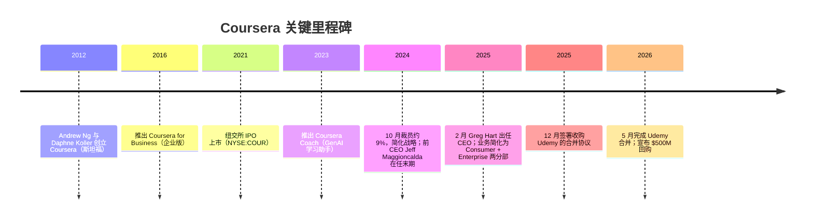
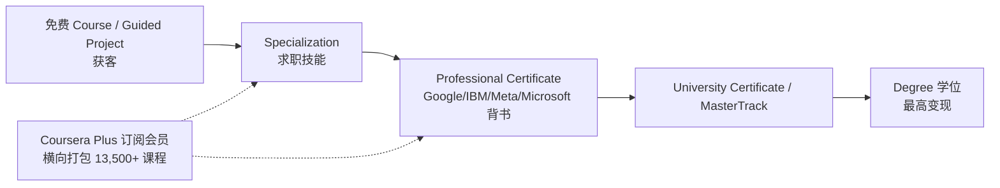
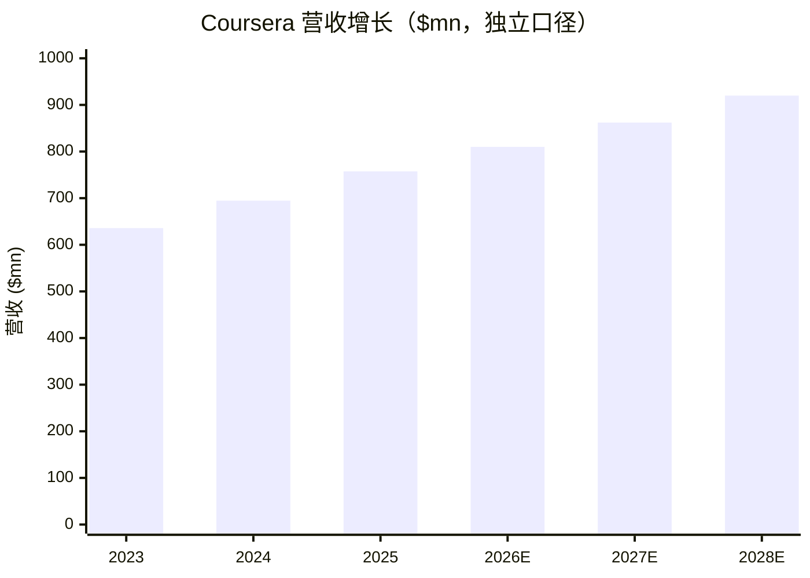

COMPANY RESEARCH REPORT: Coursera, Inc.（NYSE:COUR）
公司研究报告 · 截至日期 As of 2026-06-14（单一简体中文版）

> *分析师观点：* **评级：Hold（持有）· 12 个月目标价 $6.50（较 2026-06-12 收盘 $5.34 上行 +22%）· 估值方法：EV/Sales 与经调整 EV/EBITDA 等权重混合（参照 sell-side），现金回填后的 SOTP 校验**
> 市值约 $1.53B（约 286M 股，含已完成的 Udemy 换股稀释）· 净现金 net cash 约 $0.79B（零有息负债）· 52 周区间 $5.09–$12.70 · NYSE:COUR · 货币 USD
>
> | 倍数 / Multiple（*分析师观点：* 前瞻列） | FY2025A | FY2026E | FY2027E |
> |---|---|---|---|
> | EV/Sales（企业价值/营收，以净现金回填后 EV 计） | ~1.0× | ~0.9× | ~0.8× |
> | EV/Adj.EBITDA（经调整 EBITDA 倍数） | ~12× | ~10× | ~8× |
> | P/S（市销率，TTM，按市值/营收） | ~2.0× | ~1.9× | ~1.8× |
> | GAAP P/E | n/m（GAAP 亏损） | n/m | n/m |
>
> 相对表现 Rel. performance（截至 2026-06-12，价格源 yfinance）：1M **+4.9%** · 6M **−35.0%** · YTD **−24.6%** · 12M **−37.2%**，对标 S&P 500（SPY）1M −0.9% / 6M +8.2% / YTD +8.9% / 12M +24.3%（12 个月相对收益约 **−61pp**，深度跑输大盘）。
> **核心论点（thesis pillars）**——（1）Consumer（消费者业务）连续四个季度双位数增长 + 毛利率结构性改善，是当前唯一确定的增长引擎；（2）Enterprise（企业版）净留存率 NRR 跌至 90% 为最大拖累，决定股价能否走出横盘；（3）GenAI（生成式 AI）是双刃剑——既是 AI 技能需求的顺风、又是免费 AI 辅导（OpenAI/Google）对入门内容的颠覆，10-K 自己同时承认两面；（4）现金充裕、零负债、$500M 回购授权 + 刚完成的 Udemy 合并，提供下行保护但不解决增长问题——故给 Hold。

> **业绩快报（Update — 首次启动覆盖，标的处于战略重构期，2026-06-14）：** Coursera 于 **2026-05-11 完成与 Udemy 的合并**（[Udemy 合并完成新闻稿, 2026-05-11](https://www.sec.gov/Archives/edgar/data/1651562/000114036126020399/ef20072971_ex99-1.htm)），合并后生态覆盖 **2.9 亿学员、1.8 万企业客户、9.5 万讲师**；并于 **2026-05-18 宣布 $500M 股票回购计划**（[$500M 回购新闻稿, 2026-05-18](https://www.sec.gov/Archives/edgar/data/1651562/000165156226000041/pressrelease_repurchasepro.htm)）。最新一份独立指引（合并前）为 **FY2026 营收 $805M–$815M（+6% 至 +8%）、Adj. EBITDA $70M–$76M（约 9% 利润率）**（[Q1'26 股东信, 2026-04-23](https://www.sec.gov/Archives/edgar/data/1651562/000165156226000023/cour-20260331xexx991.htm)）——该指引尚未纳入 Udemy 并表，合并后口径管理层称将于后续季度更新，故本报告的前瞻模型以独立 Coursera 口径为主、Udemy 协同作为期权处理。

## 目录 / Table of Contents
1. 公司概览（含投资论点）
1A. 估值与目标价（前瞻模型 · PT 推导 · 牛/基/熊情景）
1B. GF Score（GuruFocus 式）基本面评分
2. 公司历史
3. 管理团队
4. 产品与服务（**全报告最重要章节**）
5. 客户与上市策略
6. 行业概览
7. 竞争格局
8. 市场机会（TAM）
9. 风险评估
9.5. 核心分歧与催化剂
10. 投资风格透视（investor-lens scorecards）

======================================

## 1. 公司概览 / Company Overview

*分析师观点：* 本报告对 Coursera 给予 **Hold（持有）评级、12 个月目标价 $6.50**（较 2026-06-12 收盘 $5.34 上行约 +22%）。**为什么是现在（why-now）**：股价过去 12 个月深跌 −37%、跑输标普约 61 个百分点（[yfinance 价格数据, 截至 2026-06-12](https://finance.yahoo.com/quote/COUR/)），市场已把 Enterprise 失速与 GenAI 颠覆风险计入价格；但公司 FY2025 实现了营收 +9%、毛利率扩张至 54.6%、FCF（自由现金流）正 $78.5M、零负债 + 近 $0.79B 现金的稳健底盘（[COUR FY2025 10-K, Item 7 MD&A — Key Financial Results](https://www.sec.gov/Archives/edgar/data/1651562/000165156226000015/cour-20251231.htm)）。这是一个"下行有现金垫、上行被增长封顶"的标的——四条论点见上方表头，决定它是横盘等待而非买入或卖出的核心，是 Enterprise NRR 能否从 90% 的低位回升、以及 Udemy 整合能否兑现约 $115M 的成本协同（[高盛 Coursera Q1'26 一季报回顾, 2026-04-27](http://xs-macbook-air.local:5001/zsxq/pdf/184484252158252/Goldman%20Sachs-CRACKS%20IN%20PRIVATE%20CREDIT-260427.pdf)）。

**公司做什么。** Coursera 是一家全球在线学习市场平台（online-learning marketplace），把学员、内容创作者（content creators，含大学与行业机构）、企业与院校机构连接在一个统一技术平台上。截至 2025-12-31，平台累计注册学员（registered learners）约 **1.973 亿**，覆盖 230 多个国家与地区，内容由 **200+ 所大学与 175 家行业机构**（合计 375+ 内容创作者）创作，目录从入门级行业微证书一路延伸到大学学位（[COUR FY2025 10-K, Item 1 Business — Overview](https://www.sec.gov/Archives/edgar/data/1651562/000165156226000015/cour-20251231.htm)）。

**怎么赚钱（business model）。** 自 2025 年起（伴随新 CEO Greg Hart 上任），公司将业务简化为 **两个报告分部（reporting segments）：Consumer（消费者）与 Enterprise（企业）**；原 Degrees（学位）业务被并入 Consumer 作为一个产品类别（[COUR FY2025 10-K, Note 13 — Segment Information](https://www.sec.gov/Archives/edgar/data/1651562/000165156226000015/cour-20251231.htm)）。Consumer 通过品牌内容 + 数字营销吸引个人学员，售卖单课、Specializations（专项课程）、Professional Certificates（专业证书）、Coursera Plus（订阅会员）与学位抽成；Enterprise 通过直销团队向企业、政府、院校售卖席位订阅（catalog licenses）。平台多数情况下作为 principal（主要责任人）确认全额营收，再按净收入的固定比例向内容创作者支付内容成本（content costs）（[COUR FY2025 10-K, Item 7 MD&A — Components of Results of Operations](https://www.sec.gov/Archives/edgar/data/1651562/000165156226000015/cour-20251231.htm)）。

**经营地域。** FY2025 营收按客户账单地址划分：美国 $384.7M（50.8%）、EMEA（欧洲/中东/非洲）$185.9M（24.5%）、Asia Pacific（亚太）$108.9M（14.4%）、其他 $78.0M（10.3%）；除美国外无单一国家占总营收 10% 以上（[COUR FY2025 10-K, Note 13 — Geographic Information](https://www.sec.gov/Archives/edgar/data/1651562/000165156226000015/cour-20251231.htm)）。

**规模。** FY2025 总营收 **$757.5M（+9% YoY）**、毛利 $413.4M（毛利率 gross margin 54.6%）、GAAP 净亏损 $(51.0)M、非 GAAP 净利 $66.8M、Adjusted EBITDA $63.5M、FCF $78.5M；全职员工 1,307 人（[COUR FY2025 10-K, Item 1 Business — Human Capital](https://www.sec.gov/Archives/edgar/data/1651562/000165156226000015/cour-20251231.htm)）。

下图是 Coursera 的收入与盈亏结构 income Sankey——可见两大分部贡献营收、内容成本 + 营销 + 研发后 GAAP 经营仍亏，但亏损主要来自 $95.1M 的股权激励 SBC（见 1A）：

<svg xmlns="http://www.w3.org/2000/svg" viewBox="0 0 1000 560" width="1000" height="560" role="img" aria-label="income statement Sankey"><rect x="0" y="0" width="1000" height="560" fill="#ffffff"/>
<text x="20.00" y="30.00" text-anchor="start" font-family="Helvetica,Arial,sans-serif" font-size="15" font-weight="700" fill="#1f2933">Coursera (COUR) 收入与盈亏结构 — FY2025</text>
<path d="M 204.00,71.00 C 258.00,71.00 258.00,78.00 312.00,78.00 L 312.00,357.77 C 258.00,357.77 258.00,350.77 204.00,350.77 Z" fill="#93c5fd" fill-opacity="0.55"/>
<path d="M 452.00,71.00 C 506.00,71.00 506.00,128.26 560.00,128.26 L 560.00,130.26 C 506.00,130.26 506.00,73.00 452.00,73.00 Z" fill="#86efac" fill-opacity="0.55"/>
<path d="M 452.00,73.00 C 506.00,73.00 506.00,144.26 560.00,144.26 L 560.00,418.19 C 506.00,418.19 506.00,346.92 452.00,346.92 Z" fill="#fca5a5" fill-opacity="0.55"/>
<path d="M 328.00,78.00 C 382.00,78.00 382.00,71.00 436.00,71.00 L 436.00,301.30 C 382.00,301.30 382.00,308.30 328.00,308.30 Z" fill="#86efac" fill-opacity="0.55"/>
<path d="M 328.00,308.30 C 382.00,308.30 382.00,315.30 436.00,315.30 L 436.00,507.00 C 382.00,507.00 382.00,500.00 328.00,500.00 Z" fill="#fca5a5" fill-opacity="0.55"/>
<path d="M 576.00,128.26 C 630.00,128.26 630.00,137.04 684.00,137.04 L 684.00,139.04 C 630.00,139.04 630.00,130.26 576.00,130.26 Z" fill="#86efac" fill-opacity="0.55"/>
<path d="M 700.00,137.04 C 754.00,137.04 754.00,279.58 808.00,279.58 L 808.00,281.58 C 754.00,281.58 754.00,139.04 700.00,139.04 Z" fill="#86efac" fill-opacity="0.55"/>
<path d="M 700.00,139.04 C 754.00,139.04 754.00,295.58 808.00,295.58 L 808.00,298.42 C 754.00,298.42 754.00,141.88 700.00,141.88 Z" fill="#fca5a5" fill-opacity="0.55"/>
<path d="M 576.00,144.26 C 630.00,144.26 630.00,153.04 684.00,153.04 L 684.00,359.22 C 630.00,359.22 630.00,350.44 576.00,350.44 Z" fill="#fca5a5" fill-opacity="0.55"/>
<path d="M 576.00,350.44 C 630.00,350.44 630.00,373.22 684.00,373.22 L 684.00,440.96 C 630.00,440.96 630.00,418.19 576.00,418.19 Z" fill="#fca5a5" fill-opacity="0.55"/>
<path d="M 204.00,364.77 C 258.00,364.77 258.00,357.77 312.00,357.77 L 312.00,500.00 C 258.00,500.00 258.00,507.00 204.00,507.00 Z" fill="#93c5fd" fill-opacity="0.55"/>
<path d="M 576.00,432.19 C 630.00,432.19 630.00,139.04 684.00,139.04 L 684.00,156.59 C 630.00,156.59 630.00,449.74 576.00,449.74 Z" fill="#93c5fd" fill-opacity="0.55"/>
<rect x="188.00" y="71.00" width="16" height="279.77" rx="1.5" fill="#2563eb"/>
<rect x="188.00" y="364.77" width="16" height="142.23" rx="1.5" fill="#2563eb"/>
<rect x="312.00" y="78.00" width="16" height="422.00" rx="1.5" fill="#1e3a8a"/>
<rect x="436.00" y="71.00" width="16" height="230.30" rx="1.5" fill="#15803d"/>
<rect x="436.00" y="315.30" width="16" height="191.70" rx="1.5" fill="#dc2626"/>
<rect x="560.00" y="128.26" width="16" height="2.00" rx="1.5" fill="#15803d"/>
<rect x="560.00" y="144.26" width="16" height="273.92" rx="1.5" fill="#dc2626"/>
<rect x="560.00" y="432.19" width="16" height="17.55" rx="1.5" fill="#2563eb"/>
<rect x="684.00" y="137.04" width="16" height="2.00" rx="1.5" fill="#15803d"/>
<rect x="684.00" y="153.04" width="16" height="206.18" rx="1.5" fill="#dc2626"/>
<rect x="684.00" y="373.22" width="16" height="67.74" rx="1.5" fill="#dc2626"/>
<rect x="808.00" y="279.58" width="16" height="2.00" rx="1.5" fill="#15803d"/>
<rect x="808.00" y="295.58" width="16" height="2.84" rx="1.5" fill="#dc2626"/>
<text x="179.00" y="207.89" text-anchor="end" font-family="Helvetica,Arial,sans-serif" font-size="11.5" font-weight="700" fill="#1f2933">Consumer</text>
<text x="179.00" y="220.89" text-anchor="end" font-family="Helvetica,Arial,sans-serif" font-size="10" font-weight="400" fill="#52606d">$502.2M  (66.3%)</text>
<text x="179.00" y="432.89" text-anchor="end" font-family="Helvetica,Arial,sans-serif" font-size="11.5" font-weight="700" fill="#1f2933">Enterprise</text>
<text x="179.00" y="445.89" text-anchor="end" font-family="Helvetica,Arial,sans-serif" font-size="10" font-weight="400" fill="#52606d">$255.3M  (33.7%)</text>
<rect x="331.00" y="60.00" width="113.10" height="26" rx="2" fill="#ffffff" fill-opacity="0.72"/>
<text x="334.00" y="72.00" text-anchor="start" font-family="Helvetica,Arial,sans-serif" font-size="11.5" font-weight="700" fill="#1f2933">Revenue</text>
<text x="334.00" y="85.00" text-anchor="start" font-family="Helvetica,Arial,sans-serif" font-size="10" font-weight="400" fill="#52606d">$757.5M  (100.0%)</text>
<rect x="455.00" y="53.00" width="106.80" height="26" rx="2" fill="#ffffff" fill-opacity="0.72"/>
<text x="458.00" y="65.00" text-anchor="start" font-family="Helvetica,Arial,sans-serif" font-size="11.5" font-weight="700" fill="#1f2933">Gross Profit</text>
<text x="458.00" y="78.00" text-anchor="start" font-family="Helvetica,Arial,sans-serif" font-size="10" font-weight="400" fill="#52606d">$413.4M  (54.6%)</text>
<rect x="455.00" y="297.30" width="144.60" height="26" rx="2" fill="#ffffff" fill-opacity="0.72"/>
<text x="458.00" y="309.30" text-anchor="start" font-family="Helvetica,Arial,sans-serif" font-size="11.5" font-weight="700" fill="#1f2933">Cost of Revenue (COGS)</text>
<text x="458.00" y="322.30" text-anchor="start" font-family="Helvetica,Arial,sans-serif" font-size="10" font-weight="400" fill="#52606d">$344.1M  (45.4%)</text>
<rect x="579.00" y="110.26" width="113.10" height="26" rx="2" fill="#ffffff" fill-opacity="0.72"/>
<text x="582.00" y="122.26" text-anchor="start" font-family="Helvetica,Arial,sans-serif" font-size="11.5" font-weight="700" fill="#1f2933">Operating Income</text>
<text x="582.00" y="135.26" text-anchor="start" font-family="Helvetica,Arial,sans-serif" font-size="10" font-weight="400" fill="#52606d">-$77.4M  (-10.2%)</text>
<rect x="579.00" y="135.26" width="150.90" height="26" rx="2" fill="#ffffff" fill-opacity="0.72"/>
<text x="582.00" y="147.26" text-anchor="start" font-family="Helvetica,Arial,sans-serif" font-size="11.5" font-weight="700" fill="#1f2933">Total Operating Expense</text>
<text x="582.00" y="160.26" text-anchor="start" font-family="Helvetica,Arial,sans-serif" font-size="10" font-weight="400" fill="#52606d">$491.7M  (64.9%)</text>
<text x="551.00" y="437.96" text-anchor="end" font-family="Helvetica,Arial,sans-serif" font-size="11.5" font-weight="700" fill="#1f2933">Net Interest / Other Income</text>
<text x="551.00" y="450.96" text-anchor="end" font-family="Helvetica,Arial,sans-serif" font-size="10" font-weight="400" fill="#52606d">$31.5M  (4.2%)</text>
<rect x="703.00" y="119.04" width="106.80" height="26" rx="2" fill="#ffffff" fill-opacity="0.72"/>
<text x="706.00" y="131.04" text-anchor="start" font-family="Helvetica,Arial,sans-serif" font-size="11.5" font-weight="700" fill="#1f2933">Pretax Income</text>
<text x="706.00" y="144.04" text-anchor="start" font-family="Helvetica,Arial,sans-serif" font-size="10" font-weight="400" fill="#52606d">-$45.9M  (-6.1%)</text>
<rect x="703.00" y="144.04" width="106.80" height="26" rx="2" fill="#ffffff" fill-opacity="0.72"/>
<text x="706.00" y="156.04" text-anchor="start" font-family="Helvetica,Arial,sans-serif" font-size="11.5" font-weight="700" fill="#1f2933">SG&amp;A</text>
<text x="706.00" y="169.04" text-anchor="start" font-family="Helvetica,Arial,sans-serif" font-size="10" font-weight="400" fill="#52606d">$370.1M  (48.9%)</text>
<rect x="703.00" y="355.22" width="106.80" height="26" rx="2" fill="#ffffff" fill-opacity="0.72"/>
<text x="706.00" y="367.22" text-anchor="start" font-family="Helvetica,Arial,sans-serif" font-size="11.5" font-weight="700" fill="#1f2933">R&amp;D</text>
<text x="706.00" y="380.22" text-anchor="start" font-family="Helvetica,Arial,sans-serif" font-size="10" font-weight="400" fill="#52606d">$121.6M  (16.1%)</text>
<text x="833.00" y="277.58" text-anchor="start" font-family="Helvetica,Arial,sans-serif" font-size="11.5" font-weight="700" fill="#1f2933">Net Income</text>
<text x="833.00" y="290.58" text-anchor="start" font-family="Helvetica,Arial,sans-serif" font-size="10" font-weight="400" fill="#52606d">-$51.0M  (-6.7%)</text>
<text x="833.00" y="302.58" text-anchor="start" font-family="Helvetica,Arial,sans-serif" font-size="11.5" font-weight="700" fill="#1f2933">Income Tax</text>
<text x="833.00" y="315.58" text-anchor="start" font-family="Helvetica,Arial,sans-serif" font-size="10" font-weight="400" fill="#52606d">$5.1M  (0.67%)</text>
<text x="500.00" y="544.00" text-anchor="middle" font-family="Helvetica,Arial,sans-serif" font-size="10" font-weight="400" fill="#52606d">Source: COUR FY2025 10-K, Consolidated Statements of Operations + Note 13 Segments</text>
</svg>

来源 / Source: [COUR FY2025 10-K, Consolidated Statements of Operations + Note 13 Segments](https://www.sec.gov/Archives/edgar/data/1651562/000165156226000015/cour-20251231.htm)

**营收按板块 / 地区的拆分（FY2025）：**

<svg xmlns="http://www.w3.org/2000/svg" viewBox="0 0 720 460" width="720" height="460" role="img" aria-label="revenue donut"><rect x="0" y="0" width="720" height="460" fill="#ffffff"/>
<text x="20.00" y="30.00" text-anchor="start" font-family="Helvetica,Arial,sans-serif" font-size="15" font-weight="700" fill="#1f2933">FY2025 营收按业务板块 / Revenue by Segment</text>
<path d="M 288.00,107.20 A 132 132 0 1 1 175.25,307.84 L 221.37,279.76 A 78 78 0 1 0 288.00,161.20 Z" fill="#2563eb"/>
<path d="M 175.25,307.84 A 132 132 0 0 1 288.00,107.20 L 288.00,161.20 A 78 78 0 0 0 221.37,279.76 Z" fill="#15803d"/>
<text x="288.00" y="235.20" text-anchor="middle" font-family="Helvetica,Arial,sans-serif" font-size="18" font-weight="800" fill="#1f2933">COUR</text>
<text x="288.00" y="255.20" text-anchor="middle" font-family="Helvetica,Arial,sans-serif" font-size="13" font-weight="600" fill="#52606d">$757.5M</text>
<text x="288.00" y="271.20" text-anchor="middle" font-family="Helvetica,Arial,sans-serif" font-size="10" font-weight="400" fill="#8a97a3">total</text>
<line x1="408.30" y1="306.81" x2="424.30" y2="306.81" stroke="#2563eb" stroke-width="1.4"/>
<text x="428.30" y="304.81" text-anchor="start" font-family="Helvetica,Arial,sans-serif" font-size="11" font-weight="700" fill="#1f2933">Consumer</text>
<text x="428.30" y="318.81" text-anchor="start" font-family="Helvetica,Arial,sans-serif" font-size="10" font-weight="400" fill="#52606d">$502.2M  (66.3%)</text>
<line x1="167.70" y1="171.59" x2="151.70" y2="171.59" stroke="#15803d" stroke-width="1.4"/>
<text x="147.70" y="169.59" text-anchor="end" font-family="Helvetica,Arial,sans-serif" font-size="11" font-weight="700" fill="#1f2933">Enterprise</text>
<text x="147.70" y="183.59" text-anchor="end" font-family="Helvetica,Arial,sans-serif" font-size="10" font-weight="400" fill="#52606d">$255.3M  (33.7%)</text>
<text x="360.00" y="444.00" text-anchor="middle" font-family="Helvetica,Arial,sans-serif" font-size="10" font-weight="400" fill="#52606d">Source: COUR FY2025 10-K, Note 13 — Segment Information</text>
</svg>

来源 / Source: [COUR FY2025 10-K, Note 13 — Segment Information](https://www.sec.gov/Archives/edgar/data/1651562/000165156226000015/cour-20251231.htm)

<svg xmlns="http://www.w3.org/2000/svg" viewBox="0 0 720 460" width="720" height="460" role="img" aria-label="revenue donut"><rect x="0" y="0" width="720" height="460" fill="#ffffff"/>
<text x="20.00" y="30.00" text-anchor="start" font-family="Helvetica,Arial,sans-serif" font-size="15" font-weight="700" fill="#1f2933">FY2025 营收按地区 / Revenue by Geography</text>
<path d="M 288.00,107.20 A 132 132 0 1 1 281.49,371.04 L 284.15,317.11 A 78 78 0 1 0 288.00,161.20 Z" fill="#2563eb"/>
<path d="M 281.49,371.04 A 132 132 0 0 1 156.03,236.49 L 210.02,237.60 A 78 78 0 0 0 284.15,317.11 Z" fill="#15803d"/>
<path d="M 156.03,236.49 A 132 132 0 0 1 208.43,133.88 L 240.98,176.96 A 78 78 0 0 0 210.02,237.60 Z" fill="#d97706"/>
<path d="M 208.43,133.88 A 132 132 0 0 1 288.00,107.20 L 288.00,161.20 A 78 78 0 0 0 240.98,176.96 Z" fill="#7c3aed"/>
<text x="288.00" y="235.20" text-anchor="middle" font-family="Helvetica,Arial,sans-serif" font-size="18" font-weight="800" fill="#1f2933">COUR</text>
<text x="288.00" y="255.20" text-anchor="middle" font-family="Helvetica,Arial,sans-serif" font-size="13" font-weight="600" fill="#52606d">$757.5M</text>
<text x="288.00" y="271.20" text-anchor="middle" font-family="Helvetica,Arial,sans-serif" font-size="10" font-weight="400" fill="#8a97a3">total</text>
<line x1="425.96" y1="242.61" x2="441.96" y2="242.61" stroke="#2563eb" stroke-width="1.4"/>
<text x="445.96" y="240.61" text-anchor="start" font-family="Helvetica,Arial,sans-serif" font-size="11" font-weight="700" fill="#1f2933">United States</text>
<text x="445.96" y="254.61" text-anchor="start" font-family="Helvetica,Arial,sans-serif" font-size="10" font-weight="400" fill="#52606d">$384.7M  (50.8%)</text>
<line x1="187.07" y1="333.31" x2="171.07" y2="333.31" stroke="#15803d" stroke-width="1.4"/>
<text x="167.07" y="331.31" text-anchor="end" font-family="Helvetica,Arial,sans-serif" font-size="11" font-weight="700" fill="#1f2933">EMEA</text>
<text x="167.07" y="345.31" text-anchor="end" font-family="Helvetica,Arial,sans-serif" font-size="10" font-weight="400" fill="#52606d">$185.9M  (24.5%)</text>
<line x1="165.10" y1="176.43" x2="149.10" y2="176.43" stroke="#d97706" stroke-width="1.4"/>
<text x="145.10" y="174.43" text-anchor="end" font-family="Helvetica,Arial,sans-serif" font-size="11" font-weight="700" fill="#1f2933">Asia Pacific</text>
<text x="145.10" y="188.43" text-anchor="end" font-family="Helvetica,Arial,sans-serif" font-size="10" font-weight="400" fill="#52606d">$108.9M  (14.4%)</text>
<line x1="244.13" y1="108.36" x2="228.13" y2="108.36" stroke="#7c3aed" stroke-width="1.4"/>
<text x="224.13" y="106.36" text-anchor="end" font-family="Helvetica,Arial,sans-serif" font-size="11" font-weight="700" fill="#1f2933">Other</text>
<text x="224.13" y="120.36" text-anchor="end" font-family="Helvetica,Arial,sans-serif" font-size="10" font-weight="400" fill="#52606d">$78.0M  (10.3%)</text>
<text x="360.00" y="444.00" text-anchor="middle" font-family="Helvetica,Arial,sans-serif" font-size="10" font-weight="400" fill="#52606d">Source: COUR FY2025 10-K, Note 13 — Geographic Information</text>
</svg>

来源 / Source: [COUR FY2025 10-K, Note 13 — Geographic Information](https://www.sec.gov/Archives/edgar/data/1651562/000165156226000015/cour-20251231.htm)

**Consumer 是增长引擎，Enterprise 在拖后腿。** Consumer 营收 $502.2M（+10% YoY，连续两年双位数），Enterprise $255.3M（+7% YoY，较 FY2024 的 +9% 放缓）。两大分部的"内容成本毛利率"差异显著：Consumer 段毛利率 61.4%、Enterprise 段 69.8%，故板块 mix shift（结构切换）会显著影响整体毛利率（[COUR FY2025 10-K, Item 7 MD&A — Segment Revenue / Segment Gross Profit](https://www.sec.gov/Archives/edgar/data/1651562/000165156226000015/cour-20251231.htm)）。下图为三年历史营收（按板块）：

<svg xmlns="http://www.w3.org/2000/svg" viewBox="0 0 860 470" width="860" height="470" role="img" aria-label="historical revenue bars"><rect x="0" y="0" width="860" height="470" fill="#ffffff"/>
<text x="20.00" y="30.00" text-anchor="start" font-family="Helvetica,Arial,sans-serif" font-size="15" font-weight="700" fill="#1f2933">历史营收（按板块）/ Historical Revenue by Segment</text>
<rect x="20.00" y="44" width="11" height="11" rx="2" fill="#2563eb"/>
<text x="36.00" y="53.00" text-anchor="start" font-family="Helvetica,Arial,sans-serif" font-size="10.5" font-weight="400" fill="#1f2933">Consumer</text>
<rect x="102.80" y="44" width="11" height="11" rx="2" fill="#15803d"/>
<text x="118.80" y="53.00" text-anchor="start" font-family="Helvetica,Arial,sans-serif" font-size="10.5" font-weight="400" fill="#1f2933">Enterprise</text>
<line x1="70" y1="412.00" x2="834" y2="412.00" stroke="#eceff2" stroke-width="1"/>
<text x="64.00" y="415.00" text-anchor="end" font-family="Helvetica,Arial,sans-serif" font-size="9.5" font-weight="400" fill="#52606d">$0</text>
<line x1="70" y1="345.20" x2="834" y2="345.20" stroke="#eceff2" stroke-width="1"/>
<text x="64.00" y="348.20" text-anchor="end" font-family="Helvetica,Arial,sans-serif" font-size="9.5" font-weight="400" fill="#52606d">$163.6M</text>
<line x1="70" y1="278.40" x2="834" y2="278.40" stroke="#eceff2" stroke-width="1"/>
<text x="64.00" y="281.40" text-anchor="end" font-family="Helvetica,Arial,sans-serif" font-size="9.5" font-weight="400" fill="#52606d">$327.2M</text>
<line x1="70" y1="211.60" x2="834" y2="211.60" stroke="#eceff2" stroke-width="1"/>
<text x="64.00" y="214.60" text-anchor="end" font-family="Helvetica,Arial,sans-serif" font-size="9.5" font-weight="400" fill="#52606d">$490.9M</text>
<line x1="70" y1="144.80" x2="834" y2="144.80" stroke="#eceff2" stroke-width="1"/>
<text x="64.00" y="147.80" text-anchor="end" font-family="Helvetica,Arial,sans-serif" font-size="9.5" font-weight="400" fill="#52606d">$654.5M</text>
<line x1="70" y1="78.00" x2="834" y2="78.00" stroke="#eceff2" stroke-width="1"/>
<text x="64.00" y="81.00" text-anchor="end" font-family="Helvetica,Arial,sans-serif" font-size="9.5" font-weight="400" fill="#52606d">$818.1M</text>
<rect x="123.48" y="242.08" width="147.71" height="169.92" fill="#2563eb"/>
<rect x="123.48" y="152.43" width="147.71" height="89.65" fill="#15803d"/>
<text x="197.33" y="428.00" text-anchor="middle" font-family="Helvetica,Arial,sans-serif" font-size="10" font-weight="400" fill="#52606d">2023</text>
<rect x="378.15" y="225.91" width="147.71" height="186.09" fill="#2563eb"/>
<rect x="378.15" y="128.38" width="147.71" height="97.53" fill="#15803d"/>
<text x="452.00" y="428.00" text-anchor="middle" font-family="Helvetica,Arial,sans-serif" font-size="10" font-weight="400" fill="#52606d">2024</text>
<rect x="632.81" y="206.97" width="147.71" height="205.03" fill="#2563eb"/>
<rect x="632.81" y="102.74" width="147.71" height="104.23" fill="#15803d"/>
<text x="706.67" y="428.00" text-anchor="middle" font-family="Helvetica,Arial,sans-serif" font-size="10" font-weight="400" fill="#52606d">2025</text>
<text x="430.00" y="454.00" text-anchor="middle" font-family="Helvetica,Arial,sans-serif" font-size="10" font-weight="400" fill="#52606d">Source: COUR FY2023-FY2025 10-Ks, Note 13 — Segment Information</text>
</svg>

来源 / Source: [COUR FY2023–FY2025 10-Ks, Note 13 — Segment Information](https://www.sec.gov/Archives/edgar/data/1651562/000165156226000015/cour-20251231.htm)

**估值快照（valuation snapshot，REQUIRED）。** 截至 2026-06-12，COUR 收盘 $5.34、市值约 $1.53B（约 286M 股，已含 Udemy 换股；10-K 口径 2026-02-13 为 168.2M 股，合并后扩大）（[yfinance, COUR, 截至 2026-06-12](https://finance.yahoo.com/quote/COUR/)）。**GAAP 口径 P/E 无意义（n/m）——公司 GAAP 亏损**，驱动亏损的核心科目是 FY2025 高达 $95.1M 的 stock-based compensation（股权激励 SBC），单这一项就超过 GAAP 净亏损 $(51.0)M 的近两倍（[COUR FY2025 10-K, Consolidated Statements of Cash Flows](https://www.sec.gov/Archives/edgar/data/1651562/000165156226000015/cour-20251231.htm)）；因此市场用 EV/Sales 与 EV/Adj.EBITDA 定价。TTM P/S 约 2.0×。对标同业：Duolingo（DUOL）P/S 约 5.2×（高增长溢价）、Udemy（UDMY，被收购前）约 0.9×、Chegg（CHGG，被 AI 颠覆）约 0.4×、Skillsoft（SKIL）约 0.1×（[yfinance peer multiples, 截至 2026-06-12](https://finance.yahoo.com/quote/DUOL/)）。COUR 的 2.0× P/S 处在"非高增长、但非衰退"的中段——既无 DUOL 的成长溢价，也未沦为 CHGG 式的 AI 牺牲品。*分析师观点：* sell-side 用更严苛的 EV/Sales（约 0.4×，以净现金回填后的低 EV 计）定价，反映市场对 GAAP 盈利路径（受 SBC 稀释）的折价（[高盛 Coursera Q1'26, 2026-04-27](http://xs-macbook-air.local:5001/zsxq/pdf/184484252158252/Goldman%20Sachs-CRACKS%20IN%20PRIVATE%20CREDIT-260427.pdf)）。

## 1A. 估值与目标价 / Valuation & Price Target

*分析师观点：* 以下全部为前瞻判断，**任何投影数字、目标价、情景价均不附 filing 引用**；每项驱动的外部依据在文中行内标注。

**（a）前瞻财务估算表（以独立 Coursera 口径建模，Udemy 协同作为期权另行说明）。** 营收路径建立在 FY2025 分部数据 + 管理层 FY2026 指引 $805M–$815M 之上；Consumer 维持双位数、Enterprise 低个位数复苏假设。

| 指标（*分析师观点：*） | FY2025A | FY2026E | FY2027E | FY2028E | CAGR(25-28) |
|---|---|---|---|---|---|
| 营收 Revenue（$mn，独立口径） | 757.5 | 810 | 862 | 920 | +6.7% |
| — YoY % | +9% | +7% | +6% | +7% | |
| — Consumer（$mn） | 502.2 | 552 | 600 | 648 | |
| — Enterprise（$mn） | 255.3 | 258 | 262 | 272 | |
| 毛利率 Gross margin % | 54.6% | 55.3% | 55.8% | 56.2% | |
| Adj. EBITDA（$mn） | 63.5 | 73 | 92 | 110 | |
| Adj. EBITDA margin % | 8.4% | 9.0% | 10.7% | 12.0% | |
| GAAP 净利/(亏损)（$mn） | (51.0) | (40) | (15) | 10 | |
| 非 GAAP EPS（$） | 0.39 | 0.42 | 0.55 | 0.70 | |
| FCF（$mn） | 78.5 | 70 | 95 | 120 | |
| 净现金 Net cash（$mn，零负债） | 792.6 | 760 | 810 | 880 | |

各投影单元的外部依据：营收爬坡来自管理层 FY2026 指引 $805M–$815M（[Q1'26 earnings release / 股东信, 2026-04-23](https://www.sec.gov/Archives/edgar/data/1651562/000165156226000023/cour-20260331xexx991.htm)），叠加 FY2023–FY2025 分部历史增速（[COUR FY2025 10-K, Note 13](https://www.sec.gov/Archives/edgar/data/1651562/000165156226000015/cour-20251231.htm)）；毛利率提升来自管理层披露的"平台费结构改善 + 用户更多消费自制内容"红利（[COUR FY2025 10-K, Item 7 MD&A — Segment Gross Profit](https://www.sec.gov/Archives/edgar/data/1651562/000165156226000015/cour-20251231.htm)）。**毛利率桥（margin bridge，FY2025 vs FY2024，+110bps 至 54.6%）：** Consumer 段 +170bps（59.7%→61.4%）· Enterprise 段 +120bps（68.6%→69.8%），主因两段内容成本率下降（按 learner engagement 计费 + 自制内容占比上升），部分被无形资产摊销上升（$5.5M→$9.3M）抵消（[COUR FY2025 10-K, Note 13 — Segment Gross Profit](https://www.sec.gov/Archives/edgar/data/1651562/000165156226000015/cour-20251231.htm)）。

**（b）目标价推导 — 现金回填后的混合估值。** 方法：对独立 Coursera 给予 EV/Sales × 目标倍数，再加回净现金。取 FY2026E 营收 $810M，赋予 **0.85× EV/Sales**（介于 sell-side 0.4× 的悲观与 DUOL 5×+ 的成长溢价之间，反映个位数增长 + FCF 正 + 改善中的毛利率）→ EV ≈ $689M；加回净现金约 $760M → 股权价值 ≈ $1.45B；按约 286M 股（含 Udemy 稀释）→ **每股约 $5.1**；考虑 Udemy 协同期权（约 $115M 成本协同 × 8× ≈ 提升约 $1.4/股的期权价值，按 50% 概率折算约 +$0.7/股）与回购的每股增厚，**12 个月目标价 $6.50**。**倍数依据（为什么用 0.85×）：** Udemy（UDMY）被收购前约 0.9× P/S、Chegg 约 0.4×、Skillsoft 约 0.1×、Duolingo 约 5.2×——Coursera 的增长（+9%）与盈利质量（FCF 正、零负债）应落在 Udemy/Chegg 之上、远低于 Duolingo（[yfinance peer multiples, 截至 2026-06-12](https://finance.yahoo.com/quote/UDMY/)）。

**（c）牛 / 基 / 熊情景表。**

| 情景（*分析师观点：*） | 关键假设 | 目标价 PT | 较 $5.34 |
|---|---|---|---|
| 牛 Bull | Enterprise NRR 回到 100%+、Udemy 协同足额兑现、毛利率破 58%、市场给 1.3× EV/Sales | $9.0 | +69% |
| 基 Base | Consumer 双位数、Enterprise 低个位数复苏、0.85× EV/Sales + 协同期权 | $6.5 | +22% |
| 熊 Bear | Enterprise 持续萎缩、GenAI 侵蚀入门内容需求、协同落空、de-rate 至 0.4× EV/Sales | $4.0 | −25% |

**（d）与市场一致预期的对比（consensus benchmark）。** *分析师观点：* 高盛 FY2026 营收预估 $808M、Adj. EBITDA $70.5M、GAAP EPS −$0.33（[高盛 Coursera Q1'26, 2026-04-27](http://xs-macbook-air.local:5001/zsxq/pdf/184484252158252/Goldman%20Sachs-CRACKS%20IN%20PRIVATE%20CREDIT-260427.pdf)）；本报告独立口径营收 $810M 基本与街上一致、略偏乐观于 EBITDA。本报告目标价 $6.50 介于高盛 $5.50（卖出）与大摩 $7.50（同步大盘）之间，更接近大摩。

**（e）最该盯紧的变量（swing variables）：**（1）**Enterprise 净留存率 NRR** —— 这是决定 Enterprise 能否止跌的唯一最重要变量（FY2025 全年 93%，但 Q1'26 已滑到 90%）；（2）**Udemy 整合的成本协同兑现节奏 + 合并后营收口径** —— 决定 EPS 与 EBITDA 的修复速度。

## 1B. GF Score（GuruFocus 式）基本面评分 / GF Score

*分析师观点：* **GF Score（GuruFocus-style）：54/100 — Poor future performance potential（51–70 区间）。** 该评分为本报告自建的透明评分卡，五个子项与综合分均为分析师 rubric 输出，**不附 filing 引用**，每个底层指标在下方行内单独引用；该数字不归因于 GuruFocus（GuruFocus 官方每股页面为 Cloudflare 保护，非死链）。

<svg xmlns="http://www.w3.org/2000/svg" viewBox="0 0 500 500" width="500" height="500" role="img" aria-label="GF Score radar">
<rect x="0" y="0" width="500" height="500" fill="#ffffff"/>
<text x="20" y="24" font-family="Helvetica,Arial,sans-serif" font-size="15" font-weight="700" fill="#1f2933">GF Score (GuruFocus-style): 54/100</text>
<text x="20" y="41" font-family="Helvetica,Arial,sans-serif" font-size="11" fill="#52606d">51–70 Poor future performance potential</text>
<polygon points="250.0,88.0 392.7,191.6 338.2,359.4 161.8,359.4 107.3,191.6" fill="#e9f5ec" stroke="none"/>
<polygon points="250.0,208.0 278.5,228.7 267.6,262.3 232.4,262.3 221.5,228.7" fill="none" stroke="#c5d3cb" stroke-width="1"/>
<polygon points="250.0,178.0 307.1,219.5 285.3,286.5 214.7,286.5 192.9,219.5" fill="none" stroke="#c5d3cb" stroke-width="1"/>
<polygon points="250.0,148.0 335.6,210.2 302.9,310.8 197.1,310.8 164.4,210.2" fill="none" stroke="#c5d3cb" stroke-width="1"/>
<polygon points="250.0,118.0 364.1,200.9 320.5,335.1 179.5,335.1 135.9,200.9" fill="none" stroke="#c5d3cb" stroke-width="1"/>
<polygon points="250.0,88.0 392.7,191.6 338.2,359.4 161.8,359.4 107.3,191.6" fill="none" stroke="#c5d3cb" stroke-width="1.3"/>
<line x1="250" y1="238" x2="161.8" y2="359.4" stroke="#cfdad3" stroke-width="1"/>
<text x="146.5" y="392.4" text-anchor="end" font-family="Helvetica,Arial,sans-serif" font-size="11.5" font-weight="600" fill="#1f2933">财务实力</text>
<text x="170.6" y="341.2" text-anchor="middle" font-family="Helvetica,Arial,sans-serif" font-size="10.5" font-weight="700" fill="#1f2933">9</text>
<line x1="250" y1="238" x2="250.0" y2="88.0" stroke="#cfdad3" stroke-width="1"/>
<text x="250.0" y="58.0" text-anchor="middle" font-family="Helvetica,Arial,sans-serif" font-size="11.5" font-weight="600" fill="#1f2933">盈利能力</text>
<text x="250.0" y="172.0" text-anchor="middle" font-family="Helvetica,Arial,sans-serif" font-size="10.5" font-weight="700" fill="#1f2933">4</text>
<line x1="250" y1="238" x2="107.3" y2="191.6" stroke="#cfdad3" stroke-width="1"/>
<text x="82.6" y="183.6" text-anchor="end" font-family="Helvetica,Arial,sans-serif" font-size="11.5" font-weight="600" fill="#1f2933">成长性</text>
<text x="178.7" y="208.8" text-anchor="middle" font-family="Helvetica,Arial,sans-serif" font-size="10.5" font-weight="700" fill="#1f2933">5</text>
<line x1="250" y1="238" x2="392.7" y2="191.6" stroke="#cfdad3" stroke-width="1"/>
<text x="417.4" y="183.6" text-anchor="start" font-family="Helvetica,Arial,sans-serif" font-size="11.5" font-weight="600" fill="#1f2933">估值</text>
<text x="364.1" y="194.9" text-anchor="middle" font-family="Helvetica,Arial,sans-serif" font-size="10.5" font-weight="700" fill="#1f2933">8</text>
<line x1="250" y1="238" x2="338.2" y2="359.4" stroke="#cfdad3" stroke-width="1"/>
<text x="353.5" y="392.4" text-anchor="start" font-family="Helvetica,Arial,sans-serif" font-size="11.5" font-weight="600" fill="#1f2933">动量</text>
<text x="258.8" y="244.1" text-anchor="middle" font-family="Helvetica,Arial,sans-serif" font-size="10.5" font-weight="700" fill="#1f2933">1</text>
<polygon points="250.0,178.0 364.1,200.9 258.8,250.1 170.6,347.2 178.7,214.8" fill="#2e8b57" fill-opacity="0.34" stroke="#2e8b57" stroke-width="2"/>
<circle cx="170.6" cy="347.2" r="2.6" fill="#2e8b57"/>
<circle cx="250.0" cy="178.0" r="2.6" fill="#2e8b57"/>
<circle cx="178.7" cy="214.8" r="2.6" fill="#2e8b57"/>
<circle cx="364.1" cy="200.9" r="2.6" fill="#2e8b57"/>
<circle cx="258.8" cy="250.1" r="2.6" fill="#2e8b57"/>
<text x="250" y="470" text-anchor="middle" font-family="Helvetica,Arial,sans-serif" font-size="9.5" fill="#52606d">Source: COUR FY2025 10-K · Yahoo Finance · indicators.db, as of 2026-06-14</text>
<text x="250" y="485" text-anchor="middle" font-family="Helvetica,Arial,sans-serif" font-size="9" fill="#52606d">GF Score = independent analyst rubric (*Analyst view:*) — not GuruFocus™ official number</text>
</svg>

> 离中心越远，该维度得分越高；五边形面积越大，综合分越高。

| 维度 | 评分 (0–10) | |
|---|---|---|
| 财务实力 Financial Strength | 9 | `█████████░` |
| 盈利能力 Profitability | 4 | `████░░░░░░` |
| 成长性 Growth | 5 | `█████░░░░░` |
| 估值 GF Value（越高=越便宜） | 8 | `████████░░` |
| 动量 Momentum | 1 | `█░░░░░░░░░` |
| **GF Score（综合，*分析师观点：*）** | **54 / 100** | **51–70 Poor future performance potential** |

**财务实力 9/10。** 近乎满分：FY2025 末现金及等价物 $792.6M、**零有息负债**、总股东权益 $635.7M，CFO $108.7M 正、FCF $78.5M 正（[COUR FY2025 10-K, Consolidated Balance Sheets + Cash Flows](https://www.sec.gov/Archives/edgar/data/1651562/000165156226000015/cour-20251231.htm)）。净现金占市值过半，下行保护极强；扣 1 分仅因累计赤字 $(911.2)M 反映长期未盈利。

**盈利能力 4/10。** GAAP 仍亏：FY2025 经营亏损 $(77.4)M、净亏损 $(51.0)M、净利率 −6.7%（[COUR FY2025 10-K, Statements of Operations](https://www.sec.gov/Archives/edgar/data/1651562/000165156226000015/cour-20251231.htm)）。但毛利率 54.6%（且逐年抬升 51.9%→53.5%→54.6%）、非 GAAP 净利 $66.8M、Adj. EBITDA $63.5M 为正——分裂的盈利画像（GAAP 亏 / 非 GAAP 盈）正是给 4 分而非更低的原因；瓶颈是 $95.1M 的 SBC 与 33.8% 营收的高营销费率。

**成长性 5/10。** 中段：FY2023→FY2025 营收 CAGR 约 9.1%（$635.8M→$757.5M），Consumer 双位数但 Enterprise 放缓至 +7%，前瞻指引仅 +6%–+8%（[COUR FY2025 10-K, Item 7 MD&A](https://www.sec.gov/Archives/edgar/data/1651562/000165156226000015/cour-20251231.htm)；[Q1'26 earnings release, 2026-04-23](https://www.sec.gov/Archives/edgar/data/1651562/000165156226000023/cour-20260331xexx991.htm)）。注册学员 +17% 显示用户增长仍健康，但变现增速温和——故 5 分。

**估值 8/10（越高=越便宜）。** 偏便宜：TTM P/S 约 2.0×、净现金回填后 EV/Sales 约 0.4–1.0×，低于自身历史与 DUOL；MoS（margin of safety）相对本报告内在价值区间为正（[yfinance, 截至 2026-06-12](https://finance.yahoo.com/quote/COUR/)）。扣 2 分因 GAAP 亏损令 P/E 失效、且增长不足以支撑更高倍数。

**动量 1/10。** 最弱：12 个月绝对 −37.2%、相对标普 −61pp，股价低于 200 日均线（约 $7.52）、贴近 52 周低位 $5.09（[yfinance, 截至 2026-06-12](https://finance.yahoo.com/quote/COUR/)）——动量是综合分的最大拖累。

**综合算术：**（财务实力 9×20 + 盈利能力 4×25 + 成长性 5×25 + 估值 8×15 + 动量 1×15）/100 =（180+100+125+120+15）/100 = 5.40 → **54/100**。权重为默认 20/25/25/15/15。

**一句话提醒（caveat）：** 最易翻转的是动量（1 分）——若 Enterprise NRR 回升带动股价脱离低位，动量可快速上修 3–4 分，将综合分推过 60。本报告无 n/a 维度。

======================================

## 2. 公司历史 / Company History

Coursera 由斯坦福大学计算机科学教授 **Andrew Ng（吴恩达）与 Daphne Koller** 于 **2012 年**创立，使命是"为人人提供世界级学习的普遍可及"（universal access to world-class learning）（[$500M 回购新闻稿 — About Coursera, 2026-05-18](https://www.sec.gov/Archives/edgar/data/1651562/000165156226000041/pressrelease_repurchasepro.htm)）。公司开创了现代 MOOC（大规模开放在线课程）模式，从与顶尖大学合作的免费公开课起步，逐步演化为付费证书、专项课程、订阅会员与全在线学位的多层变现平台（[COUR FY2025 10-K, Item 1 Business — Overview](https://www.sec.gov/Archives/edgar/data/1651562/000165156226000015/cour-20251231.htm)）。



**战略转折一：从 MOOC 免费课到多层变现。** 早期 Coursera 以免费公开课积累全球学员心智，随后用 Professional Certificates（与 Google/IBM/Meta/Microsoft 合作）、Coursera Plus 订阅与学位抽成把巨量免费流量逐层转化为付费，形成"免费课→证书→学位"的自然学习进阶漏斗（[COUR FY2025 10-K, Item 1 Business — Coursera.org for Individuals](https://www.sec.gov/Archives/edgar/data/1651562/000165156226000015/cour-20251231.htm)）。

**战略转折二：2024–2025 的成本重构与领导层更替。** 2024 年 10 月公司宣布进一步削减费用，将全球员工裁减约 **9%**，FY2024 确认 $6.8M 重组费用；2025 年 2 月 **Greg Hart（前亚马逊 Alexa/Echo 与 Prime Video 高管）出任 CEO**，随即把组织简化为 Consumer 与 Enterprise 两个分部、Degrees 并入 Consumer（[COUR FY2025 10-K, Item 7 MD&A — Organizational Updates / Reporting Segments](https://www.sec.gov/Archives/edgar/data/1651562/000165156226000015/cour-20251231.htm)）。

**近期重大事件（last 12 months）。** （1）**2025-12-17 签署与 Udemy 的合并协议**（换股比 0.800 股 COUR / 每股 Udemy，终止费 $40.5M）；（2）**2026-02-09 FTC 授予 HSR 反垄断早期终止**；（3）**2026-05-11 合并完成**，合并后生态达 2.9 亿学员、1.8 万企业客户、9.5 万讲师；（4）**2026-05-18 宣布 $500M 回购**（[COUR FY2025 10-K, Item 7 MD&A — Transaction with Udemy](https://www.sec.gov/Archives/edgar/data/1651562/000165156226000015/cour-20251231.htm)；[Udemy 合并完成新闻稿, 2026-05-11](https://www.sec.gov/Archives/edgar/data/1651562/000114036126020399/ef20072971_ex99-1.htm)）。

## 3. 管理团队 / Management Team

**创始人 Andrew Ng（吴恩达）与 Daphne Koller。** 两位均为斯坦福大学计算机科学教授，2012 年共同创立 Coursera，奠定了"用顶尖大学品牌内容 + 数据驱动营销低成本获取全球成人学员"的平台模型（[$500M 回购新闻稿 — About Coursera, 2026-05-18](https://www.sec.gov/Archives/edgar/data/1651562/000165156226000041/pressrelease_repurchasepro.htm)）。Andrew Ng 此后在 AI 教育领域影响深远（创立 DeepLearning.AI，其课程与证书亦在 Coursera 平台分发——10-K 在新增 Professional Certificates 时点名 DeepLearning.AI）（[COUR FY2025 10-K, Item 1 Business — Overview](https://www.sec.gov/Archives/edgar/data/1651562/000165156226000015/cour-20251231.htm)）；两位创始人当前均已不担任公司经营职务，转为创始/学术影响层面。其精确持股比例需查阅 2026 DEF 14A 受益所有权表，本报告未单独核到具体百分比（*未披露 / disclosure not found in the sections reviewed*）。

**现任 CEO Greg Hart（自 2025-02-03 起任 President & CEO，并兼 Class III 董事）。** Hart 的背景高度契合 Coursera 当前"消费者 + AI"的战略重心：他在 **亚马逊任职 23 年**，先后领导 **Prime Video 全球业务**、**Amazon Echo（Alexa）业务**，并曾任亚马逊创始人 **Jeff Bezos 的技术顾问（Technical Advisor）**；离开亚马逊后，于地产科技公司 **Compass 任首席产品官（2020-04 至 2022-04）、随后任首席运营官（2022-05 至 2023-12）**；自 2024-12 起任 Bose Corporation 董事。教育背景为威廉姆斯学院（Williams College）英语文学学士（[2026 DEF 14A — Director Biographies (Gregory Hart), 2026-05-11](https://www.sec.gov/Archives/edgar/data/1651562/000165156226000036/cour-20260511.htm)）。值得注意的是，**Hart 自 2025-10-30 起一度兼任公司首席财务官（principal financial officer）**，直至 2025-11-13 Coursera 任命 **Michael Foley** 为临时 CFO——CFO 角色的短期空窗与代任，反映了公司在战略重构期的管理层动荡，是治理上需要关注的一点（[COUR FY2025 10-K, Item 7 MD&A — Leadership Transitions](https://www.sec.gov/Archives/edgar/data/1651562/000165156226000015/cour-20251231.htm)）。其具体持股与薪酬结构详见 2026 DEF 14A 高管薪酬章节（本报告未逐项核到金额，*未披露 / disclosure not separately verified here*）。

======================================

## 4. 产品与服务 / Products & Services（**全报告最重要章节**）

Coursera 的产品不是"一门门课"，而是一个**按学习时长与认证强度分层的目录体系（catalog）**，加上把这个目录变现的两条渠道（Consumer 直销 / Enterprise 直销）与一层正在重塑成本结构的 GenAI 工具。理解这套分层，才能理解后面客户、行业、竞争、风险各章。

### 4.1 产品目录矩阵（10-K 原文逐条复刻，MANDATORY）

下表逐条复刻 10-K 对完整目录的口径（截至 2025-12-31）：

| 产品类型（10-K 原文口径） | 规模 | 完成时长 / 定位（10-K 原文） |
|---|---|---|
| Guided Projects（指导项目） | 2,000+ | "Practice a technical skill or tool in less than two hours" |
| Courses（课程） | 13,500+ | "Learn something new in 4 to 6 weeks"，其中含 1,000+ Generative AI courses |
| Specializations（专项课程） | 1,900+ | "Advance a job-relevant skill in 3 to 6 months" |
| Certificates（证书，合计） | 185+ | 见下分项 |
| — Entry-level Professional Certificates（入门级专业证书） | 95+ | "Earn a certification of job readiness in 3 to 9 months" |
| — Non-entry level Professional Certificates | 60+ | "advance your career in 1 to 10 months" |
| — University Certificates（大学证书） | 20+ | "a university-issued certification … in 4 t[o] months"（原文） |
| MasterTrack Certificates | 10+ | "a module of a university degree and credit … in 3 to 12 months" |
| Degrees（学位） | 50+ | "Earn a bachelor's or master's degree fully online or … a postgraduate diploma" |

来源 / Source: [COUR FY2025 10-K, Item 1 Business — The full Coursera catalog (as of 2025-12-31)](https://www.sec.gov/Archives/edgar/data/1651562/000165156226000015/cour-20251231.htm)。

### 4.2 综合：这些产品如何组成一条学习进阶链

10-K 原文给出了产品如何串成"漏斗"的最佳注脚：

> "Our Consumer platform fosters a natural learning progression, where learners can transition from free projects or courses to fully online degrees."（[COUR FY2025 10-K, Item 1 Business — Our Growth Strategy](https://www.sec.gov/Archives/edgar/data/1651562/000165156226000015/cour-20251231.htm)）

**中文释义 / Plain-language gloss：** 免费 Course / Guided Project（短时长、零门槛获客）→ 付费 Specialization（job-relevant skill / 求职技能）→ Professional Certificate（求职就绪认证，由 Google/IBM 等背书）→ Degree（学位，最高变现）。每一层都把上一层的免费流量转化为更高客单价（ARPU）的付费。这条链的经济学关键，是 Coursera 通过 ACE（American Council on Education）、ECTS、印度 NSQF 等机构让证书可"折算大学学分"（credit recognition）——例如完成 Google Data Analytics Certificate 最多可折算 12 个大学学分——从而把廉价证书"嫁接"到昂贵学位上，做大客单价（[COUR FY2025 10-K, Item 1 Business — Overview](https://www.sec.gov/Archives/edgar/data/1651562/000165156226000015/cour-20251231.htm)）。



### 4.3 旗舰一：Coursera Plus（订阅会员）——消费者变现的飞轮

> "Coursera Plus is our subscription offering that gives learners access to over 13,500 courses, Guided Projects, Specializations, and Professional Certificates on Coursera for a monthly or annual fee."（[COUR FY2025 10-K, Item 1 Business — Coursera Plus](https://www.sec.gov/Archives/edgar/data/1651562/000165156226000015/cour-20251231.htm)）

**中文释义 / Plain-language gloss：** Coursera Plus 是把碎片化单课打包成"月费/年费无限学"的订阅产品（类似流媒体的 all-you-can-eat）。它的战略意义在于把一次性买课的交易型收入，转成可预测的**经常性订阅收入（recurring subscription revenue）**——sell-side 披露 **Coursera Plus 订阅收入已占消费者营收 50% 以上**，是 Consumer 段毛利率改善（自制内容经济效益更佳）的核心载体（*分析师观点：* [高盛 Coursera Q1'26, 2026-04-27](http://xs-macbook-air.local:5001/zsxq/pdf/184484252158252/Goldman%20Sachs-CRACKS%20IN%20PRIVATE%20CREDIT-260427.pdf)）。*分析师观点：* 竞争优势——**部分**（订阅留存 + 自制内容降低单位内容成本），护城河类型为规模 + 数据驱动的个性化推荐；最近的同类竞品是 LinkedIn Learning 的订阅模式（[LinkedIn Learning](https://learning.linkedin.com/)）。

### 4.4 旗舰二：Professional Certificates（专业证书）——行业巨头背书的获客引擎

> "Coursera offers a portfolio of entry-level Professional Certificates from IBM, Microsoft, Google, Meta, and more that help develop the skills needed to land entry-level digital jobs … without requiring a college degree or any experience in the field."（[COUR FY2025 10-K, Item 1 Business — Coursera.org for Individuals](https://www.sec.gov/Archives/edgar/data/1651562/000165156226000015/cour-20251231.htm)）

**中文释义 / Plain-language gloss：** 这是 Coursera 最具差异化的资产——用 **Google、IBM、Microsoft、Meta** 这些雇主自身的品牌背书，向"无学位、无经验"人群兜售"可直接求职"的入门证书（cybersecurity、data science、software engineering 等）。物理上它做的事，是把"雇主认可"这个最稀缺的信号商品化：学员买的不只是知识，更是一张被招聘方认得的"通行证"。它与 Coursera Plus 的差异在于——Plus 卖的是"无限学的广度"，Certificate 卖的是"单点求职就绪的深度 + 雇主背书"。战略意义：**1,000+ Generative AI courses + AI 相关证书需求显著拐点向上**——sell-side 指出 AI 课程"Q1 每分钟超 20 人报名"、平台 AI 课程超 1,300 门，是当前消费者增长的最强细分（*分析师观点：* [大摩 Coursera 1Q26, 2026-04-24](http://xs-macbook-air.local:5001/zsxq/pdf/184485451841152/Morgan%20Stanley-Coursera%EF%BC%8C%20Inc.%EF%BC%88COUR.UN%EF%BC%891Q26%20Results%EF%BC%9A%20Sideways%20Stock%20Until%20Post~Merger%20Close%EF%BC%9F-260424.pdf)）。

### 4.5 旗舰三：Degrees（学位）与 Enterprise（企业版）

学位业务由公司与大学伙伴合作"托管并交付其线上学士/硕士学位"，Coursera 按学生总学费抽取服务费（service fee），FY2025 起并入 Consumer 分部作为一个产品类别（[COUR FY2025 10-K, Item 7 MD&A — Components of Results of Operations](https://www.sec.gov/Archives/edgar/data/1651562/000165156226000015/cour-20251231.htm)）。**Enterprise（Coursera for Business / for Campus / for Government）** 则把同一目录以席位订阅形式卖给企业、院校、政府——其分部毛利率（69.8%）显著高于 Consumer（61.4%），因为机构客户的内容成本结构更优；但 Enterprise 增速更慢、且净留存率（NRR）正在恶化（见第 5、9 章）（[COUR FY2025 10-K, Item 7 MD&A — Segment Gross Profit](https://www.sec.gov/Archives/edgar/data/1651562/000165156226000015/cour-20251231.htm)）。*分析师观点：* 竞争优势——**部分**；Enterprise 的护城河是内容广度 + 与 Consumer 共享的数据洞察，但企业培训预算紧缩 + Docebo/Skillsoft/Go1 等 LMS/内容竞品令其壁垒不如 Consumer，最近的同类竞品是 Docebo（[Docebo](https://www.docebo.com/)）与 Skillsoft（[Skillsoft](https://www.skillsoft.com/)）。

### 4.6 AI 工具层：Coach / Role Play / Course Builder（GenAI 双刃剑的"剑刃"一面）

> "AI-powered learning features, such as Coursera Coach ('Coach') for pre-quiz practice questions and personalized, interactive instruction … Role Play which enables learners to build job-ready skills … through dynamic, back-and-forth interactions with AI personas, Course Builder which is our GenAI-powered authoring platform, enabling institutions to use AI to design courses at scale … and AI translations and dubbing for up to 5 languages."（[COUR FY2025 10-K, Item 1 Business — Coursera's learning experience](https://www.sec.gov/Archives/edgar/data/1651562/000165156226000015/cour-20251231.htm)）

**中文释义 / Plain-language gloss：** 这是 Coursera 对"GenAI 既是威胁也是武器"的正面回应。**Coach** = 一个嵌在课程里的 AI 辅导（personalized tutor），物理上替代了"找助教答疑"；**Role Play** = 让学员与 AI 角色对练软技能（销售谈判、面试），把"练习"这个最难规模化的环节自动化；**Course Builder** = GenAI 内容创作平台，让机构"规模化用 AI 设计课程"，物理上压缩了内容生产成本与周期；**AI translations/dubbing** = 把内容自动译配成多语种（10-K 提到目录已用 AI 译为最多 26 种语言），低成本打开非英语市场。三者的战略意义是统一的：**用自研 AI 把内容生产与交付的单位成本压下去**——这正是 FY2025 毛利率扩张、非 GAAP 毛利率达 55.5%（近三年最高）的底层驱动（*分析师观点：* [大摩 Coursera 1Q26, 2026-04-24](http://xs-macbook-air.local:5001/zsxq/pdf/184485451841152/Morgan%20Stanley-Coursera%EF%BC%8C%20Inc.%EF%BC%88COUR.UN%EF%BC%891Q26%20Results%EF%BC%9A%20Sideways%20Stock%20Until%20Post~Merger%20Close%EF%BC%9F-260424.pdf)）。

### 4.7 资金流向（money-flow）——内容成本流到哪里

下图把 Coursera 的"谁付钱→平台→钱归集到哪"画成一张资金流向图（实线为直接付款，虚线为隐含在成品/分成中的间接支出）：

<svg xmlns="http://www.w3.org/2000/svg" viewBox="0 0 1180 1024" width="1180" height="1024" role="img" aria-label="Coursera 的&quot;资金流向&quot;：学费/订阅费如何在平台与内容方之间分配" font-family="'Space Grotesk',system-ui,-apple-system,'Segoe UI',sans-serif">
<defs><linearGradient id="mfgold" gradientUnits="userSpaceOnUse" x1="0" y1="0" x2="1180" y2="0"><stop offset="0" stop-color="#f6dc97"/><stop offset="0.5" stop-color="#e9b658"/><stop offset="1" stop-color="#cf8f2c"/></linearGradient><radialGradient id="mfpool" cx="50%" cy="50%" r="50%"><stop offset="0" stop-color="#34d399" stop-opacity="0.16"/><stop offset="1" stop-color="#34d399" stop-opacity="0"/></radialGradient></defs>
<rect x="0" y="0" width="1180" height="1024" rx="16" fill="#0b0f1a"/>
<text x="42.00" y="56.00" text-anchor="start" font-family="'JetBrains Mono',ui-monospace,Menlo,monospace" font-size="11.5" font-weight="600" fill="#e9b658" letter-spacing="3">在线学习市场 · 资金流向 · FY2025</text>
<text x="42.00" y="100.00" text-anchor="start" font-family="'Space Grotesk',system-ui,-apple-system,'Segoe UI',sans-serif" font-size="32" font-weight="700" fill="#e8ecf5">Coursera 的&quot;资金流向&quot;：学费/订阅费如何在平台与内容方之间分配</text>
<text x="42.00" y="142.00" text-anchor="start" font-family="'Space Grotesk',system-ui,-apple-system,'Segoe UI',sans-serif" font-size="15" font-weight="400" fill="#8a93a8">学员与企业付费流入平台；Coursera 按净收入的固定比例向内容方（大学 + 行业伙伴）支付内容成本（content costs），自留毛利后再投入营销与研发。内容方是这条链上最大的资金归集点。</text>
<ellipse cx="1031.00" cy="410.00" rx="190" ry="150" fill="url(#mfpool)"/>
<line x1="369.50" y1="188.00" x2="369.50" y2="628.00" stroke="#222a3a" stroke-dasharray="2 8"/>
<line x1="810.50" y1="188.00" x2="810.50" y2="628.00" stroke="#222a3a" stroke-dasharray="2 8"/>
<text x="42.00" y="172.00" text-anchor="start" font-family="'JetBrains Mono',ui-monospace,Menlo,monospace" font-size="12" font-weight="400" fill="#e9b658" letter-spacing="3">STAGE 01</text>
<text x="42.00" y="188.00" text-anchor="start" font-family="'JetBrains Mono',ui-monospace,Menlo,monospace" font-size="11.5" font-weight="400" fill="#646d82">谁付钱 (who pays)</text>
<text x="483.00" y="172.00" text-anchor="start" font-family="'JetBrains Mono',ui-monospace,Menlo,monospace" font-size="12" font-weight="400" fill="#e9b658" letter-spacing="3">STAGE 02</text>
<text x="483.00" y="188.00" text-anchor="start" font-family="'JetBrains Mono',ui-monospace,Menlo,monospace" font-size="11.5" font-weight="400" fill="#646d82">平台与产品线 (Coursera)</text>
<text x="924.00" y="172.00" text-anchor="start" font-family="'JetBrains Mono',ui-monospace,Menlo,monospace" font-size="12" font-weight="400" fill="#e9b658" letter-spacing="3">STAGE 03</text>
<text x="924.00" y="188.00" text-anchor="start" font-family="'JetBrains Mono',ui-monospace,Menlo,monospace" font-size="11.5" font-weight="400" fill="#646d82">钱最终流向 (where it pools)</text>
<path d="M 256.00 342.00 C 369.50 342.00, 369.50 310.40, 483.00 310.40" fill="none" stroke="url(#mfgold)" stroke-width="24.00" stroke-linecap="round" opacity="0.9"/>
<path d="M 256.00 478.00 C 369.50 478.00, 369.50 329.00, 483.00 329.00" fill="none" stroke="url(#mfgold)" stroke-width="13.20" stroke-linecap="round" opacity="0.9"/>
<path d="M 697.00 315.10 C 590.00 315.10, 590.00 446.50, 483.00 446.50" fill="none" stroke="url(#mfgold)" stroke-width="14.40" stroke-linecap="round" opacity="0.9"/>
<path d="M 697.00 342.80 C 590.00 342.80, 590.00 539.50, 483.00 539.50" fill="none" stroke="url(#mfgold)" stroke-width="5.00" stroke-linecap="round" opacity="0.9"/>
<path d="M 697.00 289.30 C 810.50 289.30, 810.50 238.90, 924.00 238.90" fill="none" stroke="url(#mfgold)" stroke-width="13.20" stroke-linecap="round" opacity="0.9"/>
<path d="M 697.00 301.90 C 810.50 301.90, 810.50 355.00, 924.00 355.00" fill="none" stroke="url(#mfgold)" stroke-width="12.00" stroke-linecap="round" opacity="0.9"/>
<path d="M 697.00 331.30 C 810.50 331.30, 810.50 465.00, 924.00 465.00" fill="none" stroke="url(#mfgold)" stroke-width="18.00" stroke-linecap="round" opacity="0.9"/>
<path d="M 697.00 348.30 C 810.50 348.30, 810.50 575.00, 924.00 575.00" fill="none" stroke="url(#mfgold)" stroke-width="6.00" stroke-linecap="round" opacity="0.78" stroke-dasharray="0.1 11"/>
<path d="M 697.00 446.50 C 810.50 446.50, 810.50 249.10, 924.00 249.10" fill="none" stroke="url(#mfgold)" stroke-width="7.20" stroke-linecap="round" opacity="0.78" stroke-dasharray="0.1 11"/>
<path d="M 697.00 539.50 C 810.50 539.50, 810.50 255.20, 924.00 255.20" fill="none" stroke="url(#mfgold)" stroke-width="5.00" stroke-linecap="round" opacity="0.78" stroke-dasharray="0.1 11"/>
<text x="369.50" y="320.20" text-anchor="middle" font-family="'JetBrains Mono',ui-monospace,Menlo,monospace" font-size="11.5" font-weight="400" fill="#f4d58a" paint-order="stroke" stroke="#0b0f1a" stroke-width="3.2" stroke-linejoin="round">$502M</text>
<text x="369.50" y="397.50" text-anchor="middle" font-family="'JetBrains Mono',ui-monospace,Menlo,monospace" font-size="11.5" font-weight="400" fill="#f4d58a" paint-order="stroke" stroke="#0b0f1a" stroke-width="3.2" stroke-linejoin="round">$255M</text>
<text x="810.50" y="258.10" text-anchor="middle" font-family="'JetBrains Mono',ui-monospace,Menlo,monospace" font-size="11.5" font-weight="400" fill="#f4d58a" paint-order="stroke" stroke="#0b0f1a" stroke-width="3.2" stroke-linejoin="round">content costs $271M</text>
<text x="810.50" y="392.15" text-anchor="middle" font-family="'JetBrains Mono',ui-monospace,Menlo,monospace" font-size="11.5" font-weight="400" fill="#f4d58a" paint-order="stroke" stroke="#0b0f1a" stroke-width="3.2" stroke-linejoin="round">$377M opex</text>
<text x="810.50" y="391.35" text-anchor="middle" font-family="'JetBrains Mono',ui-monospace,Menlo,monospace" font-size="11.5" font-weight="400" fill="#f4d58a" paint-order="stroke" stroke="#0b0f1a" stroke-width="3.2" stroke-linejoin="round">学费分成</text>
<rect x="42.00" y="282.00" width="214" height="120.00" rx="12" fill="#15101a" stroke="#f2655f" stroke-opacity="0.5"/>
<rect x="42.00" y="282.00" width="3" height="120.00" rx="2" fill="#f2655f"/>
<text x="60.00" y="315.00" text-anchor="start" font-family="'Space Grotesk',system-ui,-apple-system,'Segoe UI',sans-serif" font-size="21" font-weight="700" fill="#ffffff">个人学员</text>
<text x="60.00" y="336.00" text-anchor="start" font-family="'JetBrains Mono',ui-monospace,Menlo,monospace" font-size="11" font-weight="400" fill="#c98c87">Consumer 订阅/单课/证书</text>
<text x="60.00" y="353.00" text-anchor="start" font-family="'JetBrains Mono',ui-monospace,Menlo,monospace" font-size="11" font-weight="400" fill="#c98c87">$502M 营收</text>
<rect x="42.00" y="418.00" width="214" height="120.00" rx="12" fill="#0f1622" stroke="#7fa8f5" stroke-opacity="0.5"/>
<rect x="42.00" y="418.00" width="3" height="120.00" rx="2" fill="#7fa8f5"/>
<text x="60.00" y="451.00" text-anchor="start" font-family="'Space Grotesk',system-ui,-apple-system,'Segoe UI',sans-serif" font-size="17" font-weight="700" fill="#ffffff">企业/政府/高校</text>
<text x="60.00" y="472.00" text-anchor="start" font-family="'JetBrains Mono',ui-monospace,Menlo,monospace" font-size="11" font-weight="400" fill="#8ca6d6">Enterprise 席位订阅</text>
<text x="60.00" y="489.00" text-anchor="start" font-family="'JetBrains Mono',ui-monospace,Menlo,monospace" font-size="11" font-weight="400" fill="#8ca6d6">$255M 营收</text>
<rect x="483.00" y="242.00" width="214" height="150.00" rx="12" fill="#141a2a" stroke="#e9b658" stroke-opacity="0.5"/>
<rect x="483.00" y="242.00" width="3" height="150.00" rx="2" fill="#e9b658"/>
<text x="501.00" y="275.00" text-anchor="start" font-family="'Space Grotesk',system-ui,-apple-system,'Segoe UI',sans-serif" font-size="17" font-weight="700" fill="#ffffff">COURSERA 平台</text>
<text x="501.00" y="296.00" text-anchor="start" font-family="'JetBrains Mono',ui-monospace,Menlo,monospace" font-size="11" font-weight="400" fill="#8a93a8">$757.5M 总营收</text>
<text x="501.00" y="313.00" text-anchor="start" font-family="'JetBrains Mono',ui-monospace,Menlo,monospace" font-size="11" font-weight="400" fill="#8a93a8">GM 54.6%</text>
<rect x="483.00" y="408.00" width="214" height="77.00" rx="12" fill="#141a2a" stroke="#56c6e6" stroke-opacity="0.5"/>
<rect x="483.00" y="408.00" width="3" height="77.00" rx="2" fill="#56c6e6"/>
<text x="501.00" y="441.00" text-anchor="start" font-family="'Space Grotesk',system-ui,-apple-system,'Segoe UI',sans-serif" font-size="17" font-weight="700" fill="#ffffff">Coursera Plus</text>
<text x="501.00" y="462.00" text-anchor="start" font-family="'JetBrains Mono',ui-monospace,Menlo,monospace" font-size="11" font-weight="400" fill="#8a93a8">订阅会员 (&gt;50% 消费者营收)</text>
<rect x="483.00" y="501.00" width="214" height="77.00" rx="12" fill="#0f1622" stroke="#7fa8f5" stroke-opacity="0.5"/>
<rect x="483.00" y="501.00" width="3" height="77.00" rx="2" fill="#7fa8f5"/>
<text x="501.00" y="534.00" text-anchor="start" font-family="'Space Grotesk',system-ui,-apple-system,'Segoe UI',sans-serif" font-size="21" font-weight="700" fill="#ffffff">Degrees</text>
<text x="501.00" y="555.00" text-anchor="start" font-family="'JetBrains Mono',ui-monospace,Menlo,monospace" font-size="11" font-weight="400" fill="#9bb3df">学位（按学费抽成）</text>
<rect x="924.00" y="198.00" width="214" height="94.00" rx="12" fill="#101d1a" stroke="#34d399" stroke-opacity="0.5"/>
<rect x="924.00" y="198.00" width="3" height="94.00" rx="2" fill="#34d399"/>
<text x="942.00" y="231.00" text-anchor="start" font-family="'Space Grotesk',system-ui,-apple-system,'Segoe UI',sans-serif" font-size="21" font-weight="700" fill="#ffffff">大学伙伴</text>
<text x="942.00" y="252.00" text-anchor="start" font-family="'JetBrains Mono',ui-monospace,Menlo,monospace" font-size="11" font-weight="400" fill="#7fd9bf">200+ 高校</text>
<text x="942.00" y="269.00" text-anchor="start" font-family="'JetBrains Mono',ui-monospace,Menlo,monospace" font-size="11" font-weight="400" fill="#7fd9bf">内容成本 / 学位分成</text>
<rect x="924.00" y="308.00" width="214" height="94.00" rx="12" fill="#141a2a" stroke="#d9a05b" stroke-opacity="0.5"/>
<rect x="924.00" y="308.00" width="3" height="94.00" rx="2" fill="#d9a05b"/>
<text x="942.00" y="341.00" text-anchor="start" font-family="'Space Grotesk',system-ui,-apple-system,'Segoe UI',sans-serif" font-size="21" font-weight="700" fill="#ffffff">行业伙伴</text>
<text x="942.00" y="362.00" text-anchor="start" font-family="'JetBrains Mono',ui-monospace,Menlo,monospace" font-size="11" font-weight="400" fill="#bcae98">Google / IBM / Microsoft / Meta</text>
<text x="942.00" y="379.00" text-anchor="start" font-family="'JetBrains Mono',ui-monospace,Menlo,monospace" font-size="11" font-weight="400" fill="#bcae98">Professional Certificates</text>
<rect x="924.00" y="418.00" width="214" height="94.00" rx="12" fill="#0f1622" stroke="#7fa8f5" stroke-opacity="0.5"/>
<rect x="924.00" y="418.00" width="3" height="94.00" rx="2" fill="#7fa8f5"/>
<text x="942.00" y="451.00" text-anchor="start" font-family="'Space Grotesk',system-ui,-apple-system,'Segoe UI',sans-serif" font-size="21" font-weight="700" fill="#ffffff">营销+研发</text>
<text x="942.00" y="472.00" text-anchor="start" font-family="'JetBrains Mono',ui-monospace,Menlo,monospace" font-size="11" font-weight="400" fill="#9bb3df">S&amp;M $255.7M</text>
<text x="942.00" y="489.00" text-anchor="start" font-family="'JetBrains Mono',ui-monospace,Menlo,monospace" font-size="11" font-weight="400" fill="#9bb3df">R&amp;D $121.6M</text>
<rect x="924.00" y="528.00" width="214" height="94.00" rx="12" fill="#15121f" stroke="#a78bfa" stroke-opacity="0.5"/>
<rect x="924.00" y="528.00" width="3" height="94.00" rx="2" fill="#a78bfa"/>
<text x="942.00" y="561.00" text-anchor="start" font-family="'Space Grotesk',system-ui,-apple-system,'Segoe UI',sans-serif" font-size="17" font-weight="700" fill="#ffffff">AI / 云基建</text>
<text x="942.00" y="582.00" text-anchor="start" font-family="'JetBrains Mono',ui-monospace,Menlo,monospace" font-size="11" font-weight="400" fill="#b9a6f5">托管/带宽/LLM</text>
<text x="942.00" y="599.00" text-anchor="start" font-family="'JetBrains Mono',ui-monospace,Menlo,monospace" font-size="11" font-weight="400" fill="#b9a6f5">Coach·Course Builder</text>
<rect x="42.00" y="648.00" width="26" height="4" rx="2" fill="#e9b658"/>
<text x="78.00" y="652.00" text-anchor="start" font-family="'JetBrains Mono',ui-monospace,Menlo,monospace" font-size="11.5" font-weight="400" fill="#8a93a8">money paid directly</text>
<circle cx="242.80" cy="650.00" r="2" fill="#e9b658"/>
<circle cx="249.80" cy="650.00" r="2" fill="#e9b658"/>
<circle cx="256.80" cy="650.00" r="2" fill="#e9b658"/>
<circle cx="263.80" cy="650.00" r="2" fill="#e9b658"/>
<text x="276.80" y="652.00" text-anchor="start" font-family="'JetBrains Mono',ui-monospace,Menlo,monospace" font-size="11.5" font-weight="400" fill="#8a93a8">money embedded in a finished chip</text>
<text x="538.40" y="652.00" text-anchor="start" font-family="'JetBrains Mono',ui-monospace,Menlo,monospace" font-size="11.5" font-weight="400" fill="#8a93a8">thickness ≈ rough scale</text>
<rect x="728.00" y="643.00" width="11" height="11" rx="3" fill="#e9b658"/>
<text x="747.00" y="652.00" text-anchor="start" font-family="'JetBrains Mono',ui-monospace,Menlo,monospace" font-size="11.5" font-weight="400" fill="#8a93a8">supplier</text>
<rect x="828.60" y="643.00" width="11" height="11" rx="3" fill="#56c6e6"/>
<text x="847.60" y="652.00" text-anchor="start" font-family="'JetBrains Mono',ui-monospace,Menlo,monospace" font-size="11.5" font-weight="400" fill="#8a93a8">compute</text>
<rect x="922.00" y="643.00" width="11" height="11" rx="3" fill="#7fa8f5"/>
<text x="941.00" y="652.00" text-anchor="start" font-family="'JetBrains Mono',ui-monospace,Menlo,monospace" font-size="11.5" font-weight="400" fill="#8a93a8">custom modules</text>
<rect x="42.00" y="663.00" width="11" height="11" rx="3" fill="#34d399"/>
<text x="61.00" y="672.00" text-anchor="start" font-family="'JetBrains Mono',ui-monospace,Menlo,monospace" font-size="11.5" font-weight="400" fill="#8a93a8">foundry</text>
<rect x="135.40" y="663.00" width="11" height="11" rx="3" fill="#d9a05b"/>
<text x="154.40" y="672.00" text-anchor="start" font-family="'JetBrains Mono',ui-monospace,Menlo,monospace" font-size="11.5" font-weight="400" fill="#8a93a8">power / analog</text>
<rect x="279.20" y="663.00" width="11" height="11" rx="3" fill="#7fa8f5"/>
<text x="298.20" y="672.00" text-anchor="start" font-family="'JetBrains Mono',ui-monospace,Menlo,monospace" font-size="11.5" font-weight="400" fill="#8a93a8">RF / wireless</text>
<rect x="415.80" y="663.00" width="11" height="11" rx="3" fill="#a78bfa"/>
<text x="434.80" y="672.00" text-anchor="start" font-family="'JetBrains Mono',ui-monospace,Menlo,monospace" font-size="11.5" font-weight="400" fill="#8a93a8">memory</text>
<line x1="42" y1="688.00" x2="1138" y2="688.00" stroke="#222a3a"/>
<text x="42.00" y="704.00" text-anchor="start" font-family="'JetBrains Mono',ui-monospace,Menlo,monospace" font-size="12" font-weight="500" fill="#8a93a8" letter-spacing="3">FOLLOW THE MONEY — 钱去哪了</text>
<rect x="42.00" y="724.00" width="356.00" height="116.00" rx="13" fill="#0e1320" stroke="#e9b658" stroke-opacity="0.28"/>
<rect x="42.00" y="724.00" width="3" height="116.00" rx="2" fill="#e9b658"/>
<text x="58.00" y="748.00" text-anchor="start" font-family="'JetBrains Mono',ui-monospace,Menlo,monospace" font-size="10" font-weight="600" fill="#e9b658" letter-spacing="1">营收 · 双边市场</text>
<text x="58.00" y="766.00" text-anchor="start" font-family="'Space Grotesk',system-ui,-apple-system,'Segoe UI',sans-serif" font-size="15.5" font-weight="700" fill="#ffffff">学员 + 企业付费</text>
<text x="58.00" y="790.00" font-family="'Space Grotesk',system-ui,-apple-system,'Segoe UI',sans-serif" font-size="12" xml:space="preserve"><tspan fill="#9aa3b8" font-weight="400">FY2025</tspan><tspan fill="#9aa3b8" font-weight="400"> 总营收</tspan><tspan fill="#f4d58a" font-weight="700"> $757.5M</tspan><tspan fill="#9aa3b8" font-weight="400"> ：消费者</tspan><tspan fill="#f4d58a" font-weight="700"> $502M</tspan><tspan fill="#9aa3b8" font-weight="400"> （+10%）、企业</tspan><tspan fill="#f4d58a" font-weight="700"> $255M</tspan></text>
<text x="58.00" y="806.00" font-family="'Space Grotesk',system-ui,-apple-system,'Segoe UI',sans-serif" font-size="12" xml:space="preserve"><tspan fill="#9aa3b8" font-weight="400">（+7%）。平台作为</tspan><tspan fill="#9aa3b8" font-weight="400"> principal</tspan><tspan fill="#9aa3b8" font-weight="400"> 确认全额营收。</tspan></text>
<rect x="412.00" y="724.00" width="356.00" height="116.00" rx="13" fill="#0e1320" stroke="#34d399" stroke-opacity="0.28"/>
<rect x="412.00" y="724.00" width="3" height="116.00" rx="2" fill="#34d399"/>
<text x="428.00" y="748.00" text-anchor="start" font-family="'JetBrains Mono',ui-monospace,Menlo,monospace" font-size="10" font-weight="600" fill="#34d399" letter-spacing="1">最大成本 · 内容方</text>
<text x="428.00" y="766.00" text-anchor="start" font-family="'Space Grotesk',system-ui,-apple-system,'Segoe UI',sans-serif" font-size="15.5" font-weight="700" fill="#ffffff">内容成本流向大学与行业伙伴</text>
<text x="428.00" y="790.00" font-family="'Space Grotesk',system-ui,-apple-system,'Segoe UI',sans-serif" font-size="12" xml:space="preserve"><tspan fill="#f4d58a" font-weight="700">content</tspan><tspan fill="#f4d58a" font-weight="700"> costs</tspan><tspan fill="#f4d58a" font-weight="700"> $271M</tspan><tspan fill="#9aa3b8" font-weight="400"> （占</tspan><tspan fill="#9aa3b8" font-weight="400"> COGS</tspan><tspan fill="#9aa3b8" font-weight="400"> 主体）按净收入比例付给</tspan><tspan fill="#f4d58a" font-weight="700"> 200+</tspan><tspan fill="#f4d58a" font-weight="700"> 大学</tspan><tspan fill="#9aa3b8" font-weight="400"> 与</tspan><tspan fill="#f4d58a" font-weight="700"> 175</tspan></text>
<text x="428.00" y="806.00" font-family="'Space Grotesk',system-ui,-apple-system,'Segoe UI',sans-serif" font-size="12" xml:space="preserve"><tspan fill="#f4d58a" font-weight="700">行业伙伴</tspan><tspan fill="#9aa3b8" font-weight="400"> 。2025</tspan><tspan fill="#9aa3b8" font-weight="400"> 年起改为按</tspan><tspan fill="#f4d58a" font-weight="700"> learner</tspan><tspan fill="#f4d58a" font-weight="700"> engagement</tspan><tspan fill="#9aa3b8" font-weight="400"> 计费。</tspan></text>
<rect x="782.00" y="724.00" width="356.00" height="116.00" rx="13" fill="#0e1320" stroke="#d9a05b" stroke-opacity="0.28"/>
<rect x="782.00" y="724.00" width="3" height="116.00" rx="2" fill="#d9a05b"/>
<text x="798.00" y="748.00" text-anchor="start" font-family="'JetBrains Mono',ui-monospace,Menlo,monospace" font-size="10" font-weight="600" fill="#d9a05b" letter-spacing="1">证书引擎</text>
<text x="798.00" y="766.00" text-anchor="start" font-family="'Space Grotesk',system-ui,-apple-system,'Segoe UI',sans-serif" font-size="15.5" font-weight="700" fill="#ffffff">行业证书：Google/IBM/Microsoft/Meta</text>
<text x="798.00" y="790.00" font-family="'Space Grotesk',system-ui,-apple-system,'Segoe UI',sans-serif" font-size="12" xml:space="preserve"><tspan fill="#9aa3b8" font-weight="400">入门级</tspan><tspan fill="#f4d58a" font-weight="700"> Professional</tspan><tspan fill="#f4d58a" font-weight="700"> Certificates</tspan></text>
<text x="798.00" y="806.00" font-family="'Space Grotesk',system-ui,-apple-system,'Segoe UI',sans-serif" font-size="12" xml:space="preserve"><tspan fill="#9aa3b8" font-weight="400">由科技大厂提供，是消费者获客与转化的核心钩子，也是内容成本的去向之一。</tspan></text>
<rect x="42.00" y="854.00" width="356.00" height="116.00" rx="13" fill="#0e1320" stroke="#7fa8f5" stroke-opacity="0.28"/>
<rect x="42.00" y="854.00" width="3" height="116.00" rx="2" fill="#7fa8f5"/>
<text x="58.00" y="878.00" text-anchor="start" font-family="'JetBrains Mono',ui-monospace,Menlo,monospace" font-size="10" font-weight="600" fill="#7fa8f5" letter-spacing="1">获客 · 最大现金去向</text>
<text x="58.00" y="896.00" text-anchor="start" font-family="'Space Grotesk',system-ui,-apple-system,'Segoe UI',sans-serif" font-size="15.5" font-weight="700" fill="#ffffff">营销与研发吃掉大头</text>
<text x="58.00" y="920.00" font-family="'Space Grotesk',system-ui,-apple-system,'Segoe UI',sans-serif" font-size="12" xml:space="preserve"><tspan fill="#9aa3b8" font-weight="400">S&amp;M</tspan><tspan fill="#f4d58a" font-weight="700"> $255.7M</tspan><tspan fill="#9aa3b8" font-weight="400"> （占营收</tspan><tspan fill="#9aa3b8" font-weight="400"> 33.8%）+</tspan><tspan fill="#9aa3b8" font-weight="400"> R&amp;D</tspan><tspan fill="#f4d58a" font-weight="700"> $121.6M</tspan></text>
<text x="58.00" y="936.00" font-family="'Space Grotesk',system-ui,-apple-system,'Segoe UI',sans-serif" font-size="12" xml:space="preserve"><tspan fill="#9aa3b8" font-weight="400">；获客效率是消费者业务盈利的关键变量。</tspan></text>
<rect x="412.00" y="854.00" width="356.00" height="116.00" rx="13" fill="#0e1320" stroke="#a78bfa" stroke-opacity="0.28"/>
<rect x="412.00" y="854.00" width="3" height="116.00" rx="2" fill="#a78bfa"/>
<text x="428.00" y="878.00" text-anchor="start" font-family="'JetBrains Mono',ui-monospace,Menlo,monospace" font-size="10" font-weight="600" fill="#a78bfa" letter-spacing="1">AI 基建</text>
<text x="428.00" y="896.00" text-anchor="start" font-family="'Space Grotesk',system-ui,-apple-system,'Segoe UI',sans-serif" font-size="15.5" font-weight="700" fill="#ffffff">自研内容 + AI 降低单位成本</text>
<text x="428.00" y="920.00" font-family="'Space Grotesk',system-ui,-apple-system,'Segoe UI',sans-serif" font-size="12" xml:space="preserve"><tspan fill="#9aa3b8" font-weight="400">用户更多消费</tspan><tspan fill="#f4d58a" font-weight="700"> Coursera</tspan><tspan fill="#f4d58a" font-weight="700"> 自制内容</tspan><tspan fill="#9aa3b8" font-weight="400"> 与</tspan><tspan fill="#9aa3b8" font-weight="400"> GenAI</tspan><tspan fill="#9aa3b8" font-weight="400"> 功能（Coach</tspan><tspan fill="#9aa3b8" font-weight="400"> /</tspan><tspan fill="#9aa3b8" font-weight="400"> Course</tspan></text>
<text x="428.00" y="936.00" font-family="'Space Grotesk',system-ui,-apple-system,'Segoe UI',sans-serif" font-size="12" xml:space="preserve"><tspan fill="#9aa3b8" font-weight="400">Builder），拉动</tspan><tspan fill="#f4d58a" font-weight="700"> 非GAAP</tspan><tspan fill="#f4d58a" font-weight="700"> 毛利率</tspan><tspan fill="#f4d58a" font-weight="700"> 55.5%</tspan><tspan fill="#9aa3b8" font-weight="400"> （近三年最高）。</tspan></text>
<rect x="782.00" y="854.00" width="356.00" height="116.00" rx="13" fill="#0e1320" stroke="#7fa8f5" stroke-opacity="0.28"/>
<rect x="782.00" y="854.00" width="3" height="116.00" rx="2" fill="#7fa8f5"/>
<text x="798.00" y="878.00" text-anchor="start" font-family="'JetBrains Mono',ui-monospace,Menlo,monospace" font-size="10" font-weight="600" fill="#7fa8f5" letter-spacing="1">现金归集 · 平台</text>
<text x="798.00" y="896.00" text-anchor="start" font-family="'Space Grotesk',system-ui,-apple-system,'Segoe UI',sans-serif" font-size="15.5" font-weight="700" fill="#ffffff">毛利留存 → 自由现金流</text>
<text x="798.00" y="920.00" font-family="'Space Grotesk',system-ui,-apple-system,'Segoe UI',sans-serif" font-size="12" xml:space="preserve"><tspan fill="#9aa3b8" font-weight="400">扣除内容成本后毛利</tspan><tspan fill="#f4d58a" font-weight="700"> $413.4M</tspan><tspan fill="#9aa3b8" font-weight="400"> （GM</tspan><tspan fill="#9aa3b8" font-weight="400"> 54.6%），扣</tspan><tspan fill="#9aa3b8" font-weight="400"> opex</tspan><tspan fill="#9aa3b8" font-weight="400"> 后</tspan><tspan fill="#9aa3b8" font-weight="400"> GAAP</tspan><tspan fill="#9aa3b8" font-weight="400"> 经营仍亏</tspan></text>
<text x="798.00" y="936.00" font-family="'Space Grotesk',system-ui,-apple-system,'Segoe UI',sans-serif" font-size="12" xml:space="preserve"><tspan fill="#f4d58a" font-weight="700">$(77.4)M</tspan><tspan fill="#9aa3b8" font-weight="400"> ，但</tspan><tspan fill="#f4d58a" font-weight="700"> FCF</tspan><tspan fill="#f4d58a" font-weight="700"> +$78.5M</tspan><tspan fill="#9aa3b8" font-weight="400"> 、现金</tspan><tspan fill="#f4d58a" font-weight="700"> $792.6M</tspan><tspan fill="#9aa3b8" font-weight="400"> 、零负债。</tspan></text>
<text x="590.00" y="1006.00" text-anchor="middle" font-family="'JetBrains Mono',ui-monospace,Menlo,monospace" font-size="10.5" font-weight="400" fill="#646d82">Source: COUR FY2025 10-K (Statements of Operations · Note 13 Segments · Item 1 Business — content creators)</text>
</svg>

*图：Coursera 的"资金流向"价值链图。* 来源 / Source: [COUR FY2025 10-K — Statements of Operations · Note 13 Segments · Item 1 Business（content creators）](https://www.sec.gov/Archives/edgar/data/1651562/000165156226000015/cour-20251231.htm)。**Follow the money：** 学员 + 企业付费 $757.5M 流入平台后，**最大的成本去向是内容成本 content costs $271M**（按净收入比例付给 200+ 大学与 175 家行业伙伴，2025 年起改为按 learner engagement 计费）——大学与行业伙伴是这条链上最大的资金归集点（chokepoint）；第二大去向是 **营销 $255.7M + 研发 $121.6M**，获客效率是消费者业务能否盈利的关键；扣除后毛利 $413.4M、FCF +$78.5M 沉淀回平台（[COUR FY2025 10-K, Statements of Operations + Note 13](https://www.sec.gov/Archives/edgar/data/1651562/000165156226000015/cour-20251231.htm)）。

**延伸观看 / Further viewing**
- [What is Coursera? 平台官方介绍 — 直观了解目录分层与学习体验](https://www.youtube.com/c/coursera)（Coursera 官方频道）
- [Andrew Ng on the future of AI and online education — 理解创始人对 AI 时代技能需求的框架](https://www.youtube.com/@Deeplearningai)（DeepLearning.AI 官方频道）

## 5. 客户与上市策略 / Customers & Go-to-Market

**两类客户、两条渠道。** Consumer 端服务个人学员（自费），Enterprise 端服务企业、政府、院校（机构付费）。FY2025 注册学员 1.973 亿、+17% YoY，新增注册学员 2,910 万——用户增长依然强劲（[COUR FY2025 10-K, Item 7 MD&A — Key Business Metrics: Registered Learners](https://www.sec.gov/Archives/edgar/data/1651562/000165156226000015/cour-20251231.htm)）。

**Enterprise 客户集中度与留存（REQUIRED）。** Coursera **不披露单一最大客户占比，也不披露 top-5 客户占比**——10-K 仅给出 Paid Enterprise Customers 的总数与净留存率，未列名任何具体客户（*未披露单客户占比 / per-customer concentration not disclosed*）。可量化的口径是：FY2025 末 **Paid Enterprise Customers 1,730 家（+7% YoY）**，其中约 **94% 的 Enterprise 营收来自 Paid Enterprise Customers**（即通过直销团队购买的客户）（[COUR FY2025 10-K, Item 7 MD&A — Paid Enterprise Customers](https://www.sec.gov/Archives/edgar/data/1651562/000165156226000015/cour-20251231.htm)）。由于客户高度分散（1,730 家、无单一大客户披露），客户集中度本身不构成风险；真正的风险在留存。

**净留存率（NRR）正在恶化——本期最关键的负面变化。** Paid Enterprise Customers 的 **Net Retention Rate（NRR）FY2025 全年为 93%（较 FY2024 的 87% 提升 600bps）**，主因 Coursera for Government 与 Coursera for Campus 的留存改善（[COUR FY2025 10-K, Item 7 MD&A — Net Retention Rate for Paid Enterprise Customers](https://www.sec.gov/Archives/edgar/data/1651562/000165156226000015/cour-20251231.htm)）。**但发展到 Q1'26（2026-03-31），NRR 已回落至 90%**（[COUR Q1'26 earnings release, 2026-04-23 — Net Retention Rate 90%](https://www.sec.gov/Archives/edgar/data/1651562/000165156226000023/cour-20260331xexx991.htm)）——sell-side 进一步指出 NRR 已从上季度的 93% 滑到 90%、企业付费客户数环比下滑，是当前 Enterprise 失速的核心证据（*分析师观点：* [高盛 Coursera Q1'26, 2026-04-27](http://xs-macbook-air.local:5001/zsxq/pdf/184484252158252/Goldman%20Sachs-CRACKS%20IN%20PRIVATE%20CREDIT-260427.pdf)）。**本期新变化（NRR 时间线）：FY2024 87% → FY2025 93% → Q1'26 90%**——全年改善后单季再度走弱，是股价被压制的直接原因。NRR<100% 意味着存量客户的净收缩，新客户必须先填上这个洞才能增长。

**合约结构。** Consumer 订阅期短至 30 天、预付；Enterprise 订阅期 1–3 年、通常按年或季预付（catalog license，固定席位 + 期内无限报名）（[COUR FY2025 10-K, Item 7 MD&A — Components of Results of Operations](https://www.sec.gov/Archives/edgar/data/1651562/000165156226000015/cour-20251231.htm)）。FY2025 末递延收入（deferred revenue，已收未确认）$180.9M（当期）反映了订阅预付的可见性（[COUR FY2025 10-K, Consolidated Balance Sheets](https://www.sec.gov/Archives/edgar/data/1651562/000165156226000015/cour-20251231.htm)）。

**地理分布。** 美国占营收 50.8%、EMEA 24.5%、APAC 14.4%、其他 10.3%——国际占比近半，且 EMEA/APAC 增速（+12%/+21% YoY）快于美国（+4%），AI 译配是打开非英语市场的杠杆（[COUR FY2025 10-K, Note 13 — Geographic Information](https://www.sec.gov/Archives/edgar/data/1651562/000165156226000015/cour-20251231.htm)）。

**资产负债 + 现金流可视化（含杠杆/FCF 故事）。** 下两图为资产负债表与现金流 Sankey——净现金 $792.6M、零负债、CFO $108.7M：

<svg xmlns="http://www.w3.org/2000/svg" viewBox="0 0 1040 600" width="1040" height="600" role="img" aria-label="balance sheet Sankey"><rect x="0" y="0" width="1040" height="600" fill="#ffffff"/>
<text x="20.00" y="30.00" text-anchor="start" font-family="Helvetica,Arial,sans-serif" font-size="15" font-weight="700" fill="#1f2933">Coursera (COUR) 资产负债表 — FY2025</text>
<path d="M 204.00,78.00 C 262.00,78.00 262.00,113.00 320.00,113.00 L 320.00,412.60 C 262.00,412.60 262.00,377.60 204.00,377.60 Z" fill="#93c5fd" fill-opacity="0.55"/>
<path d="M 732.00,106.00 C 790.00,106.00 790.00,-110.01 848.00,-110.01 L 848.00,-72.21 C 790.00,-72.21 790.00,143.80 732.00,143.80 Z" fill="#fca5a5" fill-opacity="0.55"/>
<path d="M 732.00,143.80 C 790.00,143.80 790.00,-58.21 848.00,-58.21 L 848.00,10.17 C 790.00,10.17 790.00,212.18 732.00,212.18 Z" fill="#fca5a5" fill-opacity="0.55"/>
<path d="M 732.00,212.18 C 790.00,212.18 790.00,24.17 848.00,24.17 L 848.00,38.05 C 790.00,38.05 790.00,226.05 732.00,226.05 Z" fill="#fca5a5" fill-opacity="0.55"/>
<path d="M 732.00,226.05 C 790.00,226.05 790.00,52.05 848.00,52.05 L 848.00,63.31 C 790.00,63.31 790.00,237.32 732.00,237.32 Z" fill="#fca5a5" fill-opacity="0.55"/>
<path d="M 732.00,237.32 C 790.00,237.32 790.00,77.31 848.00,77.31 L 848.00,81.28 C 790.00,81.28 790.00,241.29 732.00,241.29 Z" fill="#fca5a5" fill-opacity="0.55"/>
<path d="M 600.00,113.00 C 658.00,113.00 658.00,106.00 716.00,106.00 L 716.00,241.29 C 658.00,241.29 658.00,248.29 600.00,248.29 Z" fill="#fca5a5" fill-opacity="0.55"/>
<path d="M 336.00,113.00 C 394.00,113.00 394.00,120.00 452.00,120.00 L 452.00,459.48 C 394.00,459.48 394.00,452.48 336.00,452.48 Z" fill="#86efac" fill-opacity="0.55"/>
<path d="M 600.00,248.29 C 658.00,248.29 658.00,255.29 716.00,255.29 L 716.00,257.71 C 658.00,257.71 658.00,250.71 600.00,250.71 Z" fill="#fca5a5" fill-opacity="0.55"/>
<path d="M 468.00,120.00 C 526.00,120.00 526.00,113.00 584.00,113.00 L 584.00,250.71 C 526.00,250.71 526.00,257.71 468.00,257.71 Z" fill="#fca5a5" fill-opacity="0.55"/>
<path d="M 468.00,257.71 C 526.00,257.71 526.00,264.71 584.00,264.71 L 584.00,505.00 C 526.00,505.00 526.00,498.00 468.00,498.00 Z" fill="#86efac" fill-opacity="0.55"/>
<path d="M 732.00,255.29 C 790.00,255.29 790.00,95.28 848.00,95.28 L 848.00,97.28 C 790.00,97.28 790.00,257.29 732.00,257.29 Z" fill="#fca5a5" fill-opacity="0.55"/>
<path d="M 732.00,257.29 C 790.00,257.29 790.00,111.28 848.00,111.28 L 848.00,113.28 C 790.00,113.28 790.00,259.29 732.00,259.29 Z" fill="#fca5a5" fill-opacity="0.55"/>
<path d="M 600.00,264.71 C 658.00,264.71 658.00,271.71 716.00,271.71 L 716.00,512.00 C 658.00,512.00 658.00,505.00 600.00,505.00 Z" fill="#86efac" fill-opacity="0.55"/>
<path d="M 732.00,271.71 C 790.00,271.71 790.00,127.28 848.00,127.28 L 848.00,712.01 C 790.00,712.01 790.00,856.43 732.00,856.43 Z" fill="#86efac" fill-opacity="0.55"/>
<path d="M 732.00,856.43 C 790.00,856.43 790.00,726.01 848.00,726.01 L 848.00,728.01 C 790.00,728.01 790.00,858.43 732.00,858.43 Z" fill="#86efac" fill-opacity="0.55"/>
<path d="M 204.00,391.60 C 262.00,391.60 262.00,412.60 320.00,412.60 L 320.00,437.32 C 262.00,437.32 262.00,416.32 204.00,416.32 Z" fill="#93c5fd" fill-opacity="0.55"/>
<path d="M 204.00,430.32 C 262.00,430.32 262.00,437.32 320.00,437.32 L 320.00,444.73 C 262.00,444.73 262.00,437.73 204.00,437.73 Z" fill="#93c5fd" fill-opacity="0.55"/>
<path d="M 204.00,451.73 C 262.00,451.73 262.00,444.73 320.00,444.73 L 320.00,452.48 C 262.00,452.48 262.00,459.48 204.00,459.48 Z" fill="#93c5fd" fill-opacity="0.55"/>
<path d="M 336.00,466.48 C 394.00,466.48 394.00,459.48 452.00,459.48 L 452.00,498.00 C 394.00,498.00 394.00,505.00 336.00,505.00 Z" fill="#86efac" fill-opacity="0.55"/>
<path d="M 204.00,473.48 C 262.00,473.48 262.00,466.48 320.00,466.48 L 320.00,482.89 C 262.00,482.89 262.00,489.89 204.00,489.89 Z" fill="#93c5fd" fill-opacity="0.55"/>
<path d="M 204.00,503.89 C 262.00,503.89 262.00,482.89 320.00,482.89 L 320.00,493.13 C 262.00,493.13 262.00,514.13 204.00,514.13 Z" fill="#93c5fd" fill-opacity="0.55"/>
<path d="M 204.00,528.13 C 262.00,528.13 262.00,493.13 320.00,493.13 L 320.00,505.00 C 262.00,505.00 262.00,540.00 204.00,540.00 Z" fill="#93c5fd" fill-opacity="0.55"/>
<rect x="188.00" y="78.00" width="16" height="299.60" rx="1.5" fill="#2563eb"/>
<rect x="188.00" y="391.60" width="16" height="24.72" rx="1.5" fill="#2563eb"/>
<rect x="188.00" y="430.32" width="16" height="7.41" rx="1.5" fill="#2563eb"/>
<rect x="188.00" y="451.73" width="16" height="7.75" rx="1.5" fill="#2563eb"/>
<rect x="188.00" y="473.48" width="16" height="16.41" rx="1.5" fill="#2563eb"/>
<rect x="188.00" y="503.89" width="16" height="10.24" rx="1.5" fill="#2563eb"/>
<rect x="188.00" y="528.13" width="16" height="11.87" rx="1.5" fill="#2563eb"/>
<rect x="320.00" y="113.00" width="16" height="339.48" rx="1.5" fill="#15803d"/>
<rect x="320.00" y="466.48" width="16" height="38.52" rx="1.5" fill="#15803d"/>
<rect x="452.00" y="120.00" width="16" height="378.00" rx="1.5" fill="#1e3a8a"/>
<rect x="584.00" y="113.00" width="16" height="137.71" rx="1.5" fill="#dc2626"/>
<rect x="584.00" y="264.71" width="16" height="240.29" rx="1.5" fill="#15803d"/>
<rect x="716.00" y="106.00" width="16" height="135.29" rx="1.5" fill="#dc2626"/>
<rect x="716.00" y="255.29" width="16" height="2.42" rx="1.5" fill="#dc2626"/>
<rect x="716.00" y="271.71" width="16" height="240.29" rx="1.5" fill="#15803d"/>
<rect x="848.00" y="-110.01" width="16" height="37.80" rx="1.5" fill="#dc2626"/>
<rect x="848.00" y="-58.21" width="16" height="68.38" rx="1.5" fill="#dc2626"/>
<rect x="848.00" y="24.17" width="16" height="13.87" rx="1.5" fill="#dc2626"/>
<rect x="848.00" y="52.05" width="16" height="11.26" rx="1.5" fill="#dc2626"/>
<rect x="848.00" y="77.31" width="16" height="3.97" rx="1.5" fill="#dc2626"/>
<rect x="848.00" y="95.28" width="16" height="2.00" rx="1.5" fill="#dc2626"/>
<rect x="848.00" y="111.28" width="16" height="2.00" rx="1.5" fill="#dc2626"/>
<rect x="848.00" y="127.28" width="16" height="584.73" rx="1.5" fill="#15803d"/>
<rect x="848.00" y="726.01" width="16" height="2.00" rx="1.5" fill="#15803d"/>
<text x="179.00" y="223.74" text-anchor="end" font-family="Helvetica,Arial,sans-serif" font-size="11.5" font-weight="700" fill="#1f2933">Cash &amp; Equivalents</text>
<text x="179.00" y="236.74" text-anchor="end" font-family="Helvetica,Arial,sans-serif" font-size="10" font-weight="400" fill="#52606d">$792.6M  (79.3%)</text>
<text x="179.00" y="399.90" text-anchor="end" font-family="Helvetica,Arial,sans-serif" font-size="11.5" font-weight="700" fill="#1f2933">Accounts Receivable</text>
<text x="179.00" y="412.90" text-anchor="end" font-family="Helvetica,Arial,sans-serif" font-size="10" font-weight="400" fill="#52606d">$65.4M  (6.5%)</text>
<text x="179.00" y="429.96" text-anchor="end" font-family="Helvetica,Arial,sans-serif" font-size="11.5" font-weight="700" fill="#1f2933">Deferred Costs</text>
<text x="179.00" y="442.96" text-anchor="end" font-family="Helvetica,Arial,sans-serif" font-size="10" font-weight="400" fill="#52606d">$19.6M  (2.0%)</text>
<text x="179.00" y="454.96" text-anchor="end" font-family="Helvetica,Arial,sans-serif" font-size="11.5" font-weight="700" fill="#1f2933">Prepaid &amp; Other Current</text>
<text x="179.00" y="467.96" text-anchor="end" font-family="Helvetica,Arial,sans-serif" font-size="10" font-weight="400" fill="#52606d">$20.5M  (2.1%)</text>
<text x="179.00" y="479.96" text-anchor="end" font-family="Helvetica,Arial,sans-serif" font-size="11.5" font-weight="700" fill="#1f2933">PP&amp;E + Software</text>
<text x="179.00" y="492.96" text-anchor="end" font-family="Helvetica,Arial,sans-serif" font-size="10" font-weight="400" fill="#52606d">$43.4M  (4.3%)</text>
<text x="179.00" y="504.96" text-anchor="end" font-family="Helvetica,Arial,sans-serif" font-size="11.5" font-weight="700" fill="#1f2933">Intangibles</text>
<text x="179.00" y="517.96" text-anchor="end" font-family="Helvetica,Arial,sans-serif" font-size="10" font-weight="400" fill="#52606d">$27.1M  (2.7%)</text>
<text x="179.00" y="530.00" text-anchor="end" font-family="Helvetica,Arial,sans-serif" font-size="11.5" font-weight="700" fill="#1f2933">Other Assets</text>
<text x="179.00" y="543.00" text-anchor="end" font-family="Helvetica,Arial,sans-serif" font-size="10" font-weight="400" fill="#52606d">$31.4M  (3.1%)</text>
<rect x="339.00" y="95.00" width="132.00" height="26" rx="2" fill="#ffffff" fill-opacity="0.72"/>
<text x="342.00" y="107.00" text-anchor="start" font-family="Helvetica,Arial,sans-serif" font-size="11.5" font-weight="700" fill="#1f2933">Total Current Assets</text>
<text x="342.00" y="120.00" text-anchor="start" font-family="Helvetica,Arial,sans-serif" font-size="10" font-weight="400" fill="#52606d">$898.1M  (89.8%)</text>
<rect x="339.00" y="448.48" width="157.20" height="26" rx="2" fill="#ffffff" fill-opacity="0.72"/>
<text x="342.00" y="460.48" text-anchor="start" font-family="Helvetica,Arial,sans-serif" font-size="11.5" font-weight="700" fill="#1f2933">Total Non-Current Assets</text>
<text x="342.00" y="473.48" text-anchor="start" font-family="Helvetica,Arial,sans-serif" font-size="10" font-weight="400" fill="#52606d">$101.9M  (10.2%)</text>
<rect x="471.00" y="102.00" width="100.50" height="26" rx="2" fill="#ffffff" fill-opacity="0.72"/>
<text x="474.00" y="114.00" text-anchor="start" font-family="Helvetica,Arial,sans-serif" font-size="11.5" font-weight="700" fill="#1f2933">Total Assets</text>
<text x="474.00" y="127.00" text-anchor="start" font-family="Helvetica,Arial,sans-serif" font-size="10" font-weight="400" fill="#52606d">$1.0B  (100.0%)</text>
<rect x="603.00" y="95.00" width="113.10" height="26" rx="2" fill="#ffffff" fill-opacity="0.72"/>
<text x="606.00" y="107.00" text-anchor="start" font-family="Helvetica,Arial,sans-serif" font-size="11.5" font-weight="700" fill="#1f2933">Total Liabilities</text>
<text x="606.00" y="120.00" text-anchor="start" font-family="Helvetica,Arial,sans-serif" font-size="10" font-weight="400" fill="#52606d">$364.3M  (36.4%)</text>
<rect x="603.00" y="246.71" width="106.80" height="26" rx="2" fill="#ffffff" fill-opacity="0.72"/>
<text x="606.00" y="258.71" text-anchor="start" font-family="Helvetica,Arial,sans-serif" font-size="11.5" font-weight="700" fill="#1f2933">Total Equity</text>
<text x="606.00" y="271.71" text-anchor="start" font-family="Helvetica,Arial,sans-serif" font-size="10" font-weight="400" fill="#52606d">$635.7M  (63.6%)</text>
<rect x="735.00" y="88.00" width="125.70" height="26" rx="2" fill="#ffffff" fill-opacity="0.72"/>
<text x="738.00" y="100.00" text-anchor="start" font-family="Helvetica,Arial,sans-serif" font-size="11.5" font-weight="700" fill="#1f2933">Current Liabilities</text>
<text x="738.00" y="113.00" text-anchor="start" font-family="Helvetica,Arial,sans-serif" font-size="10" font-weight="400" fill="#52606d">$357.9M  (35.8%)</text>
<rect x="735.00" y="237.29" width="150.90" height="26" rx="2" fill="#ffffff" fill-opacity="0.72"/>
<text x="738.00" y="249.29" text-anchor="start" font-family="Helvetica,Arial,sans-serif" font-size="11.5" font-weight="700" fill="#1f2933">Non-Current Liabilities</text>
<text x="738.00" y="262.29" text-anchor="start" font-family="Helvetica,Arial,sans-serif" font-size="10" font-weight="400" fill="#52606d">$6.4M  (0.64%)</text>
<rect x="735.00" y="262.29" width="132.00" height="26" rx="2" fill="#ffffff" fill-opacity="0.72"/>
<text x="738.00" y="274.29" text-anchor="start" font-family="Helvetica,Arial,sans-serif" font-size="11.5" font-weight="700" fill="#1f2933">Shareholders' Equity</text>
<text x="738.00" y="287.29" text-anchor="start" font-family="Helvetica,Arial,sans-serif" font-size="10" font-weight="400" fill="#52606d">$635.7M  (63.6%)</text>
<text x="873.00" y="-94.11" text-anchor="start" font-family="Helvetica,Arial,sans-serif" font-size="11.5" font-weight="700" fill="#1f2933">Content Liabilities</text>
<text x="873.00" y="-81.11" text-anchor="start" font-family="Helvetica,Arial,sans-serif" font-size="10" font-weight="400" fill="#52606d">$100.0M  (10.0%)</text>
<text x="873.00" y="-27.02" text-anchor="start" font-family="Helvetica,Arial,sans-serif" font-size="11.5" font-weight="700" fill="#1f2933">Deferred Revenue</text>
<text x="873.00" y="-14.02" text-anchor="start" font-family="Helvetica,Arial,sans-serif" font-size="10" font-weight="400" fill="#52606d">$180.9M  (18.1%)</text>
<text x="873.00" y="28.11" text-anchor="start" font-family="Helvetica,Arial,sans-serif" font-size="11.5" font-weight="700" fill="#1f2933">Accrued Comp</text>
<text x="873.00" y="41.11" text-anchor="start" font-family="Helvetica,Arial,sans-serif" font-size="10" font-weight="400" fill="#52606d">$36.7M  (3.7%)</text>
<text x="873.00" y="54.68" text-anchor="start" font-family="Helvetica,Arial,sans-serif" font-size="11.5" font-weight="700" fill="#1f2933">Payables &amp; Accrued</text>
<text x="873.00" y="67.68" text-anchor="start" font-family="Helvetica,Arial,sans-serif" font-size="10" font-weight="400" fill="#52606d">$29.8M  (3.0%)</text>
<text x="873.00" y="79.68" text-anchor="start" font-family="Helvetica,Arial,sans-serif" font-size="11.5" font-weight="700" fill="#1f2933">Other Current</text>
<text x="873.00" y="92.68" text-anchor="start" font-family="Helvetica,Arial,sans-serif" font-size="10" font-weight="400" fill="#52606d">$10.5M  (1.1%)</text>
<line x1="864.00" y1="96.28" x2="870.00" y2="101.68" stroke="#cbd5e1" stroke-width="1"/>
<text x="873.00" y="104.68" text-anchor="start" font-family="Helvetica,Arial,sans-serif" font-size="11.5" font-weight="700" fill="#1f2933">Deferred Rev (LT)</text>
<text x="873.00" y="117.68" text-anchor="start" font-family="Helvetica,Arial,sans-serif" font-size="10" font-weight="400" fill="#52606d">$1.4M  (0.14%)</text>
<line x1="864.00" y1="112.28" x2="870.00" y2="126.68" stroke="#cbd5e1" stroke-width="1"/>
<text x="873.00" y="129.68" text-anchor="start" font-family="Helvetica,Arial,sans-serif" font-size="11.5" font-weight="700" fill="#1f2933">Other Liab</text>
<text x="873.00" y="142.68" text-anchor="start" font-family="Helvetica,Arial,sans-serif" font-size="10" font-weight="400" fill="#52606d">$5.0M  (0.50%)</text>
<text x="873.00" y="416.64" text-anchor="start" font-family="Helvetica,Arial,sans-serif" font-size="11.5" font-weight="700" fill="#1f2933">Additional Paid-In Capital</text>
<text x="873.00" y="429.64" text-anchor="start" font-family="Helvetica,Arial,sans-serif" font-size="10" font-weight="400" fill="#52606d">$1.5B  (154.7%)</text>
<text x="873.00" y="724.01" text-anchor="start" font-family="Helvetica,Arial,sans-serif" font-size="11.5" font-weight="700" fill="#1f2933">Accumulated Deficit</text>
<text x="873.00" y="737.01" text-anchor="start" font-family="Helvetica,Arial,sans-serif" font-size="10" font-weight="400" fill="#52606d">-$911.2M  (-91.1%)</text>
<text x="520.00" y="584.00" text-anchor="middle" font-family="Helvetica,Arial,sans-serif" font-size="10" font-weight="400" fill="#52606d">Source: COUR FY2025 10-K, Consolidated Balance Sheets</text>
</svg>

来源 / Source: [COUR FY2025 10-K, Consolidated Balance Sheets](https://www.sec.gov/Archives/edgar/data/1651562/000165156226000015/cour-20251231.htm)

<svg xmlns="http://www.w3.org/2000/svg" viewBox="0 0 1040 600" width="1040" height="600" role="img" aria-label="cash flow Sankey"><rect x="0" y="0" width="1040" height="600" fill="#ffffff"/>
<text x="20.00" y="30.00" text-anchor="start" font-family="Helvetica,Arial,sans-serif" font-size="15" font-weight="700" fill="#1f2933">Coursera (COUR) 现金流 — FY2025</text>
<path d="M 644.00,64.00 C 746.00,64.00 746.00,286.08 848.00,286.08 L 848.00,296.07 C 746.00,296.07 746.00,73.99 644.00,73.99 Z" fill="#fca5a5" fill-opacity="0.55"/>
<path d="M 644.00,73.99 C 746.00,73.99 746.00,310.07 848.00,310.07 L 848.00,315.92 C 746.00,315.92 746.00,79.84 644.00,79.84 Z" fill="#fca5a5" fill-opacity="0.55"/>
<path d="M 644.00,79.84 C 746.00,79.84 746.00,329.92 848.00,329.92 L 848.00,331.92 C 746.00,331.92 746.00,81.84 644.00,81.84 Z" fill="#fca5a5" fill-opacity="0.55"/>
<path d="M 204.00,71.00 C 306.00,71.00 306.00,78.00 408.00,78.00 L 408.00,480.01 C 306.00,480.01 306.00,473.01 204.00,473.01 Z" fill="#93c5fd" fill-opacity="0.55"/>
<path d="M 424.00,78.00 C 526.00,78.00 526.00,64.00 628.00,64.00 L 628.00,80.67 C 526.00,80.67 526.00,94.67 424.00,94.67 Z" fill="#fca5a5" fill-opacity="0.55"/>
<path d="M 424.00,94.67 C 526.00,94.67 526.00,94.67 628.00,94.67 L 628.00,102.12 C 526.00,102.12 526.00,102.12 424.00,102.12 Z" fill="#fca5a5" fill-opacity="0.55"/>
<path d="M 424.00,102.12 C 526.00,102.12 526.00,116.12 628.00,116.12 L 628.00,554.00 C 526.00,554.00 526.00,540.00 424.00,540.00 Z" fill="#86efac" fill-opacity="0.55"/>
<path d="M 204.00,487.01 C 306.00,487.01 306.00,480.01 408.00,480.01 L 408.00,540.00 C 306.00,540.00 306.00,547.00 204.00,547.00 Z" fill="#93c5fd" fill-opacity="0.55"/>
<rect x="188.00" y="71.00" width="16" height="402.01" rx="1.5" fill="#2563eb"/>
<rect x="188.00" y="487.01" width="16" height="59.99" rx="1.5" fill="#2563eb"/>
<rect x="408.00" y="78.00" width="16" height="462.00" rx="1.5" fill="#1e3a8a"/>
<rect x="628.00" y="64.00" width="16" height="16.67" rx="1.5" fill="#dc2626"/>
<rect x="628.00" y="94.67" width="16" height="7.45" rx="1.5" fill="#dc2626"/>
<rect x="628.00" y="116.12" width="16" height="437.88" rx="1.5" fill="#15803d"/>
<rect x="848.00" y="286.08" width="16" height="9.99" rx="1.5" fill="#dc2626"/>
<rect x="848.00" y="310.07" width="16" height="5.85" rx="1.5" fill="#dc2626"/>
<rect x="848.00" y="329.92" width="16" height="2.00" rx="1.5" fill="#dc2626"/>
<text x="179.00" y="269.00" text-anchor="end" font-family="Helvetica,Arial,sans-serif" font-size="11.5" font-weight="700" fill="#1f2933">Beginning Cash</text>
<text x="179.00" y="282.00" text-anchor="end" font-family="Helvetica,Arial,sans-serif" font-size="10" font-weight="400" fill="#52606d">$728.4M  (87.0%)</text>
<rect x="207.00" y="469.01" width="106.80" height="26" rx="2" fill="#ffffff" fill-opacity="0.72"/>
<text x="210.00" y="481.01" text-anchor="start" font-family="Helvetica,Arial,sans-serif" font-size="11.5" font-weight="700" fill="#1f2933">Operating (CFO)</text>
<text x="210.00" y="494.01" text-anchor="start" font-family="Helvetica,Arial,sans-serif" font-size="10" font-weight="400" fill="#52606d">$108.7M  (13.0%)</text>
<rect x="427.00" y="60.00" width="132.00" height="26" rx="2" fill="#ffffff" fill-opacity="0.72"/>
<text x="430.00" y="72.00" text-anchor="start" font-family="Helvetica,Arial,sans-serif" font-size="11.5" font-weight="700" fill="#1f2933">Total Cash Mobilized</text>
<text x="430.00" y="85.00" text-anchor="start" font-family="Helvetica,Arial,sans-serif" font-size="10" font-weight="400" fill="#52606d">$837.1M  (100.0%)</text>
<rect x="647.00" y="46.00" width="100.50" height="26" rx="2" fill="#ffffff" fill-opacity="0.72"/>
<text x="650.00" y="58.00" text-anchor="start" font-family="Helvetica,Arial,sans-serif" font-size="11.5" font-weight="700" fill="#1f2933">Investing (CFI)</text>
<text x="650.00" y="71.00" text-anchor="start" font-family="Helvetica,Arial,sans-serif" font-size="10" font-weight="400" fill="#52606d">$30.2M  (3.6%)</text>
<rect x="647.00" y="76.67" width="100.50" height="26" rx="2" fill="#ffffff" fill-opacity="0.72"/>
<text x="650.00" y="88.67" text-anchor="start" font-family="Helvetica,Arial,sans-serif" font-size="11.5" font-weight="700" fill="#1f2933">Financing (CFF)</text>
<text x="650.00" y="101.67" text-anchor="start" font-family="Helvetica,Arial,sans-serif" font-size="10" font-weight="400" fill="#52606d">$13.5M  (1.6%)</text>
<text x="653.00" y="332.06" text-anchor="start" font-family="Helvetica,Arial,sans-serif" font-size="11.5" font-weight="700" fill="#1f2933">Ending Cash</text>
<text x="653.00" y="345.06" text-anchor="start" font-family="Helvetica,Arial,sans-serif" font-size="10" font-weight="400" fill="#52606d">$793.4M  (94.8%)</text>
<text x="873.00" y="288.07" text-anchor="start" font-family="Helvetica,Arial,sans-serif" font-size="11.5" font-weight="700" fill="#1f2933">Capitalized Software</text>
<text x="873.00" y="301.07" text-anchor="start" font-family="Helvetica,Arial,sans-serif" font-size="10" font-weight="400" fill="#52606d">$18.1M  (2.2%)</text>
<text x="873.00" y="313.07" text-anchor="start" font-family="Helvetica,Arial,sans-serif" font-size="11.5" font-weight="700" fill="#1f2933">Content Assets</text>
<text x="873.00" y="326.07" text-anchor="start" font-family="Helvetica,Arial,sans-serif" font-size="10" font-weight="400" fill="#52606d">$10.6M  (1.3%)</text>
<line x1="864.00" y1="330.92" x2="870.00" y2="335.07" stroke="#cbd5e1" stroke-width="1"/>
<text x="873.00" y="338.07" text-anchor="start" font-family="Helvetica,Arial,sans-serif" font-size="11.5" font-weight="700" fill="#1f2933">PP&amp;E</text>
<text x="873.00" y="351.07" text-anchor="start" font-family="Helvetica,Arial,sans-serif" font-size="10" font-weight="400" fill="#52606d">$1.5M  (0.18%)</text>
<text x="520.00" y="570.00" text-anchor="middle" font-family="Helvetica,Arial,sans-serif" font-size="10" font-weight="400" font-style="italic" fill="#8a97a3">Free Cash Flow = CFO − CapEx = $78.5M</text>
<text x="520.00" y="584.00" text-anchor="middle" font-family="Helvetica,Arial,sans-serif" font-size="10" font-weight="400" fill="#52606d">Source: COUR FY2025 10-K, Consolidated Statements of Cash Flows</text>
</svg>

来源 / Source: [COUR FY2025 10-K, Consolidated Statements of Cash Flows](https://www.sec.gov/Archives/edgar/data/1651562/000165156226000015/cour-20251231.htm)

## 6. 行业概览 / Industry Overview

**行业定义。** Coursera 处于"全球在线学习与技能培养（global online learning & skills development）"行业——10-K 自己定性为"高度碎片化且快速演变"（highly fragmented and rapidly evolving），涵盖 MOOC、企业 L&D（learning & development）、在线学位、微证书等多个子赛道（[COUR FY2025 10-K, Item 1 Business — Competition](https://www.sec.gov/Archives/edgar/data/1651562/000165156226000015/cour-20251231.htm)）。

**增长驱动 — AI 时代的技能缺口（skills gap）。** 行业的核心增长叙事，是 AI 与新技术加速重塑岗位所需技能、扩大全球技能缺口，迫使个人与组织持续 reskill/upskill。10-K 原文清晰表达了这一双面性：

> "while we believe that generative AI technology will lead to increased demand for online learning solutions given its potentially disruptive impact on society, governments, businesses … there can be no assurance that generative AI technology will not displace or otherwise adversely impact the demand for online learning solutions, including our offerings."（[COUR FY2025 10-K, Item 1A Risk Factors — generative AI demand](https://www.sec.gov/Archives/edgar/data/1651562/000165156226000015/cour-20251231.htm)）

**AI 需求链条（detailed-narrative）。** 这条从"AI 资本开支 → 岗位技能重构 → 在线技能学习需求"的链路，对 Coursera 是真实的顺风：平台 AI 相关课程超 1,300 门、1,000+ Generative AI courses，AI 课程报名在 Q1'26 出现"每分钟 20+ 人"的拐点；管理层提及 M365 Copilot 的首个学习代理已上线（*分析师观点：* [大摩 Coursera 1Q26, 2026-04-24](http://xs-macbook-air.local:5001/zsxq/pdf/184485451841152/Morgan%20Stanley-Coursera%EF%BC%8C%20Inc.%EF%BC%88COUR.UN%EF%BC%891Q26%20Results%EF%BC%9A%20Sideways%20Stock%20Until%20Post~Merger%20Close%EF%BC%9F-260424.pdf)）。但同一项 AI，也让"自学者直接问 ChatGPT、用 Google 的学习工具做按需辅导"成为可能——10-K 在 Competition 段直接点名 **OpenAI 与 Google（通过 YouTube）** 为竞争者，并称"利用 AI 能力（含大语言模型）的提供者正越来越多地提供 self-paced learning、custom course creation、on-demand tutoring"（[COUR FY2025 10-K, Item 1 Business — Competition](https://www.sec.gov/Archives/edgar/data/1651562/000165156226000015/cour-20251231.htm)）。

**市场结构与监管。** 行业高度碎片化，进入壁垒在内容侧（与顶尖大学/雇主的独家或半独家关系）而非技术侧；学位业务受高等教育认证（ACE/ECTS 等）与各国教育监管约束，企业业务受预算周期影响。买方力量强（学员可在免费/付费/AI 工具间自由切换），是该行业难以形成强定价权的结构性原因（[COUR FY2025 10-K, Item 1 Business — Overview / Competition](https://www.sec.gov/Archives/edgar/data/1651562/000165156226000015/cour-20251231.htm)）。


## 7. 竞争格局 / Competitive Landscape

**10-K 原文点名的竞争者（逐字引用，cited verbatim）。** Coursera 在 Competition 段列出的"全球学习生态参与者"包括（不限于）：**2U/edX、Alison、DataCamp、Degreed、Docebo、Eruditus、FutureLearn、Go1、Google（through YouTube）、Great Learning、Khan Academy、LinkedIn（LinkedIn Learning）、Noodle、OpenAI、OpenSesame、O'Reilly Media、Pearson、Pluralsight、Risepoint、Simplilearn、Skillshare、Skillsoft、Study.com、Udacity、Udemy、upGrad、Wikimedia**，以及大学自建的内部在线学位平台；并特别强调"利用 AI 能力（含大语言模型）的提供者"正越来越多地提供 self-paced learning、custom course creation、on-demand tutoring（[COUR FY2025 10-K, Item 1 Business — Competition](https://www.sec.gov/Archives/edgar/data/1651562/000165156226000015/cour-20251231.htm)）。注意：**Udemy 此前是 10-K 列名的竞争对手，如今已被 Coursera 收购**——这正是这桩并购"化敌为友、消除一个直接竞品"的战略逻辑（[Udemy 合并完成新闻稿, 2026-05-11](https://www.sec.gov/Archives/edgar/data/1651562/000114036126020399/ef20072971_ex99-1.htm)）。

**竞争分层（三类）。** （1）**直接在线课程/证书平台**：Udemy（已并入）、Pluralsight、DataCamp、Skillshare、Udacity——与 Coursera 在单课/订阅正面竞争，但多数缺少 Coursera 的大学学位与雇主证书背书。（2）**企业 L&D / LMS 平台**：LinkedIn Learning、Skillsoft、Docebo、Degreed、Go1——在 Enterprise 端与 Coursera for Business 抢预算；LinkedIn Learning 背靠微软的招聘数据生态，是 Enterprise 端最强对手（[LinkedIn Learning](https://learning.linkedin.com/)；[Skillsoft](https://www.skillsoft.com/)）。（3）**GenAI 通用工具/学习产品**：**OpenAI（ChatGPT）、Google（含 YouTube 与各类学习工具）**——10-K 自己点名，是结构性威胁：免费/低成本的 AI 按需辅导可能侵蚀入门级内容的付费意愿（[COUR FY2025 10-K, Item 1 Business — Competition](https://www.sec.gov/Archives/edgar/data/1651562/000165156226000015/cour-20251231.htm)）。

**Coursera 的竞争优势。** （1）**内容供给侧的独家关系**——200+ 大学 + 175 家行业机构（Google/IBM/Microsoft/Meta）的证书与学位，是 ChatGPT/YouTube 无法复制的"被雇主与院校认可的凭证"（credentialing）护城河；（2）**规模 + 数据**——1.97 亿注册学员的行为数据驱动个性化推荐与 Enterprise 的 skills 洞察；（3）**自研 AI 工具**（Coach/Course Builder）正把内容生产单位成本压低，反过来巩固毛利率（[COUR FY2025 10-K, Item 1 Business — Overview](https://www.sec.gov/Archives/edgar/data/1651562/000165156226000015/cour-20251231.htm)）。

**竞争脆弱性。** （1）**买方力量过强**——学员可在免费/付费/AI 工具间零成本切换，行业难有定价权；（2）**Enterprise 留存疲软**（NRR 90%）暴露了企业端壁垒不足；（3）**凭证的"可证伪性"**——若雇主开始接受"AI 直接生成的能力证明"或回归技能实测而非证书，Coursera 的凭证护城河会被削弱（*分析师观点：* [高盛 Coursera Q1'26, 2026-04-27](http://xs-macbook-air.local:5001/zsxq/pdf/184484252158252/Goldman%20Sachs-CRACKS%20IN%20PRIVATE%20CREDIT-260427.pdf)）。

```mermaid
quadrantChart
    title 在线学习竞争定位（凭证强度 vs 内容广度）
    x-axis 内容广度低 --> 内容广度高
    y-axis 凭证/学位强度低 --> 凭证/学位强度高
    quadrant-1 学位+广度（Coursera 定位）
    quadrant-2 强凭证窄目录
    quadrant-3 弱凭证窄目录
    quadrant-4 广目录弱凭证
    Coursera: [0.82, 0.85]
    Udemy(已并入): [0.78, 0.30]
    LinkedIn Learning: [0.62, 0.45]
    Pluralsight: [0.45, 0.42]
    Khan Academy: [0.35, 0.30]
    OpenAI/ChatGPT: [0.55, 0.15]
    2U/edX: [0.55, 0.80]
```

## 8. 市场机会 / Market Opportunity（TAM）

**管理层自述的 TAM 叙事。** Coursera 把自己定位在"大而正在增长、且严重渗透不足（large, underpenetrated）"的全球学习生态机会上，核心驱动是 AI/技术加速带来的全球技能缺口、以及终身学习（lifelong learning）与远程/混合办公带来的在线化普及（[COUR FY2025 10-K, Item 1 Business — Our Opportunity: The Global Learning Ecosystem is Large and Growing](https://www.sec.gov/Archives/edgar/data/1651562/000165156226000015/cour-20251231.htm)）。10-K 未给出具体的美元 TAM 数字（*未披露具体 TAM 美元值 / no specific dollar TAM disclosed in the 10-K*），而是用定性的"高等教育数字化 + 终身技能再培训"框架表达。

**第三方框架（量级参照）。** 全球企业培训与在线教育市场通常被研究机构置于数千亿美元量级——例如行业普遍引用的全球企业 L&D 支出与在线高等教育市场合计的多年期增长。鉴于本报告遵循"不引用 12 个月以上或无法核到具体页面的第三方 TAM"的纪律，此处不杜撰具体数字，仅指出方向：Coursera FY2025 营收 $757.5M 相对其所述生态仍是极小的渗透率（[COUR FY2025 10-K, Item 1 Business — Our Opportunity](https://www.sec.gov/Archives/edgar/data/1651562/000165156226000015/cour-20251231.htm)）。

**SAM / SOM 与渗透策略。** Coursera 的可服务市场（SAM）= 愿意为"可求职凭证"付费的成人学员 + 有 reskill 预算的企业/政府/院校；其渗透策略明确：（1）改善 Consumer 转化、追加销售与留存（免费→付费漏斗 + Coursera Plus）；（2）扩充高质量、job-relevant 目录（AI 课程是当前最快细分）；（3）用 AI 译配低成本打开 EMEA/APAC（增速已快于美国）（[COUR FY2025 10-K, Item 1 Business — Our Growth Strategy](https://www.sec.gov/Archives/edgar/data/1651562/000165156226000015/cour-20251231.htm)）。**Udemy 合并把可触达生态一次性扩大到 2.9 亿学员、1.8 万企业客户、9.5 万讲师**，并新增 Udemy 的"动态讲师市场"（instructor marketplace）以补全 Coursera 偏机构化的内容供给（[Udemy 合并完成新闻稿, 2026-05-11](https://www.sec.gov/Archives/edgar/data/1651562/000114036126020399/ef20072971_ex99-1.htm)）。


来源 / Source: 历史值 [COUR FY2023–FY2025 10-Ks](https://www.sec.gov/Archives/edgar/data/1651562/000165156226000015/cour-20251231.htm)；2026E–2028E 为本报告独立口径估算（*分析师观点：*，依据管理层 FY2026 指引 + 分部历史增速）。

## 9. 风险评估 / Risk Assessment

**公司层面风险（company-specific）**

1. **Enterprise NRR 失速（高/最关键）。** Paid Enterprise Customers 净留存率从 FY2025 全年 93% 滑至 Q1'26 的 90%，企业付费客户数环比下滑，反映企业培训预算紧缩、各地区/用例需求参差。若 NRR 持续低于 100%，Enterprise 段（占营收 34%）将成为长期拖累（[COUR Q1'26 earnings release, 2026-04-23](https://www.sec.gov/Archives/edgar/data/1651562/000165156226000023/cour-20260331xexx991.htm)；*分析师观点：* [高盛 Coursera Q1'26, 2026-04-27](http://xs-macbook-air.local:5001/zsxq/pdf/184484252158252/Goldman%20Sachs-CRACKS%20IN%20PRIVATE%20CREDIT-260427.pdf)）。

2. **GenAI 颠覆需求（高）。** 10-K 自己承认"无法保证 GenAI 不会取代或不利影响在线学习需求"；免费/低成本的 AI 按需辅导（OpenAI、Google）可能侵蚀入门级内容的付费意愿，10-K 已将 OpenAI 与 Google 列为竞争者（[COUR FY2025 10-K, Item 1A Risk Factors — generative AI demand / Item 1 Competition](https://www.sec.gov/Archives/edgar/data/1651562/000165156226000015/cour-20251231.htm)）。

3. **Udemy 整合风险（中高）。** 合并刚于 2026-05-11 完成，约 $115M 年化成本协同需在 24 个月内兑现；合并后产品、GTM 框架、文化整合不确定，且 Q2'26 FCF 已因约 $1,300 万一次性并购现金支出受拖累（*分析师观点：* [高盛 Coursera Q1'26, 2026-04-27](http://xs-macbook-air.local:5001/zsxq/pdf/184484252158252/Goldman%20Sachs-CRACKS%20IN%20PRIVATE%20CREDIT-260427.pdf)）。

4. **关键人/治理动荡（中）。** 2025 年内 CEO 更替（Greg Hart 上任）+ CFO 短期空窗/代任（Hart 一度兼任 CFO，后 Michael Foley 临时接任），战略重构期管理层不稳定（[COUR FY2025 10-K, Item 7 MD&A — Leadership Transitions](https://www.sec.gov/Archives/edgar/data/1651562/000165156226000015/cour-20251231.htm)）。

5. **内容创作者关系依赖（中）。** 营收高度依赖与大学/行业伙伴的内容关系；2025 年改为按 learner engagement 给内容方计费，若伙伴不满计费方式或被竞品挖角，目录广度会受损（[COUR FY2025 10-K, Item 7 MD&A — Impact of mix shift / Ability to attract content creators](https://www.sec.gov/Archives/edgar/data/1651562/000165156226000015/cour-20251231.htm)）。

**行业/市场风险（industry/market）**

6. **竞争高度碎片化、买方力量强（中高）。** 行业"高度碎片化、快速演变"，学员可在免费/付费/AI 工具间零成本切换，难有定价权（[COUR FY2025 10-K, Item 1 Business — Competition](https://www.sec.gov/Archives/edgar/data/1651562/000165156226000015/cour-20251231.htm)）。

7. **SEO/流量依赖（中）。** 大量消费者流量依赖搜索引擎排名；搜索算法改版或引入 AI 摘要可能降低 Coursera 页面的曝光，迫使营销费上升（[COUR FY2025 10-K, Item 1A Risk Factors — search engine optimization](https://www.sec.gov/Archives/edgar/data/1651562/000165156226000015/cour-20251231.htm)）。

8. **机构自建替代（中）。** 大学与企业可能选择自建 in-house 学习平台（GenAI 降低了自建门槛），绕开 Coursera 付费（[COUR FY2025 10-K, Item 1A Risk Factors — in-house solutions](https://www.sec.gov/Archives/edgar/data/1651562/000165156226000015/cour-20251231.htm)）。

**财务风险（financial）**

9. **GAAP 持续亏损 + SBC 稀释（中）。** FY2025 GAAP 净亏损 $(51.0)M，主因 $95.1M 的 SBC；高 SBC 长期稀释每股价值、压制 GAAP 盈利（[COUR FY2025 10-K, Statements of Cash Flows](https://www.sec.gov/Archives/edgar/data/1651562/000165156226000015/cour-20251231.htm)）。缓释：非 GAAP 净利 $66.8M、FCF +$78.5M、零负债、现金 $792.6M——破产风险极低。

10. **估值/多重压缩风险（低-中）。** P/S 约 2.0× 并不极端，但若增长进一步放缓，市场可能 de-rate 至 sell-side 的 0.4× EV/Sales 区间（[yfinance, 截至 2026-06-12](https://finance.yahoo.com/quote/COUR/)）。

**宏观风险（macro）**

11. **经济敏感度（中）。** 经济好转可能减少成人再教育需求（直接就业更易），经济恶化又可能让企业砍培训预算——双向敏感（[COUR FY2025 10-K, Item 1A Risk Factors — General economic conditions](https://www.sec.gov/Archives/edgar/data/1651562/000165156226000015/cour-20251231.htm)）。

12. **外汇与国际敞口（低-中）。** 国际营收占比近半；10-K 称汇率 10% 波动对税前亏损影响约 $0.5M（FY2025），敞口有限但存在（[COUR FY2025 10-K, Item 7A Quantitative and Qualitative Disclosures About Market Risk](https://www.sec.gov/Archives/edgar/data/1651562/000165156226000015/cour-20251231.htm)）。

## 9.5. 核心分歧与催化剂 / Key debates & catalysts

**Debate 1 — GenAI 会把在线课程商品化、摧毁 Coursera 的护城河。** *分析师观点：* 部分成立，但被高估。免费 AI 辅导确实威胁"纯知识传授"型入门内容，但 Coursera 卖的核心是**被雇主与院校认可的凭证（credentialing）**——ChatGPT 给不了 Google/IBM 的求职证书或大学学位。同一项 AI 也是顺风：AI 课程报名 Q1'26 出现"每分钟 20+ 人"的拐点，1,000+ GenAI 课程拉动消费者增长，自研 Coach/Course Builder 反而压低单位内容成本、推高毛利率至近三年最高（*分析师观点：* [大摩 Coursera 1Q26, 2026-04-24](http://xs-macbook-air.local:5001/zsxq/pdf/184485451841152/Morgan%20Stanley-Coursera%EF%BC%8C%20Inc.%EF%BC%88COUR.UN%EF%BC%891Q26%20Results%EF%BC%9A%20Sideways%20Stock%20Until%20Post~Merger%20Close%EF%BC%9F-260424.pdf)）。

**Debate 2 — Enterprise 永远好不了，整个增长故事只剩 Consumer。** *分析师观点：* 这是当前最有力的空头论点。NRR 已从 93% 滑到 90%、企业客户数环比下滑，sell-side 对 2026 企业增长预期"平淡"——高盛据此维持卖出（[高盛 Coursera Q1'26, 2026-04-27](http://xs-macbook-air.local:5001/zsxq/pdf/184484252158252/Goldman%20Sachs-CRACKS%20IN%20PRIVATE%20CREDIT-260427.pdf)）。反驳有限：Coursera for Government / for Campus 的留存曾在 FY2025 改善，且 Udemy 的企业客户与 GTM 可能注入新动能，但这需要数个季度验证——故本报告给 Hold 而非 Buy。

**Debate 3 — Udemy 合并是"1+1<2"的防御性收购。** *分析师观点：* 部分成立。把一个直接竞品（Udemy）收编、消除价格竞争并获取讲师市场与企业客户，逻辑自洽；但大摩明确指出"合并后整合战略不清、协同存在不确定性"，建议等合并落地、战略清晰后再判断——这也是股价可能"横盘至合并后"的原因（*分析师观点：* [大摩 Coursera 1Q26, 2026-04-24](http://xs-macbook-air.local:5001/zsxq/pdf/184485451841152/Morgan%20Stanley-Coursera%EF%BC%8C%20Inc.%EF%BC%88COUR.UN%EF%BC%891Q26%20Results%EF%BC%9A%20Sideways%20Stock%20Until%20Post~Merger%20Close%EF%BC%9F-260424.pdf)）。

**卖方观点演变（Sell-side view evolution，机构间分歧）。** 本报告用到 2 份 zsxq 机构报告，按 `db/stock_price_target.db`（只读）的 PT 记录如下：

| 机构 | 日期 | 评级 / 目标价 | 报告日股价 / 上行 | 核心论点 | 什么证据能证明其正确 |
|---|---|---|---|---|---|
| Morgan Stanley | 2026-04-24 | Equal-weight（同步大盘）/ $7.50 | $5.28 收盘 / **+42.0%** | 估值便宜（约 2× 2027E EBITDA），但增长 + 整合不确定压制股价，等合并落地再判断 | Enterprise NRR 企稳回升 + Udemy 整合战略清晰 |
| Goldman Sachs | 2026-04-27 | Sell（卖出）/ $5.50 | $5.81 收盘 / **−5.3%** | Enterprise 疲软 + SBC 稀释 GAAP + Udemy 整合不确定，下调倍数 | Enterprise 持续紧缩、消费者增长放缓、SBC 高企 |

两家机构对同一季度的读法对立（大摩看 +42% 上行、高盛看 −5% 下行，PT 相差约 36%）——**绝不能把二者混成"假共识"**。本报告目标价 $6.50 介于二者之间、略偏向大摩的"便宜 + 等催化"框架。PT 来源：[Morgan Stanley — Coursera 1Q26, 2026-04-24, p.1](http://xs-macbook-air.local:5001/zsxq/pdf/184485451841152/Morgan%20Stanley-Coursera%EF%BC%8C%20Inc.%EF%BC%88COUR.UN%EF%BC%891Q26%20Results%EF%BC%9A%20Sideways%20Stock%20Until%20Post~Merger%20Close%EF%BC%9F-260424.pdf)；[Goldman Sachs — Coursera Q1'26, 2026-04-27, p.1](http://xs-macbook-air.local:5001/zsxq/pdf/184484252158252/Goldman%20Sachs-CRACKS%20IN%20PRIVATE%20CREDIT-260427.pdf)。

**催化剂日历（未来 12 个月）：**
- **2026 年 7-8 月 — Q2'26 业绩**：验证 Consumer 双位数能否延续 + Enterprise NRR 是否止跌；首份纳入 Udemy 并表的合并口径。（推动 thesis 的核心数据点。）
- **2026 下半年 — Udemy 整合首批协同兑现**：约 $115M 年化成本协同的早期进度，决定 EBITDA 修复斜率。
- **2026 年内 — $500M 回购执行节奏**：在低位回购对每股价值增厚（[$500M 回购新闻稿, 2026-05-18](https://www.sec.gov/Archives/edgar/data/1651562/000165156226000041/pressrelease_repurchasepro.htm)）。
- **2026 全年 — AI 课程/AI 技能需求趋势**：AI 报名拐点能否延续，是 Consumer 增长的关键。

（持续跟踪可用 `catalyst-calendar` 技能。）

## 10. 投资风格透视 / Investor-lens scorecards

**周期快照（cycle snapshot）：** VIX 21.5 · 10Y Treasury（^TNX）4.54% · HY OAS（FRED BAMLH0A0HYM2）2.74% · IG OAS 0.74% · MOVE 75.2（来源：indicators.db 本地快照（FRED BAMLH0A0HYM2 / ^TNX + yfinance），as of 2026-06-07）。信用利差偏紧、波动率温和——一个对风险资产相对友好的中性偏宽松周期。

**10.4 Howard Marks 周期姿态。** *视角观点:* **进攻略偏（cycle score ~58/100）。** 信用利差紧、VIX 温和，整体环境允许承担风险；但 COUR 自身基本面（增长放缓、GAAP 亏损）令"进攻"应聚焦于其便宜的估值与净现金垫，而非增长动能。该姿态对下面 10.1/10.3 的"看多"应有降温作用——COUR 是周期友好下的个股 alpha 问题，不是 beta 问题。

**10.1 Buffett 评分。** *视角观点:* **Watchlist（约 56/100）。** 商业模式可理解（25 项中得中高）、有凭证护城河但被 GenAI 削弱（moat 部分）、管理层 <2 年任期（management 扣分）、估值便宜 + 净现金（valuation 加分）。

| 维度 | 评分 | 依据（已在前文引用） |
|---|---|---|
| 业务可理解性 | 18/25 | 双边市场清晰，但 mix shift 复杂 |
| 护城河 | 13/25 | 凭证 + 规模，但买方力量强 |
| 管理层 | 13/25 | Hart <2 年、CFO 动荡 |
| 估值 | 16/25 | P/S 2.0×、净现金过半市值 |

失效模式：若 Enterprise NRR 跌破 85%，moat 分需进一步下调。

**10.2 Munger 评分。** *视角观点:* **Neutral（约 5.8/10）。** 加权偏重业务持久性——护城河 5/10、管理层 6/10、可预测性 6/10、估值 7/10。**反转检验（inversion，mandatory）：** 最可能摧毁论点的单一情景是——**GenAI 让"可求职凭证"贬值**（雇主转向 AI 能力实测而非证书），同时 Enterprise 预算被通用 AI 工具替代——这会同时击穿 Consumer 与 Enterprise 两条腿。

**10.3 Damodaran 评分。** *视角观点:* **轻微低估（MoS 约 +15–25%）。** 增长与再投资（4 分制得中）：营收 CAGR 约 9%、ROIC 因 GAAP 亏损为负但 FCF 正；风险（3 分制得中）：零负债、beta 偏高；相对估值（1 分）：低于自身历史。**假设块：** 营收 CAGR 7%、终值利润率约 12%（非 GAAP）、WACC = Rf 4.54%（10Y，as of 2026-06-07）+ β×ERP（ERP 取 4.5%）、终值增速 ≤ Rf（取 2.5%）。内在价值区间隐含每股约 $6–7，对应当前 $5.34 有正 MoS。失效模式：若终值利润率达不到 12%（Enterprise 拖累），内在价值快速下移。

**与周期姿态的分歧：** 10.4 为"进攻略偏"，而 10.1（Watchlist）与 10.3（轻微低估）并不激进看多——这是一致的：周期友好，但 COUR 个股的增长与盈利质量不足以让任一透视给出强烈买入，故综合落在 Hold。

======================================

## Data Used / 数据来源清单

**Primary filings（一手文件，SEC EDGAR，CIK 0001651562）**
- 10-K FY2025（filed 2026-02-23，期末 2025-12-31）— 业务、分部、KPI、三表的主来源。
- 10-Q Q1 2026（filed 2026-04-30，期末 2026-03-31）。
- 8-K Q1'26 earnings（filed 2026-04-23，含 EX-99.1 press release + EX-99.2 股东信，含 FY2026 指引）。
- 8-K Udemy 合并完成（filed 2026-05-11，EX-99.1 新闻稿，含合并后生态规模）。
- 8-K $500M 回购（filed 2026-05-18，EX-99.1 新闻稿）。
- DEF 14A 2026（filed 2026-05-11）— Greg Hart 董事简历。
- Source: SEC EDGAR。

**Investor-relations materials（IR 材料）**
- Q1'26 earnings press release + 股东信（2026-04-23）— FY2026 指引、Q1 KPI、Q2 指引。Source: 8-K EX-99 on EDGAR。
- Udemy 合并完成新闻稿（2026-05-11）、$500M 回购新闻稿（2026-05-18）。Source: company IR / 8-K EX-99。

**Market data（市场数据，均访问于 2026-06-12/14）**
- COUR 价格、市值、52 周区间、1M/6M/YTD/12M 相对表现、200dma。Source: yfinance（Yahoo Finance）。
- 同业倍数 DUOL / UDMY / CHGG / SKIL（P/S）。Source: yfinance。

**Third-party research（第三方研究）**
- 无可核到具体页面的、12 个月内的付费 TAM 报告被引用——行业 TAM 采用管理层在 10-K 中的定性框架，避免杜撰美元数字（见 Section 8 与下方 stale notices）。

**Institute research（本地 `db/zsxq.db`，sell-side，labeled *分析师观点：*）**
- 搜索别名 8 个（COUR / Coursera / 在线教育 / online education / edtech / MOOC / AI education / 在线学习）；找到并使用 **2** 份相关机构报告（均 2026-04 一季报回顾）：
- [`184485451841152` — Morgan Stanley：Coursera 1Q26 Results, 2026-04-24](http://xs-macbook-air.local:5001/zsxq/pdf/184485451841152/Morgan%20Stanley-Coursera%EF%BC%8C%20Inc.%EF%BC%88COUR.UN%EF%BC%891Q26%20Results%EF%BC%9A%20Sideways%20Stock%20Until%20Post~Merger%20Close%EF%BC%9F-260424.pdf)
- [`184484252158252` — Goldman Sachs：Coursera Q1'26 一季报回顾, 2026-04-27](http://xs-macbook-air.local:5001/zsxq/pdf/184484252158252/Goldman%20Sachs-CRACKS%20IN%20PRIVATE%20CREDIT-260427.pdf)（注：该 PDF 文件名为 "CRACKS IN PRIVATE CREDIT"，但 topic_title/summary 确认内容为 COUR 一季报——zsxq 库已知的 file_id/文件名错配，内容以 topic_title/summary 为准）。

**Macro / cycle inputs（Section 10）**
- 10Y Treasury（^TNX）4.54%、HY OAS（FRED BAMLH0A0HYM2）2.74%、VIX 21.5、IG OAS 0.74%、MOVE 75.2，snapshot as of 2026-06-07。Source: indicators.db（FRED + yfinance）。

**Stale notices / coverage gaps（缺口）**
- 10-K 未披露 Enterprise 单一/top-5 客户占比，也未披露 Coursera Plus 订阅人数与 Degrees 在读学生数的绝对值——本报告用 Paid Enterprise Customers（1,730）、NRR、注册学员（197.3M）等已披露 KPI 替代，并明确标注未披露项。
- 行业 TAM 无可核到具体页面的 12 个月内付费第三方报告——采用管理层 10-K 定性框架，未杜撰美元 TAM。
- 创始人/CEO 具体持股百分比与 CEO 薪酬金额未逐项核到 DEF 14A 受益所有权/薪酬表——标注为未核。
- DuPont ROE 树被省略：公司 GAAP 净利为负、ROE 为负，DuPont 分解无意义（见验证日志）。

======================================

## 参考资料 / References

**公司官方与一手文件（SEC EDGAR，CIK 0001651562；均访问于 2026-06-14）**
- [COUR FY2025 10-K（filed 2026-02-23）](https://www.sec.gov/Archives/edgar/data/1651562/000165156226000015/cour-20251231.htm)
- [COUR Q1 2026 10-Q（filed 2026-04-30）](https://www.sec.gov/Archives/edgar/data/1651562/000165156226000030/cour-20260331.htm)
- [COUR Q1'26 earnings press release（8-K EX-99.1, 2026-04-23）](https://www.sec.gov/Archives/edgar/data/1651562/000165156226000023/cour-20260331xexx991.htm)
- [Udemy 合并完成新闻稿（8-K EX-99.1, 2026-05-11）](https://www.sec.gov/Archives/edgar/data/1651562/000114036126020399/ef20072971_ex99-1.htm)
- [$500M 股票回购新闻稿（8-K EX-99.1, 2026-05-18）](https://www.sec.gov/Archives/edgar/data/1651562/000165156226000041/pressrelease_repurchasepro.htm)
- [COUR 2026 DEF 14A（filed 2026-05-11）](https://www.sec.gov/Archives/edgar/data/1651562/000165156226000036/cour-20260511.htm)

**本地机构研究（zsxq，sell-side，按日期倒序）**
- 2026-04-27 · [Goldman Sachs — Coursera Q1'26 一季报回顾（Sell, PT $5.50）](http://xs-macbook-air.local:5001/zsxq/pdf/184484252158252/Goldman%20Sachs-CRACKS%20IN%20PRIVATE%20CREDIT-260427.pdf)
- 2026-04-24 · [Morgan Stanley — Coursera 1Q26 Results（Equal-weight, PT $7.50）](http://xs-macbook-air.local:5001/zsxq/pdf/184485451841152/Morgan%20Stanley-Coursera%EF%BC%8C%20Inc.%EF%BC%88COUR.UN%EF%BC%891Q26%20Results%EF%BC%9A%20Sideways%20Stock%20Until%20Post~Merger%20Close%EF%BC%9F-260424.pdf)

**市场数据（均访问于 2026-06-12/14）**
- [Yahoo Finance — COUR quote / key statistics](https://finance.yahoo.com/quote/COUR/)
- [Yahoo Finance — DUOL quote](https://finance.yahoo.com/quote/DUOL/)
- [Yahoo Finance — UDMY quote](https://finance.yahoo.com/quote/UDMY/)

**行业与竞品官网（均访问于 2026-06-14）**
- [Coursera 官方频道（YouTube）](https://www.youtube.com/c/coursera)
- [LinkedIn Learning](https://learning.linkedin.com/)
- [Docebo](https://www.docebo.com/)
- [Skillsoft](https://www.skillsoft.com/)
- [DeepLearning.AI 官方频道（YouTube）](https://www.youtube.com/@Deeplearningai)

**宏观/周期**
- [FRED — BAMLH0A0HYM2（HY OAS）](https://fred.stlouisfed.org/series/BAMLH0A0HYM2) · indicators.db 本地快照（^TNX / VIX / IG OAS / MOVE）。


======================================

<details>
<summary>Verification log (Step 10) — 2026-06-14</summary>

**URL check** — 全部 6 个 SEC EDGAR URL 于 2026-06-14 以声明邮箱 UA（`Coursera Research lx00617@gmail.com`）HTTP 检查，均返回 200（10-K cour-20251231.htm、10-Q cour-20260331.htm、DEF 14A cour-20260511.htm、Q1'26 EX-99.1、Udemy 合并 EX-99.1、$500M 回购 EX-99.1）。GuruFocus GF Score 页面返回 200（Cloudflare 保护下仍可达，非死链）。FRED BAMLH0A0HYM2 为 gov 慢站、`urllib` 超时（非 4xx/5xx，确为真实页面，按链接规则保留）。Yahoo Finance 反爬，需浏览器确认。

**Step 0.5 sec-report-summary** — skipped（initiation；无既有 `reports/earnings/COUR_*.md`）。理由：本次以单一深读 FY2025 10-K + 3 份 10-Q + 5 份 8-K + DEF 14A 直接构建了产品/分部/风险的"逐年演变"线索（FY2023→FY2025 三年损益与分部表、NRR 时间线 87%→93%→90%、CEO/段重构时间线），覆盖了 sec-report-summary 的多年叙事目标；在 16GB 机器上避免重复的多 10-K 重读。

**Further-viewing URLs** — 2 个解释性视频链接（Coursera 官方频道、DeepLearning.AI 官方频道）——均为长期存在的官方频道页，作为机制讲解、不承载任何数字、不进入引用链。

**SEC filenames** — 全部从 EDGAR submissions JSON（CIK 0001651562）解析：10-K = `cour-20251231.htm`（accession 0001651562-26-000015）；10-Q Q1'26 = `cour-20260331.htm`（…000030）；DEF 14A = `cour-20260511.htm`（…000036）；Q1'26 earnings EX-99.1 = `cour-20260331xexx991.htm`（…000023）；Udemy 合并 EX-99.1 = `ef20072971_ex99-1.htm`（accession 0001140361-26-020399）；回购 EX-99.1 = `pressrelease_repurchasepro.htm`（…000041）。无任何 pattern 构造的合成文件名。

**10-K spot-checks（claim → 10-K 位置）：**
- 营收 $757.5M / 毛利 $413.4M / GM 54.6% ✓（Item 7 MD&A — Results of Operations + Key Financial Results）
- 分部营收 Consumer $502.2M / Enterprise $255.3M；分部 GM 61.4% / 69.8% ✓（Note 13 Segment Information）
- 地区营收 US $384.7M / EMEA $185.9M / APAC $108.9M / Other $78.0M ✓（Note 13 Geographic）
- 注册学员 197.3M（+17%）、Paid Enterprise Customers 1,730（+7%）、NRR 93% ✓（Item 7 Key Business Metrics）
- 现金 $792.6M、总股东权益 $635.7M、零负债、累计赤字 $(911.2)M ✓（Consolidated Balance Sheets）
- CFO $108.7M、FCF $78.5M、SBC $95.1M、capex $30.2M ✓（Statements of Cash Flows）
- 全职员工 1,307 ✓（Item 1 Human Capital）；Udemy 换股比 0.800、终止费 $40.5M ✓（Item 7 — Transaction with Udemy）

**最新季度（开发演变）spot-checks：** Q1'26 营收 $195.7M（+9%）、GM 55.5%、净亏 $(20.5)M、注册学员 205M、Paid Enterprise 1,729、NRR 90%、FCF $3.0M ✓（[Q1'26 earnings release, 2026-04-23](https://www.sec.gov/Archives/edgar/data/1651562/000165156226000023/cour-20260331xexx991.htm)）。FY2026 指引 $805M–$815M / Adj.EBITDA $70M–$76M ✓（同份股东信）。Udemy 合并完成 2026-05-11、合并后 2.9 亿学员/1.8 万企业客户/9.5 万讲师 ✓（[合并完成新闻稿](https://www.sec.gov/Archives/edgar/data/1651562/000114036126020399/ef20072971_ex99-1.htm)）。$500M 回购 ✓（[回购新闻稿](https://www.sec.gov/Archives/edgar/data/1651562/000165156226000041/pressrelease_repurchasepro.htm)）。

**执行官姓名核对：** Greg Hart（Gregory Hart）— 在 2026 DEF 14A Director Biographies 与 10-K MD&A Leadership Transitions 中均逐字出现（亚马逊 23 年、Prime Video/Echo、Bezos 技术顾问、Compass COO/CPO、Bose 董事、Williams College）✓。Michael Foley（临时 CFO）、Kenneth Hahn（离任 CFO）✓（10-K MD&A Leadership Transitions）。创始人 Andrew Ng / Daphne Koller ✓（回购新闻稿 About Coursera）。

**Financial-statement charts（financial_charts.py）** — income/balance/cashflow Sankey + segment donut + geography donut + revbars 的每个数字均与所引报表字符串匹配（如 income：Revenue $757.5M / COGS $344.1M / GP $413.4M / 经营亏损 -$77.4M / 净亏 -$51.0M ✓ 对 FY2025 Statements of Operations；donut：Consumer $502.2M / Enterprise $255.3M ✓ Note 13；balance：Cash $792.6M / APIC $1,546.9M / 累计赤字 -$911.2M ✓；cashflow：CFO 各分项 + capex $30.2M + FCF 隐含 $78.5M ✓）。均 un-fenced 粘贴；`--source` footer 在图内；周围段落带页级引用。**DuPont ROE 树被省略**——COUR GAAP 净利为负、ROE 为负，DuPont 分解无意义（已在 Data Used 与此处记录）。

**Money-flow diagram（financial_charts.py moneyflow）** — 1 张，un-fenced 粘贴。所有节点均为真实可溯对象：个人学员/企业客户（10-K 客户口径）、大学伙伴（200+）、行业伙伴（Google/IBM/Microsoft/Meta，10-K Item 1 点名）、营销+研发（S&M $255.7M / R&D $121.6M，损益表）、AI/云基建（10-K 平台运维成本）。卡片与 ribbon 标签中每个数字均字符串匹配所引来源：总营收 $757.5M、Consumer $502M、Enterprise $255M、content costs $271M（=Note 13 segment content costs 合计 $271.1M）、S&M $255.7M、R&D $121.6M、毛利 $413.4M、FCF +$78.5M、现金 $792.6M、非GAAP 毛利率 55.5%（Q1'26）✓。`--source` footer 在图内。

**Analyst-view sentences（有意不附一手引用）：**
- 投资摘要 header（评级/PT/牛基熊/前瞻倍数列）、Section 1A 全部投影、Section 1B GF Score 五维与综合、Section 10 各透视——均标 `*分析师观点：*` / `*视角观点:*`，无 filing 引用。
- 竞争"护城河/份额"判断、Coursera Plus/证书的优势判断——均标 `*分析师观点：*`，未挂 10-K 引用。

**Institute research（db/zsxq.db）** — 搜索 8 个别名（COUR / Coursera / 在线教育 / online education / edtech / MOOC / AI education / 在线学习）；找到并使用 2 份相关机构报告（GS file_id 184484252158252、MS file_id 184485451841152），均 `local_exists: true`，路由为 `/zsxq/pdf/<file_id>/<filename>` 直接下载格式（已避开旧的死链路由与 pdf-viewer HTML 页面）。≥2 份 → 已建"卖方观点演变"小节（先读 `db/stock_price_target.db` 只读 pre-pass：GS Sell $5.50 / 报告日 2026-04-27 收盘 $5.81 / upside −5.3%；MS Equal-weight $7.50 / 报告日 2026-04-24 收盘 $5.28 / upside +42.0%），含机构间分歧表（无假共识）。每个引用数字字符串匹配 summary：GS"目标价从6.00下调至5.50/当前股价5.28/EV/Sales 0.4倍/非GAAP毛利率55.5%/NRR降至90%/约1.15亿美元成本协同/约1300万美元并购现金"✓；MS"目标价7.5美元/上行25.6%/总收入1.957亿/毛利率56.6%/NRR降至90%/AI课程超1300门/约2倍2027年EBITDA"✓。

**DB safety** — 所有 `db/*.db` 访问均只读（stock_price_target.db `mode=ro`；indicators.db `mode=ro`；find_pdf.py 内置只读）。无写入。

**Spec gaps（vintage 2026-06-14）** — 无（本报告按当前 spec 撰写，含 header 前瞻倍数矩阵 + 相对表现行、Section 1A 决策层、1B GF Score、9.5 分歧与催化剂、Data Used、本验证日志、延伸观看）。

**Residual unknowns / not yet verified:**
- Enterprise 单一/top-5 客户占比、Coursera Plus 订阅绝对人数、Degrees 在读学生数——10-K 未披露，已标注。
- 创始人/CEO 具体持股百分比与 CEO 薪酬金额——未逐项核到 DEF 14A 受益所有权/薪酬表。
- 行业 TAM 美元值——无可核到具体页面的 12 个月内付费第三方报告，采用管理层定性框架。
- Udemy 合并后口径的合并财务（合并营收/EBITDA）——管理层尚未发布，前瞻模型以独立 Coursera 口径为主。

</details>
