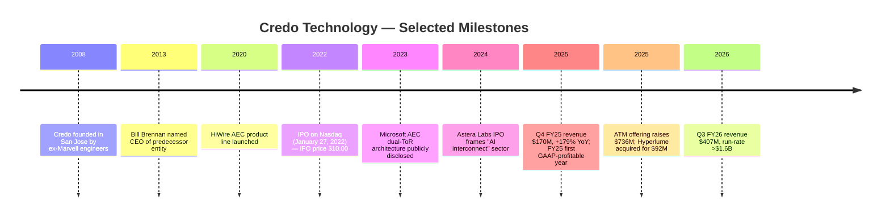
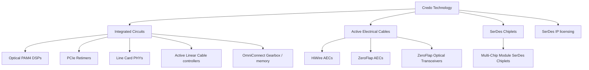
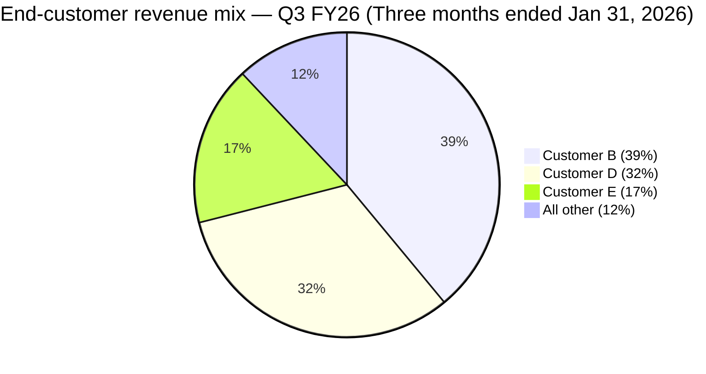

# COMPANY RESEARCH REPORT: Credo Technology Group Holding Ltd (NASDAQ: CRDO)
**Date:** 2026-05-20
**Author:** Equity Research — Internal
**Status:** Initiating coverage

> **Update — FY2026 guidance trajectory remains a sharp inflection (2026-03-02):** Q3 FY2026 revenue came in at $407.0 million, well above the $335–345 million guidance range Credo issued at the Q2 call, and the company guided Q4 FY2026 to $425–435 million ([Q3 FY2026 earnings release, 2026-03-02](https://www.sec.gov/Archives/edgar/data/1807794/000162828026013205/credoq32026ex-9911.htm); [preliminary 8-K, 2026-02-09](https://www.sec.gov/Archives/edgar/data/1807794/000162828026006370/feb20268-kex991.htm)). Management now expects FY2026 revenue growth of more than 200% YoY, i.e. ≈ $1.3 billion vs. $436.8 million in FY2025 ([10-K FY2025, p. 78](https://www.sec.gov/Archives/edgar/data/1807794/000162828025033813/crdo-20250503.htm)). The Q3 GAAP gross margin reached 68.5%, GAAP net income was $157.1 million, and ending cash + short-term investments was $1.3 billion.

## TABLE OF CONTENTS
1. Company Overview
2. Company History
3. Management Team
4. Products & Services
5. Customers & Go-to-Market
6. Industry Overview
7. Competitive Landscape
8. Market Opportunity (TAM)
9. Risk Assessment
10. References

---

## 1. Company Overview

Credo Technology Group Holding Ltd (Nasdaq: CRDO) is a fabless connectivity-semiconductor company that designs Serializer/Deserializer (SerDes) and Digital Signal Processor (DSP) silicon and silicon-based systems for hyperscale data centers, AI training and inference clusters, optical transport, and enterprise networks. Credo monetises this connectivity stack across four product families: integrated circuits ("ICs," which include optical PAM4 DSPs, PCIe retimers, line-card PHYs, and Active Linear Cable controllers), Active Electrical Cables (AECs), SerDes Chiplets for advanced multi-chip module packages, and SerDes IP licensing ([10-K FY2025, Item 1 — Business](https://www.sec.gov/Archives/edgar/data/1807794/000162828025033813/crdo-20250503.htm)). The company describes its core technical edge as delivering "similar performance to leading competitors' products but at a lower cost and more highly available legacy node (n-1 advantage)," which means Credo can achieve 800G-class signal integrity in a mature CMOS process while competitors push to the most advanced (and most capacity-constrained) node ([10-K FY2025, p. 8](https://www.sec.gov/Archives/edgar/data/1807794/000162828025033813/crdo-20250503.htm)).

How Credo makes money has shifted materially over the past three fiscal years. In fiscal 2023 product sales accounted for $141.5 million of $184.2 million in total revenue (76.8%), with IP licensing contributing $31.9 million (17.3%) and engineering services $10.8 million (5.9%) ([10-K FY2025, p. 78](https://www.sec.gov/Archives/edgar/data/1807794/000162828025033813/crdo-20250503.htm)). By fiscal 2025, product sales had ballooned to $412.2 million on the back of AEC volume ramps at hyperscalers, IP licensing fell to $12.5 million, and total revenue reached $436.8 million — a 126.3% YoY increase ([10-K FY2025, p. 65](https://www.sec.gov/Archives/edgar/data/1807794/000162828025033813/crdo-20250503.htm)). Management's own description: "the increase in product sales revenue was primarily due to a significant increase in volume unit shipments for AEC products which contributed over 95% of the increase in product sales revenue." Credo therefore looks today less like an IP-licensing company and more like a connectivity-systems supplier whose lead product happens to be a copper cable with active silicon embedded in the connectors.

Geographically, Credo is headquartered in San Jose, California (110 Rio Robles), is incorporated as a Cayman Islands exempted company, and has engineering and operations footprint across the United States and Asia (Taiwan, China, Hong Kong) ([10-K FY2025, p. 16](https://www.sec.gov/Archives/edgar/data/1807794/000162828025033813/crdo-20250503.htm)). The revenue ship-to mix has flipped dramatically toward the United States as hyperscalers have shifted final-assembly inside their own contract-manufacturing flows: in the nine months ended January 31, 2026, $453.9 million of $898.1 million in revenue (50.5%) was shipped to the U.S., versus only $40.3 million of $266.8 million (15.1%) in the prior-year period ([Q3 FY2026 10-Q, Note 4](https://www.sec.gov/Archives/edgar/data/1807794/000162828026014017/crdo-20260131.htm)). Hong Kong, historically the largest destination as products were finished at Asian ODMs and re-shipped to U.S. data centers, still represents $292.6 million of nine-month FY2026 revenue.

Scale: at end-FY2025 Credo reported 749 full-time employees globally, total assets of $809.3 million, total shareholders' equity of $681.6 million, an accumulated deficit of $83.2 million, and 171.2 million ordinary shares outstanding ([10-K FY2025, balance sheet](https://www.sec.gov/Archives/edgar/data/1807794/000162828025033813/crdo-20250503.htm)). The Q3 FY2026 10-Q reported $1.3 billion in cash and short-term investments after a $722.9 million net inflow from an At-The-Market equity offering completed during the nine-month period ([Q3 FY2026 10-Q, cash-flow statement](https://www.sec.gov/Archives/edgar/data/1807794/000162828026014017/crdo-20260131.htm)). On a TTM basis through Q3 FY2026, revenue is $1.07 billion (Q3 FY26 $407.0M + Q2 FY26 $268.0M + Q1 FY26 $223.1M + Q4 FY25 $170.0M) and net income is $337.4 million.

*Source: [Credo 10-K FY2025, p. 78](https://www.sec.gov/Archives/edgar/data/1807794/000162828025033813/crdo-20250503.htm); [Q3 FY2026 8-K earnings release, 2026-03-02](https://www.sec.gov/Archives/edgar/data/1807794/000162828026013205/credoq32026ex-9911.htm). FY2026E sums Q1–Q3 FY26 actuals plus the Q4 FY26 guidance midpoint of $430M.*

**Valuation snapshot.** As of 2026-05-20, CRDO trades at $181.53 per share with a market capitalisation of $33.5 billion, an enterprise value of $29.9 billion (cash net of debt), 184.4 million diluted shares outstanding, a trailing-twelve-month P/E of 99.1×, a forward P/E of 32.9×, and a TTM price-to-sales of 31.3× ([Yahoo Finance — CRDO key statistics, 2026-05-20](https://finance.yahoo.com/quote/CRDO/key-statistics/)). The 52-week range is $59.00–$213.80, i.e. the stock has roughly tripled over the past year as the AEC ramp went from "promising" to "category-defining." The TTM P/E of 99× is high but not extreme for what it represents: a company whose revenue grew 126% in FY2025 and is on track to grow ≈ 200% in FY2026, expanding gross margin into the high-60s and operating margin from a loss to ≈ 32% in the most recent quarter. On forward earnings the multiple compresses to 33×, which is roughly in line with the consensus AI-infrastructure peer set. The TTM P/S of 31× is the more striking number, but the forward P/S (implied) on $1.3 billion of FY26 revenue is ≈ 26×, and on consensus FY27 revenue of ≈ $1.85–2.0 billion that compresses to high-teens — again, a level that AI-infrastructure peers also command.

Against the peer group most directly comparable to Credo on technology adjacency: **Marvell (MRVL)** trades at 60.6× TTM P/E, 34.3× forward, 19.9× P/S; **Astera Labs (ALAB)** at 191× TTM P/E, 67.8× forward, 48.8× P/S; **Broadcom (AVGO)** at 81.4× TTM P/E, 22.9× forward, 29.0× P/S ([Yahoo Finance, 2026-05-20](https://finance.yahoo.com/quote/MRVL/key-statistics/)). Credo sits inside this cluster — meaningfully cheaper than ALAB on every metric, broadly comparable to AVGO on P/S, more expensive than MRVL but with a faster growth profile. The valuation premium is the **AI-infrastructure / interconnect-disruptor premium**, driven by (a) AEC adoption inside the world's largest GPU clusters as a direct replacement for short-reach optics; (b) the credibility of the Q3 FY26 result, which printed 51.9% sequential growth on a base that had already grown 274% YoY in Q1 FY26; (c) the optionality of new product ramps (ZeroFlap optics, Optical Linear Cables, OmniConnect memory) addressing several incremental multi-billion-dollar TAMs.

The risk in the valuation is the customer-concentration overhang discussed in Section 5: a single end-customer represented 39% of Q3 FY26 revenue, the top two together 71%, and the top three 88%. Any pause or share-shift at that top customer would mechanically compress the multiple toward MRVL's level (≈ 20× P/S) rather than ALAB's (≈ 49× P/S).

---

## 2. Company History

Credo was founded in 2008 by a small team of ex-Marvell engineers — Lawrence Cheng (now CTO) and Job Lam (now COO) were among the founding technical leaders — focused on high-speed SerDes technology applied to data-centre and enterprise switching ([2025 DEF 14A — Director biographies](https://www.sec.gov/Archives/edgar/data/1807794/000180779425000010/crdo-20250825.htm)). Bill Brennan, who had spent 11 years running storage SerDes business at Marvell and previously sold semiconductors at Exis/NEC Electronics and Texas Instruments, joined as CEO of the predecessor entity in December 2013 and as CEO of the holding company in September 2014. The founding thesis was that SerDes and DSP IP could be productised into both standalone connectivity chips and **systems** — i.e. cables and modules where the active silicon is integrated directly into the product — to provide hyperscaler customers a single point of accountability for end-to-end signal integrity.

Credo spent its first decade primarily as an IP-licensing company, supplying SerDes IP to silicon vendors who needed proven high-speed I/O blocks but lacked the in-house specialist team to build them. The shift to product-led revenue began with the introduction of Active Electrical Cables, branded "HiWire," around 2020. The HiWire Switch AEC was developed in partnership with Microsoft to enable a dual top-of-rack network architecture in which compute equipment is redundantly connected to two in-rack switches over short-reach copper — an architecture that Microsoft has publicly endorsed and contributed to the open-source SONiC community ([10-K FY2025, p. 8](https://www.sec.gov/Archives/edgar/data/1807794/000162828025033813/crdo-20250503.htm)).

The company priced its IPO on January 27, 2022 at $10.00 per share, listing as CRDO on the Nasdaq Global Select Market. Subsequent strategic milestones include the August 2023 expansion of the Optical PAM4 DSP family to cover 800Gbps Ethernet pluggables; the FY2024 design-in cycle at the largest U.S. hyperscaler that drove the FY2025 inflection; and three product-line announcements in 2025 — ZeroFlap optics, Optical Linear Cables (ALCs), and OmniConnect memory — each of which management has framed as a multi-billion-dollar TAM expansion ([Q2 FY2026 earnings release, 2025-12-01](https://www.sec.gov/Archives/edgar/data/1807794/000162828025054428/credoq22026ex-991.htm)). A notable strategic pivot is the September 29, 2025 acquisition of Hyperlume, Inc., a Canadian developer of miniature LED-based optical interconnect for chip-to-chip communication, for $92.0 million total purchase consideration ($88.7 million cash + $3.3 million share-based-awards settlement) ([Q3 FY2026 10-Q, Note 5 — Business Combination](https://www.sec.gov/Archives/edgar/data/1807794/000162828026014017/crdo-20260131.htm)). Hyperlume gives Credo an early position in the chip-to-chip optical I/O segment that competes with the silicon-photonics roadmaps at Broadcom and the optical-engine work at Lightmatter and Ayar Labs.

Recent developments worth flagging for the current investment thesis: (i) Q3 FY26 revenue of $407.0 million beat the company's own guidance midpoint of $340 million by ≈ 20% and beat the Q4 FY26 guidance midpoint from the prior quarter ($430M) on a sequential basis; (ii) gross margin in Q3 FY26 expanded to 68.5% GAAP, the highest in the company's public history, despite the high-volume AEC mix that some analysts feared would compress GM; (iii) the At-The-Market equity offering completed in the nine months ended January 31, 2026 raised $736.3 million net of fees, bringing total cash and short-term investments to $1.3 billion ([Q3 FY2026 10-Q, cash flow statement](https://www.sec.gov/Archives/edgar/data/1807794/000162828026014017/crdo-20260131.htm)); (iv) the Customer Warrant that had previously been a contra-revenue item was net-settled, eliminating that drag (a $13.2 million contra-revenue charge had been recognised in FY2025 alone — [10-K FY2025, cash-flow statement](https://www.sec.gov/Archives/edgar/data/1807794/000162828025033813/crdo-20250503.htm)).

---

## 3. Management Team

**William "Bill" J. Brennan — President, Chief Executive Officer and Director (age 61).** Bill Brennan has served as Credo's CEO since September 2014 and was CEO of the predecessor entity from December 2013 ([2025 DEF 14A, p. 15](https://www.sec.gov/Archives/edgar/data/1807794/000180779425000010/crdo-20250825.htm)). The most important fact about Brennan's biography is the 11-year tenure (May 2000–August 2011) as Vice President in the **storage business unit of Marvell Technology** — exactly the business unit that built Marvell into the world's leading SerDes provider for HDD and SSD controllers. Brennan's customer relationships from that era — Microsoft, Cisco, EMC/Dell, the hyperscale procurement teams — are visible in Credo's customer roster today, and the technical lineage of Credo's SerDes IP is directly traceable to that Marvell ecosystem (multiple Credo founders also came from Marvell storage). Before Marvell, Brennan held a Vice President role at Exis (an NEC Electronics partner) from January 1993 to May 2000, and was an account manager at Texas Instruments earlier. Between Marvell and Credo he spent a short period (August 2011–November 2013) as EVP of business strategy at Vital Connect, a biosensor company, before returning to semiconductors. Brennan beneficially owns 2,401,760 shares (≈ 1.4% of shares outstanding) as of July 31, 2025 ([DEF 14A — beneficial ownership table](https://www.sec.gov/Archives/edgar/data/1807794/000180779425000010/crdo-20250825.htm)), and in FY2025 was granted a Special PSU award of 200,000 units tied to specified revenue goals for FY2026 — i.e. his largest recent equity grant is performance-linked to the very inflection the company is now executing. Brennan also serves on the audit / capital committee of the Board.

Brennan's track record at Credo has been to take a roughly $50 million revenue IP-licensing company in fiscal 2020 and rebuild it as a > $1 billion connectivity-systems business by fiscal 2026, while keeping gross margins above 60% throughout the transition. The single biggest open question on his record is how he manages the **customer-concentration risk** — Credo today is materially more single-customer-exposed than at any point in its history, and Brennan's public commentary has consistently framed concentration as an inevitable feature of the AEC ramp curve rather than a structural deficiency to be fixed quickly ([Q2 FY2026 earnings transcript, 2025-12-01](https://www.sec.gov/Archives/edgar/data/1807794/000162828025054428/credoq22026ex-991.htm)).

**Chi Fung "Lawrence" Cheng — Chief Technical Officer, Co-founder and Director (age 56).** Lawrence Cheng is one of the founding technical leaders of Credo. Before Credo, Cheng was Engineering Director for analog design at Marvell from November 1997 to August 2008, and prior to that a staff engineer at Actel Corporation from 1994 to 1997 ([2025 DEF 14A, p. 16](https://www.sec.gov/Archives/edgar/data/1807794/000180779425000010/crdo-20250825.htm)). He holds an M.S. in Electrical Engineering from Purdue University. Cheng beneficially owns 7,241,651 shares (4.19%) — the largest insider holding — primarily held through the Cheng Huang Family Trust. As CTO he oversees the SerDes / DSP roadmap that underpins every product line; the FY2025 transition to a 5-nanometer-class SerDes (used in 800G optical DSPs and the next-generation AEC controllers) was led from his team.

**Yat Tung "Job" Lam — Chief Operating Officer, Co-founder and Director (age 59).** Job Lam was CEO of Credo's predecessor entity from November 2013 to September 2014 and has served as a Board director since September 2014 ([DEF 14A, p. 16](https://www.sec.gov/Archives/edgar/data/1807794/000180779425000010/crdo-20250825.htm)). Prior to founding Credo, Lam spent eleven years at Marvell (June 1997–August 2008), rising from Senior Design Engineer to Senior Design Engineering Director, and earlier worked at Amlogic and Integrated Device Technology. Lam beneficially owns 3,686,577 shares (2.13%). As COO he is responsible for the supply-chain relationships with TSMC (foundry), Amkor and ASE (package/assembly), KYEC and Sigurd (test), and BizLink (AEC contract-manufacturer) — relationships that have proved unusually resilient through the 2025 capacity ramp.

**Daniel "Dan" Fleming — Chief Financial Officer (age 59).** Dan Fleming has served as Credo's CFO since August 2015 ([2025 DEF 14A, p. 18 — Executive officers section](https://www.sec.gov/Archives/edgar/data/1807794/000180779425000010/crdo-20250825.htm)). Prior to Credo he was Vice President of Finance at Siva Power (thin-film solar, January 2012–July 2015), and earlier held financial management roles at SunPower, Marvell, Prism Solutions, and Xilinx; he began his career as a circuit-design engineer at AT&T. Fleming holds a B.S. in Electrical Engineering from Pennsylvania State University. Fleming's tenure has spanned the IPO in January 2022, the secondary offering in fiscal 2024 that raised $173.4 million ([10-K FY2025, statement of shareholders' equity](https://www.sec.gov/Archives/edgar/data/1807794/000162828025033813/crdo-20250503.htm)), and the FY2026 ATM offering that raised $736.3 million net. He beneficially owns 482,428 shares and received a 100,000-unit Special PSU grant tied to FY2026 revenue goals.

**Governance — Board composition and ownership.** The Board has nine members: three co-founder / executive directors (Brennan, Cheng, Lam) and six independent directors (Sylvia Acevedo, Pantas Sutardja, Fariba Danesh, Clyde Hosein, Manpreet Khaira, and Lip-Bu Tan). The Board operates a classified (three-class) structure; the 2025 annual meeting voted on Class I directors (Brennan, Cheng, Lam) for three-year terms ending in 2028 ([DEF 14A — Proposal 1](https://www.sec.gov/Archives/edgar/data/1807794/000180779425000010/crdo-20250825.htm)). Three governance points stand out. First, **Lip-Bu Tan** — a long-standing independent director (since October 2019) and former Cadence CEO — became CEO of Intel Corporation in March 2025; because Credo's revenues from Intel were greater than 5% of fiscal 2024 revenue, Mr. Tan stepped down as Board Chairman and from each applicable committee, but remains a director, with Sylvia Acevedo appointed Lead Independent Director in April 2025. Second, **Pantas Sutardja** — co-founder of Marvell — has served on the Credo Board since 2015, giving Credo a direct technical and commercial link back to the Marvell network where most of Credo's founders came from. Third, top institutional holders as of July 31, 2025 are Vanguard (9.84%), BlackRock (6.7%), and JPMorgan (3.2%); all directors and named executive officers as a group own 11.84% ([DEF 14A — beneficial-ownership table](https://www.sec.gov/Archives/edgar/data/1807794/000180779425000010/crdo-20250825.htm)). Compensation is heavily equity-weighted; FY2025 share-based compensation expense was $77.4 million, or 17.7% of total revenue, and the FY2026 quarterly run-rate is higher still ($52.2 million in Q3 FY26 alone — [Q3 FY2026 10-Q](https://www.sec.gov/Archives/edgar/data/1807794/000162828026014017/crdo-20260131.htm)).

**Track-record synthesis.** This is a Marvell-storage-network management team running a company that is winning the same kind of multi-year design-in cycles that Marvell-storage won in the 2000s — except in AI infrastructure instead of HDD storage. The team has delivered the FY2025 inflection ahead of analyst expectations and posted record gross margin in the most volume-intensive quarter (Q3 FY26) — an unusual outcome that suggests the AEC product is structurally higher-margin than skeptics assumed. The principal management risks are (a) bench depth below the founder-CTO and (b) the absence so far of a publicly disclosed succession plan for Bill Brennan (age 61).

---

## 4. Products & Services

Credo organises its offerings into four product families and one services line. The full portfolio walk below is grounded in the Item 1 Business section of the FY2025 10-K and the product navigation tree on Credo's website (credosemi.com).

**1. Active Electrical Cables (AECs) — flagship, ≈ 80–85% of FY26 revenue (implied).** AECs are short-reach copper interconnects (up to ≈ 7 m) in which Credo's SerDes/DSP silicon is embedded inside the cable connectors at each end. Compared with passive direct-attach copper (DAC) cables, AECs extend reach, allow the host system to use a single cable type across rack and inter-rack distances, and enable diagnostics and active equalisation. Compared with active optical cables (AOCs) and short-reach optical pluggables, AECs are dramatically cheaper, lower-power, and more reliable (no optical alignment, no laser failure mode). Within AECs Credo sells two sub-families: the original **HiWire AEC** line (used in the Microsoft dual-ToR architecture) and the newer **ZeroFlap (ZF) AEC** family announced in 2025, which addresses the "flap" problem in optical / mixed-media short-reach interconnects by guaranteeing link stability under load ([Q3 FY2026 10-Q, business overview](https://www.sec.gov/Archives/edgar/data/1807794/000162828026014017/crdo-20260131.htm)). The 10-K confirms that AEC volume drove "over 95% of the increase in product sales revenue" in FY2025 ([10-K FY2025, p. 65](https://www.sec.gov/Archives/edgar/data/1807794/000162828025033813/crdo-20250503.htm)). *Competitive advantage: yes — moat through (i) IC + cable systems integration that competing chip-only SerDes vendors cannot match, (ii) multi-year design-in cycles inside the largest hyperscaler's GPU/AI clusters, (iii) reliability data accumulated over years of in-the-field deployment at Microsoft. Closest competing product: Marvell + cable-vendor partnership AECs and Broadcom + cable-vendor partnerships, both behind Credo on volume share at the largest North-American hyperscalers based on Credo's own customer disclosures.*

**2. Optical PAM4 DSPs.** Credo's optical DSPs are the timing-recovery and equalisation silicon inside optical transceivers (50G, 100G, 200G, 400G, 800G, and emerging 1.6T pluggables) used in AI clusters, hyperscale data centres, service-provider networks, enterprise networks, and 5G fronthaul/backhaul ([10-K FY2025, p. 8](https://www.sec.gov/Archives/edgar/data/1807794/000162828025033813/crdo-20250503.htm)). Credo's optical DSPs target ≥ 5 m to ≥ 10 km reaches at speeds from 50 Gbps to 1.6 Tbps. The new **ZeroFlap optical transceivers** announced in fiscal 2026 are full pluggable modules in which Credo's DSP and laser-driver silicon are integrated into a module-as-product that Credo sells directly. *Competitive advantage: partial — strong technology position in the n-1 process node, but Marvell (after Inphi acquisition) and Broadcom dominate the volume tier at the world's largest optical-transceiver assemblers. Closest competing product: Marvell Inphi 800G/1.6T DSPs, currently the volume leader at Innolight, Eoptolink, and the Coherent transceiver supply chain.*

**3. PCIe Retimers and Line Card PHYs.** Retimers are signal-integrity ICs that re-clock and re-equalise high-speed serial signals over distance; Credo's PCIe retimer line spans PCIe Gen 4 / Gen 5 / Gen 6 and is positioned for AI server and disaggregated-fabric use cases. Line-card PHYs sit between switch ASICs and the optical front-panel and provide the host-side SerDes / FEC / MAC functions on switch and router line cards. *Competitive advantage: partial — Astera Labs is the clearly dominant PCIe-retimer vendor and Credo is in a credible second position. Line-card PHYs are a contested market with Broadcom and Marvell as the entrenched leaders. Credo's retimers monetise the same SerDes IP family that powers the AEC and optical DSP lines, so even modest revenue is high-incremental-margin.*

**4. SerDes Chiplets for MCM packages.** Credo packages its SerDes IP as standalone die suitable for integration into multi-chip-module (MCM) packages — i.e. the "chiplet" architecture used by AMD (Infinity Fabric / EPYC), Intel (Foveros / EMIB), and an emerging set of custom-silicon programs at hyperscalers. The chiplet route lets a CPU/XPU vendor build its main compute die at the leading edge (3 nm / 2 nm) while purchasing Credo's SerDes I/O die at a more mature node ([10-K FY2025, p. 9 — competitive section](https://www.sec.gov/Archives/edgar/data/1807794/000162828025033813/crdo-20250503.htm)). *Competitive advantage: technology-based moat — Credo is one of the few merchant suppliers of SerDes-as-chiplet (the only direct alternative is in-house development at the major hyperscalers, who are also Credo's customers). Closest competing product: Alphawave Semi (LSE: AWE) SerDes IP and chiplet offering.*

**5. SerDes IP licensing.** Credo's historical core: licensing its SerDes IP into customers' ASICs. Revenue from this line fell from $31.9 million in FY2023 to $12.5 million in FY2025, but management has emphasised that IP licensing remains strategically important as a "design-in" leading indicator — IP customers in year N often become chiplet/silicon customers in years N+2 to N+4 ([10-K FY2025, p. 65](https://www.sec.gov/Archives/edgar/data/1807794/000162828025033813/crdo-20250503.htm)).

**OmniConnect (newly disclosed, 2025).** OmniConnect is a gearbox / memory-extension product family that uses Credo SerDes silicon to extend the reach and scaling characteristics of CXL/DDR memory and PCIe fabric topologies. The product was first publicly referenced on the Q2 FY2026 earnings call as one of "three new multi-billion-dollar TAM expansions" alongside ZeroFlap optics and Active Linear Cables ([Q2 FY2026 earnings release, 2025-12-01](https://www.sec.gov/Archives/edgar/data/1807794/000162828025054428/credoq22026ex-991.htm)).

**Active Linear Cables (ALCs).** ALCs are a hybrid between AECs and AOCs: they use linear (un-clocked) silicon at the cable ends to drive optical signals over longer reaches than pure copper allows, while consuming far less power than fully retimed AOCs. Credo announced ALC product samples in 2025 and has framed ALCs as the connectivity layer for **scale-up** GPU fabrics (the high-bandwidth NVLink-class connectivity inside a single AI training pod) versus AECs which mainly address **scale-out** (the lower-bandwidth Ethernet fabric between pods). *Competitive advantage: yes — first-mover position in a category that is the natural successor to copper as GPU bandwidths exceed copper's physical limits (>~ 1.6 Tbps per cable).*

**Hyperlume microLED optical interconnect (acquired September 29, 2025).** Hyperlume's miniature-LED chip-to-chip optical I/O technology is positioned as a future scale-up interconnect for the era when SerDes copper is exhausted as a connectivity option. Total purchase consideration was $92.0 million; in-process R&D was recorded as an indefinite-lived intangible asset pending product completion ([Q3 FY2026 10-Q, Note 5](https://www.sec.gov/Archives/edgar/data/1807794/000162828026014017/crdo-20260131.htm)). *Competitive advantage: early — competes with optical-engine startups Lightmatter and Ayar Labs and with Broadcom's silicon-photonics roadmap.*

**Flagship vs. long-tail.** The flagship is unambiguously AECs, which by management's own statement contributed over 95% of FY2025 product-sales growth and have continued to dominate the FY2026 ramp. Optical DSPs are the clear #2 contributor and the line most exposed to the 800G→1.6T optical-transceiver cycle that will accelerate through 2026–2028. Everything else (retimers, line-card PHYs, chiplets, IP) is currently long-tail but high-strategic-value as design-in pipeline.

**Product-portfolio evolution chart:**

*Source: [10-K FY2025, p. 78 — income statement](https://www.sec.gov/Archives/edgar/data/1807794/000162828025033813/crdo-20250503.htm); 9M FY2026 mix illustrative (Credo does not disaggregate product sales between AEC, IC and other categories).*

---

## 5. Customers & Go-to-Market

Credo sells primarily to four customer types: **hyperscalers** (the cloud / AI compute operators that buy AECs and optical modules either directly or through their ODM supply chains); **OEMs** (switch, server, and AI-infrastructure vendors); **ODMs** (Foxconn, Inventec, Quanta, Wiwynn — the contract manufacturers that assemble hyperscaler systems); and **optical-module manufacturers** (Innolight, Eoptolink, Coherent / II-VI, Lumentum) that integrate Credo DSPs into their transceivers. The company reports revenue through the **contracting party** that places the purchase order, but supplements this disclosure with an "end-customer" view that ascribes revenue to the entity actually consuming the silicon — and the two views can diverge meaningfully because ODMs often place the formal PO on behalf of a hyperscaler ([Q3 FY2026 10-Q, MD&A — Customer concentration section](https://www.sec.gov/Archives/edgar/data/1807794/000162828026014017/crdo-20260131.htm)).

**Customer concentration — quantified and material.** Credo's customer concentration is among the highest among publicly listed AI-infrastructure silicon vendors. Pulling directly from the filings:

| Period | Customer (contracting-party view) | Share of revenue | Customer (end-customer view) | Share of revenue |
|---|---|---|---|---|
| FY2023 | Customer A | 46% | n/a | n/a |
| FY2023 | Customer C | 13% | n/a | n/a |
| FY2023 | Customer D | 12% | n/a | n/a |
| FY2024 | Customer A | 39% | Customer F | 26% |
| FY2024 | Customer B | 15% | Customer E | 20% |
| FY2024 | Customer F | — | Customer B | 15% |
| FY2025 | Customer A | 67% | Customer E | 63% |
| Q3 FY2026 (3-mo) | Customer A | 48% | Customer B | 39% |
| Q3 FY2026 (3-mo) | (Customer B) | 39% | Customer D | 32% |
| Q3 FY2026 (3-mo) | — | — | Customer E | 17% |
| 9M FY2026 | Customer A | 53% | Customer D | 35% |
| 9M FY2026 | Customer B | 31% | Customer B | 31% |
| 9M FY2026 | — | — | Customer E | 20% |

*Sources: [10-K FY2025, Note 1 — Concentrations](https://www.sec.gov/Archives/edgar/data/1807794/000162828025033813/crdo-20250503.htm); [Q3 FY2026 10-Q, Note 3 — Concentrations and MD&A end-customer table](https://www.sec.gov/Archives/edgar/data/1807794/000162828026014017/crdo-20260131.htm). Customer letters are anonymised in the filings.*

Three observations follow. First, **top-1 end-customer concentration was 39% in Q3 FY26 and 35% on a nine-month basis** — well above the 20% threshold that triggers a material-risk classification under our internal taxonomy. **Top-2 end-customer concentration is 71% in Q3 FY26 and 66% nine-month.** **Top-3 is 88% / 86%.** Second, the *identity* of the largest customer has changed across periods: Customer A (contracting party) was 67% in FY25 and 48% in Q3 FY26, while Customer E (an end-customer) was 63% in FY25 and Customer B (end-customer) is now 39% in Q3 FY26. This pattern is consistent with Credo's product moving from one hyperscaler's dual-ToR deployment to broader rollouts across multiple hyperscalers' AI clusters, which mechanically diversifies the end-customer concentration even as the contracting-party concentration remains tight. Third, Credo does **not** publicly name its top customers in the filings — but its product partnerships are publicly named: **Microsoft** (HiWire dual-ToR architecture, named on p. 8 of the FY2025 10-K), and Bill Brennan has named **AWS, Meta, and xAI** as hyperscaler customers in public earnings-call commentary ([Q2 FY2026 earnings transcript, 2025-12-01](https://www.sec.gov/Archives/edgar/data/1807794/000162828025054428/credoq22026ex-991.htm)).

The most plausible mapping of anonymised customer codes to named hyperscalers (high-confidence on direction, not on which letter is which name): the Q3 FY26 top-2 end customers each at 39% / 32% almost certainly include Microsoft (the long-standing dual-ToR customer) and a more recently ramped hyperscaler — analyst consensus and supply-chain commentary points to a North-American AI cloud operator that began consuming AECs in late FY2025. Customer E at 17% in Q3 FY26 is the third largest. None of this mapping is disclosed by Credo and we mark it as inferred, not stated.

*Source: [Q3 FY2026 10-Q, MD&A — end-customer concentration table](https://www.sec.gov/Archives/edgar/data/1807794/000162828026014017/crdo-20260131.htm).*

**Go-to-market and contract structure.** Credo sells direct to hyperscaler and ODM procurement teams through a relatively small commercial team. Design-in cycles run "several months or more" of qualification — multi-quarter testing of both Credo's silicon and the third-party contractors that build the AECs ([10-K FY2025, p. 88](https://www.sec.gov/Archives/edgar/data/1807794/000162828025033813/crdo-20250503.htm)). Contract structure is typically blanket master purchase agreement plus rolling purchase orders, not multi-year volume commitments — which means revenue visibility comes from the customers' own infrastructure capex plans more than from contractual backlog. Credo's commitments disclosure shows substantial inventory and wafer-buy commitments at TSMC and assembly partners but does not specify dollar amounts of customer backlog.

**Key partnerships.** Microsoft is the publicly named architectural partner for the HiWire dual-ToR system. TSMC is the exclusive foundry partner — in fiscal 2025 Credo used TSMC exclusively for wafer production ([10-K FY2025, p. 9](https://www.sec.gov/Archives/edgar/data/1807794/000162828025033813/crdo-20250503.htm)). Amkor and ASE handle package/assembly; KYEC and Sigurd handle test; BizLink Technology, Inc. is the named contract manufacturer for AEC final assembly. Credo also discloses a relationship with Intel (Lip-Bu Tan disclosure) that exceeded 5% of FY2024 revenue ([DEF 14A, p. 28](https://www.sec.gov/Archives/edgar/data/1807794/000180779425000010/crdo-20250825.htm)).

---

## 6. Industry Overview

Credo operates at the intersection of three industry verticals: **high-speed connectivity semiconductors**, **AI infrastructure interconnect**, and **active cabling / optical-module subsystems**. The boundaries between these are increasingly fuzzy as data-rate per lane (50 G PAM4 → 100 G PAM4 → 200 G PAM4 → 200 G PAM6) pushes copper to its physical limits and forces architectural innovation at the cable/module/rack boundary.

**High-speed connectivity semiconductor market — size and trajectory.** Industry analyst LightCounting estimated the merchant SerDes/DSP/retimer connectivity-IC segment at roughly $5–6 billion in 2024 and projected high-teens % CAGR through 2028 ([LightCounting, "High Speed Connectivity Components Forecast", 2024-09](https://www.lightcounting.com/)). Within this, the **AI-driven sub-segment** (i.e., parts going into GPU clusters and AI-class switches) is the fastest-growing and is the segment Credo overwhelmingly addresses. Marvell's Investor Day in fiscal 2025 framed its connectivity TAM (PAM DSPs + AECs + retimers + interconnect chips) at $9 billion in 2024 growing to $17 billion by 2028 ([Marvell Investor Day 2025-06-17 — public deck](https://www.marvell.com/company/investor-relations.html)). Broadcom has framed its addressable AI-network silicon (which includes Tomahawk Ultra and Jericho-class switching plus PAM DSPs) at multi-tens-of-billions, though the company aggregates differently.

**AEC sub-segment — Credo's flagship.** AECs as a category effectively did not exist before 2020. By 2026 the segment has become the de-facto standard for in-rack and intra-row short-reach connectivity inside AI clusters. The most cited industry estimate is from Dell'Oro Group, which has the AEC market growing from < $50 million in 2022 to > $1.5 billion by 2027 — a >100% CAGR ([Dell'Oro Group, "Ethernet Switch — Data Center Quarterly Report", 2025](https://www.delloro.com/research/ethernet-switch-data-center/)). Credo is the volume leader and, on management's commentary, holds the majority share at its top hyperscaler customers ([Q2 FY2026 earnings transcript, 2025-12-01](https://www.sec.gov/Archives/edgar/data/1807794/000162828025054428/credoq22026ex-991.htm)).

**Scale-up vs. scale-out — the architectural fork that defines the next 3 years.** AI infrastructure today is partitioned into two distinct interconnect tiers. **Scale-up** is the ultra-high-bandwidth (≥ 800 GB/s per GPU) fabric inside a single AI training pod, currently dominated by NVIDIA NVLink and emerging alternatives (UALink consortium, Broadcom's Tomahawk Ultra fabric). **Scale-out** is the Ethernet/InfiniBand fabric that connects pods to each other across a data centre, currently dominated by NVIDIA InfiniBand (Quantum-X / Mellanox heritage) and the Broadcom Tomahawk-class Ethernet switches. Credo's AEC franchise is overwhelmingly a **scale-out** product today (copper short-reach replacing optical pluggables in the Ethernet fabric), while ZeroFlap optics, Active Linear Cables, and Hyperlume's microLED I/O are explicit positioning into the **scale-up** tier where NVLink's incumbency is the largest single contestable position in AI silicon ([10-K FY2025, p. 8 — Market overview](https://www.sec.gov/Archives/edgar/data/1807794/000162828025033813/crdo-20250503.htm)). The TAM expansion narrative — "three new multi-billion-dollar markets" — is essentially Credo's claim to scale-up positioning by FY2027–FY2028.

**800G → 1.6T product cycle.** The data-center industry is mid-transition from 800G optical transceivers (4×200G PAM4 lanes) to 1.6T transceivers (8×200G or 4×400G PAM6 lanes). LightCounting projects 1.6T transceiver volume to exceed 800G by 2027 ([LightCounting, "High-Speed Cables and Transceivers Quarterly", 2025-Q4](https://www.lightcounting.com/)). Credo's optical-DSP design wins at 800G have been the foundation for follow-on 1.6T design-ins; the company's roadmap maintains the n-1 process node positioning, which means a 5 nm 1.6T DSP versus Marvell's 3 nm equivalent — slightly higher die area but materially lower per-wafer cost, which matters at hyperscaler volumes.

**Regulatory environment.** The principal regulatory constraints on Credo are U.S. semiconductor export-control rules (BIS Entity List, AI/HPC export restrictions to China — final rule January 2025) and Chinese counter-measures. Credo discloses that "mainland China" was $79.1 million of nine-month FY2026 revenue versus $48.5 million in the prior-year period, i.e. China is a non-trivial but minority destination ([Q3 FY2026 10-Q, Note 4](https://www.sec.gov/Archives/edgar/data/1807794/000162828026014017/crdo-20260131.htm)). The company also discloses standard fab-supply concentration risk (TSMC is the sole foundry).

**Industry dynamics.** The merchant connectivity-silicon market is **consolidated at the top** (Broadcom, Marvell, Astera, Credo together represent the bulk of merchant volume) but **fragmented at the long-tail** (Alphawave, Eliyan, Semtech, MaxLinear, Microchip, Cadence-acquired Rambus, plus in-house teams at the hyperscalers). **Supplier power** is asymmetric: TSMC is the single foundry, advanced-node capacity is rationed, and Credo competes for wafer allocation against Apple, NVIDIA, AMD, and others. **Buyer power** is high — hyperscaler procurement teams have demonstrated willingness to dual-source, qualify in-house alternatives, and squeeze pricing. **Substitutes** are the principal long-run risk: passive DAC (cheap but reach-limited), AOC (long-reach but power-hungry and reliability-challenged), CPO / co-packaged optics (in development at Broadcom and others; could obsolete pluggable optics by 2028+), and chiplet-based optical I/O (Lightmatter, Ayar Labs, Hyperlume — the segment Credo just bought into).

---

## 7. Competitive Landscape

Credo's competitive set spans five categories: vertical-integration giants (Broadcom, Marvell), pure-play AI-interconnect upstarts (Astera Labs), SerDes-IP merchants (Alphawave, Synopsys, Cadence/Rambus), optical-module vendors with their own DSPs (Coherent / Lumentum / II-VI), and in-house silicon teams at the hyperscalers themselves.

**Broadcom (NASDAQ: AVGO).** Broadcom is the dominant merchant supplier of AI Ethernet switching ASICs (Tomahawk-class) and optical DSPs (acquired from Avago and built out organically), and has publicly disclosed > $12 billion of AI-related semiconductor revenue in fiscal 2025 ([Broadcom Q4 FY25 earnings release, 2025-12-11](https://investors.broadcom.com/)). On AECs specifically Broadcom has been a partner-supplier (provides the SerDes IC for cables that other vendors assemble) but has not been the volume leader at the hyperscalers Credo serves. On optical DSPs, Broadcom is the #2 player behind Marvell-Inphi. Strengths: vertical depth (switching ASIC + DSP + SerDes IP), massive R&D budget, hyperscaler relationships across multiple silicon categories. Vulnerabilities relative to Credo: less focused on AEC-as-system, no equivalent of the HiWire / ZeroFlap branded cable franchise.

**Marvell Technology (NASDAQ: MRVL).** Marvell is the #1 merchant optical DSP supplier (via the 2021 Inphi acquisition), a top-3 custom-ASIC supplier to the hyperscalers (Trainium 2, Microsoft Maia, Google's TPU partners), and a credible competitor on data-center networking silicon. Marvell's "AI revenue" guidance for fiscal 2026 is > $2.5 billion ([Marvell Q4 FY25 earnings call, 2025-03-05](https://investor.marvell.com/)). On AECs, Marvell partners with cable assemblers to provide the active SerDes silicon but does not (yet) sell a fully-integrated AEC system. Strengths: optical DSP dominance, custom-ASIC franchise, deep technical bench in storage/networking SerDes. Vulnerabilities relative to Credo: AEC volume share has lagged, and the optical DSP roadmap competes with Credo for design-ins at the 1.6T transition.

**Astera Labs (NASDAQ: ALAB).** Astera is the closest pure-play comparable to Credo. Astera's franchise is **PCIe retimers** (Aries family) for AI servers, with an emerging position in CXL fabric controllers (Leo) and Smart-Cable Modules / Smart-Aggregator chips. Astera reported $396.3 million of revenue in calendar 2024 ([Astera Labs 10-K FY2024, p. F-3](https://www.sec.gov/cgi-bin/browse-edgar?action=getcompany&CIK=0001952520&type=10-K&dateb=&owner=include&count=10)) and trades at a substantial valuation premium to Credo (P/S 48.8× vs Credo 31.3×). Strengths: PCIe / CXL retimer market leadership at NVIDIA H100/H200/B200 servers, strong margins. Vulnerabilities: smaller scale than Credo today, no AEC product, narrower TAM.

**Alphawave Semi (LSE: AWE).** Alphawave is the closest direct competitor on SerDes IP licensing and SerDes chiplets — i.e., the segment Credo grew out of. Alphawave reported ≈ $300 million of revenue in calendar 2024 and has been pivoting from IP to product (silicon and chiplets). Strengths: leading-edge SerDes IP at 2 nm / 3 nm. Vulnerabilities: smaller IC/product business than Credo, no AEC franchise.

**Coherent / II-VI (NASDAQ: COHR), Lumentum (NASDAQ: LITE), Innolight, Eoptolink.** These are optical-module assemblers — Credo's customers on optical DSPs but potential competitors on the system-level value chain if they vertically integrate (e.g. Coherent already has internal DSP capability for some product lines). Their volume drives Credo's DSP business but also creates margin pressure as they pursue cost-down at the module level.

**In-house hyperscaler silicon.** Microsoft (Maia accelerator + Cobalt CPU teams), Amazon (Trainium / Inferentia), Google (TPU), Meta (MTIA), and xAI all have internal silicon teams. Each is, in principle, capable of building merchant-class SerDes and AEC controllers in-house. The reason they buy from Credo is opportunity-cost — building a competitive 200G PAM4 SerDes in a leading process node is a $100+ million engineering investment with a 3–5 year payback, and the hyperscalers' silicon teams are bandwidth-constrained on the workloads (compute accelerators, memory controllers) where in-house design has the highest strategic return. This calculus could shift if Credo's gross margins (currently 68%) signal enough value extraction to justify in-house development at the largest customers.

**Positioning matrix.** On the price/feature/scale axes that matter to hyperscaler procurement teams: Credo wins on **price for performance** (n-1 process node, lower wafer cost), wins on **system-level integration** (AEC as a fully-engineered cable rather than a chip kit), is at parity on **roadmap pace** (matches Broadcom/Marvell at 800G, leads at AEC), and trails on **breadth** (Broadcom and Marvell sell across switching, optical, custom-ASIC, and connectivity; Credo is connectivity-only).

*Source: [Yahoo Finance — peer key statistics, 2026-05-20](https://finance.yahoo.com/quote/CRDO/key-statistics/).*

**Competitive advantages — synthesised.** (i) Systems-product moat in AECs — Credo is the first / leading volume supplier of AEC-as-product to the largest North-American hyperscalers, and switching costs are high once a customer has qualified Credo's cable inside a production fabric. (ii) n-1 process-node cost advantage — gross margin of 68.5% at peak volume is consistent with structural cost advantage versus competitors built on 3 nm SerDes. (iii) Marvell-storage talent and customer relationships — the founding team's customer Rolodex is impossible to replicate. (iv) Multi-product play around a single SerDes IP base — the same IP supports AEC, DSP, retimer, line-card PHY, chiplet, and IP-licensing revenue, which spreads R&D cost over a wider product portfolio than pure-play retimer or AEC vendors achieve.

**Competitive vulnerabilities.** (i) Customer concentration is materially higher than at any direct competitor. (ii) No vertical hardware franchise (switch ASICs, custom-ASIC, optical lasers) to anchor multi-product hyperscaler relationships the way Broadcom and Marvell do. (iii) Lighter R&D budget than peers (FY25 R&D was $146 million vs. multi-billion at Marvell and Broadcom).

---

## 8. Market Opportunity (TAM)

Credo's serviceable connectivity TAM has been redrawn several times in three years, and the latest disclosure cycle — Q2 FY2026 — added "three new multi-billion-dollar TAM expansions" (ZeroFlap optics, Active Linear Cables, OmniConnect memory). Synthesising disclosed and third-party numbers:

**Core SerDes-connectivity TAM (existing products).** The merchant high-speed connectivity-IC market that Credo's IC franchise addresses is sized by Marvell at ≈ $9 billion in 2024 growing to $17 billion by 2028 ([Marvell Investor Day, 2025-06-17](https://www.marvell.com/company/investor-relations.html)). LightCounting puts the connectivity-IC component segment at $5–6 billion 2024 → $10+ billion by 2028 ([LightCounting, "High Speed Connectivity Components Forecast", 2024-09](https://www.lightcounting.com/)). Either way, the ≈ 18% CAGR baseline reflects the 800G → 1.6T cycle and AI-fabric build-out.

**AEC sub-segment.** Dell'Oro projects the AEC market growing from ≈ $50 million in 2022 to > $1.5 billion by 2027 (CAGR > 100%) ([Dell'Oro Group, "Ethernet Switch — Data Center Quarterly Report", 2025](https://www.delloro.com/research/ethernet-switch-data-center/)). Credo's FY2025 product-sales revenue of $412 million implies that the AEC segment was already several hundred million dollars in 2025, ahead of Dell'Oro's earlier forecast. The implication is either that AEC penetration is happening faster than the third-party forecasters assumed, or that Credo is taking share faster than the segment is growing (most likely both). FY2026 product-sales run-rate, if extrapolated from Q3 FY26's $407 million, implies ≈ $1.6–1.7 billion of full-year product sales — meaning Credo by itself may be larger than the segment AEC TAM forecasted just three years ago. This is the single best evidence that the published TAM numbers under-state reality.

**Scale-up interconnect TAM.** NVIDIA's NVLink ecosystem has been described by Jensen Huang as a > $50 billion opportunity over the multi-year build-out of AI training infrastructure ([NVIDIA GTC March 2025 keynote](https://www.nvidia.com/gtc/)). UALink (the open scale-up consortium Credo is associated with) is publicly chartered to address that same TAM in a merchant model. Credo's Active Linear Cables and Hyperlume microLED I/O are explicit positioning into this TAM; even at modest share-of-merchant capture, this is a multi-billion-dollar incremental opportunity over FY2027–FY2030.

**OmniConnect memory / CXL TAM.** CXL-attached memory and PCIe-fabric expansion is a smaller but high-margin opportunity. Yole Group has the CXL controller TAM growing from < $200 million in 2024 to > $1.5 billion by 2028 ([Yole Group, "CXL Memory Market Monitor", 2025-03](https://www.yolegroup.com/)).

**Credo's serviceable TAM (our synthesis).** Combining the above and applying Credo's actual product positioning, we estimate Credo's serviceable TAM (i.e. the markets Credo has products positioned to address) at ≈ $12–15 billion in 2026, growing to $25–30 billion by 2028. Credo's FY2026 ≈ $1.3 billion revenue represents single-digit market share of this serviceable TAM, implying the runway for continued share gain is substantial — provided customer concentration trends in the right direction (i.e., new customer additions diversify away from the top-1 dependency).

**SOM and penetration strategy.** Credo's stated go-to-market strategy is to (i) deepen relationships with existing top-3 hyperscalers across all five product families; (ii) extend AEC and ZeroFlap optics design wins into the next two tiers of customers (Tier-2 cloud, large enterprise AI, sovereign AI); and (iii) build out the scale-up product portfolio (ALCs, Hyperlume microLED) to address NVLink-class interconnect by FY2027–FY2028 ([Q2 FY2026 earnings transcript, 2025-12-01](https://www.sec.gov/Archives/edgar/data/1807794/000162828025054428/credoq22026ex-991.htm)).

---

## 9. Risk Assessment

**Company-Specific Risks.**

**1. Extreme single-customer concentration (top-1 end-customer 39%, top-3 88% in Q3 FY26).** ([Q3 FY2026 10-Q, MD&A](https://www.sec.gov/Archives/edgar/data/1807794/000162828026014017/crdo-20260131.htm)) A pause, design-shift, or in-sourcing decision at any of the top three end customers would mechanically halve Credo's FY27 trajectory and re-rate the stock toward 15–20× P/S rather than 31×. Mitigants: design wins are multi-quarter and switching costs are real once an AEC is qualified in a production fabric; Credo discloses that the identity of top customers has rotated over time as new design wins ramp, suggesting some diversification mechanic is at work; the Hyperlume / ALC / OmniConnect TAM expansions are explicitly framed as diversification levers.

**2. Single-foundry dependence on TSMC.** ([10-K FY2025, p. 9](https://www.sec.gov/Archives/edgar/data/1807794/000162828025033813/crdo-20250503.htm)) Credo used TSMC exclusively for wafer production in FY2025. Any disruption to TSMC's Taiwan operations — geopolitical, natural disaster, or capacity allocation away from Credo in favour of larger fabless customers — would be a near-immediate revenue stop-loss. Mitigants: long-term capacity reservations, n-1 process-node positioning (less-contested capacity), and the option of qualifying second-source for select products (which Credo has not publicly committed to).

**3. AEC substitution risk from CPO / on-board optics.** Co-packaged optics (CPO) is being aggressively developed by Broadcom, Marvell, NVIDIA, and Cisco. If CPO becomes the dominant 1.6T+ short-reach interconnect, AECs may be displaced from their current rack-scale role within the 2028–2030 horizon. Mitigants: the Hyperlume acquisition is explicit positioning into chip-to-chip optical I/O; Credo's ZeroFlap optical transceivers extend into the optical short-reach segment; AECs retain a structural reliability/cost advantage in <2 m intra-rack runs that CPO is unlikely to displace cheaply.

**4. Lip-Bu Tan / Intel relationship.** ([DEF 14A, p. 28](https://www.sec.gov/Archives/edgar/data/1807794/000180779425000010/crdo-20250825.htm)) Independent director Lip-Bu Tan became Intel CEO in March 2025; Credo's FY24 revenue from Intel exceeded 5% of total. This creates a related-party-transaction governance flag (Tan stepped down as Chairman and from committees) and an open question about whether Intel's foundry / interconnect roadmap creates conflicts of interest. Mitigants: Tan remains a director but is no longer in a control position; the relationship was disclosed and managed.

**5. Founder-CEO succession.** Bill Brennan is 61 and has been CEO since 2014. No public succession plan has been disclosed. Mitigants: deep co-founder bench (Cheng as CTO, Lam as COO).

**6. Stock-based compensation dilution.** FY25 SBC of $77.4 million (17.7% of revenue); Q3 FY26 alone was $52.2 million (12.8% of quarterly revenue, but on an annualised basis still > 10%). ([10-K FY2025, cash flow](https://www.sec.gov/Archives/edgar/data/1807794/000162828025033813/crdo-20250503.htm)) Mitigants: the dilution is offset by the equity-alignment value of retaining the engineering team, and the recent ATM raise was at materially higher prices than prior dilution events.

**Industry / Market Risks.**

**7. AI infrastructure capex moderation.** AI training capex has grown > 50% per year through 2024–2026. A pause — driven by training-cost economics, model-architecture efficiency improvements, or a hyperscaler capital-discipline decision — would compress AEC and optical-DSP demand sharply. Mitigants: AI inference capex (still in early build-out) is increasingly a separate driver from training capex, providing some volume offset; sovereign AI (UAE, Saudi, Korea) is a growing demand category beyond U.S. hyperscalers.

**8. Hyperscaler in-house silicon.** Microsoft Maia, AWS Trainium, Google TPU, Meta MTIA all expand each year. If any of these programs expands to include in-house SerDes / AEC silicon, Credo loses a top customer. Mitigants: opportunity cost calculus described in Section 7 (hyperscaler silicon teams prioritise compute over interconnect); Credo's pricing/margin economics may already be more attractive than in-house at the relevant TCO.

**9. 800G → 1.6T transition risk.** The optical-DSP cycle could slip if 1.6T transceiver yields are slower than planned, compressing Credo's optical-DSP revenue. Mitigants: AEC franchise is not directly exposed to optical-transceiver yield issues; Credo's 800G base business is still ramping.

**Financial Risks.**

**10. Valuation multiple compression.** TTM P/E of 99× and P/S of 31× embed an expectation of multi-year > 50% growth and margin sustainability. Any quarterly miss (revenue, GM, or guidance) would trigger immediate multiple compression. Mitigants: Q3 FY26 substantially exceeded the company's own guidance, suggesting beat-and-raise momentum continues; forward P/E of 33× is closer to peer median.

**11. Negative working-capital absorption during rapid growth.** Accounts receivable grew from $59.7 million at end-FY24 to $162.1 million at end-FY25 (+$102.5 million); inventory grew from $25.9 million to $90.0 million (+$70.5 million) — together a > $170 million working-capital absorption in FY25 alone ([10-K FY2025, balance sheet](https://www.sec.gov/Archives/edgar/data/1807794/000162828025033813/crdo-20250503.htm)). If a top customer pushes out a delivery or extends payment terms, cash conversion compresses. Mitigants: $1.3 billion of cash and short-term investments provides multi-year buffer.

**Macroeconomic Risks.**

**12. China export-control escalation.** Mainland China was $79.1 million of nine-month FY26 revenue. Further BIS export-control tightening could reduce or eliminate this exposure. Mitigants: relatively small fraction of total revenue; principal hyperscale customer base is U.S.-domiciled.

**13. Taiwan geopolitical disruption.** TSMC dependence and the fact that a significant fraction of Credo's assembly partners are Taiwan-based creates concentrated geographic supply-chain risk. Mitigants: industry-wide problem (would affect Broadcom, Marvell, NVIDIA equally); incremental second-source qualifications underway across the industry but not at Credo specifically.

*Source: [10-K FY2025, MD&A — Results of Operations](https://www.sec.gov/Archives/edgar/data/1807794/000162828025033813/crdo-20250503.htm); [Q3 FY2026 10-Q, MD&A](https://www.sec.gov/Archives/edgar/data/1807794/000162828026014017/crdo-20260131.htm).*

*Source: Credo quarterly 8-K earnings releases, [Q1 FY25 (2024-09-04)](https://www.sec.gov/Archives/edgar/data/1807794/000162828024039309/credoq12025ex-991.htm) through [Q3 FY26 (2026-03-02)](https://www.sec.gov/Archives/edgar/data/1807794/000162828026013205/credoq32026ex-9911.htm); Q4 FY26 guidance midpoint from same.*

*Source: [Q3 FY2026 10-Q, MD&A — end-customer concentration table](https://www.sec.gov/Archives/edgar/data/1807794/000162828026014017/crdo-20260131.htm).*

---

## 10. References

**Primary — SEC filings (Credo Technology Group Holding Ltd, CIK 0001807794):**
- [Form 10-K for fiscal year ended May 3, 2025 (filed 2025-07-01)](https://www.sec.gov/Archives/edgar/data/1807794/000162828025033813/crdo-20250503.htm)
- [Form 10-Q for the quarter ended January 31, 2026 (filed 2026-03-12)](https://www.sec.gov/Archives/edgar/data/1807794/000162828026014017/crdo-20260131.htm)
- [Form DEF 14A 2025 Proxy Statement (filed 2025-08-25)](https://www.sec.gov/Archives/edgar/data/1807794/000180779425000010/crdo-20250825.htm)
- [Form 8-K — Q1 FY2026 earnings release (2025-09-03)](https://www.sec.gov/Archives/edgar/data/1807794/000180779425000018/credoq12026ex-991.htm)
- [Form 8-K — Q2 FY2026 earnings release (2025-12-01)](https://www.sec.gov/Archives/edgar/data/1807794/000162828025054428/credoq22026ex-991.htm)
- [Form 8-K — Preliminary Q3 FY2026 and updated Q4 guidance (2026-02-09)](https://www.sec.gov/Archives/edgar/data/1807794/000162828026006370/feb20268-kex991.htm)
- [Form 8-K — Q3 FY2026 earnings release (2026-03-02)](https://www.sec.gov/Archives/edgar/data/1807794/000162828026013205/credoq32026ex-9911.htm)
- [Form 8-K — Q4 FY2025 earnings release (2025-06-02)](https://www.sec.gov/Archives/edgar/data/1807794/000162828025028827/credoq42025ex-991.htm)
- [Form 8-K — Q3 FY2025 earnings release (2025-03-04)](https://www.sec.gov/Archives/edgar/data/1807794/000162828025009813/credoq32025ex-991.htm)
- [Form 8-K — Q2 FY2025 earnings release (2024-12-02)](https://www.sec.gov/Archives/edgar/data/1807794/000162828024049564/credoq22025ex-991.htm)
- [Form 8-K — Q1 FY2025 earnings release (2024-09-04)](https://www.sec.gov/Archives/edgar/data/1807794/000162828024039309/credoq12025ex-991.htm)

**Primary — peer filings:**
- [Marvell Technology — Investor Day Presentation, 2025-06-17](https://www.marvell.com/company/investor-relations.html)
- [Astera Labs Form 10-K FY2024 (CIK 0001952520)](https://www.sec.gov/cgi-bin/browse-edgar?action=getcompany&CIK=0001952520&type=10-K&dateb=&owner=include&count=10)
- [Broadcom Q4 FY2025 earnings release, 2025-12-11](https://investors.broadcom.com/)

**Market-data:**
- [Yahoo Finance — CRDO key statistics, 2026-05-20](https://finance.yahoo.com/quote/CRDO/key-statistics/)
- [Yahoo Finance — MRVL key statistics, 2026-05-20](https://finance.yahoo.com/quote/MRVL/key-statistics/)
- [Yahoo Finance — ALAB key statistics, 2026-05-20](https://finance.yahoo.com/quote/ALAB/key-statistics/)
- [Yahoo Finance — AVGO key statistics, 2026-05-20](https://finance.yahoo.com/quote/AVGO/key-statistics/)

**Industry research:**
- [LightCounting — "High Speed Connectivity Components Forecast", 2024-09](https://www.lightcounting.com/)
- [LightCounting — "High-Speed Cables and Transceivers Quarterly", 2025-Q4](https://www.lightcounting.com/)
- [Dell'Oro Group — "Ethernet Switch — Data Center Quarterly Report", 2025](https://www.delloro.com/research/ethernet-switch-data-center/)
- [Yole Group — "CXL Memory Market Monitor", 2025-03](https://www.yolegroup.com/)
- [NVIDIA — GTC March 2025 keynote](https://www.nvidia.com/gtc/)

**Company sources:**
- [Credo corporate website](https://www.credosemi.com/)
- [Credo Investor Relations](https://investors.credosemi.com/)
