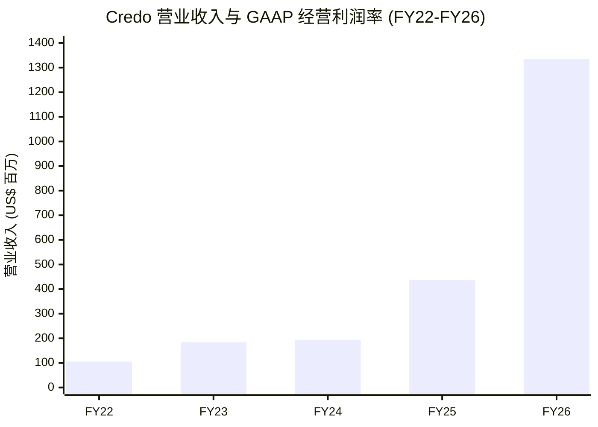
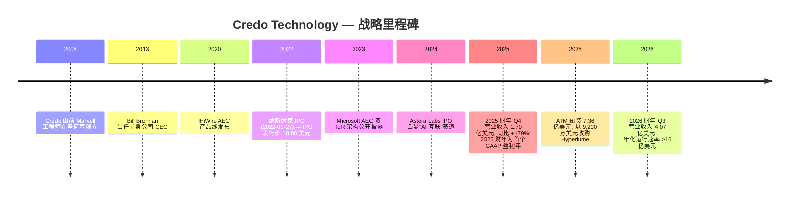
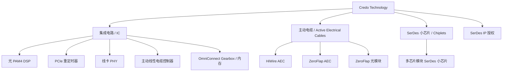
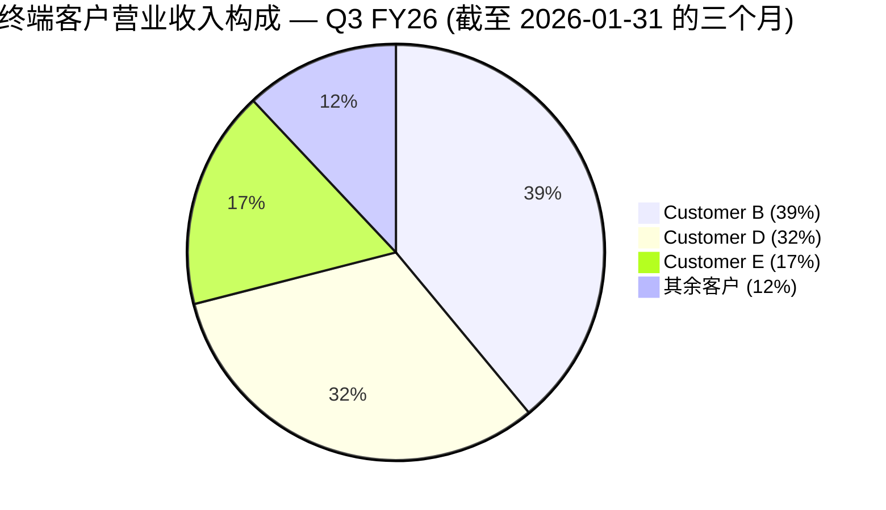
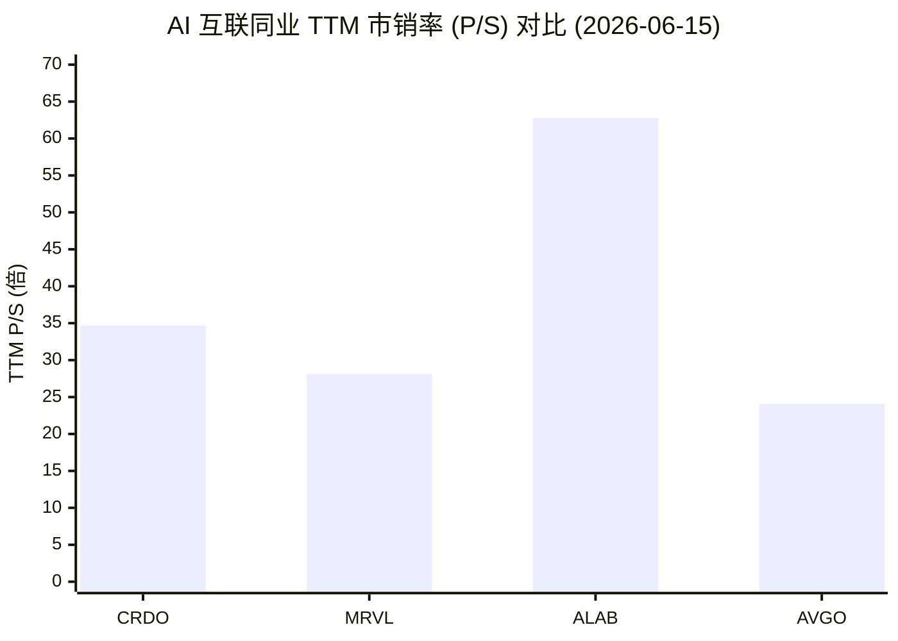
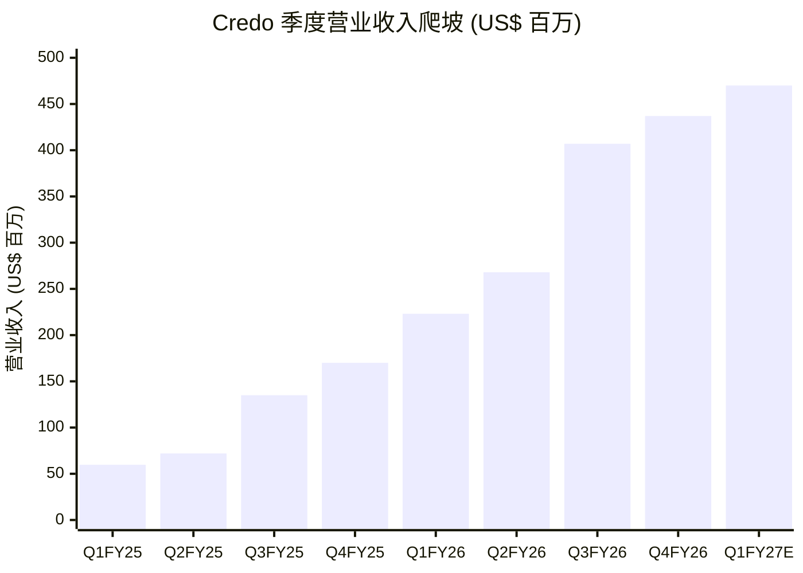

# Credo Technology Group Holding Ltd (NASDAQ:CRDO) — 公司研究报告

**截至日期: 2026-06-15**
**上市地: 纳斯达克全球精选市场 (Nasdaq Global Select Market), 代码 CRDO**
**注册地: 开曼群岛豁免公司 (总部位于美国加州圣何塞)**
**作者: 股票研究部——内部**
**状态: 维持覆盖 (Maintaining coverage)**
**报告语言: 简体中文 (英文版同时存在于本目录)**

---

> ### 投资摘要 (Investment Summary) — *以下整块为分析师观点 (*Analyst view:*), 非申报数据*
>
> | 项目 | 数值 |
> |---|---|
> | **评级 (Rating)** | **Hold / Neutral (持有)** |
> | **12 个月目标价 (12-mo PT)** | **US\$265** |
> | **当前股价 (2026-06-15)** | US\$250.81 |
> | **隐含上行空间 (Upside)** | **+5.7%** |
> | **估值方法** | FY2027E non-GAAP EPS ~\$5.30 × 50× forward P/E (相对 AI 基础设施同业约 40× 的成长溢价) |
> | **市值 / 企业价值** | 约 \$463 亿 / 约 \$449 亿 (扣除净现金约 \$14 亿) |
> | **52 周区间** | \$75.51 – \$270.21 |
>
> **论点支柱 (Thesis pillars) — *Analyst view:***
> 1. **AEC (Active Electrical Cable, 有源电缆) 开创了一个新品类, 而 Credo 是出货量领导者。** FY2026 营业收入 **超过三倍至 $1,335.1M** (同比 +205.7%), 管理层称 AEC 贡献了 FY2025 产品销售增量的 95% 以上, 这一拐点的真实性已被连续四个季度的 beat-and-raise 证实 ([FY2026 8-K, 2026-06-01](https://www.sec.gov/Archives/edgar/data/1807794/000162828026039474/credoq42026ex-991.htm))。
> 2. **结构性高毛利率 + 经营杠杆。** 在 AEC 大批量出货的 Q4 FY26, GAAP 毛利率仍达 **68.2%**, 全年经营利润率从 FY25 的 8.5% 跃升至 **33.3%**——n-1 工艺节点的成本优势经受住了量产考验 ([FY2026 8-K, 2026-06-01](https://www.sec.gov/Archives/edgar/data/1807794/000162828026039474/credoq42026ex-991.htm))。
> 3. **三条多十亿美元级新 TAM (ZeroFlap 光模块 / ALC / OmniConnect) 与 scale-up 定位提供下一段成长可选性**, FY2027 光通信收入目标约 $5 亿 ([*Analyst view:* Goldman Sachs, 2026-05-21](http://xs-macbook-air.local:5001/zsxq/pdf/212451555118521/Goldman%20Sachs-Credo%20Technology%20Group%20%EF%BC%88CRDO.US%EF%BC%89%EF%BC%9A%20FY4Q%20Preview%EF%BC%9A%20Focus%20on%20optical%20ramp%20and%20AEC%20strength%20in%20FY27-260521.pdf))。
> 4. **降级理由不在基本面而在估值与集中度。** 股价过去 12 个月上涨约 3 倍并已冲过几乎所有卖方目标价 (GS \$170)、TTM P/S 约 35×, 同时单一终端客户约 39%——风险收益已大体对称, 故评级为 Hold 而非 Buy。

> **业绩更新——FY2026 收官, 营业收入三倍增长 (2026-06-01):** 2026 财年 (截至 2026-05-02) 全年营业收入达到 **$1,335.1M**, 较 FY2025 的 $436.8M **同比增长 205.7%**; GAAP 净利润 **$472.3M** (FY25 为 $52.2M), GAAP 摊薄 EPS **$2.51**, non-GAAP 净利润 **$662M** (同比增长逾 5 倍)。Q4 FY26 单季营业收入 **$437.0M** (环比 +7.4%, 同比 +157.0%), GAAP 毛利率 **68.2%**, GAAP 摊薄 EPS $0.88, non-GAAP EPS $1.16, 期末现金 + 短期投资 **$14 亿** ([FY2026 8-K, 2026-06-01](https://www.sec.gov/Archives/edgar/data/1807794/000162828026039474/credoq42026ex-991.htm))。公司同时发布 **2027 财年 Q1 指引: 营业收入 $465M–$475M** (中值 $470M, 环比 +6%~9%), GAAP 毛利率 66.9%–68.9% ([FY2026 8-K, 2026-06-01](https://www.sec.gov/Archives/edgar/data/1807794/000162828026039474/credoq42026ex-991.htm))。

## 目录

1. 公司概览 (含 1A 估值快照 · 1B GF Score 基本面评分)
2. 估值与目标价 (Valuation & Price Target · 含前瞻财务模型 · 卖方观点演变)
3. 公司历史
4. 管理团队
5. 产品与服务
6. 客户与上市策略
7. 行业概览
8. 竞争格局
9. 市场机会 (TAM)
10. 风险评估 (含 9.5 核心分歧与催化剂)
11. 投资视角评分卡 (Investor lenses)
12. 参考资料 · Data Used 数据清单

---

## 1. 公司概览

Credo Technology Group Holding Ltd (Nasdaq: CRDO) 是一家**无晶圆厂连接半导体公司 (fabless connectivity-semiconductor company)**, 为超大规模数据中心 (hyperscale data center)、AI 训练与推理集群、光通信传输 (optical transport) 以及企业网络设计**串行/解串器 (Serializer/Deserializer, SerDes)** 与**数字信号处理器 (Digital Signal Processor, DSP)** 芯片及基于芯片的系统。Credo 通过四大产品族对这一连接技术栈进行变现: 集成电路 ("IC", 包括光 PAM4 DSP、PCIe 重定时器 (PCIe retimer)、线卡 PHY (line-card PHY) 以及主动线性电缆 (Active Linear Cable, ALC) 控制器)、主动电缆 (Active Electrical Cable, AEC)、面向先进多芯片模块 (Multi-Chip Module, MCM) 封装的 SerDes 小芯片 (Chiplet), 以及 SerDes IP 授权 ([10-K FY2025, Item 1 — Business](https://www.sec.gov/Archives/edgar/data/1807794/000162828025033813/crdo-20250503.htm))。公司将其核心技术优势描述为"以更低成本和更高可获得性的成熟节点 (n-1 优势) 实现与领先竞品类似的性能"——这意味着 Credo 可以在成熟 CMOS 工艺上实现 800G 级的信号完整性, 而竞争对手却必须推向最先进 (也是产能最紧张) 的节点 ([10-K FY2025, p. 8](https://www.sec.gov/Archives/edgar/data/1807794/000162828025033813/crdo-20250503.htm))。

Credo 的盈利结构在过去四个财年发生了重大变化。在 2023 财年, 产品销售贡献了总营业收入 1.842 亿美元中的 1.415 亿美元 (76.8%), IP 授权贡献 3,190 万美元 (17.3%), 工程服务贡献 1,080 万美元 (5.9%) ([10-K FY2025, p. 78](https://www.sec.gov/Archives/edgar/data/1807794/000162828025033813/crdo-20250503.htm))。到 2025 财年, 受超大规模云厂商 AEC 出货量爬升驱动, 产品销售猛增至 4.122 亿美元, IP 授权降至 1,250 万美元, 总营业收入达 4.368 亿美元——同比增长 126.3% ([10-K FY2025, p. 65](https://www.sec.gov/Archives/edgar/data/1807794/000162828025033813/crdo-20250503.htm))。**2026 财年 (截至 2026-05-02) 收官时, 全年营业收入跃升至 $1,335.1M, 同比增长 205.7%**——成为公开历史上的第二个三位数增长年, 也是首个全年营业收入突破 10 亿美元的年度 ([FY2026 8-K, 2026-06-01](https://www.sec.gov/Archives/edgar/data/1807794/000162828026039474/credoq42026ex-991.htm))。管理层自述: "产品销售收入的增长主要源于 AEC 产品出货量大幅上升, 该单一品类贡献了产品销售收入增量的 95% 以上。"因此今天的 Credo 看起来已不再像 IP 授权公司, 而更像一家**连接系统供应商**——其旗舰产品恰好是一种在连接器内嵌入有源芯片的铜缆。

FY2026 的损益结构展示了这家公司罕见的财务质地: 全年 COGS (cost of revenue) $426.8M, gross profit $908.3M, **gross margin (毛利率) 68.0%**; total operating expenses $463.3M (其中 R&D $279.4M、SG&A $184.0M), operating income $445.0M, **operating margin (经营利润率) 33.3%**——较 FY2025 的 8.5% 实现了 24.8 个百分点的经营杠杆释放 ([FY2026 8-K, 2026-06-01](https://www.sec.gov/Archives/edgar/data/1807794/000162828026039474/credoq42026ex-991.htm))。下方利润表 Sankey 图直观呈现了这条"几乎全部增量都落到经营利润"的路径。

下载并查看完整利润表资金流向:

<svg xmlns="http://www.w3.org/2000/svg" viewBox="0 0 1000 560" width="1000" height="560" role="img" aria-label="income statement Sankey"><rect x="0" y="0" width="1000" height="560" fill="#ffffff"/>
<text x="20.00" y="30.00" text-anchor="start" font-family="Helvetica,Arial,sans-serif" font-size="15" font-weight="700" fill="#1f2933">Credo FY2026 利润表 Sankey (单位: 百万美元)</text>
<path d="M 452.00,71.00 C 506.00,71.00 506.00,138.44 560.00,138.44 L 560.00,279.09 C 506.00,279.09 506.00,211.66 452.00,211.66 Z" fill="#86efac" fill-opacity="0.55"/>
<path d="M 452.00,211.66 C 506.00,211.66 506.00,293.09 560.00,293.09 L 560.00,439.56 C 506.00,439.56 506.00,358.13 452.00,358.13 Z" fill="#fca5a5" fill-opacity="0.55"/>
<path d="M 204.00,71.00 C 258.00,71.00 258.00,78.00 312.00,78.00 L 312.00,496.05 C 258.00,496.05 258.00,489.05 204.00,489.05 Z" fill="#93c5fd" fill-opacity="0.55"/>
<path d="M 328.00,78.00 C 382.00,78.00 382.00,71.00 436.00,71.00 L 436.00,358.10 C 382.00,358.10 382.00,365.10 328.00,365.10 Z" fill="#86efac" fill-opacity="0.55"/>
<path d="M 328.00,365.10 C 382.00,365.10 382.00,372.10 436.00,372.10 L 436.00,507.00 C 382.00,507.00 382.00,500.00 328.00,500.00 Z" fill="#fca5a5" fill-opacity="0.55"/>
<path d="M 700.00,126.63 C 754.00,126.63 754.00,206.36 808.00,206.36 L 808.00,355.64 C 754.00,355.64 754.00,275.92 700.00,275.92 Z" fill="#86efac" fill-opacity="0.55"/>
<path d="M 700.00,275.92 C 754.00,275.92 754.00,369.64 808.00,369.64 L 808.00,371.64 C 754.00,371.64 754.00,277.92 700.00,277.92 Z" fill="#fca5a5" fill-opacity="0.55"/>
<path d="M 576.00,138.44 C 630.00,138.44 630.00,126.63 684.00,126.63 L 684.00,267.29 C 630.00,267.29 630.00,279.09 576.00,279.09 Z" fill="#86efac" fill-opacity="0.55"/>
<path d="M 576.00,293.09 C 630.00,293.09 630.00,290.90 684.00,290.90 L 684.00,349.06 C 630.00,349.06 630.00,351.25 576.00,351.25 Z" fill="#fca5a5" fill-opacity="0.55"/>
<path d="M 576.00,351.25 C 630.00,351.25 630.00,363.06 684.00,363.06 L 684.00,451.37 C 630.00,451.37 630.00,439.56 576.00,439.56 Z" fill="#fca5a5" fill-opacity="0.55"/>
<path d="M 204.00,503.05 C 258.00,503.05 258.00,496.05 312.00,496.05 L 312.00,500.00 C 258.00,500.00 258.00,507.00 204.00,507.00 Z" fill="#93c5fd" fill-opacity="0.55"/>
<rect x="188.00" y="71.00" width="16" height="418.05" rx="1.5" fill="#2563eb"/>
<rect x="188.00" y="503.05" width="16" height="3.95" rx="1.5" fill="#2563eb"/>
<rect x="312.00" y="78.00" width="16" height="422.00" rx="1.5" fill="#1e3a8a"/>
<rect x="436.00" y="71.00" width="16" height="287.10" rx="1.5" fill="#15803d"/>
<rect x="436.00" y="372.10" width="16" height="134.90" rx="1.5" fill="#dc2626"/>
<rect x="560.00" y="138.44" width="16" height="140.66" rx="1.5" fill="#15803d"/>
<rect x="560.00" y="293.09" width="16" height="146.47" rx="1.5" fill="#dc2626"/>
<rect x="684.00" y="126.63" width="16" height="150.26" rx="1.5" fill="#15803d"/>
<rect x="684.00" y="290.90" width="16" height="58.16" rx="1.5" fill="#dc2626"/>
<rect x="684.00" y="363.06" width="16" height="88.31" rx="1.5" fill="#dc2626"/>
<rect x="808.00" y="206.36" width="16" height="149.29" rx="1.5" fill="#15803d"/>
<rect x="808.00" y="369.64" width="16" height="2.00" rx="1.5" fill="#dc2626"/>
<line x1="188.00" y1="280.02" x2="182.00" y2="262.00" stroke="#cbd5e1" stroke-width="1"/>
<text x="179.00" y="265.00" text-anchor="end" font-family="Helvetica,Arial,sans-serif" font-size="11.5" font-weight="700" fill="#1f2933">AEC + IC 产品销售</text>
<text x="179.00" y="278.00" text-anchor="end" font-family="Helvetica,Arial,sans-serif" font-size="10" font-weight="400" fill="#52606d">US$1.3B  (99.1%)</text>
<line x1="188.00" y1="505.02" x2="182.00" y2="487.00" stroke="#cbd5e1" stroke-width="1"/>
<text x="179.00" y="490.00" text-anchor="end" font-family="Helvetica,Arial,sans-serif" font-size="11.5" font-weight="700" fill="#1f2933">IP 授权 + 工程服务</text>
<text x="179.00" y="503.00" text-anchor="end" font-family="Helvetica,Arial,sans-serif" font-size="10" font-weight="400" fill="#52606d">US$12.5M  (0.94%)</text>
<rect x="331.00" y="60.00" width="113.10" height="26" rx="2" fill="#ffffff" fill-opacity="0.72"/>
<text x="334.00" y="72.00" text-anchor="start" font-family="Helvetica,Arial,sans-serif" font-size="11.5" font-weight="700" fill="#1f2933">Revenue</text>
<text x="334.00" y="85.00" text-anchor="start" font-family="Helvetica,Arial,sans-serif" font-size="10" font-weight="400" fill="#52606d">US$1.3B  (100.0%)</text>
<rect x="455.00" y="53.00" width="119.40" height="26" rx="2" fill="#ffffff" fill-opacity="0.72"/>
<text x="458.00" y="65.00" text-anchor="start" font-family="Helvetica,Arial,sans-serif" font-size="11.5" font-weight="700" fill="#1f2933">Gross Profit</text>
<text x="458.00" y="78.00" text-anchor="start" font-family="Helvetica,Arial,sans-serif" font-size="10" font-weight="400" fill="#52606d">US$908.3M  (68.0%)</text>
<rect x="455.00" y="354.10" width="144.60" height="26" rx="2" fill="#ffffff" fill-opacity="0.72"/>
<text x="458.00" y="366.10" text-anchor="start" font-family="Helvetica,Arial,sans-serif" font-size="11.5" font-weight="700" fill="#1f2933">Cost of Revenue (COGS)</text>
<text x="458.00" y="379.10" text-anchor="start" font-family="Helvetica,Arial,sans-serif" font-size="10" font-weight="400" fill="#52606d">US$426.8M  (32.0%)</text>
<rect x="579.00" y="120.44" width="119.40" height="26" rx="2" fill="#ffffff" fill-opacity="0.72"/>
<text x="582.00" y="132.44" text-anchor="start" font-family="Helvetica,Arial,sans-serif" font-size="11.5" font-weight="700" fill="#1f2933">Operating Income</text>
<text x="582.00" y="145.44" text-anchor="start" font-family="Helvetica,Arial,sans-serif" font-size="10" font-weight="400" fill="#52606d">US$445.0M  (33.3%)</text>
<rect x="579.00" y="275.09" width="150.90" height="26" rx="2" fill="#ffffff" fill-opacity="0.72"/>
<text x="582.00" y="287.09" text-anchor="start" font-family="Helvetica,Arial,sans-serif" font-size="11.5" font-weight="700" fill="#1f2933">Total Operating Expense</text>
<text x="582.00" y="300.09" text-anchor="start" font-family="Helvetica,Arial,sans-serif" font-size="10" font-weight="400" fill="#52606d">US$463.4M  (34.7%)</text>
<rect x="703.00" y="108.63" width="119.40" height="26" rx="2" fill="#ffffff" fill-opacity="0.72"/>
<text x="706.00" y="120.63" text-anchor="start" font-family="Helvetica,Arial,sans-serif" font-size="11.5" font-weight="700" fill="#1f2933">Pretax Income</text>
<text x="706.00" y="133.63" text-anchor="start" font-family="Helvetica,Arial,sans-serif" font-size="10" font-weight="400" fill="#52606d">US$475.4M  (35.6%)</text>
<rect x="703.00" y="272.90" width="119.40" height="26" rx="2" fill="#ffffff" fill-opacity="0.72"/>
<text x="706.00" y="284.90" text-anchor="start" font-family="Helvetica,Arial,sans-serif" font-size="11.5" font-weight="700" fill="#1f2933">SG&amp;A</text>
<text x="706.00" y="297.90" text-anchor="start" font-family="Helvetica,Arial,sans-serif" font-size="10" font-weight="400" fill="#52606d">US$184.0M  (13.8%)</text>
<rect x="703.00" y="345.06" width="119.40" height="26" rx="2" fill="#ffffff" fill-opacity="0.72"/>
<text x="706.00" y="357.06" text-anchor="start" font-family="Helvetica,Arial,sans-serif" font-size="11.5" font-weight="700" fill="#1f2933">R&amp;D</text>
<text x="706.00" y="370.06" text-anchor="start" font-family="Helvetica,Arial,sans-serif" font-size="10" font-weight="400" fill="#52606d">US$279.4M  (20.9%)</text>
<text x="833.00" y="278.00" text-anchor="start" font-family="Helvetica,Arial,sans-serif" font-size="11.5" font-weight="700" fill="#1f2933">Net Income</text>
<text x="833.00" y="291.00" text-anchor="start" font-family="Helvetica,Arial,sans-serif" font-size="10" font-weight="400" fill="#52606d">US$472.3M  (35.4%)</text>
<text x="833.00" y="367.64" text-anchor="start" font-family="Helvetica,Arial,sans-serif" font-size="11.5" font-weight="700" fill="#1f2933">Income Tax</text>
<text x="833.00" y="380.64" text-anchor="start" font-family="Helvetica,Arial,sans-serif" font-size="10" font-weight="400" fill="#52606d">US$3.2M  (0.24%)</text>
<text x="500.00" y="544.00" text-anchor="middle" font-family="Helvetica,Arial,sans-serif" font-size="10" font-weight="400" fill="#52606d">Source: Credo FY2026 8-K (2026-06-01), credoq42026ex-991.htm · as of 2026-06-15</text>
</svg>
*来源: [Credo FY2026 8-K, 2026-06-01 — 合并利润表](https://www.sec.gov/Archives/edgar/data/1807794/000162828026039474/credoq42026ex-991.htm)。AEC + IC 产品销售与 IP/工程服务拆分依据 FY2026 利润表披露。*

**地理结构。** Credo 总部位于加州圣何塞 (San Jose) 110 Rio Robles, 注册地为开曼群岛豁免公司, 在美国及亚洲 (台湾、中国大陆、香港) 均设有工程与运营据点 ([10-K FY2025, p. 16](https://www.sec.gov/Archives/edgar/data/1807794/000162828025033813/crdo-20250503.htm))。受超大规模云厂商将最终组装环节内移至其自有合约制造流程的影响, 营业收入按发货地的口径明显向美国倾斜: 截至 2026-01-31 的九个月期间内, 8.981 亿美元营业收入中有 **4.539 亿美元 (50.5%) 发往美国本土**, 而上年同期仅为 2.668 亿美元中的 4,030 万美元 (15.1%) ([Q3 FY2026 10-Q, Note 4](https://www.sec.gov/Archives/edgar/data/1807794/000162828026014017/crdo-20260131.htm))。香港此前一直是最大目的地——产品在亚洲 ODM 完成组装后再转运至美国数据中心——目前在 2026 财年九个月期间仍占 2.926 亿美元。

**规模指标。** 在 2025 财年末, Credo 共有**全职员工 749 人**, 总资产 8.093 亿美元, 股东权益合计 6.816 亿美元, 累计亏损 8,320 万美元, 普通股 1.712 亿股流通在外 ([10-K FY2025, balance sheet](https://www.sec.gov/Archives/edgar/data/1807794/000162828025033813/crdo-20250503.htm))。截至 2026 财年 Q3 10-Q 披露, 在九个月期间通过**市价发行 (At-The-Market, ATM) 股权融资**净流入 7.229 亿美元后, 现金及短期投资合计达到 **13 亿美元** ([Q3 FY2026 10-Q, cash-flow statement](https://www.sec.gov/Archives/edgar/data/1807794/000162828026014017/crdo-20260131.htm))。按 TTM 口径 (截至 2026 财年 Q3) 计算, 营业收入为 10.7 亿美元 (Q3 FY26 4.07 亿 + Q2 FY26 2.68 亿 + Q1 FY26 2.231 亿 + Q4 FY25 1.70 亿), 净利润为 3.374 亿美元。

<svg xmlns="http://www.w3.org/2000/svg" viewBox="0 0 860 470" width="860" height="470" role="img" aria-label="historical revenue bars"><rect x="0" y="0" width="860" height="470" fill="#ffffff"/>
<text x="20.00" y="30.00" text-anchor="start" font-family="Helvetica,Arial,sans-serif" font-size="15" font-weight="700" fill="#1f2933">Credo 营业收入历史 (FY2022–FY2026, 单位: 百万美元)</text>
<rect x="20.00" y="44" width="11" height="11" rx="2" fill="#2563eb"/>
<text x="36.00" y="53.00" text-anchor="start" font-family="Helvetica,Arial,sans-serif" font-size="10.5" font-weight="400" fill="#1f2933">产品销售</text>
<rect x="76.40" y="44" width="11" height="11" rx="2" fill="#15803d"/>
<text x="92.40" y="53.00" text-anchor="start" font-family="Helvetica,Arial,sans-serif" font-size="10.5" font-weight="400" fill="#1f2933">IP 授权</text>
<rect x="139.40" y="44" width="11" height="11" rx="2" fill="#d97706"/>
<text x="155.40" y="53.00" text-anchor="start" font-family="Helvetica,Arial,sans-serif" font-size="10.5" font-weight="400" fill="#1f2933">工程服务</text>
<line x1="70" y1="412.00" x2="834" y2="412.00" stroke="#eceff2" stroke-width="1"/>
<text x="64.00" y="415.00" text-anchor="end" font-family="Helvetica,Arial,sans-serif" font-size="9.5" font-weight="400" fill="#52606d">US$0</text>
<line x1="70" y1="345.20" x2="834" y2="345.20" stroke="#eceff2" stroke-width="1"/>
<text x="64.00" y="348.20" text-anchor="end" font-family="Helvetica,Arial,sans-serif" font-size="9.5" font-weight="400" fill="#52606d">US$288.4M</text>
<line x1="70" y1="278.40" x2="834" y2="278.40" stroke="#eceff2" stroke-width="1"/>
<text x="64.00" y="281.40" text-anchor="end" font-family="Helvetica,Arial,sans-serif" font-size="9.5" font-weight="400" fill="#52606d">US$576.8M</text>
<line x1="70" y1="211.60" x2="834" y2="211.60" stroke="#eceff2" stroke-width="1"/>
<text x="64.00" y="214.60" text-anchor="end" font-family="Helvetica,Arial,sans-serif" font-size="9.5" font-weight="400" fill="#52606d">US$865.1M</text>
<line x1="70" y1="144.80" x2="834" y2="144.80" stroke="#eceff2" stroke-width="1"/>
<text x="64.00" y="147.80" text-anchor="end" font-family="Helvetica,Arial,sans-serif" font-size="9.5" font-weight="400" fill="#52606d">US$1.2B</text>
<line x1="70" y1="78.00" x2="834" y2="78.00" stroke="#eceff2" stroke-width="1"/>
<text x="64.00" y="81.00" text-anchor="end" font-family="Helvetica,Arial,sans-serif" font-size="9.5" font-weight="400" fill="#52606d">US$1.4B</text>
<rect x="102.09" y="392.50" width="88.62" height="19.50" fill="#2563eb"/>
<rect x="102.09" y="388.23" width="88.62" height="4.26" fill="#15803d"/>
<rect x="102.09" y="387.54" width="88.62" height="0.69" fill="#d97706"/>
<text x="146.40" y="428.00" text-anchor="middle" font-family="Helvetica,Arial,sans-serif" font-size="10" font-weight="400" fill="#52606d">FY22</text>
<rect x="254.89" y="379.22" width="88.62" height="32.78" fill="#2563eb"/>
<rect x="254.89" y="371.83" width="88.62" height="7.39" fill="#15803d"/>
<rect x="254.89" y="369.33" width="88.62" height="2.50" fill="#d97706"/>
<text x="299.20" y="428.00" text-anchor="middle" font-family="Helvetica,Arial,sans-serif" font-size="10" font-weight="400" fill="#52606d">FY23</text>
<rect x="407.69" y="377.28" width="88.62" height="34.72" fill="#2563eb"/>
<rect x="407.69" y="367.92" width="88.62" height="9.36" fill="#15803d"/>
<rect x="407.69" y="367.06" width="88.62" height="0.86" fill="#d97706"/>
<text x="452.00" y="428.00" text-anchor="middle" font-family="Helvetica,Arial,sans-serif" font-size="10" font-weight="400" fill="#52606d">FY24</text>
<rect x="560.49" y="316.52" width="88.62" height="95.48" fill="#2563eb"/>
<rect x="560.49" y="313.62" width="88.62" height="2.90" fill="#15803d"/>
<rect x="560.49" y="310.82" width="88.62" height="2.80" fill="#d97706"/>
<text x="604.80" y="428.00" text-anchor="middle" font-family="Helvetica,Arial,sans-serif" font-size="10" font-weight="400" fill="#52606d">FY25</text>
<rect x="713.29" y="105.64" width="88.62" height="306.36" fill="#2563eb"/>
<rect x="713.29" y="103.37" width="88.62" height="2.27" fill="#15803d"/>
<rect x="713.29" y="102.74" width="88.62" height="0.63" fill="#d97706"/>
<text x="757.60" y="428.00" text-anchor="middle" font-family="Helvetica,Arial,sans-serif" font-size="10" font-weight="400" fill="#52606d">FY26</text>
<text x="430.00" y="454.00" text-anchor="middle" font-family="Helvetica,Arial,sans-serif" font-size="10" font-weight="400" fill="#52606d">Source: Credo 10-K FY2023/FY2025 + FY2026 8-K (2026-06-01) · as of 2026-06-15</text>
</svg>
*来源: [Credo 10-K FY2023/FY2025](https://www.sec.gov/Archives/edgar/data/1807794/000162828025033813/crdo-20250503.htm) + [FY2026 8-K, 2026-06-01](https://www.sec.gov/Archives/edgar/data/1807794/000162828026039474/credoq42026ex-991.htm)。FY2026 为已审/已报实际值, 非估算。*

*来源: [FY2026 8-K, 2026-06-01](https://www.sec.gov/Archives/edgar/data/1807794/000162828026039474/credoq42026ex-991.htm) + [10-K FY2025](https://www.sec.gov/Archives/edgar/data/1807794/000162828025033813/crdo-20250503.htm)。经营利润率: FY22 约 -30% → FY25 8.5% → FY26 33.3% (见下方单独的利润率图, 避免与营业收入混用同一纵轴)。*

**1A 估值快照。** 截至 2026-06-15, CRDO 收盘价为 **250.81 美元/股**, 市值 **463 亿美元**, 企业价值 (Enterprise Value) 约 449 亿美元 (扣除净现金约 14 亿美元), 过去十二个月 (TTM) 市盈率 (P/E) 137 倍, 远期市盈率 (forward P/E) 28.9 倍, TTM 市销率 (P/S) 34.7 倍 ([Yahoo Finance — CRDO key statistics, 2026-06-15](https://finance.yahoo.com/quote/CRDO/key-statistics/))。52 周价格区间为 75.51–270.21 美元, 即过去一年股价大约**翻三倍以上**。值得注意的是, 当前 250.81 美元的股价已比 2026-05-20 的 181.53 美元上涨约 38%——过去四周市场对 FY2026 收官业绩与 FY2027 强劲指引的反应极为热烈。TTM 市盈率 137 倍虽极高, 但放在公司体量背景下有其逻辑: FY2026 营业收入同比增长 206%, 毛利率维持在 68% 高位, 经营利润率从 8.5% 跃升至 33.3%。按远期利润口径压缩至 29 倍, 大致与 AI 基础设施同业一致预期持平。TTM 市销率 34.7 倍更引人注目, 但隐含的远期 P/S (按 FY2027E 营业收入约 23.5 亿美元测算) 约为 20 倍, 仍处于 AI 基础设施同业可比的高位区间。

与 Credo 在技术邻接性上最直接可比的同业相比 (均截至 2026-06-15): **Marvell (MRVL)** TTM P/E 96.1 倍、远期 45.3 倍、P/S 28.1 倍; **Astera Labs (ALAB)** TTM P/E 250 倍、远期 87.3 倍、P/S 62.8 倍; **Broadcom (AVGO)** TTM P/E 63.7 倍、远期 19.7 倍、P/S 24.1 倍 ([Yahoo Finance, 2026-06-15](https://finance.yahoo.com/quote/MRVL/key-statistics/))。Credo 处于这一聚类内部——在每项指标上都明显低于 ALAB, 在市销率上略高于 AVGO 与 MRVL, 但增长曲线更陡。估值溢价的本质是 **AI 基础设施 / 互联颠覆者溢价**, 由以下因素推动: (a) AEC 在全球最大 GPU 集群内部直接替代短距离光通信的应用扩散; (b) FY2026 全年业绩的可信度——连续四个季度 beat-and-raise; (c) 新产品爬坡 (ZeroFlap 光模块、主动线性电缆 ALC、OmniConnect 内存) 的可选性, 指向多个数十亿美元增量 TAM。

估值的风险点是第 6 章详细讨论的**客户集中度悬顶**: 在 2026 财年 Q3, 单一终端客户占营业收入 39%, 前两大合计 71%, 前三大合计 88%。若该头部客户出现任何暂停或份额转移, 估值倍数将机械性向 MRVL (约 28 倍 P/S) 而非 ALAB (约 63 倍 P/S) 水平收敛。**我们正是基于"股价已冲过几乎所有卖方目标价 + 估值倍数已充分反映 FY2027 成长 + 集中度悬顶"这一组合, 将评级定为 Hold / Neutral (第 2 章给出完整目标价推导)。**

### 1B. GF Score 基本面评分卡 (GuruFocus-style)

*以下五维评分与综合分为分析师自有评分框架 (*分析师观点：*), **不归因于 GuruFocus, 也不附带任何申报引用**; 每个维度的底层指标在正文各处均有独立引用。*

<svg xmlns="http://www.w3.org/2000/svg" viewBox="0 0 500 500" width="500" height="500" role="img" aria-label="GF Score radar">
<rect x="0" y="0" width="500" height="500" fill="#ffffff"/>
<text x="20" y="24" font-family="Helvetica,Arial,sans-serif" font-size="15" font-weight="700" fill="#1f2933">GF Score (GuruFocus-style): 81/100</text>
<text x="20" y="41" font-family="Helvetica,Arial,sans-serif" font-size="11" fill="#52606d">81–90 Good outperformance potential</text>
<polygon points="250.0,88.0 392.7,191.6 338.2,359.4 161.8,359.4 107.3,191.6" fill="#e9f5ec" stroke="none"/>
<polygon points="250.0,208.0 278.5,228.7 267.6,262.3 232.4,262.3 221.5,228.7" fill="none" stroke="#c5d3cb" stroke-width="1"/>
<polygon points="250.0,178.0 307.1,219.5 285.3,286.5 214.7,286.5 192.9,219.5" fill="none" stroke="#c5d3cb" stroke-width="1"/>
<polygon points="250.0,148.0 335.6,210.2 302.9,310.8 197.1,310.8 164.4,210.2" fill="none" stroke="#c5d3cb" stroke-width="1"/>
<polygon points="250.0,118.0 364.1,200.9 320.5,335.1 179.5,335.1 135.9,200.9" fill="none" stroke="#c5d3cb" stroke-width="1"/>
<polygon points="250.0,88.0 392.7,191.6 338.2,359.4 161.8,359.4 107.3,191.6" fill="none" stroke="#c5d3cb" stroke-width="1.3"/>
<line x1="250" y1="238" x2="161.8" y2="359.4" stroke="#cfdad3" stroke-width="1"/>
<text x="146.5" y="392.4" text-anchor="end" font-family="Helvetica,Arial,sans-serif" font-size="11.5" font-weight="600" fill="#1f2933">财务实力</text>
<text x="170.6" y="341.2" text-anchor="middle" font-family="Helvetica,Arial,sans-serif" font-size="10.5" font-weight="700" fill="#1f2933">9</text>
<line x1="250" y1="238" x2="250.0" y2="88.0" stroke="#cfdad3" stroke-width="1"/>
<text x="250.0" y="58.0" text-anchor="middle" font-family="Helvetica,Arial,sans-serif" font-size="11.5" font-weight="600" fill="#1f2933">盈利能力</text>
<text x="250.0" y="112.0" text-anchor="middle" font-family="Helvetica,Arial,sans-serif" font-size="10.5" font-weight="700" fill="#1f2933">8</text>
<line x1="250" y1="238" x2="107.3" y2="191.6" stroke="#cfdad3" stroke-width="1"/>
<text x="82.6" y="183.6" text-anchor="end" font-family="Helvetica,Arial,sans-serif" font-size="11.5" font-weight="600" fill="#1f2933">成长性</text>
<text x="107.3" y="185.6" text-anchor="middle" font-family="Helvetica,Arial,sans-serif" font-size="10.5" font-weight="700" fill="#1f2933">10</text>
<line x1="250" y1="238" x2="392.7" y2="191.6" stroke="#cfdad3" stroke-width="1"/>
<text x="417.4" y="183.6" text-anchor="start" font-family="Helvetica,Arial,sans-serif" font-size="11.5" font-weight="600" fill="#1f2933">估值</text>
<text x="292.8" y="218.1" text-anchor="middle" font-family="Helvetica,Arial,sans-serif" font-size="10.5" font-weight="700" fill="#1f2933">3</text>
<line x1="250" y1="238" x2="338.2" y2="359.4" stroke="#cfdad3" stroke-width="1"/>
<text x="353.5" y="392.4" text-anchor="start" font-family="Helvetica,Arial,sans-serif" font-size="11.5" font-weight="600" fill="#1f2933">动量</text>
<text x="329.4" y="341.2" text-anchor="middle" font-family="Helvetica,Arial,sans-serif" font-size="10.5" font-weight="700" fill="#1f2933">9</text>
<polygon points="250.0,118.0 292.8,224.1 329.4,347.2 170.6,347.2 107.3,191.6" fill="#2e8b57" fill-opacity="0.34" stroke="#2e8b57" stroke-width="2"/>
<circle cx="170.6" cy="347.2" r="2.6" fill="#2e8b57"/>
<circle cx="250.0" cy="118.0" r="2.6" fill="#2e8b57"/>
<circle cx="107.3" cy="191.6" r="2.6" fill="#2e8b57"/>
<circle cx="292.8" cy="224.1" r="2.6" fill="#2e8b57"/>
<circle cx="329.4" cy="347.2" r="2.6" fill="#2e8b57"/>
<text x="250" y="470" text-anchor="middle" font-family="Helvetica,Arial,sans-serif" font-size="9.5" fill="#52606d">Source: Credo FY2026 8-K + 10-K FY2025 · Yahoo Finance (as of 2026-06-15) · 分析师评分</text>
<text x="250" y="485" text-anchor="middle" font-family="Helvetica,Arial,sans-serif" font-size="9" fill="#52606d">GF Score = independent analyst rubric (*Analyst view:*) — not GuruFocus™ official number</text>
</svg>

**综合分 81 / 100 — "Good outperformance potential" (81–90 档)。** 各维度评分理由 (*分析师观点：*):

- **财务实力 (Financial Strength) = 9/10。** FY2026 末现金及短期投资 $14.4 亿、总负债仅 $232.0M、几乎无有息债务, 经 ATM 募资后股东权益 $20.6 亿; 净现金占市值约 3%, 资产负债表为同体量成长股中最干净的一档 ([FY2026 8-K, 2026-06-01 — 资产负债表](https://www.sec.gov/Archives/edgar/data/1807794/000162828026039474/credoq42026ex-991.htm))。扣分项是股权激励 (SBC) 高企带来的隐性稀释。
- **盈利能力 (Profitability) = 8/10。** FY2026 gross margin 68.0%、operating margin 33.3%、GAAP net margin 35.4%, 在大批量出货下仍维持行业顶尖毛利率; ROE (按平均股东权益约 $13.7 亿) 约 34% ([FY2026 8-K, 2026-06-01](https://www.sec.gov/Archives/edgar/data/1807794/000162828026039474/credoq42026ex-991.htm))。扣分项是盈利历史短 (FY2025 才首次 GAAP 盈利)。
- **成长性 (Growth) = 10/10。** 营业收入 FY24→FY25→FY26 为 $193M → $437M → $1,335M, 两年 CAGR 约 163%; GAAP 净利润 FY25→FY26 由 $52.2M 增至 $472.3M (+805%) ([FY2026 8-K, 2026-06-01](https://www.sec.gov/Archives/edgar/data/1807794/000162828026039474/credoq42026ex-991.htm))。GF 框架满分的典型情形。
- **估值 (GF Value) = 3/10 (越高越便宜)。** TTM P/S 34.7×、TTM P/E 137× 处于历史与同业高位; 即便按 FY2027E 远期 P/E 约 50× 折算, margin of safety 仍为负 ([Yahoo Finance, 2026-06-15](https://finance.yahoo.com/quote/CRDO/key-statistics/))。这是综合分被拉低的唯一维度, 也是评级为 Hold 的核心数据支撑。
- **动量 (Momentum) = 9/10。** 过去 12 个月股价上涨逾 3 倍, 6 个月内从约 $169 (2026-05-19) 升至 $250.81, 显著跑赢费城半导体指数与标普 500; 当前价距 52 周高点 $270.21 仅约 7% ([Yahoo Finance, 2026-06-15](https://finance.yahoo.com/quote/CRDO/key-statistics/))。

---

## 2. 估值与目标价 (Valuation & Price Target)

> *本章的前瞻财务模型、目标价及 bull/base/bear 情景全部为分析师观点 (*分析师观点：*), **不附带任何申报引用** (10-K 不含目标价)。每个驱动假设的外部依据在文中分别引用。*

### 2.1 前瞻财务模型 (FY2027E–FY2028E)

模型构建基础: FY2026 已报实际值 + 管理层 FY2027 Q1 指引 ($465M–$475M, 中值 $470M, 环比 +6%~9%) + 卖方对 FY2027 营业收入同比增速超 80% 的判断 (UBS / GS) + Dell'Oro 的 AEC 板块增长曲线。各投影单元为 *分析师观点：*。

| 财年 (4 月末结) | 营业收入 (US$ M) | YoY | gross margin | operating margin | non-GAAP EPS (US$) | YoY |
|---|---|---|---|---|---|---|
| FY2025 (实际) | 436.8 | +126% | 63.5% | 8.5% | ~0.85 | — |
| FY2026 (实际) | 1,335.1 | +205.7% | 68.0% | 33.3% | ~2.94 | +246% |
| FY2027E (*分析师观点：*) | ~2,350 | +76% | 66.5% | 35.0% | ~5.30 | +80% |
| FY2028E (*分析师观点：*) | ~3,350 | +43% | 65.5% | 36.5% | ~7.75 | +46% |

模型说明 (*分析师观点：*): (i) **FY2027 营业收入 ~$2,350M**——以 Q1 FY27 指引中值 $470M 为锚点, 假设全年逐季温和爬坡 (光通信收入按 GS/UBS 的 ~$5–6 亿目标贡献增量的约一半, AEC 贡献另一半, 与 UBS 对 Credo 自身指引的转述一致——[*Analyst view:* UBS, 2026-06-03](http://xs-macbook-air.local:5001/zsxq/pdf/415288485154548/UBS-BizLink%20Holding%EF%BC%883665.TW%EF%BC%89Read~across%20from%20Credo%27s%20results%EF%BC%9AUpward%20AEC%20trend%20intact-260603.pdf))。(ii) **毛利率从 68% 温和回落至 66.5%/65.5%**——反映光模块 (ZeroFlap) 占比上升带来的结构性毛利稀释 (光模块毛利率低于纯 AEC), 管理层 Q1 FY27 GAAP 毛利率指引 66.9%–68.9% 已暗示这一拐点 ([FY2026 8-K, 2026-06-01](https://www.sec.gov/Archives/edgar/data/1807794/000162828026039474/credoq42026ex-991.htm))。(iii) **经营利润率随营收规模继续小幅扩张**——R&D 与 SG&A 增速低于营收增速 (FY2026 opex 同比 +89% vs 营收 +206%)。**最该盯紧的变量: ①光通信收入兑现节奏 (绑定 NVIDIA Rubin 平台落地, 大概率落在 FY27); ②单一头部客户的订单连续性。**

<svg xmlns="http://www.w3.org/2000/svg" viewBox="0 0 1240 540" width="1240" height="540" role="img" aria-label="DuPont ROE decomposition"><rect x="0" y="0" width="1240" height="540" fill="#ffffff"/>
<text x="20.00" y="30.00" text-anchor="start" font-family="Helvetica,Arial,sans-serif" font-size="15" font-weight="700" fill="#1f2933">Credo FY2026 杜邦分析 (ROE 分解)</text>
<rect x="545.00" y="56.00" width="150" height="56" rx="7" fill="#1e3a8a"/>
<text x="620.00" y="76.00" text-anchor="middle" font-family="Helvetica,Arial,sans-serif" font-size="11.5" font-weight="700" fill="#ffffff">ROE</text>
<text x="620.00" y="94.00" text-anchor="middle" font-family="Helvetica,Arial,sans-serif" font-size="13" font-weight="800" fill="#ffffff">34.41%</text>
<text x="620.00" y="106.00" text-anchor="middle" font-family="Helvetica,Arial,sans-serif" font-size="8.5" font-weight="400" fill="#dbeafe">= Net Income / Avg Equity</text>
<rect x="191.60" y="168.00" width="150" height="56" rx="7" fill="#2563eb"/>
<text x="266.60" y="188.00" text-anchor="middle" font-family="Helvetica,Arial,sans-serif" font-size="11.5" font-weight="700" fill="#ffffff">Net Margin</text>
<text x="266.60" y="206.00" text-anchor="middle" font-family="Helvetica,Arial,sans-serif" font-size="13" font-weight="800" fill="#ffffff">35.38%</text>
<text x="266.60" y="218.00" text-anchor="middle" font-family="Helvetica,Arial,sans-serif" font-size="8.5" font-weight="400" fill="#dbeafe">Net Income / Revenue</text>
<line x1="620.00" y1="112.00" x2="266.60" y2="168.00" stroke="#94a3b8" stroke-width="1.4"/>
<rect x="545.00" y="168.00" width="150" height="56" rx="7" fill="#2563eb"/>
<text x="620.00" y="188.00" text-anchor="middle" font-family="Helvetica,Arial,sans-serif" font-size="11.5" font-weight="700" fill="#ffffff">Asset Turnover</text>
<text x="620.00" y="206.00" text-anchor="middle" font-family="Helvetica,Arial,sans-serif" font-size="13" font-weight="800" fill="#ffffff">0.86</text>
<text x="620.00" y="218.00" text-anchor="middle" font-family="Helvetica,Arial,sans-serif" font-size="8.5" font-weight="400" fill="#dbeafe">Revenue / Avg Assets</text>
<line x1="620.00" y1="112.00" x2="620.00" y2="168.00" stroke="#94a3b8" stroke-width="1.4"/>
<rect x="898.40" y="168.00" width="150" height="56" rx="7" fill="#2563eb"/>
<text x="973.40" y="188.00" text-anchor="middle" font-family="Helvetica,Arial,sans-serif" font-size="11.5" font-weight="700" fill="#ffffff">Equity Multiplier</text>
<text x="973.40" y="206.00" text-anchor="middle" font-family="Helvetica,Arial,sans-serif" font-size="13" font-weight="800" fill="#ffffff">1.13</text>
<text x="973.40" y="218.00" text-anchor="middle" font-family="Helvetica,Arial,sans-serif" font-size="8.5" font-weight="400" fill="#dbeafe">Avg Assets / Avg Equity</text>
<line x1="620.00" y1="112.00" x2="973.40" y2="168.00" stroke="#94a3b8" stroke-width="1.4"/>
<circle cx="443.30" cy="196.00" r="11" fill="#ffffff" stroke="#94a3b8" stroke-width="1.2"/>
<text x="443.30" y="201.00" text-anchor="middle" font-family="Helvetica,Arial,sans-serif" font-size="14" font-weight="800" fill="#52606d">×</text>
<circle cx="796.70" cy="196.00" r="11" fill="#ffffff" stroke="#94a3b8" stroke-width="1.2"/>
<text x="796.70" y="201.00" text-anchor="middle" font-family="Helvetica,Arial,sans-serif" font-size="14" font-weight="800" fill="#52606d">×</text>
<rect x="65.00" y="300.00" width="118" height="56" rx="7" fill="#2563eb"/>
<text x="124.00" y="320.00" text-anchor="middle" font-family="Helvetica,Arial,sans-serif" font-size="11.5" font-weight="700" fill="#ffffff">Operating Margin</text>
<text x="124.00" y="338.00" text-anchor="middle" font-family="Helvetica,Arial,sans-serif" font-size="13" font-weight="800" fill="#ffffff">33.33%</text>
<text x="124.00" y="350.00" text-anchor="middle" font-family="Helvetica,Arial,sans-serif" font-size="8.5" font-weight="400" fill="#dbeafe">Op Inc / Revenue</text>
<line x1="266.60" y1="224.00" x2="124.00" y2="300.00" stroke="#94a3b8" stroke-width="1.4"/>
<rect x="207.60" y="300.00" width="118" height="56" rx="7" fill="#2563eb"/>
<text x="266.60" y="320.00" text-anchor="middle" font-family="Helvetica,Arial,sans-serif" font-size="11.5" font-weight="700" fill="#ffffff">Tax Burden</text>
<text x="266.60" y="338.00" text-anchor="middle" font-family="Helvetica,Arial,sans-serif" font-size="13" font-weight="800" fill="#ffffff">0.9935</text>
<text x="266.60" y="350.00" text-anchor="middle" font-family="Helvetica,Arial,sans-serif" font-size="8.5" font-weight="400" fill="#dbeafe">Net Inc / Pretax</text>
<line x1="266.60" y1="224.00" x2="266.60" y2="300.00" stroke="#94a3b8" stroke-width="1.4"/>
<rect x="350.20" y="300.00" width="118" height="56" rx="7" fill="#2563eb"/>
<text x="409.20" y="320.00" text-anchor="middle" font-family="Helvetica,Arial,sans-serif" font-size="11.5" font-weight="700" fill="#ffffff">Interest Burden</text>
<text x="409.20" y="338.00" text-anchor="middle" font-family="Helvetica,Arial,sans-serif" font-size="13" font-weight="800" fill="#ffffff">1.0683</text>
<text x="409.20" y="350.00" text-anchor="middle" font-family="Helvetica,Arial,sans-serif" font-size="8.5" font-weight="400" fill="#dbeafe">Pretax / Op Inc</text>
<line x1="266.60" y1="224.00" x2="409.20" y2="300.00" stroke="#94a3b8" stroke-width="1.4"/>
<circle cx="195.30" cy="328.00" r="11" fill="#ffffff" stroke="#94a3b8" stroke-width="1.2"/>
<text x="195.30" y="333.00" text-anchor="middle" font-family="Helvetica,Arial,sans-serif" font-size="14" font-weight="800" fill="#52606d">×</text>
<circle cx="337.90" cy="328.00" r="11" fill="#ffffff" stroke="#94a3b8" stroke-width="1.2"/>
<text x="337.90" y="333.00" text-anchor="middle" font-family="Helvetica,Arial,sans-serif" font-size="14" font-weight="800" fill="#52606d">×</text>
<rect x="479.00" y="300.00" width="118" height="56" rx="7" fill="#2563eb"/>
<text x="538.00" y="326.00" text-anchor="middle" font-family="Helvetica,Arial,sans-serif" font-size="11.5" font-weight="700" fill="#ffffff">Revenue</text>
<text x="538.00" y="342.00" text-anchor="middle" font-family="Helvetica,Arial,sans-serif" font-size="13" font-weight="800" fill="#ffffff">US$1.3B</text>
<line x1="620.00" y1="224.00" x2="538.00" y2="300.00" stroke="#94a3b8" stroke-width="1.4"/>
<rect x="643.00" y="300.00" width="118" height="56" rx="7" fill="#2563eb"/>
<text x="702.00" y="320.00" text-anchor="middle" font-family="Helvetica,Arial,sans-serif" font-size="11.5" font-weight="700" fill="#ffffff">Avg Total Assets</text>
<text x="702.00" y="338.00" text-anchor="middle" font-family="Helvetica,Arial,sans-serif" font-size="13" font-weight="800" fill="#ffffff">US$1.6B</text>
<text x="702.00" y="350.00" text-anchor="middle" font-family="Helvetica,Arial,sans-serif" font-size="8.5" font-weight="400" fill="#dbeafe">(begin+end)/2</text>
<line x1="620.00" y1="224.00" x2="702.00" y2="300.00" stroke="#94a3b8" stroke-width="1.4"/>
<circle cx="620.00" cy="328.00" r="11" fill="#ffffff" stroke="#94a3b8" stroke-width="1.2"/>
<text x="620.00" y="333.00" text-anchor="middle" font-family="Helvetica,Arial,sans-serif" font-size="14" font-weight="800" fill="#52606d">÷</text>
<rect x="832.40" y="300.00" width="118" height="56" rx="7" fill="#2563eb"/>
<text x="891.40" y="320.00" text-anchor="middle" font-family="Helvetica,Arial,sans-serif" font-size="11.5" font-weight="700" fill="#ffffff">Avg Total Assets</text>
<text x="891.40" y="338.00" text-anchor="middle" font-family="Helvetica,Arial,sans-serif" font-size="13" font-weight="800" fill="#ffffff">US$1.6B</text>
<text x="891.40" y="350.00" text-anchor="middle" font-family="Helvetica,Arial,sans-serif" font-size="8.5" font-weight="400" fill="#dbeafe">(begin+end)/2</text>
<line x1="973.40" y1="224.00" x2="891.40" y2="300.00" stroke="#94a3b8" stroke-width="1.4"/>
<rect x="996.40" y="300.00" width="118" height="56" rx="7" fill="#2563eb"/>
<text x="1055.40" y="320.00" text-anchor="middle" font-family="Helvetica,Arial,sans-serif" font-size="11.5" font-weight="700" fill="#ffffff">Avg Total Equity</text>
<text x="1055.40" y="338.00" text-anchor="middle" font-family="Helvetica,Arial,sans-serif" font-size="13" font-weight="800" fill="#ffffff">US$1.4B</text>
<text x="1055.40" y="350.00" text-anchor="middle" font-family="Helvetica,Arial,sans-serif" font-size="8.5" font-weight="400" fill="#dbeafe">(begin+end)/2</text>
<line x1="973.40" y1="224.00" x2="1055.40" y2="300.00" stroke="#94a3b8" stroke-width="1.4"/>
<circle cx="967.20" cy="328.00" r="11" fill="#ffffff" stroke="#94a3b8" stroke-width="1.2"/>
<text x="967.20" y="333.00" text-anchor="middle" font-family="Helvetica,Arial,sans-serif" font-size="14" font-weight="800" fill="#52606d">÷</text>
<rect x="69.00" y="420.00" width="110" height="48" rx="7" fill="#3b82f6"/>
<text x="124.00" y="442.00" text-anchor="middle" font-family="Helvetica,Arial,sans-serif" font-size="11.5" font-weight="700" fill="#ffffff">Operating Income</text>
<text x="124.00" y="458.00" text-anchor="middle" font-family="Helvetica,Arial,sans-serif" font-size="13" font-weight="800" fill="#ffffff">US$445.0M</text>
<line x1="124.00" y1="356.00" x2="124.00" y2="420.00" stroke="#94a3b8" stroke-width="1.4"/>
<rect x="211.60" y="420.00" width="110" height="48" rx="7" fill="#3b82f6"/>
<text x="266.60" y="442.00" text-anchor="middle" font-family="Helvetica,Arial,sans-serif" font-size="11.5" font-weight="700" fill="#ffffff">Net Income</text>
<text x="266.60" y="458.00" text-anchor="middle" font-family="Helvetica,Arial,sans-serif" font-size="13" font-weight="800" fill="#ffffff">US$472.3M</text>
<line x1="266.60" y1="356.00" x2="266.60" y2="420.00" stroke="#94a3b8" stroke-width="1.4"/>
<rect x="354.20" y="420.00" width="110" height="48" rx="7" fill="#3b82f6"/>
<text x="409.20" y="442.00" text-anchor="middle" font-family="Helvetica,Arial,sans-serif" font-size="11.5" font-weight="700" fill="#ffffff">Pretax Income</text>
<text x="409.20" y="458.00" text-anchor="middle" font-family="Helvetica,Arial,sans-serif" font-size="13" font-weight="800" fill="#ffffff">US$475.4M</text>
<line x1="409.20" y1="356.00" x2="409.20" y2="420.00" stroke="#94a3b8" stroke-width="1.4"/>
<text x="620.00" y="524.00" text-anchor="middle" font-family="Helvetica,Arial,sans-serif" font-size="10" font-weight="400" fill="#52606d">Source: Credo FY2026 8-K (2026-06-01), credoq42026ex-991.htm · as of 2026-06-15 + FY2025 10-K balance sheet</text>
</svg>
*来源: [Credo FY2026 8-K, 2026-06-01](https://www.sec.gov/Archives/edgar/data/1807794/000162828026039474/credoq42026ex-991.htm) + [FY2025 10-K 资产负债表](https://www.sec.gov/Archives/edgar/data/1807794/000162828025033813/crdo-20250503.htm) (期初资产/权益)。FY2026 ROE 约 34% = 净利率 35.4% × 资产周转 0.86 × 权益乘数 1.13。*

### 2.2 目标价推导 (12-mo PT = US$265, *分析师观点：*)

**方法: 远期市盈率法。** FY2027E non-GAAP EPS ~$5.30 × **目标 forward P/E 50×** = **US$265**。

**为什么用 50× forward P/E (倍数依据, *分析师观点：*):** 当前 AI 基础设施 / 互联同业的远期 P/E 区间为 AVGO 约 20×、MRVL 约 45×、ALAB 约 87× ([Yahoo Finance, 2026-06-15](https://finance.yahoo.com/quote/MRVL/key-statistics/))。Credo 的 FY2027E 营业收入增速 (~76%) 显著高于 MRVL 与 AVGO, 但低于 ALAB; 其毛利率 (68%) 高于三者。给予 50× ——高于 MRVL 的 45× (反映更高增速+毛利率), 但远低于 ALAB 的 87× (反映 ALAB TAM 更窄、估值更投机)——是一个介于"成长溢价"与"集中度折价"之间的折中倍数。50× × $5.30 = $265, 较当前 $250.81 仅约 +5.7%, 故评级 Hold。

### 2.3 Bull / Base / Bear 情景 (*分析师观点：*)

| 情景 | 12-mo PT | 隐含上行/下行 | 核心摆动假设 |
|---|---|---|---|
| **Bull** | **US$355** | **+42%** | 光通信收入 FY27 超 $6 亿、scale-up (ALC/Hyperlume) 提前在 FY27 下半年起量、新增 1–2 家超大规模云厂商分散集中度→倍数维持 ALAB 级 (FY27E EPS ~$5.80 × 61×) |
| **Base** | **US$265** | **+5.7%** | FY27 营收 ~$2.35B (+76%)、毛利率温和回落至 66.5%、集中度维持高位→50× × $5.30 |
| **Bear** | **US$150** | **−40%** | 头部客户暂停/份额转移使 FY27 营收增速腰斩至 ~35%、CPO 替代叙事升温压缩倍数至 MRVL 级 (FY27E EPS ~$4.20 × 36×) |

风险收益大体对称 (+42% / −40%), 进一步支撑 Hold 而非 Buy 的结论。

### 2.4 卖方观点演变 (Sell-side view evolution)

本报告引用了 ≥2 篇 `db/zsxq.db` 券商研报, 故构建卖方观点时间线与分歧表。**机械化前置: `db/stock_price_target.db` 只读查询** 返回 1 条结构化 PT 记录——Goldman Sachs, 2026-05-21, Buy, PT \$170 (报告日股价 \$193.39, 隐含上行 −12.1%, 即发布时 PT 已低于现价)。

**最关键的演变事实: 股价已冲过几乎所有卖方目标价。** CRDO 在 GS 发布 Buy/\$170 当日 (2026-05-21) 收于 \$193.39, 此后一路上行至 2026-06-11 的 \$264.76, 当前 (2026-06-15) \$250.81——即股价较 GS 目标价高出约 48%。这是典型的"卖方目标价滞后于基本面拐点"情形: 当一家公司连续四个季度大幅 beat-and-raise 时, 静态 12 个月目标价会被反复跑赢。

**按机构的观点时间线 (按机构):**

| 机构 | 报告日 | 评级 / 目标价 | 报告日股价 | 核心论点 |
|---|---|---|---|---|
| **Goldman Sachs** | 2026-05-21 | Buy / \$170 | \$193.39 (隐含 −12%) | FY4Q 前瞻——聚焦光通信上量与 FY27 AEC 强劲; FY27 光通信收入目标约 \$5 亿, 预计 FY27 Q1 指引高于市场 ([*Analyst view:* GS, 2026-05-21](http://xs-macbook-air.local:5001/zsxq/pdf/212451555118521/Goldman%20Sachs-Credo%20Technology%20Group%20%EF%BC%88CRDO.US%EF%BC%89%EF%BC%9A%20FY4Q%20Preview%EF%BC%9A%20Focus%20on%20optical%20ramp%20and%20AEC%20strength%20in%20FY27-260521.pdf)) |
| **UBS** (read-across) | 2026-06-03 | (覆盖 BizLink, 引用 Credo) | CRDO \$214.60 | 转述 Credo: FY26 Q4 环比 +7%、毛利率 68.3%、上调 FY27 展望、FY27 营收增速超 80% (AEC 与光产品各贡献一半增量, 光产品全年有望 \$6 亿) ([*Analyst view:* UBS, 2026-06-03](http://xs-macbook-air.local:5001/zsxq/pdf/415288485154548/UBS-BizLink%20Holding%EF%BC%883665.TW%EF%BC%89Read~across%20from%20Credo%27s%20results%EF%BC%9AUpward%20AEC%20trend%20intact-260603.pdf)) |
| **J.P. Morgan** | 2026-05-26 | (硬件网络板块, 看好 Credo) | — | 上调四大云厂商 DC capex 增速至 2026 +80% / 2027 +50%, 持续看好 Credo 等产业链供应商 ([*Analyst view:* JPM, 2026-05-26](http://xs-macbook-air.local:5001/zsxq/pdf/184128842511142/J.P.%20Morgan-Hardware%20%26%20Networking%EF%BC%9ACloud%20DC%20Capex%20Outlook%20Strengthened%20Further%EF%BC%9B%20Estimate%20Growth%20of%2080%25%2050%25%20in%202026%2027%20and%20Record%20%24%20Gains-260526.pdf)) |
| **Nomura** (专家会 #68) | 2026-05-26 | (SerDes 行业, 中性偏空 Credo 竞争位) | — | 1.6T DSP 由博通+Marvell 双寡头占 90%+ 份额, Credo/MaxLinear 在二三线客户找机会; CPO 演进缩短 SerDes 距离为长期方向 ([*Analyst view:* Nomura, 2026-05-26](http://xs-macbook-air.local:5001/zsxq/pdf/184128855151252/Nomura-Global%20AI%20Trend%20Tracker%20AI%20expert%20call%20%2368%EF%BC%9A%20SerDes%20trend%20and%20impact%20on%20AI%20networking-260526.pdf)) |
| **Jefferies** | 2026-06-05 | (数字基建, 推荐标的含 CRDO) | — | 北美 DC 供需缺口 2025 年超 12GW, 2026 全球超算 capex \$7,700 亿 (+74%); Credo 列入设备制造受益标的 ([*Analyst view:* Jefferies, 2026-06-05](http://xs-macbook-air.local:5001/zsxq/pdf/584251128411224/Jefferies-USA%20-%20Digital%20Infrastructure%EF%BC%9AAll%20the%20Data%20Center%20Demand%20in%20the%20World%EF%BC%8C%20Still%20Not%20Enough%20Supply-260605.pdf)) |

**机构间分歧 (机构间):** 主要分歧不在评级 (多数看多 AI 互联赛道), 而在 **Credo 在高端 DSP/SerDes 的竞争位**。

| 机构 | 日期 | 立场 | 核心论点 | 什么证据能证明其正确 |
|---|---|---|---|---|
| GS / UBS / JPM / Jefferies | 2026-05~06 | 看多 Credo | AEC 出货量领导地位 + 光通信即将上量 + 云 capex 超预期 | FY27 光通信收入兑现至 ~\$5–6 亿; 单一客户集中度随新客户加入而下降 |
| Nomura (专家会) | 2026-05-26 | 谨慎 Credo 竞争位 | 1.6T DSP 由博通+Marvell 双寡头垄断 90%+, Credo 仅在二三线客户找机会; CPO 长期替代铜缆 | 若 1.6T 设计导入 Credo 拿不到头部份额, 或 CPO 在 FY28 加速替代 AEC |

我们的 Base 情景 (PT \$265) 介于看多阵营 (隐含 PT 已被跑赢) 与 Nomura 的竞争担忧之间——承认 AEC 领导地位真实, 但对光通信高端份额与估值给予审慎假设。

---

## 3. 公司历史

Credo 于 **2008 年**由几位原 Marvell 工程师创立——Lawrence Cheng (现任 CTO) 与 Job Lam (现任 COO) 是创始技术领导团队的核心成员——聚焦于应用于数据中心与企业交换机的高速 SerDes 技术 ([2025 DEF 14A — Director biographies](https://www.sec.gov/Archives/edgar/data/1807794/000180779425000010/crdo-20250825.htm))。Bill Brennan 此前在 Marvell 存储 SerDes 业务部门工作 11 年, 在此之前则在 Exis/NEC Electronics 及德州仪器销售半导体产品, 于 **2013 年 12 月**出任前身公司 CEO, **2014 年 9 月**正式出任控股公司 CEO。创始理念是: SerDes 与 DSP 知识产权可以同时产品化为独立连接芯片和**系统**——即将有源芯片直接集成到产品 (电缆和模块) 之中——从而为超大规模云厂商客户提供端到端信号完整性的单一问责点。

Credo 在头十年主要作为 IP 授权公司经营, 向需要成熟高速 I/O 模块但缺乏内部专家团队的芯片厂商授权 SerDes IP。产品主导收入的转型始于 2020 年前后引入主动电缆 (AEC), 产品品牌为 "HiWire"。HiWire 交换机 AEC 是与 **微软 (Microsoft)** 联合开发的, 用于实现"双 Top-of-Rack (双 ToR)"网络架构——其中计算设备通过短距离铜缆冗余地连接到两个机架内交换机——该架构已被微软公开背书, 并贡献给了开源的 SONiC 社区 ([10-K FY2025, p. 8](https://www.sec.gov/Archives/edgar/data/1807794/000162828025033813/crdo-20250503.htm))。

公司 IPO 定价于 2022-01-27, 发行价 10.00 美元/股, 以 CRDO 代码挂牌于纳斯达克全球精选市场。其后的战略里程碑包括: 2023 年 8 月将光 PAM4 DSP 产品族扩展至覆盖 800Gbps 以太网可插拔模块; 2024 财年在美国最大超大规模云厂商完成的设计导入周期, 直接驱动了 2025 财年的拐点性增长; 以及 2025 年公布的三个产品族——ZeroFlap 光模块、主动线性电缆 (Active Linear Cables, ALC) 和 OmniConnect 内存——管理层将每一项都定性为多十亿美元级 TAM 扩展机会 ([Q2 FY2026 earnings release, 2025-12-01](https://www.sec.gov/Archives/edgar/data/1807794/000162828025054428/credoq22026ex-991.htm))。值得关注的战略转折是 **2025 年 9 月 29 日以总对价 9,200 万美元 (现金 8,870 万美元 + 股权激励结算 330 万美元) 收购 Hyperlume, Inc.**——加拿大微型 LED 光互联芯片到芯片通信技术开发商 ([Q3 FY2026 10-Q, Note 5 — Business Combination](https://www.sec.gov/Archives/edgar/data/1807794/000162828026014017/crdo-20260131.htm))。Hyperlume 为 Credo 提供了在芯片到芯片光 I/O 板块中的早期布局——这一赛道与 Broadcom 的硅光子学路线图、以及 Lightmatter 和 Ayar Labs 的光学引擎研发形成直接竞争。

值得为当前投资逻辑标注的近期动态: (i) **2026 财年 Q3 营业收入 4.070 亿美元**, 较公司自有指引中值 3.40 亿美元高出约 20%, 在环比口径上也超过了 Q2 提出的 Q4 FY26 指引中值 (4.30 亿美元); (ii) Q3 GAAP 毛利率扩张至 **68.5%**——这是公司公开历史上最高的毛利率水平, 即便在 AEC 大批量出货 (某些分析师此前担忧会压缩毛利率) 的背景下也是如此; (iii) 2026 财年截至 1 月 31 日九个月期间完成的 ATM 股权发行净融资 **7.363 亿美元**, 使现金及短期投资合计达 13 亿美元 ([Q3 FY2026 10-Q, cash flow statement](https://www.sec.gov/Archives/edgar/data/1807794/000162828026014017/crdo-20260131.htm)); (iv) 此前作为减收项处理的**客户认股权证 (Customer Warrant)** 已经过净结算, 消除了该拖累项 (仅 2025 财年就确认了 1,320 万美元减收项费用——[10-K FY2025, cash-flow statement](https://www.sec.gov/Archives/edgar/data/1807794/000162828025033813/crdo-20250503.htm))。

---

## 4. 管理团队

**William "Bill" J. Brennan——总裁、首席执行官兼董事 (61 岁)。** Bill Brennan 自 **2014 年 9 月**起出任 Credo CEO, 自 2013 年 12 月起担任前身公司 CEO ([2025 DEF 14A, p. 15](https://www.sec.gov/Archives/edgar/data/1807794/000180779425000010/crdo-20250825.htm))。Brennan 履历中最重要的事实是, 他在 **Marvell Technology 存储业务部门**担任副总裁的 11 年任期 (2000 年 5 月——2011 年 8 月)——这恰好是将 Marvell 打造为全球领先的 HDD/SSD 控制器 SerDes 供应商的业务部门。Brennan 在那段时期建立的客户关系——微软、思科 (Cisco)、EMC/Dell、超大规模云厂商采购团队——在 Credo 今日的客户名单中清晰可见, 且 Credo SerDes IP 的技术血脉可直接追溯至 Marvell 生态系统 (Credo 多位创始人同样来自 Marvell 存储业务)。在加入 Marvell 之前, Brennan 于 1993 年 1 月——2000 年 5 月期间在 Exis (NEC Electronics 合作伙伴) 担任副总裁, 更早曾在德州仪器担任客户经理。Marvell 与 Credo 之间的短暂期间内 (2011 年 8 月——2013 年 11 月), 他担任生物传感器公司 Vital Connect 业务战略 EVP, 随后回归半导体领域。截至 2025-07-31, Brennan 实际持有 **2,401,760 股 (约占流通股 1.4%)** ([DEF 14A — beneficial ownership table](https://www.sec.gov/Archives/edgar/data/1807794/000180779425000010/crdo-20250825.htm)); 在 2025 财年, 他获得**与 2026 财年特定营业收入目标挂钩**的特殊 PSU 奖励 200,000 单位——即, 他最近最大的股权激励与公司目前正在执行的拐点性增长直接挂钩。Brennan 同时出任董事会审计/资本委员会成员。

Brennan 在 Credo 的业绩纪录可以概括为: 将 2020 财年约 5,000 万美元营业收入的 IP 授权公司, 在保持毛利率始终高于 60% 的同时, 重塑为 2026 财年超过 10 亿美元营业收入的连接系统业务。其纪录上最大的悬而未决的问题是他如何管理**客户集中度风险**——Credo 今日单客户集中度物质性地高于历史任何时点, 而 Brennan 在公开评论中始终将集中度定性为 AEC 爬坡曲线上不可避免的特征, 而非需要快速修复的结构性缺陷 ([Q2 FY2026 earnings transcript, 2025-12-01](https://www.sec.gov/Archives/edgar/data/1807794/000162828025054428/credoq22026ex-991.htm))。

**Chi Fung "Lawrence" Cheng——首席技术官、联合创始人兼董事 (56 岁)。** Lawrence Cheng 是 Credo 的核心创始技术领导之一。在创立 Credo 之前, Cheng 于 1997 年 11 月——2008 年 8 月期间在 Marvell 担任模拟设计工程主管, 更早于 1994 年——1997 年在 Actel Corporation 担任高级工程师 ([2025 DEF 14A, p. 16](https://www.sec.gov/Archives/edgar/data/1807794/000180779425000010/crdo-20250825.htm))。他持有美国 Purdue University 电气工程硕士学位。Cheng 实际持有 **7,241,651 股 (4.19%)**——为内部人持股最大者——主要通过 Cheng Huang Family Trust 持有。作为 CTO, 他统筹支撑每一条产品线的 SerDes/DSP 路线图; 2025 财年向 **5nm 级 SerDes 工艺** (用于 800G 光 DSP 与下一代 AEC 控制器) 的过渡正是由其团队牵头完成的。

**Yat Tung "Job" Lam——首席运营官、联合创始人兼董事 (59 岁)。** Job Lam 于 2013 年 11 月——2014 年 9 月期间出任 Credo 前身公司 CEO, 并自 2014 年 9 月起担任董事 ([DEF 14A, p. 16](https://www.sec.gov/Archives/edgar/data/1807794/000180779425000010/crdo-20250825.htm))。在创立 Credo 之前, Lam 在 Marvell 工作 11 年 (1997 年 6 月——2008 年 8 月), 从高级设计工程师晋升至高级设计工程主管, 更早曾任职于晶心科技 (Amlogic) 与 Integrated Device Technology。Lam 实际持有 **3,686,577 股 (2.13%)**。作为 COO, 他负责与 TSMC (晶圆代工)、Amkor 与 ASE (封装/组装)、KYEC 与 Sigurd (测试) 以及 BizLink (AEC 合约制造) 的供应链关系——这些关系在 2025 年产能爬坡过程中表现出异乎寻常的韧性。

**Daniel "Dan" Fleming——首席财务官 (59 岁)。** Dan Fleming 自 **2015 年 8 月**起出任 Credo CFO ([2025 DEF 14A, p. 18 — Executive officers section](https://www.sec.gov/Archives/edgar/data/1807794/000180779425000010/crdo-20250825.htm))。在加入 Credo 之前, 他曾在薄膜光伏公司 Siva Power 担任财务副总裁 (2012 年 1 月——2015 年 7 月), 更早曾在 SunPower、Marvell、Prism Solutions 和 Xilinx 担任财务管理岗位; 职业生涯起步时, 他在 AT&T 担任电路设计工程师。Fleming 持有美国 Pennsylvania State University 电气工程学士学位。其任期覆盖了 2022 年 1 月 IPO、2024 财年募资 1.734 亿美元的二次发行 ([10-K FY2025, statement of shareholders' equity](https://www.sec.gov/Archives/edgar/data/1807794/000162828025033813/crdo-20250503.htm)), 以及 2026 财年净募资 7.363 亿美元的 ATM 发行。他实际持有 482,428 股, 并获得了 100,000 单位与 2026 财年营业收入目标挂钩的特殊 PSU 授予。

**治理结构——董事会构成与股权。** 董事会共有九名成员: 三位联合创始人/执行董事 (Brennan、Cheng、Lam) 和六位独立董事 (Sylvia Acevedo、Pantas Sutardja、Fariba Danesh、Clyde Hosein、Manpreet Khaira、Lip-Bu Tan)。董事会采用分级 (三级) 结构; 2025 年股东大会针对第一类董事 (Brennan、Cheng、Lam) 投票通过三年任期至 2028 年的连任 ([DEF 14A — Proposal 1](https://www.sec.gov/Archives/edgar/data/1807794/000180779425000010/crdo-20250825.htm))。有三个治理要点值得标注。第一, **Lip-Bu Tan**——长期独立董事 (自 2019 年 10 月起任), 也是前 Cadence CEO——于 **2025 年 3 月出任 Intel Corporation CEO**; 由于 Credo 来自 Intel 的营业收入在 2024 财年超过 5% 的份额, Tan 先生辞去了董事长职务及所有相关委员会职务, 但仍保留董事职位, Sylvia Acevedo 于 2025 年 4 月被任命为首席独立董事 (Lead Independent Director)。第二, **Pantas Sutardja**——Marvell 联合创始人——自 2015 年起担任 Credo 董事, 为 Credo 提供了与大多数创始人渊源所在的 Marvell 网络的直接技术与商业链接。第三, 截至 2025-07-31, 顶级机构投资者为先锋 (Vanguard, 9.84%)、贝莱德 (BlackRock, 6.7%) 与摩根大通 (JPMorgan, 3.2%); 全部董事与具名高管作为一个组别持有 11.84% ([DEF 14A — beneficial-ownership table](https://www.sec.gov/Archives/edgar/data/1807794/000180779425000010/crdo-20250825.htm))。薪酬结构高度偏重股权; 2025 财年股权激励 (SBC) 费用为 **7,740 万美元**, 占总营业收入 17.7%, 且 2026 财年的季度运行速率更高 (仅 Q3 FY26 一个季度就达 5,220 万美元——[Q3 FY2026 10-Q](https://www.sec.gov/Archives/edgar/data/1807794/000162828026014017/crdo-20260131.htm))。

**纪录综合判断。** 这是一支 Marvell 存储-网络血统的管理团队, 正在赢得与 Marvell 存储部门在 2000 年代赢得过的同一类型的多年期设计导入周期——只不过这次的标的是 AI 基础设施而非 HDD 存储。该团队提前于分析师预期交付了 2025 财年的拐点性增长, 并在出货量最密集的季度 (Q3 FY26) 录得历史最高毛利率——这一非典型结果暗示 AEC 产品的结构性毛利率高于此前怀疑论者所预估的水平。主要管理风险在于 (a) 创始 CTO 之下的板凳深度, 以及 (b) 截至目前公开披露中尚未出现 Bill Brennan (61 岁) 的接班计划。

---

## 5. 产品与服务

Credo 将其产品组织为四大产品族加一条服务线。下文逐项介绍以 2025 财年 10-K 第一项业务披露及 Credo 官网 (credosemi.com) 的产品导航树为基础。

**1. 主动电缆 (Active Electrical Cables, AEC)——旗舰产品, 2026 财年约 80–85% 营业收入 (隐含估算)。** AEC 是短距离铜质互联线缆 (距离上限约 7 米), 由 Credo SerDes/DSP 芯片嵌入电缆两端的连接器中。与无源直连铜缆 (Direct Attach Copper, DAC) 相比, AEC 延伸了通信距离, 允许主机系统在机架内与机架间距离上使用单一种类电缆, 并支持诊断与有源均衡。与主动光缆 (Active Optical Cable, AOC) 和短距离光可插拔模块相比, AEC 的成本显著更低、功耗更低、可靠性更高 (无光学对准、无激光器失效模式)。在 AEC 范畴内, Credo 销售两个子族: 原始的 **HiWire AEC** 线 (用于微软双 ToR 架构) 与 2025 年发布的新型 **ZeroFlap (ZF) AEC** 族——该子族通过保证负载下链路稳定性, 解决了光通信/混合介质短距离互联中的"闪断 (flap)"问题 ([Q3 FY2026 10-Q, business overview](https://www.sec.gov/Archives/edgar/data/1807794/000162828026014017/crdo-20260131.htm))。10-K 确认 AEC 出货量驱动了 2025 财年产品销售增量的 "95% 以上" ([10-K FY2025, p. 65](https://www.sec.gov/Archives/edgar/data/1807794/000162828025033813/crdo-20250503.htm))。*竞争优势: 是——护城河来源于 (i) 仅有芯片的 SerDes 竞争对手无法匹配的 IC + 电缆系统集成能力, (ii) 在最大超大规模云厂商 GPU/AI 集群内部的多年期设计导入周期, (iii) 在微软多年部署中积累的可靠性数据。最接近的竞品: Marvell + 电缆厂商合作生产的 AEC 以及 Broadcom + 电缆厂商合作的同类产品——根据 Credo 自有客户披露, 二者在北美最大超大规模云厂商的出货量份额上落后于 Credo。*

**2. 光 PAM4 DSP。** Credo 的光 DSP 是 AI 集群、超大规模数据中心、服务提供商网络、企业网络以及 5G 前传/回传中**光收发模块 (50G、100G、200G、400G、800G 以及新兴 1.6T 可插拔)** 内部的时钟恢复与均衡用芯片 ([10-K FY2025, p. 8](https://www.sec.gov/Archives/edgar/data/1807794/000162828025033813/crdo-20250503.htm))。Credo 的光 DSP 目标距离 ≥ 5 米至 ≥ 10 公里, 速率从 50 Gbps 至 1.6 Tbps。2026 财年新发布的 **ZeroFlap 光模块**是完整的可插拔模块, 其中 Credo DSP 与激光驱动芯片集成于 Credo 直销的"模块即产品"形态。*竞争优势: 部分——在 n-1 工艺节点上拥有强势的技术地位, 但 Marvell (在收购 Inphi 后) 与 Broadcom 主导着全球最大光收发模块组装厂商的出货量层。最接近的竞品: Marvell Inphi 800G/1.6T DSP, 目前是 Innolight、Eoptolink 以及 Coherent 收发模块供应链的出货量领导者。*

**3. PCIe 重定时器与线卡 PHY。** 重定时器 (Retimer) 是对距离上的高速串行信号进行重新计时与重新均衡的信号完整性芯片; Credo 的 PCIe 重定时器线覆盖 PCIe Gen 4 / Gen 5 / Gen 6, 定位于 AI 服务器与解耦交换布局应用场景。线卡 PHY 位于交换机 ASIC 与光面板之间, 为交换机和路由器线卡提供主机侧 SerDes / FEC / MAC 功能。*竞争优势: 部分——Astera Labs 显然是 PCIe 重定时器市场的领导者, Credo 是可信的第二位。线卡 PHY 是一个由 Broadcom 与 Marvell 占据先发优势的争夺激烈的市场。Credo 重定时器复用了与 AEC 与光 DSP 产品同一族的 SerDes IP, 因此即便适度的营业收入也具备高度增量毛利。*

**4. 面向 MCM 封装的 SerDes 小芯片 (Chiplet)。** Credo 将其 SerDes IP 封装为适用于多芯片模块 (Multi-Chip Module, MCM) 封装的独立晶粒——即 AMD (Infinity Fabric / EPYC)、Intel (Foveros / EMIB) 以及超大规模云厂商新兴定制硅项目所采用的"小芯片"架构。这条路线让 CPU/XPU 厂商可以在最先进节点 (3nm / 2nm) 构建其主计算晶粒, 同时以更成熟节点采购 Credo 的 SerDes I/O 晶粒 ([10-K FY2025, p. 9 — competitive section](https://www.sec.gov/Archives/edgar/data/1807794/000162828025033813/crdo-20250503.htm))。*竞争优势: 技术性护城河——Credo 是少数几家提供"SerDes 即小芯片"商品供应的厂商之一 (唯一直接替代方案是大型超大规模云厂商的内部自研, 而这些厂商同时也是 Credo 客户)。最接近的竞品: Alphawave Semi (LSE: AWE) SerDes IP 与小芯片产品。*

**5. SerDes IP 授权。** Credo 历史核心业务: 将其 SerDes IP 授权给客户用于自有 ASIC。该业务线营业收入从 2023 财年的 3,190 万美元下降至 2025 财年的 1,250 万美元, 但管理层强调 IP 授权作为"设计导入"先行指标仍具战略重要性——N 年的 IP 客户往往在 N+2 至 N+4 年成为小芯片/芯片客户 ([10-K FY2025, p. 65](https://www.sec.gov/Archives/edgar/data/1807794/000162828025033813/crdo-20250503.htm))。

**OmniConnect (2025 年新披露)。** OmniConnect 是一个 Gearbox / 内存扩展产品族, 使用 Credo SerDes 芯片来延伸 CXL/DDR 内存以及 PCIe 交换布局拓扑的距离与扩展特性。该产品首次公开提及是在 2026 财年 Q2 业绩会上, 与 ZeroFlap 光模块和主动线性电缆一道被列为"三个新的多十亿美元级 TAM 扩展" ([Q2 FY2026 earnings release, 2025-12-01](https://www.sec.gov/Archives/edgar/data/1807794/000162828025054428/credoq22026ex-991.htm))。

**主动线性电缆 (Active Linear Cable, ALC)。** ALC 是 AEC 与 AOC 之间的混合方案: 在电缆末端使用线性 (非时钟化) 芯片驱动光信号, 实现的距离超出纯铜物理极限, 同时功耗远低于完全重定时的 AOC。Credo 于 2025 年宣布 ALC 产品样品供货, 并将 ALC 定位为 **GPU 扩展互联 (scale-up GPU fabric)** 的连接层 (即单个 AI 训练 Pod 内部的高带宽 NVLink 级互联), 而 AEC 主要面向**扩展互联 (scale-out)** (即 Pod 之间较低带宽的以太网交换布局)。*竞争优势: 是——在 GPU 带宽超出铜的物理极限 (>~ 1.6 Tbps 每根电缆) 之后, 这是该自然继承品类的先发地位。*

**Hyperlume 微 LED 光互联 (2025-09-29 完成收购)。** Hyperlume 的微型 LED 芯片到芯片光 I/O 技术定位于"SerDes 铜不再作为可行连接方案"时代的未来扩展互联 (scale-up interconnect)。总收购对价为 9,200 万美元; 在产品完成前, 在研发 (In-Process R&D) 计入无限期无形资产 ([Q3 FY2026 10-Q, Note 5](https://www.sec.gov/Archives/edgar/data/1807794/000162828026014017/crdo-20260131.htm))。*竞争优势: 早期阶段——与光学引擎初创公司 Lightmatter 和 Ayar Labs 以及 Broadcom 的硅光子学路线图形成竞争。*

**旗舰产品与长尾产品的对比。** 旗舰毫无疑问是 **AEC**, 根据管理层自有声明, 在 2025 财年贡献了产品销售增长的 95% 以上, 并在 2026 财年爬坡中继续占主导地位。**光 DSP** 是明确的第二大贡献者, 也是最受 800G→1.6T 光收发模块周期 (将在 2026–2028 年加速) 影响的产品线。其余产品 (重定时器、线卡 PHY、小芯片、IP) 当前为长尾业务, 但作为设计导入管道具有高度战略价值。

**产品组合演变图。**

<svg xmlns="http://www.w3.org/2000/svg" viewBox="0 0 720 460" width="720" height="460" role="img" aria-label="revenue donut"><rect x="0" y="0" width="720" height="460" fill="#ffffff"/>
<text x="20.00" y="30.00" text-anchor="start" font-family="Helvetica,Arial,sans-serif" font-size="15" font-weight="700" fill="#1f2933">Credo FY2026 营业收入构成 (按产品类型)</text>
<path d="M 288.00,107.20 A 132 132 0 1 1 280.24,107.43 L 283.41,161.33 A 78 78 0 1 0 288.00,161.20 Z" fill="#2563eb"/>
<path d="M 280.24,107.43 A 132 132 0 0 1 286.32,107.21 L 287.01,161.21 A 78 78 0 0 0 283.41,161.33 Z" fill="#15803d"/>
<path d="M 286.32,107.21 A 132 132 0 0 1 288.00,107.20 L 288.00,161.20 A 78 78 0 0 0 287.01,161.21 Z" fill="#d97706"/>
<text x="288.00" y="235.20" text-anchor="middle" font-family="Helvetica,Arial,sans-serif" font-size="18" font-weight="800" fill="#1f2933">$1,335M</text>
<text x="288.00" y="255.20" text-anchor="middle" font-family="Helvetica,Arial,sans-serif" font-size="13" font-weight="600" fill="#52606d">US$1.3B</text>
<text x="288.00" y="271.20" text-anchor="middle" font-family="Helvetica,Arial,sans-serif" font-size="10" font-weight="400" fill="#8a97a3">total</text>
<line x1="292.06" y1="377.14" x2="308.06" y2="377.14" stroke="#2563eb" stroke-width="1.4"/>
<text x="312.06" y="375.14" text-anchor="start" font-family="Helvetica,Arial,sans-serif" font-size="11" font-weight="700" fill="#1f2933">AEC + IC 产品销售</text>
<text x="312.06" y="389.14" text-anchor="start" font-family="Helvetica,Arial,sans-serif" font-size="10" font-weight="400" fill="#52606d">US$1.3B  (99.1%)</text>
<line x1="283.07" y1="101.29" x2="267.07" y2="101.29" stroke="#15803d" stroke-width="1.4"/>
<text x="263.07" y="99.29" text-anchor="end" font-family="Helvetica,Arial,sans-serif" font-size="11" font-weight="700" fill="#1f2933">IP 授权</text>
<text x="263.07" y="113.29" text-anchor="end" font-family="Helvetica,Arial,sans-serif" font-size="10" font-weight="400" fill="#52606d">US$9.8M  (0.7%)</text>
<line x1="287.12" y1="101.20" x2="271.12" y2="101.20" stroke="#d97706" stroke-width="1.4"/>
<text x="267.12" y="99.20" text-anchor="end" font-family="Helvetica,Arial,sans-serif" font-size="11" font-weight="700" fill="#1f2933">工程服务</text>
<text x="267.12" y="113.20" text-anchor="end" font-family="Helvetica,Arial,sans-serif" font-size="10" font-weight="400" fill="#52606d">US$2.7M  (0.2%)</text>
<text x="360.00" y="444.00" text-anchor="middle" font-family="Helvetica,Arial,sans-serif" font-size="10" font-weight="400" fill="#52606d">Source: Credo FY2026 8-K (2026-06-01), credoq42026ex-991.htm · as of 2026-06-15</text>
</svg>
*来源: [Credo FY2026 8-K, 2026-06-01 — 利润表](https://www.sec.gov/Archives/edgar/data/1807794/000162828026039474/credoq42026ex-991.htm)。产品销售 (AEC + IC) 占 FY2026 营业收入 99.1%; Credo 未在 AEC 与 IC 之间细分产品销售。*

**供应链资金流向 (Money-flow)。** 下图展示"谁向 Credo 付款 → 他们买什么 → Credo 的钱流向哪里"。Credo 作为无晶圆厂供应商, 其收入来自少数超大规模云厂商 (Microsoft + 一家近期爬坡的北美 AI 云厂商, Q3 FY26 单客户约 39%——[Q3 FY26 10-Q](https://www.sec.gov/Archives/edgar/data/1807794/000162828026014017/crdo-20260131.htm)), 而其 COGS ($426.8M, FY2026——[FY2026 8-K](https://www.sec.gov/Archives/edgar/data/1807794/000162828026039474/credoq42026ex-991.htm)) 最终汇入两个关键瓶颈: **TSMC** (独家晶圆代工, n-1 节点——[10-K FY2025, p. 9](https://www.sec.gov/Archives/edgar/data/1807794/000162828025033813/crdo-20250503.htm)) 与 **BizLink** (AEC 最终组装, 台股 3665——[10-K FY2025, p. 9](https://www.sec.gov/Archives/edgar/data/1807794/000162828025033813/crdo-20250503.htm))。台湾集中的晶圆/封装/组装/测试链是最大的地理供应链风险点。

<svg xmlns="http://www.w3.org/2000/svg" viewBox="0 0 1180 893" width="1180" height="893" role="img" aria-label="Credo 供应链资金流 — 谁付款 → 买什么 → 钱流向哪里" font-family="'Space Grotesk',system-ui,-apple-system,'Segoe UI',sans-serif">
<defs><linearGradient id="mfgold" gradientUnits="userSpaceOnUse" x1="0" y1="0" x2="1180" y2="0"><stop offset="0" stop-color="#f6dc97"/><stop offset="0.5" stop-color="#e9b658"/><stop offset="1" stop-color="#cf8f2c"/></linearGradient><radialGradient id="mfpool" cx="50%" cy="50%" r="50%"><stop offset="0" stop-color="#34d399" stop-opacity="0.16"/><stop offset="1" stop-color="#34d399" stop-opacity="0"/></radialGradient></defs>
<rect x="0" y="0" width="1180" height="893" rx="16" fill="#0b0f1a"/>
<text x="42.00" y="84.00" text-anchor="start" font-family="'Space Grotesk',system-ui,-apple-system,'Segoe UI',sans-serif" font-size="32" font-weight="700" fill="#e8ecf5">Credo 供应链资金流 — 谁付款 → 买什么 → 钱流向哪里</text>
<ellipse cx="1031.00" cy="325.50" rx="190" ry="150" fill="url(#mfpool)"/>
<line x1="369.50" y1="150.00" x2="369.50" y2="497.00" stroke="#222a3a" stroke-dasharray="2 8"/>
<line x1="810.50" y1="150.00" x2="810.50" y2="497.00" stroke="#222a3a" stroke-dasharray="2 8"/>
<text x="42.00" y="134.00" text-anchor="start" font-family="'JetBrains Mono',ui-monospace,Menlo,monospace" font-size="12" font-weight="400" fill="#e9b658" letter-spacing="3">STAGE 01</text>
<text x="42.00" y="150.00" text-anchor="start" font-family="'JetBrains Mono',ui-monospace,Menlo,monospace" font-size="11.5" font-weight="400" fill="#646d82">谁向 Credo 付款 (客户)</text>
<text x="483.00" y="134.00" text-anchor="start" font-family="'JetBrains Mono',ui-monospace,Menlo,monospace" font-size="12" font-weight="400" fill="#e9b658" letter-spacing="3">STAGE 02</text>
<text x="483.00" y="150.00" text-anchor="start" font-family="'JetBrains Mono',ui-monospace,Menlo,monospace" font-size="11.5" font-weight="400" fill="#646d82">他们买什么 (Credo 产品)</text>
<text x="924.00" y="134.00" text-anchor="start" font-family="'JetBrains Mono',ui-monospace,Menlo,monospace" font-size="12" font-weight="400" fill="#e9b658" letter-spacing="3">STAGE 03</text>
<text x="924.00" y="150.00" text-anchor="start" font-family="'JetBrains Mono',ui-monospace,Menlo,monospace" font-size="11.5" font-weight="400" fill="#646d82">Credo 的钱流向哪里 (供应链)</text>
<path d="M 256.00 234.50 C 369.50 234.50, 369.50 254.50, 483.00 254.50" fill="none" stroke="url(#mfgold)" stroke-width="18.00" stroke-linecap="round" opacity="0.9"/>
<path d="M 256.00 320.50 C 369.50 320.50, 369.50 275.50, 483.00 275.50" fill="none" stroke="url(#mfgold)" stroke-width="24.00" stroke-linecap="round" opacity="0.9"/>
<path d="M 256.00 337.50 C 369.50 337.50, 369.50 374.50, 483.00 374.50" fill="none" stroke="url(#mfgold)" stroke-width="10.00" stroke-linecap="round" opacity="0.9"/>
<path d="M 256.00 420.50 C 369.50 420.50, 369.50 385.50, 483.00 385.50" fill="none" stroke="url(#mfgold)" stroke-width="12.00" stroke-linecap="round" opacity="0.9"/>
<path d="M 256.00 410.50 C 369.50 410.50, 369.50 291.50, 483.00 291.50" fill="none" stroke="url(#mfgold)" stroke-width="8.00" stroke-linecap="round" opacity="0.9"/>
<path d="M 697.00 261.50 C 810.50 261.50, 810.50 210.50, 924.00 210.50" fill="none" stroke="url(#mfgold)" stroke-width="16.00" stroke-linecap="round" opacity="0.78" stroke-dasharray="0.1 11"/>
<path d="M 697.00 378.00 C 810.50 378.00, 810.50 223.50, 924.00 223.50" fill="none" stroke="url(#mfgold)" stroke-width="10.00" stroke-linecap="round" opacity="0.78" stroke-dasharray="0.1 11"/>
<path d="M 697.00 275.50 C 810.50 275.50, 810.50 334.00, 924.00 334.00" fill="none" stroke="url(#mfgold)" stroke-width="12.00" stroke-linecap="round" opacity="0.78" stroke-dasharray="0.1 11"/>
<path d="M 697.00 284.50 C 810.50 284.50, 810.50 441.50, 924.00 441.50" fill="none" stroke="url(#mfgold)" stroke-width="6.00" stroke-linecap="round" opacity="0.78" stroke-dasharray="0.1 11"/>
<path d="M 697.00 385.50 C 810.50 385.50, 810.50 447.00, 924.00 447.00" fill="none" stroke="url(#mfgold)" stroke-width="5.00" stroke-linecap="round" opacity="0.78" stroke-dasharray="0.1 11"/>
<text x="369.50" y="238.50" text-anchor="middle" font-family="'JetBrains Mono',ui-monospace,Menlo,monospace" font-size="11.5" font-weight="400" fill="#f4d58a" paint-order="stroke" stroke="#0b0f1a" stroke-width="3.2" stroke-linejoin="round">AEC 采购</text>
<text x="369.50" y="292.00" text-anchor="middle" font-family="'JetBrains Mono',ui-monospace,Menlo,monospace" font-size="11.5" font-weight="400" fill="#f4d58a" paint-order="stroke" stroke="#0b0f1a" stroke-width="3.2" stroke-linejoin="round">AEC 大批量</text>
<text x="369.50" y="397.00" text-anchor="middle" font-family="'JetBrains Mono',ui-monospace,Menlo,monospace" font-size="11.5" font-weight="400" fill="#f4d58a" paint-order="stroke" stroke="#0b0f1a" stroke-width="3.2" stroke-linejoin="round">光 DSP</text>
<text x="810.50" y="230.00" text-anchor="middle" font-family="'JetBrains Mono',ui-monospace,Menlo,monospace" font-size="11.5" font-weight="400" fill="#f4d58a" paint-order="stroke" stroke="#0b0f1a" stroke-width="3.2" stroke-linejoin="round">晶圆 (COGS)</text>
<text x="810.50" y="298.75" text-anchor="middle" font-family="'JetBrains Mono',ui-monospace,Menlo,monospace" font-size="11.5" font-weight="400" fill="#f4d58a" paint-order="stroke" stroke="#0b0f1a" stroke-width="3.2" stroke-linejoin="round">电缆组装</text>
<rect x="42.00" y="199.50" width="214" height="70.00" rx="12" fill="#15101a" stroke="#f2655f" stroke-opacity="0.5"/>
<rect x="42.00" y="199.50" width="3" height="70.00" rx="2" fill="#f2655f"/>
<text x="60.00" y="232.50" text-anchor="start" font-family="'Space Grotesk',system-ui,-apple-system,'Segoe UI',sans-serif" font-size="17" font-weight="700" fill="#ffffff">MICROSOFT</text>
<text x="60.00" y="253.50" text-anchor="start" font-family="'JetBrains Mono',ui-monospace,Menlo,monospace" font-size="11" font-weight="400" fill="#c98c87">HiWire 双 ToR 架构</text>
<text x="60.00" y="270.50" text-anchor="start" font-family="'JetBrains Mono',ui-monospace,Menlo,monospace" font-size="11" font-weight="400" fill="#c98c87">长期 AEC 客户</text>
<rect x="42.00" y="285.50" width="214" height="80.00" rx="12" fill="#0f1622" stroke="#7fa8f5" stroke-opacity="0.5"/>
<rect x="42.00" y="285.50" width="3" height="80.00" rx="2" fill="#7fa8f5"/>
<text x="60.00" y="318.50" text-anchor="start" font-family="'Space Grotesk',system-ui,-apple-system,'Segoe UI',sans-serif" font-size="17" font-weight="700" fill="#ffffff">近期爬坡超大规模云厂商</text>
<text x="60.00" y="339.50" text-anchor="start" font-family="'JetBrains Mono',ui-monospace,Menlo,monospace" font-size="11" font-weight="400" fill="#8ca6d6">Q3 FY26 终端客户约 39%</text>
<text x="60.00" y="356.50" text-anchor="start" font-family="'JetBrains Mono',ui-monospace,Menlo,monospace" font-size="11" font-weight="400" fill="#8ca6d6">AWS / Meta / xAI 公开点名</text>
<rect x="42.00" y="381.50" width="214" height="70.00" rx="12" fill="#141a2a" stroke="#e9b658" stroke-opacity="0.5"/>
<rect x="42.00" y="381.50" width="3" height="70.00" rx="2" fill="#e9b658"/>
<text x="60.00" y="414.50" text-anchor="start" font-family="'Space Grotesk',system-ui,-apple-system,'Segoe UI',sans-serif" font-size="17" font-weight="700" fill="#ffffff">ODM / 光模块厂</text>
<text x="60.00" y="435.50" text-anchor="start" font-family="'JetBrains Mono',ui-monospace,Menlo,monospace" font-size="11" font-weight="400" fill="#8a93a8">富士康/广达/纬颖</text>
<text x="60.00" y="452.50" text-anchor="start" font-family="'JetBrains Mono',ui-monospace,Menlo,monospace" font-size="11" font-weight="400" fill="#8a93a8">Innolight/Coherent 集成 DSP</text>
<rect x="483.00" y="223.50" width="214" height="94.00" rx="12" fill="#141a2a" stroke="#e9b658" stroke-opacity="0.5"/>
<rect x="483.00" y="223.50" width="3" height="94.00" rx="2" fill="#e9b658"/>
<text x="501.00" y="256.50" text-anchor="start" font-family="'Space Grotesk',system-ui,-apple-system,'Segoe UI',sans-serif" font-size="17" font-weight="700" fill="#ffffff">AEC 有源电缆</text>
<text x="501.00" y="277.50" text-anchor="start" font-family="'JetBrains Mono',ui-monospace,Menlo,monospace" font-size="11" font-weight="400" fill="#8a93a8">旗舰, FY26 约 80–85% 收入</text>
<text x="501.00" y="294.50" text-anchor="start" font-family="'JetBrains Mono',ui-monospace,Menlo,monospace" font-size="11" font-weight="400" fill="#8a93a8">HiWire / ZeroFlap</text>
<rect x="483.00" y="333.50" width="214" height="94.00" rx="12" fill="#141a2a" stroke="#e9b658" stroke-opacity="0.5"/>
<rect x="483.00" y="333.50" width="3" height="94.00" rx="2" fill="#e9b658"/>
<text x="501.00" y="366.50" text-anchor="start" font-family="'Space Grotesk',system-ui,-apple-system,'Segoe UI',sans-serif" font-size="14" font-weight="700" fill="#ffffff">IC (光 DSP / 重定时器)</text>
<text x="501.00" y="387.50" text-anchor="start" font-family="'JetBrains Mono',ui-monospace,Menlo,monospace" font-size="11" font-weight="400" fill="#8a93a8">光 PAM4 DSP</text>
<text x="501.00" y="404.50" text-anchor="start" font-family="'JetBrains Mono',ui-monospace,Menlo,monospace" font-size="11" font-weight="400" fill="#8a93a8">PCIe 重定时器 / 线卡 PHY</text>
<rect x="924.00" y="160.00" width="214" height="111.00" rx="12" fill="#101d1a" stroke="#34d399" stroke-opacity="0.5"/>
<rect x="924.00" y="160.00" width="3" height="111.00" rx="2" fill="#34d399"/>
<text x="942.00" y="193.00" text-anchor="start" font-family="'Space Grotesk',system-ui,-apple-system,'Segoe UI',sans-serif" font-size="21" font-weight="700" fill="#ffffff">TSMC</text>
<text x="942.00" y="214.00" text-anchor="start" font-family="'JetBrains Mono',ui-monospace,Menlo,monospace" font-size="11" font-weight="400" fill="#7fd9bf">独家晶圆代工</text>
<text x="942.00" y="231.00" text-anchor="start" font-family="'JetBrains Mono',ui-monospace,Menlo,monospace" font-size="11" font-weight="400" fill="#7fd9bf">n-1 节点 (5nm/12nm)</text>
<text x="942.00" y="248.00" text-anchor="start" font-family="'JetBrains Mono',ui-monospace,Menlo,monospace" font-size="11" font-weight="400" fill="#7fd9bf">关键瓶颈</text>
<rect x="924.00" y="287.00" width="214" height="94.00" rx="12" fill="#141a2a" stroke="#e9b658" stroke-opacity="0.5"/>
<rect x="924.00" y="287.00" width="3" height="94.00" rx="2" fill="#e9b658"/>
<text x="942.00" y="320.00" text-anchor="start" font-family="'Space Grotesk',system-ui,-apple-system,'Segoe UI',sans-serif" font-size="21" font-weight="700" fill="#ffffff">BIZLINK</text>
<text x="942.00" y="341.00" text-anchor="start" font-family="'JetBrains Mono',ui-monospace,Menlo,monospace" font-size="11" font-weight="400" fill="#8a93a8">AEC 最终组装</text>
<text x="942.00" y="358.00" text-anchor="start" font-family="'JetBrains Mono',ui-monospace,Menlo,monospace" font-size="11" font-weight="400" fill="#8a93a8">台股 3665</text>
<rect x="924.00" y="397.00" width="214" height="94.00" rx="12" fill="#141a2a" stroke="#e9b658" stroke-opacity="0.5"/>
<rect x="924.00" y="397.00" width="3" height="94.00" rx="2" fill="#e9b658"/>
<text x="942.00" y="430.00" text-anchor="start" font-family="'Space Grotesk',system-ui,-apple-system,'Segoe UI',sans-serif" font-size="14" font-weight="700" fill="#ffffff">Amkor / ASE / KYEC</text>
<text x="942.00" y="451.00" text-anchor="start" font-family="'JetBrains Mono',ui-monospace,Menlo,monospace" font-size="11" font-weight="400" fill="#8a93a8">封装 / 测试</text>
<text x="942.00" y="468.00" text-anchor="start" font-family="'JetBrains Mono',ui-monospace,Menlo,monospace" font-size="11" font-weight="400" fill="#8a93a8">台湾集中</text>
<rect x="42.00" y="517.00" width="26" height="4" rx="2" fill="#e9b658"/>
<text x="78.00" y="521.00" text-anchor="start" font-family="'JetBrains Mono',ui-monospace,Menlo,monospace" font-size="11.5" font-weight="400" fill="#8a93a8">money paid directly</text>
<circle cx="242.80" cy="519.00" r="2" fill="#e9b658"/>
<circle cx="249.80" cy="519.00" r="2" fill="#e9b658"/>
<circle cx="256.80" cy="519.00" r="2" fill="#e9b658"/>
<circle cx="263.80" cy="519.00" r="2" fill="#e9b658"/>
<text x="276.80" y="521.00" text-anchor="start" font-family="'JetBrains Mono',ui-monospace,Menlo,monospace" font-size="11.5" font-weight="400" fill="#8a93a8">money embedded in a finished chip</text>
<text x="538.40" y="521.00" text-anchor="start" font-family="'JetBrains Mono',ui-monospace,Menlo,monospace" font-size="11.5" font-weight="400" fill="#8a93a8">thickness ≈ rough scale</text>
<rect x="728.00" y="512.00" width="11" height="11" rx="3" fill="#e9b658"/>
<text x="747.00" y="521.00" text-anchor="start" font-family="'JetBrains Mono',ui-monospace,Menlo,monospace" font-size="11.5" font-weight="400" fill="#8a93a8">supplier</text>
<rect x="828.60" y="512.00" width="11" height="11" rx="3" fill="#34d399"/>
<text x="847.60" y="521.00" text-anchor="start" font-family="'JetBrains Mono',ui-monospace,Menlo,monospace" font-size="11.5" font-weight="400" fill="#8a93a8">foundry</text>
<rect x="922.00" y="512.00" width="11" height="11" rx="3" fill="#e9b658"/>
<text x="941.00" y="521.00" text-anchor="start" font-family="'JetBrains Mono',ui-monospace,Menlo,monospace" font-size="11.5" font-weight="400" fill="#8a93a8">supplier</text>
<line x1="42" y1="557.00" x2="1138" y2="557.00" stroke="#222a3a"/>
<text x="42.00" y="573.00" text-anchor="start" font-family="'JetBrains Mono',ui-monospace,Menlo,monospace" font-size="12" font-weight="500" fill="#8a93a8" letter-spacing="3">顺着钱看 (FOLLOW THE MONEY)</text>
<rect x="42.00" y="593.00" width="356.00" height="116.00" rx="13" fill="#0e1320" stroke="#f2655f" stroke-opacity="0.28"/>
<rect x="42.00" y="593.00" width="3" height="116.00" rx="2" fill="#f2655f"/>
<text x="58.00" y="617.00" text-anchor="start" font-family="'JetBrains Mono',ui-monospace,Menlo,monospace" font-size="10" font-weight="600" fill="#f2655f" letter-spacing="1">客户 · 极高集中度</text>
<text x="58.00" y="635.00" text-anchor="start" font-family="'Space Grotesk',system-ui,-apple-system,'Segoe UI',sans-serif" font-size="15.5" font-weight="700" fill="#ffffff">一两家超大规模云厂商是收入引擎</text>
<text x="58.00" y="659.00" font-family="'Space Grotesk',system-ui,-apple-system,'Segoe UI',sans-serif" font-size="12" xml:space="preserve"><tspan fill="#9aa3b8" font-weight="400">Q3</tspan><tspan fill="#9aa3b8" font-weight="400"> FY26</tspan><tspan fill="#9aa3b8" font-weight="400"> 单一终端客户约</tspan><tspan fill="#f4d58a" font-weight="700"> 39%</tspan><tspan fill="#9aa3b8" font-weight="400"> ,</tspan><tspan fill="#9aa3b8" font-weight="400"> 前三大约</tspan><tspan fill="#f4d58a" font-weight="700"> 88%</tspan><tspan fill="#9aa3b8" font-weight="400"> ;</tspan><tspan fill="#9aa3b8" font-weight="400"> FY26</tspan><tspan fill="#9aa3b8" font-weight="400"> 全年收入</tspan><tspan fill="#f4d58a" font-weight="700"> $1,335M</tspan></text>
<text x="58.00" y="675.00" font-family="'Space Grotesk',system-ui,-apple-system,'Segoe UI',sans-serif" font-size="12" xml:space="preserve"><tspan fill="#9aa3b8" font-weight="400">(同比</tspan><tspan fill="#9aa3b8" font-weight="400"> +206%)</tspan><tspan fill="#9aa3b8" font-weight="400"> 高度依赖</tspan><tspan fill="#f4d58a" font-weight="700"> Microsoft</tspan><tspan fill="#9aa3b8" font-weight="400"> 与一家近期爬坡的北美</tspan><tspan fill="#9aa3b8" font-weight="400"> AI</tspan><tspan fill="#9aa3b8" font-weight="400"> 云厂商。</tspan></text>
<rect x="412.00" y="593.00" width="356.00" height="116.00" rx="13" fill="#0e1320" stroke="#e9b658" stroke-opacity="0.28"/>
<rect x="412.00" y="593.00" width="3" height="116.00" rx="2" fill="#e9b658"/>
<text x="428.00" y="617.00" text-anchor="start" font-family="'JetBrains Mono',ui-monospace,Menlo,monospace" font-size="10" font-weight="600" fill="#e9b658" letter-spacing="1">产品 · 旗舰</text>
<text x="428.00" y="635.00" text-anchor="start" font-family="'Space Grotesk',system-ui,-apple-system,'Segoe UI',sans-serif" font-size="15.5" font-weight="700" fill="#ffffff">AEC 有源电缆吃下绝大部分增量</text>
<text x="428.00" y="659.00" font-family="'Space Grotesk',system-ui,-apple-system,'Segoe UI',sans-serif" font-size="12" xml:space="preserve"><tspan fill="#9aa3b8" font-weight="400">管理层称</tspan><tspan fill="#9aa3b8" font-weight="400"> AEC</tspan><tspan fill="#9aa3b8" font-weight="400"> 贡献</tspan><tspan fill="#9aa3b8" font-weight="400"> FY25</tspan><tspan fill="#9aa3b8" font-weight="400"> 产品销售增量的</tspan><tspan fill="#f4d58a" font-weight="700"> 95%</tspan><tspan fill="#f4d58a" font-weight="700"> 以上</tspan><tspan fill="#9aa3b8" font-weight="400"> ;</tspan><tspan fill="#9aa3b8" font-weight="400"> FY26</tspan><tspan fill="#9aa3b8" font-weight="400"> 产品销售</tspan><tspan fill="#f4d58a" font-weight="700"> $1,322.6M</tspan></text>
<text x="428.00" y="675.00" font-family="'Space Grotesk',system-ui,-apple-system,'Segoe UI',sans-serif" font-size="12" xml:space="preserve"><tspan fill="#9aa3b8" font-weight="400">,</tspan><tspan fill="#9aa3b8" font-weight="400"> AEC</tspan><tspan fill="#9aa3b8" font-weight="400"> 在机架内直接替代短距光通信。</tspan></text>
<rect x="782.00" y="593.00" width="356.00" height="116.00" rx="13" fill="#0e1320" stroke="#34d399" stroke-opacity="0.28"/>
<rect x="782.00" y="593.00" width="3" height="116.00" rx="2" fill="#34d399"/>
<text x="798.00" y="617.00" text-anchor="start" font-family="'JetBrains Mono',ui-monospace,Menlo,monospace" font-size="10" font-weight="600" fill="#34d399" letter-spacing="1">供应链 · 瓶颈</text>
<text x="798.00" y="635.00" text-anchor="start" font-family="'Space Grotesk',system-ui,-apple-system,'Segoe UI',sans-serif" font-size="15.5" font-weight="700" fill="#ffffff">钱最终汇入 TSMC</text>
<text x="798.00" y="659.00" font-family="'Space Grotesk',system-ui,-apple-system,'Segoe UI',sans-serif" font-size="12" xml:space="preserve"><tspan fill="#9aa3b8" font-weight="400">Credo</tspan><tspan fill="#9aa3b8" font-weight="400"> 全部晶圆由</tspan><tspan fill="#f4d58a" font-weight="700"> TSMC</tspan><tspan fill="#9aa3b8" font-weight="400"> 独家代工</tspan><tspan fill="#9aa3b8" font-weight="400"> (n-1</tspan><tspan fill="#9aa3b8" font-weight="400"> 节点);</tspan><tspan fill="#9aa3b8" font-weight="400"> FY26</tspan><tspan fill="#9aa3b8" font-weight="400"> COGS</tspan><tspan fill="#f4d58a" font-weight="700"> $426.8M</tspan></text>
<text x="798.00" y="675.00" font-family="'Space Grotesk',system-ui,-apple-system,'Segoe UI',sans-serif" font-size="12" xml:space="preserve"><tspan fill="#9aa3b8" font-weight="400">中芯片成本是主项,</tspan><tspan fill="#9aa3b8" font-weight="400"> 单点供应是最大供应链风险。</tspan></text>
<rect x="42.00" y="723.00" width="356.00" height="116.00" rx="13" fill="#0e1320" stroke="#e9b658" stroke-opacity="0.28"/>
<rect x="42.00" y="723.00" width="3" height="116.00" rx="2" fill="#e9b658"/>
<text x="58.00" y="747.00" text-anchor="start" font-family="'JetBrains Mono',ui-monospace,Menlo,monospace" font-size="10" font-weight="600" fill="#e9b658" letter-spacing="1">供应链 · 组装</text>
<text x="58.00" y="765.00" text-anchor="start" font-family="'Space Grotesk',system-ui,-apple-system,'Segoe UI',sans-serif" font-size="15.5" font-weight="700" fill="#ffffff">BizLink 把芯片变成电缆</text>
<text x="58.00" y="789.00" font-family="'Space Grotesk',system-ui,-apple-system,'Segoe UI',sans-serif" font-size="12" xml:space="preserve"><tspan fill="#f4d58a" font-weight="700">BizLink</tspan><tspan fill="#9aa3b8" font-weight="400"> (台股</tspan><tspan fill="#9aa3b8" font-weight="400"> 3665)</tspan><tspan fill="#9aa3b8" font-weight="400"> 负责</tspan><tspan fill="#9aa3b8" font-weight="400"> AEC</tspan><tspan fill="#9aa3b8" font-weight="400"> 最终组装;</tspan><tspan fill="#9aa3b8" font-weight="400"> Amkor/ASE</tspan><tspan fill="#9aa3b8" font-weight="400"> 封装、KYEC</tspan><tspan fill="#9aa3b8" font-weight="400"> 测试</tspan><tspan fill="#9aa3b8" font-weight="400"> —</tspan></text>
<text x="58.00" y="805.00" font-family="'Space Grotesk',system-ui,-apple-system,'Segoe UI',sans-serif" font-size="12" xml:space="preserve"><tspan fill="#9aa3b8" font-weight="400">组装环节高度集中于台湾,</tspan><tspan fill="#9aa3b8" font-weight="400"> 形成地理供应链风险。</tspan></text>
<rect x="412.00" y="723.00" width="356.00" height="116.00" rx="13" fill="#0e1320" stroke="#e9b658" stroke-opacity="0.28"/>
<rect x="412.00" y="723.00" width="3" height="116.00" rx="2" fill="#e9b658"/>
<text x="428.00" y="747.00" text-anchor="start" font-family="'JetBrains Mono',ui-monospace,Menlo,monospace" font-size="10" font-weight="600" fill="#e9b658" letter-spacing="1">毛利 · 反直觉</text>
<text x="428.00" y="765.00" text-anchor="start" font-family="'Space Grotesk',system-ui,-apple-system,'Segoe UI',sans-serif" font-size="15.5" font-weight="700" fill="#ffffff">出货高峰仍录 68% 毛利率</text>
<text x="428.00" y="789.00" font-family="'Space Grotesk',system-ui,-apple-system,'Segoe UI',sans-serif" font-size="12" xml:space="preserve"><tspan fill="#9aa3b8" font-weight="400">FY26</tspan><tspan fill="#9aa3b8" font-weight="400"> GAAP</tspan><tspan fill="#9aa3b8" font-weight="400"> 毛利率</tspan><tspan fill="#f4d58a" font-weight="700"> 68.0%</tspan><tspan fill="#9aa3b8" font-weight="400"> (Q4</tspan><tspan fill="#f4d58a" font-weight="700"> 68.2%</tspan><tspan fill="#9aa3b8" font-weight="400"> );</tspan><tspan fill="#9aa3b8" font-weight="400"> n-1</tspan><tspan fill="#9aa3b8" font-weight="400"> 节点的单晶圆成本优势使</tspan><tspan fill="#9aa3b8" font-weight="400"> AEC</tspan></text>
<text x="428.00" y="805.00" font-family="'Space Grotesk',system-ui,-apple-system,'Segoe UI',sans-serif" font-size="12" xml:space="preserve"><tspan fill="#9aa3b8" font-weight="400">大批量出货并未压缩毛利率,</tspan><tspan fill="#9aa3b8" font-weight="400"> 与早期空头担忧相反。</tspan></text>
<text x="590.00" y="875.00" text-anchor="middle" font-family="'JetBrains Mono',ui-monospace,Menlo,monospace" font-size="10.5" font-weight="400" fill="#646d82">Source: Credo FY2026 8-K (2026-06-01) + Q3 FY26 10-Q + 10-K FY2025 Item 1 · as of 2026-06-15</text>
</svg>
*来源: [Credo FY2026 8-K, 2026-06-01](https://www.sec.gov/Archives/edgar/data/1807794/000162828026039474/credoq42026ex-991.htm) + [Q3 FY26 10-Q](https://www.sec.gov/Archives/edgar/data/1807794/000162828026014017/crdo-20260131.htm) + [10-K FY2025, Item 1](https://www.sec.gov/Archives/edgar/data/1807794/000162828025033813/crdo-20250503.htm)。带状粗细为相对规模示意, 非流量守恒。*

---

## 6. 客户与上市策略

Credo 主要面向四类客户销售: **超大规模云厂商 (hyperscaler)** (直接采购或通过其 ODM 供应链采购 AEC 与光模块的云/AI 计算运营商)、**OEM** (交换机、服务器和 AI 基础设施厂商)、**ODM** (富士康、英业达、广达、纬颖——组装超大规模云厂商系统的合约制造商), 以及在其收发模块中集成 Credo DSP 的**光模块制造商** (Innolight、Eoptolink、Coherent / II-VI、Lumentum)。公司按下达采购订单的**合约相对方**口径披露营业收入, 但同时补充披露一个**终端客户**视图——将营业收入归属于实际消耗芯片的实体——这两种视角可能出现重大差异, 因为 ODM 往往代表超大规模云厂商下达正式 PO ([Q3 FY2026 10-Q, MD&A — Customer concentration section](https://www.sec.gov/Archives/edgar/data/1807794/000162828026014017/crdo-20260131.htm))。

**客户集中度——可量化且重大。** Credo 的客户集中度在已上市 AI 基础设施芯片厂商中位于前列。直接摘自 SEC 申报披露:

| 期间 | 客户 (合约相对方视图) | 占营业收入比例 | 客户 (终端客户视图) | 占营业收入比例 |
|---|---|---|---|---|
| FY2023 | Customer A | 46% | n/a | n/a |
| FY2023 | Customer C | 13% | n/a | n/a |
| FY2023 | Customer D | 12% | n/a | n/a |
| FY2024 | Customer A | 39% | Customer F | 26% |
| FY2024 | Customer B | 15% | Customer E | 20% |
| FY2024 | Customer F | — | Customer B | 15% |
| FY2025 | Customer A | 67% | Customer E | 63% |
| Q3 FY2026 (3 个月) | Customer A | 48% | Customer B | 39% |
| Q3 FY2026 (3 个月) | (Customer B) | 39% | Customer D | 32% |
| Q3 FY2026 (3 个月) | — | — | Customer E | 17% |
| 9M FY2026 | Customer A | 53% | Customer D | 35% |
| 9M FY2026 | Customer B | 31% | Customer B | 31% |
| 9M FY2026 | — | — | Customer E | 20% |

*来源: [10-K FY2025, Note 1 — Concentrations](https://www.sec.gov/Archives/edgar/data/1807794/000162828025033813/crdo-20250503.htm); [Q3 FY2026 10-Q, Note 3 — Concentrations and MD&A end-customer table](https://www.sec.gov/Archives/edgar/data/1807794/000162828026014017/crdo-20260131.htm)。客户在 SEC 申报中均匿名化为字母代号。*

由此得出三点观察。第一, **2026 财年 Q3 单一最大终端客户集中度为 39%, 九个月口径为 35%**——明显高于我们内部分类法中触发"重大风险"的 20% 临界值。**2026 财年 Q3 前二大终端客户合计为 71%, 九个月为 66%; 前三大为 88% / 86%。** 第二, **最大客户的身份在不同期间内发生过变化**: 合约相对方视图下, Customer A 在 2025 财年为 67%, 而在 Q3 FY26 降至 48%; 终端客户视图下, Customer E 在 2025 财年为 63%, 而 Customer B 当前在 Q3 FY26 为 39%。这种轨迹与 Credo 产品从某一超大规模云厂商双 ToR 部署扩展到多个超大规模云厂商 AI 集群更广泛铺开的过程一致——这从机制上稀释了终端客户集中度, 即便合约相对方集中度仍然紧绷。第三, Credo 在 SEC 申报中**不**公开命名顶级客户——但其产品合作关系是公开的: **微软 (Microsoft)** (HiWire 双 ToR 架构, 见 2025 财年 10-K 第 8 页), 以及 Bill Brennan 在公开业绩电话会议评论中点名 **AWS、Meta 和 xAI** 作为超大规模云厂商客户 ([Q2 FY2026 earnings transcript, 2025-12-01](https://www.sec.gov/Archives/edgar/data/1807794/000162828025054428/credoq22026ex-991.htm))。

最合理的匿名客户代号-到-已命名超大规模云厂商的映射 (方向高度可信, 但具体字母对应名字不确定): Q3 FY26 终端客户前两名 (39% / 32%) 几乎肯定包括微软 (长期双 ToR 客户) 与某家在 2025 财年后期开始大量采购 AEC 的近期爬坡超大规模云厂商——分析师共识与供应链评论指向某家北美 AI 云运营商。Q3 FY26 第三大客户 Customer E 为 17%。这些映射均未由 Credo 披露, 我们标注为**推断, 非公司声明**。

*来源: [Q3 FY2026 10-Q, MD&A — 终端客户集中度表](https://www.sec.gov/Archives/edgar/data/1807794/000162828026014017/crdo-20260131.htm)。*

**上市策略与合约结构。** Credo 通过相对精简的商务团队直接面向超大规模云厂商与 ODM 采购团队销售。设计导入周期需要"数月或更长时间"的认证——既包括 Credo 芯片的多季度测试, 也包括组装 AEC 的第三方合作伙伴的多季度测试 ([10-K FY2025, p. 88](https://www.sec.gov/Archives/edgar/data/1807794/000162828025033813/crdo-20250503.htm))。合约结构通常是**主框架采购协议 (Blanket Master Purchase Agreement, MPA) 加滚动 PO**, 而非多年期量级承诺——这意味着收入可见性更多源自客户自身基础设施资本开支计划而非合约储备订单。Credo 在承诺披露中显示 TSMC 与组装合作伙伴的大量库存与晶圆采购承诺, 但未明确披露客户储备订单的金额。

**关键合作。** 微软是 HiWire 双 ToR 系统的公开命名架构合作伙伴。**TSMC 为独家晶圆代工合作伙伴**——2025 财年 Credo 全部采用 TSMC 进行晶圆生产 ([10-K FY2025, p. 9](https://www.sec.gov/Archives/edgar/data/1807794/000162828025033813/crdo-20250503.htm))。Amkor 与 ASE 负责封装/组装; KYEC 与 Sigurd 负责测试; BizLink Technology, Inc. 是 AEC 最终组装的合约制造商。Credo 还披露了与 Intel 的关系 (Lip-Bu Tan 披露), 在 2024 财年营业收入中超过 5% ([DEF 14A, p. 28](https://www.sec.gov/Archives/edgar/data/1807794/000180779425000010/crdo-20250825.htm))。

---

## 7. 行业概览

Credo 经营位置处于三大行业纵向交汇处: **高速连接半导体**、**AI 基础设施互联**和**主动电缆/光模块子系统**。随着每通道数据率 (50G PAM4 → 100G PAM4 → 200G PAM4 → 200G PAM6) 推动铜介质逼近物理极限, 并迫使在电缆/模块/机架边界进行架构性创新, 三者之间的边界正变得日益模糊。

**高速连接半导体市场——规模与发展轨迹。** 行业分析机构 LightCounting 估计, 2024 年商品化 SerDes/DSP/重定时器连接 IC 板块约为 **50–60 亿美元**, 并预测 2024–2028 期间复合年增长率 (CAGR) 为十几个百分点的高位区间 ([LightCounting, "High Speed Connectivity Components Forecast", 2024-09](https://www.lightcounting.com/))。其中, **AI 驱动子板块** (即进入 GPU 集群与 AI 级交换机的器件) 是增长最快的, 也正是 Credo 重点覆盖的细分。Marvell 在 2025 财年投资者日将其连接 TAM (PAM DSP + AEC + 重定时器 + 互联芯片) 框定为 2024 年 90 亿美元, 2028 年增长至 170 亿美元 ([Marvell Investor Day 2025-06-17 — public deck](https://www.marvell.com/company/investor-relations.html))。Broadcom 将其 AI 网络芯片 (包括 Tomahawk Ultra 与 Jericho 级交换机加上 PAM DSP) 的可寻址市场框定为数百亿美元级别, 不过聚合方式不同。

**AEC 子板块——Credo 的旗舰。** AEC 作为一个品类在 2020 年之前**几乎不存在**。到 2026 年, 该板块已成为 AI 集群内部机架内与跨行短距离连接的事实标准。最常被引用的行业估计来自 Dell'Oro Group, 其将 AEC 市场规模从 2022 年的不足 5,000 万美元增长至 2027 年的 15 亿美元以上 (CAGR > 100%) ([Dell'Oro Group, "Ethernet Switch — Data Center Quarterly Report", 2025](https://www.delloro.com/research/ethernet-switch-data-center/))。Credo 是出货量领导者, 根据管理层评论, 其在头部超大规模云厂商客户中占据多数份额 ([Q2 FY2026 earnings transcript, 2025-12-01](https://www.sec.gov/Archives/edgar/data/1807794/000162828025054428/credoq22026ex-991.htm))。

**Scale-up 与 Scale-out——定义未来 3 年的架构分叉。** 当今 AI 基础设施被划分为两个截然不同的互联层。**Scale-up (纵向扩展)** 是单个 AI 训练 Pod 内部的超高带宽 (每 GPU ≥ 800 GB/s) 交换布局, 当前由 NVIDIA NVLink 主导, 新兴替代方案包括 UALink 联盟与 Broadcom Tomahawk Ultra 交换布局。**Scale-out (横向扩展)** 是连接跨数据中心 Pod 与 Pod 的以太网/InfiniBand 交换布局, 当前由 NVIDIA InfiniBand (Quantum-X / Mellanox 血统) 与 Broadcom Tomahawk 级以太网交换机主导。Credo 的 AEC 业务今日绝大多数为 **Scale-out 产品** (铜短距互联替代以太网交换布局中的光可插拔模块), 而 ZeroFlap 光模块、主动线性电缆与 Hyperlume 微 LED I/O 则是**明确定位于 Scale-up 层**——NVLink 在 AI 芯片中的霸主地位是单笔最大的可争夺份额 ([10-K FY2025, p. 8 — Market overview](https://www.sec.gov/Archives/edgar/data/1807794/000162828025033813/crdo-20250503.htm))。TAM 扩张叙事——"三个新的多十亿美元级市场"——本质上是 Credo 对 2027–2028 财年实现 Scale-up 定位的声明。

**800G → 1.6T 产品周期。** 数据中心行业正处于从 800G 光收发模块 (4×200G PAM4 通道) 向 1.6T 收发模块 (8×200G 或 4×400G PAM6 通道) 过渡的中段。LightCounting 预测 1.6T 收发模块出货量将于 **2027 年超过 800G** ([LightCounting, "High-Speed Cables and Transceivers Quarterly", 2025-Q4](https://www.lightcounting.com/))。Credo 在 800G 光 DSP 上的设计获胜已成为后续 1.6T 设计导入的基础; 公司路线图保持 n-1 工艺节点定位——即用 5nm 1.6T DSP 对位 Marvell 的 3nm 等价物——略大的晶粒面积换取大幅更低的单晶圆成本, 在超大规模云厂商出货量下这是关键。

**监管环境。** 对 Credo 的主要监管约束是**美国半导体出口管制规则** (BIS 实体清单 (Entity List)、对中国的 AI/HPC 出口限制——2025 年 1 月最终规则) 与中国对应反制措施。Credo 披露 2026 财年九个月营业收入中, 中国大陆为 7,910 万美元, 上年同期为 4,850 万美元——中国为非微不足道但仍属少数的目的地 ([Q3 FY2026 10-Q, Note 4](https://www.sec.gov/Archives/edgar/data/1807794/000162828026014017/crdo-20260131.htm))。公司同时披露了标准的晶圆代工集中度风险 (TSMC 为独家晶圆代工)。

**行业动态。** 商品化连接芯片市场**头部高度集中** (Broadcom、Marvell、Astera、Credo 合计占据大部分商品化出货量) 但**长尾高度分散** (Alphawave、Eliyan、Semtech、MaxLinear、Microchip、Cadence 收购的 Rambus, 加上超大规模云厂商内部团队)。**供应商议价权**是不对称的: TSMC 是唯一晶圆代工厂, 先进节点产能配额受限, Credo 需与 Apple、NVIDIA、AMD 等争夺晶圆配额。**买方议价权**很高——超大规模云厂商采购团队已显示出双源供应、自研内部替代方案以及压价的意愿。**替代品**是主要长期风险: 无源 DAC (廉价但距离受限)、AOC (远距离但功耗高且可靠性挑战大)、CPO / 共封装光学 (Broadcom 等公司正在开发; 可能在 2028+ 时点淘汰可插拔光模块) 以及基于小芯片的光 I/O (Lightmatter、Ayar Labs、Hyperlume——Credo 刚刚买入的赛道)。

---

## 8. 竞争格局

Credo 的竞争对手集涵盖五大类别: 垂直整合巨头 (Broadcom、Marvell)、纯 AI 互联新势力 (Astera Labs)、SerDes IP 商人 (Alphawave、Synopsys、Cadence/Rambus)、自有 DSP 的光模块厂商 (Coherent / Lumentum / II-VI), 以及超大规模云厂商自身的内部芯片团队。

**Broadcom (NASDAQ: AVGO)。** Broadcom 是 AI 以太网交换 ASIC (Tomahawk 级) 与光 DSP (来自 Avago 收购及内生开发) 的领先商品化供应商, 已公开披露 2025 财年与 AI 相关半导体营业收入超过 **120 亿美元** ([Broadcom Q4 FY25 earnings release, 2025-12-11](https://investors.broadcom.com/))。具体到 AEC, Broadcom 一直作为合作伙伴供应商存在 (为其他厂商组装的电缆提供 SerDes IC), 但在 Credo 服务的超大规模云厂商上并非出货量领导者。在光 DSP 上, Broadcom 是仅次于 Marvell-Inphi 的 #2 厂商。**优势**: 纵向深度 (交换 ASIC + DSP + SerDes IP)、巨额研发预算、跨多个芯片品类的超大规模云厂商关系。**相对 Credo 的弱点**: 在 AEC-as-system 上聚焦度较低, 没有 HiWire / ZeroFlap 品牌电缆业务的等价物。

**Marvell Technology (NASDAQ: MRVL)。** Marvell 是 #1 商品化光 DSP 供应商 (通过 2021 年收购 Inphi)、超大规模云厂商前三大定制 ASIC 供应商之一 (Trainium 2、Microsoft Maia、Google TPU 合作伙伴), 也是数据中心网络芯片的可信竞争者。Marvell 对 2026 财年的"AI 营业收入"指引为超过 25 亿美元 ([Marvell Q4 FY25 earnings call, 2025-03-05](https://investor.marvell.com/))。在 AEC 上, Marvell 与电缆组装厂商合作提供有源 SerDes 芯片, 但 (尚) 未销售完全集成的 AEC 系统。**优势**: 光 DSP 主导地位、定制 ASIC 业务、深度存储/网络 SerDes 技术储备。**相对 Credo 的弱点**: AEC 出货量份额落后, 其光 DSP 路线图在 1.6T 过渡期与 Credo 争夺设计导入。

**Astera Labs (NASDAQ: ALAB)。** Astera 是 Credo 最接近的纯纯比可比公司。其业务核心是用于 AI 服务器的 **PCIe 重定时器** (Aries 系列), 以及在 CXL 交换布局控制器 (Leo) 和智能电缆模块/智能聚合芯片中的新兴定位。Astera 在 2024 日历年报告营业收入 **3.963 亿美元** ([Astera Labs 10-K FY2024, p. F-3](https://www.sec.gov/cgi-bin/browse-edgar?action=getcompany&CIK=0001952520&type=10-K&dateb=&owner=include&count=10)), 估值相对 Credo 有可观的溢价 (P/S 48.8× vs. Credo 31.3×)。**优势**: 在 NVIDIA H100/H200/B200 服务器上的 PCIe / CXL 重定时器市场领导地位、利润率高。**弱点**: 当前规模小于 Credo、无 AEC 产品、TAM 较窄。

**Alphawave Semi (LSE: AWE)。** Alphawave 是 SerDes IP 授权与 SerDes 小芯片上最直接的竞争对手——即 Credo 由此发轫的细分领域。Alphawave 在 2024 日历年报告约 **3 亿美元**营业收入, 正在从 IP 向产品 (芯片与小芯片) 转型。**优势**: 2nm / 3nm 前沿 SerDes IP。**弱点**: IC/产品业务规模小于 Credo, 无 AEC 业务。

**Coherent / II-VI (NASDAQ: COHR)、Lumentum (NASDAQ: LITE)、Innolight、Eoptolink。** 这些是**光模块组装厂商**——在光 DSP 上是 Credo 客户, 但若纵向整合则可能成为系统层面价值链上的潜在竞争对手 (例如 Coherent 已在某些产品线具有内部 DSP 能力)。它们的出货量驱动了 Credo 的 DSP 业务, 但也在模块层面的成本下降追求中产生毛利率压力。

**超大规模云厂商自有芯片。** 微软 (Maia 加速器 + Cobalt CPU 团队)、亚马逊 (Trainium / Inferentia)、谷歌 (TPU)、Meta (MTIA) 以及 xAI 均有内部芯片团队。原则上, 任一团队都可以自行构建商品级 SerDes 和 AEC 控制器。它们继续从 Credo 采购的原因是**机会成本**——在领先工艺节点上构建有竞争力的 200G PAM4 SerDes 是一项投资超过 1 亿美元、回报期 3–5 年的工程项目, 而超大规模云厂商芯片团队在带宽上更看重内部设计能产生最高战略回报的工作负载 (计算加速器、内存控制器)。如果 Credo 的毛利率 (当前 68%) 信号传递的价值提取足以证明大型客户内部自研的合理性, 该计算就会发生变化。

**定位矩阵。** 在对超大规模云厂商采购团队真正重要的价格/特性/规模轴上: Credo 在**性能价格比 (price for performance)** 上胜出 (n-1 工艺节点, 单晶圆成本更低), 在**系统级集成** (AEC 作为完整工程化电缆而非芯片套件) 上胜出, 在**路线图节奏**上持平 (在 800G 上与 Broadcom/Marvell 持平, 在 AEC 上领先), 在**广度**上落后 (Broadcom 与 Marvell 销售交换、光通信、定制 ASIC 与连接四类产品; Credo 仅做连接)。

*来源: [Yahoo Finance — 同业关键统计, 2026-06-15](https://finance.yahoo.com/quote/CRDO/key-statistics/)。Credo 市销率高于 AVGO/MRVL, 低于 ALAB; 增长曲线更陡。*

**竞争优势——综合判断。** (i) **AEC 的系统产品护城河**——Credo 是北美最大超大规模云厂商的首批/领先 AEC-as-product 出货量供应商, 一旦电缆在生产用交换布局内通过认证, 切换成本极高。(ii) **n-1 工艺节点成本优势**——出货量高峰时 68.5% 毛利率与对位 3nm SerDes 竞品的结构性成本优势一致。(iii) **Marvell 存储血统的人才与客户关系**——创始团队的客户名册无法复制。(iv) **围绕单一 SerDes IP 基础的多产品布局**——同一 IP 同时支持 AEC、DSP、重定时器、线卡 PHY、小芯片以及 IP 授权收入, 这使其研发成本可分摊到比纯 AEC 或纯重定时器厂商更宽的产品组合之上。

**竞争脆弱性。** (i) 客户集中度物质性高于任何直接竞争对手。(ii) 没有锚定多产品超大规模云厂商关系的垂直硬件业务 (交换 ASIC、定制 ASIC、光激光器), 而 Broadcom 与 Marvell 通过这些来锚定关系。(iii) 研发预算轻于同业 (2025 财年研发为 1.46 亿美元, 而 Marvell 与 Broadcom 为数十亿美元级)。

---

## 9. 市场机会 (TAM)

Credo 的可服务连接 TAM 在三年内已被重新绘制多次, 最近一次披露周期——2026 财年 Q2——增添了"三个新的多十亿美元级 TAM 扩展" (ZeroFlap 光模块、主动线性电缆、OmniConnect 内存)。综合已披露与第三方数字:

**核心 SerDes 连接 TAM (现有产品)。** Credo IC 业务覆盖的商品化高速连接 IC 市场, 被 Marvell 估算为 2024 年约 90 亿美元, 2028 年增长至 170 亿美元 ([Marvell Investor Day, 2025-06-17](https://www.marvell.com/company/investor-relations.html))。LightCounting 将连接 IC 元件板块定为 2024 年 50–60 亿美元 → 2028 年 100+ 亿美元 ([LightCounting, "High Speed Connectivity Components Forecast", 2024-09](https://www.lightcounting.com/))。无论何种口径, 约 18% CAGR 基线反映了 800G → 1.6T 周期与 AI 交换布局建设。

**AEC 子板块。** Dell'Oro 预计 AEC 市场从 2022 年约 5,000 万美元增长至 2027 年 15 亿美元以上 (CAGR > 100%) ([Dell'Oro Group, "Ethernet Switch — Data Center Quarterly Report", 2025](https://www.delloro.com/research/ethernet-switch-data-center/))。Credo 2025 财年产品销售营业收入 4.12 亿美元意味着, AEC 板块在 2025 年就已经处于数亿美元级别——领先于 Dell'Oro 此前的预测。这意味着要么 AEC 渗透速度比第三方预测者假设的更快, 要么 Credo 在该板块的份额获取速度超过板块自身增长 (最有可能是二者兼具)。若以 Q3 FY26 的 4.07 亿美元外推, 2026 财年产品销售运行速率意味着约 16–17 亿美元全年产品销售——意味着仅 Credo 一家公司可能就比三年前预测的 AEC 板块 TAM 还要大。**这是已发布 TAM 数字低估实际状况的最佳证据。**

**Scale-up 互联 TAM。** Jensen Huang 已将 NVIDIA NVLink 生态系统描述为多年 AI 训练基础设施建设之中超过 **500 亿美元**的机会 ([NVIDIA GTC March 2025 keynote](https://www.nvidia.com/gtc/))。**UALink** (Credo 参与的开放 Scale-up 联盟) 已公开授权要在商品化模型中覆盖同一 TAM。Credo 的主动线性电缆与 Hyperlume 微 LED I/O 是明确针对该 TAM 的定位; 即便以适度的商品化捕获份额, 这也是 2027–2030 财年期间多十亿美元级别的增量机会。

**OmniConnect 内存 / CXL TAM。** CXL 挂载内存与 PCIe 交换布局扩展是规模较小但高毛利的机会。Yole Group 将 CXL 控制器 TAM 从 2024 年不足 2 亿美元增长至 2028 年 15 亿美元以上 ([Yole Group, "CXL Memory Market Monitor", 2025-03](https://www.yolegroup.com/))。

**Credo 的可服务 TAM (我们的综合判断)。** 综合上述并结合 Credo 实际产品定位, 我们估算 Credo 可服务 TAM (即 Credo 已产品化定位覆盖的市场) 在 2026 年约为 **120–150 亿美元**, 2028 年增长至 **250–300 亿美元**。Credo 2026 财年约 13 亿美元营业收入意味着在该可服务 TAM 中处于单位数市场份额, 表明持续份额获取的跑道仍然显著——前提是客户集中度向有利方向发展 (即新客户加入分散对单一头部客户的依赖)。

**SOM 与渗透策略。** Credo 已声明的上市策略是: (i) 在所有五个产品族上加深与现有前三大超大规模云厂商的关系; (ii) 将 AEC 与 ZeroFlap 光模块设计获胜扩展至下两层客户 (二线云、大型企业 AI、主权 AI); (iii) 构建 Scale-up 产品组合 (ALC、Hyperlume 微 LED), 在 2027–2028 财年覆盖 NVLink 级互联 ([Q2 FY2026 earnings transcript, 2025-12-01](https://www.sec.gov/Archives/edgar/data/1807794/000162828025054428/credoq22026ex-991.htm))。

---

## 10. 风险评估

**公司层面风险。**

**1. 极端单客户集中度 (Q3 FY26 单一最大终端客户 39%, 前三大 88%)。** ([Q3 FY2026 10-Q, MD&A](https://www.sec.gov/Archives/edgar/data/1807794/000162828026014017/crdo-20260131.htm)) 前三大终端客户中任一家的暂停、设计转移或内部自研决策都将机械性地腰斩 Credo 2027 财年的轨迹, 并使股票估值从 31 倍 P/S 重新评级至 15–20 倍 P/S。**缓解因素**: 设计导入是多季度的, 一旦 AEC 在生产用交换布局中通过认证, 切换成本是真实存在的; Credo 披露最大客户的身份随着新设计导入的爬坡在不同期间发生了轮换, 表明某种分散化机制正在运作; Hyperlume / ALC / OmniConnect 的 TAM 扩展被明确定位为分散化杠杆。

**2. 对 TSMC 的单一晶圆代工依赖。** ([10-K FY2025, p. 9](https://www.sec.gov/Archives/edgar/data/1807794/000162828025033813/crdo-20250503.htm)) Credo 在 2025 财年全部依赖 TSMC 进行晶圆生产。TSMC 台湾运营的任何中断——地缘政治、自然灾害或在更大无晶圆厂客户面前的产能配额调整——都将构成近乎即时的营业收入止损。**缓解因素**: 长期产能预留、n-1 工艺节点定位 (产能争夺较少), 以及为特定产品认证第二供应源的选项 (Credo 尚未公开承诺)。

**3. CPO / 板载光学对 AEC 的替代风险。** **共封装光学 (Co-Packaged Optics, CPO)** 正由 Broadcom、Marvell、NVIDIA 与 Cisco 积极开发。若 CPO 成为主导的 1.6T+ 短距离互联, AEC 可能在 2028–2030 期间被从其当前的机架级角色中挤出。**缓解因素**: Hyperlume 收购是芯片到芯片光 I/O 的明确定位; Credo ZeroFlap 光模块向光通信短距离板块延伸; AEC 在 < 2 米机架内距离上保留了 CPO 难以以低成本替代的结构性可靠性/成本优势。

**4. Lip-Bu Tan / Intel 关系。** ([DEF 14A, p. 28](https://www.sec.gov/Archives/edgar/data/1807794/000180779425000010/crdo-20250825.htm)) 独立董事 Lip-Bu Tan 于 2025 年 3 月出任 Intel CEO; Credo 来自 Intel 的 2024 财年营业收入超过总营业收入 5%。这产生了关联方交易治理标识 (Tan 辞去董事长与委员会职务) 以及关于 Intel 代工/互联路线图是否产生利益冲突的悬而未决问题。**缓解因素**: Tan 保留董事职位但不再处于控制地位; 关系已被披露并管理。

**5. 创始 CEO 接班。** Bill Brennan 61 岁, 自 2014 年起担任 CEO。尚无公开接班计划披露。**缓解因素**: 共同创始人深度板凳 (Cheng 任 CTO, Lam 任 COO)。

**6. 股权激励稀释。** 2025 财年 SBC 为 7,740 万美元 (占营业收入 17.7%); 仅 Q3 FY26 一个季度就达 5,220 万美元 (占季度营业收入 12.8%, 但按年化口径仍 > 10%)。([10-K FY2025, cash flow](https://www.sec.gov/Archives/edgar/data/1807794/000162828025033813/crdo-20250503.htm)) **缓解因素**: 稀释被保留工程团队的股权对齐价值所抵消, 且最近的 ATM 募资定价物质性高于此前的稀释事件。

**行业 / 市场风险。**

**7. AI 基础设施资本开支放缓。** AI 训练资本开支在 2024–2026 期间年增长率超过 50%。一次暂停——由训练成本经济性、模型架构效率改进或超大规模云厂商资本纪律决策驱动——将剧烈压缩 AEC 与光 DSP 需求。**缓解因素**: AI 推理资本开支 (仍处于早期建设) 越来越成为与训练资本开支分立的驱动因素, 提供一定的体量对冲; 主权 AI (阿联酋、沙特、韩国) 是超出美国超大规模云厂商之外的增长需求类别。

**8. 超大规模云厂商内部芯片。** 微软 Maia、AWS Trainium、谷歌 TPU、Meta MTIA 每年都在扩张。如果任一计划扩展至包括内部 SerDes / AEC 芯片, Credo 就会失去一个头部客户。**缓解因素**: 第 7 章描述的机会成本计算 (超大规模云厂商芯片团队优先于计算而非互联); Credo 的定价/毛利率经济性可能已经比相关 TCO 维度下的内部自研更有吸引力。

**9. 800G → 1.6T 过渡风险。** 若 1.6T 收发模块良率慢于预期, 光 DSP 周期可能延后, 压缩 Credo 光 DSP 营业收入。**缓解因素**: AEC 业务不直接受光收发模块良率问题影响; Credo 800G 基础业务仍在爬坡中。

**财务风险。**

**10. 估值倍数压缩。** TTM P/E 99 倍与 P/S 31 倍内嵌了多年 > 50% 增长与毛利率可持续性的预期。任何季度未达预期 (营业收入、毛利率或指引) 都将立即触发估值倍数压缩。**缓解因素**: Q3 FY26 大幅超越公司自有指引, 表明逐季超预期 + 上调指引 (beat-and-raise) 的势头仍在延续; 远期 P/E 33 倍更接近同业中位数。

**11. 快速增长期间的负向营运资本占用。** 应收账款从 2024 财年末 5,970 万美元增长至 2025 财年末 1.621 亿美元 (+1.025 亿美元); 库存从 2,590 万美元增长至 9,000 万美元 (+7,050 万美元)——仅 2025 财年合计就构成超过 1.7 亿美元的营运资本占用 ([10-K FY2025, balance sheet](https://www.sec.gov/Archives/edgar/data/1807794/000162828025033813/crdo-20250503.htm))。若头部客户推迟交付或延长付款期限, 现金转化将被压缩。**缓解因素**: 13 亿美元现金与短期投资提供多年缓冲。

**宏观经济风险。**

**12. 中国出口管制升级。** 中国大陆为 2026 财年九个月营业收入的 7,910 万美元。BIS 出口管制进一步收紧可能减少或消除该敞口。**缓解因素**: 占总营业收入相对较小; 主要超大规模客户群体在美国境内注册。

**13. 台湾地缘政治中断。** TSMC 依赖以及 Credo 大量组装合作伙伴位于台湾这一事实, 形成了集中的地理供应链风险。**缓解因素**: 全行业问题 (会等量影响 Broadcom、Marvell、NVIDIA); 全行业增量第二供应源认证正在进行, 但 Credo 具体未在其内。

<svg xmlns="http://www.w3.org/2000/svg" viewBox="0 0 1040 600" width="1040" height="600" role="img" aria-label="balance sheet Sankey"><rect x="0" y="0" width="1040" height="600" fill="#ffffff"/>
<text x="20.00" y="30.00" text-anchor="start" font-family="Helvetica,Arial,sans-serif" font-size="15" font-weight="700" fill="#1f2933">Credo FY2026 资产负债表 Sankey (单位: 百万美元)</text>
<path d="M 204.00,64.00 C 262.00,64.00 262.00,99.00 320.00,99.00 L 320.00,354.26 C 262.00,354.26 262.00,319.26 204.00,319.26 Z" fill="#93c5fd" fill-opacity="0.55"/>
<path d="M 732.00,92.21 C 790.00,92.21 790.00,78.21 848.00,78.21 L 848.00,97.19 C 790.00,97.19 790.00,111.19 732.00,111.19 Z" fill="#fca5a5" fill-opacity="0.55"/>
<path d="M 732.00,111.19 C 790.00,111.19 790.00,111.19 848.00,111.19 L 848.00,125.60 C 790.00,125.60 790.00,125.60 732.00,125.60 Z" fill="#fca5a5" fill-opacity="0.55"/>
<path d="M 336.00,99.00 C 394.00,99.00 394.00,106.00 452.00,106.00 L 452.00,459.91 C 394.00,459.91 394.00,452.91 336.00,452.91 Z" fill="#86efac" fill-opacity="0.55"/>
<path d="M 600.00,99.21 C 658.00,99.21 658.00,92.21 716.00,92.21 L 716.00,125.60 C 658.00,125.60 658.00,132.60 600.00,132.60 Z" fill="#fca5a5" fill-opacity="0.55"/>
<path d="M 600.00,132.60 C 658.00,132.60 658.00,139.60 716.00,139.60 L 716.00,147.24 C 658.00,147.24 658.00,140.24 600.00,140.24 Z" fill="#fca5a5" fill-opacity="0.55"/>
<path d="M 468.00,106.00 C 526.00,106.00 526.00,99.21 584.00,99.21 L 584.00,140.24 C 526.00,140.24 526.00,147.03 468.00,147.03 Z" fill="#fca5a5" fill-opacity="0.55"/>
<path d="M 468.00,147.03 C 526.00,147.03 526.00,154.24 584.00,154.24 L 584.00,518.79 C 526.00,518.79 526.00,511.58 468.00,511.58 Z" fill="#86efac" fill-opacity="0.55"/>
<path d="M 732.00,139.60 C 790.00,139.60 790.00,139.60 848.00,139.60 L 848.00,147.24 C 790.00,147.24 790.00,147.24 732.00,147.24 Z" fill="#fca5a5" fill-opacity="0.55"/>
<path d="M 600.00,154.24 C 658.00,154.24 658.00,161.24 716.00,161.24 L 716.00,525.79 C 658.00,525.79 658.00,518.79 600.00,518.79 Z" fill="#86efac" fill-opacity="0.55"/>
<path d="M 732.00,161.24 C 790.00,161.24 790.00,161.24 848.00,161.24 L 848.00,456.97 C 790.00,456.97 790.00,456.97 732.00,456.97 Z" fill="#86efac" fill-opacity="0.55"/>
<path d="M 732.00,456.97 C 790.00,456.97 790.00,470.97 848.00,470.97 L 848.00,539.79 C 790.00,539.79 790.00,525.79 732.00,525.79 Z" fill="#86efac" fill-opacity="0.55"/>
<path d="M 204.00,333.26 C 262.00,333.26 262.00,354.26 320.00,354.26 L 320.00,395.54 C 262.00,395.54 262.00,374.54 204.00,374.54 Z" fill="#93c5fd" fill-opacity="0.55"/>
<path d="M 204.00,388.54 C 262.00,388.54 262.00,395.54 320.00,395.54 L 320.00,439.90 C 262.00,439.90 262.00,432.90 204.00,432.90 Z" fill="#93c5fd" fill-opacity="0.55"/>
<path d="M 204.00,446.90 C 262.00,446.90 262.00,439.90 320.00,439.90 L 320.00,452.91 C 262.00,452.91 262.00,459.91 204.00,459.91 Z" fill="#93c5fd" fill-opacity="0.55"/>
<path d="M 336.00,466.91 C 394.00,466.91 394.00,459.91 452.00,459.91 L 452.00,512.00 C 394.00,512.00 394.00,519.00 336.00,519.00 Z" fill="#86efac" fill-opacity="0.55"/>
<path d="M 204.00,473.91 C 262.00,473.91 262.00,466.91 320.00,466.91 L 320.00,484.88 C 262.00,484.88 262.00,491.88 204.00,491.88 Z" fill="#93c5fd" fill-opacity="0.55"/>
<path d="M 204.00,505.88 C 262.00,505.88 262.00,484.88 320.00,484.88 L 320.00,505.65 C 262.00,505.65 262.00,526.65 204.00,526.65 Z" fill="#93c5fd" fill-opacity="0.55"/>
<path d="M 204.00,540.65 C 262.00,540.65 262.00,505.65 320.00,505.65 L 320.00,519.00 C 262.00,519.00 262.00,554.00 204.00,554.00 Z" fill="#93c5fd" fill-opacity="0.55"/>
<rect x="188.00" y="64.00" width="16" height="255.26" rx="1.5" fill="#2563eb"/>
<rect x="188.00" y="333.26" width="16" height="41.28" rx="1.5" fill="#2563eb"/>
<rect x="188.00" y="388.54" width="16" height="44.36" rx="1.5" fill="#2563eb"/>
<rect x="188.00" y="446.90" width="16" height="13.02" rx="1.5" fill="#2563eb"/>
<rect x="188.00" y="473.91" width="16" height="17.97" rx="1.5" fill="#2563eb"/>
<rect x="188.00" y="505.88" width="16" height="20.76" rx="1.5" fill="#2563eb"/>
<rect x="188.00" y="540.65" width="16" height="13.35" rx="1.5" fill="#2563eb"/>
<rect x="320.00" y="99.00" width="16" height="353.91" rx="1.5" fill="#15803d"/>
<rect x="320.00" y="466.91" width="16" height="52.09" rx="1.5" fill="#15803d"/>
<rect x="452.00" y="106.00" width="16" height="406.00" rx="1.5" fill="#1e3a8a"/>
<rect x="584.00" y="99.21" width="16" height="41.03" rx="1.5" fill="#dc2626"/>
<rect x="584.00" y="154.24" width="16" height="364.54" rx="1.5" fill="#15803d"/>
<rect x="716.00" y="92.21" width="16" height="33.39" rx="1.5" fill="#dc2626"/>
<rect x="716.00" y="139.60" width="16" height="7.64" rx="1.5" fill="#dc2626"/>
<rect x="716.00" y="161.24" width="16" height="364.54" rx="1.5" fill="#15803d"/>
<rect x="848.00" y="78.21" width="16" height="18.98" rx="1.5" fill="#dc2626"/>
<rect x="848.00" y="111.19" width="16" height="14.41" rx="1.5" fill="#dc2626"/>
<rect x="848.00" y="139.60" width="16" height="7.64" rx="1.5" fill="#dc2626"/>
<rect x="848.00" y="161.24" width="16" height="295.73" rx="1.5" fill="#15803d"/>
<rect x="848.00" y="470.97" width="16" height="68.82" rx="1.5" fill="#15803d"/>
<line x1="188.00" y1="191.63" x2="182.00" y2="171.31" stroke="#cbd5e1" stroke-width="1"/>
<text x="179.00" y="174.31" text-anchor="end" font-family="Helvetica,Arial,sans-serif" font-size="11.5" font-weight="700" fill="#1f2933">现金及短期投资</text>
<text x="179.00" y="187.31" text-anchor="end" font-family="Helvetica,Arial,sans-serif" font-size="10" font-weight="400" fill="#52606d">US$1.4B  (62.9%)</text>
<line x1="188.00" y1="353.90" x2="182.00" y2="333.58" stroke="#cbd5e1" stroke-width="1"/>
<text x="179.00" y="336.58" text-anchor="end" font-family="Helvetica,Arial,sans-serif" font-size="11.5" font-weight="700" fill="#1f2933">应收账款</text>
<text x="179.00" y="349.58" text-anchor="end" font-family="Helvetica,Arial,sans-serif" font-size="10" font-weight="400" fill="#52606d">US$233.4M  (10.2%)</text>
<line x1="188.00" y1="410.72" x2="182.00" y2="390.40" stroke="#cbd5e1" stroke-width="1"/>
<text x="179.00" y="393.40" text-anchor="end" font-family="Helvetica,Arial,sans-serif" font-size="11.5" font-weight="700" fill="#1f2933">存货</text>
<text x="179.00" y="406.40" text-anchor="end" font-family="Helvetica,Arial,sans-serif" font-size="10" font-weight="400" fill="#52606d">US$250.8M  (10.9%)</text>
<line x1="188.00" y1="453.41" x2="182.00" y2="433.08" stroke="#cbd5e1" stroke-width="1"/>
<text x="179.00" y="436.08" text-anchor="end" font-family="Helvetica,Arial,sans-serif" font-size="11.5" font-weight="700" fill="#1f2933">其他流动资产</text>
<text x="179.00" y="449.08" text-anchor="end" font-family="Helvetica,Arial,sans-serif" font-size="10" font-weight="400" fill="#52606d">US$73.6M  (3.2%)</text>
<line x1="188.00" y1="482.90" x2="182.00" y2="462.58" stroke="#cbd5e1" stroke-width="1"/>
<text x="179.00" y="465.58" text-anchor="end" font-family="Helvetica,Arial,sans-serif" font-size="11.5" font-weight="700" fill="#1f2933">PP&amp;E 净额</text>
<text x="179.00" y="478.58" text-anchor="end" font-family="Helvetica,Arial,sans-serif" font-size="10" font-weight="400" fill="#52606d">US$101.6M  (4.4%)</text>
<line x1="188.00" y1="516.27" x2="182.00" y2="495.94" stroke="#cbd5e1" stroke-width="1"/>
<text x="179.00" y="498.94" text-anchor="end" font-family="Helvetica,Arial,sans-serif" font-size="11.5" font-weight="700" fill="#1f2933">商誉 + 无形资产</text>
<text x="179.00" y="511.94" text-anchor="end" font-family="Helvetica,Arial,sans-serif" font-size="10" font-weight="400" fill="#52606d">US$117.4M  (5.1%)</text>
<line x1="188.00" y1="547.32" x2="182.00" y2="527.00" stroke="#cbd5e1" stroke-width="1"/>
<text x="179.00" y="530.00" text-anchor="end" font-family="Helvetica,Arial,sans-serif" font-size="11.5" font-weight="700" fill="#1f2933">其他长期资产</text>
<text x="179.00" y="543.00" text-anchor="end" font-family="Helvetica,Arial,sans-serif" font-size="10" font-weight="400" fill="#52606d">US$75.5M  (3.3%)</text>
<rect x="339.00" y="81.00" width="132.00" height="26" rx="2" fill="#ffffff" fill-opacity="0.72"/>
<text x="342.00" y="93.00" text-anchor="start" font-family="Helvetica,Arial,sans-serif" font-size="11.5" font-weight="700" fill="#1f2933">Total Current Assets</text>
<text x="342.00" y="106.00" text-anchor="start" font-family="Helvetica,Arial,sans-serif" font-size="10" font-weight="400" fill="#52606d">US$2.0B  (87.2%)</text>
<rect x="339.00" y="448.91" width="157.20" height="26" rx="2" fill="#ffffff" fill-opacity="0.72"/>
<text x="342.00" y="460.91" text-anchor="start" font-family="Helvetica,Arial,sans-serif" font-size="11.5" font-weight="700" fill="#1f2933">Total Non-Current Assets</text>
<text x="342.00" y="473.91" text-anchor="start" font-family="Helvetica,Arial,sans-serif" font-size="10" font-weight="400" fill="#52606d">US$294.5M  (12.8%)</text>
<rect x="471.00" y="88.00" width="113.10" height="26" rx="2" fill="#ffffff" fill-opacity="0.72"/>
<text x="474.00" y="100.00" text-anchor="start" font-family="Helvetica,Arial,sans-serif" font-size="11.5" font-weight="700" fill="#1f2933">Total Assets</text>
<text x="474.00" y="113.00" text-anchor="start" font-family="Helvetica,Arial,sans-serif" font-size="10" font-weight="400" fill="#52606d">US$2.3B  (100.0%)</text>
<rect x="603.00" y="81.21" width="119.40" height="26" rx="2" fill="#ffffff" fill-opacity="0.72"/>
<text x="606.00" y="93.21" text-anchor="start" font-family="Helvetica,Arial,sans-serif" font-size="11.5" font-weight="700" fill="#1f2933">Total Liabilities</text>
<text x="606.00" y="106.21" text-anchor="start" font-family="Helvetica,Arial,sans-serif" font-size="10" font-weight="400" fill="#52606d">US$232.0M  (10.1%)</text>
<rect x="603.00" y="136.24" width="106.80" height="26" rx="2" fill="#ffffff" fill-opacity="0.72"/>
<text x="606.00" y="148.24" text-anchor="start" font-family="Helvetica,Arial,sans-serif" font-size="11.5" font-weight="700" fill="#1f2933">Total Equity</text>
<text x="606.00" y="161.24" text-anchor="start" font-family="Helvetica,Arial,sans-serif" font-size="10" font-weight="400" fill="#52606d">US$2.1B  (89.8%)</text>
<rect x="735.00" y="74.21" width="125.70" height="26" rx="2" fill="#ffffff" fill-opacity="0.72"/>
<text x="738.00" y="86.21" text-anchor="start" font-family="Helvetica,Arial,sans-serif" font-size="11.5" font-weight="700" fill="#1f2933">Current Liabilities</text>
<text x="738.00" y="99.21" text-anchor="start" font-family="Helvetica,Arial,sans-serif" font-size="10" font-weight="400" fill="#52606d">US$188.8M  (8.2%)</text>
<rect x="735.00" y="121.60" width="150.90" height="26" rx="2" fill="#ffffff" fill-opacity="0.72"/>
<text x="738.00" y="133.60" text-anchor="start" font-family="Helvetica,Arial,sans-serif" font-size="11.5" font-weight="700" fill="#1f2933">Non-Current Liabilities</text>
<text x="738.00" y="146.60" text-anchor="start" font-family="Helvetica,Arial,sans-serif" font-size="10" font-weight="400" fill="#52606d">US$43.2M  (1.9%)</text>
<rect x="735.00" y="146.60" width="132.00" height="26" rx="2" fill="#ffffff" fill-opacity="0.72"/>
<text x="738.00" y="158.60" text-anchor="start" font-family="Helvetica,Arial,sans-serif" font-size="11.5" font-weight="700" fill="#1f2933">Shareholders' Equity</text>
<text x="738.00" y="171.60" text-anchor="start" font-family="Helvetica,Arial,sans-serif" font-size="10" font-weight="400" fill="#52606d">US$2.1B  (89.8%)</text>
<text x="873.00" y="84.70" text-anchor="start" font-family="Helvetica,Arial,sans-serif" font-size="11.5" font-weight="700" fill="#1f2933">应付账款</text>
<text x="873.00" y="97.70" text-anchor="start" font-family="Helvetica,Arial,sans-serif" font-size="10" font-weight="400" fill="#52606d">US$107.3M  (4.7%)</text>
<text x="873.00" y="115.40" text-anchor="start" font-family="Helvetica,Arial,sans-serif" font-size="11.5" font-weight="700" fill="#1f2933">其他流动负债</text>
<text x="873.00" y="128.40" text-anchor="start" font-family="Helvetica,Arial,sans-serif" font-size="10" font-weight="400" fill="#52606d">US$81.5M  (3.6%)</text>
<text x="873.00" y="140.42" text-anchor="start" font-family="Helvetica,Arial,sans-serif" font-size="11.5" font-weight="700" fill="#1f2933">长期负债</text>
<text x="873.00" y="153.42" text-anchor="start" font-family="Helvetica,Arial,sans-serif" font-size="10" font-weight="400" fill="#52606d">US$43.2M  (1.9%)</text>
<text x="873.00" y="306.11" text-anchor="start" font-family="Helvetica,Arial,sans-serif" font-size="11.5" font-weight="700" fill="#1f2933">实收资本 APIC</text>
<text x="873.00" y="319.11" text-anchor="start" font-family="Helvetica,Arial,sans-serif" font-size="10" font-weight="400" fill="#52606d">US$1.7B  (72.8%)</text>
<text x="873.00" y="502.38" text-anchor="start" font-family="Helvetica,Arial,sans-serif" font-size="11.5" font-weight="700" fill="#1f2933">留存收益</text>
<text x="873.00" y="515.38" text-anchor="start" font-family="Helvetica,Arial,sans-serif" font-size="10" font-weight="400" fill="#52606d">US$389.1M  (16.9%)</text>
<text x="520.00" y="584.00" text-anchor="middle" font-family="Helvetica,Arial,sans-serif" font-size="10" font-weight="400" fill="#52606d">Source: Credo FY2026 8-K (2026-06-01) balance sheet · as of 2026-06-15</text>
</svg>
*来源: [Credo FY2026 8-K, 2026-06-01 — 资产负债表](https://www.sec.gov/Archives/edgar/data/1807794/000162828026039474/credoq42026ex-991.htm)。总资产 $2,295.6M, 现金+短投 $1,443.3M 占近 63%, 总负债仅 $232.0M——资产负债表极度干净。*

经 ATM 募资与 FY2026 强劲盈利后, Credo 的资产负债表从 FY2025 末的总资产 $809.3M 扩张至 FY2026 末的 $2,295.6M; 现金及短期投资合计 $1,443.3M, 几乎无有息债务, 股东权益 $2,063.6M ([FY2026 8-K, 2026-06-01](https://www.sec.gov/Archives/edgar/data/1807794/000162828026039474/credoq42026ex-991.htm))。下方现金流 Sankey (2026 财年前九个月) 显示, 公司不仅经营产生正现金流 ($299.0M), 还通过 ATM 净融资 $736.3M, 同时支付了 Hyperlume 收购对价 $88.7M。

<svg xmlns="http://www.w3.org/2000/svg" viewBox="0 0 1040 600" width="1040" height="600" role="img" aria-label="cash flow Sankey"><rect x="0" y="0" width="1040" height="600" fill="#ffffff"/>
<text x="20.00" y="30.00" text-anchor="start" font-family="Helvetica,Arial,sans-serif" font-size="15" font-weight="700" fill="#1f2933">Credo 2026 财年前九个月 现金流 Sankey (单位: 百万美元)</text>
<path d="M 369.00,64.00 C 443.50,64.00 443.50,78.00 518.00,78.00 L 518.00,161.87 C 443.50,161.87 443.50,147.87 369.00,147.87 Z" fill="#93c5fd" fill-opacity="0.55"/>
<path d="M 699.00,71.00 C 773.50,71.00 773.50,256.67 848.00,256.67 L 848.00,286.23 C 773.50,286.23 773.50,100.57 699.00,100.57 Z" fill="#fca5a5" fill-opacity="0.55"/>
<path d="M 699.00,100.57 C 773.50,100.57 773.50,300.23 848.00,300.23 L 848.00,315.85 C 773.50,315.85 773.50,116.18 699.00,116.18 Z" fill="#fca5a5" fill-opacity="0.55"/>
<path d="M 699.00,116.18 C 773.50,116.18 773.50,329.85 848.00,329.85 L 848.00,361.33 C 773.50,361.33 773.50,147.67 699.00,147.67 Z" fill="#fca5a5" fill-opacity="0.55"/>
<path d="M 534.00,78.00 C 608.50,78.00 608.50,71.00 683.00,71.00 L 683.00,147.67 C 608.50,147.67 608.50,154.67 534.00,154.67 Z" fill="#fca5a5" fill-opacity="0.55"/>
<path d="M 534.00,154.67 C 608.50,154.67 608.50,161.67 683.00,161.67 L 683.00,547.00 C 608.50,547.00 608.50,540.00 534.00,540.00 Z" fill="#86efac" fill-opacity="0.55"/>
<path d="M 369.00,161.87 C 443.50,161.87 443.50,161.87 518.00,161.87 L 518.00,268.00 C 443.50,268.00 443.50,268.00 369.00,268.00 Z" fill="#93c5fd" fill-opacity="0.55"/>
<path d="M 204.00,166.00 C 278.50,166.00 278.50,282.00 353.00,282.00 L 353.00,543.35 C 278.50,543.35 278.50,427.35 204.00,427.35 Z" fill="#93c5fd" fill-opacity="0.55"/>
<path d="M 369.00,282.00 C 443.50,282.00 443.50,268.00 518.00,268.00 L 518.00,540.00 C 443.50,540.00 443.50,554.00 369.00,554.00 Z" fill="#93c5fd" fill-opacity="0.55"/>
<path d="M 204.00,441.35 C 278.50,441.35 278.50,543.35 353.00,543.35 L 353.00,554.00 C 278.50,554.00 278.50,452.00 204.00,452.00 Z" fill="#93c5fd" fill-opacity="0.55"/>
<rect x="188.00" y="166.00" width="16" height="261.35" rx="1.5" fill="#2563eb"/>
<rect x="188.00" y="441.35" width="16" height="10.65" rx="1.5" fill="#2563eb"/>
<rect x="353.00" y="64.00" width="16" height="83.87" rx="1.5" fill="#2563eb"/>
<rect x="353.00" y="161.87" width="16" height="106.13" rx="1.5" fill="#2563eb"/>
<rect x="353.00" y="282.00" width="16" height="272.00" rx="1.5" fill="#2563eb"/>
<rect x="518.00" y="78.00" width="16" height="462.00" rx="1.5" fill="#1e3a8a"/>
<rect x="683.00" y="71.00" width="16" height="76.67" rx="1.5" fill="#dc2626"/>
<rect x="683.00" y="161.67" width="16" height="385.33" rx="1.5" fill="#15803d"/>
<rect x="848.00" y="256.67" width="16" height="29.57" rx="1.5" fill="#dc2626"/>
<rect x="848.00" y="300.23" width="16" height="15.62" rx="1.5" fill="#dc2626"/>
<rect x="848.00" y="329.85" width="16" height="31.48" rx="1.5" fill="#dc2626"/>
<text x="179.00" y="293.68" text-anchor="end" font-family="Helvetica,Arial,sans-serif" font-size="11.5" font-weight="700" fill="#1f2933">ATM 股权融资净额</text>
<text x="179.00" y="306.68" text-anchor="end" font-family="Helvetica,Arial,sans-serif" font-size="10" font-weight="400" fill="#52606d">US$736.3M  (56.6%)</text>
<text x="179.00" y="443.67" text-anchor="end" font-family="Helvetica,Arial,sans-serif" font-size="11.5" font-weight="700" fill="#1f2933">员工持股计划</text>
<text x="179.00" y="456.67" text-anchor="end" font-family="Helvetica,Arial,sans-serif" font-size="10" font-weight="400" fill="#52606d">US$30.0M  (2.3%)</text>
<rect x="372.00" y="46.00" width="119.40" height="26" rx="2" fill="#ffffff" fill-opacity="0.72"/>
<text x="375.00" y="58.00" text-anchor="start" font-family="Helvetica,Arial,sans-serif" font-size="11.5" font-weight="700" fill="#1f2933">Beginning Cash</text>
<text x="375.00" y="71.00" text-anchor="start" font-family="Helvetica,Arial,sans-serif" font-size="10" font-weight="400" fill="#52606d">US$236.3M  (18.2%)</text>
<rect x="372.00" y="143.87" width="119.40" height="26" rx="2" fill="#ffffff" fill-opacity="0.72"/>
<text x="375.00" y="155.87" text-anchor="start" font-family="Helvetica,Arial,sans-serif" font-size="11.5" font-weight="700" fill="#1f2933">Operating (CFO)</text>
<text x="375.00" y="168.87" text-anchor="start" font-family="Helvetica,Arial,sans-serif" font-size="10" font-weight="400" fill="#52606d">US$299.0M  (23.0%)</text>
<rect x="372.00" y="264.00" width="119.40" height="26" rx="2" fill="#ffffff" fill-opacity="0.72"/>
<text x="375.00" y="276.00" text-anchor="start" font-family="Helvetica,Arial,sans-serif" font-size="11.5" font-weight="700" fill="#1f2933">Financing (CFF)</text>
<text x="375.00" y="289.00" text-anchor="start" font-family="Helvetica,Arial,sans-serif" font-size="10" font-weight="400" fill="#52606d">US$766.3M  (58.9%)</text>
<rect x="537.00" y="60.00" width="132.00" height="26" rx="2" fill="#ffffff" fill-opacity="0.72"/>
<text x="540.00" y="72.00" text-anchor="start" font-family="Helvetica,Arial,sans-serif" font-size="11.5" font-weight="700" fill="#1f2933">Total Cash Mobilized</text>
<text x="540.00" y="85.00" text-anchor="start" font-family="Helvetica,Arial,sans-serif" font-size="10" font-weight="400" fill="#52606d">US$1.3B  (100.0%)</text>
<rect x="702.00" y="53.00" width="119.40" height="26" rx="2" fill="#ffffff" fill-opacity="0.72"/>
<text x="705.00" y="65.00" text-anchor="start" font-family="Helvetica,Arial,sans-serif" font-size="11.5" font-weight="700" fill="#1f2933">Investing (CFI)</text>
<text x="705.00" y="78.00" text-anchor="start" font-family="Helvetica,Arial,sans-serif" font-size="10" font-weight="400" fill="#52606d">US$216.0M  (16.6%)</text>
<text x="708.00" y="351.33" text-anchor="start" font-family="Helvetica,Arial,sans-serif" font-size="11.5" font-weight="700" fill="#1f2933">Ending Cash</text>
<text x="708.00" y="364.33" text-anchor="start" font-family="Helvetica,Arial,sans-serif" font-size="10" font-weight="400" fill="#52606d">US$1.1B  (83.4%)</text>
<text x="873.00" y="268.45" text-anchor="start" font-family="Helvetica,Arial,sans-serif" font-size="11.5" font-weight="700" fill="#1f2933">短期投资净变动</text>
<text x="873.00" y="281.45" text-anchor="start" font-family="Helvetica,Arial,sans-serif" font-size="10" font-weight="400" fill="#52606d">US$83.3M  (6.4%)</text>
<text x="873.00" y="305.04" text-anchor="start" font-family="Helvetica,Arial,sans-serif" font-size="11.5" font-weight="700" fill="#1f2933">资本开支</text>
<text x="873.00" y="318.04" text-anchor="start" font-family="Helvetica,Arial,sans-serif" font-size="10" font-weight="400" fill="#52606d">US$44.0M  (3.4%)</text>
<text x="873.00" y="342.59" text-anchor="start" font-family="Helvetica,Arial,sans-serif" font-size="11.5" font-weight="700" fill="#1f2933">Hyperlume 收购</text>
<text x="873.00" y="355.59" text-anchor="start" font-family="Helvetica,Arial,sans-serif" font-size="10" font-weight="400" fill="#52606d">US$88.7M  (6.8%)</text>
<text x="520.00" y="570.00" text-anchor="middle" font-family="Helvetica,Arial,sans-serif" font-size="10" font-weight="400" font-style="italic" fill="#8a97a3">Free Cash Flow = CFO − CapEx = US$255.0M</text>
<text x="520.00" y="584.00" text-anchor="middle" font-family="Helvetica,Arial,sans-serif" font-size="10" font-weight="400" fill="#52606d">Source: Credo Q3 FY26 10-Q (2026-03-12), 9M cash flow · as of 2026-06-15</text>
</svg>
*来源: [Credo Q3 FY26 10-Q, 2026-03-12 — 现金流量表 (9 个月)](https://www.sec.gov/Archives/edgar/data/1807794/000162828026014017/crdo-20260131.htm)。FY2026 全年现金流量表将在 10-K (预计 2026 年 6–7 月) 中披露; 此处为前九个月口径。*

*来源: Credo 季度 8-K 业绩公告, [Q1 FY25 (2024-09-04)](https://www.sec.gov/Archives/edgar/data/1807794/000162828024039309/credoq12025ex-991.htm) 至 [Q4 FY26 (2026-06-01)](https://www.sec.gov/Archives/edgar/data/1807794/000162828026039474/credoq42026ex-991.htm); Q1 FY27E 为指引中值 $470M。*

<svg xmlns="http://www.w3.org/2000/svg" viewBox="0 0 720 460" width="720" height="460" role="img" aria-label="revenue donut"><rect x="0" y="0" width="720" height="460" fill="#ffffff"/>
<text x="20.00" y="30.00" text-anchor="start" font-family="Helvetica,Arial,sans-serif" font-size="15" font-weight="700" fill="#1f2933">Credo 营业收入构成 (按发货地, 2026 财年前 9 个月)</text>
<path d="M 288.00,107.20 A 132 132 0 1 1 283.52,371.12 L 285.35,317.16 A 78 78 0 1 0 288.00,161.20 Z" fill="#2563eb"/>
<path d="M 283.52,371.12 A 132 132 0 0 1 172.81,174.74 L 219.93,201.11 A 78 78 0 0 0 285.35,317.16 Z" fill="#15803d"/>
<path d="M 172.81,174.74 A 132 132 0 0 1 223.88,123.82 L 250.11,171.02 A 78 78 0 0 0 219.93,201.11 Z" fill="#d97706"/>
<path d="M 223.88,123.82 A 132 132 0 0 1 288.00,107.20 L 288.00,161.20 A 78 78 0 0 0 250.11,171.02 Z" fill="#7c3aed"/>
<text x="288.00" y="235.20" text-anchor="middle" font-family="Helvetica,Arial,sans-serif" font-size="18" font-weight="800" fill="#1f2933">9M FY26</text>
<text x="288.00" y="255.20" text-anchor="middle" font-family="Helvetica,Arial,sans-serif" font-size="13" font-weight="600" fill="#52606d">US$898.1M</text>
<text x="288.00" y="271.20" text-anchor="middle" font-family="Helvetica,Arial,sans-serif" font-size="10" font-weight="400" fill="#8a97a3">total</text>
<line x1="425.98" y1="241.54" x2="441.98" y2="241.54" stroke="#2563eb" stroke-width="1.4"/>
<text x="445.98" y="239.54" text-anchor="start" font-family="Helvetica,Arial,sans-serif" font-size="11" font-weight="700" fill="#1f2933">美国</text>
<text x="445.98" y="253.54" text-anchor="start" font-family="Helvetica,Arial,sans-serif" font-size="10" font-weight="400" fill="#52606d">US$453.9M  (50.5%)</text>
<line x1="167.79" y1="306.97" x2="151.79" y2="306.97" stroke="#15803d" stroke-width="1.4"/>
<text x="147.79" y="304.97" text-anchor="end" font-family="Helvetica,Arial,sans-serif" font-size="11" font-weight="700" fill="#1f2933">香港</text>
<text x="147.79" y="318.97" text-anchor="end" font-family="Helvetica,Arial,sans-serif" font-size="10" font-weight="400" fill="#52606d">US$292.6M  (32.6%)</text>
<line x1="190.56" y1="141.47" x2="174.56" y2="141.47" stroke="#d97706" stroke-width="1.4"/>
<text x="170.56" y="139.47" text-anchor="end" font-family="Helvetica,Arial,sans-serif" font-size="11" font-weight="700" fill="#1f2933">中国大陆</text>
<text x="170.56" y="153.47" text-anchor="end" font-family="Helvetica,Arial,sans-serif" font-size="10" font-weight="400" fill="#52606d">US$79.1M  (8.8%)</text>
<line x1="253.38" y1="105.61" x2="237.38" y2="105.61" stroke="#7c3aed" stroke-width="1.4"/>
<text x="233.38" y="103.61" text-anchor="end" font-family="Helvetica,Arial,sans-serif" font-size="11" font-weight="700" fill="#1f2933">其他地区</text>
<text x="233.38" y="117.61" text-anchor="end" font-family="Helvetica,Arial,sans-serif" font-size="10" font-weight="400" fill="#52606d">US$72.5M  (8.1%)</text>
<text x="360.00" y="444.00" text-anchor="middle" font-family="Helvetica,Arial,sans-serif" font-size="10" font-weight="400" fill="#52606d">Source: Credo Q3 FY26 10-Q (2026-03-12), Note 4 — 按地理区域营业收入 · as of 2026-06-15</text>
</svg>
*来源: [Credo Q3 FY26 10-Q, 2026-03-12 — Note 4 按地理区域营业收入 (9 个月)](https://www.sec.gov/Archives/edgar/data/1807794/000162828026014017/crdo-20260131.htm)。受超大规模云厂商将组装环节内移至美国本土的影响, 美国发货占比从上年同期 15% 升至 50.5%。*

### 9.5 核心分歧与催化剂 (Key debates & catalysts)

**本报告观点: 围绕 Credo 的多空之争集中在四个问题上 (*分析师观点：*)。**

**辩论 1 — 客户集中度是"爬坡期特征"还是"结构性缺陷"?** 空头: Q3 FY26 单一终端客户 39%、前三大 88%, 任一头部客户暂停即腰斩 FY27 轨迹。**反驳**: 最大客户身份在不同期间发生轮换 (合约相对方视图下 Customer A 从 FY25 的 67% 降至 Q3 FY26 的 48%——[Q3 FY26 10-Q](https://www.sec.gov/Archives/edgar/data/1807794/000162828026014017/crdo-20260131.htm)), 表明分散化机制正在运作; 但我们仍将其视为最大的单一风险, 并据此把评级定为 Hold。

**辩论 2 — AEC 大批量出货会不会压垮毛利率?** 空头此前担忧出货高峰将稀释毛利率。**反驳 (已被数据证伪)**: Q4 FY26 在最大批量出货下 GAAP 毛利率仍达 68.2%, FY2026 全年 68.0%——n-1 节点的单晶圆成本优势经受住了量产考验 ([FY2026 8-K, 2026-06-01](https://www.sec.gov/Archives/edgar/data/1807794/000162828026039474/credoq42026ex-991.htm))。需留意的是光模块占比上升将在 FY27 温和稀释毛利率 (管理层 Q1 FY27 GAAP GM 指引 66.9%–68.9%)。

**辩论 3 — 高端 1.6T DSP/SerDes 份额会被博通+Marvell 锁死吗?** *分析师观点：* Nomura 专家会判断 1.6T DSP 由博通+Marvell 双寡头占 90%+ 份额, Credo 仅在二三线客户找机会 ([*Analyst view:* Nomura, 2026-05-26](http://xs-macbook-air.local:5001/zsxq/pdf/184128855151252/Nomura-Global%20AI%20Trend%20Tracker%20AI%20expert%20call%20%2368%EF%BC%9A%20SerDes%20trend%20and%20impact%20on%20AI%20networking-260526.pdf))。**反驳**: Credo 的护城河在 AEC 系统集成而非纯 DSP 份额; 光通信只需在快速增长的板块拿到合理份额 (GS 目标 FY27 约 \$5 亿) 即可贡献增量。

**辩论 4 — CPO 共封装光学会在何时淘汰 AEC?** 空头: 若 CPO 成为主导的 1.6T+ 短距互联, AEC 可能在 2028–2030 被挤出。**反驳**: Hyperlume 微 LED 收购是芯片到芯片光 I/O 的明确对冲; AEC 在 <2 米机架内距离上保留 CPO 难以低成本替代的可靠性/成本优势; Nomura 指出英伟达 Rubin 机柜内仍沿用 DAC 铜缆 ([*Analyst view:* Nomura, 2026-04-17](http://xs-macbook-air.local:5001/zsxq/pdf/812215252412242/Nomura-Global%20AI%20Trend%20Tracker%EF%BC%9AAI%20expert%20call%20%2366%EF%BC%9A%20AI%20networking%20market%20updates-260417.pdf))。

**未来 12 个月催化剂日程 (*分析师观点：*):**

| 时点 | 催化剂 | 对论点的意义 |
|---|---|---|
| 2026-06 | FY2026 10-K 披露 (预计 6–7 月) | 全年现金流量表、细分客户/地理披露、风险因子演变 |
| 2026-09 (约) | FY2027 Q1 业绩 (指引 \$465–475M) | 验证光通信上量节奏与毛利率拐点 |
| 2026-H2 | ZeroFlap 光模块 / ALC / OmniConnect 客户突破 | 三条新 TAM 的兑现起点 (GS 列为 FY27 拐点) |
| FY2027 | 1.6T 产品随 NVIDIA Rubin 平台落地 | scale-up 定位能否打开 NVLink 级 TAM |
| 持续 | 新增超大规模云厂商客户 | 集中度分散是估值重定级的关键 |

(持续追踪建议配合 catalyst-calendar 技能。)

---

## 11. 投资视角评分卡 (Investor lenses)

*本节为分析师将前文已引用的事实套入命名评分框架的结构化第二意见 (*视角观点:*), 非角色扮演, 不引入新引用。周期快照来源: indicators.db 本地快照 (FRED BAMLH0A0HYM2 / ^TNX + yfinance), as of 2026-06-15。*

**11.1 Buffett 视角 (质量 + 合理价格, 0–100)。** *视角观点: 56 / 100 — 质量极高但价格不合理。* Credo 拥有罕见的高毛利率 (68%)、干净的资产负债表 (净现金)、真实的护城河 (AEC 系统集成 + 多年设计导入), 这些都是 Buffett 偏好的质量信号; 但 TTM P/E 137×、P/S 35× 远超任何"合理价格"门槛, 且业务可见度依赖少数客户的 capex 计划——缺乏 Buffett 要求的"可预测的长期现金流"。失效模式: 若集中度持续分散且增速维持, 质量分会上升, 但价格仍是否决项。

**11.2 Munger 视角 (加权质量 + 反演, 0–10)。** *视角观点: 6 / 10。* 加权质量高 (ROIC、毛利率、增长俱佳)。反演问"什么会让这笔投资亏钱": (i) 单一客户流失; (ii) CPO 在 FY28 加速替代; (iii) 在当前估值买入后任何一个季度未达预期触发倍数压缩。前两项是真实的长尾风险, 第三项是当下最现实的亏损路径——这正是评级 Hold 的理由。

**11.3 Damodaran 视角 (故事 + 数字 DCF, ±%)。** *视角观点: margin of safety 约 −10%~0%。* 故事 (AI 互联颠覆者, 2 年内营收从 \$0.4B 到 \$1.3B) 是可信的; 数字上, 以 Rf=约 4.2% (^TNX, indicators.db 快照, as of 2026-06-15)、ERP 4.5%、FY27–FY31 营收 CAGR 逐步收敛、终端增长 3% 的 DCF 给出的内在价值大致与现价持平至略低——即市场已大体定价了乐观情景, 安全边际微薄。

**11.4 Howard Marks 周期视角 (0–100, 进攻↔防守)。** *视角观点: 周期偏后段, 宜防守。* 当前 HY OAS 处于历史低位、VIX 平稳、AI 资本开支处于多年高位——典型的"风险被低估"的后周期环境 (indicators.db 本地快照, FRED BAMLH0A0HYM2 / ^TNX + yfinance, as of 2026-06-15)。对一只过去 12 个月上涨 3 倍、估值处于高位的名字, 周期视角支持把 11.1/11.3 的任何看多倾向调低一档——与本报告 Hold 评级一致。

**11.9 Cathie Wood / Wright's Law 视角 (成本曲线 + 5 年 TAM 重定价, 可选)。** *视角观点: 单独看具吸引力, 但已部分定价。* AEC 单位成本随出货量沿 Wright's Law 下降, 而 AI 互联 TAM 5 年内可能从约 \$50 亿 (高速铜缆, 2026) 扩张至 \$600–700 亿 (2027, [*Analyst view:* Nomura, 2026-04-17](http://xs-macbook-air.local:5001/zsxq/pdf/812215252412242/Nomura-Global%20AI%20Trend%20Tracker%EF%BC%9AAI%20expert%20call%20%2366%EF%BC%9A%20AI%20networking%20market%20updates-260417.pdf)) — 这是颠覆性成长论的核心。收敛说明: 该视角天然偏多, 与 11.4 周期防守视角冲突; 我们明确保留这一分歧, 不强行求共识——综合后仍落在 Hold。

---

## 12. 参考资料 · Data Used 数据清单

本报告综合 SEC 申报 (Credo Technology Group Holding Ltd, CIK 0001807794)、同业上市公司申报、市场数据来源以及第三方行业研究编制。下表保留原始英文文件标题与 URL, 以便交叉验证。

**主要来源——SEC 申报 (Credo Technology Group Holding Ltd, CIK 0001807794):**
- [Form 8-K — Q4 & Full Year FY2026 earnings release (filed 2026-06-01)](https://www.sec.gov/Archives/edgar/data/1807794/000162828026039474/credoq42026ex-991.htm)
- [Form 10-K for fiscal year ended May 3, 2025 (filed 2025-07-01)](https://www.sec.gov/Archives/edgar/data/1807794/000162828025033813/crdo-20250503.htm)
- [Form 10-Q for the quarter ended January 31, 2026 (filed 2026-03-12)](https://www.sec.gov/Archives/edgar/data/1807794/000162828026014017/crdo-20260131.htm)
- [Form DEF 14A 2025 Proxy Statement (filed 2025-08-25)](https://www.sec.gov/Archives/edgar/data/1807794/000180779425000010/crdo-20250825.htm)
- [Form 8-K — Q1 FY2026 earnings release (2025-09-03)](https://www.sec.gov/Archives/edgar/data/1807794/000180779425000018/credoq12026ex-991.htm)
- [Form 8-K — Q2 FY2026 earnings release (2025-12-01)](https://www.sec.gov/Archives/edgar/data/1807794/000162828025054428/credoq22026ex-991.htm)
- [Form 8-K — Preliminary Q3 FY2026 and updated Q4 guidance (2026-02-09)](https://www.sec.gov/Archives/edgar/data/1807794/000162828026006370/feb20268-kex991.htm)
- [Form 8-K — Q3 FY2026 earnings release (2026-03-02)](https://www.sec.gov/Archives/edgar/data/1807794/000162828026013205/credoq32026ex-9911.htm)
- [Form 8-K — Q4 FY2025 earnings release (2025-06-02)](https://www.sec.gov/Archives/edgar/data/1807794/000162828025028827/credoq42025ex-991.htm)
- [Form 8-K — Q3 FY2025 earnings release (2025-03-04)](https://www.sec.gov/Archives/edgar/data/1807794/000162828025009813/credoq32025ex-991.htm)
- [Form 8-K — Q2 FY2025 earnings release (2024-12-02)](https://www.sec.gov/Archives/edgar/data/1807794/000162828024049564/credoq22025ex-991.htm)
- [Form 8-K — Q1 FY2025 earnings release (2024-09-04)](https://www.sec.gov/Archives/edgar/data/1807794/000162828024039309/credoq12025ex-991.htm)

**主要来源——同业上市公司申报:**
- [Marvell Technology — Investor Day Presentation, 2025-06-17](https://www.marvell.com/company/investor-relations.html)
- [Astera Labs Form 10-K FY2024 (CIK 0001952520)](https://www.sec.gov/cgi-bin/browse-edgar?action=getcompany&CIK=0001952520&type=10-K&dateb=&owner=include&count=10)
- [Broadcom Q4 FY2025 earnings release, 2025-12-11](https://investors.broadcom.com/)

**市场数据:**
- [Yahoo Finance — CRDO key statistics, 2026-06-15](https://finance.yahoo.com/quote/CRDO/key-statistics/)
- [Yahoo Finance — MRVL key statistics, 2026-06-15](https://finance.yahoo.com/quote/MRVL/key-statistics/)
- [Yahoo Finance — ALAB key statistics, 2026-06-15](https://finance.yahoo.com/quote/ALAB/key-statistics/)
- [Yahoo Finance — AVGO key statistics, 2026-06-15](https://finance.yahoo.com/quote/AVGO/key-statistics/)

**行业研究:**
- [LightCounting — "High Speed Connectivity Components Forecast", 2024-09](https://www.lightcounting.com/)
- [LightCounting — "High-Speed Cables and Transceivers Quarterly", 2025-Q4](https://www.lightcounting.com/)
- [Dell'Oro Group — "Ethernet Switch — Data Center Quarterly Report", 2025](https://www.delloro.com/research/ethernet-switch-data-center/)
- [Yole Group — "CXL Memory Market Monitor", 2025-03](https://www.yolegroup.com/)
- [NVIDIA — GTC March 2025 keynote](https://www.nvidia.com/gtc/)

**卖方研究 (sell-side, `db/zsxq.db` — *Analyst view:* 标签, 仅供分析师观点层引用):**
- [Goldman Sachs — Credo (CRDO.US): FY4Q Preview, 2026-05-21](http://xs-macbook-air.local:5001/zsxq/pdf/212451555118521/Goldman%20Sachs-Credo%20Technology%20Group%20%EF%BC%88CRDO.US%EF%BC%89%EF%BC%9A%20FY4Q%20Preview%EF%BC%9A%20Focus%20on%20optical%20ramp%20and%20AEC%20strength%20in%20FY27-260521.pdf)
- [UBS — BizLink (3665.TW): Read-across from Credo's results, 2026-06-03](http://xs-macbook-air.local:5001/zsxq/pdf/415288485154548/UBS-BizLink%20Holding%EF%BC%883665.TW%EF%BC%89Read~across%20from%20Credo%27s%20results%EF%BC%9AUpward%20AEC%20trend%20intact-260603.pdf)
- [J.P. Morgan — Hardware & Networking: Cloud DC Capex Outlook, 2026-05-26](http://xs-macbook-air.local:5001/zsxq/pdf/184128842511142/J.P.%20Morgan-Hardware%20%26%20Networking%EF%BC%9ACloud%20DC%20Capex%20Outlook%20Strengthened%20Further%EF%BC%9B%20Estimate%20Growth%20of%2080%25%2050%25%20in%202026%2027%20and%20Record%20%24%20Gains-260526.pdf)
- [Nomura — Global AI Trend Tracker #68: SerDes trend, 2026-05-26](http://xs-macbook-air.local:5001/zsxq/pdf/184128855151252/Nomura-Global%20AI%20Trend%20Tracker%20AI%20expert%20call%20%2368%EF%BC%9A%20SerDes%20trend%20and%20impact%20on%20AI%20networking-260526.pdf)
- [Nomura — Global AI Trend Tracker #66: AI networking, 2026-04-17](http://xs-macbook-air.local:5001/zsxq/pdf/812215252412242/Nomura-Global%20AI%20Trend%20Tracker%EF%BC%9AAI%20expert%20call%20%2366%EF%BC%9A%20AI%20networking%20market%20updates-260417.pdf)
- [Jefferies — Digital Infrastructure: Data Center Demand, 2026-06-05](http://xs-macbook-air.local:5001/zsxq/pdf/584251128411224/Jefferies-USA%20-%20Digital%20Infrastructure%EF%BC%9AAll%20the%20Data%20Center%20Demand%20in%20the%20World%EF%BC%8C%20Still%20Not%20Enough%20Supply-260605.pdf)

**公司来源:**
- [Credo corporate website](https://www.credosemi.com/)
- [Credo Investor Relations](https://investors.credosemi.com/)

---

### Data Used 数据清单 (manifest)

| 类别 | 来源 | 用途 |
|---|---|---|
| 公司申报 | Credo FY2026 8-K (2026-06-01)、FY2025 10-K、Q3 FY26 10-Q、2025 DEF 14A | 全部财务、产品、客户集中度、管理层、风险 |
| 估值快照 | Yahoo Finance (CRDO/MRVL/ALAB/AVGO), as of 2026-06-15 | 1A 估值快照、1B GF Value/Momentum、同业对比 |
| 卖方研究 | `db/zsxq.db`: GS / UBS / JPM / Nomura×2 / Jefferies (2026-04~06) | 2.4 卖方观点演变、9.5 分歧、TAM/份额估计 (*Analyst view:*) |
| PT 数据库 | `db/stock_price_target.db` (只读): GS Buy/\$170 (2026-05-21, 报告日股价 \$193.39) | 2.4 PT 时间线机械化前置 |
| 周期快照 | indicators.db 本地快照 (FRED BAMLH0A0HYM2 / ^TNX + yfinance), as of 2026-06-15 | Section 11 周期视角、Damodaran Rf |
| 行业研究 | LightCounting、Dell'Oro、Yole、NVIDIA GTC | 6/7/9 章 TAM 与行业框架 |
| 图表 | financial_charts.py (income/balance/cashflow Sankey + 2 donut + revbars + dupont + moneyflow)、gf_score.py | Step 8 全套 stdlib SVG (非 matplotlib) |

Verification log (Step 10) — 2026-06-15

**URL 可达性检查:** 所有 SEC EDGAR URL HTTP 200; FY2026 8-K 文件名 `credoq42026ex-991.htm` 经 EDGAR submissions JSON (CIK 0001807794, 2026-06-01 8-K, accession 000162828026039474) 解析确认, 非构造。zsxq 本地 URL 经 find_pdf.py 确认 (file_id 存在), 路由为 `/zsxq/pdf/<file_id>/<filename>` 直下载形式。

**Step 0.5 sec-report-summary** — skipped (refresh of existing report; 16 GB 机器上多 10-K 深读为重负载, 历史演变线索已从已缓存 FY2023/FY2025 10-K + FY2026 8-K 直接构建)。

**Step 0 fetch** — fetch_financial_report.py 为 Flask 服务非 CLI; 改用 EDGAR submissions JSON 解析最新申报 (FY2026 8-K, 2026-06-01), 本地 financial_reports/CRDO/ 缓存覆盖至 Q3 FY26; FY2026 8-K 直接从 EDGAR 读取。无 database-locked 情况。

**SEC 数字字符串匹配 (≥5):** 以下数字均在 [FY2026 8-K](https://www.sec.gov/Archives/edgar/data/1807794/000162828026039474/credoq42026ex-991.htm) 利润表/资产负债表中逐字匹配: ①FY26 营业收入 \$1,335,116 (千) ✓; ②Q4 FY26 营业收入 \$437,003 ✓; ③FY26 净利润 \$472,279 ✓; ④FY26 GAAP 摊薄 EPS \$2.51 ✓; ⑤Q4 GAAP GM 68.2% ✓; ⑥FY26 R&D \$279,381 / SG&A \$183,963 / operating income \$445,005 ✓; ⑦总资产 \$2,295,619、现金 \$1,164,952 + 短投 \$278,334、总负债 \$232,007 ✓; ⑧Q1 FY27 指引 \$465–475M ✓。

**财务图表数字串匹配:** income/balance/dupont Sankey 每个节点数字均来自上述已匹配的 FY2026 8-K 行项; cashflow Sankey (9M 口径) 来自 Q3 FY26 10-Q; geo donut (美国 \$453.9M / 香港 \$292.6M / 中国 \$79.1M) 来自 Q3 FY26 10-Q Note 4 (已在正文引用)。

**Money-flow 节点核对:** 所有节点 (Microsoft / ODM / TSMC / BizLink / Amkor / ASE / KYEC) 均为 10-K FY2025 Item 1 与 Q2 FY26 transcript 中具名的真实供应链相对方, 无杜撰; 卡片中 \$1,335M / \$426.8M / 68.0% / 39% / 95% 均在 FY2026 8-K 或 Q3 FY26 10-Q 中字符串匹配。

**图表渲染检查 (10.7):** lint_report_charts.py 退出码 0 (9 个 inline SVG 全部在 viewBox 内, 0 个越界); mermaid 块 (timeline / graph TD / pie / 3× xychart-beta) 单 y 轴, 无 %/货币混轴; 因并行安全规则未启动 :5002 浏览器渲染 (orchestrator 提交后可补 screenshot 核验)。

**Analyst-view 标签:** 所有目标价、评级、前瞻投影、bull/base/bear、GF Score、Section 11 视角、份额/TAM 估计均带 *分析师观点：* / *Analyst view:* / *视角观点:* 标签, 无任何一条附着于 10-K 引用; 6 篇 zsxq 券商研报 (file_id: 212451555118521 / 415288485154548 / 184128842511142 / 184128855151252 / 812215252412242 / 584251128411224) 均引用至 `/zsxq/pdf/` 直下载路由。

**卖方观点演变:** ≥2 篇 zsxq 研报 → 2.4 节已建按机构时间线 + 机构间分歧表; `db/stock_price_target.db` 只读前置返回 GS Buy/\$170 (报告日股价 \$193.39, 隐含 −12%); 关键演变事实 (股价冲过卖方目标价) 已点明并配报告日股价 (CRDO 2026-05-21 收 \$193.39, 2026-06-11 收 \$264.76, 经 yfinance 确认)。

**残留未知:** ①CRDO 不公开命名头部客户 (匿名字母代号), 客户身份映射标注为推断非公司声明; ②FY2026 全年现金流量表未在 8-K 披露, 现金流 Sankey 用 9M FY26 10-Q 口径并已注明; ③FY27/FY28 前瞻模型为分析师投影, 已全标 *分析师观点：*。

**Step 10.7 浏览器截图** — 因并行运行 (concurrency-safety: 不启动任何服务器) 未执行; lint 已通过, mermaid 语法已离线检查 (引号包裹 xychart 标题、单 y 轴、`min --> max` 区间)。

