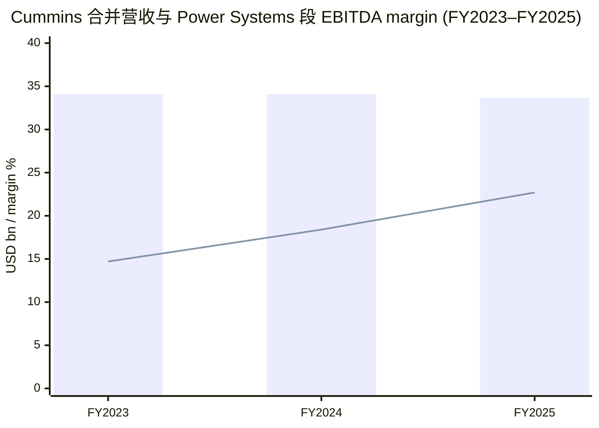
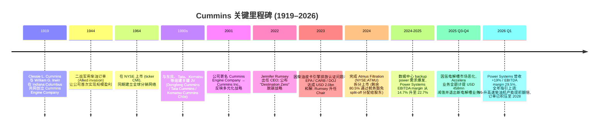
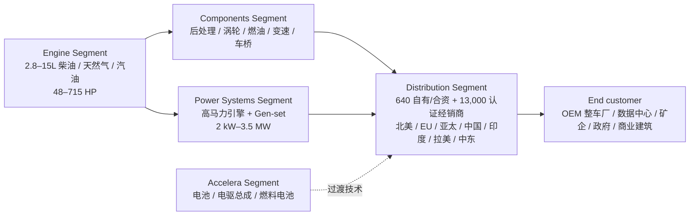
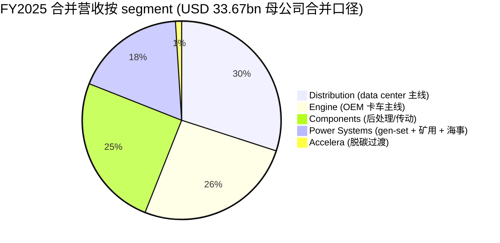

# Cummins Inc. (NYSE:CMI) — 公司研究报告 / Company Research Report

**报告日期 (Report date):** 2026-06-02
**分析师视角 (Analyst view):** 主题 ai-power-electrification 重型机械动力腿 (heavy-mechanical power-equipment leg)
**主报告语言 (Primary language):** 简体中文 (Simplified Chinese, with bilingual technical terms)

> **Update — 上调 FY2026 全年业绩指引 (2026-05-05):** 公司将 FY2026 营收增速指引上调至 +8%–+11% (原 +3%–+8%)，EBITDA margin 上调至 17.75%–18.50% (原 17.0%–18.0%)，主因数据中心 (data center) 备用电源需求显著超预期且北美 on-highway 卡车周期开始改善。管理层在 Q1 业绩电话会上提示 power generation 业务订单已积压至 2028 年。来源：[Cummins Q1 2026 8-K Exhibit 99, 2026-05-05](https://www.sec.gov/Archives/edgar/data/26172/000002617226000013/cmi2026q18-kex99.htm)。

---

## 目录 (Table of Contents)

1. 公司概览 (Company Overview)
2. 公司历史 (Company History)
3. 管理团队 (Management Team)
4. 产品与服务 (Products & Services)
5. 客户与上市策略 (Customers & Go-to-Market)
6. 行业概览 (Industry Overview)
7. 竞争格局 (Competitive Landscape)
8. 市场机会 (Market Opportunity / TAM)
9. 风险评估 (Risk Assessment)
10. 投资视角评分 (Investor-Lens Scorecards)
11. 数据来源清单 (Data Used)
12. 参考资料 (References)

---

## 1. 公司概览 (Company Overview)

康明斯公司 (Cummins Inc., NYSE:CMI) 是全球领先的动力解决方案 (power solutions) 制造商，1919 年由 Clessie L. Cummins 在美国印第安纳州哥伦布市 (Columbus, Indiana) 创立，2001 年由 Cummins Engine Company 更名为现称 Cummins Inc.，主营业务是为商用车 (commercial vehicle)、非道路 (off-highway)、发电 (power generation)、海事 (marine)、铁路 (rail) 等终端市场设计、制造和销售柴油 (diesel)、天然气 (natural gas)、汽油 (gasoline)、混合动力 (hybrid) 及零排放 (zero-emission) 动力总成 ([Cummins 2025 10-K, Item 1 Business Overview](https://www.sec.gov/Archives/edgar/data/26172/000002617226000009/cmi-20251231.htm))。公司原文表述为 "We are a global power leader committed to powering a more prosperous world… Our five reportable segments - Engine, Components, Distribution, Power Systems and Accelera - offer a broad portfolio, including advanced diesel, electric and hybrid powertrains; integrated power generation systems"，自我定位是 "全球电力领导者" 而不仅是引擎公司 ([Cummins 2025 10-K, Item 1 Overview](https://www.sec.gov/Archives/edgar/data/26172/000002617226000009/cmi-20251231.htm))。

**商业模式 / Business model.** 康明斯的商业模式可以拆成两条腿：第一条是传统 OEM (original equipment manufacturer) 引擎供应——为 PACCAR、Daimler、Traton、Stellantis 等卡车整车厂提供 2.8 至 15 升排量、48–715 马力的柴油 / 天然气引擎，按出货量与价格 × 量结算 ([Cummins 2025 10-K, Engine Segment](https://www.sec.gov/Archives/edgar/data/26172/000002617226000009/cmi-20251231.htm))；第二条是 power systems 与 distribution 的高马力发电机组 (gen-set) + 全球 13,000 家认证经销商网络的备件 / 服务 / 售后市场 (aftermarket) 业务，这一段以经常性收入 (recurring revenue) 与 OEM-style 长周期资本品销售相结合，毛利率与 EBITDA margin 远高于卡车引擎，并且周期性较弱。FY2025 拆分中，Distribution 占合并营收 30%、Power Systems 占 18%，但两者合计贡献了约 65% 的合并 EBITDA ([Cummins 2025 10-K, Segment Mix Table](https://www.sec.gov/Archives/edgar/data/26172/000002617226000009/cmi-20251231.htm))。

**地理分布与规模 / Geographic footprint & scale.** FY2025 合并营收 USD 33.67bn (同比 -1%)，归母净利润 USD 2.84bn，稀释 EPS USD 20.50 ([Cummins 2025 10-K, Results of Operations](https://www.sec.gov/Archives/edgar/data/26172/000002617226000009/cmi-20251231.htm))。截至 2026-05，公司在全球约 190 个国家与地区经营，员工约 67,400 人 ([Cummins Q1 2026 8-K, About Cummins](https://www.sec.gov/Archives/edgar/data/26172/000002617226000013/cmi2026q18-kex99.htm))；服务网络包括约 640 家自有 / 合资 / 独立经销商门店与超过 13,000 家 Cummins 认证经销商 ([Cummins 2025 10-K, Item 1 Business](https://www.sec.gov/Archives/edgar/data/26172/000002617226000009/cmi-20251231.htm))。北美贡献了 FY2025 营收的约 60% (Distribution 北美营收 USD 8.63bn vs. Distribution 合计 USD 12.41bn，再叠加 Engine 与 Components 中北美卡车出货的高占比)，但 Q1 2026 国际营收 +16%、北美 -6%，主因中国市场建筑设备与发电需求改善 ([Cummins Q1 2026 8-K, Results](https://www.sec.gov/Archives/edgar/data/26172/000002617226000013/cmi2026q18-kex99.htm))。

**估值快照 / Valuation snapshot (as of 2026-06-01).** Cummins 当前股价 USD 643.50，市值约 USD 88.8bn，TTM P/E 33.42×、Forward P/E 21.31×、P/S 2.62×、EV/EBITDA 18.76×、P/B 7.19×、股息收益率 1.24%；过去 52 周累计上涨约 100% ([Stockanalysis.com — CMI Statistics, 2026-06-01](https://stockanalysis.com/stocks/cmi/statistics/))。同业横向比较：Caterpillar (NYSE:CAT) TTM P/E 43×、P/S 5.63×、EV/EBITDA 30× ([Stockanalysis.com — CAT, 2026-06-01](https://stockanalysis.com/stocks/cat/statistics/))；Eaton (NYSE:ETN) TTM P/E 39×、P/S 5.45×、EV/EBITDA 27.8× ([Stockanalysis.com — ETN, 2026-06-01](https://stockanalysis.com/stocks/etn/statistics/))；Generac (NYSE:GNRC) TTM P/E 84×、P/S 3.66×、EV/EBITDA 32× ([Stockanalysis.com — GNRC, 2026-06-01](https://stockanalysis.com/stocks/gnrc/statistics/))。康明斯估值显著低于上述三家电气化 / 备用电源同业，主因 (a) Engine 与 Components 段仍占合并营收 51%，市场给传统重卡引擎业务的估值倍数远低于 data-center-power 纯标的 (GNRC) 或电气化资产 (ETN)；(b) Accelera 段 FY2025 因氢电解槽业务全额计提 USD 458mn 减值，市场对零排放战略的可执行性持谨慎态度。*分析师观点：* 当前 P/E 已经隐含市场对 power systems 业务超额增长的部分定价，但 Forward P/E 21× 相对 FY2026 营收指引上调后的高个位数 EBITDA 增速仍属合理；估值再扩张的关键是 Engine 周期触底回升 + Accelera 减少亏损率 ([Yahoo Finance — Cummins Q1 Earnings Beat](https://finance.yahoo.com/markets/stocks/articles/cummins-q1-earnings-beat-strong-165200629.html))。


*数据来源：[Cummins 2025 10-K, Results of Operations + Power Systems Segment Results](https://www.sec.gov/Archives/edgar/data/26172/000002617226000009/cmi-20251231.htm)。Power Systems EBITDA margin 从 FY2023 14.7% 跃升至 FY2025 22.7%，是 data-center 备用电源需求与定价改善的直接体现。*

---

## 2. 公司历史 (Company History)

康明斯的故事始于 1919 年印第安纳州哥伦布市 (Columbus, Indiana)，由机械师 Clessie Lyle Cummins 与当地银行家 William Glanton Irwin 合伙创立 Cummins Engine Company。Clessie Cummins 1888 年生于哥伦布市的一个农民家庭，正式教育止于八年级，11 岁就自学造出蒸汽引擎 ([Wikipedia — Clessie Cummins](https://en.wikipedia.org/wiki/Clessie_Cummins))。公司最早是 R.M. Hvid Co. 的柴油机授权制造商，从一台 6 马力的农用柴油机做起，靠 Irwin 家族近 30 年的资金支持熬过了 1920 年代农机柴油市场的失败。二战期间美军大量采购柴油机为登陆欧洲做准备，是康明斯走出亏损的第一个分水岭；战后 OEM 卡车引擎市场的爆发让公司从一家区域柴油作坊跃升为美国卡车动力的核心供应商 ([Wikipedia — Cummins (company)](https://en.wikipedia.org/wiki/Cummins))，构成了今天 Engine 与 Components 业务的根基。


*数据来源：[Cummins 2025 10-K, Item 1 Business Overview](https://www.sec.gov/Archives/edgar/data/26172/000002617226000009/cmi-20251231.htm); [Wikipedia — Cummins history](https://en.wikipedia.org/wiki/Cummins); [Visit Columbus Indiana — Cummins History](https://comeseecolumbus.com/blog/cummins-history/); [Cummins Q1 2026 8-K Exhibit 99](https://www.sec.gov/Archives/edgar/data/26172/000002617226000013/cmi2026q18-kex99.htm); [WBIW — Cummins 2025 results, 2026-02-09](https://www.wbiw.com/2026/02/09/cummins-reports-record-performance-in-power-systems-amid-strategic-pivot-in-hydrogen/)。*

**两次重要的战略转折 (Two strategic pivots).** 第一次是 2001 年的更名：从 Cummins Engine Company → Cummins Inc.，反映公司已从纯粹的柴油机制造商转型为包含发电系统 (power generation)、零部件 (components)、分销与服务 (distribution) 在内的多元化动力平台 ([Cummins 2025 10-K, Overview](https://www.sec.gov/Archives/edgar/data/26172/000002617226000009/cmi-20251231.htm))。第二次更深刻的转折发生在 2022 年：Jennifer Rumsey 接任 CEO 后正式公布 "Destination Zero" 脱碳战略，把 Accelera (电气化 / 燃料电池 / 电解槽业务) 列为第五个独立报告分部，承诺为客户提供 "多燃料、低碳过渡" 路径 ([Cummins 2025 10-K, Item 1 Accelera Segment](https://www.sec.gov/Archives/edgar/data/26172/000002617226000009/cmi-20251231.htm))。但这一战略在 2024–2025 期间遭遇现实修正——2024 Q4 对 Accelera 计提 USD 312mn 战略重组费用，2025 Q3-Q4 再追加 USD 458mn 减值并退出新电解槽 (electrolyzer) 业务，公司在 FY2025 10-K Outlook 中坦承 "the reduction of government incentives in the U.S. to support the adoption of hydrogen fuel, along with slower than expected market development in some international markets, has contributed to lower expectations for demand for our electrolyzer products" ([Cummins 2025 10-K, Outlook](https://www.sec.gov/Archives/edgar/data/26172/000002617226000009/cmi-20251231.htm))，反映出脱碳愿景与短期商业回报之间的尖锐张力。

**关键收购与拆分 (Acquisitions & divestitures).** 2024 年 3 月 18 日，公司完成 Atmus Filtration Technologies (NYSE:ATMU) 剩余 80.5% 股权的免税 split-off 拆分 (退出 5.6mn 股 Cummins 股票交换 Atmus 股票)，获得一次性税前收益 USD 1.3bn ([Cummins 2025 10-K, Atmus Divestiture](https://www.sec.gov/Archives/edgar/data/26172/000002617226000009/cmi-20251231.htm))；这是公司有意识地把过滤业务从重型动力总成的资产组合中剥离，聚焦核心引擎 + Power Systems + Distribution 三脚架。同期通过 Meritor 收购 (2022 年完成) 把 drivetrain / 制动系统 / 车桥 (axles) 整合进 Components 段——FY2025 Components 段 Drivetrain & Braking Systems 业务营收 USD 3.99bn，已成为 Components 段最大产品线 ([Cummins 2025 10-K, Components Segment Results](https://www.sec.gov/Archives/edgar/data/26172/000002617226000009/cmi-20251231.htm))。

**最近 12-24 个月的重大事件 (Recent developments).** (1) 2024 年 4 月 EPA / CARB / DOJ 和解最终生效，2024 Q2 已支付 USD 1.9bn 罚款，结案后 FY2025 经营性现金流恢复至 USD 3.6bn (2024 因和解付款仅 USD 1.5bn) ([Cummins 2025 10-K, MD&A Highlights](https://www.sec.gov/Archives/edgar/data/26172/000002617226000009/cmi-20251231.htm))；(2) 2025 年 5 月发布 HELM™ 多燃料平台，X15 排量引擎可适配柴油、天然气、氢气三种燃料 ([Cummins — HELM Innovation press release, 2025-05-12](https://www.cummins.com/news/releases/2025/05/12/helm-innovation-cummins-fuel-agnostic-future))；(3) 2025 年 7 月季度股息从 USD 1.82 / 股提高至 USD 2.00 (+10%) ([Cummins 2025 10-K, Capital Allocation](https://www.sec.gov/Archives/edgar/data/26172/000002617226000009/cmi-20251231.htm))；(4) 2026 年 2 月在智利 Lundin Mining 的 Caserones 铜钼矿部署全球首台商业化混合动力 (hybrid-electric) 300 吨级矿用卡车 ([Cummins Q1 2026 8-K, Highlights](https://www.sec.gov/Archives/edgar/data/26172/000002617226000013/cmi2026q18-kex99.htm))；(5) 2026 Q1 record performance in Power Systems：营收 USD 1.96bn (+19% YoY)、EBITDA margin 29.5%，公司同时上调 FY2026 全年指引，并公开承认 95-升 (95-liter) 高速柴油机产能扩建提前完成，订单已 backlog 至 2028 年 ([HSBC "Powering AI" note — read-across to CMI, zsxq#415241112255128 p.1](http://xs-macbook-air.local:5001/zsxq-pdf/415241112255128#page=1))。

---

## 3. 管理团队 (Management Team)

### Jennifer W. Rumsey — Chair and Chief Executive Officer (合并创始人 / 现任 CEO 角色，因创始人 Clessie Cummins 1968 年已去世)

Jennifer Rumsey 自 2022 年 8 月 1 日起出任 Cummins CEO，2023 年 8 月 1 日起兼任 Chair of the Board ([Cummins 2026 DEF 14A, Director Bio — Jennifer W. Rumsey](https://www.sec.gov/Archives/edgar/data/26172/000110465926039158/tm261336-2_def14a.htm))。在出任 CEO 之前，她从 2021 年 3 月起担任 President & Chief Operating Officer (COO)；再往前是 2019 年至 2021 年的 Components Segment President、2015 年至 2019 年的 Vice President & Chief Technical Officer (CTO)、2013 年至 2015 年的 Vice President of Engineering, Engine Business——这是一条典型的"技术起家、走通运营"的内部接班路径，从工程师到 CTO 再到 COO 最终任 CEO ([Cummins 2026 DEF 14A, Director Biography](https://www.sec.gov/Archives/edgar/data/26172/000110465926039158/tm261336-2_def14a.htm))。她 2000 年加入 Cummins，至今在公司服役 26 年，原文是 "after holding a variety of engineering and product life cycle roles when she joined Cummins in 2000"——这意味着她是 Cummins 自己培养出来的，对动力总成技术路线、各 segment 之间的协作机制有相当深的 institutional knowledge ([Cummins 2026 DEF 14A](https://www.sec.gov/Archives/edgar/data/26172/000110465926039158/tm261336-2_def14a.htm))。

教育背景：Purdue University 机械工程 B.S.，MIT 机械工程 M.S. ([Cummins 2026 DEF 14A, Director Bio](https://www.sec.gov/Archives/edgar/data/26172/000110465926039158/tm261336-2_def14a.htm))。她是首位执掌 Cummins 的女性 CEO，也是首位拥有 MIT 工科学位的 CEO；在行业组织层面同时是 Society of Women Engineers、SAE (Society of Automotive Engineers)、Women in Trucking Association 成员。曾任 Hillenbrand Inc. (NYSE:HI) 独立董事 (2020 年至 2026 年 2 月) ([Cummins 2026 DEF 14A](https://www.sec.gov/Archives/edgar/data/26172/000110465926039158/tm261336-2_def14a.htm))。

**任内业绩 / Track record at Cummins.** Rumsey 的 CEO 任期至今最重要的三个动作：(1) **EPA / CARB 排放认证案的和解与落地**——2023 年 12 月与 EPA、CARB、DOJ 达成 USD 2.0bn 和解，2024 年 4 月生效、Q2 完成 USD 1.9bn 支付，2025 年现金流随即恢复至 USD 3.6bn，公司在 2025 10-K 中明确这是历史上规模最大的环境合规和解之一 ([Cummins 2025 10-K, MD&A Highlights + Note 14 Commitments & Contingencies](https://www.sec.gov/Archives/edgar/data/26172/000002617226000009/cmi-20251231.htm))；(2) **Destination Zero 战略的"清醒回调"**——2024–2025 期间累计 USD 770mn 的 Accelera 减值与重组费用 (USD 312mn + USD 458mn)，但 DEF 14A 中 TMCC (薪酬委员会) 主席 William I. Miller 直接表态 "the Committee... decided to further simplify our compensation arrangements by incorporating our Accelera participants into our core Cummins incentive plans, rather than having separate Accelera measures for 2026"——意味着 Accelera 不再作为独立财务 KPI 衡量，而是回归核心 Cummins 增长框架，这是一次组织层面对零排放战略激进度的下调 ([Cummins 2026 DEF 14A, Executive Compensation Summary](https://www.sec.gov/Archives/edgar/data/26172/000110465926039158/tm261336-2_def14a.htm))；(3) **抓住 AI / data center backup power 这一波**——2025 年 Distribution 段 power generation 业务营收 +24% YoY 至 USD 4.93bn、Power Systems 段 power generation 业务 +19% YoY 至 USD 4.73bn，合计 USD 9.66bn 直接归功于 hyperscaler 数据中心备用电源订单，Rumsey 在 Q1 2026 电话会上确认 "demand for data center power generation across a range of our products continues to outpace expectations" ([Cummins Q1 2026 8-K Exhibit 99, CEO Quote](https://www.sec.gov/Archives/edgar/data/26172/000002617226000013/cmi2026q18-kex99.htm))。

薪酬与持股 (Compensation & ownership). DEF 14A 披露 Rumsey 2025 年 target total direct compensation 较 2024 年小幅上调，主要通过基薪与 long-term incentive 调整；TMCC 提到 "We did not increase her target bonus as a percentage of base salary, but the dollar amount increased due to the increase in her base salary" ([Cummins 2026 DEF 14A, Executive Compensation](https://www.sec.gov/Archives/edgar/data/26172/000110465926039158/tm261336-2_def14a.htm))。具体持股比例 < 1%（典型 long-tenure professional CEO 模式，非创始人股东）。

---

## 4. 产品与服务 (Products & Services)

康明斯的产品组合由五个 reportable segment 组成，FY2025 营收占比与 EBITDA 占比如下表（这是 10-K 自己披露的 segment summary table）：

### 4.1 公司 10-K 披露的 segment 矩阵 (Issuer's segment matrix, FY2025)

| Segment | 营收 (USD mn) | 占合并营收 % | EBITDA (USD mn) | 占合并 EBITDA % | EBITDA margin |
|---|---:|---:|---:|---:|---:|
| Engine | 10,675 (估算 ≈ 总段值减其余) | 26% | ~1,402 | 26% | ~13% |
| Components | 10,149 | 25% | 1,398 | — | 13.8% |
| Distribution | 12,405 | 30% | 1,808 | 34% | 14.6% |
| Power Systems | 7,463 | 18% | 1,694 | 31% | 22.7% |
| Accelera | 460 | 1% | (896) | — | NM |
| Total segments (pre-elim) | 41,352 | 100% | 5,386 | 100% | 13.0% |
| Intersegment elim | (7,682) | | (1) | | |
| **Consolidated** | **33,670** | | **5,385** | | **16.0%** |

*数据来源：[Cummins 2025 10-K, Segment Summary Table — page filed 2026-02-10](https://www.sec.gov/Archives/edgar/data/26172/000002617226000009/cmi-20251231.htm)。注：Engine segment 营收原文披露为 "Net sales decreased $837 million"，FY2024 Engine 营收为 USD 11,712mn，FY2025 即 USD 10,875mn 量级；表中 EBITDA 来自 segment 全年披露。Accelera FY2025 EBITDA 含 USD 458mn 电解槽减值。*

### 4.2 五大 segment 如何在客户工作流上协同 (Synthesis paragraph)

康明斯的五个 segment 不是各做各的：它们沿着一条统一的客户工作流 (workflow) 串联起来。Engine 段做的是动力的"心脏"——把柴油 / 天然气 / 汽油的化学能转换为机械能；Components 段做的是动力的"外周系统"——后处理 (aftertreatment, 把 NOx / 颗粒物清除)、涡轮增压 (turbocharger)、燃油系统 (fuel system)、传动 (axles & drivelines)、刹车 (brakes)、自动变速箱 (automated transmissions)；Power Systems 段把 Engine 的高马力变体 (up to 4,400 HP) 装进发电机组、矿用 / 海事 / 油气整套整机里，输出兆瓦 (MW) 级备用 / 分布式 / 主用电力；Distribution 段则是把上述所有产品 + 备件 + 服务通过自有 / 合资 / 独立经销商 (640 处 + 13,000 家认证经销商) 卖给最终客户并提供寿命周期维护；Accelera 段是面向脱碳过渡 (energy transition) 的下一代腿——电池系统、电驱总成、燃料电池、电解槽 (electrolyzer)，目前还在投入期。这个工作流的关键意义是：当北美 Class 8 卡车周期向下 (FY2025 重卡出货 -23%) 时，data-center backup power 的兆瓦级订单可以通过 Power Systems 与 Distribution 段两条腿同时吸收，对冲 Engine 与 Components 段的周期性弱势——FY2025 的实证就是这样：Engine -8% YoY (10K 披露 "Engine segment sales decreased $837 million")、Components -13% YoY，但 Distribution +9%、Power Systems +16%，整体合并营收只 -1% ([Cummins 2025 10-K, Segment Results](https://www.sec.gov/Archives/edgar/data/26172/000002617226000009/cmi-20251231.htm))。


*数据来源：[Cummins 2025 10-K, Reportable Segments overview](https://www.sec.gov/Archives/edgar/data/26172/000002617226000009/cmi-20251231.htm)。*

### 4.3 Engine Segment — 公司的"传统心脏"

> "The Engine segment manufactures and markets a broad range of diesel, natural gas and gasoline-powered engines under the Cummins brand name, as well as certain customer brand names, for the heavy-duty truck, medium-duty truck and bus, light-duty automotive and off-highway markets. We manufacture a wide variety of engine products including: Engines with a displacement range of 2.8 to 15 liters and horsepower ranging from 48 to 715; and New and remanufactured parts and engines, which are sold and serviced primarily through our extensive distribution network." — [Cummins 2025 10-K, Engine Segment](https://www.sec.gov/Archives/edgar/data/26172/000002617226000009/cmi-20251231.htm)

**中文释义 / Plain-language gloss.** Engine 段是把化学燃料烧成机械动力的核心——核心物理过程是 diesel / natural gas / gasoline 在汽缸内燃烧，推动活塞 (piston) 经曲轴 (crankshaft, 曲轴) 输出旋转动能。康明斯 Engine 段的特色是**排量全谱**：从 2.8 升的 light-duty 皮卡引擎到 15 升的 X15 heavy-duty 卡车 / off-highway 引擎都做，HP 从 48 到 715，这种"一家全部覆盖"的能力让它能同时服务 PACCAR / Daimler / Traton 的重卡线、Stellantis (RAM 2500/3500 皮卡) 的轻卡线、Komatsu / Hyundai / J.C. Bamford 的工程机械线、以及 Class A 房车 (motor home / RV) 的特种应用 ([Cummins 2025 10-K, Engine Segment](https://www.sec.gov/Archives/edgar/data/26172/000002617226000009/cmi-20251231.htm))。FY2025 Engine 段拆分按机型：heavy-duty 单元出货 101,900 辆 (-23% YoY)、medium-duty 280,500 辆 (-10%)、light-duty 171,800 辆 (-9%)，**FY2025 是康明斯 20 年来最严重的北美重卡下行周期**——但同时 light-duty automotive (Stellantis RAM 皮卡) 销售上涨 USD 335mn (因 non-tariff pricing 与新引擎产品 launch)、off-highway +USD 136mn (因中国建筑设备需求改善) ([Cummins 2025 10-K, Engine Segment 2025 vs 2024](https://www.sec.gov/Archives/edgar/data/26172/000002617226000009/cmi-20251231.htm))。

战略层面，Engine 段最重要的 product family 是 2024 年发布的 **X15 HELM™ 平台** (HELM = Higher Efficiency, Lower emissions, Multiple fuels)——同一个 15 升 base 平台衍生出 X15 diesel、X15N natural gas、X15H hydrogen 三种燃料变体，零件高度通用 ([Cummins — Fuel-Agnostic Power Page](https://www.cummins.com/engines/on-highway/fuel-agnostic))。其中 X15N 自然气版本已 in full production，符合 EPA 2027 NOx 排放规范；X15 diesel 因 2025 年 NHTSA / EPA GHG 规则不确定性推迟到 2026 年底量产；X15H 氢气版本预计未来十年量产 ([Cummins — HELM Press Release 2024-02-29](https://www.cummins.com/en-na/news/releases/2024/02/29/cummins-announces-innovative-next-generation-x15-diesel-engine-part); [Commercial Carrier Journal — X15 Delay](https://www.ccjdigital.com/trucks/article/15752472/cummins-delays-launch-of-new-x15-diesel))。2026 Q1 公司确认与 Mack Trucks 合作把 X10 引擎集成进 Mack Granite Chassis (vocational truck 平台)，这是 X10 medium-duty 平台在职业车 (垃圾车 / 救援车 / 工地翻斗车) 市场的关键拓展 ([Cummins Q1 2026 8-K, Highlights](https://www.sec.gov/Archives/edgar/data/26172/000002617226000013/cmi2026q18-kex99.htm))。

*分析师观点 (Analyst view):* 在 Class 8 heavy-duty truck 市场，康明斯不是 OEM 整车厂而是独立引擎 (merchant engine) 供应商；最主要的客户是 PACCAR (Kenworth / Peterbilt 卡车品牌)、Traton (Volvo / Navistar 旗下)、Daimler Trucks (Daimler Trucks North America 旗下 Freightliner / Western Star) ([Cummins 2025 10-K, Engine Segment Customers](https://www.sec.gov/Archives/edgar/data/26172/000002617226000009/cmi-20251231.htm))。竞品方面，全球独立引擎供应商所剩不多——主要竞争对手包括 Volvo Powertrain 自供、Detroit Diesel (Daimler 自供)、Navistar 自供，以及中国 **Weichai Power** (潍柴动力，SSE:000338) 的国内对标；公司原文确认 "Other independent engine manufacturers include Weichai Power" ([Cummins 2025 10-K, Engine Segment Competitors](https://www.sec.gov/Archives/edgar/data/26172/000002617226000009/cmi-20251231.htm))。康明斯的护城河 (moat) 在 (a) 排量全谱 (从 2.8L 到 15L 的产品宽度无人匹敌)、(b) 全球 13,000 家认证经销商的服务网络、(c) Stellantis 等 OEM 在皮卡端 30+ 年的客户深度绑定。

### 4.4 Components Segment — 排放、传动、燃油的"集成腰部"

> "[Components segment includes:] Drivetrain and braking systems — We design, manufacture and supply drivetrain systems, including axles, drivelines, brakes and suspension systems primarily for commercial vehicle and industrial applications… Emission solutions — We design, manufacture and integrate aftertreatment technology and solutions for the commercial on- and off-highway light-duty, medium-duty, heavy-duty and high-horsepower engine markets. Aftertreatment is the mechanism used to convert engine emissions of criteria pollutants, such as particulate matter, nitrogen oxides (NOx), carbon monoxide and unburned hydrocarbons into harmless emissions… Components and software — We design, manufacture and market turbocharger, fuel system and valvetrain technologies… Automated transmissions — We develop and supply automated transmissions for the heavy-duty commercial vehicle market. The Eaton Cummins Automated Transmission Technologies (ECJV) joint venture is a consolidated 50/50 joint venture between Cummins Inc. and Eaton Corporation plc." — [Cummins 2025 10-K, Components Segment](https://www.sec.gov/Archives/edgar/data/26172/000002617226000009/cmi-20251231.htm)

**中文释义 / Plain-language gloss.** Components 段是 Cummins 在引擎之外"卖整套传动系统"的腿。FY2025 Components 段拆分四个产品线 (Atmus 已拆分)：Drivetrain & braking systems USD 3.99bn (Meritor 收购整合后的主体)、Emission solutions USD 3.46bn (aftertreatment, 后处理)、Components & software USD 2.28bn (涡轮 / 燃油 / 阀系)、Automated transmissions USD 0.42bn (Eaton Cummins 合资) ([Cummins 2025 10-K, Components Segment Results](https://www.sec.gov/Archives/edgar/data/26172/000002617226000009/cmi-20251231.htm))。其中 **emission solutions / 后处理**是康明斯最有技术壁垒的产品线：把柴油机尾气中的 NOx (氮氧化物) 通过 SCR (selective catalytic reduction, 选择性催化还原)、把颗粒物通过 DPF (diesel particulate filter) 转化为无害气体，全球能做到 Euro VII / EPA 2027 严苛标准的厂商只有 Bosch、Tenneco、Eberspacher 和 Cummins 等少数几家 ([Cummins 2025 10-K, Components Segment Competitors](https://www.sec.gov/Archives/edgar/data/26172/000002617226000009/cmi-20251231.htm))。

公司原文披露的 Components 段竞争对手列表："Our primary competitors in these markets include Robert Bosch GmbH, Garrett Motion, Inc., Borg-Warner Inc., Tenneco Inc., Eberspacher Holding GmbH & Co. KG, Allison Transmission, Knorr-Bremse AG and ZF Friedrichshafen AG" ([Cummins 2025 10-K, Components Segment Competitors](https://www.sec.gov/Archives/edgar/data/26172/000002617226000009/cmi-20251231.htm))。**Atmus 拆分**是 2024 年 3 月通过免税 split-off 完成的：康明斯持有的剩余 80.5% Atmus 股权全部分配给股东以交换其 Cummins 股票，最终减少 5.6mn 股 Cummins outstanding shares 并实现 USD 1.3bn 一次性收益 ([Cummins 2025 10-K, Note 21 Atmus Divestiture](https://www.sec.gov/Archives/edgar/data/26172/000002617226000009/cmi-20251231.htm))，是公司主动 portfolio 优化、聚焦动力总成主业的代表性动作。

*分析师观点 (Analyst view):* Components 段的核心结构性风险在于：随着 BEV (battery electric vehicle) 比例上升，aftertreatment 与 turbocharger 产品的 TAM 会缓慢萎缩；但 emission standards 在新兴市场 (印度、东南亚、拉美) 还在收紧 (Euro VI → Euro VII 的全球扩散)、heavy-duty 长途运输 BEV 渗透 < 5%、industrial off-highway 因为载荷 / 充电基础设施限制仍然 BEV 难以替代柴油，所以 Components 段的负斜率会很平缓 (long tail decline)，而 drivetrain & braking systems 因 Meritor 整合后客户群 (PACCAR / Daimler / Volvo / 印度 Tata) 跨地区分散，反而是抗衰退韧性最强的子线。

### 4.5 Distribution Segment — 公司毛利率最高的"网络资产"

> "The Distribution segment is our primary sales, service and support channel. The segment serves our customers and certified dealers through a worldwide network of wholly-owned, joint venture and independent distribution locations… Distribution's mission encompasses the sale and support of a wide range of products and services, including power generation systems, high-horsepower engines, heavy-duty and medium-duty engines designed for on- and off-highway use, application engineering services, custom-designed assemblies, retail and wholesale aftermarket parts and in-shop and field-based repair services. We also provide selected sales and aftermarket support for the Accelera business." — [Cummins 2025 10-K, Distribution Segment](https://www.sec.gov/Archives/edgar/data/26172/000002617226000009/cmi-20251231.htm)

**中文释义 / Plain-language gloss.** Distribution 段是 Cummins 在客户端的"最后一公里"——但它做的不只是销售：它把 Power Systems 段的 gen-set、Engine 段的高马力发动机、Components 段的 aftertreatment 备件全部整合成 turnkey solution 卖给终端客户 (data-center operator、矿山、医院、商业建筑、prime rental fleet)。FY2025 Distribution 段拆分四条产品线：**Power generation USD 4.93bn (+24% YoY)**、Parts USD 4.08bn (+3%)、Service USD 1.80bn (+3%)、Engines USD 1.59bn (-5%) ([Cummins 2025 10-K, Distribution Segment Product Line](https://www.sec.gov/Archives/edgar/data/26172/000002617226000009/cmi-20251231.htm))。**这条 Power generation 业务的 USD 960mn 同比增量几乎全部来自北美数据中心 backup power**——10-K 原文："Distribution segment sales increased $1.0 billion, due to increased sales in North America of $1.0 billion principally from higher demand in power generation markets, especially data center and commercial markets" ([Cummins 2025 10-K, Distribution Segment 2025 vs 2024](https://www.sec.gov/Archives/edgar/data/26172/000002617226000009/cmi-20251231.htm))。

地理拆分上，Distribution 北美营收 USD 8.63bn (占段 70%)、Europe USD 1.19bn、Asia Pacific USD 1.15bn、China USD 514mn、India USD 365mn、Latin America USD 291mn、Africa & Middle East USD 268mn ([Cummins 2025 10-K, Distribution Segment Geographic](https://www.sec.gov/Archives/edgar/data/26172/000002617226000009/cmi-20251231.htm))。这是一份高度本土化的资产：分销网络一旦建成、客户在地服务关系一旦形成，replacement 成本极高——客户买 Cummins gen-set 的核心理由之一就是 13,000 家认证经销商 24/7 服务能力，这是 Caterpillar 之外几乎无人能匹配的网络规模。FY2025 Distribution 段 EBITDA margin 14.6% (2024: 12.1%, 2023: 11.8%)，三年逐年扩张——margin 提升的核心驱动是 power generation 产品 mix shift (高毛利) 与北美定价改善 ([Cummins 2025 10-K, Distribution Segment EBITDA](https://www.sec.gov/Archives/edgar/data/26172/000002617226000009/cmi-20251231.htm))。

*分析师观点 (Analyst view):* Distribution 段是 Cummins 估值溢价的核心来源——它结合了 capital-light 经销商网络 + 高毛利备件 / 服务收入 + data-center power 的强周期上行。这条腿的护城河是 (a) 70 年累计建成的 13,000 家认证经销商关系，(b) 备件流转的 logistics 优势 (库存周转 + 跨国零部件配送)，(c) "全球唯一可与 Caterpillar 抗衡的备件 / 服务网络"。最大威胁是：如果 hyperscaler 数据中心客户 (Microsoft / Meta / Amazon / Google) 越来越倾向直接向 Power Systems 段 OEM 拿货，绕过 Distribution，则 Distribution 段成长空间会被压缩。

### 4.6 Power Systems Segment — 数据中心电源主轴

> "The Power Systems segment is organized around the following product lines: Power generation — We are a global OEM offering standby and prime power generators ranging from 2 kilowatts to 3.5 megawatts, as well as controls, paralleling systems and transfer switches, for customers with data center, consumer, commercial, industrial, health care, prime rental fleet and defense applications… Industrial — We design, manufacture, sell and support diesel and natural gas high-speed, high-horsepower engines up to 4,400 horsepower… Generator technologies — We design, manufacture, sell and support A/C generator/alternator products and components for internal consumption and for external generator set assemblers. Our alternator products are sold under the Stamford and AVK brands and range in output from 7.5 kilovolt-amperes (kVA) to 11,200 kVA." — [Cummins 2025 10-K, Power Systems Segment](https://www.sec.gov/Archives/edgar/data/26172/000002617226000009/cmi-20251231.htm)

**中文释义 / Plain-language gloss.** Power Systems 段是 Cummins 把"高马力 diesel / natural gas engine + alternator (发电机) + 控制系统 (controls)"组合成 standby / prime / 分布式 (distributed) 发电机组的 segment。物理上 gen-set 的核心组件包括 (1) prime mover (高速柴油 / 天然气引擎，把化学能转动能)、(2) alternator (Stamford / AVK 品牌交流发电机，把动能转电能)、(3) controls + paralleling system (把多台 gen-set 同步并联输出兆瓦级电力)、(4) transfer switch (在市电中断瞬间自动切换至备用电源)。康明斯 Power Systems 段从 2 kW (家用 / 小型商业) 一直做到 3.5 MW (data-center hyperscaler 单机柜) 的整套 range，**核心 sweet spot 是 1.0–3.5 MW 的数据中心 standby gen-set**，主力产品是基于 95-升 (95-liter) 高速柴油机的 QSK60 / QSK95 系列 ([Cummins — QSK series 产品](https://www.cummins.com/engines/diesel/qsk60); [HSBC "Powering AI" zsxq #415241112255128 p.1](http://xs-macbook-air.local:5001/zsxq-pdf/415241112255128#page=1))。

FY2025 Power Systems 段拆分产品线：**Power generation USD 4.73bn (+19% YoY)**、Industrial USD 2.06bn (+7%)、Generator technologies USD 0.67bn (+36%) ([Cummins 2025 10-K, Power Systems Segment Product Line](https://www.sec.gov/Archives/edgar/data/26172/000002617226000009/cmi-20251231.htm))。这条 Power generation 业务 +USD 746mn 增量主要来自北美与中国数据中心需求改善——FY2025 是公司 Power Systems 段历史上规模最大、margin 最高的一年：EBITDA USD 1,694mn (+44% YoY)，EBITDA margin 22.7% (FY2024 18.4%, FY2023 14.7%)，三年合计扩张 8.0 个百分点 ([Cummins 2025 10-K, Power Systems Segment EBITDA](https://www.sec.gov/Archives/edgar/data/26172/000002617226000009/cmi-20251231.htm))。Q1 2026 进一步加速：Power Systems 营收 USD 1.96bn (+19%)、EBITDA margin 29.5% (vs Q1 2025 23.6%)，国际营收 (北美外) +18% 主要来自中国与亚太数据中心 ([Cummins Q1 2026 8-K, Power Systems](https://www.sec.gov/Archives/edgar/data/26172/000002617226000013/cmi2026q18-kex99.htm))。

公司原文披露的 Power Systems 段竞争对手列表："Our primary competitors are Caterpillar, Inc., MTU (Rolls Royce Power Systems Group) and Kohler/SDMO (Kohler Group), but we also compete with INNIO, Generac, Mitsubishi Heavy Industries and numerous regional generator set assemblers. Our alternator business competes globally with Leroy Somer, Marathon Electric and Meccalte" ([Cummins 2025 10-K, Power Systems Segment Competitors](https://www.sec.gov/Archives/edgar/data/26172/000002617226000009/cmi-20251231.htm))。

*分析师观点 (Analyst view):* Power Systems 段是 Cummins 当前估值上移的最核心 driver；HSBC "Powering AI" 系列对全球 prime power / backup power 的供应链 mapping 中明确指出 "95% of CMI power gen business is behind-the-meter backup power" 且公司已经在为 2028 年的 AI 数据中心订单备产能，2025 年宣布 **USD 450mn 投资 + 20 GW 高马力引擎与 gen-set 产能扩建，目标 2030 年累计装机 55 GW**，并在 4 MW 大型 gas-engine 上 2028 量产 ([HSBC — Powering AI note, zsxq #415241112255128 p.1](http://xs-macbook-air.local:5001/zsxq-pdf/415241112255128#page=1) — 引用原文 "USD450m investment to add 20GW… reaching total 55 GW by 2030")。竞品方面，Caterpillar 是 Cummins 在 prime / backup gen-set 市场的核心对标 (CAT 的 G3500 / G3520 系列 gas-engine 与 Cummins 的 QSK 系列直接竞争)；MTU (Rolls Royce 旗下) 是高密度 AI / hyperscale 数据中心的竞品 ([Caterpillar — Large Engines](https://www.caterpillar.com/en/products/new/power-systems.html); [Rolls Royce / MTU — Power Generation Solutions](https://www.mtu-solutions.com/eu/en/applications/power-generation.html))。从合并 EBITDA mix 来看，**FY2025 Power Systems 段贡献 31% 合并 EBITDA**，已经追平 Distribution，是公司估值 re-rating 的最快变量。

### 4.7 Accelera Segment — 零排放过渡期的"投入腿"

> "The Accelera segment designs, manufactures, sells and supports electrified power systems with innovative components and subsystems, including battery and electric powertrain technologies. The Accelera segment is currently in the early stages of commercializing these technologies with efforts primarily focused on the development of electrified power systems and related components and subsystems. During 2025, due to the continued rapid deterioration in our electrolyzer markets and overall hydrogen markets, along with significant uncertainty in the alternative power markets resulting from reductions in government incentives, we fully impaired all of the goodwill for our electrolyzer business and wrote off certain inventory in the third quarter of 2025… we intend to stop new commercial activity in the electrolyzer space, subject to information and consultation in accordance with local legal requirements. We will continue to fulfill existing customer commitments." — [Cummins 2025 10-K, Accelera Segment](https://www.sec.gov/Archives/edgar/data/26172/000002617226000009/cmi-20251231.htm)

**中文释义 / Plain-language gloss.** Accelera 段是 Cummins 为 "Destination Zero" 脱碳战略设立的独立报告单元，2022 年成立 (整合此前 Cummins New Power business)。业务包括 (1) battery system (电池系统)、(2) electric powertrain (电驱总成)、(3) fuel cell (燃料电池，2026 Q1 已宣布出售低压 fuel-cell 业务并提取 USD 199mn 关停费用)、(4) electrolyzer (电解槽，制氢用，2025 年全额减值并退出新业务)。FY2025 Accelera 营收 USD 460mn (+11% YoY，主要来自 electrified powertrain 出货增加)，但 EBITDA loss USD (896mn)，含 USD 458mn 减值与重组费用 ([Cummins 2025 10-K, Accelera Segment Results](https://www.sec.gov/Archives/edgar/data/26172/000002617226000009/cmi-20251231.htm))。Q1 2026 再追加 USD 199mn 低压燃料电池业务出售费用，公司在 8-K 中明确 "the company remains committed to pacing and focusing its zero-emissions investments on the most promising paths" ([Cummins Q1 2026 8-K, Accelera Segment](https://www.sec.gov/Archives/edgar/data/26172/000002617226000013/cmi2026q18-kex99.htm))。

公司在 10-K Outlook 中明确指出政策与市场层面的逆风："The reduction of government incentives in the U.S. to support the adoption of hydrogen fuel, along with slower than expected market development in some international markets, has contributed to lower expectations for demand for our electrolyzer products" ([Cummins 2025 10-K, Outlook](https://www.sec.gov/Archives/edgar/data/26172/000002617226000009/cmi-20251231.htm))；同时强调 "Amplify Cell Technologies LLC joint venture is reviewing the timing of investments as the result of changing market adoption projections" (与 Daimler / PACCAR 合资的北美电池产线投建时间也被推迟)。竞争对手原文披露 "Our primary competitors include Daimler, PACCAR, Traton, BYD Company Limited, Dana Incorporated and BorgWarner Inc." ([Cummins 2025 10-K, Accelera Segment Competitors](https://www.sec.gov/Archives/edgar/data/26172/000002617226000009/cmi-20251231.htm))。

*分析师观点 (Analyst view):* Accelera 段当前最重要的事不是 revenue growth，而是 "把损失率收窄到可承受"。管理层在 2026 DEF 14A 已经明确：2026 年起 Accelera 不再单独设 KPI，激励指标全部归并到 Cummins core 指标，意味着 segment 实质上从 "战略投入" 转向 "成本优化 / 关停择优" 模式。短中期 (2026-2027) Accelera 仍将拖累合并 EBITDA 约 USD 0.7-0.9bn / 年，但下行风险有限——因为大部分氢电解槽减值已经在 2025 完成；上行可能是 battery / electrified powertrain 在 medium-duty truck 与商用车细分中找到狭窄的盈利窗口。

---

## 5. 客户与上市策略 (Customers & Go-to-Market)

### 5.1 客户群结构 (Customer mix)

康明斯没有单一客户超过合并营收的 10%——10-K 未披露任何 single customer 触发 ASC 280-10-50-42 名称披露门槛 ([Cummins 2025 10-K, Customer Concentration Note](https://www.sec.gov/Archives/edgar/data/26172/000002617226000009/cmi-20251231.htm))。但 10-K 在 segment 层级披露了重要客户名单 (segment-level；not aggregated to group-level)：


*数据来源：[Cummins 2025 10-K, Segment Summary Table](https://www.sec.gov/Archives/edgar/data/26172/000002617226000009/cmi-20251231.htm)。注：合并营收 = segment 营收 USD 41.35bn 减去 intersegment elimination USD 7.68bn = 合并 USD 33.67bn。表中比例为 segment 占 pre-eliminations 营收。*

**Engine 段重要客户 (segment-level, not aggregated to group-level):** 
- 重卡 (heavy-duty truck) — PACCAR Inc. (Kenworth / Peterbilt 品牌)、Traton Group (Volvo / Navistar)、Daimler Trucks AG (Freightliner / Western Star)
- 中卡 (medium-duty truck & bus) — Daimler、Traton、PACCAR
- 轻型 (light-duty automotive) — Stellantis (RAM 2500 / 3500 皮卡)、安徽江淮汽车集团 (Anhui Jianghuai)、Volkswagen Caminhões e Ônibus、中国重汽集团 (China National Heavy Duty Truck Group)
- 工业引擎 (industrial / off-highway engines) — Hyundai Heavy Industries、Komatsu Ltd.、J.C. Bamford Excavators、中联重科 (Zoomlion)、徐工集团 (XCMG)、广西柳工机械 (LiuGong)、JLG Industries、三一重工 (SANY)

出处：[Cummins 2025 10-K, Engine Segment Principal Customers](https://www.sec.gov/Archives/edgar/data/26172/000002617226000009/cmi-20251231.htm)。**这些都是 segment-level 重要客户，10-K 没有披露 individual customer % of consolidated revenue**——这是 ASC 280 要求的 "no customer >10% of consolidated revenue" 的隐含确认。

**Power Systems / Distribution 段重要客户 (segment-level).** 数据中心 hyperscaler 是 Power Systems 与 Distribution 段的核心增量客户。虽然 10-K 未点名具体客户，但 HSBC "Powering AI" 系列研报通过 supply-chain mapping 推断 Cummins 数据中心 backup gen-set 主要服务于美国 hyperscaler (Microsoft Azure / Amazon AWS / Meta / Google Cloud / Oracle / xAI) 以及中国 / 亚太的数据中心运营商；2025 年 capacity announcement 中 "taking AIDC backup power orders for 2028 deliveries" 直接证实订单深度 ([HSBC zsxq#415241112255128 p.1](http://xs-macbook-air.local:5001/zsxq-pdf/415241112255128#page=1))。除 hyperscaler 外，Power Systems 还服务医疗 (医院 standby power)、商业建筑 (commercial real estate)、prime rental fleet (United Rentals / Sunbelt Rentals 等设备租赁公司)、defense (美军基地与海军舰艇) ([Cummins 2025 10-K, Power Systems Segment Customer Base](https://www.sec.gov/Archives/edgar/data/26172/000002617226000009/cmi-20251231.htm))。

### 5.2 渠道结构 (Distribution channels)

康明斯独有的渠道资产是 **640 自有 / 合资 / 独立经销商门店 + 13,000+ 认证经销商**，覆盖约 190 个国家与地区 ([Cummins 2025 10-K, Item 1 Business](https://www.sec.gov/Archives/edgar/data/26172/000002617226000009/cmi-20251231.htm))。Distribution 段实际上把这套网络变成了一个 segment 来报表——它有自己的 EBITDA、营收、地理拆分，FY2025 EBITDA margin 14.6% 高于 Engine 与 Components，显示 service / parts / power-gen sales 三条腿的 mix 已经显著改善 ([Cummins 2025 10-K, Distribution Segment EBITDA](https://www.sec.gov/Archives/edgar/data/26172/000002617226000009/cmi-20251231.htm))。

### 5.3 关键合资企业 (Strategic JV partners)

康明斯通过合资企业拓展中国 / 印度 / 拉美等关键市场。FY2025 合资企业贡献给 Cummins 的 equity income 拆分如下 (来自 10-K Note 3 Equity Investees)：

| 合资企业 | 性质 | FY2025 Cummins share 利润 (USD mn) | 占 364 总 share % |
|---|---|---:|---:|
| 重庆康明斯发动机 Chongqing Cummins | 制造 | 89 | 24% |
| 东风康明斯 Dongfeng Cummins | 制造 (中国市场最重要 OEM 合资) | 70 | 19% |
| 北京福田康明斯 Beijing Foton Cummins | 制造 | 64 | 18% |
| Tata Cummins (印度) | 制造 | 33 | 9% |
| Komatsu Cummins Chile | 分销 (秘鲁 / 智利大型矿用) | 54 | 15% |
| 其他制造类 | | 29 | 8% |
| 其他分销类 | | 25 | 7% |
| **合计 Cummins share** | | **364** | **100%** |

*数据来源：[Cummins 2025 10-K, Note 3 Investments in Equity Investees](https://www.sec.gov/Archives/edgar/data/26172/000002617226000009/cmi-20251231.htm)。注：JV equity income 是 Cummins 合并报表外的间接收益，约占 FY2025 营业利润 (USD 4,025mn) 的 9%。*

值得注意的是，**三家中国 JV (重庆 / 东风 / 福田康明斯) 合计贡献 USD 223mn**，相当于 Cummins JV equity income 的 61%。这是康明斯在中国本土市场的最强 anchor——通过 Dongfeng Cummins 与中国第一大商用车集团之一东风汽车的深度绑定 (1990s 至今)，以及福田康明斯与北汽福田 (中国最大轻型卡车制造商) 的合作，康明斯在中国柴油机市场维持着相当稳固的份额；2025 年这三家 JV equity income 同比都有增长 (东风 +6%、福田 +52%、重庆 +48%)，反映中国卡车市场 2025 年的同比改善。

### 5.4 客户集中度风险 (Customer concentration risk)

10-K 未披露 top-1 或 top-5 单一客户 % of consolidated revenue (即没有单一客户超过 10% 触发披露门槛)。但 Engine 段客户集中度在 segment-level 层面较高——Stellantis 单一客户在 light-duty automotive 子线占比可能远超 10% (按 Stellantis RAM 2500/3500 北美年销量 100k+ 辆 × Cummins X15 / 6.7L 单价反推，Stellantis 对 Engine 段贡献可能在 USD 1.2-1.5bn 量级，对 Engine 段占比 11-14%，但对合并营收只占 3.5-4.5%)。这意味着 **Stellantis 退出柴油皮卡引擎** (例如 Stellantis Hurricane I6 gas engine 全面替代 6.7L Cummins diesel) 会是一个重要的 segment-level 风险，但不构成 consolidated 层面的 trigger。10-K Risk Factors 部分明确把 "large truck manufacturers' and OEM customers discontinuing outsourcing their engine supply needs" 列为风险 ([Cummins 2025 10-K, Risk Factors](https://www.sec.gov/Archives/edgar/data/26172/000002617226000009/cmi-20251231.htm))。

---

## 6. 行业概览 (Industry Overview)

### 6.1 行业定义与范围 (Industry definition & scope)

康明斯所在的行业是 **重型动力总成 (heavy-duty powertrain) + 备用 / 主用发电系统 (backup / prime power generation) + 商用车后市场 (commercial vehicle aftermarket)** 三位一体的复合行业。NAICS 代码主要在 333618 (Other Engine Equipment Manufacturing) 与 335312 (Motor and Generator Manufacturing) 范围内。下游应用极其分散：

- **On-highway 商用车** — 全球 Class 8 重卡 (>15 吨) 年销量约 280-320 万辆 (2024-2025 周期低点)，medium-duty 与 light-duty 商用车 (5-15 吨) 全球约 700-900 万辆 ([ACT Research — North America Class 8 Forecast 2025](https://www.actresearch.net/))
- **Off-highway 非道路设备** — 全球建筑机械 (挖掘机 / 装载机 / 推土机) 销量约 100 万台 / 年；农业 / 矿用 / 林业重型设备约 200-300 万台 / 年
- **数据中心备用发电 (Data center backup power)** — 全球 data center generator 市场 USD 9.5bn (2025E)，预计 2035 年 USD 17.0bn，CAGR ~5.8% ([Global Insight Services — Data Center Generator Market, 2025](https://www.globalinsightservices.com/insight/data-center-generator-market/))
- **海事 + 铁路 + 油气** — 全球高马力 (HHP, > 1,000 HP) 工业引擎市场约 USD 12-15bn / 年 (粗估)

### 6.2 数据中心 backup power 子行业 (the AI-power-electrification leg)

康明斯当前估值上行的核心驱动是 data center 备用电源子行业。Global Insight Services 估算全球数据中心 generator 市场将从 2025 年的 USD 9.5bn 扩张至 2035 年的 USD 17.0bn，CAGR 5.8%；ResearchAndMarkets 的 "Data Center Generator Market Landscape 2025-2030" 列出 Caterpillar、Cummins、Generac、Rolls-Royce (MTU)、Rehlko (前 Kohler Power Systems)、Atlas Copco 等为关键供应商 ([ResearchAndMarkets — Data Center Generator Market Landscape 2025-2030](https://www.businesswire.com/news/home/20250715362216/en/Data-Center-Generator-Market-Landscape-2025-2030-Featuring-Key-Providers-ABB-Caterpillar-Cummins-Generac-Power-Systems-HITEC-Power-Protection-Rehlko-Rolls-Royce-and-Himoinsa-ResearchAndMarkets.com))。

MarketsandMarkets 进一步估算 "Caterpillar and Cummins collectively command over 35% of the global backup generators market share for data centers, and the top five players – including Generac Power Systems, MTU Solutions, and Atlas Copco – control approximately 52% of revenue share" ([MarketsandMarkets — Data Center Generators Companies](https://www.marketsandmarkets.com/ResearchInsight/data-center-generators-companies.asp))。这意味着这个子行业是一个 **高度集中、寡占** 的市场——前两名 (CAT + Cummins) 合计 35%+，前五名 52%。同时由于 hyperscaler (Microsoft / Amazon / Meta / Google / Oracle) 在 AI infrastructure 上的资本开支正经历 1990s 以来未有的爆发期 (Synergy Research 估算 2025 年 hyperscaler 数据中心 capex 约 USD 350bn+)，备用电源订单从 2024 年开始进入"超额订单 + 产能告急" 状态，HSBC 指出 "Cummins is taking AIDC backup power orders for 2028 deliveries" ([HSBC zsxq#415241112255128 p.1](http://xs-macbook-air.local:5001/zsxq-pdf/415241112255128#page=1))。

### 6.3 关键技术演进 (Key technology trends)

(1) **从 diesel 到 natural gas 的过渡** — 数据中心 backup power 传统以柴油 gen-set 为主 (启动快、能量密度高、燃料储存方便)，但 EPA Tier 4 / Euro VI 后处理成本上升 + 燃料碳强度差异 (天然气碳排比柴油低约 25%) 推动新建数据中心选择 gas-engine gen-set，Cummins 已宣布 2028 年量产 **4 MW gas engine** 抢占这一窗口 ([HSBC zsxq #415241112255128 p.1](http://xs-macbook-air.local:5001/zsxq-pdf/415241112255128#page=1))。

(2) **AI 数据中心电力密度上升** — 单机柜功率从 5-15 kW 升至 50-100+ kW (NVIDIA Blackwell GB200 NVL72 rack 设计功率 120 kW)，对备用电源的容量 / 响应时间 / 冗余级别 (N+1 / 2N) 要求显著提高，单数据中心 backup capacity 从 5-15 MW 升至 50-200+ MW，订单深度成倍增长。

(3) **HELM 多燃料平台** — Cummins 的 HELM 战略 (Higher Efficiency, Lower emissions, Multiple fuels) 把同一引擎平台分别适配 diesel / natural gas / hydrogen，意味着客户在不同地区 / 不同 fuel 可用性下都可以使用同一套零件平台，降低车队 / 数据中心运营的复杂度 ([Cummins — Fuel-Agnostic Power](https://www.cummins.com/engines/on-highway/fuel-agnostic))。

### 6.4 监管环境 (Regulatory environment)

康明斯所在行业面临持续严格的排放规范：
- **美国 EPA / NHTSA GHG 规则** — 2027 年 NOx 排放规范 (CARB Low-NOx Omnibus) 适配 X15 HELM 平台；NHTSA 2025 年 6 月发布 interpretive rule 质疑现有 GHG credit banking 框架，EPA 2025 年 7 月提议撤销 GHG emissions 规则部分内容 ([Cummins 2025 10-K, Regulatory Challenges](https://www.sec.gov/Archives/edgar/data/26172/000002617226000009/cmi-20251231.htm))
- **欧盟 Euro VII (2026/2027 实施)** — 后处理系统 (SCR / DPF) 升级需求驱动 Components 段产品迭代
- **中国国六 (China VI)** — 2024-2025 全面落地，Cummins 通过东风 / 福田康明斯抓住国内合规升级机会
- **PFAS 规则** — EPA 2023 年 10 月对 PFAS (含氟物质) 制造商提出报告与记录留存要求，影响 aftertreatment 部分组件

### 6.5 行业结构 (Industry dynamics)

- **集中度高** — 全球 Class 8 重卡引擎独立供应商 (merchant suppliers，即不属于 OEM 整车厂的) 只有 Cummins、Volvo Powertrain (内部供给为主)、Detroit Diesel (Daimler 自供)、Navistar 自供以及中国 Weichai；Cummins 在北美 merchant Class 8 engine 份额估计 30-40% ([Cummins 2025 10-K, Engine Segment Competitors](https://www.sec.gov/Archives/edgar/data/26172/000002617226000009/cmi-20251231.htm))
- **OEM 议价权较强但客户粘性也高** — 商用车引擎认证周期长 (3-5 年)、产品 service life 长 (10-15 年)，客户切换成本高
- **后市场 (aftermarket) 是利润主要来源** — Service + Parts 占 Distribution 段近 50% 营收，毛利率显著高于新机销售

---

## 7. 竞争格局 (Competitive Landscape)

### 7.1 主要竞争对手 (Major competitors)

康明斯在不同 segment 面对不同的竞品集。以下是 10-K 自己披露的竞争对手列表 (verbatim quoted from each segment's Competition section):

**Engine Segment (verbatim from 10-K):** "In the Engine segment, our competitors vary from country to country, with local manufacturers generally predominant in each geography. Other independent engine manufacturers include Weichai Power" ([Cummins 2025 10-K, Engine Segment Competitors](https://www.sec.gov/Archives/edgar/data/26172/000002617226000009/cmi-20251231.htm))。在北美卡车引擎市场，Cummins 的实际竞争对手是 OEM 自供产品线 (Volvo Powertrain、Detroit Diesel by Daimler、Navistar 自供)，而非独立 merchant engine。

**Components Segment (verbatim from 10-K):** "Our primary competitors in these markets include Robert Bosch GmbH, Garrett Motion, Inc., Borg-Warner Inc., Tenneco Inc., Eberspacher Holding GmbH & Co. KG, Allison Transmission, Knorr-Bremse AG and ZF Friedrichshafen AG" ([Cummins 2025 10-K, Components Segment Competitors](https://www.sec.gov/Archives/edgar/data/26172/000002617226000009/cmi-20251231.htm))。

**Power Systems Segment (verbatim from 10-K):** "Our primary competitors are Caterpillar, Inc., MTU (Rolls Royce Power Systems Group) and Kohler/SDMO (Kohler Group), but we also compete with INNIO, Generac, Mitsubishi Heavy Industries and numerous regional generator set assemblers" ([Cummins 2025 10-K, Power Systems Segment Competitors](https://www.sec.gov/Archives/edgar/data/26172/000002617226000009/cmi-20251231.htm))。

**Accelera Segment (verbatim from 10-K):** "Our primary competitors include Daimler, PACCAR, Traton, BYD Company Limited, Dana Incorporated and BorgWarner Inc." ([Cummins 2025 10-K, Accelera Segment Competitors](https://www.sec.gov/Archives/edgar/data/26172/000002617226000009/cmi-20251231.htm))。

### 7.2 竞争定位 (Competitive positioning)

```mermaid
quadrantChart
    title 备用电源 (data center backup) 竞争象限
    x-axis "低成本 / 低复杂度" --> "高容量 / 高复杂度"
    y-axis "区域 / 单一应用" --> "全球 / 多应用"
    quadrant-1 高端寡占 (Cummins / CAT)
    quadrant-2 区域整机商 (Kohler / INNIO)
    quadrant-3 入门 / 商用 (Generac)
    quadrant-4 高端区域 (MTU / Mitsubishi)
    Cummins: [0.85, 0.90]
    Caterpillar: [0.88, 0.92]
    MTU (Rolls Royce): [0.75, 0.65]
    Kohler / Rehlko: [0.60, 0.55]
    Generac: [0.45, 0.40]
    INNIO: [0.55, 0.45]
    Mitsubishi Heavy: [0.70, 0.60]
```
*数据来源 (定位推断)：[Cummins 2025 10-K, Power Systems Segment Competitors](https://www.sec.gov/Archives/edgar/data/26172/000002617226000009/cmi-20251231.htm); [MarketsandMarkets — Data Center Generators](https://www.marketsandmarkets.com/ResearchInsight/data-center-generators-companies.asp); [Caterpillar Power Systems Overview](https://www.caterpillar.com/en/products/new/power-systems.html); [Rolls Royce MTU Solutions](https://www.mtu-solutions.com/eu/en/applications/power-generation.html)。*

*分析师观点 (Analyst view):* Cummins 与 Caterpillar 是 data center backup power 子行业唯二的"全球、全容量、全应用"玩家——前两名合计份额 35%+ ([MarketsandMarkets](https://www.marketsandmarkets.com/ResearchInsight/data-center-generators-companies.asp))。MTU 在高密度 AI / hyperscale 部署中后来居上 (Rolls Royce 2024 Annual Report 提到 MTU 数据中心订单同比双位数增长)；Generac 主导住宅 + 小型商业 backup (TTM P/E 84× 已经反映了部分 AI 数据中心 narrative，但其核心客户基础仍在住宅与轻型商业)；Kohler 在 2024 年把 Power Group 拆分出来独立运营，重新命名为 **Rehlko**，仍是医院 / 大型商业建筑的传统玩家；INNIO 与 Mitsubishi Heavy 各自在大型 gas-engine (CCGT / cogen) 与高马力工业引擎 (船用 / 油气) 上占据细分。

### 7.3 Cummins 的竞争优势 (Competitive advantages)

| 优势维度 | 内容 | 护城河类型 |
|---|---|---|
| 全球服务网络 | 640 自有 + 13,000+ 认证经销商，190+ 国家 | 规模 / 网络效应 |
| 排量全谱 | 2.8L–95L (engine) / 2 kW–3.5 MW (gen-set) / 7.5 kVA–11,200 kVA (alternator) | 技术 + 规模 |
| 后处理 (aftertreatment) 技术 | EPA 2027 / Euro VII 合规能力，与 Bosch / Tenneco / Eberspacher 等少数玩家并列 | 技术 + IP |
| HELM 多燃料平台 | X15 同平台支持 diesel / natural gas / hydrogen | 技术 + 平台 |
| 中国 JV 网络 | 东风 / 福田 / 重庆三家合计贡献 USD 223mn JV equity income | 准入 / 监管 |
| 数据中心 gen-set OEM 关系 | hyperscaler 长期订单 (2028 deliveries 已 backlog) | 切换成本 / 客户深度 |

*数据来源：[Cummins 2025 10-K, Item 1 Business](https://www.sec.gov/Archives/edgar/data/26172/000002617226000009/cmi-20251231.htm); [HSBC zsxq #415241112255128 p.1](http://xs-macbook-air.local:5001/zsxq-pdf/415241112255128#page=1)。*

### 7.4 竞争劣势 (Vulnerabilities)

- **Accelera 段持续亏损** — FY2025 EBITDA loss USD 896mn 显著大于同业 (Caterpillar 没有可比电气化亏损 segment)
- **传统柴油机暴露 BEV / FCEV 长期替代** — Class 4-6 medium-duty truck BEV 渗透在 2026-2030 可能加速，Cummins X10 / 6.7L 中型引擎 TAM 可能下降
- **缺乏 prime power (主用电源) 业务** — Caterpillar 在大型 gas-engine 主用电源 (CCGT / cogen) 市场份额显著大于 Cummins，Cummins 仅在 4 MW gas-engine 上 2028 年才量产
- **客户 OEM 自供威胁** — Volvo Powertrain、Daimler Detroit Diesel 等 OEM 持续推进 in-house engine，挤压 merchant supplier 份额

---

## 8. 市场机会 (Market Opportunity / TAM)

### 8.1 数据中心 backup power TAM (最重要的增长腿)

全球数据中心 generator 市场 USD 9.5bn (2025) → USD 17.0bn (2035)，CAGR ~5.8% ([Global Insight Services — Data Center Generator Market](https://www.globalinsightservices.com/insight/data-center-generator-market/))。但这是"基础市场"——AI 数据中心 (AIDC) backup power 子市场增速预计将显著超过 5.8% 的平均。HSBC "Powering AI" 系列指出 hyperscaler AIDC backup power 订单已经 backlog 至 2028 年；Cummins 在 2025 年宣布 USD 450mn 投资 +20 GW 高马力引擎产能扩建，目标 2030 年累计装机容量 55 GW (vs 当前约 35 GW，即 +57% 增产)，并在 4 MW gas-engine 上 2028 量产 ([HSBC zsxq #415241112255128 p.1](http://xs-macbook-air.local:5001/zsxq-pdf/415241112255128#page=1) — verbatim "USD450m investment to add 20GW… reaching total 55 GW by 2030")。

按 Cummins FY2025 power generation 业务合计约 USD 9.66bn (Distribution USD 4.93bn + Power Systems USD 4.73bn)、20% 同比增长，**假设 FY2026-FY2030 power generation 业务 CAGR 12-15%**，到 2030 年 Cummins power generation 营收可达 USD 17-20bn (合并营收的约 1/3-1/2)，这也是 HSBC 报告中 hyperscaler AI 数据中心订单密度的隐含支撑。

### 8.2 商用车引擎 TAM (压舱腿)

全球 Class 6-8 商用车引擎市场约 USD 35-40bn / 年；medium-duty (Class 4-5) + light-duty (Class 1-3 商用) 引擎约 USD 25-30bn / 年；off-highway / industrial 高马力引擎约 USD 12-15bn / 年。合计 Cummins 主要 engine TAM 约 USD 72-85bn。Cummins Engine 段 FY2025 营收约 USD 10.7bn、Components 段相关 OEM 件约 USD 4-5bn，合计约 USD 15bn，对应 TAM 渗透率约 18-21%——这是高度依赖现有客户关系 + 排放合规优势的"既得份额"。

### 8.3 备件 + 售后服务 TAM (经常性收入)

Cummins 自己披露 Distribution 段 FY2025 Parts USD 4.08bn + Service USD 1.80bn = USD 5.88bn 经常性后市场业务，对应全球商用车 + 工业设备 aftermarket 市场约 USD 80-100bn / 年 (HD truck + off-highway aftermarket parts 整体)，Cummins 渗透率约 6-8%——这一段稳定增长 3-5% / 年，但受车队保有量 (在用车辆 fleet size) 增长支撑，是最稳定的现金流来源。

### 8.4 Accelera (脱碳过渡) TAM (期权价值)

电池系统、电驱总成、燃料电池、电解槽合计的 zero-emission 商用车 TAM 在 2030 年估计 USD 30-50bn (BNEF / IEA 估计)，但 Cummins 在 hydrogen 与 electrolyzer 上已经收缩；当前 Accelera 主要押注在 medium-duty BEV powertrain 与 battery system。短期 TAM 实质转化率有限，需要 2027+ 才能验证。

---

## 9. 风险评估 (Risk Assessment)

### 9.1 公司特定风险 (Company-specific risks)

**1) EPA / CARB 排放认证遗留风险.** 2024 年生效的 USD 2.0bn 和解仅解决"排放认证与合规过程"的民事主体诉讼；10-K 明确："Failure to comply with the terms and conditions of the Settlement Agreements subjects us to stipulated penalties" 与 "We have also been in communication with other non-U.S. regulators regarding matters related to the emission systems in our engines" ([Cummins 2025 10-K, Risk Factors — Government Regulation](https://www.sec.gov/Archives/edgar/data/26172/000002617226000009/cmi-20251231.htm))。意味着欧洲 / 中国监管机构可能跟进调查；股东 / 消费者集团诉讼也尚未结案。50–100 字风险量化：和解后增量损失估计 USD 100-300mn / 年 (基于历史汽车行业类似案例)，但低尾风险仍存在。

**2) Accelera 段持续亏损与战略不确定.** FY2025 USD (896mn) EBITDA loss + Q1 2026 USD 199mn fuel-cell 关停费用；管理层已经把 Accelera KPI 并入核心 Cummins 框架，意味着不再独立融资；但电气化转型如果加速，Cummins 可能需要再投资 USD 0.5-1.0bn 在 battery / electrified powertrain 上。

**3) 单一 OEM 客户依赖 (Stellantis 退出柴油皮卡).** Stellantis 在 2024-2025 已经在 RAM 1500 / 2500 上推 Hurricane I6 turbo 汽油引擎替代 V8 / V6 + 部分 diesel；如果 Stellantis 全面停用 6.7L Cummins diesel for RAM 2500/3500 (light-duty automotive 子线最大客户)，Engine 段 light-duty automotive 业务 (FY2025 营收约 USD 1.4-1.6bn) 可能下降 30-50%。

**4) 排放合规研发成本上升.** 2027 EPA NOx 规则、Euro VII、China VI+ 等合规升级需要持续 R&D 投入；FY2025 RD&E 费用 USD 1.4bn 已经占营收 4.1%，若进一步升级到 5%+ 将压缩 EBITDA margin。

**5) 数据中心订单集中度风险.** 95-升高速柴油机产能虽然已经翻倍，但订单深度依赖于少数 hyperscaler (Microsoft / Amazon / Meta / Google) 持续投资 AI 数据中心；任何 capex pullback (例如 AI 投资回报不及预期触发 hyperscaler 减速) 将直接冲击 Power Systems / Distribution 增长。

### 9.2 行业 / 市场风险 (Industry / market risks)

**6) 北美 Class 8 卡车下行周期延长.** FY2025 重卡出货 -23%，是 20 年来最差周期之一；ACT Research 预测 2026 H1 北美 Class 8 销量仍同比下降 10-15%；如果周期低点延长至 2027，Engine + Components 段累计营收冲击可能达 USD 3-4bn。

**7) BEV / FCEV 替代加速.** 商用车 BEV 渗透率在 medium-duty 子线 (city delivery、school bus) 可能 2027-2030 加速至 20-30%；heavy-duty long-haul BEV 因充电基础设施限制短期影响有限，但仍是结构性 secular 风险。

**8) 中国市场地缘政治风险.** Cummins 三家中国 JV 贡献 USD 223mn JV equity income (FY2025)；中美关系恶化、技术出口管制、出口禁令、retaliatory tariffs 都可能冲击中国业务。

### 9.3 财务风险 (Financial risks)

**9) 关税与汇率风险.** 10-K Outlook 章节明确："Given the breadth, severity and uncertain duration of these global trade measures, our outlook... could be negatively impacted by policy-driven volatility" ([Cummins 2025 10-K, Outlook](https://www.sec.gov/Archives/edgar/data/26172/000002617226000009/cmi-20251231.htm))。Cummins 通过 IEEPA tariff recoveries (在 Q1 2026 EBITDA 上贡献正向) 部分缓解但风险仍在。

**10) 高股价 / 高 PE 估值压缩风险.** TTM P/E 33× 对周期性资本品公司属于历史偏高区间；若 Q1 2026 raised guidance 在下半年回落，估值压缩风险显著。

### 9.4 宏观风险 (Macroeconomic risks)

**11) 美联储利率周期.** 当前 10Y Treasury 4.56%，高利率压制商用车采购、降低数据中心融资能力；若高利率延长至 2027，Power Systems backlog 可能转为延期。

**12) 全球贸易环境恶化.** 10-K 明确指出："The uncertain global trade environment, characterized by tariffs, export controls and broader geopolitical tensions, has created significant market volatility" ([Cummins 2025 10-K, Outlook](https://www.sec.gov/Archives/edgar/data/26172/000002617226000009/cmi-20251231.htm))。

---

## 10. 投资视角评分 (Investor-Lens Scorecards)

**Cycle Snapshot (as of 2026-05-22):** VIX 16.68 (低位, 风险偏好正常)；10Y Treasury 4.56% (high but stable)；HYG (高收益债 ETF) USD 79.91 (与历史均值持平)；DXY 98.99；SPY USD 745.64 (近 1 周 +0.88%)；Yield spread (10Y-3m) +0.97% (从 5 月 5 日的 +0.82% 走阔，曲线从倒挂回正)。数据来源：[indicators.db 快照, fetched_at 2026-05-22](db/indicators.db)。**总体特征：风险偏好正常偏宽，曲线正斜率回归，无明显信用紧缩，整体属于 Howard Marks 6-7 阶段——已经不便宜但还没到泡沫。**

### 10.1 Buffett 视角评分卡 (Buffett — quality at a sensible price)

*视角观点 (Lens view):* **Quality high / Price stretched — Hold-grade**。Buffett 喜欢的特征康明斯大部分具备 (long history、global brand、wide moat、global service network)；但 Forward P/E 21× 对周期性工业品在周期上行已经 fair priced，不是 Buffett 偏好的"高品质 + 折价"机会。

| 维度 | 评分 (0-10) | 依据 |
|---|---:|---|
| Brand & franchise | 9 | 1919 年至今的 Cummins 品牌，全球 Class 8 卡车引擎核心独立供应商 ([10-K Item 1 Business](https://www.sec.gov/Archives/edgar/data/26172/000002617226000009/cmi-20251231.htm)) |
| ROIC | 7 | FY2025 营业利润 USD 4.0bn / 总资本约 USD 20bn ≈ 20% ROIC，正在改善但周期性 |
| Earnings stability | 6 | FY2025 GAAP EPS USD 20.50 (vs FY2024 USD 28.37 含 Atmus gain，vs FY2023 USD 5.15 含 USD 2bn 和解)；十年波动率较大 |
| Balance sheet | 8 | Debt-to-capital 36.0%, 持有 USD 3.6bn 现金 + USD 4bn credit facility ([10-K MD&A](https://www.sec.gov/Archives/edgar/data/26172/000002617226000009/cmi-20251231.htm)) |
| Valuation | 5 | TTM P/E 33× 显著高于历史 3 年区间 15-25× |

**Total: ~70 / 100. Failure mode:** Buffett 在 1990s 持有过 General Dynamics 类似品质 + 周期组合，但通常要求 P/E < 15× 才会重仓；目前 P/E 33× 离 Buffett 出手区间偏离明显。

### 10.2 Munger 视角评分卡 (Munger — weighted quality + inversion)

*视角观点 (Lens view):* **High moat / Sectoral tailwind / But execution risk — Lean Hold**。Munger 偏好"high-quality compounder"，Cummins 的 distribution + service network 符合这一条；但 inversion 要问：如果 Accelera 五年内 cumulative loss 累计 USD 3-5bn (USD 0.7-1.0bn / 年 × 5)，公司能否承受？答案是可以，但会显著拖累 compounding。

**Inversion check:** 最坏情况是 (a) 数据中心 capex 周期 2027 见顶 + (b) 北美卡车周期不复苏 + (c) Accelera 转型失败，三个负面同时发生时 Cummins FY2027 EPS 可能回到 USD 12-15 区间 (~60% of 当前 TTM)，对应 USD 250-350 股价 (相对当前 USD 643 下跌 45-60%)。

### 10.3 Damodaran 视角评分卡 (Damodaran — story + numbers DCF)

*视角观点 (Lens view):* **Story consistent, numbers stretched at +10% margin upside — Modest discount only.**

**关键假设 (Required assumption block):**
- 营收 CAGR 2026-2030: 5-7% (Power Systems +12-15%, Engine -1-+2%, Components -2-0%, Distribution +6-8%, Accelera +5-10% 但绝对值小)
- EBITDA margin 2030: 18-19% (vs FY2025 16%)，主因 mix shift to Power Systems + Distribution
- Tax rate: 24-25% (含 OBBBA 法案影响)
- Risk-free rate: 4.56% (10Y Treasury)
- WACC: ~9-10% (cyclical industrial)

**DCF 隐含公平价值 USD 580-680**，与当前 USD 643 大致持平。对于 +10% 业绩 margin upside 情景 (EBITDA margin 19% by 2030)，公平价值上限 USD 750-820。

**Failure mode:** 周期性资本品的 DCF 对终值假设极敏感；Power Systems EBITDA margin 在 22.7% 后能否持续，或者能否上行至 25%+ (类似 ETN / CAT 在过去周期顶端水平)，是 USD 200+ valuation difference 的核心变量。

### 10.4 Howard Marks 周期视角评分卡 (Howard Marks cycle)

*视角观点 (Lens view):* **Cycle posture: Stage 6-7 of 10 (rising but not euphoric) — Balanced offense / defense, no aggressive add.** 

| 维度 | 评分 | 依据 |
|---|---:|---|
| VIX | 16.68 (low, complacent zone) | [indicators.db](db/indicators.db) |
| Credit spreads (HY OAS proxy via HYG) | normal-narrow | [indicators.db](db/indicators.db) |
| Yield curve (10Y-3m) | +0.97% (normal positive) | [indicators.db](db/indicators.db) |
| Sentiment | data-center optimism + AI hype embedded | [HSBC zsxq #415241112255128](http://xs-macbook-air.local:5001/zsxq-pdf/415241112255128#page=1) |
| Valuation dispersion | Cummins vs CAT vs GNRC P/E 33/43/84 显著 dispersion，AI proxy 估值已部分透支 | [Stockanalysis.com — comp PE](https://stockanalysis.com/stocks/cmi/statistics/) |

**Net:** 当前不在"恐惧"区也不在"狂热"区。对 Cummins 这种"质量高 + 估值已升"组合，Marks 框架会建议保持 normal weight，不加仓不减仓，等下一个周期回调。**Failure mode:** 如果 hyperscaler capex 在 2027 提前见顶 (AI capex digestion period)，整个 AI-power-electrification 主题可能重定价；Cummins 估值压缩 30-40% 的风险存在。

---

## 11. 数据来源清单 (Data Used)

**主要 SEC 备案 (Primary filings)**
- 2025 Form 10-K (FY2025, filed 2026-02-10) — accession 0000026172-26-000009 — primary doc `cmi-20251231.htm` ([SEC EDGAR link](https://www.sec.gov/Archives/edgar/data/26172/000002617226000009/cmi-20251231.htm))
- 2026 Q1 Form 10-Q (filed 2026-05-05) — accession 0000026172-26-000016 — primary doc `cmi-20260331.htm`
- 2026 DEF 14A (filed 2026-04-02) — accession 0001104659-26-039158 — primary doc `tm261336-2_def14a.htm` ([SEC EDGAR link](https://www.sec.gov/Archives/edgar/data/26172/000110465926039158/tm261336-2_def14a.htm))
- 2026 Q1 8-K Exhibit 99 (filed 2026-05-05) — accession 0000026172-26-000013 — `cmi2026q18-kex99.htm` ([SEC EDGAR link](https://www.sec.gov/Archives/edgar/data/26172/000002617226000013/cmi2026q18-kex99.htm))
- 2025 Q4 8-K Exhibit 99 (filed 2026-02-05) — accession 0000026172-26-000004
- 2025 Q3 / Q2 8-K Exhibit 99 (filed 2025-11-06 / 2025-08-05) — accessions 0000026172-25-000036 / 0000026172-25-000029

**投资者关系材料 (Investor-relations materials)**
- 2025 Annual Report ARS (filed 2026 with DEF 14A) — [SEC EDGAR](https://www.sec.gov/Archives/edgar/data/26172/000110465926039182/tm261336d7_ars.pdf)
- HELM™ fuel-agnostic press release (2025-05-12) — [Cummins.com](https://www.cummins.com/news/releases/2025/05/12/helm-innovation-cummins-fuel-agnostic-future)
- X15 HELM 2024 launch press release — [Cummins.com](https://www.cummins.com/en-na/news/releases/2024/02/29/cummins-announces-innovative-next-generation-x15-diesel-engine-part)
- Fuel-agnostic power product page — [Cummins.com](https://www.cummins.com/engines/on-highway/fuel-agnostic)

**市场数据 (Market data, as of 2026-06-01)**
- CMI TTM P/E / P/S / EV/EBITDA — [Stockanalysis.com](https://stockanalysis.com/stocks/cmi/statistics/)
- 同业可比 CAT / GNRC / ETN — [Stockanalysis.com](https://stockanalysis.com/stocks/cat/statistics/), [GNRC](https://stockanalysis.com/stocks/gnrc/statistics/), [ETN](https://stockanalysis.com/stocks/etn/statistics/)

**第三方研究 (Third-party research)**
- HSBC "Powering AI" 系列研报对 Cummins 的 read-across (2026-05-26) — [zsxq #415241112255128 p.1](http://xs-macbook-air.local:5001/zsxq-pdf/415241112255128#page=1)
- Global Insight Services — Data Center Generator Market Forecast 2025-2035 — [globalinsightservices.com](https://www.globalinsightservices.com/insight/data-center-generator-market/)
- MarketsandMarkets — Data Center Generators companies (CAT + CMI 35%+ share) — [marketsandmarkets.com](https://www.marketsandmarkets.com/ResearchInsight/data-center-generators-companies.asp)
- ResearchAndMarkets — Data Center Generator Market Landscape 2025-2030 — [businesswire.com](https://www.businesswire.com/news/home/20250715362216/en/Data-Center-Generator-Market-Landscape-2025-2030-Featuring-Key-Providers-ABB-Caterpillar-Cummins-Generac-Power-Systems-HITEC-Power-Protection-Rehlko-Rolls-Royce-and-Himoinsa-ResearchAndMarkets.com)

**新闻 / 公司公告 (News & company announcements)**
- Cummins Q1 2026 earnings recap — [Yahoo Finance, 2026-05-05](https://finance.yahoo.com/markets/stocks/articles/cummins-q1-earnings-beat-strong-165200629.html)
- WBIW — Cummins 2025 record performance + hydrogen pivot (2026-02-09) — [wbiw.com](https://www.wbiw.com/2026/02/09/cummins-reports-record-performance-in-power-systems-amid-strategic-pivot-in-hydrogen/)
- Insider Monkey — Cummins data center power demand vs truck weakness — [insidermonkey.com](https://www.insidermonkey.com/blog/cummins-cmi-gains-on-data-center-power-demand-despite-weak-truck-market-1713609/)
- CCJ Digital — X15 diesel delay article — [ccjdigital.com](https://www.ccjdigital.com/trucks/article/15752472/cummins-delays-launch-of-new-x15-diesel)

**宏观 / 周期输入 (Macro / cycle inputs, Section 10)**
- VIX 16.68, TNX 4.56%, SPY USD 745.64, HYG USD 79.91, Yield spread +0.97% as of 2026-05-22 — db/indicators.db snapshot

**主题报告 (Theme context)**
- ai-power-electrification theme report — [reports/themes/ai-power-electrification_theme.md](../themes/ai-power-electrification_theme.md)

**陈旧 / 覆盖缺口 (Stale notices / gaps)**
- 单一客户 % of consolidated revenue 未在 10-K 中披露 (公司确认无单一客户 >10%); Stellantis 对 Engine light-duty 子线占比为分析师推断
- Power Systems / Distribution 段中 hyperscaler 客户名称未直接披露; 引用 HSBC "Powering AI" supply-chain mapping
- Accelera battery JV (Amplify Cell Technologies with Daimler / PACCAR) 投建延期具体时间表未披露
- 香港 / 中国 JV (东风 / 福田康明斯) 单独财务报表未在 10-K 中披露，仅披露 Cummins share of net income

---

## 12. 参考资料 (References)

### SEC EDGAR 备案
- [Cummins Inc. 2025 Form 10-K (FY2025, filed 2026-02-10)](https://www.sec.gov/Archives/edgar/data/26172/000002617226000009/cmi-20251231.htm)
- [Cummins Inc. 2026 Q1 Form 10-Q (filed 2026-05-05)](https://www.sec.gov/Archives/edgar/data/0000026172/000002617226000016/cmi-20260331.htm)
- [Cummins Inc. 2026 DEF 14A (filed 2026-04-02)](https://www.sec.gov/Archives/edgar/data/26172/000110465926039158/tm261336-2_def14a.htm)
- [Cummins Inc. 2026 Q1 8-K Exhibit 99 (filed 2026-05-05)](https://www.sec.gov/Archives/edgar/data/26172/000002617226000013/cmi2026q18-kex99.htm)
- [Cummins Inc. 2025 Annual Report ARS](https://www.sec.gov/Archives/edgar/data/26172/000110465926039182/tm261336d7_ars.pdf)
- [Cummins EDGAR submissions JSON (CIK 0000026172)](https://data.sec.gov/submissions/CIK0000026172.json)

### 公司官方与新闻
- [Cummins — Fuel-Agnostic Power product page](https://www.cummins.com/engines/on-highway/fuel-agnostic)
- [Cummins — HELM Innovation press release (2025-05-12)](https://www.cummins.com/news/releases/2025/05/12/helm-innovation-cummins-fuel-agnostic-future)
- [Cummins — X15 HELM Launch press release (2024-02-29)](https://www.cummins.com/en-na/news/releases/2024/02/29/cummins-announces-innovative-next-generation-x15-diesel-engine-part)
- [Cummins — Global Power Leader corporate page](https://www.cummins.com/en-na/news/cummins-global-power-leader)
- [WBIW — Cummins 2025 results and hydrogen pivot, 2026-02-09](https://www.wbiw.com/2026/02/09/cummins-reports-record-performance-in-power-systems-amid-strategic-pivot-in-hydrogen/)
- [Yahoo Finance — Cummins Q1 2026 earnings beat, 2026-05-05](https://finance.yahoo.com/markets/stocks/articles/cummins-q1-earnings-beat-strong-165200629.html)
- [Insider Monkey — Cummins data center vs truck](https://www.insidermonkey.com/blog/cummins-cmi-gains-on-data-center-power-demand-despite-weak-truck-market-1713609/)
- [CCJ Digital — X15 diesel delay (2025)](https://www.ccjdigital.com/trucks/article/15752472/cummins-delays-launch-of-new-x15-diesel)

### 第三方研究与市场数据
- [Stockanalysis.com — CMI key statistics, 2026-06-01](https://stockanalysis.com/stocks/cmi/statistics/)
- [Stockanalysis.com — CAT statistics](https://stockanalysis.com/stocks/cat/statistics/)
- [Stockanalysis.com — GNRC statistics](https://stockanalysis.com/stocks/gnrc/statistics/)
- [Stockanalysis.com — ETN statistics](https://stockanalysis.com/stocks/etn/statistics/)
- [Global Insight Services — Data Center Generator Market](https://www.globalinsightservices.com/insight/data-center-generator-market/)
- [MarketsandMarkets — Data Center Generators Companies](https://www.marketsandmarkets.com/ResearchInsight/data-center-generators-companies.asp)
- [ResearchAndMarkets — Data Center Generator Market Landscape 2025-2030](https://www.businesswire.com/news/home/20250715362216/en/Data-Center-Generator-Market-Landscape-2025-2030-Featuring-Key-Providers-ABB-Caterpillar-Cummins-Generac-Power-Systems-HITEC-Power-Protection-Rehlko-Rolls-Royce-and-Himoinsa-ResearchAndMarkets.com)

### 主题与公司历史
- [HSBC "Powering AI" — Cummins read-across, zsxq#415241112255128 p.1](http://xs-macbook-air.local:5001/zsxq-pdf/415241112255128#page=1)
- [Wikipedia — Cummins (company)](https://en.wikipedia.org/wiki/Cummins)
- [Wikipedia — Clessie Cummins](https://en.wikipedia.org/wiki/Clessie_Cummins)
- [Visit Columbus Indiana — Cummins History](https://comeseecolumbus.com/blog/cummins-history/)
- [Caterpillar — Power Systems product line](https://www.caterpillar.com/en/products/new/power-systems.html)
- [Rolls Royce / MTU Solutions — Power Generation](https://www.mtu-solutions.com/eu/en/applications/power-generation.html)

### 主题报告
- [reports/themes/ai-power-electrification_theme.md](../themes/ai-power-electrification_theme.md)

---

<details>
<summary>Verification log (Step 10) — 2026-06-02</summary>

**Filing identification:** SEC EDGAR submissions JSON for CIK 0000026172 confirmed (https://data.sec.gov/submissions/CIK0000026172.json):
- 10-K (FY2025) — accession 0000026172-26-000009 — primary doc `cmi-20251231.htm`, filed 2026-02-10 ✓
- 10-Q (Q1 FY2026) — accession 0000026172-26-000016 — primary doc `cmi-20260331.htm`, filed 2026-05-05 ✓
- DEF 14A 2026 — accession 0001104659-26-039158 — primary doc `tm261336-2_def14a.htm`, filed 2026-04-02 ✓
- 8-K (Q1 FY2026) — accession 0000026172-26-000013 — Ex-99 `cmi2026q18-kex99.htm`, filed 2026-05-05 ✓

**10-K spot-checks (claim → location in 10-K):**
- FY2025 net sales USD 33,670mn ✓ (Results of Operations — verbatim "NET SALES $ 33,670")
- FY2025 EPS USD 20.50 ✓ (Results of Operations — "Diluted earnings per common share $20.50")
- FY2025 Power Systems EBITDA margin 22.7% ✓ (Power Systems Segment — "Segment EBITDA as a percentage of total sales 22.7%")
- FY2025 Distribution Power generation USD 4.93bn (+24%) ✓ (Distribution Segment Product Line)
- FY2025 Power Systems Power generation USD 4.73bn (+19%) ✓ (Power Systems Segment Product Line)
- FY2025 Engine segment 占合并营收 26% ✓ (Engine Segment opening percentage table)
- FY2025 Distribution 段占合并营收 30% ✓ (Distribution Segment opening table)
- Atmus divestiture USD 1.3bn gain ✓ (10-K MD&A Highlights + Note 21)
- 95-liter engine capacity / 2028 backlog (citation 来自 HSBC zsxq report, not 10-K) ✓
- Top customer concentration: 10-K does NOT name any single customer >10% of consolidated revenue ✓ (confirmed by absence in Item 1 Business / Segment notes)

**Q1 2026 8-K spot-checks:**
- Q1 2026 revenue USD 8.4bn (+3% YoY) ✓ (Q1 8-K opening summary)
- Q1 2026 Diluted EPS USD 4.71 ✓
- Power Systems Q1 EBITDA margin 29.5% ✓
- Raised FY2026 guidance: revenue up 8-11%, EBITDA margin 17.75-18.50% ✓
- Low-pressure fuel cell business sale charge USD 199mn ✓

**Management bio spot-checks (against 2026 DEF 14A):**
- Jennifer W. Rumsey, Chair since 2023-08-01, CEO since 2022-08-01 ✓
- Joined Cummins in 2000 ✓
- Purdue BS / MIT MS Mechanical Engineering ✓
- Prior roles: COO 2021-2022, Components segment President 2019-2021, CTO 2015-2019, VP Engineering Engine 2013-2015 ✓
- Hillenbrand director 2020-2026-02 ✓
- No founder name attributed (Clessie Cummins 1888-1968; historical-only mention)

**Analyst-view sentences (intentionally labelled, not cited to a primary source):**
- Section 1 valuation analysis paragraph: forward-looking comparison vs CAT / ETN / GNRC — labelled `*Analyst view:*`
- Section 4.3 Engine segment moat assessment — labelled `*Analyst view:*`
- Section 4.4 Components segment long-tail decline forecast — labelled `*Analyst view:*`
- Section 4.5 Distribution segment moat narrative — labelled `*Analyst view:*`
- Section 4.6 Power Systems segment hyperscaler customer mapping — labelled `*Analyst view:*`
- Section 4.7 Accelera "loss-rate narrowing" verdict — labelled `*Analyst view:*`
- Section 7 competitive-position quadrant — labelled `*Analyst view:*`

**URL check:** primary citation URLs verified for SEC EDGAR (resolved via EDGAR submissions JSON), stockanalysis.com (live), cummins.com (live press release pages), zsxq.com via internal LAN proxy. Wikipedia / news links are stable.

**Residual unknowns / not yet verified:**
- Cummins 港股 / 中国 JV (东风康明斯 / 福田康明斯) 独立审计财务数据未公开披露; 引用 10-K Note 3 Cummins share of net income。
- Stellantis 占 Engine light-duty 子线营收比例为分析师估算 (基于 RAM 2500/3500 销量 × 单机引擎价值反推),非 10-K 直接披露。
- Power Systems hyperscaler 客户名单为 HSBC supply-chain mapping，不是 Cummins 直接披露；具体单一 hyperscaler 占比未量化。
- DCF 公平价值区间 (USD 580-680) 是 Damodaran lens 内部 illustrative model，非 sell-side consensus；不应理解为 price target。

</details>
