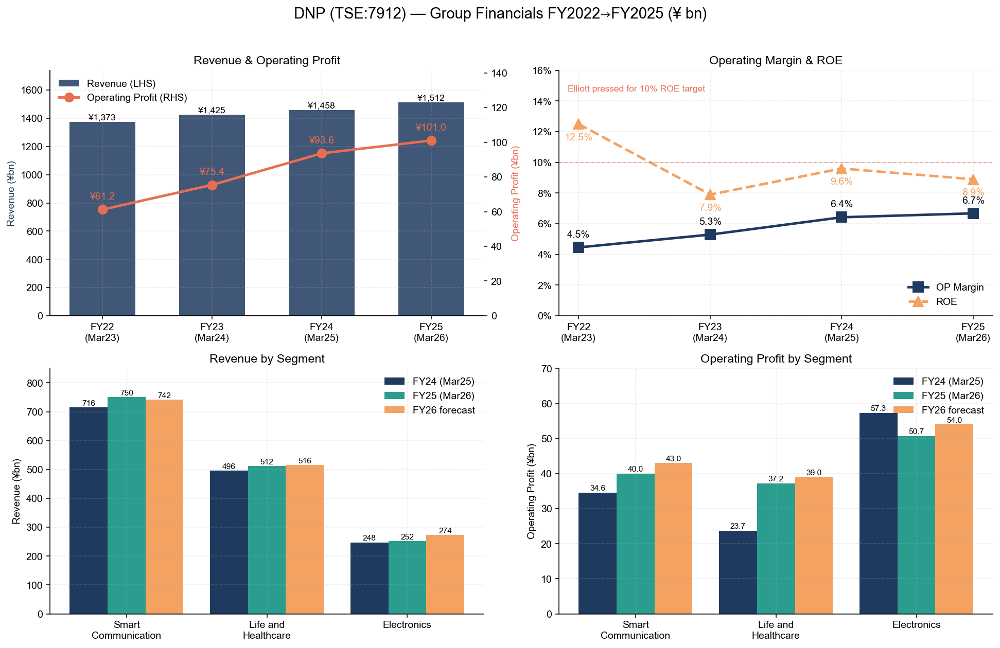
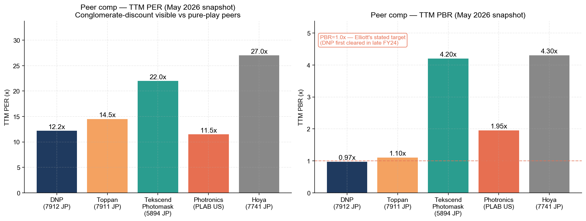
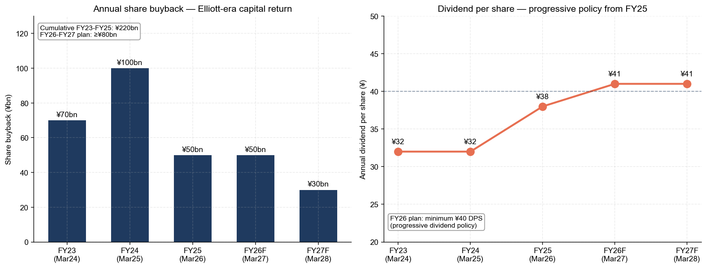
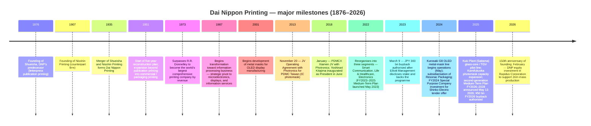

# Company Research Report: Dai Nippon Printing Co., Ltd. (TSE: 7912)

**As of:** 2026-05-26
**Listing:** Tokyo Stock Exchange Prime — ticker `7912` (ADR: `DNPLY`, OTC, ADR:ORD 2:1) ([DNP Integrated Report 2025 — Investor Information, p. 57](https://www.global.dnp/content/dam/dnp-global/pdf/en/ir/library/annual/DNP_integrated2025e.pdf.coredownload.pdf))
**HQ:** 1-1, Ichigaya-Kagacho 1-chome, Shinjuku-ku, Tokyo 162-8001, Japan ([DNP Integrated Report 2025, p. 57](https://www.global.dnp/content/dam/dnp-global/pdf/en/ir/library/annual/DNP_integrated2025e.pdf.coredownload.pdf))
**Founded:** 1876 as Shueisha (集英社, DNP's predecessor); merged with Nisshin Printing in 1935 to form Dai Nippon Printing ([DNP Integrated Report 2025 — History timeline, p. 7](https://www.global.dnp/content/dam/dnp-global/pdf/en/ir/library/annual/DNP_integrated2025e.pdf.coredownload.pdf))
**Fiscal year-end:** March 31. FY2025 = year ended March 31, 2026
**Sector context:** Anchor input — Nomura "Greater China Semi: A guide to Semi renaissance in 2026~30F" ([sector note](/Users/x/projects/financial_agent/reports/sector/半导体材料.md))

> **Update — FY2026 guide + new three-year Medium-Term Plan FY2026–2028 (disclosed 2026-05-13):** With FY2025 (year ended March 31, 2026) results, DNP simultaneously announced a fresh three-year Medium-Term Management Plan targeting operating profit of **¥130 bn by FY2028** (vs. FY2025 actual ¥101.0 bn — CAGR ~9%) and ROE ≥9%, alongside FY2026 guidance of **sales ¥1,530 bn (+1.2% YoY), operating profit ¥108 bn (+6.9%)**. The Electronics segment is guided to **sales ¥274 bn (+¥22.2 bn) / OP ¥54 bn (+¥3.3 bn)** for FY2026 and ¥65 bn OP by FY2028, with explicit capex commitments to EUV-photomask mass production, nanoimprint mold ramp, and a glass-core (TGV) pilot-to-mass-production transition. Capital-return policy was also reset: progressive dividend with a ¥40 minimum DPS plus **¥50 bn buyback in FY2026 and ≥¥30 bn in FY2027 (≥¥80 bn over two years)** — a continuation of the JPY 300 bn programme initiated in March 2023 under Elliott Management's prodding. Source: [DNP FY2025 financial results & FY2026-2028 Medium-Term Management Plan briefing materials, 2026-05-13](https://www.global.dnp/content/dam/dnp-global/pdf/en/ir/library/presentation/dnp_e_25Q4pre.pdf).

---

## Table of Contents

1. Company Overview
2. Company History
3. Management Team
4. Products & Services (Photomask, EUV-class Photomask, Fine Metal Mask, Optical Films, Battery Pouch, Glass Core, Adjacent)
5. Customers & Go-to-Market
6. Industry Overview
7. Competitive Landscape
8. Market Opportunity (TAM)
9. Risk Assessment

References + Step 10 Verification Log

---

## 1. Company Overview

Dai Nippon Printing Co., Ltd. (DNP) is a **150-year-old Japanese printing conglomerate that re-platformed in the 1980s–2000s from publication printing into "P&I" — Printing & Information — and today derives the majority of its operating profit from microelectronics, displays, and lithium-ion battery components rather than printed matter**. The group reports across three segments — **Smart Communication, Life & Healthcare, and Electronics** — and in FY2025 (year ended March 31, 2026) generated consolidated sales of **¥1,512.5 bn (+3.8% YoY) and operating profit of ¥101.0 bn (+7.9% YoY)** on 36,890 employees globally ([DNP FY2025 financial results briefing, p. 3 & p. 5](https://www.global.dnp/content/dam/dnp-global/pdf/en/ir/library/presentation/dnp_e_25Q4pre.pdf); [DNP Integrated Report 2025, p. 57](https://www.global.dnp/content/dam/dnp-global/pdf/en/ir/library/annual/DNP_integrated2025e.pdf.coredownload.pdf)). Although Electronics is the smallest of the three segments by sales (¥251.8 bn, ~17% of total), it contributed **¥50.7 bn (50%) of FY2025 segment-level operating profit** before unallocated corporate adjustments — meaning the Electronics business is what investors are really buying when they buy DNP at today's price ([DNP FY2025 results, p. 6](https://www.global.dnp/content/dam/dnp-global/pdf/en/ir/library/presentation/dnp_e_25Q4pre.pdf)).

**Business model.** DNP layers four core process technologies — *information processing, microfabrication, precision coating, post-processing* — onto whatever substrate the customer needs, applying them to markets as different as smart cards, dye-sublimation printing media, food packaging, decorative laminates, battery pouches, OLED metal masks, and semiconductor photomasks ([DNP FY2025 results, p. 21 — "P&I Innovation" technology stack](https://www.global.dnp/content/dam/dnp-global/pdf/en/ir/library/presentation/dnp_e_25Q4pre.pdf)). Within each line, the source of value-add is a long-cycle proprietary equipment platform that DNP either builds in-house or designs in collaboration with one or two upstream OEMs — high barriers to entry on the equipment side, then a global service / supply organisation that ships into a small number of demanding customers (semiconductor foundries, display panel makers, EV battery cell assemblers). That dual stack — process technology + custom equipment + service-grade global supply — is what management calls "P&I Innovation" and is the same lever DNP says explains the global #1 share positions it holds in lithium-ion battery pouches, OLED metal masks, optical films for displays, and dye-sublimation thermal-transfer media ([DNP IR-Day 2025 deck, p. 45 — "Products Boasting Leading Share"](https://www.global.dnp/content/dam/dnp-global/pdf/en/ir/library/presentation/dnp_e_25irday_pre.pdf)).

**Three segments — what each contains.** *Smart Communication* (FY2025 sales ¥750.3 bn / OP ¥40.0 bn) bundles legacy publishing printing, marketing collateral, content & XR services, plus the focus businesses Information Security (smart cards, BPO services) and Photo Imaging (dye-sublimation thermal-transfer media used in retail photo kiosks and Polaroid-style instant printers) ([DNP FY2025 results, p. 6](https://www.global.dnp/content/dam/dnp-global/pdf/en/ir/library/presentation/dnp_e_25Q4pre.pdf)). *Life & Healthcare* (sales ¥512.3 bn / OP ¥37.2 bn) holds packaging printing, mobility-related decorative films, industrial high-performance materials (where **lithium-ion battery pouches** sit), and a contract-pharma operation built via the 2023 CMIC CMO consolidation. *Electronics* (sales ¥251.8 bn / OP ¥50.7 bn) is the segment that matters to a semiconductor-supply-chain investor — it consists of **Digital Interface** (optical films and OLED metal masks) plus **Semiconductor** (photomasks, plus the emerging glass-core / TGV substrate and nanoimprint mold lines). Although Electronics' sales grew only +1.6% YoY in FY2025, the segment OP fell −11.6% to ¥50.7 bn because of higher depreciation from the Kurosaki G8 metal-mask line and the Kamifukuoka photomask expansion plus a Q4-FY2025 semiconductor-memory-supply pinch that compressed metal-mask shipments to OLED smartphone makers ([DNP FY2025 results, p. 9 — Electronics commentary](https://www.global.dnp/content/dam/dnp-global/pdf/en/ir/library/presentation/dnp_e_25Q4pre.pdf)).

**Geography.** DNP discloses a Japan-centric P&L but is shifting hard towards global revenue in its focus businesses. In Electronics specifically, DNP's photomask supply is anchored at the **Kamifukuoka Plant (Saitama, Japan)** for the front-end semiconductor product, the **Kurosaki Plant (Fukuoka, Japan)** for OLED metal masks and large-area mainstream photomasks, and the **Kuki Plant (Saitama, Japan)** for the new glass-core (TGV) pilot line ([DNP FY2025 results, p. 15 — Key Investments in Focus Business Areas](https://www.global.dnp/content/dam/dnp-global/pdf/en/ir/library/presentation/dnp_e_25Q4pre.pdf)). For semiconductor mask supply outside Japan, DNP operates through two strategic joint ventures with US-listed **Photronics, Inc. (NASDAQ: PLAB)**: the 2013 PDMC joint venture in Taiwan (Hsinchu) for IC photomasks at Asian foundry hubs, and the 2018 PDMCX joint venture in Xiamen, China for IC photomasks at Chinese foundries ([PLAB 10-K FY25, Exhibit Index — Joint Venture Operating Agreements; Note 6 PDMCX](https://www.sec.gov/Archives/edgar/data/810136/000114036125045801/ef20057458_10k.htm)). Photronics consolidates both JVs (PLAB 50.01% economic interest in each); DNP receives the noncontrolling-interest share, which translated into noncontrolling-interest net income of USD 53.8 m at the Photronics consolidated level in FY2025 ([PLAB 10-K FY25, Item 7](https://www.sec.gov/Archives/edgar/data/810136/000114036125045801/ef20057458_10k.htm)) — material to DNP only as a non-operating equity-affiliate contribution, but strategically essential because it puts DNP-branded mask product directly inside the TSMC, UMC, SMIC, Hua Hong, and Nexchip customer base.

*Source: [DNP FY2025 financial results briefing, p. 5, p. 13, p. 14](https://www.global.dnp/content/dam/dnp-global/pdf/en/ir/library/presentation/dnp_e_25Q4pre.pdf); FY2022 baseline ¥61.2 bn OP from Review (1) chart on p. 13.*

**FY2025 vs FY2022 — what the three-year plan actually delivered.** When then-new President Yoshinari Kitajima rolled out the FY2023–2025 Medium-Term Plan in May 2023, the target was OP ≥¥85 bn by FY2025; FY2025 actual was **¥101.0 bn**, 19% above the original plan and reached one year ahead of schedule ([DNP IR-Day 2025, p. 5](https://www.global.dnp/content/dam/dnp-global/pdf/en/ir/library/presentation/dnp_e_25irday_pre.pdf)). Operating profit composition shifted decisively: in FY2022, Electronics was 57% of segment OP (¥46.9 bn of ¥81.6 bn segment total); by FY2025 it was 40% (¥50.7 bn of ¥127.9 bn) — not because Electronics shrank but because Smart Communication and Life & Healthcare grew off historically low bases through structural reform (publishing printing site closures, packaging fixed-asset rationalisation, photovoltaic encapsulant capacity-ramp) ([DNP FY2025 results, p. 14 — Review (3): Operating Profit Change by Segment](https://www.global.dnp/content/dam/dnp-global/pdf/en/ir/library/presentation/dnp_e_25Q4pre.pdf)). ROE rose from 5.6% in FY2022 to **9.6% in FY2024 (peak) and 8.9% in FY2025**, both ahead of the 8% cost-of-equity ceiling DNP estimates for itself ([DNP IR-Day 2025, p. 5](https://www.global.dnp/content/dam/dnp-global/pdf/en/ir/library/presentation/dnp_e_25irday_pre.pdf)).

**Valuation snapshot.** As of 2026-05-13 ([Companies Market Cap — Dai Nippon Printing P/E ratio history](https://companiesmarketcap.com/dai-nippon-printing/pe-ratio/); [Companies Market Cap — DNP market capitalization](https://companiesmarketcap.com/dai-nippon-printing/marketcap/); [Yahoo Finance 7912.T](https://finance.yahoo.com/quote/7912.T/)):

| Metric | DNP (7912) | Toppan (7911) | Hoya (7741) | Photronics (PLAB) |
|---|---|---|---|---|
| Price | JPY 3,264 | JPY ~5,300 | JPY ~17,000 | USD ~52 |
| Market cap | JPY ~1.41 T (USD ~7.9 B) | JPY ~1.7 T | JPY ~6.1 T | USD ~3.0 B |
| TTM P/E | **~5.2× (depressed by gain-on-sale tailwinds reverting)** | ~12× | ~24× | ~22× |
| EPS (TTM) | JPY 179 | — | — | USD 2.33 |
| 52-wk range | JPY 2,500 – 3,400 | — | — | — |
| Dividend yield | ~1.3% | ~2% | ~0.7% | 0% (buyback-led) |

*Source: P/E ratios from [Companies Market Cap — DNP](https://companiesmarketcap.com/dai-nippon-printing/pe-ratio/); market caps from [Companies Market Cap — DNP marketcap](https://companiesmarketcap.com/dai-nippon-printing/marketcap/); Photronics from [Stockanalysis.com PLAB](https://stockanalysis.com/stocks/plab/); Hoya peer P/E from [Hoya peer chart in companion report](../../charts/hoya_peer_pe.png).*

**How to read the multiple.** DNP's headline TTM P/E of ~5× is misleadingly low. FY2024 (year ended March 31, 2025) net profit was inflated by ¥220 bn of gains on the sale of policy shareholdings under the cross-shareholding-unwind programme — the largest single-year disposal in DNP's history. FY2025 net profit of ¥103.9 bn still benefited from residual gains-on-sale (a ¥50 bn FY2025 disposal vs ¥170 bn cumulative FY2023–24) ([DNP FY2025 results, p. 16 — Review (5): Financial Strategy](https://www.global.dnp/content/dam/dnp-global/pdf/en/ir/library/presentation/dnp_e_25Q4pre.pdf)). Underlying **ROE excluding special gains and losses was around 7%** in FY2025 — slightly above the 6–8% cost-of-equity range management estimates ([DNP IR-Day 2025, p. 5](https://www.global.dnp/content/dam/dnp-global/pdf/en/ir/library/presentation/dnp_e_25irday_pre.pdf)). The FY2026 guidance of net profit ¥95 bn (−8.6% YoY) prices in the disposal pipeline tapering. *Analyst view:* on a normalised "operating earnings only" basis the multiple is closer to ~10–12× — still a discount to Toppan's ~12× and a deep discount to Hoya's ~24× because the market is paying for **mix purity**: Hoya's Electronics segment (EUV mask blanks + HDD glass disks + ophthalmic lenses) is ~50% of group sales and runs at 28% OP margin; DNP Electronics is ~17% of group sales and runs at 20% OP margin, but is buried inside a conglomerate where the legacy publishing-printing and packaging businesses dilute group ROE. The buyback-led capital return programme is the explicit lever management is using to close the gap. FY2025 PBR rose from 0.9× (March 2023, when Elliott disclosed the stake and the JPY 300 bn buyback was authorised) to 1.1× (March 2026) ([DNP FY2025 results, p. 13](https://www.global.dnp/content/dam/dnp-global/pdf/en/ir/library/presentation/dnp_e_25Q4pre.pdf)).

**Capital return.** DNP's FY2023–25 programme delivered **¥291.1 bn of share buybacks** (¥152.9 bn FY2023 + ¥57.4 bn FY2024 + ¥80.8 bn FY2025) plus ¥220 bn of policy-shareholding disposals. FY2026 plan adds **¥50 bn buyback** with at least ¥30 bn more in FY2027 (≥¥80 bn over the two-year period) plus a progressive dividend with ¥40/share floor (FY2026 guided ¥41/share, third consecutive annual increase) ([DNP FY2025 results, p. 17 and p. 40](https://www.global.dnp/content/dam/dnp-global/pdf/en/ir/library/presentation/dnp_e_25Q4pre.pdf)). Cumulative shareholder return FY2023–FY2028 is on a path to exceed ¥440 bn — roughly 30% of today's market cap.

*Source: [DNP FY2025 financial results, p. 17 (Financial Strategy) + p. 39 (FY2026-2028 Cash Allocation Plan) + p. 40 (Dividend history)](https://www.global.dnp/content/dam/dnp-global/pdf/en/ir/library/presentation/dnp_e_25Q4pre.pdf).*

**The dual identity.** A research investor needs to keep both lenses in view simultaneously: **(i) the conglomerate de-rate story** (cross-shareholding unwind, structural reform of publishing and packaging, buyback as the PBR lever) which is largely a Japan-domestic capital-allocation thesis; and **(ii) the Electronics business** (photomask + OLED metal mask + lithium-ion battery pouch + glass core + nanoimprint) which is a leveraged play on the same AI / advanced-packaging / OLED-IT / EV-battery secular waves that drive Hoya, Resonac, Shin-Etsu Chemical, and the Japanese semiconductor materials complex more broadly. The two stories are linked: the capital-allocation reset is what releases cash to fund the ¥120 bn FY2026–2028 R&D commitment and the ¥300 bn capex commitment, both heavily skewed to Electronics ([DNP FY2025 results, p. 32 and p. 39](https://www.global.dnp/content/dam/dnp-global/pdf/en/ir/library/presentation/dnp_e_25Q4pre.pdf)). Section 4 walks the products one by one; Section 7 names the competitors; Section 9 separates the cyclical and structural risks.

## 2. Company History

DNP traces its founding to **1876** as Shueisha (集英社), a publishing-printing operation that was Japan's first to introduce Western movable-type letterpress at scale; the modern Dai Nippon Printing Co., Ltd. was formed by the **1935 merger of Shueisha and Nisshin Printing** (founded 1907) ([DNP Integrated Report 2025, p. 7 — DNP History timeline](https://www.global.dnp/content/dam/dnp-global/pdf/en/ir/library/annual/DNP_integrated2025e.pdf.coredownload.pdf)). The "Second Corporate Founding" came in 1951 when, under post-war reconstruction, the company moved beyond publication printing into commercial printing, packaging printing, and decorative printing — re-applying letterpress, etching, photolithography, and coating processes to industrial substrates. By **1973 DNP had surpassed R.R. Donnelley & Sons of the US to become the world's largest comprehensive printing company by revenue** — a position that anchored its self-image but also became the strategic albatross of the 1990s–2000s as global publishing-printing volumes contracted ([DNP Integrated Report 2025, p. 7](https://www.global.dnp/content/dam/dnp-global/pdf/en/ir/library/annual/DNP_integrated2025e.pdf.coredownload.pdf)).

The strategic pivot that defines today's DNP began in **1987** under the "transformation toward information processing business" banner: management started repositioning the technology stack — etching, photolithography, precision coating, deposition — toward microelectronics and display applications. By the early 2000s, the company had built positions in shadow masks for CRT displays, then liquid-crystal-display color filters, then optical films for displays, then OLED metal masks (development began in 2001) and semiconductor photomasks ([DNP IR-Day 2025, p. 63 — History of DNP's Display Business](https://www.global.dnp/content/dam/dnp-global/pdf/en/ir/library/presentation/dnp_e_25irday_pre.pdf)). The 2018 inauguration of Yoshinari Kitajima as President marked the transition to the current "Third Corporate Founding" framing — actively portfolio-reshaping the conglomerate around three segments (announced 2022) and treating P&I as a tradable set of process capabilities the group will apply to whatever market offers the best return on capital ([DNP Integrated Report 2025, p. 3 — Top Message](https://www.global.dnp/content/dam/dnp-global/pdf/en/ir/library/annual/DNP_integrated2025e.pdf.coredownload.pdf)).

*Source: composed from [DNP Integrated Report 2025, p. 7 — History timeline](https://www.global.dnp/content/dam/dnp-global/pdf/en/ir/library/annual/DNP_integrated2025e.pdf.coredownload.pdf); [DNP FY2025 results, p. 15 — Key Investments](https://www.global.dnp/content/dam/dnp-global/pdf/en/ir/library/presentation/dnp_e_25Q4pre.pdf); [PLAB 10-K FY25 Exhibit Index — JV Operating Agreements](https://www.sec.gov/Archives/edgar/data/810136/000114036125045801/ef20057458_10k.htm); [Elliott Statement on Dai Nippon Printing, 2023-03-09](https://www.prnewswire.com/news-releases/elliott-statement-on-dai-nippon-printing-301768540.html); [DNP press release on Rapidus investment, 2026-02-24](https://www.businesswire.com/news/home/20260224169578/en/DNP-Invests-in-Rapidus-to-Support-the-Establishment-of-Mass-Production-for-Next-Generation-Semiconductors).*

**Two strategic pivots that define the modern company.**

*Pivot 1 — From world's largest commercial printer to "P&I" platform (1987–2022).* The thirty-five-year journey from R.R. Donnelley-style printing conglomerate to the current three-segment P&I platform is what gave DNP its current asset shape. By 1987 DNP had already noticed that publication-printing volumes were peaking in developed markets; over the following two decades the company quietly built positions in **shadow masks** (the predecessor technology to OLED metal masks, used to pattern the phosphor stripes on cathode-ray tubes), **LCD color filters**, **optical films**, **smart cards**, **dye-sublimation thermal-transfer media**, and **photomasks for semiconductors** — each chosen because DNP's existing process technology (etching, photolithography, precision coating) could be redirected with manageable incremental capex ([DNP IR-Day 2025, p. 63 — History of DNP's Display Business](https://www.global.dnp/content/dam/dnp-global/pdf/en/ir/library/presentation/dnp_e_25irday_pre.pdf)). The 2013 Photronics JV in Taiwan and the 2018 Photronics JV in Xiamen were the international-scale-up moves: DNP got Photronics' multi-site presence inside the Asian foundry corridor without having to build greenfield mask shops itself; Photronics got DNP's writing-tool deck and process IP that let it move into ≤28nm mask production credibly ([PLAB 10-K FY25, Note 6 PDMCX](https://www.sec.gov/Archives/edgar/data/810136/000114036125045801/ef20057458_10k.htm)). The 2022 reorganisation into three segments (Smart Communication, Life & Healthcare, Electronics) was the moment the new portfolio became explicit on the income statement.

*Pivot 2 — Elliott-catalysed capital allocation reset (2023).* On March 9, 2023, DNP authorised the largest share buyback in its history — **JPY 300 bn, or ~30% of the company's market capitalisation at the time** — in a programme structured to run over the FY2023–2027 Medium-Term Plan window. Elliott Management, which had publicly disclosed a position in the prior weeks, issued a same-day statement of support and the stock jumped 13% ([Nasdaq.com — DNP up 13% on share buyback plan, gets Elliott's support, 2023-03-10](https://www.nasdaq.com/articles/dai-nippon-printing-up-13-on-share-buyback-plan-gets-elliotts-support); [Elliott Statement on Dai Nippon Printing, 2023-03-09](https://www.prnewswire.com/news-releases/elliott-statement-on-dai-nippon-printing-301768540.html)). The buyback was paired with the **policy-shareholding unwind programme** — DNP committed to reducing strategic cross-shareholdings to <10% of consolidated net assets, generating ¥220 bn of cumulative disposal proceeds by FY2025 and reaching 13.4% as of FY2025 close ([DNP FY2025 results, p. 17 — Review (5)](https://www.global.dnp/content/dam/dnp-global/pdf/en/ir/library/presentation/dnp_e_25Q4pre.pdf)). The combination — cross-holding-unwind cash → buyback → reduced share count → higher ROE → higher PBR — is the textbook Japanese-corporate-governance reform sequence; DNP executed it more decisively than most TSE Prime peers and is being rewarded for it.

**Recent developments (last 24 months).** (1) **CMIC CMO subsidiarisation (FY2023)** — pharma contract-manufacturing of APIs and finished drug products entered the Life & Healthcare portfolio. (2) **DNP Hikari Kinzoku consolidation (FY2024)** — HMI (human-machine interface) components for automotive interior. (3) **Resonac Packaging subsidiarisation (FY2024)** — packaging-films business moved fully in-house. (4) **Shinko Electric Industries SPC investment (FY2024)** — DNP took 15% of the JIC-led SPC vehicle that completed the **¥400 bn tender offer for 49.98% of Shinko Electric** alongside Mitsui Chemicals (5%) and JIC Capital (80%); Shinko Electric is the global leader in advanced FCBGA package substrates and delisted in June 2025 — DNP's stake gives it a strategic seat in advanced-packaging substrate supply just as glass-core competes with organic FCBGA at the leading edge ([Mitsui Chemicals — Notice Regarding Commencement of Tender Offer to Acquire Shares in SHINKO ELECTRIC INDUSTRIES, 2025-02-17](https://jp.mitsuichemicals.com/en/release/2025/2025_0217/index.htm); [Digitimes — Shinko Electric to delist in June, eye DNP and Mitsui Chemicals partnership on backend process materials, 2025-03-21](https://www.digitimes.com/news/a20250321PD206/shinko-electric-mitsui-chemicals-materials-partnership-fujitsu.html)). (5) **Rubicon SEZC (FY2025)** — Information Security global expansion via the integration of Rubicon's smart-card platform. (6) **Kamifukuoka and Kuki Plant capex (FY2025)** — DNP added a photomask capacity expansion at the Kamifukuoka Plant (Saitama, principal photomask hub) for advanced-node mass production, and inaugurated a glass-core (TGV) pilot line at the Kuki Plant (Saitama) ([DNP FY2025 results, p. 15](https://www.global.dnp/content/dam/dnp-global/pdf/en/ir/library/presentation/dnp_e_25Q4pre.pdf)). (7) **Rapidus equity investment (FY2026, Feb 2026)** — DNP took an equity stake in Rapidus Corporation, the Japanese government-backed advanced-node foundry building 2nm in Hokkaido — formalising the prior 2024 NEDO subcontracting relationship in which DNP was selected to supply photomasks for Rapidus's 2nm Hokkaido pilot line ([DNP press release — DNP Invests in Rapidus, 2026-02-24](https://www.businesswire.com/news/home/20260224169578/en/DNP-Invests-in-Rapidus-to-Support-the-Establishment-of-Mass-Production-for-Next-Generation-Semiconductors); [Digitimes — DNP to supply photomasks to Rapidus for 2nm chips in 2027, 2024-03-27](https://www.digitimes.com/news/a20240327PD213/dai-nippon-printing-photomask-rapidus-2nm.html)).

## 3. Management Team

DNP is a 150-year-old founder-less industrial company; there is no founder bio to write in the modern sense. The 1876 founding of Shueisha was a partnership of Sakujiro Shukuya and Toranosuke Sato, but management lineage flowed through the Kitajima family from the post-1935 merger onward — Kitajima Yoshiro (former Chairman) and Yoshitoshi Kitajima (former President) anchored the 1990s–2010s. **The current President is Yoshinari Kitajima** (also a Kitajima-family descendant), who has held the role since June 2018 and chairs the Sustainability Committee since April 2022. He is the executive who authored the 2022 three-segment reorganisation, the 2023 Elliott-era capital-allocation reset, and the FY2026–2028 plan announced May 2026.

### Yoshinari Kitajima — President (since June 2018)

Yoshinari Kitajima, **born September 18, 1964**, is the President of Dai Nippon Printing Co., Ltd. and the executive most closely identified with the company's modern reinvention. He joined Fuji Bank (now Mizuho Bank) in April 1987 immediately after graduating from university, gaining four years of corporate-banking exposure before joining DNP in **March 1995** ([DNP Integrated Report 2025, p. 41 — Director Biographies](https://www.global.dnp/content/dam/dnp-global/pdf/en/ir/library/annual/DNP_integrated2025e.pdf.coredownload.pdf)). His DNP career path was atypically fast: Director in June 2001, Managing Director in June 2003, Senior Managing Director in June 2005, Executive Vice President in June 2009, and President in **June 2018** — making him one of the longest-tenured incumbent presidents of any TSE Prime conglomerate ([DNP Integrated Report 2025, p. 41](https://www.global.dnp/content/dam/dnp-global/pdf/en/ir/library/annual/DNP_integrated2025e.pdf.coredownload.pdf)).

His operational accomplishments during the seven-year presidency are concrete and measurable: (1) **Repositioned the segment structure from five reporting lines to three** (Smart Communication / Life & Healthcare / Electronics, effective FY2022), making the conglomerate's portfolio thesis legible to outside investors for the first time; (2) **Executed the JPY 300 bn buyback authorised March 9 2023** — the largest in DNP's history — with Elliott Management providing public backing ([Elliott Statement on Dai Nippon Printing, 2023-03-09](https://www.prnewswire.com/news-releases/elliott-statement-on-dai-nippon-printing-301768540.html)); (3) **Reduced policy shareholdings by ¥220 bn over FY2023–FY2025**, bringing cross-holdings below 13.4% of net assets versus an explicit <10% target; (4) **Delivered the FY2023–2025 Medium-Term Plan one year ahead of schedule** — FY2024 OP of ¥93.6 bn surpassed the ¥85 bn FY2025 target ([DNP IR-Day 2025, p. 5](https://www.global.dnp/content/dam/dnp-global/pdf/en/ir/library/presentation/dnp_e_25irday_pre.pdf)); (5) **Re-platformed the Electronics segment investment plan** around photomask, OLED metal mask, glass core, and nanoimprint — committing roughly ¥30 bn of FY2026–2028 capex to semiconductor focus areas alone ([DNP IR-Day 2025, p. 56 — Semiconductor Photomask Sales Plan; FY2026-FY2028 capex ¥30 bn](https://www.global.dnp/content/dam/dnp-global/pdf/en/ir/library/presentation/dnp_e_25irday_pre.pdf)).

Kitajima's qualification as Director is described in the Integrated Report as drawing on his "considerable experience as a management executive in the DNP Group" — a Japanese corporate-governance euphemism for *internal lifer with deep operational credibility*. Unlike many Japanese conglomerate CEOs, he is publicly aligned with the activist-friendly capital-return regime: the FY2026 Medium-Term Plan explicitly preserves progressive dividends with a ¥40/share floor and reaffirms ≥¥80 bn buybacks over FY2026–FY2027, with explicit reference to "flexibility based on share price levels and capital efficiency" — language consistent with active per-share value optimisation rather than the more passive-Japanese-corporate-default of dividend-only payout ([DNP FY2025 results, p. 39–40 — Shareholder Returns Policy](https://www.global.dnp/content/dam/dnp-global/pdf/en/ir/library/presentation/dnp_e_25Q4pre.pdf)). His ownership stake is not separately disclosed in the FY2025 Integrated Report; the Kitajima family does not appear as a top-10 shareholder, all of which are institutional trust accounts and life-insurance holders ([DNP Integrated Report 2025, p. 57 — Major Shareholders](https://www.global.dnp/content/dam/dnp-global/pdf/en/ir/library/annual/DNP_integrated2025e.pdf.coredownload.pdf)).

The succession question — Kitajima will turn 62 in September 2026 — is not yet acute; mandatory-retirement convention at Japanese conglomerates typically falls 66–68. The most senior internal candidate is **Osamu Nakamura** (born 1962, Senior Managing Director since June 2025) who runs Fine Device Operations / Optoelectronics Operations / R&D — the Electronics segment, in plain English — and chairs DT Fine Electronics, the photomask JV with Kioxia ([DNP Integrated Report 2025, p. 41](https://www.global.dnp/content/dam/dnp-global/pdf/en/ir/library/annual/DNP_integrated2025e.pdf.coredownload.pdf)). The implied succession reads as continuity-on-Electronics-strategy: whoever follows Kitajima is highly likely to come from the Electronics organisation rather than from the legacy printing side.

