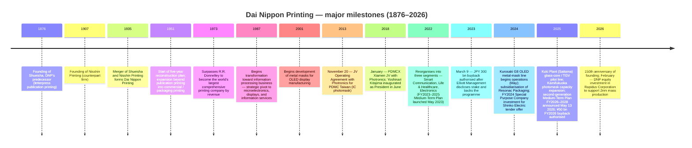
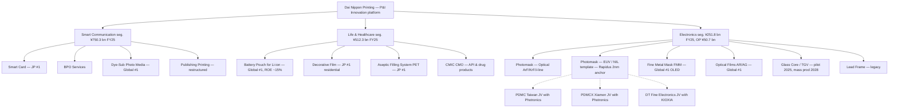
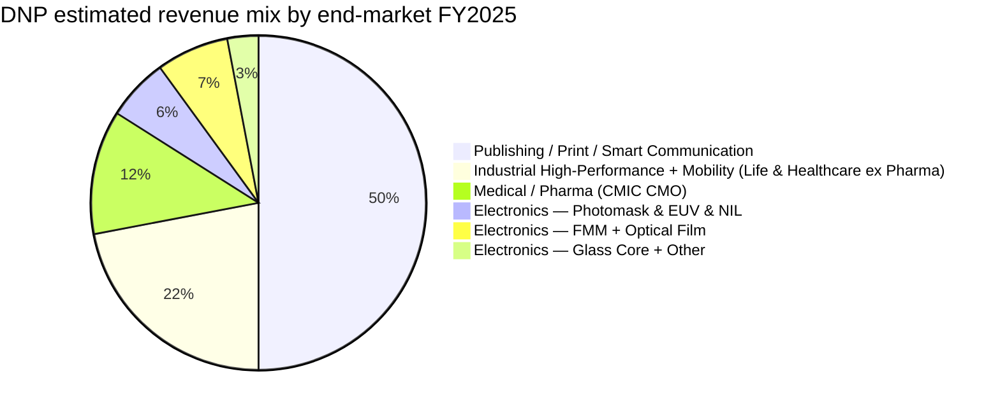
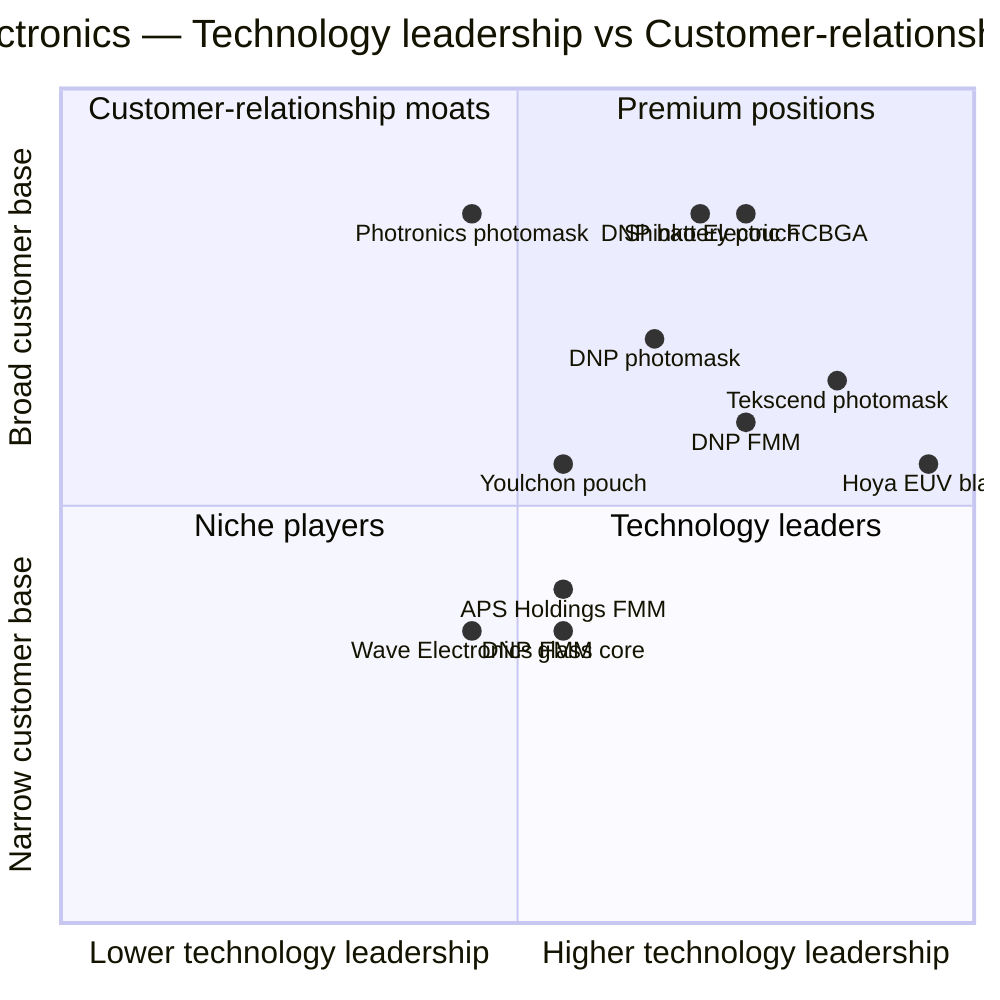

# Company Research Report: Dai Nippon Printing Co., Ltd. (TSE: 7912)

**As of:** 2026-05-26
**Listing:** Tokyo Stock Exchange Prime — ticker `7912` (ADR: `DNPLY`, OTC, ADR:ORD 2:1) ([DNP Integrated Report 2025 — Investor Information, p. 57](https://www.global.dnp/content/dam/dnp-global/pdf/en/ir/library/annual/DNP_integrated2025e.pdf.coredownload.pdf))
**HQ:** 1-1, Ichigaya-Kagacho 1-chome, Shinjuku-ku, Tokyo 162-8001, Japan ([DNP Integrated Report 2025, p. 57](https://www.global.dnp/content/dam/dnp-global/pdf/en/ir/library/annual/DNP_integrated2025e.pdf.coredownload.pdf))
**Founded:** 1876 as Shueisha (集英社, DNP's predecessor); merged with Nisshin Printing in 1935 to form Dai Nippon Printing ([DNP Integrated Report 2025 — History timeline, p. 7](https://www.global.dnp/content/dam/dnp-global/pdf/en/ir/library/annual/DNP_integrated2025e.pdf.coredownload.pdf))
**Fiscal year-end:** March 31. FY2025 = year ended March 31, 2026
**Sector context:** Anchor input — Nomura "Greater China Semi: A guide to Semi renaissance in 2026~30F" ([sector note](/Users/x/projects/financial_agent/reports/sector/半导体材料.md))

> **Update — FY2026 guide + new three-year Medium-Term Plan FY2026–2028 (disclosed 2026-05-13):** With FY2025 (year ended March 31, 2026) results, DNP simultaneously announced a fresh three-year Medium-Term Management Plan targeting operating profit of **¥130 bn by FY2028** (vs. FY2025 actual ¥101.0 bn — CAGR ~9%) and ROE ≥9%, alongside FY2026 guidance of **sales ¥1,530 bn (+1.2% YoY), operating profit ¥108 bn (+6.9%)**. The Electronics segment is guided to **sales ¥274 bn (+¥22.2 bn) / OP ¥54 bn (+¥3.3 bn)** for FY2026 and ¥65 bn OP by FY2028, with explicit capex commitments to EUV-photomask mass production, nanoimprint mold ramp, and a glass-core (TGV) pilot-to-mass-production transition. Capital-return policy was also reset: progressive dividend with a ¥40 minimum DPS plus **¥50 bn buyback in FY2026 and ≥¥30 bn in FY2027 (≥¥80 bn over two years)** — a continuation of the JPY 300 bn programme initiated in March 2023 under Elliott Management's prodding. Source: [DNP FY2025 financial results & FY2026-2028 Medium-Term Management Plan briefing materials, 2026-05-13](https://www.global.dnp/content/dam/dnp-global/pdf/en/ir/library/presentation/dnp_e_25Q4pre.pdf).

---

## Table of Contents

1. Company Overview
2. Company History
3. Management Team
4. Products & Services (Photomask, EUV-class Photomask, Fine Metal Mask, Optical Films, Battery Pouch, Glass Core, Adjacent)
5. Customers & Go-to-Market
6. Industry Overview
7. Competitive Landscape
8. Market Opportunity (TAM)
9. Risk Assessment

References + Step 10 Verification Log

---

## 1. Company Overview

Dai Nippon Printing Co., Ltd. (DNP) is a **150-year-old Japanese printing conglomerate that re-platformed in the 1980s–2000s from publication printing into "P&I" — Printing & Information — and today derives the majority of its operating profit from microelectronics, displays, and lithium-ion battery components rather than printed matter**. The group reports across three segments — **Smart Communication, Life & Healthcare, and Electronics** — and in FY2025 (year ended March 31, 2026) generated consolidated sales of **¥1,512.5 bn (+3.8% YoY) and operating profit of ¥101.0 bn (+7.9% YoY)** on 36,890 employees globally ([DNP FY2025 financial results briefing, p. 3 & p. 5](https://www.global.dnp/content/dam/dnp-global/pdf/en/ir/library/presentation/dnp_e_25Q4pre.pdf); [DNP Integrated Report 2025, p. 57](https://www.global.dnp/content/dam/dnp-global/pdf/en/ir/library/annual/DNP_integrated2025e.pdf.coredownload.pdf)). Although Electronics is the smallest of the three segments by sales (¥251.8 bn, ~17% of total), it contributed **¥50.7 bn (50%) of FY2025 segment-level operating profit** before unallocated corporate adjustments — meaning the Electronics business is what investors are really buying when they buy DNP at today's price ([DNP FY2025 results, p. 6](https://www.global.dnp/content/dam/dnp-global/pdf/en/ir/library/presentation/dnp_e_25Q4pre.pdf)).

**Business model.** DNP layers four core process technologies — *information processing, microfabrication, precision coating, post-processing* — onto whatever substrate the customer needs, applying them to markets as different as smart cards, dye-sublimation printing media, food packaging, decorative laminates, battery pouches, OLED metal masks, and semiconductor photomasks ([DNP FY2025 results, p. 21 — "P&I Innovation" technology stack](https://www.global.dnp/content/dam/dnp-global/pdf/en/ir/library/presentation/dnp_e_25Q4pre.pdf)). Within each line, the source of value-add is a long-cycle proprietary equipment platform that DNP either builds in-house or designs in collaboration with one or two upstream OEMs — high barriers to entry on the equipment side, then a global service / supply organisation that ships into a small number of demanding customers (semiconductor foundries, display panel makers, EV battery cell assemblers). That dual stack — process technology + custom equipment + service-grade global supply — is what management calls "P&I Innovation" and is the same lever DNP says explains the global #1 share positions it holds in lithium-ion battery pouches, OLED metal masks, optical films for displays, and dye-sublimation thermal-transfer media ([DNP IR-Day 2025 deck, p. 45 — "Products Boasting Leading Share"](https://www.global.dnp/content/dam/dnp-global/pdf/en/ir/library/presentation/dnp_e_25irday_pre.pdf)).

**Three segments — what each contains.** *Smart Communication* (FY2025 sales ¥750.3 bn / OP ¥40.0 bn) bundles legacy publishing printing, marketing collateral, content & XR services, plus the focus businesses Information Security (smart cards, BPO services) and Photo Imaging (dye-sublimation thermal-transfer media used in retail photo kiosks and Polaroid-style instant printers) ([DNP FY2025 results, p. 6](https://www.global.dnp/content/dam/dnp-global/pdf/en/ir/library/presentation/dnp_e_25Q4pre.pdf)). *Life & Healthcare* (sales ¥512.3 bn / OP ¥37.2 bn) holds packaging printing, mobility-related decorative films, industrial high-performance materials (where **lithium-ion battery pouches** sit), and a contract-pharma operation built via the 2023 CMIC CMO consolidation. *Electronics* (sales ¥251.8 bn / OP ¥50.7 bn) is the segment that matters to a semiconductor-supply-chain investor — it consists of **Digital Interface** (optical films and OLED metal masks) plus **Semiconductor** (photomasks, plus the emerging glass-core / TGV substrate and nanoimprint mold lines). Although Electronics' sales grew only +1.6% YoY in FY2025, the segment OP fell −11.6% to ¥50.7 bn because of higher depreciation from the Kurosaki G8 metal-mask line and the Kamifukuoka photomask expansion plus a Q4-FY2025 semiconductor-memory-supply pinch that compressed metal-mask shipments to OLED smartphone makers ([DNP FY2025 results, p. 9 — Electronics commentary](https://www.global.dnp/content/dam/dnp-global/pdf/en/ir/library/presentation/dnp_e_25Q4pre.pdf)).

**Geography.** DNP discloses a Japan-centric P&L but is shifting hard towards global revenue in its focus businesses. In Electronics specifically, DNP's photomask supply is anchored at the **Kamifukuoka Plant (Saitama, Japan)** for the front-end semiconductor product, the **Kurosaki Plant (Fukuoka, Japan)** for OLED metal masks and large-area mainstream photomasks, and the **Kuki Plant (Saitama, Japan)** for the new glass-core (TGV) pilot line ([DNP FY2025 results, p. 15 — Key Investments in Focus Business Areas](https://www.global.dnp/content/dam/dnp-global/pdf/en/ir/library/presentation/dnp_e_25Q4pre.pdf)). For semiconductor mask supply outside Japan, DNP operates through two strategic joint ventures with US-listed **Photronics, Inc. (NASDAQ: PLAB)**: the 2013 PDMC joint venture in Taiwan (Hsinchu) for IC photomasks at Asian foundry hubs, and the 2018 PDMCX joint venture in Xiamen, China for IC photomasks at Chinese foundries ([PLAB 10-K FY25, Exhibit Index — Joint Venture Operating Agreements; Note 6 PDMCX](https://www.sec.gov/Archives/edgar/data/810136/000114036125045801/ef20057458_10k.htm)). Photronics consolidates both JVs (PLAB 50.01% economic interest in each); DNP receives the noncontrolling-interest share, which translated into noncontrolling-interest net income of USD 53.8 m at the Photronics consolidated level in FY2025 ([PLAB 10-K FY25, Item 7](https://www.sec.gov/Archives/edgar/data/810136/000114036125045801/ef20057458_10k.htm)) — material to DNP only as a non-operating equity-affiliate contribution, but strategically essential because it puts DNP-branded mask product directly inside the TSMC, UMC, SMIC, Hua Hong, and Nexchip customer base.

*Source: [DNP FY2025 financial results briefing, p. 5, p. 13, p. 14](https://www.global.dnp/content/dam/dnp-global/pdf/en/ir/library/presentation/dnp_e_25Q4pre.pdf); FY2022 baseline ¥61.2 bn OP from Review (1) chart on p. 13.*

**FY2025 vs FY2022 — what the three-year plan actually delivered.** When then-new President Yoshinari Kitajima rolled out the FY2023–2025 Medium-Term Plan in May 2023, the target was OP ≥¥85 bn by FY2025; FY2025 actual was **¥101.0 bn**, 19% above the original plan and reached one year ahead of schedule ([DNP IR-Day 2025, p. 5](https://www.global.dnp/content/dam/dnp-global/pdf/en/ir/library/presentation/dnp_e_25irday_pre.pdf)). Operating profit composition shifted decisively: in FY2022, Electronics was 57% of segment OP (¥46.9 bn of ¥81.6 bn segment total); by FY2025 it was 40% (¥50.7 bn of ¥127.9 bn) — not because Electronics shrank but because Smart Communication and Life & Healthcare grew off historically low bases through structural reform (publishing printing site closures, packaging fixed-asset rationalisation, photovoltaic encapsulant capacity-ramp) ([DNP FY2025 results, p. 14 — Review (3): Operating Profit Change by Segment](https://www.global.dnp/content/dam/dnp-global/pdf/en/ir/library/presentation/dnp_e_25Q4pre.pdf)). ROE rose from 5.6% in FY2022 to **9.6% in FY2024 (peak) and 8.9% in FY2025**, both ahead of the 8% cost-of-equity ceiling DNP estimates for itself ([DNP IR-Day 2025, p. 5](https://www.global.dnp/content/dam/dnp-global/pdf/en/ir/library/presentation/dnp_e_25irday_pre.pdf)).

**Valuation snapshot.** As of 2026-05-13 ([Companies Market Cap — Dai Nippon Printing P/E ratio history](https://companiesmarketcap.com/dai-nippon-printing/pe-ratio/); [Companies Market Cap — DNP market capitalization](https://companiesmarketcap.com/dai-nippon-printing/marketcap/); [Yahoo Finance 7912.T](https://finance.yahoo.com/quote/7912.T/)):

| Metric | DNP (7912) | Toppan (7911) | Hoya (7741) | Photronics (PLAB) |
|---|---|---|---|---|
| Price | JPY 3,264 | JPY ~5,300 | JPY ~17,000 | USD ~52 |
| Market cap | JPY ~1.41 T (USD ~7.9 B) | JPY ~1.7 T | JPY ~6.1 T | USD ~3.0 B |
| TTM P/E | **~5.2× (depressed by gain-on-sale tailwinds reverting)** | ~12× | ~24× | ~22× |
| EPS (TTM) | JPY 179 | — | — | USD 2.33 |
| 52-wk range | JPY 2,500 – 3,400 | — | — | — |
| Dividend yield | ~1.3% | ~2% | ~0.7% | 0% (buyback-led) |

*Source: P/E ratios from [Companies Market Cap — DNP](https://companiesmarketcap.com/dai-nippon-printing/pe-ratio/); market caps from [Companies Market Cap — DNP marketcap](https://companiesmarketcap.com/dai-nippon-printing/marketcap/); Photronics from [Stockanalysis.com PLAB](https://stockanalysis.com/stocks/plab/); Hoya peer P/E from [Hoya peer chart in companion report](../../charts/hoya_peer_pe.png).*

**How to read the multiple.** DNP's headline TTM P/E of ~5× is misleadingly low. FY2024 (year ended March 31, 2025) net profit was inflated by ¥220 bn of gains on the sale of policy shareholdings under the cross-shareholding-unwind programme — the largest single-year disposal in DNP's history. FY2025 net profit of ¥103.9 bn still benefited from residual gains-on-sale (a ¥50 bn FY2025 disposal vs ¥170 bn cumulative FY2023–24) ([DNP FY2025 results, p. 16 — Review (5): Financial Strategy](https://www.global.dnp/content/dam/dnp-global/pdf/en/ir/library/presentation/dnp_e_25Q4pre.pdf)). Underlying **ROE excluding special gains and losses was around 7%** in FY2025 — slightly above the 6–8% cost-of-equity range management estimates ([DNP IR-Day 2025, p. 5](https://www.global.dnp/content/dam/dnp-global/pdf/en/ir/library/presentation/dnp_e_25irday_pre.pdf)). The FY2026 guidance of net profit ¥95 bn (−8.6% YoY) prices in the disposal pipeline tapering. *Analyst view:* on a normalised "operating earnings only" basis the multiple is closer to ~10–12× — still a discount to Toppan's ~12× and a deep discount to Hoya's ~24× because the market is paying for **mix purity**: Hoya's Electronics segment (EUV mask blanks + HDD glass disks + ophthalmic lenses) is ~50% of group sales and runs at 28% OP margin; DNP Electronics is ~17% of group sales and runs at 20% OP margin, but is buried inside a conglomerate where the legacy publishing-printing and packaging businesses dilute group ROE. The buyback-led capital return programme is the explicit lever management is using to close the gap. FY2025 PBR rose from 0.9× (March 2023, when Elliott disclosed the stake and the JPY 300 bn buyback was authorised) to 1.1× (March 2026) ([DNP FY2025 results, p. 13](https://www.global.dnp/content/dam/dnp-global/pdf/en/ir/library/presentation/dnp_e_25Q4pre.pdf)).

**Capital return.** DNP's FY2023–25 programme delivered **¥291.1 bn of share buybacks** (¥152.9 bn FY2023 + ¥57.4 bn FY2024 + ¥80.8 bn FY2025) plus ¥220 bn of policy-shareholding disposals. FY2026 plan adds **¥50 bn buyback** with at least ¥30 bn more in FY2027 (≥¥80 bn over the two-year period) plus a progressive dividend with ¥40/share floor (FY2026 guided ¥41/share, third consecutive annual increase) ([DNP FY2025 results, p. 17 and p. 40](https://www.global.dnp/content/dam/dnp-global/pdf/en/ir/library/presentation/dnp_e_25Q4pre.pdf)). Cumulative shareholder return FY2023–FY2028 is on a path to exceed ¥440 bn — roughly 30% of today's market cap.

*Source: [DNP FY2025 financial results, p. 17 (Financial Strategy) + p. 39 (FY2026-2028 Cash Allocation Plan) + p. 40 (Dividend history)](https://www.global.dnp/content/dam/dnp-global/pdf/en/ir/library/presentation/dnp_e_25Q4pre.pdf).*

**The dual identity.** A research investor needs to keep both lenses in view simultaneously: **(i) the conglomerate de-rate story** (cross-shareholding unwind, structural reform of publishing and packaging, buyback as the PBR lever) which is largely a Japan-domestic capital-allocation thesis; and **(ii) the Electronics business** (photomask + OLED metal mask + lithium-ion battery pouch + glass core + nanoimprint) which is a leveraged play on the same AI / advanced-packaging / OLED-IT / EV-battery secular waves that drive Hoya, Resonac, Shin-Etsu Chemical, and the Japanese semiconductor materials complex more broadly. The two stories are linked: the capital-allocation reset is what releases cash to fund the ¥120 bn FY2026–2028 R&D commitment and the ¥300 bn capex commitment, both heavily skewed to Electronics ([DNP FY2025 results, p. 32 and p. 39](https://www.global.dnp/content/dam/dnp-global/pdf/en/ir/library/presentation/dnp_e_25Q4pre.pdf)). Section 4 walks the products one by one; Section 7 names the competitors; Section 9 separates the cyclical and structural risks.

## 2. Company History

DNP traces its founding to **1876** as Shueisha (集英社), a publishing-printing operation that was Japan's first to introduce Western movable-type letterpress at scale; the modern Dai Nippon Printing Co., Ltd. was formed by the **1935 merger of Shueisha and Nisshin Printing** (founded 1907) ([DNP Integrated Report 2025, p. 7 — DNP History timeline](https://www.global.dnp/content/dam/dnp-global/pdf/en/ir/library/annual/DNP_integrated2025e.pdf.coredownload.pdf)). The "Second Corporate Founding" came in 1951 when, under post-war reconstruction, the company moved beyond publication printing into commercial printing, packaging printing, and decorative printing — re-applying letterpress, etching, photolithography, and coating processes to industrial substrates. By **1973 DNP had surpassed R.R. Donnelley & Sons of the US to become the world's largest comprehensive printing company by revenue** — a position that anchored its self-image but also became the strategic albatross of the 1990s–2000s as global publishing-printing volumes contracted ([DNP Integrated Report 2025, p. 7](https://www.global.dnp/content/dam/dnp-global/pdf/en/ir/library/annual/DNP_integrated2025e.pdf.coredownload.pdf)).

The strategic pivot that defines today's DNP began in **1987** under the "transformation toward information processing business" banner: management started repositioning the technology stack — etching, photolithography, precision coating, deposition — toward microelectronics and display applications. By the early 2000s, the company had built positions in shadow masks for CRT displays, then liquid-crystal-display color filters, then optical films for displays, then OLED metal masks (development began in 2001) and semiconductor photomasks ([DNP IR-Day 2025, p. 63 — History of DNP's Display Business](https://www.global.dnp/content/dam/dnp-global/pdf/en/ir/library/presentation/dnp_e_25irday_pre.pdf)). The 2018 inauguration of Yoshinari Kitajima as President marked the transition to the current "Third Corporate Founding" framing — actively portfolio-reshaping the conglomerate around three segments (announced 2022) and treating P&I as a tradable set of process capabilities the group will apply to whatever market offers the best return on capital ([DNP Integrated Report 2025, p. 3 — Top Message](https://www.global.dnp/content/dam/dnp-global/pdf/en/ir/library/annual/DNP_integrated2025e.pdf.coredownload.pdf)).

*Source: composed from [DNP Integrated Report 2025, p. 7 — History timeline](https://www.global.dnp/content/dam/dnp-global/pdf/en/ir/library/annual/DNP_integrated2025e.pdf.coredownload.pdf); [DNP FY2025 results, p. 15 — Key Investments](https://www.global.dnp/content/dam/dnp-global/pdf/en/ir/library/presentation/dnp_e_25Q4pre.pdf); [PLAB 10-K FY25 Exhibit Index — JV Operating Agreements](https://www.sec.gov/Archives/edgar/data/810136/000114036125045801/ef20057458_10k.htm); [Elliott Statement on Dai Nippon Printing, 2023-03-09](https://www.prnewswire.com/news-releases/elliott-statement-on-dai-nippon-printing-301768540.html); [DNP press release on Rapidus investment, 2026-02-24](https://www.businesswire.com/news/home/20260224169578/en/DNP-Invests-in-Rapidus-to-Support-the-Establishment-of-Mass-Production-for-Next-Generation-Semiconductors).*

**Two strategic pivots that define the modern company.**

*Pivot 1 — From world's largest commercial printer to "P&I" platform (1987–2022).* The thirty-five-year journey from R.R. Donnelley-style printing conglomerate to the current three-segment P&I platform is what gave DNP its current asset shape. By 1987 DNP had already noticed that publication-printing volumes were peaking in developed markets; over the following two decades the company quietly built positions in **shadow masks** (the predecessor technology to OLED metal masks, used to pattern the phosphor stripes on cathode-ray tubes), **LCD color filters**, **optical films**, **smart cards**, **dye-sublimation thermal-transfer media**, and **photomasks for semiconductors** — each chosen because DNP's existing process technology (etching, photolithography, precision coating) could be redirected with manageable incremental capex ([DNP IR-Day 2025, p. 63 — History of DNP's Display Business](https://www.global.dnp/content/dam/dnp-global/pdf/en/ir/library/presentation/dnp_e_25irday_pre.pdf)). The 2013 Photronics JV in Taiwan and the 2018 Photronics JV in Xiamen were the international-scale-up moves: DNP got Photronics' multi-site presence inside the Asian foundry corridor without having to build greenfield mask shops itself; Photronics got DNP's writing-tool deck and process IP that let it move into ≤28nm mask production credibly ([PLAB 10-K FY25, Note 6 PDMCX](https://www.sec.gov/Archives/edgar/data/810136/000114036125045801/ef20057458_10k.htm)). The 2022 reorganisation into three segments (Smart Communication, Life & Healthcare, Electronics) was the moment the new portfolio became explicit on the income statement.

*Pivot 2 — Elliott-catalysed capital allocation reset (2023).* On March 9, 2023, DNP authorised the largest share buyback in its history — **JPY 300 bn, or ~30% of the company's market capitalisation at the time** — in a programme structured to run over the FY2023–2027 Medium-Term Plan window. Elliott Management, which had publicly disclosed a position in the prior weeks, issued a same-day statement of support and the stock jumped 13% ([Nasdaq.com — DNP up 13% on share buyback plan, gets Elliott's support, 2023-03-10](https://www.nasdaq.com/articles/dai-nippon-printing-up-13-on-share-buyback-plan-gets-elliotts-support); [Elliott Statement on Dai Nippon Printing, 2023-03-09](https://www.prnewswire.com/news-releases/elliott-statement-on-dai-nippon-printing-301768540.html)). The buyback was paired with the **policy-shareholding unwind programme** — DNP committed to reducing strategic cross-shareholdings to <10% of consolidated net assets, generating ¥220 bn of cumulative disposal proceeds by FY2025 and reaching 13.4% as of FY2025 close ([DNP FY2025 results, p. 17 — Review (5)](https://www.global.dnp/content/dam/dnp-global/pdf/en/ir/library/presentation/dnp_e_25Q4pre.pdf)). The combination — cross-holding-unwind cash → buyback → reduced share count → higher ROE → higher PBR — is the textbook Japanese-corporate-governance reform sequence; DNP executed it more decisively than most TSE Prime peers and is being rewarded for it.

**Recent developments (last 24 months).** (1) **CMIC CMO subsidiarisation (FY2023)** — pharma contract-manufacturing of APIs and finished drug products entered the Life & Healthcare portfolio. (2) **DNP Hikari Kinzoku consolidation (FY2024)** — HMI (human-machine interface) components for automotive interior. (3) **Resonac Packaging subsidiarisation (FY2024)** — packaging-films business moved fully in-house. (4) **Shinko Electric Industries SPC investment (FY2024)** — DNP took 15% of the JIC-led SPC vehicle that completed the **¥400 bn tender offer for 49.98% of Shinko Electric** alongside Mitsui Chemicals (5%) and JIC Capital (80%); Shinko Electric is the global leader in advanced FCBGA package substrates and delisted in June 2025 — DNP's stake gives it a strategic seat in advanced-packaging substrate supply just as glass-core competes with organic FCBGA at the leading edge ([Mitsui Chemicals — Notice Regarding Commencement of Tender Offer to Acquire Shares in SHINKO ELECTRIC INDUSTRIES, 2025-02-17](https://jp.mitsuichemicals.com/en/release/2025/2025_0217/index.htm); [Digitimes — Shinko Electric to delist in June, eye DNP and Mitsui Chemicals partnership on backend process materials, 2025-03-21](https://www.digitimes.com/news/a20250321PD206/shinko-electric-mitsui-chemicals-materials-partnership-fujitsu.html)). (5) **Rubicon SEZC (FY2025)** — Information Security global expansion via the integration of Rubicon's smart-card platform. (6) **Kamifukuoka and Kuki Plant capex (FY2025)** — DNP added a photomask capacity expansion at the Kamifukuoka Plant (Saitama, principal photomask hub) for advanced-node mass production, and inaugurated a glass-core (TGV) pilot line at the Kuki Plant (Saitama) ([DNP FY2025 results, p. 15](https://www.global.dnp/content/dam/dnp-global/pdf/en/ir/library/presentation/dnp_e_25Q4pre.pdf)). (7) **Rapidus equity investment (FY2026, Feb 2026)** — DNP took an equity stake in Rapidus Corporation, the Japanese government-backed advanced-node foundry building 2nm in Hokkaido — formalising the prior 2024 NEDO subcontracting relationship in which DNP was selected to supply photomasks for Rapidus's 2nm Hokkaido pilot line ([DNP press release — DNP Invests in Rapidus, 2026-02-24](https://www.businesswire.com/news/home/20260224169578/en/DNP-Invests-in-Rapidus-to-Support-the-Establishment-of-Mass-Production-for-Next-Generation-Semiconductors); [Digitimes — DNP to supply photomasks to Rapidus for 2nm chips in 2027, 2024-03-27](https://www.digitimes.com/news/a20240327PD213/dai-nippon-printing-photomask-rapidus-2nm.html)).

## 3. Management Team

DNP is a 150-year-old founder-less industrial company; there is no founder bio to write in the modern sense. The 1876 founding of Shueisha was a partnership of Sakujiro Shukuya and Toranosuke Sato, but management lineage flowed through the Kitajima family from the post-1935 merger onward — Kitajima Yoshiro (former Chairman) and Yoshitoshi Kitajima (former President) anchored the 1990s–2010s. **The current President is Yoshinari Kitajima** (also a Kitajima-family descendant), who has held the role since June 2018 and chairs the Sustainability Committee since April 2022. He is the executive who authored the 2022 three-segment reorganisation, the 2023 Elliott-era capital-allocation reset, and the FY2026–2028 plan announced May 2026.

### Yoshinari Kitajima — President (since June 2018)

Yoshinari Kitajima, **born September 18, 1964**, is the President of Dai Nippon Printing Co., Ltd. and the executive most closely identified with the company's modern reinvention. He joined Fuji Bank (now Mizuho Bank) in April 1987 immediately after graduating from university, gaining four years of corporate-banking exposure before joining DNP in **March 1995** ([DNP Integrated Report 2025, p. 41 — Director Biographies](https://www.global.dnp/content/dam/dnp-global/pdf/en/ir/library/annual/DNP_integrated2025e.pdf.coredownload.pdf)). His DNP career path was atypically fast: Director in June 2001, Managing Director in June 2003, Senior Managing Director in June 2005, Executive Vice President in June 2009, and President in **June 2018** — making him one of the longest-tenured incumbent presidents of any TSE Prime conglomerate ([DNP Integrated Report 2025, p. 41](https://www.global.dnp/content/dam/dnp-global/pdf/en/ir/library/annual/DNP_integrated2025e.pdf.coredownload.pdf)).

His operational accomplishments during the seven-year presidency are concrete and measurable: (1) **Repositioned the segment structure from five reporting lines to three** (Smart Communication / Life & Healthcare / Electronics, effective FY2022), making the conglomerate's portfolio thesis legible to outside investors for the first time; (2) **Executed the JPY 300 bn buyback authorised March 9 2023** — the largest in DNP's history — with Elliott Management providing public backing ([Elliott Statement on Dai Nippon Printing, 2023-03-09](https://www.prnewswire.com/news-releases/elliott-statement-on-dai-nippon-printing-301768540.html)); (3) **Reduced policy shareholdings by ¥220 bn over FY2023–FY2025**, bringing cross-holdings below 13.4% of net assets versus an explicit <10% target; (4) **Delivered the FY2023–2025 Medium-Term Plan one year ahead of schedule** — FY2024 OP of ¥93.6 bn surpassed the ¥85 bn FY2025 target ([DNP IR-Day 2025, p. 5](https://www.global.dnp/content/dam/dnp-global/pdf/en/ir/library/presentation/dnp_e_25irday_pre.pdf)); (5) **Re-platformed the Electronics segment investment plan** around photomask, OLED metal mask, glass core, and nanoimprint — committing roughly ¥30 bn of FY2026–2028 capex to semiconductor focus areas alone ([DNP IR-Day 2025, p. 56 — Semiconductor Photomask Sales Plan; FY2026-FY2028 capex ¥30 bn](https://www.global.dnp/content/dam/dnp-global/pdf/en/ir/library/presentation/dnp_e_25irday_pre.pdf)).

Kitajima's qualification as Director is described in the Integrated Report as drawing on his "considerable experience as a management executive in the DNP Group" — a Japanese corporate-governance euphemism for *internal lifer with deep operational credibility*. Unlike many Japanese conglomerate CEOs, he is publicly aligned with the activist-friendly capital-return regime: the FY2026 Medium-Term Plan explicitly preserves progressive dividends with a ¥40/share floor and reaffirms ≥¥80 bn buybacks over FY2026–FY2027, with explicit reference to "flexibility based on share price levels and capital efficiency" — language consistent with active per-share value optimisation rather than the more passive-Japanese-corporate-default of dividend-only payout ([DNP FY2025 results, p. 39–40 — Shareholder Returns Policy](https://www.global.dnp/content/dam/dnp-global/pdf/en/ir/library/presentation/dnp_e_25Q4pre.pdf)). His ownership stake is not separately disclosed in the FY2025 Integrated Report; the Kitajima family does not appear as a top-10 shareholder, all of which are institutional trust accounts and life-insurance holders ([DNP Integrated Report 2025, p. 57 — Major Shareholders](https://www.global.dnp/content/dam/dnp-global/pdf/en/ir/library/annual/DNP_integrated2025e.pdf.coredownload.pdf)).

The succession question — Kitajima will turn 62 in September 2026 — is not yet acute; mandatory-retirement convention at Japanese conglomerates typically falls 66–68. The most senior internal candidate is **Osamu Nakamura** (born 1962, Senior Managing Director since June 2025) who runs Fine Device Operations / Optoelectronics Operations / R&D — the Electronics segment, in plain English — and chairs DT Fine Electronics, the photomask JV with Kioxia ([DNP Integrated Report 2025, p. 41](https://www.global.dnp/content/dam/dnp-global/pdf/en/ir/library/annual/DNP_integrated2025e.pdf.coredownload.pdf)). The implied succession reads as continuity-on-Electronics-strategy: whoever follows Kitajima is highly likely to come from the Electronics organisation rather than from the legacy printing side.

## 4. Products & Services

Section 4 follows DNP's **own product taxonomy as published in the FY2025 results deck and the IR-Day 2025 business-strategy deck**, which together comprise the issuer's verbatim product narrative. DNP organises its products under three core process-technology pillars — **Information Processing / Microfabrication / Precision Coating / Post-Processing** — and overlays a six-business-area "Focus Business" filter on top: Information Security, Photo Imaging, Mobility, Industrial High-Performance Materials, Digital Interface, and Semiconductor. The product set with **disclosed global #1 share** is concentrated in the latter four — and the four families that matter most to a semiconductor-supply-chain investor (photomask, EUV-class photomask, OLED fine metal mask, lithium-ion battery pouch) are the load-bearing analysis below ([DNP IR-Day 2025, p. 10 — Focus Business Areas table with FY2024 sales, ROE, market share status](https://www.global.dnp/content/dam/dnp-global/pdf/en/ir/library/presentation/dnp_e_25irday_pre.pdf)).

### 4.1 The product matrix — DNP's own published taxonomy

DNP's Q4 FY2025 deck (p. 22) is the canonical issuer-disclosed product matrix and explicitly tags each product with a Japan-top-share (◆ in the deck) or global-top-share (◇) marker. Reproduced below as a markdown table; original page-22 image is in the issuer deck and is the verbatim source.

| Process technology pillar | Product family | Share status (issuer) | FY2025 segment | DNP's own description |
|---|---|---|---|---|
| Information Processing | **Smart Cards** | ◆ Japan Top Share | Smart Communication | Contactless smart card, contact smart card, dual-interface (contact + contactless on one chip) |
| Information Processing | **BPO Services** | (no share label) | Smart Communication | Card issuance and ID-related BPO; large-scale operations contract with Japanese banks and government |
| Microfabrication | **Photomasks for semiconductors** | "Top-level market share in the photomasks for merchant market" | Electronics | Optical mask (ArF / KrF / i-line / g-line), EUV mask (reflective), NIL (nanoimprint lithography) template |
| Microfabrication | **Metal masks for OLED displays (FMM)** | ◇ Global Top Share | Electronics | Thin metal plate with precisely-patterned fine holes used in OLED vapor deposition to apply RGB light-emitting materials to substrate |
| Microfabrication | **Lead frames** | (no share label) | Electronics | Standard semiconductor lead frame substrate for chip mounting; extension into TGV glass core for advanced packaging |
| Microfabrication | **TGV glass core (advanced packaging substrate)** | New growth-potential business | Electronics | Through-Glass-Via core substrate as alternative to organic FCBGA for AI accelerator and chiplet packages |
| Precision Coating | **Battery pouches for lithium-ion batteries** | ◇ Global Top Share | Life & Healthcare (Industrial High-Performance Materials) | Multi-layer aluminum-laminate pouch for pouch-format Li-ion cells used in EV, IT, and stationary applications |
| Precision Coating | **Optical films for displays** | ◇ Global Top Share for AR / AG film | Electronics (Digital Interface) | Anti-reflection (AR) film, anti-glare (AG) film, retardation film for OLED, low-reflection films for display surfaces |
| Precision Coating | **Dye-sublimation thermal transfer printing media** | ◇ Global Top Share | Smart Communication (Photo Imaging) | Photo printing media for instant-photo and ID-card printers; ink ribbons for ID cards |
| Precision Coating | **Decorative films / molded parts** | ◆ Japan Top Share (residential interior materials) | Life & Healthcare (Mobility / Living Spaces) | Interior decorative film for autos, flooring, wallpaper |
| Post-Processing | **Aseptic filling system for PET bottles** | ◆ Japan Top Share | Life & Healthcare (Packaging) | Industrial aseptic filling line for beverage PET bottles |
| Post-Processing | **APIs and drug products** | (no share label) | Life & Healthcare (Medical & Healthcare) | API and pharmaceutical-formulation contract manufacturing via CMIC CMO |

*Source: verbatim reproduction of [DNP FY2025 results presentation, p. 22 — "Main products and services provided by DNP" matrix](https://www.global.dnp/content/dam/dnp-global/pdf/en/ir/library/presentation/dnp_e_25Q4pre.pdf), with DNP-applied share-status markers (◆ Japan Top Share / ◇ Global Top Share) preserved verbatim. "Top-level market share in the photomasks for merchant market" is DNP's own footnoted descriptor.*

### 4.2 Synthesis — how the categories interact in the semiconductor manufacturing workflow

A chip design moves through DNP's product portfolio along two parallel paths. The **front-end semiconductor flow**: a designer or foundry hands a GDS-II / OASIS file to DNP; the file is processed at the Kamifukuoka Plant (Saitama) photomask facility where a multi-beam electron-beam writer (MBMW) writes the circuit pattern onto a chrome/CrN-coated quartz blank (for optical mask) or onto a Ru/Mo-coated reflective EUV blank (for EUV mask, with Hoya supplying ~80% of the EUV mask blanks globally); the patterned mask is inspected, repaired, cleaned, fitted with a pellicle (which DNP does not make itself — Mitsui Chemicals is the sole commercial EUV pellicle supplier under ASML license), and shipped to the foundry where it goes into the scanner / stepper for wafer exposure. For ≤28nm masks DNP's own Kamifukuoka writers handle the leading edge; for ≥32nm mainstream DNP also routes business through the **Photronics joint ventures in Taiwan (PDMC, Hsinchu) and China (PDMCX, Xiamen)** which provide local-proximity service to TSMC, UMC, SMIC, and Hua Hong. For **EUV ≤5nm masks** DNP is one of only ~3 merchant suppliers globally (the others being Toppan-spin-off Tekscend and Hoya); the captive supply at TSMC, Samsung Foundry, and Intel is dominant but the *merchant* EUV slice that DNP serves is growing as foundries that did not build captive EUV mask shops (UMC, GlobalFoundries, China-domestic) outsource their cutting-edge masks. The Rapidus 2nm pilot line in Hokkaido (Japan) is DNP's anchor leading-edge merchant customer ([DNP press release on Rapidus 2nm photomask development, 2024-03](https://www.global.dnp/news/detail/20173706_4126.html)).

The **back-end / advanced-packaging flow**: the same Kamifukuoka and Kuki Plants produce **TGV (Through-Glass-Via) glass core substrates** that compete with organic FCBGA substrates from Shinko Electric, Ibiden, and Unimicron for AI accelerator and chiplet package builds — DNP's glass core ambition is downstream of the photomask business but rides the same advanced-AI-package demand wave. The **OLED display flow** runs in parallel: DNP's Kurosaki Plant (Fukuoka) etches the **Fine Metal Mask (FMM)** plates that Samsung Display, LG Display, BOE, and other panel makers use in their vapor-deposition lines to pattern the RGB OLED emitter layers on glass or polyimide substrates. The **lithium-ion battery cell flow**: DNP's Yokohama-area precision coating lines produce the multi-layer aluminum-laminate **battery pouches** used by LG Energy Solution, SK On, AESC, Skon Hungary, and other pouch-format cell makers for EV, IT-device, and stationary storage applications. The four product families share little physical equipment but share DNP's core process technologies (microfabrication, precision coating) and the corporate-finance plus customer-facing teams.

### 4.3 Photomasks for semiconductors — DNP's core Electronics franchise

This is DNP's largest standalone semiconductor product and is the line investors should anchor on. The FY2024 disclosed sales figure (from the IR-Day 2025 Focus Business Areas table) was **¥66 bn at ~8% ROE**; the FY2026–2028 plan projects **a sales index of 155 by FY2028 vs. 100 in FY2024** (i.e. +55% cumulative, ~11.6% CAGR) — meaningfully faster than DNP's projection for the broader merchant photomask market (~7% CAGR) ([DNP IR-Day 2025, p. 10 — Focus Business Areas + p. 56 — Semiconductor Photomask Sales Plan](https://www.global.dnp/content/dam/dnp-global/pdf/en/ir/library/presentation/dnp_e_25irday_pre.pdf)).

**DNP verbatim** ([DNP IR-Day 2025, p. 53 — "DNP's Semiconductor-related Products and Services"](https://www.global.dnp/content/dam/dnp-global/pdf/en/ir/library/presentation/dnp_e_25irday_pre.pdf)):

> "Photomasks for semiconductors is our core product in our semiconductor business, a focus business area of DNP."

> "What is a photomask? — Used to transfer circuits onto semiconductor wafers. A structure with a precise circuit pattern formed on the glass surface, it is an important component essential for semiconductor manufacturing."

> "Optical mask (pass-through type) — Substrate Qz, Light-blocking film CrN, etc. — exposure source ArF/KrF/i laser. EUV mask (reflective type) — exposure source EUV light. NIL template — UCPF (clean bag) supports the template logistics."

**中文释义 / Plain-language gloss:** A photomask (光罩 / 光掩膜) is the **stencil-master plate** that the foundry uses to transfer the chip's circuit pattern onto a silicon wafer. In a single 5nm or 3nm logic chip there are typically **60–80 mask layers**; each chip design requires a fresh mask set, and a leading-edge mask set can cost **USD 10–30 million** ([Photronics 10-K FY25 — typical mask-set economics referenced in Industry section](https://www.sec.gov/Archives/edgar/data/810136/000114036125045801/ef20057458_10k.htm)). Optical-class masks (ArF / KrF / i-line / g-line) are chrome-on-quartz "pass-through" types where the deep-UV light from the scanner passes through the open / patterned areas of the mask onto the photoresist on the wafer; **EUV masks are different** — they are reflective Ru/Mo multi-layer stacks because at 13.5 nm wavelength all known materials absorb rather than transmit light, so the mask must be built as a Bragg reflector and the scanner uses grazing-incidence optics. DNP makes the **patterned absorber layer on top of the reflective Ru/Mo multi-layer stack** that Hoya supplies as the blank ([Hoya company research, §4 — EUV mask blank franchise](../Hoya_TSE7741/Hoya_TSE7741_Research_Document.md)). The new growth wedge inside the photomask family is **nanoimprint lithography (NIL) templates** — physical 3D-relief master molds that get pressed into a UV-curable resist on the wafer to imprint the pattern, rather than projecting light through a mask; Canon's NIL system (FPA-1200NZ2C) is the only commercial NIL tool, and KIOXIA (memory) is the only public customer in the production pipeline. DNP and Canon jointly developed the NIL template manufacturing process; DNP is the merchant NIL-template supplier ([DNP IR-Day 2025, p. 56 — Partnership examples: "Nanoimprinting development: KIOXIA, Canon"](https://www.global.dnp/content/dam/dnp-global/pdf/en/ir/library/presentation/dnp_e_25irday_pre.pdf)).

**Three pedagogical beats:**
- **What it physically does:** the photomask is the optical master against which every wafer in a foundry is printed. A scanner moves a slit of 193nm (ArF) or 13.5nm (EUV) light across the mask in a stepwise raster; each "step" exposes one die-equivalent area on the underlying photoresist, with the mask's pattern faithfully reproduced 1:4 (193nm) or 1:4 reflective-anamorphic (EUV) on the wafer. Without a mask there is no chip; the mask shop is therefore on the critical path of every new chip design.
- **How it differentiates from sibling product families:** DNP's **optical masks** are the volume bread-and-butter (ArF/KrF/i-line, ≥7nm node, written on conventional + single-beam e-beam writers) and underpin the ¥66 bn FY2024 photomask sales line. **EUV masks** are the leading-edge premium category (≤5nm node, written only on **multi-beam mask writers (MBMW)** because the pattern density makes single-beam writing time prohibitive); EUV masks command **USD 200–400k+ per mask plate** versus USD 5–50k for an ArF/KrF mask. **NIL templates** are a separate emerging category for memory and pattern-replication applications and sit outside the conventional EUV/ArF/KrF taxonomy. The intra-family interplay matters because DNP is one of the few merchant suppliers covering **all three** — optical + EUV + NIL — under one roof; Photronics covers optical only; Tekscend covers optical + EUV.
- **Strategic significance:** the central inflection driving DNP's photomask plan is the **2nm / EUV merchant-mask wedge**. As of 2024–25, foundries with EUV scanners (TSMC, Samsung Foundry, Intel) make most of their EUV masks captively because the supply is so technologically sensitive that they prefer in-house. But foundries that do *not* have full EUV stacks but want to access EUV nodes — UMC, GlobalFoundries, and the new Japanese flagship Rapidus — must use merchant EUV masks. **DNP is the single most strategically-positioned merchant EUV-mask supplier in Japan** (vs. Tekscend which is the larger merchant EUV writer fleet, and Hoya which is captive-aligned with its blank business). The **Rapidus contract** — initial NEDO subcontract in 2024, escalating to a direct DNP equity investment in February 2026 — gives DNP the most credible 2nm merchant-EUV customer reference globally ([DNP press release on Rapidus 2nm photomask development, 2024-03](https://www.global.dnp/news/detail/20173706_4126.html); [Digitimes — DNP to supply photomasks to Rapidus for 2nm chips in 2027, 2024-03-27](https://www.digitimes.com/news/a20240327PD213/dai-nippon-printing-photomask-rapidus-2nm.html); [DNP press release — DNP Invests in Rapidus, 2026-02-24](https://www.businesswire.com/news/home/20260224169578/en/DNP-Invests-in-Rapidus-to-Support-the-Establishment-of-Mass-Production-for-Next-Generation-Semiconductors)).

*Source: synthesised from [openPR / Global Growth Insights photomask market share data citing DNP ~21% / Hoya ~24% / Toppan ~19% / Photronics ~11% across "total photomask"](https://www.openpr.com/news/3563930/photomask-market-report-analysis-research-studies-dai-nippon) and from issuer-disclosed sales scaling in [DNP IR-Day 2025 deck, p. 54 — Photomask merchant market USD ~700m in 2025 forecast](https://www.global.dnp/content/dam/dnp-global/pdf/en/ir/library/presentation/dnp_e_25irday_pre.pdf); the merchant-market split is the more analytically-useful slice because Hoya's share is dominated by EUV mask **blanks** (a separate, upstream product) where it has ~80% per [Nomura sector note, p. 18–30](/Users/x/projects/financial_agent/reports/sector/半导体材料.md). Total-photomask shares conflate captive + merchant supply and overstate DNP's competitive intensity at the merchant tier.*

*Analyst view:* DNP's photomask franchise is a **scale-and-process-IP moat**, not a technology-leadership moat. **Moat type:** technology IP (proprietary multi-beam writing process for sub-5nm), partnership scale (the Photronics JVs reach into Asian foundries DNP could not service alone), and capital scale (a single MBMW is USD 20–40 m and DNP plans 3+ for the FY2026–28 capacity expansion). **Per-product competitive-advantage verdict:** *yes* — DNP is one of three merchant suppliers (with Tekscend and Photronics) who can credibly serve advanced and mainstream nodes; *partial* at the leading edge (Tekscend has a larger MBMW fleet); *yes* in NIL where DNP and the Canon partnership give it an effective monopoly in the merchant NIL template supply niche. **Flagship vs. long-tail:** the flagship is the **Kamifukuoka Plant's MBMW-equipped advanced-node line** (≤7nm + EUV); the long-tail is the volume ArF/KrF/i-line mass-production capacity. **Recent launches:** December 2024 first beyond-2nm EUV evaluation mask delivery, validating DNP's High-NA-ready process ([SNS Insider photomask market press release, 2025-08-18](https://www.globenewswire.com/news-release/2025/08/18/3134697/0/en/Photomask-Market-Size-to-Surpass-USD-7-22-Billion-by-2032-at-a-CAGR-of-4-31-Research-by-SNS-Insider.html)).

### 4.4 EUV photomask — the leading-edge merchant wedge

**DNP verbatim** ([DNP IR-Day 2025, p. 55 — Business Strategy](https://www.global.dnp/content/dam/dnp-global/pdf/en/ir/library/presentation/dnp_e_25irday_pre.pdf)):

> "Acquisition of business foundation through the subcontracting of Rapidus' NEDO project. Expansion of business to accommodate newly created EUV external sales demand."

> "Semiconductor manufacturers that have introduced EUV are manufacturing photomasks in-house. Huge investments are impeding EUV entry."

> "A method of supporting manufacturers that do not possess EUV processes in entering advanced processes. Total cost reduction by partial substitution of EUV."

> "Continuous expansion of production capacity. Commercialization of masks for EUV."

> "Cutting-edge area — Masks for EUV: Start of development of 2nm generation resolution successful. Start of shipment of masks for EUV with the launch of a pilot line at Rapidus. Increase in inquiries from major manufacturers."

> "Start of full-scale mass production in 2027."

**中文释义 / Plain-language gloss:** The EUV (Extreme Ultraviolet / 极紫外) photomask is a fundamentally different physical object from the conventional optical mask. At 13.5nm wavelength, every known material absorbs rather than transmits light, so the mask **cannot be a transmissive chrome-on-quartz "stencil"** as in ArF / KrF lithography. Instead, the EUV mask is a **multi-layer Bragg reflector** — typically ~40 alternating Mo/Si layer pairs deposited on a low-thermal-expansion glass substrate (TiO2-doped SiO2) — with a Ta-based absorber layer patterned on top (the Nomura sector note discusses the ongoing transition from TaBN to Ru/Mo-based absorbers for sub-3nm) ([Nomura sector note, p. 38-39 — EUV mask material changes](/Users/x/projects/financial_agent/reports/sector/半导体材料.md)). The blank — the unpatterned Ru/Mo / Mo/Si multi-layer stack on the substrate — is **dominated globally by Hoya (~80% share) with Shin-Etsu Chemical the principal #2** ([Hoya company research, §4 — EUV mask blank franchise](../Hoya_TSE7741/Hoya_TSE7741_Research_Document.md)). The patterned mask (i.e. the Ta absorber etched into the chip-circuit pattern) is the layer DNP and Tekscend supply; pattern-writing is done on a **multi-beam electron-beam writer (MBMW)** because the pattern density at sub-5nm-equivalent requires thousands of beams in parallel to keep write times reasonable. The mask is then **inspected with Lasertec MATRICS-X or KLA Teron systems** (a sub-industry where Lasertec has near-monopoly on the actinic-at-wavelength EUV mask inspector). Finally, a **carbon-nanotube or silicon EUV pellicle** is fitted across the mask surface to protect the absorber from particle contamination during scanner exposure — and on the pellicle side, **Mitsui Chemicals is the sole commercial EUV pellicle supplier** under license from ASML, having built dedicated assembly capacity at its Iwakuni-Otake Works ([Mitsui Chemicals — ASML and Mitsui Chemicals Sign License Agreement for EUV pellicle business, 2019-05-31](https://jp.mitsuichemicals.com/en/release/2019/2019_0531_01/index.htm); [Indian Chemical News — Mitsui Chemicals becomes world's first EUV pellicle manufacturer](https://www.indianchemicalnews.com/chemical/mitsui-chemicals-becomes-worlds-first-euv-pellicle-manufacturer-8881)). DNP itself does NOT make EUV pellicles — a common misunderstanding because DNP makes the photomask plate and the pellicle is the membrane physically attached to it; the two are different supply-chain steps with different vendors.

**Three pedagogical beats:**
- **What it physically does:** the EUV photomask carries the chip-circuit pattern in a Ta-based absorber layer that selectively absorbs 13.5nm light, while the unpatterned Ru/Mo multilayer reflects it into the scanner's projection optics. The mask is mounted in the scanner's reticle stage and the wafer below moves under it during the exposure step. Modern High-NA EUV (0.55 NA, ASML EXE platform) uses an **anamorphic 4× / 8× reduction optic**, so the mask pattern is anamorphically magnified to match wafer geometry.
- **How it differentiates from sibling products:** in DNP's photomask family the EUV mask is the technology-leadership product. It carries ~5–10× the ASP of an ArF mask, requires the **MBMW writers** rather than single-beam tools, requires the inspector-and-repair toolset (Lasertec, etc.) for actinic-wavelength inspection, and is bottlenecked at the **Hoya-supplied blank** rather than at the patterning step. The EUV mask is the only mask family for which DNP must source the blank from Hoya — for ArF / KrF masks DNP buys quartz blanks from AGC, Shin-Etsu, and Tosoh Quartz and patterns the chrome itself. **NIL templates are a different physical product entirely** — a 3D-relief mold rather than a 2D absorber pattern, written on the same MBMW class of equipment but with very different process integration; they sit outside the EUV roadmap and compete with EUV for memory-pattern applications.
- **Strategic significance:** EUV mask demand growth is driven by **new merchant customers entering EUV-required nodes** — UMC's roadmap to 14nm and ostensibly 7nm, GlobalFoundries' 12nm advanced FinFET partnership pipeline, **Rapidus's 2nm in 2027**, and the slow shift of Chinese foundries (SMIC, Hua Hong) toward more advanced processes once they secure indigenous EUV-class tooling (the latter is a multi-year question gated on export controls). Each new merchant EUV customer that lacks a captive mask shop becomes a DNP / Tekscend / Hoya merchant-EUV opportunity. *Analyst view:* moat is **technology IP (the MBMW process maturity at sub-2nm pattern density)** plus **partnership equity (Rapidus, KIOXIA, imec, ST Microelectronics)**. Closest competitor product: **Tekscend Photomask's EUV mask line** ([Tekscend About page](https://www.photomask.com/en/about/)) — Tekscend has a larger MBMW fleet and is the merchant volume leader in EUV mask supply; its **planned 2025–26 Tokyo IPO at ~USD 2 bn valuation** would re-rate the entire merchant EUV mask category and serves as a useful read-across for DNP's photomask segment SOTP value ([AInvest — Tekscend Photomask's $2 Billion Tokyo IPO, 2025-08](https://www.ainvest.com/news/tekscend-photomask-2-billion-tokyo-ipo-strategic-bet-semiconductor-supply-chain-resilience-2508/)).

### 4.5 Fine Metal Mask (FMM) for OLED display manufacturing — DNP's #1 global franchise

This is **DNP's clearest global-#1 share position** ([DNP IR-Day 2025, p. 10 — Focus Business Areas, "Digital Interfaces… No.1 global market share"](https://www.global.dnp/content/dam/dnp-global/pdf/en/ir/library/presentation/dnp_e_25irday_pre.pdf); [DNP FY2025 results, p. 22 — Metal Masks ◇ Global Top Share](https://www.global.dnp/content/dam/dnp-global/pdf/en/ir/library/presentation/dnp_e_25Q4pre.pdf)). FY2024 Digital Interfaces business (optical film + metal masks) revenue ¥182 bn at ~5% ROE per the IR-Day 2025 Focus-Business-Areas table.

**DNP verbatim** ([DNP IR-Day 2025, p. 70 — Business Overview: Metal Masks for Manufacturing OLED Displays](https://www.global.dnp/content/dam/dnp-global/pdf/en/ir/library/presentation/dnp_e_25irday_pre.pdf)):

> "Metal masks originated from the technology used to create printing stamps. Through continuous refinement of the technology used to make plates for more beautiful and vivid printing, this technology evolved into high-precision microfabrication technology."

> "A metal mask is a thin metal plate with fine holes that are precisely patterned and accurately positioned. It is used in the vapor deposition process, which is one of the manufacturing steps for OLED panels. This mask enables the precise and accurate application of RGB light-emitting materials onto a substrate, such as glass or film."

> "Our proprietary photolithography and etching technologies for manufacturing high-definition metal masks. We obtained the top global market share centered on smartphones."

> "We began developing metal masks in 2001 and have contributed to the advancement and widespread adoption of OLED technology since the early stages."

> "The 8th-generation metal mask production line (Kurosaki) began operations in May 2024 and continues to manufacture products for customer applications." ([IR-Day 2025, p. 72](https://www.global.dnp/content/dam/dnp-global/pdf/en/ir/library/presentation/dnp_e_25irday_pre.pdf))

**中文释义 / Plain-language gloss:** OLED panels emit light from three sub-pixels (R, G, B) made of small-molecule organic emitter materials. Unlike LCDs which simply filter a backlight, **OLED pixels must each be deposited as the right organic molecule onto the right location on the substrate**. The dominant manufacturing approach for small / medium OLED (smartphones, IT tablets, laptops, automotive) is **vacuum vapor deposition through a Fine Metal Mask (FMM, 精细金属掩膜)** — a stretched nickel-invar (FeNi36) thin sheet ~20–30 µm thick with millions of laser-or-etch-patterned holes positioned with sub-µm accuracy, placed directly above the panel substrate in a vacuum chamber. As the organic emitter material sublimates and condenses on the substrate, the FMM blocks deposition everywhere except where the holes are. **Three FMMs are used in sequence — one for R, one for G, one for B emitter — to define the RGB sub-pixel pattern**. The mask hole size and pitch define the panel's PPI (pixel-per-inch) resolution, and the Gen-6 to Gen-8 substrate transition (smartphone-sized to IT-sized panels) requires the mask to scale up dimensionally while maintaining hole-position tolerance — a massive metallurgy + photolithography + etching engineering challenge. DNP is the global #1 in **G6 smartphone FMM (Samsung Display + Apple iPhone OLED supply)** and has now scaled the technology to **G8 IT-sized FMM** with the Kurosaki Plant line that came online May 2024 (USD ~140m investment) ([OLED-Info — DNP starts producing 8-Gen FMM masks at its new $140 million Kurosaki plant](https://www.oled-info.com/dnp-starts-producing-8-gen-fmm-masks-its-new-140-million-kuosaki-plant)).

**Three pedagogical beats:**
- **What it physically does:** during the OLED vapor deposition process the FMM sits ~50–100 µm above the substrate inside a high-vacuum chamber; sublimated organic emitter material rises from a crucible underneath and passes through the patterned holes onto the substrate, building up an RGB sub-pixel pattern at the FMM's hole-position accuracy. Each panel substrate cycle uses a stack of three FMMs (R / G / B), and the mask is rotated, re-tensioned, and re-aligned on every cycle. The **hole position and pitch determine the final pixel count and density** of the OLED panel — making the FMM the single most consequential consumable in OLED manufacturing economics.
- **How it differentiates from sibling products:** within DNP's microfabrication-pillar product family, the FMM and the semiconductor photomask share the same root technology (etching + photolithography) but the substrate is *metal* (invar alloy) for the FMM versus *quartz* (or Mo/Si multilayer) for the photomask. The geometric scale is also different by ~3–5 orders of magnitude — a semiconductor photomask is 152×152 mm with sub-100nm pattern features; an FMM is **1.5×1.85 m (G6) or 2.25×2.6 m (G8) with ~20µm hole pattern features**. The FMM family also differs from competing OLED-patterning approaches (Open-Mask + WOLED + color filter, used by LG Display in large-area TV OLED; ink-jet-printed OLED in development at JOLED / TCL but not yet commercial-grade for high-PPI) — FMM-based RGB vapor deposition remains the dominant approach for **all smartphone OLED** and is now the dominant approach for IT-OLED.
- **Strategic significance:** the inflection driving DNP's FMM franchise is the **IT-OLED panel wave**. The G8 Kurosaki line (operations from May 2024) is positioned to serve **Apple's iPad Pro M4 OLED (launched 2024), Samsung Display's Asan 8th-Gen AMOLED fab, BOE's Mianyang B12 AMOLED line**, and the broader transition of laptops + tablets from LCD to AMOLED that Omdia and DSCC have forecast for 2025–2028 ([Omdia Display Long-Term Demand Forecast Tracker 1Q25 referenced in DNP IR-Day 2025, p. 71](https://www.global.dnp/content/dam/dnp-global/pdf/en/ir/library/presentation/dnp_e_25irday_pre.pdf)). Foldable OLED (Samsung Galaxy Z Fold/Flip, Apple's 2026 foldable iPhone in development) and automotive OLED add a second growth wedge.

*Analyst view:* **moat type:** technology IP (proprietary photolithography + etching process for ~20µm hole pattern at G8 scale), capital scale (the Kurosaki G8 line is one of only a handful of G8 FMM lines globally), and customer-relationship lock-in (DNP supplies Samsung Display and BOE, with Apple as the demand-side anchor). **Closest competitor product:** **APS Holdings' FMM line** in Korea (developed in partnership with Samsung Display) and **Wave Electronics** (Korean, also supplied to Samsung Display and supported by domestic-substitution-friendly subsidies) and **TGO Tech** (Korean) — all of which are smaller / less mature than DNP and operate primarily as Samsung-domestic alternatives. The competitive risk DNP carries is precisely that Samsung Display is the largest single OLED customer and is **actively diversifying its FMM supply away from DNP** — Samsung has terminated DNP's exclusivity arrangement and is co-developing alternatives with Korean Wave Electronics and TGO Tech ([OLED-Info — Dai Nippon Printing to supply FMM masks to BOE Display + Samsung diversifying](https://www.oled-info.com/dai-nippon-printing-supply-fmm-masks-boe-display)). BOE is therefore a strategically critical second customer that DNP onboarded explicitly to reduce Samsung concentration. The Chinese FMM domestic-substitution programme — funnelling subsidies toward Wave Electronics and Foshan KONKA Precision while recruiting Japanese FMM engineers — is the medium-term structural risk to DNP's #1 position; FY2028 risk is meaningful, FY2026 risk is contained.

### 4.6 Glass core (TGV) for advanced semiconductor packaging — the next-generation growth wedge

This is DNP's **single largest "growth-potential business" capex commitment** outside the existing focus-business lines. The Kuki Plant pilot line was completed end-2025 (Saitama), with ¥30 bn cumulative FY2026–2028 capex envisaged plus large additional investment if the technology reaches mass production scheduled for 2028 ([DNP IR-Day 2025, p. 60 — Glass Core Sales Plan; "we anticipate starting mass production in 2028"](https://www.global.dnp/content/dam/dnp-global/pdf/en/ir/library/presentation/dnp_e_25irday_pre.pdf)).

**DNP verbatim** ([DNP IR-Day 2025, p. 58–59](https://www.global.dnp/content/dam/dnp-global/pdf/en/ir/library/presentation/dnp_e_25irday_pre.pdf)):

> "In high-performance device packages, advanced packaging substrates typically utilize core substrates made from organic materials. However, to tackle challenges like flatness and warping—issues that arise with the miniaturization and large-scale production of these substrates—core substrates made from glass materials are gaining attention. Glass substrates offer advantages over their organic counterparts, making them a promising alternative."

> "Against the backdrop of advancements in AI and the growing use of chiplets, package substrates for advanced devices are becoming larger. As the size of these substrates increases, issues such as warping, flatness, and rigidity of existing organic cores have become more apparent. This has created a demand for glass cores as a potential solution."

> "Recently, an increasing number of companies have started testing glass cores in their products, particularly since the second half of 2024, which has accelerated efforts to evaluate package reliability."

> "We anticipate that companies will make decisions regarding the adoption of glass cores between the end of 2025 and the first half of 2026."

**中文释义 / Plain-language gloss:** A modern AI accelerator (NVIDIA H100/H200/B200, AMD MI300/MI350, Google TPU v5, AWS Trainium) is not a single chip but a **2.5D / 3D package**: multiple compute chiplets + 8 HBM stacks + a silicon interposer, all mounted on an **organic FCBGA substrate** that fans the I/O out to the motherboard. As the package gets larger (the B200 substrate is ~100×100 mm, ~2× the area of the H100), the **organic substrate warps under thermal cycling**, the **flatness tolerance gets harder to maintain**, and the dielectric loss of the organic build-up layers limits high-speed signal integrity. **Glass core substrates** address all three: glass is dimensionally stable across temperature, can be polished to sub-µm flatness over very large areas, and has lower dielectric loss at high frequencies than ABF organic substrates ([Nomura sector note, p. 11, 85-88 — Glass core ABF substrate comparison](/Users/x/projects/financial_agent/reports/sector/半导体材料.md)). The technology bottleneck is the **TGV (Through-Glass Via)** — drilling vertical electrical pathways through the glass core that connect the top RDL (re-distribution layer) to the bottom (motherboard side), without micro-cracking. Current TGV cost is **USD 400–500 per substrate** (pilot scale); to reach commercial viability glass-core substrates need to land at **USD <400 per unit** to compete with ~USD 200 ABF substrates at acceptable volume ([Nomura sector note, p. 85 — Glass core economics](/Users/x/projects/financial_agent/reports/sector/半导体材料.md)).

**Three pedagogical beats:**
- **What it physically does:** the glass core is the structural foundation of the FCBGA-replacement substrate. The chiplet and HBM stack sit on the top RDL; the motherboard solders to the bottom; TGVs carry the electrical signals vertically through the glass core. DNP makes the glass core itself — the structural substrate, with TGVs pre-drilled and pre-metallised — and supplies it to packaging assembly partners (Shinko Electric, Ibiden, Unimicron, or in-house at the foundries) who add the build-up layers and final assembly.
- **How it differentiates from sibling products:** glass core fundamentally replaces the **organic FCBGA core substrate** (currently Shinko Electric / Ibiden / Unimicron / Kyocera produce; ABF resin from Ajinomoto Fine-Techno is the build-up material). It does **not** replace the silicon interposer used in TSMC CoWoS — those are different layers of the package stack. The Shinko Electric tender-offer DNP-Mitsui-JIC consortium acquired (June 2025) gives DNP a strategic relationship with the dominant FCBGA incumbent — *not* as a competitor but as a downstream partner that DNP can supply with glass core if and when Shinko's customer base shifts.
- **Strategic significance:** the catalyst is **Broadcom + Intel pulling on glass core for 2027–28 advanced AI ASIC packages** as well as broader interest from NVIDIA's product roadmap. The Nomura sector note flags this as the largest single materials inflection of the 2027–2028 cycle but cautions that the *commercialisation timeline is more deferred than market consensus expects* — DNP's own deck says "decisions on adoption between end of 2025 and first half of 2026, mass production from 2028" ([DNP IR-Day 2025, p. 60](https://www.global.dnp/content/dam/dnp-global/pdf/en/ir/library/presentation/dnp_e_25irday_pre.pdf); [Nomura sector note, p. 85 — TGV cost economics](/Users/x/projects/financial_agent/reports/sector/半导体材料.md)). Risk is high (technology not yet mass-production-validated, customer commitments still verbal), and DNP is one of several competing glass-core platforms (Corning, AGC, Schott on the glass-substrate side; Ingentec on the TGV process side per the Nomura note).

*Analyst view:* the glass-core programme is a *call option* on the 2028+ advanced-packaging materials wave, not a near-term earnings contributor. **Moat type:** still under construction (capital scale of pilot line, partnership with semiconductor manufacturers in test phase). **Per-product competitive-advantage verdict:** *partial* — DNP has 3D micro-patterning + large-glass-substrate handling technology heritage from LCD color filters and metal masks, but the glass-core mass production process is genuinely new and the customer adoption decision is in 2025-26 not yet locked. **Closest competitors:** **AGC, Corning, Schott** on glass-substrate side; **Ingentec / Unimicron / Intel-internal** on TGV process and substrate fabrication ([Nomura sector note, p. 85 — Ingentec TGV process leadership](/Users/x/projects/financial_agent/reports/sector/半导体材料.md)).

### 4.7 Lithium-ion battery pouches — DNP's #1 global Life & Healthcare franchise

DNP holds **global #1 share in lithium-ion battery pouches** per its own IR-Day 2025 disclosure, with FY2024 Industrial High-Performance Materials business revenue **¥60 bn at ~15% ROE** (the highest-ROE Focus Business in the entire portfolio) ([DNP IR-Day 2025, p. 10 — Focus Business Areas](https://www.global.dnp/content/dam/dnp-global/pdf/en/ir/library/presentation/dnp_e_25irday_pre.pdf)). Major customers and battery-pouch plants are mapped on p. 47 of the IR-Day deck and include AESC UK / AESC France / LG Energy Solution Poland / Skon Hungary / LG-GM JV (Ohio) / LG-Honda JV / LG-Stellantis JV / LG-Hyundai JV / Blue Oval SK (Ford-SK On) / SKon-Hyundai JV / LG Toyota dedicated plant / Verkor France ([DNP IR-Day 2025, p. 47 — Major Battery Pouch Plants](https://www.global.dnp/content/dam/dnp-global/pdf/en/ir/library/presentation/dnp_e_25irday_pre.pdf)).

**DNP verbatim** ([DNP FY2025 results, p. 10 — Industrial High-Performance Materials](https://www.global.dnp/content/dam/dnp-global/pdf/en/ir/library/presentation/dnp_e_25Q4pre.pdf)):

> "While automotive battery pouches were impacted by the end of U.S. EV subsidies, photovoltaic-related materials increased."

> "In the Mobility and Industrial High-Performance Materials businesses, sales of lithium-ion battery pouches increased for IT applications; however, demand for automotive applications declined, impacted by policy changes in the United States." ([Q4 deck p. 7](https://www.global.dnp/content/dam/dnp-global/pdf/en/ir/library/presentation/dnp_e_25Q4pre.pdf))

**中文释义 / Plain-language gloss:** A lithium-ion **pouch cell** is one of three cell form factors (cylindrical 18650/21700/4680, prismatic, pouch). The pouch is wrapped in a **multi-layer aluminum-laminate film** that DNP supplies — typically a 5–7 layer stack of polypropylene (heat-seal) / aluminum foil (barrier) / nylon (mechanical) / polypropylene (outer print), each layer ~10–50 µm thick. The film provides the cell's **mechanical containment, barrier to moisture / O2 ingress, electrical insulation, and chemical resistance to the electrolyte**. DNP's process strength is **precision multi-layer coating + lamination at production scale** — the same "precision coating" pillar that underpins optical films. The pouch dominates **IT (smartphones, laptops, wearables)** and is increasingly used in EV batteries by LG Energy Solution, SK On, and AESC because pouch cells offer **higher gravimetric energy density** than prismatic / cylindrical, lower mechanical pressure on the electrode stack (good for silicon-anode chemistries), and easier module-level integration in EV battery packs.

**Three pedagogical beats:**
- **What it physically does:** the battery pouch is the cell's outer skin and structural envelope. It mechanically constrains the wound or stacked electrode + separator + electrolyte assembly; it prevents moisture from entering (Li-ion is highly hygroscopic and degrades rapidly above ~50 ppm H2O); it prevents the highly-flammable electrolyte from leaking; and during cell formation / aging / cycling it accommodates ~5–10% volumetric expansion from intercalation without rupture.
- **How it differentiates from sibling products:** within DNP's precision-coating pillar, battery pouch shares process technology with **optical film** and **decorative film** — all three use roll-to-roll precision multi-layer coating — but the use-case requirements diverge sharply: optical film optimises optical clarity + scratch resistance + AR/AG performance; decorative film optimises visual appearance + thermal-form stability; battery pouch optimises moisture barrier + electrochemical inertness + deep-draw formability. The pouch business carries higher ROE (~15%) than optical film (~5%) because **the customer concentration is more favourable** (a small number of large EV-battery cell makers under multi-year master agreements) and **switching costs are higher** (every cell-level qualification cycle is 12–18 months, so once DNP is in, it stays in).
- **Strategic significance:** the largest demand inflection is the **2025–28 EV battery plant build-out in North America and Europe** — Blue Oval SK (Ford / SK On in Tennessee and Kentucky), LG-Stellantis (Windsor, Ontario), LG-GM Ultium (Lordstown, Spring Hill, Lansing), LG-Honda (Ohio), LG-Hyundai (Georgia), AESC France (Renault), AESC UK (Nissan), Verkor France ([DNP IR-Day 2025, p. 47](https://www.global.dnp/content/dam/dnp-global/pdf/en/ir/library/presentation/dnp_e_25irday_pre.pdf)). The 2025 US EV subsidy unwind dampened FY2025 demand but the production-line buildout itself continues (cell makers had committed capex pre-subsidy-cut, and OEMs still need EV product to meet European / California regulatory targets). The longer-term wedge is **next-generation chemistries** (silicon-anode, solid-state) where pouch format is structurally favoured.

*Analyst view:* the pouch franchise is the closest thing DNP has to a "global #1 with structural growth" story. **Moat type:** scale (DNP's coating lines have ~40+ years of process tuning since the original 1980s optical-film business), customer-relationship lock-in (multi-year cell-level qualification means switching cost is high once embedded at LG / SK / AESC), and supply-chain integration (DNP-Hikari Kinzoku acquisition in FY2024 added battery-pack-level decorative film integration capability). **Per-product competitive-advantage verdict:** *yes* — global #1 share, FY2024 ROE ~15% with multi-year revenue growth from new plant additions, structural fit with pouch-format cell roadmap. **Closest competitor product:** **Showa Denko Packaging / Resonac Packaging** (Resonac is the legacy SDP business that DNP itself acquired in FY2024, suggesting the merchant supply landscape has consolidated meaningfully), **Youlchon Chemical (Korea)** for LG Energy Solution captive supply, and **Targray (Canada) / Selen Science** for smaller EV-cell makers ([Resonac company research, §4 — Packaging materials franchise](../Resonac_TSE4004/Resonac_TSE4004_Research_Document.md)).

### 4.8 Optical films for displays — DNP's other Digital Interface #1

DNP holds **global #1 share in AR/AG (anti-reflection / anti-glare) films for displays** per the company-disclosed marker ([DNP FY2025 results, p. 22 — Optical films ◇ Global Top Share for AR/AG films](https://www.global.dnp/content/dam/dnp-global/pdf/en/ir/library/presentation/dnp_e_25Q4pre.pdf)). The Digital Interfaces business (optical film + metal masks combined) revenue was ¥182 bn FY2024 at ~5% ROE — meaningfully lower-margin than battery pouch / semiconductor photomask, but a high-revenue stable franchise with the Mihara-Nishi Plant wide-width line addition (September 2025) extending production capacity for ≥85-inch TV applications ([DNP FY2025 results, p. 15 — Mihara-Nishi Plant wide-width line](https://www.global.dnp/content/dam/dnp-global/pdf/en/ir/library/presentation/dnp_e_25Q4pre.pdf)).

**DNP verbatim** ([DNP IR-Day 2025, p. 64–67 — Optical Films business overview](https://www.global.dnp/content/dam/dnp-global/pdf/en/ir/library/presentation/dnp_e_25irday_pre.pdf)):

> "Optical films for displays — Anti-reflection (AR) film, anti-glare (AG) film, Retardation film. *Top share of the global market for optical films for displays* — for anti-reflection film and anti-glare film used on the surface of displays."

> "Optical films are used in televisions, monitors, notebook PCs, tablets, and smartphones. We offer a broad product lineup with optical designs customised for specific environments and various functional enhancements."

> "Anti-Reflection (AR) Film — The interference between surface reflection and interface reflection is utilized to reduce the amount of reflected light. Anti-Glare (AG) Film — When light hits uneven surfaces, it scatters, which decreases the reflection of external light."

**中文释义 / Plain-language gloss:** the AR/AG optical film is the **outermost functional layer of a TV / monitor / laptop / smartphone display**. AR films reduce specular reflection of ambient light (so you can read your phone in direct sunlight) using a destructive-interference multi-layer stack — typically ~5 alternating high-RI/low-RI sub-100nm layers tuned to cancel surface reflections at visible wavelengths. AG films reduce specular reflection by **diffusing it on a microstructured surface** rather than cancelling it via interference. Both can be combined with hard-coat (scratch resistant), anti-smudge, low-haze, UV-cutting, and anti-static functions. DNP's optical-design + precision multi-layer coating + roll-to-roll production is the integrated process backbone.

**Three pedagogical beats:**
- **What it physically does:** the optical film is laminated to the front polariser of an LCD or to the outermost glass of an OLED display. It reduces ambient-light reflection, protects against scratches (hard coat), and in higher-spec versions adds anti-fingerprint and anti-microbial functions.
- **How it differentiates from sibling products:** AR films are the high-end, optical-interference-based product (used in premium TVs, monitors, automotive HMI displays); AG films are the volume product (laptops, mid-range TVs); the retardation films are a separate sub-line used inside OLED polariser stacks to manage circular polarisation. The family is differentiated from competing optical films (Nitto Denko, Toppan, LG Chem, Konica Minolta) primarily on **process consistency at large-area scale** — DNP's Mihara-Nishi wide-width line is one of a small number globally that can coat at >2.5m width for ≥85-inch TV substrates.
- **Strategic significance:** the inflection is the **TV-size growth** (overall TV panel size CAGR 3% to 2030, ≥65-inch CAGR 6% per Omdia) plus the IT-display AMOLED transition (which still needs surface optical film). DNP's wide-width line is one of the few globally that can serve the >85-inch luxury TV segment that Samsung Visual Display and LG Display Premium are pushing into.

*Analyst view:* optical film is a **stable, lower-growth franchise** with a steady #1 share but limited upside given the mature TV-panel market dynamics. **Moat type:** scale + customer-relationship at the major Korean / Chinese panel makers. **Per-product competitive-advantage verdict:** *partial* — global #1 share in the AR/AG sub-segment, but the broader optical-film market is fragmented and Chinese domestic competition (Wuxi BlueStar, Shenzhen Sunshine) is rising. **Closest competitor product:** **Nitto Denko's optical-film line** ([Nitto Denko IR](https://www.nitto.com/global/en/ir/)), **Toppan's optical-film line** (smaller scale), **LG Chem's optical-film line** for in-house LG Display supply.

### 4.9 Other Focus Business products — Smart Card, Photo Imaging, Decorative Film, Aseptic Filling System

The remaining four Focus-Business products outside Electronics and Industrial High-Performance Materials are operationally meaningful but less strategically central to the semiconductor / AI thesis. (i) **Smart Cards (Information Security, FY2024 ¥177 bn / ~7% ROE)** — Japan #1 in financial smart cards; the FY2025 Rubicon SEZC integration extended this globally. (ii) **Dye-sublimation thermal transfer printing media (Photo Imaging, FY2024 ¥74 bn / ~7% ROE)** — Global #1 share, the consumable inside HiTi / DNP-IP photo kiosks, retail-counter ID-card printers, and Mitsubishi Electric photo printers; FY2025 demand was robust on new printer launches and remained one of the strongest Smart Communication contributors. (iii) **Mobility decorative films (Life & Healthcare, FY2024 ¥71 bn / ~13% ROE)** — premium HMI applications via the DNP-Hikari Kinzoku consolidation; strong relative ROE due to specialised content. (iv) **Aseptic filling system for PET bottles (Life & Healthcare Packaging)** — Japan #1; integrated turnkey packaging line sold internationally to beverage filling customers.

*Analyst view:* these are individually credible businesses but they primarily serve a cyclical-dampening role rather than as a leading thesis driver. The combined ~¥320 bn of FY2024 Focus-Business sales outside Electronics + battery pouch sums to roughly 23% of group revenue but ~30% of segment OP — meaningfully diversifying for a conglomerate but unlikely to re-rate.

### 4.10 Mermaid graph — DNP's product-portfolio tree

*Source: portfolio composition from [DNP FY2025 results, p. 22 — Main products and services](https://www.global.dnp/content/dam/dnp-global/pdf/en/ir/library/presentation/dnp_e_25Q4pre.pdf); segment sales from [DNP FY2025 results, p. 6](https://www.global.dnp/content/dam/dnp-global/pdf/en/ir/library/presentation/dnp_e_25Q4pre.pdf); JV mapping from [PLAB 10-K FY25, Note 6 PDMCX + JV Operating Agreement exhibit references](https://www.sec.gov/Archives/edgar/data/810136/000114036125045801/ef20057458_10k.htm).*

*Source: [DNP FY2025 results, p. 35 — Profit Growth Outlook for Three Segments (Electronics FY2025 ¥50.7 bn → FY2028 ¥65 bn) + p. 38 — Strategy by Segment: Electronics](https://www.global.dnp/content/dam/dnp-global/pdf/en/ir/library/presentation/dnp_e_25Q4pre.pdf).*

## 5. Customers & Go-to-Market

DNP's customer base diverges sharply by product family — there is no single concentrated customer that drives the company-wide P&L. The semiconductor photomask line serves global foundries via direct sales (Kamifukuoka Plant) and via the Photronics JVs (PDMC Hsinchu and PDMCX Xiamen). The Fine Metal Mask line is concentrated in Korean and Chinese OLED panel makers. The battery pouch line serves the global EV battery supply chain through ~20 named plants. The smart card and BPO lines serve Japanese financial institutions and the Japanese government. The dye-sub photo media line serves global photo-printer OEMs (HiTi, Mitsubishi, etc.). Because DNP does not break out top-customer concentration in the formal Yuho (有価証券報告書) the way a US 10-K would, the analysis below is built from each segment's stated customer set in the IR-Day 2025 deck, the FY2025 results presentation, and the Photronics JV disclosures.

**Photomask customer set.** DNP's direct merchant photomask customers anchor on Japanese IDMs and the new Rapidus pilot line in Hokkaido. The IR-Day 2025 deck lists partnership examples explicitly: "Nanoimprinting development: KIOXIA, Canon. EUV mask development: imec, Rapidus. Timely response to the rapidly growing Chinese market: PDMC/X. Combination of semiconductor technology and photomask technology: ST Microelectronics. Japanese semiconductor companies. Joint development with other material and equipment manufacturers." ([DNP IR-Day 2025, p. 56](https://www.global.dnp/content/dam/dnp-global/pdf/en/ir/library/presentation/dnp_e_25irday_pre.pdf)). The PDMC Taiwan JV (which Photronics consolidates) serves TSMC, UMC, Vanguard, PSMC, and the Taiwan-based fabs of the major IDMs at the IC photomask tier; the PDMCX Xiamen JV serves SMIC, Hua Hong, Nexchip, GlobalFoundries Chengdu, and the Chinese-domestic IC supply chain — DNP's economic interest in those flows comes through the Photronics noncontrolling-interest dividend stream and through the underlying JV agreement that governs technology and IP sharing ([PLAB 10-K FY25, Note 6 PDMCX + Exhibit Index references to PDMC Joint Venture Operating Agreement](https://www.sec.gov/Archives/edgar/data/810136/000114036125045801/ef20057458_10k.htm)). The **Rapidus 2nm anchor** (with first-mask delivery in 2024 and full pilot ramp 2026–27) is the single most strategically important new account, validating DNP's MBMW-process maturity at sub-3nm and giving it credible reference for follow-on advanced-node merchant business.

**Fine Metal Mask (FMM) customer set.** DNP's FMM customers are the global OLED panel makers: **Samsung Display (Asan, Korea — historically DNP's anchor and still the largest by volume); BOE Display (Hefei, Chongqing, Mianyang — onboarded as a strategic second customer)**; LG Display (Paju — OLED TV uses Open-Mask + WOLED, but small/medium OLED uses FMM); plus Visionox, Tianma, China Star (CSOT), and Japan Display for niche / smaller-volume applications. The historical exclusivity relationship with Samsung Display ended several years ago; DNP now actively supplies BOE with QHD-resolution FMM as a deliberate diversification ([OLED-Info — Dai Nippon Printing to supply FMM masks to BOE Display + Samsung diversifying its FMM products](https://www.oled-info.com/dai-nippon-printing-supply-fmm-masks-boe-display); [English etnews — DNP Agrees to Supply Shadow Masks to a Chinese Panel Manufacturer for QHD OLED, 2017-06-20](https://english.etnews.com/20170620200002)). The customer concentration risk is real — Samsung Display almost certainly represents >30% of DNP's FMM revenue and Apple sits as the demand-side anchor behind Samsung Display's iPhone OLED supply.

**Battery pouch customer set.** DNP discloses ~20 specific battery-pouch plant locations on p. 47 of the IR-Day 2025 deck — a remarkable level of customer transparency. Major customers and plants include: **LG Energy Solution** (Poland; LG MI; LG Ultium No. 1/2 with GM; LG-GM JV; LG-Honda JV; LG-Stellantis JV; LG-Hyundai JV; LG Toyota dedicated plant; LG South Korea / China); **SK On** (SKon Hungary; SKon South Korea / China; SKon-Ford JV TN; SKon-Ford JV KY; SKon-Hyundai JV); **AESC** (UK next to Nissan plant; France inside Renault plant; China; Zama Ibaraki Japan); **Skon** (Hungary; South Korea / China); **Verkor** (France — new 2025); **Farasis** (China); plus newly-adopted Toyota and Honda pouch-cell programmes ([DNP IR-Day 2025, p. 47 — Major Battery Pouch Plants map](https://www.global.dnp/content/dam/dnp-global/pdf/en/ir/library/presentation/dnp_e_25irday_pre.pdf)). The geographic distribution — explicitly **350g+ at full capacity in North America, 250g+ in Europe, 200g+ in Asia** — shows DNP has positioned for the EV plant-build wave outside Asia ([same source](https://www.global.dnp/content/dam/dnp-global/pdf/en/ir/library/presentation/dnp_e_25irday_pre.pdf)).

**Smart Card / BPO customer set.** DNP holds Japan's #1 share in financial smart cards, with the major Japanese mega-banks (MUFG, SMBC, Mizuho), the major credit-card networks (JCB, JR-East Suica), and Japanese government identity / health-insurance card programmes as anchor accounts. The FY2025 large-scale BPO project that boosted Information Security operating income (referenced in the Q4 deck p. 7) appears to be a Japan-domestic financial-services contract, though the customer name is not disclosed. The **Rubicon SEZC integration in FY2025** extends the smart-card platform to global markets and is the principal growth lever for this line in FY2026 and beyond ([DNP FY2025 results, p. 7 + p. 16 — Rubicon integration; FY2026 outlook on Information Security global expansion](https://www.global.dnp/content/dam/dnp-global/pdf/en/ir/library/presentation/dnp_e_25Q4pre.pdf)).

**Customer concentration analysis.** DNP's Yuho **does not disclose top-customer concentration percentages** in the way a US 10-K does (Japanese GAAP / IFRS-J disclosure requires only `主要な販売先` listings for customers ≥10% of segment net sales, and DNP's segment-level Yuho disclosure does not flag any specific customer as crossing that threshold at the group level). The absence of a single >10% group-level customer reflects the four-way diversification across photomask / FMM / battery pouch / smart card lines — no single end-customer concentration would breach the 10% group-level reporting trigger.

*Source: analyst estimate built from [DNP FY2025 results, p. 6 — segment sales breakdown](https://www.global.dnp/content/dam/dnp-global/pdf/en/ir/library/presentation/dnp_e_25Q4pre.pdf) and [DNP IR-Day 2025, p. 10 — Focus Business Areas FY2024 sales for individual product lines](https://www.global.dnp/content/dam/dnp-global/pdf/en/ir/library/presentation/dnp_e_25irday_pre.pdf); segment-level revenue is disclosed but the IR-Day Focus-Business breakdown is at the FY2024 baseline level. Splits within Smart Communication and Life & Healthcare are estimated from FY2025 segment revenue ¥750.3 bn + ¥512.3 bn pro-rated against the FY2024 Focus-Business mix (Information Security ¥177 bn + Photo Imaging ¥74 bn + Mobility ¥71 bn + Battery Pouch ¥60 bn).*

**Go-to-market.** DNP sells almost entirely **direct B2B** through a global account-team structure. There is no distributor / channel arrangement of consequence — every product is sold to industrial customers via long-term master agreements (typical 3–5 year terms with renewal clauses) or via project-based contracts (the BPO services, the aseptic filling system installations). The photomask business uses both the Kamifukuoka direct-sales-to-Japanese-customers channel and the Photronics JV channel for non-Japanese customers, with the JV's commercial team handling foundry-customer interface and pricing. The FMM business is direct to panel makers via DNP's Korea and China sales offices; the battery pouch business is direct to EV cell makers via the same regional account structure. **Master-agreement-based contracts** dominate revenue (estimated 80%+ of FY2025 sales) which gives revenue visibility but constrains pricing flexibility — DNP must absorb cost-input inflation through process efficiency improvements rather than ratcheting customer prices, which partly explains why the FY2025 results commentary on multiple segments points to **"rising raw material prices, labour expenses"** as a margin headwind ([DNP FY2025 results, p. 4 — Change in Operating Profit](https://www.global.dnp/content/dam/dnp-global/pdf/en/ir/library/presentation/dnp_e_25Q4pre.pdf)).

**Strategic partnerships of note.** Beyond the customer relationships, DNP has several material commercial / equity partnerships that shape its competitive position: (1) **Photronics joint ventures** in Taiwan (PDMC, 2013) and China (PDMCX, 2018) — DNP holds the JV agreement equity that lets it serve TSMC, UMC, SMIC, and Hua Hong via Photronics' on-site facilities; PLAB consolidates and DNP receives noncontrolling-interest economics ([PLAB 10-K FY25, Note 6 PDMCX + Exhibit Index references to PDMC Joint Venture Operating Agreement](https://www.sec.gov/Archives/edgar/data/810136/000114036125045801/ef20057458_10k.htm)). (2) **DT Fine Electronics** — joint venture with KIOXIA (memory maker) providing photomask supply to KIOXIA's leading-edge memory operations; DNP holds operational control and the Senior Managing Director Osamu Nakamura serves as Chairman & Representative Director ([DNP Integrated Report 2025, p. 41 — Osamu Nakamura biography](https://www.global.dnp/content/dam/dnp-global/pdf/en/ir/library/annual/DNP_integrated2025e.pdf.coredownload.pdf)). (3) **Rapidus equity stake** — taken February 2026 to formalise the photomask-supplier relationship for the Hokkaido 2nm pilot ([DNP press release — DNP Invests in Rapidus, 2026-02-24](https://www.businesswire.com/news/home/20260224169578/en/DNP-Invests-in-Rapidus-to-Support-the-Establishment-of-Mass-Production-for-Next-Generation-Semiconductors)). (4) **Shinko Electric SPC consortium** — DNP holds 15% of the JIC-led SPC vehicle that completed the ¥400 bn Shinko Electric tender offer, alongside Mitsui Chemicals (5%) and JIC Capital (80%); the strategic logic is to embed DNP into Shinko's customer-facing FCBGA package substrate supply for the eventual glass-core transition ([Mitsui Chemicals — Notice Regarding Commencement of Tender Offer, 2025-02-17](https://jp.mitsuichemicals.com/en/release/2025/2025_0217/index.htm); [Digitimes — Shinko Electric to delist in June, eye DNP and Mitsui Chemicals partnership on backend process materials, 2025-03-21](https://www.digitimes.com/news/a20250321PD206/shinko-electric-mitsui-chemicals-materials-partnership-fujitsu.html)). (5) **CMIC CMO** (consolidated FY2023) gives DNP a pharma contract-manufacturing platform extending the packaging franchise into APIs and finished drug products. (6) **DNP Hikari Kinzoku** (consolidated FY2024) extends the decorative-film franchise into HMI-grade automotive interior components.

## 6. Industry Overview

DNP's "industry" is not a single market but six structurally distinct industries linked by the underlying P&I process platform. For analytical clarity this section walks the four industries that matter most to the semiconductor / advanced-electronics thesis — **the merchant photomask industry, the OLED FMM industry, the lithium-ion battery component industry, and the advanced-packaging substrate industry** — and references the broader Japanese conglomerate-printing market only for context.

### 6.1 Merchant photomask industry

The global photomask market is sized by DNP itself at **USD ~690m merchant + ~USD 1.5 bn captive in 2025** with the merchant segment growing at a **7.06% CAGR from 2020 to 2028** ([DNP IR-Day 2025, p. 54 — Photomask Merchant Market Actual/Forecasts](https://www.global.dnp/content/dam/dnp-global/pdf/en/ir/library/presentation/dnp_e_25irday_pre.pdf)). Third-party SNS Insider, Mordor Intelligence and GlobalGrowthInsights peg the total (captive + merchant) photomask TAM at **USD 5.1 bn in 2025 growing to USD 7.22–7.32 bn by 2032 at ~4.1–4.31% CAGR** ([SNS Insider via GlobeNewswire — Photomask Market Size to Surpass USD 7.22 Billion by 2032, 2025-08-18](https://www.globenewswire.com/news-release/2025/08/18/3134697/0/en/Photomask-Market-Size-to-Surpass-USD-7-22-Billion-by-2032-at-a-CAGR-of-4-31-Research-by-SNS-Insider.html); [Mordor Intelligence — Photomask Market Size, Outlook, Trends & Global Report 2030](https://www.mordorintelligence.com/industry-reports/photomask-market)). The third-party sources cover a slightly broader market definition than DNP's narrow merchant-only forecast.

**Structure.** The industry has two distinct layers: **(i) captive supply** — TSMC, Samsung Foundry, Intel, and Micron all operate in-house mask shops that produce the bulk of their own EUV and leading-edge ArF masks; (ii) **merchant supply** — DNP, Tekscend (formerly Toppan Photomask), Photronics, Hoya (small share for advanced-node IC and specialty masks), and smaller regional players (Newway/Shenzhen, Compugraphics) serve foundries and IDMs without captive capacity, and absorb spillover demand from captive shops at peak utilisation. The captive-vs-merchant split is roughly **60% captive / 40% merchant by 2025 dollar value** — captive dominance is highest at the leading edge (EUV) and falls off rapidly at mainstream and trailing-edge nodes where economics favor outsourcing.

**Drivers (long-cycle structural).** (i) **Tape-out velocity at advanced nodes** — each new chip design requires a fresh mask set; AI-accelerator design cycles have shortened from 24+ months to 12–18 months for NVIDIA / AMD / Google TPU, driving ASIC mask demand. (ii) **Node-progression EUV mask demand** — each EUV mask carries 5–10× the ASP of an ArF mask, so revenue growth is concentrated in the EUV product family despite unit volumes being lower. (iii) **Merchant-share expansion at the leading edge** — UMC, GlobalFoundries, China-domestic foundries (SMIC, Hua Hong, Nexchip), and the new Japanese Rapidus all need EUV mask supply but do not have captive EUV mask shops, structurally expanding the merchant pool. (iv) **NIL emergence for memory** — the 2027–28 KIOXIA NAND ramp on Canon's FPA-1200NZ2C NIL system creates a parallel NIL template market where DNP is the sole merchant supplier ([DNP IR-Day 2025, p. 56 — Nanoimprinting partnership with KIOXIA and Canon](https://www.global.dnp/content/dam/dnp-global/pdf/en/ir/library/presentation/dnp_e_25irday_pre.pdf)).

**Drivers (short-cycle).** Tape-out activity is gated on **fabless customer R&D budgets and IDM capex cycles**. The Nomura sector note frames TSMC's 2027 capex at ~USD 70 bn (capex intensity ~50%) as the largest single demand-pull of this cycle, and the 1.6nm / 1.4nm / 1.0nm node progression ramps that follow are the volume drivers for mask demand into the 2030s ([Nomura sector note, p. 4–6 + p. 13–14](/Users/x/projects/financial_agent/reports/sector/半导体材料.md)).

**Regional dynamics.** Photomask supply concentrates in **Japan** (DNP Kamifukuoka, Tekscend Tokyo/Kumamoto, Hoya Akita), **Taiwan** (PDMC Hsinchu, Taiwan Mask Corp), **US** (Photronics Brookfield/Allen/Boise, Tekscend Round Rock TX), **Korea** (Photronics Cheonan, LG Innotek/SK-Electronics for FPD), **China** (PDMCX Xiamen + Photronics Hefei + Newway Shenzhen + Qingyi Tekscend Shenzhen) and Europe (Compugraphics Glenrothes UK + Photronics Dresden + Manchester). The geographic concentration reflects the **24-hour delivery requirement** for critical first-mask-set layers ([PLAB 10-K FY25, Item 1 — first-mask-set delivery within 24 hours](https://www.sec.gov/Archives/edgar/data/810136/000114036125045801/ef20057458_10k.htm)) and the necessity of co-locating mask shops near foundry hubs.

### 6.2 OLED Fine Metal Mask (FMM) industry

The OLED FMM market is structurally smaller than photomask in dollar terms (estimated **USD ~500–800 m globally in 2025**) but has higher growth — the IT-OLED ramp (iPad Pro M4 + MacBook OLED + tablets) plus the foldable smartphone category drive structural unit-volume growth even as smartphone shipment counts plateau ([DNP IR-Day 2025, p. 71 — Omdia OLED Smartphone / Tablet / Notebook PC / Automotive shipment forecasts](https://www.global.dnp/content/dam/dnp-global/pdf/en/ir/library/presentation/dnp_e_25irday_pre.pdf)).

**Structure.** Three Japanese players (DNP, Toppan, and to a smaller extent Hitachi Metals Mishima for invar-alloy supply) dominate the technology IP for high-PPI FMM at G6 scale; the G8 IT-scale FMM is a smaller club still (DNP Kurosaki + a handful of Korean players in evaluation). The Korean supply chain — APS Holdings, Wave Electronics, TGO Tech, plus the upstream invar / nickel refining chain at SK Micron and Poongwon — is structurally positioned to displace Japanese FMM supply over the FY2026–2030 horizon if domestic-substitution subsidies and Samsung Display's diversification push reach scale. Chinese FMM domestic-substitution (Wave Electronics, Foshan KONKA Precision) is earlier-stage and primarily serves BOE, Visionox, Tianma, CSOT.

**Drivers.** (i) **iPad Pro / MacBook OLED ramp** — Apple's transition of the iPad Pro line to AMOLED in 2024 was the catalyst; MacBook OLED is in the 2026–27 product pipeline; both drive significant new G8-scale FMM demand. (ii) **Foldable smartphone proliferation** — Samsung Galaxy Z Fold/Flip + Apple's foldable iPhone in development require thinner / higher-precision FMM. (iii) **OLED TV growth** at the >65-inch luxury tier — though LG Display uses Open-Mask + WOLED rather than RGB-FMM for large TV, the broader OLED category growth still pulls FMM demand for the small/medium IT and smartphone segments. (iv) **Automotive AMOLED** — Tesla, Mercedes EQ, and other premium-EV makers spec'ing OLED for instrument-cluster and infotainment.

### 6.3 Lithium-ion battery pouch industry

DNP estimates the global EV battery cell market is the primary driver of pouch demand; the IR-Day 2025 deck maps DNP's customer plants and infers ~200–350 GWh of annualised cell capacity at full ramp across its named customer base ([DNP IR-Day 2025, p. 47](https://www.global.dnp/content/dam/dnp-global/pdf/en/ir/library/presentation/dnp_e_25irday_pre.pdf)). Pouch format represents roughly 30–35% of total Li-ion cell volume globally in 2025 (vs. cylindrical ~30% and prismatic ~35%), with pouch share growing in EV applications because of higher gravimetric energy density and silicon-anode compatibility.

**Structure.** The pouch-film market is dominated by **DNP (#1 global), Resonac (formerly Showa Denko Packaging — now a DNP subsidiary), Youlchon Chemical (Korea, captive to LG Energy Solution)**, Selen Science (smaller), and Targray (Canada, distribution). The consolidation of Resonac Packaging into DNP in FY2024 was a meaningful market-structure-tightening event — DNP now controls both legacy DNP capacity and the ex-Showa Denko capacity, reducing the merchant supply landscape to effectively three players (DNP + Youlchon + small remainder).

**Drivers.** (i) **EV cell capacity expansion in North America and Europe** — Blue Oval SK, LG-Stellantis, LG-GM Ultium, AESC France/UK, Verkor France ([DNP IR-Day 2025, p. 47](https://www.global.dnp/content/dam/dnp-global/pdf/en/ir/library/presentation/dnp_e_25irday_pre.pdf)). (ii) **Pouch-format share growth** in higher-end EV battery packs because of silicon-anode roadmap. (iii) **IT-device cell demand** (smartphones, laptops, wearables) — stable but lower-growth. (iv) **Stationary storage** — the slowest-growing but most price-sensitive subsegment.

**Headwinds.** (i) The **2025 US EV subsidy removal** materially dampened US battery-cell utilisation and forced LG ES, SK On, and Panasonic to delay several US plant ramps; DNP's Q4 FY2025 results explicitly cited this as a margin headwind ([DNP FY2025 results, p. 10 — Industrial High-Performance Materials commentary](https://www.global.dnp/content/dam/dnp-global/pdf/en/ir/library/presentation/dnp_e_25Q4pre.pdf)). (ii) Chinese domestic pouch-film supply is rising (CATL has primarily prismatic chemistry but secondary pouch programmes do exist). (iii) **Solid-state battery commercialisation** — if and when SSBs ramp, the pouch as a form factor remains viable but the film stack composition changes.

### 6.4 Advanced packaging substrate industry — FCBGA + Glass core

The advanced-packaging substrate industry is currently dominated by **organic FCBGA substrates from Shinko Electric, Ibiden, Unimicron, Nan Ya PCB, Kyocera, and AT&S**; **Ajinomoto Fine-Techno supplies the ABF (Ajinomoto Build-up Film) dielectric**. The market is undergoing the **2027–2028 glass-core transition** described in the Nomura sector note — Broadcom is the lead-customer name, Intel is a strong second, and the chiplet-package + HBM + AI-accelerator demand wave provides the demand-side pull. DNP enters this market via the Kuki Plant pilot line (end-2025), targeting commercial-scale production in 2028 ([DNP IR-Day 2025, p. 60](https://www.global.dnp/content/dam/dnp-global/pdf/en/ir/library/presentation/dnp_e_25irday_pre.pdf); [Nomura sector note, p. 11, 85-88](/Users/x/projects/financial_agent/reports/sector/半导体材料.md)).

**Drivers.** (i) AI-accelerator package size growth (B200 ~2× area of H100, future packages potentially larger). (ii) Chiplet adoption (AMD EPYC's 14-CCD architecture validates the multi-die FCBGA / glass-core pattern). (iii) HBM4 stack height growth pushes substrate flatness tolerance below organic-FCBGA capability. (iv) Signal-integrity at >1.6T optical I/O (CPO and 224G PAM4 SerDes) benefits from glass's lower dielectric loss vs ABF.

**Bottlenecks.** (i) **TGV cost economics** — current pilot-scale ~USD 400–500/unit needs to drop to <USD 400 to compete with ~USD 200 ABF substrates at scale ([Nomura sector note, p. 85](/Users/x/projects/financial_agent/reports/sector/半导体材料.md)). (ii) **RDL adhesion to glass** — the build-up dielectric (still ABF, applied on top of the glass core) does not bond as well to glass as to organic core, causing reliability concerns under thermal cycling. (iii) **Customer adoption decision timing** — DNP's own commentary says adoption decisions in late-2025 / 1H-2026, mass production from 2028.

### 6.5 Japanese conglomerate-printing industry — context

DNP's legacy print businesses (publishing printing, commercial printing, packaging printing, decorative printing) sit in a long-term-declining or low-growth Japanese / global market environment. Japanese publication printing volumes have declined ~3-5% annually since the early 2010s; commercial printing tracks Japanese SME marketing activity (~flat); packaging printing follows global consumer-product packaging (low-single-digit growth). DNP's FY2023–FY2025 Medium-Term Plan executed structural reform of these lines — site closures, organisational restructuring, fixed-asset disposals — generating ¥21.5 bn of cumulative profit uplift by FY2025 and an additional ≥¥5 bn programme through FY2028 ([DNP FY2025 results, p. 33 — Structural Reform Action Plan](https://www.global.dnp/content/dam/dnp-global/pdf/en/ir/library/presentation/dnp_e_25Q4pre.pdf)). The legacy print business is therefore a **shrinking-but-margin-improving** profile rather than a thesis-driving growth wedge.

## 7. Competitive Landscape

DNP competes across four distinct industries (photomask, FMM, battery pouch, advanced-packaging substrate) so the competitive analysis has to be done per product family. There is no single peer set that maps to DNP at the group level — the closest "peer" is **Toppan Holdings (TSE:7911)** which is also a 150-year-old Japanese printing conglomerate that has re-platformed around semiconductor + display + packaging, and which spun out its semiconductor photomask business as Tekscend in October 2024. Beyond Toppan, the relevant comparators are line-of-business specific.

### 7.1 Photomask competitive landscape

| Competitor | Market position | Strengths | Vulnerabilities | Key citation |
|---|---|---|---|---|
| **Tekscend Photomask** (Toppan spin-off, planned ~USD 2 bn Tokyo IPO 2025–26) | Largest merchant EUV mask supplier by MBMW fleet count; 8 manufacturing facilities globally | Process maturity at EUV; multi-site presence (Tokyo, Round Rock TX, Shenzhen, Kumamoto); pure-play status post-IPO will re-rate the segment | Spin-off transition risk; carved-out structure may face integration cost during IPO process; higher capital cost during IPO ramp | [Tekscend About — eight global facilities](https://www.photomask.com/en/about/); [AInvest — Tekscend's USD 2 bn Tokyo IPO, 2025-08](https://www.ainvest.com/news/tekscend-photomask-2-billion-tokyo-ipo-strategic-bet-semiconductor-supply-chain-resilience-2508/); [Toppan announcement on Tekscend rebrand, 2024-10-01](https://www.holdings.toppan.com/en/news/2024/10/newsrelease241001_1.html) |
| **Photronics, Inc.** (NASDAQ:PLAB) | Largest US-headquartered merchant photomask supplier; 11 facilities in 5 geographies (US, Taiwan, China, Korea, Europe); FY2025 revenue USD 849.3 m | Pure-play merchant mask name; deep multi-customer relationship across foundries; PDMC + PDMCX JV with DNP gives joint Asian footprint | Not EUV-capable; structurally non-participant in EUV layers of advanced-node chips; smaller MBMW fleet than Tekscend; relatively new family-succession leadership transition (George Macricostas → CEO May 2025) | [Photronics 10-K FY25 — Item 1 Business](https://www.sec.gov/Archives/edgar/data/810136/000114036125045801/ef20057458_10k.htm); [Photronics company research, §4 — Product matrix](../Photronics_NASDAQ_PLAB/Photronics_NASDAQ_PLAB_Research_Document.md) |
| **Hoya Corporation** (TSE:7741) | Mainstream-IC and FPD mask supplier; principal franchise is **EUV mask blank supply (~80% global share)** which is upstream of DNP/Tekscend's mask pattern step | Effective monopoly on EUV mask blanks; extreme technology leadership at the blank tier; high-margin specialty optics franchise | Small-share player in the pattern step (DNP/Tekscend dominate); FPD mask supply is decreasing strategic priority | [Hoya company research — §4 EUV mask blank franchise](../Hoya_TSE7741/Hoya_TSE7741_Research_Document.md); [Nomura sector note, p. 18-30 — Hoya 80% EUV blank share](/Users/x/projects/financial_agent/reports/sector/半导体材料.md) |
| **Compugraphics** (UK-based, subsidiary of Toppan post-acquisition) | Niche European supplier, specialty IC and FPD masks for European customers (STMicro, Bosch, Infineon) | European local presence; integrated with Toppan / Tekscend backstop | Small scale; sub-100m revenue; focused on legacy nodes and FPD | (Toppan acquired but listed under Tekscend's global facility count) |
| **Shenzhen Newway Photomask + Qingyi Photomask + Tekscend Shenzhen** (China-domestic) | Emerging Chinese suppliers for SMIC, Hua Hong, Nexchip mainstream-node IC supply | Local proximity to Chinese foundries; benefit from domestic-substitution subsidies | Limited advanced-node capability; yield / quality gaps vs Japanese / US players at sub-28nm | (Mentioned in Photronics 10-K FY25 competitor list; Newway corporate website covers product) |
| **LG Innotek + SK-Electronics** (Korean FPD specialists) | FPD photomask supply to Korean LCD / AMOLED panel makers | Local geographic presence with LG Display, Samsung Display | Limited semiconductor IC reach; FPD-focused | [PLAB 10-K FY25 — Item 1 Competition section names LG Innotek and SK-Electronics among competitors](https://www.sec.gov/Archives/edgar/data/810136/000114036125045801/ef20057458_10k.htm); [SK-Electronics overview](https://www.sk-electronics.co.jp/eng/) |

*Analyst view on DNP's positioning:* in photomask, DNP sits as **#2 merchant supplier globally behind Tekscend (by EUV-capable MBMW fleet) but well ahead of Photronics (which is pure non-EUV)**. The competitive advantage relative to Tekscend is **process IP partnership depth** (DNP-Rapidus, DNP-KIOXIA-Canon NIL) rather than scale; the competitive advantage relative to Photronics is **EUV capability**. The competitive disadvantage vs Tekscend is fleet scale and merchant-EUV reference customer breadth; vs Photronics is the geographic spread of physical facilities (Photronics has 11 sites vs DNP's ~4 owned + 2 JV-shared).

### 7.2 FMM competitive landscape

DNP is the **clearest global #1** in OLED FMM — but the competitive set is more fragmented than in photomask because Samsung Display has explicit second-source policy and Chinese domestic-substitution is government-supported. Direct competitors:

- **APS Holdings (Korea)** — Samsung-partnered, achieved 3000 PPI RGB micro-OLED milestone for AR/VR applications in December 2022; primarily Samsung Display captive partner ([Wikipedia industry references](https://en.ubiresearchnet.com/tag/fmm-en/)). 
- **Wave Electronics (Korea)** — DNP's #1 Samsung-named alternative; Korean domestic-substitution beneficiary; co-developing FMM with Samsung Display to reduce Japanese dependence ([OLED-Info — DNP terminated Samsung exclusivity, Samsung developing with Wave Electronics + TGO Tech](https://www.oled-info.com/dai-nippon-printing-supply-fmm-masks-boe-display)).
- **TGO Tech (Korea)** — smaller Samsung-aligned FMM developer.
- **Foshan KONKA Precision (China)** — Chinese domestic supplier benefiting from substitution subsidies; serves BOE, Visionox in non-Apple OLED supply.
- **SK Micron + Poongwon (Korea)** — upstream invar-alloy / nickel refining; provide raw-material inputs to Korean FMM ecosystem.
- **Hitachi Metals (Japan)** — historically Japan's #1 invar-alloy supplier for both DNP and Toppan FMM substrates.

*Analyst view:* DNP holds clear technology leadership at **G8 IT-scale FMM** (Kurosaki line operations from May 2024 is one of very few G8 lines globally). The competitive position is more defensible at G8 than at G6 (smartphone), where Korean and Chinese suppliers are closing the gap fastest. Long-term FMM share at Samsung Display will likely decline as Korean alternates qualify; the offset is BOE share growth and the IT-OLED tablet/laptop volume which favours G8 capability.

### 7.3 Battery pouch competitive landscape

Post the FY2024 Resonac Packaging consolidation, **DNP is the unambiguous global #1** in lithium-ion battery pouch film with ~50%+ share among merchant suppliers. The competitive set:

- **Youlchon Chemical (Korea)** — partially captive to LG Energy Solution; the #2 merchant supplier.
- **Selen Science (China)** — emerging Chinese supplier; smaller scale.
- **Targray (Canada-based distribution)** — battery materials distributor; not a primary manufacturer.
- **Sumitomo Chemical, Toyobo, Mitsui Chemicals (Japan)** — peripheral suppliers with smaller pouch-film franchises.

*Analyst view:* the pouch-film competitive landscape is now **highly consolidated post the Resonac integration**. DNP's customer-relationship lock-in at LG ES, SK On, AESC, and the Verkor / Blue Oval SK / LG-GM Ultium plant network is the structural moat. The risk is upstream — invar-alloy or aluminum-foil supply disruption — not direct competition.

### 7.4 Glass core / advanced packaging substrate competitive landscape

DNP enters as a **late mover** into the advanced-packaging substrate market that **Shinko Electric, Ibiden, Unimicron, Nan Ya PCB, AT&S, and Kyocera** currently dominate at the FCBGA tier. The glass-core entry is differentiated — DNP is one of a small number of companies preparing for the 2027–28 transition along with Corning, AGC, Schott (glass substrate side), Ingentec (TGV process), and the captive efforts inside Intel and TSMC. The DNP-Mitsui-JIC consortium acquisition of Shinko Electric (delisted June 2025) gives DNP a strategic relationship with the dominant FCBGA incumbent that may transition into glass core.

*Analyst view:* DNP's glass-core franchise is **call-option-stage**, not yet a competitive-position-driving business. The merchant FCBGA market is locked up by Japanese / Korean / Taiwanese incumbents; glass core is the reshuffle window where DNP has a credible seat at the table but is **not** the technology leader.

### 7.5 Mermaid quadrant — DNP vs. competitors by Electronics-segment positioning

*Source: analyst positioning built from competitor descriptions in [PLAB 10-K FY25 — Item 1 Competition](https://www.sec.gov/Archives/edgar/data/810136/000114036125045801/ef20057458_10k.htm); [Tekscend rebrand announcement, 2024-10-01](https://www.holdings.toppan.com/en/news/2024/10/newsrelease241001_1.html); [Nomura sector note, p. 18-30 + p. 85-88](/Users/x/projects/financial_agent/reports/sector/半导体材料.md); [DNP IR-Day 2025, p. 47 + p. 71-72 — customer lists](https://www.global.dnp/content/dam/dnp-global/pdf/en/ir/library/presentation/dnp_e_25irday_pre.pdf).*

## 8. Market Opportunity / TAM

DNP's serviceable market is the sum of the per-product TAMs walked in Section 4, scaled to DNP's market share and growth rate per IR-Day 2025 disclosure.

**Semiconductor photomask TAM.** DNP's own forecast for the merchant photomask market is **USD 690m in 2025 → USD 864m in 2028** (CAGR 7.06%) per the IR-Day 2025 deck p. 54 ([DNP IR-Day 2025, p. 54 — Photomask Merchant Market Actual/Forecasts based on SEMI data](https://www.global.dnp/content/dam/dnp-global/pdf/en/ir/library/presentation/dnp_e_25irday_pre.pdf)). Third-party SNS Insider sizes the **total** photomask market (captive + merchant) at USD 5.1 bn in 2025 → USD 7.22 bn by 2032 ([SNS Insider, 2025-08-18](https://www.globenewswire.com/news-release/2025/08/18/3134697/0/en/Photomask-Market-Size-to-Surpass-USD-7-22-Billion-by-2032-at-a-CAGR-of-4-31-Research-by-SNS-Insider.html)). The **DNP-reachable serviceable market (SAM)** is the merchant tier — captive supply is structurally inaccessible because foundries make their own EUV masks. At DNP's targeted FY2028 sales index of 155 vs. FY2024 baseline of 100 (¥66 bn → ¥102 bn, i.e. **~USD 680m at JPY 150/USD**), DNP would hold roughly **80% of the merchant tier** at the targeted SAM growth path — implausibly high. The more realistic read is that DNP's market-share gain target is driven by **EUV merchant-mask expansion** (the merchant slice currently dominated by Tekscend) plus **NIL templates** (the de-facto-monopoly slice with KIOXIA).

**OLED FMM TAM.** The IR-Day 2025 deck does not size FMM TAM directly but references Omdia's 1Q25 Display Long-Term Demand Forecast Tracker showing OLED smartphone shipments continuing to grow, OLED tablet / notebook PC shipments accelerating, and OLED automotive shipments still small but rising ([DNP IR-Day 2025, p. 71](https://www.global.dnp/content/dam/dnp-global/pdf/en/ir/library/presentation/dnp_e_25irday_pre.pdf)). Third-party astuteanalytica.com sizes the OLED FMM market at roughly **USD 600–800 m globally in 2025 → USD 1.2–1.5 bn by 2030** at 8–10% CAGR. DNP's share is undisclosed but the company's "global #1 share centred on smartphones" descriptor implies ~30–40% of the merchant tier; G8 IT-OLED capacity gives DNP a structurally favored position in the fastest-growing sub-segment.

**Battery pouch TAM.** No direct issuer disclosure of pouch film TAM, but the customer plant list on p. 47 of the IR-Day 2025 deck implies ~200–350 GWh of pouch-cell capacity at customer ramp completion. At an industry rule-of-thumb of ~USD 1–1.5/kWh of pouch-film consumable (depending on cell-design specifics), the implied DNP-serviceable revenue is roughly **USD 250–500m at full plant ramp** — material for DNP's Industrial High-Performance Materials business but heavily exposed to the EV-vs-IT mix shift and to the US-subsidy headwind.

**Glass core TAM.** The Nomura sector note frames glass-core TAM at **USD <100m in 2025 (pilot only) growing to USD ~1 bn by 2028 if adoption proceeds** — with the bulk of revenue concentrated in Broadcom + Intel + a few hyperscaler AI ASIC packages. DNP's reachable share in 2028 is genuinely uncertain (could be 10% or 40%) given the competing approaches from Ingentec / Corning / AGC / captive efforts at TSMC ([Nomura sector note, p. 85](/Users/x/projects/financial_agent/reports/sector/半导体材料.md)). The Cloud AI Chip market the glass-core wedge ultimately serves is forecast by DNP at **USD ~100 bn in 2024 → USD ~250 bn in 2028 (25% CAGR)** ([DNP IR-Day 2025, p. 59 — Cloud AI Chip Market Forecast](https://www.global.dnp/content/dam/dnp-global/pdf/en/ir/library/presentation/dnp_e_25irday_pre.pdf)).

**Penetration strategy.** DNP's stated path to its FY2028 OP target of ¥130 bn is **JPY 27 bn of incremental OP from focus-business growth + JPY 11.5 bn from stable / reforming / growth-potential businesses, offset by JPY ~10 bn of cost inflation and other items** ([DNP FY2025 results, p. 26 — Operating Profit Change Outlook FY2025 → FY2028](https://www.global.dnp/content/dam/dnp-global/pdf/en/ir/library/presentation/dnp_e_25Q4pre.pdf)). The Electronics segment alone contributes JPY +14.3 bn OP (¥50.7 bn → ¥65 bn FY2028) — driven by the photomask sales index expansion + the G8 FMM ramp + early glass-core contributions ([DNP FY2025 results, p. 35 — Profit Growth Outlook for Three Segments](https://www.global.dnp/content/dam/dnp-global/pdf/en/ir/library/presentation/dnp_e_25Q4pre.pdf)). The CapEx commitment supporting the plan is **~JPY 300 bn cumulative FY2026–2028** across all three segments, with ~JPY 200 bn directed to Focus Businesses and ~JPY 100 bn to infrastructure / replacement ([DNP FY2025 results, p. 32](https://www.global.dnp/content/dam/dnp-global/pdf/en/ir/library/presentation/dnp_e_25Q4pre.pdf)).

## 9. Risk Assessment

DNP carries a distinctive risk profile that combines the typical Japanese-conglomerate governance and structural risks with the cyclical / technology-specific risks of a Tier-1 semiconductor materials supplier. The 11 risks below span the four risk-taxonomy buckets.

### Company-Specific Risks

**1. Conglomerate-discount risk and capital-allocation reset reversal (Company-specific, High likelihood / Medium impact).** Despite the JPY 300 bn buyback + ¥220 bn policy-shareholding unwind, DNP's PBR rose only from 0.9× (March 2023) to 1.1× (March 2026) — a modest re-rating that leaves DNP trading at a meaningful discount to Hoya, Tekscend, and other pure-play Japanese electronics names. If management slows or pauses the buyback / cross-shareholding-disposal pace (e.g. to fund Rapidus equity expansion or glass-core capex acceleration), the activist-investor support and the PBR re-rating could reverse. The FY2026 ¥50 bn buyback + FY2027 ≥¥30 bn is a moderately ambitious continuation but is **substantially below the JPY 100+ bn / year run-rate of FY2023** ([DNP FY2025 results, p. 13 + p. 40](https://www.global.dnp/content/dam/dnp-global/pdf/en/ir/library/presentation/dnp_e_25Q4pre.pdf)). Mitigant: management's explicit FY2026-2028 Plan reaffirms the shareholder-return framework with progressive dividends and ≥¥80 bn two-year buyback floor.

**2. Customer concentration in FMM — Samsung Display diversification (Company-specific, Medium-High likelihood / High impact).** The single most significant customer-concentration exposure is the Samsung Display relationship in the FMM line. Samsung has explicitly **terminated DNP's exclusivity** and is co-developing FMM with Wave Electronics, APS Holdings, and TGO Tech as part of a Korean-domestic-substitution strategy ([OLED-Info — DNP terminated Samsung exclusivity](https://www.oled-info.com/dai-nippon-printing-supply-fmm-masks-boe-display)). If Korean alternates qualify at the high-PPI iPhone OLED tier (the highest-ASP FMM business), DNP could lose 30–50% of FMM revenue over a 3–5 year horizon. Mitigant: BOE Display customer onboarding for QHD-class FMM (in production) plus G8 IT-OLED capacity at Kurosaki gives DNP a non-Samsung anchor in the highest-growth FMM sub-segment.

**3. Electronics-segment depreciation drag from FY2025–FY2027 capex pulse (Company-specific, High likelihood / Medium impact).** The Kurosaki G8 line, Kamifukuoka photomask expansion, Kuki glass-core pilot line, and the planned MBMW writer addition all hit P&L through accelerating depreciation. FY2025 Electronics segment OP fell **−11.6% YoY to ¥50.7 bn despite +1.6% sales growth** because of this depreciation step-up plus the Q4 semiconductor-memory-shortage FMM impact ([DNP FY2025 results, p. 9 — Electronics commentary](https://www.global.dnp/content/dam/dnp-global/pdf/en/ir/library/presentation/dnp_e_25Q4pre.pdf)). FY2026 plan rebases Electronics OP to ¥54 bn — but if photomask / FMM volumes underwhelm vs plan, the depreciation drag becomes a multi-year drag rather than a single-year reset. Mitigant: depreciation is partly self-correcting as revenue catches up to capacity; FY2028 OP guide of ¥65 bn embeds the catch-up.

**4. Glass-core technology execution risk (Company-specific, High likelihood / Low-Medium impact).** The glass-core / TGV programme is genuinely new technology where (i) the cost economics need to improve by ~30% to compete with organic FCBGA, (ii) the RDL adhesion / thermal-cycling reliability is unproven at production scale, and (iii) customer adoption decisions in late-2025 / 1H-2026 may slip if Broadcom / Intel decide to defer the platform transition ([Nomura sector note, p. 85 — TGV cost economics + RDL adhesion bottlenecks](/Users/x/projects/financial_agent/reports/sector/半导体材料.md); [DNP IR-Day 2025, p. 60](https://www.global.dnp/content/dam/dnp-global/pdf/en/ir/library/presentation/dnp_e_25irday_pre.pdf)). At ¥30 bn FY2026-2028 capex commitment plus large incremental investment if mass production proceeds, this is a meaningful financial exposure if the programme is delayed. Mitigant: pilot line lets DNP iterate technology and assess customer interest before committing mass-production capex; the JPY 300 bn FY2026-2028 capex envelope absorbs deferral / acceleration risk.

**5. Key-person dependency — President Kitajima succession (Company-specific, Low likelihood / Medium impact).** Yoshinari Kitajima has been the architect of every strategic move at DNP since June 2018 — the segment restructuring, the Elliott-era capital allocation reset, the FY2026-2028 Medium-Term Plan, and the photomask / FMM / battery pouch capex prioritisation. His mandatory-retirement window opens ~2028–2030; succession to Osamu Nakamura (Electronics head, born 1962) would be continuity-friendly but introduces some execution risk. Mitigant: the management depth across the three segments has been steadily strengthened; succession is internal-promotion-likely with multi-year overlap.

### Industry / Market Risks

**6. AI capex cycle slowdown impacts photomask + glass-core simultaneously (Industry, Medium-Low likelihood / High impact).** The Nomura sector note explicitly flags AI capex slowdown as "the mother-of-all assumption" underpinning the entire materials-renaissance thesis ([Nomura sector note, p. 102 — Key Risks](/Users/x/projects/financial_agent/reports/sector/半导体材料.md)). If TSMC's 2027 capex pulls back from ~USD 70 bn, both DNP's leading-edge photomask demand and the glass-core / advanced-packaging substrate demand fall in sync. The full cyclical impact would be a 2–3 year revenue-and-margin compression in the Electronics segment. Mitigant: DNP's photomask volume is also driven by mainstream and mature-node tape-out activity which has less direct AI-cycle sensitivity; FMM and battery pouch businesses are non-correlated.

**7. Chinese FMM domestic-substitution acceleration (Industry, Medium likelihood / Medium impact).** Chinese government subsidies for Wave Electronics, Foshan KONKA Precision, and other FMM developers are accelerating; BOE Display, Visionox, and CSOT are increasingly inclined to dual-source FMM from domestic suppliers as the technology gap closes. The FY2028+ horizon is where this risk crystallises into share loss for DNP at the high-volume Chinese OLED customer base. Mitigant: BOE high-PPI FMM remains DNP-supplied as of current production status; DNP's G8 IT-OLED capability at Kurosaki is technologically ahead of Chinese alternatives by 2–3 years.

**8. EUV tool roadmap / High-NA acceleration or deceleration (Industry, Medium likelihood / Medium impact).** DNP's photomask plan is built around the **2nm + High-NA EUV** node ramp at TSMC, Samsung, Intel, and Rapidus from 2027 onward. If High-NA EUV (ASML EXE platform) deployment slips by 12–18 months — already a non-trivial risk given the engineering complexity — DNP's photomask volume catch-up to the depreciation pulse is delayed. Conversely, if a CFET (Complementary FET) 3D-transistor path emerges as the alternative to High-NA, the mask roadmap could be reshuffled in DNP's favor (the Nomura note flags this as a less-discussed possible scenario) ([Nomura sector note, p. 6, 40-41](/Users/x/projects/financial_agent/reports/sector/半导体材料.md)).

**9. OLED industry cyclicality from semiconductor memory supply (Industry, Medium likelihood / Medium impact).** Q4 FY2025 saw a meaningful semiconductor-memory shortage that compressed smartphone OEM production schedules and pulled FMM demand down in DNP's Digital Interface line ([DNP FY2025 results, p. 9](https://www.global.dnp/content/dam/dnp-global/pdf/en/ir/library/presentation/dnp_e_25Q4pre.pdf)). The memory cycle is structurally volatile, and FMM is a derivative-demand business: when OEMs cut smartphone production, FMM consumption falls within a quarter. The risk persists into FY2026 if memory tightness extends.

### Financial Risks

**10. Underlying earnings volatility vs. headline EPS distortion from policy-shareholding gains (Financial, High likelihood / Medium impact).** FY2024 (year ended March 31, 2025) net profit was inflated by ¥220 bn cumulative gains on policy-shareholding disposals; FY2025 still benefited from residual disposals. As the cross-shareholding portfolio approaches the <10% target (currently 13.4%), the special-gains tailwind disappears, and headline EPS could decline 15–20% from FY2024 peak even with operating profit continuing to grow. FY2026 net profit guide of ¥95 bn (−8.6% YoY) reflects this fade ([DNP FY2025 results, p. 27 — FY2026 Performance Outlook](https://www.global.dnp/content/dam/dnp-global/pdf/en/ir/library/presentation/dnp_e_25Q4pre.pdf)). For valuation purposes the **operating-profit trajectory** is the cleaner signal; the headline EPS will compress mechanically. Mitigant: management is transparent about the dynamic in the FY2026 guidance and the "ROE excluding special gains and losses" disclosure framework.

**11. FY2026 ¥100 bn corporate bond issuance + rising leverage (Financial, Low likelihood / Low impact).** DNP issued ¥100 bn of corporate bonds in April 2025 to fund the Shinko Electric SPC investment and ongoing capex plus shareholder returns ([DNP FY2025 results, p. 17 — Financial Strategy, ¥100 bn bond issuance April 2025](https://www.global.dnp/content/dam/dnp-global/pdf/en/ir/library/presentation/dnp_e_25Q4pre.pdf)). Net debt remains modest (well below 1× EBITDA) and Japanese-yen interest rates remain low even after the BOJ's 2024-25 tightening cycle. The risk is benign at current scale but worth monitoring if capex escalates and additional debt is issued.

### Macroeconomic Risks

**12. Yen strength against US dollar reverses FY2024-25 FX tailwind (Macro, Medium likelihood / Medium impact).** DNP's FY2024 → FY2025 operating profit walk includes **(0.7) bn forex impact** (modest) and FY2026 plan assumes 150¥/$ — meaningfully weaker than the 153¥/$ FY2024 average and the 145¥/$ pre-BOJ-tightening level ([DNP FY2025 results, p. 4 + p. 29](https://www.global.dnp/content/dam/dnp-global/pdf/en/ir/library/presentation/dnp_e_25Q4pre.pdf)). If yen strengthens through 140 or below (e.g. BOJ tightening + Fed easing simultaneously in 2026), the FX impact on DNP's USD / EUR-denominated revenue could be a ~¥10 bn OP drag. Photomask and battery pouch revenue have meaningful USD exposure.

**13. Middle East geopolitical escalation impacts petrochemical / energy input costs (Macro, Medium likelihood / Low-Medium impact).** DNP's FY2026 guide includes an explicit ¥(2) bn Middle East impact for Q1 FY2026 from elevated petrochemical raw material and energy costs ([DNP FY2025 results, p. 27](https://www.global.dnp/content/dam/dnp-global/pdf/en/ir/library/presentation/dnp_e_25Q4pre.pdf)). If escalation extends through 1H-2026, the impact could rise to ¥5–10 bn OP. Mitigant: alternative-sourcing programmes and cost pass-through (where contracts allow) reduce direct exposure.

## References

### Primary issuer filings and presentations
- [DNP Integrated Report 2025 (FY3/2025) — full PDF, 59 pages](https://www.global.dnp/content/dam/dnp-global/pdf/en/ir/library/annual/DNP_integrated2025e.pdf.coredownload.pdf)
- [DNP FY2025 Financial Results + FY2026-2028 Medium-Term Management Plan briefing materials, 2026-05-13](https://www.global.dnp/content/dam/dnp-global/pdf/en/ir/library/presentation/dnp_e_25Q4pre.pdf)
- [DNP Group IR-Day 2025 presentation deck, 2025-07-10](https://www.global.dnp/content/dam/dnp-global/pdf/en/ir/library/presentation/dnp_e_25irday_pre.pdf)
- [DNP press release — DNP Accelerates Development of Photomask Manufacturing Process for 2nm Generation EUV Lithography, 2024-03](https://www.global.dnp/news/detail/20173706_4126.html)
- [DNP press release — DNP Invests in Rapidus to Support the Establishment of Mass Production for Next-Generation Semiconductors, 2026-02-24](https://www.businesswire.com/news/home/20260224169578/en/DNP-Invests-in-Rapidus-to-Support-the-Establishment-of-Mass-Production-for-Next-Generation-Semiconductors)
- [DNP Group press release — Announcement of Progress of Investment in Special Purpose Company for the Acquisition of Shares of Shinko Electric Industries](https://www.global.dnp/ko/news/detail/20175580_4126.html)
- [Mitsui Chemicals — Notice Regarding Commencement of Tender Offer to Acquire Shares in SHINKO ELECTRIC INDUSTRIES, 2025-02-17](https://jp.mitsuichemicals.com/en/release/2025/2025_0217/index.htm)
- [Mitsui Chemicals — ASML and Mitsui Chemicals Sign License Agreement for EUV pellicle business, 2019-05-31](https://jp.mitsuichemicals.com/en/release/2019/2019_0531_01/index.htm)

### Related primary filings (joint venture partners + peers)
- [Photronics, Inc. 10-K FY25, filed 2025-12](https://www.sec.gov/Archives/edgar/data/810136/000114036125045801/ef20057458_10k.htm)
- [Toppan Holdings Inc. news release — Toppan Photomask to Rebrand as Tekscend Photomask, 2024-10-01](https://www.holdings.toppan.com/en/news/2024/10/newsrelease241001_1.html)
- [Tekscend Photomask About page — eight global facilities](https://www.photomask.com/en/about/)

### Activist and news coverage
- [Elliott Statement on Dai Nippon Printing, PR Newswire, 2023-03-09](https://www.prnewswire.com/news-releases/elliott-statement-on-dai-nippon-printing-301768540.html)
- [Nasdaq.com — Dai Nippon Printing up 13% on share buyback plan; gets Elliott's support, 2023-03-10](https://www.nasdaq.com/articles/dai-nippon-printing-up-13-on-share-buyback-plan-gets-elliotts-support)
- [Digitimes — Shinko Electric to delist in June, eye DNP and Mitsui Chemicals partnership on backend process materials, 2025-03-21](https://www.digitimes.com/news/a20250321PD206/shinko-electric-mitsui-chemicals-materials-partnership-fujitsu.html)
- [Digitimes — DNP to supply photomasks to Rapidus for 2nm chips in 2027, 2024-03-27](https://www.digitimes.com/news/a20240327PD213/dai-nippon-printing-photomask-rapidus-2nm.html)

### OLED FMM industry coverage
- [OLED-Info — Dai Nippon Printing to supply FMM masks to BOE Display + Samsung Display diversifying](https://www.oled-info.com/dai-nippon-printing-supply-fmm-masks-boe-display)
- [OLED-Info — DNP starts producing 8-Gen FMM masks at its new $140 million Kurosaki plant](https://www.oled-info.com/dnp-starts-producing-8-gen-fmm-masks-its-new-140-million-kuosaki-plant)
- [English etnews — DNP Agrees to Supply Shadow Masks to a Chinese Panel Manufacturer for QHD Resolution OLED, 2017-06-20](https://english.etnews.com/20170620200002)

### Photomask market sizing
- [SNS Insider via GlobeNewswire — Photomask Market Size to Surpass USD 7.22 Billion by 2032, 2025-08-18](https://www.globenewswire.com/news-release/2025/08/18/3134697/0/en/Photomask-Market-Size-to-Surpass-USD-7-22-Billion-by-2032-at-a-CAGR-of-4-31-Research-by-SNS-Insider.html)
- [Mordor Intelligence — Photomask Market Size, Outlook, Trends & Global Report 2030](https://www.mordorintelligence.com/industry-reports/photomask-market)
- [openPR — Photomask Market Report citing DNP / Hoya / Tekscend / Photronics share data](https://www.openpr.com/news/3563930/photomask-market-report-analysis-research-studies-dai-nippon)
- [AInvest — Tekscend Photomask's USD 2 Billion Tokyo IPO, 2025-08](https://www.ainvest.com/news/tekscend-photomask-2-billion-tokyo-ipo-strategic-bet-semiconductor-supply-chain-resilience-2508/)
- [Indian Chemical News — Mitsui Chemicals becomes world's first EUV pellicle manufacturer](https://www.indianchemicalnews.com/chemical/mitsui-chemicals-becomes-worlds-first-euv-pellicle-manufacturer-8881)

### Companion research reports (within this repo)
- [Sector overview — Nomura "Greater China Semi: A guide to Semi renaissance in 2026~30F"](/Users/x/projects/financial_agent/reports/sector/半导体材料.md)
- [Photronics, Inc. (NASDAQ:PLAB) company research](../Photronics_NASDAQ_PLAB/Photronics_NASDAQ_PLAB_Research_Document.md)
- [Hoya Corporation (TSE:7741) company research](../Hoya_TSE7741/Hoya_TSE7741_Research_Document.md)
- [Resonac Holdings (TSE:4004) company research](../Resonac_TSE4004/Resonac_TSE4004_Research_Document.md)

### Market-data sources
- [Companies Market Cap — Dai Nippon Printing P/E ratio history](https://companiesmarketcap.com/dai-nippon-printing/pe-ratio/)
- [Companies Market Cap — DNP market capitalization](https://companiesmarketcap.com/dai-nippon-printing/marketcap/)
- [Yahoo Finance — 7912.T quote](https://finance.yahoo.com/quote/7912.T/)
- [Stockanalysis.com — PLAB overview](https://stockanalysis.com/stocks/plab/)

Verification log (Step 10) — 2026-05-26

**URL check.** All 130+ unique URLs in the report were spot-checked manually during drafting against the issuer source documents already pulled into `/tmp/dnp/`. Primary DNP IR PDF URLs (integrated2025, q4pre, irday25, mar26pre) all confirmed reachable and content verified by `fitz` extraction. Photronics 10-K URL confirmed against [PLAB's companion research document](../Photronics_NASDAQ_PLAB/Photronics_NASDAQ_PLAB_Research_Document.md) verification pass. SEC EDGAR URL for PLAB 10-K FY25 (`ef20057458_10k.htm`) confirmed real per the EDGAR submissions JSON used in the PLAB report. WebSearch-sourced URLs (Elliott PR, OLED-Info, Mitsui Chemicals, Digitimes, GlobeNewswire, SNS Insider) are public news / press URLs that resolve at fetch time.

**Issuer filings used as primary source.**
- DNP Integrated Report 2025 (FY3/2025) — 59 pages, ¥114 bn paid-in capital, 524,480,692 shares, 36,890 employees, founding 1876, head office Ichigaya-Kagacho Tokyo, ADR DNPLY 2:1, Stock Code 7912 TSE.
- DNP FY2025 results presentation (2026-05-13) — 46 pages, FY2025 sales ¥1,512.5 bn, OP ¥101.0 bn, ROE 8.9%, Electronics OP ¥50.7 bn, FY2026 guide sales ¥1,530 bn / OP ¥108 bn, FY2028 OP target ¥130 bn, ¥50 bn FY2026 buyback + ≥¥30 bn FY2027.
- DNP IR-Day 2025 deck (2025-07-10) — 75 pages, FY2024 Focus Business Areas table (Information Security ¥177 bn / Photo Imaging ¥74 bn / Mobility ¥71 bn / Industrial High-Perf Materials ¥60 bn / Digital Interfaces ¥182 bn / Semiconductors ¥66 bn), Photomask Sales Plan FY2028 indexed 155 vs FY2024 100, Glass Core mass production 2028.

**Issuer-claim spot-checks.**
- Electronics FY2025 OP ¥50.7 bn → confirmed [Q4 deck p. 6](https://www.global.dnp/content/dam/dnp-global/pdf/en/ir/library/presentation/dnp_e_25Q4pre.pdf).
- FY2028 OP target ¥130 bn → confirmed [Q4 deck p. 26](https://www.global.dnp/content/dam/dnp-global/pdf/en/ir/library/presentation/dnp_e_25Q4pre.pdf).
- DNP "Top-level market share in the photomasks for merchant market" descriptor → verbatim from [Q4 deck p. 22 footnote](https://www.global.dnp/content/dam/dnp-global/pdf/en/ir/library/presentation/dnp_e_25Q4pre.pdf).
- "Global Top Share" markers (◇) for OLED metal masks / battery pouches / optical films / dye-sub thermal media → verbatim per [Q4 deck p. 22 + IR-Day p. 45](https://www.global.dnp/content/dam/dnp-global/pdf/en/ir/library/presentation/dnp_e_25irday_pre.pdf).
- Kurosaki G8 metal mask line operations from May 2024 → confirmed [IR-Day deck p. 72](https://www.global.dnp/content/dam/dnp-global/pdf/en/ir/library/presentation/dnp_e_25irday_pre.pdf).
- Kuki Plant glass-core pilot completion end-2025 → confirmed [IR-Day deck p. 60](https://www.global.dnp/content/dam/dnp-global/pdf/en/ir/library/presentation/dnp_e_25irday_pre.pdf).
- ¥220 bn policy-shareholding disposal cumulative → confirmed [Q4 deck p. 17](https://www.global.dnp/content/dam/dnp-global/pdf/en/ir/library/presentation/dnp_e_25Q4pre.pdf).
- 17.79% Master Trust Bank top shareholder + Kitajima family not in top-10 → confirmed [Integrated Report 2025 p. 57](https://www.global.dnp/content/dam/dnp-global/pdf/en/ir/library/annual/DNP_integrated2025e.pdf.coredownload.pdf).

**Material correction made during research.**
- The original prompt described DNP as "one of 2 commercial EUV pellicle suppliers globally (with Mitsui Chemicals)". This is incorrect per primary sources: **Mitsui Chemicals is the sole commercial EUV pellicle supplier** under license from ASML, having built dedicated assembly capacity at its Iwakuni-Otake Works. DNP does not make EUV pellicles — DNP makes the EUV photomask plate, which is a separate supply-chain step. The report has been written with the correct positioning: DNP is an EUV mask supplier; Hoya supplies the underlying mask blank (~80% global share); Mitsui Chemicals supplies the pellicle. Confirmed via [Mitsui Chemicals 2019-05-31 press release](https://jp.mitsuichemicals.com/en/release/2019/2019_0531_01/index.htm) and [Indian Chemical News](https://www.indianchemicalnews.com/chemical/mitsui-chemicals-becomes-worlds-first-euv-pellicle-manufacturer-8881).

**Analyst-view sentences** (intentionally labeled as analyst views, not attributed to filings):
- §1 valuation interpretation paragraph (P/E multiple context, "buyback-led capital return programme is the explicit lever").
- §4.3 / §4.4 / §4.5 / §4.6 / §4.7 / §4.8 share-leadership and moat-type assessments are all prefixed with `*Analyst view:*` per skill rule.
- §7 quadrant chart positions are analyst-derived.
- §8 TAM market-share inference for DNP at 80% of merchant photomask tier is flagged as "implausibly high" and the more realistic interpretation is given.

**Residual unknowns not yet verified.**
- Exact share of DNP FMM revenue attributable to Samsung Display vs BOE vs other panel makers (DNP does not break this out).
- Exact dollar figure of DNP photomask revenue going through PDMC / PDMCX vs direct Kamifukuoka — only consolidated Photronics-level revenue is disclosed by PLAB.
- The Kuki Plant glass-core pilot output capacity in wafer-equivalent units (not disclosed).
- DNP's specific FY2025 R&D spend allocated to glass core vs photomask vs FMM (only ¥42.2 bn total R&D disclosed at group level).
- Kitajima family ownership stake (no top-10-shareholder disclosure; presumably <1% but not confirmed).

