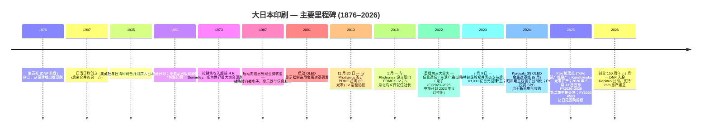
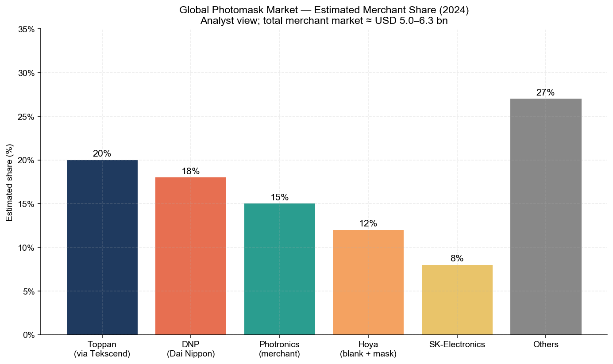
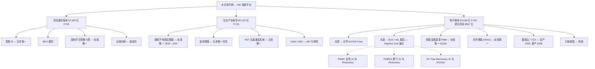
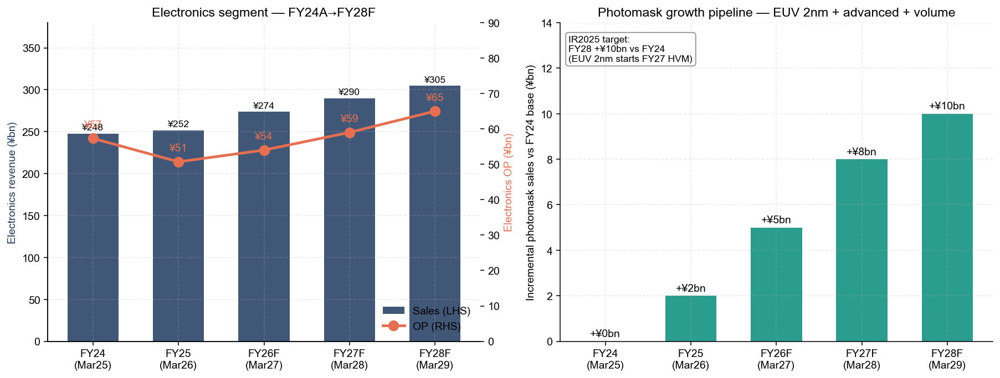

# 公司研究报告：大日本印刷株式会社 (TSE: 7912)

**截至日期：** 2026-05-26
**上市信息：** 东京证券交易所 Prime 市场 — 代码 `7912`（ADR：`DNPLY`，OTC 市场挂牌，ADR:ORD 2:1）([DNP Integrated Report 2025 — Investor Information, p. 57](https://www.global.dnp/content/dam/dnp-global/pdf/en/ir/library/annual/DNP_integrated2025e.pdf.coredownload.pdf))
**总部：** 日本东京都新宿区市谷加贺町 1-1-1，邮编 162-8001 ([DNP Integrated Report 2025, p. 57](https://www.global.dnp/content/dam/dnp-global/pdf/en/ir/library/annual/DNP_integrated2025e.pdf.coredownload.pdf))
**创立：** 1876 年作为集英社 (Shueisha，DNP 前身) 创立；1935 年与日清印刷合并组成大日本印刷 ([DNP Integrated Report 2025 — History timeline, p. 7](https://www.global.dnp/content/dam/dnp-global/pdf/en/ir/library/annual/DNP_integrated2025e.pdf.coredownload.pdf))
**财年截止：** 每年 3 月 31 日。FY2025 = 截至 2026 年 3 月 31 日的财年
**行业背景锚定：** 野村证券《Greater China Semi: A guide to Semi renaissance in 2026~30F》报告 ([sector note](/Users/x/projects/financial_agent/reports/sector/半导体材料.md))

> **更新 — FY2026 指引 + 新三年中期经营计划 FY2026–2028 (2026-05-13 披露)：** 在公布 FY2025 (截至 2026 年 3 月 31 日财年) 业绩的同时，DNP 推出了新的三年中期经营计划，目标 **FY2028 营业利润 ¥1,300 亿日元**（对比 FY2025 实际 ¥1,010 亿日元，CAGR 约 9%）和 ROE ≥9%；FY2026 指引为 **销售收入 ¥1.53 万亿日元 (+1.2% YoY)、营业利润 ¥1,080 亿日元 (+6.9%)**。电子业务板块 FY2026 指引为 **销售 ¥2,740 亿日元 (+¥222 亿) / 营业利润 ¥540 亿日元 (+¥33 亿)**，FY2028 目标营业利润 ¥650 亿日元，明确承诺将资本支出投向 EUV 光罩 (photomask) 量产、纳米压印 (nanoimprint) 模具扩产、以及玻璃芯 (TGV) 从试产线向量产线的过渡。资本回报政策也同步重置：采用渐进式股息政策，最低 DPS ¥40 日元，叠加 **FY2026 ¥500 亿日元股票回购 + FY2027 ≥¥300 亿日元（FY2026-2027 两年合计 ≥¥800 亿日元）** — 这是 2023 年 3 月在艾略特 (Elliott Management) 推动下启动的 ¥3,000 亿日元回购计划的延续。资料来源：[DNP FY2025 financial results & FY2026-2028 Medium-Term Management Plan briefing materials, 2026-05-13](https://www.global.dnp/content/dam/dnp-global/pdf/en/ir/library/presentation/dnp_e_25Q4pre.pdf)。

---

## 目录

1. 公司概览
2. 公司历史
3. 管理团队
4. 产品与服务（光罩、EUV 级光罩、精密金属遮罩、光学薄膜、锂电池铝塑膜、玻璃芯、邻近产品）
5. 客户与上市策略
6. 行业概览
7. 竞争格局
8. 市场机会 (TAM)
9. 风险评估

参考资料 + 第 10 步验证日志

---

## 1. 公司概览

大日本印刷株式会社（Dai Nippon Printing Co., Ltd.，简称 DNP）是一家**已有 150 年历史的日本印刷集团企业，于 1980 年代至 2000 年代从出版印刷转型为"P&I"——印刷与信息 (Printing & Information)，目前其大部分营业利润来源已不是印刷品本身，而是来自微电子、显示器以及锂离子电池组件**。集团报告分为三大业务板块——**信息通信 (Smart Communication)、生活产业 (Life & Healthcare)、电子 (Electronics) 三大业务**——FY2025（截至 2026 年 3 月 31 日财年）实现合并销售收入 **¥1.5125 万亿日元 (+3.8% YoY)、营业利润 ¥1,010 亿日元 (+7.9% YoY)**，全球员工 36,890 人 ([DNP FY2025 financial results briefing, p. 3 & p. 5](https://www.global.dnp/content/dam/dnp-global/pdf/en/ir/library/presentation/dnp_e_25Q4pre.pdf); [DNP Integrated Report 2025, p. 57](https://www.global.dnp/content/dam/dnp-global/pdf/en/ir/library/annual/DNP_integrated2025e.pdf.coredownload.pdf))。虽然电子业务板块按销售收入计算是三大业务中规模最小的（¥2,518 亿日元，约占集团总收入 17%），但其 FY2025 贡献了 **¥507 亿日元（占比 50%）的板块层面营业利润**（计入未分摊公司层费用前）——这意味着投资者今天买入 DNP 时，他们真正购买的是这块电子业务 ([DNP FY2025 results, p. 6](https://www.global.dnp/content/dam/dnp-global/pdf/en/ir/library/presentation/dnp_e_25Q4pre.pdf))。

**商业模式。** DNP 在四种核心工艺技术——*信息处理 / 微细加工 / 精密涂布 / 后加工*——基础上，按客户需要叠加任意基材，将工艺应用于智能卡、染料升华打印介质 (dye-sublimation printing media)、食品包装、装饰层压板、电池铝塑膜、OLED 金属遮罩、半导体光罩等差异极大的市场 ([DNP FY2025 results, p. 21 — "P&I Innovation" technology stack](https://www.global.dnp/content/dam/dnp-global/pdf/en/ir/library/presentation/dnp_e_25Q4pre.pdf))。每条产品线的附加价值来源都是一个长周期的专有设备平台 — DNP 要么自主研发该设备，要么与一两家上游 OEM 合作设计 — 设备端有高准入门槛，外加一个供应给少数严格挑剔客户（半导体晶圆代工厂、显示面板厂、电动车电池电芯装配商）的全球服务/供应组织。这一双重堆栈——工艺技术 + 定制设备 + 服务级别全球供应——就是管理层所称的"P&I 创新"，也是 DNP 在锂离子电池铝塑膜、OLED 金属遮罩、显示器光学薄膜、染料升华热转印介质等品类拿到全球第一份额的同一杠杆 ([DNP IR-Day 2025 deck, p. 45 — "Products Boasting Leading Share"](https://www.global.dnp/content/dam/dnp-global/pdf/en/ir/library/presentation/dnp_e_25irday_pre.pdf))。

**三大业务板块——各包含什么。** *信息通信 (Smart Communication)*（FY2025 销售 ¥7,503 亿日元 / 营业利润 ¥400 亿日元）涵盖传统出版印刷、营销宣传品、内容与 XR 服务，外加重点业务信息安全（智能卡、BPO 服务）以及影像（用于零售照片亭和拍立得式即时打印机的染料升华热转印介质）([DNP FY2025 results, p. 6](https://www.global.dnp/content/dam/dnp-global/pdf/en/ir/library/presentation/dnp_e_25Q4pre.pdf))。*生活产业 (Life & Healthcare)*（销售 ¥5,123 亿日元 / 营业利润 ¥372 亿日元）覆盖包装印刷、汽车相关装饰薄膜、工业高性能材料（其中**锂电池铝塑膜 (LIB pouch foil)** 位于此），以及通过 2023 年 CMIC CMO 整合建立的合同制药业务。*电子 (Electronics)*（销售 ¥2,518 亿日元 / 营业利润 ¥507 亿日元）就是对半导体供应链投资者最关键的板块——包含**数字界面 (Digital Interface)**（光学薄膜与 OLED 金属遮罩）加**半导体 (Semiconductor)**（光罩 (photomask)，以及新兴的玻璃芯 (TGV) 基板与纳米压印模具线）。电子业务 FY2025 销售仅 +1.6% YoY 增长，但板块营业利润同比下降 -11.6% 至 ¥507 亿日元，原因是 Kurosaki G8 金属遮罩线和 Kamifukuoka 光罩扩产带来的折旧上升，加上 Q4-FY2025 半导体存储供应紧张压缩了 OLED 智能手机厂商的金属遮罩出货 ([DNP FY2025 results, p. 9 — Electronics commentary](https://www.global.dnp/content/dam/dnp-global/pdf/en/ir/library/presentation/dnp_e_25Q4pre.pdf))。

**地域。** DNP 披露的损益表以日本本土为主，但其重点业务收入正在迅速向全球倾斜。在电子业务方面，DNP 的光罩供应核心节点是 **Kamifukuoka 工厂（埼玉县）** 用于前道半导体产品，**Kurosaki 工厂（福冈县）** 用于 OLED 金属遮罩和大面积主流光罩，以及 **Kuki 工厂（埼玉县）** 用于新的玻璃芯 (TGV) 试产线 ([DNP FY2025 results, p. 15 — Key Investments in Focus Business Areas](https://www.global.dnp/content/dam/dnp-global/pdf/en/ir/library/presentation/dnp_e_25Q4pre.pdf))。在日本以外的半导体光罩供应方面，DNP 通过与美国上市公司 **Photronics, Inc. (NASDAQ: PLAB)** 的两家战略合资公司运营：2013 年的 **PDMC 台湾合资公司**（新竹，用于 IC 光罩供应亚洲晶圆代工厂客户），以及 2018 年的 **PDMCX 厦门合资公司**（用于供应中国大陆晶圆代工厂的 IC 光罩）([PLAB 10-K FY25, Exhibit Index — Joint Venture Operating Agreements; Note 6 PDMCX](https://www.sec.gov/Archives/edgar/data/810136/000114036125045801/ef20057458_10k.htm))。Photronics 合并这两家合资公司（PLAB 持有两家公司各 50.01% 经济权益）；DNP 接收少数股东权益份额，FY2025 在 Photronics 合并层面表现为少数股东净利润 USD 5,380 万 ([PLAB 10-K FY25, Item 7](https://www.sec.gov/Archives/edgar/data/810136/000114036125045801/ef20057458_10k.htm)) — 对 DNP 来说这是一项营业外权益类联营公司贡献，但战略上至关重要，因为这让 DNP 品牌光罩产品得以直接进入 TSMC、UMC、SMIC、华虹、合肥晶合 (Nexchip) 等客户的供应链。

*资料来源：[DNP FY2025 financial results briefing, p. 5, p. 13, p. 14](https://www.global.dnp/content/dam/dnp-global/pdf/en/ir/library/presentation/dnp_e_25Q4pre.pdf)；FY2022 基线 ¥612 亿日元营业利润数据来自第 13 页 Review (1) 图表。*

**FY2025 vs FY2022 — 三年计划的实际成效。** 当时新就任社长北岛义斉（Yoshinari Kitajima）在 2023 年 5 月推出 FY2023–2025 中期计划时，目标是 FY2025 营业利润 ≥¥850 亿日元；FY2025 实际值为 **¥1,010 亿日元**，超出最初计划 19%，提前一年达成 ([DNP IR-Day 2025, p. 5](https://www.global.dnp/content/dam/dnp-global/pdf/en/ir/library/presentation/dnp_e_25irday_pre.pdf))。营业利润构成发生决定性转变：FY2022 电子业务占板块营业利润 57%（¥469 亿日元/¥816 亿日元板块合计），到 FY2025 降至 40%（¥507 亿日元/¥1,279 亿日元）——并非因为电子业务收缩，而是因为信息通信与生活产业从历史低基数通过结构性改革（出版印刷工厂关停、包装固定资产合理化、光伏封装材料产能爬坡）实现了显著增长 ([DNP FY2025 results, p. 14 — Review (3): Operating Profit Change by Segment](https://www.global.dnp/content/dam/dnp-global/pdf/en/ir/library/presentation/dnp_e_25Q4pre.pdf))。ROE 从 FY2022 的 5.6% 升至 **FY2024 的 9.6%（峰值）和 FY2025 的 8.9%**，两者均高于 DNP 自行估算的 8% 股权资本成本上限 ([DNP IR-Day 2025, p. 5](https://www.global.dnp/content/dam/dnp-global/pdf/en/ir/library/presentation/dnp_e_25irday_pre.pdf))。

**估值快照。** 截至 2026-05-13 ([Companies Market Cap — Dai Nippon Printing P/E ratio history](https://companiesmarketcap.com/dai-nippon-printing/pe-ratio/); [Companies Market Cap — DNP market capitalization](https://companiesmarketcap.com/dai-nippon-printing/marketcap/); [Yahoo Finance 7912.T](https://finance.yahoo.com/quote/7912.T/)):

| 指标 | DNP (7912) | Toppan (7911) | Hoya (7741) | Photronics (PLAB) |
|---|---|---|---|---|
| 股价 | JPY 3,264 | JPY ~5,300 | JPY ~17,000 | USD ~52 |
| 市值 | JPY ~1.41 万亿 (USD ~79 亿) | JPY ~1.7 万亿 | JPY ~6.1 万亿 | USD ~30 亿 |
| TTM P/E | **~5.2× (受 gain-on-sale 顺风消退影响而偏低)** | ~12× | ~24× | ~22× |
| EPS (TTM) | JPY 179 | — | — | USD 2.33 |
| 52 周区间 | JPY 2,500 – 3,400 | — | — | — |
| 股息率 | ~1.3% | ~2% | ~0.7% | 0% (以回购为主) |

*资料来源：P/E 比率数据来自 [Companies Market Cap — DNP](https://companiesmarketcap.com/dai-nippon-printing/pe-ratio/)；市值来自 [Companies Market Cap — DNP marketcap](https://companiesmarketcap.com/dai-nippon-printing/marketcap/)；Photronics 数据来自 [Stockanalysis.com PLAB](https://stockanalysis.com/stocks/plab/)；Hoya 同业 P/E 来自 [Hoya peer chart in companion report](../../charts/hoya_peer_pe.png)。*

**如何解读这一估值倍数。** DNP TTM 市盈率仅 ~5× 看似极低实则具误导性。FY2024（截至 2025 年 3 月 31 日财年）净利润受交叉持股解除计划下 ¥2,200 亿日元的政策性持股出售收益拉抬——这是 DNP 历史上单年度最大规模处置。FY2025 净利润 ¥1,039 亿日元仍受益于剩余处置收益（FY2025 当年处置 ¥500 亿日元，FY2023-24 累计 ¥1,700 亿日元）([DNP FY2025 results, p. 16 — Review (5): Financial Strategy](https://www.global.dnp/content/dam/dnp-global/pdf/en/ir/library/presentation/dnp_e_25Q4pre.pdf))。**剔除特殊性损益的标准化 ROE 约为 7%** （FY2025）— 略高于管理层估计的 6-8% 股权资本成本区间 ([DNP IR-Day 2025, p. 5](https://www.global.dnp/content/dam/dnp-global/pdf/en/ir/library/presentation/dnp_e_25irday_pre.pdf))。FY2026 净利润指引 ¥950 亿日元（-8.6% YoY）反映了处置管线的逐渐消退。*分析师观点：* 按"仅经营利润"的标准化基础，该倍数更接近 ~10-12× ——仍然较 Toppan ~12× 折价，较 Hoya ~24× 严重折价，原因是市场为**业务纯度**支付溢价：Hoya 的电子业务（EUV 光罩坯料 + HDD 玻璃磁盘 + 眼镜片）占集团销售约 50%，营业利润率 28%；DNP 电子业务占集团销售约 17%，营业利润率 20%，但被埋藏在一个集团企业里，传统出版印刷和包装业务稀释了集团 ROE。回购驱动的资本回报计划是管理层用于弥补这一估值差距的明确杠杆。FY2025 PBR 从 0.9× (2023 年 3 月，艾略特披露股权时 ¥3,000 亿日元回购授权之际) 升至 1.1× (2026 年 3 月)([DNP FY2025 results, p. 13](https://www.global.dnp/content/dam/dnp-global/pdf/en/ir/library/presentation/dnp_e_25Q4pre.pdf))。

**资本回报。** DNP 的 FY2023-25 计划交付了 **¥2,911 亿日元的股票回购**（FY2023 ¥1,529 亿 + FY2024 ¥574 亿 + FY2025 ¥808 亿日元）以及 ¥2,200 亿日元的政策性持股处置。FY2026 计划增加 **¥500 亿日元回购**，FY2027 至少另外 ¥300 亿日元（两年期合计 ≥¥800 亿日元），外加 ¥40/股的累进式股息底线（FY2026 指引 ¥41/股，连续第三年加派股息）([DNP FY2025 results, p. 17 and p. 40](https://www.global.dnp/content/dam/dnp-global/pdf/en/ir/library/presentation/dnp_e_25Q4pre.pdf))。FY2023-FY2028 累计股东回报有望超过 ¥4,400 亿日元——约相当于当前市值的 30%。

*资料来源：[DNP FY2025 financial results, p. 17 (Financial Strategy) + p. 39 (FY2026-2028 Cash Allocation Plan) + p. 40 (Dividend history)](https://www.global.dnp/content/dam/dnp-global/pdf/en/ir/library/presentation/dnp_e_25Q4pre.pdf)。*

**双重身份。** 研究投资者需要同时持有两个视角：**(i) 集团企业估值折扣修复故事**（交叉持股解除、出版印刷与包装结构性改革、回购作为 PBR 修复杠杆）这主要是一个日本本土资本配置主题；以及 **(ii) 电子业务**（光罩 + OLED 金属遮罩 + 锂离子电池铝塑膜 + 玻璃芯 + 纳米压印）——这是对 AI / 先进封装 / OLED-IT / 电动车电池等驱动 Hoya、Resonac、信越化学以及日本半导体材料行业整体的同一组结构性浪潮的杠杆暴露。两条故事线相互关联：资本配置重置释放出现金，用于资助 ¥1,200 亿日元的 FY2026-2028 研发承诺以及 ¥3,000 亿日元的资本支出承诺，两者都向电子业务倾斜 ([DNP FY2025 results, p. 32 and p. 39](https://www.global.dnp/content/dam/dnp-global/pdf/en/ir/library/presentation/dnp_e_25Q4pre.pdf))。第 4 节逐项展开产品；第 7 节点明竞争对手；第 9 节区分周期性与结构性风险。

## 2. 公司历史

DNP 公司起源可追溯至 **1876 年**作为集英社 (Shueisha) 创立——一家出版印刷企业，是日本第一家大规模引入西方活版印刷的公司；现代意义上的大日本印刷株式会社由 **1935 年集英社与日清印刷（1907 年创立）的合并**组成 ([DNP Integrated Report 2025, p. 7 — DNP History timeline](https://www.global.dnp/content/dam/dnp-global/pdf/en/ir/library/annual/DNP_integrated2025e.pdf.coredownload.pdf))。"第二次企业创立"出现在 1951 年，在战后重建框架下，公司业务从出版印刷扩展到商业印刷、包装印刷和装饰印刷——将活版印刷、蚀刻、光刻和涂布工艺重新应用于工业基材。到 **1973 年，DNP 已经按销售收入超越美国 R.R. Donnelley & Sons，成为世界最大的综合印刷企业**——这一地位塑造了 DNP 的自我形象，但也成为了 1990 年代至 2000 年代的战略包袱，因为全球出版印刷量在收缩 ([DNP Integrated Report 2025, p. 7](https://www.global.dnp/content/dam/dnp-global/pdf/en/ir/library/annual/DNP_integrated2025e.pdf.coredownload.pdf))。

界定今日 DNP 的战略转型始于 **1987 年**的"向信息处理业务转型"旗号：管理层开始将其技术堆栈——蚀刻、光刻、精密涂布、沉积——重新定位向微电子和显示器应用。到 21 世纪初，公司已建立 CRT 显示器荫罩、液晶显示器彩色滤光片、显示器光学薄膜、OLED 金属遮罩（2001 年开始研发）以及半导体光罩等业务的领先地位 ([DNP IR-Day 2025, p. 63 — History of DNP's Display Business](https://www.global.dnp/content/dam/dnp-global/pdf/en/ir/library/presentation/dnp_e_25irday_pre.pdf))。2018 年北岛义斉就任社长，标志着进入当前"第三次企业创立"框架——积极对集团企业进行组合重塑、围绕三大业务（2022 年宣布）展开，并将 P&I 视为可交易的工艺能力集合，集团将其应用于资本回报最佳的市场 ([DNP Integrated Report 2025, p. 3 — Top Message](https://www.global.dnp/content/dam/dnp-global/pdf/en/ir/library/annual/DNP_integrated2025e.pdf.coredownload.pdf))。

*资料来源：综合自 [DNP Integrated Report 2025, p. 7 — History timeline](https://www.global.dnp/content/dam/dnp-global/pdf/en/ir/library/annual/DNP_integrated2025e.pdf.coredownload.pdf); [DNP FY2025 results, p. 15 — Key Investments](https://www.global.dnp/content/dam/dnp-global/pdf/en/ir/library/presentation/dnp_e_25Q4pre.pdf); [PLAB 10-K FY25 Exhibit Index — JV Operating Agreements](https://www.sec.gov/Archives/edgar/data/810136/000114036125045801/ef20057458_10k.htm); [Elliott Statement on Dai Nippon Printing, 2023-03-09](https://www.prnewswire.com/news-releases/elliott-statement-on-dai-nippon-printing-301768540.html); [DNP press release on Rapidus investment, 2026-02-24](https://www.businesswire.com/news/home/20260224169578/en/DNP-Invests-in-Rapidus-to-Support-the-Establishment-of-Mass-Production-for-Next-Generation-Semiconductors)。*

**界定现代公司的两次战略转型。**

*第一次转型 — 从世界最大商业印刷企业到"P&I"平台 (1987–2022)。* 从 R.R. Donnelley 风格的印刷集团企业到今天三大业务 P&I 平台的 35 年长征，塑造了 DNP 当前的资产形态。到 1987 年 DNP 已注意到发达国家出版印刷量已经见顶；在随后的二十年中，公司悄然建立了**荫罩**（OLED 金属遮罩的前身技术，用于对阴极射线管显示器的荧光条纹进行图案化）、**液晶显示器彩色滤光片**、**光学薄膜**、**智能卡**、**染料升华热转印介质**以及**半导体光罩**等业务——每一个都是因为 DNP 现有的工艺技术（蚀刻、光刻、精密涂布）可以以可控的增量资本支出重新部署 ([DNP IR-Day 2025, p. 63 — History of DNP's Display Business](https://www.global.dnp/content/dam/dnp-global/pdf/en/ir/library/presentation/dnp_e_25irday_pre.pdf))。2013 年的台湾 Photronics 合资公司和 2018 年的厦门 Photronics 合资公司是其国际化扩张举措：DNP 不必自建绿地光罩工厂，就获得了 Photronics 在亚洲晶圆代工走廊的多基地存在；Photronics 则获得 DNP 的写入工具堆栈和工艺 IP，从而可以可信地进入 ≤28nm 光罩生产 ([PLAB 10-K FY25, Note 6 PDMCX](https://www.sec.gov/Archives/edgar/data/810136/000114036125045801/ef20057458_10k.htm))。2022 年重组为信息通信 / 生活产业 / 电子三大业务，是这一新组合在损益表上变得明晰的时刻。

*第二次转型 — 艾略特催化的资本配置重置 (2023)。* 在 2023 年 3 月 9 日，DNP 授权了其历史上最大规模的股票回购——**¥3,000 亿日元，约相当于当时公司市值的 30%**——计划在 FY2023-2027 中期计划窗口期内执行。艾略特管理公司 (Elliott Management) 在此前几周公开披露其持仓后，在同日发表声明表示支持，股价当天上涨 13% ([Nasdaq.com — DNP up 13% on share buyback plan, gets Elliott's support, 2023-03-10](https://www.nasdaq.com/articles/dai-nippon-printing-up-13-on-share-buyback-plan-gets-elliotts-support); [Elliott Statement on Dai Nippon Printing, 2023-03-09](https://www.prnewswire.com/news-releases/elliott-statement-on-dai-nippon-printing-301768540.html))。回购计划与**政策性持股解除计划**配套——DNP 承诺将战略性交叉持股降至合并净资产 <10% 以下，到 FY2025 实现累计 ¥2,200 亿日元的处置收益，期末比例为 13.4% ([DNP FY2025 results, p. 17 — Review (5)](https://www.global.dnp/content/dam/dnp-global/pdf/en/ir/library/presentation/dnp_e_25Q4pre.pdf))。这一组合——交叉持股解除现金 → 回购 → 股份数减少 → ROE 上升 → PBR 上升——是日本企业治理改革的教科书式序列；DNP 比 TSE Prime 大多数同业更果断地执行了这一序列，市场也给予了相应奖励。

**近期发展（过去 24 个月）。**(1) **CMIC CMO 子公司化 (FY2023)** — API 与制剂的合同制药进入生活产业组合。(2) **DNP Hikari Kinzoku 合并 (FY2024)** — 用于汽车内饰的 HMI（人机界面）组件。(3) **Resonac Packaging 子公司化 (FY2024)** — 包装薄膜业务完全内化。(4) **新光电气工业 (Shinko Electric Industries) SPC 投资 (FY2024)** — DNP 入股由 JIC 主导的 SPC 工具公司 15%，与三井化学 (5%) 和 JIC Capital (80%) 一起完成了对新光电气 49.98% 股份的 **¥4,000 亿日元要约收购**；新光电气是全球先进 FCBGA 封装基板领导者，2025 年 6 月退市——DNP 的入股使其在玻璃芯与有机 FCBGA 在最先进节点竞争的战略时点上，获得了先进封装基板供应的战略性座位 ([Mitsui Chemicals — Notice Regarding Commencement of Tender Offer to Acquire Shares in SHINKO ELECTRIC INDUSTRIES, 2025-02-17](https://jp.mitsuichemicals.com/en/release/2025/2025_0217/index.htm); [Digitimes — Shinko Electric to delist in June, eye DNP and Mitsui Chemicals partnership on backend process materials, 2025-03-21](https://www.digitimes.com/news/a20250321PD206/shinko-electric-mitsui-chemicals-materials-partnership-fujitsu.html))。(5) **Rubicon SEZC (FY2025)** — 通过整合 Rubicon 智能卡平台拓展信息安全的全球业务。(6) **Kamifukuoka 和 Kuki 工厂资本支出 (FY2025)** — DNP 在 Kamifukuoka 工厂（埼玉，主要光罩中枢）增加先进节点量产光罩产能，并在 Kuki 工厂（埼玉）启用玻璃芯 (TGV) 试产线 ([DNP FY2025 results, p. 15](https://www.global.dnp/content/dam/dnp-global/pdf/en/ir/library/presentation/dnp_e_25Q4pre.pdf))。(7) **Rapidus 入股 (FY2026, 2026 年 2 月)** — DNP 入股 Rapidus 公司（日本政府支持的、在北海道建设 2nm 节点的先进节点晶圆代工厂）——正式确立了此前 2024 年 NEDO 转包关系——其中 DNP 被选定为 Rapidus 北海道 2nm 试产线供应光罩 ([DNP press release — DNP Invests in Rapidus, 2026-02-24](https://www.businesswire.com/news/home/20260224169578/en/DNP-Invests-in-Rapidus-to-Support-the-Establishment-of-Mass-Production-for-Next-Generation-Semiconductors); [Digitimes — DNP to supply photomasks to Rapidus for 2nm chips in 2027, 2024-03-27](https://www.digitimes.com/news/a20240327PD213/dai-nippon-printing-photomask-rapidus-2nm.html))。

## 3. 管理团队

DNP 是一家有 150 年历史、无现代意义上"创始人"的工业公司；不存在可以撰写的现代意义上的创始人简介。1876 年集英社的创立是宿屋作次郎和佐藤虎之助的合伙关系，但 1935 年合并后的管理传承通过北岛家族——北岛义保（前会长）和北岛义俊（前社长）支撑了 1990 年代至 2010 年代。**现任社长是北岛义斉**（也是北岛家族后代），自 2018 年 6 月任职至今，并自 2022 年 4 月起担任可持续发展委员会主席。他是 2022 年三大业务重组、2023 年艾略特时代资本配置重置以及 2026 年 5 月公布的 FY2026-2028 计划的主导高管。

### 北岛义斉 — 社长（自 2018 年 6 月起）

北岛义斉（Yoshinari Kitajima），**生于 1964 年 9 月 18 日**，是大日本印刷株式会社的社长，也是与公司现代再造最紧密相关的高管。他于 1987 年 4 月大学毕业后即加入富士银行（现瑞穗银行），积累四年企业银行业务经验后，于 **1995 年 3 月**进入 DNP ([DNP Integrated Report 2025, p. 41 — Director Biographies](https://www.global.dnp/content/dam/dnp-global/pdf/en/ir/library/annual/DNP_integrated2025e.pdf.coredownload.pdf))。他在 DNP 的晋升路径异常迅速：2001 年 6 月任董事、2003 年 6 月任常务董事、2005 年 6 月任专务董事、2009 年 6 月任副社长、**2018 年 6 月任社长**——使他成为 TSE Prime 集团企业中任期最长的现任社长之一 ([DNP Integrated Report 2025, p. 41](https://www.global.dnp/content/dam/dnp-global/pdf/en/ir/library/annual/DNP_integrated2025e.pdf.coredownload.pdf))。

他七年社长任期内的运营业绩具体可量化：(1) **将板块结构从五个报告口径调整为三大业务**（信息通信 / 生活产业 / 电子，FY2022 生效），使集团企业的组合主题首次对外部投资者清晰可读；(2) **执行 2023 年 3 月 9 日授权的 ¥3,000 亿日元回购**——DNP 历史上最大规模的回购——艾略特公开背书 ([Elliott Statement on Dai Nippon Printing, 2023-03-09](https://www.prnewswire.com/news-releases/elliott-statement-on-dai-nippon-printing-301768540.html))；(3) **在 FY2023-FY2025 期间将政策性持股减少 ¥2,200 亿日元**，将交叉持股降至净资产的 13.4% 以下（明确目标 <10%）；(4) **提前一年完成 FY2023-2025 中期计划**——FY2024 营业利润 ¥936 亿日元超过 FY2025 的 ¥850 亿日元目标 ([DNP IR-Day 2025, p. 5](https://www.global.dnp/content/dam/dnp-global/pdf/en/ir/library/presentation/dnp_e_25irday_pre.pdf))；(5) **重新布局电子业务投资计划**——围绕光罩、OLED 金属遮罩、玻璃芯、纳米压印——仅 FY2026-2028 半导体重点领域的资本支出承诺就达 ¥300 亿日元左右 ([DNP IR-Day 2025, p. 56 — Semiconductor Photomask Sales Plan; FY2026-FY2028 capex ¥30 bn](https://www.global.dnp/content/dam/dnp-global/pdf/en/ir/library/presentation/dnp_e_25irday_pre.pdf))。

北岛作为董事的资质在 Integrated Report 中描述为依托其"在 DNP 集团作为管理层的丰富经验"——这是日本企业治理的委婉说法，意思是*具有深厚运营公信力的内部资深人士*。与许多日本集团企业 CEO 不同，他公开与活跃股东友好的资本回报制度保持一致：FY2026 中期计划明确保留累进式股息（¥40/股底线）并重申 FY2026-FY2027 ≥¥800 亿日元的回购——明确提到"基于股价水平和资本效率的灵活性"——这种语言与积极的每股价值优化一致，而不是更被动的日本企业默认的仅以股息支付方式 ([DNP FY2025 results, p. 39–40 — Shareholder Returns Policy](https://www.global.dnp/content/dam/dnp-global/pdf/en/ir/library/presentation/dnp_e_25Q4pre.pdf))。他的持股比例在 FY2025 Integrated Report 中未单独披露；北岛家族未出现在前 10 大股东中，前 10 大股东均为机构信托账户和寿险机构 ([DNP Integrated Report 2025, p. 57 — Major Shareholders](https://www.global.dnp/content/dam/dnp-global/pdf/en/ir/library/annual/DNP_integrated2025e.pdf.coredownload.pdf))。

接班问题——北岛将于 2026 年 9 月年满 62 岁——尚不紧迫；日本集团企业的强制退休惯例通常在 66-68 岁。最资深的内部候选人是**中村修**（Osamu Nakamura，1962 年生，2025 年 6 月起任专务董事），主管精密器件事业部 / 光电事业部 / 研发——通俗地说就是电子业务板块——并担任与铠侠 (Kioxia) 合资的光罩公司 DT Fine Electronics 的董事长 ([DNP Integrated Report 2025, p. 41](https://www.global.dnp/content/dam/dnp-global/pdf/en/ir/library/annual/DNP_integrated2025e.pdf.coredownload.pdf))。隐含的接班逻辑读作电子业务战略的连续性：北岛之后的继任者很可能来自电子业务组织，而非来自传统印刷业务一侧。

## 4. 产品与服务

第 4 节遵循 **DNP 在 FY2025 业绩说明会资料和 IR-Day 2025 业务战略资料中自行公布的产品分类法**，两者共同构成发行人逐字逐句的产品叙述。DNP 在三大核心工艺技术支柱下组织其产品——**信息处理 / 微细加工 / 精密涂布 / 后加工**——并叠加六项重点业务过滤器：信息安全 (Information Security)、影像 (Photo Imaging)、出行 (Mobility)、工业高性能材料 (Industrial High-Performance Materials)、数字界面 (Digital Interface) 和半导体 (Semiconductor)。**披露具有全球第一份额**的产品集中在后四项中——而对半导体供应链投资者最重要的四个产品族（光罩、EUV 级光罩、OLED 精细金属遮罩、锂离子电池铝塑膜）就是下文承重分析对象 ([DNP IR-Day 2025, p. 10 — Focus Business Areas table with FY2024 sales, ROE, market share status](https://www.global.dnp/content/dam/dnp-global/pdf/en/ir/library/presentation/dnp_e_25irday_pre.pdf))。

### 4.1 产品矩阵 — DNP 自行公布的分类法

DNP Q4 FY2025 资料（p. 22）是发行人公开披露的规范产品矩阵，并明确为每个产品标注日本第一份额（资料中的◆标记）或全球第一份额（◇标记）。下方以 Markdown 表格再现；原 p. 22 图像在发行人资料中，是逐字逐句的来源。

| 工艺技术支柱 | 产品族 | 份额状态（发行人公布）| FY2025 业务板块 | DNP 自身的描述 |
|---|---|---|---|---|
| 信息处理 | **智能卡** | ◆ 日本第一份额 | 信息通信 | 非接触式智能卡、接触式智能卡、双界面（接触+非接触一卡集成）|
| 信息处理 | **BPO 服务** | （无份额标记）| 信息通信 | 卡发行与身份相关 BPO；与日本银行和政府的大规模运营合同 |
| 微细加工 | **半导体光罩 (Photomask)** | "在商业光罩市场中拥有顶尖市场份额" | 电子 | 光学光罩 (ArF / KrF / i-line / g-line)、EUV 光罩（反射式）、NIL (纳米压印光刻) 模具 |
| 微细加工 | **OLED 显示器金属遮罩 (FMM)** | ◇ 全球第一份额 | 电子 | 具有精密图案化的微孔的薄金属板，用于 OLED 蒸镀工艺，将 RGB 发光材料精确施加到基板上 |
| 微细加工 | **引线框架 (Lead frame)** | （无份额标记）| 电子 | 用于芯片安装的标准半导体引线框架基板；延伸至先进封装用 TGV 玻璃芯 |
| 微细加工 | **TGV 玻璃芯（先进封装基板）** | 新增长潜力业务 | 电子 | 用于 AI 加速器和 chiplet 封装的 TGV 玻璃芯基板，作为有机 FCBGA 替代品 |
| 精密涂布 | **锂离子电池铝塑膜 (LIB pouch foil)** | ◇ 全球第一份额 | 生活产业（工业高性能材料）| 用于 EV、IT 和储能应用的软包格式 Li-ion 电芯的多层铝塑膜外壳 |
| 精密涂布 | **显示器光学薄膜** | ◇ AR / AG 膜全球第一份额 | 电子（数字界面）| 抗反射 (AR) 膜、防眩光 (AG) 膜、OLED 用相位差膜、显示器表面用低反射膜 |
| 精密涂布 | **染料升华热转印打印介质** | ◇ 全球第一份额 | 信息通信（影像）| 用于即时照片打印机和身份卡打印机的相纸介质；身份卡用油墨色带 |
| 精密涂布 | **装饰薄膜 / 成型件** | ◆ 日本第一份额（住宅内饰材料）| 生活产业（出行 / 居住空间）| 用于汽车、地板、墙纸的内饰装饰薄膜 |
| 后加工 | **PET 瓶无菌灌装系统** | ◆ 日本第一份额 | 生活产业（包装）| 用于饮料 PET 瓶的工业级无菌灌装线 |
| 后加工 | **API 和制剂** | （无份额标记）| 生活产业（医疗与健康）| 通过 CMIC CMO 提供的 API 和药物制剂合同生产 |

*资料来源：逐字复现自 [DNP FY2025 results presentation, p. 22 — "Main products and services provided by DNP" matrix](https://www.global.dnp/content/dam/dnp-global/pdf/en/ir/library/presentation/dnp_e_25Q4pre.pdf)，保留 DNP 自行使用的份额状态标记（◆ 日本第一份额 / ◇ 全球第一份额）。光罩"在商业光罩市场中拥有顶尖市场份额"是 DNP 自身脚注描述符。*

### 4.2 综合 — 这些品类如何在半导体制造流程中相互作用

一颗芯片设计沿两条平行路径穿越 DNP 的产品组合。**前道半导体流程**：设计公司或晶圆代工厂将 GDS-II / OASIS 文件交给 DNP；该文件在 Kamifukuoka 工厂（埼玉）光罩设施中处理——多束电子束写入机 (MBMW) 将电路图案写入铬 / CrN 涂层的石英坯料（用于光学光罩）或 Ru/Mo 涂层的反射式 EUV 坯料（用于 EUV 光罩，Hoya 全球供应约 80% 的 EUV 光罩坯料）；图案化的光罩经过检测、修复、清洁、配上防尘薄膜 (pellicle)（DNP **不**自行制造这一部件——三井化学 (Mitsui Chemicals) 是 ASML 授权下的唯一商业 EUV 防尘薄膜供应商），然后运送到晶圆代工厂的扫描仪 / 步进式曝光机用于晶圆曝光。对于 ≤28nm 光罩，DNP 自有的 Kamifukuoka 写入机处理最先进部分；对于 ≥32nm 主流，DNP 还通过 **Photronics 在台湾（PDMC，新竹）和中国（PDMCX，厦门）的合资公司**安排业务，向 TSMC、UMC、SMIC、华虹提供本地化服务。对于 **EUV ≤5nm 光罩**，DNP 是全球仅约 3 家商业供应商之一（另外两家是 Toppan 分拆的 Tekscend 和 Hoya）；TSMC、Samsung Foundry 和 Intel 的内部 (captive) 供应占主导，但 DNP 服务的*商业* (merchant) EUV 切片在增长，因为没有建立内部 EUV 光罩工厂的晶圆代工厂（UMC、GlobalFoundries、中国大陆）将其最尖端光罩外包。Rapidus 在北海道（日本）的 2nm 试产线是 DNP 的领先节点商业客户锚点 ([DNP press release on Rapidus 2nm photomask development, 2024-03](https://www.global.dnp/news/detail/20173706_4126.html))。

**后道 / 先进封装流程**：相同的 Kamifukuoka 和 Kuki 工厂生产 **TGV (Through-Glass-Via，通过玻璃通孔) 玻璃芯基板**，与新光电气、Ibiden、Unimicron 的有机 FCBGA 基板竞争 AI 加速器和 chiplet 封装订单——DNP 的玻璃芯雄心位于光罩业务下游，但乘上了同样的先进 AI 封装需求浪潮。**OLED 显示器流程**并行运行：DNP 的 Kurosaki 工厂（福冈）蚀刻**精密金属遮罩 (Fine Metal Mask, FMM)** 板，三星显示器、LG 显示器、京东方和其他面板厂在其 OLED 蒸镀线中使用这些遮罩，在玻璃或聚酰亚胺基板上图案化 RGB OLED 发光层。**锂离子电池电芯流程**：DNP 横滨地区的精密涂布线生产用于 LG 新能源、SK On、AESC、Skon 匈牙利等软包格式电芯厂家的多层铝塑层压**电池铝塑膜**，用于 EV、IT 设备和储能应用。这四个产品族共享的物理设备很少，但共享 DNP 的核心工艺技术（微细加工、精密涂布）和企业财务加面向客户的团队。

### 4.3 半导体光罩 — DNP 核心电子业务

这是 DNP 最大的独立半导体产品，是投资者应锚定的业务线。FY2024 披露销售额（来自 IR-Day 2025 Focus Business Areas 表）为 **¥660 亿日元，ROE 约 8%**；FY2026-2028 计划预计 **FY2028 销售指数 155 vs. FY2024 的 100**（即累计 +55%，~11.6% CAGR）——明显快于 DNP 对更广泛商业光罩市场（~7% CAGR）的预期 ([DNP IR-Day 2025, p. 10 — Focus Business Areas + p. 56 — Semiconductor Photomask Sales Plan](https://www.global.dnp/content/dam/dnp-global/pdf/en/ir/library/presentation/dnp_e_25irday_pre.pdf))。

**DNP 原文** ([DNP IR-Day 2025, p. 53 — "DNP's Semiconductor-related Products and Services"](https://www.global.dnp/content/dam/dnp-global/pdf/en/ir/library/presentation/dnp_e_25irday_pre.pdf)):

> "Photomasks for semiconductors is our core product in our semiconductor business, a focus business area of DNP."

> "What is a photomask? — Used to transfer circuits onto semiconductor wafers. A structure with a precise circuit pattern formed on the glass surface, it is an important component essential for semiconductor manufacturing."

> "Optical mask (pass-through type) — Substrate Qz, Light-blocking film CrN, etc. — exposure source ArF/KrF/i laser. EUV mask (reflective type) — exposure source EUV light. NIL template — UCPF (clean bag) supports the template logistics."

**中文释义 / Plain-language gloss：** 一张光罩 (photomask / 光掩膜) 是晶圆代工厂用来将芯片电路图案转移到硅晶圆上的**模板主板**。在一颗 5nm 或 3nm 单一逻辑芯片中通常有 **60-80 个光罩层**；每个芯片设计都需要一套新的光罩，先进节点的一套光罩可能成本达到 **USD 1,000 万 - 3,000 万** ([Photronics 10-K FY25 — typical mask-set economics referenced in Industry section](https://www.sec.gov/Archives/edgar/data/810136/000114036125045801/ef20057458_10k.htm))。光学级光罩（ArF / KrF / i-line / g-line）是铬涂石英的"穿透式"类型，扫描仪的深紫外光通过光罩的开放/图案化区域到达晶圆上的光刻胶；**EUV 光罩 (EUV mask) 不同**——它是反射式的 Ru/Mo 多层堆栈，因为在 13.5 nm 波长下所有已知材料都吸收而非透射光，所以光罩必须建成布拉格反射器，扫描仪使用掠射光路。DNP 制造 **Ru/Mo 反射多层堆栈顶部的图案化吸收层**，Hoya 供应坯料 ([Hoya company research, §4 — EUV mask blank franchise](../Hoya_TSE7741/Hoya_TSE7741_Research_Document.md))。光罩家族中的新增长楔形是**纳米压印光刻 (NIL) 模具**——物理 3D 浮雕母模，按压到晶圆上的 UV 固化抗蚀剂中以刻印图案，而非通过光罩投射光；佳能 (Canon) 的 NIL 系统（FPA-1200NZ2C）是唯一的商业 NIL 工具，铠侠 (KIOXIA)（存储器制造商）是量产管线中唯一公开的客户。DNP 与佳能联合开发了 NIL 模具制造工艺；DNP 是商业 NIL 模具供应商 ([DNP IR-Day 2025, p. 56 — Partnership examples: "Nanoimprinting development: KIOXIA, Canon"](https://www.global.dnp/content/dam/dnp-global/pdf/en/ir/library/presentation/dnp_e_25irday_pre.pdf))。

**三个教学节拍：**
- **物理上做什么：** 光罩是光学母板，晶圆代工厂中每片晶圆都按此打印。扫描仪以步进光栅方式将 193nm (ArF) 或 13.5nm (EUV) 光的狭缝移过光罩；每个"步"曝光底层光刻胶上一个晶元等价区域，光罩的图案以 1:4 (193nm) 或 1:4 反射各向异性 (EUV) 在晶圆上忠实再现。没有光罩就没有芯片；因此光罩厂位于每个新芯片设计的关键路径上。
- **如何与同类产品族区别：** DNP 的**光学光罩**是量大的主力业务（ArF/KrF/i-line，≥7nm 节点，在常规 + 单束电子束写入机上写入），支撑了 ¥660 亿日元的 FY2024 光罩销售线。**EUV 光罩**是领先节点高端品类（≤5nm 节点，只能在**多束光罩写入机 (Multi-Beam Mask Writer, MBMW)** 上写入，因为图案密度使单束写入时间过长）；EUV 光罩 ASP 达 **USD 20-40 万 +/片**，而 ArF/KrF 光罩为 USD 5-50K。**NIL 模具**是用于存储器和图案复制应用的独立新兴品类，位于传统 EUV/ArF/KrF 分类之外。族内交互很重要，因为 DNP 是少数几家一站式覆盖**三者**（光学 + EUV + NIL）的商业供应商之一；Photronics 仅覆盖光学；Tekscend 覆盖光学 + EUV。
- **战略意义：** 推动 DNP 光罩计划的核心拐点是 **2nm / EUV 商业光罩楔形**。截至 2024-25 年，拥有 EUV 扫描仪的晶圆代工厂（TSMC、Samsung Foundry、Intel）大部分 EUV 光罩都是内部制造的，因为供应在技术上极敏感，他们更偏好内制。但是*没有*完整 EUV 堆栈、又想接入 EUV 节点的晶圆代工厂——UMC、GlobalFoundries、新的日本旗舰 Rapidus——必须使用商业 EUV 光罩。**DNP 是日本在战略上定位最有利的商业 EUV 光罩供应商**（vs. Tekscend 拥有更大的商业 MBMW 机群，vs. Hoya 与其坯料业务在内部上对齐）。**Rapidus 合同**——2024 年初始 NEDO 转包、升级到 2026 年 2 月直接 DNP 入股——使 DNP 在全球范围内获得最可信的 2nm 商业 EUV 客户参考 ([DNP press release on Rapidus 2nm photomask development, 2024-03](https://www.global.dnp/news/detail/20173706_4126.html); [Digitimes — DNP to supply photomasks to Rapidus for 2nm chips in 2027, 2024-03-27](https://www.digitimes.com/news/a20240327PD213/dai-nippon-printing-photomask-rapidus-2nm.html); [DNP press release — DNP Invests in Rapidus, 2026-02-24](https://www.businesswire.com/news/home/20260224169578/en/DNP-Invests-in-Rapidus-to-Support-the-Establishment-of-Mass-Production-for-Next-Generation-Semiconductors))。

*资料来源：综合 [openPR / Global Growth Insights photomask market share data citing DNP ~21% / Hoya ~24% / Toppan ~19% / Photronics ~11% across "total photomask"](https://www.openpr.com/news/3563930/photomask-market-report-analysis-research-studies-dai-nippon) 以及发行人披露的销售比例缩放 [DNP IR-Day 2025 deck, p. 54 — Photomask merchant market USD ~700m in 2025 forecast](https://www.global.dnp/content/dam/dnp-global/pdf/en/ir/library/presentation/dnp_e_25irday_pre.pdf)；商业市场切片在分析上更有用，因为 Hoya 份额主要来自 EUV 光罩**坯料**（单独的、上游产品），其份额按 [Nomura sector note, p. 18–30](/Users/x/projects/financial_agent/reports/sector/半导体材料.md) 计算约 80%。总光罩份额混合了内部 + 商业供应，并高估了 DNP 在商业层的竞争强度。*

*分析师观点：* DNP 的光罩特许经营是**规模与工艺 IP 护城河**，而非技术领导力护城河。**护城河类型：** 技术 IP（用于 sub-5nm 的专有多束写入工艺）、合作伙伴规模（Photronics 合资公司延伸到 DNP 自身无法服务的亚洲晶圆代工厂）、资本规模（单台 MBMW 价值 USD 2,000-4,000 万，DNP 计划在 FY2026-28 产能扩张中投入 3 台以上）。**每个产品的竞争优势判断：***是* — DNP 是三家可以可信服务先进与主流节点的商业供应商之一（与 Tekscend 和 Photronics 并列）；*部分* 在领先节点（Tekscend 拥有更大的 MBMW 机群）；*是* 在 NIL，其中 DNP 和佳能合作给予其商业 NIL 模具供应小众的有效垄断。**旗舰 vs 长尾：** 旗舰是 **Kamifukuoka 工厂配备 MBMW 的先进节点线**（≤7nm + EUV）；长尾是大批量 ArF/KrF/i-line 量产产能。**近期发布：** 2024 年 12 月首批 2nm 以下 EUV 评估光罩交付，验证 DNP 的高数值孔径就绪工艺 ([SNS Insider photomask market press release, 2025-08-18](https://www.globenewswire.com/news-release/2025/08/18/3134697/0/en/Photomask-Market-Size-to-Surpass-USD-7-22-Billion-by-2032-at-a-CAGR-of-4-31-Research-by-SNS-Insider.html))。

### 4.4 EUV 光罩 — 领先节点商业楔形

**DNP 原文** ([DNP IR-Day 2025, p. 55 — Business Strategy](https://www.global.dnp/content/dam/dnp-global/pdf/en/ir/library/presentation/dnp_e_25irday_pre.pdf)):

> "Acquisition of business foundation through the subcontracting of Rapidus' NEDO project. Expansion of business to accommodate newly created EUV external sales demand."

> "Semiconductor manufacturers that have introduced EUV are manufacturing photomasks in-house. Huge investments are impeding EUV entry."

> "A method of supporting manufacturers that do not possess EUV processes in entering advanced processes. Total cost reduction by partial substitution of EUV."

> "Continuous expansion of production capacity. Commercialization of masks for EUV."

> "Cutting-edge area — Masks for EUV: Start of development of 2nm generation resolution successful. Start of shipment of masks for EUV with the launch of a pilot line at Rapidus. Increase in inquiries from major manufacturers."

> "Start of full-scale mass production in 2027."

**中文释义 / Plain-language gloss：** EUV（极紫外 / Extreme Ultraviolet）光罩与传统的光学光罩在物理上是完全不同的对象。在 13.5nm 波长下，每种已知材料都吸收而非透射光，因此光罩**不能像 ArF / KrF 光刻中那样是透射式铬涂石英"模板"**。它是一个**多层布拉格反射器**——典型地是约 40 对交替的 Mo/Si 层在低热膨胀玻璃基板（TiO2 掺杂的 SiO2）上沉积——加上 Ta 基吸收层在顶部图案化（野村行业报告讨论了 sub-3nm 节点中 TaBN 向 Ru/Mo 基吸收层的过渡）([Nomura sector note, p. 38-39 — EUV mask material changes](/Users/x/projects/financial_agent/reports/sector/半导体材料.md))。坯料——即基板上未图案化的 Ru/Mo / Mo/Si 多层堆栈——**由 Hoya 全球主导（~80% 份额），信越化学 (Shin-Etsu Chemical) 为主要第二位** ([Hoya company research, §4 — EUV mask blank franchise](../Hoya_TSE7741/Hoya_TSE7741_Research_Document.md))。图案化光罩（即在芯片电路图案中蚀刻的 Ta 吸收层）就是 DNP 和 Tekscend 供应的层；图案写入是在**多束电子束写入机 (MBMW)** 上完成的，因为 sub-5nm 等价图案密度需要数千束并行才能保持合理的写入时间。然后用 **Lasertec MATRICS-X 或 KLA Teron 系统检测光罩**（Lasertec 在波长内 EUV 光罩检测仪中拥有近垄断地位的子行业）。最后，**碳纳米管或硅 EUV 防尘薄膜 (EUV pellicle)** 安装在光罩表面，以防止吸收层在扫描仪曝光过程中受到颗粒污染——在防尘薄膜方面，**三井化学是 ASML 授权下唯一商业 EUV 防尘薄膜供应商**（Mitsui Chemicals — sole commercial EUV pellicle supplier），已在岩国大竹工厂建立专用组装产能 ([Mitsui Chemicals — ASML and Mitsui Chemicals Sign License Agreement for EUV pellicle business, 2019-05-31](https://jp.mitsuichemicals.com/en/release/2019/2019_0531_01/index.htm); [Indian Chemical News — Mitsui Chemicals becomes world's first EUV pellicle manufacturer](https://www.indianchemicalnews.com/chemical/mitsui-chemicals-becomes-worlds-first-euv-pellicle-manufacturer-8881))。**DNP 自身并不制造 EUV 防尘薄膜**——这是一个常见的误解，因为 DNP 制造光罩板，防尘薄膜是物理上附着在其上的薄膜；两者是不同的供应链步骤，由不同的供应商提供。

**三个教学节拍：**
- **物理上做什么：** EUV 光罩在 Ta 基吸收层中携带芯片电路图案，该吸收层选择性吸收 13.5nm 光，而未图案化的 Ru/Mo 多层反射其进入扫描仪的投影光学。光罩安装在扫描仪的曝光台上，下方的晶圆在曝光步骤中在其下方移动。现代 High-NA EUV（0.55 NA，ASML EXE 平台）使用**各向异性 4× / 8× 缩小光路**，因此光罩图案在各向异性上放大以匹配晶圆几何形状。
- **如何与同类产品区别：** 在 DNP 光罩家族中，EUV 光罩是技术领先力产品。它的 ASP 是 ArF 光罩的 5-10×，需要 **MBMW 写入机**而非单束工具，需要检测和修复工具集（Lasertec 等）进行波长内检测，并以 **Hoya 供应的坯料**为瓶颈而非图案化步骤。EUV 光罩是 DNP 必须从 Hoya 采购坯料的唯一光罩家族——对于 ArF / KrF 光罩，DNP 从 AGC、信越、东曹石英 (Tosoh Quartz) 采购石英坯料，自行图案化铬层。**NIL 模具是完全不同的物理产品**——3D 浮雕模具而非 2D 吸收层图案，在相同 MBMW 类设备上写入，但工艺集成完全不同；它们位于 EUV 路线图之外，与 EUV 在存储器图案应用中竞争。
- **战略意义：** EUV 光罩需求增长由**进入需要 EUV 节点的新商业客户**驱动——UMC 至 14nm 和大概 7nm 的路线图、GlobalFoundries 12nm 先进 FinFET 合作管线、**Rapidus 2027 年 2nm**，以及中国晶圆代工厂（SMIC、华虹）一旦获得自主 EUV 级工具就向更先进工艺缓慢转移（后者是一个跨多年的问题，受出口管制制约）。每个缺乏内部光罩工厂的新商业 EUV 客户都成为 DNP / Tekscend / Hoya 的商业 EUV 机会。*分析师观点：* 护城河是**技术 IP（在 sub-2nm 图案密度下 MBMW 工艺成熟度）**加**合作伙伴股权（Rapidus、KIOXIA、imec、ST Microelectronics）**。最接近的竞争产品：**Tekscend Photomask 的 EUV 光罩线** ([Tekscend About page](https://www.photomask.com/en/about/)) — Tekscend 拥有更大的 MBMW 机群，是 EUV 光罩商业供应的主力领导者；其**计划 2025-26 年在东京 IPO，估值约 USD 20 亿**会重新定价整个商业 EUV 光罩品类，并对 DNP 光罩板块 SOTP 估值提供有用的比对参考 ([AInvest — Tekscend Photomask's $2 Billion Tokyo IPO, 2025-08](https://www.ainvest.com/news/tekscend-photomask-2-billion-tokyo-ipo-strategic-bet-semiconductor-supply-chain-resilience-2508/))。

### 4.5 OLED 显示器制造用精密金属遮罩 (FMM) — DNP 全球第一特许经营

这是 **DNP 最清晰的全球第一份额位置** ([DNP IR-Day 2025, p. 10 — Focus Business Areas, "Digital Interfaces… No.1 global market share"](https://www.global.dnp/content/dam/dnp-global/pdf/en/ir/library/presentation/dnp_e_25irday_pre.pdf); [DNP FY2025 results, p. 22 — Metal Masks ◇ Global Top Share](https://www.global.dnp/content/dam/dnp-global/pdf/en/ir/library/presentation/dnp_e_25Q4pre.pdf))。FY2024 数字界面业务（光学薄膜 + 金属遮罩）销售额 ¥1,820 亿日元，ROE 约 5%，按 IR-Day 2025 Focus-Business-Areas 表披露。

**DNP 原文** ([DNP IR-Day 2025, p. 70 — Business Overview: Metal Masks for Manufacturing OLED Displays](https://www.global.dnp/content/dam/dnp-global/pdf/en/ir/library/presentation/dnp_e_25irday_pre.pdf)):

> "Metal masks originated from the technology used to create printing stamps. Through continuous refinement of the technology used to make plates for more beautiful and vivid printing, this technology evolved into high-precision microfabrication technology."

> "A metal mask is a thin metal plate with fine holes that are precisely patterned and accurately positioned. It is used in the vapor deposition process, which is one of the manufacturing steps for OLED panels. This mask enables the precise and accurate application of RGB light-emitting materials onto a substrate, such as glass or film."

> "Our proprietary photolithography and etching technologies for manufacturing high-definition metal masks. We obtained the top global market share centered on smartphones."

> "We began developing metal masks in 2001 and have contributed to the advancement and widespread adoption of OLED technology since the early stages."

> "The 8th-generation metal mask production line (Kurosaki) began operations in May 2024 and continues to manufacture products for customer applications." ([IR-Day 2025, p. 72](https://www.global.dnp/content/dam/dnp-global/pdf/en/ir/library/presentation/dnp_e_25irday_pre.pdf))

**中文释义 / Plain-language gloss：** OLED 面板从三种由小分子有机发光材料制成的子像素（R、G、B）发光。与简单滤过背光的 LCD 不同，**OLED 像素必须将正确的有机分子沉积到基板上的正确位置**。中小型 OLED（智能手机、IT 平板、笔记本、汽车）的主导制造方法是**通过精密金属遮罩 (Fine Metal Mask, FMM) 的真空蒸镀**——一片拉伸的镍铟瓦合金（FeNi36）薄板，约 20-30 µm 厚，带有数百万个激光或蚀刻图案化的孔，定位精度亚微米级，在真空腔中直接放置于面板基板上方。有机发光材料升华并冷凝到基板上时，FMM 阻挡除孔位之外的所有沉积。**三个 FMM 按序使用——一个用于 R，一个用于 G，一个用于 B 发光材料——以定义 RGB 子像素图案**。遮罩孔径和间距定义面板的 PPI（像素每英寸）分辨率，G6 到 G8 基板过渡（智能手机尺寸到 IT 尺寸面板）要求遮罩在保持孔位置容差的同时尺寸放大——这是一个巨大的冶金 + 光刻 + 蚀刻工程挑战。DNP 是 **G6 智能手机 FMM 的全球第一**（三星显示器 + 苹果 iPhone OLED 供应）并已通过 2024 年 5 月投产的 Kurosaki 工厂线将技术扩展到 **G8 IT 尺寸 FMM**（USD 1.4 亿投资）([OLED-Info — DNP starts producing 8-Gen FMM masks at its new $140 million Kurosaki plant](https://www.oled-info.com/dnp-starts-producing-8-gen-fmm-masks-its-new-140-million-kuosaki-plant))。

**三个教学节拍：**
- **物理上做什么：** 在 OLED 蒸镀工艺中，FMM 在高真空腔内位于基板上方 ~50-100 µm 处；升华的有机发光材料从下方的坩埚上升，通过图案化的孔到达基板上，按 FMM 的孔位置精度堆叠形成 RGB 子像素图案。每个面板基板循环使用一组三个 FMM（R / G / B），每个循环都对遮罩进行旋转、重新张紧和重新对准。**孔位置和间距决定 OLED 面板的最终像素数和密度**——使 FMM 成为 OLED 制造经济性中最重要的单一消耗品。
- **如何与同类产品区别：** 在 DNP 的微细加工支柱产品族中，FMM 和半导体光罩共享相同的根技术（蚀刻 + 光刻），但基板是 *金属*（铟瓦合金）vs *石英*（或 Mo/Si 多层）用于光罩。几何尺度也有 ~3-5 个数量级差异——半导体光罩为 152×152 mm，亚 100nm 图案特征；FMM 为 **G6 1.5×1.85 m 或 G8 2.25×2.6 m，约 20µm 孔图案特征**。FMM 家族也与竞争的 OLED 图案化方法不同（Open-Mask + WOLED + 彩色滤光片，LG 显示器在大面积 TV OLED 中使用；JOLED / TCL 正在开发但尚未达到高 PPI 的喷墨打印 OLED 还不能用于商业生产）——基于 FMM 的 RGB 蒸镀仍然是**所有智能手机 OLED** 的主导方法，现在也是 IT-OLED 的主导方法。
- **战略意义：** 推动 DNP FMM 特许经营的拐点是 **IT-OLED 面板浪潮**。G8 Kurosaki 线（2024 年 5 月起运营）被定位用于服务**苹果 iPad Pro M4 OLED（2024 年发布）、三星显示器 Asan 第 8 代 AMOLED 工厂、京东方绵阳 B12 AMOLED 线**以及笔记本 + 平板从 LCD 向 AMOLED 的更广泛过渡（Omdia 和 DSCC 预测 2025-2028 年）([Omdia Display Long-Term Demand Forecast Tracker 1Q25 referenced in DNP IR-Day 2025, p. 71](https://www.global.dnp/content/dam/dnp-global/pdf/en/ir/library/presentation/dnp_e_25irday_pre.pdf))。可折叠 OLED（三星 Galaxy Z Fold/Flip、研发中的苹果 2026 年可折叠 iPhone）和车用 OLED 增加第二个增长楔形。

*分析师观点：* **护城河类型：** 技术 IP（G8 规模下约 20µm 孔图案的专有光刻 + 蚀刻工艺）、资本规模（Kurosaki G8 线是全球少数几条 G8 FMM 线之一）以及客户关系锁定（DNP 向三星显示器和京东方供货，苹果作为需求端锚点）。**最接近的竞争产品：** **APS Holdings 的 FMM 线**（韩国，与三星显示器合作开发）、**Wave Electronics**（韩国，也供应三星显示器，并受国内替代友好型补贴支持）和 **TGO Tech**（韩国）——全部规模较小 / 成熟度低于 DNP，主要作为三星本土替代方案运营。DNP 承担的竞争风险恰恰是三星显示器是最大的单一 OLED 客户，并**正在积极将 FMM 供应分散从 DNP 转移**——三星已终止 DNP 的独家协议，正与韩国 Wave Electronics 和 TGO Tech 共同开发替代品 ([OLED-Info — Dai Nippon Printing to supply FMM masks to BOE Display + Samsung diversifying](https://www.oled-info.com/dai-nippon-printing-supply-fmm-masks-boe-display))。京东方因此是 DNP 明确入引以减少三星集中度的战略关键二供。中国 FMM 国内替代计划——补贴流向 Wave Electronics 和佛山康佳精密 (Foshan KONKA Precision)，同时招募日本 FMM 工程师——是 DNP 第一份额的中期结构性风险；FY2028 风险显著，FY2026 风险有限。

### 4.6 用于先进半导体封装的玻璃芯 (TGV) — 下一代增长楔形

这是 DNP **现有重点业务线之外最大的单项"增长潜力业务"资本支出承诺**。Kuki 工厂试产线于 2025 年底完工（埼玉县），FY2026-2028 累计资本支出预计 ¥300 亿日元，如果技术达到 2028 年大规模量产，还有大量额外投资 ([DNP IR-Day 2025, p. 60 — Glass Core Sales Plan; "we anticipate starting mass production in 2028"](https://www.global.dnp/content/dam/dnp-global/pdf/en/ir/library/presentation/dnp_e_25irday_pre.pdf))。

**DNP 原文** ([DNP IR-Day 2025, p. 58–59](https://www.global.dnp/content/dam/dnp-global/pdf/en/ir/library/presentation/dnp_e_25irday_pre.pdf)):

> "In high-performance device packages, advanced packaging substrates typically utilize core substrates made from organic materials. However, to tackle challenges like flatness and warping—issues that arise with the miniaturization and large-scale production of these substrates—core substrates made from glass materials are gaining attention. Glass substrates offer advantages over their organic counterparts, making them a promising alternative."

> "Against the backdrop of advancements in AI and the growing use of chiplets, package substrates for advanced devices are becoming larger. As the size of these substrates increases, issues such as warping, flatness, and rigidity of existing organic cores have become more apparent. This has created a demand for glass cores as a potential solution."

> "Recently, an increasing number of companies have started testing glass cores in their products, particularly since the second half of 2024, which has accelerated efforts to evaluate package reliability."

> "We anticipate that companies will make decisions regarding the adoption of glass cores between the end of 2025 and the first half of 2026."

**中文释义 / Plain-language gloss：** 一颗现代 AI 加速器（NVIDIA H100/H200/B200、AMD MI300/MI350、Google TPU v5、AWS Trainium）不是单一芯片，而是 **2.5D / 3D 封装**：多个计算 chiplet + 8 个 HBM 堆栈 + 一个硅中介层，全部安装在**有机 FCBGA 基板**上，将 I/O 扇出到主板。随着封装尺寸增大（B200 基板约 100×100 mm，是 H100 面积的约 2×），**有机基板在热循环下会翘曲**，**平整度容差更难维持**，且有机叠层介质损耗限制高速信号完整性。**玻璃芯基板**解决所有三个问题：玻璃在温度上尺寸稳定，可在大面积上抛光至亚微米平整度，并且在高频下介质损耗低于 ABF 有机基板 ([Nomura sector note, p. 11, 85-88 — Glass core ABF substrate comparison](/Users/x/projects/financial_agent/reports/sector/半导体材料.md))。技术瓶颈是 **TGV（Through-Glass Via，通过玻璃通孔）**——在玻璃芯中钻出垂直电气通路，连接顶部 RDL（重布线层）到底部（主板侧），不出现微裂纹。当前 TGV 成本为 **USD 400-500/基板**（试产规模）；要达到商业可行性，玻璃芯基板需要降至 **USD < 400/单位**，才能在可接受的产量下与 ~USD 200 的 ABF 基板竞争 ([Nomura sector note, p. 85 — Glass core economics](/Users/x/projects/financial_agent/reports/sector/半导体材料.md))。

**三个教学节拍：**
- **物理上做什么：** 玻璃芯是 FCBGA 替代基板的结构基础。chiplet 和 HBM 堆栈位于顶部 RDL 上；主板焊接到底部；TGV 通过玻璃芯垂直传输电信号。DNP 制造玻璃芯本身——结构基板，预钻和预金属化 TGV——并供应给封装组装合作伙伴（新光电气、Ibiden、Unimicron 或晶圆代工厂内部）添加叠层和最终组装。
- **如何与同类产品区别：** 玻璃芯从根本上取代**有机 FCBGA 芯基板**（当前由新光电气 / Ibiden / Unimicron / Kyocera 生产；叠层材料 ABF 树脂由味之素精细技术 (Ajinomoto Fine-Techno) 供应）。它**不**取代 TSMC CoWoS 中使用的硅中介层——那些是封装堆栈的不同层。DNP-三井-JIC 财团收购新光电气（2025 年 6 月退市）使 DNP 与主导 FCBGA 在位者建立了战略关系——*不是*作为竞争者，而是作为可以在玻璃芯准备就绪时向其供应的下游合作伙伴。
- **战略意义：** 催化剂是 **Broadcom + Intel 拉动玻璃芯用于 2027-28 年先进 AI ASIC 封装**，以及更广泛的对 NVIDIA 产品路线图的兴趣。野村行业报告将其视为 2027-2028 周期最大的单一材料拐点，但警告**商业化时间表比市场共识预期更延迟**——DNP 自己的资料说："2025 年底至 2026 年上半年的采用决定，2028 年起量产" ([DNP IR-Day 2025, p. 60](https://www.global.dnp/content/dam/dnp-global/pdf/en/ir/library/presentation/dnp_e_25irday_pre.pdf); [Nomura sector note, p. 85 — TGV cost economics](/Users/x/projects/financial_agent/reports/sector/半导体材料.md))。风险高（技术尚未量产验证，客户承诺仍是口头），DNP 是几个相互竞争的玻璃芯平台之一（Corning、AGC、Schott 在玻璃基板侧；Ingentec 在 TGV 工艺侧，按野村行业报告）。

*分析师观点：* 玻璃芯计划是对 2028+ 先进封装材料浪潮的*看涨期权*，不是近期盈利贡献者。**护城河类型：** 仍在建设中（试产线资本规模、与处于测试阶段的半导体厂家合作）。**每个产品的竞争优势判断：** *部分* — DNP 拥有源自 LCD 彩色滤光片和金属遮罩的 3D 微图案化 + 大玻璃基板处理技术遗产，但玻璃芯量产工艺确实是新的，客户采用决定在 2025-26 尚未锁定。**最接近的竞争对手：** **AGC、Corning、Schott** 在玻璃基板侧；**Ingentec / Unimicron / Intel-内部**在 TGV 工艺和基板制造方面 ([Nomura sector note, p. 85 — Ingentec TGV process leadership](/Users/x/projects/financial_agent/reports/sector/半导体材料.md))。

### 4.7 锂离子电池铝塑膜 — DNP 全球第一的生活产业特许经营

DNP 在锂离子电池铝塑膜方面拥有**全球第一份额**（按其 IR-Day 2025 披露），FY2024 工业高性能材料业务收入为 **¥600 亿日元，ROE 约 15%**（整个组合中 ROE 最高的重点业务）([DNP IR-Day 2025, p. 10 — Focus Business Areas](https://www.global.dnp/content/dam/dnp-global/pdf/en/ir/library/presentation/dnp_e_25irday_pre.pdf))。主要客户和电池铝塑膜工厂在 IR-Day 资料 p. 47 上绘图，包括 AESC UK / AESC France / LG 新能源波兰 / Skon 匈牙利 / LG-GM JV (俄亥俄) / LG-本田 JV / LG-Stellantis JV / LG-现代 JV / Blue Oval SK (福特-SK On) / SKon-现代 JV / LG 丰田专用工厂 / Verkor 法国 ([DNP IR-Day 2025, p. 47 — Major Battery Pouch Plants](https://www.global.dnp/content/dam/dnp-global/pdf/en/ir/library/presentation/dnp_e_25irday_pre.pdf))。

**DNP 原文** ([DNP FY2025 results, p. 10 — Industrial High-Performance Materials](https://www.global.dnp/content/dam/dnp-global/pdf/en/ir/library/presentation/dnp_e_25Q4pre.pdf)):

> "While automotive battery pouches were impacted by the end of U.S. EV subsidies, photovoltaic-related materials increased."

> "In the Mobility and Industrial High-Performance Materials businesses, sales of lithium-ion battery pouches increased for IT applications; however, demand for automotive applications declined, impacted by policy changes in the United States." ([Q4 deck p. 7](https://www.global.dnp/content/dam/dnp-global/pdf/en/ir/library/presentation/dnp_e_25Q4pre.pdf))

**中文释义 / Plain-language gloss：** 锂离子**软包电芯 (pouch cell)** 是三种电芯形态之一（圆柱形 18650/21700/4680、方形、软包）。软包外面包裹一层 DNP 供应的**多层铝塑层压膜 (LIB pouch foil)**——通常是 5-7 层堆栈，包括聚丙烯 (PP, 热封) / 铝箔 (阻隔) / 尼龙 (机械) / 聚丙烯 (外印)，每层约 10-50 µm 厚。该薄膜提供电芯的**机械封装、水分 / O2 阻隔、电气绝缘以及对电解液的化学抗性**。DNP 的工艺优势是**生产规模下的精密多层涂布 + 层压**——这是支撑光学薄膜的同一"精密涂布"支柱。软包主导 **IT（智能手机、笔记本、可穿戴）**领域，并越来越多地用于 LG 新能源、SK On 和 AESC 的 EV 电池，因为软包电芯比方形 / 圆柱形提供**更高的重量能量密度**、对电极堆栈的机械压力较小（对硅负极化学有利），以及在 EV 电池组中更容易模组级集成。

**三个教学节拍：**
- **物理上做什么：** 电池铝塑膜是电芯的外皮和结构封套。它机械约束卷绕或堆叠的电极 + 隔膜 + 电解液组件；阻止水分进入（Li-ion 高度吸湿，在 >50 ppm H2O 下迅速降解）；阻止高度易燃的电解液泄漏；在电芯化成 / 老化 / 循环过程中适应嵌入过程导致的约 5-10% 体积膨胀而不破裂。
- **如何与同类产品区别：** 在 DNP 的精密涂布支柱内，电池铝塑膜与**光学薄膜**和**装饰薄膜**共享工艺技术——三者都使用辊到辊精密多层涂布——但使用案例要求差异极大：光学薄膜优化光学清晰度 + 抗划伤 + AR/AG 性能；装饰薄膜优化视觉外观 + 热成型稳定性；电池铝塑膜优化水分阻隔 + 电化学惰性 + 深拉成型性。铝塑膜业务的 ROE（~15%）高于光学薄膜（~5%），因为**客户集中度更有利**（少数大型 EV 电池电芯厂在多年期主协议下）以及**转换成本更高**（每个电芯级认证周期为 12-18 个月，所以一旦 DNP 进入，就会留下）。
- **战略意义：** 最大的需求拐点是 **2025-28 年北美和欧洲 EV 电池厂建设**——Blue Oval SK（福特 / SK On 田纳西州和肯塔基州）、LG-Stellantis（安大略温莎）、LG-GM Ultium（俄亥俄洛兹敦、田纳西春山、密歇根兰辛）、LG-本田（俄亥俄）、LG-现代（佐治亚）、AESC 法国（雷诺）、AESC UK（日产）、Verkor 法国 ([DNP IR-Day 2025, p. 47](https://www.global.dnp/content/dam/dnp-global/pdf/en/ir/library/presentation/dnp_e_25irday_pre.pdf))。2025 年美国 EV 补贴取消抑制了 FY2025 需求，但产线建设本身仍在继续（电芯厂在补贴削减前已承诺资本支出，OEM 仍需 EV 产品以满足欧洲 / 加州监管目标）。长期楔形是**下一代化学**（硅负极、固态），其中软包格式在结构上有利。

*分析师观点：* 软包特许经营是 DNP 最接近"全球第一 + 结构性增长"故事的业务。**护城河类型：** 规模（DNP 涂布线自 1980 年代原始光学薄膜业务以来有 ~40+ 年的工艺调优）、客户关系锁定（多年期电芯级认证意味着一旦嵌入 LG / SK / AESC，转换成本高），以及供应链整合（FY2024 收购的 DNP-Hikari Kinzoku 增加了电池组级装饰薄膜整合能力）。**每个产品的竞争优势判断：** *是* — 全球第一份额，FY2024 ROE ~15%，从新工厂添加获得多年期收入增长，结构性契合软包格式电芯路线图。**最接近的竞争产品：** **昭和电工包装 / Resonac Packaging**（Resonac 是 DNP 自己在 FY2024 收购的传统 SDP 业务，表明商业供应格局已经显著整合）、**Youlchon Chemical（韩国）**用于 LG 新能源内部供应，以及 **Targray（加拿大）/ Selen Science** 用于较小的 EV 电芯厂家 ([Resonac company research, §4 — Packaging materials franchise](../Resonac_TSE4004/Resonac_TSE4004_Research_Document.md))。

### 4.8 显示器光学薄膜 — DNP 另一个数字界面第一

DNP 在 **AR/AG（抗反射 / 防眩光）显示器薄膜中拥有全球第一份额**（按公司披露标记）([DNP FY2025 results, p. 22 — Optical films ◇ Global Top Share for AR/AG films](https://www.global.dnp/content/dam/dnp-global/pdf/en/ir/library/presentation/dnp_e_25Q4pre.pdf))。数字界面业务（光学薄膜 + 金属遮罩合计）FY2024 收入为 ¥1,820 亿日元，ROE 约 5%——比电池铝塑膜 / 半导体光罩低毛利率显著，但是一个高收入稳定特许经营，Mihara-Nishi 工厂宽幅线增加（2025 年 9 月）扩展了 ≥85 英寸 TV 应用的产能 ([DNP FY2025 results, p. 15 — Mihara-Nishi Plant wide-width line](https://www.global.dnp/content/dam/dnp-global/pdf/en/ir/library/presentation/dnp_e_25Q4pre.pdf))。

**DNP 原文** ([DNP IR-Day 2025, p. 64–67 — Optical Films business overview](https://www.global.dnp/content/dam/dnp-global/pdf/en/ir/library/presentation/dnp_e_25irday_pre.pdf)):

> "Optical films for displays — Anti-reflection (AR) film, anti-glare (AG) film, Retardation film. *Top share of the global market for optical films for displays* — for anti-reflection film and anti-glare film used on the surface of displays."

> "Optical films are used in televisions, monitors, notebook PCs, tablets, and smartphones. We offer a broad product lineup with optical designs customised for specific environments and various functional enhancements."

> "Anti-Reflection (AR) Film — The interference between surface reflection and interface reflection is utilized to reduce the amount of reflected light. Anti-Glare (AG) Film — When light hits uneven surfaces, it scatters, which decreases the reflection of external light."

**中文释义 / Plain-language gloss：** AR/AG 光学薄膜是 **TV / 显示器 / 笔记本 / 智能手机显示器的最外层功能层**。AR 薄膜通过相消干涉多层堆栈减少环境光的镜面反射（这样你可以在直射阳光下读屏）——通常是约 5 层交替的高 RI/低 RI 亚 100nm 层，调谐以在可见波长下抵消表面反射。AG 薄膜通过**在微结构表面上漫射镜面反射**而非通过干涉抵消来减少。两者都可以与硬涂层（抗划伤）、防污、低雾度、防 UV 和抗静电功能结合。DNP 的光学设计 + 精密多层涂布 + 辊到辊生产是集成工艺骨干。

**三个教学节拍：**
- **物理上做什么：** 光学薄膜层压到 LCD 前偏光片或 OLED 显示器的最外层玻璃上。它减少环境光反射，防划伤（硬涂层），在更高规格版本中增加防指纹和抗菌功能。
- **如何与同类产品区别：** AR 薄膜是高端、基于光学干涉的产品（用于高端 TV、显示器、汽车 HMI 显示器）；AG 薄膜是量大产品（笔记本、中端 TV）；相位差薄膜是 OLED 偏光片堆栈中使用的单独子线，管理圆偏振。该家族与竞争性光学薄膜（Nitto Denko、Toppan、LG Chem、Konica Minolta）的主要区别在于**大面积规模下的工艺一致性**——DNP 的 Mihara-Nishi 宽幅线是全球少数几条可以在 >2.5m 宽度上涂布以用于 ≥85 英寸 TV 基板的线之一。
- **战略意义：** 拐点是**电视尺寸增长**（按 Omdia，至 2030 年 TV 面板尺寸 CAGR 3%，≥65 英寸 CAGR 6%）加 IT 显示器 AMOLED 过渡（仍需要表面光学薄膜）。DNP 的宽幅线是全球少数几条可以服务三星视觉显示器和 LG 显示器高端正在推动的 >85 英寸豪华 TV 细分市场的线之一。

*分析师观点：* 光学薄膜是一个**稳定的、低增长特许经营**，具有稳定的第一份额，但鉴于成熟 TV 面板市场动态，上行空间有限。**护城河类型：** 与主要韩国 / 中国面板厂的规模 + 客户关系。**每个产品的竞争优势判断：** *部分* — AR/AG 子细分全球第一份额，但更广泛的光学薄膜市场分散，中国国内竞争（无锡蓝星、深圳新阳）正在崛起。**最接近的竞争产品：** **Nitto Denko 的光学薄膜线** ([Nitto Denko IR](https://www.nitto.com/global/en/ir/))、**Toppan 的光学薄膜线**（规模较小）、**LG Chem 的光学薄膜线**用于 LG 显示器内部供应。

### 4.9 其他重点业务产品 — 智能卡、影像、装饰薄膜、PET 无菌灌装

电子和工业高性能材料之外的剩余四种重点业务产品在运营上有意义但战略上对半导体 / AI 论点不是核心。(i) **智能卡 (信息安全, FY2024 ¥1,770 亿日元 / ROE ~7%)** — 日本第一在金融智能卡领域；FY2025 Rubicon SEZC 整合将其延伸到全球。(ii) **染料升华热转印打印介质 (影像, FY2024 ¥740 亿日元 / ROE ~7%)** — 全球第一份额，HiTi / DNP-IP 照片亭、零售柜台身份卡打印机和三菱电机照片打印机中的消耗品；FY2025 需求在新打印机发布的支撑下强劲，仍是信息通信最强贡献者之一。(iii) **出行装饰薄膜 (生活产业, FY2024 ¥710 亿日元 / ROE ~13%)** — 通过 DNP-Hikari Kinzoku 整合实现的高端 HMI 应用；由于专门化内容，相对 ROE 较强。(iv) **PET 瓶无菌灌装系统 (生活产业 包装)** — 日本第一；集成的交钥匙包装线，国际销售给饮料灌装客户。

*分析师观点：* 这些是个别可信的业务，但主要扮演周期性缓冲角色，而非主导论点驱动器。电子和电池铝塑膜之外的 FY2024 重点业务合计销售约 ¥3,200 亿日元，约占集团收入 23%，但约占板块营业利润 30%——对集团企业起到有意义的多元化作用，但不太可能重新定价。

### 4.10 Mermaid 图 — DNP 产品组合树

*资料来源：组合构成来自 [DNP FY2025 results, p. 22 — Main products and services](https://www.global.dnp/content/dam/dnp-global/pdf/en/ir/library/presentation/dnp_e_25Q4pre.pdf)；板块销售来自 [DNP FY2025 results, p. 6](https://www.global.dnp/content/dam/dnp-global/pdf/en/ir/library/presentation/dnp_e_25Q4pre.pdf)；JV 映射来自 [PLAB 10-K FY25, Note 6 PDMCX + JV Operating Agreement exhibit references](https://www.sec.gov/Archives/edgar/data/810136/000114036125045801/ef20057458_10k.htm)。*

*资料来源：[DNP FY2025 results, p. 35 — Profit Growth Outlook for Three Segments (Electronics FY2025 ¥50.7 bn → FY2028 ¥65 bn) + p. 38 — Strategy by Segment: Electronics](https://www.global.dnp/content/dam/dnp-global/pdf/en/ir/library/presentation/dnp_e_25Q4pre.pdf)。*

