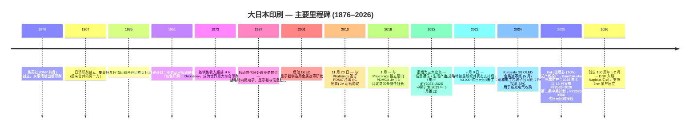

# 公司研究报告：大日本印刷株式会社 (TSE: 7912)

**截至日期：** 2026-05-26
**上市信息：** 东京证券交易所 Prime 市场 — 代码 `7912`（ADR：`DNPLY`，OTC 市场挂牌，ADR:ORD 2:1）([DNP Integrated Report 2025 — Investor Information, p. 57](https://www.global.dnp/content/dam/dnp-global/pdf/en/ir/library/annual/DNP_integrated2025e.pdf.coredownload.pdf))
**总部：** 日本东京都新宿区市谷加贺町 1-1-1，邮编 162-8001 ([DNP Integrated Report 2025, p. 57](https://www.global.dnp/content/dam/dnp-global/pdf/en/ir/library/annual/DNP_integrated2025e.pdf.coredownload.pdf))
**创立：** 1876 年作为集英社 (Shueisha，DNP 前身) 创立；1935 年与日清印刷合并组成大日本印刷 ([DNP Integrated Report 2025 — History timeline, p. 7](https://www.global.dnp/content/dam/dnp-global/pdf/en/ir/library/annual/DNP_integrated2025e.pdf.coredownload.pdf))
**财年截止：** 每年 3 月 31 日。FY2025 = 截至 2026 年 3 月 31 日的财年
**行业背景锚定：** 野村证券《Greater China Semi: A guide to Semi renaissance in 2026~30F》报告 ([sector note](/Users/x/projects/financial_agent/reports/sector/半导体材料.md))

> **更新 — FY2026 指引 + 新三年中期经营计划 FY2026–2028 (2026-05-13 披露)：** 在公布 FY2025 (截至 2026 年 3 月 31 日财年) 业绩的同时，DNP 推出了新的三年中期经营计划，目标 **FY2028 营业利润 ¥1,300 亿日元**（对比 FY2025 实际 ¥1,010 亿日元，CAGR 约 9%）和 ROE ≥9%；FY2026 指引为 **销售收入 ¥1.53 万亿日元 (+1.2% YoY)、营业利润 ¥1,080 亿日元 (+6.9%)**。电子业务板块 FY2026 指引为 **销售 ¥2,740 亿日元 (+¥222 亿) / 营业利润 ¥540 亿日元 (+¥33 亿)**，FY2028 目标营业利润 ¥650 亿日元，明确承诺将资本支出投向 EUV 光罩 (photomask) 量产、纳米压印 (nanoimprint) 模具扩产、以及玻璃芯 (TGV) 从试产线向量产线的过渡。资本回报政策也同步重置：采用渐进式股息政策，最低 DPS ¥40 日元，叠加 **FY2026 ¥500 亿日元股票回购 + FY2027 ≥¥300 亿日元（FY2026-2027 两年合计 ≥¥800 亿日元）** — 这是 2023 年 3 月在艾略特 (Elliott Management) 推动下启动的 ¥3,000 亿日元回购计划的延续。资料来源：[DNP FY2025 financial results & FY2026-2028 Medium-Term Management Plan briefing materials, 2026-05-13](https://www.global.dnp/content/dam/dnp-global/pdf/en/ir/library/presentation/dnp_e_25Q4pre.pdf)。

---

## 目录

1. 公司概览
2. 公司历史
3. 管理团队
4. 产品与服务（光罩、EUV 级光罩、精密金属遮罩、光学薄膜、锂电池铝塑膜、玻璃芯、邻近产品）
5. 客户与上市策略
6. 行业概览
7. 竞争格局
8. 市场机会 (TAM)
9. 风险评估

参考资料 + 第 10 步验证日志

---

## 1. 公司概览

大日本印刷株式会社（Dai Nippon Printing Co., Ltd.，简称 DNP）是一家**已有 150 年历史的日本印刷集团企业，于 1980 年代至 2000 年代从出版印刷转型为"P&I"——印刷与信息 (Printing & Information)，目前其大部分营业利润来源已不是印刷品本身，而是来自微电子、显示器以及锂离子电池组件**。集团报告分为三大业务板块——**信息通信 (Smart Communication)、生活产业 (Life & Healthcare)、电子 (Electronics) 三大业务**——FY2025（截至 2026 年 3 月 31 日财年）实现合并销售收入 **¥1.5125 万亿日元 (+3.8% YoY)、营业利润 ¥1,010 亿日元 (+7.9% YoY)**，全球员工 36,890 人 ([DNP FY2025 financial results briefing, p. 3 & p. 5](https://www.global.dnp/content/dam/dnp-global/pdf/en/ir/library/presentation/dnp_e_25Q4pre.pdf); [DNP Integrated Report 2025, p. 57](https://www.global.dnp/content/dam/dnp-global/pdf/en/ir/library/annual/DNP_integrated2025e.pdf.coredownload.pdf))。虽然电子业务板块按销售收入计算是三大业务中规模最小的（¥2,518 亿日元，约占集团总收入 17%），但其 FY2025 贡献了 **¥507 亿日元（占比 50%）的板块层面营业利润**（计入未分摊公司层费用前）——这意味着投资者今天买入 DNP 时，他们真正购买的是这块电子业务 ([DNP FY2025 results, p. 6](https://www.global.dnp/content/dam/dnp-global/pdf/en/ir/library/presentation/dnp_e_25Q4pre.pdf))。

**商业模式。** DNP 在四种核心工艺技术——*信息处理 / 微细加工 / 精密涂布 / 后加工*——基础上，按客户需要叠加任意基材，将工艺应用于智能卡、染料升华打印介质 (dye-sublimation printing media)、食品包装、装饰层压板、电池铝塑膜、OLED 金属遮罩、半导体光罩等差异极大的市场 ([DNP FY2025 results, p. 21 — "P&I Innovation" technology stack](https://www.global.dnp/content/dam/dnp-global/pdf/en/ir/library/presentation/dnp_e_25Q4pre.pdf))。每条产品线的附加价值来源都是一个长周期的专有设备平台 — DNP 要么自主研发该设备，要么与一两家上游 OEM 合作设计 — 设备端有高准入门槛，外加一个供应给少数严格挑剔客户（半导体晶圆代工厂、显示面板厂、电动车电池电芯装配商）的全球服务/供应组织。这一双重堆栈——工艺技术 + 定制设备 + 服务级别全球供应——就是管理层所称的"P&I 创新"，也是 DNP 在锂离子电池铝塑膜、OLED 金属遮罩、显示器光学薄膜、染料升华热转印介质等品类拿到全球第一份额的同一杠杆 ([DNP IR-Day 2025 deck, p. 45 — "Products Boasting Leading Share"](https://www.global.dnp/content/dam/dnp-global/pdf/en/ir/library/presentation/dnp_e_25irday_pre.pdf))。

**三大业务板块——各包含什么。** *信息通信 (Smart Communication)*（FY2025 销售 ¥7,503 亿日元 / 营业利润 ¥400 亿日元）涵盖传统出版印刷、营销宣传品、内容与 XR 服务，外加重点业务信息安全（智能卡、BPO 服务）以及影像（用于零售照片亭和拍立得式即时打印机的染料升华热转印介质）([DNP FY2025 results, p. 6](https://www.global.dnp/content/dam/dnp-global/pdf/en/ir/library/presentation/dnp_e_25Q4pre.pdf))。*生活产业 (Life & Healthcare)*（销售 ¥5,123 亿日元 / 营业利润 ¥372 亿日元）覆盖包装印刷、汽车相关装饰薄膜、工业高性能材料（其中**锂电池铝塑膜 (LIB pouch foil)** 位于此），以及通过 2023 年 CMIC CMO 整合建立的合同制药业务。*电子 (Electronics)*（销售 ¥2,518 亿日元 / 营业利润 ¥507 亿日元）就是对半导体供应链投资者最关键的板块——包含**数字界面 (Digital Interface)**（光学薄膜与 OLED 金属遮罩）加**半导体 (Semiconductor)**（光罩 (photomask)，以及新兴的玻璃芯 (TGV) 基板与纳米压印模具线）。电子业务 FY2025 销售仅 +1.6% YoY 增长，但板块营业利润同比下降 -11.6% 至 ¥507 亿日元，原因是 Kurosaki G8 金属遮罩线和 Kamifukuoka 光罩扩产带来的折旧上升，加上 Q4-FY2025 半导体存储供应紧张压缩了 OLED 智能手机厂商的金属遮罩出货 ([DNP FY2025 results, p. 9 — Electronics commentary](https://www.global.dnp/content/dam/dnp-global/pdf/en/ir/library/presentation/dnp_e_25Q4pre.pdf))。

**地域。** DNP 披露的损益表以日本本土为主，但其重点业务收入正在迅速向全球倾斜。在电子业务方面，DNP 的光罩供应核心节点是 **Kamifukuoka 工厂（埼玉县）** 用于前道半导体产品，**Kurosaki 工厂（福冈县）** 用于 OLED 金属遮罩和大面积主流光罩，以及 **Kuki 工厂（埼玉县）** 用于新的玻璃芯 (TGV) 试产线 ([DNP FY2025 results, p. 15 — Key Investments in Focus Business Areas](https://www.global.dnp/content/dam/dnp-global/pdf/en/ir/library/presentation/dnp_e_25Q4pre.pdf))。在日本以外的半导体光罩供应方面，DNP 通过与美国上市公司 **Photronics, Inc. (NASDAQ: PLAB)** 的两家战略合资公司运营：2013 年的 **PDMC 台湾合资公司**（新竹，用于 IC 光罩供应亚洲晶圆代工厂客户），以及 2018 年的 **PDMCX 厦门合资公司**（用于供应中国大陆晶圆代工厂的 IC 光罩）([PLAB 10-K FY25, Exhibit Index — Joint Venture Operating Agreements; Note 6 PDMCX](https://www.sec.gov/Archives/edgar/data/810136/000114036125045801/ef20057458_10k.htm))。Photronics 合并这两家合资公司（PLAB 持有两家公司各 50.01% 经济权益）；DNP 接收少数股东权益份额，FY2025 在 Photronics 合并层面表现为少数股东净利润 USD 5,380 万 ([PLAB 10-K FY25, Item 7](https://www.sec.gov/Archives/edgar/data/810136/000114036125045801/ef20057458_10k.htm)) — 对 DNP 来说这是一项营业外权益类联营公司贡献，但战略上至关重要，因为这让 DNP 品牌光罩产品得以直接进入 TSMC、UMC、SMIC、华虹、合肥晶合 (Nexchip) 等客户的供应链。

*资料来源：[DNP FY2025 financial results briefing, p. 5, p. 13, p. 14](https://www.global.dnp/content/dam/dnp-global/pdf/en/ir/library/presentation/dnp_e_25Q4pre.pdf)；FY2022 基线 ¥612 亿日元营业利润数据来自第 13 页 Review (1) 图表。*

**FY2025 vs FY2022 — 三年计划的实际成效。** 当时新就任社长北岛义斉（Yoshinari Kitajima）在 2023 年 5 月推出 FY2023–2025 中期计划时，目标是 FY2025 营业利润 ≥¥850 亿日元；FY2025 实际值为 **¥1,010 亿日元**，超出最初计划 19%，提前一年达成 ([DNP IR-Day 2025, p. 5](https://www.global.dnp/content/dam/dnp-global/pdf/en/ir/library/presentation/dnp_e_25irday_pre.pdf))。营业利润构成发生决定性转变：FY2022 电子业务占板块营业利润 57%（¥469 亿日元/¥816 亿日元板块合计），到 FY2025 降至 40%（¥507 亿日元/¥1,279 亿日元）——并非因为电子业务收缩，而是因为信息通信与生活产业从历史低基数通过结构性改革（出版印刷工厂关停、包装固定资产合理化、光伏封装材料产能爬坡）实现了显著增长 ([DNP FY2025 results, p. 14 — Review (3): Operating Profit Change by Segment](https://www.global.dnp/content/dam/dnp-global/pdf/en/ir/library/presentation/dnp_e_25Q4pre.pdf))。ROE 从 FY2022 的 5.6% 升至 **FY2024 的 9.6%（峰值）和 FY2025 的 8.9%**，两者均高于 DNP 自行估算的 8% 股权资本成本上限 ([DNP IR-Day 2025, p. 5](https://www.global.dnp/content/dam/dnp-global/pdf/en/ir/library/presentation/dnp_e_25irday_pre.pdf))。

**估值快照。** 截至 2026-05-13 ([Companies Market Cap — Dai Nippon Printing P/E ratio history](https://companiesmarketcap.com/dai-nippon-printing/pe-ratio/); [Companies Market Cap — DNP market capitalization](https://companiesmarketcap.com/dai-nippon-printing/marketcap/); [Yahoo Finance 7912.T](https://finance.yahoo.com/quote/7912.T/)):

| 指标 | DNP (7912) | Toppan (7911) | Hoya (7741) | Photronics (PLAB) |
|---|---|---|---|---|
| 股价 | JPY 3,264 | JPY ~5,300 | JPY ~17,000 | USD ~52 |
| 市值 | JPY ~1.41 万亿 (USD ~79 亿) | JPY ~1.7 万亿 | JPY ~6.1 万亿 | USD ~30 亿 |
| TTM P/E | **~5.2× (受 gain-on-sale 顺风消退影响而偏低)** | ~12× | ~24× | ~22× |
| EPS (TTM) | JPY 179 | — | — | USD 2.33 |
| 52 周区间 | JPY 2,500 – 3,400 | — | — | — |
| 股息率 | ~1.3% | ~2% | ~0.7% | 0% (以回购为主) |

*资料来源：P/E 比率数据来自 [Companies Market Cap — DNP](https://companiesmarketcap.com/dai-nippon-printing/pe-ratio/)；市值来自 [Companies Market Cap — DNP marketcap](https://companiesmarketcap.com/dai-nippon-printing/marketcap/)；Photronics 数据来自 [Stockanalysis.com PLAB](https://stockanalysis.com/stocks/plab/)；Hoya 同业 P/E 来自 [Hoya peer chart in companion report](../../charts/hoya_peer_pe.png)。*

**如何解读这一估值倍数。** DNP TTM 市盈率仅 ~5× 看似极低实则具误导性。FY2024（截至 2025 年 3 月 31 日财年）净利润受交叉持股解除计划下 ¥2,200 亿日元的政策性持股出售收益拉抬——这是 DNP 历史上单年度最大规模处置。FY2025 净利润 ¥1,039 亿日元仍受益于剩余处置收益（FY2025 当年处置 ¥500 亿日元，FY2023-24 累计 ¥1,700 亿日元）([DNP FY2025 results, p. 16 — Review (5): Financial Strategy](https://www.global.dnp/content/dam/dnp-global/pdf/en/ir/library/presentation/dnp_e_25Q4pre.pdf))。**剔除特殊性损益的标准化 ROE 约为 7%** （FY2025）— 略高于管理层估计的 6-8% 股权资本成本区间 ([DNP IR-Day 2025, p. 5](https://www.global.dnp/content/dam/dnp-global/pdf/en/ir/library/presentation/dnp_e_25irday_pre.pdf))。FY2026 净利润指引 ¥950 亿日元（-8.6% YoY）反映了处置管线的逐渐消退。*分析师观点：* 按"仅经营利润"的标准化基础，该倍数更接近 ~10-12× ——仍然较 Toppan ~12× 折价，较 Hoya ~24× 严重折价，原因是市场为**业务纯度**支付溢价：Hoya 的电子业务（EUV 光罩坯料 + HDD 玻璃磁盘 + 眼镜片）占集团销售约 50%，营业利润率 28%；DNP 电子业务占集团销售约 17%，营业利润率 20%，但被埋藏在一个集团企业里，传统出版印刷和包装业务稀释了集团 ROE。回购驱动的资本回报计划是管理层用于弥补这一估值差距的明确杠杆。FY2025 PBR 从 0.9× (2023 年 3 月，艾略特披露股权时 ¥3,000 亿日元回购授权之际) 升至 1.1× (2026 年 3 月)([DNP FY2025 results, p. 13](https://www.global.dnp/content/dam/dnp-global/pdf/en/ir/library/presentation/dnp_e_25Q4pre.pdf))。

**资本回报。** DNP 的 FY2023-25 计划交付了 **¥2,911 亿日元的股票回购**（FY2023 ¥1,529 亿 + FY2024 ¥574 亿 + FY2025 ¥808 亿日元）以及 ¥2,200 亿日元的政策性持股处置。FY2026 计划增加 **¥500 亿日元回购**，FY2027 至少另外 ¥300 亿日元（两年期合计 ≥¥800 亿日元），外加 ¥40/股的累进式股息底线（FY2026 指引 ¥41/股，连续第三年加派股息）([DNP FY2025 results, p. 17 and p. 40](https://www.global.dnp/content/dam/dnp-global/pdf/en/ir/library/presentation/dnp_e_25Q4pre.pdf))。FY2023-FY2028 累计股东回报有望超过 ¥4,400 亿日元——约相当于当前市值的 30%。

*资料来源：[DNP FY2025 financial results, p. 17 (Financial Strategy) + p. 39 (FY2026-2028 Cash Allocation Plan) + p. 40 (Dividend history)](https://www.global.dnp/content/dam/dnp-global/pdf/en/ir/library/presentation/dnp_e_25Q4pre.pdf)。*

**双重身份。** 研究投资者需要同时持有两个视角：**(i) 集团企业估值折扣修复故事**（交叉持股解除、出版印刷与包装结构性改革、回购作为 PBR 修复杠杆）这主要是一个日本本土资本配置主题；以及 **(ii) 电子业务**（光罩 + OLED 金属遮罩 + 锂离子电池铝塑膜 + 玻璃芯 + 纳米压印）——这是对 AI / 先进封装 / OLED-IT / 电动车电池等驱动 Hoya、Resonac、信越化学以及日本半导体材料行业整体的同一组结构性浪潮的杠杆暴露。两条故事线相互关联：资本配置重置释放出现金，用于资助 ¥1,200 亿日元的 FY2026-2028 研发承诺以及 ¥3,000 亿日元的资本支出承诺，两者都向电子业务倾斜 ([DNP FY2025 results, p. 32 and p. 39](https://www.global.dnp/content/dam/dnp-global/pdf/en/ir/library/presentation/dnp_e_25Q4pre.pdf))。第 4 节逐项展开产品；第 7 节点明竞争对手；第 9 节区分周期性与结构性风险。

## 2. 公司历史

DNP 公司起源可追溯至 **1876 年**作为集英社 (Shueisha) 创立——一家出版印刷企业，是日本第一家大规模引入西方活版印刷的公司；现代意义上的大日本印刷株式会社由 **1935 年集英社与日清印刷（1907 年创立）的合并**组成 ([DNP Integrated Report 2025, p. 7 — DNP History timeline](https://www.global.dnp/content/dam/dnp-global/pdf/en/ir/library/annual/DNP_integrated2025e.pdf.coredownload.pdf))。"第二次企业创立"出现在 1951 年，在战后重建框架下，公司业务从出版印刷扩展到商业印刷、包装印刷和装饰印刷——将活版印刷、蚀刻、光刻和涂布工艺重新应用于工业基材。到 **1973 年，DNP 已经按销售收入超越美国 R.R. Donnelley & Sons，成为世界最大的综合印刷企业**——这一地位塑造了 DNP 的自我形象，但也成为了 1990 年代至 2000 年代的战略包袱，因为全球出版印刷量在收缩 ([DNP Integrated Report 2025, p. 7](https://www.global.dnp/content/dam/dnp-global/pdf/en/ir/library/annual/DNP_integrated2025e.pdf.coredownload.pdf))。

界定今日 DNP 的战略转型始于 **1987 年**的"向信息处理业务转型"旗号：管理层开始将其技术堆栈——蚀刻、光刻、精密涂布、沉积——重新定位向微电子和显示器应用。到 21 世纪初，公司已建立 CRT 显示器荫罩、液晶显示器彩色滤光片、显示器光学薄膜、OLED 金属遮罩（2001 年开始研发）以及半导体光罩等业务的领先地位 ([DNP IR-Day 2025, p. 63 — History of DNP's Display Business](https://www.global.dnp/content/dam/dnp-global/pdf/en/ir/library/presentation/dnp_e_25irday_pre.pdf))。2018 年北岛义斉就任社长，标志着进入当前"第三次企业创立"框架——积极对集团企业进行组合重塑、围绕三大业务（2022 年宣布）展开，并将 P&I 视为可交易的工艺能力集合，集团将其应用于资本回报最佳的市场 ([DNP Integrated Report 2025, p. 3 — Top Message](https://www.global.dnp/content/dam/dnp-global/pdf/en/ir/library/annual/DNP_integrated2025e.pdf.coredownload.pdf))。

*资料来源：综合自 [DNP Integrated Report 2025, p. 7 — History timeline](https://www.global.dnp/content/dam/dnp-global/pdf/en/ir/library/annual/DNP_integrated2025e.pdf.coredownload.pdf); [DNP FY2025 results, p. 15 — Key Investments](https://www.global.dnp/content/dam/dnp-global/pdf/en/ir/library/presentation/dnp_e_25Q4pre.pdf); [PLAB 10-K FY25 Exhibit Index — JV Operating Agreements](https://www.sec.gov/Archives/edgar/data/810136/000114036125045801/ef20057458_10k.htm); [Elliott Statement on Dai Nippon Printing, 2023-03-09](https://www.prnewswire.com/news-releases/elliott-statement-on-dai-nippon-printing-301768540.html); [DNP press release on Rapidus investment, 2026-02-24](https://www.businesswire.com/news/home/20260224169578/en/DNP-Invests-in-Rapidus-to-Support-the-Establishment-of-Mass-Production-for-Next-Generation-Semiconductors)。*

**界定现代公司的两次战略转型。**

*第一次转型 — 从世界最大商业印刷企业到"P&I"平台 (1987–2022)。* 从 R.R. Donnelley 风格的印刷集团企业到今天三大业务 P&I 平台的 35 年长征，塑造了 DNP 当前的资产形态。到 1987 年 DNP 已注意到发达国家出版印刷量已经见顶；在随后的二十年中，公司悄然建立了**荫罩**（OLED 金属遮罩的前身技术，用于对阴极射线管显示器的荧光条纹进行图案化）、**液晶显示器彩色滤光片**、**光学薄膜**、**智能卡**、**染料升华热转印介质**以及**半导体光罩**等业务——每一个都是因为 DNP 现有的工艺技术（蚀刻、光刻、精密涂布）可以以可控的增量资本支出重新部署 ([DNP IR-Day 2025, p. 63 — History of DNP's Display Business](https://www.global.dnp/content/dam/dnp-global/pdf/en/ir/library/presentation/dnp_e_25irday_pre.pdf))。2013 年的台湾 Photronics 合资公司和 2018 年的厦门 Photronics 合资公司是其国际化扩张举措：DNP 不必自建绿地光罩工厂，就获得了 Photronics 在亚洲晶圆代工走廊的多基地存在；Photronics 则获得 DNP 的写入工具堆栈和工艺 IP，从而可以可信地进入 ≤28nm 光罩生产 ([PLAB 10-K FY25, Note 6 PDMCX](https://www.sec.gov/Archives/edgar/data/810136/000114036125045801/ef20057458_10k.htm))。2022 年重组为信息通信 / 生活产业 / 电子三大业务，是这一新组合在损益表上变得明晰的时刻。

*第二次转型 — 艾略特催化的资本配置重置 (2023)。* 在 2023 年 3 月 9 日，DNP 授权了其历史上最大规模的股票回购——**¥3,000 亿日元，约相当于当时公司市值的 30%**——计划在 FY2023-2027 中期计划窗口期内执行。艾略特管理公司 (Elliott Management) 在此前几周公开披露其持仓后，在同日发表声明表示支持，股价当天上涨 13% ([Nasdaq.com — DNP up 13% on share buyback plan, gets Elliott's support, 2023-03-10](https://www.nasdaq.com/articles/dai-nippon-printing-up-13-on-share-buyback-plan-gets-elliotts-support); [Elliott Statement on Dai Nippon Printing, 2023-03-09](https://www.prnewswire.com/news-releases/elliott-statement-on-dai-nippon-printing-301768540.html))。回购计划与**政策性持股解除计划**配套——DNP 承诺将战略性交叉持股降至合并净资产 <10% 以下，到 FY2025 实现累计 ¥2,200 亿日元的处置收益，期末比例为 13.4% ([DNP FY2025 results, p. 17 — Review (5)](https://www.global.dnp/content/dam/dnp-global/pdf/en/ir/library/presentation/dnp_e_25Q4pre.pdf))。这一组合——交叉持股解除现金 → 回购 → 股份数减少 → ROE 上升 → PBR 上升——是日本企业治理改革的教科书式序列；DNP 比 TSE Prime 大多数同业更果断地执行了这一序列，市场也给予了相应奖励。

**近期发展（过去 24 个月）。**(1) **CMIC CMO 子公司化 (FY2023)** — API 与制剂的合同制药进入生活产业组合。(2) **DNP Hikari Kinzoku 合并 (FY2024)** — 用于汽车内饰的 HMI（人机界面）组件。(3) **Resonac Packaging 子公司化 (FY2024)** — 包装薄膜业务完全内化。(4) **新光电气工业 (Shinko Electric Industries) SPC 投资 (FY2024)** — DNP 入股由 JIC 主导的 SPC 工具公司 15%，与三井化学 (5%) 和 JIC Capital (80%) 一起完成了对新光电气 49.98% 股份的 **¥4,000 亿日元要约收购**；新光电气是全球先进 FCBGA 封装基板领导者，2025 年 6 月退市——DNP 的入股使其在玻璃芯与有机 FCBGA 在最先进节点竞争的战略时点上，获得了先进封装基板供应的战略性座位 ([Mitsui Chemicals — Notice Regarding Commencement of Tender Offer to Acquire Shares in SHINKO ELECTRIC INDUSTRIES, 2025-02-17](https://jp.mitsuichemicals.com/en/release/2025/2025_0217/index.htm); [Digitimes — Shinko Electric to delist in June, eye DNP and Mitsui Chemicals partnership on backend process materials, 2025-03-21](https://www.digitimes.com/news/a20250321PD206/shinko-electric-mitsui-chemicals-materials-partnership-fujitsu.html))。(5) **Rubicon SEZC (FY2025)** — 通过整合 Rubicon 智能卡平台拓展信息安全的全球业务。(6) **Kamifukuoka 和 Kuki 工厂资本支出 (FY2025)** — DNP 在 Kamifukuoka 工厂（埼玉，主要光罩中枢）增加先进节点量产光罩产能，并在 Kuki 工厂（埼玉）启用玻璃芯 (TGV) 试产线 ([DNP FY2025 results, p. 15](https://www.global.dnp/content/dam/dnp-global/pdf/en/ir/library/presentation/dnp_e_25Q4pre.pdf))。(7) **Rapidus 入股 (FY2026, 2026 年 2 月)** — DNP 入股 Rapidus 公司（日本政府支持的、在北海道建设 2nm 节点的先进节点晶圆代工厂）——正式确立了此前 2024 年 NEDO 转包关系——其中 DNP 被选定为 Rapidus 北海道 2nm 试产线供应光罩 ([DNP press release — DNP Invests in Rapidus, 2026-02-24](https://www.businesswire.com/news/home/20260224169578/en/DNP-Invests-in-Rapidus-to-Support-the-Establishment-of-Mass-Production-for-Next-Generation-Semiconductors); [Digitimes — DNP to supply photomasks to Rapidus for 2nm chips in 2027, 2024-03-27](https://www.digitimes.com/news/a20240327PD213/dai-nippon-printing-photomask-rapidus-2nm.html))。

## 3. 管理团队

DNP 是一家有 150 年历史、无现代意义上"创始人"的工业公司；不存在可以撰写的现代意义上的创始人简介。1876 年集英社的创立是宿屋作次郎和佐藤虎之助的合伙关系，但 1935 年合并后的管理传承通过北岛家族——北岛义保（前会长）和北岛义俊（前社长）支撑了 1990 年代至 2010 年代。**现任社长是北岛义斉**（也是北岛家族后代），自 2018 年 6 月任职至今，并自 2022 年 4 月起担任可持续发展委员会主席。他是 2022 年三大业务重组、2023 年艾略特时代资本配置重置以及 2026 年 5 月公布的 FY2026-2028 计划的主导高管。

### 北岛义斉 — 社长（自 2018 年 6 月起）

北岛义斉（Yoshinari Kitajima），**生于 1964 年 9 月 18 日**，是大日本印刷株式会社的社长，也是与公司现代再造最紧密相关的高管。他于 1987 年 4 月大学毕业后即加入富士银行（现瑞穗银行），积累四年企业银行业务经验后，于 **1995 年 3 月**进入 DNP ([DNP Integrated Report 2025, p. 41 — Director Biographies](https://www.global.dnp/content/dam/dnp-global/pdf/en/ir/library/annual/DNP_integrated2025e.pdf.coredownload.pdf))。他在 DNP 的晋升路径异常迅速：2001 年 6 月任董事、2003 年 6 月任常务董事、2005 年 6 月任专务董事、2009 年 6 月任副社长、**2018 年 6 月任社长**——使他成为 TSE Prime 集团企业中任期最长的现任社长之一 ([DNP Integrated Report 2025, p. 41](https://www.global.dnp/content/dam/dnp-global/pdf/en/ir/library/annual/DNP_integrated2025e.pdf.coredownload.pdf))。

他七年社长任期内的运营业绩具体可量化：(1) **将板块结构从五个报告口径调整为三大业务**（信息通信 / 生活产业 / 电子，FY2022 生效），使集团企业的组合主题首次对外部投资者清晰可读；(2) **执行 2023 年 3 月 9 日授权的 ¥3,000 亿日元回购**——DNP 历史上最大规模的回购——艾略特公开背书 ([Elliott Statement on Dai Nippon Printing, 2023-03-09](https://www.prnewswire.com/news-releases/elliott-statement-on-dai-nippon-printing-301768540.html))；(3) **在 FY2023-FY2025 期间将政策性持股减少 ¥2,200 亿日元**，将交叉持股降至净资产的 13.4% 以下（明确目标 <10%）；(4) **提前一年完成 FY2023-2025 中期计划**——FY2024 营业利润 ¥936 亿日元超过 FY2025 的 ¥850 亿日元目标 ([DNP IR-Day 2025, p. 5](https://www.global.dnp/content/dam/dnp-global/pdf/en/ir/library/presentation/dnp_e_25irday_pre.pdf))；(5) **重新布局电子业务投资计划**——围绕光罩、OLED 金属遮罩、玻璃芯、纳米压印——仅 FY2026-2028 半导体重点领域的资本支出承诺就达 ¥300 亿日元左右 ([DNP IR-Day 2025, p. 56 — Semiconductor Photomask Sales Plan; FY2026-FY2028 capex ¥30 bn](https://www.global.dnp/content/dam/dnp-global/pdf/en/ir/library/presentation/dnp_e_25irday_pre.pdf))。

北岛作为董事的资质在 Integrated Report 中描述为依托其"在 DNP 集团作为管理层的丰富经验"——这是日本企业治理的委婉说法，意思是*具有深厚运营公信力的内部资深人士*。与许多日本集团企业 CEO 不同，他公开与活跃股东友好的资本回报制度保持一致：FY2026 中期计划明确保留累进式股息（¥40/股底线）并重申 FY2026-FY2027 ≥¥800 亿日元的回购——明确提到"基于股价水平和资本效率的灵活性"——这种语言与积极的每股价值优化一致，而不是更被动的日本企业默认的仅以股息支付方式 ([DNP FY2025 results, p. 39–40 — Shareholder Returns Policy](https://www.global.dnp/content/dam/dnp-global/pdf/en/ir/library/presentation/dnp_e_25Q4pre.pdf))。他的持股比例在 FY2025 Integrated Report 中未单独披露；北岛家族未出现在前 10 大股东中，前 10 大股东均为机构信托账户和寿险机构 ([DNP Integrated Report 2025, p. 57 — Major Shareholders](https://www.global.dnp/content/dam/dnp-global/pdf/en/ir/library/annual/DNP_integrated2025e.pdf.coredownload.pdf))。

接班问题——北岛将于 2026 年 9 月年满 62 岁——尚不紧迫；日本集团企业的强制退休惯例通常在 66-68 岁。最资深的内部候选人是**中村修**（Osamu Nakamura，1962 年生，2025 年 6 月起任专务董事），主管精密器件事业部 / 光电事业部 / 研发——通俗地说就是电子业务板块——并担任与铠侠 (Kioxia) 合资的光罩公司 DT Fine Electronics 的董事长 ([DNP Integrated Report 2025, p. 41](https://www.global.dnp/content/dam/dnp-global/pdf/en/ir/library/annual/DNP_integrated2025e.pdf.coredownload.pdf))。隐含的接班逻辑读作电子业务战略的连续性：北岛之后的继任者很可能来自电子业务组织，而非来自传统印刷业务一侧。

