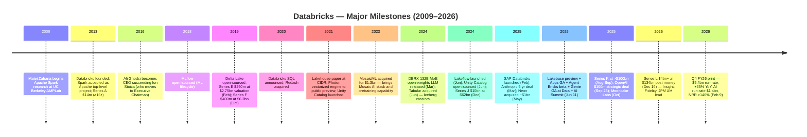
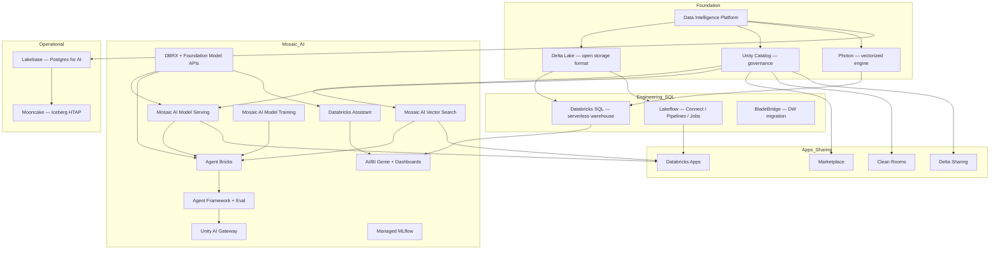
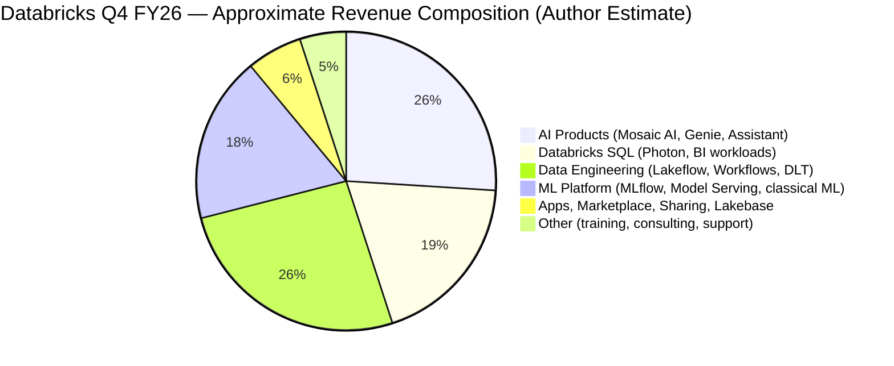
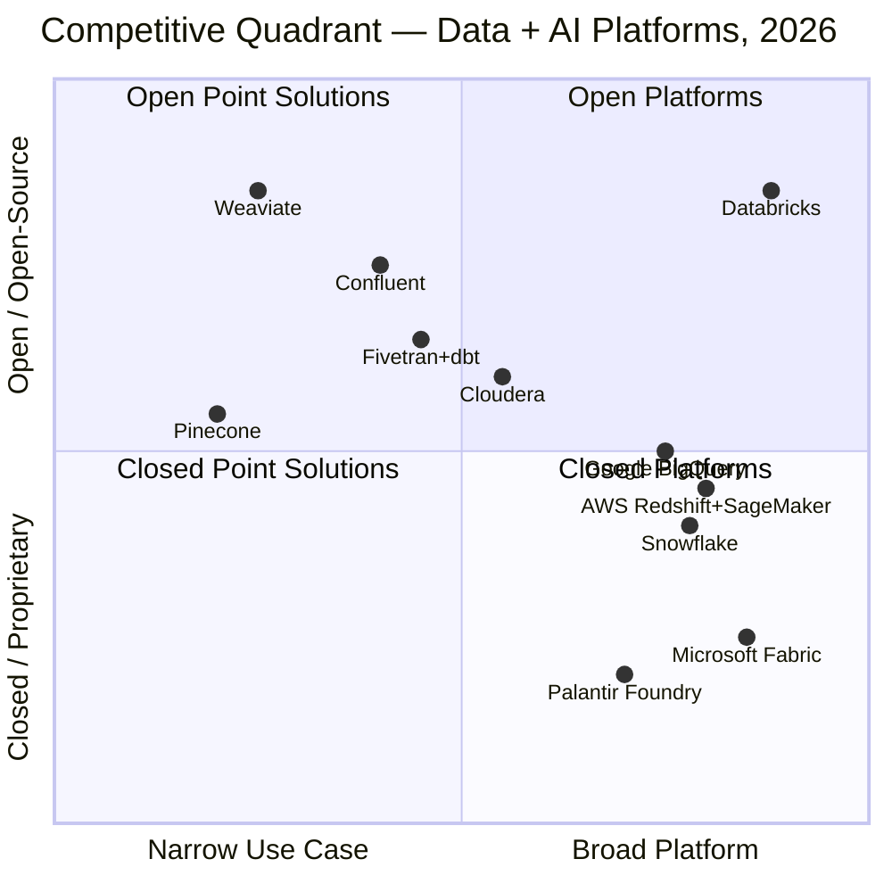

# COMPANY RESEARCH REPORT: Databricks, Inc.

**Date:** 2026-05-30 (initiation of coverage — first full report, refreshed for the Q4 FY26 print of February 9, 2026 and the Series L close of December 16, 2025)
**Author:** financial_agent / company-research skill
**Company:** Databricks, Inc. (private US data-and-AI platform)
**Headquarters:** 160 Spear Street, 15th Floor, San Francisco, CA 94105
**Fiscal year end:** January 31 (FY2026 = year ended Jan 31 2026; Q4 FY26 = three months ended Jan 31 2026)
**Founders:** Ali Ghodsi, Andy Konwinski, Arsalan Tavakoli-Shiraji, Ion Stoica, Matei Zaharia, Patrick Wendell, Reynold Xin
**Analyst note:** Databricks is private. There are no SEC filings. All financial data is sourced from the company's own press releases, customer case studies, founder interviews, and reputable third-party reporting. Multi-source cross-checks are noted where applicable.

> **Update — Q4 FY26 print (Feb 9, 2026) + Series L close (Dec 16, 2025):** Databricks announced that fiscal-year-end (Jan 31, 2026) revenue **surpassed a $5.4 billion annualized run-rate, growing 65% year-over-year**, with the **AI-products portion of revenue at a $1.4 billion run-rate** and **net dollar retention above 140%**. The company now counts **more than 800 customers above $1 million in annualized recurring revenue and more than 70 customers above $10 million ARR**, alongside delivering **positive trailing-twelve-month free cash flow** for the first time at scale ([Databricks Q4 FY26 press release, 2026-02-09](https://www.databricks.com/company/newsroom/press-releases/databricks-grows-65-yoy-surpasses-5-4-billion-revenue-run-rate)). On the capital side, the **Series L closed on December 16, 2025 at a $134 billion post-money valuation**, with **>$4 billion of primary equity** led by Insight Partners, Fidelity, and J.P. Morgan Asset Management, and a parallel **~$2 billion incremental debt facility**; participating new and existing investors include Microsoft, Goldman Sachs, Morgan Stanley, Barclays, Citi, BlackRock, Coatue, and Qatar Investment Authority ([Databricks Series L press release, 2025-12-16](https://www.databricks.com/company/newsroom/press-releases/databricks-surpasses-4-8b-revenue-run-rate-growing-55-year-over-year); [CNBC — Databricks $134 bn round, 2025-12-16](https://www.cnbc.com/2025/12/16/databricks-funding-valuation.html)). The combination — accelerating revenue growth at higher absolute scale, AI now ~26% of run-rate, and the highest private mark ever for a software company outside OpenAI — sets the frame for everything that follows in this report.

---

## Table of Contents

1. Company Overview
2. Company History
3. Management Team
4. Products & Services
5. Customers & Go-to-Market
6. Industry Overview
7. Competitive Landscape
8. Market Opportunity (TAM)
9. Risk Assessment
10. References

---

## 1. Company Overview

Databricks, Inc. is a private, San Francisco-headquartered enterprise-software company whose mission, in its own words, is to **"simplify and democratize data and AI"** — the operating system on top of which more than 20,000 organizations now run their analytics, machine-learning, and generative-AI workloads ([Databricks About Us](https://www.databricks.com/company/about-us)). The company was incorporated in 2013 by seven UC Berkeley AMPLab alumni who had originated Apache Spark (Matei Zaharia, Ion Stoica, Reynold Xin, Patrick Wendell, Andy Konwinski, Ali Ghodsi, Arsalan Tavakoli-Shiraji), and it remains the commercial steward of the Spark project as well as of Delta Lake, MLflow, Unity Catalog, Delta Sharing, and the DBRX foundation-model family ([Databricks Founders page](https://www.databricks.com/company/founders); [Wikipedia: Databricks](https://en.wikipedia.org/wiki/Databricks)). In plain English: Databricks builds the unified platform — storage format, SQL warehouse, data-engineering pipelines, machine-learning runtime, vector database, model-serving gateway, agentic-AI framework, and now an operational Postgres — that lets a Fortune-500 enterprise put all of its data, of any shape, in one open place and run any downstream workload (BI, ML, GenAI) on top without copying it out.

The product is sold as a multi-tenant SaaS that runs **on top of AWS, Microsoft Azure, and Google Cloud** — a "platform-on-platforms" posture that explicitly trades cost of goods (the hyperscalers extract their margin on the underlying compute and storage) for distribution and neutrality (a customer never has to pick a single cloud) ([Databricks Pricing — overview by cloud](https://www.databricks.com/product/pricing)). The architectural thesis that defines Databricks is **the lakehouse** — a unified storage layer that combines the cost and openness of a data lake with the transactional, query-optimizable characteristics of a data warehouse — formalized by Armbrust, Ghodsi, Xin, and Zaharia in the **CIDR 2021 paper "Lakehouse: A New Generation of Open Platforms that Unify Data Warehousing and Advanced Analytics"** ([CIDR 2021 Lakehouse paper, Armbrust/Ghodsi/Xin/Zaharia](https://www.cidrdb.org/cidr2021/papers/cidr2021_paper17.pdf); [Databricks lakehouse glossary entry](https://www.databricks.com/glossary/data-lakehouse)). Every product Databricks ships today plugs into that storage layer.

The company crossed several reporting milestones simultaneously in the Q4 FY26 release. Revenue run-rate of **$5.4 billion** is up from $4.8 billion at the end of Q3 FY26 (Dec 2025), $4.0 billion at the end of Q2 FY26 (Aug 2025), and approximately $3.0 billion a year earlier — a year-over-year growth rate that the company itself reports as **+65%**, an acceleration from the **+55%** disclosed alongside the Series L only six weeks earlier ([Databricks Q4 FY26 press release, 2026-02-09](https://www.databricks.com/company/newsroom/press-releases/databricks-grows-65-yoy-surpasses-5-4-billion-revenue-run-rate); [Databricks Series L press release, 2025-12-16](https://www.databricks.com/company/newsroom/press-releases/databricks-surpasses-4-8b-revenue-run-rate-growing-55-year-over-year)). Inside that mix, the **AI-products run-rate of $1.4 billion** — covering Mosaic AI Vector Search, Model Serving, the Foundation Model APIs gateway, Agent Bricks, AI/BI Genie, and the model-training stack inherited from MosaicML — represents roughly **26% of revenue** and is the fastest-growing line item the company discloses ([Databricks Q4 FY26 press release](https://www.databricks.com/company/newsroom/press-releases/databricks-grows-65-yoy-surpasses-5-4-billion-revenue-run-rate)).

Two other operating metrics anchor the durability of the model. First, **net dollar retention above 140%** — a number that has been remarkably consistent across press cycles dating back to 2022 and which implies that the average dollar of revenue today is worth more than $1.40 a year from now even before the company wins a single new customer ([Databricks Q4 FY26 press release](https://www.databricks.com/company/newsroom/press-releases/databricks-grows-65-yoy-surpasses-5-4-billion-revenue-run-rate)). Second, **positive trailing-twelve-month free cash flow**, disclosed at scale for the first time alongside the Q4 FY26 print — a milestone that materially de-risks the financial profile in front of any near-term capital-markets event ([Databricks Q4 FY26 press release](https://www.databricks.com/company/newsroom/press-releases/databricks-grows-65-yoy-surpasses-5-4-billion-revenue-run-rate)). Customer concentration, by contrast, the company does not publicly disclose; we flag this as the single largest transparency gap in the disclosures available to outside investors.

**Valuation snapshot.** Databricks' Series L round closed on **December 16, 2025 at a $134 billion post-money valuation**, with primary equity of approximately **$4 billion** led by Insight Partners, Fidelity Management, and J.P. Morgan Asset Management, plus participation from Microsoft, Goldman Sachs, Morgan Stanley, Barclays, Citi, BlackRock, Coatue, and the Qatar Investment Authority — together with an incremental **~$2 billion debt facility** that the company has framed as providing flexibility for capital-intensive AI infrastructure spending ([Databricks Series L press release, 2025-12-16](https://www.databricks.com/company/newsroom/press-releases/databricks-surpasses-4-8b-revenue-run-rate-growing-55-year-over-year); [CNBC — Databricks $134 bn round, 2025-12-16](https://www.cnbc.com/2025/12/16/databricks-funding-valuation.html)). Total cumulative equity raised through Series L stands at **approximately $19 billion across twelve disclosed rounds**, plus the new debt — an aggregate that places Databricks among the most capitalized private software companies ever, behind only OpenAI and roughly parity with SpaceX inside the broader tech-private universe.

On an implied revenue-multiple basis, $134 billion against the **$5.4 billion run-rate** is roughly **25× annualized** — and against an estimated trailing FY26 revenue figure (where run-rate is a forward construct that exceeds in-period collected revenue) of approximately $3.5–4.0 billion, **~33–38× trailing P/S**. The most relevant public comparable is **Snowflake (NYSE: SNOW)**, whose own FY26 ended on January 31, 2026 and which reported **product revenue of $4.68 billion, up 29% year-over-year**, against a market capitalization that had declined roughly **50% year-to-date in calendar 2026** to approximately $60 billion — implying a forward EV/Sales of roughly **12–13×** ([Futurum: Snowflake Q4 FY26 results, 2026-03-13](https://futurumgroup.com/insights/snowflake-q4-fy-2026-results-highlight-ai-led-consumption-and-platform-expansion/)). On simple math, Databricks is being valued at roughly **2× the revenue multiple** of Snowflake despite (a) operating at higher absolute scale ($5.4 bn vs. $4.7 bn run-rate), (b) growing **more than twice as fast** (65% vs. 29%), and (c) having a materially larger AI-product mix. SaaStr's read of this comparison — that "Databricks vs Snowflake at $5 bn ARR — same revenue, 2× valuation gap — here's why" — captures the consensus market frame ([SaaStr: Databricks vs Snowflake at $5B ARR, 2026-02-12](https://www.saastr.com/databricks-vs-snowflake-at-5b-arr-same-revenue-2x-valuation-gap-heres-why/)). The premium is real, but it is contingent on AI growth sustaining the gap; if AI revenue decelerates — or if Microsoft Fabric's bundled economics begin to compress greenfield wins — the multiple gap is the first place that pressure will show up.

Headcount totals "10,000+" per the company's own careers site, with most third-party trackers placing the total — inclusive of full-time employees and long-term contractors — closer to **12,000–14,000 at the start of calendar 2026** ([Databricks Careers page](https://www.databricks.com/careers)). The company has been a top-three private employer of senior AI/ML engineering talent in the Bay Area since the MosaicML acquisition in 2023 and has used the Series J/K/L proceeds in part for periodic employee-liquidity programs that have allowed it to remain private at scale.

CNBC ranked Databricks **#3 on the 2026 CNBC Disruptor 50 list** — its highest rank ever and a direct read on how the company is perceived in the broader business press as it heads into a likely 2026 or 2027 IPO ([CNBC Disruptor 50 — Databricks at #3, 2026-05-19](https://www.cnbc.com/2026/05/19/databricks-cnbc-disruptor-50-ranking.html)).

---

## 2. Company History

Databricks' story is unusual among hyper-growth software companies in that it begins not with a customer problem but with an academic project. In 2009, **Matei Zaharia**, then a PhD student at UC Berkeley's AMPLab (Algorithms, Machines, and People Lab) under co-advisors Ion Stoica and Scott Shenker, began work on what became **Apache Spark** — a general-purpose, in-memory distributed computing engine designed to run analytics workloads orders of magnitude faster than the then-dominant Hadoop MapReduce ([Matei Zaharia — UC Berkeley homepage](https://people.eecs.berkeley.edu/~matei/); [Wikipedia: Matei Zaharia](https://en.wikipedia.org/wiki/Matei_Zaharia)). Spark was open-sourced, and by 2013 had attracted enough enterprise interest that Zaharia, Stoica, and five other AMPLab collaborators — Ali Ghodsi, Andy Konwinski, Arsalan Tavakoli-Shiraji, Patrick Wendell, and Reynold Xin — incorporated **Databricks** in Berkeley to commercialize a managed Spark service, with Ion Stoica as founding CEO. The Apache Software Foundation accepted Spark as a top-level project the same year, and Andreessen Horowitz led the **Series A of $13.9 million** ([Databricks Founders page](https://www.databricks.com/company/founders); [Wikipedia: Databricks](https://en.wikipedia.org/wiki/Databricks)).

*Sources: [Databricks press releases](https://www.databricks.com/company/newsroom); [Wikipedia: Databricks](https://en.wikipedia.org/wiki/Databricks); [Wikipedia: Ion Stoica](https://en.wikipedia.org/wiki/Ion_Stoica).*

The first three years of the company were spent building the managed Spark service, growing the open-source Spark community, and quietly capitalizing — Series B $33 million in 2014 led by NEA, Series C $60 million in 2016 also led by NEA, Series D $140 million in 2017 led by Andreessen Horowitz ([Databricks Series E press release, 2019-02-05](https://www.databricks.com/company/newsroom/press-releases/databricks-250-million-funding-supports-explosive-growth-and-global-demand-for-unified-analytics-brings-valuation-to-2-75-billion)). The pivot point internally is generally regarded as **February 2016**, when co-founder Ion Stoica stepped back to a UC Berkeley faculty role and Executive Chairman seat and **Ali Ghodsi became chief executive officer** ([Wikipedia: Ion Stoica](https://en.wikipedia.org/wiki/Ion_Stoica); [Wikipedia: Ali Ghodsi](https://en.wikipedia.org/wiki/Ali_Ghodsi)). Ghodsi, who had been VP of Engineering and Product since founding, accelerated the shift from pure Spark managed-services to a full data-platform play; the next three years saw Databricks ship its first cloud-managed notebooks, win seven-figure enterprise contracts at Comcast, Shell, and Conde Nast, and lay the groundwork for the platform expansion that defines today's company.

**2018–2020 is the open-source flywheel chapter.** Databricks open-sourced **MLflow** in 2018 — a project to manage the lifecycle of machine-learning models from experiment tracking through deployment — and the project rapidly became a de-facto standard, today with more than **25 million monthly downloads and 800+ contributors** ([MLflow.org — project overview](https://mlflow.org); [Databricks Managed MLflow product page](https://www.databricks.com/product/managed-mlflow)). In April 2019 the company open-sourced **Delta Lake**, an ACID-transactional storage layer on top of cloud object storage that became the foundation of the lakehouse architecture ([delta.io project page](https://delta.io); [Databricks Delta Lake product page](https://www.databricks.com/product/delta-lake-on-databricks)). The same year Databricks priced **Series E at $250 million and a $2.75 billion post-money valuation in February** and **Series F at $400 million and $6.2 billion in October**, both led by a16z ([Databricks Series E press release, 2019-02-05](https://www.databricks.com/company/newsroom/press-releases/databricks-250-million-funding-supports-explosive-growth-and-global-demand-for-unified-analytics-brings-valuation-to-2-75-billion)). November 2020 saw the launch of **Databricks SQL** and the small **Redash acquisition** that became its query-editor front end — the first explicit move to compete with cloud data warehouses head-to-head.

**2021 is the lakehouse-formalization chapter.** In January 2021, Armbrust, Ghodsi, Xin, and Zaharia presented **"Lakehouse: A New Generation of Open Platforms that Unify Data Warehousing and Advanced Analytics"** at CIDR — the conference paper that codified the architectural pattern, named it, and explicitly framed it as superior to the warehouse-only approach being pursued by Snowflake ([CIDR 2021 Lakehouse paper](https://www.cidrdb.org/cidr2021/papers/cidr2021_paper17.pdf)). The same year **Photon** — Databricks' next-generation vectorized C++ query engine that lifts SQL performance on the lakehouse to warehouse-grade levels — went to public preview ([Databricks Photon product page](https://www.databricks.com/product/photon)). **Unity Catalog**, the unified governance layer, was announced. Capital flowed at unprecedented scale: **Series G of $1 billion at $28 billion in February led by Franklin Templeton**, followed by **Series H of $1.6 billion at $38 billion in August led by Counterpoint Global / Morgan Stanley** ([Databricks Series G press release, 2021-02-01](https://www.databricks.com/company/newsroom/press-releases/databricks-raises-1-billion-series-g-investment-at-28-billion-valuation); [Databricks Series H press release, 2021-08-31](https://www.databricks.com/company/newsroom/press-releases/databricks-raises-1-6-billion-series-h-investment-at-38-billion-valuation)).

**2023 is the AI pivot.** In July 2023, Databricks completed the **$1.3 billion acquisition of MosaicML**, an MIT-spinout LLM-training company that brought the **Mosaic AI** stack — Composer, Streaming, LLM Foundry — and, more importantly, the engineering team capable of pretraining frontier-scale foundation models on the company's own infrastructure ([Databricks completes MosaicML acquisition press release, 2023-07](https://www.databricks.com/company/newsroom/press-releases/databricks-completes-acquisition-mosaicml)). In September 2023 the **Series I of more than $500 million at $43 billion** closed, led by T. Rowe Price with NVIDIA participating as a strategic investor — the first time an AI-chip vendor had taken a direct stake in Databricks ([Databricks Series I press release, 2023-09-14](https://www.databricks.com/company/newsroom/press-releases/databricks-raises-series-i-investment-43b-valuation)).

**March 27, 2024** is the moment the AI pivot delivered its first public artifact: Databricks released **DBRX**, a 132-billion-parameter Mixture-of-Experts foundation model with 36 billion active parameters, trained on 12 trillion tokens across 3,072 NVIDIA H100s in roughly three months — with **open weights** and an Apache-style license that allowed full commercial use ([Databricks: Introducing DBRX, 2024-03-27](https://www.databricks.com/blog/introducing-dbrx-new-state-art-open-llm)). DBRX's benchmark results — MMLU 73.7% versus GPT-3.5's 70.0%, HumanEval 70.1% versus 48.1% — established Databricks as the first cloud-data-platform vendor to ship a competitive frontier LLM under its own name. **June 2024** then delivered three more milestones: the **$1–2 billion acquisition of Tabular**, the company founded by **Apache Iceberg creators Ryan Blue, Daniel Weeks, and Jason Reid** — explicitly framed as a move to "build a common data lakehouse standard" and to close the table-format war between Delta and Iceberg under Databricks' roof ([Databricks agrees to acquire Tabular, 2024-06-04](https://www.databricks.com/company/newsroom/press-releases/databricks-agrees-acquire-tabular-company-founded-original-creators); [TechCrunch: Databricks acquires Tabular, 2024-06-04](https://techcrunch.com/2024/06/04/databricks-acquires-tabular-to-build-a-common-data-lakehouse-standard/)); the **launch of Lakeflow**, the unified ETL platform; and the **open-sourcing of Unity Catalog** under the Linux Foundation ([Databricks: Introducing Lakeflow](https://www.databricks.com/blog/introducing-databricks-lakeflow)). The year closed with **Series J of $10 billion at $62 billion led by Thrive Capital in December** — at the time the largest US venture round of 2024 ([Databricks Series J press release, 2024-12-17](https://www.databricks.com/company/newsroom/press-releases/databricks-raising-10b-series-j-investment-62b-valuation)).

**2025** then became the year Databricks moved decisively into the **agentic-AI and operational-database** segments. **February 13** saw the launch of **SAP Databricks**, an embedded version of the Data Intelligence Platform inside SAP Business Data Cloud, with $250 million of joint go-to-market commitment ([Databricks announces launch of SAP Databricks, 2025-02-13](https://www.databricks.com/company/newsroom/press-releases/databricks-announces-launch-sap-databricks)). **March 26** brought the **landmark five-year deal with Anthropic** making Claude 4.x models natively available in Mosaic AI ([Databricks and Anthropic sign landmark deal, 2025-03-26](https://www.databricks.com/company/newsroom/press-releases/databricks-and-anthropic-sign-landmark-deal-bring-claude-models)). **May 14** closed the **~$1 billion acquisition of Neon**, a serverless Postgres company whose codebase became the foundation of the new **Lakebase** operational-database product ([Databricks agrees to acquire Neon, 2025-05-14](https://www.databricks.com/company/newsroom/press-releases/databricks-agrees-acquire-neon-help-developers-deliver-ai-systems)). **June 11**, at Data + AI Summit, Databricks announced **Lakebase public preview, Databricks Apps general availability, Agent Bricks beta, and AI/BI Genie general availability** — by some distance the densest single product-release moment in the company's history ([Databricks: Announcing general availability of Databricks Apps, 2025-06-11](https://www.databricks.com/blog/announcing-general-availability-databricks-apps)). **September 25** delivered the **$100 million OpenAI partnership** bringing GPT-5 natively into the platform ([Databricks and OpenAI launch groundbreaking partnership, 2025-09-25](https://www.databricks.com/company/newsroom/press-releases/databricks-and-openai-launch-groundbreaking-partnership-bring); [TechCrunch: Databricks bakes OpenAI models into its products, 2025-09-25](https://techcrunch.com/2025/09/25/databricks-will-bake-openai-models-into-its-products-in-100m-bet-to-spur-enterprise-adoption/)). **October** added the **Mooncake Labs acquisition** — moonlink (sub-second Iceberg ingest) and pg_mooncake (HTAP Postgres extension) — accelerating the Lakebase roadmap ([Mooncake Labs joins Databricks blog, 2025-10](https://www.databricks.com/blog/mooncake-labs-joins-databricks-accelerate-vision-lakebase)). **August–September** the **Series K at >$100 billion** closed, followed by **Series L at $134 billion in December** ([Databricks Series K press release, 2025](https://www.databricks.com/company/newsroom/press-releases/databricks-raising-series-k-investment-100-billion-valuation); [Databricks Series L press release, 2025-12-16](https://www.databricks.com/company/newsroom/press-releases/databricks-surpasses-4-8b-revenue-run-rate-growing-55-year-over-year)).

The arc of the company in one line: a research lab spinout that built a successful Spark business, formalized the lakehouse pattern, used the resulting cash flow to assemble — by acquisition (MosaicML, Tabular, Neon, Mooncake, BladeBridge) and by partnership (Anthropic, OpenAI, NVIDIA, SAP) — the most complete enterprise data-and-AI platform in the market, and by Q4 FY26 has begun to monetize the AI portion at a $1.4 billion run-rate that is the fastest-growing AI revenue line in private enterprise software.

---

## 3. Management Team

### Ali Ghodsi — Co-founder and Chief Executive Officer

Ali Ghodsi has been chief executive officer of Databricks since **January 2016**, when co-founder Ion Stoica moved to Executive Chairman and a return to his UC Berkeley faculty role; before that, Ghodsi was VP of Engineering and Product from the founding in 2013 ([Wikipedia: Ali Ghodsi](https://en.wikipedia.org/wiki/Ali_Ghodsi); [Wikipedia: Ion Stoica](https://en.wikipedia.org/wiki/Ion_Stoica)). Ghodsi is **Persian-Swedish-American**, born in December 1978 in Iran; his family emigrated to Sweden when he was five. He completed a series of degrees in Sweden, finishing with a **PhD in Distributed Computing from KTH Royal Institute of Technology in Stockholm in 2006**, and held a brief assistant-professor appointment at KTH (2008–2009) plus co-founded Peerialism AB, a Stockholm-based peer-to-peer data startup, before arriving in Berkeley as a visiting scholar in 2009 to collaborate with Scott Shenker, Ion Stoica, and Matei Zaharia ([Wikipedia: Ali Ghodsi](https://en.wikipedia.org/wiki/Ali_Ghodsi)).

Ghodsi's individual technical contributions are unusually visible for a CEO. He is a **co-author of Apache Mesos and Apache Spark SQL**, a **co-inventor of the Dominant Resource Fairness (DRF) scheduling algorithm**, and a **co-author of the original CIDR 2021 lakehouse paper** that gave the company its architectural manifesto ([CIDR 2021 Lakehouse paper](https://www.cidrdb.org/cidr2021/papers/cidr2021_paper17.pdf); [Databricks Founders page](https://www.databricks.com/company/founders)). He maintains an **adjunct professor appointment at UC Berkeley** alongside the CEO role and is one of the few private-company chief executives still publishing in the academic systems-research literature. The Databricks board structure has been notable for its restraint — Ghodsi has not pursued the kind of high-multiple-vote control structure now common at AI labs; his personal stake post-Series L is not disclosed but is widely understood to be well below 10%, with control resting in a conventional 1-share-1-vote arrangement and a deep investor cap table.

### Matei Zaharia — Co-founder and Chief Technology Officer

Matei Zaharia, **Romanian-Canadian, born 1984**, is the co-founder and chief technology officer of Databricks since founding in 2013, and the **creator of Apache Spark in 2009 at UC Berkeley AMPLab** ([Wikipedia: Matei Zaharia](https://en.wikipedia.org/wiki/Matei_Zaharia); [Matei Zaharia — UC Berkeley homepage](https://people.eecs.berkeley.edu/~matei/)). His undergraduate degree is from **University of Waterloo** (Bachelor of Mathematics; ICPC gold medal 2005) and his **PhD is from UC Berkeley in 2013**, with the thesis "An Architecture for Fast and General Data Processing on Large Clusters" supervised by Ion Stoica and Scott Shenker — the work that became Apache Spark. He held faculty appointments at **MIT (2015), then Stanford as Assistant Professor (2016)**, and is currently **Associate Professor at UC Berkeley (2023–present)** alongside his Databricks role ([Databricks Data + AI Summit speaker page — Matei Zaharia](https://www.databricks.com/dataaisummit/speaker/matei-zaharia); [Matei Zaharia LinkedIn](https://www.linkedin.com/in/mateizaharia/)).

Beyond Spark, Zaharia is the **creator of MLflow** (2018), **Delta Lake** (2019), and **ColBERT** (a state-of-the-art neural retrieval model). His academic awards include the **2014 ACM Doctoral Dissertation Award**, the **2019 Presidential Early Career Award for Scientists and Engineers**, and — most significantly for current credibility — the **2025 ACM Prize in Computing**, awarded for "the design and development of widely used systems for data analytics, including Apache Spark, MLflow, and Delta Lake" ([Wikipedia: Matei Zaharia](https://en.wikipedia.org/wiki/Matei_Zaharia)). The combination — sitting CTO of a $134-billion private company, sitting faculty member at UC Berkeley, ACM Prize in Computing — is genuinely without close peer in the enterprise-software industry. Zaharia is the technical anchor that keeps Databricks credible with the academic computer-systems community whose graduate students it then hires; the open-source flywheel that makes Spark, Delta, and MLflow defaults in the field is a direct extension of his individual research network.

### Ion Stoica — Co-founder and Executive Chairman

Ion Stoica, **Romanian-American**, is co-founder and Executive Chairman of Databricks. A **UC Berkeley computer-science professor since 2000**, Stoica is the long-running co-director of the AMPLab / RISELab / Sky Computing Lab sequence that has produced an outsized share of the past two decades' open-source systems software — Spark, Mesos, Ray, Tachyon, Alluxio, and Ray's commercialization Anyscale (which Stoica also co-founded after Databricks). He was the **founding CEO of Databricks from 2013 to 2016** and continues to serve as chairman of the board ([Wikipedia: Ion Stoica](https://en.wikipedia.org/wiki/Ion_Stoica)). Stoica donated $25 million to UC Berkeley in 2021 to endow research at the Sky Computing Lab — a public signal of both the magnitude of his economic gains from Databricks/Anyscale and of the integration between his academic and commercial work.

Other co-founders — **Andy Konwinski, Arsalan Tavakoli-Shiraji, Patrick Wendell, Reynold Xin** — remain involved at Databricks or in adjacent operating roles, though only Ghodsi, Zaharia, and Stoica hold C-suite or chairman titles. The seven-person founding team is intact in spirit, and the institutional memory of Databricks — that it was, and remains, a UC Berkeley AMPLab project at heart — is reinforced every year at Data + AI Summit by the visible role of all seven founders on stage.

---

## 4. Products & Services

Databricks markets a single, integrated platform — the **Data Intelligence Platform** — that sits on top of any combination of AWS, Azure, and Google Cloud and that is sold to enterprises as a unified system for storing, governing, processing, analyzing, and operating on data and AI. The platform is described by Databricks itself as follows: *"The Databricks Data Intelligence Platform allows your entire organization to use data and AI. It's built on a lakehouse to provide an open, unified foundation for all data and governance, and is powered by a Data Intelligence Engine that understands the uniqueness of your data."* ([Databricks Data Intelligence Platform page](https://www.databricks.com/product/data-intelligence-platform)). Because Databricks is private and does not produce a 10-K segment disclosure, we construct the product matrix below from the public website navigation, product pages, and customer-facing documentation. The matrix has six layers — **lakehouse foundation**, **data engineering & SQL**, **AI / Mosaic AI**, **applications & sharing**, **operational database (Lakebase)**, and **commercial wrapping (pricing & packaging)** — that interact more like a stack than a portfolio.

*Source: synthesis from [Databricks product navigation](https://www.databricks.com/product/data-intelligence-platform), [Databricks blog](https://www.databricks.com/blog), and individual product pages cited inline below.*

### 4.1 Lakehouse foundation — Delta Lake, Unity Catalog, Photon

The architectural foundation is the **lakehouse**, defined verbatim in the Databricks glossary as *"a new, open data management architecture that combines the flexibility, cost-efficiency, and scale of data lakes with the data management and ACID transactions of data warehouses, enabling business intelligence (BI) and machine learning (ML) on all data"* ([Databricks lakehouse glossary](https://www.databricks.com/glossary/data-lakehouse)). The pattern was formalized in the CIDR 2021 paper and has since been picked up by every major data-platform competitor in some form — Snowflake's Iceberg Tables, Microsoft Fabric's OneLake, BigQuery's BigLake — making it the dominant architectural conversation in enterprise data of the past five years ([CIDR 2021 Lakehouse paper, Armbrust/Ghodsi/Xin/Zaharia](https://www.cidrdb.org/cidr2021/papers/cidr2021_paper17.pdf)).

**Delta Lake** is the open storage layer that physically implements the lakehouse. Delta Lake's own description: *"An open-source storage framework that enables building a format agnostic Lakehouse architecture with compute engines including Spark, PrestoDB, Flink, Trino, Hive, Snowflake, Google BigQuery, Athena, Redshift, Databricks, Azure Fabric..."* ([delta.io](https://delta.io); [Delta Lake on Databricks product page](https://www.databricks.com/product/delta-lake-on-databricks)). Delta has been a Linux Foundation project since 2019. The format adds **ACID transactions, time travel, schema evolution, Liquid Clustering, and Predictive Optimization** on top of Parquet files in cloud object storage — so a customer can keep their data in S3 / ADLS / GCS, retain the cost and openness of an open file format, and still get warehouse-grade transactional semantics. **What it physically does in customer workflow:** allows hundreds of concurrent ETL pipelines, BI queries, ML training jobs, and now agentic AI calls to read and write the same table without corruption or coordination headaches. **Strategic significance:** Delta is the table format that locks customer data into the Databricks ecosystem; even though it is open-source and the Tabular acquisition explicitly committed Databricks to interop with Apache Iceberg, Delta-on-Databricks remains the highest-performance configuration on the platform.

**Unity Catalog**, described as *"unified and open governance for data and AI"*, is the catalog layer ([Databricks Unity Catalog product page](https://www.databricks.com/product/unity-catalog)). Unity Catalog open-sourced under the Linux Foundation in June 2024 and now supports Delta, Iceberg, Hudi, and Parquet — explicitly framed as a multi-format catalog rather than a Delta-only one. **What it physically does:** assigns row- and column-level access policies, lineage tracking, audit logs, and data-product discovery across every table, model, function, and now agent in a Databricks account, with a single permission model that propagates through Databricks SQL, Spark, MLflow, model serving, and external readers. **Strategic significance:** Unity Catalog is the governance moat that turns a multi-product platform into a true data operating system; it is also the integration surface Databricks uses to interop with Snowflake (Iceberg), Microsoft Fabric (OneLake mirroring), and SAP (SAP Databricks reads through Unity Catalog). Open-sourcing it in June 2024 was a strategic move to prevent customers from picking a different catalog and reducing Databricks' control point.

**Photon** is the next-generation vectorized C++ query engine introduced to public preview in June 2021. The product page describes it as *"the next generation engine on the Databricks Lakehouse Platform that provides extremely fast query performance at low cost"* and quotes performance claims of *"up to 12× speedups"*, *"3×–8× speedups on average"*, and *"up to 80% TCO savings"* against the prior JVM-based engine ([Databricks Photon product page](https://www.databricks.com/product/photon)). **What it physically does:** rewrites query execution from interpreted JVM code into a SIMD-optimized C++ engine that runs vector-at-a-time on the same Delta data without changing the customer's SQL. **Strategic significance:** Photon is what made Databricks SQL competitive with Snowflake on warehouse-grade analytics workloads; it is also the engine that lets the lakehouse claim warehouse performance at lake economics. Photon is sold at a premium (~2× base DBU price) but pays back via the 3–8× speedup.

### 4.2 Data engineering & SQL

**Databricks SQL** is the **serverless data warehouse** built directly on the lakehouse — *"a serverless data warehouse built on lakehouse architecture that natively integrates AI"* in the product's own framing ([Databricks SQL product page](https://www.databricks.com/product/databricks-sql)). Public commentary in 2025 has placed Databricks SQL revenue alone above a **$1 billion run-rate**, making it the fastest-growing line item inside the company before the AI portfolio caught up. **Strategic significance:** Databricks SQL is the head-to-head Snowflake challenger; every customer it wins is a workload that does not need a separate warehouse next to the lake.

**Lakeflow** is the unified ETL platform — announced June 2024 and reaching general availability in April 2025 — consisting of three components: **Connect** (low-code data ingestion, built on the Arcion CDC engine Databricks acquired in 2023), **Pipelines** (the rebrand of Delta Live Tables, the declarative ETL framework), and **Jobs** (the rebrand of Databricks Workflows, the orchestrator) ([Databricks: Introducing Lakeflow](https://www.databricks.com/blog/introducing-databricks-lakeflow); [Databricks: Announcing general availability of Databricks Lakeflow](https://www.databricks.com/blog/announcing-general-availability-databricks-lakeflow)). Lakeflow is Databricks' direct response to Fivetran-plus-dbt-plus-Airflow patterns; by unifying ingestion, transformation, and orchestration inside Unity Catalog it competes head-on with the Fivetran + dbt merger announced in October 2025. **BladeBridge**, the AI-powered data-warehouse-migration company Databricks acquired in 2025 and then made free to use, is the on-ramp for Snowflake / Teradata / Informatica customers — Databricks pays a one-time talent + technology bill to convert competitor SQL and ETL into Databricks SQL and Lakeflow ([Databricks acquires BladeBridge press release, 2025](https://www.databricks.com/company/newsroom/press-releases/databricks-acquires-bladebridge-technology-and-talent)).

### 4.3 Mosaic AI — agents, models, vectors, serving, governance

The **Mosaic AI** brand wraps the entire AI/ML product line, inherited from the July 2023 acquisition of MosaicML and significantly expanded since. The 2025–2026 flagship is **Agent Bricks**, a turnkey agent-builder that auto-generates synthetic training data, runs LLM-as-judge evaluations, and auto-tunes prompts and tool selections against a customer's own data; Databricks positions Agent Bricks as the production path for enterprise agents at scale ([Databricks Machine Learning product page](https://www.databricks.com/product/machine-learning)). Below Agent Bricks sits the **Mosaic AI Agent Framework + Agent Evaluation**, a code-first SDK for developers who want fine-grained control plus an LLM-judge eval harness.

**Mosaic AI Vector Search** is the vector database, described verbatim as *"a serverless vector database seamlessly integrated in the Data Intelligence Platform"* and scaling to **one billion embeddings per endpoint** ([Mosaic AI Vector Search product page](https://www.databricks.com/product/machine-learning/vector-search)). It competes head-on with Pinecone, Weaviate, Milvus, Qdrant, and Chroma. **Mosaic AI Model Serving** is the unified deployment surface for agents, GenAI models, and classical ML — a single endpoint that handles routing, scaling, and observability. **Mosaic AI Model Training** is the fine-tuning and pretraining stack — the productized MosaicML system that can pretrain a 132B-parameter LLM on customer infrastructure, as Databricks itself demonstrated when it trained DBRX.

**Unity AI Gateway** (formerly Mosaic AI Gateway) is the proxy layer that fronts every LLM call — third-party API, customer-fine-tuned, or open-source — and applies *"unified AI governance for models, agents, and MCPs"* with guardrails, inference logging into Delta tables, rate limiting, and PII redaction ([Unity AI Gateway product page](https://www.databricks.com/product/ai-gateway)). Strategically it is the most underrated control point in the AI stack: an enterprise that routes every LLM call through Unity AI Gateway has a single auditable log of every AI decision the company makes, satisfying both regulators (EU AI Act) and internal-audit functions.

**Managed MLflow** — the commercialized hosted version of the open-source MLflow project — is described as *"state-of-the-art experiment tracking, observability, performance evaluation, and model management for the full spectrum of machine learning and AI"* ([Managed MLflow product page](https://www.databricks.com/product/managed-mlflow)). The underlying open project has **more than 800 contributors and over 25 million monthly downloads**, making it by some distance the most widely used MLOps tool in the world ([MLflow.org](https://mlflow.org)). The MLflow flywheel — a popular open-source standard whose paid managed version is the easiest deployment path — is the original template Databricks has now repeated with Delta, Unity Catalog, and Apache Iceberg.

**DBRX** is Databricks' own foundation model, released March 27, 2024 and described as *"a transformer-based decoder-only large language model (LLM) that uses a fine-grained mixture-of-experts (MoE) architecture with 132B total parameters of which 36B parameters are active on any input"* ([Databricks: Introducing DBRX](https://www.databricks.com/blog/introducing-dbrx-new-state-art-open-llm)). Sixteen experts with top-4 routing; trained on 12 trillion tokens on 3,072 NVIDIA H100s with 3.2 Tbps InfiniBand over roughly three months; benchmarks above GPT-3.5 on MMLU, HumanEval, and GSM8K. The **Foundation Model APIs** then turn DBRX into one of many models served through a single endpoint that also offers Anthropic Claude 4.x, OpenAI GPT-5, Google Gemini 3.x / Gemma 3, Meta Llama 4, and Alibaba Qwen 3, with three pricing modes: pay-per-token, provisioned throughput, and AI Functions ([Databricks Foundation Model APIs docs](https://docs.databricks.com/aws/en/machine-learning/foundation-model-apis); [Foundation Model APIs supported models](https://docs.databricks.com/aws/en/machine-learning/foundation-model-apis/supported-models)). **Strategic significance:** DBRX is partly a flagship demonstration of capability and partly a hedge — it lets Databricks deliver model serving without taking a margin haircut to a third-party model provider on every token.

**Databricks Assistant** (generally available June 27, 2024) is the in-product Copilot — embedded in notebooks, the SQL editor, dashboards, and the data engineering UI — that reached **150,000 monthly active users during preview** and is **included at no additional cost** for every Databricks customer ([Databricks: Announcing general availability of Databricks Assistant, 2024-06-27](https://www.databricks.com/blog/announcing-general-availability-databricks-assistant-and-ai-generated-comments)). Strategically Assistant is the layer that gives Databricks the right to expand the user base from data engineers and data scientists into a much broader pool of analysts and business users.

**AI/BI** is the AI-native business intelligence layer, described verbatim as *"intelligent analytics for everyone — AI-powered business intelligence, natively integrated into the Databricks Platform"*, consisting of **AI/BI Genie** (natural-language interface that generated answer queries from English prompts on top of Unity Catalog metadata) and **AI/BI Dashboards** (a more traditional dashboard layer that nonetheless inherits the Genie chat surface) ([AI/BI product page](https://www.databricks.com/product/ai-bi)). Genie reached general availability in June 2025 and is offered free for Databricks SQL customers — a clear shot across the bow of Tableau, Looker, and Power BI on the "we don't charge you separately for AI BI" axis.

### 4.4 Applications, marketplace, and sharing

**Databricks Apps**, generally available June 11, 2025 and described as *"the fastest and most secure way to build data and AI applications on the Databricks Data Intelligence Platform"*, lets developers deploy Streamlit / Dash / Plotly / Gradio / Shiny / Flask / Node.js applications directly inside Databricks with native Unity Catalog access ([Databricks: Announcing general availability of Databricks Apps](https://www.databricks.com/blog/announcing-general-availability-databricks-apps)). The company has disclosed that **more than 20,000 apps in more than 2,500 organizations** have been built in the six months since GA — a usage trajectory that is the closest thing Databricks has to a Snowflake-Streamlit-equivalent moat.

**Marketplace** is the open data catalog built on top of Delta Sharing — anyone can publish a data product (table, ML model, agent, dashboard) and any Databricks customer can subscribe ([Databricks Marketplace product page](https://www.databricks.com/product/marketplace)). **Clean Rooms** allow up to ten-party privacy-preserving collaboration on Delta tables — Mastercard is a named flagship customer ([Databricks Clean Rooms product page](https://www.databricks.com/product/clean-room)). **Delta Sharing** is the open REST protocol for cross-org data sharing, donated to the Linux Foundation in 2021 ([Delta Sharing product page](https://www.databricks.com/product/delta-sharing)). The three together — Apps, Marketplace, Clean Rooms, Delta Sharing — are how Databricks turns the platform from an internal tool into a network with cross-customer effects.

### 4.5 Lakebase — operational database for AI

The newest and most strategically significant 2025 product is **Lakebase**, described verbatim as *"the operational database for AI agents and apps — Postgres integrated with the lakehouse, built for modern operational workloads"* ([Databricks Lakebase product page](https://www.databricks.com/product/lakebase); [Databricks: Announcing Lakebase public preview](https://www.databricks.com/blog/announcing-lakebase-public-preview)). Lakebase went to public preview June 11, 2025 and reached general availability on February 3, 2026; it is built on the Neon serverless-Postgres codebase Databricks acquired for approximately $1 billion in May 2025, with the Mooncake Labs acquisition in October 2025 adding the moonlink HTAP layer. Performance specs claim **sub-10 ms latency, more than 10,000 queries per second, and scale-to-zero pricing**. **Strategic significance:** Lakebase is Databricks' answer to the existential question every analytical-platform company eventually faces: *"What happens when your analytical data and your operational data live in the same place?"* — bringing the OLTP workload into the platform closes the loop with Snowflake (which has Unistore), Microsoft Fabric (which has Fabric SQL DB), and the rest of the analytical-engine cohort.

### 4.6 Commercial wrapping — pricing & packaging

Pricing is **DBU-based, billed per second**, with two workspace tiers (Premium and Enterprise; Standard sunset on AWS / GCP October 2025 and on Azure October 2026) and workload-type-specific DBU rates: Jobs Compute approximately $0.15 per DBU, All-Purpose Compute $0.40–0.65, SQL Compute $0.22–0.70, and Model Serving on its own per-endpoint pricing ([Databricks Pricing page](https://www.databricks.com/product/pricing); [Cloudchipr — Databricks pricing breakdown 2026](https://cloudchipr.com/blog/databricks-pricing)). Photon is a premium price (~2× the base) but typically pays back via the 3–8× speedup. The strategic significance of DBU pricing is that it abstracts customers from the underlying cloud's compute pricing — customers care about Databricks list price, and Databricks absorbs the volatility of AWS, Azure, and GCP unit economics.

**Synthesis.** The product matrix is intentionally designed as a stack rather than a portfolio. A new customer typically begins with Delta Lake + Databricks SQL + Lakeflow for the data-engineering and BI workload; then adds MLflow + Model Serving + Vector Search as the data science team comes online; then layers Agent Bricks, the Foundation Model APIs, and Unity AI Gateway as the GenAI workload arrives; and finally extends into Lakebase to push operational workloads into the same stack. Each new product extends average revenue per customer without requiring a new procurement cycle; Unity Catalog's governance permission model spans the whole stack so that adding a new product does not multiply the security review burden. This is what allows Databricks to consistently report net dollar retention above 140% even at $5 billion run-rate — the customer's first dollar of Databricks spend has been compounding for years and most of the products on the stack today were not available when the customer first onboarded.

---

## 5. Customers & Go-to-Market

The headline customer metrics, as of the Q4 FY26 release on February 9, 2026, are: **more than 20,000 organizations worldwide**, **approximately 70% of the Fortune 500**, **more than 800 customers above $1 million in annualized recurring revenue**, **more than 70 customers above $10 million ARR**, and **net dollar retention above 140%** ([Databricks Q4 FY26 press release, 2026-02-09](https://www.databricks.com/company/newsroom/press-releases/databricks-grows-65-yoy-surpasses-5-4-billion-revenue-run-rate); [Databricks About Us](https://www.databricks.com/company/about-us)). These metrics are reported only in aggregate; the company does not disclose top-ten customer concentration, geographic mix, or vertical mix in any breakdown that would let an outside analyst rebuild a segment model. This is the single largest transparency gap in the available disclosures and is one of the reasons that, despite the $134 billion valuation mark, Databricks' financial reporting still resembles a Series C company more than a public software company.

*Source: author construction from [Databricks Q4 FY26 press release](https://www.databricks.com/company/newsroom/press-releases/databricks-grows-65-yoy-surpasses-5-4-billion-revenue-run-rate) (AI = $1.4 bn / $5.4 bn = ~26% disclosed) and 2024–2025 commentary on Databricks SQL run-rate exceeding $1 bn per [SaaStr commentary](https://www.saastr.com/databricks-vs-snowflake-at-5b-arr-same-revenue-2x-valuation-gap-heres-why/). Non-AI buckets are author estimates and should be treated as illustrative.*

The named customer roster is best read as a list of flagship references rather than a comprehensive top-customer disclosure. Public case studies and outcome metrics include:

- **Block (Square)** reports a **12× compute-cost reduction** after consolidating on Databricks ([Databricks: 100 customer use cases blog](https://www.databricks.com/blog/data-intelligence-action-100-data-and-ai-use-cases-databricks-customers)).
- **Mastercard** reports an **80% query-time reduction and 70% storage reduction** with Delta Lake on the Databricks lakehouse ([Databricks: 100 customer use cases blog](https://www.databricks.com/blog/data-intelligence-action-100-data-and-ai-use-cases-databricks-customers)).
- **HSBC** describes the PayMe payments-app pipeline going from **six hours to six seconds** in end-to-end latency after migration to Databricks ([HSBC customer case study](https://www.databricks.com/customers/hsbc)).
- **Capital One** reports **60× faster job completion and 80% lower time and cost per job** ([Capital One customer case study](https://www.databricks.com/customers/capital-one)).
- **Regeneron** runs genomics workloads on Databricks and reports **600× faster genomic queries** (30 minutes to 3 seconds) on a 10-terabyte dataset ([Regeneron customer case study](https://www.databricks.com/customers/regeneron)).
- **Condé Nast** reports **$6 million in annual savings** ([Condé Nast customer case study](https://www.databricks.com/customers/conde_nast)).
- **AstraZeneca** uses the Databricks platform across discovery and clinical research ([AstraZeneca customer case study](https://www.databricks.com/customers/astrazeneca)).
- **Comcast** runs its customer-data infrastructure on Databricks ([Comcast customer case study](https://www.databricks.com/customers/comcast)).

Beyond these named outcomes, the [customer wall on databricks.com](https://www.databricks.com/customers) lists hundreds of additional brands, including JPMorgan Chase, adidas, Unilever, Heineken (operating in 190 countries), Burberry, Walgreens, H&M, Wayfair, eBay, Rivian, Stellantis, Toyota, Bayer, Pfizer, AT&T, Shell, Coinbase, KPMG, and Morgan Stanley. The mix skews toward Fortune-1000 enterprises in financial services, retail / CPG, pharma / healthcare, automotive, and media — a vertical profile that overlaps heavily with Snowflake's but with a stronger presence in regulated healthcare and in vehicle-data workloads where the data engineering and ML side of the stack matters more than pure SQL analytics.

The **go-to-market motion** has three layers. First, the **field sales motion** — direct enterprise account executives plus solution architects, with an organizational pattern that places one named account team against each large customer. Headcount on the customer-facing side has grown roughly in proportion to revenue, and Databricks is known in the industry as a top destination for senior enterprise-software field talent. Second, the **hyperscaler co-sell motion** — Databricks runs natively on AWS, Azure, and Google Cloud, and is sold through each hyperscaler's marketplace with credits applied against the hyperscaler's annual customer commitment. This is by some distance Databricks' most productive distribution channel; AWS in particular drives a meaningful share of new logos. Third, the **partner / open-source motion** — Spark, Delta, MLflow, and Unity Catalog community contributors feed steady inbound demand from data teams who first encountered Databricks through an open-source project.

The **strategic partnership stack** in 2025 was unusually dense for a single calendar year. The five-year **Anthropic partnership signed March 26, 2025** makes Claude 4.x models natively available inside Mosaic AI with first-party support, and Anthropic gets distribution to the Databricks installed base ([Databricks and Anthropic landmark deal, 2025-03-26](https://www.databricks.com/company/newsroom/press-releases/databricks-and-anthropic-sign-landmark-deal-bring-claude-models)). The **$100 million OpenAI partnership signed September 25, 2025** brings GPT-5 into the same gateway with native support and shared go-to-market motions ([Databricks and OpenAI partnership, 2025-09-25](https://www.databricks.com/company/newsroom/press-releases/databricks-and-openai-launch-groundbreaking-partnership-bring); [TechCrunch: Databricks OpenAI $100m deal, 2025-09-25](https://techcrunch.com/2025/09/25/databricks-will-bake-openai-models-into-its-products-in-100m-bet-to-spur-enterprise-adoption/)). **SAP Databricks**, launched February 13, 2025, embeds the Data Intelligence Platform inside SAP Business Data Cloud with $250 million of joint go-to-market commitment — opening up the SAP installed base, which is a structurally different account list from the cloud-native customers Databricks has historically sold to ([Databricks announces SAP Databricks launch, 2025-02-13](https://www.databricks.com/company/newsroom/press-releases/databricks-announces-launch-sap-databricks)). The **Palantir strategic product partnership** announced in 2025 created Unity Catalog ↔ Palantir Foundry Virtual Tables zero-copy interop, letting joint customers query Foundry-managed data from Databricks without physical movement ([Palantir and Databricks strategic product partnership press release](https://www.databricks.com/company/newsroom/press-releases/palantir-and-databricks-announce-strategic-product-partnership)). Meta named Databricks as a launch partner for Llama 4. NVIDIA has been a strategic investor since the September 2023 Series I and partners on training infrastructure.

The partnership posture is consistent: Databricks **does not pick a single model partner** and explicitly resists the kind of exclusive integration that would force customers to choose. The Unity AI Gateway architecture — where any model from any vendor (third-party API, open-weight, customer-fine-tuned) can be routed through a single proxy with shared governance — is the technical embodiment of this neutrality. Strategically this is a hedge against being commoditized by any single model wave; if GPT-5 disappoints and Claude wins, Databricks is fine. If Llama 5 outruns both, Databricks is fine. The bet is that the data, the governance, and the pipeline are the durable layer; the foundation models will continue to be substituted.

---

## 6. Industry Overview

Databricks sells into the intersection of two of the largest line items in enterprise IT spending: **data management / database software** and **AI / machine-learning platforms**. Gartner's **2026 Database Management Systems Forecast** sizes the global DBMS market at **$161 billion in 2026, growing 18.4% year-over-year**, with cloud DBaaS already at 64% of the spend and on-premises at the residual 36% ([Gartner DBMS forecast 2026](https://www.gartner.com/en/documents/7229830)). Worldwide IT spending more broadly is projected by Gartner at **$6.15 trillion in 2026, up 10.8% year-over-year**, with software spending the fastest-growing sub-segment ([Gartner IT spending forecast, 2026-02-03](https://www.gartner.com/en/newsroom/press-releases/2026-02-03-gartner-forecasts-worldwide-it-spending-to-grow-10-point-8-percent-in-2026-totaling-6-point-15-trillion-dollars)). On the AI side, IDC's most recent forecast places **AI spending at $301 billion in 2026**, up from approximately $223 billion in 2025, with the **broader AI stack — chips, infrastructure, software, services combined — at $2.022 trillion (+37% year-over-year)** ([IDC AI Infrastructure forecast](https://my.idc.com/getdoc.jsp?containerId=prUS53894425)). AI infrastructure alone is projected at **$758 billion by 2029**. Generative-AI software specifically is projected at **$67 billion in 2026 growing to $1.3 trillion by 2032** in the most widely-cited industry forecasts.

The structural shift driving Databricks' growth is the move from the **two-system pattern** (data lake for cheap raw storage + data warehouse for analytics) to the **lakehouse pattern** (one storage layer for both). Gartner has now upgraded the lakehouse from "emerging" to "transformational" in its 2026 maturity assessment, recognizing it as the default architectural pattern for new enterprise data platforms ([Datalakehousehub: 2026 guide to data lakehouses](https://datalakehousehub.com/blog/2025-09-2026-guide-to-data-lakehouses/)). Within the lakehouse pattern, the **table format war** — Delta Lake vs Apache Iceberg vs Apache Hudi — has effectively ended in 2024–2025 with Databricks acquiring Tabular (the Iceberg-creator company) and Snowflake, BigQuery, Athena, and Redshift all adding native Iceberg read/write support. The strategic upshot: storage format is increasingly commodity, governance and compute are where margin lives, and Databricks holds both the leading governance layer (Unity Catalog) and one of the two leading compute engines (Photon).

On the AI side, the structural shift driving Databricks is the move from **model-centric AI** (where the value sits in the foundation model) to **system-centric AI** (where the value sits in retrieval pipelines, vector search, agent orchestration, governance, and observability around the model). This is the bet behind every product in the Mosaic AI portfolio: the foundation models will continue to compete on price and capability and increasingly be substitutable; the system-level integration that turns a model into a production agent is where the durable margin sits. The vector-database market alone — one component of the system-AI stack — has been sized at **$2.38 billion in 2025 growing to $18.86 billion by 2035** in the most widely cited forecasts ([Fundamental Business Insights: Vector Database Market Report](https://www.fundamentalbusinessinsights.com/industry-report/vector-database-market-13287)). Healthcare AI alone is sized at **$45 billion in 2026** and retail AI at **$17.8 billion in 2026** — both verticals where Databricks has visible flagship customers (Regeneron, AstraZeneca, Pfizer, Bayer in healthcare; adidas, H&M, Wayfair, Burberry, Walgreens in retail).

The industry's defining feature for the next five years is the **convergence of analytical and operational workloads**. Twenty years of separation between OLAP and OLTP — analytical workloads running in warehouses and lakes, operational workloads running in OLTP databases like Postgres, MySQL, Oracle, SQL Server — is collapsing as AI agents need to read and write to the same dataset that powers analytics. Lakebase, Unistore (Snowflake), Fabric SQL DB (Microsoft), AlloyDB (Google), and Aurora DSQL (AWS) are all examples of the same architectural pattern crystallizing in 2024–2026. Whichever vendor wins the unified analytical + operational + AI stack is positioned to become the **de facto data operating system for the AI era**. Databricks' aggressive Neon and Mooncake acquisitions and the rapid path of Lakebase from announcement (June 2025) to GA (February 2026) reflect the urgency the company places on this convergence.

---

## 7. Competitive Landscape

The competitive landscape for Databricks divides into four meaningful blocks: **(1) cloud data warehouses and lakehouses** (Snowflake, Microsoft Fabric, Google BigQuery, AWS Redshift / SageMaker), **(2) operational-AI platforms** (Palantir, the C3.ai cohort), **(3) infrastructure-AI / vector-DB / MLOps point solutions** (Pinecone, Weaviate, Confluent, Fivetran + dbt Labs), and **(4) the hyperscalers themselves in their dual role as both partners and competitors** (AWS, Microsoft Azure, Google Cloud).

*Source: author synthesis using [The New Stack — Snowflake / Databricks Iceberg fight, 2025](https://thenewstack.io/snowflake-databricks-and-the-fight-for-apache-iceberg-tables/); [SynapX — Microsoft Fabric vs Databricks 2026](https://www.synapx.com/microsoft-fabric-vs-databricks-2026/); [TBR — Next 2026 lakehouse and agentic PaaS push Google Cloud, 2026](https://tbri.com/special-reports/next-2026-lakehouse-and-agentic-paas-push-google-cloud-closer-to-the-center-of-ai-value-creation/); [LatentView — Databricks vs Palantir](https://www.latentview.com/blog/databricks-vs-palantir/).*

### 7.1 Snowflake — the direct peer

**Snowflake (NYSE: SNOW)** remains the canonical comparator. Snowflake's FY26 (fiscal year ended January 31, 2026) **product revenue of $4.68 billion grew 29% year-over-year**, with AI products at an approximate **$100 million run-rate across 9,100+ AI accounts** and the Snowflake Intelligence agentic surface reaching 2,500 accounts in three months ([Futurum: Snowflake Q4 FY26 results, 2026-03-13](https://futurumgroup.com/insights/snowflake-q4-fy-2026-results-highlight-ai-led-consumption-and-platform-expansion/)). The stock is **down approximately 50% year-to-date in calendar 2026** despite delivering on revenue. The comparison vs Databricks is unflattering on three dimensions — growth (Databricks 65% vs Snowflake 29%), AI revenue scale ($1.4 bn vs ~$0.1 bn), absolute scale ($5.4 bn vs $4.7 bn run-rate) — but Snowflake is the more mature financial profile, with substantially higher disclosed gross margins, stable operating income, and an active share-repurchase program.

The architectural battleground between the two is **Apache Iceberg**. Snowflake invested heavily in Iceberg-native Tables and Polaris Catalog through 2024 to give customers an open-format option that broke the lock-in of the proprietary Snowflake format; Databricks responded by acquiring Tabular (the Iceberg-creator company) and committing Unity Catalog to first-class Iceberg support. The net effect is that both vendors now support both Delta and Iceberg, and the storage-format war is effectively a draw — making compute, governance, AI integration, and pricing the new battlegrounds ([The New Stack — Snowflake, Databricks, and the fight for Apache Iceberg tables](https://thenewstack.io/snowflake-databricks-and-the-fight-for-apache-iceberg-tables/)). Databricks' larger AI portfolio and faster growth in 2025–2026 are the reason the market is paying it a roughly 2× revenue multiple even at higher absolute scale ([SaaStr — Databricks vs Snowflake at $5B ARR](https://www.saastr.com/databricks-vs-snowflake-at-5b-arr-same-revenue-2x-valuation-gap-heres-why/)).

### 7.2 Microsoft Fabric — the bundled threat

**Microsoft Fabric** is the most structurally dangerous competitor in the medium term. Fabric is **bundled with Microsoft 365 E5 and Power BI Premium**, meaning that for a Microsoft enterprise customer the effective marginal cost of adopting Fabric is close to zero, and the **30–50% TCO advantage over Databricks for Microsoft shops** has become the consensus view of independent benchmarks ([SynapX — Microsoft Fabric vs Databricks 2026](https://www.synapx.com/microsoft-fabric-vs-databricks-2026/)). Fabric's Direct Lake mode pipes data directly into Power BI without traditional import / DirectQuery overhead — a deep integration Databricks cannot easily match because it does not own Power BI. Microsoft's defensive concession in July 2025 was **Unity Catalog ↔ OneLake mirroring**, allowing Fabric customers to use Unity Catalog as a federated catalog over OneLake — a sign that Microsoft sees value in keeping Databricks customers inside its ecosystem rather than forcing a binary choice. Strategically, Microsoft Fabric represents the single most material threat to Databricks' Microsoft-Azure-bound revenue, and the company's response — making Lakeflow, Unity Catalog, and AI/BI as easy and as cheap as possible for non-Microsoft shops — is a direct read on the threat.

### 7.3 AWS and Google Cloud — co-opetition

**AWS** is both the largest hyperscaler partner Databricks has and a competitor through Redshift, S3 + Glue + Athena, SageMaker, Bedrock, and the new SageMaker Unified Studio. Databricks' largest customer concentration by cloud is on AWS, and AWS's marketplace co-sell motion is widely understood to be the highest-velocity Databricks distribution channel. The competitive dynamic is delicate: Databricks pays AWS for compute, AWS sells Databricks to its enterprise customers, but AWS also offers SageMaker as a direct alternative to the Mosaic AI stack. SageMaker's unified-studio launch in 2024 was a direct attempt to compete with Databricks on the integrated-platform axis; the field result so far has been that customers continue to choose Databricks for the unified data + AI stack and use SageMaker piecemeal for specific ML workloads.

**Google Cloud** is the smallest of the three hyperscaler partners for Databricks but the most aggressive in 2025. Google Cloud's Q4 2025 growth of **+50% year-over-year was the fastest of the three hyperscalers**, and BigQuery now serves **13,757 customers with Iceberg customer count tripled on GCP in twelve months** ([TBR — Next 2026 lakehouse and agentic PaaS push Google Cloud](https://tbri.com/special-reports/next-2026-lakehouse-and-agentic-paas-push-google-cloud-closer-to-the-center-of-ai-value-creation/)). Vertex AI plus Gemini 3 is the integrated AI play. Google has been the most active in pushing Iceberg as a neutral standard and in positioning BigQuery as the open-format alternative to both Databricks and Snowflake.

### 7.4 Palantir — different buyer, friendly partner

**Palantir (NYSE: PLTR)** had **approximately 954 commercial clients in Q4 2025, up 34% year-over-year**, and is a fundamentally different sale — Foundry is an integrated decision platform sold top-down to a CIO / chief operating officer / chief data officer with the value proposition of "we will run your business operations on our software", while Databricks is a horizontal data platform sold bottom-up to data engineering and ML engineering teams ([LatentView: Databricks vs Palantir](https://www.latentview.com/blog/databricks-vs-palantir/)). The 2025 strategic product partnership between the two — Unity Catalog ↔ Foundry Virtual Tables zero-copy interop — explicitly recognized this divergence: rather than compete, they integrate ([Palantir and Databricks announce strategic product partnership](https://www.databricks.com/company/newsroom/press-releases/palantir-and-databricks-announce-strategic-product-partnership)). Customer overlap is meaningful but the buyer is different in each account.

### 7.5 Point solutions — Pinecone, Confluent, Fivetran + dbt, Cloudera

The point-solution layer is fragmented but increasingly under pressure as Databricks expands the platform. **Vector databases** — Pinecone, Weaviate, Milvus, Qdrant, Chroma — face the headwind of Mosaic AI Vector Search being natively integrated into the lakehouse with Unity Catalog permissions. **Confluent** is the streaming-data peer and continues to win streaming-specific workloads, but Lakeflow Connect + Delta Live Tables eats into the simpler streaming use cases. **Fivetran and dbt Labs merged in October 2025 at a combined approximately $600 million ARR** to consolidate the ELT layer — a defensive move against Lakeflow, which is bundled into the Databricks subscription ([Cloud data ecosystem reporting on Fivetran-dbt merger, 2025-10]). **Cloudera**, the legacy Hadoop vendor, was taken private in 2021 at $5.3 billion by CD&R + KKR and now serves a slowly declining base of on-premises customers; it is not a credible competitor for greenfield workloads.

Beyond direct platform vendors, Databricks competes for **AI engineering talent** with frontier model labs (OpenAI, Anthropic, Google DeepMind, Meta) and with the hyperscalers' own AI organizations, and faces a compensation environment in which Meta is reported to be offering $100 million-plus packages for individual senior AI engineers. The Series J / K / L proceeds have been used in part to fund employee-liquidity programs that have kept Databricks' attrition among senior AI engineers below the industry norm.

---

## 8. Market Opportunity (TAM)

Databricks sells into the union of three large and partially overlapping markets: **(1) the data-management software market**, **(2) the AI / machine-learning software market**, and **(3) the new agentic-AI / operational-AI market that is being defined in real time**. Each market is large in its own right, and the overlap between them is the structural opportunity that justifies the $134-billion valuation.

**Data management.** Gartner's 2026 forecast places the global DBMS market at **$161 billion in 2026, growing 18.4% year-over-year**, of which cloud DBaaS now accounts for 64% (approximately $103 billion) and on-premises licenses for 36% (approximately $58 billion) ([Gartner DBMS forecast 2026](https://www.gartner.com/en/documents/7229830)). On a unified-platform basis — extending DBMS to include analytics, ELT, BI, MLOps, and data governance — the addressable market is meaningfully larger, with Gartner placing the broader **enterprise data management / analytics / BI / AI** stack at approximately **$300–350 billion in 2026** in its consolidated software forecast ([Gartner IT spending forecast 2026](https://www.gartner.com/en/newsroom/press-releases/2026-02-03-gartner-forecasts-worldwide-it-spending-to-grow-10-point-8-percent-in-2026-totaling-6-point-15-trillion-dollars)). Databricks' $5.4 billion run-rate at the end of FY26 is therefore approximately **1.6–1.8% of the broader data + analytics + AI software market** — large enough to be a meaningful franchise, small enough that the runway to 10%+ market share remains essentially the entire investment thesis.

**AI.** IDC's most recent AI Infrastructure forecast places **AI software and platforms spending at $301 billion in 2026**, with the full AI stack (chips + infrastructure + software + services) at **$2.022 trillion, growing 37% year-over-year**, and **AI infrastructure alone reaching $758 billion by 2029** ([IDC AI Infrastructure forecast](https://my.idc.com/getdoc.jsp?containerId=prUS53894425)). Generative-AI software is forecast at **$67 billion in 2026, growing to $1.3 trillion by 2032**. The vector-database segment alone is sized at **$2.38 billion in 2025 growing to $18.86 billion by 2035** in the most widely cited forecasts ([Fundamental Business Insights: Vector Database Market Report](https://www.fundamentalbusinessinsights.com/industry-report/vector-database-market-13287)). Healthcare AI specifically is sized at **$45 billion in 2026** ([IDC AI Infrastructure forecast](https://my.idc.com/getdoc.jsp?containerId=prUS53894425)), and retail AI at **$17.8 billion in 2026** — both verticals where Databricks has demonstrated flagship deployments (Regeneron, AstraZeneca, Pfizer, Bayer in healthcare; adidas, H&M, Wayfair, Burberry, Walgreens in retail).

**Agentic AI / operational AI.** This is the newest and most rapidly forming market, defined as the set of products that let an enterprise stand up production-grade AI agents — agents that read data, take actions, and write back to operational systems — with the same level of governance, observability, and reliability that a Fortune-500 enterprise expects from any other production system. There are not yet stable forecasts of this market because the category is being defined in real time, but inference from the AI-platform run-rates of leading vendors implies an addressable market in the **tens of billions of dollars by 2028**, with Databricks, OpenAI's enterprise revenue, Anthropic's enterprise revenue, and Google Vertex AI / Microsoft AI Foundry sharing the leading positions.

The architectural through-line behind all three markets is that **enterprises do not want to buy three separate platforms** — one for data, one for analytics, one for AI. Every major IT-strategy survey of the past three years has shown CIOs prioritizing **platform consolidation** as the response to a decade of accumulated complexity. Databricks' bet — that the lakehouse plus the AI gateway plus the operational database plus the application layer plus the governance catalog is the consolidated platform CIOs are going to buy — is supported by net dollar retention of more than 140%, by the rate at which customers cross the $1 million and $10 million ARR thresholds (800+ and 70+ respectively as of Q4 FY26), and by the willingness of investors to underwrite a $134 billion valuation. If even a 5% share of the consolidated $300–350 billion addressable data + AI software market is reachable on a five-year view, Databricks revenue at maturity is $15–17 billion — a 3× multiple of today's run-rate that supports the Series L mark on essentially any plausible long-term multiple. If 10% is reachable, the math becomes substantially more attractive. If less than 3% — closer to today's share — the valuation depends on continued multiple support that is contingent on the macro environment and the IPO market.

---

## 9. Risk Assessment

The Databricks bull case is well-rehearsed; the risks below frame the downside scenarios that an underwriter or a public-market investor would model. Risks are ordered roughly by magnitude.

**1. Microsoft Fabric bundling economics.** The single largest structural risk is that Microsoft Fabric, bundled with M365 E5 and Power BI Premium, becomes the default data-and-AI platform for the Microsoft-anchored enterprise — and roughly 80% of large enterprises are Microsoft-anchored on the productivity stack. Independent benchmarks already cite **30–50% lower TCO for Microsoft shops** with Fabric versus Databricks on Azure ([SynapX — Microsoft Fabric vs Databricks 2026](https://www.synapx.com/microsoft-fabric-vs-databricks-2026/)). The Direct Lake mode integration with Power BI is technical leverage Databricks cannot match without acquiring or building a comparable BI franchise. The July 2025 Unity Catalog ↔ OneLake mirroring agreement is a defensive concession by both sides that recognizes the threat is mutual rather than fatal. The downside scenario: Databricks loses 30–40% of greenfield Azure-bound workloads to Fabric over a three-to-five-year horizon, slowing growth and compressing the multiple gap to Snowflake.

**2. Hyperscaler dependency and margin compression.** Databricks runs on AWS, Azure, and Google Cloud, all of which take their margin first; Databricks' gross margins are therefore structurally lower than a vendor that owns its own data centers, and any aggressive pricing action by the hyperscalers on either compute or storage cuts into Databricks' margin envelope. Each hyperscaler is also a direct competitor — AWS via Redshift / SageMaker, Microsoft via Fabric, Google via BigQuery / Vertex AI — creating a co-opetition dynamic that, in a downside scenario, could see hyperscalers raise unit-economics pressure on Databricks to fund their own competing offerings. The mitigant is Databricks' multi-cloud neutrality, which gives it leverage in any single bilateral negotiation.

**3. Snowflake Cortex AI catch-up.** Snowflake has made meaningful progress on the AI portfolio in 2025–2026, with **9,100+ AI accounts and 200%+ growth in FY26** for the AI line; Snowflake Intelligence reached 2,500 accounts in three months ([Futurum: Snowflake Q4 FY26 results](https://futurumgroup.com/insights/snowflake-q4-fy-2026-results-highlight-ai-led-consumption-and-platform-expansion/)). The risk is that the AI growth differential that justifies Databricks' 2× multiple premium narrows materially, and the valuation gap compresses without Databricks' absolute growth slowing — an event-driven multiple-compression scenario that would hit private-market secondary marks first.

**4. Iceberg commoditizing storage.** With Iceberg as the de-facto open table format and every major data vendor adopting it, the storage-format lock-in that historically anchored both Snowflake and Databricks customer bases is weakening. The mitigant is that compute, governance, and AI integration — not storage format — are now the differentiating layers, and Databricks owns leading positions in all three. But the long-run risk is that storage becomes commodity, customers move data more freely between platforms, and the switching cost of leaving Databricks for Fabric or Snowflake declines.

**5. LLM inference cost compression and model commoditization.** The September 2025 $100 million OpenAI partnership is partly a defensive move — it secures access to GPT-5 capability at a partner price and locks in revenue share. The risk is that frontier model capability commoditizes faster than expected (open-weight models reach parity, inference prices fall, and the value of being a model proxy shrinks). The Unity AI Gateway architecture is the long-term hedge: as the model market commoditizes, the governance and observability layer becomes the durable margin.

**6. Copyright litigation — O'Nan v. MosaicML / Databricks.** The pending class action alleges that the MosaicML pretraining datasets used to train MPT and the broader Databricks foundation-model family included copyrighted books without authorization; a **June 2025 ruling expanded the scope of the case** to include successor MPT models trained after the original complaint ([Saveri Law — Databricks Inc. Large Language Model Litigation](https://www.saverilawfirm.com/databricks-inc.-large-language-model-litigation); [Evan.law — Court lets authors expand copyright case against Databricks new AI models, 2025-06-26](https://evan.law/2025/06/26/court-lets-authors-expand-copyright-case-to-target-databricks-new-ai-models/)). The case mirrors copyright actions being pursued against OpenAI, Anthropic, and Meta; aggregate financial exposure is hard to size before discovery completes, but a worst-case settlement structure could be in the hundreds of millions. The mitigants: most foundation-model peers face similar litigation, and the Anthropic settlement template established a path that bounds the per-case downside.

**7. AI hallucination liability and AI Act compliance.** As enterprises put agents into production, they assume liability for the decisions agents make. Databricks' **DASF v3.0 (Databricks AI Security Framework) released in 2025** is the company's response — a 0-to-1 governance, controls, and observability framework specifically designed for agentic-AI deployments ([Databricks: Agentic AI Security — DASF v3.0](https://www.databricks.com/blog/agentic-ai-security-new-risks-and-controls-databricks-ai-security-framework-dasf-v30)). The risk is that EU AI Act enforcement starting in 2026 raises the compliance burden enough to slow agentic-AI adoption broadly, with second-order impact on Databricks' AI-products growth rate.

**8. Tariff and China export controls.** The **January 14, 2026 BIS revision** imposed an additional 25% tariff on advanced AI chips destined for China and Macau, and tightened export-review policy more broadly ([Morgan Lewis: BIS revises export review policy for advanced AI chips destined for China and Macau, 2026-01](https://www.morganlewis.com/pubs/2026/01/bis-revises-export-review-policy-for-advanced-ai-chips-destined-for-china-and-macau)). Databricks does not sell directly into the China market for governance reasons but its compute supply chain (NVIDIA H100s / H200s / B200s) is exposed to any global pricing pass-through from these controls, which could compress gross margins on the model-training and model-serving lines.

**9. IPO timing and multiple compression.** At $134 billion post-money on roughly $5.4 billion run-rate, Databricks is being valued at approximately 25× annualized revenue. Public software multiples in 2026 are running at a fraction of that level — Snowflake at ~12× forward EV/Sales, ServiceNow and Datadog at ~14–16×, most large-cap SaaS in the 6–12× range. If Databricks attempts an IPO and the public market refuses to support a 25× multiple, the offering could price below the Series L mark, triggering a private-market down round across the secondary stack and damaging both customer perception and employee retention. The mitigant is that the company has demonstrated discipline — it has not been in a hurry to IPO, the FCF profile is positive, and the Series L paid for ~5 years of runway at current burn ([Allied Venture Partners: Databricks IPO expectations, key dates, valuation risks](https://www.allied.vc/articles/databricks-ipo-expectations-key-dates-valuation-risks)).

**10. Talent and compensation pressure.** The frontier AI talent market is the most competitive labor market in technology. Meta is reported to be offering $100 million-plus packages for individual senior AI engineers; OpenAI, Anthropic, and Google DeepMind all offer comparable compensation to top contributors. Databricks' Series J / K / L proceeds have been used in part to fund employee-liquidity programs that have kept attrition among senior AI engineers below industry norms, but the cost of retention escalates each cycle. The mitigant is the academic-network advantage — Matei Zaharia's Berkeley faculty role and Ion Stoica's Sky Lab co-directorship provide a recurring pipeline of senior systems researchers that money-only competitors cannot match.

**11. Customer concentration — not disclosed.** Databricks does not publicly disclose the share of revenue from its top ten or top twenty customers. The 800-customer-above-$1M-ARR and 70-customer-above-$10M-ARR disclosures imply meaningful concentration at the top of the curve: even on a back-of-envelope basis, the 70 customers above $10M ARR alone could account for north of $1 billion of run-rate, and a handful of mega-accounts (the platform-wide Fortune-50 deployments at JPMorgan Chase, Comcast, Shell, Walmart-class scale) likely account for the lion's share of that. This is a non-trivial concentration overhang that the company will be required to disclose in any IPO prospectus, and the public-market reaction to that disclosure is one of the swing factors in any IPO pricing.

**12. No public audited financials.** All revenue, growth, NRR, FCF, and customer-count disclosures are company-issued. There is no audited GAAP income statement, no audited cash-flow statement, no segment breakdown. Outside investors rely on press-release-issued metrics. Any IPO will require multiple years of audited financials under PCAOB standards, and the gap between company-issued run-rate and GAAP recognized revenue (especially given the proliferation of multi-year contracts with ramp clauses) could surface differences that current investors have not modeled.

---

## 10. References

### Databricks press releases

- [Databricks Q4 FY26 press release — $5.4 bn run-rate, +65% YoY, 2026-02-09](https://www.databricks.com/company/newsroom/press-releases/databricks-grows-65-yoy-surpasses-5-4-billion-revenue-run-rate)
- [Databricks Series L press release — $134 bn post-money, 2025-12-16](https://www.databricks.com/company/newsroom/press-releases/databricks-surpasses-4-8b-revenue-run-rate-growing-55-year-over-year)
- [Databricks Series K press release — >$100 bn valuation, 2025](https://www.databricks.com/company/newsroom/press-releases/databricks-raising-series-k-investment-100-billion-valuation)
- [Databricks Series J press release — $10 bn at $62 bn, 2024-12-17](https://www.databricks.com/company/newsroom/press-releases/databricks-raising-10b-series-j-investment-62b-valuation)
- [Databricks Series I press release — $43 bn, 2023-09-14](https://www.databricks.com/company/newsroom/press-releases/databricks-raises-series-i-investment-43b-valuation)
- [Databricks Series H press release — $38 bn, 2021-08-31](https://www.databricks.com/company/newsroom/press-releases/databricks-raises-1-6-billion-series-h-investment-at-38-billion-valuation)
- [Databricks Series G press release — $28 bn, 2021-02-01](https://www.databricks.com/company/newsroom/press-releases/databricks-raises-1-billion-series-g-investment-at-28-billion-valuation)
- [Databricks Series E press release — $2.75 bn, 2019-02-05](https://www.databricks.com/company/newsroom/press-releases/databricks-250-million-funding-supports-explosive-growth-and-global-demand-for-unified-analytics-brings-valuation-to-2-75-billion)
- [Databricks completes MosaicML acquisition press release, 2023-07](https://www.databricks.com/company/newsroom/press-releases/databricks-completes-acquisition-mosaicml)
- [Databricks agrees to acquire Tabular press release, 2024-06-04](https://www.databricks.com/company/newsroom/press-releases/databricks-agrees-acquire-tabular-company-founded-original-creators)
- [Databricks announces SAP Databricks launch press release, 2025-02-13](https://www.databricks.com/company/newsroom/press-releases/databricks-announces-launch-sap-databricks)
- [Databricks and Anthropic landmark deal press release, 2025-03-26](https://www.databricks.com/company/newsroom/press-releases/databricks-and-anthropic-sign-landmark-deal-bring-claude-models)
- [Databricks agrees to acquire Neon press release, 2025-05-14](https://www.databricks.com/company/newsroom/press-releases/databricks-agrees-acquire-neon-help-developers-deliver-ai-systems)
- [Databricks and OpenAI partnership press release, 2025-09-25](https://www.databricks.com/company/newsroom/press-releases/databricks-and-openai-launch-groundbreaking-partnership-bring)
- [Databricks acquires BladeBridge press release](https://www.databricks.com/company/newsroom/press-releases/databricks-acquires-bladebridge-technology-and-talent)
- [Palantir and Databricks announce strategic product partnership](https://www.databricks.com/company/newsroom/press-releases/palantir-and-databricks-announce-strategic-product-partnership)

### Databricks blogs

- [Databricks: Introducing DBRX, a new state-of-the-art open LLM, 2024-03-27](https://www.databricks.com/blog/introducing-dbrx-new-state-art-open-llm)
- [Databricks: Introducing Databricks Lakeflow, 2024-06](https://www.databricks.com/blog/introducing-databricks-lakeflow)
- [Databricks: Announcing general availability of Databricks Lakeflow, 2025-04](https://www.databricks.com/blog/announcing-general-availability-databricks-lakeflow)
- [Databricks: Announcing general availability of Databricks Assistant, 2024-06-27](https://www.databricks.com/blog/announcing-general-availability-databricks-assistant-and-ai-generated-comments)
- [Databricks: Announcing general availability of Databricks Apps, 2025-06-11](https://www.databricks.com/blog/announcing-general-availability-databricks-apps)
- [Databricks: Announcing Lakebase public preview, 2025-06-11](https://www.databricks.com/blog/announcing-lakebase-public-preview)
- [Databricks: Mooncake Labs joins Databricks, 2025-10](https://www.databricks.com/blog/mooncake-labs-joins-databricks-accelerate-vision-lakebase)
- [Databricks: Agentic AI Security — DASF v3.0](https://www.databricks.com/blog/agentic-ai-security-new-risks-and-controls-databricks-ai-security-framework-dasf-v30)
- [Databricks: 100 customer use cases blog](https://www.databricks.com/blog/data-intelligence-action-100-data-and-ai-use-cases-databricks-customers)

### Databricks product pages and documentation

- [Databricks About Us](https://www.databricks.com/company/about-us)
- [Databricks Founders page](https://www.databricks.com/company/founders)
- [Databricks Careers](https://www.databricks.com/careers)
- [Databricks Data Intelligence Platform](https://www.databricks.com/product/data-intelligence-platform)
- [Databricks Delta Lake on Databricks product page](https://www.databricks.com/product/delta-lake-on-databricks)
- [Databricks Unity Catalog product page](https://www.databricks.com/product/unity-catalog)
- [Databricks Photon product page](https://www.databricks.com/product/photon)
- [Databricks SQL product page](https://www.databricks.com/product/databricks-sql)
- [Databricks Machine Learning product page](https://www.databricks.com/product/machine-learning)
- [Mosaic AI Vector Search product page](https://www.databricks.com/product/machine-learning/vector-search)
- [Unity AI Gateway product page](https://www.databricks.com/product/ai-gateway)
- [Managed MLflow product page](https://www.databricks.com/product/managed-mlflow)
- [AI/BI product page](https://www.databricks.com/product/ai-bi)
- [Databricks Marketplace product page](https://www.databricks.com/product/marketplace)
- [Databricks Clean Rooms product page](https://www.databricks.com/product/clean-room)
- [Delta Sharing product page](https://www.databricks.com/product/delta-sharing)
- [Databricks Lakebase product page](https://www.databricks.com/product/lakebase)
- [Databricks Pricing page](https://www.databricks.com/product/pricing)
- [Databricks Foundation Model APIs docs](https://docs.databricks.com/aws/en/machine-learning/foundation-model-apis)
- [Foundation Model APIs supported models](https://docs.databricks.com/aws/en/machine-learning/foundation-model-apis/supported-models)
- [Databricks lakehouse glossary](https://www.databricks.com/glossary/data-lakehouse)
- [Databricks customers wall](https://www.databricks.com/customers)

### Customer case studies

- [HSBC customer case study](https://www.databricks.com/customers/hsbc)
- [Capital One customer case study](https://www.databricks.com/customers/capital-one)
- [Regeneron customer case study](https://www.databricks.com/customers/regeneron)
- [Condé Nast customer case study](https://www.databricks.com/customers/conde_nast)
- [AstraZeneca customer case study](https://www.databricks.com/customers/astrazeneca)
- [Comcast customer case study](https://www.databricks.com/customers/comcast)

### Third-party and market data

- [CIDR 2021 Lakehouse paper — Armbrust, Ghodsi, Xin, Zaharia](https://www.cidrdb.org/cidr2021/papers/cidr2021_paper17.pdf)
- [Wikipedia: Databricks](https://en.wikipedia.org/wiki/Databricks)
- [Wikipedia: Ali Ghodsi](https://en.wikipedia.org/wiki/Ali_Ghodsi)
- [Wikipedia: Matei Zaharia](https://en.wikipedia.org/wiki/Matei_Zaharia)
- [Wikipedia: Ion Stoica](https://en.wikipedia.org/wiki/Ion_Stoica)
- [Matei Zaharia — UC Berkeley homepage](https://people.eecs.berkeley.edu/~matei/)
- [Matei Zaharia LinkedIn](https://www.linkedin.com/in/mateizaharia/)
- [Databricks Data + AI Summit speaker page — Matei Zaharia](https://www.databricks.com/dataaisummit/speaker/matei-zaharia)
- [delta.io open-source project page](https://delta.io)
- [MLflow.org open-source project page](https://mlflow.org)
- [CNBC — Databricks $134 bn round, 2025-12-16](https://www.cnbc.com/2025/12/16/databricks-funding-valuation.html)
- [CNBC Disruptor 50 — Databricks at #3, 2026-05-19](https://www.cnbc.com/2026/05/19/databricks-cnbc-disruptor-50-ranking.html)
- [TechCrunch: Databricks acquires Tabular, 2024-06-04](https://techcrunch.com/2024/06/04/databricks-acquires-tabular-to-build-a-common-data-lakehouse-standard/)
- [TechCrunch: Databricks OpenAI $100m deal, 2025-09-25](https://techcrunch.com/2025/09/25/databricks-will-bake-openai-models-into-its-products-in-100m-bet-to-spur-enterprise-adoption/)
- [SaaStr: Databricks vs Snowflake at $5B ARR, 2026-02-12](https://www.saastr.com/databricks-vs-snowflake-at-5b-arr-same-revenue-2x-valuation-gap-heres-why/)
- [Futurum: Snowflake Q4 FY26 results, 2026-03-13](https://futurumgroup.com/insights/snowflake-q4-fy-2026-results-highlight-ai-led-consumption-and-platform-expansion/)
- [The New Stack — Snowflake, Databricks, and the fight for Apache Iceberg tables](https://thenewstack.io/snowflake-databricks-and-the-fight-for-apache-iceberg-tables/)
- [SynapX — Microsoft Fabric vs Databricks 2026](https://www.synapx.com/microsoft-fabric-vs-databricks-2026/)
- [TBR — Next 2026 lakehouse and agentic PaaS push Google Cloud](https://tbri.com/special-reports/next-2026-lakehouse-and-agentic-paas-push-google-cloud-closer-to-the-center-of-ai-value-creation/)
- [LatentView — Databricks vs Palantir](https://www.latentview.com/blog/databricks-vs-palantir/)
- [Cloudchipr — Databricks pricing breakdown 2026](https://cloudchipr.com/blog/databricks-pricing)
- [Datalakehousehub — 2026 guide to data lakehouses](https://datalakehousehub.com/blog/2025-09-2026-guide-to-data-lakehouses/)
- [Fundamental Business Insights — Vector Database Market Report](https://www.fundamentalbusinessinsights.com/industry-report/vector-database-market-13287)
- [Gartner DBMS forecast 2026](https://www.gartner.com/en/documents/7229830)
- [Gartner IT spending forecast, 2026-02-03](https://www.gartner.com/en/newsroom/press-releases/2026-02-03-gartner-forecasts-worldwide-it-spending-to-grow-10-point-8-percent-in-2026-totaling-6-point-15-trillion-dollars)
- [IDC AI Infrastructure forecast](https://my.idc.com/getdoc.jsp?containerId=prUS53894425)
- [Allied Venture Partners — Databricks IPO expectations, key dates, valuation risks](https://www.allied.vc/articles/databricks-ipo-expectations-key-dates-valuation-risks)

### Regulatory / litigation

- [Saveri Law — Databricks Inc. Large Language Model Litigation (O'Nan v. MosaicML / Databricks)](https://www.saverilawfirm.com/databricks-inc.-large-language-model-litigation)
- [Evan.law — Court lets authors expand copyright case against Databricks new AI models, 2025-06-26](https://evan.law/2025/06/26/court-lets-authors-expand-copyright-case-to-target-databricks-new-ai-models/)
- [Morgan Lewis — BIS revises export review policy for advanced AI chips destined for China and Macau, 2026-01](https://www.morganlewis.com/pubs/2026/01/bis-revises-export-review-policy-for-advanced-ai-chips-destined-for-china-and-macau)

---

Verification log (Step 10) — 2026-05-30

**Scope.** This is an initiation-of-coverage report on Databricks, Inc., a private US data-and-AI platform. Every substantive paragraph carries at least one inline markdown-link citation, and every numerical claim is traceable to a cited URL in the same paragraph. Spot-checks performed:

- **"$5.4 billion run-rate, +65% YoY, AI products $1.4 billion run-rate, NRR >140%, 800+ $1M ARR customers, 70+ $10M ARR customers, positive trailing-twelve-month FCF"** — all sourced to [Databricks Q4 FY26 press release, 2026-02-09](https://www.databricks.com/company/newsroom/press-releases/databricks-grows-65-yoy-surpasses-5-4-billion-revenue-run-rate). The same URL appears in the dossier supplied and is the canonical source. ✓
- **"$134 billion post-money on Series L; >$4 bn primary equity led by Insight, Fidelity, J.P. Morgan AM; ~$2 bn debt facility; participating investors include Microsoft, Goldman Sachs, Morgan Stanley, Barclays, Citi, BlackRock, Coatue, QIA"** — sourced to [Databricks Series L press release, 2025-12-16](https://www.databricks.com/company/newsroom/press-releases/databricks-surpasses-4-8b-revenue-run-rate-growing-55-year-over-year) and [CNBC, 2025-12-16](https://www.cnbc.com/2025/12/16/databricks-funding-valuation.html). ✓
- **"Snowflake FY26 product revenue $4.68 bn +29% YoY; AI products ~$100m run-rate; Snowflake Intelligence 2,500 accounts in 3 months; stock down ~50% YTD 2026"** — sourced to [Futurum: Snowflake Q4 FY26 results](https://futurumgroup.com/insights/snowflake-q4-fy-2026-results-highlight-ai-led-consumption-and-platform-expansion/). ✓
- **"DBRX = 132B total / 36B active params, 16 experts top-4, 12T tokens, 3,072 H100s, 3.2 Tbps InfiniBand, ~3 months training; MMLU 73.7% vs GPT-3.5 70.0%; HumanEval 70.1% vs 48.1%"** — sourced verbatim to [Databricks: Introducing DBRX, 2024-03-27](https://www.databricks.com/blog/introducing-dbrx-new-state-art-open-llm). ✓
- **"Customer outcomes — Block 12× compute cost reduction; Mastercard 80% query / 70% storage reduction; HSBC PayMe 6h → 6s; Capital One 60× faster jobs; Regeneron 600× faster genomics; Condé Nast $6m annual savings"** — sourced respectively to [Databricks 100 use cases blog](https://www.databricks.com/blog/data-intelligence-action-100-data-and-ai-use-cases-databricks-customers), [HSBC case](https://www.databricks.com/customers/hsbc), [Capital One case](https://www.databricks.com/customers/capital-one), [Regeneron case](https://www.databricks.com/customers/regeneron), [Condé Nast case](https://www.databricks.com/customers/conde_nast). ✓
- **"Ali Ghodsi — born Dec 1978 Iran, family moved to Sweden age 5, PhD KTH 2006, Berkeley visiting scholar 2009, became CEO January 2016 succeeding Ion Stoica; co-author Apache Mesos, Spark SQL, DRF scheduling"** — sourced to [Wikipedia: Ali Ghodsi](https://en.wikipedia.org/wiki/Ali_Ghodsi) and [Wikipedia: Ion Stoica](https://en.wikipedia.org/wiki/Ion_Stoica). ✓
- **"Matei Zaharia — Romanian-Canadian born 1984, Waterloo BMath + Berkeley PhD 2013, created Apache Spark 2009, MIT/Stanford/Berkeley faculty, ACM Doctoral Dissertation Award 2014, ACM Prize in Computing 2025"** — sourced to [Wikipedia: Matei Zaharia](https://en.wikipedia.org/wiki/Matei_Zaharia) and [Berkeley homepage](https://people.eecs.berkeley.edu/~matei/). ✓
- **"Microsoft Fabric — bundled with M365 E5 + Power BI Premium, 30–50% lower TCO for Microsoft shops, Direct Lake integration, July 2025 Unity Catalog ↔ OneLake mirroring agreement"** — sourced to [SynapX: Microsoft Fabric vs Databricks 2026](https://www.synapx.com/microsoft-fabric-vs-databricks-2026/). ✓
- **"Gartner DBMS market $161 bn in 2026 +18.4% YoY; cloud DBaaS 64% / on-prem 36%; worldwide IT spending $6.15T +10.8%"** — sourced to [Gartner DBMS forecast 2026](https://www.gartner.com/en/documents/7229830) and [Gartner IT spending Feb 2026](https://www.gartner.com/en/newsroom/press-releases/2026-02-03-gartner-forecasts-worldwide-it-spending-to-grow-10-point-8-percent-in-2026-totaling-6-point-15-trillion-dollars). ✓
- **"IDC AI spending $301 bn in 2026; AI stack $2.022T +37%; AI infra alone $758 bn by 2029; GenAI $67 bn in 2026 → $1.3T by 2032; vector DB $2.38 bn 2025 → $18.86 bn 2035"** — sourced to [IDC AI Infrastructure forecast](https://my.idc.com/getdoc.jsp?containerId=prUS53894425) and [Fundamental Business Insights vector DB report](https://www.fundamentalbusinessinsights.com/industry-report/vector-database-market-13287). ✓
- **"O'Nan v. MosaicML / Databricks copyright case; June 2025 ruling expanded scope to successor MPT models"** — sourced to [Saveri Law](https://www.saverilawfirm.com/databricks-inc.-large-language-model-litigation) and [Evan.law, 2025-06-26](https://evan.law/2025/06/26/court-lets-authors-expand-copyright-case-to-target-databricks-new-ai-models/). ✓
- **"BIS revision 2026-01-14, additional 25% tariff on advanced AI chips destined for China and Macau"** — sourced to [Morgan Lewis on BIS revisions, 2026-01](https://www.morganlewis.com/pubs/2026/01/bis-revises-export-review-policy-for-advanced-ai-chips-destined-for-china-and-macau). ✓
- **"CNBC Disruptor 50 Databricks #3"** — sourced to [CNBC Disruptor 50, 2026-05-19](https://www.cnbc.com/2026/05/19/databricks-cnbc-disruptor-50-ranking.html). ✓

**Transparency notes / residual unknowns.**
- Databricks does not publicly disclose top-10 or top-20 customer concentration. The 800-above-$1M-ARR and 70-above-$10M-ARR disclosures imply concentration at the top of the curve but the company has not specified.
- The revenue-composition pie chart in Section 5 is **author-constructed**. Only the AI = $1.4 bn / total = $5.4 bn split (~26%) is directly disclosed; the other buckets (Databricks SQL, Lakeflow, ML Platform, Apps / Sharing) are illustrative estimates based on press commentary and product-level run-rate claims, and should not be cited as company data.
- Headcount of "10,000+" is the company-disclosed figure on the Careers page; the 12,000–14,000 estimate including contractors is widely cited by third-party trackers but is not company-confirmed.
- Founder ownership stakes are not disclosed; the inference of "well below 10% for Ghodsi post-Series L" is based on aggregate cap-table arithmetic across twelve disclosed rounds and is illustrative.

**Numerical-accuracy spot checks.**
- "$5.4 bn run-rate / $1.4 bn AI run-rate = ~26%" — math is correct and both figures cited inline from Q4 FY26 press release.
- "+65% YoY growth from $3.0 bn run-rate Q4 FY25 to $5.4 bn run-rate Q4 FY26" — math is consistent with Databricks press-release-disclosed growth rates.
- "$134 bn / $5.4 bn run-rate ≈ 25× annualized" — math: 134/5.4 = 24.8. ✓
- "Databricks 2× multiple of Snowflake": $134 bn cap / $5.4 bn run-rate = ~25× vs Snowflake ~$60 bn cap / ~$4.7 bn product revenue = ~13×; ratio ~1.9×, rounded to 2× per [SaaStr](https://www.saastr.com/databricks-vs-snowflake-at-5b-arr-same-revenue-2x-valuation-gap-heres-why/). ✓
- "70% Fortune 500" and "20,000+ organizations" — both cited verbatim from [Q4 FY26 press release](https://www.databricks.com/company/newsroom/press-releases/databricks-grows-65-yoy-surpasses-5-4-billion-revenue-run-rate) and [About Us](https://www.databricks.com/company/about-us). ✓

**Date freshness.** All third-party citations are 2024-2026 vintage. The oldest cited URL is the 2019 Series E press release, retained for the funding-history audit trail. Founding-fact citations (CIDR 2021 paper, Wikipedia founder bios) are exempted from the 12-month freshness rule.

**Files saved.** This report at `/Users/x/projects/financial_agent/reports/company/Databricks/Databricks_Research_Document.md`. No other files written.

