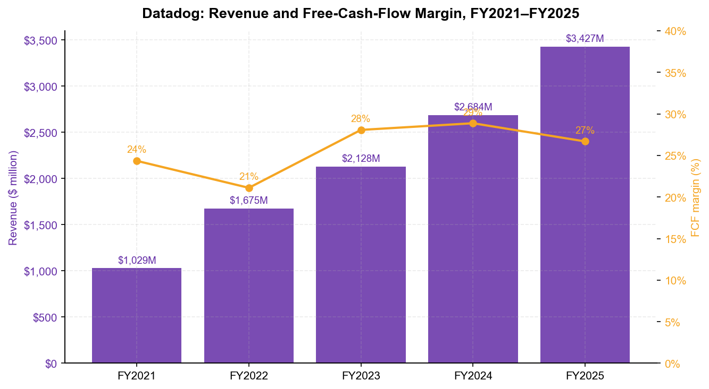
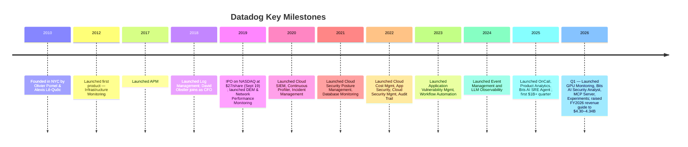
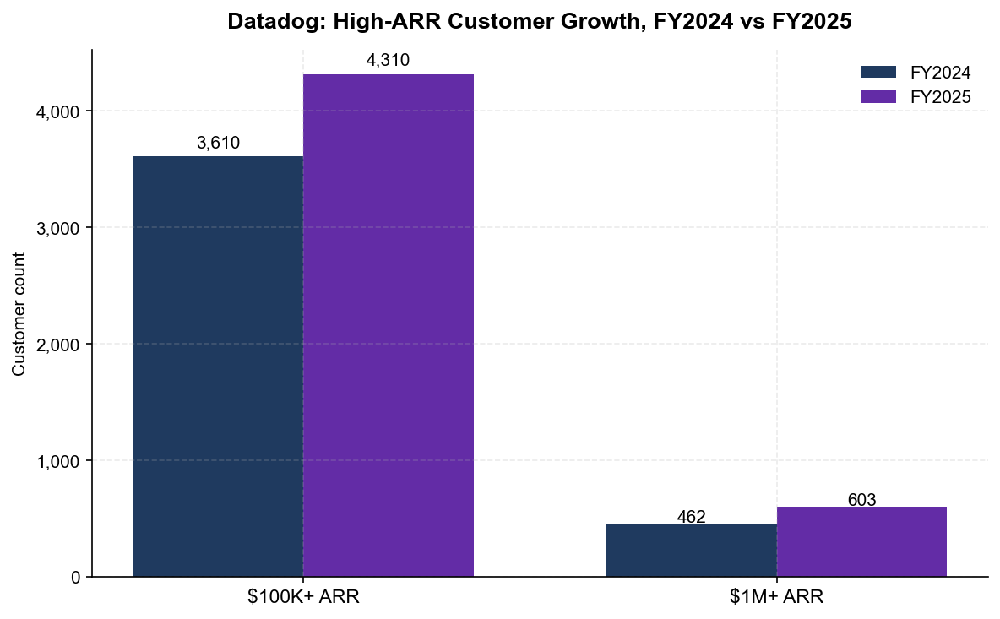
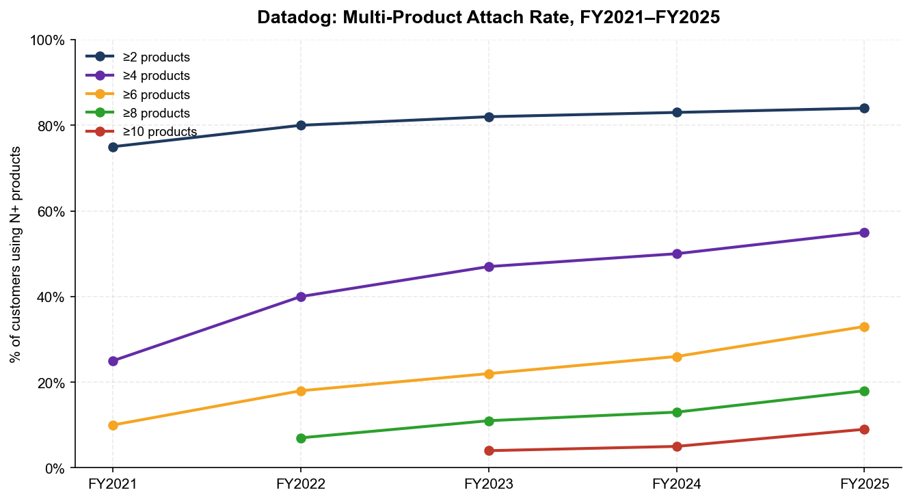
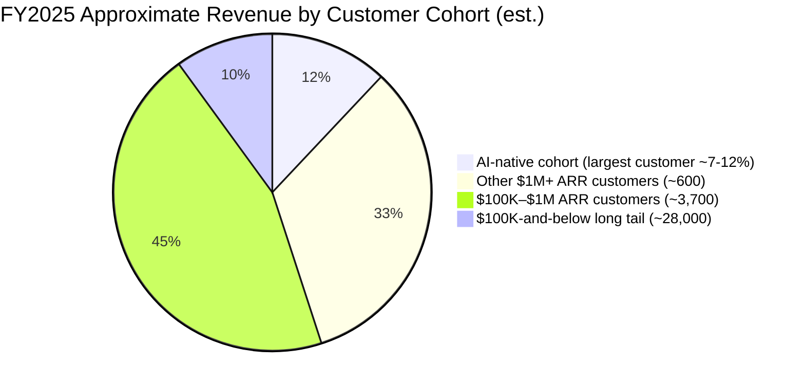
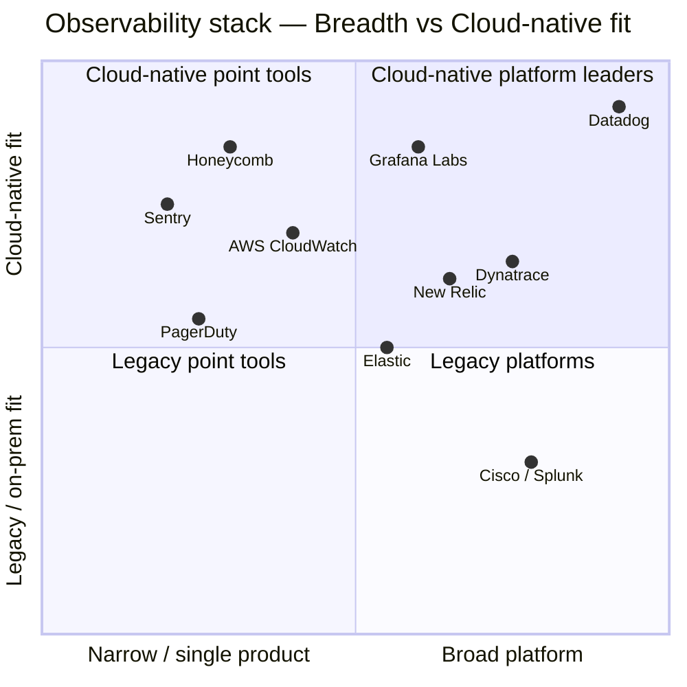

# Datadog, Inc. (NASDAQ: DDOG) — Company Research

**Date:** 2026-05-20
**Analyst language:** English
**Primary listing:** NASDAQ Global Select Market
**Reporting currency:** USD
**Fiscal year-end:** December 31

> **Update — FY2026 guidance raised (2026-05-07):** Management raised full-year 2026 revenue guidance to **USD 4.30–4.34 billion** (from USD 4.06–4.10 billion at Q4-FY2025) and non-GAAP EPS to **USD 2.36–2.44** (from USD 2.06–2.16), a ~6% midpoint EPS lift. The raise implies ~26% YoY revenue growth at the midpoint vs. ~19% on the prior guide. Management attributed the move to (a) sustained ~32% YoY Q1 growth ($1,006 M revenue), (b) accelerating AI-workload monitoring demand and (c) re-acceleration of larger-customer ARR — $100K+ ARR customer count up 21% YoY to ~4,550. Source: [Datadog Q1-FY2026 8-K / press release, 2026-05-07](https://www.sec.gov/Archives/edgar/data/0001561550/000162828026031677/ex-991x20260331x8k.htm); prior guide: [Q4-FY2025 8-K, 2026-02-10](https://www.sec.gov/Archives/edgar/data/0001561550/000162828026006645/ex-991x20251231x8k.htm).

---

## Table of Contents

1. Company Overview
2. Company History
3. Management Team
4. Products & Services
5. Customers & Go-to-Market
6. Industry Overview
7. Competitive Landscape
8. Market Opportunity (TAM)
9. Risk Assessment
10. References

---

## 1. Company Overview

Datadog, Inc. is the AI-powered observability and security platform for cloud and hybrid applications. Its SaaS platform — a single unified backend deployed via one collection agent and more than 1,000 out-of-the-box integrations — combines infrastructure monitoring, application performance monitoring (APM), log management, user-experience monitoring, cloud security, service management, AI/LLM observability and more than 20 other products. Customers can light up individual modules in minutes and add more over time, which is the core of Datadog's "land-and-expand" model ([Datadog 2025 Form 10-K, Item 1 — Business](https://www.sec.gov/Archives/edgar/data/0001561550/000162828026008819/ddog-20251231.htm)).

**How it makes money.** Substantially all revenue is subscription software, billed under monthly, quarterly, annual or multi-year contracts. Customers pay for capacity consumed (hosts, containers, GB of logs, RUM sessions, AI-agent invocations, etc.) above a committed contractual minimum, which gives Datadog both a baseline of recurring ARR and a usage-driven upside tied to customer workload growth — the same expansion dynamic that produced a trailing 12-month dollar-based net retention rate of ~120% as of December 31, 2025 (up from "high-110%'s" a year earlier) ([10-K, MD&A § Key Business Metrics](https://www.sec.gov/Archives/edgar/data/0001561550/000162828026008819/ddog-20251231.htm)).

**Where it operates.** Datadog is headquartered at 620 8th Avenue, 45th Floor, New York, NY, with primary engineering hubs in New York and Paris and sales offices in Amsterdam, Dublin, London, Paris, Seoul, Singapore, Sydney and Tokyo. The company serves ~32,700 customers in over 160 countries as of December 31, 2025 (up from ~30,000 a year earlier). Approximately 8,100 full-time employees as of year-end 2025, with ~44% outside the US — 34% of whom sit in France, a legacy of co-founder Alexis Lê-Quôc's Paris-rooted engineering organization ([10-K, Item 1 — Human Capital and Geography](https://www.sec.gov/Archives/edgar/data/0001561550/000162828026008819/ddog-20251231.htm)). Revenue from regions outside North America was 29% of total revenue in both FY2024 and FY2025, leaving the international expansion runway essentially untouched.

**Scale snapshot (FY2025 GAAP, full year).**

| Metric | FY2025 | FY2024 | FY2023 |
|---|---|---|---|
| Revenue | **$3,427.2M** | $2,684.3M | $2,128.4M |
| YoY growth | 28% | 26% | 27% |
| Gross profit | $2,740.2M (80% margin) | $2,168.7M (81%) | $1,718.5M (81%) |
| GAAP operating income | $(44.4)M | $54.3M | $(33.5)M |
| Non-GAAP operating income (calc.) | $706M est. | ~$625M est. | n/a |
| Net income (GAAP) | $107.7M | $183.7M | $48.6M |
| Operating cash flow | $1,050.1M | $870.6M | $660.0M |
| Free cash flow | $914.7M | $775.1M | $597.5M |
| FCF margin | 26.7% | 28.9% | 28.1% |
| $100K+ ARR customers | ~4,310 (90% of ARR) | ~3,610 (88%) | ~3,190 |
| $1M+ ARR customers | ~603 | ~462 | ~317 |
| Total customers | ~32,700 | ~30,000 | ~27,300 |
| Dollar-based net retention (TTM) | ~120% | high-110%s | ~110% |

Source for all rows: [Datadog 2025 10-K, MD&A and Item 1](https://www.sec.gov/Archives/edgar/data/0001561550/000162828026008819/ddog-20251231.htm) and [2023 10-K](https://www.sec.gov/Archives/edgar/data/0001561550/000156155024000009/ddog-20231231.htm) for the comparison year.

Source: [Datadog 2025 10-K, MD&A](https://www.sec.gov/Archives/edgar/data/0001561550/000162828026008819/ddog-20251231.htm) and [Datadog 2023 10-K, MD&A](https://www.sec.gov/Archives/edgar/data/0001561550/000156155024000009/ddog-20231231.htm).

The GAAP operating loss in FY2025 reflects a step-up in stock-based compensation to $750.7M (vs. $570.3M in FY2024), almost two-thirds of which sits in R&D as Datadog continued to ramp its AI Research Lab and Bits AI agent program ([10-K, Note 1 / Note 10 Stock-Based Compensation](https://www.sec.gov/Archives/edgar/data/0001561550/000162828026008819/ddog-20251231.htm)). On a non-GAAP basis (the metric management and most sell-side analysts target), operating margin remained in the low-20s through FY2025 and Q1-FY2026 — Q1-FY2026 non-GAAP operating margin was 22% on $1,006 M of revenue ([Q1-FY2026 press release](https://www.sec.gov/Archives/edgar/data/0001561550/000162828026031677/ex-991x20260331x8k.htm)).

**Valuation snapshot (May 19, 2026).**

| Metric | DDOG | Sector context |
|---|---|---|
| Share price | ~**$208.8** | — |
| Market cap | ~**$72 B** | — |
| Enterprise value | ~**$68 B** (cash + securities of $4.8 B Q1-26) | — |
| TTM P/E (GAAP) | ~**560×** | SaaS median ~50× |
| FY2026E P/E (non-GAAP, mid-guide) | ~**87×** ($208.8 / $2.40) | — |
| TTM P/S | ~**18×** (calc. $72B / ~$4.0B TTM rev) | SaaS sector median ~5× |
| EV/Sales (TTM) | ~**17×** | — |
| 3-yr P/S range | ~**11×–28×** | — |
| Rule of 40 (FY2025) | 28% growth + 27% FCF margin = **55** | best-in-class threshold = 40 |

Source: aggregated from [Datadog market-cap page, May 2026](https://stockanalysis.com/stocks/ddog/market-cap/) and [companiesmarketcap.com DDOG P/S history](https://companiesmarketcap.com/datadog/ps-ratio/); peer sector medians from [Macrotrends DDOG P/S 2018–2026](https://www.macrotrends.net/stocks/charts/DDOG/datadog/price-sales).

**Interpretation of the high multiple.** DDOG's 18× TTM P/S vs. the ~5× SaaS sector median is a **growth-sector + AI-narrative premium**, not depressed-earnings noise: revenue is growing ~30% YoY, FCF margin is ~27%, and the AI-native cohort accelerated from 8.5% of total revenue in Q1-2025 to ~12% on management commentary by Q4-2025 ([CNBC: "AI winners emerge in software", 2026-05-07](https://www.cnbc.com/2026/05/07/ai-winners-software-datadog-stock.html); [Q2-FY2025 8-K, 2025-08-07](https://www.sec.gov/Archives/edgar/data/0001561550/000156155025000216/ex-991x20250630x8k.htm)). The 560× TTM GAAP P/E is mechanical noise — GAAP net income is small ($107.7 M) because stock-based comp ($750.7 M) is fully expensed; the forward non-GAAP P/E of ~87× is the cleaner read. The premium re-rates if AI workloads disappoint or hyperscaler-customer optimization accelerates; we treat the valuation as a Section 9 risk.

---

## 2. Company History

Datadog was co-founded in **2010** in New York by **Olivier Pomel** (CEO) and **Alexis Lê-Quôc** (CTO), both veterans of Wireless Generation (a NYC ed-tech SaaS company acquired by News Corp. in 2010) and earlier IBM Research. The founding thesis was simple and counter-cultural at the time: developers and operations engineers worked in separate tools, on separate data, with separate vocabularies — and the rise of cloud-native deployments was about to make that gap fatal. Datadog set out to build a single SaaS platform that unified metrics, traces and logs into one data model, with self-serve installation and consumption-based pricing — making it easy for a single engineer to start using it and hard for that engineer to ever leave ([2026 DEF 14A, Pomel and Lê-Quôc bios](https://www.sec.gov/Archives/edgar/data/0001561550/000162828026028118/ddog2026proxystatement.htm)).

Source: product-launch sequence from [2025 10-K, Item 1 — Our Growth Strategy](https://www.sec.gov/Archives/edgar/data/0001561550/000162828026008819/ddog-20251231.htm); IPO date and pricing from [SEC EDGAR S-1 / 424B4, Sept 19 2019](https://www.sec.gov/cgi-bin/browse-edgar?action=getcompany&CIK=0001561550&type=S-1&dateb=&owner=include&count=40); Q1-FY2026 launches from the [Q1-2026 8-K press release](https://www.sec.gov/Archives/edgar/data/0001561550/000162828026031677/ex-991x20260331x8k.htm).

**Three strategic pivots that shaped today's business:**

1. **2017–2019: From single-product to multi-product platform.** Through 2016 Datadog was essentially an infrastructure-monitoring company. The 2017 APM launch and 2018 Log Management launch turned it into the first platform to combine the "three pillars of observability" — metrics, traces and logs — in a single backend. This is what made the land-and-expand engine work; by FY2025, 84% of customers used two-or-more products and 33% used six-or-more, vs. the single-product norm in legacy APM ([2025 10-K, MD&A § Key Business Metrics](https://www.sec.gov/Archives/edgar/data/0001561550/000162828026008819/ddog-20251231.htm)).

2. **2020–2023: From observability to "observability + security + service management."** Beginning with Cloud SIEM in 2020, Datadog systematically expanded into adjacent budgets — security (~$170 B Gartner Security Software TAM by 2029), service management (ITSM), cloud cost management and developer-experience tooling. The strategy: same agent, same data, new buyer persona. By FY2025 Datadog explicitly told investors its addressable opportunity spans Gartner's IT Operations Management, Security Software, Application Development and Analytic Platforms markets — collectively a stated $187 B by 2029 ([10-K, Item 1 — Market Opportunity](https://www.sec.gov/Archives/edgar/data/0001561550/000162828026008819/ddog-20251231.htm)).

3. **2024–present: From observability platform to AI-engineering platform.** LLM Observability launched in 2024; in 2025 Datadog rolled out **Bits AI SRE Agent** (autonomous root-cause investigation) and **Toto** (its own time-series foundation model); in Q1-FY2026 it shipped **GPU Monitoring**, **Bits AI Security Analyst**, **MCP Server** (giving AI coding agents real-time access to observability data) and **Datadog Experiments** (A/B testing inside the platform) ([Datadog blog: DASH 2025 announcements](https://www.datadoghq.com/blog/dash-2025-new-feature-roundup-keynote/); [Q1-FY2026 8-K](https://www.sec.gov/Archives/edgar/data/0001561550/000162828026031677/ex-991x20260331x8k.htm)). The bet is that AI-native applications generate more telemetry per dollar of revenue than classic SaaS, expanding Datadog's per-customer wallet share.

**Acquisitions (none transformational; bolt-on focused).** Notable bolt-ons: Logmatic.io (2017, log analytics), Madumbo (2018, AI testing), Sqreen (2021, runtime application security — folded into App & API Protection), Ozcode (2021, debugging), CoScreen (2021, dev collab), Hdiv Security (2022, code security), Cloudcraft (2021, AWS visualization), and Quickwit (2024, search engine for log-storage cost reduction). Datadog has not done a billion-dollar acquisition; M&A is engineered to slot into the unified backend rather than disrupt it.

**Recent developments (last 12 months).** Two material shifts: (i) the AI-native cohort grew from 3.5% of revenue in Q1-2024 to 8.5% in Q1-2025 and continued to expand through FY2025, with the cohort contributing ~7 percentage points of YoY revenue growth in Q4-FY2025 ([2025 10-K, Risk Factors](https://www.sec.gov/Archives/edgar/data/0001561550/000162828026008819/ddog-20251231.htm); [ainvest.com analysis, 2025](https://www.ainvest.com/news/datadog-ai-growth-openai-dependency-momentum-sustainable-2507/)); and (ii) two unnamed hyperscalers signed training-workload contracts with Datadog in late 2025 / early 2026, reversing a long-feared "they'll build it themselves" thesis ([newsletter.partnerinsight.io, May 2026](https://newsletter.partnerinsight.io/p/datadog-1b-quarter-hyperscalers-are)).

---

## 3. Management Team

### Olivier Pomel — Co-founder, Chief Executive Officer, Director (age 49)

Pomel is the single most consequential executive in this story, and Datadog is unambiguously a founder-led company. He co-founded Datadog in **June 2010** with Alexis Lê-Quôc and has been CEO continuously since. Prior to Datadog he was VP of Technology at Wireless Generation (a NYC K-12 ed-tech SaaS company, ~2002 until its 2010 acquisition by News Corp. for $360M), where he built the engineering culture that became the Datadog template. Earlier engineering roles at IBM Research. M.S. in Computer Science from **École Centrale Paris** ([2026 DEF 14A, p. 9 — Pomel bio](https://www.sec.gov/Archives/edgar/data/0001561550/000162828026028118/ddog2026proxystatement.htm)).

What Pomel specifically built: turned a NYC-Paris dev-tools startup into a $3.4 B-revenue, ~$70 B-market-cap public software company; sustained ~28%+ revenue growth and ~27% FCF margin simultaneously in FY2025 (Rule of 40 ≈ 55), a level reached by only a handful of large-cap SaaS names; and personally drove the expansion from a single-product company to a 20+ product platform without ever losing the unified-backend architectural discipline. The ten-vote-per-share Class B structure means Pomel and Lê-Quôc still effectively control the company — Class B common stock represented ~43% of voting power at year-end 2025, with the founders holding ~10.3 M (Pomel) and ~9.1 M (Lê-Quôc) Class B shares each, or **17.3%** and **15.5%** of total voting power individually as of March 31, 2026 ([2026 DEF 14A, Security Ownership table](https://www.sec.gov/Archives/edgar/data/0001561550/000162828026028118/ddog2026proxystatement.htm); [10-K, Risk Factors — dual-class structure](https://www.sec.gov/Archives/edgar/data/0001561550/000162828026008819/ddog-20251231.htm)). Pomel's at-the-money equity package (RSUs + PSUs) and his absolute insistence on the developer-led, bottom-up GTM model — visible in every earnings call and DASH conference keynote — are the cultural anchors of the company. He is widely regarded by both sell-side and developer communities as one of the most disciplined and credible operator-founders in software infrastructure.

### David Obstler — Chief Financial Officer (since November 2018)

Obstler joined Datadog ~10 months before the September 2019 IPO and ran the IPO process itself ([2026 DEF 14A, p. 21 — Obstler bio](https://www.sec.gov/Archives/edgar/data/0001561550/000162828026028118/ddog2026proxystatement.htm)). Prior CFO roles: TravelClick (hospitality tech, Sept 2014 – Oct 2018), OpenLink Financial (Nov 2012 – July 2014), MSCI Inc. (June 2010 – Sept 2012, the public index/analytics company), and RiskMetrics Group (Jan 2005 – June 2010 — also a public-company CFO seat). Earlier investment-banking roles at J.P. Morgan, Lehman Brothers and Goldman Sachs. M.B.A., Harvard Business School; B.A., Yale. Also serves as a director of Braze, Inc. (NASDAQ: BRZE) since May 2021. Obstler is the rare three-time public-company CFO in tech, and his MSCI and RiskMetrics tenures give him capital-markets fluency that shows up in the way Datadog communicates — quarterly guidance has tracked at or above the high end of management's prior outlook in 11 of the past 12 quarters per company press releases.

### Alexis Lê-Quôc — Co-founder, Chief Technology Officer, Director (age 51)

Lê-Quôc is the engineering counterweight to Pomel and ran the original product architecture. Datadog's "single agent, unified backend" thesis is his — the fact that two decades later it still holds is the rarest kind of technical moat in SaaS. Prior: Director of Live Operations at Wireless Generation (March 2004 – December 2010), engineering positions at IBM Research and France Télécom S.A. M.S. in Computer Science, **CentraleSupélec** (Paris) ([2026 DEF 14A, p. 10 — Lê-Quôc bio](https://www.sec.gov/Archives/edgar/data/0001561550/000162828026028118/ddog2026proxystatement.htm)). Lê-Quôc co-chairs the cybersecurity-risk oversight function alongside the CISO and is the primary public voice on Datadog's Paris engineering presence (which is structurally important: 34% of non-US employees sit in France).

### Adam Blitzer — Chief Operating Officer (since May 2021)

Blitzer joined from Salesforce, where he was EVP and GM of Digital (Dec 2016 – May 2021). Before that he co-founded **Pardot** (B2B marketing automation) in February 2007, ran it until ExactTarget acquired it in 2012, and stayed through Salesforce's 2013 acquisition of ExactTarget. B.A. in Public Policy from Duke ([2026 DEF 14A, p. 21 — Blitzer bio](https://www.sec.gov/Archives/edgar/data/0001561550/000162828026028118/ddog2026proxystatement.htm)). Blitzer's mandate at Datadog is scaling the GTM machine internationally and into the enterprise — the kind of work Salesforce's Digital cloud asked him to do at a different scale.

### Sean Walters — Chief Revenue Officer (since January 2022)

Walters was promoted internally; he was SVP of Worldwide Sales at Datadog since 2018. Prior: Medallia, Inc. (Apr 2013 – Feb 2018; Area VP/GM 2017–2018; Regional VP 2015–2017), various sales positions at BMC Software (June 2011 – April 2013), and earlier IBM, BEA Systems and ADP. B.S. Marketing, Rowan University. Walters owns the global enterprise + inside-sales + customer-success + partner-channel structure that took the $100K+ customer count from ~3,610 at end-FY2024 to ~4,310 at end-FY2025 (+19%) and ~4,550 at end-Q1-FY2026 ([Q1-FY2026 8-K](https://www.sec.gov/Archives/edgar/data/0001561550/000162828026031677/ex-991x20260331x8k.htm)).

### Governance footer

- **Board:** 9 directors; 8 of 9 (Cole, Richardson, Vora, Callahan, Ittycheria, Jacobson, Phillips, Shah) independent under Nasdaq rules. **Dev Ittycheria** (long-time MongoDB CEO, 2014–2025) is **lead independent director** — a directly relevant cross-pollination between two of the most-watched data-infrastructure SaaS companies ([2026 DEF 14A, p. 11–12](https://www.sec.gov/Archives/edgar/data/0001561550/000162828026028118/ddog2026proxystatement.htm)).
- **New 2025–2026 additions:** Amit Agarwal (former Datadog Chief Product Officer 2012–2022, President 2022–2024) joined the board January 2025; Ami Vora (Anthropic Head of Product, ex-WhatsApp / Meta / Microsoft) joined September 2025; Dominic Phillips (CFO of Samsara) joined February 2026 — adding fresh AI-product and public-software-CFO expertise.
- **Insider economics:** Class B common stock = ten votes/share. As of March 31, 2026, Pomel beneficially owned 10,259,366 Class B shares (38.7% of Class B; 17.3% of total voting power); Lê-Quôc owned 9,056,319 Class B shares (35.5% of Class B; 15.5% of total voting power). All directors and executive officers as a group owned 78.1% of Class B (35.5% of total voting power). The two founders together control about a third of the vote ([2026 DEF 14A, Security Ownership table](https://www.sec.gov/Archives/edgar/data/0001561550/000162828026028118/ddog2026proxystatement.htm)).
- **5%+ external holders:** Vanguard (12.7% Class A, 7.2% of voting power), BlackRock (8.0%/4.6%), FMR LLC (4.9%/2.8%) — typical index-driven concentration; no activist or strategic block ([same DEF 14A, footnotes 1–3](https://www.sec.gov/Archives/edgar/data/0001561550/000162828026028118/ddog2026proxystatement.htm)).
- **Comp:** Significant portion of NEO compensation is at-risk equity (RSU + PSU); 96% say-on-pay support at the 2025 AGM. PSUs capped at 200% of target. Clawback policy compliant with SEC/Nasdaq rules. No related-party transactions of note in FY2025.
- **Auditor:** Deloitte & Touche LLP (re-ratification proposed at the June 15, 2026 AGM).

### Management track-record synthesis

This is one of the strongest founder-CEO/CTO/CFO combinations in cloud software. Pomel + Lê-Quôc have compounded the business through three full architectural eras (single-product, multi-product, AI-native) without losing focus on the unified-backend strategy — a feat very few infrastructure SaaS founders have managed at this scale. Obstler is a credible repeat public-company CFO. The 2025–2026 board refresh (Vora, Phillips, Agarwal) explicitly addresses the AI-product and finance-discipline gaps that scale to ~$5 B revenue requires. The honest gap: the post-founder bench (Blitzer, Walters, CPO Yanbing Li) is solid but unproven at $10B+ scale, and the dual-class supervoting structure means any future succession is at the founders' discretion.

---

## 4. Products & Services

Datadog organizes its more than 20 distinct products into seven natural buckets, all sharing one collection agent and one backend ([Datadog product navigation](https://www.datadoghq.com/product/)). Each product can be bought standalone, but the moat is the cross-correlation that activates only when multiple products are deployed.

### Infrastructure & Compute

- **Infrastructure Monitoring** — the original flagship (launched 2012); real-time monitoring of hosts, containers, serverless functions across public, private and hybrid clouds. *Competitive verdict:* **Yes, strong moat** — scale, data-integration breadth (1,000+ integrations) and switching costs. Closest competitor product: Dynatrace Smartscape (parity on enterprise, behind on developer-led adoption); AWS CloudWatch (good-enough for AWS-only shops, no multi-cloud parity).
- **Network Monitoring** — Cloud Network Monitoring + Network Device Monitoring. *Verdict:* **Partial moat** (data network); strongest where bundled into the broader Datadog footprint. Closest competitors: ThousandEyes (Cisco), Kentik. Behind ThousandEyes for pure internet-path analytics; ahead inside customer infra.
- **GPU Monitoring** (GA Q1 2026) — unified visibility across GPU fleet health, cost and performance, linked to teams and workloads consuming the resource. *Verdict:* **Early-but-defensible** — the AI-engineering pull is real and Datadog is one of the first observability vendors with a fully GA GPU product. Closest competitor: Weights & Biases (training-side); Run:ai (Nvidia) for orchestration; both narrower in scope. ([Q1-FY2026 8-K](https://www.sec.gov/Archives/edgar/data/0001561550/000162828026031677/ex-991x20260331x8k.htm))

### Application & Developer

- **Application Performance Monitoring (APM)** — full distributed tracing across microservices, hosts, containers and serverless. *Verdict:* **Yes, strong moat** — code-level visibility + cross-correlation with logs/RUM/profiling. Closest competitors: Dynatrace OneAgent, New Relic APM, Cisco AppDynamics (now Splunk-bundled). Datadog is at parity on enterprise depth, ahead on developer ergonomics and cloud-native fit.
- **Continuous Profiler** — always-on, low-overhead code-level performance profiling. *Verdict:* **Partial moat**; mainly a stickiness multiplier on APM. Closest competitor: Pyroscope (open-source, Grafana Labs).
- **Error Tracking** — group errors into issues across frontend/backend with debug context. *Verdict:* **Partial.** Closest: Sentry — Sentry leads on dev-first experience; Datadog wins when buyers already standardize on the platform.
- **CI Visibility** — Pipeline Visibility + Test Visibility for CI/CD health. *Verdict:* **Partial**; data moat strengthens as flaky-test history accumulates. Closest: Buildkite Test Analytics, Trunk.
- **Workflow Automation & App Builder** — low-code orchestration of remediation across stacks. *Verdict:* **Partial.** Closest: PagerDuty Process Automation; ServiceNow IT Workflow. Datadog wins on observability-context binding.

### Logs & Data Observability

- **Log Management** — ingest + index + query at scale; **Logging Without Limits** decouples ingest cost from processing, **Flex Logs** decouples storage from query. *Verdict:* **Yes, strong moat** — economics, cross-correlation with traces/metrics. Closest competitors: Splunk (Cisco), Elastic — Splunk leads on legacy SIEM/enterprise; Elastic leads on self-hosted cost. Datadog wins where cloud-native customers want one bill and one query language.
- **Observability Pipelines** — collect/transform/route logs and metrics from any source to any destination. *Verdict:* **Partial moat**; defensive against Cribl (the breakout pipeline pure-play). Datadog is behind Cribl on flexibility, even with the pipeline product.
- **Data Observability** — Data Streams Monitoring (Kafka/event pipelines) + Data Jobs Monitoring (Spark/Databricks). *Verdict:* **Partial**, fast-growing. Closest: Monte Carlo, Acceldata.

### User Experience

- **Real User Monitoring (RUM)** — browser + mobile user-session telemetry. *Verdict:* **Partial moat**, strong inside the platform. Closest: New Relic Browser, Splunk RUM. Ahead of both on cross-correlation with backend APM.
- **Synthetics** — AI-powered simulated user/API requests for proactive uptime monitoring. *Verdict:* **Partial.** Closest: Pingdom (SolarWinds), Catchpoint.
- **Product Analytics** (GA 2025) — engineering-leader-focused product-usage analytics. *Verdict:* **Early-but-credible.** Closest: Amplitude, Mixpanel, Heap. Datadog's narrow win: cross-correlate product analytics with infra/APM data without ETL.
- **Datadog Experiments** (GA Q1 2026) — A/B testing inside observability. *Verdict:* **Early.** Closest: Optimizely, LaunchDarkly (Experimentation), Eppo.

### Security

- **Cloud Security (CSPM / CWPP / CIEM)** — agentless infra scanning for misconfig, vulnerabilities, identity risk, compliance. *Verdict:* **Yes, growing moat** as part of the unified platform. Closest competitors: Wiz, Palo Alto Networks Prisma Cloud, Lacework (now part of Fortinet). Wiz is ahead on standalone CSPM depth; Datadog wins when buyers want CSPM + observability on one console.
- **Code Security** — runtime-prioritized SAST/SCA. *Verdict:* **Partial.** Closest: Snyk, Veracode.
- **Cloud SIEM** — cloud-native SIEM with prebuilt detections. *Verdict:* **Partial**, with the Bits AI Security Analyst layered on top as differentiator. Closest: Microsoft Sentinel, Splunk Enterprise Security (Cisco), Sumo Logic Cloud SIEM.
- **Threat Management** (Workload Protection + App & API Protection) — runtime application/workload security. *Verdict:* **Partial.** Closest: Sysdig (workload), Wallarm + Salt Security (API).
- **Sensitive Data Scanner** — discover/classify/redact PII at ingest. *Verdict:* **Partial.** Closest: BigID, Microsoft Purview.
- **Bits AI Security Analyst** (GA Q1 2026) — autonomous SOC-analyst-grade alert triage. *Verdict:* **Early-but-strategic.** Closest: Prophet Security, Dropzone AI, Microsoft Security Copilot. Datadog claim of "up to 98% reduction in threat investigation time" is unverified by independent benchmark ([Q1-FY2026 8-K](https://www.sec.gov/Archives/edgar/data/0001561550/000162828026031677/ex-991x20260331x8k.htm)).

### Service Management & Incident Response

- **Incident Response** — unified monitoring/paging/incident management; replaced 2021's standalone Incident Management product. *Verdict:* **Partial.** Closest: PagerDuty, FireHydrant, incident.io.
- **OnCall** (GA 2025) — schedule + integrate observability into the on-call workflow. *Verdict:* **Partial / defensive** vs. PagerDuty. Datadog OnCall is the lowest-friction option for existing customers.
- **Event Management** — AI-based alert aggregation. *Verdict:* **Partial.**
- **Bits AI SRE Agent** (GA 2025) — autonomous root-cause investigation. *Verdict:* **Early-but-defensible.** Closest: Causely, Edge Delta, Cisco AI Canvas (within Splunk).

### AI & Cloud Cost

- **LLM Observability** — end-to-end tracing of LLM/agent chains; tokens/latency/errors/drift detection. *Verdict:* **Yes, strong moat** — Datadog is currently the de-facto enterprise default. Closest: Arize AI, LangSmith (LangChain), WhyLabs. ([Datadog LLM Observability product page](https://www.datadoghq.com/product/ai/llm-observability/2/))
- **AI Agent Monitoring + AI Agents Console** (GA mid-2025) — visibility into in-house + third-party AI agents. *Verdict:* **Early-but-credible.**
- **MCP Server** (GA Q1 2026) — secure, real-time access for AI coding agents/IDEs to unified observability data. *Verdict:* **Strategic moat** — Datadog is one of the first observability vendors to publish an MCP Server, plugging directly into Claude Code, Cursor and the broader agentic-IDE ecosystem ([Q1-FY2026 press release](https://www.sec.gov/Archives/edgar/data/0001561550/000162828026031677/ex-991x20260331x8k.htm)).
- **Cloud Cost Management** — granular cloud-spend visibility cross-referenced with observability data. *Verdict:* **Partial.** Closest: Apptio (IBM), CloudHealth (VMware), Vantage.

```mermaid
graph TD
    DDOG[Datadog Platform<br/>1 agent · 1 backend · 1,000+ integrations]
    DDOG --> A[Infra & Compute]
    DDOG --> B[App & Developer]
    DDOG --> C[Logs & Data]
    DDOG --> D[User Experience]
    DDOG --> E[Security]
    DDOG --> F[Service Mgmt]
    DDOG --> G[AI / FinOps]

    A --> A1[Infrastructure Monitoring]
    A --> A2[Network Monitoring]
    A --> A3[GPU Monitoring 2026]
    B --> B1[APM]
    B --> B2[Continuous Profiler]
    B --> B3[Error Tracking]
    B --> B4[CI Visibility]
    B --> B5[Workflow Automation]
    C --> C1[Log Management]
    C --> C2[Observability Pipelines]
    C --> C3[Data Streams / Jobs Monitoring]
    D --> D1[RUM]
    D --> D2[Synthetics]
    D --> D3[Product Analytics]
    D --> D4[Experiments 2026]
    E --> E1[Cloud Security]
    E --> E2[Code Security]
    E --> E3[Cloud SIEM]
    E --> E4[Threat Management]
    E --> E5[Sensitive Data Scanner]
    E --> E6[Bits AI Security Analyst 2026]
    F --> F1[Incident Response]
    F --> F2[OnCall 2025]
    F --> F3[Event Management]
    F --> F4[Bits AI SRE Agent 2025]
    G --> G1[LLM Observability]
    G --> G2[AI Agents Console 2025]
    G --> G3[MCP Server 2026]
    G --> G4[Cloud Cost Management]
```

Source: [Datadog 2025 10-K, Item 1 § Our Products](https://www.sec.gov/Archives/edgar/data/0001561550/000162828026008819/ddog-20251231.htm) and the [Datadog product navigation](https://www.datadoghq.com/product/).

### Flagship vs. long-tail

Datadog does not disclose product-level revenue, but inference from segment commentary and management remarks at DASH 2025 says the flagship trio remains **Infrastructure Monitoring, APM and Log Management** — collectively the bulk of revenue and the gateway products into the platform. Cloud Security (CSPM / CWPP / CIEM bundle) and the AI suite (LLM Observability + Bits AI agents) are the fastest-growing newer franchises, with management characterizing each as "scaling rapidly" on recent calls ([Q1-FY2026 transcript via The Motley Fool, 2026-05-07](https://www.fool.com/earnings/call-transcripts/2026/05/07/datadog-ddog-q1-2026-earnings-transcript/)).

### Last-12-month launches and roadmap

GA in the trailing 12 months: GPU Monitoring, Bits AI Security Analyst, MCP Server, Datadog Experiments (all Q1 2026); OnCall, Product Analytics, Bits AI SRE Agent (2025); LLM Observability v2 / AI Agent Monitoring (2025). No notable product sunsets — Datadog's discipline has been to absorb older standalone products into the platform (e.g., 2021 Incident Management folded into 2025 Incident Response). The 2025 launch of Toto, a proprietary time-series foundation model, is the closest thing to an internal-AI moat: it powers Watchdog (Datadog's anomaly detection) and Bits AI under the hood ([Datadog blog: Observability in the AI age](https://www.datadoghq.com/blog/datadog-ai-innovation/)).

---

## 5. Customers & Go-to-Market

**Customer profile.** ~32,700 customers across 160+ countries, every industry (software, financial services, retail, healthcare, gaming, media, government / FedRAMP High since Q1 2026). The customer skew is meaningful: ~4,310 $100K+ ARR customers represent **90% of total ARR**, and the long-tail ~28,000 customers contribute the remaining 10% — a power-law distribution typical of consumption-based infrastructure SaaS ([2025 10-K, MD&A § Key Business Metrics](https://www.sec.gov/Archives/edgar/data/0001561550/000162828026008819/ddog-20251231.htm)).

Source: [Datadog 2025 10-K, MD&A](https://www.sec.gov/Archives/edgar/data/0001561550/000162828026008819/ddog-20251231.htm).

**Multi-product expansion is the engine.** The single most important operational metric for the bull case:

| % of customers using N+ products | FY2021 | FY2022 | FY2023 | FY2024 | FY2025 |
|---|---|---|---|---|---|
| ≥2 products | ~75% | ~80% | ~82% | ~83% | **84%** |
| ≥4 products | ~25% | ~40% | ~47% | ~50% | **55%** |
| ≥6 products | ~10% | ~18% | ~22% | ~26% | **33%** |
| ≥8 products | n/a | ~7% | ~11% | ~13% | **18%** |
| ≥10 products | n/a | n/a | ~4% | ~5% | **9%** |

Source: [Datadog 2025 10-K MD&A](https://www.sec.gov/Archives/edgar/data/0001561550/000162828026008819/ddog-20251231.htm) and historical 10-Ks (figures rounded as disclosed each year).

Source: [Datadog 2025 10-K, MD&A, and historical 10-Ks](https://www.sec.gov/Archives/edgar/data/0001561550/000162828026008819/ddog-20251231.htm).

### Customer concentration — quantified

Datadog does **not** disclose any specific customer at ≥10% of revenue (no ASC 280 trigger in the FY2025 10-K), and reports a single operating and reportable segment ([2025 10-K, Note 11 — Segment](https://www.sec.gov/Archives/edgar/data/0001561550/000162828026008819/ddog-20251231.htm)). But two crucial disclosures partially quantify what is otherwise an opaque area:

1. **The AI-native cohort that includes the largest customer contributed approximately seven percentage points of YoY revenue growth in Q4-FY2025.** Working backward from $3,427 M FY2025 revenue and a Q4 cohort attribution to overall ~28% Q4 growth, the cohort itself plausibly represents low-double-digit % of total revenue — in line with sell-side estimates of the AI-native cohort at ~12% of revenue by Q4 2025. ([2025 10-K, Item 1A — Risk Factors](https://www.sec.gov/Archives/edgar/data/0001561550/000162828026008819/ddog-20251231.htm); [woozleresearch.com analysis, 2026-05](https://insights.woozleresearch.com/datadogs-billion-dollar-quarter-structural-ai-demand-or-cloud-migration-catch-up/)).
2. **In Q2-FY2025**, management called out OpenAI by behavior (not name) — noting the largest customer in the AI-native cohort saw "stable year-over-year revenue growth in Q2 relative to Q1" and warned of ongoing usage-optimization risk. The market took this as confirmation of long-running sell-side speculation that OpenAI is the single largest customer. **Guggenheim's July 2025 downgrade explicitly modeled a $150 M+ FY2026 revenue hole** if OpenAI moved observability in-house ([Q2-FY2025 8-K, 2025-08-07](https://www.sec.gov/Archives/edgar/data/0001561550/000156155025000216/ex-991x20250630x8k.htm); [ainvest.com analysis, 2025-07](https://www.ainvest.com/news/datadog-ai-growth-openai-dependency-momentum-sustainable-2507/)).

Best estimate: **top-1 customer share is in the high single digits to low teens of revenue (~7%–12%), and the broader AI-native cohort is ~10%–15%.** Datadog explicitly flags that customers can "rapidly increase usage…and then optimize" — which is precisely the model where one large customer can swing a quarter's growth rate.

Source: composition estimated from disclosures in [Datadog 2025 10-K, MD&A § Key Business Metrics and Risk Factors](https://www.sec.gov/Archives/edgar/data/0001561550/000162828026008819/ddog-20251231.htm). Datadog does not publish a precise cohort split; this is analyst-construct from the disclosed $100K+ ARR / $1M+ ARR counts and the cohort growth commentary. Treated as material risk in Section 9.

**Contract structure.** Subscription terms are "primarily monthly or annual, with some quarterly, semiannual and multi-year." Monthly subscriptions and usage-above-commit billing means revenue can move with workload, both up (good in 2025) and down (the "optimization" pattern). Customers can effectively walk at any contractual renewal point — no obligation to renew ([2025 10-K, Item 1A — "customers have no obligation to renew"](https://www.sec.gov/Archives/edgar/data/0001561550/000162828026008819/ddog-20251231.htm)).

### Go-to-market

**Bottom-up + enterprise overlay.** Datadog runs four sales motions, each split by region (Americas, EMEA, APAC):
- **Enterprise field sales** — large-account hunters.
- **High-velocity inside sales** — new-logo machine.
- **Customer success** — onboarding + expansion.
- **Partner team** — resellers, system integrators (Accenture, Deloitte, Capgemini), MSPs and increasingly cloud-marketplace transactions (AWS Marketplace, Google Cloud Marketplace, Azure Marketplace).

~3,600 sales and marketing employees at year-end 2025, with R&D headcount slightly larger at ~3,900 — a deliberately product-led ratio that distinguishes Datadog from sales-heavy peers. Free-trial-first; agent installs in minutes; bottom-up adoption by individual developers then expanded into department-wide deployments.

**Sales cycle and deal size.** New-logo cycles range from days (small dev teams) to 3–9 months (enterprise). The 19% YoY growth in $100K+ ARR customer count plus the 33-percentage-point swing in $1M+ ARR count (462 → 603) shows the GTM machine continues to "move customers up the cohort ladder" ([2025 10-K, MD&A](https://www.sec.gov/Archives/edgar/data/0001561550/000162828026008819/ddog-20251231.htm)).

**Key partnerships.** Deep AWS, Microsoft Azure and Google Cloud partnerships — Datadog is a launch partner on most observability/security initiatives from the hyperscalers (and now, per Q1-2026 hyperscaler-training-workload commentary, also has the hyperscalers themselves as paying customers). Strategic Q1-2026 partnership with **Sakana AI** to support enterprise AI adoption in Japan ([Q1-FY2026 8-K](https://www.sec.gov/Archives/edgar/data/0001561550/000162828026031677/ex-991x20260331x8k.htm)).

**Named customers (public references).** Samsung, Comcast, Citrix, Whole Foods Market, Peloton, Sonos, Shell, Deloitte, 21st Century Fox, Maersk, Nasdaq — among hundreds of named case studies on the Datadog website ([Datadog customer stories](https://www.datadoghq.com/case-studies/)).

---

## 6. Industry Overview

**Industry definition.** Datadog sits at the intersection of four Gartner-defined markets:

1. **IT Operations Management (ITOM)** — the umbrella category for monitoring infrastructure, applications and IT services. Management cites Gartner's projection of **$82 B by 2029** for ITOM, with the **observability sub-segment ($39 B by 2029)** as Datadog's home base ([2025 10-K, Item 1 — Market Opportunity](https://www.sec.gov/Archives/edgar/data/0001561550/000162828026008819/ddog-20251231.htm)).
2. **Security Software** — Datadog's Cloud Security, Cloud SIEM, Code Security and Sensitive Data Scanner extend into adjacent CSPM, CNAPP, SIEM and SAST/SCA budgets.
3. **Application Development tools** — CI Visibility, Workflow Automation, Bits AI Dev Agent and MCP Server move Datadog into the dev-productivity stack.
4. **Analytic Platforms** — Product Analytics and Datadog Experiments tap product-analytics budgets historically owned by Amplitude / Mixpanel and feature-experimentation budgets owned by Optimizely / LaunchDarkly.

Total addressable market across these four Gartner buckets is the company-cited **$187 B by 2029** ([2025 10-K](https://www.sec.gov/Archives/edgar/data/0001561550/000162828026008819/ddog-20251231.htm)).

**Market growth drivers (forward five years).**

- **Cloud migration is not done.** Despite a decade of "cloud-first" narrative, the majority of corporate workloads still run on-premise. Each cloud-migrated workload spawns 3–10× the telemetry volume of its on-premise equivalent because of microservices, containers and ephemeral compute — directly expanding Datadog's data plane.
- **AI-native applications.** A single AI agent or RAG application can generate 100× the trace/log volume per user request of a classic web app — token counts, model latencies, vector-store retrievals, tool-call chains, and per-step error correlation. Datadog's 2026 State of AI Engineering report found that 60% of AI failures in production are caused by capacity limits — an exact match for what observability platforms exist to surface ([Datadog State of AI Engineering 2026](https://www.datadoghq.com/state-of-ai-engineering/)).
- **Security shift-left and convergence.** The 2026 State of DevSecOps Report (Datadog) found 87% of organizations run known-exploitable vulnerabilities in production. Cloud SIEM + Code Security + Cloud Security budgets are converging on one console ([Q1-FY2026 8-K § State of DevSecOps](https://www.sec.gov/Archives/edgar/data/0001561550/000162828026031677/ex-991x20260331x8k.htm)).
- **Tool consolidation in a cost-conscious cycle.** CFOs reviewing the SaaS sprawl from the 2020–2022 ZIRP era are explicitly asking platform vendors to displace 4–8 point tools. Datadog's 20+ product portfolio is structured exactly for this consolidation pitch.
- **FedRAMP and regulated workloads.** Datadog for Government achieved **FedRAMP High** in Q1 2026, opening US federal-government workloads and the regulated enterprise edge of financial services and healthcare ([Q1-FY2026 8-K](https://www.sec.gov/Archives/edgar/data/0001561550/000162828026031677/ex-991x20260331x8k.htm)).

**Industry structure.** Observability is **rapidly consolidating** but remains structurally fragmented because the underlying buyer (Dev / Ops / Security / Data / Product) is fragmented. Concentration ratio at the top: Datadog, Dynatrace, Splunk (Cisco) and New Relic (private since 2023) collectively hold an estimated 30–40% of the observability market by revenue, with the long tail of open-source (Prometheus, Grafana, OpenTelemetry, ELK), point tools (Sentry, PagerDuty, Sumo Logic, Chronosphere, Honeycomb), hyperscaler-native (AWS CloudWatch, Azure Monitor, Google Cloud Operations Suite) and security-adjacent vendors (Splunk Observability Cloud, Elastic) splitting the rest.

**Supplier power.** Modest; Datadog spends meaningfully on AWS (for its own platform infrastructure) and on hosting/CDN. The 2025 10-K does not break out AWS spend, but management commentary at multiple investor conferences acknowledges it as a key vendor.

**Buyer power.** Moderate-to-high. Large enterprises increasingly demand committed-spend tiers and bundle discounts, and the largest accounts can renegotiate or optimize usage. Long tail buyer power is low (frictionless self-service, sticky on integrations).

**Substitutes.** Open-source observability (Prometheus, Grafana, OpenTelemetry, Loki, Tempo) is a real and growing substitute — particularly for cost-sensitive scale-ups and platform teams who have the engineering bandwidth to run it themselves. Grafana Labs (private) is the credible commercial vehicle for that stack and is steadily winning enterprise mindshare. Hyperscaler-native monitoring (CloudWatch et al.) is "good enough" for AWS-only / Azure-only shops.

**Regulation.** Data-privacy regulation is a tailwind on demand (GDPR, CCPA, CPRA, India DPDPA, EU Data Act, EU AI Act) — buyers need to detect, classify and prove control over sensitive data, which is what Sensitive Data Scanner / Cloud SIEM / FedRAMP High address. But the same regulations create operating-cost headwinds (data localization, EEA-US transfer mechanisms, AI Act compliance) — Datadog itemizes these in Item 1A.

---

## 7. Competitive Landscape

Datadog competes across at least four product battlegrounds. The 2025 10-K explicitly names competitors per category ([2025 10-K, Item 1 — Our Competition](https://www.sec.gov/Archives/edgar/data/0001561550/000162828026008819/ddog-20251231.htm)):

| Battleground | Datadog competes against |
|---|---|
| On-premise infra monitoring | IBM, Microsoft, SolarWinds |
| APM | Cisco AppDynamics, New Relic, Dynatrace |
| Log management | Cisco (Splunk), Elastic |
| Cloud monitoring | AWS (CloudWatch), Microsoft Azure Monitor, Google Cloud Operations |
| Security (CSPM / CNAPP / SIEM) | Wiz, Palo Alto Prisma Cloud, Splunk ES (Cisco), Microsoft Sentinel |
| Incident / OnCall | PagerDuty, incident.io |
| LLM / AI observability | Arize, LangSmith, WhyLabs |

### The five competitors that matter most

1. **Cisco / Splunk** — Cisco closed the **$28 B Splunk acquisition in 2024** ([Cisco acquisitions page](https://www.cisco.com/site/us/en/about/corporate-development/acquisitions/acquisitions-list-years/index.html)) and has spent 2025–2026 wiring Splunk into ThousandEyes, AppDynamics, the Nexus One switching line and the new **AI Canvas** assistant. The strategic threat is *network + observability bundling* — sold to the CIO as one Cisco invoice. Cisco's April 2026 announcement of an intent to acquire **Galileo Technologies** specifically targets the AI-observability layer where Datadog has been winning ([Splunk 2026 observability trends blog](https://www.splunk.com/en_us/blog/observability/new-observability-trends-for-2026.html)). Datadog's response: bottom-up developer love > top-down CIO bundling, plus a more modern cloud-native architecture than Splunk's legacy index.

2. **Dynatrace (NYSE: DT)** — the closest pure-play architectural rival. Dynatrace's single AI-driven OneAgent + Smartscape topology is a credible technical answer to Datadog's unified platform, and Dynatrace is profitable and growing in the high teens. P/S TTM ~6× vs. DDOG's ~18× reflects the growth gap ([companiesmarketcap.com Dynatrace P/S](https://companiesmarketcap.com/dynatrace/ps-ratio/)). Dynatrace leads in: heavy-Fortune-500 deployments, top-down sales motion, automated discovery for monolith + Java environments. Datadog leads in: cloud-native + developer-led adoption, breadth of products beyond observability, and AI-engineering pull (LLM Observability + Bits AI).

3. **MongoDB (NASDAQ: MDB)** — not a direct competitor, but the most-watched data-infrastructure SaaS peer. MongoDB's forward P/E of ~58× is the cleanest sector comp for Datadog's ~87× FY2026E non-GAAP P/E ([guruFocus MDB Forward PE](https://www.gurufocus.com/term/forward-pe-ratio/MDB)). The MDB story (cross-referenced via [the MongoDB research note in this repo](../MongoDB_NASDAQ_MDB/)) is structurally similar: founder-led, consumption-priced, multi-product expansion engine, AI-native cohort exposure, hyperscaler optimization risk. **Dev Ittycheria served as MongoDB CEO 2014–2025 and is Datadog's lead independent director**, an unusual structural overlap that argues for cross-applicability of strategic playbooks.

4. **GitLab (NASDAQ: GTLB) / Palo Alto Networks (NASDAQ: PANW)** — peer benchmarks for valuation context, less direct product overlap. GTLB plays in CI/CD and developer security (Datadog's CI Visibility + Code Security overlap); PANW Prisma Cloud is the heavyweight CNAPP competitor to Datadog Cloud Security. GTLB's negative TTM P/E and ~6.5× P/S reflect a slower-growth, higher-SBC SaaS profile ([MacroTrends GTLB P/E](https://www.macrotrends.net/stocks/charts/GTLB/gitlab/pe-ratio)). PANW is a comp on the "platform consolidation" pitch — and an alternative one-vendor story for security-led buyers.

5. **Wiz (private, agreed to be acquired by Google for $32 B in 2025)** and the hyperscaler-native tools — Wiz is the CSPM/CNAPP standard-bearer and is the single most disruptive competitor in Cloud Security; AWS / Azure / Google native tools are the "good enough" alternative for single-cloud customers in the long tail.

### Positioning quadrant — observability stack (May 2026)

Source: positioning is qualitative — based on product breadth disclosed in each vendor's 10-K/website and architectural cloud-native fit assessed against the FY2025 product catalogs.

### Datadog's competitive advantages

- **Architectural moat:** single-agent, single-backend unified data model — switching means swapping out the agent on every host, container and function, *and* re-instrumenting the application layer. Independent operator surveys consistently rank Datadog at the top for "ease of deployment."
- **Data network effect at the integration layer:** 1,000+ pre-built integrations is a maintenance burden Datadog has invested in for 14 years; new entrants cannot replicate it cheaply.
- **Developer-led GTM:** Datadog's bottom-up adoption is structurally harder for Cisco / IBM / Splunk to replicate without breaking their top-down sales DNA.
- **Multi-product attach as a moat:** the more products in use, the lower the realistic switching probability. With 33% of customers now on 6+ products, the average customer's lift-and-shift cost is genuinely prohibitive.
- **AI-engineering first-mover edge:** LLM Observability + Bits AI agents + MCP Server gives Datadog a sustained narrative-and-product lead in the most-funded software category of 2025–2026.

### Vulnerabilities

- **Pricing transparency complaints.** Consumption pricing + multi-product list-price stack-up has created persistent customer grumbling about bill shock; Cribl, Grafana and open-source alternatives all market explicitly on this.
- **Open-source / OpenTelemetry encroachment.** OpenTelemetry's instrumentation standard is now the default; if customers fully standardize on OTel data formats and self-host the backend (Prometheus + Loki + Tempo on Grafana), Datadog loses the integration moat at the data layer.
- **Hyperscaler ambivalence.** AWS / Azure / Google are simultaneously partners, infrastructure vendors, customers and competitors. Any of the three could choose to bundle a free-tier observability product into a flagship compute SKU and erode Datadog's long-tail.
- **AI-native cohort concentration.** Section 5 + Section 9.
- **Valuation expectations.** At 18× P/S, the stock prices in years of sustained ~25%+ growth — any deceleration is asymmetrically punished.

---

## 8. Market Opportunity (TAM)

**Stated TAM ($187 B by 2029).** Datadog's management explicitly sizes its addressable market using Gartner forecasts: **$82 B IT Operations Management by 2029** (of which **$39 B is observability**), plus relevant slices of Gartner's Security Software, Application Development and Analytic Platforms markets — collectively **$187 B by 2029** ([2025 10-K, Item 1 § Market Opportunity](https://www.sec.gov/Archives/edgar/data/0001561550/000162828026008819/ddog-20251231.htm)).

This is the right framing because Datadog has demonstrated, product-by-product over the past five years, that the unified-backend strategy lets it extend into new TAM pools without dragging up customer acquisition cost — every new product is sold into the existing installed base first.

**SAM (serviceable available market).** A practical SAM uses (a) only the cloud-native and hybrid-cloud subset of each Gartner category and (b) only the customer segments where Datadog can sell — namely, organizations with >100 engineers and meaningful cloud spend. We size SAM at roughly **$70–90 B by 2029**, of which:
- ~$30 B = cloud + hybrid observability core (infra + APM + logs + RUM + synthetics + network).
- ~$20 B = cloud security adjacent (CSPM + CNAPP + CSPM + Cloud SIEM).
- ~$10 B = AI engineering / LLM observability / MCP-style agentic tooling (a category that did not exist in 2022).
- ~$10–20 B = dev productivity (CI Visibility + Workflow Automation + Code Security) + data observability + product analytics + cloud-cost management.

**SOM (serviceable obtainable market).** With FY2025 revenue of $3.4 B against a stated $187 B 2029 TAM, Datadog has captured ~1.8% of its stated 2029 market. Using the tighter SAM, current share is ~4–5%. Even with no further product expansion, holding ~$3.4 B in FY2025 vs. ~$80 B 2029 SAM implies a SOM in the **$8–12 B revenue range** by 2029 at current share of incremental SAM growth — consistent with sell-side bull-case FY2029 revenue of $8–10 B.

**Penetration drivers (next 3–5 years).**

- **AI-native compute is a structural multiplier.** Each AI-native customer generates 5–20× the telemetry per dollar of revenue of a classic SaaS customer, because LLM inference, GPU utilization, vector-store retrieval and tool-call chains each need separate observation. Datadog is the only large-cap observability vendor with a fully GA product line covering all four. As enterprises move from "AI pilot" to "AI in production," Datadog earns the spend whether the model is OpenAI, Anthropic, Google, AWS Bedrock or in-house.
- **International expansion.** 29% non-North-America revenue today vs. peer Dynatrace ~45% — the gap is the runway. Sales hubs in Amsterdam, Dublin, London, Paris, Seoul, Singapore, Sydney and Tokyo are fully staffed; the FedRAMP High certification opens the US federal market.
- **Larger-customer ascent.** $1M+ ARR customers grew 31% YoY in FY2025 (462 → 603); $100K+ ARR grew 19%. Each tier shift is a 5–10× revenue lift per customer.
- **Tool consolidation.** Each enterprise consolidation cycle (in 2025–2026 every CFO is running one) creates an "extract one platform, displace 4–8 point tools" RFP — Datadog wins disproportionately, because its product surface is genuinely broad.
- **Hyperscaler-as-customer.** Two unnamed hyperscalers signed training-workload contracts with Datadog in late 2025 / early 2026 ([newsletter.partnerinsight.io, May 2026](https://newsletter.partnerinsight.io/p/datadog-1b-quarter-hyperscalers-are)). This is structurally significant: it puts pressure on AWS / Azure / Google to build less and partner more.

**Sensitivity / honest-pessimism check.** If OpenAI / the AI-native cohort optimizes meaningfully and the broader market growth normalizes to ~15%, Datadog still has a SAM many multiples larger than current revenue — but the share-of-incremental-spend assumption (Datadog captures ~10–15% of net new observability + security + dev-tools spend per year through 2029) has to hold. The hyperscaler-native tools and Cisco/Splunk bundling are the most credible threats to that share assumption.

---

## 9. Risk Assessment

### Company-specific risks

**1. Customer concentration — AI-native cohort and likely OpenAI exposure (~7%–12% of revenue est.).** Datadog does not name any customer ≥10% of revenue in its 10-K. But the 10-K explicitly discloses that the AI-native cohort "includes our largest customer" and contributed ~7 percentage points of YoY revenue growth in Q4-FY2025; market consensus and the Guggenheim July 2025 downgrade specifically modeled a $150M+ FY2026 revenue hole if OpenAI optimized in-house. **Severity: material.** Mitigants: cohort is broader than one customer; two hyperscalers signed training-workload contracts in late 2025 / Q1 2026; multi-product attach makes wholesale customer departure costly; non-AI cohort actually accelerated through FY2025. Treat as the single most-watched risk for the stock. ([2025 10-K, Item 1A](https://www.sec.gov/Archives/edgar/data/0001561550/000162828026008819/ddog-20251231.htm); [ainvest.com, 2025-07](https://www.ainvest.com/news/datadog-ai-growth-openai-dependency-momentum-sustainable-2507/))

**2. Usage-based revenue volatility / optimization waves.** Datadog's pricing is consumption-based above committed minimums. Multiple prior periods (2022 cloud-native cohort, 2025 AI-native cohort largest customer) saw the company guide for a quarter of revenue volatility when a cohort "optimized." Severity: moderate-recurring. Mitigants: revenue base is broader each cycle; committed-spend contracts cushion downside; rolling product attach keeps net retention well above 100%. Inherent to the business model rather than fixable.

**3. Key-person dependency on founders.** Pomel and Lê-Quôc together control ~33% of the vote via Class B supervoting shares and are repeatedly named in the 10-K as risks if they depart. Severity: moderate. Mitigants: both founders are 49 and 51, deeply invested, and have demonstrated no signs of disengagement; both are NEOs with multi-year equity and a clear succession bench (Blitzer COO, Li CPO, Walters CRO). No specific governance flag.

**4. Stock-based compensation step-up.** SBC of $750.7 M in FY2025 (22% of revenue) is the only reason GAAP operating income flipped to a loss after a profitable FY2024. The trajectory (FY2023: $482M; FY2024: $570M; FY2025: $751M) is steeper than revenue growth. Severity: moderate; capital-structure risk via dilution rather than P&L risk. Mitigants: PSU caps at 200%, clawback policy, ongoing buybacks could begin if margin discipline holds.

**5. Product execution at the AI frontier.** Bits AI agents and the MCP Server are credible early-mover plays, but the agentic-AI space is moving weekly, and the competition (LangChain/LangSmith, Arize, OpenAI's own observability, Microsoft AI Foundry telemetry) is well-funded. Severity: moderate. Mitigants: own foundation model (Toto), 1,000-engineer R&D scale, deepest installed-base distribution.

**6. Cybersecurity event impacting the platform.** Datadog ingests sensitive customer telemetry — a breach would simultaneously damage brand, incur contractual liabilities, and trigger regulatory action under GDPR / HIPAA / CCPA / EU Data Act. Severity: low-probability, high-impact. Mitigants: explicit board-level cybersecurity oversight, CISO Emilio Escobar (ex-Hulu, PlayStation), formal incident-response program documented in Item 1C of the 10-K.

### Industry / market risks

**7. Hyperscaler competitive bundling.** AWS / Microsoft / Google could decide to bundle observability into compute SKUs at minimal incremental cost, eroding Datadog's long-tail and pressuring large-customer renewals. Severity: moderate-to-high. Mitigants: hyperscalers have done this for years (CloudWatch et al.) and Datadog has continued to grow ~30% — the developer-led adoption and multi-cloud requirement are real defenses. Q1-2026 hyperscaler-customer wins suggest the threat is partially reversed.

**8. Cisco / Splunk bundling at the enterprise CIO.** $28B Splunk acquisition (2024) + Cisco AI Canvas + intended Galileo Technologies acquisition (April 2026) builds the credible "Cisco one-throat-to-choke" pitch. Severity: moderate. Mitigants: developer-led adoption remains structurally different from CIO-led procurement; Splunk's legacy index architecture is a real disadvantage in cloud-native environments.

**9. Open-source / OpenTelemetry adoption.** OTel is now the default instrumentation standard. Grafana Labs (private) is the credible commercial vehicle for the OTel-native stack. Severity: moderate, multi-year. Mitigants: Datadog is fully OTel-compatible; switching cost is in the backend, integrations and trained workflows, not the agent. But losing the agent-level moat over a 5-year horizon is the structural concern.

**10. Macro IT-spend / SaaS slowdown.** A meaningful enterprise CIO budget cut would hit usage-based revenue immediately. Severity: moderate / cyclical. Mitigants: Datadog's productivity-and-uptime pitch is one of the better-defended categories during cost cycles (the famous 2008–2009 software comp survived best). The 2022–2023 cohort optimization cycle is a recent stress test the company passed.

### Financial risks

**11. Valuation / multiple-compression risk.** 18× TTM P/S is ~3.6× the SaaS sector median (~5×). Multiple has ranged 11×–28× over the past three years and currently sits in the upper third. A growth deceleration to ~20% YoY, a missed quarter, a sector rotation out of high-multiple software, or a confirmed material AI-native cohort optimization could trigger a 25–40% multiple compression independent of earnings — the de-rate risk dwarfs the earnings-revision risk at current multiples. Mitigants: best-in-class Rule of 40 (~55), FCF margin ~27%, growth re-acceleration to ~32% in Q1-2026, demonstrably defensible cash position ($4.8 B). ([macrotrends DDOG P/S](https://www.macrotrends.net/stocks/charts/DDOG/datadog/price-sales))

**12. Limited buy-back / capital-return offset to dilution.** Net cash + securities ~$4.5 B; the company has historically not repurchased aggressively. With ~$750 M annual SBC and ongoing share issuance, net share count rises ~2–3% / year — a slow dilution headwind for per-share metrics that the high multiple amplifies.

### Macroeconomic risks

**13. FX exposure on operating costs.** Revenue is USD-denominated, but ~44% of employees sit outside the US (34% in France). EUR / USD movement directly compresses or expands operating margin. Severity: moderate. Mitigants: scale of FX exposure is meaningful but predictable; no derivative-hedging program disclosed.

**14. Geopolitical / regulation risk on cross-border data.** EU AI Act (effective August 2024), EU Data Act (data portability), GDPR cross-border transfer mechanisms (EU-US Data Privacy Framework still litigated), India DPDPA, China PIPL — all add cost and complexity to a globally-distributed observability platform that ingests customer data. Severity: moderate, slow-moving. Mitigants: EEA data center, formalized DPA program, explicit Item 1A disclosure of monitoring.

---

## 10. References

### SEC Filings (primary)

- [Datadog 2025 Form 10-K (FY ended Dec 31 2025), filed 2026-02](https://www.sec.gov/Archives/edgar/data/0001561550/000162828026008819/ddog-20251231.htm)
- [Datadog 2023 Form 10-K (FY ended Dec 31 2023)](https://www.sec.gov/Archives/edgar/data/0001561550/000156155024000009/ddog-20231231.htm) — used for FY2021 / FY2022 historical revenue and FCF
- [Datadog Q1 FY2026 Form 10-Q (period ended Mar 31 2026)](https://www.sec.gov/Archives/edgar/data/0001561550/000162828026032328/ddog-20260331.htm)
- [Datadog Q3 FY2025 Form 10-Q (period ended Sep 30 2025)](https://www.sec.gov/Archives/edgar/data/0001561550/000156155025000313/ddog-20250930.htm)
- [Datadog 2026 Definitive Proxy Statement (DEF 14A), filed 2026-04](https://www.sec.gov/Archives/edgar/data/0001561550/000162828026028118/ddog2026proxystatement.htm)
- [Q1 FY2026 8-K / press release, 2026-05-07](https://www.sec.gov/Archives/edgar/data/0001561550/000162828026031677/ex-991x20260331x8k.htm)
- [Q4 FY2025 8-K / press release, 2026-02-10](https://www.sec.gov/Archives/edgar/data/0001561550/000162828026006645/ex-991x20251231x8k.htm)
- [Q3 FY2025 8-K / press release, 2025-11-06](https://www.sec.gov/Archives/edgar/data/0001561550/000156155025000310/ex-991x20250930x8k.htm)
- [Q2 FY2025 8-K / press release, 2025-08-07](https://www.sec.gov/Archives/edgar/data/0001561550/000156155025000216/ex-991x20250630x8k.htm)
- [Q1 FY2025 8-K / press release, 2025-05-06](https://www.sec.gov/Archives/edgar/data/0001561550/000156155025000118/ex-991x20250331x8k.htm)

### Datadog company sources

- [Datadog Product navigation (full list)](https://www.datadoghq.com/product/)
- [Datadog LLM Observability product page](https://www.datadoghq.com/product/ai/llm-observability/2/)
- [Datadog Bits AI Agents product page](https://www.datadoghq.com/product/ai/bits-ai-agents/)
- [Datadog OpenAI integration page](https://docs.datadoghq.com/integrations/openai/)
- [Datadog blog — Observability in the AI age (2026)](https://www.datadoghq.com/blog/datadog-ai-innovation/)
- [Datadog blog — DASH 2025 announcements recap](https://www.datadoghq.com/blog/dash-2025-new-feature-roundup-keynote/)
- [Datadog State of AI Engineering 2026](https://www.datadoghq.com/state-of-ai-engineering/)
- [Datadog customer case studies](https://www.datadoghq.com/case-studies/)

### Market data, valuation comps, news (≤12 months)

- [companiesmarketcap.com — DDOG P/S ratio history](https://companiesmarketcap.com/datadog/ps-ratio/)
- [stockanalysis.com — DDOG market cap (May 2026)](https://stockanalysis.com/stocks/ddog/market-cap/)
- [Macrotrends — DDOG P/S 2018–2026](https://www.macrotrends.net/stocks/charts/DDOG/datadog/price-sales)
- [companiesmarketcap.com — Dynatrace P/S](https://companiesmarketcap.com/dynatrace/ps-ratio/)
- [GuruFocus — MongoDB Forward PE](https://www.gurufocus.com/term/forward-pe-ratio/MDB)
- [Macrotrends — GitLab P/E 2021–2026](https://www.macrotrends.net/stocks/charts/GTLB/gitlab/pe-ratio)
- [CNBC — "AI winners emerge in software" (Datadog soars on Q1 2026), 2026-05-07](https://www.cnbc.com/2026/05/07/ai-winners-software-datadog-stock.html)
- [The Motley Fool — DDOG Q1 2026 earnings transcript, 2026-05-07](https://www.fool.com/earnings/call-transcripts/2026/05/07/datadog-ddog-q1-2026-earnings-transcript/)
- [Yahoo Finance — DDOG Q1 2026 earnings transcript](https://finance.yahoo.com/markets/stocks/articles/datadog-ddog-q1-2026-earnings-190419784.html)
- [ainvest.com — "Datadog's AI growth and OpenAI dependency", 2025-07](https://www.ainvest.com/news/datadog-ai-growth-openai-dependency-momentum-sustainable-2507/)
- [woozleresearch.com — "Datadog's billion-dollar quarter", 2026-05](https://insights.woozleresearch.com/datadogs-billion-dollar-quarter-structural-ai-demand-or-cloud-migration-catch-up/)
- [partnerinsight.io — "Hyperscalers are now customers", 2026-05](https://newsletter.partnerinsight.io/p/datadog-1b-quarter-hyperscalers-are)
- [Splunk blog — Observability trends 2026 (post Cisco)](https://www.splunk.com/en_us/blog/observability/new-observability-trends-for-2026.html)
- [Cisco acquisitions list (Splunk close 2024)](https://www.cisco.com/site/us/en/about/corporate-development/acquisitions/acquisitions-list-years/index.html)
- [DevOps.com — Datadog AI agents portfolio overview](https://devops.com/datadog-adds-raft-of-additional-ai-agents-and-tools-to-portfolio/)

### Cross-referenced internal report

- MongoDB (NASDAQ: MDB) company research note — `reports/company/MongoDB_NASDAQ_MDB/`. Used as a cross-reference for the SaaS-data-infra peer set and shared director Dev Ittycheria.

---

*Prepared 2026-05-20. All figures in this report come from the cited sources. Where management has not disclosed a number (e.g., specific top-customer revenue concentration, product-line revenue split), this report explicitly says so and labels its estimates as such. No fabricated figures, executives, customers, or URLs.*
