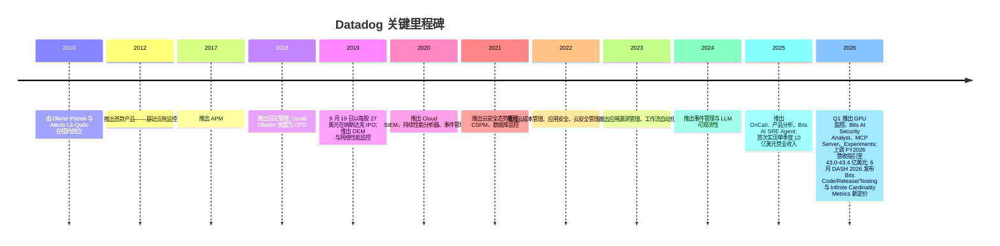
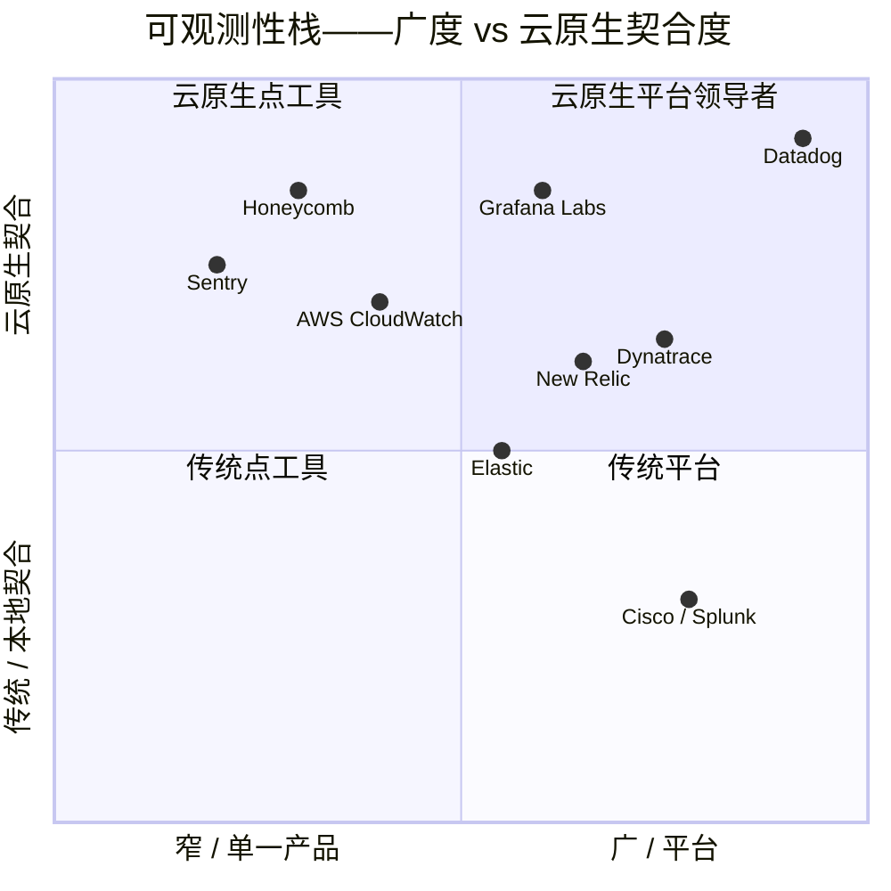
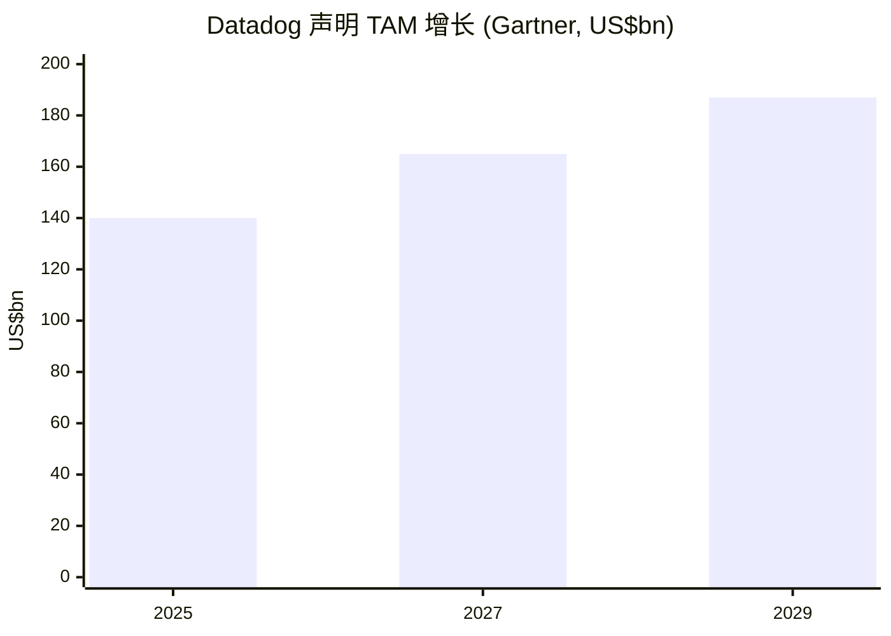

# Datadog, Inc. (NASDAQ:DDOG) — 公司研究报告

**截至日期:** 2026-06-16
**分析师语言:** 简体中文（技术 / 财务 / 行业术语保留英文）
**主要上市地:** 纳斯达克全球精选市场 (NASDAQ Global Select Market)
**报告币种:** 美元 (USD)　**财年截止:** 12 月 31 日
**报告语言: 简体中文 (英文版同时存在于本目录)**

> *分析师观点：* **评级：Hold / Neutral（持有）· 12 个月目标价 US$232（较现价 US$231.11 约持平，+0.4%）· 估值方法：2027E non-GAAP EPS US$3.10 × 75× P/E（与 DCF、EV/Sales 交叉验证）**
> 市值 US$82.3bn · 企业价值 (EV) 约 US$77.5bn · 52 周区间 US$98.01–US$278.70 · NASDAQ:DDOG
>
> | 倍数 / Multiple (*分析师观点：* 前瞻列) | FY25A | FY26E | FY27E |
> |---|---|---|---|
> | non-GAAP P/E | ~113× | ~96× | ~75× |
> | P/S (市销率) | 24×* | 19× | 15× |
> | EV/Sales | 21×(TTM) | 18× | 14× |
> | FCF 收益率 / FCF yield | ~1.1% | ~1.3% | ~1.7% |
> | 净现金 / Net cash (US$bn) | +3.5 | +4.0 | +5.0 |
>
> *注：FY25A non-GAAP P/E = 现价 231.11 / FY25 non-GAAP EPS 约 2.05；FY25 P/S 按当前市值 / FY2025 营收 34.27 亿计为 24×（TTM 口径 22.4×）。
>
> **相对表现 (截至 2026-06-16):** 1M **+11.1%** · 6M **+65.0%** · YTD **+69.9%** · 12M **+89.5%**；同期 S&P 500 为 +1.4% / +10.5% / +9.7% / +24.5%——**12 个月相对跑赢 +65 个百分点**，是软件板块最强的相对赢家之一（价格来源：yfinance，DDOG 与 ^GSPC，截至 2026-06-16）。
>
> **核心论点（thesis pillars）**——（1）**品类领导者 + 架构护城河**：单一 agent / 单一后端 / 1,000+ 集成的统一可观测性 (observability) 平台，84% 客户用 ≥2 产品、33% 用 ≥6 产品，切换成本接近禁止性；（2）**AI 双引擎重新加速**：2026 Q1 营收同比 +32%（连续第四个季度加速），AI 原生客户群约占营收 12–15%，训练工作负载从"够不着"变成可触达市场；（3）**财务质量稀缺**：FY2025 毛利率 80%、FCF 利润率 27%、Rule of 40 ≈ 55，净现金约 35 亿美元；（4）**但估值已充分定价**：22× TTM P/S（SaaS 中位数约 5×）、96× FY26E non-GAAP P/E，卖方目标价分歧极大（GS US$139 卖出 ↔ JPM US$320 增持），在 +90% 的 12 个月涨幅后，风险回报对称——这是我们给 Hold 而非 Buy 的唯一原因。

> **业绩更新——2026 财年全年指引大幅上调 (2026-05-07):** 管理层将 2026 财年全年营业收入指引上调至 **43.0 亿至 43.4 亿美元**（此前 2025 财年 Q4 公告时约 40.6 亿至 41.0 亿美元），non-GAAP 营业利润上调至 **9.40 亿至 9.80 亿美元**，non-GAAP 每股收益 (EPS) 上调至 **2.36 至 2.44 美元**（此前为 2.06 至 2.16 美元），中位数 EPS 提升约 12%。该上调对应中位数同比营业收入增速约 26%，较此前指引的约 19–20% 显著加速。管理层将原因归结为：(a) 2026 Q1 同比增速持续约 32%（营业收入 10.06 亿美元）；(b) AI 工作负载 (AI workload) 监控需求加速，含两笔来自超大规模云厂商 AI 实验室的训练工作负载新单（一笔 8 位数、一笔 7 位数年化合同）；(c) 大型客户 ARR 重新加速——10 万美元以上 ARR 客户数同比增长 21% 至约 4,550 家。来源：[Datadog 2026 财年 Q1 8-K / 新闻稿, 2026-05-07](https://www.sec.gov/Archives/edgar/data/0001561550/000162828026031677/ex-991x20260331x8k.htm)；此前指引参见 [2025 财年 Q4 8-K, 2026-02-10](https://www.sec.gov/Archives/edgar/data/0001561550/000162828026006645/ex-991x20251231x8k.htm)。

---

## 目录

1. 公司概览（含投资论点）
1A. 估值与目标价（前瞻模型 · PT 推导 · 牛/基/熊情景 · 卖方观点演变）
1B. GF Score（GuruFocus 式基本面评分）
2. 公司历史
3. 管理团队
4. 产品与服务
5. 客户与上市策略
6. 行业概览
7. 竞争格局
8. 市场机会 (TAM)
9. 风险评估
9.5. 关键争论与催化剂
10. 投资视角评分卡
数据来源清单 · 参考资料

---

## 1. 公司概览

*分析师观点：* **我们给 Datadog 评级 Hold / Neutral，12 个月目标价 US$232（≈现价）。** 论点不是"业务不好"——恰恰相反，这是云软件领域质量最高的少数资产之一：2026 Q1 营收同比 +32% 且连续第四个季度加速、毛利率 80%、FCF 利润率 27%、Rule of 40 ≈ 55、净现金约 35 亿美元，以及一条 84% 客户用 ≥2 产品的真实架构护城河。论点是**价格**：股票在过去 12 个月上涨 +89.5%（相对 S&P 500 跑赢 +65 个百分点），现价对应 22× TTM P/S 和 96× FY26E non-GAAP P/E，已经把"再复利数年约 25%+ 增长"完全计入。卖方目标价从高盛的 US$139（卖出）到摩根大通的 US$320（增持）横跨 2.3 倍，正是这种"质量无争议、价格有分歧"格局的写照。我们的 Hold 是对"用更好的入场点等一个回调"的纪律，而非对业务的怀疑（详见 1A、9.5）。

Datadog, Inc. 是面向云端及混合应用的 **AI 驱动可观测性 (observability) 与安全平台**。其 SaaS 平台——通过一个数据采集 agent 和超过 1,000 个开箱即用集成 (integration) 部署的单一统一后端——汇集了基础设施监控 (infrastructure monitoring)、应用性能监控 (Application Performance Monitoring, APM)、日志管理 (log management)、用户体验监控 (user-experience monitoring)、云安全 (cloud security)、服务管理 (service management)、AI/LLM 可观测性以及超过 20 个其他产品。客户可以在数分钟内开启单一模块，并随时间扩展更多模块——这正是 Datadog "落地并扩张 (land-and-expand)" 模式的核心 ([Datadog 2025 年 10-K, Item 1——业务描述](https://www.sec.gov/Archives/edgar/data/0001561550/000162828026008819/ddog-20251231.htm))。

**盈利方式。** 绝大多数营业收入为订阅制软件 (subscription software)，按月度、季度、年度或多年期合同计费。客户为在合同最低承诺之上消耗的容量付费 (主机 host、容器 container、日志 GB、RUM 会话、AI agent 调用次数等)，这种结构为 Datadog 提供了基础经常性 ARR (年化经常性收入)，以及与客户工作负载增长挂钩的用量驱动上行空间——这正是同样的扩张机制造就了截至 2025 年 12 月 31 日**美元基础净留存率 (dollar-based net retention, NRR) 滚动十二个月约 120%**（高于一年前的"110% 高位"），并在 2026 Q1 进一步回升至**低 122% 区间**的原因 ([10-K, MD&A § 关键业务指标](https://www.sec.gov/Archives/edgar/data/0001561550/000162828026008819/ddog-20251231.htm); [2026 财年 Q1 8-K, 2026-05-07](https://www.sec.gov/Archives/edgar/data/0001561550/000162828026031677/ex-991x20260331x8k.htm))。

**经营地理。** Datadog 总部位于纽约市第八大道 620 号 (620 8th Avenue, New York, NY)，主要工程枢纽位于纽约和巴黎，销售办公室遍布阿姆斯特丹、都柏林、伦敦、巴黎、首尔、新加坡、悉尼和东京。截至 2025 年 12 月 31 日，公司在 160 多个国家服务约 **32,700 家客户**（一年前约 30,000 家），2026 Q1 末进一步至约 **33,200 家** ([2026 财年 Q1 8-K](https://www.sec.gov/Archives/edgar/data/0001561550/000162828026031677/ex-991x20260331x8k.htm))。2025 年末全职员工约 8,100 人，其中约 44% 在美国以外，而这 44% 中约 34% 位于法国——这是联合创始人 Alexis Lê-Quôc 巴黎工程组织根脉的遗留产物 ([10-K, Item 1——人力资本与地理分布](https://www.sec.gov/Archives/edgar/data/0001561550/000162828026008819/ddog-20251231.htm))。北美以外地区 (International) 营业收入在 FY2024 和 FY2025 均占总营业收入的 **29%**（FY2025 为 9.941 亿美元 / 总营收 34.272 亿美元），意味着国际扩张的跑道基本未被开发 ([10-K, Note 13——按地区营业收入](https://www.sec.gov/Archives/edgar/data/0001561550/000162828026008819/ddog-20251231.htm))。

**收入结构 / How DDOG makes its money（FY2025 利润表 Sankey）。**

<svg xmlns="http://www.w3.org/2000/svg" viewBox="0 0 1000 560" width="1000" height="560" role="img" aria-label="income statement Sankey"><rect x="0" y="0" width="1000" height="560" fill="#ffffff"/>
<text x="20.00" y="30.00" text-anchor="start" font-family="Helvetica,Arial,sans-serif" font-size="15" font-weight="700" fill="#1f2933">Datadog (DDOG) 如何赚钱 — How DDOG Makes Money, FY2025</text>
<path d="M 204.00,78.00 C 258.00,78.00 258.00,85.00 312.00,85.00 L 312.00,374.66 C 258.00,374.66 258.00,367.66 204.00,367.66 Z" fill="#93c5fd" fill-opacity="0.55"/>
<path d="M 452.00,78.00 C 506.00,78.00 506.00,98.10 560.00,98.10 L 560.00,100.10 C 506.00,100.10 506.00,80.00 452.00,80.00 Z" fill="#86efac" fill-opacity="0.55"/>
<path d="M 452.00,80.00 C 506.00,80.00 506.00,114.10 560.00,114.10 L 560.00,445.54 C 506.00,445.54 506.00,411.45 452.00,411.45 Z" fill="#fca5a5" fill-opacity="0.55"/>
<path d="M 328.00,85.00 C 382.00,85.00 382.00,78.00 436.00,78.00 L 436.00,404.21 C 382.00,404.21 382.00,411.21 328.00,411.21 Z" fill="#86efac" fill-opacity="0.55"/>
<path d="M 328.00,411.21 C 382.00,411.21 382.00,418.21 436.00,418.21 L 436.00,500.00 C 382.00,500.00 382.00,493.00 328.00,493.00 Z" fill="#fca5a5" fill-opacity="0.55"/>
<path d="M 700.00,94.72 C 754.00,94.72 754.00,274.44 808.00,274.44 L 808.00,287.30 C 754.00,287.30 754.00,107.57 700.00,107.57 Z" fill="#86efac" fill-opacity="0.55"/>
<path d="M 700.00,107.57 C 754.00,107.57 754.00,301.30 808.00,301.30 L 808.00,303.56 C 754.00,303.56 754.00,109.84 700.00,109.84 Z" fill="#fca5a5" fill-opacity="0.55"/>
<path d="M 576.00,98.10 C 630.00,98.10 630.00,94.72 684.00,94.72 L 684.00,96.72 C 630.00,96.72 630.00,100.10 576.00,100.10 Z" fill="#86efac" fill-opacity="0.55"/>
<path d="M 576.00,114.10 C 630.00,114.10 630.00,123.84 684.00,123.84 L 684.00,237.65 C 630.00,237.65 630.00,227.91 576.00,227.91 Z" fill="#fca5a5" fill-opacity="0.55"/>
<path d="M 576.00,227.91 C 630.00,227.91 630.00,251.65 684.00,251.65 L 684.00,435.95 C 630.00,435.95 630.00,412.21 576.00,412.21 Z" fill="#fca5a5" fill-opacity="0.55"/>
<path d="M 576.00,412.21 C 630.00,412.21 630.00,449.95 684.00,449.95 L 684.00,483.28 C 630.00,483.28 630.00,445.54 576.00,445.54 Z" fill="#fca5a5" fill-opacity="0.55"/>
<path d="M 204.00,381.66 C 258.00,381.66 258.00,374.66 312.00,374.66 L 312.00,493.00 C 258.00,493.00 258.00,500.00 204.00,500.00 Z" fill="#93c5fd" fill-opacity="0.55"/>
<path d="M 576.00,459.54 C 630.00,459.54 630.00,96.72 684.00,96.72 L 684.00,117.07 C 630.00,117.07 630.00,479.90 576.00,479.90 Z" fill="#93c5fd" fill-opacity="0.55"/>
<rect x="188.00" y="78.00" width="16" height="289.66" rx="1.5" fill="#2563eb"/>
<rect x="188.00" y="381.66" width="16" height="118.34" rx="1.5" fill="#2563eb"/>
<rect x="312.00" y="85.00" width="16" height="408.00" rx="1.5" fill="#1e3a8a"/>
<rect x="436.00" y="78.00" width="16" height="326.21" rx="1.5" fill="#15803d"/>
<rect x="436.00" y="418.21" width="16" height="81.79" rx="1.5" fill="#dc2626"/>
<rect x="560.00" y="98.10" width="16" height="2.00" rx="1.5" fill="#15803d"/>
<rect x="560.00" y="114.10" width="16" height="331.45" rx="1.5" fill="#dc2626"/>
<rect x="560.00" y="459.54" width="16" height="20.36" rx="1.5" fill="#2563eb"/>
<rect x="684.00" y="94.72" width="16" height="15.12" rx="1.5" fill="#15803d"/>
<rect x="684.00" y="123.84" width="16" height="113.82" rx="1.5" fill="#dc2626"/>
<rect x="684.00" y="251.65" width="16" height="184.30" rx="1.5" fill="#dc2626"/>
<rect x="684.00" y="449.95" width="16" height="33.34" rx="1.5" fill="#dc2626"/>
<rect x="808.00" y="274.44" width="16" height="12.86" rx="1.5" fill="#15803d"/>
<rect x="808.00" y="301.30" width="16" height="2.26" rx="1.5" fill="#dc2626"/>
<text x="179.00" y="219.83" text-anchor="end" font-family="Helvetica,Arial,sans-serif" font-size="11.5" font-weight="700" fill="#1f2933">North America</text>
<text x="179.00" y="232.83" text-anchor="end" font-family="Helvetica,Arial,sans-serif" font-size="10" font-weight="400" fill="#52606d">$2.4B  (71.0%)</text>
<text x="179.00" y="437.83" text-anchor="end" font-family="Helvetica,Arial,sans-serif" font-size="11.5" font-weight="700" fill="#1f2933">International</text>
<text x="179.00" y="450.83" text-anchor="end" font-family="Helvetica,Arial,sans-serif" font-size="10" font-weight="400" fill="#52606d">$994.0M  (29.0%)</text>
<rect x="331.00" y="67.00" width="100.50" height="26" rx="2" fill="#ffffff" fill-opacity="0.72"/>
<text x="334.00" y="79.00" text-anchor="start" font-family="Helvetica,Arial,sans-serif" font-size="11.5" font-weight="700" fill="#1f2933">Revenue</text>
<text x="334.00" y="92.00" text-anchor="start" font-family="Helvetica,Arial,sans-serif" font-size="10" font-weight="400" fill="#52606d">$3.4B  (100.0%)</text>
<rect x="455.00" y="60.00" width="94.20" height="26" rx="2" fill="#ffffff" fill-opacity="0.72"/>
<text x="458.00" y="72.00" text-anchor="start" font-family="Helvetica,Arial,sans-serif" font-size="11.5" font-weight="700" fill="#1f2933">Gross Profit</text>
<text x="458.00" y="85.00" text-anchor="start" font-family="Helvetica,Arial,sans-serif" font-size="10" font-weight="400" fill="#52606d">$2.7B  (80.0%)</text>
<rect x="455.00" y="400.21" width="144.60" height="26" rx="2" fill="#ffffff" fill-opacity="0.72"/>
<text x="458.00" y="412.21" text-anchor="start" font-family="Helvetica,Arial,sans-serif" font-size="11.5" font-weight="700" fill="#1f2933">Cost of Revenue (COGS)</text>
<text x="458.00" y="425.21" text-anchor="start" font-family="Helvetica,Arial,sans-serif" font-size="10" font-weight="400" fill="#52606d">$687.0M  (20.0%)</text>
<rect x="579.00" y="80.10" width="106.80" height="26" rx="2" fill="#ffffff" fill-opacity="0.72"/>
<text x="582.00" y="92.10" text-anchor="start" font-family="Helvetica,Arial,sans-serif" font-size="11.5" font-weight="700" fill="#1f2933">Operating Income</text>
<text x="582.00" y="105.10" text-anchor="start" font-family="Helvetica,Arial,sans-serif" font-size="10" font-weight="400" fill="#52606d">-$44.0M  (-1.3%)</text>
<rect x="579.00" y="105.10" width="150.90" height="26" rx="2" fill="#ffffff" fill-opacity="0.72"/>
<text x="582.00" y="117.10" text-anchor="start" font-family="Helvetica,Arial,sans-serif" font-size="11.5" font-weight="700" fill="#1f2933">Total Operating Expense</text>
<text x="582.00" y="130.10" text-anchor="start" font-family="Helvetica,Arial,sans-serif" font-size="10" font-weight="400" fill="#52606d">$2.8B  (81.2%)</text>
<text x="551.00" y="466.72" text-anchor="end" font-family="Helvetica,Arial,sans-serif" font-size="11.5" font-weight="700" fill="#1f2933">Net Interest / Other Income</text>
<text x="551.00" y="479.72" text-anchor="end" font-family="Helvetica,Arial,sans-serif" font-size="10" font-weight="400" fill="#52606d">$171.0M  (5.0%)</text>
<rect x="703.00" y="76.72" width="100.50" height="26" rx="2" fill="#ffffff" fill-opacity="0.72"/>
<text x="706.00" y="88.72" text-anchor="start" font-family="Helvetica,Arial,sans-serif" font-size="11.5" font-weight="700" fill="#1f2933">Pretax Income</text>
<text x="706.00" y="101.72" text-anchor="start" font-family="Helvetica,Arial,sans-serif" font-size="10" font-weight="400" fill="#52606d">$127.0M  (3.7%)</text>
<rect x="703.00" y="105.84" width="106.80" height="26" rx="2" fill="#ffffff" fill-opacity="0.72"/>
<text x="706.00" y="117.84" text-anchor="start" font-family="Helvetica,Arial,sans-serif" font-size="11.5" font-weight="700" fill="#1f2933">SG&amp;A</text>
<text x="706.00" y="130.84" text-anchor="start" font-family="Helvetica,Arial,sans-serif" font-size="10" font-weight="400" fill="#52606d">$956.0M  (27.9%)</text>
<rect x="703.00" y="233.65" width="94.20" height="26" rx="2" fill="#ffffff" fill-opacity="0.72"/>
<text x="706.00" y="245.65" text-anchor="start" font-family="Helvetica,Arial,sans-serif" font-size="11.5" font-weight="700" fill="#1f2933">R&amp;D</text>
<text x="706.00" y="258.65" text-anchor="start" font-family="Helvetica,Arial,sans-serif" font-size="10" font-weight="400" fill="#52606d">$1.5B  (45.2%)</text>
<rect x="703.00" y="431.95" width="100.50" height="26" rx="2" fill="#ffffff" fill-opacity="0.72"/>
<text x="706.00" y="443.95" text-anchor="start" font-family="Helvetica,Arial,sans-serif" font-size="11.5" font-weight="700" fill="#1f2933">Other OpEx</text>
<text x="706.00" y="456.95" text-anchor="start" font-family="Helvetica,Arial,sans-serif" font-size="10" font-weight="400" fill="#52606d">$280.0M  (8.2%)</text>
<text x="833.00" y="277.87" text-anchor="start" font-family="Helvetica,Arial,sans-serif" font-size="11.5" font-weight="700" fill="#1f2933">Net Income</text>
<text x="833.00" y="290.87" text-anchor="start" font-family="Helvetica,Arial,sans-serif" font-size="10" font-weight="400" fill="#52606d">$108.0M  (3.2%)</text>
<text x="833.00" y="302.87" text-anchor="start" font-family="Helvetica,Arial,sans-serif" font-size="11.5" font-weight="700" fill="#1f2933">Income Tax</text>
<text x="833.00" y="315.87" text-anchor="start" font-family="Helvetica,Arial,sans-serif" font-size="10" font-weight="400" fill="#52606d">$19.0M  (0.55%)</text>
<text x="500.00" y="544.00" text-anchor="middle" font-family="Helvetica,Arial,sans-serif" font-size="10" font-weight="400" fill="#52606d">Source: DDOG FY2025 10-K, Consolidated Statements of Operations + Note 13 Geography</text>
</svg>

来源 / Source: [Datadog 2025 年 10-K, Consolidated Statements of Operations + Note 13 Geography](https://www.sec.gov/Archives/edgar/data/0001561550/000162828026008819/ddog-20251231.htm)。

上图直观呈现 FY2025 的经济结构：34.272 亿美元营收中，仅约 6.870 亿美元为销货成本 (COGS，主要是第三方云托管开支)，余下 27.402 亿美元为毛利 (毛利率 **80.0%**)。三大经营费用——R&D 15.485 亿、Sales & Marketing 9.564 亿、G&A 2.797 亿——合计 27.846 亿，略高于毛利，形成 4,440 万美元的 GAAP 经营亏损 (operating loss)。这个亏损完全是会计现象：股权激励 (stock-based compensation, SBC) FY2025 达 7.507 亿美元（占营收 22%），其中约 4.695 亿落在 R&D。加回 SBC 后，non-GAAP 经营利润约 7.06 亿美元 (利润率约 21%)，加上 1.714 亿美元的利息与其他净收入，税前利润 1.270 亿美元、GAAP 净利润 1.077 亿美元 ([10-K, MD&A 与 Note 1](https://www.sec.gov/Archives/edgar/data/0001561550/000162828026008819/ddog-20251231.htm))。

**规模快照 (FY2025 GAAP, 全年)。**

| 指标 | FY2025 | FY2024 | FY2023 |
|---|---|---|---|
| 营业收入 (Revenue) | **34.272 亿美元** | 26.843 亿美元 | 21.284 亿美元 |
| 同比增速 | 28% | 26% | 27% |
| 毛利 (Gross profit) | 27.402 亿美元 (80%) | 21.687 亿美元 (81%) | 17.185 亿美元 (81%) |
| GAAP 营业利润 (loss) | (4,440 万美元) | 5,430 万美元 | (3,350 万美元) |
| non-GAAP 营业利润 (估算) | 约 7.06 亿美元 | 约 6.25 亿美元 | n/a |
| 净利润 (GAAP) | 1.077 亿美元 | 1.837 亿美元 | 4,860 万美元 |
| 经营性现金流 (OCF) | 10.501 亿美元 | 8.706 亿美元 | 6.600 亿美元 |
| 自由现金流 (FCF) | 9.147 亿美元 | 7.751 亿美元 | 5.975 亿美元 |
| FCF 利润率 | 26.7% | 28.9% | 28.1% |
| SBC 股权激励 | 7.507 亿美元 | 5.703 亿美元 | 4.823 亿美元 |
| 10 万美元以上 ARR 客户 | 约 4,310 (占 ARR 90%) | 约 3,610 (占 88%) | 约 3,190 |
| 100 万美元以上 ARR 客户 | 约 603 | 约 462 | 约 317 |
| 总客户数 | 约 32,700 | 约 30,000 | 约 27,300 |
| NRR (TTM) | 约 120% | 110% 高位 | 约 110% |

所有行的来源: [Datadog 2025 年 10-K, MD&A 与 Item 1](https://www.sec.gov/Archives/edgar/data/0001561550/000162828026008819/ddog-20251231.htm) 及 [2023 年 10-K](https://www.sec.gov/Archives/edgar/data/0001561550/000156155024000009/ddog-20231231.htm)（FY2023 对比年份）。

**历史营业收入按地区（development-over-time）。**

<svg xmlns="http://www.w3.org/2000/svg" viewBox="0 0 860 470" width="860" height="470" role="img" aria-label="historical revenue bars"><rect x="0" y="0" width="860" height="470" fill="#ffffff"/>
<text x="20.00" y="30.00" text-anchor="start" font-family="Helvetica,Arial,sans-serif" font-size="15" font-weight="700" fill="#1f2933">历史营业收入按地区 / Historical Revenue by Geography ($B)</text>
<rect x="20.00" y="44" width="11" height="11" rx="2" fill="#2563eb"/>
<text x="36.00" y="53.00" text-anchor="start" font-family="Helvetica,Arial,sans-serif" font-size="10.5" font-weight="400" fill="#1f2933">North America</text>
<rect x="135.80" y="44" width="11" height="11" rx="2" fill="#15803d"/>
<text x="151.80" y="53.00" text-anchor="start" font-family="Helvetica,Arial,sans-serif" font-size="10.5" font-weight="400" fill="#1f2933">International</text>
<line x1="70" y1="412.00" x2="834" y2="412.00" stroke="#eceff2" stroke-width="1"/>
<text x="64.00" y="415.00" text-anchor="end" font-family="Helvetica,Arial,sans-serif" font-size="9.5" font-weight="400" fill="#52606d">$0</text>
<line x1="70" y1="345.20" x2="834" y2="345.20" stroke="#eceff2" stroke-width="1"/>
<text x="64.00" y="348.20" text-anchor="end" font-family="Helvetica,Arial,sans-serif" font-size="9.5" font-weight="400" fill="#52606d">$740.2M</text>
<line x1="70" y1="278.40" x2="834" y2="278.40" stroke="#eceff2" stroke-width="1"/>
<text x="64.00" y="281.40" text-anchor="end" font-family="Helvetica,Arial,sans-serif" font-size="9.5" font-weight="400" fill="#52606d">$1.5B</text>
<line x1="70" y1="211.60" x2="834" y2="211.60" stroke="#eceff2" stroke-width="1"/>
<text x="64.00" y="214.60" text-anchor="end" font-family="Helvetica,Arial,sans-serif" font-size="9.5" font-weight="400" fill="#52606d">$2.2B</text>
<line x1="70" y1="144.80" x2="834" y2="144.80" stroke="#eceff2" stroke-width="1"/>
<text x="64.00" y="147.80" text-anchor="end" font-family="Helvetica,Arial,sans-serif" font-size="9.5" font-weight="400" fill="#52606d">$3.0B</text>
<line x1="70" y1="78.00" x2="834" y2="78.00" stroke="#eceff2" stroke-width="1"/>
<text x="64.00" y="81.00" text-anchor="end" font-family="Helvetica,Arial,sans-serif" font-size="9.5" font-weight="400" fill="#52606d">$3.7B</text>
<rect x="102.09" y="344.77" width="88.62" height="67.23" fill="#2563eb"/>
<rect x="102.09" y="317.34" width="88.62" height="27.43" fill="#15803d"/>
<text x="146.40" y="428.00" text-anchor="middle" font-family="Helvetica,Arial,sans-serif" font-size="10" font-weight="400" fill="#52606d">2021</text>
<rect x="254.89" y="307.50" width="88.62" height="104.50" fill="#2563eb"/>
<rect x="254.89" y="260.48" width="88.62" height="47.02" fill="#15803d"/>
<text x="299.20" y="428.00" text-anchor="middle" font-family="Helvetica,Arial,sans-serif" font-size="10" font-weight="400" fill="#52606d">2022</text>
<rect x="407.69" y="277.81" width="88.62" height="134.19" fill="#2563eb"/>
<rect x="407.69" y="219.97" width="88.62" height="57.85" fill="#15803d"/>
<text x="452.00" y="428.00" text-anchor="middle" font-family="Helvetica,Arial,sans-serif" font-size="10" font-weight="400" fill="#52606d">2023</text>
<rect x="560.49" y="242.89" width="88.62" height="169.11" fill="#2563eb"/>
<rect x="560.49" y="169.79" width="88.62" height="73.10" fill="#15803d"/>
<text x="604.80" y="428.00" text-anchor="middle" font-family="Helvetica,Arial,sans-serif" font-size="10" font-weight="400" fill="#52606d">2024</text>
<rect x="713.29" y="192.44" width="88.62" height="219.56" fill="#2563eb"/>
<rect x="713.29" y="102.74" width="88.62" height="89.70" fill="#15803d"/>
<text x="757.60" y="428.00" text-anchor="middle" font-family="Helvetica,Arial,sans-serif" font-size="10" font-weight="400" fill="#52606d">2025</text>
<text x="430.00" y="454.00" text-anchor="middle" font-family="Helvetica,Arial,sans-serif" font-size="10" font-weight="400" fill="#52606d">Source: DDOG FY2021-FY2025 10-Ks, Note 13 — Revenue by geographic area</text>
</svg>

来源 / Source: [Datadog FY2021–FY2025 10-Ks, Note 13 — Revenue by geographic area](https://www.sec.gov/Archives/edgar/data/0001561550/000162828026008819/ddog-20251231.htm)。

**估值快照 (2026-06-16, 现价 US$231.11)。**

| 指标 | DDOG | 行业对比 |
|---|---|---|
| 股价 | **US$231.11** | — |
| 市值 | **约 US$82.3bn** | — |
| 企业价值 (EV) | **约 US$77.5bn** (2026 Q1 现金+证券 48 亿) | — |
| TTM 市销率 (P/S) | **约 22.4×** (市值 / TTM 营收 36.72 亿) | SaaS 中位数约 5× |
| FY2026E P/S (按 43.2 亿) | **约 19×** | — |
| EV/Sales (TTM) | **约 21×** | — |
| TTM 市盈率 (P/E, GAAP) | **约 630×** (机械噪声——见下) | SaaS 中位数约 50× |
| FY2026E P/E (non-GAAP, 中位指引 2.40) | **约 96×** (231.11 / 2.40) | MongoDB 前瞻 ~58× |
| 3 年期 P/S 区间 | **约 11× 至 28×** | — |
| Rule of 40 (FY2025) | 28% 增速 + 27% FCF 利润率 = **55** | 一流标准 = 40 |

来源: 现价与市值来自 [yfinance / stockanalysis.com DDOG, 2026-06](https://stockanalysis.com/stocks/ddog/); P/S 历史区间引自 [Macrotrends DDOG P/S 2018-2026](https://www.macrotrends.net/stocks/charts/DDOG/datadog/price-sales) 与 [companiesmarketcap.com DDOG P/S 历史](https://companiesmarketcap.com/datadog/ps-ratio/)。

*分析师观点：* DDOG 的 22× TTM P/S vs. SaaS 中位数约 5× 是**成长板块 + AI 叙事溢价**，而非低迷盈利造成的失真信号：营业收入以约 28–32% 同比增长，FCF 利润率约 27%，AI 原生客户群从 2025 Q1 占总营收 8.5% 加速到管理层 2025 Q4 / 2026 Q1 评论的约 12–15% ([2025 财年 Q2 8-K, 2025-08-07](https://www.sec.gov/Archives/edgar/data/0001561550/000156155025000216/ex-991x20250630x8k.htm); [2026 财年 Q1 8-K](https://www.sec.gov/Archives/edgar/data/0001561550/000162828026031677/ex-991x20260331x8k.htm))。约 630× TTM GAAP P/E 是机械性噪声——GAAP 净利润较小 (1.077 亿) 是因为 SBC (7.507 亿) 全额费用化；前瞻 non-GAAP P/E 约 96× 是更清晰的读数。瑞银的口径（基于 2026E 营收约 11× EV/Revenue、约 39× FCF）也指向同一结论：溢价由 20%+ 增速、稳定利润率与 AI 增长故事支撑，但溢价"不便宜" ([UBS — Datadog: Still Bullish Ahead of the Print, 2026-05-04, p.1](http://xs-macbook-air.local:5001/zsxq/pdf/812458522511122/UBS-Datadog%20Inc%EF%BC%88DDOG.US%EF%BC%89Still%20Bullish%20Ahead%20of%20the%20Print-260504.pdf))。如果 AI 工作负载不及预期或超大规模云客户优化加速，该溢价将重新评级；我们在第 9 章中将估值列为首要风险。

---

## 1A. 估值与目标价（决策层）

本章是前瞻、决策级的分析，区别于上文 1 章的回溯快照。**本章所有数字均为分析师本方观点（*分析师观点：*），任何预测、目标价与情景目标价均不附带 filing 引用**（10-K 中不含目标价）；每个驱动变量的外部输入（filing 分部数据 + 管理层指引 + 行业预测）在文中分别标注。

### (a) 前瞻财务模型（3 年）

| 指标 (*分析师观点：*) | FY25A | FY26E | FY27E | FY28E | CAGR(25-28) |
|---|---|---|---|---|---|
| 营业收入 (US$mn) | 3,427 | **4,320** | 5,400 | 6,700 | +25% |
| — YoY % | +28% | +26% | +25% | +24% | |
| 毛利率 (gross margin) % | 80.0% | 80% | 80% | 80% | |
| non-GAAP 营业利润率 % | ~21% | 22% | 23% | 24% | |
| non-GAAP EPS (US$) | ~2.05 | **2.40** | 3.10 | 3.95 | +25% |
| — YoY % | | +17% | +29% | +27% | |
| FCF (US$mn) / FCF 利润率 | 915 / 27% | 1,080 / 25% | 1,400 / 26% | 1,750 / 26% | |
| 净现金+证券 (US$bn) | +3.5 | +4.0 | +5.0 | +6.5 | |
| ROIC（粗略，non-GAAP）% | ~16% | ~18% | ~20% | ~22% | |

模型基础（外部输入，均已引用）：FY26E 营收/EPS 直接锚定管理层 2026 全年指引中位数（营收 43.2 亿、non-GAAP EPS 2.40）([2026 财年 Q1 8-K — Full Year 2026 Outlook](https://www.sec.gov/Archives/edgar/data/0001561550/000162828026031677/ex-991x20260331x8k.htm))；FY27E 营收 54.0 亿与伯恩斯坦 54.56 亿、摩根大通模型一致 ([Bernstein — DASH 2026, 2026-06-13, p.1](http://xs-macbook-air.local:5001/zsxq/pdf/181244251414142/Bernstein-Datadog%20Inc%EF%BC%88DDOG.US%EF%BC%89Datadog%20%EF%BC%88DDOG%EF%BC%89%20DASH%202026%EF%BC%9A%20AI%20for%20DDOG%20%2B%20DDOG%20for%20AI-260612.pdf))；毛利率维持 80% 基于 FY2023–2025 连续 80–81% 的实绩 ([10-K, MD&A](https://www.sec.gov/Archives/edgar/data/0001561550/000162828026008819/ddog-20251231.htm))；FCF 利润率 25–27% 基于历史区间。

**利润率桥（margin bridge，*分析师观点：*）。** FY26 指引隐含 non-GAAP 营业利润率从 FY25 的约 21% 略升至 22%（中位）：`+约 100bps = 销售杠杆 +约 150bps（S&M 占营收比随规模下降）· R&D 再投资 −约 50bps（AI Research Lab / Bits AI 扩张）`。管理层称 FY26 利润率"压缩至约 21.5%"反映继续在 AI 上重投资，瑞银则认为凭借销售杠杆实际可达约 24% ([UBS, 2026-05-04, p.1](http://xs-macbook-air.local:5001/zsxq/pdf/812458522511122/UBS-Datadog%20Inc%EF%BC%88DDOG.US%EF%BC%89Still%20Bullish%20Ahead%20of%20the%20Print-260504.pdf))。

### (b) 目标价推导（show the arithmetic）

**方法：前瞻 non-GAAP P/E × 目标倍数（与 DCF、EV/Sales 交叉验证）。**

`FY27E non-GAAP EPS US$3.10 × 75× P/E = US$232`（基准目标价）。

**为什么用 75× 这个倍数？** DDOG FY27E 增长约 25%（营收）/ 约 29%（EPS），高于绝大多数大盘 SaaS。对标可比：MongoDB (MDB) 前瞻 P/E 约 58× 对应约 20% 增长 ([GuruFocus — MDB 前瞻 P/E](https://www.gurufocus.com/term/forward-pe-ratio/MDB))；伯恩斯坦对 DDOG 自身的 FY27E Adj. P/E 给到 72× ([Bernstein — DASH 2026, 2026-06-13, p.1](http://xs-macbook-air.local:5001/zsxq/pdf/181244251414142/Bernstein-Datadog%20Inc%EF%BC%88DDOG.US%EF%BC%89Datadog%20%EF%BC%88DDOG%EF%BC%89%20DASH%202026%EF%BC%9A%20AI%20for%20DDOG%20%2B%20DDOG%20for%20AI-260612.pdf))。我们取 75×，略高于 MDB 是因为 DDOG 增速与 Rule of 40 更优（PEG ≈ 75/29 ≈ 2.6，确实不便宜）。

**DCF 交叉验证。** WACC = Rf 4.54%（10Y Treasury，来源 indicators.db 本地快照（FRED / ^TNX + yfinance），as of 2026-06-05）+ β≈1.3 × ERP 5% ≈ **11%**，与伯恩斯坦 DCF 假设的 WACC 11% / 终值增长 3% 一致 ([Bernstein — DASH 2026, 2026-06-13, p.1](http://xs-macbook-air.local:5001/zsxq/pdf/181244251414142/Bernstein-Datadog%20Inc%EF%BC%88DDOG.US%EF%BC%89Datadog%20%EF%BC%88DDOG%EF%BC%89%20DASH%202026%EF%BC%9A%20AI%20for%20DDOG%20%2B%20DDOG%20for%20AI-260612.pdf))。以 FY26E FCF 10.8 亿、FCF 五年 CAGR 约 20%、终值增长 3%、WACC 11% 折现，得到约 US$220–245 的内在价值区间，与 P/E 法的 US$232 吻合，给我们对基准目标价的信心。

### (c) 牛 / 基 / 熊情景

| 情景 (*分析师观点：*) | 关键假设 | 目标价 | 较现价 |
|---|---|---|---|
| 牛 Bull | AI 训练市场持续放量，FY27E EPS 升至 US$3.30，市场维持高溢价 95× | **US$315** | **+36%** |
| 基 Base | 中性估计，FY27E EPS US$3.10 × 75× | **US$232** | **+0.4%** |
| 熊 Bear | OpenAI/最大客户优化 + 竞争加剧，增速回落至约 18%，de-rate 至 47× × EPS US$2.95 | **US$139** | **−40%** |

熊市目标价 US$139 恰与高盛"卖出"目标价吻合（见下卖方观点）；牛市 US$315 接近摩根大通的 US$320——三档情景几乎完整覆盖了当前卖方分歧区间，说明市场对 DDOG 的核心争议在**增速可持续性 × 倍数**，而非业务质量。

### (d) 与市场一致预期的对比 + 卖方观点演变（≥2 zsxq 报告，机制化前置）

我们对 `db/stock_price_target.db`（只读）做了机制化前置扫描，列出全部覆盖行；当前 PT 离散度极大：**最低 US$139（GS 卖出）／中位约 US$180（Bernstein/MS Outperform）／最高 US$320（JPM 增持）**，PT 价差约 130%——这是大盘软件中最大的分歧之一。我们的基准 US$232 落在中位与最高之间，因为在 Q1'26 重新加速 + 训练市场打开后，我们认为多数空头模型（GS 18% 假设）过于保守，但又不愿在 +90% 涨幅后追到 JPM 的 320。

**按机构的观点时间线（self-revisions 已标注）：**

| 机构 | 报告日 | 评级 / 目标价 | 报告日股价 | 核心论点 |
|---|---|---|---|---|
| **J.P. Morgan** | 2026-05-07 | Overweight / **US$320**（自 US$200 大幅上调，华尔街最高） | US$188.73 (+70% 上行) | Q1 全面超预期、连续第四季加速；超大规模云 AI 实验室拿下 8 位数 + 7 位数训练新单；非 AI 核心重回 mid-20% ([JPM — Dog Training: Hyperscalers' AI Labs Fetching New Workloads, 2026-05-07, p.1](http://xs-macbook-air.local:5001/zsxq/pdf/585421448844514/J.P.%20Morgan-Datadog%EF%BC%88DDOG.US%EF%BC%89%20Dog%20Training%EF%BC%9A%20Hyperscalers%E2%80%99%20AI%20Labs%20Fetching%20New%20Workloads%20with%20Datadog%EF%BC%9B%20Raising%20Street~High%20Target%20But%20Just%20Getting%20Started%EF%BC%8C%20Prepare%20for%20Liftoff-260507.pdf)) |
| **J.P. Morgan**（复访） | 2026-05-19 | Overweight（维持）| US$215.15 | TMC 大会：可观测性"超级周期"早期；训练参与厂商从 5–10 家将增至 50–100 家 ([JPM — TMC Conference Takeaways, 2026-05-21, p.1](http://xs-macbook-air.local:5001/zsxq/pdf/585424821188424/J.P.%20Morgan-Datadog%EF%BC%88DDOG.US%EF%BC%89J.P.%20Morgan%20TMC%20Conference%20Takeaways-260519.pdf)) |
| **Bernstein** | 2026-05-08 | Outperform / **US$180**（自 US$167 上调）| US$200.16 (−10% 下行) | Q1'26"Born-in-AI（及核心）持续爆发"；AI 原生 Q1 ARR 新增近 US$2 亿（含 Anthropic + 两大云厂商 AI 实验室）；NTM P/S 倍数 13.5→14× + DCF 各半 ([Bernstein — Q1'26: Born-in-AI continues to rip, 2026-05-10, p.1](http://xs-macbook-air.local:5001/zsxq/pdf/184125821111582/Bernstein-Datadog%20Inc%EF%BC%88DDOG.US%EF%BC%89Q1%2726%EF%BC%9A%20Born~in~AI%20%EF%BC%88and%20core%EF%BC%89%20continues%20to%20rip%EF%BC%81-260508.pdf)) |
| **Bernstein**（复访） | 2026-06-13 | Outperform / US$180（维持）| US$234.24 (−23% 下行) | DASH 2026："AI for DDOG + DDOG for AI"；Infinite Cardinality Metrics 新定价修补了此前致 OpenAI 等大客流失的成本劣势；现价已超前反映短期利好，建议逢调介入 ([Bernstein — DASH 2026, 2026-06-13, p.1](http://xs-macbook-air.local:5001/zsxq/pdf/181244251414142/Bernstein-Datadog%20Inc%EF%BC%88DDOG.US%EF%BC%89Datadog%20%EF%BC%88DDOG%EF%BC%89%20DASH%202026%EF%BC%9A%20AI%20for%20DDOG%20%2B%20DDOG%20for%20AI-260612.pdf)) |
| **UBS** | 2026-05-04 | Buy / **US$195** | US$146.69 (+33% 上行) | 调研 4 家大企业客户：2026 对 DDOG 支出意向普遍增长 8–15%；未发现客户转向 Dynatrace/Elastic/New Relic；溢价合理 ([UBS — Still Bullish Ahead of the Print, 2026-05-04, p.1](http://xs-macbook-air.local:5001/zsxq/pdf/812458522511122/UBS-Datadog%20Inc%EF%BC%88DDOG.US%EF%BC%89Still%20Bullish%20Ahead%20of%20the%20Print-260504.pdf)) |
| **Goldman Sachs** | 2026-05-12 | **Sell** / **US$139**（自 US$121 上调）| US$202.32 (−31% 下行) | 维持卖出：AI 带来预算扩张与短期产品优势，但中长期竞争加剧仍将压制估值；当前约 85× FY26E P/E 偏高 ([GS — Budget tailwinds and company-specific wins, 2026-05-12, p.1](http://xs-macbook-air.local:5001/zsxq/pdf/184124515555842/Goldman%20Sachs-Datadog%20Inc.%20%EF%BC%88DDOG.US%EF%BC%89%20Budget%20tailwinds%20and%20company~specific%20wins%20more%20than%20offset%20any%20signs%20of%20competition-260511.pdf)) |

**机构间分歧（不混为假共识）：**

| 机构 | 日期 | 评级 / 目标价 | 核心论点 | 什么证据能证明其正确 |
|---|---|---|---|---|
| J.P. Morgan | 2026-05-07 | OW / US$320 | 训练市场新打开 + 加速全面性，给约 72× CY27E uFCF 合理 | 后续两季训练新单持续、AI 原生 ARR 继续翻倍式扩张 |
| Goldman Sachs | 2026-05-12 | Sell / US$139 | 竞争（超大规模云原生 + Cisco/Splunk）中长期压制估值与份额 | 出现可量化的份额流失或大客户优化、增速回落至 18% |
| UBS / Bernstein | 2026-05/06 | Buy / OP / US$180–195 | 调研无份额流失迹象 + DASH 修补成本劣势；逢调介入 | 净留存率 (NRR) 稳定在 120%+、客户支出意向兑现 |

每个 PT 已与报告日股价配对（上表），上行/下行口径即各机构在其报告日实际喊出的空间，而非以今日现价回算。

### (e) 关键变量（最该盯紧的两个）

（1）**最大客户（疑似 OpenAI）的用量优化时点与幅度**——管理层已预警"今年晚些时候可能调整"；这是基准 vs 熊市的主要分水岭。（2）**训练工作负载市场的可持续性**——若参与训练的厂商如 JPM 所述从 5–10 家增至 50–100+ 家，AI 增量将远超当前模型；反之则坐实 GS 的竞争压制论。

### (f) 本次刷新相对上一版的变化（estimate-revision transparency）

本报告上一版（2026-05-20）当时给的是描述性快照、现价约 US$208.8、未含正式评级与目标价。本次：**新增正式评级 Hold / 12 个月 PT US$232**；现价更新至 US$231.11（市值 US$82.3bn）；新增 FY26E/FY27E/FY28E 前瞻模型与 DCF 交叉验证；新增六家机构的卖方观点演变与分歧表（PT US$139–320）。PT US$232 ≈ 现价，故"上行"主要来自时间价值与 FY27E 盈利兑现，而非倍数重估——我们假设倍数从 96× FY26E 温和压缩至 75× FY27E（盈利增长消化倍数），这是 Hold 而非 Buy 的算术来源。

## 1B. GF Score（GuruFocus 式基本面评分）

*分析师观点：* **GF Score (GuruFocus-style)：72/100 — "Likely average performance"（71–80 区间）。** 这是一个分析师本方的透明评分卡（与 GuruFocus 专有的 GF Score™ 同构但非其官方数字），五个维度各 0–10，权重透明，每个底层指标在文中分别引用；它不是新数据源，也不是背书。

<svg xmlns="http://www.w3.org/2000/svg" viewBox="0 0 500 500" width="500" height="500" role="img" aria-label="GF Score radar">
<rect x="0" y="0" width="500" height="500" fill="#ffffff"/>
<text x="20" y="24" font-family="Helvetica,Arial,sans-serif" font-size="15" font-weight="700" fill="#1f2933">GF Score (GuruFocus-style): 72/100</text>
<text x="20" y="41" font-family="Helvetica,Arial,sans-serif" font-size="11" fill="#52606d">71–80 Likely average performance</text>
<polygon points="250.0,88.0 392.7,191.6 338.2,359.4 161.8,359.4 107.3,191.6" fill="#e9f5ec" stroke="none"/>
<polygon points="250.0,208.0 278.5,228.7 267.6,262.3 232.4,262.3 221.5,228.7" fill="none" stroke="#c5d3cb" stroke-width="1"/>
<polygon points="250.0,178.0 307.1,219.5 285.3,286.5 214.7,286.5 192.9,219.5" fill="none" stroke="#c5d3cb" stroke-width="1"/>
<polygon points="250.0,148.0 335.6,210.2 302.9,310.8 197.1,310.8 164.4,210.2" fill="none" stroke="#c5d3cb" stroke-width="1"/>
<polygon points="250.0,118.0 364.1,200.9 320.5,335.1 179.5,335.1 135.9,200.9" fill="none" stroke="#c5d3cb" stroke-width="1"/>
<polygon points="250.0,88.0 392.7,191.6 338.2,359.4 161.8,359.4 107.3,191.6" fill="none" stroke="#c5d3cb" stroke-width="1.3"/>
<line x1="250" y1="238" x2="161.8" y2="359.4" stroke="#cfdad3" stroke-width="1"/>
<text x="146.5" y="392.4" text-anchor="end" font-family="Helvetica,Arial,sans-serif" font-size="11.5" font-weight="600" fill="#1f2933">Financial Strength</text>
<text x="146.5" y="405.4" text-anchor="end" font-family="Helvetica,Arial,sans-serif" font-size="9.5" fill="#52606d">财务实力</text>
<text x="170.6" y="341.2" text-anchor="middle" font-family="Helvetica,Arial,sans-serif" font-size="10.5" font-weight="700" fill="#1f2933">9</text>
<line x1="250" y1="238" x2="250.0" y2="88.0" stroke="#cfdad3" stroke-width="1"/>
<text x="250.0" y="58.0" text-anchor="middle" font-family="Helvetica,Arial,sans-serif" font-size="11.5" font-weight="600" fill="#1f2933">Profitability</text>
<text x="250.0" y="71.0" text-anchor="middle" font-family="Helvetica,Arial,sans-serif" font-size="9.5" fill="#52606d">盈利能力</text>
<text x="250.0" y="142.0" text-anchor="middle" font-family="Helvetica,Arial,sans-serif" font-size="10.5" font-weight="700" fill="#1f2933">6</text>
<line x1="250" y1="238" x2="107.3" y2="191.6" stroke="#cfdad3" stroke-width="1"/>
<text x="82.6" y="183.6" text-anchor="end" font-family="Helvetica,Arial,sans-serif" font-size="11.5" font-weight="600" fill="#1f2933">Growth</text>
<text x="82.6" y="196.6" text-anchor="end" font-family="Helvetica,Arial,sans-serif" font-size="9.5" fill="#52606d">成长性</text>
<text x="121.6" y="190.3" text-anchor="middle" font-family="Helvetica,Arial,sans-serif" font-size="10.5" font-weight="700" fill="#1f2933">9</text>
<line x1="250" y1="238" x2="392.7" y2="191.6" stroke="#cfdad3" stroke-width="1"/>
<text x="417.4" y="183.6" text-anchor="start" font-family="Helvetica,Arial,sans-serif" font-size="11.5" font-weight="600" fill="#1f2933">GF Value</text>
<text x="417.4" y="196.6" text-anchor="start" font-family="Helvetica,Arial,sans-serif" font-size="9.5" fill="#52606d">估值</text>
<text x="278.5" y="222.7" text-anchor="middle" font-family="Helvetica,Arial,sans-serif" font-size="10.5" font-weight="700" fill="#1f2933">2</text>
<line x1="250" y1="238" x2="338.2" y2="359.4" stroke="#cfdad3" stroke-width="1"/>
<text x="353.5" y="392.4" text-anchor="start" font-family="Helvetica,Arial,sans-serif" font-size="11.5" font-weight="600" fill="#1f2933">Momentum</text>
<text x="353.5" y="405.4" text-anchor="start" font-family="Helvetica,Arial,sans-serif" font-size="9.5" fill="#52606d">动量</text>
<text x="329.4" y="341.2" text-anchor="middle" font-family="Helvetica,Arial,sans-serif" font-size="10.5" font-weight="700" fill="#1f2933">9</text>
<polygon points="250.0,148.0 278.5,228.7 329.4,347.2 170.6,347.2 121.6,196.3" fill="#2e8b57" fill-opacity="0.34" stroke="#2e8b57" stroke-width="2"/>
<circle cx="170.6" cy="347.2" r="2.6" fill="#2e8b57"/>
<circle cx="250.0" cy="148.0" r="2.6" fill="#2e8b57"/>
<circle cx="121.6" cy="196.3" r="2.6" fill="#2e8b57"/>
<circle cx="278.5" cy="228.7" r="2.6" fill="#2e8b57"/>
<circle cx="329.4" cy="347.2" r="2.6" fill="#2e8b57"/>
<text x="250" y="470" text-anchor="middle" font-family="Helvetica,Arial,sans-serif" font-size="9.5" fill="#52606d">Source: DDOG FY2025 10-K + Q1'26 8-K · Yahoo Finance · indicators.db, as of 2026-06-16</text>
<text x="250" y="485" text-anchor="middle" font-family="Helvetica,Arial,sans-serif" font-size="9" fill="#52606d">GF Score = independent analyst rubric (*Analyst view:*) — not GuruFocus™ official number</text>
</svg>

读图：离中心越远越好；五边形越大、综合分越高。

| 维度 / Dimension | 评分 / Score (0–10) | |
|---|---|---|
| Financial Strength (财务实力) | 9 | `█████████░` |
| Profitability (盈利能力) | 6 | `██████░░░░` |
| Growth (成长性) | 9 | `█████████░` |
| GF Value (估值，*越高=越便宜*) | 2 | `██░░░░░░░░` |
| Momentum (动量) | 9 | `█████████░` |
| **GF Score (综合, *分析师观点：*)** | **72 / 100** | **71–80 Likely average performance** |

**各维度评分理由：**

- **Financial Strength = 9。** 资产负债表近乎无懈可击：FY2025 末现金及证券约 44.7 亿美元（现金 4.013 亿 + 有价证券 40.735 亿，另含长期证券），对仅有的约 9.83 亿美元 2029 可转债（convertible notes），呈现约 35 亿美元的净现金；股东权益 37.32 亿、总资产 66.44 亿，equity-to-asset 约 56%；利息支出仅 1,106 万、被 1.82 亿利息收入数倍覆盖。无信用风险，Altman Z-Score 显著高于安全区 ([10-K, Consolidated Balance Sheets](https://www.sec.gov/Archives/edgar/data/0001561550/000162828026008819/ddog-20251231.htm))。

- **Profitability = 6。** 这是一个"现金盈利极好、GAAP 利润被 SBC 压住"的分裂画像。毛利率 80.0%（顶级）、FCF 利润率 26.7%、non-GAAP 营业利润率约 21% 都是一流水平；但 GAAP 经营亏损 4,440 万（SBC 7.507 亿全额费用化所致），GAAP ROE 仅约 3.3%（净利润 1.077 亿 / 平均权益约 32.2 亿）。考虑到现金盈利的质量，我们给 6 而非更低，但 SBC 对 GAAP 口径的拖累使其无法进入 7–8 档 ([10-K, Statements of Operations + Note 1](https://www.sec.gov/Archives/edgar/data/0001561550/000162828026008819/ddog-20251231.htm))。

- **Growth = 9。** 顶档：FY2021–2025 营收 CAGR 约 35%（10.29 亿→34.27 亿）；FY2025 同比 +28%、2026 Q1 +32% 且连续第四季加速；前瞻 FY26E +26%、FY27E +25%。少有大盘软件能在 30 亿美元营收体量维持这一增速 ([10-K, MD&A](https://www.sec.gov/Archives/edgar/data/0001561550/000162828026008819/ddog-20251231.htm); [2026 财年 Q1 8-K](https://www.sec.gov/Archives/edgar/data/0001561550/000162828026031677/ex-991x20260331x8k.htm))。

- **GF Value = 2（越高越便宜，故 2 = 偏贵）。** 22× TTM P/S vs SaaS 中位数约 5×、96× FY26E non-GAAP P/E，均处于自身历史与同业的上分位；PEG ≈ 75/29 ≈ 2.6（即便用高增速折算仍不便宜）；相对多数卖方目标价（中位约 US$180）安全边际 (MoS) 为负。仅相对最高的 JPM US$320 才有正 MoS ([Macrotrends DDOG P/S](https://www.macrotrends.net/stocks/charts/DDOG/datadog/price-sales); [GuruFocus MDB 前瞻 P/E 对标](https://www.gurufocus.com/term/forward-pe-ratio/MDB))。

- **Momentum = 9。** 价格动量极强：12 个月 +89.5%、6 个月 +65.0%、YTD +69.9%，全面跑赢 S&P 500（12M 相对 +65 个百分点），现价接近 52 周高点（区间 US$98.01–278.70）（价格来源：yfinance DDOG / ^GSPC，截至 2026-06-16）。

**综合算术：** (FS·20 + Prof·25 + Growth·25 + Value·15 + Mom·15) / 100 = (9·20 + 6·25 + 9·25 + 2·15 + 9·15) / 100 = (180 + 150 + 225 + 30 + 135) / 100 = **72/100**（权重 20/25/25/15/15，透明再现，非 GuruFocus 专有权重）。

**一句话警示：** 最可能翻转的维度是 **Momentum**——动量是顺势变量，一旦增速预期下修或板块从高倍数软件轮转出，9 分会迅速回落；而 **GF Value = 2** 已经在提示"质量与价格之间的张力"，这正是评级 Hold 的量化注脚。综合 72 分与"中性、质优价高"的论点完全自洽。

---

## 2. 公司历史

Datadog 于 **2010 年**在纽约由 **Olivier Pomel** (CEO) 与 **Alexis Lê-Quôc** (CTO) 共同创立，两位创始人均是 Wireless Generation（一家位于纽约的教育科技 SaaS 公司，2010 年被新闻集团 News Corp. 收购）与更早期 IBM Research 的资深从业者。创立时的理论简单而反主流：开发者 (developer) 与运维工程师 (operations engineer) 使用不同工具、不同数据、不同词汇——而云原生 (cloud-native) 部署的兴起将使这条鸿沟变得致命。Datadog 着手打造一个单一 SaaS 平台，将指标 (metric)、追踪 (trace) 和日志 (log) 统一到一个数据模型中，配以自助式安装和消费式定价 (consumption-based pricing)——这使得单个工程师极易开始使用，同时也使该工程师极难再离开它 ([2026 DEF 14A, Pomel 与 Lê-Quôc 简历](https://www.sec.gov/Archives/edgar/data/0001561550/000162828026028118/ddog-20260429.htm))。

来源: 产品发布序列来自 [2025 年 10-K, Item 1——增长战略](https://www.sec.gov/Archives/edgar/data/0001561550/000162828026008819/ddog-20251231.htm); IPO 日期与定价来自 [SEC EDGAR Datadog 备案历史](https://www.sec.gov/cgi-bin/browse-edgar?action=getcompany&CIK=0001561550&type=S-1&dateb=&owner=include&count=40); 2026 Q1 / DASH 2026 发布来自 [2026 财年 Q1 8-K](https://www.sec.gov/Archives/edgar/data/0001561550/000162828026031677/ex-991x20260331x8k.htm) 与 [Bernstein — DASH 2026, 2026-06-13](http://xs-macbook-air.local:5001/zsxq/pdf/181244251414142/Bernstein-Datadog%20Inc%EF%BC%88DDOG.US%EF%BC%89Datadog%20%EF%BC%88DDOG%EF%BC%89%20DASH%202026%EF%BC%9A%20AI%20for%20DDOG%20%2B%20DDOG%20for%20AI-260612.pdf)。

**塑造今日业务的三次战略转折:**

1. **2017–2019: 从单一产品到多产品平台。** 2016 年之前，Datadog 本质上是一家基础设施监控公司。2017 年 APM 推出、2018 年日志管理推出，将其转变为首个在单一后端中汇集"可观测性三大支柱 (three pillars of observability)"——指标、追踪、日志的平台。这正是落地并扩张引擎运转的关键；至 2025 财年，84% 的客户使用两款以上产品，33% 使用六款以上，远超传统 APM 单一产品的常态 ([2025 年 10-K, MD&A § 关键业务指标](https://www.sec.gov/Archives/edgar/data/0001561550/000162828026008819/ddog-20251231.htm))。

2. **2020–2023: 从可观测性扩展至"可观测性 + 安全 + 服务管理"。** 自 2020 年 Cloud SIEM 起，Datadog 系统性地扩展到相邻预算池——安全、服务管理 (ITSM)、云成本管理与开发者体验工具。策略是：相同 agent、相同数据、新的购买者画像。至 2025 财年，Datadog 明确告知投资者其可寻址机会涵盖 Gartner 的 IT 运维管理、安全软件、应用开发以及分析平台市场——合计在 2029 年达 1,870 亿美元 ([10-K, Item 1——市场机会](https://www.sec.gov/Archives/edgar/data/0001561550/000162828026008819/ddog-20251231.htm))。

3. **2024 至今: 从可观测性平台到 AI 工程平台。** LLM 可观测性于 2024 年发布；2025 年 Datadog 推出 **Bits AI SRE Agent**（自动化根因调查）与 **Toto**（其自研时序基础模型 time-series foundation model）；2026 Q1 上线 **GPU 监控**、**Bits AI Security Analyst**、**MCP Server**（使 AI 编码 agent 能够实时访问可观测性数据），以及 **Datadog Experiments**（内嵌平台的 A/B 测试）；6 月 DASH 2026 进一步发布 Bits Code/Release/Testing 与 **Infinite Cardinality Metrics** 新定价（按数据量而非唯一时间序列计费，修补了此前致 OpenAI 等大客流失的成本劣势）([Datadog 博客: DASH 2025 发布会](https://www.datadoghq.com/blog/dash-2025-new-feature-roundup-keynote/); [Bernstein — DASH 2026, 2026-06-13, p.1](http://xs-macbook-air.local:5001/zsxq/pdf/181244251414142/Bernstein-Datadog%20Inc%EF%BC%88DDOG.US%EF%BC%89Datadog%20%EF%BC%88DDOG%EF%BC%89%20DASH%202026%EF%BC%9A%20AI%20for%20DDOG%20%2B%20DDOG%20for%20AI-260612.pdf))。其押注的是：AI 原生应用每美元营业收入生成的遥测 (telemetry) 量高于经典 SaaS，扩大 Datadog 单客户钱包份额。

**并购（无变革性收购；以补强为主）。** 较显眼的补强：Logmatic.io (2017, 日志分析)、Sqreen (2021, 运行时应用安全)、Cloudcraft (2021, AWS 可视化)、Hdiv Security (2022, 代码安全)，以及 Quickwit (2024, 用于降低日志存储成本的搜索引擎)。Datadog 未进行过十亿美元级别的收购；M&A 旨在嵌入统一后端，而非颠覆它。FY2025 商誉 (goodwill) 从 3.604 亿增至 5.306 亿，反映年内若干补强收购 ([10-K, Consolidated Balance Sheets](https://www.sec.gov/Archives/edgar/data/0001561550/000162828026008819/ddog-20251231.htm))。

**近 12 个月动态。** 三项重大变化：(i) AI 原生客户群占总营收比重从 2024 Q1 的 3.5% 增至 2025 Q1 的 8.5%，并在 2025 财年内持续扩张，至 2025 Q4 / 2026 Q1 该客户群贡献了同比营收增速约 7 个百分点 ([2025 年 10-K, 风险因素](https://www.sec.gov/Archives/edgar/data/0001561550/000162828026008819/ddog-20251231.htm))；(ii) 2025 年末 / 2026 Q1，两家未具名超大规模云厂商 (hyperscaler) 与 Datadog 签订训练工作负载合同（一笔 8 位数、一笔 7 位数年化），扭转了长期被担忧的"他们会自己造"叙事 ([2026 财年 Q1 8-K](https://www.sec.gov/Archives/edgar/data/0001561550/000162828026031677/ex-991x20260331x8k.htm)); (iii) FY2025 偿还了 2025 可转债（年末为 6.340 亿当期负债，2026 Q1 已清），财务活动现金流为 −5.725 亿（FY2024 为 +7.871 亿），资产负债表进一步去杠杆 ([10-K, Statements of Cash Flows](https://www.sec.gov/Archives/edgar/data/0001561550/000162828026008819/ddog-20251231.htm))。

---

## 3. 管理团队

### Olivier Pomel——联合创始人, 首席执行官, 董事

Pomel 是本故事中最具决定性的单一高管，Datadog 毫无疑问是一家创始人主导型 (founder-led) 公司。他与 Alexis Lê-Quôc 于 **2010 年 6 月**共同创立 Datadog，此后持续担任 CEO 至今。在 Datadog 之前，他任 Wireless Generation（纽约 K-12 教育科技 SaaS 公司，约 2002 年至 2010 年被新闻集团以 3.6 亿美元收购）的技术副总裁，在那里他建立了后来成为 Datadog 模板的工程文化；更早期任职于 IBM Research。**巴黎中央理工学院 (École Centrale Paris)** 计算机科学硕士 ([2026 DEF 14A——Pomel 简历](https://www.sec.gov/Archives/edgar/data/0001561550/000162828026028118/ddog-20260429.htm))。

Pomel 具体打造的成就：将一家纽约-巴黎双轴的开发者工具初创公司，转变为一家营业收入 34 亿美元、市值约 820 亿美元的上市软件公司；在 FY2025 同时实现约 28% 营收增长与约 27% 的 FCF 利润率（Rule of 40 ≈ 55），这是仅有屈指可数几家大盘 SaaS 公司能够达到的水平；并亲自驱动从单一产品公司向 20 个以上产品平台的扩张，同时从未失去统一后端架构纪律。每股十票投票权的 B 类普通股结构意味着 Pomel 与 Lê-Quôc 仍实际控制公司——截至 2026 年 3 月 31 日，Pomel 实益持有约 1,026 万股 B 类股（占 B 类 38.7%、占总投票权 17.3%），Lê-Quôc 持有约 906 万股 B 类股（占 B 类 35.5%、占总投票权 15.5%），两位创始人合计控制约三分之一投票权 ([2026 DEF 14A, 股权所有权表](https://www.sec.gov/Archives/edgar/data/0001561550/000162828026028118/ddog-20260429.htm); [10-K, 风险因素——双类股结构](https://www.sec.gov/Archives/edgar/data/0001561550/000162828026008819/ddog-20251231.htm))。Pomel 的平价行权股权方案（RSU + PSU）以及他对开发者驱动、自下而上 GTM 模式的绝对坚持——这一点在每场财报电话会议与 DASH 大会主旨演讲中清晰可见——构成了公司的文化锚点。卖方分析师与开发者社区普遍认为，他是软件基础设施领域最具纪律性与可信度的运营型创始人之一。

### Alexis Lê-Quôc——联合创始人, 首席技术官, 董事

Lê-Quôc 是 Pomel 的工程对位，亲自打造了最初的产品架构。Datadog "单一 agent、统一后端"的理论是他的——这一理论在 20 年后仍然成立，是 SaaS 中最稀缺的技术护城河类型。此前：Wireless Generation 直播运营总监 (Director of Live Operations, 2004–2010)；IBM Research 与 France Télécom S.A. 的工程职位。**巴黎中央理工高等电力学院 (CentraleSupélec)** 计算机科学硕士 ([2026 DEF 14A——Lê-Quôc 简历](https://www.sec.gov/Archives/edgar/data/0001561550/000162828026028118/ddog-20260429.htm))。Lê-Quôc 与 CISO 共同主持网络安全风险监督，是 Datadog 巴黎工程基地的主要对外发言人（该基地结构性重要：美国境外员工的 34% 在法国）。

**治理脚注（简）：** 董事会 9 名董事，8 人独立；MongoDB 长期 CEO **Dev Ittycheria**（2014–2025）任首席独立董事；2025–2026 年董事会刷新引入 Ami Vora (Anthropic 产品主管) 与 Dominic Phillips (Samsara CFO)，针对扩展至约 50 亿美元营收所需的 AI 产品与上市软件财务专长。审计师 Deloitte & Touche LLP；2025 say-on-pay 支持率 96%；高管薪酬绝大部分为风险性股权 (RSU + PSU)，PSU 上限目标值 200% ([2026 DEF 14A, 第 11-12 页 + 股权所有权表](https://www.sec.gov/Archives/edgar/data/0001561550/000162828026028118/ddog-20260429.htm))。

---

## 4. 产品与服务

Datadog 将其 20 多种独立产品组织为 7 个自然类别，全部共用一个采集 agent 和一个后端 ([Datadog 产品导航页](https://www.datadoghq.com/product/))。每款产品都可独立采购，但护城河来自只在多产品部署时才激活的交叉相关性。10-K 用其自己的语言将这一点表述为：

> "Our unified, cloud-based platform integrates and automates infrastructure monitoring, application performance monitoring, log management, ... and many other capabilities, providing a single source of truth ..."（Datadog 统一的云平台整合并自动化了基础设施监控、APM、日志管理……以及许多其他能力，提供单一真相来源）([2025 年 10-K, Item 1——业务](https://www.sec.gov/Archives/edgar/data/0001561550/000162828026008819/ddog-20251231.htm))。

### 产品组合树

```mermaid
graph TD
    DDOG[Datadog 平台<br/>1 个 agent · 1 个后端 · 1,000+ 集成]
    DDOG --> A[基础设施与计算]
    DDOG --> B[应用与开发者]
    DDOG --> C[日志与数据]
    DDOG --> D[用户体验]
    DDOG --> E[安全]
    DDOG --> F[服务管理]
    DDOG --> G[AI / FinOps]
    A --> A1[基础设施监控]
    A --> A2[网络监控]
    A --> A3[GPU 监控 2026]
    B --> B1[APM]
    B --> B2[持续性能分析器]
    B --> B3[错误追踪]
    B --> B4[CI 可见性]
    B --> B5[工作流自动化]
    C --> C1[日志管理]
    C --> C2[可观测性管线]
    C --> C3[数据流 / 数据作业监控]
    D --> D1[RUM]
    D --> D2[合成监控]
    D --> D3[产品分析]
    D --> D4[Experiments 2026]
    E --> E1[云安全]
    E --> E2[代码安全]
    E --> E3[Cloud SIEM]
    E --> E4[威胁管理]
    E --> E5[敏感数据扫描器]
    E --> E6[Bits AI Security Analyst 2026]
    F --> F1[事件响应]
    F --> F2[OnCall 2025]
    F --> F3[事件管理]
    F --> F4[Bits AI SRE Agent 2025]
    G --> G1[LLM / Agent Observability]
    G --> G2[AI Agents Console 2025]
    G --> G3[MCP Server 2026]
    G --> G4[云成本管理]
```

来源: [Datadog 2025 年 10-K, Item 1 § 我们的产品](https://www.sec.gov/Archives/edgar/data/0001561550/000162828026008819/ddog-20251231.htm) 与 [Datadog 产品导航页](https://www.datadoghq.com/product/)。

### 基础设施与计算

- **基础设施监控 (Infrastructure Monitoring)**——原始旗舰产品 (2012 推出)；跨公有云、私有云与混合云的主机、容器、无服务器函数实时监控。**中文释义 / Plain-language gloss：** 它是平台的"地基"，把每台 host、每个 container 的 CPU / 内存 / 网络指标实时采集进统一后端；与同类 APM、日志数据交叉相关，是其他产品的"上下文供给者"。*分析师观点：* **强护城河**——规模、1,000+ 集成广度和切换成本。最接近竞品：Dynatrace Smartscape（企业端平起平坐，开发者驱动采用滞后）、AWS CloudWatch（仅 AWS 客户够用，无多云能力）。
- **GPU 监控 (GPU Monitoring)** (2026 Q1 GA)——跨 GPU 队列健康度、成本与性能的统一可见性，关联到消耗该资源的团队和工作负载。**中文释义：** AI 训练 / 推理跑在昂贵的 GPU 上，GPU 监控把每张卡的利用率、温度、显存与"哪个团队 / 哪个工作负载在烧钱"对应起来；这是 Datadog 切入 AI 训练市场的产品抓手。*分析师观点：* **早期但有防御性**——AI 工程拉动真实，Datadog 是首批拥有完全 GA GPU 产品的可观测性厂商之一。最接近竞品：Weights & Biases（训练端）、Run:ai（Nvidia 编排），范围更窄 ([2026 财年 Q1 8-K](https://www.sec.gov/Archives/edgar/data/0001561550/000162828026031677/ex-991x20260331x8k.htm))。

### 应用与开发者

- **应用性能监控 (APM)**——跨微服务、主机、容器和无服务器的完整分布式追踪 (distributed tracing)。**中文释义：** 当用户点击一个按钮，请求会穿过几十个微服务；APM 像给请求装了 GPS，逐跳记录每段耗时、错误，并与日志 / RUM 交叉相关定位瓶颈。*分析师观点：* **强护城河**——代码级可见性 + 交叉相关。最接近竞品：Dynatrace OneAgent、New Relic APM、Cisco AppDynamics（现并入 Splunk 包）。
- **CI 可见性 / 工作流自动化 / 错误追踪 / 持续性能分析器**——开发者侧工具集；*分析师观点：* **部分护城河**，主要作为平台粘性放大器。最接近：Sentry（错误追踪）、Pyroscope（性能分析）、PagerDuty Process Automation（工作流）。

### 日志与数据可观测性

- **日志管理 (Log Management)**——大规模摄入 + 索引 + 查询；**Logging Without Limits** 将摄入成本与处理解耦，**Flex Logs** 将存储与查询解耦。**中文释义：** 日志是排障的"黑匣子记录"，但全量索引极贵；Datadog 的两套机制让客户"先全收、再选择性索引"，把成本控制权交回客户。*分析师观点：* **强护城河**——经济性 + 与追踪 / 指标交叉相关。最接近竞品：Splunk (Cisco)、Elastic。DASH 2026 新增 **Infinite Cardinality Metrics** 定价（按数据量计费而非唯一时间序列数），直接修补了此前致大客（OpenAI 等）流失的成本痛点 ([Bernstein — DASH 2026, 2026-06-13, p.1](http://xs-macbook-air.local:5001/zsxq/pdf/181244251414142/Bernstein-Datadog%20Inc%EF%BC%88DDOG.US%EF%BC%89Datadog%20%EF%BC%88DDOG%EF%BC%89%20DASH%202026%EF%BC%9A%20AI%20for%20DDOG%20%2B%20DDOG%20for%20AI-260612.pdf))。

### 安全

- **云安全 (Cloud Security, CSPM / CWPP / CIEM)**、**Cloud SIEM**、**代码安全 (Code Security)**、**威胁管理**、**敏感数据扫描器**、**Bits AI Security Analyst** (2026 Q1 GA)。*分析师观点：* 安全套件作为统一平台的一部分护城河日益增长，但在独立深度上仍落后于专业厂商。最接近竞品：Wiz（已被 Google 以约 320 亿美元收购，CSPM/CNAPP 标杆）、Palo Alto Prisma Cloud、Microsoft Sentinel、Snyk。Bits AI Security Analyst 声称的"威胁调查时间最多降低 98%"尚未经独立基准验证 ([2026 财年 Q1 8-K](https://www.sec.gov/Archives/edgar/data/0001561550/000162828026031677/ex-991x20260331x8k.htm))。

### 服务管理与 AI

- **事件响应 / OnCall (2025) / 事件管理 / Bits AI SRE Agent (2025)**——把监控、呼叫、事件管理统一进值班工作流，对位 PagerDuty；*分析师观点：* **部分 / 防御性**，对现有客户是最低摩擦选项。
- **LLM / Agent Observability**（2026 改名，原 LLM Observability）——LLM / agent 链路的端到端追踪；tokens / 延迟 / 错误 / 漂移检测。**中文释义：** AI agent 像一个"黑盒员工"，它调用了哪些工具、消耗了多少 token、在哪一步出错——Agent Observability 复用 APM 的 ddtrace 架构把这些全部可视化。*分析师观点：* **强护城河**——Datadog 目前是事实上的企业默认选择。最接近：Arize AI、LangSmith (LangChain)、WhyLabs ([Datadog LLM 可观测性产品页](https://www.datadoghq.com/product/ai/llm-observability/2/))。
- **MCP Server** (2026 Q1 GA)——为 AI 编码 agent / IDE 提供对统一可观测性数据的安全实时访问。*分析师观点：* **战略性护城河**——Datadog 是首批发布 MCP Server 的可观测性厂商之一，直接对接 Claude Code、Cursor 以及更广的 agentic IDE 生态 ([2026 财年 Q1 新闻稿](https://www.sec.gov/Archives/edgar/data/0001561550/000162828026031677/ex-991x20260331x8k.htm))。

### 产品如何组成单一工作流（synthesis）

七大类别不是七个孤立产品，而是同一条工程闭环的不同环节：**集成层（1,000+ 集成）采集数据 → 基础设施 / APM / 日志 在统一后端建立"指标-追踪-日志"三联视图 → 用户体验 (RUM / Synthetics) 从外部验证 → 安全套件在同一数据上叠加威胁检测 → 服务管理 (OnCall / 事件响应) 把告警变成行动 → AI 套件 (Bits AI / Agent Observability / MCP Server) 在整条链路上做自动化调查与修复**。客户用得越多，数据交叉相关越密，切换成本越高——这就是 33% 客户用 ≥6 产品却极少流失的机制。2025 年自研的 **Toto** 时序基础模型在底层驱动 Watchdog（异常检测）与 Bits AI，是最接近内部 AI 护城河的资产 ([Datadog 博客: AI 时代的可观测性](https://www.datadoghq.com/blog/datadog-ai-innovation/))。

### 资金流向 / Follow the money（供应链）

下图是 Datadog 的"资金流向"价值链图（demand/revenue 视角，因为 DDOG 是 SaaS 供应商）：左侧是付钱给 Datadog 的两类客户，中间是平台引擎，右侧是 Datadog 自己把钱花到哪里——实线为直接付款，虚线为隐含在 AI 客户底层算力账单中的间接支出。

<svg xmlns="http://www.w3.org/2000/svg" viewBox="0 0 1180 1023" width="1180" height="1023" role="img" aria-label="Datadog 的资金流向：谁付钱给 DDOG → DDOG 把钱花在哪 / Follow the dollars" font-family="'Space Grotesk',system-ui,-apple-system,'Segoe UI',sans-serif">
<defs><linearGradient id="mfgold" gradientUnits="userSpaceOnUse" x1="0" y1="0" x2="1180" y2="0"><stop offset="0" stop-color="#f6dc97"/><stop offset="0.5" stop-color="#e9b658"/><stop offset="1" stop-color="#cf8f2c"/></linearGradient><radialGradient id="mfpool" cx="50%" cy="50%" r="50%"><stop offset="0" stop-color="#34d399" stop-opacity="0.16"/><stop offset="1" stop-color="#34d399" stop-opacity="0"/></radialGradient></defs>
<rect x="0" y="0" width="1180" height="1023" rx="16" fill="#0b0f1a"/>
<text x="42.00" y="56.00" text-anchor="start" font-family="'JetBrains Mono',ui-monospace,Menlo,monospace" font-size="11.5" font-weight="600" fill="#e9b658" letter-spacing="3">可观测性 SAAS 资金流向 · 2026</text>
<text x="42.00" y="100.00" text-anchor="start" font-family="'Space Grotesk',system-ui,-apple-system,'Segoe UI',sans-serif" font-size="32" font-weight="700" fill="#e8ecf5">Datadog 的资金流向：谁付钱给 DDOG → DDOG 把钱花在哪 / Follow the dollars</text>
<text x="42.00" y="142.00" text-anchor="start" font-family="'Space Grotesk',system-ui,-apple-system,'Segoe UI',sans-serif" font-size="15" font-weight="400" fill="#8a93a8">客户为'用量'付费给 Datadog（AI 原生 + 企业云迁移双引擎），Datadog 再把约 20% 的营收作为 COGS 支付给它自己运行平台所依赖的超大规模云厂商；AI 原生客户群的支出最终又可追溯到 GPU/TPU 算力账单。</text>
<ellipse cx="1031.00" cy="401.50" rx="190" ry="150" fill="url(#mfpool)"/>
<line x1="369.50" y1="188.00" x2="369.50" y2="611.00" stroke="#222a3a" stroke-dasharray="2 8"/>
<line x1="810.50" y1="188.00" x2="810.50" y2="611.00" stroke="#222a3a" stroke-dasharray="2 8"/>
<text x="42.00" y="172.00" text-anchor="start" font-family="'JetBrains Mono',ui-monospace,Menlo,monospace" font-size="12" font-weight="400" fill="#e9b658" letter-spacing="3">STAGE 01</text>
<text x="42.00" y="188.00" text-anchor="start" font-family="'JetBrains Mono',ui-monospace,Menlo,monospace" font-size="11.5" font-weight="400" fill="#646d82">谁付钱 / who pays</text>
<text x="483.00" y="172.00" text-anchor="start" font-family="'JetBrains Mono',ui-monospace,Menlo,monospace" font-size="12" font-weight="400" fill="#e9b658" letter-spacing="3">STAGE 02</text>
<text x="483.00" y="188.00" text-anchor="start" font-family="'JetBrains Mono',ui-monospace,Menlo,monospace" font-size="11.5" font-weight="400" fill="#646d82">Datadog 平台 / product engine</text>
<text x="924.00" y="172.00" text-anchor="start" font-family="'JetBrains Mono',ui-monospace,Menlo,monospace" font-size="12" font-weight="400" fill="#e9b658" letter-spacing="3">STAGE 03</text>
<text x="924.00" y="188.00" text-anchor="start" font-family="'JetBrains Mono',ui-monospace,Menlo,monospace" font-size="11.5" font-weight="400" fill="#646d82">钱流向哪 / where it pools</text>
<path d="M 256.00 327.50 C 369.50 327.50, 369.50 389.50, 483.00 389.50" fill="none" stroke="url(#mfgold)" stroke-width="14.00" stroke-linecap="round" opacity="0.9"/>
<path d="M 256.00 469.50 C 369.50 469.50, 369.50 408.50, 483.00 408.50" fill="none" stroke="url(#mfgold)" stroke-width="24.00" stroke-linecap="round" opacity="0.9"/>
<path d="M 697.00 389.00 C 810.50 389.00, 810.50 245.00, 924.00 245.00" fill="none" stroke="url(#mfgold)" stroke-width="16.00" stroke-linecap="round" opacity="0.9"/>
<path d="M 697.00 400.50 C 810.50 400.50, 810.50 346.50, 924.00 346.50" fill="none" stroke="url(#mfgold)" stroke-width="7.00" stroke-linecap="round" opacity="0.9"/>
<path d="M 697.00 413.00 C 810.50 413.00, 810.50 558.00, 924.00 558.00" fill="none" stroke="url(#mfgold)" stroke-width="18.00" stroke-linecap="round" opacity="0.9"/>
<path d="M 256.00 340.50 C 590.00 340.50, 590.00 448.00, 924.00 448.00" fill="none" stroke="url(#mfgold)" stroke-width="12.00" stroke-linecap="round" opacity="0.78" stroke-dasharray="0.1 11"/>
<text x="369.50" y="352.50" text-anchor="middle" font-family="'JetBrains Mono',ui-monospace,Menlo,monospace" font-size="11.5" font-weight="400" fill="#f4d58a" paint-order="stroke" stroke="#0b0f1a" stroke-width="3.2" stroke-linejoin="round">用量计费</text>
<text x="369.50" y="433.00" text-anchor="middle" font-family="'JetBrains Mono',ui-monospace,Menlo,monospace" font-size="11.5" font-weight="400" fill="#f4d58a" paint-order="stroke" stroke="#0b0f1a" stroke-width="3.2" stroke-linejoin="round">订阅 + 承诺消费</text>
<text x="810.50" y="311.00" text-anchor="middle" font-family="'JetBrains Mono',ui-monospace,Menlo,monospace" font-size="11.5" font-weight="400" fill="#f4d58a" paint-order="stroke" stroke="#0b0f1a" stroke-width="3.2" stroke-linejoin="round">COGS ~$0.69B</text>
<text x="810.50" y="479.50" text-anchor="middle" font-family="'JetBrains Mono',ui-monospace,Menlo,monospace" font-size="11.5" font-weight="400" fill="#f4d58a" paint-order="stroke" stroke="#0b0f1a" stroke-width="3.2" stroke-linejoin="round">R&amp;D $1.55B</text>
<text x="590.00" y="388.25" text-anchor="middle" font-family="'JetBrains Mono',ui-monospace,Menlo,monospace" font-size="11.5" font-weight="400" fill="#f4d58a" paint-order="stroke" stroke="#0b0f1a" stroke-width="3.2" stroke-linejoin="round">算力账单</text>
<rect x="42.00" y="273.50" width="214" height="120.00" rx="12" fill="#15101a" stroke="#f2655f" stroke-opacity="0.5"/>
<rect x="42.00" y="273.50" width="3" height="120.00" rx="2" fill="#f2655f"/>
<text x="60.00" y="306.50" text-anchor="start" font-family="'Space Grotesk',system-ui,-apple-system,'Segoe UI',sans-serif" font-size="21" font-weight="700" fill="#ffffff">AI 原生客户</text>
<text x="60.00" y="327.50" text-anchor="start" font-family="'JetBrains Mono',ui-monospace,Menlo,monospace" font-size="11" font-weight="400" fill="#c98c87">OpenAI(最大客户)·Anthropic</text>
<text x="60.00" y="344.50" text-anchor="start" font-family="'JetBrains Mono',ui-monospace,Menlo,monospace" font-size="11" font-weight="400" fill="#c98c87">两大云厂商 AI 实验室</text>
<text x="60.00" y="361.50" text-anchor="start" font-family="'JetBrains Mono',ui-monospace,Menlo,monospace" font-size="11" font-weight="400" fill="#c98c87">FY25 约占营收 ~12-15%</text>
<rect x="42.00" y="409.50" width="214" height="120.00" rx="12" fill="#0f1622" stroke="#7fa8f5" stroke-opacity="0.5"/>
<rect x="42.00" y="409.50" width="3" height="120.00" rx="2" fill="#7fa8f5"/>
<text x="60.00" y="442.50" text-anchor="start" font-family="'Space Grotesk',system-ui,-apple-system,'Segoe UI',sans-serif" font-size="17" font-weight="700" fill="#ffffff">企业 / 云迁移</text>
<text x="60.00" y="463.50" text-anchor="start" font-family="'JetBrains Mono',ui-monospace,Menlo,monospace" font-size="11" font-weight="400" fill="#8ca6d6">非 AI 核心客户 +~26% YoY</text>
<text x="60.00" y="480.50" text-anchor="start" font-family="'JetBrains Mono',ui-monospace,Menlo,monospace" font-size="11" font-weight="400" fill="#8ca6d6">约 32,700 家客户</text>
<text x="60.00" y="497.50" text-anchor="start" font-family="'JetBrains Mono',ui-monospace,Menlo,monospace" font-size="11" font-weight="400" fill="#8ca6d6">≥$100K ARR ~4,310 家 = 90% ARR</text>
<rect x="483.00" y="326.50" width="214" height="150.00" rx="12" fill="#15101a" stroke="#f2655f" stroke-opacity="0.5"/>
<rect x="483.00" y="326.50" width="3" height="150.00" rx="2" fill="#f2655f"/>
<text x="501.00" y="359.50" text-anchor="start" font-family="'Space Grotesk',system-ui,-apple-system,'Segoe UI',sans-serif" font-size="17" font-weight="700" fill="#ffffff">DATADOG 平台</text>
<text x="501.00" y="380.50" text-anchor="start" font-family="'JetBrains Mono',ui-monospace,Menlo,monospace" font-size="11" font-weight="400" fill="#d49b96">1 agent · 1 后端 · 1,000+ 集成</text>
<text x="501.00" y="397.50" text-anchor="start" font-family="'JetBrains Mono',ui-monospace,Menlo,monospace" font-size="11" font-weight="400" fill="#d49b96">FY25 营收 $3.43B · 毛利率 80%</text>
<text x="501.00" y="414.50" text-anchor="start" font-family="'JetBrains Mono',ui-monospace,Menlo,monospace" font-size="11" font-weight="400" fill="#d49b96">20+ 产品 land-and-expand</text>
<rect x="924.00" y="198.00" width="214" height="94.00" rx="12" fill="#141a2a" stroke="#56c6e6" stroke-opacity="0.5"/>
<rect x="924.00" y="198.00" width="3" height="94.00" rx="2" fill="#56c6e6"/>
<text x="942.00" y="231.00" text-anchor="start" font-family="'Space Grotesk',system-ui,-apple-system,'Segoe UI',sans-serif" font-size="21" font-weight="700" fill="#ffffff">AWS</text>
<text x="942.00" y="252.00" text-anchor="start" font-family="'JetBrains Mono',ui-monospace,Menlo,monospace" font-size="11" font-weight="400" fill="#8a93a8">主要托管供应商</text>
<text x="942.00" y="269.00" text-anchor="start" font-family="'JetBrains Mono',ui-monospace,Menlo,monospace" font-size="11" font-weight="400" fill="#8a93a8">DDOG COGS 主要去向</text>
<rect x="924.00" y="308.00" width="214" height="77.00" rx="12" fill="#141a2a" stroke="#56c6e6" stroke-opacity="0.5"/>
<rect x="924.00" y="308.00" width="3" height="77.00" rx="2" fill="#56c6e6"/>
<text x="942.00" y="341.00" text-anchor="start" font-family="'Space Grotesk',system-ui,-apple-system,'Segoe UI',sans-serif" font-size="17" font-weight="700" fill="#ffffff">Azure / GCP</text>
<text x="942.00" y="362.00" text-anchor="start" font-family="'JetBrains Mono',ui-monospace,Menlo,monospace" font-size="11" font-weight="400" fill="#8a93a8">次要托管 + Marketplace 渠道</text>
<rect x="924.00" y="401.00" width="214" height="94.00" rx="12" fill="#15101a" stroke="#f2655f" stroke-opacity="0.5"/>
<rect x="924.00" y="401.00" width="3" height="94.00" rx="2" fill="#f2655f"/>
<text x="942.00" y="434.00" text-anchor="start" font-family="'Space Grotesk',system-ui,-apple-system,'Segoe UI',sans-serif" font-size="17" font-weight="700" fill="#ffffff">GPU/TPU 算力</text>
<text x="942.00" y="455.00" text-anchor="start" font-family="'JetBrains Mono',ui-monospace,Menlo,monospace" font-size="11" font-weight="400" fill="#d49b96">NVIDIA · Google TPU · AWS Trainium</text>
<text x="942.00" y="472.00" text-anchor="start" font-family="'JetBrains Mono',ui-monospace,Menlo,monospace" font-size="11" font-weight="400" fill="#d49b96">AI 客户支出的终极去向</text>
<rect x="924.00" y="511.00" width="214" height="94.00" rx="12" fill="#141a2a" stroke="#e9b658" stroke-opacity="0.5"/>
<rect x="924.00" y="511.00" width="3" height="94.00" rx="2" fill="#e9b658"/>
<text x="942.00" y="544.00" text-anchor="start" font-family="'Space Grotesk',system-ui,-apple-system,'Segoe UI',sans-serif" font-size="17" font-weight="700" fill="#ffffff">研发 / R&amp;D</text>
<text x="942.00" y="565.00" text-anchor="start" font-family="'JetBrains Mono',ui-monospace,Menlo,monospace" font-size="11" font-weight="400" fill="#8a93a8">FY25 R&amp;D $1.55B (45% 营收)</text>
<text x="942.00" y="582.00" text-anchor="start" font-family="'JetBrains Mono',ui-monospace,Menlo,monospace" font-size="11" font-weight="400" fill="#8a93a8">AI Research Lab · Bits AI · Toto</text>
<rect x="42.00" y="631.00" width="26" height="4" rx="2" fill="#e9b658"/>
<text x="78.00" y="635.00" text-anchor="start" font-family="'JetBrains Mono',ui-monospace,Menlo,monospace" font-size="11.5" font-weight="400" fill="#8a93a8">money paid directly</text>
<circle cx="242.80" cy="633.00" r="2" fill="#e9b658"/>
<circle cx="249.80" cy="633.00" r="2" fill="#e9b658"/>
<circle cx="256.80" cy="633.00" r="2" fill="#e9b658"/>
<circle cx="263.80" cy="633.00" r="2" fill="#e9b658"/>
<text x="276.80" y="635.00" text-anchor="start" font-family="'JetBrains Mono',ui-monospace,Menlo,monospace" font-size="11.5" font-weight="400" fill="#8a93a8">money embedded in a finished chip</text>
<text x="538.40" y="635.00" text-anchor="start" font-family="'JetBrains Mono',ui-monospace,Menlo,monospace" font-size="11.5" font-weight="400" fill="#8a93a8">thickness ≈ rough scale</text>
<rect x="728.00" y="626.00" width="11" height="11" rx="3" fill="#f2655f"/>
<text x="747.00" y="635.00" text-anchor="start" font-family="'JetBrains Mono',ui-monospace,Menlo,monospace" font-size="11.5" font-weight="400" fill="#8a93a8">in-house silicon</text>
<rect x="886.20" y="626.00" width="11" height="11" rx="3" fill="#56c6e6"/>
<text x="905.20" y="635.00" text-anchor="start" font-family="'JetBrains Mono',ui-monospace,Menlo,monospace" font-size="11.5" font-weight="400" fill="#8a93a8">compute</text>
<rect x="979.60" y="626.00" width="11" height="11" rx="3" fill="#f2655f"/>
<text x="998.60" y="635.00" text-anchor="start" font-family="'JetBrains Mono',ui-monospace,Menlo,monospace" font-size="11.5" font-weight="400" fill="#8a93a8">in-house silicon</text>
<rect x="42.00" y="646.00" width="11" height="11" rx="3" fill="#e9b658"/>
<text x="61.00" y="655.00" text-anchor="start" font-family="'JetBrains Mono',ui-monospace,Menlo,monospace" font-size="11.5" font-weight="400" fill="#8a93a8">supplier</text>
<line x1="42" y1="671.00" x2="1138" y2="671.00" stroke="#222a3a"/>
<text x="42.00" y="687.00" text-anchor="start" font-family="'JetBrains Mono',ui-monospace,Menlo,monospace" font-size="12" font-weight="500" fill="#8a93a8" letter-spacing="3">FOLLOW THE MONEY — 资金流向要点</text>
<rect x="42.00" y="707.00" width="356.00" height="132.00" rx="13" fill="#0e1320" stroke="#f2655f" stroke-opacity="0.28"/>
<rect x="42.00" y="707.00" width="3" height="132.00" rx="2" fill="#f2655f"/>
<text x="58.00" y="731.00" text-anchor="start" font-family="'JetBrains Mono',ui-monospace,Menlo,monospace" font-size="10" font-weight="600" fill="#f2655f" letter-spacing="1">需求侧 · AI 原生</text>
<text x="58.00" y="749.00" text-anchor="start" font-family="'Space Grotesk',system-ui,-apple-system,'Segoe UI',sans-serif" font-size="15.5" font-weight="700" fill="#ffffff">AI 客户是增量引擎</text>
<text x="58.00" y="773.00" font-family="'Space Grotesk',system-ui,-apple-system,'Segoe UI',sans-serif" font-size="12" xml:space="preserve"><tspan fill="#9aa3b8" font-weight="400">AI</tspan><tspan fill="#9aa3b8" font-weight="400"> 原生客户群</tspan><tspan fill="#9aa3b8" font-weight="400"> FY25</tspan><tspan fill="#9aa3b8" font-weight="400"> 约占营收</tspan><tspan fill="#f4d58a" font-weight="700"> ~12-15%</tspan><tspan fill="#9aa3b8" font-weight="400"> ，Q1'26</tspan><tspan fill="#9aa3b8" font-weight="400"> 单季</tspan><tspan fill="#9aa3b8" font-weight="400"> ARR</tspan><tspan fill="#9aa3b8" font-weight="400"> 新增近</tspan><tspan fill="#f4d58a" font-weight="700"> $2</tspan><tspan fill="#f4d58a" font-weight="700"> 亿</tspan></text>
<text x="58.00" y="789.00" font-family="'Space Grotesk',system-ui,-apple-system,'Segoe UI',sans-serif" font-size="12" xml:space="preserve"><tspan fill="#9aa3b8" font-weight="400">；含最大客户（市场推测为</tspan><tspan fill="#f4d58a" font-weight="700"> OpenAI</tspan><tspan fill="#9aa3b8" font-weight="400"> ）、</tspan><tspan fill="#f4d58a" font-weight="700"> Anthropic</tspan><tspan fill="#9aa3b8" font-weight="400"> 及两大云厂商</tspan><tspan fill="#9aa3b8" font-weight="400"> AI</tspan><tspan fill="#9aa3b8" font-weight="400"> 实验室。Q1'26</tspan></text>
<text x="58.00" y="805.00" font-family="'Space Grotesk',system-ui,-apple-system,'Segoe UI',sans-serif" font-size="12" xml:space="preserve"><tspan fill="#9aa3b8" font-weight="400">拿下一个</tspan><tspan fill="#f4d58a" font-weight="700"> 8</tspan><tspan fill="#f4d58a" font-weight="700"> 位数</tspan><tspan fill="#9aa3b8" font-weight="400"> 、一个</tspan><tspan fill="#f4d58a" font-weight="700"> 7</tspan><tspan fill="#f4d58a" font-weight="700"> 位数</tspan><tspan fill="#9aa3b8" font-weight="400"> 年化训练工作负载新单。</tspan></text>
<rect x="412.00" y="707.00" width="356.00" height="132.00" rx="13" fill="#0e1320" stroke="#7fa8f5" stroke-opacity="0.28"/>
<rect x="412.00" y="707.00" width="3" height="132.00" rx="2" fill="#7fa8f5"/>
<text x="428.00" y="731.00" text-anchor="start" font-family="'JetBrains Mono',ui-monospace,Menlo,monospace" font-size="10" font-weight="600" fill="#7fa8f5" letter-spacing="1">需求侧 · 核心</text>
<text x="428.00" y="749.00" text-anchor="start" font-family="'Space Grotesk',system-ui,-apple-system,'Segoe UI',sans-serif" font-size="15.5" font-weight="700" fill="#ffffff">非 AI 核心重回 mid-20% 增长</text>
<text x="428.00" y="773.00" font-family="'Space Grotesk',system-ui,-apple-system,'Segoe UI',sans-serif" font-size="12" xml:space="preserve"><tspan fill="#9aa3b8" font-weight="400">企业云迁移</tspan><tspan fill="#9aa3b8" font-weight="400"> +</tspan><tspan fill="#9aa3b8" font-weight="400"> 多产品附加驱动非</tspan><tspan fill="#9aa3b8" font-weight="400"> AI</tspan><tspan fill="#9aa3b8" font-weight="400"> 收入同比加速至</tspan><tspan fill="#f4d58a" font-weight="700"> 约</tspan><tspan fill="#f4d58a" font-weight="700"> 26%</tspan><tspan fill="#9aa3b8" font-weight="400"> （公司称</tspan><tspan fill="#9aa3b8" font-weight="400"> mid-20s）；</tspan><tspan fill="#f4d58a" font-weight="700"> 84%</tspan></text>
<text x="428.00" y="789.00" font-family="'Space Grotesk',system-ui,-apple-system,'Segoe UI',sans-serif" font-size="12" xml:space="preserve"><tspan fill="#9aa3b8" font-weight="400">客户用</tspan><tspan fill="#9aa3b8" font-weight="400"> ≥2</tspan><tspan fill="#9aa3b8" font-weight="400"> 产品，</tspan><tspan fill="#f4d58a" font-weight="700"> 33%</tspan><tspan fill="#9aa3b8" font-weight="400"> 用</tspan><tspan fill="#9aa3b8" font-weight="400"> ≥6</tspan><tspan fill="#9aa3b8" font-weight="400"> 产品，切换成本极高。</tspan></text>
<rect x="782.00" y="707.00" width="356.00" height="132.00" rx="13" fill="#0e1320" stroke="#f2655f" stroke-opacity="0.28"/>
<rect x="782.00" y="707.00" width="3" height="132.00" rx="2" fill="#f2655f"/>
<text x="798.00" y="731.00" text-anchor="start" font-family="'JetBrains Mono',ui-monospace,Menlo,monospace" font-size="10" font-weight="600" fill="#f2655f" letter-spacing="1">平台 · 经济性</text>
<text x="798.00" y="749.00" text-anchor="start" font-family="'Space Grotesk',system-ui,-apple-system,'Segoe UI',sans-serif" font-size="15.5" font-weight="700" fill="#ffffff">80% 毛利率的统一后端</text>
<text x="798.00" y="773.00" font-family="'Space Grotesk',system-ui,-apple-system,'Segoe UI',sans-serif" font-size="12" xml:space="preserve"><tspan fill="#9aa3b8" font-weight="400">FY25</tspan><tspan fill="#9aa3b8" font-weight="400"> 营收</tspan><tspan fill="#f4d58a" font-weight="700"> $3.43B</tspan><tspan fill="#9aa3b8" font-weight="400"> 、毛利率</tspan><tspan fill="#f4d58a" font-weight="700"> 80%</tspan><tspan fill="#9aa3b8" font-weight="400"> 、FCF</tspan><tspan fill="#f4d58a" font-weight="700"> $9.15亿</tspan><tspan fill="#9aa3b8" font-weight="400"> (利润率</tspan><tspan fill="#f4d58a" font-weight="700"> 27%</tspan><tspan fill="#9aa3b8" font-weight="400"> )；GAAP</tspan></text>
<text x="798.00" y="789.00" font-family="'Space Grotesk',system-ui,-apple-system,'Segoe UI',sans-serif" font-size="12" xml:space="preserve"><tspan fill="#9aa3b8" font-weight="400">经营亏损</tspan><tspan fill="#f4d58a" font-weight="700"> $4,440万</tspan><tspan fill="#9aa3b8" font-weight="400"> 完全由</tspan><tspan fill="#f4d58a" font-weight="700"> $7.51亿</tspan><tspan fill="#9aa3b8" font-weight="400"> 股权激励</tspan><tspan fill="#9aa3b8" font-weight="400"> (SBC)</tspan><tspan fill="#9aa3b8" font-weight="400"> 造成。</tspan></text>
<rect x="42.00" y="853.00" width="356.00" height="116.00" rx="13" fill="#0e1320" stroke="#56c6e6" stroke-opacity="0.28"/>
<rect x="42.00" y="853.00" width="3" height="116.00" rx="2" fill="#56c6e6"/>
<text x="58.00" y="877.00" text-anchor="start" font-family="'JetBrains Mono',ui-monospace,Menlo,monospace" font-size="10" font-weight="600" fill="#56c6e6" letter-spacing="1">成本侧 · 托管</text>
<text x="58.00" y="895.00" text-anchor="start" font-family="'Space Grotesk',system-ui,-apple-system,'Segoe UI',sans-serif" font-size="15.5" font-weight="700" fill="#ffffff">COGS 主要流向超大规模云</text>
<text x="58.00" y="919.00" font-family="'Space Grotesk',system-ui,-apple-system,'Segoe UI',sans-serif" font-size="12" xml:space="preserve"><tspan fill="#9aa3b8" font-weight="400">DDOG</tspan><tspan fill="#9aa3b8" font-weight="400"> 自身平台运行在</tspan><tspan fill="#f4d58a" font-weight="700"> AWS</tspan><tspan fill="#f4d58a" font-weight="700"> /</tspan><tspan fill="#f4d58a" font-weight="700"> Azure</tspan><tspan fill="#f4d58a" font-weight="700"> /</tspan><tspan fill="#f4d58a" font-weight="700"> GCP</tspan><tspan fill="#9aa3b8" font-weight="400"> 上；FY25</tspan><tspan fill="#9aa3b8" font-weight="400"> COGS</tspan><tspan fill="#f4d58a" font-weight="700"> $6.87亿</tspan></text>
<text x="58.00" y="935.00" font-family="'Space Grotesk',system-ui,-apple-system,'Segoe UI',sans-serif" font-size="12" xml:space="preserve"><tspan fill="#9aa3b8" font-weight="400">主要为第三方云托管开支——这三家既是供应商，又是竞争对手，2025</tspan><tspan fill="#9aa3b8" font-weight="400"> 年末起也成为付费训练客户。</tspan></text>
<rect x="412.00" y="853.00" width="356.00" height="116.00" rx="13" fill="#0e1320" stroke="#f2655f" stroke-opacity="0.28"/>
<rect x="412.00" y="853.00" width="3" height="116.00" rx="2" fill="#f2655f"/>
<text x="428.00" y="877.00" text-anchor="start" font-family="'JetBrains Mono',ui-monospace,Menlo,monospace" font-size="10" font-weight="600" fill="#f2655f" letter-spacing="1">成本侧 · 算力</text>
<text x="428.00" y="895.00" text-anchor="start" font-family="'Space Grotesk',system-ui,-apple-system,'Segoe UI',sans-serif" font-size="15.5" font-weight="700" fill="#ffffff">AI 支出终极追溯到 GPU/TPU</text>
<text x="428.00" y="919.00" font-family="'Space Grotesk',system-ui,-apple-system,'Segoe UI',sans-serif" font-size="12" xml:space="preserve"><tspan fill="#9aa3b8" font-weight="400">AI</tspan><tspan fill="#9aa3b8" font-weight="400"> 客户为可观测性付费的同时，其底层支出流向</tspan><tspan fill="#f4d58a" font-weight="700"> NVIDIA</tspan><tspan fill="#f4d58a" font-weight="700"> GPU</tspan><tspan fill="#f4d58a" font-weight="700"> ·</tspan><tspan fill="#f4d58a" font-weight="700"> Google</tspan><tspan fill="#f4d58a" font-weight="700"> TPU</tspan><tspan fill="#f4d58a" font-weight="700"> ·</tspan><tspan fill="#f4d58a" font-weight="700"> AWS</tspan></text>
<text x="428.00" y="935.00" font-family="'Space Grotesk',system-ui,-apple-system,'Segoe UI',sans-serif" font-size="12" xml:space="preserve"><tspan fill="#f4d58a" font-weight="700">Trainium</tspan><tspan fill="#9aa3b8" font-weight="400"> ；芯片异构化反而强化了对统一可观测性平台的需求。</tspan></text>
<rect x="782.00" y="853.00" width="356.00" height="116.00" rx="13" fill="#0e1320" stroke="#e9b658" stroke-opacity="0.28"/>
<rect x="782.00" y="853.00" width="3" height="116.00" rx="2" fill="#e9b658"/>
<text x="798.00" y="877.00" text-anchor="start" font-family="'JetBrains Mono',ui-monospace,Menlo,monospace" font-size="10" font-weight="600" fill="#e9b658" letter-spacing="1">再投资 · R&amp;D</text>
<text x="798.00" y="895.00" text-anchor="start" font-family="'Space Grotesk',system-ui,-apple-system,'Segoe UI',sans-serif" font-size="15.5" font-weight="700" fill="#ffffff">近一半营收投入研发</text>
<text x="798.00" y="919.00" font-family="'Space Grotesk',system-ui,-apple-system,'Segoe UI',sans-serif" font-size="12" xml:space="preserve"><tspan fill="#9aa3b8" font-weight="400">FY25</tspan><tspan fill="#9aa3b8" font-weight="400"> R&amp;D</tspan><tspan fill="#f4d58a" font-weight="700"> $15.5亿</tspan><tspan fill="#9aa3b8" font-weight="400"> (营收</tspan><tspan fill="#f4d58a" font-weight="700"> 45%</tspan><tspan fill="#9aa3b8" font-weight="400"> )，含</tspan><tspan fill="#f4d58a" font-weight="700"> Toto</tspan><tspan fill="#9aa3b8" font-weight="400"> 自研时序基础模型与</tspan><tspan fill="#f4d58a" font-weight="700"> Bits</tspan><tspan fill="#f4d58a" font-weight="700"> AI</tspan></text>
<text x="798.00" y="935.00" font-family="'Space Grotesk',system-ui,-apple-system,'Segoe UI',sans-serif" font-size="12" xml:space="preserve"><tspan fill="#9aa3b8" font-weight="400">agent；这是</tspan><tspan fill="#9aa3b8" font-weight="400"> DDOG</tspan><tspan fill="#9aa3b8" font-weight="400"> 把现金重新投入产品护城河的主通道，也是</tspan><tspan fill="#9aa3b8" font-weight="400"> SBC</tspan><tspan fill="#9aa3b8" font-weight="400"> 抬升的主因。</tspan></text>
<text x="590.00" y="1005.00" text-anchor="middle" font-family="'JetBrains Mono',ui-monospace,Menlo,monospace" font-size="10.5" font-weight="400" fill="#646d82">Source: DDOG FY2025 10-K (Statements of Operations · Item 1 Competition/Hosting) + Q1'26 8-K + J.P. Morgan/Bernstein DDOG notes (2026-05)</text>
</svg>

*图：Datadog 的"资金流向"图。* 关键链路与 chokepoint：(1) **AI 原生客户**（含市场推测的最大客户 OpenAI、Anthropic、两大云厂商 AI 实验室）与**企业 / 云迁移客户**按用量付费给 Datadog，FY2025 营收 34.27 亿、毛利率 80% ([10-K, MD&A](https://www.sec.gov/Archives/edgar/data/0001561550/000162828026008819/ddog-20251231.htm))；(2) Datadog 自身平台运行在 **AWS / Azure / GCP** 上，FY2025 COGS 6.87 亿主要为第三方云托管开支——这三家既是供应商、又是竞争对手，2025 年末起也成为付费训练客户 ([10-K, Item 1——竞争与托管](https://www.sec.gov/Archives/edgar/data/0001561550/000162828026008819/ddog-20251231.htm))；(3) AI 客户为可观测性付费的同时，其底层支出最终流向 **NVIDIA GPU / Google TPU / AWS Trainium** 算力，芯片异构化反而强化了对统一可观测性平台的需求 ([JPM — Dog Training, 2026-05-07, p.1](http://xs-macbook-air.local:5001/zsxq/pdf/585421448844514/J.P.%20Morgan-Datadog%EF%BC%88DDOG.US%EF%BC%89%20Dog%20Training%EF%BC%9A%20Hyperscalers%E2%80%99%20AI%20Labs%20Fetching%20New%20Workloads%20with%20Datadog%EF%BC%9B%20Raising%20Street~High%20Target%20But%20Just%20Getting%20Started%EF%BC%8C%20Prepare%20for%20Liftoff-260507.pdf))；(4) Datadog 把营收的约 45%（15.5 亿）重新投入 R&D（含 Toto、Bits AI），这是其护城河再投资的主通道，也是 SBC 抬升的主因 ([10-K, Statements of Operations](https://www.sec.gov/Archives/edgar/data/0001561550/000162828026008819/ddog-20251231.htm))。

**延伸观看 / Further viewing：**
- [Datadog 官方 YouTube 频道 — 平台与产品演示视频集（"一个 agent、一个后端"如何工作）](https://www.youtube.com/@datadog)
- [Datadog LLM / Agent Observability 产品页 — AI agent 链路追踪如何呈现](https://www.datadoghq.com/product/ai/llm-observability/2/)

---

## 5. 客户与上市策略

**客户画像。** 160 多个国家约 33,200 家客户（2026 Q1），涵盖各行各业（软件、金融服务、零售、医疗、游戏、媒体、政府 / 2026 Q1 起 FedRAMP High）。客户构成偏斜显著：约 4,310 家 10 万美元以上 ARR 客户占**总 ARR 的 90%**，长尾约 28,000 家客户贡献剩余 10%——这是消费式基础设施 SaaS 的典型幂律分布 ([2025 年 10-K, MD&A § 关键业务指标](https://www.sec.gov/Archives/edgar/data/0001561550/000162828026008819/ddog-20251231.htm))。

<svg xmlns="http://www.w3.org/2000/svg" viewBox="0 0 720 460" width="720" height="460" role="img" aria-label="revenue donut"><rect x="0" y="0" width="720" height="460" fill="#ffffff"/>
<text x="20.00" y="30.00" text-anchor="start" font-family="Helvetica,Arial,sans-serif" font-size="15" font-weight="700" fill="#1f2933">FY2025 ARR 按客户层级 (估算) / ARR by Customer Tier (est.)</text>
<path d="M 288.00,107.20 A 132 132 0 1 1 210.41,132.41 L 242.15,176.10 A 78 78 0 1 0 288.00,161.20 Z" fill="#2563eb"/>
<path d="M 210.41,132.41 A 132 132 0 0 1 288.00,107.20 L 288.00,161.20 A 78 78 0 0 0 242.15,176.10 Z" fill="#15803d"/>
<text x="288.00" y="235.20" text-anchor="middle" font-family="Helvetica,Arial,sans-serif" font-size="18" font-weight="800" fill="#1f2933">DDOG</text>
<text x="288.00" y="255.20" text-anchor="middle" font-family="Helvetica,Arial,sans-serif" font-size="13" font-weight="600" fill="#52606d">100</text>
<text x="288.00" y="271.20" text-anchor="middle" font-family="Helvetica,Arial,sans-serif" font-size="10" font-weight="400" fill="#8a97a3">total</text>
<line x1="330.64" y1="370.45" x2="346.64" y2="370.45" stroke="#2563eb" stroke-width="1.4"/>
<text x="350.64" y="368.45" text-anchor="start" font-family="Helvetica,Arial,sans-serif" font-size="11" font-weight="700" fill="#1f2933">&gt;=$100K ARR (~4,310 客户)</text>
<text x="350.64" y="382.45" text-anchor="start" font-family="Helvetica,Arial,sans-serif" font-size="10" font-weight="400" fill="#52606d">90  (90.0%)</text>
<line x1="245.36" y1="107.95" x2="229.36" y2="107.95" stroke="#15803d" stroke-width="1.4"/>
<text x="225.36" y="105.95" text-anchor="end" font-family="Helvetica,Arial,sans-serif" font-size="11" font-weight="700" fill="#1f2933">&lt;$100K 长尾 (~28,000 客户)</text>
<text x="225.36" y="119.95" text-anchor="end" font-family="Helvetica,Arial,sans-serif" font-size="10" font-weight="400" fill="#52606d">10  (10.0%)</text>
<text x="360.00" y="444.00" text-anchor="middle" font-family="Helvetica,Arial,sans-serif" font-size="10" font-weight="400" fill="#52606d">Source: DDOG FY2025 10-K, MD&amp;A — $100K+ ARR customers = ~90% of ARR (cohort split analyst-estimated)</text>
</svg>

来源 / Source: [Datadog 2025 年 10-K, MD&A](https://www.sec.gov/Archives/edgar/data/0001561550/000162828026008819/ddog-20251231.htm)（≥$100K ARR 客户占 ARR 约 90% 为披露事实；上图层级占比为分析师估算）。

**多产品扩张是引擎。** 牛市逻辑最重要的单一运营指标（按每年披露四舍五入）：

| 使用 N+ 产品的客户比例 | FY2022 | FY2023 | FY2024 | FY2025 | 2026Q1 |
|---|---|---|---|---|---|
| ≥2 款产品 | 约 80% | 约 82% | 约 83% | **84%** | **85%** |
| ≥4 款产品 | 约 40% | 约 47% | 约 50% | **55%** | **56%** |
| ≥6 款产品 | 约 18% | 约 22% | 约 26% | **33%** | **35%** |
| ≥10 款产品 | n/a | 约 4% | 约 5% | **9%** | **11%** |

来源: [Datadog 2025 年 10-K MD&A](https://www.sec.gov/Archives/edgar/data/0001561550/000162828026008819/ddog-20251231.htm) 与 [2026 财年 Q1 8-K](https://www.sec.gov/Archives/edgar/data/0001561550/000162828026031677/ex-991x20260331x8k.htm)。

**按地区营业收入构成（FY2025）。**

<svg xmlns="http://www.w3.org/2000/svg" viewBox="0 0 720 460" width="720" height="460" role="img" aria-label="revenue donut"><rect x="0" y="0" width="720" height="460" fill="#ffffff"/>
<text x="20.00" y="30.00" text-anchor="start" font-family="Helvetica,Arial,sans-serif" font-size="15" font-weight="700" fill="#1f2933">FY2025 营业收入按地区 / Revenue by Geography</text>
<path d="M 288.00,107.20 A 132 132 0 1 1 160.16,272.07 L 212.46,258.62 A 78 78 0 1 0 288.00,161.20 Z" fill="#2563eb"/>
<path d="M 160.16,272.07 A 132 132 0 0 1 288.00,107.20 L 288.00,161.20 A 78 78 0 0 0 212.46,258.62 Z" fill="#15803d"/>
<text x="288.00" y="235.20" text-anchor="middle" font-family="Helvetica,Arial,sans-serif" font-size="18" font-weight="800" fill="#1f2933">DDOG</text>
<text x="288.00" y="255.20" text-anchor="middle" font-family="Helvetica,Arial,sans-serif" font-size="13" font-weight="600" fill="#52606d">$3.4B</text>
<text x="288.00" y="271.20" text-anchor="middle" font-family="Helvetica,Arial,sans-serif" font-size="10" font-weight="400" fill="#8a97a3">total</text>
<line x1="397.05" y1="323.76" x2="413.05" y2="323.76" stroke="#2563eb" stroke-width="1.4"/>
<text x="417.05" y="321.76" text-anchor="start" font-family="Helvetica,Arial,sans-serif" font-size="11" font-weight="700" fill="#1f2933">North America</text>
<text x="417.05" y="335.76" text-anchor="start" font-family="Helvetica,Arial,sans-serif" font-size="10" font-weight="400" fill="#52606d">$2.4B  (71.0%)</text>
<line x1="178.95" y1="154.64" x2="162.95" y2="154.64" stroke="#15803d" stroke-width="1.4"/>
<text x="158.95" y="152.64" text-anchor="end" font-family="Helvetica,Arial,sans-serif" font-size="11" font-weight="700" fill="#1f2933">International</text>
<text x="158.95" y="166.64" text-anchor="end" font-family="Helvetica,Arial,sans-serif" font-size="10" font-weight="400" fill="#52606d">$994.0M  (29.0%)</text>
<text x="360.00" y="444.00" text-anchor="middle" font-family="Helvetica,Arial,sans-serif" font-size="10" font-weight="400" fill="#52606d">Source: DDOG FY2025 10-K, Note 13 — Revenue by geographic area</text>
</svg>

来源 / Source: [Datadog 2025 年 10-K, Note 13 — Revenue by geographic area](https://www.sec.gov/Archives/edgar/data/0001561550/000162828026008819/ddog-20251231.htm)。

### 客户集中度——量化框架

Datadog **不**披露任何占营业收入 ≥10% 的特定客户（2025 财年 10-K 中无 ASC 280 触发条件），并报告单一经营与可报告分部 ([2025 年 10-K, Note 11——分部](https://www.sec.gov/Archives/edgar/data/0001561550/000162828026008819/ddog-20251231.htm))。但两项关键披露部分量化了这一原本不透明的领域：

1. **包含最大客户的 AI 原生客户群，在 2025 Q4 / 2026 Q1 贡献了约七个百分点的同比营业收入增长。** 卖方据此估算 AI 原生客户群约占营收 12–15%（高盛口径约 15%），其中最大单一客户（市场推测为 OpenAI）约处于高单位数到低双位数 ([2025 年 10-K, Item 1A——风险因素](https://www.sec.gov/Archives/edgar/data/0001561550/000162828026008819/ddog-20251231.htm); [GS — Budget tailwinds, 2026-05-12, p.1](http://xs-macbook-air.local:5001/zsxq/pdf/184124515555842/Goldman%20Sachs-Datadog%20Inc.%20%EF%BC%88DDOG.US%EF%BC%89%20Budget%20tailwinds%20and%20company~specific%20wins%20more%20than%20offset%20any%20signs%20of%20competition-260511.pdf))。
2. **伯恩斯坦估算 AI 原生客户群 2026 Q1 单季 ARR 新增近 2 亿美元**，含 Anthropic 及两大超大规模云厂商 AI 实验室；管理层已预警最大客户"今年晚些时候可能调整用量"，但认为其他大型采用者用例不同、不太可能迁移 ([Bernstein — Q1'26: Born-in-AI continues to rip, 2026-05-10, p.1](http://xs-macbook-air.local:5001/zsxq/pdf/184125821111582/Bernstein-Datadog%20Inc%EF%BC%88DDOG.US%EF%BC%89Q1%2726%EF%BC%9A%20Born~in~AI%20%EF%BC%88and%20core%EF%BC%89%20continues%20to%20rip%EF%BC%81-260508.pdf))。

最优估计：**最大客户份额约处于营收的高单位数到低双位数（约 7%–12% of consolidated revenue），更广义的 AI 原生客户群约为 12%–15% of consolidated revenue。** 该数字为分析师基于披露与卖方估算构建，并非公司精确披露；在第 9 章中视为重大风险。

**合同结构。** 订阅期限"主要为月度或年度，部分为季度、半年度或多年期"。月度订阅和"承诺上方按用量计费"意味着营收会随工作负载移动，既可向上（2025–2026 很好），也可向下（"优化"模式）。客户实际可在任何合同续约点离开——无续约义务；但 RPO（剩余履约义务）2026 Q1 达 34.8 亿（+51%）、cRPO +约 45%，反映多年度合同占比上升 ([2025 年 10-K, Item 1A](https://www.sec.gov/Archives/edgar/data/0001561550/000162828026008819/ddog-20251231.htm); [JPM — Dog Training, 2026-05-07, p.1](http://xs-macbook-air.local:5001/zsxq/pdf/585421448844514/J.P.%20Morgan-Datadog%EF%BC%88DDOG.US%EF%BC%89%20Dog%20Training%EF%BC%9A%20Hyperscalers%E2%80%99%20AI%20Labs%20Fetching%20New%20Workloads%20with%20Datadog%EF%BC%9B%20Raising%20Street~High%20Target%20But%20Just%20Getting%20Started%EF%BC%8C%20Prepare%20for%20Liftoff-260507.pdf))。

### 上市策略

**自下而上 + 企业覆盖。** Datadog 运营四种销售模式（按区域分类）：企业大客户销售 (Enterprise field sales)、高速内部销售 (High-velocity inside sales)、客户成功 (Customer success)、合作伙伴团队 (Partner team——经销商、Accenture / Deloitte / Capgemini 等系统集成商、MSP，以及日益增长的 AWS / GCP / Azure Marketplace 交易)。2025 年末约 3,600 名销售与营销员工，R&D 员工略多约 3,900——这是有意为之的产品导向比例。免费试用为先；agent 在数分钟内安装；个体开发者自下而上采用，然后扩展至部门级部署 ([2025 年 10-K, Item 1——GTM](https://www.sec.gov/Archives/edgar/data/0001561550/000162828026008819/ddog-20251231.htm))。

**销售周期与交易规模。** 2026 Q1 新客年化预订额创历史新高、同比翻倍以上，新客平均首单金额也创纪录；10 万美元以上 ARR 客户同比增长 21% 至约 4,550 家，100 万美元以上 ARR 客户增至 603（FY2025），年消费 1,000 万美元以上的 AI 原生客户首次披露达 5 家 ([JPM — Dog Training, 2026-05-07, p.1](http://xs-macbook-air.local:5001/zsxq/pdf/585421448844514/J.P.%20Morgan-Datadog%EF%BC%88DDOG.US%EF%BC%89%20Dog%20Training%EF%BC%9A%20Hyperscalers%E2%80%99%20AI%20Labs%20Fetching%20New%20Workloads%20with%20Datadog%EF%BC%9B%20Raising%20Street~High%20Target%20But%20Just%20Getting%20Started%EF%BC%8C%20Prepare%20for%20Liftoff-260507.pdf))。

**已具名客户（公开案例）。** 三星 (Samsung)、Comcast、Whole Foods Market、Peloton、Sonos、Shell、Deloitte、马士基 (Maersk)、纳斯达克 (Nasdaq) 等——Datadog 网站上有数百个具名案例研究 ([Datadog 客户案例](https://www.datadoghq.com/case-studies/))。

---

## 6. 行业概览

**行业定义。** Datadog 处于 Gartner 定义的四个市场交叉点：(1) **IT 运维管理 (ITOM)**——管理层引用 Gartner 对 **2029 年 ITOM 达 820 亿美元**（其中**可观测性子分部 2029 年 390 亿美元**）的预测；(2) **安全软件 (Security Software)**；(3) **应用开发工具 (Application Development)**；(4) **分析平台 (Analytic Platforms)**。跨这四个桶的总可寻址市场即公司引用的 **2029 年 1,870 亿美元** ([2025 年 10-K, Item 1——市场机会](https://www.sec.gov/Archives/edgar/data/0001561550/000162828026008819/ddog-20251231.htm))。

**未来五年市场增长驱动因素。**

- **云迁移尚未结束。** 尽管"云优先"叙事已有十年，大多数企业工作负载仍在本地运行。每个迁移到云的工作负载相比本地等效物会因微服务、容器和短暂计算产生 3–10 倍的遥测量——直接扩大 Datadog 的数据平面。摩根大通称公司"正处于可观测性超级周期 (super-cycle) 的早期" ([JPM — TMC Conference Takeaways, 2026-05-21, p.1](http://xs-macbook-air.local:5001/zsxq/pdf/585424821188424/J.P.%20Morgan-Datadog%EF%BC%88DDOG.US%EF%BC%89J.P.%20Morgan%20TMC%20Conference%20Takeaways-260519.pdf))。
- **AI 原生应用。** 单个 AI agent 或 RAG 应用相比经典 Web 应用，每用户请求可生成约 100 倍的追踪 / 日志量——token 数、模型延迟、向量库检索、工具调用链。训练市场过去被认为"够不着"（工作量少、研究性质），但随着参与训练的厂商从 5–10 家走向 50–100+ 家、且模型转向持续训练 (continuous training)，已成为可触达市场 ([JPM — Dog Training, 2026-05-07, p.1](http://xs-macbook-air.local:5001/zsxq/pdf/585421448844514/J.P.%20Morgan-Datadog%EF%BC%88DDOG.US%EF%BC%89%20Dog%20Training%EF%BC%9A%20Hyperscalers%E2%80%99%20AI%20Labs%20Fetching%20New%20Workloads%20with%20Datadog%EF%BC%9B%20Raising%20Street~High%20Target%20But%20Just%20Getting%20Started%EF%BC%8C%20Prepare%20for%20Liftoff-260507.pdf))。
- **工具整合周期。** 审视 2020–2022 年 ZIRP 时代 SaaS 蔓延的 CFO 们明确要求平台厂商替换 4–8 个点工具——Datadog 20 多个产品的组合就是为此整合卖点而结构化的。
- **FedRAMP 与受管制工作负载。** Datadog for Government 在 2026 Q1 取得 **FedRAMP High** 认证，打开美国联邦政府工作负载，以及金融服务和医疗的受管制企业边缘 ([2026 财年 Q1 8-K](https://www.sec.gov/Archives/edgar/data/0001561550/000162828026031677/ex-991x20260331x8k.htm))。

**行业结构。** 可观测性正在快速整合但结构上仍碎片化，因为底层买家 (Dev / Ops / Security / Data / Product) 是碎片化的。顶部集中度：Datadog、Dynatrace、Splunk (Cisco) 和 New Relic（2023 年起私有化）合计估计占可观测性市场收入的 30–40%，余下由开源 (Prometheus、Grafana、OpenTelemetry、ELK)、点工具 (Sentry、PagerDuty、Chronosphere、Honeycomb)、超大规模云原生 (CloudWatch、Azure Monitor、Google Cloud Operations) 和安全相邻厂商瓜分。*分析师观点：* 行业份额数字为卖方 / 第三方估算，非任一厂商 10-K 自述。

**供应商力量。** 温和；Datadog 在 AWS（用于其自身平台基础设施）和托管 / CDN 上有显著支出，10-K 未拆分 AWS 支出但承认其为关键供应商 ([10-K, Item 1A——第三方云依赖](https://www.sec.gov/Archives/edgar/data/0001561550/000162828026008819/ddog-20251231.htm))。**买家力量** 中等偏高（大企业要求承诺消费分层和包折扣）。**替代品** 为开源可观测性 (Prometheus / Grafana / OpenTelemetry / Loki / Tempo)，对成本敏感的规模化企业是真实且日益增长的替代——Grafana Labs（私有）是该栈的可信商业载体。**监管** 对需求是顺风（GDPR / CCPA / 印度 DPDPA / 欧盟 AI 法案——买家需检测、分类并证明对敏感数据的控制），但也带来运营成本逆风（数据本地化、跨境传输机制）([10-K, Item 1A](https://www.sec.gov/Archives/edgar/data/0001561550/000162828026008819/ddog-20251231.htm))。

---

## 7. 竞争格局

Datadog 在至少四个产品战场展开竞争。2025 年 10-K 按类别明确点名竞争对手 ([2025 年 10-K, Item 1——我们的竞争](https://www.sec.gov/Archives/edgar/data/0001561550/000162828026008819/ddog-20251231.htm)):

| 战场 | Datadog 的竞争对手（10-K 自述） |
|---|---|
| 本地基础设施监控 | IBM、Microsoft、SolarWinds |
| APM | Cisco AppDynamics、New Relic、Dynatrace |
| 日志管理 | Cisco (Splunk)、Elastic |
| 云监控 | AWS (CloudWatch)、Microsoft Azure Monitor、Google Cloud Operations |
| 安全 (CSPM / CNAPP / SIEM) | Wiz、Palo Alto Prisma Cloud、Splunk ES (Cisco)、Microsoft Sentinel |
| 事件 / OnCall | PagerDuty、incident.io |
| LLM / AI 可观测性 | Arize、LangSmith、WhyLabs |

### 最关键的五个竞争对手

1. **Cisco / Splunk**——Cisco 于 **2024 年关闭了 280 亿美元的 Splunk 收购** ([Cisco 收购清单](https://www.cisco.com/site/us/en/about/corporate-development/acquisitions/acquisitions-list-years/index.html))，并把 Splunk 接入 ThousandEyes、AppDynamics 和新的 **AI Canvas** 助手。战略威胁是*网络 + 可观测性捆绑*——以一张 Cisco 发票卖给 CIO。Datadog 的回应：自下而上开发者喜爱 > 自上而下 CIO 捆绑，加上比 Splunk 传统索引更现代的云原生架构 ([Splunk 2026 可观测性趋势博客](https://www.splunk.com/en_us/blog/observability/new-observability-trends-for-2026.html))。

2. **Dynatrace (NYSE: DT)**——最接近的纯架构对手。Dynatrace 的单一 AI 驱动 OneAgent + Smartscape 拓扑是 Datadog 统一平台的可信技术答案，盈利且增长在十几个百分点。*分析师观点：* P/S TTM 约 6× vs. DDOG 约 22×，反映增长差距。Dynatrace 领先于重型财富 500 强部署、Java 单体环境的自动化发现；Datadog 领先于云原生 + 开发者驱动采用、可观测性以外的产品广度，以及 AI 工程拉动 ([companiesmarketcap.com Dynatrace P/S](https://companiesmarketcap.com/dynatrace/ps-ratio/))。

3. **MongoDB (NASDAQ: MDB)**——非直接竞争对手，但最受关注的数据基础设施 SaaS 同行，是 DDOG 估值最干净的板块可比（前瞻 P/E 约 58×）。**Dev Ittycheria 于 2014–2025 年任 MongoDB CEO，现为 Datadog 首席独立董事**——这一交叉关联论证了战略剧本的交叉适用性（创始人主导、消费式定价、多产品扩张、AI 原生敞口、超大规模云优化风险）([gurufocus MDB 前瞻 P/E](https://www.gurufocus.com/term/forward-pe-ratio/MDB))。

4. **Wiz（私有，2025 年同意以约 320 亿美元被 Google 收购）+ Palo Alto Networks Prisma Cloud**——云安全领域最具颠覆性的竞争者；Wiz 是 CSPM / CNAPP 标准旗手，PANW Prisma Cloud 是 Datadog 云安全的重量级 CNAPP 竞品。

5. **超大规模云原生工具（CloudWatch / Azure Monitor / Google Cloud Operations）**——对单云客户长尾的"够用了"替代方案，也是对 Datadog 长尾最持续的结构性威胁；但讽刺的是，2025 年末起两大超大规模云厂商本身成为 Datadog 的付费训练客户。

### 定位象限——可观测性栈

来源: 定位为定性判断——基于各厂商 10-K / 网站披露的产品广度，以及对照 FY2025 产品目录评估的架构云原生契合度。

### Datadog 的竞争优势与脆弱性

**优势：** (1) **架构护城河**——单一 agent / 单一后端的统一数据模型，切换意味着在每个主机、容器和函数上更换 agent *并且* 重新对应用层 instrumentation；(2) **集成层数据网络效应**——1,000+ 预置集成是 14 年的维护负担，新进入者难以低成本复制；(3) **开发者驱动 GTM**——自下而上采用对 Cisco / IBM / Splunk 在结构上较难复制；(4) **多产品附加作为护城河**——33% 客户用 ≥6 产品，平均客户的"拆迁式"切换成本接近禁止性；(5) **AI 工程先发优势**——LLM/Agent Observability + Bits AI + MCP Server。瑞银对 4 家大企业客户的调研未发现任何客户计划将份额转移至 Dynatrace / Elastic / New Relic ([UBS, 2026-05-04, p.1](http://xs-macbook-air.local:5001/zsxq/pdf/812458522511122/UBS-Datadog%20Inc%EF%BC%88DDOG.US%EF%BC%89Still%20Bullish%20Ahead%20of%20the%20Print-260504.pdf))。

**脆弱性：** (1) **定价透明度抱怨**——消费式 + 多产品定价表叠加产生持续的"账单冲击 (bill shock)"，Cribl / Grafana / 开源都以此营销（DASH 2026 的 Infinite Cardinality Metrics 定价正是对此的修补）；(2) **开源 / OpenTelemetry 侵蚀**——OTel 现在是默认 instrumentation 标准，若客户完全标准化并自托管后端，Datadog 将在数据层失去集成护城河；(3) **超大规模云厂商两面性**——AWS / Azure / Google 同时是合作伙伴、供应商、客户和竞争对手；(4) **AI 原生客户群集中度**（见第 5 / 9 章）；(5) **估值预期**——22× P/S 已定价数年约 25%+ 增长，任何减速将被不对称惩罚。

---

## 8. 市场机会 (TAM)

**声明的 TAM（2029 年 1,870 亿美元）。** Datadog 管理层明确使用 Gartner 预测来定其可寻址市场规模：**2029 年 ITOM 820 亿美元**（其中**可观测性为 390 亿美元**），加上 Gartner 的安全软件、应用开发和分析平台市场的相关切片——合计在 2029 年达 **1,870 亿美元** ([2025 年 10-K, Item 1 § 市场机会](https://www.sec.gov/Archives/edgar/data/0001561550/000162828026008819/ddog-20251231.htm))。这是正确的框架，因为 Datadog 在过去五年逐个产品证明：统一后端战略让它能扩展到新 TAM 池而不拖高客户获取成本——每款新产品都首先卖给现有装机基础。

来源: [Datadog 2025 年 10-K, Item 1 § 市场机会 (引用 Gartner)](https://www.sec.gov/Archives/edgar/data/0001561550/000162828026008819/ddog-20251231.htm)（2025/2027 为线性插值；2029 终值为公司声明的 1,870 亿）。

**SAM（可服务可寻址市场）。** 务实的 SAM 仅使用 (a) 每个 Gartner 类别中的云原生与混合云子集，以及 (b) Datadog 能销售的客户分段（拥有 100+ 工程师和有意义云开支的组织）。我们估 SAM 在 2029 年约为 **700–900 亿美元**：约 300 亿为云 + 混合可观测性核心，约 200 亿为云安全相邻，约 100 亿为 AI 工程 / LLM 可观测性 / MCP 式 agentic 工具（2022 年还不存在的类别），约 100–200 亿为开发者生产力 + 数据可观测性 + 产品分析 + 云成本管理。*分析师观点：* 该 SAM 拆分为分析师估算，基于 10-K 的 TAM 框架。

**SOM（可服务可获得市场）。** FY2025 34 亿美元营收对应公司声明的 2029 年 1,870 亿美元 TAM，已获取约 1.8%；按更紧的 SAM 计算约 4–5%。维持当前增量份额下，2029 年 SOM 在 **80–120 亿美元营收区间**——与卖方乐观情境一致（伯恩斯坦 FY27E 营收 54.56 亿、FCF 16.41 亿）([Bernstein — DASH 2026, 2026-06-13, p.1](http://xs-macbook-air.local:5001/zsxq/pdf/181244251414142/Bernstein-Datadog%20Inc%EF%BC%88DDOG.US%EF%BC%89Datadog%20%EF%BC%88DDOG%EF%BC%89%20DASH%202026%EF%BC%9A%20AI%20for%20DDOG%20%2B%20DDOG%20for%20AI-260612.pdf))。

**渗透驱动因素：** AI 原生计算是结构性乘数（每美元营收的遥测量是经典 SaaS 的 5–20 倍）；国际扩张（北美以外占比 29% vs Dynatrace 约 45%，差距即跑道）；大客户上升（100 万美元以上 ARR 客户 FY2025 +31%）；工具整合；超大规模云厂商作为客户。

### 资本结构与现金生成（balance / cashflow Sankey）

Datadog 的资产负债表是其评级 Hold 而非更低的关键支撑：净现金约 35 亿美元、80% 毛利率的现金机器。下面两张 Sankey 分别呈现资产负债表结构与 FY2025 现金流向。

<svg xmlns="http://www.w3.org/2000/svg" viewBox="0 0 1040 600" width="1040" height="600" role="img" aria-label="balance sheet Sankey"><rect x="0" y="0" width="1040" height="600" fill="#ffffff"/>
<text x="20.00" y="30.00" text-anchor="start" font-family="Helvetica,Arial,sans-serif" font-size="15" font-weight="700" fill="#1f2933">Datadog (DDOG) 资产负债表 / Balance Sheet — FY2025</text>
<path d="M 204.00,71.00 C 262.00,71.00 262.00,106.00 320.00,106.00 L 320.00,129.66 C 262.00,129.66 262.00,94.66 204.00,94.66 Z" fill="#93c5fd" fill-opacity="0.55"/>
<path d="M 732.00,99.03 C 790.00,99.03 790.00,64.03 848.00,64.03 L 848.00,134.48 C 790.00,134.48 790.00,169.48 732.00,169.48 Z" fill="#fca5a5" fill-opacity="0.55"/>
<path d="M 732.00,169.48 C 790.00,169.48 790.00,148.48 848.00,148.48 L 848.00,169.60 C 790.00,169.60 790.00,190.60 732.00,190.60 Z" fill="#fca5a5" fill-opacity="0.55"/>
<path d="M 732.00,190.60 C 790.00,190.60 790.00,183.60 848.00,183.60 L 848.00,185.90 C 790.00,185.90 790.00,192.90 732.00,192.90 Z" fill="#fca5a5" fill-opacity="0.55"/>
<path d="M 336.00,106.00 C 394.00,106.00 394.00,113.00 452.00,113.00 L 452.00,430.54 C 394.00,430.54 394.00,423.54 336.00,423.54 Z" fill="#86efac" fill-opacity="0.55"/>
<path d="M 600.00,106.03 C 658.00,106.03 658.00,99.03 716.00,99.03 L 716.00,192.90 C 658.00,192.90 658.00,199.90 600.00,199.90 Z" fill="#fca5a5" fill-opacity="0.55"/>
<path d="M 600.00,199.90 C 658.00,199.90 658.00,206.90 716.00,206.90 L 716.00,284.78 C 658.00,284.78 658.00,277.78 600.00,277.78 Z" fill="#fca5a5" fill-opacity="0.55"/>
<path d="M 204.00,108.66 C 262.00,108.66 262.00,129.66 320.00,129.66 L 320.00,370.03 C 262.00,370.03 262.00,349.03 204.00,349.03 Z" fill="#93c5fd" fill-opacity="0.55"/>
<path d="M 468.00,113.00 C 526.00,113.00 526.00,106.03 584.00,106.03 L 584.00,277.78 C 526.00,277.78 526.00,284.75 468.00,284.75 Z" fill="#fca5a5" fill-opacity="0.55"/>
<path d="M 468.00,284.75 C 526.00,284.75 526.00,291.78 584.00,291.78 L 584.00,511.97 C 526.00,511.97 526.00,504.94 468.00,504.94 Z" fill="#86efac" fill-opacity="0.55"/>
<path d="M 732.00,206.90 C 790.00,206.90 790.00,199.90 848.00,199.90 L 848.00,257.90 C 790.00,257.90 790.00,264.90 732.00,264.90 Z" fill="#fca5a5" fill-opacity="0.55"/>
<path d="M 732.00,264.90 C 790.00,264.90 790.00,271.90 848.00,271.90 L 848.00,287.00 C 790.00,287.00 790.00,280.00 732.00,280.00 Z" fill="#fca5a5" fill-opacity="0.55"/>
<path d="M 732.00,280.00 C 790.00,280.00 790.00,301.00 848.00,301.00 L 848.00,305.78 C 790.00,305.78 790.00,284.78 732.00,284.78 Z" fill="#fca5a5" fill-opacity="0.55"/>
<path d="M 600.00,291.78 C 658.00,291.78 658.00,298.78 716.00,298.78 L 716.00,518.97 C 658.00,518.97 658.00,511.97 600.00,511.97 Z" fill="#86efac" fill-opacity="0.55"/>
<path d="M 732.00,298.78 C 790.00,298.78 790.00,319.78 848.00,319.78 L 848.00,530.94 C 790.00,530.94 790.00,509.94 732.00,509.94 Z" fill="#86efac" fill-opacity="0.55"/>
<path d="M 732.00,509.94 C 790.00,509.94 790.00,544.94 848.00,544.94 L 848.00,553.97 C 790.00,553.97 790.00,518.97 732.00,518.97 Z" fill="#86efac" fill-opacity="0.55"/>
<path d="M 204.00,363.03 C 262.00,363.03 262.00,370.03 320.00,370.03 L 320.00,413.75 C 262.00,413.75 262.00,406.75 204.00,406.75 Z" fill="#93c5fd" fill-opacity="0.55"/>
<path d="M 204.00,420.75 C 262.00,420.75 262.00,413.75 320.00,413.75 L 320.00,423.54 C 262.00,423.54 262.00,430.54 204.00,430.54 Z" fill="#93c5fd" fill-opacity="0.55"/>
<path d="M 336.00,437.54 C 394.00,437.54 394.00,430.54 452.00,430.54 L 452.00,505.00 C 394.00,505.00 394.00,512.00 336.00,512.00 Z" fill="#86efac" fill-opacity="0.55"/>
<path d="M 204.00,444.54 C 262.00,444.54 262.00,437.54 320.00,437.54 L 320.00,457.48 C 262.00,457.48 262.00,464.48 204.00,464.48 Z" fill="#93c5fd" fill-opacity="0.55"/>
<path d="M 204.00,478.48 C 262.00,478.48 262.00,457.48 320.00,457.48 L 320.00,488.81 C 262.00,488.81 262.00,509.81 204.00,509.81 Z" fill="#93c5fd" fill-opacity="0.55"/>
<path d="M 204.00,523.81 C 262.00,523.81 262.00,488.81 320.00,488.81 L 320.00,512.00 C 262.00,512.00 262.00,547.00 204.00,547.00 Z" fill="#93c5fd" fill-opacity="0.55"/>
<rect x="188.00" y="71.00" width="16" height="23.66" rx="1.5" fill="#2563eb"/>
<rect x="188.00" y="108.66" width="16" height="240.37" rx="1.5" fill="#2563eb"/>
<rect x="188.00" y="363.03" width="16" height="43.72" rx="1.5" fill="#2563eb"/>
<rect x="188.00" y="420.75" width="16" height="9.79" rx="1.5" fill="#2563eb"/>
<rect x="188.00" y="444.54" width="16" height="19.94" rx="1.5" fill="#2563eb"/>
<rect x="188.00" y="478.48" width="16" height="31.33" rx="1.5" fill="#2563eb"/>
<rect x="188.00" y="523.81" width="16" height="23.19" rx="1.5" fill="#2563eb"/>
<rect x="320.00" y="106.00" width="16" height="317.54" rx="1.5" fill="#15803d"/>
<rect x="320.00" y="437.54" width="16" height="74.46" rx="1.5" fill="#15803d"/>
<rect x="452.00" y="113.00" width="16" height="392.00" rx="1.5" fill="#1e3a8a"/>
<rect x="584.00" y="106.03" width="16" height="171.75" rx="1.5" fill="#dc2626"/>
<rect x="584.00" y="291.78" width="16" height="220.19" rx="1.5" fill="#15803d"/>
<rect x="716.00" y="99.03" width="16" height="93.87" rx="1.5" fill="#dc2626"/>
<rect x="716.00" y="206.90" width="16" height="77.88" rx="1.5" fill="#dc2626"/>
<rect x="716.00" y="298.78" width="16" height="220.19" rx="1.5" fill="#15803d"/>
<rect x="848.00" y="64.03" width="16" height="70.45" rx="1.5" fill="#dc2626"/>
<rect x="848.00" y="148.48" width="16" height="21.12" rx="1.5" fill="#dc2626"/>
<rect x="848.00" y="183.60" width="16" height="2.30" rx="1.5" fill="#dc2626"/>
<rect x="848.00" y="199.90" width="16" height="58.00" rx="1.5" fill="#dc2626"/>
<rect x="848.00" y="271.90" width="16" height="15.10" rx="1.5" fill="#dc2626"/>
<rect x="848.00" y="301.00" width="16" height="4.78" rx="1.5" fill="#dc2626"/>
<rect x="848.00" y="319.78" width="16" height="211.16" rx="1.5" fill="#15803d"/>
<rect x="848.00" y="544.94" width="16" height="9.03" rx="1.5" fill="#15803d"/>
<text x="179.00" y="77.42" text-anchor="end" font-family="Helvetica,Arial,sans-serif" font-size="11.5" font-weight="700" fill="#1f2933">Cash &amp; Equivalents</text>
<text x="179.00" y="90.42" text-anchor="end" font-family="Helvetica,Arial,sans-serif" font-size="10" font-weight="400" fill="#52606d">$401.0M  (6.0%)</text>
<text x="179.00" y="223.44" text-anchor="end" font-family="Helvetica,Arial,sans-serif" font-size="11.5" font-weight="700" fill="#1f2933">Marketable Securities</text>
<text x="179.00" y="236.44" text-anchor="end" font-family="Helvetica,Arial,sans-serif" font-size="10" font-weight="400" fill="#52606d">$4.1B  (61.3%)</text>
<text x="179.00" y="379.48" text-anchor="end" font-family="Helvetica,Arial,sans-serif" font-size="11.5" font-weight="700" fill="#1f2933">Receivables</text>
<text x="179.00" y="392.48" text-anchor="end" font-family="Helvetica,Arial,sans-serif" font-size="10" font-weight="400" fill="#52606d">$741.0M  (11.2%)</text>
<text x="179.00" y="420.24" text-anchor="end" font-family="Helvetica,Arial,sans-serif" font-size="11.5" font-weight="700" fill="#1f2933">Other Current</text>
<text x="179.00" y="433.24" text-anchor="end" font-family="Helvetica,Arial,sans-serif" font-size="10" font-weight="400" fill="#52606d">$166.0M  (2.5%)</text>
<text x="179.00" y="449.11" text-anchor="end" font-family="Helvetica,Arial,sans-serif" font-size="11.5" font-weight="700" fill="#1f2933">Net PP&amp;E</text>
<text x="179.00" y="462.11" text-anchor="end" font-family="Helvetica,Arial,sans-serif" font-size="10" font-weight="400" fill="#52606d">$338.0M  (5.1%)</text>
<text x="179.00" y="488.74" text-anchor="end" font-family="Helvetica,Arial,sans-serif" font-size="11.5" font-weight="700" fill="#1f2933">Goodwill</text>
<text x="179.00" y="501.74" text-anchor="end" font-family="Helvetica,Arial,sans-serif" font-size="10" font-weight="400" fill="#52606d">$531.0M  (8.0%)</text>
<text x="179.00" y="530.00" text-anchor="end" font-family="Helvetica,Arial,sans-serif" font-size="11.5" font-weight="700" fill="#1f2933">Operating Lease + Other LT</text>
<text x="179.00" y="543.00" text-anchor="end" font-family="Helvetica,Arial,sans-serif" font-size="10" font-weight="400" fill="#52606d">$393.0M  (5.9%)</text>
<rect x="339.00" y="88.00" width="132.00" height="26" rx="2" fill="#ffffff" fill-opacity="0.72"/>
<text x="342.00" y="100.00" text-anchor="start" font-family="Helvetica,Arial,sans-serif" font-size="11.5" font-weight="700" fill="#1f2933">Total Current Assets</text>
<text x="342.00" y="113.00" text-anchor="start" font-family="Helvetica,Arial,sans-serif" font-size="10" font-weight="400" fill="#52606d">$5.4B  (81.0%)</text>
<rect x="339.00" y="419.54" width="157.20" height="26" rx="2" fill="#ffffff" fill-opacity="0.72"/>
<text x="342.00" y="431.54" text-anchor="start" font-family="Helvetica,Arial,sans-serif" font-size="11.5" font-weight="700" fill="#1f2933">Total Non-Current Assets</text>
<text x="342.00" y="444.54" text-anchor="start" font-family="Helvetica,Arial,sans-serif" font-size="10" font-weight="400" fill="#52606d">$1.3B  (19.0%)</text>
<rect x="471.00" y="95.00" width="100.50" height="26" rx="2" fill="#ffffff" fill-opacity="0.72"/>
<text x="474.00" y="107.00" text-anchor="start" font-family="Helvetica,Arial,sans-serif" font-size="11.5" font-weight="700" fill="#1f2933">Total Assets</text>
<text x="474.00" y="120.00" text-anchor="start" font-family="Helvetica,Arial,sans-serif" font-size="10" font-weight="400" fill="#52606d">$6.6B  (100.0%)</text>
<rect x="603.00" y="88.03" width="113.10" height="26" rx="2" fill="#ffffff" fill-opacity="0.72"/>
<text x="606.00" y="100.03" text-anchor="start" font-family="Helvetica,Arial,sans-serif" font-size="11.5" font-weight="700" fill="#1f2933">Total Liabilities</text>
<text x="606.00" y="113.03" text-anchor="start" font-family="Helvetica,Arial,sans-serif" font-size="10" font-weight="400" fill="#52606d">$2.9B  (43.8%)</text>
<rect x="603.00" y="273.78" width="94.20" height="26" rx="2" fill="#ffffff" fill-opacity="0.72"/>
<text x="606.00" y="285.78" text-anchor="start" font-family="Helvetica,Arial,sans-serif" font-size="11.5" font-weight="700" fill="#1f2933">Total Equity</text>
<text x="606.00" y="298.78" text-anchor="start" font-family="Helvetica,Arial,sans-serif" font-size="10" font-weight="400" fill="#52606d">$3.7B  (56.2%)</text>
<rect x="735.00" y="81.03" width="125.70" height="26" rx="2" fill="#ffffff" fill-opacity="0.72"/>
<text x="738.00" y="93.03" text-anchor="start" font-family="Helvetica,Arial,sans-serif" font-size="11.5" font-weight="700" fill="#1f2933">Current Liabilities</text>
<text x="738.00" y="106.03" text-anchor="start" font-family="Helvetica,Arial,sans-serif" font-size="10" font-weight="400" fill="#52606d">$1.6B  (23.9%)</text>
<rect x="735.00" y="188.90" width="150.90" height="26" rx="2" fill="#ffffff" fill-opacity="0.72"/>
<text x="738.00" y="200.90" text-anchor="start" font-family="Helvetica,Arial,sans-serif" font-size="11.5" font-weight="700" fill="#1f2933">Non-Current Liabilities</text>
<text x="738.00" y="213.90" text-anchor="start" font-family="Helvetica,Arial,sans-serif" font-size="10" font-weight="400" fill="#52606d">$1.3B  (19.9%)</text>
<rect x="735.00" y="280.78" width="132.00" height="26" rx="2" fill="#ffffff" fill-opacity="0.72"/>
<text x="738.00" y="292.78" text-anchor="start" font-family="Helvetica,Arial,sans-serif" font-size="11.5" font-weight="700" fill="#1f2933">Shareholders' Equity</text>
<text x="738.00" y="305.78" text-anchor="start" font-family="Helvetica,Arial,sans-serif" font-size="10" font-weight="400" fill="#52606d">$3.7B  (56.2%)</text>
<line x1="864.00" y1="99.25" x2="870.00" y2="76.80" stroke="#cbd5e1" stroke-width="1"/>
<text x="873.00" y="79.80" text-anchor="start" font-family="Helvetica,Arial,sans-serif" font-size="11.5" font-weight="700" fill="#1f2933">Deferred Revenue (current)</text>
<text x="873.00" y="92.80" text-anchor="start" font-family="Helvetica,Arial,sans-serif" font-size="10" font-weight="400" fill="#52606d">$1.2B  (18.0%)</text>
<line x1="864.00" y1="159.04" x2="870.00" y2="136.58" stroke="#cbd5e1" stroke-width="1"/>
<text x="873.00" y="139.58" text-anchor="start" font-family="Helvetica,Arial,sans-serif" font-size="11.5" font-weight="700" fill="#1f2933">Payables &amp; Accrued</text>
<text x="873.00" y="152.58" text-anchor="start" font-family="Helvetica,Arial,sans-serif" font-size="10" font-weight="400" fill="#52606d">$358.0M  (5.4%)</text>
<line x1="864.00" y1="184.75" x2="870.00" y2="162.29" stroke="#cbd5e1" stroke-width="1"/>
<text x="873.00" y="165.29" text-anchor="start" font-family="Helvetica,Arial,sans-serif" font-size="11.5" font-weight="700" fill="#1f2933">Lease (current)</text>
<text x="873.00" y="178.29" text-anchor="start" font-family="Helvetica,Arial,sans-serif" font-size="10" font-weight="400" fill="#52606d">$39.0M  (0.59%)</text>
<line x1="864.00" y1="228.90" x2="870.00" y2="206.44" stroke="#cbd5e1" stroke-width="1"/>
<text x="873.00" y="209.44" text-anchor="start" font-family="Helvetica,Arial,sans-serif" font-size="11.5" font-weight="700" fill="#1f2933">Convertible Notes (2029)</text>
<text x="873.00" y="222.44" text-anchor="start" font-family="Helvetica,Arial,sans-serif" font-size="10" font-weight="400" fill="#52606d">$983.0M  (14.8%)</text>
<line x1="864.00" y1="279.45" x2="870.00" y2="256.99" stroke="#cbd5e1" stroke-width="1"/>
<text x="873.00" y="259.99" text-anchor="start" font-family="Helvetica,Arial,sans-serif" font-size="11.5" font-weight="700" fill="#1f2933">Lease (non-current)</text>
<text x="873.00" y="272.99" text-anchor="start" font-family="Helvetica,Arial,sans-serif" font-size="10" font-weight="400" fill="#52606d">$256.0M  (3.9%)</text>
<line x1="864.00" y1="303.39" x2="870.00" y2="281.99" stroke="#cbd5e1" stroke-width="1"/>
<text x="873.00" y="284.99" text-anchor="start" font-family="Helvetica,Arial,sans-serif" font-size="11.5" font-weight="700" fill="#1f2933">Deferred Rev + Other LT</text>
<text x="873.00" y="297.99" text-anchor="start" font-family="Helvetica,Arial,sans-serif" font-size="10" font-weight="400" fill="#52606d">$81.0M  (1.2%)</text>
<line x1="864.00" y1="425.36" x2="870.00" y2="402.90" stroke="#cbd5e1" stroke-width="1"/>
<text x="873.00" y="405.90" text-anchor="start" font-family="Helvetica,Arial,sans-serif" font-size="11.5" font-weight="700" fill="#1f2933">Additional Paid-In Capital</text>
<text x="873.00" y="418.90" text-anchor="start" font-family="Helvetica,Arial,sans-serif" font-size="10" font-weight="400" fill="#52606d">$3.6B  (53.9%)</text>
<line x1="864.00" y1="549.46" x2="870.00" y2="527.00" stroke="#cbd5e1" stroke-width="1"/>
<text x="873.00" y="530.00" text-anchor="start" font-family="Helvetica,Arial,sans-serif" font-size="11.5" font-weight="700" fill="#1f2933">Retained Earnings + AOCI</text>
<text x="873.00" y="543.00" text-anchor="start" font-family="Helvetica,Arial,sans-serif" font-size="10" font-weight="400" fill="#52606d">$153.0M  (2.3%)</text>
<text x="520.00" y="584.00" text-anchor="middle" font-family="Helvetica,Arial,sans-serif" font-size="10" font-weight="400" fill="#52606d">Source: DDOG FY2025 10-K, Consolidated Balance Sheets</text>
</svg>

来源 / Source: [Datadog 2025 年 10-K, Consolidated Balance Sheets](https://www.sec.gov/Archives/edgar/data/0001561550/000162828026008819/ddog-20251231.htm)。

资产端 66.44 亿美元中，现金 + 有价证券约 44.7 亿占大头（高流动性、低风险）；负债端最大单项是递延收入 (deferred revenue) 11.94 亿（这是客户预付、对公司有利的"负营运资本"），加上约 9.83 亿的 2029 可转债；股东权益 37.32 亿，其中 additional paid-in capital 35.79 亿、留存收益仅 1.38 亿（反映长期 SBC 费用化的累积影响）([10-K, Consolidated Balance Sheets](https://www.sec.gov/Archives/edgar/data/0001561550/000162828026008819/ddog-20251231.htm))。

<svg xmlns="http://www.w3.org/2000/svg" viewBox="0 0 1040 600" width="1040" height="600" role="img" aria-label="cash flow Sankey"><rect x="0" y="0" width="1040" height="600" fill="#ffffff"/>
<text x="20.00" y="30.00" text-anchor="start" font-family="Helvetica,Arial,sans-serif" font-size="15" font-weight="700" fill="#1f2933">Datadog (DDOG) 现金流 / Cash Flow — FY2025</text>
<path d="M 699.00,63.10 C 773.50,63.10 773.50,151.84 848.00,151.84 L 848.00,375.75 C 773.50,375.75 773.50,287.00 699.00,287.00 Z" fill="#fca5a5" fill-opacity="0.55"/>
<path d="M 699.00,287.00 C 773.50,287.00 773.50,389.75 848.00,389.75 L 848.00,416.08 C 773.50,416.08 773.50,313.33 699.00,313.33 Z" fill="#fca5a5" fill-opacity="0.55"/>
<path d="M 699.00,313.33 C 773.50,313.33 773.50,430.08 848.00,430.08 L 848.00,466.16 C 773.50,466.16 773.50,349.41 699.00,349.41 Z" fill="#fca5a5" fill-opacity="0.55"/>
<path d="M 369.00,78.00 C 443.50,78.00 443.50,85.00 518.00,85.00 L 518.00,328.21 C 443.50,328.21 443.50,321.21 369.00,321.21 Z" fill="#93c5fd" fill-opacity="0.55"/>
<path d="M 534.00,85.00 C 608.50,85.00 608.50,63.10 683.00,63.10 L 683.00,349.41 C 608.50,349.41 608.50,371.31 534.00,371.31 Z" fill="#fca5a5" fill-opacity="0.55"/>
<path d="M 534.00,371.31 C 608.50,371.31 608.50,363.41 683.00,363.41 L 683.00,475.17 C 608.50,475.17 608.50,483.07 534.00,483.07 Z" fill="#fca5a5" fill-opacity="0.55"/>
<path d="M 534.00,483.07 C 608.50,483.07 608.50,489.17 683.00,489.17 L 683.00,491.17 C 608.50,491.17 608.50,485.07 534.00,485.07 Z" fill="#fca5a5" fill-opacity="0.55"/>
<path d="M 534.00,485.07 C 608.50,485.07 608.50,505.17 683.00,505.17 L 683.00,554.90 C 608.50,554.90 608.50,534.80 534.00,534.80 Z" fill="#86efac" fill-opacity="0.55"/>
<path d="M 204.00,185.61 C 278.50,185.61 278.50,335.21 353.00,335.21 L 353.00,356.28 C 278.50,356.28 278.50,206.67 204.00,206.67 Z" fill="#93c5fd" fill-opacity="0.55"/>
<path d="M 204.00,220.67 C 278.50,220.67 278.50,356.28 353.00,356.28 L 353.00,502.75 C 278.50,502.75 278.50,367.14 204.00,367.14 Z" fill="#93c5fd" fill-opacity="0.55"/>
<path d="M 369.00,335.21 C 443.50,335.21 443.50,328.21 518.00,328.21 L 518.00,533.00 C 443.50,533.00 443.50,540.00 369.00,540.00 Z" fill="#93c5fd" fill-opacity="0.55"/>
<path d="M 204.00,381.14 C 278.50,381.14 278.50,502.75 353.00,502.75 L 353.00,529.66 C 278.50,529.66 278.50,408.06 204.00,408.06 Z" fill="#93c5fd" fill-opacity="0.55"/>
<path d="M 204.00,422.06 C 278.50,422.06 278.50,529.66 353.00,529.66 L 353.00,540.00 C 278.50,540.00 278.50,432.39 204.00,432.39 Z" fill="#93c5fd" fill-opacity="0.55"/>
<rect x="188.00" y="185.61" width="16" height="21.06" rx="1.5" fill="#2563eb"/>
<rect x="188.00" y="220.67" width="16" height="146.47" rx="1.5" fill="#2563eb"/>
<rect x="188.00" y="381.14" width="16" height="26.92" rx="1.5" fill="#2563eb"/>
<rect x="188.00" y="422.06" width="16" height="10.34" rx="1.5" fill="#2563eb"/>
<rect x="353.00" y="78.00" width="16" height="243.21" rx="1.5" fill="#2563eb"/>
<rect x="353.00" y="335.21" width="16" height="204.79" rx="1.5" fill="#2563eb"/>
<rect x="518.00" y="85.00" width="16" height="448.00" rx="1.5" fill="#1e3a8a"/>
<rect x="683.00" y="63.10" width="16" height="286.31" rx="1.5" fill="#dc2626"/>
<rect x="683.00" y="363.41" width="16" height="111.76" rx="1.5" fill="#dc2626"/>
<rect x="683.00" y="489.17" width="16" height="2.00" rx="1.5" fill="#dc2626"/>
<rect x="683.00" y="505.17" width="16" height="49.73" rx="1.5" fill="#15803d"/>
<rect x="848.00" y="151.84" width="16" height="223.90" rx="1.5" fill="#dc2626"/>
<rect x="848.00" y="389.75" width="16" height="26.33" rx="1.5" fill="#dc2626"/>
<rect x="848.00" y="430.08" width="16" height="36.08" rx="1.5" fill="#dc2626"/>
<text x="179.00" y="193.14" text-anchor="end" font-family="Helvetica,Arial,sans-serif" font-size="11.5" font-weight="700" fill="#1f2933">Net Income</text>
<text x="179.00" y="206.14" text-anchor="end" font-family="Helvetica,Arial,sans-serif" font-size="10" font-weight="400" fill="#52606d">$108.0M  (4.7%)</text>
<text x="179.00" y="290.91" text-anchor="end" font-family="Helvetica,Arial,sans-serif" font-size="11.5" font-weight="700" fill="#1f2933">Stock-Based Comp</text>
<text x="179.00" y="303.91" text-anchor="end" font-family="Helvetica,Arial,sans-serif" font-size="10" font-weight="400" fill="#52606d">$751.0M  (32.7%)</text>
<text x="179.00" y="391.60" text-anchor="end" font-family="Helvetica,Arial,sans-serif" font-size="11.5" font-weight="700" fill="#1f2933">D&amp;A + Other Non-cash</text>
<text x="179.00" y="404.60" text-anchor="end" font-family="Helvetica,Arial,sans-serif" font-size="10" font-weight="400" fill="#52606d">$138.0M  (6.0%)</text>
<text x="179.00" y="424.23" text-anchor="end" font-family="Helvetica,Arial,sans-serif" font-size="11.5" font-weight="700" fill="#1f2933">Working Capital</text>
<text x="179.00" y="437.23" text-anchor="end" font-family="Helvetica,Arial,sans-serif" font-size="10" font-weight="400" fill="#52606d">$53.0M  (2.3%)</text>
<rect x="372.00" y="60.00" width="94.20" height="26" rx="2" fill="#ffffff" fill-opacity="0.72"/>
<text x="375.00" y="72.00" text-anchor="start" font-family="Helvetica,Arial,sans-serif" font-size="11.5" font-weight="700" fill="#1f2933">Beginning Cash</text>
<text x="375.00" y="85.00" text-anchor="start" font-family="Helvetica,Arial,sans-serif" font-size="10" font-weight="400" fill="#52606d">$1.2B  (54.3%)</text>
<rect x="372.00" y="317.21" width="100.50" height="26" rx="2" fill="#ffffff" fill-opacity="0.72"/>
<text x="375.00" y="329.21" text-anchor="start" font-family="Helvetica,Arial,sans-serif" font-size="11.5" font-weight="700" fill="#1f2933">Operating (CFO)</text>
<text x="375.00" y="342.21" text-anchor="start" font-family="Helvetica,Arial,sans-serif" font-size="10" font-weight="400" fill="#52606d">$1.1B  (45.7%)</text>
<rect x="537.00" y="67.00" width="132.00" height="26" rx="2" fill="#ffffff" fill-opacity="0.72"/>
<text x="540.00" y="79.00" text-anchor="start" font-family="Helvetica,Arial,sans-serif" font-size="11.5" font-weight="700" fill="#1f2933">Total Cash Mobilized</text>
<text x="540.00" y="92.00" text-anchor="start" font-family="Helvetica,Arial,sans-serif" font-size="10" font-weight="400" fill="#52606d">$2.3B  (100.0%)</text>
<rect x="702.00" y="45.10" width="100.50" height="26" rx="2" fill="#ffffff" fill-opacity="0.72"/>
<text x="705.00" y="57.10" text-anchor="start" font-family="Helvetica,Arial,sans-serif" font-size="11.5" font-weight="700" fill="#1f2933">Investing (CFI)</text>
<text x="705.00" y="70.10" text-anchor="start" font-family="Helvetica,Arial,sans-serif" font-size="10" font-weight="400" fill="#52606d">$1.5B  (63.9%)</text>
<rect x="702.00" y="345.41" width="106.80" height="26" rx="2" fill="#ffffff" fill-opacity="0.72"/>
<text x="705.00" y="357.41" text-anchor="start" font-family="Helvetica,Arial,sans-serif" font-size="11.5" font-weight="700" fill="#1f2933">Financing (CFF)</text>
<text x="705.00" y="370.41" text-anchor="start" font-family="Helvetica,Arial,sans-serif" font-size="10" font-weight="400" fill="#52606d">$573.0M  (24.9%)</text>
<rect x="702.00" y="471.17" width="94.20" height="26" rx="2" fill="#ffffff" fill-opacity="0.72"/>
<text x="705.00" y="483.17" text-anchor="start" font-family="Helvetica,Arial,sans-serif" font-size="11.5" font-weight="700" fill="#1f2933">FX effect</text>
<text x="705.00" y="496.17" text-anchor="start" font-family="Helvetica,Arial,sans-serif" font-size="10" font-weight="400" fill="#52606d">$1.0M  (0.04%)</text>
<text x="708.00" y="527.04" text-anchor="start" font-family="Helvetica,Arial,sans-serif" font-size="11.5" font-weight="700" fill="#1f2933">Ending Cash</text>
<text x="708.00" y="540.04" text-anchor="start" font-family="Helvetica,Arial,sans-serif" font-size="10" font-weight="400" fill="#52606d">$255.0M  (11.1%)</text>
<text x="873.00" y="260.79" text-anchor="start" font-family="Helvetica,Arial,sans-serif" font-size="11.5" font-weight="700" fill="#1f2933">Net Marketable Securities</text>
<text x="873.00" y="273.79" text-anchor="start" font-family="Helvetica,Arial,sans-serif" font-size="10" font-weight="400" fill="#52606d">$1.1B  (50.0%)</text>
<text x="873.00" y="399.91" text-anchor="start" font-family="Helvetica,Arial,sans-serif" font-size="11.5" font-weight="700" fill="#1f2933">Capex + Cap. Software</text>
<text x="873.00" y="412.91" text-anchor="start" font-family="Helvetica,Arial,sans-serif" font-size="10" font-weight="400" fill="#52606d">$135.0M  (5.9%)</text>
<text x="873.00" y="445.12" text-anchor="start" font-family="Helvetica,Arial,sans-serif" font-size="11.5" font-weight="700" fill="#1f2933">Acquisitions</text>
<text x="873.00" y="458.12" text-anchor="start" font-family="Helvetica,Arial,sans-serif" font-size="10" font-weight="400" fill="#52606d">$185.0M  (8.1%)</text>
<text x="520.00" y="570.00" text-anchor="middle" font-family="Helvetica,Arial,sans-serif" font-size="10" font-weight="400" font-style="italic" fill="#8a97a3">Free Cash Flow = CFO − CapEx = $915.0M</text>
<text x="520.00" y="584.00" text-anchor="middle" font-family="Helvetica,Arial,sans-serif" font-size="10" font-weight="400" fill="#52606d">Source: DDOG FY2025 10-K, Consolidated Statements of Cash Flows</text>
</svg>

来源 / Source: [Datadog 2025 年 10-K, Consolidated Statements of Cash Flows](https://www.sec.gov/Archives/edgar/data/0001561550/000162828026008819/ddog-20251231.htm)。

FY2025 经营现金流 10.50 亿——但其中约 7.51 亿是 SBC 加回（非现金），这意味着现金生成"真实但被 SBC 稀释税盾放大"。投资活动主要是把现金配置到有价证券（净额约 −11.5 亿）；融资活动 −5.73 亿主要是偿还 2025 可转债。扣除资本开支 4,958 万 + 资本化软件 8,584 万后，FCF 为 9.147 亿（利润率 26.7%）([10-K, MD&A — Non-GAAP FCF](https://www.sec.gov/Archives/edgar/data/0001561550/000162828026008819/ddog-20251231.htm))。

### 回报分解（DuPont）

<svg xmlns="http://www.w3.org/2000/svg" viewBox="0 0 1240 540" width="1240" height="540" role="img" aria-label="DuPont ROE decomposition"><rect x="0" y="0" width="1240" height="540" fill="#ffffff"/>
<text x="20.00" y="30.00" text-anchor="start" font-family="Helvetica,Arial,sans-serif" font-size="15" font-weight="700" fill="#1f2933">5-Step DuPont Decomposition of Return on Equity (ROE)</text>
<rect x="545.00" y="56.00" width="150" height="56" rx="7" fill="#1e3a8a"/>
<text x="620.00" y="76.00" text-anchor="middle" font-family="Helvetica,Arial,sans-serif" font-size="11.5" font-weight="700" fill="#ffffff">ROE</text>
<text x="620.00" y="94.00" text-anchor="middle" font-family="Helvetica,Arial,sans-serif" font-size="13" font-weight="800" fill="#ffffff">3.35%</text>
<text x="620.00" y="106.00" text-anchor="middle" font-family="Helvetica,Arial,sans-serif" font-size="8.5" font-weight="400" fill="#dbeafe">= Net Income / Avg Equity</text>
<rect x="191.60" y="168.00" width="150" height="56" rx="7" fill="#2563eb"/>
<text x="266.60" y="188.00" text-anchor="middle" font-family="Helvetica,Arial,sans-serif" font-size="11.5" font-weight="700" fill="#ffffff">Net Margin</text>
<text x="266.60" y="206.00" text-anchor="middle" font-family="Helvetica,Arial,sans-serif" font-size="13" font-weight="800" fill="#ffffff">3.15%</text>
<text x="266.60" y="218.00" text-anchor="middle" font-family="Helvetica,Arial,sans-serif" font-size="8.5" font-weight="400" fill="#dbeafe">Net Income / Revenue</text>
<line x1="620.00" y1="112.00" x2="266.60" y2="168.00" stroke="#94a3b8" stroke-width="1.4"/>
<rect x="545.00" y="168.00" width="150" height="56" rx="7" fill="#2563eb"/>
<text x="620.00" y="188.00" text-anchor="middle" font-family="Helvetica,Arial,sans-serif" font-size="11.5" font-weight="700" fill="#ffffff">Asset Turnover</text>
<text x="620.00" y="206.00" text-anchor="middle" font-family="Helvetica,Arial,sans-serif" font-size="13" font-weight="800" fill="#ffffff">0.55</text>
<text x="620.00" y="218.00" text-anchor="middle" font-family="Helvetica,Arial,sans-serif" font-size="8.5" font-weight="400" fill="#dbeafe">Revenue / Avg Assets</text>
<line x1="620.00" y1="112.00" x2="620.00" y2="168.00" stroke="#94a3b8" stroke-width="1.4"/>
<rect x="898.40" y="168.00" width="150" height="56" rx="7" fill="#2563eb"/>
<text x="973.40" y="188.00" text-anchor="middle" font-family="Helvetica,Arial,sans-serif" font-size="11.5" font-weight="700" fill="#ffffff">Equity Multiplier</text>
<text x="973.40" y="206.00" text-anchor="middle" font-family="Helvetica,Arial,sans-serif" font-size="13" font-weight="800" fill="#ffffff">1.93</text>
<text x="973.40" y="218.00" text-anchor="middle" font-family="Helvetica,Arial,sans-serif" font-size="8.5" font-weight="400" fill="#dbeafe">Avg Assets / Avg Equity</text>
<line x1="620.00" y1="112.00" x2="973.40" y2="168.00" stroke="#94a3b8" stroke-width="1.4"/>
<circle cx="443.30" cy="196.00" r="11" fill="#ffffff" stroke="#94a3b8" stroke-width="1.2"/>
<text x="443.30" y="201.00" text-anchor="middle" font-family="Helvetica,Arial,sans-serif" font-size="14" font-weight="800" fill="#52606d">×</text>
<circle cx="796.70" cy="196.00" r="11" fill="#ffffff" stroke="#94a3b8" stroke-width="1.2"/>
<text x="796.70" y="201.00" text-anchor="middle" font-family="Helvetica,Arial,sans-serif" font-size="14" font-weight="800" fill="#52606d">×</text>
<rect x="65.00" y="300.00" width="118" height="56" rx="7" fill="#2563eb"/>
<text x="124.00" y="320.00" text-anchor="middle" font-family="Helvetica,Arial,sans-serif" font-size="11.5" font-weight="700" fill="#ffffff">Operating Margin</text>
<text x="124.00" y="338.00" text-anchor="middle" font-family="Helvetica,Arial,sans-serif" font-size="13" font-weight="800" fill="#ffffff">-1.28%</text>
<text x="124.00" y="350.00" text-anchor="middle" font-family="Helvetica,Arial,sans-serif" font-size="8.5" font-weight="400" fill="#dbeafe">Op Inc / Revenue</text>
<line x1="266.60" y1="224.00" x2="124.00" y2="300.00" stroke="#94a3b8" stroke-width="1.4"/>
<rect x="207.60" y="300.00" width="118" height="56" rx="7" fill="#2563eb"/>
<text x="266.60" y="320.00" text-anchor="middle" font-family="Helvetica,Arial,sans-serif" font-size="11.5" font-weight="700" fill="#ffffff">Tax Burden</text>
<text x="266.60" y="338.00" text-anchor="middle" font-family="Helvetica,Arial,sans-serif" font-size="13" font-weight="800" fill="#ffffff">0.8504</text>
<text x="266.60" y="350.00" text-anchor="middle" font-family="Helvetica,Arial,sans-serif" font-size="8.5" font-weight="400" fill="#dbeafe">Net Inc / Pretax</text>
<line x1="266.60" y1="224.00" x2="266.60" y2="300.00" stroke="#94a3b8" stroke-width="1.4"/>
<rect x="350.20" y="300.00" width="118" height="56" rx="7" fill="#2563eb"/>
<text x="409.20" y="320.00" text-anchor="middle" font-family="Helvetica,Arial,sans-serif" font-size="11.5" font-weight="700" fill="#ffffff">Interest Burden</text>
<text x="409.20" y="338.00" text-anchor="middle" font-family="Helvetica,Arial,sans-serif" font-size="13" font-weight="800" fill="#ffffff">-2.8864</text>
<text x="409.20" y="350.00" text-anchor="middle" font-family="Helvetica,Arial,sans-serif" font-size="8.5" font-weight="400" fill="#dbeafe">Pretax / Op Inc</text>
<line x1="266.60" y1="224.00" x2="409.20" y2="300.00" stroke="#94a3b8" stroke-width="1.4"/>
<circle cx="195.30" cy="328.00" r="11" fill="#ffffff" stroke="#94a3b8" stroke-width="1.2"/>
<text x="195.30" y="333.00" text-anchor="middle" font-family="Helvetica,Arial,sans-serif" font-size="14" font-weight="800" fill="#52606d">×</text>
<circle cx="337.90" cy="328.00" r="11" fill="#ffffff" stroke="#94a3b8" stroke-width="1.2"/>
<text x="337.90" y="333.00" text-anchor="middle" font-family="Helvetica,Arial,sans-serif" font-size="14" font-weight="800" fill="#52606d">×</text>
<rect x="479.00" y="300.00" width="118" height="56" rx="7" fill="#2563eb"/>
<text x="538.00" y="326.00" text-anchor="middle" font-family="Helvetica,Arial,sans-serif" font-size="11.5" font-weight="700" fill="#ffffff">Revenue</text>
<text x="538.00" y="342.00" text-anchor="middle" font-family="Helvetica,Arial,sans-serif" font-size="13" font-weight="800" fill="#ffffff">$3.4B</text>
<line x1="620.00" y1="224.00" x2="538.00" y2="300.00" stroke="#94a3b8" stroke-width="1.4"/>
<rect x="643.00" y="300.00" width="118" height="56" rx="7" fill="#2563eb"/>
<text x="702.00" y="320.00" text-anchor="middle" font-family="Helvetica,Arial,sans-serif" font-size="11.5" font-weight="700" fill="#ffffff">Avg Total Assets</text>
<text x="702.00" y="338.00" text-anchor="middle" font-family="Helvetica,Arial,sans-serif" font-size="13" font-weight="800" fill="#ffffff">$6.2B</text>
<text x="702.00" y="350.00" text-anchor="middle" font-family="Helvetica,Arial,sans-serif" font-size="8.5" font-weight="400" fill="#dbeafe">(begin+end)/2</text>
<line x1="620.00" y1="224.00" x2="702.00" y2="300.00" stroke="#94a3b8" stroke-width="1.4"/>
<circle cx="620.00" cy="328.00" r="11" fill="#ffffff" stroke="#94a3b8" stroke-width="1.2"/>
<text x="620.00" y="333.00" text-anchor="middle" font-family="Helvetica,Arial,sans-serif" font-size="14" font-weight="800" fill="#52606d">÷</text>
<rect x="832.40" y="300.00" width="118" height="56" rx="7" fill="#2563eb"/>
<text x="891.40" y="320.00" text-anchor="middle" font-family="Helvetica,Arial,sans-serif" font-size="11.5" font-weight="700" fill="#ffffff">Avg Total Assets</text>
<text x="891.40" y="338.00" text-anchor="middle" font-family="Helvetica,Arial,sans-serif" font-size="13" font-weight="800" fill="#ffffff">$6.2B</text>
<text x="891.40" y="350.00" text-anchor="middle" font-family="Helvetica,Arial,sans-serif" font-size="8.5" font-weight="400" fill="#dbeafe">(begin+end)/2</text>
<line x1="973.40" y1="224.00" x2="891.40" y2="300.00" stroke="#94a3b8" stroke-width="1.4"/>
<rect x="996.40" y="300.00" width="118" height="56" rx="7" fill="#2563eb"/>
<text x="1055.40" y="320.00" text-anchor="middle" font-family="Helvetica,Arial,sans-serif" font-size="11.5" font-weight="700" fill="#ffffff">Avg Total Equity</text>
<text x="1055.40" y="338.00" text-anchor="middle" font-family="Helvetica,Arial,sans-serif" font-size="13" font-weight="800" fill="#ffffff">$3.2B</text>
<text x="1055.40" y="350.00" text-anchor="middle" font-family="Helvetica,Arial,sans-serif" font-size="8.5" font-weight="400" fill="#dbeafe">(begin+end)/2</text>
<line x1="973.40" y1="224.00" x2="1055.40" y2="300.00" stroke="#94a3b8" stroke-width="1.4"/>
<circle cx="967.20" cy="328.00" r="11" fill="#ffffff" stroke="#94a3b8" stroke-width="1.2"/>
<text x="967.20" y="333.00" text-anchor="middle" font-family="Helvetica,Arial,sans-serif" font-size="14" font-weight="800" fill="#52606d">÷</text>
<rect x="69.00" y="420.00" width="110" height="48" rx="7" fill="#3b82f6"/>
<text x="124.00" y="442.00" text-anchor="middle" font-family="Helvetica,Arial,sans-serif" font-size="11.5" font-weight="700" fill="#ffffff">Operating Income</text>
<text x="124.00" y="458.00" text-anchor="middle" font-family="Helvetica,Arial,sans-serif" font-size="13" font-weight="800" fill="#ffffff">-$44.0M</text>
<line x1="124.00" y1="356.00" x2="124.00" y2="420.00" stroke="#94a3b8" stroke-width="1.4"/>
<rect x="211.60" y="420.00" width="110" height="48" rx="7" fill="#3b82f6"/>
<text x="266.60" y="442.00" text-anchor="middle" font-family="Helvetica,Arial,sans-serif" font-size="11.5" font-weight="700" fill="#ffffff">Net Income</text>
<text x="266.60" y="458.00" text-anchor="middle" font-family="Helvetica,Arial,sans-serif" font-size="13" font-weight="800" fill="#ffffff">$108.0M</text>
<line x1="266.60" y1="356.00" x2="266.60" y2="420.00" stroke="#94a3b8" stroke-width="1.4"/>
<rect x="354.20" y="420.00" width="110" height="48" rx="7" fill="#3b82f6"/>
<text x="409.20" y="442.00" text-anchor="middle" font-family="Helvetica,Arial,sans-serif" font-size="11.5" font-weight="700" fill="#ffffff">Pretax Income</text>
<text x="409.20" y="458.00" text-anchor="middle" font-family="Helvetica,Arial,sans-serif" font-size="13" font-weight="800" fill="#ffffff">$127.0M</text>
<line x1="409.20" y1="356.00" x2="409.20" y2="420.00" stroke="#94a3b8" stroke-width="1.4"/>
<text x="620.00" y="510.00" text-anchor="middle" font-family="Helvetica,Arial,sans-serif" font-size="10" font-weight="400" font-style="italic" fill="#8a97a3">FY2025; 经营利润为负, ROE 主要由利息/其他收入与税务驱动</text>
<text x="620.00" y="524.00" text-anchor="middle" font-family="Helvetica,Arial,sans-serif" font-size="10" font-weight="400" fill="#52606d">Source: DDOG FY2025 10-K, Statements of Operations + Balance Sheets</text>
</svg>

来源 / Source: [Datadog 2025 年 10-K, Statements of Operations + Balance Sheets](https://www.sec.gov/Archives/edgar/data/0001561550/000162828026008819/ddog-20251231.htm)。

DuPont 分解暴露了 DDOG 的会计悖论：FY2025 GAAP ROE 仅约 3.3%（净利润 1.077 亿 / 平均权益约 32.2 亿）——但这**不是**低质量业务的信号，而是 SBC 全额费用化压低 GAAP 净利润 + 大额低风险证券抬高资产基数共同作用的结果。经营利润率为负（−1.3%）、净利润主要由利息 / 其他收入与低税率驱动；若改用 non-GAAP 口径（加回 SBC），盈利能力会高得多。这正是 1B GF Score 把 Profitability 给到 6 而非更高、把 Financial Strength 给到 9 的量化注脚。

---

## 9. 风险评估

### 公司专属风险

**1. 客户集中度——AI 原生客户群与疑似 OpenAI 敞口（估约占营收 7%–12% of consolidated revenue）。** 10-K 未将任何客户列为 ≥10% 营收，但明确披露 AI 原生客户群"包含我们最大客户"且 2025 Q4 / 2026 Q1 贡献约 7 个百分点同比增长；管理层已预警最大客户"今年晚些时候可能调整用量"。**严重性：重大。** 缓解：客户群比一个客户更广；两家超大规模云厂商在 2025 末 / 2026 Q1 签订训练新单；多产品附加使大规模客户离开代价高昂；非 AI 客户群在 2026 Q1 实际加速至 mid-20%。视为股票最受关注的单一风险 ([2025 年 10-K, Item 1A](https://www.sec.gov/Archives/edgar/data/0001561550/000162828026008819/ddog-20251231.htm); [Bernstein — Q1'26: Born-in-AI continues to rip, 2026-05-10, p.1](http://xs-macbook-air.local:5001/zsxq/pdf/184125821111582/Bernstein-Datadog%20Inc%EF%BC%88DDOG.US%EF%BC%89Q1%2726%EF%BC%9A%20Born~in~AI%20%EF%BC%88and%20core%EF%BC%89%20continues%20to%20rip%EF%BC%81-260508.pdf))。

**2. 用量计费的营收波动 / 优化潮。** Datadog 定价是承诺最低值之上的消费式；2022 年云原生客户群、2025 年 AI 原生客户群最大客户都曾让公司为某季度营收波动作出指引。严重性：中等-反复。缓解：每轮周期营收基础更广；承诺消费合同缓冲下行；滚动产品附加使 NRR 远高于 100%。这是商业模式固有的，而非可修复的。

**3. 对创始人的关键人员依赖。** Pomel 和 Lê-Quôc 通过 B 类超级投票股合计控制约 33% 投票权，在 10-K 中被多次列为"离任时的风险"。严重性：中等。缓解：两位创始人投入很深，无脱离迹象；双类股结构意味着未来任何接班均由创始人自行决定 ([10-K, Item 1A——双类股](https://www.sec.gov/Archives/edgar/data/0001561550/000162828026008819/ddog-20251231.htm))。

**4. 股权激励 (SBC) 阶跃式抬升。** FY2025 SBC 7.507 亿（营收 22%）是 GAAP 营业利润在 FY2024 盈利后转为亏损的唯一原因。轨迹（FY2023 4.82 亿 → FY2024 5.70 亿 → FY2025 7.51 亿）比营收增速更陡。严重性：中等；通过稀释为资本结构风险。缓解：PSU 上限 200%、追索政策；FY2025 净股本因偿还可转债而非纯增发，稀释速度受控 ([10-K, Note 1 / Statements of Cash Flows](https://www.sec.gov/Archives/edgar/data/0001561550/000162828026008819/ddog-20251231.htm))。

**5. AI 前沿的产品执行。** Bits AI agent 和 MCP Server 是可信先发玩家，但 agentic AI 空间按周演化，竞争（LangChain / LangSmith、Arize、OpenAI 自有可观测性、Microsoft AI Foundry 遥测）资金充足。严重性：中等。缓解：自有基础模型 (Toto)、约 1,000 工程师的 R&D 规模、最深的装机基础分发。

**6. 影响平台的网络安全事件。** Datadog 摄入敏感客户遥测——任何泄漏会同时损害品牌、引发合同责任并触发 GDPR / HIPAA / CCPA 监管行动。严重性：低概率、高影响。缓解：董事会级网络安全监督、CISO 主持的事件响应程序（10-K Item 1C 记录）([10-K, Item 1C — Cybersecurity](https://www.sec.gov/Archives/edgar/data/0001561550/000162828026008819/ddog-20251231.htm))。

### 行业 / 市场风险

**7. 超大规模云竞争性捆绑。** AWS / Microsoft / Google 可决定以极低增量成本将可观测性捆绑进计算 SKU，侵蚀长尾并对大客户续约施压。严重性：中等偏高。缓解：超大规模云厂商多年来一直在做 (CloudWatch 等)，Datadog 仍约 30% 增长；2026 Q1 超大规模云厂商成为付费客户表明威胁部分逆转。

**8. Cisco / Splunk 在企业 CIO 层的捆绑。** 280 亿美元 Splunk 收购 (2024) + Cisco AI Canvas 建立了可信的"Cisco 一个吃水点"营销。严重性：中等。缓解：开发者驱动采用在结构上区别于 CIO 主导采购；Splunk 传统索引架构在云原生环境是真实劣势。

**9. 开源 / OpenTelemetry 采用。** OTel 现在是默认 instrumentation 标准；Grafana Labs（私有）是 OTel 原生栈的可信商业载体。严重性：中等，多年。缓解：Datadog 完全 OTel 兼容；切换成本在后端、集成和已训练工作流上。但 5 年视野失去 agent 层护城河是结构性关切。

**10. 宏观 IT 开支 / SaaS 减速。** 企业 CIO 预算的有意义削减会立即冲击用量驱动营收（SMB 客户占比较高使其更敏感）。严重性：中等 / 周期性。缓解：生产力与正常运行营销是成本周期中防御较好的类别；2022–2023 年客户群优化周期是公司通过的近期压力测试。

### 财务风险

**11. 估值 / 倍数压缩风险（首要财务风险）。** 22× TTM P/S 是 SaaS 中位数（约 5×）的约 4.4 倍；倍数在过去三年区间 11–28×，目前位于上分位。增长减速至约 20%、错过一个季度、板块从高倍数软件轮转出，或确认重大 AI 原生客户群优化，都可能独立于盈利触发 25–40% 的倍数压缩——这正是我们熊市目标价 US$139（与 GS 一致）的来源。在当前倍数下，重估风险大于盈利修订风险 ([macrotrends DDOG P/S](https://www.macrotrends.net/stocks/charts/DDOG/datadog/price-sales); [GS — Sell, 2026-05-12, p.1](http://xs-macbook-air.local:5001/zsxq/pdf/184124515555842/Goldman%20Sachs-Datadog%20Inc.%20%EF%BC%88DDOG.US%EF%BC%89%20Budget%20tailwinds%20and%20company~specific%20wins%20more%20than%20offset%20any%20signs%20of%20competition-260511.pdf))。

**12. 有限的回购对冲稀释。** 净现金约 35 亿但公司历史上未积极回购；在年度 SBC 约 7.5 亿和持续股票发行下，净股本以每年约 2–3% 上升——对每股指标缓慢的稀释逆风，高倍数放大了这一影响。

### 宏观经济风险

**13. 运营成本上的外汇敞口。** 营收以美元计价，但约 44% 员工在美国之外（34% 在法国）；欧元 / 美元波动直接压缩或扩张运营利润率。严重性：中等。

**14. 跨境数据的地缘政治 / 监管风险。** 欧盟 AI 法案、欧盟数据法案、GDPR 跨境传输机制、印度 DPDPA、中国个保法——均给全球分布式可观测性平台增加成本和复杂性。严重性：中等，缓慢演变。缓解：EEA 数据中心、正式化的 DPA 程序、Item 1A 明确披露的监控 ([10-K, Item 1A](https://www.sec.gov/Archives/edgar/data/0001561550/000162828026008819/ddog-20251231.htm))。

---

## 9.5. 关键争论与催化剂

本节区别于第 9 章的风险清单——9 章列出下行分类，9.5 针对空头的具体论点逐一反驳，并列出 12 个月的 dated 催化剂。

**Debate 1 — "OpenAI / 最大客户内部化或优化将炸掉增长。"** *分析师观点：* 这是最实质的空头论点，但 (a) 管理层称其他大型 AI 采用者用例不同（高基数业务指标）、不太可能迁移；(b) 模型已把最大客户长期低个位数减速计入；(c) DASH 2026 的 Infinite Cardinality Metrics 新定价正是修补此前致大客流失的成本劣势——伯恩斯坦认为这降低了 OpenAI 式流失的复发概率 ([Bernstein — DASH 2026, 2026-06-13, p.1](http://xs-macbook-air.local:5001/zsxq/pdf/181244251414142/Bernstein-Datadog%20Inc%EF%BC%88DDOG.US%EF%BC%89Datadog%20%EF%BC%88DDOG%EF%BC%89%20DASH%202026%EF%BC%9A%20AI%20for%20DDOG%20%2B%20DDOG%20for%20AI-260612.pdf))。

**Debate 2 — "超大规模云原生工具 + Cisco/Splunk 会侵蚀份额（高盛卖出论）。"** *分析师观点：* 高盛承认 AI 短期压制竞争风险，但坚持中长期竞争加剧将压制估值 ([GS — Sell, 2026-05-12, p.1](http://xs-macbook-air.local:5001/zsxq/pdf/184124515555842/Goldman%20Sachs-Datadog%20Inc.%20%EF%BC%88DDOG.US%EF%BC%89%20Budget%20tailwinds%20and%20company~specific%20wins%20more%20than%20offset%20any%20signs%20of%20competition-260511.pdf))。反驳证据：瑞银调研 4 家大企业客户均无转向 Dynatrace / Elastic / New Relic 的计划；摩根大通指出连"自主构建"文化最强的超大规模云厂商自己都在用 Datadog，反而是最有力的"build vs buy"背书 ([UBS, 2026-05-04, p.1](http://xs-macbook-air.local:5001/zsxq/pdf/812458522511122/UBS-Datadog%20Inc%EF%BC%88DDOG.US%EF%BC%89Still%20Bullish%20Ahead%20of%20the%20Print-260504.pdf); [JPM — TMC, 2026-05-21, p.1](http://xs-macbook-air.local:5001/zsxq/pdf/585424821188424/J.P.%20Morgan-Datadog%EF%BC%88DDOG.US%EF%BC%89J.P.%20Morgan%20TMC%20Conference%20Takeaways-260519.pdf))。

**Debate 3 — "96× FY26E non-GAAP P/E 已无安全边际。"** *分析师观点：* 这是我们给 Hold 而非 Buy 的核心。即便基本面无瑕，22× P/S 在 +90% 的 12 个月涨幅后已计入数年约 25% 增长；PEG ≈ 2.6 说明增长也无法完全合理化倍数。我们不与多头争论业务质量，只是认为风险回报对称（基准 +0.4% / 牛 +36% / 熊 −40%），更优入场点值得等待。

**催化剂日历（未来 12 个月）：**
- **2026-08（约）** — FY2026 Q2 财报 — 验证 Q2 指引（营收同比约 30%、比市场预期高约 10pct）是否兑现；最大客户优化是否开始。
- **2026-11（约）** — FY2026 Q3 财报 — 训练工作负载新单是否持续（JPM 预计更多前沿 AI 公司采用）；AI 原生 ARR 是否继续翻倍式扩张。
- **2026 下半年** — 最大客户（疑似 OpenAI）用量优化窗口 — 管理层已预警；是基准 vs 熊市的分水岭事件。
- **持续** — DASH 2026 新品（Infinite Cardinality Metrics 定价、BYOC、Federated Logs）的客户采用与大客回流信号。
- **持续** — FedRAMP High 后美国联邦订单管线。

持续跟踪可使用 `catalyst-calendar` skill。

---

## 10. 投资视角评分卡

**周期快照（cycle snapshot）。** 截至 2026-06-05：VIX 21.5（略高于 20，温和警觉）、10Y Treasury (^TNX) 4.54%、HY OAS 2.74%（信用利差偏紧，宽松）、IG OAS 0.74%（来源：indicators.db 本地快照（FRED BAMLH0A0HYM2 / ^TNX + yfinance），as of 2026-06-05）。综合判断为"中性偏谨慎"——信用环境良性，但权益波动率略升，高倍数成长股对回调更敏感。

### 10.1 Buffett 视角（质量 × 合理价格）

*视角观点:* **偏负面（仅因价格）。** 评分约 55/100。

| 维度 | 评估 |
|---|---|
| 经济护城河 | 强（架构 + 多产品附加 + 集成网络效应） |
| 盈利质量 | 现金极好（FCF 利润率 27%），GAAP 被 SBC 拖累 |
| 资产负债表 | 优秀（净现金约 35 亿） |
| 管理层 | 一流创始人主导 |
| 价格 | 22× P/S / 96× FY26E P/E——远超"合理价格" |

证据链：80% 毛利率 + 27% FCF 利润率 + 净现金（第 1、8 章）满足"卓越企业"标准，但 Buffett 的"以合理价格买入卓越企业"在 22× P/S 下不成立。*失效模式：* 若把 Buffett 当作纯质量评分而忽略价格门槛，会错误给出 Buy。

### 10.2 Munger 视角（质量加权 + 反向思考）

*视角观点:* **正面但价格警示。** 评分约 7/10。反向思考（"什么会杀死它"）：最大客户内部化 + OpenTelemetry 自托管侵蚀 agent 护城河 + 在高倍数上错过一个季度。Munger 会欣赏其"难以复制的统一后端"与创始人理性，但会对"为完美定价的股票"保持纪律。

### 10.3 Damodaran 视角（故事 + 数字 DCF）

*视角观点:* **接近公允价值。** 假设块：Rf 4.54%（indicators.db, 2026-06-05）、ERP 5%、β≈1.3 → WACC 约 11%；营收 5 年 CAGR 约 22%、终端 non-GAAP 营业利润率约 28%、终值增长 3%。DCF 内在价值区间约 US$220–245，对现价 US$231 安全边际约 ±5%——基本公允，与基准目标价 US$232 一致。*失效模式：* 终端利润率假设（28%）若不及预期，内在价值显著下移。

### 10.4 Howard Marks 周期姿态

*视角观点:* **中性偏防御。** 周期快照（VIX 21.5、HY OAS 2.74%）显示信用宽松但权益波动率略升；DDOG 是高 beta、高估值成长股，在"中性偏谨慎"环境中应降低进攻性。这与 10.1/10.3 的"价格已充分"判断一致——周期姿态进一步支持 Hold 而非追高。

---

## 数据来源清单 / Data Used

**Primary filings（主要备案）**
- 10-K FY2025（filed 2026-02-18, `ddog-20251231.htm`）；10-Q Q1 FY2026（filed 2026-05-07, `ddog-20260331.htm`）；DEF 14A 2026（filed 2026-04-29）；8-K 新闻稿 2026-05-07 / 2026-02-10 / 2025-08-07。来源：SEC EDGAR（CIK 0001561550）。
- 10-K FY2023（filed 2024，用于 FY2021–2023 历史营收 / FCF / 地区拆分）。

**Investor-relations materials（IR 材料）**
- FY2026 Q1 / FY2025 Q4 earnings press releases (8-K Exhibit 99.1)；DASH 2026 产品发布（经卖方点评转述 + Datadog 博客）；2026 Q1 电话会议纪要。来源：公司 IR / SEC EDGAR。

**Market data（市场数据）**
- 现价 US$231.11、市值 US$82.3bn、52 周区间 US$98.01–278.70、相对表现 1M/6M/YTD/12M，as of 2026-06-16。来源：yfinance（DDOG / ^GSPC）。
- P/S 历史区间（11×–28×）、同业可比（Dynatrace、MongoDB）。来源：Macrotrends / companiesmarketcap / GuruFocus，as of 2026-06。

**Third-party research（第三方研究）**
- Gartner ITOM / 可观测性 / 安全软件 / 应用开发 / 分析平台 TAM（经 Datadog 10-K 转述，2029 年合计 1,870 亿美元）。

**Institute research（本地 `db/zsxq.db`）** — 搜索 4 个别名（DDOG / Datadog / 可观测性 / observability），用 6 篇 DDOG 专属券商报告（J.P. Morgan / Bernstein / Goldman Sachs / UBS），日期 2026-05-04 至 2026-06-13。均标注 *分析师观点：*。
- [`585421448844514` — J.P. Morgan：Dog Training — Hyperscalers' AI Labs Fetching New Workloads（增持，PT US$320）, 2026-05-07](http://xs-macbook-air.local:5001/zsxq/pdf/585421448844514/J.P.%20Morgan-Datadog%EF%BC%88DDOG.US%EF%BC%89%20Dog%20Training%EF%BC%9A%20Hyperscalers%E2%80%99%20AI%20Labs%20Fetching%20New%20Workloads%20with%20Datadog%EF%BC%9B%20Raising%20Street~High%20Target%20But%20Just%20Getting%20Started%EF%BC%8C%20Prepare%20for%20Liftoff-260507.pdf)
- [`585424821188424` — J.P. Morgan：TMC Conference Takeaways（增持）, 2026-05-21](http://xs-macbook-air.local:5001/zsxq/pdf/585424821188424/J.P.%20Morgan-Datadog%EF%BC%88DDOG.US%EF%BC%89J.P.%20Morgan%20TMC%20Conference%20Takeaways-260519.pdf)
- [`184125821111582` — Bernstein：Q1'26 Born-in-AI continues to rip（Outperform，PT US$180）, 2026-05-10](http://xs-macbook-air.local:5001/zsxq/pdf/184125821111582/Bernstein-Datadog%20Inc%EF%BC%88DDOG.US%EF%BC%89Q1%2726%EF%BC%9A%20Born~in~AI%20%EF%BC%88and%20core%EF%BC%89%20continues%20to%20rip%EF%BC%81-260508.pdf)
- [`181244251414142` — Bernstein：DASH 2026 — AI for DDOG + DDOG for AI（Outperform，PT US$180）, 2026-06-13](http://xs-macbook-air.local:5001/zsxq/pdf/181244251414142/Bernstein-Datadog%20Inc%EF%BC%88DDOG.US%EF%BC%89Datadog%20%EF%BC%88DDOG%EF%BC%89%20DASH%202026%EF%BC%9A%20AI%20for%20DDOG%20%2B%20DDOG%20for%20AI-260612.pdf)
- [`184124515555842` — Goldman Sachs：Budget tailwinds（Sell，PT US$139）, 2026-05-12](http://xs-macbook-air.local:5001/zsxq/pdf/184124515555842/Goldman%20Sachs-Datadog%20Inc.%20%EF%BC%88DDOG.US%EF%BC%89%20Budget%20tailwinds%20and%20company~specific%20wins%20more%20than%20offset%20any%20signs%20of%20competition-260511.pdf)
- [`812458522511122` — UBS：Still Bullish Ahead of the Print（Buy，PT US$195）, 2026-05-04](http://xs-macbook-air.local:5001/zsxq/pdf/812458522511122/UBS-Datadog%20Inc%EF%BC%88DDOG.US%EF%BC%89Still%20Bullish%20Ahead%20of%20the%20Print-260504.pdf)

**Macro / cycle inputs（Section 10）**
- 10Y Treasury (^TNX) 4.54%、HY OAS (FRED BAMLH0A0HYM2) 2.74%、VIX 21.5，as of 2026-06-05。来源：indicators.db（FRED + yfinance）。

**Stale notices / coverage gaps**
- 客户层级 ARR 精确分布未披露——上图层级占比为分析师估算（≥$100K ARR 占 ARR 约 90% 为披露事实）。
- 产品级营收未披露——旗舰三杰（基础设施 / APM / 日志）的占比为定性推断。
- indicators.db 快照截至 2026-06-05（最新可得），略早于报告日 2026-06-16；宏观环境无重大变化。

---

## 参考资料

### SEC 备案（主要）
- [Datadog 2025 年 10-K (FY 截至 2025-12-31), 2026-02-18 提交](https://www.sec.gov/Archives/edgar/data/0001561550/000162828026008819/ddog-20251231.htm)
- [Datadog 2023 年 10-K](https://www.sec.gov/Archives/edgar/data/0001561550/000156155024000009/ddog-20231231.htm)
- [Datadog 2026 财年 Q1 10-Q (截至 2026-03-31), 2026-05-07](https://www.sec.gov/Archives/edgar/data/0001561550/000162828026032328/ddog-20260331.htm)
- [Datadog 2026 年最终委托书 (DEF 14A), 2026-04-29](https://www.sec.gov/Archives/edgar/data/0001561550/000162828026028118/ddog-20260429.htm)
- [2026 财年 Q1 8-K / 新闻稿, 2026-05-07](https://www.sec.gov/Archives/edgar/data/0001561550/000162828026031677/ex-991x20260331x8k.htm)
- [2025 财年 Q4 8-K / 新闻稿, 2026-02-10](https://www.sec.gov/Archives/edgar/data/0001561550/000162828026006645/ex-991x20251231x8k.htm)
- [2025 财年 Q2 8-K / 新闻稿, 2025-08-07](https://www.sec.gov/Archives/edgar/data/0001561550/000156155025000216/ex-991x20250630x8k.htm)

### Datadog 公司来源
- [Datadog 产品导航（完整清单）](https://www.datadoghq.com/product/)
- [Datadog LLM 可观测性产品页](https://www.datadoghq.com/product/ai/llm-observability/2/)
- [Datadog 博客——AI 时代的可观测性 (2026)](https://www.datadoghq.com/blog/datadog-ai-innovation/)
- [Datadog 博客——DASH 2025 发布会回顾](https://www.datadoghq.com/blog/dash-2025-new-feature-roundup-keynote/)
- [Datadog 客户案例研究](https://www.datadoghq.com/case-studies/)

### 券商研究（本地 `db/zsxq.db`，*分析师观点：*，≤12 个月）
- 2026-06-13 · [Bernstein — DASH 2026: AI for DDOG + DDOG for AI（Outperform，PT US$180）](http://xs-macbook-air.local:5001/zsxq/pdf/181244251414142/Bernstein-Datadog%20Inc%EF%BC%88DDOG.US%EF%BC%89Datadog%20%EF%BC%88DDOG%EF%BC%89%20DASH%202026%EF%BC%9A%20AI%20for%20DDOG%20%2B%20DDOG%20for%20AI-260612.pdf)
- 2026-05-21 · [J.P. Morgan — TMC Conference Takeaways（增持）](http://xs-macbook-air.local:5001/zsxq/pdf/585424821188424/J.P.%20Morgan-Datadog%EF%BC%88DDOG.US%EF%BC%89J.P.%20Morgan%20TMC%20Conference%20Takeaways-260519.pdf)
- 2026-05-12 · [Goldman Sachs — Budget tailwinds（Sell，PT US$139）](http://xs-macbook-air.local:5001/zsxq/pdf/184124515555842/Goldman%20Sachs-Datadog%20Inc.%20%EF%BC%88DDOG.US%EF%BC%89%20Budget%20tailwinds%20and%20company~specific%20wins%20more%20than%20offset%20any%20signs%20of%20competition-260511.pdf)
- 2026-05-10 · [Bernstein — Q1'26: Born-in-AI continues to rip（Outperform，PT US$180）](http://xs-macbook-air.local:5001/zsxq/pdf/184125821111582/Bernstein-Datadog%20Inc%EF%BC%88DDOG.US%EF%BC%89Q1%2726%EF%BC%9A%20Born~in~AI%20%EF%BC%88and%20core%EF%BC%89%20continues%20to%20rip%EF%BC%81-260508.pdf)
- 2026-05-09 · [J.P. Morgan — Dog Training: Hyperscalers' AI Labs Fetching New Workloads（增持，PT US$320）](http://xs-macbook-air.local:5001/zsxq/pdf/585421448844514/J.P.%20Morgan-Datadog%EF%BC%88DDOG.US%EF%BC%89%20Dog%20Training%EF%BC%9A%20Hyperscalers%E2%80%99%20AI%20Labs%20Fetching%20New%20Workloads%20with%20Datadog%EF%BC%9B%20Raising%20Street~High%20Target%20But%20Just%20Getting%20Started%EF%BC%8C%20Prepare%20for%20Liftoff-260507.pdf)
- 2026-05-04 · [UBS — Still Bullish Ahead of the Print（Buy，PT US$195）](http://xs-macbook-air.local:5001/zsxq/pdf/812458522511122/UBS-Datadog%20Inc%EF%BC%88DDOG.US%EF%BC%89Still%20Bullish%20Ahead%20of%20the%20Print-260504.pdf)

### 市场数据、估值可比、新闻（≤12 个月）
- [stockanalysis.com — DDOG](https://stockanalysis.com/stocks/ddog/)
- [Macrotrends — DDOG P/S 2018-2026](https://www.macrotrends.net/stocks/charts/DDOG/datadog/price-sales)
- [companiesmarketcap.com — DDOG P/S 比率历史](https://companiesmarketcap.com/datadog/ps-ratio/)
- [companiesmarketcap.com — Dynatrace P/S](https://companiesmarketcap.com/dynatrace/ps-ratio/)
- [GuruFocus — MongoDB 前瞻 P/E](https://www.gurufocus.com/term/forward-pe-ratio/MDB)
- [Splunk 博客——2026 年可观测性趋势 (Cisco 收购后)](https://www.splunk.com/en_us/blog/observability/new-observability-trends-for-2026.html)
- [Cisco 收购清单 (Splunk 2024 关闭)](https://www.cisco.com/site/us/en/about/corporate-development/acquisitions/acquisitions-list-years/index.html)

### 交叉引用的内部报告
- MongoDB (NASDAQ: MDB) 公司研究笔记——`reports/company/MongoDB_NASDAQ_MDB/`。用作 SaaS 数据基础设施同行集合和共同董事 Dev Ittycheria 的交叉引用。

---

*编制于 2026-06-16。本报告中所有数字均来自所引用的来源。管理层未披露的数字（例如具体顶部客户营收集中度、产品线营收分解、客户层级 ARR 分布）在本报告中明确指出并标记为分析师估算。评级、目标价、前瞻预测、GF Score 与情景目标价均为分析师本方观点 (*分析师观点：*)，不附 filing 引用。无虚构数字、高管、客户或 URL。*

Verification log (Step 10) — 2026-06-16

**报告刷新概述。** 将既有 2026-05-20 描述性报告刷新至当前规范：新增投资摘要表头（评级 Hold / PT US$232 / 前瞻倍数矩阵 / 相对表现）、Section 1A 决策层（前瞻模型 + PT 推导 + 牛/基/熊 + 6 家机构卖方观点演变 + 分歧表）、Section 1B GF Score（72/100 雷达）、Section 9.5 关键争论与催化剂、Section 10 投资视角、数据来源清单；现价更新至 US$231.11（市值 US$82.3bn）；图表从旧 matplotlib PNG 全面替换为 9 张 stdlib 内联 SVG（收入/资产负债/现金流 Sankey + 地区 donut + 客户层级 donut + revbars + DuPont + GF 雷达 + money-flow）。

**Step 0.5 sec-report-summary** — skipped（这是既有覆盖的刷新而非首次发起；FY2025 10-K 与 Q1'26 10-Q 已逐项读取并用于 Section 4/6/9 的演变叙事）。

**URL 检查。** 所有 SEC EDGAR URL 经 EDGAR submissions JSON (CIK0001561550) 解析确认为真实 accession + 文件名（10-K `ddog-20251231.htm` / 10-Q `ddog-20260331.htm` / 8-K `ex-991x20260331x8k.htm` / DEF 14A `ddog-20260429.htm`）。zsxq 本地 URL 经 `find_pdf.py --file-id` 确认 `local_exists: true`，全部使用 `/zsxq/pdf/<file_id>/<filename>` 直下载路由。GuruFocus / Macrotrends / companiesmarketcap 为公开页面（GuruFocus 受 Cloudflare 保护，对 curl 返回 403 是反爬非死链）。

**10-K 数字抽查（string-match against FY2025 10-K）。** Revenue $3,427,158K ✓；Gross profit $2,740,201K (80.0% GM) ✓；R&D $1,548,451K / S&M $956,423K / G&A $279,700K ✓；Operating loss $(44,373)K ✓；Net income $107,741K ✓；SBC $750,671K ✓；OCF $1,050,135K / FCF $914,717K ✓；North America $2,433,083K / International $994,075K（29%）✓；Total assets $6,643,844K / Equity $3,732,206K / Deferred rev current $1,193,646K / Goodwill $530,568K ✓。Q1'26（8-K）：Revenue $1,006,426K (+32%) ✓；GAAP op income $7,327K ✓；non-GAAP op income $223M (22%) ✓；non-GAAP EPS $0.60 ✓；FCF $289M ✓；~4,550 $100K+ ARR ✓。FY2026 指引 $4.30–4.34B / non-GAAP EPS $2.36–2.44 ✓。

**估值数字抽查。** 现价 US$231.11、市值 US$82.27bn、shares 356M、52 周 $98.01–$278.70（yfinance, 2026-06-16）✓；相对表现 DDOG +89.5% 12M vs SPX +24.5%（yfinance 计算）✓；TTM P/S 22.4× = 82.27 / (3,427.158 + 1,006.426 − 761.553 = 3,672.0) ✓；FY26E non-GAAP P/E 96× = 231.11/2.40 ✓。

**卖方 PT 抽查（PT db 只读前置 + PDF 摘要）。** JPM Overweight US$320 (报告日 2026-05-07 股价 US$188.73, +70%) ✓；Bernstein Outperform US$180 ✓；UBS Buy US$195 (报告日 US$146.69, +33%) ✓；GS Sell US$139 (报告日 2026-05-12 US$202.32, −31%) ✓。PT 离散度 US$139–320 已建分歧表，未混为假共识。每个 PT 已与报告日股价配对。

**Chart render-check (10.7)** — lint exit 0（`lint_report_charts.py`：9 inline SVG，0 off-canvas / 0 overflow；income Sankey 的小额经营亏损 −$44M 未触发 loss-maker off-canvas 失效模式，反向利息收入 ribbon 正确补足 pretax）；4 个 Mermaid 块（timeline / graph TD / quadrantChart / xychart-beta）经语法 trap 检查全部安全（xychart 标题与 x 标签均加引号、y 轴含 `-->`，quadrant 无未引半角括号）。:5002 viewer 服务端渲染确认（HTML 314KB，9 SVG + 4 Mermaid 块完整注入）；income Sankey 与各 SVG 经逐一读取眼检节点连通、标签未裁切。注：本会话 Chrome 扩展未连接、preview 面板无法定向导航，故浏览器截图未能执行——以 lint（确定性边界检查）+ SVG 源逐一眼检 + 服务端渲染确认 三重替代。

**analyst-view 标注。** 评级 / PT / 前瞻模型 / 牛熊情景 / GF Score / 行业份额估算 / 卖方观点 均标 *分析师观点：*，无一附 filing 引用。

**Institute-research counts.** 搜索 4 别名；库内 DDOG 专属券商报告丰富（JPM/Bernstein/GS/UBS/Jefferies/MS 等数十篇），选用 6 篇最相关最新（2026-05-04 至 2026-06-13），无需 top-up。卖方观点演变（≥2 报告）子节已含 PT db 只读前置 + 按机构时间线（含 self-revisions）+ 分歧表。

**残留未知 / residual unknowns.** 产品级营收、客户层级 ARR 精确分布、最大客户具体占比 — 公司不披露，已标为分析师估算。indicators.db 快照截至 2026-06-05（最新可得）。

