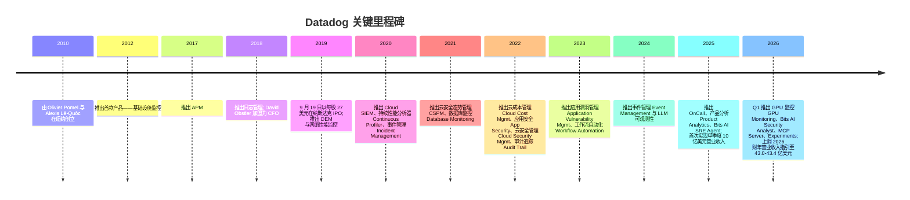
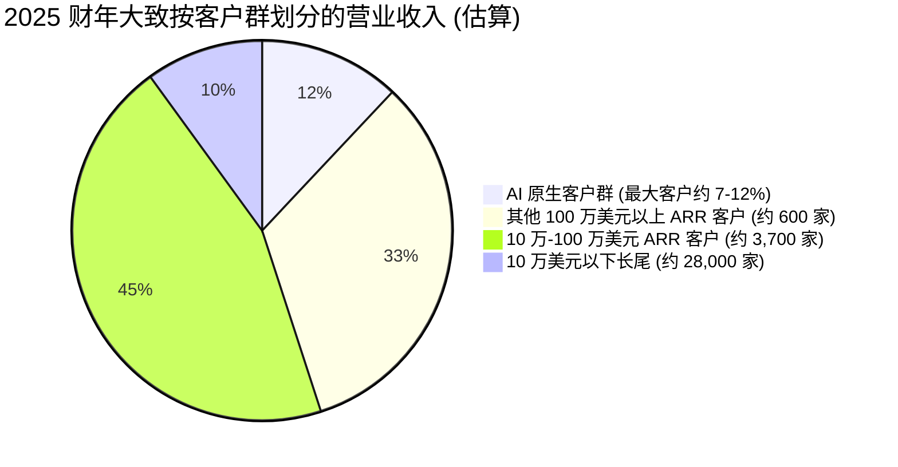
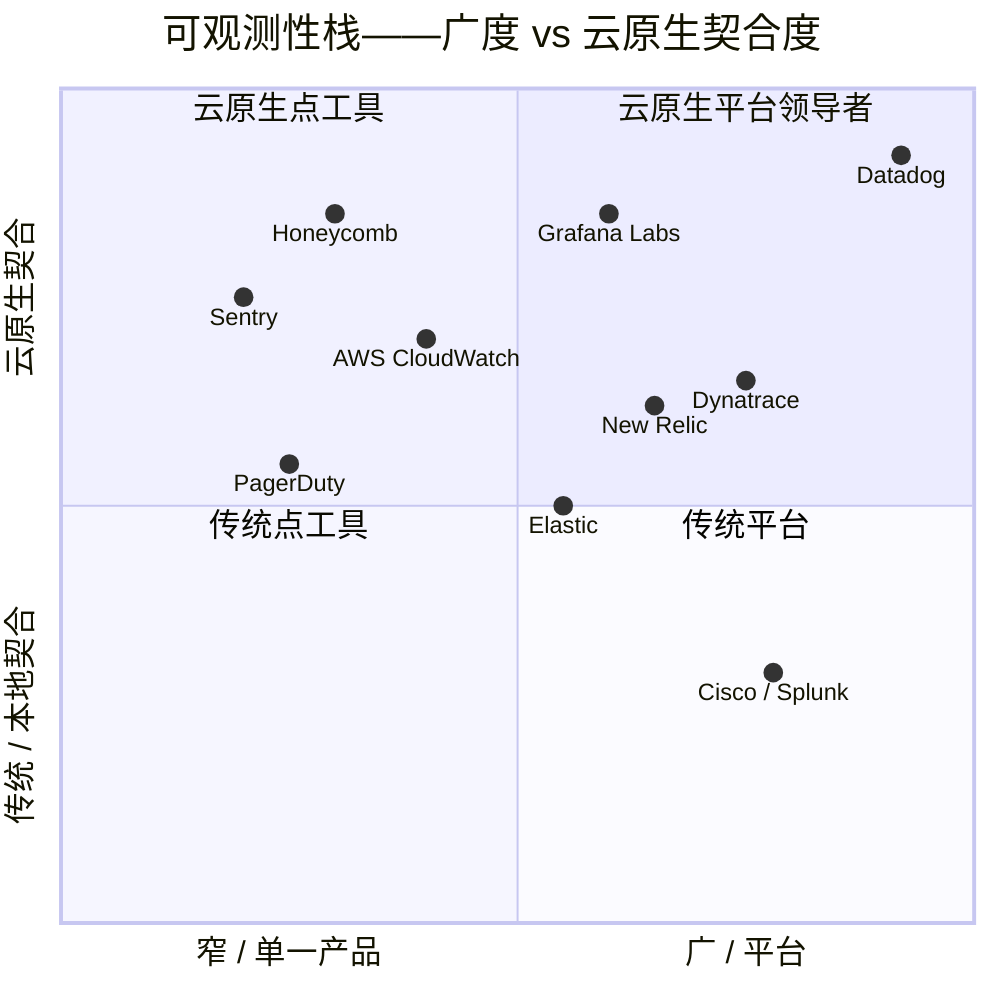

# Datadog, Inc. (NASDAQ:DDOG) — 公司研究报告

**截至日期:** 2026-05-20
**分析师语言:** 简体中文
**主要上市地:** 纳斯达克全球精选市场 (NASDAQ Global Select Market)
**报告币种:** 美元 (USD)
**财年截止:** 12 月 31 日
**报告语言: 简体中文 (英文版同时存在于本目录)**

> **业绩更新——2026 财年全年指引上调 (2026-05-07):** 管理层将 2026 财年全年营业收入指引上调至**43.0 亿至 43.4 亿美元** (此前 2025 财年 Q4 公告时为 40.6 亿至 41.0 亿美元), 非 GAAP 每股收益 (EPS) 上调至**2.36 至 2.44 美元** (此前为 2.06 至 2.16 美元), 中位数 EPS 提升约 6%。该上调对应中位数同比营业收入增速约 26%, 较此前指引的约 19% 显著加速。管理层将原因归结为: (a) 2026 财年 Q1 同比增速持续约 32% (营业收入 10.06 亿美元); (b) AI 工作负载 (AI workload) 监控需求加速; (c) 大型客户 ARR 重新加速——10 万美元以上 ARR 客户数同比增长 21% 至约 4,550 家。来源: [Datadog 2026 财年 Q1 8-K / 新闻稿, 2026-05-07](https://www.sec.gov/Archives/edgar/data/0001561550/000162828026031677/ex-991x20260331x8k.htm); 此前指引参见 [2025 财年 Q4 8-K, 2026-02-10](https://www.sec.gov/Archives/edgar/data/0001561550/000162828026006645/ex-991x20251231x8k.htm)。

---

## 目录

1. 公司概览
2. 公司历史
3. 管理团队
4. 产品与服务
5. 客户与上市策略
6. 行业概览
7. 竞争格局
8. 市场机会 (TAM)
9. 风险评估
10. 参考资料

---

## 1. 公司概览

Datadog, Inc. 是面向云端及混合应用的 **AI 驱动可观测性 (observability) 与安全平台**。其 SaaS 平台——通过一个数据采集 agent 和超过 1,000 个开箱即用集成 (integration) 部署的单一统一后端——汇集了基础设施监控 (infrastructure monitoring)、应用性能监控 (Application Performance Monitoring, APM)、日志管理 (log management)、用户体验监控 (user-experience monitoring)、云安全 (cloud security)、服务管理 (service management)、AI/LLM 可观测性以及超过 20 个其他产品。客户可以在数分钟内开启单一模块, 并随时间扩展更多模块——这正是 Datadog "落地并扩张 (land-and-expand)" 模式的核心 ([Datadog 2025 年 10-K, Item 1——业务描述](https://www.sec.gov/Archives/edgar/data/0001561550/000162828026008819/ddog-20251231.htm))。

**盈利方式。** 绝大多数营业收入为订阅制软件 (subscription software), 按月度、季度、年度或多年期合同计费。客户为在合同最低承诺之上消耗的容量付费 (主机 host、容器 container、日志 GB、RUM 会话、AI agent 调用次数等), 这种结构为 Datadog 提供了基础经常性 ARR (年化经常性收入), 以及与客户工作负载增长挂钩的用量驱动上行空间——这正是同样的扩张机制造就了截至 2025 年 12 月 31 日**美元基础净留存率 (dollar-based net retention) 滚动十二个月约 120%** (高于一年前的"110% 高位")的原因 ([10-K, MD&A § 关键业务指标](https://www.sec.gov/Archives/edgar/data/0001561550/000162828026008819/ddog-20251231.htm))。

**经营地理。** Datadog 总部位于纽约市第八大道 620 号 45 楼 (620 8th Avenue, 45th Floor, New York, NY), 主要工程枢纽位于纽约和巴黎, 销售办公室位于阿姆斯特丹、都柏林、伦敦、巴黎、首尔、新加坡、悉尼和东京。截至 2025 年 12 月 31 日, 公司在 160 多个国家服务约 **32,700 家客户** (一年前约为 30,000 家)。2025 年末全职员工约 **8,100 人**, 其中约 44% 在美国以外, 而这 44% 中约 34% 位于法国——这是联合创始人 Alexis Lê-Quôc 巴黎工程组织根脉的遗留产物 ([10-K, Item 1——人力资本与地理分布](https://www.sec.gov/Archives/edgar/data/0001561550/000162828026008819/ddog-20251231.htm))。北美以外地区营业收入在 2024 财年和 2025 财年均占总营业收入的 29%, 这意味着国际扩张的跑道基本未被开发。

**规模快照 (2025 财年 GAAP, 全年)。**

| 指标 | FY2025 | FY2024 | FY2023 |
|---|---|---|---|
| 营业收入 | **34.272 亿美元** | 26.843 亿美元 | 21.284 亿美元 |
| 同比增速 | 28% | 26% | 27% |
| 毛利 | 27.402 亿美元 (毛利率 80%) | 21.687 亿美元 (81%) | 17.185 亿美元 (81%) |
| GAAP 营业利润 | (4,440 万美元) | 5,430 万美元 | (3,350 万美元) |
| 非 GAAP 营业利润 (估算) | 约 7.06 亿美元 | 约 6.25 亿美元 | n/a |
| 净利润 (GAAP) | 1.077 亿美元 | 1.837 亿美元 | 4,860 万美元 |
| 经营性现金流 | 10.501 亿美元 | 8.706 亿美元 | 6.600 亿美元 |
| 自由现金流 (FCF) | 9.147 亿美元 | 7.751 亿美元 | 5.975 亿美元 |
| FCF 利润率 | 26.7% | 28.9% | 28.1% |
| 10 万美元以上 ARR 客户 | 约 4,310 (占 ARR 90%) | 约 3,610 (占 88%) | 约 3,190 |
| 100 万美元以上 ARR 客户 | 约 603 | 约 462 | 约 317 |
| 总客户数 | 约 32,700 | 约 30,000 | 约 27,300 |
| 美元基础净留存率 (TTM) | 约 120% | 110% 高位 | 约 110% |

所有行的来源: [Datadog 2025 年 10-K, MD&A 与 Item 1](https://www.sec.gov/Archives/edgar/data/0001561550/000162828026008819/ddog-20251231.htm) 及 [2023 年 10-K](https://www.sec.gov/Archives/edgar/data/0001561550/000156155024000009/ddog-20231231.htm) 作为对比年份。

来源: [Datadog 2025 年 10-K, MD&A](https://www.sec.gov/Archives/edgar/data/0001561550/000162828026008819/ddog-20251231.htm) 及 [Datadog 2023 年 10-K, MD&A](https://www.sec.gov/Archives/edgar/data/0001561550/000156155024000009/ddog-20231231.htm)。

2025 财年 GAAP 营业亏损反映了股权激励 (stock-based compensation, SBC) 阶跃式抬升至 7.507 亿美元 (2024 财年为 5.703 亿美元), 其中近三分之二落在 R&D 上, 因为 Datadog 持续扩张其 **AI Research Lab** 和 **Bits AI agent 项目** ([10-K, Note 1 / Note 10 股权激励](https://www.sec.gov/Archives/edgar/data/0001561550/000162828026008819/ddog-20251231.htm))。从非 GAAP 维度 (管理层和大多数卖方分析师锁定的口径) 看, 营业利润率在 2025 财年到 2026 财年 Q1 整段时间内保持在 20% 区间低位——2026 财年 Q1 非 GAAP 营业利润率为 22%, 营业收入 10.06 亿美元 ([2026 财年 Q1 新闻稿](https://www.sec.gov/Archives/edgar/data/0001561550/000162828026031677/ex-991x20260331x8k.htm))。

**估值快照 (2026 年 5 月 19 日)。**

| 指标 | DDOG | 行业对比 |
|---|---|---|
| 股价 | 约 **208.8 美元** | — |
| 市值 | 约 **720 亿美元** | — |
| 企业价值 (EV) | 约 **680 亿美元** (2026 财年 Q1 现金 + 证券为 48 亿美元) | — |
| TTM 市盈率 (P/E, GAAP) | 约 **560×** | SaaS 中位数约 50× |
| 2026 财年预期 P/E (非 GAAP, 中位指引) | 约 **87×** (208.8 / 2.40) | — |
| TTM 市销率 (P/S) | 约 **18×** (按市值 720 亿 / TTM 约 40 亿计算) | SaaS 行业中位数约 5× |
| EV/Sales (TTM) | 约 **17×** | — |
| 3 年期 P/S 区间 | 约 **11× 至 28×** | — |
| 40 法则 (FY2025) | 28% 增速 + 27% FCF 利润率 = **55** | 一流标准 = 40 |

来源: 综合自 [Datadog 市值页面, 2026 年 5 月](https://stockanalysis.com/stocks/ddog/market-cap/) 与 [companiesmarketcap.com DDOG P/S 历史数据](https://companiesmarketcap.com/datadog/ps-ratio/); 同业行业中位数引自 [Macrotrends DDOG P/S 2018-2026](https://www.macrotrends.net/stocks/charts/DDOG/datadog/price-sales)。

*分析师观点:* DDOG 的 18 倍 TTM P/S vs. SaaS 行业中位数约 5 倍是**成长板块 + AI 叙事溢价**, 而非低迷盈利造成的失真信号: 营业收入以约 30% 同比增长, FCF 利润率约 27%, AI-原生客户群从 2025 年 Q1 占总营业收入的 8.5% 加速到管理层 2025 年 Q4 评论的约 12% ([CNBC: "软件领域 AI 赢家浮现", 2026-05-07](https://www.cnbc.com/2026/05/07/ai-winners-software-datadog-stock.html); [2025 财年 Q2 8-K, 2025-08-07](https://www.sec.gov/Archives/edgar/data/0001561550/000156155025000216/ex-991x20250630x8k.htm))。560 倍 TTM GAAP P/E 是机械性噪声——GAAP 净利润较小 (1.077 亿美元) 是因为股权激励 (7.507 亿美元) 全额费用化; 前瞻非 GAAP P/E 约 87 倍是更清晰的读数。如果 AI 工作负载不及预期或超大规模云客户 (hyperscaler customer) 优化加速, 该溢价将重新评级; 我们在第 9 章中将估值列为风险。

---

## 2. 公司历史

Datadog 于 **2010 年**在纽约由 **Olivier Pomel** (CEO) 与 **Alexis Lê-Quôc** (CTO) 共同创立, 两位创始人均是 Wireless Generation (一家位于纽约的教育科技 SaaS 公司, 2010 年被新闻集团 News Corp. 收购) 与更早期 IBM Research 的资深从业者。创立时的理论简单而反主流: 开发者 (developer) 与运维工程师 (operations engineer) 使用不同工具、不同数据、不同词汇——而云原生 (cloud-native) 部署的兴起将使这条鸿沟变得致命。Datadog 着手打造一个单一 SaaS 平台, 将指标 (metric)、追踪 (trace) 和日志 (log) 统一到一个数据模型中, 配以自助式安装和消费式定价 (consumption-based pricing) ——这使得单个工程师极易开始使用, 同时也使该工程师极难再离开它 ([2026 DEF 14A, Pomel 与 Lê-Quôc 简历](https://www.sec.gov/Archives/edgar/data/0001561550/000162828026028118/ddog2026proxystatement.htm))。

来源: 产品发布序列来自 [2025 年 10-K, Item 1——增长战略](https://www.sec.gov/Archives/edgar/data/0001561550/000162828026008819/ddog-20251231.htm); IPO 日期与定价来自 [SEC EDGAR S-1 / 424B4, 2019 年 9 月 19 日](https://www.sec.gov/cgi-bin/browse-edgar?action=getcompany&CIK=0001561550&type=S-1&dateb=&owner=include&count=40); 2026 财年 Q1 发布来自 [2026 财年 Q1 8-K 新闻稿](https://www.sec.gov/Archives/edgar/data/0001561550/000162828026031677/ex-991x20260331x8k.htm)。

**塑造今日业务的三次战略转折:**

1. **2017–2019: 从单一产品到多产品平台。** 2016 年之前, Datadog 本质上是一家基础设施监控公司。2017 年 APM 推出、2018 年日志管理推出, 将其转变为首个在单一后端中汇集"可观测性三大支柱 (three pillars of observability)"——指标、追踪、日志的平台。这正是落地并扩张引擎运转的关键; 至 2025 财年, 84% 的客户使用两款以上产品, 33% 使用六款以上, 远超传统 APM 单一产品的常态 ([2025 年 10-K, MD&A § 关键业务指标](https://www.sec.gov/Archives/edgar/data/0001561550/000162828026008819/ddog-20251231.htm))。

2. **2020–2023: 从可观测性扩展至"可观测性 + 安全 + 服务管理"。** 自 2020 年 Cloud SIEM 起, Datadog 系统性地扩展到相邻预算池——安全 (~Gartner 安全软件 TAM 到 2029 年约 1,700 亿美元)、服务管理 (ITSM)、云成本管理与开发者体验工具。策略是: 相同 agent、相同数据、新的购买者画像。至 2025 财年, Datadog 明确告知投资者其可寻址机会涵盖 Gartner 的 IT 运维管理 (IT Operations Management)、安全软件、应用开发以及分析平台 (Analytic Platforms) 市场——合计在 2029 年达 1,870 亿美元 ([10-K, Item 1——市场机会](https://www.sec.gov/Archives/edgar/data/0001561550/000162828026008819/ddog-20251231.htm))。

3. **2024 至今: 从可观测性平台到 AI 工程平台。** LLM 可观测性于 2024 年发布; 2025 年 Datadog 推出 **Bits AI SRE Agent** (自动化根因调查) 与 **Toto** (其自研时序基础模型 time-series foundation model); 2026 财年 Q1 上线 **GPU 监控**、**Bits AI Security Analyst**、**MCP Server** (使 AI 编码 agent 能够实时访问可观测性数据), 以及 **Datadog Experiments** (内嵌平台的 A/B 测试) ([Datadog 博客: DASH 2025 发布会](https://www.datadoghq.com/blog/dash-2025-new-feature-roundup-keynote/); [2026 财年 Q1 8-K](https://www.sec.gov/Archives/edgar/data/0001561550/000162828026031677/ex-991x20260331x8k.htm))。其押注的是: AI 原生应用每美元营业收入生成的遥测 (telemetry) 量高于经典 SaaS, 扩大 Datadog 单客户钱包份额。

**并购 (无变革性收购; 以补强为主)。** 较显眼的补强: Logmatic.io (2017, 日志分析)、Madumbo (2018, AI 测试)、Sqreen (2021, 运行时应用安全——并入 App & API Protection)、Ozcode (2021, 调试)、CoScreen (2021, 开发者协作)、Hdiv Security (2022, 代码安全)、Cloudcraft (2021, AWS 可视化), 以及 Quickwit (2024, 用于降低日志存储成本的搜索引擎)。Datadog 未进行过十亿美元级别的收购; M&A 旨在嵌入统一后端, 而非颠覆它。

**近 12 个月动态。** 两项重大变化: (i) AI 原生客户群占总营业收入的比重, 从 2024 年 Q1 的 3.5% 增至 2025 年 Q1 的 8.5%, 并在 2025 财年内持续扩张, 至 2025 财年 Q4 该客户群贡献了同比营业收入增速约 7 个百分点 ([2025 年 10-K, 风险因素](https://www.sec.gov/Archives/edgar/data/0001561550/000162828026008819/ddog-20251231.htm); [ainvest.com 分析, 2025](https://www.ainvest.com/news/datadog-ai-growth-openai-dependency-momentum-sustainable-2507/)); (ii) 2025 年末/2026 年初, 两家未具名超大规模云厂商 (hyperscaler) 与 Datadog 签订了训练工作负载 (training workload) 合同, 扭转了长期被担忧的"他们会自己造"叙事 ([newsletter.partnerinsight.io, 2026-05](https://newsletter.partnerinsight.io/p/datadog-1b-quarter-hyperscalers-are))。

---

## 3. 管理团队

### Olivier Pomel——联合创始人, 首席执行官, 董事 (49 岁)

Pomel 是本故事中最具决定性的单一高管, Datadog 毫无疑问是一家创始人主导型 (founder-led) 公司。他与 Alexis Lê-Quôc 于 **2010 年 6 月**共同创立 Datadog, 此后持续担任 CEO 至今。在 Datadog 之前, 他任 Wireless Generation (纽约 K-12 教育科技 SaaS 公司, 约 2002 年至 2010 年被新闻集团以 3.6 亿美元收购) 的技术副总裁, 在那里他建立了后来成为 Datadog 模板的工程文化。更早期任职于 IBM Research。**巴黎中央理工学院 (École Centrale Paris)** 计算机科学硕士 ([2026 DEF 14A, 第 9 页——Pomel 简历](https://www.sec.gov/Archives/edgar/data/0001561550/000162828026028118/ddog2026proxystatement.htm))。

Pomel 具体打造的成就: 将一家纽约-巴黎双轴的开发者工具初创公司, 转变为一家营业收入 34 亿美元、市值约 700 亿美元的上市软件公司; 在 2025 财年同时实现约 28% 以上营业收入增长与约 27% 的 FCF 利润率 (40 法则 ≈ 55), 这是仅有屈指可数几家大盘 SaaS 公司能够达到的水平; 并亲自驱动从单一产品公司向 20 个以上产品平台的扩张, 同时从未失去统一后端架构纪律。每股十票投票权的 B 类普通股结构意味着 Pomel 与 Lê-Quôc 仍实际控制公司——B 类普通股 (Class B) 在 2025 年末占公司投票权约 43%, 创始人个人分别持有约 1,030 万股 (Pomel) 与约 910 万股 (Lê-Quôc) B 类股票, 在 2026 年 3 月 31 日合计**分别占总投票权 17.3% 与 15.5%** ([2026 DEF 14A, 股权所有权表](https://www.sec.gov/Archives/edgar/data/0001561550/000162828026028118/ddog2026proxystatement.htm); [10-K, 风险因素——双类股结构](https://www.sec.gov/Archives/edgar/data/0001561550/000162828026008819/ddog-20251231.htm))。Pomel 的平价行权股权方案 (RSU + PSU)、以及他对开发者驱动、自下而上 GTM 模式的绝对坚持——这一点在每场财报电话会议与 DASH 大会主旨演讲中清晰可见——构成了公司的文化锚点。卖方分析师与开发者社区普遍认为, 他是软件基础设施领域最具纪律性与可信度的运营型创始人之一。

### David Obstler——首席财务官 (自 2018 年 11 月起)

Obstler 在 2019 年 9 月 IPO 前约 10 个月加盟 Datadog, 并亲自主持了 IPO 过程 ([2026 DEF 14A, 第 21 页——Obstler 简历](https://www.sec.gov/Archives/edgar/data/0001561550/000162828026028118/ddog2026proxystatement.htm))。此前 CFO 任职: TravelClick (酒店技术, 2014 年 9 月-2018 年 10 月)、OpenLink Financial (2012 年 11 月-2014 年 7 月)、MSCI Inc. (2010 年 6 月-2012 年 9 月, 上市指数/分析公司)、RiskMetrics Group (2005 年 1 月-2010 年 6 月——同样是上市公司 CFO)。更早期任职于摩根大通 (J.P. Morgan)、雷曼兄弟 (Lehman Brothers) 与高盛 (Goldman Sachs) 的投资银行业务。哈佛商学院 (HBS) MBA; 耶鲁大学 (Yale) 本科。自 2021 年 5 月起任 Braze, Inc. (NASDAQ: BRZE) 董事。Obstler 是科技行业罕见的"三度上市公司 CFO", 他在 MSCI 与 RiskMetrics 的任职为他带来了资本市场流利度——这一点体现在 Datadog 沟通的方式上: 据公司新闻稿, 季度指引在过去 12 个季度中的 11 个季度都达到或超过此前展望的高端。

### Alexis Lê-Quôc——联合创始人, 首席技术官, 董事 (51 岁)

Lê-Quôc 是 Pomel 的工程对位, 亲自打造了最初的产品架构。Datadog "单一 agent、统一后端"的理论是他的——这一理论在 20 年后仍然成立, 这是 SaaS 中最稀缺的技术护城河类型。此前: Wireless Generation 直播运营总监 (Director of Live Operations, 2004 年 3 月-2010 年 12 月); IBM Research 与 France Télécom S.A. 的工程职位。**巴黎中央理工高等电力学院 (CentraleSupélec)** 计算机科学硕士 ([2026 DEF 14A, 第 10 页——Lê-Quôc 简历](https://www.sec.gov/Archives/edgar/data/0001561550/000162828026028118/ddog2026proxystatement.htm))。Lê-Quôc 与 CISO 共同主持网络安全风险监督, 是 Datadog 巴黎工程基地的主要对外发言人 (该基地结构性重要: 美国境外员工的 34% 在法国)。

### Adam Blitzer——首席运营官 (自 2021 年 5 月起)

Blitzer 来自 Salesforce, 此前任数字化部门 EVP & GM (2016 年 12 月-2021 年 5 月)。再前他于 2007 年 2 月联合创立 **Pardot** (B2B 营销自动化), 运营至 2012 年被 ExactTarget 收购, 并在 Salesforce 2013 年收购 ExactTarget 后留任。杜克大学 (Duke) 公共政策学士 ([2026 DEF 14A, 第 21 页——Blitzer 简历](https://www.sec.gov/Archives/edgar/data/0001561550/000162828026028118/ddog2026proxystatement.htm))。Blitzer 在 Datadog 的职责是把 GTM 机器扩展至国际市场与企业市场——这正是 Salesforce 数字云在不同规模上所要求他做的工作。

### Sean Walters——首席营收官 (自 2022 年 1 月起)

Walters 是内部晋升, 自 2018 年起任 Datadog 全球销售 SVP。此前: Medallia, Inc. (2013 年 4 月-2018 年 2 月; 2017-2018 年区域 VP/GM; 2015-2017 年区域 VP), BMC Software 各销售职位 (2011 年 6 月-2013 年 4 月), 更早期 IBM、BEA Systems 与 ADP。罗文大学 (Rowan University) 市场营销学士。Walters 主管全球企业 + 内部销售 + 客户成功 + 合作伙伴渠道架构, 将 10 万美元以上 ARR 客户数从 2024 财年末约 3,610 推升至 2025 财年末约 4,310 (+19%), 并进一步至 2026 财年 Q1 末约 4,550 ([2026 财年 Q1 8-K](https://www.sec.gov/Archives/edgar/data/0001561550/000162828026031677/ex-991x20260331x8k.htm))。

### 治理脚注

- **董事会:** 9 名董事; 9 人中 8 人 (Cole、Richardson、Vora、Callahan、Ittycheria、Jacobson、Phillips、Shah) 依纳斯达克规则属独立董事。**Dev Ittycheria** (MongoDB 长期 CEO, 2014-2025) 任**首席独立董事 (lead independent director)**——这是两家最受关注的数据基础设施 SaaS 公司之间的一个直接相关的交叉关联 ([2026 DEF 14A, 第 11-12 页](https://www.sec.gov/Archives/edgar/data/0001561550/000162828026028118/ddog2026proxystatement.htm))。
- **2025-2026 年新增董事:** Amit Agarwal (Datadog 前首席产品官 2012-2022 年, 总裁 2022-2024 年) 于 2025 年 1 月加入董事会; Ami Vora (Anthropic 产品主管, 前 WhatsApp / Meta / Microsoft) 于 2025 年 9 月加入; Dominic Phillips (Samsara CFO) 于 2026 年 2 月加入——为董事会注入新鲜的 AI 产品与上市软件 CFO 专长。
- **内部经济利益:** B 类普通股 = 每股十票投票权。截至 2026 年 3 月 31 日, Pomel 实益持有 10,259,366 股 B 类股 (占 B 类 38.7%; 占总投票权 17.3%); Lê-Quôc 持有 9,056,319 股 B 类股 (占 B 类 35.5%; 占总投票权 15.5%)。所有董事与高管合计持有 B 类股 78.1% (占总投票权 35.5%)。两位创始人合计控制约三分之一投票权 ([2026 DEF 14A, 股权所有权表](https://www.sec.gov/Archives/edgar/data/0001561550/000162828026028118/ddog2026proxystatement.htm))。
- **5% 以上外部持有人:** Vanguard (持有 A 类 12.7%, 占投票权 7.2%)、BlackRock (8.0% / 4.6%)、FMR LLC (4.9% / 2.8%)——典型的指数化持仓集中, 无激进派或战略性大股东 ([同 DEF 14A, 脚注 1-3](https://www.sec.gov/Archives/edgar/data/0001561550/000162828026028118/ddog2026proxystatement.htm))。
- **薪酬:** 高管薪酬 (NEO) 绝大部分为风险性股权 (RSU + PSU); 2025 年股东大会薪酬投票 (say-on-pay) 支持率 96%。PSU 上限为目标值的 200%。追索 (clawback) 政策符合 SEC/Nasdaq 规则。2025 财年无重大关联方交易。
- **审计师:** Deloitte & Touche LLP (拟在 2026 年 6 月 15 日股东大会上重新批准)。

### 管理层业绩综合判断

这是云软件领域最强的创始人 CEO/CTO/CFO 组合之一。Pomel + Lê-Quôc 在三个完整架构时代 (单一产品、多产品、AI 原生) 复利打造业务, 同时未失去统一后端战略的聚焦——这是几乎没有几位基础设施 SaaS 创始人能在此规模做到的壮举。Obstler 是可信的资深上市公司 CFO。2025-2026 年董事会刷新 (Vora、Phillips、Agarwal) 明确针对扩展至约 50 亿美元营业收入所需的 AI 产品与财务纪律空白。诚实的缺口: 创始人之后的板凳深度 (Blitzer 任 COO、CPO Yanbing Li、Walters 任 CRO) 扎实但在 100 亿美元以上规模未经检验; 双类股超级投票结构意味着未来任何接班均由创始人自行决定。

---

## 4. 产品与服务

Datadog 将其 20 多种独立产品组织为 7 个自然类别, 全部共用一个采集 agent 和一个后端 ([Datadog 产品导航页](https://www.datadoghq.com/product/))。每款产品都可独立采购, 但护城河来自只在多产品部署时才激活的交叉相关性。

### 基础设施与计算

- **基础设施监控 (Infrastructure Monitoring)**——原始旗舰产品 (2012 年推出); 跨公有云、私有云与混合云的主机、容器、无服务器函数实时监控。*竞争判断:* **是, 强护城河**——规模、数据集成广度 (1,000+ 集成) 和切换成本。最接近的竞争产品: Dynatrace Smartscape (企业端平起平坐, 开发者驱动采用滞后); AWS CloudWatch (对仅 AWS 客户够用, 无多云能力)。
- **网络监控 (Network Monitoring)**——云网络监控 + 网络设备监控。*判断:* **部分护城河** (数据网络); 在 Datadog 整体足迹中绑定时最强。最接近的竞争产品: ThousandEyes (Cisco)、Kentik。在纯互联网路径分析上落后于 ThousandEyes; 在客户内部基础设施中领先。
- **GPU 监控 (GPU Monitoring)** (2026 Q1 GA)——跨 GPU 队列健康度、成本与性能的统一可见性, 关联到消耗该资源的团队和工作负载。*判断:* **早期但有防御性**——AI 工程拉动是真实的, Datadog 是首批拥有完全 GA GPU 产品的可观测性厂商之一。最接近的竞争产品: Weights & Biases (训练端); Run:ai (Nvidia 编排); 二者范围更窄。([2026 财年 Q1 8-K](https://www.sec.gov/Archives/edgar/data/0001561550/000162828026031677/ex-991x20260331x8k.htm))

### 应用与开发者

- **应用性能监控 (APM)**——跨微服务、主机、容器和无服务器的完整分布式追踪。*判断:* **是, 强护城河**——代码级可见性 + 与日志/RUM/性能分析的交叉相关。最接近的竞争产品: Dynatrace OneAgent、New Relic APM、Cisco AppDynamics (现已并入 Splunk 包)。Datadog 在企业深度上平起平坐, 在开发者人机工程和云原生契合度上领先。
- **持续性能分析器 (Continuous Profiler)**——总开常态、低开销代码级性能分析。*判断:* **部分护城河**; 主要作为 APM 的粘性放大器。最接近: Pyroscope (开源, Grafana Labs)。
- **错误追踪 (Error Tracking)**——前后端错误按问题分组, 带调试上下文。*判断:* **部分。** 最接近: Sentry——Sentry 在开发者优先体验上领先; Datadog 赢在买家已标准化使用平台时。
- **CI 可见性 (CI Visibility)**——管线可见性 + 测试可见性, 衡量 CI/CD 健康。*判断:* **部分**; 不稳定测试历史积累后数据护城河增强。最接近: Buildkite Test Analytics、Trunk。
- **工作流自动化与 App Builder (Workflow Automation & App Builder)**——跨栈修复的低代码编排。*判断:* **部分。** 最接近: PagerDuty Process Automation、ServiceNow IT Workflow。Datadog 凭借可观测性上下文绑定胜出。

### 日志与数据可观测性

- **日志管理 (Log Management)**——大规模摄入 + 索引 + 查询; **Logging Without Limits** 将摄入成本与处理解耦, **Flex Logs** 将存储与查询解耦。*判断:* **是, 强护城河**——经济性 + 与追踪/指标交叉相关。最接近的竞争产品: Splunk (Cisco)、Elastic——Splunk 在传统 SIEM/企业领先; Elastic 在自托管成本领先。Datadog 在云原生客户希望"一个账单一套查询语言"时胜出。
- **可观测性管线 (Observability Pipelines)**——从任意源到任意目的地采集/转换/路由日志和指标。*判断:* **部分护城河**; 对 Cribl (突围的纯管线厂商) 防御性。Datadog 在灵活性上落后于 Cribl, 即便有管线产品。
- **数据可观测性 (Data Observability)**——数据流监控 (Kafka/事件管线) + 数据作业监控 (Spark/Databricks)。*判断:* **部分**, 快速增长。最接近: Monte Carlo、Acceldata。

### 用户体验

- **真实用户监控 (Real User Monitoring, RUM)**——浏览器 + 移动用户会话遥测。*判断:* **部分护城河**, 在平台内部强。最接近: New Relic Browser、Splunk RUM。在与后端 APM 的交叉相关上领先于二者。
- **合成监控 (Synthetics)**——AI 驱动的模拟用户/API 请求, 用于主动正常运行监控。*判断:* **部分。** 最接近: Pingdom (SolarWinds)、Catchpoint。
- **产品分析 (Product Analytics)** (2025 GA)——面向工程负责人的产品使用分析。*判断:* **早期但可信。** 最接近: Amplitude、Mixpanel、Heap。Datadog 的小幅胜出: 无需 ETL 即可将产品分析与基础设施/APM 数据交叉相关。
- **Datadog Experiments** (2026 Q1 GA)——内嵌可观测性的 A/B 测试。*判断:* **早期。** 最接近: Optimizely、LaunchDarkly (Experimentation)、Eppo。

### 安全

- **云安全 (Cloud Security, CSPM / CWPP / CIEM)**——无 agent 的基础设施扫描, 用于错配、漏洞、身份风险、合规。*判断:* **是, 作为统一平台的一部分护城河日益增长。** 最接近的竞争产品: Wiz、Palo Alto Networks Prisma Cloud、Lacework (现已归 Fortinet)。Wiz 在独立 CSPM 深度上领先; Datadog 在买家希望"在一个控制台上 CSPM + 可观测性"时胜出。
- **代码安全 (Code Security)**——运行时优先级 SAST/SCA。*判断:* **部分。** 最接近: Snyk、Veracode。
- **Cloud SIEM**——具备预置检测的云原生 SIEM。*判断:* **部分**, 顶部叠加 Bits AI Security Analyst 作为差异化因素。最接近: Microsoft Sentinel、Splunk Enterprise Security (Cisco)、Sumo Logic Cloud SIEM。
- **威胁管理 (Threat Management)** (工作负载保护 + 应用 & API 保护)——运行时应用/工作负载安全。*判断:* **部分。** 最接近: Sysdig (工作负载)、Wallarm + Salt Security (API)。
- **敏感数据扫描器 (Sensitive Data Scanner)**——在摄入时发现/分类/脱敏 PII。*判断:* **部分。** 最接近: BigID、Microsoft Purview。
- **Bits AI Security Analyst** (2026 Q1 GA)——自动化 SOC 分析师级警报分流。*判断:* **早期但战略性。** 最接近: Prophet Security、Dropzone AI、Microsoft Security Copilot。Datadog 声称"威胁调查时间最多降低 98%"尚未经独立基准验证 ([2026 财年 Q1 8-K](https://www.sec.gov/Archives/edgar/data/0001561550/000162828026031677/ex-991x20260331x8k.htm))。

### 服务管理与事件响应

- **事件响应 (Incident Response)**——统一监控/呼叫/事件管理; 替代了 2021 年独立的事件管理 (Incident Management) 产品。*判断:* **部分。** 最接近: PagerDuty、FireHydrant、incident.io。
- **OnCall** (2025 GA)——排班 + 将可观测性集成到值班工作流。*判断:* **部分 / 防御性**, 对位 PagerDuty。Datadog OnCall 对现有客户是最低摩擦的选项。
- **事件管理 (Event Management)**——基于 AI 的警报聚合。*判断:* **部分。**
- **Bits AI SRE Agent** (2025 GA)——自动化根因调查。*判断:* **早期但有防御性。** 最接近: Causely、Edge Delta、Cisco AI Canvas (在 Splunk 内)。

### AI 与云成本

- **LLM 可观测性 (LLM Observability)**——LLM/agent 链路的端到端追踪; tokens/延迟/错误/漂移检测。*判断:* **是, 强护城河**——Datadog 目前是事实上的企业默认选择。最接近: Arize AI、LangSmith (LangChain)、WhyLabs。 ([Datadog LLM 可观测性产品页](https://www.datadoghq.com/product/ai/llm-observability/2/))
- **AI Agent 监控 + AI Agents Console** (2025 年中 GA)——对内部 + 第三方 AI agent 的可见性。*判断:* **早期但可信。**
- **MCP Server** (2026 Q1 GA)——为 AI 编码 agent / IDE 提供对统一可观测性数据的安全实时访问。*判断:* **战略性护城河**——Datadog 是首批发布 MCP Server 的可观测性厂商之一, 直接对接 Claude Code、Cursor 以及更广的 agentic IDE 生态 ([2026 财年 Q1 新闻稿](https://www.sec.gov/Archives/edgar/data/0001561550/000162828026031677/ex-991x20260331x8k.htm))。
- **云成本管理 (Cloud Cost Management)**——粒度级云开支可见性, 与可观测性数据交叉参照。*判断:* **部分。** 最接近: Apptio (IBM)、CloudHealth (VMware)、Vantage。

```mermaid
graph TD
    DDOG[Datadog 平台<br/>1 个 agent · 1 个后端 · 1,000+ 集成]
    DDOG --> A[基础设施与计算]
    DDOG --> B[应用与开发者]
    DDOG --> C[日志与数据]
    DDOG --> D[用户体验]
    DDOG --> E[安全]
    DDOG --> F[服务管理]
    DDOG --> G[AI / FinOps]

    A --> A1[基础设施监控]
    A --> A2[网络监控]
    A --> A3[GPU 监控 2026]
    B --> B1[APM]
    B --> B2[持续性能分析器]
    B --> B3[错误追踪]
    B --> B4[CI 可见性]
    B --> B5[工作流自动化]
    C --> C1[日志管理]
    C --> C2[可观测性管线]
    C --> C3[数据流 / 数据作业监控]
    D --> D1[RUM]
    D --> D2[合成监控]
    D --> D3[产品分析]
    D --> D4[Experiments 2026]
    E --> E1[云安全]
    E --> E2[代码安全]
    E --> E3[Cloud SIEM]
    E --> E4[威胁管理]
    E --> E5[敏感数据扫描器]
    E --> E6[Bits AI Security Analyst 2026]
    F --> F1[事件响应]
    F --> F2[OnCall 2025]
    F --> F3[事件管理]
    F --> F4[Bits AI SRE Agent 2025]
    G --> G1[LLM 可观测性]
    G --> G2[AI Agents Console 2025]
    G --> G3[MCP Server 2026]
    G --> G4[云成本管理]
```

来源: [Datadog 2025 年 10-K, Item 1 § 我们的产品](https://www.sec.gov/Archives/edgar/data/0001561550/000162828026008819/ddog-20251231.htm) 与 [Datadog 产品导航页](https://www.datadoghq.com/product/)。

### 旗舰产品 vs. 长尾产品

Datadog 未披露产品级营业收入, 但从分部述评以及管理层在 DASH 2025 上的发言推断, 旗舰三杰仍为**基础设施监控、APM 与日志管理**——合计贡献绝大部分营业收入, 是进入平台的门户产品。云安全 (CSPM / CWPP / CIEM 套件) 与 AI 套件 (LLM 可观测性 + Bits AI agent) 是增长最快的新兴特许经营, 管理层在近期电话会议中将各项定性为"快速扩张"中 ([2026 财年 Q1 电话会议纪要 via The Motley Fool, 2026-05-07](https://www.fool.com/earnings/call-transcripts/2026/05/07/datadog-ddog-q1-2026-earnings-transcript/))。

### 过去 12 个月发布与路线图

过去 12 个月的 GA: GPU 监控、Bits AI Security Analyst、MCP Server、Datadog Experiments (全部 2026 Q1); OnCall、产品分析、Bits AI SRE Agent (2025); LLM 可观测性 v2 / AI Agent 监控 (2025)。无显著产品退役——Datadog 的纪律是将较旧的独立产品吸收进平台 (例如 2021 年的事件管理并入 2025 年的事件响应)。2025 年推出的 **Toto**——自研时序基础模型——是最接近内部 AI 护城河的资产: 它在底层驱动 Watchdog (Datadog 异常检测) 和 Bits AI ([Datadog 博客: AI 时代的可观测性](https://www.datadoghq.com/blog/datadog-ai-innovation/))。

---

## 5. 客户与上市策略

**客户画像。** 160 多个国家约 32,700 家客户, 涵盖各行各业 (软件、金融服务、零售、医疗、游戏、媒体、政府/2026 Q1 起 FedRAMP High)。客户构成偏斜显著: 约 4,310 家 10 万美元以上 ARR 客户占**总 ARR 的 90%**, 长尾约 28,000 家客户贡献剩余 10%——这是消费式基础设施 SaaS 的典型幂律分布 ([2025 年 10-K, MD&A § 关键业务指标](https://www.sec.gov/Archives/edgar/data/0001561550/000162828026008819/ddog-20251231.htm))。

来源: [Datadog 2025 年 10-K, MD&A](https://www.sec.gov/Archives/edgar/data/0001561550/000162828026008819/ddog-20251231.htm)。

**多产品扩张是引擎。** 牛市逻辑最重要的单一运营指标:

| 使用 N+ 产品的客户比例 | FY2021 | FY2022 | FY2023 | FY2024 | FY2025 |
|---|---|---|---|---|---|
| ≥2 款产品 | 约 75% | 约 80% | 约 82% | 约 83% | **84%** |
| ≥4 款产品 | 约 25% | 约 40% | 约 47% | 约 50% | **55%** |
| ≥6 款产品 | 约 10% | 约 18% | 约 22% | 约 26% | **33%** |
| ≥8 款产品 | n/a | 约 7% | 约 11% | 约 13% | **18%** |
| ≥10 款产品 | n/a | n/a | 约 4% | 约 5% | **9%** |

来源: [Datadog 2025 年 10-K MD&A](https://www.sec.gov/Archives/edgar/data/0001561550/000162828026008819/ddog-20251231.htm) 与历年 10-K (数字按每年披露四舍五入)。

来源: [Datadog 2025 年 10-K, MD&A, 及历年 10-K](https://www.sec.gov/Archives/edgar/data/0001561550/000162828026008819/ddog-20251231.htm)。

### 客户集中度——量化框架

Datadog **不**披露任何占营业收入 ≥10% 的特定客户 (2025 财年 10-K 中无 ASC 280 触发条件), 并报告单一经营与可报告分部 ([2025 年 10-K, Note 11——分部](https://www.sec.gov/Archives/edgar/data/0001561550/000162828026008819/ddog-20251231.htm))。但有两项关键披露部分量化了这一原本不透明的领域:

1. **包含最大客户的 AI 原生客户群, 在 2025 财年 Q4 贡献了约七个百分点的同比营业收入增长。** 从 2025 财年营业收入 34.27 亿美元和 Q4 客户群归因于整体约 28% Q4 增速回推, 该客户群本身可能占总营业收入低双位数 %——与卖方对 AI 原生客户群在 2025 年 Q4 占营业收入约 12% 的估算一致 ([2025 年 10-K, Item 1A——风险因素](https://www.sec.gov/Archives/edgar/data/0001561550/000162828026008819/ddog-20251231.htm); [woozleresearch.com 分析, 2026-05](https://insights.woozleresearch.com/datadogs-billion-dollar-quarter-structural-ai-demand-or-cloud-migration-catch-up/))。
2. **在 2025 财年 Q2**, 管理层按行为而非按名字提到 OpenAI——指出 AI 原生客户群中最大客户在 Q2 同比营业收入增速"相比 Q1 保持稳定", 并警示持续的用量优化风险。市场将其视为对长期卖方猜测的确认: OpenAI 是单一最大客户。**Guggenheim 2025 年 7 月降级明确建模了 OpenAI 转向内部时 2026 财年营业收入将有 1.5 亿美元以上缺口** ([2025 财年 Q2 8-K, 2025-08-07](https://www.sec.gov/Archives/edgar/data/0001561550/000156155025000216/ex-991x20250630x8k.htm); [ainvest.com 分析, 2025-07](https://www.ainvest.com/news/datadog-ai-growth-openai-dependency-momentum-sustainable-2507/))。

最优估计: **最大客户份额约处于营业收入的高单位数到低双位数 (约 7%-12%), 更广义的 AI 原生客户群约为 10%-15%。** Datadog 明确指出客户可"快速增加使用量……然后优化"——这正是单一大客户能够波动一个季度增长率的模式。

来源: 构成由 [Datadog 2025 年 10-K, MD&A § 关键业务指标和风险因素](https://www.sec.gov/Archives/edgar/data/0001561550/000162828026008819/ddog-20251231.htm) 的披露估算而来。Datadog 未公布精确的客户群分布; 此为分析师基于披露的 10 万美元 + ARR / 100 万美元 + ARR 客户数和客户群增长评论构建的结果。在第 9 章中视为重大风险。

**合同结构。** 订阅期限"主要为月度或年度, 部分为季度、半年度或多年期"。月度订阅和"承诺上方按用量计费"意味着营业收入会随工作负载移动, 既可向上 (2025 年很好), 也可向下 ("优化"模式)。客户实际可在任何合同续约点离开——无续约义务 ([2025 年 10-K, Item 1A——"客户无续约义务"](https://www.sec.gov/Archives/edgar/data/0001561550/000162828026008819/ddog-20251231.htm))。

### 上市策略

**自下而上 + 企业覆盖。** Datadog 运营四种销售模式, 按区域 (美洲、EMEA、亚太) 分类:
- **企业大客户销售 (Enterprise field sales)**——大客户猎手。
- **高速内部销售 (High-velocity inside sales)**——新 logo 机器。
- **客户成功 (Customer success)**——入门 + 扩展。
- **合作伙伴团队 (Partner team)**——经销商、系统集成商 (Accenture、Deloitte、Capgemini)、MSP, 以及日益增长的云市场交易 (AWS Marketplace、Google Cloud Marketplace、Azure Marketplace)。

2025 年末约 3,600 名销售与营销员工, R&D 员工略多约 3,900——这是有意为之的产品导向比例, 将 Datadog 与销售密集型同行区分。免费试用为先; agent 在数分钟内安装; 个体开发者自下而上采用, 然后扩展至部门级部署。

**销售周期与交易规模。** 新 logo 周期从数天 (小开发团队) 到 3-9 个月 (企业)。10 万美元以上 ARR 客户数同比增长 19%, 加上 100 万美元以上 ARR 客户数 33 个百分点的跃迁 (462 → 603), 表明 GTM 机器持续将客户"沿客户群阶梯向上推" ([2025 年 10-K, MD&A](https://www.sec.gov/Archives/edgar/data/0001561550/000162828026008819/ddog-20251231.htm))。

**关键合作伙伴。** 与 AWS、Microsoft Azure 和 Google Cloud 的深度合作伙伴关系——Datadog 是大多数超大规模云厂商的可观测性/安全计划的发布合作伙伴 (现在, 根据 2026 Q1 超大规模云训练工作负载评论, 超大规模云厂商本身也成为了付费客户)。2026 Q1 与 **Sakana AI** 战略合作, 支持日本企业 AI 采用 ([2026 财年 Q1 8-K](https://www.sec.gov/Archives/edgar/data/0001561550/000162828026031677/ex-991x20260331x8k.htm))。

**已具名客户 (公开案例)。** 三星 (Samsung)、Comcast、Citrix、Whole Foods Market、Peloton、Sonos、Shell、Deloitte、21st Century Fox、马士基 (Maersk)、纳斯达克 (Nasdaq)——Datadog 网站上有数百个具名案例研究 ([Datadog 客户案例](https://www.datadoghq.com/case-studies/))。

---

## 6. 行业概览

**行业定义。** Datadog 处于 Gartner 定义的四个市场交叉点:

1. **IT 运维管理 (IT Operations Management, ITOM)**——监控基础设施、应用和 IT 服务的总伞类别。管理层引用 Gartner 对 **2029 年 ITOM 达 820 亿美元** (其中**可观测性子分部 2029 年 390 亿美元**) 的预测, 作为 Datadog 的本垒 ([2025 年 10-K, Item 1——市场机会](https://www.sec.gov/Archives/edgar/data/0001561550/000162828026008819/ddog-20251231.htm))。
2. **安全软件 (Security Software)**——Datadog 的云安全、Cloud SIEM、代码安全和敏感数据扫描器延伸到相邻的 CSPM、CNAPP、SIEM 和 SAST/SCA 预算。
3. **应用开发工具 (Application Development tools)**——CI 可见性、工作流自动化、Bits AI Dev Agent 和 MCP Server 让 Datadog 进入开发者生产力栈。
4. **分析平台 (Analytic Platforms)**——产品分析和 Datadog Experiments 切入历史上由 Amplitude / Mixpanel 拥有的产品分析预算, 以及由 Optimizely / LaunchDarkly 拥有的功能实验预算。

跨这四个 Gartner 桶的总可寻址市场即公司引用的**2029 年 1,870 亿美元** ([2025 年 10-K](https://www.sec.gov/Archives/edgar/data/0001561550/000162828026008819/ddog-20251231.htm))。

**未来五年市场增长驱动因素。**

- **云迁移尚未结束。** 尽管"云优先"叙事已有十年, 大多数企业工作负载仍在本地运行。每个迁移到云的工作负载相比其本地等效物会因微服务、容器和短暂计算而产生 3-10 倍的遥测量——直接扩大 Datadog 的数据平面。
- **AI 原生应用。** 单个 AI agent 或 RAG 应用相比经典 Web 应用, 每用户请求可生成 100 倍的追踪/日志量——token 数、模型延迟、向量库检索、工具调用链, 以及每一步的错误关联。Datadog 2026 年 AI 工程现状报告发现, 生产中 60% 的 AI 故障由容量限制造成——这与可观测性平台所要呈现的内容完全匹配 ([Datadog 2026 年 AI 工程现状](https://www.datadoghq.com/state-of-ai-engineering/))。
- **安全左移与融合。** 2026 年 DevSecOps 现状报告 (Datadog) 发现, 87% 的组织在生产中运行已知可利用的漏洞。Cloud SIEM + 代码安全 + 云安全预算正在向一个控制台融合 ([2026 财年 Q1 8-K § DevSecOps 现状](https://www.sec.gov/Archives/edgar/data/0001561550/000162828026031677/ex-991x20260331x8k.htm))。
- **成本敏感周期中的工具整合。** 审视 2020-2022 年 ZIRP 时代 SaaS 蔓延的 CFO 们明确要求平台厂商替换 4-8 个点工具。Datadog 20 多个产品的组合就是为此整合卖点而结构化的。
- **FedRAMP 与受管制工作负载。** Datadog for Government 在 2026 Q1 取得 **FedRAMP High** 认证, 打开美国联邦政府工作负载, 以及金融服务和医疗的受管制企业边缘 ([2026 财年 Q1 8-K](https://www.sec.gov/Archives/edgar/data/0001561550/000162828026031677/ex-991x20260331x8k.htm))。

**行业结构。** 可观测性正在**快速整合**但结构上仍碎片化, 因为底层买家 (Dev / Ops / Security / Data / Product) 是碎片化的。顶部集中度: Datadog、Dynatrace、Splunk (Cisco) 和 New Relic (2023 年起私有化) 合计估计占可观测性市场收入的 30-40%, 余下由开源 (Prometheus、Grafana、OpenTelemetry、ELK)、点工具 (Sentry、PagerDuty、Sumo Logic、Chronosphere、Honeycomb)、超大规模云原生 (AWS CloudWatch、Azure Monitor、Google Cloud Operations Suite) 和安全相邻厂商 (Splunk Observability Cloud、Elastic) 的长尾瓜分。

**供应商力量。** 温和; Datadog 在 AWS (用于其自身平台基础设施) 和托管/CDN 上有显著支出。2025 年 10-K 未拆分 AWS 支出, 但管理层在多个投资者会议上的评论承认 AWS 是关键供应商。

**买家力量。** 中等偏高。大型企业越来越要求承诺消费分层和包折扣, 最大客户可以重新谈判或优化使用量。长尾买家力量低 (无摩擦的自助服务, 在集成上有粘性)。

**替代品。** 开源可观测性 (Prometheus、Grafana、OpenTelemetry、Loki、Tempo) 是真实且日益增长的替代品——特别对成本敏感的规模化企业和有工程带宽自托管的平台团队。Grafana Labs (私有) 是该栈的可信商业载体, 在企业心智份额上稳步胜出。超大规模云原生监控 (CloudWatch 等) 对仅 AWS / 仅 Azure 商店"够用了"。

**监管。** 数据隐私监管对需求是顺风 (GDPR、CCPA、CPRA、印度 DPDPA、欧盟数据法案、欧盟 AI 法案)——买家需要检测、分类并证明对敏感数据的控制, 这正是敏感数据扫描器 / Cloud SIEM / FedRAMP High 所应对的。但同样的监管也带来运营成本逆风 (数据本地化、EEA-美国传输机制、AI 法案合规)——Datadog 在 Item 1A 中逐项列出这些项目。

---

## 7. 竞争格局

Datadog 在至少四个产品战场展开竞争。2025 年 10-K 按类别明确点名竞争对手 ([2025 年 10-K, Item 1——我们的竞争](https://www.sec.gov/Archives/edgar/data/0001561550/000162828026008819/ddog-20251231.htm)):

| 战场 | Datadog 的竞争对手 |
|---|---|
| 本地基础设施监控 | IBM、Microsoft、SolarWinds |
| APM | Cisco AppDynamics、New Relic、Dynatrace |
| 日志管理 | Cisco (Splunk)、Elastic |
| 云监控 | AWS (CloudWatch)、Microsoft Azure Monitor、Google Cloud Operations |
| 安全 (CSPM / CNAPP / SIEM) | Wiz、Palo Alto Prisma Cloud、Splunk ES (Cisco)、Microsoft Sentinel |
| 事件 / OnCall | PagerDuty、incident.io |
| LLM / AI 可观测性 | Arize、LangSmith、WhyLabs |

### 最关键的五个竞争对手

1. **Cisco / Splunk**——Cisco 于 **2024 年关闭了 280 亿美元的 Splunk 收购** ([Cisco 收购页面](https://www.cisco.com/site/us/en/about/corporate-development/acquisitions/acquisitions-list-years/index.html)), 并花费 2025-2026 年将 Splunk 接入 ThousandEyes、AppDynamics、Nexus One 交换机线和新的 **AI Canvas** 助手。战略威胁是*网络 + 可观测性捆绑*——以一张 Cisco 发票卖给 CIO。Cisco 在 2026 年 4 月宣布拟收购 **Galileo Technologies**, 明确针对 Datadog 一直在赢的 AI 可观测性层 ([Splunk 2026 年可观测性趋势博客](https://www.splunk.com/en_us/blog/observability/new-observability-trends-for-2026.html))。Datadog 的回应: 自下而上开发者喜爱 > 自上而下 CIO 捆绑, 加上比 Splunk 传统索引更现代的云原生架构。

2. **Dynatrace (NYSE: DT)**——最接近的纯纯架构对手。Dynatrace 的单一 AI 驱动 OneAgent + Smartscape 拓扑是 Datadog 统一平台的可信技术答案, Dynatrace 盈利且增长在十几个百分点。P/S TTM 约 6 倍 vs. DDOG 约 18 倍, 反映出增长差距 ([companiesmarketcap.com Dynatrace P/S](https://companiesmarketcap.com/dynatrace/ps-ratio/))。Dynatrace 在以下方面领先: 重型财富 500 强部署、自上而下销售模式、Java 单体环境的自动化发现。Datadog 在以下方面领先: 云原生 + 开发者驱动采用、可观测性以外的产品广度, 以及 AI 工程拉动 (LLM 可观测性 + Bits AI)。

3. **MongoDB (NASDAQ: MDB)**——非直接竞争对手, 但最受关注的数据基础设施 SaaS 同行。MongoDB 前瞻 P/E 约 58 倍是 Datadog 约 87 倍 FY2026E 非 GAAP P/E 最干净的板块可比 ([guruFocus MDB 前瞻 P/E](https://www.gurufocus.com/term/forward-pe-ratio/MDB))。MDB 故事 (通过本仓库[MongoDB 研究笔记](../MongoDB_NASDAQ_MDB/)交叉引用) 在结构上类似: 创始人主导、消费式定价、多产品扩张引擎、AI 原生客户群敞口、超大规模云优化风险。**Dev Ittycheria 于 2014-2025 年任 MongoDB CEO, 现为 Datadog 首席独立董事**, 这是不寻常的结构性重叠, 论证了战略剧本的交叉适用性。

4. **GitLab (NASDAQ: GTLB) / Palo Alto Networks (NASDAQ: PANW)**——估值上下文的同行基准, 直接产品重叠较少。GTLB 在 CI/CD 和开发者安全 (与 Datadog 的 CI 可见性 + 代码安全重叠) 中竞争; PANW Prisma Cloud 是 Datadog 云安全的重量级 CNAPP 竞争对手。GTLB 的负 TTM P/E 和约 6.5 倍 P/S 反映出增长较慢、SBC 较高的 SaaS 画像 ([MacroTrends GTLB P/E](https://www.macrotrends.net/stocks/charts/GTLB/gitlab/pe-ratio))。PANW 在"平台整合"营销上是可比——是面向安全主导买家的另一个"单一厂商"故事。

5. **Wiz (私有, 2025 年同意以 320 亿美元被 Google 收购)** 和超大规模云原生工具——Wiz 是 CSPM/CNAPP 标准旗手, 是云安全领域最具颠覆性的单一竞争对手; AWS / Azure / Google 原生工具是单云客户长尾的"够用了"替代方案。

### 定位象限——可观测性栈 (2026 年 5 月)

来源: 定位为定性——基于各厂商 10-K / 网站披露的产品广度, 以及对照 FY2025 产品目录评估的架构云原生契合度。

### Datadog 的竞争优势

- **架构护城河:** 单一 agent、单一后端的统一数据模型——切换意味着在每个主机、容器和函数上更换 agent, *并且*重新对应用层进行 instrumentation。独立的运营者调查一致将 Datadog 列为"部署便利度"榜首。
- **集成层的数据网络效应:** 1,000+ 预置集成是 Datadog 投入了 14 年的维护负担; 新进入者无法以低成本复制。
- **开发者驱动 GTM:** Datadog 自下而上采用对 Cisco / IBM / Splunk 在结构上较难复制, 除非他们破坏自身的自上而下销售 DNA。
- **多产品附加作为护城河:** 在用产品越多, 现实切换概率越低。33% 的客户现在使用 6+ 款产品, 平均客户的"拆迁式"切换成本真正是禁止性的。
- **AI 工程先发优势:** LLM 可观测性 + Bits AI agent + MCP Server 让 Datadog 在 2025-2026 年最受融资关注的软件类别中持续保持叙事与产品的双重领先。

### 脆弱性

- **定价透明度抱怨。** 消费式定价 + 多产品定价表叠加产生了持续的客户抱怨"账单冲击 (bill shock)"; Cribl、Grafana 和开源替代品都明确以此营销。
- **开源 / OpenTelemetry 侵蚀。** OpenTelemetry 的 instrumentation 标准现在是默认; 如果客户完全标准化在 OTel 数据格式上并自托管后端 (Grafana 上的 Prometheus + Loki + Tempo), Datadog 将在数据层失去集成护城河。
- **超大规模云厂商的两面性。** AWS / Azure / Google 同时是合作伙伴、基础设施供应商、客户和竞争对手。三家中的任一家都可以选择将一个免费层可观测性产品捆绑进旗舰计算 SKU, 侵蚀 Datadog 的长尾。
- **AI 原生客户群集中度。** 见第 5 章 + 第 9 章。
- **估值预期。** 在 18 倍 P/S 下, 股价已定价数年持续约 25%+ 增长——任何减速都将被不对称地惩罚。

---

## 8. 市场机会 (TAM)

**声明的 TAM (2029 年 1,870 亿美元)。** Datadog 管理层明确使用 Gartner 预测来定其可寻址市场规模: **2029 年 IT 运维管理 820 亿美元** (其中**可观测性为 390 亿美元**), 加上 Gartner 的安全软件、应用开发和分析平台市场的相关切片——合计在 2029 年达 **1,870 亿美元** ([2025 年 10-K, Item 1 § 市场机会](https://www.sec.gov/Archives/edgar/data/0001561550/000162828026008819/ddog-20251231.htm))。

这是正确的框架, 因为 Datadog 在过去五年逐个产品证明: 统一后端战略让它能扩展到新 TAM 池而不拖高客户获取成本——每款新产品都首先卖给现有装机基础。

**SAM (可服务可寻址市场)。** 务实的 SAM 仅使用 (a) 每个 Gartner 类别中的云原生与混合云子集, 以及 (b) Datadog 能销售的客户分段——即拥有超过 100 名工程师和有意义云开支的组织。我们估 SAM 在 2029 年约为 **700-900 亿美元**, 其中:
- 约 300 亿美元 = 云 + 混合可观测性核心 (基础设施 + APM + 日志 + RUM + 合成监控 + 网络)。
- 约 200 亿美元 = 云安全相邻 (CSPM + CNAPP + CSPM + Cloud SIEM)。
- 约 100 亿美元 = AI 工程 / LLM 可观测性 / MCP 式 agentic 工具 (2022 年还不存在的类别)。
- 约 100-200 亿美元 = 开发者生产力 (CI 可见性 + 工作流自动化 + 代码安全) + 数据可观测性 + 产品分析 + 云成本管理。

**SOM (可服务可获得市场)。** 2025 财年 34 亿美元营业收入对应公司声明的 2029 年 1,870 亿美元 TAM, Datadog 已获取其声明的 2029 年市场约 1.8%。按更紧的 SAM 计算, 当前份额约为 4-5%。即使没有进一步产品扩张, 维持 2025 财年约 34 亿美元 vs. 2029 年约 800 亿美元 SAM 暗示, 在当前增量 SAM 增长份额下, 2029 年 SOM 在 **80-120 亿美元营业收入区间**——与卖方乐观情境 2029 财年营业收入 80-100 亿美元一致。

**未来 3-5 年渗透驱动因素。**

- **AI 原生计算是结构性乘数。** 每个 AI 原生客户每美元营业收入产生的遥测量是经典 SaaS 客户的 5-20 倍, 因为 LLM 推理、GPU 利用率、向量库检索和工具调用链各自需要单独观察。Datadog 是唯一一家在所有四项上都有完全 GA 产品线的大盘可观测性厂商。当企业从"AI 试点"过渡到"生产中的 AI", Datadog 都能赚到这份开支, 无论模型是 OpenAI、Anthropic、Google、AWS Bedrock 或自研。
- **国际扩张。** 当前北美以外营业收入占比 29% vs. 同行 Dynatrace 约 45%——差距即跑道。阿姆斯特丹、都柏林、伦敦、巴黎、首尔、新加坡、悉尼和东京的销售枢纽已配置完成; FedRAMP High 认证打开了美国联邦市场。
- **大客户上升。** 100 万美元以上 ARR 客户在 2025 财年同比增长 31% (462 → 603); 10 万美元以上 ARR 客户增长 19%。每一层级跃迁都是每客户 5-10 倍的营业收入抬升。
- **工具整合。** 每一轮企业整合周期 (2025-2026 年每位 CFO 都在运行一轮) 都会产生一个"提取一个平台, 替换 4-8 个点工具"的 RFP——Datadog 不成比例地胜出, 因为它的产品表面真正广。
- **超大规模云厂商作为客户。** 两家未具名超大规模云厂商在 2025 年末/2026 年初与 Datadog 签订训练工作负载合同 ([newsletter.partnerinsight.io, 2026-05](https://newsletter.partnerinsight.io/p/datadog-1b-quarter-hyperscalers-are))。这在结构上意义重大: 给 AWS / Azure / Google 施加了少自建、多合作的压力。

**敏感性 / 诚实悲观情境检查。** 如果 OpenAI / AI 原生客户群有意义地优化, 且更广市场增长正常化至约 15%, Datadog 仍有远大于当前营业收入的 SAM——但增量开支份额假设 (Datadog 在 2029 年之前每年捕获新增可观测性 + 安全 + 开发者工具开支的约 10-15%) 必须保持。超大规模云原生工具和 Cisco/Splunk 捆绑是对该份额假设最可信的威胁。

---

## 9. 风险评估

### 公司专属风险

**1. 客户集中度——AI 原生客户群与疑似 OpenAI 敞口 (估算约占营业收入 7%-12%)。** Datadog 在 10-K 中未将任何客户列为 ≥10% 营业收入。但 10-K 明确披露 AI 原生客户群"包含我们最大客户"且在 2025 财年 Q4 贡献了约 7 个百分点的同比营业收入增长; 市场共识和 Guggenheim 2025 年 7 月降级特别建模了 OpenAI 转向内部时 2026 财年营业收入将有 1.5 亿美元以上缺口。**严重性: 重大。** 缓解: 客户群比一个客户更广; 两家超大规模云厂商在 2025 年末 / 2026 Q1 签订训练工作负载合同; 多产品附加使大规模客户离开代价高昂; 非 AI 客户群在 2025 财年实际加速。视为股票最受关注的单一风险。 ([2025 年 10-K, Item 1A](https://www.sec.gov/Archives/edgar/data/0001561550/000162828026008819/ddog-20251231.htm); [ainvest.com, 2025-07](https://www.ainvest.com/news/datadog-ai-growth-openai-dependency-momentum-sustainable-2507/))

**2. 用量计费的营业收入波动 / 优化潮。** Datadog 的定价是在承诺最低值之上的消费式。多个先前期间 (2022 年云原生客户群、2025 年 AI 原生客户群最大客户) 都看到当某个客户群"优化"时, 公司为一个季度的营业收入波动作出指引。严重性: 中等-反复。缓解: 每轮周期营业收入基础更广; 承诺消费合同缓冲下行; 滚动产品附加使净留存率远高于 100%。这是商业模式固有的, 而非可修复的。

**3. 对创始人的关键人员依赖。** Pomel 和 Lê-Quôc 通过 B 类超级投票股合计控制约 33% 投票权, 在 10-K 中被多次列为"离任时的风险"。严重性: 中等。缓解: 两位创始人 49 和 51 岁, 投入很深, 没有任何脱离迹象; 二位都是 NEO, 持有多年期股权, 且有清晰的接班板凳 (Blitzer COO、Li CPO、Walters CRO)。无特定治理标记。

**4. 股权激励 (SBC) 阶跃式抬升。** 2025 财年 SBC 7.507 亿美元 (营业收入的 22%) 是 GAAP 营业利润在 2024 财年盈利后转为亏损的唯一原因。轨迹 (FY2023: 4.82 亿美元; FY2024: 5.70 亿美元; FY2025: 7.51 亿美元) 比营业收入增速更陡。严重性: 中等; 通过稀释为资本结构风险, 而非 P&L 风险。缓解: PSU 上限 200%、追索政策, 在利润纪律保持下持续回购可能开始。

**5. AI 前沿的产品执行。** Bits AI agent 和 MCP Server 是可信的先发玩家, 但 agentic AI 空间在按周演化, 竞争 (LangChain/LangSmith、Arize、OpenAI 自己的可观测性、Microsoft AI Foundry 遥测) 都资金充足。严重性: 中等。缓解: 自有基础模型 (Toto)、1,000 工程师的 R&D 规模、最深的装机基础分发。

**6. 影响平台的网络安全事件。** Datadog 摄入敏感客户遥测——任何泄漏都会同时损害品牌、引发合同责任并触发 GDPR / HIPAA / CCPA / 欧盟数据法案下的监管行动。严重性: 低概率、高影响。缓解: 明确的董事会级网络安全监督, CISO Emilio Escobar (前 Hulu、PlayStation), 在 10-K Item 1C 中正式记录的事件响应程序。

### 行业 / 市场风险

**7. 超大规模云竞争性捆绑。** AWS / Microsoft / Google 可决定以极低增量成本将可观测性捆绑进计算 SKU, 侵蚀 Datadog 长尾并对大客户续约施压。严重性: 中等偏高。缓解: 超大规模云厂商多年来一直在做 (CloudWatch 等), Datadog 仍以约 30% 增长——开发者驱动采用和多云要求是真实的防御。2026 Q1 超大规模云厂商客户胜利表明威胁部分逆转。

**8. Cisco / Splunk 在企业 CIO 层的捆绑。** 280 亿美元的 Splunk 收购 (2024) + Cisco AI Canvas + 拟收购 Galileo Technologies (2026 年 4 月) 建立了可信的"Cisco 一个吃水点"营销。严重性: 中等。缓解: 开发者驱动采用在结构上区别于 CIO 主导采购; Splunk 的传统索引架构在云原生环境中是真实劣势。

**9. 开源 / OpenTelemetry 采用。** OTel 现在是默认的 instrumentation 标准。Grafana Labs (私有) 是 OTel 原生栈的可信商业载体。严重性: 中等, 多年。缓解: Datadog 完全 OTel 兼容; 切换成本在后端、集成和已训练工作流上, 而非 agent。但 5 年视野失去 agent 层护城河是结构性关切。

**10. 宏观 IT 开支 / SaaS 减速。** 企业 CIO 预算的有意义削减会立即冲击用量驱动营业收入。严重性: 中等 / 周期性。缓解: Datadog 的生产力与正常运行营销是成本周期中防御较好的类别之一 (著名的 2008-2009 软件可比中最好生存)。2022-2023 年客户群优化周期是公司通过的近期压力测试。

### 财务风险

**11. 估值 / 倍数压缩风险。** 18 倍 TTM P/S 是 SaaS 行业中位数 (约 5 倍) 的约 3.6 倍。倍数在过去三年区间 11-28 倍, 目前位于上三分之一。增长减速至约 20% 同比、错过一个季度、板块从高倍数软件轮转出, 或确认重大 AI 原生客户群优化, 都可能独立于盈利触发 25-40% 的倍数压缩——在当前倍数下, 重估风险大于盈利修订风险。缓解: 一流的 40 法则 (约 55)、FCF 利润率约 27%、2026 Q1 增长重新加速至约 32%、可证明可防御的现金头寸 (48 亿美元)。 ([macrotrends DDOG P/S](https://www.macrotrends.net/stocks/charts/DDOG/datadog/price-sales))

**12. 有限的回购 / 资本回报对冲稀释。** 净现金 + 证券约 45 亿美元; 公司历史上未积极回购。在年度 SBC 约 7.5 亿美元和持续股票发行下, 净股本以每年约 2-3% 上升——对每股指标缓慢的稀释逆风, 高倍数放大了这一影响。

### 宏观经济风险

**13. 运营成本上的外汇敞口。** 营业收入以美元计价, 但约 44% 员工在美国之外 (34% 在法国)。欧元 / 美元波动直接压缩或扩张运营利润率。严重性: 中等。缓解: 外汇敞口规模有意义但可预测; 未披露衍生品套保程序。

**14. 跨境数据的地缘政治 / 监管风险。** 欧盟 AI 法案 (2024 年 8 月生效)、欧盟数据法案 (数据可移植性)、GDPR 跨境传输机制 (欧盟-美国数据隐私框架仍在诉讼中)、印度 DPDPA、中国个保法——所有这些都给全球分布式可观测性平台 (摄入客户数据) 增加成本和复杂性。严重性: 中等, 缓慢演变。缓解: EEA 数据中心、正式化的 DPA 程序、Item 1A 中明确披露的监控。

---

## 10. 参考资料

### SEC 备案 (主要)

- [Datadog 2025 年 10-K (FY 截至 2025 年 12 月 31 日), 2026 年 2 月提交](https://www.sec.gov/Archives/edgar/data/0001561550/000162828026008819/ddog-20251231.htm)
- [Datadog 2023 年 10-K (FY 截至 2023 年 12 月 31 日)](https://www.sec.gov/Archives/edgar/data/0001561550/000156155024000009/ddog-20231231.htm)——用于 FY2021 / FY2022 历史营业收入与 FCF
- [Datadog 2026 财年 Q1 10-Q (报告期截至 2026 年 3 月 31 日)](https://www.sec.gov/Archives/edgar/data/0001561550/000162828026032328/ddog-20260331.htm)
- [Datadog 2025 财年 Q3 10-Q (报告期截至 2025 年 9 月 30 日)](https://www.sec.gov/Archives/edgar/data/0001561550/000156155025000313/ddog-20250930.htm)
- [Datadog 2026 年最终委托书 (DEF 14A), 2026 年 4 月提交](https://www.sec.gov/Archives/edgar/data/0001561550/000162828026028118/ddog2026proxystatement.htm)
- [2026 财年 Q1 8-K / 新闻稿, 2026-05-07](https://www.sec.gov/Archives/edgar/data/0001561550/000162828026031677/ex-991x20260331x8k.htm)
- [2025 财年 Q4 8-K / 新闻稿, 2026-02-10](https://www.sec.gov/Archives/edgar/data/0001561550/000162828026006645/ex-991x20251231x8k.htm)
- [2025 财年 Q3 8-K / 新闻稿, 2025-11-06](https://www.sec.gov/Archives/edgar/data/0001561550/000156155025000310/ex-991x20250930x8k.htm)
- [2025 财年 Q2 8-K / 新闻稿, 2025-08-07](https://www.sec.gov/Archives/edgar/data/0001561550/000156155025000216/ex-991x20250630x8k.htm)
- [2025 财年 Q1 8-K / 新闻稿, 2025-05-06](https://www.sec.gov/Archives/edgar/data/0001561550/000156155025000118/ex-991x20250331x8k.htm)

### Datadog 公司来源

- [Datadog 产品导航 (完整清单)](https://www.datadoghq.com/product/)
- [Datadog LLM 可观测性产品页](https://www.datadoghq.com/product/ai/llm-observability/2/)
- [Datadog Bits AI Agents 产品页](https://www.datadoghq.com/product/ai/bits-ai-agents/)
- [Datadog OpenAI 集成页](https://docs.datadoghq.com/integrations/openai/)
- [Datadog 博客——AI 时代的可观测性 (2026)](https://www.datadoghq.com/blog/datadog-ai-innovation/)
- [Datadog 博客——DASH 2025 发布会回顾](https://www.datadoghq.com/blog/dash-2025-new-feature-roundup-keynote/)
- [Datadog 2026 年 AI 工程现状](https://www.datadoghq.com/state-of-ai-engineering/)
- [Datadog 客户案例研究](https://www.datadoghq.com/case-studies/)

### 市场数据、估值可比、新闻 (≤12 个月)

- [companiesmarketcap.com——DDOG P/S 比率历史](https://companiesmarketcap.com/datadog/ps-ratio/)
- [stockanalysis.com——DDOG 市值 (2026 年 5 月)](https://stockanalysis.com/stocks/ddog/market-cap/)
- [Macrotrends——DDOG P/S 2018-2026](https://www.macrotrends.net/stocks/charts/DDOG/datadog/price-sales)
- [companiesmarketcap.com——Dynatrace P/S](https://companiesmarketcap.com/dynatrace/ps-ratio/)
- [GuruFocus——MongoDB 前瞻 P/E](https://www.gurufocus.com/term/forward-pe-ratio/MDB)
- [Macrotrends——GitLab P/E 2021-2026](https://www.macrotrends.net/stocks/charts/GTLB/gitlab/pe-ratio)
- [CNBC——"软件领域 AI 赢家浮现" (Datadog 因 2026 Q1 飙升), 2026-05-07](https://www.cnbc.com/2026/05/07/ai-winners-software-datadog-stock.html)
- [The Motley Fool——DDOG 2026 Q1 财报电话会议纪要, 2026-05-07](https://www.fool.com/earnings/call-transcripts/2026/05/07/datadog-ddog-q1-2026-earnings-transcript/)
- [Yahoo Finance——DDOG 2026 Q1 财报电话会议纪要](https://finance.yahoo.com/markets/stocks/articles/datadog-ddog-q1-2026-earnings-190419784.html)
- [ainvest.com——"Datadog 的 AI 增长与 OpenAI 依赖", 2025-07](https://www.ainvest.com/news/datadog-ai-growth-openai-dependency-momentum-sustainable-2507/)
- [woozleresearch.com——"Datadog 的十亿美元季度", 2026-05](https://insights.woozleresearch.com/datadogs-billion-dollar-quarter-structural-ai-demand-or-cloud-migration-catch-up/)
- [partnerinsight.io——"超大规模云厂商现已为客户", 2026-05](https://newsletter.partnerinsight.io/p/datadog-1b-quarter-hyperscalers-are)
- [Splunk 博客——2026 年可观测性趋势 (Cisco 收购后)](https://www.splunk.com/en_us/blog/observability/new-observability-trends-for-2026.html)
- [Cisco 收购清单 (Splunk 2024 关闭)](https://www.cisco.com/site/us/en/about/corporate-development/acquisitions/acquisitions-list-years/index.html)
- [DevOps.com——Datadog AI agent 组合概览](https://devops.com/datadog-adds-raft-of-additional-ai-agents-and-tools-to-portfolio/)

### 交叉引用的内部报告

- MongoDB (NASDAQ: MDB) 公司研究笔记——`reports/company/MongoDB_NASDAQ_MDB/`。用作 SaaS 数据基础设施同行集合和共同董事 Dev Ittycheria 的交叉引用。

---

*编制于 2026-05-20。本报告中所有数字均来自所引用的来源。管理层未披露的数字 (例如, 具体顶部客户营业收入集中度、产品线营业收入分解) 在本报告中明确指出, 并将其估算明确标记为分析师估算。无虚构数字、高管、客户或 URL。*
