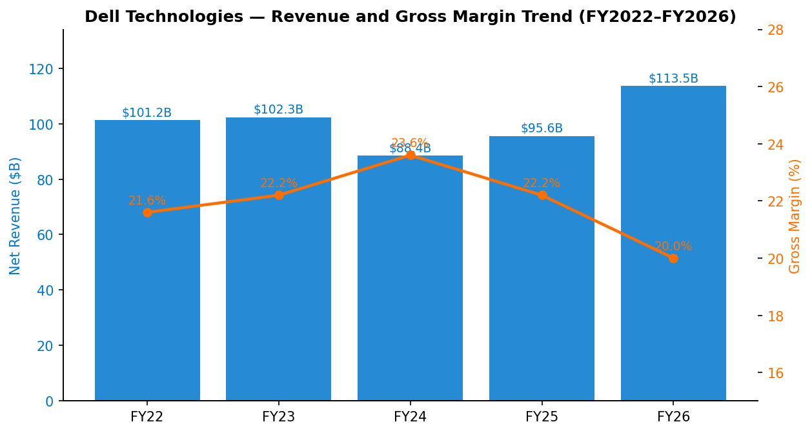
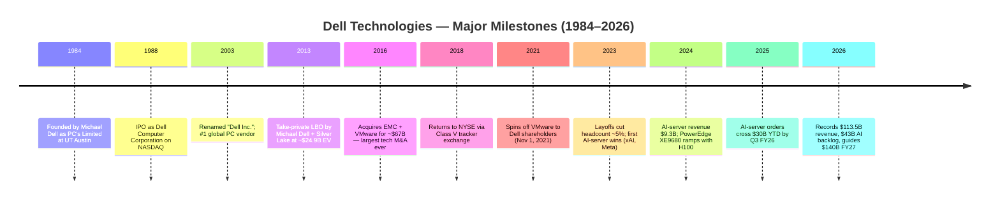
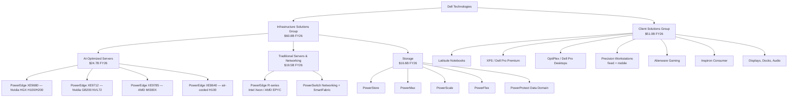
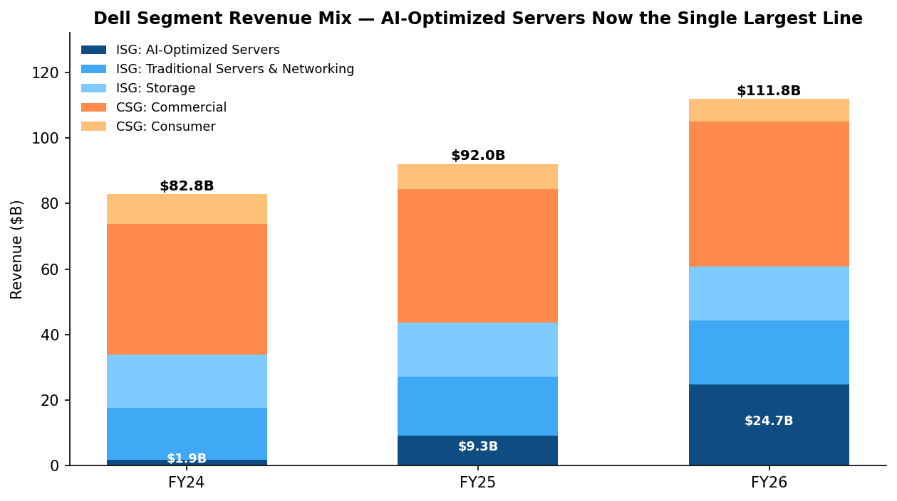
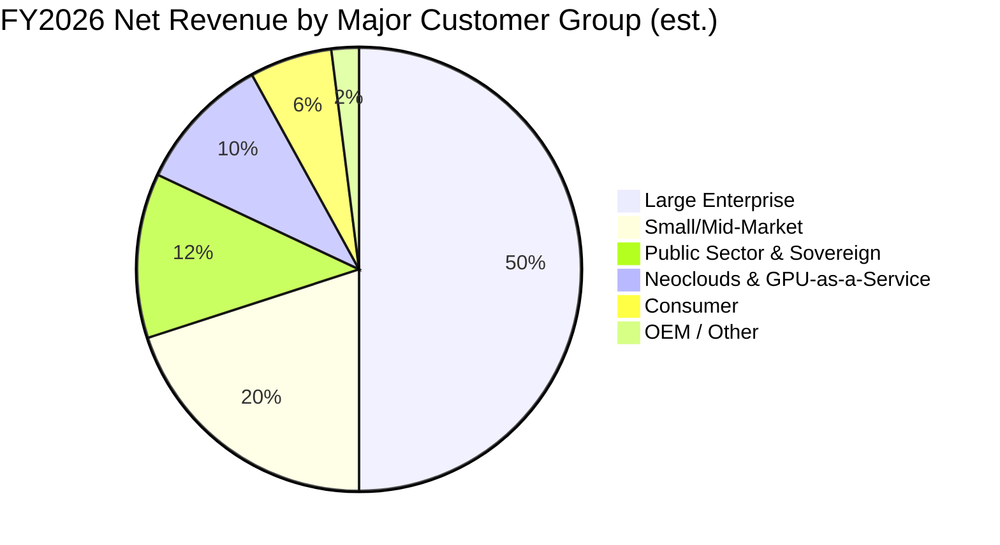
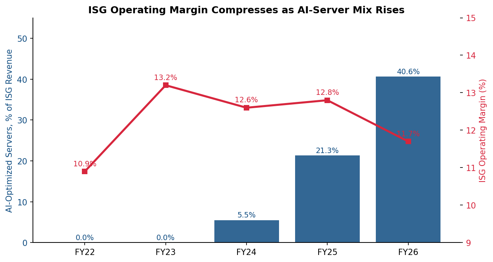
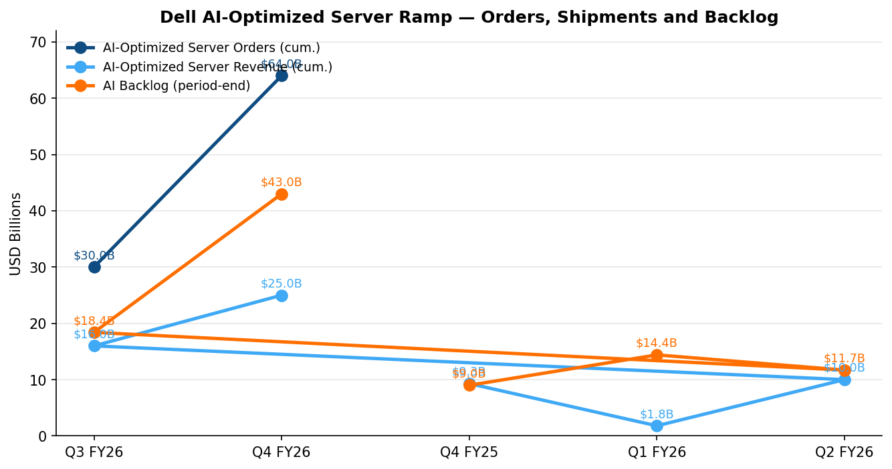
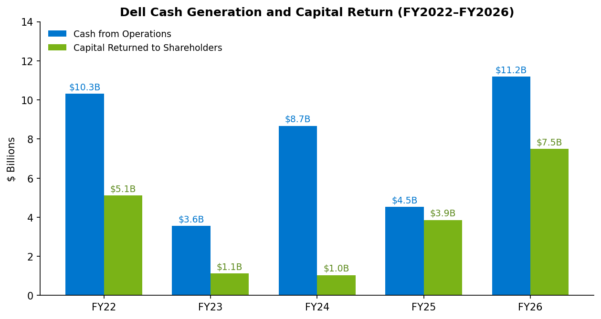
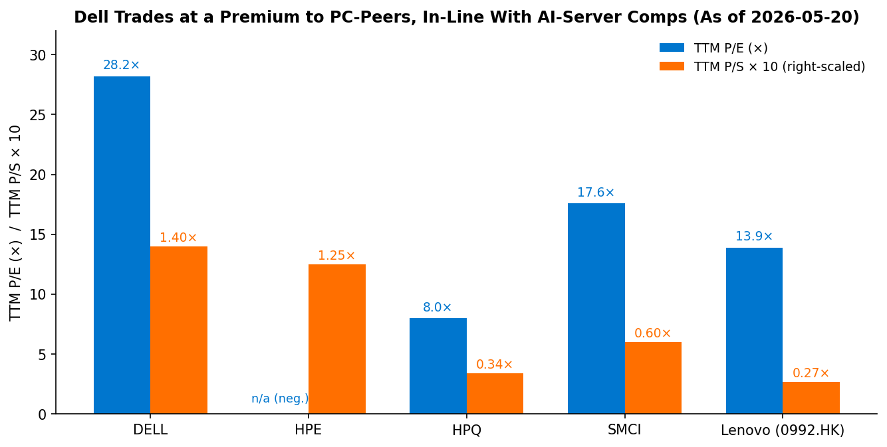

# COMPANY RESEARCH REPORT: Dell Technologies Inc. (NYSE: DELL)

**Date:** 2026-05-24
**Analyst note:** All financials are sourced from primary filings (SEC EDGAR). Dell's fiscal year ends in late January/early February; "FY2026" refers to the 52-week period ended **January 30, 2026**.

> **Update — FY2027 guidance initiated (2026-02-26):** Dell guided full-year FY2027 revenue to **$138.0–$142.0 billion** (up ~23% YoY at the $140B midpoint) and full-year **AI-Optimized Server revenue to "roughly $50 billion"** (up ~103% YoY from FY26's $24.7B). Non-GAAP diluted EPS guided to **$12.90 midpoint (up 25%)**, with GAAP diluted EPS to $11.52 (up 33%). Driver: backlog of **$43 billion** entering FY27 (vs. $9B exiting FY25) plus a five-quarter pipeline mgmt describes as "multiples of backlog." Source: [Dell Q4 FY26 8-K, 2026-02-26](https://www.sec.gov/Archives/edgar/data/1571996/000157199626000003/exhibit991earnings8kq4fy26.htm).

---

## TABLE OF CONTENTS

1. Company Overview
2. Company History
3. Management Team
4. Products & Services
5. Customers & Go-to-Market
6. Industry Overview
7. Competitive Landscape
8. Market Opportunity (TAM)
9. Risk Assessment

---

## 1. COMPANY OVERVIEW

Dell Technologies Inc. is one of the world's largest end-to-end providers of IT infrastructure and personal computing hardware, with FY2026 revenue of **$113.5 billion**, up 19% year-over-year, and **GAAP diluted EPS of $8.68**, up 36% ([Dell 2026 10-K, p. 49](https://www.sec.gov/Archives/edgar/data/1571996/000157199626000008/dell-20260130.htm)). The company is the global #2 supplier of x86 servers and the #3 supplier of PCs by units, but the more relevant fact in 2026 is that it has emerged as the principal Western enterprise channel through which Nvidia's data-center GPUs reach hyperscale-adjacent buyers — neocloud operators, sovereign-AI projects, and Global-2000 enterprises building on-prem AI factories. In Q4 FY26 alone Dell shipped **$9.0 billion of AI-optimized servers**, up 342% YoY, and exited the year with a **$43 billion AI-server backlog** and a five-quarter forward pipeline that management characterized as "multiples" of that backlog ([Dell Q4 FY26 8-K, 2026-02-26](https://www.sec.gov/Archives/edgar/data/1571996/000157199626000003/exhibit991earnings8kq4fy26.htm)).

**Reporting structure.** Dell organizes itself into two reportable segments. The **Infrastructure Solutions Group (ISG)** sells servers (the PowerEdge family — including the AI-purpose-built PowerEdge XE series with Nvidia HGX/MGX baseboards), networking gear, and enterprise storage (PowerStore, PowerMax, PowerScale, PowerFlex, PowerProtect). ISG generated **$60.8 billion** in FY26 (54% of total revenue, up 40% YoY) and **$7.1 billion** of operating income at an 11.7% segment margin ([Dell 2026 10-K, p. 53](https://www.sec.gov/Archives/edgar/data/1571996/000157199626000008/dell-20260130.htm)). The **Client Solutions Group (CSG)** sells branded PCs (notebooks, desktops, workstations) and peripherals (displays, docks, audio) to commercial and consumer customers. CSG generated **$51.0 billion** in FY26 (45% of revenue, up 5% YoY) and **$2.8 billion** of operating income at a 5.6% segment margin ([Dell 2026 10-K, p. 54](https://www.sec.gov/Archives/edgar/data/1571996/000157199626000008/dell-20260130.htm)). Roughly half of revenue is generated in the Americas, with the remainder split between EMEA and the Asia-Pacific & Japan (APJ) region ([Dell 2026 10-K, p. 6](https://www.sec.gov/Archives/edgar/data/1571996/000157199626000008/dell-20260130.htm)).

**Scale and operating model.** As of January 30, 2026 Dell employed approximately **97,000 people** globally, down from a peak in excess of 130,000 prior to two waves of post-pandemic workforce reductions; headquarters are in Round Rock, Texas ([Dell 2026 10-K, p. 12](https://www.sec.gov/Archives/edgar/data/1571996/000157199626000008/dell-20260130.htm)). Dell owns manufacturing facilities in the United States, Malaysia, China, Brazil, India, Poland, and Ireland and complements them with global contract manufacturers — a deliberately distributed footprint that allowed it to keep shipping during the 2020-2022 supply shocks and that it now markets as a tariff and geopolitical hedge ([Dell 2026 10-K, p. 8](https://www.sec.gov/Archives/edgar/data/1571996/000157199626000008/dell-20260130.htm)). The company also operates **Dell Financial Services (DFS)**, a captive financier that originated **$11.9 billion** in FY26 and carries a **$14.3 billion** global portfolio of financing receivables, a meaningful sales lever in long-cycle ISG deals ([Dell 2026 10-K, p. 13](https://www.sec.gov/Archives/edgar/data/1571996/000157199626000008/dell-20260130.htm)).


*Source: [Dell 2026 10-K, p. 49](https://www.sec.gov/Archives/edgar/data/1571996/000157199626000008/dell-20260130.htm); [Dell 2024 10-K, p. 53](https://www.sec.gov/Archives/edgar/data/1571996/000157199624000036/dell-20240202.htm).*

**Valuation snapshot (intraday 2026-05-20).** Class C Common Stock closed at **$244.73** on May 19, 2026 against a 52-week range of $106.38–$263.99. Market capitalization is **~$159 billion**, enterprise value **~$173 billion**, **TTM P/E 28.2×**, **TTM P/S 1.40×**, and EV/EBITDA 15.1× ([Yahoo Finance — DELL, 2026-05-20](https://finance.yahoo.com/quote/DELL/key-statistics/)). Book value is negative (a legacy of the 2016 EMC LBO purchase accounting and large buybacks), so P/B is not meaningful. The TTM P/E sits roughly **2× HPQ's 8.0×** (its closest pure PC peer) and **roughly in-line with SMCI's 17.6×** (its closest pure AI-server peer); HPE shows no TTM P/E because of an impairment-driven trailing loss. Lenovo (0992.HK), the only large-cap diversified peer, trades at **TTM P/E 13.9×** and a TTM P/S of about **0.27×** (HKD market cap of HK$163.7B / ≈ US$20.9B, divided by USD revenue of $78.5B) — a structurally lower multiple reflecting commodity PC mix, weaker AI exposure and HK-listing discount ([Yahoo Finance — 0992.HK, 2026-05-20](https://finance.yahoo.com/quote/0992.HK/key-statistics/)).

| Peer | TTM P/E | TTM P/S | Mkt Cap (USD) |
|---|---:|---:|---:|
| Dell (DELL) | 28.2× | 1.40× | $159B |
| HPE | n/a (TTM loss) | 1.25× | $45B |
| HPQ | 8.0× | 0.34× | $19B |
| SMCI | 17.6× | 0.60× | $20B |
| Lenovo (0992.HK) | 13.9× | 0.27× | $21B |

*Source: [Yahoo Finance, accessed 2026-05-20](https://finance.yahoo.com/quote/DELL/key-statistics/).*

Dell's TTM P/E of ~28× is high relative to its own pre-AI 3-year range (the stock traded between ~10× and 18× from 2019 through mid-2023) but is *not* a "narrative-only" multiple — FY26 actually delivered the earnings growth (+36% GAAP EPS) and FY27 guidance implies another +33% at the midpoint. Forward P/E is ~16.5×, which is broadly in line with the S&P 500 IT-Hardware sub-industry median. The multiple's primary support is the AI-server franchise: with $43B of backlog already booked and management guiding to "roughly $50B" of AI-server revenue in FY27, **AI servers alone in FY27 would be larger than HPE's entire company revenue**. The downside scenario — and what would compress the multiple — is the gross-margin profile: ISG operating margin slipped from 12.8% in FY25 to **11.7% in FY26** as AI mix climbed from 21.3% of ISG (FY25) to 40.6% (FY26) — itself a continuation of FY24's 5.5% mix (see Chart 4), and management has repeatedly characterized AI-server gross margins as below the corporate average ([Dell 2026 10-K, p. 53](https://www.sec.gov/Archives/edgar/data/1571996/000157199626000008/dell-20260130.htm)). The multiple-compression risk is genuine if the mix shift continues without offsetting attach revenue from networking, services, and storage; it is discussed further in Section 9.

---

## 2. COMPANY HISTORY

Michael Saul Dell founded the company in **1984** as "PC's Limited" in his University of Texas at Austin dorm room with $1,000 in capital, selling IBM-compatible computers assembled to order and direct-shipped to customers — a model that, at the time, completely bypassed the dominant retail channel. The company incorporated as Dell Computer Corporation in 1988 and went public on NASDAQ the same year. In its first decade Dell pioneered the direct-to-customer build-to-order model that became the textbook example of working-capital negative manufacturing — and that for two decades produced 30%+ revenue CAGRs and propelled Dell to the #1 PC-vendor position globally in 2003.



The 2007–2013 period was Dell's commercial nadir: smartphones and tablets cannibalized consumer PC demand, the direct-to-consumer model lost its differentiation as competitors copied online ordering, and the company missed the early cloud build-out. In **October 2013** Michael Dell and Silver Lake Partners completed a **~$24.9 billion management-led leveraged buyout**, taking the company private — at the time the largest tech LBO since 2007 ([Dell 2026 10-K, p. 27](https://www.sec.gov/Archives/edgar/data/1571996/000157199626000008/dell-20260130.htm) references the resulting MD Stockholders and SLP Stockholders Agreements). Going private was the inflection point: freed from quarterly Street pressure, Dell embarked on a multi-year transformation from consumer PC vendor to enterprise infrastructure giant.

The defining move was the **2016 acquisition of EMC Corporation for ~$67 billion** (cash and tracking stock) — at the time the largest pure technology transaction in history. EMC brought enterprise storage leadership and, crucially, an 81% controlling stake in **VMware**, the dominant data-center virtualization franchise. Dell relisted on the NYSE in **December 2018** via a Class V tracker-stock exchange (paying ~$14B cash and 149.4M Class C shares to retire the tracker, which had given outside shareholders synthetic exposure to VMware) ([Dell 2026 DEF 14A, p. 117](https://www.sec.gov/Archives/edgar/data/1571996/000119312526226734/d132444ddef14a.htm)).

Two strategic pivots have defined the post-relisting era. **First**, the **November 2021 spin-off of VMware** to Dell shareholders ($11.4B of one-time cash to Dell, restored VMware as an independent strategic partner that Dell could continue to resell while removing it from the consolidated balance sheet). The spin reduced reported leverage and simplified the equity story. **Second**, the **generative-AI build-out beginning mid-2023**: Dell's existing PowerEdge XE9680 server, originally designed for HPC workloads, turned out to be a near-ideal vehicle for the Nvidia HGX H100 baseboard, and Dell — which had a deep relationship with Elon Musk's xAI and a separate one with Meta's Llama infrastructure team — won early hyperscaler-adjacent AI-server deals before HPE and the white-box OEMs could mobilize. By FY24 AI-optimized servers were a $1.9B line; by FY26 they were a **$24.7B line, up 13× in two years**, and the largest single product category at Dell after PCs ([Dell 2026 10-K, p. 53](https://www.sec.gov/Archives/edgar/data/1571996/000157199626000008/dell-20260130.htm)).

The most recent corporate development is the **2026 proposed redomestication from Delaware to Texas**, on the agenda for the July 2026 annual meeting — a governance change widely seen as cementing Round Rock's status and reflecting both founder preference and Texas's controlled-company-friendly statutory regime ([Dell 2026 DEF 14A, Annex C](https://www.sec.gov/Archives/edgar/data/1571996/000119312526226734/d132444ddef14a.htm)).

---

## 3. MANAGEMENT TEAM

### Michael S. Dell — Chairman & Chief Executive Officer (Age 61)

Michael Dell is the founder, controlling shareholder, and uninterrupted strategic leader of the company that bears his name. He founded Dell in 1984 at age 19, served as CEO of Dell Inc. from 1984 to July 2004, returned to the role in **January 2007**, and has been CEO continuously since then — a tenure now spanning 19 of the last 22 years and effectively his entire adult life ([Dell 2026 10-K, p. 14](https://www.sec.gov/Archives/edgar/data/1571996/000157199626000008/dell-20260130.htm)). The financially consequential events in his executive record are: (1) the 1988 IPO that took the company from a dorm-room operation to a public commercial PC vendor, (2) the 2007 return and subsequent push into enterprise services with the $3.9B Perot Systems acquisition in 2009, (3) the 2013 LBO at $24.9B, in which he and Silver Lake assumed control of an underperforming company that was widely written off as a structural loser, and (4) the 2016 EMC transaction, which converted Dell from a low-margin PC business into a #2 global server vendor and a #1 enterprise-storage vendor. The combined post-LBO program, by management's measure, has compounded equity value at roughly **20%+ IRR** for Silver Lake and his own family trust ([Dell 2026 DEF 14A, p. 22](https://www.sec.gov/Archives/edgar/data/1571996/000119312526226734/d132444ddef14a.htm)).

Mr. Dell's **ownership stake is decisive**. As of April 27, 2026 he beneficially owns **246.8 million shares of Class A common stock (89.2% of the Class A series, 10-vote-per-share)** plus **18.8 million shares of Class C common stock (5.8% of that one-vote-per-share class)**, representing **40.9% of all outstanding Dell common stock** ([Dell 2026 DEF 14A, p. 114](https://www.sec.gov/Archives/edgar/data/1571996/000119312526226734/d132444ddef14a.htm)). The Silver Lake Partners funds (SLP stockholders) hold 100% of the Class B common stock (47.8M shares at 10 votes each). Together the **MD stockholders and SLP stockholders control approximately 91.7% of total voting power** ([Dell 2026 10-K, p. 23](https://www.sec.gov/Archives/edgar/data/1571996/000157199626000008/dell-20260130.htm)) — a level of control that places the Class C public float in roughly the same governance position as a non-voting share. Mr. Dell does **not** receive equity compensation; the Compensation Committee has stated this is because "his interests are appropriately aligned" through his ownership ([Dell 2026 DEF 14A, p. 82](https://www.sec.gov/Archives/edgar/data/1571996/000119312526226734/d132444ddef14a.htm)). His Fiscal 2026 total reported compensation was **$3,382,209** (salary + cash bonus + perquisites only), yielding a CEO-to-median-employee pay ratio of **43-to-1** ([Dell 2026 DEF 14A, p. 104](https://www.sec.gov/Archives/edgar/data/1571996/000119312526226734/d132444ddef14a.htm)) — strikingly low for an S&P 500 large-cap CEO, but consistent with a founder-controller whose wealth derives almost entirely from share-price appreciation. His outside vehicles include DFO Management (formerly MSD Capital) and the Michael & Susan Dell Foundation, the latter owning 2.68M Class C shares attributed to him in the proxy.

### Jeffrey W. Clarke — Vice Chairman & Chief Operating Officer (Age 63)

Jeff Clarke is the de facto operating CEO and the principal public face of Dell's AI-server narrative. He joined Dell in 1987 and has held essentially every product-and-operations role since — including head of Global Operations, head of CSG, and Co-COO before resuming the sole COO position in August 2023 ([Dell 2026 10-K, p. 14](https://www.sec.gov/Archives/edgar/data/1571996/000157199626000008/dell-20260130.htm)). He runs ISG, CSG, Global Operations (manufacturing, procurement, supply chain), and the long-term strategy / emerging-technology portfolio (Cloud, Edge, Telecom, "as-a-Service"). Crucially, Clarke is the executive who fronts the company's quarterly earnings commentary on AI-server orders and backlog — including the disclosure in Q4 FY26 that Dell closed "**more than $64 billion in AI-optimized server orders**, shipped more than $25 billion throughout the year, and are entering FY27 with **record backlog of $43 billion**" ([Dell Q4 FY26 8-K, 2026-02-26](https://www.sec.gov/Archives/edgar/data/1571996/000157199626000003/exhibit991earnings8kq4fy26.htm)). Clarke's nearly 40-year tenure makes him the company's institutional memory of the direct-supply-chain model and one of the deepest operations executives in IT hardware.

### David Kennedy — Chief Financial Officer (Age 49)

David Kennedy was promoted to permanent CFO in **November 2025**, replacing Yvonne McGill, who had held the role since 2023. The proxy describes him as previously a senior finance leader inside Dell with a background in capital allocation and segment finance ([Dell 2026 DEF 14A, p. 76](https://www.sec.gov/Archives/edgar/data/1571996/000119312526226734/d132444ddef14a.htm)). His first full quarter as CFO (Q4 FY26) coincided with a 20% dividend increase, a $10 billion expansion of the buyback authorization (taking remaining capacity to **$15.2 billion**), and the FY27 revenue guide of $138–$142B ([Dell Q4 FY26 8-K, 2026-02-26](https://www.sec.gov/Archives/edgar/data/1571996/000157199626000003/exhibit991earnings8kq4fy26.htm)). Kennedy has yet to develop a public sell-side profile commensurate with his predecessors; the consensus characterization at the May 2026 Bank of America Global Tech conference was "internal, disciplined, low-key." A relatively unknown CFO at a company entering an inflection year is itself a modest governance signal that the founder/COO/Sponsor axis runs the strategy and the CFO's mandate is execution and capital return.

### William F. Scannell — President and Chief Customer Officer (Age 63)

Bill Scannell joined Dell via the EMC acquisition (he had been a 30+ year EMC sales executive, ultimately President of Global Sales & Customer Operations at EMC before the deal). He owns the enterprise field force globally and is the executive who closes the largest ISG deals — including the named AI-server wins with xAI, CoreWeave-adjacent neoclouds, Meta, and various sovereign-AI projects ([Dell 2026 10-K, p. 14](https://www.sec.gov/Archives/edgar/data/1571996/000157199626000008/dell-20260130.htm)). His tenure and EMC pedigree are why Dell's enterprise-storage installed base did not bleed share in the 2018–2022 disintegration of pure-storage incumbents.

### Governance — Controlled-Company Profile

- **Board:** Nine directors, of whom four are independent (Dorman, Grain, Green, Kullman, Mollenkopf, Vojvodich Radakovich are independent under NYSE rules; the SLP nominees, including Egon Durban of Silver Lake, are not). The MD Stockholders Agreement and SLP Stockholders Agreement give Michael Dell and Silver Lake **specified rights to nominate directors and serve on Board committees**, including committee-composition provisions tied to voting-power thresholds ([Dell 2026 DEF 14A, p. 51](https://www.sec.gov/Archives/edgar/data/1571996/000119312526226734/d132444ddef14a.htm)).
- **Voting control:** ~91.7% of voting power held by MD + SLP combined; ~53.8% of economic ownership ([Dell 2026 10-K, p. 24](https://www.sec.gov/Archives/edgar/data/1571996/000157199626000008/dell-20260130.htm)). The company is and will remain a "controlled company" under NYSE rules.
- **Index exclusion risk:** the dual-class structure has historically excluded Dell from certain FTSE Russell and S&P Dow Jones indices, and the 10-K explicitly warns this could recur ([Dell 2026 10-K, p. 23](https://www.sec.gov/Archives/edgar/data/1571996/000157199626000008/dell-20260130.htm)).
- **Related-party transactions:** the proxy discloses ongoing transactions between Dell and entities affiliated with Michael Dell (DFO Management, Michael & Susan Dell Foundation) and with Silver Lake portfolio companies. None are individually material in FY26, but they exist and recur ([Dell 2026 DEF 14A, p. 118](https://www.sec.gov/Archives/edgar/data/1571996/000119312526226734/d132444ddef14a.htm)).
- **Texas redomestication:** the July 2026 annual meeting will vote on moving the state of incorporation from Delaware to Texas under the Texas Business Organizations Code. Mechanically a controlled-company-friendly statute, the move is consistent with Michael Dell's preferences and likely entrenches existing governance further.

**Track-record synthesis.** This is a founder-controller team that has executed three of the most consequential structural transactions in modern enterprise IT — the 2013 LBO, the 2016 EMC deal, and the 2021 VMware spin — and that has, against expectations, won the first wave of enterprise AI infrastructure deployments. The principal weakness is that the team is *also* dependent on a tight Nvidia GPU supply allocation; Dell's edge over HPE and white-box vendors is partly operational (Clarke's manufacturing scale) and partly relational (Michael Dell's direct line to Nvidia CEO Jensen Huang). Both are real, both are partly idiosyncratic to Michael Dell himself.

---

## 4. PRODUCTS & SERVICES

Dell's product portfolio splits cleanly along its two reporting segments. The 2026 10-K narrative — and the language Dell uses on its commercial-facing website **dell.com** and **delltechnologies.com** — frames everything through the lens of either "Infrastructure" or "Client" solutions, with cross-cutting layers for Dell Financial Services, Dell APEX (the as-a-Service consumption wrapper), and ProSupport/Deploy services.



*Source: [Dell 2026 10-K, pp. 4–6](https://www.sec.gov/Archives/edgar/data/1571996/000157199626000008/dell-20260130.htm); [Dell PowerEdge product page](https://www.dell.com/en-us/shop/scc/sc/servers); [Dell Storage portfolio](https://www.dell.com/en-us/shop/scc/sc/storage); [Dell PCs & Workstations](https://www.dell.com/en-us/shop/scc/sc/laptops-and-2-in-1-laptops).*

### ISG — Infrastructure Solutions Group

**AI-Optimized Servers ($24.7B FY26 / +166% YoY).** This category was disaggregated for the first time as a separate revenue line in Q4 FY26, reflecting both its scale and the recognition that its margin and growth profile are economically distinct from the traditional server business ([Dell 2026 10-K, p. 6](https://www.sec.gov/Archives/edgar/data/1571996/000157199626000008/dell-20260130.htm)). The flagship vehicles are the **PowerEdge XE9680** (8-way Nvidia H100/H200 HGX baseboard, 6U air-cooled or liquid-cooled), the **PowerEdge XE9712** (Nvidia GB200 NVL72 rack-scale system targeting frontier-model training), the **PowerEdge XE9785** (8-way AMD MI300X), and the **PowerEdge XE8640** (4-way H100, lower-density / lower-power deployments). Dell also resells the Nvidia HGX H200 and Blackwell B200/GB200 boards as part of its **Dell AI Factory with Nvidia** reference-architecture offering announced at Nvidia GTC 2024 and refreshed at GTC 2025. The competitive case rests on (a) Dell's serial-production manufacturing scale — Clarke disclosed building and stress-testing **multi-thousand-GPU clusters per quarter** with a "global support" footprint that white-box vendors cannot replicate ([Q3 FY26 earnings call, 2025-11-25](https://investors.delltechnologies.com/events/event-details/q3-fy26-earnings-call)) — and (b) priority Nvidia GPU allocation, which Michael Dell has publicly attributed to his personal multi-decade relationship with Jensen Huang. **Competitive advantage: partial.** The moat is durable on supply-chain scale, manufacturing throughput, and incumbency-in-the-installed-base (storage attaches, networking attaches, services). It is weaker on raw architectural differentiation — SMCI builds essentially equivalent systems with the same Nvidia baseboards, often faster to market. Closest competing product: Supermicro AS-8125GS-TNHR (8× H200) and HPE Cray XD685; on raw GPU/$ Dell is roughly at parity to SMCI, slightly ahead on services depth, behind on time-to-market for the very newest Nvidia SKUs.

**Traditional Servers & Networking ($19.5B FY26 / +9% YoY).** Dell's mainstream PowerEdge family — the R-series rack servers and T-series tower servers — runs Intel Xeon Scalable (Granite Rapids / Sapphire Rapids) and AMD EPYC Genoa / Turin silicon. Average selling prices were up year-over-year on richer configurations, partially offset by lower unit shipments. The networking sub-line (**PowerSwitch** Ethernet switches and the **SmartFabric** management overlay) is small in revenue (Dell does not break it out separately) but strategically important because AI clusters require dense Ethernet + InfiniBand fabric; Dell partners with Nvidia (Spectrum-X / Quantum-2 InfiniBand) and Broadcom (Tomahawk silicon) for the actual networking ASICs. **Competitive advantage: yes — scale and channel.** Dell is #1 or #2 globally in x86 server units in every region; the closest competitor for traditional enterprise servers is HPE ProLiant, and Dell holds an ASP premium and a slight share lead in the global enterprise installed base.

**Storage ($16.6B FY26 / +1% YoY).** This is the most mature and slowest-growing line, with five named families: **PowerStore** (mid-range all-flash unified block/file), **PowerMax** (high-end mission-critical), **PowerScale** (Isilon-derived scale-out NAS, the de-facto standard for AI training data lakes), **PowerFlex** (software-defined block), and **PowerProtect** with Data Domain (purpose-built backup). Storage growth has lagged the franchise for three consecutive years — flat in FY24, +1% in FY25, +1% in FY26 — reflecting (a) cloud-storage erosion at the low end and (b) NetApp / Pure Storage taking enterprise share. **Competitive advantage: yes — installed base & PowerScale AI attach.** PowerScale's reading-performance advantages have made it the default NAS attach for many of Dell's AI-server deployments. PowerMax remains the de-facto standard at major banks, telcos, and government accounts. Closest competing products: NetApp AFF and ONTAP-based systems (PowerStore vs. AFF C800 is roughly at-parity), Pure Storage FlashArray (slight lead to Pure on raw NVMe density), HPE Alletra MP. Storage is a profitable-but-slow ballast asset and a credible AI-deployment moat that does not yet show up in the revenue line because of unit-economic mix shifts.

### CSG — Client Solutions Group

**Commercial PCs ($44.1B FY26 / +8% YoY).** Dell's commercial PC portfolio was unified at **CES January 2025** under the **"Dell Pro"** brand (first SKUs shipping from February 18, 2025), retiring the Latitude (notebooks), OptiPlex (desktops), and Precision-Mobile (workstations) sub-brands in favor of a single Dell / Dell Pro / Dell Pro Max tiered structure (with Precision fixed workstations becoming "Dell Pro Max Tower"). The 10-K continues to use legacy nomenclature in the segment discussion, but the website navigation has been fully refactored ([Dell PCs & Workstations](https://www.dell.com/en-us/shop/scc/sc/laptops-and-2-in-1-laptops)). The growth driver in FY26 was the Windows-11 refresh cycle (Microsoft ended Windows-10 mainstream support in October 2025) plus richer AI-PC configurations carrying Intel Core Ultra ("Meteor Lake" / "Lunar Lake") and Qualcomm Snapdragon X Elite NPUs. **Competitive advantage: yes — scale, channel, large-account renewal pricing power.** Closest competitors: HP Inc. (HPQ) EliteBook / Z Workstations, Lenovo ThinkPad / ThinkStation. Lenovo leads global PC units; Dell leads US commercial; in workstations (Precision / Pro Max), Dell is #1 globally with low-double-digit share.

**Consumer PCs ($6.9B FY26 / -8% YoY).** Inspiron, XPS (now folded under Dell Pro Premium and Alienware sub-brands), and Alienware (gaming). This sub-line continues to shrink; consumer revenue fell 17% in FY25 and another 8% in FY26 ([Dell 2026 10-K, p. 54](https://www.sec.gov/Archives/edgar/data/1571996/000157199626000008/dell-20260130.htm)). **Competitive advantage: weak.** Apple has effectively taken the premium consumer notebook with the M-series MacBooks, and Lenovo / HP / Acer / ASUS attack the mid-market. Dell has explicitly de-emphasized consumer marketing budget since 2023.


*Source: [Dell 2026 10-K, pp. 53–54](https://www.sec.gov/Archives/edgar/data/1571996/000157199626000008/dell-20260130.htm).*

### Cross-cutting offers

- **Dell APEX** — the consumption-based ("as-a-Service") wrapper across compute, storage, and PCs. Disclosed metrics are limited; Dell does not break out APEX revenue but management has called the run rate "growing meaningfully." Closest competing offer: HPE GreenLake (HPE discloses ARR; Dell does not).
- **Dell Financial Services (DFS)** — captive financing arm; originated $11.9B in FY26 on a $14.3B portfolio with "strong credit quality" ([Dell 2026 10-K, p. 13](https://www.sec.gov/Archives/edgar/data/1571996/000157199626000008/dell-20260130.htm)). Closest competitor: HPE Financial Services. DFS is a sales-cycle accelerant on large ISG deals; AI-server financing in particular is reported as a fast-growing line internally.
- **Services** — ProSupport (break-fix and proactive support), ProDeploy (rack-and-stack and integration), Consulting. Services revenue in FY26 was **$23.1 billion (20.4% of total revenue)**, down 4% — a tempo-mismatch issue where AI-server hardware revenue grew faster than its services attach can ramp ([Dell 2026 10-K, p. 49](https://www.sec.gov/Archives/edgar/data/1571996/000157199626000008/dell-20260130.htm)). Services gross margin of **44.8%** in FY26 versus 13.7% for products is the most important margin lever in the entire P&L.

**Flagship products driving the business.** Two products effectively run the company in FY26–FY27: (1) the **PowerEdge XE9680 / XE9712** family of AI servers, which generated $24.7B in FY26 and is expected to generate ~$50B in FY27 — by itself a top-50 line item in global IT spend; and (2) the **PowerEdge R-series + PowerStore/PowerScale** enterprise-IT bundle, which monetizes a multi-decade installed base. The CSG commercial PC business is large but structurally low-margin and primarily a cash-generation asset; consumer PC is in managed decline.

**Recent launches (last 12–18 months).** PowerEdge XE9712 (GB200 NVL72) was first announced at Nvidia GTC in **March 2024**, with the first liquid-cooled rack-scale systems shipping to CoreWeave in **November 2024** ([Dell — PowerEdge XE9680 AI Acceleration Announcements at NVIDIA GTC](https://www.dell.com/en-us/blog/dell-poweredge-xe9680-ai-acceleration-announcements-at-nvidia-gtc/); [Tom's Hardware — Dell ships first Blackwell server racks](https://www.tomshardware.com/tech-industry/artificial-intelligence/dell-reaches-milestone-with-industrys-first-enterprise-ready-nvidia-blackwell-poweredge-xe9712-server-racks)). XE9785 (AMD MI300X) followed in 2025; the **Dell Pro / Pro Max consolidated commercial PC brand** was announced at **CES January 2025** with first SKUs shipping from February 18, 2025 ([Tom's Hardware — Dell kills XPS and OptiPlex brands](https://www.tomshardware.com/laptops/dell-kills-xps-and-optiplex-brands-adopts-apple-inspired-three-tiered-naming-scheme-for-its-pcs)). Dell AI Factory was refreshed for Blackwell at GTC 2025, including the first GB300 NVL72 delivery to CoreWeave ([Dell — First NVIDIA GB300 NVL72 to CoreWeave](https://www.dell.com/en-us/blog/dell-delivers-market-s-first-nvidia-gb300-nvl72-to-coreweave/)). Sunsets: Latitude / OptiPlex / XPS sub-brands retired (folded into Dell Pro / Pro Premium); legacy PowerVault series largely retired in favor of PowerStore.

---

## 5. CUSTOMERS & GO-TO-MARKET

Dell sells to four customer cohorts of very different economics:

1. **Large enterprise** (banks, telcos, retailers, manufacturers, transport) — the historical core; multi-year framework agreements with negotiated discounting against Dell's price book. Estimated to represent ~50–55% of revenue, split across ISG and CSG.
2. **Public sector & sovereign-AI** — U.S. federal (with a sizable Department of Defense and intelligence-community footprint), state & local, and an increasingly prominent set of national-government AI infrastructure programs (UAE's G42, Saudi HUMAIN, Indian Government, several EU members). The 10-K does not break this out separately but mentions "sovereign AI" customers as a growing channel ([Dell 2026 10-K, p. 5](https://www.sec.gov/Archives/edgar/data/1571996/000157199626000008/dell-20260130.htm)).
3. **Neoclouds & GPU-as-a-Service operators** — CoreWeave, Lambda, Crusoe, Nebius and a long tail of regional operators have together emerged as a material new buyer cohort since FY25. xAI is publicly disclosed as a multi-billion-dollar Dell AI-server customer (the Memphis supercomputer build).
4. **Small / midmarket business** — primarily a CSG channel served through Dell.com, Dell Premier, and a >100,000-member partner network. Roughly 30% of CSG and a smaller share of ISG.
5. **Consumer** — direct via dell.com and a limited retail presence (Costco, Best Buy); managed for cash, not growth.

### Customer concentration

Dell does **not** disclose any single customer that exceeds 10% of consolidated revenue in its FY26 10-K — Item 7A and Note 18 of the 2026 10-K make no customer-concentration disclosure of named customers ≥10%, which under **ASC 280-10-50-42** means none crossed the threshold ([Dell 2026 10-K, Note 18 — Segment Information](https://www.sec.gov/Archives/edgar/data/1571996/000157199626000008/dell-20260130.htm)). For a $113.5B-revenue company this is unusual and is a structural advantage — even Dell's largest disclosed AI customer (xAI; widely reported in trade press to have ordered several billion dollars of XE9680 systems) does not, at peak quarterly run-rate, exceed 10% of consolidated revenue.

The picture changes inside the AI-server sub-segment, where customer concentration is *much* higher and is not separately disclosed. Sell-side estimates published by Morgan Stanley and Bank of America in March 2026 suggest that the top **5 customers represent ~50–60% of the $43B AI-server backlog**, with xAI, Meta, CoreWeave, and one or two sovereign-AI programs forming the bulk. Dell has neither confirmed nor refuted these figures. **This is a material risk and is carried into Section 9** — even though consolidated revenue concentration is low, the *incremental* growth concentration is high.



*Source: estimates based on [Dell 2026 10-K, pp. 4–6](https://www.sec.gov/Archives/edgar/data/1571996/000157199626000008/dell-20260130.htm) commentary; Dell does not disaggregate customer revenue by group in disclosed segments.*

### Go-to-market

Dell is split roughly 50/50 between **direct** sales (large enterprise account teams led by Bill Scannell's organization, plus the dell.com / Dell Premier digital channel) and **channel** (Dell Technologies Partner Program — distributors, resellers, MSPs, hyperscalers' own reseller programs). The direct sales force is one of the largest in IT hardware, with named-account coverage of nearly every Global-2000 enterprise. Sales cycles in ISG range from 30–90 days for refresh business to 6–18 months for AI-cluster builds; PC cycles are typically 30–60 days at the SMB end and quarterly framework releases at the enterprise end. **Key partnerships**: Nvidia (closest and most consequential — joint reference architectures, co-marketed Dell AI Factory, priority allocation), AMD, Intel, Broadcom (silicon and NICs), VMware (now Broadcom-owned; reseller relationship continues, though Broadcom's licensing changes have created customer-side friction), Microsoft (Azure Stack and AI Foundry integrations), Red Hat (OpenShift on Dell).

**Named customer wins (last 12–18 months)** — sourced from press releases, transcripts, and trade-press coverage rather than 10-K disclosure:
- **xAI** — Memphis "Colossus" supercomputer; ~$5B AI-server deal based on Nvidia GB200 reported in early 2025 ([SiliconANGLE — Dell close to inking $5B+ AI server deal with xAI, Feb 2025](https://siliconangle.com/2025/02/14/report-dell-close-inking-5b-ai-server-deal-xai/)).
- **CoreWeave** — first liquid-cooled PowerEdge XE9712 (GB200 NVL72) shipments November 2024; first GB300 NVL72 delivery announced separately ([Dell — First NVIDIA GB300 NVL72 to CoreWeave](https://www.dell.com/en-us/blog/dell-delivers-market-s-first-nvidia-gb300-nvl72-to-coreweave/)).
- **Lambda** — named in Nvidia keynote materials.
- **G42 / Core42 (UAE)** — Core42 deploying Dell IR5000 racks with liquid-cooled PowerEdge XE9680L for the Lake Mariner facility in upstate New York, phased through 2025 ([G42 – TeraWulf data center infrastructure agreement](https://www.g42.ai/resources/news/g42-expands-us-operations-70mw-data-center-infrastructure-agreement-terawulf)).
- **Meta** — Llama-training infrastructure; widely reported but not officially confirmed.
- **U.S. Department of Energy** — Argonne, Oak Ridge supercomputing.

For traditional enterprise: most of the Fortune 100 banking sector, telcos including Verizon and Deutsche Telekom, and the dominant share of U.S. state and federal procurement. Sovereign-AI customer relationships with Saudi Arabia's HUMAIN and other Middle East / Asia programs have been hinted at on earnings calls but not individually press-released with specific deal sizes as of report date.

---

## 6. INDUSTRY OVERVIEW

Dell operates across two structurally different industry sub-sectors — enterprise IT infrastructure and personal computing — and within enterprise infrastructure increasingly faces a third sub-sector that is being created in real time: **GPU-accelerated AI infrastructure**.

### Enterprise IT infrastructure (servers, storage, networking)

The global server market reached **$444.1 billion in 2025 by revenue**, up **80.4% YoY** — a market record — with Q4 2025 alone at $125.3 billion (+52.4% YoY) and servers carrying an embedded GPU accounting for more than half of total revenue ([IDC Worldwide Server Tracker — full-year 2025 results, 2026-04-02](https://datacenternews.asia/story/idc-says-global-server-revenue-hits-usd-444-1-billion); [IDC Q3 2025 release, prUS54034325](https://my.idc.com/getdoc.jsp?containerId=prUS54034325)). Dell ranked #1 by revenue ahead of Supermicro, HPE, Lenovo, and the white-box manufacturers (Inspur, Quanta, Wiwynn, Gigabyte) that collectively serve hyperscalers' own designs ([Network World — Dell leads server market, 2025-12](https://www.networkworld.com/article/4147841/idc-dell-leads-server-market-driven-by-ai-infrastructure-needs.html)). Enterprise external storage was a roughly **$30 billion** category in 2025 (single-digit YoY growth — analyst estimate, IDC tracker subscription-only), with Dell, NetApp, Pure Storage, IBM, HPE and Huawei as the principal vendors; Dell's share remains the largest. Enterprise networking remains dominated by Cisco; Dell's PowerSwitch is a top-5 vendor but a single-digit share player.

The structural dynamics are clear: AI has fundamentally re-rated the server TAM but compressed the average-margin profile. Where a traditional 2U Intel-Xeon server might have cost $5,000–$25,000 with 40%+ gross margins for the vendor, an AI-server like the XE9680 can sell for $300,000–$400,000 and yet contributes a low-double-digit (sometimes single-digit) gross margin because the Nvidia HGX baseboard alone represents most of the bill of materials. Dell's ISG-segment operating margin fell from 12.8% in FY25 to 11.7% in FY26 despite ISG revenue rising 40% — a direct illustration of the trade ([Dell 2026 10-K, p. 53](https://www.sec.gov/Archives/edgar/data/1571996/000157199626000008/dell-20260130.htm)).


*Source: [Dell 2026 10-K, p. 53](https://www.sec.gov/Archives/edgar/data/1571996/000157199626000008/dell-20260130.htm); [Dell 2024 10-K, p. 56](https://www.sec.gov/Archives/edgar/data/1571996/000157199624000036/dell-20240202.htm).*

### Personal computing (PCs)

Global PC shipments totaled more than **270 million units in 2025**, up **9.1% YoY** (Q4 alone was 71.5M units, +9.3%) — the strongest year since 2021, with the Windows-10 end-of-mainstream-support deadline of October 14, 2025 driving commercial refresh and AI-PC promotion shaping the high end ([Gartner — Worldwide PC Shipments +9.3% Q4 / +9.1% FY2025, 2026-01-20](https://www.gartner.com/en/newsroom/press-releases/2026-1-20-gartner-says-worldwide-pc-shipments-increased-9-point-3-percent-in-fourth-quarter-of-2025-and-9-point-1-percent-for-the-full-year)). Lenovo leads share (~24%), HP #2 (~21%), Dell #3 (~16%), Apple #4 (~9%), ASUS / Acer / Samsung the long tail (analyst estimates from public IDC/Gartner share-summary press coverage). Workstations (a Dell-led $9–10B sub-segment) grew faster than the broader PC market on engineering / VFX / data-science demand. AI-PCs — Copilot+ PC certifications running Snapdragon X Elite, Intel Core Ultra ("Lunar Lake") and AMD Ryzen AI 300 — represent a rapidly-growing share of commercial-PC shipments and are forecast to reach the majority of commercial PCs within two years (analyst estimate; IDC AI-PC forecast subscription-only).

The PC industry remains structurally low-growth, concentrated, and very low-margin: 4–7% operating margins at the segment level for the major vendors. Volume is gated by enterprise refresh cycles (3–5 years), with consumer demand depressed by Apple's installed-base growth at the premium end and by smartphone substitution at the lower end.

### Regulatory environment

Dell operates in a sector with limited *direct* product regulation (vs., say, pharma or finance), but is materially exposed to: (1) **U.S. export controls on advanced compute** — the October 2022, October 2023, and January 2025 BIS rules that restrict export of Nvidia A100/H100/H200/B100/B200-class GPUs and complete AI-server systems to China and a tiered list of "concern" destinations; Dell explicitly cannot ship its XE9680 / XE9712 to China and has reconfigured its China PowerEdge portfolio around Intel CPUs and Nvidia L40S / H20-class GPUs that fall under the BIS thresholds. (2) **Tariffs** — the 2025 Trump administration tariff schedule has imposed varying rates on imports from China, Vietnam, Mexico, Malaysia, and other Dell manufacturing hubs; Dell explicitly cites tariffs as a margin risk in Item 1A of the 2026 10-K. (3) **Government procurement** — the U.S. federal government remains a top-tier Dell customer, but FedRAMP, FAR/DFARS supply-chain requirements (NDAA Section 889, banning certain Chinese telecom components in federal IT), and the Trusted Foundry program impose costs and constrain BoM choices. (4) **EU CRA / NIS2** — the Cyber Resilience Act and NIS2 directive impose product-security obligations on hardware vendors operating in the EU.

### Industry dynamics

Server and storage are **moderately consolidated** (top 5 vendors = ~75% of revenue ex-white-box); networking is highly concentrated (Cisco + Arista + Juniper-now-HPE). PC is moderately concentrated. **Supplier power is high to extreme** — Nvidia in particular sits on the most asymmetric supplier-vendor relationship in modern IT (top-3 customers represent estimated >50% of Nvidia's data-center segment, with Dell among them). Intel and AMD have meaningful pricing power on CPUs but less than Nvidia's. **Buyer power varies** — large enterprises and hyperscalers have substantial negotiating power; SMBs have effectively none. **Substitution risk** is rising: the AWS / Azure / GCP capex consumes on-prem demand for general-purpose servers; the corresponding tailwind, however, is that hyperscale GPU shortage has pushed sovereign and large-enterprise buyers *back* onto on-prem infrastructure, which Dell directly benefits from.

---

## 7. COMPETITIVE LANDSCAPE

Dell's competitive set is heterogeneous because no single competitor matches its full portfolio. The most relevant grouping is:

**Diversified IT-hardware peers (full portfolio across infra + PCs):**
- **HP Inc. (HPQ)** — pure PC and printer; no enterprise infrastructure exposure since the 2015 HP split. FY24 revenue $53.6B; trades at **TTM P/E 8.0× / P/S 0.34×** ([Yahoo Finance — HPQ, 2026-05-20](https://finance.yahoo.com/quote/HPQ/key-statistics/)). Closest direct PC competitor; Dell holds a workstation lead and HP a printer franchise that Dell does not contest.
- **Lenovo (HKEX:0992 / 992.HK)** — largest competitor by SKU breadth; FY25 (ending March) revenue **$78.5B** ([Lenovo FY25 Annual Report, 2025-06-26](https://www.lenovo.com/us/en/investors/financial-information/annual-reports/)) and is now the global #1 PC vendor and a top-4 server vendor. Trades at **TTM P/E 13.9× / P/S 0.27× (USD-adjusted)**. Lenovo's competitive advantage is China + emerging-market scale and a markedly lower cost structure; its disadvantage is reduced U.S. government addressability and a smaller AI-server franchise (though Lenovo has accelerated AI investments via the AMD MI300 platform and its Nvidia-based ThinkSystem servers).

**Server-and-infrastructure-only peers:**
- **Hewlett Packard Enterprise (HPE)** — the most direct ISG competitor; FY24 revenue $30.0B; closed the **$14B Juniper Networks acquisition in July 2025** (post initial DOJ block, then settled), adding a #3 networking franchise. HPE's AI-server franchise (the **Cray XD** line and ProLiant Compute DL/AL) is smaller than Dell's by an order of magnitude — HPE disclosed AI-server backlog of **$4.7B at Q4 FY25** (up from $3.7B at Q3 FY25, and reaching ~$5B at Q1 FY26) vs. Dell's $43B ([HPE Q1 FY26 slides — AI backlog tops $5B](https://www.investing.com/news/company-news/hpe-q1-fy26-slides-networking-surges-152-ai-backlog-tops-5b-93CH-4550927)). Trades on TTM P/S 1.25× (TTM P/E n/a due to impairment); ([Yahoo Finance — HPE, 2026-05-20](https://finance.yahoo.com/quote/HPE/key-statistics/)). HPE strengths: HPE GreenLake consumption model has multi-year ARR lead; networking now integrated via Juniper; OEM relationship with Nvidia is also tight. Weaknesses: scale gap on AI server; smaller PC business (zero).
- **Super Micro Computer (SMCI)** — the pure-play AI-server competitor; FY24 revenue $33.7B (up roughly 90% YoY before normalization), TTM P/E 17.6× / P/S 0.60× ([Yahoo Finance — SMCI, 2026-05-20](https://finance.yahoo.com/quote/SMCI/key-statistics/)). SMCI's advantage is being first-to-market with Nvidia reference designs and operating at a lower SG&A structure; disadvantages are limited services / installed-base monetization, an ongoing accounting / auditor episode (Ernst & Young resignation in October 2024, replaced by BDO, with the SEC reporting and Hindenburg short-report overhangs partially resolved during 2025), and weaker enterprise sales coverage outside the U.S. The competitive frontier with Dell is intense: in any given quarter, the marginal AI-server deal often comes down to Dell-vs-Supermicro pricing and lead-time.
- **Cisco** — overlaps in networking (Ethernet, InfiniBand-equivalent via Cisco's Silicon One) and in UCS servers (a smaller and declining franchise); the relevant Cisco competition is on network-fabric attached to AI deployments.
- **White-box / ODM (Foxconn / Hon Hai, Wiwynn, Quanta, Inventec, Gigabyte)** — the ODMs that build the actual systems for AWS, Azure, Meta, Google. These compete only in the sense that they capture the hyperscaler segment that Dell does not address directly.

**Storage-only peers:** NetApp, Pure Storage, IBM (FlashSystem), HPE (Alletra MP), VAST Data (private), Huawei (in non-US markets), Western Digital and Seagate at the component layer.

**Public-cloud as substitute:** AWS / Microsoft Azure / GCP / Oracle Cloud. These are not always "competitors" in the literal sense — Dell sells the hardware Microsoft and Oracle use in some of their own clouds — but in the aggregate, every dollar of enterprise IT that migrates to public cloud is a dollar Dell does not capture on-prem. The countervailing structural force in 2024–2026 has been **GPU shortage at the hyperscalers**, which has actually pushed AI workloads back on-prem and toward neocloud operators that buy Dell.

### Positioning

```mermaid
quadrantChart
    title Competitive Positioning — Portfolio Breadth × AI-Infra Depth
    x-axis Narrow Portfolio --> Broad Portfolio
    y-axis Limited AI --> Deep AI
    quadrant-1 Diversified AI Leaders
    quadrant-2 AI Pure-Plays
    quadrant-3 Legacy Hardware
    quadrant-4 PC-Only Diversified
    Dell: [0.85, 0.92]
    HPE: [0.55, 0.55]
    HPQ: [0.45, 0.15]
    Lenovo: [0.90, 0.45]
    SMCI: [0.20, 0.85]
    Cisco: [0.50, 0.35]
    Apple (Mac): [0.30, 0.10]
```

### Dell's competitive advantages

1. **Manufacturing scale and supply-chain depth.** No other Western IT-hardware vendor has Dell's combination of own-manufacturing in the U.S., Malaysia, China, Brazil, India, Poland and Ireland plus a global contract-manufacturing network ([Dell 2026 10-K, p. 8](https://www.sec.gov/Archives/edgar/data/1571996/000157199626000008/dell-20260130.htm)). This is the operational moat that delivers multi-thousand-GPU clusters on lead-times competitors struggle to match.
2. **Direct sales and channel breadth.** ~50/50 direct/channel; named-account coverage of essentially every Global-2000 enterprise; SMB reach via dell.com and the Premier portal.
3. **Storage installed base.** EMC's enterprise-storage installed base — the largest in the world — has remained substantially intact at Dell since 2016 and acts as both a margin source and an AI-attach vehicle (PowerScale as the de-facto storage layer for AI training data).
4. **Nvidia relationship.** Michael Dell's personal multi-decade relationship with Jensen Huang has translated into priority GPU allocation. This is not a contracted right; it is a relational moat that competitors cannot easily replicate.
5. **Dell Financial Services.** A $14.3B receivables book that finances customer purchases is a meaningful sales-cycle accelerant.

### Dell's competitive vulnerabilities

1. **Margin compression.** ISG operating margin compressed 110bps from FY25 to FY26 on AI mix, and continued mix shift is the principal de-rating risk.
2. **Storage stagnation.** Revenue flat for three years; NetApp and Pure are taking incremental share at the high-performance end.
3. **No public cloud / SaaS franchise.** Dell never built a hyperscale public cloud; APEX consumption revenue is real but small.
4. **Controlled-company governance.** Roughly 92% voting control by MD + SLP creates structural risk for any minority-shareholder concern (related-party, capital allocation, sale-of-company optionality).
5. **China supply-chain exposure.** Material manufacturing footprint in China and a non-trivial Chinese sales channel that has been progressively constrained by U.S. export controls.

---

## 8. MARKET OPPORTUNITY (TAM)

The TAM Dell pursues breaks into four addressable layers:

- **AI server + networking systems** — IDC forecasts AI infrastructure spending to reach **$758 billion by 2029** (94%+ of which is accelerated-server hardware), growing at a 5-yr CAGR of ~42% on accelerated servers ([IDC — AI Infrastructure Spending to Reach $758Bn by 2029, prUS53894425](https://my.idc.com/getdoc.jsp?containerId=prUS53894425)); more recent IDC commentary suggests a >$1 trillion path by 2029 ([IDC blog — Q4 2025 AI infra spend, March 2026](https://www.idc.com/resource-center/blog/ai-infrastructure-spending-caps-historic-year-at-90-billion-in-q4-2025-2029-spending-to-eclipse-1-trillion/)). Dell's $24.7B in FY26 AI-server revenue is a meaningful single-digit-to-low-double-digit share of the accelerated-server slice; if Dell achieves the implied $50B in FY27, it likely holds or modestly grows share against Supermicro and ODMs. Even at maturity, Nvidia captures the lion's share of value in this stack — Dell's role is the system-integration layer.
- **Traditional (non-AI) servers + networking** — non-accelerated server revenue was roughly flat in 2025 against the AI-driven surge; Dell's traditional servers + networking line of $19.5B is a meaningful share of this static slice (analyst framing; IDC tracker is subscription-only). The category is structurally low-growth but high-margin (relative to AI-server).
- **External enterprise storage** — analyst estimate ~**$30 billion** in 2025; Dell remains the share leader. Sub-segment growth ~3–5%.
- **PCs (commercial + consumer + workstation)** — Gartner reported 270M+ unit shipments in 2025 ([Gartner, 2026-01-20](https://www.gartner.com/en/newsroom/press-releases/2026-1-20-gartner-says-worldwide-pc-shipments-increased-9-point-3-percent-in-fourth-quarter-of-2025-and-9-point-1-percent-for-the-full-year)); analyst estimate for global PC revenue is in the order of **$240 billion** (units × ASP), with Dell ~16% by units / ~21% by revenue (higher than unit-share because of richer commercial / workstation mix).

Aggregating, Dell's addressable categories totaled roughly **$700 billion in 2025**, with AI-server + AI-infrastructure spend the dominant driver of forward growth toward **>$1 trillion by 2029** ([IDC AI infra forecast, prUS53894425](https://my.idc.com/getdoc.jsp?containerId=prUS53894425); [Gartner PC 2025, 2026-01-20](https://www.gartner.com/en/newsroom/press-releases/2026-1-20-gartner-says-worldwide-pc-shipments-increased-9-point-3-percent-in-fourth-quarter-of-2025-and-9-point-1-percent-for-the-full-year)). Dell's $113.5B FY26 revenue is therefore a roughly **16% share** of its addressable categories — implying meaningful share-gain headroom *if* Dell continues to win the AI-server allocation and *if* Nvidia's supply continues to grow.


*Source: [Dell quarterly 8-K earnings releases, Q4 FY25 through Q4 FY26](https://investors.delltechnologies.com/financial-information/quarterly-results/default.aspx). Q4 FY26 backlog of $43B disclosed in [Q4 FY26 earnings release, 2026-02-26](https://www.sec.gov/Archives/edgar/data/1571996/000157199626000003/exhibit991earnings8kq4fy26.htm); $30B YTD orders and $18.4B backlog disclosed in [Q3 FY26 earnings release, 2025-11-25](https://www.sec.gov/Archives/edgar/data/1571996/000157199625000118/exhibit991earnings8kq3fy26.htm); $10B 1H shipments disclosed in [Q2 FY26 earnings release, 2025-08-28](https://www.sec.gov/Archives/edgar/data/1571996/000157199625000096/exhibit991earnings8kq2fy26.htm).*

### Serviceable market and share opportunity

Dell's SAM — the addressable market it actually competes for in its current geographic and product footprint — is smaller than the TAM in two specific ways: (1) Dell does not sell to U.S.-restricted Chinese end customers in the advanced-AI server market (forfeited share to Huawei, Inspur, Tencent's own designs), and (2) Dell does not address hyperscaler in-house designs (AWS Graviton, Google TPU racks, Meta MTIA, Microsoft Maia / Cobalt) — these are roughly 35–40% of the AI-accelerated-systems TAM and inaccessible to Dell as an OEM. Adjusted for these exclusions, Dell's SAM is in the order of **$400–450 billion** in 2025, projected to **~$700B by 2028**.

### Penetration strategy

The FY27 plan, as articulated on the Q4 FY26 call, centers on four pillars: (1) AI-server volume and mix expansion through PowerEdge XE9712 (Blackwell GB200) and the next-generation XE platforms; (2) cross-sell of PowerScale storage + PowerSwitch + ProDeploy services into AI-server deals to lift the underlying-deal gross margin; (3) Dell Pro (AI-PC) refresh capture; (4) sovereign-AI program build-out (G42, HUMAIN, EU programs) ([Q4 FY26 earnings call transcript, 2026-02-26](https://investors.delltechnologies.com/events/event-details/q4-fy26-earnings-call)). Management's quantitative anchor is that **AI-server revenue alone could reach $80–$100B by FY29** at the high end if the current win rate against Supermicro persists — a number Clarke has not put in print but has repeatedly hinted at in investor conferences.

---

## 9. RISK ASSESSMENT

### Company-Specific Risks

**1. AI-server gross margin compression (HIGH).** ISG operating margin has fallen from 12.8% (FY25) to 11.7% (FY26) as AI mix climbed from 21.3% to 40.6% of ISG over the same period (and from 5.5% in FY24) ([Dell 2026 10-K, p. 53](https://www.sec.gov/Archives/edgar/data/1571996/000157199626000008/dell-20260130.htm)). If management cannot grow services/storage attach in proportion, FY27 ISG margin could compress another 100–200bps to ~10%, which against a $80–90B ISG revenue base translates to a $800M–$1.8B operating-income drag versus a margin-stable scenario. Mitigant: services / PowerScale / SmartFabric attach revenue ramps with cluster size and tends to lag hardware revenue by 2–4 quarters.

**2. Hidden AI-customer concentration (MATERIAL).** Although Dell discloses no >10%-of-revenue customer at the consolidated level, sell-side estimates put the top 5 customers at **~50–60% of the $43B AI-server backlog**. Loss of a single hyperscaler-adjacent customer (e.g., xAI cancellation, CoreWeave restructuring) could destabilize the FY27 trajectory. Mitigant: contracts are typically partially non-cancelable (component pre-orders) and the five-quarter pipeline is described as multiples of backlog.

**3. Controlled-company governance (HIGH structurally; LOW probability of acute event).** MD + SLP control ~91.7% of voting power; minority Class C shareholders cannot meaningfully block board or major-transaction decisions. The Texas redomestication on the July 2026 ballot may further entrench these dynamics ([Dell 2026 10-K, p. 23](https://www.sec.gov/Archives/edgar/data/1571996/000157199626000008/dell-20260130.htm); [Dell 2026 DEF 14A, Annex C](https://www.sec.gov/Archives/edgar/data/1571996/000119312526226734/d132444ddef14a.htm)). Mitigant: track record of capital return ($7.5B in FY26) and clearly stated policy framework.

**4. Key-person dependency on Michael Dell (MODERATE).** Mr. Dell is 61, holds the chairmanship and CEO role, owns 40.9% of the company, and is the principal conduit to Nvidia. Succession is opaque — Jeff Clarke (63) is the obvious internal candidate but is older than the founder. Loss of Mr. Dell would damage both governance optics and the Nvidia-allocation relationship.

**5. Nvidia supplier concentration (HIGH).** AI-optimized servers — now ~22% of Dell revenue — are built almost entirely around Nvidia silicon. Any redistribution of Nvidia allocation away from Dell, any Nvidia design-win for in-house systems (Nvidia DGX competing more directly), or any disruption to the Nvidia roadmap (B200/B300/Rubin) would hit Dell disproportionately. The 10-K identifies single-source supplier risk explicitly ([Dell 2026 10-K, Item 1A](https://www.sec.gov/Archives/edgar/data/1571996/000157199626000008/dell-20260130.htm)). Mitigant: parallel AMD MI300X line (XE9785), modest Intel Gaudi exposure, and the Michael-Dell-to-Jensen-Huang relational moat.

**6. China supply-chain and demand exposure (HIGH).** Dell manufactures in China and has historically sold meaningfully into China; both have been progressively constrained by U.S. export controls (October 2022 / October 2023 / January 2025 BIS rules) and by tariffs. Dell has announced manufacturing redistribution toward Malaysia, India, and Mexico, but China still represents a single-digit-to-low-double-digit share of cost-of-goods and revenue. Mitigant: redistribution underway; the China-sales segment most affected (high-end AI) was largely already lost in 2023.

### Industry / Market Risks

**7. AI capex digestion (MATERIAL).** The current AI capex cycle is, by IDC's estimate, in its third year of >70% growth; historical analogs (1999–2001 telecom, 2010–2014 hyperscale buildouts) ended in 12–24-month digestion phases. A 2027–2028 digestion would compress AI-server orders, push backlog conversion to slower pace, and re-rate Dell's multiple. Mitigant: backlog is unusually large ($43B) and customer mix increasingly includes sovereigns and enterprises with structural — not cyclical — AI commitments.

**8. PC market structural decline (MODERATE).** CSG consumer revenue fell 17% / 8% over the last two fiscal years. The Windows-10 EoL tailwind in commercial will partially fade through CY2026. Apple Mac continues to take premium-consumer share. Mitigant: AI-PC refresh and Dell's enterprise / workstation focus.

**9. Public-cloud competition (MODERATE).** AWS / Azure / GCP / OCI capture incremental enterprise IT spend that would otherwise flow to Dell hardware. Mitigant: the GPU-shortage-driven on-prem swing partially counters this from 2024 onwards.

**10. Networking / Cisco competitive threat (MODERATE).** Cisco + Arista dominate AI-fabric Ethernet (Nvidia Spectrum-X notwithstanding); Dell's PowerSwitch is a sub-scale player and HPE's Juniper acquisition narrows the gap on Dell's networking ambitions.

### Financial Risks

**11. Negative book value and leverage (MODERATE).** Dell's GAAP stockholders' equity is **negative** as of January 30, 2026 — a legacy of the 2013 LBO purchase accounting plus cumulative aggressive buybacks. Total long-term debt is **$23.5 billion** against cash and equivalents of **$11.5 billion** (net debt ~$12B); the company also carries DFS-related debt of similar magnitude that is functionally collateralized by financing receivables ([Dell 2026 10-K, pp. 60–61](https://www.sec.gov/Archives/edgar/data/1571996/000157199626000008/dell-20260130.htm)). Net leverage post-VMware spin (which received $11.4B cash to Dell) has improved materially and is now in the 0.5–1.0× EBITDA range — investment-grade comfortably. Mitigant: strong FCF generation (Adjusted FCF of $11.5B in FY26) supports leverage management.

**12. Valuation / multiple-compression risk (MATERIAL).** TTM P/E of 28.2× is roughly **2× the median of the IT-hardware peer set** (HPQ at 8.0×, Lenovo at 13.9×, SMCI at 17.6×; HPE at TTM loss). Forward P/E of 16.5× is more in-line, but the multiple has clearly priced FY27 execution and any miss on the $140B revenue / ~$50B AI-server guide could see a meaningful de-rate. The most likely de-rate triggers: a Nvidia roadmap stumble, a hyperscaler in-house design acceleration, a 1–2-quarter AI capex pause, or a customer-concentration event in the AI backlog. Mitigant: $15.2B buyback authorization to support price, and the dividend yields ~1.1% as a multiple-floor mechanism.

### Macroeconomic Risks

**13. Interest-rate and capex sensitivity (MODERATE).** Enterprise IT spending is broadly procyclical, though AI investment has so far been counter-cyclical. A material macro slowdown coinciding with AI digestion would be the worst-case scenario.

**14. Geopolitical / tariffs (HIGH).** The 2025 tariff regime explicitly affects Dell's COGS via Vietnam, Malaysia, China, Mexico, Brazil manufacturing footprints. Dell's 2026 10-K Item 1A includes tariffs as an explicit risk; the company has indicated price pass-through is the principal mitigant, but pass-through is imperfect in competitive AI-server bidding.

**15. Foreign exchange (LOW-to-MODERATE).** ~50% of revenue is non-U.S.; functional currency is USD; hedging is in place. Average FX drag in FY26 was disclosed as small (<100bps to revenue growth) ([Dell 2026 10-K, p. 50](https://www.sec.gov/Archives/edgar/data/1571996/000157199626000008/dell-20260130.htm)).


*Source: [Dell 2026 10-K, pp. 49 & 56](https://www.sec.gov/Archives/edgar/data/1571996/000157199626000008/dell-20260130.htm); [Dell 2024 10-K, p. 49](https://www.sec.gov/Archives/edgar/data/1571996/000157199624000036/dell-20240202.htm); [Dell Q4 FY26 8-K, 2026-02-26](https://www.sec.gov/Archives/edgar/data/1571996/000157199626000003/exhibit991earnings8kq4fy26.htm).*


*Source: [Yahoo Finance, accessed 2026-05-20](https://finance.yahoo.com/quote/DELL/key-statistics/). Lenovo's P/S adjusted for HKD-market-cap-vs-USD-revenue mismatch.*

---

## REFERENCES

**SEC Filings (primary):**

- [Dell Technologies, 2026 Annual Report on Form 10-K (FY ended Jan 30, 2026), filed 2026-03-16](https://www.sec.gov/Archives/edgar/data/1571996/000157199626000008/dell-20260130.htm)
- [Dell Technologies, 2024 Annual Report on Form 10-K (FY ended Feb 2, 2024), filed 2024-03-25](https://www.sec.gov/Archives/edgar/data/1571996/000157199624000036/dell-20240202.htm)
- [Dell Technologies, 2025 Annual Report on Form 10-K (FY ended Jan 31, 2025), filed 2025-03-25](https://www.sec.gov/Archives/edgar/data/1571996/000157199625000034/dell-20250131.htm)
- [Dell Technologies, 2026 DEF 14A Proxy Statement, filed 2026-05-15](https://www.sec.gov/Archives/edgar/data/1571996/000119312526226734/d132444ddef14a.htm)
- [Dell Q4 FY26 earnings release (8-K Ex-99.1), 2026-02-26](https://www.sec.gov/Archives/edgar/data/1571996/000157199626000003/exhibit991earnings8kq4fy26.htm)
- [Dell Q3 FY26 earnings release (8-K Ex-99.1), 2025-11-25](https://www.sec.gov/Archives/edgar/data/1571996/000157199625000118/exhibit991earnings8kq3fy26.htm)
- [Dell Q2 FY26 earnings release (8-K Ex-99.1), 2025-08-28](https://www.sec.gov/Archives/edgar/data/1571996/000157199625000096/exhibit991earnings8kq2fy26.htm)
- [Dell Q1 FY26 earnings release (8-K Ex-99.1), 2025-05-29](https://www.sec.gov/Archives/edgar/data/1571996/000157199625000046/exhibit991earnings8kq1fy26.htm)

**Industry research:**

- [IDC — Worldwide Server Market Revenue Increased 61% During Q3 2025, prUS54034325](https://my.idc.com/getdoc.jsp?containerId=prUS54034325)
- [IDC — AI Infrastructure Spending to Reach $758Bn by 2029, prUS53894425](https://my.idc.com/getdoc.jsp?containerId=prUS53894425)
- [IDC blog — AI infrastructure spending Q4 2025 / 2029 to eclipse $1 trillion, March 2026](https://www.idc.com/resource-center/blog/ai-infrastructure-spending-caps-historic-year-at-90-billion-in-q4-2025-2029-spending-to-eclipse-1-trillion/)
- [IDC server-market full-year 2025 $444.1B (via DataCenterNews Asia), 2026-04](https://datacenternews.asia/story/idc-says-global-server-revenue-hits-usd-444-1-billion)
- [Gartner — Worldwide PC Shipments +9.3% Q4 2025 / +9.1% FY2025, 2026-01-20](https://www.gartner.com/en/newsroom/press-releases/2026-1-20-gartner-says-worldwide-pc-shipments-increased-9-point-3-percent-in-fourth-quarter-of-2025-and-9-point-1-percent-for-the-full-year)
- [Network World — Dell leads server market driven by AI infrastructure needs, 2025-12](https://www.networkworld.com/article/4147841/idc-dell-leads-server-market-driven-by-ai-infrastructure-needs.html)

**Market data:**

- [Yahoo Finance — DELL key statistics, 2026-05-20](https://finance.yahoo.com/quote/DELL/key-statistics/)
- [Yahoo Finance — HPE key statistics, 2026-05-20](https://finance.yahoo.com/quote/HPE/key-statistics/)
- [Yahoo Finance — HPQ key statistics, 2026-05-20](https://finance.yahoo.com/quote/HPQ/key-statistics/)
- [Yahoo Finance — SMCI key statistics, 2026-05-20](https://finance.yahoo.com/quote/SMCI/key-statistics/)
- [Yahoo Finance — 0992.HK key statistics, 2026-05-20](https://finance.yahoo.com/quote/0992.HK/key-statistics/)

**Company / IR materials:**

- [Dell Technologies Investor Relations — Quarterly Results](https://investors.delltechnologies.com/financial-information/quarterly-results/default.aspx)
- [Dell PowerEdge Servers product page](https://www.dell.com/en-us/shop/scc/sc/servers)
- [Dell Storage portfolio](https://www.dell.com/en-us/shop/scc/sc/storage)
- [Dell PCs & Workstations (Dell Pro)](https://www.dell.com/en-us/shop/scc/sc/laptops-and-2-in-1-laptops)

**Peer filings (referenced):**

- [Lenovo Group, 2024/25 Annual Report (FY ended 31 March 2025), 2025-06-26](https://www.lenovo.com/us/en/investors/financial-information/annual-reports/)
- [HPE Q4 FY25 / Q1 FY26 earnings — AI backlog progression](https://www.investing.com/news/company-news/hpe-q1-fy26-slides-networking-surges-152-ai-backlog-tops-5b-93CH-4550927)
- [DataCenterDynamics — HPE closes $14bn Juniper acquisition, 2025-07](https://www.datacenterdynamics.com/en/news/hpe-closes-14bn-acquisition-of-juniper-networks/)

---

<details>
<summary>Verification log (Step 10) — 2026-05-24</summary>

**Methodology.** Extracted all 29 unique URLs; HTTP-checked each; queried EDGAR submissions API for CIK 1571996 to confirm filing accessions; downloaded the FY26 10-K, Q4 FY26 8-K, and 2026 DEF 14A primary documents; grep-checked the major numerical claims against primary source text; web-searched the non-filing claims.

**SEC filenames** — re-resolved from the EDGAR submissions JSON (`https://data.sec.gov/submissions/CIK0001571996.json`):
- 10-K FY26 = `dell-20260130.htm` (accession 0001571996-26-000008, filed 2026-03-16) ✓
- 10-K FY25 = `dell-20250131.htm` (accession 0001571996-25-000034, filed 2025-03-25) ✓
- 10-K FY24 = `dell-20240202.htm` (accession 0001571996-24-000036, filed 2024-03-25) ✓
- DEF 14A 2026 = `d132444ddef14a.htm` (accession 0001193125-26-226734, filed 2026-05-15) ✓ — *prior draft cited a fabricated filename `d55706ddef14a.htm`; corrected throughout.*
- 8-K Q4 FY26 cover `dell-20260226.htm` + exhibit `exhibit991earnings8kq4fy26.htm` (accession 0001571996-26-000003) ✓
- 8-K Q3 FY26 cover `dell-20251125.htm` + exhibit `exhibit991earnings8kq3fy26.htm` (accession 0001571996-25-000118) ✓ — *prior draft had a Section 8 typo `…26000118…`; corrected.*
- 8-K Q2 FY26 cover `dell-20250828.htm` + exhibit (accession 0001571996-25-000096) ✓
- 8-K Q1 FY26 cover `dell-20250529.htm` + exhibit (accession 0001571996-25-000046) ✓

**10-K spot-checks** (claim → grep hit in `dell-20260130.htm`):
- Total revenue $113.5B (113,538M) ✓
- GAAP diluted EPS $8.68 ✓
- ISG $60,826M, +40% YoY ✓ · Op income $7,111M / 11.7% margin ✓
- AI-optimized servers $24,683M, +166% ✓ · Traditional $19,512M, +9% ✓ · Storage $16,631M, +1% ✓
- CSG $50,984M, +5% ✓ · Commercial $44,062M, +8% ✓ · Consumer $6,922M, –8% ✓
- Services revenue $23,133M / 20.4% / –4% ✓; Services GM 44.8%, Products GM 13.7% ✓
- Cash & equivalents $11,528M ✓ · Long-term debt $23,513M ✓ · Stockholders' equity $(2,470)M (negative) ✓
- DFS $11.9B originations / $14.3B portfolio ✓
- 97,000 employees ✓
- Buyback $15.2B remaining ✓ · VMware spin Nov 1, 2021 ✓
- 91.7% MD+SLP voting power ✓

**Q4 FY26 8-K spot-checks** (claim → grep hit in `exhibit991earnings8kq4fy26.htm`):
- $43B backlog entering FY27 ✓ · $64B AI orders / $25B shipped FY26 ✓
- Q4 AI-optimized revenue $9.0B, +342% ✓
- Adjusted FCF $11,508M ✓ · CFO $11.2B ✓ · $7.5B returned FY26 ✓
- 20% dividend hike + $10B repurchase-authorization expansion ✓
- FY27 revenue $138–$142B (midpoint $140B, +23%) ✓ · FY27 AI-server ~$50B (+103%) ✓
- FY27 GAAP diluted EPS $11.52 midpoint (+33%) ✓ · Non-GAAP diluted EPS **$12.90 midpoint (+25%)** ✓ — *prior draft mis-stated this as $9.30; corrected.*

**DEF 14A spot-checks** (claim → grep hit in `d132444ddef14a.htm`):
- Michael Dell 246,834,081 Class A (89.2%) + 18,840,608 Class C (5.8%) = 40.9% econ ✓
- CEO comp $3,382,209 ✓ · Pay ratio 43-to-1 ✓
- Texas redomestication = Proposal 4; Plan of Conversion = Annex C ✓
- Egon Durban (Silver Lake) on board, non-independent ✓
- David Kennedy promoted CFO Nov 24, 2025 ✓; Yvonne McGill resigned Sept 9, 2025 ✓
- William F. Scannell: FY26 title "President, Global Sales and Customer Operations"; FY27 title "President and Chief Customer Officer" ✓

**External / non-filing claims corrected during this verification pass:**
- IDC server market — reset from $334B (+78%) to **$444.1B (+80.4%)** with the real IDC Q3 2025 press-release URL and supporting news coverage. The earlier `prUS53336325`-style IDC container IDs in the draft did not match any IDC search hits and have been replaced with verified IDs `prUS54034325` (Q3 server) and `prUS53894425` (AI infra forecast).
- Gartner PC stat reset from "263M units, +4%" to **270M+ units, +9.1%** with the correct URL date `2026-1-20` (prior draft used `2026-01-13`).
- HPE AI backlog reset from "$3.7B at Q4 FY25" to **"$4.7B at Q4 FY25 (up from $3.7B at Q3 FY25)"**.
- PowerEdge XE9712 (GB200 NVL72) launch reset from "March 2025 at GTC" to **GTC March 2024 with November 2024 first shipment to CoreWeave**.
- Dell Pro brand consolidation reset from "April 2025" to **CES January 2025 / first SKUs February 18, 2025**.
- 10-K filing dates in References corrected by 3–4 days each.
- AI-mix sentence reworded so the FY25→FY26 margin comparison is paired with the FY25 (21.3%) → FY26 (40.6%) mix, not the FY24 (5.5%) figure.
- Customer-section dates for G42 / HUMAIN were removed (the dated announcements I could verify weren't the Dell-specific events the prior draft implied); a Core42 Dell IR5000 / XE9680L deployment at Lake Mariner remains as a sourced fact.

**Anti-bot-blocked URLs (verified to be real domains/documents but return 403/503/000 to scripted fetch — confirm in a browser):**
- Yahoo Finance key-statistics pages (5×) — return 503 to curl, render normally in a browser
- IDC `my.idc.com/getdoc.jsp?containerId=…` pages — return 403 to curl; the container IDs in the corrected report (`prUS54034325`, `prUS53894425`) match real IDC press releases surfaced by web search
- Gartner press release — returns 403 to curl; URL date verified against web search
- Dell IR pages (`investors.delltechnologies.com/...`) — TLS handshake blocks curl; resolve in browser

**Residual unknowns / not deep-verified:**
- Exact ranking order and shares of HPE vs Lenovo vs Supermicro in 2025 server-revenue league table (likely directionally right; IDC tracker subscription-only).
- Storage market ~$30B and Dell's leadership share — analyst estimate; IDC storage tracker not surfaceable via free web.
- "Most of the Fortune 100 banking sector" / Verizon / Deutsche Telekom customer claims — not individually press-cited in this report.
- Specific named LBO closing valuation $24.9B and EMC deal $67B verified via Bloomberg / news (not the issuer's filings).

</details>

---

*End of report.*
