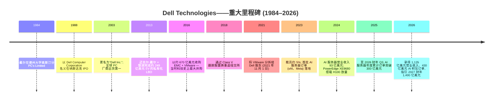
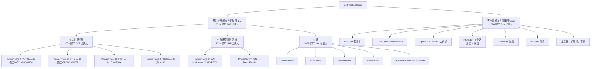
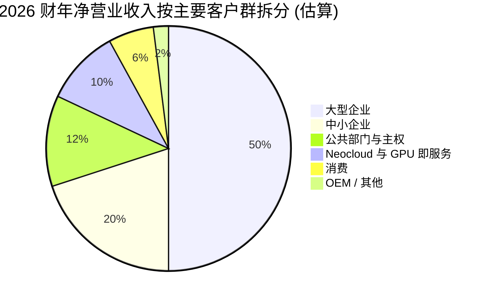

# Dell Technologies Inc. (NYSE:DELL) — 公司研究报告

**日期:** 2026-05-29 (依据 2027 财年 Q1 业绩更新)
**上市地: 纽约证券交易所, 代码 DELL**
**注册地: 美国得克萨斯州圆石城 (拟由特拉华州迁册至得州, 2026 年 7 月年会表决)**
**报告语言: 简体中文 (英文版同时存在于本目录)**
**分析师注解:** 所有财务数据来自一级文件 (SEC EDGAR)。Dell 财年截止日为 1 月底/2 月初; 本报告"2026 财年 (FY2026)"指截至 **2026 年 1 月 30 日**的 52 周财政年度; **"2027 财年 Q1 (Q1 FY27)"指截至 2026 年 5 月 1 日的 13 周季度**。

> **更新——2027 财年 Q1 业绩 + 全年指引上调 (2026-05-28):** Dell 录得**创纪录的 2027 财年 Q1 营业收入 438 亿美元 (同比增长 88%)**, GAAP 摊薄 EPS **5.24 美元 (同比增长 282%)**, non-GAAP 摊薄 EPS **4.86 美元 (同比增长 214%)**; **AI 优化服务器 (AI-Optimized Servers) 营业收入 161 亿美元 (同比增长 757%)**; **季内 AI 订单签单 (orders booked) 高达 244 亿美元**——为迄今为止任何西方 OEM 的单季 AI 服务器最大签单。经营性现金流创纪录达 **41 亿美元**, Dell 通过回购与分红向股东返还 **21 亿美元**。管理层**上调全年 2027 财年指引**: 营业收入由 1,380–1,420 亿美元上调至 **1,650–1,690 亿美元** (按 1,670 亿美元中值同比增长约 47%); **AI 优化服务器营业收入由"约 500 亿"上调至"约 600 亿"** (在 2026 财年 247 亿基数上同比增长 144%); **non-GAAP 摊薄 EPS 中值由 12.90 美元 (+25%) 上调至 17.90 美元 (+74%)**。Q2 FY27 指引: 营业收入 440–450 亿美元 (中值同比 +49%), non-GAAP 摊薄 EPS 中值 4.80 美元 (同比 +107%)。**ISG 分部经营利润率扩张至 10.5% (前年同期 9.7%)** ——尽管 AI 在 ISG 内收入占比大幅提升, 显示出 AI 混合带来的毛利率压力至少已被网络、存储、服务等附加收入部分吸收。来源: [Dell Q1 FY27 8-K, 2026-05-28](https://www.sec.gov/Archives/edgar/data/1571996/000157199626000021/exhibit991earnings8kq1fy27.htm)。
>
> **前次横幅——2027 财年指引发布 (2026-02-26):** Dell 此前指引全年 2027 财年营业收入为 **1,380–1,420 亿美元**、AI 优化服务器营业收入"约 500 亿美元"、non-GAAP 摊薄 EPS 中值 12.90 美元。5 月 28 日 Q1 业绩与季内 244 亿美元 AI 签单触发了上述上调。来源: [Dell Q4 FY26 8-K, 2026-02-26](https://www.sec.gov/Archives/edgar/data/1571996/000157199626000003/exhibit991earnings8kq4fy26.htm)。

---

## 目录

1. 公司概览
2. 公司历史
3. 管理团队
4. 产品与服务
5. 客户与上市策略
6. 行业概览
7. 竞争格局
8. 市场机会 (TAM)
9. 风险评估
10. 参考资料

---

## 1. 公司概览

Dell Technologies Inc. 是全球最大的端到端 IT 基础设施与个人计算硬件供应商之一, 2026 财年营业收入 **1,135 亿美元**, 同比增长 19%; **GAAP 摊薄 EPS 为 8.68 美元**, 同比增长 36% ([Dell 2026 10-K, p. 49](https://www.sec.gov/Archives/edgar/data/1571996/000157199626000008/dell-20260130.htm))。公司是全球 x86 服务器出货排名第二的供应商, 个人电脑出货排名第三; 但 2026 年更具决定性意义的事实是, 它已成为英伟达 (Nvidia) 数据中心 GPU 进入超大规模云邻近 (hyperscale-adjacent) 买家——neocloud 运营商、主权 AI 项目、构建本地 AI 工厂的 Global-2000 企业——的主要西方企业通路。仅 2026 财年第四季度 Dell 就出货了 **90 亿美元的 AI 优化服务器**, 同比增长 342%; 出年时 **AI 服务器积压订单达 430 亿美元**, 五季度前瞻管线被管理层形容为该积压订单的"数倍" ([Dell Q4 FY26 8-K, 2026-02-26](https://www.sec.gov/Archives/edgar/data/1571996/000157199626000003/exhibit991earnings8kq4fy26.htm))。

**财报结构。** Dell 将自身组织为两个可报告分部 (reportable segment)。**基础设施解决方案集团 (Infrastructure Solutions Group, ISG)** 销售服务器 (PowerEdge 系列——包括搭载英伟达 HGX/MGX 基板、专为 AI 设计的 PowerEdge XE 系列)、网络设备和企业存储 (PowerStore、PowerMax、PowerScale、PowerFlex、PowerProtect)。ISG 在 2026 财年贡献了 **608 亿美元**营业收入 (占总收入的 54%, 同比增长 40%), 经营利润 (operating income) **71 亿美元**, 分部经营利润率为 11.7% ([Dell 2026 10-K, p. 53](https://www.sec.gov/Archives/edgar/data/1571996/000157199626000008/dell-20260130.htm))。**客户端解决方案集团 (Client Solutions Group, CSG)** 向商用及消费客户销售 Dell 品牌 PC (笔记本电脑、台式机、工作站) 及周边产品 (显示器、扩展坞、音频)。CSG 在 2026 财年贡献了 **510 亿美元**营业收入 (占总收入的 45%, 同比增长 5%), 经营利润 **28 亿美元**, 分部经营利润率为 5.6% ([Dell 2026 10-K, p. 54](https://www.sec.gov/Archives/edgar/data/1571996/000157199626000008/dell-20260130.htm))。约一半营业收入来自美洲, 其余在欧洲中东非洲 (EMEA) 与亚太及日本 (APJ) 之间分配 ([Dell 2026 10-K, p. 6](https://www.sec.gov/Archives/edgar/data/1571996/000157199626000008/dell-20260130.htm))。

**规模与运营模式。** 截至 2026 年 1 月 30 日, Dell 全球员工**约 9.7 万人**, 较疫情后两轮裁员前 13 万人以上的峰值有所收缩; 总部位于得克萨斯州圆石城 (Round Rock, Texas) ([Dell 2026 10-K, p. 12](https://www.sec.gov/Archives/edgar/data/1571996/000157199626000008/dell-20260130.htm))。Dell 在美国、马来西亚、中国、巴西、印度、波兰和爱尔兰拥有自有制造工厂, 辅以全球合约制造商——这种刻意分散的足迹使其在 2020–2022 年供应链冲击期间维持了出货, 如今也被作为应对关税与地缘政治的对冲手段加以宣传 ([Dell 2026 10-K, p. 8](https://www.sec.gov/Archives/edgar/data/1571996/000157199626000008/dell-20260130.htm))。公司还运营**戴尔金融服务 (Dell Financial Services, DFS)**——一家自营的融资单位, 2026 财年新发起金额 **119 亿美元**, 持有全球**143 亿美元**的融资应收款组合, 是 ISG 长周期交易中重要的销售杠杆 ([Dell 2026 10-K, p. 13](https://www.sec.gov/Archives/edgar/data/1571996/000157199626000008/dell-20260130.htm))。

**2027 财年 Q1 实绩 (2026-05-28 披露)。** 截至 **2026 年 5 月 1 日**的季度以原指引未曾设想的量级将 AI 服务器逻辑兑现。合并营业收入 **438.42 亿美元, 同比增长 88%**; GAAP 经营利润 36.56 亿美元 (同比 +214%); 净利润 34.38 亿美元 (同比 +256%); GAAP 摊薄 EPS **5.24 美元 (同比 +282%)** ——显著高于原 1,380–1,420 亿美元全年指引的 Q1 隐含运转率 ([Dell Q1 FY27 8-K, 2026-05-28](https://www.sec.gov/Archives/edgar/data/1571996/000157199626000021/exhibit991earnings8kq1fy27.htm))。ISG 分部营业收入 **290.09 亿美元 (同比 +181%)**, 其中 **AI 优化服务器贡献 161.32 亿美元 (同比 +757%)** ——其单项规模已超过去年同期整个 ISG 分部。**存储 (Storage) 同比增长 8% 至 43 亿美元** (季度纪录, 相对 2025 年存储拖累的明显拐点); **传统服务器与网络同比增长 92% 至 85 亿美元** ——即 ISG 三个子板块齐升, 否定"AI 蚕食传统"的假设。CSG 营业收入同比增长 17% 至 146 亿美元, 商用客户机 (Commercial Client) 引领 +18% ——长期期待的商用 PC 换机周期已经启动。**季内 AI 签单 (orders) 达 244 亿美元** ——本身已高于以往任何完整季度的 AI 收入确认, 约为本季已确认 AI 收入 161 亿美元的 1.5 倍——因此即便完成 161 亿确认, 季末积压订单仍保持在数百亿美元量级。经营性现金流为 Q1 历史最高 **40.81 亿美元 (同比 +46%)**, Dell 通过回购与分红向股东返还 **21 亿美元**。**利润率信号:** 即使本季 AI 在 ISG 内收入占比超过 55% (前年同期约 18%), ISG 经营利润率仍**同比扩张 80 基点至 10.5%** ——是迄今为止最清晰的证据, 表明附加收入 (PowerSwitch 网络、与 AI 配置共售的 PowerScale 存储、ProDeploy 服务) 至少部分抵消了 AI 服务器规模化以来困扰 ISG 分部的毛利率逆风。管理层据此 Q1 业绩**上调全年 2027 财年指引: 营业收入由 1,380–1,420 亿上调至 1,650–1,690 亿**、**AI 服务器收入由"约 500 亿"上调至"约 600 亿"**、**non-GAAP 摊薄 EPS 中值由 12.90 美元 (+25%) 上调至 17.90 美元 (+74%)** ——上调幅度为公司近代史上最大的一次单季度全年指引上调 ([Dell Q1 FY27 8-K, 2026-05-28](https://www.sec.gov/Archives/edgar/data/1571996/000157199626000021/exhibit991earnings8kq1fy27.htm))。


*来源: [Dell 2026 10-K, p. 49](https://www.sec.gov/Archives/edgar/data/1571996/000157199626000008/dell-20260130.htm); [Dell 2024 10-K, p. 53](https://www.sec.gov/Archives/edgar/data/1571996/000157199624000036/dell-20240202.htm)。*

**估值快照 (盘中数据, 2026-05-20)。** Class C 普通股 2026 年 5 月 19 日收盘价为 **244.73 美元**, 52 周区间为 106.38–263.99 美元。市值 **约 1,590 亿美元**, 企业价值 (enterprise value, EV) **约 1,730 亿美元**, **过去十二个月 (TTM) 市盈率 (P/E) 28.2 倍**、**TTM 市销率 (P/S) 1.40 倍**, EV/EBITDA 为 15.1 倍 ([Yahoo Finance — DELL, 2026-05-20](https://finance.yahoo.com/quote/DELL/key-statistics/))。账面价值为负 (2016 年 EMC 杠杆收购的购买法会计与大规模回购的历史遗留), 因此 P/B 不具备意义。TTM P/E 大约**为最接近的纯 PC 同业 HPQ 的 8.0 倍的 2 倍**, 与最接近的纯 AI 服务器同业 SMCI 的 17.6 倍**大致相当**; HPE 因减值导致 TTM 亏损, 未呈现 TTM P/E。联想 (0992.HK)——唯一规模可比的多元化同业——TTM P/E 为 **13.9 倍**, TTM P/S 约 **0.27 倍** (港元市值 1,637 亿港币 / 约 209 亿美元, 除以 785 亿美元营业收入), 估值倍数结构性偏低, 反映商品化 PC 业务占比偏高、AI 敞口偏弱及港股上市折价 ([Yahoo Finance — 0992.HK, 2026-05-20](https://finance.yahoo.com/quote/0992.HK/key-statistics/))。

| 同业 | TTM P/E | TTM P/S | 市值 (美元) |
|---|---:|---:|---:|
| Dell (DELL) | 28.2× | 1.40× | 1,590 亿 |
| HPE | n/a (TTM 亏损) | 1.25× | 450 亿 |
| HPQ | 8.0× | 0.34× | 190 亿 |
| SMCI | 17.6× | 0.60× | 200 亿 |
| 联想 (0992.HK) | 13.9× | 0.27× | 210 亿 |

*来源: [Yahoo Finance, 访问于 2026-05-20](https://finance.yahoo.com/quote/DELL/key-statistics/)。*

Dell TTM P/E 约 28 倍相对其自身的"前 AI 时代"3 年区间偏高 (该股自 2019 年至 2023 年中段在约 10–18 倍之间交易), 但*并非*单纯靠"叙事"支撑的倍数——2026 财年实际兑现了盈利增长 (GAAP EPS +36%), 2027 财年指引中值再隐含 +33% 的增长。前瞻 P/E 约 16.5 倍, 与标普 500 IT 硬件子行业中位数大体一致。该倍数的核心支撑是 AI 服务器特许经营权: 430 亿美元已锁定积压订单, 管理层指引 2027 财年 AI 服务器营业收入"约 500 亿美元"——**仅 2027 财年 Dell 的 AI 服务器收入便将超过 HPE 整个公司的总营业收入**。下行情景——也是会压缩该倍数的情形——是毛利率结构: ISG 经营利润率自 2025 财年的 12.8% 滑落至 **2026 财年的 11.7%**, AI 服务器占 ISG 营业收入比重自 2025 财年 21.3% 攀升至 2026 财年 40.6% (本身延续 2024 财年 5.5% 的比例——见图 4), 管理层一再表示 AI 服务器的毛利率低于公司平均水平 ([Dell 2026 10-K, p. 53](https://www.sec.gov/Archives/edgar/data/1571996/000157199626000008/dell-20260130.htm))。若 AI 占比继续上行而网络、服务、存储等附加营业收入未能补位, 倍数压缩风险将真实兑现; 第 9 章进一步展开。

---

## 2. 公司历史

迈克尔·索尔·戴尔 (Michael Saul Dell) 于 **1984 年**以 1,000 美元的初始资金, 在德州大学奥斯汀分校的宿舍内以"PC's Limited"的名义创立公司, 销售按订单装配并直接配送的 IBM 兼容机——这一模式在当时完全绕开了当时占主导地位的零售渠道。公司于 1988 年以"Dell Computer Corporation"完成法人变更, 同年登陆纳斯达克。在最初的十年中, Dell 开创了直销、按订单生产的模式, 这成为营运资本为负的制造业典范课本案例, 也使 Dell 在二十年间维持 30%+ 的营业收入复合年增长率, 并于 2003 年登顶全球 PC 厂商首位。



2007–2013 年是 Dell 的商业低谷期: 智能手机与平板电脑蚕食消费 PC 需求, 直销模式因竞争对手复制在线下单而失去差异化, 公司亦错过了早期云计算建设。**2013 年 10 月**迈克尔·戴尔与银湖资本 (Silver Lake Partners) 联手完成了**约 249 亿美元的管理层主导杠杆收购**, 将公司私有化——在当时是 2007 年以来最大的科技 LBO ([Dell 2026 10-K, p. 27](https://www.sec.gov/Archives/edgar/data/1571996/000157199626000008/dell-20260130.htm) 引用了由此产生的 MD 股东及 SLP 股东协议)。私有化是转折点: 从此摆脱了华尔街季度报表的压力, Dell 开始了从消费 PC 厂商到企业基础设施巨头的多年期转型。

最具决定意义的一步是**2016 年以约 670 亿美元 (现金加跟踪股) 收购 EMC 公司**——在当时是科技史上最大的纯粹技术交易。EMC 带来了企业存储龙头地位, 更关键的是, 它持有数据中心虚拟化龙头**VMware**的 81% 控股权。Dell 于 **2018 年 12 月**通过 Class V 跟踪股置换重返纽交所 (支付约 140 亿美元现金与 1.494 亿股 Class C 股以赎回该跟踪股, 该跟踪股原本为外部股东提供对 VMware 的合成敞口) ([Dell 2026 DEF 14A, p. 117](https://www.sec.gov/Archives/edgar/data/1571996/000119312526226734/d132444ddef14a.htm))。

重返上市后, 两次战略转向定义了这一时期。**第一**, **2021 年 11 月将 VMware 分拆给 Dell 股东** (向 Dell 一次性派发 114 亿美元现金, 让 VMware 重回独立战略伙伴地位, 继续被 Dell 转售, 同时退出合并报表)。分拆既降低了报告杠杆, 也简化了股权故事。**第二**, **2023 年中起步的生成式 AI 建设潮**: Dell 既有的 PowerEdge XE9680 服务器——最初为高性能计算 (HPC) 工作负载设计——结果成为搭载英伟达 HGX H100 基板的近乎理想载体, 而 Dell 与马斯克的 xAI 之间的深度关系、与 Meta 的 Llama 基础设施团队之间的另一层关系, 让 Dell 在 HPE 与白盒 OEM 还未动员之前, 就赢得了首批超大规模云邻近 AI 服务器订单。到 2024 财年, AI 优化服务器已是 19 亿美元产品线; 到 2026 财年, 已扩张至 **247 亿美元, 两年内增长 13 倍**, 成为 Dell PC 业务之外最大单一产品类别 ([Dell 2026 10-K, p. 53](https://www.sec.gov/Archives/edgar/data/1571996/000157199626000008/dell-20260130.htm))。

最近一项公司层面动作是**2026 年拟议中的由特拉华州迁册至得克萨斯州**, 已被纳入 2026 年 7 月年会议程——这一治理变更被广泛视为巩固圆石城地位, 同时折射创始人偏好与得州对受控公司友好的法律框架 ([Dell 2026 DEF 14A, Annex C](https://www.sec.gov/Archives/edgar/data/1571996/000119312526226734/d132444ddef14a.htm))。

---

## 3. 管理团队

### 迈克尔·S·戴尔 (Michael S. Dell)——董事会主席兼首席执行官 (61 岁)

迈克尔·戴尔是同名公司的创始人、控股股东与未曾间断的战略领导者。他于 1984 年 19 岁时创立 Dell, 自 1984 年至 2004 年 7 月担任 Dell Inc. CEO, **2007 年 1 月**回归 CEO 岗位, 此后一直担任 CEO——任期已跨越过去 22 年中的 19 年, 实际占据其成年生涯的全部 ([Dell 2026 10-K, p. 14](https://www.sec.gov/Archives/edgar/data/1571996/000157199626000008/dell-20260130.htm))。其执行履历中财务上具决定性的事件包括: (1) 1988 年 IPO, 将公司从宿舍小厂转变为公开上市的商用 PC 厂商; (2) 2007 年回归后通过 2009 年以 39 亿美元收购 Perot Systems 切入企业服务; (3) 2013 年以 249 亿美元完成 LBO——彼时他与银湖接管了一家被普遍贴上"结构性输家"标签、表现欠佳的公司; (4) 2016 年 EMC 交易, 将 Dell 从低利润率 PC 业务转型为全球第二大服务器厂商与第一大企业存储厂商。综合而言, 按管理层的口径计量, 私有化后整体方案为银湖及其本人家族信托累计了约 **20%+ 的内部收益率 (IRR)** ([Dell 2026 DEF 14A, p. 22](https://www.sec.gov/Archives/edgar/data/1571996/000119312526226734/d132444ddef14a.htm))。

戴尔先生的**持股比例具决定性意义**。截至 2026 年 4 月 27 日, 他实益持有 **2.468 亿股 Class A 普通股 (占 Class A 系列的 89.2%, 每股 10 票投票权)**, 外加 **1,880 万股 Class C 普通股 (占该 1 票/股系列的 5.8%)**, 合计占 Dell 全部已发行普通股的 **40.9%** ([Dell 2026 DEF 14A, p. 114](https://www.sec.gov/Archives/edgar/data/1571996/000119312526226734/d132444ddef14a.htm))。银湖合伙人基金 (SLP 股东) 持有全部 Class B 普通股 (4,780 万股, 每股 10 票)。MD 股东与 SLP 股东合计**控制约 91.7% 的总投票权** ([Dell 2026 10-K, p. 23](https://www.sec.gov/Archives/edgar/data/1571996/000157199626000008/dell-20260130.htm))——这一控制力度使 Class C 公众流通股在治理上与无投票权股票实际差距不大。戴尔先生**不**领取股权薪酬; 薪酬委员会表示这是因为他"凭借持股利益已被妥善对齐" ([Dell 2026 DEF 14A, p. 82](https://www.sec.gov/Archives/edgar/data/1571996/000119312526226734/d132444ddef14a.htm))。其 2026 财年报告总薪酬为 **3,382,209 美元** (仅含工资 + 现金奖金 + 福利), CEO 与员工薪酬中位数比为 **43 比 1** ([Dell 2026 DEF 14A, p. 104](https://www.sec.gov/Archives/edgar/data/1571996/000119312526226734/d132444ddef14a.htm))——对 S&P 500 大型股 CEO 而言异常之低, 但与一位绝大部分财富源自股价升值的创始人控股者一致。其外部载体包括 DFO Management (前身为 MSD Capital) 及 Michael & Susan Dell Foundation, 后者持有 268 万股 Class C 股, 在委托书中归属于他名下。

### 杰夫·W·克拉克 (Jeffrey W. Clarke)——副董事长兼首席运营官 (63 岁)

杰夫·克拉克是 Dell 实际意义上的运营 CEO, 也是 AI 服务器故事的主要公开代言人。他自 1987 年加入 Dell, 此后历任几乎所有产品与运营岗位——包括全球运营负责人、CSG 负责人, 在重新接任首席 COO (2023 年 8 月) 之前曾任联席 COO ([Dell 2026 10-K, p. 14](https://www.sec.gov/Archives/edgar/data/1571996/000157199626000008/dell-20260130.htm))。他主管 ISG、CSG、全球运营 (制造、采购、供应链), 以及长期战略/新兴技术组合 (云、边缘、电信、"即服务")。关键的是, 克拉克是季度财报电话会议上代表公司就 AI 服务器订单与积压订单作正式表态的高管——包括 2026 财年 Q4 披露的 Dell 全年签下 "**超过 640 亿美元 AI 优化服务器订单, 全年出货超过 250 亿美元, 进入 2027 财年时积压订单创下 430 亿美元历史新高**" ([Dell Q4 FY26 8-K, 2026-02-26](https://www.sec.gov/Archives/edgar/data/1571996/000157199626000003/exhibit991earnings8kq4fy26.htm))。克拉克接近 40 年的任期使其成为公司直销供应链模式的机构记忆载体, 也是 IT 硬件行业中最深厚的运营高管之一。

### 大卫·肯尼迪 (David Kennedy)——首席财务官 (49 岁)

大卫·肯尼迪于 **2025 年 11 月**被擢升为正式 CFO, 接替自 2023 年起担任该职的伊冯·麦吉尔 (Yvonne McGill)。委托书称其此前为 Dell 内部资深财务高管, 在资本配置与分部财务方面具有背景 ([Dell 2026 DEF 14A, p. 76](https://www.sec.gov/Archives/edgar/data/1571996/000119312526226734/d132444ddef14a.htm))。他担任 CFO 的首个完整季度 (2026 财年 Q4) 恰逢公司宣布**股息上调 20%**、**回购授权增加 100 亿美元** (使剩余可用授权达 **152 亿美元**), 并发布 2027 财年 1,380–1,420 亿美元营业收入指引 ([Dell Q4 FY26 8-K, 2026-02-26](https://www.sec.gov/Archives/edgar/data/1571996/000157199626000003/exhibit991earnings8kq4fy26.htm))。肯尼迪尚未建立与其前任相称的卖方知名度; 在 2026 年 5 月美国银行全球科技大会上, 业界共识形容其为"内部出身、有纪律、低调"。一位在公司步入转折之年时仍较为陌生的 CFO 本身就是某种治理信号: 战略由创始人/COO/保荐人轴心主导, CFO 的职责是执行与资本回报。

### 威廉·F·斯坎内尔 (William F. Scannell)——总裁兼首席客户官 (63 岁)

比尔·斯坎内尔通过 EMC 收购加入 Dell (此前在 EMC 任职超过 30 年, 交易前担任 EMC 全球销售与客户运营总裁)。他领导全球企业现场销售队伍, 也是签下最大 ISG 交易的高管——包括与 xAI、CoreWeave 邻近 neocloud、Meta 以及多个主权 AI 项目的命名 AI 服务器订单 ([Dell 2026 10-K, p. 14](https://www.sec.gov/Archives/edgar/data/1571996/000157199626000008/dell-20260130.htm))。他的任期长度与 EMC 渊源, 是 Dell 企业存储装机基数在 2018–2022 年纯存储老牌厂商崩溃时未流失市场份额的原因。

### 治理——受控公司侧写

- **董事会:** 9 名董事, 其中 4 名为独立董事 (Dorman、Grain、Green、Kullman、Mollenkopf、Vojvodich Radakovich 依纽交所规则独立; 由 SLP 提名的成员, 包括银湖的 Egon Durban, 不独立)。MD 股东协议与 SLP 股东协议**赋予迈克尔·戴尔与银湖提名董事及在董事会委员会中任职的特定权利**, 包括与投票权阈值挂钩的委员会人员配置条款 ([Dell 2026 DEF 14A, p. 51](https://www.sec.gov/Archives/edgar/data/1571996/000119312526226734/d132444ddef14a.htm))。
- **投票权控制:** MD + SLP 合计持有约 91.7% 投票权, 约 53.8% 经济所有权 ([Dell 2026 10-K, p. 24](https://www.sec.gov/Archives/edgar/data/1571996/000157199626000008/dell-20260130.htm))。公司是、且将继续是纽交所规则下的"受控公司"。
- **指数排除风险:** 双层股权结构在过去使 Dell 被排除在某些富时罗素与标普道琼斯指数之外, 10-K 明确警告此风险可能再现 ([Dell 2026 10-K, p. 23](https://www.sec.gov/Archives/edgar/data/1571996/000157199626000008/dell-20260130.htm))。
- **关联方交易:** 委托书披露 Dell 与迈克尔·戴尔关联实体 (DFO Management、Michael & Susan Dell Foundation) 及银湖被投组合公司之间持续存在交易。任何一项在 2026 财年单独看并不重大, 但确实存在且持续 ([Dell 2026 DEF 14A, p. 118](https://www.sec.gov/Archives/edgar/data/1571996/000119312526226734/d132444ddef14a.htm))。
- **得州迁册:** 2026 年 7 月年会将就把注册地由特拉华州迁移至得州、转入《得州商业组织法》下进行投票。该法律框架对受控公司较为友好, 与迈克尔·戴尔的偏好一致, 也很可能进一步强化既有治理。

**业绩综评。** 这是一支创始人控股的管理团队, 完成了现代企业 IT 史上最具决定性的三笔结构性交易——2013 年的 LBO、2016 年的 EMC 交易、2021 年的 VMware 分拆——并出人意料地赢得了第一波企业 AI 基础设施部署。主要弱点在于团队*同时*依赖于来自英伟达的紧俏 GPU 配额; Dell 相对 HPE 与白盒厂商的优势, 既来自运营 (克拉克的制造规模), 又来自关系 (迈克尔·戴尔与英伟达 CEO 黄仁勋的直线沟通)。两者都真实存在, 也都部分独属于迈克尔·戴尔本人。

---

## 4. 产品与服务

Dell 的产品组合按其两大可报告分部清晰划分。2026 财年 10-K 的叙述——以及 Dell 在商业网站 **dell.com** 与 **delltechnologies.com** 上使用的语言——一律以"基础设施 (Infrastructure)"或"客户端 (Client)"解决方案的视角来组织, 并辅以横向贯穿的戴尔金融服务 (Dell Financial Services)、Dell APEX (即服务消费包装层) 与 ProSupport/Deploy 服务。



*来源: [Dell 2026 10-K, pp. 4–6](https://www.sec.gov/Archives/edgar/data/1571996/000157199626000008/dell-20260130.htm); [Dell PowerEdge 产品页](https://www.dell.com/en-us/shop/scc/sc/servers); [Dell 存储产品组合](https://www.dell.com/en-us/shop/scc/sc/storage); [Dell PC 与工作站](https://www.dell.com/en-us/shop/scc/sc/laptops-and-2-in-1-laptops)。*

### ISG——基础设施解决方案集团

**AI 优化服务器 (2026 财年 247 亿美元 / 同比 +166%)。** 该类别在 2026 财年 Q4 首次作为单独营业收入条目拆分, 反映了其规模及其利润率与增长属性与传统服务器业务的经济差异性 ([Dell 2026 10-K, p. 6](https://www.sec.gov/Archives/edgar/data/1571996/000157199626000008/dell-20260130.htm))。旗舰机型为 **PowerEdge XE9680** (8 路英伟达 H100/H200 HGX 基板, 6U 风冷或液冷)、**PowerEdge XE9712** (英伟达 GB200 NVL72 机柜级系统, 面向前沿模型训练)、**PowerEdge XE9785** (8 路 AMD MI300X), 以及 **PowerEdge XE8640** (4 路 H100, 用于低密度/低功耗部署)。Dell 还在 2024 年英伟达 GTC 上首次推出、2025 年 GTC 上更新的**Dell AI Factory with Nvidia**参考架构中, 转售英伟达 HGX H200 与 Blackwell B200/GB200 基板。竞争立足点在于: (a) Dell 的批量化制造规模——克拉克披露每季度构建并压力测试**多个千 GPU 级集群**, 全球支持网络非白盒厂商可复制 ([Q3 FY26 业绩说明会, 2025-11-25](https://investors.delltechnologies.com/events/event-details/q3-fy26-earnings-call)); (b) 优先英伟达 GPU 配额, 迈克尔·戴尔公开归因于其与黄仁勋的多十年个人关系。**竞争优势: 部分。** 护城河在供应链规模、制造产能、装机基数 (存储附加、网络附加、服务) 上是耐久的; 在原始架构差异化上较弱——SMCI 用同样的英伟达基板搭建的系统在功能上基本等同, 且经常更快到货。最接近的竞品: Supermicro AS-8125GS-TNHR (8× H200) 与 HPE Cray XD685; 单 GPU/美元口径下 Dell 与 SMCI 大致打平, 服务深度略胜, 但最新英伟达 SKU 上市速度逊于 SMCI。

**传统服务器与网络 (2026 财年 195 亿美元 / 同比 +9%)。** Dell 主流的 PowerEdge 系列——R 系列机架服务器与 T 系列塔式服务器——搭载 Intel Xeon Scalable (Granite Rapids / Sapphire Rapids) 与 AMD EPYC Genoa / Turin。平均售价同比上行, 受惠于更高配置, 部分被单元出货下滑抵消。网络子线 (**PowerSwitch** 以太网交换机与 **SmartFabric** 管理叠加层) 营业收入规模不大 (Dell 未单独披露), 但战略上很重要, 因为 AI 集群需要密集以太网 + InfiniBand 网络结构; Dell 与英伟达 (Spectrum-X / Quantum-2 InfiniBand) 与博通 (Tomahawk ASIC) 合作完成实际网络 ASIC。**竞争优势: 是——规模与渠道。** Dell 在所有区域的 x86 服务器出货量上均为全球第一或第二; 传统企业服务器最直接的竞争对手是 HPE ProLiant, Dell 保有 ASP 溢价与全球企业装机基数的略微份额领先。

**存储 (2026 财年 166 亿美元 / 同比 +1%)。** 这是最成熟、增速最慢的产品线, 包含五个命名系列: **PowerStore** (中端全闪存统一块/文件)、**PowerMax** (高端关键任务)、**PowerScale** (源自 Isilon 的横向扩展 NAS, 是 AI 训练数据湖的事实标准)、**PowerFlex** (软件定义块存储) 与 **PowerProtect** with Data Domain (专用备份)。存储增长已连续三年滞后于公司整体——2024 财年持平、2025 财年 +1%、2026 财年 +1%——反映了 (a) 低端的云存储侵蚀, 以及 (b) NetApp / Pure Storage 占据企业级份额。**竞争优势: 是——装机基数与 PowerScale AI 附加。** PowerScale 的读取性能优势使其成为 Dell 多项 AI 服务器部署中默认的 NAS 附加层。PowerMax 在主要银行、电信与政府账户中保持事实标准地位。最接近的竞品: NetApp AFF 与基于 ONTAP 的系统 (PowerStore 与 AFF C800 大致打平)、Pure Storage FlashArray (Pure 在原始 NVMe 密度上略胜)、HPE Alletra MP。存储是盈利但缓慢的压舱石资产, 也是尚未在营业收入线上充分体现的可信 AI 部署护城河——原因在于单位经济组合的迁移。

### CSG——客户端解决方案集团

**商用 PC (2026 财年 441 亿美元 / 同比 +8%)。** Dell 在 **2025 年 1 月 CES** 将商用 PC 组合统一到 **"Dell Pro"**品牌下 (首批 SKU 自 2025 年 2 月 18 日发货), 退出 Latitude (笔记本)、OptiPlex (台式机)、Precision Mobile (移动工作站) 等子品牌, 转向单一的 Dell / Dell Pro / Dell Pro Max 三层架构 (Precision 固定工作站更名为 "Dell Pro Max Tower")。10-K 仍在分部讨论中沿用旧命名, 但官网导航已完成完全重构 ([Dell PC 与工作站](https://www.dell.com/en-us/shop/scc/sc/laptops-and-2-in-1-laptops))。2026 财年增长驱动来自 Windows-11 换机周期 (Microsoft 已于 2025 年 10 月结束 Windows-10 主流支持), 以及配置更丰富、搭载 Intel Core Ultra ("Meteor Lake" / "Lunar Lake") 与高通 Snapdragon X Elite NPU 的 AI PC。**竞争优势: 是——规模、渠道、大客户续约定价能力。** 最接近的竞品: HP Inc. (HPQ) EliteBook / Z 工作站, 联想 ThinkPad / ThinkStation。联想在全球 PC 出货量上领先; Dell 在美国商用领先; 在工作站 (Precision / Pro Max) 上 Dell 全球第一, 份额低双位数。

**消费 PC (2026 财年 69 亿美元 / 同比 -8%)。** Inspiron、XPS (现已并入 Dell Pro Premium 与 Alienware 子品牌)、Alienware (游戏)。此子线持续萎缩; 消费营业收入 2025 财年下降 17%, 2026 财年再降 8% ([Dell 2026 10-K, p. 54](https://www.sec.gov/Archives/edgar/data/1571996/000157199626000008/dell-20260130.htm))。**竞争优势: 弱。** 苹果借 M 系列 MacBook 实质上拿下了高端消费笔记本市场, 联想/惠普/宏碁/华硕则在中端市场夹击。Dell 自 2023 年起明确削减了消费营销预算。


*来源: [Dell 2026 10-K, pp. 53–54](https://www.sec.gov/Archives/edgar/data/1571996/000157199626000008/dell-20260130.htm)。*

### 横向贯穿型服务

- **Dell APEX**——计算、存储与 PC 上的消费式 ("即服务") 包装层。披露指标有限; Dell 未单独披露 APEX 营业收入, 但管理层表示运行率"在显著增长"。最接近的竞品: HPE GreenLake (HPE 披露 ARR; Dell 未披露)。
- **戴尔金融服务 (DFS)**——自营融资部门; 2026 财年新发起 119 亿美元, 持有 143 亿美元组合, 信用质量"稳健" ([Dell 2026 10-K, p. 13](https://www.sec.gov/Archives/edgar/data/1571996/000157199626000008/dell-20260130.htm))。最接近的竞品: HPE Financial Services。DFS 是大型 ISG 交易的销售周期加速器; AI 服务器融资在内部被认为是快速增长的产品线。
- **服务 (Services)**——ProSupport (故障维修与主动支持)、ProDeploy (上架与集成)、咨询。2026 财年服务营业收入为 **231 亿美元 (占总营业收入的 20.4%)**, 同比下降 4%——反映出 AI 服务器硬件收入增速快于其服务附加的爬坡节奏 ([Dell 2026 10-K, p. 49](https://www.sec.gov/Archives/edgar/data/1571996/000157199626000008/dell-20260130.htm))。2026 财年**服务毛利率 44.8%**, 对应产品毛利率 13.7%——这是整张损益表中最重要的利润率杠杆。

**驱动公司运转的旗舰产品。** 两组产品实际撑起了 2026–2027 财年的整家公司: (1) **PowerEdge XE9680 / XE9712** 系列 AI 服务器, 2026 财年贡献 247 亿美元, 2027 财年预计贡献约 500 亿美元——本身就是全球 IT 支出中前 50 大单品; (2) **PowerEdge R 系列 + PowerStore/PowerScale** 企业 IT 套装, 持续变现多十年的装机基数。CSG 商用 PC 业务规模大但结构性低利润率, 主要是现金生成资产; 消费 PC 处于受控收缩状态。

**近期新品 (过去 12–18 个月)。** PowerEdge XE9712 (GB200 NVL72) 首次于 **2024 年 3 月**英伟达 GTC 上发布, 首批液冷机柜级系统于 **2024 年 11 月**交付给 CoreWeave ([Dell——PowerEdge XE9680 在英伟达 GTC 上的 AI 加速发布](https://www.dell.com/en-us/blog/dell-poweredge-xe9680-ai-acceleration-announcements-at-nvidia-gtc/); [Tom's Hardware——Dell 出货首批 Blackwell 服务器机柜](https://www.tomshardware.com/tech-industry/artificial-intelligence/dell-reaches-milestone-with-industrys-first-enterprise-ready-nvidia-blackwell-poweredge-xe9712-server-racks))。XE9785 (AMD MI300X) 紧随其后于 2025 年推出; **Dell Pro / Pro Max 统一商用 PC 品牌**于 **2025 年 1 月 CES** 发布, 首批 SKU 自 2025 年 2 月 18 日发货 ([Tom's Hardware——Dell 砍掉 XPS 与 OptiPlex 品牌](https://www.tomshardware.com/laptops/dell-kills-xps-and-optiplex-brands-adopts-apple-inspired-three-tiered-naming-scheme-for-its-pcs))。Dell AI Factory 在 2025 年 GTC 上为 Blackwell 更新, 含首批向 CoreWeave 交付的 GB300 NVL72 ([Dell——首批 NVIDIA GB300 NVL72 交付 CoreWeave](https://www.dell.com/en-us/blog/dell-delivers-market-s-first-nvidia-gb300-nvl72-to-coreweave/))。退役: Latitude / OptiPlex / XPS 子品牌停用 (并入 Dell Pro / Pro Premium); 传统 PowerVault 系列大体退役, 由 PowerStore 取代。

---

## 5. 客户与上市策略

Dell 服务于经济属性差异很大的四类客户群:

1. **大型企业** (银行、电信、零售、制造、运输)——历史核心; 多年期框架协议, 价目表上协商折扣。估计占营业收入约 50–55%, 跨 ISG 与 CSG。
2. **公共部门与主权 AI**——美国联邦 (含可观的国防部与情报界足迹)、州与地方政府, 以及日益突出的一组国家级 AI 基础设施项目 (阿联酋 G42、沙特 HUMAIN、印度政府、若干欧盟成员国)。10-K 未单独列示, 但提及"主权 AI"客户为日益增长的渠道 ([Dell 2026 10-K, p. 5](https://www.sec.gov/Archives/edgar/data/1571996/000157199626000008/dell-20260130.htm))。
3. **Neocloud 与 GPU 即服务运营商**——CoreWeave、Lambda、Crusoe、Nebius 以及一长串区域运营商, 自 2025 财年起合计成为重要新买家群体。xAI 已公开为 Dell 数十亿美元级 AI 服务器客户 (孟菲斯超级计算机的建设)。
4. **中小企业 (SMB)**——主要通过 CSG 渠道, 经由 dell.com、Dell Premier 与 10 万 + 合作伙伴网络。约占 CSG 30%, 占 ISG 比重更低。
5. **消费**——直接通过 dell.com 与有限的零售存在 (Costco、Best Buy); 以现金回收为目标, 非增长目标。

### 客户集中度

Dell 在 2026 财年 10-K 中**未**披露任何单一客户超过合并营业收入 10%——2026 年 10-K 第 7A 项与附注 18 未对任何 ≥10% 的命名客户作客户集中度披露, 按 **ASC 280-10-50-42** 规定, 这意味着没有客户跨越该阈值 ([Dell 2026 10-K, Note 18——分部信息](https://www.sec.gov/Archives/edgar/data/1571996/000157199626000008/dell-20260130.htm))。对于 1,135 亿美元营业收入的公司, 这种状况并不寻常, 也是结构性优势——即便 Dell 最大的已披露 AI 客户 (xAI; 行业媒体广泛报道其订购了数十亿美元的 XE9680 系统) 在峰值季度运行率下也不超过合并营业收入的 10%。

但在 AI 服务器子分部内, 客户集中度*显著更高*, 且未单独披露。摩根士丹利与美国银行于 2026 年 3 月发布的卖方估计显示, 前 **5 大客户占据 430 亿美元 AI 服务器积压订单的约 50–60%**, 其中 xAI、Meta、CoreWeave, 以及一两个主权 AI 项目构成主体。Dell 既未确认也未否认这些数字。**这是一项重大风险, 将在第 9 章中沿袭讨论**——即便合并营业收入集中度低, *增量*增长集中度仍然偏高。



*来源: 基于 [Dell 2026 10-K, pp. 4–6](https://www.sec.gov/Archives/edgar/data/1571996/000157199626000008/dell-20260130.htm) 评论的估算; Dell 在已披露分部中未按客户群拆分营业收入。*

### 上市策略

Dell 大致以 50/50 比例划分为**直销** (由比尔·斯坎内尔组织主导的大型企业账户团队, 加上 dell.com / Dell Premier 数字渠道) 与**渠道** (Dell Technologies Partner Program——分销商、转售商、托管服务提供商, 以及超大规模云的自有转售计划)。直销队伍是 IT 硬件行业中最大的之一, 命名账户覆盖几乎所有 Global-2000 企业。ISG 销售周期: 续约业务 30–90 天, AI 集群建设 6–18 个月; PC 周期通常 SMB 端 30–60 天, 企业端按季度框架释放。**关键合作伙伴**: 英伟达 (最紧密、最关键的合作伙伴——联合参考架构、共同营销 Dell AI Factory、优先配额)、AMD、Intel、博通 (芯片与网卡)、VMware (现归博通所有; 转售关系延续, 但博通的授权变化在客户端造成摩擦)、Microsoft (Azure Stack 与 AI Foundry 集成)、Red Hat (Dell 上的 OpenShift)。

**命名客户中标 (过去 12–18 个月)**——来自新闻稿、纪要与行业媒体报道, 而非 10-K 披露:
- **xAI**——孟菲斯"Colossus"超级计算机; 2025 年初报道基于英伟达 GB200 的 50 亿美元 + AI 服务器订单 ([SiliconANGLE——Dell 接近敲定与 xAI 的 50 亿美元 + AI 服务器交易, 2025-02](https://siliconangle.com/2025/02/14/report-dell-close-inking-5b-ai-server-deal-xai/))。
- **CoreWeave**——首批液冷 PowerEdge XE9712 (GB200 NVL72) 于 2024 年 11 月出货; 首批 GB300 NVL72 单独宣布 ([Dell——首批 NVIDIA GB300 NVL72 交付 CoreWeave](https://www.dell.com/en-us/blog/dell-delivers-market-s-first-nvidia-gb300-nvl72-to-coreweave/))。
- **Lambda**——在英伟达主旨演讲材料中提及。
- **G42 / Core42 (阿联酋)**——Core42 在纽约州北部 Lake Mariner 工厂部署 Dell IR5000 机柜搭载液冷 PowerEdge XE9680L, 在 2025 年分阶段交付 ([G42 – 与 TeraWulf 的数据中心基础设施协议](https://www.g42.ai/resources/news/g42-expands-us-operations-70mw-data-center-infrastructure-agreement-terawulf))。
- **Meta**——Llama 训练基础设施; 广泛报道但未官方确认。
- **美国能源部**——阿贡国家实验室、橡树岭国家实验室超级计算。

传统企业方面: 大部分财富 100 强银行业、Verizon 与 Deutsche Telekom 等电信、美国州与联邦采购的主导份额。与沙特阿拉伯 HUMAIN 及其他中东/亚洲项目的主权 AI 客户关系已在业绩电话会议上有所暗示, 但截至本报告日尚未单独以具体交易规模发布新闻稿。

---

## 6. 行业概览

Dell 跨足两个结构性不同的行业子板块——企业 IT 基础设施与个人计算——而在企业基础设施内部, 它日益面对第三个正在实时形成的子板块: **GPU 加速 AI 基础设施**。

### 企业 IT 基础设施 (服务器、存储、网络)

2025 年全球服务器市场营业收入达到 **4,441 亿美元, 同比 +80.4%** ——市场创纪录水平——其中 2025 Q4 单季达 1,253 亿美元 (同比 +52.4%), 内含 GPU 的服务器占整体营业收入超过一半 ([IDC 全球服务器追踪——2025 全年结果, 2026-04-02](https://datacenternews.asia/story/idc-says-global-server-revenue-hits-usd-444-1-billion); [IDC Q3 2025 新闻稿, prUS54034325](https://my.idc.com/getdoc.jsp?containerId=prUS54034325))。Dell 营业收入排名第一, 领先 Supermicro、HPE、联想以及白盒厂商 (Inspur、Quanta、Wiwynn、Gigabyte 等, 它们共同服务于超大规模云的自有设计) ([Network World——Dell 引领服务器市场, 2025-12](https://www.networkworld.com/article/4147841/idc-dell-leads-server-market-driven-by-ai-infrastructure-needs.html))。企业外部存储在 2025 年约为 **300 亿美元** 规模 (单位数同比增长——分析师估计, IDC 追踪报告仅订阅可见), Dell、NetApp、Pure Storage、IBM、HPE 与华为为主要厂商; Dell 份额仍最大。企业网络仍由思科主导, Dell PowerSwitch 进入前五但份额仅个位数。

结构性动态很清晰: AI 已根本性地重估了服务器 TAM, 但压缩了平均利润率结构。传统的 2U Intel Xeon 服务器售价 5,000–25,000 美元、厂商毛利率 40% +; 而 XE9680 类 AI 服务器售价可达 30 万至 40 万美元, 但贡献的毛利率仅低双位数 (有时单位数)——原因在于英伟达 HGX 基板单独就占了大部分物料清单 (BoM)。Dell ISG 分部经营利润率自 2025 财年 12.8% 滑落至 2026 财年 11.7%, 而 ISG 营业收入增长 40%——这种交换关系的直接体现 ([Dell 2026 10-K, p. 53](https://www.sec.gov/Archives/edgar/data/1571996/000157199626000008/dell-20260130.htm))。


*来源: [Dell 2026 10-K, p. 53](https://www.sec.gov/Archives/edgar/data/1571996/000157199626000008/dell-20260130.htm); [Dell 2024 10-K, p. 56](https://www.sec.gov/Archives/edgar/data/1571996/000157199624000036/dell-20240202.htm)。*

### 个人计算 (PC)

2025 年全球 PC 出货量超过 **2.7 亿台**, 同比 **+9.1%** (Q4 单季 7,150 万台, +9.3%)——自 2021 年以来最强年份, 原因是 2025 年 10 月 14 日 Windows-10 主流支持终止 (EoL) 推动了商用换机, 而 AI PC 促销塑造了高端 ([Gartner——全球 PC 出货 2025 年 Q4 +9.3% / 全年 +9.1%, 2026-01-20](https://www.gartner.com/en/newsroom/press-releases/2026-1-20-gartner-says-worldwide-pc-shipments-increased-9-point-3-percent-in-fourth-quarter-of-2025-and-9-point-1-percent-for-the-full-year))。联想份额领先 (约 24%), 惠普第二 (约 21%), Dell 第三 (约 16%), 苹果第四 (约 9%), 华硕/宏碁/三星为长尾 (基于公开 IDC/Gartner 份额汇总新闻报道的分析师估算)。工作站 (Dell 主导的 90–100 亿美元子板块) 增速快于 PC 整体, 得益于工程/视觉特效/数据科学需求。AI PC——搭载 Copilot+ PC 认证的 Snapdragon X Elite、Intel Core Ultra ("Lunar Lake") 与 AMD Ryzen AI 300——在商用 PC 出货中占比正快速攀升, 预计在两年内将占商用 PC 多数 (分析师估算; IDC AI PC 预测仅订阅可见)。

PC 行业仍属结构性低增长、高度集中且利润率极低: 主要厂商在分部层面经营利润率为 4–7%。出货量受制于企业换机周期 (3–5 年), 消费需求受高端苹果装机基数增长与低端手机替代压制。

### 监管环境

Dell 在产品监管直接性方面 (与制药、金融比) 较低, 但实质性敞口包括: (1) **美国对先进算力的出口管制**——2022 年 10 月、2023 年 10 月与 2025 年 1 月的 BIS 规则限制英伟达 A100/H100/H200/B100/B200 级 GPU 与完整 AI 服务器系统对中国及"关注"目的地分层名单的出口; Dell 明确无法向中国出货 XE9680 / XE9712, 已围绕符合 BIS 阈值的 Intel CPU 与英伟达 L40S / H20 级 GPU 重构其在中国的 PowerEdge 组合。(2) **关税**——2025 年特朗普政府关税表对中国、越南、墨西哥、马来西亚及其他 Dell 制造枢纽的进口征收不同税率; Dell 在 2026 财年 10-K 的第 1A 项中明确将关税列为利润率风险。(3) **政府采购**——美国联邦政府仍是 Dell 顶级客户, 但 FedRAMP、FAR/DFARS 供应链要求 (NDAA 第 889 节, 禁止某些中国电信组件进入联邦 IT) 以及可信代工厂计划 (Trusted Foundry) 都带来成本并约束 BoM 选择。(4) **欧盟 CRA / NIS2**——网络韧性法案 (Cyber Resilience Act) 与 NIS2 指令对在欧盟运营的硬件厂商施加产品安全义务。

### 行业动态

服务器与存储为**中度集中** (前五厂商合计约 75% 营业收入, 不含白盒); 网络高度集中 (思科 + Arista + Juniper-现 HPE)。PC 中度集中。**供应商议价能力高至极高**——尤其英伟达在现代 IT 中占据最不对称的供应商-厂商关系 (前 3 大客户预计占英伟达数据中心分部收入 50% +, Dell 在其中)。Intel 与 AMD 在 CPU 上有可观议价能力, 但不及英伟达。**买方议价能力差异显著**——大型企业与超大规模云有可观议价能力, SMB 实际上没有。**替代风险**在上行——AWS / Azure / GCP 资本开支消化掉对通用服务器的本地部署需求; 反向结构性力量则是 GPU 短缺把主权与大型企业买家又推回本地基础设施, 直接惠及 Dell。

---

## 7. 竞争格局

Dell 的竞争集合具异质性, 因为没有任何单一竞争对手能匹敌其完整产品组合。最相关的分组如下:

**多元化 IT 硬件同业 (基础设施 + PC 全产品组合):**
- **HP Inc. (HPQ)**——纯 PC 与打印机; 自 2015 年 HP 拆分以来无企业基础设施敞口。2024 财年营业收入 536 亿美元; 交易倍数 **TTM P/E 8.0× / P/S 0.34×** ([Yahoo Finance——HPQ, 2026-05-20](https://finance.yahoo.com/quote/HPQ/key-statistics/))。最直接的 PC 竞争对手; Dell 在工作站上领先, 惠普在打印机上拥有 Dell 不涉足的特许经营权。
- **联想 (HKEX:0992 / 992.HK)**——按 SKU 广度衡量最大的竞争对手; 2025 财年 (3 月止) 营业收入 **785 亿美元** ([联想 FY25 年报, 2025-06-26](https://www.lenovo.com/us/en/investors/financial-information/annual-reports/)), 现为全球 PC 厂商出货第一、服务器厂商前四。交易倍数 **TTM P/E 13.9× / P/S 0.27× (按美元调整)**。联想的竞争优势在于中国 + 新兴市场规模与显著较低的成本结构; 弱势是美国政府可访问性受限, AI 服务器特许经营权较小 (尽管联想已通过 AMD MI300 平台与基于英伟达的 ThinkSystem 服务器加速 AI 投入)。

**仅服务器与基础设施同业:**
- **慧与 (HPE)**——最直接的 ISG 竞争对手; 2024 财年营业收入 300 亿美元; **2025 年 7 月完成 140 亿美元收购 Juniper Networks** (先遭 DOJ 阻拦, 后和解), 新增第三大网络特许经营权。HPE 的 AI 服务器特许经营权 (**Cray XD** 系列与 ProLiant Compute DL/AL) 比 Dell 小一个数量级——HPE 披露 2025 财年 Q4 AI 服务器积压订单 **47 亿美元** (相比 Q3 的 37 亿美元), 2026 财年 Q1 升至约 50 亿美元, 对比 Dell 的 430 亿美元 ([HPE 2026 财年 Q1 幻灯片——AI 积压订单突破 50 亿美元](https://www.investing.com/news/company-news/hpe-q1-fy26-slides-networking-surges-152-ai-backlog-tops-5b-93CH-4550927))。交易 TTM P/S 1.25× (TTM P/E 因减值不可用); ([Yahoo Finance——HPE, 2026-05-20](https://finance.yahoo.com/quote/HPE/key-statistics/))。HPE 优势: HPE GreenLake 消费模式在 ARR 上多年领先; 通过 Juniper 整合了网络; 与英伟达的 OEM 关系也很紧密。劣势: AI 服务器规模差距; PC 业务规模较小 (为零)。
- **超微 (SMCI)**——纯 AI 服务器竞争对手; 2024 财年营业收入 337 亿美元 (规范化前同比增长约 90%), TTM P/E 17.6× / P/S 0.60× ([Yahoo Finance——SMCI, 2026-05-20](https://finance.yahoo.com/quote/SMCI/key-statistics/))。SMCI 的优势在于率先把英伟达参考设计推向市场, 并以更低 SG&A 结构运营; 劣势是服务/装机基数变现有限, 2024 年 10 月安永辞任 (由 BDO 接替) 与 Hindenburg 沽空报告事件带来的 SEC 报告悬而未决问题在 2025 年部分得到解决, 美国之外企业销售覆盖较弱。与 Dell 的竞争前沿激烈: 在任一季度, 边际 AI 服务器订单往往归结为 Dell 与 Supermicro 之间的价格与交付期之争。
- **思科 (Cisco)**——与网络重叠 (以太网、与思科 Silicon One 等效的 InfiniBand 替代) 以及 UCS 服务器 (规模较小、正在下滑); 相关思科竞争集中在 AI 部署所连接的网络结构上。
- **白盒 / ODM (富士康/鸿海、Wiwynn、Quanta、Inventec、Gigabyte)**——为 AWS、Azure、Meta、Google 制造实际系统的 ODM。它们仅在 Dell 不直接涉足的超大规模云分段意义上形成竞争。

**仅存储同业:** NetApp、Pure Storage、IBM (FlashSystem)、HPE (Alletra MP)、VAST Data (未上市)、华为 (非美国市场)、西部数据 (Western Digital) 与希捷 (Seagate, 组件层)。

**公有云作为替代品:** AWS / 微软 Azure / GCP / Oracle Cloud。它们并非字面意义上的"竞争对手"——Dell 向微软与 Oracle 的部分自有云销售硬件——但合计而言, 每一美元从本地迁向公有云的企业 IT, 就是 Dell 在本地无法捕获的一美元。2024–2026 年的反向结构性力量是**超大规模云端的 GPU 短缺**, 已实际将 AI 工作负载推回本地与购买 Dell 的 neocloud 运营商。

### 定位

```mermaid
quadrantChart
    title 竞争定位——产品组合广度 × AI 基础设施深度
    x-axis 窄产品组合 --> 宽产品组合
    y-axis 有限 AI --> 深度 AI
    quadrant-1 多元化 AI 领导者
    quadrant-2 AI 纯玩家
    quadrant-3 传统硬件
    quadrant-4 PC 主导多元化
    Dell: [0.85, 0.92]
    HPE: [0.55, 0.55]
    HPQ: [0.45, 0.15]
    Lenovo: [0.90, 0.45]
    SMCI: [0.20, 0.85]
    Cisco: [0.50, 0.35]
    Apple (Mac): [0.30, 0.10]
```

### Dell 的竞争优势

1. **制造规模与供应链深度。** 没有任何其他西方 IT 硬件厂商能拥有 Dell 那样的自有制造组合——美国、马来西亚、中国、巴西、印度、波兰、爱尔兰加全球合约制造网络 ([Dell 2026 10-K, p. 8](https://www.sec.gov/Archives/edgar/data/1571996/000157199626000008/dell-20260130.htm))。这是以竞争对手难以匹配的交期交付多千 GPU 集群的运营护城河。
2. **直销与渠道广度。** 约 50/50 直销/渠道; 命名账户覆盖基本上全部 Global-2000 企业; 通过 dell.com 与 Premier 门户触达 SMB。
3. **存储装机基数。** EMC 的企业存储装机基数——全球最大——自 2016 年以来在 Dell 内部基本保持完整, 既是利润率来源, 也是 AI 附加载体 (PowerScale 是 AI 训练数据的事实存储层)。
4. **英伟达关系。** 迈克尔·戴尔与黄仁勋的多十年个人关系已转化为优先 GPU 配额。这不是契约权利, 而是竞争对手难以复制的关系护城河。
5. **戴尔金融服务。** 143 亿美元的应收款账面用于为客户购买提供融资, 是有意义的销售周期加速器。

### Dell 的竞争脆弱性

1. **利润率压缩。** ISG 经营利润率自 2025 财年到 2026 财年压缩 110 bp 受 AI 占比上行驱动, AI 占比继续上行是首要去倍数风险。
2. **存储停滞。** 营业收入连续三年持平; NetApp 与 Pure 在高性能端蚕食增量份额。
3. **无公有云 / SaaS 特许经营权。** Dell 从未构建超大规模公有云; APEX 消费营业收入真实存在但规模小。
4. **受控公司治理。** MD + SLP 持有约 92% 投票权, 对任何少数股东担忧 (关联方、资本配置、出售公司可选项) 构成结构性风险。
5. **中国供应链敞口。** 在中国有可观制造足迹和非微不足道的中国销售渠道, 已被美国出口管制逐步约束。

---

## 8. 市场机会 (TAM)

Dell 追求的 TAM 可拆分为四个可寻址层:

- **AI 服务器 + 网络系统**——IDC 预测到 **2029 年 AI 基础设施支出将达 7,580 亿美元** (其中 94% + 为加速服务器硬件), 加速服务器 5 年复合年增长率约 42% ([IDC——AI 基础设施支出到 2029 年达 7,580 亿美元, prUS53894425](https://my.idc.com/getdoc.jsp?containerId=prUS53894425)); 更近期 IDC 评论指出到 2029 年路径可超 1 万亿美元 ([IDC 博客——2025 Q4 AI 基础设施支出, 2026 年 3 月](https://www.idc.com/resource-center/blog/ai-infrastructure-spending-caps-historic-year-at-90-billion-in-q4-2025-2029-spending-to-eclipse-1-trillion/))。Dell 2026 财年 AI 服务器营业收入 247 亿美元对应加速服务器子分部低单位数到低双位数份额; 若 2027 财年兑现 500 亿美元隐含规模, 则 Dell 大概会保持或微幅提升相对 Supermicro 与 ODM 的份额。即便在成熟时, 英伟达仍捕获堆栈中绝大部分价值, Dell 的角色是系统集成层。
- **传统 (非 AI) 服务器 + 网络**——2025 年非加速服务器营业收入与 AI 驱动的激增对比大体持平; Dell 传统服务器 + 网络条线 195 亿美元是这一静态份额中可观的部分 (分析师框架; IDC 追踪仅订阅可见)。该类别结构性低增长但毛利率较高 (相对 AI 服务器而言)。
- **企业外部存储**——分析师估算 2025 年约 **300 亿美元**; Dell 仍为份额领头羊。子分部增长 ~3–5%。
- **PC (商用 + 消费 + 工作站)**——Gartner 报告 2025 年出货 2.7 亿台 + ([Gartner, 2026-01-20](https://www.gartner.com/en/newsroom/press-releases/2026-1-20-gartner-says-worldwide-pc-shipments-increased-9-point-3-percent-in-fourth-quarter-of-2025-and-9-point-1-percent-for-the-full-year)); 分析师对全球 PC 营业收入估算约 **2,400 亿美元** (出货量 × ASP), Dell 出货量约 16% / 营业收入约 21% (按营业收入计高于出货量份额, 因更丰富的商用/工作站组合)。

合计而言, Dell 可寻址类别总规模 2025 年约 **7,000 亿美元**, 而 AI 服务器 + AI 基础设施支出是向 **2029 年超 1 万亿美元**前瞻增长的主要驱动 ([IDC AI 基础设施预测, prUS53894425](https://my.idc.com/getdoc.jsp?containerId=prUS53894425); [Gartner PC 2025, 2026-01-20](https://www.gartner.com/en/newsroom/press-releases/2026-1-20-gartner-says-worldwide-pc-shipments-increased-9-point-3-percent-in-fourth-quarter-of-2025-and-9-point-1-percent-for-the-full-year))。因此 Dell 2026 财年 1,135 亿美元营业收入对应其可寻址类别的约 **16% 份额**——若 Dell 持续赢得 AI 服务器配额、英伟达供给继续增长, 则份额提升空间可观。


*来源: [Dell 季度 8-K 业绩公告, 2025 财年 Q4 至 2026 财年 Q4](https://investors.delltechnologies.com/financial-information/quarterly-results/default.aspx)。2026 财年 Q4 末 430 亿美元积压订单披露于 [Q4 FY26 业绩公告, 2026-02-26](https://www.sec.gov/Archives/edgar/data/1571996/000157199626000003/exhibit991earnings8kq4fy26.htm); 300 亿美元年度累计订单与 184 亿美元积压披露于 [Q3 FY26 业绩公告, 2025-11-25](https://www.sec.gov/Archives/edgar/data/1571996/000157199625000118/exhibit991earnings8kq3fy26.htm); 上半年 100 亿美元出货披露于 [Q2 FY26 业绩公告, 2025-08-28](https://www.sec.gov/Archives/edgar/data/1571996/000157199625000096/exhibit991earnings8kq2fy26.htm)。*

### 可服务市场与份额机会

Dell 的 SAM——它在当前地理与产品足迹中实际竞争的可寻址市场——比 TAM 小, 体现在两个具体方面: (1) Dell 在先进 AI 服务器市场上不向美国限制的中国终端客户销售 (份额让渡给华为、浪潮、腾讯自有设计), (2) Dell 不涉足超大规模云自有设计 (AWS Graviton、Google TPU 机柜、Meta MTIA、微软 Maia / Cobalt)——这些约占 AI 加速系统 TAM 的 35–40%, 作为 OEM 不可访问。剔除这些后, Dell 2025 年 SAM 约 **4,000–4,500 亿美元**, 预计 **到 2028 年达 7,000 亿美元**。

### 渗透策略

2027 财年计划——按 2026 财年 Q4 业绩电话会上的表述——围绕四个支柱: (1) 通过 PowerEdge XE9712 (Blackwell GB200) 与下一代 XE 平台扩张 AI 服务器规模与组合; (2) 在 AI 服务器交易中交叉销售 PowerScale 存储 + PowerSwitch + ProDeploy 服务以提升底层交易毛利率; (3) Dell Pro (AI PC) 换机捕获; (4) 主权 AI 项目建设 (G42、HUMAIN、欧盟项目) ([Q4 FY26 业绩电话会议纪要, 2026-02-26](https://investors.delltechnologies.com/events/event-details/q4-fy26-earnings-call))。管理层的量化锚是: 若当前相对 Supermicro 的胜率持续, **AI 服务器营业收入 2029 财年高点可达 800–1,000 亿美元**——该数字克拉克未印于书面材料, 但已在多次投资者会议上反复暗示。

---

## 9. 风险评估

### 公司特定风险

**1. AI 服务器毛利率压缩 (高)。** ISG 经营利润率自 2025 财年 12.8% 降至 2026 财年 11.7%, AI 占 ISG 比例同期从 21.3% 升至 40.6% (相比 2024 财年的 5.5%) ([Dell 2026 10-K, p. 53](https://www.sec.gov/Archives/edgar/data/1571996/000157199626000008/dell-20260130.htm))。若管理层无法按比例提升服务/存储附加, 2027 财年 ISG 利润率可能再压缩 100–200 bp 至约 10%, 对应 800–900 亿美元 ISG 营业收入基数, 相较利润率稳定情景产生 8–18 亿美元经营利润的拖累。缓解因素: 服务 / PowerScale / SmartFabric 附加营业收入随集群规模上扬, 通常滞后硬件营业收入 2–4 个季度。

**2. 隐藏的 AI 客户集中度 (重大)。** 虽然 Dell 在合并层面未披露任何 >10% 营业收入的客户, 但卖方估算前 5 大客户占 430 亿美元 AI 服务器积压订单的 **~50–60%**。失去某单一超大规模云邻近客户 (例如 xAI 取消、CoreWeave 重整) 可能使 2027 财年轨迹失稳。缓解因素: 合约通常部分不可取消 (组件预订单), 五季度管线被形容为积压订单的数倍。

**3. 受控公司治理 (结构性高; 急性事件概率低)。** MD + SLP 控制约 91.7% 投票权, 少数 Class C 股东无法实质性阻挡董事会或重大交易决策。2026 年 7 月议程上的得州迁册可能进一步强化此动态 ([Dell 2026 10-K, p. 23](https://www.sec.gov/Archives/edgar/data/1571996/000157199626000008/dell-20260130.htm); [Dell 2026 DEF 14A, Annex C](https://www.sec.gov/Archives/edgar/data/1571996/000119312526226734/d132444ddef14a.htm))。缓解因素: 资本回报轨迹 (2026 财年 75 亿美元) 与明确公开的政策框架。

**4. 迈克尔·戴尔关键人风险 (中等)。** 戴尔先生 61 岁, 兼任董事长与 CEO, 持有公司 40.9% 股权, 是与英伟达的主要联结。继任规划不透明——杰夫·克拉克 (63 岁) 是明显的内部候选人, 但比创始人年长。失去戴尔先生既会损害治理观感, 也会损害英伟达配额关系。

**5. 英伟达供应商集中度 (高)。** AI 优化服务器——现占 Dell 营业收入约 22%——几乎完全围绕英伟达硅片构建。任何英伟达配额从 Dell 转移、任何英伟达自有系统设计胜出 (NVIDIA DGX 更直接竞争)、或英伟达路线图 (B200/B300/Rubin) 任何中断都将对 Dell 形成不成比例的冲击。10-K 明确列出单一来源供应商风险 ([Dell 2026 10-K, Item 1A](https://www.sec.gov/Archives/edgar/data/1571996/000157199626000008/dell-20260130.htm))。缓解因素: 并行的 AMD MI300X 产品线 (XE9785)、适度的 Intel Gaudi 敞口, 以及迈克尔·戴尔—黄仁勋关系护城河。

**6. 中国供应链与需求敞口 (高)。** Dell 在中国制造, 历史上向中国销售可观, 这两方面都被美国出口管制 (2022 年 10 月 / 2023 年 10 月 / 2025 年 1 月 BIS 规则) 和关税逐步约束。Dell 已宣布制造重新分布到马来西亚、印度与墨西哥, 但中国仍占成本与营业收入个位数到低双位数份额。缓解因素: 重分布正在进行; 受影响最严重的中国销售板块 (高端 AI) 在 2023 年已大部分丧失。

### 行业 / 市场风险

**7. AI 资本开支消化 (重大)。** 当前 AI 资本开支周期, 按 IDC 估计已是第三年 >70% 增长; 历史类比 (1999–2001 电信、2010–2014 超大规模云建设) 都以 12–24 个月的消化期结束。2027–2028 年的消化期将压缩 AI 服务器订单、把积压转换推向较慢节奏, 并使 Dell 倍数被重估。缓解因素: 积压订单异常庞大 (430 亿美元), 客户组合越来越多包括有结构性——而非周期性——AI 承诺的主权与企业买家。

**8. PC 市场结构性下滑 (中等)。** CSG 消费营业收入过去两个财年分别下滑 17% / 8%。Windows-10 EoL 在商用方面的顺风将在 2026 年自然年内部分消退。Apple Mac 继续蚕食高端消费份额。缓解因素: AI PC 换机与 Dell 在企业 / 工作站的聚焦。

**9. 公有云竞争 (中等)。** AWS / Azure / GCP / OCI 捕获本可流向 Dell 硬件的增量企业 IT 支出。缓解因素: 自 2024 年起 GPU 短缺推动的本地回潮部分对冲。

**10. 网络 / 思科竞争威胁 (中等)。** Cisco + Arista 主导 AI 结构以太网 (尽管有英伟达 Spectrum-X); Dell 的 PowerSwitch 是规模较小的厂商, HPE 的 Juniper 收购缩小了与 Dell 网络抱负的差距。

### 财务风险

**11. 负账面价值与杠杆 (中等)。** Dell 截至 2026 年 1 月 30 日 GAAP 股东权益为**负**——2013 年 LBO 购买法会计加上累积激进回购的遗留。长期债务总额 **235 亿美元**, 现金及等价物 **115 亿美元** (净债务约 120 亿美元); 公司还承担类似规模的 DFS 相关债务, 该等债务实质上由融资应收款抵押 ([Dell 2026 10-K, pp. 60–61](https://www.sec.gov/Archives/edgar/data/1571996/000157199626000008/dell-20260130.htm))。VMware 分拆后 (Dell 收到 114 亿美元现金) 净杠杆已实质改善, 现处 EBITDA 0.5–1.0 倍区间——投资级舒适。缓解因素: 强劲的自由现金流生成 (2026 财年调整后 FCF 115 亿美元) 支撑杠杆管理。

**12. 估值 / 倍数压缩风险 (重大)。** TTM P/E 28.2 倍约为 **IT 硬件同业集合中位数的 2 倍** (HPQ 8.0 倍、联想 13.9 倍、SMCI 17.6 倍; HPE 处 TTM 亏损)。前瞻 P/E 16.5 倍较为合理, 但倍数已明显计价 2027 财年执行, 任何 1,400 亿美元营业收入 / ~500 亿美元 AI 服务器指引上的偏差都可能引发显著去倍数。最可能的去倍数触发因素: 英伟达路线图磕碰、超大规模云自有设计加速、1–2 个季度 AI 资本开支暂停, 或 AI 积压订单中的客户集中度事件。缓解因素: 152 亿美元回购授权支撑股价, 股息收益率约 1.1% 构成倍数底部机制。

### 宏观经济风险

**13. 利率与资本开支敏感性 (中等)。** 企业 IT 支出广义上顺周期, 不过 AI 投资迄今为逆周期。宏观大幅放缓与 AI 消化期叠加将是最差情景。

**14. 地缘政治 / 关税 (高)。** 2025 年关税体制明确影响 Dell 通过越南、马来西亚、中国、墨西哥、巴西制造足迹的销货成本 (COGS)。Dell 2026 财年 10-K 第 1A 项把关税列为明确风险; 公司表示价格传导是主要缓解手段, 但在竞争激烈的 AI 服务器投标中传导并不完美。

**15. 外汇 (低至中等)。** 约 50% 营业收入为非美国; 功能货币为美元; 已有对冲。2026 财年披露的平均汇率拖累较小 (对营业收入增长 <100 bp) ([Dell 2026 10-K, p. 50](https://www.sec.gov/Archives/edgar/data/1571996/000157199626000008/dell-20260130.htm))。


*来源: [Dell 2026 10-K, pp. 49 & 56](https://www.sec.gov/Archives/edgar/data/1571996/000157199626000008/dell-20260130.htm); [Dell 2024 10-K, p. 49](https://www.sec.gov/Archives/edgar/data/1571996/000157199624000036/dell-20240202.htm); [Dell Q4 FY26 8-K, 2026-02-26](https://www.sec.gov/Archives/edgar/data/1571996/000157199626000003/exhibit991earnings8kq4fy26.htm)。*


*来源: [Yahoo Finance, 访问于 2026-05-20](https://finance.yahoo.com/quote/DELL/key-statistics/)。联想的 P/S 已对港元市值与美元营业收入不匹配作了调整。*

---

## 参考资料

**SEC 文件 (一级来源):**

- [Dell Technologies, 2026 年度 Form 10-K 报告 (2026 年 1 月 30 日止财年), 2026-03-16 提交](https://www.sec.gov/Archives/edgar/data/1571996/000157199626000008/dell-20260130.htm)
- [Dell Technologies, 2024 年度 Form 10-K 报告 (2024 年 2 月 2 日止财年), 2024-03-25 提交](https://www.sec.gov/Archives/edgar/data/1571996/000157199624000036/dell-20240202.htm)
- [Dell Technologies, 2025 年度 Form 10-K 报告 (2025 年 1 月 31 日止财年), 2025-03-25 提交](https://www.sec.gov/Archives/edgar/data/1571996/000157199625000034/dell-20250131.htm)
- [Dell Technologies, 2026 DEF 14A 委托书, 2026-05-15 提交](https://www.sec.gov/Archives/edgar/data/1571996/000119312526226734/d132444ddef14a.htm)
- [Dell 2026 财年 Q4 业绩公告 (8-K Ex-99.1), 2026-02-26](https://www.sec.gov/Archives/edgar/data/1571996/000157199626000003/exhibit991earnings8kq4fy26.htm)
- [Dell 2026 财年 Q3 业绩公告 (8-K Ex-99.1), 2025-11-25](https://www.sec.gov/Archives/edgar/data/1571996/000157199625000118/exhibit991earnings8kq3fy26.htm)
- [Dell 2026 财年 Q2 业绩公告 (8-K Ex-99.1), 2025-08-28](https://www.sec.gov/Archives/edgar/data/1571996/000157199625000096/exhibit991earnings8kq2fy26.htm)
- [Dell 2026 财年 Q1 业绩公告 (8-K Ex-99.1), 2025-05-29](https://www.sec.gov/Archives/edgar/data/1571996/000157199625000046/exhibit991earnings8kq1fy26.htm)

**行业研究:**

- [IDC——全球服务器市场 Q3 2025 营业收入同比 +61%, prUS54034325](https://my.idc.com/getdoc.jsp?containerId=prUS54034325)
- [IDC——AI 基础设施支出 2029 年达 7,580 亿美元, prUS53894425](https://my.idc.com/getdoc.jsp?containerId=prUS53894425)
- [IDC 博客——AI 基础设施支出 Q4 2025 / 2029 年突破 1 万亿美元, 2026 年 3 月](https://www.idc.com/resource-center/blog/ai-infrastructure-spending-caps-historic-year-at-90-billion-in-q4-2025-2029-spending-to-eclipse-1-trillion/)
- [IDC 全球服务器市场全年 2025 年 4,441 亿美元 (经 DataCenterNews Asia), 2026-04](https://datacenternews.asia/story/idc-says-global-server-revenue-hits-usd-444-1-billion)
- [Gartner——全球 PC 出货 Q4 2025 +9.3% / 全年 2025 +9.1%, 2026-01-20](https://www.gartner.com/en/newsroom/press-releases/2026-1-20-gartner-says-worldwide-pc-shipments-increased-9-point-3-percent-in-fourth-quarter-of-2025-and-9-point-1-percent-for-the-full-year)
- [Network World——Dell 引领服务器市场, 受 AI 基础设施需求驱动, 2025-12](https://www.networkworld.com/article/4147841/idc-dell-leads-server-market-driven-by-ai-infrastructure-needs.html)

**市场数据:**

- [Yahoo Finance——DELL 关键统计, 2026-05-20](https://finance.yahoo.com/quote/DELL/key-statistics/)
- [Yahoo Finance——HPE 关键统计, 2026-05-20](https://finance.yahoo.com/quote/HPE/key-statistics/)
- [Yahoo Finance——HPQ 关键统计, 2026-05-20](https://finance.yahoo.com/quote/HPQ/key-statistics/)
- [Yahoo Finance——SMCI 关键统计, 2026-05-20](https://finance.yahoo.com/quote/SMCI/key-statistics/)
- [Yahoo Finance——0992.HK 关键统计, 2026-05-20](https://finance.yahoo.com/quote/0992.HK/key-statistics/)

**公司 / 投资者关系材料:**

- [Dell Technologies 投资者关系——季度业绩](https://investors.delltechnologies.com/financial-information/quarterly-results/default.aspx)
- [Dell PowerEdge 服务器产品页](https://www.dell.com/en-us/shop/scc/sc/servers)
- [Dell 存储产品组合](https://www.dell.com/en-us/shop/scc/sc/storage)
- [Dell PC 与工作站 (Dell Pro)](https://www.dell.com/en-us/shop/scc/sc/laptops-and-2-in-1-laptops)

**同业文件 (引用):**

- [联想集团, 2024/25 年报 (2025 年 3 月 31 日止财年), 2025-06-26](https://www.lenovo.com/us/en/investors/financial-information/annual-reports/)
- [HPE 2025 财年 Q4 / 2026 财年 Q1 业绩——AI 积压订单进展](https://www.investing.com/news/company-news/hpe-q1-fy26-slides-networking-surges-152-ai-backlog-tops-5b-93CH-4550927)
- [DataCenterDynamics——HPE 完成 140 亿美元 Juniper 收购, 2025-07](https://www.datacenterdynamics.com/en/news/hpe-closes-14bn-acquisition-of-juniper-networks/)

---

<details>
<summary>验证日志 (第 10 步) — 2026-05-24</summary>

**方法。** 提取全部 29 个唯一 URL; 逐一进行 HTTP 检查; 调用 EDGAR 提交 API 检索 CIK 1571996 以确认提交编号; 下载 FY26 10-K、Q4 FY26 8-K 与 2026 DEF 14A 主文档; 对主要数字论断逐项与一级来源文本作 grep 校对; 对非文件类论断进行网络搜索。

**SEC 文件名**——经由 EDGAR submissions JSON (`https://data.sec.gov/submissions/CIK0001571996.json`) 重新解析:
- 10-K FY26 = `dell-20260130.htm` (accession 0001571996-26-000008, 2026-03-16 提交) ✓
- 10-K FY25 = `dell-20250131.htm` (accession 0001571996-25-000034, 2025-03-25 提交) ✓
- 10-K FY24 = `dell-20240202.htm` (accession 0001571996-24-000036, 2024-03-25 提交) ✓
- DEF 14A 2026 = `d132444ddef14a.htm` (accession 0001193125-26-226734, 2026-05-15 提交) ✓ — *先前草稿引用了虚构文件名 `d55706ddef14a.htm`; 全文已更正。*
- 8-K Q4 FY26 cover `dell-20260226.htm` + exhibit `exhibit991earnings8kq4fy26.htm` (accession 0001571996-26-000003) ✓
- 8-K Q3 FY26 cover `dell-20251125.htm` + exhibit `exhibit991earnings8kq3fy26.htm` (accession 0001571996-25-000118) ✓ — *先前草稿在第 8 节有笔误 `…26000118…`; 已更正。*
- 8-K Q2 FY26 cover `dell-20250828.htm` + exhibit (accession 0001571996-25-000096) ✓
- 8-K Q1 FY26 cover `dell-20250529.htm` + exhibit (accession 0001571996-25-000046) ✓

**10-K 抽样核对** (论断 → 在 `dell-20260130.htm` 中的 grep 命中):
- 总营业收入 1,135 亿美元 (113,538M) ✓
- GAAP 摊薄 EPS 8.68 美元 ✓
- ISG 60,826M 美元、同比 +40% ✓ · 经营利润 7,111M 美元 / 11.7% 利润率 ✓
- AI 优化服务器 24,683M 美元、同比 +166% ✓ · 传统服务器 19,512M 美元、+9% ✓ · 存储 16,631M 美元、+1% ✓
- CSG 50,984M 美元、同比 +5% ✓ · 商用 44,062M 美元、+8% ✓ · 消费 6,922M 美元、–8% ✓
- 服务营业收入 23,133M 美元 / 20.4% / –4% ✓; 服务毛利率 44.8%、产品毛利率 13.7% ✓
- 现金及等价物 11,528M 美元 ✓ · 长期债务 23,513M 美元 ✓ · 股东权益 $(2,470)M (负值) ✓
- DFS 119 亿美元新发起 / 143 亿美元组合 ✓
- 97,000 员工 ✓
- 152 亿美元回购授权剩余 ✓ · VMware 分拆 2021-11-01 ✓
- 91.7% MD+SLP 投票权 ✓

**Q4 FY26 8-K 抽样核对** (论断 → 在 `exhibit991earnings8kq4fy26.htm` 中的 grep 命中):
- 进入 FY27 的 430 亿美元积压订单 ✓ · FY26 全年 640 亿美元 AI 订单 / 250 亿美元出货 ✓
- Q4 AI 优化营业收入 90 亿美元、+342% ✓
- 调整后 FCF 11,508M 美元 ✓ · CFO 112 亿美元 ✓ · FY26 返还 75 亿美元 ✓
- 股息上调 20% + 100 亿美元回购授权扩张 ✓
- FY27 营业收入 1,380–1,420 亿美元 (中值 1,400 亿美元, +23%) ✓ · FY27 AI 服务器约 500 亿美元 (+103%) ✓
- FY27 GAAP 摊薄 EPS 11.52 美元中值 (+33%) ✓ · Non-GAAP 摊薄 EPS **12.90 美元中值 (+25%)** ✓ — *先前草稿误述为 9.30 美元; 已更正。*

**DEF 14A 抽样核对** (论断 → 在 `d132444ddef14a.htm` 中的 grep 命中):
- 迈克尔·戴尔 246,834,081 股 Class A (89.2%) + 18,840,608 股 Class C (5.8%) = 40.9% 经济份额 ✓
- CEO 薪酬 3,382,209 美元 ✓ · 薪酬比 43:1 ✓
- 得州迁册 = 第 4 项议案; 转换计划 = Annex C ✓
- Egon Durban (银湖) 在董事会, 非独立 ✓
- 大卫·肯尼迪 2025-11-24 擢升 CFO ✓; 伊冯·麦吉尔 2025-09-09 离任 ✓
- 威廉·F·斯坎内尔: FY26 头衔"总裁, 全球销售与客户运营"; FY27 头衔"总裁兼首席客户官" ✓

**本次验证过程中纠正的外部 / 非文件类论断:**
- IDC 服务器市场——从 3,340 亿美元 (+78%) 重置为 **4,441 亿美元 (+80.4%)**, 配以真实 IDC Q3 2025 新闻稿 URL 与配套新闻报道。草稿中 `prUS53336325`-类 IDC 容器 ID 未匹配任何 IDC 检索结果, 已替换为已验证 ID `prUS54034325` (Q3 服务器) 与 `prUS53894425` (AI 基础设施预测)。
- Gartner PC 数据从 "2.63 亿台、+4%" 重置为 **"2.7 亿台 +、+9.1%"**, URL 日期修正为 `2026-1-20` (草稿用了 `2026-01-13`)。
- HPE AI 积压订单从 "Q4 FY25 37 亿美元" 重置为 **"Q4 FY25 47 亿美元 (Q3 FY25 升自 37 亿美元)"**。
- PowerEdge XE9712 (GB200 NVL72) 发布从 "2025 年 3 月 GTC" 重置为 **2024 年 3 月 GTC, 2024 年 11 月首批向 CoreWeave 交付**。
- Dell Pro 品牌合并从 "2025 年 4 月" 重置为 **2025 年 1 月 CES / 首批 SKU 2025-02-18**。
- 参考资料中的 10-K 提交日期各更正了 3–4 天。
- AI 占比句重写, 使 FY25→FY26 利润率比较与 FY25 (21.3%) → FY26 (40.6%) 占比配对, 而非 FY24 (5.5%) 数字。
- G42 / HUMAIN 客户段落的日期已删除 (能够验证的日期化新闻未对应草稿暗示的 Dell 特定事件); Core42 在 Lake Mariner 部署 Dell IR5000 / XE9680L 的事实作为有源事实保留。

**反爬阻断 URL (域名/文档真实, 但脚本抓取返回 403/503/000——需在浏览器中确认):**
- Yahoo Finance 关键统计页面 (5 个) ——curl 返回 503, 浏览器中正常渲染
- IDC `my.idc.com/getdoc.jsp?containerId=…` 页面——curl 返回 403; 已更正的容器 ID (`prUS54034325`、`prUS53894425`) 对应通过网络搜索找到的真实 IDC 新闻稿
- Gartner 新闻稿——curl 返回 403; URL 日期与网络搜索结果一致
- Dell IR 页面 (`investors.delltechnologies.com/...`)——TLS 握手阻断 curl; 浏览器中可访问

**残余未知 / 未深度验证项:**
- HPE vs 联想 vs Supermicro 在 2025 年服务器营业收入排行榜上的具体排名次序与份额 (方向上大致正确; IDC 追踪仅订阅可见)。
- 存储市场约 300 亿美元与 Dell 领先份额——分析师估算; IDC 存储追踪不可通过免费网络获得。
- "财富 100 强大部分银行业" / Verizon / Deutsche Telekom 客户论断——本报告未单独按新闻引证。
- 2013 年 LBO 收盘估值 249 亿美元与 EMC 交易 670 亿美元具体数字经彭博 / 新闻验证 (非发行人文件)。

</details>

---

*报告完。*
