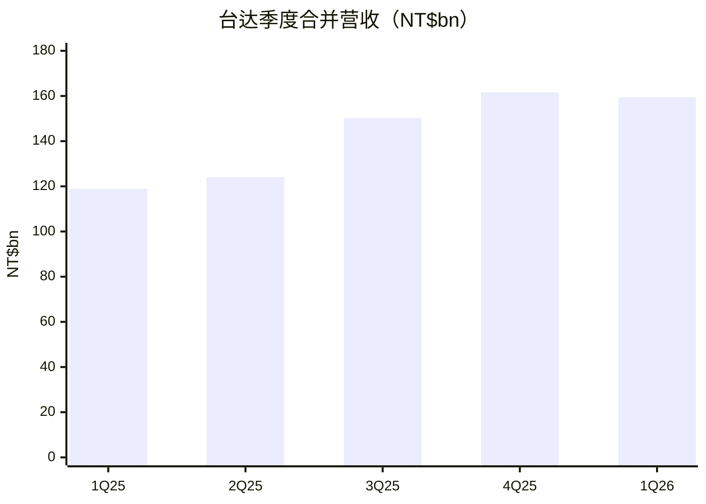
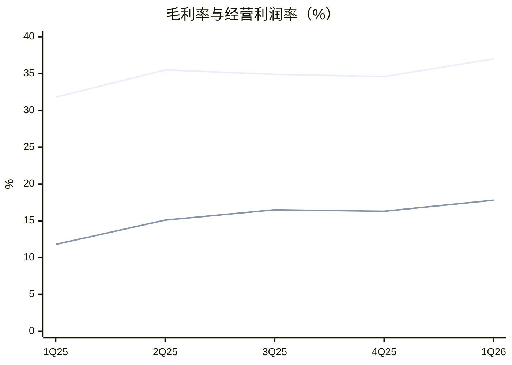
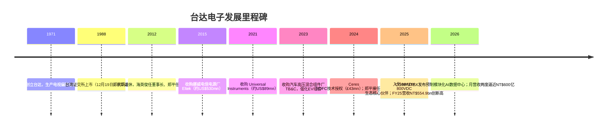
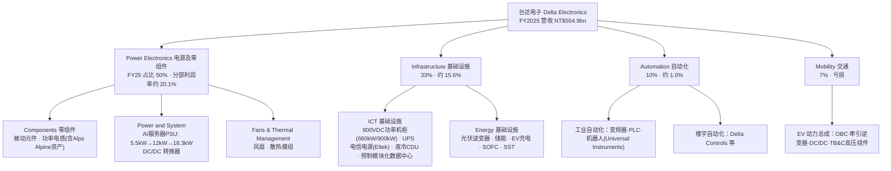
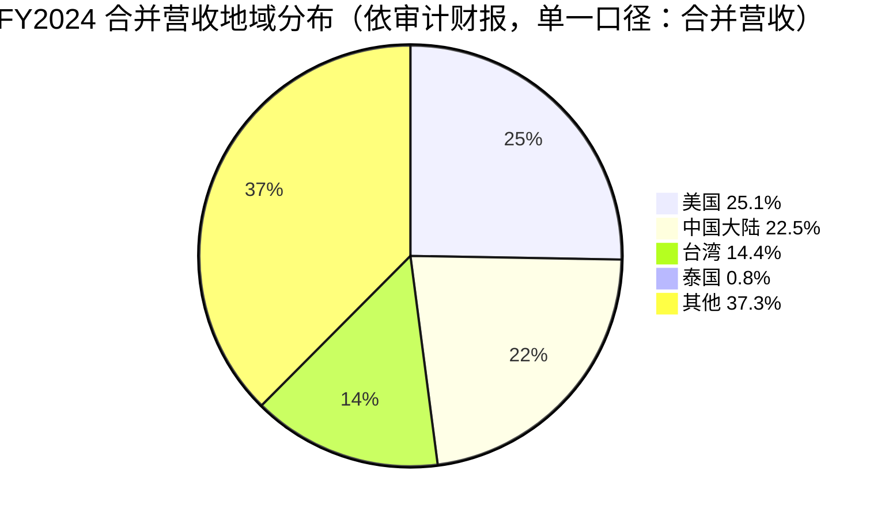
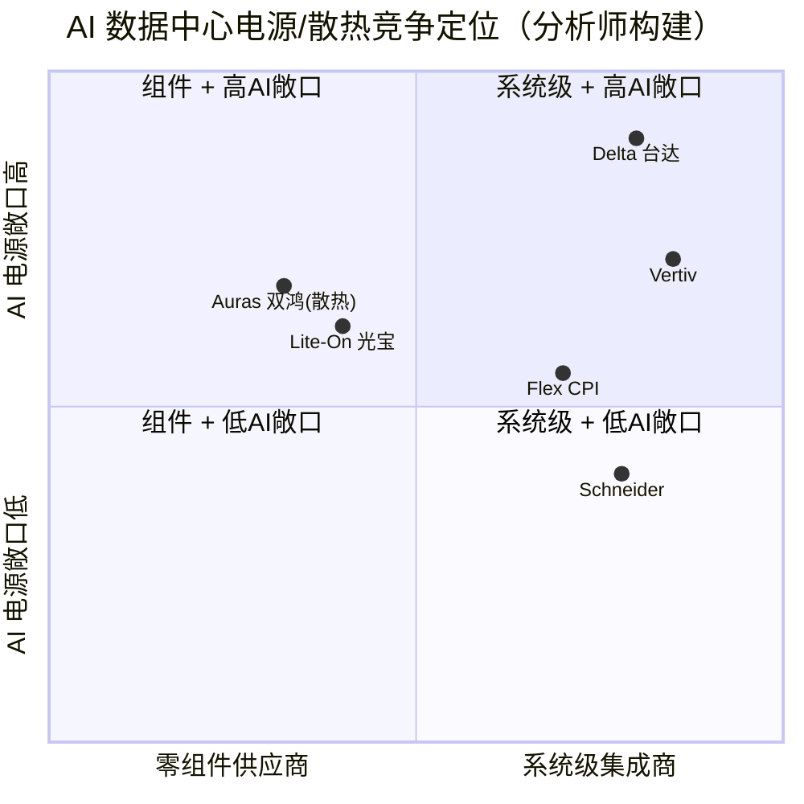
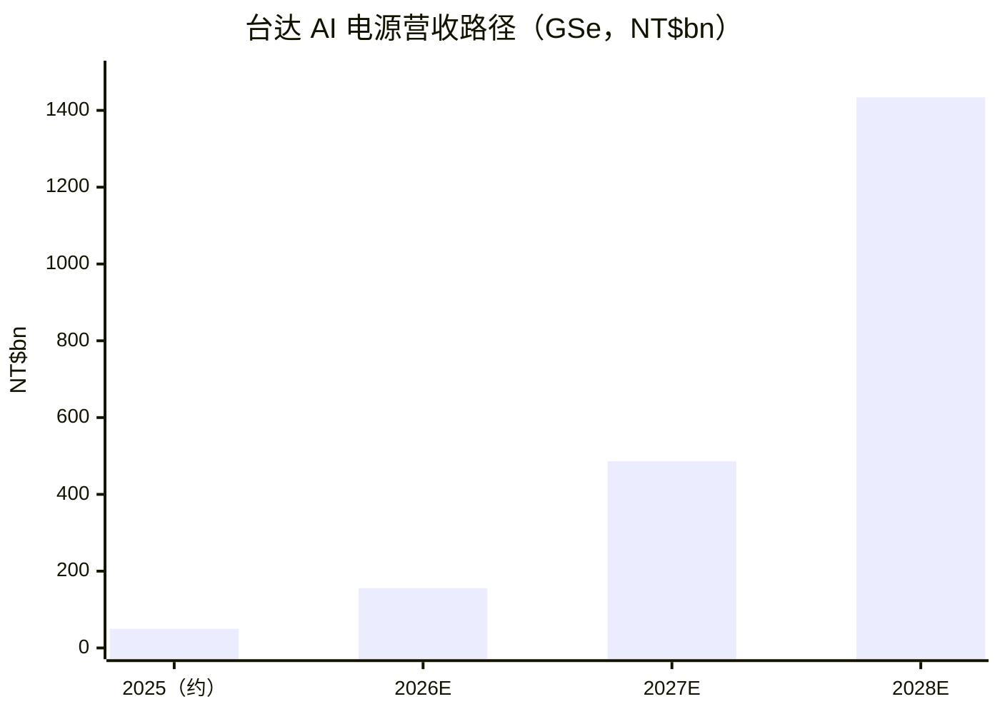

# 公司研究报告：台达电子 Delta Electronics, Inc.（TWSE:2308）

**日期（as of）：2026-06-11** · 报告语言：简体中文 · 覆盖类型：首次覆盖（initiate coverage）

> *分析师观点：* **评级：Buy（买入）· 12 个月目标价 NT$2,700（较 2026-06-10 收盘价 NT$2,200 上行约 +23%）· 估值方法：34× P/E (市盈率) × 2027–28E 平均 EPS NT$80**
> 市值 NT$5.71 trn · 52 周区间 NT$393.5–2,520 · TWSE:2308 · 股本 25.98 亿股
>
> | 倍数 / Multiple（*分析师观点：* 预测列） | FY2025A | FY2026E | FY2027E | FY2028E |
> |---|---|---|---|---|
> | P/E（@NT$2,200） | 95.1× | 52.4× | 33.8× | 23.2× |
> | P/S | 10.3× | 7.3× | 5.2× | 3.8× |
> | EV/EBITDA（约） | 47.6× | 33.4× | 22.3× | 15.6× |
> | 股息率（FY25 拟派 NT$11.6） | 0.5% | — | — | — |
>
> 相对表现（截至 2026-06-10，[Yahoo Finance 2308.TW](https://finance.yahoo.com/quote/2308.TW/) / yfinance）：绝对 1M −2.0% · 6M +127.3% · YTD +121.1% · 12M +457.0%；同期台湾加权指数（TAIEX）+7.0% / +58.6% / +52.3% / +105.2%；相对 1M −9.0pp · 6M +68.7pp · YTD +68.8pp · 12M +351.8pp。
>
> **核心论点（thesis pillars）**——（1）台达是 AI 数据中心「grid-to-chip（电网到芯片）」供电链上内容价值量提升最确定的受益者：单机柜电源价值量从 GB200 的约 US$5 万升至 Vera Rubin 的约 US$15 万（*分析师观点：* Bernstein 估算，见 1A 节）；（2）NVIDIA 800VDC（高压直流）功率机柜 2026 年末小批量、2027 年随 Kyber 架构放量，叠加 12kW PSU（电源供应器）单瓦 ASP 上行，驱动 2025–28E EPS CAGR 约 60%（*分析师观点：* 本报告预测）；（3）高毛利 AI 产品占比从 2025 年约 9% 升至 2026E 约 20%（GSe），结构性抬升 gross margin（毛利率）与 operating margin（经营利润率）；（4）50 年电力电子积累 + 垂直整合（功率器件采购规模、散热、被动元件自制）构成竞争壁垒，2026E AI PSU 市占率 70%+（GSe）。主要约束：估值已部分反映乐观预期（TTM P/E 约 81×），向上空间依赖盈利上修而非再估值。

---

## 目录

1. [公司概览](#1-公司概览)
1A. [估值与目标价](#1a-估值与目标价)
2. [公司历史](#2-公司历史)
3. [管理团队](#3-管理团队)
4. [产品与服务](#4-产品与服务)
5. [客户与上市策略](#5-客户与上市策略)
6. [行业概览](#6-行业概览)
7. [竞争格局](#7-竞争格局)
8. [市场机会（TAM）](#8-市场机会tam)
9. [风险评估](#9-风险评估)
9.5 [关键分歧与催化剂](#95-关键分歧与催化剂)
10. [投资视角评分卡](#10-投资视角评分卡)

---

## 1. 公司概览

*分析师观点：* 我们以 **Buy（买入）评级、12 个月目标价 NT$2,700（+23%）** 首次覆盖台达电子。为什么是现在：AI 服务器单机柜功率从 GB200 世代的百千瓦级走向 Vera Rubin 的 220kW、再走向 Kyber 世代的兆瓦级，供电架构被迫从 54V 低压向 800VDC 高压直流重构——这一重构把台达的可售内容（content）从「机柜里的电源模块」扩展到「整台功率机柜 + DC/DC 转换器 + BBU/超级电容 + 液冷 CDU」，是量价齐升的结构性拐点（详见第 6、8 节；架构判断引自 [NVIDIA 800 VDC 技术博客, 2025-10](https://developer.nvidia.com/blog/nvidia-800-v-hvdc-architecture-will-power-the-next-generation-of-ai-factories/)）。2026 年一季度公司毛利率已升至 37.0% 的历史高位、EPS 同比翻倍（[台达 1Q26 法人说明会简报, Slide 4/10, 2026-04-30](https://filecenter.deltaww.com/ir/download/calendar/1Q26_Analyst%20Meeting.pdf)），而 800VDC 功率机柜要到 2026 年末才开始小批量出货——成长曲线的最陡段尚未进入报表。核心约束是估值：12 个月股价上涨 457%（yfinance），TTM P/E 约 81×，意味着市场已给予很高的兑现假设；我们的 +23% 上行空间全部来自盈利增长而非估值扩张。

**公司是做什么的。** 台达电子创立于 1971 年，是全球电源管理（power management）与散热解决方案（thermal management）龙头，使命宣言为「To provide innovative, clean and energy-efficient solutions for a better tomorrow（环保 节能 爱地球）」；公司在全球拥有 165 个销售网点、55 个生产基地与 73 个研发中心，2025 年合并营收 17.9 亿美元数量级口径为 **US$17.9bn**，研发投入常年占营收 8%–9%（[Delta 官网 About Delta 页](https://www.deltaww.com/en-US/company/about-delta)）。按公司官方分类，业务分四大类：**Power Electronics（电源及零组件）、Mobility（交通）、Automation（自动化）、Infrastructure（基础设施）**（[台达 4Q25 法人说明会简报, Slide 20, 2026-02-26](https://filecenter.deltaww.com/ir/download/calendar/4Q25_Analyst%20Meeting.pdf)）。维基百科记载公司 2025 年全球员工约 83,000 人（[Wikipedia: Delta Electronics，访问于 2026-06-11](https://en.wikipedia.org/wiki/Delta_Electronics)）。

**怎么赚钱。** FY2025 合并营收 NT$554.9bn（+32% YoY）、毛利率 34.3%、经营利润率 15.1%、税后净利 NT$60.1bn（+71%）、EPS NT$23.14（+71%），董事会拟派现金股利每股 NT$11.6（[台达 4Q25 法人说明会简报, Slides 12/13/17/18/19, 2026-02-26](https://filecenter.deltaww.com/ir/download/calendar/4Q25_Analyst%20Meeting.pdf)）。分部看：电源及零组件 NT$280.0bn（占 50%，分部利润 NT$56.2bn）、基础设施 NT$182.0bn（占 33%，分部利润 NT$28.4bn，同比 +413%）、自动化 NT$54.9bn（占 10%）、交通 NT$37.0bn（占 7%，亏损 NT$1.19bn）（同上 Slide 14）。增长引擎高度集中于 AI 数据中心：2026 年一季度营收 NT$159.4bn（+34% YoY），毛利率 37.0%、经营利润率 17.8% 均创高，税后净利 NT$20.6bn（+101%）、EPS NT$7.91（[台达 1Q26 法人说明会简报, Slides 4/5/9/10, 2026-04-30](https://filecenter.deltaww.com/ir/download/calendar/1Q26_Analyst%20Meeting.pdf)）。最新月度数据：2026 年 5 月营收 NT$589.61 亿、同比 +43.6%，为历史单月次高（仅次于 2026 年 3 月），1–5 月累计营收约 NT$2,770 亿、同比 +38%（[钜亨网, 2026-06-09](https://news.cnyes.com/news/id/6491610)）。

资料来源（两图）：[台达 1Q26 法人说明会简报, Slides 4–5, 2026-04-30](https://filecenter.deltaww.com/ir/download/calendar/1Q26_Analyst%20Meeting.pdf)（上线为毛利率、下线为经营利润率；两张图分开绘制以避免单位混淆）

**在哪里经营。** 依据经审计的 FY2024 合并财报地域披露：美国营收 NT$105.7bn（约 25.1% = 105.7/421.1）、中国大陆 NT$94.8bn（约 22.5%）、台湾 NT$60.5bn（约 14.4%）、其他地区 NT$156.9bn（约 37.3%）（[Delta FY2024 英文版合并财务报告（会计师查核）, 第 105 页](https://filecenter.deltaww.com/ir/download/financial_report/Q42024_eng_Consolidated%20Financial%20Report.pdf)；百分比为本文以披露金额计算）。*分析师观点：* 产能侧，UBS 估算中国约占 45%、泰国约 30%、美国 <10%，并指出 2026 年资本开支同比增长 10% 以上用于 AI 与基础设施扩产（[UBS — Delta Electronics Q126, 2026-05-03, p.1](http://xs-macbook-air.local:5001/zsxq/pdf/184125241412252/UBS-Delta%20Electronics%EF%BC%882308.TW%EF%BC%89Q126%EF%BC%9A%20800V%20DC%20pulling%20in%20with%20strong%20demand-260503.pdf)）。

**估值快照（valuation snapshot，2026-06-10）。** 现价 NT$2,200、市值 NT$5.71trn；以 FY2025 EPS NT$23.14 计静态 P/E 约 95×，以 TTM EPS NT$27.11（= 23.14 − 3.94 + 7.91，数据取自上引两份法说会简报）计 TTM P/E 约 81×；TTM P/S 约 9.6×（[Yahoo Finance 2308.TW key statistics，访问于 2026-06-11](https://finance.yahoo.com/quote/2308.TW/)）。**为什么倍数这么高（>50× TTM，须解释）：** 这是典型的「高增长 + 板块再估值」组合——*分析师观点：* UBS 指出全球与中国电源/数据中心可比公司近期已再估值至 30–40× forward P/E，台达 35× 2027–28E 的目标倍数「与全球/中国同业一致，反映约 2 个标准差的溢价」（[UBS — Delta Electronics Q126, 2026-05-03, p.1](http://xs-macbook-air.local:5001/zsxq/pdf/184125241412252/UBS-Delta%20Electronics%EF%BC%882308.TW%EF%BC%89Q126%EF%BC%9A%20800V%20DC%20pulling%20in%20with%20strong%20demand-260503.pdf)）；GS 则认为台达 100%+ 的 2025–28E EPS CAGR 远高于其过去 20 年约 10% 的均值，理应交易在历史估值带之上（26.5× 目标 P/E 较其 15 年均值 +1.6 个标准差）（[Goldman Sachs — Delta Electronics, 2026-06-05, p.11](http://xs-macbook-air.local:5001/zsxq/pdf/212488854818821/Goldman%20Sachs-Delta%20Electronics%20%EF%BC%882308.TW%EF%BC%89%20Accelerating%20pricing%20per%20watt%20for%20new%20AI%20products%20%2B%20faster%20than%20expected%20HVDC%20power%20rack%20contribution%20in%202027~28%EF%BC%9B%20Reiterate%20Buy%20with%20new%20NT%244%EF%BC%8C500%20TP%20%EF%BC%88from%20NT%242%EF%BC%8C420%EF%BC%89-260605.pdf)）。换言之，市场把台达从「周期性电子零组件厂」重新定价为「AI 电力基础设施稀缺资产」。倍数本身亦构成风险，详见第 9 节风险 9。

## 1A. 估值与目标价

> 本章全部前瞻数字为 *分析师观点：*（本报告自有预测），绝不附挂任何公司文件引用；每项预测的**外部输入**在行文中注明出处。

### (a) 前瞻财务预测表（3 年）

*分析师观点：* 预测输入：FY2024–25 实际数与分部结构取自 [台达 4Q25 法人说明会简报, Slides 12–14, 2026-02-26](https://filecenter.deltaww.com/ir/download/calendar/4Q25_Analyst%20Meeting.pdf)；1Q26 实际数与 Q2 指引（营收环比 +20–30%、毛利率「应好于去年」、资本开支较 2025 年 NT$46.1bn 增长 10% 以上）取自 [台达 1Q26 法人说明会简报, 2026-04-30](https://filecenter.deltaww.com/ir/download/calendar/1Q26_Analyst%20Meeting.pdf) 与 [BigGo 1Q26 法说会纪要, 2026-04-30](https://finance.biggo.com/news/TW_2308.TW_2026-04-30)；AI 电源行业量价假设参考 GS/UBS/Bernstein 模型（下引）。

| 指标（*分析师观点：* 预测列） | FY2024A | FY2025A | FY2026E | FY2027E | FY2028E | 25–28E CAGR |
|---|---|---|---|---|---|---|
| 营收（NT$bn） | 421.1 | 554.9 | 780 | 1,090 | 1,500 | +39% |
| — YoY | +5% | +32% | +41% | +40% | +38% | |
| 毛利率 | 32.4% | 34.3% | 36.5% | 37.5% | 38.5% | |
| 经营利润率 | 11.3% | 15.1% | 19.0% | 21.0% | 22.0% | |
| 净利率 | 8.4% | 10.8% | 14.0% | 15.5% | 16.4% | |
| EPS（NT$） | 13.56 | 23.14 | 42.0 | 65.0 | 95.0 | +60% |
| FCF（NT$bn，约） | n/a | 约+18 | 约+30 | 约+90 | 约+190 | |
| — FCF yield | — | 3.2%（GSe 口径） | 约0.5% | 约1.6% | 约3.3% | |
| 净现金/(净债)（NT$bn） | 净现金 | 约+105 | 净现金维持 | 净现金扩大 | 净现金扩大 | |

2026E 季度路径（*分析师观点：*）：1QA 159.4 → 2QE 约 195（公司指引环比 +20–30% 的中低段）→ 3QE 约 210 → 4QE 约 216。FY2025 实际 FCF yield 3.2% 与净现金状态（net debt/equity −39.2%）取自 GS 模型页（*分析师观点：* [Goldman Sachs — Delta Electronics, 2026-06-05, p.2](http://xs-macbook-air.local:5001/zsxq/pdf/212488854818821/Goldman%20Sachs-Delta%20Electronics%20%EF%BC%882308.TW%EF%BC%89%20Accelerating%20pricing%20per%20watt%20for%20new%20AI%20products%20%2B%20faster%20than%20expected%20HVDC%20power%20rack%20contribution%20in%202027~28%EF%BC%9B%20Reiterate%20Buy%20with%20new%20NT%244%EF%BC%8C500%20TP%20%EF%BC%88from%20NT%242%EF%BC%8C420%EF%BC%89-260605.pdf)）。

**分部混合（mix shift）逻辑**（*分析师观点：*）：电源及零组件——12kW PSU 自 2H26 随 NVIDIA 新一代 GPU 放量（GS：订单交期维持 4–8 个月、GM 约 50%）；基础设施——800VDC 功率机柜 2026 年末小批量、2027 年放量 + 液冷 CDU 持续高增（UBS：液冷占营收比已从 2024 年 1% 升至 2025 年 9%）；交通——亏损延续但占比稀释；自动化——低个位数增长。输入引自 [Goldman Sachs, 2026-06-05, pp.4–8](http://xs-macbook-air.local:5001/zsxq/pdf/212488854818821/Goldman%20Sachs-Delta%20Electronics%20%EF%BC%882308.TW%EF%BC%89%20Accelerating%20pricing%20per%20watt%20for%20new%20AI%20products%20%2B%20faster%20than%20expected%20HVDC%20power%20rack%20contribution%20in%202027~28%EF%BC%9B%20Reiterate%20Buy%20with%20new%20NT%244%EF%BC%8C500%20TP%20%EF%BC%88from%20NT%242%EF%BC%8C420%EF%BC%89-260605.pdf) 与 [UBS, 2026-05-03, p.1](http://xs-macbook-air.local:5001/zsxq/pdf/184125241412252/UBS-Delta%20Electronics%EF%BC%882308.TW%EF%BC%89Q126%EF%BC%9A%20800V%20DC%20pulling%20in%20with%20strong%20demand-260503.pdf)。

**毛利率桥（2025A 34.3% → 2026E 36.5%，+220bp，*分析师观点：*）**：AI 产品组合占比提升（GSe：AI 营收占比 9%→20%）+250bp · 12kW PSU 提价与元器件成本转嫁 +50bp · EV 业务亏损拖累 −40bp · 海外新产能爬坡与关税 −40bp。锚点：1Q26 毛利率已实际达到 37.0%，其中约 0.7pp 来自一次性客户取消订单赔偿（[BigGo 1Q26 法说会纪要, 2026-04-30](https://finance.biggo.com/news/TW_2308.TW_2026-04-30)），剔除后约 36.3% 仍显著高于 FY2025 全年。

### (b) 目标价推导（показать算术）

*分析师观点：* **PT NT$2,700 = 34× × 2027–28E 平均 EPS NT$80（=(65+95)/2）**。目标倍数 34× 的同业锚定：UBS 对台达用 35×（2027–28E 平均），指全球/中国同业再估值后区间为 30–40×（[UBS, 2026-05-03](http://xs-macbook-air.local:5001/zsxq/pdf/184125241412252/UBS-Delta%20Electronics%EF%BC%882308.TW%EF%BC%89Q126%EF%BC%9A%20800V%20DC%20pulling%20in%20with%20strong%20demand-260503.pdf)）；Bernstein 用 34×（2027E，对应 PEG 0.6×）（[Bernstein — Delta remains our top pick, 2026-03-16, p.3](http://xs-macbook-air.local:5001/zsxq/pdf/212222825221841/Bernstein-Asia%20Tech%20Hardware%EF%BC%9AAsia%20Tech%20Hardware%EF%BC%9A%20model%20updates%20across%20the%20AI%20supply%20chain%EF%BC%9B%20Delta%20remains%20our%20top%20pick-260316.pdf)）；GS 用 26.5×，但作用在激进得多的 2028E EPS NT$188.18 上再以 11% 折现（[Goldman Sachs, 2026-06-05, p.11](http://xs-macbook-air.local:5001/zsxq/pdf/212488854818821/Goldman%20Sachs-Delta%20Electronics%20%EF%BC%882308.TW%EF%BC%89%20Accelerating%20pricing%20per%20watt%20for%20new%20AI%20products%20%2B%20faster%20than%20expected%20HVDC%20power%20rack%20contribution%20in%202027~28%EF%BC%9B%20Reiterate%20Buy%20with%20new%20NT%244%EF%BC%8C500%20TP%20%EF%BC%88from%20NT%242%EF%BC%8C420%EF%BC%89-260605.pdf)）。本报告 2025–28E EPS CAGR 约 60%，34× 对应 PEG 约 0.57，处于三家可比口径（0.6×上下）之内。

### (c) 牛/基/熊三情景

| 情景（*分析师观点：*） | 关键摆动假设 | PT | vs 现价 NT$2,200 |
|---|---|---|---|
| 牛市 Bull | 800VDC 机柜按 GS 节奏放量（2027/28 机柜营收 NT$89bn/495bn 量级）、AI PSU GM 守住 50%，2027–28E 平均 EPS 约 NT$100，38× | NT$3,800 | +73% |
| 基准 Base | 中性预测（上表），34× × 2027–28E 平均 EPS NT$80 | NT$2,700 | +23% |
| 熊市 Bear | 2027 年 AI capex 消化期 + PSU 价格战，2027E EPS 仅约 NT$52（接近卖方一致预期下沿），估值降至 25× | NT$1,300 | −41% |

牛/熊情景输入：GS 机柜营收路径与 50% GM 假设（[Goldman Sachs, 2026-06-05, pp.5–8](http://xs-macbook-air.local:5001/zsxq/pdf/212488854818821/Goldman%20Sachs-Delta%20Electronics%20%EF%BC%882308.TW%EF%BC%89%20Accelerating%20pricing%20per%20watt%20for%20new%20AI%20products%20%2B%20faster%20than%20expected%20HVDC%20power%20rack%20contribution%20in%202027~28%EF%BC%9B%20Reiterate%20Buy%20with%20new%20NT%244%EF%BC%8C500%20TP%20%EF%BC%88from%20NT%242%EF%BC%8C420%EF%BC%89-260605.pdf)）；价格战与丢份额风险为 GS 自列下行风险（同上, p.11）。

### (d) 一致预期对标

*分析师观点：* 以 UBS 注记的 Bloomberg/街道一致预期（2026-05-03 时点）为基准：2026E/2027E/2028E EPS 一致预期为 NT$37.87/57.02/87.91（[UBS, 2026-05-03, p.1](http://xs-macbook-air.local:5001/zsxq/pdf/184125241412252/UBS-Delta%20Electronics%EF%BC%882308.TW%EF%BC%89Q126%EF%BC%9A%20800V%20DC%20pulling%20in%20with%20strong%20demand-260503.pdf)）。本报告预测分别高出约 **+11% / +14% / +8%**；显著低于 GS（45.14/84.94/188.18，其营收预测高出一致预期 7%/20%/47%）（[Goldman Sachs, 2026-06-05, p.9](http://xs-macbook-air.local:5001/zsxq/pdf/212488854818821/Goldman%20Sachs-Delta%20Electronics%20%EF%BC%882308.TW%EF%BC%89%20Accelerating%20pricing%20per%20watt%20for%20new%20AI%20products%20%2B%20faster%20than%20expected%20HVDC%20power%20rack%20contribution%20in%202027~28%EF%BC%9B%20Reiterate%20Buy%20with%20new%20NT%244%EF%BC%8C500%20TP%20%EF%BC%88from%20NT%242%EF%BC%8C420%EF%BC%89-260605.pdf)），与 UBS（43.35/64.00/85.00）接近。

| 指标 | 公司指引 | 一致预期（*分析师观点：* 引 UBS 注记） | 本报告（*分析师观点：*） |
|---|---|---|---|
| 2Q26 营收 QoQ | +20–30%（法说会） | — | 约 +22% |
| FY2026 毛利率 | 「应好于去年（34.3%）」 | 约 33.2%（GS 称自身高出一致预期 3.3ppt，倒推） | 36.5% |
| FY2026 EPS | 未给量化指引 | NT$37.87 | NT$42.0 |

公司指引列引自 [BigGo 1Q26 法说会纪要, 2026-04-30](https://finance.biggo.com/news/TW_2308.TW_2026-04-30)；倒推数为本文按 GS 注记推算（36.5%−3.3ppt≈33.2%）。

### (e) 摆动变量（swing variables）

*分析师观点：* 本报告评级最依赖两个假设，建议读者优先压力测试：**（1）800VDC 功率机柜 2027 年的渗透率与台达份额**——GS 假设行业渗透率 2027E 11% → 2030E 60%、台达机柜份额 60%+；若 Kyber 延期（JPM 提示背板信号完整性问题或致延期，见 9.5 节）则 2027–28E 弹性大打折扣；**（2）AI PSU 毛利率约 50% 的可持续性**——若 Lite-On/Flex/Vertiv 等以价格换份额，混合毛利率假设全线下修（输入：[Goldman Sachs, 2026-06-05, pp.5–7, 11](http://xs-macbook-air.local:5001/zsxq/pdf/212488854818821/Goldman%20Sachs-Delta%20Electronics%20%EF%BC%882308.TW%EF%BC%89%20Accelerating%20pricing%20per%20watt%20for%20new%20AI%20products%20%2B%20faster%20than%20expected%20HVDC%20power%20rack%20contribution%20in%202027~28%EF%BC%9B%20Reiterate%20Buy%20with%20new%20NT%244%EF%BC%8C500%20TP%20%EF%BC%88from%20NT%242%EF%BC%8C420%EF%BC%89-260605.pdf)、[J.P. Morgan — Computex Part 2, 2026-06-07](http://xs-macbook-air.local:5001/zsxq/pdf/584251188548114/J.P.%20Morgan-Asian%20Tech%EF%BC%9A2026%20Computex%20Takeaways%20Part%202-260607.pdf)）。

### 卖方观点演变（Sell-side view evolution）

机械预扫描：本报告先以只读方式读取 `db/stock_price_target.db`（10 条 2308.TW 记录，2025-10-14 至 2026-06-08），再回读 4 份原文 PDF 核对。**当前目标价离散度：最低 UBS NT$2,600 / 中位 Bernstein NT$2,620 / 最高 GS NT$4,500，最高较最低高出 73%**——分歧之大本身就是关键信号。

**按机构的观点时间线（每条均附注记日股价；评级/目标价均为 *分析师观点：*）**

| 机构 | 报告日 | 评级 | 目标价（NT$） | 注记日股价（NT$） | 隐含上行 | 一句话论点 |
|---|---|---|---|---|---|---|
| Morgan Stanley | 2025-10-14 | Overweight | 未列 | 992 | — | NVIDIA 800VDC 生态发布，台达为核心电源伙伴（[MS — 800 VDC Ecosystem, 2025-10-14](http://xs-macbook-air.local:5001/zsxq/pdf/184528215445852/Morgan%20Stanley-Greater%20China%20Technology%20Hardware%EF%BC%9A800%20VDC%20Ecosystem%20Announced%20to%20Drive%20Next~Gen%20Efficient%20Gigawatt%20AI%20Factories-251014.pdf)） |
| UBS | 2026-01-26 | Buy | 未列 | 1,230 | — | 芯片级液冷、MV/SST 电力架构布局（[UBS — Postcard from Paris, 2026-01-26](http://xs-macbook-air.local:5001/zsxq/pdf/184421248214182/UBS-Data%20Centre%20Equipment%EF%BC%9APostcard%20from%20Paris%20Thematic%20Day%20on%20AI%20%26%20Data%20Centres-260126.pdf)） |
| Bernstein | 2026-03-09 | Outperform | 1,300 | 1,220 | +6.6% | 月度营收符合预期，AI 电源零组件爬坡（[Bernstein — Monthly sales, 2026-03-09](http://xs-macbook-air.local:5001/zsxq/pdf/184445554555242/Bernstein-Asia%20Tech%20Hardware%EF%BC%9AMonthly%20sales~Delta%201Q26%20revenue%20tracking%20in%20line%20while%20Quanta%20tracking%20above-260309.pdf)） |
| Bernstein | 2026-03-16 | Outperform | **1,830（自 1,300 上调 +41%）** | 1,360 | +34.6% | **自我上修**：34× × 2027E EPS NT$53.8（原 43.0）；「Delta remains our top pick」；触发因素为 AI 供应链模型整体上修（[Bernstein — top pick, 2026-03-16, p.3](http://xs-macbook-air.local:5001/zsxq/pdf/212222825221841/Bernstein-Asia%20Tech%20Hardware%EF%BC%9AAsia%20Tech%20Hardware%EF%BC%9A%20model%20updates%20across%20the%20AI%20supply%20chain%EF%BC%9B%20Delta%20remains%20our%20top%20pick-260316.pdf)） |
| UBS | 2026-05-03 | Buy | **2,600（自 2,000 上调 +30%）** | 2,165（4/30 收盘） | +20.1% | **自我上修**：目标倍数从 30× 提至 35×（2027–28E 平均），触发因素为 1Q26 大超预期 + 800VDC 提前导入（[UBS — Q126, 2026-05-03, p.1](http://xs-macbook-air.local:5001/zsxq/pdf/184125241412252/UBS-Delta%20Electronics%EF%BC%882308.TW%EF%BC%89Q126%EF%BC%9A%20800V%20DC%20pulling%20in%20with%20strong%20demand-260503.pdf)） |
| Morgan Stanley | 2026-05-07 | Overweight | 未列 | 2,280 | — | Flex CPI 业绩读穿：AI 基建支出至少持续至 2027–29 财年（[MS — Implications from Flex, 2026-05-07](http://xs-macbook-air.local:5001/zsxq/pdf/212458441144481/Morgan%20Stanley-Greater%20China%20Technology%20Hardware%EF%BC%9APower%20and%20Cooling%20Solutions%20%E2%80%93%20Implications%20from%20Flex%27s%204Q26%20Results-260507.pdf)） |
| Bernstein | 2026-05-20 | Outperform | **2,620（自 1,830 上调 +43%）** | 1,915 | +36.8% | 数据中心项目管道扩张；PT 上修发生于其 1Q26 点评（标题：adding capacity for long-term AI demand. PT raise to NT$2,620）（[Bernstein — DC Project Pipeline, 2026-05-20](http://xs-macbook-air.local:5001/zsxq/pdf/585424811815484/Bernstein-US%20Industrials%20%26%20Tech%EF%BC%9A%20The%20Data%20Center%20Project%20Pipeline%20~%20Capacity%EF%BC%8C%20Construction%20%26%20Cancellations%20%EF%BC%88April%20%2726%EF%BC%89-260520.pdf)） |
| Goldman Sachs | 2026-06-05 | Buy | **4,500（自 2,420 上调 +86%）** | 2,425（6/4 收盘，GS 报告口径） | +85.6%（GS 口径） | **自我上修**：估值基期从 2Q27–1Q28 滚动至 2028E、26.5× 不变、11% CoE 折现回 2027；触发因素为 12kW PSU 单瓦 ASP 上行（BOM/瓦 +43%）+ HVDC 机柜 2027–28 出货超预期（[GS — Delta, 2026-06-05, pp.1, 11](http://xs-macbook-air.local:5001/zsxq/pdf/212488854818821/Goldman%20Sachs-Delta%20Electronics%20%EF%BC%882308.TW%EF%BC%89%20Accelerating%20pricing%20per%20watt%20for%20new%20AI%20products%20%2B%20faster%20than%20expected%20HVDC%20power%20rack%20contribution%20in%202027~28%EF%BC%9B%20Reiterate%20Buy%20with%20new%20NT%244%EF%BC%8C500%20TP%20%EF%BC%88from%20NT%242%EF%BC%8C420%EF%BC%89-260605.pdf)） |
| Bernstein | 2026-06-08 | Outperform | 2,620（维持） | 2,300（6/5 收盘） | +13.9% | VR 机柜成本拆解：单机柜电源价值量 $50k→$150k，台达为主要受益者（[Bernstein — AI Value Chain（Vera Rubin GW 成本）, 2026-06-08, pp.2–4](http://xs-macbook-air.local:5001/zsxq/pdf/814528815844812/Bernstein-AI%20Value%20Chain%EF%BC%9AHow%20much%20does%20a%20GW%20of%20Vera%20Rubin%20data%20center%20capacity%20actually%20cost%EF%BC%9F-260608.pdf)） |

注记日股价取自 `db/stock_price_target.db`（`report_date_price` 列）并经 yfinance 当日收盘价复核（如 2026-05-20 收盘 NT$1,915、2026-06-05 收盘 NT$2,300 均一致）。

**机构间分歧（不做虚假共识）**

| 机构 | 日期 | 评级/目标价 | 核心论点 | 什么证据能证明其正确 |
|---|---|---|---|---|
| Goldman Sachs | 2026-06-05 | Buy / NT$4,500 | 2028E EPS NT$188.18（较一致预期高 95%）：12kW→18.3kW PSU 量价齐升 + 机柜营收 2028E NT$495bn + 毛利率升至 45.1% | 2027 年 Kyber/HVDC 机柜实际放量至 NT$89bn 量级；毛利率逐季向 40%+ 走；一致预期连续上修 |
| UBS | 2026-05-03 | Buy / NT$2,600 | 2028E EPS NT$85：增长强但毛利率约 37% 见顶、不假设机柜超级周期 | 2026 全年营收 +40% 兑现但毛利率停在 37% 上下；机柜渗透率停留在 VR 平台 20–30% |
| Bernstein | 2026-06-08 | Outperform / NT$2,620 | 电源内容价值量 $50k→$150k/机柜方向确定，但 Vertiv 正加力抢份额，盈利预测远低于 GS | VR 机柜 BOM 中电源价值量实际落点与台达份额；Vertiv 在 800VDC 标案中的得标率 |

GS 与 UBS 对 **2028E EPS 的分歧高达 121%**（188.18 vs 85.00）——本质分歧不在方向而在 HVDC 机柜的规模与归属台达的份额/毛利。本报告基准情形（EPS 95.0）接近 UBS/一致预期一侧，把 GS 情形放入牛市情景。

## 2. 公司历史

台达电子由郑崇华（Bruce C.H. Cheng）于 1971 年 4 月在台北县新庄（今新北市新庄区）创立，初期产品为电视偏转线圈（TV deflection coils）、电子零组件与绕线磁性元件（[Wikipedia: Delta Electronics，访问于 2026-06-11](https://en.wikipedia.org/wiki/Delta_Electronics)；创立年份另见 [Delta 官网 About Delta 页](https://www.deltaww.com/en-US/company/about-delta)）。公司于 1988 年 12 月 19 日在台湾证券交易所上市，股票代码 2308（[TWSE 上市公司英文简介 PDF](https://www.twse.com.tw/pdf/en/2308_en.pdf)）。此后五十余年，台达从元件供应商演进为「电源 + 散热 + 自动化 + 能源基础设施」的解决方案提供者。

图表来源：见下文各事件逐项引注。

**三次关键战略转身。** 第一次：从消费电子元件转向**开关电源（switching power supply）**并随 PC/服务器产业成长为全球电源龙头——官网今天的自我定位即「Global leader in switching power supplies, thermal management, and passive components」（[Delta 官网 Business 页](https://www.deltaww.com/en-US/about/Business)）。第二次：2010 年代通过并购从零组件走向**系统与解决方案**——2015 年以每股 NOK 11.75、总价约 NOK 3.9bn（约 US$530mn）收购挪威电信电源厂 Eltek，补齐电信/数据中心站点电源（[RTTNews — Delta Electronics To Buy Norway-based Eltek For $530 Mln, 2015](https://www.rttnews.com/2430880/delta-electronics-to-buy-norway-based-eltek-for-530-mln-quick-facts.aspx)）；2021 年 12 月以约 US$89mn 收购自动化设备商 Universal Instruments（[Wikipedia: Delta Electronics，访问于 2026-06-11](https://en.wikipedia.org/wiki/Delta_Electronics)）；2023 年 6 月宣布收购汽车高压混合组件（automotive high-voltage hybrid components）领先供应商 TB&C 以强化 EV 业务组合（[Delta 新闻稿, 2023-06-15](https://www.deltaww.com/en-US/press/38541)）；2024 年再收购 Alps Alpine 功率电感业务资产以增强下一代被动元件能力（[Delta 新闻稿](https://www.deltaww.com/en-US/press/39210)）。第三次：2024–26 年押注 **AI 数据中心电力基础设施与新能源**——2024 年 1 月与英国 Ceres 签订 SOFC（固体氧化物燃料电池）/SOEC 技术授权与制造合作协议（含技术转移、授权费与工程服务合计 £43mn 收入归 Ceres）（[PR Newswire, 2024-01](https://www.prnewswire.com/news-releases/delta-secures-license-to-hydrogen-energy-technology-from-uk-listed-ceres-to-develop-its-fuel-cell-and-electrolysis-solutions-302037621.html)），2025 年 10 月入列 NVIDIA 800VDC 生态系核心电源伙伴（[NVIDIA 800 VDC 技术博客, 2025-10](https://developer.nvidia.com/blog/nvidia-800-v-hvdc-architecture-will-power-the-next-generation-of-ai-factories/)）。

**近 12 个月。** FY2025 营收、获利双创新高（见第 1 节）；2026 年 6 月 COMPUTEX 发布预制模块化 AI 数据中心方案（部署时间缩短最多 60%）（[Delta 新闻稿（PR Newswire）, 2026-06-02](https://www.prnewswire.com/news-releases/delta-debuts-prefabricated-ai-modular-data-center-solution-at-computex-2026-to-reduce-deployment-time-by-up-to-60-302788523.html)）；2026 年 3 月与 5 月单月营收两度逼近 NT$600 亿（[钜亨网, 2026-06-09](https://news.cnyes.com/news/id/6491610)）。

## 3. 管理团队

**创办人：郑崇华（Bruce C.H. Cheng），创办人暨荣誉董事长。** 郑崇华 1971 年以电视偏转线圈起家创立台达（[Wikipedia: Delta Electronics，访问于 2026-06-11](https://en.wikipedia.org/wiki/Delta_Electronics)），现任「创办人暨荣誉董事长」（[台达官网经营团队页](https://www.deltaww.com/zh-TW/company/executives)）。他以「环保 节能 爱地球」的经营使命著称——公司官网将其表述为创立以来一以贯之的企业使命（[Delta 官网 About Delta 页](https://www.deltaww.com/en-US/company/about-delta)）。2012 年郑崇华退休，将董事长职务交给海英俊、执行长职务交给长子郑平；据中央社报道，这一安排下两人共同推动台达「从零组件供应商扩展至解决方案提供者」的品牌转型（[中央社, 2024-05-30](https://www.cna.com.tw/news/afe/202405300256.aspx)）。

**现任董事长暨执行长：郑平（Ping Cheng）。** 郑平为郑崇华长子，2012 年起任台达执行长，2024 年 5 月 30 日股东常会后接任董事长，原董事长海英俊转任一般董事；海英俊在交接时表示「台达长年培育领导梯队，随着下一阶段梯队渐臻成熟，此时交棒应为最佳时机」（[中央社, 2024-05-30](https://www.cna.com.tw/news/afe/202405300256.aspx)）。公司官网现行职衔为「董事长暨执行长」，副董事长为柯子兴（Mark Ko），董事总裁暨营运长为张训海（Simon Chang）（[台达官网经营团队页](https://www.deltaww.com/zh-TW/company/executives)）。郑平任执行长的 12 年（2012–2024）正是台达完成 Eltek、TB&C 等系列并购、把数据中心与电动车培育成第二、第三增长曲线的时期（并购清单见第 2 节引注）；接任董事长后他亲自主持季度法说会，在 1Q26 法说会上对 AI 业务的表述是「AI 产品占比将持续提升、毛利率应好于去年，但进一步上行空间有限」（[BigGo 1Q26 法说会纪要, 2026-04-30](https://finance.biggo.com/news/TW_2308.TW_2026-04-30)）。

## 4. 产品与服务

> 本节为全报告权重最高章节。台达未在法说会简报之外发布详细的 10-K 式产品矩阵；以下 4.1 的矩阵**逐字转录自公司 4Q25 法说会简报 Slide 20 的官方业务分类**，并以官网 Business 页的官方描述补充——产品名与分类均为公司原文。

### 4.1 官方业务分类矩阵（verbatim）

引自 [台达 4Q25 法人说明会简报, Slide 20 "Business Categories", 2026-02-26](https://filecenter.deltaww.com/ir/download/calendar/4Q25_Analyst%20Meeting.pdf)：

| Business Categories（公司原文） | 子类（公司原文） |
|---|---|
| **Power Electronics** | Components · Power and System · Fans & Thermal Management |
| **Mobility** | EV Powertrain Systems |
| **Automation** | Industrial Automation · Building Automation |
| **Infrastructure** | Information & Communication Technology Infrastructure · Energy Infrastructure |

图表来源：分类与占比依 [台达 4Q25 法人说明会简报, Slides 14/20, 2026-02-26](https://filecenter.deltaww.com/ir/download/calendar/4Q25_Analyst%20Meeting.pdf)；产品明细依 [Delta 官网 Business 页](https://www.deltaww.com/en-US/about/Business) 及第 2 节并购引注；分部利润率为本文以分部利润÷分部营收计算。

### 4.2 综合视角：四块业务如何在客户工作流中咬合

一座 AI 数据中心的电力路径是「电网 → 中压配电 → 机房列间配电（功率机柜/UPS）→ IT 机柜内电源（PSU/DC-DC）→ GPU 供电（VRM）」，热路径是「芯片冷板 → CDU（冷却液分配装置）→ 列间/设施级散热」。台达的官方定位正是覆盖这条全链路：「grid-to-chip power and thermal management solutions for data centers（面向数据中心的电网到芯片电源与散热管理方案）」（[Delta 官网 Business 页](https://www.deltaww.com/en-US/about/Business)）。Power Electronics 卖链路末端的高价值模块（PSU、DC/DC、风扇散热、被动元件），Infrastructure 卖链路前端与机房级系统（功率机柜、UPS、液冷 CDU、整座预制模块化数据中心），Automation 提供楼宇与厂务控制层，Mobility 则把同一套功率电子能力复用到电动车。这意味着同一个 CSP（云服务商）客户在一座 AI 工厂里可以同时是台达四类产品的买家——这是「内容价值量」逻辑的根基。

### 4.3 Power Electronics 电源及零组件（FY25 营收 NT$280.0bn，占 50%）

官网原文定位：

> "Global leader in switching power supplies, thermal management, and passive components."（[Delta 官网 Business 页](https://www.deltaww.com/en-US/about/Business)）

**中文释义 / Plain-language gloss：** server PSU（服务器电源供应器）做的是 **AC→DC 整流**——把电网交流电转换成服务器主板可用的直流电；AI 服务器的功率密度暴涨使单颗 PSU 规格从通用服务器时代的约 3kW 一路升级到 5.5kW → 12kW → 18.3kW。瓦数升级不是简单放大：高功率密度要求 SiC（碳化硅）/GaN（氮化镓）功率器件、更高规格的 capacitor（电容）与磁性元件，BOM（物料清单）价值与技术门槛同步抬升。台达的特殊性在于 PSU 里的关键料——风扇、散热、功率电感、被动元件——很大比例自制（第 2 节 Alps Alpine 收购即为补强电感），形成成本与供应安全双重优势。

*分析师观点：* GS 的 BOM 拆解显示，从 5.5kW 升级到 12kW PSU，**单瓦 BOM 成本提高 43%**（功率半导体价值约 +2 倍、电容约 +3 倍），在竞争格局稳定假设下台达可维持约 50% 毛利率、单瓦 ASP 同幅上行；其 AI PSU 订单交期（lead time）长达 4–8 个月，2026E 台达在 AI PSU 市场份额为 70%+（GSe）；AC/DC PSU 业务营收料自 2025 年 NT$37bn 增至 2026/27/28E 的 NT$109/288/630bn（[Goldman Sachs — Delta, 2026-06-05, pp.4–5](http://xs-macbook-air.local:5001/zsxq/pdf/212488854818821/Goldman%20Sachs-Delta%20Electronics%20%EF%BC%882308.TW%EF%BC%89%20Accelerating%20pricing%20per%20watt%20for%20new%20AI%20products%20%2B%20faster%20than%20expected%20HVDC%20power%20rack%20contribution%20in%202027~28%EF%BC%9B%20Reiterate%20Buy%20with%20new%20NT%244%EF%BC%8C500%20TP%20%EF%BC%88from%20NT%242%EF%BC%8C420%EF%BC%89-260605.pdf)）。Bernstein 指出台达「12kW PSUs ready to ship ahead of competitors（12kW PSU 已可出货、领先竞争对手）」并很可能采用 SiC 器件提效（[Bernstein — top pick, 2026-03-16, p.3](http://xs-macbook-air.local:5001/zsxq/pdf/212222825221841/Bernstein-Asia%20Tech%20Hardware%EF%BC%9AAsia%20Tech%20Hardware%EF%BC%9A%20model%20updates%20across%20the%20AI%20supply%20chain%EF%BC%9B%20Delta%20remains%20our%20top%20pick-260316.pdf)）。竞争优势判定：**有（强）**——护城河类型为规模采购 + 垂直整合 + 技术代际领先。

**DC/DC 转换器**是本分类内与 800VDC 架构耦合最深的品类。**中文释义：** 在 HVDC（高压直流）架构下，原本一体的 PSU 被拆成两段——功率机柜内的 AC→800VDC 整流，和 IT 机柜内的 800VDC→低压 DC/DC 降压；后者就是 DC/DC converter 的新增量。*分析师观点：* GS 预计台达 DC/DC 业务自 2025 年 NT$11bn 增至 2026/27/28E 的 NT$44/109/308bn（份额 35%→46%），毛利率高于公司均值（[Goldman Sachs, 2026-06-05, p.8](http://xs-macbook-air.local:5001/zsxq/pdf/212488854818821/Goldman%20Sachs-Delta%20Electronics%20%EF%BC%882308.TW%EF%BC%89%20Accelerating%20pricing%20per%20watt%20for%20new%20AI%20products%20%2B%20faster%20than%20expected%20HVDC%20power%20rack%20contribution%20in%202027~28%EF%BC%9B%20Reiterate%20Buy%20with%20new%20NT%244%EF%BC%8C500%20TP%20%EF%BC%88from%20NT%242%EF%BC%8C420%EF%BC%89-260605.pdf)）。

### 4.4 Infrastructure 基础设施（FY25 营收 NT$182.0bn，占 33%，分部利润 +413%）

**ICT 基础设施——800VDC 功率机柜（power rack / side car）。** **中文释义：** 传统方案把 PSU 装在 IT 机柜内的 power shelf（电源托盘）上；800VDC 方案把整流功能整体搬出，做成一台独立的「功率机柜」（业内也称 side car，侧柜），以 ±400V/800V 直流母线向多台 IT 机柜供电。好处是输电损耗更低、PSU 冗余率从 power shelf 方案的 40–60% 提升到 100%、且为兆瓦级机柜扩容留出空间（*分析师观点：* 冗余与扩容性论点引 [Goldman Sachs, 2026-06-05, pp.1, 7](http://xs-macbook-air.local:5001/zsxq/pdf/212488854818821/Goldman%20Sachs-Delta%20Electronics%20%EF%BC%882308.TW%EF%BC%89%20Accelerating%20pricing%20per%20watt%20for%20new%20AI%20products%20%2B%20faster%20than%20expected%20HVDC%20power%20rack%20contribution%20in%202027~28%EF%BC%9B%20Reiterate%20Buy%20with%20new%20NT%244%EF%BC%8C500%20TP%20%EF%BC%88from%20NT%242%EF%BC%8C420%EF%BC%89-260605.pdf)）。*分析师观点：* UBS 调研：660kW 功率侧柜 2026 年 Q3 小批量、Q4 起放量进入 2027 年，在 Vera Rubin 平台渗透率可达 20–30%，到 Rubin Ultra 成为标准配置；机柜方案把电源占 GB300 BOM 的 1–1.5% 提升到早期机柜设计的 2–3%（[UBS — Q126, 2026-05-03, p.1](http://xs-macbook-air.local:5001/zsxq/pdf/184125241412252/UBS-Delta%20Electronics%EF%BC%882308.TW%EF%BC%89Q126%EF%BC%9A%20800V%20DC%20pulling%20in%20with%20strong%20demand-260503.pdf)）；MS 在 COMPUTEX 2026 现场确认 800VDC 供电机柜「将按计划在 2026 年第四季度出货」，2026 下半年将推出 660kW（无备电）与 900kW（含备电）两款主流规格（[Morgan Stanley — Computex 2026 Takeaways, 2026-06-07](http://xs-macbook-air.local:5001/zsxq/pdf/181245588485252/Morgan%20Stanley-Global%20Technology%EF%BC%9AComputex%202026%20Takeaways-260607.pdf)）。

**ICT 基础设施——液冷（liquid cooling）与预制模块化数据中心。** 公司在 COMPUTEX 2026 发布的官方新闻稿（原文摘录）：

> "…integrates 800VDC In-Row Power with advanced GoCool 260 kW LTA and 3MW LTL cooling technologies… Key highlights include the 800VDC 2.4MW Liquid-to-Liquid Cooling Distribution Unit (LTL CDU), designed with 25kW HVDC electric pumps that achieve N+1 redundancy and hot-swappable functionality…"（[Delta 新闻稿（PR Newswire）, 2026-06-02](https://www.prnewswire.com/news-releases/delta-debuts-prefabricated-ai-modular-data-center-solution-at-computex-2026-to-reduce-deployment-time-by-up-to-60-302788523.html)）

**中文释义：** CDU（cooling distribution unit，冷却液分配装置）是液冷系统的「心脏」，在芯片冷板回路与设施水路之间交换热量并维持流量；LTL = liquid-to-liquid（液对液），LTA = liquid-to-air（液对气）。预制模块化（prefabricated modular）即把电源、液冷、管路、IT 机柜在工厂预集成再整体吊装，公司称可把部署时间缩短最多 60%（同上新闻稿）。*分析师观点：* UBS 估算台达液冷业务占营收比从 2024 年的 1% 升至 2025 年的 9%、市占率超 50%（[UBS — Q126, 2026-05-03, p.1](http://xs-macbook-air.local:5001/zsxq/pdf/184125241412252/UBS-Delta%20Electronics%EF%BC%882308.TW%EF%BC%89Q126%EF%BC%9A%20800V%20DC%20pulling%20in%20with%20strong%20demand-260503.pdf)）；Bernstein 估算台达 2025 年交付液冷侧柜 >2GW、约相当于 1.3 万台 GB200 机柜（[Bernstein — top pick, 2026-03-16, p.3](http://xs-macbook-air.local:5001/zsxq/pdf/212222825221841/Bernstein-Asia%20Tech%20Hardware%EF%BC%9AAsia%20Tech%20Hardware%EF%BC%9A%20model%20updates%20across%20the%20AI%20supply%20chain%EF%BC%9B%20Delta%20remains%20our%20top%20pick-260316.pdf)）；MS 调研称台达已推 3MW 列间制冷单元、并计划 2026 年底推出 6.8MW 新品（[Morgan Stanley — Computex 2026, 2026-06-07](http://xs-macbook-air.local:5001/zsxq/pdf/181245588485252/Morgan%20Stanley-Global%20Technology%EF%BC%9AComputex%202026%20Takeaways-260607.pdf)）。竞争优势判定：**有（电源+散热一体化集成是差异点）**；护城河类型为系统集成 + 客户切换成本。

**能源基础设施——SOFC、SST、光伏/储能/充电。** 2024 年 1 月公司取得英国 Ceres 的 SOFC/SOEC 技术授权（[PR Newswire, 2024-01](https://www.prnewswire.com/news-releases/delta-secures-license-to-hydrogen-energy-technology-from-uk-listed-ceres-to-develop-its-fuel-cell-and-electrolysis-solutions-302037621.html)）。**中文释义：** SOFC（solid oxide fuel cell，固体氧化物燃料电池）把天然气/氢直接电化学转换为电，适合做数据中心的现场基载电源（on-site prime power），绕开电网排队；SST（solid-state transformer，固态变压器）以电力电子替代工频变压器，集成度高。公司法说会口径：SOFC「2026 送样、2027 试产、2028 量产」（[BigGo 1Q26 法说会纪要, 2026-04-30](https://finance.biggo.com/news/TW_2308.TW_2026-04-30)）；*分析师观点：* MS 调研称其燃料电池产线计划 2026 下半年试产、桃园厂规划年产能 300MW，SST 转换效率可达 98.5%（[Morgan Stanley — Computex 2026, 2026-06-07](http://xs-macbook-air.local:5001/zsxq/pdf/181245588485252/Morgan%20Stanley-Global%20Technology%EF%BC%9AComputex%202026%20Takeaways-260607.pdf)）；UBS 补充台达正自台南送样 Ceres SOFC、规划观音厂 2028 年放量，并与英国 Centrica 规划 2027 年英国示范站（[UBS — Q126, 2026-05-03, p.1](http://xs-macbook-air.local:5001/zsxq/pdf/184125241412252/UBS-Delta%20Electronics%EF%BC%882308.TW%EF%BC%89Q126%EF%BC%9A%20800V%20DC%20pulling%20in%20with%20strong%20demand-260503.pdf)）。两个口径在试产时点上有半年左右差异，本文以公司法说会口径为准、MS 为补充。

### 4.5 Mobility 交通（FY25 营收 NT$37.0bn，占 7%，亏损 NT$1.19bn）

官网定位原文：「high-efficiency power systems, state-of-the-art drive technologies, and integrated powertrain solutions」（[Delta 官网 Business 页](https://www.deltaww.com/en-US/about/Business)）。**中文释义：** 该分部把电源技术复用到 EV——OBC（on-board charger，车载充电机）、DC/DC、traction inverter（牵引逆变器）与动力总成集成，并经 2023 年 TB&C 收购补强高压混合组件（[Delta 新闻稿, 2023-06-15](https://www.deltaww.com/en-US/press/38541)）。FY2025 分部营收同比 −16%、转为亏损（[台达 4Q25 法人说明会简报, Slide 14, 2026-02-26](https://filecenter.deltaww.com/ir/download/calendar/4Q25_Analyst%20Meeting.pdf)）。*分析师观点：* 1Q26 该分部营收 NT$7.77bn（−27% YoY）、经营亏损 NT$7.44 亿，且 1Q26 毛利率中约 0.7pp 来自 EV 客户取消订单的赔偿金——侧面说明西方 EV 需求疲弱仍在拖累该分部（[台达 1Q26 法人说明会简报, Slide 6, 2026-04-30](https://filecenter.deltaww.com/ir/download/calendar/1Q26_Analyst%20Meeting.pdf)；赔偿金披露见 [BigGo 1Q26 法说会纪要, 2026-04-30](https://finance.biggo.com/news/TW_2308.TW_2026-04-30)）。竞争优势判定：**部分**——技术同源但终端市场景气与议价权弱于数据中心。

### 4.6 Automation 自动化（FY25 营收 NT$54.9bn，占 10%）

官网定位：工业自动化提供「customized software and hardware integration solutions」支撑智能制造；楼宇自动化打造「energy-efficient, healthy, and secure」空间（[Delta 官网 Business 页](https://www.deltaww.com/en-US/about/Business)）。**中文释义：** 工业侧是变频器（drive）、PLC、工业机器人与 2021 年并入的 Universal Instruments 电子组装设备（第 2 节引注）；楼宇侧由 Delta Controls 等并购标的组成楼宇管理系统（BMS）组合。FY2025 分部利润 NT$5.56 亿（−39%）、利润率约 1%（[台达 4Q25 法人说明会简报, Slide 14, 2026-02-26](https://filecenter.deltaww.com/ir/download/calendar/4Q25_Analyst%20Meeting.pdf)）——目前是集团内的「现金中性」业务，战略意义在于 AI 工厂/智慧楼宇场景与数据中心业务的交叉销售。

### 4.7 旗舰产品与近 12 个月新品

*分析师观点：* 当前驱动业绩的旗舰是三件：**12kW AI 服务器 PSU**（2H26 随 NVIDIA 新平台放量，GSe 2026E 营收 NT$109bn）、**800VDC 660/900kW 功率机柜**（4Q26 出货）、**兆瓦级液冷 CDU**（2.4MW LTL 已发布、6.8MW 在途）——三者合计构成 GS 口径「AI 电源营收」2026E NT$156bn（约占总营收 20%）的主体（引注同 4.3/4.4 节）。近 12 个月关键发布：COMPUTEX 2026 预制模块化 AI 数据中心（2026-06）、800VDC 2.4MW LTL CDU（2026-06）、Ceres SOFC 台南送样（2026 进行中）、COMPUTEX 2025 集装箱式数据中心与 HVDC 方案（[Delta 新闻稿, 2025-05](https://www.deltaww.com/en-us/news/39729)）。

**延伸观看 / Further viewing**

- [Delta 官方：800 VDC Power and Cooling Solutions for Data Centers——直观展示功率机柜、BBU 与液冷 CDU 如何在 AI 机房中部署](https://www.youtube.com/watch?v=y-hUscuGB0U)（视频为教学辅助，不作为任何数字的引用来源）

## 5. 客户与上市策略

**客户集中度（合并口径）。** 台达经审计的合并财报对大客户的披露原文：

> "There are no customers accounting for more than 10% of the Group's operating revenues for the years ended December 31, 2024 and 2023."（[Delta FY2024 英文版合并财务报告, 第 105 页（Note 14(7) Major customer information）](https://filecenter.deltaww.com/ir/download/financial_report/Q42024_eng_Consolidated%20Financial%20Report.pdf)）

即**无单一客户占合并营收超过 10%**——在 AI 供应链中这属于相对健康的集中度结构（对比之下许多台系 ODM 单一 CSP 客户占比 >20%）。但需要诚实地指出：客户集中度低 ≠ 终端需求分散——台达 AI 电源/散热/机柜产品的终端拉动高度集中于 NVIDIA 平台节奏与四大 CSP 的资本开支（见第 9 节风险 1）。公司未披露前五大客户合计占比；该缺口记录于验证日志。

图表来源：[Delta FY2024 英文版合并财务报告, 第 105 页（地域别收入）](https://filecenter.deltaww.com/ir/download/financial_report/Q42024_eng_Consolidated%20Financial%20Report.pdf)；百分比为本文以披露金额计算（美国 NT$105.7bn ÷ 合并 NT$421.1bn 等）。

**进入市场的方式。** 台达的 AI 数据中心业务是「平台生态 + CSP 直接协作」双轨：其一，作为 NVIDIA 官方点名的 800VDC 生态电源伙伴，跟随参考设计进入每一代平台（[NVIDIA 800 VDC 技术博客, 2025-10](https://developer.nvidia.com/blog/nvidia-800-v-hvdc-architecture-will-power-the-next-generation-of-ai-factories/)）；其二，与 CSP 就 HVDC 部署时间表直接协作——*分析师观点：* GS 渠道调研称「部分 CSP 对 HVDC 部署的时间表颇为激进、更愿意采用新电力架构」（[Goldman Sachs, 2026-06-05, p.6](http://xs-macbook-air.local:5001/zsxq/pdf/212488854818821/Goldman%20Sachs-Delta%20Electronics%20%EF%BC%882308.TW%EF%BC%89%20Accelerating%20pricing%20per%20watt%20for%20new%20AI%20products%20%2B%20faster%20than%20expected%20HVDC%20power%20rack%20contribution%20in%202027~28%EF%BC%9B%20Reiterate%20Buy%20with%20new%20NT%244%EF%BC%8C500%20TP%20%EF%BC%88from%20NT%242%EF%BC%8C420%EF%BC%89-260605.pdf)）。合同结构上无长约披露，但 *分析师观点：* AI PSU 订单交期 4–8 个月（GSe，同上）意味着订单能见度显著好于传统电子零组件。需求侧背景：管理层在 1Q26 法说会引述四大 CSP 合计资本开支预计从 2025 年约 US$410bn 增至 2026 年约 US$670bn（+60%+）（[BigGo 1Q26 法说会纪要, 2026-04-30](https://finance.biggo.com/news/TW_2308.TW_2026-04-30)）。

**渠道与伙伴。** 数据中心之外，工业/楼宇自动化与 EV 业务走「直销大客户 + 区域代理」混合渠道，依托全球 165 个销售网点（[Delta 官网 About Delta 页](https://www.deltaww.com/en-US/company/about-delta)）。生态伙伴方面：散热与日企大金（Daikin）合作机房级制冷（*分析师观点：* 台达自身不做机房制冷硬件，选择与大金合作——[J.P. Morgan — Computex Part 2, 2026-06-07](http://xs-macbook-air.local:5001/zsxq/pdf/584251188548114/J.P.%20Morgan-Asian%20Tech%EF%BC%9A2026%20Computex%20Takeaways%20Part%202-260607.pdf)）；新能源与英国 Centrica 规划 2027 年 SOFC 示范站（UBS，见 4.4 节引注）。维基百科另记载台达是 Apple 与 Tesla 的电源组件主要供应商，但公司自身未点名确认，仅作背景参考（[Wikipedia: Delta Electronics，访问于 2026-06-11](https://en.wikipedia.org/wiki/Delta_Electronics)）。

## 6. 行业概览

**行业定义。** 台达的核心战场是「AI 数据中心电力与散热基础设施」：上游是功率半导体（SiC/GaN）、被动元件，下游是 CSP/主权 AI 数据中心业主与 NVIDIA 平台参考设计。行业边界正在重构——电源从「机柜内的一个 BOM 项」升格为「与算力芯片并列的瓶颈资源」；NVIDIA 为此发布 800VDC 架构白皮书并组织了横跨芯片、电源系统、机柜的生态阵营（[NVIDIA 800 VDC 技术博客, 2025-10](https://developer.nvidia.com/blog/nvidia-800-v-hvdc-architecture-will-power-the-next-generation-of-ai-factories/)；另见 [Building the 800 VDC Ecosystem, NVIDIA 技术博客, 2025](https://developer.nvidia.com/blog/building-the-800-vdc-ecosystem-for-efficient-scalable-ai-factories/)）。

**需求侧：单 GW 资本开支与电源价值量。** *分析师观点：* Bernstein 自下而上拆解 Vera Rubin NVL72 机柜成本约 US$9.1mn/台（GPU 约 $4.0mn、存储内存约 $3.2mn、网络约 $1.2mn、散热约 $160k、**电源约 $150k**）；按单机柜额定 220kW、机柜耗电占数据中心总功耗约 80% 计，一个 GW 的 AI 数据中心全口径资本开支约 **US$47bn**（机柜硬件 $32bn + 土建机电 $15bn）；其中**电源内容价值量从 GB200 世代的约 $50k/机柜升至 VR 世代的约 $150k/机柜、占机柜价值比重从 1.0% 升至 1.6%**，「我们继续视台达为电源内容价值量提升的主要受益者之一」（[Bernstein — AI Value Chain: How much does a GW of Vera Rubin data center capacity actually cost?, 2026-06-08, pp.1–4](http://xs-macbook-air.local:5001/zsxq/pdf/814528815844812/Bernstein-AI%20Value%20Chain%EF%BC%9AHow%20much%20does%20a%20GW%20of%20Vera%20Rubin%20data%20center%20capacity%20actually%20cost%EF%BC%9F-260608.pdf)）。

**技术轨道：54V → 800VDC。** *分析师观点：* GS 判断当 AI 机柜从 kW 级走向 MW 级、现行 54V 标准将成为瓶颈，800VDC 功率机柜渗透率将从 2027E 的 11% 升至 2030E 的 60%；机柜方案单瓦 ASP 约 US$0.5（其中 AC/DC PSU 占 $0.2、BBU/超级电容等其他内容占 $0.3），对比现行 IT 机柜内 AC/DC PSU 方案的约 US$0.1——单瓦价值量 5 倍（[Goldman Sachs, 2026-06-05, pp.6–7](http://xs-macbook-air.local:5001/zsxq/pdf/212488854818821/Goldman%20Sachs-Delta%20Electronics%20%EF%BC%882308.TW%EF%BC%89%20Accelerating%20pricing%20per%20watt%20for%20new%20AI%20products%20%2B%20faster%20than%20expected%20HVDC%20power%20rack%20contribution%20in%202027~28%EF%BC%9B%20Reiterate%20Buy%20with%20new%20NT%244%EF%BC%8C500%20TP%20%EF%BC%88from%20NT%242%EF%BC%8C420%EF%BC%89-260605.pdf)）。落地节奏（MS COMPUTEX 调研）：独立供电机柜 2026Q3 就绪 / 按计划 4Q26 出货，1.6MW 供电中心 2027Q2，4.8MW 大功率模块 2028Q1（[Morgan Stanley — Computex 2026, 2026-06-07](http://xs-macbook-air.local:5001/zsxq/pdf/181245588485252/Morgan%20Stanley-Global%20Technology%EF%BC%9AComputex%202026%20Takeaways-260607.pdf)）。JPM 引述台达管理层预期：VR200 世代 HVDC 采用率约 20%（"Delta management expects ~20% HVDC adoption in the VR200 generation"，高于 JPM 此前约 15% 的功率机柜采用率假设），但「鉴于 SiC 等功率元件成本上升，渗透率难以达到 100%」（[J.P. Morgan — Computex Part 2, 2026-06-07](http://xs-macbook-air.local:5001/zsxq/pdf/584251188548114/J.P.%20Morgan-Asian%20Tech%EF%BC%9A2026%20Computex%20Takeaways%20Part%202-260607.pdf)）。

**散热轨道。** 风冷向液冷切换已成共识：*分析师观点：* Bernstein COMPUTEX 调研称明年液对气（LTA）方案仍将主导市场，但包括台达、Auras（双鸿）与 Vertiv 在内的厂商已在送样 >1MW 液对液（L2L）CDU，商用化预计在 2027 下半年（"commercialization likely in 2H27"）；台达与 Vertiv 并推出整合电源、散热与连接的一体化模块方案，「可将 CSP 部署时间缩短约 50%（cutting CSP deployment time by roughly 50%）」（[Bernstein — Computex takeaways, 2026-06-04](http://xs-macbook-air.local:5001/zsxq/pdf/415288418481128/Bernstein-Asia%20Tech%20Hardware%20%26%20Semi%EF%BC%9A%20key%20takeaways%20from%20the%202026%20Taipei%20Computex-260604.pdf)）。

**监管/能源环境。** 台湾本土的电力供应稳定性是产业层面的约束变量——*分析师观点：* UBS 专题报告评估了能源忧虑下台湾科技产业的生产韧性（台达兼具「用电大户」与「电力设备供应商」双重身份）（[UBS — Taiwan Equity Strategy: Assessing production resilience amid energy concerns, 2026-03-12](http://xs-macbook-air.local:5001/zsxq/pdf/184445152281822/UBS-Taiwan%20Equity%20Strategy%EF%BC%9AAssessing%20production%20resilience%20amid%20energy%20concerns-260312.pdf)）。数据中心侧，电网接入排队推动「现场发电」（SOFC、燃气轮机）与「电网友好型负载调节」需求——这正是台达 SOFC/SST 布局针对的痛点（第 4.4 节引注）。

## 7. 竞争格局

**电源供应。** *分析师观点：* MS 的同业映射：「伟创力（Flex）是台达和光宝科技（Lite-On）在电源供应领域的竞争对手」，Flex 为数据中心「灰区（gray space）」提供关键电源、为「白区（white space）」提供嵌入式电源，并已宣布 2027Q1 分拆其云与电力基础设施（CPI）部门、获得包括 Google 在内的多家超大规模云厂商多年期协议（[Morgan Stanley — Implications from Flex's 4Q26 Results, 2026-05-07](http://xs-macbook-air.local:5001/zsxq/pdf/212458441144481/Morgan%20Stanley-Greater%20China%20Technology%20Hardware%EF%BC%9APower%20and%20Cooling%20Solutions%20%E2%80%93%20Implications%20from%20Flex%27s%204Q26%20Results-260507.pdf)）。在 800VDC 功率机柜标案中，MS 在 COMPUTEX 现场记录的参赛者名单是「Delta Electronics, Lite-On Tech, Vertiv, Schneider, FLEX, etc.」（[Morgan Stanley — Computex 2026, 2026-06-07](http://xs-macbook-air.local:5001/zsxq/pdf/181245588485252/Morgan%20Stanley-Global%20Technology%EF%BC%9AComputex%202026%20Takeaways-260607.pdf)）；JPM 的现场名单类似（Delta、Lite-On、Flextronics、Vertiv）（[J.P. Morgan — Computex Part 2, 2026-06-07](http://xs-macbook-air.local:5001/zsxq/pdf/584251188548114/J.P.%20Morgan-Asian%20Tech%EF%BC%9A2026%20Computex%20Takeaways%20Part%202-260607.pdf)）；Bernstein 观察到诸厂商均按 NVIDIA 参考设计落地、而「台达强调可定制化配置的灵活性（如选配 PDU 集成）」，并直言台达虽是电源内容增量的主要受益者、但「Vertiv 正在加大力度抢占该领域份额」（[Bernstein — Computex takeaways, 2026-06-04](http://xs-macbook-air.local:5001/zsxq/pdf/415288418481128/Bernstein-Asia%20Tech%20Hardware%20%26%20Semi%EF%BC%9A%20key%20takeaways%20from%20the%202026%20Taipei%20Computex-260604.pdf)；[Bernstein — AI Value Chain, 2026-06-08](http://xs-macbook-air.local:5001/zsxq/pdf/814528815844812/Bernstein-AI%20Value%20Chain%EF%BC%9AHow%20much%20does%20a%20GW%20of%20Vera%20Rubin%20data%20center%20capacity%20actually%20cost%EF%BC%9F-260608.pdf)）。值得注意的是，MS 名单中的 Vertiv、Schneider、FLEX 均为西方机房电力设备/制造巨头——800VDC 机柜是台系电源厂与西方电力设备厂的正面交汇点（引注同上 MS Computex）。

**散热/液冷。** *分析师观点：* MS 指出 Flex 同时也是 AVC、Auras 等台系散热厂商在散热/冷却方案上的竞品（即与台达同场竞技）（[Morgan Stanley — Implications from Flex, 2026-05-07](http://xs-macbook-air.local:5001/zsxq/pdf/212458441144481/Morgan%20Stanley-Greater%20China%20Technology%20Hardware%EF%BC%9APower%20and%20Cooling%20Solutions%20%E2%80%93%20Implications%20from%20Flex%27s%204Q26%20Results-260507.pdf)）；Bernstein 把台达、Auras（双鸿）与 Vertiv 并列为 >1MW 液对液 CDU 的送样者（[Bernstein — Computex takeaways, 2026-06-04](http://xs-macbook-air.local:5001/zsxq/pdf/415288418481128/Bernstein-Asia%20Tech%20Hardware%20%26%20Semi%EF%BC%9A%20key%20takeaways%20from%20the%202026%20Taipei%20Computex-260604.pdf)）；Bernstein 3 月即提示「液冷竞争将随对手沿学习曲线上移而加剧，台达正提升关键零组件自制率以守住利润率」（[Bernstein — top pick, 2026-03-16, p.3](http://xs-macbook-air.local:5001/zsxq/pdf/212222825221841/Bernstein-Asia%20Tech%20Hardware%EF%BC%9AAsia%20Tech%20Hardware%EF%BC%9A%20model%20updates%20across%20the%20AI%20supply%20chain%EF%BC%9B%20Delta%20remains%20our%20top%20pick-260316.pdf)）。

图表来源：*分析师观点：* 本文基于上引 MS（2026-05-07）、Bernstein（2026-06-04 / 2026-06-08）三份报告的竞争描述构建，坐标为定性判断。

**台达的竞争优势（与脆弱点）。** *分析师观点：* 优势三层：（1）**份额与规模**——GSe 估算台达 AI PSU 市占率 2026E 为 70%+、功率机柜 2027–30E 维持 60%+、DC/DC 份额向 46% 爬升，并以「作为全球功率半导体大厂的单一最大客户」获得短缺周期下的供应安全与议价权（[Goldman Sachs, 2026-06-05, pp.4–8](http://xs-macbook-air.local:5001/zsxq/pdf/212488854818821/Goldman%20Sachs-Delta%20Electronics%20%EF%BC%882308.TW%EF%BC%89%20Accelerating%20pricing%20per%20watt%20for%20new%20AI%20products%20%2B%20faster%20than%20expected%20HVDC%20power%20rack%20contribution%20in%202027~28%EF%BC%9B%20Reiterate%20Buy%20with%20new%20NT%244%EF%BC%8C500%20TP%20%EF%BC%88from%20NT%242%EF%BC%8C420%EF%BC%89-260605.pdf)）；（2）**垂直整合**——电源、散热、被动元件、风扇同厂自制，GS 认为这是其功率机柜份额的支撑；（3）**全链路方案**——「grid-to-chip」让台达能卖整柜/整馆而非单件（第 4.2 节）。脆弱点：Vertiv/Eaton 自机房侧向机柜侧下压、Flex 分拆 CPI 后火力集中、光宝在 PSU 上以价竞争；散热侧奇鋐/双鸿专业厂商成本激进。份额数字均为卖方估算、非公司披露——公司财报不含任何市占率声明。

## 8. 市场机会（TAM）

**行业 TAM 的卖方测算（公司未发布官方 TAM 口径，以下全部 *分析师观点：*）。** GS 测算整体 AI 电源市场 2025–28E CAGR 高达 **183%**，其中 AI AC/DC PSU TAM 2025–30E CAGR 93%、DC/DC TAM 2025–30E CAGR 80%（含 DC/DC PSU 新增量）、功率机柜（ex-PSU）TAM 2027–30E CAGR 119%（[Goldman Sachs, 2026-06-05, pp.3–8（Exhibits 2/6/12/14）](http://xs-macbook-air.local:5001/zsxq/pdf/212488854818821/Goldman%20Sachs-Delta%20Electronics%20%EF%BC%882308.TW%EF%BC%89%20Accelerating%20pricing%20per%20watt%20for%20new%20AI%20products%20%2B%20faster%20than%20expected%20HVDC%20power%20rack%20contribution%20in%202027~28%EF%BC%9B%20Reiterate%20Buy%20with%20new%20NT%244%EF%BC%8C500%20TP%20%EF%BC%88from%20NT%242%EF%BC%8C420%EF%BC%89-260605.pdf)）。需求总量锚：四大 CSP 资本开支 2026E 约 US$670bn（管理层引述，见第 5 节）；单 GW AI 数据中心全口径 capex 约 US$47bn、其中电源价值量占机柜 BOM 约 1.6%（Bernstein，见第 6 节引注）。

**台达的 SAM 路径。** *分析师观点：* GS 估算台达「AI 电源营收」（AC/DC PSU + DC/DC + 功率机柜 ex-PSU）从 2025 年约 NT$50bn（= 9% × NT$554.9bn）增至 2026/27/28E 的 **NT$156bn / 486bn / 1,434bn**（2025–28E CAGR 210%、快于行业的 183%，依据其份额领先逻辑），对应 AI 收入占比 9% → 20% → 41% → 66%（[Goldman Sachs, 2026-06-05, pp.3, 9](http://xs-macbook-air.local:5001/zsxq/pdf/212488854818821/Goldman%20Sachs-Delta%20Electronics%20%EF%BC%882308.TW%EF%BC%89%20Accelerating%20pricing%20per%20watt%20for%20new%20AI%20products%20%2B%20faster%20than%20expected%20HVDC%20power%20rack%20contribution%20in%202027~28%EF%BC%9B%20Reiterate%20Buy%20with%20new%20NT%244%EF%BC%8C500%20TP%20%EF%BC%88from%20NT%242%EF%BC%8C420%EF%BC%89-260605.pdf)）。Bernstein 的对应口径更保守：AI 产品/方案收入占比从 2025 年的「high-30s」（注：Bernstein 口径含液冷与基础设施，与 GS 的纯电源口径不可直接比较）升至 2026 年近半、2027 年超 60%（[Bernstein — top pick, 2026-03-16, p.3](http://xs-macbook-air.local:5001/zsxq/pdf/212222825221841/Bernstein-Asia%20Tech%20Hardware%EF%BC%9AAsia%20Tech%20Hardware%EF%BC%9A%20model%20updates%20across%20the%20AI%20supply%20chain%EF%BC%9B%20Delta%20remains%20our%20top%20pick-260316.pdf)）。

图表来源：*分析师观点：* [Goldman Sachs — Delta, 2026-06-05, p.9（AI power revenue NT$156bn/486bn/1,434bn in 2026/27/28E）](http://xs-macbook-air.local:5001/zsxq/pdf/212488854818821/Goldman%20Sachs-Delta%20Electronics%20%EF%BC%882308.TW%EF%BC%89%20Accelerating%20pricing%20per%20watt%20for%20new%20AI%20products%20%2B%20faster%20than%20expected%20HVDC%20power%20rack%20contribution%20in%202027~28%EF%BC%9B%20Reiterate%20Buy%20with%20new%20NT%244%EF%BC%8C500%20TP%20%EF%BC%88from%20NT%242%EF%BC%8C420%EF%BC%89-260605.pdf)；2025 年约 NT$50bn 为本文按 GS 注记之 9% AI 占比 × FY25 营收推算。

**渗透策略与长期期权。** 短中期靠「跟住 NVIDIA 平台节奏 + CSP 直接协作」（第 5 节）；长期期权在能源基础设施——SOFC 现场电源（2028 量产）、SST、储能与微电网把台达从「分享 AI capex」延伸到「分享数据中心电费/能源运营」的更大盘子（第 4.4 节引注；另见 [Solar Power World 对台达自建微电网的报道, 2026-05](https://www.solarpowerworldonline.com/2026/05/delta-electronics-on-site-microgrid-to-provide-valuable-solar-storage-insights/)）。

## 9. 风险评估

**公司特定风险**

1. **AI 服务器需求/客户资本开支周期风险。** GS 自列首位下行风险即「slower-than-expected AI server power consumption growth momentum（AI 服务器功耗增长动能慢于预期）」；台达 AI 收入占比 2026E 已达约 20%（GSe），若 CSP capex 在 2027 年消化，营收与估值双杀（*分析师观点：* [Goldman Sachs, 2026-06-05, p.11](http://xs-macbook-air.local:5001/zsxq/pdf/212488854818821/Goldman%20Sachs-Delta%20Electronics%20%EF%BC%882308.TW%EF%BC%89%20Accelerating%20pricing%20per%20watt%20for%20new%20AI%20products%20%2B%20faster%20than%20expected%20HVDC%20power%20rack%20contribution%20in%202027~28%EF%BC%9B%20Reiterate%20Buy%20with%20new%20NT%244%EF%BC%8C500%20TP%20%EF%BC%88from%20NT%242%EF%BC%8C420%EF%BC%89-260605.pdf)）。
2. **DC/DC 份额流失或架构设计变更。** GS 风险原文：「potential market share loss risk in AI server DC-DC power system or the potential design change on AI server DC-DC system」——若 NVIDIA/CSP 改变机柜内降压架构（如更多功能上移到功率机柜或下沉到主板 VRM），台达的 DC/DC 增量逻辑受损（*分析师观点：* 同上, p.11）。
3. **新品落地延迟。** 功率机柜、SST、SOFC 三类新品均有明确时间表（4Q26/2027+/2028），GS 将「slower than expected of future products deployment, including power rack, SST and SOFC」列为风险；JPM 更具体提示 **Kyber GPU 机架因背板信号完整性问题存在自 2027 下半年量产计划延期的风险**（*分析师观点：* [Goldman Sachs, 2026-06-05, p.11](http://xs-macbook-air.local:5001/zsxq/pdf/212488854818821/Goldman%20Sachs-Delta%20Electronics%20%EF%BC%882308.TW%EF%BC%89%20Accelerating%20pricing%20per%20watt%20for%20new%20AI%20products%20%2B%20faster%20than%20expected%20HVDC%20power%20rack%20contribution%20in%202027~28%EF%BC%9B%20Reiterate%20Buy%20with%20new%20NT%244%EF%BC%8C500%20TP%20%EF%BC%88from%20NT%242%EF%BC%8C420%EF%BC%89-260605.pdf)、[J.P. Morgan — Computex Part 2, 2026-06-07](http://xs-macbook-air.local:5001/zsxq/pdf/584251188548114/J.P.%20Morgan-Asian%20Tech%EF%BC%9A2026%20Computex%20Takeaways%20Part%202-260607.pdf)）。
4. **EV 业务持续亏损。** 交通分部 FY2025 亏损 NT$11.9 亿、1Q26 续亏 NT$7.4 亿且营收 −27% YoY；1Q26 毛利率中 0.7pp 的客户取消订单赔偿恰说明订单基础不稳（[台达 4Q25 简报 Slide 14](https://filecenter.deltaww.com/ir/download/calendar/4Q25_Analyst%20Meeting.pdf)、[台达 1Q26 简报 Slide 6](https://filecenter.deltaww.com/ir/download/calendar/1Q26_Analyst%20Meeting.pdf)、[BigGo 法说会纪要, 2026-04-30](https://finance.biggo.com/news/TW_2308.TW_2026-04-30)）。
5. **产能集中与关税/地缘。** 产能约 45% 在中国、30% 在泰国、美国 <10%（UBS 估算，第 1 节引注），对美出口敞口大；Bernstein 将「海外关税扰动」列为台达评级的明确风险（*分析师观点：* [Bernstein — Computex takeaways, 2026-06-04](http://xs-macbook-air.local:5001/zsxq/pdf/415288418481128/Bernstein-Asia%20Tech%20Hardware%20%26%20Semi%EF%BC%9A%20key%20takeaways%20from%20the%202026%20Taipei%20Computex-260604.pdf)）。

**行业/市场风险**

6. **价格战与竞争加剧。** GS 风险清单含「同业价格战挤压产品毛利率」；Vertiv 加力抢 800VDC 份额（Bernstein）、Flex 分拆 CPI 聚焦火力（MS）、液冷对手沿学习曲线上移（Bernstein）——引注见第 7 节。
7. **上游元器件短缺与涨价。** SiC/GaN 功率器件与电容价格上涨是 12kW PSU BOM +43% 的主因（GS）；JPM 提示超级电容原材料短缺限制放量、SiC 涨价制约 HVDC 全面普及（引注见 4.3/6 节）。涨价短期可转嫁（台达议价权强），但持续短缺会限制出货量。
8. **技术路线风险。** GS 风险原文含「DC/DC 电源架构出现颠覆性技术变更」；中长期若 SST/微通道散热等下一代方案由竞争对手率先量产，现有产品线存在被跨代的可能（引注见第 9.3 与 4.4 节）。

**财务风险**

9. **估值风险（本报告认为是当前最大的单一风险）。** 现价对应 TTM P/E 约 81×、GS 模型口径 2026E P/B 19.3×（*分析师观点：* [Goldman Sachs, 2026-06-05, p.2](http://xs-macbook-air.local:5001/zsxq/pdf/212488854818821/Goldman%20Sachs-Delta%20Electronics%20%EF%BC%882308.TW%EF%BC%89%20Accelerating%20pricing%20per%20watt%20for%20new%20AI%20products%20%2B%20faster%20than%20expected%20HVDC%20power%20rack%20contribution%20in%202027~28%EF%BC%9B%20Reiterate%20Buy%20with%20new%20NT%244%EF%BC%8C500%20TP%20%EF%BC%88from%20NT%242%EF%BC%8C420%EF%BC%89-260605.pdf)）；本报告熊市情景 −41%。任何季度毛利率/营收 miss 都可能触发倍数压缩远大于盈利下修本身。
10. **汇率风险。** 营收以美元计价为主、成本台币/人民币/泰铢混合；FY2025 汇兑与远汇评价收益仅 NT$7.28 亿、占营收 0.1%（对冲后净敞口小，但新台币若急升仍压毛利）（[台达 4Q25 简报 Slide 15](https://filecenter.deltaww.com/ir/download/calendar/4Q25_Analyst%20Meeting.pdf)）。

**宏观风险**

11. **AI capex 的宏观/利率敏感性。** 美债 10Y 4.54%（2026-06-05，见第 10 节快照）下 CSP 资本开支由现金流而非债务驱动尚可持续；若利率再上行或 AI 变现叙事受挫，作为「卖铲人后排」的电源供应链 beta 更高。
12. **台海地缘与台湾能源供应。** 总部、研发与部分高端产能在台湾（资产 NT$53.2bn，FY2024 财报地域披露，第 5 节引注）；UBS 已就能源约束下的台湾生产韧性做专题压力测试（*分析师观点：* [UBS — Taiwan Equity Strategy, 2026-03-12](http://xs-macbook-air.local:5001/zsxq/pdf/184445152281822/UBS-Taiwan%20Equity%20Strategy%EF%BC%9AAssessing%20production%20resilience%20amid%20energy%20concerns-260312.pdf)）。

## 9.5 关键分歧与催化剂

**分歧 1 —「股价 12 个月涨 4.6 倍、TTM P/E 80×+，太贵了。」** *分析师观点：* 看 forward 而非 trailing：现价对应本报告 2027E/2028E 仅 33.8×/23.2×，PEG 约 0.57；且 GS 论证「市场对台达毛利率潜力的估计过于保守（一致预期仅缓慢上行），未来数季一致预期 GM 存在上修空间」——1Q26 GM 37.0% 已实证 AI 产品的结构性抬升（[Goldman Sachs, 2026-06-05, pp.9–10](http://xs-macbook-air.local:5001/zsxq/pdf/212488854818821/Goldman%20Sachs-Delta%20Electronics%20%EF%BC%882308.TW%EF%BC%89%20Accelerating%20pricing%20per%20watt%20for%20new%20AI%20products%20%2B%20faster%20than%20expected%20HVDC%20power%20rack%20contribution%20in%202027~28%EF%BC%9B%20Reiterate%20Buy%20with%20new%20NT%244%EF%BC%8C500%20TP%20%EF%BC%88from%20NT%242%EF%BC%8C420%EF%BC%89-260605.pdf)；[台达 1Q26 简报 Slide 4](https://filecenter.deltaww.com/ir/download/calendar/1Q26_Analyst%20Meeting.pdf)）。但我们承认贵——故基准仅给 34×、把 GS 情形归入牛市。

**分歧 2 —「HVDC 功率机柜 2027 放量不确定，Kyber 可能延期。」** *分析师观点：* JPM 的延期提示（背板信号完整性，见风险 3）是真实的；但反方证据有三：MS 现场调研称「800V DC power rack is on track to ship in 4Q26（800VDC 功率机柜按计划于 4Q26 出货）」；JPM 引述台达管理层预期 VR200 世代 HVDC 采用率约 20%（高于 JPM 原 15% 假设），且 JPM 自己的判断是「客户即便没有 Kyber 也会继续采用 HVDC 功率机柜」；UBS 称 VR 有多种供电配置选项、660kW 侧柜 Q3 即小批量（[Morgan Stanley — Computex 2026, 2026-06-07](http://xs-macbook-air.local:5001/zsxq/pdf/181245588485252/Morgan%20Stanley-Global%20Technology%EF%BC%9AComputex%202026%20Takeaways-260607.pdf)；[J.P. Morgan — Computex Part 2, 2026-06-07](http://xs-macbook-air.local:5001/zsxq/pdf/584251188548114/J.P.%20Morgan-Asian%20Tech%EF%BC%9A2026%20Computex%20Takeaways%20Part%202-260607.pdf)；[UBS — Q126, 2026-05-03](http://xs-macbook-air.local:5001/zsxq/pdf/184125241412252/UBS-Delta%20Electronics%EF%BC%882308.TW%EF%BC%89Q126%EF%BC%9A%20800V%20DC%20pulling%20in%20with%20strong%20demand-260503.pdf)）。Kyber 延期影响的是 2027–28 弹性的斜率，不是方向。

**分歧 3 —「Vertiv/Flex/光宝会把 AI 电源毛利打下来。」** *分析师观点：* 中期内难：台达 12kW PSU 领先出货（Bernstein）、订单交期 4–8 个月、作为功率半导体大厂单一最大客户在短缺期反而扩份额（GS）；液冷侧以零组件自制率守毛利（Bernstein）。但 2027 年起 HVDC 机柜标案的竞争密度将实质上升——这是我们把 2028E 毛利率假设停在 38.5%（远低于 GS 的 45.1%）的原因（引注见 4.3/7 节）。

**催化剂日历（未来 12 个月）**

| 时点（约） | 事件 | 为什么影响论点 |
|---|---|---|
| 每月 ~10 日 | 月度营收公告（6 月数据 7 月上旬） | AI 电源放量最高频的验证点（5 月 +43.6% 为基准线）（[钜亨网, 2026-06-09](https://news.cnyes.com/news/id/6491610)） |
| 2026-07 下旬 | 2Q26 法说会（上季为 7/31 模式） | 验证「营收 QoQ +20–30%」指引与 GM 持续性（[台达法人说明会页](https://www.deltaww.com/en-US/investors/analyst-meeting)） |
| 2026-Q3 | 660kW HVDC 侧柜小批量出货 | 机柜叙事的首个出货证据（UBS，引注见 4.4 节） |
| 2026-Q4 | 800VDC 独立供电机柜量产 + 12kW PSU 放量 | 2027 年弹性的先行指标（MS/GS，引注见 4.4/4.3 节） |
| 2026-H2 | SOFC 桃园试产（公司口径 2027 试产、2026 送样） | 能源基础设施期权定价开始（引注见 4.4 节） |
| 2027-H1 | NVIDIA Kyber/Rubin Ultra 放量 + HVDC 机柜大批量出货 | GS 牛市情形的成败手（[Goldman Sachs, 2026-06-05, p.6](http://xs-macbook-air.local:5001/zsxq/pdf/212488854818821/Goldman%20Sachs-Delta%20Electronics%20%EF%BC%882308.TW%EF%BC%89%20Accelerating%20pricing%20per%20watt%20for%20new%20AI%20products%20%2B%20faster%20than%20expected%20HVDC%20power%20rack%20contribution%20in%202027~28%EF%BC%9B%20Reiterate%20Buy%20with%20new%20NT%244%EF%BC%8C500%20TP%20%EF%BC%88from%20NT%242%EF%BC%8C420%EF%BC%89-260605.pdf)） |
| 2027-Q2 | 1.6MW 供电中心推出 | 兆瓦级机柜世代的电源配套（MS，引注见第 6 节） |

持续跟踪建议使用 `catalyst-calendar` 技能。

## 10. 投资视角评分卡

**周期快照：** VIX 21.51、美债 10Y 4.536%（2026-06-05）；HY OAS 2.74%、IG OAS 0.74%（2026-06-04）——信用利差处于历史偏紧区间、股票波动率中性偏高，整体属「周期中后段、风险偏好仍在但边际转谨慎」的环境（来源：indicators.db 本地快照（FRED [BAMLH0A0HYM2](https://fred.stlouisfed.org/series/BAMLH0A0HYM2) / [BAMLC0A0CM](https://fred.stlouisfed.org/series/BAMLC0A0CM) / ^TNX + yfinance），as of 2026-06-05）。

### 10.1 巴菲特视角（质量-价格，0–100）

*视角观点:* **62/100 —「伟大的生意，平庸的价格」。** 护城河（70%+ AI PSU 份额、垂直整合、50 年技术积累）、净现金资产负债表、ROE 上行（GS 模型 2025A 24.1%）均合格；但 TTM P/E 约 81× 与「能力圈内可预测性」冲突——AI capex 的五年可见度远低于消费品。证据链复用第 1/1A/7 节引注。失败模式：把平台级景气误判为永久性护城河。

| 维度 | 评分 | 依据（节） |
|---|---|---|
| 护城河 | 9/10 | §7 份额/垂直整合 |
| 财务质量 | 9/10 | §1 净现金、FCF 转正路径 |
| 可预测性 | 5/10 | §9 风险 1/3 |
| 价格安全边际 | 3/10 | §1 估值快照 |

### 10.2 芒格视角（加权质量 + 反演，0–10）

*视角观点:* **6.5/10 —「持有不追高」。** 反演检验（什么会杀死这笔投资）：(a) AI capex 断崖 + 倍数压缩双杀（熊市 −41%）；(b) NVIDIA 架构变更绕开台达 DC/DC（GS 风险 2）；(c) Vertiv/Eaton 价格战。三者均非低概率事件，但 (a) 有 4–8 个月订单交期与 CSP 资本开支指引缓冲、(b)(c) 有份额与自制率缓冲（引注见 §7/§9）。质量 8.5/10 × 价格 4/10 → 综合 6.5。失败模式：低估「平台单一依赖」与「估值脆弱性」的相关性——二者会同时发生。

### 10.3 达摩达兰视角（故事-数字 DCF，±%）

*视角观点:* **基准公允价值区间 NT$1,900–2,800，现价处于区间上半部——「故事已大部分入价，安全边际≈0」。** 假设块：Rf = 4.536%（10Y，上引快照）、成熟期经营利润率 20–22%（本报告 1A 表）、2026–30 营收 CAGR 须达约 35% 才能支撑现价——对应 GS 的 AI 电源路径打七折。若 HVDC 机柜兑现 GS 节奏，区间上限移至 NT$3,500+；若 2027 进入 capex 消化，下限 NT$1,300（熊市情景）。失败模式：终值假设对 2030 年后 AI 电力需求的外推过度自信。

### 10.4 霍华德·马克斯周期视角（进攻↔防守，0–100，0=满仓防守）

*视角观点:* **45/100 —「中性略偏防守」。** 钟摆位置：信用利差极紧（HY OAS 2.74% 处于十年低分位）+ 台达自身 12 个月 +457% + 卖方目标价 30 天内上调 86%（GS）——情绪端有过热信号；但基本面端订单交期、CSP capex 指引、月度营收 +43.6% 仍在加速，尚无「基本面顶」证据。操作含义：可持有核心仓位、用分批而非一次性建仓，新增仓位等待季度波动或 NT$1,900 下方（达摩达兰区间下半部）。失败模式：周期判断本质是概率而非时点——若 2026 下半年出现「营收加速 + 利差走阔」的背离，以基本面为准。

---

## Data Used / 数据来源清单

**Primary filings（公司文件）**
- 台达 1Q26 法人说明会简报（2026-04-30，会计师核阅口径）；4Q25 法人说明会简报（2026-02-26，全年数经会计师查核）。来源：Delta IR filecenter。
- Delta FY2024 英文版合并财务报告（会计师查核，2025-02 授权发布）——客户集中度（无 >10% 客户）与地域别收入。来源：Delta IR filecenter。
- 台达 2026 年 1 月合并营收新闻稿（press/40241）；2026 年 5 月合并营收（NT$58,962mn，2026-06-09 公布；官网压稿页未收录于搜索索引，以钜亨网报道为引用载体）。

**Investor-relations materials（IR 材料）**
- 法人说明会页（季度简报 + 中英文网络会议存档）；官网 About Delta / Business / 经营团队页；COMPUTEX 2026 新闻稿（PR Newswire 镜像，2026-06-02）；COMPUTEX 2025 新闻稿（news/39729）。
- 台达无年度 investor day 制度，季度法说会即主要 IR 窗口——已覆盖最近 2 期（1Q26、4Q25）。

**Market data（市场数据，截至 2026-06-11 访问）**
- 2308.TW 价格/市值/TTM 倍数/相对表现：yfinance + [Yahoo Finance](https://finance.yahoo.com/quote/2308.TW/)；TAIEX（^TWII）同源。
- 卖方目标价时间线：`db/stock_price_target.db`（只读，10 条 2308.TW 记录）。

**Institute research（本地 `db/zsxq.db`，全部标注 *分析师观点：*）**
- 检索别名 4 个（"2308" / "Delta" / "台达" / "台達"），相关命中 38+ 条，深读 4 份原文（OCR/抽取后字串核对），引用 12 份：
- [`212488854818821` — Goldman Sachs：Delta Electronics (2308.TW) Reiterate Buy, NT$4,500 TP, 2026-06-05](http://xs-macbook-air.local:5001/zsxq/pdf/212488854818821/Goldman%20Sachs-Delta%20Electronics%20%EF%BC%882308.TW%EF%BC%89%20Accelerating%20pricing%20per%20watt%20for%20new%20AI%20products%20%2B%20faster%20than%20expected%20HVDC%20power%20rack%20contribution%20in%202027~28%EF%BC%9B%20Reiterate%20Buy%20with%20new%20NT%244%EF%BC%8C500%20TP%20%EF%BC%88from%20NT%242%EF%BC%8C420%EF%BC%89-260605.pdf)
- [`814528815844812` — Bernstein：AI Value Chain — Vera Rubin GW 成本拆解, 2026-06-08](http://xs-macbook-air.local:5001/zsxq/pdf/814528815844812/Bernstein-AI%20Value%20Chain%EF%BC%9AHow%20much%20does%20a%20GW%20of%20Vera%20Rubin%20data%20center%20capacity%20actually%20cost%EF%BC%9F-260608.pdf)
- [`181245588485252` — Morgan Stanley：Computex 2026 Takeaways, 2026-06-07](http://xs-macbook-air.local:5001/zsxq/pdf/181245588485252/Morgan%20Stanley-Global%20Technology%EF%BC%9AComputex%202026%20Takeaways-260607.pdf)
- [`584251188548114` — J.P. Morgan：2026 Computex Takeaways Part 2, 2026-06-07](http://xs-macbook-air.local:5001/zsxq/pdf/584251188548114/J.P.%20Morgan-Asian%20Tech%EF%BC%9A2026%20Computex%20Takeaways%20Part%202-260607.pdf)
- [`415288418481128` — Bernstein：Computex 调研精华, 2026-06-04](http://xs-macbook-air.local:5001/zsxq/pdf/415288418481128/Bernstein-Asia%20Tech%20Hardware%20%26%20Semi%EF%BC%9A%20key%20takeaways%20from%20the%202026%20Taipei%20Computex-260604.pdf)
- [`415288442845248` — J.P. Morgan：2026 Computex Takeaways Part 1, 2026-06-02](http://xs-macbook-air.local:5001/zsxq/pdf/415288442845248/J.P.%20Morgan-Asian%20Tech%EF%BC%9A2026%20Computex%20Takeaways%20Part%201-260602.pdf)
- [`585424811815484` — Bernstein：US Industrials & Tech — Data Center Project Pipeline (April '26), 2026-05-20](http://xs-macbook-air.local:5001/zsxq/pdf/585424811815484/Bernstein-US%20Industrials%20%26%20Tech%EF%BC%9A%20The%20Data%20Center%20Project%20Pipeline%20~%20Capacity%EF%BC%8C%20Construction%20%26%20Cancellations%20%EF%BC%88April%20%2726%EF%BC%89-260520.pdf)
- [`212458441144481` — Morgan Stanley：Power and Cooling — Implications from Flex's 4Q26, 2026-05-07](http://xs-macbook-air.local:5001/zsxq/pdf/212458441144481/Morgan%20Stanley-Greater%20China%20Technology%20Hardware%EF%BC%9APower%20and%20Cooling%20Solutions%20%E2%80%93%20Implications%20from%20Flex%27s%204Q26%20Results-260507.pdf)
- [`184125241412252` — UBS：Delta Electronics (2308.TW) Q126 — 800V DC pulling in, 2026-05-03](http://xs-macbook-air.local:5001/zsxq/pdf/184125241412252/UBS-Delta%20Electronics%EF%BC%882308.TW%EF%BC%89Q126%EF%BC%9A%20800V%20DC%20pulling%20in%20with%20strong%20demand-260503.pdf)
- [`212222825221841` — Bernstein：Delta remains our top pick, 2026-03-16](http://xs-macbook-air.local:5001/zsxq/pdf/212222825221841/Bernstein-Asia%20Tech%20Hardware%EF%BC%9AAsia%20Tech%20Hardware%EF%BC%9A%20model%20updates%20across%20the%20AI%20supply%20chain%EF%BC%9B%20Delta%20remains%20our%20top%20pick-260316.pdf)
- [`184445152281822` — UBS：Taiwan Equity Strategy — production resilience amid energy concerns, 2026-03-12](http://xs-macbook-air.local:5001/zsxq/pdf/184445152281822/UBS-Taiwan%20Equity%20Strategy%EF%BC%9AAssessing%20production%20resilience%20amid%20energy%20concerns-260312.pdf)
- [`184445554555242` — Bernstein：Monthly sales — Delta 1Q26 revenue tracking in line, 2026-03-09](http://xs-macbook-air.local:5001/zsxq/pdf/184445554555242/Bernstein-Asia%20Tech%20Hardware%EF%BC%9AMonthly%20sales~Delta%201Q26%20revenue%20tracking%20in%20line%20while%20Quanta%20tracking%20above-260309.pdf)
- 时间线另引 2 条仅作背景：[`184528215445852` — MS 800VDC Ecosystem, 2025-10-14](http://xs-macbook-air.local:5001/zsxq/pdf/184528215445852/Morgan%20Stanley-Greater%20China%20Technology%20Hardware%EF%BC%9A800%20VDC%20Ecosystem%20Announced%20to%20Drive%20Next~Gen%20Efficient%20Gigawatt%20AI%20Factories-251014.pdf)、[`184421248214182` — UBS Postcard from Paris, 2026-01-26](http://xs-macbook-air.local:5001/zsxq/pdf/184421248214182/UBS-Data%20Centre%20Equipment%EF%BC%9APostcard%20from%20Paris%20Thematic%20Day%20on%20AI%20%26%20Data%20Centres-260126.pdf)。

**Macro / cycle inputs（仅第 10 节）**
- VIX 21.51、^TNX 4.536%（2026-06-05）；HY OAS 2.74%、IG OAS 0.74%（2026-06-04）。来源：`indicators.db`（FRED + yfinance）。

**Stale notices / coverage gaps（缺口诚实清单）**
- 台达 FY2025 经审计合并财报 PDF 未能在 IR filecenter 定位到（多种 URL 模式探测 404）；FY2025 全年数以 4Q25 法说会简报（注明经会计师查核）替代。客户集中度披露因此停留在 FY2024 口径（无 >10% 客户）。
- 前五大客户合计占比：公司未披露（台湾上市公司无强制要求），缺口如实标注。
- 公司未发布官方 TAM；第 8 节 TAM 全部为卖方测算（GSe/Bernstein），已逐项标注 *分析师观点：*。
- 2026 年 5 月营收的官网新闻稿 URL 未被搜索索引收录，以钜亨网（2026-06-09）为引用载体（数字 589.61 亿已字串核对）。
- 员工总数无公司一手口径，引维基百科约 83,000 人（2025）并标注来源属性。

---

## 参考资料

**公司官方（均访问于 2026-06-11）**

- [台达 1Q26 法人说明会简报（2026-04-30）](https://filecenter.deltaww.com/ir/download/calendar/1Q26_Analyst%20Meeting.pdf)
- [台达 4Q25 法人说明会简报（2026-02-26）](https://filecenter.deltaww.com/ir/download/calendar/4Q25_Analyst%20Meeting.pdf)
- [Delta FY2024 英文版合并财务报告（会计师查核）](https://filecenter.deltaww.com/ir/download/financial_report/Q42024_eng_Consolidated%20Financial%20Report.pdf)
- [Delta 官网 — About Delta](https://www.deltaww.com/en-US/company/about-delta)
- [Delta 官网 — Business（四大业务分类）](https://www.deltaww.com/en-US/about/Business)
- [台达官网 — 经营团队](https://www.deltaww.com/zh-TW/company/executives)
- [Delta 官网 — 投资人关系（法人说明会）](https://www.deltaww.com/en-US/investors/analyst-meeting)
- [TWSE 上市公司英文简介 — 2308（上市日 1988/12/19）](https://www.twse.com.tw/pdf/en/2308_en.pdf)

**公司新闻稿（按发布日期倒序）**

- 2026-06-02 · [Delta Debuts Prefabricated AI Modular Data Center Solution at COMPUTEX 2026（PR Newswire）](https://www.prnewswire.com/news-releases/delta-debuts-prefabricated-ai-modular-data-center-solution-at-computex-2026-to-reduce-deployment-time-by-up-to-60-302788523.html)
- 2026-02 · [Delta Electronics' Consolidated Sales Revenues for January 2026 Totaled NT$49,675 Million](https://www.deltaww.com/en-US/press/40241)
- 2025-05 · [Delta Presents Comprehensive Solutions for AI Data Center with Containerized Data Center & HVDC Power Solution at COMPUTEX 2025](https://www.deltaww.com/en-us/news/39729)
- 2024 · [Delta Acquires Alps Alpine's Power Inductor Business Assets](https://www.deltaww.com/en-US/press/39210)
- 2024-01 · [Delta Secures License to Hydrogen Energy Technology from UK-listed Ceres（PR Newswire）](https://www.prnewswire.com/news-releases/delta-secures-license-to-hydrogen-energy-technology-from-uk-listed-ceres-to-develop-its-fuel-cell-and-electrolysis-solutions-302037621.html)
- 2023-06-15 · [Delta to Acquire TB&C, a Leading Provider of Automotive High-voltage Hybrid Components](https://www.deltaww.com/en-US/press/38541)

**本地机构研究（zsxq，按报告日期倒序；全文清单见 Data Used）**

- 2026-06-08 · Bernstein — AI Value Chain：Vera Rubin GW 成本拆解（file_id 814528815844812）
- 2026-06-07 · Morgan Stanley — Computex 2026 Takeaways（file_id 181245588485252）
- 2026-06-07 · J.P. Morgan — Computex Takeaways Part 2（file_id 584251188548114）
- 2026-06-05 · Goldman Sachs — Delta (2308.TW) Buy, TP NT$4,500（file_id 212488854818821）
- 2026-06-04 · Bernstein — Taipei Computex 调研精华（file_id 415288418481128）
- 2026-06-02 · J.P. Morgan — Computex Takeaways Part 1（file_id 415288442845248）
- 2026-05-20 · Bernstein — Data Center Project Pipeline（file_id 585424811815484）
- 2026-05-07 · Morgan Stanley — Implications from Flex's 4Q26（file_id 212458441144481）
- 2026-05-03 · UBS — Delta (2308.TW) Q126（file_id 184125241412252）
- 2026-03-16 · Bernstein — Delta remains our top pick（file_id 212222825221841）
- 2026-03-12 · UBS — Taiwan Equity Strategy：energy concerns（file_id 184445152281822）
- 2026-03-09 · Bernstein — Monthly sales tracker（file_id 184445554555242）
- 2026-01-26 · UBS — Postcard from Paris（file_id 184421248214182）
- 2025-10-14 · Morgan Stanley — 800 VDC Ecosystem Announced（file_id 184528215445852）

**市场数据（均访问于 2026-06-11）**

- [Yahoo Finance — 2308.TW（价格 / 市值 / TTM 倍数）](https://finance.yahoo.com/quote/2308.TW/)

**行业 / 生态（按发布日期倒序）**

- 2026-05 · [Solar Power World — Delta Electronics' on-site microgrid](https://www.solarpowerworldonline.com/2026/05/delta-electronics-on-site-microgrid-to-provide-valuable-solar-storage-insights/)
- 2025-10 · [NVIDIA 技术博客 — NVIDIA 800 VDC Architecture Will Power the Next Generation of AI Factories](https://developer.nvidia.com/blog/nvidia-800-v-hvdc-architecture-will-power-the-next-generation-of-ai-factories/)
- 2025 · [NVIDIA 技术博客 — Building the 800 VDC Ecosystem](https://developer.nvidia.com/blog/building-the-800-vdc-ecosystem-for-efficient-scalable-ai-factories/)

**新闻（按发布日期倒序）**

- 2026-06-09 · [钜亨网 — 台达电 5 月营收 589.61 亿元年增 43.6% 创历史单月次高](https://news.cnyes.com/news/id/6491610)
- 2026-04-30 · [BigGo Finance — 台达 1Q26 法说会：毛利率 37% 创高、EPS 同比翻倍至 NT$7.91](https://finance.biggo.com/news/TW_2308.TW_2026-04-30)
- 2024-05-30 · [中央社 — 台达电董事长海英俊交棒 郑崇华长子郑平正式接班](https://www.cna.com.tw/news/afe/202405300256.aspx)
- 2015 · [RTTNews — Delta Electronics To Buy Norway-based Eltek For $530 Mln](https://www.rttnews.com/2430880/delta-electronics-to-buy-norway-based-eltek-for-530-mln-quick-facts.aspx)

**百科 / 词条（访问于 2026-06-11）**

- [Wikipedia — Delta Electronics](https://en.wikipedia.org/wiki/Delta_Electronics)

**延伸观看**

- [Delta 官方 — 800 VDC Power and Cooling Solutions for Data Centers](https://www.youtube.com/watch?v=y-hUscuGB0U)

---

Verification log (Step 10) — 2026-06-11

**URL check** — 报告内全部 25 个外部 URL 已于 2026-06-11 以真实浏览器 UA HTTP 核查：23 个返回 200（deltaww filecenter PDF ×3、deltaww 官网/新闻稿 ×8、TWSE 2308_en.pdf（含 "1988/12/19 Listing Date" 字串）、PR Newswire ×2、NVIDIA blog ×2、cnyes、CNA、BigGo、RTTNews、Solar Power World、Wikipedia、Yahoo Finance、YouTube）；2 个 FRED series 页（BAMLH0A0HYM2 / BAMLC0A0CM）curl 45s 超时——为政府慢站点的已知行为、系列页为 FRED 规范永久链接，按全局规则（超时≠死链）保留。初稿中的 2 个 403 反爬链接（Business Wire Eaton 稿、Drives&Controls Eltek 稿）因无法在本环境确认真实浏览器可达性，已分别**删除（Eaton 句改引 MS Computex 原文厂商名单）与替换（Eltek 改引 RTTNews，200，且 "NOK 11.75 / NOK 3.9 billion / $530" 字串均命中）**。本地 zsxq 引用 14 条全部经 find_pdf.py 校验 `local_exists: true` 且使用 `/zsxq/pdf/<file_id>/<filename>` 直下载路由。

**Step 0 / 0.5 / 0.7 处置** — Step 0：台湾发行人，无 fetch helper；主文件取自 MOPS 体系的 IR filecenter（法说会简报 + 合并财报 PDF 直链）。**Step 0.5 sec-report-summary — n/a（非美国发行人）**。Step 0.7：检索 `db/zsxq.db` 别名 4 个（2308 / Delta / 台达 / 台達），命中 38+ 条，未触发 downloader 补抓（本地覆盖充分）；深读 7 份 PDF 原文（GS 212488854818821、Bernstein 814528815844812 / 212222825221841、MS Computex 181245588485252、JPM Pt2 584251188548114、Bernstein Computex 415288418481128 文本层直读；UBS 184125241412252 经 ocrmac OCR 21/21 页）。

**Further-viewing URLs** — 1 条已验证（YouTube y-hUscuGB0U，页面 200 且标题字串匹配、无 "Video unavailable"）；视频仅作教学辅助、不承载任何数字。

**SEC filenames** — n/a（非美国发行人，报告不含 SEC EDGAR 链接）。

**主要数字抽查（claim → 源内字串定位）**
- FY2025 营收 NT$554.9bn / +32%、GPM 34.3%、OPM 15.1%、净利 NT$60.1bn、EPS 23.14、拟派息 NT$11.6 ✓（4Q25 简报 Slides 12/13/17/18/19 文本抽取字串匹配）
- 1Q26 营收 159.4 / +34% YoY、GPM 37.0%、OPM 17.8%、净利 20,556 / +101%、EPS 7.91、股本 2,598mn ✓（1Q26 简报 Slides 4/5/9/10）
- FY2025 分部：PE 280,032 / Mobility 37,011（亏 1,194）/ Automation 54,943 / Infra 181,996（利润 +413%）✓（4Q25 简报 Slide 14）
- 「There are no customers accounting for more than 10%...」✓（FY2024 合并财报 p.105 原文逐字引用）
- 地域别收入 US 105,695,538 / China 94,785,527 / Taiwan 60,479,963 ✓（同上 p.105；百分比为本文计算并注明）
- 5 月营收 589.61 亿 / +43.6% ✓（cnyes 页面字串 grep 命中 2 处）
- GS：PT 4,500（自 2,420）、26.5×2028E、CoE 11%、AI 电源 210% CAGR、PSU 70%+ 份额（2026E GSe）、机柜 60%+、DC/DC 35%→46%、AI 占比 9→20/41/66%、EPS 23.14/45.14/84.94/188.18、vs 一致预期营收 +7/20/47%、GM 32.4%→34.3%（2024→25）✓（GS PDF 文本抽取 pp.1–11 字串匹配）
- UBS：PT 2,600（自 2,000）、35× 27–28E、一致预期 EPS 37.87/57.02/87.91、液冷 1%→9%、660kW 侧柜 Q3 小批量 / VR 渗透 20–30%、BOM 1–1.5%→2–3%、capex NT$46bn +10%、产能中国 45%/泰国 30%/美国 <10% ✓（UBS OCR 后字串匹配）
- Bernstein：$9.1M/机柜、电源 $50k→$150k、1.0%→1.6%、$47B/GW、220kW、PT 2,620 / 6-5 收盘 2,300；3-16 注记 PT 1,830 = 34× × 2027E EPS 53.8、液冷 >2GW ≈ 13K GB200 racks ✓（两份 Bernstein PDF 文本抽取字串匹配）
- 注记日股价：2026-05-20 收盘 1,915、2026-06-05 收盘 2,300、2026-06-10 收盘 2,200、52 周区间 393.5–2,520 ✓（yfinance 复核）

**Analyst-view 标注审计** — 所有市占率、TAM、目标价、前瞻预测均悬挂 *分析师观点：* / *视角观点:* 标签并仅引 zsxq 直链或注明 GSe/UBS/Bernstein 出处；无任何份额/排名/前瞻数字挂接公司文件引用；全部 zsxq 引用使用 `/zsxq/pdf/<file_id>/<filename>` 直下载路由（无 `/zsxq-pdf/`、无 `/pdf-viewer/`）；借入的每个卖方 PT 均配注记日收盘价与隐含上行。报告自有预测无 "(来源：模型)" 类自引。

**卖方观点演变合规** — `db/stock_price_target.db` 只读预扫描先行（10 行）；按机构时间线含同机构自我上修（Bernstein 1,300→1,830→2,620；UBS 2,000→2,600；GS 2,420→4,500）及触发因素；机构间分歧表呈现 GS vs UBS 2028E EPS 121% 分歧，未做虚假共识。

**残留未知**
- 台达 FY2025 经审计合并财报 PDF 直链未定位（探测 4 种命名 404）；FY2025 数据以经查核的 4Q25 法说会简报为据。
- 前五大客户合计占比未披露；员工数仅维基百科口径。
- MS/JPM/Bernstein 三份 Computex sector 报告已完成全文抽取并对正文引用的全部硬数字逐一字串核对（4Q26 出货 / 660kW / 900kW / 300MW / 3MW / 6.8MW / 1.6MW–2Q27 / 4.8MW–1Q28 / 98.5% / ~20% HVDC（台达管理层口径）/ Kyber 2H27 延期风险（backplane SI）/ Daikin 合作 / >1MW L2L CDU 2H27 / roughly 50% 部署时间缩短，均命中）。UBS 台湾策略报告与 MS Flex 读穿报告仅作定性引用（未抽取全文），不承载任何数字。
- 维基百科「Apple/Tesla 主要电源供应商」表述无公司一手确认，正文已标注来源属性。

