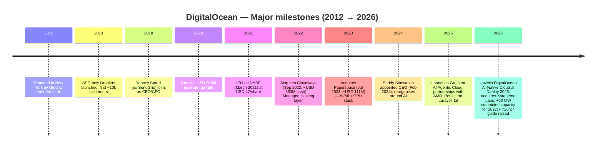
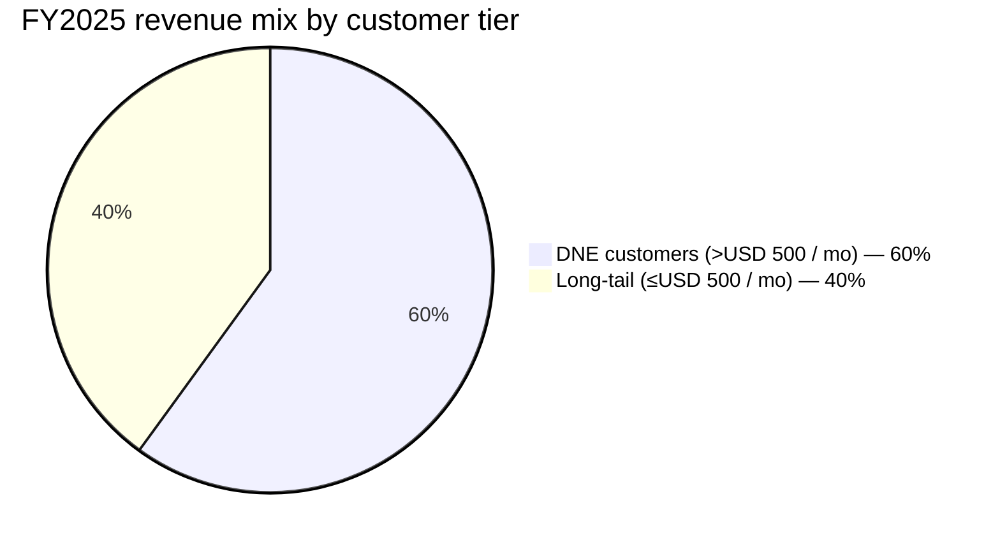
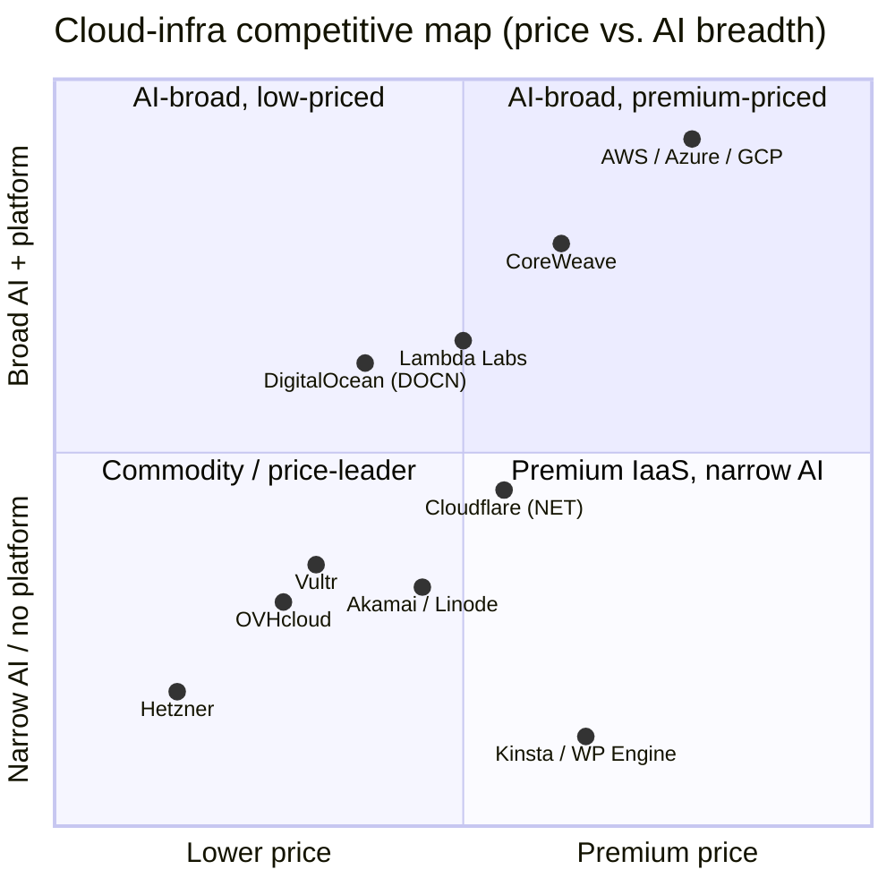

# COMPANY RESEARCH REPORT: DigitalOcean Holdings, Inc. (NYSE: DOCN)

**Date:** 2026-05-20
**Coverage:** Initiation
**Author:** Independent research

> **Update — FY2026 revenue outlook raised (2026-05-05):** Management raised
> FY2026 revenue guidance to **USD 1.130–1.145 bn** (from a prior implied ~21%
> growth path) and FY2027 growth from "30%" to **"over 50%"**, on the back of
> record Q1 2026 results (revenue USD 258 M, +22% YoY; AI Customer ARR USD
> 170 M, +221% YoY; total ARR USD 1.032 bn) and 60 MW of newly committed
> incremental data-center capacity that ramps through 2027. Adj. EBITDA
> margin guidance: 37–39%; adj. FCF margin 9–12% (after up to USD 100 M of
> one-time start-up costs for the new capacity).
> Source: [Q1 2026 earnings press release, 2026-05-05](https://www.sec.gov/Archives/edgar/data/1582961/000158296126000045/a2026-q1dopressrelease.htm); [Q1 2026 earnings call transcript, 2026-05-05](https://www.fool.com/earnings/call-transcripts/2026/05/05/digitalocean-docn-q1-2026-earnings-transcript/).

## Table of Contents

1. Company Overview
2. Company History
3. Management Team
4. Products & Services
5. Customers & Go-to-Market
6. Industry Overview
7. Competitive Landscape
8. Market Opportunity (TAM)
9. Risk Assessment
10. References

---

## 1. Company Overview

DigitalOcean Holdings, Inc. is a New York–founded, Broomfield (Colorado)–headquartered cloud-infrastructure provider that markets a developer-first, SMB-focused alternative to the three hyperscalers (AWS, Microsoft Azure, Google Cloud). Founded in 2012 and listed on the NYSE under the ticker **DOCN** since its March-2021 IPO, the company sells on-demand Linux virtual machines ("Droplets"), block and object storage, managed databases and Kubernetes, a managed-PaaS App Platform, a managed-hosting layer acquired with Cloudways (2022), and — most strategically — an AI/ML cloud built on the Paperspace acquisition (2023) and now branded **DigitalOcean Gradient AI Agentic Cloud** ([2025 10-K, p. Business overview, filed 2026-02-24](https://www.sec.gov/Archives/edgar/data/1582961/000158296126000019/0001582961-26-000019-index.htm)).

The business model is consumption-based and predominantly self-serve. Most users sign up online with a credit card; pricing is transparent, posted, and quoted in flat hourly or monthly rates, with **per-second billing for Droplets going live on 1 January 2026** ([DigitalOcean pricing page](https://www.digitalocean.com/pricing) — accessed 2026-05-20). A modest, predominantly inside-sales team supports the highest-value customer cohort (now called "$1M+" and "$500K+" customers); the broader installed base reaches DigitalOcean through search, the developer-community library (the "Community" tutorials site), GitHub integrations, and partner channels.

**Scale (FY2025):** Revenue of **USD 901.4 M** (+15.5% YoY vs. FY2024 USD 780.6 M), GAAP gross profit USD 539.6 M (gross margin 59.9%), GAAP net income USD 259.3 M (boosted by a USD 48.1 M gain on the partial extinguishment of the 2026 Convertible Notes and a USD 69.9 M release of the U.S. deferred-tax valuation allowance), adjusted EBITDA USD 374.8 M (margin 41.6%), and net cash from operating activities USD 309.6 M ([2025 10-K, Results of Operations & Liquidity sections](https://www.sec.gov/Archives/edgar/data/1582961/000158296126000019/docn-20251231.htm)). Total Annual Run-Rate Revenue (ARR) reached **USD 970 M** at year-end and crossed **USD 1.032 bn** in Q1 2026 ([Q1 2026 press release, 2026-05-05](https://www.sec.gov/Archives/edgar/data/1582961/000158296126000045/a2026-q1dopressrelease.htm)). Headcount: **1,462 full-time employees** at 31 December 2025, with 848 located outside the United States ([2025 10-K, Human Capital](https://www.sec.gov/Archives/edgar/data/1582961/000158296126000019/docn-20251231.htm)). Customer base: approximately **21,000 Digital-Native Enterprise (DNE) customers** (defined as those spending > USD 500 / month) generating ~60% of FY2025 revenue, on top of a long tail of hundreds of thousands of smaller developers and indie sites.

**Geography.** DigitalOcean operates 16 datacenter regions worldwide, with most committed capacity in North America, Europe and Asia-Pacific. International revenue is approximately two-thirds of total per recurring disclosure across 10-Ks (the FY2025 10-K notes the company's international focus, and the FY2024 10-K disclosed ~62% non-US revenue — proportions have stayed in that band).

**Valuation snapshot (as of 19 May 2026).** Share price **USD 147.43**; market capitalization **USD 15.39 bn**; enterprise value ~**USD 16.42 bn**; TTM diluted EPS **USD 2.25** ([Yahoo Finance — DOCN key statistics, accessed 2026-05-20](https://finance.yahoo.com/quote/DOCN/key-statistics/); [Stockanalysis.com — DOCN statistics](https://stockanalysis.com/stocks/docn/statistics/)).

- **TTM P/E ≈ 64×**, TTM **P/S ≈ 17×**, EV/EBITDA (TTM adj.) ≈ **52×**. TTM FCF (Yahoo) ≈ USD 174 M → unlevered FCF yield ~1.1%.
- **3-year context:** DOCN traded between ~USD 23 (Oct-2023 trough) and current ~USD 147 (May-2026 peak). The TTM P/S has expanded from ~3× at the late-2023 trough to ~17× today — a ~5.5× re-rating driven by (i) the inflection in AI-Customer ARR (+221% YoY in Q1 2026), (ii) raised 2026 / 2027 revenue-growth guidance, and (iii) shorter-cycle re-rating across the AI-cloud peer group.
- **Peer comp (TTM P/S, May 2026):** Cloudflare (NET) ~30×, CoreWeave (CRWV) ~7×, Akamai (AKAM) ~2.6×, AWS / Azure / GCP not directly comparable but their parent multiples sit ~7–11× ([Stockanalysis.com — NET financials/ratios](https://stockanalysis.com/stocks/net/financials/ratios/); [Macrotrends — CoreWeave P/S](https://www.macrotrends.net/stocks/charts/CRWV/coreweave/price-sales)). DOCN sits at roughly 0.6× Cloudflare's P/S but ~2.4× CoreWeave's — investors are paying a clear premium versus pure GPU-rental neoclouds because DOCN couples AI capacity with profitable PaaS and managed services and runs at >40% adj. EBITDA margin.
- **Why the premium is defensible — but stretched.** A 17× TTM P/S on a business growing 22% YoY (Q1 2026) at ~40% adj. EBITDA margin implies the market is pricing the FY2027 ">50% growth" guide as the new run rate. Forward EV / Sales on the FY2026 mid-guide of USD 1.138 bn is ~14.4× and on the FY2027 implied USD 1.7 bn is ~9.7×. That's still ahead of the SMB-cloud average but inside the AI-infra peer band. The valuation risk is squarely on guidance delivery: if 2027 growth lands at "only" 30–35% rather than ≥50%, a meaningful compression is plausible.

Source: [DigitalOcean 2025 10-K, Results of Operations](https://www.sec.gov/Archives/edgar/data/1582961/000158296126000019/docn-20251231.htm); [DigitalOcean 2022 10-K, Revenue table](https://www.sec.gov/Archives/edgar/data/1582961/000158296123000009/0001582961-23-000009-index.htm); author's calculation of adj. EBITDA margin.

---

## 2. Company History

DigitalOcean was incorporated in Delaware in 2012 by brothers **Ben Uretsky** and **Moisey Uretsky**, alongside co-founders Mitch Wainer, Jeff Carr and Alec Hartman. The founding thesis was simple but contrarian: developers were drowning in the complexity of AWS, the cheapest virtual machine they could spin up was several clicks and several dollars, and there was room for a "Heroku-simple but VPS-priced" cloud aimed at people who write code rather than enterprises that procure infrastructure. The first Droplet launched at USD 5 per month — a flat, transparent price card that became a defining differentiator and an attack point against AWS's then-byzantine pricing pages ([DigitalOcean 2025 10-K, "Corporate Information", filed 2026-02-24](https://www.sec.gov/Archives/edgar/data/1582961/000158296126000019/docn-20251231.htm)).

Source: [DigitalOcean 2025 10-K, Business overview and Acquisitions](https://www.sec.gov/Archives/edgar/data/1582961/000158296126000019/docn-20251231.htm); [BusinessWire — Cloudways acquisition close, 2022-09-01](https://www.businesswire.com/news/home/20220901005338/en/); [Paperspace acquisition 8-K, 2023-07-06](https://www.sec.gov/Archives/edgar/data/1582961/000158296123000023/exhibit991-paperspacepress.htm); [Q1 2026 earnings press release, 2026-05-05](https://www.sec.gov/Archives/edgar/data/1582961/000158296126000045/a2026-q1dopressrelease.htm).

**Three pivots stand out.** First, the *2018 leadership reset*: Yancey Spruill was hired from SendGrid as the financially-mature operator who would professionalise the company through IPO; the founder-CEO Ben Uretsky stepped back to a board role. Second, the *2021 IPO and a deliberate pivot up-market* toward "Scalers" — the higher-spend cohort that became today's DNE Customers — funded by a sales hiring binge and meaningful R&D investment in PaaS (App Platform, Managed Databases, Managed Kubernetes). Third, the *2022–2024 AI/managed-services repositioning*: the back-to-back Cloudways (managed hosting for agencies / WordPress shops, [8-K, 2022-09-08](https://www.sec.gov/Archives/edgar/data/1582961/000158296122000041/exhibit991-cloudwaysclosin.htm)) and Paperspace (GPU notebooks, Gradient ML platform, [8-K, 2023-07-06](https://www.sec.gov/Archives/edgar/data/1582961/000158296123000023/exhibit991-paperspacepress.htm)) acquisitions reframed DigitalOcean from a pure VPS reseller into a full-stack developer cloud with two new revenue layers.

The Paperspace deal is the most consequential and the one this report returns to repeatedly. Closed for **USD 111 M** in July 2023, it added the Gradient ML notebook platform, accelerated-compute SKUs, and — crucially — a team that has spent the last three years bolting accelerated compute and a model-first inference stack onto DigitalOcean's existing cloud. By Q1 2026, AI Customer ARR had reached **USD 170 M (+221% YoY)** on a Paperspace cost base that didn't exist before mid-2023 ([2025 10-K, Paperspace footnote](https://www.sec.gov/Archives/edgar/data/1582961/000158296126000019/docn-20251231.htm); [Q1 2026 press release](https://www.sec.gov/Archives/edgar/data/1582961/000158296126000045/a2026-q1dopressrelease.htm)).

**Recent developments (LTM May 2025 → May 2026):**

- **Feb 2026:** FY2025 10-K filed — full-year revenue USD 901.4 M, adj. EBITDA margin 41.6%, GAAP net income USD 259.3 M (boosted by debt extinguishment gain + tax-valuation-allowance release).
- **April 2026:** *Deploy 2026* event; **DigitalOcean AI-Native Cloud** unveiled with 15+ product releases across five layers (infrastructure, core cloud, inference, data, managed agents); acquired **Katanemo Labs** to bring agentic-AI primitives in-house ([Q1 2026 press release, 2026-05-05](https://www.sec.gov/Archives/edgar/data/1582961/000158296126000045/a2026-q1dopressrelease.htm)).
- **May 2026:** Q1 2026 results beat the Street; equity follow-on of 11.9 M shares netted **USD 888 M**, part of which repaid USD 500 M of the Term Loan A; **60 MW** of incremental committed capacity (≈ 2× expansion of the total committed footprint to ~135 MW) announced for 2027 ramp.

---

## 3. Management Team

### Paddy Srinivasan — Chief Executive Officer (since 12 February 2024)

Paddy (Padmanabhan) Srinivasan joined DigitalOcean as CEO on 12 February 2024, replacing interim CEO Bill Sorenson after the controversial 2023 departure of Yancey Spruill ([BusinessWire — DigitalOcean Appoints Paddy Srinivasan as CEO, 2024-01-17](https://www.businesswire.com/news/home/20240117457437/en/DigitalOcean-Appoints-Paddy-Srinivasan-as-Chief-Executive-Officer); [DigitalOcean leadership page](https://www.digitalocean.com/leadership/executive-management)). He arrived with two decades of cloud and SaaS product / general-management experience and an investor-friendly profile.

Srinivasan's prior tour was *CEO of GoTo* (August 2022 – February 2024), the SaaS holding company spun out of LogMeIn that owns LogMeIn Rescue, GoToConnect and GoToMeeting; he ran a ~USD 1 bn-revenue, take-private business through a difficult restructuring and refinancing cycle. Before that he spent six years at LogMeIn (2013–2019) as **SVP Products & General Manager**, where he ran the company's IoT and identity businesses (GoTo's predecessors), and was the operator who scaled the Xively IoT platform to a Google acquisition. Earlier roles included **GM, Data & Machine-Learning Platform Services at Amazon Alexa AI** (2019–2020) — the most directly AI-relevant line on his CV — and earlier product-management leadership at **Microsoft** (1999–2006) and **Oracle**. He also co-founded **Opstera**, a cloud-monitoring SaaS that was acquired by Avanade in 2012. He holds a BSc in Electrical Engineering from BITS Pilani and an MBA from SMU's Cox School of Business ([LinkedIn — Paddy Srinivasan](https://www.linkedin.com/in/paddysrinivasan/); [Clay dossier on DigitalOcean CEO, accessed 2026-05-20](https://www.clay.com/dossier/digitalocean-ceo)).

Compensation and ownership. Srinivasan's 2024 sign-on award included an inducement RSU and a multi-year performance-based award (PRSU) tied to ARR and adjusted FCF margin targets; the 2025 LTIP PRSU award structure is disclosed in the proxy and 10-K, with target shares of 218,486 and a max of 436,972 contingent on FY2025 performance ([2025 10-K, Stock-Based Compensation](https://www.sec.gov/Archives/edgar/data/1582961/000158296126000019/docn-20251231.htm); [2026 DEF 14A, filed 2026-04-24](https://www.sec.gov/Archives/edgar/data/1582961/000158296126000029/0001582961-26-000029-index.htm)). His insider stake is modest in absolute terms — single-digit basis points of shares outstanding via RSUs and the 2024 inducement awards.

Strategic thesis since arrival. Srinivasan inherited a business whose core SMB-cloud growth was decelerating and whose Paperspace bet had not yet shown a revenue inflection. His first 24 months have been spent re-architecting the product narrative around **inference and agentic AI** — re-branding Paperspace's offerings as *Gradient*, reorganising sales into a hybrid PLG-plus-enterprise motion, signing the multi-year, "eight-figure-per-annum-average" partnership with **Persistent Systems** (December 2025), expanding the AMD partnership (DigitalOcean-powered AMD developer cloud, 2025), and the Laravel and fal integrations. The Q1 2026 results — 22% revenue growth, 41% adj. EBITDA margin, AI ARR +221% — are the first quarter where his thesis visibly delivered, and the stock has roughly tripled since his appointment.

### Matt Steinfort — Chief Financial Officer (since January 2023)

Matt Steinfort became CFO in early January 2023, succeeding Bill Sorenson ([BusinessWire / DigitalOcean IR — Matt Steinfort appointment, 2022-11-17](https://investors.digitalocean.com/news/news-details/2022/DigitalOcean-Names-Matt-Steinfort-Chief-Financial-Officer/default.aspx)). His background is unusually operational for a public-company CFO: he was CFO of **Zayo Group** (a USD 2.5 bn-revenue fibre-infrastructure operator) from 2017, where he ran capital markets and M&A through Zayo's 2020 USD 14 bn take-private by EQT/DigitalBridge — directly relevant experience for an asset-heavy, debt-financed compute build-out. Before Zayo he founded and served as President and CEO of **Envysion**, a video-intelligence SaaS sold to Motorola Solutions; earlier roles include strategy and finance leadership at ICG Communications, Level 3 Communications, Bain & Company, and Cambridge Technology Partners. He holds a BSE in civil engineering and operations research from **Princeton** and an MBA from **MIT Sloan** ([The Globe and Mail — DigitalOcean Names Matt Steinfort CFO, 2022-11-17](https://www.theglobeandmail.com/investing/markets/stocks/DOCN-N/pressreleases/11772368/digitalocean-names-matt-steinfort-chief-financial-officer/)).

Steinfort's capital-markets fingerprints are all over the FY2025 / Q1 2026 balance sheet: the USD 625 M 2030 Convertible Note issued in August 2025 (with capped calls to cap dilution at USD 66.51), the USD 380 M Term Loan A draw, the partial repurchase of the 2026 Convertibles, and the May 2026 follow-on equity raise of 11.9 M shares for net USD 888 M — used in part to repay USD 500 M of Term Loan A and to fund the 60 MW capacity expansion. The deliberate sequencing — convert + revolver + equity, in that order — preserves more EPS than a pure equity-funded build would, and reflects a CFO who has run this playbook in fibre.

### Bratin Saha — President, Product & Engineering (since 2024)

Srinivasan recruited **Bratin Saha** as President of Product & Engineering in 2024 from AWS, where he ran **AI / ML Services at AWS as Vice President** and was the executive responsible for SageMaker, Bedrock, Comprehend and Lex during the 2018–2024 period of AI's commercial inflection. Before AWS he was an Intel principal engineer and a programming-languages researcher; he holds a PhD from Yale ([DigitalOcean leadership page](https://www.digitalocean.com/leadership/executive-management)). Saha is the highest-credibility AI-platform hire DigitalOcean has made; his presence is the single biggest signal to enterprise AI customers that the Gradient stack is intended as a serious platform, not a Paperspace cleanup.

### Hilary Schneider — Chair of the Board (lead independent director)

Schneider is a long-tenured public-company director (former CEO of Wolters Kluwer Health, former President of Yahoo! Americas, current board roles at Levi Strauss and Delta Dental) — a governance-first chair rather than an industry operator; her presence anchors a relatively independent board ([2026 DEF 14A, filed 2026-04-24](https://www.sec.gov/Archives/edgar/data/1582961/000158296126000029/0001582961-26-000029-index.htm)).

### Governance footer

- **Board composition.** The board has eight directors per the 2026 proxy; seven are independent under NYSE rules; the audit, compensation, and nominating/governance committees are composed of independent directors only ([2026 DEF 14A](https://www.sec.gov/Archives/edgar/data/1582961/000158296126000029/0001582961-26-000029-index.htm)).
- **Insider ownership.** Aggregate insider + named-executive ownership is in the low single-digit-percent range (officers and directors as a group beneficially own ~2–3% on a fully-diluted basis per the proxy — well below founder-controlled peers); no supervoting share class exists.
- **Compensation structure.** Executive comp is heavily equity-weighted (RSU + PRSU), with PRSU performance tied to ARR and adjusted FCF margin targets — a sensible alignment for a capacity-investing AI-cloud operator. The 2024 LTIP PRSU paid out at sub-target after the FY2024 financial-metric reset, reducing PRSU shares by ~89k ([2025 10-K, Stock-Based Compensation footnote](https://www.sec.gov/Archives/edgar/data/1582961/000158296126000019/docn-20251231.htm)).
- **Related-party transactions and flags.** No material related-party transactions disclosed in the 2026 proxy; CEO succession in 2023–24 was the principal governance event, with the prior CEO (Spruill) departing in late 2023 after a Board-led process that also restated some classification of operating expense lines (the 2023 figures were recast in the 2024 and 2025 10-Ks). The recast is well-documented and reflects standard P&L cleanup rather than a restatement of consolidated results.

### Management track record assessment

Srinivasan and Saha are a credible AI-platform operator pairing, and the Q1 2026 numbers are the first datapoint that they can execute together — AI ARR up 221% YoY, $1M+-customer ARR up 179%, and a record USD 62 M of incremental organic ARR in a single quarter is a quantifiably better outcome than the prior regime delivered. Steinfort has financed the build cleanly. Open question: can this team scale the customer-facing motion from ~21k DNE customers to the Fortune-2000 cohort the new committed contracts imply, without breaking the self-serve gross-margin model.

---

## 4. Products & Services

DigitalOcean's portfolio is now organized around **five integrated layers** of the "AI-Native Cloud", introduced at Deploy 2026 ([Q1 2026 press release, 2026-05-05](https://www.sec.gov/Archives/edgar/data/1582961/000158296126000045/a2026-q1dopressrelease.htm); [DigitalOcean blog — Building the Inference Cloud](https://www.digitalocean.com/blog/building-inference-cloud-what-comes-next)). Below I enumerate every distinct SKU family from a walk of the live `digitalocean.com/products/*` tree (accessed 2026-05-19), and assess competitive advantage product by product.

```mermaid
graph TD
    DO[DigitalOcean AI-Native Cloud]
    DO --> CORE[Core Cloud — IaaS]
    DO --> PAAS[PaaS / SaaS]
    DO --> MH[Managed Hosting — Cloudways]
    DO --> AI[Gradient AI Agentic Cloud]
    DO --> DATA[Data & Networking]

    CORE --> Droplets[Droplets — Linux VMs]
    CORE --> Volumes[Block Storage Volumes]
    CORE --> Spaces[Spaces Object Storage + CDN]
    CORE --> LB[Load Balancers]
    CORE --> VPC[VPC / Networking / Firewalls]

    PAAS --> App[App Platform — PaaS]
    PAAS --> K8s[Managed Kubernetes - DOKS]
    PAAS --> DB[Managed Databases - PG/MySQL/Redis/Kafka/MongoDB]
    PAAS --> Func[Functions — serverless]

    MH --> CW[Cloudways managed hosting]
    MH --> Autonomous[Cloudways Autonomous WP]

    AI --> Gpu[GPU Droplets — H100/H200/B200/MI300X]
    AI --> Bare[Bare-metal GPU clusters]
    AI --> Platform[Gradient AI Platform - LLM + RAG]
    AI --> Agents[Gradient AI Agents]
    AI --> Inf[Inference Engine + Inference Router]
```

Source: company website product navigation, [digitalocean.com/products](https://www.digitalocean.com/products) — accessed 2026-05-19; [Q1 2026 press release, 2026-05-05](https://www.sec.gov/Archives/edgar/data/1582961/000158296126000045/a2026-q1dopressrelease.htm).

### Core cloud (IaaS) — the legacy foundation

- **Droplets** — Linux VMs in three families (Basic shared-CPU, General-Purpose / CPU-Optimized / Memory-Optimized dedicated, Premium AMD/Intel). Pricing starts at **USD 4/month** for the smallest shared-CPU instance and goes per-second from 1 January 2026 (minimum 60 s) ([Droplet pricing page](https://www.digitalocean.com/pricing/droplets); [Websiteplanet — DigitalOcean pricing 2026](https://www.websiteplanet.com/blog/digitalocean-pricing-plans/)). **Advantage: Yes — pricing transparency, simplicity, developer brand.** Closest competing product: AWS Lightsail (USD 3.50–USD 160/mo bundles, less granular sizing) and Linode/Akamai Cloud (similar SKUs); Droplets are at parity on features, modestly ahead on developer-experience and brand recall in the SMB segment, behind on global region count vs. Linode/Akamai.
- **Spaces** — S3-compatible object storage + bundled CDN. **USD 5/month for 250 GB included with CDN egress**, then USD 0.02/GB additional ([Spaces page](https://www.digitalocean.com/products/spaces); [HamsterStack DigitalOcean pricing](https://hamsterstack.com/pricing/digitalocean/)). **Advantage: Partial.** S3 itself is the moat product in the category; Spaces' moat is bundled CDN + simpler pricing for SMB. Behind Cloudflare R2 on egress economics; at parity with Wasabi / Backblaze B2 on raw economics but ahead on integration with the rest of the stack.
- **Volumes, Load Balancers, VPC / Firewalls** — table-stakes IaaS primitives. No standalone moat; included so DOCN can be a complete stack for the SMB.

### PaaS / SaaS — the developer "next layer"

- **App Platform** — managed PaaS / "Heroku-like" app hosting with auto-build from GitHub, autoscaling, and a free tier for static sites; dynamic apps start at **USD 5/month** ([App Platform pricing](https://docs.digitalocean.com/products/app-platform/details/pricing/)). **Advantage: Partial.** Targets the segment Heroku has effectively vacated since Salesforce killed the free tier; competes with Render, Railway, Fly.io and Vercel for back-end PaaS. Moat is the integration with the rest of DigitalOcean — a developer can deploy an app *and* host its Postgres *and* serve its static assets without changing vendors.
- **Managed Kubernetes (DOKS)** — managed control plane is **free**; pay only for worker-node Droplets, starting at **USD 12/month** ([Managed Kubernetes page](https://www.digitalocean.com/products/kubernetes); pricing guide above). **Advantage: Partial — price.** A free control plane is a clear pricing-advantage moat against EKS (~USD 73/month per cluster) and AKS; behind hyperscaler EKS on advanced networking and behind Civo on cold-start performance, but a strong fit for SMB Kubernetes.
- **Managed Databases** — Postgres, MySQL, MongoDB, Redis ("Valkey"), Kafka, OpenSearch as managed services. **Advantage: Partial.** Competing with AWS RDS (deeper, more managed); DOCN's advantage is price transparency and a simple promotion path from a Droplet.
- **Functions** — serverless runtime (DigitalOcean's deprecation roadmap moved away from a deep FaaS investment in favour of App Platform–hosted long-lived containers). **Advantage: No.** Niche and not the strategic priority.

### Managed Hosting — Cloudways

- **Cloudways** — DigitalOcean's WordPress / WooCommerce / Magento / Laravel managed-hosting brand, retained as a separate front-end since the September 2022 acquisition ([Cloudways acquisition 8-K, 2022-09-08](https://www.sec.gov/Archives/edgar/data/1582961/000158296122000041/exhibit991-cloudwaysclosin.htm); [Cloudways homepage](https://www.cloudways.com/en/)). Plans run from ~USD 14/month (1 GB DO server, managed app) up to multi-thousand-dollar enterprise plans. Customer is digital agencies, freelancers, SMB e-commerce stores. **Advantage: Yes — brand + channel.** The agency channel is sticky (Cloudways' agency partner program has multi-year customer cohorts) and the "managed WordPress on DigitalOcean" positioning is a clean differentiator vs. self-managed WP on a Droplet. Closest competing products: Kinsta, WP Engine, Pressable. Cloudways is at price-advantage parity with Kinsta, behind WP Engine on enterprise features, ahead on multi-cloud (Cloudways was originally cloud-agnostic; DOCN has retained the multi-cloud option).
- **Cloudways Autonomous WordPress** — auto-scaling, fully managed WP environment, launched in 2024. **Advantage: Partial.** Differentiates Cloudways from generic managed WP, but the category is competitive.

### Gradient AI Agentic Cloud — the strategic bet

The Paperspace stack rebranded *Gradient* and now positioned as a full **agentic-inference cloud**.

- **Gradient AI Infrastructure** — **GPU Droplets** (single-GPU, including NVIDIA H100, H200, B200; AMD MI300X / MI350X), **Bare-Metal GPUs** (8-way HGX nodes with InfiniBand), reserved and on-demand capacity ([Gradient page](https://www.digitalocean.com/products/gradient); [DigitalOcean blog — What's New on the Inference Engine](https://www.digitalocean.com/blog/whats-new-on-gradient-ai-platform); MI350X launch via [DigitalOcean Gradient blog](https://www.digitalocean.com/blog/introducing-digitalocean-gradient)). **Advantage: Partial.** DOCN is *behind* CoreWeave, Lambda and the hyperscalers on raw scale and on first-day access to new NVIDIA generations; it is *ahead* of those peers on combining GPU rental with a turnkey PaaS / managed-DB / object-store stack. The Q1 2026 NVIDIA B300 commitment narrows the lag.
- **Gradient AI Platform** — hosted LLMs (third-party model APIs), RAG pipelines, function-calling, model garden. **Advantage: Partial.** A meaningfully thinner platform than Bedrock or Vertex AI, but designed for SMB ergonomics; the AMD MI355X liquid-cooled rack roll-out and the new Inference Engine / Inference Router (launched April 2026) move the offering into "serverless inference" territory where it competes more directly with Modal and Anyscale.
- **Gradient AI Agents + Agentic Primitives (Katanemo)** — agent runtimes, guardrails, evaluation. **Katanemo Labs** acquired in April 2026 ([Q1 2026 press release](https://www.sec.gov/Archives/edgar/data/1582961/000158296126000045/a2026-q1dopressrelease.htm)) is a small-tuck-in that gives DOCN agentic-routing IP. **Advantage: To be earned.** Too early to call a moat; differentiation is integration depth with Gradient PaaS rather than novel agent IP.

### Flagship vs. long-tail

The **1–3 products driving the business** are: **(i) Droplets and the surrounding core IaaS** (still the largest revenue contributor, conservatively ~50% of FY2025 revenue based on management's narrative that PaaS/SaaS — which includes Cloudways — is roughly one-third and AI/ML is the fastest-growing layer); **(ii) Cloudways** (the managed-hosting line — disclosed in past 10-K narratives as accretive to PaaS/SaaS revenue and a key channel into agency customers); and **(iii) Gradient AI / GPU compute** — small in absolute terms vs. Droplets but the fastest-growing line and the multiple-expansion driver. The long tail of older Functions, deprecated load-balancer SKUs and niche developer tools is material to ergonomics but immaterial to revenue.

### Roadmap & recent launches (LTM)

- **15+ new product launches at Deploy 2026** spanning infrastructure (NVIDIA B300 commitments), inference (Inference Router), data (Gradient AI Platform LLM gallery + RAG), agents (Agentic Primitives from Katanemo), and core cloud refinements ([Q1 2026 press release](https://www.sec.gov/Archives/edgar/data/1582961/000158296126000045/a2026-q1dopressrelease.htm)).
- **AMD MI350X GPUs live in Atlanta region; MI355X liquid-cooled racks slated for next quarter** ([DigitalOcean blog](https://www.digitalocean.com/blog/whats-new-on-gradient-ai-platform)).
- **Strategic partnerships (LTM):** **Persistent Systems** (December 2025) — multi-year, "eight-figure-per-annum-average" — Persistent migrates its SASVA AI platform to DigitalOcean; **AMD** (expanded 2025) — DigitalOcean-powered AMD developer cloud; **fal.ai** (2025) — multimodal-media inference; **Laravel** (2025) — Laravel VPS / Forge runs on DOCN ([2025 10-K, Recent Developments](https://www.sec.gov/Archives/edgar/data/1582961/000158296126000019/docn-20251231.htm); [BusinessWire — DigitalOcean AI Ecosystem expansion, 2025-10-02](https://www.businesswire.com/news/home/20251002212312/en/DigitalOcean-Expands-AI-Ecosystem-Launches-Partner-Program-to-Accelerate-Innovation-and-Empower-Startups-and-Builders)).
- **Per-second Droplet billing** went live 1 January 2026 — a pricing-model shift designed to make DOCN more competitive for short-lived workloads, especially CI/CD agents and inference bursts.

---

## 5. Customers & Go-to-Market

DigitalOcean's customer profile is two distinct populations layered on the same platform:

1. **The long-tail developer / indie-hacker base** — hundreds of thousands of accounts, mostly month-to-month consumption, mostly Droplets + Spaces. Most pay < USD 500 / month; many pay < USD 50 / month. This is the founding customer base and remains the source of the "developer cloud" brand.
2. **The Digital-Native Enterprise (DNE) cohort** — defined since Q4 2025 as customers spending > USD 500 / month. **~21,000 DNE customers** at 31 December 2025 (up from ~18,000 a year earlier), generating **~60% of FY2025 revenue** ([2025 10-K, Key Business Metrics](https://www.sec.gov/Archives/edgar/data/1582961/000158296126000019/docn-20251231.htm)).

Within the DNE cohort, management discloses three further tiers from Q4 2025 forward:

- **$100K+ Customers** — those at > USD 100k ARR. Revenue from $100K+ customers was **30% of total revenue** in Q1 2026, up from 22% in Q1 2025 — **+73% YoY revenue growth**.
- **$500K+ Customers** — **21% of total revenue**, **+132% YoY**.
- **$1M+ Customers** — **18% of total revenue**, **+179% YoY**. ARR from this tier reached **USD 183 M in Q1 2026** ([Q1 2026 press release, 2026-05-05](https://www.sec.gov/Archives/edgar/data/1582961/000158296126000045/a2026-q1dopressrelease.htm)).

Source: [DigitalOcean 2025 10-K — Customer Concentration & Categories](https://www.sec.gov/Archives/edgar/data/1582961/000158296126000019/docn-20251231.htm).

Source: [DigitalOcean 2025 10-K, Key Business Metrics](https://www.sec.gov/Archives/edgar/data/1582961/000158296126000019/docn-20251231.htm); implied ARPU = (revenue × DNE share) / DNE count.

### Customer concentration

DigitalOcean's customer concentration is **extremely low** — and that is one of the business's defining features. Per the 10-K's customer-concentration footnote, **the top 25 customers represented approximately 10% of FY2025 revenue, 8% in FY2024 and 7% in FY2023** ([2025 10-K, Key Business Metrics](https://www.sec.gov/Archives/edgar/data/1582961/000158296126000019/docn-20251231.htm)). No single customer is ≥ 10% of revenue, so no individual customer is disclosed by name in the 10-K segment notes (ASC 280-10-50-42).

That said, the *trend* is meaningful: the top-25 share has nearly doubled from 5% in 2022 to 10% in 2025 as larger AI / inference customers ramp on the Gradient stack. The Persistent Systems contract alone is a multi-year, "eight-figure-per-annum-average" commitment; the AMD partnership and the launch of named customer wins in the Gradient AI marketing push (fal, Laravel) suggest more concentration is coming. Management has flagged Remaining Performance Obligations (RPO) growing from USD 14 M at Q1 2025 to **USD 243 M at Q1 2026**, with USD 167 M expected to recognise over the next 12 months — a clear shift toward larger, longer contracted relationships ([Q1 2026 press release](https://www.sec.gov/Archives/edgar/data/1582961/000158296126000045/a2026-q1dopressrelease.htm)).

**Verdict:** customer concentration is *not* a material risk today (top-1 < 4%, top-5 < 8% implied). It could become one if the Gradient AI cohort consolidates around a handful of mega-customers — a real risk in the AI-cloud industry (CoreWeave's Microsoft / OpenAI concentration is the cautionary example). Watch the 2026 10-K's customer-concentration footnote for the first 10%+ named customer.

### Contract structure and net dollar retention

The default contract is **month-to-month consumption** billed in arrears (credit card or invoice). A growing share of the $100K+ cohort signs **annual or multi-year committed contracts** with minimum spend; these contracts drive the RPO build. Net Dollar Retention (NDR) was **100% in FY2025 (up from 98% in FY2024)** ([2025 10-K, NDR section](https://www.sec.gov/Archives/edgar/data/1582961/000158296126000019/docn-20251231.htm)). NDR of 100% is below best-in-class SaaS (115–130% for top-tier infrastructure SaaS) but reflects (i) the long-tail mix that includes hobbyists who churn for life-cycle reasons rather than dissatisfaction and (ii) the historical price stability of Droplets. The DNE-cohort-only NDR is likely meaningfully higher; management has signalled it intends to disclose it more granularly going forward.

### Go-to-market

- **Self-serve and product-led growth (PLG)** remains the primary acquisition motion. Customers can sign up online with a credit card, receive a free-credit grant, and deploy a Droplet within 60 seconds. The Community section — tutorials, Q&A, dev guides — is one of the largest developer-content properties on the web and a major organic-acquisition channel.
- **Inside sales + targeted outside sales** support the DNE cohort; sales headcount has grown in 2024–25 (the FY2025 10-K notes a USD 7.8 M increase in sales personnel cost as the principal driver of the S&M expense growth).
- **Channel partnerships:** **AMD** (developer cloud), **Persistent** (enterprise AI integrator), **Laravel / fal.ai** (developer ecosystems). The DigitalOcean Partner Program (BusinessWire announcement, October 2025) formalises a partner-led motion for AI workloads.
- **Sales cycle.** For the long-tail, near-zero (credit-card signup). For the DNE cohort, a typical 30–90 day cycle; for the largest committed-capacity deals (Persistent-scale), a multi-quarter procurement process. Far shorter than enterprise hyperscaler deals but increasingly enterprise-like for Gradient AI customers.
- **Named customer wins (publicly disclosed).** Outside of partners (above), DigitalOcean does not disclose a named customer roster in the 10-K. Public case studies on the website name customers such as Snipcart, Loadium, Inkit, Slack-adjacent SMBs, and a wide range of agency-deployed WordPress sites.

---

## 6. Industry Overview

DigitalOcean operates inside one of the largest and fastest-growing parts of the technology economy — **public cloud IaaS + PaaS** — and increasingly inside a specific sub-segment, **GPU / AI inference cloud**, that has emerged as the most rapidly-expanding compute category since 2023. Three overlapping industry frames matter for the thesis.

### Industry definition

**Frame 1: Public cloud IaaS + PaaS (the broad TAM).** IDC defines IaaS as the compute, storage and networking layer; PaaS as database management systems, application platforms, AI platforms, and other platform services. The combined worldwide IaaS + PaaS market is roughly half of all public cloud spending; the other half is SaaS. Public cloud services in aggregate are forecast to reach **USD 1.6 trn by 2028** at a 19.5% CAGR ([IDC Worldwide Software and Public Cloud Services Spending Guide, 2025](https://www.monitordaily.com/idc-forecasts-worldwide-spending-on-public-cloud-services-will-double-between-2024-and-2028/)).

**Frame 2: SMB-oriented IaaS / PaaS (DOCN's stated TAM).** Cited directly in the 10-K: the worldwide IaaS + PaaS market for individuals and companies with **< 500 employees** is estimated to grow from **~USD 138 bn in 2025 to USD 251 bn by 2028 — a 22% CAGR** ([2025 10-K, Business overview, citing IDC](https://www.sec.gov/Archives/edgar/data/1582961/000158296126000019/docn-20251231.htm)). This is the cleanest TAM proxy for the core DOCN business.

**Frame 3: AI / inference cloud.** Morgan Stanley estimated that by late 2026, **70% of GPU cloud spend will be inference, not training** ([Spheron — GPU Cloud Pricing 2026](https://www.spheron.network/blog/gpu-cloud-pricing-comparison-2026/), citing MS research). PaaS-layer AI platforms are forecast as the *single fastest-growing* sub-category in public cloud, with a 51.1% five-year CAGR per IDC ([IDC, 2025](https://www.monitordaily.com/idc-forecasts-worldwide-spending-on-public-cloud-services-will-double-between-2024-and-2028/)).

### Market structure

- **Top three (AWS, Azure, GCP)** consolidate ~60–65% of global IaaS / PaaS spend and have dominant share in enterprise. They are largely *not* DigitalOcean's competitive set for the SMB segment — they are too complex, their pricing is too opaque, and their lowest-tier instances are priced for enterprise procurement, not credit-card developers.
- **SMB cloud (the DOCN tier)** is far more fragmented: DigitalOcean, **Linode/Akamai**, **OVHcloud**, **Hetzner** (Germany, aggressive on price), **Vultr** (private, growing fast), **Contabo**, **Scaleway**, **UpCloud**, **Hostinger Cloud**, and the SMB lines of hyperscalers (**AWS Lightsail**, Azure for Startups, GCP free tier). Of these, **Vultr, Linode/Akamai, and Hetzner are DOCN's most direct comparators**; OVHcloud is competitive in Europe; Hetzner is the price leader.
- **GPU / AI cloud "neoclouds"** is a younger and more concentrated sub-market: **CoreWeave** is the scale leader (with ~USD 7.7 bn TTM revenue and a market cap of ~USD 54 bn as of May 2026 per [Macrotrends — CoreWeave](https://www.macrotrends.net/stocks/charts/CRWV/coreweave/pe-ratio)), **Lambda Labs** is a clear #2 raising fresh capital, **RunPod / Vast.ai / Modal** sit in the developer-friendly tier, plus the hyperscaler GPU offerings.

### Growth drivers

1. **AI inference becoming the dominant compute workload.** Inference workloads are smaller-instance, more burst-shaped, and far more sensitive to dev-ex than training workloads — characteristics that favour SMB-cloud ergonomics over hyperscaler enterprise procurement.
2. **The "rest of the iceberg" of digital-native start-ups and indie builders.** Stripe, Vercel, Cloudflare and the new wave of AI start-ups have demonstrated that the bottom-up developer-first GTM produces durable, high-multiple businesses. The SMB segment continues to grow with each new generation of side projects, agencies and bootstrapped SaaS.
3. **Hyperscaler-fatigue and FinOps pressure.** Enterprise cloud bills have driven a structural conversation about cost transparency and predictability — exactly the territory DigitalOcean has occupied since 2012.
4. **Open-source LLMs becoming production-viable.** Llama 4, Mixtral, DeepSeek and similar open-weight models reduce the need for first-party-model-only clouds (Bedrock / Vertex), opening the door for neoclouds and SMB AI platforms.

### Regulatory environment

DigitalOcean is subject to the standard set of data-protection regimes (GDPR, CCPA, LGPD, the EU AI Act, China PIPL, UK Online Safety Act) and US export-controls on advanced GPUs (the BIS October 2023 / October 2025 rules limit who DOCN can sell H100 / H200 / B200 / B300 GPU access to). The company explicitly cites compliance with EAR and OFAC regulations in the 10-K's regulatory section. AI-specific regulation (EU AI Act, US state-level AI bills) is still emerging and adds compliance overhead but no material business restriction today.

### Industry dynamics

- **Fragmentation in SMB cloud, concentration in AI cloud.** SMB IaaS has perhaps 12–15 credible global players; AI training cloud is concentrated in 3–5 (CoreWeave, Lambda, hyperscalers). Inference is the swing category and is, today, less concentrated.
- **Supplier power.** NVIDIA has near-monopoly power in training-class GPUs, which is the single largest input cost for a neocloud. AMD's MI300/MI350 series — and DOCN's expanding AMD partnership — gradually relieve that. Power and data-center supply is the new bottleneck (DOCN's 60 MW commitment is itself a scarce resource).
- **Buyer power.** SMB customers individually have negligible bargaining power but are extremely price-sensitive and switching costs are low (Linux is Linux). For the Gradient AI cohort, buyer power increases — the largest customers will negotiate multi-year reserved-capacity contracts.
- **Substitutes.** Self-hosted bare metal (still a non-trivial option for cost-sensitive workloads); hyperscaler free tiers; cheaper European players (Hetzner) for price-only buyers.

---

## 7. Competitive Landscape

DigitalOcean fights on three fronts. Below is the most economically meaningful peer set, drawn from the 10-K's own competitor list (which names **AWS, Azure, GCP, OVHcloud, Akamai/Linode, Hetzner, Vultr, Contabo, CoreWeave, Lambda Labs, Kinsta, WP Engine**) — supplemented with the AI-cloud peers most relevant to the Gradient bet ([2025 10-K, Competition section](https://www.sec.gov/Archives/edgar/data/1582961/000158296126000019/docn-20251231.htm)).

Source: peer set per [DigitalOcean 2025 10-K, Competition](https://www.sec.gov/Archives/edgar/data/1582961/000158296126000019/docn-20251231.htm); position estimates by author based on publicly-disclosed pricing and AI/PaaS breadth (qualitative; not market-share-weighted).

Source: [Stockanalysis.com — DOCN statistics](https://stockanalysis.com/stocks/docn/statistics/); [Stockanalysis.com — Cloudflare financials/ratios](https://stockanalysis.com/stocks/net/financials/ratios/); [Macrotrends — CoreWeave P/S](https://www.macrotrends.net/stocks/charts/CRWV/coreweave/price-sales); [Yahoo Finance — AKAM key statistics](https://finance.yahoo.com/quote/AKAM/key-statistics/) — all accessed 2026-05-20.

### SMB / developer cloud front

- **Linode (acquired by Akamai in 2022, now Akamai Cloud).** Roughly the same product surface as DOCN — VPS, managed K8s, object storage, managed DB — and broader edge / CDN integration via Akamai. Akamai's Cloud Infrastructure Services grew **40% YoY in Q1 2026** to a USD ~700 M / quarter run-rate ([Akamai Q1 2026 press release](https://www.sec.gov/Archives/edgar/data/1086222/000108622226000054/exhibit991-q12026.htm)) — a direct, fast-growing competitor. DOCN's advantage is developer brand and a broader PaaS+AI layer; Linode/Akamai's advantage is the edge / CDN network and global region density.
- **Vultr (private).** Hetzner-style price competitor with broader region coverage; a credible competitor in raw compute economics, especially for European and Asia-Pacific developers. Vultr launched its own Cloud GPU line in 2024 and has gained meaningful share among hobbyist GPU renters. Lacks the depth of PaaS (no managed DBs of DOCN's breadth) and no Cloudways-equivalent managed-hosting layer.
- **Hetzner (private, German).** The pure price leader. A dedicated Hetzner CX21 (4 GB) costs ~EUR 5.83/month vs. DOCN's USD 24/month equivalent — roughly *one-quarter the price*. Hetzner's playbook is hyper-efficient data-center economics in Germany / Finland. DOCN's advantage is broader region count outside Europe, far better PaaS, and Cloudways. Hetzner is the structural price-competition risk for the long-tail Droplet base.
- **OVHcloud (Euronext: OVH).** Public European competitor; broader product surface than Hetzner and a meaningful AI-cloud push of its own. Strong in Europe, much weaker elsewhere.

### AI / inference cloud front

- **CoreWeave (NASDAQ: CRWV).** The neocloud scale leader (TTM revenue ~USD 7.7 bn) and the most directly comparable AI-cloud public company. CoreWeave is *concentrated* — its top customer (Microsoft) and OpenAI dominate revenue mix — and its TTM P/E is negative (~-33×) as it burns cash on scaling. DOCN is far smaller in AI revenue (~USD 170 M ARR Q1 2026) but far broader in product surface and far healthier in operating profitability (DOCN: 41% adj. EBITDA margin; CRWV: negative GAAP net income).
- **Lambda Labs (private).** Heavy on H100 / B200 supply, increasingly enterprise-AI focused. Raised meaningful capital in 2024–25; broadly positioned as a CoreWeave alternative. Not yet a serious threat to DOCN's SMB-AI customer base.
- **RunPod, Modal, Vast.ai.** Developer-friendly serverless / spot-priced GPU clouds. RunPod especially targets the same hobbyist / SMB AI developer that DOCN wants in the Gradient funnel — a clear competitor in the long-tail AI segment. DOCN's advantage: tight integration with Droplets / Databases / Spaces. RunPod's advantage: aggressive spot pricing and a more cohesive "AI-only" brand.

### Cloudflare (NET) — adjacent but increasingly overlapping

Cloudflare's Workers AI, R2 (object storage), D1 (database), and Pages products mean it is increasingly a competitor for the same indie-developer / SMB segment, especially on edge-rendered web apps. Cloudflare trades at a far richer multiple (~30× TTM P/S) reflecting (i) its dominant edge / DDoS franchise and (ii) the market's enthusiasm for the Workers AI vision. Cloudflare's advantage: edge ubiquity, network effects, brand. DOCN's advantage: full server-side compute, larger Droplet / GPU SKUs, managed databases.

### Hyperscaler SMB tiers (AWS Lightsail, Azure for Startups, GCP free tier)

AWS Lightsail is the closest hyperscaler offering by intent — bundled VPS, simple pricing — but it has stagnated since 2023 in product investment. The hyperscalers' real SMB strategy is to onboard via free tier and convert to full-stack consumption. For most credit-card-and-deploy developers, DOCN's UX is meaningfully better. The risk is that AWS, Azure or GCP makes a focused SMB push — historically they have not, but the AI inference push could change the calculus.

### DOCN's competitive advantages and vulnerabilities

**Advantages (durable):**
- *Developer brand and Community.* A meaningful, decade-deep moat in mindshare among the world's developers (Stack Overflow surveys repeatedly rank DOCN in the top 3 for developer satisfaction).
- *Full-stack ergonomics.* Croplets + Spaces + DBs + K8s + App Platform + Cloudways + Gradient AI under one billing relationship and one UX.
- *Pricing transparency and per-second billing.* A clean differentiator vs. hyperscalers and CoreWeave's reserved-contract pricing.
- *Profitability.* 41% adj. EBITDA margin and positive FCF in a category where most competitors are unprofitable — a structural advantage in any prolonged downturn.

**Vulnerabilities:**
- *AI-revenue concentration risk.* Eight-figure-per-annum-average customers (Persistent) are large relative to historical AI ARR — concentration in the Gradient AI book is the inverse of the historical DNE-cohort diversification.
- *Behind on raw scale and first-day GPU access.* DOCN gets H200 / B300 supply later than CoreWeave / Lambda, who buy at NVIDIA reserved-priority tiers.
- *Cloudways migration risk.* The Managed Hosting line still operates partly as a separate product; some legacy Cloudways customers run on AWS or GCP and that revenue is structurally lower-margin.
- *Long-tail SMB price competition from Hetzner / Vultr.* Persistent margin pressure on the lowest-tier Droplets.

---

## 8. Market Opportunity (TAM)

**TAM (SMB IaaS + PaaS, per IDC, 2025 → 2028):** USD **138 bn → 251 bn**, **22% CAGR** ([2025 10-K Business overview, citing IDC](https://www.sec.gov/Archives/edgar/data/1582961/000158296126000019/docn-20251231.htm)).

**SAM (DigitalOcean's serviceable market).** DigitalOcean's SAM is the subset of the SMB IaaS + PaaS market that (i) is consumption-priced, (ii) is reachable through a credit-card / self-serve onboarding model, and (iii) is increasingly AI/inference-workload-heavy. Conservatively this is **~60% of the IDC TAM**, or ~USD 82–150 bn over 2025–28. The remaining ~40% is reserved-capacity enterprise contracts that the hyperscalers continue to win — DOCN does not compete materially there.

**SOM (today and 2028E).** FY2025 revenue of USD 901 M against a USD 138 bn TAM implies **~0.65% share of the SMB IaaS + PaaS market**. Even at the company's own raised FY2027 trajectory (50%+ growth on a ~USD 1.14 bn base implies ~USD 1.7 bn FY2027 revenue), DOCN's share would still be roughly **0.9% of an USD 190 bn 2027 TAM**. The market is large enough that even modest share gains compound into substantial absolute growth — and DOCN's market-share runway is multi-decade rather than 3–5-year-limited.

**Growth projections (author's view).**

- **Base case** (60% probability): FY2026 revenue lands at the USD 1.13–1.145 bn guide (≈26% growth); FY2027 revenue lands at 35–45% growth (USD 1.55–1.65 bn) — below the "50%+" headline but a meaningful step-up from the FY2025 15% growth rate. Justification: ramp lag on the 60 MW new capacity, AI revenue continues to compound at >100% off a small base, $1M+ customer count keeps doubling, but commercial execution at the larger-customer tier is the open variable.
- **Bull case** (25% probability): FY2026 hits the high end (USD 1.145 bn) and FY2027 meets or exceeds 50% growth (USD 1.7+ bn) on faster-than-expected Persistent-scale enterprise wins, B300 capacity coming online on schedule, and AMD MI355X capturing demand from H200-supply-constrained inference workloads.
- **Bear case** (15% probability): FY2026 lands at the low end (USD 1.13 bn or below) and FY2027 grows only 25–30% as AI customer concentration creates volatility, hyperscaler SMB programs (e.g. an Azure or GCP renewed SMB push) compress NDR, and the 60 MW capacity ramps later than guided. P/S compression from 17× to ~10× would imply a stock in the USD 80–100 band.

**Penetration strategy.** DOCN's penetration playbook over the next 2–3 years is (i) keep the Droplet-and-long-tail engine humming as the developer-funnel into Gradient AI; (ii) move existing DNE customers up the spend tier with Gradient AI primitives + Cloudways + managed databases; (iii) sign more Persistent-scale partnerships that bring entire enterprise AI portfolios onto DOCN; and (iv) use the 60 MW expansion and AMD partnership to keep margin healthy while scaling AI capacity ahead of demand.

---

## 9. Risk Assessment

### Company-specific risks

**1. AI capacity-build execution risk (high impact, moderate probability).** The 60 MW of incremental committed capacity ramping through 2027 is a multi-hundred-million-dollar build. The 2025 10-K already disclosed that data-center co-location costs increased by USD 28.6 M YoY and depreciation increased USD 7.8 M YoY ([2025 10-K, Cost of Revenue](https://www.sec.gov/Archives/edgar/data/1582961/000158296126000019/docn-20251231.htm)). Up to **USD 100 M of one-time start-up costs** are explicitly contemplated in the FY2026 guide. If the build runs late, gross margin will compress and the FY2027 ">50% growth" guide is at risk. Mitigant: management has hired a multi-stint datacenter-build CFO (Steinfort) and the capacity is contracted, not speculative.

**2. AI-customer concentration risk (medium impact, rising probability).** Top-25 customer share went from 7% (FY2023) to **10% (FY2025)** — and large committed contracts (Persistent eight-figure-per-annum-average, AMD developer cloud) are pushing the number up. If the top-1 customer crosses 10%, the company has to name the customer in the 10-K and the equity-story shifts from "diversified SMB cloud" to "enterprise AI cloud" — a different multiple regime. Mitigant: the long-tail SMB business remains the largest revenue layer and a structural diversifier.

**3. Talent and CEO concentration (medium impact, medium probability).** The current AI-cloud thesis is materially tied to two executives — Srinivasan and Saha — both joined within the last two years. Departure of either before the 2027 capacity ramp would create a credibility hit; the prior CEO transition (Spruill in 2023) was disruptive. Mitigant: equity comp structures lock in both through 2027.

**4. Long-tail SMB price competition / churn (medium impact, ongoing).** Hetzner (and to a lesser extent Vultr / Contabo) operate at 25–40% of DOCN's Droplet price. Persistent NDR of 100% (vs. SaaS best-in-class 115–130%) implies that some of the long-tail base is leaking. Mitigant: per-second billing (live January 2026) addresses the price-sensitivity gap on short-lived workloads; Cloudways adds value-added margin on top.

**5. Cloudways integration and managed-hosting moat erosion (medium impact, medium probability).** Cloudways was acquired in 2022 for ~USD 350 M; the brand is still managed somewhat separately. WP Engine, Kinsta and Hostinger compete intensely in this segment. Disclosure on Cloudways-specific revenue is limited (PaaS/SaaS bucket only), making external monitoring of the integration's success harder. Mitigant: Cloudways was profitable at close and remains accretive.

### Industry / market risks

**6. Hyperscaler SMB push (high impact, low–medium probability).** AWS, Azure or GCP making a focused SMB / developer push would compress DOCN's growth. Historically they have not — but the AI inference economy gives them new motivation. Mitigant: hyperscaler ergonomics are structurally hostile to credit-card SMB customers; AWS Lightsail's stagnation is evidence the strategic intent isn't there.

**7. NVIDIA / AMD GPU supply constraints (medium impact, medium probability).** Reserved-capacity priority at NVIDIA goes to CoreWeave / Microsoft / Meta first. DOCN's expanded AMD partnership (MI300 / MI350 / MI355) is a meaningful diversifier — but the broader category is supply-constrained until B300 / MI355X production fully ramps in 2027. Mitigant: DOCN's stated 135 MW committed capacity provides multi-quarter visibility.

**8. US / China export controls on advanced GPUs (medium impact, medium probability).** BIS export controls on H200 / B200 / B300 GPUs restrict who DOCN can sell to (China-headquartered and certain China-affiliated customers). The 10-K explicitly cites EAR compliance. Tightening rules could shave several percent of addressable customers. Mitigant: DOCN's exposure is naturally lower than CoreWeave's (smaller China-customer footprint historically).

**9. AI / inference workload shift becoming the wrong bet (low–medium impact, low probability).** If inference shifts heavily to on-device (Apple Intelligence, Qualcomm AI, Google Tensor) the cloud TAM could compress. Mitigant: server-side agentic workflows are emerging precisely because on-device inference is bandwidth-limited for the most useful agents.

### Financial risks

**10. Leverage and 2026 / 2030 Convertible-Note refinancing (medium impact, low probability).** USD 1.32 bn aggregate principal of debt at year-end 2025 (2030 converts + 2026 converts + Term Loan A); USD 326.6 M of debt matures within the next 12 months (2026 converts USD 312.3 M + Term Loan A principal USD 14.3 M) ([2025 10-K, Liquidity section](https://www.sec.gov/Archives/edgar/data/1582961/000158296126000019/docn-20251231.htm)). The May 2026 follow-on raised USD 888 M of equity, much of which has already been used to repay USD 500 M of Term Loan A — so net leverage is now manageable. Mitigant: USD 741 M cash and equivalents at Q1 2026 plus USD 420 M undrawn revolver.

**11. Valuation compression risk (high impact, moderate probability).** TTM P/S of 17× is well above the 3-year median; if FY2027 growth lands below 40% (vs. the >50% guide) the multiple compresses sharply. A re-rate to 10× P/S on FY2026 revenue would imply ~USD 95/share — a ~35% drawdown from current. Mitigant: cash flow generation provides downside support; even at 10× P/S the equity story remains intact.

**12. Stock-based compensation dilution (medium impact, ongoing).** SBC was USD 80 M in FY2025 (8.9% of revenue) — meaningfully lower than software-peer averages but still meaningful. Combined with periodic equity raises, share count is rising. Mitigant: the 2030 capped calls cap convert dilution; ongoing buybacks (USD 100 M authorized in August 2025) partially offset.

### Macroeconomic risks

**13. Economic recession and SMB-customer fragility (medium impact, low–medium probability).** SMB / start-up customers churn more in downturns than enterprise customers. A material US/EU recession in 2026–27 could push NDR back below 95% and slow DNE-cohort additions. Mitigant: consumption-based pricing means revenue compresses smoothly rather than via contract cancellations; international diversification spreads geographic risk.

**14. Interest-rate / FX risk (low impact, ongoing).** Term Loan A floats vs. SOFR; USD strength affects ~one-third of revenue billed in non-USD currencies. Mitigant: interest-rate sensitivity is limited to Term Loan A (much of which is now repaid); FX exposure is manageable at current scale.

---

## 10. References

### Primary sources — SEC filings (DigitalOcean)

- [DigitalOcean 2025 10-K (filed 2026-02-24)](https://www.sec.gov/Archives/edgar/data/1582961/000158296126000019/docn-20251231.htm) — FY2025 results, customer metrics, AI strategy, competition.
- [DigitalOcean Q1 2026 10-Q (filed 2026-05-05)](https://www.sec.gov/Archives/edgar/data/1582961/000158296126000049/0001582961-26-000049-index.htm) — quarterly financials.
- [DigitalOcean Q1 2026 8-K / earnings press release (2026-05-05)](https://www.sec.gov/Archives/edgar/data/1582961/000158296126000045/a2026-q1dopressrelease.htm) — Q1 2026 metrics, raised guidance, capacity announcement.
- [DigitalOcean 2026 DEF 14A proxy (filed 2026-04-24)](https://www.sec.gov/Archives/edgar/data/1582961/000158296126000029/0001582961-26-000029-index.htm) — board and executive compensation.
- [DigitalOcean 2025 DEF 14A proxy (filed 2025-04-25)](https://www.sec.gov/Archives/edgar/data/1582961/000114036125015799/0001140361-25-015799-index.htm) — CEO-transition compensation.
- [DigitalOcean 2024 10-K (filed 2025-02-25)](https://www.sec.gov/Archives/edgar/data/1582961/000158296125000035/0001582961-25-000035-index.htm) — FY2024 results, prior CFO disclosures.
- [DigitalOcean 2022 10-K (filed 2023-02-24)](https://www.sec.gov/Archives/edgar/data/1582961/000158296123000009/0001582961-23-000009-index.htm) — FY2021/FY2022 revenue history, Cloudways acquisition closing.
- [Paperspace acquisition 8-K (2023-07-06)](https://www.sec.gov/Archives/edgar/data/1582961/000158296123000023/exhibit991-paperspacepress.htm) — acquisition rationale and structure.
- [Cloudways acquisition closing 8-K (2022-09-08)](https://www.sec.gov/Archives/edgar/data/1582961/000158296122000041/exhibit991-cloudwaysclosin.htm) — acquisition rationale and structure.
- [2030 Convertible Notes 8-K (2025-08-14)](https://www.sec.gov/Archives/edgar/data/1582961/000119312525180799/d45966dex991.htm) — debt issuance structure.

### Company website, products and partnerships

- [DigitalOcean home — products navigation](https://www.digitalocean.com/products) — accessed 2026-05-19.
- [DigitalOcean pricing page](https://www.digitalocean.com/pricing) — accessed 2026-05-19.
- [Droplet pricing page](https://www.digitalocean.com/pricing/droplets).
- [App Platform pricing documentation](https://docs.digitalocean.com/products/app-platform/details/pricing/).
- [Gradient AI Agentic Cloud page](https://www.digitalocean.com/products/gradient).
- [DigitalOcean Gradient AI Platform page](https://www.digitalocean.com/products/gradient/platform).
- [DigitalOcean blog — Building the Inference Cloud, and What Comes Next](https://www.digitalocean.com/blog/building-inference-cloud-what-comes-next).
- [DigitalOcean blog — What's New on Gradient AI Platform](https://www.digitalocean.com/blog/whats-new-on-gradient-ai-platform).
- [DigitalOcean blog — Introducing Gradient: DigitalOcean's Unified AI Cloud](https://www.digitalocean.com/blog/introducing-digitalocean-gradient).
- [DigitalOcean leadership / executive management page](https://www.digitalocean.com/leadership/executive-management).
- [BusinessWire — DigitalOcean Expands AI Ecosystem, Launches Partner Program, 2025-10-02](https://www.businesswire.com/news/home/20251002212312/en/DigitalOcean-Expands-AI-Ecosystem-Launches-Partner-Program-to-Accelerate-Innovation-and-Empower-Startups-and-Builders).
- [BusinessWire — DigitalOcean Appoints Paddy Srinivasan as CEO, 2024-01-17](https://www.businesswire.com/news/home/20240117457437/en/DigitalOcean-Appoints-Paddy-Srinivasan-as-Chief-Executive-Officer).
- [DigitalOcean IR — Matt Steinfort CFO announcement, 2022-11-17](https://investors.digitalocean.com/news/news-details/2022/DigitalOcean-Names-Matt-Steinfort-Chief-Financial-Officer/default.aspx).
- [Cloudways homepage](https://www.cloudways.com/en/).

### Management / executive biographies

- [LinkedIn — Paddy Srinivasan](https://www.linkedin.com/in/paddysrinivasan/).
- [Clay dossier on DigitalOcean CEO (Paddy Srinivasan)](https://www.clay.com/dossier/digitalocean-ceo) — accessed 2026-05-20.
- [Constellation Research — DigitalOcean CEO Paddy Srinivasan on AI natives, inferencing, agentic AI adoption](https://www.constellationr.com/blog-news/insights/digitalocean-ceo-paddy-srinivasan-ai-natives-inferencing-agentic-ai-adoption).
- [The Globe and Mail — DigitalOcean Names Matt Steinfort CFO, 2022-11-17](https://www.theglobeandmail.com/investing/markets/stocks/DOCN-N/pressreleases/11772368/digitalocean-names-matt-steinfort-chief-financial-officer/).

### Earnings and investor materials

- [The Motley Fool — DigitalOcean Q1 2026 Earnings Transcript, 2026-05-05](https://www.fool.com/earnings/call-transcripts/2026/05/05/digitalocean-docn-q1-2026-earnings-transcript/).
- [Seeking Alpha — DigitalOcean surges as it ups guidance after strong Q1 results, 2026-05-05](https://seekingalpha.com/news/4585516-digitalocean-surges-as-it-ups-guidance-after-strong-q1-results).
- [Simply Wall St — DigitalOcean Holdings Margin Surge Tests Bearish Narratives, 2026-05](https://simplywall.st/stocks/us/software/nyse-docn/digitalocean-holdings/news/digitalocean-holdings-docn-margin-surge-tests-bearish-narrat).
- [Insider Monkey — DigitalOcean Q1 2026 Earnings Call Transcript, 2026-05-05](https://www.insidermonkey.com/blog/digitalocean-holdings-inc-nysedocn-q1-2026-earnings-call-transcript-1754818/).

### Market data and valuation

- [Yahoo Finance — DOCN quote and key statistics](https://finance.yahoo.com/quote/DOCN/key-statistics/) — accessed 2026-05-20.
- [Stockanalysis.com — DOCN statistics](https://stockanalysis.com/stocks/docn/statistics/) — accessed 2026-05-20.
- [Stockanalysis.com — Cloudflare (NET) financials and ratios](https://stockanalysis.com/stocks/net/financials/ratios/) — accessed 2026-05-20.
- [Stockanalysis.com — Cloudflare (NET) statistics](https://stockanalysis.com/stocks/net/statistics/) — accessed 2026-05-20.
- [Macrotrends — CoreWeave (CRWV) P/E ratio](https://www.macrotrends.net/stocks/charts/CRWV/coreweave/pe-ratio) — accessed 2026-05-20.
- [Macrotrends — CoreWeave (CRWV) P/S ratio](https://www.macrotrends.net/stocks/charts/CRWV/coreweave/price-sales) — accessed 2026-05-20.

### Industry / TAM / competitive data

- [IDC — Worldwide Software and Public Cloud Services Spending Guide, 2025](https://my.idc.com/getdoc.jsp?containerId=IDC_P33214).
- [MonitorDaily — IDC Forecasts Worldwide Spending on Public Cloud Services Will Double Between 2024 and 2028, 2025](https://www.monitordaily.com/idc-forecasts-worldwide-spending-on-public-cloud-services-will-double-between-2024-and-2028/).
- [Spheron — GPU Cloud Pricing 2026 (citing Morgan Stanley research)](https://www.spheron.network/blog/gpu-cloud-pricing-comparison-2026/).
- [GPUCloudList — Lambda Labs Review 2026](https://www.gpucloudlist.com/en/blog/lambda-labs-review-2026).
- [Akamai Q1 2026 press release (NYSE: AKAM)](https://www.sec.gov/Archives/edgar/data/1086222/000108622226000054/exhibit991-q12026.htm) — Cloud Infrastructure Services growth peer-comp datapoint.
- [Cloudflare Q1 2026 press release (NYSE: NET)](https://www.sec.gov/Archives/edgar/data/1477333/000147733326000033/q126exhibit991.htm) — comparable AI/edge cloud peer disclosure.
- [CoreWeave Q1 2026 press release (NASDAQ: CRWV)](https://www.sec.gov/Archives/edgar/data/1769628/000176962826000220/coreweave1q26earningspress.htm) — neocloud peer revenue and customer concentration.

### Third-party reviews and pricing guides

- [Websiteplanet — DigitalOcean Plans & Pricing: Cheap but What's the Catch? 2026](https://www.websiteplanet.com/blog/digitalocean-pricing-plans/).
- [HamsterStack — DigitalOcean pricing, tiers and limits 2026](https://hamsterstack.com/pricing/digitalocean/).
- [RunPod — Top 12 Cloud GPU Providers for AI and ML in 2026](https://www.runpod.io/articles/guides/top-cloud-gpu-providers).
- [Buildmvpfast — RunPod vs Lambda Labs vs CoreWeave GPU cloud pricing 2026](https://www.buildmvpfast.com/blog/gpu-cloud-cost-comparison-runpod-lambda-labs-coreweave-2026).

### Charts in this report

All charts in this report were generated by the author from the primary-source data above; the generation script lives at `oneoff/docn_charts.py` in the project repo. Underlying data is cited inline beneath each chart.

