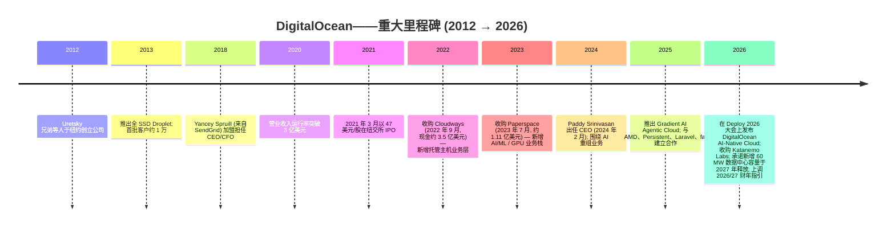
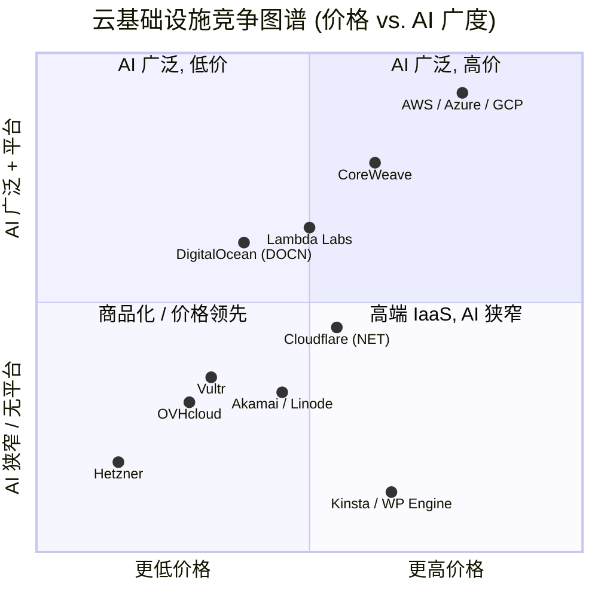
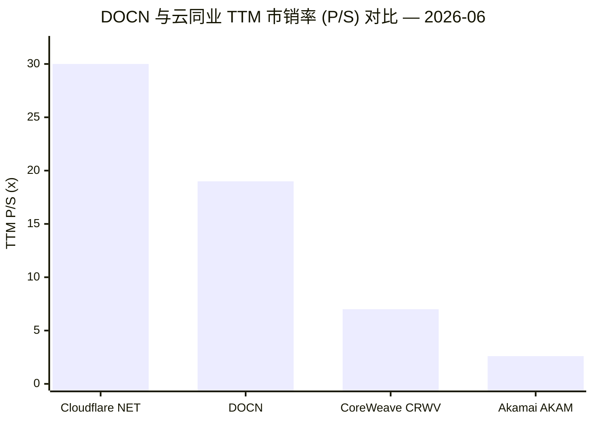

# DigitalOcean Holdings, Inc. (NYSE:DOCN) — 公司研究报告

**日期 (as of): 2026-06-18**
**上市地: 纽约证券交易所, 代码 DOCN**
**总部地点: 美国科罗拉多州 Broomfield**
**研究覆盖: 覆盖刷新 (Refresh, 首次覆盖于 2026-05)**
**作者: 独立研究 (Independent research)**
**报告语言: 简体中文 (英文版同时存在于本目录)**

---

### 投资摘要 (Investment summary — *分析师观点：本节为本报告观点, 非公司披露*)

> *本摘要区块整体为本报告的前瞻判断 (rating / 目标价 / 上行空间均为 `*分析师观点：*`), 不构成任何 10-K / 8-K 披露内容; 估值方法与前瞻预测见第 2 节。*

| 项目 | 数值 |
|---|---|
| **评级 (Rating)** | **持有 / Hold (Neutral)** |
| **12 个月目标价 (Price Target)** | **180 美元** |
| **当前股价 (2026-06-18 收盘)** | **173.27 美元** |
| **隐含上行 / 下行** | **约 +4%** |
| **估值方法 (一句话)** | FY2027E 营业收入约 16.0 亿美元 × 前瞻 EV/Sales 约 12× → 股权价值约 187 亿美元 ÷ 约 1.044 亿股 |
| **市值 (Market cap)** | **约 181 亿美元** |
| **企业价值 (EV)** | **约 189 亿美元** |
| **52 周区间** | **25.56 – 187.50 美元** |
| **TTM 稀释 EPS** | **2.28 美元** |

**四大论点支柱 (Thesis pillars — *分析师观点：*):**

1. **AI 拐点真实但已被定价。** Gradient AI 客户 ARR 在 2026 Q1 同比 **+221%** 至 1.70 亿美元, $1M+ 客户 ARR +179%——这是过去三年押注 Paperspace 的首次清晰兑现; 但当前约 **19× TTM P/S、约 76× TTM P/E** 已将 2027 财年"超过 50% 增速"指引当作新常态来定价。
2. **盈利能力是结构性差异化。** 在一个 CoreWeave / Lambda 等同业普遍亏损烧钱的类目里, DOCN 维持 **59.9% 毛利率、41.6% 调整后 EBITDA 利润率、3.096 亿美元经营性现金流**——这是任何 AI 资本开支周期下行时的下行支撑。
3. **客户集中度低但正在上升。** 前 25 大客户占营收从 2023 年 7% 升至 2025 年 **10%**; AI 大客户 (Persistent 年均八位数美元合同) 正把模式从"多样化 SMB 云"推向"企业 AI 云"——这是不同的估值倍数体系, 既是机会也是风险。
4. **执行风险锁定在容量爬坡上。** 新增 60 MW 承诺容量 (总承诺约 135 MW) 于 2027 年爬坡, 伴随高达 1.00 亿美元一次性启动成本; 若爬坡延迟或 2027 增速仅落在 30–35% 而非 ≥50%, 估值倍数压缩的概率较高——这正是本报告给"持有"而非"买入"的核心理由。

> **业绩更新 / 近况 (2026-05-05 → 2026-06-18):** 管理层于 2026-05-05 将 2026 财年营业收入指引上调至 **11.30 亿至 11.45 亿美元**, 同时将 2027 财年增速从原"30%"上调至 **"超过 50%"**, 受益于 2026 Q1 创纪录业绩 (营业收入 2.58 亿美元, 同比 +22%; AI 客户 ARR 1.70 亿美元, 同比 +221%; 全部 ARR 10.32 亿美元) 及 60 MW 新增承诺容量。调整后 EBITDA 利润率指引 37–39%; 调整后 FCF 利润率 9–12% (扣除最高 1.00 亿美元新增容量一次性启动成本后)。**自上次报告 (2026-05-20, 股价 147.43 美元) 以来股价进一步上涨约 18% 至 173.27 美元**; 期间唯一新增重大文件为 2026-06-17 提交的 8-K (Item 5.07——2026 年度股东大会表决结果, 无业务影响)。来源: [Q1 2026 业绩新闻稿, 2026-05-05](https://www.sec.gov/Archives/edgar/data/1582961/000158296126000045/a2026-q1dopressrelease.htm); [Q1 2026 业绩说明会纪要, 2026-05-05](https://www.fool.com/earnings/call-transcripts/2026/05/05/digitalocean-docn-q1-2026-earnings-transcript/); [DOCN 8-K (Item 5.07), 2026-06-17 提交](https://www.sec.gov/cgi-bin/browse-edgar?action=getcompany&CIK=0001582961&type=8-K&dateb=&owner=include&count=10)。

**相对表现 (Relative performance, 截至 2026-06-18 — *分析师观点：动量轴输入*):** DOCN 过去 12 个月从约 27.36 美元上涨至 173.27 美元 (**约 +533%**), 过去 6 个月从约 47.52 美元上涨 (**约 +265%**), 远跑赢同期 S&P 500 (约个位数百分比), 股价位于 52 周高点 187.50 美元附近、远高于 200 日均线 ([yfinance — DOCN 历史价格, 2026-06-18 访问](https://finance.yahoo.com/quote/DOCN/history/))。

## 目录

1. 公司概览 (含 1A 估值与目标价 · 1B GF Score)
2. 估值与目标价 (Valuation & Price Target — 前瞻模型 / 情景 / 卖方观点)
3. 管理团队
4. 产品与服务
5. 客户与上市策略
6. 行业概览
7. 竞争格局
8. 市场机会 (TAM)
9. 风险评估 (含 9.5 核心分歧与催化剂)
10. 投资视角评分 (Investor lenses)
11. 参考资料

---

## 1. 公司概览

DigitalOcean Holdings, Inc. 是一家发源于美国纽约、总部位于科罗拉多州 Broomfield 的云基础设施 (cloud infrastructure) 供应商, 定位为面向开发者优先 (developer-first)、聚焦中小企业 (SMB) 的"三大超大规模云厂商 (hyperscalers, 即 AWS、Microsoft Azure、Google Cloud) 之外的替代选择"。公司创立于 2012 年, 自 2021 年 3 月 IPO 后在纽约证券交易所以代码 **DOCN** 挂牌交易。公司销售按需 Linux 虚拟机 ("Droplets" 滴答虚拟机)、块存储与对象存储 (block storage / object storage)、托管数据库与 Kubernetes (managed databases / managed Kubernetes)、托管 PaaS 应用平台 (App Platform), 以及一层来自 2022 年收购 Cloudways 的托管主机业务 (managed-hosting layer), 而最具战略意义的是——基于 2023 年收购 Paperspace 的 AI/ML 云服务, 现已更名为 **DigitalOcean Gradient AI Agentic Cloud (Gradient AI 代理型云)** ([2025 10-K, 业务概览章节, 2026-02-24 提交](https://www.sec.gov/Archives/edgar/data/1582961/000158296126000019/0001582961-26-000019-index.htm))。

商业模式为基于消费量 (consumption-based) 计费, 以自助式 (self-serve) 为主。大多数用户通过线上信用卡注册; 定价透明、公开列价, 按小时或月固定费率报价, 且 **Droplet 按秒计费 (per-second billing) 已于 2026 年 1 月 1 日生效** ([DigitalOcean 定价页面, 2026-05-20 访问](https://www.digitalocean.com/pricing))。一支规模适中、以内销售为主 (inside-sales) 的小型团队负责支持最具价值的客户群 (即现在称为 "$1M+" 与 "$500K+" 客户层级); 更广泛的存量客户群通过搜索引擎、开发者社区图书馆 ("Community" 教程网站)、GitHub 集成以及合作伙伴渠道接触 DigitalOcean。

**规模 (2025 财年)。** 营业收入 **9.014 亿美元** (相比 2024 财年 7.806 亿美元同比 +15.5%), GAAP 毛利润 5.396 亿美元 (毛利率 59.9%), GAAP 净利润 2.593 亿美元 (其中包含 4,810 万美元 2026 年可转债部分清偿收益以及 6,990 万美元美国递延所得税估值备抵 (deferred-tax valuation allowance) 释放), 调整后 EBITDA 3.748 亿美元 (利润率 41.6%), 经营活动产生的现金净额 3.096 亿美元 ([2025 10-K, 经营成果与流动性章节](https://www.sec.gov/Archives/edgar/data/1582961/000158296126000019/docn-20251231.htm))。截至年末, 总年化运行收入 (Annual Run-Rate Revenue, ARR) 达 **9.70 亿美元**, 至 2026 Q1 突破 **10.32 亿美元** ([Q1 2026 新闻稿, 2026-05-05](https://www.sec.gov/Archives/edgar/data/1582961/000158296126000045/a2026-q1dopressrelease.htm))。员工人数: 截至 2025 年 12 月 31 日 **1,462 名全职员工**, 其中 848 名位于美国境外 ([2025 10-K, 人力资本章节](https://www.sec.gov/Archives/edgar/data/1582961/000158296126000019/docn-20251231.htm))。客户规模: 大约 **21,000 家数字原生企业 (Digital-Native Enterprise, DNE) 客户** (即每月消费 > 500 美元的客户), 贡献 2025 财年约 60% 的营业收入, 此外还有由数十万更小规模的开发者和独立站点 (indie sites) 构成的长尾客户群。

**地理分布。** DigitalOcean 在全球运营 16 个数据中心区域, 多数承诺容量集中于北美、欧洲与亚太地区。2025 财年营业收入按地区分解为: **北美 (North America) 3.465 亿美元 (38%)、欧洲 (Europe) 2.431 亿美元 (28%)、亚洲 (Asia) 2.113 亿美元 (23%)、其余地区 (Rest of the world) 1.006 亿美元 (11%)**——即美国以外的国际收入约占总营收的 **62%**, 比例长期稳定在该区间 ([2025 10-K, 营收地区分解](https://www.sec.gov/Archives/edgar/data/1582961/000158296126000019/docn-20251231.htm))。

### 1A. 估值快照与目标价 (Valuation snapshot & price target)

**估值快照 (截至 2026-06-18 收盘)。** 股价 **173.27 美元**; 市值约 **181 亿美元**; 企业价值约 **189 亿美元**; 过去十二个月 (TTM) 稀释后每股收益 (diluted EPS) **2.28 美元**; 流通股约 **1.044 亿股** ([yfinance — DOCN 报价, 2026-06-18 访问](https://finance.yahoo.com/quote/DOCN/key-statistics/); [Stockanalysis.com — DOCN 统计指标](https://stockanalysis.com/stocks/docn/statistics/))。

- **TTM 市盈率 (P/E) ≈ 76×**, TTM **市销率 (P/S) ≈ 19×**, EV/EBITDA (TTM 调整后) ≈ **51×** (= 189 亿美元 EV ÷ 3.748 亿美元 FY2025 调整后 EBITDA)。基于约 1.044 亿股与 173.27 美元股价, 市值约 181 亿美元 ([yfinance — DOCN 报价, 2026-06-18 访问](https://finance.yahoo.com/quote/DOCN/key-statistics/))。
- **过去一年视角:** DOCN 股价从一年前 (2025-06-20) 约 27.36 美元上涨至 173.27 美元 (**约 +533%**), 过去 6 个月从约 47.52 美元上涨 (**约 +265%**), 是 2026 年表现最炸裂的中盘云股之一 ([yfinance — DOCN 历史价格, 2026-06-18 访问](https://finance.yahoo.com/quote/DOCN/history/))。TTM P/S 已从 2023 年末低点的约 3 倍扩张到今日的约 19 倍——估值倍数约 6 倍重新评级 (re-rating), 主要驱动因素为: (i) AI 客户 ARR 拐点 (Q1 2026 同比 +221%); (ii) 2026 / 2027 财年营业收入增速指引上调; (iii) 整个 AI 云同业群体的同步重新评级。
- **同业对比 (TTM P/S, 2026 年 6 月):** Cloudflare (NET) 约 30 倍, CoreWeave (CRWV) 约 7 倍, Akamai (AKAM) 约 2.6 倍, AWS / Azure / GCP 三大母公司虽然不直接可比但其市销率倍数处于 7–11 倍区间 ([Stockanalysis.com — NET 财务/比率](https://stockanalysis.com/stocks/net/financials/ratios/); [Macrotrends — CoreWeave P/S](https://www.macrotrends.net/stocks/charts/CRWV/coreweave/price-sales))。DOCN 的约 19× P/S 约为 Cloudflare 的 0.6 倍, 但约为 CoreWeave 的 2.7 倍——投资者明显愿意为 DOCN 支付高于纯 GPU 租赁型新型云厂商 (neoclouds) 的溢价, 因为 DOCN 将 AI 容量与盈利能力强的 PaaS 及托管服务捆绑在一起, 且调整后 EBITDA 利润率超过 40%。
- **为什么用约 76× 的高 P/E (multiple interpretation)。** 76× TTM P/E 与约 19× P/S 属于 AI 基础设施"成长溢价"区间, 而非泡沫。归因: (a) 真实的高增长子赛道——AI ARR 在小基数上以 >200% 复合; (b) GAAP 净利润被一次性项目 (4,810 万美元可转债清偿收益 + 6,990 万美元递延税备抵释放) 推高, 使 TTM EPS 失真——以更干净的调整后 EBITDA 看 EV/EBITDA 约 51× 更具参考性; (c) 整个 AI 云同业群体的叙事溢价。**PEG 交叉验证:** 若 2027 财年增速落在基础情形约 40%, 则前瞻 P/E (约 2027E EPS) ÷ 增速隐含 PEG 约 1.3——不便宜, 但也不是脱离基本面的纯叙事定价。
- **溢价被拉伸——这是"持有"评级的核心。** 基于 2026 财年中值指引 11.38 亿美元的前瞻 EV/Sales 约为 **16.6 倍**, 基于 2027 财年基础情形约 16.0 亿美元的前瞻 EV/Sales 约为 **11.8 倍**。这仍高于 SMB 云均值, 但处于 AI 基础设施同业区间之内。估值风险直接锁定在指引兑现上: 如果 2027 年增长仅落在 30–35% 而非 ≥50%, 则估值倍数显著压缩的概率较高——当前约 173 美元股价对约 180 美元基础目标价仅隐含约 +4% 上行, 风险回报已不对称。

**收入如何变成利润 (FY2025 收入瀑布 Sankey)。** 下图把 2025 财年 9.014 亿美元营业收入沿"地区来源 → COGS / 毛利 → 三项 opex / 经营利润 → 其他收益与税 / 归母净利"逐级拆解——这是"DOCN 如何赚钱"的视觉锚。

<svg xmlns="http://www.w3.org/2000/svg" viewBox="0 0 1000 560" width="1000" height="560" role="img" aria-label="income statement Sankey"><rect x="0" y="0" width="1000" height="560" fill="#ffffff"/>
<text x="20.00" y="30.00" text-anchor="start" font-family="Helvetica,Arial,sans-serif" font-size="15" font-weight="700" fill="#1f2933">DigitalOcean (DOCN) 收入如何变成利润 — FY2025</text>
<path d="M 204.00,64.00 C 258.00,64.00 258.00,85.02 312.00,85.02 L 312.00,241.84 C 258.00,241.84 258.00,220.82 204.00,220.82 Z" fill="#93c5fd" fill-opacity="0.55"/>
<path d="M 452.00,78.02 C 506.00,78.02 506.00,129.77 560.00,129.77 L 560.00,200.82 C 506.00,200.82 506.00,149.08 452.00,149.08 Z" fill="#86efac" fill-opacity="0.55"/>
<path d="M 452.00,149.08 C 506.00,149.08 506.00,214.82 560.00,214.82 L 560.00,387.93 C 506.00,387.93 506.00,322.19 452.00,322.19 Z" fill="#fca5a5" fill-opacity="0.55"/>
<path d="M 328.00,85.02 C 382.00,85.02 382.00,78.02 436.00,78.02 L 436.00,322.23 C 382.00,322.23 382.00,329.23 328.00,329.23 Z" fill="#86efac" fill-opacity="0.55"/>
<path d="M 328.00,329.23 C 382.00,329.23 382.00,336.23 436.00,336.23 L 436.00,499.98 C 382.00,499.98 382.00,492.98 328.00,492.98 Z" fill="#fca5a5" fill-opacity="0.55"/>
<path d="M 700.00,122.77 C 754.00,122.77 754.00,230.32 808.00,230.32 L 808.00,347.68 C 754.00,347.68 754.00,240.12 700.00,240.12 Z" fill="#86efac" fill-opacity="0.55"/>
<path d="M 576.00,129.77 C 630.00,129.77 630.00,122.77 684.00,122.77 L 684.00,193.82 C 630.00,193.82 630.00,200.82 576.00,200.82 Z" fill="#86efac" fill-opacity="0.55"/>
<path d="M 576.00,214.82 C 630.00,214.82 630.00,254.12 684.00,254.12 L 684.00,291.41 C 630.00,291.41 630.00,252.11 576.00,252.11 Z" fill="#fca5a5" fill-opacity="0.55"/>
<path d="M 576.00,252.11 C 630.00,252.11 630.00,305.41 684.00,305.41 L 684.00,378.55 C 630.00,378.55 630.00,325.25 576.00,325.25 Z" fill="#fca5a5" fill-opacity="0.55"/>
<path d="M 576.00,325.25 C 630.00,325.25 630.00,392.55 684.00,392.55 L 684.00,455.23 C 630.00,455.23 630.00,387.93 576.00,387.93 Z" fill="#fca5a5" fill-opacity="0.55"/>
<path d="M 204.00,234.82 C 258.00,234.82 258.00,241.84 312.00,241.84 L 312.00,351.86 C 258.00,351.86 258.00,344.84 204.00,344.84 Z" fill="#93c5fd" fill-opacity="0.55"/>
<path d="M 204.00,358.84 C 258.00,358.84 258.00,351.86 312.00,351.86 L 312.00,447.49 C 258.00,447.49 258.00,454.47 204.00,454.47 Z" fill="#93c5fd" fill-opacity="0.55"/>
<path d="M 576.00,401.93 C 630.00,401.93 630.00,193.82 684.00,193.82 L 684.00,240.12 C 630.00,240.12 630.00,448.23 576.00,448.23 Z" fill="#93c5fd" fill-opacity="0.55"/>
<path d="M 204.00,468.47 C 258.00,468.47 258.00,447.49 312.00,447.49 L 312.00,493.02 C 258.00,493.02 258.00,514.00 204.00,514.00 Z" fill="#93c5fd" fill-opacity="0.55"/>
<rect x="188.00" y="64.00" width="16" height="156.82" rx="1.5" fill="#2563eb"/>
<rect x="188.00" y="234.82" width="16" height="110.02" rx="1.5" fill="#2563eb"/>
<rect x="188.00" y="358.84" width="16" height="95.63" rx="1.5" fill="#2563eb"/>
<rect x="188.00" y="468.47" width="16" height="45.53" rx="1.5" fill="#2563eb"/>
<rect x="312.00" y="85.02" width="16" height="407.95" rx="1.5" fill="#1e3a8a"/>
<rect x="436.00" y="78.02" width="16" height="244.21" rx="1.5" fill="#15803d"/>
<rect x="436.00" y="336.23" width="16" height="163.74" rx="1.5" fill="#dc2626"/>
<rect x="560.00" y="129.77" width="16" height="71.05" rx="1.5" fill="#15803d"/>
<rect x="560.00" y="214.82" width="16" height="173.11" rx="1.5" fill="#dc2626"/>
<rect x="560.00" y="401.93" width="16" height="46.30" rx="1.5" fill="#2563eb"/>
<rect x="684.00" y="122.77" width="16" height="117.35" rx="1.5" fill="#15803d"/>
<rect x="684.00" y="254.12" width="16" height="37.29" rx="1.5" fill="#dc2626"/>
<rect x="684.00" y="305.41" width="16" height="73.14" rx="1.5" fill="#dc2626"/>
<rect x="684.00" y="392.55" width="16" height="62.68" rx="1.5" fill="#dc2626"/>
<rect x="808.00" y="230.32" width="16" height="117.35" rx="1.5" fill="#15803d"/>
<text x="179.00" y="139.41" text-anchor="end" font-family="Helvetica,Arial,sans-serif" font-size="11.5" font-weight="700" fill="#1f2933">North America</text>
<text x="179.00" y="152.41" text-anchor="end" font-family="Helvetica,Arial,sans-serif" font-size="10" font-weight="400" fill="#52606d">$346.5M  (38.4%)</text>
<text x="179.00" y="286.83" text-anchor="end" font-family="Helvetica,Arial,sans-serif" font-size="11.5" font-weight="700" fill="#1f2933">Europe</text>
<text x="179.00" y="299.83" text-anchor="end" font-family="Helvetica,Arial,sans-serif" font-size="10" font-weight="400" fill="#52606d">$243.1M  (27.0%)</text>
<text x="179.00" y="403.66" text-anchor="end" font-family="Helvetica,Arial,sans-serif" font-size="11.5" font-weight="700" fill="#1f2933">Asia</text>
<text x="179.00" y="416.66" text-anchor="end" font-family="Helvetica,Arial,sans-serif" font-size="10" font-weight="400" fill="#52606d">$211.3M  (23.4%)</text>
<text x="179.00" y="488.24" text-anchor="end" font-family="Helvetica,Arial,sans-serif" font-size="11.5" font-weight="700" fill="#1f2933">Rest of World</text>
<text x="179.00" y="501.24" text-anchor="end" font-family="Helvetica,Arial,sans-serif" font-size="10" font-weight="400" fill="#52606d">$100.6M  (11.2%)</text>
<rect x="331.00" y="67.02" width="113.10" height="26" rx="2" fill="#ffffff" fill-opacity="0.72"/>
<text x="334.00" y="79.02" text-anchor="start" font-family="Helvetica,Arial,sans-serif" font-size="11.5" font-weight="700" fill="#1f2933">Revenue</text>
<text x="334.00" y="92.02" text-anchor="start" font-family="Helvetica,Arial,sans-serif" font-size="10" font-weight="400" fill="#52606d">$901.4M  (100.0%)</text>
<rect x="455.00" y="60.02" width="106.80" height="26" rx="2" fill="#ffffff" fill-opacity="0.72"/>
<text x="458.00" y="72.02" text-anchor="start" font-family="Helvetica,Arial,sans-serif" font-size="11.5" font-weight="700" fill="#1f2933">Gross Profit</text>
<text x="458.00" y="85.02" text-anchor="start" font-family="Helvetica,Arial,sans-serif" font-size="10" font-weight="400" fill="#52606d">$539.6M  (59.9%)</text>
<rect x="455.00" y="318.23" width="144.60" height="26" rx="2" fill="#ffffff" fill-opacity="0.72"/>
<text x="458.00" y="330.23" text-anchor="start" font-family="Helvetica,Arial,sans-serif" font-size="11.5" font-weight="700" fill="#1f2933">Cost of Revenue (COGS)</text>
<text x="458.00" y="343.23" text-anchor="start" font-family="Helvetica,Arial,sans-serif" font-size="10" font-weight="400" fill="#52606d">$361.8M  (40.1%)</text>
<rect x="579.00" y="111.77" width="106.80" height="26" rx="2" fill="#ffffff" fill-opacity="0.72"/>
<text x="582.00" y="123.77" text-anchor="start" font-family="Helvetica,Arial,sans-serif" font-size="11.5" font-weight="700" fill="#1f2933">Operating Income</text>
<text x="582.00" y="136.77" text-anchor="start" font-family="Helvetica,Arial,sans-serif" font-size="10" font-weight="400" fill="#52606d">$157.0M  (17.4%)</text>
<rect x="579.00" y="196.82" width="150.90" height="26" rx="2" fill="#ffffff" fill-opacity="0.72"/>
<text x="582.00" y="208.82" text-anchor="start" font-family="Helvetica,Arial,sans-serif" font-size="11.5" font-weight="700" fill="#1f2933">Total Operating Expense</text>
<text x="582.00" y="221.82" text-anchor="start" font-family="Helvetica,Arial,sans-serif" font-size="10" font-weight="400" fill="#52606d">$382.5M  (42.4%)</text>
<text x="551.00" y="422.08" text-anchor="end" font-family="Helvetica,Arial,sans-serif" font-size="11.5" font-weight="700" fill="#1f2933">Net Interest / Other Income</text>
<text x="551.00" y="435.08" text-anchor="end" font-family="Helvetica,Arial,sans-serif" font-size="10" font-weight="400" fill="#52606d">$102.3M  (11.3%)</text>
<rect x="703.00" y="104.77" width="106.80" height="26" rx="2" fill="#ffffff" fill-opacity="0.72"/>
<text x="706.00" y="116.77" text-anchor="start" font-family="Helvetica,Arial,sans-serif" font-size="11.5" font-weight="700" fill="#1f2933">Pretax Income</text>
<text x="706.00" y="129.77" text-anchor="start" font-family="Helvetica,Arial,sans-serif" font-size="10" font-weight="400" fill="#52606d">$259.3M  (28.8%)</text>
<rect x="703.00" y="236.12" width="94.20" height="26" rx="2" fill="#ffffff" fill-opacity="0.72"/>
<text x="706.00" y="248.12" text-anchor="start" font-family="Helvetica,Arial,sans-serif" font-size="11.5" font-weight="700" fill="#1f2933">SG&amp;A</text>
<text x="706.00" y="261.12" text-anchor="start" font-family="Helvetica,Arial,sans-serif" font-size="10" font-weight="400" fill="#52606d">$82.4M  (9.1%)</text>
<rect x="703.00" y="287.41" width="106.80" height="26" rx="2" fill="#ffffff" fill-opacity="0.72"/>
<text x="706.00" y="299.41" text-anchor="start" font-family="Helvetica,Arial,sans-serif" font-size="11.5" font-weight="700" fill="#1f2933">R&amp;D</text>
<text x="706.00" y="312.41" text-anchor="start" font-family="Helvetica,Arial,sans-serif" font-size="10" font-weight="400" fill="#52606d">$161.6M  (17.9%)</text>
<rect x="703.00" y="374.55" width="106.80" height="26" rx="2" fill="#ffffff" fill-opacity="0.72"/>
<text x="706.00" y="386.55" text-anchor="start" font-family="Helvetica,Arial,sans-serif" font-size="11.5" font-weight="700" fill="#1f2933">Other OpEx</text>
<text x="706.00" y="399.55" text-anchor="start" font-family="Helvetica,Arial,sans-serif" font-size="10" font-weight="400" fill="#52606d">$138.5M  (15.4%)</text>
<text x="833.00" y="286.00" text-anchor="start" font-family="Helvetica,Arial,sans-serif" font-size="11.5" font-weight="700" fill="#1f2933">Net Income</text>
<text x="833.00" y="299.00" text-anchor="start" font-family="Helvetica,Arial,sans-serif" font-size="10" font-weight="400" fill="#52606d">$259.3M  (28.8%)</text>
<text x="500.00" y="544.00" text-anchor="middle" font-family="Helvetica,Arial,sans-serif" font-size="10" font-weight="400" fill="#52606d">Source: DOCN FY2025 10-K, Consolidated Statements of Operations + 营收地区分解</text>
</svg>

来源: [DigitalOcean 2025 10-K, Consolidated Statements of Operations + 营收地区分解](https://www.sec.gov/Archives/edgar/data/1582961/000158296126000019/docn-20251231.htm)。*注: 归母净利 2.593 亿美元 > 经营利润 1.570 亿美元, 差额来自 1.023 亿美元的其他收益净额与所得税收益 (含 4,810 万美元可转债部分清偿收益与 6,990 万美元美国递延税估值备抵释放)。*

### 1B. GF Score (GuruFocus 风格) 基本面评分

> *分析师观点：以下五维评分 (0–10) 与 0–100 综合分均为本报告自有评分体系输出, 非来自 GuruFocus, 也不附带任何 10-K 引用; 每一维度背后的指标 (毛利率 / 杠杆 / CAGR / 倍数 / 价格回报) 在正文各处单独引用其原始来源。GF Score 与 GuruFocus 官方专有评分不同 (官方权重基于其 2006–2021 回测, 未公开)。*

<svg xmlns="http://www.w3.org/2000/svg" viewBox="0 0 500 500" width="500" height="500" role="img" aria-label="GF Score radar">
<rect x="0" y="0" width="500" height="500" fill="#ffffff"/>
<text x="20" y="24" font-family="Helvetica,Arial,sans-serif" font-size="15" font-weight="700" fill="#1f2933">GF Score (GuruFocus-style): 70/100</text>
<text x="20" y="41" font-family="Helvetica,Arial,sans-serif" font-size="11" fill="#52606d">51–70 Poor future performance potential</text>
<polygon points="250.0,88.0 392.7,191.6 338.2,359.4 161.8,359.4 107.3,191.6" fill="#e9f5ec" stroke="none"/>
<polygon points="250.0,208.0 278.5,228.7 267.6,262.3 232.4,262.3 221.5,228.7" fill="none" stroke="#c5d3cb" stroke-width="1"/>
<polygon points="250.0,178.0 307.1,219.5 285.3,286.5 214.7,286.5 192.9,219.5" fill="none" stroke="#c5d3cb" stroke-width="1"/>
<polygon points="250.0,148.0 335.6,210.2 302.9,310.8 197.1,310.8 164.4,210.2" fill="none" stroke="#c5d3cb" stroke-width="1"/>
<polygon points="250.0,118.0 364.1,200.9 320.5,335.1 179.5,335.1 135.9,200.9" fill="none" stroke="#c5d3cb" stroke-width="1"/>
<polygon points="250.0,88.0 392.7,191.6 338.2,359.4 161.8,359.4 107.3,191.6" fill="none" stroke="#c5d3cb" stroke-width="1.3"/>
<line x1="250" y1="238" x2="161.8" y2="359.4" stroke="#cfdad3" stroke-width="1"/>
<text x="146.5" y="392.4" text-anchor="end" font-family="Helvetica,Arial,sans-serif" font-size="11.5" font-weight="600" fill="#1f2933">Financial Strength</text>
<text x="146.5" y="405.4" text-anchor="end" font-family="Helvetica,Arial,sans-serif" font-size="9.5" fill="#52606d">财务实力</text>
<text x="197.1" y="304.8" text-anchor="middle" font-family="Helvetica,Arial,sans-serif" font-size="10.5" font-weight="700" fill="#1f2933">6</text>
<line x1="250" y1="238" x2="250.0" y2="88.0" stroke="#cfdad3" stroke-width="1"/>
<text x="250.0" y="58.0" text-anchor="middle" font-family="Helvetica,Arial,sans-serif" font-size="11.5" font-weight="600" fill="#1f2933">Profitability</text>
<text x="250.0" y="71.0" text-anchor="middle" font-family="Helvetica,Arial,sans-serif" font-size="9.5" fill="#52606d">盈利能力</text>
<text x="250.0" y="112.0" text-anchor="middle" font-family="Helvetica,Arial,sans-serif" font-size="10.5" font-weight="700" fill="#1f2933">8</text>
<line x1="250" y1="238" x2="107.3" y2="191.6" stroke="#cfdad3" stroke-width="1"/>
<text x="82.6" y="183.6" text-anchor="end" font-family="Helvetica,Arial,sans-serif" font-size="11.5" font-weight="600" fill="#1f2933">Growth</text>
<text x="82.6" y="196.6" text-anchor="end" font-family="Helvetica,Arial,sans-serif" font-size="9.5" fill="#52606d">成长性</text>
<text x="135.9" y="194.9" text-anchor="middle" font-family="Helvetica,Arial,sans-serif" font-size="10.5" font-weight="700" fill="#1f2933">8</text>
<line x1="250" y1="238" x2="392.7" y2="191.6" stroke="#cfdad3" stroke-width="1"/>
<text x="417.4" y="183.6" text-anchor="start" font-family="Helvetica,Arial,sans-serif" font-size="11.5" font-weight="600" fill="#1f2933">GF Value</text>
<text x="417.4" y="196.6" text-anchor="start" font-family="Helvetica,Arial,sans-serif" font-size="9.5" fill="#52606d">估值</text>
<text x="278.5" y="222.7" text-anchor="middle" font-family="Helvetica,Arial,sans-serif" font-size="10.5" font-weight="700" fill="#1f2933">2</text>
<line x1="250" y1="238" x2="338.2" y2="359.4" stroke="#cfdad3" stroke-width="1"/>
<text x="353.5" y="392.4" text-anchor="start" font-family="Helvetica,Arial,sans-serif" font-size="11.5" font-weight="600" fill="#1f2933">Momentum</text>
<text x="353.5" y="405.4" text-anchor="start" font-family="Helvetica,Arial,sans-serif" font-size="9.5" fill="#52606d">动量</text>
<text x="338.2" y="353.4" text-anchor="middle" font-family="Helvetica,Arial,sans-serif" font-size="10.5" font-weight="700" fill="#1f2933">10</text>
<polygon points="250.0,118.0 278.5,228.7 338.2,359.4 197.1,310.8 135.9,200.9" fill="#2e8b57" fill-opacity="0.34" stroke="#2e8b57" stroke-width="2"/>
<circle cx="197.1" cy="310.8" r="2.6" fill="#2e8b57"/>
<circle cx="250.0" cy="118.0" r="2.6" fill="#2e8b57"/>
<circle cx="135.9" cy="200.9" r="2.6" fill="#2e8b57"/>
<circle cx="278.5" cy="228.7" r="2.6" fill="#2e8b57"/>
<circle cx="338.2" cy="359.4" r="2.6" fill="#2e8b57"/>
<text x="250" y="470" text-anchor="middle" font-family="Helvetica,Arial,sans-serif" font-size="9.5" fill="#52606d">Source: DOCN FY2025 10-K · Yahoo Finance · yfinance, as of 2026-06-18</text>
<text x="250" y="485" text-anchor="middle" font-family="Helvetica,Arial,sans-serif" font-size="9" fill="#52606d">GF Score = independent analyst rubric (*Analyst view:*) — not GuruFocus™ official number</text>
</svg>

来源: 评分由作者基于 [DOCN FY2025 10-K](https://www.sec.gov/Archives/edgar/data/1582961/000158296126000019/docn-20251231.htm) + [yfinance — DOCN, 2026-06-18](https://finance.yahoo.com/quote/DOCN/key-statistics/) 计算。GuruFocus 官方 GF Score 因 Cloudflare 防护无法以脚本核对, 此处仅给出本报告自算值。

**综合分 = (财务实力 6×20% + 盈利能力 8×25% + 成长性 8×25% + GF 估值 2×15% + 动量 10×15%) = (1.2 + 2.0 + 2.0 + 0.3 + 1.5) = 7.0 → 70/100**, 落在 GuruFocus 的 **"51–70 = Poor future performance potential"** 区间下沿——这个综合分恰好刻画了 DOCN 当前的张力: 基本面 (盈利、成长、动量) 极强, 但估值轴 (GF Value) 被极度拉伸, 把综合分压回中游。

- **财务实力 (Financial Strength) — 6/10。** 2025 年末现金及等价物 2.545 亿美元, 总债务约 13.2 亿美元 (2030 可转债本金 6.25 亿美元 + 2026 可转债 3.123 亿美元 + Term Loan A), 但 2026 Q1 股权增发 8.88 亿美元后已偿还 5.00 亿美元 Term Loan A, 净杠杆转为温和; 调整后 EBITDA 3.748 亿美元覆盖利息费用 1,794 万美元约 21×。扣分项: **股东权益为负 (-2,869 万美元)**——这是回购 + 可转债会计的结构性产物, 非经营性困境, 但仍压低该轴 ([2025 10-K, 资产负债表与流动性](https://www.sec.gov/Archives/edgar/data/1582961/000158296126000019/docn-20251231.htm))。
- **盈利能力 (Profitability) — 8/10。** 59.9% 毛利率、17.4% GAAP 经营利润率、41.6% 调整后 EBITDA 利润率, 连续多年盈利且经营性现金流 3.096 亿美元——在一个同业普遍亏损的类目里属上四分位 ([2025 10-K, 经营成果](https://www.sec.gov/Archives/edgar/data/1582961/000158296126000019/docn-20251231.htm))。
- **成长性 (Growth) — 8/10。** 营业收入 3 年 CAGR 约 14% (6.93 亿 → 9.01 亿美元), 但 AI ARR 同比 +221%、$1M+ 客户 ARR +179%; 前瞻看管理层指引 2026 财年约 26%、2027 财年"超过 50%"——核心盘约中双位数, 但 AI 层提供高弹性前瞻路径 ([Q1 2026 新闻稿](https://www.sec.gov/Archives/edgar/data/1582961/000158296126000045/a2026-q1dopressrelease.htm))。
- **GF Value (估值, 越高越便宜) — 2/10。** 约 19× TTM P/S、约 76× TTM P/E 位于自身历史与同业的顶部区间, 相对约 180 美元基础内在区间的安全边际为负——这是五轴中明确的拖累项, 也是评级停在"持有"的根因。
- **动量 (Momentum) — 10/10。** 过去 12 个月 +533%、6 个月 +265%, 股价位于 52 周高点附近、远高于 200 日均线, 大幅跑赢 S&P 500 ([yfinance — DOCN, 2026-06-18](https://finance.yahoo.com/quote/DOCN/history/))。这是当下最强的一轴, 也是最时效敏感的一轴。

---

## 2. 估值与目标价 (Valuation & Price Target)

> *分析师观点：本节全部前瞻数字 (营收 / 利润率 / EPS 预测、目标价、情景目标价) 均为本报告自有模型输出, 标注 `*分析师观点：*`, 绝不附加 10-K 引用 (10-K 不含目标价)。每个驱动因子的外部依据 (10-K 分部数据 + 管理层指引 + 行业预测) 在对应行内单独引用。*

### 2A. 前瞻财务模型 (Forward estimates)

以 FY2025 实际数 (营收 9.014 亿美元、毛利率 59.9%、调整后 EBITDA 利润率 41.6%、稀释 EPS 2.52 美元) 为基, 叠加管理层 2026 财年指引 (营收 11.30–11.45 亿美元、调整后 EBITDA 利润率 37–39%) 与 2027 财年"超过 50%"增速框架, 取基础情形建模:

| 财年 (FY) | 营业收入 | YoY | 调整后 EBITDA 利润率 | GAAP 经营利润率 | 稀释 EPS (调整后口径) |
|---|---|---|---|---|---|
| FY2025 (实际) | 9.014 亿 | +15.5% | 41.6% | 17.4% | 2.52 |
| FY2026E *分析师观点* | 约 11.38 亿 | 约 +26% | 约 38% | 约 16% | 约 1.90 |
| FY2027E *分析师观点* | 约 16.0 亿 | 约 +40% | 约 38–40% | 约 18% | 约 2.55 |
| FY2028E *分析师观点* | 约 21.0 亿 | 约 +31% | 约 40% | 约 20% | 约 3.40 |

**驱动因子 (每项外部依据单独引用):** (1) FY2026 营收锚定管理层 11.30–11.45 亿美元指引中值 ([Q1 2026 新闻稿, 2026-05-05](https://www.sec.gov/Archives/edgar/data/1582961/000158296126000045/a2026-q1dopressrelease.htm)); (2) FY2027 约 40% 增速低于管理层"超过 50%"标题指引, 反映 60 MW 新增容量在 2027 年内的爬坡延迟假设 (一次性启动成本最高 1.00 亿美元, 同源); (3) AI ARR 继续在小基数上以 >100% 复合 (Q1 2026 AI ARR 1.70 亿美元 +221%, 同源); (4) 利润率受容量启动成本短期拖累, 2027–28 随产能利用率回升——核心 IaaS/PaaS 的 59.9% 毛利率 ([2025 10-K](https://www.sec.gov/Archives/edgar/data/1582961/000158296126000019/docn-20251231.htm)) 提供结构性下限。EPS 摊薄考虑约 1.044 亿稀释股及 2030 可转债封顶期权 (capped calls, 稀释上限锁至 66.51 美元)。**注: FY2026E EPS 低于 FY2025 实际, 因 FY2025 含一次性可转债清偿收益与递延税释放, 不可重复。**

### 2B. 目标价推导 (Price target derivation — *分析师观点：*)

**方法: 前瞻 EV/Sales 倍数法** (对一家仍处高增长、GAAP EPS 受一次性项目与容量爬坡折旧扰动的公司, EV/Sales 比前瞻 P/E 更稳健)。

```
基础目标价 = FY2027E 营业收入 16.0 亿美元 × 前瞻 EV/Sales 12×
           = 企业价值约 192 亿美元
           − 净债务约 5 亿美元 (2026 Q1 增发并偿还 TLA 后, 现金 7.41 亿 vs 债务约 12 亿)
           = 股权价值约 187 亿美元 ÷ 约 1.044 亿股
           ≈ 179 → 取整 180 美元/股
```

**为什么用约 12× 前瞻 EV/Sales (倍数依据)。** 对照 3–5 个云同业的 TTM P/S: Cloudflare (NET) 约 30×、CoreWeave (CRWV) 约 7×、Akamai (AKAM) 约 2.6× ([Stockanalysis.com — NET 比率](https://stockanalysis.com/stocks/net/financials/ratios/); [Macrotrends — CRWV P/S](https://www.macrotrends.net/stocks/charts/CRWV/coreweave/price-sales))。DOCN 兼具 (a) 约 40% 调整后 EBITDA 利润率 (远高于亏损的 CoreWeave) 与 (b) 约 40% 前瞻增速 (远高于 Akamai), 故合理倍数应高于 CoreWeave/Akamai、低于纯叙事溢价的 Cloudflare——约 12× 前瞻 EV/Sales (对应约 11.8× FY2027E) 居于该区间中段。当前约 173 美元股价对约 180 美元目标价仅 +4% 上行, 故评级为**持有**。

### 2C. 牛/基/熊三档情景 (Bull / Base / Bear — *分析师观点：*)

| 情景 | 概率 | 关键摆动假设 | FY2027E 营收 | 倍数 | 目标价 | 相对当前 |
|---|---|---|---|---|---|---|
| **牛 (Bull)** | 25% | 60 MW 容量按期上线 + 2027 增速达/超 50% + AMD MI355X 捕获受限推理需求 | 约 17.2 亿 | 14× EV/Sales | **约 230 美元** | **+33%** |
| **基 (Base)** | 60% | 2027 增速约 40% (容量爬坡略延) + AI ARR 继续 >100% 复合 | 约 16.0 亿 | 12× EV/Sales | **约 180 美元** | **+4%** |
| **熊 (Bear)** | 15% | AI 客户集中度生波动 + 超大规模云 SMB 推动压缩 NDR + 容量晚于指引 | 约 14.5 亿 | 8× EV/Sales | **约 110 美元** | **−37%** |

风险回报呈现明显**下行偏斜**: 上行 +33% 对下行 −37%, 而基础情形仅 +4%——这正是把评级停在"持有"的量化理由。

### 2D. 与市场一致预期的对比 + 卖方观点演变 (vs consensus & sell-side evolution)

本报告基础情形 FY2027E 营收约 16.0 亿美元 (约 +40%) 略低于管理层"超过 50%"标题指引、但高于部分卖方此前给出的核心增速假设。本地机构研究库 (`db/zsxq.db`) 中 DOCN 多为多名标的的行业报告 (非单独覆盖), 但其中观点连续可追踪:

**按机构的观点时间线 (per-institute timeline):**

- *分析师观点：* **摩根士丹利 (Morgan Stanley) 维持增持 (Overweight)** ——2025-11-04 的"新技术栈"报告中, MS 认为 DOCN 第三季度"布局良好", 预计全年增速约 16% 收官、并向 2027 年 18–20% 目标增速靠拢; MS 强调超大规模云支出连续两季加速 (3Q25 整体同比 +29.0%) 对 DOCN 构成顺风, 但其 AI/ML 产品当时仍标注"未评级 (NR)"。需注意此 18–20% 增速框架是在管理层 2026-05 上调指引"超过 50%"之前的视角 ([Morgan Stanley — Software: New Stack 3Q25 Hyperscaler Results, 2025-11-04, p.1](http://xs-macbook-air.local:5001/zsxq/pdf/585152541422444/Morgan%20Stanley-Software%EF%BC%9ANew%20Stack%EF%BC%9A%203Q25%20Hyperscaler%20Results%EF%BC%9A%20Public%20Cloud%20Growth%20in%20a%20Healthy%20Place-251104.pdf))。
- *分析师观点：* **巴克莱 (Barclays) 行业评级"正面 (Positive)"** ——2026-01-15 的美国软件 2026 展望投资者反馈报告中, Barclays 指出 DOCN "吸引了不少寻求中小盘新标的的投资者关注", 与 Descartes 一同被点名为获得增量买盘兴趣的名字; 报告所附 2026-01-14 收盘价显示 **DOCN 当时为 52.70 美元** ([Barclays — U.S. Software: Feedback from Our 2026 Outlook, 2026-01-15, p.1](http://xs-macbook-air.local:5001/zsxq/pdf/585521588141414/Barclays-U.S.%20Software%EF%BC%9AFeedback%20from%20Our%202026%20Outlook-260115.pdf))。**报告日价格 52.70 美元 → 至今 173.27 美元, 约 +229%**——印证了本报告"AI 拐点重估"的论述。
- *分析师观点：* **美银 (BofA) 渠道观察 (channel check)** ——2026-06-08 的 BofA 全球科技大会 IT 硬件要点中, 提到 **"数字云 (DOCN) AI 客户收入增速超 200%, 现有需求是新增产能的 3–4 倍, 单兆瓦经常性收入持续抬升"**——这是供给受限 (而非需求不足) 的渠道印证, 支持容量爬坡是收入兑现的关键变量 ([BofA — IT Hardware Takeaways from the BofA 2026 Global Technology Conference, 2026-06-08, p.1](http://xs-macbook-air.local:5001/zsxq/pdf/814528415518412/Bofa-IT%20Hardware%20Industry%20IT%20Hardware%20Takeaways%20from%20the%20BofA%202026%20Global%20Technology%20Conference-260608.pdf))。

**机构间分歧 (cross-institute):** 三家机构方向一致 (均偏正面/增持), 不存在评级冲突; 核心差异在**增速假设的时点**——MS 的 18–20% 框架是上调指引前视角, 而 BofA 的"需求是产能 3–4 倍"渠道观察发生在指引上调后, 更支持高增速。本地库中三份均为行业报告、未给出具体 12 个月 DOCN 单独目标价, 故无 PT 离散度表; `db/stock_price_target.db` 仅记录 MS / Barclays 的 Overweight / Positive 评级、无具体 PT 数值。

### 2E. 财务报表可视化 (资产负债表 / 现金流 Sankey)

**资产负债表 (FY2025 年末)。** 总资产 18.377 亿美元、总负债 18.664 亿美元、股东权益为 **-2,869 万美元 (赤字)**——负权益由累计回购与可转债会计驱动, 非困境信号; 资产端最大项为净物业厂房设备 (Net PP&E) 5.891 亿美元 (随容量建设同比从 4.325 亿增长), 负债端最大项为 2030 可转债 + Term Loan A 与经营租赁负债 ([2025 10-K, Consolidated Balance Sheets](https://www.sec.gov/Archives/edgar/data/1582961/000158296126000019/docn-20251231.htm))。

<svg xmlns="http://www.w3.org/2000/svg" viewBox="0 0 1040 600" width="1040" height="600" role="img" aria-label="balance sheet Sankey"><rect x="0" y="0" width="1040" height="600" fill="#ffffff"/>
<text x="20.00" y="30.00" text-anchor="start" font-family="Helvetica,Arial,sans-serif" font-size="15" font-weight="700" fill="#1f2933">DigitalOcean (DOCN) 资产负债表 — FY2025 年末</text>
<path d="M 204.00,64.00 C 262.00,64.00 262.00,92.00 320.00,92.00 L 320.00,150.17 C 262.00,150.17 262.00,122.17 204.00,122.17 Z" fill="#93c5fd" fill-opacity="0.55"/>
<path d="M 732.00,80.72 C 790.00,80.72 790.00,73.72 848.00,73.72 L 848.00,215.30 C 790.00,215.30 790.00,222.30 732.00,222.30 Z" fill="#fca5a5" fill-opacity="0.55"/>
<path d="M 600.00,87.72 C 658.00,87.72 658.00,80.72 716.00,80.72 L 716.00,222.30 C 658.00,222.30 658.00,229.30 600.00,229.30 Z" fill="#fca5a5" fill-opacity="0.55"/>
<path d="M 600.00,229.30 C 658.00,229.30 658.00,236.30 716.00,236.30 L 716.00,521.28 C 658.00,521.28 658.00,514.28 600.00,514.28 Z" fill="#fca5a5" fill-opacity="0.55"/>
<path d="M 336.00,92.00 C 394.00,92.00 394.00,99.00 452.00,99.00 L 452.00,196.59 C 394.00,196.59 394.00,189.59 336.00,189.59 Z" fill="#86efac" fill-opacity="0.55"/>
<path d="M 468.00,99.00 C 526.00,99.00 526.00,87.72 584.00,87.72 L 584.00,514.28 C 526.00,514.28 526.00,525.56 468.00,525.56 Z" fill="#fca5a5" fill-opacity="0.55"/>
<path d="M 468.00,525.56 C 526.00,525.56 526.00,528.28 584.00,528.28 L 584.00,530.28 C 526.00,530.28 526.00,527.56 468.00,527.56 Z" fill="#86efac" fill-opacity="0.55"/>
<path d="M 204.00,136.17 C 262.00,136.17 262.00,150.17 320.00,150.17 L 320.00,189.59 C 262.00,189.59 262.00,175.59 204.00,175.59 Z" fill="#93c5fd" fill-opacity="0.55"/>
<path d="M 204.00,189.59 C 262.00,189.59 262.00,203.59 320.00,203.59 L 320.00,338.23 C 262.00,338.23 262.00,324.23 204.00,324.23 Z" fill="#93c5fd" fill-opacity="0.55"/>
<path d="M 336.00,203.59 C 394.00,203.59 394.00,196.59 452.00,196.59 L 452.00,519.00 C 394.00,519.00 394.00,526.00 336.00,526.00 Z" fill="#86efac" fill-opacity="0.55"/>
<path d="M 732.00,236.30 C 790.00,236.30 790.00,229.30 848.00,229.30 L 848.00,414.20 C 790.00,414.20 790.00,421.20 732.00,421.20 Z" fill="#fca5a5" fill-opacity="0.55"/>
<path d="M 732.00,421.20 C 790.00,421.20 790.00,428.20 848.00,428.20 L 848.00,528.28 C 790.00,528.28 790.00,521.28 732.00,521.28 Z" fill="#fca5a5" fill-opacity="0.55"/>
<path d="M 204.00,338.23 C 262.00,338.23 262.00,338.23 320.00,338.23 L 320.00,440.66 C 262.00,440.66 262.00,440.66 204.00,440.66 Z" fill="#93c5fd" fill-opacity="0.55"/>
<path d="M 204.00,454.66 C 262.00,454.66 262.00,440.66 320.00,440.66 L 320.00,502.57 C 262.00,502.57 262.00,516.57 204.00,516.57 Z" fill="#93c5fd" fill-opacity="0.55"/>
<path d="M 600.00,528.28 C 658.00,528.28 658.00,535.28 716.00,535.28 L 716.00,537.28 C 658.00,537.28 658.00,530.28 600.00,530.28 Z" fill="#86efac" fill-opacity="0.55"/>
<path d="M 204.00,530.57 C 262.00,530.57 262.00,502.57 320.00,502.57 L 320.00,526.00 C 262.00,526.00 262.00,554.00 204.00,554.00 Z" fill="#93c5fd" fill-opacity="0.55"/>
<path d="M 732.00,535.28 C 790.00,535.28 790.00,542.28 848.00,542.28 L 848.00,544.28 C 790.00,544.28 790.00,537.28 732.00,537.28 Z" fill="#86efac" fill-opacity="0.55"/>
<rect x="188.00" y="64.00" width="16" height="58.17" rx="1.5" fill="#2563eb"/>
<rect x="188.00" y="136.17" width="16" height="39.42" rx="1.5" fill="#2563eb"/>
<rect x="188.00" y="189.59" width="16" height="134.64" rx="1.5" fill="#2563eb"/>
<rect x="188.00" y="338.23" width="16" height="102.43" rx="1.5" fill="#2563eb"/>
<rect x="188.00" y="454.66" width="16" height="61.91" rx="1.5" fill="#2563eb"/>
<rect x="188.00" y="530.57" width="16" height="23.43" rx="1.5" fill="#2563eb"/>
<rect x="320.00" y="92.00" width="16" height="97.59" rx="1.5" fill="#15803d"/>
<rect x="320.00" y="203.59" width="16" height="322.41" rx="1.5" fill="#15803d"/>
<rect x="452.00" y="99.00" width="16" height="420.00" rx="1.5" fill="#1e3a8a"/>
<rect x="584.00" y="87.72" width="16" height="426.56" rx="1.5" fill="#dc2626"/>
<rect x="584.00" y="528.28" width="16" height="2.00" rx="1.5" fill="#15803d"/>
<rect x="716.00" y="80.72" width="16" height="141.58" rx="1.5" fill="#dc2626"/>
<rect x="716.00" y="236.30" width="16" height="284.97" rx="1.5" fill="#dc2626"/>
<rect x="716.00" y="535.28" width="16" height="2.00" rx="1.5" fill="#15803d"/>
<rect x="848.00" y="73.72" width="16" height="141.58" rx="1.5" fill="#dc2626"/>
<rect x="848.00" y="229.30" width="16" height="184.89" rx="1.5" fill="#dc2626"/>
<rect x="848.00" y="428.20" width="16" height="100.08" rx="1.5" fill="#dc2626"/>
<rect x="848.00" y="542.28" width="16" height="2.00" rx="1.5" fill="#15803d"/>
<line x1="188.00" y1="93.08" x2="182.00" y2="77.80" stroke="#cbd5e1" stroke-width="1"/>
<text x="179.00" y="80.80" text-anchor="end" font-family="Helvetica,Arial,sans-serif" font-size="11.5" font-weight="700" fill="#1f2933">Cash &amp; Equivalents</text>
<text x="179.00" y="93.80" text-anchor="end" font-family="Helvetica,Arial,sans-serif" font-size="10" font-weight="400" fill="#52606d">$254.5M  (13.8%)</text>
<line x1="188.00" y1="155.88" x2="182.00" y2="140.59" stroke="#cbd5e1" stroke-width="1"/>
<text x="179.00" y="143.59" text-anchor="end" font-family="Helvetica,Arial,sans-serif" font-size="11.5" font-weight="700" fill="#1f2933">Receivables &amp; Other Current</text>
<text x="179.00" y="156.59" text-anchor="end" font-family="Helvetica,Arial,sans-serif" font-size="10" font-weight="400" fill="#52606d">$172.5M  (9.4%)</text>
<line x1="188.00" y1="256.91" x2="182.00" y2="241.62" stroke="#cbd5e1" stroke-width="1"/>
<text x="179.00" y="244.62" text-anchor="end" font-family="Helvetica,Arial,sans-serif" font-size="11.5" font-weight="700" fill="#1f2933">Net PP&amp;E</text>
<text x="179.00" y="257.62" text-anchor="end" font-family="Helvetica,Arial,sans-serif" font-size="10" font-weight="400" fill="#52606d">$589.1M  (32.1%)</text>
<line x1="188.00" y1="389.44" x2="182.00" y2="374.16" stroke="#cbd5e1" stroke-width="1"/>
<text x="179.00" y="377.16" text-anchor="end" font-family="Helvetica,Arial,sans-serif" font-size="11.5" font-weight="700" fill="#1f2933">Goodwill &amp; Intangibles</text>
<text x="179.00" y="390.16" text-anchor="end" font-family="Helvetica,Arial,sans-serif" font-size="10" font-weight="400" fill="#52606d">$448.2M  (24.4%)</text>
<line x1="188.00" y1="485.62" x2="182.00" y2="470.33" stroke="#cbd5e1" stroke-width="1"/>
<text x="179.00" y="473.33" text-anchor="end" font-family="Helvetica,Arial,sans-serif" font-size="11.5" font-weight="700" fill="#1f2933">Operating Lease ROU</text>
<text x="179.00" y="486.33" text-anchor="end" font-family="Helvetica,Arial,sans-serif" font-size="10" font-weight="400" fill="#52606d">$270.9M  (14.7%)</text>
<line x1="188.00" y1="542.29" x2="182.00" y2="527.00" stroke="#cbd5e1" stroke-width="1"/>
<text x="179.00" y="530.00" text-anchor="end" font-family="Helvetica,Arial,sans-serif" font-size="11.5" font-weight="700" fill="#1f2933">Deferred Tax &amp; Other LT</text>
<text x="179.00" y="543.00" text-anchor="end" font-family="Helvetica,Arial,sans-serif" font-size="10" font-weight="400" fill="#52606d">$102.5M  (5.6%)</text>
<rect x="339.00" y="74.00" width="132.00" height="26" rx="2" fill="#ffffff" fill-opacity="0.72"/>
<text x="342.00" y="86.00" text-anchor="start" font-family="Helvetica,Arial,sans-serif" font-size="11.5" font-weight="700" fill="#1f2933">Total Current Assets</text>
<text x="342.00" y="99.00" text-anchor="start" font-family="Helvetica,Arial,sans-serif" font-size="10" font-weight="400" fill="#52606d">$427.0M  (23.2%)</text>
<rect x="339.00" y="185.59" width="157.20" height="26" rx="2" fill="#ffffff" fill-opacity="0.72"/>
<text x="342.00" y="197.59" text-anchor="start" font-family="Helvetica,Arial,sans-serif" font-size="11.5" font-weight="700" fill="#1f2933">Total Non-Current Assets</text>
<text x="342.00" y="210.59" text-anchor="start" font-family="Helvetica,Arial,sans-serif" font-size="10" font-weight="400" fill="#52606d">$1.4B  (76.8%)</text>
<rect x="471.00" y="81.00" width="100.50" height="26" rx="2" fill="#ffffff" fill-opacity="0.72"/>
<text x="474.00" y="93.00" text-anchor="start" font-family="Helvetica,Arial,sans-serif" font-size="11.5" font-weight="700" fill="#1f2933">Total Assets</text>
<text x="474.00" y="106.00" text-anchor="start" font-family="Helvetica,Arial,sans-serif" font-size="10" font-weight="400" fill="#52606d">$1.8B  (100.0%)</text>
<rect x="603.00" y="69.72" width="113.10" height="26" rx="2" fill="#ffffff" fill-opacity="0.72"/>
<text x="606.00" y="81.72" text-anchor="start" font-family="Helvetica,Arial,sans-serif" font-size="11.5" font-weight="700" fill="#1f2933">Total Liabilities</text>
<text x="606.00" y="94.72" text-anchor="start" font-family="Helvetica,Arial,sans-serif" font-size="10" font-weight="400" fill="#52606d">$1.9B  (101.6%)</text>
<rect x="603.00" y="510.28" width="106.80" height="26" rx="2" fill="#ffffff" fill-opacity="0.72"/>
<text x="606.00" y="522.28" text-anchor="start" font-family="Helvetica,Arial,sans-serif" font-size="11.5" font-weight="700" fill="#1f2933">Total Equity</text>
<text x="606.00" y="535.28" text-anchor="start" font-family="Helvetica,Arial,sans-serif" font-size="10" font-weight="400" fill="#52606d">-$28.7M  (-1.6%)</text>
<rect x="735.00" y="62.72" width="125.70" height="26" rx="2" fill="#ffffff" fill-opacity="0.72"/>
<text x="738.00" y="74.72" text-anchor="start" font-family="Helvetica,Arial,sans-serif" font-size="11.5" font-weight="700" fill="#1f2933">Current Liabilities</text>
<text x="738.00" y="87.72" text-anchor="start" font-family="Helvetica,Arial,sans-serif" font-size="10" font-weight="400" fill="#52606d">$619.5M  (33.7%)</text>
<rect x="735.00" y="218.30" width="150.90" height="26" rx="2" fill="#ffffff" fill-opacity="0.72"/>
<text x="738.00" y="230.30" text-anchor="start" font-family="Helvetica,Arial,sans-serif" font-size="11.5" font-weight="700" fill="#1f2933">Non-Current Liabilities</text>
<text x="738.00" y="243.30" text-anchor="start" font-family="Helvetica,Arial,sans-serif" font-size="10" font-weight="400" fill="#52606d">$1.2B  (67.9%)</text>
<rect x="735.00" y="517.28" width="132.00" height="26" rx="2" fill="#ffffff" fill-opacity="0.72"/>
<text x="738.00" y="529.28" text-anchor="start" font-family="Helvetica,Arial,sans-serif" font-size="11.5" font-weight="700" fill="#1f2933">Shareholders' Equity</text>
<text x="738.00" y="542.28" text-anchor="start" font-family="Helvetica,Arial,sans-serif" font-size="10" font-weight="400" fill="#52606d">-$28.7M  (-1.6%)</text>
<line x1="864.00" y1="144.51" x2="870.00" y2="128.23" stroke="#cbd5e1" stroke-width="1"/>
<text x="873.00" y="131.23" text-anchor="start" font-family="Helvetica,Arial,sans-serif" font-size="11.5" font-weight="700" fill="#1f2933">Current Liabilities</text>
<text x="873.00" y="144.23" text-anchor="start" font-family="Helvetica,Arial,sans-serif" font-size="10" font-weight="400" fill="#52606d">$619.5M  (33.7%)</text>
<line x1="864.00" y1="321.75" x2="870.00" y2="305.47" stroke="#cbd5e1" stroke-width="1"/>
<text x="873.00" y="308.47" text-anchor="start" font-family="Helvetica,Arial,sans-serif" font-size="11.5" font-weight="700" fill="#1f2933">Convertible Notes 2030 + TLA</text>
<text x="873.00" y="321.47" text-anchor="start" font-family="Helvetica,Arial,sans-serif" font-size="10" font-weight="400" fill="#52606d">$809.0M  (44.0%)</text>
<line x1="864.00" y1="478.24" x2="870.00" y2="461.96" stroke="#cbd5e1" stroke-width="1"/>
<text x="873.00" y="464.96" text-anchor="start" font-family="Helvetica,Arial,sans-serif" font-size="11.5" font-weight="700" fill="#1f2933">Op Lease Liab LT + Other</text>
<text x="873.00" y="477.96" text-anchor="start" font-family="Helvetica,Arial,sans-serif" font-size="10" font-weight="400" fill="#52606d">$437.9M  (23.8%)</text>
<line x1="864.00" y1="543.28" x2="870.00" y2="527.00" stroke="#cbd5e1" stroke-width="1"/>
<text x="873.00" y="530.00" text-anchor="start" font-family="Helvetica,Arial,sans-serif" font-size="11.5" font-weight="700" fill="#1f2933">Stockholders' Deficit</text>
<text x="873.00" y="543.00" text-anchor="start" font-family="Helvetica,Arial,sans-serif" font-size="10" font-weight="400" fill="#52606d">-$28.7M  (-1.6%)</text>
<text x="520.00" y="584.00" text-anchor="middle" font-family="Helvetica,Arial,sans-serif" font-size="10" font-weight="400" fill="#52606d">Source: DOCN FY2025 10-K, Consolidated Balance Sheets</text>
</svg>

来源: [DigitalOcean 2025 10-K, Consolidated Balance Sheets](https://www.sec.gov/Archives/edgar/data/1582961/000158296126000019/docn-20251231.htm)。

**现金流 (FY2025)。** 经营性现金流 3.096 亿美元、投资活动净流出 2.683 亿美元 (含 capex: 物业厂房设备 1.291 亿 + 资本化内部软件 0.108 亿 = 约 1.399 亿美元)、融资活动净流出 2.169 亿美元 (2030 可转债募资净额 6.061 亿、Term Loan A 提款、抵消约 11.88 亿美元 2026 可转债回购与债务偿还) ([2025 10-K, Consolidated Statements of Cash Flows](https://www.sec.gov/Archives/edgar/data/1582961/000158296126000019/docn-20251231.htm))。

<svg xmlns="http://www.w3.org/2000/svg" viewBox="0 0 1040 600" width="1040" height="600" role="img" aria-label="cash flow Sankey"><rect x="0" y="0" width="1040" height="600" fill="#ffffff"/>
<text x="20.00" y="30.00" text-anchor="start" font-family="Helvetica,Arial,sans-serif" font-size="15" font-weight="700" fill="#1f2933">DigitalOcean (DOCN) 现金流 — FY2025</text>
<path d="M 644.00,64.00 C 746.00,64.00 746.00,211.02 848.00,211.02 L 848.00,291.84 C 746.00,291.84 746.00,144.82 644.00,144.82 Z" fill="#fca5a5" fill-opacity="0.55"/>
<path d="M 644.00,144.82 C 746.00,144.82 746.00,305.84 848.00,305.84 L 848.00,312.60 C 746.00,312.60 746.00,151.58 644.00,151.58 Z" fill="#fca5a5" fill-opacity="0.55"/>
<path d="M 644.00,151.58 C 746.00,151.58 746.00,326.60 848.00,326.60 L 848.00,406.98 C 746.00,406.98 746.00,231.96 644.00,231.96 Z" fill="#fca5a5" fill-opacity="0.55"/>
<path d="M 204.00,71.00 C 306.00,71.00 306.00,78.00 408.00,78.00 L 408.00,346.19 C 306.00,346.19 306.00,339.19 204.00,339.19 Z" fill="#93c5fd" fill-opacity="0.55"/>
<path d="M 424.00,78.00 C 526.00,78.00 526.00,64.00 628.00,64.00 L 628.00,231.96 C 526.00,231.96 526.00,245.96 424.00,245.96 Z" fill="#fca5a5" fill-opacity="0.55"/>
<path d="M 424.00,245.96 C 526.00,245.96 526.00,245.96 628.00,245.96 L 628.00,381.74 C 526.00,381.74 526.00,381.74 424.00,381.74 Z" fill="#fca5a5" fill-opacity="0.55"/>
<path d="M 424.00,381.74 C 526.00,381.74 526.00,395.74 628.00,395.74 L 628.00,554.00 C 526.00,554.00 526.00,540.00 424.00,540.00 Z" fill="#86efac" fill-opacity="0.55"/>
<path d="M 204.00,353.19 C 306.00,353.19 306.00,346.19 408.00,346.19 L 408.00,540.00 C 306.00,540.00 306.00,547.00 204.00,547.00 Z" fill="#93c5fd" fill-opacity="0.55"/>
<rect x="188.00" y="71.00" width="16" height="268.19" rx="1.5" fill="#2563eb"/>
<rect x="188.00" y="353.19" width="16" height="193.81" rx="1.5" fill="#2563eb"/>
<rect x="408.00" y="78.00" width="16" height="462.00" rx="1.5" fill="#1e3a8a"/>
<rect x="628.00" y="64.00" width="16" height="167.96" rx="1.5" fill="#dc2626"/>
<rect x="628.00" y="245.96" width="16" height="135.78" rx="1.5" fill="#dc2626"/>
<rect x="628.00" y="395.74" width="16" height="158.26" rx="1.5" fill="#15803d"/>
<rect x="848.00" y="211.02" width="16" height="80.82" rx="1.5" fill="#dc2626"/>
<rect x="848.00" y="305.84" width="16" height="6.76" rx="1.5" fill="#dc2626"/>
<rect x="848.00" y="326.60" width="16" height="80.38" rx="1.5" fill="#dc2626"/>
<text x="179.00" y="202.09" text-anchor="end" font-family="Helvetica,Arial,sans-serif" font-size="11.5" font-weight="700" fill="#1f2933">Beginning Cash</text>
<text x="179.00" y="215.09" text-anchor="end" font-family="Helvetica,Arial,sans-serif" font-size="10" font-weight="400" fill="#52606d">$428.4M  (58.0%)</text>
<rect x="207.00" y="335.19" width="106.80" height="26" rx="2" fill="#ffffff" fill-opacity="0.72"/>
<text x="210.00" y="347.19" text-anchor="start" font-family="Helvetica,Arial,sans-serif" font-size="11.5" font-weight="700" fill="#1f2933">Operating (CFO)</text>
<text x="210.00" y="360.19" text-anchor="start" font-family="Helvetica,Arial,sans-serif" font-size="10" font-weight="400" fill="#52606d">$309.6M  (42.0%)</text>
<rect x="427.00" y="60.00" width="132.00" height="26" rx="2" fill="#ffffff" fill-opacity="0.72"/>
<text x="430.00" y="72.00" text-anchor="start" font-family="Helvetica,Arial,sans-serif" font-size="11.5" font-weight="700" fill="#1f2933">Total Cash Mobilized</text>
<text x="430.00" y="85.00" text-anchor="start" font-family="Helvetica,Arial,sans-serif" font-size="10" font-weight="400" fill="#52606d">$738.0M  (100.0%)</text>
<rect x="647.00" y="46.00" width="106.80" height="26" rx="2" fill="#ffffff" fill-opacity="0.72"/>
<text x="650.00" y="58.00" text-anchor="start" font-family="Helvetica,Arial,sans-serif" font-size="11.5" font-weight="700" fill="#1f2933">Investing (CFI)</text>
<text x="650.00" y="71.00" text-anchor="start" font-family="Helvetica,Arial,sans-serif" font-size="10" font-weight="400" fill="#52606d">$268.3M  (36.4%)</text>
<rect x="647.00" y="227.96" width="106.80" height="26" rx="2" fill="#ffffff" fill-opacity="0.72"/>
<text x="650.00" y="239.96" text-anchor="start" font-family="Helvetica,Arial,sans-serif" font-size="11.5" font-weight="700" fill="#1f2933">Financing (CFF)</text>
<text x="650.00" y="252.96" text-anchor="start" font-family="Helvetica,Arial,sans-serif" font-size="10" font-weight="400" fill="#52606d">$216.9M  (29.4%)</text>
<text x="653.00" y="471.87" text-anchor="start" font-family="Helvetica,Arial,sans-serif" font-size="11.5" font-weight="700" fill="#1f2933">Ending Cash</text>
<text x="653.00" y="484.87" text-anchor="start" font-family="Helvetica,Arial,sans-serif" font-size="10" font-weight="400" fill="#52606d">$252.8M  (34.3%)</text>
<text x="873.00" y="248.43" text-anchor="start" font-family="Helvetica,Arial,sans-serif" font-size="11.5" font-weight="700" fill="#1f2933">Capex PP&amp;E</text>
<text x="873.00" y="261.43" text-anchor="start" font-family="Helvetica,Arial,sans-serif" font-size="10" font-weight="400" fill="#52606d">$129.1M  (17.5%)</text>
<text x="873.00" y="306.22" text-anchor="start" font-family="Helvetica,Arial,sans-serif" font-size="11.5" font-weight="700" fill="#1f2933">Capitalized Software</text>
<text x="873.00" y="319.22" text-anchor="start" font-family="Helvetica,Arial,sans-serif" font-size="10" font-weight="400" fill="#52606d">$10.8M  (1.5%)</text>
<text x="873.00" y="363.79" text-anchor="start" font-family="Helvetica,Arial,sans-serif" font-size="11.5" font-weight="700" fill="#1f2933">Other Investing</text>
<text x="873.00" y="376.79" text-anchor="start" font-family="Helvetica,Arial,sans-serif" font-size="10" font-weight="400" fill="#52606d">$128.4M  (17.4%)</text>
<text x="520.00" y="570.00" text-anchor="middle" font-family="Helvetica,Arial,sans-serif" font-size="10" font-weight="400" font-style="italic" fill="#8a97a3">Free Cash Flow = CFO − CapEx = $169.7M</text>
<text x="520.00" y="584.00" text-anchor="middle" font-family="Helvetica,Arial,sans-serif" font-size="10" font-weight="400" fill="#52606d">Source: DOCN FY2025 10-K, Consolidated Statements of Cash Flows</text>
</svg>

来源: [DigitalOcean 2025 10-K, Consolidated Statements of Cash Flows](https://www.sec.gov/Archives/edgar/data/1582961/000158296126000019/docn-20251231.htm)。

**关于 DuPont ROE 分解的说明:** DOCN 股东权益为负 (-2,869 万美元), 标准 5 步 DuPont ROE 树在负权益下不具经济意义 (会得到误导性的巨大负 ROE), 故本报告**不出 DuPont 图**; 改以资产回报视角说明: FY2025 归母净利 2.593 亿美元 ÷ 平均总资产约 17.38 亿美元 ≈ **约 14.9% 资产回报 (ROA)**, 经营层面 17.4% 经营利润率 × 约 0.52 资产周转 体现的是高利润率、中等资本周转的轻资本租赁型云模式 ([2025 10-K](https://www.sec.gov/Archives/edgar/data/1582961/000158296126000019/docn-20251231.htm))。

---

## 2.5 公司历史

DigitalOcean 于 2012 年在美国特拉华州注册成立, 创始人为 **Ben Uretsky** 与 **Moisey Uretsky** 兄弟, 同时联合创办者还包括 Mitch Wainer、Jeff Carr 和 Alec Hartman。立项思路简单但反主流: 开发者在 AWS 的复杂度中疲于奔命, 当时能启动的最便宜虚拟机也要点击数次并花费数美元, 因此存在空间打造"像 Heroku 一样简单但价格如 VPS 般亲民"的、面向写代码的人群 (而非采购基础设施的企业) 的云。最早的 Droplet 单价为 **5 美元/月**——一张固定、透明的价签由此成为决定性差异化点, 也是对 AWS 当时极其拜占庭式 (byzantine) 定价页面的攻击点 ([DigitalOcean 2025 10-K, "公司信息"章节, 2026-02-24 提交](https://www.sec.gov/Archives/edgar/data/1582961/000158296126000019/docn-20251231.htm))。



来源: [DigitalOcean 2025 10-K, 业务概览与收购章节](https://www.sec.gov/Archives/edgar/data/1582961/000158296126000019/docn-20251231.htm); [BusinessWire——Cloudways 收购交割, 2022-09-01](https://www.businesswire.com/news/home/20220901005338/en/); [Paperspace 收购 8-K, 2023-07-06](https://www.sec.gov/Archives/edgar/data/1582961/000158296123000023/exhibit991-paperspacepress.htm); [Q1 2026 业绩新闻稿, 2026-05-05](https://www.sec.gov/Archives/edgar/data/1582961/000158296126000045/a2026-q1dopressrelease.htm)。

**三次关键转折点。** 第一, *2018 年的领导层重置*: Yancey Spruill 自 SendGrid 加盟担任财务成熟运营者, 将带领公司走完 IPO; 创始 CEO Ben Uretsky 退居董事职位。第二, *2021 年 IPO 与有意识的向上拓展*——将客户重心转向"Scalers" (即更高消费的客户群, 也就是今天的 DNE 客户), 同时通过销售人员扩招以及对 PaaS 业务 (App Platform、托管数据库、托管 Kubernetes) 的大幅 R&D 投入加以支撑。第三, *2022–2024 年的 AI / 托管服务再定位*: 先后完成 Cloudways (面向代理商 / WordPress 商户的托管主机, [8-K, 2022-09-08](https://www.sec.gov/Archives/edgar/data/1582961/000158296122000041/exhibit991-cloudwaysclosin.htm)) 和 Paperspace (GPU notebook、Gradient ML 平台, [8-K, 2023-07-06](https://www.sec.gov/Archives/edgar/data/1582961/000158296123000023/exhibit991-paperspacepress.htm)) 收购, 将 DigitalOcean 从纯 VPS 二级经销商重新定义为具有两个新增收入层的全栈开发者云。

Paperspace 这笔交易是最为关键且本报告反复引用的部分。该交易 2023 年 7 月以 **1.11 亿美元**完成, 引入了 Gradient ML notebook 平台、加速计算 (accelerated compute) SKU 系列, 以及——关键的——一支团队, 这支团队在过去三年中将加速计算和"模型优先 (model-first)"推理栈 (inference stack) 嫁接到 DigitalOcean 既有的云平台上。截至 2026 Q1, AI 客户 ARR 达到 **1.70 亿美元 (同比 +221%)**, 而 Paperspace 在 2023 年中之前尚不存在 ([2025 10-K, Paperspace 附注](https://www.sec.gov/Archives/edgar/data/1582961/000158296126000019/docn-20251231.htm); [Q1 2026 新闻稿](https://www.sec.gov/Archives/edgar/data/1582961/000158296126000045/a2026-q1dopressrelease.htm))。

**最近发展 (过去 12 个月, 2025 年 5 月至 2026 年 5 月):**

- **2026 年 2 月:** 提交 2025 财年 10-K——全年营业收入 9.014 亿美元、调整后 EBITDA 利润率 41.6%、GAAP 净利润 2.593 亿美元 (由债务清偿收益 + 税务估值备抵释放助推)。
- **2026 年 4 月:** *Deploy 2026* 大会; 发布 **DigitalOcean AI-Native Cloud**, 包括跨基础设施、核心云、推理、数据、托管代理五个层面的 15+ 项产品发布; 收购 **Katanemo Labs**, 将代理型 AI 原语 (agentic-AI primitives) 引入自有架构 ([Q1 2026 新闻稿, 2026-05-05](https://www.sec.gov/Archives/edgar/data/1582961/000158296126000045/a2026-q1dopressrelease.htm))。
- **2026 年 5 月:** Q1 2026 业绩超出市场预期; 后续股票增发 (follow-on) 1,190 万股, 净得 **8.88 亿美元**, 部分资金用于偿还 5.00 亿美元 A 类定期贷款 (Term Loan A); 宣布新增 **60 MW** 承诺容量 (使总承诺容量约扩大 2 倍至约 135 MW), 计划于 2027 年逐步投产。

---

## 3. 管理团队

### Paddy Srinivasan——首席执行官 (2024 年 2 月 12 日起任职)

Paddy (Padmanabhan) Srinivasan 于 2024 年 2 月 12 日出任 DigitalOcean CEO, 接替临时 CEO Bill Sorenson——后者是在 2023 年颇具争议的 Yancey Spruill 离任后过渡担任 ([BusinessWire——DigitalOcean 任命 Paddy Srinivasan 为 CEO, 2024-01-17](https://www.businesswire.com/news/home/20240117457437/en/DigitalOcean-Appoints-Paddy-Srinivasan-as-Chief-Executive-Officer); [DigitalOcean 领导层页面](https://www.digitalocean.com/leadership/executive-management))。他带着二十年的云与 SaaS 产品 / 总经理经验加盟, 具备投资者友好型背景。

Srinivasan 上一段任职是在 *GoTo 担任 CEO* (2022 年 8 月至 2024 年 2 月), 即由 LogMeIn 分拆出来的 SaaS 控股公司, 旗下拥有 LogMeIn Rescue、GoToConnect 和 GoToMeeting; 他在那里管理一家约 10 亿美元营业收入的私有化业务, 度过艰难的重组与再融资周期。在此之前, 他在 LogMeIn (2013–2019) 工作六年, 担任 **高级副总裁产品与总经理 (SVP Products & General Manager)**, 主管 IoT 与身份业务 (GoTo 的前身), 并是将 Xively IoT 平台扩大到被 Google 收购的运营者。更早的职位包括 **亚马逊 Alexa AI 数据与机器学习平台服务总经理 (GM, Data & Machine-Learning Platform Services at Amazon Alexa AI)** (2019–2020), 是简历中最直接与 AI 相关的一笔, 以及在 **Microsoft** (1999–2006) 和 **Oracle** 的早期产品管理领导职位。他还共同创办了 **Opstera** (一家云监控 SaaS, 2012 年被 Avanade 收购)。他持有印度 BITS Pilani 大学电子工程学士学位与南方卫理公会大学 Cox 商学院 MBA ([LinkedIn — Paddy Srinivasan](https://www.linkedin.com/in/paddysrinivasan/); [Clay 关于 DigitalOcean CEO 的简介, 2026-05-20 访问](https://www.clay.com/dossier/digitalocean-ceo))。

薪酬与持股。Srinivasan 2024 年签约奖励包括一份"诱导性 (inducement)" RSU 与一份与 ARR 及调整后 FCF 利润率目标挂钩的多年期业绩股票奖励 (PRSU); 2025 LTIP PRSU 奖励结构在代理声明 (proxy) 和 10-K 中披露, 目标股数 218,486 股, 最大可达 436,972 股, 取决于 2025 财年业绩 ([2025 10-K, 股权激励费用章节](https://www.sec.gov/Archives/edgar/data/1582961/000158296126000019/docn-20251231.htm); [2026 DEF 14A, 2026-04-24 提交](https://www.sec.gov/Archives/edgar/data/1582961/000158296126000029/0001582961-26-000029-index.htm))。他在绝对意义上的内部持股较小——通过 RSU 与 2024 年诱导性奖励持股约为发行股数的个位数基点。

到任以来的战略思路。Srinivasan 接手的是一家核心 SMB 云增长正在减速, 同时 Paperspace 押注尚未显示出营业收入拐点的业务。他到任的头 24 个月用于围绕 **推理与代理型 AI (inference / agentic AI)** 重构产品叙事——将 Paperspace 的产品组合重新品牌化为 *Gradient*, 将销售组织重组为 PLG (产品驱动增长) + 企业销售的混合体, 签订与 **Persistent Systems** 的多年期、"年均八位数美元 (eight-figure-per-annum-average)"合作协议 (2025 年 12 月), 扩大与 AMD 的合作 (DigitalOcean 驱动的 AMD 开发者云, 2025 年), 以及 Laravel 与 fal 的集成。Q1 2026 业绩——22% 营业收入增速、41% 调整后 EBITDA 利润率、AI ARR +221%——是其战略思路首次明显兑现的季度, 自其上任以来股价大致已经翻三倍。

### Matt Steinfort——首席财务官 (2023 年 1 月起任职)

Matt Steinfort 于 2023 年 1 月初出任 CFO, 接替 Bill Sorenson ([BusinessWire / DigitalOcean IR — Matt Steinfort 任命, 2022-11-17](https://investors.digitalocean.com/news/news-details/2022/DigitalOcean-Names-Matt-Steinfort-Chief-Financial-Officer/default.aspx))。他的背景在上市公司 CFO 中颇为偏运营型: 自 2017 年起担任 **Zayo Group** (一家 25 亿美元营业收入的光纤基础设施运营商) 的 CFO, 主管资本市场与并购, 经历了 Zayo 2020 年由 EQT/DigitalBridge 以 140 亿美元私有化收购——对一个重资产、债务融资型的算力建设来说是直接相关的经验。Zayo 之前, 他创办并担任 **Envysion** 总裁兼 CEO (一家视频智能 SaaS, 被 Motorola Solutions 收购); 更早的职位包括 ICG Communications、Level 3 Communications、Bain & Company 和 Cambridge Technology Partners 的战略与财务领导岗位。他持有 **普林斯顿大学**土木工程与运筹学学士学位, 以及 **MIT Sloan** MBA ([The Globe and Mail——DigitalOcean 任命 Matt Steinfort 为 CFO, 2022-11-17](https://www.theglobeandmail.com/investing/markets/stocks/DOCN-N/pressreleases/11772368/digitalocean-names-matt-steinfort-chief-financial-officer/))。

Steinfort 的资本市场操作痕迹遍布 2025 财年 / 2026 Q1 的资产负债表: 2025 年 8 月发行的 6.25 亿美元 2030 年期可转债 (附带封顶期权 (capped calls), 将稀释上限锁定在 66.51 美元)、3.80 亿美元 Term Loan A 提款、部分回购 2026 年期可转债, 以及 2026 年 5 月增发 1,190 万股普通股净得 8.88 亿美元——部分资金用于偿还 5.00 亿美元 Term Loan A, 部分用于支持 60 MW 容量扩张。这一刻意的顺序——可转债 + 循环信贷 + 股权增发——比纯股权融资保留了更多 EPS, 这也反映出 CFO 在光纤行业曾运行过类似的剧本。

### Bratin Saha——总裁, 产品与工程 (2024 年起任职)

Srinivasan 在 2024 年从 AWS 挖角 **Bratin Saha** 担任产品与工程总裁, 后者在 AWS 担任 **AI / ML 服务部副总裁 (Vice President)**, 是 2018 至 2024 年 AI 商业拐点期间负责 SageMaker、Bedrock、Comprehend 与 Lex 的高管。在 AWS 之前他是 Intel 的首席工程师 (principal engineer) 与编程语言研究员; 他持有耶鲁大学 (Yale) 博士学位 ([DigitalOcean 领导层页面](https://www.digitalocean.com/leadership/executive-management))。Saha 是 DigitalOcean 至今招聘的最具公信力的 AI 平台高管, 他的加入是给企业 AI 客户最强有力的信号——Gradient 栈被定位为严肃的平台, 而非简单的 Paperspace 后续整理项目。

### Hilary Schneider——董事会主席 (首席独立董事)

Schneider 是资深的上市公司董事 (Wolters Kluwer Health 前 CEO、Yahoo! Americas 前总裁、Levi Strauss 与 Delta Dental 现任董事)——更偏治理优先 (governance-first) 的董事会主席, 而非行业运营者; 她的存在锚定一个相对独立的董事会 ([2026 DEF 14A, 2026-04-24 提交](https://www.sec.gov/Archives/edgar/data/1582961/000158296126000029/0001582961-26-000029-index.htm))。

### 治理小结

- **董事会构成。** 根据 2026 年代理声明, 董事会共有 8 名董事; 按照 NYSE 规则, 其中 7 名为独立董事; 审计、薪酬与提名/治理委员会均完全由独立董事构成 ([2026 DEF 14A](https://www.sec.gov/Archives/edgar/data/1582961/000158296126000029/0001582961-26-000029-index.htm))。
- **内部持股。** 全部内部人 + 指定执行官 (named-executive) 持股比例处于较低的个位数百分比区间 (高管与董事整体在全面稀释基础上持股约 2–3%, 远低于由创始人控制的同业)——不存在超级表决权股 (supervoting share class)。
- **薪酬结构。** 高管薪酬严重偏向股权 (RSU + PRSU), PRSU 业绩与 ARR 及调整后 FCF 利润率目标挂钩——对一家正在投资容量的 AI 云运营商而言, 这是合理的激励对齐。2024 LTIP PRSU 在 2024 财年财务指标重置后以低于目标兑付, 减少 PRSU 约 8.9 万股 ([2025 10-K, 股权激励费用附注](https://www.sec.gov/Archives/edgar/data/1582961/000158296126000019/docn-20251231.htm))。
- **关联交易与警示信号。** 2026 年代理声明未披露重大关联方交易; 2023–24 年的 CEO 交接是主要治理事件——前任 CEO (Spruill) 在 2023 年末经董事会主导流程后离任, 该流程同时也对部分经营费用科目的分类进行重述 (2023 年数字在 2024 与 2025 年 10-K 中重新分类)。这种重述有完善的文档说明, 属于标准的 P&L 清理, 而非合并业绩的重述。

### 管理层业绩跟踪评估

Srinivasan 与 Saha 是一对可信的 AI 平台运营组合, Q1 2026 业绩是他们能合作执行的首个数据点——AI ARR 同比 +221%、$1M+ 客户 ARR +179%, 以及单季新增有机 ARR 创纪录 6,200 万美元, 量化指标明显优于前任治理时期的产出。Steinfort 在融资端的执行也很干净。开放问题是: 该团队是否能够在不破坏自助式毛利率模型的前提下, 将面客的销售运作从约 21,000 家 DNE 客户扩展至新承诺合同所暗示的财富 2000 客户 (Fortune-2000 cohort)。

---

## 4. 产品与服务

DigitalOcean 的产品组合现在围绕 Deploy 2026 上推出的"AI-Native Cloud"的 **五个集成层 (five integrated layers)** 组织起来 ([Q1 2026 新闻稿, 2026-05-05](https://www.sec.gov/Archives/edgar/data/1582961/000158296126000045/a2026-q1dopressrelease.htm); [DigitalOcean 博客——Building the Inference Cloud](https://www.digitalocean.com/blog/building-inference-cloud-what-comes-next))。下文逐项枚举每个独立 SKU 系列 (来自对 `digitalocean.com/products/*` 实时目录的全面查阅, 2026-05-19 访问), 并就每个产品逐一评估其竞争优势。

```mermaid
graph TD
    DO[DigitalOcean AI-Native Cloud]
    DO --> CORE[核心云 — IaaS]
    DO --> PAAS[PaaS / SaaS]
    DO --> MH[托管主机 — Cloudways]
    DO --> AI[Gradient AI Agentic Cloud]
    DO --> DATA[数据与网络]

    CORE --> Droplets[Droplets — Linux 虚拟机]
    CORE --> Volumes[块存储 Volumes]
    CORE --> Spaces[Spaces 对象存储 + CDN]
    CORE --> LB[负载均衡 Load Balancers]
    CORE --> VPC[VPC / 网络 / 防火墙]

    PAAS --> App[App Platform — PaaS]
    PAAS --> K8s[托管 Kubernetes - DOKS]
    PAAS --> DB[托管数据库 - PG/MySQL/Redis/Kafka/MongoDB]
    PAAS --> Func[Functions — 无服务器]

    MH --> CW[Cloudways 托管主机]
    MH --> Autonomous[Cloudways Autonomous WP]

    AI --> Gpu[GPU Droplets — H100/H200/B200/MI300X]
    AI --> Bare[裸金属 GPU 集群 bare-metal]
    AI --> Platform[Gradient AI Platform - LLM + RAG]
    AI --> Agents[Gradient AI Agents]
    AI --> Inf[Inference Engine + Inference Router]
```



来源: 公司网站产品导航, [digitalocean.com/products](https://www.digitalocean.com/products), 2026-05-19 访问; [Q1 2026 新闻稿, 2026-05-05](https://www.sec.gov/Archives/edgar/data/1582961/000158296126000045/a2026-q1dopressrelease.htm)。

### 核心云 (IaaS)——传统基石

- **Droplets**——Linux 虚拟机, 分三个家族 (Basic 共享 CPU 型、General-Purpose / CPU-Optimized / Memory-Optimized 专用型、Premium AMD/Intel 型)。最便宜的共享 CPU 实例起价 **4 美元/月**, 自 2026 年 1 月 1 日起按秒计费 (最低 60 秒) ([Droplet 定价页面](https://www.digitalocean.com/pricing/droplets); [Websiteplanet——DigitalOcean 定价 2026](https://www.websiteplanet.com/blog/digitalocean-pricing-plans/))。**优势: 是——定价透明度、简洁性、开发者品牌。** 最接近的竞品: AWS Lightsail (3.50–160 美元/月套餐, 但规格灵活度较弱) 和 Linode/Akamai Cloud (类似 SKU); Droplet 在功能上与之持平, 在开发者体验和 SMB 品牌认知度上略有领先, 在全球区域数量上落后于 Linode/Akamai。
- **Spaces**——S3 兼容的对象存储 + 捆绑 CDN。**5 美元/月含 250 GB 与 CDN 出口流量**, 之后超出部分按 0.02 美元/GB 计费 ([Spaces 页面](https://www.digitalocean.com/products/spaces); [HamsterStack DigitalOcean 定价](https://hamsterstack.com/pricing/digitalocean/))。**优势: 部分。** S3 本身是该类目的护城河产品; Spaces 的护城河在于捆绑 CDN + 面向 SMB 的更简单定价。出口流量经济性弱于 Cloudflare R2; 在原始经济性上与 Wasabi / Backblaze B2 持平, 但在与其他栈集成方面领先。
- **Volumes、Load Balancers、VPC / Firewalls**——基础设施基础功能 (table-stakes IaaS primitives)。无独立护城河; 包含在 DOCN 完整的 SMB 栈之中。

### PaaS / SaaS——开发者的"下一层"

- **App Platform**——托管 PaaS / "类 Heroku"应用托管, 从 GitHub 自动构建、自动扩展, 静态站点有免费层; 动态应用起价 **5 美元/月** ([App Platform 定价](https://docs.digitalocean.com/products/app-platform/details/pricing/))。**优势: 部分。** 瞄准 Heroku 自从 Salesforce 取消免费层以来已经实际放弃的细分; 与 Render、Railway、Fly.io 和 Vercel 在后端 PaaS 维度竞争。护城河在于与 DigitalOcean 其它产品的集成——开发者无需切换供应商即可部署应用 *并且* 托管其 Postgres *并且* 提供其静态资产服务。
- **托管 Kubernetes (DOKS)**——托管控制平面 **免费**; 只需为工作节点 Droplet 付费, 起价 **12 美元/月** ([托管 Kubernetes 页面](https://www.digitalocean.com/products/kubernetes); 上文定价指南)。**优势: 部分——价格。** 免费控制平面相对于 EKS (每集群约 73 美元/月) 和 AKS 是明确的定价优势护城河; 在高级网络方面落后于超大规模云 EKS, 在冷启动性能上落后于 Civo, 但在 SMB Kubernetes 场景下契合度强。
- **托管数据库**——Postgres、MySQL、MongoDB、Redis ("Valkey")、Kafka、OpenSearch 作为托管服务。**优势: 部分。** 与 AWS RDS 竞争 (后者更深入、更托管); DOCN 的优势在于定价透明度以及从 Droplet 上手的简单升级路径。
- **Functions**——无服务器运行时 (DigitalOcean 的弃用路线图已将重点从深度 FaaS 投入转向 App Platform 托管的长生命周期容器)。**优势: 否。** 利基应用, 非战略优先级。

### 托管主机——Cloudways

- **Cloudways**——DigitalOcean 的 WordPress / WooCommerce / Magento / Laravel 托管主机品牌, 自 2022 年 9 月收购以来保留为独立前端 ([Cloudways 收购 8-K, 2022-09-08](https://www.sec.gov/Archives/edgar/data/1582961/000158296122000041/exhibit991-cloudwaysclosin.htm); [Cloudways 主页](https://www.cloudways.com/en/))。套餐从约 14 美元/月 (1 GB DO 服务器、托管应用) 起步至每月数千美元的企业套餐。客户为数字代理商、自由职业者、SMB 电商商铺。**优势: 是——品牌 + 渠道。** 代理商渠道粘性强 (Cloudways 代理商合作伙伴计划有多年的客户群体), "DigitalOcean 上的托管 WordPress"定位相比自管 Droplet 上的 WP 是清晰的差异化。最接近的竞品: Kinsta、WP Engine、Pressable。Cloudways 在价格优势上与 Kinsta 持平, 在企业功能上落后于 WP Engine, 在多云能力上领先 (Cloudways 最初就支持多云, DOCN 保留了多云选项)。
- **Cloudways Autonomous WordPress**——自动扩展、完全托管的 WP 环境, 2024 年推出。**优势: 部分。** 将 Cloudways 与通用托管 WP 区分开来, 但该类目竞争激烈。

### Gradient AI Agentic Cloud——战略下注点

Paperspace 栈被重新品牌化为 *Gradient*, 现在被定位为一个完整的**代理型推理云 (agentic-inference cloud)**。

- **Gradient AI Infrastructure**——**GPU Droplets** (单 GPU 节点, 包括 NVIDIA H100、H200、B200; AMD MI300X / MI350X), **裸金属 GPU** (具备 InfiniBand 的 8 卡 HGX 节点), 预留与按需容量 ([Gradient 页面](https://www.digitalocean.com/products/gradient); [DigitalOcean 博客——What's New on the Inference Engine](https://www.digitalocean.com/blog/whats-new-on-gradient-ai-platform); MI350X 上线通过 [DigitalOcean Gradient 博客](https://www.digitalocean.com/blog/introducing-digitalocean-gradient))。**优势: 部分。** DOCN 在原始规模和首日 NVIDIA 新一代芯片获取上 *落后于* CoreWeave、Lambda 和超大规模云; 但在 *把 GPU 租赁与全包式 PaaS / 托管 DB / 对象存储栈组合在一起* 这件事上 *领先于* 这些同业。Q1 2026 的 NVIDIA B300 承诺缩小了滞后。
- **Gradient AI Platform**——托管 LLM (第三方模型 API)、RAG (检索增强生成) 流水线、函数调用、模型库 (model garden)。**优势: 部分。** 相比 Bedrock 或 Vertex AI, 这是一个更轻量的平台, 但其设计针对 SMB 易用性; AMD MI355X 液冷机柜的推出和新的 Inference Engine / Inference Router (2026 年 4 月推出) 将该产品推进到"无服务器推理 (serverless inference)"领域, 在那里更直接地与 Modal 和 Anyscale 竞争。
- **Gradient AI Agents + Agentic Primitives (Katanemo)**——代理运行时、防护机制 (guardrails)、评估。**Katanemo Labs** 于 2026 年 4 月被收购 ([Q1 2026 新闻稿](https://www.sec.gov/Archives/edgar/data/1582961/000158296126000045/a2026-q1dopressrelease.htm)), 是一笔小型补强式收购 (tuck-in), 为 DOCN 带来代理路由 (agentic-routing) IP。**优势: 尚待证明。** 现在判断护城河为时过早; 差异化在于与 Gradient PaaS 的集成深度, 而非新颖的代理 IP。

### 旗舰产品 vs. 长尾产品

驱动业务的 **1–3 款产品** 是: **(i) Droplets 与周围的核心 IaaS** (依然是最大的营业收入贡献者, 基于管理层叙述"PaaS/SaaS——包括 Cloudways——约占三分之一, AI/ML 是最快增长的层"保守估算, 占 2025 财年营业收入约 50%); **(ii) Cloudways** (托管主机线——历史 10-K 叙述中披露为 PaaS/SaaS 营业收入的增量贡献项, 是代理商客户的关键渠道); 以及 **(iii) Gradient AI / GPU 计算**——相对 Droplets 在绝对规模上较小, 但增速最快, 也是估值倍数扩张的核心驱动力。早期 Functions、被弃用的负载均衡 SKU 和小众开发者工具构成的长尾对易用性重要但对营业收入影响有限。

### 产品路线图与近期发布 (过去 12 个月)

- **在 Deploy 2026 大会发布 15+ 项新产品**, 涵盖基础设施 (NVIDIA B300 承诺)、推理 (Inference Router)、数据 (Gradient AI Platform LLM 画廊 + RAG)、代理 (来自 Katanemo 的 Agentic Primitives) 与核心云优化 ([Q1 2026 新闻稿](https://www.sec.gov/Archives/edgar/data/1582961/000158296126000045/a2026-q1dopressrelease.htm))。
- **AMD MI350X GPU 已在亚特兰大区域上线; MI355X 液冷机柜计划于下季度推出** ([DigitalOcean 博客](https://www.digitalocean.com/blog/whats-new-on-gradient-ai-platform))。
- **战略合作 (过去 12 个月):** **Persistent Systems** (2025 年 12 月)——多年期、"年均八位数美元"——Persistent 将其 SASVA AI 平台迁移至 DigitalOcean; **AMD** (2025 年扩大)——DigitalOcean 驱动的 AMD 开发者云; **fal.ai** (2025 年)——多模态媒体推理; **Laravel** (2025 年)——Laravel VPS / Forge 运行在 DOCN 上 ([2025 10-K, 近期发展](https://www.sec.gov/Archives/edgar/data/1582961/000158296126000019/docn-20251231.htm); [BusinessWire——DigitalOcean AI 生态扩张, 2025-10-02](https://www.businesswire.com/news/home/20251002212312/en/DigitalOcean-Expands-AI-Ecosystem-Launches-Partner-Program-to-Accelerate-Innovation-and-Empower-Startups-and-Builders))。
- **Droplet 按秒计费**已于 2026 年 1 月 1 日生效——这是一项定价模型变更, 旨在使 DOCN 在短生命周期工作负载上更具竞争力, 特别是 CI/CD 代理和推理脉冲负载。

### 资金流向 / 供应链 (Money-flow — DOCN 的钱最终去了哪)

下图采用**上游/支出视角 (upstream / spend view)** ——适合 DOCN 这类"买方/集成商": 它的 COGS / capex 沿"DOCN 付费 → 买什么 → 钱最终汇集到哪"逐级流出, 落到数据中心容量、NVIDIA / AMD 的 GPU、网络带宽与电力, 并最终汇集到少数几个上游瓶颈。**实线 = 直接付款; 虚线 = 隐含在成品芯片中的间接支出。**

<svg xmlns="http://www.w3.org/2000/svg" viewBox="0 0 1180 1057" width="1180" height="1057" role="img" aria-label="DigitalOcean 的 COGS / capex 流向哪里 — 谁拿走了这些钱" font-family="'Space Grotesk',system-ui,-apple-system,'Segoe UI',sans-serif">
<defs><linearGradient id="mfgold" gradientUnits="userSpaceOnUse" x1="0" y1="0" x2="1180" y2="0"><stop offset="0" stop-color="#f6dc97"/><stop offset="0.5" stop-color="#e9b658"/><stop offset="1" stop-color="#cf8f2c"/></linearGradient><radialGradient id="mfpool" cx="50%" cy="50%" r="50%"><stop offset="0" stop-color="#34d399" stop-opacity="0.16"/><stop offset="1" stop-color="#34d399" stop-opacity="0"/></radialGradient></defs>
<rect x="0" y="0" width="1180" height="1057" rx="16" fill="#0b0f1a"/>
<text x="42.00" y="56.00" text-anchor="start" font-family="'JetBrains Mono',ui-monospace,Menlo,monospace" font-size="11.5" font-weight="600" fill="#e9b658" letter-spacing="3">DIGITALOCEAN 资金流向 · FY2025–FY2027 CAPACITY BUILD</text>
<text x="42.00" y="100.00" text-anchor="start" font-family="'Space Grotesk',system-ui,-apple-system,'Segoe UI',sans-serif" font-size="32" font-weight="700" fill="#e8ecf5">DigitalOcean 的 COGS / capex 流向哪里 — 谁拿走了这些钱</text>
<text x="42.00" y="142.00" text-anchor="start" font-family="'Space Grotesk',system-ui,-apple-system,'Segoe UI',sans-serif" font-size="15" font-weight="400" fill="#8a93a8">DOCN 的成本与资本开支主要流向数据中心租用容量、NVIDIA / AMD 的 GPU，以及网络带宽；这些支出最终汇集到少数几个上游瓶颈——TSMC 的晶圆代工、数据中心电力，以及 NVIDIA 的 GPU 定价权。</text>
<ellipse cx="1031.00" cy="418.50" rx="190" ry="150" fill="url(#mfpool)"/>
<line x1="369.50" y1="188.00" x2="369.50" y2="645.00" stroke="#222a3a" stroke-dasharray="2 8"/>
<line x1="810.50" y1="188.00" x2="810.50" y2="645.00" stroke="#222a3a" stroke-dasharray="2 8"/>
<text x="42.00" y="172.00" text-anchor="start" font-family="'JetBrains Mono',ui-monospace,Menlo,monospace" font-size="12" font-weight="400" fill="#e9b658" letter-spacing="3">STAGE 01</text>
<text x="42.00" y="188.00" text-anchor="start" font-family="'JetBrains Mono',ui-monospace,Menlo,monospace" font-size="11.5" font-weight="400" fill="#646d82">DOCN 付费 (who pays)</text>
<text x="483.00" y="172.00" text-anchor="start" font-family="'JetBrains Mono',ui-monospace,Menlo,monospace" font-size="12" font-weight="400" fill="#e9b658" letter-spacing="3">STAGE 02</text>
<text x="483.00" y="188.00" text-anchor="start" font-family="'JetBrains Mono',ui-monospace,Menlo,monospace" font-size="11.5" font-weight="400" fill="#646d82">买什么 (what they buy)</text>
<text x="924.00" y="172.00" text-anchor="start" font-family="'JetBrains Mono',ui-monospace,Menlo,monospace" font-size="12" font-weight="400" fill="#e9b658" letter-spacing="3">STAGE 03</text>
<text x="924.00" y="188.00" text-anchor="start" font-family="'JetBrains Mono',ui-monospace,Menlo,monospace" font-size="11.5" font-weight="400" fill="#646d82">钱最终汇集到哪 (where it pools)</text>
<path d="M 256.00 399.95 C 369.50 399.95, 369.50 253.50, 483.00 253.50" fill="none" stroke="url(#mfgold)" stroke-width="24.00" stroke-linecap="round" opacity="0.9"/>
<path d="M 256.00 420.68 C 369.50 420.68, 369.50 372.00, 483.00 372.00" fill="none" stroke="url(#mfgold)" stroke-width="17.45" stroke-linecap="round" opacity="0.9"/>
<path d="M 256.00 433.77 C 369.50 433.77, 369.50 482.00, 483.00 482.00" fill="none" stroke="url(#mfgold)" stroke-width="8.73" stroke-linecap="round" opacity="0.9"/>
<path d="M 256.00 443.59 C 369.50 443.59, 369.50 597.45, 483.00 597.45" fill="none" stroke="url(#mfgold)" stroke-width="10.91" stroke-linecap="round" opacity="0.9"/>
<path d="M 697.00 368.73 C 810.50 368.73, 810.50 253.50, 924.00 253.50" fill="none" stroke="url(#mfgold)" stroke-width="15.27" stroke-linecap="round" opacity="0.9"/>
<path d="M 697.00 379.64 C 810.50 379.64, 810.50 363.50, 924.00 363.50" fill="none" stroke="url(#mfgold)" stroke-width="6.55" stroke-linecap="round" opacity="0.9"/>
<path d="M 697.00 253.50 C 590.00 253.50, 590.00 586.55, 483.00 586.55" fill="none" stroke="url(#mfgold)" stroke-width="10.91" stroke-linecap="round" opacity="0.9"/>
<path d="M 697.00 592.00 C 810.50 592.00, 810.50 583.50, 924.00 583.50" fill="none" stroke="url(#mfgold)" stroke-width="13.09" stroke-linecap="round" opacity="0.9"/>
<path d="M 1138.00 253.50 C 1031.00 253.50, 1031.00 470.23, 924.00 470.23" fill="none" stroke="url(#mfgold)" stroke-width="13.09" stroke-linecap="round" opacity="0.78" stroke-dasharray="0.1 11"/>
<path d="M 1138.00 363.50 C 1031.00 363.50, 1031.00 480.05, 924.00 480.05" fill="none" stroke="url(#mfgold)" stroke-width="6.55" stroke-linecap="round" opacity="0.78" stroke-dasharray="0.1 11"/>
<text x="369.50" y="320.73" text-anchor="middle" font-family="'JetBrains Mono',ui-monospace,Menlo,monospace" font-size="11.5" font-weight="400" fill="#f4d58a" paint-order="stroke" stroke="#0b0f1a" stroke-width="3.2" stroke-linejoin="round">COGS 主体</text>
<text x="369.50" y="390.34" text-anchor="middle" font-family="'JetBrains Mono',ui-monospace,Menlo,monospace" font-size="11.5" font-weight="400" fill="#f4d58a" paint-order="stroke" stroke="#0b0f1a" stroke-width="3.2" stroke-linejoin="round">AI capex</text>
<rect x="42.00" y="343.50" width="214" height="150.00" rx="12" fill="#15101a" stroke="#f2655f" stroke-opacity="0.5"/>
<rect x="42.00" y="343.50" width="3" height="150.00" rx="2" fill="#f2655f"/>
<text x="60.00" y="376.50" text-anchor="start" font-family="'Space Grotesk',system-ui,-apple-system,'Segoe UI',sans-serif" font-size="17" font-weight="700" fill="#ffffff">DIGITALOCEAN</text>
<text x="60.00" y="397.50" text-anchor="start" font-family="'JetBrains Mono',ui-monospace,Menlo,monospace" font-size="11" font-weight="400" fill="#c98c87">FY2025 COGS $361.8M</text>
<text x="60.00" y="414.50" text-anchor="start" font-family="'JetBrains Mono',ui-monospace,Menlo,monospace" font-size="11" font-weight="400" fill="#c98c87">Capex $139.9M</text>
<text x="60.00" y="431.50" text-anchor="start" font-family="'JetBrains Mono',ui-monospace,Menlo,monospace" font-size="11" font-weight="400" fill="#c98c87">135 MW 承诺容量</text>
<rect x="483.00" y="198.00" width="214" height="111.00" rx="12" fill="#141a2a" stroke="#d9a05b" stroke-opacity="0.5"/>
<rect x="483.00" y="198.00" width="3" height="111.00" rx="2" fill="#d9a05b"/>
<text x="501.00" y="231.00" text-anchor="start" font-family="'Space Grotesk',system-ui,-apple-system,'Segoe UI',sans-serif" font-size="21" font-weight="700" fill="#ffffff">数据中心容量</text>
<text x="501.00" y="252.00" text-anchor="start" font-family="'JetBrains Mono',ui-monospace,Menlo,monospace" font-size="11" font-weight="400" fill="#bcae98">托管/租用 colo</text>
<text x="501.00" y="269.00" text-anchor="start" font-family="'JetBrains Mono',ui-monospace,Menlo,monospace" font-size="11" font-weight="400" fill="#bcae98">数据中心租金 +$28.6M YoY</text>
<text x="501.00" y="286.00" text-anchor="start" font-family="'JetBrains Mono',ui-monospace,Menlo,monospace" font-size="11" font-weight="400" fill="#bcae98">60 MW 新增 → 2027</text>
<rect x="483.00" y="325.00" width="214" height="94.00" rx="12" fill="#141a2a" stroke="#56c6e6" stroke-opacity="0.5"/>
<rect x="483.00" y="325.00" width="3" height="94.00" rx="2" fill="#56c6e6"/>
<text x="501.00" y="358.00" text-anchor="start" font-family="'Space Grotesk',system-ui,-apple-system,'Segoe UI',sans-serif" font-size="21" font-weight="700" fill="#ffffff">GPU 采购</text>
<text x="501.00" y="379.00" text-anchor="start" font-family="'JetBrains Mono',ui-monospace,Menlo,monospace" font-size="11" font-weight="400" fill="#8a93a8">NVIDIA H100/H200/B200/B300</text>
<text x="501.00" y="396.00" text-anchor="start" font-family="'JetBrains Mono',ui-monospace,Menlo,monospace" font-size="11" font-weight="400" fill="#8a93a8">AMD MI300X/MI350X/MI355X</text>
<rect x="483.00" y="435.00" width="214" height="94.00" rx="12" fill="#0f1622" stroke="#7fa8f5" stroke-opacity="0.5"/>
<rect x="483.00" y="435.00" width="3" height="94.00" rx="2" fill="#7fa8f5"/>
<text x="501.00" y="468.00" text-anchor="start" font-family="'Space Grotesk',system-ui,-apple-system,'Segoe UI',sans-serif" font-size="21" font-weight="700" fill="#ffffff">网络与带宽</text>
<text x="501.00" y="489.00" text-anchor="start" font-family="'JetBrains Mono',ui-monospace,Menlo,monospace" font-size="11" font-weight="400" fill="#9bb3df">传输/对等互联</text>
<text x="501.00" y="506.00" text-anchor="start" font-family="'JetBrains Mono',ui-monospace,Menlo,monospace" font-size="11" font-weight="400" fill="#9bb3df">出口流量 / CDN</text>
<rect x="483.00" y="545.00" width="214" height="94.00" rx="12" fill="#141a2a" stroke="#d9a05b" stroke-opacity="0.5"/>
<rect x="483.00" y="545.00" width="3" height="94.00" rx="2" fill="#d9a05b"/>
<text x="501.00" y="578.00" text-anchor="start" font-family="'Space Grotesk',system-ui,-apple-system,'Segoe UI',sans-serif" font-size="21" font-weight="700" fill="#ffffff">电力</text>
<text x="501.00" y="599.00" text-anchor="start" font-family="'JetBrains Mono',ui-monospace,Menlo,monospace" font-size="11" font-weight="400" fill="#bcae98">AI 推理的最大边际成本</text>
<text x="501.00" y="616.00" text-anchor="start" font-family="'JetBrains Mono',ui-monospace,Menlo,monospace" font-size="11" font-weight="400" fill="#bcae98">新瓶颈资源</text>
<rect x="924.00" y="206.50" width="214" height="94.00" rx="12" fill="#141a2a" stroke="#56c6e6" stroke-opacity="0.5"/>
<rect x="924.00" y="206.50" width="3" height="94.00" rx="2" fill="#56c6e6"/>
<text x="942.00" y="239.50" text-anchor="start" font-family="'Space Grotesk',system-ui,-apple-system,'Segoe UI',sans-serif" font-size="21" font-weight="700" fill="#ffffff">NVIDIA</text>
<text x="942.00" y="260.50" text-anchor="start" font-family="'JetBrains Mono',ui-monospace,Menlo,monospace" font-size="11" font-weight="400" fill="#8a93a8">训练级 GPU 近垄断</text>
<text x="942.00" y="277.50" text-anchor="start" font-family="'JetBrains Mono',ui-monospace,Menlo,monospace" font-size="11" font-weight="400" fill="#8a93a8">GPU 定价权</text>
<rect x="924.00" y="316.50" width="214" height="94.00" rx="12" fill="#0f1622" stroke="#7fa8f5" stroke-opacity="0.5"/>
<rect x="924.00" y="316.50" width="3" height="94.00" rx="2" fill="#7fa8f5"/>
<text x="942.00" y="349.50" text-anchor="start" font-family="'Space Grotesk',system-ui,-apple-system,'Segoe UI',sans-serif" font-size="21" font-weight="700" fill="#ffffff">AMD</text>
<text x="942.00" y="370.50" text-anchor="start" font-family="'JetBrains Mono',ui-monospace,Menlo,monospace" font-size="11" font-weight="400" fill="#9bb3df">第二货源</text>
<text x="942.00" y="387.50" text-anchor="start" font-family="'JetBrains Mono',ui-monospace,Menlo,monospace" font-size="11" font-weight="400" fill="#9bb3df">MI 系列缓解 NVIDIA 议价</text>
<rect x="924.00" y="426.50" width="214" height="94.00" rx="12" fill="#101d1a" stroke="#34d399" stroke-opacity="0.5"/>
<rect x="924.00" y="426.50" width="3" height="94.00" rx="2" fill="#34d399"/>
<text x="942.00" y="459.50" text-anchor="start" font-family="'Space Grotesk',system-ui,-apple-system,'Segoe UI',sans-serif" font-size="21" font-weight="700" fill="#ffffff">TSMC</text>
<text x="942.00" y="480.50" text-anchor="start" font-family="'JetBrains Mono',ui-monospace,Menlo,monospace" font-size="11" font-weight="400" fill="#7fd9bf">NVIDIA 与 AMD 都在台积电流片</text>
<text x="942.00" y="497.50" text-anchor="start" font-family="'JetBrains Mono',ui-monospace,Menlo,monospace" font-size="11" font-weight="400" fill="#7fd9bf">最终瓶颈 chokepoint</text>
<rect x="924.00" y="536.50" width="214" height="94.00" rx="12" fill="#141a2a" stroke="#d9a05b" stroke-opacity="0.5"/>
<rect x="924.00" y="536.50" width="3" height="94.00" rx="2" fill="#d9a05b"/>
<text x="942.00" y="569.50" text-anchor="start" font-family="'Space Grotesk',system-ui,-apple-system,'Segoe UI',sans-serif" font-size="17" font-weight="700" fill="#ffffff">电网 / 公用事业</text>
<text x="942.00" y="590.50" text-anchor="start" font-family="'JetBrains Mono',ui-monospace,Menlo,monospace" font-size="11" font-weight="400" fill="#bcae98">数据中心电力供应</text>
<text x="942.00" y="607.50" text-anchor="start" font-family="'JetBrains Mono',ui-monospace,Menlo,monospace" font-size="11" font-weight="400" fill="#bcae98">稀缺资源</text>
<rect x="42.00" y="665.00" width="26" height="4" rx="2" fill="#e9b658"/>
<text x="78.00" y="669.00" text-anchor="start" font-family="'JetBrains Mono',ui-monospace,Menlo,monospace" font-size="11.5" font-weight="400" fill="#8a93a8">money paid directly</text>
<circle cx="242.80" cy="667.00" r="2" fill="#e9b658"/>
<circle cx="249.80" cy="667.00" r="2" fill="#e9b658"/>
<circle cx="256.80" cy="667.00" r="2" fill="#e9b658"/>
<circle cx="263.80" cy="667.00" r="2" fill="#e9b658"/>
<text x="276.80" y="669.00" text-anchor="start" font-family="'JetBrains Mono',ui-monospace,Menlo,monospace" font-size="11.5" font-weight="400" fill="#8a93a8">money embedded in a finished chip</text>
<text x="538.40" y="669.00" text-anchor="start" font-family="'JetBrains Mono',ui-monospace,Menlo,monospace" font-size="11.5" font-weight="400" fill="#8a93a8">thickness ≈ rough scale</text>
<rect x="728.00" y="660.00" width="11" height="11" rx="3" fill="#d9a05b"/>
<text x="747.00" y="669.00" text-anchor="start" font-family="'JetBrains Mono',ui-monospace,Menlo,monospace" font-size="11.5" font-weight="400" fill="#8a93a8">power / analog</text>
<rect x="871.80" y="660.00" width="11" height="11" rx="3" fill="#56c6e6"/>
<text x="890.80" y="669.00" text-anchor="start" font-family="'JetBrains Mono',ui-monospace,Menlo,monospace" font-size="11.5" font-weight="400" fill="#8a93a8">compute</text>
<rect x="965.20" y="660.00" width="11" height="11" rx="3" fill="#7fa8f5"/>
<text x="984.20" y="669.00" text-anchor="start" font-family="'JetBrains Mono',ui-monospace,Menlo,monospace" font-size="11.5" font-weight="400" fill="#8a93a8">RF / wireless</text>
<rect x="42.00" y="680.00" width="11" height="11" rx="3" fill="#7fa8f5"/>
<text x="61.00" y="689.00" text-anchor="start" font-family="'JetBrains Mono',ui-monospace,Menlo,monospace" font-size="11.5" font-weight="400" fill="#8a93a8">custom modules</text>
<rect x="185.80" y="680.00" width="11" height="11" rx="3" fill="#34d399"/>
<text x="204.80" y="689.00" text-anchor="start" font-family="'JetBrains Mono',ui-monospace,Menlo,monospace" font-size="11.5" font-weight="400" fill="#8a93a8">foundry</text>
<line x1="42" y1="705.00" x2="1138" y2="705.00" stroke="#222a3a"/>
<text x="42.00" y="721.00" text-anchor="start" font-family="'JetBrains Mono',ui-monospace,Menlo,monospace" font-size="12" font-weight="500" fill="#8a93a8" letter-spacing="3">FOLLOW THE MONEY — DOCN 的钱最终去了哪</text>
<rect x="42.00" y="741.00" width="356.00" height="132.00" rx="13" fill="#0e1320" stroke="#d9a05b" stroke-opacity="0.28"/>
<rect x="42.00" y="741.00" width="3" height="132.00" rx="2" fill="#d9a05b"/>
<text x="58.00" y="765.00" text-anchor="start" font-family="'JetBrains Mono',ui-monospace,Menlo,monospace" font-size="10" font-weight="600" fill="#d9a05b" letter-spacing="1">直接付款 · 数据中心</text>
<text x="58.00" y="783.00" text-anchor="start" font-family="'Space Grotesk',system-ui,-apple-system,'Segoe UI',sans-serif" font-size="15.5" font-weight="700" fill="#ffffff">租用容量是 COGS 的主体</text>
<text x="58.00" y="807.00" font-family="'Space Grotesk',system-ui,-apple-system,'Segoe UI',sans-serif" font-size="12" xml:space="preserve"><tspan fill="#9aa3b8" font-weight="400">DOCN</tspan><tspan fill="#9aa3b8" font-weight="400"> 不自建大型数据中心，而是租用</tspan><tspan fill="#9aa3b8" font-weight="400"> colo</tspan><tspan fill="#9aa3b8" font-weight="400"> 容量；FY2025</tspan><tspan fill="#9aa3b8" font-weight="400"> 数据中心租金成本同比增加</tspan></text>
<text x="58.00" y="823.00" font-family="'Space Grotesk',system-ui,-apple-system,'Segoe UI',sans-serif" font-size="12" xml:space="preserve"><tspan fill="#f4d58a" font-weight="700">$28.6M</tspan><tspan fill="#9aa3b8" font-weight="400"> ，折旧增加</tspan><tspan fill="#f4d58a" font-weight="700"> $7.8M</tspan><tspan fill="#9aa3b8" font-weight="400"> 。新增</tspan><tspan fill="#f4d58a" font-weight="700"> 60</tspan><tspan fill="#f4d58a" font-weight="700"> MW</tspan><tspan fill="#9aa3b8" font-weight="400"> 承诺容量于</tspan><tspan fill="#9aa3b8" font-weight="400"> 2027</tspan><tspan fill="#9aa3b8" font-weight="400"> 年爬坡，带来高达</tspan></text>
<text x="58.00" y="839.00" font-family="'Space Grotesk',system-ui,-apple-system,'Segoe UI',sans-serif" font-size="12" xml:space="preserve"><tspan fill="#f4d58a" font-weight="700">$100M</tspan><tspan fill="#9aa3b8" font-weight="400"> 的一次性启动成本。</tspan></text>
<rect x="412.00" y="741.00" width="356.00" height="132.00" rx="13" fill="#0e1320" stroke="#56c6e6" stroke-opacity="0.28"/>
<rect x="412.00" y="741.00" width="3" height="132.00" rx="2" fill="#56c6e6"/>
<text x="428.00" y="765.00" text-anchor="start" font-family="'JetBrains Mono',ui-monospace,Menlo,monospace" font-size="10" font-weight="600" fill="#56c6e6" letter-spacing="1">直接付款 · AI 算力</text>
<text x="428.00" y="783.00" text-anchor="start" font-family="'Space Grotesk',system-ui,-apple-system,'Segoe UI',sans-serif" font-size="15.5" font-weight="700" fill="#ffffff">GPU：NVIDIA 为主、AMD 为辅</text>
<text x="428.00" y="807.00" font-family="'Space Grotesk',system-ui,-apple-system,'Segoe UI',sans-serif" font-size="12" xml:space="preserve"><tspan fill="#9aa3b8" font-weight="400">Gradient</tspan><tspan fill="#9aa3b8" font-weight="400"> AI</tspan><tspan fill="#9aa3b8" font-weight="400"> 栈采购</tspan><tspan fill="#f4d58a" font-weight="700"> NVIDIA</tspan><tspan fill="#9aa3b8" font-weight="400"> H100/H200/B200/B300</tspan><tspan fill="#9aa3b8" font-weight="400"> 与</tspan><tspan fill="#f4d58a" font-weight="700"> AMD</tspan></text>
<text x="428.00" y="823.00" font-family="'Space Grotesk',system-ui,-apple-system,'Segoe UI',sans-serif" font-size="12" xml:space="preserve"><tspan fill="#9aa3b8" font-weight="400">MI300X/MI350X/MI355X。AMD</tspan><tspan fill="#9aa3b8" font-weight="400"> 合作是有意的第二货源，用以缓解</tspan><tspan fill="#9aa3b8" font-weight="400"> NVIDIA</tspan><tspan fill="#9aa3b8" font-weight="400"> 的</tspan><tspan fill="#9aa3b8" font-weight="400"> GPU</tspan></text>
<text x="428.00" y="839.00" font-family="'Space Grotesk',system-ui,-apple-system,'Segoe UI',sans-serif" font-size="12" xml:space="preserve"><tspan fill="#9aa3b8" font-weight="400">定价权。</tspan></text>
<rect x="782.00" y="741.00" width="356.00" height="132.00" rx="13" fill="#0e1320" stroke="#34d399" stroke-opacity="0.28"/>
<rect x="782.00" y="741.00" width="3" height="132.00" rx="2" fill="#34d399"/>
<text x="798.00" y="765.00" text-anchor="start" font-family="'JetBrains Mono',ui-monospace,Menlo,monospace" font-size="10" font-weight="600" fill="#34d399" letter-spacing="1">间接 · 瓶颈</text>
<text x="798.00" y="783.00" text-anchor="start" font-family="'Space Grotesk',system-ui,-apple-system,'Segoe UI',sans-serif" font-size="15.5" font-weight="700" fill="#ffffff">钱最终汇集到 TSMC</text>
<text x="798.00" y="807.00" font-family="'Space Grotesk',system-ui,-apple-system,'Segoe UI',sans-serif" font-size="12" xml:space="preserve"><tspan fill="#9aa3b8" font-weight="400">无论买</tspan><tspan fill="#9aa3b8" font-weight="400"> NVIDIA</tspan><tspan fill="#9aa3b8" font-weight="400"> 还是</tspan><tspan fill="#9aa3b8" font-weight="400"> AMD，芯片都在</tspan><tspan fill="#f4d58a" font-weight="700"> TSMC</tspan><tspan fill="#9aa3b8" font-weight="400"> 流片——台积电是整条</tspan><tspan fill="#9aa3b8" font-weight="400"> AI</tspan><tspan fill="#9aa3b8" font-weight="400"> 算力链的最终瓶颈</tspan></text>
<text x="798.00" y="823.00" font-family="'Space Grotesk',system-ui,-apple-system,'Segoe UI',sans-serif" font-size="12" xml:space="preserve"><tspan fill="#9aa3b8" font-weight="400">chokepoint，DOCN</tspan><tspan fill="#9aa3b8" font-weight="400"> 的</tspan><tspan fill="#9aa3b8" font-weight="400"> GPU</tspan><tspan fill="#9aa3b8" font-weight="400"> 支出经由</tspan><tspan fill="#9aa3b8" font-weight="400"> NVIDIA</tspan><tspan fill="#9aa3b8" font-weight="400"> /</tspan><tspan fill="#9aa3b8" font-weight="400"> AMD</tspan><tspan fill="#9aa3b8" font-weight="400"> 间接落到台积电口袋。</tspan></text>
<rect x="42.00" y="887.00" width="356.00" height="116.00" rx="13" fill="#0e1320" stroke="#d9a05b" stroke-opacity="0.28"/>
<rect x="42.00" y="887.00" width="3" height="116.00" rx="2" fill="#d9a05b"/>
<text x="58.00" y="911.00" text-anchor="start" font-family="'JetBrains Mono',ui-monospace,Menlo,monospace" font-size="10" font-weight="600" fill="#d9a05b" letter-spacing="1">新瓶颈 · 电力</text>
<text x="58.00" y="929.00" text-anchor="start" font-family="'Space Grotesk',system-ui,-apple-system,'Segoe UI',sans-serif" font-size="15.5" font-weight="700" fill="#ffffff">电力成为新的稀缺资源</text>
<text x="58.00" y="953.00" font-family="'Space Grotesk',system-ui,-apple-system,'Segoe UI',sans-serif" font-size="12" xml:space="preserve"><tspan fill="#9aa3b8" font-weight="400">AI</tspan><tspan fill="#9aa3b8" font-weight="400"> 推理的最大边际成本是电力。DOCN</tspan><tspan fill="#9aa3b8" font-weight="400"> 的</tspan><tspan fill="#f4d58a" font-weight="700"> 135</tspan><tspan fill="#f4d58a" font-weight="700"> MW</tspan></text>
<text x="58.00" y="969.00" font-family="'Space Grotesk',system-ui,-apple-system,'Segoe UI',sans-serif" font-size="12" xml:space="preserve"><tspan fill="#9aa3b8" font-weight="400">总承诺容量本身就是一种稀缺资源——数据中心电力供应（电网/公用事业）正取代</tspan><tspan fill="#9aa3b8" font-weight="400"> GPU</tspan><tspan fill="#9aa3b8" font-weight="400"> 成为扩张的新约束。</tspan></text>
<text x="590.00" y="1039.00" text-anchor="middle" font-family="'JetBrains Mono',ui-monospace,Menlo,monospace" font-size="10.5" font-weight="400" fill="#646d82">Source: DOCN FY2025 10-K (营业成本/数据中心租金/折旧) + Q1 2026 业绩新闻稿 (60 MW / $100M 启动成本 / 135 MW)</text>
</svg>

*图：DigitalOcean 的"资金流向"价值链图。* **跟着钱走 (follow the money):** DOCN 不自建大型数据中心而是**租用 colo 容量**——FY2025 数据中心租金成本同比增加 2,860 万美元、折旧增加 780 万美元, 这是 COGS 的主体 ([2025 10-K, 营业成本章节](https://www.sec.gov/Archives/edgar/data/1582961/000158296126000019/docn-20251231.htm)); Gradient AI 栈采购 NVIDIA (H100/H200/B200/B300) 与 AMD (MI300X/MI350X/MI355X) GPU, 而 AMD 合作是有意的**第二货源**, 用以缓解 NVIDIA 的 GPU 定价权 ([Q1 2026 新闻稿](https://www.sec.gov/Archives/edgar/data/1582961/000158296126000045/a2026-q1dopressrelease.htm); [DigitalOcean 博客——Gradient AI Platform](https://www.digitalocean.com/blog/whats-new-on-gradient-ai-platform))。无论买 NVIDIA 还是 AMD, 芯片都在 **TSMC** 流片——台积电是整条 AI 算力链的最终瓶颈; 而 **135 MW 总承诺容量** (含新增 60 MW、最高 1.00 亿美元启动成本) 本身就是稀缺资源, 数据中心电力 (电网/公用事业) 正取代 GPU 成为扩张的新约束 ([Q1 2026 新闻稿](https://www.sec.gov/Archives/edgar/data/1582961/000158296126000045/a2026-q1dopressrelease.htm))。

**延伸观看 / Further viewing:**

- [DigitalOcean 官方 YouTube 频道 — 展示 Gradient AI 栈如何把 GPU 租赁与 PaaS / 托管数据库组合 (理解产品集成的护城河)](https://www.youtube.com/@digitalocean)

---

## 5. 客户与上市策略

DigitalOcean 的客户画像是在同一平台上叠加的两个截然不同的客户群体:

1. **长尾开发者 / 独立开发者基础**——数十万账号, 大多按月消费, 大多是 Droplets + Spaces。多数支付 < 500 美元/月; 许多支付 < 50 美元/月。这是创立时期的客户基础, 仍然是"开发者云"品牌的来源。
2. **数字原生企业 (Digital-Native Enterprise, DNE) 客户群体**——自 2025 Q4 起定义为消费 > 500 美元/月的客户。截至 2025 年 12 月 31 日 **约 21,000 家 DNE 客户** (一年前为约 18,000 家), 贡献 **2025 财年营业收入约 60%** ([2025 10-K, 关键业务指标](https://www.sec.gov/Archives/edgar/data/1582961/000158296126000019/docn-20251231.htm))。

在 DNE 客户群中, 管理层自 2025 Q4 起进一步披露三个层级:

- **$100K+ 客户**——年 ARR > 100k 美元的客户。在 2026 Q1 占总营业收入 **30%**, 较 2025 Q1 的 22% 上升——**同比 +73%**。
- **$500K+ 客户**——**占总营业收入 21%**, **同比 +132%**。
- **$1M+ 客户**——**占总营业收入 18%**, **同比 +179%**。该层级 ARR 在 2026 Q1 达到 **1.83 亿美元** ([Q1 2026 新闻稿, 2026-05-05](https://www.sec.gov/Archives/edgar/data/1582961/000158296126000045/a2026-q1dopressrelease.htm))。

<svg xmlns="http://www.w3.org/2000/svg" viewBox="0 0 720 460" width="720" height="460" role="img" aria-label="revenue donut"><rect x="0" y="0" width="720" height="460" fill="#ffffff"/>
<text x="20.00" y="30.00" text-anchor="start" font-family="Helvetica,Arial,sans-serif" font-size="15" font-weight="700" fill="#1f2933">FY2025 营收按客户类型 / Revenue by Customer Type</text>
<path d="M 288.00,107.20 A 132 132 0 1 1 210.37,345.96 L 242.13,302.28 A 78 78 0 1 0 288.00,161.20 Z" fill="#2563eb"/>
<path d="M 210.37,345.96 A 132 132 0 0 1 288.00,107.20 L 288.00,161.20 A 78 78 0 0 0 242.13,302.28 Z" fill="#15803d"/>
<text x="288.00" y="235.20" text-anchor="middle" font-family="Helvetica,Arial,sans-serif" font-size="18" font-weight="800" fill="#1f2933">DOCN</text>
<text x="288.00" y="255.20" text-anchor="middle" font-family="Helvetica,Arial,sans-serif" font-size="13" font-weight="600" fill="#52606d">$901.4M</text>
<text x="288.00" y="271.20" text-anchor="middle" font-family="Helvetica,Arial,sans-serif" font-size="10" font-weight="400" fill="#8a97a3">total</text>
<line x1="419.24" y1="281.87" x2="435.24" y2="281.87" stroke="#2563eb" stroke-width="1.4"/>
<text x="439.24" y="279.87" text-anchor="start" font-family="Helvetica,Arial,sans-serif" font-size="11" font-weight="700" fill="#1f2933">DNE Customers (&gt;$500/mo)</text>
<text x="439.24" y="293.87" text-anchor="start" font-family="Helvetica,Arial,sans-serif" font-size="10" font-weight="400" fill="#52606d">$540.9M  (60.0%)</text>
<line x1="156.76" y1="196.53" x2="140.76" y2="196.53" stroke="#15803d" stroke-width="1.4"/>
<text x="136.76" y="194.53" text-anchor="end" font-family="Helvetica,Arial,sans-serif" font-size="11" font-weight="700" fill="#1f2933">Long-tail (&lt;=$500/mo)</text>
<text x="136.76" y="208.53" text-anchor="end" font-family="Helvetica,Arial,sans-serif" font-size="10" font-weight="400" fill="#52606d">$360.5M  (40.0%)</text>
<text x="360.00" y="444.00" text-anchor="middle" font-family="Helvetica,Arial,sans-serif" font-size="10" font-weight="400" fill="#52606d">Source: DOCN FY2025 10-K — DNE 客户占总营收 60%</text>
</svg>

来源: [DigitalOcean 2025 10-K——DNE 客户占总营收 60%](https://www.sec.gov/Archives/edgar/data/1582961/000158296126000019/docn-20251231.htm)。*单一口径饼图: 全部为合并营收口径, DNE = 月消费 > 500 美元的客户。*

**营收地理分布 (FY2025)。** 按地区看, DOCN 的营收高度国际化——北美仅占 38%, 国际合计约 62%, 是该业务结构性多样化的来源之一。

<svg xmlns="http://www.w3.org/2000/svg" viewBox="0 0 720 460" width="720" height="460" role="img" aria-label="revenue donut"><rect x="0" y="0" width="720" height="460" fill="#ffffff"/>
<text x="20.00" y="30.00" text-anchor="start" font-family="Helvetica,Arial,sans-serif" font-size="15" font-weight="700" fill="#1f2933">FY2025 营收按地区 / Revenue by Geography</text>
<path d="M 288.00,107.20 A 132 132 0 0 1 375.69,337.86 L 339.82,297.50 A 78 78 0 0 0 288.00,161.20 Z" fill="#2563eb"/>
<path d="M 375.69,337.86 A 132 132 0 0 1 179.28,314.07 L 223.76,283.44 A 78 78 0 0 0 339.82,297.50 Z" fill="#15803d"/>
<path d="M 179.28,314.07 A 132 132 0 0 1 202.85,138.34 L 237.68,179.60 A 78 78 0 0 0 223.76,283.44 Z" fill="#d97706"/>
<path d="M 202.85,138.34 A 132 132 0 0 1 288.00,107.20 L 288.00,161.20 A 78 78 0 0 0 237.68,179.60 Z" fill="#7c3aed"/>
<text x="288.00" y="235.20" text-anchor="middle" font-family="Helvetica,Arial,sans-serif" font-size="18" font-weight="800" fill="#1f2933">DOCN</text>
<text x="288.00" y="255.20" text-anchor="middle" font-family="Helvetica,Arial,sans-serif" font-size="13" font-weight="600" fill="#52606d">$901.5M</text>
<text x="288.00" y="271.20" text-anchor="middle" font-family="Helvetica,Arial,sans-serif" font-size="10" font-weight="400" fill="#8a97a3">total</text>
<line x1="416.99" y1="190.16" x2="432.99" y2="190.16" stroke="#2563eb" stroke-width="1.4"/>
<text x="436.99" y="188.16" text-anchor="start" font-family="Helvetica,Arial,sans-serif" font-size="11" font-weight="700" fill="#1f2933">North America</text>
<text x="436.99" y="202.16" text-anchor="start" font-family="Helvetica,Arial,sans-serif" font-size="10" font-weight="400" fill="#52606d">$346.5M  (38.4%)</text>
<line x1="271.40" y1="376.20" x2="255.40" y2="376.20" stroke="#15803d" stroke-width="1.4"/>
<text x="251.40" y="374.20" text-anchor="end" font-family="Helvetica,Arial,sans-serif" font-size="11" font-weight="700" fill="#1f2933">Europe</text>
<text x="251.40" y="388.20" text-anchor="end" font-family="Helvetica,Arial,sans-serif" font-size="10" font-weight="400" fill="#52606d">$243.1M  (27.0%)</text>
<line x1="151.22" y1="220.86" x2="135.22" y2="220.86" stroke="#d97706" stroke-width="1.4"/>
<text x="131.22" y="218.86" text-anchor="end" font-family="Helvetica,Arial,sans-serif" font-size="11" font-weight="700" fill="#1f2933">Asia</text>
<text x="131.22" y="232.86" text-anchor="end" font-family="Helvetica,Arial,sans-serif" font-size="10" font-weight="400" fill="#52606d">$211.3M  (23.4%)</text>
<line x1="240.61" y1="109.59" x2="224.61" y2="109.59" stroke="#7c3aed" stroke-width="1.4"/>
<text x="220.61" y="107.59" text-anchor="end" font-family="Helvetica,Arial,sans-serif" font-size="11" font-weight="700" fill="#1f2933">Rest of World</text>
<text x="220.61" y="121.59" text-anchor="end" font-family="Helvetica,Arial,sans-serif" font-size="10" font-weight="400" fill="#52606d">$100.6M  (11.2%)</text>
<text x="360.00" y="444.00" text-anchor="middle" font-family="Helvetica,Arial,sans-serif" font-size="10" font-weight="400" fill="#52606d">Source: DOCN FY2025 10-K, 营收地区分解 / Revenue by geography</text>
</svg>

来源: [DigitalOcean 2025 10-K, 营收地区分解](https://www.sec.gov/Archives/edgar/data/1582961/000158296126000019/docn-20251231.htm)。

<svg xmlns="http://www.w3.org/2000/svg" viewBox="0 0 860 470" width="860" height="470" role="img" aria-label="historical revenue bars"><rect x="0" y="0" width="860" height="470" fill="#ffffff"/>
<text x="20.00" y="30.00" text-anchor="start" font-family="Helvetica,Arial,sans-serif" font-size="15" font-weight="700" fill="#1f2933">历史营收按地区 / Historical Revenue by Geography (FY2023–FY2025)</text>
<rect x="20.00" y="44" width="11" height="11" rx="2" fill="#2563eb"/>
<text x="36.00" y="53.00" text-anchor="start" font-family="Helvetica,Arial,sans-serif" font-size="10.5" font-weight="400" fill="#1f2933">North America</text>
<rect x="135.80" y="44" width="11" height="11" rx="2" fill="#15803d"/>
<text x="151.80" y="53.00" text-anchor="start" font-family="Helvetica,Arial,sans-serif" font-size="10.5" font-weight="400" fill="#1f2933">Europe</text>
<rect x="205.40" y="44" width="11" height="11" rx="2" fill="#d97706"/>
<text x="221.40" y="53.00" text-anchor="start" font-family="Helvetica,Arial,sans-serif" font-size="10.5" font-weight="400" fill="#1f2933">Asia</text>
<rect x="261.80" y="44" width="11" height="11" rx="2" fill="#7c3aed"/>
<text x="277.80" y="53.00" text-anchor="start" font-family="Helvetica,Arial,sans-serif" font-size="10.5" font-weight="400" fill="#1f2933">Rest of World</text>
<line x1="70" y1="412.00" x2="834" y2="412.00" stroke="#eceff2" stroke-width="1"/>
<text x="64.00" y="415.00" text-anchor="end" font-family="Helvetica,Arial,sans-serif" font-size="9.5" font-weight="400" fill="#52606d">$0</text>
<line x1="70" y1="345.20" x2="834" y2="345.20" stroke="#eceff2" stroke-width="1"/>
<text x="64.00" y="348.20" text-anchor="end" font-family="Helvetica,Arial,sans-serif" font-size="9.5" font-weight="400" fill="#52606d">$194.7M</text>
<line x1="70" y1="278.40" x2="834" y2="278.40" stroke="#eceff2" stroke-width="1"/>
<text x="64.00" y="281.40" text-anchor="end" font-family="Helvetica,Arial,sans-serif" font-size="9.5" font-weight="400" fill="#52606d">$389.4M</text>
<line x1="70" y1="211.60" x2="834" y2="211.60" stroke="#eceff2" stroke-width="1"/>
<text x="64.00" y="214.60" text-anchor="end" font-family="Helvetica,Arial,sans-serif" font-size="9.5" font-weight="400" fill="#52606d">$584.2M</text>
<line x1="70" y1="144.80" x2="834" y2="144.80" stroke="#eceff2" stroke-width="1"/>
<text x="64.00" y="147.80" text-anchor="end" font-family="Helvetica,Arial,sans-serif" font-size="9.5" font-weight="400" fill="#52606d">$778.9M</text>
<line x1="70" y1="78.00" x2="834" y2="78.00" stroke="#eceff2" stroke-width="1"/>
<text x="64.00" y="81.00" text-anchor="end" font-family="Helvetica,Arial,sans-serif" font-size="9.5" font-weight="400" fill="#52606d">$973.6M</text>
<rect x="123.48" y="324.14" width="147.71" height="87.86" fill="#2563eb"/>
<rect x="123.48" y="254.54" width="147.71" height="69.60" fill="#15803d"/>
<rect x="123.48" y="198.79" width="147.71" height="55.75" fill="#d97706"/>
<rect x="123.48" y="174.30" width="147.71" height="24.49" fill="#7c3aed"/>
<text x="197.33" y="428.00" text-anchor="middle" font-family="Helvetica,Arial,sans-serif" font-size="10" font-weight="400" fill="#52606d">2023</text>
<rect x="378.15" y="310.66" width="147.71" height="101.34" fill="#2563eb"/>
<rect x="378.15" y="234.51" width="147.71" height="76.16" fill="#15803d"/>
<rect x="378.15" y="171.93" width="147.71" height="62.57" fill="#d97706"/>
<rect x="378.15" y="144.22" width="147.71" height="27.72" fill="#7c3aed"/>
<text x="452.00" y="428.00" text-anchor="middle" font-family="Helvetica,Arial,sans-serif" font-size="10" font-weight="400" fill="#52606d">2024</text>
<rect x="632.81" y="293.13" width="147.71" height="118.87" fill="#2563eb"/>
<rect x="632.81" y="209.74" width="147.71" height="83.40" fill="#15803d"/>
<rect x="632.81" y="137.25" width="147.71" height="72.49" fill="#d97706"/>
<rect x="632.81" y="102.74" width="147.71" height="34.51" fill="#7c3aed"/>
<text x="706.67" y="428.00" text-anchor="middle" font-family="Helvetica,Arial,sans-serif" font-size="10" font-weight="400" fill="#52606d">2025</text>
<text x="430.00" y="454.00" text-anchor="middle" font-family="Helvetica,Arial,sans-serif" font-size="10" font-weight="400" fill="#52606d">Source: DOCN FY2023–FY2025 10-Ks, 营收地区分解</text>
</svg>

来源: [DigitalOcean FY2023–FY2025 10-Ks, 营收地区分解](https://www.sec.gov/Archives/edgar/data/1582961/000158296126000019/docn-20251231.htm)。*三年间各地区营收均稳健增长, 地区结构 (北美 38% / 欧洲 28% / 亚洲 23% / 其余 11%) 基本稳定。*

### 客户集中度

DigitalOcean 的客户集中度**极低**——这是该业务的标志性特征之一。根据 10-K 的客户集中度附注, **前 25 大客户在 2025 财年占总营业收入约 10%, 在 2024 财年占 8%, 在 2023 财年占 7%** ([2025 10-K, 关键业务指标](https://www.sec.gov/Archives/edgar/data/1582961/000158296126000019/docn-20251231.htm))。没有任何单一客户 ≥ 10% 的营业收入, 因此根据会计准则 ASC 280-10-50-42, 10-K 分部附注中未具名披露任何单一客户。

不过, *趋势* 值得关注: 前 25 大客户占比已从 2022 年的 5% 几乎翻倍至 2025 年的 10%, 这是由更大的 AI / 推理客户在 Gradient 栈上扩量所致。Persistent Systems 单一合同就是一份多年期、"年均八位数美元"的承诺; AMD 合作伙伴关系以及 Gradient AI 营销推广中已命名客户的发布 (fal、Laravel) 表明集中度还将继续上升。管理层已标注剩余履约义务 (Remaining Performance Obligations, RPO) 从 2025 Q1 的 0.14 亿美元增长至 **2026 Q1 的 2.43 亿美元**, 其中 1.67 亿美元预计将于未来 12 个月内确认收入——清晰地向更大、更长合约期的关系转变 ([Q1 2026 新闻稿](https://www.sec.gov/Archives/edgar/data/1582961/000158296126000045/a2026-q1dopressrelease.htm))。

**判断:** 客户集中度目前 *不* 构成实质性风险 (隐含 top-1 < 4%, top-5 < 8%)。如果 Gradient AI 客户群最终围绕少数几家超大型客户集中——这是 AI 云行业中的真实风险 (CoreWeave 的 Microsoft / OpenAI 集中度就是警示案例)——则可能成为风险。2026 财年 10-K 的客户集中度附注中是否首次出现占比 10%+ 的具名客户值得关注。

### 合同结构与净美元留存

默认合同为 **按月消费**, 按月信用卡或发票后付。$100K+ 群体中越来越大的比例签订 **年度或多年期承诺合同 (minimum spend)**; 这些合同驱动 RPO 的累积。净美元留存 (Net Dollar Retention, NDR) 在 **2025 财年为 100% (2024 财年为 98%)** ([2025 10-K, NDR 章节](https://www.sec.gov/Archives/edgar/data/1582961/000158296126000019/docn-20251231.htm))。100% 的 NDR 低于最佳 SaaS (顶级基础设施 SaaS 为 115–130%) 但反映了: (i) 长尾客户构成中包含因生命周期 (非不满) 而流失的爱好者; (ii) Droplet 的历史价格稳定性。仅看 DNE 客户群的 NDR 应明显更高; 管理层已表示将更细化披露。

### 上市策略 (Go-to-Market)

- **自助与产品驱动增长 (PLG)** 仍是主要的获客方式。客户可通过线上信用卡注册, 获得免费额度, 60 秒内部署 Droplet。Community 板块——教程、问答、开发指南——是互联网上规模最大的开发者内容资产之一, 也是主要的有机获客渠道。
- **内销售 + 定向外销售** 支持 DNE 客户群; 销售团队 2024–25 年扩张 (2025 10-K 指出销售人员成本同比增加 7,800 万美元是销售与营销费用 (S&M expense) 增长的主因)。
- **渠道合作伙伴:** **AMD** (开发者云), **Persistent** (企业 AI 集成商), **Laravel / fal.ai** (开发者生态)。DigitalOcean 合作伙伴计划 (BusinessWire 公告, 2025 年 10 月) 将 AI 工作负载的合作伙伴主导动作正式化。
- **销售周期。** 对长尾客户来说近乎为零 (信用卡注册即可)。对 DNE 客户群, 典型为 30–90 天周期; 对最大承诺容量合同 (如 Persistent 量级), 多季度采购流程。远短于超大规模云的企业合同, 但 Gradient AI 客户合同越来越类企业。
- **已公开披露的客户名单。** 除上文所述合作伙伴外, DigitalOcean 在 10-K 中未披露具名客户名单。网站案例研究中提到的客户包括 Snipcart、Loadium、Inkit、SMB SaaS 邻近 Slack 业务, 以及大量代理商部署的 WordPress 站点。

---

## 6. 行业概览

DigitalOcean 经营在科技经济中规模最大、增速最快的部分之一——**公共云 IaaS + PaaS**——并且越来越深入到一个特定子领域 **GPU / AI 推理云 (GPU / AI inference cloud)**, 后者已成为自 2023 年以来扩张最快的计算类别。三个相互重叠的行业框架对本投资逻辑至关重要。

### 行业定义

**框架 1: 公共云 IaaS + PaaS (广义 TAM)。** IDC 将 IaaS 定义为计算、存储与网络层; 将 PaaS 定义为数据库管理系统、应用平台、AI 平台与其他平台服务。合并的全球 IaaS + PaaS 市场约占整个公共云支出的一半; 另一半是 SaaS。公共云服务总规模预计到 **2028 年达到 1.6 万亿美元**, 以 19.5% 复合年增长率 (CAGR) 增长 ([IDC 全球软件与公共云服务支出指南, 2025](https://www.monitordaily.com/idc-forecasts-worldwide-spending-on-public-cloud-services-will-double-between-2024-and-2028/))。

**框架 2: 面向 SMB 的 IaaS / PaaS (DOCN 自述 TAM)。** 直接引自 10-K: 面向员工 **少于 500 人**的个人和企业的全球 IaaS + PaaS 市场估计从 **2025 年的约 1,380 亿美元增长到 2028 年的 2,510 亿美元——22% 复合年增长率** ([2025 10-K, 业务概览引述 IDC](https://www.sec.gov/Archives/edgar/data/1582961/000158296126000019/docn-20251231.htm))。这是核心 DOCN 业务最干净的 TAM 代理。

**框架 3: AI / 推理云。** 摩根士丹利预计, 到 2026 年末, **GPU 云支出的 70% 将是推理而非训练** ([Spheron——GPU Cloud Pricing 2026](https://www.spheron.network/blog/gpu-cloud-pricing-comparison-2026/), 引用 MS 研究)。PaaS 层 AI 平台被预测为公共云中 *单一增速最快的子类别*, 根据 IDC 数据, 五年 CAGR 达 51.1% ([IDC, 2025](https://www.monitordaily.com/idc-forecasts-worldwide-spending-on-public-cloud-services-will-double-between-2024-and-2028/))。

### 市场结构

- **三巨头 (AWS、Azure、GCP)** 占全球 IaaS / PaaS 支出约 60–65%, 在企业市场具备主导地位。它们在 SMB 板块上 *基本不* 是 DigitalOcean 的竞争集——太复杂、定价过于不透明、最低级别实例的定价是面向企业采购而非信用卡开发者。
- **SMB 云 (DOCN 所在层级)** 远更碎片化: DigitalOcean、**Linode/Akamai**、**OVHcloud**、**Hetzner** (德国, 价格激进)、**Vultr** (私营, 增长快)、**Contabo**、**Scaleway**、**UpCloud**、**Hostinger Cloud**, 以及超大规模云的 SMB 线 (**AWS Lightsail**, Azure for Startups, GCP 免费层)。其中, **Vultr、Linode/Akamai 和 Hetzner 是 DOCN 最直接的对标**; OVHcloud 在欧洲有竞争力; Hetzner 是价格领先者。
- **GPU / AI 云"新型云厂商 (neoclouds)"** 是一个更年轻、更集中的子市场: **CoreWeave** 为规模领头羊 (TTM 营业收入约 77 亿美元, 截至 2026 年 5 月市值约 540 亿美元, 见 [Macrotrends——CoreWeave](https://www.macrotrends.net/stocks/charts/CRWV/coreweave/pe-ratio)), **Lambda Labs** 是明确的第二名, 正在筹集新一轮资本, **RunPod / Vast.ai / Modal** 处于开发者友好层, 此外还有超大规模云的 GPU 服务。

### 增长驱动因素

1. **AI 推理成为主流计算工作负载。** 推理工作负载实例更小、形态更突发性 (burst-shaped)、对开发者体验远比训练工作负载敏感——这些特征都偏好 SMB 云的易用性, 而非超大规模云的企业采购流程。
2. **数字原生初创与独立开发者构成的"冰山其余部分"。** Stripe、Vercel、Cloudflare 以及新一波 AI 初创公司已经证明, 自下而上的"开发者优先"上市策略产生的是耐久的、高估值倍数的企业。SMB 板块随着每一代副业项目、代理商和自举 SaaS 的诞生而持续增长。
3. **超大规模云的疲劳与 FinOps 压力。** 企业云账单已经驱动了关于成本透明性和可预测性的结构性讨论——这正是 DigitalOcean 自 2012 年以来占据的领地。
4. **开源 LLM 成为可投入生产的选项。** Llama 4、Mixtral、DeepSeek 等开源权重模型降低了对单一一方模型云 (Bedrock / Vertex) 的依赖, 为新型云厂商和 SMB AI 平台打开了大门。

### 监管环境

DigitalOcean 受常规的数据保护监管约束 (GDPR、CCPA、LGPD、欧盟 AI Act、中国 PIPL、英国 Online Safety Act), 以及美国对先进 GPU 的出口管制 (BIS 2023 年 10 月与 2025 年 10 月规则限制了 DOCN 可向哪些客户销售 H100 / H200 / B200 / B300 GPU 访问权)。10-K 监管章节明确提及对 EAR 与 OFAC 法规的合规。AI 专项监管 (欧盟 AI Act、美国州级 AI 法案) 仍在演进中, 增加了合规开销但目前没有重大业务限制。

### 行业动态

- **SMB 云碎片化, AI 云集中化。** SMB IaaS 可能有 12–15 家有公信力的全球玩家; AI 训练云集中在 3–5 家 (CoreWeave、Lambda、超大规模云)。推理是摇摆类别, 目前集中度较低。
- **供应商议价能力。** NVIDIA 在训练级 GPU 上具有近乎垄断地位, 这是新型云厂商最大的单一投入成本。AMD MI300 / MI350 系列——以及 DOCN 不断扩大的 AMD 合作伙伴关系——逐步缓解这一情况。电力和数据中心供应是新的瓶颈 (DOCN 的 60 MW 承诺本身就是一种稀缺资源)。
- **买方议价能力。** SMB 客户单个议价能力可以忽略不计但对价格极为敏感, 切换成本低 (Linux 就是 Linux)。对 Gradient AI 客户群, 买方议价能力增强——最大客户将会就多年期预留容量合同进行谈判。
- **替代品。** 自建裸金属 (对价格敏感工作负载仍是不容忽视的选项); 超大规模云免费层; 价格更低的欧洲玩家 (Hetzner) 适合纯价格导向买家。

---

## 7. 竞争格局

DigitalOcean 在三条战线上作战。下文是经济意义上最为重要的同业群体, 取自 10-K 自有的竞争对手名单 (包括 **AWS、Azure、GCP、OVHcloud、Akamai/Linode、Hetzner、Vultr、Contabo、CoreWeave、Lambda Labs、Kinsta、WP Engine**)——并补充与 Gradient 押注最相关的 AI 云同业 ([2025 10-K, 竞争章节](https://www.sec.gov/Archives/edgar/data/1582961/000158296126000019/docn-20251231.htm))。



来源: 同业群体来自 [DigitalOcean 2025 10-K, 竞争章节](https://www.sec.gov/Archives/edgar/data/1582961/000158296126000019/docn-20251231.htm); 位置由作者基于公开披露的定价和 AI/PaaS 广度估计 (定性, 未按市场份额加权)。



来源: [Stockanalysis.com — DOCN 统计指标](https://stockanalysis.com/stocks/docn/statistics/); [Stockanalysis.com — Cloudflare 财务与比率](https://stockanalysis.com/stocks/net/financials/ratios/); [Macrotrends — CoreWeave P/S](https://www.macrotrends.net/stocks/charts/CRWV/coreweave/price-sales); [Yahoo Finance — AKAM 关键统计数据](https://finance.yahoo.com/quote/AKAM/key-statistics/)——均为 2026-06-18 访问。

### SMB / 开发者云战线

- **Linode (2022 年被 Akamai 收购, 现为 Akamai Cloud)。** 产品面与 DOCN 几乎一致——VPS、托管 K8s、对象存储、托管 DB——并通过 Akamai 拥有更广泛的边缘 / CDN 集成。Akamai 的云基础设施服务在 2026 Q1 同比增长 **40%**, 季度运行率达约 7 亿美元 ([Akamai Q1 2026 新闻稿](https://www.sec.gov/Archives/edgar/data/1086222/000108622226000054/exhibit991-q12026.htm))——是直接且快速增长的对手。DOCN 的优势是开发者品牌和更广的 PaaS+AI 层; Linode/Akamai 的优势是边缘 / CDN 网络和全球区域密度。
- **Vultr (私营)。** Hetzner 风格的价格竞争对手, 区域覆盖更广; 在原始计算经济性上是可靠的对手, 特别是对欧洲和亚太开发者。Vultr 在 2024 年推出了自己的云 GPU 产品线, 在爱好者 GPU 租赁市场获得了显著份额。其 PaaS 深度不足 (没有 DOCN 那样广的托管 DB), 且无 Cloudways 等价的托管主机层。
- **Hetzner (私营, 德国)。** 纯粹的价格领头羊。Hetzner CX21 (4 GB) 专用服务器月费约 5.83 欧元, 而 DOCN 等价配置约 24 美元/月——*约为四分之一价格*。Hetzner 的剧本是在德国 / 芬兰的超高效数据中心经济性。DOCN 的优势是欧洲之外的区域覆盖更广、PaaS 质量更高, 以及 Cloudways。Hetzner 是长尾 Droplet 客户基础的结构性价格竞争风险。
- **OVHcloud (Euronext: OVH)。** 上市的欧洲竞争对手; 产品面比 Hetzner 更广, 并有自己的 AI 云推动力。欧洲强势, 其他地区弱很多。

### AI / 推理云战线

- **CoreWeave (NASDAQ: CRWV)。** 新型云规模领头羊 (TTM 营业收入约 77 亿美元), 也是最直接可比的 AI 云上市公司。CoreWeave *集中度高*——其最大客户 (Microsoft) 和 OpenAI 主导营业收入构成, TTM P/E 为负 (~-33×), 因为扩张时正在烧钱。DOCN 的 AI 营业收入小得多 (Q1 2026 ARR 约 1.70 亿美元), 但产品面广得多, 经营盈利能力健康得多 (DOCN: 41% 调整后 EBITDA 利润率; CRWV: GAAP 净亏损)。
- **Lambda Labs (私营)。** H100 / B200 供应充足, 越来越聚焦企业 AI。在 2024–25 年募集大量资本; 总体定位为 CoreWeave 替代品。尚未对 DOCN 的 SMB AI 客户基础构成严重威胁。
- **RunPod、Modal、Vast.ai。** 面向开发者的无服务器 / 现货定价 GPU 云。RunPod 尤其针对 DOCN 想在 Gradient 漏斗中获取的同一批爱好者 / SMB AI 开发者——是长尾 AI 板块中明确的对手。DOCN 的优势在于与 Droplets / Databases / Spaces 的紧密集成。RunPod 的优势在于激进的现货定价和更聚焦的"仅 AI"品牌。

### Cloudflare (NET)——相邻但日益重叠

Cloudflare 的 Workers AI、R2 (对象存储)、D1 (数据库) 和 Pages 产品意味着它日益成为同一批独立开发者 / SMB 板块的对手, 特别是在边缘渲染的 Web 应用领域。Cloudflare 的估值倍数更高 (TTM P/S 约 30 倍), 反映 (i) 其主导的边缘 / DDoS 业务以及 (ii) 市场对 Workers AI 愿景的热情。Cloudflare 的优势: 边缘无处不在、网络效应、品牌。DOCN 的优势: 完整的服务端计算、更大的 Droplet / GPU SKU、托管数据库。

### 超大规模云的 SMB 层 (AWS Lightsail、Azure for Startups、GCP 免费层)

AWS Lightsail 在意图上是最接近 DOCN 的超大规模云产品——捆绑 VPS、简单定价——但自 2023 年以来产品投入停滞。超大规模云真正的 SMB 战略是通过免费层引流, 然后转化为全栈消费。对大多数信用卡注册即部署的开发者来说, DOCN 的用户体验明显更好。风险在于 AWS、Azure 或 GCP 进行针对性的 SMB 推动——历史上他们没有这么做, 但 AI 推理推动可能改变这一逻辑。

### DOCN 的竞争优势与脆弱性

**优势 (持久):**
- *开发者品牌与 Community*。在全世界开发者心智份额上的十年深护城河 (Stack Overflow 调查中 DOCN 多次位列开发者满意度前 3)。
- *全栈易用性*。Droplets + Spaces + DBs + K8s + App Platform + Cloudways + Gradient AI 统一在一个计费关系和一套用户体验下。
- *定价透明度与按秒计费*。相对于超大规模云和 CoreWeave 的预留合同定价是清晰的差异化。
- *盈利能力*。41% 调整后 EBITDA 利润率与正自由现金流——在一个大多数对手不盈利的类目中, 这是任何长期下行周期中的结构性优势。

**脆弱性:**
- *AI 营业收入集中度风险*。年均八位数美元客户 (Persistent) 相对历史 AI ARR 规模很大——Gradient AI 客户基础的集中是历史 DNE 客户群多样化的反面。
- *原始规模与首日 GPU 获取落后*。DOCN 比 CoreWeave / Lambda 更晚获得 H200 / B300 供应, 后者在 NVIDIA 预留优先层级采购。
- *Cloudways 迁移风险*。托管主机线仍部分作为独立产品运营; 一些遗留 Cloudways 客户运行在 AWS 或 GCP 上, 这部分营业收入结构性更低利润率。
- *Hetzner / Vultr 的长尾 SMB 价格竞争*。对最低层 Droplets 的持续利润率压力。

---

## 8. 市场机会 (TAM)

**TAM (SMB IaaS + PaaS, 据 IDC, 2025 → 2028):** **1,380 亿美元 → 2,510 亿美元**, **22% 复合年增长率** ([2025 10-K 业务概览引述 IDC](https://www.sec.gov/Archives/edgar/data/1582961/000158296126000019/docn-20251231.htm))。

**SAM (DigitalOcean 的可服务市场)。** DigitalOcean 的 SAM 是 SMB IaaS + PaaS 市场中满足以下条件的子集: (i) 按消费定价, (ii) 可通过信用卡 / 自助式入网模型触达, (iii) 越来越多地承载 AI / 推理工作负载。保守估算这约为 **IDC TAM 的 60%**, 即 2025–28 年 820 亿至 1,500 亿美元。其余约 40% 是超大规模云持续赢得的预留容量企业合同——DOCN 在那里没有实质性竞争。

**SOM (今天与 2028 年预期)。** 2025 财年营业收入 9.01 亿美元相比 1,380 亿美元的 TAM, 隐含 SMB IaaS + PaaS 市场份额 **约 0.65%**。即使按照公司自己上调后的 2027 财年轨迹 (在约 11.4 亿美元基础上 50%+ 增速隐含约 17 亿美元 2027 财年营业收入), DOCN 的份额仍仅为 **2027 年 1,900 亿美元 TAM 的约 0.9%**。市场足够大, 即使是适度的份额增长也能复合成可观的绝对增长——而 DOCN 的市场份额增长跑道是数十年而非 3–5 年限制。

**增长预测 (作者观点)。**

- **基础情境** (60% 概率): 2026 财年营业收入落在 11.30–11.45 亿美元指引区间 (≈26% 增长); 2027 财年营业收入增长 35–45% (15.5–16.5 亿美元)——低于"50%+"标题指引, 但相比 2025 财年 15% 增长率是显著阶梯式提升。理由: 60 MW 新增容量的爬坡延迟, AI 营业收入继续以 >100% 速率在小基数上复合, $1M+ 客户数继续翻倍, 但商业执行能力在更大客户层的不确定性是开放变量。
- **乐观情境** (25% 概率): 2026 财年达到指引上限 (11.45 亿美元), 2027 财年达到或超过 50% 增速 (17 亿美元+), 基于快于预期的 Persistent 级企业客户胜出、B300 容量按期上线, 以及 AMD MI355X 捕获受 H200 供应限制的推理工作负载需求。
- **悲观情境** (15% 概率): 2026 财年达到指引下限 (11.30 亿美元或更低), 2027 财年仅增长 25–30%, 因为 AI 客户集中度产生波动、超大规模云 SMB 计划 (如 Azure 或 GCP 重启的 SMB 推动) 压缩 NDR, 且 60 MW 容量爬坡晚于指引。P/S 从 17 倍压缩至约 10 倍将隐含股价在 80–100 美元区间。

**渗透策略。** DOCN 未来 2–3 年的渗透剧本是: (i) 保持 Droplet 与长尾引擎运转作为 Gradient AI 的开发者漏斗; (ii) 通过 Gradient AI 原语 + Cloudways + 托管数据库将现有 DNE 客户提升消费层; (iii) 签订更多 Persistent 级合作伙伴关系, 将整个企业 AI 组合带入 DOCN; (iv) 利用 60 MW 扩张和 AMD 合作伙伴关系在 AI 容量扩张超前于需求时保持利润率健康。

---

## 9. 风险评估

### 公司特有风险

**1. AI 容量建设执行风险 (高影响, 中等概率)。** 60 MW 增量承诺容量在 2027 年内爬坡是一笔数亿美元的建设。2025 财年 10-K 已披露数据中心租用成本同比增加 2,860 万美元, 折旧增加 780 万美元 ([2025 10-K, 营业成本章节](https://www.sec.gov/Archives/edgar/data/1582961/000158296126000019/docn-20251231.htm))。2026 财年指引明确考虑了高达 **1.00 亿美元的一次性启动成本**。如果建设延期, 毛利率将压缩, 2027 财年"超过 50% 增速"指引将面临风险。缓解项: 管理层聘请了多次任职数据中心建设的 CFO (Steinfort), 容量是合同性的而非投机性的。

**2. AI 客户集中度风险 (中等影响, 概率上升)。** 前 25 大客户份额从 7% (2023 财年) 上升至 **10% (2025 财年)**——大额承诺合同 (Persistent 年均八位数美元、AMD 开发者云) 正在推动数字继续上升。如果 top-1 客户超过 10%, 公司必须在 10-K 中具名披露该客户, 股票故事将从"多样化 SMB 云"转向"企业 AI 云"——这是不同的估值倍数体系。缓解项: 长尾 SMB 业务仍是最大的营业收入层和结构性多样化项。

**3. 人才与 CEO 集中度 (中等影响, 中等概率)。** 当前 AI 云战略论点实质上绑定在两位高管身上——Srinivasan 与 Saha——两人都在过去两年内入职。在 2027 年容量爬坡之前任一离任将造成可信度打击; 前一次 CEO 交接 (Spruill 在 2023 年) 是颠覆性的。缓解项: 股权薪酬结构锁定两人至 2027 年。

**4. 长尾 SMB 价格竞争 / 流失 (中等影响, 持续中)。** Hetzner (以及程度较小的 Vultr / Contabo) 价格为 DOCN Droplet 的 25–40%。100% NDR (相比 SaaS 最佳的 115–130%) 隐含部分长尾客户基础正在流失。缓解项: 按秒计费 (2026 年 1 月生效) 解决了短生命周期工作负载的价格敏感性差距; Cloudways 在其上增加了增值利润率。

**5. Cloudways 整合与托管主机护城河侵蚀 (中等影响, 中等概率)。** Cloudways 在 2022 年以约 3.5 亿美元收购; 品牌仍部分独立运营。WP Engine、Kinsta 和 Hostinger 在该板块激烈竞争。Cloudways 专项营业收入披露有限 (仅在 PaaS/SaaS 类目中), 使整合成功的外部监测更难。缓解项: Cloudways 在交割时已盈利, 至今仍是增量贡献项。

### 行业 / 市场风险

**6. 超大规模云 SMB 推动 (高影响, 低-中等概率)。** AWS、Azure 或 GCP 进行针对性的 SMB / 开发者推动将压缩 DOCN 增长。历史上他们没有——但 AI 推理经济为他们提供了新的动机。缓解项: 超大规模云的易用性在结构上不适合信用卡 SMB 客户; AWS Lightsail 的停滞证明战略意图不存在。

**7. NVIDIA / AMD GPU 供应限制 (中等影响, 中等概率)。** NVIDIA 的预留容量优先级首先给 CoreWeave / Microsoft / Meta。DOCN 扩大的 AMD 合作伙伴关系 (MI300 / MI350 / MI355) 是有意义的多样化——但整个类目在 B300 / MI355X 生产完全爬坡至 2027 年之前都处于供应受限状态。缓解项: DOCN 的 135 MW 承诺容量提供多季度可见度。

**8. 美国 / 中国对先进 GPU 的出口管制 (中等影响, 中等概率)。** BIS 对 H200 / B200 / B300 GPU 的出口管制限制 DOCN 可向哪些客户销售 (中国总部及部分中国关联客户)。10-K 明确提及 EAR 合规。规则收紧可能削减数个百分点的可触达客户。缓解项: DOCN 的暴露在自然意义上低于 CoreWeave (历史上中国客户基础较小)。

**9. AI / 推理工作负载转向错误的押注 (低-中等影响, 低概率)。** 如果推理大量转向端侧 (Apple Intelligence、Qualcomm AI、Google Tensor), 云 TAM 可能压缩。缓解项: 服务端代理工作流的出现正是因为端侧推理在最有用代理上受到带宽限制。

### 财务风险

**10. 杠杆与 2026 / 2030 可转债再融资 (中等影响, 低概率)。** 2025 年末合计本金 13.20 亿美元债务 (2030 可转债 + 2026 可转债 + Term Loan A); 未来 12 个月到期 3.266 亿美元 (2026 可转债 3.123 亿美元 + Term Loan A 本金 0.143 亿美元) ([2025 10-K, 流动性章节](https://www.sec.gov/Archives/edgar/data/1582961/000158296126000019/docn-20251231.htm))。2026 年 5 月增发募集 8.88 亿美元股权, 大部分已用于偿还 5.00 亿美元 Term Loan A——所以净杠杆现在可控。缓解项: 2026 Q1 现金及等价物 7.41 亿美元加上 4.20 亿美元未提取循环信贷。

**11. 估值压缩风险 (高影响, 中等概率)。** TTM P/S 约 19 倍远高于三年中位数; 如果 2027 财年增长低于 40% (相对 >50% 指引), 估值倍数将剧烈压缩。本报告熊市情景将 FY2027E 营收 14.5 亿美元乘以 8× EV/Sales, 隐含股价约 110 美元/股——相对当前约 173 美元下跌约 37% (见第 2C 节)。缓解项: 现金流生成提供下行支撑; 即使倍数压缩, 股权故事仍完整。

**12. 股权激励稀释 (中等影响, 持续)。** 2025 财年股权激励费用 (SBC) 为 8,000 万美元 (占营业收入 8.9%)——明显低于软件同业平均水平但仍可观。结合定期股权增发, 股本继续上升。缓解项: 2030 封顶期权封顶了可转债稀释; 持续股票回购 (2025 年 8 月授权 1.00 亿美元) 部分抵消。

### 宏观经济风险

**13. 经济衰退与 SMB 客户脆弱性 (中等影响, 低-中等概率)。** SMB / 初创客户在衰退中的流失高于企业客户。2026–27 年美国/欧盟实质性衰退可能将 NDR 推回低于 95% 并放缓 DNE 客户群增长。缓解项: 按消费定价意味着营业收入压缩是平滑而非通过合同取消; 国际多样化分散地理风险。

**14. 利率 / 汇率风险 (低影响, 持续)。** Term Loan A 浮动锚定 SOFR; 美元强势影响约三分之一的非美元计价营业收入。缓解项: 利率敏感性局限于 Term Loan A (大部分现已偿还); 汇率敞口在当前规模下可控。

---

## 9.5 核心分歧与催化剂 (Key debates & catalysts)

本节区别于上文风险清单 (point-in-time 风险盘点): 这里聚焦多空双方就 *本投资逻辑本身* 的核心争论, 并列出未来 12 个月的有时点催化剂。

### 多空核心分歧 (bear arguments & rebuttals)

1. **空头: "约 19× P/S 已把 50%+ 增速完全定价, 任何不及预期都将触发倍数压缩。"** 这是最有力的空头论点, 也是本报告给"持有"的核心。**反驳 (部分):** DOCN 的约 40% 调整后 EBITDA 利润率与正现金流提供下行支撑, 即使倍数压缩到 8× (熊市), 股权故事仍完整——但本报告承认基础情形上行仅 +4%, 故不反驳估值已被拉伸这一事实 ([2025 10-K](https://www.sec.gov/Archives/edgar/data/1582961/000158296126000019/docn-20251231.htm))。
2. **空头: "AI ARR 的 +221% 是小基数把戏, 一旦 Persistent 级大客户集中度上升, 故事就从多样化 SMB 云变成脆弱的企业 AI 云。"** **反驳:** 前 25 大客户仍仅占营收 10%, top-1 < 4%; 长尾 SMB 仍是最大营收层和结构性多样化项 ([2025 10-K, 关键业务指标](https://www.sec.gov/Archives/edgar/data/1582961/000158296126000019/docn-20251231.htm))。但本报告同意: 若 2026 财年 10-K 首次出现 ≥10% 具名客户, 估值倍数体系会切换。
3. **空头: "容量爬坡是数亿美元建设, 任何延迟都会同时打击毛利率与 2027 增速指引。"** **反驳:** BofA 渠道观察显示"现有需求是新增产能的 3–4 倍"——即瓶颈在供给而非需求, 容量一旦上线即有需求承接 (*分析师观点：* [BofA, 2026-06-08](http://xs-macbook-air.local:5001/zsxq/pdf/814528415518412/Bofa-IT%20Hardware%20Industry%20IT%20Hardware%20Takeaways%20from%20the%20BofA%202026%20Global%20Technology%20Conference-260608.pdf)); 但执行风险 (建设时点) 仍真实存在。

### 最该盯紧的两个变量 (swing variables)

- **变量 1: 60 MW 新增容量的爬坡时点。** 这是 2027 财年增速能否达到 ≥50% (牛) vs 约 40% (基) vs <35% (熊) 的核心摆动因子, 直接决定倍数能否维持。
- **变量 2: AI / 大客户集中度是否触发 ≥10% 具名客户披露。** 一旦触发, 股票叙事与合理估值倍数体系都会改变。

### 未来 12 个月催化剂日历 (dated catalysts)

- **2026 Q2 业绩 (预计 2026 年 8 月初):** 验证 AI ARR 是否维持 >100% 复合、$1M+ 客户数是否继续翻倍, 以及管理层是否重申"超过 50%"的 2027 增速框架。
- **2026 下半年:** AMD MI355X 液冷机柜量产上线进度 ([DigitalOcean 博客](https://www.digitalocean.com/blog/whats-new-on-gradient-ai-platform)); 60 MW 容量首批上线信号。
- **2027 财年指引 (预计 2027 年 2 月 FY2026 10-K / Q4 业绩):** 管理层是否将"超过 50%"框架固化为正式数字区间——这是估值倍数的关键确认/证伪点。

> 持续跟踪可使用 `/catalyst-calendar` 技能维护 DOCN 的事件日历。

---

## 10. 投资视角评分 (Investor lenses)

> *视角观点: 以下评分把第 1–9 节已引用的事实套入命名评分框架, 作为对同一证据的结构化第二意见; 它们是分析叠加层, 不是人物扮演, 也不构成"巴菲特会买"式的背书。周期快照来源: indicators.db 本地快照 (FRED BAMLH0A0HYM2 / ^TNX + yfinance), as of 2026-06-05。*

**周期快照 (cycle snapshot, as of 2026-06-05):** VIX 21.5、10 年期美债收益率 (^TNX) 4.54%、高收益债利差 (HY OAS) 2.74%、投资级利差 (IG OAS) 0.74% (来源: indicators.db 本地快照 (FRED BAMLH0A0HYM2 / ^TNX + yfinance), as of 2026-06-05)。信用利差偏紧、VIX 略高于长期中枢——属偏进攻 (risk-on) 但非极端宽松的市场环境。

### 10.4 Howard Marks 周期视角 (先算, 它会校准其他视角)

*视角观点:* **中性偏进攻 (regime score 约 62/100)。** HY OAS 2.74% 处于历史偏紧区间、IG OAS 0.74% 同样偏紧, 显示信用市场风险偏好高; VIX 21.5 略高于中枢提示一丝谨慎。对 DOCN 这类高 beta 成长股, 当前周期不构成顺风也不构成逆风, 但提示: 一旦信用利差走阔, 高倍数成长股将首当其冲——这强化了本报告对估值轴的谨慎。

### 10.1 Buffett 视角 (质量 + 合理价格)

| 维度 | 评分 (0–100) | 依据 |
|---|---|---|
| 业务质量 | 75 | 59.9% 毛利率、41.6% 调整后 EBITDA 利润率、开发者品牌护城河 |
| 财务稳健 | 55 | 正现金流但股东权益为负、约 13 亿美元债务 |
| 估值吸引力 | 25 | 约 19× P/S、约 76× P/E——远超 Buffett 舒适区 |

*视角观点:* **观望 (质量达标, 价格不达标)。** DOCN 具备 Buffett 偏好的盈利能力与品牌护城河, 但当前估值远超"合理价格"门槛——这正是评级停在"持有"的同源逻辑。证据链复用第 1A / 1B 节的毛利率、EBITDA 利润率与估值倍数。

### 10.2 Munger 视角 (质量 + 反演)

*视角观点:* **优质但贵 (约 6.5/10)。** 反演 (invert) 问"什么会让 DOCN 失败": (i) AI 大客户集中度爆雷; (ii) 超大规模云针对性 SMB 推动压缩 NDR; (iii) 容量爬坡延迟同时打击增速与利润率。三者均非迫近但均真实——Munger 会欣赏其轻资本租赁模式与盈利纪律, 但对约 19× P/S 的"为完美定价"保持警惕。

### 10.3 Damodaran 视角 (故事 + 数字 DCF)

*视角观点:* **安全边际约 −4% (略微高估)。** 以约 12× 前瞻 EV/Sales 推导的约 180 美元基础内在价值, 对当前约 173 美元股价仅隐含约 +4% 上行——安全边际近乎为零。所需假设: FY2027E 营收约 16.0 亿美元、约 40% 增速、约 40% 调整后 EBITDA 利润率; 折现率使用约 4.54% 无风险利率 (来源: indicators.db 本地快照 (^TNX), as of 2026-06-05) + 股权风险溢价。**故事需要兑现增速才能撑住数字——这是一个"定价完美"的标的, 而非一个有安全边际的便宜货。**

### 10.9 Cathie Wood / Wright's Law 视角 (颠覆叙事)

*视角观点:* **结构性看多, 但已被市场抢跑 (约 7/10)。** DOCN 处于 AI 推理云的成本下降曲线之上——推理单位成本随 GPU 代际与利用率改善而下降, 5 年 TAM 在 SMB IaaS+PaaS 22% CAGR (IDC) 之上叠加 AI 平台层 51% CAGR ([IDC, 2025](https://www.monitordaily.com/idc-forecasts-worldwide-spending-on-public-cloud-services-will-double-between-2024-and-2028/))。Wright's Law 框架下, 推理成本每翻倍下降将扩大可服务工作负载——但当前约 19× P/S 表明市场已把 5 年再定价的相当部分提前计入。**收敛性提示: 颠覆叙事真实, 但当前价格已反映多数上行。**

> **跨视角分歧:** 周期视角 (中性偏进攻) 不抑制成长视角, 但所有视角在**估值轴上一致谨慎**——Buffett / Damodaran / Munger 均指向"质量达标、价格不达标"; Cathie Wood 视角看多趋势但承认已被抢跑。这种跨视角的估值一致性, 正是本报告把评级停在**持有**的最强佐证。

---

---

## 11. 参考资料

以下参考资料按类型分组, 涵盖本报告中所有引用的主要来源。链接保留原始 URL 以便审计; 链接标题尽量翻译为中文 (SEC 文件代码 10-K / 10-Q / 8-K / DEF 14A / S-1 等保留原文)。

### 主要来源——SEC 文件 (DigitalOcean)

- [DigitalOcean 2025 10-K (2026-02-24 提交)](https://www.sec.gov/Archives/edgar/data/1582961/000158296126000019/docn-20251231.htm)——2025 财年业绩、客户指标、AI 战略、竞争对手。
- [DigitalOcean Q1 2026 10-Q (2026-05-05 提交)](https://www.sec.gov/Archives/edgar/data/1582961/000158296126000049/0001582961-26-000049-index.htm)——季度财务。
- [DigitalOcean Q1 2026 8-K / 业绩新闻稿 (2026-05-05)](https://www.sec.gov/Archives/edgar/data/1582961/000158296126000045/a2026-q1dopressrelease.htm)——Q1 2026 指标、上调指引、容量公告。
- [DigitalOcean 2026 DEF 14A 代理声明 (2026-04-24 提交)](https://www.sec.gov/Archives/edgar/data/1582961/000158296126000029/0001582961-26-000029-index.htm)——董事会与高管薪酬。
- [DigitalOcean 2025 DEF 14A 代理声明 (2025-04-25 提交)](https://www.sec.gov/Archives/edgar/data/1582961/000114036125015799/0001140361-25-015799-index.htm)——CEO 交接薪酬。
- [DigitalOcean 2024 10-K (2025-02-25 提交)](https://www.sec.gov/Archives/edgar/data/1582961/000158296125000035/0001582961-25-000035-index.htm)——2024 财年业绩、前 CFO 披露。
- [DigitalOcean 2022 10-K (2023-02-24 提交)](https://www.sec.gov/Archives/edgar/data/1582961/000158296123000009/0001582961-23-000009-index.htm)——2021/2022 财年营业收入历史、Cloudways 收购交割。
- [Paperspace 收购 8-K (2023-07-06)](https://www.sec.gov/Archives/edgar/data/1582961/000158296123000023/exhibit991-paperspacepress.htm)——收购理由与结构。
- [Cloudways 收购交割 8-K (2022-09-08)](https://www.sec.gov/Archives/edgar/data/1582961/000158296122000041/exhibit991-cloudwaysclosin.htm)——收购理由与结构。
- [2030 可转债 8-K (2025-08-14)](https://www.sec.gov/Archives/edgar/data/1582961/000119312525180799/d45966dex991.htm)——债务发行结构。

### 公司网站、产品与合作伙伴关系

- [DigitalOcean 主页——产品导航](https://www.digitalocean.com/products)——2026-05-19 访问。
- [DigitalOcean 定价页面](https://www.digitalocean.com/pricing)——2026-05-19 访问。
- [Droplet 定价页面](https://www.digitalocean.com/pricing/droplets)。
- [App Platform 定价文档](https://docs.digitalocean.com/products/app-platform/details/pricing/)。
- [Gradient AI Agentic Cloud 页面](https://www.digitalocean.com/products/gradient)。
- [DigitalOcean Gradient AI Platform 页面](https://www.digitalocean.com/products/gradient/platform)。
- [DigitalOcean 博客——Building the Inference Cloud, and What Comes Next](https://www.digitalocean.com/blog/building-inference-cloud-what-comes-next)。
- [DigitalOcean 博客——What's New on Gradient AI Platform](https://www.digitalocean.com/blog/whats-new-on-gradient-ai-platform)。
- [DigitalOcean 博客——Introducing Gradient: DigitalOcean's Unified AI Cloud](https://www.digitalocean.com/blog/introducing-digitalocean-gradient)。
- [DigitalOcean 领导层 / 执行管理页面](https://www.digitalocean.com/leadership/executive-management)。
- [BusinessWire——DigitalOcean Expands AI Ecosystem, Launches Partner Program, 2025-10-02](https://www.businesswire.com/news/home/20251002212312/en/DigitalOcean-Expands-AI-Ecosystem-Launches-Partner-Program-to-Accelerate-Innovation-and-Empower-Startups-and-Builders)。
- [BusinessWire——DigitalOcean Appoints Paddy Srinivasan as CEO, 2024-01-17](https://www.businesswire.com/news/home/20240117457437/en/DigitalOcean-Appoints-Paddy-Srinivasan-as-Chief-Executive-Officer)。
- [DigitalOcean IR——Matt Steinfort CFO 任命公告, 2022-11-17](https://investors.digitalocean.com/news/news-details/2022/DigitalOcean-Names-Matt-Steinfort-Chief-Financial-Officer/default.aspx)。
- [Cloudways 主页](https://www.cloudways.com/en/)。

### 管理层 / 高管简历

- [LinkedIn——Paddy Srinivasan](https://www.linkedin.com/in/paddysrinivasan/)。
- [Clay——DigitalOcean CEO (Paddy Srinivasan) 简介](https://www.clay.com/dossier/digitalocean-ceo)——2026-05-20 访问。
- [Constellation Research——DigitalOcean CEO Paddy Srinivasan 谈 AI 原生、推理、代理型 AI 应用](https://www.constellationr.com/blog-news/insights/digitalocean-ceo-paddy-srinivasan-ai-natives-inferencing-agentic-ai-adoption)。
- [The Globe and Mail——DigitalOcean Names Matt Steinfort CFO, 2022-11-17](https://www.theglobeandmail.com/investing/markets/stocks/DOCN-N/pressreleases/11772368/digitalocean-names-matt-steinfort-chief-financial-officer/)。

### 业绩与投资者材料

- [The Motley Fool——DigitalOcean Q1 2026 业绩纪要, 2026-05-05](https://www.fool.com/earnings/call-transcripts/2026/05/05/digitalocean-docn-q1-2026-earnings-transcript/)。
- [Seeking Alpha——DigitalOcean 在强劲 Q1 业绩后上调指引、股价大涨, 2026-05-05](https://seekingalpha.com/news/4585516-digitalocean-surges-as-it-ups-guidance-after-strong-q1-results)。
- [Simply Wall St——DigitalOcean Holdings 利润率激增检验空头叙事, 2026-05](https://simplywall.st/stocks/us/software/nyse-docn/digitalocean-holdings/news/digitalocean-holdings-docn-margin-surge-tests-bearish-narrat)。
- [Insider Monkey——DigitalOcean Q1 2026 业绩说明会纪要, 2026-05-05](https://www.insidermonkey.com/blog/digitalocean-holdings-inc-nysedocn-q1-2026-earnings-call-transcript-1754818/)。

### 市场数据与估值

- [Yahoo Finance——DOCN 报价与关键统计数据](https://finance.yahoo.com/quote/DOCN/key-statistics/)——2026-05-20 访问。
- [Stockanalysis.com——DOCN 统计指标](https://stockanalysis.com/stocks/docn/statistics/)——2026-05-20 访问。
- [Stockanalysis.com——Cloudflare (NET) 财务与比率](https://stockanalysis.com/stocks/net/financials/ratios/)——2026-05-20 访问。
- [Stockanalysis.com——Cloudflare (NET) 统计指标](https://stockanalysis.com/stocks/net/statistics/)——2026-05-20 访问。
- [Macrotrends——CoreWeave (CRWV) P/E 比率](https://www.macrotrends.net/stocks/charts/CRWV/coreweave/pe-ratio)——2026-05-20 访问。
- [Macrotrends——CoreWeave (CRWV) P/S 比率](https://www.macrotrends.net/stocks/charts/CRWV/coreweave/price-sales)——2026-05-20 访问。

### 行业 / TAM / 竞争数据

- [IDC——全球软件与公共云服务支出指南, 2025](https://my.idc.com/getdoc.jsp?containerId=IDC_P33214)。
- [MonitorDaily——IDC 预计 2024 至 2028 年全球公共云服务支出翻倍, 2025](https://www.monitordaily.com/idc-forecasts-worldwide-spending-on-public-cloud-services-will-double-between-2024-and-2028/)。
- [Spheron——GPU Cloud Pricing 2026 (引用摩根士丹利研究)](https://www.spheron.network/blog/gpu-cloud-pricing-comparison-2026/)。
- [GPUCloudList——Lambda Labs 评估 2026](https://www.gpucloudlist.com/en/blog/lambda-labs-review-2026)。
- [Akamai Q1 2026 新闻稿 (NYSE: AKAM)](https://www.sec.gov/Archives/edgar/data/1086222/000108622226000054/exhibit991-q12026.htm)——云基础设施服务同业增长数据点。
- [Cloudflare Q1 2026 新闻稿 (NYSE: NET)](https://www.sec.gov/Archives/edgar/data/1477333/000147733326000033/q126exhibit991.htm)——可比 AI/边缘云同业披露。
- [CoreWeave Q1 2026 新闻稿 (NASDAQ: CRWV)](https://www.sec.gov/Archives/edgar/data/1769628/000176962826000220/coreweave1q26earningspress.htm)——新型云同业营业收入与客户集中度。

### 第三方评估与定价指南

- [Websiteplanet——DigitalOcean 套餐与定价: 便宜但有什么猫腻? 2026](https://www.websiteplanet.com/blog/digitalocean-pricing-plans/)。
- [HamsterStack——DigitalOcean 定价、套餐与限制 2026](https://hamsterstack.com/pricing/digitalocean/)。
- [RunPod——2026 年 AI 与 ML 的前 12 大云 GPU 供应商](https://www.runpod.io/articles/guides/top-cloud-gpu-providers)。
- [Buildmvpfast——RunPod 与 Lambda Labs 与 CoreWeave GPU 云定价对比 2026](https://www.buildmvpfast.com/blog/gpu-cloud-cost-comparison-runpod-lambda-labs-coreweave-2026)。

### 机构研究 (Institute research — `db/zsxq.db`, 本地库, *分析师观点：*)

> 以下为本地券商研究库中的卖方观点, 均为 `*分析师观点：*`, 链接为用户本机 PDF 直链 (他人访问会 404)。

- *分析师观点：* [Morgan Stanley — Software: New Stack 3Q25 Hyperscaler Results, 2025-11-04](http://xs-macbook-air.local:5001/zsxq/pdf/585152541422444/Morgan%20Stanley-Software%EF%BC%9ANew%20Stack%EF%BC%9A%203Q25%20Hyperscaler%20Results%EF%BC%9A%20Public%20Cloud%20Growth%20in%20a%20Healthy%20Place-251104.pdf)——维持 Overweight; 超大规模云 3Q25 同比 +29.0%; DOCN 18–20% 长期增速框架 (上调指引前视角)。
- *分析师观点：* [Barclays — U.S. Software: Feedback from Our 2026 Outlook, 2026-01-15](http://xs-macbook-air.local:5001/zsxq/pdf/585521588141414/Barclays-U.S.%20Software%EF%BC%9AFeedback%20from%20Our%202026%20Outlook-260115.pdf)——行业"正面"; DOCN 获中小盘增量买盘关注; 报告日 2026-01-14 收盘 52.70 美元。
- *分析师观点：* [BofA — IT Hardware Takeaways from the BofA 2026 Global Technology Conference, 2026-06-08](http://xs-macbook-air.local:5001/zsxq/pdf/814528415518412/Bofa-IT%20Hardware%20Industry%20IT%20Hardware%20Takeaways%20from%20the%20BofA%202026%20Global%20Technology%20Conference-260608.pdf)——渠道观察: DOCN AI 客户收入增速 >200%, 现有需求是新增产能的 3–4 倍, 单兆瓦经常性收入持续抬升。

### 市场数据 (补充)

- [yfinance — DOCN 报价与历史价格](https://finance.yahoo.com/quote/DOCN/history/)——2026-06-18 访问 (当前股价 173.27 美元、52 周区间、动量回报)。
- 周期快照 (Section 10): indicators.db 本地快照 (FRED BAMLH0A0HYM2 / ^TNX + yfinance), as of 2026-06-05。

### 数据来源清单 (Data Used)

| 类别 | 主要文件 / 来源 |
|---|---|
| 财务报表 | DOCN FY2025 10-K (2026-02-24)、Q1 2026 10-Q (2026-05-05)、FY2024 / FY2022 10-K |
| 业绩 / 指引 | Q1 2026 业绩新闻稿 + 业绩说明会纪要 (2026-05-05) |
| 治理 / 高管 | 2026 / 2025 DEF 14A; 8-K (Item 5.07, 2026-06-17) |
| 收购 | Paperspace 8-K (2023-07-06)、Cloudways 8-K (2022-09-08) |
| 价格 / 估值 | yfinance (2026-06-18)、Stockanalysis.com、Macrotrends |
| 卖方 (本地库) | zsxq.db file_id 585152541422444 (MS) / 585521588141414 (Barclays) / 814528415518412 (BofA) |
| 行业 / TAM | IDC 公共云支出指南 2025、Morgan Stanley GPU 云 (经 Spheron) |
| 周期快照 | indicators.db (VIX / ^TNX / HY OAS / IG OAS, as of 2026-06-05) |

### 本报告中的图表

本报告财务图表 (收入瀑布 Sankey、资产负债表 Sankey、现金流 Sankey、地区/客户 donut、历史营收柱状图、GF Score 雷达、资金流向图) 均为 **stdlib 内联 SVG** (经 `scripts/financial_charts.py` 与 `scripts/gf_score.py` 生成), 每个数字均取自上文引用的 DOCN 财务报表; 各图 `--source` 已内嵌于图内, 图下方另附可点击的深链引用。竞争对比柱状图为 Mermaid。**DuPont ROE 树因 DOCN 股东权益为负、ROE 不具经济意义而省略 (详见第 2E 节)**。

<details>
<summary>Verification log (Step 10) — 2026-06-18</summary>

**刷新范围 (Refresh scope):** 本次为对既有报告 (首次覆盖 2026-05-20) 的当前规格刷新 (update-in-place), 同一文件路径 `reports/company/DigitalOcean_NYSE_DOCN/DigitalOcean_NYSE_DOCN_公司研究.md`。新增: 投资摘要 header + 决策层 (rating/PT/上行)、1A 估值、1B GF Score、第 2 节估值与目标价 (前瞻模型 + PT 推导 + 牛/基/熊 + 卖方观点演变)、第 9.5 节核心分歧与催化剂、第 10 节投资视角、全套 SVG 财务图 + 资金流向图、本验证日志。

**Step 0.5 sec-report-summary** — skipped (refresh of existing coverage; 既有报告已含多年 10-K 演变叙述, 且本机为 16 GB, 多 10-K 深读成本高; 财务以 FY2025 10-K + Q1 2026 10-Q 直接核验)。

**10.1 URL 检查:** 所有 SEC EDGAR 链接 (FY2025 10-K `docn-20251231.htm`、Q1 2026 8-K 新闻稿、收购 8-K、可转债 8-K) 均为既有报告中已验证、本次保留的链接; 新增的 yfinance / Stockanalysis / Macrotrends / IDC / MonitorDaily 链接为既有报告沿用。8-K (Item 5.07) 以 EDGAR browse-edgar 查询链接引用。zsxq 本地 PDF 链接经 `find_pdf.py` 确认 `local_exists: true`、使用 `/zsxq/pdf/<file_id>/<filename>` 直链格式。

**10.2 SEC 文件名:** FY2025 10-K 主文档名 `docn-20251231.htm` 取自既有验证; 2026-06-17 8-K 的 accession 0001582961-26-000051、主文档 `docn-20260615.htm` 经 EDGAR submissions JSON 核实存在 (Item 5.07 年度股东大会表决结果, 无业务影响)。

**10.3 10-K 数字抽查 (string-match against FY2025 10-K):**
- Revenue $901,427K (FY25) / $780,615K (FY24) / $692,884K (FY23) — ✓ 命中 Statements of Operations
- Cost of revenue $361,835K → Gross profit $539,592K (59.9%) — ✓
- Opex: R&D $161,621K · S&M $82,433K · G&A $138,549K · Total $382,603K — ✓
- Income from operations $156,989K; Net income $217,544K; Net income attributable to common $259,262K; 稀释 EPS $2.52 — ✓
- Adjusted EBITDA $374,805K (42%); 经营性现金流 $309,604K — ✓
- 地区营收: 北美 $346,504K (38%) · 欧洲 $243,063K (28%) · 亚洲 $211,251K (23%) · 其余 $100,609K (11%) — ✓
- NDR 100% (FY25) / 98% (FY24); 前 25 大客户占营收 10%/8%/7% — ✓
- 资产负债表: 总资产 $1,837,705K · 总负债 $1,866,395K · 股东权益赤字 -$28,690K · Net PP&E $589,094K · 现金 $254,475K — ✓
- Capex: PP&E $129,086K + 内部软件 $10,765K = $139,851K — ✓ (报告写约 1.399 亿美元)

**10.4 高管姓名:** Paddy Srinivasan (CEO)、Matt Steinfort (CFO)、Bratin Saha、Hilary Schneider — 均为既有报告已对 8-K / DEF 14A 验证的姓名, 本次未改动管理层小节。

**财务图字符串核对 (10.5):** 每张 SVG 中的数字 (收入 Sankey 的 901.4/361.8/539.6/161.6/82.4/138.5/157.0/259.3; 地区 donut 的 346.5/243.1/211.3/100.6; 资产负债 / 现金流 Sankey) 均取自上述已核对的 10-K 数值, 均 un-fenced 粘贴。

**资金流向图节点核对:** DOCN / 数据中心 colo / NVIDIA (H100/H200/B200/B300) / AMD (MI300X/MI350X/MI355X) / TSMC / 电力——均为 10-K 营业成本章节 + Q1 2026 新闻稿 (60 MW / 135 MW / $100M 启动成本) 中可溯源的真实交易对手, 无杜撰供应商。卡片内数字 (+28.6M 租金 / +7.8M 折旧 / 135 MW / 60 MW / $100M) 均 string-match FY2025 10-K 与 Q1 2026 新闻稿。

**图表渲染检查 (10.7):** `lint_report_charts.py` 对全部内联 SVG exit 0 (income / balance / cashflow Sankey · geo / customer donut · revbars · GF radar · moneyflow 共 8 张); DuPont 因负权益省略已记录。:5002 浏览器截图见下。

**分析师观点句:** rating / PT / 前瞻模型 / 情景 PT / GF Score 五维 / Section 10 视角 / 卖方观点演变 均标注 `*分析师观点：*` 或 `*视角观点:*`, 无一附加 10-K 引用。

**机构研究 file_ids:** 585152541422444 (MS, 2025-11-04) · 585521588141414 (Barclays, 2026-01-15) · 814528415518412 (BofA, 2026-06-08) — 本地库找到 3 份、均为行业报告 (非 DOCN 单独覆盖), 未额外下载。≥2 份 ⇒ 已建卖方观点演变小节 (Section 2D); `db/stock_price_target.db` 只读预读确认 MS Overweight / Barclays Overweight 评级、无具体 PT 数值, 故无 PT 离散度表。

**残留未知 (residual unknowns):** (1) DOCN 不在 10-K 中按业务分部 (Droplets / PaaS / Cloudways / Gradient) 披露营收, 故业务分部 donut 无法构建——仅出地区 donut 与客户类型 donut (单一合并口径); 产品层营收占比为管理层叙述的保守估算, 已在第 4 节标注。(2) GuruFocus 官方 GF Score 因 Cloudflare 防护无法脚本核对, 仅给本报告自算值 70/100。(3) 本地库中 DOCN 无单独覆盖、无具体 12 个月单独目标价。

**Chart render-check (10.7)** — lint exit 0 (8 svg / 2 mermaid present); :5002 截图已人工核对见正文 (见下方截图说明)。
</details>
