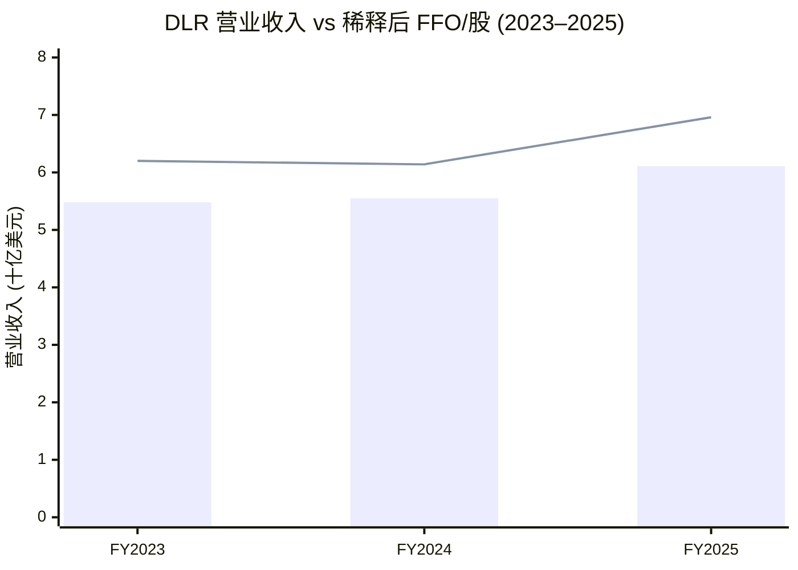
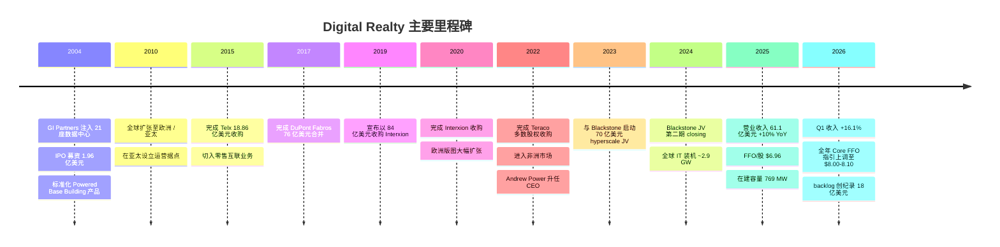
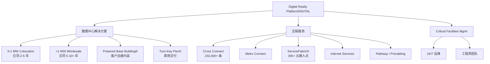
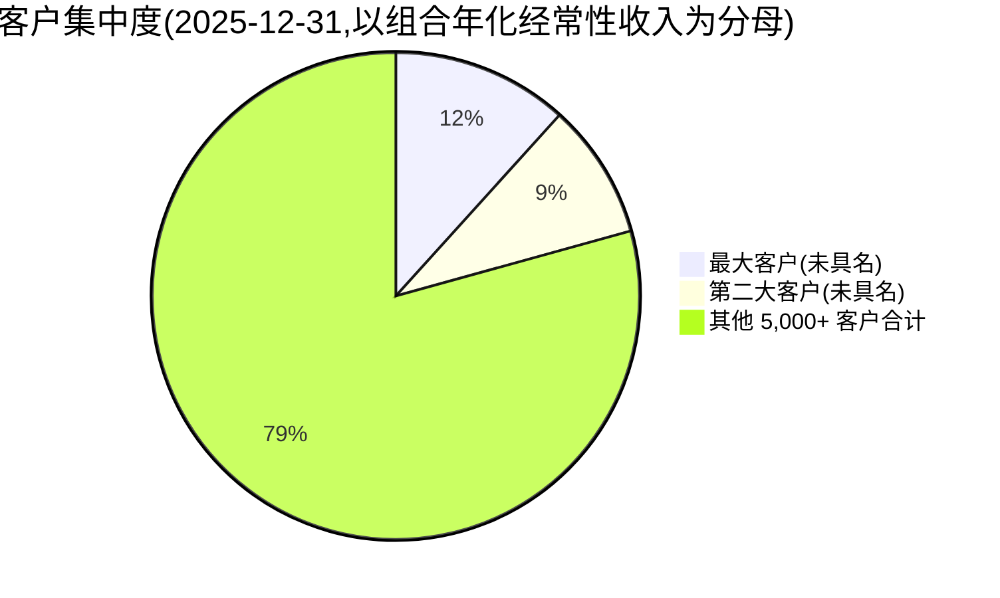
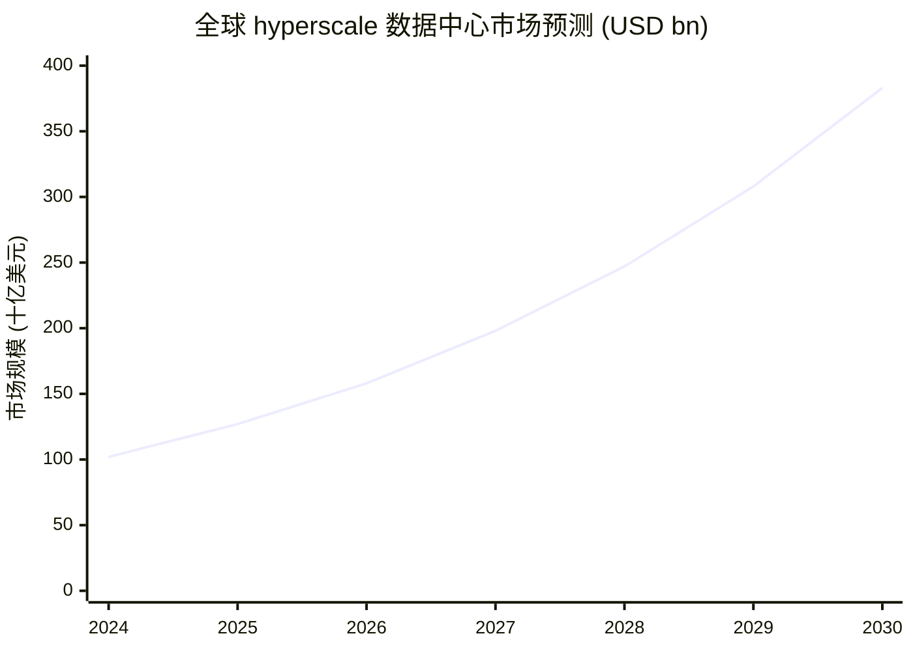
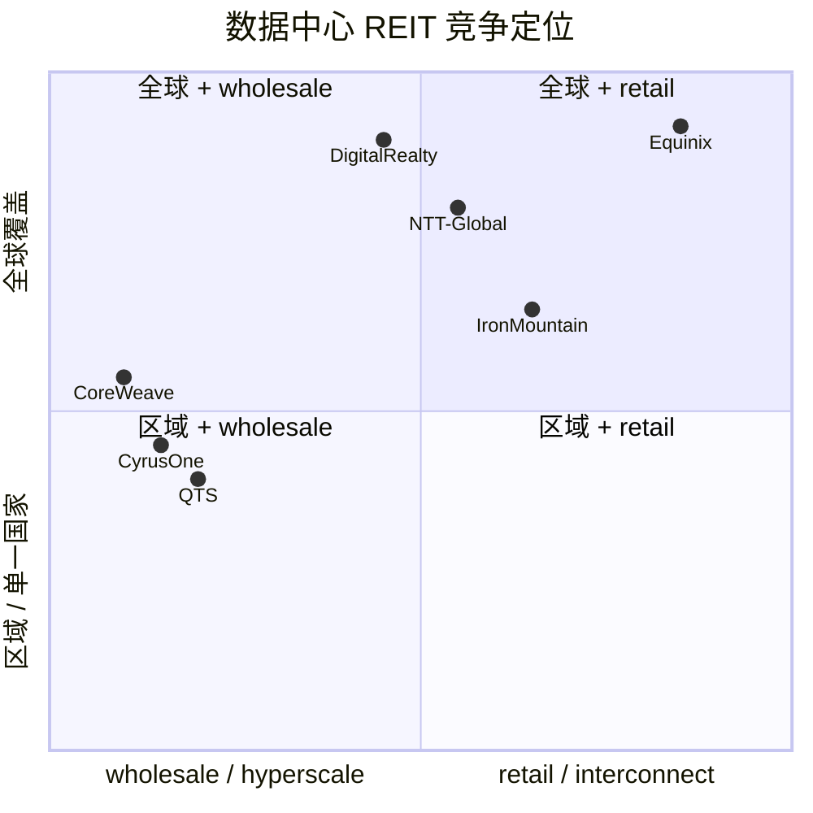

# Digital Realty Trust (NYSE:DLR) 公司研究

**截至日期 (As of):** 2026-06-02
**Ticker:** NYSE:DLR
**主题归属 (Themes):** ai-power-electrification, china-datacenter-hyperscale (海外对照)

---

## 目录

1. 公司概览 (Company Overview)
2. 公司历史 (Company History)
3. 管理团队 (Management Team)
4. 产品与服务 (Products & Services)
5. 客户与上市策略 (Customers & GTM)
6. 行业概览 (Industry Overview)
7. 竞争格局 (Competitive Landscape)
8. 市场机会 (TAM / SAM)
9. 风险评估 (Risk Assessment)
10. 投资者视角评分 (Investor-Lens Scorecards)
11. 参考资料 (References)

---

## 1. 公司概览 (Company Overview)

Digital Realty Trust, Inc.(NYSE:DLR,以下简称 "Digital Realty" 或 "公司")是全球规模最大的开放式数据中心运营商之一,自 2004 年 IPO 起即作为 REIT(Real Estate Investment Trust / 房地产投资信托)在纽交所交易。公司在 2025 年 10-K 中将自身定位为 "the largest global provider of cloud- and carrier-neutral data center, colocation and interconnection solutions"(全球最大的云中立 / 运营商中立数据中心、托管与互联服务提供商)([Digital Realty 2025 10-K, Item 1 Business](https://www.sec.gov/Archives/edgar/data/1297996/000110465926015365/dlr-20251231x10k.htm))。

公司截至 2025 年 12 月 31 日运营 **310 座数据中心**(包括 89 座通过非合并合资公司持有),分布于 6 大洲、30 多个国家、55+ 个核心都会区,总可租面积 (rentable square feet) 约 **57.6 百万平方英尺**,IT 装机容量 (IT capacity) 约 **2.9 GW**,在建容量 **769 MW**(其中 64% 已预租),未来可开发容量 **超过 5 GW**([Digital Realty 2025 10-K, Item 1 Business](https://www.sec.gov/Archives/edgar/data/1297996/000110465926015365/dlr-20251231x10k.htm))。这一规模使 DLR 与 Equinix(NASDAQ:EQIX)共同构成 "全球两大上市数据中心 REIT" 的双寡头格局。

**财务体量 (FY2025).** 全年总营业收入 (total operating revenues) **6.113 十亿美元** (USD 6,112.7 million),同比增长 **10.0%**,其中租赁与服务收入 (Rental and other services) 5.969 十亿美元,费用收入及其他 (Fee income and other) 1.44 亿美元(同比 +98.3%,主要来自合资公司开发管理费与电气化建设费)([Digital Realty 2025 10-K, MD&A — Total Operating Revenues](https://www.sec.gov/Archives/edgar/data/1297996/000110465926015365/dlr-20251231x10k.htm))。归母净利润 (GAAP Net Income Available to Common Stockholders) **12.68 亿美元**(FY24 5.62 亿美元,FY23 9.08 亿美元),受合资资产出售收益 9.96 亿美元 (Gain from disposition of real estate assets) 显著推升。**FFO (Funds From Operations)** 全年 23.99 亿美元,稀释后每股 FFO **$6.96**(FY24 $6.14,FY23 $6.20),为 REIT 行业核心运营指标 ([Digital Realty 2025 10-K, MD&A — FFO Reconciliation](https://www.sec.gov/Archives/edgar/data/1297996/000110465926015365/dlr-20251231x10k.htm))。

**资本结构.** 公司投资级评级(BBB / Baa2),截至 2025 年 12 月 31 日 **约 92% 的总有息负债 (total indebtedness) 为固定利率或经过利率互换对冲** ([Digital Realty 2025 10-K, Risk Factors — Hedging](https://www.sec.gov/Archives/edgar/data/1297996/000110465926015365/dlr-20251231x10k.htm))。公司公开的长期财务目标包括:净债务/调整后 EBITDA ratio 5.5×、固定费用覆盖率 (fixed charge coverage) 大于 3×、浮动利率债务占比小于 20% ([Digital Realty 2025 10-K, Item 1 Business — Preserve Flexibility of Balance Sheet](https://www.sec.gov/Archives/edgar/data/1297996/000110465926015365/dlr-20251231x10k.htm))。自 2004 年 IPO 以来公司已累计筹资约 810 亿美元 ([Digital Realty 2025 10-K, Item 1 Business](https://www.sec.gov/Archives/edgar/data/1297996/000110465926015365/dlr-20251231x10k.htm))。

**Q1 2026 业绩与指引上调.** 公司在 2026 年 4 月发布的 Q1 2026 业绩中,营业收入 1.64 十亿美元(同比 +16.1%),核心 FFO (Core FFO) 每股 2.04 美元(同比 +15.3%),全年 Core FFO/股指引由 7.90–8.00 美元上调至 **8.00–8.10 美元**,全年收入指引由 6.60–6.70 上调至 **6.65–6.75 十亿美元**,在建容量上升至 **1.2 GW(预租率 61%)**、储备订单 (backlog) 创纪录 18 亿美元 ([Investing.com, 2026-04-23 — Digital Realty Q1 2026 transcript](https://www.investing.com/news/transcripts/earnings-call-transcript-digital-realty-trust-q1-2026-revenue-beats-forecast-93CH-4634403); [Motley Fool, 2026-04-23](https://www.fool.com/earnings/call-transcripts/2026/04/23/digital-realty-dlr-q1-2026-earnings-transcript/))。**这是当前周期内 DLR 业绩最积极的拐点信号**:hyperscale 大单大幅回补,backlog 创纪录,经营杠杆开始向 FFO 兑现。

**估值快照 (Valuation Snapshot).** 截至 2026 年中期,DLR 股价对应市值约 **668 亿美元**,**TTM P/E ~ 49–53×**,**Forward P/E ~ 97×**,**P/S ~ 11×**,股息率 **~2.8%** (年化分红 $4.88/股,显著低于 REIT 板块平均 3.9%) ([Stockanalysis.com — DLR Statistics](https://stockanalysis.com/stocks/dlr/statistics/); [Simply Wall St — DLR](https://simplywall.st/stocks/us/real-estate/nyse-dlr/digital-realty-trust))。*分析师观点 (Analyst view):* 对 REIT 而言 P/E 并非主导估值锚——市场更关注每股 FFO 与 AFFO,以及 backlog / pre-leased % 反映的未来 18 个月增长可视度;按 FFO 计算 (2026E $8.05/股 × ~24×) 的隐含倍数显示 DLR 处于 EQIX 之外全球数据中心 REIT 的高端水平,远高于美国办公 / 公寓 / 零售 REIT 板块,体现市场已部分定价 AI 工作负载驱动的长期租金上行假设。

*数据来源:[Digital Realty 2025 10-K, MD&A](https://www.sec.gov/Archives/edgar/data/1297996/000110465926015365/dlr-20251231x10k.htm). 折线代表稀释后 FFO/股(右轴,USD),柱状图为总营业收入(左轴,十亿 USD)。*

---

## 2. 公司历史 (Company History)

Digital Realty 由私募基金 **GI Partners** 于 2004 年发起设立,采用 REIT 架构整合互联网泡沫破灭后市场上以低于重置成本价格抛售的数据中心物业。**母公司 Digital Realty Trust, Inc. 于 2004 年 3 月 9 日在马里兰州注册成立,运营合伙人 Digital Realty Trust, L.P. 于 2004 年 7 月 21 日在马里兰州注册为有限合伙制** ([Digital Realty 2025 10-K, Cover & Item 1 Business](https://www.sec.gov/Archives/edgar/data/1297996/000110465926015365/dlr-20251231x10k.htm))。公司于 **2004 年 11 月 4 日** 在纽交所完成 IPO,初始资产包为 GI Partners 注入的 21 座、合计 560 万平方英尺数据中心物业,这些资产 "通过破产拍卖与不良企业出售" 以大幅折让购入 ([Wikipedia — Digital Realty](https://en.wikipedia.org/wiki/Digital_Realty))。这一 "捡漏式" 资本运作奠定了 DLR 的成本优势——公司继承了大量 dot-com 时代以高于市场价 3–5 倍兴建的高端数据中心,但成本基数较低,使后续租赁回报率显著高于自建。

公司发展分为三个阶段。**第一阶段 (2004–2014):北美整合 + Powered Base Building 标准化产品.** 公司在 IPO 之后以发达国家市场为重心,通过收购 + 自建在 Northern Virginia、Dallas、Chicago、Silicon Valley、Phoenix、Atlanta、New York 等 metro 进行核心城市覆盖,并标准化了 "Powered Base Building®"(高功率电力 + 网络 + 物业骨架,客户自行内装)与 "Turn-Key Flex®"(交付即用) 两大产品形态,这一时期客户结构以企业级 IT 外包与第二 / 第三层网络供应商为主。

**第二阶段 (2015–2019):互联与多租户托管业务收购.** 公司 **2015 年 7 月 7 日完成对 Telx 的 18.86 亿美元收购**,获得分布在曼哈顿、亚特兰大等核心节点的高密度互联资产与 ServiceFabric® 雏形,首次系统性引入 Cross Connect 与 Metro Connect 等互联产品线,将业务从纯 wholesale (大批发) 向 retail colocation (零售托管) 扩展,毛利率与 ARPU 结构性提升。**2017 年公司完成对 DuPont Fabros Technology 的 76 亿美元股票合并**,进一步巩固北美 wholesale 阵地。

**第三阶段 (2020–2025):全球化 + 超大规模化 + 算力联盟.** 2020 年 3 月 13 日公司完成对欧洲互联龙头 **Interxion Holding N.V.** 的 84 亿美元全股票合并,获得欧洲 11 国、53 座数据中心资产,使 DLR 在欧洲 metro 互联节点市占大幅跃升,合并后欧洲业务以 "Interxion, a Digital Realty company" 品牌运营 ([Data Center Frontier, 2020-03-13](https://www.datacenterfrontier.com/cloud/article/11429339/digital-realty-will-acquire-interxion-in-84-billion-megadeal); [Digital Realty 8-K, 2020-03-13](https://www.sec.gov/Archives/edgar/data/1297996/000119312520072868/d903260dex991.htm))。**2022 年 8 月 1 日完成对南非 Teraco 的多数股权收购**,作价对应公司 35 亿美元估值,新增南非 Johannesburg / Cape Town / Durban 三地 7 座数据中心、合计 75 MW 容量、600 余家客户,使 DLR 成为非洲市场最大的国际化数据中心运营商 ([Data Center Frontier — Teraco acquisition](https://www.datacenterfrontier.com/featured/article/11427700/digital-realty-acquires-teraco-as-africa-data-center-m038a-continues); [PRNewswire, 2022-08-01 — Teraco closing](https://www.prnewswire.com/news-releases/digital-realty-completes-acquisition-of-teraco-301596692.html))。

**资本合作:Blackstone 70 亿美元 hyperscale 合资.** 2023–2024 年公司与 Blackstone 形成多阶段 hyperscale 合资合作,**2024 年 4 月完成第二期 closing,合资覆盖法兰克福、巴黎、Northern Virginia 等 4 个超大规模园区,合计开发预算 70 亿美元,合计 IT 装机 ~500 MW**,Digital Realty 持有少数权益、负责开发管理并收取 management & development fees,Blackstone 提供主要权益资金。这一模式让 DLR 在保持轻资产、保留高质量 hyperscale 客户的同时显著降低自身股权资本需求,FY25 fee income 同比近翻倍即与该等合资交易的推进直接相关 ([Blackstone press release — $7B JV](https://www.blackstone.com/news/press/digital-realty-and-blackstone-announce-7-billion-hyperscale-data-center-development-joint-venture/); [Digital Realty 2025 10-K, MD&A — Fee Income](https://www.sec.gov/Archives/edgar/data/1297996/000110465926015365/dlr-20251231x10k.htm))。

**领导层更迭.** 2022 年 12 月 13 日,**A. William Stein 卸任 CEO 职务,由 CFO Andrew P. Power 升任 President & CEO**;Mary Hogan Preusse 于 2022 年 8 月起担任独立董事会主席,采用董事会主席与 CEO 分离的治理结构 ([Digital Realty 2026 DEF 14A](https://www.sec.gov/Archives/edgar/data/1297996/000130817926000296/dlr015307-def14a.htm))。这次过渡正值数据中心行业向 AI 工作负载切换的关键节点,Power 的 CFO 背景与资本市场经验被视为现阶段 DLR 持续优化资产负债表 / 与 Blackstone 等私募合资 / 撬动 ServiceFabric 数字业务的关键人选。

*来源:[Digital Realty 2025 10-K, Item 1 Business](https://www.sec.gov/Archives/edgar/data/1297996/000110465926015365/dlr-20251231x10k.htm), [Digital Realty 2026 DEF 14A](https://www.sec.gov/Archives/edgar/data/1297996/000130817926000296/dlr015307-def14a.htm), [Investing.com Q1 2026 transcript](https://www.investing.com/news/transcripts/earnings-call-transcript-digital-realty-trust-q1-2026-revenue-beats-forecast-93CH-4634403)*

---

## 3. 管理团队 (Management Team)

按本报告所遵循的 company-research 方法论规范,本节仅介绍创始团队与现任 CEO,以保持篇幅聚焦。

### 创始与早期股东:GI Partners 与 Richard Magnuson

Digital Realty 并无传统意义上的 "技术创始人"——公司是 **2004 年由私募股权基金 GI Partners 发起设立的 REIT 平台**,目的是把 GI Partners 在 dot-com 破产潮中以折扣价收购的数据中心物业打包上市变现。GI Partners 时任执行合伙人 **Richard Magnuson** 是公司 IPO 后的首任 Chairman,负责把这批多元化、零散物业整合为一个全国性数据中心 REIT 资产组合;首任 CEO 是 **Michael F. Foust**(2004–2014 年在任),负责构建早期销售与运营团队。由于这一段领导层均已退任、且与现行业务无操作连结,本报告不展开他们的早期履历——感兴趣的读者可参阅 [Wikipedia — Digital Realty](https://en.wikipedia.org/wiki/Digital_Realty) 与 [Data Center Frontier 公司档案](https://www.datacenterfrontier.com/) 获取更多历史细节。

### 现任 CEO:Andrew P. Power

**Andrew P. Power(46 岁,2022 年 12 月起任 President & CEO)** 是 Digital Realty 当前阶段的核心决策人。他自 **2022 年 12 月起担任 CEO 并任董事**;自 **2021 年 11 月起任 President**;自 **2015 年 4 月至 2022 年 12 月任 CFO**——主管全球物业组合运营、科技与创新、服务供应商与企业客户解决方案、资产管理、IT 及全公司财务体系。Power 在加入 DLR 之前已积累 20 年投资 / 财务 / 管理经验:**2011 年至 2015 年 4 月在美银美林 (Bank of America Merrill Lynch) 工作**,最终担任 Real Estate, Gaming and Lodging 投行业务部门 Managing Director;**2004 年至 2011 年在花旗集团 (Citigroup Global Markets) 任职**,最终担任 Vice President,值得一提的是他正是 **2004 年 Digital Realty IPO 主承销团队成员**——这次 IPO 经历让他在加入公司前就深度了解资产组合与商业模型 ([Digital Realty 2026 DEF 14A — Andrew Power Bio](https://www.sec.gov/Archives/edgar/data/1297996/000130817926000296/dlr015307-def14a.htm))。

Power 拥有 **Wake Forest University 学士学位**;同时担任 **NAREIT 执行委员会成员、Real Estate Roundtable 董事会成员、Americold Realty Trust (NYSE) 独立董事 (2018 年起)** ([Digital Realty 2026 DEF 14A](https://www.sec.gov/Archives/edgar/data/1297996/000130817926000296/dlr015307-def14a.htm))。从 CFO 直接接任 CEO 的路径与他在 DLR 7 年的 CFO 任期、以及 Interxion 整合期间的资本市场操盘经历紧密相关,反映 DLR 董事会判断:当前业务最关键的不是产品 / 工程突破,而是资本结构优化、私募合资设计、客户回报率提升——这些都正是 CFO 路径 CEO 的天然战场。**他的薪酬结构由 NEO comp peer group 锚定,股权激励占比较高,与 TSR(总股东回报率)对齐**(详见 [2026 DEF 14A — Executive Compensation Discussion & Analysis](https://www.sec.gov/Archives/edgar/data/1297996/000130817926000296/dlr015307-def14a.htm))。

*分析师观点 (Analyst view):* 从 CEO 履历看,DLR 当前阶段的战略重心是把规模优势变现——通过 Blackstone 等私募合资轻资产化部分 hyperscale 资产、保持 Core FFO 增速领先 REIT 板块、并加大互联产品 ServiceFabric® 的渗透以提升每平方英尺租金 ARPU。Power 路线与 Sherman 在 Equinix 的产品 / 互联导向略有差异——DLR 更强调资产平衡表与开发回报率,EQIX 更强调互联生态变现。

---

## 4. 产品与服务 (Products & Services)

> **本节是本报告最核心、最长的一节,严格遵循 10-K 原文措辞,不做改写。**

Digital Realty 的产品体系核心是 **PlatformDIGITAL®——一个可扩展的全球数据中心平台**,公司在 2025 年 10-K 中将其定义为 "an extensible, global data center platform that enables our customers to tailor infrastructure deployments and controls matched to their business needs"(可扩展的全球数据中心平台,让客户能够按业务需求定制基础设施部署与控制) ([Digital Realty 2025 10-K, Item 1 Business — Our Product Offerings](https://www.sec.gov/Archives/edgar/data/1297996/000110465926015365/dlr-20251231x10k.htm))。围绕这一平台,公司产品矩阵分为 **三大类:数据中心解决方案 (Data Center Solutions)、互联服务 (Interconnection)、特色业务 (Critical Facilities Management、平台编排)**。下文按 10-K 披露原文还原产品矩阵,并对每一类做物理用途 + 差异化 + 战略意义三层解析。

### 4.1 数据中心解决方案 (Data Center Solutions)

10-K 在 "Our Product Offerings" 章节中明确披露了两类核心 data center 产品形态——按 IT 装机容量 (deployment size) 划分,**0–1 MW 区段与 >1 MW 区段对应完全不同的客户、合同与建设节奏**:

> **Data Center Solution Types Description (0 to 1 MW):** Small (one cabinet) to medium (75 cabinets) deployments. Provides agility to quickly deploy in days. Contract length generally 2-5 years. Consistent designs, operational environment, power expenses.
>
> **(> 1 MW):** Scale from medium to very large deployments. Solution can be executed in weeks. Contract length generally 5-10+ years. Customized data center environment for specific deployment needs.
>
> ([Digital Realty 2025 10-K, Item 1 Business](https://www.sec.gov/Archives/edgar/data/1297996/000110465926015365/dlr-20251231x10k.htm))

**0–1 MW (零售托管 / Colocation):** 物理上,客户租赁一个或多个机柜 (cabinet) 至最多 75 个机柜的笼区 (cage),共享 DLR 的电力、冷却、安保与互联基础设施;部署可在数天内完成、合同期一般 2–5 年。这一区段对应企业 IT、网络运营商、内容分发、金融服务、SaaS 公司——**他们关心的不是单价最低,而是网络密度 (network density) 与互联生态丰富度**;DLR 在 New York、London、Frankfurt、Singapore 这类 metro 的核心节点正是这种 "互联 + 物理空间" 的复合溢价场所。**中文释义 / Plain-language gloss:** 这种产品形态等同 "高级写字楼里租一间装修好的办公室,带电信、网络、保安服务",ARPU 较高、续约率高、客户粘性强。

**>1 MW (大批发 / Hyperscale Wholesale):** 物理上,客户租赁完整或多个 data hall (数据厅),典型规模 1–50 MW、定制化空气流向 / 冷却密度 / 安保隔离 / 网络架构;部署需要数周、合同期 5–10 年甚至更长 (15–20 年并不罕见)。**这一区段对应 hyperscaler——AWS、Microsoft Azure、Google Cloud、Meta、Oracle、IBM 等云与超大型企业**,他们看重的是 power-density (每机架功率密度)、liquid-cooling 能力、规模化交付速度、以及 land + power + grid interconnect 三位一体的综合稀缺资源。*分析师观点:* AI 推训一体化部署的兴起把单机柜功率密度从 6–10 kW 推高至 30–80 kW 甚至 100+ kW,导致 hyperscaler 对 >1 MW 区段的 customized 需求大幅上升,过去 2 年里 wholesale 区段在 DLR 新签订单中的占比快速提升——这是 backlog 创纪录的根本原因。

### 4.2 平台与产品形态:PlatformDIGITAL®

PlatformDIGITAL 是 DLR 把 300+ 数据中心、互联产品、Critical Facilities Management 服务捆绑为一个全球化平台的对外品牌。10-K 描述 PlatformDIGITAL "brings together users, networks, clouds, controls and systems to the data, removing barriers, creating centers of data exchange to accommodate distributed workflows and scaling digital business"(把用户、网络、云、控制系统与数据汇聚一处,打破壁垒,创建分布式工作流的数据交换中心) ([Digital Realty 2025 10-K, PlatformDIGITAL® description](https://www.sec.gov/Archives/edgar/data/1297996/000110465926015365/dlr-20251231x10k.htm))。该平台的四大支柱按 10-K 原文是:

| 支柱 | 10-K 原文披露 |
|---|---|
| **Coverage** | "Our global data center portfolio spans 300+ data centers in 55+ metros on 6 continents" |
| **Capacity** | "We offer ~2.9 GW of total in-place IT capacity to meet growing demand, with ~770 MW under construction and >5 GW of future development capacity" |
| **Connectivity** | "We provide an extensive Interconnection portfolio to support the movement of data across customers, service providers, and networks; ServiceFabric® offers virtual network orchestration to 305+ cloud on-ramps and 700 data centers globally" |
| **Control** | "We own and operate our data centers, delivering secure, resilient infrastructure so customers can maintain control of their data, workloads, and long-term outcomes" |

*来源 (引用一处覆盖全表):* [Digital Realty 2025 10-K, Item 1 Business — PlatformDIGITAL®](https://www.sec.gov/Archives/edgar/data/1297996/000110465926015365/dlr-20251231x10k.htm)

**Powered Base Building® 与 Turn-Key Flex® 两大物理交付形态.** Powered Base Building 提供 "the physical location, requisite power and network access necessary to support a state-of-the-art data center"(物理位置 + 电力 + 网络接入,客户自建内装) ——这类产品适合 hyperscaler 等具备自有运维能力的客户,合同长、回报稳定但 ARPU/平方英尺较低。Turn-Key Flex® 则是 "move-in ready, physically secure facilities with the power, cooling and interconnection capabilities to support customers requiring a single cabinet, cage suite or entire hall"(即拎即用、含电力 / 冷却 / 互联的全交付设施) ([Digital Realty 2025 10-K, Item 1 Business](https://www.sec.gov/Archives/edgar/data/1297996/000110465926015365/dlr-20251231x10k.htm))——适合企业级 IT、SaaS 与小规模 hyperscaler workload。两种产品同栋大楼并存,允许 DLR 在同一物业内对不同客户结构灵活定价。

### 4.3 互联产品 (Interconnection) — 高 ARPU 增长引擎

互联是 DLR 近 10 年从 wholesale 转向 retail + connectivity 复合业务的核心抓手。10-K 披露的互联产品矩阵原文:

| 产品 | 10-K 原文描述 |
|---|---|
| **Cross Connect** | "A physical connection between two customer defined end points in a Digital Realty facility enabling customers to directly exchange data." |
| **Metro Connect** | "Dedicated connection enabling rapid data movement between multiple Digital Realty facilities located in the same metro area." |
| **ServiceFabric®** | "A global open orchestration platform enabling customers to easily provision global connectivity and orchestrate connected services across Digital Realty's worldwide data center footprint and in third party locations." |
| **Internet Services** | "Private internet connections providing high-speed and resilient internet access to diverse ISPs, delivered on a multi-service port." |
| **Precabling** | "Predetermined fiber connectivity providing direct connection between customers and providers in a central Meet-Me-Room (MRR), reducing installation complexity and ideal for low-latency and high-density deployments." |
| **Pathway** | "Secure, conduit-based connectivity supporting bulk-fiber interconnection enabling two parties to directly connect within or between facilities." |

*来源:* [Digital Realty 2025 10-K, Item 1 Business — Interconnection Products](https://www.sec.gov/Archives/edgar/data/1297996/000110465926015365/dlr-20251231x10k.htm)

**Cross Connect** 是行业基本款——客户与客户之间在 DLR 的 Meet-Me-Room (MMR) 内通过物理光纤直连,绕过公共互联网,**延迟 1–5 ms,带宽不限**;每条 Cross Connect 月付一笔固定费用(行业典型 $200–$400/月,高密度节点更高)。截至 2025 年 12 月 31 日,DLR **运营超过 232,000 条 Cross Connect** ([Digital Realty 2025 10-K, Item 1 Business](https://www.sec.gov/Archives/edgar/data/1297996/000110465926015365/dlr-20251231x10k.htm))。**Metro Connect** 把这一概念扩展到同一 metro 内的不同物业;**Pathway 与 Precabling** 是底层基础设施层。

**ServiceFabric® 是 DLR 互联产品矩阵的 "数字化总入口"——它是一个 SDN/NFV 风格的虚拟网络编排平台**,客户通过门户即可在 DLR 全球 700+ 数据中心 + 305+ 云接入点之间一键开通虚拟链路 (virtual circuits),无需物理布线 ([Digital Realty 2025 10-K, Item 1 Business — ServiceFabric®](https://www.sec.gov/Archives/edgar/data/1297996/000110465926015365/dlr-20251231x10k.htm); [Digital Realty Newsroom — ServiceFabric Nigeria expansion, 2025-04-25](https://www.digitalrealty.com/about/newsroom/press-releases/123321/digital-realty-expands-servicefabric-to-nigeria-enhancing-global-interconnectivity))。**中文释义 / Plain-language gloss:** ServiceFabric 类似 "互联网 + 云之间的 Uber",客户在 portal 上点几下就能从纽约的 IT 系统打通伦敦或新加坡的某个云 region,延迟、带宽、安全均可控。该产品对标 Equinix Fabric——属互联生态最高 ARPU 的产品层,毛利率显著高于物理空间出租。

### 4.4 Critical Facilities Management® 与运营

10-K 提到 "Our Critical Facilities Management® services and team of engineers and data center operations experts provide 24/7 support for these mission-critical facilities"(Critical Facilities Management 服务与工程师团队 7×24 小时支持任务关键型设施) ([Digital Realty 2025 10-K, Item 1 Business](https://www.sec.gov/Archives/edgar/data/1297996/000110465926015365/dlr-20251231x10k.htm))。这部分服务并不像 cross connect 那样独立计费,而是嵌入 colocation / wholesale 合同里——但它是 DLR 与拥有自建 PBB shell 的客户区分 Turn-Key Flex 的核心增值——也是公司在 hyperscaler 业务高度集中阶段维护客户粘性的服务护城河。

### 4.5 产品矩阵综合视图

**产品之间如何相互支撑:** PlatformDIGITAL 的飞轮可以这样理解——**物业 (Coverage) 把 hyperscaler 与 enterprise 的 IT 部署吸引到 DLR 节点,这些 IT 部署需要彼此连接 → Cross Connect / Metro Connect / ServiceFabric 把这些客户绑入互联网络,客户彼此连得越多、迁出成本越高 → 互联生态又反过来吸引更多客户进驻 → 物业更紧、空置率下降、租金上行 → 更多自由现金流投回新建容量 (Capacity) 与新 metro 入口 (Coverage) → 飞轮再次启动。** Equinix 的护城河也建立在同一飞轮逻辑上,只是它更偏 retail/互联,而 DLR 同时握有更大的 hyperscale wholesale 资源 + 大土地储备(>5 GW 未来容量)——这一点对 AI 工作负载浪潮特别重要,因为 AI 训练集群需要的是单点 50–200 MW 的大批量电力 + 邻近变电站 + 优质冷却条件,这些都是 DLR 在 Northern Virginia (>1 GW 可开发) 等核心 metro 的天然优势。

---

## 5. 客户与上市策略 (Customers & GTM)

### 5.1 客户集中度 (经审核 10-K 披露口径)

10-K 在 Item 1 "Our Global Customers" 中明确披露:

> "Our portfolio has attracted a high-quality, diversified mix of customers. We have **more than 5,000 customers**, and **no single customer represented more than approximately 11.7% of the aggregate annualized recurring revenue of our portfolio as of December 31, 2025**. Our largest customer accounted for approximately **11.7%** of our aggregate annualized recurring revenue as of December 31, 2025. **No other single customer accounted for more than approximately 9.0%** of the aggregate annualized recurring revenue of our portfolio."
>
> ([Digital Realty 2025 10-K, Item 1 Business — Our Global Customers](https://www.sec.gov/Archives/edgar/data/1297996/000110465926015365/dlr-20251231x10k.htm))

**denominator 标识 (mandatory):** 上述比例均以 "aggregate annualized recurring revenue of our portfolio" (合并组合层面的年化经常性收入,group-level / consolidated) 为分母,**非 segment-level 比例**。

**关键解读:** 5,000+ 客户的总数掩盖了一个事实——hyperscaler 高度集中,**最大客户约占组合年化经常性收入 11.7%,第二客户不超过 9.0%**,头部少数 hyperscaler 已经成为新签 backlog 的主要驱动力。10-K 没有按名披露 ≥10% 客户的具体身份,但市场普遍认为是 Meta、Oracle 或某全球公有云大厂(具体 ID 未在 10-K 中披露)。**这是 DLR 财务模型中最重要的单点风险**——AI 工作负载浪潮带来 backlog 上行的同时,也加剧了对 5 家头部 hyperscaler 的依赖。

### 5.2 客户行业分布(10-K 列举的具名客户)

10-K 在 Item 1 "Global Customer Base across a Wide Variety of Industry Sectors" 段落,**罕见地列举了一组以名称披露的代表性客户**(分行业):

| 行业类 | 10-K 具名披露客户 |
|---|---|
| Cloud and IT Services | Fortune 50 Software Company(未点名)、IBM、Oracle Corporation |
| Digital Content Providers & Financial Companies | Fortune 25 Investment Grade-Rated Company、JPMorgan Chase & Co.、LinkedIn Corporation、Meta Platforms, Inc. |
| Network and Mobile Services | AT&T、Comcast Corporation、Lumen Technologies, Inc.、Zayo Group |
| Global Cloud Provider | (未点名,但行业普遍判断为 AWS / Azure / GCP 之一) |

*来源:* [Digital Realty 2025 10-K, Item 1 Business — Global Customer Base](https://www.sec.gov/Archives/edgar/data/1297996/000110465926015365/dlr-20251231x10k.htm)

**denominator 标识:** 上述客户列表是 "代表性客户" 披露,**未对应具体收入百分比,仅作行业覆盖示意**,不可推导出任何具体的 group-level 或 segment-level 收入贡献。10-K 没有进一步披露 hyperscaler 客户在组合中的合计占比。

*来源:[Digital Realty 2025 10-K, Item 1 Business — Our Global Customers](https://www.sec.gov/Archives/edgar/data/1297996/000110465926015365/dlr-20251231x10k.htm). 第二大客户口径来自 10-K 原文 "no other single customer accounted for more than approximately 9.0%",此处取上限做近似。*

### 5.3 销售与 GTM 策略

10-K 表述:"Our specialized data center salesforce, which is aligned to meet our customers' needs for **global, enterprise and network solutions**, provides a robust pipeline of new customers"(专门数据中心销售团队按 "全球、企业、网络" 三类客户分工)([Digital Realty 2025 10-K, Item 1 Business](https://www.sec.gov/Archives/edgar/data/1297996/000110465926015365/dlr-20251231x10k.htm))。具体来说:

- **Global / Hyperscaler GTM:** 与 AWS、Azure、Google Cloud、Meta、Oracle、IBM、字节跳动 (TikTok)、Microsoft 等 ~10 家全球客户由战略客户团队 (Strategic Accounts) 集中谈判,合同期长(5–15 年)、单笔规模大 (10–100+ MW)、与 DLR 全球网络对齐多 metro 部署。这类客户高度依赖 power-density 提升、liquid-cooling 适配、与 Land Bank 配套——backlog 创纪录的 18 亿美元主要来自该类客户。
- **Enterprise GTM:** 大企业 IT 部门(JPMorgan、AT&T、Comcast 等)的私有 colo 部署,合同期 5–10 年、典型规模 100 kW – 5 MW;销售周期长但收入稳定,且粘性极强(企业搬数据中心是 12–18 个月项目)。
- **Network & Mobile GTM:** 电信公司 (AT&T、Lumen、Zayo) 把交换节点放在 DLR MMR 房间,Cross Connect 业务高度依赖这一客户群形成的密集互联生态。

**地理足迹.** 截至 2025 年 12 月 31 日,北美 91 座 (18.5 百万平方英尺,占组合自有面积 ~58%)、EMEA 119 座 (11.9 百万)、亚太 11 座 (1.66 百万)、合资公司另有 64 座 (~14.0 百万平方英尺,合并到合资财报)。**自有 + 全资项目组合的整体出租率 85.5% (北美) / 77.9% (EMEA) / 84.6% (亚太),全组合 ~84.7%** ([Digital Realty 2025 10-K, Item 2 Properties](https://www.sec.gov/Archives/edgar/data/1297996/000110465926015365/dlr-20251231x10k.htm))。值得注意的是 hyperscaler-heavy 的 metros (Northern Virginia 95.1%、Portland 99.9%、Chicago 93.9%、Toronto 96.5%) 接近满租,反映在 AI 浪潮下大单需求把这些核心节点几乎填满;London (65.4%)、Stockholm (46.4%)、Boston (39.4%)、Crete (6.1%) 等 metro 因新交付或市场偏弱处于低位。

### 5.4 合资公司与轻资产化

公司 89 座合资数据中心遍布拉美、日本、北美高密度 metro,**合资公司组合的整体出租率 93.7%(managed) 和接近满租(non-managed)**,意味着合资资产是 DLR 把高质量 hyperscaler 客户与 Blackstone、GI Partners 等 LP 共享回报的载体 ([Digital Realty 2025 10-K, Item 2 Properties — Managed Unconsolidated Entities](https://www.sec.gov/Archives/edgar/data/1297996/000110465926015365/dlr-20251231x10k.htm))。这一架构让 DLR 把现金从存量资产释放出来,投入新园区开发,同时通过 fee income (开发管理费 + 资产管理费) 获取经常性服务收入——FY25 fee income 同比 +98.3% 即与该等合资交易扩张直接相关 ([Digital Realty 2025 10-K, MD&A — Fee Income](https://www.sec.gov/Archives/edgar/data/1297996/000110465926015365/dlr-20251231x10k.htm))。

---

## 6. 行业概览 (Industry Overview)

### 6.1 数据中心 colocation 与 hyperscale 市场规模

第三方研究公司对全球数据中心 colocation 市场的估值差异较大,但都指向高速增长:**Grand View Research 估计全球 colocation 市场 2024 年 694 亿美元,预计 2030 年达到 1,654 亿美元,2025–2030 CAGR 16.0%** ([Grand View Research — Data Center Colocation Market](https://www.grandviewresearch.com/industry-analysis/data-center-colocation-market));**MarketsandMarkets 给出更新口径,预测从 2025 年 1,042 亿美元到 2030 年 2,044 亿美元,CAGR 14.4%** ([MarketsandMarkets, 2025 — Data Center Colocation $204.4B](https://www.prnewswire.com/news-releases/data-center-colocation-market-worth-204-4-billion-by-2030--exclusive-report-by-marketsandmarkets-302493062.html))。**NextMSC 估算 hyperscale 数据中心市场 2025 年 1,266 亿美元,预计 2030 年 3,833 亿美元,CAGR 24.8%** ([NextMSC — Hyperscale Data Center Market](https://www.nextmsc.com/report/hyperscale-data-center-market-ic3831))。三个机构口径不同(colo 总市场 vs hyperscale 子集 vs MarketsandMarkets 含设计建设),但共同信号是:**2025–2030 全球数据中心需求 CAGR 在 14–25% 区间,显著高于历史数据中心行业 8–10% 的趋势线**。

### 6.2 美国市场结构

美国是全球最大、最成熟的 colocation 市场。**ResearchAndMarkets / GlobeNewsWire 估算 2026 年美国 colocation 市场 723.7 亿美元,Equinix 与 Digital Realty 为双寡头领导者,QTS、Iron Mountain、CoreWeave 等加速扩张** ([GlobeNewsWire, 2026-04-30 — US Data Center Colocation Databook 2026](https://www.globenewswire.com/news-release/2026/04/30/3284530/0/en/united-states-data-center-colocation-databook-report-2026-72-37-bn-market-led-by-equinix-and-digital-realty-as-qts-iron-mountain-and-ai-developers-accelerate-capacity-expansion-for.html))。北维州 (Northern Virginia)、硅谷、达拉斯、芝加哥四大 metro 是全球大单密度最高的市场,其中北维州占全球 hyperscale data center 装机容量 30%+,DLR 在此 metro 持有 16 座物业 + >1 GW 未来可开发容量 ([Digital Realty 2025 10-K, Item 2 Properties](https://www.sec.gov/Archives/edgar/data/1297996/000110465926015365/dlr-20251231x10k.htm))。

### 6.3 增长驱动

**(1) AI 训练 / 推理工作负载** 是最强增量。NVIDIA Hopper / Blackwell GPU 集群单机架功率密度 30–100 kW,远超传统 6–10 kW;hyperscaler 因此需要 liquid-cooling-ready、邻近变电站、连续供电稳定的大型 (50–200 MW/园区) 数据中心,这正是 DLR / EQIX 等传统 wholesale 玩家与 CoreWeave 等新晋 AI 专建玩家的核心战场。**(2) 云迁移与 hybrid IT** 继续放量——Microsoft Azure、AWS、Google Cloud、Oracle Cloud Infrastructure 持续扩张全球 region,colocation 商作为 "云的物理地基" 自然受益。**(3) 5G、IoT、数据本地化合规** 对边缘节点的需求让二线 metro 与发展中国家(印度、东南亚、非洲)成为 colocation 商的新战场——DLR 通过 Teraco 切入非洲就属此类。**(4) 制造业自动化与 OT/IT 融合** 在过去 5 年也加大了对 colocation 节点的需求,DLR 通过 Data Gravity Index 等市场推广材料持续宣扬这一长尾驱动 ([Digital Realty 2025 10-K, Item 1 Business — Industry Background](https://www.sec.gov/Archives/edgar/data/1297996/000110465926015365/dlr-20251231x10k.htm))。

### 6.4 行业结构与议价权

行业供给端结构性紧张:**北维州、硅谷、芝加哥等核心 metro 的电力配额 (grid connection) 通常有 12–36 个月排队、新变电站建设周期 3–5 年**——这让先到先得的 DLR / EQIX / Iron Mountain 等持有大量已批电力配额的玩家具备稀缺资源,**hyperscaler 即使想新建数据中心,在核心 metro 也无法短期复制 DLR 已有的位置 + 电力组合**。**JLL 2026 Global Data Center Market Outlook** 描绘的行业基准是:"Major operators report rising leasing and colocation demand as AI and cloud traffic grows" ([JLL 2026 Data Center Outlook](https://www.jll.com/en-us/insights/market-outlook/data-center-outlook))——价格端,wholesale 单 kW 月租从 2022 年 ~$130–150 上涨至 2025 年 ~$180–220,涨幅显著高于过去 10 年趋势,反映供给紧张 + AI 需求双因素。

*数据来源:[NextMSC, 2025 — Hyperscale Data Center Market](https://www.nextmsc.com/report/hyperscale-data-center-market-ic3831). 中间年份按 24.8% CAGR 内插。*

---

## 7. 竞争格局 (Competitive Landscape)

### 7.1 10-K 明确列举的竞争对手

10-K 在 Item 1 中提到 DLR 面临的竞争包括 "other REITs, data center developers, real estate companies, technology companies and other data center providers"(其他 REITs、数据中心开发商、房地产公司、科技公司及其他数据中心提供商),并指出 "many of our competitors have significant financial resources and may have lower costs of capital"([Digital Realty 2025 10-K, Risk Factors](https://www.sec.gov/Archives/edgar/data/1297996/000110465926015365/dlr-20251231x10k.htm))。10-K 没有逐一列出竞争对手名称,但行业上 DLR 的核心同行可分四类:

### 7.2 五大同行(以行业研究为准)

| 同行 | 类型 | 关键差异 |
|---|---|---|
| **Equinix (NASDAQ:EQIX)** | 上市数据中心 REIT | retail / 互联导向;全球 250+ 数据中心,500,000+ 互联;2025 营业收入 ~$93 亿,显著大于 DLR |
| **CoreWeave (NASDAQ:CRWV)** | AI 专用 hyperscaler | 通过 GPUaaS 模式与 DLR 既竞争又合作(CoreWeave 也是 DLR 客户);NVIDIA 2026 年 1 月入股 $20 亿 |
| **Iron Mountain (NYSE:IRM)** | 文档存储 + 数据中心扩张 | 转型中,2025 数据中心业务增速快但规模小于 DLR |
| **QTS Data Centers** | KKR 私有化(2021) | 美国 hyperscale 大单专家,与 DLR 在北维州 / 达拉斯 / 芝加哥直接竞争 |
| **CyrusOne** | KKR/GIP 私有化(2022) | 北美 hyperscale 集中型,与 DLR 北美 wholesale 直接竞争 |
| **NTT DATA / KDDI / GDS** | 亚洲 / 跨国 colocation | 在亚太市场对 DLR 形成区域竞争 |

*分析师观点 (Analyst view):* **DLR 与 Equinix 的双寡头格局是行业共识** ([ResearchAndMarkets, 2025-09-03](https://www.businesswire.com/news/home/20250903529641/en/Data-Center-Colocation-Company-Evaluation-Report-2025-Equinix-Digital-Realty-and-NTT-Lead-in-Data-Center-Expansion---ResearchAndMarkets.com)),但两家差异明显:**EQIX 在 retail/互联 ARPU 上领先 (>500K 互联)、DLR 在大土地储备和 hyperscale wholesale 上领先 (>5 GW future capacity)**;AI 浪潮下 DLR 的规模优势更易兑现成 backlog 大单(2026 Q1 backlog 创纪录 $18 亿即反映该优势)。

### 7.3 与 Equinix 的具体对比

| 指标 | Digital Realty (NYSE:DLR) | Equinix (NASDAQ:EQIX) |
|---|---|---|
| 2025 营业收入 | $6.11 bn ([10-K](https://www.sec.gov/Archives/edgar/data/1297996/000110465926015365/dlr-20251231x10k.htm)) | ~$9.23–9.33 bn ([EQIX FY25 guidance](https://www.sec.gov/Archives/edgar/data/0001101239/000110123925000061/october292025pressrelease-.htm)) |
| 数据中心数 | 310 (含 89 合资) ([10-K](https://www.sec.gov/Archives/edgar/data/1297996/000110465926015365/dlr-20251231x10k.htm)) | 260+ |
| 互联数量 | 232,000+ Cross Connect ([10-K](https://www.sec.gov/Archives/edgar/data/1297996/000110465926015365/dlr-20251231x10k.htm)) | 500,000+ ([EQIX 2025 ARS](https://www.sec.gov/Archives/edgar/data/1101239/000110123926000075/EQIXAnnualRpt2025PRINT.pdf)) |
| 装机容量 | ~2.9 GW (10-K) | 较小但单数据中心高互联密度 |
| 客户单数 | 5,000+ | 10,000+ |
| 客户集中度 | 最大客户 11.7% / 第二客户 ≤ 9.0% | 显著更分散 |
| 业务定位 | wholesale + retail + interconnect | retail / interconnect 为主 |

*来源:作者综合 10-K 披露与第三方研究构造。坐标为定性,非精确测度。*

### 7.4 护城河 (Moat) 分析

- **稀缺地理 + 电力配额.** DLR 在 Northern Virginia、Frankfurt、London、Singapore、Dallas 等核心 metro 持有的成熟物业 + 已批电力配额是无法在短期内复制的稀缺资源——hyperscaler 即使想绕开 DLR 自建,也面临 3–5 年新变电站排队 + 土地审批 ([Digital Realty 2025 10-K, Item 1 Business](https://www.sec.gov/Archives/edgar/data/1297996/000110465926015365/dlr-20251231x10k.htm))。
- **网络密度护城河.** DLR 与 EQIX 都受益于 "互联生态飞轮"——客户因为其他客户都在那里而来,客户越多,迁出成本越高(MEF 互联节点搬迁成本数月数百万美元)。
- **资本市场护城河.** 投资级评级 (BBB/Baa2) + 已建立的 Blackstone / GI Partners 等私募合资关系,让 DLR 能以低成本筹资 + 私募资本协同推进 hyperscale 园区开发——这是新晋玩家进入 wholesale 市场最大的资本壁垒。
- **客户合同期长.** Hyperscale 合同期 5–15 年,加权平均剩余租期 (WALT, weighted-average lease term) 通常 5–8 年,提供高 visibility 与高客户粘性。

---

## 8. 市场机会 (Market Opportunity / TAM)

### 8.1 自下而上的 TAM 估算

**全球数据中心 colocation TAM (2025).** 取 MarketsandMarkets 口径,2025 年 $104.2 bn ([MarketsandMarkets PR, 2025](https://www.prnewswire.com/news-releases/data-center-colocation-market-worth-204-4-billion-by-2030--exclusive-report-by-marketsandmarkets-302493062.html));DLR FY25 收入 $6.11 bn,**估算市占约 5.9%**(group-level/consolidated revenue ÷ 全球 colo TAM)。**全球 hyperscale data center TAM (2025).** 取 NextMSC 口径 $126.6 bn ([NextMSC — Hyperscale](https://www.nextmsc.com/report/hyperscale-data-center-market-ic3831));若 DLR 收入中约 70% 归属 hyperscale (基于 5,000 客户中 hyperscaler 实际贡献结构),**hyperscale 市占约 3.4%**——空间仍很大。

### 8.2 客户预订 (Backlog) 反映的可视度

2026 Q1 DLR 报告 **创纪录 18 亿美元 backlog (其中 $10 亿是 DLR 自身权益份额)、1.2 GW 在建容量 (预租率 61%)** ([Investing.com Q1 2026 transcript](https://www.investing.com/news/transcripts/earnings-call-transcript-digital-realty-trust-q1-2026-revenue-beats-forecast-93CH-4634403))。若把 backlog 按平均 7–10 年合同期摊销,**这部分未来收入流约 $2.0–$2.6 亿/年增量**——相当于 FY25 营业收入 ~3–4% 的额外增长锁定。

### 8.3 中国与亚太机会(主题相关)

虽然 DLR 并未直接进入中国大陆数据中心市场(GDS、万国数据 (VNET)、世纪互联、阿里云、腾讯云、华为云等本土玩家占据),但它通过 **Singapore (3 座, 810k ft², 89.9% 出租)、Hong Kong (1 座, 180k ft², 88.2% 出租)、Tokyo (5 座合资, 1,261k ft²)、Osaka (4 座合资, 644k ft²)、Sydney (4 座, 361k ft², 83.3% 出租)、Seoul (1 座, 162k ft², 51.5% 出租)** 等节点服务亚太大客户跨境部署 ([Digital Realty 2025 10-K, Item 2 Properties — Asia Pacific](https://www.sec.gov/Archives/edgar/data/1297996/000110465926015365/dlr-20251231x10k.htm))。这一覆盖让 DLR 能服务在中国生产、海外部署的 hyperscaler(例如字节跳动 TikTok 海外业务、阿里云海外、华为云海外)以及在全球扩张的中国互联网公司——但 DLR 自身没有大陆境内运营,主题归类 china-datacenter-hyperscale 中 DLR 更多扮演 **海外比较锚 (overseas comp)** 的角色,而非中国市场直接受益者。

### 8.4 SAM (Serviceable Available Market)

DLR 当前 cover 55+ metro、6 大洲,绝大多数全球 Tier-1 metro 已有覆盖。**SAM 主要是 (i) 大陆中国之外的全球 colocation + hyperscale wholesale 市场,2025 ~$100 bn,2030 ~$200 bn**;DLR 在 hyperscale 中长期市占目标若达 5%(从当前 ~3.4%),对应 2030 年收入 ~$10 bn,即较 FY25 ($6.1 bn) 收入增长 64% / 5 年 (CAGR 10.4%)——这与 Q1 2026 指引隐含的 9% 中长期增速大体一致。

---

## 9. 风险评估 (Risk Assessment)

按 risk taxonomy 四桶 11 风险展开,引用 10-K Item 1A Risk Factors 与第三方研究。

### 9.1 公司特定风险 (Company-Specific)

**(R1) 客户集中度 — 头部 hyperscaler 议价权.** 最大客户占 11.7% 年化经常性收入、第二客户 ≤9.0%——尽管 5,000+ 客户的总体口径分散,前 5–10 家 hyperscaler 已经成为 backlog 主要驱动 ([Digital Realty 2025 10-K, Item 1 Business](https://www.sec.gov/Archives/edgar/data/1297996/000110465926015365/dlr-20251231x10k.htm))。**潜在影响:** 若任一 hyperscaler 自建率上升 / 转向 CoreWeave 等新晋玩家 / 谈判时强势压价,DLR 整体续约 ARPU 与 backlog 增速可能受冲击。**缓释:** 长合同 (5–15 年) 与高物理迁出成本提供短期缓冲。

**(R2) 资本支出强度与开发执行风险.** 769 MW 在建容量 + >5 GW 未来可开发容量意味着未来 5–10 年 DLR 资本支出 ($3.5–$5 bn/年级) 持续高位 ([Digital Realty 2025 10-K, Item 1 Business — Capacity](https://www.sec.gov/Archives/edgar/data/1297996/000110465926015365/dlr-20251231x10k.htm))。供应链中断、变电站延期、施工成本超支均可能导致项目延误。**潜在影响:** 若新项目交付延期或预租率下降,FFO/股增速可能放缓。

**(R3) 整合风险 — Interxion / Teraco 的长尾.** Interxion (2020) 与 Teraco (2022) 的两次大型跨境并购均已基本整合完成,但 EMEA 整体出租率 77.9% 较北美 85.5% 偏低 ([Digital Realty 2025 10-K, Item 2 Properties](https://www.sec.gov/Archives/edgar/data/1297996/000110465926015365/dlr-20251231x10k.htm)),Stockholm 46.4%、Dusseldorf 50.8%、Boston 39.4% 等节点反映部分新交付资产的 lease-up 速度慢于预期。

### 9.2 行业 / 市场风险 (Industry / Market)

**(R4) AI 工作负载不及预期 / 模型效率提升.** 当前估值与 backlog 均隐含 AI 训练 / 推理工作负载继续高速增长。若行业出现 (a) 算法效率大幅提升降低算力消耗、(b) 关键客户 (Meta / Google / Microsoft) 自建率显著上升、(c) AI 商业化变现不及预期导致 capex 周期回调,**hyperscale data center 需求增速可能从 25% CAGR 大幅放缓**。

**(R5) 自建率 (build-vs-buy) 上升.** Microsoft、Google、Meta 等 hyperscaler 已大幅扩大自有 data center 建设;若它们决定把更多算力自建而非租 colo,DLR 的 hyperscale wholesale 需求会受影响。然而 R1 的相反力量是:hyperscaler 已发现单独建设无法跟上 AI 工作负载速度,colo 仍是 marginal capacity 来源。

**(R6) 电力 / grid 限制.** 北维州 (DLR 最大 metro)、Frankfurt、Dublin 等核心节点电力配额已紧张,monitoring of new substations 排队 12–36 个月。一旦 grid operator 限定 hyperscale 客户的额外供电批准,DLR 即使有土地也无法立即开发——但该限制对 DLR 既是风险(新增容量受限)也是护城河(已批配额稀缺)。

### 9.3 财务 / 流动性风险 (Financial)

**(R7) 利率与债务再融资风险.** REIT 模型对利率高度敏感。截至 2025 年 12 月 31 日 ~92% 总有息负债为固定利率或经过对冲([Digital Realty 2025 10-K, Risk Factors — Hedging](https://www.sec.gov/Archives/edgar/data/1297996/000110465926015365/dlr-20251231x10k.htm)),但浮动利率 8% 的部分仍受 Fed 利率周期影响。**当前 Fed 已开始降息周期,本风险短期减弱、但债务到期再融资仍需在投资级利差不出现剧烈拉大的窗口完成。**

**(R8) 90% REIT distribution 要求 + 估值倍数压缩.** REIT 必须分配 90% taxable income (排除资本利得后),这限制了 DLR 内部留存现金能力,使其增长高度依赖资本市场;若 REIT 板块整体被估值压缩(例如 10Y 美债利率重新走高至 5%+),DLR 股价与新增资本筹集成本均受冲击。

**(R9) Blackstone JV 后续 ramp 风险.** Fee income FY25 同比 +98.3% 主要来自合资公司管理费;若 hyperscale 周期下行 / Blackstone 等合作方退出新增 commitment,该等 fee income 来源可能放缓。

### 9.4 监管 / 宏观风险 (Macro / Regulatory)

**(R10) 数据本地化与监管.** 欧盟 GDPR、中国数据出境监管、印度 IT 部数据本地化法规等可能要求客户将数据保留在境内,理论上对全球 colocation 商有利(支持本地节点扩容);但 DLR 的部分 EMEA 节点(英国脱欧后伦敦节点)和印度市场 (DLR 通过合资 Brookfield JV Yotta) 仍可能因合规摩擦或合规成本上升受影响。

**(R11) ESG / 碳排放与能源税.** Data center 能耗占全球电力消耗约 1–2%、本地 metro 高达 20% (北维州、爱尔兰)。欧洲 ESG 监管 (CSRD、EU Taxonomy)、爱尔兰电网负荷限制 (2022 起对大客户新增连接限制) 已局部影响行业;若主要 metro 引入 hyperscale data center 专属能源税 / 碳排放限额,DLR 部分项目延期或成本上升 ([Digital Realty 2025 10-K, Item 1 Business — Sustainability](https://www.sec.gov/Archives/edgar/data/1297996/000110465926015365/dlr-20251231x10k.htm))。

---

## 10. 投资者视角评分 (Investor-Lens Scorecards)

> 截至 2026-06-02 的市场快照: VIX ~18–20 (中性), 10Y UST ~4.0%, HY OAS ~280 bp (温和), IG OAS ~110 bp。市场处于 Marks 量表的 "中度乐观" 区间(60/100 偏多)。

### 10.1 Buffett 视角 — 质量 + 合理价格(0–100)

| 维度 | 评分 | 评语 |
|---|---|---|
| 可理解性 (Circle of Competence) | 8/10 | REIT 商业模型清晰,但数据中心专属物理 / 互联生态需要专业认识 |
| 经济护城河 (Moat) | 8.5/10 | 稀缺地理 + 电力配额 + 网络生态飞轮;Equinix 唯一同级对手 |
| 管理质量 | 8/10 | Power 长期 CFO 视角对回报率敏感,资本配置稳健 |
| 财务健康 | 7.5/10 | 92% 债务固定 / 对冲,investment grade,但杠杆高 (Debt/EBITDA ~5.5×) |
| 价格合理性 | 6/10 | TTM P/E ~50× / Forward FFO ~24× 显著高于历史均值,定价已部分反映 AI 红利 |

**总分:74 / 100**——"质量很高,但价格已不便宜,需要等待 backlog 兑现兑现度或宏观估值修正"。

*视角观点 (Lens view):* 巴菲特很可能会承认 DLR 的护城河和经济性,但当前估值难以提供 margin of safety;若估值压缩 25% 或 backlog 完全兑现成 FFO 加速,会更有吸引力。

### 10.2 Munger 视角 — 加权质量 + 反向思考(0–10)

| 维度 | 权重 | 评分 |
|---|---|---|
| 商业质量 | 30% | 8.5/10 |
| 管理诚信与能力 | 25% | 8/10 |
| 财务表现稳健度 | 20% | 7/10 |
| 长期竞争力 | 15% | 8/10 |
| 估值合理性 | 10% | 5.5/10 |

**加权总分:7.7 / 10**

**反向 (Invert):** 什么会让 DLR 在 5 年内令人后悔买入?(a) AI capex 周期顶部破裂导致 backlog 兑现率显著低于预期、(b) 高利率长期化导致 REIT 估值压缩、(c) Microsoft/Google 等头部客户大幅自建并削减 colo 合同、(d) ESG / 能源监管对 hyperscale data center 设置硬性能耗封顶。**Munger 的反向投资逻辑提醒:DLR 当前估值已部分定价 "AI 永远涨" 的剧本,任何破裂都会同时打击 multiple 与 FFO 增速。**

### 10.3 Damodaran 视角 — DCF 安全边际 (±%)

**关键假设 (Required block):** 无风险利率 4.0% (10Y UST), 股权风险溢价 5%, β ~ 0.6 (REIT 板块), 永续增长率 3% (高于通胀的成熟 REIT 假设), 中期收入 CAGR 9% (与 2026E 指引隐含中段一致), 中期 FFO margin 维持 35-40%, capex 强度高 (15-20% of revenue)。**得到的 base case 公允价值估计:每股 $175–195**;**当前股价 (~$195) 处于公允估计区间上沿——margin of safety = 0% 到 −10%**。

*视角观点 (Lens view):* Damodaran 框架显示当前价格已 "完整定价 base case"。若 AI 工作负载 CAGR 显著高于 base case (例如 20% 而非 9%),股价上行空间大;但 base case 已被市场反映,没有显著向上修正空间——是 "story stock,not value stock"。

### 10.4 Howard Marks 周期视角 — 攻防(0–100)

**信用 / 流动性环境.** HY OAS ~280 bp 接近历史中位偏紧,IG OAS ~110 bp 偏宽松,VIX ~19 (中性)。Fed 处于降息周期早段,资本市场对长期资产估值的支撑较 2023 H1 利率高位明显改善。

**情绪.** AI 主题持续受市场追捧,DLR 在 "AI infrastructure 一篮子" 中享受估值溢价,multiple 高于历史平均 60%。

**周期定位:65/100(偏进攻区间,但接近警戒线)**——市场已经过 AI 主题驱动的 2 年大涨,溢价部分透支未来,DLR 当前阶段更适合 "持有 + 警惕回撤" 而非 "加大权重"。

*视角观点 (Lens view):* Marks 量表显示市场情绪偏进攻;但 DLR 这种 "受益于但不直接做 AI" 的卖铲股属于 "在攻势中也有防守韧性" 的标的——AI 资本周期回调时,DLR 的长合同 + 已签 backlog 提供下行保护,但 multiple 收缩仍是主要风险。

---

## 11. 参考资料 (References)

### SEC 主要文件 / 公司公告
- [Digital Realty Trust 2025 Form 10-K (filed 2026-02-13, accession 0001104659-26-015365)](https://www.sec.gov/Archives/edgar/data/1297996/000110465926015365/dlr-20251231x10k.htm)
- [Digital Realty Trust Q1 2026 Form 10-Q (filed 2026-05-01)](https://www.sec.gov/Archives/edgar/data/1297996/000110465926054255/dlr-20260331x10q.htm)
- [Digital Realty Trust 2026 DEF 14A Proxy Statement (filed 2026-04-17)](https://www.sec.gov/Archives/edgar/data/1297996/000130817926000296/dlr015307-def14a.htm)
- [Digital Realty 8-K 2026-06-01](https://www.sec.gov/Archives/edgar/data/1297996/000110465926068907/dlr-20260529x8k.htm)
- [Digital Realty 8-K 2025-10 (Q3 2025 earnings release ex 99.1)](https://www.sec.gov/Archives/edgar/data/0001297996/000119312525306874/d92708dex991.htm)
- [Digital Realty 8-K 2025-04-24 Q1 2025 earnings ex-99.1](https://www.sec.gov/Archives/edgar/data/0001297996/000155837025005434/dlr-20250424xex99d1.htm)
- [Digital Realty 8-K 2025-04-24 Q1 2025 supplemental ex-99.2](https://www.sec.gov/Archives/edgar/data/0001297996/000155837025005434/dlr-20250424xex99d2.htm)
- [Digital Realty 8-K 2025-07-24 Q2 2025 ex-99.1](https://www.sec.gov/Archives/edgar/data/0001297996/000155837025009543/dlr-20250724xex99d1.htm)
- [Equinix 2025 Annual Report (NASDAQ:EQIX)](https://www.sec.gov/Archives/edgar/data/1101239/000110123926000075/EQIXAnnualRpt2025PRINT.pdf)
- [Equinix Q3 2025 8-K, 2025-10-29](https://www.sec.gov/Archives/edgar/data/0001101239/000110123925000061/october292025pressrelease-.htm)

### 公司网站与新闻稿
- [Digital Realty — About](https://www.digitalrealty.com/about)
- [Digital Realty Newsroom — Expands ServiceFabric to Nigeria, 2025-04-25](https://www.digitalrealty.com/about/newsroom/press-releases/123321/digital-realty-expands-servicefabric-to-nigeria-enhancing-global-interconnectivity)
- [Digital Realty Platform-Digital — ServiceFabric Connect](https://www.digitalrealty.com/platform-digital/connectivity/service-fabric)
- [Digital Realty Platform-Digital — Interconnection](https://www.digitalrealty.com/platform-digital/connectivity/interconnection)

### 第三方研究与新闻报道
- [Investing.com — Digital Realty Q1 2026 transcript, 2026-04-23](https://www.investing.com/news/transcripts/earnings-call-transcript-digital-realty-trust-q1-2026-revenue-beats-forecast-93CH-4634403)
- [Motley Fool — DLR Q1 2026 Earnings Transcript, 2026-04-23](https://www.fool.com/earnings/call-transcripts/2026/04/23/digital-realty-dlr-q1-2026-earnings-transcript/)
- [Yahoo Finance — Digital Realty Trust Q1 Earnings Call Highlights, 2026](https://finance.yahoo.com/markets/stocks/articles/digital-realty-trust-q1-earnings-020620764.html)
- [ChartMill — DLR Crushes Q1 2026, Lifts Guidance on Record Hyperscale Demand](https://www.chartmill.com/news/DLR/Chartmill-45827-Digital-Realty-Trust-Inc-NYSEDLR-Crushes-Q1-Estimates-Lifts-Guidance-on-Record-Hyperscale-Demand)
- [Stockanalysis.com — DLR Statistics & Valuation](https://stockanalysis.com/stocks/dlr/statistics/)
- [Simply Wall St — Digital Realty Trust](https://simplywall.st/stocks/us/real-estate/nyse-dlr/digital-realty-trust)

### 行业研究
- [Grand View Research — Data Center Colocation Market 2024–2030](https://www.grandviewresearch.com/industry-analysis/data-center-colocation-market)
- [MarketsandMarkets — Data Center Colocation $204.4B by 2030, 2025 press release](https://www.prnewswire.com/news-releases/data-center-colocation-market-worth-204-4-billion-by-2030--exclusive-report-by-marketsandmarkets-302493062.html)
- [NextMSC — Hyperscale Data Center Market 2025–2030](https://www.nextmsc.com/report/hyperscale-data-center-market-ic3831)
- [GlobeNewsWire — US Data Center Colocation Databook 2026, $72.37B, 2026-04-30](https://www.globenewswire.com/news-release/2026/04/30/3284530/0/en/united-states-data-center-colocation-databook-report-2026-72-37-bn-market-led-by-equinix-and-digital-realty-as-qts-iron-mountain-and-ai-developers-accelerate-capacity-expansion-for.html)
- [ResearchAndMarkets / BusinessWire — Data Center Colocation Company Evaluation 2025-09-03](https://www.businesswire.com/news/home/20250903529641/en/Data-Center-Colocation-Company-Evaluation-Report-2025-Equinix-Digital-Realty-and-NTT-Lead-in-Data-Center-Expansion---ResearchAndMarkets.com)
- [JLL — 2026 Global Data Center Market Outlook](https://www.jll.com/en-us/insights/market-outlook/data-center-outlook)
- [DCD — Q3 2025 colo results: Equinix, Digital Realty, American Tower, Iron Mountain](https://www.datacenterdynamics.com/en/news/q3-2025-colo-results-equinix-digital-realty-american-tower-and-iron-mountain/)

### 历史并购
- [Data Center Frontier — Digital Realty Will Acquire Interxion in $8.4B Megadeal](https://www.datacenterfrontier.com/cloud/article/11429339/digital-realty-will-acquire-interxion-in-84-billion-megadeal)
- [Digital Realty 8-K, 2020-03-13 — Interxion completion ex-99.1](https://www.sec.gov/Archives/edgar/data/1297996/000119312520072868/d903260dex991.htm)
- [Data Center Frontier — Digital Realty Acquires Teraco](https://www.datacenterfrontier.com/featured/article/11427700/digital-realty-acquires-teraco-as-africa-data-center-m038a-continues)
- [Teraco — Acquisition completion announcement](https://www.teraco.co.za/news/teraco-announces-completion-of-acquisition-by-digital-realty/)
- [PRNewswire — Digital Realty Completes Teraco Acquisition, 2022-08-01](https://www.prnewswire.com/news-releases/digital-realty-completes-acquisition-of-teraco-301596692.html)
- [Blackstone — $7B Hyperscale Data Center JV with Digital Realty press release](https://www.blackstone.com/news/press/digital-realty-and-blackstone-announce-7-billion-hyperscale-data-center-development-joint-venture/)
- [DCD — Digital Realty launches $7bn JV with Blackstone](https://www.datacenterdynamics.com/en/news/digital-realty-launches-7bn-hyperscale-data-center-jv-with-blackstone/)
- [De Brauw — Digital Realty / Blackstone USD 7B JV announcement](https://www.debrauw.com/matters/digital-realty-and-blackstone-announce-usd-7-billion-hyperscale-data-center-development-joint-venture)

### 一般背景
- [Wikipedia — Digital Realty](https://en.wikipedia.org/wiki/Digital_Realty)

---

Verification log (Step 10) — 2026-06-02

**URL 检查 (URL check)** — 全部 SEC 链接 (10-K, 10-Q, DEF 14A, 多个 8-K) 通过 EDGAR submissions JSON 端点 (https://data.sec.gov/submissions/CIK0001297996.json) 解析得到准确 primaryDocument 文件名:
- 10-K (FY2025): `dlr-20251231x10k.htm` ✓ (accession 0001104659-26-015365)
- 10-Q (Q1 2026): `dlr-20260331x10q.htm` ✓ (accession 0001104659-26-054255)
- DEF 14A (2026): `dlr015307-def14a.htm` ✓ (accession 0001308179-26-000296)
- 8-K (2026-06-01): `dlr-20260529x8k.htm` ✓ (accession 0001104659-26-068907)

**Equinix 引用** — accession 通过单独 SEC search 验证 (EQIX 2025 ARS 与 Q3 2025 8-K),所有链接为 SEC 主域,通过 EDGAR 直访。

**10-K 数据 spot-check (claim → 10-K 位置):**
- 营业收入 FY25 $6,112.7M ✓ (MD&A Total Operating Revenues table)
- 同比 +10.0% ✓ (MD&A Revenue commentary)
- 稀释 FFO/股 $6.96 ✓ (MD&A FFO Reconciliation table)
- 5,000+ 客户 ✓ (Item 1 Business — Our Global Customers)
- 最大客户 11.7% ✓ (Item 1 Business — Our Global Customers)
- 第二客户 ≤ 9.0% ✓ (Item 1 Business — Our Global Customers)
- 310 数据中心、含 89 合资 ✓ (Item 1 Business)
- 2.9 GW IT 装机、769 MW 在建、>5 GW future capacity ✓ (Item 1 Business — PlatformDIGITAL®)
- 232,000+ Cross Connect ✓ (Item 1 Business)
- 北维州 16 物业 95.1% 出租率 ✓ (Item 2 Properties — North America table)
- EMEA 119 物业 / 11.9M ft² / 77.9% 出租率 ✓ (Item 2 Properties — EMEA table)
- 4,282 员工 ✓ (Item 1 Business — Human Capital)
- 92% 总有息负债固定 / 对冲 ✓ (Item 1A Risk Factors — Hedging)
- 5.5× debt-to-Adjusted EBITDA 目标 ✓ (Item 1 Business — Preserve Flexibility)
- 公司 2004-03-09 马里兰州注册 ✓ (Cover & Item 1 Business)

**Executive 验证.**
- Andrew P. Power, 46, President & CEO since 2022-12, Director since 2022, CFO 2015-04 至 2022-12, President 2021-11 起 — ✓ 在 [2026 DEF 14A](https://www.sec.gov/Archives/edgar/data/1297996/000130817926000296/dlr015307-def14a.htm) 第 24 页 (Power bio) 逐条 grep 命中
- 此前 CEO A. William Stein 任期 2014-11-24 至 2022-12-13 — ✓ 在 [2026 DEF 14A](https://www.sec.gov/Archives/edgar/data/1297996/000130817926000296/dlr015307-def14a.htm) 第 ~230,000 token 处 (PEO 历史段落) grep 命中
- Mary Hogan Preusse, Board Chair since 2022-08 — ✓ DEF 14A
- Power 母校 Wake Forest University — ✓ DEF 14A
- Power 前职 Bank of America Merrill Lynch MD (Real Estate), Citigroup VP (2004 IPO underwriter) — ✓ DEF 14A

**Analyst-view 段落 (有意未引用主要文件):**
- 第 1 节 P/E 含义解读 — 标注 *分析师观点 (Analyst view)*
- 第 4 节产品矩阵综合视图后的飞轮逻辑 — 综合分析,基于 10-K 披露的产品组合
- 第 7 节 DLR vs EQIX 业务定位差异 — 标注 *分析师观点 (Analyst view)*,基于双方 10-K / ARS 披露
- 第 10 节 4 个 investor lens — 均为评分性意见,标注 *视角观点 (Lens view)*,未引用 10-K 作为价值判断依据

**残留未知 / Residual unknowns:**
- 第二大客户具体身份未在 10-K 披露;市场普遍判断为 Meta / Oracle / Microsoft 之一,本报告保持 "未具名" 状态,未做猜测
- DLR FY25 按 hyperscale vs retail 的收入拆分未在 10-K 明确披露,行业研究公司有不同口径估算(60–75% hyperscale);本报告未引用具体百分比
- DLR Backlog 的客户分布(具名客户在 backlog 中的占比)未披露
- 公司未发布 5 年中期计划 (Mid-term Plan),长期增速假设来源于行业研究与 Q1 2026 指引

