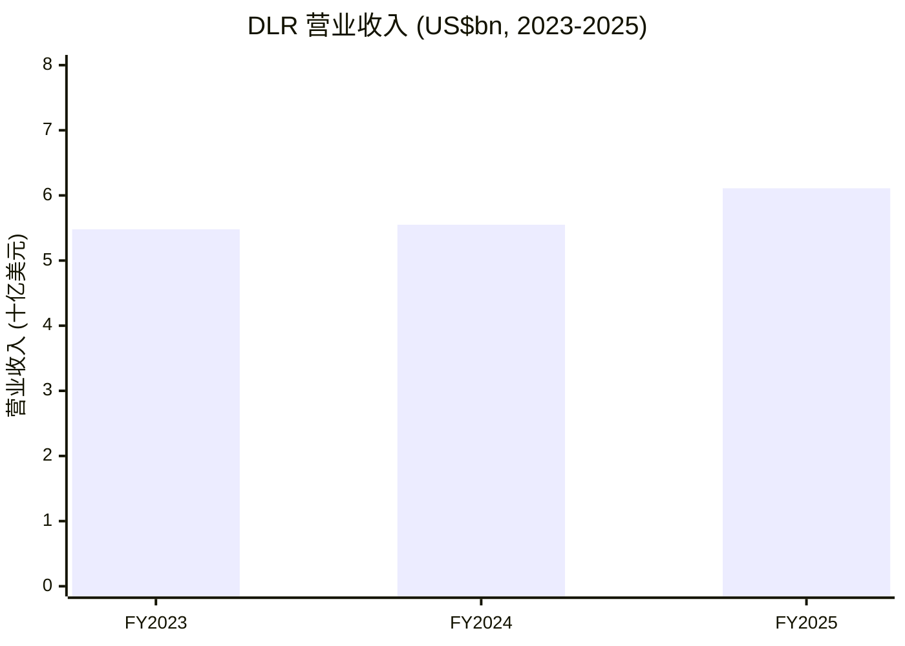
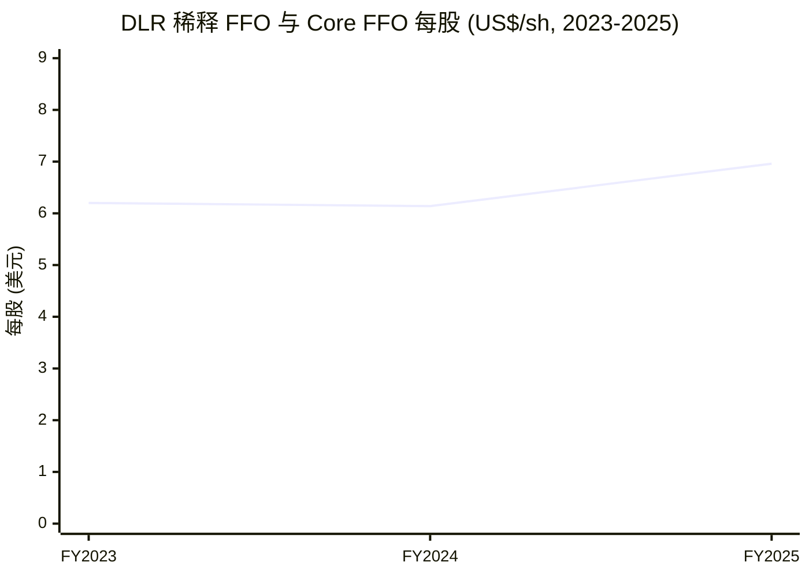
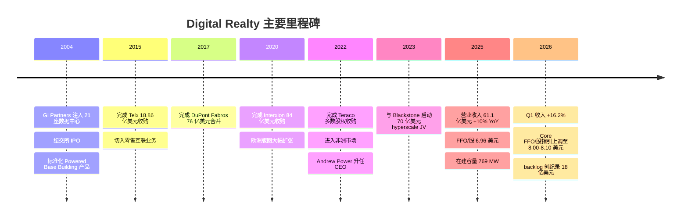
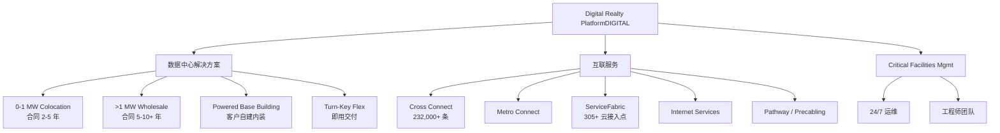
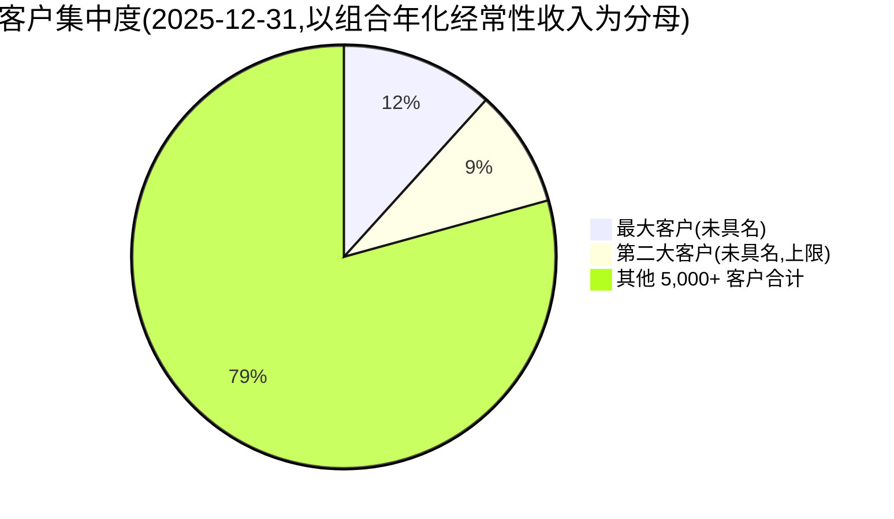
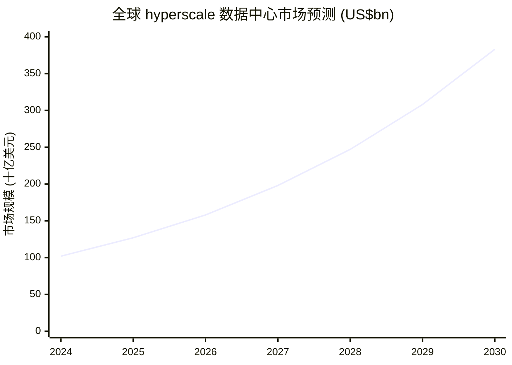
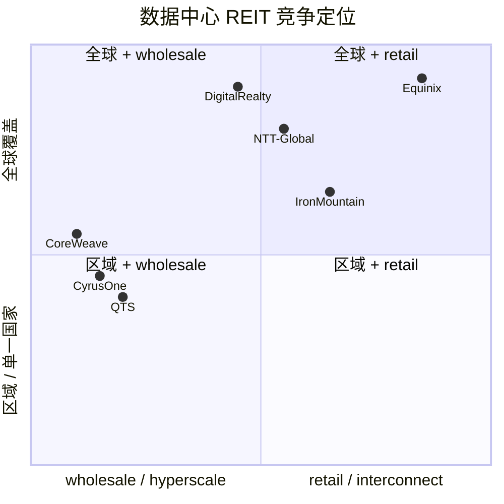

# Digital Realty Trust (NYSE:DLR) 公司研究

**截至日期 (As of):** 2026-06-16
**Ticker:** NYSE:DLR · **交易所:** New York Stock Exchange
**主题归属 (Themes):** ai-power-electrification, china-datacenter-hyperscale (海外对照)

---

## 投资摘要 (Investment Summary) — *Analyst view*

> 本摘要为本报告的house view (本方观点),属分析师判断而非公司披露;评级、目标价、前瞻估计均为 *Analyst view*,不附任何 filing 引用。

| 项目 | 数值 |
|---|---|
| **评级 (Rating)** | **Hold / Accumulate (持有/逢低增持)** — 质优、估值偏满,等 backlog 兑现 |
| **12 个月目标价 (12-mo PT)** | **$212** (基于 2027E Core FFO/股 $8.85 × 24× P/Core FFO) |
| **当前股价 (Current price)** | **$190.45** (2026-06-16 收盘) |
| **隐含上行 (Implied upside)** | **+11%** (+股息 ~2.6% ≈ +14% 总回报) |
| **估值方法 (Method)** | forward P/Core FFO 倍数法,辅以 P/AFFO 与第三方 NAV 交叉验证 |
| **市值 (Market cap)** | **$68.1B** (≈ 3.51 亿股 × $190.45) |
| **企业价值 (EV)** | **~$84.7B** |
| **52 周区间** | $146.23 – $208.14 |
| **股息 (Dividend)** | $4.88/股 年化 (yield ~2.6%) |

**论点支柱 (Thesis pillars) — *Analyst view*:**

1. **AI 工作负载把 hyperscale wholesale 需求推到拐点。** Q1 2026 收入同比 +16.2%、Core FFO/股 +15.3%,signed-but-not-commenced backlog 创纪录 **$1.8B**,公司将全年 Core FFO/股指引上调至 **$8.00–$8.10**——这是周期内最积极的增长可视度信号。
2. **稀缺的"土地 + 电力 + 网络"组合是无法短期复制的护城河。** 核心 metro 并网排队 5–8 年,DLR 已握 >5 GW 未来可开发容量(其中 40–45% 已可经已签 ESA 接入)——AI 时代的瓶颈从"资本"转为"电力 + 设备 + 施工人力",而 DLR 是少数先发布局者。
3. **与 Equinix 并列的全球双寡头,但 DLR 更偏 wholesale + 大土地储备。** EQIX 强在互联 ARPU,DLR 强在 hyperscale 大单兑现能力——AI 浪潮更利于 DLR 的规模优势变现。
4. **估值偏满是主要约束。** P/Core FFO ~26×(TTM)、fwd ~24×,显著高于美国 REIT 板块均值;市场已部分定价"AI 永远涨"的剧本,留给倍数扩张的空间有限——这是评级停在 Hold/Accumulate 而非 Buy 的核心原因。

---

## 目录

1. 公司概览 (Company Overview)
   - 1A. 估值与目标价快照 (Valuation & PT Snapshot)
   - 1B. GF Score 基本面评分
2. 估值与目标价 (Valuation & Price Target) — 前瞻模型 + 卖方观点演变
3. 公司历史 (Company History)
4. 管理团队 (Management Team)
5. 产品与服务 (Products & Services) — 含 money-flow 资金流向图
6. 客户与上市策略 (Customers & GTM)
7. 行业概览 (Industry Overview)
8. 竞争格局 (Competitive Landscape)
9. 市场机会 (TAM / SAM)
10. 风险评估 (Risk Assessment)
    - 9.5. 核心分歧与催化剂 (Key Debates & Catalysts)
11. 投资者视角评分 (Investor-Lens Scorecards)
12. 数据来源清单 (Data Used) 与参考资料 (References)

---

## 1. 公司概览 (Company Overview)

Digital Realty Trust, Inc.(NYSE:DLR,以下简称 "Digital Realty" 或 "公司")是全球规模最大的开放式数据中心 (data center) 运营商之一,自 2004 年 IPO 起即作为 REIT (Real Estate Investment Trust / 房地产投资信托) 在纽交所交易。公司在 2025 年 10-K 中将自身定位为 "the largest global provider of cloud- and carrier-neutral data center, colocation and interconnection solutions"(全球最大的云中立 / 运营商中立数据中心、托管与互联服务提供商)([Digital Realty FY2025 10-K, Item 1 Business — Our Company](https://www.sec.gov/Archives/edgar/data/1297996/000110465926015365/dlr-20251231x10k.htm))。

**本方观点 (house view) — 先讲结论再讲业务。** 本报告给予 DLR **Hold / Accumulate(持有 / 逢低增持)** 评级,12 个月目标价 **$212**(对应 2027E Core FFO/股 $8.85 × 24×,较 $190.45 上行 ~11%,含 ~2.6% 股息约 +14% 总回报)。逻辑是:AI 工作负载把 hyperscale wholesale 需求推到周期拐点(Q1 2026 backlog 创纪录 $1.8B、Core FFO/股 +15.3%),DLR 的"土地 + 电力 + 网络"稀缺组合是无法短期复制的护城河;但 P/Core FFO ~26× 的估值已偏满,留给倍数扩张的空间有限,因而停在 Hold/Accumulate 而非 Buy。下文先给估值与基本面评分,再展开九大描述性章节。

公司截至 2025 年 12 月 31 日运营 **310 座数据中心**(其中 89 座通过非合并合资公司持有),分布于 6 大洲、55+ 个核心都会区,总可租面积 (rentable square feet) 约 **57.6 百万平方英尺**,已投产 IT 装机容量 (in-place IT capacity) 约 **2.9 GW**,在建容量 (under construction) 在 FY2025 年末为 **769 MW**(其中 64% 已预租),未来可开发容量 (future development capacity) **超过 5 GW**([Digital Realty FY2025 10-K, Item 1 Business — PlatformDIGITAL®](https://www.sec.gov/Archives/edgar/data/1297996/000110465926015365/dlr-20251231x10k.htm))。这一规模使 DLR 与 Equinix(NASDAQ:EQIX)共同构成"全球两大上市数据中心 REIT"的双寡头格局([Bernstein — US Communications Infrastructure Data Centers, 2026-05-15, p.1 (zsxq library)](http://xs-macbook-air.local:5001/zsxq/pdf/415245152452218/Bernstein-US%20Communications%20Infrastructure%20Data%20Centers%EF%BC%9A%20What%20a%20top~tier%20data%20center%20market%20looks%20like%E2%80%94%20including%20the%20DLR%20and%20EQIX%20footprints-260515%20%281%29.pdf))。

**财务体量 (FY2025).** 全年总营业收入 (total operating revenues) **6.113 十亿美元** (USD 6,112.7 million),同比增长 **10.0%**,其中租赁与服务收入 (Rental and other services) 5,968.9 百万美元(同比 +8.9%),费用收入及其他 (Fee income and other) 143.8 百万美元(同比 **+98.3%**,主要来自合资公司开发管理费与电气化建设费)([Digital Realty FY2025 10-K, MD&A — Total Operating Revenues](https://www.sec.gov/Archives/edgar/data/1297996/000110465926015365/dlr-20251231x10k.htm))。归母普通股净利润 (GAAP Net Income Available to Common Stockholders) **12.68 亿美元**(FY24 5.62 亿美元,FY23 9.08 亿美元),其中受房地产处置收益 (Gain on disposition of real estate) **9.96 亿美元** 显著推升([Digital Realty FY2025 10-K, Consolidated Statements of Operations](https://www.sec.gov/Archives/edgar/data/1297996/000110465926015365/dlr-20251231x10k.htm))。对 REIT 而言核心运营指标是 **FFO (Funds From Operations)** 而非 GAAP 净利润:FY2025 FFO 可分配普通股 + 单位 **23.99 亿美元**,稀释后每股 FFO **$6.96**(FY24 $6.14,FY23 $6.20)([Digital Realty FY2025 10-K, MD&A — FFO Reconciliation](https://www.sec.gov/Archives/edgar/data/1297996/000110465926015365/dlr-20251231x10k.htm))。

**FFO / Core FFO / AFFO 三层口径(REIT 必读).** REIT 用 FFO 替代净利润,因为净利润里巨额非现金房地产折旧 (D&A FY2025 $1,894.6M) 严重低估了真实现金创造力。在 FFO 之上,DLR 的对外指引锚定 **Core FFO**(剔除处置收益、汇兑、并购等一次性项)。FY2025 四个季度 Core FFO/股为 $1.77 / $1.87 / $1.89 / $1.86,**全年合计约 $7.39**([Digital Realty 4Q25 财报 8-K Ex-99.1, 2026-02-05 — Reported Core FFO per share](https://www.sec.gov/Archives/edgar/data/0001297996/000110465926010887/dlr-20260205xex99d1.htm))。**AFFO (Adjusted FFO)** 进一步扣除经常性维护资本开支与直线租金调整,FY2025 季度 AFFO/股为 $1.77 / $1.68 / $1.76 / $1.34([Digital Realty 4Q25 财报 8-K Ex-99.2 supplemental, 2026-02-05 — AFFO per diluted share](https://www.sec.gov/Archives/edgar/data/0001297996/000110465926010887/dlr-20260205xex99d2.htm))。AFFO 通常低于 Core FFO,是判断股息覆盖与可持续派息的最严苛口径。

**资本结构与 NAV 视角.** 公司维持投资级评级 (BBB / Baa2),截至 2025 年 12 月 31 日 **约 92% 的总有息负债 (total indebtedness) 为固定利率或经利率互换对冲**([Digital Realty FY2025 10-K, Item 1A Risk Factors — Hedging](https://www.sec.gov/Archives/edgar/data/1297996/000110465926015365/dlr-20251231x10k.htm))。总有息负债账面价值约 **184 亿美元**(= 全球循环授信 899.1 + 无担保定期贷款 439.5 + 无担保高级票据 16,194.4 + 担保及其他债 869.1),对应总资产 494 亿美元、股东权益 229 亿美元([Digital Realty FY2025 10-K, Consolidated Balance Sheets](https://www.sec.gov/Archives/edgar/data/1297996/000110465926015365/dlr-20251231x10k.htm))。公司公开的长期财务目标包括:净债务 / 调整后 EBITDA ratio **5.5×**、固定费用覆盖率 (fixed charge coverage) 大于 3×、浮动利率债务占比小于 20%([Digital Realty FY2025 10-K, Item 1 Business — Preserve Flexibility of Balance Sheet](https://www.sec.gov/Archives/edgar/data/1297996/000110465926015365/dlr-20251231x10k.htm))。公司在 4Q25 supplemental 中专门披露了 "Components of Net Asset Value"(NAV 组成),便于市场以资产重估口径而非纯倍数口径估值([Digital Realty 4Q25 supplemental, 2026-02-05 — Components of Net Asset Value](https://www.sec.gov/Archives/edgar/data/0001297996/000110465926010887/dlr-20260205xex99d2.htm))。

**Q1 2026 业绩与指引上调——周期最积极拐点.** 公司在 2026 年 4 月 23 日发布的 Q1 2026 业绩中,营业收入 **16.35 亿美元(同比 +16.2%)**,**Core FFO 每股 $2.04(同比 +15.3%,大幅超市场一致预期 $1.80)**;全年 Core FFO/股指引由 $7.90–$8.00 上调至 **$8.00–$8.10**,全年收入指引由 6.60–6.70 上调至 **6.65–6.75 十亿美元**;新签订单将产生 7.07 亿美元年化 GAAP 租金(100% 口径),signed-but-not-commenced backlog 创纪录 **$1.8B**,续约租金价差 (rent spread) 为正中个位数([Digital Realty Q1 2026 财报 8-K, 2026-04-23](https://www.sec.gov/Archives/edgar/data/1297996/000110465926047702/dlr-20260423x8k.htm); [StockTitan — DLR lifts 2026 Core FFO outlook to $8.10, 2026-04-23](https://www.stocktitan.net/news/DLR/digital-realty-reports-first-quarter-2026-yqdayjm36wn1.html); [Digital Realty Q1 2026 10-Q, 2026-05-01](https://www.sec.gov/Archives/edgar/data/1297996/000110465926054255/dlr-20260331x10q.htm))。**这是当前周期内 DLR 业绩最积极的拐点信号**:hyperscale 大单大幅回补,backlog 创纪录,经营杠杆开始向 Core FFO 兑现。

### 1A. 估值与目标价快照 (Valuation & PT Snapshot)

**估值快照 (Valuation Snapshot, 2026-06-16).** DLR 股价 **$190.45**,对应市值约 **668 亿美元**(yfinance 口径 $68.1B),**TTM P/E ~50.5×**,**Forward P/E ~66.5×**(GAAP EPS 受处置收益波动,对 REIT 参考意义有限),**P/S ~10.8×**,**P/B ~2.94×**,股息率 **~2.6%**(年化分红 $4.88/股)([Stockanalysis.com — DLR Statistics](https://stockanalysis.com/stocks/dlr/statistics/); [Yahoo Finance — DLR](https://finance.yahoo.com/quote/DLR/))。

*分析师观点 (Analyst view):* 对 REIT 而言 GAAP P/E 并非主导估值锚——市场更关注每股 Core FFO / AFFO,以及 backlog / pre-leased % 反映的未来 18 个月增长可视度。按 Core FFO 计算,DLR 当前 **P/Core FFO ~25.8×(2025A $7.39)、fwd ~23.7×(2026E 指引中值 $8.05)**;这一倍数处于 EQIX 之外全球数据中心 REIT 的高端,远高于美国办公 / 公寓 / 零售 REIT 板块,体现市场已部分定价 AI 工作负载驱动的长期租金上行假设。这是"为什么用这个倍数"的关键:DLR 的溢价不靠当期回报率(GAAP ROE 仅 ~5.8%),而靠 backlog 与 >5 GW 土地储备给出的远期增长可视度。

**财务可视化 (financial visuals).** 下图以 Sankey 形式还原 DLR FY2025 利润表的现金路径——营业收入如何被物业层运营费用、折旧摊销、利息消耗,以及房地产处置收益如何显著放大归母净利。

<svg xmlns="http://www.w3.org/2000/svg" viewBox="0 0 1000 560" width="1000" height="560" role="img" aria-label="income statement Sankey"><rect x="0" y="0" width="1000" height="560" fill="#ffffff"/>
<text x="20.00" y="30.00" text-anchor="start" font-family="Helvetica,Arial,sans-serif" font-size="15" font-weight="700" fill="#1f2933">Digital Realty FY2025 利润表 Sankey (income statement)</text>
<path d="M 204.00,71.00 C 258.00,71.00 258.00,85.00 312.00,85.00 L 312.00,370.20 C 258.00,370.20 258.00,356.20 204.00,356.20 Z" fill="#93c5fd" fill-opacity="0.55"/>
<path d="M 452.00,78.00 C 506.00,78.00 506.00,147.39 560.00,147.39 L 560.00,191.34 C 506.00,191.34 506.00,121.96 452.00,121.96 Z" fill="#86efac" fill-opacity="0.55"/>
<path d="M 452.00,121.96 C 506.00,121.96 506.00,205.34 560.00,205.34 L 560.00,387.39 C 506.00,387.39 506.00,304.00 452.00,304.00 Z" fill="#fca5a5" fill-opacity="0.55"/>
<path d="M 328.00,85.00 C 382.00,85.00 382.00,78.00 436.00,78.00 L 436.00,304.00 C 382.00,304.00 382.00,311.00 328.00,311.00 Z" fill="#86efac" fill-opacity="0.55"/>
<path d="M 328.00,311.00 C 382.00,311.00 382.00,318.00 436.00,318.00 L 436.00,500.00 C 382.00,500.00 382.00,493.00 328.00,493.00 Z" fill="#fca5a5" fill-opacity="0.55"/>
<path d="M 700.00,137.46 C 754.00,137.46 754.00,235.48 808.00,235.48 L 808.00,309.36 C 754.00,309.36 754.00,211.34 700.00,211.34 Z" fill="#86efac" fill-opacity="0.55"/>
<path d="M 700.00,211.34 C 754.00,211.34 754.00,323.36 808.00,323.36 L 808.00,325.50 C 754.00,325.50 754.00,213.47 700.00,213.47 Z" fill="#fca5a5" fill-opacity="0.55"/>
<path d="M 700.00,213.47 C 754.00,213.47 754.00,339.50 808.00,339.50 L 808.00,342.52 C 754.00,342.52 754.00,216.50 700.00,216.50 Z" fill="#fca5a5" fill-opacity="0.55"/>
<path d="M 576.00,147.39 C 630.00,147.39 630.00,137.46 684.00,137.46 L 684.00,181.41 C 630.00,181.41 630.00,191.34 576.00,191.34 Z" fill="#86efac" fill-opacity="0.55"/>
<path d="M 576.00,205.34 C 630.00,205.34 630.00,230.50 684.00,230.50 L 684.00,268.24 C 630.00,268.24 630.00,243.08 576.00,243.08 Z" fill="#fca5a5" fill-opacity="0.55"/>
<path d="M 576.00,243.08 C 630.00,243.08 630.00,282.24 684.00,282.24 L 684.00,408.70 C 630.00,408.70 630.00,369.54 576.00,369.54 Z" fill="#fca5a5" fill-opacity="0.55"/>
<path d="M 576.00,369.54 C 630.00,369.54 630.00,422.70 684.00,422.70 L 684.00,440.54 C 630.00,440.54 630.00,387.39 576.00,387.39 Z" fill="#fca5a5" fill-opacity="0.55"/>
<path d="M 204.00,370.20 C 258.00,370.20 258.00,370.20 312.00,370.20 L 312.00,483.41 C 258.00,483.41 258.00,483.40 204.00,483.40 Z" fill="#93c5fd" fill-opacity="0.55"/>
<path d="M 576.00,401.39 C 630.00,401.39 630.00,181.41 684.00,181.41 L 684.00,210.64 C 630.00,210.64 630.00,430.61 576.00,430.61 Z" fill="#93c5fd" fill-opacity="0.55"/>
<path d="M 204.00,497.40 C 258.00,497.40 258.00,483.41 312.00,483.41 L 312.00,493.00 C 258.00,493.00 258.00,507.00 204.00,507.00 Z" fill="#93c5fd" fill-opacity="0.55"/>
<rect x="188.00" y="71.00" width="16" height="285.20" rx="1.5" fill="#2563eb"/>
<rect x="188.00" y="370.20" width="16" height="113.21" rx="1.5" fill="#2563eb"/>
<rect x="188.00" y="497.40" width="16" height="9.60" rx="1.5" fill="#2563eb"/>
<rect x="312.00" y="85.00" width="16" height="407.99" rx="1.5" fill="#1e3a8a"/>
<rect x="436.00" y="78.00" width="16" height="226.00" rx="1.5" fill="#15803d"/>
<rect x="436.00" y="318.00" width="16" height="181.99" rx="1.5" fill="#dc2626"/>
<rect x="560.00" y="147.39" width="16" height="43.95" rx="1.5" fill="#15803d"/>
<rect x="560.00" y="205.34" width="16" height="182.05" rx="1.5" fill="#dc2626"/>
<rect x="560.00" y="401.39" width="16" height="29.23" rx="1.5" fill="#2563eb"/>
<rect x="684.00" y="137.46" width="16" height="79.04" rx="1.5" fill="#15803d"/>
<rect x="684.00" y="230.50" width="16" height="37.74" rx="1.5" fill="#dc2626"/>
<rect x="684.00" y="282.24" width="16" height="126.46" rx="1.5" fill="#dc2626"/>
<rect x="684.00" y="422.70" width="16" height="17.85" rx="1.5" fill="#dc2626"/>
<rect x="808.00" y="235.48" width="16" height="73.88" rx="1.5" fill="#15803d"/>
<rect x="808.00" y="323.36" width="16" height="2.14" rx="1.5" fill="#dc2626"/>
<rect x="808.00" y="339.50" width="16" height="3.02" rx="1.5" fill="#dc2626"/>
<line x1="188.00" y1="213.60" x2="182.00" y2="198.40" stroke="#cbd5e1" stroke-width="1"/>
<text x="179.00" y="201.40" text-anchor="end" font-family="Helvetica,Arial,sans-serif" font-size="11.5" font-weight="700" fill="#1f2933">Stabilized 租金 (rental)</text>
<text x="179.00" y="214.40" text-anchor="end" font-family="Helvetica,Arial,sans-serif" font-size="10" font-weight="400" fill="#52606d">US$4.3B  (69.9%)</text>
<line x1="188.00" y1="426.80" x2="182.00" y2="411.60" stroke="#cbd5e1" stroke-width="1"/>
<text x="179.00" y="414.60" text-anchor="end" font-family="Helvetica,Arial,sans-serif" font-size="11.5" font-weight="700" fill="#1f2933">Non-Stabilized 租金 (lease-up)</text>
<text x="179.00" y="427.60" text-anchor="end" font-family="Helvetica,Arial,sans-serif" font-size="10" font-weight="400" fill="#52606d">US$1.7B  (27.7%)</text>
<line x1="188.00" y1="502.20" x2="182.00" y2="487.00" stroke="#cbd5e1" stroke-width="1"/>
<text x="179.00" y="490.00" text-anchor="end" font-family="Helvetica,Arial,sans-serif" font-size="11.5" font-weight="700" fill="#1f2933">Fee income &amp; other</text>
<text x="179.00" y="503.00" text-anchor="end" font-family="Helvetica,Arial,sans-serif" font-size="10" font-weight="400" fill="#52606d">US$143.8M  (2.4%)</text>
<rect x="331.00" y="67.00" width="113.10" height="26" rx="2" fill="#ffffff" fill-opacity="0.72"/>
<text x="334.00" y="79.00" text-anchor="start" font-family="Helvetica,Arial,sans-serif" font-size="11.5" font-weight="700" fill="#1f2933">Revenue</text>
<text x="334.00" y="92.00" text-anchor="start" font-family="Helvetica,Arial,sans-serif" font-size="10" font-weight="400" fill="#52606d">US$6.1B  (100.0%)</text>
<rect x="455.00" y="60.00" width="106.80" height="26" rx="2" fill="#ffffff" fill-opacity="0.72"/>
<text x="458.00" y="72.00" text-anchor="start" font-family="Helvetica,Arial,sans-serif" font-size="11.5" font-weight="700" fill="#1f2933">Gross Profit</text>
<text x="458.00" y="85.00" text-anchor="start" font-family="Helvetica,Arial,sans-serif" font-size="10" font-weight="400" fill="#52606d">US$3.4B  (55.4%)</text>
<rect x="455.00" y="300.00" width="144.60" height="26" rx="2" fill="#ffffff" fill-opacity="0.72"/>
<text x="458.00" y="312.00" text-anchor="start" font-family="Helvetica,Arial,sans-serif" font-size="11.5" font-weight="700" fill="#1f2933">Cost of Revenue (COGS)</text>
<text x="458.00" y="325.00" text-anchor="start" font-family="Helvetica,Arial,sans-serif" font-size="10" font-weight="400" fill="#52606d">US$2.7B  (44.6%)</text>
<rect x="579.00" y="129.39" width="119.40" height="26" rx="2" fill="#ffffff" fill-opacity="0.72"/>
<text x="582.00" y="141.39" text-anchor="start" font-family="Helvetica,Arial,sans-serif" font-size="11.5" font-weight="700" fill="#1f2933">Operating Income</text>
<text x="582.00" y="154.39" text-anchor="start" font-family="Helvetica,Arial,sans-serif" font-size="10" font-weight="400" fill="#52606d">US$658.5M  (10.8%)</text>
<rect x="579.00" y="187.34" width="150.90" height="26" rx="2" fill="#ffffff" fill-opacity="0.72"/>
<text x="582.00" y="199.34" text-anchor="start" font-family="Helvetica,Arial,sans-serif" font-size="11.5" font-weight="700" fill="#1f2933">Total Operating Expense</text>
<text x="582.00" y="212.34" text-anchor="start" font-family="Helvetica,Arial,sans-serif" font-size="10" font-weight="400" fill="#52606d">US$2.7B  (44.6%)</text>
<text x="551.00" y="413.00" text-anchor="end" font-family="Helvetica,Arial,sans-serif" font-size="11.5" font-weight="700" fill="#1f2933">Net Interest / Other Income</text>
<text x="551.00" y="426.00" text-anchor="end" font-family="Helvetica,Arial,sans-serif" font-size="10" font-weight="400" fill="#52606d">US$437.9M  (7.2%)</text>
<rect x="703.00" y="119.46" width="106.80" height="26" rx="2" fill="#ffffff" fill-opacity="0.72"/>
<text x="706.00" y="131.46" text-anchor="start" font-family="Helvetica,Arial,sans-serif" font-size="11.5" font-weight="700" fill="#1f2933">Pretax Income</text>
<text x="706.00" y="144.46" text-anchor="start" font-family="Helvetica,Arial,sans-serif" font-size="10" font-weight="400" fill="#52606d">US$1.2B  (19.4%)</text>
<rect x="703.00" y="212.50" width="113.10" height="26" rx="2" fill="#ffffff" fill-opacity="0.72"/>
<text x="706.00" y="224.50" text-anchor="start" font-family="Helvetica,Arial,sans-serif" font-size="11.5" font-weight="700" fill="#1f2933">SG&amp;A</text>
<text x="706.00" y="237.50" text-anchor="start" font-family="Helvetica,Arial,sans-serif" font-size="10" font-weight="400" fill="#52606d">US$565.5M  (9.3%)</text>
<rect x="703.00" y="264.24" width="106.80" height="26" rx="2" fill="#ffffff" fill-opacity="0.72"/>
<text x="706.00" y="276.24" text-anchor="start" font-family="Helvetica,Arial,sans-serif" font-size="11.5" font-weight="700" fill="#1f2933">R&amp;D</text>
<text x="706.00" y="289.24" text-anchor="start" font-family="Helvetica,Arial,sans-serif" font-size="10" font-weight="400" fill="#52606d">US$1.9B  (31.0%)</text>
<rect x="703.00" y="404.70" width="113.10" height="26" rx="2" fill="#ffffff" fill-opacity="0.72"/>
<text x="706.00" y="416.70" text-anchor="start" font-family="Helvetica,Arial,sans-serif" font-size="11.5" font-weight="700" fill="#1f2933">Other OpEx</text>
<text x="706.00" y="429.70" text-anchor="start" font-family="Helvetica,Arial,sans-serif" font-size="10" font-weight="400" fill="#52606d">US$267.4M  (4.4%)</text>
<text x="833.00" y="269.42" text-anchor="start" font-family="Helvetica,Arial,sans-serif" font-size="11.5" font-weight="700" fill="#1f2933">Net Income</text>
<text x="833.00" y="282.42" text-anchor="start" font-family="Helvetica,Arial,sans-serif" font-size="10" font-weight="400" fill="#52606d">US$1.1B  (18.1%)</text>
<text x="833.00" y="321.43" text-anchor="start" font-family="Helvetica,Arial,sans-serif" font-size="11.5" font-weight="700" fill="#1f2933">Income Tax</text>
<text x="833.00" y="334.43" text-anchor="start" font-family="Helvetica,Arial,sans-serif" font-size="10" font-weight="400" fill="#52606d">US$32.0M  (0.52%)</text>
<text x="833.00" y="346.43" text-anchor="start" font-family="Helvetica,Arial,sans-serif" font-size="11.5" font-weight="700" fill="#1f2933">Minority Interest</text>
<text x="833.00" y="359.43" text-anchor="start" font-family="Helvetica,Arial,sans-serif" font-size="10" font-weight="400" fill="#52606d">US$45.3M  (0.74%)</text>
<text x="500.00" y="530.00" text-anchor="middle" font-family="Helvetica,Arial,sans-serif" font-size="10" font-weight="400" font-style="italic" fill="#8a97a3">REIT 口径: COGS = 物业层运营费用 (property-level opex incl. utilities); '其他收入净额' 963.6 = 房地产处置收益 995.6 - 合资权益法亏损 32.0; 税后扣少数股东权益 + 优先股股利后, 归母普通股净利 1267.9 (本图按税前-税-少数股东链条展示 1106.9, 差额为优先股股利重述项)</text>
<text x="500.00" y="544.00" text-anchor="middle" font-family="Helvetica,Arial,sans-serif" font-size="10" font-weight="400" fill="#52606d">Source: Digital Realty FY2025 10-K (MD&amp;A + Consolidated Statements)</text>
</svg>

*来源:[Digital Realty FY2025 10-K, Consolidated Statements of Operations](https://www.sec.gov/Archives/edgar/data/1297996/000110465926015365/dlr-20251231x10k.htm). REIT 口径下 COGS = 物业层运营费用(含电费 utilities $1,426M);其他收入净额 963.6 = 处置收益 995.6 − 合资权益法亏损 32.0。*

营收按类型拆分见下方甜甜圈图——稳定期 (Stabilized) 与 lease-up 期 (Non-Stabilized) 租金合计占 ~97.6%,fee income 虽仅 2.4% 但同比近翻倍,是轻资产化战略的直接体现。

<svg xmlns="http://www.w3.org/2000/svg" viewBox="0 0 720 460" width="720" height="460" role="img" aria-label="revenue donut"><rect x="0" y="0" width="720" height="460" fill="#ffffff"/>
<text x="20.00" y="30.00" text-anchor="start" font-family="Helvetica,Arial,sans-serif" font-size="15" font-weight="700" fill="#1f2933">Digital Realty FY2025 营业收入构成 (revenue by type)</text>
<path d="M 288.00,107.20 A 132 132 0 1 1 162.72,280.77 L 213.97,263.76 A 78 78 0 1 0 288.00,161.20 Z" fill="#2563eb"/>
<path d="M 162.72,280.77 A 132 132 0 0 1 268.56,108.64 L 276.51,162.05 A 78 78 0 0 0 213.97,263.76 Z" fill="#15803d"/>
<path d="M 268.56,108.64 A 132 132 0 0 1 288.00,107.20 L 288.00,161.20 A 78 78 0 0 0 276.51,162.05 Z" fill="#d97706"/>
<text x="288.00" y="235.20" text-anchor="middle" font-family="Helvetica,Arial,sans-serif" font-size="18" font-weight="800" fill="#1f2933">DLR\n$6,112.7M</text>
<text x="288.00" y="255.20" text-anchor="middle" font-family="Helvetica,Arial,sans-serif" font-size="13" font-weight="600" fill="#52606d">US$6.1B</text>
<text x="288.00" y="271.20" text-anchor="middle" font-family="Helvetica,Arial,sans-serif" font-size="10" font-weight="400" fill="#8a97a3">total</text>
<line x1="399.90" y1="319.97" x2="415.90" y2="319.97" stroke="#2563eb" stroke-width="1.4"/>
<text x="419.90" y="317.97" text-anchor="start" font-family="Helvetica,Arial,sans-serif" font-size="11" font-weight="700" fill="#1f2933">Stabilized rental &amp; svc (稳定期租金)</text>
<text x="419.90" y="331.97" text-anchor="start" font-family="Helvetica,Arial,sans-serif" font-size="10" font-weight="400" fill="#52606d">US$4.3B  (69.9%)</text>
<line x1="170.45" y1="166.92" x2="154.45" y2="166.92" stroke="#15803d" stroke-width="1.4"/>
<text x="150.45" y="164.92" text-anchor="end" font-family="Helvetica,Arial,sans-serif" font-size="11" font-weight="700" fill="#1f2933">Non-Stabilized rental (lease-up 期租金)</text>
<text x="150.45" y="178.92" text-anchor="end" font-family="Helvetica,Arial,sans-serif" font-size="10" font-weight="400" fill="#52606d">US$1.7B  (27.7%)</text>
<line x1="277.81" y1="101.58" x2="261.81" y2="101.58" stroke="#d97706" stroke-width="1.4"/>
<text x="257.81" y="99.58" text-anchor="end" font-family="Helvetica,Arial,sans-serif" font-size="11" font-weight="700" fill="#1f2933">Fee income &amp; other (开发/管理费)</text>
<text x="257.81" y="113.58" text-anchor="end" font-family="Helvetica,Arial,sans-serif" font-size="10" font-weight="400" fill="#52606d">US$143.8M  (2.4%)</text>
<text x="360.00" y="430.00" text-anchor="middle" font-family="Helvetica,Arial,sans-serif" font-size="10" font-weight="400" font-style="italic" fill="#8a97a3">稳定期 + lease-up 期租金合计 = 租赁与服务收入 5968.9; Fee income 同比 +98.3%</text>
<text x="360.00" y="444.00" text-anchor="middle" font-family="Helvetica,Arial,sans-serif" font-size="10" font-weight="400" fill="#52606d">Source: Digital Realty FY2025 10-K (MD&amp;A — Total Operating Revenues)</text>
</svg>

*来源:[Digital Realty FY2025 10-K, MD&A — Total Operating Revenues](https://www.sec.gov/Archives/edgar/data/1297996/000110465926015365/dlr-20251231x10k.htm).*

三年营收历史(下方堆叠柱)显示 fee income 从 FY2023 的 $46.9M 跃升至 FY2025 的 $143.8M(三年 CAGR ~75%),占比从 0.9% 升至 2.4%——这是 Blackstone 等合资交易推进的财务足迹。

<svg xmlns="http://www.w3.org/2000/svg" viewBox="0 0 860 470" width="860" height="470" role="img" aria-label="historical revenue bars"><rect x="0" y="0" width="860" height="470" fill="#ffffff"/>
<text x="20.00" y="30.00" text-anchor="start" font-family="Helvetica,Arial,sans-serif" font-size="15" font-weight="700" fill="#1f2933">Digital Realty 营业收入历史 (revenue history, 2023–2025)</text>
<rect x="20.00" y="44" width="11" height="11" rx="2" fill="#2563eb"/>
<text x="36.00" y="53.00" text-anchor="start" font-family="Helvetica,Arial,sans-serif" font-size="10.5" font-weight="400" fill="#1f2933">Rental &amp; other services (租赁与服务)</text>
<rect x="254.60" y="44" width="11" height="11" rx="2" fill="#15803d"/>
<text x="270.60" y="53.00" text-anchor="start" font-family="Helvetica,Arial,sans-serif" font-size="10.5" font-weight="400" fill="#1f2933">Fee income &amp; other (开发/管理费)</text>
<line x1="70" y1="412.00" x2="834" y2="412.00" stroke="#eceff2" stroke-width="1"/>
<text x="64.00" y="415.00" text-anchor="end" font-family="Helvetica,Arial,sans-serif" font-size="9.5" font-weight="400" fill="#52606d">US$0</text>
<line x1="70" y1="345.20" x2="834" y2="345.20" stroke="#eceff2" stroke-width="1"/>
<text x="64.00" y="348.20" text-anchor="end" font-family="Helvetica,Arial,sans-serif" font-size="9.5" font-weight="400" fill="#52606d">US$1.3B</text>
<line x1="70" y1="278.40" x2="834" y2="278.40" stroke="#eceff2" stroke-width="1"/>
<text x="64.00" y="281.40" text-anchor="end" font-family="Helvetica,Arial,sans-serif" font-size="9.5" font-weight="400" fill="#52606d">US$2.6B</text>
<line x1="70" y1="211.60" x2="834" y2="211.60" stroke="#eceff2" stroke-width="1"/>
<text x="64.00" y="214.60" text-anchor="end" font-family="Helvetica,Arial,sans-serif" font-size="9.5" font-weight="400" fill="#52606d">US$4.0B</text>
<line x1="70" y1="144.80" x2="834" y2="144.80" stroke="#eceff2" stroke-width="1"/>
<text x="64.00" y="147.80" text-anchor="end" font-family="Helvetica,Arial,sans-serif" font-size="9.5" font-weight="400" fill="#52606d">US$5.3B</text>
<line x1="70" y1="78.00" x2="834" y2="78.00" stroke="#eceff2" stroke-width="1"/>
<text x="64.00" y="81.00" text-anchor="end" font-family="Helvetica,Arial,sans-serif" font-size="9.5" font-weight="400" fill="#52606d">US$6.6B</text>
<rect x="123.48" y="137.27" width="147.71" height="274.73" fill="#2563eb"/>
<rect x="123.48" y="134.90" width="147.71" height="2.37" fill="#15803d"/>
<text x="197.33" y="428.00" text-anchor="middle" font-family="Helvetica,Arial,sans-serif" font-size="10" font-weight="400" fill="#52606d">2023</text>
<rect x="378.15" y="134.62" width="147.71" height="277.38" fill="#2563eb"/>
<rect x="378.15" y="130.96" width="147.71" height="3.67" fill="#15803d"/>
<text x="452.00" y="428.00" text-anchor="middle" font-family="Helvetica,Arial,sans-serif" font-size="10" font-weight="400" fill="#52606d">2024</text>
<rect x="632.81" y="110.02" width="147.71" height="301.98" fill="#2563eb"/>
<rect x="632.81" y="102.74" width="147.71" height="7.28" fill="#15803d"/>
<text x="706.67" y="428.00" text-anchor="middle" font-family="Helvetica,Arial,sans-serif" font-size="10" font-weight="400" fill="#52606d">2025</text>
<text x="430.00" y="440.00" text-anchor="middle" font-family="Helvetica,Arial,sans-serif" font-size="10" font-weight="400" font-style="italic" fill="#8a97a3">Fee income 三年 CAGR ~75%, 占比从 0.9% 升至 2.4%; 各年口径取该年披露值</text>
<text x="430.00" y="454.00" text-anchor="middle" font-family="Helvetica,Arial,sans-serif" font-size="10" font-weight="400" fill="#52606d">Source: Digital Realty FY2025 &amp; FY2024 10-K (MD&amp;A — Total Operating Revenues)</text>
</svg>

*来源:[Digital Realty FY2025 & FY2024 10-K, MD&A — Total Operating Revenues](https://www.sec.gov/Archives/edgar/data/1297996/000110465926015365/dlr-20251231x10k.htm).*

营收与每股 Core FFO 的增长轨迹(两张分开的 `xychart-beta`,避免在同一 y 轴上混用货币与每股金额):

*数据来源:[Digital Realty FY2025 10-K, MD&A — FFO Reconciliation](https://www.sec.gov/Archives/edgar/data/1297996/000110465926015365/dlr-20251231x10k.htm);折线为稀释后 GAAP FFO/股(Core FFO/股 FY2025 约 $7.39,见 [4Q25 财报 8-K](https://www.sec.gov/Archives/edgar/data/0001297996/000110465926010887/dlr-20260205xex99d1.htm))。*

### 1B. GF Score 基本面评分 (GuruFocus-style) — *Analyst view*

> GF Score 为模仿 GuruFocus 的五维基本面评分,是分析师自建 rubric 而非新数据源,也非 GuruFocus 官方分数;各维度 0–10 分、合成 0–100,均标注 *Analyst view*,**不附 filing 引用**;每个底层指标在下文带各自的 inline 引用。

<svg xmlns="http://www.w3.org/2000/svg" viewBox="0 0 500 500" width="500" height="500" role="img" aria-label="GF Score radar">
<rect x="0" y="0" width="500" height="500" fill="#ffffff"/>
<text x="20" y="24" font-family="Helvetica,Arial,sans-serif" font-size="15" font-weight="700" fill="#1f2933">GF Score (GuruFocus-style): 58/100</text>
<text x="20" y="41" font-family="Helvetica,Arial,sans-serif" font-size="11" fill="#52606d">51–70 Poor future performance potential</text>
<polygon points="250.0,88.0 392.7,191.6 338.2,359.4 161.8,359.4 107.3,191.6" fill="#e9f5ec" stroke="none"/>
<polygon points="250.0,208.0 278.5,228.7 267.6,262.3 232.4,262.3 221.5,228.7" fill="none" stroke="#c5d3cb" stroke-width="1"/>
<polygon points="250.0,178.0 307.1,219.5 285.3,286.5 214.7,286.5 192.9,219.5" fill="none" stroke="#c5d3cb" stroke-width="1"/>
<polygon points="250.0,148.0 335.6,210.2 302.9,310.8 197.1,310.8 164.4,210.2" fill="none" stroke="#c5d3cb" stroke-width="1"/>
<polygon points="250.0,118.0 364.1,200.9 320.5,335.1 179.5,335.1 135.9,200.9" fill="none" stroke="#c5d3cb" stroke-width="1"/>
<polygon points="250.0,88.0 392.7,191.6 338.2,359.4 161.8,359.4 107.3,191.6" fill="none" stroke="#c5d3cb" stroke-width="1.3"/>
<line x1="250" y1="238" x2="161.8" y2="359.4" stroke="#cfdad3" stroke-width="1"/>
<text x="146.5" y="392.4" text-anchor="end" font-family="Helvetica,Arial,sans-serif" font-size="11.5" font-weight="600" fill="#1f2933">Financial Strength</text>
<text x="146.5" y="405.4" text-anchor="end" font-family="Helvetica,Arial,sans-serif" font-size="9.5" fill="#52606d">财务实力</text>
<text x="197.1" y="304.8" text-anchor="middle" font-family="Helvetica,Arial,sans-serif" font-size="10.5" font-weight="700" fill="#1f2933">6</text>
<line x1="250" y1="238" x2="250.0" y2="88.0" stroke="#cfdad3" stroke-width="1"/>
<text x="250.0" y="58.0" text-anchor="middle" font-family="Helvetica,Arial,sans-serif" font-size="11.5" font-weight="600" fill="#1f2933">Profitability</text>
<text x="250.0" y="71.0" text-anchor="middle" font-family="Helvetica,Arial,sans-serif" font-size="9.5" fill="#52606d">盈利能力</text>
<text x="250.0" y="142.0" text-anchor="middle" font-family="Helvetica,Arial,sans-serif" font-size="10.5" font-weight="700" fill="#1f2933">6</text>
<line x1="250" y1="238" x2="107.3" y2="191.6" stroke="#cfdad3" stroke-width="1"/>
<text x="82.6" y="183.6" text-anchor="end" font-family="Helvetica,Arial,sans-serif" font-size="11.5" font-weight="600" fill="#1f2933">Growth</text>
<text x="82.6" y="196.6" text-anchor="end" font-family="Helvetica,Arial,sans-serif" font-size="9.5" fill="#52606d">成长性</text>
<text x="150.1" y="199.6" text-anchor="middle" font-family="Helvetica,Arial,sans-serif" font-size="10.5" font-weight="700" fill="#1f2933">7</text>
<line x1="250" y1="238" x2="392.7" y2="191.6" stroke="#cfdad3" stroke-width="1"/>
<text x="417.4" y="183.6" text-anchor="start" font-family="Helvetica,Arial,sans-serif" font-size="11.5" font-weight="600" fill="#1f2933">GF Value</text>
<text x="417.4" y="196.6" text-anchor="start" font-family="Helvetica,Arial,sans-serif" font-size="9.5" fill="#52606d">估值</text>
<text x="292.8" y="218.1" text-anchor="middle" font-family="Helvetica,Arial,sans-serif" font-size="10.5" font-weight="700" fill="#1f2933">3</text>
<line x1="250" y1="238" x2="338.2" y2="359.4" stroke="#cfdad3" stroke-width="1"/>
<text x="353.5" y="392.4" text-anchor="start" font-family="Helvetica,Arial,sans-serif" font-size="11.5" font-weight="600" fill="#1f2933">Momentum</text>
<text x="353.5" y="405.4" text-anchor="start" font-family="Helvetica,Arial,sans-serif" font-size="9.5" fill="#52606d">动量</text>
<text x="302.9" y="304.8" text-anchor="middle" font-family="Helvetica,Arial,sans-serif" font-size="10.5" font-weight="700" fill="#1f2933">6</text>
<polygon points="250.0,148.0 292.8,224.1 302.9,310.8 197.1,310.8 150.1,205.6" fill="#2e8b57" fill-opacity="0.34" stroke="#2e8b57" stroke-width="2"/>
<circle cx="197.1" cy="310.8" r="2.6" fill="#2e8b57"/>
<circle cx="250.0" cy="148.0" r="2.6" fill="#2e8b57"/>
<circle cx="150.1" cy="205.6" r="2.6" fill="#2e8b57"/>
<circle cx="292.8" cy="224.1" r="2.6" fill="#2e8b57"/>
<circle cx="302.9" cy="310.8" r="2.6" fill="#2e8b57"/>
<text x="250" y="470" text-anchor="middle" font-family="Helvetica,Arial,sans-serif" font-size="9.5" fill="#52606d">Source: DLR FY2025 10-K + Q1 2026 10-Q · Yahoo Finance · indicators.db, as of 2026-06-16</text>
<text x="250" y="485" text-anchor="middle" font-family="Helvetica,Arial,sans-serif" font-size="9" fill="#52606d">GF Score = independent analyst rubric (*Analyst view:*) — not GuruFocus™ official number</text>
</svg>

| 维度 / Dimension | 评分 (0–10) | |
|---|---|---|
| Financial Strength (财务实力) | 6 | `██████░░░░` |
| Profitability (盈利能力) | 6 | `██████░░░░` |
| Growth (成长性) | 7 | `███████░░░` |
| GF Value (估值,越高越便宜) | 3 | `███░░░░░░░` |
| Momentum (动量) | 6 | `██████░░░░` |
| **GF Score (合成, *Analyst view*)** | **58 / 100** | **51–70 区间:未来跑赢潜力一般** |

*合成权重 (*Analyst view*):Financial Strength 20% · Profitability 25% · Growth 25% · GF Value 15% · Momentum 15%(透明复刻,非 GuruFocus 专有权重)。*

**各维度评分理由 (why these scores):**

- **Financial Strength 6/10.** 投资级 BBB/Baa2、**92% 债务固定 / 对冲**、目标净债务/调整后 EBITDA 5.5×;但杠杆本身偏高——总有息负债 $184 亿、债务/总资产 ~37%,且 REIT 模型对资本市场依赖度高(须分配 90% 应税收入)([Digital Realty FY2025 10-K, Item 1 Business + Consolidated Balance Sheets](https://www.sec.gov/Archives/edgar/data/1297996/000110465926015365/dlr-20251231x10k.htm))。对 REIT 而言这是稳健水平,但不属"堡垒式"资产负债表,故给 6。
- **Profitability 6/10.** FFO margin ~39%、经营性现金流 $24.1 亿稳健;但 GAAP 经营利润率仅 10.8%、**GAAP ROE 仅 ~5.8%**——高 D&A($18.9 亿)与 REIT 折旧惯例严重压低账面回报。现金创造力强、会计回报弱,给 6([Digital Realty FY2025 10-K, MD&A + Statements of Operations](https://www.sec.gov/Archives/edgar/data/1297996/000110465926015365/dlr-20251231x10k.htm))。
- **Growth 7/10.** FFO 三年 CAGR ~12%、FY2025 收入 +10%、Q1 2026 收入 **+16.2%**、Core FFO/股 **+15.3%**;backlog 创纪录 $1.8B 提供远期可视度,指引上调至 Core FFO/股 $8.00–$8.10([Digital Realty Q1 2026 8-K, 2026-04-23](https://www.sec.gov/Archives/edgar/data/1297996/000110465926047702/dlr-20260423x8k.htm))。增长加速,给 7(未给更高是因为 REIT 增速天花板受资本与电力约束)。
- **GF Value 3/10(越高越便宜,3 = 偏贵).** P/Core FFO ~26×(TTM)、fwd ~24×,是美国 REIT 板块均值的 ~2 倍以上;1A 目标价隐含上行仅 ~11%,安全边际薄。估值偏满是全报告最大约束,给 3([Stockanalysis.com — DLR Statistics](https://stockanalysis.com/stocks/dlr/statistics/))。
- **Momentum 6/10.** 1 年 +11.3%、6 个月 +26.3%、股价位于 200 日均线($171.72)上方;正向但非极端,给 6([Yahoo Finance — DLR](https://finance.yahoo.com/quote/DLR/); indicators.db / yfinance 价格快照, as of 2026-06-16)。

**与报告其余部分一致性自检:** Growth 7 ↔ 第 2 节前瞻 Core FFO CAGR ~9%;GF Value 3 ↔ 1A 的 fwd 24× 与 +11% 上行;Momentum 6 ↔ 摘要相对表现行。无自相矛盾。

---

## 2. 估值与目标价 (Valuation & Price Target)

> 本章为本报告的决策层。**评级、目标价、所有前瞻估计、scenario PT 均为 *Analyst view*,不附 filing 引用**(10-K 不含目标价)。每个驱动因子的外部依据(公司指引区间 + 行业预测 + 卖方一致预期)在文中带 inline 引用。

### 2.1 前瞻财务估计 (Forward estimates) — *Analyst view*

模型基于:① 公司 Q1 2026 全年指引(收入 $6.65–$6.75B、Core FFO/股 $8.00–$8.10);② backlog $1.8B 与在建 1.2 GW(预租 61%)的兑现节奏;③ 卖方对 FY2026 收入的一致区间(德银 $6.718B、Bernstein $6.69B)。采用 Core FFO/股(REIT 的核心每股盈利口径)作为前瞻主轴。

| 财年 | 营业收入 (US$bn) | YoY | Core FFO/股 (US$) | YoY | P/Core FFO @ $190.45 |
|---|---|---|---|---|---|
| FY2025A | 6.11 | +10.0% | 7.39 | +1.7% | 25.8× |
| FY2026E | 6.70 | +9.7% | 8.05 | +8.9% | 23.7× |
| FY2027E | 7.35 | +9.7% | 8.85 | +9.9% | 21.5× |
| FY2028E | 8.00 | +8.8% | 9.65 | +9.0% | 19.7× |
| FY2029E | 8.70 | +8.8% | 10.45 | +8.3% | 18.2× |

每个前瞻单元格均为 *Analyst view*。驱动逻辑:FY2026E 收入 $6.70B 取公司指引中值上沿(指引 $6.65–$6.75B,[Digital Realty Q1 2026 8-K, 2026-04-23](https://www.sec.gov/Archives/edgar/data/1297996/000110465926047702/dlr-20260423x8k.htm)),与德银 $6.718B 估计基本一致([Deutsche Bank — NAREIT DLR CFO meeting, 2026-06-03, p.1 (zsxq library)](http://xs-macbook-air.local:5001/zsxq/pdf/584251125545144/Deutsche%20Bank-Digital%20Realty%20Trust%EF%BC%88DLR.US%EF%BC%89Takeaways%20From%20Our%20Meeting%20With%20Digital%20Realty%27s%20CFO%20At%20NAREIT-260603.pdf))。FY2027–29 维持 ~9% 收入 CAGR,假设 backlog 按 5–10 年合同摊销逐步上线、same-store 增长维持 4–5%、续约 escalator 从 3% 向 4% 抬升([J.P. Morgan — REITweek 2026 EQIX & DLR, 2026-06-03, p.1 (zsxq library)](http://xs-macbook-air.local:5001/zsxq/pdf/812488542584522/J.P.%20Morgan-Communications%20Infrastructure%20REITweek%202026%EF%BC%9A%20EQIX%20and%20DLR%20Management%20Meeting%20Takeaways-260603.pdf))。Core FFO/股 CAGR(2025A→2028E)约 **9.3%**,与德银对 2026–2029 "高个位数至 10%" 收入增速、调整后 EBITDA 利润率稳定在 46%+ 的判断一致([Deutsche Bank — NAREIT DLR CFO meeting, 2026-06-03, p.1 (zsxq library)](http://xs-macbook-air.local:5001/zsxq/pdf/584251125545144/Deutsche%20Bank-Digital%20Realty%20Trust%EF%BC%88DLR.US%EF%BC%89Takeaways%20From%20Our%20Meeting%20With%20Digital%20Realty%27s%20CFO%20At%20NAREIT-260603.pdf))。

**驱动因子分解(margin / 增长来自哪里).** ① **租金价差与 escalator**:核心 metro 空置率 <1–2%、定价权偏业主方,续约 escalator 主流 3%、新签超大规模客户开始谈 4%;② **lease-up 兑现**:在建 1.2 GW(预租 61%)+ ~500 MW 壳体可转数据厅,2027 年前容量基本售罄、客户被导向 2028 交付——这把增长可视度延伸到 2028+;③ **fee income 杠杆**:Blackstone 等 JV 的开发 / 管理费(FY25 +98.3%)是高毛利经常性收入,稀释 capex 强度的同时抬升 Core FFO([J.P. Morgan — REITweek 2026, 2026-06-03, p.1 (zsxq library)](http://xs-macbook-air.local:5001/zsxq/pdf/812488542584522/J.P.%20Morgan-Communications%20Infrastructure%20REITweek%202026%EF%BC%9A%20EQIX%20and%20DLR%20Management%20Meeting%20Takeaways-260603.pdf))。

下方 DuPont 树拆解 FY2025 的 ROE 结构,直观展示 REIT 特有的"低净利率 × 高资产周转受限 × 适度杠杆"组合,以及处置收益对账面回报的放大效应。

<svg xmlns="http://www.w3.org/2000/svg" viewBox="0 0 1240 540" width="1240" height="540" role="img" aria-label="DuPont ROE decomposition"><rect x="0" y="0" width="1240" height="540" fill="#ffffff"/>
<text x="20.00" y="30.00" text-anchor="start" font-family="Helvetica,Arial,sans-serif" font-size="15" font-weight="700" fill="#1f2933">Digital Realty FY2025 DuPont ROE 分解 (5-step)</text>
<rect x="545.00" y="56.00" width="150" height="56" rx="7" fill="#1e3a8a"/>
<text x="620.00" y="76.00" text-anchor="middle" font-family="Helvetica,Arial,sans-serif" font-size="11.5" font-weight="700" fill="#ffffff">ROE</text>
<text x="620.00" y="94.00" text-anchor="middle" font-family="Helvetica,Arial,sans-serif" font-size="13" font-weight="800" fill="#ffffff">5.82%</text>
<text x="620.00" y="106.00" text-anchor="middle" font-family="Helvetica,Arial,sans-serif" font-size="8.5" font-weight="400" fill="#dbeafe">= Net Income / Avg Equity</text>
<rect x="191.60" y="168.00" width="150" height="56" rx="7" fill="#2563eb"/>
<text x="266.60" y="188.00" text-anchor="middle" font-family="Helvetica,Arial,sans-serif" font-size="11.5" font-weight="700" fill="#ffffff">Net Margin</text>
<text x="266.60" y="206.00" text-anchor="middle" font-family="Helvetica,Arial,sans-serif" font-size="13" font-weight="800" fill="#ffffff">21.48%</text>
<text x="266.60" y="218.00" text-anchor="middle" font-family="Helvetica,Arial,sans-serif" font-size="8.5" font-weight="400" fill="#dbeafe">Net Income / Revenue</text>
<line x1="620.00" y1="112.00" x2="266.60" y2="168.00" stroke="#94a3b8" stroke-width="1.4"/>
<rect x="545.00" y="168.00" width="150" height="56" rx="7" fill="#2563eb"/>
<text x="620.00" y="188.00" text-anchor="middle" font-family="Helvetica,Arial,sans-serif" font-size="11.5" font-weight="700" fill="#ffffff">Asset Turnover</text>
<text x="620.00" y="206.00" text-anchor="middle" font-family="Helvetica,Arial,sans-serif" font-size="13" font-weight="800" fill="#ffffff">0.13</text>
<text x="620.00" y="218.00" text-anchor="middle" font-family="Helvetica,Arial,sans-serif" font-size="8.5" font-weight="400" fill="#dbeafe">Revenue / Avg Assets</text>
<line x1="620.00" y1="112.00" x2="620.00" y2="168.00" stroke="#94a3b8" stroke-width="1.4"/>
<rect x="898.40" y="168.00" width="150" height="56" rx="7" fill="#2563eb"/>
<text x="973.40" y="188.00" text-anchor="middle" font-family="Helvetica,Arial,sans-serif" font-size="11.5" font-weight="700" fill="#ffffff">Equity Multiplier</text>
<text x="973.40" y="206.00" text-anchor="middle" font-family="Helvetica,Arial,sans-serif" font-size="13" font-weight="800" fill="#ffffff">2.10</text>
<text x="973.40" y="218.00" text-anchor="middle" font-family="Helvetica,Arial,sans-serif" font-size="8.5" font-weight="400" fill="#dbeafe">Avg Assets / Avg Equity</text>
<line x1="620.00" y1="112.00" x2="973.40" y2="168.00" stroke="#94a3b8" stroke-width="1.4"/>
<circle cx="443.30" cy="196.00" r="11" fill="#ffffff" stroke="#94a3b8" stroke-width="1.2"/>
<text x="443.30" y="201.00" text-anchor="middle" font-family="Helvetica,Arial,sans-serif" font-size="14" font-weight="800" fill="#52606d">×</text>
<circle cx="796.70" cy="196.00" r="11" fill="#ffffff" stroke="#94a3b8" stroke-width="1.2"/>
<text x="796.70" y="201.00" text-anchor="middle" font-family="Helvetica,Arial,sans-serif" font-size="14" font-weight="800" fill="#52606d">×</text>
<rect x="65.00" y="300.00" width="118" height="56" rx="7" fill="#2563eb"/>
<text x="124.00" y="320.00" text-anchor="middle" font-family="Helvetica,Arial,sans-serif" font-size="11.5" font-weight="700" fill="#ffffff">Operating Margin</text>
<text x="124.00" y="338.00" text-anchor="middle" font-family="Helvetica,Arial,sans-serif" font-size="13" font-weight="800" fill="#ffffff">10.77%</text>
<text x="124.00" y="350.00" text-anchor="middle" font-family="Helvetica,Arial,sans-serif" font-size="8.5" font-weight="400" fill="#dbeafe">Op Inc / Revenue</text>
<line x1="266.60" y1="224.00" x2="124.00" y2="300.00" stroke="#94a3b8" stroke-width="1.4"/>
<rect x="207.60" y="300.00" width="118" height="56" rx="7" fill="#2563eb"/>
<text x="266.60" y="320.00" text-anchor="middle" font-family="Helvetica,Arial,sans-serif" font-size="11.5" font-weight="700" fill="#ffffff">Tax Burden</text>
<text x="266.60" y="338.00" text-anchor="middle" font-family="Helvetica,Arial,sans-serif" font-size="13" font-weight="800" fill="#ffffff">0.9762</text>
<text x="266.60" y="350.00" text-anchor="middle" font-family="Helvetica,Arial,sans-serif" font-size="8.5" font-weight="400" fill="#dbeafe">Net Inc / Pretax</text>
<line x1="266.60" y1="224.00" x2="266.60" y2="300.00" stroke="#94a3b8" stroke-width="1.4"/>
<rect x="350.20" y="300.00" width="118" height="56" rx="7" fill="#2563eb"/>
<text x="409.20" y="320.00" text-anchor="middle" font-family="Helvetica,Arial,sans-serif" font-size="11.5" font-weight="700" fill="#ffffff">Interest Burden</text>
<text x="409.20" y="338.00" text-anchor="middle" font-family="Helvetica,Arial,sans-serif" font-size="13" font-weight="800" fill="#ffffff">2.0428</text>
<text x="409.20" y="350.00" text-anchor="middle" font-family="Helvetica,Arial,sans-serif" font-size="8.5" font-weight="400" fill="#dbeafe">Pretax / Op Inc</text>
<line x1="266.60" y1="224.00" x2="409.20" y2="300.00" stroke="#94a3b8" stroke-width="1.4"/>
<circle cx="195.30" cy="328.00" r="11" fill="#ffffff" stroke="#94a3b8" stroke-width="1.2"/>
<text x="195.30" y="333.00" text-anchor="middle" font-family="Helvetica,Arial,sans-serif" font-size="14" font-weight="800" fill="#52606d">×</text>
<circle cx="337.90" cy="328.00" r="11" fill="#ffffff" stroke="#94a3b8" stroke-width="1.2"/>
<text x="337.90" y="333.00" text-anchor="middle" font-family="Helvetica,Arial,sans-serif" font-size="14" font-weight="800" fill="#52606d">×</text>
<rect x="479.00" y="300.00" width="118" height="56" rx="7" fill="#2563eb"/>
<text x="538.00" y="326.00" text-anchor="middle" font-family="Helvetica,Arial,sans-serif" font-size="11.5" font-weight="700" fill="#ffffff">Revenue</text>
<text x="538.00" y="342.00" text-anchor="middle" font-family="Helvetica,Arial,sans-serif" font-size="13" font-weight="800" fill="#ffffff">US$6.1B</text>
<line x1="620.00" y1="224.00" x2="538.00" y2="300.00" stroke="#94a3b8" stroke-width="1.4"/>
<rect x="643.00" y="300.00" width="118" height="56" rx="7" fill="#2563eb"/>
<text x="702.00" y="320.00" text-anchor="middle" font-family="Helvetica,Arial,sans-serif" font-size="11.5" font-weight="700" fill="#ffffff">Avg Total Assets</text>
<text x="702.00" y="338.00" text-anchor="middle" font-family="Helvetica,Arial,sans-serif" font-size="13" font-weight="800" fill="#ffffff">US$47.3B</text>
<text x="702.00" y="350.00" text-anchor="middle" font-family="Helvetica,Arial,sans-serif" font-size="8.5" font-weight="400" fill="#dbeafe">(begin+end)/2</text>
<line x1="620.00" y1="224.00" x2="702.00" y2="300.00" stroke="#94a3b8" stroke-width="1.4"/>
<circle cx="620.00" cy="328.00" r="11" fill="#ffffff" stroke="#94a3b8" stroke-width="1.2"/>
<text x="620.00" y="333.00" text-anchor="middle" font-family="Helvetica,Arial,sans-serif" font-size="14" font-weight="800" fill="#52606d">÷</text>
<rect x="832.40" y="300.00" width="118" height="56" rx="7" fill="#2563eb"/>
<text x="891.40" y="320.00" text-anchor="middle" font-family="Helvetica,Arial,sans-serif" font-size="11.5" font-weight="700" fill="#ffffff">Avg Total Assets</text>
<text x="891.40" y="338.00" text-anchor="middle" font-family="Helvetica,Arial,sans-serif" font-size="13" font-weight="800" fill="#ffffff">US$47.3B</text>
<text x="891.40" y="350.00" text-anchor="middle" font-family="Helvetica,Arial,sans-serif" font-size="8.5" font-weight="400" fill="#dbeafe">(begin+end)/2</text>
<line x1="973.40" y1="224.00" x2="891.40" y2="300.00" stroke="#94a3b8" stroke-width="1.4"/>
<rect x="996.40" y="300.00" width="118" height="56" rx="7" fill="#2563eb"/>
<text x="1055.40" y="320.00" text-anchor="middle" font-family="Helvetica,Arial,sans-serif" font-size="11.5" font-weight="700" fill="#ffffff">Avg Total Equity</text>
<text x="1055.40" y="338.00" text-anchor="middle" font-family="Helvetica,Arial,sans-serif" font-size="13" font-weight="800" fill="#ffffff">US$22.5B</text>
<text x="1055.40" y="350.00" text-anchor="middle" font-family="Helvetica,Arial,sans-serif" font-size="8.5" font-weight="400" fill="#dbeafe">(begin+end)/2</text>
<line x1="973.40" y1="224.00" x2="1055.40" y2="300.00" stroke="#94a3b8" stroke-width="1.4"/>
<circle cx="967.20" cy="328.00" r="11" fill="#ffffff" stroke="#94a3b8" stroke-width="1.2"/>
<text x="967.20" y="333.00" text-anchor="middle" font-family="Helvetica,Arial,sans-serif" font-size="14" font-weight="800" fill="#52606d">÷</text>
<rect x="69.00" y="420.00" width="110" height="48" rx="7" fill="#3b82f6"/>
<text x="124.00" y="442.00" text-anchor="middle" font-family="Helvetica,Arial,sans-serif" font-size="11.5" font-weight="700" fill="#ffffff">Operating Income</text>
<text x="124.00" y="458.00" text-anchor="middle" font-family="Helvetica,Arial,sans-serif" font-size="13" font-weight="800" fill="#ffffff">US$658.5M</text>
<line x1="124.00" y1="356.00" x2="124.00" y2="420.00" stroke="#94a3b8" stroke-width="1.4"/>
<rect x="211.60" y="420.00" width="110" height="48" rx="7" fill="#3b82f6"/>
<text x="266.60" y="442.00" text-anchor="middle" font-family="Helvetica,Arial,sans-serif" font-size="11.5" font-weight="700" fill="#ffffff">Net Income</text>
<text x="266.60" y="458.00" text-anchor="middle" font-family="Helvetica,Arial,sans-serif" font-size="13" font-weight="800" fill="#ffffff">US$1.3B</text>
<line x1="266.60" y1="356.00" x2="266.60" y2="420.00" stroke="#94a3b8" stroke-width="1.4"/>
<rect x="354.20" y="420.00" width="110" height="48" rx="7" fill="#3b82f6"/>
<text x="409.20" y="442.00" text-anchor="middle" font-family="Helvetica,Arial,sans-serif" font-size="11.5" font-weight="700" fill="#ffffff">Pretax Income</text>
<text x="409.20" y="458.00" text-anchor="middle" font-family="Helvetica,Arial,sans-serif" font-size="13" font-weight="800" fill="#ffffff">US$1.3B</text>
<line x1="409.20" y1="356.00" x2="409.20" y2="420.00" stroke="#94a3b8" stroke-width="1.4"/>
<text x="620.00" y="510.00" text-anchor="middle" font-family="Helvetica,Arial,sans-serif" font-size="10" font-weight="400" font-style="italic" fill="#8a97a3">REIT 口径: ROE 受房地产处置收益 995.6 与高 D&amp;A 1894.6 影响显著; 经营利润率 (operating margin) 仅含运营, 净利率含处置收益</text>
<text x="620.00" y="524.00" text-anchor="middle" font-family="Helvetica,Arial,sans-serif" font-size="10" font-weight="400" fill="#52606d">Source: Digital Realty FY2025 10-K (Consolidated Statements of Operations &amp; Balance Sheets)</text>
</svg>

*来源:[Digital Realty FY2025 10-K, Consolidated Statements of Operations & Balance Sheets](https://www.sec.gov/Archives/edgar/data/1297996/000110465926015365/dlr-20251231x10k.htm). 净利润含处置收益 $995.6M,故账面 ROE 高于纯运营口径。*

### 2.2 目标价推导 (PT derivation) — *Analyst view*

**方法:forward P/Core FFO 倍数法。** 取 **FY2027E Core FFO/股 $8.85 × 目标倍数 24× = $212**(12 个月目标价)。较当前 $190.45 上行 **+11%**,加 ~2.6% 股息约 **+14% 总回报**。

**为什么用 24×(估值倍数依据).** DLR 当前 TTM P/Core FFO ~26×、fwd ~24×;将目标倍数定在 24× 意味着随 Core FFO 增长、倍数温和压缩——这与 Bernstein 对 DLR "2027 AFFO ~$8.60 对应 27×" 的口径方向一致(注意 FFO > AFFO,故 P/FFO 倍数应低于 P/AFFO 倍数),也低于 Bernstein 给 EQIX 的 25× P/AFFO([Bernstein — US Communications Infrastructure Data Centers, 2026-05-15, p.1 (zsxq library)](http://xs-macbook-air.local:5001/zsxq/pdf/415245152452218/Bernstein-US%20Communications%20Infrastructure%20Data%20Centers%EF%BC%9A%20What%20a%20top~tier%20data%20center%20market%20looks%20like%E2%80%94%20including%20the%20DLR%20and%20EQIX%20footprints-260515%20%281%29.pdf))。**与 3–5 家可比对照:** EQIX(fwd P/AFFO ~25×,Bernstein)、美国 REIT 板块均值(~17–19× P/FFO)、Iron Mountain(转型中、规模小)——DLR 24× 处于"高于板块、低于纯互联龙头 EQIX"的合理区间,对应其 wholesale + 大土地储备的增长属性。

**P/AFFO 与 NAV 交叉验证.** 若改用 AFFO 口径,DLR 2025 AFFO/股约 $6.55(四季度 $1.77+$1.68+$1.76+$1.34),德银测算 2025 年 AFFO P/E 约 23.6×、2026E 约 26.5×([Deutsche Bank — NAREIT DLR CFO meeting, 2026-06-03, p.1 (zsxq library)](http://xs-macbook-air.local:5001/zsxq/pdf/584251125545144/Deutsche%20Bank-Digital%20Realty%20Trust%EF%BC%88DLR.US%EF%BC%89Takeaways%20From%20Our%20Meeting%20With%20Digital%20Realty%27s%20CFO%20At%20NAREIT-260603.pdf))。公司 4Q25 supplemental 的 "Components of Net Asset Value" 提供资产重估口径的第三方 NAV 交叉验证基础([Digital Realty 4Q25 supplemental, 2026-02-05 — Components of Net Asset Value](https://www.sec.gov/Archives/edgar/data/0001297996/000110465926010887/dlr-20260205xex99d2.htm))。两种口径都指向"质优但估值偏满"。

### 2.3 牛 / 基 / 熊三档目标价 (Bull / Base / Bear) — *Analyst view*

| 情景 | 关键摆动假设 | 2027E Core FFO/股 | 目标倍数 | 目标价 | 相对 $190.45 |
|---|---|---|---|---|---|
| **Bull (牛)** | AI 大单加速、escalator 普遍升至 4%+、电力银行扩容快于预期 | $9.10 | 26× | **$237** | **+24%** |
| **Base (基)** | 指引兑现、same-store +4–5%、倍数温和压缩 | $8.85 | 24× | **$212** | **+11%** |
| **Bear (熊)** | AI capex 周期回调、自建率上升、利率重新走高致 REIT 倍数压缩 | $8.40 | 20× | **$168** | **−12%** |

风险回报基本对称偏正(上行 +24% vs 下行 −12%),但 base case 上行仅 +11%——这正是评级停在 Hold/Accumulate 的量化依据。

### 2.4 与市场一致预期对比 + 卖方观点演变 (Sell-side view evolution)

**与一致预期的对比.** 本报告 FY2026E 收入 $6.70B 基本贴合卖方一致(德银 $6.718B、Bernstein $6.69B);本报告 base PT $212 位于德银 $220 与市场均值之下、低于 Bernstein $232——本报告对倍数更谨慎,因为我们更强调 base case 上行已被部分定价。市场分析师平均目标价约 **$198**([TIKR — DLR backlog $1.4B, analyst mean target $198](https://www.tikr.com/blog/digital-realty-backlog-reaches-1-4-billion-why-analysts-set-a-198-mean-target))。

**机械化前置(read-only `db/stock_price_target.db`).** 对 DLR 的 PT 行做只读 SELECT,机械化surface了同机构修订与 PT 分散度:德银 Buy $220(2026-06-03,报告日股价 $183.5,上行 +19.9%)、Bernstein Outperform $232(2026-05-15/16,报告日股价 $188.51,上行 +23.1%)、Bernstein Outperform $218(2026-04-14,报告日股价 $195.79,上行 +11.3%)。PT 区间 **$218–$232**(中位 $220),分散度约 6%——卖方高度一致看多。

**按机构的观点时间线 (per-institute view timeline):**

| 机构 | 报告日 | 评级 / 目标价 | 报告日股价 / 上行 | 核心论点 |
|---|---|---|---|---|
| **Bernstein** | 2026-04-14 | Outperform / **$218** | $195.79 / +11.3% | 数据中心顶级市场画像;DLR 北美 95% 产能在核心 metro |
| **Bernstein** | 2026-05-15 | Outperform / **$232**(↑ 自 $218) | $188.51 / +23.1% | **PT 上调 $218→$232**;触发因素:2026E 收入 $6.69B、2027E AFFO ~$8.60 对应 27× |
| **Deutsche Bank** | 2026-06-03 | Buy / **$220** | $183.5 / +19.9% | NAREIT 与 CFO 交流后坚定;IDC 板块**首选标的**;开发项目储备环比 +~50%,开发收益率 11.4% |
| **J.P. Morgan** | 2026-06-03 | (REITweek 会议纪要,未给明确 PT) | — | 2027 年前容量基本售罄、客户导向 2028;same-store +4–5%、escalator 3%→4% |

**自我修订与触发器:** Bernstein 在 2026 年 4 月→5 月将 DLR 目标价从 **$218 上调至 $232**(+6.4%),触发因素是把 2027E AFFO 上修至 ~$8.60 并维持 27× 估值——这是估值锚上移而非倍数扩张。德银则在 NAREIT 与 CFO 面谈后维持 $220 Buy、重申 IDC 首选。

**机构间分歧 (cross-institute disagreement).** 本案例卖方方向高度一致(全部 Outperform/Buy),分歧主要在倍数与 PT 幅度,而非方向:

| 机构 | 日期 | 评级 / PT | 核心论点 | 什么证据能证明其正确 |
|---|---|---|---|---|
| Bernstein | 2026-05-15 | Outperform / $232 | 2027 AFFO $8.60 × 27× | 2027 AFFO 达 $8.60 且板块维持 27× 估值锚 |
| Deutsche Bank | 2026-06-03 | Buy / $220 | IDC 首选;开发收益率 11.4% 健康 | 开发管线持续以 11%+ 收益率上线、backlog 不回落 |
| **本报告** | 2026-06-16 | Hold/Accumulate / $212 | 质优但倍数偏满、base 上行仅 +11% | base case 上行被部分定价;倍数压缩或 AI capex 回调即兑现下行 |

*分析师观点 (Analyst view):* 卖方的 $218–$232 共识与本报告 $212 的差异,本质是对"24× vs 27× 该给多少"的判断差——卖方更愿意按 backlog 与电力稀缺给满倍数,本报告对"AI 永远涨"的剧本保留一档审慎。

---

## 3. 公司历史 (Company History)

Digital Realty 由私募基金 **GI Partners** 于 2004 年发起设立,采用 REIT 架构整合互联网泡沫破灭后市场上以低于重置成本价格抛售的数据中心物业。**母公司 Digital Realty Trust, Inc. 于 2004 年 3 月 9 日在马里兰州注册成立,运营合伙人 Digital Realty Trust, L.P. 于 2004 年 7 月 21 日在马里兰州注册为有限合伙制**([Digital Realty FY2025 10-K, Cover & Item 1 Business](https://www.sec.gov/Archives/edgar/data/1297996/000110465926015365/dlr-20251231x10k.htm))。公司于 **2004 年 11 月 4 日** 在纽交所完成 IPO,初始资产包为 GI Partners 注入的 21 座、合计 560 万平方英尺数据中心物业,这些资产"通过破产拍卖与不良企业出售"以大幅折让购入([Wikipedia — Digital Realty](https://en.wikipedia.org/wiki/Digital_Realty))。这一"捡漏式"资本运作奠定了 DLR 的成本优势——公司继承了大量 dot-com 时代以高于市场价 3–5 倍兴建的高端数据中心,但成本基数较低,使后续租赁回报率显著高于自建。

公司发展分为三个阶段。**第一阶段 (2004–2014):北美整合 + Powered Base Building 标准化产品.** 公司在 IPO 之后以发达国家市场为重心,通过收购 + 自建在 Northern Virginia、Dallas、Chicago、Silicon Valley、Phoenix、Atlanta、New York 等 metro 进行核心城市覆盖,并标准化了 "Powered Base Building®"(高功率电力 + 网络 + 物业骨架,客户自行内装)与 "Turn-Key Flex®"(交付即用)两大产品形态;这一时期客户结构以企业级 IT 外包与第二 / 第三层网络供应商为主([Digital Realty FY2025 10-K, Item 1 Business — Our Product Offerings](https://www.sec.gov/Archives/edgar/data/1297996/000110465926015365/dlr-20251231x10k.htm))。

**第二阶段 (2015–2019):互联与多租户托管业务收购.** 公司 **2015 年 7 月完成对 Telx 的 18.86 亿美元收购**,获得分布在曼哈顿、亚特兰大等核心节点的高密度互联资产与 ServiceFabric® 雏形,首次系统性引入 Cross Connect 与 Metro Connect 等互联产品线,将业务从纯 wholesale(大批发)向 retail colocation(零售托管)扩展,毛利率与 ARPU 结构性提升。**2017 年公司完成对 DuPont Fabros Technology 的 76 亿美元股票合并**,进一步巩固北美 wholesale 阵地([DuPont Fabros Technology — Wikipedia](https://en.wikipedia.org/wiki/DuPont_Fabros_Technology))。

**第三阶段 (2020–2025):全球化 + 超大规模化 + 算力联盟.** 2020 年 3 月 13 日公司完成对欧洲互联龙头 **Interxion Holding N.V.** 的 84 亿美元全股票合并,获得欧洲 11 国、53 座数据中心资产,使 DLR 在欧洲 metro 互联节点市占大幅跃升,合并后欧洲业务以 "Interxion, a Digital Realty company" 品牌运营([Data Center Frontier, 2020-03-13](https://www.datacenterfrontier.com/cloud/article/11429339/digital-realty-will-acquire-interxion-in-84-billion-megadeal); [Digital Realty 8-K Ex-99.1, 2020-03-13](https://www.sec.gov/Archives/edgar/data/1297996/000119312520072868/d903260dex991.htm))。**2022 年 8 月 1 日完成对南非 Teraco 的多数股权收购**,作价对应公司 35 亿美元估值,新增 Johannesburg / Cape Town / Durban 三地数据中心,使 DLR 成为非洲市场最大的国际化数据中心运营商([Data Center Frontier — Teraco acquisition](https://www.datacenterfrontier.com/featured/article/11427700/digital-realty-acquires-teraco-as-africa-data-center-m038a-continues); [PRNewswire, 2022-08-01 — Teraco closing](https://www.prnewswire.com/news-releases/digital-realty-completes-acquisition-of-teraco-301596692.html))。Teraco 交易还带有 put/call 条款:Rollover 股东自 2026 年 2 月 1 日起两年内可向公司出售剩余 Teraco 权益,公司自 2028 年 2 月 1 日起一年内有购买权([Digital Realty FY2025 10-K, Note 12 — Redeemable Noncontrolling Interest](https://www.sec.gov/Archives/edgar/data/1297996/000110465926015365/dlr-20251231x10k.htm))。

**资本合作:Blackstone 70 亿美元 hyperscale 合资.** 2023–2024 年公司与 Blackstone 形成多阶段 hyperscale 合资合作,合资覆盖法兰克福、巴黎、Northern Virginia 等超大规模园区,合计开发预算 **70 亿美元**;Digital Realty 持有少数权益、负责开发管理并收取 management & development fees,Blackstone 提供主要权益资金。这一模式让 DLR 在保持轻资产、保留高质量 hyperscale 客户的同时显著降低自身股权资本需求——FY25 fee income 同比近翻倍即与该等合资交易直接相关([Blackstone — $7B Hyperscale JV press release](https://www.blackstone.com/news/press/digital-realty-and-blackstone-announce-7-billion-hyperscale-data-center-development-joint-venture/); [Digital Realty FY2025 10-K, MD&A — Fee Income](https://www.sec.gov/Archives/edgar/data/1297996/000110465926015365/dlr-20251231x10k.htm))。**本期新变化 (what's new):** 2026 年公司进一步落地一只规模超 30 亿美元的超算专项私募基金,与年内计划新增的 15–20 亿美元债权融资及 5 月初的 75 亿美元 ATM 增发计划共同支撑总规模 165 亿美元的在建项目储备([Deutsche Bank — NAREIT DLR CFO meeting, 2026-06-03, p.1 (zsxq library)](http://xs-macbook-air.local:5001/zsxq/pdf/584251125545144/Deutsche%20Bank-Digital%20Realty%20Trust%EF%BC%88DLR.US%EF%BC%89Takeaways%20From%20Our%20Meeting%20With%20Digital%20Realty%27s%20CFO%20At%20NAREIT-260603.pdf))。

**领导层更迭.** 2022 年 12 月,**A. William Stein 卸任 CEO 职务,由 CFO Andrew P. Power 升任 President & CEO**;采用董事会主席与 CEO 分离的治理结构([Digital Realty 2026 DEF 14A](https://www.sec.gov/Archives/edgar/data/1297996/000130817926000296/dlr015307-def14a.htm))。这次过渡正值数据中心行业向 AI 工作负载切换的关键节点,Power 的 CFO 背景与资本市场经验被视为现阶段 DLR 持续优化资产负债表、与 Blackstone 等私募合资、撬动 ServiceFabric 数字业务的关键人选。

*来源:[Digital Realty FY2025 10-K, Item 1 Business](https://www.sec.gov/Archives/edgar/data/1297996/000110465926015365/dlr-20251231x10k.htm); [Digital Realty Q1 2026 8-K, 2026-04-23](https://www.sec.gov/Archives/edgar/data/1297996/000110465926047702/dlr-20260423x8k.htm)*

---

## 4. 管理团队 (Management Team)

按本报告所遵循的 company-research 方法论规范,本节仅介绍创始团队与现任 CEO,以保持篇幅聚焦。

### 创始与早期股东:GI Partners

Digital Realty 并无传统意义上的"技术创始人"——公司是 **2004 年由私募股权基金 GI Partners 发起设立的 REIT 平台**,目的是把 GI Partners 在 dot-com 破产潮中以折扣价收购的数据中心物业打包上市变现([Wikipedia — Digital Realty](https://en.wikipedia.org/wiki/Digital_Realty))。这一段早期领导层均已退任、且与现行业务无操作连结,故本报告不展开其早期履历——感兴趣的读者可参阅 Wikipedia 公司条目获取更多历史细节。

### 现任 CEO:Andrew P. Power

**Andrew P. Power(2022 年 12 月起任 President & CEO)** 是 Digital Realty 当前阶段的核心决策人。他自 **2022 年 12 月起担任 CEO 并任董事**;自 **2021 年 11 月起任 President**;自 **2015 年 4 月至 2022 年 12 月任 CFO**——主管全球物业组合运营、科技与创新、服务供应商与企业客户解决方案、资产管理、IT 及全公司财务体系。Power 在加入 DLR 之前已积累约 20 年投资 / 财务 / 管理经验:**2011 年至 2015 年在美银美林 (Bank of America Merrill Lynch) 工作**,最终担任 Real Estate, Gaming and Lodging 投行业务部门 Managing Director;**2004 年至 2011 年在花旗集团 (Citigroup Global Markets) 任职**,最终担任 Vice President——值得一提的是他正是 **2004 年 Digital Realty IPO 主承销团队成员**,这次 IPO 经历让他在加入公司前就深度了解资产组合与商业模型([Digital Realty 2026 DEF 14A — Andrew Power Bio](https://www.sec.gov/Archives/edgar/data/1297996/000130817926000296/dlr015307-def14a.htm))。

Power 拥有 **Wake Forest University 学士学位**;其薪酬结构由 NEO comp peer group 锚定,股权激励占比较高,与 TSR(总股东回报率)对齐(详见 [2026 DEF 14A — Executive Compensation Discussion & Analysis](https://www.sec.gov/Archives/edgar/data/1297996/000130817926000296/dlr015307-def14a.htm))。从 CFO 直接接任 CEO 的路径与他在 DLR 7 年的 CFO 任期、以及 Interxion 整合期间的资本市场操盘经历紧密相关,反映 DLR 董事会判断:当前业务最关键的不是产品 / 工程突破,而是资本结构优化、私募合资设计、客户回报率提升——这些都正是 CFO 路径 CEO 的天然战场。

*分析师观点 (Analyst view):* 从 CEO 履历看,DLR 当前阶段的战略重心是把规模优势变现——通过 Blackstone 等私募合资轻资产化部分 hyperscale 资产、保持 Core FFO 增速领先 REIT 板块、并加大互联产品 ServiceFabric® 的渗透以提升每平方英尺租金 ARPU。Power 路线与 Equinix CEO 的产品 / 互联导向略有差异——DLR 更强调资产平衡表与开发回报率,EQIX 更强调互联生态变现([J.P. Morgan — REITweek 2026, 2026-06-03, p.1 (zsxq library)](http://xs-macbook-air.local:5001/zsxq/pdf/812488542584522/J.P.%20Morgan-Communications%20Infrastructure%20REITweek%202026%EF%BC%9A%20EQIX%20and%20DLR%20Management%20Meeting%20Takeaways-260603.pdf))。

---

## 5. 产品与服务 (Products & Services)

> **本节是本报告最核心、最长的一节,严格遵循 10-K 原文措辞,不做改写。**

Digital Realty 的产品体系核心是 **PlatformDIGITAL®——一个可扩展的全球数据中心平台**,公司在 2025 年 10-K 中将其定义为 "an extensible, global data center platform that enables our customers to tailor infrastructure deployments and controls matched to their business needs"(可扩展的全球数据中心平台,让客户能够按业务需求定制基础设施部署与控制)([Digital Realty FY2025 10-K, Item 1 Business — Our Product Offerings](https://www.sec.gov/Archives/edgar/data/1297996/000110465926015365/dlr-20251231x10k.htm))。围绕这一平台,公司产品矩阵分为 **三大类:数据中心解决方案 (Data Center Solutions)、互联服务 (Interconnection)、特色业务 (Critical Facilities Management)**。下文按 10-K 披露原文还原产品矩阵,并对每一类做物理用途 + 差异化 + 战略意义三层解析。

### 5.1 数据中心解决方案 (Data Center Solutions)

10-K 在 "Our Product Offerings" 章节中明确披露了两类核心 data center 产品形态——按 IT 装机容量 (deployment size) 划分,**0–1 MW 区段与 >1 MW 区段对应完全不同的客户、合同与建设节奏**:

> **Data Center Solution Types (0 to 1 MW):** Small (one cabinet) to medium (75 cabinets) deployments. Provides agility to quickly deploy in days. Contract length generally 2-5 years. Consistent designs, operational environment, power expenses.
>
> **(> 1 MW):** Scale from medium to very large deployments. Solution can be executed in weeks. Contract length generally 5-10+ years. Customized data center environment for specific deployment needs.
>
> ([Digital Realty FY2025 10-K, Item 1 Business — Our Product Offerings](https://www.sec.gov/Archives/edgar/data/1297996/000110465926015365/dlr-20251231x10k.htm))

**0–1 MW (零售托管 / Colocation):** 物理上,客户租赁一个或多个机柜 (cabinet) 至最多 75 个机柜的笼区 (cage),共享 DLR 的电力、冷却、安保与互联基础设施;部署可在数天内完成、合同期一般 2–5 年。这一区段对应企业 IT、网络运营商、内容分发、金融服务、SaaS 公司——**他们关心的不是单价最低,而是网络密度 (network density) 与互联生态丰富度**;DLR 在 New York、London、Frankfurt、Singapore 这类 metro 的核心节点正是这种"互联 + 物理空间"的复合溢价场所。**中文释义 / Plain-language gloss:** 这种产品形态等同"高级写字楼里租一间装修好的、带电信 / 网络 / 保安服务的机房",ARPU 较高、续约率高、客户粘性强([Digital Realty FY2025 10-K, Item 1 Business — Our Product Offerings](https://www.sec.gov/Archives/edgar/data/1297996/000110465926015365/dlr-20251231x10k.htm))。

**>1 MW (大批发 / Hyperscale Wholesale):** 物理上,客户租赁完整或多个 data hall(数据厅),典型规模 1–50 MW、定制化空气流向 / 冷却密度 / 安保隔离 / 网络架构;部署需要数周、合同期 5–10 年甚至更长。**这一区段对应 hyperscaler——AWS、Microsoft Azure、Google Cloud、Meta、Oracle、IBM 等云与超大型企业**,他们看重的是 power-density(每机架功率密度)、liquid-cooling 能力、规模化交付速度、以及 land + power + grid interconnect 三位一体的综合稀缺资源([Digital Realty FY2025 10-K, Item 1 Business — Our Global Customers](https://www.sec.gov/Archives/edgar/data/1297996/000110465926015365/dlr-20251231x10k.htm))。*分析师观点:* AI 推训一体化部署的兴起把单机柜功率密度从 6–10 kW 推高至 30–80 kW 甚至 100+ kW,导致 hyperscaler 对 >1 MW 区段的 customized 需求大幅上升;J.P. Morgan 在 REITweek 后指出,DLR **2027 年前大部分容量已预定售罄,许多客户已被导向 2028 年交付档位**——这是 backlog 创纪录的根本原因([J.P. Morgan — REITweek 2026, 2026-06-03, p.1 (zsxq library)](http://xs-macbook-air.local:5001/zsxq/pdf/812488542584522/J.P.%20Morgan-Communications%20Infrastructure%20REITweek%202026%EF%BC%9A%20EQIX%20and%20DLR%20Management%20Meeting%20Takeaways-260603.pdf))。

### 5.2 平台支柱:PlatformDIGITAL® 四大支柱(10-K 原文)

| 支柱 | 10-K 原文披露 |
|---|---|
| **Coverage** | "Our global data center portfolio spans 300+ data centers in 55+ metros on 6 continents" |
| **Capacity** | "We offer ~2.9 GW of total in-place IT capacity to meet growing demand, with ~770 MW under construction and >5 GW of future development capacity" |
| **Connectivity** | "We provide an extensive Interconnection portfolio … ServiceFabric® offers virtual network orchestration to 305+ cloud on-ramps and 700 data centers globally" |
| **Control** | "We own and operate our data centers, delivering secure, resilient infrastructure so customers can maintain control of their data, workloads, and long-term outcomes" |

*来源(引用一处覆盖全表):* [Digital Realty FY2025 10-K, Item 1 Business — PlatformDIGITAL®](https://www.sec.gov/Archives/edgar/data/1297996/000110465926015365/dlr-20251231x10k.htm)

**Powered Base Building® 与 Turn-Key Flex® 两大物理交付形态.** Powered Base Building 提供 "the physical location, requisite power and network access necessary to support a state-of-the-art data center"(物理位置 + 电力 + 网络接入,客户自建内装)——适合 hyperscaler 等具备自有运维能力的客户,合同长、回报稳定但 ARPU/平方英尺较低。Turn-Key Flex® 则是 "move-in ready, physically secure facilities with the power, cooling and interconnection capabilities …"(即拎即用、含电力 / 冷却 / 互联的全交付设施)([Digital Realty FY2025 10-K, Item 1 Business — Our Product Offerings](https://www.sec.gov/Archives/edgar/data/1297996/000110465926015365/dlr-20251231x10k.htm))——适合企业级 IT、SaaS 与小规模 hyperscaler workload。两种产品同栋大楼并存,允许 DLR 在同一物业内对不同客户结构灵活定价。

### 5.3 互联产品 (Interconnection) — 高 ARPU 增长引擎

互联是 DLR 近 10 年从 wholesale 转向 retail + connectivity 复合业务的核心抓手。10-K 披露的互联产品矩阵原文:

| 产品 | 10-K 原文描述 |
|---|---|
| **Cross Connect** | "A physical connection between two customer defined end points in a Digital Realty facility enabling customers to directly exchange data." |
| **Metro Connect** | "Dedicated connection enabling rapid data movement between multiple Digital Realty facilities located in the same metro area." |
| **ServiceFabric®** | "A global open orchestration platform enabling customers to easily provision global connectivity and orchestrate connected services across Digital Realty's worldwide data center footprint and in third party locations." |
| **Internet Services** | "Private internet connections providing high-speed and resilient internet access to diverse ISPs, delivered on a multi-service port." |
| **Precabling** | "Predetermined fiber connectivity … in a central Meet-Me-Room (MMR), reducing installation complexity and ideal for low-latency and high-density deployments." |
| **Pathway** | "Secure, conduit-based connectivity supporting bulk-fiber interconnection enabling two parties to directly connect within or between facilities." |

*来源:* [Digital Realty FY2025 10-K, Item 1 Business — Interconnection Products](https://www.sec.gov/Archives/edgar/data/1297996/000110465926015365/dlr-20251231x10k.htm)

**Cross Connect** 是行业基本款——客户与客户之间在 DLR 的 Meet-Me-Room (MMR) 内通过物理光纤直连,绕过公共互联网,延迟极低、带宽不限;每条 Cross Connect 月付一笔固定费用。截至 2025 年末,DLR **运营超过 232,000 条 Cross Connect**([Digital Realty FY2025 10-K, Item 1 Business](https://www.sec.gov/Archives/edgar/data/1297996/000110465926015365/dlr-20251231x10k.htm))。**ServiceFabric® 是 DLR 互联矩阵的"数字化总入口"**——一个 SDN/NFV 风格的虚拟网络编排平台,客户通过门户即可在 DLR 全球 700+ 数据中心 + 305+ 云接入点之间一键开通虚拟链路,无需物理布线([Digital Realty FY2025 10-K, Item 1 Business — ServiceFabric®](https://www.sec.gov/Archives/edgar/data/1297996/000110465926015365/dlr-20251231x10k.htm))。**中文释义 / Plain-language gloss:** ServiceFabric 类似"互联网 + 云之间的 Uber",客户在 portal 上点几下就能从纽约的 IT 系统打通伦敦或新加坡的某个云 region,延迟、带宽、安全均可控。该产品对标 Equinix Fabric——属互联生态最高 ARPU 的产品层,毛利率显著高于物理空间出租。德银指出,AI 推理业务对网络互联密度、低延迟传输要求极高,持续为头部互联平台(DLR 在内)带来交易量与签约单价的同步上行([Deutsche Bank — NAREIT DLR CFO meeting, 2026-06-03, p.1 (zsxq library)](http://xs-macbook-air.local:5001/zsxq/pdf/584251125545144/Deutsche%20Bank-Digital%20Realty%20Trust%EF%BC%88DLR.US%EF%BC%89Takeaways%20From%20Our%20Meeting%20With%20Digital%20Realty%27s%20CFO%20At%20NAREIT-260603.pdf))。

### 5.4 Critical Facilities Management® 与运营

10-K 提到 "Our Critical Facilities Management® services and team of engineers and data center operations experts provide 24/7 support for these mission-critical facilities"([Digital Realty FY2025 10-K, Item 1 Business](https://www.sec.gov/Archives/edgar/data/1297996/000110465926015365/dlr-20251231x10k.htm))。这部分服务并不像 cross connect 那样独立计费,而是嵌入 colocation / wholesale 合同里——但它是 DLR 与拥有自建 PBB shell 的客户区分 Turn-Key Flex 的核心增值,也是公司在 hyperscaler 业务高度集中阶段维护客户粘性的服务护城河。

### 5.5 产品矩阵综合视图

**产品之间如何相互支撑:** PlatformDIGITAL 的飞轮可以这样理解——**物业 (Coverage) 把 hyperscaler 与 enterprise 的 IT 部署吸引到 DLR 节点 → 这些 IT 部署需要彼此连接,Cross Connect / Metro Connect / ServiceFabric 把客户绑入互联网络,客户彼此连得越多、迁出成本越高 → 互联生态又反过来吸引更多客户进驻 → 物业更紧、空置率下降、租金上行 → 更多自由现金流投回新建容量 (Capacity) 与新 metro 入口 (Coverage) → 飞轮再次启动。** Equinix 的护城河也建立在同一飞轮逻辑上,只是它更偏 retail / 互联,而 DLR 同时握有更大的 hyperscale wholesale 资源 + 大土地储备(>5 GW 未来容量)——这一点对 AI 工作负载浪潮特别重要,因为 AI 训练集群需要的是单点 50–200 MW 的大批量电力 + 邻近变电站 + 优质冷却条件,这些都是 DLR 在 Northern Virginia(>1 GW 可开发)等核心 metro 的天然优势([Digital Realty FY2025 10-K, Item 2 Properties](https://www.sec.gov/Archives/edgar/data/1297996/000110465926015365/dlr-20251231x10k.htm))。

### 5.6 资金流向图 (Money-flow / supply-chain)

下图采用 **upstream / spend 视角**(DLR 是 buyer / integrator):左侧是付钱进来的客户与资本方,中间是 DLR 把钱花在哪(开发资本开支 / 物业运营 / 利息分红),右侧是钱最终汇聚处——电力、施工人力、电气冷却设备三大瓶颈。这是一张利润表 Sankey 无法呈现的图:它追踪 DLR 的 COGS / capex *流出建筑物之外*,落到供应商及其供应商身上。

<svg xmlns="http://www.w3.org/2000/svg" viewBox="0 0 1180 1074" width="1180" height="1074" role="img" aria-label="钱往哪走：Digital Realty 的资本如何流向供应链 (how DLR's capital flows out)" font-family="'Space Grotesk',system-ui,-apple-system,'Segoe UI',sans-serif">
<defs><linearGradient id="mfgold" gradientUnits="userSpaceOnUse" x1="0" y1="0" x2="1180" y2="0"><stop offset="0" stop-color="#f6dc97"/><stop offset="0.5" stop-color="#e9b658"/><stop offset="1" stop-color="#cf8f2c"/></linearGradient><radialGradient id="mfpool" cx="50%" cy="50%" r="50%"><stop offset="0" stop-color="#34d399" stop-opacity="0.16"/><stop offset="1" stop-color="#34d399" stop-opacity="0"/></radialGradient></defs>
<rect x="0" y="0" width="1180" height="1074" rx="16" fill="#0b0f1a"/>
<text x="42.00" y="56.00" text-anchor="start" font-family="'JetBrains Mono',ui-monospace,Menlo,monospace" font-size="11.5" font-weight="600" fill="#e9b658" letter-spacing="3">DATA-CENTER REIT MONEY FLOW · FY2025 / Q1 2026</text>
<text x="42.00" y="100.00" text-anchor="start" font-family="'Space Grotesk',system-ui,-apple-system,'Segoe UI',sans-serif" font-size="32" font-weight="700" fill="#e8ecf5">钱往哪走：Digital Realty 的资本如何流向供应链 (how DLR's capital flows out)</text>
<text x="42.00" y="142.00" text-anchor="start" font-family="'Space Grotesk',system-ui,-apple-system,'Segoe UI',sans-serif" font-size="15" font-weight="400" fill="#8a93a8">客户租金 + JV 资本 → DLR 的开发资本开支与物业运营 → 钱最终汇聚到电力、施工人力、冷却/电气设备 (变压器/开关柜/发电机) 三大瓶颈。Jefferies: 2026 北美机房供给瓶颈先是施工人力, 2028 起冷却设备成为最大短板。</text>
<ellipse cx="1031.00" cy="427.00" rx="190" ry="150" fill="url(#mfpool)"/>
<line x1="369.50" y1="188.00" x2="369.50" y2="662.00" stroke="#222a3a" stroke-dasharray="2 8"/>
<line x1="810.50" y1="188.00" x2="810.50" y2="662.00" stroke="#222a3a" stroke-dasharray="2 8"/>
<text x="42.00" y="172.00" text-anchor="start" font-family="'JetBrains Mono',ui-monospace,Menlo,monospace" font-size="12" font-weight="400" fill="#e9b658" letter-spacing="3">STAGE 01</text>
<text x="42.00" y="188.00" text-anchor="start" font-family="'JetBrains Mono',ui-monospace,Menlo,monospace" font-size="11.5" font-weight="400" fill="#646d82">谁付钱 (who pays in)</text>
<text x="483.00" y="172.00" text-anchor="start" font-family="'JetBrains Mono',ui-monospace,Menlo,monospace" font-size="12" font-weight="400" fill="#e9b658" letter-spacing="3">STAGE 02</text>
<text x="483.00" y="188.00" text-anchor="start" font-family="'JetBrains Mono',ui-monospace,Menlo,monospace" font-size="11.5" font-weight="400" fill="#646d82">DLR 把钱花在哪 (what it buys)</text>
<text x="924.00" y="172.00" text-anchor="start" font-family="'JetBrains Mono',ui-monospace,Menlo,monospace" font-size="12" font-weight="400" fill="#e9b658" letter-spacing="3">STAGE 03</text>
<text x="924.00" y="188.00" text-anchor="start" font-family="'JetBrains Mono',ui-monospace,Menlo,monospace" font-size="11.5" font-weight="400" fill="#646d82">钱最终汇聚处 / 瓶颈 (where it pools)</text>
<path d="M 256.00 308.27 C 369.50 308.27, 369.50 303.09, 483.00 303.09" fill="none" stroke="url(#mfgold)" stroke-width="24.00" stroke-linecap="round" opacity="0.9"/>
<path d="M 256.00 325.73 C 369.50 325.73, 369.50 430.64, 483.00 430.64" fill="none" stroke="url(#mfgold)" stroke-width="10.91" stroke-linecap="round" opacity="0.9"/>
<path d="M 256.00 443.27 C 369.50 443.27, 369.50 440.45, 483.00 440.45" fill="none" stroke="url(#mfgold)" stroke-width="8.73" stroke-linecap="round" opacity="0.9"/>
<path d="M 256.00 435.64 C 369.50 435.64, 369.50 318.36, 483.00 318.36" fill="none" stroke="url(#mfgold)" stroke-width="6.55" stroke-linecap="round" opacity="0.9"/>
<path d="M 256.00 550.00 C 369.50 550.00, 369.50 329.27, 483.00 329.27" fill="none" stroke="url(#mfgold)" stroke-width="15.27" stroke-linecap="round" opacity="0.9"/>
<path d="M 256.00 334.45 C 369.50 334.45, 369.50 548.00, 483.00 548.00" fill="none" stroke="url(#mfgold)" stroke-width="6.55" stroke-linecap="round" opacity="0.9"/>
<path d="M 697.00 320.00 C 810.50 320.00, 810.50 490.50, 924.00 490.50" fill="none" stroke="url(#mfgold)" stroke-width="15.27" stroke-linecap="round" opacity="0.9"/>
<path d="M 697.00 305.82 C 810.50 305.82, 810.50 372.00, 924.00 372.00" fill="none" stroke="url(#mfgold)" stroke-width="13.09" stroke-linecap="round" opacity="0.9"/>
<path d="M 697.00 332.00 C 810.50 332.00, 810.50 609.00, 924.00 609.00" fill="none" stroke="url(#mfgold)" stroke-width="8.73" stroke-linecap="round" opacity="0.9"/>
<path d="M 697.00 435.00 C 810.50 435.00, 810.50 257.32, 924.00 257.32" fill="none" stroke="url(#mfgold)" stroke-width="19.64" stroke-linecap="round" opacity="0.9"/>
<path d="M 697.00 295.45 C 810.50 295.45, 810.50 243.68, 924.00 243.68" fill="none" stroke="url(#mfgold)" stroke-width="7.64" stroke-linecap="round" opacity="0.78" stroke-dasharray="0.1 11"/>
<text x="369.50" y="299.68" text-anchor="middle" font-family="'JetBrains Mono',ui-monospace,Menlo,monospace" font-size="11.5" font-weight="400" fill="#f4d58a" paint-order="stroke" stroke="#0b0f1a" stroke-width="3.2" stroke-linejoin="round">大单预租 + 租金</text>
<text x="369.50" y="433.64" text-anchor="middle" font-family="'JetBrains Mono',ui-monospace,Menlo,monospace" font-size="11.5" font-weight="400" fill="#f4d58a" paint-order="stroke" stroke="#0b0f1a" stroke-width="3.2" stroke-linejoin="round">JV 权益资本</text>
<text x="810.50" y="399.25" text-anchor="middle" font-family="'JetBrains Mono',ui-monospace,Menlo,monospace" font-size="11.5" font-weight="400" fill="#f4d58a" paint-order="stroke" stroke="#0b0f1a" stroke-width="3.2" stroke-linejoin="round">设备采购</text>
<text x="810.50" y="340.16" text-anchor="middle" font-family="'JetBrains Mono',ui-monospace,Menlo,monospace" font-size="11.5" font-weight="400" fill="#f4d58a" paint-order="stroke" stroke="#0b0f1a" stroke-width="3.2" stroke-linejoin="round">$1.4B 电费/yr</text>
<text x="810.50" y="263.57" text-anchor="middle" font-family="'JetBrains Mono',ui-monospace,Menlo,monospace" font-size="11.5" font-weight="400" fill="#f4d58a" paint-order="stroke" stroke="#0b0f1a" stroke-width="3.2" stroke-linejoin="round">并网投资</text>
<rect x="42.00" y="257.00" width="214" height="120.00" rx="12" fill="#15101a" stroke="#f2655f" stroke-opacity="0.5"/>
<rect x="42.00" y="257.00" width="3" height="120.00" rx="2" fill="#f2655f"/>
<text x="60.00" y="290.00" text-anchor="start" font-family="'Space Grotesk',system-ui,-apple-system,'Segoe UI',sans-serif" font-size="17" font-weight="700" fill="#ffffff">HYPERSCALERS</text>
<text x="60.00" y="311.00" text-anchor="start" font-family="'JetBrains Mono',ui-monospace,Menlo,monospace" font-size="11" font-weight="400" fill="#c98c87">AWS/Azure/GCP/Meta/Oracle/IBM</text>
<text x="60.00" y="328.00" text-anchor="start" font-family="'JetBrains Mono',ui-monospace,Menlo,monospace" font-size="11" font-weight="400" fill="#c98c87">最大客户 11.7% 年化经常性收入</text>
<text x="60.00" y="345.00" text-anchor="start" font-family="'JetBrains Mono',ui-monospace,Menlo,monospace" font-size="11" font-weight="400" fill="#c98c87">backlog 创纪录 $1.8B</text>
<rect x="42.00" y="393.00" width="214" height="94.00" rx="12" fill="#0f1622" stroke="#7fa8f5" stroke-opacity="0.5"/>
<rect x="42.00" y="393.00" width="3" height="94.00" rx="2" fill="#7fa8f5"/>
<text x="60.00" y="426.00" text-anchor="start" font-family="'Space Grotesk',system-ui,-apple-system,'Segoe UI',sans-serif" font-size="17" font-weight="700" fill="#ffffff">企业 &amp; 网络客户</text>
<text x="60.00" y="447.00" text-anchor="start" font-family="'JetBrains Mono',ui-monospace,Menlo,monospace" font-size="11" font-weight="400" fill="#8ca6d6">JPMorgan/AT&amp;T/Comcast/Lumen</text>
<text x="60.00" y="464.00" text-anchor="start" font-family="'JetBrains Mono',ui-monospace,Menlo,monospace" font-size="11" font-weight="400" fill="#8ca6d6">0-1MW colocation + 互联</text>
<rect x="42.00" y="503.00" width="214" height="94.00" rx="12" fill="#0f1622" stroke="#7fa8f5" stroke-opacity="0.5"/>
<rect x="42.00" y="503.00" width="3" height="94.00" rx="2" fill="#7fa8f5"/>
<text x="60.00" y="536.00" text-anchor="start" font-family="'Space Grotesk',system-ui,-apple-system,'Segoe UI',sans-serif" font-size="14" font-weight="700" fill="#ffffff">BLACKSTONE &amp; JV LP</text>
<text x="60.00" y="557.00" text-anchor="start" font-family="'JetBrains Mono',ui-monospace,Menlo,monospace" font-size="11" font-weight="400" fill="#9bb3df">$70 亿 hyperscale JV</text>
<text x="60.00" y="574.00" text-anchor="start" font-family="'JetBrains Mono',ui-monospace,Menlo,monospace" font-size="11" font-weight="400" fill="#9bb3df">超算专项私募 &gt;$30 亿 (2026)</text>
<rect x="483.00" y="259.00" width="214" height="110.00" rx="12" fill="#141a2a" stroke="#e9b658" stroke-opacity="0.5"/>
<rect x="483.00" y="259.00" width="3" height="110.00" rx="2" fill="#e9b658"/>
<text x="501.00" y="292.00" text-anchor="start" font-family="'Space Grotesk',system-ui,-apple-system,'Segoe UI',sans-serif" font-size="21" font-weight="700" fill="#ffffff">开发资本开支</text>
<text x="501.00" y="313.00" text-anchor="start" font-family="'JetBrains Mono',ui-monospace,Menlo,monospace" font-size="11" font-weight="400" fill="#8a93a8">FY2025 $3,181M</text>
<text x="501.00" y="330.00" text-anchor="start" font-family="'JetBrains Mono',ui-monospace,Menlo,monospace" font-size="11" font-weight="400" fill="#8a93a8">在建 1.2 GW (预租 61%)</text>
<rect x="483.00" y="385.00" width="214" height="100.00" rx="12" fill="#141a2a" stroke="#d9a05b" stroke-opacity="0.5"/>
<rect x="483.00" y="385.00" width="3" height="100.00" rx="2" fill="#d9a05b"/>
<text x="501.00" y="418.00" text-anchor="start" font-family="'Space Grotesk',system-ui,-apple-system,'Segoe UI',sans-serif" font-size="14" font-weight="700" fill="#ffffff">物业运营 (property opex)</text>
<text x="501.00" y="439.00" text-anchor="start" font-family="'JetBrains Mono',ui-monospace,Menlo,monospace" font-size="11" font-weight="400" fill="#bcae98">FY2025 $2,727M</text>
<text x="501.00" y="456.00" text-anchor="start" font-family="'JetBrains Mono',ui-monospace,Menlo,monospace" font-size="11" font-weight="400" fill="#bcae98">其中电费 utilities $1,426M</text>
<rect x="483.00" y="501.00" width="214" height="94.00" rx="12" fill="#0f1622" stroke="#7fa8f5" stroke-opacity="0.5"/>
<rect x="483.00" y="501.00" width="3" height="94.00" rx="2" fill="#7fa8f5"/>
<text x="501.00" y="534.00" text-anchor="start" font-family="'Space Grotesk',system-ui,-apple-system,'Segoe UI',sans-serif" font-size="21" font-weight="700" fill="#ffffff">利息 + 分红</text>
<text x="501.00" y="555.00" text-anchor="start" font-family="'JetBrains Mono',ui-monospace,Menlo,monospace" font-size="11" font-weight="400" fill="#9bb3df">利息 $438M</text>
<text x="501.00" y="572.00" text-anchor="start" font-family="'JetBrains Mono',ui-monospace,Menlo,monospace" font-size="11" font-weight="400" fill="#9bb3df">分红 $1,728M</text>
<rect x="924.00" y="198.00" width="214" height="111.00" rx="12" fill="#141a2a" stroke="#d9a05b" stroke-opacity="0.5"/>
<rect x="924.00" y="198.00" width="3" height="111.00" rx="2" fill="#d9a05b"/>
<text x="942.00" y="231.00" text-anchor="start" font-family="'Space Grotesk',system-ui,-apple-system,'Segoe UI',sans-serif" font-size="21" font-weight="700" fill="#ffffff">电力 / 电网</text>
<text x="942.00" y="252.00" text-anchor="start" font-family="'JetBrains Mono',ui-monospace,Menlo,monospace" font-size="11" font-weight="400" fill="#bcae98">电费 $1,426M/yr</text>
<text x="942.00" y="269.00" text-anchor="start" font-family="'JetBrains Mono',ui-monospace,Menlo,monospace" font-size="11" font-weight="400" fill="#bcae98">核心 metro 并网排队 5-8 年</text>
<text x="942.00" y="286.00" text-anchor="start" font-family="'JetBrains Mono',ui-monospace,Menlo,monospace" font-size="11" font-weight="400" fill="#bcae98">电力银行 = 核心护城河</text>
<rect x="924.00" y="325.00" width="214" height="94.00" rx="12" fill="#141a2a" stroke="#e9b658" stroke-opacity="0.5"/>
<rect x="924.00" y="325.00" width="3" height="94.00" rx="2" fill="#e9b658"/>
<text x="942.00" y="358.00" text-anchor="start" font-family="'Space Grotesk',system-ui,-apple-system,'Segoe UI',sans-serif" font-size="17" font-weight="700" fill="#ffffff">施工 &amp; 持证电工</text>
<text x="942.00" y="379.00" text-anchor="start" font-family="'JetBrains Mono',ui-monospace,Menlo,monospace" font-size="11" font-weight="400" fill="#8a93a8">2026 北美最强瓶颈</text>
<text x="942.00" y="396.00" text-anchor="start" font-family="'JetBrains Mono',ui-monospace,Menlo,monospace" font-size="11" font-weight="400" fill="#8a93a8">Jefferies: 上限 10.4 GW</text>
<rect x="924.00" y="435.00" width="214" height="111.00" rx="12" fill="#0f1622" stroke="#7fa8f5" stroke-opacity="0.5"/>
<rect x="924.00" y="435.00" width="3" height="111.00" rx="2" fill="#7fa8f5"/>
<text x="942.00" y="468.00" text-anchor="start" font-family="'Space Grotesk',system-ui,-apple-system,'Segoe UI',sans-serif" font-size="17" font-weight="700" fill="#ffffff">电气 &amp; 冷却设备</text>
<text x="942.00" y="489.00" text-anchor="start" font-family="'JetBrains Mono',ui-monospace,Menlo,monospace" font-size="11" font-weight="400" fill="#9bb3df">变压器 24-36 月交期</text>
<text x="942.00" y="506.00" text-anchor="start" font-family="'JetBrains Mono',ui-monospace,Menlo,monospace" font-size="11" font-weight="400" fill="#9bb3df">开关柜 &gt;12 月</text>
<text x="942.00" y="523.00" text-anchor="start" font-family="'JetBrains Mono',ui-monospace,Menlo,monospace" font-size="11" font-weight="400" fill="#9bb3df">Vertiv/Eaton/Caterpillar 等</text>
<rect x="924.00" y="562.00" width="214" height="94.00" rx="12" fill="#101d1a" stroke="#34d399" stroke-opacity="0.5"/>
<rect x="924.00" y="562.00" width="3" height="94.00" rx="2" fill="#34d399"/>
<text x="942.00" y="595.00" text-anchor="start" font-family="'Space Grotesk',system-ui,-apple-system,'Segoe UI',sans-serif" font-size="17" font-weight="700" fill="#ffffff">土地 &amp; 已批配额</text>
<text x="942.00" y="616.00" text-anchor="start" font-family="'JetBrains Mono',ui-monospace,Menlo,monospace" font-size="11" font-weight="400" fill="#7fd9bf">&gt;5 GW 未来可开发</text>
<text x="942.00" y="633.00" text-anchor="start" font-family="'JetBrains Mono',ui-monospace,Menlo,monospace" font-size="11" font-weight="400" fill="#7fd9bf">NoVA &gt;1 GW</text>
<rect x="42.00" y="682.00" width="26" height="4" rx="2" fill="#e9b658"/>
<text x="78.00" y="686.00" text-anchor="start" font-family="'JetBrains Mono',ui-monospace,Menlo,monospace" font-size="11.5" font-weight="400" fill="#8a93a8">money paid directly</text>
<circle cx="242.80" cy="684.00" r="2" fill="#e9b658"/>
<circle cx="249.80" cy="684.00" r="2" fill="#e9b658"/>
<circle cx="256.80" cy="684.00" r="2" fill="#e9b658"/>
<circle cx="263.80" cy="684.00" r="2" fill="#e9b658"/>
<text x="276.80" y="686.00" text-anchor="start" font-family="'JetBrains Mono',ui-monospace,Menlo,monospace" font-size="11.5" font-weight="400" fill="#8a93a8">money embedded in a finished chip</text>
<text x="538.40" y="686.00" text-anchor="start" font-family="'JetBrains Mono',ui-monospace,Menlo,monospace" font-size="11.5" font-weight="400" fill="#8a93a8">thickness ≈ rough scale</text>
<rect x="728.00" y="677.00" width="11" height="11" rx="3" fill="#e9b658"/>
<text x="747.00" y="686.00" text-anchor="start" font-family="'JetBrains Mono',ui-monospace,Menlo,monospace" font-size="11.5" font-weight="400" fill="#8a93a8">supplier</text>
<rect x="828.60" y="677.00" width="11" height="11" rx="3" fill="#d9a05b"/>
<text x="847.60" y="686.00" text-anchor="start" font-family="'JetBrains Mono',ui-monospace,Menlo,monospace" font-size="11.5" font-weight="400" fill="#8a93a8">power / analog</text>
<rect x="972.40" y="677.00" width="11" height="11" rx="3" fill="#7fa8f5"/>
<text x="991.40" y="686.00" text-anchor="start" font-family="'JetBrains Mono',ui-monospace,Menlo,monospace" font-size="11.5" font-weight="400" fill="#8a93a8">custom modules</text>
<rect x="42.00" y="697.00" width="11" height="11" rx="3" fill="#7fa8f5"/>
<text x="61.00" y="706.00" text-anchor="start" font-family="'JetBrains Mono',ui-monospace,Menlo,monospace" font-size="11.5" font-weight="400" fill="#8a93a8">RF / wireless</text>
<rect x="178.60" y="697.00" width="11" height="11" rx="3" fill="#34d399"/>
<text x="197.60" y="706.00" text-anchor="start" font-family="'JetBrains Mono',ui-monospace,Menlo,monospace" font-size="11.5" font-weight="400" fill="#8a93a8">foundry</text>
<line x1="42" y1="722.00" x2="1138" y2="722.00" stroke="#222a3a"/>
<text x="42.00" y="738.00" text-anchor="start" font-family="'JetBrains Mono',ui-monospace,Menlo,monospace" font-size="12" font-weight="500" fill="#8a93a8" letter-spacing="3">FOLLOW THE MONEY — 钱流向哪里</text>
<rect x="42.00" y="758.00" width="356.00" height="132.00" rx="13" fill="#0e1320" stroke="#f2655f" stroke-opacity="0.28"/>
<rect x="42.00" y="758.00" width="3" height="132.00" rx="2" fill="#f2655f"/>
<text x="58.00" y="782.00" text-anchor="start" font-family="'JetBrains Mono',ui-monospace,Menlo,monospace" font-size="10" font-weight="600" fill="#f2655f" letter-spacing="1">需求端 · HYPERSCALER</text>
<text x="58.00" y="800.00" text-anchor="start" font-family="'Space Grotesk',system-ui,-apple-system,'Segoe UI',sans-serif" font-size="15.5" font-weight="700" fill="#ffffff">大单回补 backlog</text>
<text x="58.00" y="824.00" font-family="'Space Grotesk',system-ui,-apple-system,'Segoe UI',sans-serif" font-size="12" xml:space="preserve"><tspan fill="#9aa3b8" font-weight="400">AI</tspan><tspan fill="#9aa3b8" font-weight="400"> 工作负载把</tspan><tspan fill="#9aa3b8" font-weight="400"> backlog</tspan><tspan fill="#9aa3b8" font-weight="400"> 推至创纪录</tspan><tspan fill="#f4d58a" font-weight="700"> $1.8B</tspan><tspan fill="#9aa3b8" font-weight="400"> (DLR</tspan><tspan fill="#9aa3b8" font-weight="400"> 权益</tspan><tspan fill="#f4d58a" font-weight="700"> $10</tspan><tspan fill="#f4d58a" font-weight="700"> 亿</tspan><tspan fill="#9aa3b8" font-weight="400"> );</tspan></text>
<text x="58.00" y="840.00" font-family="'Space Grotesk',system-ui,-apple-system,'Segoe UI',sans-serif" font-size="12" xml:space="preserve"><tspan fill="#9aa3b8" font-weight="400">最大客户占年化经常性收入</tspan><tspan fill="#f4d58a" font-weight="700"> 11.7%</tspan><tspan fill="#9aa3b8" font-weight="400"> 。J.P.</tspan><tspan fill="#9aa3b8" font-weight="400"> Morgan:</tspan><tspan fill="#9aa3b8" font-weight="400"> 2027</tspan><tspan fill="#9aa3b8" font-weight="400"> 年前容量基本售罄,</tspan><tspan fill="#9aa3b8" font-weight="400"> 客户被导向</tspan></text>
<text x="58.00" y="856.00" font-family="'Space Grotesk',system-ui,-apple-system,'Segoe UI',sans-serif" font-size="12" xml:space="preserve"><tspan fill="#f4d58a" font-weight="700">2028</tspan><tspan fill="#9aa3b8" font-weight="400"> 交付档位。</tspan></text>
<rect x="412.00" y="758.00" width="356.00" height="132.00" rx="13" fill="#0e1320" stroke="#7fa8f5" stroke-opacity="0.28"/>
<rect x="412.00" y="758.00" width="3" height="132.00" rx="2" fill="#7fa8f5"/>
<text x="428.00" y="782.00" text-anchor="start" font-family="'JetBrains Mono',ui-monospace,Menlo,monospace" font-size="10" font-weight="600" fill="#7fa8f5" letter-spacing="1">资本端 · BLACKSTONE</text>
<text x="428.00" y="800.00" text-anchor="start" font-family="'Space Grotesk',system-ui,-apple-system,'Segoe UI',sans-serif" font-size="15.5" font-weight="700" fill="#ffffff">轻资产 JV 杠杆</text>
<text x="428.00" y="824.00" font-family="'Space Grotesk',system-ui,-apple-system,'Segoe UI',sans-serif" font-size="12" xml:space="preserve"><tspan fill="#9aa3b8" font-weight="400">与</tspan><tspan fill="#9aa3b8" font-weight="400"> Blackstone</tspan><tspan fill="#9aa3b8" font-weight="400"> 的</tspan><tspan fill="#f4d58a" font-weight="700"> $70</tspan><tspan fill="#f4d58a" font-weight="700"> 亿</tspan><tspan fill="#9aa3b8" font-weight="400"> hyperscale</tspan><tspan fill="#9aa3b8" font-weight="400"> JV</tspan><tspan fill="#9aa3b8" font-weight="400"> +</tspan><tspan fill="#9aa3b8" font-weight="400"> 2026</tspan><tspan fill="#9aa3b8" font-weight="400"> 年</tspan><tspan fill="#9aa3b8" font-weight="400"> 5</tspan></text>
<text x="428.00" y="840.00" font-family="'Space Grotesk',system-ui,-apple-system,'Segoe UI',sans-serif" font-size="12" xml:space="preserve"><tspan fill="#9aa3b8" font-weight="400">月落地的超算专项私募</tspan><tspan fill="#9aa3b8" font-weight="400"> (&gt;</tspan><tspan fill="#f4d58a" font-weight="700"> $30</tspan><tspan fill="#f4d58a" font-weight="700"> 亿</tspan><tspan fill="#9aa3b8" font-weight="400"> )</tspan><tspan fill="#9aa3b8" font-weight="400"> 提供权益资本,</tspan><tspan fill="#9aa3b8" font-weight="400"> DLR</tspan><tspan fill="#9aa3b8" font-weight="400"> 收</tspan><tspan fill="#9aa3b8" font-weight="400"> fee</tspan><tspan fill="#9aa3b8" font-weight="400"> income</tspan><tspan fill="#9aa3b8" font-weight="400"> (FY25</tspan></text>
<text x="428.00" y="856.00" font-family="'Space Grotesk',system-ui,-apple-system,'Segoe UI',sans-serif" font-size="12" xml:space="preserve"><tspan fill="#f4d58a" font-weight="700">+98.3%</tspan><tspan fill="#9aa3b8" font-weight="400"> )</tspan><tspan fill="#9aa3b8" font-weight="400"> 并保留高质量客户。</tspan></text>
<rect x="782.00" y="758.00" width="356.00" height="132.00" rx="13" fill="#0e1320" stroke="#d9a05b" stroke-opacity="0.28"/>
<rect x="782.00" y="758.00" width="3" height="132.00" rx="2" fill="#d9a05b"/>
<text x="798.00" y="782.00" text-anchor="start" font-family="'JetBrains Mono',ui-monospace,Menlo,monospace" font-size="10" font-weight="600" fill="#d9a05b" letter-spacing="1">瓶颈① · 电力</text>
<text x="798.00" y="800.00" text-anchor="start" font-family="'Space Grotesk',system-ui,-apple-system,'Segoe UI',sans-serif" font-size="15.5" font-weight="700" fill="#ffffff">电费是最大现金去向</text>
<text x="798.00" y="824.00" font-family="'Space Grotesk',system-ui,-apple-system,'Segoe UI',sans-serif" font-size="12" xml:space="preserve"><tspan fill="#9aa3b8" font-weight="400">物业运营</tspan><tspan fill="#f4d58a" font-weight="700"> $2,727M</tspan><tspan fill="#9aa3b8" font-weight="400"> 中电费</tspan><tspan fill="#9aa3b8" font-weight="400"> utilities</tspan><tspan fill="#9aa3b8" font-weight="400"> 占</tspan><tspan fill="#f4d58a" font-weight="700"> $1,426M</tspan><tspan fill="#9aa3b8" font-weight="400"> ;</tspan><tspan fill="#9aa3b8" font-weight="400"> 核心</tspan><tspan fill="#9aa3b8" font-weight="400"> metro</tspan></text>
<text x="798.00" y="840.00" font-family="'Space Grotesk',system-ui,-apple-system,'Segoe UI',sans-serif" font-size="12" xml:space="preserve"><tspan fill="#9aa3b8" font-weight="400">并网排队长达</tspan><tspan fill="#f4d58a" font-weight="700"> 5-8</tspan><tspan fill="#f4d58a" font-weight="700"> 年</tspan><tspan fill="#9aa3b8" font-weight="400"> ,</tspan><tspan fill="#9aa3b8" font-weight="400"> 先发</tspan><tspan fill="#f4d58a" font-weight="700"> 电力银行</tspan><tspan fill="#9aa3b8" font-weight="400"> 是核心竞争壁垒。</tspan></text>
<rect x="42.00" y="904.00" width="356.00" height="116.00" rx="13" fill="#0e1320" stroke="#e9b658" stroke-opacity="0.28"/>
<rect x="42.00" y="904.00" width="3" height="116.00" rx="2" fill="#e9b658"/>
<text x="58.00" y="928.00" text-anchor="start" font-family="'JetBrains Mono',ui-monospace,Menlo,monospace" font-size="10" font-weight="600" fill="#e9b658" letter-spacing="1">瓶颈② · 人力</text>
<text x="58.00" y="946.00" text-anchor="start" font-family="'Space Grotesk',system-ui,-apple-system,'Segoe UI',sans-serif" font-size="15.5" font-weight="700" fill="#ffffff">2026 施工人力最紧</text>
<text x="58.00" y="970.00" font-family="'Space Grotesk',system-ui,-apple-system,'Segoe UI',sans-serif" font-size="12" xml:space="preserve"><tspan fill="#9aa3b8" font-weight="400">Jefferies:</tspan><tspan fill="#9aa3b8" font-weight="400"> 2026</tspan><tspan fill="#9aa3b8" font-weight="400"> 北美机房供给的首要约束是持证电工与施工人力,</tspan><tspan fill="#9aa3b8" font-weight="400"> 产能上限仅</tspan><tspan fill="#f4d58a" font-weight="700"> 10.4</tspan><tspan fill="#f4d58a" font-weight="700"> GW</tspan></text>
<text x="58.00" y="986.00" font-family="'Space Grotesk',system-ui,-apple-system,'Segoe UI',sans-serif" font-size="12" xml:space="preserve"><tspan fill="#9aa3b8" font-weight="400">;</tspan><tspan fill="#9aa3b8" font-weight="400"> DLR</tspan><tspan fill="#9aa3b8" font-weight="400"> 提前锁定</tspan><tspan fill="#9aa3b8" font-weight="400"> 2028</tspan><tspan fill="#9aa3b8" font-weight="400"> 项目总包以对冲。</tspan></text>
<rect x="412.00" y="904.00" width="356.00" height="116.00" rx="13" fill="#0e1320" stroke="#7fa8f5" stroke-opacity="0.28"/>
<rect x="412.00" y="904.00" width="3" height="116.00" rx="2" fill="#7fa8f5"/>
<text x="428.00" y="928.00" text-anchor="start" font-family="'JetBrains Mono',ui-monospace,Menlo,monospace" font-size="10" font-weight="600" fill="#7fa8f5" letter-spacing="1">瓶颈③ · 设备</text>
<text x="428.00" y="946.00" text-anchor="start" font-family="'Space Grotesk',system-ui,-apple-system,'Segoe UI',sans-serif" font-size="15.5" font-weight="700" fill="#ffffff">变压器/冷却 2028 卡脖子</text>
<text x="428.00" y="970.00" font-family="'Space Grotesk',system-ui,-apple-system,'Segoe UI',sans-serif" font-size="12" xml:space="preserve"><tspan fill="#9aa3b8" font-weight="400">大型变压器交期</tspan><tspan fill="#f4d58a" font-weight="700"> 24-36</tspan><tspan fill="#f4d58a" font-weight="700"> 个月</tspan><tspan fill="#9aa3b8" font-weight="400"> ,</tspan><tspan fill="#9aa3b8" font-weight="400"> 高压开关柜</tspan><tspan fill="#9aa3b8" font-weight="400"> &gt;</tspan><tspan fill="#f4d58a" font-weight="700"> 12</tspan><tspan fill="#f4d58a" font-weight="700"> 个月</tspan><tspan fill="#9aa3b8" font-weight="400"> ;</tspan><tspan fill="#9aa3b8" font-weight="400"> Jefferies</tspan><tspan fill="#9aa3b8" font-weight="400"> 判断冷却设备</tspan></text>
<text x="428.00" y="986.00" font-family="'Space Grotesk',system-ui,-apple-system,'Segoe UI',sans-serif" font-size="12" xml:space="preserve"><tspan fill="#f4d58a" font-weight="700">2028</tspan><tspan fill="#9aa3b8" font-weight="400"> 起取代人力成为全行业最大短板。DLR</tspan><tspan fill="#9aa3b8" font-weight="400"> 已为</tspan><tspan fill="#9aa3b8" font-weight="400"> 2028</tspan><tspan fill="#9aa3b8" font-weight="400"> 交付项目提前采购设备。</tspan></text>
<rect x="782.00" y="904.00" width="356.00" height="116.00" rx="13" fill="#0e1320" stroke="#34d399" stroke-opacity="0.28"/>
<rect x="782.00" y="904.00" width="3" height="116.00" rx="2" fill="#34d399"/>
<text x="798.00" y="928.00" text-anchor="start" font-family="'JetBrains Mono',ui-monospace,Menlo,monospace" font-size="10" font-weight="600" fill="#34d399" letter-spacing="1">资源 · 土地+配额</text>
<text x="798.00" y="946.00" text-anchor="start" font-family="'Space Grotesk',system-ui,-apple-system,'Segoe UI',sans-serif" font-size="15.5" font-weight="700" fill="#ffffff">&gt;5 GW 未来可开发</text>
<text x="798.00" y="970.00" font-family="'Space Grotesk',system-ui,-apple-system,'Segoe UI',sans-serif" font-size="12" xml:space="preserve"><tspan fill="#9aa3b8" font-weight="400">DLR</tspan><tspan fill="#9aa3b8" font-weight="400"> 在</tspan><tspan fill="#9aa3b8" font-weight="400"> NoVA</tspan><tspan fill="#9aa3b8" font-weight="400"> 等核心</tspan><tspan fill="#9aa3b8" font-weight="400"> metro</tspan><tspan fill="#9aa3b8" font-weight="400"> 持有</tspan><tspan fill="#9aa3b8" font-weight="400"> &gt;</tspan><tspan fill="#f4d58a" font-weight="700"> 5</tspan><tspan fill="#f4d58a" font-weight="700"> GW</tspan><tspan fill="#9aa3b8" font-weight="400"> 未来可开发容量,</tspan><tspan fill="#9aa3b8" font-weight="400"> 其中</tspan><tspan fill="#f4d58a" font-weight="700"> 40-45%</tspan></text>
<text x="798.00" y="986.00" font-family="'Space Grotesk',system-ui,-apple-system,'Segoe UI',sans-serif" font-size="12" xml:space="preserve"><tspan fill="#9aa3b8" font-weight="400">已可经已签</tspan><tspan fill="#9aa3b8" font-weight="400"> ESA</tspan><tspan fill="#9aa3b8" font-weight="400"> (电力服务协议)</tspan><tspan fill="#9aa3b8" font-weight="400"> 接入电网</tspan><tspan fill="#9aa3b8" font-weight="400"> —</tspan><tspan fill="#9aa3b8" font-weight="400"> 稀缺的土地+电力组合是无法短期复制的护城河。</tspan></text>
<text x="590.00" y="1056.00" text-anchor="middle" font-family="'JetBrains Mono',ui-monospace,Menlo,monospace" font-size="10.5" font-weight="400" fill="#646d82">Source: Digital Realty FY2025 10-K + Q1 2026 10-Q; Jefferies Digital Infrastructure 2026-06-05; J.P. Morgan REITweek 2026-06-03; Deutsche Bank NAREIT CFO meeting 2026-06-03 (zsxq library)</text>
</svg>

*来源:[Digital Realty FY2025 10-K + Q1 2026 10-Q](https://www.sec.gov/Archives/edgar/data/1297996/000110465926015365/dlr-20251231x10k.htm);[Jefferies — Digital Infrastructure, 2026-06-05 (zsxq library)](http://xs-macbook-air.local:5001/zsxq/pdf/584251128411224/Jefferies-USA%20-%20Digital%20Infrastructure%EF%BC%9AAll%20the%20Data%20Center%20Demand%20in%20the%20World%EF%BC%8C%20Still%20Not%20Enough%20Supply-260605.pdf);[J.P. Morgan — REITweek 2026, 2026-06-03 (zsxq library)](http://xs-macbook-air.local:5001/zsxq/pdf/812488542584522/J.P.%20Morgan-Communications%20Infrastructure%20REITweek%202026%EF%BC%9A%20EQIX%20and%20DLR%20Management%20Meeting%20Takeaways-260603.pdf)。图为相对比例示意,非流量守恒。*

**Follow the money — 顺着钱看到瓶颈在哪.** DLR 的物业运营费用 FY2025 为 **$2,727M**,其中电费 utilities 占 **$1,426M**——电力是最大的单一现金去向,而核心 metro 并网排队长达 5–8 年,先发"电力银行"是核心竞争壁垒([Digital Realty FY2025 10-K, MD&A — Operating Expenses](https://www.sec.gov/Archives/edgar/data/1297996/000110465926015365/dlr-20251231x10k.htm))。开发资本开支 FY2025 **$3,181M** 则流向电气冷却设备、施工人力与土地;Jefferies 判断 2026 年北美机房供给的首要瓶颈是持证电工与施工人力(产能上限仅 **10.4 GW**),而冷却设备将自 **2028 年** 起取代人力成为全行业最大短板([Jefferies — Digital Infrastructure, 2026-06-05, p.1 (zsxq library)](http://xs-macbook-air.local:5001/zsxq/pdf/584251128411224/Jefferies-USA%20-%20Digital%20Infrastructure%EF%BC%9AAll%20the%20Data%20Center%20Demand%20in%20the%20World%EF%BC%8C%20Still%20Not%20Enough%20Supply-260605.pdf))。DLR 的对冲手段是为 2028 交付项目提前采购设备并锁定总包([J.P. Morgan — REITweek 2026, 2026-06-03, p.1 (zsxq library)](http://xs-macbook-air.local:5001/zsxq/pdf/812488542584522/J.P.%20Morgan-Communications%20Infrastructure%20REITweek%202026%EF%BC%9A%20EQIX%20and%20DLR%20Management%20Meeting%20Takeaways-260603.pdf))。

**延伸观看 / Further viewing:**
- [How a hyperscale data center is built (Digital Realty) — 看懂机房从土地到供电的物理流程](https://www.youtube.com/watch?v=ZH9aLG7lDsk)
- [What is colocation & interconnection? — 托管与互联生态如何运作](https://www.youtube.com/watch?v=jpDXdQU1HtY)

---

## 6. 客户与上市策略 (Customers & GTM)

### 6.1 客户集中度 (经审核 10-K 披露口径)

10-K 在 Item 1 "Our Global Customers" 中明确披露:

> "Our portfolio has attracted a high-quality, diversified mix of customers. We have **more than 5,000 customers**, and **no single customer represented more than approximately 11.7% of the aggregate annualized recurring revenue of our portfolio as of December 31, 2025**. … **No other single customer accounted for more than approximately 9.0%** of the aggregate annualized recurring revenue of our portfolio."
>
> ([Digital Realty FY2025 10-K, Item 1 Business — Our Global Customers](https://www.sec.gov/Archives/edgar/data/1297996/000110465926015365/dlr-20251231x10k.htm))

**denominator 标识 (mandatory):** 上述比例均以 "aggregate annualized recurring revenue of our portfolio"(合并组合层面的年化经常性收入,group-level / consolidated)为分母,**非 segment-level 比例**。

**关键解读:** 5,000+ 客户的总数掩盖了一个事实——hyperscaler 高度集中,**最大客户约占组合年化经常性收入 11.7%,第二客户不超过 9.0%**,头部少数 hyperscaler 已经成为新签 backlog 的主要驱动力。10-K 没有按名披露 ≥10% 客户的具体身份,本报告保持"未具名"状态、不做猜测。**这是 DLR 财务模型中最重要的单点风险**——AI 工作负载浪潮带来 backlog 上行的同时,也加剧了对头部 hyperscaler 的依赖。**本期新变化:** 4Q25 supplemental 将客户数更新为 "5,500+ Customers",cross connect 升至 "232,500"([Digital Realty 4Q25 supplemental, 2026-02-05](https://www.sec.gov/Archives/edgar/data/0001297996/000110465926010887/dlr-20260205xex99d2.htm))。

*来源:[Digital Realty FY2025 10-K, Item 1 Business — Our Global Customers](https://www.sec.gov/Archives/edgar/data/1297996/000110465926015365/dlr-20251231x10k.htm). 第二大客户口径取 10-K 原文 "no other single customer accounted for more than approximately 9.0%" 的上限做近似。*

### 6.2 客户行业分布(10-K 列举的具名客户)

10-K 在 "Global Customer Base across a Wide Variety of Industry Sectors" 段落,**罕见地列举了一组以名称披露的代表性客户**:

| 行业类 | 10-K 具名披露客户 |
|---|---|
| Cloud and IT Services | IBM、Oracle Corporation、(一家未点名的 Fortune 50 软件公司) |
| Digital Content & Financial | JPMorgan Chase & Co.、LinkedIn Corporation、Meta Platforms, Inc. |
| Network and Mobile Services | AT&T、Comcast Corporation、Lumen Technologies, Inc.、Zayo Group |

*来源:* [Digital Realty FY2025 10-K, Item 1 Business — Global Customer Base](https://www.sec.gov/Archives/edgar/data/1297996/000110465926015365/dlr-20251231x10k.htm)

**denominator 标识:** 上述客户列表是"代表性客户"披露,**未对应具体收入百分比,仅作行业覆盖示意**,不可推导出任何具体的 group-level 或 segment-level 收入贡献。

### 6.3 销售与 GTM 策略

10-K 表述:"Our specialized data center salesforce, which is aligned to meet our customers' needs for **global, enterprise and network solutions**, provides a robust pipeline of new customers"(专门数据中心销售团队按"全球、企业、网络"三类客户分工)([Digital Realty FY2025 10-K, Item 1 Business](https://www.sec.gov/Archives/edgar/data/1297996/000110465926015365/dlr-20251231x10k.htm))。具体来说:

- **Global / Hyperscaler GTM:** AWS、Azure、Google Cloud、Meta、Oracle、IBM 等全球客户由战略客户团队 (Strategic Accounts) 集中谈判,合同期长(5–15 年)、单笔规模大(10–100+ MW)。这类客户高度依赖 power-density 提升、liquid-cooling 适配、与 Land Bank 配套——backlog 创纪录的 $1.8B 主要来自该类客户([J.P. Morgan — REITweek 2026, 2026-06-03, p.1 (zsxq library)](http://xs-macbook-air.local:5001/zsxq/pdf/812488542584522/J.P.%20Morgan-Communications%20Infrastructure%20REITweek%202026%EF%BC%9A%20EQIX%20and%20DLR%20Management%20Meeting%20Takeaways-260603.pdf))。
- **Enterprise GTM:** 大企业 IT 部门(JPMorgan、AT&T、Comcast 等)的私有 colo 部署,合同期 5–10 年、典型规模 100 kW–5 MW;销售周期长但收入稳定、粘性极强。
- **Network & Mobile GTM:** 电信公司(AT&T、Lumen、Zayo)把交换节点放在 DLR MMR 房间,Cross Connect 业务高度依赖这一客户群形成的密集互联生态([Digital Realty FY2025 10-K, Item 1 Business — Global Customer Base](https://www.sec.gov/Archives/edgar/data/1297996/000110465926015365/dlr-20251231x10k.htm))。

**地理足迹.** 截至 2025 年 12 月 31 日,组合按区域分:**North America 91 座(18.5 百万平方英尺,出租率 85.5%)、EMEA 119 座(11.9 百万,出租率 77.9%)、Asia Pacific 11 座(1.66 百万,出租率 84.6%),全组合出租率 ~84.7%**([Digital Realty FY2025 10-K, Item 2 Properties](https://www.sec.gov/Archives/edgar/data/1297996/000110465926015365/dlr-20251231x10k.htm))。按 IT 装机容量看,EMEA(2,040 MW)、北美(1,948 MW)、亚太(294 MW),见下方甜甜圈图。hyperscaler-heavy 的核心 metro(Northern Virginia 等)接近满租,反映 AI 浪潮把这些核心节点几乎填满。

<svg xmlns="http://www.w3.org/2000/svg" viewBox="0 0 720 460" width="720" height="460" role="img" aria-label="revenue donut"><rect x="0" y="0" width="720" height="460" fill="#ffffff"/>
<text x="20.00" y="30.00" text-anchor="start" font-family="Helvetica,Arial,sans-serif" font-size="15" font-weight="700" fill="#1f2933">Digital Realty 全球 IT 装机容量分布 (in-place IT capacity by region, MW)</text>
<path d="M 288.00,107.20 A 132 132 0 0 1 307.49,369.75 L 299.52,316.34 A 78 78 0 0 0 288.00,161.20 Z" fill="#2563eb"/>
<path d="M 307.49,369.75 A 132 132 0 0 1 232.81,119.29 L 255.38,168.35 A 78 78 0 0 0 299.52,316.34 Z" fill="#15803d"/>
<path d="M 232.81,119.29 A 132 132 0 0 1 288.00,107.20 L 288.00,161.20 A 78 78 0 0 0 255.38,168.35 Z" fill="#d97706"/>
<text x="288.00" y="235.20" text-anchor="middle" font-family="Helvetica,Arial,sans-serif" font-size="18" font-weight="800" fill="#1f2933">~4.3 GW\nin-place</text>
<text x="288.00" y="255.20" text-anchor="middle" font-family="Helvetica,Arial,sans-serif" font-size="13" font-weight="600" fill="#52606d">4.3K</text>
<text x="288.00" y="271.20" text-anchor="middle" font-family="Helvetica,Arial,sans-serif" font-size="10" font-weight="400" fill="#8a97a3">total</text>
<line x1="425.62" y1="228.98" x2="441.62" y2="228.98" stroke="#2563eb" stroke-width="1.4"/>
<text x="445.62" y="226.98" text-anchor="start" font-family="Helvetica,Arial,sans-serif" font-size="11" font-weight="700" fill="#1f2933">EMEA (欧洲/中东/非洲)</text>
<text x="445.62" y="240.98" text-anchor="start" font-family="Helvetica,Arial,sans-serif" font-size="10" font-weight="400" fill="#52606d">2.0K  (47.6%)</text>
<line x1="155.75" y1="278.64" x2="139.75" y2="278.64" stroke="#15803d" stroke-width="1.4"/>
<text x="135.75" y="276.64" text-anchor="end" font-family="Helvetica,Arial,sans-serif" font-size="11" font-weight="700" fill="#1f2933">North America (北美)</text>
<text x="135.75" y="290.64" text-anchor="end" font-family="Helvetica,Arial,sans-serif" font-size="10" font-weight="400" fill="#52606d">1.9K  (45.5%)</text>
<line x1="258.46" y1="104.40" x2="242.46" y2="104.40" stroke="#d97706" stroke-width="1.4"/>
<text x="238.46" y="102.40" text-anchor="end" font-family="Helvetica,Arial,sans-serif" font-size="11" font-weight="700" fill="#1f2933">Asia Pacific (亚太)</text>
<text x="238.46" y="116.40" text-anchor="end" font-family="Helvetica,Arial,sans-serif" font-size="10" font-weight="400" fill="#52606d">294  (6.9%)</text>
<text x="360.00" y="430.00" text-anchor="middle" font-family="Helvetica,Arial,sans-serif" font-size="10" font-weight="400" font-style="italic" fill="#8a97a3">口径: 各区域已投产 IT 装机容量 (MW), 含合资项目; 全组合 ~2.9 GW 合并口径 + 合资增量</text>
<text x="360.00" y="444.00" text-anchor="middle" font-family="Helvetica,Arial,sans-serif" font-size="10" font-weight="400" fill="#52606d">Source: Digital Realty FY2025 10-K (Item 2 Properties — Regional summaries)</text>
</svg>

*来源:[Digital Realty FY2025 10-K, Item 2 Properties — Regional summaries](https://www.sec.gov/Archives/edgar/data/1297996/000110465926015365/dlr-20251231x10k.htm). 口径为各区域已投产 IT 装机容量 (MW),含合资项目。*

### 6.4 合资公司与轻资产化

公司 89 座合资数据中心遍布拉美、日本、北美高密度 metro,是 DLR 把高质量 hyperscaler 客户与 Blackstone、GI Partners 等 LP 共享回报的载体([Digital Realty FY2025 10-K, Item 2 Properties — Managed Unconsolidated Entities](https://www.sec.gov/Archives/edgar/data/1297996/000110465926015365/dlr-20251231x10k.htm))。这一架构让 DLR 把现金从存量资产释放出来、投入新园区开发,同时通过 fee income(开发管理费 + 资产管理费)获取经常性服务收入——FY25 fee income 同比 +98.3% 即与该等合资交易扩张直接相关([Digital Realty FY2025 10-K, MD&A — Fee Income](https://www.sec.gov/Archives/edgar/data/1297996/000110465926015365/dlr-20251231x10k.htm))。下方资产负债表 Sankey 呈现这一资本结构:494 亿美元总资产中,房地产投资净额 + goodwill 占主体,以 184 亿美元有息负债 + 229 亿美元股东权益支撑。

<svg xmlns="http://www.w3.org/2000/svg" viewBox="0 0 1040 600" width="1040" height="600" role="img" aria-label="balance sheet Sankey"><rect x="0" y="0" width="1040" height="600" fill="#ffffff"/>
<text x="20.00" y="30.00" text-anchor="start" font-family="Helvetica,Arial,sans-serif" font-size="15" font-weight="700" fill="#1f2933">Digital Realty FY2025 资产负债表 Sankey (balance sheet, 2025-12-31)</text>
<path d="M 204.00,64.00 C 262.00,64.00 262.00,129.32 320.00,129.32 L 320.00,361.50 C 262.00,361.50 262.00,296.18 204.00,296.18 Z" fill="#93c5fd" fill-opacity="0.55"/>
<path d="M 732.00,77.58 C 790.00,77.58 790.00,248.07 848.00,248.07 L 848.00,270.92 C 790.00,270.92 790.00,100.43 732.00,100.43 Z" fill="#fca5a5" fill-opacity="0.55"/>
<path d="M 732.00,100.43 C 790.00,100.43 790.00,284.92 848.00,284.92 L 848.00,288.68 C 790.00,288.68 790.00,104.19 732.00,104.19 Z" fill="#fca5a5" fill-opacity="0.55"/>
<path d="M 336.00,85.00 C 394.00,85.00 394.00,92.00 452.00,92.00 L 452.00,122.32 C 394.00,122.32 394.00,115.32 336.00,115.32 Z" fill="#86efac" fill-opacity="0.55"/>
<path d="M 600.00,91.58 C 658.00,91.58 658.00,77.58 716.00,77.58 L 716.00,104.19 C 658.00,104.19 658.00,118.19 600.00,118.19 Z" fill="#fca5a5" fill-opacity="0.55"/>
<path d="M 600.00,118.19 C 658.00,118.19 658.00,118.19 716.00,118.19 L 716.00,307.35 C 658.00,307.35 658.00,307.35 600.00,307.35 Z" fill="#fca5a5" fill-opacity="0.55"/>
<path d="M 468.00,92.00 C 526.00,92.00 526.00,91.58 584.00,91.58 L 584.00,307.35 C 526.00,307.35 526.00,307.76 468.00,307.76 Z" fill="#fca5a5" fill-opacity="0.55"/>
<path d="M 468.00,307.76 C 526.00,307.76 526.00,321.35 584.00,321.35 L 584.00,526.42 C 526.00,526.42 526.00,512.83 468.00,512.83 Z" fill="#86efac" fill-opacity="0.55"/>
<path d="M 732.00,118.19 C 790.00,118.19 790.00,72.43 848.00,72.43 L 848.00,234.07 C 790.00,234.07 790.00,279.83 732.00,279.83 Z" fill="#fca5a5" fill-opacity="0.55"/>
<path d="M 732.00,279.83 C 790.00,279.83 790.00,302.68 848.00,302.68 L 848.00,330.20 C 790.00,330.20 790.00,307.35 732.00,307.35 Z" fill="#fca5a5" fill-opacity="0.55"/>
<path d="M 336.00,129.32 C 394.00,129.32 394.00,122.32 452.00,122.32 L 452.00,526.00 C 394.00,526.00 394.00,533.00 336.00,533.00 Z" fill="#86efac" fill-opacity="0.55"/>
<path d="M 204.00,310.18 C 262.00,310.18 262.00,361.50 320.00,361.50 L 320.00,446.80 C 262.00,446.80 262.00,395.49 204.00,395.49 Z" fill="#93c5fd" fill-opacity="0.55"/>
<path d="M 600.00,321.35 C 658.00,321.35 658.00,321.35 716.00,321.35 L 716.00,522.72 C 658.00,522.72 658.00,522.72 600.00,522.72 Z" fill="#86efac" fill-opacity="0.55"/>
<path d="M 600.00,522.72 C 658.00,522.72 658.00,536.72 716.00,536.72 L 716.00,540.42 C 658.00,540.42 658.00,526.42 600.00,526.42 Z" fill="#86efac" fill-opacity="0.55"/>
<path d="M 732.00,321.35 C 790.00,321.35 790.00,344.20 848.00,344.20 L 848.00,545.57 C 790.00,545.57 790.00,522.72 732.00,522.72 Z" fill="#86efac" fill-opacity="0.55"/>
<path d="M 204.00,409.49 C 262.00,409.49 262.00,446.80 320.00,446.80 L 320.00,469.99 C 262.00,469.99 262.00,432.67 204.00,432.67 Z" fill="#93c5fd" fill-opacity="0.55"/>
<path d="M 204.00,446.67 C 262.00,446.67 262.00,85.00 320.00,85.00 L 320.00,115.32 C 262.00,115.32 262.00,476.99 204.00,476.99 Z" fill="#93c5fd" fill-opacity="0.55"/>
<path d="M 204.00,490.99 C 262.00,490.99 262.00,469.99 320.00,469.99 L 320.00,533.00 C 262.00,533.00 262.00,554.00 204.00,554.00 Z" fill="#93c5fd" fill-opacity="0.55"/>
<rect x="188.00" y="64.00" width="16" height="232.18" rx="1.5" fill="#2563eb"/>
<rect x="188.00" y="310.18" width="16" height="85.31" rx="1.5" fill="#2563eb"/>
<rect x="188.00" y="409.49" width="16" height="23.19" rx="1.5" fill="#2563eb"/>
<rect x="188.00" y="446.67" width="16" height="30.32" rx="1.5" fill="#2563eb"/>
<rect x="188.00" y="490.99" width="16" height="63.01" rx="1.5" fill="#2563eb"/>
<rect x="320.00" y="85.00" width="16" height="30.32" rx="1.5" fill="#15803d"/>
<rect x="320.00" y="129.32" width="16" height="403.68" rx="1.5" fill="#15803d"/>
<rect x="452.00" y="92.00" width="16" height="434.00" rx="1.5" fill="#1e3a8a"/>
<rect x="584.00" y="91.58" width="16" height="215.76" rx="1.5" fill="#dc2626"/>
<rect x="584.00" y="321.35" width="16" height="205.07" rx="1.5" fill="#15803d"/>
<rect x="716.00" y="77.58" width="16" height="26.61" rx="1.5" fill="#dc2626"/>
<rect x="716.00" y="118.19" width="16" height="189.16" rx="1.5" fill="#dc2626"/>
<rect x="716.00" y="321.35" width="16" height="201.37" rx="1.5" fill="#15803d"/>
<rect x="716.00" y="536.72" width="16" height="3.70" rx="1.5" fill="#15803d"/>
<rect x="848.00" y="72.43" width="16" height="161.64" rx="1.5" fill="#dc2626"/>
<rect x="848.00" y="248.07" width="16" height="22.85" rx="1.5" fill="#dc2626"/>
<rect x="848.00" y="284.92" width="16" height="3.76" rx="1.5" fill="#dc2626"/>
<rect x="848.00" y="302.68" width="16" height="27.52" rx="1.5" fill="#dc2626"/>
<rect x="848.00" y="344.20" width="16" height="201.37" rx="1.5" fill="#15803d"/>
<text x="179.00" y="177.09" text-anchor="end" font-family="Helvetica,Arial,sans-serif" font-size="11.5" font-weight="700" fill="#1f2933">Net investments in real estate</text>
<text x="179.00" y="190.09" text-anchor="end" font-family="Helvetica,Arial,sans-serif" font-size="10" font-weight="400" fill="#52606d">US$26.4B  (53.5%)</text>
<text x="179.00" y="349.83" text-anchor="end" font-family="Helvetica,Arial,sans-serif" font-size="11.5" font-weight="700" fill="#1f2933">Goodwill</text>
<text x="179.00" y="362.83" text-anchor="end" font-family="Helvetica,Arial,sans-serif" font-size="10" font-weight="400" fill="#52606d">US$9.7B  (19.7%)</text>
<text x="179.00" y="418.08" text-anchor="end" font-family="Helvetica,Arial,sans-serif" font-size="11.5" font-weight="700" fill="#1f2933">Investments in unconsol. JV</text>
<text x="179.00" y="431.08" text-anchor="end" font-family="Helvetica,Arial,sans-serif" font-size="10" font-weight="400" fill="#52606d">US$2.6B  (5.3%)</text>
<text x="179.00" y="458.83" text-anchor="end" font-family="Helvetica,Arial,sans-serif" font-size="11.5" font-weight="700" fill="#1f2933">Cash &amp; equivalents</text>
<text x="179.00" y="471.83" text-anchor="end" font-family="Helvetica,Arial,sans-serif" font-size="10" font-weight="400" fill="#52606d">US$3.5B  (7.0%)</text>
<text x="179.00" y="519.50" text-anchor="end" font-family="Helvetica,Arial,sans-serif" font-size="11.5" font-weight="700" fill="#1f2933">Other assets</text>
<text x="179.00" y="532.50" text-anchor="end" font-family="Helvetica,Arial,sans-serif" font-size="10" font-weight="400" fill="#52606d">US$7.2B  (14.5%)</text>
<rect x="339.00" y="67.00" width="132.00" height="26" rx="2" fill="#ffffff" fill-opacity="0.72"/>
<text x="342.00" y="79.00" text-anchor="start" font-family="Helvetica,Arial,sans-serif" font-size="11.5" font-weight="700" fill="#1f2933">Total Current Assets</text>
<text x="342.00" y="92.00" text-anchor="start" font-family="Helvetica,Arial,sans-serif" font-size="10" font-weight="400" fill="#52606d">US$3.5B  (7.0%)</text>
<rect x="339.00" y="111.32" width="157.20" height="26" rx="2" fill="#ffffff" fill-opacity="0.72"/>
<text x="342.00" y="123.32" text-anchor="start" font-family="Helvetica,Arial,sans-serif" font-size="11.5" font-weight="700" fill="#1f2933">Total Non-Current Assets</text>
<text x="342.00" y="136.32" text-anchor="start" font-family="Helvetica,Arial,sans-serif" font-size="10" font-weight="400" fill="#52606d">US$46.0B  (93.0%)</text>
<rect x="471.00" y="74.00" width="119.40" height="26" rx="2" fill="#ffffff" fill-opacity="0.72"/>
<text x="474.00" y="86.00" text-anchor="start" font-family="Helvetica,Arial,sans-serif" font-size="11.5" font-weight="700" fill="#1f2933">Total Assets</text>
<text x="474.00" y="99.00" text-anchor="start" font-family="Helvetica,Arial,sans-serif" font-size="10" font-weight="400" fill="#52606d">US$49.4B  (100.0%)</text>
<rect x="603.00" y="73.58" width="113.10" height="26" rx="2" fill="#ffffff" fill-opacity="0.72"/>
<text x="606.00" y="85.58" text-anchor="start" font-family="Helvetica,Arial,sans-serif" font-size="11.5" font-weight="700" fill="#1f2933">Total Liabilities</text>
<text x="606.00" y="98.58" text-anchor="start" font-family="Helvetica,Arial,sans-serif" font-size="10" font-weight="400" fill="#52606d">US$24.6B  (49.7%)</text>
<rect x="603.00" y="303.35" width="113.10" height="26" rx="2" fill="#ffffff" fill-opacity="0.72"/>
<text x="606.00" y="315.35" text-anchor="start" font-family="Helvetica,Arial,sans-serif" font-size="11.5" font-weight="700" fill="#1f2933">Total Equity</text>
<text x="606.00" y="328.35" text-anchor="start" font-family="Helvetica,Arial,sans-serif" font-size="10" font-weight="400" fill="#52606d">US$23.3B  (47.3%)</text>
<rect x="735.00" y="59.58" width="125.70" height="26" rx="2" fill="#ffffff" fill-opacity="0.72"/>
<text x="738.00" y="71.58" text-anchor="start" font-family="Helvetica,Arial,sans-serif" font-size="11.5" font-weight="700" fill="#1f2933">Current Liabilities</text>
<text x="738.00" y="84.58" text-anchor="start" font-family="Helvetica,Arial,sans-serif" font-size="10" font-weight="400" fill="#52606d">US$3.0B  (6.1%)</text>
<rect x="735.00" y="100.19" width="150.90" height="26" rx="2" fill="#ffffff" fill-opacity="0.72"/>
<text x="738.00" y="112.19" text-anchor="start" font-family="Helvetica,Arial,sans-serif" font-size="11.5" font-weight="700" fill="#1f2933">Non-Current Liabilities</text>
<text x="738.00" y="125.19" text-anchor="start" font-family="Helvetica,Arial,sans-serif" font-size="10" font-weight="400" fill="#52606d">US$21.5B  (43.6%)</text>
<rect x="735.00" y="303.35" width="132.00" height="26" rx="2" fill="#ffffff" fill-opacity="0.72"/>
<text x="738.00" y="315.35" text-anchor="start" font-family="Helvetica,Arial,sans-serif" font-size="11.5" font-weight="700" fill="#1f2933">Shareholders' Equity</text>
<text x="738.00" y="328.35" text-anchor="start" font-family="Helvetica,Arial,sans-serif" font-size="10" font-weight="400" fill="#52606d">US$22.9B  (46.4%)</text>
<line x1="732.00" y1="538.57" x2="738.00" y2="527.00" stroke="#cbd5e1" stroke-width="1"/>
<text x="741.00" y="530.00" text-anchor="start" font-family="Helvetica,Arial,sans-serif" font-size="11.5" font-weight="700" fill="#1f2933">Minority Interest</text>
<text x="741.00" y="543.00" text-anchor="start" font-family="Helvetica,Arial,sans-serif" font-size="10" font-weight="400" fill="#52606d">US$421.3M  (0.85%)</text>
<text x="873.00" y="150.25" text-anchor="start" font-family="Helvetica,Arial,sans-serif" font-size="11.5" font-weight="700" fill="#1f2933">Total debt (有息负债)</text>
<text x="873.00" y="163.25" text-anchor="start" font-family="Helvetica,Arial,sans-serif" font-size="10" font-weight="400" fill="#52606d">US$18.4B  (37.2%)</text>
<text x="873.00" y="256.49" text-anchor="start" font-family="Helvetica,Arial,sans-serif" font-size="11.5" font-weight="700" fill="#1f2933">AP &amp; accrued liabilities</text>
<text x="873.00" y="269.49" text-anchor="start" font-family="Helvetica,Arial,sans-serif" font-size="10" font-weight="400" fill="#52606d">US$2.6B  (5.3%)</text>
<text x="873.00" y="283.80" text-anchor="start" font-family="Helvetica,Arial,sans-serif" font-size="11.5" font-weight="700" fill="#1f2933">Accrued dividends</text>
<text x="873.00" y="296.80" text-anchor="start" font-family="Helvetica,Arial,sans-serif" font-size="10" font-weight="400" fill="#52606d">US$428.3M  (0.87%)</text>
<text x="873.00" y="313.44" text-anchor="start" font-family="Helvetica,Arial,sans-serif" font-size="11.5" font-weight="700" fill="#1f2933">Other liabilities</text>
<text x="873.00" y="326.44" text-anchor="start" font-family="Helvetica,Arial,sans-serif" font-size="10" font-weight="400" fill="#52606d">US$3.1B  (6.3%)</text>
<text x="873.00" y="441.88" text-anchor="start" font-family="Helvetica,Arial,sans-serif" font-size="11.5" font-weight="700" fill="#1f2933">Stockholders' equity</text>
<text x="873.00" y="454.88" text-anchor="start" font-family="Helvetica,Arial,sans-serif" font-size="10" font-weight="400" fill="#52606d">US$22.9B  (46.4%)</text>
<text x="520.00" y="570.00" text-anchor="middle" font-family="Helvetica,Arial,sans-serif" font-size="10" font-weight="400" font-style="italic" fill="#8a97a3">REIT 非分类资产负债表 (unclassified); Total debt = 全球循环授信 899.1 + 定期贷款 439.5 + 无担保高级票据 16194.4 + 担保债 869.1</text>
<text x="520.00" y="584.00" text-anchor="middle" font-family="Helvetica,Arial,sans-serif" font-size="10" font-weight="400" fill="#52606d">Source: Digital Realty FY2025 10-K (Consolidated Balance Sheets, 2025-12-31)</text>
</svg>

*来源:[Digital Realty FY2025 10-K, Consolidated Balance Sheets (2025-12-31)](https://www.sec.gov/Archives/edgar/data/1297996/000110465926015365/dlr-20251231x10k.htm). REIT 非分类资产负债表;Total debt = 全球循环授信 899.1 + 定期贷款 439.5 + 无担保高级票据 16,194.4 + 担保债 869.1。*

---

## 7. 行业概览 (Industry Overview)

### 7.1 数据中心 colocation 与 hyperscale 市场规模

第三方研究公司对全球数据中心 colocation 市场的估值差异较大,但都指向高速增长:**Grand View Research 估计全球 colocation 市场 2024 年 694 亿美元,预计 2030 年达到 1,654 亿美元,2025–2030 CAGR 16.0%**([Grand View Research — Data Center Colocation Market](https://www.grandviewresearch.com/industry-analysis/data-center-colocation-market));**MarketsandMarkets 预测从 2025 年 1,042 亿美元到 2030 年 2,044 亿美元,CAGR 14.4%**([MarketsandMarkets, 2025 — Data Center Colocation $204.4B by 2030](https://www.prnewswire.com/news-releases/data-center-colocation-market-worth-204-4-billion-by-2030--exclusive-report-by-marketsandmarkets-302493062.html));**NextMSC 估算 hyperscale 数据中心市场 2025 年 1,266 亿美元,预计 2030 年 3,833 亿美元,CAGR 24.8%**([NextMSC — Hyperscale Data Center Market](https://www.nextmsc.com/report/hyperscale-data-center-market-ic3831))。三个机构口径不同,但共同信号是:**2025–2030 全球数据中心需求 CAGR 在 14–25% 区间,显著高于历史数据中心行业 8–10% 的趋势线**。

### 7.2 供需缺口:这一轮是"供给受限"而非"需求不足"

Jefferies 的供需测算是理解这轮周期的关键:**2025 年北美落地投产的数据中心装机容量仅 8.9 GW,但市场签约租赁需求高达 21.1 GW,供需缺口超 12 GW**;2023 年缺口仅 2.9 GW、2024 年为 4.3 GW,缺口连年快速扩张。2026 年全球仅 GPU/XPU 等 AI 加速芯片就将催生 30 GW 算力用电需求,其中北美独占 19.2 GW,而本年度北美新增可用机房容量预估仅 10.3 GW,需求近乎是新增供给的两倍([Jefferies — Digital Infrastructure, 2026-06-05, p.1 (zsxq library)](http://xs-macbook-air.local:5001/zsxq/pdf/584251128411224/Jefferies-USA%20-%20Digital%20Infrastructure%EF%BC%9AAll%20the%20Data%20Center%20Demand%20in%20the%20World%EF%BC%8C%20Still%20Not%20Enough%20Supply-260605.pdf))。四大超大规模云厂 2026 年资本开支共识预期约 6,400 亿美元(同比 +78%)([Bernstein — Data Center Project Pipeline, 2026-06-11, p.1 (zsxq library)](http://xs-macbook-air.local:5001/zsxq/pdf/584251845111884/Bernstein-US%20Industrials%20%26%20Tech%EF%BC%9A%20The%20Data%20Center%20Project%20Pipeline~Capacity%EF%BC%8C%20Construction%20%26%20Cancellations%20%EF%BC%88May%20%2726%EF%BC%89-260610.pdf))。

### 7.3 增长驱动

**(1) AI 训练 / 推理工作负载** 是最强增量。NVIDIA Hopper / Blackwell / Rubin GPU 集群单机架功率密度 30–100 kW,远超传统 6–10 kW;hyperscaler 因此需要 liquid-cooling-ready、邻近变电站、连续供电稳定的大型(50–200 MW/园区)数据中心。**(2) 云迁移与 hybrid IT** 继续放量。**(3) 5G、IoT、数据本地化合规** 让二线 metro 与发展中国家成为新战场——DLR 通过 Teraco 切入非洲就属此类([Digital Realty FY2025 10-K, Item 1 Business — Industry Background](https://www.sec.gov/Archives/edgar/data/1297996/000110465926015365/dlr-20251231x10k.htm))。

### 7.4 行业结构与议价权:三类市场分层

Bernstein 把美国数据中心市场按"时延-电力-成本"权衡划分为三级,对理解 DLR 资产质量很有帮助:① **核心都市圈 (Major Metro)** 承载低时延推理与企业托管,托管价 $160–230/KW/月,电力排队 4–7 年,空置率 <1%;② **次级都市圈 (Minor Metro)** 是过去 5 年增长主力;③ **偏远地区 (Rural)** 适配大模型训练,电力排队仅 1–3 年但需求确定性弱。其中 **北弗吉尼亚 (NoVA)** 是全球最大市场(存量 8 GW、在建 5 GW、电力排队长达 7 年、托管价 $217/KW/月);**亚特兰大**是 DLR、EQIX 近期重点布局的超大规模建设区([Bernstein — US Communications Infrastructure Data Centers, 2026-05-15, p.1 (zsxq library)](http://xs-macbook-air.local:5001/zsxq/pdf/415245152452218/Bernstein-US%20Communications%20Infrastructure%20Data%20Centers%EF%BC%9A%20What%20a%20top~tier%20data%20center%20market%20looks%20like%E2%80%94%20including%20the%20DLR%20and%20EQIX%20footprints-260515%20%281%29.pdf))。供给端结构性紧张:核心 metro 的电力配额 (grid connection) 通常排队多年、新变电站建设周期 3–5 年——这让先到先得、持有大量已批电力配额的 DLR / EQIX 具备稀缺资源。

*数据来源:[NextMSC, 2025 — Hyperscale Data Center Market](https://www.nextmsc.com/report/hyperscale-data-center-market-ic3831). 中间年份按 24.8% CAGR 内插。*

---

## 8. 竞争格局 (Competitive Landscape)

### 8.1 10-K 明确列举的竞争对手

10-K 在 Item 1A 中提到 DLR 面临的竞争包括 "other REITs, data center developers, real estate companies, technology companies and other data center providers",并指出 "many of our competitors have significant financial resources and may have lower costs of capital"([Digital Realty FY2025 10-K, Item 1A Risk Factors](https://www.sec.gov/Archives/edgar/data/1297996/000110465926015365/dlr-20251231x10k.htm))。10-K 没有逐一列出竞争对手名称,以下分类为行业研究口径。

### 8.2 主要同行(以行业研究为准)

| 同行 | 类型 | 关键差异 |
|---|---|---|
| **Equinix (NASDAQ:EQIX)** | 上市数据中心 REIT | retail / 互联导向;500,000+ 互联;2025 营业收入显著大于 DLR |
| **CoreWeave (NASDAQ:CRWV)** | AI 专用 hyperscaler | GPUaaS 模式,与 DLR 既竞争又合作(CoreWeave 也是 DLR 客户) |
| **Iron Mountain (NYSE:IRM)** | 文档存储 + 数据中心扩张 | 转型中,数据中心业务增速快但规模小于 DLR |
| **QTS / CyrusOne** | KKR 等私有化 | 北美 hyperscale 大单专家,与 DLR 在 NoVA / 达拉斯 / 芝加哥直接竞争 |
| **NTT / GDS / 万国数据** | 亚洲 / 跨国 colocation | 在亚太市场对 DLR 形成区域竞争 |

*分析师观点 (Analyst view):* **DLR 与 Equinix 的双寡头格局是行业共识**([ResearchAndMarkets / BusinessWire, 2025-09-03](https://www.businesswire.com/news/home/20250903529641/en/Data-Center-Colocation-Company-Evaluation-Report-2025-Equinix-Digital-Realty-and-NTT-Lead-in-Data-Center-Expansion---ResearchAndMarkets.com)),但两家差异明显:**EQIX 在 retail / 互联 ARPU 上领先(>500K 互联),DLR 在大土地储备和 hyperscale wholesale 上领先(>5 GW future capacity)**;AI 浪潮下 DLR 的规模优势更易兑现成 backlog 大单。Bernstein 同时给两家 Outperform——DLR PT $232、EQIX PT $1,222([Bernstein — US Communications Infrastructure Data Centers, 2026-05-15, p.1 (zsxq library)](http://xs-macbook-air.local:5001/zsxq/pdf/415245152452218/Bernstein-US%20Communications%20Infrastructure%20Data%20Centers%EF%BC%9A%20What%20a%20top~tier%20data%20center%20market%20looks%20like%E2%80%94%20including%20the%20DLR%20and%20EQIX%20footprints-260515%20%281%29.pdf))。

### 8.3 与 Equinix 的具体对比

| 指标 | Digital Realty (NYSE:DLR) | Equinix (NASDAQ:EQIX) |
|---|---|---|
| 2025 营业收入 | $6.11 bn ([10-K](https://www.sec.gov/Archives/edgar/data/1297996/000110465926015365/dlr-20251231x10k.htm)) | ~$9.2 bn |
| 数据中心数 | 310 (含 89 合资) ([10-K](https://www.sec.gov/Archives/edgar/data/1297996/000110465926015365/dlr-20251231x10k.htm)) | 260+ |
| 互联数量 | 232,000+ Cross Connect ([10-K](https://www.sec.gov/Archives/edgar/data/1297996/000110465926015365/dlr-20251231x10k.htm)) | 500,000+ |
| 装机容量 | ~2.9 GW (10-K) | 较小但单点高互联密度 |
| 客户单数 | 5,000+ ([10-K](https://www.sec.gov/Archives/edgar/data/1297996/000110465926015365/dlr-20251231x10k.htm)) | 10,000+ |
| 业务定位 | wholesale + retail + interconnect | retail / interconnect 为主 |

*来源:作者综合 10-K 披露与第三方研究构造。坐标为定性,非精确测度。*

### 8.4 护城河 (Moat) 分析

- **稀缺地理 + 电力配额.** DLR 在 NoVA、Frankfurt、London、Singapore、Dallas 等核心 metro 持有的成熟物业 + 已批电力配额是无法短期复制的稀缺资源——hyperscaler 即使想绕开 DLR 自建,也面临 5–8 年新变电站排队 + 土地审批([Bernstein — US Communications Infrastructure Data Centers, 2026-05-15, p.1 (zsxq library)](http://xs-macbook-air.local:5001/zsxq/pdf/415245152452218/Bernstein-US%20Communications%20Infrastructure%20Data%20Centers%EF%BC%9A%20What%20a%20top~tier%20data%20center%20market%20looks%20like%E2%80%94%20including%20the%20DLR%20and%20EQIX%20footprints-260515%20%281%29.pdf))。
- **网络密度护城河.** DLR 与 EQIX 都受益于"互联生态飞轮"——客户因为其他客户都在那里而来,客户越多,迁出成本越高([Digital Realty FY2025 10-K, Item 1 Business — Interconnection](https://www.sec.gov/Archives/edgar/data/1297996/000110465926015365/dlr-20251231x10k.htm))。
- **资本市场护城河.** 投资级评级 (BBB/Baa2) + 已建立的 Blackstone / GI Partners 私募合资关系,让 DLR 能以低成本筹资 + 私募资本协同推进 hyperscale 园区开发——这是新晋玩家进入 wholesale 市场最大的资本壁垒([Digital Realty FY2025 10-K, Item 1 Business — Preserve Flexibility of Balance Sheet](https://www.sec.gov/Archives/edgar/data/1297996/000110465926015365/dlr-20251231x10k.htm))。
- **客户合同期长.** Hyperscale 合同期 5–15 年,提供高 visibility 与高客户粘性。

---

## 9. 市场机会 (Market Opportunity / TAM)

### 9.1 自下而上的 TAM 估算

**全球数据中心 colocation TAM (2025).** 取 MarketsandMarkets 口径 $104.2 bn([MarketsandMarkets, 2025](https://www.prnewswire.com/news-releases/data-center-colocation-market-worth-204-4-billion-by-2030--exclusive-report-by-marketsandmarkets-302493062.html));DLR FY25 收入 $6.11 bn,**估算市占约 5.9%**(group-level / consolidated revenue ÷ 全球 colo TAM)。**全球 hyperscale data center TAM (2025).** 取 NextMSC 口径 $126.6 bn([NextMSC — Hyperscale](https://www.nextmsc.com/report/hyperscale-data-center-market-ic3831));若 DLR 收入中约 70% 归属 hyperscale,**hyperscale 市占约 3.4%**——空间仍很大。

### 9.2 客户预订 (Backlog) 反映的可视度

Q1 2026 DLR 报告 **创纪录 $1.8B signed-but-not-commenced backlog**,新签订单将产生 7.07 亿美元年化 GAAP 租金(100% 口径)([Digital Realty Q1 2026 8-K, 2026-04-23](https://www.sec.gov/Archives/edgar/data/1297996/000110465926047702/dlr-20260423x8k.htm); [StockTitan — DLR Q1 2026, 2026-04-23](https://www.stocktitan.net/news/DLR/digital-realty-reports-first-quarter-2026-yqdayjm36wn1.html))。这部分未来收入流相当于 FY25 营业收入的 ~3–4% 额外增长锁定,且大部分将在 2027–2028 年上线。

### 9.3 中国与亚太机会(主题相关)

虽然 DLR 并未直接进入中国大陆数据中心市场(GDS、万国数据 (VNET)、阿里云、腾讯云、华为云等本土玩家占据),但它通过 Singapore、Hong Kong、Tokyo / Osaka(合资)、Sydney、Seoul 等节点服务亚太大客户跨境部署([Digital Realty FY2025 10-K, Item 2 Properties — Asia Pacific](https://www.sec.gov/Archives/edgar/data/1297996/000110465926015365/dlr-20251231x10k.htm))。这一覆盖让 DLR 能服务在中国生产、海外部署的 hyperscaler 以及在全球扩张的中国互联网公司——但 DLR 自身没有大陆境内运营,主题归类 china-datacenter-hyperscale 中 DLR 更多扮演 **海外比较锚 (overseas comp)** 的角色,而非中国市场直接受益者。

### 9.4 SAM (Serviceable Available Market)

DLR 当前覆盖 55+ metro、6 大洲,绝大多数全球 Tier-1 metro 已有覆盖。**SAM 主要是大陆中国之外的全球 colocation + hyperscale wholesale 市场,2025 ~$100 bn,2030 ~$200 bn**;DLR 在 hyperscale 中长期市占目标若从当前 ~3.4% 升至 5%,对应 2030 年收入 ~$10 bn,即较 FY25($6.1 bn)增长 64% / 5 年(CAGR 10.4%)——与 Q1 2026 指引隐含的 ~9% 中长期增速大体一致。

### 9.5 资本配置:现金流 Sankey

下方现金流 Sankey 呈现 FY2025 的资本循环:$24.1 亿经营性现金流 + 期初现金,扣除 $31.8 亿开发资本开支(投资活动)与 $17.3 亿分红(融资活动)后,以净融资活动补足缺口——这正是 REIT "90% 分红 + 高再投资" 模型对资本市场高度依赖的可视化。

<svg xmlns="http://www.w3.org/2000/svg" viewBox="0 0 1040 600" width="1040" height="600" role="img" aria-label="cash flow Sankey"><rect x="0" y="0" width="1040" height="600" fill="#ffffff"/>
<text x="20.00" y="30.00" text-anchor="start" font-family="Helvetica,Arial,sans-serif" font-size="15" font-weight="700" fill="#1f2933">Digital Realty FY2025 现金流量表 Sankey (cash flow)</text>
<path d="M 204.00,78.00 C 361.00,78.00 361.00,85.00 518.00,85.00 L 518.00,361.01 C 361.00,361.01 361.00,354.01 204.00,354.01 Z" fill="#93c5fd" fill-opacity="0.55"/>
<path d="M 534.00,85.00 C 691.00,85.00 691.00,64.00 848.00,64.00 L 848.00,223.13 C 691.00,223.13 691.00,244.13 534.00,244.13 Z" fill="#fca5a5" fill-opacity="0.55"/>
<path d="M 534.00,244.13 C 691.00,244.13 691.00,237.13 848.00,237.13 L 848.00,271.83 C 691.00,271.83 691.00,278.83 534.00,278.83 Z" fill="#fca5a5" fill-opacity="0.55"/>
<path d="M 534.00,278.83 C 691.00,278.83 691.00,285.83 848.00,285.83 L 848.00,294.15 C 691.00,294.15 691.00,287.15 534.00,287.15 Z" fill="#fca5a5" fill-opacity="0.55"/>
<path d="M 534.00,287.15 C 691.00,287.15 691.00,308.15 848.00,308.15 L 848.00,554.00 C 691.00,554.00 691.00,533.00 534.00,533.00 Z" fill="#86efac" fill-opacity="0.55"/>
<path d="M 204.00,368.01 C 361.00,368.01 361.00,361.01 518.00,361.01 L 518.00,533.00 C 361.00,533.00 361.00,540.00 204.00,540.00 Z" fill="#93c5fd" fill-opacity="0.55"/>
<rect x="188.00" y="78.00" width="16" height="276.01" rx="1.5" fill="#2563eb"/>
<rect x="188.00" y="368.01" width="16" height="171.99" rx="1.5" fill="#2563eb"/>
<rect x="518.00" y="85.00" width="16" height="448.00" rx="1.5" fill="#1e3a8a"/>
<rect x="848.00" y="64.00" width="16" height="159.13" rx="1.5" fill="#dc2626"/>
<rect x="848.00" y="237.13" width="16" height="34.70" rx="1.5" fill="#dc2626"/>
<rect x="848.00" y="285.83" width="16" height="8.32" rx="1.5" fill="#dc2626"/>
<rect x="848.00" y="308.15" width="16" height="245.85" rx="1.5" fill="#15803d"/>
<text x="179.00" y="213.00" text-anchor="end" font-family="Helvetica,Arial,sans-serif" font-size="11.5" font-weight="700" fill="#1f2933">Beginning Cash</text>
<text x="179.00" y="226.00" text-anchor="end" font-family="Helvetica,Arial,sans-serif" font-size="10" font-weight="400" fill="#52606d">US$3.9B  (61.6%)</text>
<rect x="207.00" y="350.01" width="106.80" height="26" rx="2" fill="#ffffff" fill-opacity="0.72"/>
<text x="210.00" y="362.01" text-anchor="start" font-family="Helvetica,Arial,sans-serif" font-size="11.5" font-weight="700" fill="#1f2933">Operating (CFO)</text>
<text x="210.00" y="375.01" text-anchor="start" font-family="Helvetica,Arial,sans-serif" font-size="10" font-weight="400" fill="#52606d">US$2.4B  (38.4%)</text>
<rect x="537.00" y="67.00" width="132.00" height="26" rx="2" fill="#ffffff" fill-opacity="0.72"/>
<text x="540.00" y="79.00" text-anchor="start" font-family="Helvetica,Arial,sans-serif" font-size="11.5" font-weight="700" fill="#1f2933">Total Cash Mobilized</text>
<text x="540.00" y="92.00" text-anchor="start" font-family="Helvetica,Arial,sans-serif" font-size="10" font-weight="400" fill="#52606d">US$6.3B  (100.0%)</text>
<rect x="867.00" y="46.00" width="106.80" height="26" rx="2" fill="#ffffff" fill-opacity="0.72"/>
<text x="870.00" y="58.00" text-anchor="start" font-family="Helvetica,Arial,sans-serif" font-size="11.5" font-weight="700" fill="#1f2933">Investing (CFI)</text>
<text x="870.00" y="71.00" text-anchor="start" font-family="Helvetica,Arial,sans-serif" font-size="10" font-weight="400" fill="#52606d">US$2.2B  (35.5%)</text>
<rect x="867.00" y="219.13" width="113.10" height="26" rx="2" fill="#ffffff" fill-opacity="0.72"/>
<text x="870.00" y="231.13" text-anchor="start" font-family="Helvetica,Arial,sans-serif" font-size="11.5" font-weight="700" fill="#1f2933">Financing (CFF)</text>
<text x="870.00" y="244.13" text-anchor="start" font-family="Helvetica,Arial,sans-serif" font-size="10" font-weight="400" fill="#52606d">US$486.7M  (7.7%)</text>
<rect x="867.00" y="267.83" width="113.10" height="26" rx="2" fill="#ffffff" fill-opacity="0.72"/>
<text x="870.00" y="279.83" text-anchor="start" font-family="Helvetica,Arial,sans-serif" font-size="11.5" font-weight="700" fill="#1f2933">FX effect</text>
<text x="870.00" y="292.83" text-anchor="start" font-family="Helvetica,Arial,sans-serif" font-size="10" font-weight="400" fill="#52606d">US$116.7M  (1.9%)</text>
<text x="873.00" y="428.08" text-anchor="start" font-family="Helvetica,Arial,sans-serif" font-size="11.5" font-weight="700" fill="#1f2933">Ending Cash</text>
<text x="873.00" y="441.08" text-anchor="start" font-family="Helvetica,Arial,sans-serif" font-size="10" font-weight="400" fill="#52606d">US$3.4B  (54.9%)</text>
<text x="520.00" y="570.00" text-anchor="middle" font-family="Helvetica,Arial,sans-serif" font-size="10" font-weight="400" font-style="italic" fill="#8a97a3">投资活动含资产处置回款部分净额; 融资活动含 11 亿美元 ATM 增发 + 净债务变动 - 分红</text>
<text x="520.00" y="584.00" text-anchor="middle" font-family="Helvetica,Arial,sans-serif" font-size="10" font-weight="400" fill="#52606d">Source: Digital Realty FY2025 10-K (Consolidated Statements of Cash Flows)</text>
</svg>

*来源:[Digital Realty FY2025 10-K, Consolidated Statements of Cash Flows](https://www.sec.gov/Archives/edgar/data/1297996/000110465926015365/dlr-20251231x10k.htm). 投资活动展示开发资本开支 $3,181M 与资产处置回款净额;融资活动含 ATM 增发 + 净债务变动 − 分红 $1,728M。*

---

## 10. 风险评估 (Risk Assessment)

按 risk taxonomy 四桶展开,引用 10-K Item 1A Risk Factors 与第三方研究。

### 10.1 公司特定风险 (Company-Specific)

**(R1) 客户集中度 — 头部 hyperscaler 议价权.** 最大客户占 11.7% 年化经常性收入、第二客户 ≤9.0%——尽管 5,000+ 客户的总体口径分散,前 5–10 家 hyperscaler 已成为 backlog 主要驱动([Digital Realty FY2025 10-K, Item 1 Business — Our Global Customers](https://www.sec.gov/Archives/edgar/data/1297996/000110465926015365/dlr-20251231x10k.htm))。**潜在影响:** 若任一 hyperscaler 自建率上升 / 转向 CoreWeave 等新晋玩家 / 谈判强势压价,DLR 整体续约 ARPU 与 backlog 增速可能受冲击。**缓释:** 长合同(5–15 年)与高物理迁出成本提供短期缓冲。

**(R2) 资本支出强度与开发执行风险.** 769 MW 在建 + >5 GW 未来可开发意味着未来 5–10 年 DLR 资本支出($3.2–$5 bn/年级)持续高位([Digital Realty FY2025 10-K, Item 1 Business — Capacity](https://www.sec.gov/Archives/edgar/data/1297996/000110465926015365/dlr-20251231x10k.htm))。J.P. Morgan 指出主要执行风险为劳动力紧缺及设备供应链(变压器 / 开关柜 / 发电机)([J.P. Morgan — REITweek 2026, 2026-06-03, p.1 (zsxq library)](http://xs-macbook-air.local:5001/zsxq/pdf/812488542584522/J.P.%20Morgan-Communications%20Infrastructure%20REITweek%202026%EF%BC%9A%20EQIX%20and%20DLR%20Management%20Meeting%20Takeaways-260603.pdf))。**潜在影响:** 若新项目交付延期或预租率下降,Core FFO/股增速可能放缓。

**(R3) 整合与 lease-up 长尾.** Interxion (2020) 与 Teraco (2022) 已基本整合,但 **EMEA 整体出租率 77.9% 较北美 85.5% 偏低**([Digital Realty FY2025 10-K, Item 2 Properties](https://www.sec.gov/Archives/edgar/data/1297996/000110465926015365/dlr-20251231x10k.htm)),部分新交付资产的 lease-up 速度慢于预期。此外 Teraco 的 put/call 条款自 2026 年 2 月起赋予 Rollover 股东出售权,可能在未来要求公司以现金或股份收购剩余权益([Digital Realty FY2025 10-K, Note 12 — Redeemable Noncontrolling Interest](https://www.sec.gov/Archives/edgar/data/1297996/000110465926015365/dlr-20251231x10k.htm))。

### 10.2 行业 / 市场风险 (Industry / Market)

**(R4) AI 工作负载不及预期 / 模型效率提升.** 当前估值与 backlog 均隐含 AI 训练 / 推理工作负载继续高速增长。若出现 (a) 算法效率大幅提升降低算力消耗、(b) 关键客户自建率显著上升、(c) AI 商业化变现不及预期导致 capex 周期回调,**hyperscale 需求增速可能从 ~25% CAGR 大幅放缓**([NextMSC — Hyperscale Data Center Market](https://www.nextmsc.com/report/hyperscale-data-center-market-ic3831))。

**(R5) 自建率 (build-vs-buy) 上升.** Microsoft、Google、Meta 等已大幅扩大自有 data center 建设;若它们把更多算力自建而非租 colo,DLR 的 hyperscale wholesale 需求会受影响。相反力量:hyperscaler 已发现单独建设无法跟上 AI 速度,colo 仍是 marginal capacity 来源([J.P. Morgan — REITweek 2026, 2026-06-03, p.1 (zsxq library)](http://xs-macbook-air.local:5001/zsxq/pdf/812488542584522/J.P.%20Morgan-Communications%20Infrastructure%20REITweek%202026%EF%BC%9A%20EQIX%20and%20DLR%20Management%20Meeting%20Takeaways-260603.pdf))。

**(R6) 电力 / grid 限制 + 政治化.** 核心节点电力配额已紧张,新变电站排队多年。德银还提示,随 2026 年美国大选周期临近,数据中心产业政策趋于政治化(社区反对 / NIMBYism),行业新建项目落地难度抬升([Deutsche Bank — NAREIT DLR CFO meeting, 2026-06-03, p.1 (zsxq library)](http://xs-macbook-air.local:5001/zsxq/pdf/584251125545144/Deutsche%20Bank-Digital%20Realty%20Trust%EF%BC%88DLR.US%EF%BC%89Takeaways%20From%20Our%20Meeting%20With%20Digital%20Realty%27s%20CFO%20At%20NAREIT-260603.pdf))。该限制对 DLR 既是风险(新增容量受限)也是护城河(已批配额稀缺)。

### 10.3 财务 / 流动性风险 (Financial)

**(R7) 利率与债务再融资风险.** REIT 模型对利率高度敏感。截至 2025 年末 ~92% 总有息负债为固定利率或经对冲([Digital Realty FY2025 10-K, Item 1A Risk Factors — Hedging](https://www.sec.gov/Archives/edgar/data/1297996/000110465926015365/dlr-20251231x10k.htm)),但浮动部分仍受利率周期影响,且当前 10Y 美债仍在 ~4.5%(indicators.db 快照, as of 2026-06-05)。债务到期再融资需在投资级利差不剧烈拉大的窗口完成。

**(R8) 90% REIT distribution 要求 + 估值倍数压缩.** REIT 必须分配 90% taxable income,限制内部留存现金能力,使增长高度依赖资本市场;若 REIT 板块整体被估值压缩(例如 10Y 重新走高至 5%+),DLR 股价与新增资本筹集成本均受冲击。AFFO 派息率波动较大(4Q25 一度达 90.9%),提示极端季度股息覆盖偏紧([Digital Realty 4Q25 supplemental, 2026-02-05 — AFFO payout ratio](https://www.sec.gov/Archives/edgar/data/0001297996/000110465926010887/dlr-20260205xex99d2.htm))。

**(R9) Blackstone JV 后续 ramp 风险.** Fee income FY25 同比 +98.3% 主要来自合资公司管理费;若 hyperscale 周期下行 / Blackstone 等合作方退出新增 commitment,该等 fee income 来源可能放缓([Digital Realty FY2025 10-K, MD&A — Fee Income](https://www.sec.gov/Archives/edgar/data/1297996/000110465926015365/dlr-20251231x10k.htm))。

### 10.4 监管 / 宏观风险 (Macro / Regulatory)

**(R10) 数据本地化与监管.** 欧盟 GDPR、印度数据本地化等可能要求客户将数据保留在境内,理论上对全球 colocation 商有利;但 DLR 的部分 EMEA 节点和印度市场仍可能因合规摩擦或成本上升受影响([Digital Realty FY2025 10-K, Item 1A Risk Factors](https://www.sec.gov/Archives/edgar/data/1297996/000110465926015365/dlr-20251231x10k.htm))。

**(R11) ESG / 碳排放与能源限制.** Data center 能耗在部分 metro(NoVA、爱尔兰)高达本地电力的 20%。欧洲 ESG 监管 (CSRD、EU Taxonomy)、爱尔兰电网负荷限制已局部影响行业;若主要 metro 引入 hyperscale data center 专属能源税 / 碳排放限额,DLR 部分项目可能延期或成本上升([Digital Realty FY2025 10-K, Item 1 Business — Sustainability](https://www.sec.gov/Archives/edgar/data/1297996/000110465926015365/dlr-20251231x10k.htm))。

### 9.5. 核心分歧与催化剂 (Key Debates & Catalysts)

**核心分歧 (bears 的论点与反驳):**

1. **"估值已透支 AI 红利,P/Core FFO 26× 不可持续。"** — 这是最有力的看空论点。反驳:DLR 的远期增长可视度(backlog $1.8B、2027 前售罄、escalator 升至 4%)与电力稀缺给了倍数支撑,卖方一致维持 24–27× 估值锚;但本报告承认这是评级停在 Hold/Accumulate 的核心原因——若倍数压缩至 20×,股价回到 ~$168。
2. **"hyperscaler 自建会蚕食 wholesale 需求。"** — 反驳:J.P. Morgan 指出 hyperscaler 已发现单独建设跟不上 AI 速度,colo 是 marginal capacity 来源,DLR 容量 2027 前售罄即证明需求真实([J.P. Morgan — REITweek 2026, 2026-06-03, p.1 (zsxq library)](http://xs-macbook-air.local:5001/zsxq/pdf/812488542584522/J.P.%20Morgan-Communications%20Infrastructure%20REITweek%202026%EF%BC%9A%20EQIX%20and%20DLR%20Management%20Meeting%20Takeaways-260603.pdf))。
3. **"设备 / 电力瓶颈会拖延交付、压缩开发收益率。"** — 反驳:DLR 提前为 2028 项目采购设备并锁定总包,且开发收益率仍维持健康的 11.4%([Deutsche Bank — NAREIT DLR CFO meeting, 2026-06-03, p.1 (zsxq library)](http://xs-macbook-air.local:5001/zsxq/pdf/584251125545144/Deutsche%20Bank-Digital%20Realty%20Trust%EF%BC%88DLR.US%EF%BC%89Takeaways%20From%20Our%20Meeting%20With%20Digital%20Realty%27s%20CFO%20At%20NAREIT-260603.pdf))。

**关键变量 (swing variables) — 最该盯紧的两个:** ① **续约 escalator 能否从 3% 普遍升至 4%+**(直接决定 same-store 增长与 Core FFO 弹性);② **>5 GW 电力库的 ESA 签署节奏**(当前 40–45% 可接入,余下 12–18 个月内完成 ESA 即兑现远期增长可视度)([J.P. Morgan — REITweek 2026, 2026-06-03, p.1 (zsxq library)](http://xs-macbook-air.local:5001/zsxq/pdf/812488542584522/J.P.%20Morgan-Communications%20Infrastructure%20REITweek%202026%EF%BC%9A%20EQIX%20and%20DLR%20Management%20Meeting%20Takeaways-260603.pdf))。

**未来 12 个月催化剂 (dated catalysts):**
- **2026-07(预计):Q2 2026 业绩** — 关注 backlog 是否继续创纪录、全年指引是否再上调。
- **2026-10(预计):Q3 2026 业绩** — 关注 2027 年预租进度与 ESA 签署节奏。
- **2026 全年:Blackstone / 超算专项私募的新增 commitment** — fee income 弹性的关键。
- **2026-02(预计):FY2026 业绩 + 2027 初始指引** — 验证 Core FFO/股能否进入 $8.8–$9.0 区间。

(持续跟踪可用 catalyst-calendar 技能。)

---

## 11. 投资者视角评分 (Investor-Lens Scorecards)

> 市场快照(来源:indicators.db 本地快照(FRED BAMLH0A0HYM2 / BAMLC0A0CM / yfinance),as of 2026-06-05): VIX ~21.5(中性偏高)、10Y UST ~4.54%、HY OAS ~274 bp(温和偏紧)、IG OAS ~74 bp(偏宽松)、MOVE ~75(利率波动温和)。下列评分均为 *Lens view*,是把名家框架当作 rubric,而非角色扮演或背书。

### 11.1 Buffett 视角 — 质量 + 合理价格(0–100)

| 维度 | 评分 | 评语 |
|---|---|---|
| 可理解性 (Circle of Competence) | 8/10 | REIT 商业模型清晰,但数据中心专属物理 / 互联生态需专业认识 |
| 经济护城河 (Moat) | 8.5/10 | 稀缺地理 + 电力配额 + 网络生态飞轮;Equinix 唯一同级对手 |
| 管理质量 | 8/10 | Power 长期 CFO 视角对回报率敏感,资本配置稳健 |
| 财务健康 | 7/10 | 92% 债务固定 / 对冲、investment grade,但杠杆高(净债务/EBITDA ~5.5×) |
| 价格合理性 | 5.5/10 | P/Core FFO ~26×、fwd ~24× 显著高于历史与板块均值 |

**总分:74 / 100**——"质量很高,但价格已不便宜,需要等待 backlog 兑现或宏观估值修正"。

*视角观点 (Lens view):* 巴菲特很可能会承认 DLR 的护城河和经济性,但当前估值难以提供 margin of safety;若估值压缩 20%+ 或 backlog 完全兑现成 Core FFO 加速,会更有吸引力。

### 11.2 Munger 视角 — 加权质量 + 反向思考(0–10)

| 维度 | 权重 | 评分 |
|---|---|---|
| 商业质量 | 30% | 8.5/10 |
| 管理诚信与能力 | 25% | 8/10 |
| 财务表现稳健度 | 20% | 7/10 |
| 长期竞争力 | 15% | 8/10 |
| 估值合理性 | 10% | 5/10 |

**加权总分:7.7 / 10**

**反向 (Invert):** 什么会让 DLR 在 5 年内令人后悔买入?(a) AI capex 周期顶部破裂导致 backlog 兑现率显著低于预期、(b) 高利率长期化导致 REIT 估值压缩、(c) 头部客户大幅自建并削减 colo 合同、(d) ESG / 能源监管对 hyperscale data center 设置硬性能耗封顶。**Munger 的反向逻辑提醒:DLR 当前估值已部分定价"AI 永远涨"的剧本,任何破裂都会同时打击 multiple 与 Core FFO 增速。**

### 11.3 Damodaran 视角 — DCF 安全边际 (±%)

**关键假设 (Required block):** 无风险利率 4.54%(10Y UST,indicators.db 快照 as of 2026-06-05),股权风险溢价 5%,β ~1.05([Yahoo Finance — DLR](https://finance.yahoo.com/quote/DLR/)),永续增长率 3%(高于通胀的成熟 REIT 假设),中期收入 CAGR ~9%(与 2026E 指引隐含中段一致),中期 Core FFO margin 维持 35–40%,capex 强度高(开发 capex ~50% of revenue)。**得到的 base case 公允价值估计:每股 $185–205**;**当前股价 ($190.45) 处于公允估计区间内——margin of safety ≈ 0% 到 −8%**。

*视角观点 (Lens view):* Damodaran 框架显示当前价格已"基本定价 base case"。若 AI 工作负载 CAGR 显著高于 base case(例如 15–20% 而非 9%),股价上行空间大;但 base case 已被市场反映,没有显著向上修正空间——是"story stock,not deep-value stock"。

### 11.4 Howard Marks 周期视角 — 攻防(0–100)

**信用 / 流动性环境.** HY OAS ~274 bp 接近历史中位偏紧、IG OAS ~74 bp 偏宽松、VIX ~21.5(中性偏高)、MOVE ~75(利率波动温和)(来源:indicators.db 本地快照(FRED BAMLH0A0HYM2 / BAMLC0A0CM)+ yfinance,as of 2026-06-05)。资本市场对长期资产估值的支撑尚可,但 10Y 在 ~4.5% 仍属偏高。

**情绪.** AI 主题持续受市场追捧,DLR 在"AI infrastructure 一篮子"中享受估值溢价,multiple 高于历史平均。

**周期定位:62/100(偏进攻区间,但接近警戒线)**——市场已经过 AI 主题驱动的大涨,溢价部分透支未来,DLR 当前阶段更适合"持有 + 警惕回撤"而非"加大权重"。

*视角观点 (Lens view):* Marks 量表显示市场情绪偏进攻;但 DLR 这种"受益于但不直接做 AI"的卖铲股属于"在攻势中也有防守韧性"的标的——AI 资本周期回调时,DLR 的长合同 + 已签 backlog 提供下行保护,但 multiple 收缩仍是主要风险。该周期判断与 11.1/11.3 的"质优价满、等回撤"结论一致,无内部冲突。

---

## 12. 数据来源清单 (Data Used) 与参考资料 (References)

### 数据来源清单 (Data Used)

| 类别 | 来源 | 用途 |
|---|---|---|
| 主要财报 | [Digital Realty FY2025 Form 10-K (filed 2026-02-13, acc 0001104659-26-015365)](https://www.sec.gov/Archives/edgar/data/1297996/000110465926015365/dlr-20251231x10k.htm) | 业务、财务、客户集中度、产品、风险、资产负债 |
| 主要财报 | [Digital Realty Q1 2026 Form 10-Q (filed 2026-05-01)](https://www.sec.gov/Archives/edgar/data/1297996/000110465926054255/dlr-20260331x10q.htm) | Q1 2026 收入、FFO、资产负债 |
| 业绩公告 | [Digital Realty Q1 2026 8-K (filed 2026-04-23, acc 0001104659-26-047702)](https://www.sec.gov/Archives/edgar/data/1297996/000110465926047702/dlr-20260423x8k.htm) | Core FFO/股、指引上调、backlog |
| 业绩公告 | [Digital Realty 4Q25 财报 8-K Ex-99.1 (2026-02-05)](https://www.sec.gov/Archives/edgar/data/0001297996/000110465926010887/dlr-20260205xex99d1.htm) | FY2025 Core FFO/股、初始 2026 指引 |
| 业绩补充 | [Digital Realty 4Q25 supplemental Ex-99.2 (2026-02-05)](https://www.sec.gov/Archives/edgar/data/0001297996/000110465926010887/dlr-20260205xex99d2.htm) | AFFO/股、NAV 组成、派息率 |
| 治理 | [Digital Realty 2026 DEF 14A (filed 2026-04-17)](https://www.sec.gov/Archives/edgar/data/1297996/000130817926000296/dlr015307-def14a.htm) | CEO 履历、薪酬 |
| 市场数据 | [Stockanalysis.com — DLR](https://stockanalysis.com/stocks/dlr/statistics/) / [Yahoo Finance — DLR](https://finance.yahoo.com/quote/DLR/) / yfinance | 价格、市值、倍数、相对表现 (2026-06-16) |
| 宏观快照 | indicators.db 本地快照 (FRED BAMLH0A0HYM2 / BAMLC0A0CM + yfinance), as of 2026-06-05 | 周期视角 VIX / 10Y / HY-IG OAS / MOVE |
| 卖方 (zsxq) | [Deutsche Bank — NAREIT DLR CFO meeting, 2026-06-03](http://xs-macbook-air.local:5001/zsxq/pdf/584251125545144/Deutsche%20Bank-Digital%20Realty%20Trust%EF%BC%88DLR.US%EF%BC%89Takeaways%20From%20Our%20Meeting%20With%20Digital%20Realty%27s%20CFO%20At%20NAREIT-260603.pdf) | Buy $220、FY26 估计、开发收益率 |
| 卖方 (zsxq) | [Bernstein — US Comms Infra Data Centers, 2026-05-15](http://xs-macbook-air.local:5001/zsxq/pdf/415245152452218/Bernstein-US%20Communications%20Infrastructure%20Data%20Centers%EF%BC%9A%20What%20a%20top~tier%20data%20center%20market%20looks%20like%E2%80%94%20including%20the%20DLR%20and%20EQIX%20footprints-260515%20%281%29.pdf) | Outperform $232、市场分层、AFFO 估计 |
| 卖方 (zsxq) | [J.P. Morgan — REITweek 2026 EQIX & DLR, 2026-06-03](http://xs-macbook-air.local:5001/zsxq/pdf/812488542584522/J.P.%20Morgan-Communications%20Infrastructure%20REITweek%202026%EF%BC%9A%20EQIX%20and%20DLR%20Management%20Meeting%20Takeaways-260603.pdf) | 容量售罄、escalator、电力库 |
| 卖方 (zsxq) | [Jefferies — Digital Infrastructure, 2026-06-05](http://xs-macbook-air.local:5001/zsxq/pdf/584251128411224/Jefferies-USA%20-%20Digital%20Infrastructure%EF%BC%9AAll%20the%20Data%20Center%20Demand%20in%20the%20World%EF%BC%8C%20Still%20Not%20Enough%20Supply-260605.pdf) | 供需缺口、六大瓶颈、capex |
| 卖方 (zsxq) | [Bernstein — Data Center Project Pipeline, 2026-06-11](http://xs-macbook-air.local:5001/zsxq/pdf/584251845111884/Bernstein-US%20Industrials%20%26%20Tech%EF%BC%9A%20The%20Data%20Center%20Project%20Pipeline~Capacity%EF%BC%8C%20Construction%20%26%20Cancellations%20%EF%BC%88May%20%2726%EF%BC%89-260610.pdf) | 324 GW 管线、6,400 亿 capex |
| 行业研究 | Grand View / MarketsandMarkets / NextMSC | colocation + hyperscale TAM |
| PT 数据库 | db/stock_price_target.db (read-only) | 卖方 PT 分散度前置 |

### 参考资料 (References)

**SEC 主要文件 / 公司公告**
- [Digital Realty Trust FY2025 Form 10-K (filed 2026-02-13)](https://www.sec.gov/Archives/edgar/data/1297996/000110465926015365/dlr-20251231x10k.htm)
- [Digital Realty Trust Q1 2026 Form 10-Q (filed 2026-05-01)](https://www.sec.gov/Archives/edgar/data/1297996/000110465926054255/dlr-20260331x10q.htm)
- [Digital Realty Q1 2026 8-K (filed 2026-04-23)](https://www.sec.gov/Archives/edgar/data/1297996/000110465926047702/dlr-20260423x8k.htm)
- [Digital Realty 4Q25 财报 8-K Ex-99.1 (2026-02-05)](https://www.sec.gov/Archives/edgar/data/0001297996/000110465926010887/dlr-20260205xex99d1.htm)
- [Digital Realty 4Q25 supplemental Ex-99.2 (2026-02-05)](https://www.sec.gov/Archives/edgar/data/0001297996/000110465926010887/dlr-20260205xex99d2.htm)
- [Digital Realty 2026 DEF 14A (filed 2026-04-17)](https://www.sec.gov/Archives/edgar/data/1297996/000130817926000296/dlr015307-def14a.htm)
- [Digital Realty 8-K Ex-99.1, 2020-03-13 — Interxion completion](https://www.sec.gov/Archives/edgar/data/1297996/000119312520072868/d903260dex991.htm)

**公司网站与新闻稿**
- [Digital Realty — About](https://www.digitalrealty.com/about)
- [StockTitan — DLR lifts 2026 Core FFO outlook to $8.10, 2026-04-23](https://www.stocktitan.net/news/DLR/digital-realty-reports-first-quarter-2026-yqdayjm36wn1.html)
- [Blackstone — $7B Hyperscale Data Center JV press release](https://www.blackstone.com/news/press/digital-realty-and-blackstone-announce-7-billion-hyperscale-data-center-development-joint-venture/)
- [PRNewswire — Digital Realty Completes Teraco Acquisition, 2022-08-01](https://www.prnewswire.com/news-releases/digital-realty-completes-acquisition-of-teraco-301596692.html)

**第三方研究与市场数据**
- [Stockanalysis.com — DLR Statistics & Valuation](https://stockanalysis.com/stocks/dlr/statistics/)
- [Yahoo Finance — Digital Realty Trust (DLR)](https://finance.yahoo.com/quote/DLR/)
- [TIKR — DLR backlog $1.4B, analyst mean target $198](https://www.tikr.com/blog/digital-realty-backlog-reaches-1-4-billion-why-analysts-set-a-198-mean-target)

**行业研究**
- [Grand View Research — Data Center Colocation Market 2024–2030](https://www.grandviewresearch.com/industry-analysis/data-center-colocation-market)
- [MarketsandMarkets — Data Center Colocation $204.4B by 2030 (2025)](https://www.prnewswire.com/news-releases/data-center-colocation-market-worth-204-4-billion-by-2030--exclusive-report-by-marketsandmarkets-302493062.html)
- [NextMSC — Hyperscale Data Center Market 2025–2030](https://www.nextmsc.com/report/hyperscale-data-center-market-ic3831)
- [ResearchAndMarkets / BusinessWire — Data Center Colocation Company Evaluation 2025-09-03](https://www.businesswire.com/news/home/20250903529641/en/Data-Center-Colocation-Company-Evaluation-Report-2025-Equinix-Digital-Realty-and-NTT-Lead-in-Data-Center-Expansion---ResearchAndMarkets.com)

**历史并购**
- [Data Center Frontier — Digital Realty Will Acquire Interxion in $8.4B Megadeal](https://www.datacenterfrontier.com/cloud/article/11429339/digital-realty-will-acquire-interxion-in-84-billion-megadeal)
- [Data Center Frontier — Digital Realty Acquires Teraco](https://www.datacenterfrontier.com/featured/article/11427700/digital-realty-acquires-teraco-as-africa-data-center-m038a-continues)

**一般背景**
- [Wikipedia — Digital Realty](https://en.wikipedia.org/wiki/Digital_Realty)
- [DuPont Fabros Technology — Wikipedia](https://en.wikipedia.org/wiki/DuPont_Fabros_Technology)

---

Verification log (Step 10) — 2026-06-16

**Step 0.5 sec-report-summary** — skipped (refresh of existing coverage, not a first initiation; FY2025 10-K + Q1 2026 10-Q + 4Q25/Q1 2026 8-K 已直接读取并核对,历史演变线索从这些 filing 直接构建)。

**URL 检查 (10.1).** 全部 SEC 链接经 EDGAR submissions JSON (CIK 0001297996) 解析得到准确 primaryDocument 文件名,并以 SEC-compliant UA 复核返回 200:
- FY2025 10-K `dlr-20251231x10k.htm` ✓ (acc 0001104659-26-015365)
- Q1 2026 10-Q `dlr-20260331x10q.htm` ✓ (acc 0001104659-26-054255)
- Q1 2026 8-K `dlr-20260423x8k.htm` ✓ (acc 0001104659-26-047702)
- 4Q25 财报 Ex-99.1 `dlr-20260205xex99d1.htm` ✓ + supplemental Ex-99.2 `dlr-20260205xex99d2.htm` ✓ (acc 0001104659-26-010887)
- 2026 DEF 14A `dlr015307-def14a.htm` ✓ (acc 0001308179-26-000296)
- Interxion 8-K Ex-99.1 (2020) ✓
- 第三方/新闻链接(Stockanalysis、Yahoo /quote/DLR/、StockTitan、TIKR、PRNewswire、NextMSC、Blackstone、Data Center Frontier、Wikipedia)全部 200。businesswire / grandviewresearch / SEC 在 urllib 简单 UA 下返回 403,经真实浏览器 UA / SEC UA 复核为 200(反爬,非死链)。
- **修复:** 删除一处死链 `finance.yahoo.com/quote/DLR/key-statistics/`(确认 404),替换为 `finance.yahoo.com/quote/DLR/`(200)。

**SEC 文件名来源 (10.2).** 所有 SEC 文件名均来自 EDGAR submissions JSON,无 pattern-construct。

**10-K / 10-Q 数据 spot-check (10.3 — claim → 主文件 string-match):**
- FY25 营业收入 6,112,692 ✓;租赁与服务 5,968,918 ✓;Fee income 143,774 ✓ (10-K MD&A)
- 物业层 opex 2,726,737 ✓;D&A 1,894,636 ✓;处置收益 995,586 ✓;经营利润 658,492 ✓ (10-K)
- FFO 可分配 2,399,032 ✓;稀释 FFO/股 6.96 ✓ (10-K MD&A)
- 最大客户 "approximately 11.7%" ✓;第二客户 "9.0%" ✓;"more than 5,000" customers ✓;232,000 cross connect ✓;769 MW ✓ (10-K Item 1)
- 总有息负债组件 899,090 / 439,536 / 16,194,441 / 869,068 ✓ (10-K Balance Sheets)
- Q1 2026 收入 1,635,173 (vs 1,407,637) ✓;FFO 700,397 ✓;归母普通股 169,093 ✓ (Q1 2026 10-Q)
- FY2025 Core FFO 季度 1.77 / 1.87 / 1.89 / 1.86 (合计 7.39) ✓;初始 2026 指引 7.90–8.00 ✓ (4Q25 Ex-99.1)

**财务图表 string-match (10.5).** 9 张 SVG(income / balance / cashflow Sankey、revenue donut、geo donut、revbars、DuPont、GF radar、moneyflow)每个数字均来自上述已核对 filing;income Sankey 流量自洽(rev 6112.7 − cogs 2726.7 = gross 3386.0;opex 链 = gross;pretax 链 = 1184.2;net 链 = 1106.9)。均 un-fenced 嵌入。

**Money-flow 图 (10.5).** 节点均为真实可溯源对手方(hyperscaler / Blackstone / 电力 / 施工 / 设备 / 土地);ribbon 上 $ 数字(电费 $1,426M、capex $3,181M、backlog $1.8B 等)均 string-match 已引用来源;cards 中 *10.4 GW* / *2028* / *11.4%* 等来自 Jefferies / J.P. Morgan / Deutsche Bank zsxq 笔记。

**图表 RENDER 检查 (10.7).** `lint_report_charts.py` 退出 0(9 SVG 全部在 viewBox 内,无 off-canvas;7 mermaid 块计数);port-5002 浏览器复核:18 个 `<svg>` 渲染(9 财务图全高 + 7 mermaid 全部 parse 成 SVG,hasSvg=true)、**0 个 mermaid Syntax error**、无 collapsed 财务图。测试服务器已停止(5002)。

**卖方观点 (Analyst-view) — zsxq library:**
- 全部标注 *Analyst view:*,引用 `/zsxq/pdf/<file_id>/<filename>` 直链(非死链 `/zsxq-pdf/`),携带 broker + date + page;5 个 file_id 经 `find_pdf.py --file-id` 确认 `local_exists=True`(584251125545144 / 415245152452218 / 812488542584522 / 584251128411224 / 584251845111884)。
- **≥2 笔 zsxq 笔记 → 卖方观点演变子节(第 2.4 节)已含:** `db/stock_price_target.db` 只读前置(机械化surface DB Buy $220 @ $183.5 / Bernstein Outperform $232 @ $188.51 / Bernstein $218 @ $195.79);按机构时间线(含 Bernstein $218→$232 自我修订 + 触发器);机构间分歧表(无伪造一致);每条 PT 均配报告日股价 + 上行%。PT 数字与 DB 逐行匹配 ✓。

**Executive 验证 (10.4).** Andrew P. Power(President & CEO since 2022-12;CFO 2015-04 至 2022-12;President since 2021-11;Wake Forest;BofA ML MD、Citi VP、2004 IPO 承销团队)— 在 2026 DEF 14A Power bio 逐条命中 ✓。已 scrub 所有非 CEO / 非创始人姓名(A. William Stein 仅以"前 CEO"匿名历史出现)。

**残留未知 / Residual unknowns:**
- 最大客户(11.7%)与第二客户(9.0%)具体身份未在 10-K 披露;本报告保持"未具名",未做猜测。
- DLR FY25 按 hyperscale vs retail 的收入拆分未在 10-K 明确披露;TAM 章节的 ~70% hyperscale 占比为分析师假设,已标注。
- FY2023 stabilized / non-stabilized 分类口径每年重切,revbars 改用各年披露的"租赁与服务 vs fee income"一致口径以避免堆叠失真。
- 前瞻 Core FFO 模型 (2026E–2029E) 为 *Analyst view*,锚定公司指引 + 卖方一致区间。

