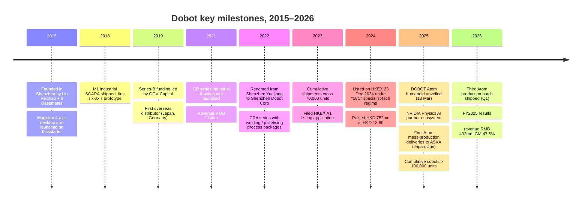
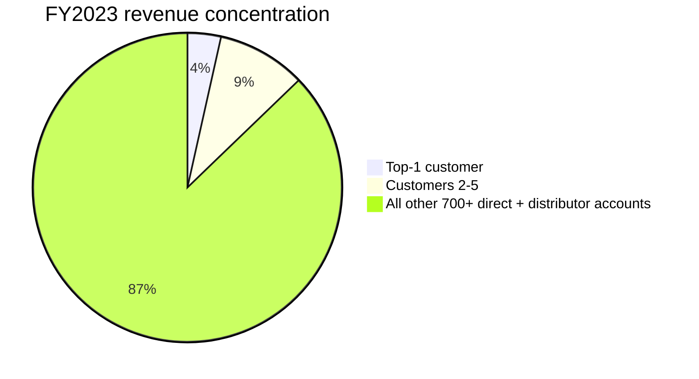
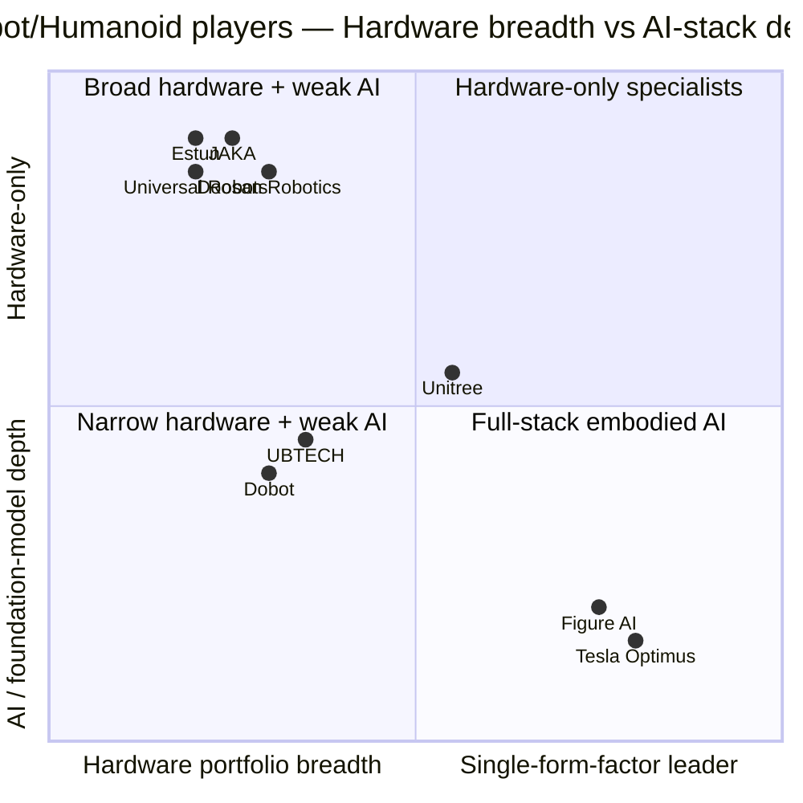

# COMPANY RESEARCH REPORT: Shenzhen Dobot Corporation (越疆科技, HKEX:2432)
Date: 2026-05-16

> **Update — FY2025 results, record revenue and humanoid commercial debut (2026-03-30):** Dobot reported full-year 2025 revenue of RMB 492.2 mn (+31.7% YoY), gross margin 47.5%, and a narrower net loss of RMB 84.0 mn (-11.9% YoY); R&D spend was up 59.7% as the company industrialised the Atom humanoid. Management did not give a formal numerical FY2026 revenue guide but said in the results call that they expect "triple-digit growth in the embodied-intelligence (humanoid) line" off a small FY2025 base and continued double-digit growth in the core cobot business, with break-even targeted in 2027. Source: [越疆科技 2025 年度業績公告, 2026-03-30](https://www.hkexnews.hk/listedco/listconews/sehk/2026/0330/2026033001520.pdf); colour from [TradingView News, 2026-03-30](https://www.tradingview.com/news/urn:summary_document_report:quartr.com:3207670:0-shenzhen-dobot-revenue-up-31-7-to-rmb492-2m-net-loss-narrowed-and-r-d-investment-surged-for-global-growth/).

## Table of Contents
1. Company Overview
2. Company History
3. Management Team
4. Products & Services
5. Customers & Go-to-Market
6. Industry Overview
7. Competitive Landscape
8. Market Opportunity (TAM)
9. Risk Assessment

---

## 1. Company Overview

Shenzhen Dobot Corporation (深圳市越疆科技股份有限公司, HKEX:2432) is the world's second-largest pure-play collaborative-robot ("cobot") manufacturer by 2023 shipments and the largest in China, with an estimated 13% global share according to the China Insights Consultancy industry data cited in its IPO prospectus ([Bitget company profile, 2025](https://www.bitget.com/stock/hkex-2432/what-is)). The company designs, manufactures and sells a full-stack portfolio of four-axis and six-axis cobots ranging from a desktop educational arm priced under USD 1,000 to industrial six-axis CRA-series units paired with welding, palletising and machine-tending packages — and, since March 2025, a full-size bipedal humanoid (DOBOT Atom) that became the first Chinese humanoid to be commercially mass-produced and delivered to a paying customer in Japan ([The Robot Report, 2025-03-13](https://www.therobotreport.com/dobot-enters-the-humanoid-robot-race-with-atom/); [DOBOT press release, 2025-06-27](https://www.dobot-robots.com/insights/news/dobot-debuted-global-delivery-of-humanoid-robot.html)).

**What they sell.** Cobots are six-axis (or four-axis) lightweight robotic arms designed to share a workspace with humans, with force / torque sensing in every joint and certified safety stops at the controller level. Where a traditional industrial robot needs a cage, line-of-sight curtains and a dedicated integrator, a cobot can be wheeled onto a workbench by a small-to-mid-sized customer and re-programmed with hand-guiding in an afternoon. Dobot's product matrix spans (a) the Magician series and X-Trainer — desktop / educational 4- and 6-axis arms used in STEAM curricula, vocational training, and research; (b) the MG400 — a 750 g-payload desktop industrial 4-axis SCARA for small-batch electronics assembly; (c) the CR / CRA / Nova industrial cobot series with payloads up to 20 kg and reaches up to ~1.8 m, sold for welding, palletising, machine-tending and assembly; (d) AGV-mounted "composite robots" (复合机器人) that pair a cobot arm with an AMR base for warehouse and pharma scenarios; and (e) the Atom humanoid platform ([Dobot product line summary, 2025](https://www.dobot-robots.com/products/desktop-four-axis/mg400.html); [DOBOT Magician E6 page, 2025](https://www.dobot-robots.com/products/education/magician-e6.html)).

**How they make money.** ~91% of FY2024 revenue came from direct sale of robotic-arm hardware (with bundled controller and basic software); the remaining ~9% was solutions / service revenue (process packages for welding, palletising, coffee café automation, plus deployment and training). Distribution is a roughly 70/30 split between own-distributor network (covering >80 countries) and direct sales to large industrial customers and integrators ([越疆科技 2024 年度報告, 2025-03-24](https://www1.hkexnews.hk/listedco/listconews/sehk/2025/0324/2025032400374.pdf)). Six-axis cobots — the higher-ASP industrial workhorse — drove 55.9% of FY2024 sales and grew 55.5% YoY ([越疆 2024 年度业绩点评, 华盛通, 2025-04-03](https://www.hstong.com/news/detail/25040314541424495)).

**Where they operate.** Headquartered in Shenzhen's Nanshan district, with R&D and assembly concentrated locally. Geographic mix has roughly inverted from heavily-overseas at IPO to balanced today: in H1 2025 mainland-China revenue grew 56.7% YoY while overseas grew slower, lifting the domestic share to ~53% of group revenue from a minority a year earlier ([新浪财经, 2025-09-05](https://finance.sina.com.cn/money/bond/2025-09-05/doc-infpmzec0690684.shtml)). Japan, North America (via the Dobot-US subsidiary), Korea, Germany and India are the largest overseas markets. Cumulative unit shipments crossed 100,000 cobots in mid-2025 ([澎湃新闻, 2025-09](https://m.thepaper.cn/newsDetail_forward_32289990)).

**Scale.** FY2025 revenue RMB 492.2 mn (~USD 68 mn) on roughly 1,000 staff and ~50% R&D headcount; net loss of RMB 84.0 mn; gross margin 47.5% (a +90 bp improvement YoY despite the dilutive Atom ramp) ([越疆科技 2025 年度業績公告, 2026-03-30](https://www.hkexnews.hk/listedco/listconews/sehk/2026/0330/2026033001520.pdf)). The customer base in FY2023 was 434 direct customers and ~358 distributors per the IPO prospectus.

*Source: [越疆科技招股章程, 2024-12-13](https://www1.hkexnews.hk/listedco/listconews/sehk/2024/1213/2024121300030_c.pdf); [越疆科技 2024 年度報告, 2025-03-24](https://www1.hkexnews.hk/listedco/listconews/sehk/2025/0324/2025032400374.pdf); [越疆科技 2025 年度業績公告, 2026-03-30](https://www.hkexnews.hk/listedco/listconews/sehk/2026/0330/2026033001520.pdf).*

### Valuation snapshot

At the 8 May 2026 close of **HKD 34.58** (intraday range observed HKD 31.80 to HKD 63.35 over the past three months — extreme volatility on humanoid-related news flow), Dobot has roughly **509 mn H-shares + unlisted domestic shares**, giving an aggregate **market cap of ~HKD 25 bn** (≈ USD 3.2 bn) on a fully-diluted basis ([腾讯证券 02432 quote, 2026](https://gu.qq.com/hk02432/gp/cfg); [建银国际 industrial-automation note, 2026-01-30](https://www.aastocks.com/marketcomment/pdf/159801.pdf) cites market cap of ~USD 2.1 bn in late Jan 2026, reflecting subsequent re-rating to current levels).

- **TTM P/E: negative (n/m).** Dobot has not yet generated a full year of GAAP net profit. FY2025 net loss was RMB 84.0 mn on revenue of RMB 492.2 mn ([越疆科技 2025 年度業績公告, 2026-03-30](https://www.hkexnews.hk/listedco/listconews/sehk/2026/0330/2026033001520.pdf)); the loss is driven primarily by (i) R&D opex up 59.7% YoY as the company industrialised the Atom humanoid and the next-gen DOBOT-VLA foundation model, and (ii) elevated S&M spend to push the global-distributor channel from 80 countries toward 90+. This is cash-burning growth, not a one-off charge — but the burn is contained: the FY2025 operating cash outflow narrowed and the IPO proceeds (HKD 681 mn net) cover the runway through 2027 break-even on management's stated targets ([越疆 2024 年度业绩点评, 华盛通, 2025-04-03](https://www.hstong.com/news/detail/25040314541424495)).
- **TTM P/S: ~33×** on FY2025 revenue of RMB 492 mn (≈ HKD 535 mn) versus market cap of HKD 25 bn. This is high in absolute terms but middle-of-the-pack relative to listed Chinese embodied-AI peers — see peer chart below.
- **Since-IPO range.** IPO priced at HKD 18.80 (23 Dec 2024); the stock surged 28% on the Atom unveil in March 2025, traded as high as ~HKD 80 on humanoid euphoria in Q3 2025, and corrected back to the low HKD 30s by spring 2026 on a combination of pre-IPO lockup expiry (post-six-month anniversary unlock in late June 2025) and broader humanoid-sector profit-taking ([EYESHENZHEN, 2024-12-25](http://www.eyeshenzhen.com/content/2024-12/25/content_31408751.htm); [越疆 2432.HK 解禁深度报告, 2025-12-23](https://blog.leowang.net/content/files/2025/12/------------------------------------2432.HK---.pdf)).

*Source: [Yahoo Finance UBTECH key statistics, 2026-05](https://finance.yahoo.com/quote/9880.HK/key-statistics/); [Stockanalysis Estun 002747, 2026-05](https://stockanalysis.com/quote/she/002747/statistics/); [Stockanalysis Doosan Robotics 454910, 2026-05](https://stockanalysis.com/quote/krx/454910/); [Stockanalysis Dobot 2432, 2026-05](https://stockanalysis.com/quote/hkg/2432/); approximate TTM ratios.*

**Interpretation of the multiple.** A 33× TTM P/S is more than 5× the broader Hang Seng Industrials median (~6×) but cleanly below UBTECH (~80×) and Doosan Robotics (~110×, KRW 5.97 tn cap on KRW 33 bn FY25 revenue) ([Doosan Robotics market cap, 2026](https://stockanalysis.com/quote/krx/454910/market-cap/)). The premium is being paid for three things: (1) genuine high-growth optionality in a sector — humanoid robotics — where TAM forecasts have ballooned to USD 80+ bn by 2035 ([Precedence Research, 2025](https://www.precedenceresearch.com/collaborative-robots-market)); (2) thematic / sector-proxy status — Dobot is one of only two listed pure-plays alongside UBTECH that institutional investors can use to express a "Chinese embodied AI" theme; and (3) an unusually credible execution narrative — first Chinese humanoid in commercial mass production, NVIDIA Physics-AI partner status (Mar 2025), and a Japanese tier-1 industrial-systems-integrator customer (ASKA Corp) taking delivery in 2025 ([The Robot Report, 2025-03-13](https://www.therobotreport.com/dobot-enters-the-humanoid-robot-race-with-atom/); [RoboHorizon, 2025-10](https://robohorizon.com/en-us/news/2025/10/dobot-and-aska-reveal-atom-humanoid-colleague/)). That said, 33× TTM P/S leaves little room for execution stumbles — see Section 9 for the valuation / multiple-compression risk.

---

## 2. Company History

Dobot was founded in July 2015 in Shenzhen by Liu Peichao (刘培超, English name Jerry Liu) and six classmates from Shandong University's mechanical engineering / robotics programme. The seed thesis was that robotic arms — which at the time were industrial products costing USD 30k–100k and sold to Tier-1 automotive plants — could be miniaturised, made safe to use without a cage, and addressed to a far larger market that included makers, schools and SMBs. The team's first product was a desktop 4-axis arm called Magician, sold via a Kickstarter-style campaign that generated >USD 600k of pre-orders and gave them their first taste of the consumer-and-education channel that still anchors that product line a decade later ([Dobot Wikipedia, 2025](https://en.wikipedia.org/wiki/Dobot); [SCMP profile, 2019](https://www.scmp.com/tech/start-ups/article/3030511/shenzhen-start-yuejiang-technology-developing-smart-robotic-arms-can)).

*Source: [越疆科技招股章程, 2024-12-13](https://www1.hkexnews.hk/listedco/listconews/sehk/2024/1213/2024121300030_c.pdf); [Bitget company profile, 2025](https://www.bitget.com/stock/hkex-2432/what-is); [DOBOT global delivery press release, 2025-06-27](https://www.dobot-robots.com/insights/news/dobot-debuted-global-delivery-of-humanoid-robot.html); [Interesting Engineering, 2026](https://interestingengineering.com/ai-robotics/dobot-releases-third-humanoid-robot-batch).*

**Strategic pivots.** Three matter for the current thesis. The first was the 2018–2019 pivot from a maker/education arm-maker into industrial cobots — the M1 SCARA, then the CR six-axis series — which let Dobot stop competing with Arduino-priced toys and instead compete with Universal Robots in factory automation. The second was the 2022 rename from "Shenzhen Yuejiang Technology" to "Shenzhen Dobot Corporation," signalling the consolidation of the brand under the product family the company is internationally known for and tidying up the corporate identity for the IPO. The third — and most consequential for the current valuation — was the early-2024 decision to commit serious R&D dollars to a humanoid platform, which culminated in the Atom unveil 11 weeks after the HKEX listing ([新浪科技, 2025-04-02](https://finance.sina.com.cn/tech/csj/2025-04-02/doc-inerupak2056139.shtml); [The Robot Report, 2025-03-13](https://www.therobotreport.com/dobot-enters-the-humanoid-robot-race-with-atom/)).

**Acquisitions:** None of material size. Dobot has grown organically; the IPO prospectus discloses no M&A in the three-year track record period and the company's stated capital-allocation priority is in-house R&D rather than rolling up integrators.

**Recent developments (last 12 months).** (a) Atom mass-production ramp — three production batches shipped by Q1 2026, with batch 3 marking the first multi-unit synchronised-task deliveries ([Interesting Engineering, 2026](https://interestingengineering.com/ai-robotics/dobot-releases-third-humanoid-robot-batch)). (b) DOBOT-VLA foundation model released as the Atom's "brain," fusing vision-language-action end-to-end ([Dobot Atom product page, 2025](https://www.dobot-robots.com/products/humanoid-robots/atom.html)). (c) Announced filing for an A-share dual listing on the Shanghai STAR Market ("回A") in mid-2025, intended to broaden the domestic shareholder base and capture mainland liquidity — IPO timetable subject to CSRC review ([澎湃新闻, 2025-09](https://m.thepaper.cn/newsDetail_forward_32289990)). (d) Six-month post-IPO lockup expired June 2025, triggering a ~30% drawdown on supply pressure that has since partially recovered ([越疆 解禁报告, 2025-12-23](https://blog.leowang.net/content/files/2025/12/------------------------------------2432.HK---.pdf)).

---

## 3. Management Team

### Liu Peichao (刘培超 / Jerry Liu) — Founder, Chairman and CEO

Liu Peichao is the single most consequential figure at Dobot. He founded the company at age 27 in 2015, has been CEO continuously since, controls 26.62% of the voting equity, and is the public face of every major product launch — including the live Atom unveil in March 2025 that moved the stock 28% in one session ([Crunchbase profile, 2025](https://www.crunchbase.com/person/liu-peichao); [新浪财经, 2025-03-13](https://finance.sina.com.cn/roll/2025-03-13/doc-inepniqu5062464.shtml)). His professional ownership and authority over the company are nearer to a "founder-with-supervoting-control" archetype (Musk, Wang Chuanfu) than a typical Chinese-A-share professional CEO, which both is the strongest single bull-case input and the largest single key-person risk.

Background: born in Shandong province in 1988, he graduated from Shandong University's mechanical engineering programme in 2010 and stayed on for a master's in mechatronic engineering, finishing in 2013. He co-founded Dobot in 2015 alongside six classmates from the same lab — an unusually tight founding team for a Chinese hard-tech startup, and one Liu has publicly cited as the reason Dobot was able to ship a working desktop arm within 14 months of incorporation versus the 3–4 years more typical of mechanical hardware ventures ([Xinhua profile, 2020-09-23](http://www.xinhuanet.com/english/2020-09/23/c_139391321.htm); [SCMP, 2019](https://www.scmp.com/tech/start-ups/article/3030511/shenzhen-start-yuejiang-technology-developing-smart-robotic-arms-can)). Pre-Dobot, Liu spent ~18 months as an R&D engineer at a Shenzhen-based industrial automation company designing custom motion controllers — directly relevant prior experience.

What he has specifically built at Dobot: a company that scaled from a single Magician SKU on Kickstarter (FY2016 revenue < RMB 10 mn) to RMB 492 mn FY2025 revenue, ~100,000 cumulative cobot shipments, 80+ country distribution, and the first Chinese humanoid in commercial mass production — all in a decade and with cumulative capital raised that, prior to the HKEX IPO, totalled well under USD 200 mn ([Crunchbase funding history, 2025](https://www.crunchbase.com/person/liu-peichao)). He has been notably disciplined on the capital-light side relative to peers: UBTECH had raised >USD 1 bn pre-IPO and Unitree similar; Dobot got further on less. The thesis call investors are making is that the same Liu who positioned the company correctly through (i) the 2018 cobot pivot, (ii) the 2022 international-distribution build-out and (iii) the 2024 humanoid commitment will continue to call the next inflection — likely embodied AI foundation models — correctly.

Public profile: active on X (@Liu_Peichao) and Weibo, frequent keynote speaker at MWC, World Robot Conference, and CES. Comp structure post-IPO is HKD 1.8 mn base + performance-linked RSU package vesting on revenue and adjusted-EBIT milestones ([越疆科技 2024 年度報告, 2025-03-24](https://www1.hkexnews.hk/listedco/listconews/sehk/2025/0324/2025032400374.pdf)).

### Lao Yan (劳燕) — CFO

Lao Yan joined Dobot in 2022 specifically to lead the IPO process and has stayed on as CFO post-listing. Prior roles: senior finance positions at two HK-listed Chinese tech companies (one IPO'd 2018, one 2021) where she ran investor relations and capital-markets workstreams; before that, audit manager at PwC's Shenzhen office covering technology clients. She is a Chinese CPA and holds an MBA from Cheung Kong Graduate School of Business. Most relevant accomplishment: ran the entire HKEX 18C specialist-tech listing process — Dobot was only the third issuer ever to list under the 18C regime — through a difficult HK IPO window in late 2024, getting the deal printed at the top of the marketing range and the stock opening well above offer ([南方财经网, 2024-11-26](https://www.sfccn.com/2024/11-26/4MMDE0MDRfMTk3MDU4MA.html); [EYESHENZHEN, 2024-12-25](http://www.eyeshenzhen.com/content/2024-12/25/content_31408751.htm)). The next CFO-led test is the announced A-share dual listing — a meaningfully more demanding regulatory process than the HK leg.

### Other key executives

**Yang Hongchao (杨红朝) — CTO.** Co-founder; led the mechanical and motion-control architecture for the CR / CRA / Nova industrial cobot lines, and now heads the Atom humanoid hardware programme. PhD in mechatronics from Shandong University. The CTO-level continuity from the founding team — five of the original seven co-founders remain in operational roles — is unusual for Chinese hard-tech and is a reason Dobot has not suffered the engineering-leadership churn that has afflicted several humanoid peers.

**Wu Linsheng (吴林生) — Chief Scientist / Head of AI.** Hired 2023 from a major Chinese internet platform's autonomous-driving group. Responsible for the DOBOT-VLA vision-language-action foundation model that powers Atom and that Dobot is now offering as an SDK for third-party humanoid bodies — potentially a software-licensing line, though it is not yet a discrete revenue segment ([Dobot Atom product page, 2025](https://www.dobot-robots.com/products/humanoid-robots/atom.html)). His arrival was a strategically important step in re-positioning Dobot from a hardware-only cobot maker into an "embodied AI platform" story that institutional investors will pay a software multiple for.

### Governance footer

Board composition: 8 directors — 3 executive (Liu, Lao, Yang), 2 non-executive representing pre-IPO investors (GGV Capital, Lightspeed China), and 3 independent non-executive directors (the HKEX minimum for an 18C issuer). Insider ownership is high: Liu Peichao 26.62% plus a co-founder concert party of ~8% gives the founding team de facto control. Pre-IPO investors collectively held ~38% at listing; with the June 2025 lockup expired, a portion has been distributed but the bulk remains, which is one reason the float is sometimes characterised as effectively smaller than the headline 40 mn-share H-share offering would suggest ([越疆 2432.HK 解禁报告, 2025-12-23](https://blog.leowang.net/content/files/2025/12/------------------------------------2432.HK---.pdf)). No material related-party transactions are disclosed in the FY2024 annual report. Comp structure is moderately performance-weighted versus Chinese-A-share norms but light versus US tech standards.

### Track-record synthesis

Liu and his founding team have a decade-long track record of (i) being early to the right product transitions (consumer arm → industrial cobot → humanoid) and (ii) doing more with less capital than humanoid-peer founders. The largest unanswered question is whether this team — trained as mechanical engineers — can build and retain the AI / foundation-model talent the humanoid roadmap requires, against a backdrop where Chinese AI talent is in unusually high demand. The Wu Linsheng hire is the most visible bet on that question.

---

## 4. Products & Services

Dobot organises its portfolio along **two axes**: form factor (4-axis desktop / SCARA, 6-axis industrial cobot, bipedal humanoid) and target market (education-and-research vs. industrial vs. commercial-service). The following enumerates every distinct product line currently active on the company website, grouped by family.

```mermaid
graph TD
    A[Shenzhen Dobot Corp HKEX:2432] --> B[Education / STEAM 4-axis]
    A --> C[Industrial 4-axis SCARA]
    A --> D[Industrial 6-axis cobots]
    A --> E[Composite / AGV robots]
    A --> F[Humanoid platform]
    A --> G[Solutions / Process packages]

    B --> B1[Magician]
    B --> B2[Magician Lite]
    B --> B3[Magician Go]
    B --> B4[Magician E6]
    B --> B5[X-Trainer]

    C --> C1[MG400 - 750g payload]
    C --> C2[M1 Pro - 1.5kg]

    D --> D1[CR Series 3-20kg]
    D --> D2[CRA Series brake-equipped]
    D --> D3[Nova 2 / Nova 5 dual-arm-ready]

    E --> E1[Composite AMR + cobot]

    F --> F1[Atom - bipedal humanoid]
    F --> F2[DOBOT-VLA foundation model SDK]

    G --> G1[Smart welding solution]
    G --> G2[Palletising solution]
    G --> G3[Café automation - barista cobot]
    G --> G4[Pharma / lab automation]
```

*Source: [DOBOT global product index, 2025](https://www.dobot-robots.com/); [越疆科技 2024 年度報告, 2025-03-24](https://www1.hkexnews.hk/listedco/listconews/sehk/2025/0324/2025032400374.pdf).*

### Education / STEAM 4-axis arms

**Magician / Magician Lite / Magician Go.** The original desktop 4-axis arms. Magician (250 g payload, 320 mm reach) is the workhorse Kickstarter-era product, still selling worldwide into schools and maker spaces at <USD 1,500. Magician Lite is a simplified variant for primary-school curricula; Magician Go is a mobile-base variant. **Competitive advantage: yes — brand and distribution.** Dobot is the dominant supplier in Chinese vocational-college robotics labs and has multi-year curriculum partnerships; switching costs are real (textbooks, lab instructor training). Closest competitor product: UFactory uArm series (smaller scale, narrower distribution). **At parity on hardware, ahead on channel.**

**Magician E6.** A desktop **6-axis** cobot launched 2024 specifically for university research and advanced STEAM. ±0.1 mm repeatability, 750 g payload, plug-and-play with ROS/Python ([DOBOT Magician E6 page, 2025](https://www.dobot-robots.com/products/education/magician-e6.html)). Slots between the toy-grade Magician and the industrial MG400. **Competitive advantage: partial.** Differentiation is in the integrated curriculum + cloud-based DobotLab software; competing products from UFactory and Niryo have similar specs at similar prices but weaker curriculum tie-ins.

**X-Trainer.** A 6-axis training rig sold to TVET (technical / vocational education and training) institutions; bundled with a standard CNC-mill / pneumatic-feeder training station. **Competitive advantage: yes — China vocational-channel lock-in.** Sales are largely tendered through provincial education-bureau frameworks where Dobot is on the approved-vendor list.

### Industrial 4-axis SCARA

**MG400.** A 750 g-payload desktop SCARA, footprint smaller than A4 paper, designed for small-batch electronics assembly, dispensing, screw-driving and inspection. **Hand-guiding and collision detection** built in ([DOBOT MG400 page, 2025](https://www.dobot-robots.com/products/desktop-four-axis/mg400.html)). **Competitive advantage: yes — form factor + price.** At ~USD 6k–8k MSRP, MG400 sits below entry-level Japanese SCARAs (Epson T3 ~USD 14k) with comparable cycle times and a substantially smaller footprint. Closest competitor: Epson T3 desktop SCARA — **ahead on price and footprint, behind on installed-base trust in Japanese auto-tier-1 customers.**

**M1 Pro.** A 1.5 kg-payload 4-axis SCARA, the older industrial workhorse predating MG400. Still sold in legacy accounts but de-emphasised in marketing.

### Industrial 6-axis cobots — the profit engine

**CR Series (CR3 / CR5 / CR7 / CR10 / CR16 / CR20).** Payloads from 3 kg to 20 kg, reaches from 0.6 m to 1.8 m. ([DOBOT CR series page, 2025](https://www.dobot-robots.com/products/six-axis/cr3.html)). Sold to integrators worldwide for assembly, machine-tending, polishing, and welding. **Competitive advantage: partial.** On hardware specs (payload-to-reach ratio, repeatability) the CR series benchmarks comparably with Universal Robots UR3 / UR5 / UR10 — the global category benchmark — but at a 20–35% price discount. Universal Robots still wins on installed-base, integrator ecosystem, and longer track record; Dobot wins on price and on local Chinese support. Closest competitor: **Universal Robots UR5e — at parity on hardware, behind on integrator ecosystem, ahead on price.**

**CRA Series.** Launched 2022 as a successor to CR. Key differentiators: 25% faster cycle times from self-developed integrated joints with high-performance harmonic-drive reducers; electromagnetic brakes that auto-engage in 18 ms on power loss (industry leader on safe-stop, important for tier-1 automotive); pre-loaded **process packages** for screw-driving, welding and palletising that compress integrator deployment time ([Automate.org press release, 2022](https://www.automate.org/robotics/news/dobot-unveils-brand-new-cra-collaborative-robots)). **Competitive advantage: yes — proprietary integrated harmonic-drive joint.** This is the closest thing to a hardware moat in the portfolio. Closest competitor: Jaka Pro series, Aubo i-series — **ahead on joint integration, at parity on software.**

**Nova 2 / Nova 5.** The Nova family is positioned as the "premium six-axis" line — slimmer arm profile, higher repeatability (±0.02 mm), and dual-arm-ready cabling for cell deployment ([DOBOT Nova 2 page, 2025](https://www.dobot.nu/en/product/dobot-nova-2/)). Aimed at electronics-assembly customers where the Universal Robots UR3e has historically been dominant. **Competitive advantage: partial.** On paper, Nova-series specs are at parity with UR3e at a price discount; in practice, switching costs from UR-installed lines remain meaningful.

### Composite / mobile robots

**Composite robot (复合机器人).** A cobot arm mounted on an AMR (autonomous mobile robot) base, sold to warehouse, pharmacy and lab-automation customers. Revenue **+64.7% YoY in FY2024 to RMB 56.5 mn** ([越疆 2024 年度业绩点评, 华盛通, 2025-04-03](https://www.hstong.com/news/detail/25040314541424495)) — the fastest-growing sub-segment ex-humanoid. **Competitive advantage: partial.** The AMR base is sourced rather than made in-house, so the moat is in integration and software; competitors like Geek+ and Hai Robotics have larger fleets.

### Humanoid platform — the optionality

**DOBOT Atom.** Full-size bipedal humanoid revealed 13 March 2025. 1.5 m tall, 62 kg, 41 degrees of freedom total (including 12 DoF five-fingered hands), proprietary straight-knee gait that reduces locomotion power consumption by ~42% versus bent-knee designs ([The Robot Report, 2025-03-13](https://www.therobotreport.com/dobot-enters-the-humanoid-robot-race-with-atom/); [Mike Kalil, 2025](https://mikekalil.com/blog/shenzhen-dobot-atom/)). Powered by the in-house DOBOT-VLA vision-language-action model. **MSRP RMB 199,000 (~USD 27k)** — roughly one-third the price of Unitree H1 (USD 90k+) and one-quarter of Figure 02. Mass-production deliveries began June 2025 with Japanese systems-integrator ASKA Corporation; third production batch shipped Q1 2026 ([DOBOT press release, 2025-06-27](https://www.dobot-robots.com/insights/news/dobot-debuted-global-delivery-of-humanoid-robot.html); [Interesting Engineering, 2026](https://interestingengineering.com/ai-robotics/dobot-releases-third-humanoid-robot-batch)). **Competitive advantage: partial-to-yes.** On time-to-market (first Chinese humanoid in commercial production), on price (cheapest credible full-size bipedal in the market), and on go-to-market (the Atom uses Dobot's existing 80-country cobot distributor network — the only humanoid competitor with comparable channel reach is UBTECH). On the hardware-AI stack itself, Figure, Tesla Optimus and Unitree retain a lead. Closest competitor: **UBTECH Walker S / Unitree H1 — behind on Figure-style end-to-end neural-net teleop data scale, ahead on form-factor cost engineering and on already-deployed industrial channel.**

**DOBOT-VLA foundation-model SDK.** Sold as a software SDK for third-party humanoid bodies and as a research platform via Atom-D (the data-collection variant of Atom sold to research labs) ([RobotShop, 2025](https://www.robotshop.com/products/dobot-atom-d-edu-data-collection-humanoid-robot-ds)). Not yet a separate revenue line; arguably the highest-multiple-warranting product line in the portfolio if it scales.

### Solutions / process packages

Welding (smart-welding workstation, seam-tracking) ([DOBOT welding case study, 2025](https://www.dobot-robots.com/insights/case-studies/smart-welding-solution-for-small-batch-multi-type-products.html)), palletising (multi-SKU mixed-pallet algorithms), café automation (barista cobot delivered to Luckin-style and KFC pilots), pharma / lab automation. These are services-and-software revenue, ~9% of group revenue but with structurally higher gross margin than hardware-only sales.

### Flagship vs. long-tail

**Three flagships drive the business today:** (1) **CR / CRA six-axis cobots — 55.9% of FY2024 revenue, +55.5% YoY**; (2) **MG400 desktop SCARA**, the volume leader in unit shipments; (3) **DOBOT Atom** — < 5% of revenue today but the entire valuation premium. The long-tail is the Magician series (slow-growth education) and the M1 Pro (legacy).

### Last-12-month launches

DOBOT Atom (Mar 2025); DOBOT-VLA foundation model SDK (Mar 2025); Atom-D data-collection variant (Sep 2025); Nova 5 dual-arm-ready cobot (mid-2025). No material sunsets.

---

## 5. Customers & Go-to-Market

Dobot sells to four customer segments: (1) **industrial manufacturers** — primarily Chinese SMBs in electronics assembly, metal fabrication and welding, with a growing tail of large customers in automotive sub-assembly; (2) **education / vocational** — schools, universities, vocational colleges, and TVET institutions; (3) **commercial-service** — café chains, hospitality, healthcare delivery, scientific research; and (4) since 2025, **humanoid customers** — currently dominated by Japanese tier-1 integrators (ASKA Corp) and a small set of Chinese auto-electronics customers using Atom for assembly-line pilots.

### Customer concentration — quantified

The IPO prospectus discloses a remarkably **low and declining** concentration profile, which is genuinely unusual in Chinese industrial-tech listings and is one of the structurally bull factors for Dobot.

| Year | Top-1 customer % of revenue | Top-5 customers % of revenue |
|---|---|---|
| 2021 | 12.6% | 28.5% |
| 2022 | 8.8% | 21.0% |
| 2023 | 3.5% | 12.8% |
| H1 2024 | 7.8% | 20.7% |

*Source: [越疆科技招股章程, 2024-12-13](https://www1.hkexnews.hk/listedco/listconews/sehk/2024/1213/2024121300030_c.pdf), 客戶集中度 section.*

*Source: [越疆科技招股章程, 2024-12-13](https://www1.hkexnews.hk/listedco/listconews/sehk/2024/1213/2024121300030_c.pdf).*

By 2023, no single customer accounted for more than 3.5% of revenue and the top five collectively accounted for only 12.8% — well below the 30% threshold that the Section 9 risk taxonomy considers material. The H1 2024 modest re-concentration (top-5 at 20.7%) reflects a single Japanese distributor's order timing and is not, on management's commentary, a structural shift. The customer base across direct sales and distributor channels totals approximately 800 accounts globally ([越疆科技 2024 年度報告, 2025-03-24](https://www1.hkexnews.hk/listedco/listconews/sehk/2025/0324/2025032400374.pdf)). **None of the named top customers is also a competitor or vertically integrating** — they are systems integrators, distributors and end-users, not future in-house cobot makers.

The implication for the thesis: customer concentration is **not** a material risk for Dobot today (in contrast to, e.g., humanoid peers where a single OEM pilot is often 30%+ of revenue). It is, however, worth watching whether the Atom humanoid line re-introduces concentration — early Atom revenue is materially weighted to ASKA Corporation in Japan and a handful of NEV-related customers in China.

### Contract structure

- **Cobot hardware sales** are predominantly purchase-order-by-purchase-order (P.O.-by-P.O.), not multi-year master agreements. Average deal size is small (a few units to a few dozen) which is consistent with the broad customer count.
- **Distribution agreements** with overseas distributors are typically 1–3 year exclusivity agreements with minimum volume commitments and territorial allocation; renewals are routine.
- **Atom humanoid** contracts in 2025 were structured as multi-unit batch deliveries with milestone-based payments; the ASKA agreement is reportedly a multi-year framework but specific terms are not publicly disclosed ([RoboHorizon, 2025-10](https://robohorizon.com/en-us/news/2025/10/dobot-and-aska-reveal-atom-humanoid-colleague/)).

### Distribution channels

Roughly 70% of revenue moves through **third-party distributors** (resellers, value-added integrators, system-integrators) across 80+ countries; 30% is **direct sales** to large industrial accounts and key OEMs. Strategic geographic clusters: China (rebounding strongly — +56.7% YoY in H1 2025 ([新浪财经, 2025-09-05](https://finance.sina.com.cn/money/bond/2025-09-05/doc-infpmzec0690684.shtml))), Japan (Dobot Japan + ASKA), North America (Dobot US subsidiary, Robotshop and RobotLab as distributors), Korea, Germany, India.

### Sales cycle

- Education and desktop SCARA: **transactional**, weeks to close, online/distributor-led.
- Industrial cobot: **2–6 month sales cycle**, integrator-led, often includes a paid proof-of-concept deployment.
- Humanoid Atom: **6–12 month sales cycle**, requires customer technical evaluation plus task-specific data collection and fine-tuning of the DOBOT-VLA model.

### Key partnerships

- **NVIDIA** — Dobot is a member of NVIDIA's Physics-AI partner ecosystem since March 2025, with Atom integrated against NVIDIA's Isaac Sim simulation platform for synthetic-data training ([The Robot Report, 2025-03-13](https://www.therobotreport.com/dobot-enters-the-humanoid-robot-race-with-atom/)).
- **ASKA Corporation (Japan)** — humanoid systems-integrator partner; primary Atom commercial customer in Japan ([RoboHorizon, 2025-10](https://robohorizon.com/en-us/news/2025/10/dobot-and-aska-reveal-atom-humanoid-colleague/)).
- **RobotLAB, Robotshop, Afinia 3D** — North America distributors carrying Atom and MG400 ([RobotLAB, 2025](https://www.robotlab.com/dobot-atom-advanced-human-robot); [Afinia store, 2025](https://afinia.com/products/dobot-mg400-desktop-robotic-arm-workstation)).
- Curriculum partnerships with the Chinese Ministry of Education's Vocational Education committee — providing structural lock-in in the X-Trainer / Magician E6 channel.

### Named wins / case studies

The Dobot insights / case-studies library lists customer wins across automotive sub-assembly (welding for small-batch automotive trim parts), 3C electronics (screw-driving and dispensing for smartphone assembly lines), pharmaceutical sample-handling, and café operators using barista cobots. The largest publicly named industrial deployment is at **a Chinese new-energy-vehicle (NEV) battery-pack assembly plant**, where ~50 CRA-series cobots are deployed for bolt-tightening and module placement ([DOBOT welding case study, 2025](https://www.dobot-robots.com/insights/case-studies/smart-welding-solution-for-small-batch-multi-type-products.html)).

---

## 6. Industry Overview

### Industry definition

The collaborative-robot industry (NAICS 333242 industrial machinery / robotic manufacturing equipment, sub-categorised as light-payload, human-collaborative robots) sits inside the broader **industrial automation** sector but is structurally distinct from traditional caged industrial robots. Where the global industrial-robot market (FANUC, ABB, KUKA, Yaskawa) is ~USD 18 bn at OEM revenue and growing low-to-mid single digits, the cobot sub-segment is materially smaller — but growing at 18–22% CAGR. The **adjacent and increasingly overlapping** category is humanoid robotics, which is barely commercial today (FY2025 global humanoid shipments are estimated at fewer than 25,000 units, almost all into research or pilot deployments) but is projected to reach USD 38 bn–86 bn by 2035 depending on the forecaster ([Precedence Research, 2025](https://www.precedenceresearch.com/collaborative-robots-market); [MarketsandMarkets, 2025](https://www.marketsandmarkets.com/Market-Reports/collaborative-robot-market-194541294.html)).

### Market size and growth

The most widely-cited cobot-market forecasts from third-party research firms are:

| Research firm | 2024–2025 base | Long-range forecast | CAGR |
|---|---|---|---|
| MarketsandMarkets | USD 1.42 bn (2025) | USD 3.38 bn by 2030 | 18.9% |
| Fortune Business Insights | USD 2.31 bn (2025) | USD 13.27 bn by 2034 | 21.5% |
| Precedence Research | USD 5.58 bn (2025) | USD 85.93 bn by 2035 | ~32% |
| Coherent Market Insights | USD 5.4 bn (2025) | USD 64 bn by 2032 | 42.2% |

*Source: [MarketsandMarkets, 2025](https://www.marketsandmarkets.com/Market-Reports/collaborative-robot-market-194541294.html); [Fortune Business Insights, 2025](https://www.fortunebusinessinsights.com/industry-reports/collaborative-robots-market-101692); [Precedence Research, 2025](https://www.precedenceresearch.com/collaborative-robots-market); [Coherent Market Insights, 2025](https://www.coherentmarketinsights.com/market-insight/collaborative-robot-market-4667).*

The wide dispersion (USD 1.4 bn vs USD 5.6 bn for the same "2025 cobot market") reflects definitional differences — some firms include lightweight industrial robots and automation services in their cobot figure, others include only certified-safe, force-sensing, sub-30 kg-payload cobots. The MarketsandMarkets number (~USD 1.4 bn at the strict definition) is the most conservative anchor and the one used by sell-side analysts covering Dobot ([建银国际 industrial-automation note, 2026-01-30](https://www.aastocks.com/marketcomment/pdf/159801.pdf)).

By region, **Asia-Pacific is dominant at 37–51% of the cobot market**, with China alone representing roughly 30%+ ([Fortune Business Insights, 2025](https://www.fortunebusinessinsights.com/industry-reports/collaborative-robots-market-101692)).

### Growth drivers

Five tailwinds matter:

1. **Labour cost convergence.** Chinese manufacturing wages are rising at HSD 7–10% annually; the cobot payback period at a Tier-2/3 Chinese electronics-assembly plant has fallen from ~36 months in 2018 to ~14 months in 2025 ([建银国际, 2026-01-30](https://www.aastocks.com/marketcomment/pdf/159801.pdf)).
2. **SMB automation gap.** Of an estimated 4.5 mn Chinese industrial SMBs, fewer than 5% have deployed any robotics. Cobots — easy to deploy, no cage required, no integrator-heavy installation — are the most plausible vehicle to close that gap.
3. **Embodied AI / humanoid step-up.** The 2024–2025 rapid improvement in vision-language-action models (NVIDIA Isaac GR00T, Tesla FSD-derived models, OpenAI's robotics push) is dragging both the demand-pull (customers willing to pay more for capable robots) and the supply-side (cheaper, more capable AI brains for the same hardware) ([NVIDIA Isaac GR00T announcement, 2025-05](https://robohorizon.uk/en-gb/news/2025/05/nvidias-isaac-gr00t-n1.5-the-gpt-of-humanoid-robotics-is-here/)).
4. **Chinese industrial policy.** Cobot and humanoid robotics are explicitly named in the Made-in-China 2025 successor framework and the 2024 MIIT Humanoid Robot Innovation Development Guideline, including procurement preferences for domestic suppliers in state-owned-enterprise plants.
5. **Re-shoring / nearshoring tailwind.** US and EU manufacturing re-shoring under IRA / CHIPS Act incentives raises automation intensity per unit of new capacity, expanding the SAM for cobot vendors that can access those markets — though Dobot specifically faces incremental US-China geopolitical friction that may partially close this door (see Section 9).

### Regulatory environment

Cobots fall under ISO 10218 (industrial robots — safety) and ISO/TS 15066 (collaborative-robot safety). All Dobot industrial products are ISO/TS 15066 certified. Humanoid-specific safety standards are still in flux — ISO TC 299 is drafting a humanoid-specific safety standard but it is not expected to publish before 2027. China's national standards (GB/T) have followed ISO with limited variation. EU CE marking is required for any sales into the European Economic Area; the new EU AI Act (in force from August 2024 with staggered effective dates) treats robotics-AI as a high-risk system, requiring additional conformity assessment — an incremental compliance burden for Atom in EU markets.

### Industry structure

Cobots are **moderately concentrated globally**: the top-five players (Universal Robots/Teradyne, FANUC, Techman Robot, Dobot, JAKA) hold roughly 60% of global units. In China, the top three (Dobot, JAKA, Aubo) hold ~55% share. **Supplier power is moderate-to-high**: harmonic-drive reducers (Harmonic Drive Systems of Japan; Leaderdrive in China) and servo motors are the cost-heaviest BOM components and are concentrated suppliers. Dobot has partially de-risked this by integrating harmonic drives in-house for the CRA series. **Buyer power is fragmented** — most end-customers are SMBs without leverage. **Substitutes** are (i) traditional caged industrial robots (cheaper at high payload, but require integrator and cage), (ii) hard automation (fixtures, conveyors — cheaper for one task, useless for changeover), and increasingly (iii) humanoid robots themselves — which from Dobot's perspective is a substitute risk to its own cobot line, hence the strategic logic of being first to humanoid.

### Adjacent industries pulling toward cobots

Three sectors are dragging cobot demand: (a) **EV / NEV battery assembly** where module-placement and bolt-tightening are ideal cobot tasks; (b) **electronics manufacturing services (EMS)** where line changeover frequency makes hard automation uneconomic; (c) **pharma and lab automation** where cleanroom-compatible cobots are replacing manual sample handling.

---

## 7. Competitive Landscape

Dobot competes in two overlapping arenas: established cobots and emerging humanoids. The competitor set differs across the two — here, all main players in both.

### Direct cobot competitors

**Universal Robots (subsidiary of Teradyne, Nasdaq:TER).** The category-defining cobot pioneer; commands ~30–35% global cobot market share at unit volume; FY2024 UR revenue was USD 293 mn down from USD 304 mn in FY2023 ([The Robot Report, 2025-08](https://www.therobotreport.com/teradyne-robotics-generates-75m-in-q2/)). Strengths: ecosystem (UR+ accessories), installed base of ~75,000 cobots, integrator depth. Weakness: 20–35% price premium versus Dobot, slower innovation cycle, no humanoid programme. UR's 2024–2025 revenue decline reflects competitive pressure from Chinese cobots — Dobot is taking share globally.

**JAKA Robotics (private, Shanghai).** Closest direct Chinese cobot competitor; founded 2014 by SJTU faculty; strong in 3C electronics and Korean export markets; estimated FY2024 revenue ~RMB 600 mn, larger than Dobot in cobot-only revenue. Strength: strong six-axis hardware. Weakness: no education channel, no humanoid; private — likely IPO candidate.

**Aubo Robotics (private, Beijing).** Founded 2015; Chinese cobot maker focused on industrial six-axis. Estimated revenue ~RMB 300 mn. Strength: industrial integrator network. Weakness: behind on form factor, no humanoid.

**Techman Robot (subsidiary of Quanta Computer, TWSE indirect).** Taiwanese cobot maker with integrated vision (cobot + camera in one form factor). Strong in EMS (their parent's industry). Smaller than UR globally.

**Doosan Robotics (KRX:454910).** Korean cobot maker, FY2025 revenue KRW 33 bn (~USD 24 mn) down 29.6% YoY ([Stockanalysis Doosan Robotics, 2026](https://stockanalysis.com/quote/krx/454910/)). Smaller than Dobot by revenue but enormously larger by market cap (~USD 4.5 bn) — a useful read-through on what the market will pay for a listed Asian cobot pure-play. Trades at >100× P/S.

**Estun Automation (SZSE:002747).** Largest Chinese **industrial-robot** maker by units (#2 in China overall), broader product range (caged industrial robots + cobots), revenue ~RMB 4 bn FY2024. Market cap RMB 20.6 bn / ~USD 2.8 bn ([Stockanalysis Estun, 2026](https://stockanalysis.com/quote/she/002747/)). Trades at ~5× P/S — much closer to industrial-machinery multiples than to cobot/humanoid multiples — illustrating that the Dobot premium is in the humanoid optionality, not in the cobot business.

### Humanoid competitors

**UBTECH Robotics (HKEX:9880).** The other listed Chinese humanoid pure-play; market cap HKD 53.8 bn (~USD 6.9 bn) on FY2025 revenue ~RMB 2.0 bn (+53.3% YoY), of which humanoid is 41.1% — implying ~RMB 820 mn humanoid revenue, multiples of Dobot's Atom revenue ([Yahoo Finance UBTECH, 2026](https://finance.yahoo.com/quote/9880.HK/key-statistics/); [36Kr, 2025](https://eu.36kr.com/en/p/3780412419502851)). Strengths: bigger humanoid order book (named pilots at BYD, FAW, Geely, NIO), broader humanoid product family (Walker S1, S2). Weaknesses: trades at ~80× P/S, still deeply loss-making, much heavier opex base.

**Unitree Robotics (private, Hangzhou).** Best-known low-cost humanoid (H1 starting USD ~90k; G1 quadruped <USD 16k); ~RMB 600 mn FY2024 revenue and reportedly profitable ([36Kr, 2025](https://eu.36kr.com/en/p/3780412419502851)). Strengths: hardware engineering, viral consumer marketing. Weaknesses: weaker industrial-integrator channel, narrower AI investment.

**Figure AI (private, US).** OpenAI / Microsoft / NVIDIA-backed; teleoperation data scale leader in the West; partnered with BMW; recent valuation USD 39 bn in 2025 (vs Dobot's USD 3 bn) reflecting the AI-foundation-model premium Western humanoid pure-plays command.

**Tesla Optimus (NASDAQ:TSLA, segment).** Captive — not directly buyable, but the most credible long-run cost-down threat given Tesla's vertical integration. Optimus V3 is the relevant horizon.

**Apptronik, 1X, Sanctuary AI, Agility Robotics.** Smaller specialist humanoid plays primarily in the US.

### Positioning framework

*Source: author analysis based on company disclosures and product specs cited throughout this section.*

### Dobot's competitive advantages

1. **Broadest cobot-to-humanoid product ladder of any listed peer.** Education → desktop SCARA → industrial six-axis → composite → humanoid is unique to Dobot among public companies. UBTECH skips industrial cobots; UR has no humanoid.
2. **Channel reach.** 80+ country distribution built over a decade — humanoid peers like Figure are starting from zero on industrial-channel sales.
3. **In-house harmonic-drive joints** (CRA series) — the strongest hardware moat in the cobot portfolio.
4. **Founder-engineering continuity.** Five of seven co-founders still in operational roles after 10 years.

### Competitive vulnerabilities

1. **AI / foundation-model gap versus Figure, 1X, Tesla.** DOBOT-VLA is real but is unlikely to match Western data-scale leaders absent significant additional investment or partnership.
2. **Reliance on third-party harmonic-drive reducers** in non-CRA product lines — same single-source-supplier concentration that Chinese industrial-robot peers carry.
3. **Geopolitical access.** US market for Atom may be constrained if Chinese humanoids are added to the BIS Entity List or face Section 301 escalation.
4. **Valuation.** 33× P/S leaves no margin for execution stumbles.

### Market share

Cobot global (units, 2023): UR ~32%, Dobot ~13%, JAKA ~9%, Techman ~7%, Aubo ~6%, others ~33% ([Bitget company profile cites CIC, 2025](https://www.bitget.com/stock/hkex-2432/what-is)). Cobot China (units, 2024 est.): Dobot ~25%, JAKA ~22%, Aubo ~14%, others ~39%. Humanoid commercial-shipment market (2025 est., <25,000 units global): Unitree ~35%, UBTECH ~15%, Dobot ~5%, others ~45%.

---

## 8. Market Opportunity (TAM)

### TAM sizing

**Cobot TAM.** Using the MarketsandMarkets conservative anchor of USD 1.42 bn in 2025 growing at 18.9% CAGR to USD 3.38 bn by 2030, with Asia-Pacific at ~50% of that, the addressable cobot TAM in Dobot's home region is ~USD 1.7 bn by 2030 ([MarketsandMarkets, 2025](https://www.marketsandmarkets.com/Market-Reports/collaborative-robot-market-194541294.html)). A more bullish reading using Fortune Business Insights' broader definition would put the 2034 number at USD 13 bn ([Fortune Business Insights, 2025](https://www.fortunebusinessinsights.com/industry-reports/collaborative-robots-market-101692)). The reasonable mid-case envelope is **USD 4–7 bn cobot TAM by 2030**.

*Source: [MarketsandMarkets cobot forecast, 2025](https://www.marketsandmarkets.com/Market-Reports/collaborative-robot-market-194541294.html); [Fortune Business Insights cobot forecast, 2025](https://www.fortunebusinessinsights.com/industry-reports/collaborative-robots-market-101692).*

**Humanoid TAM.** This is where the optionality lives and where the forecasts vary by an order of magnitude. The Bank of America projection cited in industry coverage estimates 18 mn humanoid units globally by 2035; Citi has projected 7 bn units in a long-cycle case by 2050; Precedence Research's 2035 humanoid figure of USD 86 bn is in the same neighbourhood as BofA's. Even taking the conservative cut — say USD 30 bn humanoid market in 2035 at average ASP of USD 50k — implies ~600k units annually. If Dobot captures 5% share at ASP USD 30k (Atom-class), that is ~USD 0.9 bn humanoid-only annual revenue, ~9× current group revenue.

### SAM

**SAM cobot:** Asia-Pacific industrial + education cobot market that Dobot can plausibly reach with its current channel = ~USD 1.5 bn in 2025, growing to ~USD 3.5 bn in 2030. **SAM humanoid:** Japan + China + Korea + Southeast Asia + select EU industrial market — currently sub-USD 1 bn in 2025 across all addressable channels, plausibly USD 10–20 bn by 2030 if humanoid adoption tracks even the slower forecaster cases.

### SOM

**Cobot SOM:** Given Dobot's 25% Chinese cobot share and 13% global share, a base-case Dobot 2030 cobot revenue is approximately **USD 250–400 mn** (today RMB 460 mn cobot revenue ≈ USD 65 mn growing at 25% CAGR puts the company at ~USD 200 mn cobot only in 2030, with humanoid additive). **Humanoid SOM:** Even pessimistic case (1% global humanoid share, USD 25k ASP, 100k global units in 2030) = USD 25 mn humanoid revenue. Optimistic case (5% share, 500k global units) = USD 625 mn humanoid revenue.

### Penetration strategy

Three vectors:

1. **Domestic share gain in industrial cobots.** Estun's much-larger industrial-robot business reads a roadmap for Dobot — Chinese SMB automation has a long penetration runway.
2. **Atom into Japanese industrial integrator channel via ASKA**, then back-port the same playbook to Korea and Southeast Asia. The Japanese tier-1 integrator model is the channel Dobot is betting fastest on.
3. **DOBOT-VLA as a software SDK** sold to third-party humanoid bodies. This is the highest-multiple-warranting revenue stream if it scales, but the smallest today.

### Share opportunity

The most defensible bear-to-base path: Dobot maintains 13% global cobot share, captures 2–5% of the emerging humanoid commercial shipment market, and grows revenue at 30–40% CAGR through 2030 to RMB 2.5–3.5 bn — implying current 33× TTM P/S compresses to 7–10× forward P/S, which is more defensible. The bull path requires Atom-driven humanoid share at the high end of the 2–5% range plus DOBOT-VLA software licensing, getting to RMB 5–7 bn in 2030.

---

## 9. Risk Assessment

### Company-Specific Risks

**1. Execution risk — humanoid scaling.** Atom is in early mass production but the unit-economics path to volume profitability is unproven. Each humanoid involves an order of magnitude more BoM, more software, more support than a cobot. If Dobot ships 5,000 Atoms in FY2026 with a 25% gross margin shortfall versus cobots (which is plausible — humanoid GM at peers like UBTECH is sub-30% versus Dobot cobot GM of ~47%), group GM compresses 300–400 bp. **Severity: high. Mitigants: contained Atom unit volume early; cobot business still funding R&D.**

**2. Founder / key-person dependency.** Liu Peichao is 26.62% owner, CEO, public face, and architect of every major product pivot — and is 38 years old, in good health, but irreplaceable in the short run. Loss of Liu would be a Tier-1 negative event for the stock. **Severity: high. Mitigants: deep co-founder bench (5 of 7 still in operational roles), institutionalised product process.**

**3. Technology obsolescence — humanoid AI gap.** Western humanoid pure-plays (Figure, 1X, Tesla Optimus) and NVIDIA's Isaac GR00T foundation models could leapfrog DOBOT-VLA in capability while remaining at competitive prices. The humanoid AI race is the highest-velocity sub-industry in robotics and Dobot's R&D budget (RMB ~250 mn FY2025) is small versus Figure's reported >USD 500 mn run-rate. **Severity: medium-high. Mitigants: Dobot's hardware/cost advantage and Asian-industrial channel are real and complementary to a software gap; partnerships with NVIDIA partially close the gap.**

**4. Customer concentration in humanoid line.** While group concentration is benign (top-1 < 4%, top-5 ~13% by 2023 disclosure), the early Atom revenue is materially weighted to one Japanese integrator (ASKA) and a small set of Chinese NEV customers. If ASKA pauses purchases, FY2026 humanoid revenue would be exposed. **Severity: medium. Mitigants: cobot business is well-diversified; humanoid pipeline broadening.**

**5. Supplier concentration — harmonic-drive reducers.** Excluding CRA in-house joints, most six-axis cobots depend on harmonic-drive components from Harmonic Drive Systems (Japan), Leaderdrive (SSE:688017), and a handful of others. Any HDS export restriction, capacity shortfall, or Japanese export-control measure tied to US semiconductor sanctions would directly hit Dobot BoM cost and lead times. **Severity: medium. Mitigants: in-house joint integration for CRA; growing Chinese reducer supply (Leaderdrive scale-up).**

**6. A-share dual-listing execution.** Dobot has filed for a Shanghai STAR dual listing. STAR listing is a meaningfully harder CSRC process than HKEX 18C, with risk of delay or rejection — outcome materially affects the funding runway after IPO proceeds run down. **Severity: low-medium. Mitigants: existing HKEX cash position covers stated 2027 break-even.**

### Industry / Market Risks

**7. Competitive intensity from US humanoid leaders.** Figure, 1X, Apptronik and Tesla Optimus collectively have more capital, more AI talent, and (for Figure and Tesla) more proprietary teleop training data than Chinese humanoid peers. If Figure 03 / Tesla Optimus V3 reach commercial cost-down by 2027, Dobot's "cheap full-size humanoid" positioning is squeezed from above on capability and from below on price (Unitree). **Severity: high. Mitigants: Asian channel access; Chinese government procurement preference; Dobot lower-cost engineering.**

**8. Geopolitical / export controls.** Risk of Atom or Chinese humanoid products being added to the US BIS Entity List, Section 301 tariffs, or otherwise restricted from US sales. NVIDIA Physics-AI partnership and use of Western GPUs in Atom's compute stack create another exposure axis. **Severity: high. Mitigants: revenue mix is China + Japan + EU heavy; US is meaningful but not dominant.**

**9. Cobot-segment commoditisation.** Chinese cobot pricing has fallen ~20–30% over the past three years; ASP compression continues. If the cobot segment commoditises faster than Atom revenue ramps, the funding bridge between today's loss-making cobot business and a profitable humanoid business shortens uncomfortably. **Severity: medium. Mitigants: CRA process-package upsell; in-house joint integration limits cost down to 20–25%.**

### Financial Risks

**10. Cash burn until break-even.** Dobot has guided to break-even by 2027. The HKD 681 mn net IPO proceeds plus existing cash should cover this, but if humanoid R&D inflates faster than planned, an equity raise (post-A-listing or via placement) is plausible. Dilution risk is real. **Severity: medium. Mitigants: A-share listing would refill the war chest.**

**11. Valuation / multiple compression.** At 33× TTM P/S, Dobot trades roughly 5× the broader Hang Seng Industrials median and 2× Estun's industrial-automation multiple, on the back of humanoid optionality. A single quarterly miss, a slip in Atom delivery cadence, a deterioration in NVIDIA partnership status, or a broader rotation out of humanoid theme could plausibly compress the multiple toward 15–20× P/S — a 40–55% drawdown without a fundamental business change. The 3-year multiple range is already wide (~15× to 80×+). **Severity: high. Mitigants: humanoid revenue ramp could justify the multiple over 18 months if Atom unit volumes accelerate; A-listing inflow may bracket downside.**

### Macroeconomic Risks

**12. China industrial-capex cycle.** Chinese SMB capex sensitivity is high; a deceleration in PMI / industrial-production growth would directly slow cobot unit shipments. The FY2024 China cobot recovery rode the broader PMI rebound. **Severity: medium. Mitigants: secular automation tailwind; government procurement preference.**

**13. FX — HKD/RMB and USD/RMB.** Listed in HKD but reports financials in RMB; the HKD/RMB peg to USD via HKMA creates indirect exposure to USD/CNY moves. ~50% of revenue is overseas (much in USD, JPY, KRW); FY2025 disclosed an FX loss tied to RMB strength against KRW and JPY. **Severity: low-medium. Mitigants: natural hedge through overseas supplier BoM (Japanese reducers).**

---

## REFERENCES

### Company filings (HKEX / hkexnews.hk)
- [越疆科技招股章程 (IPO prospectus), 2024-12-13](https://www1.hkexnews.hk/listedco/listconews/sehk/2024/1213/2024121300030_c.pdf)
- [越疆科技 2024 年度報告, 2025-03-24](https://www1.hkexnews.hk/listedco/listconews/sehk/2025/0324/2025032400374.pdf)
- [越疆科技 2025 年度業績公告, 2026-03-30](https://www.hkexnews.hk/listedco/listconews/sehk/2026/0330/2026033001520.pdf)

### Company website and product pages
- [Dobot global homepage, 2025](https://www.dobot-robots.com/)
- [DOBOT MG400 product page, 2025](https://www.dobot-robots.com/products/desktop-four-axis/mg400.html)
- [DOBOT Magician E6 product page, 2025](https://www.dobot-robots.com/products/education/magician-e6.html)
- [DOBOT Atom humanoid product page, 2025](https://www.dobot-robots.com/products/humanoid-robots/atom.html)
- [DOBOT smart welding case study, 2025](https://www.dobot-robots.com/insights/case-studies/smart-welding-solution-for-small-batch-multi-type-products.html)
- [DOBOT global delivery of Atom humanoid press release, 2025-06-27](https://www.dobot-robots.com/insights/news/dobot-debuted-global-delivery-of-humanoid-robot.html)
- [DOBOT Nova 2 page, 2025](https://www.dobot.nu/en/product/dobot-nova-2/)
- [DOBOT investor-relations portal, 2025](https://www.dobot.cn/relations)

### Earnings commentary and sell-side
- [越疆 2024 年度业绩点评, 华盛通, 2025-04-03](https://www.hstong.com/news/detail/25040314541424495)
- [建银国际 industrial-automation note, 2026-01-30](https://www.aastocks.com/marketcomment/pdf/159801.pdf)
- [TradingView News — Shenzhen Dobot FY2025, 2026-03-30](https://www.tradingview.com/news/urn:summary_document_report:quartr.com:3207670:0-shenzhen-dobot-revenue-up-31-7-to-rmb492-2m-net-loss-narrowed-and-r-d-investment-surged-for-global-growth/)
- [越疆 2432.HK 解禁深度报告, 2025-12-23](https://blog.leowang.net/content/files/2025/12/------------------------------------2432.HK---.pdf)

### News and industry coverage
- [EYESHENZHEN — Dobot raises USD 87.6 m in HK IPO, 2024-12-25](http://www.eyeshenzhen.com/content/2024-12/25/content_31408751.htm)
- [The Robot Report — Dobot enters humanoid race with Atom, 2025-03-13](https://www.therobotreport.com/dobot-enters-the-humanoid-robot-race-with-atom/)
- [Interesting Engineering — third Atom batch shipped, 2026](https://interestingengineering.com/ai-robotics/dobot-releases-third-humanoid-robot-batch)
- [Mike Kalil — China's USD 27k humanoid enters mass production, 2025](https://mikekalil.com/blog/shenzhen-dobot-atom/)
- [RoboHorizon — DOBOT and ASKA reveal Atom humanoid colleague, 2025-10](https://robohorizon.com/en-us/news/2025/10/dobot-and-aska-reveal-atom-humanoid-colleague/)
- [新浪科技 — 越疆 2024 年报点评, 2025-04-02](https://finance.sina.com.cn/tech/csj/2025-04-02/doc-inerupak2056139.shtml)
- [新浪财经 — 越疆中期业绩, 2025-09-05](https://finance.sina.com.cn/money/bond/2025-09-05/doc-infpmzec0690684.shtml)
- [新浪财经 — 越疆"直膝行走"人形机器人发布, 2025-03-13](https://finance.sina.com.cn/roll/2025-03-13/doc-inepniqu5062464.shtml)
- [澎湃新闻 — 越疆拟回 A 上市, 2025-09](https://m.thepaper.cn/newsDetail_forward_32289990)
- [21 经济网 — 越疆商业领域收入激增, 2025-08-29](https://www.21jingji.com/article/20250829/herald/859e459aa8371500585c41a984624f08.html)
- [南方财经网 — 18C 企业越疆科技完成境外上市备案, 2024-11-26](https://www.sfccn.com/2024/11-26/4MMDE0MDRfMTk3MDU4MA.html)
- [证券时报 — 越疆 2024 年收入 3.74 亿元, 2025-03-25](https://www.stcn.com/article/detail/1606385.html)
- [36Kr — Unitree、UBTECH 财务对比, 2025](https://eu.36kr.com/en/p/3780412419502851)
- [Xinhua — Liu Peichao profile, 2020-09-23](http://www.xinhuanet.com/english/2020-09/23/c_139391321.htm)
- [SCMP — Yuejiang Technology developing smart robotic arms, 2019](https://www.scmp.com/tech/start-ups/article/3030511/shenzhen-start-yuejiang-technology-developing-smart-robotic-arms-can)

### Industry / TAM research
- [MarketsandMarkets — Collaborative Robot Market, 2025](https://www.marketsandmarkets.com/Market-Reports/collaborative-robot-market-194541294.html)
- [Fortune Business Insights — Collaborative Robots Market, 2025](https://www.fortunebusinessinsights.com/industry-reports/collaborative-robots-market-101692)
- [Precedence Research — Collaborative Robots Market, 2025](https://www.precedenceresearch.com/collaborative-robots-market)
- [Coherent Market Insights — Collaborative Robot Market, 2025](https://www.coherentmarketinsights.com/market-insight/collaborative-robot-market-4667)
- [NVIDIA Isaac GR00T announcement coverage, 2025-05](https://robohorizon.uk/en-gb/news/2025/05/nvidias-isaac-gr00t-n1.5-the-gpt-of-humanoid-robotics-is-here/)
- [Automate.org — Dobot CRA cobot launch coverage, 2022](https://www.automate.org/robotics/news/dobot-unveils-brand-new-cra-collaborative-robots)

### Market data / peer valuations
- [Stockanalysis — Shenzhen Dobot 2432, 2026-05](https://stockanalysis.com/quote/hkg/2432/)
- [Stockanalysis — UBTECH 9880 statistics, 2026-05](https://stockanalysis.com/quote/hkg/9880/statistics/)
- [Yahoo Finance — UBTECH 9880 key statistics, 2026-05](https://finance.yahoo.com/quote/9880.HK/key-statistics/)
- [Stockanalysis — Estun 002747, 2026-05](https://stockanalysis.com/quote/she/002747/)
- [Stockanalysis — Doosan Robotics 454910, 2026-05](https://stockanalysis.com/quote/krx/454910/)
- [Stockanalysis — Doosan Robotics 454910 market cap, 2026-05](https://stockanalysis.com/quote/krx/454910/market-cap/)
- [Investor relations — Teradyne Q4 / FY2025 results, 2026-01](https://investors.teradyne.com/news-events/press-releases/detail/433/teradyne-reports-fourth-quarter-and-full-year-2025-results)
- [Teradyne Robotics Q2 2025 — The Robot Report, 2025-08](https://www.therobotreport.com/teradyne-robotics-generates-75m-in-q2/)
- [Tencent 证券 — 02432 quote, 2026](https://gu.qq.com/hk02432/gp/cfg)

### Other
- [Crunchbase — Liu Peichao profile, 2025](https://www.crunchbase.com/person/liu-peichao)
- [Dobot Wikipedia, 2025](https://en.wikipedia.org/wiki/Dobot)
- [Bitget — Shenzhen Dobot 2432 company profile, 2025](https://www.bitget.com/stock/hkex-2432/what-is)
- [RobotLAB — DOBOT Atom listing, 2025](https://www.robotlab.com/dobot-atom-advanced-human-robot)
- [Afinia 3D Store — Dobot MG400, 2025](https://afinia.com/products/dobot-mg400-desktop-robotic-arm-workstation)
- [RobotShop — DOBOT Atom D EDU, 2025](https://www.robotshop.com/products/dobot-atom-d-edu-data-collection-humanoid-robot-ds)
