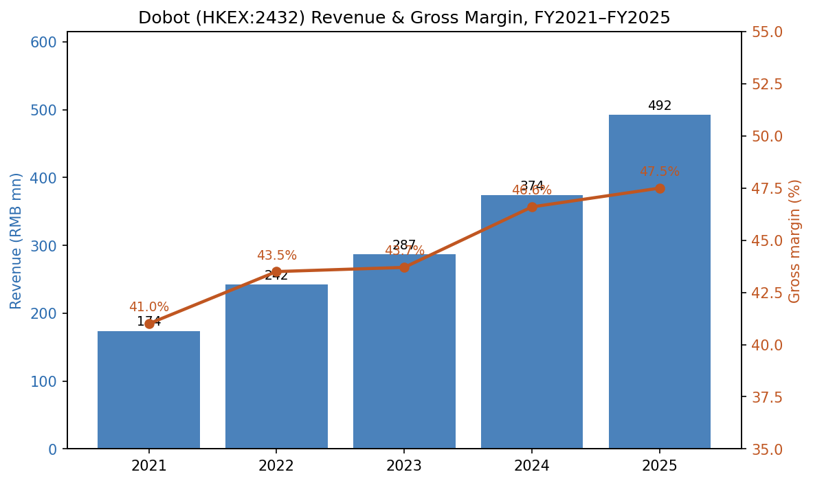
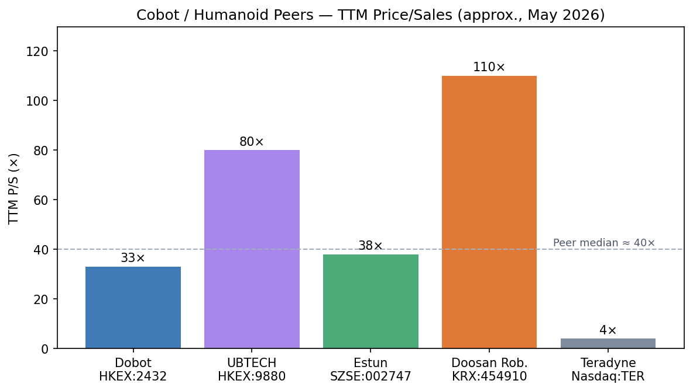
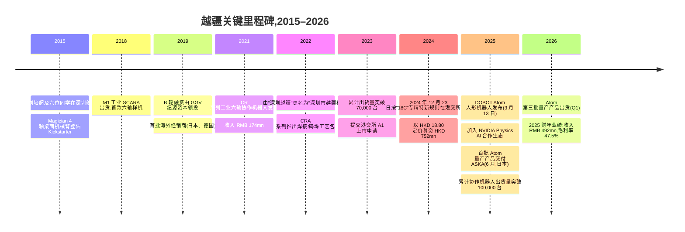
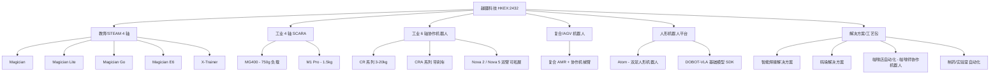
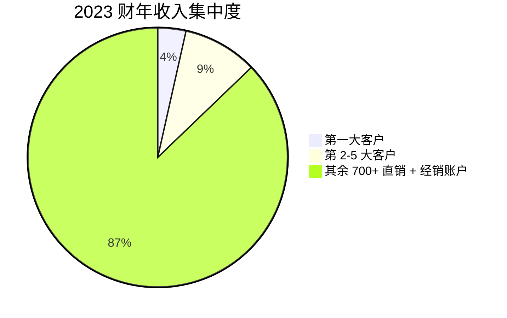
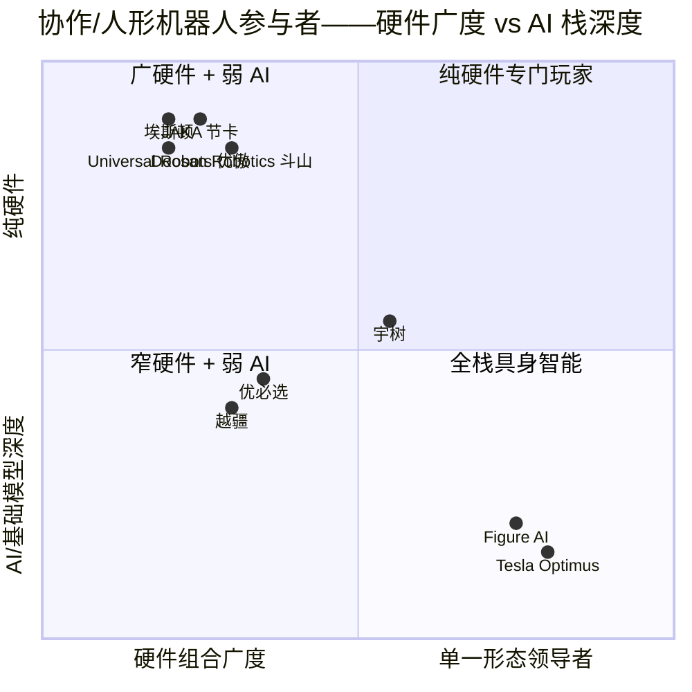
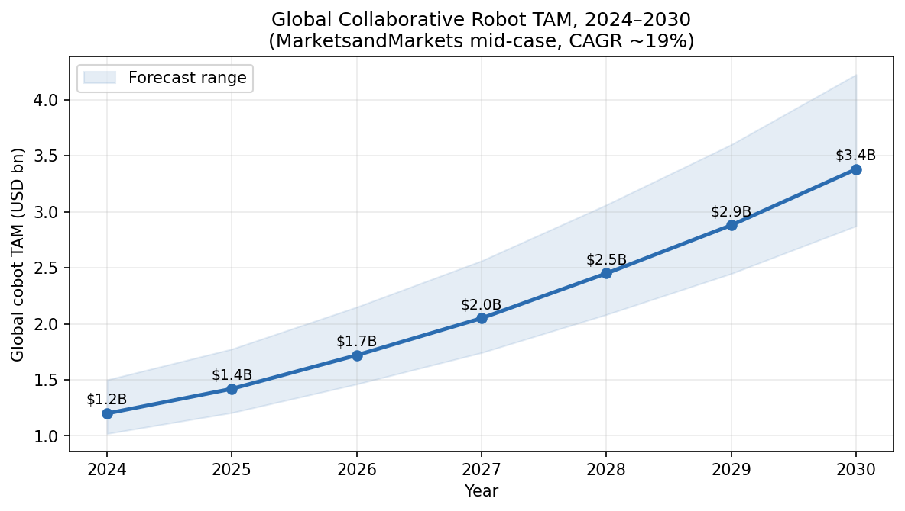

# 公司研究报告:深圳市越疆科技股份有限公司(越疆科技,HKEX:2432)
日期:2026-05-16

> **更新——2025 财年业绩、创纪录收入及人形机器人商业化首秀(2026-03-30):** 越疆科技公布 2025 全年收入 RMB 492.2 mn(同比 +31.7%),毛利率 47.5%,净亏损收窄至 RMB 84.0 mn(同比 -11.9%);研发支出同比增长 59.7%,公司加速推进 Atom 人形机器人的产业化。管理层未给出正式的 2026 财年收入数字指引,但在业绩说明会上表示,预期具身智能(人形机器人)业务在 2025 财年低基数之上实现"三位数增长",核心协作机器人业务延续双位数增长,目标在 2027 年实现盈亏平衡。来源:[越疆科技 2025 年度業績公告, 2026-03-30](https://www.hkexnews.hk/listedco/listconews/sehk/2026/0330/2026033001520.pdf);其他背景见 [TradingView News, 2026-03-30](https://www.tradingview.com/news/urn:summary_document_report:quartr.com:3207670:0-shenzhen-dobot-revenue-up-31-7-to-rmb492-2m-net-loss-narrowed-and-r-d-investment-surged-for-global-growth/)。

## 目录
1. 公司概览
2. 公司发展历程
3. 管理团队
4. 产品与服务
5. 客户与市场进入策略
6. 行业概览
7. 竞争格局
8. 市场机会(TAM)
9. 风险评估

---

## 1. 公司概览

深圳市越疆科技股份有限公司(越疆科技,HKEX:2432)按 2023 年出货量计是全球第二大、中国最大的纯协作机器人("cobot")制造商,根据其 IPO 招股说明书援引的中国洞察咨询(China Insights Consultancy)行业数据,公司全球市占率约 13%([Bitget 公司简介, 2025](https://www.bitget.com/stock/hkex-2432/what-is))。公司设计、生产并销售涵盖四轴和六轴协作机器人的全栈产品组合——上至售价低于 USD 1,000 的桌面级教育机械臂,下至搭配焊接、码垛和上下料工艺包的工业级六轴 CRA 系列;并于 2025 年 3 月起推出全尺寸双足人形机器人(DOBOT Atom),成为首款实现商业化量产并交付给日本付费客户的中国人形机器人([The Robot Report, 2025-03-13](https://www.therobotreport.com/dobot-enters-the-humanoid-robot-race-with-atom/);[DOBOT 新闻稿, 2025-06-27](https://www.dobot-robots.com/insights/news/dobot-debuted-global-delivery-of-humanoid-robot.html))。

**销售内容。** 协作机器人是为与人共享工作空间而设计的六轴(或四轴)轻型机械臂,关节内置力/扭矩传感,并在控制器层级配置认证级安全停止。传统工业机器人需要安全围栏、光幕和专门的集成商,协作机器人则可被中小型客户直接搬上工作台,在一个下午内通过手动示教完成重编程。越疆的产品矩阵涵盖:(a) Magician 系列与 X-Trainer——用于 STEAM 课程、职业培训和科研的桌面/教育级 4 轴与 6 轴机械臂;(b) MG400——750 g 负载的桌面级工业 4 轴 SCARA,用于小批量电子装配;(c) CR / CRA / Nova 系列工业级协作机器人,负载至 20 kg、臂展至约 1.8 m,用于焊接、码垛、上下料和装配;(d) AGV 搭载的"复合机器人"(复合机器人),将协作机械臂与移动机器人(AMR)底盘结合,服务仓储与制药场景;(e) Atom 人形机器人平台([越疆产品线汇总, 2025](https://www.dobot-robots.com/products/desktop-four-axis/mg400.html);[DOBOT Magician E6 产品页, 2025](https://www.dobot-robots.com/products/education/magician-e6.html))。

**盈利模式。** 2024 财年约 91% 的收入来自机械臂硬件的直接销售(配套控制器及基础软件);其余约 9% 为解决方案/服务收入(焊接、码垛、咖啡店自动化的工艺包,以及部署与培训)。分销方面大致呈 70/30 结构,经销商网络覆盖 80 多个国家,直销则面向大型工业客户和系统集成商([越疆科技 2024 年度報告, 2025-03-24](https://www1.hkexnews.hk/listedco/listconews/sehk/2025/0324/2025032400374.pdf))。六轴协作机器人——高单价的工业主力产品——贡献了 2024 财年 55.9% 的销售额,同比增长 55.5%([越疆 2024 年度业绩点评, 华盛通, 2025-04-03](https://www.hstong.com/news/detail/25040314541424495))。

**经营区域。** 总部位于深圳南山区,研发与组装均集中于本地。地理收入结构已从 IPO 时的高度依赖海外,反转为目前较为均衡的格局:2025 年上半年,中国大陆收入同比增长 56.7%,海外增速较慢,使境内收入占集团收入比例从一年前的少数派升至约 53%([新浪财经, 2025-09-05](https://finance.sina.com.cn/money/bond/2025-09-05/doc-infpmzec0690684.shtml))。日本、北美(通过 Dobot-US 子公司)、韩国、德国和印度是最大的海外市场。截至 2025 年年中,累计协作机器人出货量突破 10 万台([澎湃新闻, 2025-09](https://m.thepaper.cn/newsDetail_forward_32289990))。

**规模。** 2025 财年收入 RMB 492.2 mn(约 USD 68 mn),员工约 1,000 人,研发人员占比约 50%;净亏损 RMB 84.0 mn;毛利率 47.5%(尽管 Atom 处于摊薄爬坡阶段,毛利率仍同比改善 +90 bp)([越疆科技 2025 年度業績公告, 2026-03-30](https://www.hkexnews.hk/listedco/listconews/sehk/2026/0330/2026033001520.pdf))。根据 IPO 招股说明书,2023 财年客户群为 434 家直销客户与约 358 家经销商。

*来源:[越疆科技招股章程, 2024-12-13](https://www1.hkexnews.hk/listedco/listconews/sehk/2024/1213/2024121300030_c.pdf);[越疆科技 2024 年度報告, 2025-03-24](https://www1.hkexnews.hk/listedco/listconews/sehk/2025/0324/2025032400374.pdf);[越疆科技 2025 年度業績公告, 2026-03-30](https://www.hkexnews.hk/listedco/listconews/sehk/2026/0330/2026033001520.pdf)。*

### 估值快照

按 2026 年 5 月 8 日收盘价 **HKD 34.58**(过去三个月日内观察区间 HKD 31.80 至 HKD 63.35——受人形机器人相关消息驱动,波动极大),越疆约有 **5.09 亿股 H 股 + 未上市的境内股份**,按全面摊薄基础计算,总市值约 **HKD 25 bn**(约 USD 3.2 bn)([腾讯证券 02432 行情, 2026](https://gu.qq.com/hk02432/gp/cfg);[建银国际工业自动化研究报告, 2026-01-30](https://www.aastocks.com/marketcomment/pdf/159801.pdf) 援引 2026 年 1 月下旬市值约 USD 2.1 bn,反映了此后向当前水平的重新定价)。

- **TTM 市盈率(P/E):负值(无意义)。** 越疆尚未实现整年 GAAP 净利润。2025 财年净亏损为 RMB 84.0 mn,对应收入 RMB 492.2 mn([越疆科技 2025 年度業績公告, 2026-03-30](https://www.hkexnews.hk/listedco/listconews/sehk/2026/0330/2026033001520.pdf));亏损主要源于(i)研发费用同比上涨 59.7%,公司加速推进 Atom 人形机器人及下一代 DOBOT-VLA 基础模型的产业化;以及(ii)销售费用维持高位,推动全球经销网络从 80 个国家迈向 90+ 国家。这是高速扩张引致的现金消耗,而非一次性费用——但消耗在可控范围内:2025 财年经营性现金流出收窄,IPO 净募资(HKD 681 mn)足以支持公司按管理层既定目标在 2027 年实现盈亏平衡之前的资金需要([越疆 2024 年度业绩点评, 华盛通, 2025-04-03](https://www.hstong.com/news/detail/25040314541424495))。
- **TTM 市销率(P/S):约 33×**,基于 2025 财年收入 RMB 492 mn(约 HKD 535 mn)与市值 HKD 25 bn 的比较。绝对水平偏高,但在中国上市的具身智能可比公司之间处于中间位置——见下方同业图表。
- **上市以来区间。** IPO 定价 HKD 18.80(2024 年 12 月 23 日);2025 年 3 月 Atom 发布会带动股价单日上涨 28%,2025 年 Q3 受人形机器人狂热推动一度交易至约 HKD 80,随后受 IPO 后六个月禁售期解禁(2025 年 6 月下旬解禁)及人形板块整体获利了结影响,到 2026 年春回落至 HKD 30 出头([EYESHENZHEN, 2024-12-25](http://www.eyeshenzhen.com/content/2024-12/25/content_31408751.htm);[越疆 2432.HK 解禁深度报告, 2025-12-23](https://blog.leowang.net/content/files/2025/12/------------------------------------2432.HK---.pdf))。

*来源:[Yahoo Finance 优必选关键统计, 2026-05](https://finance.yahoo.com/quote/9880.HK/key-statistics/);[Stockanalysis 埃斯顿 002747, 2026-05](https://stockanalysis.com/quote/she/002747/statistics/);[Stockanalysis Doosan Robotics 454910, 2026-05](https://stockanalysis.com/quote/krx/454910/);[Stockanalysis 越疆 2432, 2026-05](https://stockanalysis.com/quote/hkg/2432/);近似 TTM 比率。*

**对估值倍数的解读。** 33× TTM P/S 高于恒生工业行业整体中位数(约 6×)5 倍以上,但明显低于优必选(约 80×)和 Doosan Robotics 斗山(约 110×,市值 KRW 5.97 tn 对应 2025 财年收入 KRW 33 bn)([Doosan Robotics 市值, 2026](https://stockanalysis.com/quote/krx/454910/market-cap/))。这一溢价反映了三件事:(1) 在人形机器人这一 TAM 预测在 2035 年膨胀至 USD 80+ bn 的行业里,公司具备真实的高成长可选性([Precedence Research, 2025](https://www.precedenceresearch.com/collaborative-robots-market));(2) 主题/板块代理属性——越疆是机构投资者可用以表达"中国具身智能"主题的两个纯标的之一,另一个是优必选;(3) 异常可信的执行叙事——首款实现商业化量产的中国人形机器人、NVIDIA Physics-AI 合作伙伴地位(2025 年 3 月),以及一家在 2025 年完成交付的日本一线工业系统集成商(ASKA Corp)客户([The Robot Report, 2025-03-13](https://www.therobotreport.com/dobot-enters-the-humanoid-robot-race-with-atom/);[RoboHorizon, 2025-10](https://robohorizon.com/en-us/news/2025/10/dobot-and-aska-reveal-atom-humanoid-colleague/))。话虽如此,33× TTM P/S 留给执行失误的容错空间极小——估值/倍数压缩风险见第 9 节。

---

## 2. 公司发展历程

越疆于 2015 年 7 月在深圳成立,创始人为刘培超(英文名 Jerry Liu)及其山东大学机械工程/机器人专业的六位同窗。其种子阶段的核心论点是:彼时单价 USD 30k–100k、专门面向一线汽车厂商出售的工业机器人,可以小型化、可在无围栏环境下安全使用,并面向一个远更广阔的市场——包括创客、学校与中小企业。团队的首款产品是一款名为 Magician 的桌面 4 轴机械臂,通过 Kickstarter 式众筹活动获得超过 USD 600k 的预订单,使其首次接触到这条至今仍支撑该产品线的消费与教育渠道([Dobot 维基百科, 2025](https://en.wikipedia.org/wiki/Dobot);[SCMP 报道, 2019](https://www.scmp.com/tech/start-ups/article/3030511/shenzhen-start-yuejiang-technology-developing-smart-robotic-arms-can))。

*来源:[越疆科技招股章程, 2024-12-13](https://www1.hkexnews.hk/listedco/listconews/sehk/2024/1213/2024121300030_c.pdf);[Bitget 公司简介, 2025](https://www.bitget.com/stock/hkex-2432/what-is);[DOBOT 全球交付新闻稿, 2025-06-27](https://www.dobot-robots.com/insights/news/dobot-debuted-global-delivery-of-humanoid-robot.html);[Interesting Engineering, 2026](https://interestingengineering.com/ai-robotics/dobot-releases-third-humanoid-robot-batch)。*

**战略转折点。** 对当前投资逻辑有重大意义的有三次。第一次是 2018–2019 年,公司从一家创客/教育机械臂厂商转型为工业级协作机器人公司——先推出 M1 SCARA,再推 CR 六轴系列——使越疆得以摆脱与 Arduino 价位玩具的竞争,转而在工厂自动化领域与 Universal Robots 优傲较量。第二次是 2022 年由"深圳越疆科技"更名为"深圳市越疆科技股份有限公司",将品牌统一至公司在国际市场最具辨识度的产品线之下,同时为 IPO 整理公司形象。第三次——也是对当前估值最具决定性的——是 2024 年初决定将大量研发资金投入人形机器人平台,并最终在港交所上市 11 周后揭幕 Atom([新浪科技, 2025-04-02](https://finance.sina.com.cn/tech/csj/2025-04-02/doc-inerupak2056139.shtml);[The Robot Report, 2025-03-13](https://www.therobotreport.com/dobot-enters-the-humanoid-robot-race-with-atom/))。

**并购:** 无重大并购。越疆为内生增长;IPO 招股书披露公司在三年业绩追溯期内无任何并购,公司明确将资本配置优先级放在自主研发,而非整合系统集成商。

**近 12 个月动态。** (a) Atom 量产爬坡——截至 2026 年 Q1 已出货三个生产批次,其中第三批次为首次完成多机协同任务的多台交付([Interesting Engineering, 2026](https://interestingengineering.com/ai-robotics/dobot-releases-third-humanoid-robot-batch))。(b) DOBOT-VLA 基础模型作为 Atom 的"大脑"发布,实现视觉-语言-动作的端到端融合([Dobot Atom 产品页, 2025](https://www.dobot-robots.com/products/humanoid-robots/atom.html))。(c) 2025 年年中宣布拟在上海证券交易所科创板申请 A 股双重上市("回 A"),旨在拓宽境内股东基础并吸收大陆流动性——IPO 时间表取决于证监会审核([澎湃新闻, 2025-09](https://m.thepaper.cn/newsDetail_forward_32289990))。(d) IPO 后六个月禁售期于 2025 年 6 月解禁,触发约 30% 的下跌,此后供给压力部分修复([越疆 解禁报告, 2025-12-23](https://blog.leowang.net/content/files/2025/12/------------------------------------2432.HK---.pdf))。

---

## 3. 管理团队

### 刘培超(Jerry Liu)——创始人、董事长兼首席执行官

刘培超是越疆最具决定性意义的人物。他于 2015 年 27 岁时创立公司,自此一直担任 CEO,持有 26.62% 的有表决权股权,是公司每一次重大产品发布的对外代表——包括 2025 年 3 月 Atom 的现场发布会,使股价单日上涨 28%([Crunchbase 资料, 2025](https://www.crunchbase.com/person/liu-peichao);[新浪财经, 2025-03-13](https://finance.sina.com.cn/roll/2025-03-13/doc-inepniqu5062464.shtml))。其专业上的所有权与对公司的话语权更接近于"具备超级投票控制的创始人"(如马斯克、王传福),而非典型的中国 A 股职业 CEO——这既是最强的看多基本面,也是最大的单点关键人物风险。

背景:1988 年出生于山东省,2010 年毕业于山东大学机械工程系,2013 年完成机电工程硕士学位。他与同一实验室的六位同学于 2015 年共同创立越疆——对中国硬科技初创公司而言,这是一支异常紧密的创始团队,而刘培超也公开表示这是越疆能在公司成立 14 个月内交付出可用桌面机械臂的原因,而典型机械硬件创业公司则需要 3–4 年([新华社人物报道, 2020-09-23](http://www.xinhuanet.com/english/2020-09/23/c_139391321.htm);[SCMP, 2019](https://www.scmp.com/tech/start-ups/article/3030511/shenzhen-start-yuejiang-technology-developing-smart-robotic-arms-can))。创办越疆之前,刘曾在深圳一家工业自动化公司担任研发工程师约 18 个月,负责设计定制化运动控制器——这是直接相关的前期经验。

他在越疆具体打造的成果:从 Kickstarter 上单一 SKU 的 Magician(2016 财年收入 < RMB 10 mn),扩张至 2025 财年收入 RMB 492 mn、累计约 100,000 台协作机器人出货、80+ 国家分销网络,以及首款进入商业化量产的中国人形机器人——所有这些在十年内完成,且在港交所 IPO 之前累计募资远低于 USD 200 mn([Crunchbase 融资历史, 2025](https://www.crunchbase.com/person/liu-peichao))。相对于同业,他在轻资本运营方面格外自律:优必选 IPO 前累计募资 > USD 1 bn,Unitree 宇树情况类似;越疆以更少的资本走得更远。投资者押注的论点是:这位曾正确判断(i) 2018 年的协作机器人转型、(ii) 2022 年国际经销网络建设和(iii) 2024 年人形机器人布局的刘培超,有望继续正确判断下一个拐点——很可能是具身智能基础模型。

公众形象:活跃于 X(@Liu_Peichao)与微博,常在 MWC、世界机器人大会、CES 担任主题演讲嘉宾。IPO 之后的薪酬结构为 HKD 1.8 mn 基本工资 + 与收入和经调整 EBIT 指标挂钩的业绩 RSU 计划([越疆科技 2024 年度報告, 2025-03-24](https://www1.hkexnews.hk/listedco/listconews/sehk/2025/0324/2025032400374.pdf))。

### 劳燕——首席财务官

劳燕于 2022 年加入越疆,具体职责是领导 IPO 进程,上市后留任 CFO。早期经历:曾在两家港股上市的中国科技公司(一家 2018 年 IPO,另一家 2021 年 IPO)担任财务高管,负责投资者关系与资本市场工作;在此之前为普华永道深圳办公室科技审计经理。她持有中国注册会计师资格,并拥有长江商学院 MBA 学位。最相关的成就:全程领导港交所 18C 专精特新上市流程——越疆是 18C 规则下第三家上市公司——并在 2024 年末艰难的港股 IPO 窗口期成功定价于推介区间顶端,且开盘价远高于发行价([南方财经网, 2024-11-26](https://www.sfccn.com/2024/11-26/4MMDE0MDRfMTk3MDU4MA.html);[EYESHENZHEN, 2024-12-25](http://www.eyeshenzhen.com/content/2024-12/25/content_31408751.htm))。CFO 主导下的下一项考验是已宣布的 A 股双重上市——这是一项远比港股环节更为复杂的监管流程。

### 其他核心高管

**杨红朝——首席技术官(CTO)。** 联合创始人;主导了 CR / CRA / Nova 工业协作机器人系列的机械结构与运动控制架构,目前负责 Atom 人形机器人硬件项目。山东大学机电学博士。来自创始团队的 CTO 级别延续性——七位联合创始人中五位仍在运营岗位——在中国硬科技行业实属罕见,这也是越疆未像若干人形机器人同业那样遭遇工程领导层流失的原因之一。

**吴林生——首席科学家/AI 负责人。** 2023 年自国内某大型互联网平台自动驾驶团队加盟。负责 DOBOT-VLA 视觉-语言-动作基础模型——该模型驱动 Atom,目前已被越疆作为 SDK 提供给第三方人形机器人主体使用——有潜力发展为软件授权业务,尽管尚未成为独立的收入分部([Dobot Atom 产品页, 2025](https://www.dobot-robots.com/products/humanoid-robots/atom.html))。他的加入是越疆将定位从纯硬件协作机器人厂商转向"具身智能平台"叙事的战略关键一步,后者可以为公司争取到机构投资者愿意支付的软件估值倍数。

### 治理结构小结

董事会构成:8 位董事——3 位执行董事(刘、劳、杨)、2 位代表 IPO 前投资者(GGV 纪源资本、光速中国)的非执行董事,以及 3 位独立非执行董事(18C 发行人在港交所规则下的最低要求)。内部持股比例较高:刘培超持股 26.62%,加上联合创始人一致行动方约 8%,使创始团队拥有事实上的控制权。IPO 前投资者合计在上市时持有约 38%;2025 年 6 月解禁期到期后,部分股份已经分配,但大部分仍未减持,这也是为何流通盘有时被认为实际上小于 4,000 万股 H 股发行规模所反映的程度([越疆 2432.HK 解禁报告, 2025-12-23](https://blog.leowang.net/content/files/2025/12/------------------------------------2432.HK---.pdf))。2024 年报未披露重大关联交易。薪酬结构相对于中国 A 股惯例略偏业绩导向,相对于美国科技公司标准则偏轻。

### 履历归纳

刘培超与其创始团队拥有十年的业绩记录,体现于(i) 在正确的产品转型上始终领先(消费级机械臂 → 工业协作机器人 → 人形机器人),以及(ii) 相较人形机器人同业创始人,以更少资本实现更多产出。最大的悬而未决问题是:这支以机械工程为出身的团队,能否在中国 AI 人才需求异常旺盛的背景下,组建并留住人形机器人路线图所需的 AI/基础模型人才。引入吴林生是对此问题最显性的押注。

---

## 4. 产品与服务

越疆按**两条轴**组织其产品组合:形态(4 轴桌面/SCARA、6 轴工业协作机器人、双足人形机器人)与目标市场(教育与科研 vs. 工业 vs. 商业服务)。下文按产品族系列,枚举公司官网上目前在售的每条产品线。

*来源:[DOBOT 全球产品索引, 2025](https://www.dobot-robots.com/);[越疆科技 2024 年度報告, 2025-03-24](https://www1.hkexnews.hk/listedco/listconews/sehk/2025/0324/2025032400374.pdf)。*

### 教育/STEAM 4 轴机械臂

**Magician / Magician Lite / Magician Go。** 最初的桌面级 4 轴机械臂。Magician(250 g 负载,320 mm 臂展)是 Kickstarter 时代的主力产品,以低于 USD 1,500 的价格继续在全球的学校与创客空间销售。Magician Lite 是面向小学课程的简化版本;Magician Go 是搭载移动底盘的变体。**竞争优势:有——品牌与渠道。** 越疆在中国职业院校机器人实验室中占据主导地位,并签订多年课程合作;转换成本是实在的(教材、实验室教师培训)。最近的对位产品:UFactory uArm 系列(规模更小、渠道更窄)。**硬件持平,渠道领先。**

**Magician E6。** 2024 年发布、专为大学科研与高阶 STEAM 设计的桌面级**六轴**协作机器人。±0.1 mm 重复定位精度,750 g 负载,即插即用,支持 ROS/Python([DOBOT Magician E6 产品页, 2025](https://www.dobot-robots.com/products/education/magician-e6.html))。定位介于玩具级 Magician 与工业级 MG400 之间。**竞争优势:部分。** 差异化在于集成课程 + 云端 DobotLab 软件;UFactory 与 Niryo 同价位产品规格相近,但课程绑定较弱。

**X-Trainer。** 面向 TVET(技术与职业教育培训)机构销售的 6 轴培训装置,与标准 CNC 铣床/气动送料培训工位捆绑销售。**竞争优势:有——中国职教渠道锁定。** 销售主要通过省级教育主管部门的招标框架进行,而越疆位列其合格供应商名单。

### 工业 4 轴 SCARA

**MG400。** 750 g 负载的桌面级 SCARA,占地面积小于 A4 纸,专为小批量电子装配、点胶、拧螺丝与检测设计。内置**手动示教与碰撞检测**([DOBOT MG400 产品页, 2025](https://www.dobot-robots.com/products/desktop-four-axis/mg400.html))。**竞争优势:有——形态与价格。** 厂商建议零售价约 USD 6k–8k,低于日系入门级 SCARA(Epson T3 约 USD 14k),在节拍可比的同时占地显著更小。最近对位产品:Epson T3 桌面 SCARA——**价格与占地领先,在日本汽车一级供应商的装机信任度方面落后。**

**M1 Pro。** 1.5 kg 负载的 4 轴 SCARA,是 MG400 之前的工业主力产品。仍在原有客户中销售,但在营销中已被弱化。

### 工业六轴协作机器人——利润引擎

**CR 系列(CR3 / CR5 / CR7 / CR10 / CR16 / CR20)。** 负载 3 kg 至 20 kg,臂展 0.6 m 至 1.8 m([DOBOT CR 系列产品页, 2025](https://www.dobot-robots.com/products/six-axis/cr3.html))。面向全球系统集成商销售,用于装配、上下料、抛光与焊接。**竞争优势:部分。** 在硬件参数(负载-臂展比、重复精度)上,CR 系列对标 Universal Robots 优傲 UR3 / UR5 / UR10——该全球品类基准——但价格折让 20–35%。Universal Robots 优傲仍凭借装机量、集成商生态和更长的业绩纪录占优;越疆胜在价格与中国本地支持。最近对位产品:**Universal Robots 优傲 UR5e——硬件持平,集成商生态落后,价格领先。**

**CRA 系列。** 2022 年作为 CR 的继任者发布。关键差异点:自研一体化关节搭配高性能谐波减速器,节拍速度提升 25%;断电时电磁刹车在 18 ms 内自动接合(在安全停止指标上行业领先,对一线汽车厂商尤为重要);预装**工艺包**——拧螺丝、焊接和码垛——压缩集成商部署时间([Automate.org 新闻稿, 2022](https://www.automate.org/robotics/news/dobot-unveils-brand-new-cra-collaborative-robots))。**竞争优势:有——自有一体化谐波减速关节。** 这是产品组合中最接近硬件壁垒的环节。最近对位产品:JAKA 节卡 Pro 系列、AUBO 遨博 i 系列——**关节集成度领先,软件方面持平。**

**Nova 2 / Nova 5。** Nova 系列定位于"高端六轴"产品线——更纤细的臂部轮廓、更高的重复精度(±0.02 mm)、以及面向单元化部署的双臂可扩展线缆([DOBOT Nova 2 产品页, 2025](https://www.dobot.nu/en/product/dobot-nova-2/))。瞄准 Universal Robots 优傲 UR3e 在电子装配领域历来强势的客户。**竞争优势:部分。** 纸面上看,Nova 系列与 UR3e 规格持平且价格更低;但实际上,从 UR 已有产线切换的成本仍然不小。

### 复合/移动机器人

**复合机器人(复合机器人)。** 将协作机械臂搭载在 AMR(自主移动机器人)底盘上,销售给仓储、药房与实验室自动化客户。2024 财年收入**同比 +64.7% 至 RMB 56.5 mn**([越疆 2024 年度业绩点评, 华盛通, 2025-04-03](https://www.hstong.com/news/detail/25040314541424495))——除人形机器人外增速最快的细分板块。**竞争优势:部分。** AMR 底盘为外购而非自研,因此壁垒在于集成与软件;Geek+ 极智嘉与 Hai Robotics 海柔创新等竞争对手拥有更大规模的部署机队。

### 人形机器人平台——可选性所在

**DOBOT Atom。** 2025 年 3 月 13 日发布的全尺寸双足人形机器人。身高 1.5 m,体重 62 kg,总自由度 41(包括 12 自由度的五指灵巧手),专有的直膝步态使行走能耗较弯膝设计降低约 42%([The Robot Report, 2025-03-13](https://www.therobotreport.com/dobot-enters-the-humanoid-robot-race-with-atom/);[Mike Kalil, 2025](https://mikekalil.com/blog/shenzhen-dobot-atom/))。由自研 DOBOT-VLA 视觉-语言-动作模型驱动。**厂商建议零售价 RMB 199,000(约 USD 27k)**——约为 Unitree 宇树 H1(USD 90k+)的三分之一,Figure 02 的四分之一。量产交付始于 2025 年 6 月,首批客户为日本系统集成商 ASKA Corporation;第三批量产产品已在 2026 年 Q1 完成出货([DOBOT 新闻稿, 2025-06-27](https://www.dobot-robots.com/insights/news/dobot-debuted-global-delivery-of-humanoid-robot.html);[Interesting Engineering, 2026](https://interestingengineering.com/ai-robotics/dobot-releases-third-humanoid-robot-batch))。**竞争优势:部分至明显。** 体现在上市时间(首款进入商业化生产的中国人形机器人)、价格(市场上最便宜且可信的全尺寸双足机器人),以及市场进入(Atom 直接使用越疆既有的 80 国协作机器人经销网络——人形机器人同业中唯一渠道触达堪比的是优必选)。但在硬件-AI 栈本身,Figure、Tesla Optimus 与 Unitree 宇树仍居领先。最近对位产品:**优必选 Walker S / Unitree 宇树 H1——在 Figure 式端到端神经网络遥操作数据规模上落后,在形态成本工程与已落地的工业渠道方面领先。**

**DOBOT-VLA 基础模型 SDK。** 作为第三方人形机器人主体的软件 SDK 出售,并通过 Atom-D(Atom 的数据采集变体,销售给科研实验室)作为研究平台([RobotShop, 2025](https://www.robotshop.com/products/dobot-atom-d-edu-data-collection-humanoid-robot-ds))。目前尚非独立收入项;若能放量,可能是产品组合中最具高估值倍数潜力的产品线。

### 解决方案/工艺包

焊接(智能焊接工作站、焊缝跟踪)([DOBOT 焊接案例, 2025](https://www.dobot-robots.com/insights/case-studies/smart-welding-solution-for-small-batch-multi-type-products.html))、码垛(多 SKU 混合托盘算法)、咖啡店自动化(咖啡师协作机器人已在瑞幸式连锁与肯德基试点交付)、制药/实验室自动化。这些属于服务与软件收入,占集团收入约 9%,但毛利率结构性高于纯硬件销售。

### 旗舰产品 vs. 长尾

**三款旗舰驱动当下业务:** (1) **CR / CRA 六轴协作机器人——2024 财年贡献 55.9% 收入,同比 +55.5%**;(2) **MG400 桌面级 SCARA**——出货量层面销量第一;(3) **DOBOT Atom**——目前收入占比 < 5%,但承担了整个估值溢价。长尾产品包括 Magician 系列(教育业务低速增长)和 M1 Pro(存量产品)。

### 过去 12 个月发布

DOBOT Atom(2025 年 3 月);DOBOT-VLA 基础模型 SDK(2025 年 3 月);Atom-D 数据采集变体(2025 年 9 月);Nova 5 双臂可扩展协作机器人(2025 年年中)。无重要停产产品。

---

## 5. 客户与市场进入策略

越疆向四类客户销售:(1) **工业制造商**——主要为中国电子装配、金属加工与焊接领域的中小企业,以及不断扩大的、用于汽车次装配的大型客户;(2) **教育/职教**——中小学、大学、高职院校与 TVET 机构;(3) **商业服务**——咖啡连锁、酒店服务、医疗配送、科研;以及(4) 自 2025 年起的**人形机器人客户**——目前以日本一级集成商(ASKA Corp)和少数将 Atom 用于装配线试点的中国汽车电子客户为主。

### 客户集中度——量化分析

IPO 招股书披露的集中度结构显著且**低**,且持续下降——这在中国工业科技公司上市中相当罕见,也是越疆在结构上的看多要素之一。

| 年份 | 第一大客户占收入比 | 前五大客户占收入比 |
|---|---|---|
| 2021 | 12.6% | 28.5% |
| 2022 | 8.8% | 21.0% |
| 2023 | 3.5% | 12.8% |
| 2024 上半年 | 7.8% | 20.7% |

*来源:[越疆科技招股章程, 2024-12-13](https://www1.hkexnews.hk/listedco/listconews/sehk/2024/1213/2024121300030_c.pdf),客戶集中度章节。*

*来源:[越疆科技招股章程, 2024-12-13](https://www1.hkexnews.hk/listedco/listconews/sehk/2024/1213/2024121300030_c.pdf)。*

到 2023 年,没有任何单一客户占收入超过 3.5%,前五大客户合计仅占 12.8%——远低于第 9 节风险分类视为重大的 30% 阈值。2024 年上半年的轻度再集中(前五 20.7%)反映的是某一家日本经销商订单时点的影响,管理层评论认为这不是结构性的变化。综合直销与经销渠道,全球客户基数约 800 个账户([越疆科技 2024 年度報告, 2025-03-24](https://www1.hkexnews.hk/listedco/listconews/sehk/2025/0324/2025032400374.pdf))。**目前披露的前列客户中没有任何一个是同业竞争对手或在进行垂直整合**——他们是系统集成商、经销商与终端用户,而非未来自研协作机器人厂商。

对投资逻辑的含义是:客户集中度目前对越疆而言**不是**重大风险(相比之下,人形机器人同业中常出现单一 OEM 试点占收入 30%+ 的情况)。但仍值得观察 Atom 人形机器人线是否会重新引入集中度——早期 Atom 收入显著偏重日本的 ASKA Corporation 及少数中国新能源汽车相关客户。

### 合同结构

- **协作机器人硬件销售**主要以逐张采购订单(P.O.-by-P.O.)方式进行,而非多年期主框架协议。平均成交规模较小(数台至数十台),与客户数量众多的特征一致。
- **海外经销商分销协议**通常为 1–3 年期独家协议,附带最低销量承诺与区域分配;续约属于常规操作。
- **Atom 人形机器人**在 2025 年的合同采用多批次交付加里程碑付款的结构;ASKA 协议据报道为多年期框架协议,但具体条款未公开披露([RoboHorizon, 2025-10](https://robohorizon.com/en-us/news/2025/10/dobot-and-aska-reveal-atom-humanoid-colleague/))。

### 分销渠道

约 70% 的收入通过 80+ 国家的**第三方经销商**(分销商、增值集成商、系统集成商)流转;30% 为面向大型工业客户与关键 OEM 的**直销**。战略性地理集群:中国(强劲回升——2025 年上半年同比 +56.7%([新浪财经, 2025-09-05](https://finance.sina.com.cn/money/bond/2025-09-05/doc-infpmzec0690684.shtml)))、日本(Dobot Japan + ASKA)、北美(Dobot US 子公司,Robotshop 与 RobotLab 作为经销商)、韩国、德国、印度。

### 销售周期

- 教育与桌面级 SCARA:**交易型**,数周内完成,以线上/经销商为主导。
- 工业协作机器人:**2–6 个月销售周期**,集成商主导,通常包含付费的概念验证(PoC)部署。
- 人形机器人 Atom:**6–12 个月销售周期**,需客户做技术评估以及针对特定任务的数据采集与 DOBOT-VLA 模型微调。

### 关键合作伙伴

- **NVIDIA**——越疆自 2025 年 3 月起加入 NVIDIA Physics-AI 合作生态,Atom 已与 NVIDIA Isaac Sim 仿真平台对接,用于合成数据训练([The Robot Report, 2025-03-13](https://www.therobotreport.com/dobot-enters-the-humanoid-robot-race-with-atom/))。
- **ASKA Corporation(日本)**——人形机器人系统集成合作伙伴;在日本是 Atom 的主要商业客户([RoboHorizon, 2025-10](https://robohorizon.com/en-us/news/2025/10/dobot-and-aska-reveal-atom-humanoid-colleague/))。
- **RobotLAB、Robotshop、Afinia 3D**——北美经销商,代理 Atom 与 MG400([RobotLAB, 2025](https://www.robotlab.com/dobot-atom-advanced-human-robot);[Afinia 商店, 2025](https://afinia.com/products/dobot-mg400-desktop-robotic-arm-workstation))。
- 与中国教育部职业教育委员会的课程合作伙伴关系——为 X-Trainer / Magician E6 渠道提供结构性锁定。

### 标志性客户胜出与案例

越疆的洞察/案例库展示了多个行业的客户胜出:汽车次装配(小批量汽车饰件焊接)、3C 电子(智能手机装配线的拧螺丝与点胶)、制药样品处理,以及使用咖啡师协作机器人的咖啡运营商。公开命名的最大工业部署位于**某中国新能源汽车(NEV)电池包装配工厂**,部署了约 50 台 CRA 系列协作机器人,用于螺栓紧固与模组放置([DOBOT 焊接案例, 2025](https://www.dobot-robots.com/insights/case-studies/smart-welding-solution-for-small-batch-multi-type-products.html))。

---

## 6. 行业概览

### 行业定义

协作机器人行业(NAICS 333242 工业机械/机器人制造设备,下属轻负载、人机协作机器人子类)位于更广义的**工业自动化**领域内,但在结构上与传统笼式工业机器人显著不同。全球工业机器人市场(FANUC 发那科、ABB、KUKA 库卡、Yaskawa 安川)按 OEM 收入约 USD 18 bn,增速为低至中个位数;协作机器人子市场显著更小,但增速达 18–22% CAGR。**相邻且日益重叠**的品类是人形机器人,该品类目前几乎尚未商业化(2025 财年全球人形机器人出货量估计不足 25,000 台,几乎全部进入科研或试点部署),但据不同预测,到 2035 年市场规模可达 USD 38 bn–86 bn([Precedence Research, 2025](https://www.precedenceresearch.com/collaborative-robots-market);[MarketsandMarkets, 2025](https://www.marketsandmarkets.com/Market-Reports/collaborative-robot-market-194541294.html))。

### 市场规模与增速

来自第三方研究机构、最被广泛引用的协作机器人市场预测如下:

| 研究机构 | 2024–2025 基础规模 | 长期预测 | CAGR |
|---|---|---|---|
| MarketsandMarkets | USD 1.42 bn(2025) | USD 3.38 bn 至 2030 | 18.9% |
| Fortune Business Insights | USD 2.31 bn(2025) | USD 13.27 bn 至 2034 | 21.5% |
| Precedence Research | USD 5.58 bn(2025) | USD 85.93 bn 至 2035 | 约 32% |
| Coherent Market Insights | USD 5.4 bn(2025) | USD 64 bn 至 2032 | 42.2% |

*来源:[MarketsandMarkets, 2025](https://www.marketsandmarkets.com/Market-Reports/collaborative-robot-market-194541294.html);[Fortune Business Insights, 2025](https://www.fortunebusinessinsights.com/industry-reports/collaborative-robots-market-101692);[Precedence Research, 2025](https://www.precedenceresearch.com/collaborative-robots-market);[Coherent Market Insights, 2025](https://www.coherentmarketinsights.com/market-insight/collaborative-robot-market-4667)。*

差异巨大(同一"2025 协作机器人市场",从 USD 1.4 bn 到 USD 5.6 bn 不等)反映定义口径不同——部分机构将轻型工业机器人与自动化服务计入协作机器人口径,另一部分仅包括认证安全、力觉感应、负载 30 kg 以下的协作机器人。MarketsandMarkets 的数据(在严格定义下约 USD 1.4 bn)是最保守的锚定值,也是覆盖越疆的卖方分析师采用的数据([建银国际工业自动化研究报告, 2026-01-30](https://www.aastocks.com/marketcomment/pdf/159801.pdf))。

按地区,**亚太占协作机器人市场 37–51%,处于主导地位**,其中仅中国就约占 30% 以上([Fortune Business Insights, 2025](https://www.fortunebusinessinsights.com/industry-reports/collaborative-robots-market-101692))。

### 增长驱动力

五大顺风因素值得关注:

1. **劳动力成本收敛。** 中国制造业工资正以 HSD 7–10% 的年增速上行;中国二三线电子装配厂的协作机器人投资回收期已从 2018 年的约 36 个月降至 2025 年的约 14 个月([建银国际, 2026-01-30](https://www.aastocks.com/marketcomment/pdf/159801.pdf))。
2. **中小企业自动化缺口。** 在估算约 450 万家中国工业中小企业中,部署过任何机器人的比例不足 5%。协作机器人——易于部署、无需围栏、无需重度集成商安装——是填补这一缺口最可行的方式。
3. **具身智能/人形机器人跃升。** 2024–2025 年视觉-语言-动作模型的快速进步(NVIDIA Isaac GR00T、Tesla 基于 FSD 衍生的模型、OpenAI 的机器人计划)同时推动了需求侧(客户愿意为更强大的机器人支付更高价格)与供应侧(相同硬件可获得更廉价、更强大的 AI 大脑)([NVIDIA Isaac GR00T 发布, 2025-05](https://robohorizon.uk/en-gb/news/2025/05/nvidias-isaac-gr00t-n1.5-the-gpt-of-humanoid-robotics-is-here/))。
4. **中国产业政策。** 协作机器人与人形机器人被明确列入《中国制造 2025》后续框架,以及 2024 年工信部《人形机器人创新发展指导意见》,包括对国有企业工厂中国产供应商的采购优先权。
5. **回流/近岸制造业顺风。** 美国与欧盟在《通胀削减法案》/《芯片法案》激励下推进制造业回流,提升了每单位新增产能的自动化强度,从而扩大了能进入这些市场的协作机器人厂商的可服务市场(SAM)——尽管越疆本身面临增量的中美地缘政治摩擦,可能部分关闭这扇门(见第 9 节)。

### 监管环境

协作机器人受 ISO 10218(工业机器人——安全)和 ISO/TS 15066(协作机器人安全)规范管辖。所有越疆工业产品均通过 ISO/TS 15066 认证。人形机器人专用安全标准仍在制订中——ISO TC 299 正起草人形机器人专用安全标准,预计 2027 年之前不会发布。中国国标(GB/T)基本对标 ISO,差异有限。任何进入欧洲经济区的销售均需通过欧盟 CE 认证;新的欧盟《人工智能法案》(自 2024 年 8 月起生效,分阶段实施)将机器人 AI 视为高风险系统,要求附加合规性评估——这对 Atom 进入欧盟市场构成增量合规负担。

### 行业结构

协作机器人在全球处于**中度集中**:前五大厂商(Universal Robots 优傲/Teradyne 泰瑞达、FANUC 发那科、Techman Robot 达明、越疆、JAKA 节卡)合计约占全球出货量 60%。在中国,前三(越疆、JAKA 节卡、AUBO 遨博)合计约占 55% 份额。**供应商议价能力中度至偏高**:谐波减速器(日本 Harmonic Drive Systems、中国绿的谐波)与伺服电机是 BOM 成本最高的部件,且供应商集中度高。越疆通过为 CRA 系列自主集成谐波驱动,部分对冲了此风险。**买方议价能力分散**——多数终端客户为中小企业,缺乏议价杠杆。**替代品**包括(i) 传统笼式工业机器人(高负载下更便宜,但需集成商与围栏)、(ii) 硬自动化(夹具、传送带——单一任务下更便宜,但无法换型),以及越来越多的(iii) 人形机器人本身——从越疆的视角看,人形机器人对其自家协作机器人线构成替代风险,因而具备率先进入人形机器人的战略逻辑。

### 拉动协作机器人需求的相邻行业

三个行业正在拉动协作机器人需求:(a) **电动车/新能源汽车电池装配**——模组放置与螺栓紧固是协作机器人的理想任务;(b) **电子制造服务(EMS)**——产线换型频率使硬自动化不经济;(c) **制药与实验室自动化**——洁净室兼容的协作机器人正在替代手动样品处理。

---

## 7. 竞争格局

越疆在两个相互重叠的竞技场内竞争:成熟协作机器人与新兴人形机器人。两者的竞争对手集不同——下文列出二者的主要参与者。

### 直接的协作机器人竞争对手

**Universal Robots 优傲(Teradyne 泰瑞达子公司,Nasdaq:TER)。** 定义品类的协作机器人先驱;在出货量层面占据全球协作机器人市场约 30–35% 份额;2024 财年优傲收入为 USD 293 mn,2023 财年为 USD 304 mn,有所下滑([The Robot Report, 2025-08](https://www.therobotreport.com/teradyne-robotics-generates-75m-in-q2/))。优势:生态系统(UR+ 配件)、约 75,000 台协作机器人装机量、集成商深度。弱势:相对越疆有 20–35% 价格溢价,创新节奏较慢,无人形机器人项目。优傲 2024–2025 年的收入下滑,反映了中国协作机器人的竞争压力——越疆正在全球范围内夺取份额。

**JAKA Robotics 节卡(私有,上海)。** 中国最直接的协作机器人竞争对手;2014 年由上海交大教师创立;在 3C 电子与韩国出口市场较强;估计 2024 财年收入约 RMB 600 mn,在协作机器人收入上大于越疆。优势:六轴硬件能力强。弱势:无教育渠道、无人形机器人;为非上市公司——可能是 IPO 候选。

**AUBO Robotics 遨博(私有,北京)。** 2015 年成立;聚焦工业六轴的中国协作机器人厂商。估计收入约 RMB 300 mn。优势:工业集成商网络。弱势:在形态上落后,无人形机器人。

**Techman Robot 达明(Quanta 广达计算机子公司,在台湾证券交易所间接上市)。** 台湾协作机器人厂商,集成视觉(将协作机器人与摄像头整合为一体)。在 EMS(其母公司所在行业)表现强劲。规模在全球范围内小于优傲。

**Doosan Robotics 斗山(KRX:454910)。** 韩国协作机器人厂商,2025 财年收入 KRW 33 bn(约 USD 24 mn),同比下降 29.6%([Stockanalysis Doosan Robotics, 2026](https://stockanalysis.com/quote/krx/454910/))。按收入小于越疆,但市值大得多(约 USD 4.5 bn)——是市场愿意为亚洲上市协作机器人纯标的支付多少倍数的有用参考。市销率 > 100×。

**埃斯顿自动化(SZSE:002747)。** 按销量计是中国最大的**工业机器人**厂商(中国整体第 2),产品线更广(笼式工业机器人 + 协作机器人),2024 财年收入约 RMB 4 bn。市值 RMB 20.6 bn / 约 USD 2.8 bn([Stockanalysis 埃斯顿, 2026](https://stockanalysis.com/quote/she/002747/))。市销率约 5×——更接近工业机械倍数而非协作/人形机器人倍数——说明越疆的估值溢价来自人形机器人可选性,而非协作机器人业务本身。

### 人形机器人竞争对手

**优必选(HKEX:9880)。** 另一家在港上市的中国人形机器人纯标的;市值 HKD 53.8 bn(约 USD 6.9 bn),对应 2025 财年收入约 RMB 2.0 bn(同比 +53.3%),其中人形机器人占 41.1%——意味着约 RMB 820 mn 人形机器人收入,数倍于越疆的 Atom 收入([Yahoo Finance 优必选, 2026](https://finance.yahoo.com/quote/9880.HK/key-statistics/);[36Kr, 2025](https://eu.36kr.com/en/p/3780412419502851))。优势:人形机器人订单簿规模更大(已公布与比亚迪、一汽、吉利、蔚来的试点)、人形机器人产品族更广(Walker S1、S2)。弱势:市销率约 80×,仍深度亏损,运营费用基数大得多。

**Unitree Robotics 宇树(私有,杭州)。** 最知名的低成本人形机器人厂商(H1 起步价约 USD 90k;G1 四足 < USD 16k);2024 财年收入约 RMB 600 mn,据报道已实现盈利([36Kr, 2025](https://eu.36kr.com/en/p/3780412419502851))。优势:硬件工程能力、病毒式消费者营销。弱势:工业集成商渠道较弱,AI 投资范围较窄。

**Figure AI(私有,美国)。** 由 OpenAI / 微软 / NVIDIA 投资支持;西方在遥操作数据规模上的领先者;与宝马合作;2025 年最新估值 USD 39 bn(对比越疆 USD 3 bn),反映西方人形机器人纯标的在 AI 基础模型上获得的估值溢价。

**Tesla Optimus(NASDAQ:TSLA,业务分部)。** 自用——不可直接购买,但鉴于特斯拉的垂直整合,长期看是最具威胁的成本下降变量。Optimus V3 是相关时间窗口。

**Apptronik、1X、Sanctuary AI、Agility Robotics。** 主要位于美国的、更小型的人形机器人专门厂商。

### 定位框架

*来源:作者基于本节中各处引用的公司披露与产品参数所作分析。*

### 越疆的竞争优势

1. **所有上市同业中最完整的协作机器人到人形机器人产品阶梯。** 教育 → 桌面 SCARA → 工业六轴 → 复合 → 人形——这一链路在上市公司中独属越疆。优必选跳过工业协作机器人;优傲缺少人形机器人。
2. **渠道触达。** 十年积累形成的 80+ 国家分销——Figure 这类人形机器人同业在工业渠道销售方面则从零开始。
3. **自有谐波减速关节**(CRA 系列)——协作机器人产品中最有力的硬件壁垒。
4. **创始团队工程连续性。** 十年后,七位联合创始人中仍有五位在运营岗位。

### 竞争弱势

1. **AI/基础模型方面相对 Figure、1X、特斯拉的差距。** DOBOT-VLA 真实存在,但在缺乏额外重大投资或合作的情况下,难以追平西方数据规模领先者。
2. **非 CRA 产品线对第三方谐波减速器的依赖**——与其他中国工业机器人同业承担相同的单一供应商集中度风险。
3. **地缘政治准入。** 若中国人形机器人被列入美国 BIS 实体清单或面临 301 条款升级,Atom 进入美国市场将受到限制。
4. **估值。** 33× P/S 不留任何执行失误的容错空间。

### 市场份额

协作机器人全球(出货量,2023):优傲约 32%,越疆约 13%,JAKA 节卡约 9%,Techman 达明约 7%,AUBO 遨博约 6%,其他约 33%([Bitget 公司简介引用 CIC, 2025](https://www.bitget.com/stock/hkex-2432/what-is))。协作机器人中国(出货量,2024 估算):越疆约 25%,JAKA 节卡约 22%,AUBO 遨博约 14%,其他约 39%。人形机器人商用出货市场(2025 估算,全球 < 25,000 台):宇树约 35%,优必选约 15%,越疆约 5%,其他约 45%。

---

## 8. 市场机会(TAM)

### TAM 测算

**协作机器人 TAM。** 采用 MarketsandMarkets 较保守的 2025 年 USD 1.42 bn 锚定值,按 18.9% CAGR 增长至 2030 年的 USD 3.38 bn,假设亚太占约 50%,则越疆所在区域的可寻址协作机器人 TAM 在 2030 年约为 USD 1.7 bn([MarketsandMarkets, 2025](https://www.marketsandmarkets.com/Market-Reports/collaborative-robot-market-194541294.html))。若按 Fortune Business Insights 更宽口径阅读,2034 年数字将达 USD 13 bn([Fortune Business Insights, 2025](https://www.fortunebusinessinsights.com/industry-reports/collaborative-robots-market-101692))。合理的中性区间为 **2030 年 USD 4–7 bn 协作机器人 TAM**。

*来源:[MarketsandMarkets 协作机器人预测, 2025](https://www.marketsandmarkets.com/Market-Reports/collaborative-robot-market-194541294.html);[Fortune Business Insights 协作机器人预测, 2025](https://www.fortunebusinessinsights.com/industry-reports/collaborative-robots-market-101692)。*

**人形机器人 TAM。** 可选性集中所在,且各家预测差距高达一个数量级。Bank of America 美银在行业报道中援引的预测为 2035 年全球 18 mn 台人形机器人;花旗在长周期情景中预测到 2050 年达 7 bn 台;Precedence Research 2035 年的人形机器人数据 USD 86 bn 与美银处于同一量级。即使采用保守口径——例如 2035 年人形机器人市场 USD 30 bn,平均售价 USD 50k——也意味着年出货约 600k 台。若越疆按 USD 30k(Atom 级)平均售价获得 5% 份额,则人形机器人年化收入约 USD 0.9 bn,约为目前集团收入的 9 倍。

### SAM

**协作机器人 SAM:** 越疆当前渠道可合理触达的亚太工业 + 教育协作机器人市场——2025 年约 USD 1.5 bn,至 2030 年增长至约 USD 3.5 bn。**人形机器人 SAM:** 日本 + 中国 + 韩国 + 东南亚 + 部分欧盟工业市场——2025 年所有可触达渠道合计低于 USD 1 bn,若人形机器人采用速度即便达到较慢预测情景,至 2030 年也可能达到 USD 10–20 bn。

### SOM

**协作机器人 SOM:** 鉴于越疆在中国占 25%、全球占 13% 份额,基准情景下 2030 年越疆协作机器人收入约为 **USD 250–400 mn**(目前协作机器人收入 RMB 460 mn ≈ USD 65 mn,按 25% CAGR 推算,2030 年仅协作机器人达约 USD 200 mn,人形机器人为增量)。**人形机器人 SOM:** 即使悲观情景(全球 1% 份额、ASP USD 25k、2030 年全球 100k 台)= USD 25 mn 人形机器人收入。乐观情景(5% 份额、500k 台全球出货)= USD 625 mn 人形机器人收入。

### 渗透策略

三条路径:

1. **工业协作机器人的境内份额提升。** 埃斯顿规模远大的工业机器人业务对越疆形成路径示范——中国中小企业自动化的渗透空间漫长。
2. **通过 ASKA 将 Atom 推入日本工业集成商渠道**,再将同一打法移植至韩国与东南亚。日本一级集成商模式是越疆押注速度最快的渠道。
3. **DOBOT-VLA 作为软件 SDK** 出售给第三方人形机器人主体。这是估值倍数最高的收入路径(若能放量),但目前规模最小。

### 份额机会

最可辩护的中性偏空到基准路径:越疆维持 13% 全球协作机器人份额,在新兴人形机器人商业化出货市场捕获 2–5%,2030 年前以 30–40% CAGR 增长,收入达 RMB 2.5–3.5 bn——意味着当前 33× TTM P/S 压缩至前瞻 7–10× P/S,这一水平更具可辩护性。乐观路径要求 Atom 驱动的人形机器人份额位于 2–5% 区间的高位,叠加 DOBOT-VLA 软件授权,达到 2030 年 RMB 5–7 bn 收入。

---

## 9. 风险评估

### 公司特定风险

**1. 执行风险——人形机器人放量。** Atom 处于早期量产阶段,但走向规模化盈利的单位经济路径尚未验证。每一台人形机器人涉及的 BOM、软件与售后均比协作机器人高出一个数量级。若越疆 2026 财年出货 5,000 台 Atom,毛利率较协作机器人低 25%(这并非不可能——同业如优必选的人形机器人毛利率低于 30%,而越疆协作机器人毛利率约 47%),集团毛利率将下压 300–400 bp。**严重性:高。缓释因素:早期 Atom 单台量受控;协作机器人业务仍能支持研发。**

**2. 创始人/关键人依赖。** 刘培超持股 26.62%,担任 CEO,既是对外代表又是每一次重大产品转折的设计者——年仅 38 岁,健康状况良好,但在短期内不可替代。失去刘培超将是对股价的一级负面事件。**严重性:高。缓释因素:深厚的联合创始人板凳(七人中仍有五位在运营岗)、机构化的产品流程。**

**3. 技术过时——人形机器人 AI 差距。** 西方人形机器人纯标的(Figure、1X、特斯拉 Optimus)以及 NVIDIA 的 Isaac GR00T 基础模型,可能在能力上超越 DOBOT-VLA,且价格保持竞争力。人形机器人 AI 竞赛是机器人行业速度最快的子领域,而越疆研发预算(2025 财年约 RMB 250 mn)远小于 Figure 据报道的 > USD 500 mn 年化运行率。**严重性:中至高。缓释因素:越疆在硬件/成本上的优势与亚洲工业渠道是真实的,并与软件差距互补;与 NVIDIA 的合作部分缩小了差距。**

**4. 人形机器人产品线的客户集中度。** 尽管集团整体集中度温和(2023 年披露:第一大 < 4%、前五约 13%),但 Atom 的早期收入显著倾向于单一日本集成商(ASKA)及少数中国新能源汽车客户。若 ASKA 暂停采购,2026 财年的人形机器人收入将面临冲击。**严重性:中。缓释因素:协作机器人业务高度分散;人形机器人管线正在扩展。**

**5. 供应商集中度——谐波减速器。** 除 CRA 自研关节外,大部分六轴协作机器人依赖来自 Harmonic Drive Systems(日本)、绿的谐波(SSE:688017)等少数厂商的谐波减速部件。任何 HDS 出口限制、产能短缺,或与美国半导体制裁相联动的日本出口管制,将直接冲击越疆 BOM 成本与交期。**严重性:中。缓释因素:CRA 自研关节集成;中国减速器供给(绿的谐波规模化)增长。**

**6. A 股双重上市执行。** 越疆已申请上海科创板双重上市。科创板上市流程显著难于港交所 18C,存在延迟或被驳回的风险——结果将明显影响 IPO 募资用尽后的资金跑道。**严重性:低至中。缓释因素:现有港股现金储备足以覆盖既定的 2027 年盈亏平衡目标。**

### 行业/市场风险

**7. 来自美国人形机器人领军者的竞争强度。** Figure、1X、Apptronik 和 Tesla Optimus 合计拥有比中国人形机器人同业更多的资本、更多的 AI 人才,且(Figure 与特斯拉)拥有更多自有遥操作训练数据。若 Figure 03 / Tesla Optimus V3 在 2027 年前实现商业化成本下降,越疆"廉价全尺寸人形机器人"的定位将在能力上被从上方挤压、在价格上被从下方挤压(Unitree 宇树)。**严重性:高。缓释因素:亚洲渠道准入;中国政府采购偏好;越疆更低成本的工程能力。**

**8. 地缘政治/出口管制。** Atom 或中国人形机器人产品被列入美国 BIS 实体清单、面临 301 条款关税或以其他方式被限制进入美国市场的风险。NVIDIA Physics-AI 合作与 Atom 计算栈中使用的西方 GPU 构成另一个暴露轴。**严重性:高。缓释因素:收入结构以中国 + 日本 + 欧盟为主,美国市场占比可观但不占主导。**

**9. 协作机器人板块同质化。** 中国协作机器人价格在过去三年下跌约 20–30%;ASP 压缩仍在继续。若协作机器人板块同质化速度快于 Atom 收入放量,则连接现今亏损的协作机器人业务与未来盈利的人形机器人业务之间的资金桥梁将变得紧迫。**严重性:中。缓释因素:CRA 工艺包附加销售;自研关节集成将成本下降限制在 20–25% 区间。**

### 财务风险

**10. 盈亏平衡前的现金消耗。** 越疆已指引 2027 年实现盈亏平衡。HKD 681 mn 的 IPO 净募资加上现有现金应可覆盖此目标,但若人形机器人研发膨胀速度快于计划,可能需要再次股权融资(于 A 股上市后或通过定向增发)。摊薄风险真实存在。**严重性:中。缓释因素:A 股上市将补充资金弹药。**

**11. 估值/倍数压缩。** 33× TTM P/S 大致是恒生工业行业整体中位数的 5 倍,是埃斯顿工业自动化倍数的 2 倍,溢价支撑来自人形机器人可选性。任何一次单季度低于预期、Atom 交付节奏放缓、与 NVIDIA 合作状态恶化,或人形机器人主题资金更广泛地轮动出场,都可能将估值倍数压缩至 15–20× P/S——在基本面未恶化的情况下也会造成 40–55% 的回撤。3 年期估值倍数区间已经较宽(约 15× 至 80×+)。**严重性:高。缓释因素:若 Atom 出货加速,人形机器人收入放量可在 18 个月内为该估值倍数提供支撑;A 股上市资金流入可能为下行风险设定底部。**

### 宏观经济风险

**12. 中国工业资本开支周期。** 中国中小企业资本开支敏感性高;PMI/工业生产增速放缓将直接拖累协作机器人出货量。2024 财年中国协作机器人复苏受 PMI 整体回升带动。**严重性:中。缓释因素:自动化长期顺风;政府采购偏好。**

**13. 汇率——港币/人民币与美元/人民币。** 公司以港币上市,但以人民币列报财务;港币通过港币与美元的联系汇率间接暴露于美元/人民币波动。约 50% 收入来自境外(其中大部分以美元、日元、韩元结算);2025 财年披露了与人民币兑韩元和日元升值相关的汇兑损失。**严重性:低至中。缓释因素:通过境外采购 BOM(日本减速器)形成自然对冲。**

---

## 参考资料

### 公司文件(港交所 / hkexnews.hk)
- [越疆科技招股章程(IPO 招股说明书), 2024-12-13](https://www1.hkexnews.hk/listedco/listconews/sehk/2024/1213/2024121300030_c.pdf)
- [越疆科技 2024 年度報告, 2025-03-24](https://www1.hkexnews.hk/listedco/listconews/sehk/2025/0324/2025032400374.pdf)
- [越疆科技 2025 年度業績公告, 2026-03-30](https://www.hkexnews.hk/listedco/listconews/sehk/2026/0330/2026033001520.pdf)

### 公司网站与产品页
- [Dobot 全球首页, 2025](https://www.dobot-robots.com/)
- [DOBOT MG400 产品页, 2025](https://www.dobot-robots.com/products/desktop-four-axis/mg400.html)
- [DOBOT Magician E6 产品页, 2025](https://www.dobot-robots.com/products/education/magician-e6.html)
- [DOBOT Atom 人形机器人产品页, 2025](https://www.dobot-robots.com/products/humanoid-robots/atom.html)
- [DOBOT 智能焊接案例, 2025](https://www.dobot-robots.com/insights/case-studies/smart-welding-solution-for-small-batch-multi-type-products.html)
- [DOBOT Atom 人形机器人全球交付新闻稿, 2025-06-27](https://www.dobot-robots.com/insights/news/dobot-debuted-global-delivery-of-humanoid-robot.html)
- [DOBOT Nova 2 产品页, 2025](https://www.dobot.nu/en/product/dobot-nova-2/)
- [DOBOT 投资者关系网站, 2025](https://www.dobot.cn/relations)

### 业绩点评与卖方研究
- [越疆 2024 年度业绩点评, 华盛通, 2025-04-03](https://www.hstong.com/news/detail/25040314541424495)
- [建银国际工业自动化研究报告, 2026-01-30](https://www.aastocks.com/marketcomment/pdf/159801.pdf)
- [TradingView News — 越疆科技 2025 财年, 2026-03-30](https://www.tradingview.com/news/urn:summary_document_report:quartr.com:3207670:0-shenzhen-dobot-revenue-up-31-7-to-rmb492-2m-net-loss-narrowed-and-r-d-investment-surged-for-global-growth/)
- [越疆 2432.HK 解禁深度报告, 2025-12-23](https://blog.leowang.net/content/files/2025/12/------------------------------------2432.HK---.pdf)

### 新闻与行业报道
- [EYESHENZHEN — 越疆港股 IPO 募资 USD 87.6 m, 2024-12-25](http://www.eyeshenzhen.com/content/2024-12/25/content_31408751.htm)
- [The Robot Report — 越疆以 Atom 切入人形机器人赛道, 2025-03-13](https://www.therobotreport.com/dobot-enters-the-humanoid-robot-race-with-atom/)
- [Interesting Engineering — Atom 第三批量产出货, 2026](https://interestingengineering.com/ai-robotics/dobot-releases-third-humanoid-robot-batch)
- [Mike Kalil — 中国 USD 27k 人形机器人进入量产, 2025](https://mikekalil.com/blog/shenzhen-dobot-atom/)
- [RoboHorizon — DOBOT 与 ASKA 揭示 Atom 人形协作伙伴, 2025-10](https://robohorizon.com/en-us/news/2025/10/dobot-and-aska-reveal-atom-humanoid-colleague/)
- [新浪科技 — 越疆 2024 年报点评, 2025-04-02](https://finance.sina.com.cn/tech/csj/2025-04-02/doc-inerupak2056139.shtml)
- [新浪财经 — 越疆中期业绩, 2025-09-05](https://finance.sina.com.cn/money/bond/2025-09-05/doc-infpmzec0690684.shtml)
- [新浪财经 — 越疆"直膝行走"人形机器人发布, 2025-03-13](https://finance.sina.com.cn/roll/2025-03-13/doc-inepniqu5062464.shtml)
- [澎湃新闻 — 越疆拟回 A 上市, 2025-09](https://m.thepaper.cn/newsDetail_forward_32289990)
- [21 经济网 — 越疆商业领域收入激增, 2025-08-29](https://www.21jingji.com/article/20250829/herald/859e459aa8371500585c41a984624f08.html)
- [南方财经网 — 18C 企业越疆科技完成境外上市备案, 2024-11-26](https://www.sfccn.com/2024/11-26/4MMDE0MDRfMTk3MDU4MA.html)
- [证券时报 — 越疆 2024 年收入 3.74 亿元, 2025-03-25](https://www.stcn.com/article/detail/1606385.html)
- [36Kr — 宇树、优必选财务对比, 2025](https://eu.36kr.com/en/p/3780412419502851)
- [新华社 — 刘培超人物报道, 2020-09-23](http://www.xinhuanet.com/english/2020-09/23/c_139391321.htm)
- [SCMP — 越疆科技研发智能机械臂, 2019](https://www.scmp.com/tech/start-ups/article/3030511/shenzhen-start-yuejiang-technology-developing-smart-robotic-arms-can)

### 行业 / TAM 研究
- [MarketsandMarkets — 协作机器人市场, 2025](https://www.marketsandmarkets.com/Market-Reports/collaborative-robot-market-194541294.html)
- [Fortune Business Insights — 协作机器人市场, 2025](https://www.fortunebusinessinsights.com/industry-reports/collaborative-robots-market-101692)
- [Precedence Research — 协作机器人市场, 2025](https://www.precedenceresearch.com/collaborative-robots-market)
- [Coherent Market Insights — 协作机器人市场, 2025](https://www.coherentmarketinsights.com/market-insight/collaborative-robot-market-4667)
- [NVIDIA Isaac GR00T 发布相关报道, 2025-05](https://robohorizon.uk/en-gb/news/2025/05/nvidias-isaac-gr00t-n1.5-the-gpt-of-humanoid-robotics-is-here/)
- [Automate.org — 越疆 CRA 协作机器人发布报道, 2022](https://www.automate.org/robotics/news/dobot-unveils-brand-new-cra-collaborative-robots)

### 市场数据/同业估值
- [Stockanalysis — 越疆 2432, 2026-05](https://stockanalysis.com/quote/hkg/2432/)
- [Stockanalysis — 优必选 9880 统计数据, 2026-05](https://stockanalysis.com/quote/hkg/9880/statistics/)
- [Yahoo Finance — 优必选 9880 关键统计, 2026-05](https://finance.yahoo.com/quote/9880.HK/key-statistics/)
- [Stockanalysis — 埃斯顿 002747, 2026-05](https://stockanalysis.com/quote/she/002747/)
- [Stockanalysis — Doosan Robotics 454910, 2026-05](https://stockanalysis.com/quote/krx/454910/)
- [Stockanalysis — Doosan Robotics 454910 市值, 2026-05](https://stockanalysis.com/quote/krx/454910/market-cap/)
- [投资者关系 — Teradyne 泰瑞达 Q4 / 2025 财年业绩, 2026-01](https://investors.teradyne.com/news-events/press-releases/detail/433/teradyne-reports-fourth-quarter-and-full-year-2025-results)
- [Teradyne 泰瑞达机器人业务 2025 Q2 — The Robot Report, 2025-08](https://www.therobotreport.com/teradyne-robotics-generates-75m-in-q2/)
- [腾讯证券 — 02432 行情, 2026](https://gu.qq.com/hk02432/gp/cfg)

### 其他
- [Crunchbase — 刘培超资料, 2025](https://www.crunchbase.com/person/liu-peichao)
- [Dobot 维基百科, 2025](https://en.wikipedia.org/wiki/Dobot)
- [Bitget — 越疆 2432 公司简介, 2025](https://www.bitget.com/stock/hkex-2432/what-is)
- [RobotLAB — DOBOT Atom 商品页, 2025](https://www.robotlab.com/dobot-atom-advanced-human-robot)
- [Afinia 3D Store — Dobot MG400, 2025](https://afinia.com/products/dobot-mg400-desktop-robotic-arm-workstation)
- [RobotShop — DOBOT Atom D EDU, 2025](https://www.robotshop.com/products/dobot-atom-d-edu-data-collection-humanoid-robot-ds)
