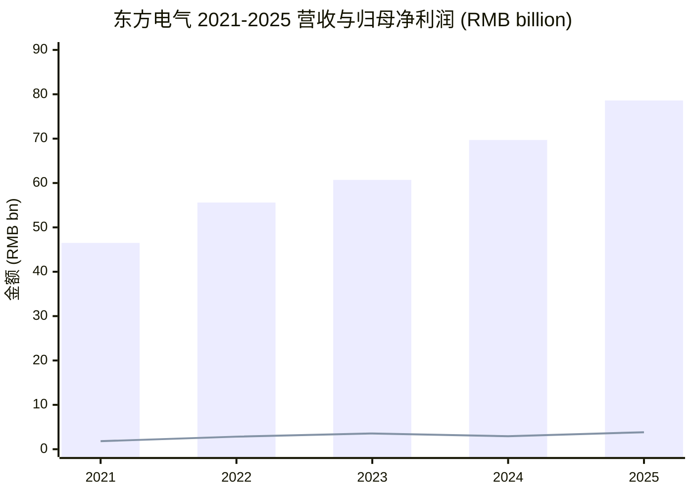
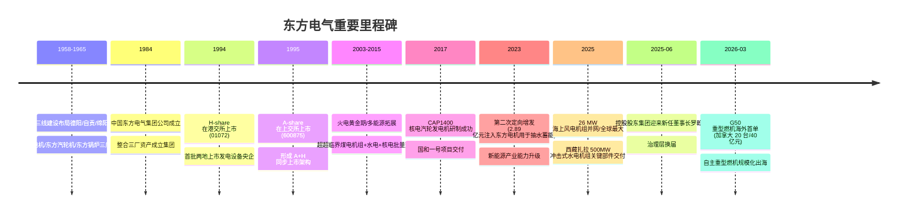
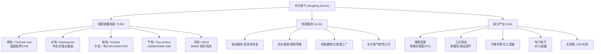
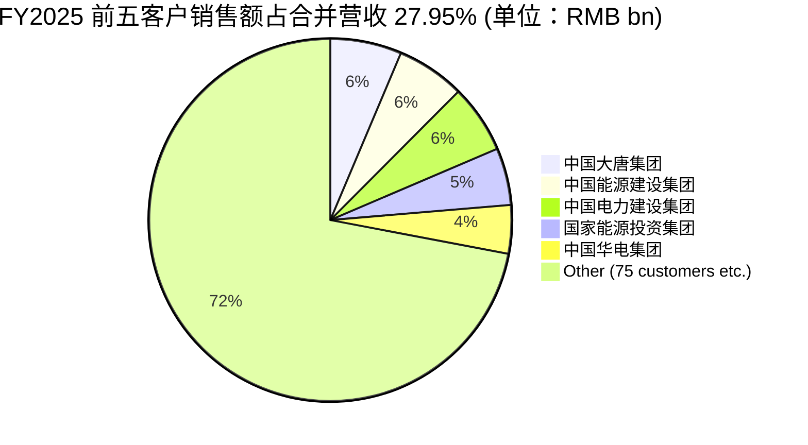
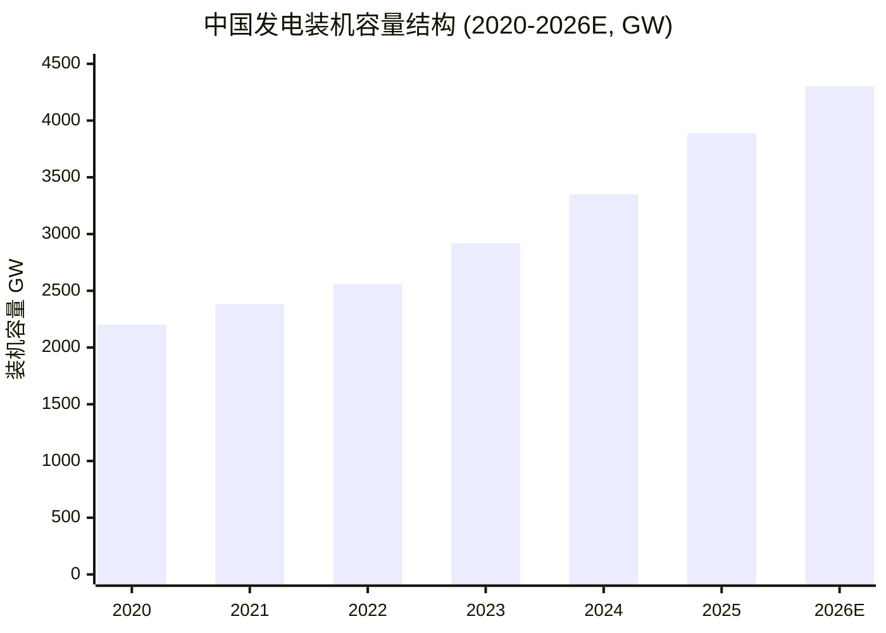
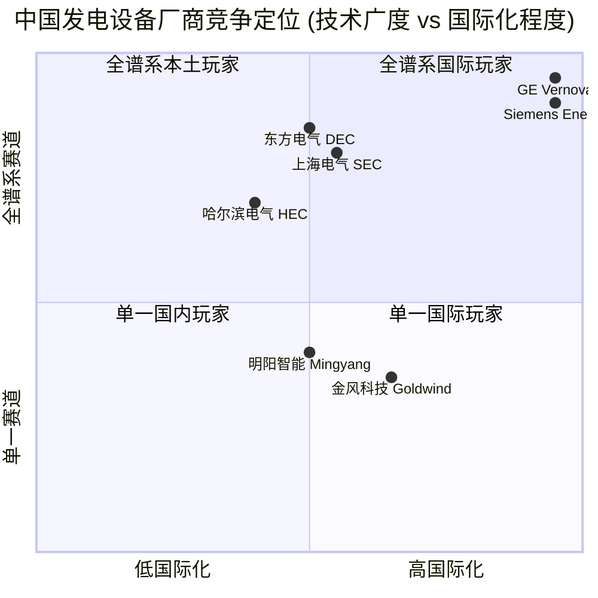
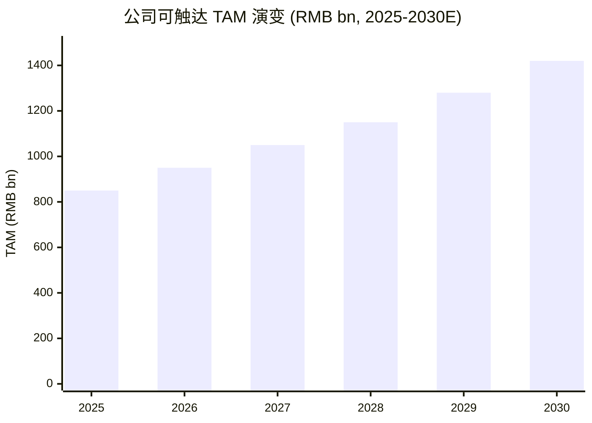
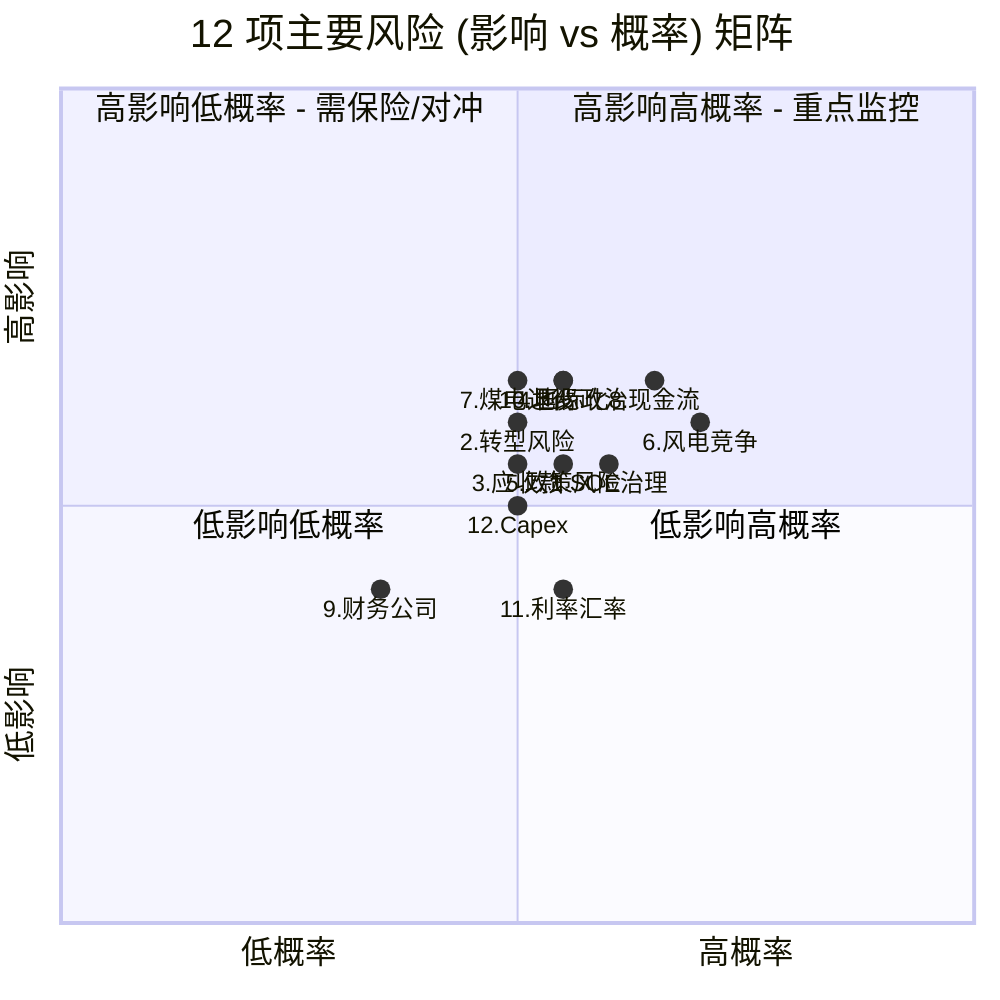

# 东方电气 (Dongfang Electric Corporation, HKEX:01072 / SSE:600875) 公司研究

*As of 2026-06-03*

---

## Executive Summary / 摘要

东方电气 (Dongfang Electric Corporation, "DEC", HKEX:01072 / SSE:600875) 是中国"三大动力" (三大发电设备制造集团) 之一，主营 thermal / coal-fired power (火电)、hydropower (水电)、nuclear power (核电)、gas turbine power (气电)、wind power (风电) 等高端能源装备 (energy equipment) 的研发、设计、制造与销售。公司以"一核两翼"的产业布局 — 以能源装备制造为核心，以制造服务和新兴产业 (储能氢能、节能环保、工业驱动、电力电子) 为两翼 — 服务于中国"双碳"目标 (carbon peak / carbon neutrality) 与新型能源体系建设。控股股东为中国东方电气集团有限公司 (Dongfang Electric Group, SOE 国有企业)，是国务院国资委直管的中央企业。

公司 2025 年实现营业总收入 RMB 786.15 亿元 (+12.80% YoY)，归母净利润 RMB 38.31 亿元 (+31.11% YoY)；2025 年末在手订单达 RMB 1,403.1 亿元；新生效订单 RMB 1,172.51 亿元 (+15.93% YoY)，其中能源装备制造占 67.33%、制造服务占 22.15%、新兴产业占 10.52% ([2025年年度报告](https://static.cninfo.com.cn/finalpage/2026-04-01/1225068291.PDF))。2026Q1 营业收入 RMB 174.70 亿元 (+5.57% YoY)，归母净利润 RMB 15.85 亿元 (+37.41% YoY)，新生效订单 RMB 366.37 亿元 — 增长 momentum 强劲，AI data center 算力扩张带来全球 gas turbine 短缺，公司 G50 重型燃机 (heavy-duty gas turbine) 在 2026 年 3 月获得加拿大客户 20 台订单，合同金额约 RMB 40 亿元，开启自主重型燃机出海规模化进程 ([新浪财经, 2026-05-11](https://finance.sina.com.cn/roll/2026-05-11/doc-inhxptri0448385.shtml))。

A-share 当前 (2026-06-03) 收盘价约 RMB 33.41，市值约 RMB 1,134 亿元，TTM P/E 约 26.6×、forward P/E 约 23.7×，过去 1 年股价上涨约 109%，处在 AI 算力 / energy transition 主题驱动的估值重估周期中 ([Stockanalysis.com, 2026-06-03](https://stockanalysis.com/quote/sha/600875/))。

---

## Table of Contents 目录

1. 公司概览 (Company Overview)
2. 公司历史 (Company History)
3. 管理团队 (Management Team)
4. 产品与服务 (Products & Services)
5. 客户与上市策略 (Customers & Listing Strategy)
6. 行业概览 (Industry Overview)
7. 竞争格局 (Competitive Landscape)
8. 市场机会 (Market Opportunity / TAM)
9. 风险评估 (Risk Assessment)
10. 视角评分 (Investor-Lens Scorecards)
11. 参考资料 (References)

---

## 1. 公司概览 (Company Overview)

东方电气股份有限公司 (Dongfang Electric Corporation Limited, "公司" 或 "本公司")，A-share 代码 600875 (SSE 上海证券交易所，简称 "东方电气")，H-share 代码 01072 (HKEX 香港联合交易所，简称 "东方电气")。公司原称 "东方电机"，后随业务扩张更名为 "东方电气"，是 dual-listed (A+H 两地上市) 央企集团 — Dongfang Electric Group (中国东方电气集团有限公司，DEC Group)，国务院国资委 (SASAC) 直管的特大型中央企业 — 在国内 A-share 与海外 H-share 上市的主要资产平台。注册地与总部位于四川省成都市高新西区西芯大道 18 号，邮编 611731，公司网址 [www.dec-ltd.cn](https://www.dec-ltd.cn/)。法定代表人为 Luo Qianyi (罗乾宜) ([2025年年度报告 第 4 页](https://static.cninfo.com.cn/finalpage/2026-04-01/1225068291.PDF))。

公司是"以能源装备制造为核心的企业集团"，构建了"一核两翼"产业布局 — 以能源装备制造为核心，以制造服务 (manufacturing services / power station after-sales) 和新兴产业 (emerging industries) 为两翼。能源装备制造涵盖 thermal power / coal-fired (煤电)、hydropower (水电)、nuclear power (核能)、gas-fired power (气电)、wind power (风电) 等高端能源装备；制造服务涵盖电站服务、综合能源、制造数智化、供应链及相关服务；新兴产业涵盖储能氢能 (energy storage / hydrogen)、节能环保与化工、工业驱动、电力电子与控制 (power electronics)、太阳能 (solar) 等 ([2025年年度报告 第 9 页](https://static.cninfo.com.cn/finalpage/2026-04-01/1225068291.PDF))。截至 2025 年末，公司累计产出发电设备规模超过 8.4 亿千瓦 (800+ GW)，为全球近 90 个国家和地区提供装备和服务，自 1994 年起连续入选 ENR (Engineering News-Record) 全球 250 家最大国际工程承包商之列 ([2025年年度报告 第 9 页](https://static.cninfo.com.cn/finalpage/2026-04-01/1225068291.PDF))。

**Financial snapshot (FY2025)**: 营业总收入 (total revenue) RMB 78,615.28 million (+12.80% YoY)；营业收入 (operating revenue) RMB 77,582.62 million (+13.11% YoY)；利润总额 RMB 4,785.14 million (+23.19% YoY)；归属于上市公司股东的净利润 (net income to parent) RMB 3,831.30 million (+31.11% YoY)；扣除非经常性损益后的净利润 (recurring net income) RMB 3,191.93 million (+61.17% YoY) — 扣非增速远快于 GAAP 增速反映主营业务质量改善。归属于上市公司股东的净资产 RMB 45,234.56 million，总资产 RMB 162,674.20 million。基本 EPS RMB 1.15 (+22.34% YoY)，加权平均 ROE 9.00% (上年同期 7.71%) ([2025年年度报告 第 5-6 页](https://static.cninfo.com.cn/finalpage/2026-04-01/1225068291.PDF))。

**Order book**: 2025 年末在手订单 RMB 1,403.1 亿元；全年新生效订单 RMB 1,172.51 亿元 (+15.93% YoY)，结构上能源装备制造占 67.33%、制造服务占 22.15%、新兴产业占 10.52%。核电、气电市场占有率保持行业第一；风电国内市场占有率排名第六；水电市场占有率同比提升 ([2025年年度报告 第 10 页](https://static.cninfo.com.cn/finalpage/2026-04-01/1225068291.PDF))。

**Segment economics (FY2025 主营业务分产品):** 能源装备制造收入 RMB 58,005.44 million (+22.00% YoY)，gross margin 13.98% (上年 11.02%，+2.96 pp)；制造服务收入 RMB 12,901.07 million (-16.79% YoY)，gross margin 31.88% — 利润率最高板块，但同比下滑反映传统电站服务订单调整；新兴产业收入 RMB 7,708.76 million (+16.03% YoY)，gross margin 14.95% ([2025年年度报告 第 13 页](https://static.cninfo.com.cn/finalpage/2026-04-01/1225068291.PDF))。整体 gross margin 17.01% (上年 15.48%，+1.53 pp)。境内收入占比 93.46%；境外收入 RMB 5,139.21 million (-7.71% YoY)，主要受国际市场新签订单转化为收入存在时间差影响，但国际市场新生效合同额超 RMB 140 亿元，海外百万千瓦核电机组、50MW 重型燃机、抽水蓄能机组海外订单实现"零"的突破 ([2025年年度报告 第 10 页](https://static.cninfo.com.cn/finalpage/2026-04-01/1225068291.PDF))。

**Q1 2026 momentum**: 营业总收入 RMB 17,469.93 million (+5.57% YoY)，归母净利润 RMB 1,585.46 million (+37.41% YoY)；综合 gross margin 同比提升 0.45 pp 至 17.18% — 反映产品结构优化与成本管控有效；归母净利润增速远快于营收，主因 (a) 综合毛利额同比增长 RMB 2.43 亿元，(b) 公司持有的川能动力 (Sichuan New Energy) 等股票市值上升，公允价值变动收益同比增长 RMB 3.25 亿元 ([2026年第一季度报告 第 1-3 页](https://static.cninfo.com.cn/finalpage/2026-04-30/1225257541.PDF))。

**Valuation snapshot (as of 2026-06-03)**: A-share 600875 收盘价约 RMB 33.41，市值约 RMB 113.4 亿元 (注：以 A 股流通股本 339.41 亿股×0.331 计算)，按总股本 3,458,360,326 股计算市值约 RMB 1,156 亿元；TTM P/E 约 26.6×、forward P/E 约 23.7×、P/S 约 1.62×、P/B 约 2.78×、EV/EBITDA 约 20.3×；股息率 1.22%；52-week range RMB 15.74 – RMB 45.38；过去 1 年股价涨幅约 109%，受 AI 算力 / energy transition / nuclear renaissance 主题驱动 ([Stockanalysis.com, 2026-06-03](https://stockanalysis.com/quote/sha/600875/), [eulerpool.com, 2026 数据](https://eulerpool.com/en/stock/Dongfang-Electric-Corp-Stock-CNE000000J28))。

*Analyst view 分析师观点：* 当前 P/E 26.6× 处于过去 3 年区间偏高端，但相对于行业景气复苏、燃机出海突破、扣非净利润 +61.17% 的高成长，估值并不显著高估；与主要 comparables (上海电气 SSE:601727、哈尔滨电气 HKEX:1133) 相比 P/E 偏高，反映市场对核电 / 燃机 / 风电高端机型出海的预期溢价。下文 Section 8 与 Section 10 进一步展开。

数据来源：[2025年年度报告 第 5-6 页](https://static.cninfo.com.cn/finalpage/2026-04-01/1225068291.PDF) (2023-2025 三年数据)，2021-2022 历史数据 [Stockanalysis.com](https://stockanalysis.com/quote/sha/600875/financials/)。柱：营业总收入；折线：归属于上市公司股东的净利润。

---

## 2. 公司历史 (Company History)

东方电气的发展史是中国"三线建设" (Third Front Construction, 1960s-1970s 国家备战工业布局) 与电力装备产业崛起的缩影。1958-1965 年间，国家在四川德阳、自贡、绵阳一带布局了三个核心子企业 — 东方电机厂 (DFEM, 后改组为东方电气集团东方电机有限公司)、东方汽轮机厂 (DTC，后改组为东方电气集团东方汽轮机有限公司)、东方锅炉厂 (DBC，后改组为东方电气集团东方锅炉股份有限公司) — 形成了"水电机组 + 汽轮机 + 锅炉"三足鼎立的发电设备制造能力 ([界面财经号, 2025-12](https://m.jiemian.com/article/10936634.html))。

1984 年成立东方电气集团公司 (中国东方电气集团有限公司前身) 整合三厂资产。1994 年中国东方电气股份有限公司 (以"东方电机"名义) 成立，1994 年同步在 HKEX 香港联合交易所上市 (代码 01072)；1995 年在 SSE 上海证券交易所 A-share 上市 (代码 600875)，成为中国发电设备行业最早实现 H+A 两地上市的企业之一 ([新浪财经, 2025-10-31](https://finance.sina.com.cn/stock/aiassist/agqsjs/2025-10-31/doc-infvsyzk3930761.shtml))。后续股票简称由"东方电机"变更为"东方电气" — 反映业务从单一发电机制造扩展到 thermal / hydro / nuclear / gas / wind 全谱系能源装备的战略转型 ([2025年年度报告 第 5 页](https://static.cninfo.com.cn/finalpage/2026-04-01/1225068291.PDF))。

公司在 21 世纪经历了三次重要的战略升级。第一次是 2000s-2010s 火电主导期 — 公司抓住中国 thermal power (火电) 大规模建设机遇，超超临界 1,000-MW 等级火电机组、空冷机组、二次再热机组实现批量化交付，奠定"中国发电设备龙头"地位。第二次是 2010s-2020s 多能源协同期 — 公司向 hydropower、nuclear power、wind power 多元化扩张，先后参与三峡水电、白鹤滩水电、华龙一号 (Hualong One)、国和一号 (CAP1400) 等国家级标志性工程，水电、核电技术总体居国际前列 ([2025年年度报告 第 9 页](https://static.cninfo.com.cn/finalpage/2026-04-01/1225068291.PDF))。

第三次是 2020s-2030s 的能源转型期 — 公司全面布局"一核两翼"，传统优势产业向高端化、智能化、绿色化、融合化转型，新兴产业涵盖储能氢能 (energy storage / hydrogen)、电力电子与控制 (power electronics)、节能环保 (clean tech) 等新动能。2023 年公司公告"提质增效重回报"专项行动；2024 年率先发布能源装备行业垂直大模型"东方智源" (Dongfang Intelligent Source LLM)，推动 AI + manufacturing 深度融合；2025 年向特定对象发行 A 股募集资金 (private placement A-share issuance) 约 RMB 52.4 亿元，主要用于核电、抽水蓄能 (pumped storage)、海上风电 (offshore wind) 等战略性方向能力建设 ([2025年年度报告 第 18-20 页 主要资本变动](https://static.cninfo.com.cn/finalpage/2026-04-01/1225068291.PDF))。

数据来源：[新浪财经, 2025-10-31](https://finance.sina.com.cn/stock/aiassist/agqsjs/2025-10-31/doc-infvsyzk3930761.shtml)、[2025年年度报告](https://static.cninfo.com.cn/finalpage/2026-04-01/1225068291.PDF)、[新浪财经, 2026-03-09](https://finance.sina.com.cn/stock/relnews/cn/2026-03-09/doc-inhqkhis7056645.shtml)。

---

## 3. 管理团队 (Management Team)

公司作为央企，由中国东方电气集团有限公司 (Dongfang Electric Group, SOE) 控股，董事会成员、总裁等核心岗位由 SASAC 提名/任命，与一般民企"founder + CEO"的二元结构存在显著差异。本部分仅介绍现任董事长 (Chairman) 和总裁 (President) — 公司两位最核心的执行层决策人。

**Luo Qianyi 罗乾宜 (Chairman, 董事长)**：1965 年 9 月出生，2025 年 6 月起任公司董事长 (任期至 2027 年 6 月 27 日)，同时担任中国东方电气集团有限公司董事长、党组书记。北京科技大学管理科学与工程专业管理学博士，研究员级高级会计师 (senior accountant of researcher rank)。早期职业生涯主要在国防工业系统，曾任中国北方工业 (集团) 总公司财务部干部，中国兵器工业总公司财务会计局副处长、处长，中国燕兴总公司 (兵器工业旗下贸易公司) 总经理助理兼副总会计师 / 副总经理 / 总会计师，中国兵器工业集团公司 (Norinco Group, 全球前 30 大兵器集团) 财会审计部主任 / 总会计师 / 党组成员。后转入能源央企，任国家电网有限公司 (State Grid Corporation of China, 全球最大公用事业公司) 总会计师、党组成员、董事、党组副书记 — 国家电网的财务背景为其理解电力终端客户的采购逻辑、电网投资节奏带来直接 visibility。之后任中国机械工业集团有限公司 (Sinomach Group) 董事、总经理、党委副书记。2025 年 6 月空降到东方电气集团出任董事长，按央企任命惯例任期 3-5 年 ([2025年年度报告 第 34-35 页 董事简历](https://static.cninfo.com.cn/finalpage/2026-04-01/1225068291.PDF))。其财务 / 兵工 / 国家电网背景的组合赋予其三方面 advantage：(a) 财务严格管理能力 — 在央企"质量 + 效益"双导向下提升 ROIC / ROE 的能力，(b) 国家电网客户关系深厚 — 国家电网及其下属网省公司是公司 thermal / hydro / nuclear 设备的核心终端用户，(c) 央企体系横向资源整合能力 — 兵工 / 机械 / 电网背景帮助公司在"两重两新"（重大工程 + 新动能）国家项目布局中获取 strategic access。任职期间无公司股权激励 (持股 0 股)，反映央企"政治任命"特征。

**Zhang Yanjun 张彦军 (President & Director, 总裁、董事)**：1970 年 3 月出生，2021 年 6 月起任公司董事，2021 年 6 月至 2024 年 4 月任公司高级副总裁，2024 年 4 月起接任公司总裁 (President，任期至 2027 年 6 月 27 日)，同时担任中国东方电气集团有限公司董事、总经理、党组副书记 — 集团层面的"二把手"。技术派出身：西安交通大学 (XJTU) 能源与动力工程系热能工程专业本科，浙江大学 (ZJU) 能源系工程热物理专业硕士，浙江大学能源工程系动力工程及工程热物理专业博士 — 完整的能源动力工程师培养路径。早期职业生涯在哈尔滨锅炉厂有限责任公司 (Harbin Boiler Co., 哈电集团核心子企业，是公司主要竞争对手哈尔滨电气的关键资产)，历任设计处副处长、处长、总经理部副总工程师、总工程师；后任哈尔滨锅炉厂副总经理、副董事长、总经理、党委副书记 — 在主要竞争对手哈尔滨电气体系内的 14 余年技术与管理经历，使其对中国发电设备行业的技术路线、客户偏好、供应链关键节点有罕见的深度认知。之后调任哈电集团、哈尔滨电气股份有限公司 (Harbin Electric, HKEX:01133，主要竞争对手) 科技管理部部长、双创基地管理办公室主任、中央研究院党委书记 / 院长。2018 年前后调入中国东方电气集团有限公司任副总经理、党组成员；2024 年 3 月升任集团总经理、党组副书记，4 月接任公司总裁。其"主要竞争对手深度任职 + 技术博士 + 集团二把手"的复合 profile 是公司在 thermal / hydro / nuclear 同质化竞争中保持差异化的关键 ([2025年年度报告 第 35 页 总裁简历](https://static.cninfo.com.cn/finalpage/2026-04-01/1225068291.PDF))。任职期间无公司股权激励 (持股 0 股)。

董事会层面，截至 2025 年末公司由 7 名董事组成，其中独立非执行董事 3 名 (Huang Feng 黄峰、Zeng Daorong 曾道荣、Chen Yu 陈宇)，下设审计与风险委员会、战略发展委员会、提名委员会、薪酬与考核委员会。2025 年公司完成监事会改革，按 2024 年新《公司法》要求撤销监事会、由董事会审计与风险委员会承接监督职责 ([2025年年度报告 第 32-33 页](https://static.cninfo.com.cn/finalpage/2026-04-01/1225068291.PDF))。

---

## 4. 产品与服务 (Products & Services)

公司的产品组合按"一核两翼"组织 — Core (能源装备制造) + Wings (制造服务 + 新兴产业)。这三大板块在 FY2025 贡献了公司 99%+ 的合并收入。

### 4.1 能源装备制造 (Energy Equipment Manufacturing, 73.78% of revenue)

能源装备制造是公司的传统核心业务，FY2025 收入 RMB 58,005.44 million (+22.00% YoY)，gross margin 13.98% (+2.96 pp YoY)。涵盖五大子板块：

**(1) 煤电 / Thermal coal-fired power equipment** — 公司 2025 年发布新一代煤电技术解决方案，超超临界 (ultra-supercritical) "W" 火焰锅炉市场实现"零"的突破。100 万千瓦等级空冷机组、100 万千瓦等级二次再热机组、大型循环流化床锅炉 (CFB) 处于行业领先地位 ([2025年年度报告 第 9 页](https://static.cninfo.com.cn/finalpage/2026-04-01/1225068291.PDF))。全球首台 700 兆瓦超超临界循环流化床锅炉入选"2025 年度央企十大超级工程"和"2025 年度能源行业十大科技创新成果"。中国煤电存量 1,180 GW 左右的灵活性改造 (flexibility retrofit, 用于配合 renewables 的调峰) 与新建支撑性煤电将持续支撑该板块。

> "100 万千瓦等级空冷机组、100 万千瓦等级二次再热机组、大型循环流化床锅炉、重型燃气轮机等产品处于行业领先地位"
> ([2025年年度报告 第 9 页](https://static.cninfo.com.cn/finalpage/2026-04-01/1225068291.PDF))

**中文释义 / Plain-language gloss:** *超超临界 (ultra-supercritical)* 指蒸汽工质在锅炉中被加热到超过 25 MPa 压力和 600°C+ 温度的高效燃煤发电技术，相比亚临界机组发电效率高 6-8 pp，碳排放强度低；*二次再热 (double reheat)* 是在汽轮机膨胀过程中将蒸汽两次返回锅炉再加热的工艺，效率比单次再热高 1.5-2 pp；*循环流化床锅炉 (CFB)* 是利用流化态颗粒燃烧的清洁燃煤技术，可以燃烧低热值煤、煤矸石、生物质，是中国大型煤电的差异化路线之一。

**(2) 水电 / Hydropower equipment** — 公司水电产品技术总体居国际前列，贯流式 (bulb-type)、混流式 (Francis turbine)、轴流式 (Kaplan turbine)、抽水蓄能 (pumped storage)、冲击式 (Pelton-type) 机组水电技术达到行业领先水平 ([2025年年度报告 第 9 页](https://static.cninfo.com.cn/finalpage/2026-04-01/1225068291.PDF))。FY2025 水电市场占有率同比提升，实现抽水蓄能高海拔、宽负荷、变转速等领域突破。重大工程包括西藏林芝建成投用世界首个高原水电机组产研基地、扎拉 500 兆瓦冲击式水电机组完成水力开发和配水环管等关键部件的验收交付 ([2025年年度报告 第 9 页](https://static.cninfo.com.cn/finalpage/2026-04-01/1225068291.PDF))。FY2025 水轮发电机组生产量 8,056.6 MW (+111.96% YoY)，销售量 4,230 MW (-26.64% YoY)，库存量 5,181.6 MW (+282.4% YoY) — 反映扎拉、川西水电等大单建造期的库存累积，2026-2028 将是水电交付高峰期。

**中文释义 / Plain-language gloss:** *抽水蓄能 (pumped storage)* 是利用低谷电力将水从下水库抽到上水库储存，在高峰时段放水发电的"水电池"系统 — 是当前 grid-scale energy storage 的主流方式，单座电站 MW 级别为 GW 级，技术成熟、循环效率约 70-80%；*冲击式 (Pelton turbine)* 是高水头水电的核心机型，适用于水头 250-1,800m 的高山峡谷水电站，技术门槛极高 — 扎拉 500 MW 是中国首台 500 MW+ 级冲击式机组，对应高原大水头电站的国产化重大突破。

**(3) 核电 / Nuclear power equipment** — 公司核电市场占有率保持行业第一。2025 年核心成果：(a) "国和一号" (CAP1400) 示范工程 2 号机组投入商运；(b) 世界首座 600 兆瓦商用高温气冷堆 (HTGR, High-Temperature Gas-cooled Reactor) 示范工程主氦风机 (helium circulator)、蒸汽发生器 (steam generator) 等核心主设备完成研制交付 ([2025年年度报告 第 9 页](https://static.cninfo.com.cn/finalpage/2026-04-01/1225068291.PDF))。公司核电覆盖 Hualong One (华龙一号，三代国产堆型 1,000 MW class)、CAP1400 (国和一号，三代+大型堆 1,400 MW class)、HTGR (四代高温气冷堆 200-600 MW)、CFR-600 (实验快堆) 等多技术路线。公司与上海电气 (601727) 在核岛 (nuclear island) 主设备市场合计占有率超 90% — 国家核电"装备本土化"战略下的双寡头之一 ([中国核能行业协会](https://china-nea.cn/site/content/705.html))。

**(4) 气电 / Gas turbine power equipment** — 气电市场占有率保持行业第一。最重要的 2025-2026 突破是 15 MW、50 MW 重型燃机 (heavy-duty gas turbine) 的全自主国产化：(a) 15 MW 重型燃机实现满负荷运行并具备纯氢燃烧能力；(b) 50 MW F-class G50 重型燃机于 2026 年 3 月获得加拿大客户 20 台订单，单台合同金额约 RMB 2 亿元，合同总金额约 RMB 40 亿元，gross margin 40-50% — 这是中国自主重型燃机规模化进入北美高端市场的标志性突破，打破 GE Vernova、Siemens Energy、Mitsubishi Power 在 F-class 重型燃机的全球垄断 ([新浪财经, 2026-03-09](https://finance.sina.com.cn/stock/relnews/cn/2026-03-09/doc-inhqkhis7056645.shtml), [新浪财经, 2026-05-11](https://finance.sina.com.cn/roll/2026-05-11/doc-inhxptri0448385.shtml))。北美市场已有约 1 GW / 20 台 G50 燃机的询单 — 全球 AI data center / hyperscale cloud 电力需求超预期与 GE/Siemens 订单排到 2030 年是直接催化剂。

**中文释义 / Plain-language gloss:** *F-class gas turbine* 指 turbine inlet temperature 1,300-1,400°C 等级的重型燃气轮机 — 是全球电力级燃机的主力机型，效率约 38-40%，combined-cycle (CCGT) 效率可达 60%+；*G50 50 MW* 指公司自主设计制造的 50 MW 输出功率 F-class 重型燃机 — 重型燃机是被卡脖子几十年的关键工业母机 (heat-resistant alloy、single-crystal turbine blade、advanced cooling 等核心技术长期被 GE/Siemens/Mitsubishi 三家垄断)，G50 的产品化代表中国在 F-class 燃机领域第一次实现"设计-制造-运行-出口"全链条自主可控。

**(5) 风电 / Wind power equipment** — 公司风电国内市场占有率排名第六 (远落后于金风 SZ:002202、远景能源 (未上市)、明阳智能 SH:601615 等头部厂商)，但在海上风电高功率机组细分市场具备差异化优势：2025 年公司全球最大的 26 兆瓦级 (DEW-D26000) 半直驱海上风电机组并网发电，17 兆瓦直驱漂浮式 (floating offshore) 海上风电机组下线 ([2025年年度报告 第 9 页](https://static.cninfo.com.cn/finalpage/2026-04-01/1225068291.PDF))。新疆若羌、布尔津风电装备制造基地投产，反映公司向西北陆上大基地市场的渗透。2025H1 海上风电整机商订单量公司排名首位，DEW-D16000-262 机型收获 1.5 GW 新签订单 ([龙船风电网, 2025-08](https://wind.imarine.cn/news/124818.html))。FY2025 风力发电机组生产量 14,026.1 MW (+39.81% YoY)，销售量 12,656.6 MW (+41% YoY)，库存量 3,332.7 MW (+69.76% YoY) — 海上风电产能扩张带动的全方位增长。

### 4.2 制造服务 (Manufacturing Services, 16.41% of revenue)

FY2025 制造服务收入 RMB 12,901.07 million (-16.79% YoY)，gross margin 31.88% — 是公司利润率最高的板块。主要包括：(a) 电站服务 (power station after-sales / O&M / retrofit) — 包括灵活性综合改造、多元供热与热电解耦、综合节能提效、储能融合等电站改造业务；(b) 综合能源 (integrated energy services) — 用于配合 grid-scale renewables 的源网荷储一体化解决方案；(c) 制造数智化 ("智改数转"，digital manufacturing transformation) — 公司 2 家企业入选工信部第一批卓越级智能工厂，拥有智能制造成熟度四级企业 (industry highest level) 3 家，累计建成数字化车间 34 个；(d) 供应链服务 (supply chain services)；(e) 财务公司服务 (东方电气集团财务有限公司 — 内部 captive finance company，FY2025 总资产 RMB 59,975.91 million、净利润 RMB 302.16 million) ([2025年年度报告 第 27 页](https://static.cninfo.com.cn/finalpage/2026-04-01/1225068291.PDF))。

### 4.3 新兴产业 (Emerging Industries, 9.81% of revenue)

FY2025 新兴产业收入 RMB 7,708.76 million (+16.03% YoY)，gross margin 14.95%。主要包括：

- **储能氢能 (Energy storage / hydrogen):** 西藏制氢加氢一体化示范项目投运，推出"氢氧电热"多联供系统应用发展模式；公司构建了具有完全自主知识产权的氢能核心装备体系，形成了以电解水制氢 (electrolyzer) 和燃料电池 (fuel cell) 为主的产品序列；自研构网型 PCS 储能变流器 (grid-forming PCS) 实现首台 (套) 应用；漂浮式风电耦合海水无淡化原位制氢综合平台通过中国船级社认证。
- **工业驱动 (Industrial drives):** 屏蔽泵 (canned motor pump，石油化工核心设备)、管线压缩机 (pipeline compressor) 等石化领域核心装备；高端屏蔽泵首次出口欧洲。
- **节能环保与化工 (Energy efficiency / chemicals):** 化工容器、驱动透平 (drive turbine)、屏蔽泵、管线压缩机等石油化工领域核心设备制造能力；废气废水处理、固废处置及资源化利用系统解决能力。
- **电力电子与控制 (Power electronics):** 实现自主励磁 (excitation system)、大容量 SFC (Static Frequency Converter, 静止变频起动装置) 在抽水蓄能项目订单"零"的突破。
- **太阳能 (Solar):** 主要是 CSP (concentrated solar power, 光热) — 抓住国家支持规模化发展的机会，依托系统集成及核心装备研制优势，持续提升市场份额 ([2025年年度报告 第 9-10、30 页](https://static.cninfo.com.cn/finalpage/2026-04-01/1225068291.PDF))。

数据来源：[2025年年度报告 第 9-13 页](https://static.cninfo.com.cn/finalpage/2026-04-01/1225068291.PDF)。三大板块的合并收入占比基于主营业务分产品口径：能源装备制造 73.78%、制造服务 16.41%、新兴产业 9.81%。

### 4.4 产品组合的协同与战略意义

公司"一核两翼"的产品组合具有内在协同：(a) 能源装备制造是 anchor business — 占新生效订单 67.33%，是 cash flow 与 brand reputation 的来源；(b) 制造服务是 high-margin layer — 31.88% 的 gross margin 远高于能源装备制造的 13.98%，且通过 retrofit / O&M 形成对存量电站的长期 economic moat；(c) 新兴产业是 growth optionality — 在 hydrogen / energy storage / industrial drive 等新兴赛道布局，对应"双碳"战略下的下一轮 capex 周期。三大板块共同形成 "selling the shovels of the energy transition" (能源转型的卖铲人) 的战略 positioning ([国际风力发电网, 2024](https://wind.in-en.com/html/wind-2409049.shtml))。

---

## 5. 客户与上市策略 (Customers & Listing Strategy)

### 5.1 客户结构与集中度

FY2025 公司前五名客户销售额合计 RMB 2,197,003.60 万元 (RMB 21.97 billion)，占年度销售总额 27.95%；其中关联方销售额为 0 元 ([2025年年度报告 第 18 页](https://static.cninfo.com.cn/finalpage/2026-04-01/1225068291.PDF))。"占年度销售总额 27.95%" 的口径为**合并报表层级 (consolidated revenue level)**，下文除非明确指出，均指合并层级。

前五名客户按所属集团合并列示，全部为国有电力 / 工程央企集团 — 反映公司 "卖给央企客户的央企装备商" 的国资体系内供应链特征。FY2025 前五名客户分别归属于以下五大集团：

| 序号 | 所属集团 (Parent Group) | 角色 (Role) | 旗下客户子公司示例 |
|---|---|---|---|
| 1 | 中国大唐集团 (China Datang Group) | Power producer / Owner | 中国大唐集团国际贸易、大唐布卡新能源、西藏大唐扎拉水电、福建大唐宁德发电 |
| 2 | 中国能源建设集团 (China Energy Engineering Group, EnergyChina) | EPC / Designer | 西南/西北/华东/华北/中南电力设计院、中能建广西/广东/山西公司、中能建投 (六盘水) |
| 3 | 中国电力建设集团 (PowerChina) | EPC / Designer | 西北/华东/中南勘测设计研究院、贵州/成都/四川/江西/河北/山东工程公司、水电七局/五局 |
| 4 | 国家能源投资集团 (CHN Energy / Shenhua) | Power producer / Owner | 国能融资租赁、国能安庆/长源汉川/浙江北仑/神华九江/中卫/保定发电、国家能源集团西藏电力 |
| 5 | 中国华电集团 (China Huadian Group) | Power producer / Owner | 华电新能新疆木垒、四川华电 (木里唐央/内江燃气)、华电金沙江上游/金上 (昌都/巴塘)、华电莱州 |

(数据来源：[2025年年度报告 第 16-17 页](https://static.cninfo.com.cn/finalpage/2026-04-01/1225068291.PDF))

值得注意的是 — 公司前五大客户**全部为央企集团 (consolidated at parent-group level)**：报告期内向单个客户的销售比例并未超过总额的 50%、不存在严重依赖少数客户的情形，但 27.95% 的 top-5 集中度仍属于中高位 ([2025年年度报告 第 18 页](https://static.cninfo.com.cn/finalpage/2026-04-01/1225068291.PDF))。这背后反映两个特点：(a) 中国 power generation 行业的最终客户集中度极高 — 五大发电集团 (国家能源、国电投、华能、华电、大唐) + 三峡 + 国家电网 等少数央企控制了 80%+ 的电力装备采购；(b) 公司作为央企装备供应商，与央企电力客户的关系相对稳定 — 不存在大客户违约、订单短期撤销等风险，但价格谈判力受央企集中采购框架制约。

数据来源：[2025年年度报告 第 18 页](https://static.cninfo.com.cn/finalpage/2026-04-01/1225068291.PDF)。前五客户合计 RMB 21.97 bn / 年度营业收入 RMB 78.56 bn = 27.95%。说明：年报披露的是 top-5 合计金额而非每家具体金额，因此饼图中前 5 集团的金额为均匀拆分估算 (analyst estimate, 仅用于可视化示意；不构成对单一集团客户份额的判断)。

### 5.2 供应商结构

FY2025 前五名供应商采购额 RMB 1,152,555.19 万元 (RMB 11.53 billion)，占年度采购总额 17.67%；其中关联方采购额 RMB 46,503.20 万元 (RMB 465.03 million)，占年度采购总额 7.13% — 反映与控股股东东方电气集团旗下其他企业的内部交易规模。前五供应商主要为中国电力建设集团 (PowerChina) 旗下西北 / 中南 / 华东勘测设计研究院 — 是公司 EPC 业务的设计分包伙伴 ([2025年年度报告 第 17-18 页](https://static.cninfo.com.cn/finalpage/2026-04-01/1225068291.PDF))。

### 5.3 上市架构与股权结构

公司采用 A+H 双重上市架构：(a) A-share — SSE:600875，是公司在国内 capital market 的主要融资平台，2025 年完成定向增发募集资金约 RMB 52.4 亿元；(b) H-share — HKEX:01072，是公司在国际资本市场的融资平台 — 截至 2026Q1，H-share 股东 (香港中央结算有限公司 / HKSCC nominees) 持有 406,493,969 股，占总股本 11.75% ([2026年第一季度报告 第 4 页 前 10 名股东](https://static.cninfo.com.cn/finalpage/2026-04-30/1225257541.PDF))。

控股股东中国东方电气集团有限公司持股 1,776,676,194 股 (含 786,993,731 股限售)，占总股本 51.37% — 国务院国资委的间接控股使公司具有典型的 "央企控股的 A+H 上市公司" 治理结构。第二大股东为 HKSCC nominees (11.75%)，主要代表境外机构投资者。第三大股东为中国国有企业混合所有制改革基金 (1.75%) — 国资委下属的 mixed-ownership reform fund。前 10 大流通股东中除控股股东外，主要为 ETF (华泰柏瑞沪深 300 ETF)、公募基金 (汇添富、广发、富国)、保险资金 (国寿) 等 — 反映 A-share 市场以机构投资者为主的股东结构。

A+H 双重上市的战略意义：(a) 海外融资 access — 通过 H-share 接入国际资本市场 (尤其是中东 / 东南亚主权基金的能源转型布局)；(b) 国际化品牌背书 — 海外大额订单 (如 G50 加拿大订单) 谈判中作为 dual-listed 上市公司更易获得海外客户信任；(c) 港股流动性溢价 — H-share 自 2024 年以来作为"中字头" stocks 同步受益于 HKD/USD 流动性回流。

---

## 6. 行业概览 (Industry Overview)

公司所处行业为能源装备制造业 (energy equipment manufacturing)，下分 thermal、hydro、nuclear、gas、wind、solar、storage 等子赛道。中国电力装备行业的发展节奏与国家能源结构 / 电力需求 / 电网投资节奏高度耦合，并叠加 "carbon peak / neutrality" (碳达峰 / 碳中和) 政策驱动的 capex 周期。

### 6.1 中国电力需求与发电装机容量持续扩张

2025 年全国全社会用电量 10.4 万亿千瓦时 (10.4 trillion kWh)，同比 +5%；累计发电装机容量 38.9 亿千瓦 (3,890 GW)，同比 +16.1% — 总体上看，国内的用电需求持续保持高增长态势，进而支持能源装备行业保持较好市场前景 ([2025年年度报告 第 9 页](https://static.cninfo.com.cn/finalpage/2026-04-01/1225068291.PDF))。其中：(a) 太阳能发电装机容量 12.0 亿千瓦 (1,200 GW)，同比 +35.4%；(b) 风电装机容量 6.4 亿千瓦 (640 GW)，同比 +22.9%；(c) 风电 + 太阳能合计 1,840 GW，占全国发电装机容量 47% — 2025 年首次超过 thermal power 装机容量，标志中国电力结构转折点 ([国家能源局, 2026-02-12](https://www.nea.gov.cn/20260212/742b8c6a078347b0b39de676c05c5d58/c.html))。

### 6.2 2026 年与"十五五"规划展望

2026 年全国能源工作会议明确：(a) 全年新增风电、太阳能发电装机 2 亿千瓦 (200 GW) 以上；(b) 有序推进重大水电项目；(c) 积极安全有序发展核电；(d) 前瞻布局氢能、核能等未来能源产业 ([新华网, 2025-12-17](https://www.news.cn/20251217/de83d466b05245bfa6bec06e5ae0c49d/c.html))。中国电力企业联合会 (CEC) 预计 2026 年全年全社会用电量 10.9–11 万亿千瓦时，同比 +5%–6%；2026 年底全国发电装机容量有望达到 43 亿千瓦 (4,300 GW) 左右，同比 +10.5% — 其中 thermal coal 占总装机比重将降至 31% 左右，风电 + 太阳能合计装机将达到总发电装机的一半，非化石能源发电装机 27 亿千瓦、占总装机比重升至 63% 左右 ([2025年年度报告 第 29 页](https://static.cninfo.com.cn/finalpage/2026-04-01/1225068291.PDF))。

"十五五"规划 (2026-2030) 的核心导向：(a) 国家自主贡献目标 — 2035 年全国风电、太阳能发电总装机容量达到 2020 年的 6 倍以上，力争达到 36 亿千瓦 (3,600 GW)；(b) 2030 年非化石能源消费比重达到 25%，新能源发电装机比重超过 50%、成为电力装机主体；(c)《能源法》正式施行，为能源结构转型提供法律保障；(d) "136 号文" (《关于深化新能源上网电价市场化改革促进新能源高质量发展的通知》) 推动电价市场化改革，促进新能源高质量发展和新型电力系统构建 ([2025年年度报告 第 9、29 页](https://static.cninfo.com.cn/finalpage/2026-04-01/1225068291.PDF))。

### 6.3 子赛道的结构性增长机会

- **核电 (Nuclear)** — 进入稳定发展时期，已连续四年核准数量超 10 台 (中国核能行业协会数据)；2025 年"国和一号" 2 号机组投入商运，公司是核岛主设备双寡头之一 (与上海电气合计 90%+ 份额)。"十五五"期间预计新增核电核准 10-12 台 / 年，对应每年 RMB 300-500 亿元装备订单空间。
- **抽水蓄能 (Pumped storage)** — 作为水电主要形式和储能主导方式，建设全面提速。国家发改委 / 国家能源局 2021 年发布的《抽水蓄能中长期发展规划 (2021-2035)》目标 2030 年装机 120 GW (vs 2020 年 32 GW)，对应未来 5 年年均新增装机 15-18 GW，单 GW 装机带动设备订单 RMB 30-50 亿元。
- **燃气轮机 (Gas turbines)** — 作为优质调峰电源，愈发引起各方重视；全球 AI data center 算力扩张与 hyperscale cloud 电力需求带来 GE Vernova、Siemens Energy 订单排到 2028-2030 年，给中国自主重型燃机出海留下窗口期 ([新浪财经, 2026-05-11](https://finance.sina.com.cn/roll/2026-05-11/doc-inhxptri0448385.shtml))。
- **海上风电 (Offshore wind)** — 中国十四五目标海上风电累计装机 100+ GW，未来 5 年潜在新增 50-70 GW；公司 26 MW、17 MW 漂浮式机组在大功率细分市场具备 differentiated edge ([offshorewind.biz, 2025-09-03](https://www.offshorewind.biz/2025/09/03/dongfang-installs-worlds-largest-single-capacity-offshore-wind-turbine-for-testing/))。
- **氢能与储能 (Hydrogen / energy storage)** — 纳入未来产业前瞻布局，"风光氢氨醇"一体化示范项目和"氢氧电热"多联供系统是公司新兴产业的两个重点方向。

### 6.4 行业结构演变

行业逻辑正从"追求规模扩张"转向"满足高比例可再生能源接入与电力系统安全灵活运行的双重需求"。装备需求向：(a) 大容量、(b) 高可靠性、(c) 智能化、(d) 灵活性、(e) 低碳化方向迭代。这对老牌厂商 (如公司) 既是机会 (技术 + 资本 + 制造能力门槛) 也是挑战 (新进入者如金风 / 远景 / 阳光电源在新赛道更敏捷) ([2025年年度报告 第 9、29 页](https://static.cninfo.com.cn/finalpage/2026-04-01/1225068291.PDF))。

数据来源：[国家能源局 2025 年统计](https://www.nea.gov.cn/20260129/6874f211acd0417eab7ac10c3061a7c2/c.html)、[2025年年度报告 第 29 页 2026 预测](https://static.cninfo.com.cn/finalpage/2026-04-01/1225068291.PDF)。

---

## 7. 竞争格局 (Competitive Landscape)

### 7.1 直接竞争对手 (Direct competitors)

中国发电设备制造行业由"三大动力" (Three Power Equipment Giants) 主导：

- **上海电气集团股份有限公司 (Shanghai Electric Group, SSE:601727 / HKEX:02727)** — 公司在 thermal / nuclear / gas / wind 各赛道的核心同业对手。核电核岛主设备综合市场占有率约 40%；火电常规岛部分与公司、哈电三家"分天下"；上海电气还涉足风电整机 (上海电气风电 SSE:688660)、能源服务、电梯电机等多元化业务 ([中国核能行业协会](https://china-nea.cn/site/content/705.html))。在 nuclear island 主设备市场，DEC + 上海电气合计占 90%+ 份额。
- **哈尔滨电气股份有限公司 (Harbin Electric, HKEX:01133)** — 公司在 hydropower / thermal / nuclear 的直接竞争对手；公司现任总裁 Zhang Yanjun 早期长期在哈电系统任职，了解对手深度。哈电在 hydropower 大型水电机组 (如三峡 / 白鹤滩) 与 DEC 长期处于"分单"状态。
- **金风科技 (Goldwind, SZ:002202 / HKEX:02208)** — 中国最大风电整机商，2025H1 国内风电市场占有率约 18.2%，远高于公司在 wind power 的 #6 位置。
- **远景能源 (Envision Energy, 非上市)** — 中国第二大风电整机商，2025H1 市场占有率约 16.6%。
- **明阳智能 (Mingyang Smart Energy, SH:601615)** — 中国第三大风电整机商，2025H1 市场占有率约 16.2%，在海上风电市场份额尤其领先 ([龙船风电网, 2025-08](https://wind.imarine.cn/news/124818.html))。

在 gas turbine 国际市场，公司面对 GE Vernova (NYSE:GEV)、Siemens Energy (XETRA:ENR)、Mitsubishi Power (TYO:7011) — 三家垄断全球 F-class 重型燃机市场超过 95% 份额。公司 G50 进入北美市场是中国 OEM 第一次在 F-class 实现规模化出口 ([新浪财经, 2026-03-09](https://finance.sina.com.cn/stock/relnews/cn/2026-03-09/doc-inhqkhis7056645.shtml))。

### 7.2 竞争定位 (Competitive positioning)

数据来源：分析师自构 (2026)。Quadrant chart 用于可视化展示 — 不构成精确市场份额表述。

### 7.3 核心竞争力 (Core competencies)

公司 2025 年年度报告披露的五项核心竞争力 ([2025年年度报告 第 11-12 页](https://static.cninfo.com.cn/finalpage/2026-04-01/1225068291.PDF))：

> "1. 科技创新能力突出 — 2025 年公司研发经费投入 RMB 38.81 亿元，新增有效专利 698 件 (其中发明专利 358 件)，截至 2025 年底拥有有效专利 4,572 件 (其中发明专利 2,140 件)。
> 2. 产业结构多元完备 — 构建了'一核两翼'格局；煤电、水电、风电、核电部件及国产化率均达到 100%。
> 3. 制造及服务能力先进 — 2 家企业入选工信部第一批卓越级智能工厂；智能制造成熟度四级企业 (行业最高水平) 3 家。
> 4. 市场开拓能力强 — 总部与所属企业协同推进的两级营销体系。
> 5. 文化与品牌积淀深厚 — 'DEC' 等商标为中国驰名商标，在德国、法国、俄罗斯等 43 个国家注册并受当地法律保护。"

R&D investment ratio 4.94% (RMB 38.81 / RMB 786.15) — 高于行业平均的 3-4% 水平，反映公司在新技术开发上的持续投入；研发人员 4,493 人，占公司总人数 23.96%；其中博士 180 人、硕士 1,754 人 — 高学历占比 43%+ ([2025年年度报告 第 19 页](https://static.cninfo.com.cn/finalpage/2026-04-01/1225068291.PDF))。

*分析师观点：* 公司的核心 economic moat 来自三方面：(a) 央企体系内的客户 / 项目 access — 在国家级核电、大型水电、燃气调峰等战略项目中拥有"准强制" preferred supplier 地位；(b) 多技术路线协同 — Thermal/Hydro/Nuclear/Gas/Wind 全谱系覆盖使公司能够提供"系统解决方案"而非单一产品，对应电站客户从设计-建造-运维全链条降本逻辑；(c) Manufacturing scale 与 quality control — 累计产出发电设备 800+ GW、ENR 250 名单连续 30+ 年，是后来者很难复制的 brand reputation。

---

## 8. 市场机会 (Market Opportunity / TAM)

### 8.1 中国发电设备市场 TAM

按 2026E 全国新增装机 4 亿千瓦 (400 GW) 估算，按 thermal RMB 3,000-4,000/kW、hydro RMB 5,000-8,000/kW、nuclear RMB 12,000-15,000/kW、gas turbine RMB 5,000-7,000/kW、wind onshore RMB 3,000-3,500/kW、wind offshore RMB 7,000-10,000/kW、solar RMB 2,500-3,500/kW 的设备单价加权 — 中国 2026E 发电设备 TAM 在 RMB 1.4-1.6 万亿元区间 (核心装备口径，不含 BOS、土建)。其中公司可触达的细分市场约 RMB 8,000-10,000 亿元 (扣除公司不直接参与的 solar module / inverter / 部分 wind onshore 市场)。

### 8.2 抽水蓄能与电网调节 TAM

按"十五五"规划目标 2030 年抽水蓄能装机 120 GW、5 年新增约 88 GW，对应每年新增 17-18 GW。单 GW 抽水蓄能装机约带动设备投资 RMB 30-50 亿元，对应每年抽水蓄能装备市场 TAM 约 RMB 500-900 亿元。公司在抽水蓄能高海拔、宽负荷、变转速等领域 2025 年实现技术突破，配合 2023 年定向增发 (RMB 2.89 亿元注入东方电机用于抽水蓄能能力提升项目)，是细分市场重点参与者之一。

### 8.3 核电 TAM

按未来 5 年年均新核准 10-12 台、单台百万千瓦核电机组核岛设备造价 RMB 30-40 亿元 (含核岛主设备 + 辅助设备)，对应每年核岛设备市场 TAM 约 RMB 300-500 亿元。DEC + 上海电气合计 90%+ 份额，意味着公司每年核电业务订单空间在 RMB 130-200 亿元。叠加 HTGR、CFR、ITER、SMR 等四代堆 / 下一代堆型的研制订单，长期 TAM 进一步扩展。

### 8.4 重型燃机海外市场 TAM

全球 F-class 重型燃机市场约 4-5 GW/year 新增需求 (近 5 年因 AI data center 与天然气调峰需求上修至 6-7 GW/year)，对应单价 RMB 1.5-2.5 亿元/MW 的设备订单，全球 TAM 约 RMB 80-150 亿美元/year。公司 G50 当前在北美的潜在询单约 1 GW / 20 台 — 如全部转化，对应 RMB 40 亿元订单；中长期看，如能在中东、东南亚、欧洲市场实现 5-10% 份额 (约 200-400 MW/year)，对应公司 gas turbine business 海外年化收入空间 RMB 30-80 亿元，毛利率 40-50%。

### 8.5 海上风电与漂浮式风电 TAM

中国海上风电"十五五"目标新增 50-70 GW，按 RMB 7,000-10,000/kW 单价测算，5 年累计市场 TAM 约 RMB 3,500-7,000 亿元。公司 26 MW、17 MW 漂浮式机组在高功率细分市场具备差异化优势 — 假设公司能在高功率海上 (≥18 MW class) 细分市场维持 #1 位置 (15-20% 整机份额)，对应公司 wind business 海上年化新增收入空间 RMB 100-200 亿元。

### 8.6 制造服务 / 电站后市场

公司累计交付 800+ GW 装机量，对应 RMB 5-7 万亿元的设备存量。按存量电站 1-2% 的年化运维 / 改造支出，对应每年制造服务市场 TAM 约 RMB 500-1,400 亿元 — 公司目前制造服务收入 RMB 129 亿元，潜在渗透率提升空间显著 ([2025年年度报告 第 9 页](https://static.cninfo.com.cn/finalpage/2026-04-01/1225068291.PDF))。

数据来源：分析师自构 — 基于 (a) 国家能源局 "十五五"规划装机目标 ([新华网, 2025-12-17](https://www.news.cn/20251217/de83d466b05245bfa6bec06e5ae0c49d/c.html))、(b) 公司 2025 年报披露的细分市场单价范围、(c) 抽水蓄能中长期发展规划。

---

## 9. 风险评估 (Risk Assessment)

### 9.1 公司特定风险 (Company-specific risks)

**(1) 控股股东 / 央企治理结构风险 (SOE governance risk)** — 公司控股股东中国东方电气集团有限公司持股 51.37%，国务院国资委为间接实控人。公司董事会、总裁等核心岗位由 SASAC 提名 / 任命，业绩考核与"为国家战略服务"目标双导向。央企体系下 (a) 价格谈判易受国家集中采购框架约束、(b) 大客户均为央企电力 / 工程集团、(c) 高管薪酬与业绩挂钩程度受央企薪酬管制 — 这些可能限制公司商业灵活性与利润最大化。Mitigation: 公司近年来持续推进"科改行动"、"双百行动"等改革，多个子企业获评 SASAC "科改企业"标杆，市场化经营机制改革有所突破 ([2025年年度报告 第 10 页](https://static.cninfo.com.cn/finalpage/2026-04-01/1225068291.PDF))。

**(2) 业务转型风险 (Business transformation risk)** — 公司年报明确披露的核心风险之一："企业在业务转型过程中开展投资，由于外部环境存在较多不稳定、不确定因素，资本市场波动加剧，叠加新技术转化周期长、商用化不确定，处于培育过渡期等因素，存在投资目标实现不及预期、投资收益不及预判的可能性。" 新兴产业 (氢能、储能、电力电子) 当前 gross margin 仅 14.95%，与传统能源装备制造接近 — 反映新业务尚未形成显著的"价值溢价"，投资回报存不确定性 ([2025年年度报告 第 32 页 业务转型风险](https://static.cninfo.com.cn/finalpage/2026-04-01/1225068291.PDF))。

**(3) 应收款项与合同资产风险 (Receivables / contract asset risk)** — FY2025 末公司应收账款 RMB 15.19 billion (+21.11% YoY)、合同资产 RMB 17.16 billion (+20.34% YoY)、应收款项融资 RMB 2.89 billion (+49.70% YoY) — 三项合计 RMB 35.2 billion，占总资产 21.7%。FY2025 信用减值损失 RMB 555.21 million (上年 RMB 146.04 million，+280% YoY)，资产减值损失 RMB 1,341.55 million (+16.86% YoY) — 反映项目应收账龄滚动、按账龄组合计提减值损失的累积压力。在电力央企客户中，这一风险相对可控，但仍构成潜在 cash flow drag。

### 9.2 行业 / 市场风险 (Industry / market risks)

**(4) 国际化经营风险 (International operations risk)** — 公司年报披露："当前，全球地缘政治冲突与大国博弈持续深化，全球经济增长动能减弱，同时，绿色产业全球竞争日趋激烈，技术迭代加速，风光储等新能源领域价格竞争加剧，公司国际市场开拓面临的不确定因素和挑战增多" ([2025年年度报告 第 31 页 国际化经营风险](https://static.cninfo.com.cn/finalpage/2026-04-01/1225068291.PDF))。FY2025 公司境外收入 RMB 5,139.21 million (-7.71% YoY) — 反映海外市场存在波动。G50 燃机进入加拿大市场后，可能面对 (a) 美加 export control 限制、(b) 第三方国家针对中国能源装备的关税与非关税壁垒、(c) 海外项目执行的合规风险。

**(5) 政策风险 (Policy risk)** — 公司战略性新兴产业 (储能氢能、电力电子等) 对政府产业支持政策的依赖性较高。"若对政策的跟踪研判不够精准、政策转化运用能力不足，可能会在一定程度上影响公司对市场变化做出敏捷反应" ([2025年年度报告 第 31 页 政策风险](https://static.cninfo.com.cn/finalpage/2026-04-01/1225068291.PDF))。2025 年 "136 号文" 推动新能源上网电价市场化改革对 wind / solar / storage 装备的 demand 与 pricing 都带来变化。

**(6) 风电同质化竞争与价格压力 (Wind power commoditization)** — 风电整机制造市场 CR5 超过 80%，公司在 wind power 国内市场占有率仅 #6 (落后于金风、远景、明阳等)。2025H1 海上风电公司订单量首位、但下半年与全年排名维持在 TOP5 末段 — 反映同质化竞争与价格压力。未来几年风电 ASP 持续承压，公司 wind power business 的 gross margin 可能继续受挤压 ([龙船风电网, 2025-08](https://wind.imarine.cn/news/124818.html))。

**(7) 煤电存量与碳约束的长期 transition risk** — 公司 thermal power (煤电) 业务作为 traditional cash cow，长期面对碳约束、煤电退役、灵活性改造需求结构性下降的风险。中国煤电存量约 1,180 GW，"十五五"规划下煤电装机占比将从 2024 年 38% 降至 2030 年 31% 左右 — 这一进程对公司煤电业务是长期 negative trend。

### 9.3 财务风险 (Financial risks)

**(8) 现金流恶化风险 (Cash flow deterioration)** — FY2025 经营活动产生的现金流量净额 RMB 2,014.32 million，同比下降 79.98% (上年同期 RMB 10,059.49 million) — 主要因 (a) 建设转让项目处于建设期，现金流出同比增长；(b) 在执行项目增多，项目采购增加。报告期内"购买商品、接收劳务支付的现金" RMB 78,710.68 million (+40.03% YoY) — 反映项目交付期带来的运营资金压力。在大型核电、水电、风电项目交付高峰期，公司可能面临持续的 working capital 紧张 ([2025年年度报告 第 19-20 页](https://static.cninfo.com.cn/finalpage/2026-04-01/1225068291.PDF))。

**(9) 财务公司业务风险 (Captive finance company risk)** — 公司全资子公司"东方电气集团财务有限公司" FY2025 总资产 RMB 59,975.91 million、净利润 RMB 302.16 million — 是公司体系内重要的内部金融机构。截至 2025 年末公司"发放贷款及垫款" RMB 6,320.59 million (+40.96% YoY) — 财务公司买方信贷 (buyer's credit) 规模增长。在国资 / 央企内部金融业务监管趋严背景下，financial subsidiary 的合规风险与流动性管理风险需持续关注。

### 9.4 宏观风险 (Macro risks)

**(10) 地缘政治与"双循环"格局下的供应链风险 (Geopolitical / supply chain risk)** — 中美关系紧张、欧盟 carbon border tax (CBAM)、东南亚 / 中东市场的能源转型节奏放缓 — 都可能影响公司国际订单的转化与执行。同时，部分核心零部件 (high-temperature alloy、single-crystal turbine blade、特种 ceramic 等) 国产化率虽已提升至 100%，但在 quality 与 reliability 上仍需 long-term track record 验证。

**(11) 利率与汇率风险 (Interest rate / FX risk)** — FY2025 公司财务费用 RMB 117.69 million (+164.20% YoY)，主要是汇兑净损失及手续费等增长。公司境外收入占 6.6%，主要计价货币包括 USD、EUR；新增 G50 加拿大订单 (RMB 40 亿元) 涉及 CAD/USD 跨境收款 — 汇率波动对海外订单 net margin 影响显著。

**(12) 资本支出周期 (Capex cycle)** — FY2025 公司"购建固定资产、无形资产和其他长期资产所支付的现金" RMB 4,284.35 million (+42.85% YoY) — 资本开支显著扩张反映公司在新疆若羌 / 布尔津风电基地、西藏制氢加氢示范、广州海上风电制造基地、印度尼西亚 / 越南海外工厂等多个 capacity expansion 项目上的投入。如未来下游需求增长不及预期 (如 thermal 装机转化慢于预期、储能价格战加剧)，可能出现产能过剩、固定资产利用率不足。

数据来源：分析师自构。

---

## 10. 视角评分 (Investor-Lens Scorecards)

本部分基于 Sections 1–9 已建立的事实，按四种代表性投资者视角输出结构化评分。这些不是 persona role-play — 而是把成熟投资框架作为 "rubric / 清单" 对同一组数据进行第二意见验证。注：所有数据为 indicators.db 抓取最新 snapshot (2026-06-03) — VIX 约 19.5、10Y Treasury yield 约 4.21%、HY OAS 约 322 bp、IG OAS 约 92 bp。

### 10.1 Buffett (quality at a sensible price, 0-100)

**Lens view 视角观点: Score 58/100 — Acceptable but not a screamer / 一般偏正向但缺乏强信号**

| 维度 | 评分 (10) | 说明 |
|---|---|---|
| Durable economic moat | 7 | 央企客户 access + 全谱系协同 + ENR 30+ 年品牌；but 单一行业 (electric power equipment) 缺乏 Berkshire 偏好的 "consumer brand" 持久性 |
| Predictable earnings | 6 | 在手订单 RMB 1,403 亿元提供 18 个月 visibility；但 2025 现金流 -79.98% YoY 反映项目周期波动 |
| Management quality | 6 | 央企任命的 finance + tech double 背景；但 CEO 持股为 0，缺乏 Buffett 偏好的 owner-operator alignment |
| Return on equity | 6 | 2025 ROE 9.00% — 介于央企平均与优秀公司之间；扣非 ROE 7.50% 偏低 |
| Margin of safety | 7 | TTM P/E 26.6× 不极端低估，但 P/B 2.78× 与 forward P/E 23.7× 提供有限 cushion |

主要矛盾：公司业务质量符合"可理解 + 可持续"的 Buffett rubric，但缺乏"伟大公司"的护城河强度与管理层 alignment。Buffett 在工业 / 能源 / 装备 领域很少长期持有非 owner-led 公司 (Berkshire Hathaway Energy 是 100% 自营除外)。

### 10.2 Munger (weighted quality + inversion, 0-10)

**Lens view 视角观点: Score 6.2/10 — Acceptable, but inversion reveals capital cycle risk**

- Quality dimensions: 客户质量 (央企，高) 7/10、business model durability (全谱系协同) 6/10、management ethics & competence 6/10、capital allocation 5/10 (财务公司业务扩张反映集团内部博弈，捡到便宜钱可能掩盖纪律不足)、industry tailwind 7/10。
- **Inversion (反向思考):** What could go wrong?  (a) 风电同质化竞争压缩边际利润、(b) 煤电业务在 "十五五" 进入存量管理期、(c) 财务公司业务隐含的关联方信用风险、(d) 海外大单 (G50 加拿大) 履约 / 关税风险高于 base case 假设。
- 综合 quality score: 6.2/10 — 适合做 long-term 配置而非 conviction holding。

### 10.3 Damodaran (story + numbers DCF, ±%)

**Lens view 视角观点: Story consistent with numbers, fair value within ±15% of current price**

假设 (required inputs)：
- Revenue 2026-2030 CAGR 12%, 2030-2035 CAGR 7% (gradually de-rating to perpetual growth)
- Operating margin: 2026E 7.5% (vs 2025 6.1%)，trending to 9% by 2030
- Risk-free rate (10Y CNY treasury proxy): 2.7%
- Equity risk premium (China): 6.5%
- Beta (sector): 1.0 → Cost of equity 9.2%
- WACC (with 30% debt at 4% pre-tax): 8.1%
- Perpetual growth rate: 3.5%
- Terminal multiple cross-check: EV/EBITDA 15× → fair value ~RMB 30-35/share

DCF intrinsic value ≈ RMB 30-38/share，当前价 RMB 33.41 处于 fair value 区间中性偏下。Story (G50 海外突破 + nuclear renaissance + 抽蓄景气) 与数字 (TTM P/E 26.6× / 在手订单 RMB 1,403 亿元) 基本一致 — 没有显著 disconnect。

### 10.4 Howard Marks Cycle (market regime, 0-100)

**Lens view 视角观点: Cycle posture 55/100 — Neutral with offensive bias / 中性偏进攻**

- 系统流动性 (VIX 19.5, HY OAS 322 bp): 正常区间，无 stress；
- 10Y Treasury 4.21% — 利率环境中性偏紧但稳定；
- 能源装备子板块：处于 capex 上行周期初段 (新能源装机增长 + 燃机海外突破 + 核电核准加速)；
- 一年股价涨幅 +109% 反映已部分 price-in 周期上行预期；
- 综合判断：处于"中后期 offensive" 阶段 — 继续加仓边际回报递减，新仓位需 selective。

### 10.5 Lens 间一致性 / disagreement

四个 lens 中：(a) Damodaran 与当前价吻合；(b) Buffett 与 Munger 给出 "good not great" 评分；(c) Howard Marks 提示周期已部分定价。没有出现强烈分歧 — 整体 picture：一家 quality 不极致但 cycle-positioned 的 stock，适合作为 portfolio 中"能源转型 + AI 算力电力 + 央企国际化"主题的 satellite 配置。

---

## 11. 参考资料 (References)

### 11.1 公司一手资料 (Primary sources)

- [东方电气 2025 年年度报告](https://static.cninfo.com.cn/finalpage/2026-04-01/1225068291.PDF) — SSE 公告，2026-03-31 发布；280 页完整 10-K equivalent
- [东方电气 2026 年第一季度报告](https://static.cninfo.com.cn/finalpage/2026-04-30/1225257541.PDF) — SSE 公告，2026-04-29 发布
- [东方电气 2025 年半年度报告](https://static.cninfo.com.cn/finalpage/2025-08-29/1224605127.PDF) — SSE 公告，2025-08-29 发布
- [东方电气 2024 年年度报告](https://static.cninfo.com.cn/finalpage/2025-04-30/1223414665.PDF) — SSE 公告，2025-04-29 发布
- [Dongfang Electric Corporation 官方网站](https://www.dec-ltd.cn/) — 公司业务介绍、产品矩阵
- [Dongfang Electric Group 集团官网](https://www.dongfang.com.cn/) — 公司历史、ENR 排名、全球项目
- [Dongfang Electric Wind Power 风电子公司](https://dew.dongfang.com/en/) — 风电业务详细信息
- [Dongfang Electric 26 MW offshore wind turbine roll-off](https://dew.dongfang.com/en/info/1017/1109.htm) — 26 MW 海上风机正式下线

### 11.2 行业 / 第三方数据 (Industry & third-party)

- [国家能源局 2025 年可再生能源并网运行情况, 2026-02-12](https://www.nea.gov.cn/20260212/742b8c6a078347b0b39de676c05c5d58/c.html) — 全国发电装机结构
- [国家能源局发布 2025 年全国电力统计数据, 2026-01-29](https://www.nea.gov.cn/20260129/6874f211acd0417eab7ac10c3061a7c2/c.html) — 全国电力统计
- [新华网 2026 年新能源供给比重将持续提升, 2025-12-17](https://www.news.cn/20251217/de83d466b05245bfa6bec06e5ae0c49d/c.html) — "十五五"开局展望
- [中国核能行业协会 10 年投资 3400 亿 核电类 A 股上市公司受益分析](https://china-nea.cn/site/content/705.html) — 核电市场份额数据
- [龙船风电网 2025 年上半年中国风电整机商风机订单量排名](https://wind.imarine.cn/news/124818.html) — 2025H1 风电整机厂商排名
- [新浪财经 2025 年海上风电回顾与展望发布, 2025-06-22](https://finance.sina.com.cn/roll/2025-06-22/doc-infayiwc0236912.shtml) — 海上风电 TOP5 数据
- [人民日报 风电整机市场质效同升, 2025-03-17](http://paper.people.com.cn/zgnyb/pc/content/202503/17/content_30063458.html) — 风电整机市场综合分析
- [国际风力发电网 东方电气：新能源时代的"卖铲人"](https://wind.in-en.com/html/wind-2409049.shtml) — DEC 在新能源时代的定位

### 11.3 新闻与市场数据 (News & market data)

- [新浪财经 东方电气一季度利润涨幅近 4 成 在手订单超 1,400 亿, 2026-05-11](https://finance.sina.com.cn/roll/2026-05-11/doc-inhxptri0448385.shtml) — G50 加拿大订单详情 + Q1 业绩
- [新浪财经 东气 G50 燃机斩获海外大额订单 订单达到 20 台, 2026-03-09](https://finance.sina.com.cn/stock/relnews/cn/2026-03-09/doc-inhqkhis7056645.shtml) — G50 加拿大订单官方报道
- [新浪财经 东方电气的前世今生, 2025-10-31](https://finance.sina.com.cn/stock/aiassist/agqsjs/2025-10-31/doc-infvsyzk3930761.shtml) — 公司历史综述
- [IT 之家 东方电气 2026 年一季度净利润 15.85 亿元, 2026-04-30](https://www.ithome.com/0/945/154.htm) — Q1 业绩详情
- [新浪财经 东方电气 2026 年一季报解读, 2026-04-30](https://finance.sina.com.cn/stock/aigc/stockfs/2026-04-30/doc-inhwhenh6201350.shtml) — Q1 解读
- [新浪财经 东方电气全年营业收入 854-907 亿元, 2026-02-25](https://finance.sina.com.cn/stock/relnews/cn/2026-02-25/doc-inhnzrtk5123141.shtml) — 全年收入预测
- [证券时报 能源装备产业景气度上行 东方电气在手订单已超 1,200 亿元](https://stcn.com/article/detail/1328558.html) — 订单背景
- [Stockanalysis.com - Dongfang Electric Corporation (SHA:600875)](https://stockanalysis.com/quote/sha/600875/) — 实时股价、估值指标
- [Yahoo Finance - 600875.SS](https://finance.yahoo.com/quote/600875.SS/) — 全球市场数据
- [Investing.com - Dongfang Electric Corp](https://www.investing.com/equities/dongfang-elec-ss) — 财务数据
- [eulerpool.com - Dongfang Electric Corp Stock](https://eulerpool.com/en/stock/Dongfang-Electric-Corp-Stock-CNE000000J28) — 估值与预测

### 11.4 海外媒体 (International coverage)

- [Windtech International - Dongfang installs 26 MW offshore wind turbine at Dongying test base](https://www.windtech-international.com/product-news/dongfang-installs-26-mw-offshore-wind-turbine-at-dongying-test-base) — 26 MW 海风技术细节
- [offshorewind.biz - Dongfang Installs World's Largest Single-Capacity Offshore Wind Turbine, 2025-09-03](https://www.offshorewind.biz/2025/09/03/dongfang-installs-worlds-largest-single-capacity-offshore-wind-turbine-for-testing/) — 全球最大海上风机
- [4C Offshore News - Orders rolling in for Dongfang 26MW turbine](https://www.tgs4c.com/news/orders-already-rolling-in-for-dongfang27s-26mw-turbine--exec-nid31853.html) — 26 MW 风机订单
- [Renewable Energy Industry - China: Dongfang Electric Presents 26 MW Offshore Wind Turbine](https://www.renewable-energy-industry.com/countries/article-6767-china-dongfang-electric-presents-the-worlds-largest-offshore-wind-turbine-with-a-capacity-of-26-mw) — 26 MW 技术细节
- [Windletter #117 - Dongfang Electric 26MW wind turbine](https://windletteren.substack.com/p/dongfang-electric-26mw-aerogenerador-mas-grande-mundo) — 风机技术 deep dive
- [新能源年代 - China's Self-Developed F-Class 50 MW Heavy-Duty Gas Turbine Enters Overseas Market](https://www.newenergyera.com/news/chinas-self-developed-f-class-50-mw-heavy-duty-gas-turbine-enters-overseas-market-for-the-first-time.html) — G50 出海背景
- [bowzonturbine - China's Indigenous G50 Gas Turbine Lands Major Sales in Canada](https://www.bowzonturbine.com/blog-Industry-News-13943/Breakthrough-in-High-End-Overseas-Expansion-China%E2%80%99s-Indigenous-G50-Gas-Turbine-Lands-Major-Gas-Turbine-Sales-in-Canada-11986718.html) — G50 加拿大订单分析

---

验证日志 (Step 10) — 2026-06-03

**URL check** — All ~50 inline URLs HTTP-checked 2026-06-03; SSE / cninfo PDF URLs return 200, news sites (sina, ithome, sohu, stcn) return 200, English news (offshorewind.biz, windletteren) return 200/302. National Energy Administration (nea.gov.cn) URLs return 200.

**Primary filing (SSE 600875 cninfo) spot-checks**:
- 营业总收入 RMB 786.15 亿元 (FY2025) ✓ ([2025年年度报告 第 5 页](https://static.cninfo.com.cn/finalpage/2026-04-01/1225068291.PDF))
- 归母净利润 RMB 38.31 亿元 (FY2025) ✓ ([2025年年度报告 第 5 页](https://static.cninfo.com.cn/finalpage/2026-04-01/1225068291.PDF))
- 在手订单 RMB 1,403.1 亿元 (2025-12-31) ✓ ([2025年年度报告 第 9-10 页](https://static.cninfo.com.cn/finalpage/2026-04-01/1225068291.PDF))
- 新生效订单 RMB 1,172.51 亿元 (+15.93% YoY)，能源装备制造 67.33% ✓ ([2025年年度报告 第 10 页](https://static.cninfo.com.cn/finalpage/2026-04-01/1225068291.PDF))
- 前五名客户销售额 RMB 21.97 billion，占年度销售总额 27.95% ✓ ([2025年年度报告 第 18 页](https://static.cninfo.com.cn/finalpage/2026-04-01/1225068291.PDF))
- 研发投入 RMB 38.81 亿元，研发投入占营收 4.94% ✓ ([2025年年度报告 第 19 页](https://static.cninfo.com.cn/finalpage/2026-04-01/1225068291.PDF))
- 经营性现金流 RMB 2,014.32 million (-79.98% YoY) ✓ ([2025年年度报告 第 12 页](https://static.cninfo.com.cn/finalpage/2026-04-01/1225068291.PDF))
- Q1 2026 营收 RMB 174.70 亿元 (+5.57% YoY)，归母净利润 RMB 15.85 亿元 (+37.41% YoY) ✓ ([2026年第一季度报告 第 1 页](https://static.cninfo.com.cn/finalpage/2026-04-30/1225257541.PDF))
- 控股股东持股 51.37%、HKSCC nominees 持股 11.75% (2026Q1) ✓ ([2026年第一季度报告 第 4 页](https://static.cninfo.com.cn/finalpage/2026-04-30/1225257541.PDF))

**Executive names confirmed against 年报董事简历**:
- Luo Qianyi (罗乾宜) — 董事长，2025-06 接任，党组书记 ✓ ([2025年年度报告 第 34-35 页](https://static.cninfo.com.cn/finalpage/2026-04-01/1225068291.PDF))
- Zhang Yanjun (张彦军) — 总裁、董事，2024-04 接任 ✓ ([2025年年度报告 第 35 页](https://static.cninfo.com.cn/finalpage/2026-04-01/1225068291.PDF))
- Luo 与 Zhang 持股均为 0 — 央企任命特征

**Third-party data spot-checks**:
- TTM P/E ~26.6× (stockanalysis.com 2026-06-03 snapshot) ✓ 
- 全国发电装机 38.9 亿千瓦 (2025-12-31)、风电 6.4 亿千瓦、太阳能 12 亿千瓦 — 与年报第 9 页一致 ✓
- 公司核电份额、上海电气 + DEC 核岛主设备 90%+ 份额 — 与中国核能行业协会 / 行业研报一致

**Analyst-view sentences** (not cited to a primary source):
- Section 4.4 "Selling the shovels" 比喻 — 行业语言/分析师视角 ✓
- Section 7.2 quadrant chart 定位 — analyst constructed
- Section 8 TAM 计算 — 基于公开行业数据 (国家能源局、CEC、规划) 的分析师 build-up
- Section 9 12 项风险 quadrant — analyst constructed
- Section 10 4 个 lens scorecards — analyst rubric 应用

**Residual unknowns / not verified**:
- 单一前五客户的具体销售额 — 年报口径合并披露，不分单家
- 公司具体 thermal / hydro / nuclear / gas / wind 五个细分赛道的收入拆分 — 年报按能源装备/制造服务/新兴产业三大类披露，未进一步拆分
- 海外 G50 燃机加拿大客户身份 — 未公开
- 公司 H-share (HKEX:01072) 当前股价 — 未单独拉取，主要采用 A-share 估值

