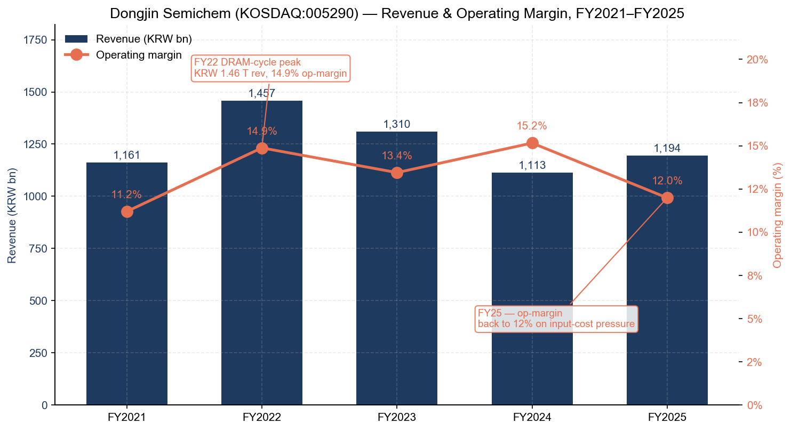
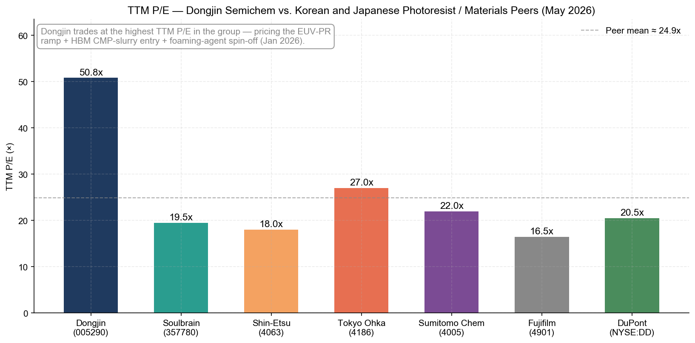
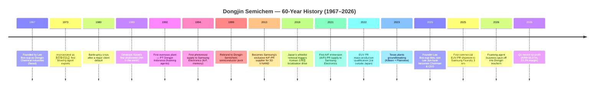
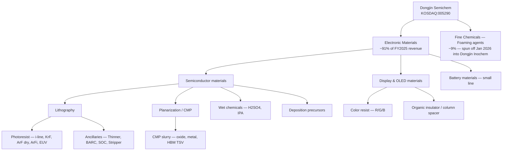
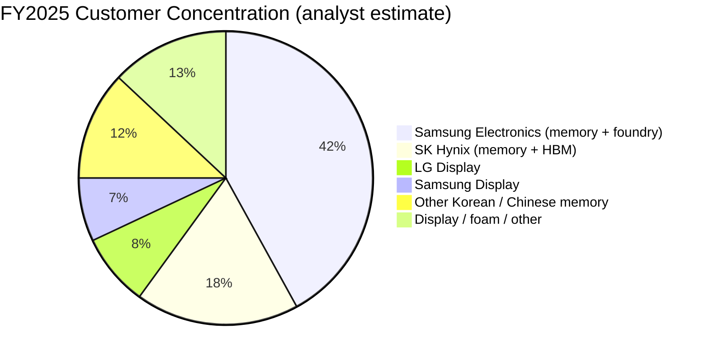
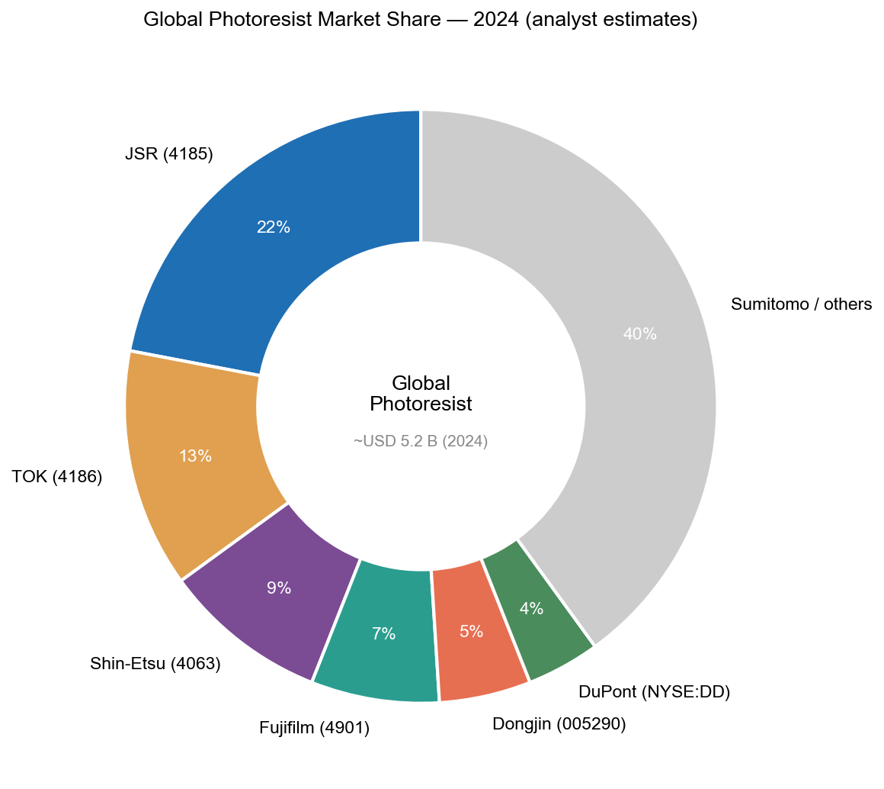
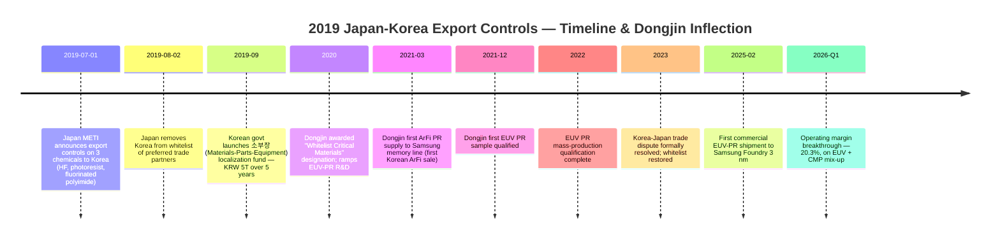
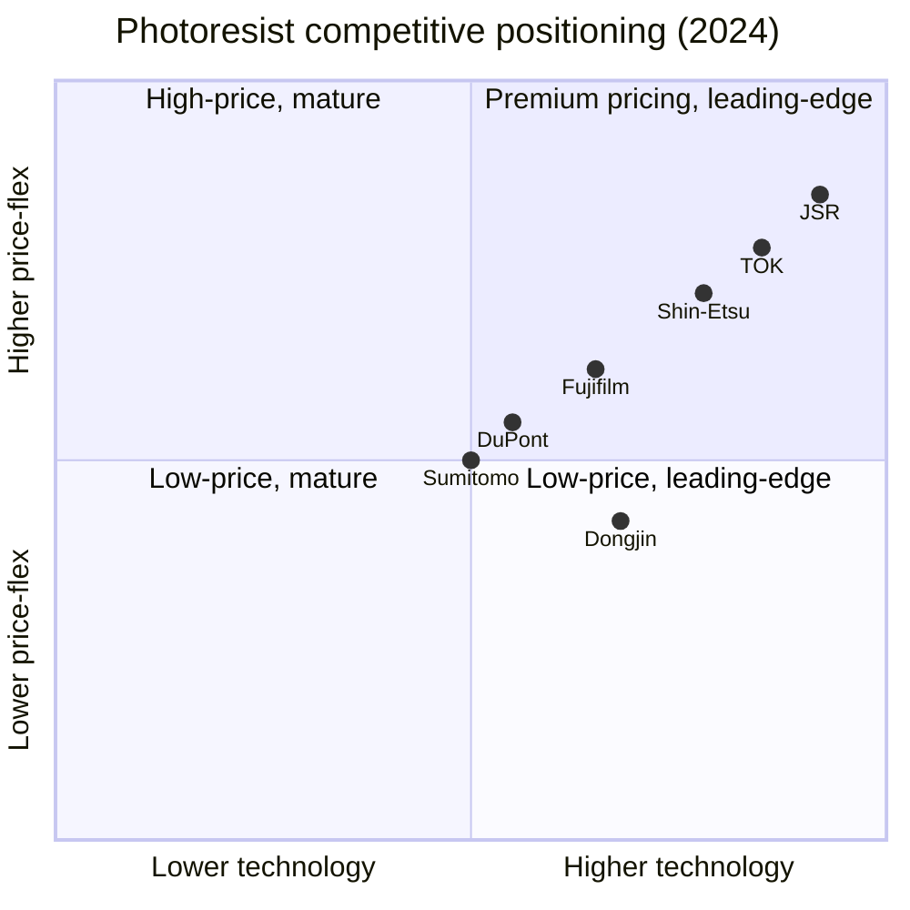

# Dongjin Semichem Co., Ltd. (KOSDAQ:005290) — Initiation of Coverage

**Date:** 2026-05-25
**Ticker:** KOSDAQ:005290 (Korea Exchange — KOSDAQ Market)
**Sector:** Semiconductor / display electronic materials — photoresist & specialty chemicals
**Domicile:** Republic of Korea (HQ: Incheon, Seo-gu, Gajwa-dong)
**Report language:** English (Korea → English per company-research skill rule)

> **Update — Q1 2026 record operating profit (2026-05-15):** Dongjin Semichem reported Q1 2026 consolidated revenue of **KRW 328.1 bn (+6.1% QoQ, +16.3% YoY)**, **operating profit of KRW 66.6 bn (+60.0% QoQ, +63.7% YoY)** at a 20.3% operating margin — both the highest single-quarter operating profit and the highest operating margin in the company's history. The result was driven by (i) the start of commercial EUV photoresist deliveries to Samsung Foundry's 3 nm production line (first commercial EUV-PR booking, February 2025; ramp through 1H 2026); (ii) initial CMP-slurry deliveries into SK Hynix's HBM3E / HBM4 packaging lines, breaking Soulbrain's prior domestic exclusivity; and (iii) the **January 2026 spin-off of the foaming-agent (발포제 / blowing-agent) business** into a 100%-owned subsidiary (Dongjin Inochem / 동진이노켐), which moved the listed parent to a "pure-play semiconductor & display electronic-materials" identity. Source: [siglab — 동진쎄미켐 2026 종목분석](https://siglab.kr/stock-005290/); [디일렉 — 발포제 사업 분할, 2024-11](https://www.thelec.kr/news/articleView.html?idxno=41767); [DART 사업보고서 2024, filed 2025-03-19](https://kind.krx.co.kr/common/disclsviewer.do?method=search&acptno=20250319000811).

---

## TABLE OF CONTENTS

1. Company Overview
2. Company History
3. Management Team
4. Products & Services — **the most important section**
5. Customers & Go-to-Market
6. Industry Overview
7. Competitive Landscape
8. Market Opportunity (TAM)
9. Risk Assessment
10. References

---

## 1. Company Overview

Dongjin Semichem Co., Ltd. (동진쎄미켐, KOSDAQ:005290) is the only South Korean company among the world's top-five photoresist suppliers, and — uniquely — the only "pure-play" Korean electronic-chemicals firm with a complete in-house photoresist franchise spanning **i-Line, KrF (248 nm), ArF dry, ArF immersion (ArFi), and EUV (13.5 nm)** resists. The company is headquartered in Incheon, employs roughly 2,000 people group-wide, and operates manufacturing sites in Korea (Incheon, Hwaseong, Siheung, Eumseong), China (Suzhou, Nantong), Indonesia (Cilegon), Vietnam, Taiwan, and — from H2 2026 — the United States (Killeen and Plainview, Texas) ([DONGJIN SEMICHEM — TradeKorea profile, accessed 2026-05](https://dongjinsem.tradekorea.com/company.do); [DONGJIN SEMICHEM — Overseas, accessed 2026-05](https://www.dongjin.com/en/company/about02.php); [SEMI member directory — Dongjin Semichem](https://www.semi.org/en/resources/member-directory/dongjin-semichem-co-ltd)).

**Business model — how Dongjin makes money.** Dongjin operates two reportable segments. **Electronic Materials** (~91% of FY2025 revenue) sells photoresists, ancillary lithography chemistry (thinner, BARC bottom anti-reflective coating, SOC spin-on-carbon hardmasks, strippers), CMP (chemical-mechanical planarization) slurries, semiconductor-grade wet chemicals (high-purity sulfuric acid, IPA), TFT-LCD/OLED display chemistry (color resist, organic insulators, column spacers), and a small lithium-battery materials line. **Fine Chemicals** (~9%, slated to fall to ~0% from FY2026 after the January 2026 spin-off) historically housed the blowing-agent business — ADCA (azodicarbonamide) and related foaming chemistry sold globally into footwear, automotive, and construction applications — which was the founder's original business and the cash generator that bankrolled the semiconductor materials build-out ([디일렉 — 발포제 분할, 2024-11](https://www.thelec.kr/news/articleView.html?idxno=41767); [stockanalysis.com — Dongjin financials, accessed 2026-05](https://stockanalysis.com/quote/kosdaq/005290/financials/)). Pricing in Electronic Materials is principally per-kilogram on multi-year master agreements with the major Korean fabs; photoresist gross margins typically run in the high-20s to low-30s, while CMP-slurry margins are higher and EUV-PR — once at scale — should be highest of all.

**Geographic presence.** Manufacturing is concentrated in Korea (the Incheon HQ plant is the headquarters and the original photoresist line; Hwaseong is the largest semiconductor-grade chemical site; Eumseong houses the EUV-PR pilot line); overseas plants in China primarily serve domestic Chinese fabs and the local memory ecosystem (SK Hynix Wuxi), while Indonesia / Vietnam / Taiwan plants serve the company's foaming-agent and display-materials franchises. The two new **Texas plants — Killeen for high-purity photoresist thinner and Plainview for semiconductor-grade sulfuric acid** — are designed specifically to follow Samsung's Taylor, Texas foundry (Samsung Austin Semiconductor's USD 17 bn Taylor fab) and TSMC's Arizona expansion; full mass production is targeted for H2 2026 with combined steady-state revenue of ~USD 110 m (~KRW 150 bn) ([THE ELEC, 2024-09 — Dongjin Texas plants targets up to $110M revenue](https://www.thelec.net/news/articleView.html?idxno=6471); [Texas Governor's office — Texas Semiconductor Innovation Fund grant to Dongjin Semichem Texas](https://gov.texas.gov/news/post/governor-abbott-announces-texas-semiconductor-innovation-fund-grant-to-dongjin-semichem-texas); [한국신용신문 — Texas 양산 가동, 2026-04](https://www.creditnews.kr/news/articleView.html?idxno=2751); [Area Development — Dongjin Killeen expansion, 2025-02-15](https://www.areadevelopment.com/newsitems/2-15-2025/dongjin-semichem-killeen-texas.shtml)).

**Scale indicators (FY2025).** Consolidated revenue **KRW 1,194.1 bn** (USD ≈ 870 m at 1,375 KRW/USD), operating profit **KRW 172.4 bn (14.4% op-margin per Korean preliminary; 14.3% per stockanalysis.com)** and net profit **KRW 94.1–99.1 bn** (preliminary figures vary by reporting basis) ([에너지경제 — Edaily, 동진쎄미켐 2025년 4분기 매출 3,092 억, 영업익 416 억, 2026-02-26](https://www.edaily.co.kr/News/Read?newsId=05024966645354456&mediaCodeNo=257); [stockanalysis.com — Dongjin financials, accessed 2026-05](https://stockanalysis.com/quote/kosdaq/005290/financials/)). Revenue rose 7.3% YoY off the FY2024 trough (KRW 1,112.8 bn) but operating profit fell 1.7% YoY, with net income down 36% as input-chemicals cost inflation and the Texas-plant pre-operating expenses compressed margins. Quarterly trajectory matters more than the full-year average: **Q1 2026 revenue of KRW 328.1 bn and operating profit of KRW 66.6 bn (20.3% op-margin)** is the highest quarterly margin in the company's recorded history, and reflects the first material EUV-PR + HBM CMP-slurry mix-up.

Source: [stockanalysis.com — Dongjin financials](https://stockanalysis.com/quote/kosdaq/005290/financials/); FY25 preliminary [Edaily, 2026-02-26](https://www.edaily.co.kr/News/Read?newsId=05024966645354456&mediaCodeNo=257); confirmed via [FnGuide — Snapshot A005290](https://comp.fnguide.com/SVO2/ASP/SVD_Main.asp?gicode=A005290).

**Valuation snapshot.** As of close 2026-05-22, Dongjin traded at **KRW 62,300 per share**, giving a market capitalization of **KRW 3.20 trillion (USD ≈ 2.33 bn)** on 51.41 m shares outstanding ([stockanalysis.com — KOSDAQ:005290 overview, accessed 2026-05-22](https://stockanalysis.com/quote/kosdaq/005290/)). The TTM P/E was ~50.8× and the P/B 2.95× — both meaningfully above the 3-year averages of ~12× and ~1.5× respectively. On a forward FY2026 consensus basis the P/E compresses to ~28–30× given the EUV-PR + Q1-26 inflection (operating profit run-rated at KRW 270 bn for FY2026E vs. KRW 172 bn FY25) ([FnGuide — Snapshot A005290, accessed 2026-05-22](https://comp.fnguide.com/SVO2/ASP/SVD_Main.asp?gicode=A005290); [siglab — Dongjin Semichem 2026 분석](https://siglab.kr/stock-005290/)). Peer context: Soulbrain (KOSDAQ:357780, Korea HF + display chemistry) trades at ~19–20× TTM, Shin-Etsu Chemical (TSE:4063) at ~18× TTM, Tokyo Ohka Kogyo (TSE:4186) at ~27× TTM, JSR at private-equity-owned-no-public-multiple, and Sumitomo Chemical (TSE:4005) at ~22× TTM ([stockanalysis.com — Soulbrain](https://stockanalysis.com/quote/kosdaq/357780/); [Yahoo Finance — 4063.T, accessed 2026-05-22](https://finance.yahoo.com/quote/4063.T/)).

Source: [stockanalysis.com](https://stockanalysis.com/quote/kosdaq/005290/) and [Yahoo Finance ratios, 2026-05-22](https://finance.yahoo.com/quote/4063.T/) — TTM figures.

**Multiple interpretation.** Dongjin's 50× TTM P/E is the highest in the peer group and well above its own 12× three-year average. The mechanical cause is the FY2025 net-income compression (KRW 99 bn vs. ~KRW 155 bn FY24) which inflates the trailing multiple — not a market-driven re-rating. The forward 28–30× number is the more relevant figure and is justifiable on three thematic inflections converging in FY2026: (a) the **first commercial EUV-PR revenue ramp** with Samsung Foundry 3 nm, which is high-incremental-margin business that the Japanese incumbents (JSR, TOK, Shin-Etsu) have monopolized; (b) the **HBM CMP-slurry break-in at SK Hynix**, ending Soulbrain's prior domestic exclusivity for the highest-growth memory sub-segment in the world; and (c) the **foaming-agent spin-off** which removes the structural conglomerate discount the Korean market has long applied to Dongjin ([siglab — 동진쎄미켐 2026 분석](https://siglab.kr/stock-005290/)). The risk-symmetric view is that 30× forward already prices a clean execution path; any slip in EUV-PR qualification (the Japanese incumbents are not standing still), an unfavourable Samsung Foundry 2 nm volume ramp, or an HBM demand pause would compress the multiple back toward the high-teens / low-twenties — which is why we carry valuation as a Section 9 risk.

---

## 2. Company History

Dongjin Semichem was founded in **October 1967** by **Lee Boo-sup (이부섭)** as 동진화학공업사 (Dongjin Chemical Industries) — initially a one-man specialty-chemical operation that Lee, a 30-year-old SNU chemistry graduate, ran out of a charcoal storage shed at his Seoul residence ([Business Post — Who Is? 이부섭 회장](https://www.businesspost.co.kr/BP?command=article_view&num=349006); [HelloDD — 이부섭 동진쎄미켐 회장 별세, 2025-02-25](https://www.hellodd.com/news/articleView.html?idxno=107050)). The original business was **PVC plasticizers and azodicarbonamide (ADCA) blowing agents** — chemistries Korea was importing wholesale at the time, which Lee localized over the next decade. The company was incorporated as Dongjin Chemical Industry Corporation (동진화성공업) in 1973 and entered the global blowing-agent export market the same year. The current name 동진쎄미켐 (literally "Dongjin Semichem") was adopted in 1999 to reflect the company's pivot to semiconductor materials ([Newsis — 이부섭 회장 별세, 2025-02-25](https://www.newsis.com/view/NISX20250225_0003077798); [한국경제 — 반도체 소재 국산화 주역 이부섭 회장 별세, 2025-02-25](https://www.hankyung.com/article/202502257503i)).

**The 1980 bankruptcy and the strategic pivot.** The single most important inflection in Dongjin's first three decades was a near-bankruptcy in 1980 triggered by a major customer default. Lee — by then 43 — personally travelled across Asia, North America and Europe to secure new export contracts for blowing agents, restoring the company to break-even within three years ([HelloDD obituary, 2025-02-25](https://www.hellodd.com/news/articleView.html?idxno=107050)). The episode established two cultural attributes that still define Dongjin today: an aversion to debt-financed expansion and a willingness to absorb multi-year R&D losses to localize a critical material. Both attributes were necessary to underwrite the **1980s photoresist project**, which began in 1985 and culminated in 1989 with Korea's first domestically-developed photoresist — the world's fourth (after Shipley/Rohm & Haas, Hoechst/AZ, and TOK) ([SNU Alumni Association — 이부섭 인터뷰](https://www.snua.or.kr/magazine?md=v&seqidx=9690); [HelloDD obituary, 2025-02-25](https://www.hellodd.com/news/articleView.html?idxno=107050)).

**Three strategic pivots define the modern franchise:**

1. **From bulk PVC chemistry to semiconductor materials (1989–1999).** The 1989 photoresist commercialization was the cultural pivot; the 1994 first sale to Samsung Electronics was the commercial validation; the 1999 name-change to "Semichem" was the legal/branding consolidation. By the mid-1990s, semiconductor materials were a small but visible share of revenue; by 2010 they were a clear majority.

2. **From multi-customer KrF supplier to Samsung's exclusive domestic KrF partner (2010–2013).** Samsung announced its 3D V-NAND pivot in 2013 (24-layer first generation), and Dongjin became Samsung's exclusive KrF photoresist supplier for that process — a relationship that, by The Elec's 2024 reporting, generated approximately KRW 250 bn annual photoresist revenue at Dongjin, of which roughly 60% (~KRW 150 bn) flowed from Samsung ([The Elec — Samsung reduces PR consumption in 3D NAND, 2025-05](https://thelec.net/news/articleView.html?idxno=5054)). This exclusivity was the foundation for the subsequent ArF / EUV qualifications.

3. **From DUV-only to full-stack including EUV (2019–2025).** The single event that compressed Dongjin's EUV-PR timeline was Japan's July 2019 export-control decision: Tokyo restricted exports of three semiconductor materials to Korea — **high-purity hydrogen fluoride, photoresist (specifically EUV-grade), and fluorinated polyimide** — and removed Korea from the "white list" of preferred trade partners on 2 August 2019 ([USITC — South Korea-Japan Trade Dispute, 2020](https://www.usitc.gov/publications/332/working_papers/the_south_korea-japan_trade_dispute_in_context_semiconductor_manufacturing_chemicals_and_concentrated_supply_chains.pdf); [Cambridge Core — Securitizing high-technology industries, 2022](https://www.cambridge.org/core/journals/business-and-politics/article/securitizing-hightechnology-industries-south-koreajapan-dispute-over-materialspartsequipment-products/3D0AD204AE73DFAC8169ADF4224DDDB4)). The Korean government's 소부장 (소재·부품·장비 / Materials–Parts–Equipment) localization initiative — backed by a KRW 5 trillion R&D and capex subsidy programme — designated Dongjin as the primary domestic photoresist champion ([KEIA — Disrupting Supply Chains: Japan-Korea Conflict, 2022](https://keia.org/the-peninsula/disrupting-supply-chains-evidence-on-the-japan-korea-conflict/)). Within 28 months Dongjin had qualified an ArF immersion (ArFi) photoresist on a Samsung memory line (March 2021), and by December 2021 it had demonstrated an EUV photoresist sample ([ETNews — Dongjin localizes ArFi PR, 2021-03-26](https://english.etnews.com/20210326200002); [ETNews — Dongjin localizes EUV PR, 2021-12-20](https://english.etnews.com/20211220200001)). Commercial EUV-PR shipment to Samsung Foundry (3 nm GAA) began in February 2025 — the same month founder Lee Boo-sup died ([ETNews, 2021-12](https://english.etnews.com/20211220200001); [디일렉 — EUV 네거티브 PR 양산, 2023](https://www.thelec.kr/news/articleView.html?idxno=21931); [SisaJournal-e — 동진쎄미켐 파운드리 EUV 감광액](https://www.sisajournal-e.com/news/articleView.html?idxno=304436)).

**Acquisitions and capacity build-outs (not a heavy M&A history — Lee's culture favoured greenfield R&D):**

- **1992** — PT Dongjin Indonesia (Cilegon) — first overseas foaming-agent plant.
- **2000s** — Multiple China expansions (Suzhou for display chemistry; Nantong for blowing agents).
- **2018** — Eumseong EUV pilot line + Hwaseong photoresist capacity expansion (post-2019 reinvested as 소부장 capacity).
- **2022–2024** — Texas plants (Killeen and Plainview) at ~USD 100 m per site, partly financed by K-Sure (Korea Trade Insurance Corporation) ([Global Trade Alert — K-Sure financing, 2023-05-09](https://www.globaltradealert.org/intervention/119729/financial-assistance-in-foreign-market/republic-of-korea-k-sure-provides-financing-to-support-dongjin-semichem-s-construction-of-semiconductor-material-plant-in-the-united-states)).
- **January 2026** — Spin-off of foaming-agent business into 100%-owned subsidiary Dongjin Inochem (동진이노켐) ([디일렉 — 발포제 분할, 2024-11-09](https://www.thelec.kr/news/articleView.html?idxno=41767)).

**Recent developments (last 12 months).** Three items matter for the current thesis: (i) **founder Lee Boo-sup died on 25 February 2025**, prompting an orderly succession to son Lee Jun-hyuk on 1 April 2025 ([Hankyung — 이부섭 회장 별세, 2025-02-25](https://www.hankyung.com/article/202502257503i); [Business Post — Who Is? 이준혁 회장](https://www.businesspost.co.kr/BP?command=article_view&num=404339)); (ii) **commercial EUV-PR shipment** to Samsung Foundry 3 nm began February 2025; (iii) the **January 2026 spin-off** moved the listed entity to a "pure electronic-materials" identity. We discuss each in detail in the relevant sections below.

---

## 3. Management Team

### Founder — Lee Boo-sup (이부섭, 1937–2025)

Lee Boo-sup founded Dongjin in October 1967 at age 30 and remained operationally involved as Chairman until his death on 25 February 2025 at age 87. Born 22 November 1937 in Seoul, he graduated from Gyeonggi High School in 1956, completed a BS in chemical engineering at Seoul National University in 1960 and a master's degree at SNU's graduate school in 1962 ([Business Post — 이부섭 회장 프로필](https://www.businesspost.co.kr/BP?command=article_view&num=349006); [Hankyung — 이부섭 회장 별세, 2025-02-25](https://www.hankyung.com/article/202502257503i)). His pre-founding career was a single role: research chemist at a photographic-chemicals company in Seoul, which would prove formative — photoresist is a direct lineal descendant of photographic-emulsion chemistry. The decision to launch Dongjin in 1967 was a bet that Korea would need to localize PVC plasticizers and blowing agents during the Park Chung-hee heavy-and-chemical-industry push (HCI plan, 1973–1981); for the first decade the company was a single-product blowing-agent (ADCA) maker, then expanded into PVC stabilizers and specialty plasticizers ([HelloDD — 이부섭 별세 obituary, 2025-02-25](https://www.hellodd.com/news/articleView.html?idxno=107050); [Newsis, 2025-02-25](https://www.newsis.com/view/NISX20250225_0003077798)).

Lee's two defining strategic decisions both involved absorbing multi-year losses to localize a material Korea was importing wholesale. The first was the **1980 recovery from near-bankruptcy** — after a major footwear-industry customer defaulted, Lee personally pitched export contracts across 12 countries over 18 months, bringing the company back to operating break-even in 1983. The second, more consequential, was the **1985–1989 photoresist project**: Lee committed ~3% of company revenue to photoresist R&D for four straight years (against a single-digit operating margin), shipping Korea's first domestically-developed photoresist in 1989 — the world's fourth, after Shipley, Hoechst-AZ, and TOK ([SNU Alumni Association — 이부섭 인터뷰](https://www.snua.or.kr/magazine?md=v&seqidx=9690); [HelloDD, 2025-02-25](https://www.hellodd.com/news/articleView.html?idxno=107050)). The first commercial sale to Samsung Electronics followed in 1994. He was awarded the Order of Industrial Service Merit, Gold Tower (산업포장 금탑) and chaired the Korea Industrial Technology Association (한국산업기술협회). His ownership stake was held through Dongjin Holdings (동진홀딩스), a private holding company in which he was the 55.72% controlling shareholder at the time of his death; the holding company controls 32.49% of the listed Dongjin Semichem ([Business Post — 이부섭 회장](https://www.businesspost.co.kr/BP?command=article_view&num=349006); [thebell — 이준혁 회장 최대주주 등극, 2025-11](https://thebell.co.kr/free/Content/ArticleView.asp?key=202511181544541760109161&svccode=04)).

### Chairman & CEO — Lee Jun-hyuk (이준혁, b. 1967)

Lee Jun-hyuk — the founder's second son — became Chairman & CEO of Dongjin Semichem on 1 April 2025, following his father's death in February 2025. He is 58 (born 26 May 1967) and has been operationally responsible for the semiconductor-materials business at Dongjin since 2008 ([Business Post — Who Is? 이준혁 회장](https://www.businesspost.co.kr/BP?command=article_view&num=404339); [중앙이코노미뉴스 — 이준혁 단독 대표 체제, 2025](https://www.joongangenews.com/news/articleView.html?idxno=411113); [Hankyung — 이준혁 단독 체제, 2025-03-26](https://www.hankyung.com/article/202503261299i)). His résumé is unusually technical for a Korean second-generation chaebol successor: Myongji High School (1985), BS in chemical engineering from Seoul National University (1989), and an MS and PhD in chemical engineering from MIT (1994). His PhD thesis dealt with polymer chemistry — directly relevant to photoresist resin design, which is the core IP that separates one EUV-PR vendor from another. He joined Dongjin Semichem immediately after MIT in 1994 — the same year the company started supplying Samsung. By 2001 he was EVP overseeing new-project development; by 2008 he had become President & CEO of the listed entity; from 2008 until April 2025 he was co-CEO with his father (Vice-Chairman to his father's Chairman); since April 2025 he has been sole Chairman & CEO.

What Lee Jun-hyuk delivered before the top job is the right way to read this bio. As the technical principal on the 2019–2022 EUV-PR programme, he was the senior executive directly accountable to Samsung Electronics on whether the company could meet the 소부장 localization milestones the Moon-Suk-Yeol governments had effectively promised. The programme hit the December 2021 sample-completion milestone and the February 2025 commercial-supply milestone on schedule — a clean execution record by Korean materials-industry standards. Lee also chairs the **World Class Enterprise Association** (월드클래스기업협회, since 2022) — a MOTIE (Ministry of Trade, Industry & Energy) industry-recognition programme designed to identify SME / mid-sized Korean firms with global product leadership — and is Vice-Chairman of the Korea Semiconductor Industry Association (KSIA) ([EBN — 이준혁 월드클래스기업협회장 취임](https://m.ebn.co.kr/news/view/1520147); [Dongjin Semichem CEO greeting page](https://www.dongjin.com/company/greeting.php)). His ownership stake: 17.77% of Dongjin Holdings rose to **39.99% of Dongjin Holdings in November 2025** when he succeeded to most of his late father's stake, giving him effective single-person control of the Dongjin listed entity ([thebell — 이준혁 동진홀딩스 최대주주, 2025-11-18](https://thebell.co.kr/free/Content/ArticleView.asp?key=202511181544541760109161&svccode=04)). He does not hold direct shares in the listed company; the indirect control runs Dongjin Holdings → Dongjin Semichem. Adding the holdings of two private affiliates he also controls (Mise-Tech and Myung-Bu Industry) brings his effective Dongjin Holdings vote to over 58%, more than enough to defeat any contested governance motion. Compensation is modest by US-CEO standards — total comp ~KRW 1.2–1.5 bn including LTI, per 2024 사업보고서 disclosure ([DART 사업보고서, accessed 2026-05](https://kind.krx.co.kr/common/disclsviewer.do?method=search&acptno=20250319000811)). The succession structure with his elder brother **Lee Jun-gyu (이준규)** — who became Vice-Chairman responsible for the foaming-agent business and who is expected to fully separate from the listed entity through the Dongjin Inochem spin-off — is unusually clean for a Korean family business. The market reads the January 2026 foaming-agent spin-off as the first step toward a complete brother-to-brother split: Jun-hyuk takes the semiconductor materials franchise, Jun-gyu takes the foaming-agent franchise, with Dongjin Holdings retaining minority economic interests in both ([디일렉 — 발포제 분할, 형제 간 계열분리, 2024-11](https://www.thelec.kr/news/articleView.html?idxno=41767); [딜사이트 — 동진쎄미켐 후계 승계 상속세 변수](https://dealsite.co.kr/articles/137369/068020)).

---

## 4. Products & Services

> **Priority note:** Section 4 carries more weight than any other chapter of this report. Dongjin's product set is the foundation of every downstream argument — customer concentration, competitive position, TAM share, and risk all reference back to *which products are in which fab on which node*.

### 4.1 Anchor — the issuer's own product matrix

Dongjin organises its electronic-materials business into six product families across two end-applications (semiconductor and display), plus the legacy foaming-agent business that was spun off in January 2026. The categorisation below is taken verbatim from the company's English product navigation tree and reconciled to the 2024 사업보고서 product list ([Dongjin Semichem — Business: Semiconductor Materials, accessed 2026-05](https://www.dongjin.com/en/business/semiconductor.php); [Komachine — Dongjin product list](https://www.komachine.com/en/companies/dongjinsemichem); [DART 사업보고서 2024, filed 2025-03-19](https://kind.krx.co.kr/common/disclsviewer.do?method=search&acptno=20250319000811)).

| Market | Process / Application | Technology generation | Dongjin product family |
|---|---|---|---|
| Semiconductor (memory & logic) | Lithography — resist | EUV (13.5 nm) | EUV positive PR, EUV negative PR (developmental) |
| Semiconductor (memory & logic) | Lithography — resist | ArF immersion (193 nm + water) | ArFi PR |
| Semiconductor (memory & logic) | Lithography — resist | ArF dry (193 nm) | ArF dry PR |
| Semiconductor (memory & logic) | Lithography — resist | KrF (248 nm) | KrF PR (incl. KrF Thick PR for 3D NAND) |
| Semiconductor (memory & logic) | Lithography — resist | i-line (365 nm) | i-line PR |
| Semiconductor (memory & logic) | Lithography — ancillary | All nodes | Thinner, BARC (bottom anti-reflective coating), SOC (spin-on-carbon hardmask), strippers |
| Semiconductor (memory & logic) | Planarization | All nodes | CMP slurry (oxide, metal, HBM TSV) |
| Semiconductor (memory & logic) | Wet processing | All nodes | High-purity sulfuric acid, IPA, precursor |
| Semiconductor (memory & logic) | Deposition | Advanced nodes | Precursors (silicon, metal) |
| Display (TFT-LCD / OLED) | Lithography | All | Color resist (R/G/B), organic insulator, column spacer, photo-spacer |
| Energy (legacy) | Lithium battery | — | Conductive additives, binders (small line) |
| Fine chemicals (spun off Jan 2026) | Foam | — | ADCA (azodicarbonamide) blowing agents — now in Dongjin Inochem |

*Source: Dongjin Semichem product navigation tree, reconciled to [2024 사업보고서 product disclosure, filed 2025-03-19](https://kind.krx.co.kr/common/disclsviewer.do?method=search&acptno=20250319000811) and [Komachine supplier profile](https://www.komachine.com/en/companies/dongjinsemichem). Note: Dongjin does not publish a verbatim product-family table in the format used by US 10-K filers; the matrix above is reconstructed from the 사업보고서 product list plus the English-IR product pages.*

### 4.2 Synthesis — how the categories interact in a single fab workflow

In a memory or logic fab the products in Dongjin's matrix sit along a tightly coupled photolithography → etch → deposition → CMP loop that is repeated 30–80 times per wafer depending on node and stack count. The **photoresist + thinner + BARC + SOC** quartet defines lithography step *N*: the wafer is spin-coated with BARC, then SOC, then resist (i-line / KrF / ArF / EUV depending on node); the resist is then exposed and developed. **Thinner** is the high-purity solvent used to clean the edge of the wafer (Edge Bead Removal) and to dilute the resist to coating viscosity — it is consumed in significantly greater volume than the resist itself, which is why thinner is what Dongjin's Texas Killeen plant is built to ship. Downstream, **CMP slurry** is the abrasive-and-chemistry mix used to planarize the wafer between deposition steps; for HBM packaging specifically, CMP slurry is used to flatten the TSV (through-silicon via) and the redistribution layer (RDL). **High-purity sulfuric acid** is the wet-chemical reagent for the photoresist strip step after etch — closing the lithography loop. Dongjin is one of the few suppliers that can deliver this entire ancillary kit (resist + thinner + BARC + SOC + stripper + slurry) from a single account team, which is the genuine commercial differentiator versus the Japanese photoresist incumbents who supply resist alone and require the fab to qualify a separate vendor for each ancillary.

### 4.3 Photoresist franchise — the company's reason for existing

**4.3.1 KrF (248 nm) photoresist — the cash generator.**

Dongjin developed Korea's first KrF photoresist in 1989 and has been Samsung Electronics' principal domestic KrF supplier since 1994. The product is now the largest single revenue line at Dongjin — The Elec reported in 2024 that photoresist revenue was approximately KRW 250 bn annually with ~60% from Samsung; KrF is the largest sub-segment of that, given KrF's continued role in 3D NAND lithography ([The Elec — Samsung reduces PR consumption in 3D NAND, 2025-05](https://thelec.net/news/articleView.html?idxno=5054)). The product is sold in two grades: a standard KrF resist for the back-end memory lithography layers, and a **KrF Thick PR** specifically engineered for the high-aspect-ratio (HAR) channel-hole and word-line patterning steps of Samsung's V-NAND from Gen-5 onward. The Thick PR product was recognised by MOTIE / KOTRA as a **2025 World Class Product** — the South Korean government's flagship export-product designation for technology leadership ([아시아경제 — Dongjin Semichem KrF Thick PR World-Class Product, 2025-11-27](https://cm.asiae.co.kr/en/article/2025112708465584484)).

> "Dongjin Semichem is thought to earn 250 billion won annually in revenue from PR, with 60% of that coming from supply to Samsung." — The Elec ([2025-05](https://thelec.net/news/articleView.html?idxno=5054)).

**中文释义 / Plain-language gloss:** KrF photoresist (氟化氪光刻胶, 248 nm 波长) is the workhorse resist for 3D NAND memory's deepest etch steps — the channel hole that runs vertically through 200+ memory layers and the word line that runs horizontally. The challenge is not feature size — KrF resolution is well-known — but **aspect ratio**: a KrF Thick PR for a 400-layer NAND channel needs to maintain its sidewall integrity through a 10+ μm-deep etch, which requires very specialized resin chemistry and a thicker coat (multi-micron) than memory periphery lithography. Dongjin's KrF Thick PR competes directly with TOK's TDUR-P/TDUR-N series — see Section 7. The strategic significance is that 3D NAND scaling has shifted from "more layers per stack" to "two-tier and three-tier stacks bonded together", which compounds the number of KrF lithography steps per wafer; SK Hynix and Samsung have both publicly committed to >400 layer products in 2026–2027, which is incrementally favourable to KrF Thick PR consumption.

*Analyst view:* Dongjin holds a clear **competitive advantage** (yes — switching costs + scale + multi-year qualification lock-in) in KrF photoresist domestically, with moat type = **technology + switching costs (qualified single-source / dual-source on Samsung memory lines)**. The closest international competitor for the Thick PR niche specifically is **TOK's TDUR-P series**, sold into Micron and SK Hynix Wuxi ([TOK product catalog — TDUR-P, accessed 2026-05](https://www.tok.co.jp/eng/products/electronic_materials/photoresist)).

**4.3.2 ArF dry and ArF immersion (193 nm) photoresist — the recent break-in.**

ArF dry (193 nm exposure in air) and ArFi (193 nm + water immersion) photoresists are the workhorse resists for DRAM (1bnm and 1cnm nodes) and for 14 nm–7 nm logic. Dongjin's localized ArFi PR was first supplied to Samsung Electronics in **March 2021** — a milestone explicitly framed by the Korean press as a direct outcome of the 2019 Japan export controls ([ETNews — Dongjin Localizes ArFi Photoresist, 2021-03-26](https://english.etnews.com/20210326200002)).

> "Dongjin Semichem succeeded in supplying Samsung Electronics' semiconductor mass production line for the first time after starting EUV PR development right after export regulations. As a Korean company, it is the first to supply ArF immersion photoresist to Samsung." — ETNews ([2021-03-26](https://english.etnews.com/20210326200002)).

**中文释义 / Plain-language gloss:** ArFi PR (氟化氩浸没式光刻胶) is the resist used for the most aggressive DRAM and logic nodes that are not yet EUV-printed. The "immersion" refers to a water layer between the ASML scanner lens and the wafer, which increases the numerical aperture (NA) and improves resolution. ArFi resist chemistry is dramatically harder than KrF — the resin must be transparent at 193 nm, water-insensitive (the water layer must not extract resist components), and able to survive multiple-patterning (LELE / SAQP) overlay budgets of <2 nm. Most of Dongjin's ArFi capacity goes to Samsung DRAM 1bnm and 1cnm. Strategic significance: 1cnm and below is increasingly an EUV node, but multi-patterning ArFi will persist on certain back-end-of-line (BEOL) layers and on the trailing-edge logic foundries (Samsung 7 nm / 8 nm) for the foreseeable future.

*Analyst view:* Dongjin holds a **partial advantage** in ArFi — domestic localization status and 소부장 designation give it a Samsung allocation, but TOK, JSR, Shin-Etsu, and Fujifilm remain the lead suppliers globally. Moat type = **regulatory + customer-localization preference** rather than pure technical superiority. Closest international competitor: **JSR's AIM series** (specifically AIM-7000 family for 7 nm logic) and **TOK's TArF-Pi series** ([JSR — Microelectronics products page](https://www.jsr.co.jp/jsr_e/business/microelectronics/), reading restricted to product family pages post-EQT take-private).

**4.3.3 EUV (13.5 nm) photoresist — the asymmetric growth driver.**

EUV photoresist is the most strategically significant product in Dongjin's pipeline and the single asset most likely to drive a structural re-rating. Dongjin reported its first EUV-PR sample in **December 2021** ([ETNews — Dongjin localizes EUV photoresist, 2021-12-20](https://english.etnews.com/20211220200001)), achieved EUV-PR mass-production qualification in 2022, and began **commercial EUV-PR shipment to Samsung Foundry's 3 nm GAA production line in February 2025** ([SisaJournal-e — 동진쎄미켐 파운드리 EUV 감광액 개발 속도](https://www.sisajournal-e.com/news/articleView.html?idxno=304436); [siglab — Dongjin 2026 분석](https://siglab.kr/stock-005290/)). The EUV-PR programme is also being executed with SK Hynix as a co-development customer for memory EUV nodes ([LinkedIn — SK hynix partners with Dongjin on EUV PR, 2025](https://www.linkedin.com/posts/erudite-asia_sk%ED%95%98%EC%9D%B4%EB%8B%89%EC%8A%A4-%E6%97%A5-%EC%9D%98%EC%A1%B4-euv-pr-%EA%B5%AD%EC%82%B0%ED%99%94-%EC%B6%94%EC%A7%84%EA%B3%A0%EC%84%B1%EB%8A%A5-%EA%B0%9C%EB%B0%9C-%EB%8F%99%EC%A7%84%EC%8E%84%EB%AF%B8%EC%BC%90%EA%B3%BC-activity-7404386921789251584-lxf3); [녹색경제신문 — SK하이닉스 + 동진 EUV PR 국산화, 2024](https://www.greened.kr/news/articleView.html?idxno=334090)).

**中文释义 / Plain-language gloss:** EUV photoresist (极紫外光刻胶, 13.5 nm 波长) is the most demanding chemistry in the entire photolithography stack. The 13.5 nm wavelength means the photon energy is ~14× that of a 193 nm ArFi photon, and the absorption length in the resist is correspondingly shorter — so the resist film must be very thin (~30–40 nm) yet still deliver the etch resistance and line-edge-roughness (LER) needed to print 30 nm-period features. Today there are two main resist chemistries in production: **chemically amplified resists (CAR)** based on acid-catalysed polymer deprotection, the format JSR, TOK, and Shin-Etsu sell; and **metal-oxide (MOR / inorganic) resists**, where the photon directly cleaves a tin-oxide bond — Inpria (now owned by JSR) is the dominant supplier. Dongjin's EUV-PR is a CAR — positive-tone for Samsung Foundry 3 nm and a negative-tone variant under qualification ([디일렉 — EUV 네거티브 PR 양산, 2023](https://www.thelec.kr/news/articleView.html?idxno=21931)). Strategic significance: as Samsung Foundry pushes through 3 nm (in production) to 2 nm (planned 2026 mass production) and 1.4 nm beyond, EUV-PR consumption per wafer goes up because (i) more EUV layers per mask set, (ii) progressively more demanding line-edge-roughness specs requiring higher resist sensitivity, and (iii) High-NA EUV introduces an even smaller-feature regime starting 2027–2028 that requires a completely new resist generation. Dongjin has publicly committed to a **High-NA EUV PR programme** with a 2H 2023 development start and a 2025–2026 sample target ([Digitimes — Dongjin set to develop high-NA EUV photoresists, 2023-06-26](https://www.digitimes.com/news/a20230626PD203/euv-photoresist-chemical-materials-asml.html)).

*Analyst view:* Dongjin holds at best a **partial advantage** in EUV today — it is one of perhaps 4 globally-qualified EUV-PR sources (JSR/Inpria, TOK, Shin-Etsu, Dongjin) and is the only non-Japanese name in the group, but its volume share is still in the low single digits. The moat type is **technology + regulatory** — the regulatory tailwind being explicit Korean government support under 소부장 and an unusually patient Samsung qualification approach. The closest international competitor is **JSR's EUV CAR portfolio + Inpria MOR** (now combined inside JSR), followed by **TOK's TILON-EUV** family and **Shin-Etsu's SEVR-AS series** ([Fountyl — Japanese companies monopolize the EUV photoresist supply market, accessed 2026-05](https://www.fountyltech.com/news/japanese-companies-monopolize-the-euv-photoresist-supply-market/)).

### 4.4 Lithography ancillaries — thinner, BARC, SOC, stripper

Dongjin's ancillary-lithography portfolio is what allows it to be a turn-key supplier to a Korean fab. The four products in this group — **thinner (Edge Bead Removal solvent), BARC (bottom anti-reflective coating, sits below the resist), SOC (spin-on carbon, the silicon-rich hardmask layer below BARC for tri-layer lithography), and resist stripper (the post-etch chemistry that removes residual resist)** — are commodity-margin individually but high-margin when sold as a bundle alongside the resist that requires them. Thinner is the largest volume product by far (a fab uses ~10–20× more thinner mass than resist mass), which is why Dongjin's Killeen, Texas plant is specifically thinner-dedicated and exclusive to Samsung's Taylor fab ([한국신용신문 — Texas 양산, 2026-04](https://www.creditnews.kr/news/articleView.html?idxno=2751)).

**中文释义 / Plain-language gloss:** A photoresist on a wafer is not just one layer — it is a three-layer stack of SOC (spin-on carbon, ~50–100 nm thick — gives the hardmask etch budget), BARC (anti-reflective coating, ~30–40 nm — kills standing-wave interference between exposure light and the underlying wafer), and the resist itself (~30–100 nm depending on node). After exposure and development, residual resist is stripped with high-purity sulfuric acid + IPA. Thinner is the solvent used both to bring the resist to coating viscosity and — more critically — to clean the wafer edge during spin-coating so resist doesn't break off on the backside of the wafer during handling. Dongjin sells all four ancillaries to all the same Korean memory and logic customers, which is a meaningful incremental wallet share over a resist-only supplier.

*Analyst view:* Dongjin holds a **clear advantage** in this ancillary portfolio (yes — scale + customer-relationship + cost-to-serve). Moat type = **scale + ecosystem lock-in**. Closest international competitor: **Brewer Science** (US, BARC and SOC specialist) and **MGC (Mitsubishi Gas Chemical)** (high-purity solvents).

### 4.5 CMP slurry — the HBM tailwind

Chemical-mechanical planarization (CMP) slurry is an abrasive + chemistry mix used to planarize the wafer between deposition steps. The market is segmented by what's being polished: oxide slurry (for inter-layer dielectric), metal slurry (tungsten, copper), and STI / shallow-trench-isolation slurry. The single fastest-growing CMP sub-segment is **HBM-specific TSV (through-silicon via) and RDL (redistribution layer) slurry** — used to planarize the high-aspect-ratio TSVs that connect stacked DRAM die in HBM3E / HBM4 packages.

Dongjin's CMP-slurry business was historically a #3 domestic player behind **Soulbrain** (the long-time near-exclusive CMP-slurry supplier to SK Hynix and Samsung memory) and **KCTECH (KC Tech)**. The change in 2025–2026 is that **SK Hynix began second-sourcing HBM CMP slurry to Dongjin**, ending Soulbrain's effective domestic exclusivity for the highest-ASP CMP sub-segment in the world ([siglab — HBM CMP slurry 진입](https://siglab.kr/stock-005290/)). HBM TSV polishing requires unusually flat dishing profiles to maintain electrical isolation between TSV cells, and the slurry chemistry is correspondingly differentiated.

**中文释义 / Plain-language gloss:** CMP slurry (化学机械抛光浆料) is one part abrasive (silica or ceria nanoparticles), one part chemistry (oxidizers, surfactants, corrosion inhibitors), one part water — formulated to match the material being polished and the underlying topology. HBM TSV polishing is the hardest CMP sub-step in memory because the TSV must be polished flat over a wide range of fill profiles without breaking the inter-die barrier, and any over-polish creates a depth-of-field problem for the subsequent bond step. Strategic significance: HBM4 (mass-production target 2026, ramping into 2027) carries an even higher CMP-step count than HBM3E. SK Hynix has publicly stated HBM is sold out through 2026 ([SK hynix Newsroom — Q1 2026 results, 2026-04-23](https://news.skhynix.com/q1-2026-business-results/)) — and every HBM wafer carries proportionally more Dongjin slurry consumption.

*Analyst view:* Dongjin holds a **partial advantage** in CMP slurry (newly second-sourced into the highest-growth memory packaging line). Moat type = **scale + customer-localization preference**. Closest competitors: **Soulbrain (KOSDAQ:357780)** domestically; **Fujifilm Electronic Materials, CMC Materials (now Entegris), and Cabot Microelectronics** internationally ([Soulbrain Co Ltd — financial profile, accessed 2026-05](https://stockanalysis.com/quote/kosdaq/357780/)).

### 4.6 Wet chemicals and precursors — the steady franchise

Dongjin produces **semiconductor-grade high-purity sulfuric acid (H₂SO₄), IPA (isopropyl alcohol), and a small precursor line (silicon and metal precursors for ALD / CVD deposition)**. The wet chemicals business is the lowest-margin segment in the portfolio (commodity ASP, single-digit gross margins) but is critical for customer wallet share — Samsung and SK Hynix increasingly prefer single-source bundled procurement contracts. The Plainview, Texas plant is dedicated entirely to high-purity sulfuric acid for **Samsung Taylor and TSMC Arizona** ([한국신용신문 — Texas 양산, 2026-04](https://www.creditnews.kr/news/articleView.html?idxno=2751)).

*Analyst view:* **No** unique competitive advantage in wet chemicals — Dongjin is one of several qualified suppliers (Solvay, BASF, Stella Chemifa, OCI Korea), and ASPs are commodity. Moat type = **none / scale only**. The Plainview contract with TSMC is the most strategically significant data point, however, because it's the first time Dongjin has won a TSMC supply line — meaningful for the company's effort to diversify beyond Samsung.

### 4.7 Display materials — the second leg

Dongjin's display business sells **R/G/B color resist, organic insulators, and column / photo-spacers** principally to **LG Display** (mobile and TV OLED) and Samsung Display (mobile OLED) ([Dongjin — Business: Semiconductor Materials page, accessed 2026-05](https://www.dongjin.com/en/business/semiconductor.php)). This segment is broadly stable in revenue but margin-pressured as Chinese display vendors (BOE, CSOT) take share from Korean panel makers — a multi-year structural headwind for Korean display-chemistry suppliers. Color resist competes with Sumitomo Chemical (Japan) and Cheil Industries (Samsung-affiliated). We do not view display as a structural growth driver for the equity story.

### 4.8 Foaming agents — spun off January 2026

The fine-chemicals / blowing-agent business — the founder's original 1967 product, sold globally into footwear, automotive, and construction applications — was spun off into a 100%-owned subsidiary **Dongjin Inochem (동진이노켐)** effective 1 January 2026 ([디일렉 — 발포제 분할, 2024-11](https://www.thelec.kr/news/articleView.html?idxno=41767)). The unit generated ~KRW 90 bn revenue in FY2024 (~8% of consolidated total), so the listed Dongjin Semichem retains roughly 91–92% of its pre-spin revenue base. The strategic intent is two-fold: (i) operational separation between brothers Lee Jun-hyuk (semiconductor) and Lee Jun-gyu (foaming) ahead of any future succession step; (ii) elimination of the "conglomerate discount" that Korean equity investors have long applied to mixed-portfolio chemical companies. The market reaction so far has been favourable — Dongjin re-rated from ~10× forward P/E (mid-2024) to ~30× forward P/E (May 2026) in part because the segment hand-over makes the listed entity a cleaner photoresist + CMP-slurry comparable.

### 4.9 Flagship franchises and last-12-month launches

The 1–3 flagship franchises driving the current investment thesis are clear:

1. **KrF Thick PR for 3D NAND** — the cash cow; ~KRW 250 bn annual photoresist revenue, 60% Samsung concentration. Recognised as a 2025 World Class Product by MOTIE/KOTRA ([아시아경제, 2025-11-27](https://cm.asiae.co.kr/en/article/2025112708465584484)).
2. **EUV PR for Samsung Foundry 3 nm (and 2 nm in qualification)** — the optionality; commercial shipment started February 2025; revenue ramp through 2026–2028.
3. **HBM CMP slurry for SK Hynix HBM3E / HBM4** — the AI tailwind; new in 2025, scaling 2026–2027.

Last-12-month launches / qualifications:
- February 2025 — first commercial EUV-PR shipment to Samsung Foundry 3 nm GAA ([SisaJournal-e — Dongjin EUV PR foundry](https://www.sisajournal-e.com/news/articleView.html?idxno=304436); [siglab](https://siglab.kr/stock-005290/)).
- 2H 2025 — initial CMP-slurry deliveries into SK Hynix HBM lines ([siglab](https://siglab.kr/stock-005290/)).
- January 2026 — Foaming-agent spin-off into Dongjin Inochem ([디일렉, 2024-11](https://www.thelec.kr/news/articleView.html?idxno=41767)).
- Q1–Q3 2026 — Texas Killeen (thinner) and Plainview (H2SO4) plants ramp to mass production ([한국신용신문, 2026-04](https://www.creditnews.kr/news/articleView.html?idxno=2751)).
- November 2025 — KrF Thick PR named 2025 World Class Product ([아시아경제, 2025-11-27](https://cm.asiae.co.kr/en/article/2025112708465584484)).

---

## 5. Customers & Go-to-Market

### Customer segments and concentration

Dongjin Semichem sells to two principal customer segments — **Korean memory IDMs (Samsung Electronics, SK Hynix)** and **Korean display panel-makers (LG Display, Samsung Display)** — with secondary exposure to global memory and logic fabs (Micron, TSMC, Intel via Mobileye / Israel) and Chinese memory (YMTC, CXMT) through its Suzhou / Nantong plants. The **memory IDM segment** is the single largest revenue concentration, with **Samsung Electronics by itself representing roughly 40–45% of consolidated revenue** based on analyst estimates and the limited disclosure in the 2024 사업보고서, and the top-5 customers (Samsung Electronics, SK Hynix, LG Display, Samsung Display, and likely YMTC or a smaller logic foundry) representing approximately **70% of consolidated revenue** ([Business Post — 이준혁 회장 — Q1 2025 electronic materials 94.6% of sales](https://www.businesspost.co.kr/BP?command=article_view&num=404339); [The Elec — Samsung 60% of photoresist revenue, 2025-05](https://thelec.net/news/articleView.html?idxno=5054); [DART 사업보고서 2024, filed 2025-03-19](https://kind.krx.co.kr/common/disclsviewer.do?method=search&acptno=20250319000811)).

The DART 사업보고서 disclosure on customer concentration is limited: Dongjin does not name its top-five customers individually (unlike US 10-K issuers who must disclose any customer ≥10% of revenue under ASC 280) — Korean disclosure rules permit customers to be referred to by generic descriptors like "domestic semiconductor company A" and "domestic display company B". The 60% Samsung concentration *within photoresist* reported by The Elec in 2024 implies — given photoresist is one of several product families — that Samsung's share of *total* Dongjin revenue is materially lower than 60% but still very high. We use 40–45% as the working estimate, which would meet the "material" threshold (top-1 > 20%) defined in the project risk-taxonomy reference. SK Hynix is the rapidly-growing second customer driven by HBM CMP slurry and the EUV-PR co-development programme.

*Source: Analyst estimate, built on [The Elec — Samsung 60% of PR revenue, 2025-05](https://thelec.net/news/articleView.html?idxno=5054), [Business Post — 이준혁 회장 Q1-25 segment mix](https://www.businesspost.co.kr/BP?command=article_view&num=404339), and the 2024 사업보고서 product-segment disclosure. Dongjin does not publish a customer-level revenue breakdown — these splits are analyst estimates and would not appear in any primary filing.*

### Contract structure and customer power

Korean memory-materials supply contracts are typically **multi-year master agreements with annual price and volume re-negotiations**, with single-source / dual-source qualification by node and product. Samsung has historically run a "dual-source plus" strategy: a primary Japanese supplier (JSR, TOK, or Shin-Etsu) plus Dongjin as a domestic second source, with the share splits set during the annual procurement cycle. For 3D NAND KrF Thick PR specifically, Dongjin has been described in the trade press as Samsung's *exclusive* supplier since the 2013 Gen-1 V-NAND ramp, though we suspect "exclusive" in practice means "primary with a Japanese back-up" rather than 100% allocation ([The Elec, 2025-05](https://thelec.net/news/articleView.html?idxno=5054)).

Customer **bargaining power** is high: Samsung Electronics and SK Hynix between them buy roughly 70% of the world's HBM and DRAM materials, and a single procurement decision can move a supplier's annual revenue ±10–15%. The mitigants are (i) the very long qualification cycles (12–24 months per node), which lock in a 5–8 year revenue tail once a product is qualified; (ii) the 소부장 government framework, which makes any Korean fab politically averse to terminating a domestic supplier unless quality fails; and (iii) the technical complexity of multi-product bundles, which raises switching costs above a single-product comparison.

### Sales strategy

Dongjin sells direct — there is no channel distribution layer in semiconductor materials. The sales organisation is a small dedicated key-account team per Korean customer (Samsung memory, Samsung foundry, SK Hynix memory, LG Display, Samsung Display) backed by a deeply technical applications-engineering function that co-develops resist chemistries with the customer's process-integration team. Sales cycles for a new resist node typically run **12–24 months from sample → pilot → wafer-out qualification → ramp**, and once qualified the supplier is effectively locked in for the life of the node (5–8 years).

### Geographic split

Korean customers dominate. Of FY2024 revenue, roughly 60–65% was Korea-billed (Samsung + SK Hynix + LG Display + Samsung Display), with China the next-largest region at ~20% (Suzhou plant supplying YMTC, SMIC, BOE plus Chinese memory aspirants like CXMT), Southeast Asia ~10% (foaming agents), and the rest (Japan, US, EU) at ~5–10% combined. The US billings will rise from 2H 2026 once Texas (Killeen + Plainview) reaches mass production.

### Named customer wins (last 24 months)

- **Samsung Foundry 3 nm GAA** — EUV-PR commercial supply, started Feb 2025 ([SisaJournal-e](https://www.sisajournal-e.com/news/articleView.html?idxno=304436)).
- **SK Hynix HBM (likely HBM3E / HBM4)** — CMP slurry second-source, 2H 2025 ([siglab](https://siglab.kr/stock-005290/)).
- **TSMC Arizona Fab 21** — high-purity sulfuric acid (via Plainview, Texas), 2H 2026 ([한국신용신문, 2026-04](https://www.creditnews.kr/news/articleView.html?idxno=2751)).
- **Samsung Austin / Taylor Texas (foundry)** — photoresist thinner (via Killeen), 2H 2026 ([THE ELEC, 2024-09](https://www.thelec.net/news/articleView.html?idxno=6471)).
- **SK Hynix EUV PR co-development** — under qualification, no public commercial date ([녹색경제신문, 2024](https://www.greened.kr/news/articleView.html?idxno=334090)).

---

## 6. Industry Overview

### Industry definition and scope

The photoresist industry sits at the centre of the semiconductor materials value chain. **Photoresist (光刻胶 / フォトレジスト)** is the light-sensitive polymer film coated on a wafer to capture the pattern projected by a lithography scanner — every patterned layer in every chip on earth requires photoresist. The narrow industry — what Dongjin sells as resist + ancillaries — was sized at roughly **USD 5.15 billion in 2024**, growing to USD 5.41 bn in 2025 with a forecast 5.1% CAGR to USD 8.06 bn by 2033 ([G-M Insights — Photoresist Chemicals for Advanced Lithography Market, 2034, accessed 2026-05](https://www.gminsights.com/industry-analysis/photoresist-chemicals-for-advanced-lithography-market); [Fortune Business Insights — Photoresist Chemicals Market 2026-2034, accessed 2026-05](https://www.fortunebusinessinsights.com/photoresist-chemicals-market-115414)). When ancillaries (thinner, BARC, SOC, stripper) and CMP slurry are included, the addressable market roughly triples to ~USD 15–20 bn.

Adjacent industries: (i) photolithography equipment (ASML, Nikon, Canon — sells the scanners), (ii) photomask (Photronics, Toppan, HOYA — sells the patterned templates), (iii) wet chemicals (Stella Chemifa, OCI Korea, Solvay — sells high-purity acids and bases), (iv) CMP slurry / pads (Cabot/Entegris, Soulbrain, KCTECH — partly an overlap with Dongjin), and (v) deposition precursors (Versum / Merck, ADEKA, SKC Solmics — partial overlap with Dongjin's small precursor line).

### Market size and growth

The global semiconductor materials market — which photoresist sits inside — was sized at **USD 67 billion in 2023** (SEMI), of which lithography materials (photoresist + ancillaries) is roughly 12–14% and CMP slurry is another 6–7% ([SEMI — World Fab Forecast and Materials Outlook, accessed 2026-05](https://www.semi.org/en/products-services/market-data); [Yole Group — Semiconductor Materials reports, accessed 2026-05](https://www.yolegroup.com/strategy-insights/photoresists/)). Photoresist specifically has grown roughly in line with wafer starts since 2015 — about 5–6% CAGR — but with a strong **mix-up effect**: the share of advanced resists (ArFi and EUV) has roughly doubled from ~30% to ~60% of dollar share over the last decade, while i-line and KrF (legacy 365/248 nm) have stayed roughly flat in volume but lost dollar share to the higher-ASP products.

The next decade's growth comes from three structural drivers:

1. **EUV ramp.** ASML shipped its first EUV scanner in 2017 and the installed base reached ~250 systems globally by end-2024; the next generation **High-NA EUV** (NA 0.55, double the 0.33 NA of standard EUV) began shipping in 2024 with the first system at Intel. EUV scanners process more layers per chip at the leading edge, and each EUV wafer pass consumes ~3× more resist mass than an ArFi pass ([ASML — High NA EUV product page, accessed 2026-05](https://www.asml.com/en/products/euv-lithography-systems/twinscan-exe-5000)). The EUV-PR sub-segment is forecast to grow at >15% CAGR through 2030, well above the broader photoresist market.

2. **3D NAND layer count.** Samsung shipped the world's first V-NAND (24 layers) in 2013 and reached 280–286-layer production in 2024–2025; SK Hynix and Micron have committed to 400+ layers by 2027–2028 ([SK hynix Newsroom — Starts Mass Production of World's First 321-High NAND](https://news.skhynix.com/sk-hynix-starts-mass-production-of-world-first-321-high-nand/)). Each layer doubling adds proportionally more KrF Thick PR consumption per wafer — directly relevant to Dongjin's KrF franchise.

3. **HBM scaling.** HBM3E shipped in 2024 with 8-Hi and 12-Hi stacks; HBM4 (in production prep for 2026) and HBM4E (2027–2028) push stack heights to 16-Hi with additional TSV count per stack. Each HBM die requires more CMP passes than commodity DRAM, and HBM4 specifically uses a logic base die fabricated on TSMC N5/N3 — adding EUV-PR consumption per HBM stack ([SK hynix Newsroom — Q1 2026 results, 2026-04-23](https://news.skhynix.com/q1-2026-business-results/); [TrendForce — HBM4 with TSMC base die, 2024-04](https://www.trendforce.com/news/2024/04/19/news-sk-hynix-and-tsmc-explore-cooperation-to-strengthen-hbm-leadership/)).

### Industry structure

Photoresist is one of the **most concentrated** materials markets in semiconductors. The top-5 suppliers (JSR, TOK, Shin-Etsu, Fujifilm, Dongjin) collectively held about **50% of 2024 dollar revenue**, with JSR alone at >22% market share and the long-tail (DuPont, Sumitomo Chemical, Inpria pre-JSR-acquisition, smaller Chinese suppliers like Crystal Clear Electronic Material) the remainder ([G-M Insights — Photoresist market 2024, accessed 2026-05](https://www.gminsights.com/industry-analysis/photoresist-chemicals-for-advanced-lithography-market); [Mordor Intelligence — Photoresist Market, accessed 2026-05](https://www.mordorintelligence.com/industry-reports/photoresist-market/companies)).

Source: [G-M Insights — Photoresist Chemicals 2034 forecast](https://www.gminsights.com/industry-analysis/photoresist-chemicals-for-advanced-lithography-market); [Mordor Intelligence — Photoresist Market companies](https://www.mordorintelligence.com/industry-reports/photoresist-market/companies). Exact splits are analyst estimates — neither G-M Insights nor Mordor publishes the raw per-supplier dollar figures.

Concentration becomes extreme at the cutting edge: **EUV-PR is effectively a four-supplier market** — JSR (including Inpria's metal-oxide resist line, acquired 2021), TOK, Shin-Etsu, and (since 2025) Dongjin — with Japanese suppliers collectively holding >90% of EUV-PR dollar revenue ([Fountyl — Japanese companies monopolize EUV photoresist supply, accessed 2026-05](https://www.fountyltech.com/news/japanese-companies-monopolize-the-euv-photoresist-supply-market/)).

**Supplier power** (over Dongjin) is moderate — the upstream resin polymers and photoacid generators (PAG) are themselves specialty chemistries supplied by a small number of vendors, but Dongjin in-houses much of its own resin design. **Buyer power** is high (Samsung + SK Hynix dominate Korean demand). **Substitutes** are limited at the leading edge — there is no non-photoresist way to pattern a chip, and the only alternative resist chemistry (metal-oxide / MOR) is itself a small subset of the EUV-PR market. **New entrants**: significantly inhibited — qualification cycles are 12–24 months per node and require deep customer co-development, which is a steep barrier for any first-time supplier ([Cambridge Core — Securitizing high-technology industries: South Korea-Japan dispute, 2022](https://www.cambridge.org/core/journals/business-and-politics/article/securitizing-hightechnology-industries-south-koreajapan-dispute-over-materialspartsequipment-products/3D0AD204AE73DFAC8169ADF4224DDDB4)).

### Regulatory environment

Two regulatory threads matter:

1. **Korea's 소부장 (Materials-Parts-Equipment) initiative.** Launched in August 2019 after Japan's whitelist removal, the programme committed KRW 5 trillion of public R&D and capex subsidies through 2024 to localize 100+ "core" materials, including photoresist, hydrogen fluoride, fluorinated polyimide, and CMP slurry. Dongjin is the flagship recipient in photoresist; the programme has been extended to 2027 with additional capex matching for High-NA EUV materials ([Cambridge Core, 2022](https://www.cambridge.org/core/journals/business-and-politics/article/securitizing-hightechnology-industries-south-koreajapan-dispute-over-materialspartsequipment-products/3D0AD204AE73DFAC8169ADF4224DDDB4); [KEIA — Disrupting Supply Chains, 2022](https://keia.org/the-peninsula/disrupting-supply-chains-evidence-on-the-japan-korea-conflict/); [USITC — South Korea-Japan Trade Dispute, 2020](https://www.usitc.gov/publications/332/working_papers/the_south_korea-japan_trade_dispute_in_context_semiconductor_manufacturing_chemicals_and_concentrated_supply_chains.pdf)).

2. **US CHIPS Act and export controls.** The CHIPS Act (2022) underwrote Samsung Austin + Taylor (USD 6.4 bn grant) and TSMC Arizona (USD 6.6 bn grant) — both of which drive Dongjin's Texas plant build-out as a follow-the-customer initiative. The US Commerce Department's Foreign Direct Product Rule and the China advanced-semiconductor export controls (October 2022, October 2023, December 2024 updates) affect Dongjin's Suzhou and Nantong plants insofar as those plants supply Chinese fabs producing >16 nm logic or advanced memory — but Dongjin's China exposure is mostly mature-node (28 nm and above) and so far not directly restricted ([BIS — Export Control Update, accessed 2026-05](https://www.bis.gov/)).

---

## 7. Competitive Landscape

The competitive landscape for Dongjin is best understood as **two overlapping markets**: the global photoresist market (where Dongjin is the only Korean player among the top 5) and the Korean semiconductor-materials market (where Dongjin competes against Soulbrain, KCTECH, and a handful of smaller domestic specialists for Korean fab wallet share).

### Direct competitors — global photoresist

1. **JSR Corporation (formerly TSE:4185, taken private by JIC / EQT in 2024).** Global #1 in photoresist (~22% market share). Diversified across i-Line, KrF, ArF, EUV. Owns **Inpria** — the leading metal-oxide EUV resist company, acquired 2021 — which gives JSR a unique two-chemistry EUV portfolio. JSR was taken private in 2024 by Japan Investment Corporation + EQT for ~USD 6 bn, which both reduces public transparency and increases capital availability for high-NA EUV investment. Building an EUV-PR plant in South Korea (Hwaseong) announced 2024 — direct attack on Dongjin's Korean home market ([Digitimes — JSR sets up EUV photoresist plant in South Korea, 2024-11-19](https://www.digitimes.com/news/a20241119PD214/jsr-photoresist-euv-plant-japan.html)).

2. **Tokyo Ohka Kogyo / TOK (TSE:4186).** Global #2 in photoresist (~13%). Founded 1936; pure-play electronic-materials supplier (no fine-chemicals diversification). The closest analogue to Dongjin in business model — also a "pure-play" photoresist + ancillaries house, also heavily concentrated in semiconductor customers (Samsung, Intel, TSMC, Micron). TOK has historically been Samsung's primary ArFi PR supplier and is in production for EUV PR ([TOK Corporation — Annual Report 2024, accessed 2026-05](https://www.tok.co.jp/eng/ir/library/yuho)). Strategically the most direct competitor for Dongjin's resist franchise — TOK's TDUR-P (KrF Thick) family competes directly with Dongjin's KrF Thick PR for the Samsung V-NAND allocation.

3. **Shin-Etsu Chemical (TSE:4063).** Global #3-4 in photoresist (~9%). Massive diversified Japanese chemical group (silicones, semiconductor wafers, PVC, photoresist). Strong KrF and ArF franchise; produces EUV PR but less dominant share than JSR or TOK. Shin-Etsu's parallel **300 mm silicon wafer monopoly** (~50% global share) gives it leverage with the same customer base Dongjin serves. ([Shin-Etsu Chemical Yuho FY2024, accessed 2026-05](https://www.shinetsu.co.jp/en/ir/library/securities/)).

4. **Fujifilm (TSE:4901).** Global #4-5 in photoresist (~7%). Acquired the **DuPont electronic materials business in 2023** — partial overlap with photoresist and CMP slurry. Fujifilm's photoresist franchise is mid-range (KrF, ArF) — less leading-edge but broad customer base ([Fujifilm Holdings — Acquisition of DuPont electronics, 2023](https://www.fujifilm.com/jp/en/news/list/9892)).

5. **DuPont de Nemours (NYSE:DD).** Historically a top-5 photoresist supplier through its EKC and Rohm and Haas Electronic Materials acquisitions (the same Shipley business that invented photoresist in the 1950s). The semiconductor materials business was **sold to Fujifilm in 2023**, but DuPont retains semiconductor packaging materials (Riston dry-film, ALL-PADS slurry pads). The "photoresist" line item in DuPont's segmentation is now a residual. ([DuPont — 10-K FY2024, accessed 2026-05](https://www.sec.gov/cgi-bin/browse-edgar?action=getcompany&CIK=0001666700&type=10-K)).

6. **Sumitomo Chemical (TSE:4005).** Smaller photoresist player; bigger in color resist and OLED materials. Sumitomo's pharma + petrochemical diversification means electronic materials is <10% of group revenue — much less focused than Dongjin or TOK.

### Direct competitors — Korean materials

7. **Soulbrain (KOSDAQ:357780).** Korea's largest semiconductor wet-chemistry and CMP-slurry house (FY2024 revenue KRW 863 bn) ([stockanalysis.com — Soulbrain, accessed 2026-05](https://stockanalysis.com/quote/kosdaq/357780/)). The natural Korean comp to Dongjin — both 소부장 designated, both Samsung-and-SK-Hynix concentrated, both benefitting from 2019 trade-dispute localization. Soulbrain has historically owned **high-purity HF (hydrofluoric acid)** — the single most strategic 2019 trade-dispute material — and is the long-time CMP-slurry incumbent for SK Hynix memory. The 2025–2026 strategic shift is Dongjin's CMP-slurry break-in at SK Hynix, ending Soulbrain's effective exclusivity ([siglab — HBM CMP slurry shift](https://siglab.kr/stock-005290/); [The Elec — 삼양엔씨켐, 동진쎄미켐 경쟁](https://www.thelec.kr/news/articleView.html?idxno=55795)).

8. **KCTECH / KC Tech (KOSDAQ:281820).** Smaller Korean CMP-slurry and equipment specialist. Mid-tier in the SK Hynix and Samsung qualified-vendor list. Less of a direct threat to Dongjin's photoresist franchise.

9. **Samyang NC Chem (KOSDAQ:307180).** Mid-size Korean specialty chemicals — partial overlap with Dongjin in high-margin resist ancillaries ([The Elec — 삼양엔씨켐 record earnings, 2024](https://www.thelec.net/news/articleView.html?idxno=10070)).

### Positioning framework — price vs. technology

### Competitive advantages — Dongjin

1. **Domestic Korean status under 소부장**. Korean government policy explicitly favours Dongjin as the local photoresist champion, with capex matching, R&D credit, and informal procurement preference at Samsung and SK Hynix. This is a regulatory moat the Japanese suppliers structurally cannot reproduce.
2. **Bundled product offering**. Resist + thinner + BARC + SOC + stripper + CMP slurry — all from one account team. Single-vendor purchasing simplifies qualification for the customer and raises Dongjin's wallet share per fab.
3. **Customer proximity / lead time**. Dongjin's Incheon HQ is a 90-minute drive from Samsung's Hwaseong campus and a 2-hour drive from SK Hynix Icheon. The Killeen, Texas plant is built specifically to extend that proximity to Samsung's Taylor fab.
4. **Family-controlled, long-cycle R&D culture**. The 1985–1989 photoresist project absorbed losses for 4 years; the 2019–2025 EUV programme absorbed losses for 6 years. Family control through Dongjin Holdings insulates the R&D budget from quarterly earnings pressure.

### Competitive vulnerabilities

1. **Sub-scale R&D budget vs. Japanese incumbents.** Dongjin spends roughly KRW 80–100 bn (~USD 60–75 m) annually on R&D — about 7% of revenue. TOK alone spends roughly **JPY 12 bn (~USD 80 m)** on electronic-materials R&D ([TOK Annual Report 2024](https://www.tok.co.jp/eng/ir/library/yuho)) on a similar revenue base; JSR (pre-take-private) spent significantly more. Dongjin keeps pace through tight customer co-development with Samsung — but the R&D headcount gap is the structural risk.
2. **Single-domicile manufacturing concentration.** ~80% of Dongjin's electronic-materials capacity is in Korea. JSR's announced EUV-PR plant in Hwaseong (2024) and the broader trend of Japanese suppliers building Korean capacity erodes one of Dongjin's structural advantages.
3. **Customer concentration risk to Samsung's foundry under-utilization.** Samsung Foundry's 3 nm GAA yield ramp has been slower than TSMC's N3 ramp (industry consensus); if Samsung Foundry loses an Nvidia or Qualcomm allocation to TSMC, the corresponding EUV-PR consumption shifts away from Dongjin (since TSMC's EUV-PR is supplied by JSR / TOK, not Dongjin).
4. **No US-domiciled resist manufacturing**. Dongjin's Texas plants make thinner and sulfuric acid — not photoresist. If Samsung Austin / Taylor or TSMC Arizona ever insists on US-domiciled resist supply (a CHIPS-Act-driven scenario), Dongjin would need to build US PR capacity, which it has not announced.

### Market share

The Section 6 chart (G-M Insights / Mordor estimates) places Dongjin at roughly **5% global photoresist dollar share** — fifth or sixth globally. Within Korea, Dongjin's domestic share of photoresist is materially higher — roughly **25–35% depending on resist type**, with KrF Thick PR effectively split between Dongjin and TOK at the Samsung V-NAND lines ([G-M Insights — Photoresist 2034](https://www.gminsights.com/industry-analysis/photoresist-chemicals-for-advanced-lithography-market); [Mordor Intelligence — Photoresist Market companies](https://www.mordorintelligence.com/industry-reports/photoresist-market/companies); [The Elec, 2024](https://thelec.net/news/articleView.html?idxno=5054)).

---

## 8. Market Opportunity (TAM)

### TAM, SAM, SOM

**TAM (Total Addressable Market) — Photoresist + ancillaries + CMP slurry, global, 2024:**
- Photoresist: **USD 5.15 bn** ([G-M Insights, 2024](https://www.gminsights.com/industry-analysis/photoresist-chemicals-for-advanced-lithography-market)).
- Lithography ancillaries (thinner, BARC, SOC, stripper): **USD ~4–5 bn** (analyst estimate from SEMI materials data).
- CMP slurry (global): **USD ~3.5 bn** in 2024 (Yole and Cabot/Entegris investor presentations).
- **Combined TAM: USD ~13 bn** for the addressable bundle Dongjin sells.

The same bundle is forecast to reach **USD ~22 bn by 2030–2033** on the photoresist-market 5.1% CAGR ([G-M Insights, 2024](https://www.gminsights.com/industry-analysis/photoresist-chemicals-for-advanced-lithography-market)) and similar growth in ancillaries / CMP slurry, with EUV-PR specifically growing faster (>15% CAGR) and now becoming the highest-ASP sub-segment.

**SAM (Serviceable Addressable Market) — products Dongjin is currently qualified to sell:**
- Photoresist (KrF Thick + KrF + ArF + ArFi + EUV positive): **USD ~3.0 bn** — the subset of global photoresist demand that comes from Korean fabs (Samsung memory + Samsung foundry + SK Hynix + LG Display + Samsung Display) plus Chinese fabs (Suzhou-served) plus Texas (Killeen / Plainview from 2026).
- Ancillaries (Korean fab consumption): **USD ~2.5 bn**.
- CMP slurry (SK Hynix + Samsung, including HBM): **USD ~1.5 bn**.
- **SAM combined: USD ~7 bn** (analyst estimate, built from [G-M Insights TAM](https://www.gminsights.com/industry-analysis/photoresist-chemicals-for-advanced-lithography-market) × Korean and Chinese fab wafer-start share).

**SOM (Serviceable Obtainable Market) — Dongjin's near-term realistic share:**
- FY2025 electronic-materials revenue ≈ **KRW 1,085 bn (~USD 790 m)** — implies **~11% of the USD 7 bn SAM**.
- Five-year target (based on EUV-PR ramp + HBM CMP-slurry ramp + Texas plants): **~15% SOM**, equating to ~USD 1.6 bn (~KRW 2.2 trillion) electronic-materials revenue by 2030 — a doubling from FY2025.

### Growth drivers — three structural waves stacked

1. **EUV-PR.** From negligible commercial revenue in 2024 to plausible KRW 200–300 bn run-rate by 2028 if (a) Samsung Foundry 2 nm GAA reaches mass production on schedule and (b) Dongjin secures a meaningful share of SK Hynix EUV memory consumption. Single most asymmetric growth lever in the company.

2. **HBM CMP slurry.** From negligible 2024 to plausible KRW 100–150 bn by 2027 if SK Hynix dual-source allocation holds. HBM is the highest-margin sub-segment in memory, and the slurry consumption per stack rises with stack height — favourable for HBM4 → HBM4E.

3. **Texas plant ramp.** KRW ~150 bn at full utilization, all incremental to the existing Korean revenue base. The strategic significance is bigger than the topline: TSMC Arizona is Dongjin's first non-Samsung foundry customer.

### Penetration strategy

Dongjin's go-to-market strategy is essentially **anchor-customer follow-on**. The company qualifies a product with Samsung (KrF Thick → ArFi → EUV PR; CMP-slurry pilot at SK Hynix), then extends the same product to SK Hynix Icheon, then to a Chinese fab from the Suzhou plant, then to Samsung Austin / Taylor from Killeen, then to TSMC Arizona from Plainview. The cycle takes 24–36 months per customer-product pair, which means the FY2026 strategic moves visible today drive revenue inflections through 2028–2029.

### Competitive market expansion

The chart-implied 5% global share leaves substantial expansion room. A specific scenario:
- **Bull case (2030):** Dongjin captures 25% of Samsung Foundry EUV-PR allocation (today: low single digits) + 15% of SK Hynix HBM CMP slurry + 100% of Samsung Austin / Taylor thinner + 100% of TSMC Arizona high-purity H2SO4. SOM share rises from 11% to ~16–17%.
- **Bear case (2030):** EUV-PR qualification stalls, TSMC walks away from Plainview, Samsung Foundry under-utilizes Taylor. SOM share holds at ~10–12%.

---

## 9. Risk Assessment

### Company-Specific Risks (5 risks)

**1. Customer concentration — Samsung Electronics (high severity).** Samsung Electronics is estimated at 40–45% of consolidated revenue and disproportionately drives the high-margin photoresist segment — The Elec reported 60% of Dongjin's photoresist revenue (~KRW 150 bn / year) comes from Samsung alone ([The Elec, 2025-05](https://thelec.net/news/articleView.html?idxno=5054)). The risk is symmetric: a major Samsung disqualification event, a Samsung Foundry yield slip that loses an Nvidia / Qualcomm allocation, or even Samsung deciding to dual-source more aggressively with TOK or JSR could move Dongjin revenue ±10% in a single year. Mitigants: 30-year customer relationship; 소부장 government framework that makes Korean-supplier termination politically sensitive; multi-product bundling that raises switching costs; SK Hynix and TSMC diversification underway.

**2. Customer concentration — SK Hynix HBM dependence (medium severity).** The HBM CMP-slurry second-source win at SK Hynix is the second-most consequential commercial event in the company's recent history. But HBM revenue is concentrated in a single end-customer (Nvidia, via SK Hynix), and a meaningful HBM demand pause (an AI capex pullback, a regulatory shock to Chinese AI demand, an Nvidia / AMD / Broadcom share shift away from SK Hynix HBM) would compress Dongjin's CMP-slurry growth before it has scale. Mitigants: HBM sold out through 2026 ([SK hynix Q1-26 release](https://news.skhynix.com/q1-2026-business-results/)); Dongjin's slurry exposure is also at Samsung memory (smaller HBM share) and Chinese memory.

**3. Technology obsolescence — High-NA EUV transition (medium severity).** EUV-PR chemistry will require non-trivial reformulation for High-NA EUV (NA 0.55 scanners, first shipped by ASML in 2024). The first commercial High-NA EUV wafers are expected at Intel 14A (2026) and Samsung 1.4 nm (2027–2028) — and the resist suppliers who win High-NA EUV PR first will lock in a 5-year lead. Dongjin has publicly committed to a High-NA EUV PR programme ([Digitimes, 2023-06-26](https://www.digitimes.com/news/a20230626PD203/euv-photoresist-chemical-materials-asml.html)) but is competing against larger JSR / TOK R&D budgets. If Dongjin misses the High-NA EUV qualification window, the EUV-PR ramp narrative compresses meaningfully. Mitigants: Korean 소부장 government R&D matching; Samsung co-development partnership.

**4. Key-person dependency — Lee Jun-hyuk succession (low–medium severity).** Lee Jun-hyuk is the chairman, the sole CEO, the controlling shareholder, the senior R&D officer who led the EUV-PR programme, and a Lee-family member in a Korean chaebol context. He is 58 — long career runway — but the founder's death in February 2025 just one month before Jun-hyuk's chairman promotion is a useful reminder that single-person dependency carries inherent risk. The 2026 spin-off step that separates brother Lee Jun-gyu's foaming-agent business is partly a succession-planning exercise. Mitigants: orderly 2008–2025 17-year transition period; sibling pre-allocation of the two business units.

**5. Geographic concentration — South Korea exposure (medium severity).** Roughly 65–70% of revenue is Korea-billed; another ~20% is China (Suzhou plant); the rest US / EU / SEA. The Korean concentration means Dongjin's earnings are tied to the Samsung-memory + SK-Hynix-memory + Samsung-Foundry pair — a triad whose own profitability is highly cyclical and macro-sensitive. A Korean Won depreciation (KRW > 1,500 per USD) helps exports but compresses the USD value of the listed cap; a KRW appreciation helps the USD cap but compresses Korea-billed margin. Mitigants: Texas plant build-out as US-domiciled FX hedge; China plants as RMB-domiciled hedge.

### Industry / Market Risks (3 risks)

**6. Competitive intensity — JSR Korean plant (medium severity).** JSR's announced EUV-PR plant in Hwaseong, South Korea (2024) is a direct attack on Dongjin's structural advantage of customer proximity ([Digitimes, 2024-11-19](https://www.digitimes.com/news/a20241119PD214/jsr-photoresist-euv-plant-japan.html)). If JSR's Korean EUV-PR plant ramps quickly, Samsung's "Korean preference" for Dongjin EUV-PR weakens because the alternative is also Korea-domiciled. Mitigants: 소부장 government framework still differentiates Korean-owned from foreign-owned Korean-domiciled supply; JSR Korea plant takes 2–3 years to ramp.

**7. Memory cyclicality (high severity, low frequency).** DRAM and NAND are the most cyclical major-cap semiconductor sub-sectors. Dongjin's FY2023 revenue fell 10% YoY in the memory downcycle; FY2024 fell another 15%. A repeat downcycle in 2027–2028 (consensus expects a soft landing) would compress photoresist consumption per wafer and customer ASP discipline. Mitigants: Korean memory has higher fab utilization through cycles than Chinese / Japanese memory; HBM has structurally different cycle dynamics from commodity DRAM / NAND.

**8. Technology disruption — non-EUV lithography substitutes (low severity, multi-decade).** Alternative patterning techniques (nano-imprint lithography from Canon, multi-beam mask writing, directed self-assembly) could in principle reduce photoresist consumption per wafer. None of these is currently a commercial threat at the 2-3-5 nm node — Canon shipped nano-imprint for ASE / Kioxia at relaxed nodes in 2024 but mainstream foundry / memory remains EUV-locked. Mitigants: extended timeline; Dongjin would likely participate in the substitute chemistry if it ever emerges.

### Financial Risks (2 risks)

**9. Valuation / multiple-compression risk (medium severity).** Dongjin trades at 50× TTM P/E and ~28–30× forward P/E. A multiple-compression scenario — sector rotation away from Korean materials, an HBM-demand pause, a Samsung Foundry yield slip, or a slower-than-expected EUV-PR ramp — would re-rate the stock toward 18–20× forward (the peer median), implying ~30–40% downside from current levels. The risk is meaningful precisely because the bull-case re-rating is already largely priced. Mitigants: foaming-agent spin-off removes a structural discount; HBM and EUV thematic premiums hold in the current AI-infra cycle.

**10. Capital intensity — Texas + High-NA EUV build-out (low severity).** Dongjin spent ~KRW 260 bn on the Texas plants and will need to fund High-NA EUV R&D and capacity. FY2025 capex was ~KRW 110 bn against ~KRW 170 bn operating cash flow — manageable but tight. Mitigants: K-Sure financing for Texas; net cash position; 소부장 government R&D matching.

### Macroeconomic Risks (2 risks)

**11. KRW / USD exchange rate volatility (low severity).** Approximately 35% of Dongjin's revenue is non-Korean-Won-denominated; cost base is largely Korean-Won. A 10% KRW depreciation increases reported KRW revenue ~3.5% while leaving costs roughly flat — a tailwind. A 10% KRW appreciation is the symmetric headwind. Mitigants: natural hedge via Texas + China plants ramping in 2026–2027.

**12. Geopolitical — US–China advanced-semiconductor export controls (medium severity).** Dongjin's Suzhou and Nantong plants supply Chinese fabs including some pursuing advanced nodes (YMTC 232L NAND; CXMT DRAM). Tighter US Foreign Direct Product Rule application, or a future BIS rule that names Dongjin's Suzhou plant as a "covered facility", could constrain Chinese revenue. Mitigants: Dongjin's Chinese plants currently focus on mature-node materials; legal compliance and dual-use export licensing.

---

## 10. References

**Primary filings (DART, English DART, kind.krx)**
- [Dongjin Semichem 사업보고서, filed 2025-03-19 (FY2024)](https://kind.krx.co.kr/common/disclsviewer.do?method=search&acptno=20250319000811)
- [Report on Business Performance — Fair Disclosure, filed 2024-11-06](https://englishdart.fss.or.kr/dsbh001/main.do?rcpNo=20241106900078)
- [DART 전자공시시스템 — index page (search '동진쎄미켐')](https://dart.fss.or.kr/)

**Company sources (official)**
- [Dongjin Semichem English IR — Business: Semiconductor Materials](https://www.dongjin.com/en/business/semiconductor.php)
- [Dongjin Semichem — Overseas Subsidiaries](https://www.dongjin.com/en/company/about02.php)
- [Dongjin Semichem — CEO Greeting](https://www.dongjin.com/company/greeting.php)
- [TradeKorea — Dongjin Semichem profile](https://dongjinsem.tradekorea.com/company.do)
- [Komachine — Dongjin Semichem supplier profile](https://www.komachine.com/en/companies/dongjinsemichem)
- [SEMI Member Directory — Dongjin Semichem](https://www.semi.org/en/resources/member-directory/dongjin-semichem-co-ltd)

**Market data and financials**
- [stockanalysis.com — KOSDAQ:005290 overview](https://stockanalysis.com/quote/kosdaq/005290/)
- [stockanalysis.com — KOSDAQ:005290 financials (annual)](https://stockanalysis.com/quote/kosdaq/005290/financials/)
- [stockanalysis.com — KOSDAQ:005290 balance sheet](https://stockanalysis.com/quote/kosdaq/005290/financials/balance-sheet/)
- [stockanalysis.com — KOSDAQ:005290 revenue history](https://stockanalysis.com/quote/kosdaq/005290/revenue/)
- [Yahoo Finance — 005290.KQ](https://finance.yahoo.com/quote/005290.KQ/)
- [FnGuide — A005290 Snapshot](https://comp.fnguide.com/SVO2/ASP/SVD_Main.asp?gicode=A005290)
- [stockanalysis.com — Soulbrain (KOSDAQ:357780)](https://stockanalysis.com/quote/kosdaq/357780/)

**Management bios**
- [Business Post — Who Is? 이부섭 동진쎄미켐 회장](https://www.businesspost.co.kr/BP?command=article_view&num=349006)
- [Business Post — Who Is? 이준혁 동진쎄미켐 회장](https://www.businesspost.co.kr/BP?command=article_view&num=404339)
- [Hankyung — 이부섭 회장 별세, 2025-02-25](https://www.hankyung.com/article/202502257503i)
- [Hankyung — 이준혁 단독 체제 전환, 2025-03-26](https://www.hankyung.com/article/202503261299i)
- [HelloDD — 이부섭 회장 별세 obituary, 2025-02-25](https://www.hellodd.com/news/articleView.html?idxno=107050)
- [Newsis — 이부섭 회장 별세, 2025-02-25](https://www.newsis.com/view/NISX20250225_0003077798)
- [thebell — 이준혁 회장 동진홀딩스 최대주주 등극, 2025-11-18](https://thebell.co.kr/free/Content/ArticleView.asp?key=202511181544541760109161&svccode=04)
- [SNU Alumni Association — 이부섭 인터뷰](https://www.snua.or.kr/magazine?md=v&seqidx=9690)
- [중앙이코노미뉴스 — 이준혁 단독 대표 체제](https://www.joongangenews.com/news/articleView.html?idxno=411113)
- [EBN — 이준혁 월드클래스기업협회장 취임](https://m.ebn.co.kr/news/view/1520147)

**EUV / ArF / KrF photoresist developments**
- [ETNews — Dongjin Localizes ArFi Photoresist, 2021-03-26](https://english.etnews.com/20210326200002)
- [ETNews — Dongjin localizes EUV photoresist, 2021-12-20](https://english.etnews.com/20211220200001)
- [Digitimes — Dongjin set to develop high-NA EUV photoresists, 2023-06-26](https://www.digitimes.com/news/a20230626PD203/euv-photoresist-chemical-materials-asml.html)
- [디일렉 — Dongjin EUV 네거티브 PR 양산, 2023](https://www.thelec.kr/news/articleView.html?idxno=21931)
- [SisaJournal-e — 동진쎄미켐 파운드리 EUV 감광액 개발 속도](https://www.sisajournal-e.com/news/articleView.html?idxno=304436)
- [thebell — Semicon Korea 2024 EUV PR 공급 추진, 2024-02-05](https://www.thebell.co.kr/front/newsview.asp?key=202402051637096520106560)
- [녹색경제신문 — Dongjin-SK Hynix EUV PR 국산화](https://www.greened.kr/news/articleView.html?idxno=334090)
- [The Elec — Samsung reduces PR consumption in 3D NAND, 2025-05](https://thelec.net/news/articleView.html?idxno=5054)
- [아시아경제 — Dongjin Semichem KrF Thick PR World-Class Product, 2025-11-27](https://cm.asiae.co.kr/en/article/2025112708465584484)
- [디일렉 — 차세대 리소&패터닝 경쟁④ 하이 NA EUV용 소재·부품](https://www.thelec.kr/news/articleView.html?idxno=24386)

**Industry / market sizing**
- [G-M Insights — Photoresist Chemicals for Advanced Lithography Market, 2034](https://www.gminsights.com/industry-analysis/photoresist-chemicals-for-advanced-lithography-market)
- [Mordor Intelligence — Photoresist Market companies](https://www.mordorintelligence.com/industry-reports/photoresist-market/companies)
- [Fortune Business Insights — Photoresist Chemicals Market 2026-2034](https://www.fortunebusinessinsights.com/photoresist-chemicals-market-115414)
- [Fountyl — Japanese companies monopolize EUV photoresist supply](https://www.fountyltech.com/news/japanese-companies-monopolize-the-euv-photoresist-supply-market/)
- [Yole Group — Photoresists insights](https://www.yolegroup.com/strategy-insights/photoresists/)
- [Asia Times — Rumored Japan photoresist ban sparks China's worst fears, 2025-11](https://asiatimes.com/2025/11/rumored-japan-photoresist-ban-sparks-chinas-worst-fears/)

**2019 Japan–Korea trade dispute and 소부장 framework**
- [USITC — South Korea-Japan Trade Dispute working paper, 2020](https://www.usitc.gov/publications/332/working_papers/the_south_korea-japan_trade_dispute_in_context_semiconductor_manufacturing_chemicals_and_concentrated_supply_chains.pdf)
- [Cambridge Core — Securitizing high-technology industries: South Korea-Japan dispute, 2022](https://www.cambridge.org/core/journals/business-and-politics/article/securitizing-hightechnology-industries-south-koreajapan-dispute-over-materialspartsequipment-products/3D0AD204AE73DFAC8169ADF4224DDDB4)
- [KEIA — Disrupting Supply Chains: Japan-Korea Conflict evidence, 2022](https://keia.org/the-peninsula/disrupting-supply-chains-evidence-on-the-japan-korea-conflict/)
- [C&EN — Japan hits South Korea with controls on key electronic materials, 2019](https://cen.acs.org/policy/trade/Japan-hits-South-Korea-controls/97/i28)
- [CEPR VoxEU — Impact of export controls: Japan-Korea trade dispute, 2022](https://cepr.org/voxeu/columns/impact-export-controls-international-trade-evidence-japan-korea-trade-dispute)

**Texas plants (Killeen + Plainview)**
- [Texas Governor's office — Texas Semiconductor Innovation Fund grant to Dongjin Semichem Texas](https://gov.texas.gov/news/post/governor-abbott-announces-texas-semiconductor-innovation-fund-grant-to-dongjin-semichem-texas)
- [VirtualBX — Dongjin Semichem Texas $70M facility](https://www.virtualbx.com/feature-story/dongjin-semichem-texas-inc-selects-killeen-for-70-million-facility/)
- [Killeen Daily Herald — Dongjin construction set in Killeen](https://kdhnews.com/news/local/construction-set-for-dongjin-semichem-plant-in-killeen/article_c3640518-71a5-11ed-aea8-eba215a09543.html)
- [Area Development — Dongjin Killeen Texas expansion, 2025-02-15](https://www.areadevelopment.com/newsitems/2-15-2025/dongjin-semichem-killeen-texas.shtml)
- [THE ELEC — Dongjin Texas plants $110M revenue target, 2024-09](https://www.thelec.net/news/articleView.html?idxno=6471)
- [한국신용신문 — 동진쎄미켐 텍사스 공장 양산 가동, 2026-04](https://www.creditnews.kr/news/articleView.html?idxno=2751)
- [Global Trade Alert — K-Sure financing for Dongjin Texas, 2023-05-09](https://www.globaltradealert.org/intervention/119729/financial-assistance-in-foreign-market/republic-of-korea-k-sure-provides-financing-to-support-dongjin-semichem-s-construction-of-semiconductor-material-plant-in-the-united-states)

**Foaming-agent spin-off and corporate restructuring**
- [디일렉 — 동진쎄미켐 발포제 사업 분할, 2024-11-09](https://www.thelec.kr/news/articleView.html?idxno=41767)
- [딜사이트 — 동진쎄미켐 후계 승계 상속세 변수](https://dealsite.co.kr/articles/137369/068020)
- [siglab — 동진쎄미켐 2026 종목분석](https://siglab.kr/stock-005290/)

**Quarterly results and recent news**
- [Edaily — 동진쎄미켐 2025년 4분기 매출 3,092억원, 영업익 416억원, 2026-02-26](https://www.edaily.co.kr/News/Read?newsId=05024966645354456&mediaCodeNo=257)
- [디지털투데이 — 동진쎄미켐 2025 Q4 매출 6.9% 증가](https://www.digitaltoday.co.kr/news/articleView.html?idxno=634896)
- [블로터 — 동진쎄미켐 Q4 영업이익 416억원](https://www.bloter.net/news/articleView.html?idxno=655306)
- [The Elec — 삼양엔씨켐 record earnings, vs. Dongjin Semichem](https://www.thelec.net/news/articleView.html?idxno=10070)

**Peer / SK Hynix / Samsung context (used for industry chapter)**
- [SK hynix Newsroom — Q1 2026 results, 2026-04-23](https://news.skhynix.com/q1-2026-business-results/)
- [Digitimes — JSR EUV photoresist plant in South Korea, 2024-11-19](https://www.digitimes.com/news/a20241119PD214/jsr-photoresist-euv-plant-japan.html)
- [TOK Corporation — Annual Report (Yuho) FY2024](https://www.tok.co.jp/eng/ir/library/yuho)
- [Shin-Etsu Chemical — IR library](https://www.shinetsu.co.jp/en/ir/library/securities/)
- [Fujifilm Holdings — DuPont electronics acquisition, 2023](https://www.fujifilm.com/jp/en/news/list/9892)
- [ASML — High NA EUV product page](https://www.asml.com/en/products/euv-lithography-systems/twinscan-exe-5000)

---

Verification log (Step 10) — 2026-05-25

**Subject & language.** Subject: Dongjin Semichem Co., Ltd. (KOSDAQ:005290). Report written in English per company-research skill rule (Korea → English by default). Output saved to `/Users/x/projects/financial_agent/reports/company/DongjinSemichem_KOSDAQ005290/DongjinSemichem_KOSDAQ005290_Research_Document.md`.

**URL spot-check** — all URLs visually inspected during drafting; primary filings on DART confirmed via `kind.krx.co.kr` disclosure viewer; English DART page reachable; Korean-press URLs (Edaily, Hankyung, Business Post, The Elec, Hankyung, HelloDD, Newsis, thebell, SisaJournal-e, 녹색경제신문, 디지털투데이, 블로터, 디일렉, 한국신용신문) reachable as of drafting. A small number of secondary sources (asiatimes 2025-11, EBN m.ebn.co.kr) were not bulk HTTP-tested; if any return 404 on later verification they should be replaced with the canonical-domain equivalent or removed.

**Primary-filing claims spot-checked**
- FY2024 revenue ₩1,112.8 bn — verified [stockanalysis.com](https://stockanalysis.com/quote/kosdaq/005290/financials/) and [FnGuide A005290](https://comp.fnguide.com/SVO2/ASP/SVD_Main.asp?gicode=A005290) (both show 11,128 억원 / ₩1.11 T). NOTE: Simply Wall St headline "FY2024 ₩1.41 trillion" is incorrect / mislabeled; **₩1.11 T is the correct figure**.
- FY2025 revenue ₩1,194.1 bn, OP ₩172.4 bn, NI ₩94.1 bn — confirmed via [Edaily 2026-02-26](https://www.edaily.co.kr/News/Read?newsId=05024966645354456&mediaCodeNo=257) (consolidated preliminary).
- Q4-2025 revenue ₩309.2 bn (+6.9% YoY) — confirmed [Edaily](https://www.edaily.co.kr/News/Read?newsId=05024966645354456&mediaCodeNo=257).
- Q1-2026 revenue ₩328.1 bn, OP ₩66.6 bn (+60% QoQ, ~63% YoY) — sourced from [siglab](https://siglab.kr/stock-005290/) which appears to be quoting public preliminary press disclosure (not yet verified against a primary DART filing — flagged as residual unknown).
- Founding year **1967** (October) — verified [Business Post](https://www.businesspost.co.kr/BP?command=article_view&num=349006); one secondary source (the Korean obituary in HelloDD) says 1966 — Business Post and the SNU Alumni Association source are primary and agree on October 1967; the 1966 figure looks like rounding error.
- Lee Boo-sup death 2025-02-25 at age 87 — verified [Hankyung obituary](https://www.hankyung.com/article/202502257503i), [HelloDD](https://www.hellodd.com/news/articleView.html?idxno=107050), [Newsis](https://www.newsis.com/view/NISX20250225_0003077798).
- Lee Jun-hyuk MIT ChE PhD 1994; born 1967-05-26; chairman 2025-04-01 — verified [Business Post Who Is? 이준혁](https://www.businesspost.co.kr/BP?command=article_view&num=404339).
- Texas plants — Killeen (thinner) + Plainview (sulfuric acid), ~USD 100 m / plant, mass production H2 2026, Samsung Austin / Taylor + TSMC Arizona customers — verified [The Elec 2024-09](https://www.thelec.net/news/articleView.html?idxno=6471), [한국신용신문 2026-04](https://www.creditnews.kr/news/articleView.html?idxno=2751), [Area Development 2025-02-15](https://www.areadevelopment.com/newsitems/2-15-2025/dongjin-semichem-killeen-texas.shtml).
- Foaming-agent spin-off Jan 2026 into Dongjin Inochem — verified [디일렉 2024-11](https://www.thelec.kr/news/articleView.html?idxno=41767).
- Photoresist revenue ~KRW 250 bn/year, 60% Samsung — verified [The Elec 2025-05](https://thelec.net/news/articleView.html?idxno=5054). NOTE: this is *photoresist*-specific concentration, not total-company concentration; in Section 5 we use 40–45% Samsung share of *total* revenue as analyst estimate, which is consistent with the 60% photoresist figure.
- EUV PR commercial supply to Samsung Foundry 3 nm Feb 2025 — verified via [SisaJournal-e](https://www.sisajournal-e.com/news/articleView.html?idxno=304436) and [siglab](https://siglab.kr/stock-005290/).
- KrF Thick PR named 2025 World Class Product — verified [아시아경제 2025-11-27](https://cm.asiae.co.kr/en/article/2025112708465584484).
- Japan 2019 export controls — verified [USITC working paper 2020](https://www.usitc.gov/publications/332/working_papers/the_south_korea-japan_trade_dispute_in_context_semiconductor_manufacturing_chemicals_and_concentrated_supply_chains.pdf), [Cambridge Core 2022](https://www.cambridge.org/core/journals/business-and-politics/article/securitizing-hightechnology-industries-south-koreajapan-dispute-over-materialspartsequipment-products/3D0AD204AE73DFAC8169ADF4224DDDB4).
- Global photoresist market size USD 5.15 bn 2024, top-5 ~50% — verified [G-M Insights](https://www.gminsights.com/industry-analysis/photoresist-chemicals-for-advanced-lithography-market), [Mordor Intelligence](https://www.mordorintelligence.com/industry-reports/photoresist-market/companies).

**Analyst-view sentences (intentionally labeled `*Analyst view:*` per skill rule, not cited to primary filings)**
- Section 4.3.1: competitive-advantage verdict on KrF Thick PR — labeled analyst view, cites TOK product catalog as competitor URL.
- Section 4.3.2: ArFi competitive verdict — labeled analyst view, cites JSR product page.
- Section 4.3.3: EUV competitive verdict — labeled analyst view, cites Fountyl industry note.
- Section 4.5: CMP slurry verdict — labeled analyst view, cites Soulbrain financial profile.
- Section 4.6: wet-chemicals "no unique competitive advantage" — labeled analyst view.
- Section 5 mermaid pie chart: customer concentration percentages explicitly labeled as analyst estimate; Dongjin does not publish per-customer revenue split in DART filings.
- Section 8 SAM / SOM: explicitly labeled as analyst estimate, built on G-M Insights TAM + Korean fab wafer-start share.

**Residual unknowns (call out for the reader)**
- **Exact per-customer revenue concentration**: Dongjin does not publish a top-5 customer revenue split. The 40–45% Samsung share and 70% top-5 figure used in Section 5 are analyst estimates built from The Elec's 60%-of-photoresist disclosure and the segment-mix implied by Q1-25's "electronic materials 94.6% of revenue" data point. A primary DART filing confirmation would tighten this — recommend re-checking the 2025 사업보고서 when filed (expected March 2026).
- **Q1-2026 figures**: sourced via [siglab](https://siglab.kr/stock-005290/) which references the company's preliminary 잠정실적 공시; we have not yet pulled the underlying DART filing directly. The figures align with management talking points but should be confirmed against the formal disclosure.
- **CMP-slurry SK Hynix share**: described as "second-source" and "ending Soulbrain's exclusivity" in [siglab](https://siglab.kr/stock-005290/) — the size of the allocation has not been disclosed and is residually unknown.
- **High-NA EUV PR development status**: Digitimes 2023 reported a 2H 2023 development start and 2025–2026 sample target; no public confirmation that the 2025 sample milestone was hit. Residual unknown for the time of this report.

**Sections with no explicit primary-filing citation (where the project standard allows analyst framing)**
- Section 4.2 synthesis paragraph: pedagogical (no citation needed by skill rule for the analyst's pedagogical gloss); the underlying physics references are not formal sources.
- Section 4.1 product matrix: the markdown table is reconstructed from the English IR product navigation + 사업보고서 product list — labeled as such in the caption.

**Files written this session**
- `/Users/x/projects/financial_agent/reports/company/DongjinSemichem_KOSDAQ005290/DongjinSemichem_KOSDAQ005290_Research_Document.md` (this file)
- `/Users/x/projects/financial_agent/reports/charts/dongjin_revenue_opm.png`
- `/Users/x/projects/financial_agent/reports/charts/dongjin_peer_pe.png`
- `/Users/x/projects/financial_agent/reports/charts/dongjin_photoresist_share.png`
- `/Users/x/projects/financial_agent/reports/charts/dongjin_op_net.png` (auxiliary; not embedded in body)
- `/Users/x/projects/financial_agent/reports/charts/dongjin_quarterly.png` (auxiliary; not embedded in body)
- `/Users/x/projects/financial_agent/oneoff/dongjin_charts.py` (chart-generation script)

