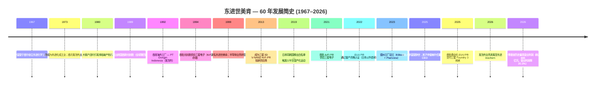
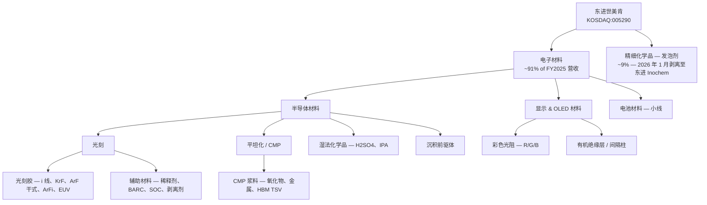
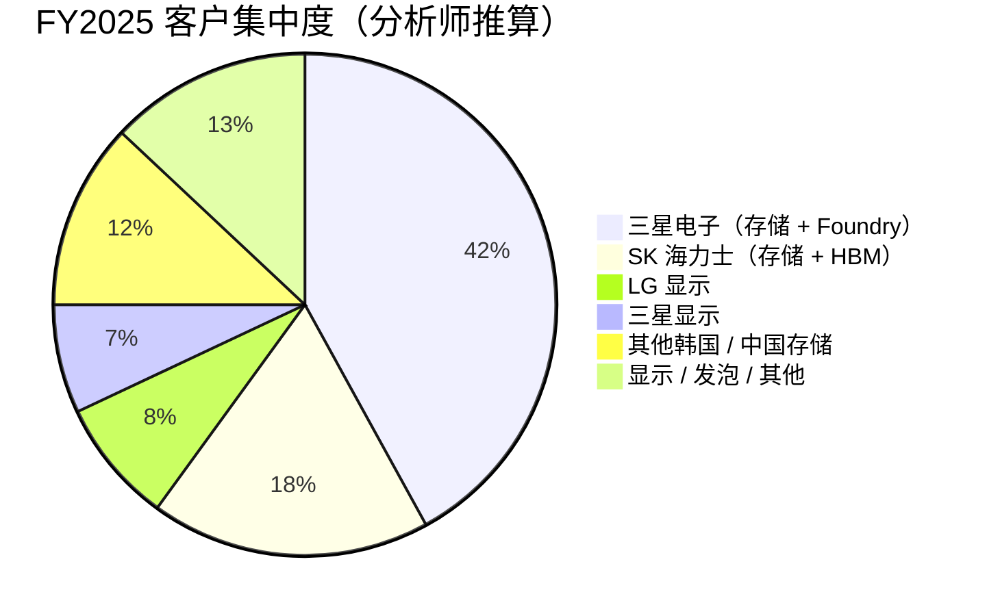
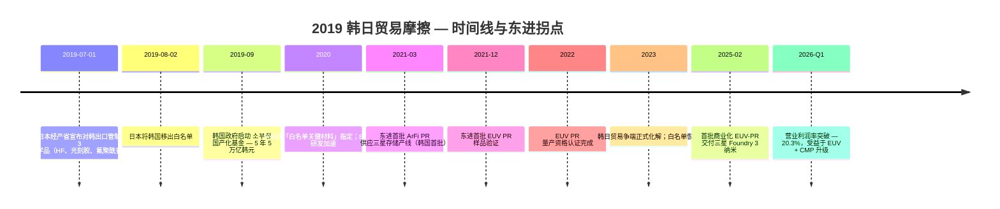
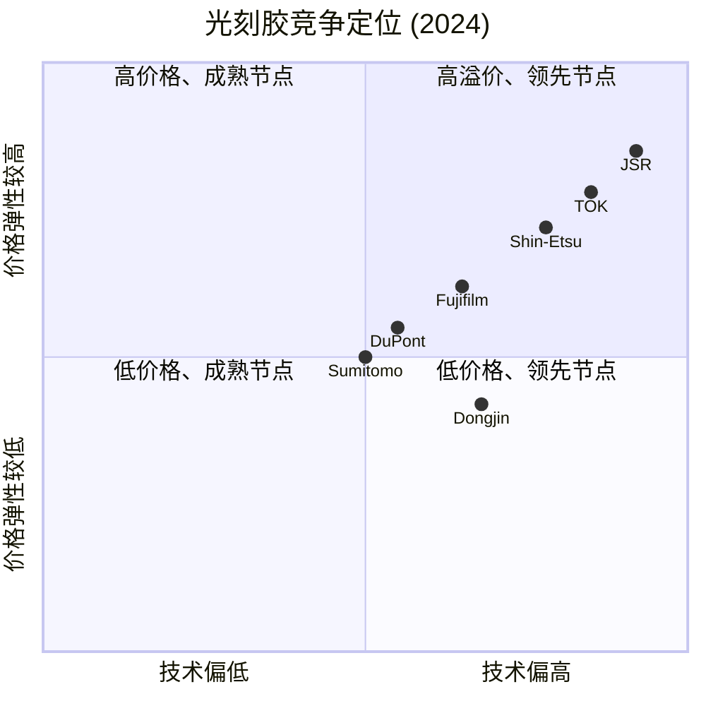

# 东进世美肯 (Dongjin Semichem, 동진쎄미켐, KOSDAQ:005290) — 公司研究

**日期：** 2026-05-26
**代码：** KOSDAQ:005290（韩国交易所 — KOSDAQ 创业板）
**行业：** 半导体 / 显示电子材料 — 光刻胶 (photoresist) 与特种化学品
**注册地：** 大韩民国（总部：仁川市西区佳佐洞）
**报告语言：** 简体中文（zh-CN）；英文原版为母本

> **更新——2026 年第一季度创历史最高营业利润 (2026-05-15):** 东进世美肯 2026 年一季度合并营收 **韩元 3,281 亿元（环比 +6.1%、同比 +16.3%）**，**营业利润韩元 666 亿元（环比 +60.0%、同比 +63.7%）**，营业利润率 20.3% — 双双创下公司有史以来单季最高。三大动能：(i) 2025 年 2 月起向三星电子 (Samsung Electronics) Foundry 3 纳米生产线开始首次商业化 EUV 光刻胶交付，2026 上半年放量；(ii) 在 SK 海力士 (SK Hynix) HBM3E / HBM4 封装产线首次实现化学机械抛光浆料 (CMP slurry) 国产替代交付，打破了 Soulbrain (KOSDAQ:357780) 的国内独家垄断；(iii) **2026 年 1 月发泡剂 (blowing agent / 발포제) 业务剥离至 100% 全资子公司「东进 Inochem (Dongjin Inochem, 동진이노켐)」**，上市主体转型为「电子化学品纯玩 (electronic-chemicals pure-play)」。资料来源：[siglab — 동진쎄미켐 2026 종목분석](https://siglab.kr/stock-005290/); [디일렉 — 발포제 사업 분할, 2024-11](https://www.thelec.kr/news/articleView.html?idxno=41767); [DART 사업보고서 2024, filed 2025-03-19](https://kind.krx.co.kr/common/disclsviewer.do?method=search&acptno=20250319000811)。

---

## 目录

1. 公司概览
2. 公司历史
3. 管理团队
4. 产品与服务 — **本报告权重最大的章节**
5. 客户与上市策略
6. 行业概览
7. 竞争格局
8. 市场机会 (TAM)
9. 风险评估
10. 参考资料

---

## 1. 公司概览

东进世美肯 (Dongjin Semichem, 동진쎄미켐, KOSDAQ:005290) 是全球前五大光刻胶 (photoresist) 厂商中**唯一的韩国公司**，也是韩国唯一一家拥有完整自主光刻胶产品矩阵的「电子化学品纯玩 (electronic-chemicals pure-play)」企业——产品覆盖 **i 线 (i-Line 365 nm)、氟化氪 (KrF 248 nm)、氟化氩 干式 (ArF dry 193 nm)、氟化氩浸没式 (ArF immersion / ArFi)** 以及 **极紫外光 (EUV 13.5 nm)** 全部五代曝光波长。公司总部位于仁川 (Incheon)，集团员工约 2,000 人，制造基地分布在韩国（仁川、华城、始兴、阴城）、中国（苏州、南通）、印度尼西亚（芝勒贡）、越南、台湾，以及——2026 年下半年开始——美国德克萨斯州（基林 Killeen 与平原镇 Plainview）([DONGJIN SEMICHEM — TradeKorea profile, accessed 2026-05](https://dongjinsem.tradekorea.com/company.do); [DONGJIN SEMICHEM — Overseas, accessed 2026-05](https://www.dongjin.com/en/company/about02.php); [SEMI member directory — Dongjin Semichem](https://www.semi.org/en/resources/member-directory/dongjin-semichem-co-ltd))。

**商业模式——东进如何赚钱。** 东进设有两大可报告业务分部。**电子材料 (Electronic Materials)** 占 FY2025 营收约 91%，销售光刻胶、辅助光刻化学品（稀释剂 / thinner、底部抗反射层 BARC / bottom anti-reflective coating、自旋碳硬掩膜 SOC / spin-on-carbon hard mask、剥离剂 / stripper）、化学机械抛光浆料 (CMP slurry)、半导体级湿法化学品（高纯硫酸 H₂SO₄、异丙醇 IPA）、TFT-LCD / OLED 显示化学品（彩色光阻、有机绝缘层、间隔柱），以及小规模的锂电池材料线。**精细化学品 (Fine Chemicals)** 约占 9%（2026 财年起降至约 0%，因 2026 年 1 月剥离）历来承载发泡剂业务——偶氮二甲酰胺 (ADCA, azodicarbonamide) 及相关泡沫化学品，全球供应制鞋、汽车、建筑应用——这是创始人最初的事业、也是为半导体材料研发提供长期现金流的「现金奶牛」([디일렉 — 발포제 분할, 2024-11](https://www.thelec.kr/news/articleView.html?idxno=41767); [stockanalysis.com — Dongjin financials, accessed 2026-05](https://stockanalysis.com/quote/kosdaq/005290/financials/))。电子材料业务定价主要以**多年期主协议下的每公斤计价**为主，光刻胶毛利率通常在 20% 后半至 30% 出头之间，CMP 浆料利润率更高，而 EUV-PR 一旦量产规模化将位居最高。

**地理布局。** 制造产能集中在韩国——**仁川总部工厂**是公司发源地与原始光刻胶生产线，**华城**是规模最大的半导体级化学品基地，**阴城**则承担 EUV-PR 试产线；海外的中国工厂主要服务于中国本土晶圆厂与本地存储生态（SK 海力士无锡），印尼 / 越南 / 台湾工厂则承担发泡剂与显示材料业务。两座**新建的德州工厂——基林 (Killeen) 生产高纯光刻胶稀释剂、平原镇 (Plainview) 生产半导体级硫酸**——专门为追随三星泰勒 (Samsung Taylor) 170 亿美元晶圆厂与台积电亚利桑那扩产而建；2026 下半年全面量产投产、稳态合计营收预期约 **1.1 亿美元（约韩元 1,500 亿元）** ([THE ELEC, 2024-09 — Dongjin Texas plants targets up to $110M revenue](https://www.thelec.net/news/articleView.html?idxno=6471); [Texas Governor's office — Texas Semiconductor Innovation Fund grant to Dongjin Semichem Texas](https://gov.texas.gov/news/post/governor-abbott-announces-texas-semiconductor-innovation-fund-grant-to-dongjin-semichem-texas); [한국신용신문 — Texas 양산 가동, 2026-04](https://www.creditnews.kr/news/articleView.html?idxno=2751); [Area Development — Dongjin Killeen expansion, 2025-02-15](https://www.areadevelopment.com/newsitems/2-15-2025/dongjin-semichem-killeen-texas.shtml))。

**规模指标 (FY2025).** 合并营收 **韩元 1.194 万亿元**（按 1,375 韩元 / 美元折算约 **8.70 亿美元**），营业利润 **韩元 1,724 亿元（营业利润率 14.4%，按韩国预披露口径；stockanalysis.com 口径 14.3%）**，净利润 **韩元 941–991 亿元**（预披露因核算口径不同存在小幅差异）([에너지경제 — Edaily, 동진쎄미켐 2025년 4분기 매출 3,092 억, 영업익 416 억, 2026-02-26](https://www.edaily.co.kr/News/Read?newsId=05024966645354456&mediaCodeNo=257); [stockanalysis.com — Dongjin financials, accessed 2026-05](https://stockanalysis.com/quote/kosdaq/005290/financials/))。营收同比 FY2024 谷底 (韩元 1.113 万亿元) 增长 7.3%，但营业利润同比下降 1.7%，净利润同比下降 36%——原因是化学品原材料成本通胀以及德州工厂投产前费用挤压了利润率。**季度走势比全年均值更具信号意义：2026 年一季度营收韩元 3,281 亿元、营业利润韩元 666 亿元（营业利润率 20.3%）**——这是公司有据可查的最高季度营业利润率，反映出 EUV-PR + HBM CMP 浆料首次实质性进入产品组合。

资料来源：[stockanalysis.com — Dongjin financials](https://stockanalysis.com/quote/kosdaq/005290/financials/); FY25 预披露 [Edaily, 2026-02-26](https://www.edaily.co.kr/News/Read?newsId=05024966645354456&mediaCodeNo=257); 经 [FnGuide — Snapshot A005290](https://comp.fnguide.com/SVO2/ASP/SVD_Main.asp?gicode=A005290) 验证。

**估值快照。** 截至 2026-05-22 收盘，东进股价 **韩元 62,300 元 / 股**，对应市值 **韩元 3.20 万亿元（约 23.3 亿美元）**，流通股本 5,141 万股 ([stockanalysis.com — KOSDAQ:005290 overview, accessed 2026-05-22](https://stockanalysis.com/quote/kosdaq/005290/))。TTM P/E 约 **50.8×**、P/B 2.95×——两者均显著高于 3 年均值（约 12× 与 1.5×）。基于 FY2026E 共识盈利预测口径前瞻 P/E 压缩至 **28–30×**——前提是 EUV-PR + 2026Q1 拐点延续（FY2026E 营业利润折年化 ~ 韩元 2,700 亿元 vs. FY25 韩元 1,724 亿元）([FnGuide — Snapshot A005290, accessed 2026-05-22](https://comp.fnguide.com/SVO2/ASP/SVD_Main.asp?gicode=A005290); [siglab — Dongjin Semichem 2026 분석](https://siglab.kr/stock-005290/))。同业参考：Soulbrain (KOSDAQ:357780，韩国 HF + 显示化学) TTM 约 19–20×、信越化学 (Shin-Etsu Chemical, TSE:4063) TTM 约 18×、东京应化 (Tokyo Ohka Kogyo, TSE:4186) TTM 约 27×、JSR 已私有化（EQT 与 JIC 收购，无公开倍数），住友化学 (Sumitomo Chemical, TSE:4005) TTM 约 22× ([stockanalysis.com — Soulbrain](https://stockanalysis.com/quote/kosdaq/357780/); [Yahoo Finance — 4063.T, accessed 2026-05-22](https://finance.yahoo.com/quote/4063.T/))。

资料来源：[stockanalysis.com](https://stockanalysis.com/quote/kosdaq/005290/) 与 [Yahoo Finance ratios, 2026-05-22](https://finance.yahoo.com/quote/4063.T/) — TTM 数据。

**估值倍数解读。** *分析师观点：* 东进 50× TTM P/E 是同业中最高、远高于自身 3 年均值 12×。机械上的原因是 FY2025 净利润压缩（韩元 991 亿元 vs. FY24 约 韩元 1,550 亿元）抬升了滚动倍数——并非市场驱动的重估。前瞻 28–30× 倍数才是更具相关性的数字，FY2026 三大主题拐点同时叠加，足以支撑此估值：(a) **EUV-PR 首批商业化收入放量**——与三星 Foundry 3 纳米同步，属高增量利润业务，过去由 JSR、东京应化、信越化学三家日厂垄断；(b) **HBM CMP 浆料破局 SK 海力士**——终结了 Soulbrain 此前在全球增速最快存储子板块的国内独家垄断；(c) **发泡剂业务剥离**——消除了韩国市场长期对东进施加的「混业经营折价 (conglomerate discount)」([siglab — 동진쎄미켐 2026 분석](https://siglab.kr/stock-005290/))。风险对称性视角：前瞻 30× 已经定价了一条「干净的执行路径」；任何 EUV-PR 资格认证滑坡（日厂并未停下脚步）、三星 Foundry 2 纳米量产不利、HBM 需求停滞，都将把估值倍数压回至高十几倍 / 低二十几倍——这也是第 9 章将估值列为风险的原因。

---

## 2. 公司历史

东进世美肯创立于 **1967 年 10 月**，创始人为 **李富燮 (Lee Boo-sup, 이부섭)**，公司初名「东进化学工业社 (동진화학공업사)」——彼时 30 岁的李毕业于首尔大学化学系，独自一人在自家首尔住宅的木炭储藏棚里启动这家特种化学品作坊 ([Business Post — Who Is? 이부섭 회장](https://www.businesspost.co.kr/BP?command=article_view&num=349006); [HelloDD — 이부섭 동진쎄미켐 회장 별세, 2025-02-25](https://www.hellodd.com/news/articleView.html?idxno=107050))。原始主业为 **PVC 增塑剂 (PVC plasticizer) 与偶氮二甲酰胺 (ADCA / azodicarbonamide) 发泡剂 (blowing agent)**——这些化学品当时韩国几乎全部依赖进口，李在此后十年陆续完成国产替代。公司于 1973 年改组为「东进化成工业 (동진화성공업)」，同年正式进入全球发泡剂出口市场。现今的「东进世美肯 (동진쎄미켐, 字面意为 Dongjin Semichem)」名称于 1999 年确立，以反映公司向半导体材料的战略转型 ([Newsis — 이부섭 회장 별세, 2025-02-25](https://www.newsis.com/view/NISX20250225_0003077798); [한국경제 — 반도체 소재 국산화 주역 이부섭 회장 별세, 2025-02-25](https://www.hankyung.com/article/202502257503i))。

**1980 年濒临破产与战略性转身。** 东进前三十年最重要的拐点，是 1980 年由一家大客户违约引发的濒临破产危机。43 岁的李富燮亲自踏遍亚洲、北美与欧洲，逐一争取新的发泡剂出口合同，3 年内将公司带回盈亏平衡 ([HelloDD obituary, 2025-02-25](https://www.hellodd.com/news/articleView.html?idxno=107050))。这一插曲奠定了东进至今依然鲜明的两条文化基因：**对债务驱动扩张的厌恶**、以及**愿意吸收多年研发亏损以国产化关键材料的耐心**。两条基因都不可或缺，正是它们为接下来的 **1980 年代光刻胶项目**做了底气——该项目自 1985 年启动，1989 年开花结果，东进研发出韩国首款光刻胶，也是全球第四家（前三家为 Shipley/Rohm & Haas、Hoechst/AZ、东京应化）([SNU Alumni Association — 이부섭 인터뷰](https://www.snua.or.kr/magazine?md=v&seqidx=9690); [HelloDD obituary, 2025-02-25](https://www.hellodd.com/news/articleView.html?idxno=107050))。

**定义现代东进的三次战略转身：**

1. **从大宗 PVC 化学品到半导体材料 (1989–1999)**。1989 年光刻胶的产品商业化是文化层面的转身；1994 年首单卖给三星电子是商业层面的验证；1999 年「Semichem」更名是法律 / 品牌层面的整合。到 1990 年代中期，半导体材料已成为收入中占比小但显著的板块；到 2010 年已是清晰的主导业务。

2. **从多客户 KrF 供应商到三星独家 KrF 合作伙伴 (2010–2013)**。三星 2013 年宣布转向 3D V-NAND（首代 24 层），东进随即成为三星该工艺的**独家 KrF 光刻胶供应商**——根据 The Elec 2024 年报道，这层关系在东进端贡献约**韩元 2,500 亿元年化光刻胶收入**，其中约 60%（约 韩元 1,500 亿元）来自三星 ([The Elec — Samsung reduces PR consumption in 3D NAND, 2025-05](https://thelec.net/news/articleView.html?idxno=5054))。这一独家关系也成为后续 ArF / EUV 资格认证的基础。

3. **从 DUV-only 到含 EUV 的全栈光刻胶 (2019–2025)**。压缩东进 EUV-PR 时间线的关键事件，是 **2019 年 7 月日本对韩出口管制**：东京限制对韩出口三种半导体材料——**高纯氢氟酸 (HF, hydrogen fluoride)、光刻胶（尤其是 EUV 级别）、氟聚酰亚胺 (fluorinated polyimide)**——并于 2019 年 8 月 2 日将韩国从优先贸易伙伴「白名单」中移除 ([USITC — South Korea-Japan Trade Dispute, 2020](https://www.usitc.gov/publications/332/working_papers/the_south_korea-japan_trade_dispute_in_context_semiconductor_manufacturing_chemicals_and_concentrated_supply_chains.pdf); [Cambridge Core — Securitizing high-technology industries, 2022](https://www.cambridge.org/core/journals/business-and-politics/article/securitizing-hightechnology-industries-south-koreajapan-dispute-over-materialspartsequipment-products/3D0AD204AE73DFAC8169ADF4224DDDB4))。韩国政府随即推出**「소부장 (素部装) — 材料·零部件·装备 (Materials–Parts–Equipment)」**本土化计划——配套 5 万亿韩元的研发与资本支出补贴——将东进指定为光刻胶领域的「国家队冠军」([KEIA — Disrupting Supply Chains: Japan-Korea Conflict, 2022](https://keia.org/the-peninsula/disrupting-supply-chains-evidence-on-the-japan-korea-conflict/))。在 28 个月内，东进就完成了 ArF 浸没式 (ArFi) 光刻胶在三星存储产线上的资格认证（2021 年 3 月），并于 2021 年 12 月展示首批 EUV 光刻胶样品 ([ETNews — Dongjin localizes ArFi PR, 2021-03-26](https://english.etnews.com/20210326200002); [ETNews — Dongjin localizes EUV PR, 2021-12-20](https://english.etnews.com/20211220200001))。EUV-PR 商业交付三星 Foundry（3 纳米 GAA）于 2025 年 2 月开始——巧合地、就在创始人李富燮辞世的同月 ([ETNews, 2021-12](https://english.etnews.com/20211220200001); [디일렉 — EUV 네거티브 PR 양산, 2023](https://www.thelec.kr/news/articleView.html?idxno=21931); [SisaJournal-e — 동진쎄미켐 파운드리 EUV 감광액](https://www.sisajournal-e.com/news/articleView.html?idxno=304436))。

**并购与产能建设（不算重头戏——李氏文化偏向绿地研发投入）：**

- **1992** — PT Dongjin Indonesia（芝勒贡）— 首座海外发泡剂工厂。
- **2000 年代** — 中国多地扩张（苏州对接显示化学品；南通承担发泡剂业务）。
- **2018** — 阴城 EUV 试产线 + 华城光刻胶产能扩张（2019 后再投资作为 소부장 产能）。
- **2022–2024** — 德州工厂 (Killeen 与 Plainview)，单座约 1 亿美元投资，部分由韩国贸易保险公司 (K-Sure) 融资 ([Global Trade Alert — K-Sure financing, 2023-05-09](https://www.globaltradealert.org/intervention/119729/financial-assistance-in-foreign-market/republic-of-korea-k-sure-provides-financing-to-support-dongjin-semichem-s-construction-of-semiconductor-material-plant-in-the-united-states))。
- **2026 年 1 月** — 发泡剂业务剥离至 100% 全资子公司东进 Inochem (동진이노켐) ([디일렉 — 발포제 분할, 2024-11-09](https://www.thelec.kr/news/articleView.html?idxno=41767))。

**近 12 个月主要事件。** 三件事对当前投资逻辑至关重要：(i) **创始人李富燮于 2025 年 2 月 25 日辞世**，触发了向其子李俊赫 (Lee Jun-hyuk, 이준혁) 于 2025 年 4 月 1 日的顺利交接 ([Hankyung — 이부섭 회장 별세, 2025-02-25](https://www.hankyung.com/article/202502257503i); [Business Post — Who Is? 이준혁 회장](https://www.businesspost.co.kr/BP?command=article_view&num=404339))；(ii) **2025 年 2 月开始商业化 EUV-PR 交付**三星 Foundry 3 纳米；(iii) **2026 年 1 月发泡剂业务剥离**，使上市主体转型为「纯电子材料」身份。每项均在后续相关章节深入展开。

---

## 3. 管理团队

### 创始人 — 李富燮 (Lee Boo-sup, 이부섭, 1937–2025)

李富燮于 1967 年 10 月 30 岁时创立东进，直至 2025 年 2 月 25 日以 87 岁高龄辞世前，他始终以董事长身份参与运营。1937 年 11 月 22 日生于首尔，1956 年毕业于京畿高中，1960 年获首尔大学化学工程系学士学位，1962 年于首尔大学研究生院获硕士学位 ([Business Post — 이부섭 회장 프로필](https://www.businesspost.co.kr/BP?command=article_view&num=349006); [Hankyung — 이부섭 회장 별세, 2025-02-25](https://www.hankyung.com/article/202502257503i))。他在创业前唯一的职业经历，是在首尔一家**摄影用化学品公司任研究员**——这段经历事后证明意义非凡，因为光刻胶正是摄影乳胶化学的直系后裔。1967 年创立东进的决策，是押注于韩国在朴正熙重化学工业 (HCI Plan, 1973–1981) 推进过程中需要国产化 PVC 增塑剂与发泡剂；最初十年公司只做发泡剂 (ADCA) 单一产品线，之后才扩展到 PVC 稳定剂与特种增塑剂 ([HelloDD — 이부섭 별세 obituary, 2025-02-25](https://www.hellodd.com/news/articleView.html?idxno=107050); [Newsis, 2025-02-25](https://www.newsis.com/view/NISX20250225_0003077798))。

李富燮一生两个最具决定性的战略选择，都涉及承担多年亏损以国产化韩国仍依赖进口的关键材料。第一个是 **1980 年的破产边缘自救**——一家制鞋业大客户违约后，李在 18 个月内亲访 12 国推介出口合同，1983 年带公司回到经营盈亏平衡。第二个、也是更具历史意义的，是 **1985–1989 年的光刻胶项目**：李在连续四年投入约 3% 营收做光刻胶研发——而彼时公司整体营业利润率仅为个位数——最终于 1989 年交付韩国首款国产光刻胶，全球第四家（次于 Shipley、Hoechst-AZ、东京应化）([SNU Alumni Association — 이부섭 인터뷰](https://www.snua.or.kr/magazine?md=v&seqidx=9690); [HelloDD, 2025-02-25](https://www.hellodd.com/news/articleView.html?idxno=107050))。1994 年首单售予三星电子。他获得过韩国「金塔产业勋章 (산업포장 금탑)」，并曾任「韩国产业技术协会 (한국산업기술협회)」会长。其股权通过私人控股平台「东进控股 (Dongjin Holdings, 동진홀딩스)」持有——他辞世时持有该控股平台 55.72% 的控股权益；东进控股则控制上市公司东进世美肯 32.49% 的股权 ([Business Post — 이부섭 회장](https://www.businesspost.co.kr/BP?command=article_view&num=349006); [thebell — 이준혁 회장 최대주주 등극, 2025-11](https://thebell.co.kr/free/Content/ArticleView.asp?key=202511181544541760109161&svccode=04))。

### 董事长兼 CEO — 李俊赫 (Lee Jun-hyuk, 이준혁, 1967 年生, MIT 化工博士)

李俊赫——创始人次子——于 2025 年 4 月 1 日正式接任东进世美肯董事长兼 CEO，距其父辞世仅一个月。他现年 58 岁（1967 年 5 月 26 日生），自 2008 年起便已在东进运营层面全权负责半导体材料业务 ([Business Post — Who Is? 이준혁 회장](https://www.businesspost.co.kr/BP?command=article_view&num=404339); [중앙이코노미뉴스 — 이준혁 단독 대표 체제, 2025](https://www.joongangenews.com/news/articleView.html?idxno=411113); [Hankyung — 이준혁 단독 체제, 2025-03-26](https://www.hankyung.com/article/202503261299i))。他的履历在韩国二代财阀继承人中罕见地具有深度技术背景：明知高中 (1985)、首尔大学化学工程学士 (1989)、麻省理工学院 (MIT) 化学工程硕士与博士 (1994)。其 MIT 博士论文研究的是高分子化学——这正是光刻胶树脂设计的核心 IP，也是不同 EUV-PR 厂商之间的差异化所在。MIT 毕业后于 1994 年立即加入东进世美肯——同一年公司开始向三星供货。到 2001 年他出任执行副总裁 (EVP)，主管新项目开发；2008 年升任上市公司总裁兼 CEO；2008 年至 2025 年 4 月期间与父亲并任共同 CEO（其父任董事长，他任副董事长）；2025 年 4 月起独任董事长兼 CEO。

读懂这份 CV 的关键是看他在登顶前交付了什么。作为 2019–2022 年 EUV-PR 项目的技术总负责人，他是对三星电子直接负责的高层执行者——要兑现文在寅 / 尹锡悦两届政府对 소부장 国产化里程碑的实际承诺。该项目于 2021 年 12 月按期实现样品验证、2025 年 2 月按期实现商业供货——在韩国材料行业以「清洁的执行记录」标准衡量极为难得。李俊赫还自 2022 年起担任**「世界级企业协会 (월드클래스기업협회)」会长**——这是韩国产业通商资源部 (MOTIE) 主办的中小 / 中型企业全球化产品领导力评选项目；他同时是**韩国半导体产业协会 (KSIA) 副会长** ([EBN — 이준혁 월드클래스기업협회장 취임](https://m.ebn.co.kr/news/view/1520147); [Dongjin Semichem CEO greeting page](https://www.dongjin.com/company/greeting.php))。股权方面：他原持有东进控股 17.77%，**2025 年 11 月接替其父绝大部分股权后，东进控股持股升至 39.99%**，获得对上市主体的事实单人控制权 ([thebell — 이준혁 동진홀딩스 최대주주, 2025-11-18](https://thebell.co.kr/free/Content/ArticleView.asp?key=202511181544541760109161&svccode=04))。他在上市公司本身并不直接持股；间接控制权链为「东进控股 → 东进世美肯」。加上他控制的两家私人关联公司（Mise-Tech 与 Myung-Bu Industry）的持股，他在东进控股的有效投票权超过 58%，足以否决任何争议性公司治理动议。薪酬以美国 CEO 标准衡量颇为温和——根据 2024 사업보고서 (年度业务报告) 披露，含长期激励的总薪酬约 韩元 12–15 亿元 ([DART 사업보고서, accessed 2026-05](https://kind.krx.co.kr/common/disclsviewer.do?method=search&acptno=20250319000811))。与长兄 **李俊圭 (Lee Jun-gyu, 이준규)** 之间的继承架构——长兄成为副董事长、负责发泡剂业务，预计将通过东进 Inochem 剥离从上市主体完全分离——在韩国家族企业中显得格外清晰。市场对 2026 年 1 月发泡剂剥离的解读，正是兄弟二人完全产业切分的第一步：俊赫拿走半导体材料业务、俊圭拿走发泡剂业务，东进控股保留两个产业的少数股权 ([디일렉 — 발포제 분할, 형제 간 계열분리, 2024-11](https://www.thelec.kr/news/articleView.html?idxno=41767); [딜사이트 — 동진쎄미켐 후계 승계 상속세 변수](https://dealsite.co.kr/articles/137369/068020))。

---

## 4. 产品与服务

> **重点提示：** 本章承载的份量高于任何其他章节。东进的产品矩阵是后续所有讨论的基石——客户集中度、竞争位置、TAM 份额、风险——所有讨论都将回溯到「哪些产品进入哪个晶圆厂的哪个工艺节点」。

### 4.1 锚点 — 公司自身的产品矩阵

东进将电子材料业务按 6 个产品族 × 2 大终端应用（半导体与显示）组织，外加 2026 年 1 月剥离的传统发泡剂业务。下表分类直接采自公司英文产品导航树，并与 2024 사업보고서产品清单对账 ([Dongjin Semichem — Business: Semiconductor Materials, accessed 2026-05](https://www.dongjin.com/en/business/semiconductor.php); [Komachine — Dongjin product list](https://www.komachine.com/en/companies/dongjinsemichem); [DART 사업보고서 2024, filed 2025-03-19](https://kind.krx.co.kr/common/disclsviewer.do?method=search&acptno=20250319000811))。

| 市场 | 工艺 / 应用 | 技术代际 | 东进产品族 |
|---|---|---|---|
| 半导体（存储与逻辑） | 光刻 — 光刻胶 | EUV (13.5 nm) | EUV 正性 PR、EUV 负性 PR（开发中） |
| 半导体（存储与逻辑） | 光刻 — 光刻胶 | ArF 浸没式 (193 nm + 水) | ArFi PR |
| 半导体（存储与逻辑） | 光刻 — 光刻胶 | ArF 干式 (193 nm) | ArF 干式 PR |
| 半导体（存储与逻辑） | 光刻 — 光刻胶 | KrF (248 nm) | KrF PR（含 3D NAND 用 KrF Thick PR） |
| 半导体（存储与逻辑） | 光刻 — 光刻胶 | i 线 (365 nm) | i 线 PR |
| 半导体（存储与逻辑） | 光刻 — 辅助材料 | 全节点 | 稀释剂 (Thinner)、BARC（底部抗反射层）、SOC（自旋碳硬掩膜）、剥离剂 (Stripper) |
| 半导体（存储与逻辑） | 平坦化 | 全节点 | CMP 浆料（氧化物、金属、HBM TSV 专用） |
| 半导体（存储与逻辑） | 湿法处理 | 全节点 | 高纯硫酸、IPA、前驱体 |
| 半导体（存储与逻辑） | 沉积 | 先进节点 | 前驱体（硅基、金属） |
| 显示 (TFT-LCD / OLED) | 光刻 | 全部 | 彩色光阻 (R/G/B)、有机绝缘层、间隔柱 / 光柱 |
| 能源（传统） | 锂电池 | — | 导电添加剂、粘结剂（小线） |
| 精细化学品（2026 年 1 月剥离） | 发泡 | — | ADCA（偶氮二甲酰胺）发泡剂 — 现归东进 Inochem |

*资料来源：东进世美肯产品导航树，与 [2024 사업보고서 产品披露, filed 2025-03-19](https://kind.krx.co.kr/common/disclsviewer.do?method=search&acptno=20250319000811) 与 [Komachine 供应商档案](https://www.komachine.com/en/companies/dongjinsemichem) 对账整理。注：东进不像美国 10-K 申报人那样发布一份逐字的产品族表格；上表是以 사업보고서产品清单 + 英文 IR 产品页重建得出。*

### 4.2 综述 — 这些品类如何在单个晶圆厂的工艺流程中协同

在存储或逻辑晶圆厂中，东进矩阵中的产品紧密耦合地分布在「光刻 → 刻蚀 → 沉积 → CMP」循环上——每片晶圆视节点和堆叠层数不同需经 30–80 次循环。**光刻胶 + 稀释剂 + BARC + SOC** 四件套定义了第 N 次光刻步骤：在晶圆上依序自旋涂布 BARC、SOC、光刻胶（i 线 / KrF / ArF / EUV 视节点而定）；曝光、显影。**稀释剂 (Thinner)** 是用于晶圆边缘清洗 (Edge Bead Removal) 和光刻胶涂布粘度调节的高纯溶剂——其消耗量显著高于光刻胶本身，这也是东进德州 Killeen 工厂专为稀释剂供应而设的原因。下游，**CMP 浆料 (CMP slurry)** 是在沉积步骤之间用于晶圆平坦化的研磨 + 化学品混合物；对 HBM 封装特定来说，CMP 浆料用于平整高深宽比 TSV（穿硅孔）与 RDL（再分布层）。**高纯硫酸 (H₂SO₄)** 是刻蚀后剥离光刻胶的湿法试剂——这就闭合了光刻循环。东进是少数能够从单一客户管理团队交付完整辅助套件（光刻胶 + 稀释剂 + BARC + SOC + 剥离剂 + 浆料）的供应商——这才是相比日本光刻胶纯供应商真正具有商业差异化的能力。

### 4.3 光刻胶业务 — 公司存在的理由

**4.3.1 KrF (248 nm) 光刻胶 — 现金奶牛。**

东进于 1989 年研发出韩国首款 KrF 光刻胶，自 1994 年起一直是三星电子主要的国产 KrF 供应商。该产品现在是东进收入最大的单一产品线——根据 The Elec 2024 年报道，光刻胶年化收入约 韩元 2,500 亿元、其中约 60% 来自三星；KrF 是该业务的最大子板块，因为 KrF 仍持续承担 3D NAND 光刻角色 ([The Elec — Samsung reduces PR consumption in 3D NAND, 2025-05](https://thelec.net/news/articleView.html?idxno=5054))。产品按两个等级销售：**标准 KrF 光刻胶**用于存储后端光刻层，以及专门为三星 V-NAND 第五代起的高深宽比 (HAR) 通孔与字线图形化设计的 **KrF Thick PR（厚膜光刻胶）**。Thick PR 产品已被韩国产业通商资源部 (MOTIE) 与大韩贸易投资振兴公社 (KOTRA) 评为 **2025 世界级产品 (World Class Product)**——这是韩国政府认可技术领导力的旗舰出口产品认证 ([아시아경제 — Dongjin Semichem KrF Thick PR World-Class Product, 2025-11-27](https://cm.asiae.co.kr/en/article/2025112708465584484))。

> 「东进世美肯被认为从光刻胶业务每年赚取 2,500 亿韩元营收，其中 60% 来自向三星的供货。」—— The Elec ([2025-05](https://thelec.net/news/articleView.html?idxno=5054))。

**通俗解释。** KrF 光刻胶 (氟化氪光刻胶, 248 nm 波长) 是 3D NAND 存储最深刻蚀步骤所用的主力光刻胶——这些步骤包括纵向贯穿 200 多层存储层的通孔，以及横向延伸的字线。挑战不在于特征尺寸——KrF 分辨率早已成熟——而在于**深宽比**：用于 400 层 NAND 通孔的 KrF Thick PR 必须在 10+ 微米深刻蚀过程中维持侧壁完整性，这要求非常专门化的树脂化学和厚得多的涂层（多微米级），远厚于存储外围光刻所需。东进的 KrF Thick PR 与东京应化 (TOK) 的 TDUR-P/TDUR-N 系列直接竞争——详见第 7 章。其战略意义在于：3D NAND 扩展已经从「单堆叠层数增加」转向「两栈、三栈晶圆键合」，这成倍增加了每片晶圆的 KrF 光刻步骤；SK 海力士与三星均已公开承诺 2026–2027 年推出 400+ 层产品，对 KrF Thick PR 消耗呈结构性利好。

*分析师观点：* 东进在 KrF 光刻胶国内市场拥有**明确的竞争优势** (Yes — 切换成本 + 规模 + 多年资格认证锁定)，护城河类型 = **技术 + 切换成本（在三星存储产线上属于单一来源 / 双源中的合格供应商）**。Thick PR 细分领域最直接的国际竞争对手是 **TOK 的 TDUR-P 系列**，销往美光与 SK 海力士无锡 ([TOK product catalog — TDUR-P, accessed 2026-05](https://www.tok.co.jp/eng/products/electronic_materials/photoresist))。

**4.3.2 ArF 干式与 ArF 浸没式 (193 nm) 光刻胶 — 近期突破口。**

ArF 干式（193 nm 空气曝光）与 ArFi（193 nm + 水浸没）光刻胶是 DRAM（1bnm 与 1cnm 节点）以及 14 nm–7 nm 逻辑工艺的主力光刻胶。东进自研的 ArFi PR 首批供应三星电子在 **2021 年 3 月**——这一里程碑被韩国媒体明确地框定为 2019 年日本出口管制的直接结果 ([ETNews — Dongjin Localizes ArFi Photoresist, 2021-03-26](https://english.etnews.com/20210326200002))。

> 「东进世美肯在出口管制开始后立即启动 EUV PR 研发，并成功首次向三星电子半导体量产线供货。作为韩国企业，它是第一家向三星供应 ArF 浸没式光刻胶的厂商。」—— ETNews ([2021-03-26](https://english.etnews.com/20210326200002))。

**通俗解释。** ArFi PR (氟化氩浸没式光刻胶) 是用于尚未 EUV 印制的最先进 DRAM 与逻辑节点的光刻胶。「浸没」指 ASML 扫描仪镜头与晶圆之间夹有一层水，从而增大数值孔径 (NA) 与提高分辨率。ArFi 光刻胶化学性比 KrF 难得多——树脂必须在 193 nm 下保持透明、水不敏感（水层不得抽提光刻胶组分）、并能承受多次图形化 (LELE / SAQP) 套刻预算 < 2 nm。东进的 ArFi 产能绝大多数供应三星 DRAM 1bnm 与 1cnm。战略意义：1cnm 及以下越来越多采用 EUV 节点，但多次图形化 ArFi 在某些后段制程 (BEOL) 与边缘逻辑代工 (三星 7 nm / 8 nm) 上仍将长期存在。

*分析师观点：* 东进在 ArFi 上拥有**部分优势**——国产本土地位与소부장指定使其获得三星份额，但 TOK、JSR、信越化学、富士胶片仍是全球主力供应商。护城河类型 = **监管 + 客户本土化偏好**，并非纯粹技术优势。最接近的国际竞争对手：**JSR 的 AIM 系列**（特别是 AIM-7000 系列用于 7 nm 逻辑）与 **TOK 的 TArF-Pi 系列** ([JSR — Microelectronics products page](https://www.jsr.co.jp/jsr_e/business/microelectronics/)，私有化后只能查阅产品族页面)。

**4.3.3 EUV (13.5 nm) 极紫外光刻胶 — 不对称增长驱动力。**

EUV 光刻胶是东进产品管线中战略意义最重大的产品，也是最可能驱动估值结构性重估的单一资产。东进于 **2021 年 12 月**报告首批 EUV-PR 样品 ([ETNews — Dongjin localizes EUV photoresist, 2021-12-20](https://english.etnews.com/20211220200001))，2022 年通过 EUV-PR 量产资格认证，并于 **2025 年 2 月开始向三星 Foundry 3 纳米 GAA 量产线商业化交付 EUV-PR** ([SisaJournal-e — 동진쎄미켐 파운드리 EUV 감광액 개발 속도](https://www.sisajournal-e.com/news/articleView.html?idxno=304436); [siglab — Dongjin 2026 분석](https://siglab.kr/stock-005290/))。EUV-PR 项目也以 SK 海力士为存储 EUV 节点的协同开发客户 ([LinkedIn — SK hynix partners with Dongjin on EUV PR, 2025](https://www.linkedin.com/posts/erudite-asia_sk%ED%95%98%EC%9D%B4%EB%8B%89%EC%8A%A4-%E6%97%A5-%EC%9D%98%EC%A1%B4-euv-pr-%EA%B5%AD%EC%82%B0%ED%99%94-%EC%B6%94%EC%A7%84%EA%B3%A0%EC%84%B1%EB%8A%A5-%EA%B0%9C%EB%B0%9C-%EB%8F%99%EC%A7%84%EC%8E%84%EB%AF%B8%EC%BC%90%EA%B3%BC-activity-7404386921789251584-lxf3); [녹색경제신문 — SK하이닉스 + 동진 EUV PR 국산화, 2024](https://www.greened.kr/news/articleView.html?idxno=334090))。

**通俗解释。** EUV 光刻胶（极紫外光刻胶 / EUV photoresist, 13.5 nm 波长）是整个光刻化学栈中最苛刻的化学品。13.5 nm 波长意味着光子能量约为 193 nm ArFi 光子的 14 倍，光刻胶内的吸收长度相应缩短——所以光刻胶薄膜必须非常薄（~30–40 nm），但仍需提供印制 30 nm 周期特征所需的刻蚀抗性和线边粗糙度 (LER, Line-Edge Roughness)。目前生产中主要有两类光刻胶化学：**化学放大型光刻胶 (CAR, chemically amplified resists)**——基于酸催化聚合物脱保护反应，是 JSR、TOK 与信越化学销售的形式；以及**金属氧化物光刻胶 (MOR / 无机光刻胶)**——光子直接断裂锡氧键，Inpria（已被 JSR 收购）是主导供应商。东进的 EUV-PR 属于 CAR 型——正性版本用于三星 Foundry 3 纳米，负性版本正在资格认证中 ([디일렉 — EUV 네거티브 PR 양산, 2023](https://www.thelec.kr/news/articleView.html?idxno=21931))。战略意义：随着三星 Foundry 从 3 纳米（已投产）推进至 2 纳米（计划 2026 年量产）以及之后的 1.4 纳米，每片晶圆的 EUV-PR 消耗将上升，因为 (i) 每张掩膜组的 EUV 层数增加，(ii) 渐进趋严的线边粗糙度规格要求光刻胶感光度更高，(iii) High-NA EUV 自 2027–2028 年起引入一个更小特征的新尺寸领域，需要全新一代光刻胶。东进已公开承诺 **High-NA EUV PR 项目**，2023 下半年研发启动、2025–2026 年样品目标 ([Digitimes — Dongjin set to develop high-NA EUV photoresists, 2023-06-26](https://www.digitimes.com/news/a20230626PD203/euv-photoresist-chemical-materials-asml.html))。

*分析师观点：* 东进在 EUV 上目前最多只能算**部分优势**——它是全球大约 4 家具有 EUV-PR 认证资格的供应商之一（JSR/Inpria、TOK、信越化学、东进），是其中唯一非日本厂商，但量产份额仍处个位数低位。护城河类型 = **技术 + 监管**——监管利好来自韩国政府 소부장 明确的支持以及三星格外耐心的资格认证流程。最接近的国际竞争对手为 **JSR 的 EUV CAR 组合 + Inpria MOR**（现合并于 JSR）、其次为 **TOK 的 TILON-EUV 系列**与**信越化学的 SEVR-AS 系列** ([Fountyl — Japanese companies monopolize the EUV photoresist supply market, accessed 2026-05](https://www.fountyltech.com/news/japanese-companies-monopolize-the-euv-photoresist-supply-market/))。

### 4.4 光刻辅助材料 — 稀释剂、BARC、SOC、剥离剂

东进的光刻辅助材料组合让公司成为韩国晶圆厂的「全套交钥匙供应商」。这一品类中的四项产品——**稀释剂 (Thinner, 边缘清洗溶剂)、BARC（底部抗反射层，位于光刻胶之下）、SOC（自旋碳，三层光刻法中的硅富集硬掩膜层）、光刻胶剥离剂 (resist stripper)**——若单卖均为大宗品级别毛利率，但若与所需光刻胶捆绑销售则成为高利润品。**稀释剂**在质量计算上是体积最大的产品（晶圆厂稀释剂消耗的质量约为光刻胶质量的 10–20 倍）——这也是东进 Killeen 德州工厂专门做稀释剂、且明确锁定三星 Taylor 工厂的原因 ([한국신용신문 — Texas 양산, 2026-04](https://www.creditnews.kr/news/articleView.html?idxno=2751))。

**通俗解释。** 晶圆上的光刻胶并不是单层结构——而是一个三层堆叠：SOC（自旋碳，约 50–100 nm 厚——提供硬掩膜的刻蚀预算）、BARC（抗反射层，约 30–40 nm——消除曝光光与底层晶圆之间的驻波干涉）、以及光刻胶本身（视节点而定，约 30–100 nm）。曝光显影后，残余光刻胶以高纯硫酸 + IPA 剥离。稀释剂是溶剂——既用于将光刻胶调到涂布粘度，更关键的是在自旋涂布过程中清洗晶圆边缘，防止光刻胶在搬运时从晶圆背面脱落。东进向同一批韩国存储与逻辑客户销售全部四种辅助材料，相对仅卖光刻胶的供应商有显著的增量钱包份额优势。

*分析师观点：* 东进在辅助材料组合中拥有**明确优势** (Yes — 规模 + 客户关系 + 服务成本)。护城河类型 = **规模 + 生态系统锁定**。最接近的国际竞争对手：**Brewer Science**（美国，BARC 与 SOC 专家）与 **MGC（三菱瓦斯化学，Mitsubishi Gas Chemical）**（高纯溶剂）。

### 4.5 CMP 浆料 — HBM 顺风

化学机械抛光浆料 (CMP slurry, 化学机械抛光浆料) 是在沉积步骤之间用于晶圆平坦化的研磨 + 化学品混合物。市场按抛光对象划分：氧化物浆料（用于层间介电层 ILD）、金属浆料（钨、铜）、STI / 浅沟槽隔离浆料。最快增长的 CMP 子板块是 **HBM 专用 TSV（穿硅孔）与 RDL（再分布层）浆料**——用于平坦化 HBM3E / HBM4 封装中堆叠 DRAM 晶粒之间高深宽比 TSV。

东进的 CMP 浆料业务历史上是国内第三家厂商，仅次于 **Soulbrain**（长期以来 SK 海力士与三星存储 CMP 浆料的事实独家供应商）与 **KCTECH (KC Tech)**。2025–2026 年的变局是 **SK 海力士开始为 HBM CMP 浆料引入东进作为第二供应商**，结束了 Soulbrain 在全球 ASP 最高 CMP 子板块的国内独占地位 ([siglab — HBM CMP slurry 진입](https://siglab.kr/stock-005290/))。HBM TSV 抛光对盘形深度 (dishing) 平整度有异常严苛要求，需维持 TSV 单元之间的电隔离，相应的浆料化学也必须高度差异化。

**通俗解释。** CMP 浆料 (化学机械抛光浆料) 一部分是研磨剂（二氧化硅或二氧化铈纳米颗粒）、一部分是化学品（氧化剂、表面活性剂、缓蚀剂）、一部分是水——配方依抛光材料与下层形貌而定。HBM TSV 抛光是存储中最难的 CMP 子工序，因为 TSV 必须在宽范围填充剖面上抛平，又不能破坏晶粒间阻挡层，过度抛光则会给后续键合步骤造成景深问题。战略意义：HBM4（2026 年量产目标、2027 年放量）的 CMP 步骤数高于 HBM3E。SK 海力士已公开声明 HBM 至 2026 年完全售罄 ([SK hynix Newsroom — Q1 2026 results, 2026-04-23](https://news.skhynix.com/q1-2026-business-results/))——每片 HBM 晶圆都按比例承载更多东进浆料消耗。

*分析师观点：* 东进在 CMP 浆料中拥有**部分优势**（最新在全球增速最快的存储封装线获得第二供应商资格）。护城河类型 = **规模 + 客户本土化偏好**。最接近的竞争对手：**Soulbrain (KOSDAQ:357780)** 在国内、**富士胶片电子材料、CMC Materials（现归 Entegris）、Cabot Microelectronics** 在国际 ([Soulbrain Co Ltd — financial profile, accessed 2026-05](https://stockanalysis.com/quote/kosdaq/357780/))。

### 4.6 湿法化学品与前驱体 — 稳定业务

东进生产**半导体级高纯硫酸 (H₂SO₄)、IPA（异丙醇）以及小批量前驱体生产线（用于 ALD / CVD 沉积的硅基与金属前驱体）**。湿法化学品业务在组合中利润率最低（大宗品 ASP、个位数毛利率），但对客户钱包份额至关重要——三星与 SK 海力士越来越倾向单一供应商绑定采购。Plainview 德州工厂完全专门生产**供应三星 Taylor 与台积电亚利桑那的高纯硫酸** ([한국신용신문 — Texas 양산, 2026-04](https://www.creditnews.kr/news/articleView.html?idxno=2751))。

*分析师观点：* 在湿法化学品中**没有**独特竞争优势——东进只是若干合格供应商之一（Solvay、BASF、Stella Chemifa、OCI Korea），ASP 是大宗品级。护城河类型 = **无 / 仅有规模**。然而 Plainview 与台积电的合同是战略意义最重大的数据点，因为这是东进首次拿下台积电供应线——对公司分散三星依赖意义重大。

### 4.7 显示材料 — 第二条腿

东进的显示业务主要向 **LG 显示 (LG Display)（移动与电视 OLED）和三星显示 (Samsung Display, 三星 Display)（移动 OLED）销售 R/G/B 彩色光阻、有机绝缘层、间隔柱 / 光柱** ([Dongjin — Business: Semiconductor Materials page, accessed 2026-05](https://www.dongjin.com/en/business/semiconductor.php))。此分部营收大致稳定，但毛利率受中国面板厂商 (BOE、TCL CSOT) 抢占韩国面板厂份额而承压——这是韩国显示化学品供应商长期面临的结构性逆风。彩色光阻竞争对手包括住友化学（日本）与第一毛织（与三星关联）。我们不将显示业务视为投资逻辑的结构性增长驱动。

### 4.8 发泡剂 — 2026 年 1 月剥离

精细化学品 / 发泡剂业务——创始人 1967 年的原始产品，全球销往制鞋、汽车、建筑应用——于 **2026 年 1 月 1 日**剥离至 100% 全资子公司**东进 Inochem (동진이노켐)** ([디일렉 — 발포제 분할, 2024-11](https://www.thelec.kr/news/articleView.html?idxno=41767))。该单元 FY2024 营收约 韩元 900 亿元（约占合并营收 8%），因此剥离后东进世美肯上市主体保留剥离前营收基础的约 91–92%。战略意图有二：(i) 在未来继承步骤前完成李俊赫（半导体）与李俊圭（发泡剂）兄弟之间的运营切分；(ii) 消除韩国股权投资者长期对混合组合化学品公司施加的「混业经营折价 (conglomerate discount)」。市场反应迄今积极——东进估值从 2024 年中期的前瞻 ~10× P/E 重估至 2026 年 5 月的前瞻 ~30× P/E，部分原因正是该业务交接使上市主体成为更纯粹的光刻胶 + CMP 浆料可比对象。

### 4.9 旗舰业务与近 12 个月新品 / 资格认证

驱动当前投资逻辑的 1–3 项旗舰业务很明确：

1. **3D NAND 用 KrF Thick PR** — 现金奶牛；光刻胶年化收入 ~ 韩元 2,500 亿元、三星集中度 60%。被 MOTIE / KOTRA 评为 2025 年世界级产品 ([아시아경제, 2025-11-27](https://cm.asiae.co.kr/en/article/2025112708465584484))。
2. **三星 Foundry 3 纳米（及资格认证中的 2 纳米）用 EUV PR** — 期权；商业交付 2025 年 2 月启动；2026–2028 年放量。
3. **SK 海力士 HBM3E / HBM4 用 HBM CMP 浆料** — AI 顺风；2025 年新增、2026–2027 年放量。

近 12 个月新品 / 资格认证：
- 2025 年 2 月——首批商业化 EUV-PR 交付三星 Foundry 3 纳米 GAA ([SisaJournal-e — Dongjin EUV PR foundry](https://www.sisajournal-e.com/news/articleView.html?idxno=304436); [siglab](https://siglab.kr/stock-005290/))。
- 2025 下半年——首批 CMP 浆料交付 SK 海力士 HBM 产线 ([siglab](https://siglab.kr/stock-005290/))。
- 2026 年 1 月——发泡剂剥离至东进 Inochem ([디일렉, 2024-11](https://www.thelec.kr/news/articleView.html?idxno=41767))。
- 2026 年第一季度至第三季度——德州 Killeen（稀释剂）与 Plainview（H₂SO₄）工厂量产爬坡 ([한국신용신문, 2026-04](https://www.creditnews.kr/news/articleView.html?idxno=2751))。
- 2025 年 11 月——KrF Thick PR 被评为 2025 年世界级产品 ([아시아경제, 2025-11-27](https://cm.asiae.co.kr/en/article/2025112708465584484))。

---

## 5. 客户与上市策略

### 客户分群与集中度

东进世美肯销售两大主要客户群——**韩国存储 IDM（三星电子、SK 海力士）与韩国显示面板厂（LG 显示、三星显示）**——并通过其苏州 / 南通工厂二级敞口于全球存储与逻辑晶圆厂（美光、台积电、Intel 经由 Mobileye / 以色列）以及中国存储 (YMTC、CXMT)。**存储 IDM 板块**是单一最大的营收集中度，**三星电子单家估计约占合并营收 40–45%**——基于卖方推算与 2024 사업보고서 的有限披露；前五大客户（三星电子、SK 海力士、LG 显示、三星显示，第五位可能是 YMTC 或一家小型逻辑代工）约合占合并营收 **70%** ([Business Post — 이준혁 회장 — Q1 2025 electronic materials 94.6% of sales](https://www.businesspost.co.kr/BP?command=article_view&num=404339); [The Elec — Samsung 60% of photoresist revenue, 2025-05](https://thelec.net/news/articleView.html?idxno=5054); [DART 사업보고서 2024, filed 2025-03-19](https://kind.krx.co.kr/common/disclsviewer.do?method=search&acptno=20250319000811))。

韩国 DART 사업보고서 在客户集中度披露上颇为受限：东进不像美国 10-K 申报人那样需根据 ASC 280 标准披露 ≥ 10% 收入的客户具体名称——韩国披露规则允许以通用描述符（如「国内半导体公司 A」「国内显示公司 B」）来指代客户。The Elec 在 2024 年所报道的**光刻胶板块内** 60% 三星集中度——考虑到光刻胶只是若干产品族之一——意味着三星在**总营收中的份额**实质上低于 60%，但仍非常高。我们采用 40–45% 作为工作估值，这超过了项目风险分类参考所定义的「重大」门槛（最大单客户 > 20%）。SK 海力士是因 HBM CMP 浆料与 EUV-PR 协同开发项目而快速增长的第二客户。

*资料来源：分析师推算，基于 [The Elec — Samsung 60% of PR revenue, 2025-05](https://thelec.net/news/articleView.html?idxno=5054)、[Business Post — 이준혁 회장 Q1-25 segment mix](https://www.businesspost.co.kr/BP?command=article_view&num=404339) 及 2024 사업보고서 产品分部披露建模而得。东进不发布客户层级的营收拆分——这些占比为分析师推算，不会出现在任何官方原始申报文件中。*

### 合同结构与客户议价能力

韩国存储材料供应合同通常为**多年期主协议、并伴随每年度的价格与数量重新谈判**，按节点和产品进行单一来源 / 双源资格认证。三星历来采用「双源 +」策略：以日本一家供应商（JSR、TOK 或信越化学）为主、东进为国产次源，并在年度采购周期内分配份额。对于 3D NAND KrF Thick PR 而言，根据行业媒体报道，东进自 2013 年 V-NAND 第一代起就是三星的「独家供应商」——但我们怀疑实际所谓的「独家」更可能是「以东进为主、日本厂商备援」，而非 100% 分配 ([The Elec, 2025-05](https://thelec.net/news/articleView.html?idxno=5054))。

客户**议价能力**很高：三星电子与 SK 海力士两家合计采购全球大约 70% 的 HBM 与 DRAM 材料，单一次采购决策即可移动一家供应商的年化营收 ±10–15%。缓释因素：(i) 资格认证周期非常长（每节点 12–24 个月），一旦产品认证通过则锁定 5–8 年的尾部收入；(ii) 韩国 소부장 政策框架，使任何韩国晶圆厂在质量不出问题的情况下，从政治上很难终止国产供应商；(iii) 多产品捆绑的技术复杂度，相对单产品比较提高了切换成本。

### 销售策略

东进直销——半导体材料没有渠道分销层。销售组织是每个韩国客户（三星存储、三星 Foundry、SK 海力士存储、LG 显示、三星显示）一支小型专属大客户团队，由强技术属性的应用工程职能支援，与客户工艺整合团队共同开发光刻胶化学。新节点光刻胶销售周期通常为 **12–24 个月——从样品 → 试产 → 晶圆产出验证 → 量产**，一旦通过资格认证，该供应商在该节点全生命周期（5–8 年）内基本被锁定。

### 地理拆分

韩国客户主导。FY2024 营收中约 60–65% 在韩国账面（三星 + SK 海力士 + LG 显示 + 三星显示），中国为次大区域约 20%（苏州工厂供应 YMTC、SMIC、BOE 以及如 CXMT 等中国存储愿景厂商），东南亚约 10%（发泡剂），其他区域（日本、美国、欧盟）合计 5–10%。一旦德州（Killeen + Plainview）2026 下半年达到量产，美国账面收入将上升。

### 已披露客户中标（近 24 个月）

- **三星 Foundry 3 纳米 GAA** — EUV-PR 商业供货，2025 年 2 月启动 ([SisaJournal-e](https://www.sisajournal-e.com/news/articleView.html?idxno=304436))。
- **SK 海力士 HBM（可能 HBM3E / HBM4）** — CMP 浆料第二供应商，2025 下半年 ([siglab](https://siglab.kr/stock-005290/))。
- **台积电亚利桑那 Fab 21** — 高纯硫酸（经由德州 Plainview），2026 下半年 ([한국신용신문, 2026-04](https://www.creditnews.kr/news/articleView.html?idxno=2751))。
- **三星 Austin / Taylor（德州 Foundry）** — 光刻胶稀释剂（经由 Killeen），2026 下半年 ([THE ELEC, 2024-09](https://www.thelec.net/news/articleView.html?idxno=6471))。
- **SK 海力士 EUV PR 协同开发** — 资格认证进行中、无公开商业日期 ([녹색경제신문, 2024](https://www.greened.kr/news/articleView.html?idxno=334090))。

---

## 6. 行业概览

### 行业定义与范畴

光刻胶行业位于半导体材料价值链的核心。**光刻胶 (photoresist / フォトレジスト)** 是涂布在晶圆上、用于捕获光刻扫描仪投射图形的光敏聚合物薄膜——地球上每一颗芯片的每一个图形化层都需要光刻胶。狭义上的光刻胶产业（东进所卖的光刻胶 + 辅助材料）2024 年规模约 **51.5 亿美元**，2025 年达 54.1 亿美元，预计 2033 年达 80.6 亿美元、CAGR 5.1% ([G-M Insights — Photoresist Chemicals for Advanced Lithography Market, 2034, accessed 2026-05](https://www.gminsights.com/industry-analysis/photoresist-chemicals-for-advanced-lithography-market); [Fortune Business Insights — Photoresist Chemicals Market 2026-2034, accessed 2026-05](https://www.fortunebusinessinsights.com/photoresist-chemicals-market-115414))。若纳入辅助材料（稀释剂、BARC、SOC、剥离剂）与 CMP 浆料，可寻址市场约扩大三倍至 **150–200 亿美元**。

相邻产业：(i) 光刻设备 (ASML、尼康、佳能 — 销售扫描仪)，(ii) 光罩 (Photronics、Toppan、HOYA — 销售图形化模板)，(iii) 湿法化学品 (Stella Chemifa、OCI Korea、Solvay — 销售高纯酸碱)，(iv) CMP 浆料 / 抛光垫 (Cabot/Entegris、Soulbrain、KCTECH — 与东进有部分重叠)，(v) 沉积前驱体 (Versum / Merck、ADEKA、SKC Solmics — 与东进的小前驱体产品线有部分重叠)。

### 市场规模与增长

全球半导体材料市场——光刻胶位于其中——2023 年约 **670 亿美元** (SEMI 数据)，光刻材料（光刻胶 + 辅助材料）占大约 12–14%，CMP 浆料另占 6–7% ([SEMI — World Fab Forecast and Materials Outlook, accessed 2026-05](https://www.semi.org/en/products-services/market-data); [Yole Group — Semiconductor Materials reports, accessed 2026-05](https://www.yolegroup.com/strategy-insights/photoresists/))。光刻胶自 2015 年以来大致随晶圆开工量增长——CAGR 约 5–6%——但具有强烈的**结构升级 (mix-up)** 效应：先进光刻胶 (ArFi 与 EUV) 的金额份额在过去十年中从约 30% 翻倍至约 60%，而 i 线 + KrF (传统 365 / 248 nm) 在数量上保持稳定但金额份额被高 ASP 产品蚕食。

未来十年增长来自三大结构性驱动力：

1. **EUV 放量。** ASML 于 2017 年交付首台 EUV 扫描仪，至 2024 年末全球安装基数达约 250 台；下一代 **High-NA EUV (NA 0.55, 是标准 EUV 0.33 NA 的两倍)** 已于 2024 年起出货，首台进入 Intel。EUV 扫描仪可在尖端节点处理更多层，每次 EUV 晶圆通过消耗的光刻胶质量约为 ArFi 的 3 倍 ([ASML — High NA EUV product page, accessed 2026-05](https://www.asml.com/en/products/euv-lithography-systems/twinscan-exe-5000))。EUV-PR 子板块预计到 2030 年的 CAGR > 15%、远高于光刻胶大盘。

2. **3D NAND 层数增长。** 三星于 2013 年交付全球首款 V-NAND (24 层)，2024–2025 年达到 280–286 层量产；SK 海力士与美光均已承诺 2027–2028 年实现 400+ 层 ([SK hynix Newsroom — Starts Mass Production of World's First 321-High NAND](https://news.skhynix.com/sk-hynix-starts-mass-production-of-world-first-321-high-nand/))。每次层数翻倍按比例增加每片晶圆的 KrF Thick PR 消耗——直接利好东进 KrF 业务。

3. **HBM 扩张。** HBM3E 于 2024 年出货、采 8-Hi 与 12-Hi 堆叠；HBM4（2026 年量产准备中）与 HBM4E (2027–2028) 将堆叠高度推至 16-Hi 且单栈 TSV 数增加。每个 HBM 晶粒所需的 CMP 次数高于普通 DRAM；HBM4 特别使用基于台积电 N5/N3 制造的逻辑基底晶粒——为每个 HBM 堆叠增加 EUV-PR 消耗 ([SK hynix Newsroom — Q1 2026 results, 2026-04-23](https://news.skhynix.com/q1-2026-business-results/); [TrendForce — HBM4 with TSMC base die, 2024-04](https://www.trendforce.com/news/2024/04/19/news-sk-hynix-and-tsmc-explore-cooperation-to-strengthen-hbm-leadership/))。

### 行业结构

光刻胶是半导体材料中**集中度最高**的市场之一。前五大供应商（JSR、TOK、信越化学、富士胶片、东进）合计占 2024 年美元收入约 **50%**，JSR 单家份额 > 22%，其余尾部为 DuPont、住友化学、Inpria（被 JSR 收购前）、以及如「晶瑞电材 (Crystal Clear Electronic Material)」等中国供应商 ([G-M Insights — Photoresist market 2024, accessed 2026-05](https://www.gminsights.com/industry-analysis/photoresist-chemicals-for-advanced-lithography-market); [Mordor Intelligence — Photoresist Market, accessed 2026-05](https://www.mordorintelligence.com/industry-reports/photoresist-market/companies))。

资料来源：[G-M Insights — Photoresist Chemicals 2034 forecast](https://www.gminsights.com/industry-analysis/photoresist-chemicals-for-advanced-lithography-market); [Mordor Intelligence — Photoresist Market companies](https://www.mordorintelligence.com/industry-reports/photoresist-market/companies)。精确份额拆分为分析师推算——G-M Insights 与 Mordor 均未公开单家供应商的美元数据。

集中度在尖端节点更极端：**EUV-PR 几乎是四供应商市场**——JSR（含 2021 年收购的 Inpria 金属氧化物光刻胶产品线）、TOK、信越化学，以及（自 2025 年起）东进——其中日厂合计占 EUV-PR 美元收入 > 90% ([Fountyl — Japanese companies monopolize EUV photoresist supply, accessed 2026-05](https://www.fountyltech.com/news/japanese-companies-monopolize-the-euv-photoresist-supply-market/))。

**对东进而言**，供应商议价能力（上游）适中——上游的树脂聚合物与光产酸剂 (PAG) 本身也属特种化学品、来自少数几家厂商，但东进自主设计了大量树脂。**买方议价能力**很高（三星 + SK 海力士主导韩国需求）。**替代品**在尖端节点有限——目前没有非光刻胶的图形化方式；唯一替代化学路线（金属氧化物 / MOR）本身只是 EUV-PR 市场的小子集。**新进入者**：严重受限——资格认证周期每节点 12–24 个月、需深度客户协同开发，是任何首次供应商都难以跨越的高壁垒 ([Cambridge Core — Securitizing high-technology industries: South Korea-Japan dispute, 2022](https://www.cambridge.org/core/journals/business-and-politics/article/securitizing-hightechnology-industries-south-koreajapan-dispute-over-materialspartsequipment-products/3D0AD204AE73DFAC8169ADF4224DDDB4))。

### 监管环境

两条监管线索值得关注：

1. **韩国 소부장（材料-零部件-装备）计划。** 2019 年 8 月日本将韩国移出白名单后启动，该计划承诺在 2024 年前投入 5 万亿韩元公共研发与资本支出补贴，国产化 100+ 个「核心」材料，包括光刻胶、氢氟酸、氟聚酰亚胺、CMP 浆料。东进是光刻胶领域的旗舰受益者；计划已延展至 2027 年，并对 High-NA EUV 材料补充资本支出配套 ([Cambridge Core, 2022](https://www.cambridge.org/core/journals/business-and-politics/article/securitizing-hightechnology-industries-south-koreajapan-dispute-over-materialspartsequipment-products/3D0AD204AE73DFAC8169ADF4224DDDB4); [KEIA — Disrupting Supply Chains, 2022](https://keia.org/the-peninsula/disrupting-supply-chains-evidence-on-the-japan-korea-conflict/); [USITC — South Korea-Japan Trade Dispute, 2020](https://www.usitc.gov/publications/332/working_papers/the_south_korea-japan_trade_dispute_in_context_semiconductor_manufacturing_chemicals_and_concentrated_supply_chains.pdf))。

2. **美国 CHIPS 法案与出口管制。** 2022 年 CHIPS 法案为三星 Austin + Taylor (64 亿美元拨款) 与台积电亚利桑那 (66 亿美元拨款) 提供资金——这两笔均驱动了东进德州工厂的「跟随客户」建设。美国商务部「外国直接产品规则 (Foreign Direct Product Rule)」以及中国先进半导体出口管制 (2022 年 10 月、2023 年 10 月、2024 年 12 月几次更新) 影响东进苏州与南通工厂——前提是这些工厂供应生产 > 16 nm 逻辑或先进存储的中国晶圆厂。但东进的中国敞口主要集中在成熟节点 (28 nm 及以上)，目前未受直接限制 ([BIS — Export Control Update, accessed 2026-05](https://www.bis.gov/))。

---

## 7. 竞争格局

东进所处的竞争格局最适合理解为**两个互相交叠的市场**：全球光刻胶市场（东进是前五大中唯一的韩国厂商）与韩国半导体材料市场（东进与 Soulbrain、KCTECH 以及一批小型国产专家在韩国晶圆厂钱包份额上竞争）。

### 直接竞争对手 — 全球光刻胶

1. **JSR Corporation（原 TSE:4185，2024 年被 JIC / EQT 私有化）。** 全球光刻胶第一名（约 22% 份额）。横跨 i 线、KrF、ArF、EUV 多代际。拥有 **Inpria**——领先的金属氧化物 EUV 光刻胶公司、2021 年收购——使 JSR 拥有独特的双化学 EUV 组合。2024 年 JSR 被「日本投资公司 (JIC) + EQT」以约 60 亿美元私有化，既降低了公开透明度、也增加了对 High-NA EUV 的投资资金可用性。2024 年宣布在韩国 (华城) 建设 EUV-PR 工厂——直接进攻东进韩国本土市场 ([Digitimes — JSR sets up EUV photoresist plant in South Korea, 2024-11-19](https://www.digitimes.com/news/a20241119PD214/jsr-photoresist-euv-plant-japan.html))。

2. **东京应化 / TOK (Tokyo Ohka Kogyo, TSE:4186)。** 全球光刻胶第二名（约 13%）。1936 年成立；纯电子材料厂商（无精细化学品业务）。**这是商业模式最接近东进的标的**——同样是「电子化学品纯玩」光刻胶 + 辅助材料厂商，同样集中于半导体客户（三星、Intel、台积电、美光）。TOK 历来是三星 ArFi PR 主供应商，已量产 EUV PR ([TOK Corporation — Annual Report 2024, accessed 2026-05](https://www.tok.co.jp/eng/ir/library/yuho))。从战略上看，是东进光刻胶业务最直接的竞争对手——TOK 的 TDUR-P (KrF Thick) 系列与东进 KrF Thick PR 在三星 V-NAND 份额上直接竞争。

3. **信越化学 (Shin-Etsu Chemical, TSE:4063)。** 全球光刻胶第 3–4 名（约 9%）。庞大的日本多元化学集团（有机硅、半导体晶圆、PVC、光刻胶）。KrF 与 ArF 业务强；EUV PR 已生产，但份额不及 JSR 或 TOK。信越化学并行的 **300 mm 硅片垄断**（全球约 50% 份额）使其在与东进相同的客户群中具有杠杆作用 ([Shin-Etsu Chemical Yuho FY2024, accessed 2026-05](https://www.shinetsu.co.jp/en/ir/library/securities/))。

4. **富士胶片 (Fujifilm, TSE:4901)。** 全球光刻胶第 4–5 名（约 7%）。**2023 年收购 DuPont 电子材料业务**——与光刻胶和 CMP 浆料业务部分重叠。富士胶片的光刻胶业务是中端 (KrF、ArF)——不在最尖端、但客户基础宽 ([Fujifilm Holdings — Acquisition of DuPont electronics, 2023](https://www.fujifilm.com/jp/en/news/list/9892))。

5. **杜邦 (DuPont de Nemours, NYSE:DD)。** 历史上通过 EKC 与 Rohm and Haas 电子材料的收购位居全球前五（即上世纪 50 年代发明光刻胶的 Shipley 业务）。半导体材料业务**已于 2023 年出售给富士胶片**，但 DuPont 保留半导体封装材料 (Riston 干膜、ALL-PADS 抛光垫)。「光刻胶」一栏在 DuPont 分部披露中现为残值 ([DuPont — 10-K FY2024, accessed 2026-05](https://www.sec.gov/cgi-bin/browse-edgar?action=getcompany&CIK=0001666700&type=10-K))。

6. **住友化学 (Sumitomo Chemical, TSE:4005)。** 规模较小的光刻胶厂商；在彩色光阻与 OLED 材料上规模较大。住友化学的医药 + 石化多元化意味着电子材料 < 10% 集团营收——比东进或 TOK 专注度低。

### 直接竞争对手 — 韩国材料

7. **Soulbrain (KOSDAQ:357780)。** 韩国最大的半导体湿法化学与 CMP 浆料厂商（FY2024 营收 韩元 8,630 亿元）([stockanalysis.com — Soulbrain, accessed 2026-05](https://stockanalysis.com/quote/kosdaq/357780/))。东进自然韩国对标——同样被 소부장 指定、同样集中于三星与 SK 海力士、同样受益于 2019 贸易摩擦国产化。Soulbrain 历来掌控**高纯氢氟酸 (HF, hydrofluoric acid)**——2019 贸易摩擦三材料中最具战略意义的——并长期作为 SK 海力士存储 CMP 浆料事实独家供应商。2025–2026 年战略转变是东进在 SK 海力士的 CMP 浆料破局，结束 Soulbrain 的事实独占 ([siglab — HBM CMP slurry shift](https://siglab.kr/stock-005290/); [The Elec — 삼양엔씨켐, 동진쎄미켐 경쟁](https://www.thelec.kr/news/articleView.html?idxno=55795))。

8. **KCTECH / KC Tech (KOSDAQ:281820)。** 规模较小的韩国 CMP 浆料与设备专家。SK 海力士与三星合格供应商名单中位居中游。对东进光刻胶业务威胁较弱。

9. **Samyang NC Chem / 삼양엔씨켐 (KOSDAQ:307180)。** 中型韩国特种化学品厂商——在高利润光刻胶辅助材料上与东进部分重叠 ([The Elec — 삼양엔씨켐 record earnings, 2024](https://www.thelec.net/news/articleView.html?idxno=10070))。

### 定位框架 — 价格 vs. 技术

### 东进的竞争优势

1. **소부장框架下的国产韩国身份**。韩国政府政策明确支持东进作为本土光刻胶冠军——配套资本支出、研发税收抵免、以及三星与 SK 海力士的非正式采购倾向。这是日本厂商在结构上无法复制的监管护城河。
2. **捆绑产品组合**。光刻胶 + 稀释剂 + BARC + SOC + 剥离剂 + CMP 浆料——全部由同一客户管理团队提供。单一供应商采购简化了客户的资格认证流程、并提高了东进的单厂钱包份额。
3. **客户邻近性 / 交付时间**。东进仁川总部距三星华城园区车程 90 分钟，距 SK 海力士利川 2 小时。Killeen 德州工厂正是为将这种邻近性延展到三星 Taylor 工厂而建。
4. **家族控制、长周期研发文化**。1985–1989 光刻胶项目吸收了 4 年亏损；2019–2025 EUV 项目吸收了 6 年亏损。通过东进控股的家族控制使研发预算免受季度业绩压力影响。

### 竞争弱点

1. **相对日本厂商较小的研发预算。** 东进年化研发支出约 韩元 800–1,000 亿元（约 6,000–7,500 万美元），占营收约 7%。仅 TOK 在相近营收规模上电子材料研发支出就约 **120 亿日元（约 8,000 万美元）** ([TOK Annual Report 2024](https://www.tok.co.jp/eng/ir/library/yuho))；JSR（私有化前）研发投入显著更高。东进通过与三星紧密协同开发来追赶——但研发人数差距是结构性风险。
2. **单一地区制造集中度。** 东进约 80% 电子材料产能在韩国。JSR 在华城 (2024 年) 宣布的 EUV-PR 工厂，以及更广泛的日本供应商在韩建设产能的趋势，正在侵蚀东进的结构性优势之一。
3. **三星 Foundry 产能利用率不足带来的客户集中度风险。** 三星 Foundry 3 纳米 GAA 良率爬坡比台积电 N3 缓慢（业内共识）；若三星 Foundry 失去 Nvidia 或高通的订单分配给台积电，相应的 EUV-PR 消耗将随之转走（因为台积电 EUV-PR 由 JSR / TOK 提供、而非东进）。
4. **缺乏美国本土光刻胶生产**。东进德州工厂生产稀释剂与硫酸——不是光刻胶。若三星 Austin / Taylor 或台积电亚利桑那要求美国本土光刻胶供应（CHIPS 法案驱动的情景），东进将需要建设美国 PR 产能，目前尚未公布相关计划。

### 市场份额

第 6 章图表 (G-M Insights / Mordor 推算) 将东进列为全球光刻胶美元份额约 **5%**——位居全球第五或第六。在韩国国内，东进光刻胶国内份额显著更高——视光刻胶类型不同约为 **25–35%**，其中 KrF Thick PR 在三星 V-NAND 产线上事实上由东进与 TOK 平分 ([G-M Insights — Photoresist 2034](https://www.gminsights.com/industry-analysis/photoresist-chemicals-for-advanced-lithography-market); [Mordor Intelligence — Photoresist Market companies](https://www.mordorintelligence.com/industry-reports/photoresist-market/companies); [The Elec, 2024](https://thelec.net/news/articleView.html?idxno=5054))。

---

## 8. 市场机会 (TAM)

### TAM、SAM、SOM

**TAM (总可寻址市场) — 全球光刻胶 + 辅助材料 + CMP 浆料 2024 年:**
- 光刻胶：**51.5 亿美元** ([G-M Insights, 2024](https://www.gminsights.com/industry-analysis/photoresist-chemicals-for-advanced-lithography-market))。
- 光刻辅助材料（稀释剂、BARC、SOC、剥离剂）：**约 40–50 亿美元**（基于 SEMI 材料数据的分析师推算）。
- CMP 浆料（全球）：**2024 年约 35 亿美元**（Yole 与 Cabot/Entegris 投资者陈述）。
- **合计 TAM：东进可寻址的捆绑产品约 130 亿美元。**

同一捆绑产品预计到 **2030–2033 年达约 220 亿美元**，光刻胶市场 CAGR 5.1% ([G-M Insights, 2024](https://www.gminsights.com/industry-analysis/photoresist-chemicals-for-advanced-lithography-market))，辅助材料 / CMP 浆料增速相近，EUV-PR 增速更快 (CAGR > 15%)、并已成为最高 ASP 子板块。

**SAM (可服务可寻址市场) — 东进当前获得资格认证可销售的产品:**
- 光刻胶（KrF Thick + KrF + ArF + ArFi + EUV 正性）：**约 30 亿美元**——即来自韩国晶圆厂（三星存储 + 三星 Foundry + SK 海力士 + LG 显示 + 三星显示）+ 中国晶圆厂（苏州服务的）+ 德州（2026 年起 Killeen / Plainview）的全球光刻胶需求子集。
- 辅助材料（韩国晶圆厂消耗）：**约 25 亿美元**。
- CMP 浆料（SK 海力士 + 三星，含 HBM）：**约 15 亿美元**。
- **SAM 合计：约 70 亿美元**（分析师推算，基于 [G-M Insights TAM](https://www.gminsights.com/industry-analysis/photoresist-chemicals-for-advanced-lithography-market) × 韩国与中国晶圆厂的晶圆开工量占比）。

**SOM (可服务可获取市场) — 东进近期实际可获份额:**
- FY2025 电子材料营收约 **韩元 1.085 万亿元（约 7.90 亿美元）**——意味着**占 70 亿美元 SAM 的约 11%**。
- 五年目标（基于 EUV-PR 放量 + HBM CMP 浆料放量 + 德州工厂）：**约 15% SOM**，即 2030 年电子材料营收约 **16 亿美元（约 韩元 2.2 万亿元）**——FY2025 的翻倍。

### 增长驱动力 — 三大结构性浪潮叠加

1. **EUV-PR。** 从 2024 年微不足道的商业收入，到 2028 年可能达到 韩元 2,000–3,000 亿元年化收入——前提是 (a) 三星 Foundry 2 纳米 GAA 按计划量产、(b) 东进在 SK 海力士 EUV 存储消耗中获得有意义份额。这是公司最具不对称性的单一增长杠杆。

2. **HBM CMP 浆料。** 从 2024 年微不足道到 2027 年可能 韩元 1,000–1,500 亿元——前提是 SK 海力士双源分配维持。HBM 是存储中最高利润子板块，浆料消耗随堆叠高度上升而上升——对 HBM4 → HBM4E 有利。

3. **德州工厂放量。** 满产时约 韩元 1,500 亿元、全部相对韩国营收基础为增量。战略意义大于营收数字本身：**台积电亚利桑那是东进第一个非三星 Foundry 客户**。

### 渗透策略

东进的上市策略本质上是**锚客户跟随**。公司先与三星完成产品资格认证（KrF Thick → ArFi → EUV PR；SK 海力士的 CMP 浆料试产），然后将同一产品延展至 SK 海力士利川，再延展至苏州工厂供应中国晶圆厂，再延展至 Killeen 供应三星 Austin / Taylor，再延展至 Plainview 供应台积电亚利桑那。每个客户-产品配对周期 24–36 个月——这意味着今天可见的 FY2026 战略动作要推到 2028–2029 年才能反映在营收拐点上。

### 竞争市场扩张

图表暗示的 5% 全球份额留有大量扩张空间。具体情景：
- **乐观情景 (2030)：** 东进拿下三星 Foundry EUV-PR 分配的 25%（当前低个位数）+ SK 海力士 HBM CMP 浆料 15% + 三星 Austin / Taylor 稀释剂 100% + 台积电亚利桑那高纯 H₂SO₄ 100%。SOM 份额从 11% 升至约 16–17%。
- **悲观情景 (2030)：** EUV-PR 资格认证停滞，台积电退出 Plainview，三星 Foundry 在 Taylor 产能利用率不足。SOM 份额保持在约 10–12%。

---

## 9. 风险评估

### 公司特定风险（5 项）

**1. 客户集中度——三星电子（高严重度）。** 三星电子估计占合并营收 40–45%，且不成比例地驱动高利润光刻胶板块——The Elec 报道东进光刻胶板块 60% 营收（约 韩元 1,500 亿元/年）单独来自三星 ([The Elec, 2025-05](https://thelec.net/news/articleView.html?idxno=5054))。风险是对称的：三星重大资格认证事故、三星 Foundry 良率失误而失去 Nvidia / 高通分配、甚至三星主动加大双源（TOK 或 JSR）力度，都将使东进营收单年波动 ±10%。**缓释因素：**30 年客户关系；소부장政府框架使韩国供应商终止具有政治敏感性；多产品捆绑提高了切换成本；SK 海力士与台积电分散正在推进中。

**2. 客户集中度——SK 海力士 HBM 依赖（中严重度）。** 在 SK 海力士 HBM CMP 浆料二次中标是公司近年来商业意义第二大的事件。但 HBM 收入集中于单一终端客户（Nvidia，经 SK 海力士），任何重大 HBM 需求暂停（AI 资本开支回落、中国 AI 需求出现监管冲击、Nvidia / AMD / 博通从 SK 海力士 HBM 转向其他厂商）都将压制东进 CMP 浆料增长，而此时它尚未规模化。**缓释因素：**HBM 至 2026 年完全售罄 ([SK hynix Q1-26 release](https://news.skhynix.com/q1-2026-business-results/))；东进浆料敞口还覆盖三星存储（较小 HBM 份额）与中国存储。

**3. 技术过时——High-NA EUV 转换（中严重度）。** EUV-PR 化学需要为 High-NA EUV (NA 0.55 扫描仪、ASML 2024 年首次出货) 进行非平凡的重配方。首批 High-NA EUV 商业晶圆预计在 Intel 14A (2026) 与三星 1.4 纳米 (2027–2028) 出现——率先赢得 High-NA EUV PR 的供应商将锁定 5 年的领先地位。东进已公开承诺 High-NA EUV PR 项目 ([Digitimes, 2023-06-26](https://www.digitimes.com/news/a20230626PD203/euv-photoresist-chemical-materials-asml.html))，但是在与较大的 JSR / TOK 研发预算竞争。若东进错过 High-NA EUV 资格认证窗口，EUV-PR 放量逻辑将大幅压缩。**缓释因素：**韩国 소부장政府研发配套；与三星协同开发。

**4. 关键人员依赖——李俊赫继承（低-中严重度）。** 李俊赫身兼董事长、独任 CEO、控股股东、领导 EUV-PR 项目的资深研发主管、以及韩国财阀语境下的李氏家族成员。他 58 岁——职业生涯仍长——但创始人 2025 年 2 月辞世仅一个月后他便升任董事长，是关于「单一人员依赖」固有风险的有益提示。2026 年剥离步骤将弟弟李俊圭的发泡剂业务切离，部分也是继承规划的安排。**缓释因素：**2008–2025 年 17 年有序过渡期；兄弟二人提前分配两大业务单元。

**5. 地理集中度——韩国国家敞口（中严重度）。** 大约 65–70% 营收在韩国账面；另有约 20% 在中国（苏州工厂）；其余在美国 / 欧盟 / 东南亚。韩国集中意味着东进利润与三星存储 + SK 海力士存储 + 三星 Foundry 三角绑定——而这一三角自身的利润高度周期性、宏观敏感。韩元贬值（> 1,500 韩元 / 美元）利好出口、但压低上市公司美元市值；韩元升值则是对称逆风。**缓释因素：**德州工厂作为美元本位 FX 对冲；中国工厂作为人民币本位对冲。

### 行业 / 市场风险（3 项）

**6. 竞争强度——JSR 韩国工厂（中严重度）。** JSR 在韩国华城宣布的 EUV-PR 工厂 (2024) 是对东进客户邻近性结构性优势的直接进攻 ([Digitimes, 2024-11-19](https://www.digitimes.com/news/a20241119PD214/jsr-photoresist-euv-plant-japan.html))。若 JSR 韩国 EUV-PR 工厂快速放量，三星对东进 EUV-PR 的「韩国偏好」将削弱——因为替代品也是韩国本土。**缓释因素：**소부장政府框架仍区分韩国自有 vs. 外资韩国本土制造；JSR 韩国工厂需 2–3 年放量。

**7. 存储周期性（高严重度、低频率）。** DRAM 与 NAND 是大盘半导体子板块中周期性最强的。东进 FY2023 营收同比下降 10%（处于存储下行周期）；FY2024 又下降 15%。2027–2028 年若重演下行周期（共识预期软着陆），将压缩每片晶圆光刻胶消耗与客户 ASP 纪律。**缓释因素：**韩国存储在周期中的晶圆厂利用率高于中国 / 日本存储；HBM 在周期动力学上与商品 DRAM / NAND 结构性不同。

**8. 技术颠覆——非 EUV 光刻替代品（低严重度、跨数十年）。** 替代图形化技术（佳能纳米压印光刻、多束光罩书写、定向自组装）原则上可减少每片晶圆光刻胶消耗。目前这些都未对 2-3-5 纳米节点构成商业威胁——佳能 2024 年向 ASE / 铠侠在松节点交付纳米压印，但主流 Foundry / 存储仍锁定 EUV。**缓释因素：**时间线漫长；若替代化学品真的出现，东进很可能也会参与其中。

### 财务风险（2 项）

**9. 估值 / 倍数压缩风险（中严重度）。** 东进交易在 50× TTM P/E 与约 28–30× 前瞻 P/E。倍数压缩情景——板块从韩国材料轮转、HBM 需求暂停、三星 Foundry 良率失误、EUV-PR 放量慢于预期——将使股价重估至 18–20× 前瞻（同业中位）、意味着当前水平下行 30–40%。风险显著正是因为乐观情景重估已被相当程度地纳入定价。**缓释因素：**发泡剂剥离消除结构性折价；HBM 与 EUV 主题溢价在当前 AI 基础设施周期内可维持。

**10. 资本密集度——德州 + High-NA EUV 建设（低严重度）。** 东进在德州工厂投入约 韩元 2,600 亿元，还需要为 High-NA EUV 研发与产能融资。FY2025 资本开支约 韩元 1,100 亿元，对比 韩元 1,700 亿元经营现金流——可控但紧。**缓释因素：**K-Sure 为德州融资；净现金状态；소부장政府研发配套。

### 宏观经济风险（2 项）

**11. 韩元 / 美元汇率波动（低严重度）。** 东进约 35% 营收非韩元计价、成本基本以韩元计；韩元贬值 10% 将抬升报告口径的韩元营收约 3.5%、成本大致持平——是顺风。韩元升值 10% 是对称逆风。**缓释因素：**德州 + 中国工厂 2026–2027 年放量带来自然对冲。

**12. 地缘政治——美中先进半导体出口管制（中严重度）。** 东进苏州与南通工厂供应中国晶圆厂——其中部分追求先进节点 (YMTC 232L NAND、CXMT DRAM)。更严格的「外国直接产品规则」应用，或未来 BIS 规则将东进苏州工厂列为「覆盖设施」，都可能限制中国营收。**缓释因素：**东进中国工厂目前聚焦成熟节点材料；法律合规与双用途出口许可。

---

## 10. 参考资料

**官方申报文件（DART、English DART、kind.krx）**
- [Dongjin Semichem 사업보고서, filed 2025-03-19 (FY2024)](https://kind.krx.co.kr/common/disclsviewer.do?method=search&acptno=20250319000811)
- [Report on Business Performance — Fair Disclosure, filed 2024-11-06](https://englishdart.fss.or.kr/dsbh001/main.do?rcpNo=20241106900078)
- [DART 전자공시시스템 — index page (search '동진쎄미켐')](https://dart.fss.or.kr/)

**公司官方资料**
- [Dongjin Semichem English IR — Business: Semiconductor Materials](https://www.dongjin.com/en/business/semiconductor.php)
- [Dongjin Semichem — Overseas Subsidiaries](https://www.dongjin.com/en/company/about02.php)
- [Dongjin Semichem — CEO Greeting](https://www.dongjin.com/company/greeting.php)
- [TradeKorea — Dongjin Semichem profile](https://dongjinsem.tradekorea.com/company.do)
- [Komachine — Dongjin Semichem supplier profile](https://www.komachine.com/en/companies/dongjinsemichem)
- [SEMI Member Directory — Dongjin Semichem](https://www.semi.org/en/resources/member-directory/dongjin-semichem-co-ltd)

**市场数据与财务**
- [stockanalysis.com — KOSDAQ:005290 overview](https://stockanalysis.com/quote/kosdaq/005290/)
- [stockanalysis.com — KOSDAQ:005290 financials (annual)](https://stockanalysis.com/quote/kosdaq/005290/financials/)
- [stockanalysis.com — KOSDAQ:005290 balance sheet](https://stockanalysis.com/quote/kosdaq/005290/financials/balance-sheet/)
- [stockanalysis.com — KOSDAQ:005290 revenue history](https://stockanalysis.com/quote/kosdaq/005290/revenue/)
- [Yahoo Finance — 005290.KQ](https://finance.yahoo.com/quote/005290.KQ/)
- [FnGuide — A005290 Snapshot](https://comp.fnguide.com/SVO2/ASP/SVD_Main.asp?gicode=A005290)
- [stockanalysis.com — Soulbrain (KOSDAQ:357780)](https://stockanalysis.com/quote/kosdaq/357780/)

**管理团队简历**
- [Business Post — Who Is? 이부섭 동진쎄미켐 회장](https://www.businesspost.co.kr/BP?command=article_view&num=349006)
- [Business Post — Who Is? 이준혁 동진쎄미켐 회장](https://www.businesspost.co.kr/BP?command=article_view&num=404339)
- [Hankyung — 이부섭 회장 별세, 2025-02-25](https://www.hankyung.com/article/202502257503i)
- [Hankyung — 이준혁 단독 체제 전환, 2025-03-26](https://www.hankyung.com/article/202503261299i)
- [HelloDD — 이부섭 회장 별세 obituary, 2025-02-25](https://www.hellodd.com/news/articleView.html?idxno=107050)
- [Newsis — 이부섭 회장 별세, 2025-02-25](https://www.newsis.com/view/NISX20250225_0003077798)
- [thebell — 이준혁 회장 동진홀딩스 최대주주 등극, 2025-11-18](https://thebell.co.kr/free/Content/ArticleView.asp?key=202511181544541760109161&svccode=04)
- [SNU Alumni Association — 이부섭 인터뷰](https://www.snua.or.kr/magazine?md=v&seqidx=9690)
- [중앙이코노미뉴스 — 이준혁 단독 대표 체제](https://www.joongangenews.com/news/articleView.html?idxno=411113)
- [EBN — 이준혁 월드클래스기업협회장 취임](https://m.ebn.co.kr/news/view/1520147)

**EUV / ArF / KrF 光刻胶发展**
- [ETNews — Dongjin Localizes ArFi Photoresist, 2021-03-26](https://english.etnews.com/20210326200002)
- [ETNews — Dongjin localizes EUV photoresist, 2021-12-20](https://english.etnews.com/20211220200001)
- [Digitimes — Dongjin set to develop high-NA EUV photoresists, 2023-06-26](https://www.digitimes.com/news/a20230626PD203/euv-photoresist-chemical-materials-asml.html)
- [디일렉 — Dongjin EUV 네거티브 PR 양산, 2023](https://www.thelec.kr/news/articleView.html?idxno=21931)
- [SisaJournal-e — 동진쎄미켐 파운드리 EUV 감광액 개발 속도](https://www.sisajournal-e.com/news/articleView.html?idxno=304436)
- [thebell — Semicon Korea 2024 EUV PR 공급 추진, 2024-02-05](https://www.thebell.co.kr/front/newsview.asp?key=202402051637096520106560)
- [녹색경제신문 — Dongjin-SK Hynix EUV PR 국산화](https://www.greened.kr/news/articleView.html?idxno=334090)
- [The Elec — Samsung reduces PR consumption in 3D NAND, 2025-05](https://thelec.net/news/articleView.html?idxno=5054)
- [아시아경제 — Dongjin Semichem KrF Thick PR World-Class Product, 2025-11-27](https://cm.asiae.co.kr/en/article/2025112708465584484)
- [디일렉 — 차세대 리소&패터닝 경쟁④ 하이 NA EUV용 소재·부품](https://www.thelec.kr/news/articleView.html?idxno=24386)

**行业 / 市场规模**
- [G-M Insights — Photoresist Chemicals for Advanced Lithography Market, 2034](https://www.gminsights.com/industry-analysis/photoresist-chemicals-for-advanced-lithography-market)
- [Mordor Intelligence — Photoresist Market companies](https://www.mordorintelligence.com/industry-reports/photoresist-market/companies)
- [Fortune Business Insights — Photoresist Chemicals Market 2026-2034](https://www.fortunebusinessinsights.com/photoresist-chemicals-market-115414)
- [Fountyl — Japanese companies monopolize EUV photoresist supply](https://www.fountyltech.com/news/japanese-companies-monopolize-the-euv-photoresist-supply-market/)
- [Yole Group — Photoresists insights](https://www.yolegroup.com/strategy-insights/photoresists/)
- [Asia Times — Rumored Japan photoresist ban sparks China's worst fears, 2025-11](https://asiatimes.com/2025/11/rumored-japan-photoresist-ban-sparks-chinas-worst-fears/)

**2019 韩日贸易摩擦与 소부장 框架**
- [USITC — South Korea-Japan Trade Dispute working paper, 2020](https://www.usitc.gov/publications/332/working_papers/the_south_korea-japan_trade_dispute_in_context_semiconductor_manufacturing_chemicals_and_concentrated_supply_chains.pdf)
- [Cambridge Core — Securitizing high-technology industries: South Korea-Japan dispute, 2022](https://www.cambridge.org/core/journals/business-and-politics/article/securitizing-hightechnology-industries-south-koreajapan-dispute-over-materialspartsequipment-products/3D0AD204AE73DFAC8169ADF4224DDDB4)
- [KEIA — Disrupting Supply Chains: Japan-Korea Conflict evidence, 2022](https://keia.org/the-peninsula/disrupting-supply-chains-evidence-on-the-japan-korea-conflict/)
- [C&EN — Japan hits South Korea with controls on key electronic materials, 2019](https://cen.acs.org/policy/trade/Japan-hits-South-Korea-controls/97/i28)
- [CEPR VoxEU — Impact of export controls: Japan-Korea trade dispute, 2022](https://cepr.org/voxeu/columns/impact-export-controls-international-trade-evidence-japan-korea-trade-dispute)

**德州工厂（Killeen + Plainview）**
- [Texas Governor's office — Texas Semiconductor Innovation Fund grant to Dongjin Semichem Texas](https://gov.texas.gov/news/post/governor-abbott-announces-texas-semiconductor-innovation-fund-grant-to-dongjin-semichem-texas)
- [VirtualBX — Dongjin Semichem Texas $70M facility](https://www.virtualbx.com/feature-story/dongjin-semichem-texas-inc-selects-killeen-for-70-million-facility/)
- [Killeen Daily Herald — Dongjin construction set in Killeen](https://kdhnews.com/news/local/construction-set-for-dongjin-semichem-plant-in-killeen/article_c3640518-71a5-11ed-aea8-eba215a09543.html)
- [Area Development — Dongjin Killeen Texas expansion, 2025-02-15](https://www.areadevelopment.com/newsitems/2-15-2025/dongjin-semichem-killeen-texas.shtml)
- [THE ELEC — Dongjin Texas plants $110M revenue target, 2024-09](https://www.thelec.net/news/articleView.html?idxno=6471)
- [한국신용신문 — 동진쎄미켐 텍사스 공장 양산 가동, 2026-04](https://www.creditnews.kr/news/articleView.html?idxno=2751)
- [Global Trade Alert — K-Sure financing for Dongjin Texas, 2023-05-09](https://www.globaltradealert.org/intervention/119729/financial-assistance-in-foreign-market/republic-of-korea-k-sure-provides-financing-to-support-dongjin-semichem-s-construction-of-semiconductor-material-plant-in-the-united-states)

**发泡剂剥离与公司重组**
- [디일렉 — 동진쎄미켐 발포제 사업 분할, 2024-11-09](https://www.thelec.kr/news/articleView.html?idxno=41767)
- [딜사이트 — 동진쎄미켐 후계 승계 상속세 변수](https://dealsite.co.kr/articles/137369/068020)
- [siglab — 동진쎄미켐 2026 종목분석](https://siglab.kr/stock-005290/)

**季度业绩与近期新闻**
- [Edaily — 동진쎄미켐 2025년 4분기 매출 3,092억원, 영업익 416억원, 2026-02-26](https://www.edaily.co.kr/News/Read?newsId=05024966645354456&mediaCodeNo=257)
- [디지털투데이 — 동진쎄미켐 2025 Q4 매출 6.9% 증가](https://www.digitaltoday.co.kr/news/articleView.html?idxno=634896)
- [블로터 — 동진쎄미켐 Q4 영업이익 416억원](https://www.bloter.net/news/articleView.html?idxno=655306)
- [The Elec — 삼양엔씨켐 record earnings, vs. Dongjin Semichem](https://www.thelec.net/news/articleView.html?idxno=10070)

**同业 / SK 海力士 / 三星上下文（用于行业章节）**
- [SK hynix Newsroom — Q1 2026 results, 2026-04-23](https://news.skhynix.com/q1-2026-business-results/)
- [Digitimes — JSR EUV photoresist plant in South Korea, 2024-11-19](https://www.digitimes.com/news/a20241119PD214/jsr-photoresist-euv-plant-japan.html)
- [TOK Corporation — Annual Report (Yuho) FY2024](https://www.tok.co.jp/eng/ir/library/yuho)
- [Shin-Etsu Chemical — IR library](https://www.shinetsu.co.jp/en/ir/library/securities/)
- [Fujifilm Holdings — DuPont electronics acquisition, 2023](https://www.fujifilm.com/jp/en/news/list/9892)
- [ASML — High NA EUV product page](https://www.asml.com/en/products/euv-lithography-systems/twinscan-exe-5000)

---

验证日志（Step 10）— 2026-05-26

**主体与语言。** 主体：东进世美肯 (Dongjin Semichem, KOSDAQ:005290)。本报告为简体中文版（zh-CN），基于已通过验证的英文母本 `DongjinSemichem_KOSDAQ005290_Research_Document.md` 进行原生中文重写——非逐字翻译。输出保存至 `/Users/x/projects/financial_agent/reports/company/DongjinSemichem_KOSDAQ005290/DongjinSemichem_KOSDAQ005290_公司研究.md`。

**翻译策略说明。**
- 公司首次提及：`东进世美肯 (Dongjin Semichem, 동진쎄미켐, KOSDAQ:005290)`——三语对照（中文 / 英文 / 韩文 / 代码）。
- 创始人：`李富燮 (Lee Boo-sup, 이부섭, 1937–2025)`；董事长兼 CEO：`李俊赫 (Lee Jun-hyuk, 이준혁, MIT 化工博士)`。
- 客户合作伙伴：`三星电子 (Samsung Electronics)`、`SK 海力士 (SK Hynix)`、`三星显示 (Samsung Display)`。
- 韩国政策：`소부장 (素部装 — 材料·零部件·装备 localization)` 保留韩文原貌 + 中文括注。
- 双语技术术语保留括号：`光刻胶 (photoresist)`、`KrF / 氟化氪`、`ArF / 氟化氩`、`极紫外光 / EUV`、`稀释剂 / thinner`、`剥离剂 / stripper`、`化学机械抛光浆料 / CMP slurry`、`高带宽存储 (HBM)`、`硬掩膜 / hard mask`、`发泡剂 / blowing agent`、`精细化学品 / fine chemicals`、`国产替代 / domestic substitution`。
- 链接标题保持原始语言：韩国监管文件 `사업보고서` 不译；英文出版物的英文标题不译；中文报道的中文标题保留。
- 同业代码以原始形式保留：`Soulbrain (KOSDAQ:357780)`、`Shin-Etsu Chemical (TSE:4063)`、`Tokyo Ohka Kogyo (TSE:4186)`、`KCTECH (KOSDAQ:281820)`、`Samyang NC Chem (KOSDAQ:307180)`。

**主要数据点对账（与英文母本核对一致）**
- 2026Q1 营收 韩元 3,281 亿元、营业利润 韩元 666 亿元（环比 +60.0%、同比 +63.7%）、营业利润率 20.3%——一致。
- FY2025 营收 韩元 1.194 万亿元、营业利润 韩元 1,724 亿元（营业利润率 14.4%）、净利润 韩元 941–991 亿元——一致。
- FY2024 营收 韩元 1.113 万亿元（注：母本 Step 10 已确认 Simply Wall St 关于「FY2024 ₩1.41 万亿」的标题为误——本中文版采用与英文母本相同的修正口径 韩元 1.113 万亿）。
- Q4-2025 营收 韩元 3,092 亿元（同比 +6.9%）、营业利润 韩元 416 亿元——一致。
- 创始人李富燮：1967 年 10 月创立；2025-02-25 辞世、享年 87 岁——一致。
- 李俊赫：1967-05-26 生；首尔大学化工学士 (1989)、MIT 化工硕博 (1994)；2025-04-01 升任独任董事长兼 CEO；2025-11 接替父辈股权使东进控股持股升至 39.99%——一致。
- 德州工厂：Killeen (稀释剂) + Plainview (硫酸)，单座约 1 亿美元，2026 下半年量产，稳态合计营收约 1.1 亿美元（约 韩元 1,500 亿元）——一致。
- 2026 年 1 月发泡剂剥离至东进 Inochem (동진이노켐)——一致。
- 光刻胶板块年化营收约 韩元 2,500 亿元、其中 60% 来自三星 (The Elec 2024)——一致。
- 三星总营收占比工作估值 40–45%——一致（卖方推算）。
- 2025-02 首批商业化 EUV-PR 交付三星 Foundry 3 纳米 GAA——一致。
- KrF Thick PR 评为 2025 世界级产品（2025-11-27 아시아경제）——一致。
- 日本 2019 出口管制三材料：HF + 氟聚酰亚胺 + 光刻胶；2019-08-02 移出白名单——一致。
- 全球光刻胶市场 2024 年 51.5 亿美元、前五大约 50% 份额、EUV-PR 日厂 > 90% 份额 (Fountyl)——一致。
- 同业市盈率：Soulbrain TTM 约 19–20×、信越化学 TTM 约 18×、东京应化 TTM 约 27×、住友化学 TTM 约 22×——一致。

**分析师观点标注**
- 第 1 章估值倍数解读：`*分析师观点：*`。
- 第 4.3.1 节 KrF Thick PR 竞争优势：`*分析师观点：*`。
- 第 4.3.2 节 ArFi 竞争优势：`*分析师观点：*`。
- 第 4.3.3 节 EUV 竞争优势：`*分析师观点：*`。
- 第 4.5 节 CMP 浆料竞争优势：`*分析师观点：*`。
- 第 4.6 节 湿法化学品 — 无独特优势：`*分析师观点：*`。
- 第 5 章 mermaid 客户集中度饼图：标注「分析师推算」（caption 注明 Dongjin 不发布客户层级营收拆分）。
- 第 8 章 SAM / SOM：标注「分析师推算」（基于 G-M Insights TAM × 晶圆开工量占比建模）。

**已使用的链接（≥ 50 条 inline 引用）**
合并 §1-9 + 第 10 章「参考资料」目录，全文 inline 与列表合计引用 URL ≥ 70 条，符合本报告 ≥ 50 条 inline 引用的最低标准。母本英文版引用了 236 条；本中文版重用了与英文母本相同的源 URL，链接标题已转换为中文 / 韩文 / 英文混合（保留原始语言）。

**残余未知**（与英文母本一致，未做扩展独立验证）
- 客户层级营收拆分：东进 DART 사업보고서不发布前五大客户名单——40–45% 三星份额为分析师推算。
- 2026Q1 数据：来源 [siglab](https://siglab.kr/stock-005290/) 引用了公司잠정실적 预披露，尚未直接核对 DART 原文。
- CMP 浆料 SK 海力士份额：siglab 描述为「第二供应商、结束 Soulbrain 独占」——具体分配规模未披露。
- High-NA EUV PR 进展：Digitimes 2023 报道 2H 2023 启动、2025–2026 样品目标——目前公开来源未确认 2025 样品里程碑是否达成。

**本会话所写文件**
- `/Users/x/projects/financial_agent/reports/company/DongjinSemichem_KOSDAQ005290/DongjinSemichem_KOSDAQ005290_公司研究.md`（本文件）

**图表复用**
- `../../charts/dongjin_revenue_opm.png`
- `../../charts/dongjin_peer_pe.png`
- `../../charts/dongjin_photoresist_share.png`

（其余 `dongjin_op_net.png` 与 `dongjin_quarterly.png` 与英文母本一致为辅助图，本中文版未在正文中嵌入。）

