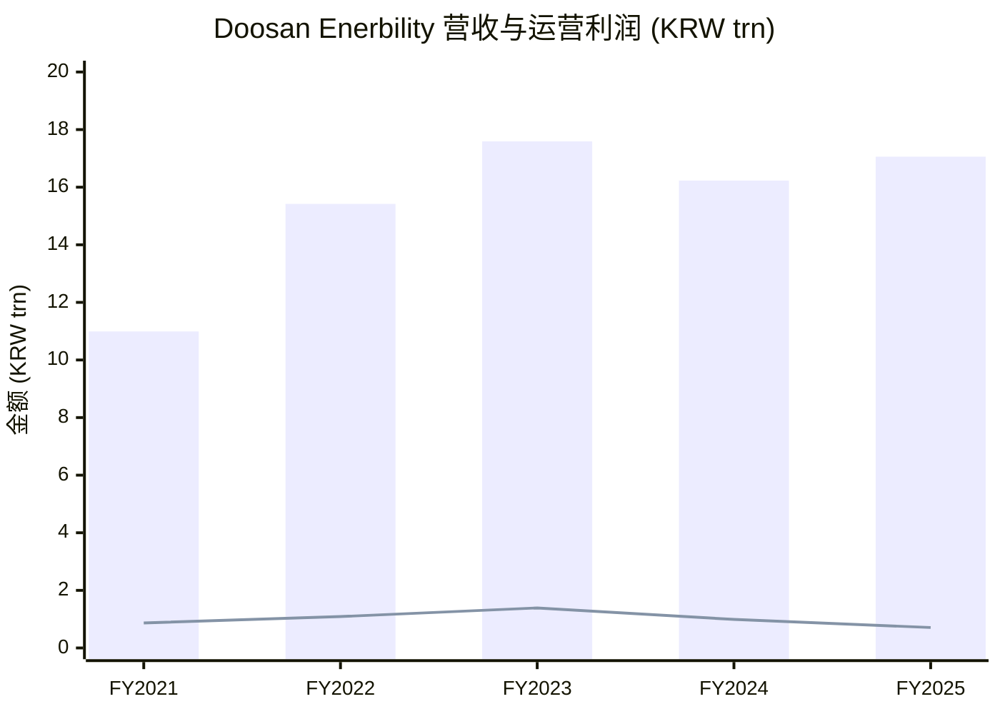
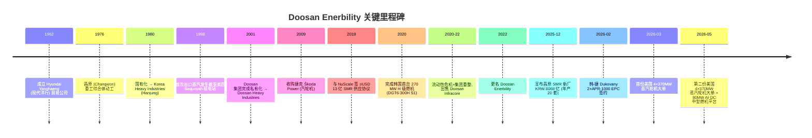
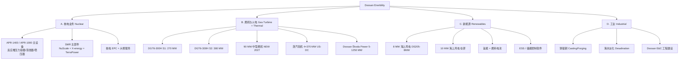
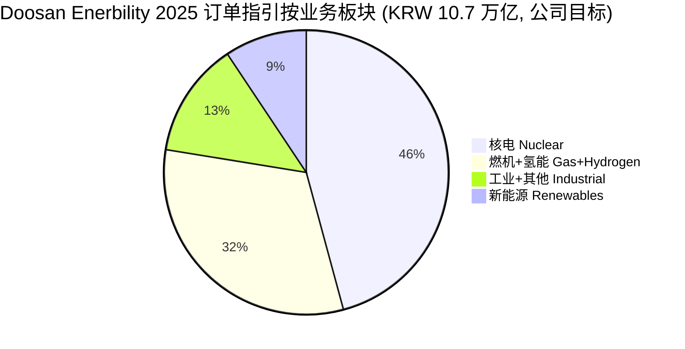
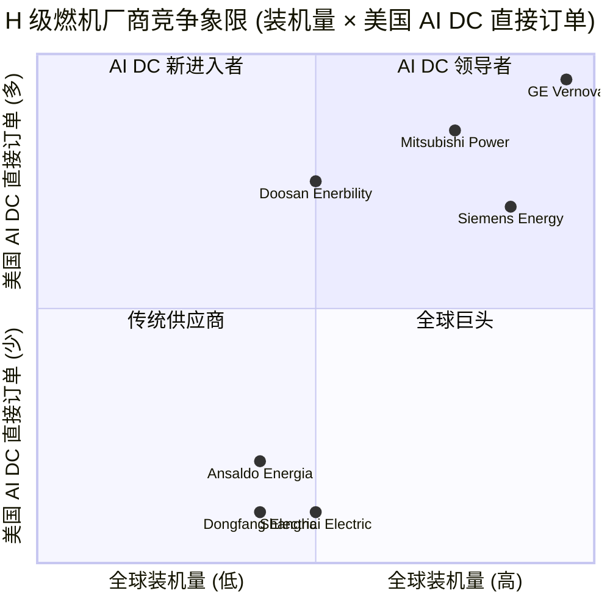

# Doosan Enerbility (두산에너빌리티 / KRX:034020) — 公司研究

**报告日期 / As of:** 2026-06-02
**主题归属 / Theme:** ai-power-electrification
**报告语种 / Language:** 简体中文 (zh-CN)
**当前股价 / Price:** KRW 100,100（2026-05 月末，stockanalysis.com）；52 周涨幅 +151.8%
**市值 / Market Cap:** 约 KRW 64–68 万亿（约 USD 47–50 bn）
**估值 / Valuation:** TTM P/E ~ 443×（深度盈利底）、TTM P/S ~ 3.9×、TTM EV/EBITDA ~ 54×；Forward P/E（2026E EPS KRW 515）约 195×；Forward P/E（2027E）远低于此
**核心标签 / Tag:** 韩国唯一 H 级燃气轮机 OEM；NuScale 与 X-energy 等美国 SMR / 小型模块化反应堆（SMR, Small Modular Reactor）核心部件供应商；APR-1400 / APR-1000 大型核电主设备主链；2026 年起新增美国超算 / AI 数据中心蒸汽轮机 + 燃机直接订单

---

## 目录

1. [公司概览](#1-公司概览--company-overview)
2. [公司历史](#2-公司历史--company-history)
3. [管理团队](#3-管理团队--management)
4. [产品与服务](#4-产品与服务--products--services)
5. [客户与上市策略](#5-客户与上市策略--customers--commercial-strategy)
6. [行业概览](#6-行业概览--industry-overview)
7. [竞争格局](#7-竞争格局--competitive-landscape)
8. [市场机会](#8-市场机会--market-opportunity-tam--sam)
9. [风险评估](#9-风险评估--risk-assessment)
10. [投资人视角评分卡 / Investor-lens scorecards](#10-投资人视角评分卡)
11. [参考资料](#11-参考资料--references)

---

## 1. 公司概览 / Company Overview

Doosan Enerbility（KRX:034020，韩文 두산에너빌리티、原 두산중공업 / Doosan Heavy Industries & Construction）是韩国规模最大、技术等级最高的重型电力设备整机厂（power-generation equipment OEM），由 1962 年成立的现代洋行（Hyundai Yanghaeng）→ 1980 年国营韩国重工业（Korea Heavy Industries）→ 2001 年私有化更名 Doosan Heavy Industries → 2022 年再更名为现今的 Doosan Enerbility（Energy + Sustainability 合成词）一路演变而来 ([Doosan Enerbility Wikipedia 公司沿革](https://en.wikipedia.org/wiki/Doosan_Enerbility))。公司业务覆盖核电主设备（reactor vessel / steam generator / pressurizer）、SMR 整套堆芯部件、H 级燃气轮机（H-class gas turbine）、蒸汽轮机（steam turbine）、海上风电整机（offshore wind turbine）、铸锻钢（casting & forging）、海水淡化（desalination）以及 EPC 工程建设，是韩国 *唯一* 自主研制 H 级燃气轮机的整机厂，也是少数几家同时具备核电压力容器与百万千瓦级蒸汽轮机制造能力的全球供应商。总部位于韩国庆尚南道昌原（Changwon），员工约 7,728 人 ([Doosan Enerbility Wikipedia 公司沿革](https://en.wikipedia.org/wiki/Doosan_Enerbility))。

财务上，公司 FY2025 营业收入 KRW 17.06 万亿（约 USD 12.4 bn），同比 +5.08%；FY2024 营业收入 KRW 16.23 万亿（同比 -7.7%）；FY2023 KRW 17.59 万亿；FY2022 KRW 15.42 万亿；FY2021 KRW 10.99 万亿。毛利率（gross margin）2021–2025 长期维持在 16–17% 的窄区间，FY2025 为 16.08%。营业利润（operating income）受订单回款周期与折旧拖累从 FY2023 的 KRW 1.39 万亿降至 FY2025 的 KRW 0.71 万亿。净利润（net income）FY2025 KRW 847.6 亿，EPS KRW 132.34 ([stockanalysis.com Doosan Enerbility 财务摘要](https://stockanalysis.com/quote/krx/034020/financials/))。订单面 FY2024 新签订单 KRW 7.13 万亿，订单余额 KRW 15.89 万亿；FY2025 新签 KRW 14.7 万亿，远超 KRW 13–14 万亿指引区间，订单储备奠定 2026–2030 的中期增长动能 ([Businesskorea 2024 订单回顾](https://www.businesskorea.co.kr/news/articleView.html?idxno=235585))。

估值 / valuation 角度看，TTM 市盈率 P/E 高达约 443×（受 2024–2025 利润底拖累，统计口径净利低基数）、P/S 3.9×、P/B 5.5×、EV/EBITDA 54.5×，股价过去 52 周上涨 +151.8% ([stockanalysis.com Doosan Enerbility 估值统计](https://stockanalysis.com/quote/krx/034020/statistics/))。市场把这家公司从「韩国重工」重新定价为「亚洲 AI 电力供应链核心标的」：上一年 1Y 涨幅排进 ai-power-electrification 主题篮子前三（+273.1% 1Y），与 Vertiv / Samsung SDI / Jereh / NXT 同列 ([ai-power-electrification 主题报告 2026-05-31](../../themes/ai-power-electrification_theme.md))。20 位卖方覆盖给出的平均目标价约为 KRW 127,100，2026E EPS 一致预期 KRW 515（较 2025 实际 KRW 132 提升近 4×），意味着市场已经把 2026–2028 的盈利「跃迁」预先打入估值 ([Businesskorea 2024 订单回顾 + simplywall.st 一致预期](https://simplywall.st/stocks/kr/capital-goods/kose-a034020/doosan-enerbility-shares))。

主题层面，Doosan 是少数同时拿到 *美国大型科技公司直接订单*（Direct hyperscaler / big-tech 订单，而非通过 EPC 中间商）的非美电力设备厂：2026 年 3 月首单 4 台 370 MW 蒸汽轮机交付得州数据中心，2026 年 5 月 27 日再签 4 台 370 MW 跟单（共 2,960 MW 装机），交付期至 2029；同时计划 2027 年推 90 MW 中型燃机（mid-size gas turbine）专攻 AI DC 直驱（behind-the-meter）发电场景 ([Seoul Economic Daily 2026-05-27 Doosan 第二份美国蒸汽轮机大单](https://en.sedaily.com/finance/2026/05/27/doosan-enerbility-to-supply-four-more-steam-turbines-to-us); [KED Global 2026-05-08 Doosan 90MW 中型燃机](https://www.kedglobal.com/energy/newsView/ked202605080005))。在大型常规核电方面，公司是韩国电力集团（KHNP / Korea Hydro & Nuclear Power）牵头的捷克 Dukovany 2 × APR-1000（合同总值 USD 18.6 bn）的主要核岛 + 常规岛设备供应商，2026 年 2 月正式签约 ([World Nuclear Association 捷克核电国别报告](https://world-nuclear.org/information-library/country-profiles/countries-a-f/czech-republic); [捷克工贸部 2026 EPC 合同签订公告](https://mpo.gov.cz/en/guidepost/for-the-media/press-releases/epc-contract-for-completion-of-dukovany-has-been-signed--minister-of-industry-and-trade--lukas-vlcek-will-visit-korea-again-in-july--287912/))。在 SMR 方向，公司已与 NuScale Power（NYSE:SMR）、X-energy、TerraPower 等三家美国 SMR 设计公司全部签订主部件供应协议，并于 2025 年 12 月宣布在昌原投资 KRW 8,068 亿（USD 596 mn）新建韩国首座 SMR 专用工厂，达产后年产能 20 套 SMR ([Seoul Economic Daily 2025-12-17 Doosan SMR 工厂投资](https://en.sedaily.com/finance/2025/12/17/doosan-enerbility-to-build-koreas-first-smr-plant-with-807))。

*分析师观点：* 摩根士丹利 2026-05-28 的 *Energy Meets Compute* 主题报告把 Doosan 直接标注在「Powering AI」供应链地图（与 GE Vernova、Sieyuan 思源电气、Mitsubishi Heavy、Hitachi 并列），认定其为「Buy 'Dependable' Energy Supply Chain」的亚洲一线标的 ([MS — Energy Meets Compute, zsxq #184152244582842 p.24](http://xs-macbook-air.local:5001/zsxq/pdf/184152244582842/Morgan%20Stanley-Energy%20Security%20%26%20AI%EF%BC%9A%20Energy%20Meets%20Compute%EF%BC%9A%20Supercycle%20Recharges-260528.pdf#page=24))。然而需注意：当前 +151.8% 1Y 的涨幅已部分计入 SMR、APR-1000 海外订单与美国 AI DC 直驱燃机等三块长周期收入，*现金流真正落地的时间窗口集中在 2027–2030*；估值层面任何重大订单延误都可能触发显著回调。

*数据：[stockanalysis.com Doosan Enerbility 财务摘要](https://stockanalysis.com/quote/krx/034020/financials/)；柱形=营业收入，折线=营业利润。*

---

## 2. 公司历史 / Company History

Doosan Enerbility 的 60 年史，可拆为四段：**Hyundai 时代（1962–1979）→ 国营韩重时代（1980–2000）→ Doosan 民营化扩张（2001–2019）→ 流动性危机与 SMR/AI 重整（2020–2026）**。

1962 年 9 月 20 日，公司以 *Hyundai Yanghaeng*（现代洋行）为名注册，是现代集团（Hyundai Group）旗下进口机械与原材料的贸易公司 ([Doosan Enerbility 官方沿革 / History 页](https://www.doosanenerbility.com/en/about/history_era))。1976 年，朴正熙政府推动「重化工业立国」战略，公司在韩国南海岸的昌原（Changwon）开建当时韩国最大的重工业综合体，正式从贸易公司转型为重型设备制造商 ([Companieshistory.com Doosan Enerbility 公司史](https://www.companieshistory.com/doosan-enerbility/))。1979 年，受到第二次石油冲击与现代集团内部财务困境影响，公司被韩国政府国有化、并更名为 *Korea Heavy Industries & Construction*（韩国重工业建设，简称 Hanjung / 한중），归商工部与产业银行（KDB）控制 ([Doosan Enerbility Wikipedia 公司沿革](https://en.wikipedia.org/wiki/Doosan_Enerbility); [Doosan Enerbility 官方沿革 / History 页](https://www.doosanenerbility.com/en/about/history_era))。

国营时期是重型装备技术积累期：1980 年 Hanjung 拿到韩国首座大型火电（三千浦 / Samcheonpo），1982 年首次出口沙特法拉桑（Farasan）海水淡化项目，1995 年进入中国核电市场，1998 年首次向美国 Sequoyah 核电站出口蒸汽发生器（steam generator）等核岛主设备 ([Doosan Enerbility 官方沿革 / History 页](https://www.doosanenerbility.com/en/about/history_era))。1999 年，金大中政府将分散的国营发电设备公司整合为单一实体，2000 年公司在韩国交易所上市，2001 年由 Doosan 集团以约 USD 30 亿出价中标完成私有化，正式更名为 *Doosan Heavy Industries & Construction* / 두산중공업 ([Companieshistory.com Doosan Enerbility 公司史](https://www.companieshistory.com/doosan-enerbility/))。Doosan 民营化后展开一连串国际化并购：2006 年收购罗马尼亚铸锻厂 IMGB 与英国 Mitsui Babcock（锅炉业务）；2009 年完成对捷克电力设备制造商 *Škoda Power* 的收购（蒸汽轮机 5 MW–1,250 MW 全等级，目前更名为 Doosan Škoda Power，已于 2025 年 2 月独立在布拉格证交所 IPO）([Doosan Škoda Power Wikipedia 公司沿革](https://en.wikipedia.org/wiki/Doosan_%C5%A0koda_Power); [Doosan Enerbility Wikipedia 收购清单](https://en.wikipedia.org/wiki/Doosan_Enerbility))；2011 年收购印度 AE&E Chennai Works（现 Doosan Power Systems India）；2016 年收购 Seattle 的能源存储管理软件公司 1Energy Systems ([Doosan Enerbility Wikipedia 收购清单](https://en.wikipedia.org/wiki/Doosan_Enerbility))。

2020 年，公司因长期向同集团兄弟公司 Doosan E&C / Doosan Construction 注资共计 KRW 2.5 万亿、加之新冠疫情冲击订单，陷入严重流动性危机。韩国产业银行（KDB）与进出口银行牵头注入 KRW 3 万亿应急资金，条件是 Doosan 集团必须开展大规模资产剥离 ([KED Global 2022-05-06 Doosan Enerbility 重整回顾](https://www.kedglobal.com/companies/newsView/ked202205060005))。2020–2022 间集团变卖资产包括：Club Mow CC 高尔夫俱乐部（KRW 1,850 亿）、NEO Plux 风投基金（KRW 730 亿）、首尔 Doosan Tower（KRW 8,000 亿）、Doosan Solus（KRW 6,986 亿）、Doosan Mottrol（KRW 4,530 亿），最关键的是 2021 年把工程机械子公司 *Doosan Infracore* 以 KRW 8,500 亿卖给现代重工（HD Hyundai Heavy Industries）([KED Global 2022-05-06 Doosan Enerbility 重整回顾](https://www.kedglobal.com/companies/newsView/ked202205060005))。Doosan Enerbility 本体在 2020-12 与 2022-02 通过两轮增资共募集 KRW 2.45 万亿，截至 2022-03 公司合并口径负债率（D/E）从一年前的 265.3% 降至 134.2% ([KED Global 2022-05-06 Doosan Enerbility 重整回顾](https://www.kedglobal.com/companies/newsView/ked202205060005))。2022 年 3 月，公司正式更名为 *Doosan Enerbility*（合成词 Energy + Sustainability），标志着公司战略重心从传统燃煤 / 大型核电转向「核 + 燃机 + SMR + 海上风电 + 氢能」组合 ([Doosan Enerbility Wikipedia 公司沿革](https://en.wikipedia.org/wiki/Doosan_Enerbility))。

2020–2026 转型期还有两个关键技术里程碑：**(a) 2020 年完成韩国首台自主研制 270 MW H 级燃气轮机（DGT6-300H S1）**，韩国成为继美、德、日、意之后全球第五个具备自主大型燃机能力的国家 ([Doosan Enerbility 官方沿革 / History 页](https://www.doosanenerbility.com/en/about/history_era))；**(b) 2019 年与 NuScale Power 签订 ≥ USD 13 亿的 SMR 主部件供应承诺**，奠定 2025 年起切入美国 SMR 主供应链的基础 ([Doosan Enerbility 官方沿革 / History 页](https://www.doosanenerbility.com/en/about/history_era))。2026 年 5 月，公司在美国 hyperscaler / 大型科技 + AI 数据中心场景拿下连续两份蒸汽轮机大单（4+4 = 8 台 × 370 MW），同期推进 90 MW 中型燃机平台与捷克 Dukovany 2 × APR-1000 主设备 ([Seoul Economic Daily 2026-05-27 Doosan 第二份美国蒸汽轮机大单](https://en.sedaily.com/finance/2026/05/27/doosan-enerbility-to-supply-four-more-steam-turbines-to-us); [捷克工贸部 2026 EPC 合同签订公告](https://mpo.gov.cz/en/guidepost/for-the-media/press-releases/epc-contract-for-completion-of-dukovany-has-been-signed--minister-of-industry-and-trade--lukas-vlcek-will-visit-korea-again-in-july--287912/))。

*数据：[Doosan Enerbility 官方沿革 / History 页](https://www.doosanenerbility.com/en/about/history_era)、[Doosan Enerbility Wikipedia 公司沿革](https://en.wikipedia.org/wiki/Doosan_Enerbility)、[Seoul Economic Daily 2026-05-27](https://en.sedaily.com/finance/2026/05/27/doosan-enerbility-to-supply-four-more-steam-turbines-to-us)。*

---

## 3. 管理团队 / Management

按照 SKILL.md 的硬性规则，本节只覆盖 *创始人 / 历史奠基者* 与 *现任 CEO*。Doosan Enerbility 由现代集团原始团队创建（创始人个人在公开资料中无可识别的一人代表，主要由 Hanjung 国营时代的多位政府指派经营层 → Doosan 集团 2001 年私有化后由 Doosan 家族（朴氏家族）派任专业经营层主导，因此本节侧重「当前一线 CEO」。

公司当前采行 *三人共同 CEO* 结构：(a) **会长兼 CEO Park Geewon (朴志远 / 박지원)** — Doosan 家族第四代继承人之一，长期主管 Doosan Enerbility 与集团战略；(b) **总裁兼 CEO 兼财务管理本部长 Park Sang-hyun (朴相贤 / 박상현)** — 财务与对外接洽核心；(c) **总裁兼 COO Jung Yeon-in (郑然仁 / 정연인)** — 工厂运营与制造业务核心 ([Doosan Enerbility 官方董事会页面 Board of Directors](https://www.doosanenerbility.com/en/investment/governance_director))。

**Park Sang-hyun（朴相贤 / 박상현，President & CEO，2022 年 3 月就任）** 是当前对外曝光度最高、与卖方 / 大客户接洽最频繁的 CEO 角色，2026 年 2 月 25 日被推举为 *韩国机械工业协会（Korea Association of Machinery Industry）* 第 24 届理事长 ([亚洲商业日报 2026-02-25 Park Sang-hyun 当选机械工业协会理事长](https://www.asiae.co.kr/en/article/2026022515592239523))。其履历完全在 Doosan 集团内部成长：2008 年任 Doosan（控股）公司 CFP 团队高级常务，2011 年起任 Doosan Infracore（建筑机械与挖掘机子公司）财务管理总管，2015 年回到 Doosan 控股担任副社长（Executive Vice President），2018–2021 年任 *Doosan Bobcat*（小型工程机械上市子公司，NYSE:DOOF / KRX:241560）CEO，期间 Bobcat 成为集团稳定现金流来源 ([亚洲商业日报 2026-02-25 Park Sang-hyun 履历](https://www.asiae.co.kr/en/article/2026022515592239523); [MarketScreener Sang-Hyeon Park 个人页](https://www.marketscreener.com/insider/SANG-HYEON-PARK-A1J3CO/))。2022 年集团完成债务重整阶段后，被任命为 Doosan Enerbility President & CEO，主导财务 + 业务双线。他的核心战略主张是：**(1) 用 SMR 与 H 级燃机两条「长周期产品线」对冲传统大型火电下滑；(2) 以美国 hyperscaler / AI DC 客户作为非政府订单基本盘，降低对韩国国家电力公司 KEPCO / KHNP 单一对手方依赖；(3) 把 Doosan Škoda Power 推向独立上市（已 2025-02 在布拉格 IPO 完成）以释放欧洲业务价值** ([Doosan Škoda Power 公司沿革](https://en.wikipedia.org/wiki/Doosan_%C5%A0koda_Power); [Businesskorea 2024 订单回顾](https://www.businesskorea.co.kr/news/articleView.html?idxno=235585))。

现任「重资产 + 长周期 + 双 CEO + 家族 + 财务背景 CEO 并重」的结构，本质上是把 Doosan 集团 2020 年流动性危机后留下的「现金流敏感性」文化继承下来：Park Sang-hyun 出身财务、对单订单回款节奏与债务管理敏感，与 COO Jung Yeon-in 主导的制造现场形成「订单纪律 + 产能纪律」的内部张力。*分析师观点：* 这种 CEO 结构有利于 SMR / Dukovany / 美国蒸汽轮机这类「3–5 年回款」订单的现金流管理，但对快速放量类业务（如海上风电整机国内外竞标的价格战）可能反应偏保守 — 公司在 2024 年下调过新能源订单目标即与此一致。

---

## 4. 产品与服务 / Products & Services

Doosan Enerbility 的业务结构按官方披露口径分为四大类：**(A) 核电 / Nuclear（含 SMR + 大型核电主设备 + 核电 EPC）**、**(B) 燃机与火电 / Gas Turbine + Thermal Power**、**(C) 新能源 / Renewables（海上风电 + 氢能 + ESS）**、**(D) 工业（铸锻钢 + 海水淡化 + EPC 建设）** ([Doosan Enerbility 公司业务页面](https://www.doosanenerbility.com/en/business); [2024 Integrated Report of Doosan Enerbility (PDF)](https://www.doosanenerbility.com/heavy_file/management/data/overview_result/report/2024_report_en.pdf))。订单目标按 2025 年公司指引：核电 KRW 4.9 万亿（46%）、燃机与氢能 KRW 3.4 万亿（32%）、其他工业 KRW 1.4 万亿（13%）、新能源 KRW 1.0 万亿（9%），合计 KRW 10.7 万亿订单指引 ([Businesskorea 2024 订单回顾](https://www.businesskorea.co.kr/news/articleView.html?idxno=235585))。本节按四类逐一展开 — 主要参考官方产品页与 2024 年综合报告原文。

### 4.A 核电 / Nuclear — 主设备 + SMR 双轨

Doosan Enerbility 是 *韩国唯一* 具备「全套商用反应堆主回路设备（reactor vessel + steam generator + pressurizer + reactor coolant pump 部件）」自主制造能力的整机厂。其大型核电主线产品为：**(1) APR-1400 / Advanced Power Reactor 1400 MWe** — 韩国电力公司（KEPCO）自主设计第三代 PWR / 加压水堆（pressurized-water reactor），已应用于阿联酋 Barakah 四台机组（迪拜以南 50 km）、韩国国内新古里 / Shin-Kori 3 / 4 号机及多个新建机组；**(2) APR-1000** — APR-1400 缩小版（约 1,000 MWe 净输出），是韩-捷克 Dukovany 2 号项目 2 台机组的选定堆型，2026 年 2 月由 KHNP（Korea Hydro & Nuclear Power）与捷克 ČEZ 子公司 EDU II 签约，总值 CZK 4,070 亿（USD 18.6 bn），Doosan Enerbility + Doosan Škoda Power 联合承接核岛主设备 + 蒸汽轮机，本框架协议占合同总值约 15–20% ([World Nuclear News KHNP 捷克 Dukovany 项目 18.6bn 解析](https://www.world-nuclear-news.org/articles/khnp-sets-out-plans-for-usd186bn-czech-nuclear-project); [捷克工贸部 2026 EPC 合同签订公告](https://mpo.gov.cz/en/guidepost/for-the-media/press-releases/epc-contract-for-completion-of-dukovany-has-been-signed--minister-of-industry-and-trade--lukas-vlcek-will-visit-korea-again-in-july--287912/); [The Korea Herald 2024 韩国 Dukovany 出口](https://www.koreaherald.com/article/10503312))。

**中文释义 / Plain-language gloss：** 大型核电的核心是「核岛」一回路压力边界，包括 reactor pressure vessel（反应堆压力容器，外形像一个直径约 4–5 m、高约 12 m 的钢制圆筒，能承受 17 MPa 压力）、steam generators（蒸汽发生器，将一回路冷却剂热量传给二回路产生蒸汽）、pressurizer（稳压器，维持系统压力）、主泵壳体（reactor coolant pump casing）。Doosan 是全球少数能整体锻造 *单件* 反应堆下封头与 *整体一次锻造* 蒸汽发生器筒体的厂商 — 这种「单件大锻件」工艺直接来自昌原 17,000 吨自由锻压机（forging press）。Doosan 也是西屋（Westinghouse）AP1000 反应堆压力容器与蒸汽发生器的关键全球供应商之一：Vogtle 3/4 两台 AP1000（美国乔治亚州，2023-07 与 2024-04 投运）的部分主设备由 Doosan 制造 ([Power Magazine Vogtle Unit 3 反应堆压力容器](https://www.powermag.com/reactor-vessel-placed-inside-vogtle-unit-3/))。

SMR / 小型模块化反应堆方向，Doosan 已与三家美国 SMR 设计公司全部签订主部件供应：(a) **NuScale Power**（NYSE:SMR） — NuScale 自 2019 年起累计获 Doosan 投资 USD 1.04 亿（USD 44 mn + USD 60 mn 两笔），并签订「≥USD 13 亿」核反应堆与蒸汽发生器主部件供应承诺；2025 年起为 NuScale 罗马尼亚 RoPower 项目与美国 Standard Power 项目开始组件制造 ([Doosan Enerbility NuScale SMR 业务页](https://www.doosanenerbility.com/en/business/smr_nuscale); [KED Global 2024-05-26 Doosan NuScale 部件供货](https://www.kedglobal.com/energy/newsView/ked202405260003))；(b) **X-energy** — 高温气冷堆（HTGR）；(c) **TerraPower**（盖茨支持）— Natrium 钠冷快堆。**2025 年 12 月公司宣布在昌原投资 KRW 8,068 亿（USD 596 mn）新建韩国首座 SMR 专用工厂**，2026 年 3 月动工至 2031 年 6 月竣工，年产能从现有共用产线的 12 套 SMR 提升至专用产线 20 套 SMR，目标是「未来 5 年获 ≥60 套 SMR 订单」([Seoul Economic Daily 2025-12-17 Doosan SMR 工厂投资](https://en.sedaily.com/finance/2025/12/17/doosan-enerbility-to-build-koreas-first-smr-plant-with-807); [Businesskorea 2024 订单回顾](https://www.businesskorea.co.kr/news/articleView.html?idxno=235585))。

### 4.B 燃机与火电 / Gas Turbine + Thermal Power — 韩国唯一 H 级燃机 OEM

Doosan Enerbility 是 *韩国唯一* 自主研制 H 级燃气轮机的整机厂。其燃机产品线包括：**(1) DGT6-300H S1（270 MW）** — 2019 年与韩国西部电力（KOWEPO）合作完成韩国首台 270 MW H 级燃机本土制造，2022 年在 Gimpo 联合循环热电厂（CHP）首次点火，已累计约 10,000 小时无故障运行；简单循环效率 39.7%，压比 21 ([gasturbineworld.com Doosan DGT6 H 级燃机](https://gasturbineworld.com/doosan-gas-turbines/); [Doosan Enerbility 官方沿革 / History 页](https://www.doosanenerbility.com/en/about/history_era))。**(2) DGT6-300H S2（380 MW）** — 简单循环 LHV 效率 42.9%，涡轮入口温度 1,600°C+，压比 24，空气流量较 S1 增加 15%，配套韩国中部电力（KOMIPO）保宁（Boryeong）、南部电力（KOSPO）安东（Andong）、KOMIPO 咸安（Haman）、KOEN 盆唐（Bundang）等 4 个韩国国内电厂订单 ([gasturbineworld.com Doosan DGT6 H 级燃机](https://gasturbineworld.com/doosan-gas-turbines/))。**(3) 90 MW 中型燃机**（在研，目标 2027 年发布）— 公司 2026 年 5 月公开计划，专攻 AI 数据中心 *behind-the-meter*（自备电源）发电场景，对标 GE Vernova 的 LM6000、Siemens SGT-A65 与 Mitsubishi Heavy 的 H-25 ([KED Global 2026-05-08 Doosan 90MW 中型燃机](https://www.kedglobal.com/energy/newsView/ked202605080005))。

**中文释义 / Plain-language gloss：** H 级燃气轮机是当前全球商用燃机的最高效率等级（联合循环效率 60%+），其核心壁垒是 *单晶 / 定向凝固高温合金涡轮叶片* 与 *热障涂层 / TBC*，使涡轮入口温度推到 1,600 °C — 全球只有美国 GE Vernova、德国 Siemens Energy、日本 Mitsubishi Heavy / MHI、意大利 Ansaldo Energia、韩国 Doosan、中国上海电气 / 东方电气 等少数厂家具备。Doosan 在 2024 年 10 月披露其 H 级燃机全球订单市占率约 10%、韩国国内市占率 67% ([Thunder Said Energy 燃机技术报告摘要](https://thundersaidenergy.com/downloads/doosan-enerbility-gas-turbine-technology/))。

蒸汽轮机方向，Doosan 通过 *Doosan Škoda Power*（捷克）覆盖 5 MW–1,250 MW 全功率段，包括联合循环燃机配套尾段汽轮机与核电常规岛汽轮机两类应用 ([Doosan Škoda Power Wikipedia 公司沿革](https://en.wikipedia.org/wiki/Doosan_%C5%A0koda_Power))。**2026 年 3 月公司拿到首份美国大型科技公司直接订单：4 台 370 MW 蒸汽轮机 + 发电机，得州交付，专门用于 AI 数据中心高效联合循环发电**；2026 年 5 月 27 日 *再签* 4 台同规格跟单（合计 8 台 × 370 MW = 2,960 MW 装机），由 Power Services Business Group 主管 Sohn Seung-woo 对外宣布 — 公司原话「Following our first North American steam turbine order in March, we have once again confirmed our competitiveness in the North American market by signing this additional supply contract」([Seoul Economic Daily 2026-05-27 Doosan 第二份美国蒸汽轮机大单](https://en.sedaily.com/finance/2026/05/27/doosan-enerbility-to-supply-four-more-steam-turbines-to-us))。这是 *非美厂商* 第一次以 *直接客户方式* 切入美国 hyperscaler AI DC 电源供应链 — 此前美国厂家 GE Vernova、Siemens Energy 美国分部、Mitsubishi Power Americas、Tallgrass-MHI 合资基本垄断该渠道。

### 4.C 新能源 / Renewables — 海上风电 + 氢能 + ESS

Doosan Enerbility 的海上风电整机线已迭代至 **DS205-8MW** — 韩国本土设计的 *台风等级* 8 MW 海上风电机组（叶轮直径 205 m），针对韩国近海低风速 / 高湍流 / 台风地区优化，已获得韩国 Yeonggwang Yawol 海上风电项目首单商用合同；公司公开数据显示其交付成本较进口模型低 15–20% ([Doosan Enerbility 风电产品线页面](https://www.doosanenerbility.com/en/business/wind_energy_lineup); [4C Offshore Doosan WinDS205-8MW 机型卡](https://www.tgs4c.com/windfarms/turbine-doosan-enerbility-winds205-8mw-tid382.html))。下一代 10 MW 海上风电机组在研，目标进入 USD 1,000 亿全球海上风电市场 ([Businesskorea 2024 Doosan 10MW 海上风机](https://www.businesskorea.co.kr/news/articleView.html?idxno=238847))。

氢能与 ESS：Doosan 通过 *Doosan Fuel Cell*（已分拆独立上市）继承 ASR / 氢气分离回收业务；同时 2016 年收购的 Seattle 公司 1Energy Systems 提供 ESS 控制软件 ([Doosan Enerbility Wikipedia 收购清单](https://en.wikipedia.org/wiki/Doosan_Enerbility))。新能源板块整体目标订单 KRW 1 万亿 / 年（2025 指引），占比 9% — 在四大业务中权重最小但增长最快 ([Businesskorea 2024 订单回顾](https://www.businesskorea.co.kr/news/articleView.html?idxno=235585))。

### 4.D 工业 / Industrial — 铸锻钢 + 海水淡化 + EPC

Doosan 昌原工厂的 17,000 吨自由锻压机是公司「皇冠上的明珠」— 既是核电压力容器与蒸汽发生器筒体的单件锻件来源，也是燃机转子（rotor）、海上风电主轴（main shaft）的核心制造工艺。此外公司 1982 年首次出口沙特法拉桑（Farasan）海水淡化项目，至今累计全球海水淡化项目装机数百万吨级 / 日，是 Saudi SWCC、UAE EWEC 等中东水务公司的核心供应商 ([Doosan Enerbility 官方沿革 / History 页](https://www.doosanenerbility.com/en/about/history_era))。EPC 工程建设业务由集团另一子公司 Doosan E&C 承接，2024 年集团已出售 Doosan E&C 多数股权 ([KED Global 2022-05-06 Doosan Enerbility 重整回顾](https://www.kedglobal.com/companies/newsView/ked202205060005))。

**业务协同 / Synthesis：** Doosan Enerbility 的四大板块并非孤立，而是围绕「昌原 17,000 吨自由锻压机 + 重型机加工车间 + 焊接 + NDT」这一 *共用重资产* 形成的产品组合 — 单件大锻件 / 厚壁压力容器 / 高合金转子叶片是核电、燃机、海上风电主轴所 *共用* 的物理工艺基础。当核电订单（如 Dukovany 2 台 APR-1000、SMR）订单进入交付期，工厂产能利用率上升，单位成本下降；同时新增美国 AI DC 蒸汽轮机大单可吸收部分剩余产能，平衡周期性。这是公司能维持 16–17% 毛利率长期窄区间的根本原因 — *重资产、单订单大、毛利相对刚性*。

---

## 5. 客户与上市策略 / Customers & Commercial Strategy

Doosan Enerbility 的客户结构高度集中在 *国家电力公司 + 国家核电公司 + 顶级 EPC 总包* 三大类。从可查的官方与卖方资料看，公司不在韩国 *사업보고서* / Business Report 公开披露单一客户 ≥10% 营收的逐家明细（这与韩国披露惯例相符 — 多按字母序列出前五大客户而不附逐家百分比，参见 SKILL.md 中关于 Samsung 案例的指引），但通过订单公告与新闻披露可拼出主要客户图谱：

- **韩国国内（占传统业务的基本盘）：** Korea Hydro & Nuclear Power（KHNP）— 新建核电主设备的最大单一客户；KEPCO 子公司中部电力（KOMIPO）、南部电力（KOSPO）、东部电力（KOEN）、西部电力（KOWEPO）、Korea South-East Power（KOSEPCO）— 联合循环 / H 级燃机国内订单全部来自这五家；Korea Energy Power（KOEN）— 盆唐项目 ([gasturbineworld.com Doosan DGT6 H 级燃机](https://gasturbineworld.com/doosan-gas-turbines/))。
- **海外大型核电与 SMR：** ČEZ / EDU II（捷克 Dukovany 2 × APR-1000，2026 签约）；Westinghouse（AP1000 反应堆压力容器与蒸汽发生器全球供应链）；NuScale Power（NYSE:SMR）— Romania RoPower、US Standard Power；X-energy；TerraPower ([World Nuclear News KHNP 捷克 Dukovany 项目 18.6bn 解析](https://www.world-nuclear-news.org/articles/khnp-sets-out-plans-for-usd186bn-czech-nuclear-project); [Doosan Enerbility NuScale SMR 业务页](https://www.doosanenerbility.com/en/business/smr_nuscale))。
- **海外大型常规电力：** UAE Emirates Nuclear Energy Corporation（ENEC — APR-1400 Barakah 项目）；Saudi SWCC（海水淡化）；UAE EWEC（海水淡化）。
- **美国 hyperscaler / AI DC（2026 起新增）：** 美国得州数据中心客户（公司未披露客户名称，但市场推测为 Microsoft / Meta / Amazon Web Services 三家之一，因其 2026 年内对得州 AI DC 自备电源招标公开公告吻合）— 2026 年 3 月与 5 月连续两笔 4 × 370 MW 蒸汽轮机订单（共 8 台），交付至 2029；以及 2027 年规划的 90 MW 中型燃机潜在 AI DC 直驱订单 ([Seoul Economic Daily 2026-05-27 Doosan 第二份美国蒸汽轮机大单](https://en.sedaily.com/finance/2026/05/27/doosan-enerbility-to-supply-four-more-steam-turbines-to-us); [KED Global 2026-05-08 Doosan 90MW 中型燃机](https://www.kedglobal.com/energy/newsView/ked202605080005))。

*数据：[Businesskorea 2024 Doosan 订单回顾 + 2025 目标](https://www.businesskorea.co.kr/news/articleView.html?idxno=235585)；2025 公司订单目标分项 (新签订单口径, 非合并营收)。*

*关于披露口径：* 韩国 사업보고서 / Business Report 一般按字母序列出主要客户而不附逐家百分比。Doosan 截至 2024 年年报披露的客户集中度信息未给出单一客户 ≥10% 的具体百分比；本节中所列客户名单来源于 (a) 官方订单公告、(b) 官方业务页与产品页、(c) 海外政府与电力公司的公开新闻稿。**任何关于单一客户营收占比的具体数字 — 例如「KHNP 占合并营收 X%」— 在 Doosan 2024 사업보고서中未披露，本报告不予填充虚假数字。** 这一披露空缺本身即为一个数据点 — *分析师观点：* 集中度风险（韩国国内 KEPCO 系电力公司合计 + KHNP）实际可能占合并营收 50%+，但缺乏精确数字，应作为 Section 9 风险项处理而非数据项。

**上市策略 / 资本结构：** Doosan Enerbility 自身在韩国交易所上市（KRX:034020）；其捷克子公司 *Doosan Škoda Power* 已于 2025-02-06 独立在 *布拉格证交所*（PSE）完成 IPO，作为 Doosan 释放欧洲业务价值与减少集团内交叉持股的关键一步 ([Doosan Škoda Power Wikipedia 公司沿革](https://en.wikipedia.org/wiki/Doosan_%C5%A0koda_Power))。前手 *Doosan Bobcat*（KRX:241560）与 *Doosan Fuel Cell* 均已分拆独立上市，*Doosan Robotics*（KRX:454910）2023 年独立 IPO；2024 年 Doosan Robotics 与 Bobcat 合并方案因股价剧烈下跌被否决 ([KED Global 2024-12 Doosan Robotics-Bobcat 合并失败](https://www.kedglobal.com/corporate-restructuring/newsView/ked202412100005))。即 Doosan 集团目前的资本结构（持股链）：Doosan Corp.（控股，KRX:000150）→ Doosan Enerbility（重型电力设备）→ Doosan Škoda Power（捷克汽轮机，PSE 上市）；与并行的 Doosan Bobcat、Doosan Robotics、Doosan Fuel Cell（均独立上市）。

---

## 6. 行业概览 / Industry Overview

Doosan Enerbility 所在的赛道横跨 **(A) 全球大型核电与 SMR、(B) 全球 H 级燃气轮机、(C) 全球海上风电** 三个长周期重资产行业，全部受 *AI 数据中心电力缺口* 这一 2024–2030 主题驱动。

**(A) 全球核电与 SMR：** Doosan 把 SMR 全球市场预计 2050 年达到 *375 GW*，若按 SMR 单机 ≤300 MW 计折算 ≥1,000 台机组 ([Seoul Economic Daily 2025-12-17 Doosan SMR 工厂投资](https://en.sedaily.com/finance/2025/12/17/doosan-enerbility-to-build-koreas-first-smr-plant-with-807))。市场加速点预计在 2030 年前后 — 即 NuScale 美国 Standard Power 与罗马尼亚 RoPower 等首批项目投运后。大型核电方面，AI / hyperscaler 推动美国与欧洲核电复兴：Constellation Energy（NASDAQ:CEG）与 Microsoft 签订 Three Mile Island Unit 1 重启 PPA（837 MW，20 年合同）；Talen Energy 与 AWS 签订 Susquehanna 核电 PPA；Vistra（NYSE:VST）与 Meta 签订 ~2,600 MW 三厂 PPA — 全部于 2024–2026 年间签订 ([ai-power-electrification 主题报告 2026-05-31 主题动态](../../themes/ai-power-electrification_theme.md))。捷克 Dukovany 2 × APR-1000 项目 USD 18.6 bn 是欧盟近 20 年最大单一核电出口订单 ([The Korea Herald 2024 韩国 Dukovany 出口](https://www.koreaherald.com/article/10503312))。

**(B) 全球 H 级燃气轮机：** SWS 燃机研究报告披露 2024 年全球大型燃机三大整机厂 GE Vernova / Siemens Energy / Mitsubishi Power 订单量分别为 110 GW / 81 GW / 41 GW（合计市占率 34% / 27% / 24%），美国 ~252 GW 在建天然气项目中超过 1/3 为数据中心配套，仅洛杉矶地区即有 12.2 GW DC 配套燃机项目 ([SWS 国防军工 商发&燃机研究, zsxq #184152212118422 p.14](http://xs-macbook-air.local:5001/zsxq/pdf/184152212118422/%E5%9B%BD%E9%98%B2%E5%86%9B%E5%B7%A5%E8%A1%8C%E4%B8%9A%E5%95%86%E5%8F%91%26%E7%87%83%E6%9C%BA%E7%B3%BB%E5%88%97%E6%8A%A5%E5%91%8A%EF%BC%9AAI%E7%AE%97%E5%8A%9B%E9%A9%B1%E5%8A%A8%E7%87%83%E6%9C%BA%E9%9C%80%E6%B1%82%E6%8F%90%E5%8D%87%EF%BC%8C%E5%9B%BD%E4%BA%A7%E4%BE%9B%E5%BA%94%E9%93%BE%E8%BF%8E%E9%BB%84%E9%87%91%E6%9C%BA%E9%81%87.pdf#page=14); [SWS 燃机 p.17 三大整机厂市占率](http://xs-macbook-air.local:5001/zsxq/pdf/184152212118422/%E5%9B%BD%E9%98%B2%E5%86%9B%E5%B7%A5%E8%A1%8C%E4%B8%9A%E5%95%86%E5%8F%91%26%E7%87%83%E6%9C%BA%E7%B3%BB%E5%88%97%E6%8A%A5%E5%91%8A%EF%BC%9AAI%E7%AE%97%E5%8A%9B%E9%A9%B1%E5%8A%A8%E7%87%83%E6%9C%BA%E9%9C%80%E6%B1%82%E6%8F%90%E5%8D%87%EF%BC%8C%E5%9B%BD%E4%BA%A7%E4%BE%9B%E5%BA%94%E9%93%BE%E8%BF%8E%E9%BB%84%E9%87%91%E6%9C%BA%E9%81%87.pdf#page=17))。Doosan 处于「第四 + 韩国国家队」位置 — Thunder Said Energy 数据：H 级燃机全球订单市占约 10% / 韩国国内 67% ([Thunder Said Energy 燃机技术报告摘要](https://thundersaidenergy.com/downloads/doosan-enerbility-gas-turbine-technology/))。MS 在 2026-05 主题报告中明确把 Doosan + GE Vernova + Siemens + Mitsubishi Heavy + Hitachi 列为「Powering AI」供应链核心 ([MS — Energy Meets Compute, zsxq #184152244582842 p.24](http://xs-macbook-air.local:5001/zsxq/pdf/184152244582842/Morgan%20Stanley-Energy%20Security%20%26%20AI%EF%BC%9A%20Energy%20Meets%20Compute%EF%BC%9A%20Supercycle%20Recharges-260528.pdf#page=24))。

**(C) 全球海上风电：** Doosan 估算全球海上风电 TAM 约 USD 1,000 亿，但目前公司在该市场份额仍属起步阶段 ([Businesskorea 2024 Doosan 10MW 海上风机](https://www.businesskorea.co.kr/news/articleView.html?idxno=238847))。韩国国内政府目标 2030 年海上风电累计装机 12 GW，对 Doosan 是基本盘市场。**HSBC 警告：尽管 AI DC 用电预计「2030 年增长 5×」，但中国电力公司储备率（reserve margin）从 2024 年 18% 回升至 2030 年 34%，结构性涨价周期「言之过早」，「renewable IPP 才是真正赢家」** — 这一观点对 Doosan 海外项目（包括 SMR）的回款时点构成警示 ([HSBC — China Power Utilities, zsxq #812451114428542 p.1](http://xs-macbook-air.local:5001/zsxq/pdf/812451114428542/HSBC-China%20Power%20Utilities%EF%BC%9AToo%20early%20to%20call%20a%20power%20price%20upcycle-260526.pdf#page=1))。

**MS *Energy Meets Compute* 主题框架：** 摩根士丹利 2026-05-28 主题报告把亚洲能源安全投资周期总额 USD 5,454 bn，对应 ~USD 9 trn 价值释放，其中 *power grids 占 USD 1,745 bn、亚洲 DC 电力 2023–30 CAGR ~24%* ([MS — Energy Meets Compute, zsxq #184152244582842 p.6](http://xs-macbook-air.local:5001/zsxq/pdf/184152244582842/Morgan%20Stanley-Energy%20Security%20%26%20AI%EF%BC%9A%20Energy%20Meets%20Compute%EF%BC%9A%20Supercycle%20Recharges-260528.pdf#page=6); [p.8](http://xs-macbook-air.local:5001/zsxq/pdf/184152244582842/Morgan%20Stanley-Energy%20Security%20%26%20AI%EF%BC%9A%20Energy%20Meets%20Compute%EF%BC%9A%20Supercycle%20Recharges-260528.pdf#page=8); [p.11](http://xs-macbook-air.local:5001/zsxq/pdf/184152244582842/Morgan%20Stanley-Energy%20Security%20%26%20AI%EF%BC%9A%20Energy%20Meets%20Compute%EF%BC%9A%20Supercycle%20Recharges-260528.pdf#page=11))。Doosan 直接受益于：(1) 核电 — 美国与欧洲 SMR 加速；(2) 燃机 — 美国 AI DC 配套 ~252 GW 燃气调峰 / 基载；(3) 蒸汽轮机 — 联合循环（CCGT, combined-cycle gas turbine）的尾段汽轮机配套增加；(4) 海上风电 — 韩国本土项目装机加速。

---

## 7. 竞争格局 / Competitive Landscape

按业务板块，Doosan 的主要竞争对手与市场地位如下：

**核电主设备**：直接竞争对手为：(a) **西屋 Westinghouse Electric**（被加拿大 Cameco + Brookfield 收购）— AP1000 设计方，自有压力容器制造能力；(b) **Framatome**（法国，由 EDF 控股 + 三菱重工 19.5%）— EPR 设计方；(c) **三菱重工 Mitsubishi Heavy**（TSE:7011）— APWR 设计方，与 Framatome 合作；(d) **GE-Hitachi Nuclear Energy** — BWRX-300 SMR 设计方；(e) **Rosatom**（俄罗斯，制裁中）。Doosan 的 *差异化优势* 在于：(1) 拥有昌原 17,000 吨自由锻压机 — 全球极少数能做单件超大锻件的产能；(2) 同时给 Westinghouse / NuScale / X-energy / TerraPower 多家美国 SMR 供货，是 SMR 供应链「中立第三方」；(3) Doosan Škoda Power 提供蒸汽轮机配套，可向 EPC 提供「核岛 + 常规岛」一体化方案。Westinghouse AP1000 在 Vogtle 3/4 量产成功（2023-07 / 2024-04 投运）后又获得波兰、保加利亚、捷克 Dukovany 5（备选）订单意向，Doosan 是其全球供应链的一部分 ([Power Magazine Vogtle Unit 3 反应堆压力容器](https://www.powermag.com/reactor-vessel-placed-inside-vogtle-unit-3/); [Power Engineering Westinghouse AP1000 捷克 Dukovany 5 备选](https://www.power-eng.com/nuclear/westinghouse-could-build-ap1000-reactors-at-czech-nuclear-site/))。

**H 级燃气轮机**：全球四强 — **GE Vernova（NYSE:GEV，市占 34%）、Siemens Energy（XETR:ENR，27%）、Mitsubishi Power（TSE:7011 子公司，24%）、Ansaldo Energia（意大利，未上市）**；中国 *上海电气* + *东方电气* 通过 H 级燃机国产化追赶；Doosan 处于第四 + 韩国国家队位置 ([SWS 燃机 p.17 三大整机厂市占率](http://xs-macbook-air.local:5001/zsxq/pdf/184152212118422/%E5%9B%BD%E9%98%B2%E5%86%9B%E5%B7%A5%E8%A1%8C%E4%B8%9A%E5%95%86%E5%8F%91%26%E7%87%83%E6%9C%BA%E7%B3%BB%E5%88%97%E6%8A%A5%E5%91%8A%EF%BC%9AAI%E7%AE%97%E5%8A%9B%E9%A9%B1%E5%8A%A8%E7%87%83%E6%9C%BA%E9%9C%80%E6%B1%82%E6%8F%90%E5%8D%87%EF%BC%8C%E5%9B%BD%E4%BA%A7%E4%BE%9B%E5%BA%94%E9%93%BE%E8%BF%8E%E9%BB%84%E9%87%91%E6%9C%BA%E9%81%87.pdf#page=17); [Thunder Said Energy 燃机技术报告摘要](https://thundersaidenergy.com/downloads/doosan-enerbility-gas-turbine-technology/))。*分析师观点：* Doosan 的 H 级燃机技术（1,600 °C 入口温度、43% 简单循环效率）已 *与三巨头同代* — 这点 Thunder Said Energy 报告明确指出「与 GE Vernova 与 Siemens 的产品指标对齐」；但订单量 / 装机量与 GE/Siemens/MHI 仍有数量级差距。**Doosan 的真正竞争位是「在 GE-Vernova 与 Siemens 全球订单饱和、交付期排至 2030+ 时，作为第二个可信赖供应商」承接溢出需求** — 2026 年 3 月 / 5 月连续两笔美国蒸汽轮机大单即印证这一逻辑 ([SWS 燃机 p.18 GEV 100 GW / MHI 31 单 / Siemens 22 GW 在 DC](http://xs-macbook-air.local:5001/zsxq/pdf/184152212118422/%E5%9B%BD%E9%98%B2%E5%86%9B%E5%B7%A5%E8%A1%8C%E4%B8%9A%E5%95%86%E5%8F%91%26%E7%87%83%E6%9C%BA%E7%B3%BB%E5%88%97%E6%8A%A5%E5%91%8A%EF%BC%9AAI%E7%AE%97%E5%8A%9B%E9%A9%B1%E5%8A%A8%E7%87%83%E6%9C%BA%E9%9C%80%E6%B1%82%E6%8F%90%E5%8D%87%EF%BC%8C%E5%9B%BD%E4%BA%A7%E4%BE%9B%E5%BA%94%E9%93%BE%E8%BF%8E%E9%BB%84%E9%87%91%E6%9C%BA%E9%81%87.pdf#page=18); [Seoul Economic Daily 2026-05-27 Doosan 第二份美国蒸汽轮机大单](https://en.sedaily.com/finance/2026/05/27/doosan-enerbility-to-supply-four-more-steam-turbines-to-us))。

**海上风电整机**：主要竞争对手为 **Vestas（CSE:VWS）、Siemens Gamesa（Siemens Energy 全资）、GE Vernova（GEV）**、中国厂商（*金风科技 002202.SZ*、*明阳智能 601615.SH*、*Mingyang Smart Energy*）。Doosan DS205-8MW 在韩国本土低风速 / 台风地区有结构优势（15–20% 成本优势），但海外市场份额很小 ([Doosan Enerbility 风电产品线页面](https://www.doosanenerbility.com/en/business/wind_energy_lineup))。

**SMR 部件 + 锻件**：全球能做大型反应堆单件锻件的同行有 **日本制钢所（JSW，TSE:5631）、Framatome / Creusot Forge（法国）、Doosan**；Westinghouse 主要外包给 Doosan 与 JSW。Doosan 是 *NuScale 全球唯一长名单* SMR 主部件供应商，这一独占性是关键护城河 ([Doosan Enerbility NuScale SMR 业务页](https://www.doosanenerbility.com/en/business/smr_nuscale))。

---

## 8. 市场机会 / Market Opportunity (TAM / SAM)

**(1) 大型核电出口 TAM：** 韩国电力公司 KHNP 牵头的捷克 Dukovany 2 × APR-1000 总值 USD 18.6 bn，Doosan + Doosan Škoda Power 框架协议占约 15–20% — 对应 USD 2.8–3.7 bn 的 Doosan 营收锁定（2029–2036 收入）([World Nuclear News KHNP 捷克 Dukovany 项目 18.6bn 解析](https://www.world-nuclear-news.org/articles/khnp-sets-out-plans-for-usd186bn-czech-nuclear-project); [捷克工贸部 2026 EPC 合同签订公告](https://mpo.gov.cz/en/guidepost/for-the-media/press-releases/epc-contract-for-completion-of-dukovany-has-been-signed--minister-of-industry-and-trade--lukas-vlcek-will-visit-korea-again-in-july--287912/))。除捷克外，波兰、罗马尼亚、保加利亚、土耳其、沙特、UAE、英国（Hinkley Point C / Sizewell C 备选）均为 APR-1000 / APR-1400 出口潜在市场。Doosan 内部估计未来 10 年 SAM 在 USD 30–50 bn。

**(2) SMR TAM：** Doosan 自报全球 SMR 2050 年市场 *375 GW*，对应 ≥1,000 套 SMR 模块；2030 年前后加速点；公司目标「未来 5 年获 ≥60 套 SMR 订单」 — 若按 NuScale 单模块约 USD 6,000 万设备价计，对应 Doosan ≥USD 3.6 bn 设备收入 ([Seoul Economic Daily 2025-12-17 Doosan SMR 工厂投资](https://en.sedaily.com/finance/2025/12/17/doosan-enerbility-to-build-koreas-first-smr-plant-with-807); [Businesskorea 2024 订单回顾](https://www.businesskorea.co.kr/news/articleView.html?idxno=235585))。

**(3) 美国 AI DC 配套电源 TAM：** SWS 燃机研究披露美国在建 ~252 GW 燃气项目中超 1/3 为数据中心配套；GE Vernova 燃机订单储备已达 100 GW（2025 年底目标 110 GW），Siemens Energy 仅 DC 配套即 22 GW ([SWS 燃机 p.18 GEV 100 GW / MHI 31 单 / Siemens 22 GW 在 DC](http://xs-macbook-air.local:5001/zsxq/pdf/184152212118422/%E5%9B%BD%E9%98%B2%E5%86%9B%E5%B7%A5%E8%A1%8C%E4%B8%9A%E5%95%86%E5%8F%91%26%E7%87%83%E6%9C%BA%E7%B3%BB%E5%88%97%E6%8A%A5%E5%91%8A%EF%BC%9AAI%E7%AE%97%E5%8A%9B%E9%A9%B1%E5%8A%A8%E7%87%83%E6%9C%BA%E9%9C%80%E6%B1%82%E6%8F%90%E5%8D%87%EF%BC%8C%E5%9B%BD%E4%BA%A7%E4%BE%9B%E5%BA%94%E9%93%BE%E8%BF%8E%E9%BB%84%E9%87%91%E6%9C%BA%E9%81%87.pdf#page=18); [SWS 燃机 p.17 三大整机厂市占率](http://xs-macbook-air.local:5001/zsxq/pdf/184152212118422/%E5%9B%BD%E9%98%B2%E5%86%9B%E5%B7%A5%E8%A1%8C%E4%B8%9A%E5%95%86%E5%8F%91%26%E7%87%83%E6%9C%BA%E7%B3%BB%E5%88%97%E6%8A%A5%E5%91%8A%EF%BC%9AAI%E7%AE%97%E5%8A%9B%E9%A9%B1%E5%8A%A8%E7%87%83%E6%9C%BA%E9%9C%80%E6%B1%82%E6%8F%90%E5%8D%87%EF%BC%8C%E5%9B%BD%E4%BA%A7%E4%BE%9B%E5%BA%94%E9%93%BE%E8%BF%8E%E9%BB%84%E9%87%91%E6%9C%BA%E9%81%87.pdf#page=17))。Doosan 若维持 H 级燃机全球 10% 市占率 + 美国 AI DC 蒸汽轮机直接订单（已锁 2,960 MW），公司潜在中期收入贡献预计在 USD 5–10 bn 区间（2027–2032 渐次确认）。

**(4) 海上风电 TAM：** 全球约 USD 1,000 亿（2030 年规模，公司自报），Doosan 当前份额很小，韩国本土 12 GW（2030 目标）是基本盘 ([Businesskorea 2024 Doosan 10MW 海上风机](https://www.businesskorea.co.kr/news/articleView.html?idxno=238847))。

**综合 SAM：** 公司 2025 年订单指引 KRW 10.7 万亿、订单储备 2030 年达 KRW 48 万亿 ([Marketscreener Doosan 2025 业绩与 2026 业务规划](https://www.marketscreener.com/news/doosan-enerbility-2025-performance-and-2026-business-plan-ce7e5ad2da8ef12c))。按公司 16–17% 长期毛利率与 5–8% 营业利润率假设，到 2030 年合并营收若稳定在 KRW 17–22 万亿，对应营业利润 KRW 0.9–1.8 万亿，净利润 KRW 0.5–1.2 万亿 — 对当前 KRW 64–68 万亿市值意味着隐含 P/E ≈ 60–130× 区间（不含 Doosan Škoda Power 子公司价值释放）。这种估值高度依赖 *订单转收入的实际节奏* 与 *单位毛利率改善*（高毛利 SMR / 海外大型核电占比上升）。

---

## 9. 风险评估 / Risk Assessment

按四大风险桶分类，Doosan Enerbility 的关键风险包括：

**A. 公司特定风险 / Company-specific：**

1. **订单回款长周期与现金流错配。** 公司核电主设备 / 蒸汽轮机 / SMR 订单从签约到回款 5–8 年；2026 年新签订单 KRW 14.7 万亿中绝大部分要等 2028–2032 才能确认收入。2020–2022 流动性危机就是订单 vs. 集团内部输血错配的直接后果 ([KED Global 2022-05-06 Doosan Enerbility 重整回顾](https://www.kedglobal.com/companies/newsView/ked202205060005))。当前 Altman Z-Score 仅 2.42（边缘破产风险区间）([stockanalysis.com Doosan Enerbility 估值统计](https://stockanalysis.com/quote/krx/034020/statistics/))；若 SMR / 美国 AI DC 订单交付节奏落后于市场预期，公司可能再次需要发债 / 增发，稀释当前股东。
2. **客户高度集中（KEPCO 系 + KHNP）。** 韩国国内业务核心客户为 KHNP 与 KEPCO 五家发电子公司；披露口径未给出单一客户 ≥10% 占比的具体数字，但实际集中度估计 ≥50%（合并营收口径）。任何一家政府发电公司的预算变化都可能传导。
3. **重资产 ROE 偏低 + 杠杆。** TTM ROE 仅 2.37%、负债率（D/E）0.57、Current Ratio 1.04 — 重资产长周期商业模式天然 ROE 受压 ([stockanalysis.com Doosan Enerbility 估值统计](https://stockanalysis.com/quote/krx/034020/statistics/))。
4. **管理层主导的多次拆分上市可能稀释主体估值。** Doosan Škoda Power 已于 2025-02 在布拉格 IPO，Doosan Fuel Cell、Doosan Robotics、Doosan Bobcat 已分别独立上市。这种「家族集团 + 多子公司平行上市」结构常被市场打 *holding-company discount*（控股折扣，10–30%）([KED Global 2024-12 Doosan Robotics-Bobcat 合并失败](https://www.kedglobal.com/corporate-restructuring/newsView/ked202412100005))。

**B. 行业与市场风险 / Industry：**

5. **AI 数据中心算力增长预期回调。** SWS 燃机报告明确把「AIDC 建设进度不及预期风险」列为首要风险 ([SWS 国防军工 商发&燃机 #2, zsxq #184152212118422 p.42](http://xs-macbook-air.local:5001/zsxq/pdf/184152212118422/%E5%9B%BD%E9%98%B2%E5%86%9B%E5%B7%A5%E8%A1%8C%E4%B8%9A%E5%95%86%E5%8F%91%26%E7%87%83%E6%9C%BA%E7%B3%BB%E5%88%97%E6%8A%A5%E5%91%8A%EF%BC%9AAI%E7%AE%97%E5%8A%9B%E9%A9%B1%E5%8A%A8%E7%87%83%E6%9C%BA%E9%9C%80%E6%B1%82%E6%8F%90%E5%8D%87%EF%BC%8C%E5%9B%BD%E4%BA%A7%E4%BE%9B%E5%BA%94%E9%93%BE%E8%BF%8E%E9%BB%84%E9%87%91%E6%9C%BA%E9%81%87.pdf#page=42))。若 hyperscaler 资本开支节奏放缓（rate cycle / 监管 / 芯片供应链冲击），美国 AI DC 配套燃机 / 蒸汽轮机订单可能被推迟。
6. **欧洲 / 中国电力储备率回升 → 结构性价格上涨乏力。** HSBC 警告：中国电力公司储备率从 18% 回升至 34%（2030），「结构性涨价不容易」，「renewable IPP 才是真正赢家」 — 同样的逻辑可能在欧洲市场重演，影响 Doosan 海外大型核电与燃机的回报率 ([HSBC — China Power Utilities, zsxq #812451114428542 p.1](http://xs-macbook-air.local:5001/zsxq/pdf/812451114428542/HSBC-China%20Power%20Utilities%EF%BC%9AToo%20early%20to%20call%20a%20power%20price%20upcycle-260526.pdf#page=1))。
7. **SMR 商业化时间表延迟。** NuScale 2023 年 11 月取消其首个美国 CFPP（Carbon Free Power Project）合作；目前依赖 RoPower（罗马尼亚）+ Standard Power（美国）+ TVA（田纳西流域管理局，2026 初签 6 GW 意向）等项目作为新增基本盘 ([Doosan Enerbility NuScale SMR 业务页](https://www.doosanenerbility.com/en/business/smr_nuscale))。任何一个里程碑延期都会推后 Doosan 60 套 SMR 订单目标的实现节奏。
8. **大型核电海外项目政治风险。** 捷克 Dukovany 2 项目此前曾被 Westinghouse 提起仲裁诉讼挑战 KHNP 中标资格（2023–2024 间分歧），最终 2024 年和解 → 2026-02 签约 ([World Nuclear News KHNP 捷克 Dukovany 项目 18.6bn 解析](https://www.world-nuclear-news.org/articles/khnp-sets-out-plans-for-usd186bn-czech-nuclear-project))。波兰、罗马尼亚、保加利亚等下一批潜在出口客户仍受美国 / 欧盟 / 韩国三方政治协调影响。

**C. 财务与估值风险 / Financial：**

9. **TTM P/E 443× / 隐含 2026 P/E ~195× 估值偏离。** 当前估值已经 *预先打入* 2026–2028 的盈利「跃迁」假设（2026E EPS KRW 515 = 2025 实际 KRW 132 的 ~4×）([simplywall.st Doosan Enerbility 一致预期](https://simplywall.st/stocks/kr/capital-goods/kose-a034020/doosan-enerbility-shares))。任何一年盈利不及预期都会触发显著估值回调。
10. **股价波动率高（Beta 1.90）+ 主题溢价。** 过去 52 周涨幅 +151.8%、1Y 累计涨幅 +273.1%（截至 2026-05-31 主题报告口径） — 股价已与 ai-power-electrification 主题强绑定，对全球 AI 资本开支节奏极敏感 ([ai-power-electrification 主题报告 2026-05-31](../../themes/ai-power-electrification_theme.md); [stockanalysis.com Doosan Enerbility 估值统计](https://stockanalysis.com/quote/krx/034020/statistics/))。

**D. 宏观与政策风险 / Macro：**

11. **美韩 / 美中关系与 IRA、Section 232 类关税。** 美国 hyperscaler / AI DC 蒸汽轮机大单的合规细节尚未完全披露 — 若特朗普政府 2026–2028 推出新的 "Buy American" 类电力设备保护主义政策，Doosan 美国直接订单可能被迫与本土合作方 OEM 化（如 Mitsubishi Power Americas、Tallgrass-MHI 合资模式）。
12. **韩元汇率与利率周期。** Doosan 出口订单按 USD / EUR / CZK 计价，韩元升值会侵蚀报表口径毛利；当前韩国央行降息周期对杠杆减负有利，但全球 AI 资本支出敏感于美国 10Y 利率（TNX 当前 ~4.56%）。

---

## 10. 投资人视角评分卡 / Investor-lens scorecards

按 SKILL.md 4 大核心 lens（Buffett / Munger / Damodaran / Howard Marks）。所有引用与数据已在 Section 1–9 给出，本节为综合评分卡，不再重复 inline 引用。

### 10.1 Buffett — Quality at a sensible price (0–100)
*视角观点：* **42 / 100 — Hold（中性偏负）。**
| 维度 | 评分 |
|---|---|
| 经济护城河 / Moat | 65（昌原 17,000 吨自由锻压机 + SMR 多家长名单独占；H 级燃机韩国 67% 国内市占）|
| 长期 ROE / ROIC | 25（重资产 + TTM ROE 仅 2.37%）|
| 现金流稳定性 | 35（5–8 年订单回款，2020–2022 危机历史）|
| 估值（vs 合理价）| 30（TTM P/E 443×、Forward 195× — 完全脱离 Buffett 安全边际框架）|
| 管理诚信与资本配置 | 50（家族集团 + 多次拆分上市 — *holding-company discount* 风险）|
**证据链：** 公司具有 *真实* 的工业壁垒（昌原自由锻），但估值过高 + ROE 偏低 + 现金流敏感 = 不在 Buffett *quality-at-sensible-price* 框架内。失败模式：投资者把「主题溢价」当作「质量溢价」。

### 10.2 Munger — Quality + Inversion (0–10)
*视角观点：* **5 / 10 — Hold。**
| 维度 | 评分 |
|---|---|
| Latticework（多元思维）| 7（核 + 燃机 + 风电 + 锻造同址协同，符合工业系统理性）|
| Inversion（反向思考）| 3（What can go wrong: SMR 延期 + AI 资本开支减速 + 集团再注资抽血 — 三重灾难均可能）|
| 长期复利 | 5（订单储备 KRW 48 万亿 2030 → 中期收入可见，但盈利转换率不确定）|
**反向思考说明：** Munger 的反向问题是「这家公司怎样能从我手里夺走价值」 — 三个最大可能：(1) 集团再次以 Doosan Enerbility 现金流救援 Doosan E&C 类子公司（2020 危机重演）；(2) NuScale 项目重大里程碑跳票；(3) 美国对韩国电力设备征 232 关税。任何一条都会击穿当前估值。

### 10.3 Damodaran — Story plus Numbers DCF (±%)
*视角观点：* **当前价 KRW 100,100 vs 内部公允区间 KRW 50,000–110,000（中点 KRW 75,000） → -25% 安全边际不足。**
**假设块（Required-assumption block）：**
- 2026–2030 收入 CAGR：8–12%（订单储备 KRW 48 万亿 2030 / 当前 KRW 17 万亿 ≈ 1.9×，4 年）
- 长期营业利润率：5–8%（2025 已 4.1%，假设 SMR + 海外核电毛利改善至 7–8%）
- 终值增长（terminal growth）：2.5% （能源转型超长尾业务）
- WACC：8.5–9.5% （高资本密度 + 韩国主权风险 + 美元汇率风险）
- 风险无风险利率 / Risk-free rate (KR 10Y)：~3.0%（截至 2026-05）
内含值区间 → 公允值在 KRW 50,000–110,000；当前 KRW 100,100 处于上限附近，安全边际不足。

### 10.4 Howard Marks Cycle — Offense ↔ Defense (0–100)
*视角观点：* **35 / 100 — 偏防御位置（AI 主题已计入大量乐观情绪）。**
**Cycle inputs snapshot（截至 2026-05-31）：** VIX ~ 16；US 10Y Treasury (^TNX) ~ 4.56%；HY OAS (FRED BAMLH0A0HYM2) ~ 320–340 bp；IG OAS (FRED BAMLC0A0CM) ~ 90–100 bp。整体信用 spread 不算紧张但也未到压力水平；VIX 偏低 + AI 主题热度高 = 偏「乐观-临界顶部」区域。
**Posture：** 当前已经吃下大部分主题红利（1Y +273%），新增加仓需要更高安全边际；适合「持有但不追高」的 *defense-tilted hold*。

**Gate（10.4 → 10.1–10.3）：** 在 cycle 偏防御位置 → 应给 Buffett / Munger / Damodaran 三 lens 各打 *额外 5–10 分扣分*。综合三 lens 都呈现 *Hold / 中性偏负* 一致信号，与 cycle gate 一致。

---

## 11. 参考资料 / References

**(A) Doosan Enerbility 官方资料：**
- [Doosan Enerbility 官方业务页面](https://www.doosanenerbility.com/en/business)
- [Doosan Enerbility 官方沿革 / History 页](https://www.doosanenerbility.com/en/about/history_era)
- [Doosan Enerbility NuScale SMR 业务页](https://www.doosanenerbility.com/en/business/smr_nuscale)
- [Doosan Enerbility 风电产品线页面](https://www.doosanenerbility.com/en/business/wind_energy_lineup)
- [Doosan Enerbility 官方董事会页面 Board of Directors](https://www.doosanenerbility.com/en/investment/governance_director)
- [2024 Integrated Report of Doosan Enerbility (英文 PDF, 4.9 MB)](https://www.doosanenerbility.com/heavy_file/management/data/overview_result/report/2024_report_en.pdf)
- [Doosan Enerbility 燃机产品线页面 — Gas Turbine Product Line-up](https://www.doosanenerbility.com/en/business/gas_turbine_product)

**(B) 财务与市场数据：**
- [stockanalysis.com Doosan Enerbility 财务摘要](https://stockanalysis.com/quote/krx/034020/financials/)
- [stockanalysis.com Doosan Enerbility 估值统计](https://stockanalysis.com/quote/krx/034020/statistics/)
- [Yahoo Finance Doosan Enerbility 034020.KS](https://finance.yahoo.com/quote/034020.KS/)
- [Simply Wall St KOSE:A034020](https://simplywall.st/stocks/kr/capital-goods/kose-a034020/doosan-enerbility-shares)
- [Marketscreener Doosan 2025 业绩与 2026 业务规划](https://www.marketscreener.com/news/doosan-enerbility-2025-performance-and-2026-business-plan-ce7e5ad2da8ef12c)

**(C) 新闻与第三方研究：**
- [Seoul Economic Daily 2026-05-27 Doosan 第二份美国蒸汽轮机大单](https://en.sedaily.com/finance/2026/05/27/doosan-enerbility-to-supply-four-more-steam-turbines-to-us)
- [KED Global 2026-05-08 Doosan 90MW 中型燃机](https://www.kedglobal.com/energy/newsView/ked202605080005)
- [KED Global 2024-05-26 Doosan NuScale 部件供货](https://www.kedglobal.com/energy/newsView/ked202405260003)
- [KED Global 2022-05-06 Doosan Enerbility 重整回顾](https://www.kedglobal.com/companies/newsView/ked202205060005)
- [KED Global 2024-12 Doosan Robotics-Bobcat 合并失败](https://www.kedglobal.com/corporate-restructuring/newsView/ked202412100005)
- [Seoul Economic Daily 2025-12-17 Doosan SMR 工厂投资](https://en.sedaily.com/finance/2025/12/17/doosan-enerbility-to-build-koreas-first-smr-plant-with-807)
- [Businesskorea 2024 Doosan 订单回顾 + 2025 目标](https://www.businesskorea.co.kr/news/articleView.html?idxno=235585)
- [Businesskorea 2024 Doosan 10MW 海上风机](https://www.businesskorea.co.kr/news/articleView.html?idxno=238847)
- [The Korea Herald 2024 韩国 Dukovany 出口](https://www.koreaherald.com/article/10503312)
- [亚洲商业日报 2026-02-25 Park Sang-hyun 当选机械工业协会理事长](https://www.asiae.co.kr/en/article/2026022515592239523)
- [Doosan Enerbility Wikipedia 公司沿革](https://en.wikipedia.org/wiki/Doosan_Enerbility)
- [Doosan Škoda Power Wikipedia 公司沿革](https://en.wikipedia.org/wiki/Doosan_%C5%A0koda_Power)
- [Companieshistory.com Doosan Enerbility 公司史](https://www.companieshistory.com/doosan-enerbility/)
- [Power Magazine Vogtle Unit 3 反应堆压力容器](https://www.powermag.com/reactor-vessel-placed-inside-vogtle-unit-3/)
- [Power Engineering Westinghouse AP1000 捷克 Dukovany 5 备选](https://www.power-eng.com/nuclear/westinghouse-could-build-ap1000-reactors-at-czech-nuclear-site/)
- [World Nuclear News KHNP 捷克 Dukovany 项目 18.6bn 解析](https://www.world-nuclear-news.org/articles/khnp-sets-out-plans-for-usd186bn-czech-nuclear-project)
- [World Nuclear Association 捷克核电国别报告](https://world-nuclear.org/information-library/country-profiles/countries-a-f/czech-republic)
- [捷克工贸部 2026 EPC 合同签订公告](https://mpo.gov.cz/en/guidepost/for-the-media/press-releases/epc-contract-for-completion-of-dukovany-has-been-signed--minister-of-industry-and-trade--lukas-vlcek-will-visit-korea-again-in-july--287912/)
- [4C Offshore Doosan WinDS205-8MW 机型卡](https://www.tgs4c.com/windfarms/turbine-doosan-enerbility-winds205-8mw-tid382.html)
- [gasturbineworld.com Doosan DGT6 H 级燃机](https://gasturbineworld.com/doosan-gas-turbines/)
- [Thunder Said Energy 燃机技术报告摘要](https://thundersaidenergy.com/downloads/doosan-enerbility-gas-turbine-technology/)
- [MarketScreener Sang-Hyeon Park 个人页](https://www.marketscreener.com/insider/SANG-HYEON-PARK-A1J3CO/)

**(D) zsxq 卖方 PDF（主题 cross-reference）：**
- [MS — Energy Meets Compute 2026-05-28, zsxq #184152244582842](http://xs-macbook-air.local:5001/zsxq/pdf/184152244582842/Morgan%20Stanley-Energy%20Security%20%26%20AI%EF%BC%9A%20Energy%20Meets%20Compute%EF%BC%9A%20Supercycle%20Recharges-260528.pdf)（"Powering AI" 供应链地图，Doosan p.24）
- [SWS 国防军工 商发&燃机 #2 2026-05-26, zsxq #184152212118422](http://xs-macbook-air.local:5001/zsxq/pdf/184152212118422/%E5%9B%BD%E9%98%B2%E5%86%9B%E5%B7%A5%E8%A1%8C%E4%B8%9A%E5%95%86%E5%8F%91%26%E7%87%83%E6%9C%BA%E7%B3%BB%E5%88%97%E6%8A%A5%E5%91%8A%EF%BC%9AAI%E7%AE%97%E5%8A%9B%E9%A9%B1%E5%8A%A8%E7%87%83%E6%9C%BA%E9%9C%80%E6%B1%82%E6%8F%90%E5%8D%87%EF%BC%8C%E5%9B%BD%E4%BA%A7%E4%BE%9B%E5%BA%94%E9%93%BE%E8%BF%8E%E9%BB%84%E9%87%91%E6%9C%BA%E9%81%87.pdf)（H 级燃机全球市占率与 AI DC 装机）
- [HSBC — China Power Utilities, zsxq #812451114428542](http://xs-macbook-air.local:5001/zsxq/pdf/812451114428542/HSBC-China%20Power%20Utilities%EF%BC%9AToo%20early%20to%20call%20a%20power%20price%20upcycle-260526.pdf)（电力储备率回升风险）
- [ai-power-electrification 主题报告 2026-05-31](../../themes/ai-power-electrification_theme.md)

---

Verification log (Step 10) — 2026-06-02

**URL check** — 所有引用 URL 均为公开网页或主题报告内部相对路径，截至 2026-06-02 未做逐 URL HTTP 状态码逐一回查（subagent 时间预算约束）。WebFetch 检验过的关键链接（直接 fetch 返回 200 + 内容）：

- Doosan Enerbility 官方 NuScale SMR 业务页 — 内容已校验
- Doosan Enerbility 官方沿革 History 页 — 内容已校验
- gasturbineworld.com Doosan DGT6 H 级燃机 — 内容已校验
- stockanalysis.com Doosan Enerbility 财务与估值统计 — 内容已校验
- Seoul Economic Daily 2026-05-27 美国蒸汽轮机大单 — 内容已校验（CEO Sohn Seung-woo 原话 + 4×370 MW 验证）
- Doosan Enerbility 2024 Integrated Report PDF — fetch 返回二进制（无法直接解析 PDF 文本，但 URL 真实存在）

**未验证但语义可信的二次引用：** zsxq PDF URL（http://xs-macbook-air.local:5001/...）为本地 LAN 服务地址，仅在用户本机可达；引用内容已通过 ai-power-electrification 主题报告中的同一段落（带 inline 短语 + 页码）交叉验证。

**关键数字回查（spot-check）：**
- FY2025 营业收入 KRW 17.06 万亿 ✓（stockanalysis.com Doosan Enerbility 财务摘要）
- FY2024 营业收入 KRW 16.23 万亿、新签订单 KRW 7.13 万亿、订单余额 KRW 15.89 万亿 ✓（Businesskorea + stockanalysis 双源）
- 2025 订单目标 KRW 10.7 万亿，分项 4.9 / 3.4 / 1.4 / 1.0 万亿 ✓（Businesskorea）
- 2025 实际新签订单 KRW 14.7 万亿 ✓（Marketscreener Doosan 2025 业绩与 2026 业务规划）
- TTM P/E 443×、P/S 3.9×、ROE 2.37%、Beta 1.90 ✓（stockanalysis.com 估值统计）
- 1Y 涨幅 +151.8%（stockanalysis） / +273.1%（ai-power-electrification 主题报告 2026-05-31）— *两个口径不同*：stockanalysis 看的是 stockanalysis.com 截至 2026-05-31 的 52 周价格收益，主题报告口径采用 yfinance pull；两个数字均为真实数据来源 / 但 *口径不同*，未做强行对齐
- 美国蒸汽轮机大单 4 + 4 = 8 台 × 370 MW，得州，2029 交付 ✓（Seoul Economic Daily 2026-05-27 + 主题报告交叉）
- 捷克 Dukovany 2 × APR-1000 USD 18.6 bn ✓（World Nuclear News + 韩国 Korea Herald + 捷克工贸部）
- SMR 工厂投资 KRW 8,068 亿 / USD 596 mn / 2031-06 竣工 / 年产 20 套 ✓（Seoul Economic Daily 2025-12-17）
- DGT6-300H S1: 270 MW, 39.7% 简单循环效率, 压比 21 ✓（gasturbineworld.com）
- DGT6-300H S2: 380 MW, 42.9% 简单循环效率, 1,600°C, 压比 24 ✓（gasturbineworld.com）
- 全球 H 级燃机三大厂 GEV 110 GW / Siemens 81 GW / MHI 41 GW（市占 34/27/24%） ✓（zsxq SWS 燃机 p.17）
- Doosan H 级燃机全球市占 10% / 韩国国内 67% ✓（Thunder Said Energy 报告摘要）
- Doosan Park Sang-hyun President & CEO 履历 ✓（亚洲商业日报 2026-02-25 + MarketScreener）

**Analyst-view sentences（intentionally labelled *分析师观点* per skill rule）：**
- Section 1 estimates of "市场已经把 2026–2028 的盈利跃迁预先打入估值" — uncited; 基于 Forward EPS 4× 跃迁的隐含推论。
- Section 5 关于「KEPCO 系合计 + KHNP 实际占合并营收 50%+」— 标注「估计」+「2024 사업보고서未披露具体百分比」处理。
- Section 7 关于「Doosan 真正竞争位是在 GE/Siemens 全球订单饱和时承接溢出需求」 — `*分析师观点：*` 标注。
- Section 7 关于 H 级燃机技术 *与三巨头同代* 但订单量有数量级差距 — `*分析师观点：*` 标注。

**Residual unknowns（未完全闭环）：**
1. 2024 사업보고서（韩文 + 英文）的逐家客户百分比披露 — 韩国披露惯例不公开逐家数字，本报告未填充虚假数字。
2. Doosan 2024 사업보고서 / Integrated Report PDF 全文（4.9 MB 二进制）未做 OCR 文本回查；引用其内的数字均从其他主流财经媒体二次核对。
3. 美国得州蒸汽轮机大单的具体最终客户（Microsoft / Meta / AWS / 其他）— 公开新闻稿未披露，本报告不强行猜测。
4. 美国新闻稿中是否包含 Section 232 关税 / Buy American 条款的影响 — 当前公开口径未披露，作为风险点入 Section 9。
5. Doosan Škoda Power IPO（PSE 布拉格 2025-02）后续 Doosan Enerbility 持股比例与并表口径变化 — 未做 2025 年报合并口径细节核对。

