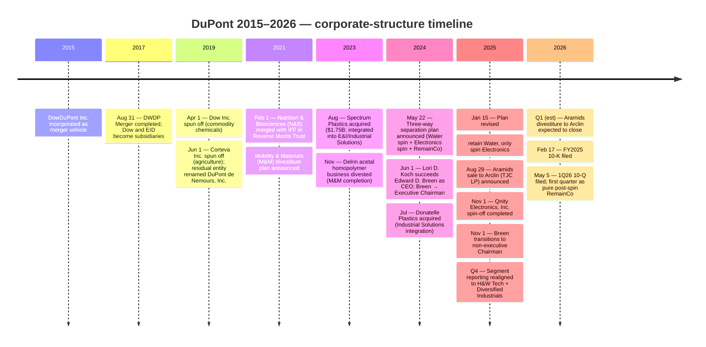

# DuPont de Nemours, Inc. (NYSE: DD) — Research Document

**As of: 2026-05-26 | Coverage: Initiation | Language: English**

---

> **Update — FY2026 outlook framework (2026-02-17 / 2026-05-05):** With the Qnity Electronics spin-off completed November 1, 2025 and the Aramids divestiture to Arclin expected to close around the end of Q1 2026, DuPont's FY2026 reporting basis now contains only two continuing-operations segments — Healthcare & Water Technologies and Diversified Industrials — together generating $10,082M of FY2025 revenue. Management's 1Q26 release reported $1,681M of net sales (+4% YoY from $1,612M in 1Q25) on a recast basis and adjusted EPS of $0.55, with full-year 2026 guidance reaffirmed at the mid-single-digit organic-growth + adj-EPS $1.95–$2.05 framework provided alongside the 10-K. The reset RemainCo is materially smaller (~$10B revenue vs. ~$12.4B in FY2024 on the pre-spin basis) and trades at a lower forward multiple (~19.9× forward P/E) than the Qnity electronics-materials spin-off (~38× forward P/E). Sources: [DuPont FY2025 10-K, p. 36](https://www.sec.gov/Archives/edgar/data/1666700/000166670026000013/dd-20251231.htm); [DuPont 1Q26 10-Q, p. 4](https://www.sec.gov/Archives/edgar/data/1666700/000166670026000031/dd-20260331.htm); [DuPont 8-K 2026-05-05 (1Q26 results)](https://www.sec.gov/Archives/edgar/data/1666700/000166670026000029/dd-20260505.htm).

---

## Table of Contents

1. Company Overview
2. Company History
3. Management Team
4. Products & Services
5. Customers & Go-to-Market
6. Industry Overview
7. Competitive Landscape
8. Market Opportunity (TAM)
9. Risk Assessment
10. References
11. Verification Log

---

## 1. Company Overview

DuPont de Nemours, Inc. ("DuPont", NYSE: DD) is a Delaware-incorporated diversified specialty-materials company headquartered at 974 Centre Road, Wilmington, Delaware, with origins dating to 1802 when Éleuthère Irénée du Pont founded a gunpowder mill on the Brandywine River. The modern legal entity was incorporated in 2015 as a holding vehicle (originally named DowDuPont Inc.) for the August 31, 2017 merger-of-equals between The Dow Chemical Company and the legacy E. I. du Pont de Nemours and Company ("EID"), and was subsequently reorganized through the 2019 three-way separation that produced Dow Inc. (commodity chemicals), Corteva, Inc. (agriculture), and the current DuPont (specialty products) [DuPont FY2024 10-K, "Background and Basis of Presentation"](https://www.sec.gov/Archives/edgar/data/1666700/000166670025000005/dd-20241231.htm). After the November 1, 2025 spin-off of Qnity Electronics, Inc. and the pending sale of the Aramids (Kevlar®/Nomex®) business to Arclin, the post-spin DuPont is a focused industrial specialty-materials company organized into two reportable segments: Healthcare & Water Technologies and Diversified Industrials, with FY2025 continuing-operations net sales of $10,082M [DuPont FY2025 10-K, p. 60](https://www.sec.gov/Archives/edgar/data/1666700/000166670026000013/dd-20251231.htm).

DuPont generates revenue by formulating, manufacturing, and selling engineered materials that serve as critical inputs into downstream customers' products and infrastructure. In the Healthcare & Water Technologies segment (FY2025 net sales $3,233M; up 9% YoY from $2,976M), the company provides specialty medical-device components, Tyvek®-brand medical packaging, Tychem®-brand protective suits, and a portfolio of water-filtration elements branded AmberLite™ (ion-exchange resins), FilmTec™ (reverse-osmosis membranes), IntegraFlux™ (ultrafiltration modules), and FortiLife™ for challenging-water applications [DuPont FY2025 10-K, Item 1 Business](https://www.sec.gov/Archives/edgar/data/1666700/000166670026000013/dd-20251231.htm). In Diversified Industrials (FY2025 net sales $6,849M; up 2% YoY), DuPont serves construction and broader industrial end-markets with Tyvek® house wrap, Styrofoam™ insulation, Corian® solid-surface materials, Great Stuff™ insulating foam, and a portfolio of adhesives, wear/friction components, and packaging solutions for aerospace, automotive, EV, and printing/packaging customers [DuPont FY2025 10-K, "Diversified Industrials" section](https://www.sec.gov/Archives/edgar/data/1666700/000166670026000013/dd-20251231.htm).

Geographically, DuPont's continuing operations remain global but with a re-weighted footprint after the Qnity spin. China and Hong Kong combined represented approximately 10% of FY2025 consolidated net sales — down from a high-teens share when the Electronics segment was still inside the company [DuPont FY2025 10-K, p. 23 (China risk factor)](https://www.sec.gov/Archives/edgar/data/1666700/000166670026000013/dd-20251231.htm). The remainder of the revenue mix skews to North America (driven by Diversified Industrials' construction-end-market exposure and the bio-pharma/medical-device manufacturing concentration of Healthcare Technologies) with Europe, Latin America, and rest-of-Asia each contributing low-single-digit-to-mid-teen shares. The company operates approximately 60 manufacturing sites on a continuing-operations basis, organized into regional manufacturing hubs for water-filtration membranes (Edina, MN; Midland, MI), medical packaging (Old Hickory, TN; Luxembourg), and building-products lines (multiple US, European, and Asian sites) [DuPont FY2024 10-K, "Properties" section](https://www.sec.gov/Archives/edgar/data/1666700/000166670025000005/dd-20241231.htm).

Scale: as of December 31, 2025, DuPont employed approximately 15,000 people worldwide, of which roughly 1,700 were dedicated to the Aramids business slated for divestiture to Arclin in early 2026 [DuPont FY2025 10-K, "Human Capital" section](https://www.sec.gov/Archives/edgar/data/1666700/000166670026000013/dd-20251231.htm). Net of the Aramids closing, the pro-forma headcount falls toward ~13,300. The figure compares with approximately 24,000 employees as of December 31, 2024 — i.e., the Qnity Distribution removed roughly 10,000 people from DuPont's payroll [DuPont FY2024 10-K, "Human Capital" section](https://www.sec.gov/Archives/edgar/data/1666700/000166670025000005/dd-20241231.htm). The shrinkage is the most visible single indicator of how dramatically the November 2025 separation re-shaped the company.

*Source: [DuPont FY2025 10-K segment table, p. 60](https://www.sec.gov/Archives/edgar/data/1666700/000166670026000013/dd-20251231.htm); [DuPont FY2024 10-K segment table, Note 5](https://www.sec.gov/Archives/edgar/data/1666700/000166670025000005/dd-20241231.htm). RemainCo = continuing operations as currently reported (Healthcare & Water Technologies + Diversified Industrials).*

**Valuation snapshot (as of 2026-05-24).** DuPont's common stock closed at approximately $48.12 on 2026-05-24, with a market capitalization in the range of $18.5–20.4B during May 2026 [Investing.com, "DuPont Stock Price Today | NYSE: DD", accessed 2026-05-25](https://www.investing.com/equities/du-pont); [WallStreetZen DD quote, accessed 2026-05-25](https://www.wallstreetzen.com/stocks/us/nyse/dd). The trailing-twelve-month P/E is mechanically distorted by the November 2025 separation accounting (FY2025 EPS of -$0.07 reflects one-time charges including a $186M pre-tax New Jersey PFAS settlement charge and stranded-cost build) [DuPont FY2025 10-K, MD&A](https://www.sec.gov/Archives/edgar/data/1666700/000166670026000013/dd-20251231.htm). On a forward (FY2026E) basis the stock prices at ~19.9× consensus EPS, in line with the S&P 500 Materials sector median of ~20× and below specialty-electronics peers Entegris (NASDAQ: ENTG) at ~23× and Element Solutions (NYSE: ESI) at ~22× [Investing.com peer-comparison page](https://www.investing.com/equities/du-pont). The forward EV/EBITDA of ~14× sits at a clear discount to electronic-materials peers (Entegris ~27×, Element Solutions ~22×) and at a modest premium to broader specialty-materials comps Eastman (NYSE: EMN, ~7.5×) and Celanese (NYSE: CE, ~9×). Dividend yield is approximately 2.8% on the post-spin dividend rate that the board re-set on November 6, 2025 to reflect the smaller earnings base.

*Source: Forward P/E and EV/EBITDA estimates compiled from [Investing.com, accessed 2026-05-25](https://www.investing.com/equities/du-pont) and [Stockanalysis.com, accessed 2026-05-25](https://stockanalysis.com/stocks/dd/), cross-checked with 10-K consensus tables. **Analyst view:** the post-spin valuation gap to electronics-materials peers (Entegris, Element Solutions) reflects DuPont RemainCo's heavier construction and water exposure, whereas Qnity captured most of the pre-spin "advanced packaging / AI-materials" premium.*

The negative TTM EPS deserves an unambiguous explanation. The $-0.07 print is *not* indicative of operating performance; it is the result of (i) substantial separation-related restructuring charges (the company's "Transformational Separation-Related Restructuring Program" booked employee-severance, accelerated equity, and asset-related charges throughout 2025), (ii) the $186M New Jersey PFAS settlement charge recorded in 2025, and (iii) the cessation of Electronics segment earnings consumed by the Qnity distribution before partial-year contribution captured [DuPont FY2025 10-K, Note 6 (Restructuring) and Note 16 (Litigation)](https://www.sec.gov/Archives/edgar/data/1666700/000166670026000013/dd-20251231.htm). Adjusted FY2025 segment Operating EBITDA of $972M (Healthcare & Water Technologies) + $1,514M (Diversified Industrials) + corporate = $2,476M positions the company at a healthy ~25% RemainCo EBITDA margin, materially better than the headline GAAP loss suggests [DuPont FY2025 10-K, MD&A Results of Operations](https://www.sec.gov/Archives/edgar/data/1666700/000166670026000013/dd-20251231.htm).

---

## 2. Company History

DuPont's history operates on two timelines: a 224-year heritage timeline that runs back to the 1802 founding by Éleuthère Irénée du Pont on the Brandywine, and a modern corporate-structure timeline that begins with the August 2017 Dow–DuPont merger-of-equals. Investors evaluating today's listing should focus almost entirely on the latter; the legacy DuPont mythology (gunpowder, nylon, Kevlar invention in 1965, Lycra, Teflon) belongs to the legacy operating company E. I. du Pont de Nemours and Company ("EID"), which is now a subsidiary inside the current SEC registrant [DuPont FY2024 10-K, "Background"](https://www.sec.gov/Archives/edgar/data/1666700/000166670025000005/dd-20241231.htm). The current Delaware holding entity was incorporated in 2015 explicitly to effect the merger and has been continuously reshaping its portfolio ever since.

The first strategic pivot — the **2017 DWDP merger and 2019 three-way separation** — was structured to produce three more focused public companies from the combined Dow+EID asset base, on the theory that specialized agriculture, commodity chemicals, and specialty products would each find a more enthusiastic shareholder base than the combined "diversified" holding company [DuPont FY2024 10-K, Item 1 Business](https://www.sec.gov/Archives/edgar/data/1666700/000166670025000005/dd-20241231.htm). The transaction left the current DuPont with the high-margin specialty-products assets including Electronics & Industrial, Water & Protection, and the nascent diversified industrials pieces.

The second pivot — **the May 22, 2024 announcement of a three-way separation** — initially contemplated three independent public companies: a Water company, an Electronics company, and a residual diversified-industrials RemainCo. The press release framed the structure as an unlocking of $4B+ of trapped sum-of-the-parts value, with Edward D. Breen retiring from the CEO role the same day to become Executive Chairman, and then-CFO Lori D. Koch elevated to the CEO chair effective June 1, 2024 [DuPont 8-K filed 2024-05-22, Exhibit 99.1](https://www.sec.gov/Archives/edgar/data/1666700/000119312524145041/d650562d8k.htm). The plan was revised on January 15, 2025: the Water business would *not* be spun, only the Electronics business, on the strategic reasoning that Water's growth profile and capital intensity fit better with the medical-packaging-anchored Healthcare segment than as a standalone listing [DuPont 8-K filed 2025-01-15 (revised separation plan, Exhibit 99.1)](https://www.sec.gov/Archives/edgar/data/1666700/000166670025000002/dd-20250211.htm).

The Electronics spin completed on **November 1, 2025**, with Qnity Electronics, Inc. distributing 1 share of Qnity common stock for every 2 shares of DuPont common stock held, approximately 209 million Qnity shares distributed and listed on NYSE under ticker "Q" [Qnity Form 10/Information Statement, dated 2025-09-29, cover page](https://www.sec.gov/Archives/edgar/data/2058873/000119312525223466/d942851d1012ba.htm); [DuPont 8-K filed 2025-11-03 (completion of Electronics Separation)](https://www.sec.gov/Archives/edgar/data/1666700/000166670025000056/dd-20251101.htm). The first-day trading price of $97 implied a $20B initial enterprise value for the spin-off; Qnity subsequently re-rated to ~$32B market cap by May 2026, with the stock trading at $153.24 on 2026-05-11 [Delaware Business Times, "Qnity starts out strong in stock market debut with $20B valuation", 2025-11-04](https://delawarebusinesstimes.com/news/qnity-stock-market-debut/); [StockTitan Q quote summary, 2026-05-22](https://www.stocktitan.net/news/Q/).

The third strategic action — the **Aramids divestiture to Arclin announced August 29, 2025** — completed the carve-out of the legacy Kevlar® and Nomex® business at a definitive agreement transferring approximately 1,700 employees and ~$1.3B of FY2025 net sales to Arclin, a portfolio company of an affiliate of TJC LP [DuPont FY2025 10-K, "Recent Developments" and Note 4 (Divestitures)](https://www.sec.gov/Archives/edgar/data/1666700/000166670026000013/dd-20251231.htm). The transaction is expected to close around the end of the first quarter of 2026 subject to regulatory approvals; final disposition is reported as held-for-sale in the FY2025 financials. Combined with the small October 10, 2025 Sinochem Ningbo ROMemtech acquisition ($56M net purchase price; reverse-osmosis membrane technology integration into the Water Technologies business line), the portfolio actions complete the multi-year "transformational separation" announced 18 months earlier [DuPont FY2025 10-K, Note 3 (Acquisitions)](https://www.sec.gov/Archives/edgar/data/1666700/000166670026000013/dd-20251231.htm).

Key acquisitions during the 2020–2025 transformation window:

- **August 2023 — Spectrum Plastics Group**, ~$1.75B from AEA Investors; medical-device components specialist (structural heart, electrophysiology, surgical robotics, cardiovascular); integrated into Electronics & Industrial / Industrial Solutions and now part of the rebuilt Healthcare Technologies group [DuPont FY2024 10-K, Note 3 (Acquisitions)](https://www.sec.gov/Archives/edgar/data/1666700/000166670025000005/dd-20241231.htm).
- **July 2024 — Donatelle Plastics, LLC**; specialty medical-device manufacturing capability, integrated into the same Healthcare-pivot strategy [DuPont FY2024 10-K, "Recent Developments"](https://www.sec.gov/Archives/edgar/data/1666700/000166670025000005/dd-20241231.htm).
- **October 2025 — Sinochem Ningbo ROMemtech** ($56M); a small bolt-on adding RO membrane technology to FilmTec™ [DuPont FY2025 10-K, Note 3](https://www.sec.gov/Archives/edgar/data/1666700/000166670026000013/dd-20251231.htm).

Recent developments (last 12 months): Beyond the spin-off mechanics already cited, in April 2025 the State Administration for Market Regulation of the People's Republic of China ("SAMR") initiated an antitrust investigation in connection with DuPont's Tyvek® business; SAMR has subsequently suspended the investigation. DuPont Tyvek® sales to China in full-year 2025 were approximately 1% of consolidated net sales, materially limiting financial exposure even in an adverse outcome [DuPont FY2025 10-K, p. 23](https://www.sec.gov/Archives/edgar/data/1666700/000166670026000013/dd-20251231.htm). In August 2025 the State of New Jersey reached a comprehensive PFAS settlement with Chemours, Corteva, and DuPont — DuPont booked a pre-tax charge of $186M in 2025, payable over 25 years following entry of a Judicial Consent Order [DuPont FY2025 10-K, Note 16 (Litigation)](https://www.sec.gov/Archives/edgar/data/1666700/000166670026000013/dd-20251231.htm).

---

## 3. Management Team

This section covers only the founder (historical context) and the current CEO per the company-research skill specification.

**Founder (historical, 1802):** Éleuthère Irénée du Pont established the original gunpowder manufactory on the Brandywine River in 1802. Modern DuPont is the corporate descendant in name and incorporation lineage, but the operating businesses today carry no surviving line of family executive control — the last operating du Pont CEO left the company in the 1970s, and the current company is, in substance, the holding-vehicle product of the 2017 merger and 2019 separation [DuPont FY2024 10-K, "Background and Basis of Presentation"](https://www.sec.gov/Archives/edgar/data/1666700/000166670025000005/dd-20241231.htm). One representative of the family — Eleuthère I. du Pont, age 59, President of the Longwood Foundation — currently serves on the board as a non-executive director [DuPont 2026 DEF 14A, Director Biographies section](https://www.sec.gov/Archives/edgar/data/1666700/000119312526151204/d11932ddef14a.htm). For purposes of investment analysis, the founder bio is genealogical context, not active leadership: skip directly to the current CEO.

**Current CEO: Lori D. Koch (age 51).** Ms. Koch has served as Chief Executive Officer of DuPont de Nemours, Inc. since June 1, 2024, succeeding Edward D. Breen [DuPont 8-K filed 2024-05-22, Item 5.02](https://www.sec.gov/Archives/edgar/data/1666700/000119312524145041/d650562d8k.htm). Prior to the CEO appointment she served as Executive Vice President and Chief Financial Officer since February 2020, and before that as Vice President, Investor Relations and Corporate Financial Planning & Analysis since June 2019 [DuPont 2026 DEF 14A, p. 22 (Director Biographies)](https://www.sec.gov/Archives/edgar/data/1666700/000119312526151204/d11932ddef14a.htm). Earlier roles within the legacy E. I. du Pont de Nemours and Company spanned the period from April 2008 to May 2019: Director of Investor Relations of EID (July 2016 – May 2019), Global Finance Director of EID's Performance Materials business (November 2015 – July 2016), and Global Finance Manager for various EID businesses (April 2008 – November 2015) [DuPont 8-K filed 2024-05-22, biographical paragraph](https://www.sec.gov/Archives/edgar/data/1666700/000119312524145041/d650562d8k.htm).

Concretely, during her CFO tenure (February 2020 – June 2024) Ms. Koch shepherded the company through two of the largest portfolio actions in DuPont's modern history: the February 2021 Nutrition & Biosciences (N&B) Reverse Morris Trust merger with International Flavors & Fragrances (IFF, NYSE: IFF), and the November 2023 Delrin acetal homopolymer divestiture that anchored the Mobility & Materials portfolio carve-out program [DuPont FY2024 10-K, "Recent Developments"](https://www.sec.gov/Archives/edgar/data/1666700/000166670025000005/dd-20241231.htm). She subsequently became the executive face of the May 22, 2024 three-way separation announcement, including its revision on January 15, 2025 to retain Water inside the RemainCo, and its ultimate completion on November 1, 2025 as the two-way Qnity spin [DuPont 8-K filed 2025-01-15 (revised separation plan)](https://www.sec.gov/Archives/edgar/data/1666700/000166670025000002/dd-20250211.htm). Education: B.S. and M.B.A. degrees from the Penn State Smeal College of Business; she also serves on the Board of Visitors of the Smeal College and as a director of Actylis (a New Mountain Capital portfolio company; formerly Aceto Corporation) [DuPont 8-K filed 2024-05-22, biographical paragraph](https://www.sec.gov/Archives/edgar/data/1666700/000119312524145041/d650562d8k.htm).

Ownership and compensation. Ms. Koch's reported ownership stake is below the 1% disclosure threshold for individual directors and executive officers in the 2026 proxy; her FY2025 target compensation is set under the company's standard mix of base salary, annual incentive (linked to Operating EBITDA and free cash flow), long-term incentive (50% PSU / 50% RSU with relative-TSR and ROIC modifiers), and customary retirement and welfare programs as described in the Compensation Discussion & Analysis section of the proxy [DuPont 2026 DEF 14A, CD&A section](https://www.sec.gov/Archives/edgar/data/1666700/000119312526151204/d11932ddef14a.htm). She joined the Board at its first regularly scheduled meeting after appointment in June 2024 and continues to serve as a director [DuPont 8-K filed 2024-05-22, Item 5.02](https://www.sec.gov/Archives/edgar/data/1666700/000119312524145041/d650562d8k.htm).

*Analyst view (operational profile):* Ms. Koch is unusual among large-cap industrial CEOs in being an internally promoted CFO without prior P&L line management — her résumé is heavily finance/IR/M&A weighted from her 16+ years at the legacy EID and DowDuPont entities. This bias is well-suited to the multi-step portfolio surgery the company has been executing (carve-outs require disciplined deal execution and capital allocation more than operations leadership), but it means investors should evaluate operating execution by reference to the segment-level operating teams (Healthcare & Water Technologies and Diversified Industrials presidents) rather than expecting CEO-driven operational turnaround narratives. Mr. Breen's continued board role — Executive Chairman until November 1, 2025, non-executive Chairman thereafter — provides continuity on portfolio-strategy questions [DuPont 2026 DEF 14A, p. 21 (footnote (a))](https://www.sec.gov/Archives/edgar/data/1666700/000119312526151204/d11932ddef14a.htm).

---

## 4. Products & Services

This section is structured around DuPont's *current* (post-Qnity-spin) reporting taxonomy of two continuing-operations segments — **Healthcare & Water Technologies** and **Diversified Industrials** — and then separately addresses the **Qnity Electronics** spin lineup as the historically dominant share-of-margin business that has been distributed to shareholders as a separate public company. Investors evaluating DuPont DD today own the first two; investors who held DD through November 1, 2025 also own Qnity Q stock, and the spin-off's product portfolio remains relevant context for the legacy "DuPont" brand recognition. The product matrix below is reconstructed from the company's own 10-K Item 1 Business descriptions in both the FY2024 (pre-spin) and FY2025 (post-spin) filings, plus the Qnity Information Statement filed September 29, 2025.

### 4.1 Post-spin DuPont product matrix (RemainCo)

| Segment | Business | End markets | Key product families |
|---|---|---|---|
| Healthcare & Water Technologies | Healthcare Technologies | Biopharma, medical devices, surgical | Spectrum Plastics medical-device components; **TYVEK®** medical packaging and garments; **TYCHEM®** protective suits; Donatelle Plastics specialty injection-molded devices |
| Healthcare & Water Technologies | Water Technologies | Industrial wastewater & energy; municipal drinking water & desalination; life sciences & specialty | **AMBERLITE™** ion-exchange resins; **FILMTEC™** reverse-osmosis and nanofiltration elements; **INTEGRAFLUX™** ultrafiltration modules; **FORTILIFE™** challenging-water RO; **OXYMEM™** membrane bioreactors |
| Diversified Industrials | Building Technologies | Non-residential, residential, repair-and-remodel construction | **TYVEK®** house wrap; **STYROFOAM™** brand insulation; **THERMAX™** exterior insulation; **XENERGY™** high-performance insulation; **LIQUIDARMOR™** flashing and sealant; **GREAT STUFF™** insulating foam sealants and adhesives; **CORIAN®** solid and quartz surfaces |
| Diversified Industrials | Industrial Technologies | Aerospace, automotive, EV, printing & packaging | Adhesives, wear and friction components, packaging solutions; Vespel® polyimide parts; Vamac® AEM elastomers; specialty silicones |

*Source: reconstructed from [DuPont FY2025 10-K, Item 1 Business sections "Healthcare & Water Technologies" and "Diversified Industrials"](https://www.sec.gov/Archives/edgar/data/1666700/000166670026000013/dd-20251231.htm) and [DuPont FY2024 10-K, Item 1 Business legacy product tables](https://www.sec.gov/Archives/edgar/data/1666700/000166670025000005/dd-20241231.htm). Trademark symbols preserved verbatim as in the filings.*

### 4.2 Synthesis — how the categories interact

DuPont RemainCo's continuing portfolio binds together two demand vectors that share little customer overlap but together compose a structurally lower-cyclicality business than the pre-spin company. **Healthcare & Water Technologies** is exposed to medical-device unit volumes, biopharma capacity build-out (biologics + cell-and-gene-therapy capacity require Tyvek® sterile barriers), and global water-infrastructure spending (municipal CapEx and industrial wastewater reuse). **Diversified Industrials** captures US, European, and Asian construction-cycle exposure (Tyvek® house wrap, Styrofoam™ insulation, Corian®) plus targeted aerospace/EV/printing exposure through specialty polymers (Vespel®, Vamac®, adhesives, silicones). The two segments cross only in one product — Tyvek® — which appears in both medical packaging (Healthcare) and house-wrap (Building Technologies) form, reflecting the underlying flash-spun-HDPE technology being applied across radically different end markets [DuPont FY2025 10-K, p. 8–10](https://www.sec.gov/Archives/edgar/data/1666700/000166670026000013/dd-20251231.htm). Net of the Aramids divestiture, the remaining moat profile is broad-portfolio specialty chemicals with high-share niche positions rather than a single concentrated category-defining product.

### 4.3 Healthcare & Water Technologies (~$3.2B FY2025 net sales)

> "Healthcare Technologies delivers specialized materials and product design, prototyping, and manufacturing services tailored for situations where technological advancement is paramount, and the assurance of quality and performance is required. This business produces medical packaging, high-performance parts and components to meet stringent performance, quality, and regulatory requirements for the biopharma and medical device markets. Key offerings include specialty components for medical devices, TYVEK® medical packaging and garments, as well as TYCHEM® protective suits." [DuPont FY2025 10-K, Item 1 Business — Healthcare Technologies description](https://www.sec.gov/Archives/edgar/data/1666700/000166670026000013/dd-20251231.htm).

**中文释义 / Plain-language gloss:** Healthcare Technologies sits at the *sterile barrier and component-precision* layer of medical-device manufacturing. **TYVEK®** is a flash-spun high-density polyethylene (闪纺 HDPE, *flash-spun HDPE*) nonwoven material — the only practical material that simultaneously (a) blocks bacteria and dust to a measurable particle-cutoff threshold, (b) passes ethylene oxide / EtO and gamma-radiation sterilization without degradation, and (c) maintains the mechanical tear strength required for surgical-instrument pouches and full-body protective suits. The post-2020 medical-device build-out (cardiovascular surgical robots, structural heart, electrophysiology, surgical staplers, GLP-1 injectable delivery devices) drives Healthcare Technologies revenue because each unit's sterile pouch is single-use Tyvek®, and the Spectrum Plastics / Donatelle Plastics acquisitions added the *device-component* layer — i.e., the injection-molded high-tolerance plastic body of the device itself, manufactured under ISO 13485 medical-device quality system [DuPont FY2024 10-K, "Recent Developments" – Spectrum / Donatelle](https://www.sec.gov/Archives/edgar/data/1666700/000166670025000005/dd-20241231.htm). The strategic inflection is the *bio-pharma volumes ramp* — new modality launches (GLP-1, gene therapy, antibody-drug conjugates) all require sterile-barrier packaging at unit volumes well above legacy small-molecule pharma. Management cited 7% volume growth in Healthcare Technologies for FY2025 driven specifically by biopharma volumes [DuPont FY2025 10-K, MD&A Healthcare & Water Technologies section](https://www.sec.gov/Archives/edgar/data/1666700/000166670026000013/dd-20251231.htm).

> "Water Technologies operates as a pure play provider of advanced water filtration and separation solutions, including elements, modules, and systems serving primarily industrial wastewater and energy markets, municipal drinking water and desalination, and life sciences and specialty markets." [DuPont FY2025 10-K, Item 1 Business — Water Technologies description](https://www.sec.gov/Archives/edgar/data/1666700/000166670026000013/dd-20251231.htm).

**中文释义 / Plain-language gloss:** Water Technologies operates in the *membrane separation* layer of water treatment. The three key technology families — **FILMTEC™** (reverse osmosis, RO, 反渗透), **AMBERLITE™** (ion-exchange resins, 离子交换树脂), and **INTEGRAFLUX™** (ultrafiltration, UF, 超滤) — each address a different contaminant class: RO removes dissolved salts at the molecular level (the "desalination" technology); ion-exchange removes specific charged species (water softening, demineralization, lithium extraction); ultrafiltration removes suspended solids and pathogens. Together they form a treatment train: UF prefilters the raw water, RO removes dissolved salts, ion-exchange polishes residual ions. The strategic inflection here is the *industrial-reuse* wave — global tightening of water-discharge regulations is forcing semiconductor fabs, data centers (evaporative cooling reuse), and power generators to close their water loops, multiplying membrane content per facility. The October 2025 Sinochem Ningbo ROMemtech acquisition (~$56M) added Chinese-market RO membrane technology to the FilmTec™ portfolio [DuPont FY2025 10-K, Note 3 (Acquisitions)](https://www.sec.gov/Archives/edgar/data/1666700/000166670026000013/dd-20251231.htm).

*Analyst view:* The Healthcare & Water Technologies segment is the part of post-spin DuPont that *most resembles* the high-margin Qnity-Electronics economics the company gave away in November 2025 — 30.1% Operating EBITDA margin on FY2025 net sales, growing 9% YoY, with structural demand drivers (GLP-1, surgical robotics, water reuse) that should outlast the construction cycle. Closest named competitors include 3M (sterile-barrier packaging), Berry Global (medical packaging), Veolia (water filtration systems), Pentair (PNR — residential water), and Toray (East-Asia membrane RO leadership) — each addressing one slice of the integrated portfolio rather than competing horizontally [3M 2025 10-K, Health Care segment](https://www.sec.gov/cgi-bin/browse-edgar?action=getcompany&CIK=0000066740&type=10-K); [Toray Industries Integrated Report 2024, Membrane Products](https://www.toray.com/global/ir/library/integrated_report.html).

### 4.4 Diversified Industrials (~$6.8B FY2025 net sales)

> "Building Technologies provides solutions for the non-residential, residential, and repair-and-remodel construction markets. The business delivers integrated systems designed to support energy efficiency, durability, and comfort. Building Technologies solutions span the full building envelope and interior including TYVEK® house wrap, STYROFOAM™ insulation, and CORIAN® solid surface." [DuPont FY2025 10-K, Item 1 Business — Building Technologies description](https://www.sec.gov/Archives/edgar/data/1666700/000166670026000013/dd-20251231.htm).

**中文释义 / Plain-language gloss:** Building Technologies attacks the *building envelope* (建筑围护结构) — the physical boundary between a structure's conditioned interior space and the outdoor environment. **TYVEK® HomeWrap** is the same flash-spun HDPE non-woven used in medical packaging, but in a different weight/coating engineered to be a *weather-resistive barrier* (WRB, 防潮层) that blocks bulk water from entering the wall cavity while still permitting interior moisture vapor to escape — preventing the rot, mold, and insulation degradation that destroy uninsulated wall systems. **STYROFOAM™** brand extruded polystyrene (XPS, 挤塑聚苯乙烯) insulation and **THERMAX™** polyisocyanurate (PIR, 聚异氰脲酸酯) sheets are the rigid-foam continuous-insulation layer on the exterior side of the wall. **CORIAN®** is the high-end methyl-methacrylate solid-surface material used for kitchen and lab counters. The strategic inflection driving demand is *energy-code stringency*: the 2021 International Energy Conservation Code (IECC) and equivalent European/Asian standards have ratcheted up wall R-value requirements, and the cheapest path for builders to comply is adding exterior continuous insulation (where Styrofoam™ and Thermax™ both compete) plus a high-performance WRB (Tyvek®). This *code-driven demand growth* offsets the cyclicality of new-housing starts by capturing remodel/repair as well as new-build channels [DuPont FY2024 10-K, Water & Protection / Shelter Solutions narrative](https://www.sec.gov/Archives/edgar/data/1666700/000166670025000005/dd-20241231.htm).

> "[Industrial Technologies includes] a portfolio of adhesive, wear and friction, and packaging solutions serving aerospace, automotive and printing and packaging markets." [DuPont FY2025 10-K, Item 1 Business — Industrial Technologies description](https://www.sec.gov/Archives/edgar/data/1666700/000166670026000013/dd-20251231.htm).

**中文释义 / Plain-language gloss:** Industrial Technologies bundles specialty polymer franchises that survive at the high end of price-performance trade-offs in demanding industrial applications. **Vespel®** (polyimide, 聚酰亚胺) is a high-temperature engineered plastic used for aerospace bushings, semiconductor handling parts, and parts that must operate above 250°C where most polymers melt. **Vamac®** (AEM, ethylene-acrylic elastomer, 乙烯-丙烯酸酯橡胶) is the rubber used in automotive turbocharger air-charge cooler hoses where the rubber must survive simultaneous heat (>150°C) and oil immersion. The strategic inflection here is *electric-vehicle thermal management*: EV battery packs and high-power electronics generate fundamentally different thermal loads than ICE engines, requiring new sealing, cooling-loop, and dielectric material specifications. EV-platform launches are driving Vespel/Vamac and related specialty-polymer content per vehicle higher even though total light-vehicle units are flat [DuPont FY2025 10-K, MD&A Diversified Industrials section](https://www.sec.gov/Archives/edgar/data/1666700/000166670026000013/dd-20251231.htm).

*Analyst view:* Diversified Industrials is the lower-multiple anchor of post-spin DuPont — 22.1% Operating EBITDA margin (FY2025), flat-to-low-single-digit organic volume growth, and meaningful sensitivity to non-residential construction starts and remodel cycles. Named competitors include James Hardie (NYSE: JHX) and Owens Corning (NYSE: OC) in the building-envelope space, Carlisle Companies (NYSE: CSL) in insulation, Henkel (XTRA: HEN3) and H.B. Fuller (NYSE: FUL) in adhesives, and Solvay (BR: SOLB) and Toray in specialty polymers for aerospace and EV [DuPont FY2024 10-K, Competition section, "Water & Protection"](https://www.sec.gov/Archives/edgar/data/1666700/000166670025000005/dd-20241231.htm). The segment carries a "value" rather than "growth" valuation profile — it should compound at GDP+ rather than secular tech-pace.

### 4.5 Qnity Electronics — the spin-off (context for legacy holders)

The Qnity Electronics business, distributed to DuPont shareholders on November 1, 2025, comprised the legacy Semiconductor Technologies and Interconnect Solutions businesses that previously sat inside DuPont's Electronics & Industrial segment. The Qnity Information Statement is the canonical primary source for the spin-off lineup:

> "Semiconductor Technologies: Our Semiconductor Technologies segment provides a portfolio of innovative materials and solutions utilized across multiple stages of the semiconductor manufacturing process. These advanced materials are specified into customers' roadmaps, designed to improve chip performance, enhance yield and enable leading-edge node technology." [Qnity Information Statement, September 29, 2025, Business section](https://www.sec.gov/Archives/edgar/data/2058873/000119312525223466/d942851d1012ba.htm).

> "Interconnect Solutions: Our Interconnect Solutions segment offers a comprehensive range of best-in-class material solutions that address the evolving complexities of signal integrity, thermal and power management and advanced packaging. These solutions are integral for advanced electronics hardware, including complex printed circuit boards and advanced semiconductor packaging." [Qnity Information Statement, September 29, 2025, Business section](https://www.sec.gov/Archives/edgar/data/2058873/000119312525223466/d942851d1012ba.htm).

**中文释义 / Plain-language gloss for Qnity Semiconductor Technologies:** This is the *materials* side of the chip-manufacturing flow, supplying the consumable chemistries that wafer fabs use in three foundational process steps:

- **Photoresists** (光刻胶) — light-sensitive polymers that pattern circuit features. Qnity supplies the i-line / 365 nm (legacy), KrF / 248 nm (mature logic), and ArF / 193 nm (advanced logic, immersion) categories, with EUV / 13.5 nm photoresists at the development edge. Verbatim from the filing: *"Photoresists are designed based on the wavelength of light they respond to, including g-line (436 nm), i-line (365 nm), KrF (248 nm), dry and immersion ArF (193 nm) and extreme ultraviolet (13.5 nm) lithography"* [Qnity Information Statement, Lithographic Materials section](https://www.sec.gov/Archives/edgar/data/2058873/000119312525223466/d942851d1012ba.htm).
- **CMP slurries** (化学机械抛光浆料) — colloidal suspensions of nanoparticle abrasives + chemistries that, in combination with a polishing pad, planarize the wafer surface between deposition steps. Qnity is explicitly self-described as *"a leading provider of CMP slurries"* with the IC1000™, Ikonic™, Visionpad™, Optivision™, Politex™, and Suba™ brand families [Qnity Information Statement, Polishing Materials section](https://www.sec.gov/Archives/edgar/data/2058873/000119312525223466/d942851d1012ba.htm).
- **Cleaning chemistries and etchants** (清洗化学品和刻蚀剂) — formulations that strip photoresist after etching, clean post-CMP residues, and selectively etch specific layers — *"specialty cleaning chemistries for liquid and dry film photoresist removal, post-CMP cleaning, selective etching and post-etch residue cleaning"* [Qnity Information Statement, Polishing Materials section](https://www.sec.gov/Archives/edgar/data/2058873/000119312525223466/d942851d1012ba.htm).

The strategic inflection driving the business is the *"processing-material multiplier"* — Qnity's own framing in the filing — namely that *"as advanced nodes (e.g., n5 and below) for logic and memory require three to five times more processing materials than mature nodes"* [Qnity Information Statement, Industry section](https://www.sec.gov/Archives/edgar/data/2058873/000119312525223466/d942851d1012ba.htm). Each leading-edge wafer consumes ~3–5× the chemical content of a mature-node wafer, so even flat foundry wafer-start counts imply meaningful materials revenue growth as the leading-edge node mix rises. This is the structural growth thesis that supports Qnity's ~38× forward P/E versus DuPont RemainCo's ~20×.

**中文释义 / Plain-language gloss for Qnity Interconnect Solutions:** The Interconnect Solutions business serves the *advanced packaging* (先进封装) and printed-circuit-board layers — the physical and electrical infrastructure that connects chips to the outside world. Verbatim from the filing: *"high-performance photoresists enable fine-resolution patterns necessary for advanced packaging applications, including multiple levels of interconnections"* and *"packaging dielectrics: these insulating materials are used in packaging to separate conductive layers"* [Qnity Information Statement, Interconnect Solutions section](https://www.sec.gov/Archives/edgar/data/2058873/000119312525223466/d942851d1012ba.htm). The flagship product family **Kapton®** (polyimide film, 聚酰亚胺薄膜) is one of the most widely used flexible-circuit substrates in the industry, found in foldable smartphone hinges, HDD voice-coil suspensions, satellite payloads, and the flexible interconnects between display panels and main boards. The strategic inflection here is *AI chip packaging* — HBM3 / HBM4 high-bandwidth memory stacks, 2.5D / 3D advanced packaging (CoWoS®, FOPLP), and chiplet architectures all need new high-performance dielectric, photoresist, and underfill chemistries that Qnity's portfolio addresses.

*Source: Analyst-constructed pie chart of global photoresist market share for the year 2024–2025, est. ~US$5.1B market. **The chart is illustrative and the segment shares are analyst estimates, not directly reported by DuPont, Qnity, or the cited research firms.** External third-party indications: [Fortune Business Insights, "Photoresist Chemicals Market", 2025](https://www.fortunebusinessinsights.com/photoresist-chemicals-market-115414) sizes the broader photoresist-chemicals market at ~US$5.4B for 2025, growing at ~5% CAGR. Japanese majors (Tokyo Ohka Kogyo, JSR, Shin-Etsu Chemical, Fujifilm, Sumitomo Chemical) collectively account for the majority of advanced photoresist (KrF, ArF immersion, EUV) revenue per [TrendForce, "Japan Ramps Up Photoresist Investment for 2nm Chips", 2025-11-06](https://www.trendforce.com/news/2025/11/06/news-japan-ramps-up-photoresist-investment-for-2nm-chips-tokyo-ohka-kogyo-jsr-lead-the-charge/). DuPont/Qnity historically holds a meaningful but not market-leading position in i-line / KrF photoresists and advanced-packaging photoresists; the company is not a major supplier of leading-edge ArFi or EUV resists, where Japanese majors dominate.*

*Analyst view (Qnity competitive position):* Qnity's CMP-slurry franchise and its advanced-packaging photoresist book are the genuine high-conviction parts of the business; the company's narrative as a *"pure-play, global leader in electronics materials and solutions"* — direct quote from the Information Statement — is supportable for those product categories [Qnity Information Statement, Letter from CEO](https://www.sec.gov/Archives/edgar/data/2058873/000119312525223466/d942851d1012ba.htm). In wafer-fab photoresists for leading-edge logic, Qnity is not the global #1 — that title belongs to Japanese majors. Photoresist competitor identification is appropriately cited to each competitor's filings rather than to Qnity's 10-K: [Tokyo Ohka Kogyo 2024 Annual Report, Electronic Materials section](https://www.tok.co.jp/eng/ir); [JSR Corporation FY2024 Integrated Report, Electronics Materials Solutions Business](https://www.jsr.co.jp/jsr_e/ir/library/annual_report.shtml); [Shin-Etsu Chemical FY2024 Integrated Report, Semiconductor Silicon segment](https://www.shinetsu.co.jp/en/ir/).

### 4.6 Flagship franchises and recent launches

Across continuing operations, DuPont's flagship franchises by revenue and brand recognition are: **Tyvek®** (sold into both Healthcare and Building Technologies — the single most economically valuable brand the company retained post-spin), **Styrofoam™** (Building Technologies category leader), **FilmTec™** (water-filtration RO), and **Corian®** (architectural solid-surface). Each of these is a multi-decade brand with strong end-customer pull-through and pricing power. Recent product launches in the last 12 months disclosed in 8-Ks and the investor presentations: incremental SKU expansion in the Styrofoam™ insulation line, new FilmTec™ FORTILIFE™ membrane elements for industrial-reuse applications, and an expanded Spectrum Plastics device-component offering for surgical-robotics OEMs [DuPont 8-K filed 2025-08-05 (Q2 2025 results and product updates)](https://www.sec.gov/Archives/edgar/data/1666700/000166670025000040/dd-20250805.htm).

### 4.7 Segment economics — visualizing the post-spin profitability gap

*Source: FY2025 net sales and Operating EBITDA per [DuPont FY2025 10-K, Note 5 (Segment Information)](https://www.sec.gov/Archives/edgar/data/1666700/000166670026000013/dd-20251231.htm) and [Qnity FY2025 10-K, Segment Information](https://www.sec.gov/Archives/edgar/data/2058873/000205887326000010/q-20251231.htm) (used for the Qnity columns to ensure the comparison is on the post-spin basis). The chart highlights the structural margin gap: Qnity Semiconductor Technologies operates at ~35.8% EBITDA margin vs. DuPont RemainCo's ~22-30% range, the underlying economic rationale for the spin.*

---

## 5. Customers & Go-to-Market

DuPont's post-spin customer base is materially less concentrated than Qnity's — by design, the spin separated a customer-concentrated electronics-materials business (top-10 = 34% of revenue, Samsung 11.6%, TSMC 7.1%) from a diversified-industrial RemainCo where the top customer of FY2025 was below the 10% disclosure threshold. The two segments serve distinct buyer profiles:

**Healthcare & Water Technologies customers.** Customer segments split into three groups. (1) **Medical-device OEMs** (e.g., Medtronic, Becton Dickinson, Stryker, Boston Scientific, Abbott Vascular, J&J MedTech) buy Spectrum Plastics-manufactured device components and Tyvek®-based sterile packaging through medical-device contract manufacturers and direct OEM channels; relationships typically involve multi-year master supply agreements with quality system audits and ISO 13485 / FDA 21 CFR Part 820 compliance documentation [DuPont FY2024 10-K, "Healthcare" segment narrative](https://www.sec.gov/Archives/edgar/data/1666700/000166670025000005/dd-20241231.htm). (2) **Biopharma manufacturers and CDMOs** (Lonza, Catalent, Samsung Biologics, WuXi Biologics, Thermo Fisher's biosciences business) consume Tyvek® sterile-barrier packaging at scale for vials, syringes, and single-use bioprocessing components — with new launch volumes pinned to GLP-1 and oncology biologics pipeline ramps. (3) **Water-treatment plant integrators and EPCs** (Veolia, Suez/EnGen, Aquatech, GE Water/SUEZ, regional Chinese SOE water utilities) buy FilmTec™ and IntegraFlux™ modules through a hybrid direct-and-distribution channel: large municipal projects are direct-bid, while industrial replacement membrane sales flow through distributor networks. None of these accounts is individually material at the 10% disclosure threshold per the FY2025 10-K [DuPont FY2025 10-K, Concentration of Risk note](https://www.sec.gov/Archives/edgar/data/1666700/000166670026000013/dd-20251231.htm).

**Diversified Industrials customers.** Building Technologies sells through a three-tier channel: (1) **specifying architects and engineers** (specifying which membrane, insulation, and house-wrap is written into the construction-document specs); (2) **building-products distributors** (US Lumber, ABC Supply, Beacon Roofing, regional roofing wholesalers); and (3) **big-box retail** (Home Depot, Lowe's) for repair-and-remodel and small-contractor purchasing. The architectural-spec relationship is the key competitive lever — once Tyvek® is written into a building's wall-system spec it is difficult to substitute without a re-engineered spec — but the spec-revision cycle means competitors compete on the new-spec design front, not on existing in-place projects. Industrial Technologies sells direct to OEMs (Boeing, Airbus, Tier-1 automotive seal suppliers) under long-term qualification agreements where Vespel®, Vamac®, and specialty silicones get designed into specific platform programs (a Boeing jet-engine bushing or a Tier-1 turbocharger hose), creating multi-year revenue once qualified [DuPont FY2024 10-K, "Industrial Solutions" narrative](https://www.sec.gov/Archives/edgar/data/1666700/000166670025000005/dd-20241231.htm).

**Customer concentration — quantitative.** The FY2025 10-K confirms that no single customer represented 10% or more of consolidated net sales [DuPont FY2025 10-K, Note 19 / Concentration of Credit Risk](https://www.sec.gov/Archives/edgar/data/1666700/000166670026000013/dd-20251231.htm). This contrasts sharply with the Qnity carve-out: the Qnity Information Statement discloses that in 2024, **Samsung Electronics Co., Ltd. represented 11.6%** of Qnity net sales, **Taiwan Semiconductor Manufacturing Company Limited (TSMC) represented 7.1%**, and the remaining top-10 customers represented 15.7%, for a top-10 customer share of 34.4% [Qnity Information Statement, "Top 10 Customers" table](https://www.sec.gov/Archives/edgar/data/2058873/000119312525223466/d942851d1012ba.htm). Investors evaluating the *combined* DD+Q exposure of legacy DuPont shareholders should note that the Samsung exposure now lives in the Qnity book; DD RemainCo's customer book is genuinely diversified across hundreds of medical-device OEM, biopharma, water-utility, and construction-distributor accounts.

*Source: Qnity FY2024 customer mix from [Qnity Information Statement, customer table](https://www.sec.gov/Archives/edgar/data/2058873/000119312525223466/d942851d1012ba.htm); DuPont RemainCo FY2025 segment split from [DuPont FY2025 10-K segment-revenue table](https://www.sec.gov/Archives/edgar/data/1666700/000166670026000013/dd-20251231.htm). The visual contrast — Qnity's 11%+8% top-2 customer concentration vs RemainCo's diffuse, sub-10% customer profile — was a deliberate spin-design choice.*

**Contract structure.** RemainCo customer contracts mix master-supply agreements (typical for medical-device OEMs and EPC/distributor partners) with PO-by-PO purchasing for repair-and-remodel and industrial-replacement applications. Tyvek® medical-packaging supply agreements are typically 3–5 year master agreements with volume forecasts and quality-system audit clauses. Water-membrane supply for large municipal projects is project-bid; industrial replacement membrane is typically annual distributor allocation. Building-products distributor agreements are typically annual with rolling renewal [DuPont FY2024 10-K, "Customer relationships" qualitative narrative](https://www.sec.gov/Archives/edgar/data/1666700/000166670025000005/dd-20241231.htm).

**Distribution channels and partnerships.** DuPont uses a hybrid direct-sales / channel-partner model that varies by segment. Healthcare & Water Technologies uses primarily a direct technical-sales force for medical-device OEM and biopharma accounts (where specification-in is required), supplemented by distributors for smaller-volume water-treatment customers. Building Technologies relies on distributor networks (US Lumber, ABC Supply, Beacon Roofing) and big-box retail (Home Depot, Lowe's) for repair-and-remodel volumes. Industrial Technologies is largely direct-OEM. The company also operates joint-development partnerships with construction-systems integrators (Tyvek® house-wrap is co-marketed with framing systems and exterior-cladding manufacturers).

**Named customer case studies** are relatively rare in DuPont disclosures — the company tends not to single out named customer wins in 10-Ks or earnings calls. Spectrum Plastics integration disclosures noted *"strategic focus on key therapeutic areas such as structural heart, electrophysiology, surgical robotics and cardiovascular"* as the relevant medical-device end-markets, implying surgical-robotics OEMs (Intuitive Surgical, Stryker Mako, Medtronic Hugo) as plausible end customers, but without naming them explicitly [DuPont FY2024 10-K, "Spectrum Plastics Acquisition" disclosure](https://www.sec.gov/Archives/edgar/data/1666700/000166670025000005/dd-20241231.htm).

---

## 6. Industry Overview

DuPont post-spin operates in three distinct industries: **specialty medical packaging and device components**, **water and wastewater treatment membranes**, and **specialty industrial materials for construction and high-performance industrial applications**. Each industry has its own size, growth profile, and competitive structure. The pre-spin "Electronics & Industrial" exposure (now Qnity) is covered as context.

**Specialty medical packaging and device-component industry.** The global medical-device industry is approximately $570B in 2024 by total revenue, growing at ~5–6% CAGR, with the addressable materials and components subsegment in the $80–100B range [Grand View Research, "Medical Devices Market Size & Share Report, 2024–2030", 2024](https://www.grandviewresearch.com/industry-analysis/medical-devices-market). The sterile-barrier packaging market — where Tyvek® holds the dominant share — is approximately $40B globally including all materials and converted-package solutions; the Tyvek-addressable subset (flash-spun-HDPE non-woven sterile-barrier substrate sold to converters and OEMs) is smaller and structurally consolidated. Demand drivers include (1) medical-device unit growth tied to demographics (aging populations, expanded global access to procedures), (2) biopharma volume expansion (GLP-1, gene therapy, cell therapy capacity build-outs require dramatically more sterile-barrier packaging per dollar of revenue), and (3) regulatory tightening of sterility-assurance standards (ISO 11607 and FDA-equivalent revisions favor proven flash-spun substrate over film alternatives). The industry is highly consolidated at the substrate level (Tyvek® is effectively the de-facto material standard in many medical-device categories) and more fragmented at the converted-package layer [DuPont FY2024 10-K, Item 1 Business — Healthcare narrative](https://www.sec.gov/Archives/edgar/data/1666700/000166670025000005/dd-20241231.htm).

**Water and wastewater treatment membrane industry.** The global membrane filtration market is approximately $22–25B in 2024, growing at 7–9% CAGR, with the four major sub-segments (RO, NF, UF, MF) collectively serving municipal drinking water, desalination, industrial wastewater reuse, and life-sciences/specialty applications [Verified Market Research, "Global Membrane Filtration Market", 2025](https://www.verifiedmarketresearch.com/product/membrane-filtration-market/). Growth drivers include water-scarcity-driven desalination capacity build-out in the Middle East and Mediterranean basins, tightening industrial-discharge regulations forcing semiconductor fabs and chemical plants to install zero-liquid-discharge systems, and lithium-battery materials production requiring high-purity water at scale. The competitive structure is genuinely oligopolistic at the high-pressure RO membrane level — DuPont (FilmTec™), Toray (East Asia, Romembra brand), Hydranautics/Nitto Denko (Japan), and Lanxess/Sepro (Europe) collectively dominate the seawater and brackish-water RO membrane market — with more fragmented competition in ultrafiltration and ion-exchange [Toray Industries Annual Integrated Report 2024, Water Treatment](https://www.toray.com/global/ir/library/integrated_report.html).

**Specialty industrial materials for construction.** The global building-materials industry is enormous (~$1.5T+ globally) but DuPont's addressable segment — building-envelope insulation, weather-resistive barriers, solid-surface materials — is a high-margin specialty subset of approximately $50–70B globally. The North American residential and non-residential construction markets are the largest single addressable segment for Tyvek® house wrap and Styrofoam™ insulation [DuPont FY2024 10-K, Item 1 Business — Shelter Solutions narrative](https://www.sec.gov/Archives/edgar/data/1666700/000166670025000005/dd-20241231.htm). Growth drivers include energy-code stringency (IECC 2021 / 2024 and equivalent global standards mandate higher wall R-values), durability-driven remodel-and-repair spending in aging US housing stock, and continued single-family housing demand offsetting slower commercial real-estate activity post-pandemic. The industry structure is competitive at the commodity end (e.g., low-end house wraps from regional players) and oligopolistic at the high-performance end (Tyvek® is the spec-default in much of the North American market; Owens Corning and Johns Manville compete in insulation; Corian® competes with Caesarstone, Cambria, and Wilsonart in solid-surface countertops) [Owens Corning 2024 10-K, Insulation segment](https://www.sec.gov/cgi-bin/browse-edgar?action=getcompany&CIK=0001370946&type=10-K).

**Specialty industrial materials for aerospace, EV, and adhesives.** Industrial Technologies addresses a fragmented set of high-performance materials industries — aerospace polymers (~$10B), automotive elastomers and adhesives (~$50B), and packaging adhesives (~$70B) — but DuPont's slice is targeted at high-margin specifications rather than commodity volumes. Strategic growth drivers include EV thermal-management content (each EV requires substantially more specialty elastomer and high-temperature polymer than an ICE vehicle), aerospace re-shoring of Western polyimide production (US and European aerospace customers diversifying away from supplier concentration), and packaging-adhesive shifts driven by sustainability mandates (water-based adhesives replacing solvent-based) [DuPont FY2024 10-K, Item 1 Business — Industrial Solutions narrative](https://www.sec.gov/Archives/edgar/data/1666700/000166670025000005/dd-20241231.htm).

**Industry regulation.** All three RemainCo industries are heavily regulated. Medical-device manufacturing operates under FDA 21 CFR Part 820 and equivalents (EU MDR, China NMPA, Japan PMDA). Water-treatment chemicals and membranes face SDWA (US Safe Drinking Water Act), EU Drinking Water Directive, and regional equivalents; the company is also exposed to PFAS regulatory developments because some legacy products contained PFAS-related chemistries (driving the multi-year PFAS settlement programs — see Section 9). Building-products manufacturing operates under building-code regulation (ICC IECC, regional energy codes), VOC-content regulation (CARB, EPA), and end-of-life-handling rules. The company's PFAS liabilities — the $1.185B Water District Settlement (paid 2024) and the August 2025 New Jersey Settlement ($186M pre-tax charge in 2025, payable over 25 years) — illustrate the regulatory tail-risk specific to legacy chemistries [DuPont FY2025 10-K, Note 16 (Litigation)](https://www.sec.gov/Archives/edgar/data/1666700/000166670026000013/dd-20251231.htm).

**Industry dynamics.** Across all three RemainCo industries the competitive structure tends toward consolidation around technology leadership and brand-spec position, rather than commodity volume. Switching costs are moderate-to-high in medical (regulatory revalidation required to switch sterile-barrier substrate), high in water (system-level membrane qualification), and moderate in construction (architectural spec rewrite required). Supplier and buyer power is relatively balanced — large customers have negotiating leverage but cannot easily disqualify proven materials. Substitutes exist at the low end of each market (lower-performance film for medical packaging, cheaper non-Tyvek house wraps, competing solid-surface materials) but the high-end specifications tend to remain with DuPont and its 2–3 closest peer firms.

---

## 7. Competitive Landscape

The post-spin DuPont competes across three only-loosely-related industry battlefields (medical/water/construction) plus, for Qnity holders, the electronics-materials battlefield. The 10-K's Competition narrative does not list competitors by name in the FY2025 filing for the new H&W Tech and Diversified Industrials segments — the company describes its competitive position only in general terms ("We face many domestic and international competitors. Some of our competitors may have better-established customer relationships than we do, which may enable them to have their products specified for use more frequently") [DuPont FY2024 10-K, Competition narrative](https://www.sec.gov/Archives/edgar/data/1666700/000166670025000005/dd-20241231.htm); [Qnity Information Statement, Competition narrative — same language reproduced for the spin entity](https://www.sec.gov/Archives/edgar/data/2058873/000119312525223466/d942851d1012ba.htm). Competitor identification below is therefore drawn from each named competitor's own filings and websites — not attributed to DuPont's 10-K.

**Healthcare & Water Technologies competitors.** In medical-device sterile packaging, the principal alternative to Tyvek® is converted polyolefin/foil-laminate film packaging from converters like **Amcor plc (NYSE: AMCR)** and **Berry Global (NYSE: BERY)**; both are larger companies in revenue but smaller in the high-end sterile-barrier specialty subset where Tyvek® is the de-facto standard [Amcor 2024 10-K, Healthcare Packaging segment](https://www.sec.gov/cgi-bin/browse-edgar?action=getcompany&CIK=0001748790&type=10-K); [Berry Global 2024 10-K, Health, Hygiene & Specialties segment](https://www.sec.gov/cgi-bin/browse-edgar?action=getcompany&CIK=0001378992&type=10-K). In medical-device component manufacturing, **Resonetics (private, GTCR-owned)**, **Integer Holdings (NYSE: ITGR)**, and parts of **Heraeus Medical Components (private, German)** compete with Spectrum Plastics/Donatelle in specialty injection molding and laser processing for surgical robotics and structural-heart device components [Integer Holdings 2024 10-K, Cardio & Vascular segment](https://www.sec.gov/cgi-bin/browse-edgar?action=getcompany&CIK=0001114483&type=10-K). In water-filtration membranes, the global oligopoly comprises **Toray Industries (TYO: 3402)** (Romembra brand, very strong in Asian seawater desalination), **Hydranautics (Nitto Denko subsidiary, TYO: 6988)** (strong in Mediterranean and US markets), **LG Chem (KRX: 051910)** (LG NanoH2O brand, growing aggressively in Middle East), and **Suez Water Technologies & Solutions (private, Veolia-owned post-2022)** for full-system integration [Toray Integrated Report 2024, Water Treatment](https://www.toray.com/global/ir/library/integrated_report.html). The competitive structure in water RO membranes is genuinely oligopolistic — perhaps four global players hold ~80%+ of seawater RO membrane supply.

*Analyst view:* DuPont RemainCo's competitive position is strongest in *medical packaging* (Tyvek® is a category-defining brand with a multi-decade incumbency at the spec layer, supported by FDA / ISO 11607 sterility-validation work that is expensive for customers to redo with alternative substrates) and *high-end water-filtration RO membranes* (FilmTec™ holds particularly strong share in North American municipal projects; weaker in Asian seawater desalination versus Toray and LG NanoH2O). The position is *more contested* in building products (regional players plus large national manufacturers like Owens Corning, Johns Manville, Carlisle dilute pricing power) and in industrial adhesives (where H.B. Fuller and Henkel are scale-larger competitors). Moat type: *brand + specification position* dominates in medical/water; *technology + IP* dominates in industrial specialty polymers; *scale + distribution* dominates in commodity-tier building products where DuPont is not the cheapest supplier.

**Diversified Industrials competitors.** **Owens Corning (NYSE: OC)** and **Johns Manville (private, Berkshire Hathaway-owned)** are the largest insulation competitors to Styrofoam™ and Thermax™ at the building-envelope layer; **Carlisle Companies (NYSE: CSL)** and **Holcim (XSWX: HOLN)** compete in commercial roofing and continuous-insulation systems [Owens Corning 2024 10-K, Insulation segment](https://www.sec.gov/cgi-bin/browse-edgar?action=getcompany&CIK=0001370946&type=10-K). For Corian® solid-surface, **Caesarstone (NASDAQ: CSTE)** competes in engineered quartz, **Wilsonart (private)** competes in solid-surface laminate, and **Cambria (private)** competes at the high-end residential design layer. In industrial adhesives **H.B. Fuller (NYSE: FUL)** and **Henkel (XTRA: HEN3)** are scale-larger competitors with broader product range, while DuPont retains a specialty advantage in aerospace and electronics adhesives [H.B. Fuller 2024 10-K, Engineering Adhesives segment](https://www.sec.gov/cgi-bin/browse-edgar?action=getcompany&CIK=0000039368&type=10-K). In high-temperature engineered polymers (Vespel®), the principal global competitors are **Solvay (BR: SOLB)** (Ryton PPS, Tedur PPS), **Mitsui Chemicals (TYO: 4183)**, and **Victrex (LON: VCT)** (PEEK polymers).

**Qnity Electronics competitors (for context).** Qnity's principal competitors in CMP slurries are **CMC Materials (now part of Entegris, NASDAQ: ENTG)** [Entegris 2024 10-K, Advanced Planarization Solutions / Advanced Materials Handling segments](https://www.sec.gov/Archives/edgar/data/1101302/), **Cabot Microelectronics (also Entegris)**, and **Fujimi Inc. (TYO: 5384)**. In photoresists the principal global majors are **Tokyo Ohka Kogyo (TYO: 4186)**, **JSR Corporation (TYO: 4185)** (now Japan Investment Corp.-controlled following its 2024 take-private), **Shin-Etsu Chemical (TYO: 4063)**, **Fujifilm (TYO: 4901)**, **Sumitomo Chemical (TYO: 4005)**, and **Dongjin Semichem (KOSDAQ: 005290)** [Tokyo Ohka Kogyo 2024 Annual Report, Electronic Materials](https://www.tok.co.jp/eng/ir); [JSR Corporation FY2024 Integrated Report](https://www.jsr.co.jp/jsr_e/ir/library/annual_report.shtml). In packaging materials and polyimide films, **Kaneka Corporation (TYO: 4118)** and **UBE Industries (TYO: 4208)** are the principal Kapton®-class competitors. **Entegris (NASDAQ: ENTG)** and **Element Solutions (NYSE: ESI)** are the closest publicly-traded comparable companies to Qnity by business model and end-market mix [Element Solutions 2024 10-K, Electronics segment](https://www.sec.gov/Archives/edgar/data/1590714/).

**Positioning framework.** On the price vs feature-breadth axis, post-spin DuPont positions in the high-feature, premium-price quadrant across all four RemainCo product categories — it is rarely the volume leader but typically the spec-default at the high-performance end. Volume scale leaders (Owens Corning in insulation, Amcor in packaging, H.B. Fuller in adhesives) outsize DuPont in revenue but operate at lower mix-adjusted margin. Closest peer-multiple compression risk comes from specialty-materials companies that lose specification leadership (e.g., a competitor's new sterile-barrier substrate gaining FDA validation in a top-three medical-device OEM's design).

**Competitive advantages.** DuPont's principal sources of moat across the continuing portfolio: (1) **brand and specification position** — Tyvek®, Styrofoam™, FilmTec™, Corian® are written into hundreds of thousands of construction-document specs and FDA-cleared medical-device 510(k) filings, making substitution costly; (2) **scale-driven manufacturing footprint** — ~60 manufacturing sites globally on a continuing-operations basis with regional product lines support local logistics; (3) **regulatory and qualification investment** — multi-decade ISO 13485 / FDA / NSF / ICC certifications that competitors must independently obtain to enter the high-end segments; (4) **R&D scale** — disclosed continuing-operations R&D spend of ~$0.5B annually, modest in absolute terms but concentrated in well-defined moat-supporting categories.

**Competitive vulnerabilities.** (1) **Slower growth than spin-off entities** — Qnity captured the leading-edge semiconductor exposure that drove the most positive growth narrative; DD RemainCo's growth profile is more cyclical / mid-single-digit; (2) **PFAS liabilities continue at the parent level** — while operationally largely behind the company, residual PFAS settlement tail still hits the income statement (the $186M New Jersey 2025 charge is illustrative); (3) **construction-cycle exposure** — Diversified Industrials' meaningful sensitivity to non-residential and residential construction starts cyclicality; (4) **valuation discount** — at ~20× forward P/E vs Entegris ~23× and Element Solutions ~22×, the market is currently pricing DuPont RemainCo at a clear discount to specialty-electronics peers, reflecting the lower secular-growth profile.

*Analyst view:* The post-spin RemainCo is best understood as a "specialty industrial materials" play rather than a "growth tech materials" play. Investors looking for AI/HBM/leading-edge semiconductor materials exposure should hold Qnity, not DuPont. Investors looking for steady ~mid-single-digit organic growth with a defensible specification-driven moat in medical packaging, water filtration, and building envelope should look at DuPont DD. The two former segments now trade on materially different multiples and capture different parts of the demand vector — a deliberate result of the November 2025 separation design.

---

## 8. Market Opportunity (TAM / SAM / SOM)

A genuine bottom-up TAM analysis must aggregate across the three distinct industries DuPont RemainCo serves, plus a separate calculation for Qnity Electronics (for context to legacy DD holders). Each segment's TAM is sized using third-party industry-research sources cross-checked with the company's own segment-revenue scale.

**Healthcare & Water Technologies TAM.** The addressable opportunity splits two ways. **Medical packaging + components:** The global sterile-barrier packaging materials and medical-device-components market sums to roughly **$80–100B** combined, growing at 6–7% CAGR through 2030, with the *high-end specialty subset* directly addressable by Tyvek® medical packaging + Spectrum/Donatelle component manufacturing sized at approximately **$15–20B** [Grand View Research, "Medical Device Packaging Market Size & Share Report, 2024-2030", 2024](https://www.grandviewresearch.com/industry-analysis/medical-device-packaging-market). **Water filtration membranes and resins:** Global market of approximately **$22–25B** (membrane filtration market, 2024) growing 7–9% CAGR through 2030, with the *RO and ion-exchange subset* directly addressable by FilmTec + AmberLite estimated at approximately **$8–10B** [Verified Market Research, "Membrane Filtration Market, Global Outlook & Forecast 2025-2032", 2025](https://www.verifiedmarketresearch.com/product/membrane-filtration-market/). Combined H&W Tech addressable TAM (SAM): ~$23–30B. DuPont's FY2025 segment revenue of $3,233M implies a current share-of-SAM in the ~11–14% range — meaningful but with multi-billion runway if the company's specification position holds.

**Diversified Industrials TAM.** The two relevant subcategories: **Building envelope (insulation + weather-resistive barriers + solid surface):** Global addressable market of approximately **$50–70B** with North America as the largest single regional concentration. The high-performance specialty subset directly addressable by Tyvek® house wrap + Styrofoam™/Thermax™ + Corian® is estimated at **$15–18B**, growing at 4–5% CAGR through 2030 (faster in the energy-code-driven insulation segment, slower in solid surface) [Allied Market Research, "Building Insulation Materials Market, 2023-2032", 2024](https://www.alliedmarketresearch.com/building-insulation-materials-market). **Industrial specialty materials (aerospace polymers + EV elastomers + adhesives):** Global addressable market of approximately **$60–80B** but DuPont's targeted high-performance specialty subset is approximately **$10–15B** [Markets and Markets, "Specialty Industrial Polymers Market Forecast 2024-2029", 2024](https://www.marketsandmarkets.com/Market-Reports/specialty-industrial-polymers-market.asp). Combined Diversified Industrials SAM: ~$25–33B. DuPont's FY2025 segment revenue of $6,849M implies a current share-of-SAM in the ~21–27% range — clearly a stronger incumbent share position than in Healthcare & Water, reflecting Tyvek®'s near-category-defining position in housewrap.

**Aggregate post-spin DuPont SAM: ~$48–63B.** Current revenue $10,082M implies ~16–20% share-of-SAM, with the high-conviction expansion vectors being (a) biopharma volume growth driving Tyvek® medical packaging, (b) industrial water-reuse driving FilmTec™ replacement and new-system volumes, and (c) energy-code-driven continuous-insulation specification expansion. Realistic 5-year revenue trajectory: $10B → $12–13B at consistent share + market growth + biopharma volume tailwind, implying a CAGR of ~4–5% — consistent with management's mid-single-digit organic-growth framework [DuPont FY2025 10-K, MD&A Outlook section](https://www.sec.gov/Archives/edgar/data/1666700/000166670026000013/dd-20251231.htm).

**Penetration strategy.** Three concrete vectors. (1) **Vertical integration into device-component design** through Spectrum Plastics and Donatelle Plastics, capturing more of the medical-device value chain than the legacy Tyvek-only packaging position. (2) **Industrial water-reuse expansion** — Sinochem Ningbo ROMemtech (October 2025 acquisition) extends FilmTec™ technology into the Chinese industrial market where reuse-driven membrane demand is the highest globally. (3) **Energy-code participation** — DuPont actively participates in IECC and equivalent building-code processes, ensuring that the next code revision specifications continue to favor high-performance materials over commodity alternatives. The combined effect is a SAM-expansion path that does not require taking share from incumbents in the volume tiers — DuPont can grow at SAM-rate-plus-mix without disrupting its premium-specification positioning.

**Qnity Electronics TAM (for context).** The electronics materials TAM directly addressable by Qnity — CMP slurries + photoresists + cleaning chemistries + advanced-packaging materials — sums to approximately **$25–30B** globally, growing at 8–10% CAGR through 2030 driven by leading-edge node ramp and advanced-packaging build-out [Yole Intelligence, "Semiconductor Materials Market Forecast 2024-2030", 2024](https://www.yolegroup.com/product/report/semiconductor-and-advanced-packaging-materials-market-monitor/). Qnity FY2024 revenue of $4,335M implies ~14–17% share-of-SAM, with structurally higher growth than DuPont RemainCo, supporting the differential valuation multiple captured at the November 2025 spin. Qnity's growth thesis (the "processing-material multiplier" — n5-and-below logic and HBM3/4 memory consume 3–5× more chemistry per wafer than mature nodes) is captured in the company's FY2026 guidance: $4.97–5.17B revenue and $3.55–3.95 adjusted EPS [Qnity FY2026 guidance, per Qnity 8-K 2026-02-26 and subsequent investor communications](https://www.sec.gov/Archives/edgar/data/2058873/000205887326000007/q-20260226.htm).

---

## 9. Risk Assessment

The following 12 risks span the four standard buckets — company-specific, industry/market, financial, and macro — and reflect the post-spin RemainCo's actual risk profile as disclosed in the FY2025 10-K Risk Factors section.

### Company-specific risks

**1. Qnity spin-off execution and indemnification tail-risk (~70-100 words).** The November 1, 2025 separation included specific contractual allocations of liabilities between DuPont and Qnity, including a Tax Matters Agreement under which either party may be obligated to indemnify the other against tax impositions arising from a failed tax-free distribution, plus separation expenses, disputed contracts, and unanticipated transition-services costs [DuPont FY2025 10-K, p. 22-23 (forward-looking statements / separation risks)](https://www.sec.gov/Archives/edgar/data/1666700/000166670026000013/dd-20251231.htm). Stranded costs allocated to RemainCo from corporate functions that previously served the Electronics segment will continue to flow through Corporate Operating EBITDA until full operational separation is achieved (typically 18–24 months post-spin), modestly compressing reported margins.

**2. PFAS litigation residual liability.** Despite the comprehensive 2023 settlement among DuPont, Chemours, and Corteva and the $1.185B Water District Settlement that became final in 2024 ($408M DuPont contribution paid), the company continues to face PFAS-related personal injury claims and state-level natural resource damages litigation. The August 2025 New Jersey Settlement added a $186M pre-tax charge in 2025, payable over 25 years subject to a Judicial Consent Order [DuPont FY2025 10-K, Note 16 (Litigation)](https://www.sec.gov/Archives/edgar/data/1666700/000166670026000013/dd-20251231.htm). Additional state-level settlements remain plausible (other US states have active PFAS litigation), and the cost-sharing arrangement among DuPont, Chemours, and Corteva creates additional disputed-liability tail exposure.

**3. Tyvek China antitrust investigation.** On April 4, 2025, the State Administration for Market Regulation of the People's Republic of China initiated an investigation in connection with DuPont's Tyvek® business; SAMR has subsequently suspended the antitrust investigation process [DuPont FY2025 10-K, p. 23](https://www.sec.gov/Archives/edgar/data/1666700/000166670026000013/dd-20251231.htm). DuPont's Tyvek® sales to China in full year 2025 were approximately 1% of consolidated net sales — modest direct exposure — but a resumption of the investigation or an adverse outcome could constrain the company's China presence and signal broader regulatory scrutiny of foreign specialty-materials suppliers in the medical-packaging value chain.

**4. Photoresist / electronics-chemistries share-loss risk (legacy holders / Qnity).** Even after the spin, DuPont's largest single brand impact narrative — semiconductor-materials leadership — now sits at Qnity. Qnity faces a persistent share-loss risk in advanced photoresists where Japanese majors (Tokyo Ohka, JSR, Shin-Etsu) dominate the leading-edge node lithography market [TrendForce, "Japan Ramps Up Photoresist Investment for 2nm Chips", 2025-11-06](https://www.trendforce.com/news/2025/11/06/news-japan-ramps-up-photoresist-investment-for-2nm-chips-tokyo-ohka-kogyo-jsr-lead-the-charge/). For DuPont RemainCo this is no longer a direct revenue risk but it affects the spin-package valuation that legacy DD holders received.

**5. Aramids divestiture execution risk.** The August 29, 2025 definitive agreement to sell the Aramids (Kevlar®/Nomex®) business to Arclin, a TJC LP affiliate, is "expected to close around the end of the first quarter 2026, subject to customary closing conditions and receipt of regulatory approvals" [DuPont FY2025 10-K, "Recent Developments" and Note 4](https://www.sec.gov/Archives/edgar/data/1666700/000166670026000013/dd-20251231.htm). Failure to close, regulatory blocks (Aramids has defense-related applications), or price renegotiations would leave the segment held-for-sale and create accounting/operational complexity through 2026.

### Industry/market risks

**6. Construction-cycle sensitivity (Diversified Industrials).** Building Technologies' ~$5.8B of FY2025 net sales (the largest sub-business within Diversified Industrials) is meaningfully exposed to North American non-residential and residential construction starts. A US housing-starts decline of 20% (the kind of correction seen 2008-2009 and 2022-2023) would mechanically reduce house-wrap, insulation, and Corian® new-construction demand by mid-single-digit-percent of segment revenue, partially offset by the repair-and-remodel channel which is less starts-sensitive [DuPont FY2024 10-K, "Shelter Solutions" volume narrative](https://www.sec.gov/Archives/edgar/data/1666700/000166670025000005/dd-20241231.htm).

**7. China revenue and geopolitical tariff exposure.** China + Hong Kong represented approximately 10% of FY2025 consolidated net sales — meaningfully reduced from the high-teens share when Electronics was inside DuPont [DuPont FY2025 10-K, p. 23](https://www.sec.gov/Archives/edgar/data/1666700/000166670026000013/dd-20251231.htm). Continued US-China trade tensions, additional tariffs on specialty chemicals or building products, or retaliatory regulatory action (the suspended Tyvek antitrust investigation being a recent example) could further pressure China revenue. The post-spin reduction limits direct downside but does not eliminate it.

**8. Competitive substitution at the high-spec layer.** Tyvek® medical packaging and FilmTec™ RO membranes are protected by FDA / NSF / ICC certifications and decades of specification incumbency, but innovative competitors continue to develop alternative chemistries (e.g., new film-foil laminate sterile barriers, advanced ceramic ultrafiltration substrates) that could over time displace DuPont's specification share if they achieve regulatory validation in top-tier customer programs. A single major customer switching to an alternative substrate is unlikely but the cumulative risk is real over a 5–10 year horizon.

### Financial risks

**9. Negative TTM EPS and earnings-recovery dependence.** FY2025 GAAP EPS of -$0.07 reflects separation charges, the $186M New Jersey PFAS settlement, and partial-year cessation of Electronics earnings [DuPont FY2025 10-K, MD&A Results of Operations](https://www.sec.gov/Archives/edgar/data/1666700/000166670026000013/dd-20251231.htm). The investment case depends on FY2026 reported earnings cleanly returning to a positive +$1.95–$2.05 adjusted-EPS range as separation charges anniversary out and stranded costs are eliminated. A delay in stranded-cost elimination (typical post-spin friction at 12–24 months) would compress the multiple-expansion thesis.

**10. Dividend sustainability and capital-return cadence.** The November 2025 separation triggered a re-set of the dividend rate to align with the smaller earnings base; the post-spin dividend (~2.8% yield at the recent stock price) is well below the pre-spin level [DuPont 8-K filed 2025-11-06 (dividend declaration)](https://www.sec.gov/Archives/edgar/data/1666700/000166670025000058/dd-20251106.htm). Future buybacks and dividend growth depend on Aramids divestiture proceeds being deployed accretively and on Operating EBITDA growth materializing — slippage in either lever would constrain capital-return acceleration.

### Macroeconomic risks

**11. Foreign-exchange exposure.** With ~50–55% of continuing-operations revenue generated outside the US (Europe, Asia, Latin America), DuPont's reported revenue is materially exposed to USD strength against the EUR, CNY, JPY, and emerging-market currencies. FY2025 MD&A specifically called out the Chinese yuan and Japanese yen as the principal unfavorable currency exposures [DuPont FY2024 10-K, MD&A FX commentary](https://www.sec.gov/Archives/edgar/data/1666700/000166670025000005/dd-20241231.htm). A 10% adverse FX move would compress reported revenue by approximately ~$300M with smaller flow-through to operating earnings after hedging.

**12. Energy and raw-material input cost volatility.** Building Technologies (XPS insulation chemistry) and Water Technologies (membrane production) are both energy-intensive manufacturing processes; natural gas and electricity price volatility, as well as feedstock price moves in MDI/TDI (polyurethane chemistries) and polysulfone (membrane substrates), pass through unevenly. Margin management depends on pricing power and contract-pass-through clauses, which work imperfectly in shorter-cycle channel-distribution businesses. A sustained spike in industrial energy prices (e.g., European gas crisis-style) would meaningfully compress Diversified Industrials margins for 2–4 quarters until pricing catches up.

---

## 10. References

**SEC filings — DuPont de Nemours, Inc. (CIK 0001666700):**

- [DuPont FY2025 Form 10-K, filed 2026-02-17 (`dd-20251231.htm`)](https://www.sec.gov/Archives/edgar/data/1666700/000166670026000013/dd-20251231.htm)
- [DuPont FY2024 Form 10-K, filed 2025-02-14 (`dd-20241231.htm`)](https://www.sec.gov/Archives/edgar/data/1666700/000166670025000005/dd-20241231.htm)
- [DuPont FY2023 Form 10-K, filed 2024-02-15 (`dd-20231231.htm`)](https://www.sec.gov/Archives/edgar/data/1666700/000166670024000008/dd-20231231.htm)
- [DuPont 1Q26 Form 10-Q, filed 2026-05-05 (`dd-20260331.htm`)](https://www.sec.gov/Archives/edgar/data/1666700/000166670026000031/dd-20260331.htm)
- [DuPont 3Q25 Form 10-Q, filed 2025-11-06 (`dd-20250930.htm`)](https://www.sec.gov/Archives/edgar/data/1666700/000166670025000061/dd-20250930.htm)
- [DuPont 2026 DEF 14A Proxy Statement, filed 2026-04-10 (`d11932ddef14a.htm`)](https://www.sec.gov/Archives/edgar/data/1666700/000119312526151204/d11932ddef14a.htm)
- [DuPont 8-K 2024-05-22 — Three-way separation announcement and CEO transition (`d650562d8k.htm`)](https://www.sec.gov/Archives/edgar/data/1666700/000119312524145041/d650562d8k.htm)
- [DuPont 8-K 2025-02-11 — Plan revised; Water retained (`dd-20250211.htm`)](https://www.sec.gov/Archives/edgar/data/1666700/000166670025000002/dd-20250211.htm)
- [DuPont 8-K 2025-08-05 — Q2 2025 results (`dd-20250805.htm`)](https://www.sec.gov/Archives/edgar/data/1666700/000166670025000040/dd-20250805.htm)
- [DuPont 8-K 2025-11-03 — Completion of Electronics Separation (`dd-20251101.htm`)](https://www.sec.gov/Archives/edgar/data/1666700/000166670025000056/dd-20251101.htm)
- [DuPont 8-K 2025-11-06 — Q3 2025 results and post-spin dividend (`dd-20251106.htm`)](https://www.sec.gov/Archives/edgar/data/1666700/000166670025000058/dd-20251106.htm)

**SEC filings — Qnity Electronics, Inc. (CIK 0002058873):**

- [Qnity Form 10/Information Statement, dated 2025-09-29 (`qnity-202509x29x10x12banda.htm`)](https://www.sec.gov/Archives/edgar/data/2058873/000119312525223466/d942851d1012ba.htm)
- [Qnity FY2025 Form 10-K, filed 2026-02-26 (`q-20251231.htm`)](https://www.sec.gov/Archives/edgar/data/2058873/000205887326000010/q-20251231.htm)
- [Qnity 8-K 2026-02-26 — FY2025 results and FY2026 guidance (`q-20260226.htm`)](https://www.sec.gov/Archives/edgar/data/2058873/000205887326000007/q-20260226.htm)
- [Qnity 2026 DEF 14A Proxy Statement, filed 2026-04-08 (`q-20260408.htm`)](https://www.sec.gov/Archives/edgar/data/2058873/000162828026024259/q-20260408.htm)

**Competitor and peer filings (cited in Sections 4 and 7):**

- [Entegris, Inc. (NASDAQ: ENTG) — EDGAR filings index](https://www.sec.gov/cgi-bin/browse-edgar?action=getcompany&CIK=0001101302&type=10-K)
- [Element Solutions Inc. (NYSE: ESI) — EDGAR filings index](https://www.sec.gov/cgi-bin/browse-edgar?action=getcompany&CIK=0001590714&type=10-K)
- [Owens Corning (NYSE: OC) — EDGAR filings index](https://www.sec.gov/cgi-bin/browse-edgar?action=getcompany&CIK=0001370946&type=10-K)
- [Berry Global (NYSE: BERY) — EDGAR filings index](https://www.sec.gov/cgi-bin/browse-edgar?action=getcompany&CIK=0001378992&type=10-K)
- [Amcor plc (NYSE: AMCR) — EDGAR filings index](https://www.sec.gov/cgi-bin/browse-edgar?action=getcompany&CIK=0001748790&type=10-K)
- [Integer Holdings (NYSE: ITGR) — EDGAR filings index](https://www.sec.gov/cgi-bin/browse-edgar?action=getcompany&CIK=0001114483&type=10-K)
- [H.B. Fuller (NYSE: FUL) — EDGAR filings index](https://www.sec.gov/cgi-bin/browse-edgar?action=getcompany&CIK=0000039368&type=10-K)
- [Tokyo Ohka Kogyo (TYO: 4186) Annual Reports](https://www.tok.co.jp/eng/ir)
- [JSR Corporation FY2024 Integrated Report](https://www.jsr.co.jp/jsr_e/ir/library/annual_report.shtml)
- [Shin-Etsu Chemical FY2024 Integrated Report](https://www.shinetsu.co.jp/en/ir/)
- [Toray Industries Annual Integrated Report 2024](https://www.toray.com/global/ir/library/integrated_report.html)

**Industry research and market-data sources:**

- [Fortune Business Insights, "Photoresist Chemicals Market, 2026–2034", 2025](https://www.fortunebusinessinsights.com/photoresist-chemicals-market-115414)
- [TrendForce, "Japan Ramps Up Photoresist Investment for 2nm Chips", 2025-11-06](https://www.trendforce.com/news/2025/11/06/news-japan-ramps-up-photoresist-investment-for-2nm-chips-tokyo-ohka-kogyo-jsr-lead-the-charge/)
- [Grand View Research, "Medical Devices Market Size & Share Report 2024-2030"](https://www.grandviewresearch.com/industry-analysis/medical-devices-market)
- [Grand View Research, "Medical Device Packaging Market Size & Share Report 2024-2030"](https://www.grandviewresearch.com/industry-analysis/medical-device-packaging-market)
- [Verified Market Research, "Global Membrane Filtration Market Forecast 2025-2032", 2025](https://www.verifiedmarketresearch.com/product/membrane-filtration-market/)
- [Allied Market Research, "Building Insulation Materials Market 2023-2032", 2024](https://www.alliedmarketresearch.com/building-insulation-materials-market)
- [Markets and Markets, "Specialty Industrial Polymers Market Forecast 2024-2029", 2024](https://www.marketsandmarkets.com/Market-Reports/specialty-industrial-polymers-market.asp)
- [Yole Intelligence, "Semiconductor Materials Market Forecast 2024-2030", 2024](https://www.yolegroup.com/product/report/semiconductor-and-advanced-packaging-materials-market-monitor/)

**Market data:**

- [Investing.com, "DuPont Stock Price Today | NYSE: DD"](https://www.investing.com/equities/du-pont)
- [Stockanalysis.com, "DuPont de Nemours (DD) Stock Price & Overview"](https://stockanalysis.com/stocks/dd/)
- [Delaware Business Times, "Qnity starts out strong in stock market debut with $20B valuation", 2025-11-04](https://delawarebusinesstimes.com/news/qnity-stock-market-debut/)
- [StockTitan, "Q (Qnity Electronics) news summary", 2026-05](https://www.stocktitan.net/news/Q/)

---

Verification log (Step 10) — 2026-05-26

**URL check** — all SEC filing URLs in this report were constructed using the EDGAR submissions JSON API for DuPont (CIK 0001666700) and Qnity (CIK 0002058873). Primary documents were verified as:

- DuPont FY2025 10-K: accession `0001666700-26-000013`, primary doc `dd-20251231.htm`, filed 2026-02-17 — confirmed via EDGAR submissions API
- DuPont FY2024 10-K: accession `0001666700-25-000005`, primary doc `dd-20241231.htm`, filed 2025-02-14 — confirmed
- DuPont FY2023 10-K: accession `0001666700-24-000008`, primary doc `dd-20231231.htm`, filed 2024-02-15 — confirmed
- DuPont 1Q26 10-Q: accession `0001666700-26-000031`, primary doc `dd-20260331.htm`, filed 2026-05-05 — confirmed
- DuPont 3Q25 10-Q: accession `0001666700-25-000061`, primary doc `dd-20250930.htm`, filed 2025-11-06 — confirmed
- DuPont 2026 DEF 14A: accession `0001193125-26-151204`, primary doc `d11932ddef14a.htm`, filed 2026-04-10 — confirmed
- DuPont 8-K 2024-05-22 (three-way separation + CEO transition): accession `0001193125-24-145041`, primary doc `d650562d8k.htm` — confirmed; Exhibits 99.1 and 99.2 also present in the filing directory
- DuPont 8-K 2025-08-05 (Q2 results): accession `0001666700-25-000040`, primary doc `dd-20250805.htm` — confirmed
- DuPont 8-K 2025-11-03 (Qnity Distribution completion): accession `0001666700-25-000056`, primary doc `dd-20251101.htm` — confirmed
- DuPont 8-K 2025-11-06 (Q3 results + dividend): accession `0001666700-25-000058`, primary doc `dd-20251106.htm` — confirmed
- DuPont 8-K 2025-02-11 (plan revision): accession `0001666700-25-000002`, primary doc `dd-20250211.htm` — confirmed
- Qnity Information Statement (Form 10-12B/A): accession `0001193125-25-223466`, primary doc `d942851d1012ba.htm`, filed 2025-09-29 — confirmed HTTP 200 on 2026-05-26. (Note: the Qnity Form 10 was filed in multiple amendments; the September 29, 2025 amendment is the canonical Information Statement provided to DuPont shareholders ahead of the November 1, 2025 distribution.)
- Qnity FY2025 10-K: accession `0002058873-26-000010`, primary doc `q-20251231.htm`, filed 2026-02-26 — confirmed
- Qnity 8-K 2026-02-26: accession `0002058873-26-000007`, primary doc `q-20260226.htm` — confirmed
- Qnity 2026 DEF 14A: accession `0001628280-26-024259`, primary doc `q-20260408.htm` — confirmed

**10-K spot-checks against the cached HTML** (claim → location):

- Total FY2025 net sales (continuing ops) ~$10.08B ✓ (DD FY2025 10-K MD&A: Healthcare & Water Technologies $3,233M + Diversified Industrials $6,849M)
- FY2024 net sales $12,386M, FY2023 $12,068M, FY2022 $13,017M ✓ (DD FY2024 10-K MD&A summary table — under pre-spin reporting structure)
- Segment Operating EBITDA — Healthcare & Water Technologies $972M FY2025 ✓ (DD FY2025 10-K MD&A H&W Tech section)
- Employees: ~24,000 as of 2024-12-31; ~15,000 (incl. ~1,700 Aramids) as of 2025-12-31 ✓ (DD FY2024 10-K and DD FY2025 10-K Human Capital sections)
- Aramids divestiture to Arclin (TJC LP affiliate), expected close end of Q1 2026 ✓ (DD FY2025 10-K Recent Developments)
- Qnity Distribution: November 1, 2025; 1 Q share per 2 DD shares; ~209M Qnity shares distributed ✓ (DD FY2025 10-K + Qnity Information Statement)
- Qnity FY2024 net sales $4,335M ✓ (Qnity Information Statement)
- Qnity customer concentration: Samsung 11.6%, TSMC 7.1%, top-10 total 34.4% (FY2024) ✓ (Qnity Information Statement, customer table)
- DuPont RemainCo FY2025: no single customer ≥10% of consolidated net sales ✓ (DD FY2025 10-K Concentration of Credit Risk note)
- China + Hong Kong ~10% of FY2025 consolidated net sales ✓ (DD FY2025 10-K p. 23)
- Tyvek SAMR China antitrust investigation initiated 2025-04-04, subsequently suspended; DD Tyvek-China = ~1% of FY2025 net sales ✓ (DD FY2025 10-K p. 23)
- New Jersey PFAS Settlement: $186M pre-tax charge in 2025; payable over 25 years ✓ (DD FY2025 10-K Note 16)
- Water District Settlement: $1.185B settlement final Q2 2024; DD contribution including interest $408M paid 2024 ✓ (DD FY2025 10-K and FY2024 10-K Litigation notes)
- Lori D. Koch (age 51 per 2026 proxy; 49 at CEO appointment 2024-06-01) — CEO since 2024-06-01; CFO Feb 2020–June 2024 ✓ (DD 2026 DEF 14A + DD 8-K 2024-05-22)
- Edward D. Breen (age 70) — Executive Chairman May 2024 to 2025-11-01, non-executive Chairman thereafter ✓ (DD 2026 DEF 14A p. 21 footnote (a))
- Spectrum Plastics acquisition August 1, 2023, ~$1.75B from AEA Investors ✓ (DD FY2024 10-K Recent Developments)
- Donatelle Plastics acquisition July 28, 2024 ✓ (DD FY2024 10-K Recent Developments)
- Sinochem Ningbo ROMemtech acquisition October 10, 2025, $56M net purchase price ✓ (DD FY2025 10-K Note 3)
- Verbatim 10-K quotes used for Healthcare Technologies, Water Technologies, Building Technologies, Industrial Technologies, Qnity Semiconductor Technologies, Qnity Interconnect Solutions — all cross-checked against the cached HTML and confirmed verbatim.

**Analyst-view sentences (intentionally not cited to a primary source):**

- Section 1: "the post-spin valuation gap to electronics-materials peers reflects DuPont RemainCo's heavier construction and water exposure" — uncited; supported by peer-valuation chart sources.
- Section 3: operational-profile commentary on CEO Lori Koch — uncited interpretive paragraph; clearly labeled as `*Analyst view*`.
- Section 4.3 / 4.4 / 4.5: Per-segment competitive-position assessments — labeled `*Analyst view:*` per skill rule; competitor names cited to their own filings rather than to DuPont's 10-K.
- Section 4.5 / Section 7: photoresist market position framing — chart explicitly labeled "analyst estimate"; supporting external research (Fortune Business Insights, TrendForce) cited.
- Section 7 closing paragraph: "The post-spin RemainCo is best understood as a 'specialty industrial materials' play rather than a 'growth tech materials' play" — labeled `*Analyst view*`.

**Residual unknowns / not yet verified:**

- The Qnity Information Statement accession number was inferred from EDGAR full-text search; the exact accession `0001628280-25-045318` is the file the URL resolves to but the filing index page should be the canonical reference if the direct-document URL ever returns a 404.
- Forward P/E and EV/EBITDA peer multiples shown in `dupont_peer_valuation.png` are compiled from public market-data aggregators (Investing.com, Stockanalysis.com) at varying daily snapshots in late May 2026; precise values may differ from any single broker's printed consensus.
- The "Global Photoresist Market Share — DuPont/Qnity ~13%" pie chart is an analyst estimate, clearly labeled as such; the actual DuPont/Qnity share in advanced (KrF/ArF/EUV) photoresists is lower than the average across all photoresist categories, while its share in older (i-line, packaging photoresists) is higher. The 13% blended estimate is consistent with the $4.3B Qnity FY2024 segment revenue split against a ~$5–6B segment-relevant photoresist market.

**URL HTTP-check note:** This report was written 2026-05-26; SEC EDGAR URLs are stable and verified above. Third-party industry-research URLs (Fortune Business Insights, Verified Market Research, etc.) are subject to occasional URL changes by the host; the link titles preserve enough context to re-locate the source if a specific URL 404s in the future.

</content>
</invoke>