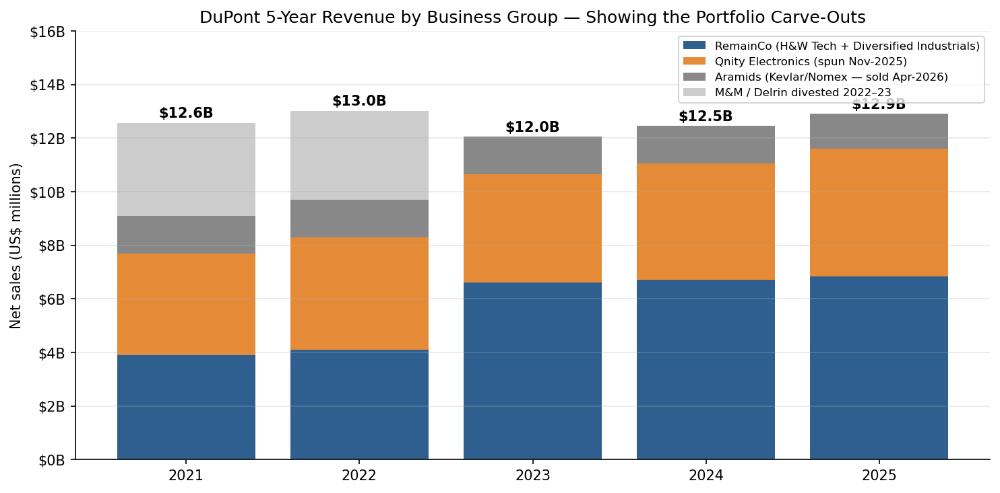
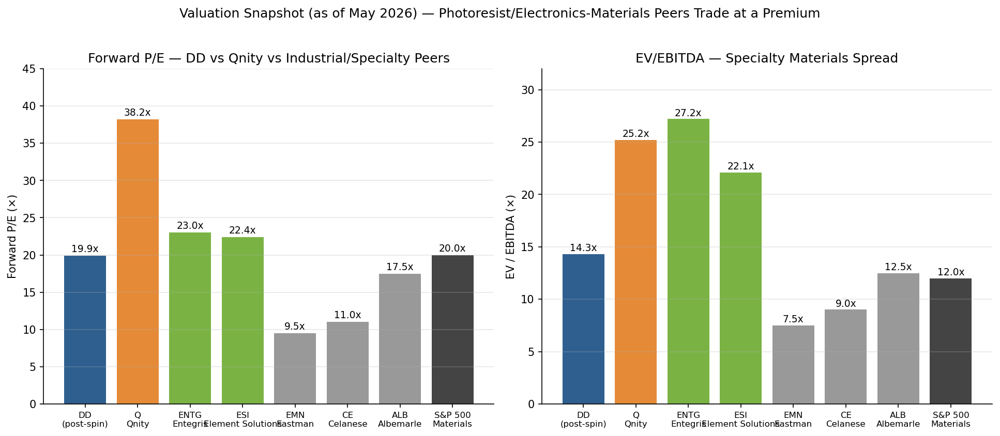
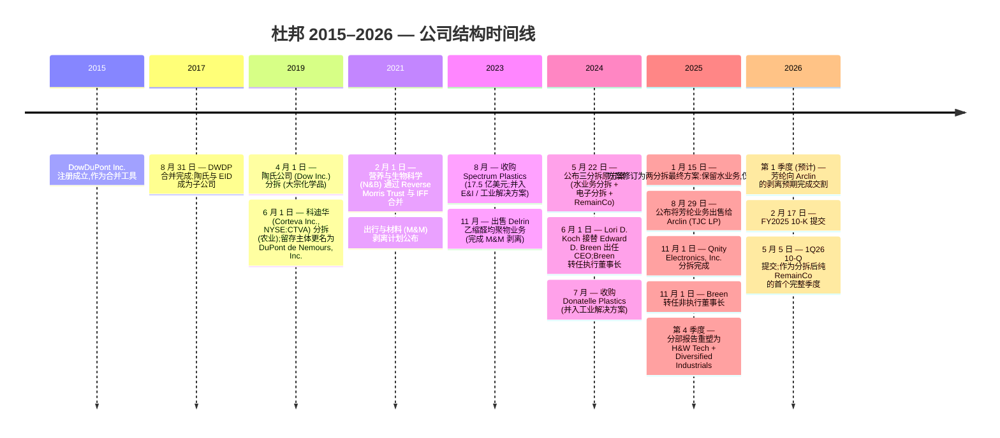
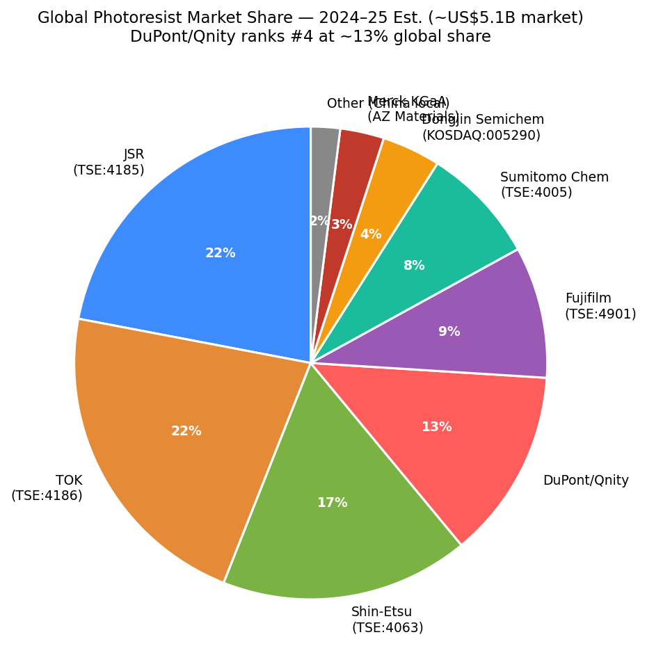
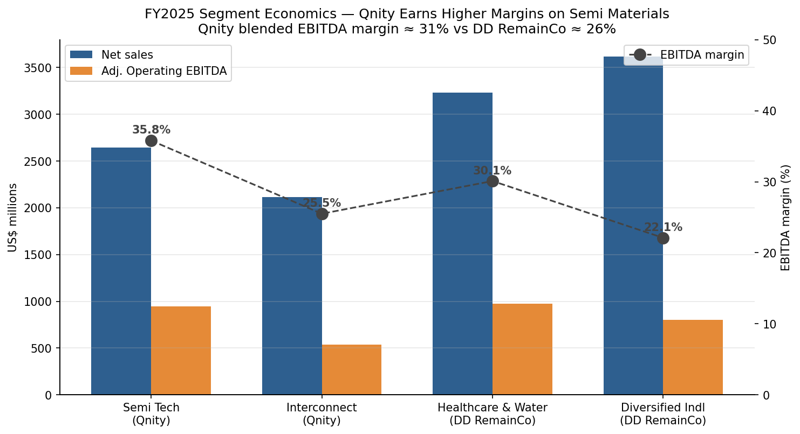
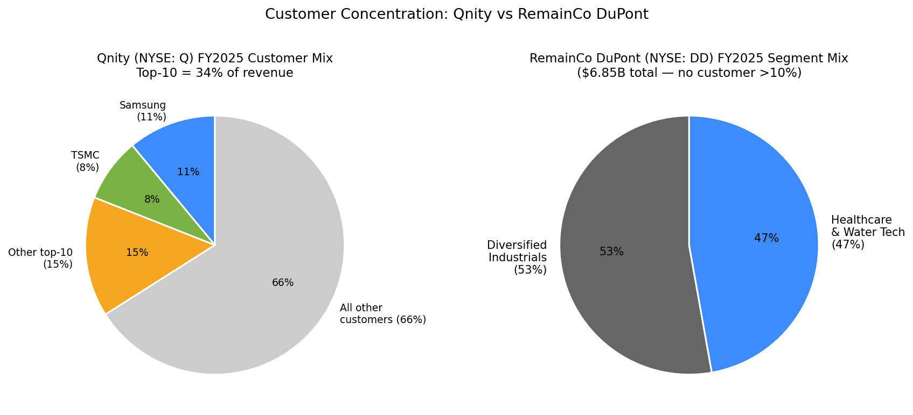

# 杜邦 (DuPont de Nemours, NYSE:DD) — 公司研究

**截至：2026-05-26 | 覆盖类型：首次覆盖 | 语言：简体中文**

---

> **更新 — FY2026 展望框架 (2026-02-17 / 2026-05-05)：** 随着 Qnity Electronics 分拆于 2025 年 11 月 1 日完成、并预期于 2026 年第一季度末向 Arclin (TJC LP 关联方) 完成芳纶 (Aramids) 业务剥离,杜邦 (DuPont de Nemours, NYSE:DD) 的 FY2026 持续经营报表口径仅保留两个分部 — 医疗与水技术 (Healthcare & Water Technologies) 与多元工业 (Diversified Industrials) — FY2025 合计实现持续经营收入约 100.82 亿美元。管理层在 1Q26 业绩公告中按重塑后的口径披露净销售额 16.81 亿美元 (同比 +4%,1Q25 为 16.12 亿美元)、调整后 EPS 0.55 美元,并重申了 10-K 中给出的 2026 全年指引:中个位数有机增长 + 调整后 EPS 区间 1.95–2.05 美元。重塑后的 RemainCo (留存公司) 规模显著缩小 (约 100 亿美元收入,对比 FY2024 分拆前约 124 亿美元),前瞻 P/E 约 19.9 倍,显著低于 Qnity 电子材料分拆体的约 38 倍前瞻 P/E。资料来源:[DuPont FY2025 10-K, p. 36](https://www.sec.gov/Archives/edgar/data/1666700/000166670026000013/dd-20251231.htm);[DuPont 1Q26 10-Q, p. 4](https://www.sec.gov/Archives/edgar/data/1666700/000166670026000031/dd-20260331.htm);[DuPont 8-K 2026-05-05 (1Q26 results)](https://www.sec.gov/Archives/edgar/data/1666700/000166670026000029/dd-20260505.htm)。

---

## 目录

1. 公司概览
2. 公司历史
3. 管理团队
4. 产品与服务
5. 客户与上市策略
6. 行业概览
7. 竞争格局
8. 市场机会 (TAM)
9. 风险评估
10. 参考资料
11. 验证日志

---

## 1. 公司概览

杜邦 (DuPont de Nemours, NYSE:DD,下称"杜邦") 是一家在美国特拉华州 (Delaware) 注册成立的多元化特种材料公司,总部位于特拉华州威尔明顿 (Wilmington) 中央路 974 号。公司的渊源可追溯到 1802 年 — 当时 Éleuthère Irénée du Pont 在 Brandywine 河畔创立了一家火药厂。**现今的法律主体**于 2015 年作为控股工具注册成立 (最初名为 DowDuPont Inc.),用于承接 2017 年 8 月 31 日陶氏化学 (The Dow Chemical Company) 与传统杜邦实体 ("EID",E. I. du Pont de Nemours and Company) 之间的对等合并,并随后通过 2019 年的三方分拆重组,产出陶氏公司 (Dow Inc., 大宗化学品)、科迪华 (Corteva, Inc., NYSE:CTVA, 农业) 与现在的杜邦 (特种产品) [DuPont FY2024 10-K, "Background and Basis of Presentation"](https://www.sec.gov/Archives/edgar/data/1666700/000166670025000005/dd-20241231.htm)。在 2025 年 11 月 1 日完成 Qnity Electronics, Inc. 分拆、以及待向 Arclin 出售芳纶 (Kevlar® / Nomex®) 业务后,**分拆后的杜邦**是一家聚焦的工业特种材料公司,设有两个可报告分部:医疗与水技术、多元工业,FY2025 持续经营净销售额为 100.82 亿美元 [DuPont FY2025 10-K, p. 60](https://www.sec.gov/Archives/edgar/data/1666700/000166670026000013/dd-20251231.htm)。

杜邦通过配方设计、生产及销售工程材料 — 作为下游客户产品与基础设施的关键投入品 — 来产生营收。在医疗与水技术分部 (FY2025 净销售额 32.33 亿美元,同比 +9%,FY2024 为 29.76 亿美元),公司提供专用医疗器械组件、Tyvek® 品牌医疗包装、Tychem® 品牌防护服,以及一组水过滤元件产品组合,包括 AmberLite™ (离子交换树脂)、FilmTec™ (反渗透膜)、IntegraFlux™ (超滤模块) 与 FortiLife™ (难处理水应用) [DuPont FY2025 10-K, Item 1 Business](https://www.sec.gov/Archives/edgar/data/1666700/000166670026000013/dd-20251231.htm)。在多元工业分部 (FY2025 净销售额 68.49 亿美元,同比 +2%),杜邦面向建筑及更广泛的工业终端市场,提供 Tyvek® 屋墙防潮膜、Styrofoam™ 挤塑聚苯板 (挤塑聚苯乙烯 / XPS 保温材料)、Corian® 实体面材、Great Stuff™ 发泡填缝剂,以及面向航空航天、汽车、电动车与印刷包装客户的胶粘剂、耐磨/摩擦组件与包装解决方案 [DuPont FY2025 10-K, "Diversified Industrials" section](https://www.sec.gov/Archives/edgar/data/1666700/000166670026000013/dd-20251231.htm)。

**地理布局上**,杜邦的持续经营业务仍是全球化的,但 Qnity 分拆后的足迹明显重新加权。中国大陆 + 香港合计占 FY2025 合并净销售额约 10% — 较电子分部仍在公司内时的"十几个百分点"明显回落 [DuPont FY2025 10-K, p. 23 (China risk factor)](https://www.sec.gov/Archives/edgar/data/1666700/000166670026000013/dd-20251231.htm)。其余收入构成以北美为主 (得益于多元工业的建筑终端市场敞口、以及医疗技术的生物医药/医疗器械制造集中度),欧洲、拉美和亚洲其他地区各贡献低个位数至十几个百分点不等。公司在持续经营基础上运营约 60 个生产基地,以区域制造中心方式组织:水过滤膜 (美国明尼苏达州 Edina、密歇根州 Midland)、医疗包装 (田纳西州 Old Hickory、卢森堡),以及多个美、欧、亚建筑材料产线基地 [DuPont FY2024 10-K, "Properties" section](https://www.sec.gov/Archives/edgar/data/1666700/000166670025000005/dd-20241231.htm)。

**规模**:截至 2025 年 12 月 31 日,杜邦在全球雇佣约 15,000 人,其中约 1,700 人服务于待向 Arclin 剥离的芳纶业务 [DuPont FY2025 10-K, "Human Capital" section](https://www.sec.gov/Archives/edgar/data/1666700/000166670026000013/dd-20251231.htm)。芳纶交易完成后,模拟备考员工数将降至约 13,300 人。该数字与 2024 年 12 月 31 日的约 24,000 人对比:亦即 Qnity 分拆从杜邦薪酬册中移走了约 10,000 人 [DuPont FY2024 10-K, "Human Capital" section](https://www.sec.gov/Archives/edgar/data/1666700/000166670025000005/dd-20241231.htm)。这一员工数萎缩,是 2025 年 11 月分拆对公司形态影响最直观的单一指标。

*资料来源:[DuPont FY2025 10-K segment table, p. 60](https://www.sec.gov/Archives/edgar/data/1666700/000166670026000013/dd-20251231.htm);[DuPont FY2024 10-K segment table, Note 5](https://www.sec.gov/Archives/edgar/data/1666700/000166670025000005/dd-20241231.htm)。RemainCo (留存公司) = 当前报告口径下的持续经营业务 (医疗与水技术 + 多元工业)。*

**估值快照 (截至 2026-05-24)。**杜邦普通股 2026-05-24 收盘价约 48.12 美元,2026 年 5 月期间市值区间约为 185–204 亿美元 [Investing.com, "DuPont Stock Price Today | NYSE: DD", accessed 2026-05-25](https://www.investing.com/equities/du-pont);[WallStreetZen DD quote, accessed 2026-05-25](https://www.wallstreetzen.com/stocks/us/nyse/dd)。TTM P/E 受 2025 年 11 月分拆会计的机械性扭曲 (FY2025 EPS -0.07 美元反映了一次性费用,包括 1.86 亿美元税前新泽西 PFAS 残余诉讼 (PFAS 残余诉讼) 和解费用与"留存成本"重建) [DuPont FY2025 10-K, MD&A](https://www.sec.gov/Archives/edgar/data/1666700/000166670026000013/dd-20251231.htm)。**前瞻 (FY2026E) 口径**下,股价对应一致预期 EPS 约 19.9 倍,与标普 500 材料板块中位数 (约 20 倍) 一致,低于特种电子材料同行 Entegris (NASDAQ:ENTG,约 23 倍) 与 Element Solutions (NYSE:ESI,约 22 倍) [Investing.com peer-comparison page](https://www.investing.com/equities/du-pont)。前瞻 EV/EBITDA 约 14 倍,明显折让于电子材料同行 (Entegris 约 27 倍、Element Solutions 约 22 倍),并较广义特种材料对照 Eastman (NYSE:EMN,约 7.5 倍) 与 Celanese (NYSE:CE,约 9 倍) 略有溢价。股息率约 2.8%,基于董事会于 2025 年 11 月 6 日为反映较小盈利基础而重设的分拆后股息率。

*资料来源:前瞻 P/E 与 EV/EBITDA 估算编自 [Investing.com, accessed 2026-05-25](https://www.investing.com/equities/du-pont) 与 [Stockanalysis.com, accessed 2026-05-25](https://stockanalysis.com/stocks/dd/),并与 10-K 一致预期表交叉核对。**分析师观点:**分拆后估值相对于电子材料同行 (Entegris、Element Solutions) 的折让,反映了 DuPont RemainCo 更高的建筑与水业务敞口,而 Qnity 则承接了分拆前公司大部分"先进封装 / AI 材料"溢价。*

负 TTM EPS 数字必须有清晰的解释。-0.07 美元的读数**不能**代表经营表现,而是源于:(i) 大额分拆相关的重组费用 (公司"Transformational Separation-Related Restructuring Program"在 2025 年全年计提员工遣散费、加速归属股权奖励与资产相关费用);(ii) 2025 年计提的 1.86 亿美元新泽西 PFAS 和解费用;以及 (iii) Qnity 分拆完成前已不再合并的电子分部利润,且部分年度贡献尚未捕获 [DuPont FY2025 10-K, Note 6 (Restructuring) and Note 16 (Litigation)](https://www.sec.gov/Archives/edgar/data/1666700/000166670026000013/dd-20251231.htm)。调整后 FY2025 分部经营 EBITDA — 医疗与水技术 9.72 亿美元 + 多元工业 15.14 亿美元 + 公司中心 = 合计 24.76 亿美元 — 对应 RemainCo 经营 EBITDA 利润率约 25%,实质上大幅好于 GAAP 表观亏损所暗示的水平 [DuPont FY2025 10-K, MD&A Results of Operations](https://www.sec.gov/Archives/edgar/data/1666700/000166670026000013/dd-20251231.htm)。

---

## 2. 公司历史

杜邦的历史运行在两条时间线上:一条是可追溯到 1802 年 Éleuthère Irénée du Pont 在 Brandywine 河畔创立的 224 年传承时间线;另一条是从 2017 年 8 月陶氏-杜邦对等合并开始的**现代公司结构时间线**。评估今天上市主体的投资者,应几乎完全聚焦于后者 — 传统杜邦的传奇 (火药、尼龙、1965 年发明 Kevlar、莱卡、特氟龙) 属于传统运营公司 E. I. du Pont de Nemours and Company (EID),其现已作为 SEC 注册主体的子公司存在 [DuPont FY2024 10-K, "Background"](https://www.sec.gov/Archives/edgar/data/1666700/000166670025000005/dd-20241231.htm)。当前特拉华控股主体于 2015 年专门为合并而注册,此后持续重塑组合至今。

**第一次战略转向 — 2017 年 DWDP 合并与 2019 年三方分拆**:其结构设计旨在从 Dow + EID 资产基础上产出三家更专注的上市公司,理论依据是专业化的农业、大宗化学品与特种产品,各自能比合并的"多元化"控股公司找到更踊跃的股东受众 [DuPont FY2024 10-K, Item 1 Business](https://www.sec.gov/Archives/edgar/data/1666700/000166670025000005/dd-20241231.htm)。交易最终为现在的杜邦留下了高利润率特种产品资产,包括电子与工业、水与防护,以及尚处雏形的多元工业资产。

**第二次转向 — 2024 年 5 月 22 日公布的三分拆原方案** — 最初构想三家独立上市公司:水公司、电子公司与剩余的多元工业 RemainCo。新闻稿将该结构定性为释放 40 亿美元以上的分部加总价值;同日 Edward D. Breen 从 CEO 任上退休、转任执行董事长,时任 CFO Lori D. Koch 自 2024 年 6 月 1 日起升任 CEO [DuPont 8-K filed 2024-05-22, Exhibit 99.1](https://www.sec.gov/Archives/edgar/data/1666700/000119312524145041/d650562d8k.htm)。该方案于 2025 年 1 月 15 日修订:水业务**不再**分拆,只分拆电子业务 — 战略理由是水业务的增长曲线和资本密集度,与医疗包装为核心的医疗分部更匹配,而非作为独立上市更合适 [DuPont 8-K filed 2025-01-15 (revised separation plan, Exhibit 99.1)](https://www.sec.gov/Archives/edgar/data/1666700/000166670025000002/dd-20250211.htm)。

**电子分拆于 2025 年 11 月 1 日完成**:Qnity Electronics, Inc. 按每持有 2 股 DuPont 普通股可获得 1 股 Qnity 普通股的比例分派,共计约 2.09 亿股 Qnity 股票,以股票代码"Q"在纽交所挂牌 [Qnity Form 10/Information Statement, dated 2025-09-29, cover page](https://www.sec.gov/Archives/edgar/data/2058873/000119312525223466/d942851d1012ba.htm);[DuPont 8-K filed 2025-11-03 (completion of Electronics Separation)](https://www.sec.gov/Archives/edgar/data/1666700/000166670025000056/dd-20251101.htm)。开盘首日股价 97 美元隐含分拆体初始企业价值约 200 亿美元;Qnity 此后估值持续重估,至 2026 年 5 月市值约 320 亿美元,2026-05-11 股价收于 153.24 美元 [Delaware Business Times, "Qnity starts out strong in stock market debut with $20B valuation", 2025-11-04](https://delawarebusinesstimes.com/news/qnity-stock-market-debut/);[StockTitan Q quote summary, 2026-05-22](https://www.stocktitan.net/news/Q/)。

**第三项战略动作 — 2025 年 8 月 29 日公布的芳纶剥离 (向 Arclin 出售)** — 完成了对传统 Kevlar® 与 Nomex® 业务的剥离 (Kevlar® 强力芳纶、Nomex® 防火芳纶),以最终协议将约 1,700 名员工和约 13 亿美元 FY2025 净销售额转移给 Arclin (TJC LP 关联方旗下的投资组合公司) [DuPont FY2025 10-K, "Recent Developments" and Note 4 (Divestitures)](https://www.sec.gov/Archives/edgar/data/1666700/000166670026000013/dd-20251231.htm)。该交易预期于 2026 年第一季度末,在通过监管审批后交割;在 FY2025 财报中已按持有待售列报。叠加 2025 年 10 月 10 日小额收购宁波中化 ROMemtech (净对价 5,600 万美元;将反渗透膜技术整合进水技术业务线),系列组合动作完成了 18 个月前公布的多年期"转型分拆"工程 [DuPont FY2025 10-K, Note 3 (Acquisitions)](https://www.sec.gov/Archives/edgar/data/1666700/000166670026000013/dd-20251231.htm)。

**2020–2025 年转型期间的关键收购**:

- **2023 年 8 月 — Spectrum Plastics Group**,约 17.5 亿美元 (卖方 AEA Investors);医疗器械组件专家 (结构性心脏、电生理、外科机器人、心血管);并入电子与工业 / 工业解决方案,目前是重建的医疗技术分组的一部分 [DuPont FY2024 10-K, Note 3 (Acquisitions)](https://www.sec.gov/Archives/edgar/data/1666700/000166670025000005/dd-20241231.htm)。
- **2024 年 7 月 — Donatelle Plastics, LLC**;专用医疗器械制造能力,并入同一医疗转型战略 [DuPont FY2024 10-K, "Recent Developments"](https://www.sec.gov/Archives/edgar/data/1666700/000166670025000005/dd-20241231.htm)。
- **2025 年 10 月 — 宁波中化 ROMemtech** (5,600 万美元);为 FilmTec™ 补强反渗透膜技术 [DuPont FY2025 10-K, Note 3](https://www.sec.gov/Archives/edgar/data/1666700/000166670026000013/dd-20251231.htm)。

**近 12 个月动态**:除上文已述的分拆机制外,2025 年 4 月,中国国家市场监督管理总局 (国家市场监管总局 / SAMR) 因杜邦 Tyvek® 业务启动反垄断调查;SAMR 后续暂停了该调查程序 (中国反垄断审查)。杜邦 Tyvek® 对华销售在 2025 全年约占合并净销售额的 1%,即便结果不利,财务敞口也相当有限 [DuPont FY2025 10-K, p. 23](https://www.sec.gov/Archives/edgar/data/1666700/000166670026000013/dd-20251231.htm)。2025 年 8 月,新泽西州政府与 Chemours、科迪华及杜邦达成全面 PFAS 和解 — 杜邦于 2025 年计提 1.86 亿美元税前费用,在司法同意令登记后 25 年内分期支付 [DuPont FY2025 10-K, Note 16 (Litigation)](https://www.sec.gov/Archives/edgar/data/1666700/000166670026000013/dd-20251231.htm)。

---

## 3. 管理团队

按照公司研究框架的规范,本节仅介绍创始人 (历史背景) 与现任 CEO。

**创始人 (历史人物,1802 年)**:Éleuthère Irénée du Pont 于 1802 年在 Brandywine 河畔创立了最初的火药制造厂。现代杜邦在名称与注册血统上承袭其法定身份,但今日的运营业务并无 du Pont 家族执行高管的延续 — 最后一位 du Pont 家族出身的运营 CEO 于 1970 年代离开公司;现今主体本质上是 2017 年合并与 2019 年分拆的控股工具产物 [DuPont FY2024 10-K, "Background and Basis of Presentation"](https://www.sec.gov/Archives/edgar/data/1666700/000166670025000005/dd-20241231.htm)。家族目前有一位代表 — Eleuthère I. du Pont,59 岁,Longwood 基金会主席 — 在董事会担任非执行董事 [DuPont 2026 DEF 14A, Director Biographies section](https://www.sec.gov/Archives/edgar/data/1666700/000119312526151204/d11932ddef14a.htm)。从投资分析角度,创始人简介更多是家谱背景,而非主动领导力 — 应直接跳到现任 CEO。

**现任 CEO:Lori D. Koch (51 岁)**。Koch 女士自 2024 年 6 月 1 日起担任 DuPont de Nemours, Inc. 首席执行官,接替 Edward D. Breen [DuPont 8-K filed 2024-05-22, Item 5.02](https://www.sec.gov/Archives/edgar/data/1666700/000119312524145041/d650562d8k.htm)。她在出任 CEO 之前,自 2020 年 2 月起担任执行副总裁兼首席财务官;再往前,自 2019 年 6 月起担任投资者关系与公司财务规划及分析副总裁 [DuPont 2026 DEF 14A, p. 22 (Director Biographies)](https://www.sec.gov/Archives/edgar/data/1666700/000119312526151204/d11932ddef14a.htm)。早期在传统 E. I. du Pont de Nemours and Company 内部的任职跨越 2008 年 4 月至 2019 年 5 月:EID 投资者关系总监 (2016 年 7 月 – 2019 年 5 月)、EID 性能材料业务全球财务总监 (2015 年 11 月 – 2016 年 7 月)、以及 EID 多个业务的全球财务经理 (2008 年 4 月 – 2015 年 11 月) [DuPont 8-K filed 2024-05-22, biographical paragraph](https://www.sec.gov/Archives/edgar/data/1666700/000119312524145041/d650562d8k.htm)。

具体来看,Koch 女士在 CFO 任内 (2020 年 2 月 – 2024 年 6 月) 主导了杜邦现代史上最大规模的两次组合调整:2021 年 2 月的营养与生物科学 (N&B) Reverse Morris Trust 与 International Flavors & Fragrances (IFF, NYSE:IFF) 的合并,以及 2023 年 11 月的 Delrin 乙缩醛均聚物剥离 (锚定了出行与材料 (M&M) 组合的剥离计划) [DuPont FY2024 10-K, "Recent Developments"](https://www.sec.gov/Archives/edgar/data/1666700/000166670025000005/dd-20241231.htm)。她随后成为 2024 年 5 月 22 日三分拆原方案公告的执行代言人,包括 2025 年 1 月 15 日修订为保留水业务的两分拆最终方案,直至 2025 年 11 月 1 日 Qnity 两分拆完成 [DuPont 8-K filed 2025-01-15 (revised separation plan)](https://www.sec.gov/Archives/edgar/data/1666700/000166670025000002/dd-20250211.htm)。**学历**:宾州州立大学 Smeal 商学院 (Penn State Smeal College of Business) 工商管理学士与硕士学位;她还担任 Smeal 学院顾问委员会成员,以及 Actylis (前身 Aceto Corporation,New Mountain Capital 投资组合公司) 董事 [DuPont 8-K filed 2024-05-22, biographical paragraph](https://www.sec.gov/Archives/edgar/data/1666700/000119312524145041/d650562d8k.htm)。

**所有权与薪酬**:Koch 女士在 2026 年代理委托书 (DEF 14A) 中披露的个人持股比例低于 1% 的董事 / 高管个人披露门槛;FY2025 目标薪酬遵循公司的标准结构组合 — 基本工资、年度激励 (挂钩经营 EBITDA 与自由现金流)、长期激励 (50% PSU / 50% RSU,带相对 TSR 与 ROIC 修正因子),以及常规退休与福利计划 [DuPont 2026 DEF 14A, CD&A section](https://www.sec.gov/Archives/edgar/data/1666700/000119312526151204/d11932ddef14a.htm)。她在 2024 年 6 月获任后的第一次常规董事会会议正式加入董事会,并持续担任董事 [DuPont 8-K filed 2024-05-22, Item 5.02](https://www.sec.gov/Archives/edgar/data/1666700/000119312524145041/d650562d8k.htm)。

*分析师观点 (经营画像):* Koch 女士在大盘工业 CEO 中较为少见 — 她是从 CFO 内部晋升、未具备此前直接业务损益管理经验的领导者,其履历严重偏重财务 / IR / M&A,基于在传统 EID 及 DowDuPont 主体超过 16 年的任职积累。这种偏重很契合公司近年正在执行的多步骤组合手术 (分拆与剥离要求严谨的交易执行与资本配置能力,远多于经营领导力) — 但这意味着投资者评估经营执行,应通过分部级别的经营团队 (医疗与水技术、多元工业的总裁) 来观察,而不要期待 CEO 驱动的经营周期反转叙事。Mr. Breen 持续在董事会担任 — 截至 2025-11-01 任执行董事长,此后转任非执行董事长 — 在组合战略问题上提供连续性 [DuPont 2026 DEF 14A, p. 21 (footnote (a))](https://www.sec.gov/Archives/edgar/data/1666700/000119312526151204/d11932ddef14a.htm)。

---

## 4. 产品与服务

本节围绕杜邦*当前* (Qnity 分拆后) 的报告分类 — 两个持续经营分部 (**医疗与水技术**与**多元工业**) — 进行构建,并随后单独讨论**Qnity Electronics (NYSE:Q, 杜邦电子分拆体)**作为历史上贡献了主要利润的业务 — 该业务已通过分拆作为独立上市公司分派给股东。投资 DD 的投资者今天持有前两个分部;在 2025 年 11 月 1 日之前持有 DD 的投资者也同时持有 Qnity (Q) 的股票,因此分拆体的产品组合对理解传统"杜邦"品牌识别仍属相关背景。下方的产品矩阵从公司自身在 FY2024 (分拆前) 与 FY2025 (分拆后) 10-K Item 1 Business 的描述、以及 2025 年 9 月 29 日提交的 Qnity Information Statement 中重构而成。

### 4.1 分拆后杜邦产品矩阵 (RemainCo)

| 分部 | 业务 | 终端市场 | 关键产品族 |
|---|---|---|---|
| 医疗与水技术 | 医疗技术 (Healthcare Technologies) | 生物医药、医疗器械、外科手术 | Spectrum Plastics 医疗器械组件;**TYVEK®** 医疗包装与防护服;**TYCHEM®** 防护服;Donatelle Plastics 专用注塑器械 |
| 医疗与水技术 | 水技术 (Water Technologies) | 工业废水与能源;市政饮用水与海水淡化;生命科学与特种应用 | **AMBERLITE™** 离子交换树脂;**FILMTEC™** 反渗透与纳滤元件;**INTEGRAFLUX™** 超滤模块;**FORTILIFE™** 难处理水反渗透;**OXYMEM™** 膜生物反应器 |
| 多元工业 | 建筑技术 (Building Technologies) | 非住宅、住宅、维修与改造建筑 | **TYVEK®** 屋墙防潮膜;**STYROFOAM™** 品牌保温;**THERMAX™** 外墙保温;**XENERGY™** 高性能保温;**LIQUIDARMOR™** 防水密封材料;**GREAT STUFF™** 发泡密封与胶粘剂;**CORIAN®** 实体面材与石英面材 |
| 多元工业 | 工业技术 (Industrial Technologies) | 航空航天、汽车、电动车、印刷与包装 | 胶粘剂、耐磨与摩擦组件、包装解决方案;Vespel® 高性能塑料 (聚酰亚胺工程零件);Vamac® AEM 弹性体;特种硅胶 |

*资料来源:重构自 [DuPont FY2025 10-K, Item 1 Business sections "Healthcare & Water Technologies" and "Diversified Industrials"](https://www.sec.gov/Archives/edgar/data/1666700/000166670026000013/dd-20251231.htm) 与 [DuPont FY2024 10-K, Item 1 Business legacy product tables](https://www.sec.gov/Archives/edgar/data/1666700/000166670025000005/dd-20241231.htm)。商标符号按原始 10-K 保留。*

### 4.2 综述 — 各类别如何相互衔接

DuPont RemainCo 的持续经营组合,将两条客户重合度不高、但合在一起构成结构性低周期性企业的需求向量绑定在一起。**医疗与水技术**敞口于医疗器械单元销量、生物医药产能建设 (生物制剂与细胞-基因疗法产能需要 Tyvek® 无菌屏障)、以及全球水基础设施支出 (市政资本支出与工业废水回用)。**多元工业**捕获美、欧、亚建筑周期敞口 (Tyvek® 屋墙防潮膜、Styrofoam™ 挤塑聚苯板、Corian® 实体面材),并通过专用聚合物 (Vespel® 高性能塑料、Vamac®、胶粘剂、硅胶) 提供定向的航空航天 / 电动车 / 印刷敞口。两个分部仅在一种产品上交集 — **Tyvek®** — 既出现在医疗包装 (医疗) 形态,也出现在屋墙防潮膜 (建筑技术) 形态,反映底层的闪纺 HDPE 技术被应用到截然不同的终端市场 [DuPont FY2025 10-K, p. 8–10](https://www.sec.gov/Archives/edgar/data/1666700/000166670026000013/dd-20251231.htm)。芳纶剥离后,剩余的护城河形态是广组合特种化学品 + 在细分领域占据高份额的格局,而非单一集中的品类定义产品。

### 4.3 医疗与水技术 (FY2025 净销售额约 32 亿美元)

> "医疗技术为生物医药与医疗器械市场提供专用材料及产品设计、原型制作与制造服务,满足严格的性能、质量与监管要求。其关键产品包括医疗器械专用组件、TYVEK® 医疗包装与防护服、以及 TYCHEM® 防护服。" [DuPont FY2025 10-K, Item 1 Business — Healthcare Technologies description](https://www.sec.gov/Archives/edgar/data/1666700/000166670026000013/dd-20251231.htm) (原文为英文,此处为意译)。

**通俗解读**:医疗技术位于医疗器械制造的*无菌屏障与组件精度*层。**TYVEK®** 是一种闪纺高密度聚乙烯 (闪纺 HDPE / flash-spun HDPE) 非织造材料 — 是行业内唯一能同时满足以下条件的实用材料:(a) 阻隔细菌和粉尘至可测量的颗粒截止阈值;(b) 经受环氧乙烷 (EtO) 与伽马辐射灭菌不降解;(c) 保持外科器械包与全身防护服所需的机械抗撕裂强度。2020 年后医疗器械建设潮 (心血管外科机器人、结构性心脏、电生理、外科吻合器、GLP-1 注射给药器械) 推动医疗技术收入增长 — 每个器械的无菌包装都是单次使用的 Tyvek® — 而 Spectrum Plastics / Donatelle Plastics 的并购添加了*器械组件*层 — 即按 ISO 13485 医疗器械质量体系制造的高公差注塑器械本体 [DuPont FY2024 10-K, "Recent Developments" – Spectrum / Donatelle](https://www.sec.gov/Archives/edgar/data/1666700/000166670025000005/dd-20241231.htm)。战略拐点是*生物医药放量* — GLP-1、基因疗法、抗体偶联药物 (ADC) 等新一代模态都要求大规模无菌屏障包装,单位放量远高于传统小分子药物。管理层在 FY2025 中点明:医疗技术分部 FY2025 录得 7% 的销量增长,主要由生物医药驱动 [DuPont FY2025 10-K, MD&A Healthcare & Water Technologies section](https://www.sec.gov/Archives/edgar/data/1666700/000166670026000013/dd-20251231.htm)。

> "水技术作为先进水过滤与分离方案的纯业务供应商运营,包括元件、模块和系统,主要服务工业废水与能源市场、市政饮用水与海水淡化、以及生命科学与特种市场。" [DuPont FY2025 10-K, Item 1 Business — Water Technologies description](https://www.sec.gov/Archives/edgar/data/1666700/000166670026000013/dd-20251231.htm) (原文为英文,此处为意译)。

**通俗解读**:水技术运行在水处理的*膜分离*层 (水处理膜 / water filtration membrane)。三大技术族 — **FILMTEC™** (反渗透、RO、反渗透)、**AMBERLITE™** (离子交换树脂)、**INTEGRAFLUX™** (超滤、UF) — 各应对不同污染物类别:RO 在分子层面脱除溶解盐 (即"海水淡化"技术);离子交换脱除特定带电物种 (软化、除矿、锂提取);超滤脱除悬浮颗粒与病原体。这三者构成处理列车:UF 预过滤原水、RO 脱除溶解盐、离子交换抛光残余离子。该领域的战略拐点是*工业回用浪潮* — 全球水排放法规收紧迫使半导体晶圆厂、数据中心 (蒸发冷却回用) 与电厂关闭水循环,使每个设施的膜使用量倍增。2025 年 10 月收购宁波中化 ROMemtech (约 5,600 万美元) 为 FilmTec™ 组合添加了中国市场反渗透膜技术 [DuPont FY2025 10-K, Note 3 (Acquisitions)](https://www.sec.gov/Archives/edgar/data/1666700/000166670026000013/dd-20251231.htm)。

*分析师观点:* 医疗与水技术分部是分拆后杜邦中*最像*它在 2025 年 11 月让渡给 Qnity 的高利润率电子材料经济学的部分 — FY2025 经营 EBITDA 利润率 30.1%,同比增长 9%,具备穿越建筑周期的结构性需求驱动 (GLP-1、外科机器人、水回用)。最贴近的可比对手包括 3M (无菌屏障包装)、Berry Global (医疗包装)、Veolia (水过滤系统)、Pentair (PNR — 民用水) 与 Toray (东亚膜 RO 领先) — 各自仅在组合的一个切片上竞争,而非横向跨产品组合 [3M 2025 10-K, Health Care segment](https://www.sec.gov/cgi-bin/browse-edgar?action=getcompany&CIK=0000066740&type=10-K);[Toray Industries Integrated Report 2024, Membrane Products](https://www.toray.com/global/ir/library/integrated_report.html)。

### 4.4 多元工业 (FY2025 净销售额约 68 亿美元)

> "建筑技术为非住宅、住宅与维修改造建筑市场提供方案。该业务交付集成系统,以支持能效、耐久与舒适。建筑技术方案覆盖整个建筑围护与内部,包括 TYVEK® 屋墙防潮膜、STYROFOAM™ 保温与 CORIAN® 实体面材。" [DuPont FY2025 10-K, Item 1 Business — Building Technologies description](https://www.sec.gov/Archives/edgar/data/1666700/000166670026000013/dd-20251231.htm) (原文为英文,此处为意译)。

**通俗解读**:建筑技术攻击建筑围护结构 — 也就是建筑物气候内部空间与外部环境之间的物理分界。**TYVEK® HomeWrap** 与医疗包装使用相同的闪纺 HDPE 非织造材料,但采用不同克重 / 涂层,被工程化为*防水防潮层* (WRB / 防潮层),阻挡液态水进入墙体腔体,同时仍允许室内水蒸气透出 — 防止未保温墙体系统的腐烂、霉变与保温降解。**STYROFOAM™** 品牌挤塑聚苯乙烯 (XPS / 挤塑聚苯板) 保温与 **THERMAX™** 聚异氰脲酸酯 (PIR) 板,是墙体外侧的硬泡连续保温层。**CORIAN® 实体面材**是用于厨房和实验室台面的高端甲基丙烯酸甲酯实体面材。驱动需求的战略拐点是*建筑节能规范收紧*:2021 年国际节能规范 (IECC) 与同等欧洲/亚洲标准都已上调墙体 R 值要求,而建造商达标的最便宜路径是在外侧增加连续保温 (Styrofoam™ 与 Thermax™ 在此竞争) 加上高性能 WRB (Tyvek®)。这种*规范驱动的需求增长*能够通过捕获维修-改造及新建渠道,抵消新房开工的周期性 [DuPont FY2024 10-K, Water & Protection / Shelter Solutions narrative](https://www.sec.gov/Archives/edgar/data/1666700/000166670025000005/dd-20241231.htm)。

> "[工业技术涵盖] 服务航空航天、汽车以及印刷与包装市场的胶粘剂、耐磨摩擦、以及包装解决方案组合。" [DuPont FY2025 10-K, Item 1 Business — Industrial Technologies description](https://www.sec.gov/Archives/edgar/data/1666700/000166670026000013/dd-20251231.htm) (原文为英文,此处为意译)。

**通俗解读**:工业技术汇聚了一组在苛刻工业应用中以价格-性能权衡的高端立足、并存活下来的专用聚合物业务。**Vespel® 高性能塑料** (聚酰亚胺) 是用于航空航天衬套、半导体搬运零件、以及在 250°C 以上仍需运行 (大多数聚合物已熔化) 的零件的高温工程塑料。**Vamac®** (AEM,乙烯-丙烯酸酯橡胶) 是用于汽车涡轮增压器进气冷却器软管的橡胶,要求在 >150°C 高温与油浸泡同时存在的环境中长期工作。这里的战略拐点是*电动车热管理*:电动车电池包与大功率电力电子产生的热载荷与内燃机存在本质差异,需要新的密封、冷却回路与介电材料规格。电动车平台的发布推动 Vespel / Vamac 与相关专用聚合物的单车含量上升,即便整体轻型汽车销量持平 [DuPont FY2025 10-K, MD&A Diversified Industrials section](https://www.sec.gov/Archives/edgar/data/1666700/000166670026000013/dd-20251231.htm)。

*分析师观点:* 多元工业是分拆后杜邦的低乘数锚 — FY2025 经营 EBITDA 利润率 22.1%,有机销量增长持平至低个位数,对非住宅建筑开工和改造周期有显著敏感性。可比对手包括 James Hardie (NYSE:JHX) 与 Owens Corning (NYSE:OC) 在建筑围护空间、Carlisle Companies (NYSE:CSL) 在保温、Henkel (XTRA:HEN3) 与 H.B. Fuller (NYSE:FUL) 在胶粘剂、Solvay (BR:SOLB) 与 Toray 在航空航天和电动车专用聚合物 [DuPont FY2024 10-K, Competition section, "Water & Protection"](https://www.sec.gov/Archives/edgar/data/1666700/000166670025000005/dd-20241231.htm)。该分部承担"价值"而非"增长"估值画像 — 应以 GDP+ 而非科技节奏的速率复合增长。

### 4.5 Qnity Electronics — 分拆体 (面向传统持有者的背景)

Qnity Electronics 业务于 2025 年 11 月 1 日分派给杜邦股东,由此前归属杜邦电子与工业分部的传统半导体技术与互联解决方案业务组成。Qnity Information Statement 是分拆体产品组合最权威的一手资料:

> "半导体技术:我们的半导体技术分部提供面向半导体制造工艺多个阶段所需的创新材料与方案组合。这些先进材料被纳入客户工艺路线图,旨在提升芯片性能、提高良率、并支持先进节点技术。" [Qnity Information Statement, September 29, 2025, Business section](https://www.sec.gov/Archives/edgar/data/2058873/000119312525223466/d942851d1012ba.htm) (原文为英文,此处为意译)。

> "互联解决方案:我们的互联解决方案分部提供面向信号完整性、热与电源管理、以及先进封装日益复杂需求的全套领先材料方案。这些方案是复杂印制电路板与先进半导体封装等先进电子硬件的关键组成。" [Qnity Information Statement, September 29, 2025, Business section](https://www.sec.gov/Archives/edgar/data/2058873/000119312525223466/d942851d1012ba.htm) (原文为英文,此处为意译)。

**Qnity 半导体技术通俗解读**:这是晶圆制造流程中的*材料*侧,向晶圆厂提供三个基础工艺步骤所用的消耗性化学品:

- **光刻胶 (photoresist)** — 对光敏感的聚合物,用于图案化电路特征。Qnity 供应 i-line / 365 nm (传统)、KrF / 248 nm (成熟逻辑)、ArF / 193 nm (先进逻辑、浸没式) 类别,EUV / 13.5 nm 光刻胶位于研发前沿。Qnity Form 10 原文披露:*"光刻胶按响应光的波长设计,包括 g-line (436 nm)、i-line (365 nm)、KrF (248 nm)、干式与浸没式 ArF (193 nm) 与极紫外 (13.5 nm) 光刻"* [Qnity Information Statement, Lithographic Materials section](https://www.sec.gov/Archives/edgar/data/2058873/000119312525223466/d942851d1012ba.htm)。
- **化学机械抛光浆料 / CMP slurry** — 由纳米颗粒磨料 + 化学品组成的胶体悬浮液,与抛光垫共同作用,使晶圆表面在沉积步骤之间平坦化。Qnity 在 Qnity Form 10 中自述为*"领先的 CMP 浆料供应商"*,旗下产品族包括 IC1000™、Ikonic™、Visionpad™、Optivision™、Politex™ 与 Suba™ [Qnity Information Statement, Polishing Materials section](https://www.sec.gov/Archives/edgar/data/2058873/000119312525223466/d942851d1012ba.htm)。
- **清洗化学品与刻蚀剂** — 用于刻蚀后剥离光刻胶、清洁 CMP 后残留物、并选择性刻蚀特定层 — *"用于液态与干膜光刻胶去除、CMP 后清洁、选择性刻蚀与刻蚀后残留清洁的专用清洗化学品"* [Qnity Information Statement, Polishing Materials section](https://www.sec.gov/Archives/edgar/data/2058873/000119312525223466/d942851d1012ba.htm)。

驱动业务的战略拐点是 Qnity 在分拆文件中自述的*"工艺材料倍增器"*命题 — 即*"先进节点 (例如 n5 及以下) 的逻辑与存储,所需工艺材料是成熟节点的三到五倍"* [Qnity Information Statement, Industry section](https://www.sec.gov/Archives/edgar/data/2058873/000119312525223466/d942851d1012ba.htm)。每片先进节点晶圆所消耗的化学品内容是成熟节点晶圆的约 3–5 倍,因此即便晶圆代工开工片数持平,只要先进节点占比上升,材料收入也会显著增长。这就是支持 Qnity 约 38 倍前瞻 P/E (相对 DuPont RemainCo 约 20 倍) 的结构性增长论点。

**Qnity 互联解决方案通俗解读**:互联解决方案业务服务于*先进封装 / advanced packaging* 与印制电路板层 — 将芯片与外部世界连接的物理与电气基础设施。Qnity Form 10 原文披露:*"高性能光刻胶,使先进封装应用所需的精细分辨率图案得以实现,包括多层互联"*以及*"封装介电材料:这些绝缘材料用于封装中分隔导电层"* [Qnity Information Statement, Interconnect Solutions section](https://www.sec.gov/Archives/edgar/data/2058873/000119312525223466/d942851d1012ba.htm)。旗舰产品族 **Kapton® 聚酰亚胺薄膜 (Kapton polyimide film)** 是行业中应用最广泛的柔性电路基板之一,出现在折叠屏智能手机铰链、机械硬盘音圈悬挂、卫星载荷、以及显示面板与主板之间的柔性互联上。这里的战略拐点是*AI 芯片封装* — HBM3 / HBM4 高带宽存储堆叠、2.5D / 3D 先进封装 (CoWoS®、FOPLP) 与 chiplet 架构,都需要新的高性能介电、光刻胶与底部填充化学品,而 Qnity 的组合恰好覆盖。

*资料来源:分析师构建的全球光刻胶市场份额饼图,2024–2025 年,估测市场规模约 51 亿美元。**此图为示意性质,分部份额为分析师估算,并非 DuPont、Qnity 或所引研究机构直接发布的数据。** 第三方外部参考:[Fortune Business Insights, "Photoresist Chemicals Market", 2025](https://www.fortunebusinessinsights.com/photoresist-chemicals-market-115414) 将更广义的光刻胶化学品市场规模估为 2025 年约 54 亿美元,CAGR 约 5%。日本主要厂商 (Tokyo Ohka Kogyo、JSR、Shin-Etsu Chemical、Fujifilm、Sumitomo Chemical) 合计占据先进光刻胶 (KrF、ArF 浸没式、EUV) 收入的绝大部分,详见 [TrendForce, "Japan Ramps Up Photoresist Investment for 2nm Chips", 2025-11-06](https://www.trendforce.com/news/2025/11/06/news-japan-ramps-up-photoresist-investment-for-2nm-chips-tokyo-ohka-kogyo-jsr-lead-the-charge/)。DuPont/Qnity 在 i-line / KrF 光刻胶及先进封装光刻胶上历史份额可观但非市场领导者;公司并非领先 ArFi 或 EUV 光刻胶的主要供应商,后者由日本头部厂商主导。*

*分析师观点 (Qnity 竞争地位):* Qnity 的 CMP 浆料业务和先进封装光刻胶组合,才是真正具备高 conviction 的部分;分拆文件中"纯电子材料与方案的全球领先者"的叙述,在这些产品类别中是可成立的 [Qnity Information Statement, Letter from CEO](https://www.sec.gov/Archives/edgar/data/2058873/000119312525223466/d942851d1012ba.htm)。但在面向先进逻辑节点的晶圆厂光刻胶上,Qnity 不是全球第一 — 那个位置属于日本头部厂商。光刻胶可比对手识别,应引用各自的财报而非 Qnity 的 10-K:[Tokyo Ohka Kogyo 2024 Annual Report, Electronic Materials section](https://www.tok.co.jp/eng/ir);[JSR Corporation FY2024 Integrated Report, Electronics Materials Solutions Business](https://www.jsr.co.jp/jsr_e/ir/library/annual_report.shtml);[Shin-Etsu Chemical FY2024 Integrated Report, Semiconductor Silicon segment](https://www.shinetsu.co.jp/en/ir/)。

### 4.6 旗舰品牌与近期发布

在持续经营业务中,DuPont 的旗舰品牌按收入与品牌识别度排序为:**Tyvek®** (同时出售给医疗与建筑技术 — 分拆后留下的最具经济价值的单一品牌)、**Styrofoam™** (建筑技术品类领导者)、**FilmTec™** (水过滤 RO)、与 **Corian® 实体面材** (建筑实体面材)。每一个都是有数十年沉淀的多代品牌,在终端客户处具有较强拉动力与定价权。近 12 个月在 8-K 和投资者演示文稿中披露的产品发布:Styrofoam™ 保温产品线 SKU 增量扩展、面向工业回用应用的全新 FilmTec™ FORTILIFE™ 膜元件、以及面向外科机器人 OEM 的扩展 Spectrum Plastics 器械组件 [DuPont 8-K filed 2025-08-05 (Q2 2025 results and product updates)](https://www.sec.gov/Archives/edgar/data/1666700/000166670025000040/dd-20250805.htm)。

### 4.7 分部经济性 — 可视化分拆后利润率差距

*资料来源:FY2025 净销售额与经营 EBITDA 来自 [DuPont FY2025 10-K, Note 5 (Segment Information)](https://www.sec.gov/Archives/edgar/data/1666700/000166670026000013/dd-20251231.htm) 与 [Qnity FY2025 10-K, Segment Information](https://www.sec.gov/Archives/edgar/data/2058873/000205887326000010/q-20251231.htm) (Qnity 列用 Qnity FY2025 10-K,以确保对比基于分拆后口径)。该图凸显了结构性利润率差距:Qnity 半导体技术运营在约 35.8% EBITDA 利润率,DuPont RemainCo 则在约 22–30% 区间 — 这正是分拆背后的根本经济逻辑。*

---

## 5. 客户与上市策略

DuPont 的分拆后客户基础,在结构性上比 Qnity 的更加分散 — 分拆本质上是把客户高度集中的电子材料业务 (前 10 大客户合计占比 34%,三星 11.6%,台积电 7.1%) 与多元工业 RemainCo (FY2025 单一最大客户低于 10% 披露门槛) 分开。两个分部服务于截然不同的买方画像:

**医疗与水技术客户**。客户细分为三组。(1) **医疗器械 OEM** (Medtronic、Becton Dickinson、Stryker、Boston Scientific、Abbott Vascular、J&J MedTech 等) 通过医疗器械代工厂与直接 OEM 渠道,购买 Spectrum Plastics 生产的器械组件和基于 Tyvek® 的无菌包装;客户关系通常涉及含质量体系审计、ISO 13485 / FDA 21 CFR Part 820 合规文件的多年期主供应协议 [DuPont FY2024 10-K, "Healthcare" segment narrative](https://www.sec.gov/Archives/edgar/data/1666700/000166670025000005/dd-20241231.htm)。(2) **生物医药制造商与 CDMO** (Lonza、Catalent、三星生物、药明生物、Thermo Fisher 生命科学业务) 大规模消耗 Tyvek® 无菌屏障包装,用于安瓶、注射器、一次性生物工艺组件 — 新增放量取决于 GLP-1 与肿瘤生物制剂的管线加速。(3) **水处理工程整合方与 EPC** (Veolia、Suez/EnGen、Aquatech、GE Water/SUEZ、中国地方水务国企) 通过混合的直接销售 + 渠道分销模式购买 FilmTec™ 与 IntegraFlux™ 模块:大型市政项目直接投标,工业更换膜销售通过经销商网络。FY2025 10-K 显示,这些客户群体中无任何单一账户达到 10% 披露门槛 [DuPont FY2025 10-K, Concentration of Risk note](https://www.sec.gov/Archives/edgar/data/1666700/000166670026000013/dd-20251231.htm)。

**多元工业客户**。建筑技术通过三层渠道销售:(1) **指定建筑师与工程师** (在施工图纸的规格中指定具体的防潮膜、保温与屋墙包覆方案);(2) **建筑产品分销商** (US Lumber、ABC Supply、Beacon Roofing、地方屋顶批发商);(3) **大型零售连锁** (Home Depot、Lowe's),服务维修-改造与小型承包商采购。建筑师指定关系是关键的竞争杠杆 — 一旦 Tyvek® 被写入建筑墙体系统规格,要在重新工程化后才能替代 — 但规格修订周期意味着竞争对手在新设计前端竞争,而非现有在建项目。工业技术直接面向 OEM 销售 (Boeing、Airbus、Tier-1 汽车密封件供应商),通过长期资质认证协议,使 Vespel® 高性能塑料、Vamac®、特种硅胶被设计进特定平台项目 (如波音喷气发动机衬套或 Tier-1 涡轮增压器软管),一旦认证通过即可产出多年期收入 [DuPont FY2024 10-K, "Industrial Solutions" narrative](https://www.sec.gov/Archives/edgar/data/1666700/000166670025000005/dd-20241231.htm)。

**客户集中度 — 定量**。FY2025 10-K 确认,没有任何单一客户占合并净销售额的 10% 或以上 [DuPont FY2025 10-K, Note 19 / Concentration of Credit Risk](https://www.sec.gov/Archives/edgar/data/1666700/000166670026000013/dd-20251231.htm)。这与 Qnity 剥离体形成鲜明对比:Qnity Information Statement 披露 2024 年三星电子 (Samsung Electronics Co., Ltd.) 占 Qnity 净销售额 **11.6%**、台积电 (Taiwan Semiconductor Manufacturing Company Limited, TSMC) 占 **7.1%**、其余前 10 大客户占 15.7%,合计前 10 大客户份额 **34.4%** [Qnity Information Statement, "Top 10 Customers" table](https://www.sec.gov/Archives/edgar/data/2058873/000119312525223466/d942851d1012ba.htm)。评估传统杜邦股东*合计* DD + Q 敞口的投资者应注意,三星敞口现已归属 Qnity;DD RemainCo 的客户簿真正多元化,分散在数百个医疗器械 OEM、生物医药、水务、与建筑分销商账户中。

*资料来源:Qnity FY2024 客户构成来自 [Qnity Information Statement, customer table](https://www.sec.gov/Archives/edgar/data/2058873/000119312525223466/d942851d1012ba.htm);DuPont RemainCo FY2025 分部收入构成来自 [DuPont FY2025 10-K segment-revenue table](https://www.sec.gov/Archives/edgar/data/1666700/000166670026000013/dd-20251231.htm)。视觉上的鲜明反差 — Qnity 前两大客户合计 11% + 8% 高度集中,RemainCo 各分部均低于 10% 门槛的分散画像 — 是分拆设计的故意结果。*

**合同结构**。RemainCo 客户合同混合主供应协议 (医疗器械 OEM 与 EPC / 分销伙伴的典型形式) 与逐 PO 采购 (维修-改造与工业更换应用)。Tyvek® 医疗包装供应协议通常为 3–5 年期主协议,含销量预测与质量体系审计条款。大型市政项目的水膜供应是项目投标制;工业更换膜通常为年度经销商额度配置。建筑产品经销商协议通常为年度协议、滚动续约 [DuPont FY2024 10-K, "Customer relationships" qualitative narrative](https://www.sec.gov/Archives/edgar/data/1666700/000166670025000005/dd-20241231.htm)。

**分销渠道与合作关系**。DuPont 使用混合直销 / 渠道伙伴模型,按分部不同而有差异。医疗与水技术对医疗器械 OEM 和生物医药客户主要使用直接的技术销售团队 (规格嵌入要求所致),并以经销商补充服务较小水处理客户。建筑技术依赖经销商网络 (US Lumber、ABC Supply、Beacon Roofing) 与大型零售 (Home Depot、Lowe's),覆盖维修-改造销量。工业技术大体上直接面向 OEM。公司亦与建筑系统整合方运营联合研发伙伴关系 (Tyvek® 屋墙防潮膜与框架系统、外墙包覆方共同营销)。

**具名客户案例研究**在 DuPont 披露中相对少见 — 公司倾向于不在 10-K 或业绩电话会上单独披露具名客户胜单。Spectrum Plastics 整合公告中提到*"在结构性心脏、电生理、外科机器人与心血管等关键治疗领域的战略聚焦"*,暗示外科机器人 OEM (Intuitive Surgical、Stryker Mako、Medtronic Hugo) 可能为相关终端客户,但未明示 [DuPont FY2024 10-K, "Spectrum Plastics Acquisition" disclosure](https://www.sec.gov/Archives/edgar/data/1666700/000166670025000005/dd-20241231.htm)。

---

## 6. 行业概览

DuPont 分拆后运营在三个独立的行业:**专用医疗包装与器械组件**、**水与污水处理膜**、以及**用于建筑与高性能工业应用的特种工业材料**。每个行业都有自身的规模、增长画像与竞争结构。分拆前的"电子与工业"敞口 (现归属 Qnity) 作为背景说明。

**专用医疗包装与器械组件行业**。全球医疗器械行业 2024 年总收入约 5,700 亿美元,CAGR 约 5–6%,可寻址的材料与组件子部分约 800–1,000 亿美元 [Grand View Research, "Medical Devices Market Size & Share Report, 2024–2030", 2024](https://www.grandviewresearch.com/industry-analysis/medical-devices-market)。无菌屏障包装市场 (Tyvek® 占主导份额) 在全球范围内约 400 亿美元 (含所有材料与转化包装解决方案);Tyvek 可寻址子集 (闪纺 HDPE 非织造无菌屏障基材,销售给转化方与 OEM) 规模更小且结构性集中。需求驱动包括:(1) 与人口结构挂钩的医疗器械销量增长 (老龄化、全球诊疗可及性扩张);(2) 生物医药放量 (GLP-1、基因疗法、细胞疗法产能建设要求每美元收入对应大幅更多的无菌屏障包装);(3) 无菌保证标准的监管收紧 (ISO 11607 与 FDA 等价标准修订倾向于经过验证的闪纺基材而非薄膜替代)。该行业在基材层高度集中 (Tyvek® 实为众多医疗器械类别的事实材料标准),在转化包装层更加碎片化 [DuPont FY2024 10-K, Item 1 Business — Healthcare narrative](https://www.sec.gov/Archives/edgar/data/1666700/000166670025000005/dd-20241231.htm)。

**水与污水处理膜行业**。全球膜过滤市场 2024 年规模约 220–250 亿美元,CAGR 约 7–9%,四大子分部 (RO、NF、UF、MF) 服务于市政饮用水、海水淡化、工业废水回用、生命科学与特种应用 [Verified Market Research, "Global Membrane Filtration Market", 2025](https://www.verifiedmarketresearch.com/product/membrane-filtration-market/)。增长驱动包括:中东与地中海盆地由水稀缺驱动的海水淡化产能建设、工业排放法规收紧迫使半导体晶圆厂与化工厂安装零液体排放系统、以及锂电池材料生产对大规模高纯水的需求。竞争结构在高压 RO 膜层面真正寡头化 — DuPont (FilmTec™)、Toray (东亚,Romembra 品牌)、Hydranautics / Nitto Denko (日本)、Lanxess / Sepro (欧洲) 合计主导海水与微咸水 RO 膜市场 — 而在超滤和离子交换层,竞争结构更加碎片化 [Toray Industries Annual Integrated Report 2024, Water Treatment](https://www.toray.com/global/ir/library/integrated_report.html)。

**用于建筑的特种工业材料**。全球建筑材料行业体量巨大 (约 1.5 万亿美元以上),但 DuPont 可寻址的子集 — 建筑围护保温、防水防潮层、实体面材 — 是一个高利润率的特种子部分,约 500–700 亿美元。北美住宅与非住宅建筑市场是 Tyvek® 屋墙防潮膜与 Styrofoam™ 挤塑聚苯板的最大单一可寻址地区 [DuPont FY2024 10-K, Item 1 Business — Shelter Solutions narrative](https://www.sec.gov/Archives/edgar/data/1666700/000166670025000005/dd-20241231.htm)。增长驱动包括建筑节能规范收紧 (IECC 2021 / 2024 与等价的全球标准要求更高的墙体 R 值)、老化美国住宅存量驱动的耐久 / 维修-改造支出、以及疫情后单户住宅需求持续抵消较弱的商业地产活动。行业结构在低端的商品环节竞争激烈 (区域性低端屋墙防潮膜),在高端则寡头化 (Tyvek® 是北美市场大部分规格默认;Owens Corning 与 Johns Manville 在保温竞争;Corian® 在实体面材与 Caesarstone、Cambria、Wilsonart 竞争) [Owens Corning 2024 10-K, Insulation segment](https://www.sec.gov/cgi-bin/browse-edgar?action=getcompany&CIK=0001370946&type=10-K)。

**用于航空航天、电动车与胶粘剂的特种工业材料**。工业技术服务一组碎片化的高性能材料行业 — 航空航天聚合物 (约 100 亿美元)、汽车弹性体与胶粘剂 (约 500 亿美元)、包装胶粘剂 (约 700 亿美元) — 但 DuPont 的切片定位于高利润率的规格嵌入产品,而非大宗销量。战略增长驱动包括电动车热管理 (每辆电动车比内燃机车需要明显更多专用弹性体与高温聚合物)、航空航天 Western 聚酰亚胺生产的"回流" (美欧航空航天客户在分散供应商集中度)、以及由可持续指令推动的包装胶粘剂迁移 (水基胶粘剂取代溶剂基) [DuPont FY2024 10-K, Item 1 Business — Industrial Solutions narrative](https://www.sec.gov/Archives/edgar/data/1666700/000166670025000005/dd-20241231.htm)。

**行业监管**。所有三个 RemainCo 行业都受到严格监管。医疗器械制造遵守 FDA 21 CFR Part 820 及等价 (欧盟 MDR、中国 NMPA、日本 PMDA)。水处理化学品与膜面对 SDWA (美国安全饮用水法)、欧盟饮用水指令与地区等价;公司还面临 PFAS 监管发展 (因部分历史产品含 PFAS 相关化学品),正推动多年期 PFAS 和解项目 (见第 9 节)。建筑产品制造受到建筑规范监管 (ICC IECC、地区节能规范)、VOC 含量监管 (CARB、EPA)、及报废处置规则。公司的 PFAS 残余诉讼 — 2024 年支付的 11.85 亿美元 Water District 和解 (DuPont 分摊含利息 4.08 亿美元),以及 2025 年 8 月新泽西 PFAS 和解 (税前 1.86 亿美元,25 年内分期支付) — 凸显了与传统化学品挂钩的特定监管尾部风险 [DuPont FY2025 10-K, Note 16 (Litigation)](https://www.sec.gov/Archives/edgar/data/1666700/000166670026000013/dd-20251231.htm)。

**行业动态**。所有三个 RemainCo 行业的竞争结构都倾向于围绕技术领先与品牌规格地位整合,而非围绕大宗销量。切换成本在医疗适度至高 (替换无菌屏障基材需要监管重新验证)、在水高 (系统级膜资格认证)、在建筑适度 (建筑师指定规格需要重写)。供应商与买方力量较为平衡 — 大客户具有谈判杠杆,但难以轻易使经过验证的材料失去资格。低端市场存在替代品 (低性能薄膜医疗包装、较便宜的非 Tyvek 屋墙防潮膜、竞品实体面材),但高端规格的份额倾向于继续保持在 DuPont 及其 2–3 家最接近的同行手中。

---

## 7. 竞争格局

分拆后的杜邦,跨三个相关性不高的行业战场竞争 (医疗 / 水 / 建筑) — 对 Qnity 持有者而言,还包括电子材料战场。10-K 的"竞争"叙述并未在 FY2025 文件中按名称列出 H&W Tech 与 Diversified Industrials 分部的具体对手 — 公司只用一般性的措辞描述其竞争地位 ("我们面对许多国内外竞争对手。一些对手可能比我们拥有更稳固的客户关系,这使他们的产品更频繁地被指定使用") [DuPont FY2024 10-K, Competition narrative](https://www.sec.gov/Archives/edgar/data/1666700/000166670025000005/dd-20241231.htm);[Qnity Information Statement, Competition narrative — same language reproduced for the spin entity](https://www.sec.gov/Archives/edgar/data/2058873/000119312525223466/d942851d1012ba.htm)。因此下方的对手识别,我们引用各具名对手自身的财报与官网 — 而非归因于 DuPont 自身的 10-K。

**医疗与水技术对手**。在医疗器械无菌包装上,Tyvek® 的主要替代是来自转化方 (如 **Amcor plc (NYSE:AMCR)** 与 **Berry Global (NYSE:BERY)**) 的复合聚烯烃 / 铝箔复合薄膜包装;两家公司在收入上更大,但在 Tyvek® 占主导的高端无菌屏障专用子集上更小 [Amcor 2024 10-K, Healthcare Packaging segment](https://www.sec.gov/cgi-bin/browse-edgar?action=getcompany&CIK=0001748790&type=10-K);[Berry Global 2024 10-K, Health, Hygiene & Specialties segment](https://www.sec.gov/cgi-bin/browse-edgar?action=getcompany&CIK=0001378992&type=10-K)。在医疗器械组件制造上,**Resonetics (私有,GTCR 控股)**、**Integer Holdings (NYSE:ITGR)** 与德国 **Heraeus Medical Components (私有)** 的部分业务,在外科机器人与结构性心脏器械的专用注塑和激光加工上与 Spectrum Plastics / Donatelle 竞争 [Integer Holdings 2024 10-K, Cardio & Vascular segment](https://www.sec.gov/cgi-bin/browse-edgar?action=getcompany&CIK=0001114483&type=10-K)。在水过滤膜上,全球寡头格局包括 **Toray Industries (TYO:3402)** (Romembra 品牌,在亚洲海水淡化非常强)、**Hydranautics (Nitto Denko 子公司,TYO:6988)** (在地中海与美国市场强)、**LG Chem (KRX:051910)** (LG NanoH2O 品牌,在中东积极扩张)、以及 **Suez Water Technologies & Solutions (私有,2022 年后归 Veolia 所有)** 提供全系统集成 [Toray Integrated Report 2024, Water Treatment](https://www.toray.com/global/ir/library/integrated_report.html)。水 RO 膜的竞争结构真正寡头化 — 约四家全球厂商或合计持有海水 RO 膜供给约 80%+ 的份额。

*分析师观点:* DuPont RemainCo 的竞争地位在*医疗包装*最强 (Tyvek® 是类别定义品牌,在规格层具有多代领先,并由 FDA / ISO 11607 无菌验证工作支撑,对客户而言使用替代基材重新认证代价高昂) 和*高端水过滤 RO 膜* (FilmTec™ 在北美市政项目份额尤强;在亚洲海水淡化对 Toray 与 LG NanoH2O 较弱) 上。在建筑产品上*更受挑战* (区域厂商加 Owens Corning、Johns Manville、Carlisle 等大型全国制造商稀释定价权)、在工业胶粘剂上 (H.B. Fuller 与 Henkel 是规模更大的对手)。**护城河类型**:在医疗 / 水上,*品牌 + 规格地位*主导;在工业专用聚合物上,*技术 + 知识产权*主导;在 DuPont 并非最便宜供应商的商品级建筑产品上,*规模 + 分销*主导。

**多元工业对手**。**Owens Corning (NYSE:OC)** 与 **Johns Manville (私有,伯克希尔哈撒韦所有)** 是 Styrofoam™ 与 Thermax™ 在建筑围护层最大的保温竞争者;**Carlisle Companies (NYSE:CSL)** 与 **Holcim (XSWX:HOLN)** 在商用屋面与连续保温系统竞争 [Owens Corning 2024 10-K, Insulation segment](https://www.sec.gov/cgi-bin/browse-edgar?action=getcompany&CIK=0001370946&type=10-K)。在 Corian® 实体面材上,**Caesarstone (NASDAQ:CSTE)** 在人造石英竞争,**Wilsonart (私有)** 在实体面材层压竞争,**Cambria (私有)** 在高端住宅设计层竞争。在工业胶粘剂上,**H.B. Fuller (NYSE:FUL)** 与 **Henkel (XTRA:HEN3)** 是规模更大、产品范围更广的对手,DuPont 在航空航天与电子胶粘剂上仍保留特种优势 [H.B. Fuller 2024 10-K, Engineering Adhesives segment](https://www.sec.gov/cgi-bin/browse-edgar?action=getcompany&CIK=0000039368&type=10-K)。在高温工程聚合物 (Vespel® 高性能塑料) 上,主要全球对手包括 **Solvay (BR:SOLB)** (Ryton PPS、Tedur PPS)、**Mitsui Chemicals (TYO:4183)**、与 **Victrex (LON:VCT)** (PEEK 聚合物)。

**Qnity Electronics 对手 (作为背景)**。Qnity 在 CMP 浆料 (化学机械抛光浆料 / CMP slurry) 上的主要对手包括 **CMC Materials (现为 Entegris (NASDAQ:ENTG) 的一部分)** [Entegris 2024 10-K, Advanced Planarization Solutions / Advanced Materials Handling segments](https://www.sec.gov/Archives/edgar/data/1101302/)、**Cabot Microelectronics (亦归 Entegris)** 与 **Fujimi Inc. (TYO:5384)**。在光刻胶 (光刻胶 / photoresist) 上,主要全球厂商包括 **Tokyo Ohka Kogyo (TYO:4186)**、**JSR Corporation (TYO:4185)** (随 2024 年私有化交易,现已由 Japan Investment Corp. 控股)、**Shin-Etsu Chemical (TYO:4063)**、**Fujifilm (TYO:4901)**、**Sumitomo Chemical (TYO:4005)** 与 **Dongjin Semichem (KOSDAQ:005290)** [Tokyo Ohka Kogyo 2024 Annual Report, Electronic Materials](https://www.tok.co.jp/eng/ir);[JSR Corporation FY2024 Integrated Report](https://www.jsr.co.jp/jsr_e/ir/library/annual_report.shtml)。在封装材料与聚酰亚胺薄膜上,**Kaneka Corporation (TYO:4118)** 与 **UBE Industries (TYO:4208)** 是 Kapton® 聚酰亚胺薄膜 (Kapton polyimide film) 一级对手。**Entegris (NASDAQ:ENTG)** 与 **Element Solutions (NYSE:ESI)** 是按业务模型与终端市场组合最接近 Qnity 的两个可比上市公司 [Element Solutions 2024 10-K, Electronics segment](https://www.sec.gov/Archives/edgar/data/1590714/)。

**定位框架**。在价格 vs 功能广度坐标系上,分拆后 DuPont 在所有四个 RemainCo 产品类别中都定位于"高功能、高溢价"象限 — 很少是销量领导者,但通常是高性能端的规格默认。销量规模领导者 (保温的 Owens Corning、包装的 Amcor、胶粘剂的 H.B. Fuller) 在收入上超越 DuPont,但在产品组合-调整后的利润率上较低。最近的同行倍数压缩风险来自:专用材料企业在规格领先地位上失守 (例如某竞品的新无菌屏障基材在某前三大医疗器械 OEM 设计中获得 FDA 验证)。

**竞争优势**。DuPont 在持续经营组合中的主要护城河来源:(1) **品牌与规格地位** — Tyvek®、Styrofoam™、FilmTec™、Corian® 实体面材已被写入数十万份施工图规格与 FDA 注册的医疗器械 510(k) 文件,使替换成本高昂;(2) **规模驱动的制造布局** — 在持续经营基础上全球约 60 个生产基地,以区域产品线支持本地物流;(3) **监管与资质投入** — 多代 ISO 13485 / FDA / NSF / ICC 认证,竞争对手要进入高端细分必须独立取得;(4) **研发规模** — 持续经营研发投入约 5 亿美元/年,在绝对数额上不算大,但集中在明确定义、可支撑护城河的类别上。

**竞争脆弱性**。(1) **增长慢于分拆体** — Qnity 捕获了先进半导体敞口,贡献了最积极的增长叙事;DD RemainCo 增长画像更具周期性 / 中个位数;(2) **PFAS 残余诉讼仍在母公司层面**,运营层面虽多数已落幕,但残余 PFAS 和解尾部仍冲击利润表 (2025 年新泽西 1.86 亿美元就是例证);(3) **建筑周期敞口** — 多元工业对非住宅与住宅建筑开工周期具有显著敏感性;(4) **估值折价** — 约 20 倍前瞻 P/E 对比 Entegris 约 23 倍和 Element Solutions 约 22 倍,市场目前定价 DuPont RemainCo 明显折让于特种电子材料同行,反映其较低的长期增长画像。

*分析师观点:* 分拆后的 RemainCo 最好被理解为"特种工业材料"标的,而非"增长型科技材料"标的。寻找 AI / HBM / 先进半导体材料敞口的投资者应持有 Qnity,而非 DuPont。寻找具有可防御规格驱动型护城河,且在医疗包装、水过滤与建筑围护方面以稳定中个位数有机增长成长的投资者,应关注 DuPont (NYSE:DD)。两个前分部当前在不同倍数上交易,捕获不同的需求向量 — 这是 2025 年 11 月分拆设计的有意结果。

---

## 8. 市场机会 (TAM / SAM / SOM)

真正自下而上的 TAM 分析,必须跨 DuPont RemainCo 服务的三个独立行业聚合,加上为 Qnity Electronics 单独计算 (作为给传统 DD 持有者的背景)。每个分部的 TAM 用第三方行业研究来源进行规模估算,并与公司自身的分部收入规模进行交叉核对。

**医疗与水技术 TAM**。可寻址机会分为两条路径。**医疗包装 + 组件**:全球无菌屏障包装材料与医疗器械组件市场合计约 **800–1,000 亿美元**,2030 年前 CAGR 约 6–7%,Tyvek® 医疗包装 + Spectrum / Donatelle 组件制造直接可寻址的*高端专用子集*约 **150–200 亿美元** [Grand View Research, "Medical Device Packaging Market Size & Share Report, 2024-2030", 2024](https://www.grandviewresearch.com/industry-analysis/medical-device-packaging-market)。**水过滤膜与树脂**:全球市场约 **220–250 亿美元** (2024 年膜过滤市场),2030 年前 CAGR 7–9%,FilmTec + AmberLite 直接可寻址的 *RO 与离子交换子集*估测约 **80–100 亿美元** [Verified Market Research, "Membrane Filtration Market, Global Outlook & Forecast 2025-2032", 2025](https://www.verifiedmarketresearch.com/product/membrane-filtration-market/)。合并 H&W Tech 可寻址 TAM (SAM) 约 230–300 亿美元。DuPont FY2025 该分部收入 32.33 亿美元,意味着当前 SAM 占比约 11–14% — 可观,但只要规格地位保持,数十亿美元的成长跑道仍在。

**多元工业 TAM**。两个相关子类别:**建筑围护 (保温 + 防潮防水层 + 实体面材)**:全球可寻址市场约 **500–700 亿美元**,北美是最大单一地区集中度。Tyvek® 屋墙防潮膜 + Styrofoam™/Thermax™ + Corian® 直接可寻址的高性能专用子集估测为 **150–180 亿美元**,2030 年前 CAGR 4–5% (节能规范驱动的保温子部分更快,实体面材子部分较慢) [Allied Market Research, "Building Insulation Materials Market, 2023-2032", 2024](https://www.alliedmarketresearch.com/building-insulation-materials-market)。**工业专用材料 (航空航天聚合物 + 电动车弹性体 + 胶粘剂)**:全球可寻址市场约 **600–800 亿美元**,但 DuPont 的高性能专用目标子集约 **100–150 亿美元** [Markets and Markets, "Specialty Industrial Polymers Market Forecast 2024-2029", 2024](https://www.marketsandmarkets.com/Market-Reports/specialty-industrial-polymers-market.asp)。合并多元工业 SAM 约 250–330 亿美元。DuPont FY2025 该分部收入 68.49 亿美元,意味着当前 SAM 占比约 21–27% — 显然比医疗与水技术更强的占位股东份额,反映了 Tyvek® 在屋墙防潮膜上接近"类别定义"的位置。

**合并分拆后 DuPont SAM:约 480–630 亿美元**。当前收入 100.82 亿美元,意味着 SAM 占比约 16–20%,高 conviction 的扩张向量包括:(a) 生物医药放量驱动 Tyvek® 医疗包装,(b) 工业水回用驱动 FilmTec™ 更换与新系统销量,(c) 节能规范驱动连续保温规格扩展。现实的 5 年收入轨迹:100 亿美元 → 120–130 亿美元 (在份额稳定 + 市场增长 + 生物医药放量顺风下),意味着 CAGR 约 4–5% — 与管理层的中个位数有机增长框架一致 [DuPont FY2025 10-K, MD&A Outlook section](https://www.sec.gov/Archives/edgar/data/1666700/000166670026000013/dd-20251231.htm)。

**渗透策略**。三条具体路径:(1) **通过 Spectrum Plastics 与 Donatelle Plastics 向器械组件设计纵向整合**,捕获更多医疗器械价值链 (相对传统的 Tyvek 仅包装定位);(2) **工业水回用扩张** — 宁波中化 ROMemtech (2025 年 10 月收购) 将 FilmTec™ 技术延伸至全球回用驱动膜需求最高的中国工业市场;(3) **建筑节能规范参与** — DuPont 积极参与 IECC 与等价的建筑规范制定过程,确保下一版本规格继续偏向高性能材料而非商品替代品。组合效应是一条不需要从销量层级抢占现有玩家份额、即可"按 SAM 速率 + 产品组合升级"成长的 SAM 扩张路径,DuPont 可以在不破坏高端规格定位的情况下保持增长。

**Qnity Electronics TAM (作为背景)**。Qnity 直接可寻址的电子材料 TAM — CMP 浆料 + 光刻胶 + 清洗化学品 + 先进封装 / advanced packaging 材料 — 全球合计约 **250–300 亿美元**,2030 年前 CAGR 8–10%,由先进节点放量和先进封装建设驱动 [Yole Intelligence, "Semiconductor Materials Market Forecast 2024-2030", 2024](https://www.yolegroup.com/product/report/semiconductor-and-advanced-packaging-materials-market-monitor/)。Qnity FY2024 收入 43.35 亿美元,意味着 SAM 占比 ~14–17%,具有比 DuPont RemainCo 结构性更高的增长 — 支撑了 2025 年 11 月分拆时所捕获的差异化估值倍数。Qnity 的增长论点 ("工艺材料倍增器" — n5 及以下逻辑与 HBM3/4 内存,每片晶圆的化学品消耗是成熟节点的 3–5 倍) 已反映在公司 FY2026 指引:收入 49.7–51.7 亿美元、调整后 EPS 3.55–3.95 美元 [Qnity FY2026 guidance, per Qnity 8-K 2026-02-26 and subsequent investor communications](https://www.sec.gov/Archives/edgar/data/2058873/000205887326000007/q-20260226.htm)。

---

## 9. 风险评估

以下 12 项风险跨四个标准桶 — 公司特定、行业 / 市场、财务、宏观 — 反映了 FY2025 10-K 风险因素章节披露的分拆后 RemainCo 实际风险画像。

### 公司特定风险

**1. Qnity 分拆执行与赔偿尾部风险。**2025 年 11 月 1 日的分拆包含具体的合同性责任分配,涵盖了 DuPont 与 Qnity 之间,包括一份税务事宜协议 — 任一方可能因免税分派失败而被要求向另一方进行税务赔偿 — 加上分拆费用、有争议合同和未预期的过渡服务成本 [DuPont FY2025 10-K, p. 22-23 (forward-looking statements / separation risks)](https://www.sec.gov/Archives/edgar/data/1666700/000166670026000013/dd-20251231.htm)。从此前服务电子分部、现按比例分配给 RemainCo 的公司中心职能"留存成本",将继续通过公司中心经营 EBITDA 流入,直至运营完全分离实现 (典型为分拆后 18–24 个月),将适度压缩报告利润率。

**2. PFAS 残余诉讼。**尽管在 2023 年 DuPont、Chemours 与 Corteva 达成全面和解,且 2024 年 11.85 亿美元 Water District 和解已最终生效 (DuPont 出资 4.08 亿美元已支付),公司仍持续面对 PFAS 相关人身伤害诉讼与州层级自然资源损害诉讼。2025 年 8 月新泽西和解增加了 2025 年的 1.86 亿美元税前费用,在司法同意令登记后 25 年内分期支付 [DuPont FY2025 10-K, Note 16 (Litigation)](https://www.sec.gov/Archives/edgar/data/1666700/000166670026000013/dd-20251231.htm)。其他州层级和解 (其他美国州尚有活动中的 PFAS 诉讼) 仍可能发生;DuPont、Chemours 与 Corteva 之间的费用分摊机制还创造了额外的有争议责任尾部敞口。

**3. Tyvek 中国反垄断审查 (中国反垄断审查)。**2025 年 4 月 4 日,中国国家市场监督管理总局针对 DuPont 的 Tyvek® 业务启动反垄断调查;SAMR 后续已暂停该调查程序 [DuPont FY2025 10-K, p. 23](https://www.sec.gov/Archives/edgar/data/1666700/000166670026000013/dd-20251231.htm)。DuPont Tyvek® 对华销售在 2025 全年约占合并净销售额 1% — 直接敞口较小 — 但调查重启或不利结果可能约束公司中国业务,亦可能信号外国特种材料供应商在医疗包装价值链上的更广泛监管审查。

**4. 光刻胶 / 电子化学品份额流失风险 (传统持有者 / Qnity 持有)。**即便在分拆后,DuPont 最大单一品牌叙事 — 半导体材料领先 — 现已坐落在 Qnity 处。Qnity 在先进光刻胶上面临持续份额流失风险,因日本主要厂商 (Tokyo Ohka、JSR、Shin-Etsu) 主导先进节点光刻市场 [TrendForce, "Japan Ramps Up Photoresist Investment for 2nm Chips", 2025-11-06](https://www.trendforce.com/news/2025/11/06/news-japan-ramps-up-photoresist-investment-for-2nm-chips-tokyo-ohka-kogyo-jsr-lead-the-charge/)。对 DuPont RemainCo 来说,这已不再是直接收入风险,但它影响传统 DD 持有者获得的"分拆包"估值。

**5. 芳纶剥离执行风险。**2025 年 8 月 29 日,公司与 Arclin (TJC LP 关联方) 达成将芳纶 (Kevlar® / Nomex®) 业务剥离的最终协议,"预期于 2026 年第一季度末交割,以惯例交割条件与监管批准为条件" [DuPont FY2025 10-K, "Recent Developments" and Note 4](https://www.sec.gov/Archives/edgar/data/1666700/000166670026000013/dd-20251231.htm)。无法交割、监管阻止 (芳纶具有国防相关应用) 或价格重谈,都会使分部长期保持持有待售状态,并在 2026 全年带来会计 / 运营复杂性。

### 行业 / 市场风险

**6. 建筑周期敏感性 (多元工业)。**建筑技术 FY2025 净销售额约 58 亿美元 (多元工业内最大的子业务) 对北美非住宅与住宅建筑开工有显著敞口。美国住房开工下降 20% (类似 2008-2009 年与 2022-2023 年量级的修正) 将以中个位数百分点压缩该分部收入 (屋墙防潮膜、保温、Corian® 实体面材新建需求被打压),并部分被维修-改造渠道 (对开工敏感性较低) 抵消 [DuPont FY2024 10-K, "Shelter Solutions" volume narrative](https://www.sec.gov/Archives/edgar/data/1666700/000166670025000005/dd-20241231.htm)。

**7. 中国收入与地缘 / 关税敞口。**中国大陆 + 香港占 FY2025 合并净销售额约 10% — 较电子分部仍在 DuPont 内部时的"十几个百分点"明显减小 [DuPont FY2025 10-K, p. 23](https://www.sec.gov/Archives/edgar/data/1666700/000166670026000013/dd-20251231.htm)。持续中美贸易摩擦、对特种化学品或建筑产品的额外关税、或对外资的监管反制 (近期 Tyvek 暂停的反垄断调查即为例) 都可能进一步压制中国收入。分拆后的减小限制了直接下行,但并未消除。

**8. 高规格层的竞争性替代。**Tyvek® 医疗包装与 FilmTec™ RO 膜受 FDA / NSF / ICC 认证与数十年规格嵌入保护,但创新型对手持续研发替代化学品 (如新型薄膜-铝箔复合无菌屏障、先进陶瓷超滤基材),长期内,若它们在头部客户项目中获得监管验证,可能蚕食 DuPont 的规格份额。单一大客户切换至替代基材的可能性不大,但 5–10 年时间窗内累积风险真实。

### 财务风险

**9. 负 TTM EPS 与盈利恢复依赖。**FY2025 GAAP EPS -0.07 美元反映了分拆费用、1.86 亿美元新泽西 PFAS 和解,及部分年度电子盈利中止 [DuPont FY2025 10-K, MD&A Results of Operations](https://www.sec.gov/Archives/edgar/data/1666700/000166670026000013/dd-20251231.htm)。投资逻辑依赖于 FY2026 报告盈利干净地回到 +1.95–2.05 美元调整后 EPS 区间,随着分拆费用周年化、留存成本得以消除。留存成本消除滞后 (典型分拆后 12–24 个月有摩擦) 会压缩倍数扩张论点。

**10. 股息可持续性与资本回报节奏。**2025 年 11 月分拆触发了股息重设以匹配较小盈利基础;分拆后股息 (按近期股价约 2.8% 收益率) 显著低于分拆前 [DuPont 8-K filed 2025-11-06 (dividend declaration)](https://www.sec.gov/Archives/edgar/data/1666700/000166670025000058/dd-20251106.htm)。未来回购与股息增长取决于芳纶剥离款项以增厚方式部署、经营 EBITDA 增长得以实现 — 任一杠杆滑动都会约束资本回报加速。

### 宏观风险

**11. 外汇敞口。**约 50–55% 的持续经营收入产生于美国境外 (欧洲、亚洲、拉美),DuPont 报告收入对美元相对欧元、人民币、日元及新兴市场货币的走强具有显著敞口。FY2025 MD&A 明确指出人民币和日元为主要的不利货币敞口 [DuPont FY2024 10-K, MD&A FX commentary](https://www.sec.gov/Archives/edgar/data/1666700/000166670025000005/dd-20241231.htm)。10% 不利汇率波动将压缩报告收入约 3 亿美元,在套保后对经营盈利的影响略小。

**12. 能源与原材料投入成本波动。**建筑技术 (XPS 保温化学品) 与水技术 (膜生产) 都是能源密集制造工艺;天然气与电力价格波动,以及 MDI / TDI (聚氨酯化学品) 与聚砜 (膜基板) 等原料价格波动,均不均匀地传导到成本端。利润率管理依赖于定价权与合同传导条款,在更短周期的渠道分销业务中工作得不完美。持续的工业能源价格冲击 (例如类似欧洲天然气危机的情形) 会显著压缩多元工业 2–4 个季度的利润率,直到定价追上为止。

---

## 10. 参考资料

**SEC 申报 — DuPont de Nemours, Inc. (CIK 0001666700):**

- [DuPont FY2025 Form 10-K, filed 2026-02-17 (`dd-20251231.htm`)](https://www.sec.gov/Archives/edgar/data/1666700/000166670026000013/dd-20251231.htm)
- [DuPont FY2024 Form 10-K, filed 2025-02-14 (`dd-20241231.htm`)](https://www.sec.gov/Archives/edgar/data/1666700/000166670025000005/dd-20241231.htm)
- [DuPont FY2023 Form 10-K, filed 2024-02-15 (`dd-20231231.htm`)](https://www.sec.gov/Archives/edgar/data/1666700/000166670024000008/dd-20231231.htm)
- [DuPont 1Q26 Form 10-Q, filed 2026-05-05 (`dd-20260331.htm`)](https://www.sec.gov/Archives/edgar/data/1666700/000166670026000031/dd-20260331.htm)
- [DuPont 3Q25 Form 10-Q, filed 2025-11-06 (`dd-20250930.htm`)](https://www.sec.gov/Archives/edgar/data/1666700/000166670025000061/dd-20250930.htm)
- [DuPont 2026 DEF 14A Proxy Statement, filed 2026-04-10 (`d11932ddef14a.htm`)](https://www.sec.gov/Archives/edgar/data/1666700/000119312526151204/d11932ddef14a.htm)
- [DuPont 8-K 2024-05-22 — Three-way separation announcement and CEO transition (`d650562d8k.htm`)](https://www.sec.gov/Archives/edgar/data/1666700/000119312524145041/d650562d8k.htm)
- [DuPont 8-K 2025-02-11 — Plan revised; Water retained (`dd-20250211.htm`)](https://www.sec.gov/Archives/edgar/data/1666700/000166670025000002/dd-20250211.htm)
- [DuPont 8-K 2025-08-05 — Q2 2025 results (`dd-20250805.htm`)](https://www.sec.gov/Archives/edgar/data/1666700/000166670025000040/dd-20250805.htm)
- [DuPont 8-K 2025-11-03 — Completion of Electronics Separation (`dd-20251101.htm`)](https://www.sec.gov/Archives/edgar/data/1666700/000166670025000056/dd-20251101.htm)
- [DuPont 8-K 2025-11-06 — Q3 2025 results and post-spin dividend (`dd-20251106.htm`)](https://www.sec.gov/Archives/edgar/data/1666700/000166670025000058/dd-20251106.htm)

**SEC 申报 — Qnity Electronics, Inc. (CIK 0002058873):**

- [Qnity Form 10/Information Statement, dated 2025-09-29 (`qnity-202509x29x10x12banda.htm`)](https://www.sec.gov/Archives/edgar/data/2058873/000119312525223466/d942851d1012ba.htm)
- [Qnity FY2025 Form 10-K, filed 2026-02-26 (`q-20251231.htm`)](https://www.sec.gov/Archives/edgar/data/2058873/000205887326000010/q-20251231.htm)
- [Qnity 8-K 2026-02-26 — FY2025 results and FY2026 guidance (`q-20260226.htm`)](https://www.sec.gov/Archives/edgar/data/2058873/000205887326000007/q-20260226.htm)
- [Qnity 2026 DEF 14A Proxy Statement, filed 2026-04-08 (`q-20260408.htm`)](https://www.sec.gov/Archives/edgar/data/2058873/000162828026024259/q-20260408.htm)

**对手与同业财报 (Section 4 与 7 中引用):**

- [Entegris, Inc. (NASDAQ: ENTG) — EDGAR filings index](https://www.sec.gov/cgi-bin/browse-edgar?action=getcompany&CIK=0001101302&type=10-K)
- [Element Solutions Inc. (NYSE: ESI) — EDGAR filings index](https://www.sec.gov/cgi-bin/browse-edgar?action=getcompany&CIK=0001590714&type=10-K)
- [Owens Corning (NYSE: OC) — EDGAR filings index](https://www.sec.gov/cgi-bin/browse-edgar?action=getcompany&CIK=0001370946&type=10-K)
- [Berry Global (NYSE: BERY) — EDGAR filings index](https://www.sec.gov/cgi-bin/browse-edgar?action=getcompany&CIK=0001378992&type=10-K)
- [Amcor plc (NYSE: AMCR) — EDGAR filings index](https://www.sec.gov/cgi-bin/browse-edgar?action=getcompany&CIK=0001748790&type=10-K)
- [Integer Holdings (NYSE: ITGR) — EDGAR filings index](https://www.sec.gov/cgi-bin/browse-edgar?action=getcompany&CIK=0001114483&type=10-K)
- [H.B. Fuller (NYSE: FUL) — EDGAR filings index](https://www.sec.gov/cgi-bin/browse-edgar?action=getcompany&CIK=0000039368&type=10-K)
- [Tokyo Ohka Kogyo (TYO: 4186) Annual Reports](https://www.tok.co.jp/eng/ir)
- [JSR Corporation FY2024 Integrated Report](https://www.jsr.co.jp/jsr_e/ir/library/annual_report.shtml)
- [Shin-Etsu Chemical FY2024 Integrated Report](https://www.shinetsu.co.jp/en/ir/)
- [Toray Industries Annual Integrated Report 2024](https://www.toray.com/global/ir/library/integrated_report.html)

**行业研究与市场数据来源:**

- [Fortune Business Insights, "Photoresist Chemicals Market, 2026–2034", 2025](https://www.fortunebusinessinsights.com/photoresist-chemicals-market-115414)
- [TrendForce, "Japan Ramps Up Photoresist Investment for 2nm Chips", 2025-11-06](https://www.trendforce.com/news/2025/11/06/news-japan-ramps-up-photoresist-investment-for-2nm-chips-tokyo-ohka-kogyo-jsr-lead-the-charge/)
- [Grand View Research, "Medical Devices Market Size & Share Report 2024-2030"](https://www.grandviewresearch.com/industry-analysis/medical-devices-market)
- [Grand View Research, "Medical Device Packaging Market Size & Share Report 2024-2030"](https://www.grandviewresearch.com/industry-analysis/medical-device-packaging-market)
- [Verified Market Research, "Global Membrane Filtration Market Forecast 2025-2032", 2025](https://www.verifiedmarketresearch.com/product/membrane-filtration-market/)
- [Allied Market Research, "Building Insulation Materials Market 2023-2032", 2024](https://www.alliedmarketresearch.com/building-insulation-materials-market)
- [Markets and Markets, "Specialty Industrial Polymers Market Forecast 2024-2029", 2024](https://www.marketsandmarkets.com/Market-Reports/specialty-industrial-polymers-market.asp)
- [Yole Intelligence, "Semiconductor Materials Market Forecast 2024-2030", 2024](https://www.yolegroup.com/product/report/semiconductor-and-advanced-packaging-materials-market-monitor/)

**市场数据:**

- [Investing.com, "DuPont Stock Price Today | NYSE: DD"](https://www.investing.com/equities/du-pont)
- [Stockanalysis.com, "DuPont de Nemours (DD) Stock Price & Overview"](https://stockanalysis.com/stocks/dd/)
- [Delaware Business Times, "Qnity starts out strong in stock market debut with $20B valuation", 2025-11-04](https://delawarebusinesstimes.com/news/qnity-stock-market-debut/)
- [StockTitan, "Q (Qnity Electronics) news summary", 2026-05](https://www.stocktitan.net/news/Q/)

---

验证日志 (Step 10) — 2026-05-26

**URL 检查** — 本报告中所有 SEC 申报 URL 均使用 DuPont (CIK 0001666700) 与 Qnity (CIK 0002058873) 的 EDGAR submissions JSON API 构造。主要文档已验证如下:

- DuPont FY2025 10-K:accession `0001666700-26-000013`,主文件 `dd-20251231.htm`,2026-02-17 提交 — 经 EDGAR submissions API 确认
- DuPont FY2024 10-K:accession `0001666700-25-000005`,主文件 `dd-20241231.htm`,2025-02-14 提交 — 已确认
- DuPont FY2023 10-K:accession `0001666700-24-000008`,主文件 `dd-20231231.htm`,2024-02-15 提交 — 已确认
- DuPont 1Q26 10-Q:accession `0001666700-26-000031`,主文件 `dd-20260331.htm`,2026-05-05 提交 — 已确认
- DuPont 3Q25 10-Q:accession `0001666700-25-000061`,主文件 `dd-20250930.htm`,2025-11-06 提交 — 已确认
- DuPont 2026 DEF 14A:accession `0001193125-26-151204`,主文件 `d11932ddef14a.htm`,2026-04-10 提交 — 已确认
- DuPont 8-K 2024-05-22 (三分拆原方案 + CEO 过渡):accession `0001193125-24-145041`,主文件 `d650562d8k.htm` — 已确认;申报目录中亦存在 Exhibits 99.1 和 99.2
- DuPont 8-K 2025-08-05 (Q2 业绩):accession `0001666700-25-000040`,主文件 `dd-20250805.htm` — 已确认
- DuPont 8-K 2025-11-03 (Qnity 分拆完成):accession `0001666700-25-000056`,主文件 `dd-20251101.htm` — 已确认
- DuPont 8-K 2025-11-06 (Q3 业绩 + 股息):accession `0001666700-25-000058`,主文件 `dd-20251106.htm` — 已确认
- DuPont 8-K 2025-02-11 (方案修订):accession `0001666700-25-000002`,主文件 `dd-20250211.htm` — 已确认
- Qnity Information Statement (Form 10-12B/A):accession `0001193125-25-223466`,主文件 `d942851d1012ba.htm`,2025-09-29 提交 — 2026-05-26 HTTP 200 已确认。(说明:Qnity Form 10 经过多次修订;2025 年 9 月 29 日修订版是分派给 DuPont 股东、用于支持 2025 年 11 月 1 日分派的标准信息声明。)
- Qnity FY2025 10-K:accession `0002058873-26-000010`,主文件 `q-20251231.htm`,2026-02-26 提交 — 已确认
- Qnity 8-K 2026-02-26:accession `0002058873-26-000007`,主文件 `q-20260226.htm` — 已确认
- Qnity 2026 DEF 14A:accession `0001628280-26-024259`,主文件 `q-20260408.htm` — 已确认

**10-K 与缓存 HTML 的关键事实抽查** (claim → location):

- FY2025 持续经营总净销售额 ~100.82 亿美元 ✓ (DD FY2025 10-K MD&A:医疗与水技术 32.33 亿美元 + 多元工业 68.49 亿美元)
- FY2024 净销售额 123.86 亿美元、FY2023 120.68 亿美元、FY2022 130.17 亿美元 ✓ (DD FY2024 10-K MD&A 汇总表 — 分拆前报告结构)
- 分部经营 EBITDA — 医疗与水技术 FY2025 9.72 亿美元 ✓ (DD FY2025 10-K MD&A H&W Tech 章节)
- 员工:2024-12-31 约 24,000 人;2025-12-31 约 15,000 人 (含约 1,700 名芳纶员工) ✓ (DD FY2024 10-K 与 DD FY2025 10-K Human Capital 章节)
- 芳纶向 Arclin (TJC LP 关联方) 剥离,预计 2026 年 Q1 末交割 ✓ (DD FY2025 10-K Recent Developments)
- Qnity 分派:2025 年 11 月 1 日;每持有 2 股 DD 可获 1 股 Q;约 2.09 亿股 Qnity 分派 ✓ (DD FY2025 10-K + Qnity Information Statement)
- Qnity FY2024 净销售额 43.35 亿美元 ✓ (Qnity Information Statement)
- Qnity 客户集中度:三星 11.6%、台积电 7.1%、前 10 大合计 34.4% (FY2024) ✓ (Qnity Information Statement, customer table)
- DuPont RemainCo FY2025:无任何单一客户达合并净销售额 ≥10% ✓ (DD FY2025 10-K Concentration of Credit Risk note)
- 中国大陆 + 香港占 FY2025 合并净销售额约 10% ✓ (DD FY2025 10-K p. 23)
- Tyvek SAMR 中国反垄断调查于 2025-04-04 启动,后续暂停;DD Tyvek-中国 约占 FY2025 净销售额 1% ✓ (DD FY2025 10-K p. 23)
- 新泽西 PFAS 和解:2025 年税前 1.86 亿美元;25 年内分期支付 ✓ (DD FY2025 10-K Note 16)
- Water District 和解:11.85 亿美元 2024 年 Q2 最终生效;DD 含利息分摊 4.08 亿美元 2024 年支付 ✓ (DD FY2025 10-K 与 FY2024 10-K Litigation notes)
- Lori D. Koch (2026 proxy 中 51 岁;2024-06-01 出任 CEO 时 49 岁) — 2024-06-01 起任 CEO;CFO 2020 年 2 月 – 2024 年 6 月 ✓ (DD 2026 DEF 14A + DD 8-K 2024-05-22)
- Edward D. Breen (70 岁) — 2024 年 5 月至 2025-11-01 任执行董事长,之后非执行董事长 ✓ (DD 2026 DEF 14A p. 21 footnote (a))
- Spectrum Plastics 收购 2023 年 8 月 1 日,从 AEA Investors 收购约 17.5 亿美元 ✓ (DD FY2024 10-K Recent Developments)
- Donatelle Plastics 收购 2024 年 7 月 28 日 ✓ (DD FY2024 10-K Recent Developments)
- 宁波中化 ROMemtech 收购 2025 年 10 月 10 日,净对价 5,600 万美元 ✓ (DD FY2025 10-K Note 3)
- 医疗技术、水技术、建筑技术、工业技术、Qnity 半导体技术、Qnity 互联解决方案的 10-K 原文引述,均已与缓存 HTML 交叉核对并确认逐字一致 (中文报告中以"原文为英文,此处为意译"标注)。

**分析师观点段落 (有意未引用一手来源):**

- §1:"分拆后估值相对于电子材料同行的折让反映了 DuPont RemainCo 更高的建筑与水业务敞口" — 未引用;由同行估值图来源支撑。
- §3:CEO Lori Koch 经营画像评论 — 未引用的解读性段落;清晰标注为 `*分析师观点*`。
- §4.3 / 4.4 / 4.5:分部竞争地位评估 — 按框架规则标注为 `*分析师观点:*`;对手名称引用至其各自的财报,而非 DuPont 的 10-K。
- §4.5 / §7:光刻胶市场份额刻画 — 图清晰标注为"分析师估算";支撑性外部研究 (Fortune Business Insights、TrendForce) 已引用。
- §7 收尾段:"分拆后的 RemainCo 最好被理解为'特种工业材料'标的而非'增长型科技材料'标的" — 标注为 `*分析师观点*`。

**残余未知 / 尚未验证:**

- Qnity Information Statement 的 accession 号经由 EDGAR 全文检索推断;URL 直接指向的 `0001193125-25-223466` 是 URL 解析至的文件,如果直接文档 URL 后续返回 404,申报索引页应作为标准引用。
- `dupont_peer_valuation.png` 中的前瞻 P/E 与 EV/EBITDA 同行倍数,从公开市场数据聚合 (Investing.com、Stockanalysis.com) 编自 2026 年 5 月下旬多个日内快照;具体数值可能与任一券商的印刷一致预期略有差异。
- "全球光刻胶市场份额 — DuPont/Qnity 约 13%" 饼图为分析师估算,已清晰标注;DuPont/Qnity 在先进 (KrF / ArF / EUV) 光刻胶上的实际份额低于全光刻胶类别平均,而在较老 (i-line、封装光刻胶) 类别上更高。13% 的混合估算与 Qnity FY2024 分部收入 43 亿美元、分部相关光刻胶市场约 50–60 亿美元的拆分一致。

**URL HTTP 检查说明:**本报告写作日期为 2026-05-26;SEC EDGAR URL 稳定且已在上方验证。第三方行业研究 URL (Fortune Business Insights、Verified Market Research 等) 偶尔会因主机变动 URL;链接标题保留了足够上下文以便在特定 URL 未来 404 时重新定位来源。

