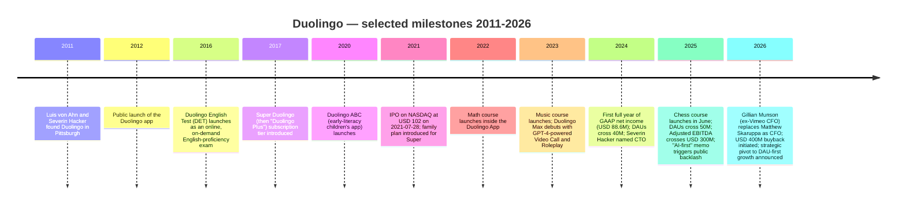
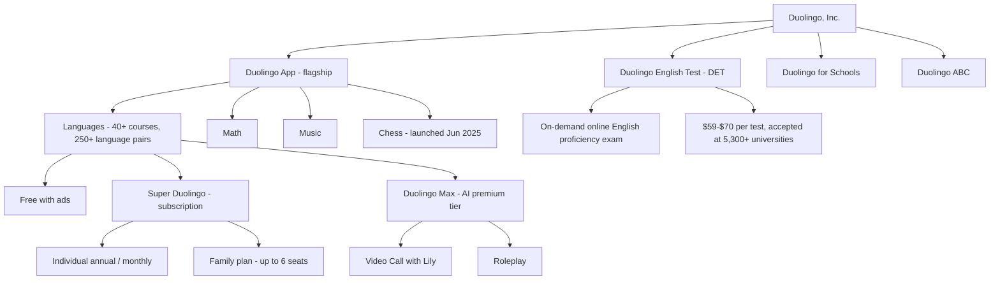
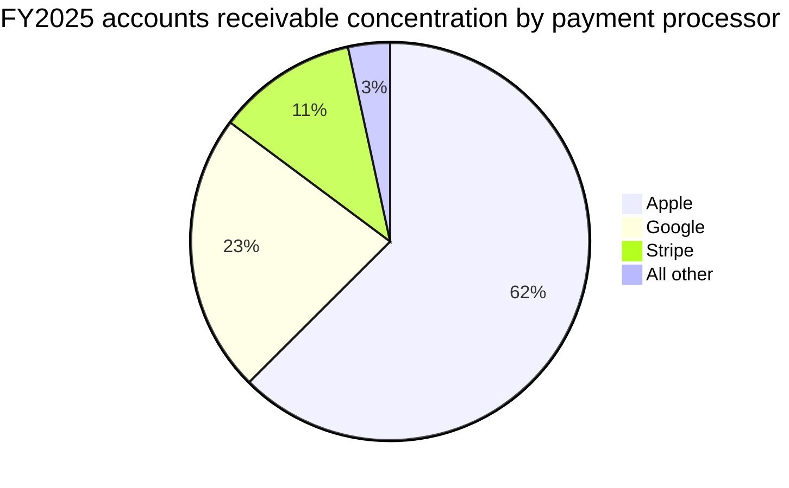
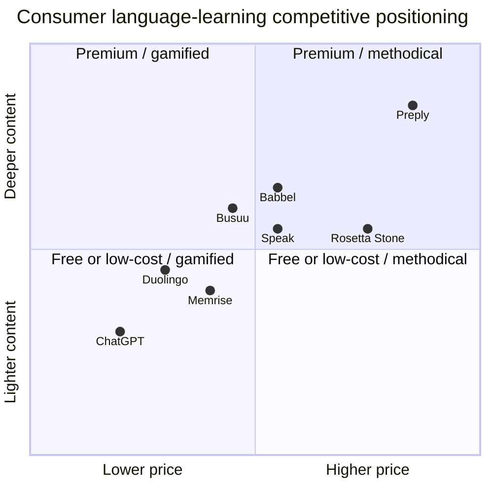

# COMPANY RESEARCH REPORT: Duolingo, Inc. (NASDAQ:DUOL)

**Date:** 2026-05-20
**Analyst:** Equity research note prepared from primary SEC filings, the company website, and named third-party sources cited inline.
**Ticker / Listing:** DUOL / NASDAQ Global Select Market
**Headquarters:** 5900 Penn Avenue, Pittsburgh, Pennsylvania 15206, USA

> **Update — FY2026 bookings & EBITDA guidance reaffirmed at lower trajectory (2026-05-04):** Management reaffirmed full-year 2026 guidance of bookings $1,280M (≈ 10.5% YoY, vs. ~33% in 2025), revenue $1,205M (≈ 16.1% YoY), and Adjusted EBITDA $310M (≈ 25.7% margin, down from 29.5% in FY2025). The guide bakes in a deliberate ~5-point bookings headwind ("more than $50M of foregone bookings") from removing monetization friction and from moving the Video Call feature out of the premium Max tier into Super, in service of a stated 100M-DAU target by 2028. Source: [Duolingo Q1/FY2026 shareholder letter, 2026-05-04](https://www.sec.gov/Archives/edgar/data/1562088/000162828026029790/q1fy26duolingo3-31x26share.htm).

---

## TABLE OF CONTENTS

1. Company Overview
2. Company History
3. Management Team
4. Products & Services
5. Customers & Go-to-Market
6. Industry Overview
7. Competitive Landscape
8. Market Opportunity (TAM)
9. Risk Assessment
References

---

## 1. Company Overview

Duolingo, Inc. is a Pittsburgh-headquartered, Delaware-incorporated mobile-first education company whose flagship app has, in the words of its own 10-K, "organically become the world's most popular way to learn languages and the top-grossing Education app in the app stores" on both Google Play and the Apple App Store. As of December 31, 2025, Duolingo offered "over 250 total language courses to more than 130 million monthly active users" and operated as a single reportable segment ([Duolingo 10-K FY2025, p. 6](https://www.sec.gov/Archives/edgar/data/1562088/000162828026012494/duol-20251231.htm)). Languages remain the core, but the company has aggressively pushed beyond them — Math (launched 2022), Music (launched 2023), and Chess (launched June 2025) are now integrated inside the flagship app, with Chess alone reaching "more than seven million DAUs in less than a year" ([Duolingo Q4/FY2025 shareholder letter, 2026-02-26](https://www.sec.gov/Archives/edgar/data/1562088/000162828026012246/q4fy25duolingo12-31x25shar.htm)).

**How Duolingo makes money.** The business model is freemium: every course is free, but ad-free access plus AI-powered learning features is sold as Super Duolingo (monthly or annual, including a six-seat family plan) or as a higher-tier Duolingo Max subscription that surfaces GPT-class AI features ([Duolingo Max blog announcement, 2023-03-14](https://blog.duolingo.com/duolingo-max/)). Subscription revenue is by far the dominant lever — $873.4M of $1,037.6M, or 84% of FY2025 revenue. Advertising on free lessons, the standalone Duolingo English Test (DET) high-stakes English-proficiency exam, and in-app purchases together make up the remaining 16% ($164.1M "Other") ([Duolingo 10-K FY2025, p. 68](https://www.sec.gov/Archives/edgar/data/1562088/000162828026012494/duol-20251231.htm)).

**Scale indicators (FY2025).** Revenue reached $1,037.6M, +39% YoY; gross profit $749.5M at a 72.2% gross margin; Adjusted EBITDA $305.9M at a 29.5% margin; free cash flow $360.4M at a 34.7% FCF margin; GAAP net income $414.1M (inflated by a one-time $256.7M tax benefit from the release of a valuation allowance against federal and state deferred tax assets) ([Duolingo 10-K FY2025, p. 60](https://www.sec.gov/Archives/edgar/data/1562088/000162828026012494/duol-20251231.htm)). MAUs averaged 133.1M in Q4 2025 versus 116.7M a year earlier (+14%), and DAUs averaged 52.7M versus 40.5M (+30%); the DAU/MAU ratio expanded to 39.6% from 34.7% — an exceptional engagement read for a consumer-app franchise ([Duolingo 10-K FY2025, p. 60–61](https://www.sec.gov/Archives/edgar/data/1562088/000162828026012494/duol-20251231.htm)). Paid subscribers ended 2025 at 12.2M, +28% YoY; paid penetration of MAUs hit ~9.2%.

**Where they operate.** Duolingo is global by default — the app is available in every country where the App Store and Google Play operate, and content is taught in 40-plus interface languages — but the company runs as one reportable, geographically un-disaggregated segment, with the CEO acting as chief operating decision-maker ([Duolingo 10-K FY2025, p. 91–92](https://www.sec.gov/Archives/edgar/data/1562088/000162828026012494/duol-20251231.htm)). Approximately 80%+ of revenue is collected through Apple, Google, and Stripe as payment-processing intermediaries — those three accounted for 62.5%, 22.7%, and 11.4% of total accounts receivable at year-end 2025 — a structural feature that recurs as a critical risk in Section 9 ([Duolingo 10-K FY2025, p. 92](https://www.sec.gov/Archives/edgar/data/1562088/000162828026012494/duol-20251231.htm)).

**Workforce.** The 10-K describes an employee population "including more than 430 engineers" focused on building "the most sophisticated education platform in the world"; the company is unusually mission-aligned and proudly located outside Silicon Valley, with HQ in Pittsburgh, PA ([Duolingo 10-K FY2025, p. 5](https://www.sec.gov/Archives/edgar/data/1562088/000162828026012494/duol-20251231.htm)).

*Source: [Duolingo 10-K FY2025, p. 67](https://www.sec.gov/Archives/edgar/data/1562088/000162828026012494/duol-20251231.htm) and prior-year 10-Ks for FY21-FY23.*

### Valuation snapshot (as of 2026-05-21)

- **Price:** USD 106.52
- **Market cap:** USD 4.96B
- **Shares outstanding (Class A + Class B):** ~46.78M (40.4M Class A + 6.36M Class B); fully-diluted ~49.7M ([Duolingo DEF 14A 2026, p. 59](https://www.sec.gov/Archives/edgar/data/1562088/000162828026025728/duol-2026defx14a.htm); [Duolingo Q1/FY2026 shareholder letter, p. 9](https://www.sec.gov/Archives/edgar/data/1562088/000162828026029790/q1fy26duolingo3-31x26share.htm))
- **TTM P/E:** 12.2× — **but this number is misleading.** GAAP net income for FY2025 of $414.1M includes a one-time $256.7M tax benefit from the release of a deferred-tax-asset valuation allowance ([Duolingo 10-K FY2025, p. 60, footnote (1)](https://www.sec.gov/Archives/edgar/data/1562088/000162828026012494/duol-20251231.htm)). Strip that out and adjusted net income would be ~$157M, yielding an **adjusted TTM P/E of ~31.5×**. On forward consensus, P/E sits near 13.4× (Yahoo Finance data series).
- **TTM P/S:** 4.52× (Yahoo Finance key statistics, 2026-05-21)
- **EV/Revenue (TTM):** 3.47×; **EV/EBITDA (TTM):** 21.5×.
- **52-week range:** $87.89 – $540.30. The current quote is ~80% below the May 14, 2025 all-time high of $540.68 (yfinance price history).
- **3-year P/S range:** Roughly 4×–25×. At the May-2025 peak the P/S sat near 22–25× on then-trailing revenue of ~$870M; today's 4.5× is the lowest multiple Duolingo has traded at since IPO.
- **Sector peer median (TTM P/S):** ~1.7× across COUR (2.0×), EDU (1.5×), TAL (2.0×), LRN (1.5×), and CHGG (0.5×). Duolingo is still 2.5–3× the peer median. Source: yfinance pulls, 2026-05-21.

**Interpretation — what just happened to the multiple.** Duolingo experienced one of the sharpest 12-month consumer-internet de-ratings of the cycle. The peak in May 2025 priced in a thesis of compounding 30%+ revenue growth with widening AI-driven operating leverage. Two things broke that thesis: (1) DAU growth decelerated from +51% YoY in Q4 2024 to +30% YoY in Q4 2025, and management explicitly guided 2026 DAU growth to "about 20%" — the company's first year of sub-30% DAU growth as a public company ([Duolingo Q4/FY2025 shareholder letter, p. 3](https://www.sec.gov/Archives/edgar/data/1562088/000162828026012246/q4fy25duolingo12-31x25shar.htm)); (2) management coupled that deceleration with a deliberate strategic pivot — moving Video Call (the flagship Max-tier feature) into the cheaper Super tier and removing in-app friction designed to drive paid conversion — costing "more than $50M of foregone bookings" in 2026 ([Duolingo Q4/FY2025 shareholder letter, p. 4](https://www.sec.gov/Archives/edgar/data/1562088/000162828026012246/q4fy25duolingo12-31x25shar.htm)). The stock printed a ~22% intraday drop the day after the Q4 release, with [Class Central](https://www.classcentral.com/report/duolingos-q4-2025/) labelling it "Record Revenue, Record Stock Drop, One Massive Buyback".

**Is 4.5× P/S still a premium?** Yes, but the gap to peers is now defensible rather than narrative. Duolingo grew revenue 39% in FY2025 (vs. peer median ~10%), runs a 72% gross margin (vs. peer median ~50–60%), generates ~35% FCF margins, and has zero traditional debt with $1.1B cash. A 4–5× revenue multiple at 25%+ steady-state operating margins is the typical band for high-quality, low-churn consumer subscription businesses (compare to Spotify, Netflix, EA at maturity). The de-rate effectively brought DUOL back from a thematic-AI premium to a defensible quality-growth multiple. We carry valuation/multiple-compression risk in Section 9, but flag it as moderate — not extreme — given the still-superior growth and margin profile.

---

## 2. Company History

Duolingo was founded in November 2011 in Pittsburgh by Luis von Ahn, then a computer-science professor at Carnegie Mellon, and his PhD student Severin Hacker. Both were Carnegie Mellon CS alumni (von Ahn earlier sold reCAPTCHA to Google in 2009; Hacker is Swiss, with a B.S. from ETH Zurich) ([Duolingo DEF 14A 2026, p. 12](https://www.sec.gov/Archives/edgar/data/1562088/000162828026025728/duol-2026defx14a.htm)). The founding thesis: language learning is the largest education vertical where the gap between rich-country and poor-country access is widest, and a mobile-first, free, gamified product could meaningfully shrink that gap. The original business model offered the app entirely for free and monetized via crowdsourced translation; the freemium subscription model was layered on top in 2017.

**Strategic pivots — three to highlight.** First, the 2017 launch of Super (then "Plus") was the most consequential move in the company's history: it converted a beloved but unprofitable consumer app into a freemium subscription business that has now passed $873M in annual subscription revenue. Second, the 2023 launch of Duolingo Max with GPT-4 was the company's "AI native" moment — the first major consumer app to embed a frontier large-language-model feature ("Video Call with Lily" — a fluent, persistent AI conversation partner) inside a paid tier ([Duolingo Max blog announcement, 2023-03-14](https://blog.duolingo.com/duolingo-max/)). Third, the Q4 2025 strategic pivot — sacrificing >5 points of 2026 bookings growth to push Video Call into Super, remove monetization friction, and target 100M DAUs by 2028 — is the first time the company has formally chosen growth over near-term margin expansion since the IPO ([Duolingo Q4/FY2025 shareholder letter, p. 3-5](https://www.sec.gov/Archives/edgar/data/1562088/000162828026012246/q4fy25duolingo12-31x25shar.htm)).

**Acquisitions** have historically been small and tuck-in. The company acquired Gunner, a Detroit-based animation studio, in 2024 (referenced in Acquisition transaction and integration costs disclosures); in 2025 it acquired the team behind NextBeat Gaming Studio to revamp the Music course, called out explicitly in the Q4 2025 letter ([Duolingo Q4/FY2025 shareholder letter, p. 4](https://www.sec.gov/Archives/edgar/data/1562088/000162828026012246/q4fy25duolingo12-31x25shar.htm)). 10-K disclosures show acquisition transaction and integration costs of $4.8M in FY2025 (vs. $0.8M in FY2024), confirming M&A remains operationally trivial in scale ([Duolingo 10-K FY2025, p. 63](https://www.sec.gov/Archives/edgar/data/1562088/000162828026012494/duol-20251231.htm)).

**Recent developments (last 12 months).** The April 2025 "AI-first" employee memo, which announced the gradual phase-out of contractors for work that AI could absorb, triggered a public backlash on social platforms; the CEO subsequently clarified that no full-time employees would be laid off ([Fortune, 2025-08-18](https://fortune.com/2025/08/18/duolingo-ceo-admits-controversial-ai-memo-did-not-give-enough-context-insists-company-never-laid-off-full-time-employees/); [The Register, 2025-04-29](https://www.theregister.com/2025/04/29/duolingo_ceo_ai_first_shift/)). The Chess course shipped in June 2025 ([Duolingo Chess blog post, 2025-06-10](https://blog.duolingo.com/chess-course/)). On 2026-01-12, the company announced the CFO transition — Gillian Munson, until February 2026 a Duolingo board member and ex-Vimeo CFO, took over from Matt Skaruppa effective February 23, 2026 ([Duolingo 8-K, 2026-01-12](https://www.sec.gov/Archives/edgar/data/1562088/000162828026001730/cfoappointmentpressrelease.htm)). On 2026-02-26 the company announced the strategic pivot and a $400M share-repurchase program, repurchasing ~514,000 shares (≈ $50.6M) by May 1, 2026, equal to 100%+ of 2025 net dilution ([Duolingo Q1/FY2026 shareholder letter, p. 8](https://www.sec.gov/Archives/edgar/data/1562088/000162828026029790/q1fy26duolingo3-31x26share.htm)).

---

## 3. Management Team

### Luis von Ahn, Ph.D. — Co-Founder, President, Chief Executive Officer, and Chairman of the Board

Luis von Ahn (age 47) is the single most consequential figure at Duolingo, both economically — he controls 55.2% of Class B common stock representing 40.0% of total voting power — and operationally; he serves as President, CEO and Chairman of the Board, with no separate non-executive chair ([Duolingo DEF 14A 2026, p. 59](https://www.sec.gov/Archives/edgar/data/1562088/000162828026025728/duol-2026defx14a.htm)). He has held the CEO role since the company was founded in August 2011 — a 15-year founder-CEO tenure that is unusually long for a US-listed consumer-tech company at this scale.

Before Duolingo, von Ahn was the founder and CEO of reCAPTCHA, the security-and-data-collection startup that pioneered the "type the wavy characters" anti-spam tool. He sold reCAPTCHA to Google in 2009 — a deal that ultimately put thousands of years of human-labeled training data inside Google Books and Google Street View ([Duolingo DEF 14A 2026, p. 12](https://www.sec.gov/Archives/edgar/data/1562088/000162828026025728/duol-2026defx14a.htm)). Before reCAPTCHA, von Ahn co-invented CAPTCHA itself while a graduate student at Carnegie Mellon, and pioneered the academic field of "human computation" — using crowds to solve problems computers couldn't, for which he received a MacArthur Foundation "Genius" Fellowship in 2006. He holds a B.S. in Mathematics from Duke University and a Ph.D. in Computer Science from Carnegie Mellon.

He served on the board of Root, Inc. (an auto-insurance technology firm) from October 2020 to October 2022; outside of Duolingo, he holds no other current operating roles ([Duolingo DEF 14A 2026, p. 12](https://www.sec.gov/Archives/edgar/data/1562088/000162828026025728/duol-2026defx14a.htm)). He is a highly visible public figure — TED talks (his "Massive-scale online collaboration" 2011 talk has more than 4M views), podcast appearances (Tim Ferriss, Lenny's Newsletter, Acquired), and active on X — and his shareholder letters are first-person, mission-led, and unusually direct about strategic trade-offs (the Q4 2025 letter explicitly frames sacrificing 2026 bookings as a deliberate long-term value-maximizing choice).

**Ownership and comp.** Von Ahn's holdings include 3,352,995 shares of Class B common stock held directly plus an additional 226,000 shares; his Class B economic stake is ~$398M at the 2026-05-21 price of $106.52, before any options or RSU awards. Class B carries 20 votes per share vs. 1 vote for Class A — so the founders' control of governance is extreme. The DEF 14A discloses 2025 special multi-year performance-based founder awards for both von Ahn and Hacker, structured around long-dated stock-price hurdles, in lieu of large cash compensation ([Duolingo DEF 14A 2026, p. 39](https://www.sec.gov/Archives/edgar/data/1562088/000162828026025728/duol-2026defx14a.htm)).

**Track record verdict.** Von Ahn has compounded Duolingo from 0 → 130M+ MAUs and $1B+ revenue in 14 years, with negligible dilution, no acquisitions of consequence, and a free user base larger than the K-12 U.S. foreign-language student population. He is among a small set of founder-CEOs who have personally driven a category-defining consumer software franchise from concept through IPO into GAAP profitability. The April 2025 "AI-first" memo was a misstep in communication — not in substance — and the company has been candid in publicly walking back the framing. He is the closest thing the EdTech sector has to a Reed Hastings or Brian Chesky.

### Gillian Munson — Chief Financial Officer (since February 2026)

Munson (age 55) joined as CFO on February 23, 2026, replacing Matt Skaruppa who is staying on as a transition advisor through November 20, 2026 ([Duolingo DEF 14A 2026, p. 22](https://www.sec.gov/Archives/edgar/data/1562088/000162828026025728/duol-2026defx14a.htm); [Duolingo 8-K, 2026-01-12](https://www.sec.gov/Archives/edgar/data/1562088/000162828026001730/cfoappointmentpressrelease.htm)). Munson had served on Duolingo's board from September 2019 and chaired its audit committee until her CFO appointment.

Her prior public-company CFO experience is deep and directly relevant. From April 2022 to September 2025 she was CFO of Vimeo, a NASDAQ-listed B2B video platform with similar consumer-to-prosumer monetization dynamics. From 2013 to 2019 she was CFO of XO Group (parent of The Knot Inc.), where she ran public-company finance through a difficult transition into private ownership. She also held the CFO role at Iora Health, was a venture partner at Union Square Ventures (April 2019 – July 2021), spent the equity-research and capital-markets stretch of her career as a Managing Director at Allen & Company, and was earlier a Senior Equity Analyst at Morgan Stanley. She holds a B.A. in Political Science and Economics from Colorado College and sits on the Phreesia, Inc. board.

The hire is widely interpreted by sell-side observers as a signal that the board wants senior capital-markets fluency in the CFO seat as Duolingo navigates the 2026 reset narrative; her experience pricing consumer-internet stories at Allen & Company is directly applicable.

### Severin Hacker, Ph.D. — Co-Founder, Chief Technology Officer and Director

Hacker (age 41) co-founded Duolingo with von Ahn in August 2011 and has served as CTO continuously since ([Duolingo DEF 14A 2026, p. 13](https://www.sec.gov/Archives/edgar/data/1562088/000162828026025728/duol-2026defx14a.htm)). He holds a B.S. in Computer Science from ETH Zurich (the federal Swiss technical university) and a Ph.D. in Computer Science from Carnegie Mellon. Hacker beneficially owns 3,058,858 shares of Class B common stock — 47.7% of the class and 35.8% of total voting power — a stake roughly equal to von Ahn's. Together the two co-founders directly hold ~76% of voting power, an unusually concentrated control structure for an established public consumer company. He is described by colleagues as the inverse of von Ahn — quieter, technical, system-architecting — and runs the engineering organization in partnership with CEO Natalie Glance.

### Robert Meese — Chief Business Officer

Meese (age 49) has been Chief Business Officer since March 2021, having joined Duolingo as VP of Business in September 2016 and held the Chief Revenue Officer title from December 2018 to March 2021. He came from a senior commercial role at Google — Director, Global Head of Games Business Development for Google Play — which is structurally relevant because Google Play (along with the Apple App Store) is one of the two distribution channels through which 80%+ of Duolingo revenue flows. He holds dual B.S. degrees in Economics and Computer Science from the University of Pennsylvania, and an M.B.A. from MIT Sloan ([Duolingo DEF 14A 2026, p. 22](https://www.sec.gov/Archives/edgar/data/1562088/000162828026025728/duol-2026defx14a.htm)).

### Governance footer

**Board composition (post-2026 annual meeting nominees).** Nine directors total, three classified into three classes. Class II nominees (2029 term): Amy Bohutinsky (ex-Zillow COO, Operating Partner at TCV), Bonnie Ross (founder of 343 Industries / Halo franchise at Microsoft Gaming, joined December 2024 — a deliberate signal of Duolingo's push into adjacent gamified subjects like Chess), and Jim Shelton (former U.S. Deputy Secretary of Education, current CEO of Blue Meridian Partners). Continuing Class III directors: Luis von Ahn, Sara Clemens (ex-COO Twitch / Pandora), Severin Hacker. Continuing Class I directors: Bing Gordon (Kleiner Perkins, ex-EA, Take-Two), John Lilly (Greylock, ex-Mozilla CEO), Mario Schlosser (co-founder Oscar Health). All non-founder directors are independent under Nasdaq rules ([Duolingo DEF 14A 2026, p. 10-15](https://www.sec.gov/Archives/edgar/data/1562088/000162828026025728/duol-2026defx14a.htm)).

**Insider ownership.** Directors and executive officers as a group control 76.0% of voting power (1.3% of Class A; 99.9% of Class B), with founders accounting for the vast majority. Top non-founder Class A holders are Baillie Gifford & Co. (12.1% of Class A, 2.9% voting), BlackRock (8.5%, 2.1%), FMR/Fidelity (6.8%, 1.6%) and Capital World Investors (5.8%, 1.4%) ([Duolingo DEF 14A 2026, p. 59-60](https://www.sec.gov/Archives/edgar/data/1562088/000162828026025728/duol-2026defx14a.htm)).

**Compensation structure.** Equity-heavy with substantial performance-linked components. The 2025 Special Multi-Year Performance-Based Founder Awards for von Ahn and Hacker condition vesting on multi-year stock-price hurdles ([Duolingo DEF 14A 2026, p. 39](https://www.sec.gov/Archives/edgar/data/1562088/000162828026025728/duol-2026defx14a.htm)). The 2026 fully-diluted share count is forecast to grow ~3.5–4% on equity grants, partially offset by the $400M buyback ([Duolingo Q1/FY2026 shareholder letter, p. 9](https://www.sec.gov/Archives/edgar/data/1562088/000162828026029790/q1fy26duolingo3-31x26share.htm)). No material related-party transactions are disclosed beyond standard indemnification agreements.

### Track-record synthesis

Duolingo is operated by a founder-controlled team that has compounded the business through one of the highest-quality 14-year consumer software stories of the post-mobile era — from zero revenue to >$1B with 35%+ FCF margins, while remaining clearly mission-led. The 2026 strategic pivot is the single highest-stakes capital-allocation decision von Ahn has taken as a public-company CEO and is the right framework to evaluate this team. The principal management gap is the freshly seated CFO; the principal governance gap is the supervoting dual-class structure that effectively immunizes the founders from public-company accountability — a feature investors must accept.

---

## 4. Products & Services

Duolingo's product surface is organized inside one consumer flagship — the Duolingo App — plus the standalone Duolingo English Test and two long-tail offerings (Duolingo for Schools, Duolingo ABC). The company operates as a single reportable segment but discloses revenue by product type as Subscription ($873M, 84% of FY25 revenue) and Other ($164M, comprising advertising, the DET, and IAPs) ([Duolingo 10-K FY2025, p. 68](https://www.sec.gov/Archives/edgar/data/1562088/000162828026012494/duol-20251231.htm)).

### Duolingo App — the flagship

The Duolingo App is the world's most-downloaded education app and the top-grossing app in the Education category on both Google Play and the Apple App Store ([Duolingo 10-K FY2025, p. 9](https://www.sec.gov/Archives/edgar/data/1562088/000162828026012494/duol-20251231.htm)). It is offered free, with ads at the end of every lesson, and accessed by 133M MAUs in Q4 2025. Inside the flagship app, four subject areas now coexist:

**Languages.** The core. Over 250 total language courses across 40+ interface languages, taught using the proprietary "Duolingo Method" of bite-sized, gamified, A/B-tested lessons with streak mechanics, leagues, and characters (Duo the owl is the most-recognized of these). The company has aggressively scaled content via AI: "In Q1 2026 alone, we published 20,500 course units… up from 7,100 per quarter in 2025 and 1,800 per quarter in 2024" ([Duolingo Q1/FY2026 shareholder letter, p. 4](https://www.sec.gov/Archives/edgar/data/1562088/000162828026029790/q1fy26duolingo3-31x26share.htm)). All nine most-learned languages — English, Spanish, French, German, Italian, Japanese, Korean, Chinese, and Portuguese — now have content up to Duolingo Score 129 (CEFR B2 — sufficient for professional proficiency).

**Competitive advantage: Yes — strong.** Moat type: **brand + scale + data + ecosystem lock-in.** Evidence: 60% share of language-learning-app usage globally ([Business of Apps "Language Learning Revenue and Usage Statistics", 2026](https://www.businessofapps.com/data/language-learning-app-market/)); brand search volume for "Duolingo" exceeds search for "learn Spanish" on Google per company commentary ([Duolingo 10-K FY2025, p. 6](https://www.sec.gov/Archives/edgar/data/1562088/000162828026012494/duol-20251231.htm)); 43M+ DAUs with a 7-day streak and 15M+ DAUs with a 365-day streak — daily-habit lock-in at extreme scale; a ~2-billion-exercises-per-day learning dataset that drives compounding A/B testing advantages. Closest direct competitor: **Babbel** (private, German, $270M revenue in 2024 per [Business of Apps](https://www.businessofapps.com/data/language-learning-app-market/) — Duolingo's subscription revenue is roughly 3× larger); on positioning, Babbel is more methodical and adult-professional-leaning, Duolingo is gamified and broader.

**Math.** Launched 2022 inside the flagship app; standards-aligned K-12 curriculum plus adult mental-math practice. Management called Math out in Q4 2025 as one of the two "next user-growth engines" alongside Chess, citing a global addressable population of "roughly one billion people… learning K-12 math globally" ([Duolingo Q4/FY2025 shareholder letter, p. 4](https://www.sec.gov/Archives/edgar/data/1562088/000162828026012246/q4fy25duolingo12-31x25shar.htm)). **Competitive advantage: partial.** The product is good but the K-12 math edtech category is crowded (Khan Academy, IXL, Brilliant). Duolingo's moat here is brand and gamification rather than content depth. Closest competitor: **Khan Academy** — free, larger curricular coverage, but non-gamified and lower engagement; Duolingo is ahead on stickiness and behind on academic rigor.

**Music.** Launched 2023; teaches music literacy and song-playing. In summer 2024 Duolingo acquired the team behind NextBeat Gaming Studio to revamp this course "to make it more fun and game-like" ([Duolingo Q4/FY2025 shareholder letter, p. 4](https://www.sec.gov/Archives/edgar/data/1562088/000162828026012246/q4fy25duolingo12-31x25shar.htm)). **Competitive advantage: no.** Music EdTech is dominated by Yousician (singing/playing), Simply Piano (specific instrument), and several adjacent learning apps. The product is undersized today; the planned revamp is a 12-24-month bet.

**Chess.** Launched on iOS June 10, 2025 ([Duolingo Chess blog post, 2025-06-10](https://blog.duolingo.com/chess-course/)). Curriculum starts with piece moves and builds toward strategy; the in-game tutor is a character named Oscar. Mini-match drills, PvP mode, expansion to Android, and rollout across English, Spanish, French, German, Italian, and Portuguese have happened in the year since. Management reports "more than seven million DAUs in less than a year" — making Chess Duolingo's fastest-ever new-subject ramp ([Duolingo Q4/FY2025 shareholder letter, p. 4](https://www.sec.gov/Archives/edgar/data/1562088/000162828026012246/q4fy25duolingo12-31x25shar.htm)). **Competitive advantage: partial-to-yes** on the casual / beginner end of the market. Moat type: brand + gamification + distribution into Duolingo's existing 130M-MAU app. Closest competitor: **Chess.com** (private; reportedly 200M+ registered users — far larger user base — but is a game platform first and a learning product second); Duolingo's product is structurally complementary rather than directly competitive at the master/club level.

### Subscription tiers — Super Duolingo and Duolingo Max

**Super Duolingo.** The principal paid tier. Removes ads, unlocks unlimited mistakes ("hearts"), and historically unlocked progression conveniences. Pricing as of May 2026: $12.99/month or $83.99/year on the individual plan; $119.99/year for the six-seat Family Plan ([dealnews.com Duolingo pricing 2026](https://www.dealnews.com/features/duolingo/cost/); [Spliiit Duolingo Family Plan 2026](https://www.spliiit.com/en/blog/duolingo-prix-famille)). Family is the highest-LTV product because it cuts net per-seat ARPU dramatically — under $20/seat/year — while expanding total seats per acquisition substantially. **Competitive advantage: yes — strong.** Driven by the underlying app moat plus pricing leverage; Babbel's annual plan is more expensive at comparable AI feature parity. Closest competitor: **Babbel Premium** — higher per-month price, similar features minus Duolingo's gamification.

**Duolingo Max.** Launched March 2023 as the first major consumer subscription embedding GPT-4-class AI features ([Duolingo Max blog post, 2023-03-14](https://blog.duolingo.com/duolingo-max/)). Priced at $29.99/month or $168/year ([Beginners in AI "Duolingo Max Explained"](https://beginnersinai.org/duolingo-max-explained/)). Key features: **Video Call with Lily** (live AI conversation partner; doubled the average words spoken per user over the last year per the Q1 FY26 letter) and **Roleplay** (scripted real-world scenarios with AI feedback). Note: Explain My Answer, originally a Max feature, was moved to free for all users by early 2026.

**Critical product update — May 2026.** As part of the strategic pivot, Video Call is being moved from Max into Super, "give access to a critical learning feature, conversation practice, to about ten times as many learners" ([Duolingo Q4/FY2025 shareholder letter, p. 3](https://www.sec.gov/Archives/edgar/data/1562088/000162828026012246/q4fy25duolingo12-31x25shar.htm)). This degrades the Max value proposition and is the principal driver of the FY26 bookings headwind. **Competitive advantage of Max post-change: partial.** Moat type: technology + ecosystem (GPT-4 integration is now table stakes among well-funded consumer AI apps — Speak, Pingo, ChatGPT itself). Closest competitor: **Speak** (Y Combinator / OpenAI Startup Fund-backed; AI-first conversation app), and OpenAI's own ChatGPT Voice with custom GPTs trained on language learning. Duolingo's moat against these is the integrated curriculum and 130M-MAU funnel, not the AI conversation tech itself.

### Duolingo English Test (DET)

Launched 2016. An on-demand, computer-adaptive English-proficiency assessment that can be taken from anywhere at any time using a webcam and smartphone. Priced at $59 USD per test (or $98 for two) since June 2026, vs. roughly $250 for IELTS or TOEFL ([goarno.io Duolingo English Test cost 2026](https://goarno.io/blog/how-much-does-the-duolingo-english-test-cost/); [Duolingo English Test applicant page](https://englishtest.duolingo.com/applicants)). Accepted at "over 6,100 education programs around the world," with 5,300+ being higher-education programs including all of the Ivy League, MIT, and Stanford, and 24 of the 25 U.S. undergraduate programs ranked highest by international enrollment ([Duolingo 10-K FY2025, p. 7](https://www.sec.gov/Archives/edgar/data/1562088/000162828026012494/duol-20251231.htm)).

**Competitive advantage: yes — strong moat with a regulatory tailwind.** Moat type: **two-sided network effects + scale + cost leadership.** As more universities accept the DET, more candidates take it; as more candidates take it, more universities accept it. The cost gap to TOEFL/IELTS is ~4×; this is a structural cost-leadership advantage that incumbents cannot replicate without cannibalizing their own physical-test-center revenue. Closest competitors: **TOEFL** (ETS, ~$255/test), **IELTS** (British Council / IDP, ~$245/test), **Pearson PTE Academic** (~$199/test). DET is taking share against all three at the international-student admissions tier; the legacy tests retain advantage in immigration / employment-visa contexts where institutional inertia is higher.

### Other initiatives

**Duolingo for Schools.** A web-based teacher dashboard that lets K-12 instructors track students using Duolingo as supplementary classroom material ([Duolingo 10-K FY2025, p. 10](https://www.sec.gov/Archives/edgar/data/1562088/000162828026012494/duol-20251231.htm)). Free product; monetized indirectly via increased flagship-app usage. Competitive advantage: partial — useful in the U.S. K-12 supplementary market but not a primary curriculum.

**Duolingo ABC.** A free, standalone app teaching early literacy (reading) to young children. Launched 2020. Strategic; not material to revenue. Competitor: Khan Academy Kids.

### Flagship vs. long-tail

The flagship is the Duolingo App (~95%+ of revenue when counting Super + Max + advertising + IAPs). The English Test is a high-multiple growth call option (probably ~3-5% of revenue, undisclosed). Schools and ABC are mission products, not financial. The next 12 months will hinge on whether Chess and Math become true revenue lines or remain DAU funnels.

### Last-12-month product launches / sunsets

- **Chess course** — launched on iOS June 2025, expanded to Android, six languages, PvP mode through year-end ([Duolingo Chess blog post, 2025-06-10](https://blog.duolingo.com/chess-course/)).
- **Speaking-first features** rolling out Q1 2026 — Spoken Tokens (speak instead of tap most exercises), Flashcards, Speaking Adventures ([Duolingo Q1/FY2026 shareholder letter, p. 3](https://www.sec.gov/Archives/edgar/data/1562088/000162828026029790/q1fy26duolingo3-31x26share.htm)).
- **Video Call rolled into Super tier** (announced Q4 2025, rolling out in 2026) — most consequential product change of 2026.
- **Music course** — full revamp announced for 2026 following the NextBeat Gaming Studio team acquisition.
- **Explain My Answer** moved from Max to free for all users in early 2026.
- **LinkedIn integration** announced at Duocon 2025 — DET scores can now be displayed on LinkedIn profiles ([Duolingo Duocon 2025 press release, 2025-10](https://investors.duolingo.com/news-releases/news-release-details/duolingo-unveils-major-product-updates-turn-learning-real-world)).

---

## 5. Customers & Go-to-Market

### Customer segments

Duolingo is a B2C consumer-internet business with two distinct revenue customer types: (1) **end-user learners**, who pay for Super or Max subscriptions or are monetized via ad impressions, and (2) **test-takers and education-program admissions offices**, who pay for and receive Duolingo English Test results. Duolingo for Schools is offered free and produces no revenue line. Duolingo is not a B2B SaaS company — there are no large enterprise contracts and no government licensing deals that materially affect the income statement.

Within the consumer learner base of ~133M MAUs:
- **~9.2% are paid subscribers** (12.2M / 133.1M). Up from ~5% at IPO, reflecting steady but slowing subscription monetization.
- **~91% are free users** monetized via in-app ads + occasional IAPs. The strategic pivot is explicit that the next phase of growth comes from expanding this free pool rather than squeezing the paid tier ([Duolingo Q4/FY2025 shareholder letter, p. 4](https://www.sec.gov/Archives/edgar/data/1562088/000162828026012246/q4fy25duolingo12-31x25shar.htm)).

The company's own 10-K language captures the customer breadth: "our learners come from the entire socioeconomic spectrum, ranging from billionaires and celebrities to recently resettled refugees" ([Duolingo 10-K FY2025, p. 6](https://www.sec.gov/Archives/edgar/data/1562088/000162828026012494/duol-20251231.htm)).

### Customer concentration

In a B2C subscription model, customer concentration is measured **on the distribution/payment-channel side, not on the end-user side**. Duolingo does not disclose individual learner economics, but the 10-K is explicit about the structural concentration risk at the payment-processor level:

> "The top three service providers, Apple, Google, and Stripe accounted for 62.5%, 22.7%, and 11.4% of total Accounts receivable as of December 31, 2025, respectively. The top two service providers, Apple and Google, accounted for 64.7% and 21.2% of total Accounts receivable as of December 31, 2024, respectively."
> Source: [Duolingo 10-K FY2025, p. 92](https://www.sec.gov/Archives/edgar/data/1562088/000162828026012494/duol-20251231.htm)

**This is, on the proxy of accounts receivable, an extreme customer-concentration profile** — Apple alone accounted for over 60% of receivables, and Apple + Google together ~85%. We treat this as a material risk and carry it into Section 9. The mitigant is that Apple/Google are not customers in the commercial sense — they cannot stop processing Duolingo's payments without violating their own platform contracts — but they can and do change the take-rate (App Store and Play Store fees, currently in the 15-30% range depending on subscription tenure), require app-policy changes, or in extreme cases reject specific feature releases.

### Distribution channels

Three channels matter:
1. **Apple App Store** — primary channel by revenue. Apple takes 30% of first-year subscription revenue and 15% thereafter. The 10-K calls out reliance on the App Store as a stand-alone risk factor ([Duolingo 10-K FY2025, p. 17-18](https://www.sec.gov/Archives/edgar/data/1562088/000162828026012494/duol-20251231.htm)).
2. **Google Play Store** — secondary channel. Same take-rate structure as Apple.
3. **Duolingo's web property at duolingo.com** — both a marketing front door and a direct-to-consumer payments channel (Stripe-processed), bypassing Apple/Google fees. Web-purchased subscriptions are presumably higher-margin than mobile-app-purchased ones; the company has not disclosed the mix.

### Sales strategy and cycle

There is no enterprise sales motion. Acquisition is a four-leg stool:
- **Organic / word-of-mouth.** Historically 70%+ of new-user acquisition; "Duolingo's learner community has grown organically through word-of-mouth virality" ([Duolingo 10-K FY2025, p. 11](https://www.sec.gov/Archives/edgar/data/1562088/000162828026012494/duol-20251231.htm)).
- **Brand marketing.** Owned social channels (Duo the Owl character on TikTok, Instagram, X) are unusually viral for an EdTech brand; campaigns like "Dead Duo" (Q1 2025 — Duo was symbolically "killed" in a marketing stunt) generated unprecedented engagement and drove a 49% YoY DAU jump in Q1 2025 ([Duolingo Q1/FY2026 shareholder letter, p. 8](https://www.sec.gov/Archives/edgar/data/1562088/000162828026029790/q1fy26duolingo3-31x26share.htm)). The Q1 2026 21% DAU growth is described as lapping that "Dead Duo" comp.
- **Owned media (push notifications, email, in-app re-engagement).** Famously aggressive; the push-notification character that nags users about streaks is a meme in its own right.
- **Paid acquisition.** Selective and concentrated in markets where organic awareness is low. S&M expense was $125.7M in FY2025, ~12% of revenue — modest for a consumer-internet company at this scale and a key reason the FCF margin is so high ([Duolingo 10-K FY2025, p. 69](https://www.sec.gov/Archives/edgar/data/1562088/000162828026012494/duol-20251231.htm)).

### Partnerships and case studies

The Duolingo English Test partnership network is the most concrete monetizable partnership franchise — 5,300+ higher-education institutions accept DET scores, including every Ivy League school, MIT, and Stanford. The LinkedIn DET-score integration announced at Duocon 2025 turns those test results into a portable employment-credentialing signal ([Duolingo Duocon 2025 press release](https://investors.duolingo.com/news-releases/news-release-details/duolingo-unveils-major-product-updates-turn-learning-real-world)).

OpenAI is referenced as the underlying frontier model for Duolingo Max's launch (GPT-4 in 2023); the company has since diversified, leveraging "our expertise in AI and machine learning… to effectively and efficiently integrate external AI models to improve our products" ([Duolingo 10-K FY2025, p. 9](https://www.sec.gov/Archives/edgar/data/1562088/000162828026012494/duol-20251231.htm)).

*Source: [Duolingo 10-K filings, FY2021-FY2025](https://www.sec.gov/cgi-bin/browse-edgar?action=getcompany&CIK=0001562088&type=10-K&dateb=&owner=include&count=40), Q4 user-metrics disclosures.*

*Source: ARPU computed as FY revenue / Q4-average MAU; paid penetration = period-end paid subs / Q4-average MAU. Underlying data from [Duolingo 10-K FY2025, p. 60-61](https://www.sec.gov/Archives/edgar/data/1562088/000162828026012494/duol-20251231.htm) and prior 10-Ks.*

---

## 6. Industry Overview

Duolingo operates inside a complex of overlapping addressable industries — global consumer language learning, consumer EdTech, online assessment, and adjacent "fun-first" gamified learning categories (math, music, chess). The cleanest top-down sizing is the language-learning category, which is also the dominant revenue driver today.

### Industry definition and scope

The global **consumer language-learning market** spans (1) free and paid mobile apps (Duolingo, Babbel, Memrise, Busuu, Drops, Mondly, HelloTalk), (2) live one-on-one tutoring platforms (Preply, italki, Cambly), (3) legacy software / desktop (Rosetta Stone), (4) classroom-based commercial language schools (EF Education First, Berlitz, inlingua), and (5) education-system curriculum (school foreign-language classes, public-university language courses — many free at point of consumption). Duolingo's 10-K cites the HolonIQ market-size figure of "about $123 billion by 2027" for combined consumer spend on online and offline language learning ([Duolingo 10-K FY2025, p. 6](https://www.sec.gov/Archives/edgar/data/1562088/000162828026012494/duol-20251231.htm), citing [HolonIQ, January 2024](https://www.holoniq.com/)).

Adjacent industries Duolingo now competes in by virtue of its expansion: **K-12 supplementary learning** (Khan Academy, IXL, Khan Academy Kids — global market in the tens of billions of dollars), **music education** (Yousician, Simply Piano, Skoove, Flowkey), **chess platforms** (Chess.com, Lichess, ChessKid), and **online English assessment** (ETS-TOEFL, British Council / IDP-IELTS, Pearson PTE Academic).

### Market size, growth, and structure

- **Language learning specifically.** [Business of Apps](https://www.businessofapps.com/data/language-learning-app-market/) compiled industry estimates put the language-learning *app* market alone at ~$7-9B in 2025, growing at a 16.2% CAGR through 2033. That is a subset of the $123B total figure that includes offline schools and adult education. Within the *app* slice Duolingo is the runaway leader on revenue ($1.04B FY2025) and on download/MAU share (~60% of language-learning app usage per [Business of Apps](https://www.businessofapps.com/data/language-learning-app-market/)).
- **Consumer EdTech overall.** Globally the consumer EdTech category was in the $50-70B range in 2024 across all subjects per [HolonIQ](https://www.holoniq.com/) (most recent published research).
- **English-language assessment.** ETS reportedly administers ~2-3M TOEFL iBT tests annually at ~$255 per test (~$0.5-0.75B), and IELTS administers ~3-4M tests annually at ~$245 (~$0.75-1B); combined the international English-proficiency-assessment market sits around $2-3B/year. Duolingo's DET, at $59-$70 per test, is gaining share but the disclosed test-volume numbers are not yet broken out.

*Source: Bar values smoothed from the HolonIQ estimate that consumer spend on language learning would reach "about $123 billion by 2027," cited in [Duolingo 10-K FY2025, p. 6](https://www.sec.gov/Archives/edgar/data/1562088/000162828026012494/duol-20251231.htm). Intermediate-year values are illustrative interpolations.*

### Growth drivers — historical and projected

**Historical drivers (2015-2025):**
1. **Smartphone penetration in emerging markets** — Duolingo's MAU base scaled in lockstep with global smartphone install base; the company is now one of the largest installed-app franchises in markets like Brazil, Mexico, India, and Indonesia.
2. **English as global economic infrastructure** — Duolingo's 10-K is explicit: "English can unlock tremendous economic opportunity" ([Duolingo 10-K FY2025, p. 6](https://www.sec.gov/Archives/edgar/data/1562088/000162828026012494/duol-20251231.htm)). The premium that fluent English commands in labor markets globally underpins the willingness-to-pay curve for language apps.
3. **Gamification + mobile-native UX** — Duolingo's lesson loops were among the first to treat learning as a mobile-first daily-streak product, and the category followed.
4. **Generative AI as a learning enabler** — the launch of GPT-4 in 2023 enabled human-quality conversation partners at near-zero marginal cost, structurally re-shaping the conversational-practice gap.

**Projected drivers (2025-2030):**
- AI-driven content scaling collapses unit content-creation costs (Duolingo published 20,500 course units in Q1 2026, 11× the Q1 2024 quarterly pace per the Q1 FY26 letter), enabling rapid expansion to long-tail languages and subjects.
- AI-powered conversation/tutoring features finally close the long-standing "speaking-practice gap" that has historically held mobile-only learners back from genuine fluency.
- The expansion of mobile learning *into adjacent subjects* (math, music, chess) opens up addressable markets ~10× larger than language alone.

### Key trends — the GenAI cross-current

The single most important industry trend is generative AI, and it cuts both ways for Duolingo:

**Tailwind side.** Duolingo Max's Video Call feature, powered by frontier LLMs, is something one couldn't have built at any price two years ago. It is "one of the most commercially successful consumer AI products" outside the frontier-model labs themselves, per CEO commentary ([Duolingo Q4/FY2025 shareholder letter, p. 3](https://www.sec.gov/Archives/edgar/data/1562088/000162828026012246/q4fy25duolingo12-31x25shar.htm)). GenAI has also collapsed the unit cost of content creation by an estimated order of magnitude. And it lets Duolingo's data moat compound — every speaking exercise produces a labeled audio-text pair that improves the model.

**Threat side.** ChatGPT, Claude, and Gemini all offer free, high-quality conversation practice in any language. A motivated learner could plausibly self-direct an entire fluency journey using ChatGPT's Voice mode + custom GPTs at zero marginal cost. The Duolingo "free speaking practice for all users" rollout — Spoken Tokens, Flashcards, Speaking Adventures — is in part a defensive response to this. Management acknowledges the competitive pressure in the 10-K's Risk Factors: "As translation services and products, such as wearable devices that provide translation, improve and become more widely available and used, people may generally become less interested in language learning" ([Duolingo 10-K FY2025, p. 17-18](https://www.sec.gov/Archives/edgar/data/1562088/000162828026012494/duol-20251231.htm)).

### Regulatory environment

Comparatively light vs. healthcare or financial services, but non-trivial:
- **App Store / Play Store rules** define what Duolingo can sell, at what price, with what take-rate. Apple's evolving handling of external payment links (post-Epic v. Apple) and the EU's DMA opening of alternative payment processors are net positives but operationally complex.
- **Children's privacy laws** (COPPA in the US, similar in EU/UK) — Duolingo serves young learners directly via the main app and ABC; subject to substantive compliance obligations.
- **Education-credential acceptance** for the DET — the DET's value depends on continued admissions-office acceptance, which is institutionally negotiated rather than legally guaranteed. Loss of acceptance at a top school cohort would degrade brand value substantially.
- **AI regulation** — the EU AI Act and US AI guidance frameworks will increasingly constrain how AI-generated educational content is labeled and used; not yet a binding constraint on Duolingo's product.

### Industry dynamics — fragmentation, supplier/buyer power, substitutes

The language-learning app industry is **highly fragmented at the long tail and concentrated at the top.** Duolingo holds ~60% of app usage share by Business of Apps' compilation; the next-largest pure-play (Babbel) is ~3× smaller on revenue. Below that the long tail of dozens of competing apps fragments quickly.

- **Supplier power** is concentrated in two places: (1) Apple/Google distribute essentially all mobile-app revenue and tax 15-30% of it — the most material structural cost of the business model. (2) Frontier-model labs (OpenAI, Anthropic, Google) supply the LLMs that power Video Call; Duolingo has flexibility here (it integrates "external AI models" plural — [Duolingo 10-K FY2025, p. 9](https://www.sec.gov/Archives/edgar/data/1562088/000162828026012494/duol-20251231.htm)) but cannot exit the dependency entirely.
- **Buyer power** is essentially zero on the end-learner side — individual users pay $7-30/month with no negotiation. Buyer power is meaningful only in the DET context, where large university customers can negotiate volume acceptance arrangements.
- **Substitutes** are abundant and a permanent feature of the landscape — free YouTube content, ChatGPT, free university OCW courses, podcasts, and live human tutors via Preply / italki are all real-time substitutes.

---

## 7. Competitive Landscape

### Direct competitors (pure-play language-learning apps)

- **Babbel** — Berlin-based, private (LSP backed). Per [Business of Apps, 2026](https://www.businessofapps.com/data/language-learning-app-market/), Babbel generated ~$270M revenue in 2024 (Duolingo subscription revenue is ~3.2× larger). Babbel positions itself as more methodical and adult-professional-focused; lessons are designed by linguists and run longer; pricing is comparable to Duolingo but with no free tier and a much smaller free-funnel. Differentiated on content rigor; behind on user scale and brand.
- **Memrise** — UK-based, private. Spaced-repetition core mechanic, with video clips of native speakers used as the primary teaching unit. Has pivoted into AI conversation practice ("MemBot") to compete with Duolingo Max. Smaller than Babbel and DUOL.
- **Busuu** — UK-based; acquired by Chegg (NYSE:CHGG) in 2022. Distinguished by community-driven feedback from native speakers. Sub-scale on revenue; Chegg's own broader stress (a -47.9% revenue decline TTM per yfinance, 2026-05-21) limits investment.
- **Rosetta Stone** — Now part of IXL Learning (private). Legacy desktop brand; methodology is immersion-based with no native-language explanation. Stagnating revenue trajectory; minimal mobile traction.
- **Mondly** — Acquired by Pearson in 2022. Underinvested; functions more as an English-market product within Pearson's broader business than as a standalone Duolingo competitor.

### Indirect competitors

- **Khan Academy** (non-profit) — competes with Duolingo on Math and any future K-12 academic subject. Larger curricular depth and zero monetization pressure; Duolingo's edge is gamification and engagement, not academic rigor.
- **Preply, italki, Cambly** — live one-on-one human tutoring marketplaces. Different price point (~$10-30/hour) and a different value proposition (real human conversation), but they substitute for Duolingo Max's AI conversation feature.
- **Coursera (NYSE:COUR), Udemy** — broader MOOC/skills platforms; offer language courses as part of broader catalogs. Coursera trades at a 2.0× P/S vs. DUOL's 4.5× on materially slower growth (+9% TTM revenue vs. DUOL +27%) — illustrative of how the market still prices DUOL above the EdTech peer median.
- **Chinese EdTech (EDU - New Oriental, TAL Education)** — adjacent in business model but operate primarily in the post-K-12-regulation-reform Chinese tutoring market with structurally different unit economics. EDU at 1.5× P/S and TAL at 2.0× P/S underscore the regional/regulatory discount; these are not direct competitors so much as peer-multiple anchors.
- **Stride Inc (NYSE:LRN)** — K-12 online-school operator. Different business model (per-student tuition) but a useful "consumer EdTech with profitability" comp; trades at 1.5× P/S.
- **Chegg (NYSE:CHGG)** — owns Busuu and operates a homework-help business that has been disrupted by ChatGPT, with revenue down -47.9% TTM. Reads as a cautionary tale of what consumer EdTech disruption by generative AI can do when the moat is thin.

### Emerging AI-first competitors

- **OpenAI ChatGPT** — free Voice mode + custom GPTs trained on language learning are arguably the most disruptive substitute. The threat is most acute for self-directed adult learners; Duolingo's gamified daily-habit model and 130M-MAU brand are the defensive moat.
- **Speak** — venture-backed AI-first language-learning app (OpenAI Startup Fund among backers). Focused on speaking practice with AI. Smaller user base; differentiated UX; a real competitor specifically for the Max/Video Call value proposition.
- **Pingo, Univerbal** — AI-conversation-first language apps. Sub-scale today.

*Source: yfinance pulls for DUOL, COUR, EDU, TAL, LRN, CHGG, as of 2026-05-21. TTM P/S = price-to-sales over trailing twelve months; revenue growth = yfinance reported YoY revenue growth.*

### Positioning framework

### Duolingo's competitive advantages

1. **Brand and distribution.** Duolingo is the only language-learning brand most non-English-language consumers can name; search volume for "Duolingo" exceeds search for the underlying activity itself ([Duolingo 10-K FY2025, p. 6](https://www.sec.gov/Archives/edgar/data/1562088/000162828026012494/duol-20251231.htm)).
2. **Free-tier funnel.** 91% of MAUs are non-paying, but they drive word-of-mouth acquisition and ad revenue. No other major language-app has this scale of organic distribution.
3. **Data and A/B testing scale.** Nearly 2 billion exercises completed daily generate the largest consumer language-learning dataset in the world; "hundreds of A/B tests" run per quarter ([Duolingo 10-K FY2025, p. 8-9](https://www.sec.gov/Archives/edgar/data/1562088/000162828026012494/duol-20251231.htm)).
4. **Cost leadership through AI content generation.** Generating 20,500 course units per quarter — roughly 11× the pre-GenAI rate — at small absolute incremental cost. Competitors without comparable engineering depth cannot match this.
5. **Adjacent-subject extensibility.** Math, Music, Chess give Duolingo optionality that pure-play language competitors lack.
6. **Profitability and free cash flow.** 35%+ FCF margins and $1.1B cash give Duolingo durable capital flexibility (and bought it the ability to announce a $400M buyback into a stock drawdown).

### Competitive vulnerabilities

1. **AI substitution risk for the Max value proposition.** ChatGPT Voice mode is a near-free substitute for the highest-priced tier's flagship feature. The pivot to put Video Call into Super is at least partly a defensive response.
2. **Apple/Google distribution dependence** — already covered in customer concentration.
3. **Brand singularity** — a single mascot, a single voice. Duo the owl is unusually beloved but if the brand ever turns negative (the April 2025 AI-first memo backlash showed this can happen quickly), the damage compounds across a huge MAU base.
4. **Limited content moat in non-language subjects.** Chess and Math succeed today on the strength of Duolingo's UX wrapper and free distribution. Direct content competitors (Chess.com, Khan Academy) are deeper and broader.

### Market-share view

| Segment | DUOL position | Closest competitor | Approximate share |
|---|---|---|---|
| Global language-learning app usage | #1 | Babbel | ~60% vs. ~10% (per Business of Apps) |
| Language-learning app revenue | #1 | Babbel ($270M) | DUOL $873M sub revenue, ~3.2× Babbel |
| English-proficiency online testing (assessment volume) | Fastest-growing | TOEFL (ETS), IELTS | DUOL gaining share at $59-70/test vs. $245-255 |
| K-12 math supplementary apps | Top-5 (Math) | Khan Academy | Sub-scale; Khan dominates by reach |
| Casual/beginner chess learning | Top-3 (Chess) | Chess.com / Lichess | 7M+ DAUs in 11 months — growth-stage |

---

## 8. Market Opportunity (TAM)

### TAM sizing

**Total addressable market — anchored on language learning.** The HolonIQ estimate cited in Duolingo's 10-K puts consumer spend on online + offline language learning at ~$123B by 2027 ([HolonIQ, January 2024, cited in Duolingo 10-K FY2025, p. 6](https://www.sec.gov/Archives/edgar/data/1562088/000162828026012494/duol-20251231.htm)). Against this, Duolingo's FY2025 revenue of $1.04B implies a penetration of <1% of TAM — a striking headroom number, even accepting that the majority of the $123B sits in offline schools and adult-immersion programs that Duolingo cannot fully serve via a mobile app.

**Online-only language learning** is a more relevant SAM. Business of Apps puts the language-learning app subset at ~$7-9B in 2025 growing to ~$24B by 2033 at a 16.2% CAGR ([Business of Apps, 2026](https://www.businessofapps.com/data/language-learning-app-market/)). On this slicing, Duolingo's $1.04B is roughly 12% share of revenue today and could compound with category growth even without significant share gains.

**Adjacent subjects expand TAM materially.** K-12 math education globally has "roughly one billion people" learning at any given time per CEO commentary ([Duolingo Q4/FY2025 shareholder letter, p. 4](https://www.sec.gov/Archives/edgar/data/1562088/000162828026012246/q4fy25duolingo12-31x25shar.htm)). Music education is a smaller (~$5-10B) but high-willingness-to-pay segment. Chess is much smaller as a paid market but is a powerful DAU acquisition channel. English-proficiency assessment globally is a ~$2-3B/year market that Duolingo English Test is taking share in at a meaningful pace.

### SAM and SOM

- **Serviceable Available Market (SAM):** the share of the language-learning, online-assessment, and adjacent-EdTech TAMs that Duolingo can address through its mobile-first, freemium, gamified model. We estimate SAM at ~$20-25B by 2030 across all four core subjects (languages, math, music, chess) plus the DET assessment franchise.
- **Serviceable Obtainable Market (SOM):** assuming Duolingo holds its 60% category share in language-learning apps, gains 5-15% share in adjacent app subjects, and grows DET to 15-25% of the international English-test market, the realistic 2030 revenue ceiling is in the $3-5B range — implying ~3-5× growth over current run-rate at a 15-20% revenue CAGR.

### Market growth projections

- **Language-learning app market:** 16.2% CAGR through 2033 to ~$24B per [Business of Apps](https://www.businessofapps.com/data/language-learning-app-market/).
- **K-12 supplementary EdTech:** Slower-growing in mature markets but growing 10-15% annually in emerging-market consumer segments.
- **Online English-language assessment:** Mid-single-digit volume growth at the test-volume level; faster dollar growth as low-cost online tests cannibalize physical-center tests.

### Company's serviceable market and share opportunity

Duolingo's 100M-DAU target by 2028 is the operating concretization of the TAM thesis: roughly doubling the current 52.7M DAU base over three years, while expanding subjects (Math, Music, Chess) such that the median DAU is engaged across multiple categories. If achieved at the current ~$8 ARPU-per-MAU (assuming MAU scales proportionally to ~270M+), the implied revenue is in the $2.0-2.5B range by 2028. If subject expansion modestly lifts ARPU, the upper bound of management's strategy implies a >$3B run-rate exit 2028, though this is well above current sell-side consensus.

### Penetration strategy

The Q4 2025 strategy explicitly trades short-term monetization for long-term DAU compounding through three levers ([Duolingo Q4/FY2025 shareholder letter, p. 3-4](https://www.sec.gov/Archives/edgar/data/1562088/000162828026012246/q4fy25duolingo12-31x25shar.htm)):
1. **Teach better** — Speaking-first features, advanced content to CEFR B2 across nine languages, mastery checks at end of each unit.
2. **Reinvest in free value** — Remove monetization friction; channel team capacity from conversion optimization into top-of-funnel growth experiments; introduce "user-friendly monetization" formats (avatar customization, native ads) that don't degrade DAU.
3. **Feed next growth engines** — Heavier investment in Chess, Math, and Music to grow the subject portfolio.

The 100M-DAU bet is one of the clearer statements of TAM strategy in consumer-internet land; whether it pays off depends primarily on whether the 2026 friction-reduction restores the +30-40% YoY DAU growth rates that prevailed before the deceleration.

---

## 9. Risk Assessment

### Company-Specific Risks

**1. Execution risk on the 2026 strategic pivot (HIGH).** Management is voluntarily sacrificing ~5 points of 2026 bookings growth and ~4-5 points of EBITDA margin in service of a 100M-DAU target by 2028 ([Duolingo Q4/FY2025 shareholder letter, p. 4](https://www.sec.gov/Archives/edgar/data/1562088/000162828026012246/q4fy25duolingo12-31x25shar.htm)). If DAU growth does not re-accelerate, the company will have sacrificed real near-term value for nothing. The plan is also wide-aperture (Video Call free-tier expansion, friction removal, monetization-team repurposing, three subject expansions), increasing the surface area for execution misses. Mitigant: founder-CEO with deep operating credibility and strong product velocity; ~30% FCF margin gives buffer to course-correct.

**2. Customer (payment-channel) concentration — Apple and Google (HIGH).** Apple alone accounted for 62.5% of accounts receivable at year-end 2025, Google 22.7%; combined ~85% ([Duolingo 10-K FY2025, p. 92](https://www.sec.gov/Archives/edgar/data/1562088/000162828026012494/duol-20251231.htm)). A unilateral take-rate increase, policy change limiting in-app subscription tiers, or feature/payment rejection by either platform could materially dent revenue and gross margin overnight. Mitigant: regulatory pressure (EU DMA, US Epic v. Apple) is opening alternative payment paths; duolingo.com direct-payment funnel exists as a partial offset.

**3. Key-person dependency on the founders (HIGH).** Luis von Ahn and Severin Hacker together control 76% of voting power via supervoting Class B stock ([Duolingo DEF 14A 2026, p. 59](https://www.sec.gov/Archives/edgar/data/1562088/000162828026025728/duol-2026defx14a.htm)). The brand, product roadmap, and culture are personally identified with von Ahn in particular. Loss or extended absence of either founder would be a meaningful negative event. Mitigant: 14-year operational continuity; deep, long-tenured executive bench (CTO Glance, CBO Meese, CIO/Counsel Chen).

**4. AI substitution of the core conversation-practice product (HIGH).** ChatGPT Voice mode and equivalents offer free, high-quality language conversation in any language. This directly substitutes for Duolingo Max's premium feature, which is why the Q4 2025 plan moves Video Call out of Max into Super and offers more speaking practice to free users. If consumer behavior shifts toward LLM-native learning, Duolingo's structural moat narrows to brand, gamification, and curriculum — meaningful, but less defensible than feature-level differentiation. Mitigant: scale, daily-habit lock-in, and brand stickiness; Duolingo's own AI features remain competitive when bundled with curriculum.

**5. Brand and PR sensitivity (MODERATE).** The April 2025 "AI-first" memo triggered substantial public criticism and a temporary social-channel pullback ([Fortune, 2025-08-18](https://fortune.com/2025/08/18/duolingo-ceo-admits-controversial-ai-memo-did-not-give-enough-context-insists-company-never-laid-off-full-time-employees/); [The Register, 2025-04-29](https://www.theregister.com/2025/04/29/duolingo_ceo_ai_first_shift/)). Duolingo's brand is a key asset and is unusually personality-led; further missteps could meaningfully degrade user acquisition. Mitigant: the brand survived the 2025 episode without measurable user-growth damage; management has been candid about the communications miss.

**6. Geographic concentration — implicit U.S. and consumer-discretionary exposure (MODERATE).** Duolingo discloses operations as a single segment with no geographic breakdown, but subscription pricing is dollar-denominated worldwide. A sustained dollar strengthening or a recession in any of the top revenue countries (U.S., Brazil, Mexico, India, U.K.) would weigh on bookings. Mitigant: low absolute subscription price ($7-12/month) makes the product relatively recession-resistant; family plan and student discount further lower price elasticity at the margin.

### Industry / Market Risks

**7. Generative-AI category disruption (HIGH).** Beyond conversation-practice substitution, the broader risk is that the *category* of language learning itself shrinks if real-time AI translation matures enough to remove the practical motivation to learn languages — a risk Duolingo itself articulates: "As translation services and products… improve and become more widely available and used, people may generally become less interested in language learning" ([Duolingo 10-K FY2025, p. 17-18](https://www.sec.gov/Archives/edgar/data/1562088/000162828026012494/duol-20251231.htm)). Mitigant: the cultural/identity/access motivations for learning a language are not fully addressed by translation tools; the company's expansion into Math, Music, and Chess reduces single-category exposure.

**8. Competitive intensity from well-capitalized AI-first entrants (MODERATE).** Speak, ChatGPT-native learning apps, and frontier-model labs themselves can build directly competitive products with minimal incremental cost. Low barriers to entry, as the 10-K acknowledges ([Duolingo 10-K FY2025, p. 17](https://www.sec.gov/Archives/edgar/data/1562088/000162828026012494/duol-20251231.htm)). Mitigant: distribution and brand scale economies that incumbents can compound.

**9. App Store / Play Store policy and regulatory changes (MODERATE).** Apple/Google control distribution rules, take-rate structures, and payment processing. Policy changes — whether platform-led or regulator-driven — can disrupt the cost structure either positively (EU DMA) or negatively (further restrictions on subscription marketing or referral fees). Mitigant: web-direct subscription funnel.

### Financial Risks

**10. Stock-based-compensation dilution outpacing buyback (MODERATE).** 2026 SBC is guided to "nearly 15% of revenue" with absolute expense growing through the year, and management expects fully-diluted share count to grow 3.5–4% in 2026 before any buyback activity ([Duolingo Q1/FY2026 shareholder letter, p. 9](https://www.sec.gov/Archives/edgar/data/1562088/000162828026029790/q1fy26duolingo3-31x26share.htm)). The $400M repurchase program offsets ~100% of 2025 dilution but is not a permanent shareholder-friendly mechanism. Mitigant: GAAP profitability and strong FCF make sustained buybacks affordable; management explicitly committed to "managing dilution."

**11. Valuation / multiple-compression risk (MODERATE).** TTM P/S is 4.5×, still ~2.5–3× the EdTech peer median (~1.7×). The stock has compressed ~80% from its May 2025 peak, but a sustained DAU growth disappointment or further AI-feature commoditization could push the multiple toward the 2-3× P/S range typical of mid-growth consumer-internet companies ([yfinance peer data, 2026-05-21](https://finance.yahoo.com/quote/DUOL/key-statistics)). At ~$200M of incremental revenue growth in 2026, a re-rating to 3× P/S would imply a ~$3.6B market cap vs. current ~$5.0B — i.e., a further ~28% downside without any deterioration in fundamentals. Mitigant: gross margin > 70% and FCF margin > 30% support a higher steady-state multiple than EdTech peers; management buyback at depressed prices signals confidence.

### Macroeconomic Risks

**12. Foreign-exchange exposure (MODERATE).** Duolingo collects subscriptions in many currencies and reports in USD. The Q1 FY26 letter notes ~5 points of FX tailwind in revenue and bookings on a reported vs. constant-currency basis ([Duolingo Q1/FY2026 shareholder letter, p. 9](https://www.sec.gov/Archives/edgar/data/1562088/000162828026029790/q1fy26duolingo3-31x26share.htm)). USD strengthening would reverse this tailwind quickly. Mitigant: subscription pricing periodically adjusted in major non-USD markets.

**13. Consumer discretionary cyclicality (LOW-MODERATE).** A global recession would reduce paid-tier conversion and ad revenue; however, the absolute monthly cost of Super ($7-12) is small and the family plan at <$20/seat/year is highly resilient. Mitigant: low absolute price and broad geographic exposure.

*Source: yfinance daily close-price history for DUOL, May 2023 – May 2026. The May 2025 peak of $540.68 vs. the April 2026 trough of $90.03 implies a ~83% drawdown over 11 months.*

---

## REFERENCES

### Primary filings (SEC EDGAR)

- [Duolingo Annual Report on Form 10-K, FY2025 (filed 2026-02-26)](https://www.sec.gov/Archives/edgar/data/1562088/000162828026012494/duol-20251231.htm)
- [Duolingo Annual Report on Form 10-K, FY2024 (filed 2025-02-27)](https://www.sec.gov/Archives/edgar/data/1562088/000156208825000042/duol-20241231.htm)
- [Duolingo Annual Report on Form 10-K, FY2023 (filed 2024-02-28)](https://www.sec.gov/Archives/edgar/data/1562088/000156208824000050/duol-20231231.htm)
- [Duolingo Annual Report on Form 10-K, FY2022 (filed 2023-02-28)](https://www.sec.gov/Archives/edgar/data/1562088/000156208823000052/duol-20221231.htm)
- [Duolingo Quarterly Report on Form 10-Q, Q1 FY2026 (filed 2026-05-04)](https://www.sec.gov/Archives/edgar/data/1562088/000162828026029976/duol-20260331.htm)
- [Duolingo DEF 14A Proxy Statement 2026 (filed 2026-04-17)](https://www.sec.gov/Archives/edgar/data/1562088/000162828026025728/duol-2026defx14a.htm)
- [Duolingo Q1/FY2026 shareholder letter — 8-K, 2026-05-04](https://www.sec.gov/Archives/edgar/data/1562088/000162828026029790/q1fy26duolingo3-31x26share.htm)
- [Duolingo Q4/FY2025 shareholder letter — 8-K, 2026-02-26](https://www.sec.gov/Archives/edgar/data/1562088/000162828026012246/q4fy25duolingo12-31x25shar.htm)
- [Duolingo 8-K, CFO appointment, 2026-01-12](https://www.sec.gov/Archives/edgar/data/1562088/000162828026001730/cfoappointmentpressrelease.htm)

### Company materials

- [Duolingo Investor Relations](https://investors.duolingo.com/)
- [Duolingo Duocon 2025 product announcements, 2025-10](https://investors.duolingo.com/news-releases/news-release-details/duolingo-unveils-major-product-updates-turn-learning-real-world)
- [Duolingo Max launch blog post, 2023-03-14](https://blog.duolingo.com/duolingo-max/)
- [Duolingo Chess course launch blog post, 2025-06-10](https://blog.duolingo.com/chess-course/)
- [Duolingo English Test applicant home](https://englishtest.duolingo.com/applicants)
- [Duolingo efficacy research](https://www.duolingo.com/efficacy)

### Third-party media and industry research

- [Class Central, "Duolingo's Q4 2025: Record Revenue, Record Stock Drop, One Massive Buyback"](https://www.classcentral.com/report/duolingos-q4-2025/)
- [Fortune, 2025-08-18 — "Duolingo CEO admits his controversial AI memo 'did not give enough context'"](https://fortune.com/2025/08/18/duolingo-ceo-admits-controversial-ai-memo-did-not-give-enough-context-insists-company-never-laid-off-full-time-employees/)
- [The Register, 2025-04-29 — "Duolingo ditches more contractors in 'AI-first' refocus"](https://www.theregister.com/2025/04/29/duolingo_ceo_ai_first_shift/)
- [TechCrunch, 2025-05-04 — "Is Duolingo the face of an AI jobs crisis?"](https://techcrunch.com/2025/05/04/is-duolingo-the-face-of-an-ai-jobs-crisis/)
- [Business of Apps — Language Learning Revenue and Usage Statistics, 2026](https://www.businessofapps.com/data/language-learning-app-market/)
- [HolonIQ — Education market sizing](https://www.holoniq.com/)
- [dealnews — Duolingo pricing, May 2026](https://www.dealnews.com/features/duolingo/cost/)
- [Spliiit — Duolingo Family Plan 2026](https://www.spliiit.com/en/blog/duolingo-prix-famille)
- [Beginners in AI — Duolingo Max Explained](https://beginnersinai.org/duolingo-max-explained/)
- [goarno.io — Duolingo English Test cost, 2026](https://goarno.io/blog/how-much-does-the-duolingo-english-test-cost/)

### Market-data references

- [Yahoo Finance — DUOL Key Statistics](https://finance.yahoo.com/quote/DUOL/key-statistics) (price, P/E, P/S, EV ratios captured 2026-05-21 via yfinance Python library)
- [Yahoo Finance — COUR, EDU, TAL, LRN, CHGG Key Statistics](https://finance.yahoo.com/quote/COUR/) (peer multiples, 2026-05-21)

---

*Report prepared 2026-05-20 by the Anthropic Claude company-research workflow per `/Users/x/projects/financial_agent/.claude/skills/company-research/SKILL.md`. Every quantitative claim is sourced inline from a primary filing or named third-party publication.*
