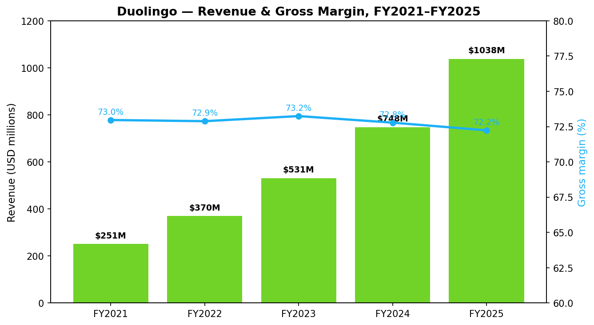
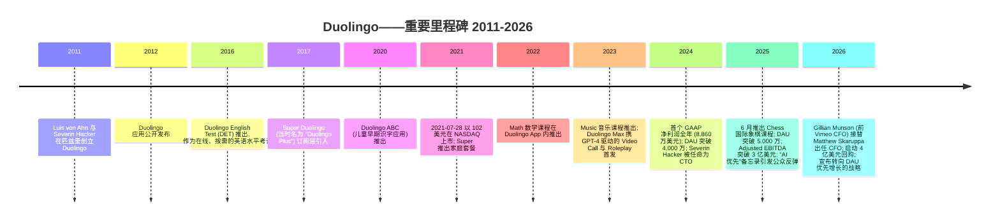
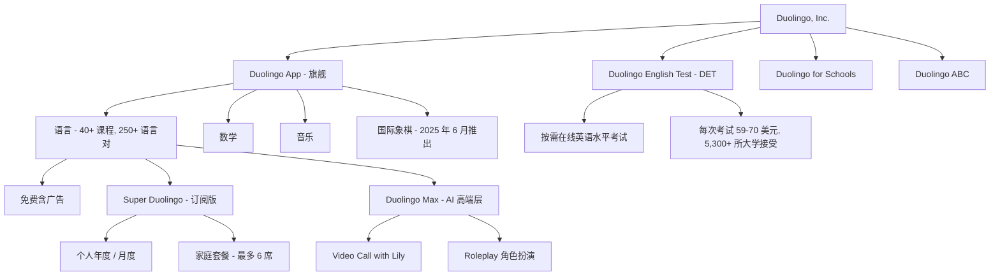
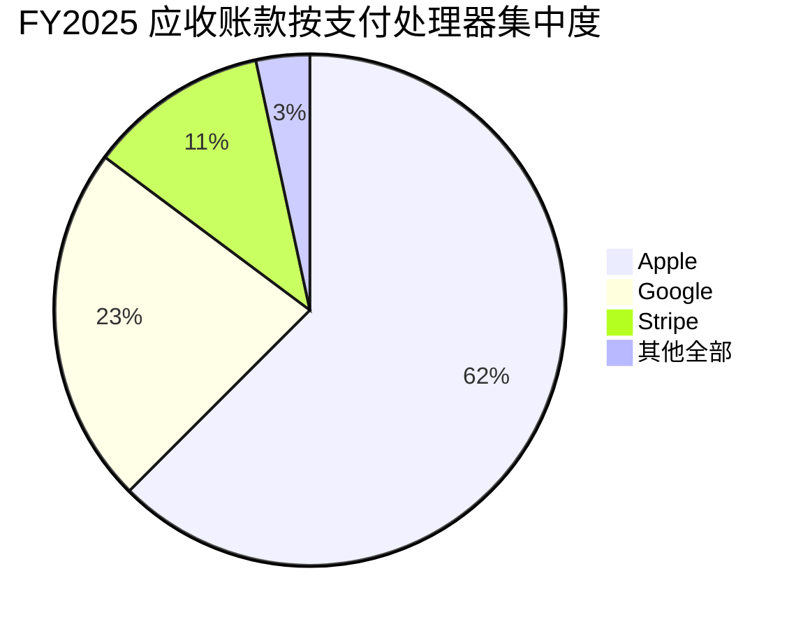
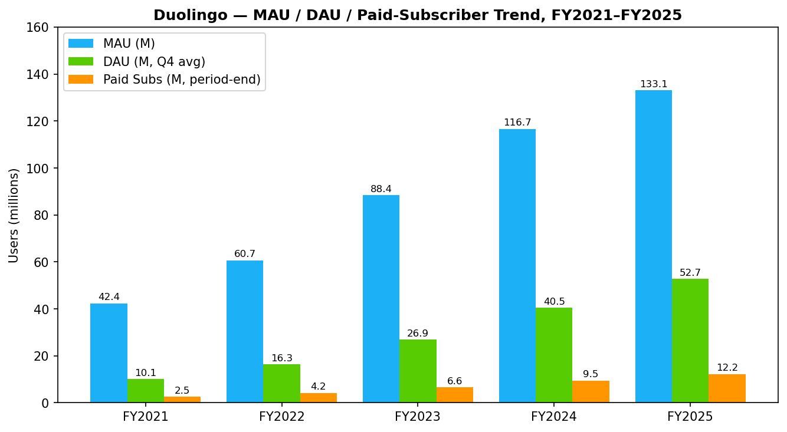
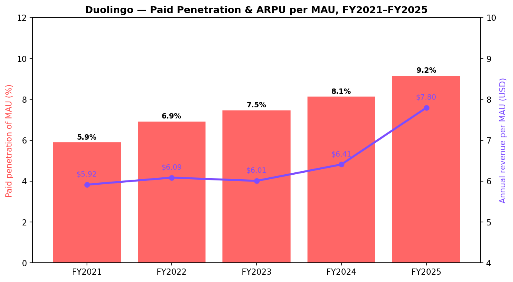
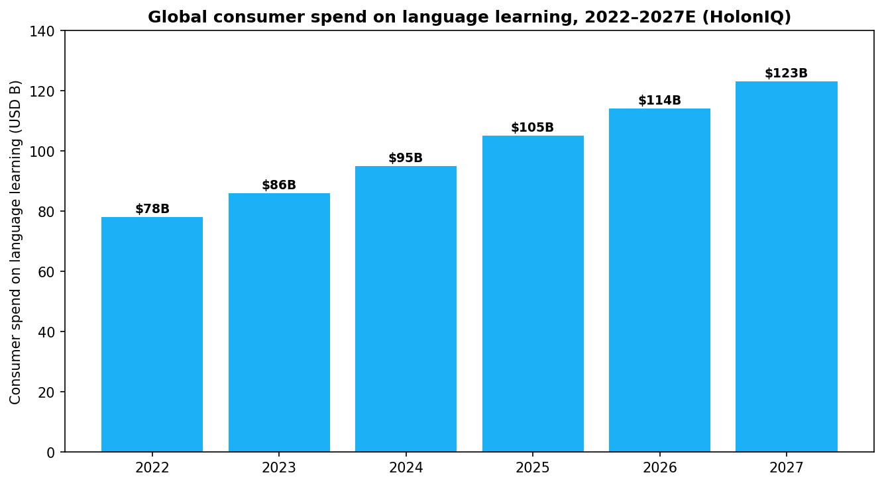
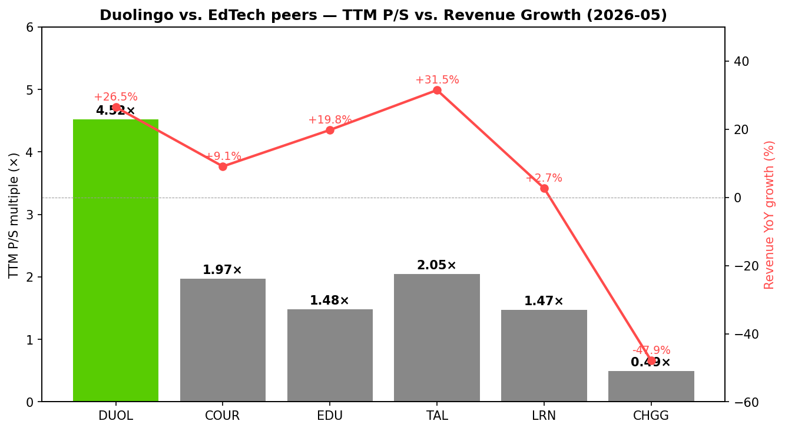
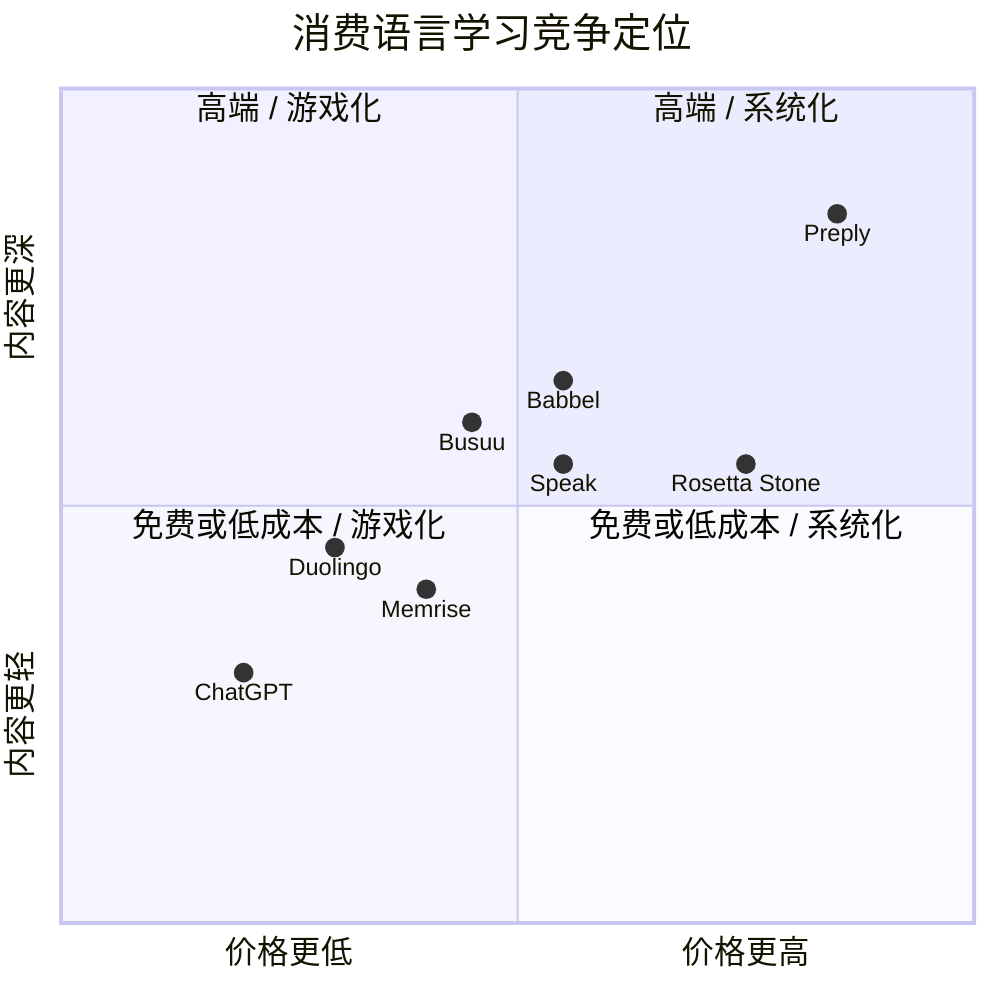
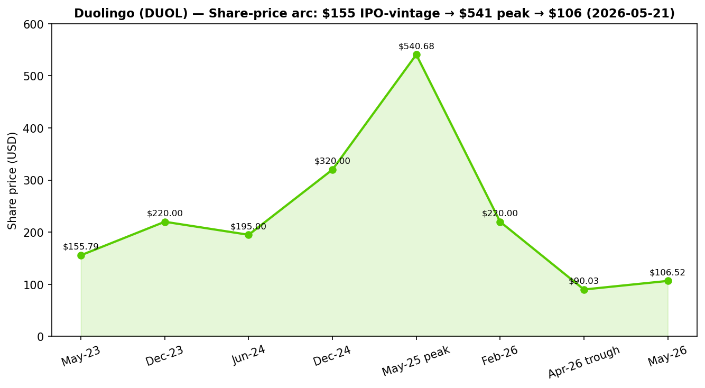

# Duolingo, Inc. (NASDAQ:DUOL) — 公司研究报告

**截至日期: 2026-05-20**
**分析师: 本报告基于 SEC 一手文件、公司官网及文中具名第三方来源整理。**
**代码/上市地: DUOL / 纳斯达克全球精选市场 (NASDAQ Global Select Market)**
**总部: 美国宾夕法尼亚州匹兹堡市宾大道 5900 号, 邮编 15206**
**报告语言: 简体中文 (英文版同时存在于本目录)**

> **业绩更新——2026 财年订单量 (bookings) 与 EBITDA 指引以较低轨迹重申 (2026-05-04):** 管理层重申 2026 全年指引——订单量 12.80 亿美元 (同比约 +10.5%, 对比 2025 年约 +33%)、营业收入 12.05 亿美元 (同比约 +16.1%)、Adjusted EBITDA 3.10 亿美元 (利润率约 25.7%, 较 2025 财年 29.5% 下降)。该指引明确承担约 5 个百分点的订单量逆风 ("超过 5,000 万美元的让出订单量"), 来源于移除付费转化摩擦, 以及将 Video Call (视频通话) 功能由 Max 高端层下放至 Super 层, 服务于"到 2028 年达成 1 亿 DAU"的明确目标。来源: [Duolingo Q1/FY2026 股东信, 2026-05-04](https://www.sec.gov/Archives/edgar/data/1562088/000162828026029790/q1fy26duolingo3-31x26share.htm)。

---

## 目录

1. 公司概览
2. 公司历史
3. 管理团队
4. 产品与服务
5. 客户与上市策略
6. 行业概览
7. 竞争格局
8. 市场机会 (TAM)
9. 风险评估
10. 参考资料

---

## 1. 公司概览

Duolingo, Inc. 是一家总部位于匹兹堡、于特拉华州注册成立的"移动优先"教育公司, 其旗舰应用——用公司自己的 10-K 表述——已"自然成长为全球最受欢迎的语言学习方式 (language learning), 并在应用商店教育类别中的总收入排名第一", 在 Google Play 和 Apple App Store 双平台均为如此。截至 2025 年 12 月 31 日, Duolingo 向"1.3 亿多月活跃用户 (Monthly Active Users, MAU) 提供超过 250 个语言课程", 并作为单一可报告分部运营 ([Duolingo 10-K FY2025, 第 6 页](https://www.sec.gov/Archives/edgar/data/1562088/000162828026012494/duol-20251231.htm))。语言学习仍然是核心, 但公司在此之上积极扩张——Math (数学, 2022 年推出)、Music (音乐, 2023 年推出)、Chess (国际象棋, 2025 年 6 月推出) 现都整合在旗舰应用内, 仅 Chess 一项在"不到一年内就达到了 700 万以上 DAU" ([Duolingo Q4/FY2025 股东信, 2026-02-26](https://www.sec.gov/Archives/edgar/data/1562088/000162828026012246/q4fy25duolingo12-31x25shar.htm))。

**Duolingo 如何盈利。** 商业模式为 freemium (免费增值): 所有课程免费, 但无广告访问加上 AI 驱动的学习功能以 Super Duolingo (订阅版, 按月或按年, 含六席家庭套餐) 形式销售; 或以更高一层的 Duolingo Max 订阅形式销售, Max 包含 GPT 级别的 AI 功能 ([Duolingo Max 博客发布公告, 2023-03-14](https://blog.duolingo.com/duolingo-max/))。订阅收入是绝对主导杠杆——8.734 亿美元占 10.376 亿美元营业收入的 84%。免费课程上的广告、独立的 Duolingo English Test (DET, 杜林戈英语测试) 高利害关系英语水平考试, 以及应用内购买 (in-app purchases, IAP) 合计构成剩余 16% (1.641 亿美元"其他") ([Duolingo 10-K FY2025, 第 68 页](https://www.sec.gov/Archives/edgar/data/1562088/000162828026012494/duol-20251231.htm))。

**规模指标 (2025 财年)。** 营业收入达 10.376 亿美元, 同比 +39%; 毛利润 7.495 亿美元, 毛利率 72.2%; Adjusted EBITDA 3.059 亿美元, 利润率 29.5%; 自由现金流 (free cash flow, FCF) 3.604 亿美元, FCF 利润率 34.7%; GAAP 净利润 4.141 亿美元 (受一次性 2.567 亿美元税收优惠虚高所致——该优惠来自释放联邦和州递延税资产的估值备抵) ([Duolingo 10-K FY2025, 第 60 页](https://www.sec.gov/Archives/edgar/data/1562088/000162828026012494/duol-20251231.htm))。2025 年 Q4 MAU 平均 1.331 亿, 较一年前的 1.167 亿增长 14%; DAU (日活跃用户, Daily Active Users) 平均 5,270 万, 对比一年前 4,050 万 (+30%); DAU/MAU 比率由 34.7% 扩大至 39.6%——对于一款消费应用特许经营而言, 这是极为出色的活跃度指标 ([Duolingo 10-K FY2025, 第 60–61 页](https://www.sec.gov/Archives/edgar/data/1562088/000162828026012494/duol-20251231.htm))。付费订阅用户 2025 年末达 1,220 万, 同比 +28%; 付费渗透率 (MAU 中付费占比) 达约 9.2%。

**运营地域。** Duolingo 默认是全球化的——应用在所有 App Store 与 Google Play 运营的国家都可获取, 内容以 40 多种界面语言教授——但公司作为单一可报告、地理未细分分部运营, CEO 担任首席运营决策者 ([Duolingo 10-K FY2025, 第 91–92 页](https://www.sec.gov/Archives/edgar/data/1562088/000162828026012494/duol-20251231.htm))。约 80% 以上的营业收入通过 Apple、Google 和 Stripe 作为支付处理中介收取——2025 年末三者分别占总应收账款的 62.5%、22.7% 和 11.4%——这是一项结构性特征, 在第 9 节作为关键风险反复出现 ([Duolingo 10-K FY2025, 第 92 页](https://www.sec.gov/Archives/edgar/data/1562088/000162828026012494/duol-20251231.htm))。

**员工。** 10-K 描述员工群体"包括超过 430 名工程师", 专注于打造"世界上最复杂的教育平台"; 公司任务感异常强烈, 并以自豪地位于硅谷以外的匹兹堡总部为标志 ([Duolingo 10-K FY2025, 第 5 页](https://www.sec.gov/Archives/edgar/data/1562088/000162828026012494/duol-20251231.htm))。

*来源: [Duolingo 10-K FY2025, 第 67 页](https://www.sec.gov/Archives/edgar/data/1562088/000162828026012494/duol-20251231.htm) 以及 FY21-FY23 历年 10-K。*

### 估值快照 (截至 2026-05-21)

- **股价:** 106.52 美元
- **市值:** 49.6 亿美元
- **流通在外股数 (Class A + Class B):** 约 4,678 万股 (4,040 万 Class A + 636 万 Class B); 完全摊薄约 4,970 万股 ([Duolingo DEF 14A 2026, 第 59 页](https://www.sec.gov/Archives/edgar/data/1562088/000162828026025728/duol-2026defx14a.htm); [Duolingo Q1/FY2026 股东信, 第 9 页](https://www.sec.gov/Archives/edgar/data/1562088/000162828026029790/q1fy26duolingo3-31x26share.htm))
- **TTM P/E:** 12.2 倍——**但该数据具有误导性。** 2025 财年 GAAP 净利润 4.141 亿美元包含一次性 2.567 亿美元来自释放递延税资产估值备抵的税收优惠 ([Duolingo 10-K FY2025, 第 60 页注释 (1)](https://www.sec.gov/Archives/edgar/data/1562088/000162828026012494/duol-20251231.htm))。剔除这一项后, 调整后净利润约 1.57 亿美元, 对应**调整后 TTM P/E 约 31.5 倍**。基于前瞻一致预期, P/E 约为 13.4 倍 (Yahoo Finance 数据序列)。
- **TTM P/S:** 4.52 倍 (Yahoo Finance 关键统计, 2026-05-21)
- **EV/Revenue (TTM):** 3.47 倍; **EV/EBITDA (TTM):** 21.5 倍。
- **52 周区间:** 87.89–540.30 美元。当前股价较 2025 年 5 月 14 日 540.68 美元的历史高点下跌约 80% (yfinance 价格历史)。
- **3 年期 P/S 区间:** 大约 4 倍至 25 倍。在 2025 年 5 月高点时, P/S 当时基于约 8.7 亿美元 TTM 营业收入达到约 22–25 倍; 当前 4.5 倍是 Duolingo 自 IPO 以来的最低估值倍数。
- **行业可比中位数 (TTM P/S):** COUR (2.0 倍)、EDU (1.5 倍)、TAL (2.0 倍)、LRN (1.5 倍)、CHGG (0.5 倍), 五家中位数约 1.7 倍。Duolingo 仍然是同业中位数的 2.5–3 倍。来源: yfinance 数据, 2026-05-21。

**解读——这个倍数刚刚发生了什么。** Duolingo 经历了本轮周期中最剧烈的 12 个月消费互联网估值下调之一。2025 年 5 月的峰值定价基于持续 30% 以上的营业收入增长加上 AI 驱动的扩张性运营杠杆的逻辑。两件事打破了这一逻辑: (1) DAU 增长从 2024 年 Q4 的同比 +51% 减速至 2025 年 Q4 的 +30%, 管理层明确指引 2026 年 DAU 增速"约 20%"——这是该公司作为上市公司首次出现低于 30% 的 DAU 增速 ([Duolingo Q4/FY2025 股东信, 第 3 页](https://www.sec.gov/Archives/edgar/data/1562088/000162828026012246/q4fy25duolingo12-31x25shar.htm)); (2) 管理层将这一减速搭配了一项有意为之的战略转向——将 Video Call (Max 层旗舰功能) 下放至更廉价的 Super 层, 并去除原本用于推动付费转化的应用内摩擦——"在 2026 年让出超过 5,000 万美元的订单量" ([Duolingo Q4/FY2025 股东信, 第 4 页](https://www.sec.gov/Archives/edgar/data/1562088/000162828026012246/q4fy25duolingo12-31x25shar.htm))。Q4 发布次日股价盘中跌约 22%, [Class Central](https://www.classcentral.com/report/duolingos-q4-2025/) 将其标题为"创纪录营业收入、创纪录股价跌幅、一次大规模回购"。

**4.5 倍 P/S 仍是溢价吗?** 是的, 但目前与同业的差距是可辩护而非靠故事支撑的。Duolingo 2025 财年营业收入增长 39% (同业中位数约 10%), 毛利率 72% (同业中位数约 50–60%), FCF 利润率约 35%, 几乎无传统债务, 现金 11 亿美元。在 25%+ 稳态营业利润率下, 4–5 倍营业收入倍数是高品质、低流失消费订阅业务的典型区间 (对比 Spotify、Netflix、EA 在成熟阶段的估值)。这次估值下调实际上把 DUOL 从主题性 AI 溢价拉回到可辩护的优质成长性倍数。我们在第 9 节中保留估值/倍数压缩风险, 但鉴于仍优异的增长与利润率配置, 将其标记为中等——而非极端——风险。

---

## 2. 公司历史

Duolingo 于 2011 年 11 月在匹兹堡由 Luis von Ahn (路易斯·冯安, 当时为卡内基梅隆大学计算机科学教授) 和他的博士生 Severin Hacker (塞维林·哈克) 共同创立。两人均为卡内基梅隆 CS 系校友 (von Ahn 早先于 2009 年将 reCAPTCHA 出售给 Google; Hacker 是瑞士人, 拥有苏黎世联邦理工学院 ETH Zurich 的理学学士学位) ([Duolingo DEF 14A 2026, 第 12 页](https://www.sec.gov/Archives/edgar/data/1562088/000162828026025728/duol-2026defx14a.htm))。创立时的核心命题: 语言学习是教育门类中富国与穷国接入差距最大的最大垂直市场, 而一款移动优先、免费、游戏化的产品能有意义地缩小这一差距。最初的商业模式完全免费提供应用, 通过众包翻译实现盈利; 2017 年才叠加 freemium 订阅模式。

**值得标注的三大战略转向。** 第一, 2017 年推出 Super (当时名为 "Plus") 是公司历史上最具决定性的举动: 它将一款备受喜爱但不盈利的消费应用转变为 freemium 订阅业务, 现已突破 8.73 亿美元的年订阅收入。第二, 2023 年推出搭载 GPT-4 的 Duolingo Max 是公司的"AI 原生"时刻——是首款在付费层内嵌入前沿大语言模型功能的主要消费应用 ("Video Call with Lily"——一个流利、持续的 AI 对话伙伴) ([Duolingo Max 博客发布公告, 2023-03-14](https://blog.duolingo.com/duolingo-max/))。第三, 2025 年 Q4 战略转向——以牺牲 5 个百分点以上的 2026 年订单量增长, 将 Video Call 下放至 Super、移除付费转化摩擦, 并以 2028 年 1 亿 DAU 为目标——是公司自 IPO 以来首次正式选择增长优于近期利润率扩张 ([Duolingo Q4/FY2025 股东信, 第 3-5 页](https://www.sec.gov/Archives/edgar/data/1562088/000162828026012246/q4fy25duolingo12-31x25shar.htm))。

**并购**历来规模较小且为补丁式。公司 2024 年收购了位于底特律的动画工作室 Gunner (在并购交易及整合成本披露中提及); 2025 年收购了 NextBeat Gaming Studio 团队以重制 Music 课程, Q4 2025 信函中明确点名 ([Duolingo Q4/FY2025 股东信, 第 4 页](https://www.sec.gov/Archives/edgar/data/1562088/000162828026012246/q4fy25duolingo12-31x25shar.htm))。10-K 披露 2025 财年并购交易及整合成本为 480 万美元 (2024 财年为 80 万美元), 证实并购在公司层面仍属规模微不足道 ([Duolingo 10-K FY2025, 第 63 页](https://www.sec.gov/Archives/edgar/data/1562088/000162828026012494/duol-20251231.htm))。

**近期动态 (过去 12 个月)。** 2025 年 4 月的"AI 优先"员工备忘录——宣布逐步淘汰 AI 可吸纳工作的合同工——在社交平台引发公众反弹; CEO 随后澄清不会裁掉任何全职员工 ([Fortune, 2025-08-18](https://fortune.com/2025/08/18/duolingo-ceo-admits-controversial-ai-memo-did-not-give-enough-context-insists-company-never-laid-off-full-time-employees/); [The Register, 2025-04-29](https://www.theregister.com/2025/04/29/duolingo_ceo_ai_first_shift/))。Chess 课程于 2025 年 6 月发布 ([Duolingo Chess 博客文章, 2025-06-10](https://blog.duolingo.com/chess-course/))。2026 年 1 月 12 日, 公司公告 CFO 更迭——Gillian Munson (在 2026 年 2 月之前担任 Duolingo 董事会成员、前 Vimeo CFO) 自 2026 年 2 月 23 日起接替 Matt Skaruppa ([Duolingo 8-K, 2026-01-12](https://www.sec.gov/Archives/edgar/data/1562088/000162828026001730/cfoappointmentpressrelease.htm))。2026 年 2 月 26 日, 公司公告战略转向与 4 亿美元股票回购计划, 截至 2026 年 5 月 1 日已回购约 51.4 万股 (约 5,060 万美元), 相当于 100% 以上的 2025 年净稀释 ([Duolingo Q1/FY2026 股东信, 第 9 页](https://www.sec.gov/Archives/edgar/data/1562088/000162828026029790/q1fy26duolingo3-31x26share.htm))。

---

## 3. 管理团队

### Luis von Ahn 博士——联合创始人、总裁、首席执行官兼董事长

Luis von Ahn (路易斯·冯安, 47 岁) 是 Duolingo 唯一最具决定性的人物, 无论是经济上——他持有 Class B 普通股 55.2%, 代表 40.0% 的总投票权——还是运营上; 他同时担任总裁、CEO 和董事长, 没有独立的非执行董事长 ([Duolingo DEF 14A 2026, 第 59 页](https://www.sec.gov/Archives/edgar/data/1562088/000162828026025728/duol-2026defx14a.htm))。他自公司 2011 年 8 月成立以来一直担任 CEO——15 年的创始人-CEO 任期对于这一规模的美国上市消费科技公司而言极为罕见。

Duolingo 之前, von Ahn 是 reCAPTCHA 的创始人兼 CEO——这家安全与数据收集创业公司开创了"输入弯曲字符"的反垃圾邮件工具。他于 2009 年将 reCAPTCHA 出售给 Google——这笔交易最终在 Google Books 与 Google Street View 中放入了数千年人工标注的训练数据 ([Duolingo DEF 14A 2026, 第 12 页](https://www.sec.gov/Archives/edgar/data/1562088/000162828026025728/duol-2026defx14a.htm))。在 reCAPTCHA 之前, von Ahn 还是卡内基梅隆研究生时期与他人共同发明了 CAPTCHA 本身, 并开创了"人本计算 (human computation)"的学术领域——用群众解决计算机无法解决的问题——为此他在 2006 年获得了麦克阿瑟基金会"天才"奖学金。他拥有杜克大学数学学士学位和卡内基梅隆大学计算机科学博士学位。

他于 2020 年 10 月至 2022 年 10 月期间担任 Root, Inc. (一家汽车保险技术公司) 董事; 在 Duolingo 之外, 他没有其他当前运营职务 ([Duolingo DEF 14A 2026, 第 12 页](https://www.sec.gov/Archives/edgar/data/1562088/000162828026025728/duol-2026defx14a.htm))。他是高度引人瞩目的公众人物——TED 演讲 (他 2011 年的"大规模在线协作"演讲已获得超过 400 万次观看)、播客节目 (Tim Ferriss、Lenny's Newsletter、Acquired) 以及在 X 上活跃——他的股东信件采用第一人称、使命主导、对战略权衡异常直接 (Q4 2025 信函明确将"牺牲 2026 年订单量"框架为一项深思熟虑的长期价值最大化选择)。

**持股与薪酬。** Von Ahn 的持股包括直接持有 3,352,995 股 Class B 普通股, 另加 22.6 万股; 按 2026-05-21 价格 106.52 美元计, 在期权或限制性股票之前, 他的 Class B 经济权益约 3.98 亿美元。Class B 每股 20 票, 对比 Class A 每股 1 票——因此创始人对治理的控制极为集中。DEF 14A 披露了 2025 年针对 von Ahn 和 Hacker 的特殊多年期表现挂钩的创始人奖励, 围绕长期股价门槛设计, 用以替代大额现金薪酬 ([Duolingo DEF 14A 2026, 第 39 页](https://www.sec.gov/Archives/edgar/data/1562088/000162828026025728/duol-2026defx14a.htm))。

**业绩记录评判。** Von Ahn 在 14 年内将 Duolingo 从 0 → 1.3 亿+ MAU、超过 10 亿美元营业收入, 几乎没有摊薄、没有重大并购, 而其免费用户基数比美国 K-12 外语学生总人口还多。他属于少数将类别定义型消费软件特许经营从概念阶段经过 IPO 推进到 GAAP 盈利的创始人 CEO 之一。2025 年 4 月的"AI 优先"备忘录是一次沟通——而非内容——上的失误, 公司也已公开坦诚地修正叙述。他是教育科技 (EdTech) 行业最接近 Reed Hastings 或 Brian Chesky 级别的人物。

### Gillian Munson——首席财务官 (自 2026 年 2 月起)

Munson (55 岁) 于 2026 年 2 月 23 日加入担任 CFO, 接替 Matt Skaruppa, 后者将以过渡顾问身份留任至 2026 年 11 月 20 日 ([Duolingo DEF 14A 2026, 第 22 页](https://www.sec.gov/Archives/edgar/data/1562088/000162828026025728/duol-2026defx14a.htm); [Duolingo 8-K, 2026-01-12](https://www.sec.gov/Archives/edgar/data/1562088/000162828026001730/cfoappointmentpressrelease.htm))。Munson 自 2019 年 9 月起担任 Duolingo 董事会成员, 在出任 CFO 前担任审计委员会主席。

她此前的上市公司 CFO 经验深厚且高度相关。从 2022 年 4 月至 2025 年 9 月, 她担任 Vimeo 的 CFO——这家纳斯达克上市的 B2B 视频平台具有类似的消费者到准专业人士的盈利动态。从 2013 年到 2019 年, 她担任 XO Group (The Knot Inc. 母公司) 的 CFO, 在公司转向私有化的艰难过渡期内负责上市公司财务。她还曾担任 Iora Health 的 CFO、Union Square Ventures 的风险投资合伙人 (2019 年 4 月 – 2021 年 7 月), 她的股票研究与资本市场职业阶段在 Allen & Company 担任董事总经理 (Managing Director), 更早在 Morgan Stanley 担任高级股票分析师。她拥有 Colorado College 政治学与经济学的学士学位, 并担任 Phreesia, Inc. 董事。

业界卖方普遍将此次任命解读为董事会希望在 CFO 席位上拥有资深资本市场的能力, 以助公司应对 2026 年重置叙事; 她在 Allen & Company 给消费互联网故事定价的经验直接适用。

### Severin Hacker 博士——联合创始人、首席技术官兼董事

Hacker (41 岁) 于 2011 年 8 月与 von Ahn 共同创立 Duolingo, 此后持续担任 CTO ([Duolingo DEF 14A 2026, 第 13 页](https://www.sec.gov/Archives/edgar/data/1562088/000162828026025728/duol-2026defx14a.htm))。他拥有苏黎世联邦理工学院 (ETH Zurich, 瑞士联邦理工学院) 计算机科学学士学位和卡内基梅隆大学计算机科学博士学位。Hacker 实际拥有 3,058,858 股 Class B 普通股——占该类别 47.7%, 占总投票权 35.8%——持股大致与 von Ahn 相当。两位联合创始人合计直接持有约 76% 的投票权, 对于一家已成立的公开消费公司而言, 这是异常集中的控制结构。同事形容他与 von Ahn 是相反类型——更安静、更技术、更系统架构导向——并与 CEO Natalie Glance 合作经营工程组织。

### Robert Meese——首席业务官

Meese (49 岁) 自 2021 年 3 月起担任首席业务官, 自 2016 年 9 月加入 Duolingo 任业务副总裁, 并于 2018 年 12 月至 2021 年 3 月期间担任首席收入官。他此前在 Google 担任高级商业职位——Google Play 游戏业务全球开发总监 (Director, Global Head of Games Business Development for Google Play)——这一背景在结构上具有相关性, 因为 Google Play (与 Apple App Store 一起) 是 Duolingo 80%+ 营业收入流经的两大分发渠道之一。他拥有宾夕法尼亚大学经济学与计算机科学双学士学位, 以及麻省理工学院斯隆管理学院 (MIT Sloan) 的 MBA ([Duolingo DEF 14A 2026, 第 22 页](https://www.sec.gov/Archives/edgar/data/1562088/000162828026025728/duol-2026defx14a.htm))。

### 治理小结

**董事会构成 (2026 年股东大会后被提名董事)。** 共九名董事, 分为三类。Class II 被提名人 (2029 年任期): Amy Bohutinsky (前 Zillow COO, TCV 运营合伙人)、Bonnie Ross (Microsoft Gaming 旗下 343 Industries / Halo 系列的创始人, 2024 年 12 月加入——明显是 Duolingo 推进相邻游戏化主题如 Chess 的信号), 以及 Jim Shelton (前美国教育部副部长、现任 Blue Meridian Partners CEO)。继续任职的 Class III 董事: Luis von Ahn、Sara Clemens (前 Twitch / Pandora COO)、Severin Hacker。继续任职的 Class I 董事: Bing Gordon (Kleiner Perkins, 前 EA、Take-Two)、John Lilly (Greylock, 前 Mozilla CEO)、Mario Schlosser (Oscar Health 联合创始人)。所有非创始人董事均符合 NASDAQ 独立性规则 ([Duolingo DEF 14A 2026, 第 10-15 页](https://www.sec.gov/Archives/edgar/data/1562088/000162828026025728/duol-2026defx14a.htm))。

**内部人持股。** 全体董事和高管合计控制 76.0% 的投票权 (Class A 占 1.3%; Class B 占 99.9%), 其中创始人占绝大多数。最大的非创始人 Class A 持有人为 Baillie Gifford & Co. (持有 12.1% Class A, 2.9% 投票权)、BlackRock (8.5%, 2.1%)、FMR/Fidelity (6.8%, 1.6%) 和 Capital World Investors (5.8%, 1.4%) ([Duolingo DEF 14A 2026, 第 59-60 页](https://www.sec.gov/Archives/edgar/data/1562088/000162828026025728/duol-2026defx14a.htm))。

**薪酬结构。** 偏重股权且包含大量与业绩挂钩的部分。von Ahn 与 Hacker 的 2025 年特殊多年期表现挂钩创始人奖励的归属取决于多年期股价门槛 ([Duolingo DEF 14A 2026, 第 39 页](https://www.sec.gov/Archives/edgar/data/1562088/000162828026025728/duol-2026defx14a.htm))。2026 年完全摊薄股本预计因股权授予增长约 3.5–4%, 部分被 4 亿美元回购抵消 ([Duolingo Q1/FY2026 股东信, 第 9 页](https://www.sec.gov/Archives/edgar/data/1562088/000162828026029790/q1fy26duolingo3-31x26share.htm))。除标准免责协议外, 未披露任何重大关联方交易。

### 业绩记录综合

Duolingo 由一支创始人控制的团队运营, 该团队在过去 14 年内打造出后移动时代最高品质的消费软件故事之一——从零营业收入到 10 亿美元以上、FCF 利润率 35%+, 同时明显以使命为驱动。2026 年战略转向是 von Ahn 作为上市公司 CEO 所采取的最高风险资本配置决策, 也是评估这支团队的正确框架。主要的管理层缺口是新上任的 CFO; 主要的治理缺口是双层股权结构——它实质上使创始人豁免于上市公司问责——这是投资者必须接受的特征。

---

## 4. 产品与服务

Duolingo 的产品面由一个消费旗舰组织——Duolingo App——加上独立的 Duolingo English Test 和两个长尾产品 (Duolingo for Schools、Duolingo ABC)。公司作为单一可报告分部运营, 但按产品类型披露营业收入: 订阅 (8.73 亿美元, 占 FY25 营业收入 84%) 和其他 (1.64 亿美元, 包含广告、DET 和 IAP) ([Duolingo 10-K FY2025, 第 68 页](https://www.sec.gov/Archives/edgar/data/1562088/000162828026012494/duol-20251231.htm))。

### Duolingo App——旗舰

Duolingo App 是世界下载量最大的教育应用, 也是 Google Play 和 Apple App Store 双平台教育类别中收入排名第一的应用 ([Duolingo 10-K FY2025, 第 9 页](https://www.sec.gov/Archives/edgar/data/1562088/000162828026012494/duol-20251231.htm))。免费提供, 每节课结束有广告, 2025 年 Q4 拥有 1.33 亿 MAU。在旗舰应用内, 四大主题领域现已共存:

**语言。** 核心。超过 250 个语言课程, 跨 40 多种界面语言, 采用专有的"Duolingo 方法"——小巧、游戏化、经过 A/B 测试的课程, 配合连胜机制 (streak)、联赛和角色 (其中 Duo 猫头鹰 (Duo the owl) 是最具辨识度的)。公司通过 AI 大举扩展内容: "仅 2026 年 Q1, 我们就发布了 20,500 个课程单元……高于 2025 年每季度 7,100 个和 2024 年每季度 1,800 个" ([Duolingo Q1/FY2026 股东信, 第 4 页](https://www.sec.gov/Archives/edgar/data/1562088/000162828026029790/q1fy26duolingo3-31x26share.htm))。九种最受学习的语言——英语、西班牙语、法语、德语、意大利语、日语、韩语、中文、葡萄牙语——目前内容均覆盖到 Duolingo Score 129 (CEFR B2——足以胜任专业用途)。

**竞争优势: 是——很强。** 护城河类型: **品牌 + 规模 + 数据 + 生态系统锁定。** 证据: 全球语言学习应用使用量 60% 份额 ([Business of Apps 《语言学习营业收入与使用统计》, 2026](https://www.businessofapps.com/data/language-learning-app-market/)); "Duolingo"品牌搜索量在 Google 上超过"learn Spanish"——出自公司表述 ([Duolingo 10-K FY2025, 第 6 页](https://www.sec.gov/Archives/edgar/data/1562088/000162828026012494/duol-20251231.htm)); 4,300 万+ 拥有 7 天连胜的 DAU 与 1,500 万+ 拥有 365 天连胜的 DAU——极大规模的日常习惯锁定; 一个每日约 20 亿次练习的学习数据集驱动 A/B 测试优势的累积复合。最接近的直接竞争对手: **Babbel** (私营, 德国, 2024 年营业收入 2.7 亿美元——来自 [Business of Apps](https://www.businessofapps.com/data/language-learning-app-market/), Duolingo 的订阅收入约 3 倍于此); 定位上 Babbel 更系统化、更面向成人专业人士, Duolingo 更游戏化、覆盖更广。

**数学 (Math)。** 2022 年在旗舰应用内推出; 包含标准对齐的 K-12 课程加上成人心算练习。管理层在 Q4 2025 将 Math 与 Chess 共同标记为两大"下一个用户增长引擎", 引用全球可接触人数为"约 10 亿人……在全球范围内学习 K-12 数学" ([Duolingo Q4/FY2025 股东信, 第 4 页](https://www.sec.gov/Archives/edgar/data/1562088/000162828026012246/q4fy25duolingo12-31x25shar.htm))。**竞争优势: 部分。** 产品不错, 但 K-12 数学教育科技领域拥挤 (Khan Academy、IXL、Brilliant)。Duolingo 在此的护城河是品牌和游戏化, 而非内容深度。最接近的竞争对手: **Khan Academy**——免费、覆盖更广的课程、但非游戏化且活跃度更低; Duolingo 在用户粘性上领先, 在学术严谨性上落后。

**音乐 (Music)。** 2023 年推出; 教授音乐识谱与弹奏歌曲。2024 年夏天 Duolingo 收购了 NextBeat Gaming Studio 团队以重制该课程, "使其更有趣、更具游戏感" ([Duolingo Q4/FY2025 股东信, 第 4 页](https://www.sec.gov/Archives/edgar/data/1562088/000162828026012246/q4fy25duolingo12-31x25shar.htm))。**竞争优势: 否。** 音乐教育科技由 Yousician (唱歌/演奏)、Simply Piano (具体乐器) 以及若干相邻学习应用主导。当前产品规模偏小; 计划中的重制是一项 12–24 个月的押注。

**国际象棋 (Chess)。** 2025 年 6 月 10 日在 iOS 上线 ([Duolingo Chess 博客文章, 2025-06-10](https://blog.duolingo.com/chess-course/))。课程从棋子移动开始, 逐步构建到战略; 游戏内导师是名为 Oscar 的角色。Mini-match 训练、PvP 模式、扩展至 Android, 以及支持英语、西班牙语、法语、德语、意大利语、葡萄牙语等六种语言的推广, 都在过去一年内完成。管理层报告"不到一年时间内超过 700 万 DAU"——使 Chess 成为 Duolingo 历来最快的新主题爬坡 ([Duolingo Q4/FY2025 股东信, 第 4 页](https://www.sec.gov/Archives/edgar/data/1562088/000162828026012246/q4fy25duolingo12-31x25shar.htm))。**竞争优势: 部分至是**——在休闲/初学者市场端。护城河类型: 品牌 + 游戏化 + 进入 Duolingo 现有 1.3 亿 MAU 应用的分发渠道。最接近的竞争对手: **Chess.com** (私营; 据报道拥有 2 亿以上注册用户——用户基数远大——但首先是游戏平台, 其次是学习产品); Duolingo 的产品在硕士/俱乐部级别上结构性互补, 而非直接竞争。

### 订阅层级——Super Duolingo 和 Duolingo Max

**Super Duolingo。** 主要付费层。去除广告, 解锁无限错误次数 ("hearts"), 历史上还解锁了进度上的便利。截至 2026 年 5 月的定价: 个人套餐每月 12.99 美元或每年 83.99 美元; 六席家庭套餐每年 119.99 美元 ([dealnews.com Duolingo 定价 2026](https://www.dealnews.com/features/duolingo/cost/); [Spliiit Duolingo 家庭套餐 2026](https://www.spliiit.com/en/blog/duolingo-prix-famille))。家庭套餐 (Family Plan) 是 LTV 最高的产品, 因为它显著降低了人均净 ARPU——每人每年低于 20 美元——同时显著扩大了单次获客的总席位数。**竞争优势: 是——很强。** 由基础应用护城河加上定价杠杆驱动; Babbel 的年度套餐在 AI 功能可比的情况下定价更贵。最接近的竞争对手: **Babbel Premium**——每月单价更高, 类似功能但缺少 Duolingo 的游戏化。

**Duolingo Max。** 2023 年 3 月发布, 作为首款嵌入 GPT-4 级 AI 功能的主要消费订阅 ([Duolingo Max 博客文章, 2023-03-14](https://blog.duolingo.com/duolingo-max/))。定价 29.99 美元/月或 168 美元/年 ([Beginners in AI "Duolingo Max 详解"](https://beginnersinai.org/duolingo-max-explained/))。关键功能: **Video Call with Lily** (实时 AI 对话伙伴; 据 Q1 FY26 信函称, 过去一年使用户的平均口语单词量翻倍) 和 **Roleplay** (与 AI 反馈的脚本化真实场景)。注意: 原本是 Max 功能的 Explain My Answer 已于 2026 年初对所有用户免费。

**关键产品更新——2026 年 5 月。** 作为战略转向的一部分, Video Call 正从 Max 移入 Super, "向大约 10 倍数量的学习者提供至关重要的学习功能——口语对话练习" ([Duolingo Q4/FY2025 股东信, 第 3 页](https://www.sec.gov/Archives/edgar/data/1562088/000162828026012246/q4fy25duolingo12-31x25shar.htm))。这降低了 Max 的价值主张, 也是 FY26 订单量逆风的主要驱动。**变化后 Max 的竞争优势: 部分。** 护城河类型: 技术 + 生态系统 (GPT-4 集成已成为资金充裕的消费 AI 应用的入门门槛——Speak、Pingo、ChatGPT 本身)。最接近的竞争对手: **Speak** (Y Combinator / OpenAI Startup Fund 支持; AI 优先对话应用), 以及 OpenAI 自家的 ChatGPT Voice 配合训练于语言学习的 custom GPTs。Duolingo 对它们的护城河是综合课程和 1.3 亿 MAU 漏斗, 而非 AI 对话技术本身。

### Duolingo English Test (DET)

2016 年推出。可在任何地点、任何时间、使用网络摄像头和智能手机参加的按需、计算机自适应英语水平评估。自 2026 年 6 月起价格为每次 59 美元 (或两次 98 美元), 相比 IELTS 或 TOEFL 大约 250 美元 ([goarno.io Duolingo English Test 价格 2026](https://goarno.io/blog/how-much-does-the-duolingo-english-test-cost/); [Duolingo English Test 申请人页面](https://englishtest.duolingo.com/applicants))。被"全球超过 6,100 个教育项目"接受, 其中 5,300+ 为高等教育项目, 包括所有常春藤盟校、MIT 和斯坦福, 以及国际生入学率排名前 25 的美国本科项目中的 24 所 ([Duolingo 10-K FY2025, 第 7 页](https://www.sec.gov/Archives/edgar/data/1562088/000162828026012494/duol-20251231.htm))。

**竞争优势: 是——具有监管顺风的强大护城河。** 护城河类型: **双边网络效应 + 规模 + 成本领先。** 越多大学接受 DET, 越多考生参加 DET; 越多考生参加 DET, 越多大学接受 DET。与 TOEFL/IELTS 的成本差距约为 4 倍; 这是一种结构性成本领先优势, 现任者无法在不蚕食自身物理考场营业收入的情况下复制。最接近的竞争对手: **TOEFL** (ETS, 约 255 美元/次)、**IELTS** (British Council / IDP, 约 245 美元/次)、**Pearson PTE Academic** (约 199 美元/次)。DET 在国际生录取层面对所有三家都在抢夺份额; 在移民/工作签证场景中, 由于机构惯性更高, 传统考试仍保留优势。

### 其他举措

**Duolingo for Schools。** 一个基于网页的教师仪表板, 让 K-12 教师能跟踪以 Duolingo 作为课堂补充材料的学生 ([Duolingo 10-K FY2025, 第 10 页](https://www.sec.gov/Archives/edgar/data/1562088/000162828026012494/duol-20251231.htm))。免费产品; 通过提升旗舰应用使用率间接变现。竞争优势: 部分——在美国 K-12 补充市场有用但非主要课程。

**Duolingo ABC。** 一款免费、独立的应用, 教 young children 早期识字 (阅读)。2020 年推出。具战略性; 对营业收入不重要。竞争对手: Khan Academy Kids。

### 旗舰 vs 长尾

旗舰是 Duolingo App (计 Super + Max + 广告 + IAP 时约占营业收入 95%+)。English Test 是一个高估值倍数的增长期权 (大概营业收入 3-5%, 未披露)。Schools 和 ABC 是使命产品, 非财务驱动。未来 12 个月将取决于 Chess 和 Math 能否成为真正的营业收入线, 还是仍仅作为 DAU 漏斗。

### 过去 12 个月的产品发布/下线

- **Chess 课程**——2025 年 6 月在 iOS 推出, 扩展到 Android、六种语言, 至年底推出 PvP 模式 ([Duolingo Chess 博客文章, 2025-06-10](https://blog.duolingo.com/chess-course/))。
- **口语优先功能**在 2026 年 Q1 推出——Spoken Tokens (大部分练习改用语音替代点击)、Flashcards、Speaking Adventures ([Duolingo Q1/FY2026 股东信, 第 3 页](https://www.sec.gov/Archives/edgar/data/1562088/000162828026029790/q1fy26duolingo3-31x26share.htm))。
- **Video Call 下放至 Super 层** (2025 年 Q4 公告, 2026 年逐步推出)——2026 年最重要的产品变化。
- **Music 课程**——继 NextBeat Gaming Studio 团队收购后, 2026 年宣布全面重制。
- **Explain My Answer** 在 2026 年初从 Max 移至对所有用户免费。
- **LinkedIn 集成**在 Duocon 2025 公告——DET 分数现可显示于 LinkedIn 个人资料 ([Duolingo Duocon 2025 新闻稿, 2025-10](https://investors.duolingo.com/news-releases/news-release-details/duolingo-unveils-major-product-updates-turn-learning-real-world))。

---

## 5. 客户与上市策略

### 客户群

Duolingo 是一家 B2C 消费互联网业务, 有两种独立的营业收入客户类型: (1) **终端用户学习者**, 为 Super 或 Max 订阅付费, 或通过广告展示变现; (2) **应试者及教育项目录取办公室**, 为 Duolingo English Test 结果付费及接收。Duolingo for Schools 免费提供, 无营业收入。Duolingo 不是 B2B SaaS 公司——没有大型企业合同, 没有政府许可交易对损益表产生重大影响。

在约 1.33 亿 MAU 的消费学习者基础中:
- **约 9.2% 是付费订阅用户** (1,220 万 / 1.331 亿)。从 IPO 时的约 5% 上升至此, 反映稳定但渐缓的订阅变现。
- **约 91% 是免费用户**, 通过应用内广告 + 偶尔的 IAP 变现。战略转向明确指出, 下一阶段增长来自扩大这一免费池, 而非压榨付费层 ([Duolingo Q4/FY2025 股东信, 第 4 页](https://www.sec.gov/Archives/edgar/data/1562088/000162828026012246/q4fy25duolingo12-31x25shar.htm))。

公司自家 10-K 的措辞捕捉了客户广度: "我们的学习者来自整个社会经济光谱, 从亿万富翁和名人到最近安置的难民" ([Duolingo 10-K FY2025, 第 6 页](https://www.sec.gov/Archives/edgar/data/1562088/000162828026012494/duol-20251231.htm))。

### 客户集中度

在 B2C 订阅模型中, 客户集中度**以分发/支付渠道侧——而非终端用户侧——衡量**。Duolingo 没有披露单个学习者经济, 但 10-K 明确说明了支付处理器层面的结构性集中风险:

> "前三大服务提供商, Apple、Google 和 Stripe, 分别占截至 2025 年 12 月 31 日总应收账款的 62.5%、22.7% 和 11.4%。前两大服务提供商, Apple 和 Google, 分别占截至 2024 年 12 月 31 日总应收账款的 64.7% 和 21.2%。"
> 来源: [Duolingo 10-K FY2025, 第 92 页](https://www.sec.gov/Archives/edgar/data/1562088/000162828026012494/duol-20251231.htm)

**以应收账款为代理, 这是极端的客户集中度配置**——仅 Apple 一家就占应收账款 60% 以上, Apple + Google 合计约 85%。我们将其视为重大风险, 并带入第 9 节。缓解因素是 Apple/Google 在商业意义上并非客户——它们不能在不违反自身平台合同的情况下停止处理 Duolingo 的付款——但它们能够也确实改变抽成率 (App Store 与 Play Store 费率, 目前在 15-30% 之间, 取决于订阅期限)、要求应用政策变更, 或在极端情况下拒绝特定功能发布。

### 分发渠道

三个渠道至关重要:
1. **Apple App Store**——按营业收入排名的主要渠道。Apple 抽取首年订阅营业收入的 30%, 之后为 15%。10-K 将依赖 App Store 单独列为一项风险因素 ([Duolingo 10-K FY2025, 第 17-18 页](https://www.sec.gov/Archives/edgar/data/1562088/000162828026012494/duol-20251231.htm))。
2. **Google Play Store**——次要渠道。与 Apple 相同的抽成结构。
3. **Duolingo 在 duolingo.com 的网站**——既是营销门户, 也是直接面向消费者的支付渠道 (通过 Stripe 处理), 绕过 Apple/Google 费用。网页购买订阅的利润率应高于通过移动应用购买的订阅; 公司未披露具体比例。

### 销售策略与周期

无企业销售模式。获客是四条腿的板凳:
- **自然/口碑。** 历史上 70%+ 的新用户获取; "Duolingo 学习者社区通过口碑病毒式传播实现自然增长" ([Duolingo 10-K FY2025, 第 11 页](https://www.sec.gov/Archives/edgar/data/1562088/000162828026012494/duol-20251231.htm))。
- **品牌营销。** 自有社交渠道 (Duo 猫头鹰角色出现在 TikTok、Instagram、X) 对于教育科技品牌而言异常具有病毒性; 像"Dead Duo" (2025 年 Q1——Duo 在一次营销噱头中被象征性"杀死") 的活动产生了空前的互动, 推动 2025 年 Q1 DAU 同比增长 49% ([Duolingo Q1/FY2026 股东信, 第 8 页](https://www.sec.gov/Archives/edgar/data/1562088/000162828026029790/q1fy26duolingo3-31x26share.htm))。2026 年 Q1 21% 的 DAU 增长被描述为"叠加 Dead Duo 对比基数"。
- **自有媒体 (推送通知、电子邮件、应用内重新激活)。** 以激进著称; 那个为连胜唠叨用户的推送通知角色已经成为自身的一个迷因。
- **付费获取。** 选择性且集中于自然认知度低的市场。FY2025 销售与营销费用 1.257 亿美元, 约营业收入 12%——对于这种规模的消费互联网公司而言相对克制, 也是 FCF 利润率如此之高的关键原因 ([Duolingo 10-K FY2025, 第 69 页](https://www.sec.gov/Archives/edgar/data/1562088/000162828026012494/duol-20251231.htm))。

### 合作伙伴关系与案例

Duolingo English Test 合作伙伴网络是最具体的可货币化合作伙伴特许经营——5,300+ 高等教育机构接受 DET 分数, 包括每所常春藤盟校、MIT 和斯坦福。在 Duocon 2025 公告的 LinkedIn DET 分数集成将这些考试结果转化为可携带的就业认证信号 ([Duolingo Duocon 2025 新闻稿](https://investors.duolingo.com/news-releases/news-release-details/duolingo-unveils-major-product-updates-turn-learning-real-world))。

OpenAI 被提及为 Duolingo Max 发布时 (2023 年 GPT-4) 的基础前沿模型; 公司此后已多元化, 利用"我们在 AI 和机器学习方面的专长……有效且高效地集成外部 AI 模型以改进我们的产品" ([Duolingo 10-K FY2025, 第 9 页](https://www.sec.gov/Archives/edgar/data/1562088/000162828026012494/duol-20251231.htm))。

*来源: [Duolingo 10-K 文件, FY2021-FY2025](https://www.sec.gov/cgi-bin/browse-edgar?action=getcompany&CIK=0001562088&type=10-K&dateb=&owner=include&count=40), Q4 用户指标披露。*

*来源: ARPU 计算为 FY 营业收入 / Q4 平均 MAU; 付费渗透率 = 期末付费订阅用户 / Q4 平均 MAU。底层数据来自 [Duolingo 10-K FY2025, 第 60-61 页](https://www.sec.gov/Archives/edgar/data/1562088/000162828026012494/duol-20251231.htm) 及历年 10-K。*

---

## 6. 行业概览

Duolingo 在一组相互交叠的可寻址行业内运营——全球消费语言学习、消费教育科技 (consumer EdTech)、在线测评以及邻近的"趣味优先"游戏化学习类别 (数学、音乐、国际象棋)。最干净的自上而下规模划分是语言学习类别, 这也是当今主要的营业收入驱动力。

### 行业定义与范围

全球**消费语言学习市场**涵盖 (1) 免费与付费移动应用 (Duolingo、Babbel、Memrise、Busuu、Drops、Mondly、HelloTalk); (2) 一对一在线辅导平台 (Preply、italki、Cambly); (3) 传统软件/桌面 (Rosetta Stone); (4) 课堂式商业语言学校 (EF Education First、Berlitz、inlingua); (5) 教育体系课程 (学校外语课程、公立大学语言课程——许多在使用时免费)。Duolingo 的 10-K 引用 HolonIQ 市场规模数字"到 2027 年达到约 1,230 亿美元", 用于线上加线下语言学习的合计消费支出 ([Duolingo 10-K FY2025, 第 6 页](https://www.sec.gov/Archives/edgar/data/1562088/000162828026012494/duol-20251231.htm), 引用 [HolonIQ, 2024 年 1 月](https://www.holoniq.com/))。

Duolingo 因扩张而当前竞争的相邻行业: **K-12 补充学习** (Khan Academy、IXL、Khan Academy Kids——全球市场达数百亿美元)、**音乐教育** (Yousician、Simply Piano、Skoove、Flowkey)、**国际象棋平台** (Chess.com、Lichess、ChessKid), 以及**在线英语测评** (ETS-TOEFL、British Council / IDP-IELTS、Pearson PTE Academic)。

### 市场规模、增长与结构

- **语言学习专项。** [Business of Apps](https://www.businessofapps.com/data/language-learning-app-market/) 编纂的行业估算将语言学习*应用*市场单独估值为 2025 年约 70-90 亿美元, 至 2033 年以 16.2% CAGR 增长。这是包含线下学校与成人教育的 1,230 亿美元总数字的一个子集。在*应用*这一切片内, Duolingo 是营业收入领跑者 (FY2025 10.4 亿美元) 和下载量/MAU 份额领跑者 (语言学习应用使用份额约 60%, 来自 [Business of Apps](https://www.businessofapps.com/data/language-learning-app-market/))。
- **消费教育科技总体。** 全球消费教育科技类别 2024 年覆盖所有科目时在 500-700 亿美元区间, 来自 [HolonIQ](https://www.holoniq.com/) (最新发布的研究)。
- **英语水平评估。** ETS 据报道每年管理约 200-300 万次 TOEFL iBT 考试, 每次约 255 美元 (~5-7.5 亿美元), IELTS 每年管理约 300-400 万次, 每次约 245 美元 (~7.5-10 亿美元); 合计国际英语水平评估市场约每年 20-30 亿美元。Duolingo 的 DET 以 59-70 美元/次正在抢占份额, 但披露的考试量数据尚未拆分。

*来源: 柱形数值平滑自 HolonIQ 估算的"消费语言学习支出到 2027 年达到约 1,230 亿美元", 引用于 [Duolingo 10-K FY2025, 第 6 页](https://www.sec.gov/Archives/edgar/data/1562088/000162828026012494/duol-20251231.htm)。中间年份数值为示意性插值。*

### 增长驱动因素——历史与预测

**历史驱动因素 (2015-2025):**
1. **新兴市场智能手机渗透**——Duolingo 的 MAU 基础与全球智能手机安装基数同步扩张; 公司现在是巴西、墨西哥、印度和印度尼西亚等市场最大的已安装应用特许经营之一。
2. **英语作为全球经济基础设施**——Duolingo 的 10-K 明确: "英语可以释放巨大的经济机会" ([Duolingo 10-K FY2025, 第 6 页](https://www.sec.gov/Archives/edgar/data/1562088/000162828026012494/duol-20251231.htm))。流利英语在全球劳动力市场上获得的溢价支撑了语言应用的支付意愿曲线。
3. **游戏化 + 移动原生 UX**——Duolingo 的课程循环属于最早将学习视为移动优先、连胜日常产品的, 此后整个类别都跟随而来。
4. **生成式 AI 作为学习赋能者**——2023 年 GPT-4 的发布以接近零边际成本实现了人类质量的对话伙伴, 在结构上重塑了对话练习差距。

**预测驱动因素 (2025-2030):**
- AI 驱动的内容扩展坍塌了单位内容创建成本 (Duolingo 在 2026 年 Q1 发布了 20,500 个课程单元, 是 2024 年 Q1 季度节奏的 11 倍, 来自 Q1 FY26 信函), 使得快速扩展到长尾语言和科目成为可能。
- AI 驱动的对话/辅导功能终于弥合了长期阻碍仅靠移动端学习者达到真正流利度的"口语练习差距"。
- 移动学习*向相邻科目* (数学、音乐、国际象棋) 的扩张, 打开了比仅语言大约 10 倍的可寻址市场。

### 关键趋势——GenAI 的交叉电流

最重要的单一行业趋势是生成式 AI, 对 Duolingo 它两面切割:

**顺风端。** Duolingo Max 的 Video Call 功能, 由前沿 LLM 驱动, 是两年前以任何价格都无法构建的东西。它是"前沿模型实验室本身之外最具商业成功的消费 AI 产品之一", 出自 CEO 表述 ([Duolingo Q4/FY2025 股东信, 第 3 页](https://www.sec.gov/Archives/edgar/data/1562088/000162828026012246/q4fy25duolingo12-31x25shar.htm))。GenAI 还估计将内容创建的单位成本坍塌了一个数量级。它让 Duolingo 的数据护城河得以复合——每个口语练习都产生一组标记的音频-文本配对, 改进模型。

**威胁端。** ChatGPT、Claude 和 Gemini 都提供任意语言中的免费、高质量对话练习。一个有动力的学习者完全可以用 ChatGPT 的语音模式 + custom GPTs 以零边际成本自主完成整个流利度旅程。Duolingo 推出的"对所有用户免费口语练习"——Spoken Tokens、Flashcards、Speaking Adventures——部分是对此的防御性回应。管理层在 10-K 风险因素中承认了竞争压力: "随着翻译服务和产品 (如提供翻译的可穿戴设备) 改进并更广泛地可用和使用, 人们可能普遍对语言学习失去兴趣" ([Duolingo 10-K FY2025, 第 17-18 页](https://www.sec.gov/Archives/edgar/data/1562088/000162828026012494/duol-20251231.htm))。

### 监管环境

相对于医疗或金融服务为轻, 但非微不足道:
- **App Store / Play Store 规则**定义 Duolingo 能销售什么、什么价格、什么抽成。Apple 对外部支付链接的演进处理 (Epic v. Apple 之后) 以及欧盟 DMA 开放替代支付处理器整体是利好, 但操作上复杂。
- **儿童隐私法** (美国 COPPA、欧盟/英国类似) ——Duolingo 通过主应用与 ABC 直接服务年轻学习者; 受重大合规义务约束。
- **DET 教育凭证接受度**——DET 的价值依赖于持续的录取办公室接受度, 这是机构协商而非法律保证。失去顶尖学校群体的接受将显著降低品牌价值。
- **AI 监管**——欧盟 AI 法案和美国 AI 指导框架将日益限制 AI 生成的教育内容如何标记和使用; 目前尚未对 Duolingo 产品构成约束性限制。

### 行业动态——碎片化、供应商/买方力量、替代品

语言学习应用行业在**长尾高度碎片化, 在头部高度集中。** Duolingo 按 Business of Apps 编纂占应用使用份额约 60%; 次大纯类 (Babbel) 在营业收入上小约 3 倍。其下数十家竞争应用的长尾迅速碎片化。

- **供应商力量**集中在两处: (1) Apple/Google 分发几乎所有移动应用营业收入并对其征 15-30% 税——这是商业模式最重要的结构性成本。(2) 前沿模型实验室 (OpenAI、Anthropic、Google) 提供驱动 Video Call 的 LLM; Duolingo 在此处有灵活性 (它集成"多个外部 AI 模型"——[Duolingo 10-K FY2025, 第 9 页](https://www.sec.gov/Archives/edgar/data/1562088/000162828026012494/duol-20251231.htm)) 但无法完全退出依赖。
- **买方力量**在终端学习者侧基本为零——个体用户每月支付 7-30 美元, 无谈判。买方力量仅在 DET 上下文有意义, 大型大学客户可以协商批量接受安排。
- **替代品**丰富且是格局的永久特征——免费 YouTube 内容、ChatGPT、免费大学公开课程 (OCW)、播客以及通过 Preply / italki 的真人辅导员都是实时替代品。

---

## 7. 竞争格局

### 直接竞争对手 (纯类语言学习应用)

- **Babbel**——总部柏林, 私营 (LSP 背书)。来自 [Business of Apps, 2026](https://www.businessofapps.com/data/language-learning-app-market/), Babbel 2024 年营业收入约 2.7 亿美元 (Duolingo 订阅收入约 3.2 倍)。Babbel 将自己定位为更系统化、更面向成人专业人士; 课程由语言学家设计, 时长更长; 定价与 Duolingo 相当, 但无免费层且免费漏斗小得多。内容严谨性上有差异化; 在用户规模和品牌上落后。
- **Memrise**——总部英国, 私营。核心机制是间隔重复 (spaced repetition), 以母语者视频片段作为主要教学单位。已转向 AI 对话练习 ("MemBot") 以与 Duolingo Max 竞争。规模小于 Babbel 和 DUOL。
- **Busuu**——总部英国; 2022 年被 Chegg (NYSE:CHGG) 收购。以母语者社区驱动的反馈区分。营业收入子规模; Chegg 自身更广泛的压力 (来自 yfinance, 2026-05-21, TTM 营业收入下降 -47.9%) 限制了投资。
- **Rosetta Stone**——现在是 IXL Learning (私营) 的一部分。传统桌面品牌; 方法论基于沉浸式无母语解释。营业收入轨迹停滞; 移动端牵引力极小。
- **Mondly**——2022 年被 Pearson 收购。投资不足; 在 Pearson 更广泛的业务中更多作为英语市场内的产品发挥作用, 而非作为独立的 Duolingo 竞争对手。

### 间接竞争对手

- **Khan Academy** (非营利)——在数学和任何未来 K-12 学术科目上与 Duolingo 竞争。课程深度更大, 无变现压力; Duolingo 的优势是游戏化和参与度, 而非学术严谨性。
- **Preply、italki、Cambly**——实时一对一人类辅导市场。价格点 (~10-30 美元/小时) 和价值主张 (真人对话) 不同, 但它们替代 Duolingo Max 的 AI 对话功能。
- **Coursera (NYSE:COUR)、Udemy**——更广泛的 MOOC/技能平台; 提供作为更广泛目录一部分的语言课程。Coursera 在显著较慢的增长 (TTM 营业收入 +9%, 对比 DUOL +27%) 下交易 2.0 倍 P/S, 而 DUOL 4.5 倍——说明市场仍将 DUOL 定价于教育科技同业中位数之上。
- **中国教育科技 (EDU - 新东方、TAL - 好未来)**——商业模式相邻, 但主要在 K-12 监管改革后的中国辅导市场运营, 单位经济结构性不同。EDU 1.5 倍 P/S, TAL 2.0 倍 P/S 强调地区/监管折扣; 这些不是直接竞争对手, 而更多是同业倍数的锚点。
- **Stride Inc (NYSE:LRN)**——K-12 在线学校运营商。商业模式不同 (每生学费), 但是一个有用的"具盈利能力的消费教育科技"对比; 交易 1.5 倍 P/S。
- **Chegg (NYSE:CHGG)**——拥有 Busuu 并运营被 ChatGPT 颠覆的作业帮助业务, TTM 营业收入下降 -47.9%。当护城河单薄时, 这是消费教育科技被生成式 AI 颠覆的警示故事。

### 新兴 AI 优先竞争对手

- **OpenAI ChatGPT**——免费语音模式 + 训练于语言学习的 custom GPTs 可以说是最具颠覆性的替代品。威胁对自主成人学习者最为尖锐; Duolingo 的游戏化日常习惯模型和 1.3 亿 MAU 品牌是防御性护城河。
- **Speak**——风险投资支持的 AI 优先语言学习应用 (OpenAI Startup Fund 是支持者之一)。专注于与 AI 的口语练习。用户基础较小; UX 差异化; 是 Max/Video Call 价值主张的真实竞争对手。
- **Pingo、Univerbal**——AI 对话优先的语言应用。当前规模偏小。

*来源: 来自 yfinance 的 DUOL、COUR、EDU、TAL、LRN、CHGG 数据, 截至 2026-05-21。TTM P/S = 过去 12 个月市销率; 营业收入增长 = yfinance 报告的同比营业收入增长。*

### 定位框架

### Duolingo 的竞争优势

1. **品牌与分发。** Duolingo 是非英语母语消费者唯一能说出名字的语言学习品牌; "Duolingo"的搜索量超过该活动本身的搜索量 ([Duolingo 10-K FY2025, 第 6 页](https://www.sec.gov/Archives/edgar/data/1562088/000162828026012494/duol-20251231.htm))。
2. **免费层漏斗。** 91% 的 MAU 不付费, 但它们驱动口碑获取和广告营业收入。没有其他主要语言应用拥有这种规模的自然分发。
3. **数据和 A/B 测试规模。** 每天完成的近 20 亿次练习生成全球最大的消费语言学习数据集; 每季度运行"数百次 A/B 测试" ([Duolingo 10-K FY2025, 第 8-9 页](https://www.sec.gov/Archives/edgar/data/1562088/000162828026012494/duol-20251231.htm))。
4. **通过 AI 内容生成实现成本领先。** 每季度生成 20,500 个课程单元——大致是生成式 AI 之前速率的 11 倍——绝对增量成本很小。没有同等工程深度的竞争对手无法匹敌。
5. **相邻科目的可扩展性。** 数学、音乐、国际象棋为 Duolingo 提供了纯类语言竞争对手所缺乏的可选性。
6. **盈利能力与自由现金流。** 35%+ FCF 利润率和 11 亿美元现金为 Duolingo 提供了持久的资本灵活性 (并买下了在股价回撤中宣布 4 亿美元回购的能力)。

### 竞争脆弱性

1. **AI 替代 Max 价值主张的风险。** ChatGPT 语音模式是最高价层旗舰功能的近免费替代品。将 Video Call 下放至 Super 的转向至少部分是防御性回应。
2. **Apple/Google 分发依赖**——已在客户集中度中涵盖。
3. **品牌单一性**——单一吉祥物, 单一声音。Duo 猫头鹰异常受爱戴, 但如果品牌曾经转负 (2025 年 4 月 AI 优先备忘录的反弹表明这可能很快发生), 损害会在巨大的 MAU 基础上累积。
4. **非语言科目内容护城河有限。** 国际象棋和数学目前的成功依赖 Duolingo 的 UX 包装和免费分发。直接内容竞争对手 (Chess.com、Khan Academy) 更深更广。

### 市场份额视图

| 细分 | DUOL 位置 | 最接近的竞争对手 | 近似份额 |
|---|---|---|---|
| 全球语言学习应用使用量 | #1 | Babbel | ~60% vs ~10% (Business of Apps 数据) |
| 语言学习应用营业收入 | #1 | Babbel (2.7 亿美元) | DUOL 8.73 亿美元订阅收入, ~3.2× Babbel |
| 在线英语水平测试 (评估量) | 最快增长 | TOEFL (ETS)、IELTS | DUOL 以 59-70 美元/次抢夺份额, 对比 245-255 美元/次 |
| K-12 数学补充应用 | Top-5 (Math) | Khan Academy | 规模偏小; Khan 在覆盖面上占主导 |
| 休闲/初学者国际象棋学习 | Top-3 (Chess) | Chess.com / Lichess | 11 个月达 700 万+ DAU——成长阶段 |

---

## 8. 市场机会 (TAM)

### TAM 规模

**总可寻址市场——以语言学习为锚。** 引用于 Duolingo 10-K 的 HolonIQ 估计将线上+线下语言学习消费支出到 2027 年定为约 1,230 亿美元 ([HolonIQ, 2024 年 1 月, 引用于 Duolingo 10-K FY2025, 第 6 页](https://www.sec.gov/Archives/edgar/data/1562088/000162828026012494/duol-20251231.htm))。以此为对照, Duolingo 2025 财年 10.4 亿美元的营业收入意味着 TAM 渗透率<1%——一个引人注目的余地数字, 即便承认 1,230 亿美元的大部分位于 Duolingo 无法通过移动应用完全服务的线下学校和成人沉浸式项目中。

**仅在线语言学习**是更相关的 SAM。Business of Apps 将语言学习应用子集定为 2025 年约 70-90 亿美元, 至 2033 年以 16.2% CAGR 增长至约 240 亿美元 ([Business of Apps, 2026](https://www.businessofapps.com/data/language-learning-app-market/))。按此切片, Duolingo 10.4 亿美元约占当今营业收入份额 12%, 即使没有显著份额增长也能与类别增长复合。

**相邻科目显著扩大 TAM。** 来自 CEO 表述, K-12 数学教育全球"在任何给定时间约 10 亿人"在学习 ([Duolingo Q4/FY2025 股东信, 第 4 页](https://www.sec.gov/Archives/edgar/data/1562088/000162828026012246/q4fy25duolingo12-31x25shar.htm))。音乐教育是较小 (~50-100 亿美元) 但支付意愿高的细分。国际象棋作为付费市场要小得多, 但作为强大的 DAU 获取渠道。全球英语水平评估每年约 20-30 亿美元, Duolingo English Test 正以有意义的速度抢夺份额。

### SAM 与 SOM

- **可服务可寻址市场 (Serviceable Available Market, SAM):** Duolingo 通过其移动优先、freemium、游戏化模型能够触达的语言学习、在线评估和相邻教育科技 TAM 份额。我们估计 SAM 在所有四个核心科目 (语言、数学、音乐、国际象棋) 加上 DET 评估特许经营的总和, 到 2030 年达到约 200-250 亿美元。
- **可服务可获得市场 (Serviceable Obtainable Market, SOM):** 假设 Duolingo 保持其在语言学习应用中 60% 的类别份额, 在相邻应用科目获得 5-15% 份额, 并将 DET 增长至国际英语考试市场的 15-25%, 则 2030 年现实营业收入上限在 30-50 亿美元区间——意味着相比当前运行率增长约 3-5 倍, 营业收入 CAGR 15-20%。

### 市场增长预测

- **语言学习应用市场:** 至 2033 年以 16.2% CAGR 增长至约 240 亿美元, 来自 [Business of Apps](https://www.businessofapps.com/data/language-learning-app-market/)。
- **K-12 补充教育科技:** 在成熟市场增速较慢, 但在新兴市场消费细分中年均 10-15% 增长。
- **在线英语水平评估:** 测试量年增长中个位数; 低成本在线考试蚕食实体考场考试时, 美元营业收入增长更快。

### 公司的可服务市场与份额机会

Duolingo 到 2028 年 1 亿 DAU 的目标是 TAM 论点的运营具象化: 在三年内大致将当前 5,270 万 DAU 基础翻倍, 同时扩展科目 (数学、音乐、国际象棋), 使中位 DAU 在多个类别中参与。如以当前每 MAU 约 8 美元的 ARPU 实现 (假设 MAU 按比例扩展至约 2.7 亿+), 隐含营业收入在 2028 年达到 20-25 亿美元区间。如果科目扩展适度提升 ARPU, 管理层战略上限意味着 2028 年退出运行率超过 30 亿美元, 不过这远高于当前卖方一致预期。

### 渗透策略

2025 年 Q4 战略明确以短期变现换取长期 DAU 复合, 通过三个杠杆 ([Duolingo Q4/FY2025 股东信, 第 3-4 页](https://www.sec.gov/Archives/edgar/data/1562088/000162828026012246/q4fy25duolingo12-31x25shar.htm)):
1. **教得更好**——口语优先功能、九种语言内容覆盖至 CEFR B2、每单元末的掌握度检查。
2. **再投资于免费价值**——去除变现摩擦; 将团队产能从转化优化转向漏斗顶端增长实验; 引入不降低 DAU 的"用户友好变现"形式 (头像定制、原生广告)。
3. **培育下一个增长引擎**——加大对国际象棋、数学和音乐的投资, 以扩展科目组合。

1 亿 DAU 的押注是消费互联网领域中最清晰的 TAM 战略陈述之一; 能否成功主要取决于 2026 年的摩擦减少能否恢复减速之前的 +30-40% 同比 DAU 增长率。

---

## 9. 风险评估

### 公司特定风险

**1. 2026 年战略转向的执行风险 (高)。** 管理层自愿牺牲约 5 个百分点的 2026 年订单量增长和约 4-5 个百分点的 EBITDA 利润率, 以服务于 2028 年 1 亿 DAU 的目标 ([Duolingo Q4/FY2025 股东信, 第 4 页](https://www.sec.gov/Archives/edgar/data/1562088/000162828026012246/q4fy25duolingo12-31x25shar.htm))。如果 DAU 增长不再加速, 公司将牺牲真实近期价值而一无所获。该计划同时口径很宽 (Video Call 免费层扩展、摩擦移除、变现团队再分配、三个科目扩展), 增加了执行失误的表面积。缓解因素: 创始人 CEO 具有深厚的运营信誉和强劲的产品速度; ~30% FCF 利润率提供了纠偏缓冲。

**2. 客户 (支付渠道) 集中度——Apple 和 Google (高)。** 2025 年末仅 Apple 一家占应收账款 62.5%, Google 22.7%; 合计约 85% ([Duolingo 10-K FY2025, 第 92 页](https://www.sec.gov/Archives/edgar/data/1562088/000162828026012494/duol-20251231.htm))。任一平台单方面提高抽成、限制应用内订阅层级的政策变更, 或对功能/支付的拒绝, 都可能在一夜之间显著影响营业收入和毛利率。缓解因素: 监管压力 (欧盟 DMA、美国 Epic v. Apple) 正在开启替代支付路径; duolingo.com 直接支付漏斗作为部分对冲存在。

**3. 关键人物对创始人的依赖 (高)。** Luis von Ahn 和 Severin Hacker 通过超级投票 Class B 股票合计控制 76% 的投票权 ([Duolingo DEF 14A 2026, 第 59 页](https://www.sec.gov/Archives/edgar/data/1562088/000162828026025728/duol-2026defx14a.htm))。品牌、产品路线图和文化在个人层面尤其与 von Ahn 紧密相关。任一创始人的损失或长期缺席将是重大负面事件。缓解因素: 14 年运营连续性; 深厚、长期任职的高管班底 (CTO Glance、CBO Meese、CIO/法律顾问 Chen)。

**4. AI 对核心对话练习产品的替代 (高)。** ChatGPT 语音模式及同类提供任意语言的免费、高质量对话。这直接替代 Duolingo Max 的高端功能, 这就是为什么 Q4 2025 计划将 Video Call 从 Max 移入 Super 并向免费用户提供更多口语练习。如果消费者行为转向 LLM 原生学习, Duolingo 的结构性护城河将收窄至品牌、游戏化和课程——有意义但比功能级差异化更弱的辩护。缓解因素: 规模、日常习惯锁定和品牌粘性; Duolingo 自身的 AI 功能在与课程捆绑时仍具竞争力。

**5. 品牌和公关敏感性 (中)。** 2025 年 4 月的"AI 优先"备忘录引发大量公众批评和暂时的社交渠道回撤 ([Fortune, 2025-08-18](https://fortune.com/2025/08/18/duolingo-ceo-admits-controversial-ai-memo-did-not-give-enough-context-insists-company-never-laid-off-full-time-employees/); [The Register, 2025-04-29](https://www.theregister.com/2025/04/29/duolingo_ceo_ai_first_shift/))。Duolingo 的品牌是关键资产, 异常以人格为主导; 进一步失误可能显著降低用户获取。缓解因素: 品牌挺过 2025 年事件未对用户增长造成可测量损害; 管理层对沟通失误坦诚。

**6. 地理集中度——隐含的美国和消费可选支出敞口 (中)。** Duolingo 披露为单一分部, 无地理分解, 但订阅定价在全球范围内以美元计价。美元持续走强或主要收入国家 (美国、巴西、墨西哥、印度、英国) 中任何一个发生衰退都会拖累订单量。缓解因素: 低绝对订阅价格 (7-12 美元/月) 使产品相对抗衰退; 家庭套餐和学生折扣在边际进一步降低价格弹性。

### 行业/市场风险

**7. 生成式 AI 类别颠覆 (高)。** 除了对话练习替代外, 更广泛的风险是如果实时 AI 翻译成熟到足以消除学习语言的实际动机, 语言学习的*类别*本身会缩小——Duolingo 自己也表达了该风险: "随着翻译服务和产品……改进并更广泛地可用和使用, 人们可能普遍对语言学习失去兴趣" ([Duolingo 10-K FY2025, 第 17-18 页](https://www.sec.gov/Archives/edgar/data/1562088/000162828026012494/duol-20251231.htm))。缓解因素: 学习语言的文化/身份/接入动机不会被翻译工具完全替代; 公司向数学、音乐和国际象棋的扩张减少单一类别敞口。

**8. 来自资金充裕 AI 优先入局者的竞争强度 (中)。** Speak、ChatGPT 原生学习应用以及前沿模型实验室自身, 可以以最小增量成本构建直接竞争的产品。进入门槛低, 10-K 也承认 ([Duolingo 10-K FY2025, 第 17 页](https://www.sec.gov/Archives/edgar/data/1562088/000162828026012494/duol-20251231.htm))。缓解因素: 现任者可以复合的分发和品牌规模经济。

**9. App Store / Play Store 政策与监管变化 (中)。** Apple/Google 控制分发规则、抽成结构和支付处理。政策变更——无论是平台主导还是监管驱动——都可能扰乱成本结构, 正面 (欧盟 DMA) 或负面 (对订阅营销或推荐费用的进一步限制) 均可能。缓解因素: 网页直接订阅漏斗。

### 财务风险

**10. 股权激励 (stock-based compensation, SBC) 稀释超过回购 (中)。** 2026 年 SBC 指引为"近 15% 营业收入", 全年绝对费用增长, 管理层预期完全摊薄股本在 2026 年增长 3.5–4% (任何回购活动之前) ([Duolingo Q1/FY2026 股东信, 第 9 页](https://www.sec.gov/Archives/edgar/data/1562088/000162828026029790/q1fy26duolingo3-31x26share.htm))。4 亿美元回购计划抵消了约 100% 的 2025 年稀释, 但不是永久性的股东友好机制。缓解因素: GAAP 盈利能力和强劲的 FCF 使持续回购可负担; 管理层明确承诺"管理稀释"。

**11. 估值/倍数压缩风险 (中)。** TTM P/S 4.5 倍, 仍约为教育科技同业中位数 (~1.7 倍) 的 2.5–3 倍。股价已从 2025 年 5 月高点压缩约 80%, 但持续的 DAU 增长令人失望或 AI 功能进一步商品化, 可能推动倍数走向中等增长消费互联网公司典型的 2-3 倍 P/S 区间 ([yfinance 同业数据, 2026-05-21](https://finance.yahoo.com/quote/DUOL/key-statistics))。在 2026 年增量营业收入约 2 亿美元的情况下, 重新定价至 3 倍 P/S 意味着市值约 36 亿美元, 对比当前约 50 亿美元——即在基本面没有进一步恶化的情况下进一步约 28% 的下行。缓解因素: 毛利率>70% 和 FCF 利润率>30% 支持比教育科技同业更高的稳态倍数; 管理层在压低价格时的回购传递了信心。

### 宏观经济风险

**12. 外汇 (FX) 敞口 (中)。** Duolingo 在许多货币中收取订阅, 并以美元报告。Q1 FY26 信函指出, 报告与不变汇率口径相比, 营业收入和订单量有约 5 个百分点的 FX 顺风 ([Duolingo Q1/FY2026 股东信, 第 9 页](https://www.sec.gov/Archives/edgar/data/1562088/000162828026029790/q1fy26duolingo3-31x26share.htm))。美元走强将迅速逆转这一顺风。缓解因素: 主要非美元市场的订阅定价定期调整。

**13. 消费可选支出周期性 (低-中)。** 全球衰退将减少付费层转化和广告营业收入; 然而 Super 的绝对月成本 (7-12 美元) 较低, 家庭套餐每席不到 20 美元/年, 高度抗压。缓解因素: 低绝对价格和广泛的地理敞口。

*来源: 来自 yfinance 的 DUOL 日收盘价历史, 2023 年 5 月 – 2026 年 5 月。2025 年 5 月 540.68 美元的高点对 2026 年 4 月 90.03 美元的低点意味着 11 个月内约 83% 的回撤。*

---

## 参考资料

### 一手文件 (SEC EDGAR)

- [Duolingo Annual Report on Form 10-K, FY2025 (提交于 2026-02-26)](https://www.sec.gov/Archives/edgar/data/1562088/000162828026012494/duol-20251231.htm)
- [Duolingo Annual Report on Form 10-K, FY2024 (提交于 2025-02-27)](https://www.sec.gov/Archives/edgar/data/1562088/000156208825000042/duol-20241231.htm)
- [Duolingo Annual Report on Form 10-K, FY2023 (提交于 2024-02-28)](https://www.sec.gov/Archives/edgar/data/1562088/000156208824000050/duol-20231231.htm)
- [Duolingo Annual Report on Form 10-K, FY2022 (提交于 2023-02-28)](https://www.sec.gov/Archives/edgar/data/1562088/000156208823000052/duol-20221231.htm)
- [Duolingo Quarterly Report on Form 10-Q, Q1 FY2026 (提交于 2026-05-04)](https://www.sec.gov/Archives/edgar/data/1562088/000162828026029976/duol-20260331.htm)
- [Duolingo DEF 14A Proxy Statement 2026 (提交于 2026-04-17)](https://www.sec.gov/Archives/edgar/data/1562088/000162828026025728/duol-2026defx14a.htm)
- [Duolingo Q1/FY2026 股东信——8-K, 2026-05-04](https://www.sec.gov/Archives/edgar/data/1562088/000162828026029790/q1fy26duolingo3-31x26share.htm)
- [Duolingo Q4/FY2025 股东信——8-K, 2026-02-26](https://www.sec.gov/Archives/edgar/data/1562088/000162828026012246/q4fy25duolingo12-31x25shar.htm)
- [Duolingo 8-K, CFO 任命, 2026-01-12](https://www.sec.gov/Archives/edgar/data/1562088/000162828026001730/cfoappointmentpressrelease.htm)

### 公司材料

- [Duolingo Investor Relations](https://investors.duolingo.com/)
- [Duolingo Duocon 2025 产品公告, 2025-10](https://investors.duolingo.com/news-releases/news-release-details/duolingo-unveils-major-product-updates-turn-learning-real-world)
- [Duolingo Max 发布博客文章, 2023-03-14](https://blog.duolingo.com/duolingo-max/)
- [Duolingo Chess 课程发布博客文章, 2025-06-10](https://blog.duolingo.com/chess-course/)
- [Duolingo English Test 申请人主页](https://englishtest.duolingo.com/applicants)
- [Duolingo 功效研究 (efficacy)](https://www.duolingo.com/efficacy)

### 第三方媒体与行业研究

- [Class Central, "Duolingo's Q4 2025: Record Revenue, Record Stock Drop, One Massive Buyback"](https://www.classcentral.com/report/duolingos-q4-2025/)
- [Fortune, 2025-08-18 — "Duolingo CEO admits his controversial AI memo 'did not give enough context'"](https://fortune.com/2025/08/18/duolingo-ceo-admits-controversial-ai-memo-did-not-give-enough-context-insists-company-never-laid-off-full-time-employees/)
- [The Register, 2025-04-29 — "Duolingo ditches more contractors in 'AI-first' refocus"](https://www.theregister.com/2025/04/29/duolingo_ceo_ai_first_shift/)
- [TechCrunch, 2025-05-04 — "Is Duolingo the face of an AI jobs crisis?"](https://techcrunch.com/2025/05/04/is-duolingo-the-face-of-an-ai-jobs-crisis/)
- [Business of Apps — Language Learning Revenue and Usage Statistics, 2026](https://www.businessofapps.com/data/language-learning-app-market/)
- [HolonIQ — Education market sizing](https://www.holoniq.com/)
- [dealnews — Duolingo 定价, 2026 年 5 月](https://www.dealnews.com/features/duolingo/cost/)
- [Spliiit — Duolingo Family Plan 2026](https://www.spliiit.com/en/blog/duolingo-prix-famille)
- [Beginners in AI — Duolingo Max Explained](https://beginnersinai.org/duolingo-max-explained/)
- [goarno.io — Duolingo English Test 价格, 2026](https://goarno.io/blog/how-much-does-the-duolingo-english-test-cost/)

### 市场数据参考

- [Yahoo Finance — DUOL 关键统计](https://finance.yahoo.com/quote/DUOL/key-statistics) (股价、P/E、P/S、EV 比率, 2026-05-21 通过 yfinance Python 库获取)
- [Yahoo Finance — COUR, EDU, TAL, LRN, CHGG 关键统计](https://finance.yahoo.com/quote/COUR/) (同业倍数, 2026-05-21)

---

*报告于 2026-05-20 由 Anthropic Claude 公司研究工作流根据 `/Users/x/projects/financial_agent/.claude/skills/company-research/SKILL.md` 编制。每一项量化主张均来自一手文件或具名第三方出版物的内联溯源。*
